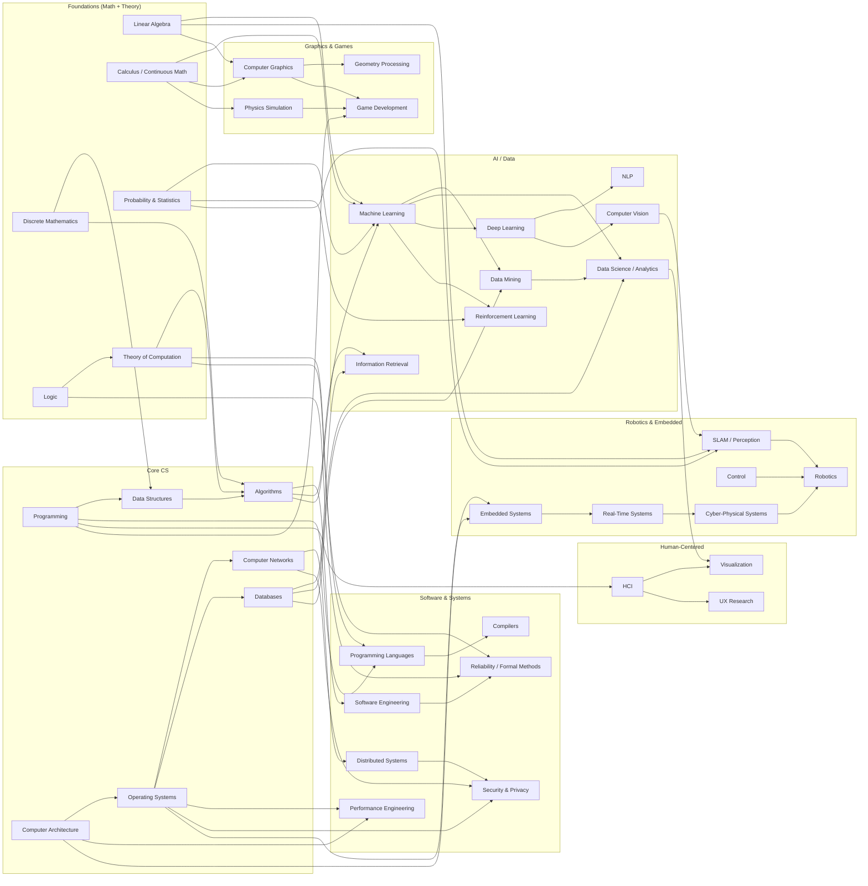

## Knowledge Structure of Computer Science

### First principles and underlying mechanics 

* Representation (bit/symbol/vector encodings; compression; error models) - computing is structured transformation of representations under noise and constraints. "Shannon 1948"
* State and transition (automata; operational steps; protocols as transition systems) - correctness is preservation of intended properties across transitions. "Turing 1936"
* Abstraction barrier (interfaces; information hiding; layering) - scalable reasoning comes from invariants at boundaries. "Parnas 1972"
* Composition (modularity; substitution; compositional semantics) - global behavior built from locally provable components.
* Reduction (problem transformations; equivalence notions; completeness) - inter-theory dependency is mostly reduction-preserving solvability or cost. "Cook 1971"
* Invariant and proof obligation (induction; pre/post; temporal properties) - “why it works” becomes checkable obligations. "Hoare 1969"
* Resource bound (time/space/bandwidth/energy; asymptotics) - feasibility is a resource statement, not only a correctness statement. "Hartmanis–Stearns 1965"
* Uncertainty and inference (probability; generalization; decision under uncertainty) - learning and robust control are inference under partial information. "Valiant 1984"
* Adversariality (strategic opponent; worst-case inputs; hardness assumptions) - security and robustness formalize hostile environments. "Diffie–Hellman 1976"
* Partial failure and coordination (crash/Byzantine; latency/partition; consensus) - distributed semantics must survive unreliable communication. "FLP 1985"

### Pillars 

1 Formal foundations (logic, discrete math, information, optimization)

* Logic and proof theory (soundness/completeness; axiomatization) - the substrate for computability and verification. "Gödel 1931"
* Discrete structures (graphs, combinatorics, number theory; probabilistic method) - the object language of algorithms.
* Information theory (entropy, coding, channel capacity) - quantitative limits of representation and communication. "Shannon 1948"
* Optimization (convexity, duality, gradients; Lagrangians) - the shared engine behind learning and many systems control loops.

2 Computation models and computability (what can be computed)

* Effective computation models (Turing machines; λ-calculus; universality) - formal meaning of “mechanical procedure.” "Church 1936" "Turing 1936"
* Formal languages and automata (regular/CFL; recognizers; grammars) - tractable fragments and compiler theory backbone. "Chomsky 1956–1959"
* Undecidability and impossibility (halting, Rice-style phenomena) - principled boundaries for static analysis and verification.

3 Complexity and limits (what is feasible under resource bounds)

* Complexity measures and classes ($$P, NP, PSPACE, BPP$$; time/space tradeoffs) - feasibility taxonomy for all later design. "Hartmanis–Stearns 1965"
* NP-completeness and reductions (completeness; hardness transfer) - dependency graph of problems via reduction. "Cook 1971" "Karp 1972"
* Randomization and pseudorandomness (concentration; derandomization agenda) - randomness as algorithmic leverage and theoretical lens.
* Interactive proofs and zero knowledge (verifiability as protocol; privacy in proof) - interaction reshapes what can be verified. "GMR 1985"

4 Algorithms and data structures (constructive methods under constraints)

* Algorithmic paradigms (divide-and-conquer; dynamic programming; greedy) - reusable solution schemas tied to proof patterns.
* Graph algorithms (shortest paths, flows, matchings) - connectivity/optimization primitives for systems and networks. "Dijkstra 1959" "Ford–Fulkerson 1956"
* Data structures (hashing; balanced trees; heaps; amortization) - representation choices that dominate asymptotic and constant factors.
* Approximation/online/streaming (competitive analysis; sketches) - feasibility via relaxation and partial-information models.

5 Programming languages, types, semantics, verification (meaning and safety)

* Language design (control, data, effects; modularity) - abstraction mechanisms that enable large-scale construction. "Fortran 1957" "Lisp 1958" "C 1972"
* Compilation and optimization (IRs; SSA; register allocation) - semantics-preserving lowering under machine constraints. "Dragon Book 1986"
* Type systems (soundness; polymorphism; inference) - static invariants as scalable correctness constraints. "Hindley 1969" "Milner 1978"
* Formal semantics and equivalence (operational/denotational; bisimulation) - mathematical meaning enabling proof and transformation. "Scott–Strachey 1970s" "Milner 1980"
* Verification and model checking (Hoare logic; temporal logic; automated checking) - proofs as artifacts integrated into engineering. "Hoare 1969" "Clarke–Emerson–Sifakis 1981"

6 Architecture, operating systems, runtime systems (realization and governance of resources)

* Computer architecture (ISA; pipelining; caching; memory hierarchy; parallelism) - physical constraints become abstract performance models. "von Neumann 1945" "Hennessy–Patterson 1990+"
* OS primitives (process/thread; scheduling; virtual memory; filesystems) - controlled multiplexing of scarce resources. "Unix 1969" "Denning 1968"
* Concurrency runtime (synchronization; memory models; GC; actors) - safe shared-state or message-passing execution. "GC 1960" "Actor model 1973"
* Virtualization and isolation (VMs, containers, sandboxes) - security/performance boundaries as enforceable abstractions.

7 Networking and distributed systems (coordination over unreliable channels)

* Packet switching and internetworking (end-to-end; congestion control) - semantics over delay, loss, and reordering. "ARPANET 1969" "TCP/IP 1974"
* Distributed agreement (consensus; replication; fault tolerance) - coordination under partial failure and asynchrony. "FLP 1985" "Paxos 1998" "Raft 2014"
* Consistency models (linearizability, causal, eventual; CAP-style tradeoffs) - user-visible semantics traded against availability/latency. "Herlihy–Wing 1990" "Gilbert–Lynch 2002"
* Large-scale dataflow (batch/stream processing; scheduling) - computation as distributed graphs. "MapReduce 2004"

8 Data management and information retrieval (persistence, query, relevance)

* Data models and query languages (relational algebra; schema design) - declarative access to persistent state. "Codd 1970"
* Query optimization (cost models; join ordering; indexing) - algebra-to-execution compilation for data. "System R 1979"
* Transactions and recovery (serializability; WAL; crash consistency) - correctness under concurrency and failure. "Gray 1978" "ARIES 1992"
* Information retrieval and ranking (inverted indexes; relevance; learning-to-rank) - retrieval as approximate inference over large corpora. "PageRank 1998"

9 Security and privacy (adversarial correctness overlays)

* Cryptographic primitives (public-key encryption; signatures; key exchange) - computational hardness as a security resource. "Diffie–Hellman 1976" "RSA 1977"
* Protocol security (authentication; secure channels; key management) - composition of primitives into end-to-end guarantees.
* System security (access control; isolation; exploit models; secure boot/TCB) - enforcement at boundaries where abstractions leak.
* Privacy formalisms (differential privacy; privacy budgets; leakage channels) - quantification of disclosure under repeated queries. "Dwork 2006"

10 Learning/AI and human/socio-technical systems (inference, decision, interaction)

* Statistical learning theory (PAC, VC dimension, generalization bounds) - formal bridge from data to predictive behavior. "Valiant 1984"
* Probabilistic modeling (graphical models; causal reasoning) - structured uncertainty and inference. "Pearl 1988"
* Deep learning and representation learning (backprop; architectures; scaling laws as empirical regularities) - feature learning via end-to-end optimization. "Backprop 1986" "AlexNet 2012" "Transformer 2017"
* Reinforcement learning and control (MDPs; policy/value methods) - sequential decision under uncertainty and feedback. "Sutton–Barto 1998+"
* Human-computer interaction (interaction paradigms; usability; cognitive constraints) - converting computation into effective human action. "Engelbart 1968" "Norman 1988"
* Software engineering and socio-technical governance (modularity, testing, process, incentives, risk) - organizational scaling laws constrain technical architectures. "Conway 1968" "Brooks 1975"

### Dependency highlights

* Computability → Complexity → Cryptography: hardness assumptions as security foundation; reductions as transfer mechanism.
* Semantics/Types → Verification → Secure systems: invariants and enforcement shrink attack surfaces and undefined behavior.
* OS/Virtualization → Distributed trust boundaries → Cloud security: isolation primitives enable multi-tenant systems.
* Consensus/Consistency → Databases/Storage → Internet services: replication semantics dictate user-visible correctness.
* Information theory + Optimization + Statistics → Modern ML: representation, objective design, and generalization constraints converge.
* IR/Databases + Distributed systems + ML → Search/Recommendation: indexing + serving + ranking as an integrated stack.

## Comprehensive Conceptual Framework for Advanced Computer Science

A _computing_ expert must master a broad, interlinked body of knowledge. Computer Science is viewed as a “meta‐discipline,” a collection of domains each centered on computation. At its core are theoretical foundations (algorithms, complexity, logic, etc.), system infrastructure (architecture, OS, compilers, networks, distributed systems, etc.), and applications (AI/ML, security, HCI, graphics, etc.). These are tightly integrated with mathematics (logic, discrete math, algebra, topology, probability, category theory, …), physics (information theory, quantum mechanics), cognitive science (artificial intelligence, computational neuroscience), and philosophy (logic, epistemology, ethics of technology). The framework below outlines these domains, their sub-areas, and how they interdepend. It also emphasizes recent frontiers (large AI models, cryptography, quantum computing, etc.) based on post-2020 developments. Each component is presented at the level of a PhD‐trained scholar, with rigorous context and citations.

### 1\. Theoretical Foundations

Theoretical computer science provides the formal underpinnings of computing, emphasizing _abstract models_ and _mathematical rigor_. Its major areas include:

*   **Algorithms and Data Structures:** Fundamental procedures for computation – design and analysis of efficient algorithms, complexity bounds, and data organization. An _algorithm_ is a stepwise procedure to perform calculations or reasoning. Core topics include graph algorithms, optimization, randomized algorithms, and parallel algorithms. Rigorous analysis (e.g. time/space complexity) distinguishes _tractable_ problems (polynomial time) from _intractable_ ones (NP-hard, etc.). _Key references:_ Standard texts (e.g. Cormen et al.), but also theory surveys.
    
*   **Computability and Complexity Theory:** Study of which problems can (in principle) be solved and at what cost. Computability (Turing machines, decidability) sets theoretical limits, while complexity theory classifies problems by resource requirements (time, memory, randomness). A pivotal result is the Cook–Levin theorem (NP-completeness) showing many natural problems are inherently hard. Complexity theory also encompasses communication complexity, circuit complexity, and quantum complexity.
    
*   **Discrete Mathematics and Logic:** The language of CS: set theory, logic (propositional, predicate, modal, temporal), combinatorics, graph theory, automata theory and formal languages. Logic provides tools for program specification and verification; automata/formal language theory models computation (finite-state machines, grammars, regular expressions) under _discrete mathematics_. _Category theory_ is increasingly used for semantics and high-level structures, e.g. in type systems and compositionality. These mathematical foundations (number theory, algebra, topology, etc.) underlie cryptography, error-correcting codes, and computational geometry, and form core prerequisites for advanced CS research.
    
*   **Information Theory:** Although often taught in electrical engineering, information theory (Claude Shannon’s framework) is fundamental for data compression, coding, and security. It studies quantification of information (entropy, mutual information) and channel capacity. Modern CS leverages information-theoretic ideas for theoretical results (communication complexity) and applications (data compression, error-correction, and cryptographic security). As Wikipedia notes, information theory “is the mathematical study of the quantification, storage, and communication of…information,” intersecting CS, math, statistics and physics.
    
*   **Probabilistic and Statistical Methods:** Probability theory and statistics are essential in randomized algorithms, analysis of algorithms, machine learning, and network theory. Foundations like Markov chains, statistical learning theory, and Bayesian methods pervade AI and performance analysis. Experts master measure-theoretic probability for rigorous analysis of randomized algorithms and learning models.
    

### 2\. Systems and Infrastructure

Systems knowledge bridges theory and real-world computing. Key areas include:

*   **Computer Architecture and Hardware:** Design of processors (CPUs, GPUs, specialized chips), memory hierarchies, and I/O systems. A high-level CS expert understands instruction-level architecture, parallel architectures (multicore, vector units), and hardware description languages. Appreciation of hardware-software co-design (e.g. FPGA, heterogeneous computing) is crucial.
    
*   **Operating Systems and Concurrency:** The principles of OS design (kernel, processes/threads, scheduling, memory management, I/O, file systems). Concurrency and parallelism (mutual exclusion, deadlock, distributed scheduling) are central. Understanding virtualization, containerization, and microkernel vs monolithic designs is needed. Modern OS expertise includes cloud hypervisors, real-time systems, and security of OS mechanisms.
    
*   **Compilers and Programming Languages:** Theory and practice of programming languages (syntax, semantics, type systems, paradigms). Compiler construction (lexing, parsing, optimization, code generation) exemplifies formal methods applied in systems. Knowledge of formal semantics (operational, denotational) and verification (model checking, SMT solving) ensures correctness. Recent focus areas include just-in-time (JIT) compilation, domain-specific languages, and compiler support for parallelism (OpenMP, CUDA, etc.).
    
*   **Distributed Systems and Networking:** Design of distributed algorithms, consensus (Paxos, Raft), fault tolerance, and cloud computing architectures. Understanding network protocols (TCP/IP, HTTP/REST) and performance (latency, throughput, congestion control) is core. Experts must grasp data-center architectures, container orchestration (e.g. Kubernetes), and emerging paradigms like serverless and edge computing.
    
*   **Database and Storage Systems:** Principles of data models (relational, NoSQL, graph), transaction processing (ACID, distributed transactions), and query optimization. Experts are fluent in large-scale data processing frameworks (MapReduce/Spark), distributed databases, and storage technologies (RAID, flash, distributed filesystems). Knowledge of consistency models (CAP theorem) and new architectures (NewSQL, blockchain databases) is important.
    
*   **Tools and Infrastructure:** Software engineering practices at scale: version control, automated testing, continuous integration, and DevOps. Formal methods and security hardening (static analysis, fuzzing) are increasingly integrated. Containerization (Docker), orchestration, and infrastructure-as-code are part of the toolkit.
    

### 3\. Core Applications and Emerging Domains

Applied CS domains where theory and systems interact:

*   **Artificial Intelligence and Machine Learning:** Modern AI is broad, but mastery requires understanding learning theory, neural networks, reinforcement learning, and symbolic methods. Deep learning (convolutional nets, transformers) and large-scale foundation models (e.g. GPT-3, DALL·E) have transformed the field. These _foundation models_ – large neural networks pre-trained on vast data – yield emergent capabilities across language, vision, and beyond. A scholar should grasp their architectures, training procedures, and limits (bias, robustness), as well as smaller-scale explainable AI. Knowledge of computational neuroscience and cognitive modeling complements AI, reflecting cognitive science roots of AI.
    
*   **Human-Computer Interaction (HCI):** Principles of interface design, usability, and user experience. While often qualitative, a CS expert knows human factors, accessibility standards, and cognitive models of interaction. Emerging areas include VR/AR, brain-computer interfaces, and affective computing. Familiarity with user-centered design, ethnographic methods, and perceptual psychology is valuable, as is understanding of graphics and visualization.
    
*   **Security and Cryptography:** Cryptography is both theoretical and applied. Core concepts: symmetric/asymmetric encryption, hash functions, authentication, protocols. Modern cryptography includes advanced protocols (homomorphic encryption, secure multi-party computation, zero-knowledge proofs) used in privacy and blockchain technologies. With quantum computing on the horizon, _post-quantum cryptography_ (lattice-based, hash-based, code-based schemes) is crucial to future security. For example, researchers note RSA/ECC will become insecure under large quantum computers, motivating lattice-based standards like CRYSTALS-Kyber and Dilithium. Security also covers systems: network security, intrusion detection, formal verification of protocols, and hardware security. A high-level CS expert understands threat models and the interplay between cryptographic theory and practical system vulnerabilities.
    
*   **Data Science and Analytics:** Techniques for managing and analyzing big data, including statistical learning, dimensionality reduction, and data visualization. Knowledge of scalable data pipelines, streaming algorithms, and graph/network analysis is important. This overlaps with ML but also emphasizes domain knowledge and interpretability. Database experts often subsume this, but specialized fields like bioinformatics, computational linguistics, and computational social science also draw on CS methods to process large data sets.
    
*   **Graphics, Vision, and Multimedia:** Fundamentals of computer graphics (rendering algorithms, geometry processing), computer vision (image analysis, 3D reconstruction, video understanding), and human interfaces (audio/speech, multimedia compression). These fields combine algorithms with deep learning (e.g. deep generative models for images). Real-time systems (game engines, simulation) and pipelines (GPU programming, real-time ray tracing) are parts of modern CS practice.
    
*   **Robotics and Cyber-Physical Systems:** Embedded systems, control theory, and sensor networks. Robotics blends AI (planning, perception) with low-level hardware control and real-time constraints. Domains include self-driving cars, drones, IoT, and smart infrastructure. Understanding of signal processing, feedback control, and hardware interfacing (sensors/actuators) is required.
    
*   **Emerging and Interdisciplinary Areas:** Quantum algorithms (e.g. Shor’s and Grover’s algorithms), blockchain and decentralized systems, computational biology (genome analysis, protein folding), and computational social science are frontier domains. Quantum computing is simultaneously a systems and theoretical field (see below). Large-scale systems like cloud ML platforms (TensorFlow, PyTorch on GPUs/TPUs) and novel hardware (neuromorphic chips) should be understood as they shape practical limits.
    

### 4\. Integration with Adjacent Disciplines

Computer science does not stand alone. A high-level CS scholar masterfully integrates concepts from related fields:

*   **Mathematics:** Rigorous logic and proof skills are prerequisites. Set theory and discrete math underpin algorithms and data structures; linear algebra and calculus appear in graphics, ML, and scientific computing; probability and statistics are vital in algorithms (randomized algorithms, ML). Advanced mathematics—algebraic topology (for data analysis), category theory (in programming language semantics and compositionality), graph theory, and combinatorics—often provide deep insight. For instance, category theory has become influential for understanding type systems and compositional models.
    
*   **Physics:** Physical principles inform CS through information theory and quantum mechanics. Shannon’s information theory, a physical/mathematical discipline, is foundational for communication and compression. More recently, _quantum information science_ merges physics and CS: knowledge of quantum mechanics is used to design qubits, quantum algorithms, and quantum error correction. Topical areas include quantum cryptography (e.g. QKD) and quantum computing, which is a new model of computation beyond the classical Turing machine.
    
*   **Cognitive Science and Neuroscience:** Many AI concepts trace back to cognitive science (mental representations, learning). As the Stanford Encyclopedia notes, cognitive science is “the interdisciplinary study of mind and intelligence” encompassing AI, neuroscience, linguistics, etc.. A CS expert in AI should understand basic cognitive models and brain-inspired architectures. Computational neuroscience informs artificial neural network design (e.g. recurrent networks, spiking neurons). Moreover, human factors in HCI often borrow from psychology and cognitive theory (perception, memory limits).
    
*   **Philosophy of Computation and Ethics:** Philosophy contributes fundamental questions about computation and its limits (e.g. what constitutes computation, mind-machine analogy, formalism vs empirical methods). The philosophy of computer science examines the ontology (what is a program/hardware?) and methodology (proof vs experimentation) of CS. Equally important is ethics and social context: _computer ethics_ is a branch of practical philosophy dealing with how computing professionals should act. As technology pervades society, understanding privacy, bias, responsibility, and the societal impact of algorithms is critical. Designers of AI and systems must reflect on normative questions (fairness, accountability) as well as on how technology changes knowledge (philosophy of epistemology in AI).
    

### 5\. Frontier Technologies and Recent Trends (Post-2020)

Recent years have seen rapid advances that must be part of the framework:

*   **Large-Scale AI Models:** The rise of **foundation models** (large pre-trained neural networks) has reshaped AI. Models like BERT, GPT-3/4, and diffusion models are trained on broad datasets and then fine-tuned for many tasks. They exhibit “new emergent capabilities” at scale, but also homogenize AI solutions (the same base model adapts to language, vision, robotics tasks). Understanding their training paradigms (transformers, attention, transfer learning), compute infrastructure (GPUs/TPUs, distributed training), and limitations (interpretability, ethical risks) is a cutting-edge requirement. Interdisciplinary work is crucial, as these models blend statistics, optimization, neuroscience-inspired architectures, and social considerations.
    
*   **Advanced Cryptographic Protocols:** Beyond classical encryption, new protocols address privacy and distributed trust. **Zero-Knowledge proofs** allow proving facts without revealing data; **secure multi-party computation** enables joint computation without centralization. **Federated learning** and homomorphic encryption let machine learning occur on encrypted or decentralized data. These are critical for privacy-preserving AI and cloud computing. Post-quantum cryptography (see Section 3) is actively transitioning standards. The NIST PQC process (completed by 2024) has produced new standards (e.g. lattice-based Kyber for key exchange).
    
*   **Quantum Computing:** Significant strides continue toward _quantum advantage_ in practice. In 2023–2024, companies like IBM reported processors and software capable of executing thousands of quantum gates reliably. For example, IBM’s new “Heron” processor (156 qubits) can run circuits with up to 5,000 two-qubit operations, extending beyond brute-force simulation capabilities. 【48†】 (See figure) These developments underscore that quantum hardware and software are maturing: error mitigation algorithms and hybrid quantum-classical workflows are enabling scientists to tackle problems in chemistry, optimization, and machine learning that classical computers cannot efficiently solve. Experts should understand quantum algorithms (Shor’s factoring, Grover’s search, variational quantum eigensolvers), quantum error correction, and quantum information theory. This field tightly integrates linear algebra, physics, and computer science.
    
*   **Distributed Ledger and Blockchain Technologies:** Although an application area, blockchain merits mention. The design of consensus algorithms (proof-of-work/stake, Byzantine fault tolerance) relies on distributed systems theory and crypto-economics. Smart contracts involve formal verification and language semantics.
    
*   **Edge/IoT and Cyber-Physical Systems:** The shift toward ubiquitous computing (IoT devices, edge AI, smart sensors) requires integration of CS with electrical engineering and control theory. Understanding low-power computing, network protocols for sensor networks, and real-time constraints is necessary. Security and privacy are especially challenging at scale here.
    
*   **Interdisciplinary Computing:** Areas like _computational biology_ and _computational social science_ are rapidly advancing. For instance, deep learning for protein folding (AlphaFold) and genomics analytics fuse CS with life sciences. Social network analysis and algorithmic game theory bring CS into economics and sociology. An expert recognizes these as part of the broader “computational thinking” movement where algorithms model complex real-world systems.
    

### 6\. Conceptual Structures and Dependencies

Underneath these areas lie shared conceptual structures and dependencies:

*   **Abstraction Layers:** Computation is studied at multiple levels of abstraction. Hardware (electrons, qubits) underlies circuits and architecture; above that are instruction sets and virtual machines; above them, operating systems abstractions, and finally high-level languages and applications. The _layered abstraction_ view is central: for example, compilers and OS design rely on clear separation between layers (machine code vs source code, user vs kernel space). A unified understanding comes from seeing how each layer implements and constrains the next.
    
*   **Mathematical Models:** Many CS areas use common models: the Turing machine and lambda-calculus model computation abstractly; automata theory uses finite-state machines; quantum computing uses linear-algebraic models. These models connect different fields: for instance, logic ties programming language semantics to proof theory. Learning theory often uses PAC (probably approximately correct) models from statistics. Recognizing the shared models (e.g. graph theory for networks and compilers, linear algebra for ML and graphics) reveals deep analogies.
    
*   **Algorithmic Paradigms:** A small set of paradigms recur: divide-and-conquer, dynamic programming, greedy methods, backtracking, SAT/SMT solving, etc. These paradigms link domains (e.g. dynamic programming in parsing, planning, and bioinformatics). Complexity classes (P, NP, PSPACE, BQP) form a lattice of dependencies, guiding which problems in cryptography, optimization, or game theory are tractable.
    
*   **Data Flow and Concurrency:** Concurrency theory (petri nets, actor model, process calculi) bridges OS, distributed computing, and even hardware design (pipelines). Dataflow graphs appear in parallel computing and compiler optimizations. Understanding these unifies how problems are partitioned, scheduled, and synchronized across cores, machines, and continents.
    
*   **Learning and Knowledge Representation:** In AI, _representations_ of knowledge (logic-based, neural networks, probabilistic models) are conceptual structures that connect cognitive science and CS. For example, a knowledge graph uses graph theory; embeddings use geometry and algebra. These representations depend on math (geometry, probability) and are manipulated by algorithms from ML.
    
*   **Ethical and Societal Context:** Finally, an overarching structure is the _sociotechnical_ view: technical systems exist within social, legal, and ethical contexts. For instance, cryptographic protocols rely on game-theoretic and economic assumptions about adversaries. AI ethics draws on philosophy (rights, justice) to shape algorithm design. The historical view (as Wiener’s cybernetics taught) is that information-processing systems influence human values and vice versa. Thus ethical principles (data privacy, fairness, accountability) are not peripheral but integral to the advanced CS framework.
    

In summary, a high-level computer scientist’s knowledge is organized along these interconnected dimensions. **Conceptual foundations** (algorithms, complexity, logic) underpin all domains; **system design** (hardware, OS, networks) provides the infrastructure; **application areas** (AI, security, HCI, etc.) demonstrate how theory and systems solve real problems; **adjacent disciplines** supply essential tools and perspectives; and **cutting-edge trends** continually reshape the landscape. These areas have clear dependencies (e.g. deep learning relies on linear algebra and probability; distributed systems rely on concurrency theory and networking; formal verification relies on logic and automata). Mastery of this framework enables a scholar to navigate current research frontiers and contribute to future innovations.

## Full Skill Stack

| Discipline                                                   | Strategic Value                                                                                                                | Mastery Priority |
| ------------------------------------------------------------ | ------------------------------------------------------------------------------------------------------------------------------ | ---------------- |
| **Foundations: Formal & Mathematical**                       |                                                                                                                                |                  |
| Discrete Mathematics & Proof                                 | Enables rigorous reasoning about correctness, invariants, and impossibility, which underpins trustworthy systems and research. | **Crucial**      |
| Algorithms & Data Structures                                 | Governs feasibility and efficiency, determining whether solutions scale in time, memory, and engineering complexity.           | **Crucial**      |
| Complexity Theory & Computability                            | Provides sharp intuition about inherent limits and tradeoffs, preventing unsound designs and misallocated effort.              | **High**         |
| Probability & Statistics                                     | Supports principled reasoning under uncertainty for measurement, learning systems, reliability, and decision-making.           | **High**         |
| Linear Algebra & Numerical Computing                         | Powers modern computing workloads (ML, graphics, optimization) and informs stable, efficient implementations.                  | **High**         |
| Optimization (Convex + Practical)                            | Enables systematic improvement of models and systems by framing tradeoffs as solvable objective/constraint problems.           | **High**         |
| Information Theory (Nice-to-have)                            | Sharpens thinking about compression, noise, inference, and limits that recur across systems and learning.                      | **High**         |
| **Foundations: Programming Models**                          |                                                                                                                                |                  |
| Programming Language Foundations                             | Improves safety and expressiveness via semantics-level understanding of code, types, and abstraction.                          | **High**         |
| Type Systems & API Contracts                                 | Makes large codebases evolvable by turning assumptions into enforced interfaces and stable boundaries.                         | **Crucial**      |
| Compilation & Runtime Literacy                               | Enables performance and tooling leverage by understanding how programs become machine behavior.                                | **High**         |
| Formal Specification (Nice-to-have)                          | Reduces ambiguity by making intent explicit, enabling stronger verification and safer evolution.                               | **High**         |
| **Core Systems: What Runs the World**                        |                                                                                                                                |                  |
| Computer Architecture                                        | Provides the mental model for performance, memory hierarchy, parallelism, and hardware-software co-design.                     | **Crucial**      |
| Operating Systems                                            | Enables control over processes, memory, files, scheduling, and isolation—the substrate of all serious software.                | **Crucial**      |
| Networking                                                   | Grounds distributed design in real latency, loss, naming, and transport behavior rather than abstractions.                     | **Crucial**      |
| Storage Systems                                              | Enables durable, efficient data persistence and retrieval under constraints of cost, latency, and failure.                     | **High**         |
| Databases & Query Systems                                    | Makes data reliable and usable at scale, turning raw storage into consistent, queryable truth.                                 | **Crucial**      |
| Distributed Systems                                          | Enables correctness and availability under partial failure and scale, the default setting of modern services.                  | **Crucial**      |
| Concurrency & Parallel Computing                             | Prevents correctness collapse and unlocks throughput on multicore and distributed hardware.                                    | **Crucial**      |
| **Software Construction: Daily Execution**                   |                                                                                                                                |                  |
| Software Design & Modularity                                 | Turns complexity into structure so systems can scale in size, teams, and time without rewrites.                                | **Crucial**      |
| Testing & Quality Engineering                                | Converts correctness into an operational property through systematic validation and regression control.                        | **Crucial**      |
| Debugging & Observability                                    | Compresses iteration time by making failures diagnosable and behavior measurable in real environments.                         | **Crucial**      |
| Performance Engineering                                      | Converts “works” into “works under load” by managing latency, throughput, and resource efficiency.                             | **Crucial**      |
| Version Control & Collaboration                              | Enables safe parallel development and high-velocity change in teams without losing correctness.                                | **High**         |
| Build Systems & Toolchains                                   | Increases productivity and reliability by making compilation, dependency, and release processes deterministic.                 | **High**         |
| Documentation & Technical Writing                            | Scales understanding and reduces coordination cost by making decisions and interfaces durable.                                 | **High**         |
| Code Review & Engineering Culture                            | Improves quality and coherence by enforcing standards, knowledge transfer, and collective ownership.                           | **High**         |
| **Security, Safety, and Trust**                              |                                                                                                                                |                  |
| Secure Software Engineering                                  | Treats adversarial conditions as design constraints, preventing catastrophic vulnerabilities and rework.                       | **Crucial**      |
| Applied Cryptography                                         | Enables secure communication and storage by using primitives correctly and avoiding common misuse patterns.                    | **High**         |
| Systems Security (Isolation & Hardening)                     | Reduces blast radius through principled containment, least privilege, and defense-in-depth.                                    | **High**         |
| Supply Chain & Dependency Security (Nice-to-have)            | Protects systems from upstream compromise and operational risk as ecosystems become more interconnected.                       | **High**         |
| Privacy Engineering (Nice-to-have)                           | Preserves user trust and legal compliance by embedding data minimization and control into design.                              | **High**         |
| Safety-Critical Engineering (Nice-to-have)                   | Enables high-assurance development where failures carry outsized real-world consequences.                                      | **High**         |
| **Production Engineering: Make It Live**                     |                                                                                                                                |                  |
| Reliability Engineering (SRE Discipline)                     | Creates long-lived systems through failure budgeting, incident learning, resilience patterns, and operational rigor.           | **Crucial**      |
| Monitoring, Alerting & Incident Response                     | Turns outages into manageable events by ensuring rapid detection, containment, and recovery.                                   | **Crucial**      |
| Capacity Planning & Cost Engineering                         | Keeps systems sustainable by balancing performance and reliability against finite compute and budget.                          | **High**         |
| Release Engineering & CI/CD                                  | Enables fast, safe iteration by automating delivery while controlling regressions and risk.                                    | **High**         |
| Configuration & Change Management                            | Prevents avoidable failures by making system state, rollout, and rollback disciplined and auditable.                           | **High**         |
| **Data & Machine Intelligence (Modern Professional Core)**   |                                                                                                                                |                  |
| Data Engineering                                             | Enables trustworthy pipelines and data products that support analytics, operations, and learning systems.                      | **High**         |
| Machine Learning Literacy                                    | Makes you effective in modern software ecosystems by understanding how learning components behave and fail.                    | **High**         |
| ML Systems & MLOps (Nice-to-have)                            | Adds leverage by making models reproducible, deployable, monitorable, and cost-effective in production.                        | **High**         |
| Causal & Experimental Thinking (Nice-to-have)                | Improves decision quality by distinguishing correlation from intervention and evaluating changes reliably.                     | **High**         |
| **Specialized Compute (Force Multipliers / Often Optional)** |                                                                                                                                |                  |
| GPU & Heterogeneous Computing (Nice-to-have)                 | Unlocks major speedups for compute-heavy workloads by leveraging specialized hardware efficiently.                             | **High**         |
| High-Performance Computing (Nice-to-have)                    | Enables extreme-scale computation via parallel algorithms, communication-aware design, and profiling rigor.                    | **High**         |
| Real-Time & Embedded Systems (Nice-to-have)                  | Adds capability in latency-bounded environments where timing and resource constraints dominate.                                | **High**         |
| Programming for the Web & Platforms (Nice-to-have)           | Improves end-to-end product impact by mastering dominant deployment surfaces and constraints.                                  | **High**         |
| **Computer Science Research & Intellectual Leverage**        |                                                                                                                                |                  |
| Research Method & Empirical Evaluation                       | Enables creation of reliable knowledge through measurement discipline, benchmarks, and reproducibility.                        | **High**         |
| Systems/Algorithmic Experimentation                          | Converts hypotheses into evidence via controlled experiments that guide design and theory.                                     | **High**         |
| Scientific Communication (Papers, Talks, Reviews)            | Scales influence by transferring ideas clearly and defensibly to expert audiences.                                             | **High**         |
| **Leadership, Strategy, and Long-Horizon Skill**             |                                                                                                                                |                  |
| Architecture & Tradeoff Judgment                             | Separates experts by consistently choosing the right constraints, abstractions, and investments over years.                    | **Crucial**      |
| Product & Stakeholder Reasoning (Nice-to-have)               | Increases real-world impact by aligning technical choices with user value, risk, and organizational constraints.               | **High**         |
| Mentorship & Teaching (Nice-to-have)                         | Compounds team capability by accelerating others’ learning and enforcing shared standards.                                     | **High**         |
| Project Leadership & Execution (Nice-to-have)                | Converts ideas into shipped systems by managing scope, sequencing, and technical risk.                                         | **High**         |
| Ethics & Responsible Computing (Nice-to-have)                | Sustains legitimacy and reduces systemic harm by anticipating misuse and societal externalities.                               | **High**         |

