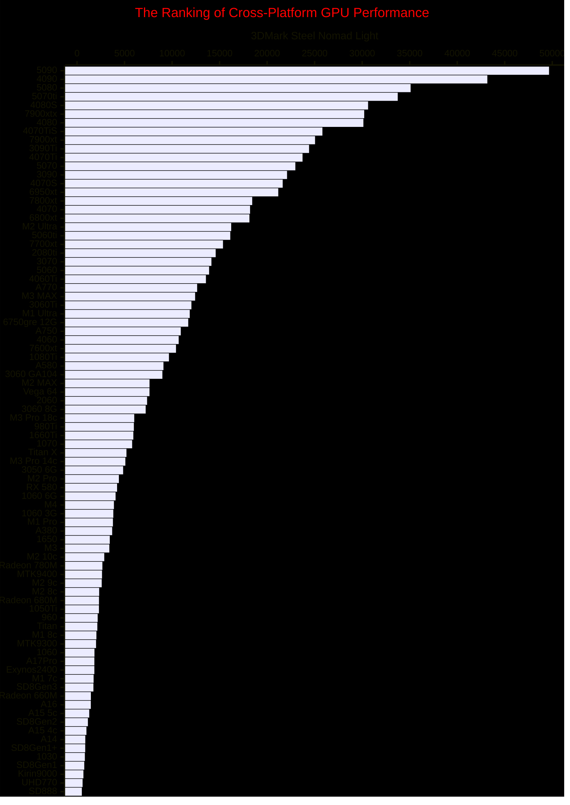

This is only a test of [Mermaid 11.3.0](https://mermaid.js.org/)'s new feature, [XY chart](https://mermaid.js.org/syntax/xyChart.html).

**Several Drawbacks of This XY Chart**:
1. **Lack of Gridlines**: The absence of gridlines makes it challenging to accurately interpret data points.
2. **No Data Labels on Bars**: It’s not possible to display specific values directly on the bars, making it harder to visualize exact numbers at a glance.
3. **Names Require Quotation Marks for Spaces**: Names with spaces need to be enclosed in quotation marks, which can be cumbersome and affect readability.

origingal data

| GPU           | SNL   |
| ------------- | ----- |
| 5090          | 49659 |
| 4090          | 43169 |
| 5080          | 35097 |
| 5070ti        | 33741 |
| 4080S         | 30622 |
| 7900xtx       | 30214 |
| 4080          | 30128 |
| 4070TiS       | 25817 |
| 7900xt        | 25042 |
| 3090Ti        | 24413 |
| 4070Ti        | 23727 |
| 5070          | 22970 |
| 3090          | 22096 |
| 4070S         | 21638 |
| 6950xt        | 21173 |
| 7800xt        | 18431 |
| 4070          | 18206 |
| 6800xt        | 18138 |
| “M2 Ultra”    | 16221 |
| 5060ti        | 16124 |
| 7700xt        | 15357 |
| 2080ti        | 14588 |
| 3070          | 14140 |
| 5060          | 13896 |
| 4060Ti        | 13562 |
| A770          | 12638 |
| “M3 MAX”      | 12425 |
| 3060Ti        | 12035 |
| “M1 Ultra”    | 11858 |
| “6750gre 12G” | 11701 |
| A750          | 10917 |
| 4060          | 10696 |
| 7600xt        | 10413 |
| 1080Ti        | 9671  |
| A580          | 9094  |
| “3060 GA104”  | 8980  |
| “M2 MAX”      | 7628  |
| “Vega 64”     | 7624  |
| 2060          | 7371  |
| “3060 8G”     | 7223  |
| “M3 Pro 18c”  | 6020  |
| 980Ti         | 5980  |
| 1660Ti        | 5925  |
| 1070          | 5799  |
| “Titan X”     | 5200  |
| “M3 Pro 14c”  | 5085  |
| “3050 6G”     | 4851  |
| “M2 Pro”      | 4402  |
| “RX 580”      | 4214  |
| “1060 6G”     | 4056  |
| M4            | 3882  |
| “1060 3G”     | 3818  |
| “M1 Pro”      | 3778  |
| A380          | 3698  |
| 1650          | 3445  |
| M3            | 3400  |
| “M2 10c”      | 2866  |
| “Radeon 780M” | 2668  |
| MTK9400       | 2630  |
| “M2 9c”       | 2598  |
| “M2 8c”       | 2330  |
| “Radeon 680M” | 2311  |
| 1050Ti        | 2305  |
| 960           | 2173  |
| Titan         | 2136  |
| “M1 8c”       | 2040  |
| MTK9300       | 2002  |
| 1060          | 1834  |
| A17Pro        | 1824  |
| Exynos2400    | 1823  |
| “M1 7c”       | 1745  |
| SD8Gen3       | 1725  |
| “Radeon 660M” | 1458  |
| A16           | 1450  |
| “A15 5c”      | 1285  |
| SD8Gen2       | 1144  |
| “A15 4c”      | 990   |
| A14           | 870   |
| SD8Gen1+      | 862   |
| 1030          | 825   |
| SD8Gen1       | 761   |
| Kirin9000     | 673   |
| UHD770        | 585   |
| SD888         | 506   |