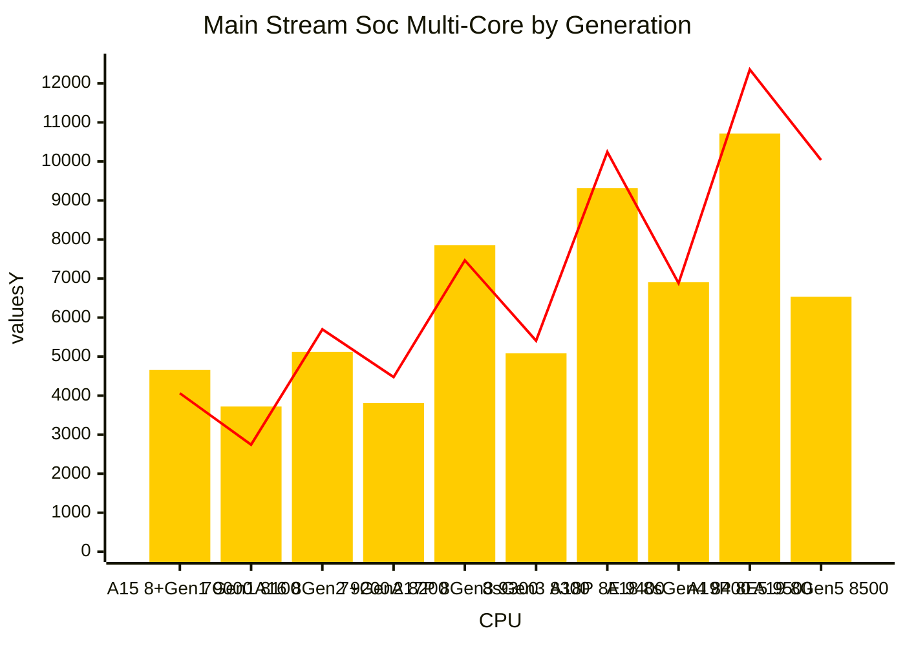

```mermaid
---
config:
  themeVariables:
    xyChart:
      plotColorPalette: '#ffffff, #ffcc00, #FF0000'
---
xychart
title "Main Stream Soc Multi-Core by Generation"
x-axis "CPU" ["A15 8+Gen1 9000", "7Gen1 8100", "A16 8Gen2 9200", "7+Gen2 8200", "A17P 8Gen3 9300", "8sGen3 8300", "A18P 8E 9400", "A18 8sGen4 8400", "A19P 8E5 9500", "A19 8Gen5 8500"]
y-axis "valuesY" 0 --> 12500
%% White bar
bar [6454,0,7271,0,7903,0,9376,9018,11094,10307]
%% Yellow bar
bar [4657,3721,5119,3809,7857,5084,9317,6906,10716,6532]
%% Red Bar
line [4061,2744,5697,4476,7466,5408,10244,6880,12355,10037]
```