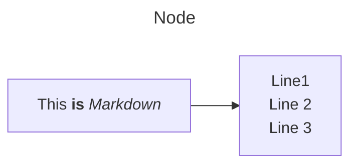
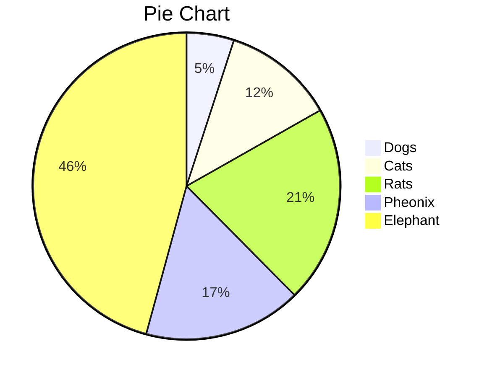

## Markdown Basics

### Headings and This is Heading 3

```markdown
# Heading 1
## Heading 2
### Heading 3
#### Heading 4
##### Heading 5
###### Heading 6
```
#### Heading 4
##### Heading 5
###### Heading 6

### Text Decorations

**`**` or `__` for bold text**   
*`*` or `_` for italic text*  
**`***` or `**_` for bold and italic text***  
`backtick for keyword`    
<u>HTML tag for underlined text</u>    
~~`~~` for struck-through text~~  


### Paragraph

A blank line to split paragraphs.
A single line break is ignored. This is paragraph 1. 

Two spaces or `<br>` to break a line.<!-- 2 spaces after -->  
This is paragraph 2.

```markdown
A blank line to split paragraphs.
A single line break is ignored. This is paragraph 1. 

Two spaces or `<br>` to break a line.<!-- 2 spaces after -->  
This is paragraph 2.
```

### Blockquotes

Use `>` for blockquotes:

> `>` for blockquotes.  <!-- 2 spaces after -->  
> Two spaces or `<br>` to break a line in blockquotes.
> 
> A blank line to split paragraphs.

```markdown
> `>` for blockquotes.<!-- 2 spaces after -->    
> Two spaces or `<br>` to break a line in blockquotes.
> 
> A blank line to split paragraphs.
```

### Ordered List

`n.` and a space for an `ordered list`.
1. Item 1
2. Item 2
   1. 2 to 4 spaces before numbers for `sub-item`
   2. Sub-item 2<!-- 2 spaces after -->      
   Two spaces or `<br>` to break a line in lists.
      - Lists can hybrid.

        A blank line and appropriate number of spaces for new paragraph in lists.

```markdown
`n.` and a space for an `ordered list`.
1. Item 1
2. Item 2
   1. 2 to 4 spaces before numbers for `sub-item`
   2. Sub-item 2<!-- 2 spaces after -->      
   Two spaces or `<br>` to break a line in lists.
      - Lists can hybrid.

        A blank line and spaces for new paragraph in lists.
```

### Unordered List

`-`, `*`, or `+` for bullet points. 
- Item 1.
   -  2 to 4 spaces before numbers for `sub-item`
   * Sub-item 2
   + Sub-item 3<!-- 2 spaces after -->  
   Two spaces or `<br>` to break a line in lists.
      1. Lists can hybrid.

         A blank line and spaces for new paragraph in lists.

```markdown
`-`, `*`, or `+` for bullet points. 
- Item 1.
   -  2 to 4 spaces before numbers for `sub-item`
   * Sub-item 2
   + Sub-item 3<!-- 2 spaces after -->  
   Two spaces or `<br>` to break a line in lists.
      1. Lists can hybrid.

         A blank line and spaces for new paragraph in lists.
```

### Checkbox

- [ ] `- [ ]` for an unchecked box
- [x] `- [x]` for a checked box

```markdown
- [ ] `- [ ]` for an unchecked box
- [x] `- [x]` for a checked box
```

### Links

Create links using `[link-text](URL)`:

```markdown
[link-text](https://markdown.com)
```

This equals to [link-text][ref2]

[ref2]: https://markdown.com

```markdown
This equals to [link-text][ref2]

[ref2]: https://markdown.com
```markdown

### Images

Images are similar to links, but with an exclamation mark `!` before the square brackets:

```markdown

```
> Local images are best referenced with relative paths to make it easier for the images to be relocated along with the Markdown document.

### Code

```markdown
Triple backticks and code type to start code: ```java
Triple backticks to end code: ```
```

### Horizontal 

`---`, `***`, or `___` to break a line.

---

### Tables

| Header | Center | Left | Right |
| ------ | :----: | :--- | ----: |
| Row 1  |   C1   | L1   |    R1 |
| Row 2  |   C2   | L2   |

```markdown
| Header | Center | Left | Right |
| ------ | :----: | :--- | ----: |
| Row 1  |   C1   | L1   |    R1 |
| Row 2  |   C2   | L2   |
```

Merging Cells is not supported.

### Escaping Characters 

`\` for Escaping Characters: \* \+ \- \_ 

```markdown
`\` for Escaping Characters: \* \+ \- \_ 
```

### Referencing

`[^ref1]` for referencing mark. It is automatically arranged. [^ref1]

`[^ref1]: ` for explanations. 

[^ref1]: This reference starts with `[^ref1]: `.

Another way is using links: [Go to Referencing](#referencing)

```markdown
Another way is using links: [Go to Referencing](#referencing)
```

## Mathjax 

`$` or `$$` for inline math: $$ E = mc^2 $$

Display-style math:

$$
E = mc^2 
$$

## Mermaid

### Flowchart

```
---
title: Node
---
%%{init: {"flowchart": {"htmlLabels": false}} }%%
flowchart LR
    markdown["`This **is** _Markdown_`"]
    newLines["`Line1
    Line 2
    Line 3`"]
    markdown --> newLines
```



### Sequence Diagram

```
    sequenceDiagram
    box Purple Alice & John
    participant A
    participant J
    end
    box Another Group
    participant B
    participant C
    end
    A->>J: Hello John, how are you?
    J->>A: Great!
    A->>B: Hello Bob, how is Charley?
    B->>C: Hello Charley, how are you?
```


### 


