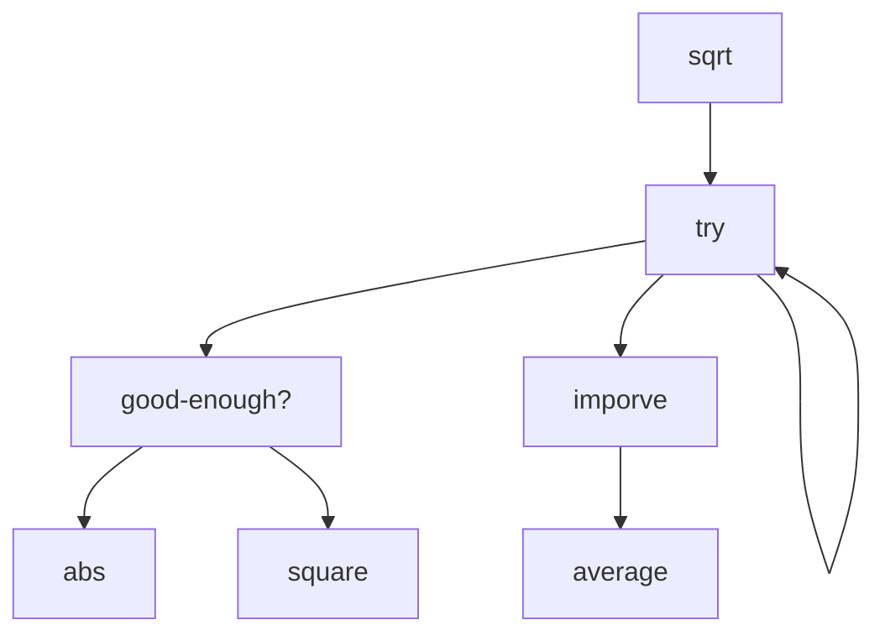
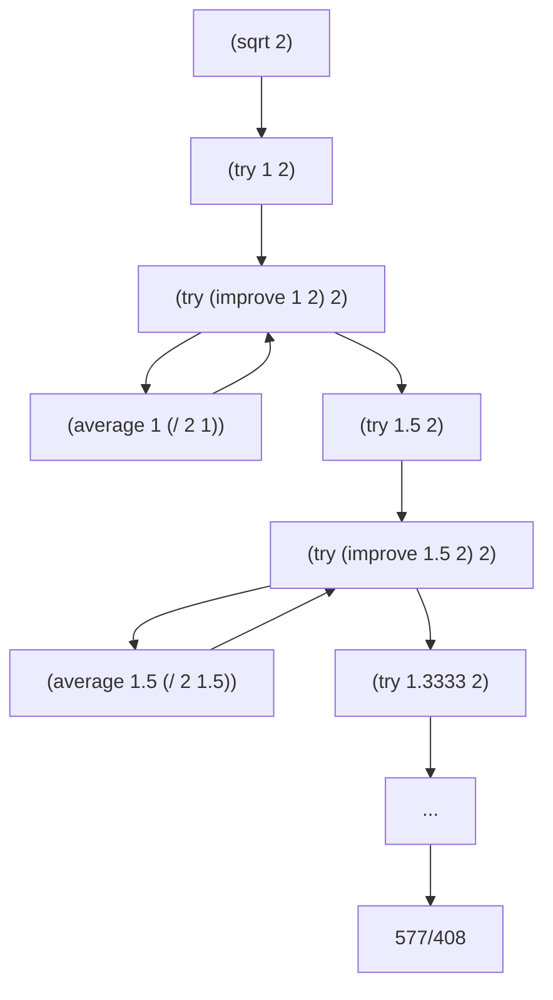

## SICP — A Bird's-Eye Orientation

### Preamble: What This Document Is For

This is an orientation to *Structure and Interpretation of Computer Programs* — the book by Harold Abelson and Gerald Jay Sussman with Julie Sussman (1985, 2nd ed. 1996), the MIT 6.001 course it powered for two decades, and the loose intellectual tradition that grew up around both. SICP is unusual: it is simultaneously a textbook, an artifact of pedagogical philosophy, a sociological phenomenon among programmers, and a covert work of meta-computer-science. To learn it well, you need to understand what kind of object you're learning from — otherwise you will read it as a Scheme tutorial and miss the point.

A note on the metamathematical / metacomputational lens: SICP is unusually friendly to this lens because the book is *itself* a sustained metacomputational argument — its claim is that computer science is not about computers, that programming languages are not what they seem, and that the boundary between "program" and "data" is conventional rather than natural. Reading it without noticing these meta-claims is like reading Wittgenstein without noticing he is doing philosophy *of* language rather than *in* it.


### 1. Identity & Core Question

SICP is a book about **how to think about computational processes** — not how to use a programming language, not how to build software systems, but how to reason about the *machines made of ideas* that programs bring into being. Its single most concentrated claim is that **computer science is the study of how to control complexity in formal systems**, and that the techniques for doing so (abstraction, modularity, conventional interfaces, language design) are themselves the subject — not the languages or machines that happen to host them.

Three core questions organize the book:

1. **What are the means of abstraction?** — How do we name and combine computational objects so that we can reason about large systems in terms of small ideas?
2. **What is the relationship between a program and the process it generates?** — A program is a static text; a process is a dynamic activity. The mapping between them is the central object of study, and most "programming language features" are just different ways of shaping that mapping.
3. **How do we build languages to fit problems, rather than fitting problems to languages?** — The book's deepest claim: the right response to complexity is to design a language in which the complexity disappears, and then write the program in that language.

The objects of study are **procedures** (computational descriptions of how to do something), **data** (computational descriptions of *what is*), and the discovery — repeated several times in the book, each time more shockingly — that these are not really distinct categories. What makes them worth studying is that this trio is the universal substrate of every digital artifact, from operating systems to neural networks to scientific simulations, and the techniques for organizing them are remarkably few and remarkably powerful.

**Metacomputational footnote:** notice that "computer science" is, on SICP's account, a misnomer — Abelson opens the very first lecture with this point, attributing it to Sussman: it is not a science (it doesn't study nature) and it is not really about computers (any more than geometry is about surveying instruments). The field is more accurately *procedural epistemology* — the study of structured knowledge of *how to do things*, in contrast with the declarative epistemology that mathematics formalizes. This reframing is not decoration; it is the thesis the entire book argues.

### 2. Why It Exists — Motivation & Position

**The historical setting.** SICP emerged from MIT's 6.001 in the late 1970s and early 1980s, in a period when introductory computer science was dominated by language tutorials (Pascal, Fortran, later C) that taught students to operate machines. Abelson, Sussman, and Sussman were reacting against this — they wanted an introductory course in the spirit of mathematics or physics, where students would meet **fundamental ideas** that would still be true forty years later, not language features that would be obsolete in five. The choice of Scheme (a minimal Lisp dialect) was instrumental: Scheme has so few features that it nearly disappears as a language, leaving the ideas in plain view.

The first edition (1985) and the more polished second edition (1996) are largely the same book, with small additions (concurrency, the metacircular evaluator's expansion, register-machine simulation). The accompanying MIT 6.001 video lectures, recorded for Hewlett-Packard in 1986, are widely regarded as one of the most pedagogically effective introductions to anything in any subject. The course at MIT was retired in 2008 in favor of a Python-based curriculum focused on robotics and probabilistic methods — a transition that occasioned considerable mourning and some genuinely interesting debate about what introductory CS is for.

**What became possible.** Before SICP, "advanced" introductory programming meant teaching more language features. After SICP, it became respectable to teach a tiny language and use the saved budget to teach the ideas the language was implementing. The book made certain claims publicly available that had been folklore among Lisp hackers and certain computer scientists — that interpreters are ordinary programs, that programs and data are the same kind of thing, that streams unify recursion and iteration, that an operating system is mostly a fancy interpreter. It changed what an undergraduate could be expected to find unsurprising.

**Where it sits.** SICP is positioned at the intersection of several traditions that don't usually meet in one classroom: the **Lisp / functional-programming** lineage (Church, McCarthy, Steele, Sussman); the **structured-programming and abstract-data-type** lineage (Dijkstra, Hoare, Liskov, Parnas); the **AI lab "make a language for the problem"** culture (Minsky, Sussman); and the **mathematical-foundations-of-computing** tradition (Turing, Curry, Strachey, Scott). It is upstream of: most modern functional language design (Haskell, Scala, Clojure, F#, Rust's iterator design); the design of teaching languages (Racket, Pyret, How to Design Programs); modern thinking about meta-programming and DSLs; and a substantial fraction of working programmers' taste — many people who never finish SICP are still shaped by reading the first three chapters. It is parallel to, and sometimes in tension with, the systems-programming tradition (Knuth, Tanenbaum) and the algorithms-and-complexity tradition (Cormen et al., Sipser), neither of which it tries to replace.

**Metacomputational footnote.** Note the implicit claim in the book's structure: that the "right" introduction to computer science is *philosophical* before it is *technical*. This is a real position, opposed to the "technical first, ideas later" tradition of most CS curricula. The opposition has never been settled — the 2008 MIT switch was, in part, a vote against SICP's view. Knowing that this debate exists and is ongoing is part of understanding what SICP is.

### 3. Foundational Assumptions & Interpretive Choices

SICP rests on a small handful of primitive commitments. None is universally shared in computer science, and recognizing them is part of reading the book well.

**Commitment 1: Programming is the activity of describing processes, not commanding machines.** A program is a *description*; a process is what happens when that description is executed. The book treats the description as a linguistic object — to be analyzed, transformed, decomposed, generated by other programs — rather than as instructions to a machine. This is an inheritance from Lisp culture and is opposed to the "code is what makes the CPU do things" view dominant in systems education.

**Commitment 2: The lambda calculus is the right substrate for thinking about computation.** Functions (procedures) are first-class: they can be passed as arguments, returned as values, stored in data structures, and constructed at runtime. This is a 1930s mathematical discovery (Church) repurposed as a teaching foundation. The alternative substrates — Turing machines, register machines, message-passing — are present in the book but treated as alternative *implementations* of an underlying functional reality, not as competing foundations.

**Commitment 3: Abstraction is the central mechanism of complexity control.** When something is hard, the answer is almost always to introduce a layer of abstraction that hides what doesn't need to be seen. The book's structure — local procedures, then data abstractions, then mutable state, then streams, then interpreters, then compilers — is a sustained tour of progressively richer kinds of abstraction. This is opposed to the "performance first, abstraction is a luxury" view of low-level systems programming.

**Commitment 4: Interpretation is the universal explanatory device.** The deepest understanding of any language feature, in SICP's view, comes from writing an interpreter for a language that has it. Want to understand variables? Write an environment-passing interpreter. Want to understand objects? Write a message-dispatch system. Want to understand non-determinism? Write an `amb` evaluator. This is a strong methodological claim — that *implementation* is the royal road to *understanding* — and it shapes the second half of the book.

**Interpretive choices visible to the careful reader:**

* **Scheme over more "realistic" languages.** Scheme is chosen because it is small enough to disappear. The cost: students sometimes leave SICP fluent in ideas but unable to write production code, and need a second education in idioms of mainstream languages. The benefit: nothing in Scheme distracts from the ideas.

* **Functional first, mutation later.** The book deliberately defers assignment (the `set!` operator and mutable state) until Chapter 3, after building substantial capability without it. This is the opposite of the imperative-first tradition. The cost: students take longer to feel "real." The benefit: students see precisely what mutation buys and what it costs, which most programmers never see clearly.

* **No type system.** Scheme is dynamically typed, and the book treats type discipline as a runtime concern, not a static one. Modern functional pedagogy (Haskell, ML, the *Software Foundations* tradition) takes the opposite view, treating types as the primary structuring tool. The SICP camp and the typed-functional camp respect each other and disagree quietly. A learner moving from SICP to Haskell will find the experience illuminating and slightly destabilizing.

* **Process-oriented, not system-oriented.** SICP largely ignores files, sockets, processes, threads (until late, briefly), distribution, persistence, and most of what working programmers spend their time on. This is intentional — those concerns belong to a different course — but it is also a real limitation. SICP graduates know how to think but may not yet know how to ship.

**Metacomputational footnote.** SICP's choices form a coherent package that some traditions reject wholesale. The book's implicit argument is that this package — minimal language, functional-first, abstraction as primary, interpretation as explanatory — produces the right kind of mind. The argument is contested. You should know that you are buying into a position when you read SICP, not receiving the consensus view of the field.

### 4. Knowledge Topography — The Map

#### Core concepts in roughly the book's dependency order

**Procedure** — a named (or unnamed) computational description of how to compute something. *The basic unit; everything else is built from procedures and the data they manipulate.*

**Substitution model of evaluation** — the idea that you can understand what a procedure does by mentally substituting arguments for parameters. *A simple model that works for purely functional code and breaks visibly when mutation enters; the breakdown is itself a teaching device.*

**Recursive vs. iterative process** — the distinction between a process that builds up deferred operations (recursive) and one that maintains a running summary in fixed space (iterative). *Crucially, both can be expressed as recursive procedures; the process shape is not the same as the syntactic shape. This is one of the book's first major "you've been confusing two things" moments.*

**Higher-order procedure** — a procedure that takes or returns procedures. *The mechanism by which patterns of computation become reusable; a derivative is a higher-order procedure, and so is a strategy that combines other strategies.*

**Compound data and abstraction barriers** — the use of constructors and selectors (e.g., `cons`, `car`, `cdr`) to build data structures whose internal representation is hidden behind an interface. *Sets up "data abstraction" as a sibling of "procedural abstraction," with both governed by the same principle: separate use from implementation.*

**Closures and message passing** — the discovery that procedures-with-state can simulate objects, and conversely that data with operations can simulate procedures. *Sets up the book's deepest joke: there is no fundamental difference between procedure and data; what looks like one can be re-described as the other.*

**Mutation, environments, and the substitution model's failure** — the introduction of `set!`, the moment the substitution model stops working, and the construction of the environment model to replace it. *A pivot point of the book; the cost of mutation is exposed before its benefits are accepted.*

**State, identity, and time** — the deep observation that introducing mutation introduces a notion of "time" and "identity" into computation. *A philosophical hinge: mutation is not just a feature, it is a metaphysical commitment.*

**Streams** — infinite, lazily-evaluated sequences. *The functional alternative to mutation: model time as an infinite sequence rather than a value that changes. Reframes "iteration" and "real-time systems" as questions of stream manipulation.*

**Metalinguistic abstraction** — the idea that the appropriate response to complexity is to design a new language. *The book's most ambitious move; the second half of the book does this repeatedly, each time more strikingly.*

**The metacircular evaluator** — an interpreter for Scheme, written in Scheme, that fits in a few pages. *The technical and conceptual climax of the book; once understood, programming languages stop being mysterious.*

**The environment model of evaluation** — a precise account of how variables, scope, and closures actually work, in terms of frames and pointers. *The replacement for the substitution model; the moment "variable binding" becomes mechanically clear.*

**Lazy evaluation, non-deterministic evaluation, logic programming** — three further interpreters, each demonstrating that a major paradigm of computing is just a few changes to the evaluator. *The deepest pedagogical move: paradigms are not mountains, they are tweaks.*

**Register machines and compilation** — the descent from high-level interpretation to a model of how a computer actually executes things, and then a compiler from Scheme to that model. *The book closes the loop: the abstraction tower bottoms out in something concrete.*

**Garbage collection** — the explanation of how memory management actually works, presented as a small algorithm rather than a mystery. *Demystifies the runtime of nearly every modern language.*

#### Major sub-themes (the book's "movements")

* **Chapter 1: Building abstractions with procedures.** Functional programming, recursion, higher-order procedures.
* **Chapter 2: Building abstractions with data.** Constructors and selectors, abstraction barriers, generic operations, symbolic data.
* **Chapter 3: Modularity, objects, and state.** Mutation, the environment model, streams, time and identity.
* **Chapter 4: Metalinguistic abstraction.** The metacircular evaluator, lazy evaluation, non-determinism (`amb`), logic programming.
* **Chapter 5: Computing with register machines.** Register-machine simulation, compilation, memory management.

The five chapters form a deliberate arc: abstraction at the level of *procedures*, then *data*, then *time*, then *language*, then *machine*. Each chapter is one full revolution of the "introduce a level, then build the next level using it" cycle.

#### Connections outward

**Inputs:** elementary algebra and logical thinking; some prior exposure to programming is helpful but not required (the book teaches recursion from scratch); willingness to take ideas seriously rather than treating programming as recipe-following.

**Outputs (with one concrete consequence each):**
* **Programming language design and implementation**: SICP is the standard preparation for compiler and interpreter courses; Chapters 4–5 are essentially a miniature version of such a course.
* **Functional programming in Haskell, OCaml, Clojure, Scala, F#**: nearly every concept is portable, sometimes with the type system added.
* **Software engineering taste**: the principle "design the right abstractions, keep the implementation behind them" is portable to any language and any team.
* **Algorithms and data structures**: the book's treatment of recursion, accumulation patterns, and tree manipulation is excellent preparation, though it deliberately does not aim at complexity analysis.
* **Operating systems and systems programming**: SICP's treatment of state, processes, and memory provides the conceptual scaffolding; mainstream OS courses then add the concrete machinery.
* **Artificial intelligence (the symbolic tradition)**: the book is part of the cultural lineage of MIT-style symbolic AI; pattern matchers, rule systems, and search procedures are presented in their natural habitat.
* **Domain-specific languages and metaprogramming**: SICP's emphasis on language design as a problem-solving technique is the single most direct preparation for the modern interest in DSLs.

### 5. Learning Trajectory

**Prerequisites — the honest list:**

* **Mathematical maturity, not mathematical knowledge.** The book uses very little advanced math (a bit of calculus and number theory in examples), but assumes you can read a recursive definition, follow a chain of reasoning, and notice when a definition is doing more than it appears to.
* **Comfort with abstraction.** If "a function that returns a function" feels disorienting, plan to spend extra time on Section 1.3. This is the conceptual move SICP relies on most.
* **Patience for slow build-up.** The book deliberately starts simple and accelerates. Readers who quit after Chapter 1 ("this is just basic Scheme") have not yet seen what the book does. The payoff begins in earnest in Section 2.4 (generic operations) and compounds from there.
* **Willingness to do the exercises.** This is the prerequisite that quietly fails most readers. The book's exercises are not optional drill; they are where most of the actual learning happens. SICP read passively is a beautifully written reading experience; SICP done is a different and more lasting thing.

**Quietly damaging gaps to fix early:**

* **Inability to trace evaluation by hand.** If you cannot, for a recursive procedure, manually walk through the substitution model and predict the output, the rest of the book will float past you. Drill this.
* **Discomfort with parentheses.** Scheme's prefix syntax `(+ 1 2)` rather than `1 + 2` looks alien for about three days, then becomes invisible. Push through the alienation; do not switch to a "more readable" Scheme variant during this phase.
* **Treating exercises as optional.** Many of the book's most important ideas appear *in* the exercises, not in the prose. Exercise 1.6 (asking what happens if `if` were a procedure) is a one-page version of the entire theory of evaluation order.

**Recommended reading order, with the reason:**

1. **Chapters 1 and 2 in full, with a substantial fraction of the exercises.** These chapters teach you to think in procedures and in data abstractions. Skipping exercises here is the most common reason people stall later.
2. **Chapter 3 carefully.** The introduction of mutation is delicate and the book is doing pedagogical work that is easy to miss. Do not rush past Section 3.1 ("the cost of introducing assignment") — its argument that mutation has a hidden cost is a thesis the rest of the chapter develops.
3. **Sections 3.5 (streams) deserve a separate pass.** Many readers find streams the most disorienting section; the disorientation is worth pushing through.
4. **Chapter 4 is the climax.** Specifically, Section 4.1 (the metacircular evaluator) is *the* moment of the book. If you only ever do one project from SICP, build the metacircular evaluator and modify it to add a feature.
5. **Sections 4.2–4.4 (lazy evaluation, `amb`, logic programming) are optional but extraordinary.** Each is a self-contained demonstration of paradigm-as-modification. If you have time for one, do the `amb` evaluator (Section 4.3) — the experience of writing a non-deterministic interpreter is uniquely clarifying.
6. **Chapter 5 is foundational but heavy.** Many readers stop after Chapter 4 and miss something important: the descent to register machines and the construction of a compiler. This is the chapter that most resembles a traditional CS course, and the connection it draws between high-level Scheme and low-level execution is the book's final structural payoff. Skip it only if you intend to take a separate compilers course.

**Topics commonly approached early but better deferred:**

* **Macros (`define-syntax`).** SICP largely avoids macros, and rightly so for a first pass. They are a more advanced metaprogramming tool; learn them after the metacircular evaluator, when you understand what they are sugar for.
* **Tail-call optimization as a topic of study.** SICP relies on it (this is why iterative processes work in Scheme) but doesn't dwell on it. Don't get sidetracked into tail-call discussions; trust that it works and move on.

**Topics commonly deferred but better front-loaded:**

* **Drawing box-and-pointer diagrams by hand.** Many readers try to keep `cons` cells in their head. Don't. Draw them on paper for the first several weeks. The diagrams are the cognitive scaffolding the book assumes you are using.
* **Writing the metacircular evaluator yourself, before fully reading Section 4.1.** Reading the evaluator is illuminating; writing one before reading is transformative. Try to get a tiny one working from first principles, then read the book's version.

**Realistic effort estimate:** for a serious self-learner with the prerequisites in place and willing to do exercises, **300–500 hours to genuine completion** of Chapters 1–4 with substantial exercise work, **plus another 100–200 hours for Chapter 5 and the deeper exercises**. Reading the book without doing exercises takes about 60 hours and produces a different, lesser thing — you will have impressions but not capabilities. The book is famously punishing to skim and famously rewarding to inhabit. Plan for six to twelve months of part-time study, not weeks.

**Metapedagogical footnote.** Notice that the recommended order is *the book's order*. Unlike many textbooks, SICP is structured tightly enough that reordering hurts. Each chapter installs a habit of thought that the next chapter exploits. A reader who skips Chapter 2 to "get to the interpreters" finds Chapter 4 incomprehensible — the metacircular evaluator is a tour de force of data abstraction, and you can't read it if you can't read data abstractions.

### 6. The Outsider's QA Sheet

**Q1. [DEF] Why Scheme rather than Python, JavaScript, or any "real" language?**
Because Scheme has so few features that the language nearly disappears, leaving the ideas in plain view. The whole core of Scheme fits on a postcard; everything else in the book is built from it. A "feature-rich" language would constantly be a distraction — students would be learning the language instead of the concepts. The cost is that students leave SICP without production-language fluency; the benefit is that they leave seeing through any production language they later meet.

**Q2. [DEF] Why does the book emphasize the difference between "procedure" and "process"?**
Because they are genuinely different objects, and conflating them is the single most common confusion in early programming. A *procedure* is a static piece of text; a *process* is the dynamic activity that unfolds when the procedure is run. The same procedure can produce different processes (the famous example: a recursively-written procedure can produce an iterative process, in tail position). Once you see this distinction, much of what looked like "programming style" becomes "process shaping," which is a more powerful frame.

**Q3. [DEF] Why is `cons` (and the whole linked-list aesthetic) treated as foundational rather than as one data structure among many?**
Because `cons`, `car`, and `cdr` are the simplest possible non-trivial constructor and selectors, and the book uses them as a stand-in for the general principle of *building data abstractions out of primitives*. The point is not "lists are special"; the point is "any data structure can be built this way, and the technique generalizes." Section 2.1.3, where `cons` is implemented using only procedures and closures, is the book's most concentrated argument that "data" is conventional rather than primitive. The technique would generalize equally well using any other constructor — `cons` is a metaphor, not a destiny.

**Q4. [NOT] Lisp, Scheme, Racket, Common Lisp — what's the difference, and which is SICP?**
Lisp is a family of languages dating to 1958; the family shares the prefix-parenthesis syntax and the treatment of code as data. **Scheme** is a minimalist Lisp dialect designed in 1975 by Steele and Sussman, optimized for clarity and small footprint. **Common Lisp** is a large, industrial-strength Lisp standardized in the 1980s, with a much richer feature set. **Racket** is a modern descendant of Scheme designed for teaching and for programming-language research. SICP uses a small subset of Scheme; you can run its code in Racket (with a SICP language module), MIT/GNU Scheme, or other Scheme implementations. The differences among these dialects matter for working programmers but are mostly invisible at SICP's level.

**Q5. [NOT] Why all those parentheses? Is there a deeper reason or is it just historical?**
Both. Historically, Lisp's syntax was originally meant to be temporary — McCarthy planned a more conventional surface syntax that never got built. But the parentheses turned out to encode something important: they make the syntactic structure of the code *literally* the structure of a tree, with no parsing ambiguity. This is what makes "code as data" practical: a Lisp program is already in the form an interpreter wants to consume. Languages with conventional syntax need a parser to recover this structure; Lisp programs hand it over directly. The parentheses are the price of trivially-parseable syntax, and they enable everything in Chapters 4–5.

**Q6. [NAÏVE] Isn't SICP outdated? It was written before the web, before mobile, before machine learning.**
The book is dated in its examples and silent about most of what working programmers do today. It is not dated in its content. The ideas it teaches — abstraction, modularity, language design, the relationship between procedures and processes — are the same in 2026 as in 1985, because they are about the structure of computational thought, not the structure of any particular technology. A reader emerging from SICP and meeting the modern web, modern ML, or modern systems programming will recognize the underlying patterns immediately. Calling SICP "outdated" is like calling Euclid's *Elements* outdated because it doesn't cover GPS.

**Q7. [NAÏVE] Why so much fuss about a single book? It's just a textbook.**
Most textbooks teach a body of material. SICP teaches a *way of seeing*, and it is one of the few books that does this successfully in computer science. Readers regularly describe it as the book that changed how they think about programming, decades after reading it; this is unusual. The fuss is also partly sociological: SICP became a shibboleth among a certain class of programmer, signaling "I am the kind of person who has read this book." The substantive value and the sociological value are both real and not entirely separable.

**Q8. [NAÏVE] Do I need to finish SICP to get value from it?**
No. The first three chapters — about half the book — contain most of the durable conceptual content. Many working programmers benefit from Chapters 1–3 and never finish Chapter 4 or 5. That said, Chapter 4's metacircular evaluator is the experience the book is structured around, and most readers who quit before it report later that they wish they hadn't. A reasonable goal: Chapters 1–3 thoroughly, Chapter 4 Section 1 with effort, the rest as your interest dictates.

**Q9. [NOT-THIS] What is SICP not? It's often confused with a Scheme tutorial, with a functional-programming book, and with an algorithms book.**
It is none of these. **It is not a Scheme tutorial** — Scheme is a vehicle, not a destination, and the book teaches almost nothing about Scheme as a working language (libraries, idioms, deployment). **It is not a functional-programming polemic** — Chapter 3 explicitly accepts mutation as necessary and useful, after carefully exposing its costs. **It is not an algorithms book** — the book does not aim at complexity analysis, asymptotic bounds, or competitive-programming techniques; it assumes algorithms will be learned elsewhere. SICP is a book about *structure* — how to organize computational thinking — and its examples come from wherever they best illustrate structural points.

**Q10. [NOT-THIS] How does SICP differ from *How to Design Programs* (HtDP)?**
HtDP, by Felleisen and collaborators, was developed as a kind of successor that takes seriously a problem SICP arguably leaves unsolved: how to teach novices to design programs from scratch, rather than to read and admire elegant existing programs. HtDP is more pedagogically structured, more explicit about its design recipe, and gentler on absolute beginners. SICP is more concentrated, more philosophical, and more demanding. They share Scheme/Racket and a functional-first orientation; they differ on whether the priority is "novice can produce code" (HtDP) or "intermediate can see structure" (SICP). Many curricula now use HtDP first and SICP second.

**Q11. [WHY-HARD] Why is Chapter 3 (mutation and state) considered the hardest chapter, more than Chapter 4 (interpreters)?**
Because Chapter 3 dismantles the substitution model, which by then the reader has been using for two chapters as their primary tool of understanding. Replacing it with the environment model is technically straightforward but psychologically jarring — the reader has to give up a way of thinking that just started to feel natural. Chapter 4, by contrast, is hard but *additive*: you build a new mental model on top of existing ones. The pedagogical lesson is that the most difficult parts of learning are not the most technically advanced; they are the parts that require unlearning.

**Q12. [WHY-HARD] Why are streams (Section 3.5) so disorienting on first contact?**
Because streams encode time as data. A normal program has time as an implicit dimension — things happen "now" or "later." A streaming program represents the entire history (potentially infinite) as a single value, with the "now" cursor an explicit position in it. This is a 90-degree rotation of the usual frame, and most readers need several days to recover their balance. The disorientation is the lesson: streams are training in the recognition that "time" is one design choice among several, not a metaphysical given.

**Q13. [WHY-HARD] What does the metacircular evaluator actually teach that you can't learn just by reading about how interpreters work?**
The metacircular evaluator teaches that an interpreter is not a special object — it is just an ordinary program of fewer than two hundred lines, written in the language it interprets, doing exactly what it says. Most programmers spend years thinking interpreters are mysterious; the metacircular evaluator is the moment that mystery dissolves. Reading about interpreters tells you that they exist; writing one tells you that they are *small*, and therefore that programming languages are not magic but engineering. This experiential knowledge is the book's central gift.

**Q14. [PROGRESS] What does "progress" look like in the SICP tradition? Is anyone still writing SICP-style work?**
Yes, but it is concentrated in a few research communities. The Racket project (PLT, Northwestern, Brown, Northeastern, Utah) explicitly continues SICP's commitment to language-design-as-problem-solving, producing both research languages and pedagogical languages. The "languages workbench" community (Felleisen, Krishnamurthi, Findler, Tobin-Hochstadt) builds on SICP's metalinguistic stance. The "How to Design Programs" textbook is the most direct pedagogical descendant. Outside this community, SICP's influence is more diffuse — it shows up in good taste rather than named research. The book is "complete" as a teaching artifact; the research it inspired is alive in places.

**Q15. [PROGRESS] What replaced SICP at MIT, and why?**
6.001 was retired in 2008 and replaced by 6.01, a Python-based course oriented around robotics, signal processing, and probabilistic methods, designed by Sussman, Hal Abelson, and Leslie Kaelbling. The official rationale was that introductory CS at MIT in 2008 needed to prepare students for a world where most software is engineered (assembled from libraries with known properties) rather than designed from scratch — a world in which the "structure of computation" focus felt less central than the "interaction with messy real systems" focus. The change was controversial and remains so. Reasonable people disagree about whether it was a correction or a loss; the disagreement is itself instructive.

**Q16. [BRIDGE] What's the relationship between SICP and the lambda calculus?**
Scheme is, roughly, lambda calculus plus a few primitives and a tasteful surface syntax. SICP doesn't formally develop the lambda calculus, but the book's foundational moves — first-class procedures, closures as the primary structuring tool, the substitution model of evaluation — are direct inheritances from Church's 1936 work. A reader who encounters the typed lambda calculus later (e.g., in a Haskell course or in *Types and Programming Languages*) will recognize the SICP world as the untyped, dynamically-checked version of the same underlying mathematics. The bridge is not advertised in SICP, but it is structural.

**Q17. [BRIDGE] How does SICP connect to the Curry–Howard correspondence?**
SICP doesn't mention Curry–Howard (the deep correspondence between programs and proofs, types and propositions), because SICP is dynamically typed and not concerned with the proofs-as-programs view. But the book's habit of treating procedures as mathematical objects, and its insistence that an interpreter is itself a piece of mathematics, is the same intellectual climate from which Curry–Howard grew. A reader who learns SICP and later learns Coq, Agda, or Lean will find the leap shorter than expected — the underlying respect for procedures-as-objects is shared, even though the specific machinery diverges sharply.

**Q18. [BRIDGE] What does SICP have to do with category theory and modern functional programming?**
SICP predates the explicit influx of category theory into programming (which happened in the Haskell community from roughly the late 1980s onward). But several SICP ideas — composition of higher-order functions, generic operations through dispatch, streams as a form of corecursion — turn out, in retrospect, to be discrete categorical patterns. The "generic arithmetic" system in Chapter 2.5 is a hand-rolled version of what would later be called type classes. A reader who learns category theory after SICP often experiences déjà vu: "oh, that pattern I built by hand in Chapter 2 has a name."

**Q19. [META] Is SICP appropriate as a *first* programming book, or only as a second one?**
This is a real disagreement. The "first book" camp holds that SICP can launch a beginner because it assumes nothing and builds carefully from primitives. The "second book" camp holds that SICP's pace and abstraction level are punishing for true beginners and that students should arrive having already programmed enough to recognize the patterns SICP is naming. Empirically, MIT used SICP successfully as a first course for decades, but with strong students and intensive support; self-learners attempting SICP as their first programming book have mixed outcomes, depending heavily on patience and exercise discipline. The honest answer: it depends on the learner, and HtDP exists precisely as a gentler on-ramp.

**Q20. [META] Why do some serious programmers hold SICP in contempt, and is there anything to their critique?**
The contempt usually comes in two flavors. The first holds that SICP is a "purist" or "ivory-tower" book, irrelevant to the work of shipping software, and that its emphasis on elegance over pragmatism produces engineers who can't actually deliver. The second, more interesting, holds that SICP is too narrow — it teaches one tradition of programming (the Lisp / functional / abstraction-heavy tradition) as if it were the whole subject, and produces readers who underestimate the legitimately different concerns of systems programming, performance engineering, and large-team software design. The second critique has some force; SICP is not a complete education in software, only in computational thinking. The first critique misunderstands the book.

**Q21. [META] Why does the SICP tradition emphasize building interpreters, while the *Software Foundations* / *PLAI* / *Types and Programming Languages* tradition emphasizes proving things about them?**
Two different attitudes toward what understanding a language *means*. The SICP tradition holds that you understand a language feature when you can implement it in a smaller language; understanding is operational and constructive. The Pierce / Coq / Software Foundations tradition holds that you understand a language feature when you can state and prove its formal properties (type soundness, termination, etc.); understanding is propositional. Both are legitimate views of "knowing a language," and serious language designers ultimately want both. The SICP tradition gets you to working interpreters faster; the proof tradition gets you to certainty about their behavior.

**Q22. [META] How seriously should I take the famous claim that "computer science is not a science and not about computers"?**
Seriously, but with calibration. The claim is rhetorically sharp and substantively true: most of what is taught under "computer science" is not science (it does not study natural phenomena and form falsifiable hypotheses about them) and is not specifically about computers (the principles transfer to any computational substrate). The deeper, less-quoted point is that the field is a kind of *engineering of formal systems* — a third category alongside science and mathematics, with its own methods. The catchphrase is meant to dislodge a particular misconception, not to legislate departmental boundaries.

**Q23. [PROGRESS] What's the right way to engage with the exercises? They are infamous.**
The exercises are graded internally: some are five-minute warm-ups, some are afternoons of concentrated work, and a small number (the "starred" ones, traditionally) are several-day projects. The right strategy depends on your goals. For full mastery, attempt every exercise in Chapters 1–3 and most in Chapter 4. For working knowledge, attempt every exercise that you read and don't immediately see the answer to — these are the ones doing teaching work. For survey-level reading, skim exercises and only attempt those that test something you suspect you don't understand. Many of the most famous exercises (the Y combinator, the metacircular evaluator extensions, the constraint-propagation system) are essentially small research projects and can absorb a week each. Budget accordingly.

**Q24. [BRIDGE] Why is SICP often paired with the *Wizard Book* nickname, and what does the cover image mean?**
The cover of both editions shows a wizard — partly a joke about Lisp's reputation as a "high-magic" language, partly a deliberate visual claim that the book is initiating you into something. Inside the front pages, you'll find a quote about "the programmer as a creator of universes" (paraphrased; see the foreword). The wizard imagery is not pure decoration — it is a self-aware claim that what programmers do is, in some real sense, *generative metaphysics*: they bring into existence small, fully-determined worlds whose laws they author. Reading SICP without taking that claim seriously is reading it less than fully.

**Q25. [DEF] Why does the book introduce "data" later than "procedures"? Most books do the opposite.**
Because SICP wants you to see that "data" is a derived concept, not a primitive one. By introducing procedures first and then showing in Chapter 2 that procedures-with-state can implement any data structure (the famous `cons` defined in terms of `lambda`), the book makes a strong philosophical claim: data and procedures are dual aspects of computation, and either can be reduced to the other. Most books treat data as the "stuff" that procedures act on, and so present data first. SICP's reversal is a thesis: it is procedures all the way down, and data is a useful pattern of procedure use. Whether you believe this thesis is itself interesting; the book wants you to see it and then decide.

### 7. Mental Models Practitioners Actually Use

**1. Procedures and data are dual; either can implement the other.**
The textbook surface presents procedures and data as separate categories, and so does most programming. The SICP-trained eye sees them as one substance with two presentations: a "procedure" is an action with a frozen environment, a "datum" is a value with associated operations, and any system you can build with one you can rebuild with the other. The conceptual shift is reaching for "could I represent this as a procedure that responds to messages?" or, conversely, "could I represent this control flow as a data structure that's interpreted?" — both are real options. Once internalized, the entire object-oriented vs. functional debate looks like a stylistic preference, not a metaphysical divide.

**2. Languages are tools to be built, not given.**
The textbook surface treats programming languages as fixed external artifacts you learn. The practitioner's view is that *every program defines a small language* — its vocabulary of procedures, its conventions of data, its idioms of use — and that the question is always whether you've designed that small language well. The conceptual shift is that "writing a program" and "designing a language" stop being different activities; they are the same activity, with language design being the more honest description. Once you see this, libraries are languages, frameworks are languages, configuration files are languages, and many of programming's hardest problems become problems of *bad accidental language design*.

**3. The right answer to complexity is a new layer of interpretation.**
The textbook surface treats interpretation as something special, performed only by "language implementations." The practitioner's view is that interpretation is the universal escape hatch: when a problem is too messy for your current level of abstraction, you build a small interpreter that consumes a description of the messy thing and runs it. Spreadsheet engines, regular expression matchers, dependency resolvers, build systems, query planners — all are domain-specific interpreters in disguise. The shift is recognizing the interpreter pattern in problems that don't appear linguistic, and reaching for it deliberately.

**4. Mutation is a contract with time, not a feature.**
The textbook surface treats variables as "things you assign to." The practitioner's view, post-SICP, is that the moment you write `set!` (or its equivalent in any other language) you have introduced *time* as an explicit dimension of your program — you have committed to questions like "when did this happen?" and "what was the value before?" that were meaningless in a pure-functional context. Mutation is not free; it is purchased with the loss of certain reasoning techniques. The shift is treating each `set!` as a deliberate trade and asking, "do I really need this, or can I rephrase the problem so the change is in the data flow rather than in storage?"

**5. The substitution model and the environment model are not "wrong and right" — they are different lenses.**
The textbook surface presents the substitution model as a stepping stone to be replaced by the "real" environment model. The practitioner's view is that both remain useful. The substitution model is your tool for reasoning about pure code, and most modern programming languages (Haskell, Rust, parts of Python) support large pure regions where it works perfectly. The environment model is your tool for reasoning about stateful code, where what a name means depends on history. The shift is choosing your model based on the code in front of you, rather than defaulting to one for everything.

**6. Tail calls turn recursion into iteration; recognize when this matters.**
The textbook surface teaches "iterative" and "recursive" as syntactic categories. The practitioner's view is that these are *process* categories — the question is what shape the running computation takes, not what the source code looks like. A function that calls itself can produce an iterative process if the recursive call is in tail position and the language supports tail-call elimination. This is not obscure — it is the whole reason languages with proper tail calls (Scheme, Scala on the JVM, Clojure with `recur`, Haskell) treat loops as syntactic sugar. The shift is reading code in terms of the process it generates, not the process it appears to generate.

**7. Streams replace mutation by representing time as data.**
The textbook surface treats streams as a data structure, useful occasionally for lazy evaluation. The practitioner's view, after Chapter 3.5, is that streams are an alternative *model of state* — instead of "this variable has the value 5 now and will have the value 6 later," you write "this stream has the values 5, 6, 7, ... in it." Modern reactive programming, signal-flow languages, and much of stream-processing infrastructure (Spark Streaming, Kafka Streams, RxJava) are this idea industrialized. The shift is recognizing when a problem is "really" about a sequence of values over time, and reaching for stream representations rather than mutable variables.

**The conceptual shift from "computing without seeing" to "seeing"** typically arrives in three stages for SICP readers. Stage one: you can read and write Scheme fluently and the parentheses no longer bother you. Stage two (usually around Chapter 2.4 or 3.1): you stop seeing "language features" and start seeing "design choices an interpreter is making" — the moment you realize that classes, modules, exceptions, scoping rules are not magic but ordinary engineering. Stage three (after Chapter 4.1, if you complete it): you stop seeing programming languages as objects of study and start seeing them as *artifacts you could build*, and the question "how does language X handle Y?" becomes "what design choice did its implementers make for Y?" — which you can usually answer by sketching the implementation. Many programmers complete a career at stage one. Stage three is what SICP exists to produce.

### 8. Pitfalls & Anti-Patterns

**Misconceptions that survive even after reading the book:**

* That SICP is "about Scheme." It is about computation; Scheme is the medium.
* That functional programming is the book's thesis. The book is functional-first but accepts mutation as necessary; the thesis is structure, not purity.
* That the metacircular evaluator is a curiosity. It is the structural payoff of the entire first half.
* That recursion is inefficient. Recursive *processes* are linear in stack space; recursive *procedures* expressing iterative processes use constant space. The confusion of these is a textbook example of the procedure/process conflation.
* That "abstraction" means "make it more general." Abstraction in SICP's sense means *hiding information that doesn't need to be visible at this level*; generality is a frequent side effect, not the goal.

**False friends — terms that mean something different in SICP than in mainstream usage:**

* **"Object."** In SICP, an object is anything with state and identity, often built from a closure. In Java/C++/Python, "object" implies a class hierarchy and inheritance. SICP's notion is older and more general; mainstream OO is one specific way of building objects.
* **"Class."** SICP doesn't have classes in the mainstream sense; it has dispatch tables, generic operations, and constructors. The Chapter 2 "type tag" system is a hand-built version of what languages with classes hide.
* **"Pure function."** SICP's term for a function without side effects, as in mathematics. The Haskell community uses the same term with stricter requirements (no I/O, no exceptions, monadic encapsulation of effects). SICP is looser.
* **"Variable."** In SICP (after Chapter 3), a variable is a binding in an environment, not a memory cell. The distinction matters when scoping rules differ from what C-like languages teach.
* **"Stream."** SICP streams are lazy lists (delayed pairs), not the asynchronous-data-flow streams of modern reactive programming or the bounded buffers of operating systems. Same word, related but distinct concepts.
* **"Process."** SICP's process is the dynamic activity of a running procedure. The operating-system "process" is a unit of resource allocation. These overlap conceptually but are not the same thing.
* **"Environment."** SICP environments are the data structures interpreters use to look up variable bindings. In systems programming, "environment" usually means the shell environment (a set of name-value pairs passed to a program). Wholly different concepts despite the shared word.

**Topics that *feel* central but are peripheral:**

* **Specific Scheme idioms.** SICP teaches Scheme as a vehicle, not a destination. Mastering Scheme-specific patterns (define-syntax macros, named let, internal definitions) is not the goal and can become a distraction.
* **Tail-call optimization mechanics.** Useful to know it exists and that it lets recursion express iteration; not useful to dwell on the implementation.
* **The exact list of primitives in Scheme.** The book uses different primitives in different places, sometimes without comment. Knowing which built-ins you can rely on is less important than knowing how you would build them yourself.

**Topics that *feel* technical but are central:**

* **Closures.** Often presented as a "Scheme feature," but actually the universal mechanism by which the book builds objects, modules, generators, lazy values, and most of its other constructs. If closures are not natural to you, the second half of the book becomes much harder.
* **Lexical scope and the environment model.** The environment model is presented in one chapter but is the conceptual foundation for everything afterward, including the metacircular evaluator. Internalize it.
* **The distinction between syntactic and semantic structure.** SICP returns to this repeatedly: the *text* of a program is syntactic, the *meaning* is what an interpreter assigns to it. Modern discussions of language semantics, compiler optimizations, and program analysis all live in this distinction.

**Computational habits that work in small examples and silently break:**

* Tracing evaluation in your head past a depth of about three. The substitution model is fine for small examples; for anything substantial, draw the trace on paper or use a stepper. Trying to keep it in your head produces silent errors of understanding.
* Assuming that "iterative" means "uses a loop." In SICP, an iterative process can be expressed by a recursive procedure with a tail call; the loop syntax is not the criterion.
* Trusting the reader's intuition about evaluation order. Scheme's evaluation order (applicative, left-to-right) is a deliberate choice; the book has examples (Section 1.1.5, Exercise 1.6) where the order matters and where naive intuition gives wrong answers.
* Treating `cons` and `list` as fundamentally different. They aren't; `list` is built from `cons`. Many readers conflate the convenient list interface with a primitive list type and become confused when the book builds non-list structures from `cons`.

### 9. Resources

**The book itself:**
* **Abelson, Sussman, & Sussman, *Structure and Interpretation of Computer Programs*, 2nd edition (MIT Press, 1996).** The full text is freely available from MIT Press at mitpress.mit.edu/sites/default/files/sicp/full-text/book/book.html. There is also an excellent HTML5 edition by Andres Raba (commonly called the "Unofficial Texinfo" or "neilvandyke" edition) with better typography. A paper copy is worth owning if you can find one; the book rewards rereading.

**The lectures:**
* **MIT 6.001 Video Lectures by Abelson and Sussman, recorded for Hewlett-Packard, 1986.** Twenty hours, freely available. These are not optional supplementary material; they are the book's intended companion. Sussman in particular is one of the great expository lecturers in computer science, and watching him work through the substitution model or the metacircular evaluator is an experience of a different kind from reading the same material. The lectures are dated only in clothing and chalkboards; the content is exact.

**Working environment:**
* **Racket with the SICP language module.** Racket (racket-lang.org) is the most actively maintained Scheme-family language and includes a `sicp` package that adapts Racket to the book's exact conventions. This is the recommended environment for self-learners in 2026.
* **MIT/GNU Scheme.** The original environment, still maintained, somewhat closer to the book's exact dialect but less polished as a development environment.

**Companion resources:**
* **Eli Bendersky's SICP solution series and Bill the Lizard's blog (each an exercise-by-exercise walkthrough)** are the best-known online solution sets. Use them after attempting an exercise honestly, not before; the value of SICP's exercises is in the attempt.
* **"Composing Programs" by John DeNero (composingprograms.com).** A free online textbook used in Berkeley's CS61A, structured as a Python-based reworking of SICP's first three chapters. Useful as a parallel pass if you want to see SICP's ideas in a more familiar language.

**Genuine successor / second-pass texts:**
* **Felleisen, Findler, Flatt, & Krishnamurthi, *How to Design Programs*, 2nd edition (MIT Press, 2018).** A pedagogically more structured book in the SICP tradition, with an explicit "design recipe" for novice programmers. Useful as a first book before SICP, or as a second pass to consolidate the design-thinking that SICP teaches more by example.
* **Krishnamurthi, *Programming Languages: Application and Interpretation* (free online).** Picks up where SICP Chapters 4–5 leave off, treating language design as the primary activity. Excellent as a follow-on to SICP for readers who liked the metacircular evaluator and want more.
* **Friedman & Felleisen, *The Little Schemer* and *The Seasoned Schemer*.** Companion volumes in a question-and-answer style; lighter, more playful, useful for readers who want extra exposure to the recursive-thinking habits SICP relies on.

**Intuition-first resource:**
* The **Sussman lectures themselves** are the intuition-first resource. There is no SICP equivalent of 3Blue1Brown — the book is too detailed and too tightly structured for short-form video summaries to add much. Watch the lectures; they are remarkable.

### 10. What "Knowing SICP" Looks Like

**The "you've made it" checklist — capabilities, not topics covered:**

1. **Read a recursive procedure and predict whether it will produce a recursive process or an iterative one** — without running it, by inspecting whether the recursive calls are in tail position.
2. **Implement a small data abstraction (queue, set, dictionary) using only `cons`, `lambda`, and primitive procedures** — and explain why the resulting code is, in a literal sense, message-passing object-oriented.
3. **Trace, on paper, the evaluation of a small Scheme program using both the substitution model and the environment model** — and articulate which model is appropriate for which kind of code and why.
4. **Modify a metacircular evaluator to add a new feature** (let-bindings, `cond` extensions, lazy arguments, dynamic scope) — and explain what changed in the evaluator's behavior and why.
5. **Recognize, in code from any language, when a problem is "really" interpreting a small embedded language** — and choose deliberately whether to make that interpreter explicit or leave it implicit.
6. **Identify, in any piece of code, the abstraction barriers and judge whether they are well-placed** — and rewrite a poorly-abstracted system to put barriers in better places.
7. **Translate a stateful program into a streams-based version (or vice versa)** for at least simple cases, and articulate what each version is good for.
8. **Sketch, in under fifty lines of pseudocode, the core of an interpreter for a Scheme-like language** — establishing that programming languages are not mysterious objects but small engineered artifacts.

**Natural next subjects, with what each opens up:**

* **A serious compilers course or *Engineering a Compiler* (Cooper & Torczon) / *Crafting Interpreters* (Robert Nystrom)** — for readers who want to extend the SICP Chapter 5 experience into industrial language implementation.
* **Pierce, *Types and Programming Languages*** — for readers who want the type-theoretic and proof-theoretic counterpart to SICP's operational/constructive view. The natural deepening for those drawn to the foundations.
* **Okasaki, *Purely Functional Data Structures*** — for readers who want to extend the data-abstraction story of Chapter 2 into serious algorithmic territory while staying in the functional world.
* **Sussman & Wisdom, *Structure and Interpretation of Classical Mechanics*** — the same authors' attempt to redo classical mechanics using computational notation. A demonstration of SICP-style thinking applied outside of programming, and one of the strangest and best books in physics pedagogy.
* **A modern systems book (Bryant & O'Hallaron's *Computer Systems: A Programmer's Perspective*; Tanenbaum's *Modern Operating Systems*)** — for the concerns SICP deliberately doesn't address: hardware, OS, networks, the messy lower levels. A SICP graduate has the conceptual tools to read these books fast and well.
* **A serious functional-programming language with a strong type system (Haskell via *Programming in Haskell* by Hutton, or OCaml via *Real World OCaml*)** — for readers who want to see the SICP world reorganized around static types and laziness, and to experience the disciplined-functional alternative to SICP's permissive-functional style.
* **Felleisen et al., *Semantics Engineering with PLT Redex***, or Pierce's *Software Foundations* — for readers who want to graduate from "build interpreters" to "prove things about interpreters."


### 11. Metacomputational & Metapedagogical Synthesis

A few unifying reflections about **SICP as a kind of book** — claims that practitioners hold implicitly but rarely articulate:

**On the choice of pedagogical primitives.** The book chooses to start with arithmetic and procedures because these are the smallest things that can demonstrate the move from "concrete operation" to "named abstraction." It could have started with strings, with graphics, with input-output, with games — and modern textbooks often do. SICP's choice is not arbitrary: arithmetic is universally familiar, infinitely deep, and free of accidental complexity, so the abstraction moves stand out cleanly against it. This is a general principle of pedagogical design: **start in the domain that has the highest ratio of conceptual transparency to accidental complexity, even if it is not the most engaging domain**. When you encounter other technical books, ask why they chose their starting domain — the answer often reveals what the authors think the reader needs to see most clearly.

**On the economics of "what is taught."** Notice that SICP teaches very few "facts" in the usual textbook sense — there is no taxonomy of sorting algorithms, no list of design patterns, no encyclopedia of language features. What it teaches is a small number of *moves*: abstract a pattern into a procedure; build a data abstraction with constructors and selectors; introduce a layer of interpretation; replace state with streams. The book's claim is that these moves, internalized, suffice for most of what the rest of CS will throw at you. This is a real bet about what is *teachable* and what is *transferable*; the bet has paid off well enough that the book has remained in print for forty years. The general principle: **a good education aims at fewer, deeper moves rather than more, shallower facts** — because moves transfer and facts do not.

**On the relation between programs and proofs.** SICP's stance is that understanding a program means being able to predict its behavior, ideally by hand-tracing. This is operational understanding. An adjacent and equally legitimate stance — represented by *Software Foundations*, Coq, Agda, Lean — holds that understanding a program means proving theorems about its behavior. The two stances correspond to two views of what computer science *is*: an experimental engineering science vs. a branch of formal mathematics. Both are real. SICP sits firmly on the operational side, but a SICP-trained mind can move to the proof side without difficulty; the move in the other direction is harder.

**On when to read SICP.** A book this ambitious and this slow rewards reading at the right moment. A reader who comes to SICP with no programming experience often bounces off, not because the book is too hard but because it is teaching the *abstraction over* programming and you need some programming to abstract over. A reader who comes to SICP after several years of professional programming often finds it the book they wish they had read earlier — because it names patterns they have rediscovered through pain. The honest recommendation: read SICP after you have written perhaps three to twelve months of code in any language and have started to feel that "there must be a better way to think about this." That feeling is the prerequisite the prerequisites don't list.

**On why this book and not some other.** Many books contain SICP's individual ideas, but few contain its *combination* and almost none contain its *temperament*. The combination matters because the ideas reinforce one another: closures explain objects, objects motivate environments, environments enable interpreters, interpreters reveal that languages are programs. The temperament matters because SICP treats the reader as a peer — capable of thinking carefully, capable of building deep things, owed an explanation rather than a recipe. Books that teach individual SICP-ideas without this temperament produce different readers. The book is, in a sense, a sustained argument that **how you teach is part of what you teach** — and that lesson, once seen, is hard to un-see.

**On the field's debate about SICP's relevance.** As noted in §6, MIT replaced 6.001 in 2008 and the wider community has not settled whether SICP-style introduction is right for the modern era. The honest position: it depends on what you are training for. If you are training programmers to assemble systems from existing libraries with known properties, SICP is overkill and HtDP or a Python-based course may be better. If you are training people who will themselves design systems, design languages, build infrastructure, or do research, nothing yet replaces SICP. The choice is real and ongoing, and any orientation document that pretends there is a settled answer is misleading you.


### Self-Audit (executed per prompt instructions)

**Check 1: pairs in §6 considered for merging.** I considered merging Q14 (does anyone still write SICP-style work?) and Q15 (what replaced SICP at MIT?) — both concern the field's current relationship with the book. **I decided to keep both** because Q14 is [PROGRESS] (about ongoing research lineage) and Q15 is also [PROGRESS] (about institutional change), but they answer non-overlapping questions: one about academic research traditions, one about a specific curriculum decision. I considered merging Q9 (what SICP isn't) and Q10 (SICP vs. HtDP) — both [NOT-THIS] — and decided to keep both because Q10's specific comparison is itself a major question many readers have, distinct from the general "what is this not" framing. I rejected one earlier draft pair (a generic "why is the book hard?" question and Q11's specific Chapter-3-vs.-Chapter-4 question) by deleting the generic version and keeping the specific one.

**Check 2: §7's anti-banality test.** All seven mental models pass the test of "wait, that's what's actually going on?" rather than "yes, I knew that." Model 4 (mutation as a contract with time) is a deliberate replacement for the more banal "mutation has costs" framing — the temporal-contract framing is the version practitioners actually use. Model 6 (tail calls as procedure-vs-process recognition) is folded into the mental model framework rather than being a separate fact, which is how working programmers actually carry it.

**Check 3: length discipline.** Most §6 answers sit within 2–5 sentences. Q15 (MIT's curriculum change) and Q20 (the contempt question) run slightly longer because the historical and sociological content can't be compressed without distortion.

**Check 4: §10's capabilities vs. topics.** All eight capabilities are demonstrable actions. Item 5 ("recognize when a problem is really interpreting a small language") is borderline — it could be misread as "recognition" rather than "doing" — but is paired with the active sub-task of choosing how to handle the recognition, making it operational.

**Check 5: integration of the metacomputational lens.** The lens is woven through (a) the explicit preamble, (b) metacomputational footnotes in §§1, 2, 3, 5, (c) [META]-tagged questions Q19, Q20, Q21, Q22, and (d) the synthesis in §11. The metapedagogical dimension is integrated alongside, since SICP is unusual in being itself a metapedagogical artifact — separating the two would have been artificial.

**Calibration note for this subject.** §6 is unusually rich for SICP because the book occupies a contested place — a real pedagogical debate about its relevance, real disagreements about its philosophy, and real differences from adjacent books — giving the [META] and [NOT-THIS] categories abundant material. §1 is more constrained than for some other technical subjects because SICP's elevator pitch is unusually unified — "how to control complexity in formal computational systems" really is most of what there is to say at the top level. §11's metacomputational synthesis is especially appropriate for SICP because the book is itself a sustained metacomputational argument; a standard "learning advice" closing would have been a mismatch with what the book actually is.
Textbook:
* [SICP](https://mitp-content-server.mit.edu/books/content/sectbyfn/books_pres_0/6515/sicp.zip/full-text/book/book-Z-H-4.html)
* [Composing Programs](https://www.composingprograms.com/)

## CS61A

### Lecture 1 Welcome

Expressions
* `can` describe a computation and evaluates to a value.
* everything could be expressed using a call expression.
* `call expressions`:
  * could be done by listing the name of the operator and operands.

Operators and operands
* `are` expressions.
* finally are evaluated to values.

```python
>>> from math import max
>>> max(7.5, 9.5) ## operator: max operands: 7.5, 9.5
9.5 ## value
```

Interpreters
* `can` provide a prompt, where it waits an expression typed, evaluate it, and then displays its value.
* The way programming languages work is that they interpret expressions by applying `evaluations procedures`, over and over again procedurally.

Evaluation procedures
  1. Evaluate the operator and then the operand subexpressions.
  2. **Apply the function** that is the value of the operator subexpression **to the arguments** that are the values of the operand subexpression.

### Lecture 2 Functions

#### Name, binding, and the enviroment

In Python, we can establish new bindings using the assignment statement, which contains a name to the left of = and a value to the right:

```python
## [the name] = [any expressions]
>>> radius = 10
>>> radius
10
```

When the name is bound, the expressions are evaluated, and **only the value** is given to the name.

```python
>>> from math import pi
>>> area, circumference = pi * radius * radius, 2 * pi * radius
>>> area
314.1592653589793
>>> radius = 10000000 ## radius changed
>>> area ## area is not related to radius
314.1592653589793


```

### About Python

A Programming Language contains:
* `Values`
* `Primitive operations` (on values)
* `Combining mechanisms`
* (Predefined) `libraries` including useful staffs
* Definational Mechanisms

Python Values:
* **Integers**
  * Decimal (base 10): 0 -1
  * Binary (base 2): 0b1011
  * Octal (base 8): 0o20
  * Hexadecimal (base 16): 0xFF
* **Boolean values**: `True`, `False`
* **NoneType** (null): `None`
* **Functions**, defined with `def` and `lambda`
* **Strings**: "Say \\"hello\\"!"
* **Tuples**
  * Empty tuple: ()
  * Non-empty tuple: (1, "fe", (2, 3))
  * Tuple comprehension
* **Ranges**: range(11), range(2, 8)
* **Lists**
  * Empty List: []
  * Non-empty List: [1, "fe", (2, 3)]
  * List comprehension: [i `for` i `in` range(30) `if` i % 3 == 0]
* **Dictionaries**
  * Empty Dictionary: {}
  * Non-empty Dictionary: {"one" : 1, "two" : 2}
  * Dictionary comprehension: {x: x**2 for x in (2, 4, 6)} {k:v*2 for (k,v) in dict1.items()}
* Sets**
  * Empty set: set([])
  * Non-empty Set: { 1, 2 }
  * Set Comprehension: { x for x in range(20) if prime(x) }

## MIT 6.001

### Lecture 1A

In computer science, we are:
  1. into bussiness of formalizing "how-to" imperative knowledge.
  2. dealing with idealized components (abstarct entities).
  3. using techniques for **controlling complexity**.

> Declarative knowledge: "what-is"; imperitive knowledge: "how-to".

Techniques for controlling comlexity:
  1. black-box abstraction.
  2. conventional interfaces.
  3. metalinguistic abtraction.

Combination with `prefix notation`: (OPERATOR {OPERANDS}*)
* parentheses are used for **writing 2-dimension structures as linear character strings**.

DEFINE and LAMBDA

```lisp
> (define a (* 5 5)) ## bound value to a
> a
25
> (a)
Exception: attempt to apply non-procedure 25
Type (debug) to enter the debugger.

> (define (b) (* 5 5)) ## bound procedure to b
> b
#<procedure b>
> (b)
25
```

Case analysis: COND, IF
* predicates are procedures return `ture` or `false`

Recursive definition

*Case 1*: to fine an approximation to $$\sqrt{x}$$
  1. make a guess G
  2. imporove the guess by average G and X/G
  3. keep imporove the guess, until it is good enough
  4. use 1 as an initial guess

```scheme


(define (square x)
  (* x x))

(define (average a b)
  (/ (+ a b) 2))

(define (improve guess x)
  (average guess (/ x guess)))

(define (good-enough? guess x)
  (< (abs (- (square guess) x))
     0.001))

(define (try guess x)
  (if (good-enough? guess x)
      guess
      (try (improve guess x) x)))

(define (sqrt x)(try 1 x))
```
Symbol dependencies:



Recursive application of (sqrt 2):



Words
* lousy ['laʊzi] adj.非常糟的；极坏的；恶劣的
* priesthood [ˈpriːsthʊd] n.牧师（或教士、神父、司铎）的职位；司祭品
* rudiment 初步；基本；【生】(器官的)原基；退化[痕迹]器官
* fiddling ['fɪdlɪŋ] adj.琐碎的；繁琐的
  * ['fɪd(ə)l] n.调整；摆弄；欺诈；骗钱行为 v.伪造；不停摆弄；篡改；对…做手脚
* gadget  [ˈɡædʒɪt] n.小器具；小装置
* as oppose to 与…形成对照
* [ˈkʌndʒə(r)] v.变戏法；变魔术；使…变戏法般地出现（或消失）
* implication [.ɪmplɪ'keɪʃ(ə)n] n.含意；可能的影响（或作用、结果）；暗指；（被）牵连
* exploit [ɪkˈsplɔɪt] v.开发；利用；开拓；开采 n.英勇（或激动人心、引人注目）的行为
* aeronautical [ˌeərə'nɔ:tɪkl] adj.航空的
* immense [ɪ'mens] adj.巨大的；大量的；浩瀚的；无限的
  * immerse [ɪˈmɜː(r)s]v.使浸没于；（使）深陷于
* cascade [kæ'skeɪd] n.级联；阶梯；(陡岩落下的)瀑布；【园艺】人工瀑布 v.串联；泻；〔罕用语〕(使)成瀑布落下；奔流 adj.型栅的
* theraml [ˈθɜː(r)m(ə)l] adj.热的；热量的；保暖的；防寒的 n.上升的热气流；保暖内衣裤
* suppress [sə'pres] v.抑制；压制；阻止；控制
* amplifier  [ˈæmplɪˌfaɪə(r)] n.放大器；放大器电路；【电】扩大器
* screw  [skruː] n.螺丝；螺丝钉；（对螺丝的）旋拧；性交 v.用螺丝固定（或拧牢）；旋紧；拧紧；拧上去
  * screw up 拧紧;钉上;搞砸了
* impedance [ɪmˈpiːd(ə)ns] n.阻抗
* allude [əˈluːd] v.暗指；(婉转)提到；指…说
* aggregate  [ˈæɡrɪɡeɪt] n.骨料；合计；总数 v.合计；总计 adj.总数的；总计的

### Lecuture 1b
