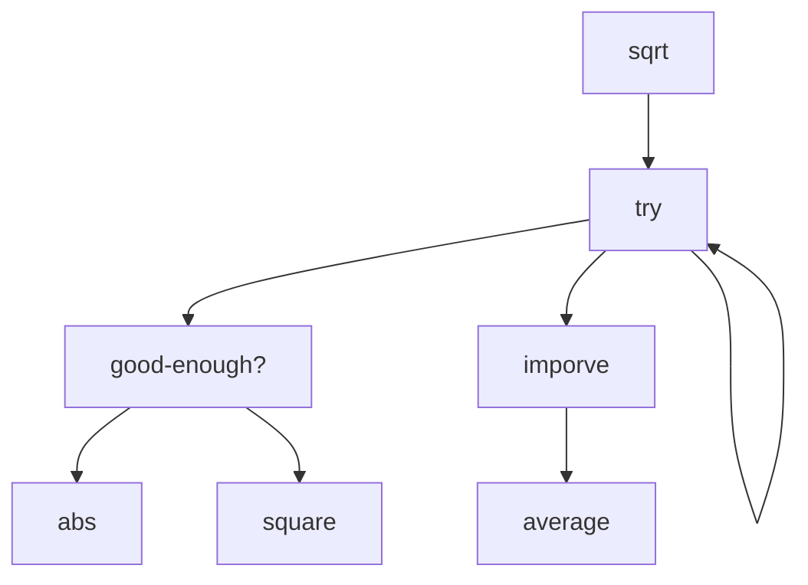
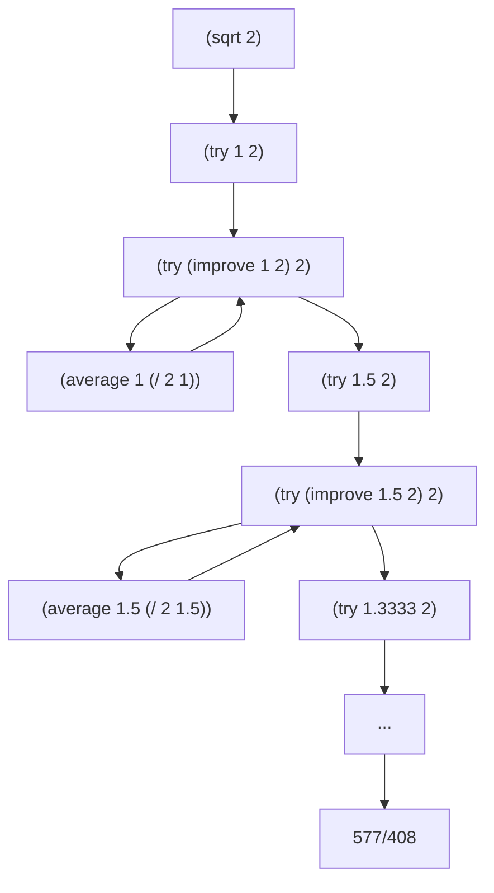

## Lecture 1A

In computer science, we are:
  1. into bussiness of formalizing "how-to" imperative knowledge.
  2. dealing with idealized components (abstarct entities).
  3. using techniques for **controlling complexity**.

> Declarative knowledge: "what-is"; imperitive knowledge: "how-to".

Techniques for controlling comlexity:
  1. black-box abstraction.
  2. conventional interfaces.
  3. metalinguistic abtraction.

Combination with `prefix notation`: (OPERATOR {OPERANDS}*)
  - parentheses are used for **writing 2-dimension structures as linear character strings**.

DEFINE and LAMBDA

```lisp
> (define a (* 5 5)) # bound value to a
> a
25
> (a)
Exception: attempt to apply non-procedure 25
Type (debug) to enter the debugger.

> (define (b) (* 5 5)) # bound procedure to b
> b
#<procedure b>
> (b)
25
```

Case analysis: COND, IF
  - predicates are procedures return `ture` or `false`

Recursive definition

*Case 1*: to fine an approximation to $$\sqrt{x}$$
  1. make a guess G
  2. imporove the guess by average G and X/G
  3. keep imporove the guess, until it is good enough
  4. use 1 as an initial guess

```scheme


(define (square x)
  (* x x))

(define (average a b)
  (/ (+ a b) 2))

(define (improve guess x)
  (average guess (/ x guess)))

(define (good-enough? guess x)
  (< (abs (- (square guess) x))
     0.001))

(define (try guess x)
  (if (good-enough? guess x)
      guess
      (try (improve guess x) x)))

(define (sqrt x)(try 1 x))
```
Symbol dependencies:



Recursive application of (sqrt 2):



Words
  - lousy ['laʊzi] adj.非常糟的；极坏的；恶劣的
  - priesthood [ˈpriːsthʊd] n.牧师（或教士、神父、司铎）的职位；司祭品
  - rudiment 初步；基本；【生】(器官的)原基；退化[痕迹]器官
  - fiddling ['fɪdlɪŋ] adj.琐碎的；繁琐的
    - ['fɪd(ə)l] n.调整；摆弄；欺诈；骗钱行为 v.伪造；不停摆弄；篡改；对…做手脚
  - gadget  [ˈɡædʒɪt] n.小器具；小装置
  - as oppose to 与…形成对照
  - [ˈkʌndʒə(r)] v.变戏法；变魔术；使…变戏法般地出现（或消失）
  - implication [.ɪmplɪ'keɪʃ(ə)n] n.含意；可能的影响（或作用、结果）；暗指；（被）牵连
  - exploit [ɪkˈsplɔɪt] v.开发；利用；开拓；开采 n.英勇（或激动人心、引人注目）的行为
  - aeronautical [ˌeərə'nɔ:tɪkl] adj.航空的
  - immense [ɪ'mens] adj.巨大的；大量的；浩瀚的；无限的
    - immerse [ɪˈmɜː(r)s]v.使浸没于；（使）深陷于
  - cascade [kæ'skeɪd] n.级联；阶梯；(陡岩落下的)瀑布；【园艺】人工瀑布 v.串联；泻；〔罕用语〕(使)成瀑布落下；奔流 adj.型栅的
  - theraml [ˈθɜː(r)m(ə)l] adj.热的；热量的；保暖的；防寒的 n.上升的热气流；保暖内衣裤
  - suppress [sə'pres] v.抑制；压制；阻止；控制
  - amplifier  [ˈæmplɪˌfaɪə(r)] n.放大器；放大器电路；【电】扩大器
  - screw  [skruː] n.螺丝；螺丝钉；（对螺丝的）旋拧；性交 v.用螺丝固定（或拧牢）；旋紧；拧紧；拧上去
    - screw up 拧紧;钉上;搞砸了
  - impedance [ɪmˈpiːd(ə)ns] n.阻抗
  - allude [əˈluːd] v.暗指；(婉转)提到；指…说
  - aggregate  [ˈæɡrɪɡeɪt] n.骨料；合计；总数 v.合计；总计 adj.总数的；总计的

## Lecuture 1b