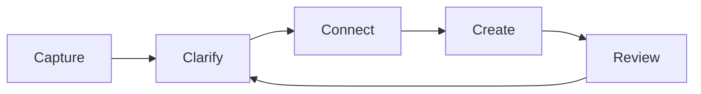
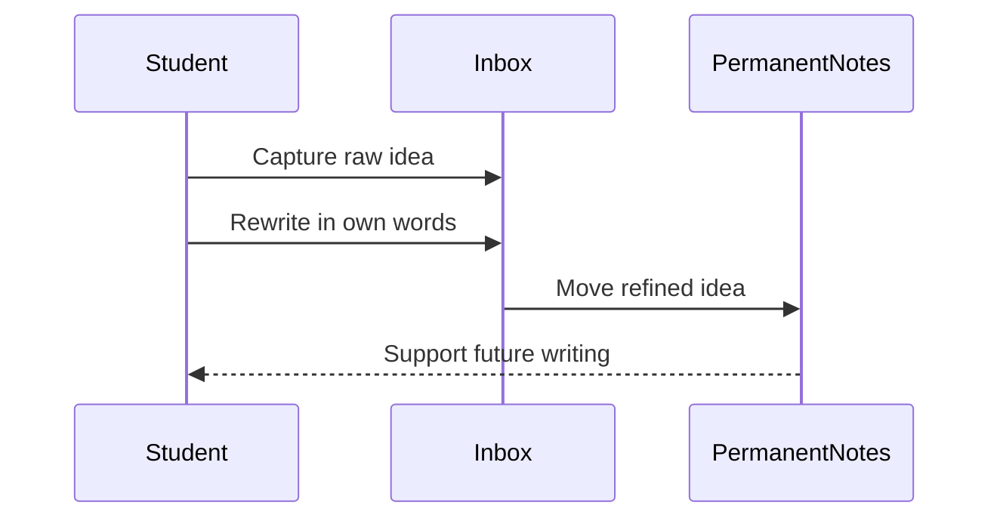
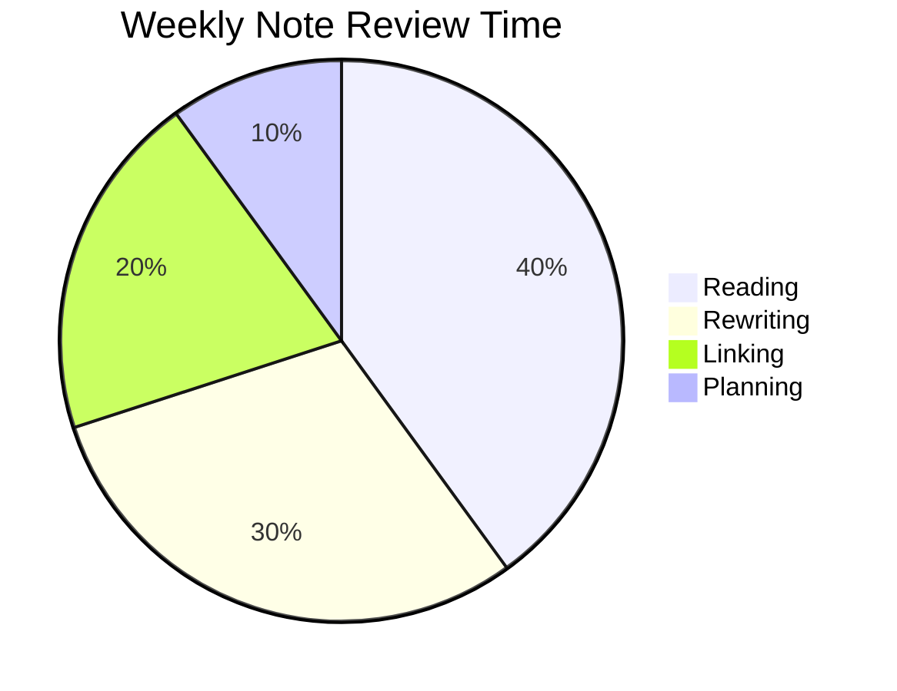

# Markdown Quick Reference

**Compatibility note:** Markdown behavior depends on the renderer. **GFM** means *GitHub Flavored Markdown*. **kramdown** is a Markdown-superset parser used heavily in Ruby/Jekyll-style workflows; its syntax includes extra features such as definition lists, attribute lists, footnotes, abbreviations, tables, and parser extensions.

| Category               | Feature                       | Syntax                                                                    | Notes                                                                                                     |                       |
| ---------------------- | ----------------------------- | ------------------------------------------------------------------------- | --------------------------------------------------------------------------------------------------------- | --------------------- |
| **Document Structure** | Heading 1–6                   | `# H1`<br>`## H2`<br>`### H3`                                             | Use one space after `#`. Prefer one `H1` per document.                                                    |                       |
| **Document Structure** | Setext heading                | `Heading 1`<br>`=========`<br><br>`Heading 2`<br>`---------`              | Supported by kramdown and many Markdown parsers.                                                          |                       |
| **Document Structure** | Paragraph                     | `First paragraph.`<br><br>`Second paragraph.`                             | A blank line separates paragraphs.                                                                        |                       |
| **Document Structure** | Hard line break               | `Line one`<br>`Line two`                                                | Two trailing spaces create a hard break. kramdown also supports two trailing backslashes.  |                       |
| **Document Structure** | Horizontal rule               | `---`<br>`***`<br>`___`                                                   | Use three or more markers on a line by themselves.                                                        |                       |
| **Text Style**         | Italic                        | `*text*` or `_text_`                                                      | Prefer `*text*` for portability.                                                                          |                       |
| **Text Style**         | Bold                          | `**text**` or `__text__`                                                  | Prefer `**text**`.                                                                                        |                       |
| **Text Style**         | Bold italic                   | `***text***`                                                              | Equivalent to bold + italic.                                                                              |                       |
| **Text Style**         | Inline code                   | `` `code` ``                                                              | Use for commands, filenames, variables, symbols.                                                          |                       |
| **Text Style**         | Literal backtick              | ` ` `code` ` `                                                            | Use double backticks around code containing backticks.                                                    |                       |
| **Text Style**         | Strikethrough                 | `~~text~~`                                                                | Common in GFM and many extended renderers.                                                                |                       |
| **Text Style**         | Underline                     | `<u>text</u>`                                                             | Markdown has no native underline; HTML is used.                                                           |                       |
| **Text Style**         | Escaping                      | `\*literal asterisk\*`                                                    | Escape Markdown control characters with `\`.                                                              |                       |
| **Blockquote**         | Basic quote                   | `> quoted text`                                                           | Use `>` at the start of the line.                                                                         |                       |
| **Blockquote**         | Multi-paragraph quote         | `> Paragraph 1`<br>`>`<br>`> Paragraph 2`                                 | Blank quoted line preserves paragraph separation.                                                         |                       |
| **Blockquote**         | Nested quote                  | `> Outer`<br>`>> Inner`                                                   | Multiple `>` markers create nesting.                                                                      |                       |
| **Lists**              | Unordered list                | `- item`<br>`* item`<br>`+ item`                                          | Prefer one marker style per list.                                                                         |                       |
| **Lists**              | Ordered list                  | `1. item`<br>`2. item`                                                    | Many renderers auto-number even if all markers are `1.`.                                                  |                       |
| **Lists**              | Nested list                   | `- item`<br>`- subitem`                                                 | Use consistent indentation, usually 2 or 4 spaces.                                                        |                       |
| **Lists**              | Paragraph inside list         | `- item`<br><br>`second paragraph`                                      | Indent the continuation paragraph under the list item.                                                    |                       |
| **Lists**              | Blockquote inside list        | `- item`<br>`> quote`                                                   | Indent the blockquote under the list item.                                                                |                       |
| **Lists**              | Code block inside list        | `- item`<br>`code`                                                  | Indent code enough to belong to the list item.                                                            |                       |
| **GFM / Extensions**   | Task list                     | `- [ ] todo`<br>`- [x] done`                                              | GFM defines task-list markers with `[ ]` or `[x]`; nested task lists are supported.      |                       |
| **GFM / Extensions**   | Autolink URL                  | `https://example.com`                                                     | Many GFM-style renderers link bare URLs automatically.                                                    |                       |
| **GFM / Extensions**   | Mention                       | `@username`                                                               | Platform-specific; common on GitHub/GitLab-like systems.                                                  |                       |
| **GFM / Extensions**   | Issue / PR reference          | `#123`                                                                    | Platform-specific; usually links to issue or pull request.                                                |                       |
| **Links**              | Inline link                   | `[text](https://example.com)`                                             | Basic link syntax.                                                                                        |                       |
| **Links**              | Link with title               | `[text](https://example.com "title")`                                     | Title may appear on hover.                                                                                |                       |
| **Links**              | Reference link                | `[text][id]`<br><br>`[id]: https://example.com`                           | Good for long documents.                                                                                  |                       |
| **Links**              | Shortcut reference link       | `[text]`<br><br>`[text]: https://example.com`                             | Link text itself is the reference ID.                                                                     |                       |
| **Links**              | Section link                  | `[Go](#section-title)`                                                    | Anchor generation varies by renderer.                                                                     |                       |
| **Links**              | Manual HTML anchor            | `<a id="custom-id"></a>`                                                  | Useful when renderer anchor rules are unclear.                                                            |                       |
| **Images**             | Image                         | ``                                                  | Alt text should describe the image.                                                                       |                       |
| **Images**             | Image with title              | ``                                               | Title may appear on hover.                                                                                |                       |
| **Images**             | Reference image               | `![Alt][img]`<br><br>`[img]: image.png`                                   | Useful for repeated image paths.                                                                          |                       |
| **Images**             | Linked image                  | `[](https://example.com)`                                  | Image becomes clickable.                                                                                  |                       |
| **Code**               | Inline code                   | `` `x = 1` ``                                                             | For short code fragments.                                                                                 |                       |
| **Code**               | Fenced code block             | ` ```python<br>print("hi")<br>``` `                                       | Add language for highlighting.                                                                            |                       |
| **Code**               | Tilde fence                   | `~~~ruby`<br>`puts 42`<br>`~~~`                                           | kramdown supports tilde-delimited code blocks.                                             |                       |
| **Code**               | Indented code block           | `code`                                                                | Four spaces or one tab. Less explicit than fences.                                                        |                       |
| **Tables**             | Basic table                   | `\| A \| B \|`<br>`\|---\|---\|`<br>`\| 1 \| 2 \|`                        | Pipe tables are widely supported in extended Markdown.                                                    |                       |
| **Tables**             | Alignment                     | `\| Left \| Center \| Right \|`<br>`\|:---\|:---:\|---:\|`                | `:` controls alignment.                                                                                   |                       |
| **Tables**             | Escape pipe                   | `` `a \| b` `` or `a \| b`                                                | Escape `                                                                                                  | ` inside table cells. |
| **Tables**             | Cell merging                  | Not native                                                                | Use raw HTML table if colspan/rowspan is needed.                                                          |                       |
| **HTML**               | Inline HTML                   | `<span class="x">text</span>`                                             | Many renderers allow inline HTML. Some sanitize it.                                                       |                       |
| **HTML**               | Block HTML                    | `<details>`<br>`<summary>More</summary>`<br>`Hidden text`<br>`</details>` | Common for collapsible sections.                                                                          |                       |
| **HTML**               | Comment                       | `<!-- comment -->`                                                        | Hidden in rendered output.                                                                                |                       |
| **Footnotes**          | Footnote marker               | `Text[^1]`                                                                | Common extension; native in kramdown.                                                                     |                       |
| **Footnotes**          | Footnote definition           | `[^1]: Note text.`                                                        | kramdown auto-numbers by document order.                                                   |                       |
| **Footnotes**          | Multi-block footnote          | `[^1]: First paragraph.`<br>`> quote`                                 | Indent continuation blocks under the footnote.                                                            |                       |
| **kramdown**           | Definition list               | `Term`<br>`: definition`                                                  | kramdown supports definition lists for term–definition pairs.                              |                       |
| **kramdown**           | Multiple definitions          | `Term`<br>`: definition 1`<br>`: definition 2`                            | One term can have multiple definitions.                                                                   |                       |
| **kramdown**           | Multiple terms                | `Term A`<br>`Term B`<br>`: shared definition`                             | Multiple terms can share one definition.                                                                  |                       |
| **kramdown**           | Block attribute list          | `Paragraph text`<br>`{: .class #id}`                                      | Assign class/id/attributes to the previous block.                                          |                       |
| **kramdown**           | Class shortcut                | `{: .warning}`                                                            | Adds `class="warning"` to the previous block.                                                             |                       |
| **kramdown**           | ID shortcut                   | `{: #intro}`                                                              | Adds `id="intro"` to the previous block.                                                                  |                       |
| **kramdown**           | Attribute key/value           | `{: title="Note"}`                                                        | Adds arbitrary HTML attributes where allowed.                                                             |                       |
| **kramdown**           | Attribute list definition     | `{:note: .note #n1}`<br>`Text`<br>`{: note}`                              | Reuse a named attribute set.                                                               |                       |
| **kramdown**           | Inline attribute list         | `*red*{: style="color:red"}`                                              | Assign attributes to a span-level element.                                                 |                       |
| **kramdown**           | Abbreviation                  | `HTML`<br><br>`*[HTML]: Hyper Text Markup Language`                       | Renders matching text as an abbreviation with a title.                                     |                       |
| **kramdown**           | Table footer                  | `\|=====`                                                                | kramdown can mark table footer rows with an equals separator.                              |                       |
| **kramdown**           | Options extension             | `{::options auto_ids="false" /}`                                          | Changes parser options inside the document.                                                |                       |
| **kramdown**           | Comment extension             | `{::comment}`<br>`ignored text`<br>`{:/comment}`                          | kramdown extension syntax can ignore text.                                                 |                       |
| **kramdown**           | No Markdown parsing           | `{::nomarkdown}**raw**{:/}`                                               | Emits content without Markdown interpretation.                                                            |                       |
| **kramdown / Jekyll**  | Table of contents placeholder | `* TOC`<br>`{:toc}`                                                       | Common Jekyll/kramdown pattern for generating a TOC.                                                      |                       |
| **kramdown / Jekyll**  | Exclude heading from TOC      | `## Heading`<br>`{:.no_toc}`                                              | Common convention in Jekyll/kramdown setups.                                                              |                       |
| **kramdown / Jekyll**  | Custom heading ID             | `## Heading`<br>`{: #custom-id}`                                          | Useful for stable anchors.                                                                                |                       |
| **MathJax**            | Inline math                   | `$E = mc^2$`                                                              | Renderer must support MathJax/LaTeX math.                                                                 |                       |
| **MathJax**            | Display math                  | `$$`<br>`E = mc^2`<br>`$$`                                                | Use display math for equations on their own line.                                                         |                       |
| **MathJax**            | Escaping dollar signs         | `\$5`                                                                     | Needed when `$` would otherwise start math.                                                               |                       |
| **MathJax**            | Common issue                  | Blank lines inside math                                                   | Many renderers dislike blank lines inside math blocks.                                                    |                       |
| **Mermaid**            | Mermaid fence                 | ` ```mermaid<br>flowchart LR<br>A --> B<br>``` `                          | GitHub supports Mermaid in fenced code blocks with the `mermaid` language tag.         |                       |
| **Mermaid**            | Flowchart                     | `flowchart LR`<br>`A --> B`                                               | Flowcharts use nodes and edges.                                                            |                       |
| **Mermaid**            | Sequence diagram              | `sequenceDiagram`<br>`A->>B: Hello`                                       | Good for interactions over time.                                                                          |                       |
| **Mermaid**            | Pie chart                     | `pie`<br>`title Pets`<br>`"Dogs" : 36`                                    | Pie charts start with the `pie` keyword.                                                  |                       |
| **Mermaid**            | Other diagram types           | `classDiagram`, `stateDiagram`, `gantt`, `erDiagram`                      | Mermaid supports many diagram syntaxes.                                                     |                       |
| **Best Practice**      | Prefer portable syntax        | CommonMark/GFM first                                                      | Use raw HTML or kramdown syntax only when the target renderer supports it.                                |                       |
| **Best Practice**      | Keep one syntax style         | Use `-` for bullets, `**` for bold                                        | Consistency improves readability and diffs.                                                               |                       |
| **Best Practice**      | Use relative paths            | ``                                                     | Better for moving docs with assets.                                                                       |                       |
| **Best Practice**      | Use descriptive anchors       | `{: #clear-id}`                                                           | Stable links survive heading edits.                                                                       |                       |
| **Best Practice**      | Check renderer output         | Preview before publishing                                                 | Especially important for tables, math, Mermaid, and kramdown attributes.                                  |                       |

# A Compact Guide to Building a Personal Knowledge Base

{: #top .article-title}

* TOC
{:toc}

## 1. Why Build a Knowledge Base?

A **personal knowledge base** helps you collect, connect, and review ideas. It is useful for students, researchers, programmers, and writers.

The basic workflow is simple:

1. **Capture** useful information.
2. **Clarify** what it means.
3. **Connect** it with older notes.
4. **Create** something from it.

> Good notes are not storage boxes.
>
> They are thinking tools.

For this article, we will build a small note system using plain text, Markdown, and a few repeatable habits.

## 2. Basic Formatting

Markdown supports *italic*, **bold**, ***bold italic***, `inline code`, ~~deleted text~~, and <u>underlined text through HTML</u>.

You can also escape special characters:

\*This is not italic.\*  
\# This is not a heading.

Abbreviations can be defined in kramdown:

*[PKB]: Personal Knowledge Base
*[HTML]: HyperText Markup Language

A PKB can be written in Markdown and exported to HTML.

---

A line separates.

## 3. Folder Structure

A small knowledge base may look like this:

```text
knowledge-base/
├── inbox/
├── literature/
├── permanent/
├── projects/
└── assets/
```

Recommended naming style:

* `YYYY-MM-DD-topic.md`
* `project-name-notes.md`
* `author-year-title.md`

Example:

```bash
touch 2026-05-03-markdown-reference.md
```

## 4. Lists and Tasks

Use unordered lists for concepts:

* Notes should be short.
* Notes should use clear titles.
* Notes should link to related notes.
  * Links create context.
  * Context improves retrieval.

Use ordered lists for procedures:

1. Open your inbox folder.
2. Review one note.
3. Rewrite it in your own words.
4. Link it to at least one older note.

Use task lists for action tracking:

* [x] Create the folder structure
* [x] Add the first note
* [ ] Review notes every Friday
* [ ] Write one summary article per month

## 5. Links and Images

Inline link:

[Markdown Guide](https://www.markdownguide.org)

Reference-style link:

Read the [CommonMark Spec][commonmark] for portability.

[commonmark]: https://commonmark.org/

Internal section link:

[Return to the top](#top)

Image:


Linked image:

[](https://daringfireball.net/projects/markdown/)

## 6. Tables

| Note Type | Purpose | Example | Review Frequency |
|:---|:---|:---|---:|
| Inbox note | Temporary capture | Raw lecture note | Daily |
| Literature note | Source-based summary | Book chapter note | Weekly |
| Permanent note | Stable idea | Original concept | Monthly |
| Project note | Work in progress | Paper outline | As needed |

Markdown tables do not support merged cells directly. Use raw HTML if needed:

<table>
  <tr>
    <th colspan="2">Merged Header</th>
  </tr>
  <tr>
    <td>Left cell</td>
    <td>Right cell</td>
  </tr>
</table>

## 7. Definition Lists

Knowledge base
: A structured collection of notes, references, and ideas.

Atomic note
: A short note focused on one idea.

Evergreen note
: A note that improves over time through revision.

## 8. Code Blocks

Inline code is useful for names such as `README.md`, `git status`, or `org-mode`.

Fenced code blocks support language labels:

```python
from pathlib import Path

root = Path("knowledge-base")
for folder in ["inbox", "literature", "permanent", "projects", "assets"]:
    (root / folder).mkdir(parents=True, exist_ok=True)
```

kramdown also supports tilde fences:

~~~ruby
puts "Markdown can be parsed by kramdown."
~~~

## 9. Math

A simple review model can use exponential decay:

$$
R(t) = e^{-\lambda t}
$$

Where:

* $$R(t)$$ means retention after time $$t$$.
* $$\lambda$$ means the forgetting rate.

A practical review interval can be written as:

$$
I_{n+1} = I_n \times q
$$

## 10. Mermaid Diagram



Sequence diagram:



Pie chart:



## 11. Footnotes

A note should cite its source when the idea comes from a book, article, lecture, or conversation.[^source]

A footnote can contain multiple paragraphs.[^long-note]

[^source]: Source tracking makes later verification easier.

[^long-note]: This is the first paragraph of a longer footnote.

    This is the second paragraph of the same footnote.

## 12. kramdown Attribute Lists

This paragraph has a custom class and ID.
{: .warning #important-warning}

You can also assign attributes to headings:

### A Heading with a Stable Anchor

{: #stable-anchor .custom-heading}

Inline attributes are possible too: *important phrase*{: .emphasis}.

Reusable attribute lists:

{: .box-style: .box .rounded}

This paragraph uses a reusable attribute list.
{: .box-style}

## 13. kramdown Parser Extensions

A comment block can be hidden from output:

{::comment}
This paragraph is ignored by kramdown.
{:/comment}

Markdown parsing can be disabled:

{::nomarkdown}
**This will not be parsed as bold by kramdown.**
{:/nomarkdown}

Parser options can be changed inside a document:

{::options auto_ids="true" /}

## 14. Collapsible HTML Section

<details>
<summary>Click to show a short review checklist</summary>

* Did I rewrite the note in my own words?
* Did I add a source?
* Did I link it to another note?
* Did I remove unclear claims?

</details>

## 15. Final Checklist

Before publishing a Markdown document:

* [ ] Use one clear `# Heading 1`.
* [ ] Keep heading levels consistent.
* [ ] Add alt text to images.
* [ ] Preview tables, math, and diagrams.
* [ ] Test links and anchors.
* [ ] Check whether your renderer supports kramdown extensions.

## Appendix: Quick Syntax Reminder

| Feature | Syntax |
|:---|:---|
| Heading | `## Heading` |
| Bold | `**bold**` |
| Italic | `*italic*` |
| Code | `` `code` `` |
| Link | `[text](url)` |
| Image | `` |
| Quote | `> quote` |
| Task | `- [ ] task` |
| Footnote | `text[^1]` and `[^1]: note` |
| Attribute | `{: #id .class}` |
| Math | `$$ E = mc^2 $$` |
| Mermaid | fenced block with `mermaid` |

[Back to top](#top)
