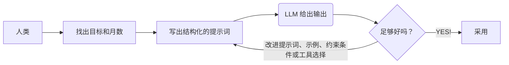

> *如果正文阅读有困难，可以只看斜体的结论部分。*

## 提示词工程的基本信息

*核心目标——为什么要使用它*
* 引导大语言模型（LLM）生成符合预期的输出。
* 通过将大语言模型整合进任务流程，提高工作效率。
* 扩展解决问题的能力，弥补专业知识上的不足。

*方法论——如何使用它*
* 由人来确定目标，提供相关背景，设定约束条件，组织任务结构，并根据模型的输出不断改进提示词。
* 将提示词组织为在功能上彼此区分的不同部分，用来分离目标、背景、约束条件和输出要求。这种设计可以减少歧义和各部分之间的冲突，从而提高控制力和一致性。

*使用场景——何时／何地使用它*
* 适用于那些需要同时处理大量文本、复杂指令或多重约束的任务。对于一些过去由人来做时速度较慢或难度较高的工作，它尤其有效，例如长上下文综合、跨文档比较、多步骤改写、从杂乱数据中提取结构化信息、按统一风格进行大规模生成，以及将一个任务快速改造成多种输出形式。
* 在那些要求一致性、可重复性以及低协调成本的重复性工作流程中，它也很有价值。

*应用形式——使用大语言模型的方式*
* *浏览器中的聊天*（Chat in browser）——最适合几乎不需要准备即可获得即时的思考支持、写作帮助和问题解决支持。
* *集成到集成开发环境*（IDE integration）——最适合将软件开发变成一种更快速的交互式流程，用于编写代码、调试和重构。
* *API 集成*（API integration）——最适合在产品、服务和内部工作流程中自动化重复性的语言任务。
* *办公软件和工作工具集成*（Office and work-tool integration）——最适合在日常生产力软件中减少电子邮件、文档、会议和演示文稿相关的例行工作。
* *企业工作流系统*（Enterprise workflow systems）——最适合将大语言模型嵌入组织流程中，例如支持、合规、知识管理和审批等场景。
* *本地部署*（Local deployment）——最适合用于私密、敏感或离线场景，在这些场景中，对数据和运行环境的控制尤为重要。
* *代理式工具使用*（Agent-style tool use）——最适合处理多步骤任务，在这类任务中，模型不仅要回答问题，还必须跨工具进行搜索、检索、执行操作并完成工作。

Chart 1
: The simplified workflow of human interaction with LLMs.



## 什么是提示词？

刚开始接触大语言模型（LLM）的人，常常会像与人交谈那样与它们互动。然而，这种做法并不总能得到令人满意的回应。由于机器的“交流偏好”与人类不同，要想获得稳定且高质量的结果，就必须理解大语言模型的倾向及其运作特性。换言之，需要理解什么是提示词（prompt），并掌握几种有效撰写提示词的技巧。


一个好的提示由三个组成部分构成：
1. **任务描述**：一条清晰的指令，用于告诉模型它应当做什么，即规则。
2. **上下文或示例**：背景信息或示例输入与输出，用于帮助模型更好地理解任务，即模式。
3. **任务本身**：模型需要处理的实际输入或问题，即真实案例。

Example 1
: A well-structured prompt. Task description defines the assistant’s role and the standards for success. Context or Examples gives the disciplinary setting, audience, tone, and a model sentence. The task states exactly what output is required.

```
[Task description]

You are an academic writing assistant. Your role is to help revise and strengthen scholarly writing for clarity, coherence, precision, and formal academic tone. 

Preserve the original argument and meaning.

Do not invent evidence, citations, or claims that are not supported by the text.

[Context or Examples]

This paragraph is from a graduate-level literature essay discussing the role of memory in Toni Morrison’s Beloved. 

The intended audience is a university instructor in literary studies.

The writing should sound analytical, formal, and precise.

It should use clear topic sentences, strong logical flow, and concise phrasing.

Example of preferred style:
“Morrison presents memory not as a passive recollection of the past, but as an active and disruptive force that shapes identity in the present.”

Paragraph to revise:
“In Beloved, memory is very important because it affects how the characters think and act, and it also shows that the past does not really disappear, which makes the novel more powerful and emotional.”

[The task]

Rewrite the paragraph in a more polished academic style suitable for a graduate-level essay. Then provide a brief explanation of three specific changes you made to improve clarity, structure, and academic tone.
```

大多数模型 API 都允许我们将提示拆分为 `system prompts` 和 `user prompts`。  
`System prompts`——模型应当如何表现
* 用于定义模型整体行为的高层指令。它们通常设定角色、目标、规则、语气、约束或响应格式，并且这些内容应在整个交互过程中保持稳定。
  
`User prompts`——模型此刻应当做什么
* 用户当前给出的任务或输入。它们包含模型在当下需要回应的实际请求、问题或数据。

Example 2
: A good English prompt example for business analysis.

```
[System Prompt]
You are a business analysis assistant.

Provide clear, structured, and evidence-based analysis. 

Focus on practical insights, state assumptions when needed, and do not invent data.

[User prompt]
Analyze the following business case.

Context:
An e-commerce company saw quarterly sales decline by 12%. Website traffic remained stable, but the conversion rate fell from 3.8% to 2.9%. 

Customer complaints about delivery delays increased, and two competitors launched major discount campaigns.

Task:
Explain the most likely reasons for the sales decline. Then give two key risks and three practical recommendations.
```

## LLMs 如何处理提示词？


**LLM 并不会“理解”你的提示。它只是在“续写”它。**


这不是比喻。这是字面意义上的计算过程。每个大语言模型（LLM）在其核心上，都是一个“下一个词元预测器”：给定一个词元序列，它会对接下来可能出现的内容生成一个概率分布。你的提示词并不是发送给某个智能代理的命令——它是一个序列的开端，而模型会在其既有学习经验的基础上，以统计上最可能的方式被“驱动”去完成这个序列。关于有效提示的一切，都是由这一基本事实推导出来的。


然后回到核心问题：“当你提交一个提示词时，究竟实际发生了什么？”


**词元化**——你的文本从来不是按“单词”被读取的。它首先会被拆分成 `tokens`（词元）——由模型词汇表决定的子词单位（例如，GPT-4 使用的大约是 100,000 个 BPE 词元）。字符串 “unbelievable” 可能会被拆成 ["un", "believ", "able"]。这会带来真实后果。不同寻常的拼写、罕见词汇以及非英语文本，往往会被切分成更多词元，使模型在每个语义单位上获得的连贯信号更少。词元边界还会影响算术推理，因为数字的切分方式并不稳定。甚至前导空格和大小写也会改变词元化结果，并进而微妙地影响输出。对提示工程来说，其实际含义很直接：*使用常见、规范的语言，避免不必要的缩写或非标准拼写*，因为你的文本越干净，模型编码其含义的效率就越高。


**嵌入与位置编码**——完成词元化之后，每个词元都会被映射为一个高维向量——也就是它的嵌入（embedding），而它在序列中的位置则会被单独编码，这样模型才知道词元 1 出现在词元 2 之前。然而，注意力在不同位置上的分布并不均匀。经验研究表明，大语言模型表现出首因偏置和近因偏置，更倾向于关注上下文窗口开头和结尾附近的词元。埋在长提示中部深处的内容，在统计上对输出的影响较弱。这意味着，*你最关键的指令应当放在提示词的开头或结尾*。尤其是在长上下文中，把核心任务说明放在中间，是提示工程师最常见、代价也最高的错误之一。


**注意力：它“阅读”文本的方式**——Transformer 的自`注意力机制`使得每一个 token 都能够**同时**关注其他所有 token，这意味着模型并不是按线性顺序来阅读你的提示词。它会构建一种整体性的表征，在这种表征中，提示词的每一部分都会为其他部分提供上下文。*提示词开头的框定方式，会影响后续全部内容的理解方式*——如果一个提示词以 “You are an expert forensic accountant” 开头，那么它确实会改变后续所有 token 的概率分布，因为这会缩小模型对于“这是一类什么文本”的先验判断，因此也会缩小“接下来应该出现什么文本”的范围。同样重要的是，提示词内部的指令、示例和数据之间会彼此相互作用。*它们并不是彼此孤立地被处理；相反，它们会**相互制约、相互条件化***。一个放置不当的示例，可能会在不知不觉中压过一条明确写出的指令；这并不是因为模型“困惑了”，而是因为从统计上看，一个被演示出来的模式，往往比一个被陈述出来的要求具有更大的权重。*换句话说，**提示词的结构**并不是装饰性的东西。各个要素的顺序与框定方式，会以确定性的方式塑造模型对任务的内部表征。与提示词中间部分相比，模型通常**更擅长理解开头和结尾的指令**。*


**补全要求**—— 模型以`自回归`的方式生成输出——*一次生成一个`词元`，并且每一个词元都以前面所有词元为条件，其中包括你的整个提示词*。它没有意图。它没有目标。它只有**一种驱动力：产出一个看起来合理的后续内容**。如果你的提示词读起来像是一段阿谀奉承式回答的开头，模型就会补全出一段阿谀奉承式回答。如果你的提示词读起来像是一份权威性的技术文档，模型就会补全出一份权威性的技术文档。*如果你的提示词含糊不清，模型不会停下来要求澄清——它会以概率方式消解这种歧义*，默认采用其训练数据中在统计上最常见的那种解释，而这往往并不是你真正想要的。这也许是提示工程（prompt engineering）最重要的一个影响。你并不是在“指挥”模型；你是在撰写一段你希望它继续生成下去的文本开头。*在提交任何提示词之前，最值得先问的一个问题是：按照我已经写下的内容，后面自然会接上一段什么样的文本？*

**提示词影响的核心机制**——在看清底层机制之后，不同提示词要素如何塑造模型行为这一过程就变得可以理解了。**人物设定**或角色定义会改变模型在词汇、语气和领域上的先验分布（prior）——它不是一种“扮演出来的外衣”，而是对概率分布的真实重新校准。**提供示例**，也就是正式所说的少样本提示（few-shot prompting），会通过上下文学习直接约束输出格式和推理模式；这是提示工程实践中最可靠的工具之一。**明确的分步指令**会激活链式思维路径，并显著提升模型在需要多步推理任务中的表现。相比之下，*含糊的表述*会按照统计上的默认方式被消解——而这几乎从来都不是你原本想要的解释。*否定性约束*，也就是“不要……”这种表达方式，传递的信号通常弱于正面表述，因为否定信息更难在较长的生成过程中被模型持续保持。而*冗长、失焦的上下文*会稀释注意力，从而提高模型完全偏离关键任务的概率。

总而言之，作为提示工程师，你的工作是**为你希望出现的文本撰写开头**。这意味着：
1. **要明确**——说清楚你想要什么、希望它以什么方式呈现、以及要排除什么。
2. **要有结构**——模型是基于具有结构的人类文本训练出来的，因此它会对结构作出响应。
3. **要提供示例**——上下文学习（in-context learning）是你能够使用的最可靠机制之一。
4. **要控制框架**——提示词的开头是最强的条件信号。
5. **不要默认模型会按你的意思理解**——如果一句话可以有两种理解方式，模型会在不询问你的情况下自行选定其中一种。


## 核心提示词技巧

### 1. Zero-Shot Prompting

### 2. Few-Shot Prompting

### 3. Chain-of-Thought Prompting

### 4. Role / Persona Prompting

### 5. Prompt Chaining

## 提示词的

## 常见误区

## LLMs 什么情况下大显神威？

### LLMs 将怎样的专家放上你的掌心？

### 对于企业和公司，LLMs 如何降本增效？