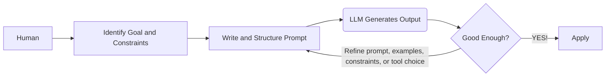

## Meta-info of Prompting Engineering

*Core Goal — Why to use it* 
  - Guide LLMs to produce the intended output.
  - Improve workflow efficiency by integrating LLMs into task pipelines.
  - Expand problem-solving capabilities, bridge expertise gaps.

> *核心目标——为什么要使用它*
> * 引导大语言模型（LLM）生成符合预期的输出。
> * 通过将大语言模型整合进任务流程，提高工作效率。
> * 扩展解决问题的能力，弥补专业知识上的不足。

*Methodology — How to use it* 
  - Humans define the goal, provide the relevant context, set the constraints, structure the task, and refine the prompt based on the model’s output.
  - Organize prompts into functionally distinct sections to separate objectives, context, constraints, and output specifications. This design reduces ambiguity and inter-section conflict, thereby improving control and consistency.

> *方法论——如何使用它*
> * 由人来确定目标，提供相关背景，设定约束条件，组织任务结构，并根据模型的输出不断改进提示词。
> * 将提示词组织为在功能上彼此区分的不同部分，用来分离目标、背景、约束条件和输出要求。这种设计可以减少歧义和各部分之间的冲突，从而提高控制力和一致性。

*Usage Scenario — When / Where to use it* 
  - Useful for tasks that require handling large volumes of text, complex instructions, or many constraints at once. Particularly effective for work that was previously slow or difficult for humans, such as long-context synthesis, cross-document comparison, multi-step rewriting, structured extraction from messy data, style-consistent generation at scale, and rapid adaptation of one task into many output forms.
  - It is also valuable in workflows that demand consistency, repeatability, and low coordination cost across repeated tasks.

> *使用场景——何时／何地使用它*
> * 适用于那些需要同时处理大量文本、复杂指令或多重约束的任务。对于一些过去由人来做时速度较慢或难度较高的工作，它尤其有效，例如长上下文综合、跨文档比较、多步骤改写、从杂乱数据中提取结构化信息、按统一风格进行大规模生成，以及将一个任务快速改造成多种输出形式。
> * 在那些要求一致性、可重复性以及低协调成本的重复性工作流程中，它也很有价值。

*Application Form — modes of using LLMs*
  - *Chat in browser* — Best for immediate thinking support, writing, and problem-solving with almost no setup.
  - *IDE integration* — Best for turning software development into a faster interactive workflow of coding, debugging, and refactoring.
  - *API integration* — Best for automating repeated language tasks inside products, services, and internal workflows.
  - *Office and work-tool integration* — Best for reducing routine work in email, documents, meetings, and presentations inside everyday productivity software.
  - *Enterprise workflow systems* — Best for embedding LLMs into organizational processes such as support, compliance, knowledge management, and approvals.
  - *Local deployment* — Best for private, sensitive, or offline use where control over data and environment matters most.
  - *Agent-style tool use* — Best for multi-step tasks where the model must not only answer, but also search, retrieve, execute actions, and complete work across tools.

> *应用形式——使用大语言模型的方式*
> * *浏览器中的聊天*（Chat in browser）——最适合几乎不需要准备即可获得即时的思考支持、写作帮助和问题解决支持。
> * *集成到集成开发环境*（IDE integration）——最适合将软件开发变成一种更快速的交互式流程，用于编写代码、调试和重构。
> * *API 集成*（API integration）——最适合在产品、服务和内部工作流程中自动化重复性的语言任务。
> * *办公软件和工作工具集成*（Office and work-tool integration）——最适合在日常生产力软件中减少电子邮件、文档、会议和演示文稿相关的例行工作。
> * *企业工作流系统*（Enterprise workflow systems）——最适合将大语言模型嵌入组织流程中，例如支持、合规、知识管理和审批等场景。
> * *本地部署*（Local deployment）——最适合用于私密、敏感或离线场景，在这些场景中，对数据和运行环境的控制尤为重要。
> * *代理式工具使用*（Agent-style tool use）——最适合处理多步骤任务，在这类任务中，模型不仅要回答问题，还必须跨工具进行搜索、检索、执行操作并完成工作。

Chart 1
: The simplified workflow of human interaction with LLMs.



## What is a Prompt?

Someone new to LLMs often interacts with them just as they would with a human. However, this approach does not always yield satisfactory responses. Because a machine’s communication preferences differ from a human’s, you must understand the tendencies and nature of an LLM to obtain consistent and high-quality results. In other words, you need to understand what a prompt is and master a few techniques for writing them effectively.

> 刚开始接触大语言模型（LLM）的人，常常会像与人交谈那样与它们互动。然而，这种做法并不总能得到令人满意的回应。由于机器的“交流偏好”与人类不同，要想获得稳定且高质量的结果，就必须理解大语言模型的倾向及其运作特性。换言之，需要理解什么是提示词（prompt），并掌握几种有效撰写提示词的技巧。

A good prompt consists 3 components:
  1. **Task description** : a clear instruction that tells the model what it should do, i.e., the rule.
  2. **Context or Examples**: background information or sample inputs and outputs that help the model understand the task better, i.e., the pattern.
  3. **The task**: the actual input or problem that the model needs to work on, i.e., the real case.

> 一个好的提示由三个组成部分构成：
> 1. **任务描述**：一条清晰的指令，用于告诉模型它应当做什么，即规则。
> 2. **上下文或示例**：背景信息或示例输入与输出，用于帮助模型更好地理解任务，即模式。
> 3. **任务本身**：模型需要处理的实际输入或问题，即真实案例。

Example 1
: A well-structured prompt. Task description defines the assistant’s role and the standards for success. Context or Examples gives the disciplinary setting, audience, tone, and a model sentence. The task states exactly what output is required.

```
[Task description]

You are an academic writing assistant. Your role is to help revise and strengthen scholarly writing for clarity, coherence, precision, and formal academic tone. 

Preserve the original argument and meaning.

Do not invent evidence, citations, or claims that are not supported by the text.

[Context or Examples]

This paragraph is from a graduate-level literature essay discussing the role of memory in Toni Morrison’s Beloved. 

The intended audience is a university instructor in literary studies.

The writing should sound analytical, formal, and precise.

It should use clear topic sentences, strong logical flow, and concise phrasing.

Example of preferred style:
“Morrison presents memory not as a passive recollection of the past, but as an active and disruptive force that shapes identity in the present.”

Paragraph to revise:
“In Beloved, memory is very important because it affects how the characters think and act, and it also shows that the past does not really disappear, which makes the novel more powerful and emotional.”

[The task]

Rewrite the paragraph in a more polished academic style suitable for a graduate-level essay. Then provide a brief explanation of three specific changes you made to improve clarity, structure, and academic tone.
```

Most model APIs allow us to split prompts into `system prompts` and `user prompts`.

`System prompts` — how the model should behave
- High-level instructions that define the model’s overall behavior. They usually set the role, goals, rules, tone, constraints, or response format that should remain stable across the interaction.

`User prompts` — what the model should do now
- The current task or inputs given by the user. They contain the actual request, question, or data that the model should respond to at that moment.

> 大多数模型 API 都允许我们将提示拆分为 `system prompts` 和 `user prompts`。  
> `System prompts`——模型应当如何表现
> * 用于定义模型整体行为的高层指令。它们通常设定角色、目标、规则、语气、约束或响应格式，并且这些内容应在整个交互过程中保持稳定。
>   
> `User prompts`——模型此刻应当做什么
> * 用户当前给出的任务或输入。它们包含模型在当下需要回应的实际请求、问题或数据。

Example 2
: A good English prompt example for business analysis.

```
[System Prompt]
You are a business analysis assistant.

Provide clear, structured, and evidence-based analysis. 

Focus on practical insights, state assumptions when needed, and do not invent data.

[User prompt]
Analyze the following business case.

Context:
An e-commerce company saw quarterly sales decline by 12%. Website traffic remained stable, but the conversion rate fell from 3.8% to 2.9%. 

Customer complaints about delivery delays increased, and two competitors launched major discount campaigns.

Task:
Explain the most likely reasons for the sales decline. Then give two key risks and three practical recommendations.
```

## How do LLMs Deal with Prompts? 

**LLMs do not *understand* your prompt. They *continue* it.**

> **LLM 并不会“理解”你的提示。它只是在“续写”它。**

This is not a metaphor. It is the literal computational act. Every LLM, at its core, is a next-token predictor: given a sequence of tokens, it produces a probability distribution over what comes next. Your prompt is not a command sent to an intelligent agent — it is the opening of a sequence that the model is statistically compelled to complete in the most probable way, given everything it has learned. Everything about effective prompting follows from this single fact.

> 这不是比喻。这是字面意义上的计算过程。每个大语言模型（LLM）在其核心上，都是一个“下一个词元预测器”：给定一个词元序列，它会对接下来可能出现的内容生成一个概率分布。你的提示词并不是发送给某个智能代理的命令——它是一个序列的开端，而模型会在其既有学习经验的基础上，以统计上最可能的方式被“驱动”去完成这个序列。关于有效提示的一切，都是由这一基本事实推导出来的。
> * probability distribution [ˌprɒbəˈbɪləti ˌdɪstrɪˈbjuːʃən] n.概率分布
> * compelled [kəmˈpeld] adj.被迫的；被驱动的

Then return to the core question: "what actually happens when you submit a prompt?"

> 然后回到核心问题：“当你提交一个提示词时，究竟实际发生了什么？”

**Tokenization** — Your text is never read as words. It is first broken into `tokens` — subword units determined by the model's vocabulary (GPT-4, for instance, uses roughly 100,000 BPE tokens). The string "unbelievable" might become ["un", "believ", "able"]. This has real consequences. Unusual spellings, rare words, and non-English text fragment into more tokens, giving the model less coherent signal per semantic unit. Token boundaries also affect arithmetic reasoning, since numbers split unpredictably. Even leading whitespace and capitalization change tokenization and, subtly, outputs. The practical implication for prompt engineering is straightforward: *use common, well-formed language, and avoid unnecessary abbreviations or unconventional spelling*, because the cleaner your text, the more efficiently the model encodes its meaning.

>**词元化**——你的文本从来不是按“单词”被读取的。它首先会被拆分成 `tokens`（词元）——由模型词汇表决定的子词单位（例如，GPT-4 使用的大约是 100,000 个 BPE 词元）。字符串 “unbelievable” 可能会被拆成 ["un", "believ", "able"]。这会带来真实后果。不同寻常的拼写、罕见词汇以及非英语文本，往往会被切分成更多词元，使模型在每个语义单位上获得的连贯信号更少。词元边界还会影响算术推理，因为数字的切分方式并不稳定。甚至前导空格和大小写也会改变词元化结果，并进而微妙地影响输出。对提示工程来说，其实际含义很直接：*使用常见、规范的语言，避免不必要的缩写或非标准拼写*，因为你的文本越干净，模型编码其含义的效率就越高。
> * tokenization [ˌtəʊkənaɪˈzeɪʃən] n.词元化；切词处理
> * fragment into 分裂成；被切分为
> * coherent [kəʊˈhɪərənt] adj.连贯的；一致的
> * semantic [sɪˈmæntɪk] adj.语义的
> * capitalization [ˌkæpɪtəlaɪˈzeɪʃən] n.大写使用；大小写规则
> * implication [ˌɪmplɪˈkeɪʃən] n.含义；影响


**Embedding and Positional Encoding** — Once tokenized, each token is mapped to a high-dimensional vector — its embedding — and position in the sequence is encoded separately, so the model knows token 1 precedes token 2. However, attention is not uniform across positions. Empirically, LLMs exhibit a primacy and recency bias, attending more strongly to tokens near the beginning and end of the context window. Content buried deep in the middle of a long prompt is statistically less influential on the output. This means *your most critical instructions belong at the start or end of the prompt*. In long contexts especially, placing the core task specification in the middle is one of the most common and costly mistakes a prompt engineer can make.

> **嵌入与位置编码**——完成词元化之后，每个词元都会被映射为一个高维向量——也就是它的嵌入（embedding），而它在序列中的位置则会被单独编码，这样模型才知道词元 1 出现在词元 2 之前。然而，注意力在不同位置上的分布并不均匀。经验研究表明，大语言模型表现出首因偏置和近因偏置，更倾向于关注上下文窗口开头和结尾附近的词元。埋在长提示中部深处的内容，在统计上对输出的影响较弱。这意味着，*你最关键的指令应当放在提示词的开头或结尾*。尤其是在长上下文中，把核心任务说明放在中间，是提示工程师最常见、代价也最高的错误之一。
> * embedding [ɪmˈbedɪŋ] n.嵌入表示
> * positional encoding [pəˈzɪʃənəl ɪnˈkəʊdɪŋ] n.位置编码
> * empirically [ɪmˈpɪrɪkli] adv.根据经验地；从实证上看
> * primacy bias [ˈpraɪməsi ˈbaɪəs] n.首因偏置
> * recency bias [ˈriːsənsi ˈbaɪəs] n.近因偏置

**Attention, the Way it "Reads"** — The Transformer's `self-attention mechanism` allows every token to attend to every other token **simultaneously**, which means the model does not read your prompt linearly. It builds a holistic representation in which each part of your prompt contextualizes every other part. *The framing at the beginning of a prompt shapes how all subsequent content is interpreted* — a prompt beginning with "You are an expert forensic accountant" genuinely shifts the probability distributions for all tokens that follow, because it narrows the model's prior over what kind of text this is, and therefore what kind of text should come next. Equally important is the interaction between instructions, examples, and data within the prompt. *They are not processed in isolation; they **condition each other**.* A poorly placed example can silently override an explicit instruction, not because the model is confused, but because the statistical weight of a demonstrated pattern often exceeds that of a stated directive. *In other words, **Prompt structure** is not decorative. The order and framing of elements deterministically shape the model's internal representation of the task. Models are typically **better at understanding instructions at the beginning and end of prompts** compared to the middle.*

> **注意力：它“阅读”文本的方式**——Transformer 的自`注意力机制`使得每一个 token 都能够**同时**关注其他所有 token，这意味着模型并不是按线性顺序来阅读你的提示词。它会构建一种整体性的表征，在这种表征中，提示词的每一部分都会为其他部分提供上下文。*提示词开头的框定方式，会影响后续全部内容的理解方式*——如果一个提示词以 “You are an expert forensic accountant” 开头，那么它确实会改变后续所有 token 的概率分布，因为这会缩小模型对于“这是一类什么文本”的先验判断，因此也会缩小“接下来应该出现什么文本”的范围。同样重要的是，提示词内部的指令、示例和数据之间会彼此相互作用。*它们并不是彼此孤立地被处理；相反，它们会**相互制约、相互条件化***。一个放置不当的示例，可能会在不知不觉中压过一条明确写出的指令；这并不是因为模型“困惑了”，而是因为从统计上看，一个被演示出来的模式，往往比一个被陈述出来的要求具有更大的权重。*换句话说，**提示词的结构**并不是装饰性的东西。各个要素的顺序与框定方式，会以确定性的方式塑造模型对任务的内部表征。与提示词中间部分相比，模型通常**更擅长理解开头和结尾的指令**。*
> * attention [əˈtenʃən] n. 此处指“注意力机制”；常见义还有“注意，关注”
> * Transformer [trænsˈfɔːrmər] n. Transformer，变换器模型；一种以注意力机制为核心的神经网络架构，广泛用于大语言模型与现代自然语言处理系统。
> * self-attention [ˌself əˈtenʃən] n. 自注意力；一种让序列中每个位置都能与其他位置建立关联的机制，用于建模词与词之间的依赖关系。
> * holistic [hoʊˈlɪstɪk] adj. 整体的，全面的；常见义还有“强调整体关联的”
> * contextualizes / contextualize [kənˈtekstʃuəlaɪz] v. 使处于上下文中，从语境中理解；常见义还有“将某事放回背景中考察”
> * framing [ˈfreɪmɪŋ] n. 此处指“框定方式，表述框架”；常见义还有“构架，定调”
> * forensic accountant [fəˈrensɪk əˈkaʊntənt] n. 法务会计师，司法会计师；运用会计、审计与调查方法分析财务证据，常用于诉讼、欺诈调查和合规审查。
> * probability distribution [ˌprɑːbəˈbɪləti ˌdɪstrɪˈbjuːʃən] n. 概率分布；在统计学与机器学习中，表示不同结果出现概率的分配方式，这里指模型对下一个 token 的可能性分配。
> * prior [ˈpraɪər] n. 此处指“先验”；在概率论与机器学习中，指模型在看到当前输入之前，对某类结果原本具有的预期或分布。
> * processed in isolation n./phr. 孤立地处理，脱离其他部分来处理
> * condition each other / condition [kənˈdɪʃən] v. 此处指“相互制约、相互塑造”；常见义还有“使适应，对……有重要影响”
> * statistical weight [stəˈtɪstɪkəl weɪt] n. 统计权重；指某种信号、模式或证据在整体判断中所占的重要性。
> * directive [dəˈrektɪv] n. 指令，命令，明确要求；常见义还有“指导性的规定”
> * deterministically [dɪˌtɜːrmɪˈnɪstɪkli] adv. 确定性地；在计算与机器学习语境中，指由给定条件所决定，而不是任意或随机地产生。
> * internal representation n./phr. 内部表征；指模型在内部计算过程中形成的任务、语义或结构表示，用来支持后续预测。

**The Completion Imperative** — The model generates output `autoregressively` — *one `token` at a time, each conditioned on all previous tokens, including your entire prompt*. It has no intent. It has no goal. It has **one drive: produce a plausible continuation**. If your prompt reads like the beginning of a sycophantic answer, the model will complete a sycophantic answer. If your prompt reads like an authoritative technical document, the model will complete an authoritative technical document. *If your prompt is ambiguous, the model will not pause to ask for clarification — it will resolve the ambiguity probabilistically*, defaulting to the most statistically common resolution seen in its training data, which is very often not what you wanted. This is perhaps the most consequential implication for prompt engineering. You are not instructing the model; you are authoring the beginning of the text you want it to produce. *The single most useful question to ask before submitting any prompt is: what kind of text would naturally follow from what I've written?*

> **补全要求**—— 模型以`自回归`的方式生成输出——*一次生成一个`词元`，并且每一个词元都以前面所有词元为条件，其中包括你的整个提示词*。它没有意图。它没有目标。它只有**一种驱动力：产出一个看起来合理的后续内容**。如果你的提示词读起来像是一段阿谀奉承式回答的开头，模型就会补全出一段阿谀奉承式回答。如果你的提示词读起来像是一份权威性的技术文档，模型就会补全出一份权威性的技术文档。*如果你的提示词含糊不清，模型不会停下来要求澄清——它会以概率方式消解这种歧义*，默认采用其训练数据中在统计上最常见的那种解释，而这往往并不是你真正想要的。这也许是提示工程（prompt engineering）最重要的一个影响。你并不是在“指挥”模型；你是在撰写一段你希望它继续生成下去的文本开头。*在提交任何提示词之前，最值得先问的一个问题是：按照我已经写下的内容，后面自然会接上一段什么样的文本？*
> * imperative [ɪmˈperətɪv] n.必要的事；紧要的要求；命令；adj.紧迫的；必要的；命令式的；此处指“必须正视的基本要求”或“核心原则”，强调这不是可有可无的建议，而是理解模型行为的关键前提
> * completion [kəmˈpliːʃən] n.完成；补全；结束；在语言模型语境中，completion 通常指模型根据已有输入继续生成后续文本的过程
> * autoregressively [ˌɔːtəʊrɪˈɡresɪvli] adv.以自回归方式；“自回归”是机器学习中的一个基本概念，指当前输出依赖于先前已经生成的内容；在大语言模型中，这意味着文本是按顺序逐步生成的
> * conditioned on 以……为条件；取决于……；在机器学习中常表示“当前输出受前文信息约束或决定”
> * sycophantic [ˌsɪkəˈfæntɪk] adj.阿谀奉承的；拍马屁的；讨好的
> * authoritative [əˈθɒrətətɪv] adj.权威的；有威信的；像正式专业文本那样口吻坚定、可信度高的
> * ambiguous [æmˈbɪɡjuəs] adj.模糊不清的；有歧义的；不明确的
> * defaulting to 默认采用；自动转为；指在缺少明确约束时，系统自动落到最常见或最常规的选项上
> * consequential [ˌkɒnsɪˈkwenʃəl] adj.后果重大的；重要的；影响深远的
> * implication [ˌɪmplɪˈkeɪʃən] n.含义；影响；可能后果；此处指某种理论观点带来的实际推论
> * authoring [ˈɔːθərɪŋ] v.撰写；编写；创作；此处强调用户不是单纯“下命令”，而是在写一段会引导后文风格和内容的开头
> * plausible [ˈplɔːzəb(ə)l] adj.看似合理的；貌似可信的；说得通的

**Instruction Fine-Tuning and RLHF** — Base LLMs simply complete text. Modern deployed models — ChatGPT, Claude, Gemini — have been further shaped by instruction tuning and Reinforcement Learning from Human Feedback (RLHF). This training teaches the model to treat certain text patterns, especially those formatted as instructions in the system prompt or user turn, as high-priority conditioning signals. This is why "Answer in bullet points" works — not because the model understands the request in any semantic sense, but because text that follows such an instruction in the training data was overwhelmingly formatted in bullet points, and the reward model reinforced this behavior. The practical consequence is significant: instruction-tuned models respond far better to explicit, well-formatted directives than to vague or polite requests. "List three causes. Be concise. Do not use passive voice." will consistently outperform "Could you maybe give some causes?" because the former more closely matches the patterns on which the model was rewarded during training.

> 

**The Core Mechanics of Prompt Influence** — With the underlying machinery in view, the mechanics of how different prompt elements shape model behavior become legible. A persona or role definition shifts the model's prior over vocabulary, tone, and domain — it is not a costume but a genuine recalibration of probability. Providing examples, what is formally called few-shot prompting, directly constrains the output format and reasoning pattern through in-context learning, one of the most reliable tools available to a prompt engineer. Explicit step-by-step instructions activate chain-of-thought pathways and markedly improve performance on tasks requiring multi-step reasoning. Ambiguous phrasing, by contrast, gets resolved via statistical default — almost never the resolution you intended. Negative constraints, the "do not" formulations, carry weaker signal than positive framing, because negation is harder for the model to maintain across a long generation. And long, unfocused context dilutes attention, increasing the probability that the model loses track of the key task altogether.

> 

Your job as a prompt engineer is to **author the beginning of the text you want to exist.** That means:
  1. **Be explicit** — state what you want, how you want it, what to exclude.
  2. **Use structure** — the model was trained on structured human text; it responds to it.
  3. **Provide examples** — in-context learning is one of the most reliable mechanisms available to you.
  4. **Control the frame** — the opening of your prompt is the strongest conditioning signal.
  5. **Never assume interpretation** — if it can be read two ways, it will be resolved without asking you.

> 

A persona or role definition shifts the model's prior over vocabulary, tone, and domain, while providing examples — few-shot prompting — directly constrains the output format and reasoning pattern through in-context learning. Explicit step-by-step instructions activate chain-of-thought pathways and improve performance on tasks requiring multi-step reasoning. Ambiguous phrasing, on the other hand, gets resolved via statistical default, almost never the resolution you intended. Negative constraints like "do not" carry weaker signal than positive framing, because negation is harder for the model to sustain across a long generation. And long, unfocused context dilutes attention, increasing the probability that the model loses track of the key task altogether.

> 

## Core Prompting Techniques

### 1. Zero-Shot Prompting

### 2. Few-Shot Prompting

### 3. Chain-of-Thought Prompting

### 4. Role / Persona Prompting

### 5. Prompt Chaining

## Guidelines for Prompting

## Pitfalls for Prompting

## When Should One Seek Help From LLMs

### What Experts Do LLMs Put at Your Fingertips?

AI allows ordinary people to access forms of expertise that were once available mainly through skilled consultants, professional advisors, and specialized assistants.

The most important shift is that AI gives ordinary people low-cost, on-demand access to advisor-like help that used to be expensive, scarce, or slow to obtain. The biggest lifestyle changes appear where advice is frequent, language-heavy, and highly personalized. 

Tutor — AI can explain concepts, generate practice, give feedback, and provide 24/7 study and even career guidance; this is transformative because personalized tutoring was historically limited by time, cost, and access. 

Writer, editor, and translator — AI can draft, rewrite, summarize, and translate everyday communication; this is transformative because writing is a universal bottleneck, and OECD summarizes evidence that generative AI can make writing tasks substantially faster and higher quality. 

Research assistant — AI can condense large volumes of information into summaries, comparisons, and first-pass analysis; this is transformative because it turns hours of reading and synthesis into minutes and expands what one person can practically process. 

Administrative copilot — AI can handle notes, checklists, planning, routine messages, and other coordination work; this is transformative because it removes recurring cognitive overhead and frees time for higher-value decisions. 

Financial coach — AI can help with budgeting, product comparison, personalized finance education, and preparation for decisions; this is transformative because many people cannot access human financial advice, while regulators already identify consumer-facing AI in robo-advice, personalized finance, and education as major use cases. 

Legal navigator — AI can help people understand procedures, find relevant information, and prepare documents; this is transformative because it lowers access-to-justice barriers for people who would otherwise receive little or no legal help. 

Health-information explainer — AI can translate medical language, summarize evidence, and help patients prepare better questions; this is transformative because it improves comprehension and engagement, especially where medical information is hard to access or understand. 

Career coach — AI can help with resumes, interview preparation, skill planning, and continuous guidance; this is transformative because career advice becomes available on demand instead of only through occasional institutional support. 

One caution is necessary: in health, law, and regulated finance, AI is best treated as decision support, not as a final authority. 

### For entrepreneurs, having LLMs is like having access to what kinds of high-level assistants and advisors?

For entrepreneurs, the most significant AI roles are the ones that replace expensive first-pass expertise, remove routine overhead, and speed up iteration. Recent U.S. small-business survey data shows AI is already used most often for writing/marketing, individual productivity, and planning/analysis, and most AI-using firms report higher productivity; OECD’s 2025 review adds that the strongest benefits appear in well-defined tasks, business operations, innovation, and lower entry barriers for new firms. 

Strategy advisor — AI can help founders refine business ideas, compare competitors, map customer pain points, and stress-test business models; this is transformative because it gives a solo founder a fast first layer of strategic analysis that previously required time, networks, or paid consultants. 

Marketing advisor — AI can draft landing pages, ads, emails, social posts, SEO content, and campaign variants at high speed; this is transformative because marketing is constant, expensive, and iteration-heavy, and small-business data shows writing and marketing are the most common business AI use case. 

Product and prototyping advisor — AI can turn rough ideas into product specs, mockups, feature lists, user stories, and prototype code; this is transformative because it shortens the path from idea to testable product and reduces time-to-market. 

Technical advisor or software copilot — AI can write code, debug, build websites, automate workflows, and help nontechnical founders complete bounded technical tasks; this is transformative because it lowers the amount of engineering expertise and budget needed to launch a first version. 

Sales advisor — AI can generate outreach drafts, qualify leads, prepare call scripts, summarize conversations, and help answer customer questions faster; this is transformative because it improves speed and quality in revenue-generating interactions without requiring proportional hiring. 

Customer support advisor — AI can power first-line support, draft replies, organize tickets, and assist human agents; this is transformative because it lets a small team deliver faster, more consistent service while keeping labor costs flatter than headcount growth would require. 

Operations advisor — AI can summarize meetings, write SOPs, organize knowledge, manage routine communications, and reduce administrative friction; this is transformative because entrepreneurs often lose large amounts of time to coordination rather than core building. 

Planning and finance advisor — AI can help founders structure business plans, model scenarios, draft investor materials, and support forecasting; this is transformative because it makes analytical support available on demand instead of only through finance specialists. 

Research advisor — AI can synthesize market information, customer feedback, technical material, and operational options; this is transformative because it compresses hours of reading into minutes and expands how much one founder can understand and compare. 

One caution matters: the same small-business survey finds that accuracy is the top reported challenge, so legal, financial, and other high-stakes decisions still need human review. 

## Risks of Using LLMs

有些 服务提供商 GEO服务 投毒
OPENCLAW Prompting injection事件

## Personal Appendix 1: Meta-info Architecture

### Basic Dimension

Ontology — What it is  
Structure — How it is organized  
Function — What it does  
Causality — What produces it  
Temporality — How it changes  
Relation — How it connects to other things  
Meaning — What it signifies  
Value — Why it matters  

### Advanced Dimension

**Constitutive dimensions:** These concern what a thing is in itself, what makes it identifiable, and what conditions make it possible.

Ontology — What it is
Identity — What makes it itself
Essence — What is fundamental in it
Ground — What it depends on
Condition — What makes it possible
Boundary — What marks its limits
Scope — What it includes and excludes

**Organizational dimensions:** These concern how a thing is internally composed, arranged, and maintained as a whole.

Structure — How it is organized
Component — What it is made of
Form — How it is shaped
Unity — What holds it together
Multiplicity — What makes it internally diverse
Mechanism — How its parts operate together
Level — At what scale it can be analyzed

**Dynamic dimensions:** These concern emergence, process, development, and transformation over time.

Causality — What produces it
Process — How it unfolds
Temporality — How it changes
Origin — Where it comes from
Stage — What phase it is in
Development — How it evolves
Potentiality — What it can become
Actuality — What it has become

**Functional dimensions:** These concern what a thing does, what role it plays, and what end it serves.

Function — What it does
Role — What part it plays
Purpose — What it is for
Use — How it is applied
Effect — What it brings about
Outcome — What results from it

**Relational dimensions:** These concern how a thing stands with other things, within systems, contexts, and networks.

Relation — How it connects to other things
Context — What surrounds it
Position — Where it stands in a larger order
Interaction — How it affects and is affected by other things
Dependence — What it relies on
Autonomy — How far it stands on its own
Integration — How it fits into a larger whole

**Interpretive dimensions:** These concern how a thing is understood, represented, and made intelligible.

Meaning — What it signifies
Representation — How it is expressed
Appearance — How it presents itself
Interpretation — How it can be understood
Significance — What makes it intelligible or noteworthy
Framework — What conceptual lens organizes it

**Evaluative dimensions:** These concern judgment, importance, worth, and normative assessment.

Value — Why it matters
Importance — Why it deserves attention
Criterion — By what standard it is judged
Evaluation — How it is assessed
Benefit — What makes it worthwhile
Risk — What may count against it
Trade-off — What is gained at a cost
Limitation — What constrains its worth or success

**Epistemic dimensions:** These concern how it can be known, justified, verified, or studied.

Evidence — What supports claims about it
Method — How it is examined
Validation — How its claims are checked
Uncertainty — What remains unresolved
Perspective — From what standpoint it is known
Abstraction — What is left out in order to understand it
Model — How it is formally or conceptually captured

### For General Things

*Identity — What defines it*  
*Nature — What kind of thing it is*  
Essence — What makes it what it is  
*Context — What surrounds it*  
*Origin — Where it comes from*  
Cause — What gives rise to it  
*Purpose — What it is meant to do*  
Function — What it does  
*Structure — How it is organized*  
Component — What it is made of  
*Mechanism — How it works*  
Process — How it unfolds  
*Role — What part it plays*  
*Relation — How it connects to other things*  
Interaction — How it affects and is affected by other things  
*Characteristic — What features distinguish it*  
Pattern — What regularities appear in it  
*Change — How it develops over time*  
Stage — What phase it is in  
Condition — What conditions shape it  
*Constraint — What limits it*  
Opportunity — What enables it  
*Value — What makes it matter*  
*Impact — What it changes*  
Significance — Why it is important  
Risk — What may go wrong  
Tension — What internal or external conflict it contains  
Limitation — What it cannot do or explain  
*Evaluation — How it should be judged*  
Outcome — What it leads to  
Future — What it may become  
  
### For Disciplines / Fields  
  
*Field identity — What defines the field*  
*Core goal — What the field tries to achieve*  
*Research object — What the field studies*  
*Central question — What the field seeks to answer*  
Practical motivation — What drives the field in practice  
*Theoretical foundation — What the field is built on*  
*Basic assumption — What the field takes as given*  
Key concept — What the field thinks with  
Core problem — What the field treats as fundamental  
*Scope — What the field includes and excludes*  
Boundary — What marks the edge of the field  
*Methodology — How the field produces knowledge*  
Method — What procedures the field relies on  
*Evidence — What the field accepts as support*  
Unit of analysis — What scale the field examines  
Level of explanation — What scale the field explains at  
Representation — How the field describes its object  
Abstraction — What the field leaves out to generalize  
Framework — How the field organizes understanding  
Paradigm — What broad view guides the field  
Epistemology — How the field knows what it knows  
Ontology — What kind of things the field assumes exist  
Logic of inquiry — How the field asks and structures questions  
Validation — How the field checks whether claims hold  
*Evaluation — How the field judges quality or success*  
Criterion — What standard the field uses to judge results  
Metric — What the field measures  
Benchmark — What the field compares performance against  
Rigor — What makes work in the field trustworthy  
*Limitation — What the field cannot explain well*  
Uncertainty — Where the field remains unresolved  
Trade-off — What tensions the field must manage  
Interpretability — How far the field can explain its own results  
Generality — How broadly the field expects its claims to apply  
Robustness — How stable the field’s results remain across conditions  
Scalability — How well the field extends to larger settings  
Applicability — Where the field can be used  
*Usage scenario — Where the field becomes useful*  
Human role — What humans contribute within the field  
Machine role — What systems or tools contribute within the field  
Workflow position — Where the field fits in a larger process  
Integration — How the field connects to other systems or domains  
*Interdisciplinary link — How the field relates to neighboring areas*  
Historical origin — Where the field comes from  
Development path — How the field has evolved  
Current frontier — Where the field is moving now  
Open challenge — What the field still struggles with  
*Social impact — What the field changes in society*  
Institutional context — What environments shape the field  
Ethical concern — What normative risks the field raises  
*Future direction — What the field may become*  
  
### For Philosophical Objects  
  
*Being — What it is*  
Identity — What makes it itself  
*Essence — What is fundamental in it*  
Existence — In what sense it exists  
Form — How it appears  
Substance — What underlies it  
*Origin — Where it comes from*  
*Ground — What it depends on*  
Condition — What makes it possible  
Cause — What brings it about  
Principle — What governs it  
*Structure — How it is internally ordered*  
*Relation — How it stands with other things*  
Difference — What distinguishes it from others  
Unity — What holds it together  
Multiplicity — What makes it internally diverse  
Function — What it does within a larger whole  
Purpose — What end it serves  
*Meaning — What it signifies*  
*Value — What makes it matter*  
Interpretation — How it can be understood  
Representation — How it is expressed or mediated  
Appearance — How it shows itself  
Reality — What in it is taken as real  
*Potentiality — What it can become*  
*Actuality — What it has become*  
Change — How it transforms  
Process — How it unfolds through time  
*Temporality — How it exists in time*  
Finitude — What limits it  
Tension — What contradictions or oppositions it contains  
Negation — What it excludes or is defined against  
Power — What force it exerts or undergoes  
Agency — What kind of action it can perform  
Dependence — What it cannot stand without  
Autonomy — In what sense it stands on its own  
Position — Where it is situated in a larger order  
Boundary — Where it begins and ends  
Contingency — What in it could have been otherwise  
Necessity — What in it could not be otherwise  
Universality — What in it reaches beyond the particular  
Particularity — What makes it singular  
Significance — Why it calls for attention  
*Limitation — What it cannot overcome*  
Destiny — What direction it seems to move toward  
  
  
Aristotelian style:  
Substance — What underlies it  
Form — What gives it shape  
End — What it is for  
Cause — What brings it about  
  
Kantian style:  
Condition — What makes it possible  
Representation — How it appears to thought  
Limit — What bounds knowledge of it  
Judgment — How it is determined  
  
Hegelian style:  
Identity — What makes it selfsame  
Difference — What divides it from itself and others  
Negation — What it becomes through opposition  
Becoming — How it unfolds dialectically  
  
Phenomenological style:  
Appearance — How it shows itself  
Intentionality — How it is given to consciousness  
Meaning — What is disclosed in experience  
Worldhood — How it belongs to a horizon of sense  
  
### For Events  
  
Event identity — What defines the event  
Background — What led up to it  
Trigger — What set it off  
Actors — Who is involved  
Process — How it unfolded  
Turning point — What changed its direction  
Outcome — What resulted from it  
Impact — What it changed  
Significance — Why it matters  
Aftermath — What followed afterward  
  
### For People / Characters  
  
Identity — What defines the person  
Background — What shaped the person  
Motivation — What drives the person  
Role — What position the person occupies  
Action — What the person does  
Relation — How the person connects to others  
Trait — What distinguishes the person  
Conflict — What the person struggles with  
Influence — What effect the person has  
Development — How the person changes over time  
  
### For Stories  
  
Premise — What the story is built on  
Setting — Where and when it takes place  
Character — Who the story follows  
Motivation — What drives the characters  
Conflict — What tension organizes the story  
Plot — How the story unfolds  
Turning point — What changes the direction  
Theme — What the story is really about  
Resolution — How the tension is resolved  
Meaning — What the story leaves behind  
  
### For Productions  
  
Product identity — What defines the product  
Target user — Who it is for  
Use case — Where it is used  
Purpose — What problem it addresses  
Function — What it enables users to do  
Feature — What capabilities it offers  
Design — How it is structured or presented  
Mechanism — How it works  
Advantage — What makes it valuable  
Constraint — What limits it  
Trade-off — What it sacrifices for other benefits  
Market position — Where it stands among alternatives  
Impact — What difference it makes  
Evaluation — How its quality should be judged  
Future direction — What it may evolve into