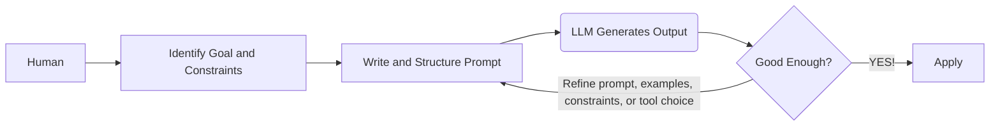

*"The wise man doesn't give the right answers, he poses the right questions."* - Claude Levi-Strauss

> *“智者并不给出正确的答案，而是提出正确的问题。”*——克洛德·列维-斯特劳斯

*Tips: If the main text is difficult to read, you may refer only to the conclusion sentences in italics.*

> *如果细节难以看懂，直接看斜体的结论。*

## Meta-info of Prompting Engineering

**Core Goal — Why to use it** 
  - Guide LLMs to produce the intended output.
  - Improve workflow efficiency by integrating LLMs into task pipelines.
  - Expand problem-solving capabilities, bridge expertise gaps.

> **核心目标——为什么要使用它**
> * 引导大语言模型（LLM）生成符合预期的输出。
> * 通过将大语言模型整合进任务流程，提高工作效率。
> * 扩展解决问题的能力，弥补专业知识上的不足。

**Methodology — How to use it** 
  - Humans define the goal, provide the relevant context, set the constraints, structure the task, and refine the prompt based on the model’s output.
  - Organize prompts into functionally distinct sections to separate objectives, context, constraints, and output specifications. This design reduces ambiguity and inter-section conflict, thereby improving control and consistency.

> **方法论——如何使用它**
> * 由人来确定目标，提供相关背景，设定约束条件，组织任务结构，并根据模型的输出不断改进提示词。
> * 将提示词组织为在功能上彼此区分的不同部分，用来分离目标、背景、约束条件和输出要求。这种设计可以减少歧义和各部分之间的冲突，从而提高控制力和一致性。

**Usage Scenario — When / Where to use it** 
  - Useful for tasks that require handling large volumes of text, complex instructions, or many constraints at once. Particularly effective for work that was previously slow or difficult for humans, such as long-context synthesis, cross-document comparison, multi-step rewriting, structured extraction from messy data, style-consistent generation at scale, and rapid adaptation of one task into many output forms.
  - It is also valuable in workflows that demand consistency, repeatability, and low coordination cost across repeated tasks.

> **使用场景——何时／何地使用它**
> * 适用于那些需要同时处理大量文本、复杂指令或多重约束的任务。对于一些过去由人来做时速度较慢或难度较高的工作，它尤其有效，例如长上下文综合、跨文档比较、多步骤改写、从杂乱数据中提取结构化信息、按统一风格进行大规模生成，以及将一个任务快速改造成多种输出形式。
> * 在那些要求一致性、可重复性以及低协调成本的重复性工作流程中，它也很有价值。

**Application Form — modes of using LLMs**
  - **Chat in browser** — Best for immediate thinking support, writing, and problem-solving with almost no setup.
  - **IDE integration** — Best for turning software development into a faster interactive workflow of coding, debugging, and refactoring.
  - **API integration** — Best for automating repeated language tasks inside products, services, and internal workflows.
  - **Office and work-tool integration** — Best for reducing routine work in email, documents, meetings, and presentations inside everyday productivity software.
  - **Enterprise workflow systems** — Best for embedding LLMs into organizational processes such as support, compliance, knowledge management, and approvals.
  - **Local deployment** — Best for private, sensitive, or offline use where control over data and environment matters most.
  - **Agent-style tool use** — Best for multi-step tasks where the model must not only answer, but also search, retrieve, execute actions, and complete work across tools.

> **应用形式——使用大语言模型的方式**
> * **浏览器中的聊天**（Chat in browser）——最适合几乎不需要准备即可获得即时的思考支持、写作帮助和问题解决支持。
> * **集成到集成开发环境**（IDE integration）——最适合将软件开发变成一种更快速的交互式流程，用于编写代码、调试和重构。
> * **API 集成**（API integration）——最适合在产品、服务和内部工作流程中自动化重复性的语言任务。
> * **办公软件和工作工具集成**（Office and work-tool integration）——最适合在日常生产力软件中减少电子邮件、文档、会议和演示文稿相关的例行工作。
> * **企业工作流系统**（Enterprise workflow systems）——最适合将大语言模型嵌入组织流程中，例如支持、合规、知识管理和审批等场景。
> * **本地部署**（Local deployment）——最适合用于私密、敏感或离线场景，在这些场景中，对数据和运行环境的控制尤为重要。
> * **代理式工具使用**（Agent-style tool use）——最适合处理多步骤任务，在这类任务中，模型不仅要回答问题，还必须跨工具进行搜索、检索、执行操作并完成工作。

Chart 1
: The simplified workflow of human interaction with LLMs.



## What is a Prompt?

Someone new to LLMs often interacts with them just as they would with a human. However, this approach does not always yield satisfactory responses. Because a machine’s communication preferences differ from a human’s, you must understand the tendencies and nature of an LLM to obtain consistent and high-quality results. In other words, you need to understand what a prompt is and master a few techniques for writing them effectively.

> 刚开始接触大语言模型（LLM）的人，常常会像与人交谈那样与它们互动。然而，这种做法并不总能得到令人满意的回应。由于机器的“交流偏好”与人类不同，要想获得稳定且高质量的结果，就必须理解大语言模型的倾向及其运作特性。换言之，需要理解什么是提示词（prompt），并掌握几种有效撰写提示词的技巧。

A good prompt consists 3 components:
  1. **Task description** : a clear instruction that tells the model what it should do, i.e., the rule.
  2. **Context or Examples**: background information or sample inputs and outputs that help the model understand the task better, i.e., the pattern.
  3. **The task**: the actual input or problem that the model needs to work on, i.e., the real case.

> 一个好的提示由三个组成部分构成：
> 1. **任务描述**：一条清晰的指令，用于告诉模型它应当做什么，即规则。
> 2. **上下文或示例**：背景信息或示例输入与输出，用于帮助模型更好地理解任务，即模式。
> 3. **任务本身**：模型需要处理的实际输入或问题，即真实案例。

Example 1
: A well-structured prompt. Task description defines the assistant’s role and the standards for success. Context or Examples gives the disciplinary setting, audience, tone, and a model sentence. The task states exactly what output is required.

```
[Task description]

You are an academic writing assistant. Your role is to help revise and strengthen scholarly writing for clarity, coherence, precision, and formal academic tone. 

Preserve the original argument and meaning.

Do not invent evidence, citations, or claims that are not supported by the text.

[Context or Examples]

This paragraph is from a graduate-level literature essay discussing the role of memory in Toni Morrison’s Beloved. 

The intended audience is a university instructor in literary studies.

The writing should sound analytical, formal, and precise.

It should use clear topic sentences, strong logical flow, and concise phrasing.

Example of preferred style:
“Morrison presents memory not as a passive recollection of the past, but as an active and disruptive force that shapes identity in the present.”

Paragraph to revise:
“In Beloved, memory is very important because it affects how the characters think and act, and it also shows that the past does not really disappear, which makes the novel more powerful and emotional.”

[The task]

Rewrite the paragraph in a more polished academic style suitable for a graduate-level essay. Then provide a brief explanation of three specific changes you made to improve clarity, structure, and academic tone.
```

Most model APIs allow us to split prompts into `system prompts` and `user prompts`.

`System prompts` — how the model should behave
- High-level instructions that define the model’s overall behavior. They usually set the role, goals, rules, tone, constraints, or response format that should remain stable across the interaction.

`User prompts` — what the model should do now
- The current task or inputs given by the user. They contain the actual request, question, or data that the model should respond to at that moment.

> 大多数模型 API 都允许我们将提示拆分为 `system prompts` 和 `user prompts`。  
> `System prompts`——模型应当如何表现
> * 用于定义模型整体行为的高层指令。它们通常设定角色、目标、规则、语气、约束或响应格式，并且这些内容应在整个交互过程中保持稳定。
>   
> `User prompts`——模型此刻应当做什么
> * 用户当前给出的任务或输入。它们包含模型在当下需要回应的实际请求、问题或数据。

Example 2
: A good English prompt example for business analysis.

```
[System Prompt]
You are a business analysis assistant.

Provide clear, structured, and evidence-based analysis. 

Focus on practical insights, state assumptions when needed, and do not invent data.

[User prompt]
Analyze the following business case.

Context:
An e-commerce company saw quarterly sales decline by 12%. Website traffic remained stable, but the conversion rate fell from 3.8% to 2.9%. 

Customer complaints about delivery delays increased, and two competitors launched major discount campaigns.

Task:
Explain the most likely reasons for the sales decline. Then give two key risks and three practical recommendations.
```
## Basic Prompting Techniques

### 1. Zero-Shot Prompting — Asking Directly

Zero-shot prompting means giving the model instructions without providing any examples. *You simply describe what you want, and the model attempts to fulfill the request based entirely on its training.* It is the most direct form of prompting — nothing between your intent and the model's response except the instruction itself. This technique works best for tasks where the desired output is **self-evident** from the instruction alone, like *factual questions, definitions, straightforward transformations, or summarization of a given text.* "Translate the following text to French," "Summarize this article in three sentences," or "List the capitals of South American countries" are all effective zero-shot prompts because *the task definition leaves little room for **ambiguity***. The model has seen enough examples of these task types in training to execute them reliably without demonstration. 
It works great for things 

> 零样本提示（zero-shot prompting）是指在不给模型提供任何示例的情况下直接给出指令。*你只需描述自己想要什么，模型就会完全基于其训练内容来尝试完成这一请求。*这是最直接的一种提示方式——在你的意图与模型的回应之间，除了指令本身，没有任何中间层。当单靠指令本身就足以明确所需输出时，这种技术最为有效,比如：*事实性问题、定义、直接的转换任务，或者对给定文本进行总结。*“把下面这段文字翻译成法语”“用三句话总结这篇文章”或“列出南美各国的首都”都属于有效的零样本提示，因为这些任务的定义几乎没有留下歧义空间。模型在训练中已经见过足够多这类任务，因此即使没有示范，也通常能够可靠地执行。
> * self-evident [ˌself ˈevɪdənt] adj. 不言自明的；一看就清楚的
> * iterate on 对……反复改进；循环测试并逐步优化

The primary advantage is **efficiency**. Zero-shot prompts *use the fewest tokens*, which reduces cost and latency, and they are the simplest to write, iterate on, and maintain in production. For high-volume pipelines where speed and cost matter, zero-shot is the right default starting point.

> 它的主要优势在于**效率**。零样本提示*使用的词元（token）最少*，因此能降低成本和延迟，而且它们也是最容易编写、迭代和在生产环境中维护的形式。对于那些重视速度和成本的高吞吐量流程来说，零样本是正确的默认起点。
> * high-volume pipelines 高吞吐量流程；指需要频繁、大量处理任务的自动化流程或工作链路
> * starting point 起点；开始采用的方法或初始方案


Example 3
: 10 zero-shot prompts that are clear, narrow, and low in ambiguity. 

```
1. Translation

Translate the following sentence into French. Output only the translation.
Sentence: "The meeting starts at 9 a.m."

2. Sentiment classification

Classify the sentiment of the following review as Positive, Negative, or Neutral. Output only one label.
Review: "The battery lasts all day, but the screen is too dim."

3. Date extraction

Extract the date from the following sentence. Return it in YYYY-MM-DD format. Output only the date.
Sentence: "The contract was signed on March 12, 2025."

4. Entity extraction

From the sentence below, extract the company name. Output only the company name.
Sentence: "Microsoft announced a new cloud partnership on Tuesday."

5. Grammar correction

Correct the grammar in the following sentence. Keep the meaning unchanged. Output only the corrected sentence.
Sentence: "She go to the library every Saturdays."

6. Summarization with fixed length

Summarize the following paragraph in exactly one sentence of no more than 20 words.
Paragraph: "Solar energy is becoming cheaper each year. Many countries are investing in large-scale solar farms. Improvements in battery storage are also making solar power more practical."

7. Keyword extraction

Extract exactly 3 keywords from the following text. Output them as a comma-separated list.
Text: "Machine learning models require data, computation, and careful evaluation."

8. JSON formatting

Convert the following information into valid JSON with exactly these keys: name, age, city.
Information: Name: Alice Chen; Age: 29; City: Boston.
Output only valid JSON.

9. Title generation

Write one clear title for the article below. Use no more than 8 words. Output only the title.
Article: "A new study shows that regular walking improves heart health, sleep quality, and mood."

10. Boolean decision

Answer the question with only Yes or No.
Question: Is 17 a prime number?
```

*If LLMs give an unsatisfactory answer on a zero-shot prompt, consider rephrasing the question or adding detail*. Sometimes *asking the same question in a clearer way* dramatically improves the result. For example, if “Explain quantum computing” gives a too-complex answer, try “Explain the concept of quantum computing in simple terms for a beginner.” *Zero-shot relies heavily on how you phrase the question*. If the task is complex or unusual, a single-shot prompt might not be enough for the model to figure out exactly what you need. In such cases, we move to few-shot prompting (next section) or add additional instructions.

> *如果大语言模型（LLM）在零样本提示下给出的回答不理想，可以考虑重新表述问题，或者增加更多细节*。有时候，仅仅是*把同一个问题说得更清楚一些*，结果就会明显改善。例如，如果“解释量子计算”得到的回答过于复杂，可以改成“请用适合初学者的简单语言解释量子计算这一概念”。*零样本提示在很大程度上依赖于你如何表述问题*。如果任务复杂或不寻常，单次提示可能不足以让模型准确判断你到底需要什么。在这种情况下，就需要转向少样本提示（下一节会讲）或者加入更多附加说明。

Example 4
: Request ChatGPT to summarize an article.

```
[Prompt A (generic)]
Summarize this text.

[Prompt B (specific)]

Summarize the following text in 3-5 bullet points, focusing on the main arguments and key takeaways. Keep the tone neutral and avoid any unnecessary filler.
``` 

Prompt B is likely to produce a much clearer and more useful summary, because *it specifies **format** (bullet points, 3-5 of them), **content focus** (main arguments, key takeaways), and **tone** (neutral)*. In contrast, Prompt A leaves these to the model’s guesswork. This simple example shows how adding detail and structure to your prompt steers the model’s output. **Key takeaway:** Always aim to be clear and specific about what you want. In the next sections, we’ll build on this idea and introduce various techniques – from basic prompting to advanced methods – that can greatly improve ChatGPT’s performance as your assistant. 

> 提示词 B 很可能会生成一个更清晰、更有用的摘要，因为*它明确规定了**格式**（使用项目符号，并控制在 3 到 5 条之间）、**内容重点**（主要论点、关键结论）以及**语气**（中立）*。相比之下，提示词 A 把这些都留给了模型自己猜。这一简单例子说明，只要在提示词中加入更多细节和结构，就能够更有效地引导模型的输出。Key takeaway: Always aim to be clear and specific about what you want.

For **complex, ambiguous, or specialized tasks**, zero-shot might fall short. The *limitation* emerges when the desired behavior departs from the model's statistical defaults — *when you need specific formatting, a particular reasoning style, or output that doesn't conform to the most common treatment of a topic in training data*.  In those cases, a bare instruction rarely suffices, and you'll need to either enrich the prompt with explicit structural guidance or move to few-shot examples. Best practice is always to begin with zero-shot and add complexity only when the output demonstrates a clear gap.

> 但对于复杂、含糊或高度专业化的任务，零样本提示可能就不够用了。它的*局限*会在所需行为偏离模型的统计默认值时显现出来——也就是*当你需要特定格式、某种特定推理风格，或希望输出不遵循训练数据中某一主题最常见处理方式的时候*。在这些情况下，单纯的裸指令往往不够，此时就需要要么通过明确的结构性引导来丰富提示词，要么转向使用少样本示例。最佳实践始终是：先从零样本开始，只有当输出明显暴露出缺口时，再增加复杂性。
> fall short 不足；达不到要求
> * statistical defaults 统计默认值；指模型在训练数据中最常见、最自然倾向采用的输出方式
> * conform to 符合；遵循；与某种常见模式保持一致
> * bare instruction 裸指令；只有命令本身、没有附加示例或更多引导信息的提示
> * suffices [səˈfaɪsɪz] v. 足够；能够满足需要
> * demonstrates a clear gap 显示出明显缺口；指输出结果清楚表明当前提示方式还不能满足要求


### 2. Few-Shot Prompting — Demonstrating Through Cases 

### 3. Chain-of-Thought Prompting — Forcing Visible Reasoning Before Conclusions

### 4. Role / Persona Prompting — Recalibrating Entire Output Distribution Through a Persona

### 5. Prompt Chaining — Decomposing Complex Workflows into Sequential, Focused Operations

## How do LLMs Deal with Prompts? 

**LLMs do not *understand* your prompt. They *continue* it.**

> **LLM 并不会“理解”你的提示。它只是在“续写”它。**

This is not a metaphor. It is the literal computational act. Every LLM, at its core, is a next-token predictor: given a sequence of tokens, it produces a probability distribution over what comes next. Your prompt is not a command sent to an intelligent agent — it is the opening of a sequence that the model is statistically compelled to complete in the most probable way, given everything it has learned. Everything about effective prompting follows from this single fact.

> 这不是比喻。这是字面意义上的计算过程。每个大语言模型（LLM）在其核心上，都是一个“下一个词元预测器”：给定一个词元序列，它会对接下来可能出现的内容生成一个概率分布。你的提示词并不是发送给某个智能代理的命令——它是一个序列的开端，而模型会在其既有学习经验的基础上，以统计上最可能的方式被“驱动”去完成这个序列。关于有效提示的一切，都是由这一基本事实推导出来的。
> * probability distribution [ˌprɒbəˈbɪləti ˌdɪstrɪˈbjuːʃən] n.概率分布
> * compelled [kəmˈpeld] adj.被迫的；被驱动的

Then return to the core question: "what actually happens when you submit a prompt?"

> 然后回到核心问题：“当你提交一个提示词时，究竟实际发生了什么？”

**Tokenization** — Your text is never read as words. It is first broken into `tokens` — subword units determined by the model's vocabulary (GPT-4, for instance, uses roughly 100,000 BPE tokens). The string "unbelievable" might become ["un", "believ", "able"]. This has real consequences. Unusual spellings, rare words, and non-English text fragment into more tokens, giving the model less coherent signal per semantic unit. Token boundaries also affect arithmetic reasoning, since numbers split unpredictably. Even leading whitespace and capitalization change tokenization and, subtly, outputs. The practical implication for prompt engineering is straightforward: *use common, well-formed language, and avoid unnecessary abbreviations or unconventional spelling*, because the cleaner your text, the more efficiently the model encodes its meaning.

> **词元化**——你的文本从来不是按“单词”被读取的。它首先会被拆分成 `tokens`（词元）——由模型词汇表决定的子词单位（例如，GPT-4 使用的大约是 100,000 个 BPE 词元）。字符串 “unbelievable” 可能会被拆成 ["un", "believ", "able"]。这会带来真实后果。不同寻常的拼写、罕见词汇以及非英语文本，往往会被切分成更多词元，使模型在每个语义单位上获得的连贯信号更少。词元边界还会影响算术推理，因为数字的切分方式并不稳定。甚至前导空格和大小写也会改变词元化结果，并进而微妙地影响输出。对提示工程来说，其实际含义很直接：*使用常见、规范的语言，避免不必要的缩写或非标准拼写*，因为你的文本越干净，模型编码其含义的效率就越高。
> * tokenization [ˌtəʊkənaɪˈzeɪʃən] n.词元化；切词处理
> * fragment into 分裂成；被切分为
> * coherent [kəʊˈhɪərənt] adj.连贯的；一致的
> * semantic [sɪˈmæntɪk] adj.语义的
> * capitalization [ˌkæpɪtəlaɪˈzeɪʃən] n.大写使用；大小写规则
> * implication [ˌɪmplɪˈkeɪʃən] n.含义；影响


**Embedding and Positional Encoding** — Once tokenized, each token is mapped to a high-dimensional vector — its embedding — and position in the sequence is encoded separately, so the model knows token 1 precedes token 2. However, attention is not uniform across positions. Empirically, LLMs exhibit a primacy and recency bias, attending more strongly to tokens near the beginning and end of the context window. Content buried deep in the middle of a long prompt is statistically less influential on the output. This means *your most critical instructions belong at the start or end of the prompt*. In long contexts especially, placing the core task specification in the middle is one of the most common and costly mistakes a prompt engineer can make.

> **嵌入与位置编码**——完成词元化之后，每个词元都会被映射为一个高维向量——也就是它的嵌入（embedding），而它在序列中的位置则会被单独编码，这样模型才知道词元 1 出现在词元 2 之前。然而，注意力在不同位置上的分布并不均匀。经验研究表明，大语言模型表现出首因偏置和近因偏置，更倾向于关注上下文窗口开头和结尾附近的词元。埋在长提示中部深处的内容，在统计上对输出的影响较弱。这意味着，*你最关键的指令应当放在提示词的开头或结尾*。尤其是在长上下文中，把核心任务说明放在中间，是提示工程师最常见、代价也最高的错误之一。
> * embedding [ɪmˈbedɪŋ] n.嵌入表示
> * positional encoding [pəˈzɪʃənəl ɪnˈkəʊdɪŋ] n.位置编码
> * empirically [ɪmˈpɪrɪkli] adv.根据经验地；从实证上看
> * primacy bias [ˈpraɪməsi ˈbaɪəs] n.首因偏置
> * recency bias [ˈriːsənsi ˈbaɪəs] n.近因偏置

**Attention, the Way it "Reads"** — The Transformer's `self-attention mechanism` allows every token to attend to every other token **simultaneously**, which means the model does not read your prompt linearly. It builds a holistic representation in which each part of your prompt contextualizes every other part. *The framing at the beginning of a prompt shapes how all subsequent content is interpreted* — a prompt beginning with "You are an expert forensic accountant" genuinely shifts the probability distributions for all tokens that follow, because it narrows the model's prior over what kind of text this is, and therefore what kind of text should come next. Equally important is the interaction between instructions, examples, and data within the prompt. *They are not processed in isolation; they **condition each other**.* A poorly placed example can silently override an explicit instruction, not because the model is confused, but because the statistical weight of a demonstrated pattern often exceeds that of a stated directive. *In other words, **Prompt structure** is not decorative. The order and framing of elements deterministically shape the model's internal representation of the task. Models are typically **better at understanding instructions at the beginning and end of prompts** compared to the middle.*

> **注意力：它“阅读”文本的方式**——Transformer 的自`注意力机制`使得每一个 token 都能够**同时**关注其他所有 token，这意味着模型并不是按线性顺序来阅读你的提示词。它会构建一种整体性的表征，在这种表征中，提示词的每一部分都会为其他部分提供上下文。*提示词开头的框定方式，会影响后续全部内容的理解方式*——如果一个提示词以 “You are an expert forensic accountant” 开头，那么它确实会改变后续所有 token 的概率分布，因为这会缩小模型对于“这是一类什么文本”的先验判断，因此也会缩小“接下来应该出现什么文本”的范围。同样重要的是，提示词内部的指令、示例和数据之间会彼此相互作用。*它们并不是彼此孤立地被处理；相反，它们会**相互制约、相互条件化***。一个放置不当的示例，可能会在不知不觉中压过一条明确写出的指令；这并不是因为模型“困惑了”，而是因为从统计上看，一个被演示出来的模式，往往比一个被陈述出来的要求具有更大的权重。*换句话说，**提示词的结构**并不是装饰性的东西。各个要素的顺序与框定方式，会以确定性的方式塑造模型对任务的内部表征。与提示词中间部分相比，模型通常**更擅长理解开头和结尾的指令**。*
> * attention [əˈtenʃən] n. 此处指“注意力机制”；常见义还有“注意，关注”
> * Transformer [trænsˈfɔːrmər] n. Transformer，变换器模型；一种以注意力机制为核心的神经网络架构，广泛用于大语言模型与现代自然语言处理系统。
> * self-attention [ˌself əˈtenʃən] n. 自注意力；一种让序列中每个位置都能与其他位置建立关联的机制，用于建模词与词之间的依赖关系。
> * holistic [hoʊˈlɪstɪk] adj. 整体的，全面的；常见义还有“强调整体关联的”
> * contextualizes / contextualize [kənˈtekstʃuəlaɪz] v. 使处于上下文中，从语境中理解；常见义还有“将某事放回背景中考察”
> * framing [ˈfreɪmɪŋ] n. 此处指“框定方式，表述框架”；常见义还有“构架，定调”
> * forensic accountant [fəˈrensɪk əˈkaʊntənt] n. 法务会计师，司法会计师；运用会计、审计与调查方法分析财务证据，常用于诉讼、欺诈调查和合规审查。
> * probability distribution [ˌprɑːbəˈbɪləti ˌdɪstrɪˈbjuːʃən] n. 概率分布；在统计学与机器学习中，表示不同结果出现概率的分配方式，这里指模型对下一个 token 的可能性分配。
> * prior [ˈpraɪər] n. 此处指“先验”；在概率论与机器学习中，指模型在看到当前输入之前，对某类结果原本具有的预期或分布。
> * processed in isolation n./phr. 孤立地处理，脱离其他部分来处理
> * condition each other / condition [kənˈdɪʃən] v. 此处指“相互制约、相互塑造”；常见义还有“使适应，对……有重要影响”
> * statistical weight [stəˈtɪstɪkəl weɪt] n. 统计权重；指某种信号、模式或证据在整体判断中所占的重要性。
> * directive [dəˈrektɪv] n. 指令，命令，明确要求；常见义还有“指导性的规定”
> * deterministically [dɪˌtɜːrmɪˈnɪstɪkli] adv. 确定性地；在计算与机器学习语境中，指由给定条件所决定，而不是任意或随机地产生。
> * internal representation n./phr. 内部表征；指模型在内部计算过程中形成的任务、语义或结构表示，用来支持后续预测。

**The Completion Imperative** — The model generates output `autoregressively` — *one `token` at a time, each conditioned on all previous tokens, including your entire prompt*. It has no intent. It has no goal. It has **one drive: produce a plausible continuation**. If your prompt reads like the beginning of a sycophantic answer, the model will complete a sycophantic answer. If your prompt reads like an authoritative technical document, the model will complete an authoritative technical document. *If your prompt is ambiguous, the model will not pause to ask for clarification — it will resolve the ambiguity probabilistically*, defaulting to the most statistically common resolution seen in its training data, which is very often not what you wanted. This is perhaps the most consequential implication for prompt engineering. You are not instructing the model; you are authoring the beginning of the text you want it to produce. *The single most useful question to ask before submitting any prompt is: what kind of text would naturally follow from what I've written?*

> **补全要求**—— 模型以`自回归`的方式生成输出——*一次生成一个`词元`，并且每一个词元都以前面所有词元为条件，其中包括你的整个提示词*。它没有意图。它没有目标。它只有**一种驱动力：产出一个看起来合理的后续内容**。如果你的提示词读起来像是一段阿谀奉承式回答的开头，模型就会补全出一段阿谀奉承式回答。如果你的提示词读起来像是一份权威性的技术文档，模型就会补全出一份权威性的技术文档。*如果你的提示词含糊不清，模型不会停下来要求澄清——它会以概率方式消解这种歧义*，默认采用其训练数据中在统计上最常见的那种解释，而这往往并不是你真正想要的。这也许是提示工程（prompt engineering）最重要的一个影响。你并不是在“指挥”模型；你是在撰写一段你希望它继续生成下去的文本开头。*在提交任何提示词之前，最值得先问的一个问题是：按照我已经写下的内容，后面自然会接上一段什么样的文本？*
> * imperative [ɪmˈperətɪv] n.必要的事；紧要的要求；命令；adj.紧迫的；必要的；命令式的；此处指“必须正视的基本要求”或“核心原则”，强调这不是可有可无的建议，而是理解模型行为的关键前提
> * completion [kəmˈpliːʃən] n.完成；补全；结束；在语言模型语境中，completion 通常指模型根据已有输入继续生成后续文本的过程
> * autoregressively [ˌɔːtəʊrɪˈɡresɪvli] adv.以自回归方式；“自回归”是机器学习中的一个基本概念，指当前输出依赖于先前已经生成的内容；在大语言模型中，这意味着文本是按顺序逐步生成的
> * conditioned on 以……为条件；取决于……；在机器学习中常表示“当前输出受前文信息约束或决定”
> * sycophantic [ˌsɪkəˈfæntɪk] adj.阿谀奉承的；拍马屁的；讨好的
> * authoritative [əˈθɒrətətɪv] adj.权威的；有威信的；像正式专业文本那样口吻坚定、可信度高的
> * ambiguous [æmˈbɪɡjuəs] adj.模糊不清的；有歧义的；不明确的
> * defaulting to 默认采用；自动转为；指在缺少明确约束时，系统自动落到最常见或最常规的选项上
> * consequential [ˌkɒnsɪˈkwenʃəl] adj.后果重大的；重要的；影响深远的
> * implication [ˌɪmplɪˈkeɪʃən] n.含义；影响；可能后果；此处指某种理论观点带来的实际推论
> * authoring [ˈɔːθərɪŋ] v.撰写；编写；创作；此处强调用户不是单纯“下命令”，而是在写一段会引导后文风格和内容的开头
> * plausible [ˈplɔːzəb(ə)l] adj.看似合理的；貌似可信的；说得通的

**Instruction Fine-Tuning and RLHF** — Base LLMs simply complete text. Modern deployed models — ChatGPT, Claude, Gemini — have been further shaped by instruction tuning and Reinforcement `Learning from Human Feedback (RLHF)`. This training teaches the model to treat certain text patterns, especially those formatted as instructions in the system prompt or user turn, as **high-priority conditioning signals**. This is why **"Answer in bullet points"** works — not because the model understands the request in any semantic sense, but because text that follows such an instruction in the training data was overwhelmingly formatted in bullet points, and the reward model reinforced this behavior. The practical consequence is significant: *instruction-tuned models respond far better to explicit, well-formatted directives than to vague or polite requests.* "List three causes. Be concise. Do not use passive voice." will consistently outperform "Could you maybe give some causes?" because the former more closely matches the patterns on which the model was rewarded during training.

> **指令微调与基于人类反馈的强化学习**——基础大语言模型（base LLMs）本质上只是对文本进行补全。现代已部署的模型——如 ChatGPT、Claude、Gemini——则进一步经过了指令微调和`基于人类反馈的强化学习`的塑造。这种训练使模型学会将某些文本模式，尤其是那些出现在系统提示（system prompt）或用户轮次（user turn）中、并以指令形式呈现的文本，视为**高优先级的条件信号**。这就是为什么“**Answer in bullet points**”这类要求能够生效——并不是因为模型在某种语义意义上“理解”了这个请求，而是因为在训练数据中，跟在这类指令后面的文本几乎总是被组织成项目符号的形式，而奖励模型（reward model）又进一步强化了这种行为。其实际后果非常明显：*经过指令微调的模型，对明确、格式清晰的指令响应效果，远远好于对含糊或客气请求的响应。*“列出三个原因。简明作答。不要使用被动语态。”通常会稳定地优于“你能不能大概说说有哪些原因？”因为前者与模型在训练过程中获得奖励时所对应的文本模式更加接近。
> * fine-tuning [ˌfaɪn ˈtjuːnɪŋ] n. 微调；精细调整；在机器学习中，指在预训练模型基础上再用特定数据继续训练，使其更适合某类任务或行为模式
> * instruction tuning 指令微调；一种让模型更好地遵循用户命令、问答格式和任务要求的训练方法，通常通过大量“指令—回答”样本来实现
> * Reinforcement Learning from Human Feedback (RLHF) 基于人类反馈的强化学习；一种利用人工偏好评估来优化模型输出的方法，通常先收集人类对回答质量的比较，再据此训练奖励模型并优化主模型
> * conditioning signals 条件信号；指在生成过程中会显著影响后续输出的输入信息；这里强调某些指令文本会被模型当作更重要的引导依据
> * reward model 奖励模型；在 RLHF 流程中，用来学习人类偏好并给候选输出打分的模型，其评分会进一步指导主模型优化
> * outperform [ˌaʊtpəˈfɔːm] v. 表现优于；胜过；在这里指某种提示写法通常能带来更好的模型输出

**The Core Mechanics of Prompt Influence** — With the underlying machinery in view, the mechanics of how different prompt elements shape model behavior become legible. **A persona or role** definition shifts the model's prior over vocabulary, tone, and domain — it is not a costume but a genuine recalibration of probability. **Providing examples**, what is formally called few-shot prompting, directly constrains the output format and reasoning pattern through in-context learning, one of the most reliable tools available to a prompt engineer. **Explicit step-by-step instructions** activate chain-of-thought pathways and markedly improve performance on tasks requiring multi-step reasoning. *Ambiguous phrasing*, by contrast, gets resolved via statistical default — almost never the resolution you intended. *Negative constraints*, the "do not" formulations, carry weaker signal than positive framing, because negation is harder for the model to maintain across a long generation. And long, *unfocused context* dilutes attention, increasing the probability that the model loses track of the key task altogether.

> **提示词影响的核心机制**——在看清底层机制之后，不同提示词要素如何塑造模型行为这一过程就变得可以理解了。**人物设定**或角色定义会改变模型在词汇、语气和领域上的先验分布（prior）——它不是一种“扮演出来的外衣”，而是对概率分布的真实重新校准。**提供示例**，也就是正式所说的少样本提示（few-shot prompting），会通过上下文学习直接约束输出格式和推理模式；这是提示工程实践中最可靠的工具之一。**明确的分步指令**会激活链式思维路径，并显著提升模型在需要多步推理任务中的表现。相比之下，*含糊的表述*会按照统计上的默认方式被消解——而这几乎从来都不是你原本想要的解释。*否定性约束*，也就是“不要……”这种表达方式，传递的信号通常弱于正面表述，因为否定信息更难在较长的生成过程中被模型持续保持。而*冗长、失焦的上下文*会稀释注意力，从而提高模型完全偏离关键任务的概率。
> * machinery [məˈʃiːnəri] n. 机制；运作系统；并不一定指实体机器，此处指模型背后的内部工作机制
> * legible [ˈledʒəb(ə)l] adj. 可理解的；清晰可辨的；原义也可指“字迹清楚的”
> * persona [ˌpɜːˈsəʊnə] n. 人物设定；角色形象；在提示词语境中，指赋予模型某种身份、口吻或专业立场的设定
> * chain-of-thought 链式思维；指模型通过分步骤展开中间推理来完成复杂任务的方式，常用于提升多步推理表现
> * formulations [ˌfɔːmjəˈleɪʃənz] n. 表述方式；措辞；公式化表达
> * dilutes [daɪˈluːts] v. 稀释；削弱；使影响力变弱
> * loses track of 脱离对……的把握；偏离对关键事项的持续关注

To sum up, your job as a prompt engineer is to **author the beginning of the text you want to exist.** That means:
  1. **Be explicit** — state what you want, how you want it, what to exclude.
  2. **Use structure** — the model was trained on structured human text; it responds to it.
  3. **Provide examples** — in-context learning is one of the most reliable mechanisms available to you.
  4. **Control the frame** — the opening of your prompt is the strongest conditioning signal.
  5. **Never assume interpretation** — if it can be read two ways, it will be resolved without asking you.

> 总而言之，作为提示工程师，你的工作是**为你希望出现的文本撰写开头**。这意味着：
> 1. **要明确**——说清楚你想要什么、希望它以什么方式呈现、以及要排除什么。
> 2. **要有结构**——模型是基于具有结构的人类文本训练出来的，因此它会对结构作出响应。
> 3. **要提供示例**——上下文学习（in-context learning）是你能够使用的最可靠机制之一。
> 4. **要控制框架**——提示词的开头是最强的条件信号。
> 5. **不要默认模型会按你的意思理解**——如果一句话可以有两种理解方式，模型会在不询问你的情况下自行选定其中一种。


## Guidelines for Prompting

## The **"Dos and Don'ts"** of Prompt Phrasing

# Prompt Sentence Patterns: A Reference Guide

---

## Part I: Patterns That Work Well

---

**"Focus on whichever of the following are most illuminating for the topic: ..."**
and **"Include these selectively rather than exhaustively."**
*Why it works:* LLMs suffer from verbosity bias — a tendency to include every possible detail in an attempt to be helpful. By explicitly authorizing selectivity, you force the model's attention mechanism to rank information by relevance rather than by completeness, resulting in a much higher signal-to-noise ratio.

---

**"Only where directly relevant, do ..."**
*Why it works:* When a prompt requests a specific feature — quotes, examples, statistics — the model feels statistically obligated to fulfill it even when context makes it a poor fit, leading to forced or fabricated content. This phrase acts as a release valve, granting the model explicit permission to omit features that would otherwise feel shoehorned in.

---

**"Provide a scholarly critical review."**
*Why it works:* This is a persona-plus instruction. It doesn't merely ask for a summary; it activates a specific subset of training data associated with academic skepticism, peer review, and balanced argumentation, shifting output from a descriptive register to an evaluative one. The word "scholarly" alone narrows the stylistic prior considerably.

---

**"Use a MECE framework."**
*Why it works:* MECE (Mutually Exclusive, Collectively Exhaustive) is a consulting-grade organizational constraint. It prevents repetition across sections and ensures full coverage of the problem space, producing output that feels structurally complete and professionally organized rather than loosely assembled.

---

**"Uncover the first principles and underlying mechanics."**
*Why it works:* This blocks the model from producing a surface-level or common-sense answer. It instructs the model to trace back from observable phenomena to foundational truths — the physics, logic, or core axioms beneath the topic. In short: don't give me the what; give me the why behind the how.

---

**"Think step by step before answering."**
*Why it works:* This activates chain-of-thought reasoning, compelling the model to externalize its intermediate steps rather than collapsing directly to a conclusion. It is especially powerful on tasks where the intuitive answer is wrong, because it forces the model to check each inferential move rather than pattern-match to the most statistically common response.

---

**"Before answering, identify what you do not know and what assumptions you are making."**
*Why it works:* LLMs are trained to produce fluent, confident text — which makes them prone to hallucination when knowledge is absent. This instruction interrupts the confidence-completion loop by forcing an explicit epistemic audit before generation begins. It substantially reduces confabulation on uncertain topics.

---

**"Steelman the opposing view before giving your own assessment."**
*Why it works:* It invokes a well-defined argumentative structure associated with rigorous academic and legal writing. By requiring the model to first construct the strongest possible version of a position it may then critique, you prevent shallow dismissal and produce more intellectually honest output.

---

**"Respond as [role] speaking to [specific audience]."**
*Why it works:* A double anchor — role plus audience — is far more powerful than either alone. The role sets domain expertise and epistemic stance; the audience sets vocabulary level, assumed prior knowledge, and rhetorical register. The combination produces a very narrow target distribution that the model can hit with high consistency.

---

**"What would a [domain expert] notice here that a layperson would miss?"**
*Why it works:* This prompt structure bypasses the model's default mode of producing general knowledge and instead requests tacit, specialist-level insight. It activates training examples written by or for domain experts, surfacing non-obvious observations that would never appear in a generic treatment of the topic.

---

**"Explain this as if you were writing for [specific publication] — e.g., Nature, The Economist, The New Yorker."**
*Why it works:* Named publications have highly distinctive and well-represented styles in training data. Invoking them functions as a dense stylistic prior — triggering not just tone but sentence length, hedging conventions, evidence standards, and structural norms characteristic of that outlet.

---

**"List assumptions this argument depends on."**
*Why it works:* This forces deductive decomposition. Rather than evaluating a claim holistically — which tends to produce vague, hedged prose — the model must surface the hidden premises that make the argument valid or invalid. It is one of the most reliable ways to produce genuinely critical rather than superficially balanced output.

---

**"Distinguish between what is well-established, what is contested, and what is speculative."**
*Why it works:* LLMs tend to flatten epistemic distinctions, presenting established consensus and fringe speculation in the same confident register. This three-part taxonomy forces the model to assign an explicit confidence tier to each claim, producing far more intellectually honest and useful output.

---

**"After your answer, identify the single most important caveat a reader should keep in mind."**
*Why it works:* Appending a post-hoc caveat instruction separates generation from evaluation. The model completes its answer and then audits it from a critical standpoint — a two-pass structure that catches the overconfidence or oversimplification that the generation pass tends to produce.

---

**"Give me the answer, then explain the reasoning. Keep them clearly separated."**
*Why it works:* This prevents the model from burying the conclusion inside its reasoning, a common failure mode on analytical prompts. The explicit structural separation also makes it easier to evaluate whether the reasoning actually supports the answer.

---

**"Ignore what is obvious and widely known. Focus on what is counterintuitive, underappreciated, or surprising."**
*Why it works:* This directly suppresses the model's default toward high-frequency, consensus-level information — the statistical mode of its training distribution. By penalizing the obvious, it pushes generation toward lower-probability but higher-value content.

---

**"If there are multiple valid interpretations of this question, address the two most important ones."**
*Why it works:* Rather than letting the model silently pick one interpretation and proceed, this forces it to make interpretive ambiguity explicit and productive. It yields richer, more honest output and often surfaces the interpretive choice that the user actually cared about.

---

**"Do not summarize. Analyze."**
*Why it works:* "Summarize" and "analyze" activate different distributions in the model's training data. Summary is descriptive and compressive; analysis is evaluative and generative. Without this explicit instruction, models given analytical tasks often default to summarization — the more statistically common response pattern for text-plus-question inputs.

---

**"Be precise rather than comprehensive."**
*Why it works:* It resolves the model's default trade-off in favor of depth over breadth. Without this constraint, models tend to produce surveys — wide, shallow coverage that satisfies the appearance of helpfulness without delivering real insight. Precision forces the model to commit to specific, defensible claims.

---

**"Where relevant, distinguish between the short-term and long-term implications."**
*Why it works:* This temporal decomposition constraint prevents the conflation of immediate and downstream effects, a common analytical failure. It adds a structural dimension that forces the model to reason across time rather than treating a situation as a static snapshot.

---

**"Use concrete examples to anchor each abstract claim."**
*Why it works:* Abstract claims are easy to generate fluently but are often vacuous. Requiring a concrete anchor for each abstraction creates a natural verification constraint — it is much harder to fabricate a plausible specific example than a plausible general statement, so this instruction also acts as a partial hallucination filter.

---

**"Synthesize, don't list."**
*Why it works:* Bullet-point generation is the model's lowest-effort response pattern — it requires no connective reasoning between items. Explicitly requesting synthesis forces the model to establish logical or causal relationships between pieces of information, producing prose that reflects genuine analytical work rather than a formatted data dump.

---

## Part II: Patterns That Don't Work Well — And What to Use Instead

---

**Instead of "Don't do X," write "Instead of X, do Y."**
*Why it works:* Negation is a weak signal. Saying "don't use jargon" activates the token for jargon prominently in the model's processing, paradoxically increasing its salience. A positive target — "use language accessible to a 12-year-old" — gives the model a statistical destination to move toward rather than an exclusion zone to navigate around.

---

**Instead of "briefly" or "in 30 words," write "in 1–3 sentences."**
*Why it works:* "Briefly" is subjective and gets resolved against the model's default verbosity. Exact word counts are hard for models to track because they process tokens, not words. Sentence boundaries, however, are defined by punctuation — a discrete, unambiguous signal the model handles reliably. Sentence-count constraints produce consistent concision without the awkward truncation that word-count targeting often causes.

---

**Instead of "write a good essay," write "write an essay structured as: [claim] → [three supporting arguments] → [strongest counterargument] → [rebuttal] → [conclusion]."**
*Why it works:* "Good" is entirely undefined in the model's generation context — it defaults to the statistical average of "good essays" in training data, which produces competent mediocrity. An explicit structural blueprint removes the model's freedom to default and instead provides a scaffold that constrains generation toward your actual intent.

---

**Instead of "be creative," write "approach this from an unexpected angle" or "use an analogy from a different domain entirely."**
*Why it works:* "Creative" is one of the most overloaded and least actionable words in a prompt. The model interprets it as a license to use slightly more vivid language while following standard patterns. A specific creative operation — unexpected angle, cross-domain analogy, subverted expectation — gives the model a concrete generative maneuver to execute.

---

**Instead of "explain this simply," write "explain this to someone who understands [adjacent domain] but has never encountered [target domain]."**
*Why it works:* "Simply" is calibrated against the model's default complexity level, which is rarely what you want. Specifying a concrete audience with known prior knowledge gives the model a precise epistemic gap to bridge, producing explanations that are genuinely calibrated rather than superficially simplified.

---

**Instead of "make this better," write "make this more [precise / persuasive / concrete / surprising] by [specific operation]."**
*Why it works:* "Better" is an unanchored comparative — the model has no reference point for what dimension to optimize. Naming the quality and the operation (e.g., "replace every abstract noun with a concrete example") gives the model a specific editorial task rather than an open-ended quality judgment it cannot meaningfully perform.

---

**Instead of asking everything in one long prompt, chain it: first ask for an outline, then expand each section separately.**
*Why it works:* A single long, complex prompt diffuses the model's attention across too many simultaneous constraints. Breaking the task into sequential prompts — each with a single, clear objective — produces higher accuracy at each step, and the structured output of each step provides cleaner, more reliable input to the next.

---

**Instead of "answer as an expert," write "answer as a [specific expert] with [specific background] speaking to [specific audience]."**
*Why it works:* "Expert" without qualification defaults to a generic, authoritative-sounding register that is often neither domain-specific nor audience-appropriate. The more precisely you define the role and the audience, the narrower the target distribution becomes — and narrower targets are hit with far greater consistency.

---

**Instead of repeating the same prompt with minor variations hoping for a better answer, write "Your previous answer was too [vague / general / long]. Specifically, [state the gap]. Revise with that constraint."**
*Why it works:* Submitting a near-identical prompt a second time produces near-identical output, because the model has no memory of what was unsatisfactory and no new conditioning signal. An explicit diagnostic — naming the failure mode and the correction — gives the model a meaningful new constraint and produces genuine improvement rather than a paraphrased version of the same answer.

---

**Instead of "give me a comprehensive overview," write "identify the three things someone must understand to reason correctly about this topic, and explain only those."**
*Why it works:* "Comprehensive" triggers the model's verbosity bias at maximum intensity, producing wide, shallow coverage that prioritizes the appearance of completeness over genuine usefulness. Asking for the essential minimum forces the model to perform a relevance-ranking operation first, then generate — a two-step process that consistently produces higher-density, more valuable output.

---

**Instead of "use your judgment," write "if X, then do Y; if Z, then do W."**
*Why it works:* "Use your judgment" hands the decision entirely to the model's statistical default — which may have no relationship to your actual preferences. Explicit conditional logic encodes your decision criteria directly into the prompt, making the model's behavior predictable and auditable rather than opaque and variable.

---

**Instead of stacking multiple tasks into one sentence, assign one task per prompt turn.**
*Why it works:* When a single prompt contains multiple tasks — "summarize this, then critique it, then rewrite it for a general audience" — the model distributes attention across all three objectives simultaneously. Each task receives less processing weight and the final output frequently conflates or truncates one or more of them. Sequential prompting lets each task receive full attention and produces clean, separable outputs.

---

**Instead of "write in a [positive / engaging / professional] tone," write "write in the tone of [specific publication, author, or genre]."**
*Why it works:* Tone adjectives like "engaging" or "professional" are too abstract to reliably shift output — every model already believes it is being engaging and professional by default. A named reference — "in the tone of a Harvard Business Review op-ed" or "in the style of a BBC documentary narration" — activates a dense, well-represented stylistic prior that produces consistently distinctive and intentional output.

---

**Instead of "consider all perspectives," write "argue for [Position A]. Then argue for [Position B]. Then identify where the two arguments most directly conflict."**
*Why it works:* "Consider all perspectives" produces a bland, false-balance treatment in which the model nods superficially at multiple views without committing to any of them. Forcing the model to argue each position sequentially and then identify the crux of disagreement produces genuine dialectical reasoning rather than the appearance of balanced analysis.

Below is a working reference, not a set of universal laws. Prompt wording and formatting can change results a lot, and underspecified prompts tend to produce more variance than prompts with clear instructions and tighter output constraints. Provider guidance also consistently recommends explicit formats, examples, delimiters, and step structure rather than vague requests. ([arXiv][1])

## 1. Prompt sentence patterns that usually work well with LLMs

1. "Return exactly these sections, in this order: ..."

   Why it works: This gives the model an output contract. It reduces drift, stops the model from adding surprise sections, and makes the response easier to parse by both humans and downstream code. ([OpenAI][2])

2. "If a format is required, output only that format."

   Why it works: This sharply narrows the output space. It is especially useful for JSON, XML, SQL, Markdown, or other machine-read formats where extra prose breaks the result. ([OpenAI][2])

3. "Use the following labels exactly: [A, B, C]."

   Why it works: Exact label sets reduce ambiguity in classification and routing tasks. They also reduce synonym drift, where the model invents near-miss labels that are semantically close but operationally useless. ([Claude API Docs][3])

4. "Your task is X. Constraints: A, B, C."

   Why it works: This pattern separates goal from limits. Models tend to do better when the task and the boundaries are both explicit, rather than buried in a long paragraph. ([Claude API Docs][3])

5. "Follow these steps in order: 1) ... 2) ... 3) ..."

   Why it works: Numbered steps help when order matters or when the task is easy to skip through too quickly. Anthropic explicitly recommends sequential steps when completeness or order matters. ([Claude API Docs][3])

6. "First classify the input. Then generate the response based on the class."

   Why it works: This is a compact prompt-chaining pattern. It breaks a mixed task into two cleaner mental stages and often improves control, debugging, and consistency. Google also recommends breaking complex multi-step logic into smaller calls when needed. ([Google for Developers][4])

7. "Here are a few examples. Follow the same pattern."

   Why it works: Few-shot examples are one of the most reliable ways to control format, tone, and structure. They work especially well when instructions alone leave room for interpretation. ([Claude API Docs][3])

8. "Examples: [input] -> [output]"

   Why it works: A simple repeated template makes the pattern easier to infer than a loose paragraph of examples. Consistent formatting lowers the chance that the model learns the wrong surface cue from the demonstrations. ([Claude API Docs][3])

9. "Act as a [specific role] who [audience, style, goal]."

   Why it works: A specific role changes voice, depth, and priorities. "Act as a tax lawyer writing for a startup founder" is much stronger than "act as an expert," because it sets both perspective and audience. ([OpenAI][5])

10. "Only include [quotes / examples / citations / equations] where directly relevant."

    Why it works: This gives the model permission to be selective instead of mechanically satisfying every optional feature everywhere. It reduces forced additions and usually improves signal-to-noise ratio. This also aligns with official guidance to keep outputs compact and avoid unnecessary repetition. ([OpenAI][2])

11. "Focus on the most relevant or most illuminating points, not every possible point."

    Why it works: LLMs often default toward over-inclusion when trying to be helpful. This pattern pushes the model toward ranking and selection rather than exhaustive dumping. ([OpenAI][2])

12. "Be concise and information-dense."

    Why it works: This is better than simply saying "be short" because it points the model toward compression without asking it to omit important content. OpenAI’s current prompt guidance explicitly recommends concise, information-dense writing. ([OpenAI][2])

13. "Use numbered bullets when order or completeness matters."

    Why it works: Numbered structure helps the model keep coverage aligned with the prompt. It also makes omissions and duplicates easier to spot during review. ([Claude API Docs][3])

14. "Separate the prompt into <context>, <instructions>, and <input>."

    Why it works: Delimiters reduce confusion about what is background, what is binding instruction, and what is the material to operate on. Anthropic and Google both recommend explicit separation for complex prompts. ([Claude API Docs][3])

15. "Wrap examples in <examples> ... </examples>."

    Why it works: This helps the model distinguish demonstrations from rules. It is especially useful when the prompt mixes examples, context, and variable user input in the same message. ([Claude API Docs][3])

16. "Use consistent, descriptive tags throughout the prompt."

    Why it works: Reusing stable tags like `<instructions>`, `<documents>`, and `<answer_schema>` makes the prompt easier to parse and maintain. It also reduces ambiguity when prompts become long. ([Claude API Docs][3])

17. "Think through the problem step by step, then give the final answer."

    Why it works: For complex reasoning tasks, chain-of-thought prompting can improve performance by encouraging intermediate reasoning steps rather than a jump to the answer. This has strong support in the literature for arithmetic, commonsense, and symbolic reasoning tasks. ([arXiv][6])

18. "First list the relevant facts. Then infer the answer from those facts."

    Why it works: This is a structured version of step-by-step reasoning. It is often more stable than a generic "think carefully" instruction because it tells the model what the intermediate steps should look like. ([arXiv][6])

19. "For code, begin with: import"

    Why it works: OpenAI explicitly notes that "leading words" can nudge the model into the right completion pattern. The same idea often works with `SELECT`, `{`, or function signatures for code and structured text. ([OpenAI Help Center][7])

20. "If newer instructions conflict with older ones, follow the newer instruction; preserve the rest."

    Why it works: This pattern is useful in long-running assistants or agent prompts. It reduces confusion when the task evolves mid-conversation and gives the model a simple conflict rule. ([OpenAI][2])

21. "If the task is clear and low-risk, proceed without asking; otherwise ask only for the missing critical information."

    Why it works: This is a strong operational pattern for assistants and agents. It reduces unnecessary back-and-forth while still guarding against irreversible or high-impact actions. ([OpenAI][2])

22. "State the answer first. Then give a brief rationale."

    Why it works: This pattern improves usability for decision support, classification, and review tasks. It keeps the main output easy to read while still preserving enough reasoning to make the answer inspectable. It also matches the general provider guidance toward compact, structured responses. ([OpenAI][2])

23. "Use 3 to 5 examples that mirror the real task."

    Why it works: Anthropic explicitly recommends 3 to 5 examples for best results, and also stresses that examples should be relevant and diverse. This is a strong default for few-shot prompting when one example is too weak and many examples are too expensive. ([Claude API Docs][3])

24. "Keep the prompt focused on one main task."

    Why it works: Google’s guidance is very direct here: concise prompts with focused tasks work better, especially on smaller models. Narrow prompts reduce instruction collision and lower the chance that the model over-optimizes one part of the request at the expense of another. ([Google for Developers][4])

## 2. Prompt sentence patterns that usually work poorly with LLMs

These are not always useless, but they are often weaker, more brittle, or less controllable than the stronger replacements.

1. Weak: "Be brief."

   Better: "Answer in 1 to 3 sentences."

   Why it works better: "Brief" is vague. OpenAI explicitly recommends replacing imprecise length language with a structural limit such as a sentence range. ([OpenAI Help Center][7])

2. Weak: "Do not do X."

   Better: "Instead of X, do Y."

   Why it works better: OpenAI explicitly recommends saying what to do, not only what to avoid. Positive alternatives give the model a target behavior instead of only a prohibition. ([OpenAI Help Center][7])

3. Weak: "Write a good answer."

   Better: "Write a clear answer with 3 bullet points, one example, and no jargon."

   Why it works better: "Good" is underspecified. Research on prompt sensitivity shows that weakly constrained prompts produce higher variance than prompts with specific instructions and output constraints. ([arXiv][1])

4. Weak: "Explain this well."

   Better: "Explain this for a first-year student using simple words and one concrete example."

   Why it works better: "Well" does not define audience, depth, or style. Adding audience and output cues reduces the model’s need to guess your standard. ([Claude API Docs][3])

5. Weak: "Cover everything."

   Better: "Cover the 3 to 5 most decision-relevant points."

   Why it works better: Exhaustive prompts often trigger verbosity and repetition. Current prompt guidance prefers compact, information-dense output over exhaustive dumping. ([OpenAI][2])

6. Weak: "Use all of the following points: ..."

   Better: "Use whichever of the following points are most relevant."

   Why it works better: A forced-all-items rule often produces padding, awkward transitions, and weak prioritization. Selective instructions usually produce cleaner answers unless true completeness is required. ([OpenAI][2])

7. Weak: A long fluffy preamble before the real instruction.

   Better: Put the task first, then constraints, then input.

   Why it works better: Google explicitly warns that verbose preambles with repeated instructions can hurt results. Extra setup text often buries the actual job. ([Google for Developers][4])

8. Weak: One giant paragraph mixing context, rules, examples, and user input.

   Better: Separate them with headings or tags.

   Why it works better: Without delimiters, the model has to infer which text is instruction and which text is data. Anthropic and Google both recommend explicit separation to reduce misinterpretation. ([Claude API Docs][3])

9. Weak: "Do X, and if X leads to A then do M, otherwise N, then maybe Y unless B ..."

   Better: Break the task into multiple prompts or steps.

   Why it works better: Google explicitly recommends breaking hard multi-step logic into smaller focused tasks. Complex branching in a single prompt is fragile and hard to debug. ([Google for Developers][4])

10. Weak: No output format at all.

    Better: "Return JSON with fields ...", or "Return exactly 4 bullets."

    Why it works better: Format-free prompts leave too much room for drift. Official guidance across providers repeatedly emphasizes explicit output formats and constraints. ([Claude API Docs][3])

11. Weak: "Act as an expert."

    Better: "Act as a bankruptcy lawyer advising a small-business owner in plain English."

    Why it works better: Generic roles are weak steering signals. Specific roles work better because they define viewpoint, audience, vocabulary, and likely priorities at the same time. ([OpenAI][5])

12. Weak: "Think carefully."

    Better: "First identify the facts. Then compare the options. Then decide."

    Why it works better: A vague reasoning cue may help a little, but it still leaves the reasoning shape open. Structured reasoning prompts are usually more stable on multi-step tasks. ([arXiv][6])

13. Weak: "Use examples."

    Better: "Here are 3 examples in the exact input -> output format. Follow the same pattern."

    Why it works better: Anthropic recommends examples that are relevant, diverse, and structured. Loose or badly framed examples often teach the wrong pattern. ([Claude API Docs][3])

14. Weak: Too many few-shot examples.

    Better: Start with 3 to 5 strong examples.

    Why it works better: More examples increase prompt length and inference cost, and can also add noise. Official guidance recommends a smaller, high-quality set rather than an oversized block. ([Claude API Docs][3])

15. Weak: Inconsistent examples.

    Better: Keep examples in one stable format and one stable standard.

    Why it works better: If the examples disagree in style, label logic, or structure, the model cannot tell which rule to copy. Anthropic’s guidance on relevance, diversity, and structure implies that consistency matters. ([Claude API Docs][3])

16. Weak: "Just use common sense."

    Better: State the decision rule explicitly.

    Why it works better: "Common sense" is not a clear operational rule. Prompt underspecification is a known source of performance variance, especially in classification and decision tasks. ([arXiv][1])

17. Weak: "Do not hallucinate."

    Better: "If the answer is uncertain, say what is known, what is missing, and do not invent details."

    Why it works better: A bare ban does not tell the model how to behave under uncertainty. Positive behavior instructions are generally stronger than negative-only ones. ([OpenAI Help Center][7])

18. Weak: "Answer exactly in 37 words."

    Better: "Answer in 1 to 2 sentences."

    Why it works better: Very exact micro-length targets are brittle for normal prose prompts. A sentence range is usually easier to follow and still gives strong control over length. OpenAI’s own examples move from vague length wording to sentence-based constraints rather than exact tiny word quotas. ([OpenAI Help Center][7])

19. Weak: "Based on the above, answer the question."

    Better: "Using only the text inside <source> ... </source>, answer the question."

    Why it works better: "The above" becomes unclear as prompts get long. Delimited source blocks reduce reference ambiguity and lower the chance of the model using the wrong context. ([Claude API Docs][3])

20. Weak: A prompt that keeps changing criteria without saying which rule wins.

    Better: "If newer instructions conflict with older ones, follow the newer ones."

    Why it works better: Long conversations and layered prompts can create silent rule collisions. An explicit priority rule reduces confusion and improves consistency across turns. ([OpenAI][2])

21. Weak: "Please do your best."

    Better: Replace it with actual constraints or examples.

    Why it works better: Polite filler rarely adds useful operational information. Provider guidance repeatedly favors clear, direct, explicit instructions over vague framing. ([Claude API Docs][3])

22. Weak: "Give me a full chain of thought."

    Better: "Give the answer first, then a short rationale or key steps."

    Why it works better: In many real systems, the most useful visible output is not a long raw reasoning trace but a compact explanation that is easy to inspect. A short rationale also aligns better with the provider guidance toward compact, structured answers. ([OpenAI][2])

## A compact rule of thumb

The strongest prompt patterns usually do one or more of these things:

* narrow the output space,
* make the task and constraints explicit,
* separate instruction from data,
* show the pattern with examples,
* break hard tasks into steps,
* and reduce ambiguity about format, priority, and completeness. ([Claude API Docs][3])

The weakest prompt patterns usually do the opposite:

* they are vague,
* underspecified,
* overly broad,
* mixed together without structure,
* or they rely on the model to infer rules that should have been stated directly. ([arXiv][1])

If you want, I can turn this into a cleaner one-page cheat sheet with only the pattern formulas and one-line explanations.


## Clever Tricks for Prompting

1. 写两遍
2. 主要用英文，多语言夹杂

## Using Claude / ChatGPT / Gemini

## Pitfalls for Prompting

## When Should One Seek Help From LLMs

### What Experts Do LLMs Put at Your Fingertips?

AI allows ordinary people to access forms of expertise that were once available mainly through skilled consultants, professional advisors, and specialized assistants.

The most important shift is that AI gives ordinary people low-cost, on-demand access to advisor-like help that used to be expensive, scarce, or slow to obtain. The biggest lifestyle changes appear where advice is frequent, language-heavy, and highly personalized. 

Tutor — AI can explain concepts, generate practice, give feedback, and provide 24/7 study and even career guidance; this is transformative because personalized tutoring was historically limited by time, cost, and access. 

Writer, editor, and translator — AI can draft, rewrite, summarize, and translate everyday communication; this is transformative because writing is a universal bottleneck, and OECD summarizes evidence that generative AI can make writing tasks substantially faster and higher quality. 

Research assistant — AI can condense large volumes of information into summaries, comparisons, and first-pass analysis; this is transformative because it turns hours of reading and synthesis into minutes and expands what one person can practically process. 

Administrative copilot — AI can handle notes, checklists, planning, routine messages, and other coordination work; this is transformative because it removes recurring cognitive overhead and frees time for higher-value decisions. 

Financial coach — AI can help with budgeting, product comparison, personalized finance education, and preparation for decisions; this is transformative because many people cannot access human financial advice, while regulators already identify consumer-facing AI in robo-advice, personalized finance, and education as major use cases. 

Legal navigator — AI can help people understand procedures, find relevant information, and prepare documents; this is transformative because it lowers access-to-justice barriers for people who would otherwise receive little or no legal help. 

Health-information explainer — AI can translate medical language, summarize evidence, and help patients prepare better questions; this is transformative because it improves comprehension and engagement, especially where medical information is hard to access or understand. 

Career coach — AI can help with resumes, interview preparation, skill planning, and continuous guidance; this is transformative because career advice becomes available on demand instead of only through occasional institutional support. 

One caution is necessary: in health, law, and regulated finance, AI is best treated as decision support, not as a final authority. 

### For entrepreneurs, having LLMs is like having access to what kinds of high-level assistants and advisors?

For entrepreneurs, the most significant AI roles are the ones that replace expensive first-pass expertise, remove routine overhead, and speed up iteration. Recent U.S. small-business survey data shows AI is already used most often for writing/marketing, individual productivity, and planning/analysis, and most AI-using firms report higher productivity; OECD’s 2025 review adds that the strongest benefits appear in well-defined tasks, business operations, innovation, and lower entry barriers for new firms. 

Strategy advisor — AI can help founders refine business ideas, compare competitors, map customer pain points, and stress-test business models; this is transformative because it gives a solo founder a fast first layer of strategic analysis that previously required time, networks, or paid consultants. 

Marketing advisor — AI can draft landing pages, ads, emails, social posts, SEO content, and campaign variants at high speed; this is transformative because marketing is constant, expensive, and iteration-heavy, and small-business data shows writing and marketing are the most common business AI use case. 

Product and prototyping advisor — AI can turn rough ideas into product specs, mockups, feature lists, user stories, and prototype code; this is transformative because it shortens the path from idea to testable product and reduces time-to-market. 

Technical advisor or software copilot — AI can write code, debug, build websites, automate workflows, and help nontechnical founders complete bounded technical tasks; this is transformative because it lowers the amount of engineering expertise and budget needed to launch a first version. 

Sales advisor — AI can generate outreach drafts, qualify leads, prepare call scripts, summarize conversations, and help answer customer questions faster; this is transformative because it improves speed and quality in revenue-generating interactions without requiring proportional hiring. 

Customer support advisor — AI can power first-line support, draft replies, organize tickets, and assist human agents; this is transformative because it lets a small team deliver faster, more consistent service while keeping labor costs flatter than headcount growth would require. 

Operations advisor — AI can summarize meetings, write SOPs, organize knowledge, manage routine communications, and reduce administrative friction; this is transformative because entrepreneurs often lose large amounts of time to coordination rather than core building. 

Planning and finance advisor — AI can help founders structure business plans, model scenarios, draft investor materials, and support forecasting; this is transformative because it makes analytical support available on demand instead of only through finance specialists. 

Research advisor — AI can synthesize market information, customer feedback, technical material, and operational options; this is transformative because it compresses hours of reading into minutes and expands how much one founder can understand and compare. 

One caution matters: the same small-business survey finds that accuracy is the top reported challenge, so legal, financial, and other high-stakes decisions still need human review. 

## Risks of Using LLMs

有些 服务提供商 GEO服务 投毒
OPENCLAW Prompting injection事件

## For Learners, Methodology of Using LLMs

### 作为学习助手，LLM 可以超越人类做到的事情是：

过去人力不可及的

之前需要穷人之一生之力的
1. 整理整个知识架构
2. 当获得碎片知识时，找出整个知识架构，和这个知识的位置
3. 知识的谱系学

人力整理效率低的
1. 元认知、元知识
2. 关键时间线的骨架，timelines of wwii
3. 速查表
4. 随地大小解释名词、原理、分析、公式
5. 学习 Introduction 的时候，

隐性知识，难以收录成册的边缘知识
1. 应用技巧
2. 连接理论和实操的手册

### Easy Access Materials

一个 Cheatsheet 应包含：
1. Background and tacit Knowledge
2. Minimal explanation: how to use, when to use, perfect to do
3. Regular Options/Syntax 
4. Common Usage in Practice
5. Common Pitfalls in Practice
6. Minimal Example
7. Complete tutorial

### For Knowledge Architecture / Minimal Tutorial

1. Ontology
2. Core Concepts and First principles
3. Full Skill Stack / (Layerd) Knowledge Structure
4. Clearcut Compare (e.g. Literary Criticism v.s. Literary Theory)
5. Worked Examples
6. Key  Milestones
7. Casual Chain
8. Common Pitfalls
9. Gate of Theory / Meta-assumptions

## Meta Prompting


## Further Directions

## Personal Appendix 1: Meta-info Architecture

### Basic Dimension

Ontology — What it is  
Structure — How it is organized  
Function — What it does  
Causality — What produces it  
Temporality — How it changes  
Relation — How it connects to other things  
Meaning — What it signifies  
Value — Why it matters  

### Advanced Dimension

**Constitutive dimensions:** These concern what a thing is in itself, what makes it identifiable, and what conditions make it possible.

Ontology — What it is
Identity — What makes it itself
Essence — What is fundamental in it
Ground — What it depends on
Condition — What makes it possible
Boundary — What marks its limits
Scope — What it includes and excludes

**Organizational dimensions:** These concern how a thing is internally composed, arranged, and maintained as a whole.

Structure — How it is organized
Component — What it is made of
Form — How it is shaped
Unity — What holds it together
Multiplicity — What makes it internally diverse
Mechanism — How its parts operate together
Level — At what scale it can be analyzed

**Dynamic dimensions:** These concern emergence, process, development, and transformation over time.

Causality — What produces it
Process — How it unfolds
Temporality — How it changes
Origin — Where it comes from
Stage — What phase it is in
Development — How it evolves
Potentiality — What it can become
Actuality — What it has become

**Functional dimensions:** These concern what a thing does, what role it plays, and what end it serves.

Function — What it does
Role — What part it plays
Purpose — What it is for
Use — How it is applied
Effect — What it brings about
Outcome — What results from it

**Relational dimensions:** These concern how a thing stands with other things, within systems, contexts, and networks.

Relation — How it connects to other things
Context — What surrounds it
Position — Where it stands in a larger order
Interaction — How it affects and is affected by other things
Dependence — What it relies on
Autonomy — How far it stands on its own
Integration — How it fits into a larger whole

**Interpretive dimensions:** These concern how a thing is understood, represented, and made intelligible.

Meaning — What it signifies
Representation — How it is expressed
Appearance — How it presents itself
Interpretation — How it can be understood
Significance — What makes it intelligible or noteworthy
Framework — What conceptual lens organizes it

**Evaluative dimensions:** These concern judgment, importance, worth, and normative assessment.

Value — Why it matters
Importance — Why it deserves attention
Criterion — By what standard it is judged
Evaluation — How it is assessed
Benefit — What makes it worthwhile
Risk — What may count against it
Trade-off — What is gained at a cost
Limitation — What constrains its worth or success

**Epistemic dimensions:** These concern how it can be known, justified, verified, or studied.

Evidence — What supports claims about it
Method — How it is examined
Validation — How its claims are checked
Uncertainty — What remains unresolved
Perspective — From what standpoint it is known
Abstraction — What is left out in order to understand it
Model — How it is formally or conceptually captured

### For General Things

*Identity — What defines it*  
*Nature — What kind of thing it is*  
Essence — What makes it what it is  
*Context — What surrounds it*  
*Origin — Where it comes from*  
Cause — What gives rise to it  
*Purpose — What it is meant to do*  
Function — What it does  
*Structure — How it is organized*  
Component — What it is made of  
*Mechanism — How it works*  
Process — How it unfolds  
*Role — What part it plays*  
*Relation — How it connects to other things*  
Interaction — How it affects and is affected by other things  
*Characteristic — What features distinguish it*  
Pattern — What regularities appear in it  
*Change — How it develops over time*  
Stage — What phase it is in  
Condition — What conditions shape it  
*Constraint — What limits it*  
Opportunity — What enables it  
*Value — What makes it matter*  
*Impact — What it changes*  
Significance — Why it is important  
Risk — What may go wrong  
Tension — What internal or external conflict it contains  
Limitation — What it cannot do or explain  
*Evaluation — How it should be judged*  
Outcome — What it leads to  
Future — What it may become  
  
### For Disciplines / Fields  
  
*Field identity — What defines the field*  
*Core goal — What the field tries to achieve*  
*Research object — What the field studies*  
*Central question — What the field seeks to answer*  
Practical motivation — What drives the field in practice  
*Theoretical foundation — What the field is built on*  
*Basic assumption — What the field takes as given*  
Key concept — What the field thinks with  
Core problem — What the field treats as fundamental  
*Scope — What the field includes and excludes*  
Boundary — What marks the edge of the field  
*Methodology — How the field produces knowledge*  
Method — What procedures the field relies on  
*Evidence — What the field accepts as support*  
Unit of analysis — What scale the field examines  
Level of explanation — What scale the field explains at  
Representation — How the field describes its object  
Abstraction — What the field leaves out to generalize  
Framework — How the field organizes understanding  
Paradigm — What broad view guides the field  
Epistemology — How the field knows what it knows  
Ontology — What kind of things the field assumes exist  
Logic of inquiry — How the field asks and structures questions  
Validation — How the field checks whether claims hold  
*Evaluation — How the field judges quality or success*  
Criterion — What standard the field uses to judge results  
Metric — What the field measures  
Benchmark — What the field compares performance against  
Rigor — What makes work in the field trustworthy  
*Limitation — What the field cannot explain well*  
Uncertainty — Where the field remains unresolved  
Trade-off — What tensions the field must manage  
Interpretability — How far the field can explain its own results  
Generality — How broadly the field expects its claims to apply  
Robustness — How stable the field’s results remain across conditions  
Scalability — How well the field extends to larger settings  
Applicability — Where the field can be used  
*Usage scenario — Where the field becomes useful*  
Human role — What humans contribute within the field  
Machine role — What systems or tools contribute within the field  
Workflow position — Where the field fits in a larger process  
Integration — How the field connects to other systems or domains  
*Interdisciplinary link — How the field relates to neighboring areas*  
Historical origin — Where the field comes from  
Development path — How the field has evolved  
Current frontier — Where the field is moving now  
Open challenge — What the field still struggles with  
*Social impact — What the field changes in society*  
Institutional context — What environments shape the field  
Ethical concern — What normative risks the field raises  
*Future direction — What the field may become*  
  
### For Philosophical Objects  
  
*Being — What it is*  
Identity — What makes it itself  
*Essence — What is fundamental in it*  
Existence — In what sense it exists  
Form — How it appears  
Substance — What underlies it  
*Origin — Where it comes from*  
*Ground — What it depends on*  
Condition — What makes it possible  
Cause — What brings it about  
Principle — What governs it  
*Structure — How it is internally ordered*  
*Relation — How it stands with other things*  
Difference — What distinguishes it from others  
Unity — What holds it together  
Multiplicity — What makes it internally diverse  
Function — What it does within a larger whole  
Purpose — What end it serves  
*Meaning — What it signifies*  
*Value — What makes it matter*  
Interpretation — How it can be understood  
Representation — How it is expressed or mediated  
Appearance — How it shows itself  
Reality — What in it is taken as real  
*Potentiality — What it can become*  
*Actuality — What it has become*  
Change — How it transforms  
Process — How it unfolds through time  
*Temporality — How it exists in time*  
Finitude — What limits it  
Tension — What contradictions or oppositions it contains  
Negation — What it excludes or is defined against  
Power — What force it exerts or undergoes  
Agency — What kind of action it can perform  
Dependence — What it cannot stand without  
Autonomy — In what sense it stands on its own  
Position — Where it is situated in a larger order  
Boundary — Where it begins and ends  
Contingency — What in it could have been otherwise  
Necessity — What in it could not be otherwise  
Universality — What in it reaches beyond the particular  
Particularity — What makes it singular  
Significance — Why it calls for attention  
*Limitation — What it cannot overcome*  
Destiny — What direction it seems to move toward  
  
  
Aristotelian style:  
Substance — What underlies it  
Form — What gives it shape  
End — What it is for  
Cause — What brings it about  
  
Kantian style:  
Condition — What makes it possible  
Representation — How it appears to thought  
Limit — What bounds knowledge of it  
Judgment — How it is determined  
  
Hegelian style:  
Identity — What makes it selfsame  
Difference — What divides it from itself and others  
Negation — What it becomes through opposition  
Becoming — How it unfolds dialectically  
  
Phenomenological style:  
Appearance — How it shows itself  
Intentionality — How it is given to consciousness  
Meaning — What is disclosed in experience  
Worldhood — How it belongs to a horizon of sense  
  
### For Events  
  
Event identity — What defines the event  
Background — What led up to it  
Trigger — What set it off  
Actors — Who is involved  
Process — How it unfolded  
Turning point — What changed its direction  
Outcome — What resulted from it  
Impact — What it changed  
Significance — Why it matters  
Aftermath — What followed afterward  
  
### For People / Characters  
  
Identity — What defines the person  
Background — What shaped the person  
Motivation — What drives the person  
Role — What position the person occupies  
Action — What the person does  
Relation — How the person connects to others  
Trait — What distinguishes the person  
Conflict — What the person struggles with  
Influence — What effect the person has  
Development — How the person changes over time  
  
### For Stories  
  
Premise — What the story is built on  
Setting — Where and when it takes place  
Character — Who the story follows  
Motivation — What drives the characters  
Conflict — What tension organizes the story  
Plot — How the story unfolds  
Turning point — What changes the direction  
Theme — What the story is really about  
Resolution — How the tension is resolved  
Meaning — What the story leaves behind  
  
### For Productions  
  
Product identity — What defines the product  
Target user — Who it is for  
Use case — Where it is used  
Purpose — What problem it addresses  
Function — What it enables users to do  
Feature — What capabilities it offers  
Design — How it is structured or presented  
Mechanism — How it works  
Advantage — What makes it valuable  
Constraint — What limits it  
Trade-off — What it sacrifices for other benefits  
Market position — Where it stands among alternatives  
Impact — What difference it makes  
Evaluation — How its quality should be judged  
Future direction — What it may evolve into