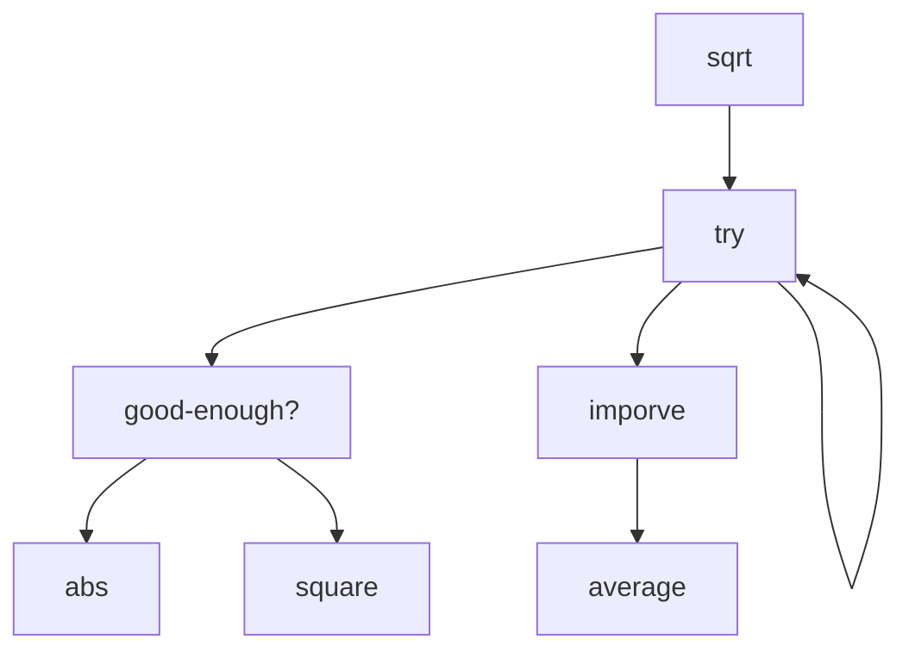
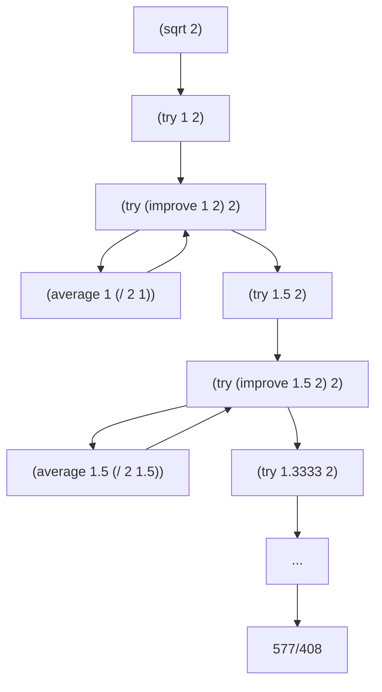

## SICP — A Bird's-Eye Orientation

### Preamble: What This Document Is For

This is an orientation to *Structure and Interpretation of Computer Programs* — the book by Harold Abelson and Gerald Jay Sussman with Julie Sussman (1985, 2nd ed. 1996), the MIT 6.001 course it powered for two decades, and the loose intellectual tradition that grew up around both. SICP is unusual: it is simultaneously a textbook, an artifact of pedagogical philosophy, a sociological phenomenon among programmers, and a covert work of meta-computer-science. To learn it well, you need to understand what kind of object you're learning from — otherwise you will read it as a Scheme tutorial and miss the point.

A note on the metamathematical / metacomputational lens: SICP is unusually friendly to this lens because the book is *itself* a sustained metacomputational argument — its claim is that computer science is not about computers, that programming languages are not what they seem, and that the boundary between "program" and "data" is conventional rather than natural. Reading it without noticing these meta-claims is like reading Wittgenstein without noticing he is doing philosophy *of* language rather than *in* it.


### 1. Identity & Core Question

SICP is a book about **how to think about computational processes** — not how to use a programming language, not how to build software systems, but how to reason about the *machines made of ideas* that programs bring into being. Its single most concentrated claim is that **computer science is the study of how to control complexity in formal systems**, and that the techniques for doing so (abstraction, modularity, conventional interfaces, language design) are themselves the subject — not the languages or machines that happen to host them.

Three core questions organize the book:

1. **What are the means of abstraction?** — How do we name and combine computational objects so that we can reason about large systems in terms of small ideas?
2. **What is the relationship between a program and the process it generates?** — A program is a static text; a process is a dynamic activity. The mapping between them is the central object of study, and most "programming language features" are just different ways of shaping that mapping.
3. **How do we build languages to fit problems, rather than fitting problems to languages?** — The book's deepest claim: the right response to complexity is to design a language in which the complexity disappears, and then write the program in that language.

The objects of study are **procedures** (computational descriptions of how to do something), **data** (computational descriptions of *what is*), and the discovery — repeated several times in the book, each time more shockingly — that these are not really distinct categories. What makes them worth studying is that this trio is the universal substrate of every digital artifact, from operating systems to neural networks to scientific simulations, and the techniques for organizing them are remarkably few and remarkably powerful.

**Metacomputational footnote:** notice that "computer science" is, on SICP's account, a misnomer — Abelson opens the very first lecture with this point, attributing it to Sussman: it is not a science (it doesn't study nature) and it is not really about computers (any more than geometry is about surveying instruments). The field is more accurately *procedural epistemology* — the study of structured knowledge of *how to do things*, in contrast with the declarative epistemology that mathematics formalizes. This reframing is not decoration; it is the thesis the entire book argues.

### 2. Why It Exists — Motivation & Position

**The historical setting.** SICP emerged from MIT's 6.001 in the late 1970s and early 1980s, in a period when introductory computer science was dominated by language tutorials (Pascal, Fortran, later C) that taught students to operate machines. Abelson, Sussman, and Sussman were reacting against this — they wanted an introductory course in the spirit of mathematics or physics, where students would meet **fundamental ideas** that would still be true forty years later, not language features that would be obsolete in five. The choice of Scheme (a minimal Lisp dialect) was instrumental: Scheme has so few features that it nearly disappears as a language, leaving the ideas in plain view.

The first edition (1985) and the more polished second edition (1996) are largely the same book, with small additions (concurrency, the metacircular evaluator's expansion, register-machine simulation). The accompanying MIT 6.001 video lectures, recorded for Hewlett-Packard in 1986, are widely regarded as one of the most pedagogically effective introductions to anything in any subject. The course at MIT was retired in 2008 in favor of a Python-based curriculum focused on robotics and probabilistic methods — a transition that occasioned considerable mourning and some genuinely interesting debate about what introductory CS is for.

**What became possible.** Before SICP, "advanced" introductory programming meant teaching more language features. After SICP, it became respectable to teach a tiny language and use the saved budget to teach the ideas the language was implementing. The book made certain claims publicly available that had been folklore among Lisp hackers and certain computer scientists — that interpreters are ordinary programs, that programs and data are the same kind of thing, that streams unify recursion and iteration, that an operating system is mostly a fancy interpreter. It changed what an undergraduate could be expected to find unsurprising.

**Where it sits.** SICP is positioned at the intersection of several traditions that don't usually meet in one classroom: the **Lisp / functional-programming** lineage (Church, McCarthy, Steele, Sussman); the **structured-programming and abstract-data-type** lineage (Dijkstra, Hoare, Liskov, Parnas); the **AI lab "make a language for the problem"** culture (Minsky, Sussman); and the **mathematical-foundations-of-computing** tradition (Turing, Curry, Strachey, Scott). It is upstream of: most modern functional language design (Haskell, Scala, Clojure, F#, Rust's iterator design); the design of teaching languages (Racket, Pyret, How to Design Programs); modern thinking about meta-programming and DSLs; and a substantial fraction of working programmers' taste — many people who never finish SICP are still shaped by reading the first three chapters. It is parallel to, and sometimes in tension with, the systems-programming tradition (Knuth, Tanenbaum) and the algorithms-and-complexity tradition (Cormen et al., Sipser), neither of which it tries to replace.

**Metacomputational footnote.** Note the implicit claim in the book's structure: that the "right" introduction to computer science is *philosophical* before it is *technical*. This is a real position, opposed to the "technical first, ideas later" tradition of most CS curricula. The opposition has never been settled — the 2008 MIT switch was, in part, a vote against SICP's view. Knowing that this debate exists and is ongoing is part of understanding what SICP is.

### 3. Foundational Assumptions & Interpretive Choices

SICP rests on a small handful of primitive commitments. None is universally shared in computer science, and recognizing them is part of reading the book well.

**Commitment 1: Programming is the activity of describing processes, not commanding machines.** A program is a *description*; a process is what happens when that description is executed. The book treats the description as a linguistic object — to be analyzed, transformed, decomposed, generated by other programs — rather than as instructions to a machine. This is an inheritance from Lisp culture and is opposed to the "code is what makes the CPU do things" view dominant in systems education.

**Commitment 2: The lambda calculus is the right substrate for thinking about computation.** Functions (procedures) are first-class: they can be passed as arguments, returned as values, stored in data structures, and constructed at runtime. This is a 1930s mathematical discovery (Church) repurposed as a teaching foundation. The alternative substrates — Turing machines, register machines, message-passing — are present in the book but treated as alternative *implementations* of an underlying functional reality, not as competing foundations.

**Commitment 3: Abstraction is the central mechanism of complexity control.** When something is hard, the answer is almost always to introduce a layer of abstraction that hides what doesn't need to be seen. The book's structure — local procedures, then data abstractions, then mutable state, then streams, then interpreters, then compilers — is a sustained tour of progressively richer kinds of abstraction. This is opposed to the "performance first, abstraction is a luxury" view of low-level systems programming.

**Commitment 4: Interpretation is the universal explanatory device.** The deepest understanding of any language feature, in SICP's view, comes from writing an interpreter for a language that has it. Want to understand variables? Write an environment-passing interpreter. Want to understand objects? Write a message-dispatch system. Want to understand non-determinism? Write an `amb` evaluator. This is a strong methodological claim — that *implementation* is the royal road to *understanding* — and it shapes the second half of the book.

**Interpretive choices visible to the careful reader:**

* **Scheme over more "realistic" languages.** Scheme is chosen because it is small enough to disappear. The cost: students sometimes leave SICP fluent in ideas but unable to write production code, and need a second education in idioms of mainstream languages. The benefit: nothing in Scheme distracts from the ideas.

* **Functional first, mutation later.** The book deliberately defers assignment (the `set!` operator and mutable state) until Chapter 3, after building substantial capability without it. This is the opposite of the imperative-first tradition. The cost: students take longer to feel "real." The benefit: students see precisely what mutation buys and what it costs, which most programmers never see clearly.

* **No type system.** Scheme is dynamically typed, and the book treats type discipline as a runtime concern, not a static one. Modern functional pedagogy (Haskell, ML, the *Software Foundations* tradition) takes the opposite view, treating types as the primary structuring tool. The SICP camp and the typed-functional camp respect each other and disagree quietly. A learner moving from SICP to Haskell will find the experience illuminating and slightly destabilizing.

* **Process-oriented, not system-oriented.** SICP largely ignores files, sockets, processes, threads (until late, briefly), distribution, persistence, and most of what working programmers spend their time on. This is intentional — those concerns belong to a different course — but it is also a real limitation. SICP graduates know how to think but may not yet know how to ship.

**Metacomputational footnote.** SICP's choices form a coherent package that some traditions reject wholesale. The book's implicit argument is that this package — minimal language, functional-first, abstraction as primary, interpretation as explanatory — produces the right kind of mind. The argument is contested. You should know that you are buying into a position when you read SICP, not receiving the consensus view of the field.

### 4. Knowledge Topography — The Map

#### Core concepts in roughly the book's dependency order

**Procedure** — a named (or unnamed) computational description of how to compute something. *The basic unit; everything else is built from procedures and the data they manipulate.*

**Substitution model of evaluation** — the idea that you can understand what a procedure does by mentally substituting arguments for parameters. *A simple model that works for purely functional code and breaks visibly when mutation enters; the breakdown is itself a teaching device.*

**Recursive vs. iterative process** — the distinction between a process that builds up deferred operations (recursive) and one that maintains a running summary in fixed space (iterative). *Crucially, both can be expressed as recursive procedures; the process shape is not the same as the syntactic shape. This is one of the book's first major "you've been confusing two things" moments.*

**Higher-order procedure** — a procedure that takes or returns procedures. *The mechanism by which patterns of computation become reusable; a derivative is a higher-order procedure, and so is a strategy that combines other strategies.*

**Compound data and abstraction barriers** — the use of constructors and selectors (e.g., `cons`, `car`, `cdr`) to build data structures whose internal representation is hidden behind an interface. *Sets up "data abstraction" as a sibling of "procedural abstraction," with both governed by the same principle: separate use from implementation.*

**Closures and message passing** — the discovery that procedures-with-state can simulate objects, and conversely that data with operations can simulate procedures. *Sets up the book's deepest joke: there is no fundamental difference between procedure and data; what looks like one can be re-described as the other.*

**Mutation, environments, and the substitution model's failure** — the introduction of `set!`, the moment the substitution model stops working, and the construction of the environment model to replace it. *A pivot point of the book; the cost of mutation is exposed before its benefits are accepted.*

**State, identity, and time** — the deep observation that introducing mutation introduces a notion of "time" and "identity" into computation. *A philosophical hinge: mutation is not just a feature, it is a metaphysical commitment.*

**Streams** — infinite, lazily-evaluated sequences. *The functional alternative to mutation: model time as an infinite sequence rather than a value that changes. Reframes "iteration" and "real-time systems" as questions of stream manipulation.*

**Metalinguistic abstraction** — the idea that the appropriate response to complexity is to design a new language. *The book's most ambitious move; the second half of the book does this repeatedly, each time more strikingly.*

**The metacircular evaluator** — an interpreter for Scheme, written in Scheme, that fits in a few pages. *The technical and conceptual climax of the book; once understood, programming languages stop being mysterious.*

**The environment model of evaluation** — a precise account of how variables, scope, and closures actually work, in terms of frames and pointers. *The replacement for the substitution model; the moment "variable binding" becomes mechanically clear.*

**Lazy evaluation, non-deterministic evaluation, logic programming** — three further interpreters, each demonstrating that a major paradigm of computing is just a few changes to the evaluator. *The deepest pedagogical move: paradigms are not mountains, they are tweaks.*

**Register machines and compilation** — the descent from high-level interpretation to a model of how a computer actually executes things, and then a compiler from Scheme to that model. *The book closes the loop: the abstraction tower bottoms out in something concrete.*

**Garbage collection** — the explanation of how memory management actually works, presented as a small algorithm rather than a mystery. *Demystifies the runtime of nearly every modern language.*

#### Major sub-themes (the book's "movements")

* **Chapter 1: Building abstractions with procedures.** Functional programming, recursion, higher-order procedures.
* **Chapter 2: Building abstractions with data.** Constructors and selectors, abstraction barriers, generic operations, symbolic data.
* **Chapter 3: Modularity, objects, and state.** Mutation, the environment model, streams, time and identity.
* **Chapter 4: Metalinguistic abstraction.** The metacircular evaluator, lazy evaluation, non-determinism (`amb`), logic programming.
* **Chapter 5: Computing with register machines.** Register-machine simulation, compilation, memory management.

The five chapters form a deliberate arc: abstraction at the level of *procedures*, then *data*, then *time*, then *language*, then *machine*. Each chapter is one full revolution of the "introduce a level, then build the next level using it" cycle.

#### Connections outward

**Inputs:** elementary algebra and logical thinking; some prior exposure to programming is helpful but not required (the book teaches recursion from scratch); willingness to take ideas seriously rather than treating programming as recipe-following.

**Outputs (with one concrete consequence each):**
* **Programming language design and implementation**: SICP is the standard preparation for compiler and interpreter courses; Chapters 4–5 are essentially a miniature version of such a course.
* **Functional programming in Haskell, OCaml, Clojure, Scala, F#**: nearly every concept is portable, sometimes with the type system added.
* **Software engineering taste**: the principle "design the right abstractions, keep the implementation behind them" is portable to any language and any team.
* **Algorithms and data structures**: the book's treatment of recursion, accumulation patterns, and tree manipulation is excellent preparation, though it deliberately does not aim at complexity analysis.
* **Operating systems and systems programming**: SICP's treatment of state, processes, and memory provides the conceptual scaffolding; mainstream OS courses then add the concrete machinery.
* **Artificial intelligence (the symbolic tradition)**: the book is part of the cultural lineage of MIT-style symbolic AI; pattern matchers, rule systems, and search procedures are presented in their natural habitat.
* **Domain-specific languages and metaprogramming**: SICP's emphasis on language design as a problem-solving technique is the single most direct preparation for the modern interest in DSLs.

### 5. Learning Trajectory

**Prerequisites — the honest list:**

* **Mathematical maturity, not mathematical knowledge.** The book uses very little advanced math (a bit of calculus and number theory in examples), but assumes you can read a recursive definition, follow a chain of reasoning, and notice when a definition is doing more than it appears to.
* **Comfort with abstraction.** If "a function that returns a function" feels disorienting, plan to spend extra time on Section 1.3. This is the conceptual move SICP relies on most.
* **Patience for slow build-up.** The book deliberately starts simple and accelerates. Readers who quit after Chapter 1 ("this is just basic Scheme") have not yet seen what the book does. The payoff begins in earnest in Section 2.4 (generic operations) and compounds from there.
* **Willingness to do the exercises.** This is the prerequisite that quietly fails most readers. The book's exercises are not optional drill; they are where most of the actual learning happens. SICP read passively is a beautifully written reading experience; SICP done is a different and more lasting thing.

**Quietly damaging gaps to fix early:**

* **Inability to trace evaluation by hand.** If you cannot, for a recursive procedure, manually walk through the substitution model and predict the output, the rest of the book will float past you. Drill this.
* **Discomfort with parentheses.** Scheme's prefix syntax `(+ 1 2)` rather than `1 + 2` looks alien for about three days, then becomes invisible. Push through the alienation; do not switch to a "more readable" Scheme variant during this phase.
* **Treating exercises as optional.** Many of the book's most important ideas appear *in* the exercises, not in the prose. Exercise 1.6 (asking what happens if `if` were a procedure) is a one-page version of the entire theory of evaluation order.

**Recommended reading order, with the reason:**

1. **Chapters 1 and 2 in full, with a substantial fraction of the exercises.** These chapters teach you to think in procedures and in data abstractions. Skipping exercises here is the most common reason people stall later.
2. **Chapter 3 carefully.** The introduction of mutation is delicate and the book is doing pedagogical work that is easy to miss. Do not rush past Section 3.1 ("the cost of introducing assignment") — its argument that mutation has a hidden cost is a thesis the rest of the chapter develops.
3. **Sections 3.5 (streams) deserve a separate pass.** Many readers find streams the most disorienting section; the disorientation is worth pushing through.
4. **Chapter 4 is the climax.** Specifically, Section 4.1 (the metacircular evaluator) is *the* moment of the book. If you only ever do one project from SICP, build the metacircular evaluator and modify it to add a feature.
5. **Sections 4.2–4.4 (lazy evaluation, `amb`, logic programming) are optional but extraordinary.** Each is a self-contained demonstration of paradigm-as-modification. If you have time for one, do the `amb` evaluator (Section 4.3) — the experience of writing a non-deterministic interpreter is uniquely clarifying.
6. **Chapter 5 is foundational but heavy.** Many readers stop after Chapter 4 and miss something important: the descent to register machines and the construction of a compiler. This is the chapter that most resembles a traditional CS course, and the connection it draws between high-level Scheme and low-level execution is the book's final structural payoff. Skip it only if you intend to take a separate compilers course.

**Topics commonly approached early but better deferred:**

* **Macros (`define-syntax`).** SICP largely avoids macros, and rightly so for a first pass. They are a more advanced metaprogramming tool; learn them after the metacircular evaluator, when you understand what they are sugar for.
* **Tail-call optimization as a topic of study.** SICP relies on it (this is why iterative processes work in Scheme) but doesn't dwell on it. Don't get sidetracked into tail-call discussions; trust that it works and move on.

**Topics commonly deferred but better front-loaded:**

* **Drawing box-and-pointer diagrams by hand.** Many readers try to keep `cons` cells in their head. Don't. Draw them on paper for the first several weeks. The diagrams are the cognitive scaffolding the book assumes you are using.
* **Writing the metacircular evaluator yourself, before fully reading Section 4.1.** Reading the evaluator is illuminating; writing one before reading is transformative. Try to get a tiny one working from first principles, then read the book's version.

**Realistic effort estimate:** for a serious self-learner with the prerequisites in place and willing to do exercises, **300–500 hours to genuine completion** of Chapters 1–4 with substantial exercise work, **plus another 100–200 hours for Chapter 5 and the deeper exercises**. Reading the book without doing exercises takes about 60 hours and produces a different, lesser thing — you will have impressions but not capabilities. The book is famously punishing to skim and famously rewarding to inhabit. Plan for six to twelve months of part-time study, not weeks.

**Metapedagogical footnote.** Notice that the recommended order is *the book's order*. Unlike many textbooks, SICP is structured tightly enough that reordering hurts. Each chapter installs a habit of thought that the next chapter exploits. A reader who skips Chapter 2 to "get to the interpreters" finds Chapter 4 incomprehensible — the metacircular evaluator is a tour de force of data abstraction, and you can't read it if you can't read data abstractions.

### 6. The Outsider's QA Sheet

**Q1. [DEF] Why Scheme rather than Python, JavaScript, or any "real" language?**
Because Scheme has so few features that the language nearly disappears, leaving the ideas in plain view. The whole core of Scheme fits on a postcard; everything else in the book is built from it. A "feature-rich" language would constantly be a distraction — students would be learning the language instead of the concepts. The cost is that students leave SICP without production-language fluency; the benefit is that they leave seeing through any production language they later meet.

**Q2. [DEF] Why does the book emphasize the difference between "procedure" and "process"?**
Because they are genuinely different objects, and conflating them is the single most common confusion in early programming. A *procedure* is a static piece of text; a *process* is the dynamic activity that unfolds when the procedure is run. The same procedure can produce different processes (the famous example: a recursively-written procedure can produce an iterative process, in tail position). Once you see this distinction, much of what looked like "programming style" becomes "process shaping," which is a more powerful frame.

**Q3. [DEF] Why is `cons` (and the whole linked-list aesthetic) treated as foundational rather than as one data structure among many?**
Because `cons`, `car`, and `cdr` are the simplest possible non-trivial constructor and selectors, and the book uses them as a stand-in for the general principle of *building data abstractions out of primitives*. The point is not "lists are special"; the point is "any data structure can be built this way, and the technique generalizes." Section 2.1.3, where `cons` is implemented using only procedures and closures, is the book's most concentrated argument that "data" is conventional rather than primitive. The technique would generalize equally well using any other constructor — `cons` is a metaphor, not a destiny.

**Q4. [NOT] Lisp, Scheme, Racket, Common Lisp — what's the difference, and which is SICP?**
Lisp is a family of languages dating to 1958; the family shares the prefix-parenthesis syntax and the treatment of code as data. **Scheme** is a minimalist Lisp dialect designed in 1975 by Steele and Sussman, optimized for clarity and small footprint. **Common Lisp** is a large, industrial-strength Lisp standardized in the 1980s, with a much richer feature set. **Racket** is a modern descendant of Scheme designed for teaching and for programming-language research. SICP uses a small subset of Scheme; you can run its code in Racket (with a SICP language module), MIT/GNU Scheme, or other Scheme implementations. The differences among these dialects matter for working programmers but are mostly invisible at SICP's level.

**Q5. [NOT] Why all those parentheses? Is there a deeper reason or is it just historical?**
Both. Historically, Lisp's syntax was originally meant to be temporary — McCarthy planned a more conventional surface syntax that never got built. But the parentheses turned out to encode something important: they make the syntactic structure of the code *literally* the structure of a tree, with no parsing ambiguity. This is what makes "code as data" practical: a Lisp program is already in the form an interpreter wants to consume. Languages with conventional syntax need a parser to recover this structure; Lisp programs hand it over directly. The parentheses are the price of trivially-parseable syntax, and they enable everything in Chapters 4–5.

**Q6. [NAÏVE] Isn't SICP outdated? It was written before the web, before mobile, before machine learning.**
The book is dated in its examples and silent about most of what working programmers do today. It is not dated in its content. The ideas it teaches — abstraction, modularity, language design, the relationship between procedures and processes — are the same in 2026 as in 1985, because they are about the structure of computational thought, not the structure of any particular technology. A reader emerging from SICP and meeting the modern web, modern ML, or modern systems programming will recognize the underlying patterns immediately. Calling SICP "outdated" is like calling Euclid's *Elements* outdated because it doesn't cover GPS.

**Q7. [NAÏVE] Why so much fuss about a single book? It's just a textbook.**
Most textbooks teach a body of material. SICP teaches a *way of seeing*, and it is one of the few books that does this successfully in computer science. Readers regularly describe it as the book that changed how they think about programming, decades after reading it; this is unusual. The fuss is also partly sociological: SICP became a shibboleth among a certain class of programmer, signaling "I am the kind of person who has read this book." The substantive value and the sociological value are both real and not entirely separable.

**Q8. [NAÏVE] Do I need to finish SICP to get value from it?**
No. The first three chapters — about half the book — contain most of the durable conceptual content. Many working programmers benefit from Chapters 1–3 and never finish Chapter 4 or 5. That said, Chapter 4's metacircular evaluator is the experience the book is structured around, and most readers who quit before it report later that they wish they hadn't. A reasonable goal: Chapters 1–3 thoroughly, Chapter 4 Section 1 with effort, the rest as your interest dictates.

**Q9. [NOT-THIS] What is SICP not? It's often confused with a Scheme tutorial, with a functional-programming book, and with an algorithms book.**
It is none of these. **It is not a Scheme tutorial** — Scheme is a vehicle, not a destination, and the book teaches almost nothing about Scheme as a working language (libraries, idioms, deployment). **It is not a functional-programming polemic** — Chapter 3 explicitly accepts mutation as necessary and useful, after carefully exposing its costs. **It is not an algorithms book** — the book does not aim at complexity analysis, asymptotic bounds, or competitive-programming techniques; it assumes algorithms will be learned elsewhere. SICP is a book about *structure* — how to organize computational thinking — and its examples come from wherever they best illustrate structural points.

**Q10. [NOT-THIS] How does SICP differ from *How to Design Programs* (HtDP)?**
HtDP, by Felleisen and collaborators, was developed as a kind of successor that takes seriously a problem SICP arguably leaves unsolved: how to teach novices to design programs from scratch, rather than to read and admire elegant existing programs. HtDP is more pedagogically structured, more explicit about its design recipe, and gentler on absolute beginners. SICP is more concentrated, more philosophical, and more demanding. They share Scheme/Racket and a functional-first orientation; they differ on whether the priority is "novice can produce code" (HtDP) or "intermediate can see structure" (SICP). Many curricula now use HtDP first and SICP second.

**Q11. [WHY-HARD] Why is Chapter 3 (mutation and state) considered the hardest chapter, more than Chapter 4 (interpreters)?**
Because Chapter 3 dismantles the substitution model, which by then the reader has been using for two chapters as their primary tool of understanding. Replacing it with the environment model is technically straightforward but psychologically jarring — the reader has to give up a way of thinking that just started to feel natural. Chapter 4, by contrast, is hard but *additive*: you build a new mental model on top of existing ones. The pedagogical lesson is that the most difficult parts of learning are not the most technically advanced; they are the parts that require unlearning.

**Q12. [WHY-HARD] Why are streams (Section 3.5) so disorienting on first contact?**
Because streams encode time as data. A normal program has time as an implicit dimension — things happen "now" or "later." A streaming program represents the entire history (potentially infinite) as a single value, with the "now" cursor an explicit position in it. This is a 90-degree rotation of the usual frame, and most readers need several days to recover their balance. The disorientation is the lesson: streams are training in the recognition that "time" is one design choice among several, not a metaphysical given.

**Q13. [WHY-HARD] What does the metacircular evaluator actually teach that you can't learn just by reading about how interpreters work?**
The metacircular evaluator teaches that an interpreter is not a special object — it is just an ordinary program of fewer than two hundred lines, written in the language it interprets, doing exactly what it says. Most programmers spend years thinking interpreters are mysterious; the metacircular evaluator is the moment that mystery dissolves. Reading about interpreters tells you that they exist; writing one tells you that they are *small*, and therefore that programming languages are not magic but engineering. This experiential knowledge is the book's central gift.

**Q14. [PROGRESS] What does "progress" look like in the SICP tradition? Is anyone still writing SICP-style work?**
Yes, but it is concentrated in a few research communities. The Racket project (PLT, Northwestern, Brown, Northeastern, Utah) explicitly continues SICP's commitment to language-design-as-problem-solving, producing both research languages and pedagogical languages. The "languages workbench" community (Felleisen, Krishnamurthi, Findler, Tobin-Hochstadt) builds on SICP's metalinguistic stance. The "How to Design Programs" textbook is the most direct pedagogical descendant. Outside this community, SICP's influence is more diffuse — it shows up in good taste rather than named research. The book is "complete" as a teaching artifact; the research it inspired is alive in places.

**Q15. [PROGRESS] What replaced SICP at MIT, and why?**
6.001 was retired in 2008 and replaced by 6.01, a Python-based course oriented around robotics, signal processing, and probabilistic methods, designed by Sussman, Hal Abelson, and Leslie Kaelbling. The official rationale was that introductory CS at MIT in 2008 needed to prepare students for a world where most software is engineered (assembled from libraries with known properties) rather than designed from scratch — a world in which the "structure of computation" focus felt less central than the "interaction with messy real systems" focus. The change was controversial and remains so. Reasonable people disagree about whether it was a correction or a loss; the disagreement is itself instructive.

**Q16. [BRIDGE] What's the relationship between SICP and the lambda calculus?**
Scheme is, roughly, lambda calculus plus a few primitives and a tasteful surface syntax. SICP doesn't formally develop the lambda calculus, but the book's foundational moves — first-class procedures, closures as the primary structuring tool, the substitution model of evaluation — are direct inheritances from Church's 1936 work. A reader who encounters the typed lambda calculus later (e.g., in a Haskell course or in *Types and Programming Languages*) will recognize the SICP world as the untyped, dynamically-checked version of the same underlying mathematics. The bridge is not advertised in SICP, but it is structural.

**Q17. [BRIDGE] How does SICP connect to the Curry–Howard correspondence?**
SICP doesn't mention Curry–Howard (the deep correspondence between programs and proofs, types and propositions), because SICP is dynamically typed and not concerned with the proofs-as-programs view. But the book's habit of treating procedures as mathematical objects, and its insistence that an interpreter is itself a piece of mathematics, is the same intellectual climate from which Curry–Howard grew. A reader who learns SICP and later learns Coq, Agda, or Lean will find the leap shorter than expected — the underlying respect for procedures-as-objects is shared, even though the specific machinery diverges sharply.

**Q18. [BRIDGE] What does SICP have to do with category theory and modern functional programming?**
SICP predates the explicit influx of category theory into programming (which happened in the Haskell community from roughly the late 1980s onward). But several SICP ideas — composition of higher-order functions, generic operations through dispatch, streams as a form of corecursion — turn out, in retrospect, to be discrete categorical patterns. The "generic arithmetic" system in Chapter 2.5 is a hand-rolled version of what would later be called type classes. A reader who learns category theory after SICP often experiences déjà vu: "oh, that pattern I built by hand in Chapter 2 has a name."

**Q19. [META] Is SICP appropriate as a *first* programming book, or only as a second one?**
This is a real disagreement. The "first book" camp holds that SICP can launch a beginner because it assumes nothing and builds carefully from primitives. The "second book" camp holds that SICP's pace and abstraction level are punishing for true beginners and that students should arrive having already programmed enough to recognize the patterns SICP is naming. Empirically, MIT used SICP successfully as a first course for decades, but with strong students and intensive support; self-learners attempting SICP as their first programming book have mixed outcomes, depending heavily on patience and exercise discipline. The honest answer: it depends on the learner, and HtDP exists precisely as a gentler on-ramp.

**Q20. [META] Why do some serious programmers hold SICP in contempt, and is there anything to their critique?**
The contempt usually comes in two flavors. The first holds that SICP is a "purist" or "ivory-tower" book, irrelevant to the work of shipping software, and that its emphasis on elegance over pragmatism produces engineers who can't actually deliver. The second, more interesting, holds that SICP is too narrow — it teaches one tradition of programming (the Lisp / functional / abstraction-heavy tradition) as if it were the whole subject, and produces readers who underestimate the legitimately different concerns of systems programming, performance engineering, and large-team software design. The second critique has some force; SICP is not a complete education in software, only in computational thinking. The first critique misunderstands the book.

**Q21. [META] Why does the SICP tradition emphasize building interpreters, while the *Software Foundations* / *PLAI* / *Types and Programming Languages* tradition emphasizes proving things about them?**
Two different attitudes toward what understanding a language *means*. The SICP tradition holds that you understand a language feature when you can implement it in a smaller language; understanding is operational and constructive. The Pierce / Coq / Software Foundations tradition holds that you understand a language feature when you can state and prove its formal properties (type soundness, termination, etc.); understanding is propositional. Both are legitimate views of "knowing a language," and serious language designers ultimately want both. The SICP tradition gets you to working interpreters faster; the proof tradition gets you to certainty about their behavior.

**Q22. [META] How seriously should I take the famous claim that "computer science is not a science and not about computers"?**
Seriously, but with calibration. The claim is rhetorically sharp and substantively true: most of what is taught under "computer science" is not science (it does not study natural phenomena and form falsifiable hypotheses about them) and is not specifically about computers (the principles transfer to any computational substrate). The deeper, less-quoted point is that the field is a kind of *engineering of formal systems* — a third category alongside science and mathematics, with its own methods. The catchphrase is meant to dislodge a particular misconception, not to legislate departmental boundaries.

**Q23. [PROGRESS] What's the right way to engage with the exercises? They are infamous.**
The exercises are graded internally: some are five-minute warm-ups, some are afternoons of concentrated work, and a small number (the "starred" ones, traditionally) are several-day projects. The right strategy depends on your goals. For full mastery, attempt every exercise in Chapters 1–3 and most in Chapter 4. For working knowledge, attempt every exercise that you read and don't immediately see the answer to — these are the ones doing teaching work. For survey-level reading, skim exercises and only attempt those that test something you suspect you don't understand. Many of the most famous exercises (the Y combinator, the metacircular evaluator extensions, the constraint-propagation system) are essentially small research projects and can absorb a week each. Budget accordingly.

**Q24. [BRIDGE] Why is SICP often paired with the *Wizard Book* nickname, and what does the cover image mean?**
The cover of both editions shows a wizard — partly a joke about Lisp's reputation as a "high-magic" language, partly a deliberate visual claim that the book is initiating you into something. Inside the front pages, you'll find a quote about "the programmer as a creator of universes" (paraphrased; see the foreword). The wizard imagery is not pure decoration — it is a self-aware claim that what programmers do is, in some real sense, *generative metaphysics*: they bring into existence small, fully-determined worlds whose laws they author. Reading SICP without taking that claim seriously is reading it less than fully.

**Q25. [DEF] Why does the book introduce "data" later than "procedures"? Most books do the opposite.**
Because SICP wants you to see that "data" is a derived concept, not a primitive one. By introducing procedures first and then showing in Chapter 2 that procedures-with-state can implement any data structure (the famous `cons` defined in terms of `lambda`), the book makes a strong philosophical claim: data and procedures are dual aspects of computation, and either can be reduced to the other. Most books treat data as the "stuff" that procedures act on, and so present data first. SICP's reversal is a thesis: it is procedures all the way down, and data is a useful pattern of procedure use. Whether you believe this thesis is itself interesting; the book wants you to see it and then decide.

### 7. Mental Models Practitioners Actually Use

**1. Procedures and data are dual; either can implement the other.**
The textbook surface presents procedures and data as separate categories, and so does most programming. The SICP-trained eye sees them as one substance with two presentations: a "procedure" is an action with a frozen environment, a "datum" is a value with associated operations, and any system you can build with one you can rebuild with the other. The conceptual shift is reaching for "could I represent this as a procedure that responds to messages?" or, conversely, "could I represent this control flow as a data structure that's interpreted?" — both are real options. Once internalized, the entire object-oriented vs. functional debate looks like a stylistic preference, not a metaphysical divide.

**2. Languages are tools to be built, not given.**
The textbook surface treats programming languages as fixed external artifacts you learn. The practitioner's view is that *every program defines a small language* — its vocabulary of procedures, its conventions of data, its idioms of use — and that the question is always whether you've designed that small language well. The conceptual shift is that "writing a program" and "designing a language" stop being different activities; they are the same activity, with language design being the more honest description. Once you see this, libraries are languages, frameworks are languages, configuration files are languages, and many of programming's hardest problems become problems of *bad accidental language design*.

**3. The right answer to complexity is a new layer of interpretation.**
The textbook surface treats interpretation as something special, performed only by "language implementations." The practitioner's view is that interpretation is the universal escape hatch: when a problem is too messy for your current level of abstraction, you build a small interpreter that consumes a description of the messy thing and runs it. Spreadsheet engines, regular expression matchers, dependency resolvers, build systems, query planners — all are domain-specific interpreters in disguise. The shift is recognizing the interpreter pattern in problems that don't appear linguistic, and reaching for it deliberately.

**4. Mutation is a contract with time, not a feature.**
The textbook surface treats variables as "things you assign to." The practitioner's view, post-SICP, is that the moment you write `set!` (or its equivalent in any other language) you have introduced *time* as an explicit dimension of your program — you have committed to questions like "when did this happen?" and "what was the value before?" that were meaningless in a pure-functional context. Mutation is not free; it is purchased with the loss of certain reasoning techniques. The shift is treating each `set!` as a deliberate trade and asking, "do I really need this, or can I rephrase the problem so the change is in the data flow rather than in storage?"

**5. The substitution model and the environment model are not "wrong and right" — they are different lenses.**
The textbook surface presents the substitution model as a stepping stone to be replaced by the "real" environment model. The practitioner's view is that both remain useful. The substitution model is your tool for reasoning about pure code, and most modern programming languages (Haskell, Rust, parts of Python) support large pure regions where it works perfectly. The environment model is your tool for reasoning about stateful code, where what a name means depends on history. The shift is choosing your model based on the code in front of you, rather than defaulting to one for everything.

**6. Tail calls turn recursion into iteration; recognize when this matters.**
The textbook surface teaches "iterative" and "recursive" as syntactic categories. The practitioner's view is that these are *process* categories — the question is what shape the running computation takes, not what the source code looks like. A function that calls itself can produce an iterative process if the recursive call is in tail position and the language supports tail-call elimination. This is not obscure — it is the whole reason languages with proper tail calls (Scheme, Scala on the JVM, Clojure with `recur`, Haskell) treat loops as syntactic sugar. The shift is reading code in terms of the process it generates, not the process it appears to generate.

**7. Streams replace mutation by representing time as data.**
The textbook surface treats streams as a data structure, useful occasionally for lazy evaluation. The practitioner's view, after Chapter 3.5, is that streams are an alternative *model of state* — instead of "this variable has the value 5 now and will have the value 6 later," you write "this stream has the values 5, 6, 7, ... in it." Modern reactive programming, signal-flow languages, and much of stream-processing infrastructure (Spark Streaming, Kafka Streams, RxJava) are this idea industrialized. The shift is recognizing when a problem is "really" about a sequence of values over time, and reaching for stream representations rather than mutable variables.

**The conceptual shift from "computing without seeing" to "seeing"** typically arrives in three stages for SICP readers. Stage one: you can read and write Scheme fluently and the parentheses no longer bother you. Stage two (usually around Chapter 2.4 or 3.1): you stop seeing "language features" and start seeing "design choices an interpreter is making" — the moment you realize that classes, modules, exceptions, scoping rules are not magic but ordinary engineering. Stage three (after Chapter 4.1, if you complete it): you stop seeing programming languages as objects of study and start seeing them as *artifacts you could build*, and the question "how does language X handle Y?" becomes "what design choice did its implementers make for Y?" — which you can usually answer by sketching the implementation. Many programmers complete a career at stage one. Stage three is what SICP exists to produce.

### 8. Pitfalls & Anti-Patterns

**Misconceptions that survive even after reading the book:**

* That SICP is "about Scheme." It is about computation; Scheme is the medium.
* That functional programming is the book's thesis. The book is functional-first but accepts mutation as necessary; the thesis is structure, not purity.
* That the metacircular evaluator is a curiosity. It is the structural payoff of the entire first half.
* That recursion is inefficient. Recursive *processes* are linear in stack space; recursive *procedures* expressing iterative processes use constant space. The confusion of these is a textbook example of the procedure/process conflation.
* That "abstraction" means "make it more general." Abstraction in SICP's sense means *hiding information that doesn't need to be visible at this level*; generality is a frequent side effect, not the goal.

**False friends — terms that mean something different in SICP than in mainstream usage:**

* **"Object."** In SICP, an object is anything with state and identity, often built from a closure. In Java/C++/Python, "object" implies a class hierarchy and inheritance. SICP's notion is older and more general; mainstream OO is one specific way of building objects.
* **"Class."** SICP doesn't have classes in the mainstream sense; it has dispatch tables, generic operations, and constructors. The Chapter 2 "type tag" system is a hand-built version of what languages with classes hide.
* **"Pure function."** SICP's term for a function without side effects, as in mathematics. The Haskell community uses the same term with stricter requirements (no I/O, no exceptions, monadic encapsulation of effects). SICP is looser.
* **"Variable."** In SICP (after Chapter 3), a variable is a binding in an environment, not a memory cell. The distinction matters when scoping rules differ from what C-like languages teach.
* **"Stream."** SICP streams are lazy lists (delayed pairs), not the asynchronous-data-flow streams of modern reactive programming or the bounded buffers of operating systems. Same word, related but distinct concepts.
* **"Process."** SICP's process is the dynamic activity of a running procedure. The operating-system "process" is a unit of resource allocation. These overlap conceptually but are not the same thing.
* **"Environment."** SICP environments are the data structures interpreters use to look up variable bindings. In systems programming, "environment" usually means the shell environment (a set of name-value pairs passed to a program). Wholly different concepts despite the shared word.

**Topics that *feel* central but are peripheral:**

* **Specific Scheme idioms.** SICP teaches Scheme as a vehicle, not a destination. Mastering Scheme-specific patterns (define-syntax macros, named let, internal definitions) is not the goal and can become a distraction.
* **Tail-call optimization mechanics.** Useful to know it exists and that it lets recursion express iteration; not useful to dwell on the implementation.
* **The exact list of primitives in Scheme.** The book uses different primitives in different places, sometimes without comment. Knowing which built-ins you can rely on is less important than knowing how you would build them yourself.

**Topics that *feel* technical but are central:**

* **Closures.** Often presented as a "Scheme feature," but actually the universal mechanism by which the book builds objects, modules, generators, lazy values, and most of its other constructs. If closures are not natural to you, the second half of the book becomes much harder.
* **Lexical scope and the environment model.** The environment model is presented in one chapter but is the conceptual foundation for everything afterward, including the metacircular evaluator. Internalize it.
* **The distinction between syntactic and semantic structure.** SICP returns to this repeatedly: the *text* of a program is syntactic, the *meaning* is what an interpreter assigns to it. Modern discussions of language semantics, compiler optimizations, and program analysis all live in this distinction.

**Computational habits that work in small examples and silently break:**

* Tracing evaluation in your head past a depth of about three. The substitution model is fine for small examples; for anything substantial, draw the trace on paper or use a stepper. Trying to keep it in your head produces silent errors of understanding.
* Assuming that "iterative" means "uses a loop." In SICP, an iterative process can be expressed by a recursive procedure with a tail call; the loop syntax is not the criterion.
* Trusting the reader's intuition about evaluation order. Scheme's evaluation order (applicative, left-to-right) is a deliberate choice; the book has examples (Section 1.1.5, Exercise 1.6) where the order matters and where naive intuition gives wrong answers.
* Treating `cons` and `list` as fundamentally different. They aren't; `list` is built from `cons`. Many readers conflate the convenient list interface with a primitive list type and become confused when the book builds non-list structures from `cons`.

### 9. Resources

**The book itself:**
* **Abelson, Sussman, & Sussman, *Structure and Interpretation of Computer Programs*, 2nd edition (MIT Press, 1996).** The full text is freely available from MIT Press at mitpress.mit.edu/sites/default/files/sicp/full-text/book/book.html. There is also an excellent HTML5 edition by Andres Raba (commonly called the "Unofficial Texinfo" or "neilvandyke" edition) with better typography. A paper copy is worth owning if you can find one; the book rewards rereading.

**The lectures:**
* **MIT 6.001 Video Lectures by Abelson and Sussman, recorded for Hewlett-Packard, 1986.** Twenty hours, freely available. These are not optional supplementary material; they are the book's intended companion. Sussman in particular is one of the great expository lecturers in computer science, and watching him work through the substitution model or the metacircular evaluator is an experience of a different kind from reading the same material. The lectures are dated only in clothing and chalkboards; the content is exact.

**Working environment:**
* **Racket with the SICP language module.** Racket (racket-lang.org) is the most actively maintained Scheme-family language and includes a `sicp` package that adapts Racket to the book's exact conventions. This is the recommended environment for self-learners in 2026.
* **MIT/GNU Scheme.** The original environment, still maintained, somewhat closer to the book's exact dialect but less polished as a development environment.

**Companion resources:**
* **Eli Bendersky's SICP solution series and Bill the Lizard's blog (each an exercise-by-exercise walkthrough)** are the best-known online solution sets. Use them after attempting an exercise honestly, not before; the value of SICP's exercises is in the attempt.
* **"Composing Programs" by John DeNero (composingprograms.com).** A free online textbook used in Berkeley's CS61A, structured as a Python-based reworking of SICP's first three chapters. Useful as a parallel pass if you want to see SICP's ideas in a more familiar language.

**Genuine successor / second-pass texts:**
* **Felleisen, Findler, Flatt, & Krishnamurthi, *How to Design Programs*, 2nd edition (MIT Press, 2018).** A pedagogically more structured book in the SICP tradition, with an explicit "design recipe" for novice programmers. Useful as a first book before SICP, or as a second pass to consolidate the design-thinking that SICP teaches more by example.
* **Krishnamurthi, *Programming Languages: Application and Interpretation* (free online).** Picks up where SICP Chapters 4–5 leave off, treating language design as the primary activity. Excellent as a follow-on to SICP for readers who liked the metacircular evaluator and want more.
* **Friedman & Felleisen, *The Little Schemer* and *The Seasoned Schemer*.** Companion volumes in a question-and-answer style; lighter, more playful, useful for readers who want extra exposure to the recursive-thinking habits SICP relies on.

**Intuition-first resource:**
* The **Sussman lectures themselves** are the intuition-first resource. There is no SICP equivalent of 3Blue1Brown — the book is too detailed and too tightly structured for short-form video summaries to add much. Watch the lectures; they are remarkable.

### 10. What "Knowing SICP" Looks Like

**The "you've made it" checklist — capabilities, not topics covered:**

1. **Read a recursive procedure and predict whether it will produce a recursive process or an iterative one** — without running it, by inspecting whether the recursive calls are in tail position.
2. **Implement a small data abstraction (queue, set, dictionary) using only `cons`, `lambda`, and primitive procedures** — and explain why the resulting code is, in a literal sense, message-passing object-oriented.
3. **Trace, on paper, the evaluation of a small Scheme program using both the substitution model and the environment model** — and articulate which model is appropriate for which kind of code and why.
4. **Modify a metacircular evaluator to add a new feature** (let-bindings, `cond` extensions, lazy arguments, dynamic scope) — and explain what changed in the evaluator's behavior and why.
5. **Recognize, in code from any language, when a problem is "really" interpreting a small embedded language** — and choose deliberately whether to make that interpreter explicit or leave it implicit.
6. **Identify, in any piece of code, the abstraction barriers and judge whether they are well-placed** — and rewrite a poorly-abstracted system to put barriers in better places.
7. **Translate a stateful program into a streams-based version (or vice versa)** for at least simple cases, and articulate what each version is good for.
8. **Sketch, in under fifty lines of pseudocode, the core of an interpreter for a Scheme-like language** — establishing that programming languages are not mysterious objects but small engineered artifacts.

**Natural next subjects, with what each opens up:**

* **A serious compilers course or *Engineering a Compiler* (Cooper & Torczon) / *Crafting Interpreters* (Robert Nystrom)** — for readers who want to extend the SICP Chapter 5 experience into industrial language implementation.
* **Pierce, *Types and Programming Languages*** — for readers who want the type-theoretic and proof-theoretic counterpart to SICP's operational/constructive view. The natural deepening for those drawn to the foundations.
* **Okasaki, *Purely Functional Data Structures*** — for readers who want to extend the data-abstraction story of Chapter 2 into serious algorithmic territory while staying in the functional world.
* **Sussman & Wisdom, *Structure and Interpretation of Classical Mechanics*** — the same authors' attempt to redo classical mechanics using computational notation. A demonstration of SICP-style thinking applied outside of programming, and one of the strangest and best books in physics pedagogy.
* **A modern systems book (Bryant & O'Hallaron's *Computer Systems: A Programmer's Perspective*; Tanenbaum's *Modern Operating Systems*)** — for the concerns SICP deliberately doesn't address: hardware, OS, networks, the messy lower levels. A SICP graduate has the conceptual tools to read these books fast and well.
* **A serious functional-programming language with a strong type system (Haskell via *Programming in Haskell* by Hutton, or OCaml via *Real World OCaml*)** — for readers who want to see the SICP world reorganized around static types and laziness, and to experience the disciplined-functional alternative to SICP's permissive-functional style.
* **Felleisen et al., *Semantics Engineering with PLT Redex***, or Pierce's *Software Foundations* — for readers who want to graduate from "build interpreters" to "prove things about interpreters."


### 11. Metacomputational & Metapedagogical Synthesis

A few unifying reflections about **SICP as a kind of book** — claims that practitioners hold implicitly but rarely articulate:

**On the choice of pedagogical primitives.** The book chooses to start with arithmetic and procedures because these are the smallest things that can demonstrate the move from "concrete operation" to "named abstraction." It could have started with strings, with graphics, with input-output, with games — and modern textbooks often do. SICP's choice is not arbitrary: arithmetic is universally familiar, infinitely deep, and free of accidental complexity, so the abstraction moves stand out cleanly against it. This is a general principle of pedagogical design: **start in the domain that has the highest ratio of conceptual transparency to accidental complexity, even if it is not the most engaging domain**. When you encounter other technical books, ask why they chose their starting domain — the answer often reveals what the authors think the reader needs to see most clearly.

**On the economics of "what is taught."** Notice that SICP teaches very few "facts" in the usual textbook sense — there is no taxonomy of sorting algorithms, no list of design patterns, no encyclopedia of language features. What it teaches is a small number of *moves*: abstract a pattern into a procedure; build a data abstraction with constructors and selectors; introduce a layer of interpretation; replace state with streams. The book's claim is that these moves, internalized, suffice for most of what the rest of CS will throw at you. This is a real bet about what is *teachable* and what is *transferable*; the bet has paid off well enough that the book has remained in print for forty years. The general principle: **a good education aims at fewer, deeper moves rather than more, shallower facts** — because moves transfer and facts do not.

**On the relation between programs and proofs.** SICP's stance is that understanding a program means being able to predict its behavior, ideally by hand-tracing. This is operational understanding. An adjacent and equally legitimate stance — represented by *Software Foundations*, Coq, Agda, Lean — holds that understanding a program means proving theorems about its behavior. The two stances correspond to two views of what computer science *is*: an experimental engineering science vs. a branch of formal mathematics. Both are real. SICP sits firmly on the operational side, but a SICP-trained mind can move to the proof side without difficulty; the move in the other direction is harder.

**On when to read SICP.** A book this ambitious and this slow rewards reading at the right moment. A reader who comes to SICP with no programming experience often bounces off, not because the book is too hard but because it is teaching the *abstraction over* programming and you need some programming to abstract over. A reader who comes to SICP after several years of professional programming often finds it the book they wish they had read earlier — because it names patterns they have rediscovered through pain. The honest recommendation: read SICP after you have written perhaps three to twelve months of code in any language and have started to feel that "there must be a better way to think about this." That feeling is the prerequisite the prerequisites don't list.

**On why this book and not some other.** Many books contain SICP's individual ideas, but few contain its *combination* and almost none contain its *temperament*. The combination matters because the ideas reinforce one another: closures explain objects, objects motivate environments, environments enable interpreters, interpreters reveal that languages are programs. The temperament matters because SICP treats the reader as a peer — capable of thinking carefully, capable of building deep things, owed an explanation rather than a recipe. Books that teach individual SICP-ideas without this temperament produce different readers. The book is, in a sense, a sustained argument that **how you teach is part of what you teach** — and that lesson, once seen, is hard to un-see.

**On the field's debate about SICP's relevance.** As noted in §6, MIT replaced 6.001 in 2008 and the wider community has not settled whether SICP-style introduction is right for the modern era. The honest position: it depends on what you are training for. If you are training programmers to assemble systems from existing libraries with known properties, SICP is overkill and HtDP or a Python-based course may be better. If you are training people who will themselves design systems, design languages, build infrastructure, or do research, nothing yet replaces SICP. The choice is real and ongoing, and any orientation document that pretends there is a settled answer is misleading you.


### Self-Audit (executed per prompt instructions)

**Check 1: pairs in §6 considered for merging.** I considered merging Q14 (does anyone still write SICP-style work?) and Q15 (what replaced SICP at MIT?) — both concern the field's current relationship with the book. **I decided to keep both** because Q14 is [PROGRESS] (about ongoing research lineage) and Q15 is also [PROGRESS] (about institutional change), but they answer non-overlapping questions: one about academic research traditions, one about a specific curriculum decision. I considered merging Q9 (what SICP isn't) and Q10 (SICP vs. HtDP) — both [NOT-THIS] — and decided to keep both because Q10's specific comparison is itself a major question many readers have, distinct from the general "what is this not" framing. I rejected one earlier draft pair (a generic "why is the book hard?" question and Q11's specific Chapter-3-vs.-Chapter-4 question) by deleting the generic version and keeping the specific one.

**Check 2: §7's anti-banality test.** All seven mental models pass the test of "wait, that's what's actually going on?" rather than "yes, I knew that." Model 4 (mutation as a contract with time) is a deliberate replacement for the more banal "mutation has costs" framing — the temporal-contract framing is the version practitioners actually use. Model 6 (tail calls as procedure-vs-process recognition) is folded into the mental model framework rather than being a separate fact, which is how working programmers actually carry it.

**Check 3: length discipline.** Most §6 answers sit within 2–5 sentences. Q15 (MIT's curriculum change) and Q20 (the contempt question) run slightly longer because the historical and sociological content can't be compressed without distortion.

**Check 4: §10's capabilities vs. topics.** All eight capabilities are demonstrable actions. Item 5 ("recognize when a problem is really interpreting a small language") is borderline — it could be misread as "recognition" rather than "doing" — but is paired with the active sub-task of choosing how to handle the recognition, making it operational.

**Check 5: integration of the metacomputational lens.** The lens is woven through (a) the explicit preamble, (b) metacomputational footnotes in §§1, 2, 3, 5, (c) [META]-tagged questions Q19, Q20, Q21, Q22, and (d) the synthesis in §11. The metapedagogical dimension is integrated alongside, since SICP is unusual in being itself a metapedagogical artifact — separating the two would have been artificial.

**Calibration note for this subject.** §6 is unusually rich for SICP because the book occupies a contested place — a real pedagogical debate about its relevance, real disagreements about its philosophy, and real differences from adjacent books — giving the [META] and [NOT-THIS] categories abundant material. §1 is more constrained than for some other technical subjects because SICP's elevator pitch is unusually unified — "how to control complexity in formal computational systems" really is most of what there is to say at the top level. §11's metacomputational synthesis is especially appropriate for SICP because the book is itself a sustained metacomputational argument; a standard "learning advice" closing would have been a mismatch with what the book actually is.
Textbook:
* [SICP](https://mitp-content-server.mit.edu/books/content/sectbyfn/books_pres_0/6515/sicp.zip/full-text/book/book-Z-H-4.html)
* [Composing Programs](https://www.composingprograms.com/)


## Notes of Textbook

### Introduction: How to Read SICP

SICP is not primarily a book about `Scheme`. It is a book about how computational ideas are built, organized, transformed, and made understandable. The language is deliberately small, because a small language makes the real subject harder to hide: `abstraction`, `evaluation`, `data`, `state`, `language`, and `machine`.

The book treats a program as more than a sequence of instructions. A program is a way of expressing a model. It describes a process, controls its behavior, hides some details, exposes others, and gives future programs something stable to rely on. Reading SICP well means asking, again and again: what is being abstracted, what is being hidden, what interface is being exposed, and what model of computation is being assumed?

The first danger in reading this book is to mistake syntax for substance. `Scheme` syntax is intentionally sparse: expressions, combinations, names, procedures, conditionals, and a few special forms. This minimal surface is not the destination. It is a controlled setting where the reader can observe how computation unfolds. The point is not to memorize parentheses, but to see how a small number of rules can generate rich program behavior.

The second danger is to mistake mathematical definition for computational procedure. A mathematical definition may say what an object is; a program must say how to produce it. Chapter 1 makes this distinction explicit through square roots, recursion, iteration, growth of processes, and higher-order procedures. The question is not only whether a program computes the right answer. The question is also what kind of process it generates: linear recursion, linear iteration, tree recursion, logarithmic growth, or a general pattern abstracted into a higher-order procedure.

The third danger is to read each example as an isolated trick. SICP is cumulative. Early examples become models that later chapters revise, deepen, or replace. The `substitution model` in Chapter 1 is useful because it gives a simple way to think about procedure application, but it is not the final account of evaluation. Once `assignment`, `state`, and `mutable data` enter in Chapter 3, the book must move toward the `environment model`. Later, Chapter 4 turns evaluation itself into an object of study by building interpreters. Chapter 5 pushes the same ideas down into registers, stacks, explicit control, and compilation.

The structure of the book can be read through three long threads.

* The abstraction thread: `expression` → `name` → `procedure` → `higher-order procedure` → `data abstraction` → `generic operation` → `object` → `language abstraction`.
* The evaluation thread: `substitution model` → `environment model` → `lazy evaluation` & `nondeterministic evaluation` → `metacircular evaluator` → `explicit-control evaluator`.
* The complexity thread: small expressions → compound procedures → modular systems → interpreters → compilers → machine-level execution.

These threads are not separate tracks. They repeatedly cross. `Higher-order procedures` make procedures behave like data. `Data abstraction` makes representation invisible behind interfaces. `Objects` introduce time and local state. `Streams` recover some modularity by delaying evaluation. `Metalinguistic abstraction` shows that one way to control complexity is to design a new language. `Compilation` shows how high-level structure can be translated into lower-level control.

A useful SICP note should therefore not be a summary of paragraphs. It should be a reading instrument. For each chapter, the notes should record the problem being solved, the model being introduced, the abstraction being created, the program behavior being traced, and the later chapters where the same idea will return. A good note does not merely answer “what does this code do?” It also asks “what does this code make easier to express?” and “what would break if the underlying model changed?”

The reader should pay special attention to conceptual pairs that look similar but behave differently.

* `procedure` ≠ `computational process`: a procedure is a description; a computational process is what unfolds when the description is executed.
* `recursive procedure` ≠ `recursive process`: a procedure may call itself syntactically while still generating an iterative process.
* `data abstraction` ≠ `data representation`: the abstraction is the interface; the representation is the hidden implementation.
* `state` ≠ `environment`: state concerns changing values over time; environment concerns the context in which names get their meanings.
* `interpreter` ≠ `compiler`: both process programs, but they organize execution in different ways.

The book is demanding because it refuses to keep these issues separate. It asks the reader to move between levels: expression-level evaluation, procedure-level abstraction, system-level modularity, language-level design, and machine-level control. This movement is the real training. SICP teaches programming as a discipline of managing intellectual complexity: build an abstraction, test what it hides, expose a useful interface, then use that interface as a new primitive for the next level.

The best way to read the book is active and procedural. Run the code, but do not stop at running it. Trace it. Rewrite it. Change a condition. Replace a representation. Compare two versions that compute the same mathematical function but generate different processes. When the book introduces a model, treat it as provisional: useful now, possibly revised later. The goal is not to finish the chapters quickly, but to acquire the habit of seeing programs as layered computational explanations.

SICP begins with procedures because procedures are the first tool for turning repeated operations into named ideas. It then moves to data because larger programs need stable interfaces over changing representations. It introduces state because many systems must model time, identity, and change. It studies interpreters because languages themselves are tools for abstraction. It ends near the machine because every abstraction eventually has to be realized by a concrete process.

The book’s central lesson can be stated simply: computation becomes powerful when details can be hidden without being forgotten. SICP teaches how to hide details responsibly, how to recover them when necessary, and how to build new layers of meaning on top of old ones.

### Chapter 1. Building Abstractions with Procedures

*Chapter 1 introduces the first major form of `abstraction`: abstraction by `procedure`. The chapter begins with a very small language of expressions, names, combinations, conditionals, and procedure definitions, then uses the `substitution model` to explain what procedure application means. It then shifts from “what value does this expression produce?” to “what kind of computational process does this procedure generate?” The later sections raise procedures to a new level: procedures can be arguments, returned values, and building blocks for general methods such as summation, fixed points, and Newton’s method.*

**Chapter dependencies:**

* No serious prerequisites: basic arithmetic, function calls, and recursive definitions.

* First layer of `abstraction`: use `procedures` to hide operational details: `expression` → `name` → `procedure definition` → `higher-order procedure`

* Chapter 2 extends the same idea to `data abstraction`: `procedural abstraction` + `data abstraction` → larger program structures

* This chapter uses the `substitution model` to explain procedure application: `substitution model` ≈ useful for programs without assignment or mutable data

* Chapter 3 introduces `assignment`, `state`, and `mutable data`; then the `substitution model` is no longer enough: `state` + `mutable data` → `environment model`

* This chapter studies “how expressions are evaluated” → Chapter 4 studies “how an evaluator performs evaluation”

* Chapter 5 lowers recursion, iteration, and tail recursion into machine-level mechanisms: `recursion / iteration / tail recursion` → `registers` + `stack` + `control flow`

**1. What basic mechanisms must a powerful programming language provide, and why are these mechanisms more important than surface syntax?**

>

**2. How do `expression`, `combination`, `operator`, `operand`, `environment`, and `special form` together form a minimal system of evaluation?**

>

**3. Why is `define` the first form of abstraction, rather than merely a way to give names to values? How does it allow programs to grow from isolated expressions into constructed systems?**

>

**4. How does the `substitution model` explain procedure application? Why is it useful for learning, and why should it not be mistaken for the actual implementation of an interpreter?**

>

**5. When do `applicative-order evaluation` and `normal-order evaluation` produce the same result, and when do they reveal different computational behavior?**

>

**6. Why is a mathematical definition not the same as a computational procedure? In the square-root example, how do `sqrt`, `good-enough?`, `improve`, and `sqrt-iter` turn declarative knowledge into an effective process?**

>

**7. What different shapes of process are produced by `recursive processes`, `iterative processes`, `tree recursion`, and logarithmic processes? Why can the same mathematical goal correspond to different process shapes?**

>

**8. How do `higher-order procedures` turn computational patterns into manipulable objects? How do `sum`, `product`, `accumulate`, `fixed-point`, `average-damp`, and `newtons-method` show rising levels of abstraction?**

>

**Concept comparison table:**

| Concept A                      | Concept B                    | Shared point                                   | Key difference                                                                                                      | Role in this chapter                                                             | Minimal example                                                          |
| ------------------------------ | ---------------------------- | ---------------------------------------------- | ------------------------------------------------------------------------------------------------------------------- | -------------------------------------------------------------------------------- | ------------------------------------------------------------------------ |
| `procedure`                    | `computational process`      | Both concern program execution                 | A `procedure` is a description; a `computational process` is the behavior that unfolds during execution             | Prevents confusing program text with runtime behavior                            | `fact-iter` is recursively defined but can generate an iterative process |
| `recursive procedure`          | `recursive process`          | Both may involve self-reference                | The first concerns procedure definition; the second concerns the shape of execution                                 | One of the central distinctions in Chapter 1                                     | `factorial` vs `fact-iter`                                               |
| `applicative-order evaluation` | `normal-order evaluation`    | Both are evaluation strategies                 | Applicative order evaluates arguments first; normal order expands first and evaluates when needed                   | Exercise 1.5 exposes the difference                                              | `(test 0 (p))`                                                           |
| `special form`                 | ordinary procedure           | Both appear inside expression structures       | A special form has its own evaluation rule and may not evaluate all subexpressions                                  | Explains why `define`, `if`, `cond`, `and`, and `or` are not ordinary procedures | `if` evaluates only one branch                                           |
| `declarative knowledge`        | `imperative knowledge`       | Both can describe the same mathematical target | Declarative knowledge says what is true; imperative knowledge says how to compute                                   | Explains why a square-root definition is not yet a program                       | mathematical `sqrt` definition ≠ `sqrt-iter`                             |
| local name                     | free variable                | Both are names appearing in expressions        | A local name is bound by parameters or internal definitions; a free variable gets meaning from an outer environment | Prepares for the later `environment model`                                       | `guess` in `sqrt-iter`; `square` from the surrounding environment        |
| `higher-order procedure`       | ordinary numerical procedure | Both can be applied                            | A higher-order procedure takes procedures as arguments or returns procedures as values                              | Turns general methods into language objects                                      | `sum`, `average-damp`, `deriv`                                           |

**Program tracing table:**

| Tracing object                         | What to trace                                                                                  | Common mistake                                                                    |
| -------------------------------------- | ---------------------------------------------------------------------------------------------- | --------------------------------------------------------------------------------- |
| Nested combination evaluation          | Which subexpression is the operator, which are operands, and in what order values are produced | Reading only the parentheses without tracking returned values                     |
| `(f 5)` under the `substitution model` | How formal parameters are replaced by argument values                                          | Treating substitution as the interpreter’s real text-rewriting implementation     |
| `sqrt-iter`                            | How `guess` is tested and improved step by step                                                | Treating the mathematical definition of square root as an effective procedure     |
| `factorial` vs `fact-iter`             | Whether execution builds a chain of deferred operations or maintains fixed state variables     | Equating syntactic recursion with a recursive process                             |
| `fib`                                  | How tree recursion creates repeated subcomputations                                            | Seeing only the concise definition and missing exponential growth                 |
| `fast-expt` and `gcd`                  | How problem size shrinks at each step                                                          | Remembering the algorithm name without tracing size reduction                     |
| `sum`, `fixed-point`, `average-damp`   | How procedures are passed, returned, and composed                                              | Treating higher-order procedures as syntax tricks rather than abstraction devices |

>

**Abstraction barrier record:**

| Abstraction layer            | Exposed interface                       | Hidden representation                                                  | What the upper layer depends on                      | What should not change when the lower layer changes                                    |
| ---------------------------- | --------------------------------------- | ---------------------------------------------------------------------- | ---------------------------------------------------- | -------------------------------------------------------------------------------------- |
| Basic expression layer       | numbers, `+`, `-`, `*`, `/`             | machine instructions and numerical representation                      | operators can be applied to arguments                | users should not depend on how numbers are represented in the machine                  |
| Naming layer                 | `define`, variable names                | name-object associations in the environment                            | names retrieve objects                               | upper expressions should not depend on how the environment stores bindings             |
| Procedure layer              | `(define (square x) ...)`, `(square 5)` | formal parameters, procedure body, local names                         | procedures return values according to their contract | callers should not depend on the internal implementation of `square`                   |
| Compound procedure layer     | `sqrt`                                  | `sqrt-iter`, `good-enough?`, `improve`                                 | input `x` gives an approximate square root           | users should not depend on the iteration details or initial guess                      |
| Higher-order procedure layer | `sum`, `fixed-point`, `average-damp`    | concrete definitions of passed procedures and local iteration strategy | procedure arguments satisfy the calling convention   | callers should not depend on one particular summation or transformation implementation |

**Error prediction:**

**1. The reader may mistake `Scheme` syntax for the learning target, but the chapter is really using minimal syntax to expose `evaluation`, `combination`, and `abstraction`.**

>

**2. The reader may merge `recursive procedure` and `recursive process`, but the chapter needs a clear distinction between program definition and runtime process shape.**

>

**3. The reader may treat the `substitution model` as literal interpreter behavior, but it is only a simplified model for understanding procedure application.**

>

**4. The reader may memorize the forms of `if`, `cond`, `and`, and `or`, while missing that they are `special forms` with evaluation rules different from ordinary procedures.**

>

**5. The reader may treat higher-order procedures as a functional-programming trick, while missing their role in naming and composing general computational methods.**

>

**6. The reader may read the numerical examples as mathematics exercises, while they are mainly tools for observing process shape, growth order, and abstraction level.**

>

**Learning Tips:** Do not only read the code in Chapter 1. Manually trace at least `(f 5)`, `(sqrt 2)`, `(factorial 6)`, `(fib 5)`, and `(sum cube 1 inc 10)`. For each trace, separate three questions: how the expression is evaluated, how the procedure unfolds, and what time/space behavior the process generates. The exercises can be reviewed in four blocks: Exercise 1.1–1.8 for evaluation rules and square roots; Exercise 1.9–1.15 for recursion, iteration, and growth; Exercise 1.16–1.28 for fast algorithms, greatest common divisors, and primality testing; Exercise 1.29–1.46 for higher-order procedures and general methods.

**Exercise 1.1.** Determine what the interpreter prints for a sequence of expressions involving arithmetic combinations, `define`, `if`, `cond`, and compound predicates.

**Training goal:** `evaluation rules`, `environment`, `special forms`.

>

**Exercise 1.2.** Translate a given mathematical expression into Scheme prefix form.

**Training goal:** `prefix notation`, nested `combinations`.

>

**Exercise 1.3.** Define a procedure that takes three numbers and returns the sum of the squares of the two larger numbers.

**Training goal:** `conditional expressions`, `procedural abstraction`, combination design.

>

**Exercise 1.4.** Analyze the behavior of `a-plus-abs-b`, where the operator position itself is produced by an `if` expression.

**Training goal:** evaluation of `combinations`, compound expressions as operators.

>

**Exercise 1.5.** Use `(test 0 (p))` to compare the behavior of applicative-order and normal-order evaluation.

**Training goal:** evaluation strategy comparison, infinite recursion, `if` as a special form.

>

**Exercise 1.6.** Analyze why defining `if` as an ordinary procedure `new-if` causes abnormal behavior in the square-root program.

**Training goal:** `special forms`, applicative-order evaluation, recursive termination.

>

**Exercise 1.7.** Explain why the original `good-enough?` test is inadequate for very small and very large numbers, then design a better stopping test based on the change in guesses.

**Training goal:** numerical error, iterative improvement, termination conditions.

>

**Exercise 1.8.** Implement cube roots using Newton’s method, following the structure of the square-root procedure.

**Training goal:** iterative improvement, procedure reuse, numerical method as program.

>

**Exercise 1.9.** Use the `substitution model` to expand two addition procedures defined with `inc` and `dec`, then decide whether each generates a recursive or iterative process.

**Training goal:** `substitution model`, recursive process, iterative process.

>

**Exercise 1.10.** Analyze several calls to the Ackermann-like procedure `A`, then describe the mathematical meanings of `f`, `g`, and `h`.

**Training goal:** recursive expansion, function growth, mapping procedures to mathematical functions.

>

**Exercise 1.11.** Write both a recursive-process version and an iterative-process version for a function defined by a three-term recurrence.

**Training goal:** recursion → iteration, state-variable design.

>

**Exercise 1.12.** Write a recursive procedure to compute elements of Pascal’s triangle.

**Training goal:** tree recursion, boundary cases, combinational structure.

>

**Exercise 1.13.** Prove by induction the relationship between Fibonacci numbers and the golden-ratio formula.

**Training goal:** mathematical induction, recursive definition, growth understanding.

>

**Exercise 1.14.** Draw the recursion tree generated by `count-change` for 11 cents and analyze its space and time growth.

**Training goal:** tree-recursion tracing, growth order, space/time distinction.

>

**Exercise 1.15.** Analyze how many times procedure `p` is applied in the `sine` procedure and determine its space and time growth.

**Training goal:** recursion depth, logarithmic growth, trigonometric identity as program.

>

**Exercise 1.16.** Design an iterative fast exponentiation procedure with logarithmic steps, preserving the invariant `a b^n`.

**Training goal:** iterative algorithm design, invariant, logarithmic growth.

>

**Exercise 1.17.** Use `double` and `halve` to design a logarithmic multiplication procedure analogous to `fast-expt`.

**Training goal:** analogy-based construction, fast algorithms, recursive process.

>

**Exercise 1.18.** Design an iterative logarithmic multiplication procedure based on the ideas from Exercises 1.16 and 1.17.

**Training goal:** recursion → iteration, invariant, state update.

>

**Exercise 1.19.** Complete the logarithmic Fibonacci algorithm by deriving the transformed values `p'` and `q'`.

**Training goal:** state transformation, successive squaring, algebraic derivation.

>

**Exercise 1.20.** Analyze `gcd` under normal-order and applicative-order evaluation and count the number of `remainder` operations.

**Training goal:** evaluation strategy, Euclid’s algorithm, process cost analysis.

>

**Exercise 1.21.** Use `smallest-divisor` to find the smallest divisors of 199, 1999, and 19999.

**Training goal:** primality testing, smallest-divisor search.

>

**Exercise 1.22.** Implement `search-for-primes` to test consecutive odd integers in a range and record timings near different orders of magnitude.

**Training goal:** experimental measurement, growth-order verification, runtime observation.

>

**Exercise 1.23.** Modify `smallest-divisor` to skip even candidates greater than 2 and compare whether the speedup is close to a factor of 2.

**Training goal:** constant-factor optimization, experiment vs theory.

>

**Exercise 1.24.** Replace the prime test with the Fermat method and compare actual timing with logarithmic-growth expectations.

**Training goal:** probabilistic algorithm, logarithmic growth, performance experiment.

>

**Exercise 1.25.** Decide whether computing the full exponentiation first with `fast-expt` and then taking a remainder can replace `expmod`.

**Training goal:** modular exponentiation, intermediate result size, algorithmic implementation details.

>

**Exercise 1.26.** Explain why replacing `square` in `expmod` with two identical recursive calls changes a logarithmic process into a linear one.

**Training goal:** repeated computation, recursion tree, growth-order degradation.

>

**Exercise 1.27.** Write a procedure to verify that Carmichael numbers fool the Fermat test.

**Training goal:** limits of probabilistic testing, number-theoretic counterexample, exhaustive checking.

>

**Exercise 1.28.** Modify `expmod` to detect nontrivial square roots of 1 and implement the Miller-Rabin primality test.

**Training goal:** improved probabilistic testing, modular arithmetic, algorithm reliability.

>

**Exercise 1.29.** Implement Simpson’s rule for numerical integration and compare results for integrating `cube` from 0 to 1 with different values of `n`.

**Training goal:** higher-order procedure, numerical integration, error comparison.

>

**Exercise 1.30.** Rewrite the recursive version of `sum` as an iterative version by filling in the missing expressions.

**Training goal:** higher-order procedure, linear recursion → iteration.

>

**Exercise 1.31.** Define a `product` abstraction, use it to express `factorial` and a Wallis-product approximation, and write both recursive and iterative versions.

**Training goal:** pattern abstraction, product generalization, recursive/iterative versions.

>

**Exercise 1.32.** Define a more general `accumulate` abstraction, then express `sum` and `product` as special cases; write recursive and iterative versions.

**Training goal:** abstraction generalization, combiner design, higher-order procedure.

>

**Exercise 1.33.** Add a filtering predicate to `accumulate` and use `filtered-accumulate` to express prime-square sums and products of relatively prime integers.

**Training goal:** filtering + accumulation, predicates as arguments, abstraction composition.

>

**Exercise 1.34.** Analyze what happens when evaluating `(f f)` for the procedure `(define (f g) (g 2))`.

**Training goal:** procedures as arguments, erroneous evaluation, callable-object intuition.

>

**Exercise 1.35.** Show that the golden ratio is a fixed point and compute it using `fixed-point`.

**Training goal:** fixed points, mathematical transformation, numerical iteration.

>

**Exercise 1.36.** Modify `fixed-point` to print the sequence of approximations, then solve `x^x = 1000` and compare convergence with and without average damping.

**Training goal:** fixed-point tracing, average damping, convergence speed.

>

**Exercise 1.37.** Write `cont-frac` for finite continued fractions and use recursive and iterative versions to approximate the reciprocal of the golden ratio.

**Training goal:** higher-order procedure, continued fractions, recursion and iteration.

>

**Exercise 1.38.** Use Euler’s continued-fraction expansion to approximate `e`.

**Training goal:** continued-fraction reuse, procedure parameterization.

>

**Exercise 1.39.** Use Lambert’s continued fraction to define `tan-cf`, an approximation to tangent.

**Training goal:** mathematical formula → program, higher-order numerical method.

>

**Exercise 1.40.** Define `cubic` so that it can be used with `newtons-method` to find zeros of cubic polynomials.

**Training goal:** returned procedures, Newton’s method, function generator.

>

**Exercise 1.41.** Define `double`, which returns a procedure that applies a one-argument procedure twice, then analyze a nested application.

**Training goal:** procedure returning procedure, higher-order composition, nested evaluation.

>

**Exercise 1.42.** Define procedure composition `compose`, where `(compose f g)` represents `f(g(x))`.

**Training goal:** function composition, procedure composition.

>

**Exercise 1.43.** Define `repeated`, which returns a procedure that applies another procedure `n` times.

**Training goal:** procedure generation, recursive construction of higher-order procedures, composition reuse.

>

**Exercise 1.44.** Define `smooth`, then use `repeated` to generate n-fold smoothing.

**Training goal:** procedure transformation, signal-processing intuition, higher-order reuse.

>

**Exercise 1.45.** Experiment to determine how many average dampings are needed for nth roots, then implement nth-root computation using `fixed-point`, `average-damp`, and `repeated`.

**Training goal:** experimental pattern discovery, average damping, higher-order synthesis.

>

**Exercise 1.46.** Define `iterative-improve` to abstract the “guess → test → improve” strategy, then use it to rewrite `sqrt` and `fixed-point`.

**Training goal:** iterative-improvement abstraction, higher-order encapsulation, chapter synthesis.

>

**Cross-chapter recovery questions:**

**1. How must the chapter’s `substitution model` be revised when Chapter 3 introduces `assignment` and `mutable data`?**

**2. How does the chapter’s simple notion of `environment` become the central model for explaining program behavior in Chapters 3 and 4?**

**3. How do this chapter’s `higher-order procedures` prepare for Chapter 2’s data structures and Chapter 4’s interpreters, where programs and data become more deeply connected?**

**4. How are recursion, iteration, and tail recursion reinterpreted in Chapter 5 as problems of registers, stack, and control flow?**

**Chapter mastery standards:**

* Able to manually trace applicative-order evaluation for a nested combination and identify operator, operands, and environment.
* Able to explain how `define` creates the first layer of abstraction and why `define`, `if`, `cond`, `and`, and `or` cannot all be treated as ordinary procedures.
* Able to expand a simple procedure application using the `substitution model`, while stating the model’s range and limits.
* Able to distinguish `recursive procedure` ≠ `recursive process`, and to identify iterative processes and tree-recursive processes.
* Able to estimate the time and space behavior of simple processes and locate deferred operations or state variables.
* Able to write at least one higher-order procedure that takes a procedure as an argument, and explain what repeated pattern it abstracts.
* Able to explain the abstraction path from `fixed-point` to `average-damp` to `newtons-method` to `iterative-improve`.

### Chapter 2. Building Abstractions with Data

*Chapter 2 moves from `procedural abstraction` to `data abstraction`. Chapter 1 showed how a procedure can hide a method of computation; this chapter shows how data objects can hide their internal representation behind constructors, selectors, and conventional interfaces. The central issue is representation independence: a program should be able to use rational numbers, intervals, sequences, trees, symbolic expressions, sets, or complex numbers without depending on how those objects are physically represented. By the end of the chapter, data abstraction grows into a system-level problem: multiple representations, tagged data, data-directed programming, generic operations, coercion, and symbolic algebra.*

**Chapter dependencies:**

* Depends on Chapter 1: `procedure`, `higher-order procedure`, recursion, and the `substitution model`.

* Extends the first abstraction layer: `procedural abstraction` → `data abstraction`.

* Introduces the basic discipline of abstract data: `constructor` + `selector` + `operation` → representation-independent programs.

* Uses pairs as the main building material: `cons` + `car` + `cdr` → lists, trees, symbolic expressions, and tables.

* Turns sequences into conventional interfaces: `map` + `filter` + `accumulate` → programs organized by data flow.

* Prepares Chapter 3: immutable compound data → mutable data + state.

* Prepares Chapter 4: symbolic data + quotation + expression representation → interpreters can treat programs as data.

* Prepares Chapter 5 indirectly: high-level data structures → lower-level memory representation, allocation, and garbage collection.

**1. Why does abstraction with data become necessary after abstraction with procedures?**

>

**2. How do `constructor`, `selector`, and `abstraction barrier` allow programs to depend on what data means rather than how data is represented?**

>

**3. What is meant by “data” if pairs can be represented not only as primitive objects, but also as procedures, numbers, or Church numerals?**

>

**4. How does interval arithmetic show both the power and the difficulty of data abstraction when the represented object is inexact or uncertain?**

>

**5. How do the `closure property` and pair-based structures make it possible to build sequences, trees, and hierarchical data?**

>

**6. How do `map`, `filter`, and `accumulate` turn sequences into conventional interfaces for organizing programs?**

>

**7. How does symbolic data change the role of a program from numerical calculation to symbolic manipulation?**

>

**8. Why do multiple representations require tagged data, data-directed programming, generic operations, and coercion?**

>

**Concept comparison table:**

| Concept A                   | Concept B               | Shared point                              | Key difference                                                                                          | Role in this chapter                                        | Minimal example                         |
| --------------------------- | ----------------------- | ----------------------------------------- | ------------------------------------------------------------------------------------------------------- | ----------------------------------------------------------- | --------------------------------------- |
| `data abstraction`          | `data representation`   | Both concern compound data                | Abstraction is the interface; representation is the hidden implementation                               | Main discipline of the chapter                              | rational numbers represented as pairs   |
| `constructor`               | `selector`              | Both belong to an abstract-data interface | A constructor builds data; a selector extracts parts                                                    | Defines how clients interact with data                      | `make-rat`, `numer`, `denom`            |
| `pair`                      | `list`                  | Both use `cons` structure                 | A pair has two parts; a list is a conventional chain of pairs                                           | Basic material for compound data                            | `(cons 1 2)` vs `(list 1 2)`            |
| `list`                      | `tree`                  | Both can be represented by pairs          | A list is linear; a tree is hierarchical                                                                | Motivates structural recursion                              | `(list 1 2 3)` vs `(list 1 (list 2 3))` |
| `sequence interface`        | concrete list structure | Both process ordered collections          | The interface abstracts patterns like mapping and accumulation; the concrete list is one representation | Enables programs organized by data flow                     | `map`, `filter`, `accumulate`           |
| `symbolic data`             | numerical data          | Both are data objects                     | Symbolic data can represent names, formulas, or programs                                                | Opens the path to symbolic differentiation and interpreters | `'(x + 3)`                              |
| `tagged data`               | untagged data           | Both may carry values                     | Tagged data explicitly records type or representation                                                   | Enables multiple representations                            | `(attach-tag 'rectangular z)`           |
| `data-directed programming` | explicit dispatch       | Both select operations by type            | Data-directed programming stores dispatch rules in a table                                              | Makes systems more additive                                 | operation/type table                    |
| `generic operation`         | ordinary operation      | Both apply operations to data             | Generic operations dispatch according to type tags                                                      | Supports arithmetic across many types                       | `add`, `mul`, `real-part`               |
| `coercion`                  | direct operation        | Both relate values of different types     | Coercion converts one type to another before applying an operation                                      | Handles mixed-type arithmetic                               | integer → rational → real → complex     |

**Program tracing table:**

| Tracing object                | What to trace                                                                      | Common mistake                                                             |
| ----------------------------- | ---------------------------------------------------------------------------------- | -------------------------------------------------------------------------- |
| Rational arithmetic           | How `add-rat` uses `make-rat`, `numer`, and `denom` without knowing representation | Looking inside the pair too early                                          |
| Abstraction barriers          | Which procedures belong above or below the barrier                                 | Mixing representation code with client code                                |
| Procedural pairs              | How `(cons x y)` can be represented as a procedure                                 | Assuming data must be a primitive storage object                           |
| Interval arithmetic           | How bounds propagate through addition, multiplication, and division                | Treating equivalent algebraic formulas as equivalent interval computations |
| Lists and trees               | How recursive structure follows `car` / `cdr` decomposition                        | Confusing linear list recursion with tree recursion                        |
| `map`, `filter`, `accumulate` | How sequence operations express data-flow pipelines                                | Writing element-by-element recursion before seeing the pattern             |
| Symbolic differentiation      | How expressions are classified and recursively transformed                         | Treating symbols as numbers or variables without quotation                 |
| Set representations           | How the same abstract operation changes cost under different representations       | Thinking one representation is universally best                            |
| Huffman trees                 | How encoding and decoding follow tree structure                                    | Missing the relation between frequency and code length                     |
| Generic arithmetic            | How `apply-generic` dispatches by type tags                                        | Hard-coding every representation into every operation                      |

>

**Abstraction barrier record:**

| Abstraction layer         | Exposed interface                                                  | Hidden representation                                | What the upper layer depends on                           | What should not change when the lower layer changes                        |
| ------------------------- | ------------------------------------------------------------------ | ---------------------------------------------------- | --------------------------------------------------------- | -------------------------------------------------------------------------- |
| Rational-number layer     | `make-rat`, `numer`, `denom`, `add-rat`, `mul-rat`                 | pair representation and normalization strategy       | rational numbers behave like numerator/denominator values | client arithmetic should not change if representation changes              |
| Interval layer            | `make-interval`, `lower-bound`, `upper-bound`, interval operations | endpoint storage and tolerance representation        | intervals represent possible value ranges                 | client code should not depend on endpoint order or internal pair structure |
| Sequence layer            | `map`, `filter`, `accumulate`, `enumerate-interval`                | list recursion over pairs                            | data can be processed uniformly as sequences              | high-level operations should not depend on manual `car` / `cdr` recursion  |
| Tree layer                | tree constructors and recursive selectors                          | nested pairs and lists                               | hierarchical data can be traversed recursively            | tree-processing logic should not depend on a single printed form           |
| Symbolic-expression layer | predicates, constructors, and selectors for sums/products          | list structure and quotation                         | algebraic expressions can be manipulated structurally     | differentiation rules should not depend on raw list layout                 |
| Set layer                 | `element-of-set?`, `adjoin-set`, `union-set`, `intersection-set`   | unordered list, ordered list, or tree representation | sets support membership and combination operations        | users should not depend on representation-specific traversal               |
| Complex-number layer      | `real-part`, `imag-part`, `magnitude`, `angle`                     | rectangular or polar representation                  | complex numbers support arithmetic operations             | complex arithmetic should not change when representation changes           |
| Generic-arithmetic layer  | `add`, `sub`, `mul`, `div`, `apply-generic`                        | operation/type tables, tags, coercions               | arithmetic works across several types                     | clients should not dispatch manually on type tags                          |

**Error prediction:**

**1. The reader may treat data abstraction as “putting values into pairs,” but the chapter’s real point is representation independence.**

>

**2. The reader may memorize `cons`, `car`, and `cdr` as list operations, while missing that pairs are a general glue for building compound data.**

>

**3. The reader may assume that equivalent algebraic formulas give equivalent interval results, but interval arithmetic shows that representation and dependency matter.**

>

**4. The reader may treat `map`, `filter`, and `accumulate` as convenient list utilities, while missing that they define a conventional interface for whole classes of programs.**

>

**5. The reader may think symbolic data is only about quoting names, but the chapter uses symbolic data to represent algebraic expressions, sets, trees, and eventually programs.**

>

**6. The reader may see tagged data and generic operations as extra complexity, while missing the design problem they solve: adding new representations and new operations without rewriting the whole system.**

>

**Learning Tips:** In Chapter 2, the main question is not “what is the list structure?” but “which layer is allowed to know the list structure?” When reading each example, mark the `constructor`, the `selector`, the operations above the abstraction barrier, and the representation below it. For sequence programs, rewrite at least one explicit recursion into `map` / `filter` / `accumulate`; for generic arithmetic, trace one operation through type tags and `apply-generic`.

**Exercise 2.1.** Improve `make-rat` so that rational numbers are normalized consistently when the numerator or denominator is negative.

**Training goal:** rational-number abstraction, normalization, representation invariant.

>

**Exercise 2.2.** Define constructors and selectors for points and line segments, then compute the midpoint of a segment.

**Training goal:** compound data, constructors/selectors, geometric abstraction.

>

**Exercise 2.3.** Implement rectangles in two different representations and define procedures for perimeter and area that work through abstraction barriers.

**Training goal:** representation independence, abstraction barrier, alternative data representations.

>

**Exercise 2.4.** Verify a procedural representation of pairs and define the corresponding `cdr`.

**Training goal:** procedural data representation, `substitution model`, meaning of data.

>

**Exercise 2.5.** Represent pairs of nonnegative integers using products of powers of 2 and 3, then define `cons`, `car`, and `cdr`.

**Training goal:** arithmetic representation of data, uniqueness of factorization, abstraction.

>

**Exercise 2.6.** Define Church numerals `one`, `two`, and addition directly in terms of procedures.

**Training goal:** procedures as data, Church numerals, representation without primitive numbers.

>

**Exercise 2.7.** Complete the interval abstraction by defining selectors for lower and upper bounds.

**Training goal:** interval abstraction, constructors/selectors, interface completion.

>

**Exercise 2.8.** Define subtraction for intervals.

**Training goal:** interval arithmetic, bound propagation.

>

**Exercise 2.9.** Analyze whether the width of an interval result can be expressed as a function of operand widths for addition, subtraction, multiplication, and division.

**Training goal:** interval width, algebraic dependency, abstraction limits.

>

**Exercise 2.10.** Modify interval division to check for division by an interval spanning zero.

**Training goal:** domain checking, error conditions, interval arithmetic.

>

**Exercise 2.11.** Optimize interval multiplication by considering sign cases and reducing the number of multiplications.

**Training goal:** case analysis, interval multiplication, performance under representation constraints.

>

**Exercise 2.12.** Define constructors and selectors for intervals represented by center and percentage tolerance.

**Training goal:** alternative representation, tolerance, abstraction barrier.

>

**Exercise 2.13.** Approximate the percentage tolerance of the product of two intervals with small percentage tolerances.

**Training goal:** approximation, tolerance propagation, numerical reasoning.

>

**Exercise 2.14.** Investigate why two algebraically equivalent formulas for parallel resistance produce different interval results.

**Training goal:** interval dependency, equivalent formulas ≠ equivalent computations.

>

**Exercise 2.15.** Evaluate the claim that formulas using uncertain quantities fewer times produce tighter interval results.

**Training goal:** dependency problem, formula design, uncertainty propagation.

>

**Exercise 2.16.** Explain why equivalent algebraic expressions may produce different answers in interval arithmetic and why solving this problem is difficult.

**Training goal:** limits of abstraction, dependency tracking, numerical representation.

>

**Exercise 2.17.** Define `last-pair`, which returns the list containing only the last element of a nonempty list.

**Training goal:** list recursion, base case, `cdr` traversal.

>

**Exercise 2.18.** Define `reverse` for lists.

**Training goal:** list processing, recursive construction, order reversal.

>

**Exercise 2.19.** Rewrite the counting-change program so that the coin denominations are given as a list.

**Training goal:** data-driven program structure, lists as parameters, abstraction of choices.

>

**Exercise 2.20.** Define `same-parity`, which returns all arguments with the same parity as the first argument.

**Training goal:** variable-length arguments, filtering, list construction.

>

**Exercise 2.21.** Define `square-list` both directly and using `map`.

**Training goal:** explicit recursion vs sequence mapping.

>

**Exercise 2.22.** Diagnose why two attempted iterative versions of `square-list` produce wrong list order or wrong structure.

**Training goal:** list construction order, `cons`, iterative accumulation.

>

**Exercise 2.23.** Implement `for-each` for lists.

**Training goal:** list traversal, side-effect-style procedure application, sequence iteration.

>

**Exercise 2.24.** Analyze the expression `(list 1 (list 2 (list 3 4)))` as printed output, box-and-pointer structure, and tree.

**Training goal:** list representation, tree interpretation, structural visualization.

>

**Exercise 2.25.** Write combinations of `car` and `cdr` that extract 7 from three nested lists.

**Training goal:** pair navigation, nested list access.

>

**Exercise 2.26.** Compare the results of `append`, `cons`, and `list` when applied to two lists.

**Training goal:** list construction semantics, structural difference.

>

**Exercise 2.27.** Define `deep-reverse`, which reverses a list and recursively reverses all sublists.

**Training goal:** tree recursion, deep structure transformation.

>

**Exercise 2.28.** Define `fringe`, which returns the leaves of a tree in left-to-right order.

**Training goal:** tree traversal, leaf extraction, recursive accumulation.

>

**Exercise 2.29.** Represent binary mobiles, define selectors, total weight, balance checking, and adapt the program to a changed representation.

**Training goal:** hierarchical data, abstraction barrier, representation change.

>

**Exercise 2.30.** Define `square-tree` directly and using `map`.

**Training goal:** tree processing, recursion vs higher-order mapping.

>

**Exercise 2.31.** Abstract `square-tree` into a general `tree-map`.

**Training goal:** abstraction over tree transformations.

>

**Exercise 2.32.** Define `subsets` and explain why the recursive construction works.

**Training goal:** combinatorial recursion, list-of-lists construction.

>

**Exercise 2.33.** Express `map`, `append`, and `length` as accumulations.

**Training goal:** `accumulate`, sequence abstraction, common recursion pattern.

>

**Exercise 2.34.** Evaluate polynomials using Horner’s rule expressed with `accumulate`.

**Training goal:** numerical method, sequence accumulation, nested evaluation.

>

**Exercise 2.35.** Redefine `count-leaves` as an accumulation.

**Training goal:** tree-to-sequence transformation, accumulation, structural recursion.

>

**Exercise 2.36.** Define `accumulate-n` to accumulate across columns of a sequence of sequences.

**Training goal:** higher-order sequence processing, column-wise accumulation.

>

**Exercise 2.37.** Implement matrix and vector operations using sequence operations.

**Training goal:** linear algebra procedures, map/accumulate design.

>

**Exercise 2.38.** Compare `fold-right` and `fold-left`, and identify conditions under which they produce the same result.

**Training goal:** folding direction, associativity, operation order.

>

**Exercise 2.39.** Define `reverse` using `fold-right` and `fold-left`.

**Training goal:** folds, list reversal, accumulation direction.

>

**Exercise 2.40.** Define `unique-pairs` and use it to simplify prime-sum pair generation.

**Training goal:** nested mappings, pair generation, sequence pipeline.

>

**Exercise 2.41.** Generate ordered triples of distinct positive integers less than or equal to `n` that sum to a given value.

**Training goal:** nested sequence generation, filtering, combinatorial search.

>

**Exercise 2.42.** Complete the eight-queens solver.

**Training goal:** recursive search, data representation, sequence filtering.

>

**Exercise 2.43.** Explain why Louis Reasoner’s version of the queens program runs much more slowly.

**Training goal:** order of computation, repeated work, nested mapping cost.

>

**Exercise 2.44.** Define `up-split` for the picture language.

**Training goal:** recursive picture composition, geometric abstraction.

>

**Exercise 2.45.** Abstract `right-split` and `up-split` into a general `split` procedure.

**Training goal:** higher-order abstraction, pattern extraction, picture-language operators.

>

**Exercise 2.46.** Implement vectors with constructor and selectors, plus vector addition, subtraction, and scaling.

**Training goal:** geometric data abstraction, vector operations.

>

**Exercise 2.47.** Implement selectors for frames under two different frame representations.

**Training goal:** representation independence, geometric frames, abstraction barrier.

>

**Exercise 2.48.** Define a representation for directed line segments.

**Training goal:** compound geometric data, constructors/selectors.

>

**Exercise 2.49.** Define painters that draw frame outlines, X shapes, diamonds, and wave-like figures using segment lists.

**Training goal:** data-driven graphics, segment representation, painter abstraction.

>

**Exercise 2.50.** Define transformations such as `flip-horiz`, `rotate180`, and `rotate270`.

**Training goal:** coordinate transformation, painter operations, geometric composition.

>

**Exercise 2.51.** Define `below` in two different ways.

**Training goal:** alternative definitions, painter composition, abstraction reuse.

>

**Exercise 2.52.** Modify the wave painter and square-limit construction.

**Training goal:** layered abstraction, design variation, picture-language composition.

>

**Exercise 2.53.** Predict the results of evaluating several quoted list expressions.

**Training goal:** quotation, symbolic data, list structure.

>

**Exercise 2.54.** Define `equal?` for symbolic lists.

**Training goal:** structural equality, recursive comparison, symbols.

>

**Exercise 2.55.** Explain why evaluating `(car ''abracadabra)` produces `quote`.

**Training goal:** quotation syntax, expression representation, symbolic structure.

>

**Exercise 2.56.** Extend the symbolic differentiator to handle exponentiation.

**Training goal:** symbolic differentiation, expression constructors, algebraic rules.

>

**Exercise 2.57.** Extend the differentiator to handle sums and products with more than two terms.

**Training goal:** symbolic expression generalization, variadic algebraic forms.

>

**Exercise 2.58.** Modify the differentiator to work with infix notation, first fully parenthesized and then with conventional precedence.

**Training goal:** expression representation, parsing assumptions, abstraction over syntax.

>

**Exercise 2.59.** Implement `union-set` for unordered-list set representation.

**Training goal:** set abstraction, unordered lists, union operation.

>

**Exercise 2.60.** Analyze a set representation that allows duplicate elements.

**Training goal:** representation tradeoff, operation cost, abstraction validity.

>

**Exercise 2.61.** Implement `adjoin-set` for ordered-list set representation.

**Training goal:** ordered representation, efficiency, membership search.

>

**Exercise 2.62.** Implement `union-set` for ordered-list sets in linear time.

**Training goal:** ordered merge, linear-time set union.

>

**Exercise 2.63.** Compare two procedures for converting binary trees to lists in terms of result and growth order.

**Training goal:** tree traversal, inorder sequence, efficiency analysis.

>

**Exercise 2.64.** Explain how `list->tree` constructs a balanced tree and determine its order of growth.

**Training goal:** balanced tree construction, divide-and-conquer, growth analysis.

>

**Exercise 2.65.** Implement union and intersection for sets represented as balanced binary trees.

**Training goal:** representation conversion, balanced trees, set operation efficiency.

>

**Exercise 2.66.** Implement lookup for records represented as a binary tree ordered by numerical keys.

**Training goal:** binary search tree lookup, records, key-based access.

>

**Exercise 2.67.** Decode a sample message using a given Huffman tree.

**Training goal:** Huffman decoding, tree traversal, symbolic data.

>

**Exercise 2.68.** Implement `encode-symbol` and use it to encode messages with a Huffman tree.

**Training goal:** Huffman encoding, symbol lookup, tree paths.

>

**Exercise 2.69.** Implement `generate-huffman-tree`.

**Training goal:** successive merging, tree construction, frequency-based representation.

>

**Exercise 2.70.** Encode a sample rock-song message with Huffman coding and compare its bit length with fixed-length coding.

**Training goal:** compression, frequency coding, representation efficiency.

>

**Exercise 2.71.** Analyze Huffman trees for symbol frequencies that are powers of two.

**Training goal:** extreme tree shapes, code length, frequency distribution.

>

**Exercise 2.72.** Analyze the order of growth for encoding a symbol using the Huffman trees from Exercise 2.71.

**Training goal:** encoding cost, tree search, growth order.

>

**Exercise 2.73.** Recast symbolic differentiation in data-directed style and add rules for sums, products, and exponentiation.

**Training goal:** data-directed programming, operation/type dispatch, symbolic algebra.

>

**Exercise 2.74.** Design generic personnel-record operations for a company with divisions using different record formats.

**Training goal:** data-directed design, generic selectors, heterogeneous data systems.

>

**Exercise 2.75.** Implement `make-from-mag-ang` in message-passing style.

**Training goal:** message passing, procedural representation, complex numbers.

>

**Exercise 2.76.** Compare explicit dispatch, data-directed style, and message passing for adding new types or new operations.

**Training goal:** system extensibility, representation strategy comparison.

>

**Exercise 2.77.** Explain why `magnitude` works for complex numbers after installing the complex package and why `apply-generic` is invoked twice.

**Training goal:** generic dispatch tracing, type tags, layered data abstraction.

>

**Exercise 2.78.** Modify the generic arithmetic system so ordinary Scheme numbers can be used directly without explicit tagging.

**Training goal:** tagging simplification, primitive type integration.

>

**Exercise 2.79.** Define a generic equality predicate `equ?`.

**Training goal:** generic predicates, type-specific equality.

>

**Exercise 2.80.** Define a generic zero predicate `=zero?`.

**Training goal:** generic predicates, additive identity across types.

>

**Exercise 2.81.** Analyze Louis Reasoner’s proposal to add coercions from each type to itself.

**Training goal:** coercion logic, infinite recursion risk, dispatch design.

>

**Exercise 2.82.** Generalize `apply-generic` to handle coercion for operations with multiple arguments.

**Training goal:** multi-argument coercion, generic operation design, limitations of coercion.

>

**Exercise 2.83.** Define a `raise` operation for a tower of types.

**Training goal:** type tower, coercion upward, generic arithmetic hierarchy.

>

**Exercise 2.84.** Modify `apply-generic` so arguments are raised to a common type level when possible.

**Training goal:** type-level comparison, coercion strategy, generic dispatch.

>

**Exercise 2.85.** Implement dropping values down the type tower when possible.

**Training goal:** projection, simplification, canonical representation.

>

**Exercise 2.86.** Extend complex arithmetic so real and imaginary parts may themselves be generic numbers.

**Training goal:** recursive generic arithmetic, abstraction layering, mixed numeric components.

>

**Exercise 2.87.** Install `=zero?` for polynomials.

**Training goal:** generic zero test, polynomial representation.

>

**Exercise 2.88.** Extend the polynomial system to support subtraction.

**Training goal:** polynomial arithmetic, negation, generic operation extension.

>

**Exercise 2.89.** Redesign polynomial term lists for dense polynomials.

**Training goal:** dense representation, representation tradeoff, polynomial data abstraction.

>

**Exercise 2.90.** Support both sparse and dense term-list representations under a generic term-list interface.

**Training goal:** multiple internal representations, generic term operations, abstraction barriers.

>

**Exercise 2.91.** Implement polynomial division.

**Training goal:** algebraic division, term-list manipulation, polynomial operations.

>

**Exercise 2.92.** Extend polynomial arithmetic to handle polynomials in different variables.

**Training goal:** multivariate representation, variable ordering, algebraic system design.

>

**Exercise 2.93.** Modify the rational-number package so rational functions can use generic arithmetic.

**Training goal:** rational functions, generic arithmetic reuse, layered packages.

>

**Exercise 2.94.** Implement greatest common divisors for polynomials.

**Training goal:** Euclidean algorithm for polynomials, polynomial GCD, term operations.

>

**Exercise 2.95.** Investigate why polynomial GCD computations can produce large integer coefficients.

**Training goal:** pseudo-division issue, coefficient growth, algebraic representation.

>

**Exercise 2.96.** Use pseudo-remainders and primitive parts to improve polynomial GCD computation.

**Training goal:** integerizing factor, primitive polynomial, improved GCD.

>

**Exercise 2.97.** Implement `reduce-terms` and `reduce-poly`, then use them to reduce rational functions to lowest terms.

**Training goal:** rational-function simplification, polynomial reduction, full generic arithmetic integration.

>

**Cross-chapter recovery questions:**

**1. How does Chapter 2’s data abstraction change when Chapter 3 introduces `set!`, mutators, and mutable pairs?**

**2. How do symbolic expressions and quotation in Chapter 2 prepare for Chapter 4’s interpreters, where programs become data?**

**3. How does the generic-operation system in Chapter 2 anticipate data-directed dispatch in the metacircular evaluator?**

**4. How will Chapter 5 reinterpret list structure, symbolic data, and generic systems in terms of memory, vectors, and allocation?**

**Chapter mastery standards:**

* Able to identify `constructor`, `selector`, operation, and representation for each abstract data object.
* Able to explain why changing the representation below an abstraction barrier should not affect client code.
* Able to distinguish `data abstraction` ≠ `data representation`, and apply this distinction to rational numbers, intervals, sets, and complex numbers.
* Able to process lists and trees using both explicit recursion and sequence interfaces such as `map`, `filter`, and `accumulate`.
* Able to explain how quotation makes symbols and expressions available as data.
* Able to compare unordered lists, ordered lists, and trees as set representations in terms of operation cost.
* Able to trace a generic operation through tags, dispatch tables, coercion, and type-specific packages.

### Chapter 3. Modularity, Objects, and State

*Chapter 3 changes the meaning of program structure by introducing `assignment`, `local state`, and objects whose behavior depends on history. Chapter 1 and Chapter 2 mostly allowed programs to be understood by substitution and by representation-independent interfaces; this chapter shows why those models become insufficient once objects can change over time. The chapter then develops the `environment model` as a new way to explain evaluation, extends data abstraction with `mutators`, and studies the new complexity created by `concurrency`. The final section introduces `streams` as an alternative way to model time: instead of changing objects, a program can represent the history of change as a delayed sequence.*

**Chapter dependencies:**

* Depends on Chapter 1: `procedure`, `local name`, recursion, higher-order procedures, and the limits of the `substitution model`.

* Depends on Chapter 2: `data abstraction` + pairs + lists + sequence interfaces → mutable structures and stream structures.

* Introduces `assignment`: stable object identity + changing value → `state`.

* Replaces the Chapter 1 model when mutation appears: `substitution model` ≠ enough for `set!` and local state.

* Builds the `environment model`: names get meaning through frames, bindings, and enclosing environments.

* Extends data abstraction: `constructor` + `selector` + `mutator` → mutable objects.

* Prepares Chapter 4: understanding environments, evaluation, and delayed evaluation → building evaluators.

* Prepares Chapter 5: local state, mutation, stacks, queues, and environments → machine-level storage and control.

**1. Why does modeling objects with changing state require `assignment`, and what new expressive power does assignment provide?**

>

**2. Why does `assignment` break the simple substitution view of procedure application?**

>

**3. How does the `environment model` explain procedure creation, procedure application, local state, and internal definitions?**

>

**4. How do mutable pairs and mutators change the meaning of data abstraction introduced in Chapter 2?**

>

**5. How do queues, tables, circuit simulators, and constraint systems use local state to model complex systems?**

>

**6. Why does concurrency make time, order, and shared state difficult to reason about?**

>

**7. How do serializers and other synchronization mechanisms control some forms of concurrent interference, and what problems remain?**

>

**8. How do `streams` provide an alternative to assignment by representing time-varying quantities as delayed sequences?**

>

**Concept comparison table:**

| Concept A            | Concept B                  | Shared point                       | Key difference                                                                                     | Role in this chapter                                       | Minimal example                      |
| -------------------- | -------------------------- | ---------------------------------- | -------------------------------------------------------------------------------------------------- | ---------------------------------------------------------- | ------------------------------------ |
| `state`              | value                      | Both describe program information  | A value may be fixed; state is information that can change over time while object identity remains | Makes objects model time-varying systems                   | bank-account balance                 |
| `assignment`         | definition                 | Both associate names with values   | `define` creates or binds; `set!` changes an existing binding                                      | Introduces time and mutation into evaluation               | `(set! balance (- balance amount))`  |
| `substitution model` | `environment model`        | Both explain procedure application | Substitution replaces parameters conceptually; environment model tracks bindings in frames         | Environment model replaces substitution when state appears | local account balance                |
| `local state`        | global state               | Both store changeable information  | Local state is hidden inside an object; global state is broadly accessible                         | Supports modular object-like design                        | `make-withdraw`                      |
| `constructor`        | `mutator`                  | Both belong to data abstraction    | Constructor creates; mutator changes an existing object                                            | Extends Chapter 2 abstraction to changing data             | `cons` vs `set-car!`                 |
| mutable pair         | ordinary pair              | Both use pair structure            | Mutable pairs can be altered after construction                                                    | Enables queues, tables, cycles, simulations                | `set-cdr!`                           |
| object               | procedure with local state | Both respond to messages or calls  | In this chapter, many objects are represented as dispatching procedures with hidden variables      | Builds account objects, queues, connectors                 | `make-account`                       |
| concurrency          | sequential execution       | Both execute program steps         | Concurrent processes may interleave operations in many orders                                      | Creates race conditions and synchronization problems       | two withdrawals from one account     |
| serializer           | ordinary procedure wrapper | Both control procedure application | Serializer restricts overlapping access to shared state                                            | Protects critical sections                                 | serialized account operations        |
| stream               | list                       | Both represent sequences           | A stream delays computation of the rest of the sequence                                            | Models infinite sequences and time histories               | `cons-stream`                        |
| stream model of time | object model of time       | Both model changing systems        | Object model changes state; stream model represents the whole history as a sequence                | Offers functional alternative to mutation                  | stream of balances or random numbers |

**Program tracing table:**

| Tracing object            | What to trace                                                           | Common mistake                                                                |
| ------------------------- | ----------------------------------------------------------------------- | ----------------------------------------------------------------------------- |
| `make-withdraw`           | How each call creates an environment containing its own `balance`       | Treating `balance` as a substituted value rather than a mutable binding       |
| Two bank accounts         | Which environment frames are shared and which local states are distinct | Assuming two accounts share the same balance because they share the same code |
| `set!` in factorial       | How assignment order affects later values                               | Forgetting that each assignment changes what later expressions see            |
| Environment diagrams      | Frame creation, parameter binding, and enclosing environment            | Drawing only values, not links between environments                           |
| Mutable list operations   | How `set-car!` and `set-cdr!` change existing pair structure            | Thinking mutation creates a new list instead of altering an old one           |
| Queues                    | How front and rear pointers maintain queue identity                     | Confusing the queue object with the list of stored items                      |
| Tables                    | How keys guide lookup through nested mutable structure                  | Treating table lookup as ordinary association-list search without mutation    |
| Digital circuit simulator | How wires, actions, and agenda events propagate signals over time       | Missing the role of delayed actions and event ordering                        |
| Constraint network        | How connectors inform constraints of new or forgotten values            | Thinking constraints compute in only one direction                            |
| Concurrent withdrawals    | How interleavings produce different final balances                      | Assuming textual order = execution order                                      |
| Streams                   | When the tail of a stream is delayed and when it is forced              | Treating streams as ordinary fully evaluated lists                            |
| Infinite streams          | How self-reference plus delay defines unbounded sequences               | Forgetting that delay is what prevents immediate infinite recursion           |

>

**Abstraction barrier record:**

| Abstraction layer        | Exposed interface                                       | Hidden representation                               | What the upper layer depends on               | What should not change when the lower layer changes                                   |
| ------------------------ | ------------------------------------------------------- | --------------------------------------------------- | --------------------------------------------- | ------------------------------------------------------------------------------------- |
| Local-state object layer | messages or procedures such as `withdraw`, `deposit`    | local variables captured in environments            | object responds according to its protocol     | clients should not access hidden state directly                                       |
| Environment-model layer  | procedure application and variable lookup rules         | frames, bindings, enclosing links                   | names have meanings in environments           | program reasoning should not depend on implementation storage layout                  |
| Mutable-pair layer       | `set-car!`, `set-cdr!`, selectors                       | actual pair cells and pointer structure             | pairs can be changed in place                 | clients should not depend on printed list form alone                                  |
| Queue layer              | `insert-queue!`, `delete-queue!`, `front-queue`         | front pointer, rear pointer, mutable pair chain     | FIFO behavior                                 | clients should not manipulate internal pointers                                       |
| Table layer              | `lookup`, `insert!`                                     | nested association lists or tree-structured keys    | key-based retrieval and update                | users should not depend on the internal table layout                                  |
| Wire layer               | `get-signal`, `set-signal!`, `add-action!`              | local signal value and action procedures            | wires carry signals and notify actions        | circuit definitions should not inspect wire internals                                 |
| Constraint layer         | connectors and constraints                              | informants, constraint lists, local connector state | information propagates through network        | constraint users should not depend on propagation implementation                      |
| Serializer layer         | serialized procedures                                   | locks, mutexes, or protected access mechanisms      | critical operations do not overlap improperly | client code should not manually manage low-level locking                              |
| Stream layer             | `stream-car`, `stream-cdr`, `stream-map`, `cons-stream` | delayed promises and memoization                    | streams behave like sequences                 | stream users should not depend on when values are computed unless effects are present |

**Error prediction:**

**1. The reader may think `set!` is only a convenient way to update a variable, but the chapter’s real point is that assignment changes the model of evaluation.**

>

**2. The reader may try to keep using the `substitution model`, while local state requires reasoning with frames, bindings, and environment links.**

>

**3. The reader may treat mutable data as ordinary data with extra operations, but mutation changes identity, sharing, aliasing, and equality.**

>

**4. The reader may assume that a program with assignment is easier because it resembles everyday updating, while missing the extra burden of operation order.**

>

**5. The reader may treat concurrency as merely “several things happening at once,” while the real issue is uncontrolled interleaving over shared state.**

>

**6. The reader may treat streams as lazy lists only, while the deeper role of streams is to model time without destructive change.**

>

**Learning Tips:** This chapter should be read with diagrams. For `make-withdraw`, `make-account`, queues, mutable lists, and connectors, draw frames or pointer structures before reading the explanation. Keep a strict distinction between “new object created” and “old object mutated”: creation → new identity; mutation → same identity + changed content. In the stream section, trace when an expression is delayed and when it is forced; without this distinction, infinite streams look impossible.

**Exercise 3.1.** Define `make-accumulator`, which returns a procedure that maintains an internal running sum.

**Training goal:** local state, `set!`, procedure with memory.

>

**Exercise 3.2.** Define `make-monitored`, which wraps a procedure and counts how many times it has been called.

**Training goal:** procedural wrapper, local state, message-like interface.

>

**Exercise 3.3.** Modify the bank-account procedure to require a password before allowing withdrawals or deposits.

**Training goal:** local state, access control, dispatch procedures.

>

**Exercise 3.4.** Extend the password-protected account so that repeated incorrect password attempts call the police.

**Training goal:** stateful security logic, counters, conditional dispatch.

>

**Exercise 3.5.** Implement Monte Carlo integration using random trials over a rectangular region.

**Training goal:** simulation, random state, numerical estimation.

>

**Exercise 3.6.** Modify the random-number generator so that it accepts requests to generate numbers or reset the sequence.

**Training goal:** stateful generators, messages, repeatable randomness.

>

**Exercise 3.7.** Define `make-joint`, which creates an additional password-based access path to an existing bank account.

**Training goal:** object sharing, password delegation, local state aliasing.

>

**Exercise 3.8.** Define a procedure `f` such that `(+ (f 0) (f 1))` gives different results under different operand evaluation orders.

**Training goal:** assignment, evaluation order, side effects.

>

**Exercise 3.9.** Draw environment diagrams for recursive and iterative factorial procedures.

**Training goal:** environment model, recursion vs iteration, frame structure.

>

**Exercise 3.10.** Analyze an alternative version of `make-withdraw` using `let`, and draw the resulting environment structure.

**Training goal:** `let` as procedure application, local environment, closure.

>

**Exercise 3.11.** Draw the environment structure created by `make-account` and explain how distinct accounts keep separate local states.

**Training goal:** local state isolation, shared code vs distinct environments.

>

**Exercise 3.12.** Compare `append` and `append!`, and draw the box-and-pointer effects of mutation.

**Training goal:** mutation, list sharing, pointer diagrams.

>

**Exercise 3.13.** Analyze what happens when `make-cycle` creates a circular list.

**Training goal:** cyclic structure, mutation, nonterminating traversal.

>

**Exercise 3.14.** Explain how `mystery` reverses a list by mutation and draw the structure before and after.

**Training goal:** destructive list reversal, pointer update, aliasing.

>

**Exercise 3.15.** Draw box-and-pointer diagrams to show the effect of `set-to-wow!` on shared and unshared list structures.

**Training goal:** sharing, mutation side effects, pointer identity.

>

**Exercise 3.16.** Explain why a naive `count-pairs` can give wrong answers for structures with shared pairs.

**Training goal:** shared structure, traversal assumptions, object identity.

>

**Exercise 3.17.** Write a correct `count-pairs` that counts each pair only once.

**Training goal:** visited-set tracking, mutation-aware traversal, identity.

>

**Exercise 3.18.** Write a procedure that detects whether a list contains a cycle.

**Training goal:** cycle detection, mutable pairs, termination.

>

**Exercise 3.19.** Redo cycle detection using only a constant amount of space.

**Training goal:** pointer algorithms, Floyd-style cycle detection, space control.

>

**Exercise 3.20.** Draw environment diagrams for a procedural implementation of pairs with `set-car!` and `set-cdr!`.

**Training goal:** procedural data, mutation, environment model.

>

**Exercise 3.21.** Explain why the printed representation of a queue may appear to contain extra structure, and define a proper queue printer.

**Training goal:** queue representation, abstraction barrier, printed form vs logical object.

>

**Exercise 3.22.** Implement queues as procedures with local state rather than explicit front/rear pointer pairs.

**Training goal:** message-passing object, local state, queue abstraction.

>

**Exercise 3.23.** Implement a deque supporting insertion and deletion at both front and rear.

**Training goal:** mutable data structure, double-ended queue, pointer management.

>

**Exercise 3.24.** Generalize tables to use a same-key? predicate supplied at construction time.

**Training goal:** table abstraction, key comparison, procedural parameterization.

>

**Exercise 3.25.** Implement tables whose keys may be sequences rather than single keys.

**Training goal:** multidimensional tables, nested lookup, hierarchical keys.

>

**Exercise 3.26.** Implement a table as a binary tree of records ordered by keys.

**Training goal:** table representation, ordered lookup, tree mutation.

>

**Exercise 3.27.** Explain how memoization works for Fibonacci and why it depends on shared state.

**Training goal:** memoization, table state, time/space tradeoff.

>

**Exercise 3.28.** Define an `or-gate` for the digital-circuit simulator.

**Training goal:** circuit simulation, delayed actions, logical gates.

>

**Exercise 3.29.** Define an `or-gate` using only `and-gate` and `inverter`.

**Training goal:** compound circuit construction, logical equivalence, abstraction reuse.

>

**Exercise 3.30.** Define a ripple-carry adder and compute its delay in terms of primitive gate delays.

**Training goal:** circuit composition, propagation delay, modular simulation.

>

**Exercise 3.31.** Explain why `accept-action-procedure!` must run a newly added action procedure immediately.

**Training goal:** simulator initialization, event propagation, wire actions.

>

**Exercise 3.32.** Explain why the agenda must process procedures in first-in-first-out order for the simulator to behave correctly.

**Training goal:** event ordering, queue discipline, simulation correctness.

>

**Exercise 3.33.** Define an `averager` constraint using primitive adder, multiplier, and constant constraints.

**Training goal:** constraint composition, connectors, bidirectional relationships.

>

**Exercise 3.34.** Explain why defining a squarer as `(multiplier a a b)` is flawed.

**Training goal:** constraint propagation, information direction, repeated connector issue.

>

**Exercise 3.35.** Complete a primitive `squarer` constraint that handles square roots and negative values properly.

**Training goal:** primitive constraint design, connector protocol, error conditions.

>

**Exercise 3.36.** Draw the environment diagram for a connector expression during evaluation of `set-value!`.

**Training goal:** environment model, connector local state, constraint dispatch.

>

**Exercise 3.37.** Define expression-oriented constraint operations such as `c+`, `c*`, `c/`, and `cv`.

**Training goal:** constraint abstraction, expression-style interface, connector construction.

>

**Exercise 3.38.** Analyze possible final balances when several concurrent bank transactions occur in different orders.

**Training goal:** concurrency, interleavings, shared state.

>

**Exercise 3.39.** Determine possible values of a shared variable when serialized and unserialized procedures interleave.

**Training goal:** serialization, race conditions, operation atomicity.

>

**Exercise 3.40.** Analyze possible results of two concurrent procedures that both modify a shared variable, with and without serialization.

**Training goal:** concurrent assignment, critical sections, serializers.

>

**Exercise 3.41.** Evaluate whether reading a bank balance must also be serialized.

**Training goal:** serialized access, observation of shared state, consistency.

>

**Exercise 3.42.** Analyze whether creating serialized procedures once rather than inside each dispatch changes concurrency behavior.

**Training goal:** serializer placement, procedure identity, concurrency control.

>

**Exercise 3.43.** Explain why serialized exchanges preserve account balances, and why unserialized exchanges may fail.

**Training goal:** exchange operation, invariant preservation, concurrent interleaving.

>

**Exercise 3.44.** Evaluate whether a simpler transfer procedure requires the same serialization strategy as exchange.

**Training goal:** operation structure, shared-state reasoning, concurrency design.

>

**Exercise 3.45.** Explain why using serialized account operations inside an already serialized exchange can cause problems.

**Training goal:** nested serialization, deadlock-like behavior, serializer discipline.

>

**Exercise 3.46.** Show how a simple mutex implementation can fail if `test-and-set!` is not atomic.

**Training goal:** atomicity, mutex correctness, low-level synchronization.

>

**Exercise 3.47.** Implement semaphores using mutexes and using atomic `test-and-set!`.

**Training goal:** synchronization abstraction, semaphore design, concurrency primitives.

>

**Exercise 3.48.** Avoid deadlock in serialized exchange by imposing a global ordering on account acquisition.

**Training goal:** deadlock prevention, resource ordering, serializer design.

>

**Exercise 3.49.** Give a scenario where the deadlock-avoidance strategy based on ordering is not applicable.

**Training goal:** dynamic resource discovery, deadlock limits, concurrency modeling.

>

**Exercise 3.50.** Define `stream-map` for procedures of multiple arguments.

**Training goal:** stream processing, higher-order procedures, multiple streams.

>

**Exercise 3.51.** Analyze what is printed when stream elements are forced under a stream with display side effects.

**Training goal:** delayed evaluation, memoization, side effects.

>

**Exercise 3.52.** Analyze how assignments inside stream filters and maps affect observed values as stream elements are forced.

**Training goal:** streams + side effects, order of forcing, memoization.

>

**Exercise 3.53.** Describe the stream defined by adding a stream to itself.

**Training goal:** self-referential streams, infinite sequences, delayed recursion.

>

**Exercise 3.54.** Define `mul-streams` and use it to generate factorials.

**Training goal:** stream arithmetic, infinite streams, sequence definition.

>

**Exercise 3.55.** Define `partial-sums`.

**Training goal:** stream transformation, cumulative sequences.

>

**Exercise 3.56.** Generate the stream of positive integers with no prime factors other than 2, 3, and 5.

**Training goal:** stream merging, self-reference, infinite ordered sequences.

>

**Exercise 3.57.** Analyze the number of additions used to compute Fibonacci numbers with memoized streams, and compare with no memoization.

**Training goal:** memoization, stream efficiency, Fibonacci process.

>

**Exercise 3.58.** Interpret the stream produced by `expand` for decimal expansions.

**Training goal:** streams as digit sequences, number representation, division process.

>

**Exercise 3.59.** Define operations for integrating power series and use them to define exponential, sine, and cosine series.

**Training goal:** streams of coefficients, power series, symbolic-numeric computation.

>

**Exercise 3.60.** Define multiplication of power series.

**Training goal:** stream algebra, formal power series, recursive definitions.

>

**Exercise 3.61.** Define the reciprocal of a power series with constant term 1.

**Training goal:** stream inversion, algebraic recurrence, series manipulation.

>

**Exercise 3.62.** Define division of power series and use it to generate the tangent series.

**Training goal:** stream division, trigonometric series, formal operations.

>

**Exercise 3.63.** Explain why a certain alternative `sqrt-stream` definition is less efficient.

**Training goal:** stream sharing, memoization, repeated computation.

>

**Exercise 3.64.** Define `stream-limit`, which returns an approximation when successive stream elements are close enough.

**Training goal:** convergence detection, stream approximation, numerical stopping.

>

**Exercise 3.65.** Use streams to approximate logarithms and accelerate convergence.

**Training goal:** infinite series, convergence acceleration, stream transformations.

>

**Exercise 3.66.** Analyze the ordering of pairs generated by a stream of all integer pairs.

**Training goal:** infinite pair enumeration, stream ordering, fairness.

>

**Exercise 3.67.** Modify the pair stream to include all pairs of positive integers, not only pairs with a constraint such as `i ≤ j`.

**Training goal:** infinite enumeration, interleaving, fair generation.

>

**Exercise 3.68.** Explain why Louis’s alternative definition of `pairs` fails.

**Training goal:** delayed evaluation, infinite recursion, stream construction order.

>

**Exercise 3.69.** Define a stream of all triples of positive integers and use it to generate Pythagorean triples.

**Training goal:** stream enumeration, filtering, infinite search.

>

**Exercise 3.70.** Define `merge-weighted` and `weighted-pairs`, then generate streams ordered by weights.

**Training goal:** weighted enumeration, merging streams, ordered infinite data.

>

**Exercise 3.71.** Use weighted pairs to find Ramanujan numbers expressible as sums of two cubes in more than one way.

**Training goal:** stream search, number theory, duplicate weighted values.

>

**Exercise 3.72.** Find numbers representable as sums of two squares in three different ways.

**Training goal:** weighted stream analysis, repeated representations, filtering.

>

**Exercise 3.73.** Model an RC circuit using streams.

**Training goal:** differential-equation modeling, signal streams, physical simulation.

>

**Exercise 3.74.** Define `sign-change-detector` and use it to detect zero crossings in a sensor stream.

**Training goal:** signal processing, stream comparison, event detection.

>

**Exercise 3.75.** Correct a zero-crossing procedure that averages sensor values incorrectly.

**Training goal:** state across stream elements, smoothing, stream procedure design.

>

**Exercise 3.76.** Separate smoothing from zero-crossing detection by using modular stream processing.

**Training goal:** modular stream design, signal processing pipeline, separation of concerns.

>

**Exercise 3.77.** Define an integral procedure using delayed arguments to handle feedback loops.

**Training goal:** delayed evaluation, feedback systems, stream integration.

>

**Exercise 3.78.** Solve a second-order differential equation using streams.

**Training goal:** stream-based differential equations, feedback, numerical simulation.

>

**Exercise 3.79.** Generalize the second-order solver to support arbitrary functions of state.

**Training goal:** generalized differential-equation solver, higher-order stream systems.

>

**Exercise 3.80.** Model an RLC circuit with streams.

**Training goal:** physical system modeling, coupled streams, differential equations.

>

**Exercise 3.81.** Reformulate the resettable random-number generator as a stream driven by an input stream of requests, without using assignment.

**Training goal:** stream model of state, request streams, functional randomness.

>

**Exercise 3.82.** Redo Monte Carlo integration using streams so that the result is a stream of improving estimates.

**Training goal:** stream-based simulation, time histories, assignment-free Monte Carlo.

>

**Cross-chapter recovery questions:**

**1. How does the `environment model` introduced here become the foundation for the metacircular evaluator in Chapter 4?**

**2. How do `delay`, `force`, and streams in this chapter prepare for Chapter 4’s lazy evaluator?**

**3. How do mutable lists, queues, tables, and environments prepare for Chapter 5’s treatment of storage allocation and garbage collection?**

**4. How does Chapter 3’s contrast between objects with state and streams return later as a broader contrast between different language designs?**

**Chapter mastery standards:**

* Able to explain why `set!` requires the `environment model` and cannot be understood adequately by simple substitution.
* Able to draw environment diagrams for procedures with local state, including distinct objects created from the same procedure.
* Able to distinguish creation of a new object ≠ mutation of an existing object.
* Able to trace mutable list structures with box-and-pointer diagrams, including sharing and cycles.
* Able to explain how queues, tables, wires, and connectors use local state behind abstraction barriers.
* Able to identify race conditions in concurrent programs and explain what serializers can and cannot guarantee.
* Able to explain streams as delayed lists and as time histories, not merely as lazy list utilities.

### Chapter 4. Metalinguistic Abstraction

*Chapter 4 turns language itself into the object of abstraction. Earlier chapters used `Scheme` to build procedures, data objects, stateful systems, and streams; this chapter asks how a language can be represented, evaluated, varied, and extended by programs. The `metacircular evaluator` shows that an evaluator is an ordinary program with an `eval` part for expression classification and an `apply` part for procedure application. The later sections modify the evaluator to support `lazy evaluation`, `nondeterministic computing`, and `logic programming`, making language design a method for controlling complexity rather than merely a matter of syntax.*

**Chapter dependencies:**

* Depends on Chapter 1: `expression` + `environment` + `procedure application` → evaluator rules.

* Depends on Chapter 2: symbolic data + quotation + list representation → programs can be represented as data.

* Depends on Chapter 3: `environment model` + streams + delayed evaluation → evaluators, lazy computation, and query streams.

* Introduces `metalinguistic abstraction`: build a new language when existing abstractions are not enough.

* Recasts `eval` and `apply` as explicit programs: language rules → interpreter structure.

* Extends evaluation strategy: applicative order → lazy evaluation; deterministic choice → nondeterministic search.

* Extends symbolic reasoning: data base + rules + unification → logic-style query language.

* Prepares Chapter 5: high-level evaluator → explicit-control evaluator + register-machine implementation.

**1. Why does controlling complexity eventually require building new languages rather than only writing new procedures or data abstractions?**

>

**2. How does the `metacircular evaluator` make the rules of Scheme explicit through `eval`, `apply`, expression representation, and environments?**

>

**3. Why does representing expressions as data matter? How do quotation, abstract syntax, and selectors allow the evaluator to manipulate programs structurally?**

>

**4. How do derived expressions such as `cond`, `let`, `let*`, and `letrec` show that language features can be implemented as transformations into simpler core forms?**

>

**5. How does separating syntactic analysis from execution change the evaluator’s structure and performance?**

>

**6. What changes when the evaluator uses `lazy evaluation` rather than ordinary applicative-order evaluation?**

>

**7. How does the `amb` evaluator turn nondeterministic choice into systematic search with backtracking?**

>

**8. How does the logic-programming query system differ from ordinary Scheme evaluation, and why do `pattern matching`, `unification`, streams of frames, and rules become central?**

>

**Concept comparison table:**

| Concept A                    | Concept B                   | Shared point                                | Key difference                                                                                                        | Role in this chapter                          | Minimal example                                 |
| ---------------------------- | --------------------------- | ------------------------------------------- | --------------------------------------------------------------------------------------------------------------------- | --------------------------------------------- | ----------------------------------------------- |
| `metalinguistic abstraction` | procedural abstraction      | Both control complexity                     | Procedural abstraction builds new operations; metalinguistic abstraction builds new languages                         | Main idea of the chapter                      | evaluator, lazy evaluator, query language       |
| `eval`                       | `apply`                     | Both are parts of an evaluator              | `eval` classifies and evaluates expressions; `apply` applies procedures to arguments                                  | Core division of the metacircular evaluator   | evaluating `(f 3)`                              |
| object-language              | implementation-language     | Both are languages used in the evaluator    | Object-language is being interpreted; implementation-language implements the interpreter                              | Makes metacircularity visible                 | Scheme evaluator written in Scheme              |
| expression representation    | expression meaning          | Both concern programs                       | Representation is symbolic structure; meaning is produced by evaluation rules                                         | Enables programs as data                      | quoted expressions and syntax selectors         |
| primitive expression         | compound expression         | Both are evaluated by `eval`                | Primitive expressions have direct evaluation rules; compound expressions require recursive evaluation and application | Rebuilds Chapter 1 rules explicitly           | self-evaluating number vs procedure application |
| special form                 | derived expression          | Both are language constructs                | Special forms need evaluator support; derived expressions can be translated into existing forms                       | Shows how language can grow by transformation | `cond->if`, `let->combination`                  |
| syntactic analysis           | execution                   | Both are phases of evaluation               | Analysis inspects expression structure once; execution uses the analyzed procedure repeatedly                         | Improves evaluator organization               | analyzed evaluator                              |
| applicative-order evaluation | lazy evaluation             | Both evaluate procedure applications        | Applicative order evaluates operands before application; lazy evaluation delays operands until needed                 | Builds a new evaluation strategy              | thunks and `actual-value`                       |
| thunk                        | value                       | Both may appear during lazy evaluation      | A thunk is a delayed computation; a value is the forced result                                                        | Central mechanism of lazy evaluation          | delayed argument                                |
| deterministic evaluation     | nondeterministic evaluation | Both execute expressions                    | Deterministic evaluation follows one path; nondeterministic evaluation explores alternatives                          | Enables search by language design             | `amb`                                           |
| success continuation         | failure continuation        | Both are control procedures                 | Success continues with a value; failure resumes search from a choice point                                            | Implements backtracking                       | amb evaluator                                   |
| pattern matching             | unification                 | Both bind variables by comparing structures | Pattern matching fits a pattern to data; unification makes two patterns mutually consistent                           | Core query mechanisms                         | `(?x c ?x)`                                     |
| assertion                    | rule                        | Both live in the query data base            | Assertion records a fact; rule derives new facts from conditions                                                      | Logic-programming abstraction                 | `(job ?x ...)` vs `(rule ...)`                  |
| query frame                  | environment frame           | Both associate variables with values        | Query frames bind pattern variables; environments bind program variables                                              | Connects evaluator design to query evaluation | `?x` bindings                                   |

**Program tracing table:**

| Tracing object                    | What to trace                                                                  | Common mistake                                                             |
| --------------------------------- | ------------------------------------------------------------------------------ | -------------------------------------------------------------------------- |
| Metacircular `eval`               | How expression type determines the evaluation branch                           | Treating `eval` as magic instead of a dispatch procedure                   |
| Metacircular `apply`              | How primitive and compound procedures are handled differently                  | Forgetting that compound procedures require a new environment              |
| Environment extension             | How parameters are bound to arguments in a new frame                           | Confusing object-language variables with implementation-language variables |
| `cond->if` and `let->combination` | How derived forms reduce to core forms                                         | Thinking every language feature requires a new evaluator rule              |
| Internal definitions              | How names become available before their final values are installed             | Missing the role of simultaneous scope and `*unassigned*`                  |
| Analyzed evaluator                | How syntax is processed once and execution procedures are reused               | Treating analysis and execution as the same phase                          |
| Lazy evaluator                    | When an argument becomes a thunk and when it is forced                         | Forcing too early or forgetting memoization                                |
| Lazy list                         | How delayed tails allow list-like infinite structures                          | Treating lazy lists as ordinary streams without seeing evaluator support   |
| `amb` expression                  | How alternatives are tried and how failure resumes search                      | Thinking nondeterminism means random choice                                |
| `require`                         | How a failed condition triggers backtracking                                   | Treating it as ordinary Boolean filtering                                  |
| Nondeterministic parser           | How grammar rules become search paths                                          | Ignoring how parse order affects termination                               |
| Query evaluator `qeval`           | How query type dispatches to simple query, `and`, `or`, `not`, or `lisp-value` | Treating the query language as ordinary Scheme                             |
| Stream of frames                  | How each query transforms a stream of possible bindings                        | Looking for one answer instead of a stream of environments                 |
| Rule application                  | How unification and renamed variables avoid name conflicts                     | Confusing rule variables with global names                                 |
| Logic query with recursion        | How rule order and stream interleaving affect termination                      | Assuming logical equivalence = same operational behavior                   |

>

**Abstraction barrier record:**

| Abstraction layer        | Exposed interface                                                                        | Hidden representation                                  | What the upper layer depends on                                  | What should not change when the lower layer changes                         |
| ------------------------ | ---------------------------------------------------------------------------------------- | ------------------------------------------------------ | ---------------------------------------------------------------- | --------------------------------------------------------------------------- |
| Evaluator core           | `eval`, `apply`, driver loop                                                             | expression classification and environment manipulation | expressions can be evaluated according to language rules         | users of the evaluator should not depend on internal syntax predicates      |
| Expression syntax layer  | predicates and selectors such as `if?`, `operator`, `operands`                           | list representation of expressions                     | evaluator can inspect expressions abstractly                     | evaluator logic should not depend directly on raw `car` / `cdr` structure   |
| Environment layer        | `lookup-variable-value`, `extend-environment`, `define-variable!`, `set-variable-value!` | frames and bindings                                    | names have values in contexts                                    | evaluation rules should not depend on frame storage details                 |
| Derived-expression layer | surface constructs such as `cond`, `let`, `let*`, `letrec`                               | transformations into simpler forms                     | surface language can expand without changing the whole evaluator | client programs should not care whether a construct is primitive or derived |
| Lazy-evaluation layer    | delayed arguments, `actual-value`, `force-it`                                            | thunks and memoization                                 | arguments are computed only when needed                          | user programs should not inspect thunk representation                       |
| Nondeterministic layer   | `amb`, `require`, `try-again`                                                            | success and failure continuations                      | programs can express choices declaratively                       | user programs should not manage backtracking manually                       |
| Query-language layer     | assertions, rules, queries                                                               | streams of frames, pattern matching, unification       | users ask what follows from a data base                          | query users should not depend on index or stream implementation             |
| Rule system layer        | `(rule conclusion body)`                                                                 | variable renaming, unification, rule application       | rules derive implicit facts                                      | rule users should not manually control renaming or frame extension          |

**Error prediction:**

**1. The reader may treat the metacircular evaluator as a curiosity, but the chapter’s real point is that a language is itself a manipulable abstraction.**

>

**2. The reader may confuse the language being interpreted with the language used to implement the interpreter.**

>

**3. The reader may think adding a language feature always means adding a new primitive evaluator clause, while many features can be implemented as derived expressions.**

>

**4. The reader may read lazy evaluation as a performance trick, while its deeper role is changing the meaning of procedure application and making new program structures possible.**

>

**5. The reader may treat `amb` as random choice, but the evaluator implements systematic depth-first search with backtracking.**

>

**6. The reader may assume logic programming is simply mathematical logic, while the query system has operational behavior, ordering effects, stream behavior, and a closed-world assumption.**

>

**Learning Tips:** Chapter 4 should be read as a sequence of interpreter designs, not as disconnected language features. For each evaluator, trace a small expression through the dispatch path: expression → syntactic classification → environment lookup or procedure application → result. When a language variation appears, ask what changed in the evaluator: expression representation, evaluation order, control flow, environment structure, or search strategy. The chapter is long; its practical reading blocks are 4.1 evaluator core, 4.2 lazy evaluation, 4.3 nondeterministic evaluation, and 4.4 query language.

**Exercise 4.1.** Specify the order in which operands are evaluated in `list-of-values`, and implement both left-to-right and right-to-left versions.

**Training goal:** operand evaluation order, evaluator detail, sequencing.

>

**Exercise 4.2.** Analyze Louis’s proposal to move the procedure-application test before special-form tests, and implement an alternative application syntax.

**Training goal:** evaluator dispatch order, special forms, syntax design.

>

**Exercise 4.3.** Rewrite `eval` in data-directed style.

**Training goal:** data-directed dispatch, evaluator extensibility, expression-type table.

>

**Exercise 4.4.** Implement `and` and `or` as special forms in the evaluator.

**Training goal:** special-form evaluation, short-circuiting, evaluator extension.

>

**Exercise 4.5.** Extend `cond` to support clauses using the `=>` syntax.

**Training goal:** derived expression transformation, conditional syntax, procedure application.

>

**Exercise 4.6.** Implement `let` as a derived expression by translating it into a procedure application.

**Training goal:** derived forms, syntactic transformation, local binding.

>

**Exercise 4.7.** Implement `let*` as nested `let` expressions and explain whether the evaluator needs a special case for it.

**Training goal:** sequential local bindings, derived expressions, language reduction.

>

**Exercise 4.8.** Extend `let` to support named `let`.

**Training goal:** iteration through local procedures, recursive binding, derived syntax.

>

**Exercise 4.9.** Design iteration constructs such as `while`, `until`, or `for` as derived expressions.

**Training goal:** language design, derived control structures, transformation into core forms.

>

**Exercise 4.10.** Change the concrete syntax of the language by modifying syntax procedures, while preserving evaluator structure.

**Training goal:** syntax abstraction, evaluator modularity, representation independence.

>

**Exercise 4.11.** Change the representation of frames so that each frame is a list of bindings.

**Training goal:** environment representation, abstraction barrier, frame operations.

>

**Exercise 4.12.** Abstract the repeated environment-scanning logic shared by variable lookup, assignment, and definition.

**Training goal:** environment operations, code reuse, evaluator cleanup.

>

**Exercise 4.13.** Implement `make-unbound!` and decide how it should behave with respect to nested environments.

**Training goal:** environment mutation, binding removal, semantic design.

>

**Exercise 4.14.** Explain why installing `map` as a primitive in the metacircular evaluator does not work as expected.

**Training goal:** primitive vs interpreted procedures, evaluator boundary, higher-order procedures.

>

**Exercise 4.15.** Analyze why a hypothetical `halts?` procedure leads to contradiction.

**Training goal:** computability, halting problem, self-reference.

>

**Exercise 4.16.** Modify the evaluator so unassigned variables signal errors, and transform internal definitions using `*unassigned*`.

**Training goal:** internal definitions, simultaneous scope, unassigned markers.

>

**Exercise 4.17.** Compare environment diagrams before and after scanning out internal definitions, and find a way to avoid an extra frame.

**Training goal:** internal definition transformation, environment structure, semantic equivalence.

>

**Exercise 4.18.** Compare two strategies for transforming internal definitions and evaluate their behavior for mutually dependent procedures.

**Training goal:** internal definitions, transformation correctness, dependency between bindings.

>

**Exercise 4.19.** Discuss alternative semantics for internal definitions, especially when definitions depend on each other.

**Training goal:** simultaneous binding, language semantics, implementation choices.

>

**Exercise 4.20.** Implement `letrec` as a derived expression and compare it with ordinary `let` for recursive local procedures.

**Training goal:** recursive local binding, derived expressions, scope.

>

**Exercise 4.21.** Express recursive procedures such as factorial and Fibonacci without using `define`.

**Training goal:** self-application, recursion as expression, fixed-point intuition.

>

**Exercise 4.22.** Extend the analyzed evaluator to support `let`.

**Training goal:** syntactic analysis, derived expression, evaluator extension.

>

**Exercise 4.23.** Compare Alyssa’s version of `analyze-sequence` with the text’s version.

**Training goal:** analyzed execution, sequence optimization, procedure construction.

>

**Exercise 4.24.** Benchmark the analyzed evaluator against the ordinary metacircular evaluator.

**Training goal:** evaluator performance, analysis vs execution, empirical comparison.

>

**Exercise 4.25.** Analyze how `unless` behaves under applicative-order and normal-order evaluation.

**Training goal:** evaluation order, lazy control, non-strict arguments.

>

**Exercise 4.26.** Implement `unless` as a derived expression rather than as a special form.

**Training goal:** derived control construct, evaluator extension, conditional transformation.

>

**Exercise 4.27.** Analyze lazy evaluation with `count`, `id`, and delayed arguments.

**Training goal:** thunks, forcing, memoization, side effects.

>

**Exercise 4.28.** Explain why the operator of an application must be evaluated with `actual-value`.

**Training goal:** lazy higher-order procedures, forcing operators, evaluator correctness.

>

**Exercise 4.29.** Compare lazy evaluation with and without memoization using examples involving repeated arguments and side effects.

**Training goal:** memoization, delayed computation, side effects.

>

**Exercise 4.30.** Evaluate Cy’s proposal about forcing expressions in sequences and analyze examples where it matters.

**Training goal:** lazy sequences of expressions, side effects, evaluation discipline.

>

**Exercise 4.31.** Extend the evaluator to allow parameters declared as `lazy` or `lazy-memo`.

**Training goal:** parameter annotations, selective laziness, memoization control.

>

**Exercise 4.32.** Compare lazy lists in the evaluator with the stream system from Chapter 3.

**Training goal:** lazy data structures, streams vs lazy lists, evaluator-level delay.

>

**Exercise 4.33.** Modify the evaluator so quoted lists behave properly as lazy lists.

**Training goal:** quotation, lazy list representation, evaluator modification.

>

**Exercise 4.34.** Design a way to print lazy lists so that delayed parts are displayed sensibly.

**Training goal:** user interface for lazy data, forcing policy, representation display.

>

**Exercise 4.35.** Define `an-integer-between` and use it to search for Pythagorean triples within bounds.

**Training goal:** nondeterministic choice, bounded search, `require`.

>

**Exercise 4.36.** Explain why a direct unbounded version of Pythagorean triple search can fail, and redesign the search.

**Training goal:** infinite search, search order, fair enumeration.

>

**Exercise 4.37.** Analyze Ben’s more efficient Pythagorean-triple program.

**Training goal:** search-space reduction, constraints, nondeterministic efficiency.

>

**Exercise 4.38.** Modify the multiple-dwelling puzzle by removing one restriction and determine the number of solutions.

**Training goal:** constraint modification, nondeterministic search, puzzle modeling.

>

**Exercise 4.39.** Analyze whether the order of restrictions in the multiple-dwelling puzzle affects the answer or the running time.

**Training goal:** constraint ordering, search efficiency, declarative vs operational behavior.

>

**Exercise 4.40.** Redesign the multiple-dwelling solution to generate fewer useless possibilities.

**Training goal:** early pruning, search-space design, constraint placement.

>

**Exercise 4.41.** Solve the multiple-dwelling puzzle in ordinary Scheme without using `amb`.

**Training goal:** explicit search, comparison with nondeterministic language support.

>

**Exercise 4.42.** Solve the liar puzzle using nondeterministic evaluation.

**Training goal:** logical constraints, `amb`, puzzle representation.

>

**Exercise 4.43.** Solve the yacht puzzle using nondeterministic evaluation.

**Training goal:** relational constraints, structured search, ambiguity management.

>

**Exercise 4.44.** Solve the eight-queens puzzle using the nondeterministic evaluator.

**Training goal:** nondeterministic search, board representation, constraint checking.

>

**Exercise 4.45.** Analyze all possible parses of an ambiguous sentence about the professor, student, class, and cat.

**Training goal:** natural-language parsing, ambiguity, nondeterministic grammar.

>

**Exercise 4.46.** Explain why the parser relies on operands being evaluated from left to right.

**Training goal:** evaluation order, parser state, nondeterministic parsing.

>

**Exercise 4.47.** Analyze Louis’s alternative version of `parse-verb-phrase` and explain its behavior.

**Training goal:** grammar recursion, infinite search, parser control.

>

**Exercise 4.48.** Extend the grammar to handle more complex noun phrases or sentence structures.

**Training goal:** grammar extension, parser design, language growth.

>

**Exercise 4.49.** Modify `parse-word` so the parser can generate sentences instead of merely analyzing input.

**Training goal:** generative grammar, nondeterministic generation, language as search.

>

**Exercise 4.50.** Implement `ramb`, a version of `amb` that chooses alternatives in random order.

**Training goal:** randomized nondeterminism, evaluator extension, search strategy.

>

**Exercise 4.51.** Implement `permanent-set!`, an assignment that is not undone during backtracking.

**Training goal:** backtracking state, assignment semantics, control effects.

>

**Exercise 4.52.** Implement `if-fail`, which evaluates an alternative expression when a nondeterministic expression fails.

**Training goal:** failure handling, backtracking control, language extension.

>

**Exercise 4.53.** Analyze the result of using `permanent-set!` while collecting prime-sum pairs.

**Training goal:** permanent state under backtracking, accumulation, nondeterministic effects.

>

**Exercise 4.54.** Implement `require` as a special form in the `amb` evaluator.

**Training goal:** special-form implementation, failure continuation, constraint checking.

>

**Exercise 4.55.** Write simple queries against the personnel data base.

**Training goal:** pattern variables, simple query matching, data-base retrieval.

>

**Exercise 4.56.** Write compound queries using `and`, `or`, and `not`.

**Training goal:** compound queries, logical connectives, frame streams.

>

**Exercise 4.57.** Define a rule for replacing one employee by another based on job capability and salary.

**Training goal:** rule definition, deduction, relational abstraction.

>

**Exercise 4.58.** Define a rule identifying a “big shot” in a division.

**Training goal:** rules with negation, organizational relations, query design.

>

**Exercise 4.59.** Query meeting information and define a rule for meetings relevant to a person.

**Training goal:** data-base extension, rules over schedules, pattern matching.

>

**Exercise 4.60.** Explain why `lives-near` returns duplicate pairs and how to avoid them.

**Training goal:** symmetric relations, duplicate answers, query constraints.

>

**Exercise 4.61.** Analyze the answers produced by rules involving `next-to`.

**Training goal:** recursive list patterns, rule application, pattern variables.

>

**Exercise 4.62.** Define rules for `last-pair` and analyze which queries they can answer.

**Training goal:** relational list processing, rule direction, termination behavior.

>

**Exercise 4.63.** Encode genealogical facts and rules for family relationships from Genesis.

**Training goal:** relational data modeling, rules, deductive retrieval.

>

**Exercise 4.64.** Explain why a modified `outranked-by` rule causes an infinite loop.

**Training goal:** recursive rules, goal ordering, nontermination.

>

**Exercise 4.65.** Explain why Oliver Warbucks appears multiple times in the result of the `wheel` query.

**Training goal:** duplicate derivations, rule paths, query result interpretation.

>

**Exercise 4.66.** Explain why simple accumulation over query results fails in the presence of duplicate derivations, and outline a repair.

**Training goal:** aggregation, duplicate frames, query semantics.

>

**Exercise 4.67.** Design a loop detector for the query system.

**Training goal:** recursive query control, history tracking, termination.

>

**Exercise 4.68.** Define query-language rules for `reverse` and test whether they work in both directions.

**Training goal:** relational programming, list reversal, bidirectional rules.

>

**Exercise 4.69.** Define rules for “great-grandson” and deeper “great” relationships.

**Training goal:** symbolic relation construction, recursive rules, family relations.

>

**Exercise 4.70.** Explain why `add-assertion!` uses `let` to save the old assertion stream before mutating it.

**Training goal:** mutation, streams, self-referential structures, query data-base update.

>

**Exercise 4.71.** Explain why `simple-query` and `disjoin` use explicit delay, and give examples where simpler definitions behave badly.

**Training goal:** delayed streams, query search control, nontermination avoidance.

>

**Exercise 4.72.** Explain why `disjoin` and `stream-flatmap` use interleaving rather than simple appending.

**Training goal:** fair stream combination, infinite streams, query result fairness.

>

**Exercise 4.73.** Explain why `flatten-stream` uses explicit delay.

**Training goal:** delayed evaluation, stream flattening, infinite query results.

>

**Exercise 4.74.** Complete and evaluate Alyssa’s simpler `stream-flatmap` for cases that produce empty or singleton streams.

**Training goal:** stream optimization, query behavior, flattening assumptions.

>

**Exercise 4.75.** Implement a `unique` query form that succeeds only when exactly one matching item exists.

**Training goal:** query-language extension, uniqueness, data-directed dispatch.

>

**Exercise 4.76.** Implement a more efficient strategy for `and` by merging compatible frames from separately processed clauses.

**Training goal:** conjunctive query optimization, frame compatibility, merging bindings.

>

**Exercise 4.77.** Design a way to delay `not` and `lisp-value` filters until their variables are sufficiently bound.

**Training goal:** delayed filtering, unbound variables, operational limits of logic queries.

>

**Exercise 4.78.** Redesign the query language as a nondeterministic program using the `amb` evaluator.

**Training goal:** query system via backtracking, streams vs nondeterminism, evaluator reuse.

>

**Exercise 4.79.** Replace rule-variable renaming with an environment-like mechanism for rule application and discuss larger implications.

**Training goal:** rule environments, variable scope, context-dependent deduction.

>

**Cross-chapter recovery questions:**

**1. How does the `metacircular evaluator` in this chapter become the explicit-control evaluator in Chapter 5?**

**2. How do `eval`, `apply`, environments, and procedure objects get translated into registers, stack operations, and controller instructions?**

**3. How does lazy evaluation in Chapter 4 connect back to streams in Chapter 3 and forward to implementation choices in Chapter 5?**

**4. How do nondeterministic search and query evaluation show that changing the evaluator changes the practical meaning of the language?**

**Chapter mastery standards:**

* Able to trace a simple expression through the metacircular evaluator’s `eval` and `apply`.
* Able to distinguish object-language ≠ implementation-language.
* Able to explain how expression syntax is hidden behind syntax predicates and selectors.
* Able to implement or explain at least one derived expression such as `let`, `let*`, or `cond`.
* Able to explain how lazy evaluation uses thunks, forcing, and memoization.
* Able to trace an `amb` program through choice, failure, and backtracking.
* Able to explain how the query system uses streams of frames, pattern matching, unification, and rules.

### Chapter 5. Computing with Register Machines

*Chapter 5 lowers the abstractions of the previous chapters toward machine-level execution. Earlier chapters described processes with procedures, environments, streams, and evaluators; this chapter asks how those processes can be represented by registers, stacks, instructions, storage vectors, and generated code. The chapter begins with special-purpose register machines, then builds a simulator for such machines, then shows how list structure and garbage collection can be implemented with vectors. The final sections return to the evaluator from Chapter 4 and reconstruct it as an explicit-control register machine, then build a compiler that translates Scheme expressions into register-machine instruction sequences.*

**Chapter dependencies:**

* Depends on Chapter 1: `recursion / iteration / tail recursion` → registers + stack + controller.

* Depends on Chapter 2: pairs + lists + symbolic data → vector-based storage allocation and garbage collection.

* Depends on Chapter 3: `state` + mutation + environments → machine registers, mutable storage, and stack discipline.

* Depends on Chapter 4: `eval` + `apply` + environment model → explicit-control evaluator.

* Introduces register-machine thinking: `data paths` + `controller` → concrete model of computation.

* Turns recursive control into explicit saving: recursive process → `save` + `restore` + `continue`.

* Turns evaluator design into machine design: metacircular evaluator → explicit-control evaluator.

* Turns interpretation into compilation: interpreter raises the machine toward the language; compiler lowers the language toward the machine.

**1. Why does the book move from procedures, data, state, and evaluators to register machines?**

>

**2. How do `register`, `operation`, `test`, `branch`, `goto`, `save`, and `restore` make a computational process explicit as machine control?**

>

**3. Why can iterative processes often be represented by fixed registers, while recursive processes require a stack?**

>

**4. How does the register-machine simulator use data abstraction to make machines themselves programmable objects?**

>

**5. How are pairs, lists, stacks, and garbage collection implemented when memory is represented by vectors?**

>

**6. How does the explicit-control evaluator translate the metacircular evaluator’s `eval` and `apply` into registers, labels, and controller instructions?**

>

**7. Why is tail recursion a machine-level control issue rather than merely a property of source syntax?**

>

**8. How does the compiler transform Scheme expressions into instruction sequences, and what does compilation reveal about the tradeoff between abstraction and efficiency?**

>

**Concept comparison table:**

| Concept A                | Concept B                  | Shared point                   | Key difference                                                                                                 | Role in this chapter                            | Minimal example                  |
| ------------------------ | -------------------------- | ------------------------------ | -------------------------------------------------------------------------------------------------------------- | ----------------------------------------------- | -------------------------------- |
| `register machine`       | Scheme procedure           | Both describe computation      | A procedure describes computation abstractly; a register machine specifies registers, operations, and control  | Main machine model of the chapter               | GCD machine                      |
| `data path`              | controller                 | Both are parts of a machine    | Data path stores and transforms values; controller orders operations                                           | Separates what can happen from when it happens  | registers + controller labels    |
| `register`               | variable                   | Both hold values               | A register is a machine storage location; a variable is interpreted through an environment                     | Connects high-level state to machine state      | `n`, `val`, `continue` registers |
| `goto`                   | procedure call             | Both transfer control          | `goto` jumps directly; procedure call carries environment and return behavior                                  | Makes control transfer explicit                 | `(goto (label fact-loop))`       |
| `save` / `restore`       | recursive suspension       | Both preserve context          | `save` and `restore` implement the suspended continuation explicitly                                           | Explains stack use in recursion                 | recursive factorial machine      |
| `stack`                  | environment                | Both store context             | Stack stores saved register values; environment stores variable bindings                                       | Both are needed in the explicit evaluator       | `continue` vs lexical bindings   |
| `memory vector`          | list structure             | Both represent compound data   | Vector memory exposes allocation and pointer structure; lists hide it behind `cons`, `car`, `cdr`              | Implements Chapter 2 data physically            | `the-cars` + `the-cdrs`          |
| garbage collection       | allocation                 | Both concern memory management | Allocation consumes free cells; garbage collection reclaims unreachable cells                                  | Maintains the illusion of unbounded list memory | stop-and-copy collector          |
| metacircular evaluator   | explicit-control evaluator | Both evaluate Scheme           | Metacircular evaluator uses recursive Scheme procedures; explicit-control evaluator uses registers and labels  | Chapter 4 → Chapter 5 bridge                    | `eval-dispatch`                  |
| interpreter              | compiler                   | Both implement a language      | Interpreter executes by following language rules at run time; compiler generates machine-level code beforehand | Final design contrast of the book               | `compile-and-go`                 |
| compile-time environment | run-time environment       | Both concern variable bindings | Compile-time environment supports lexical addressing; run-time environment holds actual values                 | Compiler optimization and lexical lookup        | lexical address `(1 2)`          |
| interpreted procedure    | compiled procedure         | Both are compound procedures   | Interpreted procedure is applied by evaluator logic; compiled procedure jumps to generated entry code          | Interfacing evaluator and compiler              | `compiled-apply`                 |

**Program tracing table:**

| Tracing object                 | What to trace                                                                 | Common mistake                                                           |
| ------------------------------ | ----------------------------------------------------------------------------- | ------------------------------------------------------------------------ |
| GCD machine                    | Register changes through `test`, `assign`, `branch`, and `goto`               | Reading the controller like Scheme code rather than machine instructions |
| Iterative factorial machine    | How fixed registers carry the state of the iteration                          | Adding stack operations where none are needed                            |
| Recursive factorial machine    | What is saved before the recursive subproblem and restored after it           | Forgetting the old `n` or `continue` register                            |
| Fibonacci machine              | How two recursive subproblems use the stack differently                       | Missing unnecessary `save` / `restore` operations                        |
| Register-machine simulator     | How machine descriptions become executable simulated machines                 | Treating the simulator as unrelated to data abstraction                  |
| Stack monitoring               | Total pushes + maximum depth → empirical cost of control                      | Looking only at final values, not resource behavior                      |
| Vector memory                  | How `cons`, `car`, `cdr`, `set-car!`, and `set-cdr!` map to vector operations | Treating pairs as primitive after the chapter has lowered them           |
| Garbage collector              | How live data is traced and copied                                            | Thinking memory reclamation is separate from program semantics           |
| Explicit-control evaluator     | How `exp`, `env`, `val`, `continue`, `proc`, `argl`, and `unev` cooperate     | Losing track of which register holds expression vs value                 |
| Tail-recursive evaluation      | How sequence evaluation avoids unnecessary stack growth                       | Thinking tail recursion is only a compiler optimization                  |
| Compiler output                | How a source expression becomes instruction sequences with target and linkage | Reading generated code without tracking target register and continuation |
| Lexical addressing             | How variable lookup can use static position instead of name search            | Confusing compile-time address with run-time value                       |
| Compiled/interpreted interface | How interpreted code can call compiled code and vice versa                    | Forgetting the calling convention difference                             |

>

**Abstraction barrier record:**

| Abstraction layer         | Exposed interface                                                           | Hidden representation                                            | What the upper layer depends on                               | What should not change when the lower layer changes                               |
| ------------------------- | --------------------------------------------------------------------------- | ---------------------------------------------------------------- | ------------------------------------------------------------- | --------------------------------------------------------------------------------- |
| Register-machine language | `assign`, `test`, `branch`, `goto`, `save`, `restore`, `perform`            | data paths, buttons, operations, controller sequencing           | machine behavior can be described symbolically                | user machine descriptions should not depend on simulator internals                |
| Machine simulator layer   | `make-machine`, `start`, `get-register-contents!`, `set-register-contents!` | register objects, stack object, instruction execution procedures | machines can be built and run as data objects                 | machine users should not manipulate instruction procedures directly               |
| Assembler layer           | labels and controller text                                                  | label table, instruction list, execution procedure generation    | symbolic controller code becomes executable simulation        | controller writers should not depend on assembler data structures                 |
| Storage layer             | `cons`, `car`, `cdr`, `set-car!`, `set-cdr!`                                | `the-cars`, `the-cdrs`, typed pointers, free pointer             | list operations behave as before                              | client programs should not depend on vector layout                                |
| Garbage collector layer   | ordinary allocation and pointer behavior                                    | root tracing, copied objects, free pointer reset                 | reachable data remains valid after collection                 | programs should not observe collection except through performance                 |
| Explicit evaluator layer  | read-eval-print behavior                                                    | registers, labels, stack, evaluator controller                   | Scheme expressions are evaluated according to evaluator rules | users should not need to know register allocation                                 |
| Compiler layer            | `compile`, instruction sequences, target, linkage                           | code-generation procedures and preserving mechanism              | source expressions become machine code                        | source programs should not depend on compiler’s internal instruction construction |
| Compiled-code interface   | compiled procedure objects and entry points                                 | entry labels, environment passing, linkage conventions           | compiled and interpreted code can cooperate                   | users should not manually manage compiled procedure internals                     |

**Error prediction:**

**1. The reader may treat register machines as hardware trivia, but the chapter uses them to make control, storage, recursion, and evaluation explicit.**

>

**2. The reader may read controller instructions as if they were arbitrary Scheme expressions, but the register-machine language allows only legal machine operations.**

>

**3. The reader may think recursion requires infinitely many machines, while the chapter shows that one finite machine + stack can reuse the same components.**

>

**4. The reader may treat the simulator as an implementation detail, while it is another example of data abstraction: machines are represented and executed as data.**

>

**5. The reader may forget that garbage collection preserves the illusion of ordinary pairs and lists by implementing a concrete memory-management discipline underneath.**

>

**6. The reader may think the compiler simply “makes programs faster,” while the chapter’s deeper contrast is interpretation = machine raised to language level, compilation = language lowered to machine level.**

>

**Learning Tips:** Chapter 5 should be read with tracing tables rather than prose summaries. For each machine, write down register contents before and after key labels. For recursive machines, record exactly which registers are saved, why they must be restored, and what would go wrong if they were not. For the compiler section, always track three fields together: source expression + target register + linkage. Without those three, generated instruction sequences look like arbitrary assembly fragments.

**Exercise 5.1.** Design a register machine for the iterative factorial process and draw its data paths and controller.

**Training goal:** iterative process as register machine, data paths, controller design.

>

**Exercise 5.2.** Use the register-machine language to describe the iterative factorial machine from Exercise 5.1.

**Training goal:** register-machine syntax, controller instruction sequence.

>

**Exercise 5.3.** Design a register machine for computing square roots using Newton’s method, first with higher-level primitives and then by expanding them into more primitive arithmetic operations.

**Training goal:** abstraction levels in machine design, iterative numerical process, primitive operations.

>

**Exercise 5.4.** Specify register machines for recursive exponentiation and iterative exponentiation.

**Training goal:** recursive vs iterative machine control, stack need, state-register design.

>

**Exercise 5.5.** Hand-simulate the factorial and Fibonacci machines for nontrivial inputs and show stack contents at significant points.

**Training goal:** stack tracing, recursive control, register-state simulation.

>

**Exercise 5.6.** Find the extra `save` and `restore` instructions in the Fibonacci machine that can be removed.

**Training goal:** stack optimization, live-register analysis, controller improvement.

>

**Exercise 5.7.** Test the register machines designed in earlier exercises using the register-machine simulator.

**Training goal:** simulator use, machine testing, controller debugging.

>

**Exercise 5.8.** Analyze a controller with duplicate labels and modify the assembler to signal an error for repeated label names.

**Training goal:** label resolution, assembler correctness, error detection.

>

**Exercise 5.9.** Modify the simulator so machine operations cannot be applied directly to labels.

**Training goal:** legality of machine operations, assembler validation, register-machine semantics.

>

**Exercise 5.10.** Design a different syntax for the register-machine language and modify the simulator to use it.

**Training goal:** language design, syntax abstraction, simulator modification.

>

**Exercise 5.11.** Analyze stack discipline for `save` and `restore`, including restoring into a different register, and modify the simulator to enforce or redesign stack behavior.

**Training goal:** stack discipline, register identity, simulator design choices.

>

**Exercise 5.12.** Extend the simulator to collect information about instructions, registers, stack usage, and operations used by a machine.

**Training goal:** static analysis of machine descriptions, simulator introspection, instrumentation.

>

**Exercise 5.13.** Modify the simulator so registers are allocated automatically when first mentioned in the controller.

**Training goal:** register allocation interface, machine construction, simulator convenience.

>

**Exercise 5.14.** Measure stack pushes and maximum stack depth for the recursive factorial machine and derive formulas in terms of `n`.

**Training goal:** empirical resource measurement, stack growth, linear formulas.

>

**Exercise 5.15.** Add instruction counting to the register-machine simulator.

**Training goal:** performance instrumentation, instruction count, simulator interface.

>

**Exercise 5.16.** Add instruction tracing to the simulator, with `trace-on` and `trace-off`.

**Training goal:** execution tracing, debugging machine control, simulator extension.

>

**Exercise 5.17.** Extend instruction tracing so labels immediately preceding each instruction are printed.

**Training goal:** trace readability, label metadata, assembler information retention.

>

**Exercise 5.18.** Extend the simulator so selected registers can be traced when their contents change.

**Training goal:** register tracing, debugging state changes, simulator instrumentation.

>

**Exercise 5.19.** Add breakpoint facilities to the simulator, allowing execution to stop at specified labels and offsets.

**Training goal:** breakpoints, interactive debugging, controlled machine execution.

>

**Exercise 5.20.** Draw both box-and-pointer and memory-vector representations for a list structure built from shared pairs, and determine the final free pointer.

**Training goal:** vector memory, sharing, pair representation.

>

**Exercise 5.21.** Implement register machines for recursive list-structure procedures such as `count-leaves`.

**Training goal:** tree recursion in registers, list memory operations, stack use.

>

**Exercise 5.22.** Implement register machines for `append` and destructive `append!`.

**Training goal:** list-processing machines, mutation, pointer manipulation.

>

**Exercise 5.23.** Extend the explicit-control evaluator to handle additional derived expressions.

**Training goal:** evaluator extension, derived forms, controller modification.

>

**Exercise 5.24.** Implement `cond` as a basic special form in the explicit-control evaluator rather than by transforming it into `if`.

**Training goal:** special-form implementation, evaluator controller design.

>

**Exercise 5.25.** Modify the explicit-control evaluator to use normal-order evaluation.

**Training goal:** evaluation strategy, delayed arguments, evaluator redesign.

>

**Exercise 5.26.** Use the explicit-control evaluator to measure stack operations for an iterative factorial procedure and derive formulas in terms of `n`.

**Training goal:** evaluator performance, tail recursion, stack measurement.

>

**Exercise 5.27.** Measure stack operations for recursive factorial under the explicit-control evaluator and compare with iterative factorial.

**Training goal:** recursion cost, evaluator stack use, performance formulas.

>

**Exercise 5.28.** Modify the evaluator so it is no longer tail-recursive and compare stack behavior with the original evaluator.

**Training goal:** tail recursion, evaluator control, space behavior.

>

**Exercise 5.29.** Measure stack use for tree-recursive Fibonacci under the explicit-control evaluator.

**Training goal:** tree recursion, stack growth, evaluator performance.

>

**Exercise 5.30.** Improve the explicit-control evaluator’s error handling so errors return control to the driver loop rather than halting the system.

**Training goal:** evaluator robustness, error recovery, control transfer.

>

**Exercise 5.31.** Identify which `save` and `restore` operations are unnecessary when evaluating several procedure-application expressions.

**Training goal:** live-register analysis, stack optimization, evaluator control.

>

**Exercise 5.32.** Improve the explicit-control evaluator for combinations whose operators are symbols, and compare this with what the compiler can do.

**Training goal:** evaluator optimization, operator lookup, interpretation vs compilation.

>

**Exercise 5.33.** Compile an alternative recursive factorial definition and compare its generated code with the original compiled factorial.

**Training goal:** compiler output comparison, operand order, generated code structure.

>

**Exercise 5.34.** Compile an iterative factorial procedure and compare the resulting code with recursive factorial and hand-designed machines.

**Training goal:** compiled iteration, tail recursion, generated machine code.

>

**Exercise 5.35.** Reconstruct the source expression corresponding to a given piece of compiler output.

**Training goal:** reading generated code, compiler reverse reasoning, instruction sequence analysis.

>

**Exercise 5.36.** Determine the operand evaluation order produced by the compiler and modify it to produce a different order.

**Training goal:** compiler control order, argument-list construction, efficiency tradeoff.

>

**Exercise 5.37.** Disable the compiler’s `preserving` optimization and compare the extra `save` and `restore` operations generated.

**Training goal:** stack optimization, compiler analysis, unnecessary preservation.

>

**Exercise 5.38.** Extend the compiler to open-code primitive operations such as `+`, `*`, `-`, and `=`.

**Training goal:** open coding, primitive operations, compiler optimization.

>

**Exercise 5.39.** Implement lexical-address lookup for run-time environments.

**Training goal:** lexical addressing, environment access, faster variable lookup.

>

**Exercise 5.40.** Modify the compiler to maintain a compile-time environment.

**Training goal:** compile-time environment, lexical scope, compiler state.

>

**Exercise 5.41.** Write `find-variable`, which returns the lexical address of a variable in a compile-time environment.

**Training goal:** lexical address computation, static environment analysis.

>

**Exercise 5.42.** Use lexical addresses in `compile-variable` and `compile-assignment`.

**Training goal:** compiler optimization, lexical lookup, variable assignment.

>

**Exercise 5.43.** Modify the compiler to scan out internal definitions before compiling a procedure body.

**Training goal:** internal definitions, block structure, compiler transformation.

>

**Exercise 5.44.** Modify the open-coding compiler so it consults the compile-time environment and respects rebinding of primitive names.

**Training goal:** open coding with lexical scope, reserved-name problem, compiler correctness.

>

**Exercise 5.45.** Compare stack usage for compiled factorial, interpreted factorial, and the special-purpose factorial machine.

**Training goal:** compilation efficiency, stack performance, interpreter vs compiler vs hand-coded machine.

>

**Exercise 5.46.** Perform a similar comparison for tree-recursive Fibonacci.

**Training goal:** compiled tree recursion, performance comparison, special-purpose machine analysis.

>

**Exercise 5.47.** Modify the compiler so compiled procedures can call interpreted procedures.

**Training goal:** compiled/interpreted interface, calling conventions, evaluator integration.

>

**Exercise 5.48.** Add a `compile-and-run` primitive callable from the explicit-control evaluator.

**Training goal:** compiler-evaluator interface, interactive compilation, run-time loading.

>

**Exercise 5.49.** Design a register machine that performs a read-compile-execute-print loop.

**Training goal:** compiler-driven REPL, register-machine control, execution pipeline.

>

**Exercise 5.50.** Compile the metacircular evaluator and run it on the register-machine simulator.

**Training goal:** multi-level interpretation, compiler application, evaluator bootstrapping.

>

**Exercise 5.51.** Translate the explicit-control evaluator into C or another low-level language.

**Training goal:** low-level implementation, evaluator translation, run-time support.

>

**Exercise 5.52.** Modify the compiler so it emits C instructions, then compile the metacircular evaluator to produce a Scheme interpreter in C.

**Training goal:** compiler retargeting, Scheme-to-C compilation, implementation strategy.

>

**Cross-chapter recovery questions:**

**1. How does Chapter 5 reinterpret Chapter 1’s `recursive process` and `iterative process` as different uses of registers and stack?**

**2. How does vector-based memory in Chapter 5 expose the lower-level representation hidden behind Chapter 2’s pairs and lists?**

**3. How does the explicit-control evaluator transform Chapter 4’s metacircular evaluator from recursive procedures into machine instructions?**

**4. How does the compiler complete the book’s movement from high-level language design → evaluator → machine-level execution?**

**Chapter mastery standards:**

* Able to describe a simple computation as a register machine with registers, operations, labels, and controller instructions.
* Able to explain why iterative processes can often run with fixed registers while recursive processes require stack discipline.
* Able to hand-trace a register machine through key labels and record register and stack contents.
* Able to explain how pairs and lists can be implemented with memory vectors and a free pointer.
* Able to describe how garbage collection preserves the illusion of ordinary list allocation.
* Able to trace a simple expression through the explicit-control evaluator’s registers: `exp`, `env`, `val`, `continue`, `proc`, `argl`, and `unev`.
* Able to explain the difference between interpretation and compilation in terms of abstraction level, control, and performance.

Based on the uploaded SICP text and the completed Chapter 1–5 note structure. 


### Program 1. Evaluator / Interpreter

```scheme
;;; A compact SICP-style metacircular evaluator.
;;; The host Scheme's eval/apply are not redefined; this interpreter uses m-eval/m-apply.

;;; ============================================================
;;; 1. Evaluation
;;; ============================================================

(define (m-eval exp env)
  ;; Dispatch on the syntactic class of EXP.
  ;; Each special form has its own evaluation rule.
  (cond ((self-evaluating? exp) exp)
        ((variable? exp) (lookup-variable-value exp env))
        ((quoted? exp) (text-of-quotation exp))
        ((assignment? exp) (eval-assignment exp env))
        ((definition? exp) (eval-definition exp env))
        ((if? exp) (eval-if exp env))
        ((lambda? exp)
         (make-procedure
          (lambda-parameters exp)
          (lambda-body exp)
          env))
        ((begin? exp)
         (eval-sequence (begin-actions exp) env))
        ((cond? exp)
         (m-eval (cond->if exp) env))
        ((application? exp)
         (m-apply
          (m-eval (operator exp) env)
          (list-of-values (operands exp) env)))
        (else
         (error "Unknown expression type -- M-EVAL" exp))))


(define (m-apply procedure arguments)
  ;; Apply either a primitive procedure or a compound procedure.
  ;; Compound procedure application extends the saved defining environment.
  (cond ((primitive-procedure? procedure)
         (apply-primitive-procedure procedure arguments))
        ((compound-procedure? procedure)
         (eval-sequence
          (procedure-body procedure)
          (extend-environment
           (procedure-parameters procedure)
           arguments
           (procedure-environment procedure))))
        (else
         (error "Unknown procedure type -- M-APPLY" procedure))))


(define (list-of-values exps env)
  ;; Evaluate operands before applying the operator.
  ;; This is applicative-order evaluation.
  (if (no-operands? exps)
      '()
      (cons (m-eval (first-operand exps) env)
            (list-of-values (rest-operands exps) env))))


(define (eval-if exp env)
  ;; Only one branch is evaluated after the predicate is tested.
  (if (true? (m-eval (if-predicate exp) env))
      (m-eval (if-consequent exp) env)
      (m-eval (if-alternative exp) env)))


(define (eval-sequence exps env)
  ;; Evaluate expressions from left to right.
  ;; The value of the sequence is the value of the last expression.
  (cond ((last-exp? exps)
         (m-eval (first-exp exps) env))
        (else
         (m-eval (first-exp exps) env)
         (eval-sequence (rest-exps exps) env))))


(define (eval-assignment exp env)
  ;; set! changes an existing binding.
  ;; It is an error if the variable is not already bound.
  (set-variable-value!
   (assignment-variable exp)
   (m-eval (assignment-value exp) env)
   env)
  'ok)


(define (eval-definition exp env)
  ;; define installs a binding in the first frame of ENV.
  (define-variable!
   (definition-variable exp)
   (m-eval (definition-value exp) env)
   env)
  'ok)


;;; ============================================================
;;; 2. Syntax interface
;;; ============================================================

(define (tagged-list? exp tag)
  ;; A tagged list begins with a fixed symbol such as quote, if, lambda, or define.
  (if (pair? exp)
      (eq? (car exp) tag)
      #f))


;;; self-evaluating expressions

(define (self-evaluating? exp)
  ;; Numbers, strings, and booleans evaluate to themselves.
  (cond ((number? exp) #t)
        ((string? exp) #t)
        ((boolean? exp) #t)
        (else #f)))


;;; variables

(define (variable? exp)
  (symbol? exp))


;;; quotation: (quote <datum>)

(define (quoted? exp)
  (tagged-list? exp 'quote))

(define (text-of-quotation exp)
  (cadr exp))


;;; assignment: (set! <var> <value>)

(define (assignment? exp)
  (tagged-list? exp 'set!))

(define (assignment-variable exp)
  (cadr exp))

(define (assignment-value exp)
  (caddr exp))


;;; definition:
;;;   (define x value)
;;;   (define (f x) body)  is treated as  (define f (lambda (x) body))

(define (definition? exp)
  (tagged-list? exp 'define))

(define (definition-variable exp)
  (if (symbol? (cadr exp))
      (cadr exp)
      (caadr exp)))

(define (definition-value exp)
  (if (symbol? (cadr exp))
      (caddr exp)
      (make-lambda
       (cdadr exp)
       (cddr exp))))


;;; lambda: (lambda (<params>) <body...>)

(define (lambda? exp)
  (tagged-list? exp 'lambda))

(define (lambda-parameters exp)
  (cadr exp))

(define (lambda-body exp)
  (cddr exp))

(define (make-lambda parameters body)
  (cons 'lambda (cons parameters body)))


;;; conditional: (if <predicate> <consequent> <alternative>)

(define (if? exp)
  (tagged-list? exp 'if))

(define (if-predicate exp)
  (cadr exp))

(define (if-consequent exp)
  (caddr exp))

(define (if-alternative exp)
  ;; Missing alternatives evaluate to false.
  (if (not (null? (cdddr exp)))
      (cadddr exp)
      #f))

(define (make-if predicate consequent alternative)
  (list 'if predicate consequent alternative))


;;; sequence: (begin <exp1> <exp2> ...)

(define (begin? exp)
  (tagged-list? exp 'begin))

(define (begin-actions exp)
  (cdr exp))

(define (last-exp? seq)
  (null? (cdr seq)))

(define (first-exp seq)
  (car seq))

(define (rest-exps seq)
  (cdr seq))

(define (make-begin seq)
  (cons 'begin seq))

(define (sequence->exp seq)
  ;; A sequence with one expression needs no begin wrapper.
  (cond ((null? seq) seq)
        ((last-exp? seq) (first-exp seq))
        (else (make-begin seq))))


;;; cond is implemented as a derived expression.

(define (cond? exp)
  (tagged-list? exp 'cond))

(define (cond-clauses exp)
  (cdr exp))

(define (cond-predicate clause)
  (car clause))

(define (cond-actions clause)
  (cdr clause))

(define (cond-else-clause? clause)
  (eq? (cond-predicate clause) 'else))

(define (cond->if exp)
  (expand-clauses (cond-clauses exp)))

(define (expand-clauses clauses)
  ;; Translate cond clauses into nested if expressions.
  (if (null? clauses)
      #f
      (let ((first (car clauses))
            (rest (cdr clauses)))
        (if (cond-else-clause? first)
            (if (null? rest)
                (sequence->exp (cond-actions first))
                (error "ELSE clause is not last -- COND->IF" clauses))
            (make-if
             (cond-predicate first)
             (sequence->exp (cond-actions first))
             (expand-clauses rest))))))


;;; application: (<operator> <operand1> <operand2> ...)

(define (application? exp)
  ;; This test must come after all special-form tests.
  (pair? exp))

(define (operator exp)
  (car exp))

(define (operands exp)
  (cdr exp))

(define (no-operands? ops)
  (null? ops))

(define (first-operand ops)
  (car ops))

(define (rest-operands ops)
  (cdr ops))


;;; ============================================================
;;; 3. Procedure representation
;;; ============================================================

(define (make-procedure parameters body env)
  ;; A compound procedure stores its parameters, body, and defining environment.
  (list 'procedure parameters body env))

(define (compound-procedure? p)
  (tagged-list? p 'procedure))

(define (procedure-parameters p)
  (cadr p))

(define (procedure-body p)
  (caddr p))

(define (procedure-environment p)
  (cadddr p))


;;; ============================================================
;;; 4. Environment representation
;;; ============================================================

(define the-empty-environment '())

(define (enclosing-environment env)
  (cdr env))

(define (first-frame env)
  (car env))

(define (make-frame variables values)
  ;; A frame is represented as a pair of parallel lists.
  (cons variables values))

(define (frame-variables frame)
  (car frame))

(define (frame-values frame)
  (cdr frame))

(define (add-binding-to-frame! var val frame)
  ;; Add a binding to the front of the frame.
  (set-car! frame (cons var (car frame)))
  (set-cdr! frame (cons val (cdr frame))))


(define (extend-environment vars vals base-env)
  ;; Create a new frame for procedure parameters and argument values.
  (cond ((= (length vars) (length vals))
         (cons (make-frame vars vals) base-env))
        ((< (length vars) (length vals))
         (error "Too many arguments supplied" vars vals))
        (else
         (error "Too few arguments supplied" vars vals))))


(define (lookup-variable-value var env)
  ;; Search frames outward until VAR is found.
  (define (env-loop env)
    (define (scan vars vals)
      (cond ((null? vars)
             (env-loop (enclosing-environment env)))
            ((eq? var (car vars))
             (car vals))
            (else
             (scan (cdr vars) (cdr vals)))))
    (if (eq? env the-empty-environment)
        (error "Unbound variable" var)
        (let ((frame (first-frame env)))
          (scan (frame-variables frame)
                (frame-values frame)))))
  (env-loop env))


(define (set-variable-value! var val env)
  ;; Search for an existing binding and mutate its value cell.
  (define (env-loop env)
    (define (scan vars vals)
      (cond ((null? vars)
             (env-loop (enclosing-environment env)))
            ((eq? var (car vars))
             (set-car! vals val))
            (else
             (scan (cdr vars) (cdr vals)))))
    (if (eq? env the-empty-environment)
        (error "Unbound variable -- SET!" var)
        (let ((frame (first-frame env)))
          (scan (frame-variables frame)
                (frame-values frame)))))
  (env-loop env))


(define (define-variable! var val env)
  ;; Define or replace a binding in the first frame only.
  (let ((frame (first-frame env)))
    (define (scan vars vals)
      (cond ((null? vars)
             (add-binding-to-frame! var val frame))
            ((eq? var (car vars))
             (set-car! vals val))
            (else
             (scan (cdr vars) (cdr vals)))))
    (scan (frame-variables frame)
          (frame-values frame))))


;;; ============================================================
;;; 5. Truth values
;;; ============================================================

(define (true? x)
  ;; Only #f is false; every other object is true.
  (not (eq? x #f)))

(define (false? x)
  (eq? x #f))


;;; ============================================================
;;; 6. Primitive procedures
;;; ============================================================

(define primitive-procedures
  ;; Each entry maps an object-language name to a host-language procedure.
  (list
   (list 'car car)
   (list 'cdr cdr)
   (list 'cons cons)
   (list 'list list)
   (list 'null? null?)
   (list 'pair? pair?)
   (list 'symbol? symbol?)
   (list 'number? number?)
   (list 'boolean? boolean?)
   (list 'eq? eq?)
   (list 'equal? equal?)
   (list '+ +)
   (list '- -)
   (list '* *)
   (list '/ /)
   (list '= =)
   (list '< <)
   (list '> >)
   (list '<= <=)
   (list '>= >=)
   (list 'not not)
   (list 'display display)
   (list 'newline newline)))


(define (primitive-procedure-names)
  (map car primitive-procedures))

(define (primitive-procedure-objects)
  ;; Primitive procedures are tagged so m-apply can distinguish them.
  (map (lambda (proc)
         (list 'primitive (cadr proc)))
       primitive-procedures))

(define (primitive-procedure? proc)
  (tagged-list? proc 'primitive))

(define (primitive-implementation proc)
  (cadr proc))

(define (apply-primitive-procedure proc args)
  ;; Use the host Scheme's apply only for host primitive procedures.
  (apply (primitive-implementation proc) args))


;;; ============================================================
;;; 7. Global environment
;;; ============================================================

(define (setup-environment)
  ;; Initialize the global environment with primitive procedures and booleans.
  (let ((initial-env
         (extend-environment
          (primitive-procedure-names)
          (primitive-procedure-objects)
          the-empty-environment)))
    (define-variable! 'true #t initial-env)
    (define-variable! 'false #f initial-env)
    initial-env))

(define the-global-environment
  (setup-environment))


;;; ============================================================
;;; 8. Driver loop
;;; ============================================================

(define input-prompt ";;; M-Eval input:")
(define output-prompt ";;; M-Eval value:")

(define (prompt-for-input string)
  (newline)
  (newline)
  (display string)
  (newline))

(define (announce-output string)
  (newline)
  (display string)
  (newline))

(define (user-print object)
  ;; Hide the environment part of compound procedures when printing.
  (if (compound-procedure? object)
      (display
       (list 'compound-procedure
             (procedure-parameters object)
             (procedure-body object)
             '<procedure-env>))
      (display object)))

(define (driver-loop)
  (prompt-for-input input-prompt)
  (let ((input (read)))
    (let ((output (m-eval input the-global-environment)))
      (announce-output output-prompt)
      (user-print output)))
  (driver-loop))


;;; ============================================================
;;; 9. Minimal tests
;;; ============================================================

;; (m-eval '42 the-global-environment)

;; (m-eval '(+ 1 2 3) the-global-environment)

;; (m-eval '((lambda (x) (* x x)) 5) the-global-environment)

;; (m-eval
;;  '(begin
;;     (define (square x) (* x x))
;;     (square 12))
;;  the-global-environment)

;; (m-eval
;;  '(begin
;;     (define (fact n)
;;       (if (= n 1)
;;           1
;;           (* n (fact (- n 1)))))
;;     (fact 5))
;;  the-global-environment)

;; Start the interpreter:
;; (driver-loop)
```


### Program 2. Symbolic Algebra System

```scheme
;;; A compact SICP-style symbolic algebra system.
;;; It contains two connected parts:
;;;   1. a data-directed symbolic differentiator;
;;;   2. a generic arithmetic system with sparse polynomials.
;;;
;;; Comments describe the interpreter-visible structure of the program,
;;; not external chapter summaries.


;;; ============================================================
;;; 1. Operation table
;;; ============================================================

(define operation-table '())

(define (assoc-key key records)
  (cond ((null? records) #f)
        ((equal? key (caar records)) (car records))
        (else (assoc-key key (cdr records)))))

(define (put op type-key proc)
  ;; Install or replace one operation entry.
  (let ((record (assoc-key (list op type-key) operation-table)))
    (if record
        (set-cdr! record proc)
        (set! operation-table
              (cons (cons (list op type-key) proc)
                    operation-table))))
  'ok)

(define (get op type-key)
  ;; Return the stored procedure, or #f if no entry exists.
  (let ((record (assoc-key (list op type-key) operation-table)))
    (if record
        (cdr record)
        #f)))


;;; ============================================================
;;; 2. Generic arithmetic core
;;; ============================================================

(define (attach-tag type-tag contents)
  (cons type-tag contents))

(define (type-tag datum)
  (cond ((pair? datum) (car datum))
        (else (error "Bad tagged datum -- TYPE-TAG" datum))))

(define (contents datum)
  (cond ((pair? datum) (cdr datum))
        (else (error "Bad tagged datum -- CONTENTS" datum))))

(define (apply-generic op . args)
  ;; Dispatch by operation name + argument type tags.
  (let ((type-tags (map type-tag args)))
    (let ((proc (get op type-tags)))
      (if proc
          (apply proc (map contents args))
          (error "No method for these types -- APPLY-GENERIC"
                 (list op type-tags))))))

(define (add x y) (apply-generic 'add x y))
(define (sub x y) (apply-generic 'sub x y))
(define (mul x y) (apply-generic 'mul x y))
(define (neg x)   (apply-generic 'neg x))
(define (=zero? x) (apply-generic '=zero? x))


;;; ============================================================
;;; 3. Scheme-number package
;;; ============================================================

(define (install-scheme-number-package)
  (define (tag x)
    (attach-tag 'scheme-number x))

  (put 'add '(scheme-number scheme-number)
       (lambda (x y) (tag (+ x y))))

  (put 'sub '(scheme-number scheme-number)
       (lambda (x y) (tag (- x y))))

  (put 'mul '(scheme-number scheme-number)
       (lambda (x y) (tag (* x y))))

  (put 'neg '(scheme-number)
       (lambda (x) (tag (- x))))

  (put '=zero? '(scheme-number)
       (lambda (x) (= x 0)))

  (put 'make 'scheme-number
       (lambda (x) (tag x)))

  'done)

(define (make-scheme-number n)
  ((get 'make 'scheme-number) n))


;;; ============================================================
;;; 4. Data-directed symbolic differentiator
;;; ============================================================

(define (=number? exp num)
  (and (number? exp) (= exp num)))

(define (variable? exp)
  (symbol? exp))

(define (same-variable? v1 v2)
  (and (variable? v1)
       (variable? v2)
       (eq? v1 v2)))

(define (operator exp)
  (car exp))

(define (operands exp)
  (cdr exp))

(define (deriv exp var)
  ;; Numbers and variables are handled directly.
  ;; Compound expressions are dispatched by their operator.
  (cond ((number? exp) 0)
        ((variable? exp)
         (if (same-variable? exp var) 1 0))
        ((pair? exp)
         (let ((rule (get 'deriv (operator exp))))
           (if rule
               (rule (operands exp) var)
               (error "Unknown expression type -- DERIV" exp))))
        (else
         (error "Bad expression -- DERIV" exp))))


;;; ------------------------------------------------------------
;;; Constructors with simplification
;;; ------------------------------------------------------------

(define (make-sum a1 a2)
  (cond ((=number? a1 0) a2)
        ((=number? a2 0) a1)
        ((and (number? a1) (number? a2))
         (+ a1 a2))
        (else (list '+ a1 a2))))

(define (make-product m1 m2)
  (cond ((or (=number? m1 0) (=number? m2 0)) 0)
        ((=number? m1 1) m2)
        ((=number? m2 1) m1)
        ((and (number? m1) (number? m2))
         (* m1 m2))
        (else (list '* m1 m2))))

(define (make-exponentiation base exponent)
  (cond ((=number? exponent 0) 1)
        ((=number? exponent 1) base)
        ((and (number? base) (number? exponent))
         (expt base exponent))
        (else (list '** base exponent))))


;;; ------------------------------------------------------------
;;; Derivative rules
;;; ------------------------------------------------------------

(define (install-symbolic-deriv-package)
  (define (addend args) (car args))
  (define (augend args) (cadr args))
  (define (multiplier args) (car args))
  (define (multiplicand args) (cadr args))
  (define (base args) (car args))
  (define (exponent args) (cadr args))

  (put 'deriv '+
       (lambda (args var)
         (make-sum
          (deriv (addend args) var)
          (deriv (augend args) var))))

  (put 'deriv '*
       (lambda (args var)
         (make-sum
          (make-product
           (multiplier args)
           (deriv (multiplicand args) var))
          (make-product
           (deriv (multiplier args) var)
           (multiplicand args)))))

  (put 'deriv '**
       (lambda (args var)
         (let ((u (base args))
               (n (exponent args)))
           (if (number? n)
               (make-product
                (make-product n
                              (make-exponentiation u (- n 1)))
                (deriv u var))
               (error "Non-numeric exponent -- DERIV" args)))))

  'done)


;;; ============================================================
;;; 5. Sparse polynomial package
;;; ============================================================

(define (install-polynomial-package)

  ;; A polynomial is represented as:
  ;;   variable + term-list
  ;; A term is represented as:
  ;;   order + coefficient
  ;; Coefficients are generic numbers.

  (define (make-poly variable term-list)
    (cons variable (normalize-terms term-list)))

  (define (variable p)
    (car p))

  (define (term-list p)
    (cdr p))

  (define (same-variable-in-poly? v1 v2)
    (and (symbol? v1)
         (symbol? v2)
         (eq? v1 v2)))

  (define (make-term order coeff)
    (list order (ensure-generic coeff)))

  (define (order term)
    (car term))

  (define (coeff term)
    (cadr term))

  (define (ensure-generic x)
    ;; Raw Scheme numbers are accepted for convenient polynomial input.
    (if (number? x)
        (make-scheme-number x)
        x))

  (define (empty-termlist? terms)
    (null? terms))

  (define (first-term terms)
    (car terms))

  (define (rest-terms terms)
    (cdr terms))

  (define (adjoin-term term terms)
    ;; Zero coefficients are not stored.
    (if (=zero? (coeff term))
        terms
        (cons term terms)))

  (define (normalize-terms raw-terms)
    ;; Convert raw coefficients into generic coefficients.
    ;; Input examples may use ((2 1) (0 -3)).
    (if (null? raw-terms)
        '()
        (let ((t (car raw-terms)))
          (adjoin-term
           (make-term (car t) (cadr t))
           (normalize-terms (cdr raw-terms))))))

  (define (add-terms L1 L2)
    ;; Merge two ordered term lists.
    (cond ((empty-termlist? L1) L2)
          ((empty-termlist? L2) L1)
          (else
           (let ((t1 (first-term L1))
                 (t2 (first-term L2)))
             (cond ((> (order t1) (order t2))
                    (adjoin-term
                     t1
                     (add-terms (rest-terms L1) L2)))
                   ((< (order t1) (order t2))
                    (adjoin-term
                     t2
                     (add-terms L1 (rest-terms L2))))
                   (else
                    (adjoin-term
                     (make-term
                      (order t1)
                      (add (coeff t1) (coeff t2)))
                     (add-terms (rest-terms L1)
                                (rest-terms L2)))))))))

  (define (neg-terms L)
    (if (empty-termlist? L)
        '()
        (let ((t (first-term L)))
          (adjoin-term
           (make-term (order t) (neg (coeff t)))
           (neg-terms (rest-terms L))))))

  (define (sub-terms L1 L2)
    (add-terms L1 (neg-terms L2)))

  (define (mul-term-by-all-terms t L)
    (if (empty-termlist? L)
        '()
        (let ((t2 (first-term L)))
          (adjoin-term
           (make-term
            (+ (order t) (order t2))
            (mul (coeff t) (coeff t2)))
           (mul-term-by-all-terms t (rest-terms L))))))

  (define (mul-terms L1 L2)
    (if (empty-termlist? L1)
        '()
        (add-terms
         (mul-term-by-all-terms (first-term L1) L2)
         (mul-terms (rest-terms L1) L2))))

  (define (zero-termlist? terms)
    (empty-termlist? terms))

  (define (add-poly p1 p2)
    (if (same-variable-in-poly? (variable p1) (variable p2))
        (make-poly
         (variable p1)
         (add-terms (term-list p1) (term-list p2)))
        (error "Polynomials not in same variable -- ADD-POLY"
               (list p1 p2))))

  (define (sub-poly p1 p2)
    (if (same-variable-in-poly? (variable p1) (variable p2))
        (make-poly
         (variable p1)
         (sub-terms (term-list p1) (term-list p2)))
        (error "Polynomials not in same variable -- SUB-POLY"
               (list p1 p2))))

  (define (mul-poly p1 p2)
    (if (same-variable-in-poly? (variable p1) (variable p2))
        (make-poly
         (variable p1)
         (mul-terms (term-list p1) (term-list p2)))
        (error "Polynomials not in same variable -- MUL-POLY"
               (list p1 p2))))

  (define (neg-poly p)
    (make-poly
     (variable p)
     (neg-terms (term-list p))))

  (define (=zero-poly? p)
    (zero-termlist? (term-list p)))

  (define (tag p)
    (attach-tag 'polynomial p))

  (put 'add '(polynomial polynomial)
       (lambda (p1 p2) (tag (add-poly p1 p2))))

  (put 'sub '(polynomial polynomial)
       (lambda (p1 p2) (tag (sub-poly p1 p2))))

  (put 'mul '(polynomial polynomial)
       (lambda (p1 p2) (tag (mul-poly p1 p2))))

  (put 'neg '(polynomial)
       (lambda (p) (tag (neg-poly p))))

  (put '=zero? '(polynomial)
       (lambda (p) (=zero-poly? p)))

  (put 'make 'polynomial
       (lambda (var terms)
         (tag (make-poly var terms))))

  'done)

(define (make-polynomial var terms)
  ((get 'make 'polynomial) var terms))


;;; ============================================================
;;; 6. Installation
;;; ============================================================

(install-scheme-number-package)
(install-symbolic-deriv-package)
(install-polynomial-package)


;;; ============================================================
;;; 7. Minimal tests
;;; ============================================================

;; Symbolic differentiation:
;;
;; (deriv '(+ x 3) 'x)
;; expected: 1
;;
;; (deriv '(* x y) 'x)
;; expected: y
;;
;; (deriv '(* (* x y) (+ x 3)) 'x)
;; expected: a simplified symbolic expression
;;
;; (deriv '(** x 5) 'x)
;; expected: (* 5 (** x 4))


;; Generic arithmetic over Scheme numbers:
;;
;; (add (make-scheme-number 2)
;;      (make-scheme-number 3))
;;
;; (mul (make-scheme-number 4)
;;      (make-scheme-number 5))


;; Sparse polynomial arithmetic:
;;
;; x^2 + 1
;; (define p1
;;   (make-polynomial 'x '((2 1) (0 1))))
;;
;; x^3 - 1
;; (define p2
;;   (make-polynomial 'x '((3 1) (0 -1))))
;;
;; (add p1 p2)
;; expected: x^3 + x^2
;;
;; (mul p1 p2)
;; expected: x^5 + x^3 - x^2 - 1
;;
;; (sub p2 p1)
;; expected: x^3 - x^2 - 2
```


### Program 3. Bank Account / Stream Model

```scheme
;;; A compact SICP-style account model in two forms:
;;;   1. an object with local mutable state;
;;;   2. a stream process that represents state as a time history.
;;;
;;; The two parts intentionally model the same domain in different ways:
;;; object model: hidden variable + assignment
;;; stream model: request stream -> response stream, with no assignment


;;; ============================================================
;;; 1. Object-style account with local state
;;; ============================================================

(define (make-account initial-balance password)
  ;; BALANCE is a local variable captured by the dispatch procedure.
  ;; The account has identity because later calls see the changed BALANCE.
  (let ((balance initial-balance)
        (failed-attempts 0))

    (define (withdraw amount)
      ;; Mutation is local: clients do not see BALANCE directly.
      (if (>= balance amount)
          (begin
            (set! balance (- balance amount))
            balance)
          'insufficient-funds))

    (define (deposit amount)
      (set! balance (+ balance amount))
      balance)

    (define (current-balance)
      balance)

    (define (wrong-password)
      ;; This state is also local; it records account history.
      (set! failed-attempts (+ failed-attempts 1))
      (if (> failed-attempts 7)
          'call-the-cops
          'incorrect-password))

    (define (dispatch supplied-password message)
      ;; Authentication happens before returning the requested operation.
      ;; A correct password resets the failure counter.
      (if (not (eq? supplied-password password))
          (wrong-password)
          (begin
            (set! failed-attempts 0)
            (cond ((eq? message 'withdraw) withdraw)
                  ((eq? message 'deposit) deposit)
                  ((eq? message 'balance) current-balance)
                  (else
                   (error "Unknown request -- MAKE-ACCOUNT" message))))))

    dispatch))


;;; Minimal object-style tests:
;;
;; (define acc (make-account 100 'secret))
;; ((acc 'secret 'withdraw) 40)   ; => 60
;; ((acc 'secret 'deposit) 25)    ; => 85
;; ((acc 'secret 'balance))       ; => 85
;; (acc 'wrong 'withdraw)         ; => incorrect-password


;;; ============================================================
;;; 2. Stream primitives
;;; ============================================================

(define the-empty-stream '())

(define-syntax cons-stream
  ;; The tail expression is delayed, so streams can be infinite.
  (syntax-rules ()
    ((cons-stream head tail)
     (cons head (delay tail)))))

(define (stream-null? s)
  (null? s))

(define (stream-car s)
  (car s))

(define (stream-cdr s)
  ;; The delayed tail is forced only when the next part of the stream is needed.
  (force (cdr s)))

(define (stream-map proc s)
  (if (stream-null? s)
      the-empty-stream
      (cons-stream
       (proc (stream-car s))
       (stream-map proc (stream-cdr s)))))

(define (list->stream xs)
  (if (null? xs)
      the-empty-stream
      (cons-stream
       (car xs)
       (list->stream (cdr xs)))))

(define (stream->list s n)
  ;; Extract a finite prefix for inspection.
  (cond ((or (= n 0) (stream-null? s)) '())
        (else
         (cons (stream-car s)
               (stream->list (stream-cdr s) (- n 1))))))


;;; ============================================================
;;; 3. Request and response representation
;;; ============================================================

(define (make-deposit amount)
  (list 'deposit amount))

(define (make-withdraw amount)
  (list 'withdraw amount))

(define (request-type request)
  (car request))

(define (request-amount request)
  (cadr request))

(define (deposit-request? request)
  (eq? (request-type request) 'deposit))

(define (withdraw-request? request)
  (eq? (request-type request) 'withdraw))

(define (make-response status request balance)
  ;; The response records what happened and the balance after processing.
  (list status request balance))

(define (response-status response)
  (car response))

(define (response-request response)
  (cadr response))

(define (response-balance response)
  (caddr response))


;;; ============================================================
;;; 4. Pure transition function
;;; ============================================================

(define (handle-request request balance)
  ;; Return a pair:
  ;;   response . next-balance
  ;;
  ;; This procedure does not mutate anything.
  ;; The next balance is an explicit result, not a changed variable.
  (cond ((deposit-request? request)
         (let ((new-balance (+ balance (request-amount request))))
           (cons
            (make-response 'ok request new-balance)
            new-balance)))

        ((withdraw-request? request)
         (let ((amount (request-amount request)))
           (if (>= balance amount)
               (let ((new-balance (- balance amount)))
                 (cons
                  (make-response 'ok request new-balance)
                  new-balance))
               (cons
                (make-response 'insufficient-funds request balance)
                balance))))

        (else
         (cons
          (make-response 'unknown-request request balance)
          balance))))


;;; ============================================================
;;; 5. Account as a stream process
;;; ============================================================

(define (account-stream initial-balance request-stream)
  ;; The account is represented as a process from requests to responses.
  ;;
  ;; There is no set! here.
  ;; State is carried by the BALANCE parameter from one stream step to the next.
  (define (step balance requests)
    (if (stream-null? requests)
        the-empty-stream
        (let ((result (handle-request (stream-car requests) balance)))
          (let ((response (car result))
                (next-balance (cdr result)))
            (cons-stream
             response
             (step next-balance (stream-cdr requests)))))))
  (step initial-balance request-stream))


;;; Minimal stream-style tests:
;;
;; (define requests
;;   (list->stream
;;    (list (make-deposit 50)
;;          (make-withdraw 70)
;;          (make-withdraw 100)
;;          (make-deposit 30))))
;;
;; (define responses
;;   (account-stream 100 requests))
;;
;; (stream->list responses 4)
;; expected:
;; ((ok (deposit 50) 150)
;;  (ok (withdraw 70) 80)
;;  (insufficient-funds (withdraw 100) 80)
;;  (ok (deposit 30) 110))


;;; ============================================================
;;; 6. Timed request streams
;;; ============================================================

(define (make-event time source request)
  ;; SOURCE names the agent that issued the request.
  ;; TIME is used only to impose an explicit ordering on requests.
  (list time source request))

(define (event-time event)
  (car event))

(define (event-source event)
  (cadr event))

(define (event-request event)
  (caddr event))

(define (make-event-response event response)
  ;; Preserve the origin of the request in the output.
  (list (event-time event)
        (event-source event)
        response))


(define (merge-events s1 s2)
  ;; Merge two event streams ordered by event time.
  ;; This assumes a comparable timestamp discipline.
  ;; Without such an ordering, merging independent agents is not well-defined.
  (cond ((stream-null? s1) s2)
        ((stream-null? s2) s1)
        (else
         (let ((e1 (stream-car s1))
               (e2 (stream-car s2)))
           (if (<= (event-time e1) (event-time e2))
               (cons-stream
                e1
                (merge-events (stream-cdr s1) s2))
               (cons-stream
                e2
                (merge-events s1 (stream-cdr s2))))))))


(define (account-event-stream initial-balance event-stream)
  ;; Like account-stream, but each request carries time and source metadata.
  (define (step balance events)
    (if (stream-null? events)
        the-empty-stream
        (let ((event (stream-car events)))
          (let ((result (handle-request (event-request event) balance)))
            (let ((response (car result))
                  (next-balance (cdr result)))
              (cons-stream
               (make-event-response event response)
               (step next-balance (stream-cdr events))))))))
  (step initial-balance event-stream))


;;; Joint-account stream example:
;;
;; Peter and Paul do not send messages to a shared mutable object.
;; Instead, their request streams are merged and processed by one account stream.
;;
;; (define peter-events
;;   (list->stream
;;    (list (make-event 1 'peter (make-withdraw 30))
;;          (make-event 4 'peter (make-deposit 20))
;;          (make-event 6 'peter (make-withdraw 80)))))
;;
;; (define paul-events
;;   (list->stream
;;    (list (make-event 2 'paul (make-withdraw 50))
;;          (make-event 5 'paul (make-deposit 100)))))
;;
;; (define joint-events
;;   (merge-events peter-events paul-events))
;;
;; (define joint-responses
;;   (account-event-stream 100 joint-events))
;;
;; (stream->list joint-responses 5)
;; expected:
;; ((1 peter (ok (withdraw 30) 70))
;;  (2 paul  (ok (withdraw 50) 20))
;;  (4 peter (ok (deposit 20) 40))
;;  (5 paul  (ok (deposit 100) 140))
;;  (6 peter (ok (withdraw 80) 60)))


;;; ============================================================
;;; 7. Comparison hook
;;; ============================================================

(define (object-account-example)
  ;; The result depends on the history stored inside ACC.
  (let ((acc (make-account 100 'secret)))
    (list ((acc 'secret 'withdraw) 40)
          ((acc 'secret 'deposit) 10)
          ((acc 'secret 'balance)))))

(define (stream-account-example)
  ;; The same history is represented explicitly as a request stream.
  (let ((responses
         (account-stream
          100
          (list->stream
           (list (make-withdraw 40)
                 (make-deposit 10))))))
    (stream->list responses 2)))

;; (object-account-example)
;; expected: (60 70 70)
;;
;; (stream-account-example)
;; expected:
;; ((ok (withdraw 40) 60)
;;  (ok (deposit 10) 70))
```
### Full-Book Review Map

SICP can be reviewed as a movement from small expressions to explicit models of computation. The book begins with procedures, then moves through data, state, language, and machine-level realization. Each chapter introduces a new abstraction that makes larger systems easier to express, but each abstraction also creates a boundary that later chapters test, revise, or lower into implementation.

This map is not a replacement for the chapter notes. It is a compression layer: it reorganizes the book around several durable threads—`abstraction`, `evaluation`, `representation`, `state`, `language design`, and `machine realization`.

**1. What is the book’s central movement from Chapter 1 to Chapter 5?**

>

**Core progression:**

* Chapter 1: `expression` → `name` → `procedure` → `higher-order procedure`
* Chapter 2: `constructor` + `selector` + `abstraction barrier` → representation-independent data
* Chapter 3: `assignment` + `local state` → objects, mutation, concurrency, streams
* Chapter 4: `programs as data` + `eval/apply` → interpreters and language variations
* Chapter 5: `evaluator` + `register machine` + `compiler` → machine-level realization

**2. How does each chapter change the meaning of abstraction?**

>

| Chapter   | Main abstraction             | What it hides             | What it exposes                                      | Later pressure point                             |
| --------- | ---------------------------- | ------------------------- | ---------------------------------------------------- | ------------------------------------------------ |
| Chapter 1 | `procedure abstraction`      | operational details       | named computational methods                          | `substitution model` fails when state appears    |
| Chapter 2 | `data abstraction`           | representation details    | constructors, selectors, operations                  | mutation makes identity and sharing visible      |
| Chapter 3 | `object/state abstraction`   | local mutable variables   | message-like interfaces and stateful behavior        | concurrency makes order and interleaving visible |
| Chapter 4 | `metalinguistic abstraction` | evaluator machinery       | new languages and evaluation rules                   | implementation cost becomes explicit             |
| Chapter 5 | `machine abstraction`        | physical hardware details | registers, stack, memory, controller, generated code | abstraction meets concrete control and storage   |

**3. How does the book’s model of evaluation develop?**

>

**Evaluation thread:**

* Chapter 1 begins with the `substitution model`: procedure application ≈ replace parameters with argument values.
* Chapter 3 replaces it with the `environment model`: names get meanings through frames, bindings, and enclosing environments.
* Chapter 4 turns evaluation into a program: `eval` + `apply` + environment operations → interpreter.
* Chapter 4 then varies evaluation: applicative order → lazy evaluation; deterministic execution → nondeterministic search.
* Chapter 4’s query system changes the style again: direct computation → relational deduction over streams of frames.
* Chapter 5 lowers evaluation into machine control: evaluator rules → registers + stack + controller labels.
* The compiler changes the timing of work: repeated interpretation → generated instruction sequences.

**Key recovery question:** When reading any program, which evaluation model is being assumed: `substitution model`, `environment model`, lazy evaluation, nondeterministic evaluation, query evaluation, explicit control, or compiled execution?

**4. How does representation evolve across the book?**

>

**Representation thread:**

* Chapter 2 protects data objects behind `constructor` + `selector` interfaces.
* Chapter 2 uses pairs to build larger structures: `pair` → `list` → `tree` → symbolic expression.
* Chapter 2 introduces multiple representations: `tagged data` + `data-directed programming` → generic operations.
* Chapter 3 shows that representation also includes identity: mutable pairs make sharing, aliasing, and cycles observable.
* Chapter 4 uses symbolic data to represent programs themselves.
* Chapter 5 lowers pairs and lists into memory vectors, allocation, and garbage collection.

**Concept chain:** `pair` → `list` → `tree` → `symbolic expression` → `program representation` → `memory vector`

**5. Which concept distinctions must remain stable across the whole book?**

>

| Distinction                                   | Why it matters                                                                          |
| --------------------------------------------- | --------------------------------------------------------------------------------------- |
| `procedure` ≠ `computational process`         | Program text and runtime behavior can differ sharply.                                   |
| `recursive procedure` ≠ `recursive process`   | A syntactically recursive procedure may still generate an iterative process.            |
| `data abstraction` ≠ `data representation`    | Client code should depend on interface, not representation.                             |
| `constructor` ≠ `selector` ≠ `mutator`        | Mutation changes the discipline introduced by data abstraction.                         |
| `state` ≠ `environment`                       | State concerns change over time; environment concerns name resolution.                  |
| `object identity` ≠ `structural equality`     | Mutable data and sharing make identity observable.                                      |
| `stream` ≠ `list`                             | Streams delay computation and can represent infinite histories.                         |
| `eval` ≠ `apply`                              | One evaluates expressions; the other applies procedures to arguments.                   |
| `object language` ≠ `implementation language` | The evaluator interprets one language while being written in another.                   |
| `interpreter` ≠ `compiler`                    | Interpretation follows rules at run time; compilation generates lower-level code first. |
| `stack` ≠ `environment`                       | Stack saves control context; environment stores lexical bindings.                       |

**6. What should be traced when reviewing each part of the book?**

>

| Chapter   | Trace object                   | What to record                                                         |
| --------- | ------------------------------ | ---------------------------------------------------------------------- |
| Chapter 1 | Procedure application          | expression → operand values → parameter binding → returned value       |
| Chapter 1 | Recursive vs iterative process | deferred operations, state variables, time growth, space growth        |
| Chapter 2 | Abstract data operation        | constructor, selector, hidden representation, client dependency        |
| Chapter 2 | Generic operation              | type tag → dispatch table → selected method → result                   |
| Chapter 3 | Local-state object             | environment frame, hidden mutable binding, operation history           |
| Chapter 3 | Mutable list                   | pair identity, sharing, pointer update, possible cycle                 |
| Chapter 3 | Stream                         | delayed tail, forced value, memoization, infinite structure            |
| Chapter 4 | Metacircular evaluator         | expression type → `eval` branch → `apply` path → environment change    |
| Chapter 4 | Lazy evaluator                 | delayed argument → thunk → force → memoized value                      |
| Chapter 4 | `amb` evaluator                | choice point → success continuation → failure continuation             |
| Chapter 4 | Query evaluator                | query pattern → frame stream → rule application → answer stream        |
| Chapter 5 | Register machine               | label, register contents, stack contents, next instruction             |
| Chapter 5 | Compiler output                | source expression + target register + linkage + generated instructions |

**7. How do the major models replace, deepen, or expose one another?**

>

* `Substitution model` ≈ first model for pure procedure application.
* `Environment model` replaces substitution when `assignment` + `local state` appear.
* `Stream model` offers a functional alternative for some stateful models of time.
* `Metacircular evaluator` turns evaluation rules into an executable language model.
* `Lazy evaluator` changes when operands are evaluated.
* `Amb evaluator` changes how alternatives are explored.
* `Query evaluator` changes programming from command execution to relational deduction.
* `Explicit-control evaluator` lowers evaluation into registers, stack, and controller labels.
* `Compiler` replaces repeated interpretation with generated instruction sequences.

**8. What are the main exercise clusters?**

>

| Cluster                                     | Exercise range | Main training                                                                  |
| ------------------------------------------- | -------------: | ------------------------------------------------------------------------------ |
| Basic evaluation and procedural abstraction |        1.1–1.8 | evaluation rules, conditionals, square-root process                            |
| Process shape and growth                    |       1.9–1.28 | recursion, iteration, logarithmic growth, primality testing                    |
| Higher-order procedures                     |      1.29–1.46 | summation, accumulation, fixed points, Newton’s method                         |
| Data abstraction basics                     |       2.1–2.16 | rational numbers, geometric data, procedural pairs, intervals                  |
| Lists, trees, and sequence interfaces       |      2.17–2.52 | list recursion, trees, `map`, `filter`, `accumulate`, picture language         |
| Symbolic data and sets                      |      2.53–2.72 | quotation, symbolic differentiation, sets, Huffman trees                       |
| Generic operations and symbolic algebra     |      2.73–2.97 | data-directed programming, coercion, polynomial algebra                        |
| State and environments                      |       3.1–3.11 | local state, assignment, environment diagrams                                  |
| Mutable data structures                     |      3.12–3.27 | mutation, sharing, queues, tables, memoization                                 |
| Simulation, constraints, concurrency        |      3.28–3.49 | circuits, constraints, race conditions, serializers                            |
| Streams                                     |      3.50–3.82 | delayed lists, infinite streams, signal processing, stream-based simulation    |
| Metacircular evaluator                      |       4.1–4.24 | `eval`, `apply`, derived forms, environment operations                         |
| Lazy evaluation                             |      4.25–4.34 | thunks, forcing, memoization, lazy lists                                       |
| Nondeterministic evaluation                 |      4.35–4.54 | `amb`, `require`, search, backtracking                                         |
| Logic programming                           |      4.55–4.79 | query language, rules, unification, streams of frames                          |
| Register machines                           |       5.1–5.19 | controller design, stack use, simulator instrumentation                        |
| Storage and explicit-control evaluator      |      5.20–5.32 | memory vectors, garbage collection, explicit evaluator                         |
| Compiler                                    |      5.33–5.52 | code generation, lexical addressing, open coding, compiler/evaluator interface |

**9. Which exercises are structural checkpoints rather than ordinary practice?**

>

* Exercise 1.5: exposes evaluation strategy.
* Exercise 1.9: separates recursive procedure from recursive process.
* Exercise 1.16: introduces invariant-based iterative design.
* Exercise 1.46: abstracts iterative improvement as a general pattern.
* Exercise 2.4–2.6: show that data can be represented procedurally.
* Exercise 2.14–2.16: reveal limits of interval abstraction.
* Exercise 2.33–2.39: consolidate sequence interfaces.
* Exercise 2.73–2.76: compare dispatch strategies.
* Exercise 3.8: shows that side effects + evaluation order can change results.
* Exercise 3.11: tests environment-model reasoning.
* Exercise 3.16–3.19: expose identity, sharing, and cycles.
* Exercise 3.38–3.49: test reasoning about concurrency.
* Exercise 3.81–3.82: reformulate stateful processes with streams.
* Exercise 4.1–4.4: test evaluator modification.
* Exercise 4.16–4.20: test internal definitions and binding semantics.
* Exercise 4.25–4.31: test lazy-evaluation semantics.
* Exercise 4.35–4.54: test nondeterministic search.
* Exercise 4.64–4.79: reveal operational limits of logic programming.
* Exercise 5.5–5.6: test manual register-machine tracing.
* Exercise 5.26–5.29: connect evaluator design with stack behavior.
* Exercise 5.38–5.44: test compiler optimization and lexical addressing.
* Exercise 5.45–5.52: compare interpreter, compiler, and machine-level execution.

**10. What final abilities should remain after finishing the book?**

>

* Able to explain why a programming language is a medium for expressing computational ideas, not merely a notation for machine commands.
* Able to design a procedural abstraction and identify what repeated pattern it hides.
* Able to design a data abstraction with constructors, selectors, and a clear representation barrier.
* Able to distinguish interface-level reasoning from representation-level reasoning.
* Able to trace recursive, iterative, tree-recursive, and logarithmic processes.
* Able to use higher-order procedures to express general computational methods.
* Able to explain how local state changes the evaluation model.
* Able to draw environment diagrams for closures and local state.
* Able to reason about mutable data structures, sharing, aliasing, and cycles.
* Able to identify race conditions and explain why serialization is needed.
* Able to use streams to model infinite sequences and time histories.
* Able to explain the core structure of an evaluator through `eval` and `apply`.
* Able to explain how lazy evaluation and nondeterministic evaluation modify the meaning of execution.
* Able to understand logic programming as an operational query system, not as pure mathematical logic.
* Able to describe simple register machines and trace register/stack behavior.
* Able to explain how pairs and lists can be implemented in memory.
* Able to compare interpretation and compilation.
* Able to read simple generated code in terms of target register, linkage, and preserving requirements.

**11. What is the final conceptual map of the book?**

>

```text
procedures
  → higher-order procedures
  → data abstraction
  → generic operations
  → stateful objects
  → streams
  → evaluators
  → language variations
  → register machines
  → compilers
```

This is not a ladder where each step replaces the previous one. It is a stack of perspectives. A mature reading of SICP keeps several levels available at once: source expression, abstract data, environment, process shape, control state, and machine implementation.

**12. What should be reviewed before moving to other computer science topics?**

>

* Before algorithms: review Chapter 1 process growth and Chapter 2 representation tradeoffs.
* Before programming languages: review Chapter 4 evaluator structure, lazy evaluation, `amb`, and the query language.
* Before compilers: review Chapter 5 instruction sequences, target/linkage, lexical addressing, and open coding.
* Before operating systems: review Chapter 3 concurrency, mutable state, serializers, and resource ordering.
* Before databases or logic systems: review Chapter 4 query evaluator, frames, unification, and rules.
* Before functional programming: review Chapter 1 higher-order procedures, Chapter 3 streams, and Chapter 4 lazy evaluation.
* Before software engineering: review abstraction barriers, generic operations, state encapsulation, and language design as complexity control.

**Map self-check:**

This review map does not add a fictitious Chapter 6. It reorganizes the completed SICP chapters around the book’s durable learning structure: abstraction, evaluation, representation, state, language, and machine realization. It keeps the chapter sequence visible while emphasizing cross-chapter recovery points, exercise clusters, and traceable abilities. The map is intended for review after chapter-level reading, not as a substitute for running programs and working through exercises.


## CS61A

### Lecture 1 Welcome

Expressions
* `can` describe a computation and evaluates to a value.
* everything could be expressed using a call expression.
* `call expressions`:
  * could be done by listing the name of the operator and operands.

Operators and operands
* `are` expressions.
* finally are evaluated to values.

```python
>>> from math import max
>>> max(7.5, 9.5) ## operator: max operands: 7.5, 9.5
9.5 ## value
```

Interpreters
* `can` provide a prompt, where it waits an expression typed, evaluate it, and then displays its value.
* The way programming languages work is that they interpret expressions by applying `evaluations procedures`, over and over again procedurally.

Evaluation procedures
  1. Evaluate the operator and then the operand subexpressions.
  2. **Apply the function** that is the value of the operator subexpression **to the arguments** that are the values of the operand subexpression.

### Lecture 2 Functions

#### Name, binding, and the enviroment

In Python, we can establish new bindings using the assignment statement, which contains a name to the left of = and a value to the right:

```python
## [the name] = [any expressions]
>>> radius = 10
>>> radius
10
```

When the name is bound, the expressions are evaluated, and **only the value** is given to the name.

```python
>>> from math import pi
>>> area, circumference = pi * radius * radius, 2 * pi * radius
>>> area
314.1592653589793
>>> radius = 10000000 ## radius changed
>>> area ## area is not related to radius
314.1592653589793


```

### About Python

A Programming Language contains:
* `Values`
* `Primitive operations` (on values)
* `Combining mechanisms`
* (Predefined) `libraries` including useful staffs
* Definational Mechanisms

Python Values:
* **Integers**
  * Decimal (base 10): 0 -1
  * Binary (base 2): 0b1011
  * Octal (base 8): 0o20
  * Hexadecimal (base 16): 0xFF
* **Boolean values**: `True`, `False`
* **NoneType** (null): `None`
* **Functions**, defined with `def` and `lambda`
* **Strings**: "Say \\"hello\\"!"
* **Tuples**
  * Empty tuple: ()
  * Non-empty tuple: (1, "fe", (2, 3))
  * Tuple comprehension
* **Ranges**: range(11), range(2, 8)
* **Lists**
  * Empty List: []
  * Non-empty List: [1, "fe", (2, 3)]
  * List comprehension: [i `for` i `in` range(30) `if` i % 3 == 0]
* **Dictionaries**
  * Empty Dictionary: {}
  * Non-empty Dictionary: {"one" : 1, "two" : 2}
  * Dictionary comprehension: {x: x**2 for x in (2, 4, 6)} {k:v*2 for (k,v) in dict1.items()}
* Sets**
  * Empty set: set([])
  * Non-empty Set: { 1, 2 }
  * Set Comprehension: { x for x in range(20) if prime(x) }

## MIT 6.001

### Lecture 1A

In computer science, we are:
  1. into bussiness of formalizing "how-to" imperative knowledge.
  2. dealing with idealized components (abstarct entities).
  3. using techniques for **controlling complexity**.

> Declarative knowledge: "what-is"; imperitive knowledge: "how-to".

Techniques for controlling comlexity:
  1. black-box abstraction.
  2. conventional interfaces.
  3. metalinguistic abtraction.

Combination with `prefix notation`: (OPERATOR {OPERANDS}*)
* parentheses are used for **writing 2-dimension structures as linear character strings**.

DEFINE and LAMBDA

```lisp
> (define a (* 5 5)) ## bound value to a
> a
25
> (a)
Exception: attempt to apply non-procedure 25
Type (debug) to enter the debugger.

> (define (b) (* 5 5)) ## bound procedure to b
> b
#<procedure b>
> (b)
25
```

Case analysis: COND, IF
* predicates are procedures return `ture` or `false`

Recursive definition

*Case 1*: to fine an approximation to $$\sqrt{x}$$
  1. make a guess G
  2. imporove the guess by average G and X/G
  3. keep imporove the guess, until it is good enough
  4. use 1 as an initial guess

```scheme


(define (square x)
  (* x x))

(define (average a b)
  (/ (+ a b) 2))

(define (improve guess x)
  (average guess (/ x guess)))

(define (good-enough? guess x)
  (< (abs (- (square guess) x))
     0.001))

(define (try guess x)
  (if (good-enough? guess x)
      guess
      (try (improve guess x) x)))

(define (sqrt x)(try 1 x))
```
Symbol dependencies:



Recursive application of (sqrt 2):



Words of this lecture.
> * lousy ['laʊzi] adj.非常糟的；极坏的；恶劣的
> * priesthood [ˈpriːsthʊd] n.牧师（或教士、神父、司铎）的职位；司祭品
> * rudiment 初步；基本；【生】(器官的)原基；退化[痕迹]器官
> * fiddling ['fɪdlɪŋ] adj.琐碎的；繁琐的
> * ['fɪd(ə)l] n.调整；摆弄；欺诈；骗钱行为 v.伪造；不停摆弄；篡改；对…做手脚
> * gadget  [ˈɡædʒɪt] n.小器具；小装置
> * as oppose to 与…形成对照
> * [ˈkʌndʒə(r)] v.变戏法；变魔术；使…变戏法般地出现（或消失）
> * implication [.ɪmplɪ'keɪʃ(ə)n] n.含意；可能的影响（或作用、结果）；暗指；（被）牵连
> * exploit [ɪkˈsplɔɪt] v.开发；利用；开拓；开采 n.英勇（或激动人心、引人注目）的行为
> * aeronautical [ˌeərə'nɔ:tɪkl] adj.航空的
> * immense [ɪ'mens] adj.巨大的；大量的；浩瀚的；无限的
> * immerse [ɪˈmɜː(r)s]v.使浸没于；（使）深陷于
> * cascade [kæ'skeɪd] n.级联；阶梯；(陡岩落下的)瀑布；【园艺】人工瀑布 v.串联；泻；〔罕用语〕(使)成瀑布落下；奔流 adj.型栅的
> * theraml [ˈθɜː(r)m(ə)l] adj.热的；热量的；保暖的；防寒的 n.上升的热气流；保暖内衣裤
> * suppress [sə'pres] v.抑制；压制；阻止；控制
> * amplifier  [ˈæmplɪˌfaɪə(r)] n.放大器；放大器电路；【电】扩大器
> * screw  [skruː] n.螺丝；螺丝钉；（对螺丝的）旋拧；性交 v.用螺丝固定（或拧牢）；旋紧；拧紧；拧上去
> * screw up 拧紧;钉上;搞砸了
> * impedance [ɪmˈpiːd(ə)ns] n.阻抗
> * allude [əˈluːd] v.暗指；(婉转)提到；指…说
> * aggregate  [ˈæɡrɪɡeɪt] n.骨料；合计；总数 v.合计；总计 adj.总数的；总计的

### Lecuture 1b
