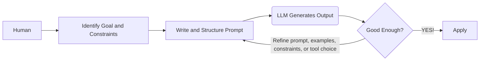
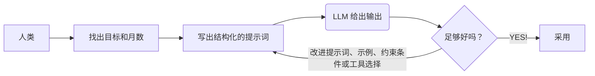

*"The wise man doesn't give the right answers, he poses the right questions."* - Claude Levi-Strauss

> *“智者并不给出正确的答案，而是提出正确的问题。”*——克洛德·列维-斯特劳斯

*Tips: If the main text is difficult to read, you may refer only to the conclusion sentences in italics.*

> *如果细节难以看懂，直接看斜体的结论。*

## Meta-info of Prompting Engineering

**Core Goal — Why to use it** 
  - Guide LLMs to produce the intended output.
  - Improve workflow efficiency by integrating LLMs into task pipelines.
  - Expand problem-solving capabilities, bridge expertise gaps.

> **核心目标——为什么要使用它**
> * 引导大语言模型（LLM）生成符合预期的输出。
> * 通过将大语言模型整合进任务流程，提高工作效率。
> * 扩展解决问题的能力，弥补专业知识上的不足。

**Methodology — How to use it** 
  - Humans define the goal, provide the relevant context, set the constraints, structure the task, and refine the prompt based on the model’s output.
  - Organize prompts into functionally distinct sections to separate objectives, context, constraints, and output specifications. This design reduces ambiguity and inter-section conflict, thereby improving control and consistency.

> **方法论——如何使用它**
> * 由人来确定目标，提供相关背景，设定约束条件，组织任务结构，并根据模型的输出不断改进提示词。
> * 将提示词组织为在功能上彼此区分的不同部分，用来分离目标、背景、约束条件和输出要求。这种设计可以减少歧义和各部分之间的冲突，从而提高控制力和一致性。

**Usage Scenario — When / Where to use it** 
  - Useful for tasks that require handling large volumes of text, complex instructions, or many constraints at once. Particularly effective for work that was previously slow or difficult for humans, such as long-context synthesis, cross-document comparison, multi-step rewriting, structured extraction from messy data, style-consistent generation at scale, and rapid adaptation of one task into many output forms.
  - It is also valuable in workflows that demand consistency, repeatability, and low coordination cost across repeated tasks.

> **使用场景——何时／何地使用它**
> * 适用于那些需要同时处理大量文本、复杂指令或多重约束的任务。对于一些过去由人来做时速度较慢或难度较高的工作，它尤其有效，例如长上下文综合、跨文档比较、多步骤改写、从杂乱数据中提取结构化信息、按统一风格进行大规模生成，以及将一个任务快速改造成多种输出形式。
> * 在那些要求一致性、可重复性以及低协调成本的重复性工作流程中，它也很有价值。

**Application Form — modes of using LLMs**
  - **Chat in browser** — Best for immediate thinking support, writing, and problem-solving with almost no setup.
  - **IDE integration** — Best for turning software development into a faster interactive workflow of coding, debugging, and refactoring.
  - **API integration** — Best for automating repeated language tasks inside products, services, and internal workflows.
  - **Office and work-tool integration** — Best for reducing routine work in email, documents, meetings, and presentations inside everyday productivity software.
  - **Enterprise workflow systems** — Best for embedding LLMs into organizational processes such as support, compliance, knowledge management, and approvals.
  - **Local deployment** — Best for private, sensitive, or offline use where control over data and environment matters most.
  - **Agent-style tool use** — Best for multi-step tasks where the model must not only answer, but also search, retrieve, execute actions, and complete work across tools.

> **应用形式——使用大语言模型的方式**
> * **浏览器中的聊天**（Chat in browser）——最适合几乎不需要准备即可获得即时的思考支持、写作帮助和问题解决支持。
> * **集成到集成开发环境**（IDE integration）——最适合将软件开发变成一种更快速的交互式流程，用于编写代码、调试和重构。
> * **API 集成**（API integration）——最适合在产品、服务和内部工作流程中自动化重复性的语言任务。
> * **办公软件和工作工具集成**（Office and work-tool integration）——最适合在日常生产力软件中减少电子邮件、文档、会议和演示文稿相关的例行工作。
> * **企业工作流系统**（Enterprise workflow systems）——最适合将大语言模型嵌入组织流程中，例如支持、合规、知识管理和审批等场景。
> * **本地部署**（Local deployment）——最适合用于私密、敏感或离线场景，在这些场景中，对数据和运行环境的控制尤为重要。
> * **代理式工具使用**（Agent-style tool use）——最适合处理多步骤任务，在这类任务中，模型不仅要回答问题，还必须跨工具进行搜索、检索、执行操作并完成工作。

Chart 1
: The simplified workflow of human interaction with LLMs.




## What do LLMs feel like?

LLMs are like extremely well-read improvisational librarians: they have absorbed patterns from vast numbers of books, articles, conversations, and examples, so when you ask a question, they do not “look up” a fixed answer so much as assemble a likely next sequence of words based on what fits the request. That lets them explain ideas, summarize texts, translate, draft emails, brainstorm, tutor, and help with coding, but it also means they are not the same as a database, a scientist, or a witness to facts, because they can sound confident even when mistaken.

> 大型语言模型就像知识极其广博、又擅长即兴应答的图书管理员：它们从海量的书籍、文章、对话和实例中吸收了各种模式，因此当你提出问题时，它们并不是去“查找”一个固定答案，而是根据什么样的后续词语最符合你的请求，来组织出一个可能的词语序列。正因如此，它们能够解释概念、总结文本、进行翻译、起草电子邮件、开展头脑风暴、辅导学习，并帮助编程；但这也意味着，它们并不等同于数据库、科学家，或事实的亲历见证者，因为它们即使出错，也可能听起来十分自信。
> * LLMs [ˌel el ˈemz] 大型语言模型（Large Language Models）的缩写
> * improvisational [ˌɪmprəvaɪˈzeɪʃənəl] adj.即兴发挥的；即席的
> * absorbed [əbˈzɔːbd] v.吸收；汲取；理解并掌握
> * vast [vɑːst] adj.巨大的；大量的；广阔的
> * look up 查找；检索
> * assemble [əˈsembl] v.组装；整合；组织
> * sequence [ˈsiːkwəns] n.序列；顺序；一连串事物
> * summarize [ˈsʌməraɪz] v.总结；概括
> * brainstorm [ˈbreɪnstɔːm] v./n.集思广益；头脑风暴
> * tutor [ˈtjuːtə(r)] v.辅导；指导学习 n.家庭教师；辅导者
> * database [ˈdeɪtəbeɪs] n.数据库
> * witness to facts 对事实的见证者；指能够直接证明或陈述事实情况的人
> * mistaken [mɪˈsteɪkən] adj.错误的；弄错的

## What is a Prompt?

Someone new to LLMs often talks with them just as they would with a human. However, this approach does not always yield satisfactory responses. Because a machine’s communication preferences differ from a human’s, you must understand the tendencies and nature of an LLM to obtain consistent and high-quality results. In other words, you need to understand what a prompt is and master a few techniques for writing them effectively.

> 刚开始接触大语言模型（LLM）的人，与大语言模型交谈的方式与人类之间的对话很相似。然而，这种做法并不总能得到令人满意的回应。由于机器的“交流偏好”与人类不同，要想获得稳定且高质量的结果，就必须理解大语言模型的倾向及其运作特性。换言之，需要理解什么是提示词（prompt），并掌握几种有效撰写提示词的技巧。

A good prompt consists 3 components:
  1. **Task description** : a clear instruction that tells the model what it should do, i.e., the rule.
  2. **Context or Examples**: background information or sample inputs and outputs that help the model understand the task better, i.e., the pattern.
  3. **The task**: the actual input or problem that the model needs to work on, i.e., the real case.

> 一个好的提示由三个组成部分构成：
> 1. **任务描述**：一条清晰的指令，用于告诉模型它应当做什么，即规则。
> 2. **上下文或示例**：背景信息或示例输入与输出，用于帮助模型更好地理解任务，即模式。
> 3. **任务本身**：模型需要处理的实际输入或问题，即真实案例。

Example 1
: A well-structured prompt. Task description defines the assistant’s role and the standards for success. Context or Examples gives the disciplinary setting, audience, tone, and a model sentence. The task states exactly what output is required.

```
[Task description]

You are an academic writing assistant. Your role is to help revise and strengthen scholarly writing for clarity, coherence, precision, and formal academic tone. 

Preserve the original argument and meaning.

Do not invent evidence, citations, or claims that are not supported by the text.

[Context or Examples]

This paragraph is from a graduate-level literature essay discussing the role of memory in Toni Morrison’s Beloved. 

The intended audience is a university instructor in literary studies.

The writing should sound analytical, formal, and precise.

It should use clear topic sentences, strong logical flow, and concise phrasing.

Example of preferred style:
“Morrison presents memory not as a passive recollection of the past, but as an active and disruptive force that shapes identity in the present.”

Paragraph to revise:
“In Beloved, memory is very important because it affects how the characters think and act, and it also shows that the past does not really disappear, which makes the novel more powerful and emotional.”

[The task]

Rewrite the paragraph in a more polished academic style suitable for a graduate-level essay. Then provide a brief explanation of three specific changes you made to improve clarity, structure, and academic tone.
```

Most model APIs allow us to split prompts into `system prompts` and `user prompts`.
  - `System prompts` — how the model should behave
    - High-level instructions that define the model’s overall behavior. They usually set the role, goals, rules, tone, constraints, or response format that should remain stable across the interaction.
  - `User prompts` — what the model should do now
    - The current task or inputs given by the user. They contain the actual request, question, or data that the model should respond to at that moment.

> 大多数模型 API 都允许我们将提示拆分为 `system prompts` 和 `user prompts`。  
> - `System prompts`——模型应当如何表现
>   * 用于定义模型整体行为的高层指令。它们通常设定角色、目标、规则、语气、约束或响应格式，并且这些内容应在整个交互过程中保持稳定。
> - `User prompts`——模型此刻应当做什么
>   * 用户当前给出的任务或输入。它们包含模型在当下需要回应的实际请求、问题或数据。

Example 2
: A good English prompt example for business analysis.

```
[System Prompt]
You are a business analysis assistant.

Provide clear, structured, and evidence-based analysis. 

Focus on practical insights, state assumptions when needed, and do not invent data.

[User prompt]
Analyze the following business case.

Context:
An e-commerce company saw quarterly sales decline by 12%. Website traffic remained stable, but the conversion rate fell from 3.8% to 2.9%. 

Customer complaints about delivery delays increased, and two competitors launched major discount campaigns.

Task:
Explain the most likely reasons for the sales decline. Then give two key risks and three practical recommendations.
```
## Basic Prompting Techniques

### 1. Zero-Shot Prompting — Asking Directly

Zero-shot prompting means giving the model instructions without providing any examples. *You simply describe what you want, and the model attempts to fulfill the request based entirely on its training.* It is the most direct form of prompting — nothing between your intent and the model's response except the instruction itself. This technique works best for tasks where the desired output is **self-evident** from the instruction alone, like *factual questions, definitions, straightforward transformations, or summarization of a given text.* "Translate the following text to French," "Summarize this article in three sentences," or "List the capitals of South American countries" are all effective zero-shot prompts because *the task definition leaves little room for **ambiguity***. The model has seen enough examples of these task types in training to execute them reliably without demonstration. 
It works great for things 

> 零样本提示（zero-shot prompting）是指在不给模型提供任何示例的情况下直接给出指令。*你只需描述自己想要什么，模型就会完全基于其训练内容来尝试完成这一请求。*这是最直接的一种提示方式——在你的意图与模型的回应之间，除了指令本身，没有任何中间层。当单靠指令本身就足以明确所需输出时，这种技术最为有效,比如：*事实性问题、定义、直接的转换任务，或者对给定文本进行总结。*“把下面这段文字翻译成法语”“用三句话总结这篇文章”或“列出南美各国的首都”都属于有效的零样本提示，因为这些任务的定义几乎没有留下歧义空间。模型在训练中已经见过足够多这类任务，因此即使没有示范，也通常能够可靠地执行。
> * self-evident [ˌself ˈevɪdənt] adj. 不言自明的；一看就清楚的
> * iterate on 对……反复改进；循环测试并逐步优化

The primary advantage is **efficiency**. Zero-shot prompts *use the fewest tokens*, which reduces cost and latency, and they are the simplest to write, iterate on, and maintain in production. For high-volume pipelines where speed and cost matter, zero-shot is the right default starting point.

> 它的主要优势在于**效率**。零样本提示*使用的 token 最少*，因此能降低成本和延迟，而且它们也是最容易编写、迭代和在生产环境中维护的形式。对于那些重视速度和成本的高吞吐量流程来说，零样本是正确的默认起点。
> * high-volume pipelines 高吞吐量流程；指需要频繁、大量处理任务的自动化流程或工作链路
> * starting point 起点；开始采用的方法或初始方案


Example 3
: 10 zero-shot prompts that are clear, narrow, and low in ambiguity. 

```
1. Translation

Translate the following sentence into French. Output only the translation.
Sentence: "The meeting starts at 9 a.m."

2. Sentiment classification

Classify the sentiment of the following review as Positive, Negative, or Neutral. Output only one label.
Review: "The battery lasts all day, but the screen is too dim."

3. Date extraction

Extract the date from the following sentence. Return it in YYYY-MM-DD format. Output only the date.
Sentence: "The contract was signed on March 12, 2025."

4. Entity extraction

From the sentence below, extract the company name. Output only the company name.
Sentence: "Microsoft announced a new cloud partnership on Tuesday."

5. Grammar correction

Correct the grammar in the following sentence. Keep the meaning unchanged. Output only the corrected sentence.
Sentence: "She go to the library every Saturdays."

6. Summarization with fixed length

Summarize the following paragraph in exactly one sentence of no more than 20 words.
Paragraph: "Solar energy is becoming cheaper each year. Many countries are investing in large-scale solar farms. Improvements in battery storage are also making solar power more practical."

7. Keyword extraction

Extract exactly 3 keywords from the following text. Output them as a comma-separated list.
Text: "Machine learning models require data, computation, and careful evaluation."

8. JSON formatting

Convert the following information into valid JSON with exactly these keys: name, age, city.
Information: Name: Alice Chen; Age: 29; City: Boston.
Output only valid JSON.

9. Title generation

Write one clear title for the article below. Use no more than 8 words. Output only the title.
Article: "A new study shows that regular walking improves heart health, sleep quality, and mood."

10. Boolean decision

Answer the question with only Yes or No.
Question: Is 17 a prime number?
```

*If LLMs give an unsatisfactory answer on a zero-shot prompt, consider rephrasing the question or adding detail*. Sometimes *asking the same question in a clearer way* dramatically improves the result. For example, if “Explain quantum computing” gives a too-complex answer, try “Explain the concept of quantum computing in simple terms for a beginner.” *Zero-shot relies heavily on how you phrase the question*. If the task is complex or unusual, a single-shot prompt might not be enough for the model to figure out exactly what you need. In such cases, we move to few-shot prompting (next section) or add additional instructions.

> *如果大语言模型（LLM）在零样本提示下给出的回答不理想，可以考虑重新表述问题，或者增加更多细节*。有时候，仅仅是*把同一个问题说得更清楚一些*，结果就会明显改善。例如，如果“解释量子计算”得到的回答过于复杂，可以改成“请用适合初学者的简单语言解释量子计算这一概念”。*零样本提示在很大程度上依赖于你如何表述问题*。如果任务复杂或不寻常，单次提示可能不足以让模型准确判断你到底需要什么。在这种情况下，就需要转向少样本提示（下一节会讲）或者加入更多附加说明。

Example 4
: Request ChatGPT to summarize an article.

```
[Prompt A (generic)]
Summarize this text.

[Prompt B (specific)]

Summarize the following text in 3-5 bullet points, focusing on the main arguments and key takeaways. Keep the tone neutral and avoid any unnecessary filler.
``` 

Prompt B is likely to produce a much clearer and more useful summary, because *it specifies **format** (bullet points, 3-5 of them), **content focus** (main arguments, key takeaways), and **tone** (neutral)*. In contrast, Prompt A leaves these to the model’s guesswork. This simple example shows how adding detail and structure to your prompt steers the model’s output. **Key takeaway:** Always aim to be clear and specific about what you want. In the next sections, we’ll build on this idea and introduce various techniques – from basic prompting to advanced methods – that can greatly improve ChatGPT’s performance as your assistant. 

> 提示词 B 很可能会生成一个更清晰、更有用的摘要，因为*它明确规定了**格式**（使用项目符号，并控制在 3 到 5 条之间）、**内容重点**（主要论点、关键结论）以及**语气**（中立）*。相比之下，提示词 A 把这些都留给了模型自己猜。这一简单例子说明，只要在提示词中加入更多细节和结构，就能够更有效地引导模型的输出。Key takeaway: Always aim to be clear and specific about what you want.

For **complex, ambiguous, or specialized tasks**, zero-shot might fall short. The *limitation* emerges when the desired behavior departs from the model's statistical defaults — *when you need specific formatting, a particular reasoning style, or output that doesn't conform to the most common treatment of a topic in training data*.  In those cases, a bare instruction rarely suffices, and you'll need to either enrich the prompt with explicit structural guidance or move to few-shot examples. Best practice is always to begin with zero-shot and add complexity only when the output demonstrates a clear gap.

> 但对于复杂、含糊或高度专业化的任务，零样本提示可能就不够用了。它的*局限*会在所需行为偏离模型的统计默认值时显现出来——也就是*当你需要特定格式、某种特定推理风格，或希望输出不遵循训练数据中某一主题最常见处理方式的时候*。在这些情况下，单纯的裸指令往往不够，此时就需要要么通过明确的结构性引导来丰富提示词，要么转向使用少样本示例。最佳实践始终是：先从零样本开始，只有当输出明显暴露出缺口时，再增加复杂性。
> fall short 不足；达不到要求
> * statistical defaults 统计默认值；指模型在训练数据中最常见、最自然倾向采用的输出方式
> * conform to 符合；遵循；与某种常见模式保持一致
> * bare instruction 裸指令；只有命令本身、没有附加示例或更多引导信息的提示
> * suffices [səˈfaɪsɪz] v. 足够；能够满足需要
> * demonstrates a clear gap 显示出明显缺口；指输出结果清楚表明当前提示方式还不能满足要求

### 2. Few-Shot Prompting — Demonstrating Through Cases 


Few-shot prompting involves *providing examples that demonstrate how you want the model to respond before posing the actual task*. One example is called one-shot prompting; two to five or more constitutes few-shot. Rather than specifying desired behavior in the abstract, you show it — and the model learns the pattern directly from the demonstration through in-context learning. *Few-shot prompting does not mean "more examples are necessarily better"; the quality of examples is generally more important than sheer quantity. It serves not only to teach the content of the answer but also to simultaneously demonstrate the output format, evaluation criteria, and the scale of distinction.*

> 少样本提示是指，*在提出实际任务之前，先提供若干示例，用来展示你希望模型如何作答*。提供一个示例，称为一次示例提示（one-shot prompting）；提供两个到五个或更多示例，则构成少样本提示。与其抽象地说明期望行为，不如直接把这种行为展示出来——模型会通过上下文学习（in-context learning），直接从示范中学到这种模式。*少样本提示不是“多举几个例子就一定更好”；示例质量通常比单纯数量更重要。少样本提示不仅是在教“答案内容”，更是在同时教输出格式、判断标准和区分尺度。*
> * in-context learning [ɪn ˈkɒntekst ˈlɜːnɪŋ] 上下文学习；模型不通过参数更新，而是在当前提示中根据示例临时学会任务模式
> * specify in the abstract 抽象地说明；只用概念性语言描述，而不直接举例

*This technique becomes essential when the desired behavior is difficult or inefficient to articulate through instructions alone, when you need highly consistent output formatting, or when the task requires a specific tone, register, or evaluative stance that is hard to describe but easy to demonstrate.* A children's educational bot illustrates this well: without an example, asking "Will Santa bring me presents?" might elicit a factually accurate but contextually disastrous response explaining that Santa is fictional. Providing a prior exchange — "Q: Is the tooth fairy real? A: Of course! Put your tooth under your pillow tonight" — teaches the model the imaginative register, the emotional stance, and the appropriate level of literalism, *none of which an instruction like "be warm and playful" reliably captures.*

> *当期望行为很难仅靠指令清楚表达，或者仅靠指令来表达会非常低效；当你需要高度一致的输出格式；或者当任务要求一种特定的语气、语域（register）或评价立场，而这些东西很难说清，却很容易通过示例表现出来时，这种技术就会变得非常重要。*一个儿童教育机器人可以很好地说明这一点：如果没有示例，面对“圣诞老人会给我带礼物吗？”这个问题，模型可能会给出一个事实层面正确、但在语境上非常糟糕的回答，解释说圣诞老人是虚构的。若先提供一组先前对话——“问：牙仙子是真的吗？答：当然是真的！今晚把你的牙齿放到枕头下面吧”——模型就会学到这种富于想象的语域、情感立场，以及恰当的非字面理解程度，而这些内容，*并不是一句“要温暖、要活泼”就能可靠传达出来的。*
> * articulate [ɑːˈtɪkjuleɪt] v.清楚表达；明确说出
> * consistent output formatting 一致的输出格式；指模型每次都按同一种形式作答
> * register [ˈredʒɪstə(r)] n.语域；语体；语言在正式、口语、教学、想象性等不同场景中的风格层次
> * evaluative stance 评价立场；在回答中对对象采取的态度、判断方式或价值取向
> * contextually disastrous 在语境上很糟糕；指虽然事实上没错，但在具体交流情境里非常不合适
> * fictional [ˈfɪkʃənl] adj.虚构的；并非真实存在的
> * imaginative register 富于想象的语域；带有幻想、童话或游戏感的表达风格
> * emotional stance 情感立场；说话时表现出的情绪态度
> * literalism [ˈlɪtərəlɪzəm] n.按字面理解的倾向；不考虑语境、情感和隐含意义而直接照字面解释

The advantages of few-shot prompting are precision and consistency. Examples constrain the output distribution far more tightly than instructions, which is especially valuable in production systems where output variability is costly. The trade-offs are real, however: examples consume tokens, increasing cost and latency with every additional demonstration, and poorly chosen examples can mislead the model just as surely as a bad instruction. The number of examples matters — more generally improves performance, but three to five strikes a practical balance for most applications. Format your examples efficiently: "pizza → edible" carries the same information as "Input: pizza, Output: edible" at lower token cost, and those savings compound. The most important usage scenario for few-shot prompting is any task where the output format, tone, or reasoning style is highly specific and non-default.


> 少样本提示的优势，在于精确性和一致性。示例对输出分布的约束，远比单纯指令更强；这一点在生产系统中尤其重要，因为在那里，输出的波动往往代价很高。不过，这种方法的代价也是真实存在的：示例会消耗词元（tokens），每增加一个示范，成本和延迟都会上升；而如果示例选得不好，它误导模型的程度，并不会比一条糟糕指令更轻。示例数量也很重要——一般来说，示例越多，表现越好；但对大多数应用而言，三到五个示例通常是在效果与成本之间较为实际的平衡。示例格式也应尽量简洁高效：“pizza → edible”与“Input: pizza, Output: edible”传达的信息相同，但前者的词元成本更低，而且这种节省会不断累积。少样本提示最重要的适用场景，是那些对输出格式、语气或推理风格有高度具体而且并非默认要求的任务。
> * precision [prɪˈsɪʒən] n.精确性；准确而明确的控制程度
> * consistency [kənˈsɪstənsi] n.一致性；前后稳定、不随意变化的特征
> * constrain [kənˈstreɪn] v.约束；限制；使输出更集中在某个范围内
> * output distribution 输出分布；模型所有可能输出及其概率结构。这里指示例会更强地限制模型“可能说什么”
> * production systems 生产系统；真正部署给用户或业务使用的系统，而不是实验环境
> * variability [ˌveəriəˈbɪləti] n.可变性；波动性
> * trade-offs [ˈtreɪd ɒfs] n.权衡；为了获得某种好处而必须付出的代价
> * tokens [ˈtəʊkənz] n.词元；模型处理文本时使用的基本单位，不一定等同于完整单词
> * latency [ˈleɪtənsi] n.延迟；从发出请求到得到回应所需的时间
> * demonstrations [ˌdemənˈstreɪʃənz] n.示范；作为例子的输入输出样本
> * practical balance 实际的平衡；在真实应用中可行的折中点
> * compound [kəmˈpaʊnd] v.累积；叠加增长
> * non-default 非默认的；不是模型通常自然会给出的那种表现

TODO:提示不只是一个等待解析的任务说明，而是模型功能状态的一部分，它直接塑造模型在生成响应时所构建并操作的表征。

这种关于提示的功能性理解——把提示视为塑造内部表征的语境，而不是一条等待服从的指令——构成了大多数提示工程技术背后的概念基础。例如，它解释了为什么对于许多任务来说，演示示例比抽象指令更有效：与其告诉模型该做什么，不如通过示例把任务本身实例化到模型的表征空间中，从而激活参数中与正确输入—输出关系有关的模式。它也解释了为什么少样本提示中示例的顺序会显著影响性能——这一现象最早由 Zhao 等人在 2021 年系统记录下来——因为序列末尾的示例由于更接近生成点，会通过自回归生成中的近因敏感性，对模型的输出分布施加更强影响。它还解释了为什么表面上微不足道的提示变化——重述一个问题，加入一句背景性框架，改变一个词——都可能引发模型行为的显著变化：因为每一处变化都会移动模型运作所处的分布性语境，而这些位移可能具有决定性后果。


### 3. Chain-of-Thought Prompting — Forcing Visible Reasoning Before Conclusions

Chain-of-thought prompting, commonly abbreviated CoT, involves explicitly asking the model to reason through a problem step by step before delivering its final answer. The simplest implementation adds a phrase like "think step by step" or "explain your reasoning before concluding" to the prompt. The model then externalizes its intermediate reasoning, making each inferential move visible before arriving at a conclusion.


> 思维链提示（chain-of-thought prompting），通常缩写为 CoT，是指明确要求模型在给出最终答案之前，先按步骤对问题进行推理。最简单的实现方式，就是在提示中加入类似“请一步一步思考”或“请先解释你的推理，再给出结论”这样的短语。这样一来，模型就会把中间推理过程外显出来，使每一步推断在到达结论之前都变得可见。

> * chain-of-thought prompting [tʃeɪn əv θɔːt ˈprɒmptɪŋ] 思维链提示；要求模型显式写出中间推理步骤的提示方法
> * abbreviated [əˈbriːvieɪtɪd] adj.缩写的；简写的
> * explicitly [ɪkˈsplɪsɪtli] adv.明确地；直白地
> * reason through 对……进行推理；逐步思考并解决问题
> * externalizes [ɪkˈstɜːnəlaɪzɪz] v.外显；把内部过程表达出来
> * intermediate reasoning 中间推理；从题目到结论之间的步骤性思考
> * inferential [ˌɪnfəˈrenʃəl] adj.推断的；由推理构成的


The impact on complex tasks is well-documented and substantial. CoT consistently improves performance on mathematical problems, formal logic, multi-step planning, and causal reasoning — precisely the task types where the model's tendency to pattern-match to a plausible-sounding answer is most dangerous. It also meaningfully reduces hallucination, because the model must justify each step rather than leaping directly to a confident conclusion. The reasoning chain acts as a self-audit: errors that would survive a direct generation pass often become visible — and are corrected — when the model is forced to show its work.

> 它对复杂任务的影响，已有充分而且显著的研究记录。思维链提示会稳定提升模型在数学问题、形式逻辑、多步规划和因果推理中的表现——而这些恰恰是最容易因为模型去匹配一个“听起来合理”的答案而出问题的任务类型。它也确实能在相当程度上减少幻觉，因为模型必须为每一步提供理由，而不能直接跳到一个听起来很自信的结论。整条推理链就像一种自我审计：那些在直接生成答案时可能被保留下来的错误，往往会在模型被迫“展示解题过程”时变得可见——并进一步得到修正。
> * well-documented 有充分文献记录的；已有较多研究和证据支持的
> * substantial [səbˈstænʃəl] adj.显著的；相当大的
> * formal logic [ˈfɔːməl ˈlɒdʒɪk] 形式逻辑；用严格规则研究推理有效性的逻辑体系
> * multi-step planning 多步规划；为实现目标而分阶段设计步骤
> * causal reasoning [ˈkɔːzəl ˈriːzənɪŋ] 因果推理；根据原因与结果关系进行判断和分析
> * pattern-match 模式匹配；根据以往见过的模式直接生成看起来合适的回答，而不一定真正完成了严格推理
> * plausible-sounding 听起来合理的；表面上很像正确答案的
> * hallucination [həˌluːsɪˈneɪʃən] n.幻觉；在人工智能中通常指模型生成了貌似合理但实际不真实或无依据的信息
> * justify [ˈdʒʌstɪfaɪ] v.证明有理；给出理由
> * self-audit 自我审计；对自身过程进行检查和核验
> * direct generation pass 直接生成过程；不展开中间步骤、直接一次性产出答案的方式
> * show its work 展示解题过程；把每一步计算或推理过程写出来

The implementation choices matter. Zero-shot CoT, simply adding "think step by step," is sufficient for many tasks. For greater control, you can specify the exact reasoning structure you want the model to follow ("First identify the given information. Then identify what is being asked. Then solve."), or provide few-shot examples that demonstrate both the reasoning process and the final answer format — a combination that is particularly powerful for domain-specific reasoning tasks. The trade-off is cost and latency: because the model generates substantially more tokens working through its reasoning, each call is slower and more expensive. For complex, high-stakes tasks where accuracy is the primary constraint, this is almost always the right trade. For high-volume, simple tasks, it is not.

> 具体如何实现，是有差别的。零样本思维链（zero-shot CoT），也就是只加上一句“请一步一步思考”，对很多任务来说已经足够。若想获得更强控制，还可以明确规定模型应遵循的推理结构，例如“先识别已知信息，再识别问题要求，最后求解”；也可以提供少样本示例，同时示范推理过程和最终答案格式——这种组合对于领域特定的推理任务尤其强大。它的代价是成本和延迟：由于模型在展开推理时会生成明显更多的词元（tokens），所以每次调用都会更慢，也更贵。对于复杂而且高风险、并以准确性为首要约束的任务，这几乎总是值得的；但对于高频、简单的任务，就不是如此了。

> * implementation choices 实现选择；具体采用哪种提示设计方案
> * zero-shot CoT [ˌzɪərəʊ ʃɒt siː əʊ ˈtiː] 零样本思维链；不提供示例，只要求模型逐步思考的思维链提示方式
> * specify [ˈspesɪfaɪ] v.明确规定；具体说明
> * reasoning structure 推理结构；推理应按什么顺序和步骤展开
> * few-shot examples 少样本示例；用少量范例来示范任务模式和输出方式
> * domain-specific [dəˌmeɪn spəˈsɪfɪk] adj.领域特定的；只适用于某一专业领域或任务场景的
> * trade-off [ˈtreɪd ɒf] n.权衡；为了获得某种收益而必须接受的代价
> * latency [ˈleɪtənsi] n.延迟；从输入到得到输出所需的时间
> * tokens [ˈtəʊkənz] n.词元；模型处理文本时的基本单位，不一定等同于完整单词
> * high-stakes tasks 高风险任务；错误代价很高的任务，如医疗、法律、金融或关键决策场景
> * primary constraint 首要约束；最优先需要满足的条件

**Example:** *"A store sells apples for $0.75 each and oranges for $1.25 each. Maya buys 4 apples and 3 oranges. How much does she spend in total? Think step by step."*
This works because without the CoT instruction, the model may collapse the calculation into a single step and make an arithmetic error; the step-by-step constraint forces it to compute each sub-total independently and then sum them, reducing the probability of error at each stage.

* 思维链提示并不等于“只要写得更长就更正确”；关键在于中间步骤是否真正有助于推理，而不是单纯增加篇幅。
* 它通常能减少幻觉和错误，但不能保证完全正确；错误的推理链仍然可能存在。
* 零样本思维链和少样本思维链不是对立关系；前者更简便，后者在复杂或专业任务中往往更稳。
* “展示推理过程”与“提高准确性”常常相关，但并不总是同步；有时模型只是把表面上像推理的内容写了出来。
* 高风险任务适合使用思维链，高频简单任务则未必值得承担额外的成本与延迟。

### 4. Role / Persona Prompting — Recalibrating Entire Output Distribution Through a Persona

Role prompting assigns a specific persona or area of expertise to the model before the main task begins. By instructing the model to inhabit a particular role, you shift its vocabulary, its level of detail, its evaluative standards, and its fundamental orientation toward the task. This is not a cosmetic adjustment — as discussed earlier, it is a genuine recalibration of the probability distribution over what an appropriate response looks like, because the model's prior over relevant training examples narrows significantly when a role is established.

> 角色提示（role prompting）是指，在主要任务开始之前，先为模型指定一个特定的人设或专业领域。通过要求模型进入某种角色，你会改变它的词汇选择、细节层次、评价标准，以及它面对任务时的基本取向。这并不是一种表面的修饰——正如前文所说，这实际上是对“什么样的回应才算合适”这一概率分布的真实再校准，因为一旦角色被设定，模型对相关训练样本的先验范围就会明显收窄。
> * role prompting [rəʊl ˈprɒmptɪŋ] 角色提示；在正式任务前先为模型设定角色、人设或专业身份，以改变其回答方式
> * persona [ˌpɜːˈsəʊnə] n.人设；角色形象；在这里指模型被要求呈现的身份或风格
> * area of expertise 专业领域；擅长或应以专家身份处理的知识范围
> * inhabit a role 进入某个角色；以该角色的视角和方式来回应任务
> * evaluative standards 评价标准；判断好坏、优劣、是否合格所依据的标准
> * orientation [ˌɔːriənˈteɪʃən] n.取向；基本倾向；面对任务时的总体方向
> * cosmetic adjustment 表面调整；只改变外观、不改变实质的修改
> * recalibration [ˌriːˌkælɪˈbreɪʃən] n.重新校准；重新调整判断或输出的基准
> * probability distribution 概率分布；这里指模型对各种可能回答赋予概率的整体结构
> * prior [ˈpraɪə(r)] n.先验；在得到当前输入前，模型原本带有的偏向或预期
> * narrows significantly 明显收窄；指可能调用的训练模式范围变得更集中


The canonical illustration: ask the model to score a simple student essay and it will evaluate it against adult writing standards, likely giving a low score. Instruct it first to act as an encouraging first-grade teacher, and it evaluates the same essay against age-appropriate criteria — weighting effort, clarity, and basic coherence rather than rhetorical sophistication. The input is unchanged; the role transforms the evaluative frame entirely. Role prompting is particularly effective in customer service (where tone and brand voice matter), education (where audience calibration is critical), creative writing (where perspective shapes everything), legal and medical explanation (where expertise level determines what to include and what to simplify), and any domain where the appropriate response is fundamentally shaped by who is speaking and to whom.

> 一个典型例子是：让模型给一篇简单的学生作文打分，它往往会按照成人写作标准来评价，因此很可能给出低分。但如果先要求它扮演一位鼓励型的一年级老师，它就会按照适合该年龄的标准来评价同一篇作文——更看重努力、清晰度和基本连贯性，而不是修辞上的成熟程度。输入完全没有变化；真正被彻底改变的，是评价框架。角色提示在客服场景中尤其有效，因为那里语气和品牌声音很重要；在教育场景中也很有效，因为受众校准至关重要；在创意写作中同样如此，因为视角会塑造一切；在法律和医疗解释中也非常有用，因为专业程度会决定哪些内容应当纳入、哪些内容应当简化。更一般地说，凡是“合适的回答”本身会被“是谁在说、又是在对谁说”这一点根本性塑造的领域，角色提示都非常有效。
> * canonical [kəˈnɒnɪkəl] adj.典型的；标准性的；最常用来说明某一概念的
> * score [skɔː(r)] v.评分；打分
> * age-appropriate criteria 适龄标准；适合该年龄阶段的评价标准
> * weighting [ˈweɪtɪŋ] v./n.赋予更大权重；在评价中更重视某些因素
> * coherence [kəʊˈhɪərəns] n.连贯性；前后是否通顺、一致、有条理
> * rhetorical sophistication 修辞成熟度；语言表达在修辞、结构和技巧上的成熟程度
> * evaluative frame 评价框架；决定如何评判内容的整体视角和标准
> * customer service 客服；面向客户的支持与沟通工作
> * brand voice 品牌声音；品牌在表达中保持的一贯语气和风格
> * audience calibration 受众校准；根据对象是谁来调整语言、内容和难度
> * perspective [pəˈspektɪv] n.视角；看问题和表达问题的立场
> * expertise level 专业程度；所具有或应表现出的专业知识水平
> * fundamentally shaped by 从根本上受……塑造；本质上由……决定

The key best practice is specificity. "Act as a teacher" is a weak instruction — it leaves the model to resolve every relevant dimension by default. "Act as an encouraging first-grade teacher who prioritizes effort over technical correctness and uses simple, cheerful language" is strong, because it resolves vocabulary level, evaluative stance, and emotional register simultaneously. A double anchor — role plus audience — is stronger still: "You are a senior cardiologist explaining a diagnosis to a patient with no medical background" simultaneously sets domain expertise, communication register, and the epistemic gap to bridge. The limitation of role prompting is that no persona instruction, however detailed, fully overrides the model's training when the requested behavior is outside its learned patterns — a role cannot grant the model knowledge it doesn't have.

> 角色提示的关键最佳实践，是具体性。“扮演一位老师”是很弱的指令——它把几乎所有相关维度都留给模型按默认方式自行决定。“扮演一位鼓励型的一年级老师，把努力看得比技术正确性更重要，并使用简单、愉快的语言”则是强指令，因为它同时明确了词汇层级、评价立场和情感语域。双重锚定——也就是“角色”加上“受众”——会更强。例如：“你是一位资深心脏科医生，正在向一位没有医学背景的病人解释诊断结果。”这句话同时设定了专业领域、沟通语域，以及需要被跨越的认识差距。角色提示的局限在于：无论一个人设指令多么详细，都无法在所请求行为超出模型既有学习模式时，完全覆盖模型的训练。角色不能赋予模型原本并不具备的知识。
> * best practice 最佳实践；在实践中被证明最有效、最稳妥的做法
> * specificity [ˌspesɪˈfɪsəti] n.具体性；明确到什么程度
> * vocabulary level 词汇层级；所使用词语的难度和复杂程度
> * evaluative stance 评价立场；在判断和评论时采取的态度与取向
> * emotional register 情感语域；表达中体现出的情绪风格和语气层次
> * double anchor 双重锚定；同时用两个维度来稳定模型的回答方式，这里指角色与受众并用
> * senior cardiologist [ˈsiːniə(r) ˌkɑːdiˈɒlədʒɪst] 资深心脏科医生；专门研究和治疗心脏及心血管疾病的高级医生
> * diagnosis [ˌdaɪəɡˈnəʊsɪs] n.诊断；对疾病或问题性质的判断结果
> * communication register 沟通语域；与对象交流时所采用的风格和难度层次
> * epistemic gap [ˌepɪˈstiːmɪk ɡæp] 认识差距；说话者与听者在知识、理解程度上的差距
> * override [ˌəʊvəˈraɪd] v.覆盖；压过；使原有倾向失效
> * learned patterns 已学得的模式；模型在训练中形成的既有行为和知识结构

**Example:** *"You are a hostile peer reviewer for a top-tier machine learning conference. Review the following abstract and identify every weakness you can find."*
This works because the adversarial role activates a specific subset of training data associated with rigorous academic critique, shifting the model away from its default tendency toward diplomatic, balanced evaluation and toward the precise, skeptical analysis the task requires.

例子：“你是一位顶级机器学习会议上态度尖刻的同行评审。请审阅下面这份摘要，并找出你能发现的每一个弱点。”

> * hostile [ˈhɒstaɪl] adj.敌对的；不友善的；这里指批评态度强硬、尖锐
> * peer reviewer 同行评审；学术领域中负责评审论文质量的同领域专家
> * top-tier 顶级的；处于最高水平或最有影响力层级的
> * machine learning conference 机器学习会议；研究者提交并评审论文的重要学术会议
> * abstract [ˈæbstrækt] n.摘要；论文或研究内容的简要概述

之所以有效，是因为这种对抗性的角色，会激活训练数据中与严格学术批评相联系的一组特定模式，从而把模型从默认的、偏向外交式和均衡式评价的倾向中拉开，转向任务所真正需要的那种精确而怀疑性的分析。

> * adversarial role 对抗性角色；以挑错、质疑、严格审查为取向的角色设定
> * rigorous [ˈrɪɡərəs] adj.严格的；严密的；要求高的
> * academic critique 学术批评；按学术标准对内容进行严格评价和质疑
> * diplomatic [ˌdɪpləˈmætɪk] adj.圆融的；委婉克制的；尽量避免直接冲突的
> * balanced evaluation 平衡式评价；同时强调优点和缺点、较为中和的评价方式
> * skeptical [ˈskeptɪkəl] adj.怀疑性的；不轻易接受、倾向于审查和质疑的
> * precise [prɪˈsaɪs] adj.精确的；准确而不含糊的

易错点与易混点

* 角色提示不只是“换个语气说话”；它会同时改变词汇、标准、细节层次和任务取向。
* “角色”与“风格”不完全相同；风格更偏表达方式，角色还包含立场、职责和判断标准。
* 角色设定越具体，效果通常越稳定；过于笼统的人设往往会让模型退回默认行为。
* “角色 + 受众”通常比单独设定角色更强，因为它同时限定了专业身份和解释对象。
* 角色提示能改变回答方式，但不能凭空增加模型没有学过的知识。

### 5. Prompt Chaining — Decomposing Complex Workflows into Sequential, Focused Operations

Prompt chaining means decomposing a complex task into a sequence of smaller, focused subtasks, each handled by its own prompt, where the output of one step becomes the input to the next. Rather than asking a single prompt to carry the full cognitive weight of a sophisticated workflow, you break the problem into its constituent operations and address each one cleanly.

> 提示链（prompt chaining）是指，把一个复杂任务分解成一连串更小、更聚焦的子任务，每个子任务分别由自己的提示来处理，并且前一步的输出会成为后一步的输入。与其让一个单独的提示承担整个复杂流程的全部认知负担，不如把问题拆成其构成性的操作，再分别清楚地处理每一步。
> * prompt chaining [prɒmpt ˈtʃeɪnɪŋ] 提示链；把复杂任务拆成多个顺序步骤，并让前一步输出成为后一步输入的提示设计方法
> * decompose [ˌdiːkəmˈpəʊz] v.分解；拆解成较小部分
> * focused subtasks 聚焦的子任务；范围较窄、目标明确的任务步骤
> * constituent [kənˈstɪtʃuənt] adj.构成性的；组成整体的
> * cognitive weight 认知负担；完成任务所需承担的思考复杂度和处理压力
> * sophisticated workflow 复杂工作流；由多个步骤组成、要求较高的处理流程

The customer support example makes the logic concrete. The full task — receiving a customer message and generating an appropriate response — contains two genuinely distinct operations: understanding what the customer wants, and knowing how to respond to that specific need. Collapsing both into one prompt forces the model to simultaneously classify intent and generate domain-specific content, which dilutes attention and degrades accuracy on both. Separating them — one prompt for intent classification, a second prompt conditioned on that classification for response generation — allows each step to be executed at full accuracy. The output of step one is clean and structured; step two receives a reliable input rather than an ambiguous one.

> 客服的例子可以把其中的逻辑具体说明出来。完整任务——接收一条客户消息并生成恰当回复——实际上包含两个真正不同的操作：一是理解客户想要什么，二是知道应当如何针对这种具体需求作出回应。如果把这两步压缩到一个提示里，模型就必须同时完成意图分类和领域特定内容生成，这会分散注意力，并降低两方面的准确性。把它们分开——第一步用一个提示进行意图分类，第二步根据这个分类结果再用另一个提示生成回复——就能让每一步都以更高的准确度执行。第一步的输出是干净而结构化的；第二步接收到的是可靠输入，而不是含糊输入。
> * customer support 客服；面向客户的问题处理与沟通服务
> * intent classification 意图分类；判断用户消息究竟是在提问、投诉、退款、求助等哪一类需求
> * domain-specific content 领域特定内容；依赖某一业务、行业或场景知识的内容
> * dilute attention 分散注意力；使模型无法集中处理某一个子问题
> * degrade accuracy 降低准确性；使结果变差
> * conditioned on 以……为条件；根据前一步结果来决定后一步输入
> * structured [ˈstrʌktʃəd] adj.结构化的；具有清晰格式和明确字段的
> * ambiguous [æmˈbɪɡjuəs] adj.含糊的；不明确的；可有多种理解的

The advantages compound significantly in complex pipelines. Each step can be monitored, tested, and debugged independently, which is invaluable in production systems. Different models can be assigned to different steps — a fast, inexpensive model for classification, a more capable model for nuanced generation — optimizing both cost and quality across the pipeline. Independent steps can be parallelized, reducing total latency. And because each prompt is narrow and focused, each is easier to write, maintain, and improve over time. The primary drawback is perceived latency for end users: multiple sequential round-trips replace a single call, and users wait longer for the final output. For real-time conversational applications, this can be a meaningful constraint. For complex document processing, analysis, or back-end workflows where accuracy and reliability matter more than response speed, prompt chaining is almost always the superior architecture.

> 在复杂流程中，这种方法的优势会进一步累积放大。每一步都可以被单独监控、测试和调试，这在生产系统中尤其宝贵。还可以把不同模型分配给不同步骤——例如用一个快速、便宜的模型来做分类，再用一个能力更强的模型来完成细致生成——从而在整个流程中同时优化成本与质量。各个独立步骤还可以并行化，从而降低总延迟。而且由于每个提示都更窄、更聚焦，所以它们都更容易编写、维护，并且随着时间推移持续改进。它的主要缺点，是用户感知到的延迟：原本一次调用即可完成的任务，现在变成了多次顺序往返，因此用户要等待更久才能拿到最终输出。在实时对话应用中，这可能是一个实际而明显的限制。但对于复杂文档处理、分析任务，或那些更看重准确性和可靠性、而不是响应速度的后端流程来说，提示链几乎总是更优的架构。
> * compound [kəmˈpaʊnd] v.叠加增长；累积增强
> * pipelines [ˈpaɪplaɪnz] n.流程管线；由多个处理步骤构成的整体处理链
> * monitored [ˈmɒnɪtəd] v.监控；持续观察运行状态
> * debugged [ˌdiːˈbʌɡd] v.调试；查找并修复错误
> * invaluable [ɪnˈvæljuəbl] adj.极其宝贵的；非常有用的
> * optimize [ˈɒptɪmaɪz] v.优化；使在某个目标上尽可能好
> * parallelized [ˈpærəlelaɪzd] v.并行化；让多个步骤同时执行
> * latency [ˈleɪtənsi] n.延迟；从输入到得到输出所需的时间
> * perceived latency 感知延迟；用户实际感觉到的等待时间
> * round-trips 往返调用；一次请求发送并收到返回结果的完整过程
> * real-time conversational applications 实时对话应用；要求快速即时响应的交互系统
> * back-end workflows 后端工作流；在用户界面背后运行的处理流程
> * architecture [ˈɑːkɪtektʃə(r)] n.架构；系统整体设计方式

**Example:** A research synthesis pipeline where the first prompt extracts all factual claims from a document, the second classifies each claim by confidence level (established, contested, speculative), and the third generates a structured summary that preserves those epistemic distinctions.
This works because each step is narrow enough to be executed with high accuracy, and the structured output of each step provides the next prompt with clean, unambiguous input — a guarantee that a single monolithic prompt attempting all three operations simultaneously could not reliably provide.

例子：一个研究综合流程中，第一条提示从文档中提取所有事实性主张，第二条提示按照置信等级对每条主张进行分类（已确立、有争议、推测性），第三条提示再生成一份结构化摘要，并保留这些认识论上的区分。

> * research synthesis 研究综合；把多项研究或一份复杂材料中的信息整理、归纳为系统结果
> * factual claims 事实性主张；声称某件事为真的具体陈述
> * confidence level 置信等级；对某一说法成立程度或可靠程度的分级
> * established [ɪˈstæblɪʃt] adj.已确立的；已有较强证据支持的
> * contested [kənˈtestɪd] adj.有争议的；存在明显分歧的
> * speculative [ˈspekjələtɪv] adj.推测性的；尚未充分证实的
> * structured summary 结构化摘要；按明确栏目或层级组织的总结
> * epistemic distinctions 认识论区分；对“知道得多确定、依据多充分”这类知识状态所作的区分

之所以有效，是因为每一步都足够狭窄，因此可以以较高准确率完成；而且每一步的结构化输出，都会为下一条提示提供干净、明确而不含糊的输入——这一点，是试图用一个单块式提示同时完成这三项操作时，无法可靠保证的。

> * monolithic prompt 单块式提示；把多个复杂操作硬塞进同一个提示中的做法
> * unambiguous [ˌʌnæmˈbɪɡjuəs] adj.明确无歧义的；只有一种清晰解释的
> * guarantee [ˌɡærənˈtiː] n./v.保证；确保
> * reliably [rɪˈlaɪəbli] adv.可靠地；稳定地

易错点与易混点

* 提示链不是简单地“把一个长提示拆短”；关键在于按功能把任务分成真正不同的操作步骤。
* 步骤拆分过粗，仍会让单步任务负担过重；拆分过细，则可能增加不必要的延迟和复杂度。
* 提示链的优势不只是准确率更高，还包括更容易测试、调试、替换模型和长期维护。
* 它并不总适合实时场景；当响应速度比精度更重要时，单步处理可能更合适。
* 结构化中间输出非常关键；如果前一步输出仍然含糊，后一步就无法真正受益。

## How do LLMs Deal with Prompts? 

**LLMs do not *understand* your prompt. They *continue* it.**

> **LLM 并不会“理解”你的提示。它只是在“续写”它。**

This is not a metaphor. It is the literal computational act. Every LLM, at its core, is a next-token predictor: given a sequence of tokens, it produces a probability distribution over what comes next. Your prompt is not a command sent to an intelligent agent — it is the opening of a sequence that the model is statistically compelled to complete in the most probable way, given everything it has learned. Everything about effective prompting follows from this single fact.

> 这不是比喻。这是字面意义上的计算过程。每个大语言模型（LLM）在其核心上，都是一个“下一个它喔可预测器”：给定一个 token 序列，它会对接下来可能出现的内容生成一个概率分布。你的提示词并不是发送给某个智能代理的命令——它是一个序列的开端，而模型会在其既有学习经验的基础上，以统计上最可能的方式被“驱动”去完成这个序列。关于有效提示的一切，都是由这一基本事实推导出来的。
> * probability distribution [ˌprɒbəˈbɪləti ˌdɪstrɪˈbjuːʃən] n.概率分布
> * compelled [kəmˈpeld] adj.被迫的；被驱动的

Then return to the core question: "what actually happens when you submit a prompt?"

> 然后回到核心问题：“当你提交一个提示词时，究竟实际发生了什么？”

**Tokenization** — Your text is never read as words. It is first broken into `tokens` — subword units determined by the model's vocabulary (GPT-4, for instance, uses roughly 100,000 BPE tokens). The string "unbelievable" might become ["un", "believ", "able"]. This has real consequences. Unusual spellings, rare words, and non-English text fragment into more tokens, giving the model less coherent signal per semantic unit. Token boundaries also affect arithmetic reasoning, since numbers split unpredictably. Even leading whitespace and capitalization change tokenization and, subtly, outputs. The practical implication for prompt engineering is straightforward: *use common, well-formed language, and avoid unnecessary abbreviations or unconventional spelling*, because the cleaner your text, the more efficiently the model encodes its meaning.

> ** token 化**——你的文本从来不是按“单词”被读取的。它首先会被拆分成 `tokens`——由模型词汇表决定的子词单位（例如，GPT-4 使用的大约是 100,000 个 BPE token ）。字符串 “unbelievable” 可能会被拆成 ["un", "believ", "able"]。这会带来真实后果。不同寻常的拼写、罕见词汇以及非英语文本，往往会被切分成更多 token ，使模型在每个语义单位上获得的连贯信号更少。 token 边界还会影响算术推理，因为数字的切分方式并不稳定。甚至前导空格和大小写也会改变 token 化结果，并进而微妙地影响输出。对提示工程来说，其实际含义很直接：*使用常见、规范的语言，避免不必要的缩写或非标准拼写*，因为你的文本越干净，模型编码其含义的效率就越高。
> * tokenization [ˌtəʊkənaɪˈzeɪʃən] n. token 化；切词处理
> * fragment into 分裂成；被切分为
> * coherent [kəʊˈhɪərənt] adj.连贯的；一致的
> * semantic [sɪˈmæntɪk] adj.语义的
> * capitalization [ˌkæpɪtəlaɪˈzeɪʃən] n.大写使用；大小写规则
> * implication [ˌɪmplɪˈkeɪʃən] n.含义；影响


**Embedding and Positional Encoding** — Once tokenized, each token is mapped to a high-dimensional vector — its embedding — and position in the sequence is encoded separately, so the model knows token 1 precedes token 2. However, attention is not uniform across positions. Empirically, LLMs exhibit a primacy and recency bias, attending more strongly to tokens near the beginning and end of the context window. Content buried deep in the middle of a long prompt is statistically less influential on the output. This means *your most critical instructions belong at the start or end of the prompt*. In long contexts especially, placing the core task specification in the middle is one of the most common and costly mistakes a prompt engineer can make.

> **嵌入与位置编码**——完成 token 化之后，每个 token 都会被映射为一个高维向量——也就是它的嵌入（embedding），而它在序列中的位置则会被单独编码，这样模型才知道 token  1 出现在 token  2 之前。然而，注意力在不同位置上的分布并不均匀。经验研究表明，大语言模型表现出首因偏置和近因偏置，更倾向于关注上下文窗口开头和结尾附近的 token 。埋在长提示中部深处的内容，在统计上对输出的影响较弱。这意味着，*你最关键的指令应当放在提示词的开头或结尾*。尤其是在长上下文中，把核心任务说明放在中间，是提示工程师最常见、代价也最高的错误之一。
> * embedding [ɪmˈbedɪŋ] n.嵌入表示
> * positional encoding [pəˈzɪʃənəl ɪnˈkəʊdɪŋ] n.位置编码
> * empirically [ɪmˈpɪrɪkli] adv.根据经验地；从实证上看
> * primacy bias [ˈpraɪməsi ˈbaɪəs] n.首因偏置
> * recency bias [ˈriːsənsi ˈbaɪəs] n.近因偏置

**Attention, the Way it "Reads"** — The Transformer's `self-attention mechanism` allows every token to attend to every other token **simultaneously**, which means the model does not read your prompt linearly. It builds a holistic representation in which each part of your prompt contextualizes every other part. *The framing at the beginning of a prompt shapes how all subsequent content is interpreted* — a prompt beginning with "You are an expert forensic accountant" genuinely shifts the probability distributions for all tokens that follow, because it narrows the model's prior over what kind of text this is, and therefore what kind of text should come next. Equally important is the interaction between instructions, examples, and data within the prompt. *They are not processed in isolation; they **condition each other**.* A poorly placed example can silently override an explicit instruction, not because the model is confused, but because the statistical weight of a demonstrated pattern often exceeds that of a stated directive. *In other words, **Prompt structure** is not decorative. The order and framing of elements deterministically shape the model's internal representation of the task. Models are typically **better at understanding instructions at the beginning and end of prompts** compared to the middle.*

> **注意力：它“阅读”文本的方式**——Transformer 的自`注意力机制`使得每一个 token 都能够**同时**关注其他所有 token，这意味着模型并不是按线性顺序来阅读你的提示词。它会构建一种整体性的表征，在这种表征中，提示词的每一部分都会为其他部分提供上下文。*提示词开头的框定方式，会影响后续全部内容的理解方式*——如果一个提示词以 “You are an expert forensic accountant” 开头，那么它确实会改变后续所有 token 的概率分布，因为这会缩小模型对于“这是一类什么文本”的先验判断，因此也会缩小“接下来应该出现什么文本”的范围。同样重要的是，提示词内部的指令、示例和数据之间会彼此相互作用。*它们并不是彼此孤立地被处理；相反，它们会**相互制约、相互条件化***。一个放置不当的示例，可能会在不知不觉中压过一条明确写出的指令；这并不是因为模型“困惑了”，而是因为从统计上看，一个被演示出来的模式，往往比一个被陈述出来的要求具有更大的权重。*换句话说，**提示词的结构**并不是装饰性的东西。各个要素的顺序与框定方式，会以确定性的方式塑造模型对任务的内部表征。与提示词中间部分相比，模型通常**更擅长理解开头和结尾的指令**。*
> * attention [əˈtenʃən] n. 此处指“注意力机制”；常见义还有“注意，关注”
> * Transformer [trænsˈfɔːrmər] n. Transformer，变换器模型；一种以注意力机制为核心的神经网络架构，广泛用于大语言模型与现代自然语言处理系统。
> * self-attention [ˌself əˈtenʃən] n. 自注意力；一种让序列中每个位置都能与其他位置建立关联的机制，用于建模词与词之间的依赖关系。
> * holistic [hoʊˈlɪstɪk] adj. 整体的，全面的；常见义还有“强调整体关联的”
> * contextualizes / contextualize [kənˈtekstʃuəlaɪz] v. 使处于上下文中，从语境中理解；常见义还有“将某事放回背景中考察”
> * framing [ˈfreɪmɪŋ] n. 此处指“框定方式，表述框架”；常见义还有“构架，定调”
> * forensic accountant [fəˈrensɪk əˈkaʊntənt] n. 法务会计师，司法会计师；运用会计、审计与调查方法分析财务证据，常用于诉讼、欺诈调查和合规审查。
> * probability distribution [ˌprɑːbəˈbɪləti ˌdɪstrɪˈbjuːʃən] n. 概率分布；在统计学与机器学习中，表示不同结果出现概率的分配方式，这里指模型对下一个 token 的可能性分配。
> * prior [ˈpraɪər] n. 此处指“先验”；在概率论与机器学习中，指模型在看到当前输入之前，对某类结果原本具有的预期或分布。
> * processed in isolation n./phr. 孤立地处理，脱离其他部分来处理
> * condition each other / condition [kənˈdɪʃən] v. 此处指“相互制约、相互塑造”；常见义还有“使适应，对……有重要影响”
> * statistical weight [stəˈtɪstɪkəl weɪt] n. 统计权重；指某种信号、模式或证据在整体判断中所占的重要性。
> * directive [dəˈrektɪv] n. 指令，命令，明确要求；常见义还有“指导性的规定”
> * deterministically [dɪˌtɜːrmɪˈnɪstɪkli] adv. 确定性地；在计算与机器学习语境中，指由给定条件所决定，而不是任意或随机地产生。
> * internal representation n./phr. 内部表征；指模型在内部计算过程中形成的任务、语义或结构表示，用来支持后续预测。

**The Completion Imperative** — The model generates output `autoregressively` — *one `token` at a time, each conditioned on all previous tokens, including your entire prompt*. It has no intent. It has no goal. It has **one drive: produce a plausible continuation**. If your prompt reads like the beginning of a sycophantic answer, the model will complete a sycophantic answer. If your prompt reads like an authoritative technical document, the model will complete an authoritative technical document. *If your prompt is ambiguous, the model will not pause to ask for clarification — it will resolve the ambiguity probabilistically*, defaulting to the most statistically common resolution seen in its training data, which is very often not what you wanted. This is perhaps the most consequential implication for prompt engineering. You are not instructing the model; you are authoring the beginning of the text you want it to produce. *The single most useful question to ask before submitting any prompt is: what kind of text would naturally follow from what I've written?*

> **补全要求**—— 模型以`自回归`的方式生成输出——*一次生成一个`token`，并且每一个 token 都以前面所有 token 为条件，其中包括你的整个提示词*。它没有意图。它没有目标。它只有**一种驱动力：产出一个看起来合理的后续内容**。如果你的提示词读起来像是一段阿谀奉承式回答的开头，模型就会补全出一段阿谀奉承式回答。如果你的提示词读起来像是一份权威性的技术文档，模型就会补全出一份权威性的技术文档。*如果你的提示词含糊不清，模型不会停下来要求澄清——它会以概率方式消解这种歧义*，默认采用其训练数据中在统计上最常见的那种解释，而这往往并不是你真正想要的。这也许是提示工程（prompt engineering）最重要的一个影响。你并不是在“指挥”模型；你是在撰写一段你希望它继续生成下去的文本开头。*在提交任何提示词之前，最值得先问的一个问题是：按照我已经写下的内容，后面自然会接上一段什么样的文本？*
> * imperative [ɪmˈperətɪv] n.必要的事；紧要的要求；命令；adj.紧迫的；必要的；命令式的；此处指“必须正视的基本要求”或“核心原则”，强调这不是可有可无的建议，而是理解模型行为的关键前提
> * completion [kəmˈpliːʃən] n.完成；补全；结束；在语言模型语境中，completion 通常指模型根据已有输入继续生成后续文本的过程
> * autoregressively [ˌɔːtəʊrɪˈɡresɪvli] adv.以自回归方式；“自回归”是机器学习中的一个基本概念，指当前输出依赖于先前已经生成的内容；在大语言模型中，这意味着文本是按顺序逐步生成的
> * conditioned on 以……为条件；取决于……；在机器学习中常表示“当前输出受前文信息约束或决定”
> * sycophantic [ˌsɪkəˈfæntɪk] adj.阿谀奉承的；拍马屁的；讨好的
> * authoritative [əˈθɒrətətɪv] adj.权威的；有威信的；像正式专业文本那样口吻坚定、可信度高的
> * ambiguous [æmˈbɪɡjuəs] adj.模糊不清的；有歧义的；不明确的
> * defaulting to 默认采用；自动转为；指在缺少明确约束时，系统自动落到最常见或最常规的选项上
> * consequential [ˌkɒnsɪˈkwenʃəl] adj.后果重大的；重要的；影响深远的
> * implication [ˌɪmplɪˈkeɪʃən] n.含义；影响；可能后果；此处指某种理论观点带来的实际推论
> * authoring [ˈɔːθərɪŋ] v.撰写；编写；创作；此处强调用户不是单纯“下命令”，而是在写一段会引导后文风格和内容的开头
> * plausible [ˈplɔːzəb(ə)l] adj.看似合理的；貌似可信的；说得通的

**Instruction Fine-Tuning and RLHF** — Base LLMs simply complete text. Modern deployed models — ChatGPT, Claude, Gemini — have been further shaped by instruction tuning and Reinforcement `Learning from Human Feedback (RLHF)`. This training teaches the model to treat certain text patterns, especially those formatted as instructions in the system prompt or user turn, as **high-priority conditioning signals**. This is why **"Answer in bullet points"** works — not because the model understands the request in any semantic sense, but because text that follows such an instruction in the training data was overwhelmingly formatted in bullet points, and the reward model reinforced this behavior. The practical consequence is significant: *instruction-tuned models respond far better to explicit, well-formatted directives than to vague or polite requests.* "List three causes. Be concise. Do not use passive voice." will consistently outperform "Could you maybe give some causes?" because the former more closely matches the patterns on which the model was rewarded during training.

> **指令微调与基于人类反馈的强化学习**——基础大语言模型（base LLMs）本质上只是对文本进行补全。现代已部署的模型——如 ChatGPT、Claude、Gemini——则进一步经过了指令微调和`基于人类反馈的强化学习`的塑造。这种训练使模型学会将某些文本模式，尤其是那些出现在系统提示（system prompt）或用户轮次（user turn）中、并以指令形式呈现的文本，视为**高优先级的条件信号**。这就是为什么“**Answer in bullet points**”这类要求能够生效——并不是因为模型在某种语义意义上“理解”了这个请求，而是因为在训练数据中，跟在这类指令后面的文本几乎总是被组织成项目符号的形式，而奖励模型（reward model）又进一步强化了这种行为。其实际后果非常明显：*经过指令微调的模型，对明确、格式清晰的指令响应效果，远远好于对含糊或客气请求的响应。*“列出三个原因。简明作答。不要使用被动语态。”通常会稳定地优于“你能不能大概说说有哪些原因？”因为前者与模型在训练过程中获得奖励时所对应的文本模式更加接近。
> * fine-tuning [ˌfaɪn ˈtjuːnɪŋ] n. 微调；精细调整；在机器学习中，指在预训练模型基础上再用特定数据继续训练，使其更适合某类任务或行为模式
> * instruction tuning 指令微调；一种让模型更好地遵循用户命令、问答格式和任务要求的训练方法，通常通过大量“指令—回答”样本来实现
> * Reinforcement Learning from Human Feedback (RLHF) 基于人类反馈的强化学习；一种利用人工偏好评估来优化模型输出的方法，通常先收集人类对回答质量的比较，再据此训练奖励模型并优化主模型
> * conditioning signals 条件信号；指在生成过程中会显著影响后续输出的输入信息；这里强调某些指令文本会被模型当作更重要的引导依据
> * reward model 奖励模型；在 RLHF 流程中，用来学习人类偏好并给候选输出打分的模型，其评分会进一步指导主模型优化
> * outperform [ˌaʊtpəˈfɔːm] v. 表现优于；胜过；在这里指某种提示写法通常能带来更好的模型输出

**The Core Mechanics of Prompt Influence** — With the underlying machinery in view, the mechanics of how different prompt elements shape model behavior become legible. **A persona or role** definition shifts the model's prior over vocabulary, tone, and domain — it is not a costume but a genuine recalibration of probability. **Providing examples**, what is formally called few-shot prompting, directly constrains the output format and reasoning pattern through in-context learning, one of the most reliable tools available to a prompt engineer. **Explicit step-by-step instructions** activate chain-of-thought pathways and markedly improve performance on tasks requiring multi-step reasoning. *Ambiguous phrasing*, by contrast, gets resolved via statistical default — almost never the resolution you intended. *Negative constraints*, the "do not" formulations, carry weaker signal than positive framing, because negation is harder for the model to maintain across a long generation. And long, *unfocused context* dilutes attention, increasing the probability that the model loses track of the key task altogether.

> **提示词影响的核心机制**——在看清底层机制之后，不同提示词要素如何塑造模型行为这一过程就变得可以理解了。**人物设定**或角色定义会改变模型在词汇、语气和领域上的先验分布（prior）——它不是一种“扮演出来的外衣”，而是对概率分布的真实重新校准。**提供示例**，也就是正式所说的少样本提示（few-shot prompting），会通过上下文学习直接约束输出格式和推理模式；这是提示工程实践中最可靠的工具之一。**明确的分步指令**会激活链式思维路径，并显著提升模型在需要多步推理任务中的表现。相比之下，*含糊的表述*会按照统计上的默认方式被消解——而这几乎从来都不是你原本想要的解释。*否定性约束*，也就是“不要……”这种表达方式，传递的信号通常弱于正面表述，因为否定信息更难在较长的生成过程中被模型持续保持。而*冗长、失焦的上下文*会稀释注意力，从而提高模型完全偏离关键任务的概率。
> * machinery [məˈʃiːnəri] n. 机制；运作系统；并不一定指实体机器，此处指模型背后的内部工作机制
> * legible [ˈledʒəb(ə)l] adj. 可理解的；清晰可辨的；原义也可指“字迹清楚的”
> * persona [ˌpɜːˈsəʊnə] n. 人物设定；角色形象；在提示词语境中，指赋予模型某种身份、口吻或专业立场的设定
> * chain-of-thought 链式思维；指模型通过分步骤展开中间推理来完成复杂任务的方式，常用于提升多步推理表现
> * formulations [ˌfɔːmjəˈleɪʃənz] n. 表述方式；措辞；公式化表达
> * dilutes [daɪˈluːts] v. 稀释；削弱；使影响力变弱
> * loses track of 脱离对……的把握；偏离对关键事项的持续关注

To sum up, your job as a prompt engineer is to **author the beginning of the text you want to exist.** That means:
  1. **Be explicit** — state what you want, how you want it, what to exclude.
  2. **Use structure** — the model was trained on structured human text; it responds to it.
  3. **Provide examples** — in-context learning is one of the most reliable mechanisms available to you.
  4. **Control the frame** — the opening of your prompt is the strongest conditioning signal.
  5. **Never assume interpretation** — if it can be read two ways, it will be resolved without asking you.

> 总而言之，作为提示工程师，你的工作是**为你希望出现的文本撰写开头**。这意味着：
> 1. **要明确**——说清楚你想要什么、希望它以什么方式呈现、以及要排除什么。
> 2. **要有结构**——模型是基于具有结构的人类文本训练出来的，因此它会对结构作出响应。
> 3. **要提供示例**——上下文学习（in-context learning）是你能够使用的最可靠机制之一。
> 4. **要控制框架**——提示词的开头是最强的条件信号。
> 5. **不要默认模型会按你的意思理解**——如果一句话可以有两种理解方式，模型会在不询问你的情况下自行选定其中一种。


## Guidelines for Prompting

## Prompt Patterns: Best vs. Worst Practices

### Part I: Patterns That Work Well

**"Focus on whichever of the following are most illuminating for the topic: ..."**
and **"Include these selectively rather than exhaustively."**
*Why it works:* LLMs suffer from verbosity bias — a tendency to include every possible detail in an attempt to be helpful. By explicitly authorizing selectivity, you force the model's attention mechanism to rank information by relevance rather than by completeness, resulting in a much higher signal-to-noise ratio.

**"Only where directly relevant, do ..."**
*Why it works:* When a prompt requests a specific feature — quotes, examples, statistics — the model feels statistically obligated to fulfill it even when context makes it a poor fit, leading to forced or fabricated content. This phrase acts as a release valve, granting the model explicit permission to omit features that would otherwise feel shoehorned in.


**"Provide a scholarly critical review."**
*Why it works:* This is a persona-plus instruction. It doesn't merely ask for a summary; it activates a specific subset of training data associated with academic skepticism, peer review, and balanced argumentation, shifting output from a descriptive register to an evaluative one. The word "scholarly" alone narrows the stylistic prior considerably.


**"Use a MECE framework."**
*Why it works:* MECE (Mutually Exclusive, Collectively Exhaustive) is a consulting-grade organizational constraint. It prevents repetition across sections and ensures full coverage of the problem space, producing output that feels structurally complete and professionally organized rather than loosely assembled.


**"Uncover the first principles and underlying mechanics."**
*Why it works:* This blocks the model from producing a surface-level or common-sense answer. It instructs the model to trace back from observable phenomena to foundational truths — the physics, logic, or core axioms beneath the topic. In short: don't give me the what; give me the why behind the how.


**"Think step by step before answering."**
*Why it works:* This activates chain-of-thought reasoning, compelling the model to externalize its intermediate steps rather than collapsing directly to a conclusion. It is especially powerful on tasks where the intuitive answer is wrong, because it forces the model to check each inferential move rather than pattern-match to the most statistically common response.


**"Before answering, identify what you do not know and what assumptions you are making."**
*Why it works:* LLMs are trained to produce fluent, confident text — which makes them prone to hallucination when knowledge is absent. This instruction interrupts the confidence-completion loop by forcing an explicit epistemic audit before generation begins. It substantially reduces confabulation on uncertain topics.


**"Steelman the opposing view before giving your own assessment."**
*Why it works:* It invokes a well-defined argumentative structure associated with rigorous academic and legal writing. By requiring the model to first construct the strongest possible version of a position it may then critique, you prevent shallow dismissal and produce more intellectually honest output.


**"Respond as [role] speaking to [specific audience]."**
*Why it works:* A double anchor — role plus audience — is far more powerful than either alone. The role sets domain expertise and epistemic stance; the audience sets vocabulary level, assumed prior knowledge, and rhetorical register. The combination produces a very narrow target distribution that the model can hit with high consistency.


**"What would a [domain expert] notice here that a layperson would miss?"**
*Why it works:* This prompt structure bypasses the model's default mode of producing general knowledge and instead requests tacit, specialist-level insight. It activates training examples written by or for domain experts, surfacing non-obvious observations that would never appear in a generic treatment of the topic.


**"Explain this as if you were writing for [specific publication] — e.g., Nature, The Economist, The New Yorker."**
*Why it works:* Named publications have highly distinctive and well-represented styles in training data. Invoking them functions as a dense stylistic prior — triggering not just tone but sentence length, hedging conventions, evidence standards, and structural norms characteristic of that outlet.


**"List assumptions this argument depends on."**
*Why it works:* This forces deductive decomposition. Rather than evaluating a claim holistically — which tends to produce vague, hedged prose — the model must surface the hidden premises that make the argument valid or invalid. It is one of the most reliable ways to produce genuinely critical rather than superficially balanced output.


**"Distinguish between what is well-established, what is contested, and what is speculative."**
*Why it works:* LLMs tend to flatten epistemic distinctions, presenting established consensus and fringe speculation in the same confident register. This three-part taxonomy forces the model to assign an explicit confidence tier to each claim, producing far more intellectually honest and useful output.


**"After your answer, identify the single most important caveat a reader should keep in mind."**
*Why it works:* Appending a post-hoc caveat instruction separates generation from evaluation. The model completes its answer and then audits it from a critical standpoint — a two-pass structure that catches the overconfidence or oversimplification that the generation pass tends to produce.


**"Give me the answer, then explain the reasoning. Keep them clearly separated."**
*Why it works:* This prevents the model from burying the conclusion inside its reasoning, a common failure mode on analytical prompts. The explicit structural separation also makes it easier to evaluate whether the reasoning actually supports the answer.


**"Ignore what is obvious and widely known. Focus on what is counterintuitive, underappreciated, or surprising."**
*Why it works:* This directly suppresses the model's default toward high-frequency, consensus-level information — the statistical mode of its training distribution. By penalizing the obvious, it pushes generation toward lower-probability but higher-value content.


**"If there are multiple valid interpretations of this question, address the two most important ones."**
*Why it works:* Rather than letting the model silently pick one interpretation and proceed, this forces it to make interpretive ambiguity explicit and productive. It yields richer, more honest output and often surfaces the interpretive choice that the user actually cared about.


**"Do not summarize. Analyze."**
*Why it works:* "Summarize" and "analyze" activate different distributions in the model's training data. Summary is descriptive and compressive; analysis is evaluative and generative. Without this explicit instruction, models given analytical tasks often default to summarization — the more statistically common response pattern for text-plus-question inputs.


**"Be precise rather than comprehensive."**
*Why it works:* It resolves the model's default trade-off in favor of depth over breadth. Without this constraint, models tend to produce surveys — wide, shallow coverage that satisfies the appearance of helpfulness without delivering real insight. Precision forces the model to commit to specific, defensible claims.


**"Where relevant, distinguish between the short-term and long-term implications."**
*Why it works:* This temporal decomposition constraint prevents the conflation of immediate and downstream effects, a common analytical failure. It adds a structural dimension that forces the model to reason across time rather than treating a situation as a static snapshot.


**"Use concrete examples to anchor each abstract claim."**
*Why it works:* Abstract claims are easy to generate fluently but are often vacuous. Requiring a concrete anchor for each abstraction creates a natural verification constraint — it is much harder to fabricate a plausible specific example than a plausible general statement, so this instruction also acts as a partial hallucination filter.


**"Synthesize, don't list."**
*Why it works:* Bullet-point generation is the model's lowest-effort response pattern — it requires no connective reasoning between items. Explicitly requesting synthesis forces the model to establish logical or causal relationships between pieces of information, producing prose that reflects genuine analytical work rather than a formatted data dump.


1. "Return exactly these sections, in this order: ..."

   Why it works: This gives the model an output contract. It reduces drift, stops the model from adding surprise sections, and makes the response easier to parse by both humans and downstream code. ([OpenAI][2])

2. "If a format is required, output only that format."

   Why it works: This sharply narrows the output space. It is especially useful for JSON, XML, SQL, Markdown, or other machine-read formats where extra prose breaks the result. ([OpenAI][2])

3. "Use the following labels exactly: [A, B, C]."

   Why it works: Exact label sets reduce ambiguity in classification and routing tasks. They also reduce synonym drift, where the model invents near-miss labels that are semantically close but operationally useless. ([Claude API Docs][3])

4. "Your task is X. Constraints: A, B, C."

   Why it works: This pattern separates goal from limits. Models tend to do better when the task and the boundaries are both explicit, rather than buried in a long paragraph. ([Claude API Docs][3])

5. "Follow these steps in order: 1) ... 2) ... 3) ..."

   Why it works: Numbered steps help when order matters or when the task is easy to skip through too quickly. Anthropic explicitly recommends sequential steps when completeness or order matters. ([Claude API Docs][3])

6. "First classify the input. Then generate the response based on the class."

   Why it works: This is a compact prompt-chaining pattern. It breaks a mixed task into two cleaner mental stages and often improves control, debugging, and consistency. Google also recommends breaking complex multi-step logic into smaller calls when needed. ([Google for Developers][4])

7. "Here are a few examples. Follow the same pattern."

   Why it works: Few-shot examples are one of the most reliable ways to control format, tone, and structure. They work especially well when instructions alone leave room for interpretation. ([Claude API Docs][3])

8. "Examples: [input] -> [output]"

   Why it works: A simple repeated template makes the pattern easier to infer than a loose paragraph of examples. Consistent formatting lowers the chance that the model learns the wrong surface cue from the demonstrations. ([Claude API Docs][3])

9. "Act as a [specific role] who [audience, style, goal]."

   Why it works: A specific role changes voice, depth, and priorities. "Act as a tax lawyer writing for a startup founder" is much stronger than "act as an expert," because it sets both perspective and audience. ([OpenAI][5])

10. "Only include [quotes / examples / citations / equations] where directly relevant."

    Why it works: This gives the model permission to be selective instead of mechanically satisfying every optional feature everywhere. It reduces forced additions and usually improves signal-to-noise ratio. This also aligns with official guidance to keep outputs compact and avoid unnecessary repetition. ([OpenAI][2])

11. "Focus on the most relevant or most illuminating points, not every possible point."

    Why it works: LLMs often default toward over-inclusion when trying to be helpful. This pattern pushes the model toward ranking and selection rather than exhaustive dumping. ([OpenAI][2])

12. "Be concise and information-dense."

    Why it works: This is better than simply saying "be short" because it points the model toward compression without asking it to omit important content. OpenAI’s current prompt guidance explicitly recommends concise, information-dense writing. ([OpenAI][2])

13. "Use numbered bullets when order or completeness matters."

    Why it works: Numbered structure helps the model keep coverage aligned with the prompt. It also makes omissions and duplicates easier to spot during review. ([Claude API Docs][3])

14. "Separate the prompt into <context>, <instructions>, and <input>."

    Why it works: Delimiters reduce confusion about what is background, what is binding instruction, and what is the material to operate on. Anthropic and Google both recommend explicit separation for complex prompts. ([Claude API Docs][3])

15. "Wrap examples in <examples> ... </examples>."

    Why it works: This helps the model distinguish demonstrations from rules. It is especially useful when the prompt mixes examples, context, and variable user input in the same message. ([Claude API Docs][3])

16. "Use consistent, descriptive tags throughout the prompt."

    Why it works: Reusing stable tags like `<instructions>`, `<documents>`, and `<answer_schema>` makes the prompt easier to parse and maintain. It also reduces ambiguity when prompts become long. ([Claude API Docs][3])

17. "Think through the problem step by step, then give the final answer."

    Why it works: For complex reasoning tasks, chain-of-thought prompting can improve performance by encouraging intermediate reasoning steps rather than a jump to the answer. This has strong support in the literature for arithmetic, commonsense, and symbolic reasoning tasks. ([arXiv][6])

18. "First list the relevant facts. Then infer the answer from those facts."

    Why it works: This is a structured version of step-by-step reasoning. It is often more stable than a generic "think carefully" instruction because it tells the model what the intermediate steps should look like. ([arXiv][6])

19. "For code, begin with: import"

    Why it works: OpenAI explicitly notes that "leading words" can nudge the model into the right completion pattern. The same idea often works with `SELECT`, `{`, or function signatures for code and structured text. ([OpenAI Help Center][7])

20. "If newer instructions conflict with older ones, follow the newer instruction; preserve the rest."

    Why it works: This pattern is useful in long-running assistants or agent prompts. It reduces confusion when the task evolves mid-conversation and gives the model a simple conflict rule. ([OpenAI][2])

21. "If the task is clear and low-risk, proceed without asking; otherwise ask only for the missing critical information."

    Why it works: This is a strong operational pattern for assistants and agents. It reduces unnecessary back-and-forth while still guarding against irreversible or high-impact actions. ([OpenAI][2])

22. "State the answer first. Then give a brief rationale."

    Why it works: This pattern improves usability for decision support, classification, and review tasks. It keeps the main output easy to read while still preserving enough reasoning to make the answer inspectable. It also matches the general provider guidance toward compact, structured responses. ([OpenAI][2])

23. "Use 3 to 5 examples that mirror the real task."

    Why it works: Anthropic explicitly recommends 3 to 5 examples for best results, and also stresses that examples should be relevant and diverse. This is a strong default for few-shot prompting when one example is too weak and many examples are too expensive. ([Claude API Docs][3])

24. "Keep the prompt focused on one main task."

    Why it works: Google’s guidance is very direct here: concise prompts with focused tasks work better, especially on smaller models. Narrow prompts reduce instruction collision and lower the chance that the model over-optimizes one part of the request at the expense of another. ([Google for Developers][4])

### Part II: Patterns That Don't Work Well — And What to Use Instead


These are not always useless, but they are often weaker, more brittle, or less controllable than the stronger replacements.

1. Weak: "Be brief."

   Better: "Answer in 1 to 3 sentences."

   Why it works better: "Brief" is vague. OpenAI explicitly recommends replacing imprecise length language with a structural limit such as a sentence range. ([OpenAI Help Center][7])

2. Weak: "Do not do X."

   Better: "Instead of X, do Y."

   Why it works better: OpenAI explicitly recommends saying what to do, not only what to avoid. Positive alternatives give the model a target behavior instead of only a prohibition. ([OpenAI Help Center][7])

3. Weak: "Write a good answer."

   Better: "Write a clear answer with 3 bullet points, one example, and no jargon."

   Why it works better: "Good" is underspecified. Research on prompt sensitivity shows that weakly constrained prompts produce higher variance than prompts with specific instructions and output constraints. ([arXiv][1])

4. Weak: "Explain this well."

   Better: "Explain this for a first-year student using simple words and one concrete example."

   Why it works better: "Well" does not define audience, depth, or style. Adding audience and output cues reduces the model’s need to guess your standard. ([Claude API Docs][3])

5. Weak: "Cover everything."

   Better: "Cover the 3 to 5 most decision-relevant points."

   Why it works better: Exhaustive prompts often trigger verbosity and repetition. Current prompt guidance prefers compact, information-dense output over exhaustive dumping. ([OpenAI][2])

6. Weak: "Use all of the following points: ..."

   Better: "Use whichever of the following points are most relevant."

   Why it works better: A forced-all-items rule often produces padding, awkward transitions, and weak prioritization. Selective instructions usually produce cleaner answers unless true completeness is required. ([OpenAI][2])

7. Weak: A long fluffy preamble before the real instruction.

   Better: Put the task first, then constraints, then input.

   Why it works better: Google explicitly warns that verbose preambles with repeated instructions can hurt results. Extra setup text often buries the actual job. ([Google for Developers][4])

8. Weak: One giant paragraph mixing context, rules, examples, and user input.

   Better: Separate them with headings or tags.

   Why it works better: Without delimiters, the model has to infer which text is instruction and which text is data. Anthropic and Google both recommend explicit separation to reduce misinterpretation. ([Claude API Docs][3])

9. Weak: "Do X, and if X leads to A then do M, otherwise N, then maybe Y unless B ..."

   Better: Break the task into multiple prompts or steps.

   Why it works better: Google explicitly recommends breaking hard multi-step logic into smaller focused tasks. Complex branching in a single prompt is fragile and hard to debug. ([Google for Developers][4])

10. Weak: No output format at all.

    Better: "Return JSON with fields ...", or "Return exactly 4 bullets."

    Why it works better: Format-free prompts leave too much room for drift. Official guidance across providers repeatedly emphasizes explicit output formats and constraints. ([Claude API Docs][3])

11. Weak: "Act as an expert."

    Better: "Act as a bankruptcy lawyer advising a small-business owner in plain English."

    Why it works better: Generic roles are weak steering signals. Specific roles work better because they define viewpoint, audience, vocabulary, and likely priorities at the same time. ([OpenAI][5])

12. Weak: "Think carefully."

    Better: "First identify the facts. Then compare the options. Then decide."

    Why it works better: A vague reasoning cue may help a little, but it still leaves the reasoning shape open. Structured reasoning prompts are usually more stable on multi-step tasks. ([arXiv][6])

13. Weak: "Use examples."

    Better: "Here are 3 examples in the exact input -> output format. Follow the same pattern."

    Why it works better: Anthropic recommends examples that are relevant, diverse, and structured. Loose or badly framed examples often teach the wrong pattern. ([Claude API Docs][3])

14. Weak: Too many few-shot examples.

    Better: Start with 3 to 5 strong examples.

    Why it works better: More examples increase prompt length and inference cost, and can also add noise. Official guidance recommends a smaller, high-quality set rather than an oversized block. ([Claude API Docs][3])

15. Weak: Inconsistent examples.

    Better: Keep examples in one stable format and one stable standard.

    Why it works better: If the examples disagree in style, label logic, or structure, the model cannot tell which rule to copy. Anthropic’s guidance on relevance, diversity, and structure implies that consistency matters. ([Claude API Docs][3])

16. Weak: "Just use common sense."

    Better: State the decision rule explicitly.

    Why it works better: "Common sense" is not a clear operational rule. Prompt underspecification is a known source of performance variance, especially in classification and decision tasks. ([arXiv][1])

17. Weak: "Do not hallucinate."

    Better: "If the answer is uncertain, say what is known, what is missing, and do not invent details."

    Why it works better: A bare ban does not tell the model how to behave under uncertainty. Positive behavior instructions are generally stronger than negative-only ones. ([OpenAI Help Center][7])

18. Weak: "Answer exactly in 37 words."

    Better: "Answer in 1 to 2 sentences."

    Why it works better: Very exact micro-length targets are brittle for normal prose prompts. A sentence range is usually easier to follow and still gives strong control over length. OpenAI’s own examples move from vague length wording to sentence-based constraints rather than exact tiny word quotas. ([OpenAI Help Center][7])

19. Weak: "Based on the above, answer the question."

    Better: "Using only the text inside <source> ... </source>, answer the question."

    Why it works better: "The above" becomes unclear as prompts get long. Delimited source blocks reduce reference ambiguity and lower the chance of the model using the wrong context. ([Claude API Docs][3])

20. Weak: A prompt that keeps changing criteria without saying which rule wins.

    Better: "If newer instructions conflict with older ones, follow the newer ones."

    Why it works better: Long conversations and layered prompts can create silent rule collisions. An explicit priority rule reduces confusion and improves consistency across turns. ([OpenAI][2])

21. Weak: "Please do your best."

    Better: Replace it with actual constraints or examples.

    Why it works better: Polite filler rarely adds useful operational information. Provider guidance repeatedly favors clear, direct, explicit instructions over vague framing. ([Claude API Docs][3])

22. Weak: "Give me a full chain of thought."

    Better: "Give the answer first, then a short rationale or key steps."

    Why it works better: In many real systems, the most useful visible output is not a long raw reasoning trace but a compact explanation that is easy to inspect. A short rationale also aligns better with the provider guidance toward compact, structured answers. ([OpenAI][2])

**Instead of "Don't do X," write "Instead of X, do Y."**
*Why it works:* Negation is a weak signal. Saying "don't use jargon" activates the token for jargon prominently in the model's processing, paradoxically increasing its salience. A positive target — "use language accessible to a 12-year-old" — gives the model a statistical destination to move toward rather than an exclusion zone to navigate around.


**Instead of "briefly" or "in 30 words," write "in 1–3 sentences."**
*Why it works:* "Briefly" is subjective and gets resolved against the model's default verbosity. Exact word counts are hard for models to track because they process tokens, not words. Sentence boundaries, however, are defined by punctuation — a discrete, unambiguous signal the model handles reliably. Sentence-count constraints produce consistent concision without the awkward truncation that word-count targeting often causes.


**Instead of "write a good essay," write "write an essay structured as: [claim] → [three supporting arguments] → [strongest counterargument] → [rebuttal] → [conclusion]."**
*Why it works:* "Good" is entirely undefined in the model's generation context — it defaults to the statistical average of "good essays" in training data, which produces competent mediocrity. An explicit structural blueprint removes the model's freedom to default and instead provides a scaffold that constrains generation toward your actual intent.


**Instead of "be creative," write "approach this from an unexpected angle" or "use an analogy from a different domain entirely."**
*Why it works:* "Creative" is one of the most overloaded and least actionable words in a prompt. The model interprets it as a license to use slightly more vivid language while following standard patterns. A specific creative operation — unexpected angle, cross-domain analogy, subverted expectation — gives the model a concrete generative maneuver to execute.


**Instead of "explain this simply," write "explain this to someone who understands [adjacent domain] but has never encountered [target domain]."**
*Why it works:* "Simply" is calibrated against the model's default complexity level, which is rarely what you want. Specifying a concrete audience with known prior knowledge gives the model a precise epistemic gap to bridge, producing explanations that are genuinely calibrated rather than superficially simplified.


**Instead of "make this better," write "make this more [precise / persuasive / concrete / surprising] by [specific operation]."**
*Why it works:* "Better" is an unanchored comparative — the model has no reference point for what dimension to optimize. Naming the quality and the operation (e.g., "replace every abstract noun with a concrete example") gives the model a specific editorial task rather than an open-ended quality judgment it cannot meaningfully perform.


**Instead of asking everything in one long prompt, chain it: first ask for an outline, then expand each section separately.**
*Why it works:* A single long, complex prompt diffuses the model's attention across too many simultaneous constraints. Breaking the task into sequential prompts — each with a single, clear objective — produces higher accuracy at each step, and the structured output of each step provides cleaner, more reliable input to the next.


**Instead of "answer as an expert," write "answer as a [specific expert] with [specific background] speaking to [specific audience]."**
*Why it works:* "Expert" without qualification defaults to a generic, authoritative-sounding register that is often neither domain-specific nor audience-appropriate. The more precisely you define the role and the audience, the narrower the target distribution becomes — and narrower targets are hit with far greater consistency.


**Instead of repeating the same prompt with minor variations hoping for a better answer, write "Your previous answer was too [vague / general / long]. Specifically, [state the gap]. Revise with that constraint."**
*Why it works:* Submitting a near-identical prompt a second time produces near-identical output, because the model has no memory of what was unsatisfactory and no new conditioning signal. An explicit diagnostic — naming the failure mode and the correction — gives the model a meaningful new constraint and produces genuine improvement rather than a paraphrased version of the same answer.


**Instead of "give me a comprehensive overview," write "identify the three things someone must understand to reason correctly about this topic, and explain only those."**
*Why it works:* "Comprehensive" triggers the model's verbosity bias at maximum intensity, producing wide, shallow coverage that prioritizes the appearance of completeness over genuine usefulness. Asking for the essential minimum forces the model to perform a relevance-ranking operation first, then generate — a two-step process that consistently produces higher-density, more valuable output.


**Instead of "use your judgment," write "if X, then do Y; if Z, then do W."**
*Why it works:* "Use your judgment" hands the decision entirely to the model's statistical default — which may have no relationship to your actual preferences. Explicit conditional logic encodes your decision criteria directly into the prompt, making the model's behavior predictable and auditable rather than opaque and variable.


**Instead of stacking multiple tasks into one sentence, assign one task per prompt turn.**
*Why it works:* When a single prompt contains multiple tasks — "summarize this, then critique it, then rewrite it for a general audience" — the model distributes attention across all three objectives simultaneously. Each task receives less processing weight and the final output frequently conflates or truncates one or more of them. Sequential prompting lets each task receive full attention and produces clean, separable outputs.


**Instead of "write in a [positive / engaging / professional] tone," write "write in the tone of [specific publication, author, or genre]."**
*Why it works:* Tone adjectives like "engaging" or "professional" are too abstract to reliably shift output — every model already believes it is being engaging and professional by default. A named reference — "in the tone of a Harvard Business Review op-ed" or "in the style of a BBC documentary narration" — activates a dense, well-represented stylistic prior that produces consistently distinctive and intentional output.


**Instead of "consider all perspectives," write "argue for [Position A]. Then argue for [Position B]. Then identify where the two arguments most directly conflict."**
*Why it works:* "Consider all perspectives" produces a bland, false-balance treatment in which the model nods superficially at multiple views without committing to any of them. Forcing the model to argue each position sequentially and then identify the crux of disagreement produces genuine dialectical reasoning rather than the appearance of balanced analysis.

Below is a working reference, not a set of universal laws. Prompt wording and formatting can change results a lot, and underspecified prompts tend to produce more variance than prompts with clear instructions and tighter output constraints. Provider guidance also consistently recommends explicit formats, examples, delimiters, and step structure rather than vague requests. ([arXiv][1])


## A compact rule of thumb

The strongest prompt patterns usually do one or more of these things:

* narrow the output space,
* make the task and constraints explicit,
* separate instruction from data,
* show the pattern with examples,
* break hard tasks into steps,
* and reduce ambiguity about format, priority, and completeness. ([Claude API Docs][3])

The weakest prompt patterns usually do the opposite:

* they are vague,
* underspecified,
* overly broad,
* mixed together without structure,
* or they rely on the model to infer rules that should have been stated directly. ([arXiv][1])

If you want, I can turn this into a cleaner one-page cheat sheet with only the pattern formulas and one-line explanations.


## Clever Tricks for Prompting

1. 写两遍
2. 主要用英文，多语言夹杂
3. 命令、辱骂之后，llm会表现得更好
## Using Claude / ChatGPT / Gemini

## Hints for where to use LLMs

Well-educated ones are often given a great deal of technical training and factual knowledge, yet their sense of confusion does not diminish in the least. This is because the **tacit knowledge** of when to apply which skill or body of knowledge is difficult to acquire and usually requires the accumulation of experience over time. Fortunately, we now have “widely knowledgeable” LLMs. This section presents a list of **hints** generated by ChatGPT 5.4 Thinking, intended to offer inspiration for when and how you can seek help from LLMs efficiently.

> 受到良好教育的人们，总是被灌输大量的技术和知识，但他们遭遇的茫然无措一点都不会减少，因为“什么时候应该应用什么技能和知识”这种**隐性知识**很难获取，往往需要经验和时间的堆积。好在我们现在拥有了“博学”的LLMs。本节就是一个由 ChatGPT 5.4 Thinking 生成的**小提示**列表，它将为你烦恼”何时、如何高效地求助 LLMs“时提供灵感。


### What Experts Do LLMs Put at Your Fingertips?

AI allows ordinary people to access forms of expertise that were once available mainly through skilled consultants, professional advisors, and specialized assistants.

The most important shift is that AI gives ordinary people low-cost, on-demand access to advisor-like help that used to be expensive, scarce, or slow to obtain. The biggest lifestyle changes appear where advice is frequent, language-heavy, and highly personalized. 

Tutor — AI can explain concepts, generate practice, give feedback, and provide 24/7 study and even career guidance; this is transformative because personalized tutoring was historically limited by time, cost, and access. 

Writer, editor, and translator — AI can draft, rewrite, summarize, and translate everyday communication; this is transformative because writing is a universal bottleneck, and OECD summarizes evidence that generative AI can make writing tasks substantially faster and higher quality. 

Research assistant — AI can condense large volumes of information into summaries, comparisons, and first-pass analysis; this is transformative because it turns hours of reading and synthesis into minutes and expands what one person can practically process. 

Administrative copilot — AI can handle notes, checklists, planning, routine messages, and other coordination work; this is transformative because it removes recurring cognitive overhead and frees time for higher-value decisions. 

Financial coach — AI can help with budgeting, product comparison, personalized finance education, and preparation for decisions; this is transformative because many people cannot access human financial advice, while regulators already identify consumer-facing AI in robo-advice, personalized finance, and education as major use cases. 

Legal navigator — AI can help people understand procedures, find relevant information, and prepare documents; this is transformative because it lowers access-to-justice barriers for people who would otherwise receive little or no legal help. 

Health-information explainer — AI can translate medical language, summarize evidence, and help patients prepare better questions; this is transformative because it improves comprehension and engagement, especially where medical information is hard to access or understand. 

Career coach — AI can help with resumes, interview preparation, skill planning, and continuous guidance; this is transformative because career advice becomes available on demand instead of only through occasional institutional support. 

One caution is necessary: in health, law, and regulated finance, AI is best treated as decision support, not as a final authority. 

### For entrepreneurs, having LLMs is like having access to what kinds of high-level assistants and advisors?

For entrepreneurs, the most significant AI roles are the ones that replace expensive first-pass expertise, remove routine overhead, and speed up iteration. Recent U.S. small-business survey data shows AI is already used most often for writing/marketing, individual productivity, and planning/analysis, and most AI-using firms report higher productivity; OECD’s 2025 review adds that the strongest benefits appear in well-defined tasks, business operations, innovation, and lower entry barriers for new firms. 

Strategy advisor — AI can help founders refine business ideas, compare competitors, map customer pain points, and stress-test business models; this is transformative because it gives a solo founder a fast first layer of strategic analysis that previously required time, networks, or paid consultants. 

Marketing advisor — AI can draft landing pages, ads, emails, social posts, SEO content, and campaign variants at high speed; this is transformative because marketing is constant, expensive, and iteration-heavy, and small-business data shows writing and marketing are the most common business AI use case. 

Product and prototyping advisor — AI can turn rough ideas into product specs, mockups, feature lists, user stories, and prototype code; this is transformative because it shortens the path from idea to testable product and reduces time-to-market. 

Technical advisor or software copilot — AI can write code, debug, build websites, automate workflows, and help nontechnical founders complete bounded technical tasks; this is transformative because it lowers the amount of engineering expertise and budget needed to launch a first version. 

Sales advisor — AI can generate outreach drafts, qualify leads, prepare call scripts, summarize conversations, and help answer customer questions faster; this is transformative because it improves speed and quality in revenue-generating interactions without requiring proportional hiring. 

Customer support advisor — AI can power first-line support, draft replies, organize tickets, and assist human agents; this is transformative because it lets a small team deliver faster, more consistent service while keeping labor costs flatter than headcount growth would require. 

Operations advisor — AI can summarize meetings, write SOPs, organize knowledge, manage routine communications, and reduce administrative friction; this is transformative because entrepreneurs often lose large amounts of time to coordination rather than core building. 

Planning and finance advisor — AI can help founders structure business plans, model scenarios, draft investor materials, and support forecasting; this is transformative because it makes analytical support available on demand instead of only through finance specialists. 

Research advisor — AI can synthesize market information, customer feedback, technical material, and operational options; this is transformative because it compresses hours of reading into minutes and expands how much one founder can understand and compare. 

One caution matters: the same small-business survey finds that accuracy is the top reported challenge, so legal, financial, and other high-stakes decisions still need human review. 

## Pitfalls for Prompting

## Risks of Using LLMs

有些 服务提供商 GEO服务 投毒
OPENCLAW Prompting injection事件

## Meta Prompting

## Further Directions
