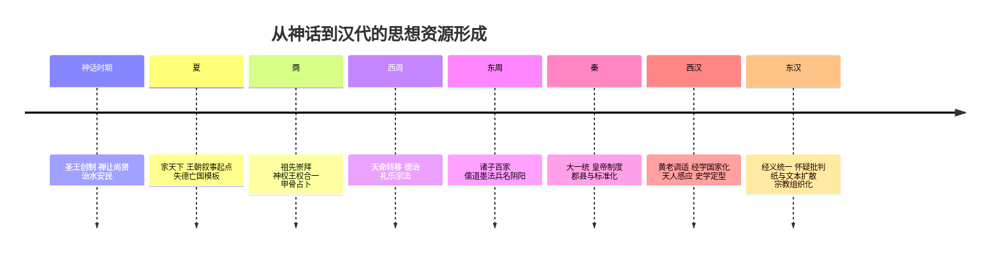
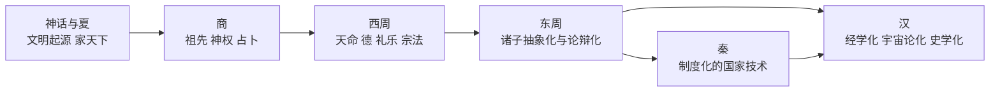
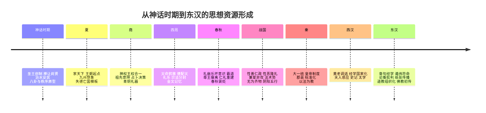
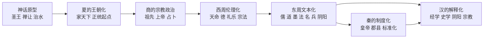

## 中国历史分期

## 史前文化

**中国史前文化主要依据考古学遗址、遗物与测年重建**，大体可分为旧石器时代晚期向新石器时代过渡、新石器时代早中晚期，以及进入早期复杂社会与文明起源加速阶段几个层次。就今天的考古学认识而言，距今约 5800 年前后，**中华大地进入文明起源加速阶段**；距今约 5800—3500 年间，可见多区域并进的“古国时代”与早期王朝化趋势。

Timeline:
* 约前10000年—前7000年

  * **新石器化开始，多区域人群从采集渔猎逐渐走向定居、制陶、磨制石器与早期农业**

    * 约前10000年以后，末次冰期结束后的气候回暖，为东亚大陆不同地区的人群调整生计方式提供了条件。中国境内并没有一个单一起点，而是在黄河流域、长江流域、华南洞穴遗址群、东北与西北若干地区，陆续出现陶器、磨制石器、定居或半定居聚落、植物利用强化等现象。所谓`新石器化`，并不只是“使用磨制石器”，而是技术、食物生产、居住方式和社会组织共同发生长期变化。
  * **早期陶器、磨制石器和聚落生活扩展，史前社会开始积累稳定的物质基础**

    * 这一时期仍以小规模社群为主，农业尚未在所有地区取代采集、渔猎和野生植物利用。陶器使储藏、炊煮和食物加工方式发生变化，磨制石器提高了木材加工、谷物处理和日常劳动效率，定居生活则使人群更容易形成墓葬、居址、灰坑和公共空间。考古学意义上的“中国史前文明”不能从某一个王朝或民族故事直接开始，而应从这些多区域、长时段的物质变化中理解。
    * *这一阶段的重要意义，在于人类群体逐渐摆脱完全流动性的生计方式。粮食生产、储藏能力、聚落稳定性和人口增长互相推动，为后来的村落联盟、区域中心、礼仪空间和早期国家提供了前提。*
* 约前7000年—前5000年

  * **裴李岗文化发展，中原地区形成较早的定居农业和村落传统**

    * **裴李岗文化**主要分布于今**河南**及周边地区，是中原早期新石器文化的重要代表。考古材料显示，这一地区已经出现较稳定的聚落、磨制石器、石磨盘与石磨棒、陶器、墓葬和粟黍农业迹象。它不是后世“中国”的直接政治起点，却是中原地区从移动性生计走向定居村落社会的重要环节。
    * **贾湖遗址**常被纳入裴李岗文化系统讨论，出土有骨笛、龟甲、刻划符号、墓葬和丰富动植物遗存。骨笛说明音乐和仪式活动已经进入较复杂形态，刻划符号则常被讨论为早期记号系统，但不能直接等同于成熟文字。这里体现的是史前社会在农业、手工业、礼仪和象征表达方面的复合发展。
    * *在“文化意义上的早期中国”讨论中，距今约八千年前后的裴李岗文化常被视为重要起点之一。但这种“起点”不是王朝史意义上的开端，而是中原地区长期文化连续性、农业传统和聚落社会形成的早期证据。*
  * **河姆渡文化兴起，长江下游稻作、木构建筑与湿地生态形成成熟组合**

    * **河姆渡文化**主要分布于今**浙江**宁绍平原及其周边，是长江下游早期新石器文化的重要代表。这里的自然环境与黄河中游不同，水网、湿地、湖沼和亚热带气候使稻作、渔猎、采集和木构建筑形成紧密联系。遗址中发现的稻谷、稻壳、木构遗迹、骨器、陶器和动植物遗存，说明长江下游很早就形成了与北方粟作农业不同的文明路径。
    * **干栏式木构建筑**是河姆渡文化最具标志性的遗存之一。它适应潮湿地面和水网环境，反映出木材加工、聚落规划和环境适应能力。河姆渡社会不是简单的“稻作村落”，而是一个依托湿地生态、稻作生产、渔猎资源和木构技术共同维系的区域文化系统。
    * *河姆渡文化证明，长江流域并不是中原文明的被动接受者。中国史前文明从一开始便具有多区域并进特征：黄河流域以粟黍农业和旱地聚落为重要方向，长江流域则以水稻农业、湿地资源和木构传统构成另一条关键路径。*
* 约前5000年—前3000年

  * **仰韶文化扩展，黄河流域的农业村落、彩陶传统和区域交流进入高峰**

    * **仰韶文化**主要分布于黄河中游及其周边，延续时间长、覆盖范围广，是中国新石器时代中期最重要的考古学文化之一。它以粟黍农业为基础，同时保留采集、狩猎和家畜饲养等复合生计方式。较大的村落、房址、壕沟、墓地、灰坑和彩陶共同显示出人口集聚、生产稳定和社会关系复杂化。
    * **半坡类型**、**庙底沟类型**等不同阶段和区域面貌，说明仰韶文化内部并非完全一致。半坡遗址常被用来说明较早的村落布局、氏族墓地和日常生产；庙底沟类型则因彩陶纹样扩散范围广，常被视为区域交流网络扩大的标志。彩陶不是单纯装饰品，它也可能承载群体身份、礼仪表达和区域风格传播。
    * 仰韶文化的重要性，在于它把黄河中游从早期定居农业推进到更大规模的区域社会。人口增长、聚落扩张、手工业分工和跨区域互动，使中原地区逐渐具备后来成为政治整合中心的条件。所谓“主根主脉”，更准确地说，是指仰韶以来黄河中游在农业、聚落、礼仪和文化传播上的连续积累，而不是否定其他区域的文明贡献。
    * *仰韶文化显示，中原地区在进入早期国家之前，已经经历了漫长的社会组织升级。村落不再只是生计单位，也逐渐成为墓葬秩序、手工业生产、礼仪活动和区域交换的节点。*
  * **大汶口文化发展，海岱地区的社会分化和礼仪传统逐渐增强**

    * **大汶口文化**主要分布于今**山东**及其周边的海岱地区，是黄河下游史前文明的重要组成部分。它与仰韶文化并行发展，却具有不同的地域风格。大汶口墓葬中随葬品差异明显，玉器、陶器、獐牙钩形器等遗物反映出身份分化、礼仪活动和区域交换的增强。
    * 海岱地区的位置连接黄河下游、淮河流域和东部沿海，容易形成物资、技术和观念交流。大汶口文化后期的社会分层，为后来的龙山文化和山东地区城址发展提供了基础。它说明史前中国并非只有“中原中心”一条线索，东部海岱地区同样在早期复杂社会形成中占有重要位置。
* 约前4500年—前3000年

  * **红山文化兴盛，西辽河流域形成以玉器、祭祀空间和等级墓葬为核心的北方文明形态**

    * **红山文化**主要分布于西辽河流域及周边地区，是北方史前文化体系中最重要的一支。这里处于农牧交错和山地、河谷、草原过渡地带，生态条件不同于黄河中游和长江下游。红山社会既有农业因素，也依赖狩猎、采集和区域资源利用，其文明形态表现为大型礼仪遗址、积石冢、玉器和特殊宗教象征的集中出现。
    * **牛河梁遗址**是理解红山文化晚期社会复杂化的关键。遗址群包括祭坛、女神庙、积石冢和高等级墓葬，出土大量玉龙、玉猪龙、玉璧等礼仪性玉器。这些材料显示，当时已经出现超出普通村落生活的公共祭祀体系和等级秩序，某些人物或集团可能通过祭祀、祖先崇拜和玉器控制获得特殊地位。
    * **史料问题：** 红山文化没有成熟文字材料，不能把它直接写成后世王朝国家，也不能把玉龙等器物简单解释为“中华龙图腾”的确定源头。较稳妥的说法是，红山文化显示北方地区已经出现礼仪中心、社会分层和跨聚落整合迹象，是中华文明多源并进格局中的关键实证。
    * *红山文化的重要性，在于它打破了“文明只从黄河中游单线发生”的旧叙述。北方地区并非文明边缘，而是在礼仪制度、玉器传统和区域组织方面形成了具有自身特征的复杂社会。*
* 约前3300年—前2300年

  * **良渚文化兴盛，长江下游稻作社会发展出高度复杂的礼仪、权力和手工业系统**

    * **良渚文化**主要分布于长江下游太湖流域，是中国新石器时代晚期最重要的考古学文化之一。它以稻作农业为经济支撑，以玉器、墓葬等级、聚落分层、水利工程和大型城址为核心证据，显示出远高于普通村落社会的组织能力。良渚社会的权力并不只表现为军事防御，更集中体现为对水利、粮食、劳动力、玉器生产和礼仪象征的控制。
    * 良渚玉器具有高度制度化特征。**玉琮**、**玉璧**、玉钺以及神人兽面纹等图像，不只是精美工艺品，而是权力、祭祀和身份等级的物质表达。高等级墓葬中玉器数量和类型的差异，说明社会分层已经非常明显，少数精英集团可能通过宗教象征和资源调配维持统治。
  * **良渚古城与水利系统形成，太湖流域出现以大型工程和统一信仰支撑的早期区域性国家**

    * **良渚古城遗址**包括城址区、瑶山遗址区、反山墓地、莫角山宫殿区以及外围高低坝水利系统。城址、水利和祭祀遗存共同说明，良渚社会已经能够组织大规模劳动力，进行长期规划和工程建设。尤其是水利系统，既服务于防洪、蓄水和稻作农业，也显示出中心权力对自然环境和区域资源的调控能力。
    * 联合国教科文组织将良渚古城遗址概括为以稻作农业为经济支撑的早期区域性国家，这一表述的重点在于“区域性”和“早期”。良渚并不是后世意义上的统一王朝，也没有可读文字证明其王统和制度名称，但它已经具备城市中心、等级秩序、礼仪系统和工程组织能力，足以说明中国史前时期某些区域已经进入文明阶段。
    * *良渚是长江流域对中华文明起源作出杰出贡献的关键实证。它的兴盛说明，中国早期文明不是先在中原成熟、再向周边扩散的单线过程；相反，长江下游在前四千纪至前三千纪已经形成高度复杂的区域政治体。*
* 约前2600年—前1900年

  * **龙山时代展开，黄河中下游及周边地区进入城址扩张、竞争加剧和社会分层强化阶段**

    * **龙山时代**不是单一考古学文化，而是对黄河中下游及周边地区新石器时代晚期若干文化面貌的统称。山东龙山、河南龙山、陕西龙山、山西陶寺相关遗存等地区各有特点，但都表现出城址增多、聚落等级拉开、手工业专业化增强、墓葬差异扩大和区域竞争加剧等趋势。黑陶常被视为龙山文化的重要标志之一，但龙山时代真正关键的变化，是政治组织和区域秩序的重组。
    * 这一时期的城址具有防御和权力中心双重意义。城墙、壕沟、夯土建筑、仓储设施、墓葬区和手工业区，说明某些聚落已经能够动员大量劳动力，并对周边小聚落形成支配关系。战争、联盟、资源竞争和礼仪整合，可能共同推动了早期政治中心的出现。
    * *龙山时代通常被视为由史前社会走向早期国家的关键阶段。它不是王朝史的直接开端，却使“古文化—古城—古国”的演进链条逐渐清晰：文化共同体先形成稳定区域传统，城址和中心聚落进一步扩大，最终部分区域走向早期国家形态。*
* 约前2500年—前1900年

  * **陶寺文化与都邑形态形成，晋南地区出现接近早期国家的中心聚落**

    * **陶寺遗址**位于今**山西襄汾**，处在汾河流域南部，地理上连接关中、中原和北方地区。遗址面积巨大，城址、宫殿区、墓葬区、仓储区、手工业遗存和大型建筑基址共同显示出复杂的空间分区。这里已经不再是普通村落，而是具有政治、礼仪、经济和管理功能的区域中心。
    * 陶寺高等级墓葬中出土漆器、玉器、陶鼓、石磬、铜器等遗物，反映出精英阶层对稀有资源、礼仪器物和手工业技术的占有。大型观象建筑遗迹常被解释为与天文观测、历法和祭祀有关，但其具体功能仍需谨慎表述。可以确定的是，陶寺社会已经把时间秩序、礼仪权威和政治中心联系起来，显示出比普通部落联盟更复杂的组织形态。
    * **史料问题：** 陶寺常被一些学者纳入尧都或早期夏前政治体讨论，但这种联系主要来自后世文献传统与考古材料的互证尝试，不能简单写成确定事实。较稳妥的判断是，陶寺代表晋南地区在夏代以前或夏代前后进入高度复杂社会阶段，是研究中原早期国家形成的重要对象。
    * *陶寺的重要意义，在于它把“都邑”问题提前到王朝文字史之前。宫殿、墓葬、仓储、礼仪和观象设施共同表明，政治中心的形成并不依赖后世史书命名，而可以通过空间组织和物质遗存被考古学识别。*
* 约前2300年—前1800年

  * **石峁文化中心兴起，陕北高原形成东亚规模最大的史前石城之一**

    * **石峁遗址**位于今**陕西神木**，处在黄土高原北缘和农牧交错地带，是目前中国发现面积最大的史前城址之一。遗址由皇城台、内城和外城构成，石砌城墙、城门、马面、防御设施和中心台城显示出高度组织化的工程能力。与良渚的水乡城址不同，石峁更突出山地石城、防御体系和北方边地政治中心的特征。
    * **皇城台**是石峁遗址的核心区域，具有宫殿性、礼仪性和统治性空间的综合特征。遗址中发现玉器、壁画残迹、石雕、人骨遗存和复杂建筑结构，说明石峁社会已经形成强烈的等级秩序和仪式权力。它的兴起不能简单解释为中原文明向北扩散，而应放在北方地区自身的资源网络、战争压力、贸易通道和区域竞争中理解。
    * 石峁所处地区连接黄河中游、河套、草原和陕晋高原。这里既可能吸收中原、海岱、北方草原和西北地区的文化因素，也可能向外输出技术、礼仪和政治组织经验。它显示出夏以前北方地区已经存在高度复杂的大型政治中心。
    * *石峁的价值，在于它迫使中国早期文明研究把视野从黄河中游和长江下游进一步扩展到北方边缘地带。所谓“边缘”，在史前时期未必是落后区域，也可能是多种生态、技术和权力形态交汇的创新地带。*
* 约前2000年前后

  * **多区域古国并存与重组，早期王朝出现前的政治格局发生剧烈调整**

    * 到约前2000年前后，长江下游的**良渚文化**已经衰落，黄河中下游龙山晚期社会也发生广泛动荡，一些城址废弃，一些区域中心衰落，另一些中心则继续整合资源。气候变化、洪水压力、农业环境改变、人口迁移、战争竞争和区域贸易网络重组，可能共同推动了这一轮大变动。史前中国并不是平稳走向王朝国家，而是在多个区域复杂社会兴衰更替之后，逐渐形成新的政治中心。
    * 这一阶段的核心问题，是多区域文明如何转入以中原为重要枢纽的早期王朝格局。良渚、陶寺、石峁、龙山诸文化并没有全部线性进入夏商周系统，但它们积累的城址工程、礼仪权力、社会分层、资源调配和区域统合经验，构成了早期国家出现的历史背景。
    * *约前2000年前后的区域重组，是进入夏代早期国家之前最重要的历史转折之一。后世文献会把这一段追述为尧、舜、禹和夏王朝的开端，但考古学需要把传说、文献记忆和物质遗存分开处理：可以讨论它们之间的关联，却不能把传说叙事直接当作确定史实。*

## 传说时代

**传说时代**主要指**夏以前**见于传世文献的部落联盟与共主更替阶段，通常以后世所称的**五帝时代**为主干，即*黄帝*、*颛顼*、*帝喾*、*帝尧*、*帝舜*相承，最终过渡到*禹*。这一时期的叙述主要来自《史记》《尚书》等文献，现代学术一般不将其视为可以逐年实证的严格编年史，而视为古史记忆、政治观念与早期文明形成经验的综合表达。*影响：传说时代为后世中国古代政治提供了**共主、德治、征伐、禅让、治水**等核心叙事框架。***传说时代**与前一部分的**史前文化**不是同一种历史材料，前者主要依据传世文献，后者主要依据考古学。 **黄帝、炎帝、蚩尤**相关叙事含有很强的后世整合色彩，整理笔记时应视为古史传统中的政治记忆，而不是现代意义上逐年可考的战争史。  **禅让**是后世古代政治理想的重要表达，不宜直接等同为已经被现代实证史学完全确认的制度史事实。

Timeline:
* 传说时代
  * **黄帝兴起，神农氏世衰后的诸侯混战被叙述为共主重建秩序的开端**

    * 传说中的**黄帝**并不是在一个已经安定的天下中登场。古史叙事先写**神农氏**衰弱，再写诸侯彼此侵伐，强者暴虐百姓，旧有共主已经不能征讨不服。这个开场非常重要：黄帝的出现不是普通继承，而是乱世中新的政治中心生成。
    * **轩辕黄帝**开始“习用干戈”，训练武力，整顿部众，征讨不奉行共同秩序的诸侯。这个过程带有强烈的政治象征：共主不是凭空产生的，而是在旧秩序失效、诸部互相攻伐、民众陷入动荡时，通过军事能力和秩序重建逐渐获得承认。
    * 黄帝的早期形象兼具武力与德行。他不是单纯的征服者，也不是纯粹的道德圣王，而是能够用战争结束混乱、用归附重建秩序的人物。后世把大量制度、技术、礼仪和祖先记忆都附着到黄帝身上，正是因为他被塑造成华夏共同体形成前夜的核心整合者。
    * *黄帝兴起的意义，在于古史传统把中国早期政治的开端写成“旧共主衰弱—诸侯攻伐—新领袖用兵—天下归附”的秩序重建过程。黄帝由此不只是一个传说人物，而成为后世理解华夏共同祖先、天下共主和政治整合的核心符号。*
    * `《史记·五帝本纪》`载：“轩辕之时，神农氏世衰。诸侯相侵伐，暴虐百姓，而神农氏弗能征。于是轩辕乃习用干戈，以征不享，诸侯咸来宾从。”这段材料的结构非常清楚：先写旧权威衰弱，再写诸侯混战和百姓受害，最后写轩辕用兵、诸侯宾从。司马迁并没有把黄帝写成自然拥有天下的天生圣王，而是把他放在乱世秩序重建的过程里，强调共主权威来自对混乱的解决。
  * **阪泉之战展开，黄帝与炎帝集团的冲突被整理为华夏诸部整合的关键战争**

    * **阪泉之战**发生在黄帝权威上升的阶段。传说中，**炎帝**想侵陵诸侯，诸侯则多归附**轩辕**。这意味着战争并不是两个个人之间的斗气，而是两个政治集团围绕诸侯归属和共主地位展开的竞争。
    * 黄帝开战前并非只做军事准备。文献说他“修德振兵”，一方面整军经武，一方面修明德政；又“治五气，艺五种，抚万民，度四方”，把天时、农业、民众和空间治理都纳入战争前的秩序建设。这里的战争叙事很有古史特色：能成为共主的人，不能只会打仗，还必须表现出治理天下的能力。
    * 双方在**阪泉之野**交战，而且不是一战定局，而是“三战然后得其志”。“三战”使这场战争显得更像一场反复较量后的政治整合：炎帝集团并非轻易被压倒，黄帝的优势是在连续冲突中逐步确立的。
    * *阪泉之战的意义，在于它把黄帝与炎帝两大古史系统纳入同一个祖先叙事。后世所谓“炎黄”共同体，并不是简单的血缘事实，而是通过这类战争和归附记忆，把多个部族、联盟和政治传统组织成共同起源。*
    * `《史记·五帝本纪》`载：“炎帝欲侵陵诸侯，诸侯咸归轩辕。轩辕乃修德振兵，治五气，艺五种，抚万民，度四方，教熊罴貔貅貙虎，以与炎帝战于阪泉之野。三战然后得其志。”这段材料并不只是说“黄帝打败炎帝”，而是先写诸侯归附，再写黄帝修德、振兵、治气、艺种、抚民、度方，最后才进入战争。司马迁把战争放在政治、农业、天时和民众秩序之中，说明阪泉之战在古史叙事中的功能，是解释黄帝为何具备共主资格。
  * **涿鹿之战爆发，黄帝征师诸侯击败蚩尤，古史传统以强敌叙事完成共主合法性塑造**

    * 阪泉之后，黄帝已经取得对炎帝集团的优势，但天下秩序仍没有完全稳定。**蚩尤**在传说中以强敌和乱臣形象出现，被写成“不用帝命”的反秩序力量。黄帝于是“征师诸侯”，这说明他已经能够超出本部力量，动员诸侯组成联军。
    * 双方会战于**涿鹿之野**。后世关于涿鹿之战的记忆不断神话化，附会风伯、雨师、迷雾、指南车等情节，但`《史记》`保存的主干叙事更偏政治：蚩尤作乱，黄帝率诸侯征讨，最终擒杀蚩尤。战争的重点不是战术细节，而是共主对不服从者的合法征伐。
    * 蚩尤败亡之后，诸侯共同尊奉轩辕为天子，黄帝正式取代神农氏。这里的叙事收束很明确：黄帝并非仅因胜利而强大，而是因为他能代表共同秩序征讨强敌，才被诸侯承认为天下共主。
    * *涿鹿之战的意义，在于它把黄帝塑造成华夏共同祖先、战争胜利者和天下共主。黄帝的权威在阪泉中通过整合炎帝集团而增强，在涿鹿中通过击败蚩尤而完成。*
    * `《史记·五帝本纪》`载：“蚩尤作乱，不用帝命。于是黄帝乃徵师诸侯，与蚩尤战于涿鹿之野，遂禽杀蚩尤。而诸侯咸尊轩辕为天子，代神农氏，是为黄帝。”这段材料的叙事逻辑是：先把蚩尤定义为“作乱”，再写黄帝能够征发诸侯，最后写诸侯共同尊黄帝为天子。它不是现代战争史式的兵力、路线和战术记录，而是政治合法性叙事：谁能代表秩序征讨不服，谁就能成为共主。
  * **黄帝平定天下，巡行与征讨把分散空间纳入同一政治想象**

    * 黄帝被尊为天子之后，古史叙事并没有让他安坐不动。天下仍有不顺服者，他继续征讨；地方平定之后，他又离开，不长期停留。这种写法把黄帝塑造成不断行动的共主，而不是后世王朝中坐守都城的君主。
    * “披山通道，未尝宁居”尤其能体现黄帝形象的空间意义。山川阻隔被打开，道路被开通，四方被巡行，分散的部落和地理空间被放进同一个“天下”想象之中。黄帝的政治活动不仅是打败敌人，更是把原本分裂、闭塞、互相攻伐的空间连接起来。
    * 这种叙事也为后世帝王政治提供了古史模板。巡狩、开道、征不服、通四方、定山川，都可以追溯到这种早期共主形象：理想统治者不仅要控制人群，还要把地理空间转化为可通行、可治理、可祭祀的秩序空间。
    * *黄帝平定天下的意义，在于它把“天下”写成一个通过征伐、道路、巡行和归附逐渐形成的政治空间。这里的天下不是现代国家疆域，而是以共主为中心、不断纳入四方的秩序网络。*
    * `《史记·五帝本纪》`载：“天下有不顺者，黄帝从而征之，平者去之，披山通道，未尝宁居。”这段材料中的黄帝不是静态圣王，而是移动中的征服者和开拓者。司马迁用“征之”“平者去之”“披山通道”连续写出黄帝对空间的整合，说明古史叙事常把政治统一理解为空间秩序的形成。
  * **颛顼继统，五帝相承叙事把黄帝之后的共主政治整理成连续谱系**

    * **颛顼**在五帝系统中承接**黄帝**之后的古史位置。与黄帝、尧、舜、禹相比，他的故事没有那么鲜明的战争或治水主线，但在古史结构中非常重要：他把黄帝开创的共主秩序继续向后延展，使上古历史不至于停留在单个英雄人物身上。
    * 后世文献常将颛顼与礼制、祭祀、天人秩序和族群谱系联系起来。某些传统中有“绝地天通”等叙事，用来说明神人关系和祭祀权力的重组。这类材料更像政治宗教观念的古史表达，不宜直接当作可以逐项复原的制度事实。
    * 在五帝谱系中，颛顼的功能是承前启后。他把黄帝之后的天下秩序继续维持下去，又为帝喾、尧、舜的德治叙事铺路。没有颛顼、帝喾这样的中间人物，黄帝与尧舜之间就会显得断裂。
    * *颛顼叙事的意义，在于它显示后世古史系统并不满足于保存零散传说，而是试图把分散的祖先记忆整理成连续政统。五帝相承由此成为后世理解上古政治合法性的谱系框架。*
  * **帝喾继统，古史系统通过德政延续铺垫尧舜时代**

    * **帝喾**在五帝谱系中承接**颛顼**，又通向**尧**、**舜**。传世叙事对帝喾的具体政治过程保存不多，但常将其塑造成德政延续者，使黄帝以来的共主传统不至于中断。
    * 帝喾的叙事功能主要不是提供具体事件，而是维持古史秩序的连续性。黄帝代表征伐整合，颛顼、帝喾代表共主谱系的延展，尧舜则代表德治和禅让的高峰。帝喾因此是从黄帝式武力整合过渡到尧舜式理想政治的重要中介。
    * 后世儒家和史家重视这种连续性，因为它可以说明上古圣王不是孤立出现，而是形成了一条可追溯、可继承、可模仿的政治传统。帝喾虽然不如尧舜著名，却使五帝系统在结构上更加完整。
    * *帝喾叙事的意义，在于它把上古共主政治写成一条不断延续的德政谱系。它强化了后世关于“古已有圣王之治”的想象，为尧舜政治理想提供历史纵深。*
  * **尧即位，唐尧形象成为德治、求贤和天下共主的理想模型**

    * 到**帝尧**叙事中，古史的重心明显从征伐转向德治。黄帝故事的核心是乱世整合、战争胜利和诸侯归附；尧的故事则更强调宽仁、明德、知人、授时和继承安排。尧不是以战胜强敌成为圣王，而是以治理能力和道德威望成为后世理想君主。
    * **唐尧**的形象通常被放在“唐虞之治”的开端。他所代表的不是强制统一，而是理想秩序：天时有序，民生安定，贤人被举用，继承不私于子。正因为如此，尧在后世政治思想中不断被用来衡量现实君主。
    * 尧的叙事也有一种从“天下战争”到“天下治理”的转向。黄帝解决的是谁能统一诸部，尧解决的是统一之后如何治理、如何授时、如何选贤、如何把权力交给更合适的人。
    * *尧即位的意义，在于上古政治叙事从共主征伐进入圣王德治。后世所谓“尧天舜日”，并不是对某个可实证时代的简单回忆，而是对理想政治秩序的高度概括。*
  * **尧命羲和历象授时，天象、历法与农时被纳入王权职责**

    * 尧的政治首先表现为对时间秩序的主持。他命**羲和**观测日月星辰，推定四时变化，使民众能够按照正确季节进行农业生产。这不是一个单纯的天文学故事，而是把天象、农时和王权职责连接起来的古史叙事。
    * 在农业社会中，时间本身就是治理对象。播种、收获、祭祀、徭役、贡赋和政令都依赖稳定历法。尧能够“敬授人时”，意味着王权不仅控制人间秩序，也要顺应天道，把天象规律转化为可执行的社会时间。
    * 这类叙事说明，古代王权并不只靠战争和刑罚确认自身合法性。能够观天、授时、安农、顺民，也是一种极重要的政治能力。后世王朝重视颁历、改元、正朔和天文官署，都可以在尧命羲和的故事中找到思想源头。
    * *尧命羲和的意义，在于它把王权塑造成天时与民生之间的中介。所谓“敬授人时”，本质上是把宇宙秩序、农业生产和政治权威结合起来。*
    * `《尚书·尧典》`载：“乃命羲和，钦若昊天，历象日月星辰，敬授人时。”这段材料极短，但结构完整：“钦若昊天”强调顺应天道，“历象日月星辰”强调观察和推算，“敬授人时”则把天文知识转化为公共治理。它说明尧的圣王形象不只是道德化的仁君，也包括主持历法、安排农时的治理者。
  * **尧举舜，选贤与能的禅让叙事开始成形**

    * 尧晚年面对继承问题。按照传世古史叙事，他没有简单地把天下交给自己的儿子，而是通过**四岳**访求贤人。**舜**由此进入政治中心，成为被推荐、被观察、被试用的继承人。
    * 舜的资格首先被写成德行资格。后世文献特别强调舜能在复杂家庭关系中保持孝顺与和顺，使他的私人伦理成为公共政治能力的证明。古史传统在这里有一个基本判断：不能治理家庭伦理的人，也难以治理天下秩序。
    * 但尧举舜不只是道德故事。舜被推举后，还要参与政务、接受考察、承担治理事务。也就是说，舜的德行必须转化为治事能力，才真正具有继承天下的资格。
    * *尧举舜的意义，在于它为后世中国政治提供了“公天下”的最高想象。`禅让`不宜直接等同为已经被现代实证史学完全确认的制度事实，但它作为政治理想极其重要：天下不应被理解为君主私产，而应交给有德有能、能够获得天下承认的人。*
  * **舜受终摄政，政统转移通过祖庙与礼仪获得神圣确认**

    * 舜被尧选中之后，并不是在私人场合简单接班。古史叙事让他在正月上日“受终于文祖”，也就是在具有祖先和礼仪意义的空间中承受政统。权力转移由此不再只是个人之间的交接，而成为天命、祖先和政治共同体共同见证的仪式。
    * “受终”这个动作非常关键。它表示舜承接尧未竟之政，也承接治理天下的责任。舜的权力不是来自篡夺，也不只是来自尧的私人许可，而是通过礼仪被纳入更高的政统秩序。
    * 这种写法对后世政治影响很深。王朝更替、皇帝即位、告庙、改元、颁诏，都要解决同一个问题：新权力如何证明自己不是私相授受，而是合法承统。舜受终的故事正是这一问题的古史原型。
    * *舜受终摄政的意义，在于它把继承合法性礼仪化。传说时代的政权交接不仅需要贤能和推举，还需要通过祖庙、时间和仪式获得公开确认。*
    * `《尚书·舜典》`载：“正月上日，受终于文祖。”这句材料虽然简短，却包含时间、空间和行为三个层次：时间是“正月上日”，空间是“文祖”，行为是“受终”。它把政权交接放入礼仪秩序之中，说明古史叙事已经高度重视权力转移的象征合法性。
  * **舜流四凶，新共主通过放逐与刑罚清理失序力量**

    * 舜承受政统之后，首先要面对的不是抽象德治，而是现实政治清理。古史叙事中，**共工**、**驩兜**、**三苗**、**鲧**分别成为需要处分的对象，被流放、放逐、迁徙或诛殛到不同边远地点。
    * 这组行动使舜的形象不再只是被动受禅的贤人，而是能够划定秩序边界的新共主。他必须判断谁可以被纳入新秩序，谁必须被排除；哪些势力只是失德，哪些势力构成严重威胁；哪些失败可以宽宥，哪些失败需要承担极端惩罚。
    * **三苗**尤其需要谨慎理解。古代文献中的“三苗”是上古叙事中的族群和政治他者，不应直接等同于现代民族。它在这里的叙事功能，是表现舜对边缘不服力量的处理，也反映中原古史传统对自身秩序边界的想象。
    * *舜流四凶的意义，在于它修正了尧舜叙事中过于和平的表面印象。理想政治不仅需要选贤、德治和礼让，也需要刑罚、放逐和对失序力量的处理。*
    * `《尚书·舜典》`载：“流共工于幽洲，放驩兜于崇山，窜三苗于三危，殛鲧于羽山，四罪而天下咸服。”这段材料采用整齐的并列结构，把四个对象、四种处分、四个地点和一个政治结果组织在一起。它关心的不是司法细节，而是政治效果：“四罪而天下咸服”。舜通过处分四凶，显示新政权已经能够重新划定天下秩序。
  * **鲧治水失败，洪水危机成为检验政治能力的重大考验**

    * 在尧舜时代叙事中，洪水不是普通自然灾害，而是威胁天下秩序的巨大危机。农业生产、聚落安全、交通联系和民众生存都可能被洪水破坏。谁能治理洪水，谁就能证明自己有能力承担天下公共责任。
    * **鲧**受命治水，却长期不能成功。后世常将其失败概括为只知堵塞而不能疏导，虽然这种技术解释带有后世总结色彩，但它很好地说明鲧在古史叙事中的位置：他代表一种不能有效处理公共危机的失败治理者。
    * 鲧的失败不仅是工程失败，也是政治失败。治水需要动员劳力、协调区域、安排工程、安抚民众；久治无功，就意味着没有能力解决天下最迫切的问题。因此鲧最终被置于“四凶”之一，受到严厉处分。
    * *鲧治水失败的意义，在于它为禹的出现制造了叙事张力。父亲失败，儿子继承；旧方法失败，新方法登场；洪水未平，新的政治威望开始形成。禹治水的伟大，正是通过鲧的失败被衬托出来的。*
  * **禹治水成功，疏导江河的工程叙事把公共功业转化为最高政治威望**

    * **禹**继承鲧未竟的治水事业后，古史叙事的方向发生根本变化。鲧代表失败，禹代表成功；鲧因不能平水土而被处罚，禹则因能平水土而获得天下归心。禹的政治资格不是从宫廷继承中自然产生，而是在解决洪水危机的过程中逐渐形成。
    * 禹治水被写成极其艰苦的长期行动。他奔走山川，疏导江河，平治水土，使泛滥的水重新进入河道，使被破坏的土地重新成为可耕作、可居住、可通行的空间。这里的“治水”不是单纯挖河，而是重新组织人与土地、河流、交通和农业生产的关系。
    * 后世关于禹“过家门而不入”等故事，带有明显道德化和典范化色彩，不宜当作未经加工的日常实录。但它准确表达了禹的政治形象：最高权力应当来自对公共事务的承担，而不是来自私人享乐或血缘占有。
    * 禹的功业还把自然地理转化为政治地理。山川被命名，水道被疏通，土地被平治，贡赋和区域秩序也由此获得想象基础。后来的`九州`观念、山川祭祀、水利政治和王朝疆域意识，都与禹治水传统有密切关系。
    * *禹治水成功的意义，在于它把工程能力、公共责任、德行和政治合法性结合起来。黄帝以征伐成共主，尧舜以德治成圣王，禹则以治水成天下之主。中国古代政治由此获得了一个极强的治理型合法性范式。*
  * **舜举禹，治水功绩使禹成为最有资格承受天下的人物**

    * 禹治水成功之后，他在古史叙事中的身份发生变化。此前他是受命治水的大臣，此后他成为能够承接天下的人。**舜**举荐禹，并不是因为禹具有抽象名望，而是因为禹已经通过治水证明自己可以承担最高公共责任。
    * 与尧举舜相比，舜举禹的重点有所不同。尧举舜强调德行、孝悌和治事能力；舜举禹则更突出功业。禹的德不是停留在私人伦理上，而是在治水、安民、定土和组织工程中表现出来。
    * 这使`禅让`叙事从“选贤”进一步发展为“选有功者”。天下不应交给血缘最近的人，而应交给最能解决天下危机、最能获得诸侯和民众认可的人。禹因此成为尧舜德治传统与夏代王朝传统之间的枢纽人物。
    * *舜举禹的意义，在于它把尧舜禅让的德治理想与早期国家的治理能力连接起来。禹不是单纯圣人，而是以公共工程和政治组织能力取得天下资格的人。*
    * `《史记·五帝本纪》`载：“舜乃豫荐禹于天。”这句话把禹的继承资格放入天命秩序之中。“豫荐”说明舜在生前已经预先安排，“荐禹于天”则说明这种安排不是私人偏好，而被叙述为向天命报告、请求确认。司马迁用极短的句子，把禹的功绩、舜的认可和天的合法性连接起来。
  * **禹受禅让，尧舜以来的公天下叙事抵达终点，夏代家天下即将出现**

    * 舜去世后，禹并没有在叙事中立即占有天下，而是先服丧三年。这个步骤很重要，因为它延续了尧舜之间的礼让模式：承接最高权力的人必须表现出守礼、谦退和不私天下。
    * 三年丧毕之后，禹又让位于舜之子**商均**，就像舜曾经让位于尧子一样。这一安排使禹的即位不是直接夺取，也不是简单继承，而是在礼让之后由诸侯归心推动完成。
    * 诸侯最终不归附商均，而归附禹。禹于是践天子位。这里的叙事逻辑非常典型：形式上尊重血缘继承的可能，结果上强调天下归心和有德有功者承位。禹的权力因此被写成公共认可的结果，而不是私人占有的结果。
    * 禹受天下之后，传说时代即将转入夏代。这个转折非常关键：禹本人仍是尧舜禅让政治的最后承受者，但禹之后**启**继位，又被后世理解为“家天下”的开始。因此禹处在两种政治秩序的交界处，一边是尧舜的公天下，一边是夏代的王朝世袭。
    * *禹受禅让的意义，在于它完成了传说时代向王朝时代的过渡。尧、舜、禹三代相承被后世视为禅让政治的最高典范，而禹之后的夏代则把政治叙事推向世袭王权和早期国家。*
    * `《史记·五帝本纪》`载：“舜乃豫荐禹于天。十七年而崩。三年丧毕，禹亦乃让舜子，如舜让尧子。诸侯归之，然后禹践天子位。”这段结构非常精密：先有舜荐禹，再有舜崩，再有三年丧，再有禹让商均，最后才有诸侯归禹。司马迁把禹即位写成礼让之后的天下归附，而不是直接继承或武力夺取。这正是禅让叙事最重要的政治功能。

## 夏 ﹝~2070bc-1617bc﹞

**夏朝**：夏朝通常被视为中国历史上第一个世袭王朝，也是由原始部落联盟向早期国家过渡的重要阶段。传统说法认为，夏朝约存在于公元前21世纪至公元前16世纪之间，共传十四世、十七王，君主为姒姓。关于夏朝的具体年代、世系和政治制度，后世文献记载较多，但由于同时代直接文字材料极少，今天学界对其细节仍有讨论。不过，就中国古代政治史的叙述传统而言，夏朝的重要意义非常明确：它标志着“禅让”传说时代的结束，以及王位世袭和早期国家权力结构的形成。

**政治**：夏朝的政治形态，仍明显保留着部落联盟时代的痕迹，因此不能把它理解为后世那种高度集权、行政体系完备的王朝国家。夏王虽然已经具有最高统治者的地位，但其直接控制的范围主要集中在王族及其核心统治区域之内。对于周边部落或方国，往往并不是由中央直接细密管理，而是通过联盟、征服、朝贡、册封或军事威慑来维持支配关系。也就是说，夏朝的国家结构带有很强的“中心—外围”特征：王畿地区的控制较强，外围地区则保持相当程度的独立性。这说明夏朝正处于由氏族共同体向国家组织过渡的阶段，国家权力已经出现，但尚未完全摆脱部族政治的基础。

**王位继承**：夏朝在中国政治史上的一个关键意义，是王位世袭制度的确立。传统叙述中，尧、舜、禹时代常被描写为“禅让”政治，而从禹传子启开始，政治权力开始由公共推举转向家族继承。无论这一过程在历史上究竟多么复杂，夏朝都被后世视为“家天下”的开端。所谓“家天下”，就是最高统治权不再属于整个部落联盟公有，而逐渐转化为王族私有并在家族内部传承。这一变化极其重要，因为它意味着政治权力开始稳定地附着于王室血缘和王朝系统之上，为后世商、周王朝政治奠定了基本模式。

**统治方式**：夏朝的统治方式，应理解为王权与部族权力并存。夏王既是最高军事首领，也是祭祀和政治秩序的中心；但在其统治之下，各部落首领和地方势力仍保有相当影响力。国家机器尚未高度官僚化，更多依赖宗族关系、军事威望、贡赋关系和礼仪秩序来维系统治。这说明夏朝不是成熟官僚国家，而是一个带有强烈宗族和联盟性质的早期王朝。

**官制**：根据后世文献记载，夏朝已经出现较早的官职分工。《尚书》中提到“六卿”或“六事之人”，《礼记》也提到在这些职掌之下还分设若干具体官员。这说明夏朝虽然制度还较原始，但国家管理已不再完全依靠部族首领的临时分工，而开始形成较固定的职官体系。此时官职名称中常见“正”字，反映出早期官职命名仍较朴素，也带有很强的事务管理性质。例如，牧正负责畜牧牲畜，庖正负责膳食烹饪，车正负责车辆制作与管理。这些官职说明夏朝统治集团已经需要通过专门人员处理王室生活、生产组织和战争准备等事务，国家管理功能正在逐步细化。

**国家性质**：夏朝并不是后世意义上的“封建王朝”这一说法需要谨慎。若按中国传统史学的宽泛用法，可以说它是早期王朝；但若按严格概念，“封建”更多对应周代分封制，而夏朝更合适的定位，是“早期世袭王朝”或“早期国家”。它最大的特点，不在于已经建立完备制度，而在于完成了从部落联盟到王朝国家的关键转折。它既保留旧有部族政治的遗迹，又显现出王权、世袭、职官和政治中心形成的新趋势。

**社会结构**：夏朝社会仍然建立在血缘、宗族和部落关系基础上，但阶层分化已经开始显现。王族和贵族处于统治地位，掌握军事、祭祀和资源分配权；普通部族成员则承担生产、贡赋和劳役义务。社会尚未形成后世那种复杂的士、农、工、商结构，但统治者与被统治者之间的差别已经出现。这种早期分层，为后来的等级秩序提供了基础。

**历史意义**：夏朝的历史意义，主要不在于制度已经多么成熟，而在于它开启了中国古代王朝政治的基本方向。第一，它被后世视为世袭王朝的开端；第二，它标志着早期国家权力开始超出单纯部落联盟的范围；第三，它为商周时期更成熟的王权政治、礼制秩序和官职体系提供了前提。因此，在中国古代史的叙述中，夏朝常被看作“国家形成史”中的第一阶段。

**易错点**：夏朝不宜简单写成一个已经高度集权、制度完备的王朝，它更接近部落联盟向国家过渡的早期政权。所谓“封建王朝”若使用过于严格，容易与周代分封制混淆，因此写作“早期世袭王朝”更稳妥。关于“六卿”“六事之人”等官制记载，主要见于后世文献，不宜把细节写得过于确定。夏朝最重要的关键词，不是复杂制度，而是“世袭”“早期国家”“由部落联盟向王朝过渡”。
以下按你现有夏朝草稿重组，并补入**启继位、甘之战、孔甲乱夏德、关龙逄谏桀**等关键节点；原有的**太康失国、后羿代夏政、寒浞篡政、少康复国、杼征东夷、不降西征、商汤灭夏、鸣条之战、汤诰**全部保留。

### 禹启之际与夏后氏奠基期﹝约前2070年—约前2030年﹞

*禹在尧舜禅让叙事之后建立夏后氏政权，而其子启最终继承王位，使“天下共主”逐渐转入以夏后氏王族为核心的世袭王朝秩序。禹仍处在传说时代与王朝时代的交界处，合法性依赖治水功绩、舜的荐举和诸侯归附；启则面对“公天下”向“家天下”转换时的政治阻力，有扈氏反启、甘之战等叙事正表现了早期王权世袭化并非毫无争议。*

Timeline:

* 约前2070年

  * **禹建夏，天下共主叙事开始转入以夏后氏为核心的早期王朝秩序**

    * **禹**承接**舜**之后的天下，不是以突然夺权的形象出现，而是在传世叙事中经过一套完整的礼让程序：舜先向天荐禹，舜死后禹服丧三年，又退避舜子**商均**。这一安排延续了尧舜以来的`禅让`叙事，使禹的即位显得不是私人占有，而是天下归心之后不得不承受的政治结果。
    * 诸侯最终离开商均而朝见禹，叙事重心由血缘继承转向政治承认。禹于是南面朝天下，建立**夏后氏**政权。这里的“夏”并非已经能完全用现代考古编年逐年实证的王朝档案，而是传世文献中从传说时代进入王朝时代的关键名称。
    * **禹建夏**的核心变化，在于共主权威开始向王族政权集中。尧舜禹叙事仍然保留“天下为公”的政治理想，但从禹开始，天下已经越来越接近由特定氏族、特定都邑、特定继承系统维系的王朝秩序。后来的**启**继位，更会使这一变化显露为“家天下”。
    * *禹建夏处在传说时代与早期王朝之间的门槛上。一方面，禹仍然是尧舜禅让政治的最后承受者；另一方面，夏后氏政权的建立使天下共主逐渐转化为以王族为中心、以世袭为趋势的早期国家。*
    * `《史记·夏本纪》`载：“帝舜荐禹于天，为嗣。十七年而帝舜崩。三年丧毕，禹辞辟舜之子商均于阳城。天下诸侯皆去商均而朝禹。禹于是遂即天子位，南面朝天下，国号曰夏后，姓姒氏。”这段材料的结构非常清楚：先有舜荐禹，再有舜崩，再有三年丧，再有禹让商均，最后才有诸侯归禹、禹即天子位。司马迁把禹建夏写成礼让之后的天下归附，而不是直接继承或武力夺取；这正是夏王朝叙事需要解决的合法性问题。

* 禹晚年—启即位前后

  * **禹荐益而启继位，禅让传统与王族世袭发生张力**

    * 禹晚年，传世文献中有禹荐举**益**的说法。按照尧舜禹以来的叙事传统，禹似乎仍应通过荐贤方式安排继承。但禹死后，最终获得诸侯归附的是禹子**启**，而不是益。
    * 这件事极其重要，因为它把古史叙事从“禅让”推向“世袭”。禹本人还被放在尧舜禅让传统中理解，启则标志夏后氏王族开始把最高权力固定在家族内部。
    * 传世材料对益与启之间的关系有不同说法。有的说益让启，有的说启攻益，有的说诸侯归启而不归益。这些差异恰好说明，夏初继承问题在古史记忆中并不简单。后世要解释“为什么不是贤者益继位，而是禹子启继位”，就必须在礼让、民心、诸侯归附和王族世袭之间寻找合理叙事。
    * *启继位的意义，在于夏王朝真正进入“家天下”阶段。禹的合法性主要来自治水与禅让，启的合法性则越来越依赖夏后氏血统、诸侯承认和军事压服。*
    * `《史记·夏本纪》`载：“帝禹立而举皋陶荐之，且授政焉，而皋陶卒。封皋陶之后于英、六，或在许。而后举益，任之政。十年，帝禹东巡狩，至于会稽而崩。以天下授益。三年之丧毕，益让帝禹之子启，而辟居箕山之阳。禹子启贤，天下属意焉。”这段材料努力把启继位写成“益让启”“天下属启”，以缓和从禅让到世袭的紧张。它说明司马迁并没有把启继位写成赤裸夺权，而是仍然放在礼让和民心叙事中处理。

  * **启即天子位，夏后氏世袭王权正式展开**

    * **启**继位后，夏后氏王权不再只是禹个人功绩的延伸，而开始成为可以由父传子的王族政治。这个转折对后世影响极大，传统常以启作为“公天下”转向“家天下”的标志。
    * 但“家天下”并不意味着后世成熟专制王朝已经出现。夏初王权仍然可能带有联盟性质，诸侯、方国、族氏首领仍有较大影响力。启要成为真正的天下共主，需要通过政治宴享、军事征伐和对不服者的压制来确认地位。
    * 启继位后，传说有**钧台之享**，即启大会诸侯，显示夏王对诸侯的召集能力。宴享不是单纯饮宴，而是早期政治秩序的展示：谁来赴会，谁接受夏王中心地位；谁不来或反抗，就可能被视为不服王命。
    * *启的王权不同于禹。禹是治水英雄与禅让承受者，启则是世袭王权的开端人物；因此，启时代的核心问题不是“功德足不足”，而是“王族继承能否被诸侯和方国接受”。*

* 启在位时期

  * **有扈氏不服，夏启发动甘之战，世袭王权以战争方式压服反对者**

    * 启即位后，**有扈氏**不服。传统解释中，有扈氏反对启，常被理解为对夏后氏世袭王权的不承认，或者对启违背旧有禅让秩序的不满。无论具体原因如何，有扈氏之战表明启的继位并非无人反对。
    * 战争地点在**甘**，故称**甘之战**。启在战前发布`《甘誓》`，命令六卿整顿军队，申明讨伐有扈氏的理由。誓辞强调有扈氏“威侮五行，怠弃三正”，即破坏天时、政教和秩序，因此必须讨伐。
    * 这里的政治逻辑与后来的汤伐桀、武王伐纣相似：战争不能被说成私人争权，而要被解释为讨伐失序者。有扈氏不服启，启便必须证明自己不是为了个人继承而战，而是在维护天命、政令和天下秩序。
    * 甘之战的具体战术细节保存有限，不能像后世战役那样复原兵力和阵形。但从叙事功能看，它是夏后氏世袭王权的第一次重要军事确认。启通过击败不服方国，使“禹子继禹”的事实得到武力保障。
    * *甘之战的意义，在于它把启的继承争议转化为夏王朝的立威战争。世袭王权不是自然被所有方国接受的，它需要通过誓师、征伐和胜利来压服反对者。*
    * `《尚书·甘誓》`载：“大战于甘，乃召六卿。王曰：嗟！六事之人，予誓告汝。有扈氏威侮五行，怠弃三正，天用剿绝其命。今予惟恭行天之罚。”这段是早期王朝战争誓辞的典型文本。启不是说有扈氏反对自己，所以要灭它；而是说有扈氏违背天道政教，天要绝其命，自己只是恭行天罚。这里已经出现后来王朝征伐常用的合法性语言。

  * **启完成王权立威，夏初政治由禹的功德权威转为王族统治权威**

    * 有扈氏被压服后，启的王位更稳。夏后氏不再只是禹治水功绩的继承者，而开始成为拥有武力、誓命、诸侯会盟和继承制度的统治集团。
    * 这一阶段的夏王权仍然脆弱。启能压服有扈氏，不等于夏已经形成高度稳定的中央政权。恰恰相反，下一代太康失国说明，启所建立的世袭秩序还很容易因君主失政而动摇。
    * 但启的地位不可忽视。他把禹留下的政治资本转化为家族王朝，把“天下归禹”转化为“天下归夏后氏”。从这个意义上说，启比禹更像夏王朝世袭制度的真正奠基者。
    * *启的历史功能，是使夏后氏从共主家族变成王朝王族。甘之战说明，这一过程伴随冲突、征伐和强制，而不是纯粹和平的制度演进。*

### 太康失国与有穷氏代政期﹝约前2030年—约前1970年﹞

*启以后夏初世袭王权尚未稳定，太康沉溺游猎、不恤政事，导致夏后氏王权旁落；有穷氏首领后羿凭借武力和军事声望进入权力中心，形成“因夏民以代夏政”的局面。太康失国说明夏初王权仍然高度依赖君主个人能力和方国支持，后羿代政则说明军事强人仍能借夏民、夏政而控制天下秩序。*

Timeline:

* 约前2030年前后

  * **太康失国，夏初王权因游猎失政而出现第一次重大断裂**

    * **太康**是夏初王统中的关键失败者。传世叙事中的太康并不被写成勤政守成之君，而是长期沉溺游猎，不恤民事，使刚刚形成不久的夏王权失去对诸侯和民众的有效控制。
    * 早期王朝的统治基础尚不稳固，君主一旦不能维持军事、祭祀、分配和政治联络，王权便可能迅速空心化。太康离开政治中心，沉湎田猎，给外部强人介入夏政留下机会。
    * 太康失国的叙事并不只是个人道德批评。它反映的是夏初王权仍带有强烈的共主联盟性质，王室未必拥有后世中央王朝那样稳定的官僚和领土控制。君主一失政，方国、族氏和军事首领就可能重新洗牌。
    * 太康兄弟五人被迫在**洛汭**等待，作`五子之歌`，这一形象显示夏后氏王族从统治中心被挤出，只能在河洛一带徘徊观望。夏后氏合法性尚在，但实际政权已经旁落。
    * *太康失国说明，夏王朝早期并非从建立之初就拥有稳定世袭秩序。王权仍然脆弱，君主个人失政可能导致政权旁落；这也为后来的“少康复国”叙事制造了王统中绝、旧族复兴的历史张力。*
    * `《史记·夏本纪》`载：“帝太康失国，昆弟五人，须于洛汭，作五子之歌。”这段文字非常简短，却把太康失国压缩成三个关键画面：太康失去国家，兄弟五人在洛汭等待，最后以“五子之歌”表达王族失位后的哀怨。司马迁没有详细铺陈军事过程，而是把重点放在王统断裂和政治失德上。

  * **后羿代夏政，有穷氏首领凭武力控制夏民与夏政**

    * **后羿**并不是以建立全新王朝的方式取代夏，而是在夏王室衰弱时进入权力核心，借助夏民和原有政权结构来支配局面。传世文献称其“因夏民以代夏政”，这句话很关键：后羿不是彻底摧毁夏的政治框架，而是接管并利用它。
    * 后羿的权力基础来自武力，尤其来自其射艺和军事威望。他从**鉏**迁于**穷石**，以**有穷氏**首领身份介入夏政。夏王室名义未必立刻完全消失，但实际统治已经落入后羿手中。
    * 后羿的失败也埋在他的成功之中。文献强调他“恃其射也，不修民事而淫于原兽”，也就是说，他能以武力夺权，却不能以治理守权。沉溺田猎、不修民事，使后羿重复了太康式的失政模式，只是角色从夏王变成了代夏政者。
    * *后羿代夏政揭示了夏初政治秩序的开放性和不稳定性。王族世袭尚未完全压倒军事强人和方国首领，实际权力可以被有武力者夺取；但仅靠武力而不能治理民事，又会迅速制造新的危机。*
    * `《左传·襄公四年》`载：“昔有夏之方衰也，后羿自鉏迁于穷石，因夏民以代夏政。恃其射也，不修民事而淫于原兽。”这段材料出自春秋时期的追述，其价值不在于提供夏代逐年实录，而在于保存了关于夏初政权旁落的古史记忆。“因夏民以代夏政”说明后羿并非另起炉灶，而是利用夏的民众和政治结构；“不修民事”则把他的失败解释为不能由武力首领转化为合格统治者。

### 寒浞篡政与夏王统中绝期﹝约前1970年—约前1927年﹞

*后羿虽然夺取夏政，却因沉溺田猎、不修民事而被寒浞篡夺；寒浞又通过内外结纳、政治欺诈和军事压迫，杀后羿、灭斟灌与斟寻，并让其子浇、豷分据过、戈，系统清除夏后氏残余势力。夏王统在此阶段几乎中绝，少康作为遗腹子在逃亡与庇护中保存下来，复国叙事的张力正来自这个几乎亡国的低谷。*

Timeline:

* 约前1970年前后

  * **寒浞篡政，后羿政权在内部阴谋中被夺取**

    * **寒浞**原本不是夏后氏王族，也不是后羿政权的天然继承者。他最初依附于后羿，被后羿信任并任为相。传世叙事特别强调寒浞“行媚于内而施赂于外”，也就是在内部讨好亲近者，在外部收买势力，逐步织成一张能取代后羿的政治网络。
    * 后羿沉溺田猎、疏于政事，给寒浞制造了机会。寒浞一方面愚弄民众，一方面等待后羿外出田猎、政权防备松弛之时发动政变。后羿最终被家众杀害，甚至出现被烹而食子的残酷叙述。这个情节带有强烈道德化和恐怖化色彩，用来说明失德者不仅丧国，而且不得善终。
    * 寒浞夺权后，夏王统陷入更深危机。后羿只是“代夏政”，寒浞则进一步将权力私有化，并让自己的子嗣控制军事据点。夏后氏的残余力量被压迫、追杀、驱散，王朝几乎进入亡国状态。
    * *寒浞篡政使夏初政局从王室失位发展为外姓篡夺，再从后羿的军事代政发展为寒浞家族化控制。夏后氏王统在这一阶段几乎中绝，后来少康复国才因此具有“中兴”性质。*
    * `《左传·襄公四年》`载：“寒浞，伯明氏之谗子弟也。伯明后寒弃之，夷羿收之，信而使之，以为己相。浞行媚于内而施赂于外，愚弄其民而虞羿于田，树之诈慝以取其国家，外内咸服。羿犹不悛，将归自田，家众杀而亨之，以食其子。”这段材料明显带有道德史笔：寒浞被写成被弃之人、谗邪之人、内外结纳之人；后羿则被写成恃能失政、至死不改之人。它把政变解释为权术与失政共同造成的结果，而不是简单的个人刺杀。

  * **寒浞势力扩张，浇与豷分据过、戈，继续压制夏后氏残余**

    * 寒浞夺取后羿政权后，并没有停留在宫廷政变层面，而是继续向外扩张。他命其子**浇**、**豷**掌握军事力量，分别据守**过**、**戈**等地点，形成对夏后氏遗民和旧臣的压迫网络。
    * 寒浞集团的扩张对象包括**斟灌**、**斟寻**等与夏后氏关系密切的族氏或据点。浇用兵灭斟灌、斟寻，意味着寒浞不只是篡夺中心权力，还在系统清除夏人的地方支撑力量。
    * 浇、豷分据过、戈，也使寒浞政权呈现出家族军事分封的形态。寒浞本人掌握中心，儿子控制军事据点，夏后氏旧部则被迫逃亡、隐伏或依附其他族氏。少康后来的成长与复国，正是在这种高压环境中展开。
    * *寒浞势力扩张把夏王室危机从一次政变扩大为系统性的王统压迫。夏后氏不只是失去王位，而是连其地方据点、族氏联盟和继承血脉都受到威胁。*
    * `《左传·襄公四年》`载：“使浇用师，灭斟灌及斟寻氏。处浇于过，处豷于戈。”这段材料用极简的语言写出寒浞政权的军事布局：浇负责用兵，斟灌、斟寻被灭，浇、豷分别据守过、戈。它说明寒浞之乱不是单一宫廷事件，而是伴随方国征伐和据点控制的区域性权力重组。

* 寒浞压迫夏后氏期间

  * **相被灭，后缗逃归有仍，少康作为遗腹子保存夏后氏血脉**

    * 在寒浞集团压迫下，夏后氏重要人物**相**被攻灭。相的妻子**后缗**怀孕逃归**有仍氏**，后来生下**少康**。这个情节是少康复国叙事的关键：夏王统不是在公开宫廷中延续，而是在逃亡、母族庇护和隐秘生存中保存。
    * 后缗逃归有仍，说明母族和姻亲网络对早期王族延续极为重要。夏后氏中心被摧毁后，血脉能否保存，取决于有仍氏这类外部族氏是否愿意庇护。
    * 少康作为遗腹子，本身就带有强烈政治象征：他不是正常继位者，而是亡国危机中幸存的王统残火。后来的复国叙事，正是从这种“几乎断绝而未绝”的状态中展开。
    * *少康的出生使夏后氏王统没有完全断绝。寒浞集团已经夺权并清除据点，但只要少康存在，夏后氏就仍有复兴的象征核心。*

### 少康复国与夏后氏中兴期﹝约前1927年—约前1880年﹞

*少康作为夏后氏遗脉，在有仍氏、有虞氏之间辗转成长，借牧正、庖正等基层职位积累生存和组织能力，又以纶邑为根据地，联合夏旧臣靡与斟灌、斟寻残部，逐步反攻寒浞集团。复国不是少康一人突然夺回天下，而是逃亡王族、旧臣遗民、方国联盟和下一代后杼共同完成的连续军事政治过程。*

Timeline:

* 约前1927年前后

  * **少康复国，夏后氏遗脉在逃亡、依附与联盟重组中恢复王统**

    * **少康复国**的故事，是夏代传说中最具戏剧性的王统恢复叙事。少康是**相**的遗腹子，出生时夏后氏已经处在寒浞集团的压迫之下。他不是在宫廷中长大的继承人，而是在逃亡、庇护和隐忍中保存下来的王族遗脉。
    * 少康早年辗转于**有仍氏**、**有虞氏**之间，先后担任**牧正**、**庖正**等职。传世叙事把他写成从基层事务中积蓄能力的人物：牧正使他接触畜牧和资源管理，庖正使他进入有虞氏的内廷服务系统。这种经历使少康不只是血统继承者，也逐渐获得生存能力、组织能力和人际网络。
    * 少康后来以**纶邑**为根据地，逐渐积蓄力量。他并不是单独复国，而是联合夏旧臣**靡**以及斟灌、斟寻残部等力量。靡从**有鬲氏**收集“二国之烬”，也就是在被寒浞集团摧毁后的残余力量中重新组建反攻联盟。
    * 反攻的过程分成数层：先由靡等势力灭寒浞，扶立少康；再由少康灭**浇**于**过**；最后由少康之子**后杼**灭**豷**于**戈**。寒浞本人、浇、豷三层势力被依次清除，夏后氏才真正恢复王统。
    * *少康复国把夏王朝从几乎亡国的危机中重新拉回正统叙事。后世称其为**少康中兴**，正是因为它不只是一个王子夺回王位的故事，而是夏后氏王统、旧臣网络和方国联盟共同恢复的过程。*
    * `《左传·襄公四年》`载：“靡自有鬲氏，收二国之烬，以灭浞而立少康。少康灭浇于过，后杼灭豷于戈。有穷由是遂亡，失人故也。”这段材料的叙事层次很完整：靡收集残部灭寒浞、立少康，少康再灭浇，后杼再灭豷，最后以“有穷由是遂亡”作结。它把少康复国写成一场跨两代完成的复兴事业，也把有穷氏的灭亡解释为“失人”，即失去民心和人才支持。

  * **少康中兴，夏后氏从复国转向重新整合诸方**

    * 少康复国以后，夏王朝需要做的不只是恢复王位。寒浞之乱长期破坏了夏后氏的据点、旧臣网络和方国关系，少康必须重新分配资源、安抚旧族、奖赏复国功臣，并恢复夏王作为共主的权威。
    * 少康的中兴不是完全回到禹启时代。夏后氏经历太康失国、后羿代政、寒浞篡夺之后，王权合法性虽然被重新接续，但政治结构已经被反复重组。少康必须把“复仇成功”转化为“持续统治”。
    * 复国叙事中特别突出少康与后杼的连续行动，说明夏中兴并非一代王独自完成。少康清除浇，后杼清除豷，父子两代共同把寒浞集团残余势力彻底消灭。
    * *少康中兴的真正价值，在于夏后氏重新证明自己不仅能保存血脉，还能重建王权。复国使夏的正统得以延续，中兴则使夏重新具备对外行动能力。*

* 约前1889年前后

  * **杼征东夷，少康中兴后的夏王朝继续向东方重建霸权**

    * **杼征东夷**发生在**少康复国**之后，属于夏王朝重新稳定后的对外扩张和霸权恢复叙事。少康复国解决的是王统恢复问题，杼所面对的则是复国之后如何重新控制东方方国、恢复夏王朝区域权威的问题。
    * **后杼**在少康复国过程中已经扮演重要角色，曾灭**豷**于**戈**，完成对寒浞集团残余势力的清除。即位之后，他继续经营东方，对**东夷**方向展开军事行动。这里的“东夷”是古代文献中的方向性、政治性和文化性称谓，不应直接等同于现代民族概念。
    * 杼征东夷的叙事显示，夏中期王权并非只是从寒浞之乱中被动恢复，而是开始重新外向扩张。东部地区可能存在与夏王朝既竞争又交往的方国和族群，夏王朝要恢复共主地位，就必须重新处理与东方势力的军事和政治关系。
    * *杼征东夷标志着少康中兴之后夏王权的进一步巩固。复国后的夏不再只是保存王统，而是重新展开对东方方国的军事压迫和政治整合，显示夏代中期仍具有较强的区域行动能力。*
    * `《竹书纪年》`载：“帝杼……征于东海及三寿，得一狐九尾。”这段材料带有明显的古史与祥瑞色彩。“征于东海及三寿”保存了杼向东方用兵的记忆，“得一狐九尾”则更接近祥瑞化叙事，用来强化王者征伐成功后的神异象征。使用这类材料时，应区分军事行动线索与后世象征性附会。

### 夏中期王权延续与方国经营期﹝约前1880年—约前1700年﹞

*少康、后杼之后，夏王朝进入相对延续的中期阶段。传世材料对这一时期保存较少，许多夏王只有简略世系，但这并不意味着没有历史过程。相反，夏中期可能正是在较少戏剧性事件中维持王统、处理方国、组织祭祀和对外用兵。不降西征、孔甲乱夏德等记忆显示，夏中后期既有军事行动能力，也逐渐出现王德衰落和王室与天命关系紧张的叙事。*

Timeline:

* 后杼以后

  * **槐、芒、泄等王相继承统，夏王朝进入较少戏剧性叙事的延续阶段**

    * 少康与后杼之后，夏王统继续传承，经**槐**、**芒**、**泄**等王。传世文献对这些王的具体事迹保存有限，远不如太康失国、少康复国和夏桀亡国那样丰富。
    * 这种“材料稀少”不等于“历史空白”。王朝运行的常态往往不如失国、复国和灭亡那样容易被后世记住。夏中期的主要任务，很可能是维持夏后氏王统、处理方国贡纳、组织祭祀、维系都邑和应对周边族群。
    * 从分期上看，这一阶段是夏朝从少康中兴走向中后期衰变之间的缓冲带。夏王朝并未立即衰亡，仍然有一定区域控制力和军事行动能力。
    * *夏中期的难点在于材料稀疏，写作时不宜强行编造战役和制度细节；更稳妥的处理方式，是把它写成夏王权常态运行和方国关系维持的阶段。*

* 约前1747年前后

  * **不降西征，夏中后期王权仍保持对周边方国的军事行动能力**

    * **不降**处于夏代中后期。与“太康失国”“寒浞篡政”这类动荡叙事相比，不降时期的材料较少，但`《竹书纪年》`保存了他即位和西向用兵的记载。其“伐九苑”说明夏王朝在中后期并非只有衰落一面，仍能组织对周边地区的军事行动。
    * **不降西征**的具体地理、对象和战争细节已经难以复原。“九苑”究竟指何地、何种方国或族群，仍有不确定性。但从叙事功能看，这一事件说明夏王朝在少康、杼之后仍有持续的区域影响力，并未立即滑向桀亡前的衰败状态。
    * 这类记载也提醒整理夏代历史时不能只采用“建立—失国—中兴—灭亡”的单线框架。夏代中后期可能有多个王在不同方向维持军事压力、处理方国关系、调整区域秩序，只是传世材料保存有限，后世叙事往往被太康、少康和夏桀等戏剧性事件吸引。
    * *不降西征为夏代中后期保留了一个较积极的王权形象。夏王朝并非从少康之后立即衰弱到灭亡，而是在相当长的时间内仍具有对外用兵和维持区域霸权的能力。*
    * `《竹书纪年》`载：“帝不降，元年己亥帝即位，六年伐九苑。”这段材料的价值在于保存了夏代王年和军事行动的简要线索，但它过于简略，无法提供战争过程、兵力规模和具体地理。使用时宜把它作为夏中后期仍有军事行动能力的证据，而不是过度扩写成细节明确的战役史。

  * **不降传位于扃，夏王位继承显示一定弹性**

    * 传世世系中，**不降**之后由其弟**扃**继位，而不是直接传给自己的儿子。这说明夏代王位继承可能并非始终严格父死子继，也存在兄弟继承或支系调整。
    * 这种继承弹性在早期王朝中并不罕见。商代王位继承中也长期存在父子相承与兄终弟及并行。夏代若也存在类似现象，说明早期王朝王统规则仍在形成过程中。
    * 王位继承的弹性有两面。它可以在某些情况下避免幼弱继位，保证有能力的宗室成员承接王权；但若缺乏稳定规则，也可能引发支系争夺。夏代材料较少，无法具体判断不降传扃是否引发争议，但它提示王权世袭并非从启开始就完全制度化。
    * *不降传位于扃，说明夏中后期的世袭王权仍有调整空间。早期王朝的继承制度，比后世嫡长子继承想象更灵活，也更容易潜藏支系张力。*

* 孔甲时期

  * **孔甲乱夏德，王权与天命叙事开始转向衰败**

    * **孔甲**是夏中后期重要的负面君主形象。传世文献常说他“好方鬼神，事淫乱”，又有“孔甲乱夏德”之说。这里的“乱夏德”非常关键，表示夏王朝的德政传统在孔甲时期受到破坏。
    * 孔甲故事中常出现“养龙”传说。传说天降二龙，孔甲不能养，后由刘累学扰龙、事孔甲。这类材料神话色彩很浓，不宜直接当作现实动物饲养史。但它反映的是王权、神灵、异物和天命之间的关系被叙事化。
    * 孔甲如果被写成迷信鬼神、行为失度的君主，说明后世将夏朝衰落的道德源头提前到桀以前。也就是说，夏亡不是桀一个人的突然失败，而是王德从中后期开始逐渐败坏。
    * *孔甲乱夏德的意义，在于它把夏末衰亡叙事提前铺垫。夏桀是亡国之君，但夏德衰败在孔甲时期已经被传统史家感知。*
    * `《史记·夏本纪》`载：“帝孔甲立，好方鬼神，事淫乱。夏后氏德衰，诸侯畔之。”这段材料把孔甲与夏德衰落直接相连：好鬼神、事淫乱，导致夏后氏德衰，诸侯背叛。司马迁的逻辑仍然是王德决定诸侯向背，君主失德则王朝中心失去吸附力。

  * **诸侯畔夏，夏王朝外围服属关系开始松动**

    * 孔甲时期“诸侯畔之”的说法，说明夏王朝对周边方国和族氏的控制出现问题。这里的“诸侯”不应机械理解为西周封建诸侯，而应泛指服属于夏王权的方国、族氏和地方政治体。
    * 早期王朝的核心控制力有限，外围服属常常依赖王德、军事威慑、贡纳关系和祭祀承认。若王被视为失德，方国就可能不再稳定服从。
    * 孔甲之后，夏王朝仍有皋、发等王继续承统，并未立即灭亡。但“诸侯畔之”已经显示王朝外围网络开始松动。到夏桀时期，商汤能够争取诸侯归附，正与这种长期离心趋势有关。
    * *孔甲时期的诸侯离心，是夏末商兴的远因之一。夏不是在桀一代突然失去天下，而是王室德望和方国服属关系逐渐削弱。*

### 夏末衰变与商汤革命期﹝约前1700年—约前1600年﹞

*孔甲以后夏德已衰，至皋、发、桀时，夏王朝虽然仍保持天下共主名义，但诸侯与方国的归附关系不断松动；商族在成汤时期逐渐壮大，任用伊尹、仲虺等贤臣，经营亳都，先削弱夏之外援，再与夏桀决战于鸣条。夏亡不只是桀个人失德的道德故事，也是夏王权衰落、方国离心、商族崛起和天命革命话语形成的综合结果。*

Timeline:

* 夏末前期

  * **皋、发相继承统，夏王朝在衰变中继续维持旧有名义**

    * 孔甲之后，夏王统继续传至**皋**、**发**。这些君主在传世文献中事迹较少，但他们处在孔甲乱夏德之后、夏桀亡国之前，是夏末衰变的过渡环节。
    * 王朝并不会因为一次德衰判断就立刻灭亡。孔甲以后，夏后氏仍然维持王统，仍有一定政治惯性。诸侯即使离心，也未必立刻公开反夏；商族即使崛起，也还需要长期经营。
    * 这一时期最值得注意的是衰落的连续性。夏末不是从稳定盛世突然跌入桀的暴政，而是经过王德衰退、诸侯离心、商族坐大等累积过程。
    * *皋、发时期的意义，在于连接孔甲衰德与夏桀亡国。它提醒夏末不是单点崩溃，而是长期衰变。*

* 约前1600年前

  * **夏桀即位，末代夏王以强力、奢侈与拒谏形象进入亡国叙事**

    * **夏桀**，名**履癸**，是夏朝末代君主。传世文献把他写成典型暴君，与后来的商纣王并列。夏桀形象包括重用嬖妾、奢侈享乐、残害百姓、拒绝忠谏等内容。
    * 这些叙事带有强烈道德化色彩，但其政治功能非常明确：解释为什么商汤可以伐夏。早期王朝更替必须解决“臣伐君”的合法性问题，因此旧王必须被写成失德暴君，新王必须被写成有德救民者。
    * 夏桀的失德叙事中，**关龙逄**谏桀被杀尤其重要。忠臣进谏而死，说明夏王已经失去纠错机制。君主若不听谏，王朝内部就无法自我修复，外部革命便获得正当性。
    * *夏桀形象的重点，不是简单证明他个人荒淫，而是为“商汤革命”提供反面合法性。桀越失德，汤越可以被写成奉天讨罪。*
    * `《史记·夏本纪》`载夏桀“不务德而武伤百姓，百姓弗堪”。这类叙述把夏桀亡国原因归结为失德与伤民。司马迁沿用的是典型王朝兴亡逻辑：君主不修德，百姓不能承受，天命便转移。
    * `《韩非子·难言》`载：“关龙逄斩。”相关传统多记关龙逄因谏桀而死。这个故事的政治意义在于：忠臣仍试图挽救夏，但桀杀谏臣，说明夏王朝已经不能通过内部劝谏恢复秩序。

  * **商族兴起，成汤以修德任贤争取诸侯归附**

    * 夏末，**商汤**已经成为强大的方国首领。商族并非突然起兵的小势力，而是在成汤以前已经长期发展。到汤时，商以**亳**为重要据点，任用**伊尹**、**仲虺**等贤臣，开始具备挑战夏王朝的能力。
    * 商汤的策略不是一开始就直接攻夏，而是先修德、任贤、争取诸侯。传世叙事反复强调“汤修德，诸侯皆归汤”，说明商的兴起首先表现为政治吸引力上升。
    * 商汤还逐步削弱夏的外围支撑。**韦**、**顾**、**昆吾**等被视为夏之羽翼或同盟力量，商汤先剪除这些势力，再集中力量伐桀。这表现出清晰的战略步骤：先孤立夏，再攻夏。
    * *商汤兴起说明夏末天下已经出现新的政治中心。夏仍有旧王朝名义，但诸侯和方国的实际向背开始转向商。*
    * `《史记·夏本纪》`载：“汤修德，诸侯皆归汤，汤遂率兵以伐夏桀。”这句话把商汤灭夏写成典型的德政—归附—征伐结构。司马迁并不先强调商的军事实力，而先写“汤修德”“诸侯皆归汤”，说明商汤伐夏在正统叙事中必须被解释为德胜失德、民心转移后的正当讨伐。

* 约前1600年

  * **商汤灭夏，商在削弱夏之羽翼后发动王朝更替战争**

    * **商汤**在削弱夏外围支撑后，正式发兵伐夏。此时的夏桀已经被写成失德之君，诸侯多归附商，夏的政治基础严重动摇。
    * 商汤伐夏不是孤立战役，而是长期方国竞争、政治结盟和合法性积累后的结果。商先通过修德叙事争取支持，再通过军事行动清除夏之羽翼，最终把夏桀推入决战。
    * 这种过程对后世影响极深。后来的周武王伐纣，会重复类似结构：旧王失德，新兴方国修德，诸侯归附，最后奉天讨罪。夏商更替成为王朝革命的第一套典型模型。
    * *商汤灭夏完成了中国古史叙事中第一次王朝更替。后世以“**汤武革命**”说明天命可以转移，失德之君即使拥有旧王朝名义，也会被有德有功的新王取代。*

  * **鸣条之战，商汤与夏桀主力决战，夏王朝在军事失败中走向灭亡**

    * **鸣条之战**是**商汤灭夏**的决战。商汤在削弱夏之外援后，率军与夏桀主力会战于**鸣条**一带。由于先秦文献对战斗过程保存有限，今天很难复原兵力、阵形、路线和战术细节，但可以确定的是，鸣条被后世叙事视为夏商更替的关键战场。
    * 夏桀战败后出逃，夏王朝的军事和政治基础随之崩溃。桀不再能有效号令诸侯，也无法维持夏后氏作为天下共主的权威。商汤的胜利因此不只是战场胜利，而是对夏末政治秩序的彻底否定。
    * 传世叙事中，夏桀临终悔恨没有在**夏台**杀死商汤，这一细节具有明显的戏剧性和道德警示意味。它把夏桀写成直到失败后才意识到危险的人物，也反衬商汤此前曾处于受制于夏、后又反败为胜的位置。
    * *鸣条之战把夏商更替从政治趋势推向军事结局。商汤此前的德政、结盟和削弱外围力量，最终都在鸣条决战中转化为王朝更替的现实结果。*
    * `《史记·夏本纪》`载：“桀走鸣条，遂放而死。桀谓人曰，吾悔不遂杀汤于夏台，使至此。”这段材料保存的不是详细战况，而是战败后的政治结局和人物悔恨。司马迁用“走”“放而死”“吾悔”塑造夏桀末路，使鸣条之战成为失德之君走向灭亡的叙事终点。

  * **汤诰发布，商汤以奉天讨罪和安民之辞解释取代夏命的合法性**

    * 商汤克夏之后，并不能只依靠军事胜利来建立新秩序。他回到**亳**，向诸侯和万方发布政治宣告，说明自己为什么可以取代夏、为什么伐桀不是私欲、为什么新政权能够安定百姓。这正是**汤诰**的叙事位置。
    * **汤诰**的核心，是把商汤伐夏解释为奉天命、讨有罪、安万民。夏桀被写成“灭德作威”，以暴虐施加于万方百姓；商汤则以“予一人”的身份向天下宣告，自己不是为一族私利兴兵，而是顺应上帝与民心。
    * “景亳之命”通常可与商汤克夏后在**亳**发布政令的传统联系起来。它说明王朝更替完成后，新王必须用宣告、誓命和政治语言来重建天下共识。武力能推翻旧王，诰命则要解释新王为何合法。
    * *汤诰把夏商更替从军事胜利提升为政治合法性论证。后世王朝更替几乎都会重复这一逻辑：前朝失德，新朝奉天，战争不是篡夺，而是代天安民。*
    * `《尚书·汤诰》`载：“汤既黜夏命，复归于亳，作《汤诰》。”这句是篇章缘起，简洁说明商汤已经“黜夏命”，并在回到亳之后发布诰命。其重点不在战斗，而在战后合法性宣示：夏命已去，商必须通过文告向天下解释新命。
    * `《尚书·汤诰》`载：“王归自克夏，至于亳，诞告万方。王曰，嗟尔万方有众，明听予一人诰。惟皇上帝，降衷于下民。若有恒性，克绥厥猷惟后。夏王灭德作威，以敷虐于尔万方百姓。”这段材料把商汤置于“克夏”之后的发言位置，先呼告万方，再引入上帝与下民，最后指责夏王灭德作威。它的政治功能，是把商汤的军事胜利解释为天命和民心共同支持的正当革命。

* 约前1600年后

  * **商代夏，商汤践天子位，夏后氏王朝被商王朝正式取代**

    * 鸣条之战和汤诰之后，夏王朝的灭亡不再只是军事失败，而成为政治秩序的正式改易。**商汤**践天子位，取代夏朝而有天下。传世叙事由此完成从夏后氏到商王室的正统转换。
    * **商代夏**意味着早期王朝史进入新的阶段。商不再只是夏之外的强大方国，而成为新的天下共主。夏后氏则从现实统治者转化为被取代的前朝，其灭亡被后世用来说明失德者亡、有德者兴。
    * 这一更替对后世影响极大。夏商更替、商周更替共同构成“天命靡常”的古典模型：天命并不永远属于某一姓氏，王朝若失德虐民，就可能被新的有德者取代。正因如此，夏桀与商汤、商纣与周武王常被后世并举。
    * *商代夏使中国古代王朝史第一次形成完整的兴亡叙事：开国、失政、中兴、再衰、革命、代兴。后世理解王朝循环、天命转移和政治合法性，往往从夏商更替开始建立基本范式。*
    * `《史记·夏本纪》`载：“汤乃践天子位，代夏朝天下。”这句话以极简形式完成正统转换。“践天子位”表示商汤正式进入最高政治位置，“代夏朝天下”则说明夏后氏作为天下共主的时代结束。司马迁用这一句为夏本纪收束，也为商本纪开启新的王朝叙事。

## 商 ﹝~1600bc-1046bc﹞

 *中国历史上有当时文字记载遗留至今的最早朝代，标志着中国历史自商朝进入信史时期。

 **政治*:商王是商朝的最高统治者。商王之下是最高辅政官员，最初只有辅相一人，武丁时期增加为三人，称三公。三公统领着一个决策集团，为商王提供咨询，同时负责处理一些具体政务。商王朝还存在着贞人集团，负责为商王提供宗教方面的决策参考。商王朝建成了较完备的法律，形成了庞大的官僚统治机构和常备军队。商朝建立了`内外服制度`，内服即王畿，设官分职。外服则一方面建立军事据点，设立众多的侯、甸、男、卫等外服职官，一方面对外围的异族方国进行联合。诸侯对商王朝要尽一定的义务，主要为王朝服役、向王朝进贡、为王朝戍边、随商王征伐等。商王朝出现了负责某一区域诸侯的专门使者，甲骨文中有“东史”、“西史”、“北御史”，带有视察、监督、协助地方事务等多重职能，平时可驻于诸侯之地，可以参与当地的决策，具有代表中央王朝的政务和军事职官的性质。商王拥有对名义上的全国土地占有权，商王以册封的形式，将土地授予各级贵族和方国。同时，商王有权支配贵族、诸侯和臣服方国所占有的土地和人口，可以对诸侯首领贵族晋爵、施罚。

 **文化*:商代甲骨文“已形成完整的十进制系统”。手工业的门类齐全，技术含量高，最具代表的行业是青铜冶铸，重达 875 公斤的“司母戊鼎”。可以制造高质量的丝绸。烧制陶器的大型窑坊出现。商品交换发展，以“贝”为货币，晚期出现铸造的“铜贝”。

### 成汤革命与早商奠基期﹝约前1600年—约前1550年﹞

*商族在成汤时期由夏王朝秩序下的强大方国，逐步转化为取代夏的天下共主。成汤并非只靠一场鸣条之战突然得天下，而是先以亳为政治中心，任用伊尹、仲虺等辅臣，整顿内政，争取诸侯，削弱夏桀外围支撑；随后通过伐夏、放桀、发布《汤诰》等政治宣告，把军事胜利解释为“夏失德、商受命、救民伐罪”的天命革命。早商奠基的重点，正是把商的武力胜利转化为可以被诸侯、殷民和后世政治传统理解的合法王朝秩序。*

Timeline:

* 约前17世纪末—约前1600年

  * **商族强盛，成汤即位，商由夏之外服方国成长为反夏核心力量**

    * **汤**，子姓，名**履**，后世多称**商汤**、**成汤**、**殷汤**，又称**武汤**、**天乙**。在商代甲骨文和金文传统中，汤又常见为**大乙**、**太乙**一类称谓。传世文献把他塑造成商朝开国圣王，也是儒家政治传统中“汤武革命”的第一位主角。
    * 商族在汤以前已经有较长发展过程，并不是突然出现的小部族。商的先公先王传统中，契、昭明、相土、冥、王亥、上甲微等人物构成商族早期记忆。到汤的父亲**主癸**以后，商已经成为夏王朝东方或中原边缘体系中极强的方国。
    * 成汤即位后，商的政治方向发生变化。它不再只是夏王朝秩序下的一个强大外服，而开始主动争取诸侯、整顿内部、寻找取代夏的机会。传世叙事中，夏桀失德，诸侯离心，正为商的崛起提供了政治空间。
    * **亳**是成汤政治经营的重要中心。它既是商的都邑或核心据点，也可理解为成汤伐夏前的政治、军事和外交集结地。成汤以亳为中心，不断积累声望和力量，使商逐步具备挑战夏的能力。
    * *成汤即位的关键，不只是一个新君继位，而是商族由“夏之方国”向“替代夏的王朝中心”转型。商汤之所以能成为开国君主，前提是商族已经有足够政治、军事和社会基础。*
    * `《史记·殷本纪》`载：“主癸卒，子天乙立，是为成汤。”这句话非常简短，却是商汤进入王朝叙事的起点。“天乙”是汤的名号之一，“成汤”则是后世更强调其开国功业和圣王形象的称呼。司马迁先用王统谱系确认汤的继位，再展开其修德、任贤、伐夏和建商的过程。

  * **成汤修德任贤，伊尹、仲虺进入商的政治核心**

    * 成汤的开国叙事中，**伊尹**和**仲虺**极为重要。成汤不是被写成单靠个人勇武取胜的君主，而是被写成能够识别人才、任用贤臣、听取谋议的圣王。这个结构非常典型：早期王朝更替要有“明君”，也要有“贤相”。
    * **伊尹**在传世文献中有多重形象：一方面，他是辅佐成汤灭夏的关键谋臣；另一方面，他又是后来辅佐太甲、放太甲于桐宫、再迎太甲复位的政治圣臣。伊尹的故事把“贤臣辅王”塑造成商朝政治传统的核心。
    * **仲虺**则更多与政治宣告、革命合法性总结相关。后世所谓`《仲虺之诰》`，正是以仲虺之口阐述商汤伐夏后如何安定天下、如何回应成汤自责、如何解释革命正当性。
    * 成汤与**有莘氏**的婚姻，也可视为商扩展政治联盟的一部分。早期王朝不是只有战场和宫廷，婚姻、方国联盟、贤臣网络和都邑经营都构成权力扩张的路径。
    * *伊尹、仲虺进入商政，说明成汤革命不是单纯军事行动，而是政治集团的形成。商能灭夏，不只是有兵，还因为它能吸纳人才、组织联盟、提出取代夏的合法性话语。*
    * `《史记·殷本纪》`载：“汤举伊尹，任以国政。”这类叙事的重点，在于把汤的成功归因于任贤。司马迁并不只写汤有武力，而是写他能够把伊尹这样的人物纳入国家中枢，使商的政治能力超过夏桀。
    * `《尚书·仲虺之诰》`载：“成汤放桀于南巢，惟有惭德。”这段把成汤写成胜利后仍有惭惧之心的君主。仲虺的政治功能，是帮助成汤解释：放逐夏桀不是私怨，也不是贪位，而是不得已的天命行动。这里已经出现后来“革命必须有道德解释”的基本模式。

* 约前1600年前后

  * **夏桀失德，商汤削弱夏之外援，伐夏条件逐渐成熟**

    * 传世文献中的**夏桀**，是典型亡国之君。他被写成暴虐、失德、重刑、耗民、任用恶臣、拒谏饰非的君主。此类叙事显然带有后世道德化色彩，但它有明确政治功能：解释为什么臣属方国商可以取代夏。
    * 成汤伐夏之前，并非直接冲向夏都，而是逐步处理夏的外围支撑。传统叙事中，商先征讨不服从王道、虐待百姓的小国或夏之与国，例如**葛伯**故事。葛伯不祀，汤使人助其祭祀；葛伯又杀童子而夺其饷，汤于是征葛。这个故事把商汤的扩张写成“讨有罪”，而不是单纯兼并。
    * 这种叙事模式很重要。成汤每一次军事行动，都被解释为救民、惩暴、恢复祭祀与秩序。商的扩张因此逐渐积累道德优势。等到夏桀孤立，诸侯转向商，伐夏才具有政治条件。
    * 从现实政治看，夏末若存在王朝中心与方国之间的秩序松动，商就必须先瓦解夏的联盟网络。早期王朝的统治不是后世郡县制，外围方国是否支持王朝极为关键。商汤争取诸侯、削弱夏援，正是伐夏前最重要的准备。
    * *商汤伐夏的前提，是夏的政治联盟被削弱，商的道德与军事声望上升。鸣条之战只是最后决战，真正的革命过程早已在诸侯关系和合法性竞争中展开。*
    * `《孟子·滕文公下》`载：“汤始征，自葛载。”这句话把汤的征伐起点放在葛国。孟子关心的不是军事路线，而是“征伐是否有义”。以葛为始，说明汤的战争被解释为由小规模讨罪逐渐展开的王道征伐。
    * `《史记·殷本纪》`载商汤“修德，诸侯皆归汤”。这句简短但关键。它把商胜夏的原因归结为“修德”之后诸侯归附，而不是单纯兵强。司马迁借此承接汤武革命传统：新王朝的胜利必须先表现为民心和诸侯归向。

  * **汤誓伐夏，商汤把战争解释为奉天讨罪**

    * 当商汤正式伐夏时，必须向自己的军队和诸侯说明战争理由。早期王朝战争不是现代民族国家战争，军队与盟邦需要相信这场战争有天命和道义根据。`《汤誓》`正是这种战争动员文本。
    * 在《汤誓》传统中，商汤强调夏王有罪，自己不是敢于作乱，而是畏惧上帝命令，不得不讨伐夏桀。这个逻辑非常重要：商汤不能把自己写成叛臣，只能把自己写成奉天命执行惩罚的人。
    * 誓师文本通常有三个功能：第一，说明敌人有罪；第二，说明己方奉命；第三，约束军队纪律，许诺赏罚。商汤伐夏的战争，因此被包装为有秩序、有正当性、有天命来源的政治军事行动。
    * *《汤誓》的核心，是把商伐夏从“方国攻王”改写成“天命讨罪”。没有这种解释，商的胜利只是武力夺权；有了这种解释，它才成为后世所谓革命。*
    * `《尚书·汤誓》`载：“有夏多罪，天命殛之。”这句话是商汤伐夏合法性的高度浓缩。夏有罪，所以天命要诛灭它；商汤只是执行天命。战争责任被推回到夏桀失德与上天惩罚，商的进攻因此获得政治正当性。
    * `《尚书·汤誓》`又载：“予畏上帝，不敢不正。”这句更能表现成汤自我定位：他不是自称贪图天下，而是说自己畏惧上帝之命，不敢不纠正夏桀之罪。这里的“正”既是军事讨伐，也是恢复天下秩序。

* 约前1600年

  * **鸣条之战爆发，商汤击败夏桀，夏王朝进入灭亡阶段**

    * **鸣条之战**是夏商更替的决定性战役。商汤在长期准备、修德任贤、削弱夏援之后，率军与夏桀主力决战。鸣条的具体地望在学术上有不同说法，但在传统叙事中，它被视为夏亡商兴的关键战场。
    * 夏桀此时已处于政治孤立状态。传世叙事不断强调“诸侯归汤”“夏王失德”，说明夏的统治联盟已经松动。早期王朝的主力决战，往往不是双方单纯兵力对比，而是整个方国体系是否仍愿支持旧王朝的问题。
    * 商军的优势在于政治准备充分、诸侯归附较多、成汤本人具有较强合法性叙事。夏军则被写成失去民心和天命的一方。战斗结果是夏桀败走，夏王朝最高权力崩溃。
    * 鸣条之战后，夏桀被放逐。传统多说其奔南巢或被放于南巢而死。商汤没有把自己写成私刑复仇者，而是以“放桀”完成王朝更替。放逐旧王成为早期革命叙事的重要形式。
    * *鸣条之战的关键，是夏商更替从政治酝酿进入军事决断。商汤一战击溃夏桀，但这场胜利之所以能成为王朝革命，是因为此前已经完成了合法性、联盟和民心叙事的准备。*
    * `《史记·夏本纪》`载：“汤修德，诸侯皆归汤，汤遂率兵以伐夏桀。”这句把鸣条之前的因果关系写得很清楚：先是汤修德，继而诸侯归汤，然后才是率兵伐桀。司马迁不是把战争写成突然袭击，而是写成德政积累后的政治结果。
    * `《史记·殷本纪》`载：“桀败于有娀之虚，桀奔于鸣条，夏师败绩。汤遂伐三朡，俘厥宝玉，义伯、仲伯作《典宝》。”这段保存了夏败后的连续行动：夏师败绩，桀奔鸣条，商又处理夏的相关势力与宝物。它说明灭夏不是单一战斗结束，而是伴随战后清理和权力接收。

  * **商汤放桀，夏商更替以“放逐失德之君”的形式完成**

    * 夏桀战败后，被商汤放逐。传世文献多强调“放桀于南巢”。这个处理方式在政治叙事中很重要：商汤不是简单杀死旧王，而是把失德之君移出天下中心，使其失去统治资格。
    * “放”在早期政治叙事中有特殊意味。它既是惩罚，又保留某种秩序感。商汤通过放桀，表现自己不是残暴夺权，而是执行天命、去除暴君、安定百姓。
    * 后世讨论汤武革命时，常把成汤放桀与武王伐纣并列。二者共同构成古代政治中的革命正当性模型：君主若失德，天命可以转移，有德者可以讨伐并取代之。
    * *放桀使商代夏不只是军事替换，而成为一种政治范式：失德之王可以被剥夺天下，有德之王可以承接天命。*
    * `《尚书·仲虺之诰》`载：“成汤放桀于南巢，惟有惭德。”这句话很微妙。成汤已经胜利，却仍“有惭德”，说明革命在道德上不是轻松之事。仲虺正是要解释：即使放逐旧君令人不安，但夏桀失德、天命转移，成汤不得不承担此事。
    * `《孟子·梁惠王下》`载：“贼仁者谓之贼，贼义者谓之残。残贼之人谓之一夫。闻诛一夫纣矣，未闻弑君也。”这段虽直接说武王伐纣，但同样反映汤武革命的政治逻辑：当君主丧失仁义，他就不再是合法君主，而是“一夫”。这套逻辑可回溯理解成汤放桀的正当性。

* 约前1600年以后

  * **成汤归亳，发布《汤诰》，向万方宣告商王朝合法性**

    * 商汤灭夏后，新的问题是如何治理天下。军事胜利只能说明夏桀被击败，不能自动使天下承认商为共主。成汤回到**亳**之后，向万方发布政治宣告，说明自己为何伐夏、商为何受命、百姓为何应服从新王朝。
    * `《汤诰》`的文本结构非常清楚：先说明王自克夏归亳，向万方有众宣告；再提出上帝降衷于下民，君主应安定民性；然后谴责夏王灭德作威、虐害百姓。商汤由此把自己塑造成奉上帝、安下民、去暴虐的新王。
    * 这类政治宣告的功能，相当于王朝更替后的合法性说明。成汤必须面对夏旧臣、诸侯、商人自身、外围方国和普通民众。他要说明商不是靠私力夺位，而是承接天命、恢复秩序。
    * *《汤诰》使商的军事胜利获得政治语言。商汤不是只在战场上胜夏，还必须在万方之前解释夏为何可亡、商为何可立。*
    * `《尚书·汤诰》`载：“王归自克夏，至于亳，诞告万方。王曰：嗟尔万方有众，明听予一人诰。惟皇上帝，降衷于下民。若有恒性，克绥厥猷惟后。夏王灭德作威，以敷虐于尔万方百姓。”这段是成汤革命合法性的核心文本。它先确定时间地点：克夏之后，归亳告万方；再建立天命基础：上帝关切下民；最后指出夏亡原因：夏王灭德作威。商汤借此把自己放在“受命安民”的位置上，而不是单纯胜利者的位置上。

  * **仲虺作诰，帮助成汤处理“革命后的道德不安”**

    * 成汤放桀之后，传世叙事常写他有惭德。这种惭德不一定是具体心理记录，更像后世政治传统对圣王的要求：真正有德的君主即使推翻暴君，也不会以夺取天下为乐。
    * **仲虺**作诰，正是为了回应这种不安。他通过陈述夏桀失德、天命转移、商汤奉命行罚，帮助成汤将个人惭惧转化为政治正当性。换言之，仲虺不是普通劝慰者，而是革命合法性的解释者。
    * 这也说明早商开国政治并不只靠君王一人完成。成汤需要伊尹辅政，也需要仲虺这样的政治语言建构者。王朝更替后的秩序建立，需要军事、行政和话语三者共同运作。
    * *仲虺之诰的作用，是把成汤的放桀行为从可能的“臣伐君”解释成必要的“天命革命”。这种解释后来深刻影响中国古代政治中的正统论。*
    * `《尚书·仲虺之诰》`载：“天乃锡王勇智，表正万邦，缵禹旧服。”这句话把成汤的胜利解释为上天赐予勇智，使其表率万邦，并继承大禹以来的旧有天下秩序。仲虺没有把商写成完全新创的暴力集团，而是写成接续禹服、恢复天下的合法王朝。

* 约前16世纪前期

  * **成汤建商后安定诸侯，早商王朝开始建立新天下秩序**

    * 成汤成为天下共主后，必须处理诸侯与旧夏秩序的问题。夏王朝虽然灭亡，但原来服属于夏的方国、部族和地方势力不会自动服商。商需要通过朝会、征伐、赏赐、婚姻、祭祀和政治宣告重新编织关系。
    * 成汤的“德政”叙事在这里发挥作用。商如果只靠武力压制各方，反抗会不断发生；若能把自己塑造成救民伐罪、轻赋安民的新王朝，就更容易吸收原夏体系中的诸侯。
    * 传世文献中的成汤常带有理想化色彩，被写成能够修德、恤民、任贤、敬天的圣王。历史写作时应保留这种传统形象，同时说明：这些叙事反映的是后世对早商合法性的理解，不等于所有细节都可逐年实证。
    * *早商奠基的实质，是把夏旧有的天下网络重新接入商的王权中心。商不是只建立一个都城，而是要让万方承认新的政治中心已经从夏转向商。*

  * **桑林祷雨传统形成，成汤被塑造成以自身承担天灾责任的圣王**

    * 成汤开国后，传世文献中还有**桑林祷雨**传统。故事说商初遭遇大旱，成汤以自身为牺牲，向上天祷告，列举自己可能的过失，请求不要因一人之罪伤害万民。
    * 这个故事具有高度道德化色彩，不宜简单当作可考实录。但它对理解成汤形象很重要。它把成汤塑造成愿意为百姓承担责任的君主，与夏桀“虐民”的形象形成对照。
    * 在古代王权观念中，天灾不是纯自然事件，而常被解释为天对王政的警告。成汤面对大旱，不是推卸责任，而是自责、祷告、为民请命。这样的叙事进一步巩固了成汤圣王形象。
    * *桑林祷雨使成汤之治获得更强道德色彩。商汤不只是能伐暴君，也被写成能在天灾面前替民众承担责任的王。*
    * `《吕氏春秋·顺民》`载成汤祷于桑林，曰：“余一人有罪，无及万夫；万夫有罪，在余一人。”这句话是圣王责任伦理的典型表达。它把天下灾祸归结到君主自身，说明真正的王应当替万民承担政治与天命责任。虽然此材料较晚，但它反映后世如何持续塑造成汤的圣王形象。

* 约前1550年前后

  * **成汤去世，早商从开国期转入继承与辅政考验**

    * 成汤去世后，商王朝进入新的问题：开国圣王不在，王统能否稳定延续？贤臣伊尹能否辅佐新王而不夺权？先王之法能否约束后继君主？这些问题共同构成下一阶段的核心。
    * 传世世系中，成汤之后有**外丙**、**仲壬**，再至**太甲**。不同材料对早商王位承继细节有差异，但太甲与伊尹故事成为早商继承政治的中心记忆。
    * 开国王朝最危险的时刻之一，就是开国君主死后。成汤在世时，商的政治合法性集中于他本人；成汤死后，合法性必须转化为制度、王统和先王之法。若后继君主失德，商朝刚建立的天下秩序就可能动摇。
    * *成汤之死结束了早商开国奠基期，也把商朝推入继承危机和贤臣辅政阶段。下一期的伊尹—太甲故事，正是商王朝能否把成汤革命成果转化为稳定王统的关键。*
    * `《史记·殷本纪》`载成汤崩后，王统传至太甲，并叙述太甲不明、伊尹放之于桐宫。这个叙事安排很有深意：司马迁刚写完成汤圣王，随即写后继君主失德与贤臣匡正，说明早商开国后的真正考验，不在灭夏，而在成汤之后王权能否继续守住“汤法”。

### 伊尹辅政与早商王权巩固期﹝约前1550年—约前1500年﹞

*成汤死后，商朝从“开国革命”转入“王统继承”的考验。成汤灭夏可以建立新王朝，但不能保证后继君主必然守住汤法；因此，伊尹辅政、外丙与仲壬短暂继位、太甲失德、伊尹放太甲于桐宫、太甲悔过复位，构成早商政治记忆中最重要的君臣关系范式。它把早商王权塑造成一种既尊重王统、又要求君主遵守先王之法的政治秩序：君主失德时，贤臣可以暂时强力纠正；但贤臣的最终合法性，必须通过还政于王来完成。*

Timeline:

* 约前1550年前后

  * **成汤去世，商朝进入开国之后的继承考验**

    * **成汤**去世后，商朝面临第一个重大问题：新王朝刚刚取代夏，诸侯、方国、商族贵族和原夏秩序中的各类势力仍在观察商王室是否能够稳定延续。如果成汤之后王统不稳，商的“受命”叙事就会受到严重冲击。
    * 传世叙事中，成汤原本的太子**太丁**未及即位而卒，因此王位先由太丁之弟**外丙**继承。外丙在位时间很短，随后又由其弟**仲壬**继位。外丙、仲壬之后，王位再回到太丁之子**太甲**。
    * 这个继承过程说明，早商王位继承并非简单的一代一代父死子继，而是在兄弟继承、叔侄继承和太子支系之间保持弹性。商代后来的王位继承长期存在兄终弟及与父子相承并行的特点，其早期迹象在这里已经可见。
    * 对刚建立的商朝而言，外丙、仲壬的短暂继位主要起到过渡作用。真正的政治考验集中在太甲身上，因为太甲是太丁之子、成汤嫡系后裔，更直接承接成汤王统。
    * *成汤去世后的继承安排，说明早商王统尚在形成稳定规则。商朝要从成汤个人的革命权威，转化为可连续传承的王朝权威。*
    * `《史记·殷本纪》`载：“汤崩，太子太丁未立而卒，于是乃立太丁之弟外丙，是为帝外丙。帝外丙即位三年，崩，立外丙之弟中壬，是为帝中壬。帝中壬即位四年，崩，伊尹乃立太丁之子太甲。”这段结构非常清楚：太丁先卒，外丙继位，外丙卒，仲壬继位，仲壬卒，伊尹立太甲。它显示早商初年的继承并非直线式父子相承，而是在王族内部寻找能够延续成汤王统的人选；伊尹在其中扮演关键辅政者和王统安排者。

* 外丙、仲壬时期

  * **伊尹继续辅政，开国贤臣成为早商王权稳定的支柱**

    * 成汤死后，**伊尹**没有随开国君主退出政治中心，而是继续辅佐外丙、仲壬和太甲。对早商来说，这极为重要。成汤革命的政治经验、伐夏后的诸侯关系、对夏旧势力的处理、早商内部贵族平衡，都需要一个熟悉开国全过程的重臣来维持。
    * 伊尹在传世文献中的形象，并不只是谋士，而是接近“开国宰辅”。他既帮助成汤完成灭夏，又在成汤死后维持王朝连续性。这种人物容易形成两种可能：一是成为王朝稳定器；二是因权力过重而被怀疑有篡夺风险。
    * 早商叙事把伊尹塑造成第一种形象。他权力很大，却最终不篡王位；他可以立太甲、放太甲、又迎太甲复位，但这些行动都被解释为维护成汤之法，而不是自立为王。
    * 伊尹之所以能发挥作用，是因为成汤刚死，早商还需要把“汤法”制度化。所谓汤法，不只是成汤个人遗训，而是商朝开国合法性的总称：敬天、保民、任贤、惩暴、守德。
    * *伊尹辅政使早商王权在开国君主死后没有立即失序。商朝不是只靠血统延续，也靠开国辅臣帮助新王理解并执行成汤留下的政治原则。*

* 太甲即位初期

  * **太甲继位，伊尹以《伊训》等训诰重申成汤之法**

    * **太甲**即位后，伊尹作训诰以告诫新君。传世文本中有`《伊训》`、`《肆命》`、`《徂后》`等篇名，虽然具体文本流传情况复杂，但其政治功能很明确：新王即位，老臣必须重申先王之法，告诉他商朝如何得天下，也如何可能失天下。
    * 太甲不是普通王子，而是成汤嫡系王统的关键承继者。他的行为会直接影响诸侯对商王朝的判断。如果太甲能守汤法，商朝革命成果便可稳固；如果太甲失德，商朝可能被解释为与夏桀无异。
    * 伊尹训诫太甲的核心，应当包括敬德、慎命、保民、不可逸乐、不可违背成汤制度等内容。这些主题与周初《无逸》《康诰》类似，都是新王朝在继承阶段对君主的政治约束。
    * 早期王朝的训诰不是普通道德课，而是政治教育。它要让年轻君主明白，王位不是私人财产，王权来自天命和先王之业，君主若失德，王朝就会重蹈夏亡覆辙。
    * *太甲即位初期的训诰，说明早商政治已经形成“以先王之法约束后王”的意识。王虽然为王，但不能任意背离成汤革命所建立的合法性标准。*
    * `《史记·殷本纪》`载：“帝太甲元年，伊尹作《伊训》，作《肆命》，作《徂后》。”这段材料虽然只列篇名，却很重要。它说明太甲即位第一年，伊尹就以训诰方式介入新王政治教育。换言之，太甲继位不是简单举行仪式，而是立即进入“如何守成汤之法”的政治训练。

  * **太甲不明，违背汤法，早商王权出现失德危机**

    * 太甲即位后，传世叙事说他“不明”“暴虐”“不遵汤法”。这些词语明显带有道德判断，但它们表达的政治问题很清楚：太甲没有按照成汤留下的规则治理国家。
    * 对早商来说，这种失德非常危险。商汤刚以夏桀失德为理由取代夏，如果太甲也表现出失德，那么商的革命合法性就会被反噬。诸侯可能质疑：商既然也出暴君，凭什么说自己受命？
    * 太甲失德的具体行为，文献没有保存足够细节。写作时不宜虚构他具体做了哪些暴政。但可以确定的是，传统政治记忆把他塑造成一位需要被强力纠正的君主。
    * 伊尹此时面临艰难选择。若放任太甲，商朝可能刚开国便走向失德；若直接废王或自立，则贤臣可能变成篡臣。伊尹采取的方式，是把太甲放逐到成汤葬地附近的**桐宫**，让他反省先王之法。
    * *太甲失德危机的深层意义，在于商朝必须回答一个问题：当合法王统中的君主违背开国原则时，王朝应如何自救？*
    * `《史记·殷本纪》`载：“帝太甲既立三年，不明，暴虐，不遵汤法，乱德，于是伊尹放之于桐宫。”这段叙事有四层递进：太甲立三年，不明；继而暴虐；又不遵汤法；最终乱德。伊尹放太甲，不是因为私人冲突，而是因为太甲违背了商朝开国合法性的核心——汤法。

* 太甲被放逐时期

  * **伊尹放太甲于桐宫，贤臣以强力摄政维护成汤王统**

    * **桐宫**在传世叙事中与成汤葬地相关。伊尹把太甲放到桐宫，不只是政治软禁，也具有强烈象征意义：让太甲面对成汤之墓，反省自己是否配得上继承成汤王业。
    * 伊尹此举非常激烈。君主被臣下放逐，在正常君臣秩序中极其敏感。因此，这件事必须被解释为“辅王归善”，而不是“臣夺君权”。早商政治记忆也正是这样塑造伊尹：他不是篡夺者，而是代替先王之法惩戒后王。
    * 太甲被放逐期间，伊尹实际代行政务。此时商朝没有另立新王，也没有改换王统。伊尹摄政的边界很清楚：王统仍属于太甲，伊尹只是暂停太甲行使王权，等待其悔过。
    * 这与后世关于权臣的疑惧形成对比。权臣一旦掌握君主废立，最容易走向篡位；但伊尹故事的道德结构，是“权力越大，越要还政”。伊尹之所以成为圣臣，正因为他最终迎太甲复位。
    * *放太甲于桐宫，是早商政治中最强烈的君权纠错叙事。它承认君主可能失德，也承认贤臣在极端情况下可以代先王之法约束君主；但这种约束必须以恢复王统为终点。*
    * `《史记·殷本纪》`载：“伊尹放之于桐宫。三年，伊尹摄行政当国，以朝诸侯。”这段材料显示，伊尹不是简单劝谏，而是实际剥夺太甲行政治权三年，并摄政当国、朝会诸侯。其行为非常接近最高权力代理，所以后世才特别强调他最终还政，以证明其忠而不篡。

  * **太甲居桐宫三年，反省悔过，重新学习成汤之道**

    * 太甲在桐宫三年，传世叙事说他悔过自责，反善。这一段具有明显道德教育意味：君主失德并非不可挽救，只要能认识错误，仍可重新成为合格君王。
    * 桐宫的空间意义很重。它不是普通监禁地，而是与成汤记忆相连的地方。太甲在这里面对先王、祖宗和王朝开国之法，学习自己为何不能任意行事。
    * 这段故事把王权置于祖先传统之下。太甲是王，但他不能超越成汤；伊尹是臣，但他能以成汤之法纠正太甲。商朝的政治正当性，不在当下君主一人，而在开国圣王与天命传统。
    * 太甲悔过以后，伊尹迎他回到王位。这使整个事件从“臣放君”转变为“贤臣使君改过”。如果没有太甲悔过和复位，伊尹的行为就很难被后世解释为正当。
    * *太甲悔过是这个故事的转折点。早商政治不是简单废掉失德君主，而是希望君主通过面对先王之法重新获得统治资格。*
    * `《史记·殷本纪》`载：“太甲居桐宫三年，悔过自责，反善。”这句话非常凝练。它没有铺陈心理细节，而是用“悔过自责，反善”完成政治转化：太甲从失德之君，重新变成可以承接成汤王统的君主。

* 太甲复位以后

  * **伊尹迎太甲复位，还政于王，贤臣辅政叙事完成闭合**

    * 太甲悔过后，伊尹亲自迎他回到王位，并把政权归还给太甲。这一步是整个伊尹故事的关键。如果伊尹只会放逐太甲而不还政，他就是权臣；如果伊尹能放逐、教育、再迎回太甲，他才成为圣臣。
    * 还政以后，太甲修德，诸侯归附，百姓安宁。传世叙事把太甲复位后的治理写成正面结果，说明伊尹的强力纠错被证明有效。太甲不是被废掉的失败君主，而是通过悔过成为“太宗”。
    * “太宗”这一庙号或尊号，说明太甲在后世商王统记忆中地位不低。一个曾经失德被放逐的君主，最终反而成为有重要宗庙地位的王，说明悔过复善是叙事重点。
    * 伊尹还政也巩固了早商政治理想：臣可以极力辅君，甚至在特殊时刻暂摄王政，但不能把王权私有化。辅政的终点必须是王道恢复。
    * *伊尹还政使早商继承危机获得圆满结局。太甲保住王统，伊尹保住臣节，商朝也证明自己能够在君主失德时进行内部修复。*
    * `《史记·殷本纪》`载：“伊尹乃迎帝太甲而授之政。帝太甲修德，诸侯咸归殷，百姓以宁。”这段结构极完整：先迎太甲，后授政，太甲修德，诸侯归殷，百姓安宁。司马迁要表达的不是伊尹强权，而是伊尹通过强力纠错使商王朝重新回到德政轨道。
    * `《史记·殷本纪》`又载：“伊尹嘉之，乃作《太甲训》三篇，褒帝太甲，称太宗。”这段显示太甲复位后不仅被恢复王位，还得到褒扬并称太宗。伊尹不再是批判者，而成为确认太甲转变的见证人；太甲的政治形象也从失德转为悔过有成。

  * **《太甲训》形成，早商把君主悔过写成政治教育范式**

    * 伊尹作`《太甲训》`，说明太甲事件并未被简单掩盖，反而被整理成训诫文本。早商政治传统把这次危机转化为后世君主教育材料：新王若违背先王法度，可能被纠正；若能改过，仍可成王。
    * 这类训诰文本的功能，是让后来的商王和贵族记住成汤之法的重要性。太甲故事越被讲述，越能提醒后继君主不要重蹈失德覆辙。
    * 其深层逻辑与西周《无逸》类似：新王朝最害怕后王忘记开国艰难。商汤以夏桀失德而得天下，太甲若失德，商也可能失去天下。因此必须不断用先王和亡国故事教育君主。
    * *《太甲训》的价值，在于它把一次王权危机制度化为政治记忆。早商通过保存失德、放逐、悔过、复位的叙事，建立了“君主必须受先王之法约束”的传统。*

* 太甲后期

  * **太甲修德，商朝王权重新稳定，早商进入守成阶段**

    * 太甲复位后，传世叙事强调他能修德，诸侯归附，百姓安宁。这说明早商王朝度过了成汤死后的第一次重大继承危机。
    * 早商守成并不是被动维持，而是继续巩固商作为天下中心的地位。诸侯愿意归殷，说明商王朝不再只是成汤个人的军事成果，而开始具有连续王统与制度记忆。
    * 太甲故事对后世影响很大。它提供了一个与“桀纣失德而亡”不同的模型：失德君主未必必然被灭，只要能悔过并接受贤臣纠正，就能重新成为合法君主。
    * *太甲修德使商朝从开国后的不稳定继承，转入相对稳固的早商守成。商的合法性不再只依赖成汤灭夏，也依赖太甲悔过后重新确认汤法。*

* 约前1500年前后

  * **伊尹去世，早商贤臣辅政时代结束**

    * 伊尹辅佐成汤、外丙、仲壬、太甲，贯穿商朝开国与巩固两个阶段。他的去世，标志早商最重要的开国贤臣退出历史舞台。
    * 传世叙事中，伊尹死后受到高度礼遇。后继商王以天子之礼安葬伊尹，说明他在商王朝政治记忆中地位极高。伊尹虽为臣，却几乎成为商初制度的共同缔造者。
    * 伊尹之死也意味着商朝必须从“贤臣亲自护持王统”的阶段，转向更常规的王室内部运作。成汤革命的直接参与者逐渐退出，后代商王需要依靠已形成的王统、祭祀和贵族系统维持秩序。
    * *伊尹去世结束了早商开国辅政时代。商朝已经不再只靠成汤与伊尹这对明君贤相支撑，而必须进入更制度化、更世代化的王朝运行。*
    * `《史记·殷本纪》`载：“帝沃丁之时，伊尹卒。既葬伊尹于亳，咎单遂训伊尹事，作《沃丁》。”这段说明伊尹死于沃丁时期，并葬于亳。咎单还训述伊尹事迹，作《沃丁》，显示伊尹已经成为需要被整理、纪念和教育后世的政治典范。
    * `《史记·殷本纪》`又载：“伊尹名阿衡。阿衡欲奸汤而无由，乃为有莘氏媵臣，负鼎俎，以滋味说汤，致于王道。”这类关于伊尹出身和见汤的叙事具有传奇色彩，但其政治功能很明确：伊尹不是靠贵族身份进入商政，而是凭才能接近成汤，并最终辅佐王道。早商政治传统因此把伊尹塑造成“贤能可以辅王”的原型人物。

  * **早商王权完成从成汤革命到太甲守成的第一次制度转化**

    * 到伊尹去世前后，早商已经完成两个关键步骤。第一，成汤灭夏，建立商作为天下共主的合法性。第二，太甲失德后被纠正、悔过、复位，证明商王朝能够在继承危机中自我修复。
    * 这一阶段为后来的商朝政治奠定两个深层传统：其一是**天命革命传统**，即失德之王可被有德者取代；其二是**贤臣辅政传统**，即君主必须受先王之法和贤臣训诫约束。
    * 但这种稳定还不是后来的晚商殷墟式稳定。早商都邑、王统、方国关系和国家中心仍会继续调整。下一阶段将进入早中商迁徙与都邑调整期，商王朝需要在更复杂的地理、祭祀和方国体系中寻找稳定中心。
    * *这一阶段的历史结论是：成汤建立商朝，伊尹保住商朝。没有成汤，商不能代夏；没有伊尹辅政与太甲复位，商的开国成果很可能在继承阶段瓦解。*

### 早中商迁徙与都邑调整期﹝约前1500年—约前1400年﹞

*成汤、伊尹、太甲之后，商王朝从开国叙事中的“革命王朝”逐渐转入更复杂的王朝常态运行：王位继续在商王族内部传承，伊尹式开国辅臣退出，王室需要依靠都邑、祭祀、贵族集团、手工业体系和方国网络维持统治。早中商并不是一个长期固定于殷墟的王朝，而是存在多次都邑调整和政治中心移动的传统；郑州商城、偃师商城、小双桥等考古材料，则说明商王朝在盘庚迁殷以前已经拥有高度发达的城址、宫殿、青铜铸造、祭祀和区域控制能力。这个时期一方面延续早商王权，另一方面也为后来的中丁迁隞、九世之乱和盘庚迁殷埋下都邑不稳与王统调整的背景。*

Timeline:

* 约前1500年前后

  * **沃丁以后，伊尹时代结束，商朝进入后成汤时代**

    * **沃丁**是太甲之后的商王之一。到沃丁时期，开国贤臣**伊尹**去世。伊尹曾辅佐成汤灭夏，又在成汤死后辅佐外丙、仲壬、太甲，甚至以放太甲于桐宫、再迎太甲复位的方式，帮助早商度过继承危机。
    * 伊尹去世意味着早商政治从“开国圣王—贤臣辅政”的强烈个人化结构，转向更常规的王室治理。此后商王朝不能再依靠成汤和伊尹的直接权威，而必须依靠王统、贵族、祭祀、都邑和军事体系维持统治。
    * 沃丁时期还保留了对伊尹功业的追述传统。后来的商王与史官系统并未把伊尹当作普通臣子，而是不断重述他的事迹，使其成为商初政治正统的一部分。
    * *伊尹之死是早商政治的一道分界线。成汤建立商，伊尹辅成汤与太甲；伊尹退出后，商朝必须证明自身已经不再依赖开国贤相，而能作为一个连续王朝独立运行。*
    * `《史记·殷本纪》`载：“帝沃丁之时，伊尹卒。既葬伊尹于亳，咎单遂训伊尹事，作《沃丁》。”这段结构很清楚：伊尹死于沃丁时期，葬于亳，咎单又整理、训述伊尹事迹。司马迁写这一笔，不只是记录伊尹死亡，而是说明伊尹已经成为早商政治记忆中的典范人物，需要被后世君臣反复学习。

* 约前15世纪前期

  * **太庚、小甲、雍己相继承统，早商王权维持但声望开始波动**

    * 沃丁以后，商王统继续传承，进入**太庚**、**小甲**、**雍己**等王。相较于成汤、太甲和后来的太戊、盘庚、武丁，这几位商王在传世文献中的事迹较少，说明他们在后世古史叙事中的政治形象不突出。
    * 事迹少不等于历史不重要。早中商正是在这些相对平淡的王代中维持日常治理：祭祀祖先、控制都邑、处理方国关系、组织手工业和农业生产、维持贵族等级。王朝史并不只由大事件构成，许多制度延续正发生在资料稀疏的时期。
    * 传统记载中，**雍己**时期商道一度衰落，诸侯不朝。这说明成汤、太甲以来建立的王室威望并非始终稳定。诸侯是否朝服，是早期王朝权威的重要指标；诸侯不朝，代表外围方国与商王室关系松动。
    * 这里的“诸侯”不宜完全理解为后世周代封建诸侯，更可泛指服属于商王朝的方国、部族首领和地方政治体。它们与商王之间的关系可能包含贡纳、朝见、婚姻、战争、祭祀承认和军事服从等多种形式。
    * *太庚、小甲、雍己时期的意义，在于显示早商王权进入常态运行后，威望会出现波动。商朝不是成汤以后一路稳定上升，而是在方国朝服和王室控制之间不断调整。*
    * `《史记·殷本纪》`载：“帝太庚崩，子帝小甲立。帝小甲崩，弟雍己立。殷道衰，诸侯或不至。”这段材料很短，但信息密集：王位从太庚传小甲，又由小甲弟雍己继承，说明兄弟继承仍在商王统中存在；“殷道衰，诸侯或不至”则说明王室威望在雍己时出现下降，外围势力不再稳定朝服。

* 约前15世纪中期

  * **太戊即位，伊陟辅政，商朝出现早中商阶段的恢复**

    * **太戊**是早中商阶段非常重要的商王。传统史书把他写成继成汤、太甲之后又一位能使商道复兴的君主。雍己时“殷道衰”，到太戊时则重新出现修德、诸侯归附的叙事。
    * 太戊即位后，**伊陟**为相。伊陟是伊尹之后，承续伊氏辅政传统。伊尹已死，但伊氏家族或伊尹政治传统仍在商政中具有影响。商王朝通过继续任用伊氏系统人物，维持开国以来“贤臣辅王”的政治模式。
    * 太戊时期最著名的故事，是**桑谷共生于朝**。传说亳都朝廷中有桑树、谷树同生，一夜之间长得极大，被视为妖异。太戊恐惧，询问伊陟。伊陟认为妖异不能胜过德，王政可能有缺失，应当修德。
    * 太戊听从劝告，修德行政，妖异消失，诸侯重新归附。这个故事明显带有灾异政治和道德劝谏色彩，但它保留了早期王权观念：自然异象可被解释为王政失衡的警告，而修德可以恢复天命秩序。
    * *太戊故事的核心，不是桑谷本身是否可按现代自然史解释，而是商代政治叙事如何把灾异、君德、贤相和诸侯归附连接起来。王若失德，则妖异见；王能修德，则诸侯服。*
    * `《史记·殷本纪》`载：“帝太戊立，伊陟为相。亳有祥桑谷共生于朝，一暮大拱。帝太戊惧，问伊陟。伊陟曰：‘臣闻妖不胜德，帝之政其有阙与？帝其修德。’太戊从之，而祥桑枯死而去。”这段非常典型：先有异常植物，后有王恐惧，再有贤相解释，最后以修德消除灾异。它不是普通神怪故事，而是早期政治劝谏文本：自然异常被用来迫使君主反省政事。
    * `《史记·殷本纪》`又载：“帝太戊赞伊陟于庙，言弗臣，伊陟让，作《原命》。”这里表现太戊对伊陟极高礼遇，甚至在宗庙中赞美他。伊陟辞让而作《原命》，说明商代政治仍重视臣子不居功、君臣各守其分。贤臣可以辅王，但不能因功高而越位。

  * **太戊修德，诸侯归附，商道复兴**

    * 太戊听从伊陟劝告后，传统叙事说他修德，诸侯归附，商朝因此复兴。这个模式与成汤修德、诸侯归汤相似，也与太甲悔过、诸侯归殷相似。商代早期政治叙事不断重复同一个逻辑：王德决定诸侯向背。
    * 太戊被后世称为**中宗**。这说明他在商王统记忆中有较高地位。成汤是开国之君，太甲是悔过复善之君，太戊则是早中商复兴之君。三者共同构成商朝前期的圣王谱系。
    * 太戊的复兴也说明，早中商并非持续衰败。即使雍己时殷道衰，诸侯不至，商王朝仍有通过修政、任相、恢复朝服来重新巩固权威的能力。
    * *太戊中兴是商朝前期的重要恢复节点。它说明早商王权在经历声望下降后，仍可以通过贤相辅政和修德叙事重新整合方国关系。*
    * `《史记·殷本纪》`载：“太戊修德，诸侯咸归殷，殷复兴。故称中宗。”这句话把太戊的政治地位直接说出：修德导致诸侯归附，诸侯归附导致殷复兴，因而被称中宗。它延续了早商政治的基本观念：王朝兴衰首先表现为王德与方国朝服之间的关系。

* 约前15世纪中后期

  * **早中商都邑并不固定，传世“迁都”记忆反映王朝中心不断调整**

    * 早中商时期，一个重要特点是政治中心并不完全固定。传世文献中保留商人多次迁徙的记忆，后来到盘庚迁殷才形成较长期稳定的晚商中心。这与西周以丰镐、成周为主要双中心的格局不同。
    * 商人迁都是一个复杂问题。它可能与洪水、河道、农业资源、祭祀中心、手工业生产、王族支系竞争、方国压力、王权重组等因素有关。不能简单理解为“每次迁都都是逃难”，也不能把所有迁都都写成明确可复原的行政决定。
    * 传世文献对商代都邑的记载，如亳、隞、相、邢、庇、奄、殷等，涉及不同文本系统和后世解释。考古遗址与文献都名之间也不能机械一一对应。郑州商城、偃师商城、洹北商城、殷墟等遗址都与商代都邑研究密切相关，但其具体对应关系仍需要谨慎处理。
    * *早中商迁徙传统说明，商王朝的中心曾长期处在调整之中。商不是从成汤开始就稳定居于殷，而是在盘庚以前经历了多次政治地理重组。*
    * `《史记·殷本纪》`载：“自契至汤八迁。汤始居亳，从先王居。”这句话直接说明商族在成汤以前已有多次迁徙传统。虽然它讲的是先商至汤，但它提示一个基本事实：商族政治发展本就与迁徙、都邑调整和中心重组有关。盘庚以前商王朝继续存在迁都传统，并不突兀。
    * `《史记·殷本纪》`后文又载：“帝盘庚之时，殷已都河北，盘庚渡河南，复居成汤之故居。”这说明在盘庚以前，商的都邑已经经历变化，盘庚迁都被解释为回到成汤旧居传统。司马迁借此把盘庚迁殷写成恢复成汤之政，而不是单纯地理迁移。

* 约前1500年—约前1400年

  * **郑州商城等早商遗址显示，早中商已有成熟城市和青铜手工业**

    * 从考古角度看，早中商并不是一个政治能力薄弱、城市形态简单的阶段。以**郑州商城**为代表的早商大型城址，显示商王朝已经具备宏大的城垣、宫殿区、手工业作坊和区域控制能力。
    * 郑州商城规模很大，城墙、夯土建筑、青铜铸造遗存、制骨、制陶等手工业遗迹，说明商王朝已能集中组织劳动力、技术人员和资源。这种城市和手工业能力，是商王权的重要物质基础。
    * **偃师商城**也常被纳入早商都邑讨论。它位于洛阳盆地，靠近二里头遗址系统，具有明显政治和军事意义。如果郑州商城更偏向大型中心，偃师商城则可能体现商王朝在夏商更替后对中原核心区域的控制。
    * 这些考古材料说明，成汤以后商朝并非只存在于文献中的圣王叙事里，而是有可见的城市、青铜、宫殿和手工业体系支撑。商王朝能控制方国、组织祭祀和发动战争，背后依赖这种物质组织能力。
    * *早中商的都邑考古，把商朝从“汤武革命”的道德叙事拉回到国家能力层面。商能成为王朝，不只因为成汤有德，也因为它能建设城市、组织工匠、铸造青铜、控制资源。*

  * **青铜礼器与祭祀体系发展，王权通过祖先和神灵获得政治支撑**

    * 商代政治离不开祭祀。早中商时期，青铜礼器和祭祀活动逐步发展，为晚商高度复杂的祖先祭祀体系奠定基础。青铜器不仅是饮食器、祭祀器，也是权力、身份和资源控制的象征。
    * 商王通过祭祀祖先、上帝和自然神灵，把王权置于神圣秩序中。王不是单纯军事首领，而是能与祖先和神灵沟通、主持祭祀、决定征伐和农事吉凶的中心人物。
    * 青铜铸造需要矿料、燃料、工匠、模范技术和集中管理。谁能掌握青铜生产，谁就能掌握高等级礼器、武器和贵族分配体系。早中商青铜手工业的发展，说明王朝控制力已经相当强。
    * 到晚商殷墟时期，甲骨占卜与祖先祭祀材料非常丰富；但其基础不可能一夜形成。早中商的祭祀与青铜体系，是殷墟晚商成熟王权的前史。
    * *早中商青铜与祭祀的发展，说明商王权并非只靠行政和军队，还靠宗教技术、礼器生产和祖先体系维持。王权越能控制祭祀与青铜，越能控制贵族等级和政治合法性。*

* 约前15世纪末—约前14世纪初

  * **方国关系继续展开，商王朝通过朝贡、征伐与联盟维持区域秩序**

    * 早中商时期，商王朝周边存在大量方国和族群。它们未必都是商的直接臣属，而可能在不同阶段与商形成朝贡、婚姻、战争、贸易、祭祀承认或军事联盟关系。
    * 传世文献用“诸侯”来概括这些外部政治体，但商代的实际结构可能比周代封建诸侯更复杂。商王朝对方国的控制有强有弱，距离都邑越远，控制越依赖军事威慑和仪式性承认。
    * 太戊时“诸侯咸归殷”，雍己时“诸侯或不至”，正说明方国朝服不是固定不变。商王强、王德正、军事与祭祀秩序有效时，方国归附；王权衰弱或都邑动荡时，方国可能疏离。
    * 这种方国关系是后续商朝政治的长期主题。到晚商甲骨卜辞中，对土方、羌方、人方、鬼方等的征伐大量出现，说明商与周边方国之间始终存在紧张互动。早中商正是这种格局逐渐展开的时期。
    * *商王朝不是一个边界清楚、郡县直辖的国家，而是一个以王都为中心、通过祭祀、战争、贡纳和贵族网络联结方国的复合型王朝。方国是否朝服，是衡量商王权强弱的重要标志。*

* 约前1400年前后

  * **中丁迁隞成为下一阶段转折，王都调整与王统问题开始加剧**

    * 在太戊以后，商王统继续传承，到**中丁**时期出现重要迁都传统。`《史记》`记载中丁迁于**隞**。中丁以后，又发生所谓**九世之乱**，王位继承紊乱、迁都频仍、诸侯不朝，商王朝进入明显中衰。
    * 中丁迁隞可以看作早中商都邑调整期与九世之乱期之间的过渡节点。迁都本身并不必然意味着衰落，但当迁都与王位纷争、诸侯离心结合时，就会成为王朝不稳定的外在表现。
    * 从这里开始，商朝不再只是一般性的都邑调整，而是进入更严重的王统危机。中丁、外壬、河亶甲、祖乙、祖辛、沃甲、祖丁、南庚、阳甲等九王，构成后世所谓“九世之乱”的主体。
    * *中丁迁隞是下一阶段的入口。早中商时期的都邑调整到此开始与王位纷争、诸侯离心更紧密地结合，商王朝由常态迁徙转入中商中衰。*
    * `《史记·殷本纪》`载：“帝太戊崩，子帝中丁立。帝中丁迁于隞。”这句话看似只是迁都记录，但在商史分期中非常重要。太戊以后，中丁迁隞，紧接着就进入“自中丁以来”的九世乱叙事。它是商朝从早中商调整转向中商危机的关键界线。
    * `《史记·殷本纪》`又载：“自中丁以来，废适而更立诸弟子，弟子或争相代立，比九世乱，于是诸侯莫朝。”这段应放入下一期重点展开。它说明中丁以后问题不只是迁都，而是继承规则紊乱、兄弟子侄争立、王室权威下降和诸侯离心的综合危机。

  * **早中商完成从开国守成到中商危机的过渡**

    * 这一阶段的商朝，既有延续，也有变化。延续在于：商王统仍然存在，成汤、伊尹、太甲以来的政治记忆仍然有效，太戊时期还出现商道复兴。变化在于：伊尹时代结束，王权开始更多依靠都邑、祭祀、青铜手工业和方国关系维持；商的政治中心也呈现迁徙与调整状态。
    * 考古材料显示，早中商已经拥有大型城市、宫殿、手工业和青铜文明，不应被写成简单过渡期。文献材料则提示，王德、贤相、诸侯朝服和迁都传统，是商人理解这一时期政治兴衰的主要语言。
    * 到中丁迁隞以后，迁都与王位继承危机逐渐叠加，商朝进入更明显的中衰阶段。下一期的重点不再是一般都邑调整，而是**九世之乱**：王位继承紊乱、迁都频繁、诸侯莫朝，直到盘庚迁殷才重新稳定。
    * *这一阶段的历史结论是：早中商不是空白期，而是商朝国家能力成形、都邑体系调整、青铜祭祀发展和方国关系波动的关键时期。它上承成汤与伊尹的开国传统，下启中丁以后的九世之乱。*

### 九世之乱与中商王权中衰期﹝约前1400年—约前1300年﹞

*自中丁以后，商王朝进入长期王位纷争和都邑不稳状态。商代王位继承本来就存在父子相承与兄终弟及并行的特点，但到中丁以后，继承弹性逐渐变成王族支系争立，王权连续性受损；同时，多次迁都使王室、贵族、祭祀中心、手工业体系和方国控制网络不断重组，诸侯与方国对商王室的朝服关系也随之松动。所谓“九世之乱”，不是一次短促叛乱，而是从中丁、外壬、河亶甲、祖乙、祖辛、沃甲、祖丁、南庚到阳甲九王之间持续近百年的王统危机；直到盘庚迁殷，商王朝才重新获得较稳定的政治中心。*

Timeline:

* 约前1400年前后

  * **中丁迁隞，商朝都邑调整进入王权危机阶段**

    * **中丁**是太戊之后的重要商王。太戊时期，传统史书说“殷复兴”，说明商王室曾经通过修德、任用伊陟等方式恢复诸侯归附。但太戊以后，王朝并没有一直保持稳定。到中丁时，商王朝再次迁都，迁于**隞**。
    * 迁都本身不必然等于衰落。早商以来，商族和商王朝本就有多次迁徙传统。迁都可能出于水患、农业资源、军事防御、方国压力、王族支系重组、祭祀中心调整等多种原因。
    * 但中丁迁隞的特殊性在于，它之后紧接着出现长期王位纷争和“诸侯莫朝”的局面。也就是说，从中丁开始，迁都不再只是一般都邑调整，而与王统不稳、王族内争、方国离心结合在一起。
    * 隞的具体地望有不同讨论，常与今河南郑州、荥阳一带早商城址系统相联系。无论具体对应如何，文献记忆中的“迁隞”都表示商王朝政治中心发生了重要转移。
    * *中丁迁隞是九世之乱的开端性节点。商王朝从早中商都邑调整，转入王位纷争、迁都频繁和诸侯离心交织的中衰阶段。*
    * `《史记·殷本纪》`载：“帝太戊崩，子帝中丁立。帝中丁迁于隞。”这句话本身很简短，但它在商史分期中意义很重。它上接太戊复兴，下启中丁以后九世之乱，说明商王朝的政治重心从此进入新的不稳定状态。

* 中丁以后

  * **废适更立诸弟子，商王位继承规则发生严重紊乱**

    * 商代王位继承本来具有一定弹性，既有父死子继，也有兄终弟及。早商外丙、仲壬、太甲的继位，已经显示这种继承方式并非单一嫡长制。
    * 但继承弹性如果缺乏稳定规则，就容易转化为支系争位。中丁以后，传世文献明确说“废适而更立诸弟子”，也就是本应由嫡系或既定继承人继位，却改立兄弟、诸子或旁支成员。
    * 这会带来两个后果。第一，王族内部不同支系都可能认为自己有继位资格，争夺王位的冲突增多。第二，贵族、祭祀集团、军事集团和方国可能各自支持不同王族成员，使继承问题扩大为政治联盟问题。
    * 商王是祖先祭祀、战争决策、贡纳体系和方国关系的中心。如果王位更替频繁且缺乏公认规则，祖先祭祀序列、王室贵族秩序和方国朝服都会受到影响。
    * *九世之乱的根本，不只是几位王相继更替，而是商王位继承的合法性规则被反复扰动。谁有资格继承王位，成为王族内部长期争议。*
    * `《史记·殷本纪》`载：“自中丁以来，废适而更立诸弟子，弟子或争相代立，比九世乱，于是诸侯莫朝。”这段是九世之乱最核心的原文。它先说明继承规则被破坏，即“废适而更立诸弟子”；再说明结果，即“争相代立”；最后说明政治后果，即“诸侯莫朝”。司马迁把九世之乱理解为继承紊乱导致王权衰弱、诸侯离心的连锁危机。

* 中丁以后

  * **外壬继位，王统由中丁支系转向兄弟继承**

    * 中丁以后，继位者为**外壬**。外壬通常被记为中丁之弟。这说明王位没有直接由中丁之子继承，而是转向兄弟继承。
    * 兄弟继承在商代并非异常，本身不一定导致危机。但在中丁以后，兄弟继承与“废适”“争相代立”的叙事结合，就说明这不只是正常轮替，而是可能涉及王族支系之间的权力再分配。
    * 外壬时期文献记载很少，说明后世并未保存丰富政事。正因如此，写作时不宜虚构他的具体政策或战争。更稳妥的写法，是把外壬放在王统紊乱链条中理解。
    * 对方国和诸侯来说，王位频繁从兄到弟、从叔到侄、从一支到另一支，会降低商王室政治可预测性。方国朝服依赖中心权威，中心不稳，外围就可能观望。
    * *外壬继位显示，中丁以后兄弟继承开始卷入更大的王统不稳。它未必单独造成乱局，却是九世之乱链条中的第一轮继承转向。*
    * `《史记·殷本纪》`载：“帝中丁崩，弟外壬立，是为帝外壬。”这句话本身只是继位记录，但放在“自中丁以来”的总评之后，就带有特殊含义：王位不再稳定沿嫡系下传，而进入兄弟与旁支更替频繁的局面。

* 外壬以后

  * **河亶甲继位并迁于相，迁都与王统动荡继续叠加**

    * 外壬之后，**河亶甲**继位。传统记载中，河亶甲迁都于**相**。这说明商王朝在中丁迁隞之后，再一次移动政治中心。
    * 河亶甲迁相，可能反映王朝试图摆脱原有政治压力，重新调整王都与贵族、方国、农业区域、交通路线之间的关系。迁都既可以是主动重组，也可能是被动应对。
    * 但在九世之乱背景下，迁都很难被理解为单纯行政优化。王位继承不稳时，迁都往往伴随王族集团、贵族力量和祭祀中心的再排列。王都迁移，意味着随王贵族、工匠、祭祀人员、仓储和军政资源都要重组。
    * 迁都对普通人也有巨大影响。大量劳力可能被征发修筑新城、运输物资、建设宫室、迁移作坊。商王朝都邑调整不是地图上的点位变化，而是实际社会资源的重新调动。
    * *河亶甲迁相说明，中商动荡具有空间层面的表现。王位争立与王都迁徙相互强化，使商王朝难以形成长期稳定的政治中心。*
    * `《史记·殷本纪》`载：“帝外壬崩，弟河亶甲立，是为帝河亶甲。河亶甲居相。”这段继续显示兄弟继承与迁都并行。外壬之后由河亶甲继位，河亶甲又迁居相，王统与都邑同时变化，正是九世之乱的典型特征。

* 河亶甲以后

  * **祖乙即位，商朝出现阶段性恢复，但未能彻底终止九世之乱**

    * **祖乙**是九世之乱时期较重要的商王。传统记载说，祖乙时商道复兴。这说明在长期中衰中，商王朝并非完全失控，也存在阶段性恢复。
    * 祖乙可能采取了重建王室威望、调整都邑、修复方国关系、恢复祭祀秩序等措施。文献细节有限，但“殷复兴”这个判断说明他在后世记忆中具有较正面地位。
    * 祖乙的恢复，与太戊时期“殷复兴”相似，体现商史叙事中反复出现的模式：王道衰落之后，若有较能干的君主出现，诸侯和方国可以重新归附，王室权威可以短期恢复。
    * 但祖乙的复兴没有完全结束九世之乱。祖乙之后，祖辛、沃甲、祖丁、南庚、阳甲之间仍然出现继承纷争，说明恢复只是阶段性的，制度问题尚未根除。
    * *祖乙是中商危机中的一次修复，而不是危机的终结。商王朝仍有恢复能力，但继承结构和都邑不稳尚未得到根本解决。*
    * `《史记·殷本纪》`载：“帝河亶甲崩，子帝祖乙立。帝祖乙立，殷复兴。”这句“殷复兴”非常关键。它说明九世之乱不是一条直线式衰败，而是有起伏：王权衰落、君主修复、再次动荡交替发生。

  * **祖乙迁邢，王都继续移动，商王朝寻找新的稳定中心**

    * 传统材料又记祖乙迁于**邢**。这使祖乙既是复兴之君，也是迁都之君。复兴与迁都并行，说明迁都未必只表示衰败，也可能是恢复王权的手段。
    * 如果旧都附近贵族势力复杂、祭祀格局僵化、方国压力增大，迁都可以帮助商王重新配置权力。王通过迁移中心，把支持自己的贵族、工匠、祭祀和军事资源重新集中。
    * 但迁都也有成本。每次迁都都会打断部分既有秩序，造成社会负担，并可能激起贵族和民众不满。后来的盘庚迁殷时，贵族和民众反对迁都，正说明迁都不是轻松操作。
    * *祖乙迁邢显示，商王朝在中衰中试图通过移动中心重建权威。迁都既是解决危机的手段，也会加重王朝运行成本。*
    * `《竹书纪年》`等传统材料有祖乙迁邢的记载。此类材料与《史记》系统可互相参看，但具体地望和年代仍需谨慎处理。可靠的写法是：祖乙时期保存有迁都记忆，说明中商政治中心仍在持续调整。

* 祖乙以后

  * **祖辛与沃甲相继立，王族内部兄弟支系继续轮替**

    * 祖乙之后，王位传至**祖辛**。祖辛以后，又由其弟**沃甲**继位。这里再次出现兄弟继承。兄弟继承本身是商代传统的一部分，但在九世之乱语境中，它与支系争位密切相关。
    * 如果王位从祖乙传祖辛，再从祖辛转沃甲，就意味着同一代王族成员之间都有继位机会。继承权越分散，越容易让不同王族支系形成政治集团。
    * 祖辛、沃甲时期的具体政事不多，说明他们在后世历史叙事中并非突出君主。但其继承关系对理解九世之乱很重要：王位在兄弟与子侄之间轮转，没有形成稳定的单线继承。
    * 这种轮转会影响祖先祭祀和王统记忆。商王朝高度重视先王祭祀，谁成为王，谁的支系就进入更高祭祀与政治地位。继承争夺因此不仅是现实权力争夺，也是祖先序列与宗庙地位的争夺。
    * *祖辛、沃甲的继承延续了九世之乱的核心问题：商王族内部可继承者过多，而公认规则不足。王位每次轮转，都会重组贵族和祭祀秩序。*
    * `《史记·殷本纪》`载：“帝祖乙崩，子帝祖辛立。帝祖辛崩，弟沃甲立，是为帝沃甲。”这段继位顺序看似平静，但放在九世之乱总评下，正体现兄弟与父子继承交错并存。继承方式不清晰，是中商王统不稳的制度背景。

* 沃甲以后

  * **祖丁继位，王位再次回到祖辛之子，支系更替继续**

    * 沃甲之后，王位传给**祖丁**。祖丁是祖辛之子。这样，王位从祖乙到祖辛，再到沃甲，又回到祖辛之子祖丁，显示王位在兄弟与侄子之间反复转换。
    * 这种继承结构很容易引发争议。沃甲一支是否应继续传位？祖辛之子是否更具资格？不同王族支系、母族、贵族集团可能对这个问题有不同立场。
    * 祖丁本人的政事材料也较少，但他的继位关系说明王统没有形成简单稳定线索。商代王位继承的复杂性，在九世之乱时期集中暴露。
    * 对外围方国来说，这种王统更替可能造成朝贡与服属关系的犹豫。方国需要判断哪位王真正掌握中心权力，是否值得继续朝服，是否可以趁乱扩大自主性。
    * *祖丁继位显示，九世之乱不是单一王之间的个人争斗，而是王族支系轮替的长期制度难题。*
    * `《史记·殷本纪》`载：“帝沃甲崩，立祖辛之子祖丁，是为帝祖丁。”这里明确说祖丁是祖辛之子，而不是沃甲之子。它说明王位在兄弟继承后又回到前一兄长之子，正是“弟子或争相代立”的具体表现之一。

* 祖丁以后

  * **南庚继位并迁奄，商王朝继续通过迁都调整政治中心**

    * 祖丁以后，王位传至**南庚**。传统记载中，南庚迁于**奄**。这说明在中商王统不稳的同时，都邑仍继续迁移。
    * 奄在商周历史中常与东方势力相关。西周初年周公东征也曾“残奄”，说明奄地在东方政治地理中有重要位置。南庚迁奄，可能反映商王朝对东方区域或某一战略方向的重视。
    * 迁奄同样可能具有重组王权基础的作用。王位更替后，新王可能需要通过迁都摆脱旧贵族掣肘，或靠近新的支持区域，或重新组织祭祀和手工业中心。
    * 但连续迁都也会削弱王朝稳定感。都邑是王室、贵族、工匠、祭祀和仓储的集中地；频繁迁移会使这些系统不断重组，增加社会负担。
    * *南庚迁奄延续了中商动荡的空间表现。王位更替和都邑移动彼此纠缠，使商王朝始终难以形成晚商殷墟那种长期稳定中心。*
    * `《史记·殷本纪》`载：“帝祖丁崩，立沃甲之子南庚，是为帝南庚。帝南庚迁于奄。”这段信息尤其重要：南庚是沃甲之子，说明王位又从祖辛支系回到沃甲支系；同时南庚迁奄，说明继承转移与都邑迁移同步发生。

* 南庚以后

  * **阳甲继位，商王朝中衰达到盘庚迁殷前的低谷**

    * 南庚之后，**阳甲**继位。阳甲是九世之乱的最后一王。传统史书对阳甲时期评价不高，认为殷道继续衰落。
    * 到阳甲时，中丁以来长期积累的问题已经非常严重：王位支系争立，迁都频繁，诸侯不朝，王室威望下降，政治中心不稳。商王朝仍然存在，但其天下共主地位受到削弱。
    * 阳甲时期之所以重要，是因为它直接连接到**盘庚**。盘庚继位后迁殷，被传统叙事写成“行汤之政，然后百姓由宁，殷道复兴”。这种复兴叙事的前提，正是阳甲以前的长期中衰。
    * 写阳甲时不宜强行虚构具体暴政。更稳妥的做法，是把他作为九世之乱尾声处理：不是因为阳甲一人导致商衰，而是长期王统与都邑危机在他之前已经累积到需要大规模重建。
    * *阳甲时期代表盘庚迁殷前的中商低谷。商王朝仍未崩溃，但必须通过新的迁都和政治整顿来恢复王权。*
    * `《史记·殷本纪》`载：“帝南庚崩，立祖丁之子阳甲，是为帝阳甲。帝阳甲之时，殷衰。”这段同样显示支系往复：南庚是沃甲之子，阳甲又是祖丁之子。王位在不同支系间反复更替，到阳甲时“殷衰”成为总评。

* 九世之乱整体

  * **诸侯莫朝，商王朝外围方国关系严重松动**

    * 九世之乱最重要的政治后果，是**诸侯莫朝**。这说明商王室不只是内部继承混乱，也失去了对外围方国的稳定号召力。
    * 早期王朝的“朝”不仅是礼仪，也是服属关系的表现。方国前来朝见，意味着承认商王权威，可能同时伴随贡纳、军事协作、祭祀承认和政治联盟。诸侯不朝，表示它们不再稳定承认商王的中心地位。
    * 商王室若要维持天下共主地位，必须让方国相信王权稳定、祭祀有效、军事强大、赏罚可信。九世之乱破坏了这些条件。王位争立让中心权威不稳，多次迁都让政治中心不定，方国自然更容易观望或离心。
    * 诸侯莫朝也会进一步削弱商王室资源。方国不朝，贡赋减少，军事协作下降，王室对外征伐难度增加。内部危机和外部离心形成恶性循环。
    * *诸侯莫朝说明九世之乱已经超出王室内部问题。它使商王朝的复合型天下网络松动，商王不再能像成汤、太戊时期那样稳定获得方国承认。*
    * `《史记·殷本纪》`载：“比九世乱，于是诸侯莫朝。”这里的“于是”非常关键，表示因果关系：继承紊乱和争相代立，导致诸侯不再来朝。司马迁将商朝中衰的核心后果归结为外围政治关系的崩解。

  * **多次迁都使王室、贵族、祭祀和手工业体系反复重组**

    * 九世之乱时期的迁都，不应只看成地图上王都名称变化。商王都邑是宫殿、宗庙、祭祀、青铜作坊、仓储、贵族居住区和军事组织的中心。迁都意味着整个王朝中枢要重新布置。
    * 每次迁都都会带来实际社会成本：征发劳力筑城，迁移工匠和贵族，重建宗庙和祭祀场所，调整仓储和道路，重新安排方国朝觐路线。这些都可能加重贵族和民众负担。
    * 迁都也可能加剧政治分裂。愿意随王迁徙的贵族与不愿迁徙的贵族，会形成不同利益集团。后来的盘庚迁殷时，贵族和民众反对迁都，正说明迁都会触动大量现实利益。
    * *九世之乱中的迁都，既是王权应对危机的手段，也是危机本身的一部分。商王试图通过迁都重建中心，却也因迁都不断消耗社会和贵族支持。*

  * **九世之乱为盘庚迁殷提供历史背景**

    * 到阳甲之后，商王朝虽然没有灭亡，但已经明显中衰。王统纷争、都邑不稳、诸侯不朝，共同构成盘庚继位时必须面对的局面。
    * **盘庚迁殷**之所以被传统史书写成中兴，不是因为迁都本身神奇，而是因为它发生在长期九世之乱之后。盘庚要解决的，是近百年王统动荡和政治中心不稳所积累的深层问题。
    * 盘庚迁殷后，商王朝在殷墟及周边建立较长期稳定中心，甲骨占卜、祖先祭祀、王陵制度、青铜礼器和军事征伐都进入更可见、更成熟的晚商阶段。
    * *这一阶段的历史结论是：九世之乱是商朝由早中商调整走向晚商重建的巨大低谷。没有中丁以来的继承纷争、迁都频繁和诸侯离心，就无法理解盘庚迁殷为何被视为“殷道复兴”的关键转折。*

### 盘庚迁殷与晚商重建期﹝约前1300年—约前1250年﹞

*九世之乱以后，商王朝长期王位纷争、都邑迁徙和诸侯离心已经严重削弱王权；盘庚即位后，决定迁都于殷，以新的政治中心重组王室、贵族、祭祀、手工业和方国关系。盘庚迁殷不是一次单纯搬迁，而是一次王朝再奠基：它要压服反对迁徙的贵族和民众，借先王之命与天命话语证明迁都必要性，并通过稳定都邑恢复“成汤之政”。迁殷以后，商王朝进入晚商阶段，殷墟及其周边逐渐成为甲骨占卜、祖先祭祀、青铜礼器、王陵制度和军事征伐的核心区域，为后来的武丁中兴提供了制度与空间基础。*

Timeline:

* 约前1300年前后

  * **阳甲去世，盘庚即位，商王朝处在九世之乱后的中衰状态**

    * **盘庚**是阳甲之弟。阳甲时期，传统史书明确说“殷衰”。这说明盘庚即位时接手的不是一个稳定强盛的王朝，而是经历中丁以来长期内耗、迁都和诸侯离心之后的商王朝。
    * 九世之乱的核心问题，是王位继承规则被反复扰动。中丁以后，兄弟、诸子、旁支之间“争相代立”，王室贵族集团不断重组。王位不稳，祭祀秩序、贵族利益和方国朝服都会受到影响。
    * 盘庚要面对的不只是一个衰弱朝廷，而是一个“中心失稳”的王朝：都邑多次移动，贵族未必愿意服从新王，民众疲于迁徙，诸侯方国不再稳定朝服。迁殷正是在这种背景下提出。
    * *盘庚即位的历史处境，是中商危机的集中结果。若不能重新建立稳定中心，商王朝可能继续陷在王统纷争、都邑不定和方国离心之中。*
    * `《史记·殷本纪》`载：“帝阳甲崩，弟盘庚立，是为帝盘庚。”这句话标志九世之乱进入收束阶段：阳甲之后，盘庚即位。盘庚不是普通承继者，而是中商衰乱后试图重建王权的人。

  * **盘庚决定迁都，试图以新都邑重组王朝中心**

    * 盘庚即位后，决定迁都于**殷**。传统文献中说商此前已都于河北，盘庚又“涉河南”，迁至新的都邑。这里的“殷”与后来晚商殷墟传统密切相关，是商代后期最重要的政治文化中心。
    * 迁都的原因，文献没有以现代行政报告方式逐项说明。但可以从九世之乱背景理解：旧都可能已经被王族争立、贵族利益、社会疲弊、方国压力和祭祀结构所困。盘庚需要一个新的中心，重新排列王室、贵族、工匠、祭祀和军政资源。
    * 商代都邑不仅是王居之地，也是宗庙、祭祀、青铜作坊、仓储、贵族居住区、军事指挥和方国朝觐中心。迁都意味着整个王朝中枢系统的再布置，不是王族换一个宫殿居住。
    * *盘庚迁殷的实质，是用空间重组解决政治失序。王都一迁，旧贵族关系、祭祀中心、手工业布局和方国朝觐路线都必须重新服从王权安排。*
    * `《史记·殷本纪》`载：“帝盘庚之时，殷已都河北，盘庚渡河南，复居成汤之故居。”这段把盘庚迁都解释为“复居成汤之故居”。司马迁并不只是说地理移动，而是在强调盘庚借迁都恢复成汤以来的正统秩序。

* 盘庚迁都前

  * **贵族与民众反对迁都，盘庚必须先解决内部阻力**

    * 盘庚迁都并不顺利。`《尚书·盘庚》`保存了大量盘庚训诫臣民的语言，说明迁都遭到强烈反对。反对者可能包括王室贵族、旧都既得利益者、工匠群体、普通民众和依附旧都生活的人。
    * 反对迁都很容易理解。迁都会造成现实损失：住宅、田地、墓葬、作坊、仓储、道路、人际关系、贵族采邑利益都要被打乱。贵族担心失去旧有权势，民众担心劳役、迁徙和生计不稳。
    * 对盘庚来说，迁都若不能压服这些阻力，就会变成王权无力的公开证据。因此，他必须通过训诰反复说明迁都不是个人任性，而是继承先王传统、拯救王朝危机、安定民众的必要行动。
    * `《盘庚》`的语气时而劝勉，时而警告，时而追述先王，时而斥责贵族煽动民众。这说明盘庚面对的不只是普通民怨，而是政治集团阻挠。
    * *盘庚迁殷最困难之处，不在地理路程，而在内部服从。迁都首先是一场王权对贵族和民众的政治动员。*
    * `《尚书·盘庚上》`载：“盘庚迁于殷，民不适有居，率吁众戚出，矢言。”这段说明盘庚迁殷时，民众不安于迁居，于是盘庚召集众臣亲族，公开发言。它显示迁都不是顺从完成，而是需要王亲自出面压服反对意见的重大政治事件。

  * **盘庚借先王迁徙传统证明迁都正当性**

    * 商族和商王朝本有迁徙传统。从先商到成汤，文献说“自契至汤八迁”；成汤以后，商王朝也多次调整都邑。因此，盘庚并不是在创造一个全新行为，而是在借用商族历史中的迁徙传统。
    * 盘庚的论证重点，是先王之所以迁徙，并不是好动，而是为了安民、避害、顺天命、延续国家。如今王朝中衰，旧都不利，迁殷同样是为了恢复先王之政。
    * 这种说法很重要。迁都若被理解为盘庚个人决策，就容易遭反对；若被解释为遵循先王成法，就具有宗庙和天命支持。盘庚把自己放在商族历史连续性中，而不是以个人权威独断。
    * *盘庚的政治语言，是用“先王也曾迁徙”来压服“今人不愿迁徙”。他把迁都从现实政策上升为祖先传统。*
    * `《尚书·盘庚上》`载：“古我先王，亦惟图任旧人共政，王播告之修，不匿厥指。”这一类语句反复诉诸先王旧制和共同治政，说明盘庚不是简单命令民众迁徙，而是要把迁都纳入先王传统和政治公开性之中。
    * `《史记·殷本纪》`载：“汤乃兴师伐夏，迁于亳……自契至汤八迁。”这类迁徙记忆为盘庚迁殷提供了历史背景：商族政治本就与迁徙、重建中心和重新组织族群有关。

* 盘庚迁都过程中

  * **盘庚严厉训诫贵族，反对者被视为破坏王命与先王之业**

    * 在迁都阻力中，盘庚尤其针对贵族和臣僚。因为普通民众的不安，往往会被贵族利用；真正能组织反对迁都的，通常是掌握资源和话语权的旧贵族。
    * 盘庚训诫他们，不要用浮言迷惑民众，不要只顾私家利益，不要违抗王命。此处可以看出，迁都触及的不是抽象民意，而是旧都贵族集团的实际利益。
    * 盘庚的语气带有明显威胁。他强调若有人不从王命，将受到惩罚；若能顺从迁都，则可以保全家族和福祉。迁都动员因此兼有劝说和强制。
    * 这种严厉并不奇怪。迁都等于重置王朝中心，王若不能让贵族服从，迁都后新中心也无法运转。盘庚必须先使臣僚知道：迁殷不是讨论中的建议，而是不可违抗的王命。
    * *盘庚训诫贵族，说明迁殷是一次王权再集中。它削弱旧都既得利益，也迫使臣僚重新围绕新都服从商王。*
    * `《尚书·盘庚中》`载：“乃有不吉不迪，颠越不恭，暂遇奸宄，我乃劓殄灭之，无遗育，无俾易种于兹新邑。”这段语气极重。盘庚明确威胁不顺从者将被严惩，甚至不许其族类在新邑延续。它显示迁都不是温和协商，而是以王权强制推动的政治重组。
    * `《尚书·盘庚中》`又载：“予若观火，予亦拙谋，作乃逸。”盘庚以“观火”比喻自己看清形势，意思是王对危机明白如见火光。反对者若以为王不知民情和局势，是低估王权判断。

  * **盘庚以安民为名推动迁殷，试图把强制迁徙解释为救民之政**

    * 盘庚的训诰虽然严厉，但他并不只靠威胁。他反复强调迁都的目的，是为了安定民众、延续王朝、避免旧地灾祸和政治衰败。也就是说，迁都是强制性的，但必须被解释为保民之举。
    * 这种语言非常符合商周早期政治传统。成汤伐夏，被解释为救民伐罪；盘庚迁殷，也必须被解释为为了民众长远安宁，而不是为了王个人方便。
    * 民众眼前看到的是迁徙劳苦，盘庚要他们相信的是未来稳定。迁都政治的难点正在这里：王以长远国家利益为理由要求民众承受现实痛苦，而民众未必愿意接受。
    * *盘庚迁殷的合法性，不只来自王命和先王传统，还来自“迁都为民”的论证。王权越强制，越需要证明自己不是害民，而是救民。*
    * `《尚书·盘庚上》`载：“若网在纲，有条而不紊；若农服田力穑，乃亦有秋。”盘庚用网纲和农事比喻政治秩序：网要有纲，农要努力耕作才有收成。迁都在他的说法中，就是重新建立国家之纲，使未来有收成、有安定。
    * `《尚书·盘庚下》`载：“今予其敷心腹肾肠，历告尔百姓于朕志。”这句话表现盘庚自称已经把内心之志完全告诉百姓。它说明盘庚需要公开解释迁都意图，不能只靠命令；王权在重大迁徙中必须说服、训诫并动员臣民。

* 约前1300年前后

  * **盘庚迁于殷，晚商稳定政治中心开始形成**

    * 盘庚最终完成迁殷。殷大体与后来安阳殷墟地区的晚商中心相关。迁殷以后，商王朝不再像九世之乱时期那样频繁迁都，而逐渐形成较长期稳定的晚商中心。
    * 稳定都邑对商朝意义极大。它使王室可以连续经营宗庙祭祀，积累宫殿建筑和手工业体系，形成稳定贵族居住区，集中占卜档案，组织王陵和大型祭祀，持续对方国进行军事与外交调度。
    * 殷墟考古所见甲骨文、王陵、宫殿宗庙区、青铜铸造、手工业作坊和大量祭祀遗存，都属于盘庚以后晚商高度发展的结果。盘庚迁殷是这个晚商世界形成的起点。
    * 需要注意，盘庚迁殷后，晚商并非从此没有迁居、没有内争、没有战争；但与中丁以来的动荡相比，商王朝政治中心显著稳定，晚商材料也因此更集中、更丰富。
    * *盘庚迁殷的历史地位，在于它结束了中商长期中心不稳的局面。殷成为晚商王权、祭祀、文字和青铜文明最集中的舞台。*
    * `《史记·殷本纪》`载：“乃遂涉河南，治亳，行汤之政，然后百姓由宁，殷道复兴。诸侯来朝，以其遵成汤之德也。”这段是盘庚中兴的核心叙事。它先写迁徙行动，再写治理与复行汤政，最后写百姓安宁、殷道复兴、诸侯来朝。司马迁把迁都的成功标准写得很清楚：不是迁到新地就成功，而是迁后能行汤政、安百姓、复诸侯朝服。

  * **殷道复兴，盘庚以“行汤之政”重新连接成汤传统**

    * 盘庚迁殷后，传统史书说他“行汤之政”。这不是随意赞美，而是极重要的正统论表达。九世之乱使商王朝偏离成汤以来的秩序，盘庚则通过迁殷和政治整顿回到成汤之道。
    * “汤政”在这里可理解为早商合法性的总称：敬天、保民、修德、任贤、使诸侯归附、使百姓安宁。盘庚要证明自己不是为了个人好恶迁都，而是在恢复商朝开国正统。
    * 诸侯来朝，是盘庚迁殷成功的外部指标。九世之乱时“诸侯莫朝”，盘庚之后“诸侯来朝”，二者形成鲜明对照。商王朝重新获得外围方国承认。
    * *盘庚中兴的核心，不是新都本身，而是新都使商王能够恢复成汤式秩序。迁殷是手段，殷道复兴才是目的。*
    * `《史记·殷本纪》`载：“行汤之政，然后百姓由宁，殷道复兴。诸侯来朝。”这四句可以看作盘庚迁殷的评价标准：政治上恢复汤法，社会上百姓安定，王朝上殷道复兴，外交上诸侯来朝。它与九世之乱“诸侯莫朝”正好相反。

* 盘庚以后

  * **殷墟及周边逐渐成为晚商甲骨占卜和祖先祭祀中心**

    * 盘庚迁殷以后，商王朝进入甲骨材料高度可见的晚商阶段。虽然甲骨文材料最丰富的时期集中在武丁及其以后，但这种占卜档案系统的形成，离不开殷作为稳定政治中心。
    * 商王通过占卜询问战争、田猎、祭祀、天气、疾病、生育、年成、方国关系等事务。占卜不是迷信附属物，而是晚商国家决策和王权合法性的重要机制。
    * 稳定都邑使占卜、刻辞、储藏、归档和祭祀活动能够长期积累。若王朝中心频繁迁徙，难以形成殷墟这样大规模、连续性的甲骨档案遗存。
    * 祖先祭祀也在殷地高度集中。商王通过祭祀先王、先妣、上帝和自然神灵，把现实政治置于祖先—神灵秩序之中。晚商王权的特点，正是军事国家、祭祀国家和占卜国家高度结合。
    * *盘庚迁殷为晚商甲骨文明提供了空间基础。殷不是普通都城，而是商王与祖先、神灵、方国和贵族体系发生联系的核心场所。*

  * **青铜铸造和手工业体系在殷地集中，晚商物质文明进入高峰前夜**

    * 迁殷以后，商王朝能够更稳定地组织青铜铸造、制骨、制陶、制玉等手工业。晚商青铜礼器规模巨大、纹饰复杂、技术成熟，背后需要高度集中的资源、工匠和管理体系。
    * 青铜礼器不只是艺术品，而是祭祀、等级和政治权力的体现。商王和高等级贵族通过青铜器举行祭祀，展示身份，巩固与祖先的关系。青铜生产越集中，越能说明王权控制技术与资源的能力。
    * 殷地的稳定，使宫殿宗庙区、作坊区、墓葬区和贵族居住区可以长期发展。晚商文明的高度可见性，很大程度上来自这种稳定中心。
    * *盘庚迁殷使商王朝的政治中心、祭祀中心和手工业中心逐渐重合。正因如此，后来的武丁时代才能出现青铜、甲骨、战争和王室贵族权力的集中高峰。*

* 约前13世纪后半

  * **小辛继位，盘庚之后的王统延续但复兴尚未达到高峰**

    * 盘庚之后，王位传至**小辛**。小辛是盘庚之弟。此时商朝虽然已经迁殷并恢复一定秩序，但王朝尚未达到武丁时期的高峰。
    * 小辛时期传世记载较少，说明他在后世政治记忆中不如盘庚和武丁突出。更重要的是，盘庚迁殷后的制度和空间安排需要通过后继君主继续维持。
    * 传统史书对小辛时期评价不高，说殷道又衰。这可能说明盘庚迁殷带来的复兴并非立即彻底巩固，商王朝仍需要更强君主进一步整合。直到武丁时，晚商王权才真正达到高峰。
    * *小辛时期显示，迁殷是重建基础，但不是一劳永逸。盘庚开创新中心，后继者若不能有效治理，殷道仍可能波动。*
    * `《史记·殷本纪》`载：“帝盘庚崩，弟小辛立，是为帝小辛。帝小辛立，殷复衰。”这段说明盘庚之后商朝并非马上进入持续强盛。“殷复衰”与盘庚“殷道复兴”形成对照，提示晚商重建仍不稳固。

  * **小乙继位，武丁中兴的政治前夜形成**

    * 小辛之后，**小乙**继位。小乙是小辛之弟，也是**武丁**之父。到小乙时期，殷作为商王朝中心已经相对稳定，晚商国家机器逐步成熟。
    * 小乙本人事迹也不多，但他的意义在于承前启后。他继承盘庚迁殷后的晚商中心，又把王位传给武丁。武丁即位后，商朝将迎来最重要的中兴与高峰。
    * 从分期上看，小乙时期属于盘庚迁殷与武丁中兴之间的过渡。它说明盘庚迁殷后，商王朝还经过一段调整，才真正进入武丁时代的强盛。
    * *小乙时期是晚商高峰前夜。殷地稳定、王统延续、祭祀和手工业体系逐渐集中，为武丁大规模征伐和政治复兴提供前提。*
    * `《史记·殷本纪》`载：“帝小辛崩，弟小乙立，是为帝小乙。帝小乙崩，子帝武丁立。”这段继承顺序显示，盘庚之后王位仍有兄弟继承，最终传至武丁。武丁的中兴，不是孤立出现，而是建立在盘庚迁殷后晚商中心逐渐稳定的基础上。

  * **盘庚迁殷完成晚商再奠基，武丁中兴即将到来**

    * 盘庚迁殷结束了九世之乱以来都邑不稳和王权中衰的局面，使商王朝重新拥有较稳定的政治中心。殷地成为晚商王权、祭祀、青铜、占卜和军事组织的核心。
    * 但盘庚迁殷不是立即把商朝推向巅峰。小辛时期仍有“殷复衰”的记载，小乙时期也较平淡。真正把晚商推向高峰的，是下一阶段的**武丁中兴**。
    * 武丁之所以能中兴，与盘庚迁殷密切相关。没有殷地稳定中心，武丁很难积累甲骨占卜档案、组织大规模方国战争、建构复杂祖先祭祀体系，也很难留下妇好墓等高度可见的晚商材料。
    * *这一阶段的历史结论是：盘庚迁殷不是商朝历史中的普通迁都，而是九世之乱后的再建国。它把动荡的中商重新整合为晚商，为武丁时代的强盛创造了空间、制度和祭祀基础。*
### 晚商持续、周族崛起与商亡期﹝约前1192年—前1046年﹞

*武丁中兴之后，商王朝仍然保持强大的王都、祭祀、青铜、甲骨占卜和方国征伐能力，并没有立刻衰败；但晚商国家机器的高度军事化、祭祀化和贵族化，也带来持续资源消耗。祖庚、祖甲以后，商王朝仍能运作，但传世文献开始不断写“殷复衰”；与此同时，西方周族从岐周逐渐兴起，经历古公亶父迁岐、季历扩张、文王受命、羑里之囚、经营西土，到武王会盟诸侯、牧野决战，最终取代商王朝。商亡不宜简单解释为帝辛个人荒淫，也不宜完全相信妲己、酒池肉林等道德化叙事；更稳妥的理解是：晚商王权仍强，但在东征、贵族离心、方国关系紧张、周族长期经营和反商联盟成熟的共同作用下，被周人在牧野一战中击穿。*

Timeline:

* 约前1192年以后

  * **祖庚继位，武丁中兴成果继续延续**

    * **武丁**去世后，其子**祖庚**继位。祖庚承接的是一个高度成熟的晚商国家：殷都相对稳定，甲骨占卜体系已经发达，祖先祭祀复杂，青铜礼器和手工业高度集中，对方国的战争经验丰富。
    * 祖庚时期传世文献记载较少，但这不等于商朝立即衰败。武丁中兴建立的王权结构具有惯性，王室、贵族、祭祀、占卜、手工业和军事系统仍能继续运行。
    * 从晚商整体看，武丁之后的商王朝仍然是强大国家。它仍能组织大规模祭祀，仍能进行方国战争，仍能维持殷都和周边贵族体系。所谓商末衰亡，是一个较长过程，不是武丁一死即刻崩塌。
    * *祖庚时期的意义，在于说明武丁中兴不是一代人的短促闪光，而已经沉淀为晚商国家机器。后武丁时代的商朝仍强，只是强盛背后开始积累消耗。*
    * `《史记·殷本纪》`载：“帝武丁崩，子帝祖庚立。”这句话虽然只是继位记录，但它标志晚商从武丁个人中兴进入后武丁延续阶段。武丁所建立的王权秩序，需要由祖庚等后继王继续维持。

* 祖庚以后

  * **祖甲继位，晚商祭祀与王统秩序继续发展，但传世文献开始强调殷道再衰**

    * 祖庚之后，其弟**祖甲**继位。祖甲在商代历史中很复杂。传世文献对他评价较差，称其“淫乱”，导致“殷复衰”；但从甲骨和晚商制度演变看，祖甲时期又可能是王室祭祀体系进一步规范化的重要阶段。
    * 这里需要区分两类材料。传世文献多用道德化语言评价君主，容易把王朝衰落归结为某位王失德。甲骨材料则更多显示祭祀、占卜和王室活动的实际运行。祖甲未必只是一个简单的昏君形象。
    * 祖甲以后，晚商王统仍继续存在，殷都仍然强大，祭祀和青铜系统也未崩溃。所谓“殷复衰”更应理解为传统史家对武丁以后商王朝逐渐不如中兴时期的总体判断。
    * *祖甲是理解晚商后期的关键节点：一方面，传世文献把他放在衰落叙事中；另一方面，晚商国家制度仍在发展。商朝后期不是简单从强盛跌入混乱，而是强大制度与长期消耗并存。*
    * `《史记·殷本纪》`载：“帝祖庚崩，弟祖甲立，是为帝甲。帝甲淫乱，殷复衰。”这段是传统衰落叙事的重要来源。写作时可以保留其评价，但应注意它是道德化判断，不宜直接把祖甲完全脸谱化为亡国型昏君。

  * **祖甲以后，祖先祭祀负担加重，晚商王权持续消耗资源**

    * 晚商王权高度依赖祖先祭祀。祭祀需要牲畜、酒、粮、人牲、青铜礼器、巫卜人员和大量组织工作。王越重视通过祖先体系维系统治，祭祀负担就越大。
    * 这种祭祀体系有双重效果。一方面，它使商王权具有强大神圣性，王通过祭祀与祖先、上帝和自然神灵相连；另一方面，它也消耗大量资源，并要求王室持续征集牲畜、俘虏、劳力和物资。
    * 方国战争与祭祀体系也相互连接。战争可以获得俘虏和贡品，俘虏又可能进入祭祀系统。商王朝因此呈现出军事与祭祀相互支撑、也相互加重消耗的结构。
    * *晚商后期的问题，不是国家机器突然失灵，而是国家机器过于庞大、过于耗费。祭祀、战争、青铜和贵族消费共同构成商王权的荣耀，也构成它的压力。*

* 约前12世纪中期

  * **廪辛、康丁相继继位，晚商王统延续但史料较少**

    * 祖甲以后，王位传至**廪辛**，再至**康丁**。这两位商王在传世文献中事迹较少，说明后世记忆对这一阶段保存不多。
    * 史料少不应被误读为历史不重要。晚商王朝在这些王代中继续运作：殷都仍是政治中心，王室祭祀继续举行，方国关系继续处理，贵族体系继续分化。
    * 从分期角度看，廪辛、康丁时期是武丁高峰之后、武乙和帝乙帝辛之前的过渡阶段。商王朝尚未灭亡，周族也尚未取代商，但西方周人的力量正在逐渐积累。
    * *这一阶段像一段表面平缓的长坡。商王朝仍在运行，但后期压力正在增长；周族则在西方逐步扩张，为后来的商周对抗准备条件。*
    * `《史记·殷本纪》`载：“帝祖甲崩，子帝廪辛立。帝廪辛崩，弟庚丁立，是为帝庚丁。”这里的“庚丁”一般即康丁。材料仍是继位记录，但它显示晚商王位继续在王族内部流转，王朝并未因祖甲以后所谓“复衰”而马上崩溃。

* 康丁以后

  * **武乙继位，传世文献集中塑造其“无道”形象**

    * **武乙**是晚商后期很有代表性的君主。传世文献对他的评价极差，常写其无道、慢神、射天。最著名的故事，是武乙制作人偶称为“天神”，与之赌博，又使人代天神行棋，天神不胜，武乙便侮辱天神；又作革囊盛血，仰而射之，称为“射天”。
    * 这些故事显然具有强烈道德化和神话化色彩。其功能是说明武乙不敬天命、不敬神灵，因此商王朝进一步走向衰亡。它未必可以作为逐字事实，但反映后世对晚商王权失德的记忆。
    * 武乙最后在河渭之间打猎时，被暴雷震死。这个结局在叙事上与“射天”构成报应结构：君主侮辱天神，最终被天雷击杀。它是典型的天命惩罚故事。
    * 但从历史分析看，武乙时期更重要的是：商王朝仍在西方和北方活动，仍与戎狄、周人等西方力量发生关系。武乙故事背后的真实问题，是晚商王权与西方边疆秩序的紧张。
    * *武乙在传统叙事中被塑造成晚商失德之王。他的故事未必是可靠现场记录，却显示后世如何把商朝衰落解释为王不敬天、不守礼、天命将去。*
    * `《史记·殷本纪》`载：“帝武乙无道，为偶人，谓之天神。与之博，令人为行。天神不胜，乃僇辱之。为革囊，盛血，仰而射之，命曰射天。”这段不是普通政事记录，而是典型亡国前兆叙事。武乙侮辱天神，象征商王已不再敬畏天命。
    * `《史记·殷本纪》`又载：“武乙猎于河渭之间，暴雷，武乙震死。”这个结局与前面的“射天”形成道德闭环：不敬天者为天所诛。整理时应把它当作天命叙事，而不是只当自然死亡细节。

  * **武乙时期周族开始更明显进入商朝政治视野**

    * 武乙时期，西方周族已经逐渐发展。周人原本是商王朝西方体系中的一支重要势力，长期处于商的天下秩序边缘或外服结构中。到晚商后期，周的力量开始越来越突出。
    * 周族的兴起不是突然发生在文王、武王两代。更早的**古公亶父**迁岐，已经使周人在岐山之下建立较稳定的根据地；到**季历**时期，周进一步扩张，对周边戎狄和小国用兵，增强实力。
    * 武乙时期商与周之间可能既有承认、封赏，也有防范。商王室需要利用周作为西方屏障，同时又不能忽视周的成长。
    * *晚商与周的关系在武乙以后越来越重要。周还没有公开取代商，但已经从普通西方方国，逐渐变成商王朝必须认真处理的强大西土力量。*

* 武乙以后

  * **文丁继位，商周关系进入更紧张阶段**

    * 武乙之后，**文丁**继位。文丁时期，周族首领**季历**继续扩张，周的军事声望增长。季历是古公亶父之子、周文王姬昌之父，他在周族崛起中具有关键地位。
    * 传统记载中，季历多次征伐戎狄，扩大周的影响。商王室一方面可能利用季历打击西方戎狄，另一方面也会担心周族坐大。强大的外服方国既能为王朝立功，也可能成为潜在威胁。
    * 文丁最终杀季历的传统，正体现这种矛盾：商需要周的力量，却又害怕周的扩张。季历之死成为商周矛盾加深的重要节点，也为后来的文王受命叙事提供背景。
    * *文丁时期的商周关系，是“利用强方国”与“防范强方国”之间的矛盾。商王朝越依赖西方周族处理边患，越要面对周族壮大后的威胁。*
    * `《史记·周本纪》`载古公亶父之后，季历立，“修古公遗道，笃于行义，诸侯顺之”。这段从周人角度写季历，使其成为周族崛起的关键人物。诸侯归顺季历，说明周的声望已经超出普通部族范围。
    * `《史记·殷本纪》`载：“帝武乙崩，子帝太丁立。”这里的太丁即文丁。文丁时期虽在《殷本纪》中记载不多，但结合《周本纪》的季历传统，可以看出晚商西方局势正在发生变化。

* 周族早期崛起

  * **古公亶父迁岐，周人在岐山下建立稳定根据地**

    * 周族兴起的重要前提，是**古公亶父**迁居岐下。传统叙事说，周人原居豳地，受到戎狄侵扰。古公亶父不愿以民众生命与戎狄争地，于是率族众迁至岐山之下。
    * 迁岐以后，周人开垦土地，建设城邑，形成较稳定的农业与政治中心。岐山成为周族后来发展的核心地区，也成为周人受命叙事的重要地理符号。
    * 古公亶父的形象被后世塑造成仁厚之君。他不以土地害民，民众反而追随他迁徙。这种叙事与成汤、文王一样，强调得民心者兴。
    * *古公亶父迁岐，是周族由迁徙性地方势力转向稳定政治共同体的关键。没有岐周根据地，就没有后来文王经营西土和武王东伐商。*
    * `《史记·周本纪》`载古公亶父居豳，戎狄攻之，欲得财物，予之；又欲得地与民，古公曰：“民立君，将以利之。今戎狄所为攻战，以吾地与民。民之在我，与其在彼，何异？民欲以我故战，杀人父子而君之，予不忍为。”这段把古公迁岐写成保民之举。其政治功能是说明周的兴起从一开始就建立在“利民”“不忍害民”的德政叙事上。
    * `《史记·周本纪》`又载古公乃去豳，渡漆、沮，逾梁山，止于岐下，豳人举国扶老携弱尽归古公于岐下。这段非常有画面：君主避战迁徙，民众却扶老携幼追随。它把周族政治共同体的形成写成民心归附。

  * **季历扩张，周族军事声望提高**

    * 古公亶父之后，周族由**季历**继承并继续扩张。季历在周族史中承前启后：他继承古公迁岐后的基础，又为儿子**姬昌**，即后来的周文王，留下更强大的西方势力。
    * 季历时期，周与戎狄和周边小国频繁交战。周族的军事能力提高，控制范围扩大，诸侯或方国对周的认可增强。周不再只是岐下一方，而开始成为西方强国。
    * 这种扩张对商有双重意义。周可以替商压制西方戎狄，也可能成为商的威胁。文丁杀季历的传统，正可放在这种背景下理解。
    * *季历的作用，是把古公亶父建立的岐周根据地变成具有外向军事能力的西方强权。周族取代商的长期条件，在季历时代已经开始成熟。*
    * `《史记·周本纪》`载：“公季修古公遗道，笃于行义，诸侯顺之。”这句话延续周人德政叙事：季历不是单靠武力扩张，而是修古公之道，使诸侯归顺。周人后来伐商的合法性，正建立在这种几代积累的德望叙事上。

* 帝乙时期

  * **帝乙继位，商王朝仍维持强大王权，但西方周族已成重要对手**

    * 文丁之后，**帝乙**继位。帝乙是帝辛之父，也是商末局势的关键君主。到帝乙时，商王朝仍未衰弱到不能运转。殷都、祭祀、贵族和军队仍在，商仍是天下中心。
    * 但西方周族已经不同于普通方国。周文王姬昌继承季历之后，继续修德、用贤、经营西土，逐渐获得诸侯归附。商王室对周既需要安抚，也需要防范。
    * 传统有**帝乙归妹**之说，即商王室与周进行婚姻联结。无论具体细节如何，它反映商周之间不只是敌对，也存在政治联姻和名义上的臣属关系。
    * *帝乙时期的商周关系，是战争爆发前的复杂平衡。商仍是王朝中心，周仍在商的天下秩序之内，但周的实力已经足以改变天下格局。*
    * `《易·泰》`六五爻辞有“帝乙归妹，以祉元吉”。后世常将此与商王帝乙嫁女、商周联姻相联系。此类材料不宜机械当作详细史实，但可以说明商周之间存在以婚姻表达政治关系的传统记忆。
    * `《史记·殷本纪》`载：“帝太丁崩，子帝乙立。帝乙立，殷益衰。”这句延续传统衰落叙事。需要注意，“益衰”并不表示商已无力，而是相对于武丁高峰和商王室对方国控制力而言，后世认为其衰势加深。

* 周文王时期

  * **姬昌继位为西伯，周族以德政和人才网络扩展西土影响**

    * **姬昌**，即后来的**周文王**，是季历之子。商王朝仍在时，他是西方诸侯或方国首领，传统称**西伯**。西伯不是天子，而是在商王朝天下秩序下具有西方领导地位的强大诸侯。
    * 文王的崛起，不只是军事扩张。他被传统写成重德、礼贤、养老、恤民、善用人才。**太公吕尚**、**散宜生**、**闳夭**、**南宫适**等人物，都被纳入文王集团。周的政治能力，在这一时期迅速增强。
    * 文王还不断兼并或压服周边小国，如虞、芮争讼归周、伐犬戎、伐密须、伐崇等传统叙事，都说明周在西土逐渐成为强大的政治仲裁者和军事中心。
    * *文王时期，周族已经从岐下强邦成长为西方政治核心。它尚未正式灭商，却已具备替代商的德望、人才和军事基础。*
    * `《史记·周本纪》`载：“西伯阴行善，诸侯皆来决平。”这句话写出文王的特殊地位：诸侯之间有争端，前来请西伯裁断。周的权威已经超出本族范围，开始具有区域性共主色彩。
    * `《史记·周本纪》`又载：“诸侯多叛纣而往归西伯。”这段说明商末政治向背发生变化。诸侯不是同时全部反商，而是逐渐从商王朝中心转向周的西方中心。

  * **虞芮质成，文王成为西土道德仲裁者**

    * 传统故事中，**虞**、**芮**两国争田，前往周请文王裁断。二国进入周境后，看到周人耕者让畔、行者让路，感到惭愧，便相互让地而去。
    * 这个故事高度理想化，但其政治功能很重要。它说明周的影响力不只来自军事压制，更来自礼让和道德秩序。周境内的社会风俗，被写成足以感化外邦。
    * 对商末叙事而言，这种故事用来对比帝辛的暴虐和文王的德政。一个王朝的天命将去，另一个政治中心的德望正在形成。
    * *虞芮质成的意义，不在于争田细节，而在于它把文王塑造成不用刑兵也能使诸侯自服的道德中心。*
    * `《史记·周本纪》`载虞、芮之人有狱不能决，乃如周。入界，见耕者皆让畔，民俗皆让，二国相谓曰：“吾所争，周人所耻，何往为？”遂还，俱让而去。这个故事的结构非常清楚：外邦争利，入周见让，因羞愧而和解。它是文王德政叙事的典型材料。

* 帝辛即位前后

  * **帝辛继位，商王朝末代君主登场**

    * **帝辛**，后世常称**商纣王**。他是帝乙之子，也是商朝最后一位王。传统文献对帝辛评价极差，但需要注意，帝辛并非一开始就是无能君主。
    * 传世材料承认帝辛聪敏、勇武、有辩才、力大能格猛兽。他的问题不是没有能力，而是能力与骄傲、拒谏、重刑、奢侈和强制动员结合，最终伤害王朝政治基础。
    * 帝辛时期，商王朝仍有强大军事实力。后世说周能克商，很大程度上是因为商主力东征、王畿空虚、诸侯离心，而不是因为商已经完全无兵无政。
    * *帝辛更应被理解为“有能力但失去政治平衡的末代强王”，而不是简单无能昏君。商亡的危险，恰恰在于强王把国家能力推向过度消耗和政治孤立。*
    * `《史记·殷本纪》`载：“帝纣资辨捷疾，闻见甚敏；材力过人，手格猛兽。”这段明确承认帝辛有才能、有体力、有敏锐度。司马迁随后批评其矜人臣、以为天下莫能如己，说明问题在于才能变成骄慢，而不是天生愚弱。
    * `《史记·殷本纪》`又载：“知足以距谏，言足以饰非。”这句尤其关键。帝辛的问题是足够聪明，能够拒绝劝谏、掩饰错误。它比单纯愚昧更危险：聪明但不受约束的君主，会使政治纠错机制失效。

  * **帝辛重刑厚敛，鹿台、炮烙、酒池肉林等叙事形成暴君形象**

    * 帝辛在后世暴君叙事中，与**鹿台**、**酒池肉林**、**炮烙之刑**、宠爱**妲己**等故事紧密相连。这些材料多带有强烈道德化、文学化和政治宣传性质，需要谨慎使用。
    * 但它们共同指向一个核心判断：帝辛时期，王室奢侈、刑罚残酷、财富集中和臣民怨恨加剧。鹿台象征聚敛财富，炮烙象征刑罚恐怖，酒池肉林象征逸乐无度。
    * 即使某些细节经过夸张，它们仍反映周人和后世儒家对商末政治的解释：商王失去德政，转向暴力和享乐，因此天命转移给周。
    * 妲己故事尤其要谨慎。把商亡完全归因于妲己，是后世“女祸亡国”叙事，容易遮蔽帝辛本人的政治责任和商王朝结构性问题。
    * *帝辛暴君形象的历史价值，不在于每个细节都可实证，而在于它构成周人伐商合法性的反面材料：商王失德，周人才能宣称奉天讨罪。*
    * `《史记·殷本纪》`载：“厚赋税以实鹿台之钱，而盈巨桥之粟。”这段把帝辛写成聚敛财富的君主。鹿台、巨桥不是普通建筑和仓储，而是商末财富集中、民力耗费的象征。
    * `《史记·殷本纪》`载：“以酒为池，县肉为林，使男女倮相逐其间，为长夜之饮。”这段构成后世“酒池肉林”典故。它文学性极强，未必可当作完全实录，但在政治叙事中用来表现帝辛逸乐无度。
    * `《史记·殷本纪》`又载帝辛“乃重刑辟，有炮格之法”。炮烙叙事强化帝辛残酷形象。周人伐商需要证明商王已不配为王，酷刑故事正服务于这一正当化逻辑。

* 帝辛时期

  * **比干、箕子、微子传统显示商王室内部已经严重分裂**

    * 商末最重要的内部人物，包括**比干**、**箕子**、**微子启**。他们都被传统写成商王室或商贵族中的贤者，但面对帝辛政治失衡，采取了不同选择。
    * **比干**强谏帝辛，被剖心而死。这个故事把比干塑造成以死进谏的忠臣，也把帝辛塑造成不能容忍直言的暴君。
    * **箕子**见帝辛不可谏，佯狂为奴，被囚禁。箕子的形象代表贤者在暴政下自保和保存道统。
    * **微子**则离开商都，后来在周初被封于宋以续殷祀。微子故事尤其重要，因为它说明商王室内部并非全部支持帝辛；一部分商贵族已经认为商不可救，选择离开。
    * *比干死、箕子囚、微子去，说明商末危机不是只有外部周人威胁，商王室内部的忠谏、疏离和逃亡已经表明政治共同体破裂。*
    * `《史记·殷本纪》`载：“纣愈淫乱不止。微子数谏不听，乃与太师、少师谋，遂去。”这段说明微子并非一开始反商，而是多次劝谏无效后离开。其政治含义是：商王室内部的贤者已不再相信帝辛能够自我纠正。
    * `《史记·殷本纪》`载：“比干曰：‘为人臣者，不得不以死争。’乃强谏纣。纣怒曰：‘吾闻圣人心有七窍。’剖比干，观其心。”这段是商末忠臣悲剧的核心叙事。它把帝辛写成不仅拒谏，而且以极端暴力摧毁谏臣。
    * `《史记·殷本纪》`载：“箕子惧，乃详狂为奴，纣又囚之。”箕子的佯狂与被囚，说明商末政治空间已经极其狭窄。贤者不能正常进谏，只能以疯狂伪装自保。

* 文王与商王关系

  * **西伯姬昌被囚羑里，商王朝开始直接压制周族**

    * 周文王势力日益增强后，帝辛不可能无视。传统叙事中，崇侯虎向帝辛进谗，称西伯积善行义，诸侯归附，将不利于商。帝辛于是囚禁西伯于**羑里**。
    * 羑里之囚说明，商已经把周视为危险对象。周文王仍在商的名义秩序之内，但其德望和诸侯归附已经构成威胁。商王朝对周的控制，从名义封属转向直接拘押。
    * 周臣**闳夭**、**散宜生**等用美女、珍宝和奇物贿赂帝辛，最终赎出文王。这个过程表现出周集团已经拥有成熟外交和资源动员能力，能够在商廷中运作。
    * 文王出狱后，周与商的关系更加微妙。商一度释放文王，可能是认为可以安抚周；但实际上，文王回到西土后继续经营，周的力量并未削弱。
    * *羑里之囚是商周关系的关键转折。商已意识到周的威胁，却没有彻底消灭周；周则在受压后更加坚定地经营反商基础。*
    * `《史记·周本纪》`载：“崇侯虎谮西伯于殷纣曰：‘西伯积善累德，诸侯皆向之，将不利于帝。’帝纣乃囚西伯于羑里。”这段把文王被囚的原因说得很清楚：不是单一私人恩怨，而是周德望上升、诸侯归附，引起商王警觉。
    * `《史记·周本纪》`又载闳夭等求有莘氏美女、骊戎文马、有熊九驷及他奇怪物献纣，纣大悦，曰：“此一物足以释西伯，况其多乎！”这段显示商廷可被财物和美色打动，也显示周臣已经有能力用外交贿赂救出文王。

  * **文王出羑里后继续经营西土，周人逐步完成伐商准备**

    * 文王出狱后，并未立刻公开伐商，而是继续经营西土。周先后处理虞、芮争讼，征伐周边敌对势力，扩大土地和影响。
    * 传统叙事中，文王伐犬戎、伐密须、伐崇，取得重要进展。尤其伐崇以后，周建立或经营**丰邑**，靠近东出路线，为后来武王伐商提供更好的政治和军事基地。
    * 文王还获得**吕尚**等重要人才。吕尚后来辅佐武王，是牧野伐商的核心谋臣和军事人物。人才网络的成熟，是周取代商的重要条件。
    * *文王的最大贡献，不是亲自灭商，而是把周从西方强邦建设成可以号召诸侯、东向伐商的政治军事集团。*
    * `《史记·周本纪》`载：“西伯归，乃阴修德行善，诸侯多叛纣而往归西伯。”这段说明文王出狱后并未公开挑战商，而是继续以德行吸引诸侯。所谓“阴修”，说明周人在商王朝尚存时仍需谨慎经营。
    * `《史记·周本纪》`载文王伐崇，作丰邑，徙都丰。这一行动极关键。丰邑建设使周的政治中心更适合东向发展，为武王后来伐商提供空间基础。

* 文王去世以后

  * **武王继位，周人由长期经营转向伐商决策**

    * 文王去世后，其子**姬发**继位，是为**周武王**。文王已积累德望、土地、人才和诸侯关系，但真正发动灭商战争的是武王。
    * 武王继位后，继续任用**太公吕尚**、**周公旦**、**召公奭**等人。周集团的领导层已经相当成熟，既有军事谋略，又有宗室政治组织能力。
    * 武王并非一继位就立刻伐商。他曾举行观兵和盟津会盟，试探诸侯响应和商王朝形势。传统叙事中，诸侯不期而会者八百，说明反商力量已经广泛存在，但武王仍判断时机未至，暂时退兵。
    * *武王的关键能力，是把文王积累的长期优势转化为伐商行动，同时能判断时机。反商联盟成熟，不等于可以立刻决战。*
    * `《史记·周本纪》`载武王东观兵，至于盟津，诸侯不期而会者八百，皆曰：“纣可伐矣。”武王曰：“女未知天命，未可也。”这段显示武王并非冲动伐商。即使诸侯认为可以进攻，他仍以“天命未可”退兵，说明周人非常重视时机与合法性。

* 约前1046年

  * **商主力东征与内部离心，为周武王伐商提供窗口**

    * 牧野之战前，商王朝并非没有军队。相反，帝辛可能仍在东方对人方、东夷等方向用兵。若商主力被牵制在东方，王都朝歌附近防御便相对空虚。
    * 周人选择此时东进，很可能正是看准商王朝内外矛盾叠加：商贵族内部有微子去、箕子囚、比干死等离心迹象，诸侯多归周，商主力又未必集中于王畿。
    * 武王伐商因此不是单纯以少胜多的奇迹，而是长期政治准备和战场时机结合。周人在西方积累多年，最终抓住商王朝中心短暂脆弱的窗口。
    * *牧野之战的胜负，早在战前已经部分决定。商的政治联盟松动，周的反商联盟成熟，商军主力又可能分散，才使周军东伐具备成功机会。*

  * **牧野誓师，周武王以“吊民伐罪”解释伐商**

    * 周军到达牧野前后，武王举行誓师，发布`《牧誓》`。誓辞历数帝辛罪恶，强调商王听信妇言、弃绝祭祀、疏远亲族、任用逃亡罪人，已经失去天命。
    * 誓师的作用，不只是鼓舞士气。周人要攻击的是名义上的天下共主商王，因此必须解释为什么臣属可以伐君。与成汤伐夏一样，周武王也必须把战争写成奉天讨罪。
    * 《牧誓》还提到参战盟邦，如庸、蜀、羌、髳、微、卢、彭、濮等，说明周伐商是多方联盟行动。周不是单独西方小国突袭，而是带着广泛反商力量东进。
    * *牧野誓师把周伐商从军事行动转化为政治革命。武王必须证明自己不是叛商，而是在商王失德后替天行罚。*
    * `《尚书·牧誓》`载：“今商王受，惟妇言是用，昏弃厥肆祀弗答，昏弃厥遗王父母弟不迪，乃惟四方之多罪逋逃，是崇是长。”这段集中列举帝辛罪名：听妇言、废祭祀、弃亲族、任逃亡罪人。其功能是说明商王已破坏宗法、祭祀和政治秩序，因此天命可去。
    * `《尚书·牧誓》`又列举“庸、蜀、羌、髳、微、卢、彭、濮人”。这些族群和方国出现在誓辞中，说明武王伐商具有联盟性质。周军背后是一个反商共同体，而不是周人孤军。

  * **牧野之战爆发，商军崩溃，帝辛退入鹿台自焚**

    * **牧野之战**是商周更替的决定性战役。周军东进至牧野，与商军决战。传统叙事称帝辛仓促发兵，甚至使用大量奴隶、罪人或临时征发之众，军心不稳。
    * 战斗中，商军迅速崩溃。后世最著名说法是“前徒倒戈”，即前线士卒倒转兵器，反攻商军本阵。这个细节带有强烈政治象征：商不是单纯战败，而是连自己的军队也不愿为其作战。
    * 帝辛战败后退入朝歌，登**鹿台**，穿宝玉衣，赴火自焚。鹿台在商末叙事中本是聚敛财富和奢侈统治象征，帝辛死于鹿台，使亡国故事具有强烈道德意味。
    * *牧野之战是长期商周矛盾的军事总爆发。周军胜利，不只是战术成功，而是商王朝政治合法性、贵族支持和军事组织同时崩溃的结果。*
    * `《史记·周本纪》`载：“纣师虽众，皆无战之心，心欲武王亟入。纣师皆倒兵以战，以开武王。”这段把商军崩溃解释为民心归周、商军无战心。它服务于周人合法性叙事：商亡不是周强行夺取，而是商众已弃纣。
    * `《史记·殷本纪》`载：“甲子日，纣兵败。纣走入，登鹿台，衣其宝玉衣，赴火而死。”这段把帝辛之死写成亡国象征：甲子日战败，退入鹿台，穿宝玉衣自焚。鹿台和宝玉衣都强化了奢侈亡国的道德意味。

* 牧野之后

  * **武王入殷，释放箕子、封比干墓、表商容闾，周人开始接收商遗民**

    * 武王克商后进入殷都，首先需要处理商王朝旧贵族和殷民。周人不可能把全部商人消灭，也不可能无视商王朝几百年的祭祀、贵族、手工业和文化传统。
    * 传统叙事中，武王释放被囚的箕子，封比干之墓，表彰商容之闾。这些行动的政治功能，是把周人塑造成惩罚帝辛、尊重商贤、安抚殷民的新统治者。
    * 武王还封帝辛之子**武庚禄父**，使其续殷祀。这是对商遗民的怀柔安排。周人否定帝辛，却没有立即废绝殷商祭祀。
    * 但武庚的保留也埋下隐患。后来三监之乱中，武庚与管蔡霍结合反周，说明商王族余脉仍具有复辟号召力。
    * *武王克商后的第一任务，是把军事胜利转化为统治秩序。尊商贤、续殷祀、安殷民，都是周人接收商遗产的政治手段。*
    * `《史记·殷本纪》`载武王克殷后“释箕子之囚，封比干之墓，表商容之闾”。这组动作非常集中：释放贤者、尊崇死谏者、表彰旧臣。周人借此表示，自己讨伐的是帝辛暴政，而不是所有商人。
    * `《史记·周本纪》`载武王“封纣子武庚禄父，以续殷祀”。这句话说明周初对商遗民采取保留祭祀的政策。它短期有利于安抚殷民，长期却成为武庚复辟风险的来源。

  * **商亡周兴，晚商王朝结束，殷商遗产被纳入西周秩序**

    * 牧野之战后，商王朝作为天下共主的历史结束。周取代商，建立新的王朝秩序。但商并没有在文化上完全消失。殷民、商王族后裔、青铜技术、祭祀传统、文字经验和贵族文化，都被不同方式纳入周初政治。
    * 周人一方面通过《牧誓》等文本强调帝辛失德，证明伐商合法；另一方面又通过封武庚、后来封微子于宋等方式保留殷祀。这说明王朝更替不是简单消灭前代，而是惩罚亡国之君、重组前代遗民和祭祀资源。
    * 商亡的原因不宜归结为单一“妲己亡国”或“帝辛荒淫”。更完整的解释应包括：晚商祭祀和战争负担加重，王室内部贤者离心，帝辛拒谏重刑，方国和诸侯转向周，周族几代经营西土，商主力可能受东方战事牵制，最终在牧野决战中崩溃。
    * *这一阶段的历史结论是：晚商不是弱小王朝被轻易推翻，而是强大但消耗沉重的王朝被一个长期经营、善于聚合诸侯和建构合法性的周族集团取代。商亡周兴，既是军事决战，也是天命叙事、方国关系和政治联盟长期变化的结果。*

### 武丁中兴与晚商高峰期﹝约前1250年—约前1192年﹞

*盘庚迁殷以后，商王朝终于获得较稳定的晚商政治中心；武丁即位后，在小辛以来“殷复衰”的背景下，试图恢复成汤、盘庚以来的王道秩序。他以“三年不言”观察国政，梦得傅说并任为相，重建王权中枢；同时通过甲骨占卜、祖先祭祀、青铜礼器、王室贵族网络和对土方、羌方、鬼方、人方等方国的战争，把晚商推向可见度最高、国家能力最强的阶段。武丁时期之所以重要，不只是因为《史记》称其“殷国大治”，更因为甲骨卜辞、妇好墓、青铜器和王室战争材料共同证明：晚商已经形成以殷为中心的高度复杂的祭祀—军事—手工业国家。*

Timeline:

* 约前1250年前后

  * **小乙去世，武丁即位，晚商进入复兴前夜**

    * **武丁**是商王**小乙**之子。小乙以前，商朝经过盘庚迁殷、小辛、小乙几个阶段。盘庚迁殷使王朝重新获得稳定都邑，但小辛时期仍有“殷复衰”的传统记载，说明迁殷并未立即带来彻底强盛。
    * 武丁即位时，商王朝已经拥有殷地这个稳定中心，但还需要重新激活王权。也就是说，盘庚提供了空间基础，武丁则要把这个基础转化为强大的政治、军事、祭祀和方国控制能力。
    * 武丁时代是商史中材料最丰富的阶段之一。传世文献保存了“梦得傅说”“三年不言”“殷国大治”等叙事；甲骨卜辞则提供了战争、祭祀、田猎、疾病、生育、天气和王室活动的大量直接材料；妇好墓和青铜器则展现晚商贵族、王室女性和礼器制度的高度发展。
    * *武丁即位的意义，在于商朝从盘庚迁殷后的重建阶段，转入晚商高峰阶段。殷地稳定只是条件，武丁的政治和军事行动才真正使晚商王权强盛起来。*
    * `《史记·殷本纪》`载：“帝小乙崩，子帝武丁立。”这句话只是继位记录，但其位置非常关键：盘庚迁殷以后，小辛、小乙过渡，至武丁即位，晚商终于迎来一个能够把殷都稳定转化为王朝高峰的君主。

* 武丁即位初期

  * **武丁“三年不言”，以沉默观察国政与臣下**

    * 武丁即位后，传统叙事说他“思复兴殷”，但一时没有找到合适辅佐者，于是**三年不言**，把政事交给冢宰处理，自己观察国风与群臣。这个故事带有强烈政治寓意：真正的中兴之主，不急于发号施令，而先观察国家真实状况。
    * “三年不言”不应理解为武丁完全不说话，而更像一种古史叙事中的政治姿态：新王暂不轻易表达喜怒和政策，以免被臣下迎合；通过沉默观察，判断哪些人可用，哪些弊端存在，国家到底如何运转。
    * 这与厉王“弭谤”式的拒绝信息不同。武丁的沉默不是压制言论，而是收集信息、观察国风。它表现的是君主谨慎，而不是封闭。
    * 此时的商王朝虽有殷都，但经历九世之乱后，王权和贵族集团之间仍需重新协调。武丁若仓促任人，可能继续陷入旧贵族和旧势力牵制；他必须找到真正能辅佐中兴的人物。
    * *三年不言的政治含义，是武丁把复兴商朝的第一步放在“识人”和“观政”上。中兴不是先靠战争，而是先确认王权中枢该由谁辅佐。*
    * `《史记·殷本纪》`载：“帝武丁即位，思复兴殷，而未得其佐。三年不言，政事决定于冢宰，以观国风。”这段结构很精密：武丁有复兴目标，但先没有辅佐之臣；因此三年不言，让冢宰处理政事，自己观察国风。司马迁把武丁写成一位先观察、再用人的谨慎君主，而不是急躁的军事强人。

  * **梦得傅说，武丁以异梦寻找贤臣**

    * 武丁后来夜梦得一位圣人，名为**说**。醒后，他以梦中所见与群臣百吏相比，都不相合，于是命百工到野外寻找。最后在**傅险**找到一个正在服役筑版的胥靡之人，即**傅说**。
    * “梦得贤臣”的叙事具有神圣色彩。它说明武丁任用傅说，不只是一般人事任命，而被解释为上天、祖先或神明通过梦境提示商王。贤臣的出现因此具有天命意义。
    * 傅说原本身份低微，传说中在傅险筑墙服役。武丁把他从劳役之中提拔为相，表现晚商政治记忆中“贤能不必出身贵族”的一面。当然，真实政治中商王室贵族结构仍然很强，但傅说故事强调的是君主能够突破常规识别人才。
    * 武丁与傅说交谈后，发现其果然有才，遂举为相。这个叙事与成汤举伊尹类似：中兴之君必须找到贤相；王的最大能力之一，就是识别并任用非常之人。
    * *傅说故事的核心，不在梦本身是否可按现代事实理解，而在于它表达商代政治理想：上天助有志复兴之王，使其在民间或低位发现真正贤才。*
    * `《史记·殷本纪》`载：“武丁夜梦得圣人，名曰说。以梦所见视群臣百吏，皆非也。于是乃使百工营求之野，得说于傅险中。”这段把傅说的出现写成梦兆、寻访与发现的连续过程。武丁没有在现成贵族官僚中找到合适辅佐者，而是到“野”中寻找，说明贤才可能在王朝既有权力圈之外。
    * `《史记·殷本纪》`又载：“是时说为胥靡，筑于傅险。见于武丁，武丁曰是也。得而与之语，果圣人，举以为相，殷国大治。”这段是傅说从卑微劳役者到相国的完整转变。其政治功能很明确：武丁之所以能中兴，在于他能从低位发现真正辅佐国家的人才。

* 傅说为相以后

  * **傅说辅政，武丁重建晚商政治中枢**

    * 傅说被任为相以后，商朝进入传统所谓**武丁中兴**。传世文献虽然没有保存傅说具体行政细节，但从“殷国大治”的评价看，他被视为帮助武丁整顿国家、恢复王权的重要人物。
    * 傅说的作用可以从几个层面理解：其一，辅佐武丁处理王朝政务；其二，帮助王权摆脱旧贵族惯性；其三，为对外征伐和内部整顿提供谋议；其四，通过训诰传统塑造君臣关系。
    * `《尚书·说命》`虽然文本层次和可靠性有讨论，但它保存了后世对傅说辅政的理想化理解：君主应任贤，臣子应纳谏，国家治理要重视德、学、政、民。即便不把它视为逐字武丁时代文书，也可作为傅说政治形象的重要材料。
    * 傅说与伊尹具有结构上的相似性。伊尹辅成汤、太甲，奠定早商；傅说辅武丁，使晚商中兴。商朝政治传统中，两位贤相分别对应开国与中兴。
    * *傅说为相，使武丁复兴从个人志向变成可执行的国家政治。中兴需要明君，也需要能把明君意志转化为制度和行动的辅臣。*
    * `《尚书·说命上》`载：“王宅忧，亮阴三祀。既免丧，其惟弗言，群臣咸谏于王曰：呜呼！知之曰明哲，明哲实作则。”这段与“三年不言”传统相连，把武丁沉默写成居丧与观政之后的政治状态。群臣劝王发言，说明君主的言语本身就是政令之源；王长期不言，国家需要等待其正式开启政务。
    * `《尚书·说命中》`载：“惟学逊志，务时敏，厥修乃来。”这句话常被理解为傅说劝学修德之言。它表现傅说形象中的政治教育功能：辅相不仅处理事务，也要劝君主以谦逊之志、及时之勤修养自身。

* 武丁前中期

  * **武丁通过甲骨占卜组织国家决策，晚商王权高度依赖祭祀与卜问**

    * 武丁时期甲骨材料极其丰富。商王在战争、祭祀、田猎、疾病、天气、农业、生育和方国关系上频繁占卜。占卜不是王朝生活的边缘习俗，而是晚商国家决策的重要机制。
    * 商王通过卜问，把现实政治问题放入祖先和神灵体系中判断。是否出征、何日祭祀、是否有灾、王后是否生育、方国是否来犯，都可以成为占卜对象。王权因此不是单纯军事权力，也是沟通祖先与上帝的宗教权力。
    * 甲骨占卜还有档案功能。占卜内容被刻写在龟甲兽骨上，形成可保存的记录。这使武丁时期的政治活动比早商、中商更可见。晚商进入“有同时代文字材料可考”的阶段，历史可见度大幅提高。
    * 商王本人在占卜中占据中心。王经常亲自参与贞问或决定卜问内容。占卜把王、祖先、神灵、贵族、战争和自然灾异连接成一个整体。
    * *武丁时代的王权是一种祭祀—占卜—军事复合型王权。商王既是军事统帅，也是最高祭祀主持者和占卜决策中心。*
    * 甲骨卜辞中大量出现“王占曰”“贞”“其伐”“其雨”“有疾”等公式性表达，说明商王通过卜问来处理政治和生活各方面事务。卜辞不应被看成迷信杂记，而是晚商王朝运转留下的原始决策档案。

  * **祖先祭祀扩大，先王先妣体系成为晚商政治核心**

    * 晚商政治中，祖先祭祀占据极重要位置。武丁祭祀成汤、太甲、太戊、盘庚等先王，也祭祀王室先妣和其他神灵。祖先不是死去的过去，而被视为能影响战争、疾病、年成和王室命运的力量。
    * 祭祀先王具有政治功能。武丁通过祭祀把自己放入商王统连续性中，证明自己不是孤立君主，而是成汤以来商王祖先序列的继承者。每一次祭祀都在重申王统。
    * 祭祀也需要大量资源：牲畜、人牲、酒、粮、青铜礼器、祭祀场所和官员组织。能持续举行复杂祭祀，说明商王朝掌握相当强的物质动员能力。
    * 先妣祭祀同样重要。商代王室女性不是完全不可见的附属人物，王母、王后和先妣在祭祀体系中有明确地位。妇好墓也从考古上显示，王室女性可以拥有军事、祭祀和财富权力。
    * *晚商祖先祭祀的意义，是把王权合法性固定在血统、宗庙和神灵秩序中。武丁的强盛不只是战场胜利，也表现为他能持续调动资源祭祀祖先、维系统治秩序。*

* 武丁中期

  * **武丁频繁征伐方国，晚商军事国家能力增强**

    * 武丁时期，甲骨卜辞和后世传统显示商王朝对周边方国进行频繁军事行动。土方、羌方、鬼方、人方等方国或族群，常被纳入商王征伐、卜问和祭祀记录中。
    * 方国不是简单“叛乱地区”。它们可能是商王朝周边具有自身首领、土地、族群、军队和祭祀传统的政治体。商与方国之间既可能有战争，也可能有贡纳、婚姻、贸易和联盟关系。
    * 武丁对方国用兵，体现晚商国家强大动员能力。王可以组织军队，命令贵族、王室成员、妇好等参与作战，调动战车、步卒和后勤资源。战争前后又通过占卜询问吉凶，战果还可能进入祭祀系统。
    * 与西周分封诸侯不同，商对方国的控制更像以王都为中心，通过军事威慑、祭祀权威和贡纳关系维系的网络。武丁时期，这个网络的张力极高，但商王也最有能力主动出击。
    * *武丁征伐方国，说明晚商不是静态祭祀王朝，而是高度军事化的王朝。甲骨占卜和青铜礼器背后，是持续对外战争和对周边政治体的强制整合。*

  * **鬼方之战成为武丁时代远征与王威扩展的代表性事件**

    * 武丁时期的**鬼方**战争在后世记忆中很突出。鬼方大体被视为商王朝北方或西北方向的重要敌对方国，但具体地望和族属有不同讨论，不宜简单等同于后世某一民族。
    * 传统材料说武丁伐鬼方，三年克之。无论具体战程如何，这一叙事说明鬼方不是容易击败的小敌，而是需要长期用兵的强大方国。
    * 长期战争对商王朝是重大考验。它需要连续动员军队、粮食、占卜、祭祀和贵族支持。若武丁能最终克鬼方，说明晚商军事组织和王权号召力非常强。
    * 鬼方之战也反映晚商王权的边疆方向。商不只关心中原和殷周边，还试图影响更远的北方、西北或边地族群。武丁的王威因此被写成能远达强敌之境。
    * *鬼方之战是武丁中兴的军事象征。它表现商王朝不仅能保卫殷都和周边，还能进行长期远征，压服强大方国。*
    * `《易·既济》`载：“高宗伐鬼方，三年克之。”这里的“高宗”通常指商王武丁。文字虽短，却极有分量：“三年”说明战事持久，“克之”说明最终取胜。它把武丁塑造成能够经过长期战争制服远方强敌的中兴之王。
    * `《诗经·商颂·殷武》`载：“挞彼殷武，奋伐荆楚。”此诗虽属后世商颂传统，所反映的商王武功记忆可能混合多层历史，但它说明商人后裔或周代宋人记忆中，商王武功被持续歌颂。武丁时代的征伐传统，正是这种“殷武”形象的重要来源。

* 武丁时期

  * **妇好活跃于军事、祭祀与王室政治，晚商王室女性高度可见**

    * **妇好**是武丁时期最重要的人物之一，也是中国早期历史中材料最丰富的女性之一。她既是武丁配偶之一，也是王室成员、军事将领、祭祀参与者和拥有独立墓葬财富的贵族女性。
    * 甲骨卜辞中多次出现妇好相关内容，涉及征伐、祭祀、疾病、生育等。她不是被动后妃，而是参与国家事务的人物。妇好曾率军征伐方国，说明晚商王室女性在特定条件下可以掌握军事权。
    * 妇好墓保存完整，出土大量青铜器、玉器、骨器、兵器和人牲遗存，显示她拥有极高身份和资源。墓葬规模和器物组合说明，她在晚商贵族体系中地位非常特殊。
    * 妇好的存在提醒人们，不能把早期王朝政治简单理解为男性君王和男性贵族的单线结构。商代王室女性可以通过婚姻、祭祀、军事和财产体系进入权力核心。
    * *妇好是武丁时代晚商高峰最具代表性的个体之一。她把战争、祭祀、王室婚姻和贵族财富连接在一起，使晚商政治的复杂性变得非常具体。*

  * **妇好出征，显示武丁军事体系可以调动王室女性统兵**

    * 妇好参与征伐的对象包括羌方、土方、巴方等不同方国或族群。相关卜辞显示，武丁会对妇好出征进行占卜，询问其吉凶、战果和安全。
    * 妇好统兵并非孤立奇事，而应放在晚商王室军事组织中理解。商王可以命王室亲属、贵族和高级将领率军出征。妇好作为王室女性，具有特殊身份，既受王信任，又能代表王室威权。
    * 女性统兵在后世许多王朝中并不常见，但商代甲骨材料显示，妇好确实具有军事角色。这说明晚商权力结构有自己的特点，不宜用后世性别制度简单倒推。
    * 妇好的军事活动还与祭祀地位相连。战争胜利可能带来俘虏、牲畜、贡品和祭祀资源，而妇好本人也参与祭祀体系。这使她在武丁时代的王权运作中具有复合身份。
    * *妇好出征说明，武丁时期的商王朝不是只由王本人作战，而是有一个能调动王室成员和贵族网络的军事体系。妇好正是这个体系中最醒目的女性代表。*

  * **妇好墓显示晚商贵族财富、青铜礼器和祭祀制度高度成熟**

    * 妇好墓是晚商考古最重要的发现之一。它保存相对完整，出土大量青铜器、玉器、骨器、象牙器、兵器和其他随葬品。其规模和器物组合，远超普通贵族墓。
    * 青铜器上常见“妇好”或相关铭文，说明器物与墓主身份紧密相关。器物不仅服务死者，也服务其生前祭祀、身份展示和家族记忆。
    * 妇好墓中还发现人牲遗存，反映晚商高等级墓葬中的殉葬和祭祀实践。晚商贵族死亡并不只是个人生命结束，而是通过墓葬、器物和人牲继续进入祖先—王权体系。
    * 妇好墓的价值在于，它让甲骨中出现的妇好从文字人物变成考古可见人物。文字、墓葬和器物相互印证，使武丁时代成为商史中最有实证厚度的阶段。
    * *妇好墓证明，晚商王室贵族已经拥有高度发达的青铜礼器体系、墓葬制度和祭祀经济。武丁中兴的强盛，不只是史书评价，而能在物质遗存中被直接看见。*

* 武丁时期

  * **青铜礼器进入高峰，晚商以器物呈现权力等级**

    * 武丁时期及其前后，晚商青铜文明高度发展。大型鼎、尊、卣、觚、爵、斝等礼器在祭祀和贵族礼仪中发挥重要作用。青铜器体量、纹饰和铸造技术都体现商王朝强大的资源与工艺控制。
    * 青铜礼器的生产需要铜、锡、铅等矿料，也需要燃料、陶范、工匠、运输和王室组织。能够持续铸造复杂青铜器，说明晚商已掌握跨区域资源调配能力。
    * 礼器是等级的可视化。谁能拥有多少器物，器物规格如何，铭文如何记录身份，都与贵族等级有关。青铜器不只是实用器，也不是单纯艺术品，而是政治身份和祖先祭祀的核心媒介。
    * 武丁时代的青铜器，与甲骨卜辞共同构成晚商文明的两个主要窗口：甲骨记录王朝决策，青铜体现礼制等级和祭祀财富。
    * *青铜礼器高峰说明晚商王权能够把资源、技术、祭祀和等级秩序结合起来。商王朝的强大，不只在军队，也在它能组织复杂手工业并把器物转化为政治权威。*

  * **田猎活动频繁，王权在狩猎中训练军事、祭祀与空间控制**

    * 武丁甲骨卜辞中，田猎活动也非常常见。商王田猎并非单纯娱乐，而是具有军事训练、祭祀供给、地理巡行和王权展示功能。
    * 田猎可以训练车马、弓矢、队伍协同和王室贵族的作战能力。它也能获取祭祀所需的动物，显示王对自然资源和边地空间的控制。
    * 王亲自田猎，说明商王不是只在宫殿中处理祭祀，也会进入野外空间，通过狩猎、巡行和军事行动确认对周边地域的掌握。
    * 田猎还可能与占卜紧密联系。出猎前问吉凶、问获物、问是否有灾，说明田猎被纳入晚商宗教政治体系。
    * *田猎是晚商王权的日常军事化实践。它介于娱乐、训练、祭祀和空间控制之间，是武丁时代王权活跃度的重要表现。*

* 武丁晚期

  * **武丁中兴达到高峰，晚商成为东亚早期高度复杂国家形态之一**

    * 经过傅说辅政、王权重建、频繁占卜、祖先祭祀、方国征伐、青铜礼器发展和王室贵族体系强化，武丁时期的商王朝达到晚商高峰。
    * 这个高峰不是抽象评价，而有多重证据支撑。传世文献说“殷国大治”；甲骨卜辞显示国家决策高度活跃；妇好墓显示王室贵族财富和权力结构；青铜器显示手工业和祭祀制度成熟；方国战争显示军事动员能力强。
    * 武丁时期的国家形态仍不同于后世中央集权帝国。它不是郡县制国家，而是以王都殷为中心，通过王室贵族、祭祀、占卜、征伐、贡纳和方国关系构成的复合型王朝。
    * 商王权的强大，也意味着巨大资源消耗。频繁祭祀、战争、田猎、青铜生产和人牲使用都需要大量人力物力。晚商高峰本身也包含后期负担加重的可能。
    * *武丁中兴是商朝最清晰可见的强盛阶段。它让商王朝从传世圣王叙事，真正进入文字、考古和物质文明共同支撑的历史高峰。*
    * `《史记·殷本纪》`载武丁得傅说后“举以为相，殷国大治”。这四字“殷国大治”是传世文献对武丁时代的总评。与太戊“殷复兴”、盘庚“殷道复兴”相比，武丁的“大治”更有考古和甲骨材料支撑，因此历史厚度尤其强。

* 约前1192年前后

  * **武丁去世，晚商高峰结束，王朝进入后武丁延续与隐性消耗阶段**

    * 武丁去世后，商王朝并未立即衰败。后继的祖庚、祖甲等王继续维持晚商制度，殷都、祭祀、甲骨占卜、青铜器和方国关系仍然运行。
    * 但武丁本人是晚商高峰的核心人物。其死意味着商朝失去一位能同时整合政治、军事、祭祀和人才的强王。后继君主可以继承制度，却不一定拥有相同的整合能力。
    * 武丁时代积累的强大国家机器，也可能在后期转化为负担。大量祭祀、征伐和贵族消费需要持续资源支持。若后继王不能妥善处理方国关系和内部贵族秩序，晚商高峰之后便可能逐渐转入消耗。
    * *武丁去世不是商朝衰亡的开始，但它结束了晚商最强盛、材料最丰富、王权最活跃的阶段。此后商朝仍强，却将逐渐进入后武丁延续、周族崛起和商末危机的长过程。*
    * `《史记·殷本纪》`载：“帝武丁崩，子帝祖庚立。”这句标志武丁时代结束。武丁以后，商王朝仍有强大制度惯性，但“中兴之王”已经不在，商史即将进入晚商持续与长期衰变并行的阶段。

  * **武丁中兴把晚商推向可见高峰，也为后期消耗埋下基础**

    * 武丁时期上承盘庚迁殷的再奠基，下启晚商后期的持续扩张与资源消耗。没有盘庚迁殷，就没有武丁时代殷都的稳定基础；没有武丁中兴，晚商也不会留下如此丰富的甲骨、青铜、战争和王室贵族材料。
    * 武丁成功的关键有三点：第一，识别并任用傅说，重建政治中枢；第二，以甲骨占卜和祖先祭祀强化王权神圣性；第三，通过对方国战争和王室贵族动员恢复商的军事威望。
    * 但武丁高峰也不是无代价的。高度祭祀化、高度军事化、高度贵族化的国家机器，需要持续吸收资源。后继君主如果不能持续平衡王室、贵族、方国和周边势力，强盛的机器也可能逐渐变成沉重负担。
    * *这一阶段的历史结论是：武丁中兴是商朝最具实证厚度的强盛期。它显示晚商王权、祭祀、占卜、青铜和军事组织已经高度成熟；同时，这种成熟也意味着商朝后期的政治消耗会越来越大。*

## 西周 ﹝~1046bc-770bc﹞

### 克商建周与王朝奠基期﹝约前1046年—约前1043年﹞

*周人在牧野之战后推翻商王朝，但军事胜利并不等于天下已定。周武王必须在极短时间内处理殷商遗民、商王族余脉、东方方国、功臣封赏、宗室安置和新王朝合法性问题；西周秩序此时还只是刚刚建立的征服政权框架，尚未完成后来周公东征、营建洛邑和礼乐分封所代表的制度化整合。*

Timeline:

* 约前1046年

  * **牧野之战爆发，周武王率西土与盟邦联军击溃商纣王主力**

    * **牧野之战**是周人取代商王朝的决定性战役。战前，商王朝虽然仍拥有王都**殷**和长期积累的王权传统，但到帝辛，也就是后世所谓**商纣王**时期，商王室与诸侯、方国、贵族和被征服人群之间的矛盾已经加深。周人在西方长期经营，至**周文王**、**周武王**时，已经成为足以号召反商力量的强大政治集团。
    * 周武王东伐时，并非只有周人本部作战，而是联合了多个方国和部族势力。传统文献常说有庸、蜀、羌、髳、微、卢、彭、濮等参与，这说明周伐商具有联盟战争性质。周人利用商王朝内部失德叙事、外部方国不满和自身军事组织能力，把反商力量集中到一次东征中。
    * 战场在**牧野**，大致位于殷都朝歌南郊一带。商纣王仓促发兵迎战，传统叙事称其使用大量奴隶、罪人或临时征发之众。此类说法带有周人胜利叙事的政治色彩，但至少说明商军在决战时并非完全由稳定精锐构成，军心和组织可能已有问题。
    * 周军在牧野誓师，周牧野誓师，周武王历数商王罪恶，以“天命已转”“吊民伐罪”的语言动员军队。这里的关键不是简单骂敌，而是把军事进攻解释成奉天命讨伐暴君。周人要夺取天下，就必须证明自己不是普通叛乱者，而是替天行道的新王朝承担者。
    * 牧野决战中，商军迅速崩溃。传统说法中，商军前徒倒戈，反攻商军本阵。无论细节是否经过理想化，牧野之战的结果很明确：商王朝主力被击溃，帝辛失去保卫王都的能力。
    * *牧野之战的关键，不只是周军击败商军，而是周人用一场军事决战完成了天命叙事的转换：商不再是天下正统，周开始以“受命者”身份进入历史中心。*
    * `《尚书·牧誓》`载：“今商王受，惟妇言是用，昏弃厥肆祀弗答，昏弃厥遗王父母弟不迪，乃惟四方之多罪逋逃，是崇是长。”这段誓辞把伐商理由集中在商王失德、弃宗庙、弃亲族、任用逃亡罪人等方面。它不只是战前动员，更是周人建构合法性的政治文本：周必须把战争写成讨伐失德之君，而不是臣下犯上。
    * `《史记·周本纪》`载武王伐纣，诸侯会于牧野，纣师虽众而“前徒倒戈，攻于后以北”。司马迁沿用周人胜利叙事，把商军崩溃写成商人自弃其主。这个写法的政治功能很明显：商亡不是单因周强，而是商王失尽人心，连军中之人也不愿为其死战。

* 约前1046年

  * **商纣王自焚，殷商王朝最高权力崩溃**

    * 牧野战败后，帝辛退回都城。传统叙事说他登上**鹿台**，穿戴宝玉衣，自焚而死。鹿台在后世叙事中常被写成商王聚敛财富、穷奢极欲的象征，因此纣王死于鹿台，也带有强烈道德寓意：暴君最终死在自己奢侈权力的象征之中。
    * 商纣王之死意味着商王朝最高王权崩溃。但殷商作为一个庞大政治文化体系并未瞬间消失。殷都有大量殷民、贵族、祭祀传统、宗族网络和地方联系。周人杀死商王，取得王都，并不等于立即消化殷商旧地。
    * 周武王进入商都后，必须处理几个问题：如何宣示天命转移，如何安置殷民，如何处置商王族，如何分配战利品，如何安抚参加伐商的诸侯与方国，如何防止商人复辟。后来的周初政策，基本都围绕这些问题展开。
    * *商纣王之死是商王朝的政治终点，却不是殷商社会的终点。周王朝真正困难的部分，正是在胜利之后如何统治商人和东方。*
    * `《史记·殷本纪》`载纣战败后“走入，登鹿台，衣其宝玉衣，赴火而死”。这段叙事明显具有道德化结构：鹿台、宝玉衣、赴火三者连在一起，把商亡写成奢侈、暴虐与天命丧失的最终报应。整理时可以采用此材料，但不宜把所有细节都当作未经加工的现场记录。

* 约前1046年

  * **武王入殷，释囚、封墓、表贤，周人开始重写商末政治秩序**

    * 周武王进入殷都后，传统叙事中特别强调一系列象征动作：释放被囚禁的**箕子**，封比干之墓，表彰商容之闾，散发鹿台财物，开放巨桥粮仓。这些行为的共同目的，是把周人塑造成“解救殷民、恢复贤良、清除暴政”的新统治者。
    * **箕子**、**比干**、**商容**都是商末贤臣形象。周武王处理这些人物，不只是个人善举，而是在宣告：周并非消灭一切商人，而是惩罚纣王及其恶政，同时承认商人内部也有忠贤、礼义和可继承的政治资源。
    * 释放囚徒、封贤臣墓、赈济百姓、分发仓粮，都是征服者进入旧都后争取民心的手段。周人需要迅速告诉殷民：新政权不是来屠灭所有人，而是来恢复被纣破坏的秩序。
    * 这些行动也有宣传性质。胜利者书写历史时，往往会把自己的入城行为写成仁义之举。即便具体细节有后世修饰，它仍反映周初统治必须面对的现实：周是外来的征服集团，必须通过礼仪、赈济和政治姿态降低殷民反抗。
    * *武王入殷后的象征行动，标志周人开始从军事胜利者转向合法统治者。周要证明自己不是单纯强者，而是能够恢复秩序、尊贤恤民的新王朝。*
    * `《史记·周本纪》`载武王克殷后“释箕子之囚，封比干之墓，表商容之闾”，又散鹿台之财、发巨桥之粟。司马迁把这些动作集中排列，形成一个清晰政治图像：周武王不是只杀纣，而是通过尊贤、赈民、改正商末暴政来接收天下。

* 约前1046年

  * **武王分封功臣与宗亲，周人开始把反商联盟转化为封建秩序**

    * 克商之后，周武王必须安排参与伐商的宗亲、功臣和盟邦。战争联盟若不能转化为稳定政治秩序，胜利很快会变成新的混乱。分封正是在这一背景下展开。
    * **太公吕尚**因辅佐文王、武王有大功，被封于**齐**，成为周人在东方海岱地区的重要支点。齐地靠近海滨，原有族群复杂，周人通过封太公，使功臣集团承担东方开拓和屏障功能。
    * **周公旦**受封于**鲁**，但因留在王朝中枢辅政，其子伯禽就国。鲁国在东方承担保存周礼、稳定东方诸侯的特殊角色，后来也因此被视为礼乐文化重镇。
    * **召公奭**一系受封于**燕**，成为周人在北方和东北方向的重要据点。燕地远离宗周，其存在体现周初分封的边疆经营功能。
    * 此外，周人还封先代之后、功臣、宗室于各地，使新王朝从一个西方军事集团扩展为覆盖多区域的封建网络。这个网络不是后世郡县式直接行政，而是通过血缘、功劳、祭祀、盟誓和军事义务来维持。
    * *周初分封的实质，是把灭商战争中的军事同盟改造成等级化政治网络。诸侯不是单纯受赏者，而是周王朝安置地方、控制边疆和传播周礼的代理力量。*
    * `《史记·周本纪》`记载武王克殷后封功臣谋士，封太公望于齐，封周公旦于鲁，封召公奭于燕。此类记载说明，西周开国并非只靠王室直接统治，而是从一开始就依赖宗亲和功臣封国来分布权力。

* 约前1046年—约前1045年

  * **封武庚以续殷祀，周武王尝试以怀柔方式安置商王族**

    * 周武王没有在克商后立即消灭全部商王族，而是封帝辛之子**武庚禄父**于殷，使其继续奉祀殷商祖先。这一安排有重要政治考虑：殷民数量庞大，殷商宗教和祭祀传统根深蒂固，如果完全废绝商祀，可能立刻激起更强反抗。
    * 让武庚续殷祀，是一种折中政策。周人处死或否定商纣王，却保留商族祭祀和王族象征，使殷民有一个可接受的过渡对象。周武王借此表明，周代商不是灭绝商族，而是替代失德的商王。
    * 但这个安排风险很大。武庚作为商王之后，天然具有号召殷民的资格。只要周王室内部出现裂痕，武庚就可能成为商遗民复辟的旗帜。后来的三监之乱，正证明这种怀柔安排同时也是政治隐患。
    * *封武庚是周初统治殷民的权宜之计。它短期降低商人反抗，长期却保留了商族复辟的政治核心。*
    * `《史记·周本纪》`载武王“封纣子武庚禄父，以续殷祀”。这句话看似宽厚，实则包含周初统治的根本难题：周人既要否定商纣，又不能立即摧毁殷商社会的祭祀与身份结构；于是保留武庚，既是怀柔，也是风险。

* 约前1046年—约前1045年

  * **设置三监，周人以宗室监督殷商旧地，却埋下宗室叛乱伏线**

    * 为了监控武庚和殷商旧地，周武王安排**管叔鲜**、**蔡叔度**、**霍叔处**等宗室在殷周边驻守监督，后世称为**三监**。这个制度设计的目的，是防止武庚借殷民复辟，同时让周王室亲族掌握东方关键区域。
    * 三监安排本身很合理。周人刚从西方进入东方，不可能只靠镐京远程控制殷都。派王室兄弟监督商旧地，既有宗亲可信度，也有军事威慑作用。
    * 但问题在于，三监也是拥有血缘资格和地方兵力的周宗室。武王在世时，他们服从中央；武王一死，成王年幼，周公摄政，三监便可能怀疑周公夺权。监督殷民的人，反而可能与殷民政治核心武庚结合。
    * *三监制度体现周初政治的两难：周王室必须依靠宗亲控制东方，但宗亲一旦掌握地方权力，也可能成为挑战中央的力量。*
    * `《史记·周本纪》`后文载成王少、周公摄政，管叔、蔡叔群弟疑周公，与武庚作乱。这正说明三监安排在武王死后迅速转化为危机来源：监督者与被监督者联合，周初东方控制体系几乎反噬周王室。

* 约前1045年—约前1043年

  * **周武王早逝，开国秩序尚未稳固便进入幼主与摄政局面**

    * 周武王克商后不久去世。其死亡时间虽有不同年代推定，但可以确定的是，他没有长期统治新建立的周王朝。周刚完成军事征服，殷民未服，东方诸侯未定，封国体系刚刚布置，武庚与三监仍在，王朝就失去了开国君主。
    * 武王早逝造成巨大政治压力。继位者**周成王**年幼，无法亲自处理天下大政。王朝中枢必须由叔父周公等人辅政。可是，摄政在宗法政治中极其敏感：周公越能干，越容易被其他宗室解释为威胁幼王。
    * 开国王朝最怕的正是这种局面：外部征服尚未消化，内部继承又不稳定。商旧贵族、武庚、东方方国和周宗室不满者，都可能利用幼主时期挑战新政权。
    * 因此，武王早逝不是普通君主更替，而是直接把西周推入开国后第一次大危机。下一阶段的**周公摄政**、**三监之乱**和**周公东征**，正是由这一局面引发。
    * *武王早逝使西周从克商胜利立即转入政权保卫战。周人已经夺得天下，却还没有真正安天下。*
    * `《史记·周本纪》`载武王克殷后不久崩，成王少，周公摄政。这个顺序非常重要：克殷、武王崩、成王少、周公摄政、管蔡疑周公、武庚作乱。西周开国最危险的地方，正是军事胜利与制度稳固之间出现了幼主继位的断裂。

* 约前1043年前后

  * **从克商胜利到摄政危机，西周第一阶段结束**

    * 到周武王去世、成王幼立时，西周已经完成了最初的王朝奠基：商纣王被击败，殷都被接收，功臣宗亲开始分封，武庚被保留以续殷祀，三监被设置以监督东方。
    * 但这些安排都还只是初步框架。武庚仍有复辟号召力，三监拥有宗室身份和地方力量，东方殷民未必真心服周，周公摄政又引发宗室猜疑。西周的真正稳定，必须等到下一阶段周公东征、营建洛邑、大规模分封和礼乐秩序展开之后。
    * *这一阶段的历史结论是：周武王完成了“灭商”，但尚未完成“治天下”。西周王朝真正从征服政权变成制度王朝，要到周公摄政与东征定鼎时期才完成。*

### 周公摄政与东征定鼎期﹝约前1043年—约前1036年﹞

*周武王死后，年幼的周成王继位，周公旦摄政，引发管叔、蔡叔、霍叔等宗室疑惧；三监与武庚、殷商遗民及东方不服势力结合，形成西周开国后最大危机。周公通过东征平乱、诛武庚、惩管蔡、重封殷民、营建洛邑、扩大分封与建构礼乐秩序，才真正把牧野之战后的军事胜利转化为可维持的西周天下秩序。* 这一期承接你上传材料中“周成王即位、周公摄政、三监之乱、周公东征、洛邑营建”的内容。

Timeline:

* 约前1043年

  * **周成王幼年即位，周公摄政，开国王朝立即进入权力再分配危机**

    * **周武王**克商后不久去世，继位的是年幼的**周成王**，姬姓，名**诵**。此时西周虽然已经推翻商王朝，但真正的王朝秩序还远未稳固。殷商旧都仍有大量殷民、贵族和祭祀传统，帝辛之子**武庚禄父**仍被保留以续殷祀，东方方国和商旧势力也未必真心服周。
    * 在这种局面下，**周公旦**以成王叔父身份摄政。周公是**周文王**第四子、**周武王**之弟，又是克商功臣和王室重臣。他摄政并非普通辅政，而是在幼主继位、天下初定、殷民未服、诸侯观望的高危时刻代行王朝中枢权力。
    * 摄政本身却制造新的政治风险。对**管叔鲜**、**蔡叔度**、**霍叔处**等宗室来说，周公掌握朝政、军队、幼主身边的决策空间，很容易被解释为“将不利于成王”。周公越能干，越容易被怀疑；成王越年幼，摄政越必要，也越敏感。
    * 这不是简单的兄弟嫉妒，而是开国王朝常见的结构性危机：军事胜利刚刚完成，王位继承却立即进入幼主摄政状态；新王朝必须靠强力摄政维持局面，但强力摄政又会刺激宗室猜疑。
    * *周公摄政的历史张力，在于它既是西周保住天下的必要措施，也是三监之乱爆发的直接诱因。周初最大危机不是来自单一外敌，而是幼主、摄政、宗室、殷遗民和东方方国同时卷入同一个权力裂缝。*
    * `《史记·周本纪》`载：“成王少，周初定天下，周公恐诸侯畔周，公乃摄行政当国。管叔、蔡叔群弟疑周公，与武庚作乱，畔周。”这段结构极清楚：先是成王年少，再是天下初定，再是周公摄政，随后管蔡疑周公，最后与武庚作乱。司马迁没有把三监之乱写成孤立叛乱，而是把它放在周初权力安排的整体风险中解释。

  * **管叔、蔡叔、霍叔疑周公，宗室裂痕与殷商遗民复辟可能结合**

    * **管叔鲜**、**蔡叔度**、**霍叔处**本是周王室宗亲，也是武王克商后安置殷商旧地的重要力量。武王在世时，三监的任务是监督武庚和殷民，防止商王族复辟。可是武王一死，三监的政治位置发生变化：他们既是王室宗亲，也是掌握东方监督权和军事资源的地方势力。
    * 周公摄政后，管叔等人怀疑周公可能篡夺成王权位。对他们而言，周公在镐京和王室中枢掌权，而他们在东方负责监殷，双方距离远、信息不对称，猜疑很容易扩大。
    * **武庚**则有另一套利益。作为帝辛之子，他仍然保有殷商王族身份，能号召一部分殷民和商旧贵族。若周宗室内部发生裂缝，武庚就可以把自己塑造成恢复殷商旧秩序的旗帜。
    * 因此，三监之乱的危险性在于它不是单纯宗室内讧，也不是单纯殷民叛乱，而是周王室内部猜疑与殷商复辟力量相结合。周人原本安排三监监督武庚，结果监督者与被监督者反而形成反周联盟。
    * *这一结构说明，周初统治东方的制度还极其脆弱。周人既要借宗室控制殷地，又要防止宗室坐大；既要安抚殷民，又要防止商王族复辟。三监之乱正是这两种风险同时爆发。*

* 约前1042年

  * **三监之乱爆发，武庚与管蔡霍联合反周，西周面临开国后第一次生死危机**

    * **三监之乱**，又称**管蔡之乱**或**武庚之乱**，是西周初年最严重的内外合流叛乱。武庚凭商王族身份号召殷民，管叔、蔡叔、霍叔等宗室以反周公摄政为名参与，东方若干不服周的势力也可能卷入。
    * 这场叛乱对西周的威胁极大。牧野之战虽然打败商纣王，但商王朝长期经营的政治、祭祀和贵族网络并未完全瓦解。若武庚成功，殷商旧畿可能重新成为反周中心；若管蔡成功，周王室内部则会分裂，成王幼主地位也可能被动摇。
    * 对周公而言，此时不能只靠解释和礼让解决问题。若他退让，三监与武庚可能坐大；若他不出兵，东方殷民和方国会判断周室无力；若他出兵，又必须证明自己不是为个人夺权，而是为保护成王和文武之命。
    * 三监之乱因此成为西周开国后的第二次决战。牧野之战解决“谁代商为王”的问题，三监之乱解决“周能否真正统治东方”的问题。
    * *三监之乱证明，武王克商只是第一步。周王朝真正能否成立，不取决于纣王已死，而取决于周人能否压服殷遗民、宗室异议和东方不服势力的结合。*
    * `《史记·周本纪》`载：“管叔、蔡叔群弟疑周公，与武庚作乱，畔周。”这句话虽然简短，却把叛乱的两重结构写出：管蔡代表周宗室疑周公，武庚代表殷商旧王族复辟可能。二者合流，才使叛乱成为西周开国后的生死危机。

  * **周公发布政治宣告，以天命、幼主与先王之命证明东征合法性**

    * 周公面对的难题不仅是军事叛乱，还有政治解释。他必须向周人、诸侯和殷民说明：自己东征不是为了扩大个人权力，也不是借摄政之名打击异己，而是为了保护幼主成王、继承文王武王之命、平定殷商余乱。
    * `《尚书·大诰》`等周初文献传统，正体现这种政治宣告功能。其语言不断诉诸**天命**、**先王**、**幼主**和**殷乱**。这种写法不是现代意义上的战报，而是周初国家为平叛战争提供正当性的政治文本。
    * 周公必须把战争解释为“安定天下”，而不是“摄政者清除政敌”。因为反对者攻击他的核心理由，正是怀疑他将不利于成王。周公若不能在名义上站稳，军事胜利也可能被解释成篡权成功。
    * *周公东征前后的政治宣告，显示西周王权从一开始就非常重视合法性语言。周人不是只用武力征服，也要用天命、先王与宗法名分解释武力。*
    * `《尚书·大诰》`以周公口吻反复陈述天命不易、殷乱未靖、幼主须保。此类材料不宜直接当作逐字现场讲话，而应视为周初政权整理出来的政治文本：它要证明周公用兵不是私斗，而是王朝自保和天命延续。

* 约前1042年—前1039年

  * **周公东征，西周对殷商旧畿和东方势力进行第二次征服**

    * 周公东征是西周开国后的关键军事行动。牧野之战是周武王从西土进攻商王朝中心；周公东征则是在周已经克商之后，重新对殷商旧畿、三监势力和东方不服方国进行清理。
    * 东征的敌人不是一个单一王国。周公要面对的是武庚号召下的殷遗民、管蔡霍等宗室叛乱力量，以及东方若干观望或反周势力。因此，东征本质上是一场复杂的政治军事再征服，而不是普通讨伐一城一地。
    * 周军东进必须重新控制殷地交通、城邑和贵族网络。殷商旧地长期有自己的祭祀、贵族、手工业和农业资源，不可能因为牧野一败就自动服周。周公需要用军事胜利打断商人复辟可能，再用分封和安置重建秩序。
    * 东征过程中，周公必须处理两个方向：一是击败武庚，摧毁殷商王族复辟核心；二是处置管蔡霍，解决周宗室内部叛乱。前者关系周代商是否成功，后者关系周王室内部是否还能维持尊卑名分。
    * *周公东征的真正作用，是把“克商”推进为“治商”。没有东征，西周可能只是短暂击败商王的西方强权；有了东征，周才有机会在东方建立长期统治结构。*

  * **武庚被杀，殷商复辟核心被摧毁**

    * 东征胜利后，**武庚**被杀。这个处理非常关键。周武王克商后曾保留武庚续殷祀，是为了安抚殷民；但武庚参与叛乱后，他已不再是可以被利用的过渡人物，而成为商王族复辟的危险核心。
    * 杀武庚意味着周王室放弃原先以帝辛之子直接安抚殷民的方案。周人必须重新安排殷商遗民和商族祭祀，否则殷民失去旧王族中心后，可能继续反抗。
    * 因此，武庚之死不是单一惩罚，而是周人治理殷民政策的转折点。原先是“保留商王族核心，在三监监督下续殷祀”；东征后则转向“分散、重封、迁徙和以周人封国控制殷民”。
    * *武庚被杀，使殷商复辟失去最具象征力的王族旗帜。周人从此不再依赖武庚来安抚殷民，而要用更系统的分封与迁置方式控制殷商旧地。*

  * **管叔被诛，蔡叔被放，霍叔被废，周公以差等刑罚处理宗室叛乱**

    * 周公平乱后，对参与叛乱的宗室进行严厉处置：**管叔**被诛，**蔡叔**被放逐，**霍叔**被废为庶人。三人同为王室宗亲，却受到不同程度惩罚。
    * 这种处理有两个层面。第一，宗室身份不能抵消叛乱罪责。管蔡霍本是周王室近亲，却与武庚合乱，危及幼主和新王朝，因此必须受罚。第二，处罚又有差等，并非一概族灭，这说明周初政治仍在刑罚与宗法亲亲之间寻求平衡。
    * 管叔被诛最重，说明其在叛乱中的责任最大。蔡叔被放，霍叔被废，则显示周王室在惩戒宗亲时仍保留一定宗法处理余地。这样既维护王朝权威，也避免对宗室系统造成过度撕裂。
    * *管蔡霍之罚，说明西周宗法并不是无条件保护亲族。宗室可以因血缘接近而受重用，也会因政治叛逆而被清除；亲亲与尊尊之间，最终以王朝存续为最高判断。*
    * `《史记·周本纪》`载周公平叛后“诛武庚，杀管叔，而放蔡叔，迁之；霍叔废为庶人”。这段材料的价值在于处罚层级清楚：武庚与管叔被杀，蔡叔被放，霍叔被废。它显示周公不是简单报复，而是在重建王朝秩序时按叛乱责任和宗法身份进行差等处理。

* 约前1039年前后

  * **重封殷民与封康叔于卫，周人重新设计对殷商旧地的统治方式**

    * 武庚被杀后，殷民如何安置成为最紧迫的问题。周人不能把所有殷民都消灭，也不能放任其无组织存在，更不能再依靠武庚作为商王族核心。于是，周王室采取新的分封安排。
    * **康叔封**被封于**卫**，统治部分殷商旧地，承担安抚、控制和改造殷民的任务。康叔是周武王之弟，宗室身份可靠，由他治理殷民，既能代表周王室权威，又能减少殷民直接叛乱风险。
    * `《尚书·康诰》`等文献传统，体现周初对康叔治殷民的政治训诫。其重点包括慎刑、明德、戒酒、保民、敬天命等。周人意识到，治理殷商旧地不能只靠杀伐，还要通过德政、刑罚、教化和地方管理稳定社会。
    * 卫国的设立，使周人在殷商旧都附近建立了新的周系统治据点。殷民不再由商王族武庚统领，而被纳入周宗室封国管理。殷商旧地的统治方式由“保留商王族”转向“周宗室直接治理”。
    * *封康叔于卫，是周初治殷政策的重大转向。周人不再让商王族作为殷民中心，而是用周宗室封国接管殷商旧地，把殷民纳入周的封建秩序。*
    * `《尚书·康诰》`以周公告诫康叔的形式，反复强调明德慎罚、治理殷民和敬畏天命。它的文本性质带有训诰与政治教化色彩，但恰恰说明周人对殷民治理非常谨慎：东征后不能只靠武力，还必须建立日常统治规则。

  * **封微子于宋，以商贤之后续殷祀，周人保留商文化祭祀出口**

    * 武庚被杀后，周王室仍需要处理殷商祭祀延续问题。完全断绝殷祀，既不符合周人“兴灭继绝”的政治传统，也可能激怒殷商遗民。因此，周人另封商王族贤者之后，使其承续殷商宗祀。
    * 传统上，**微子启**被封于**宋**，以奉商祀。微子是商王族成员，在商末叙事中常被塑造成贤者。他不像武庚那样发动反周叛乱，因此适合作为周王室承认的商祀继承者。
    * 宋国的存在有重要政治功能。它让殷商祭祀有合法出口，同时把商遗民的政治记忆纳入周王朝认可的诸侯体系。商没有彻底消失，而是被降格、封存、纳入周礼秩序。
    * *封宋续殷祀，体现西周对前代王朝的处理方式：周要否定商纣之恶，却不必消灭商族祭祀。通过宋国，商的记忆被安置在周的天下秩序之内。*
    * `《史记·宋微子世家》`载周公诛武庚后，乃命微子代殷后，奉其先祀，国于宋。此记载说明，周人并非在武庚反叛后废绝殷祀，而是改选更可控、更符合贤者形象的商王族后裔来承续祭祀。

* 约前1039年

  * **营建洛邑，西周在东方建立控制殷民与诸侯的政治重心**

    * 平定三监之乱后，周王朝面临一个非常现实的问题：**丰镐**位于关中，是周人的宗族根基和西土中心；但殷商旧地、东方诸侯和中原交通中心都在更东部。若周王室长期只依赖关中本土，就难以及时控制东方局势。
    * **洛邑**的营建正是为解决这一问题。洛邑位于天下交通要冲，接近殷商旧畿，又便于联络东方诸侯。它不是普通城市工程，而是西周的东方政治中心、军事控制点和礼制象征空间。
    * 传世叙事中，**召公**先经营洛邑，**周公**再卜视审定，最终营筑成功，并安置**九鼎**。九鼎象征天下与王权，将九鼎置于洛邑，意味着周王朝把新天命的象征带入东方中心。
    * 洛邑的存在使西周形成“宗周—成周”双重格局。宗周丰镐代表周人本部与宗庙根基，成周洛邑代表周人控制中原、安置殷民、朝会诸侯和东征经营的天下中心。
    * *洛邑营建，是周公东征后最重要的制度工程之一。它把军事平乱成果转化为地理上的统治支点，使周王朝不再只是关中政权，而成为能控制中原与东方的天下王朝。*
    * `《史记·周本纪》`载：“成王在丰，使召公复营洛邑，如武王之意。周公复卜申视，卒营筑，居九鼎焉。”这段材料把洛邑营建连接到武王遗意、召公经营、周公卜视和九鼎安置四个层面。司马迁不是把洛邑写成普通营城，而是写成周初控制东方、承接天命和安顿天下秩序的制度性工程。

* 约前1039年以后

  * **大规模分封展开，周人以宗室、功臣和先代之后重组天下秩序**

    * 三监之乱证明，原先“武庚续殷祀 + 三监监督”的安排不足以控制东方。周公平乱后，必须通过更广泛、更系统的**分封制**把东方、北方、南方和边疆纳入周王朝结构。
    * 分封的对象包括王室宗亲、功臣、姻亲和先代之后。**鲁**由周公之后就封，承担东方礼乐据点功能；**卫**由康叔治理殷商旧地；**齐**由太公吕尚一系经营海岱地区；**燕**在北方成为周人东北屏障；**宋**作为商后承续殷祀。
    * 分封不是简单赏赐土地。诸侯受封后，要建立宗庙、治理当地族群、承担朝觐贡赋、随王征伐、镇抚边地和传播周礼的责任。周王室不直接派官僚治理天下，而是通过封国网络把王权延伸出去。
    * 分封与**宗法制**相互配合。周天子是天下大宗，诸侯在封国内成为小宗之长，卿大夫又在诸侯国内分族分邑。血缘、祭祀、土地和政治等级被结合为一套可操作的统治秩序。
    * *周初大分封，把周人军事胜利转化为天下空间结构。西周不是中央集权帝国，而是以周王为宗法中心、诸侯封国为地方支点的等级共同体。*
    * `《左传·僖公二十四年》`追述周初封建，称“封建亲戚，以蕃屏周”。这句话概括了分封的本质：亲戚诸侯不是单纯享受封土，而是作为周王室的屏障。分封制既是赏功制度，也是安全体系和统治网络。

  * **周公制礼作乐的传统形成，礼乐成为西周秩序的制度语言**

    * 周公在后世叙事中不仅是摄政者、东征统帅，也是**制礼作乐**的典范人物。所谓礼乐，不应只理解为仪式和音乐，而是一整套规定天子、诸侯、卿大夫、士、宗族、祭祀、婚丧、朝会和战争秩序的政治语言。
    * 周初社会结构极其复杂：周人、殷民、先代之后、功臣封国、姬姓宗室、异姓诸侯、边地族群都需要被安排在新的等级秩序中。礼的作用，是规定谁在什么位置、享有什么器物、用什么称号、行什么仪式、承担什么义务。
    * 乐的作用，则是通过宗庙祭祀、雅颂典礼和共同仪式塑造政治共同体。礼强调分，乐强调和；礼使等级清楚，乐使共同体不至于只剩强制。
    * 周公制礼作乐的具体历史过程难以逐项复原，后世儒家有明显理想化。但青铜礼器、铭文册命、宗庙祭祀和西周封建结构都说明，西周确实形成了以礼制等级和祖先祭祀为中心的政治文化。
    * *礼乐制度的作用，是把周人的统治从武力征服提升为可重复、可继承、可展示的秩序形式。后世儒家尊周公，正是因为周公象征“以礼定分、以乐合群、以宗法维系政治”的理想模型。*
    * `《礼记·明堂位》`等后世礼学文献将周公与制礼作乐相连。这类材料距离周初较远，不能全部当作制度现场记录，但它反映了后世对周公的核心理解：周公代表西周礼乐制度的奠基者，是武力平乱之后把天下纳入秩序的人。

* 约前1038年—约前1036年

  * **周公还政成王，摄政危机以王权回归完成政治闭合**

    * 周公摄政最敏感的问题，是他是否会把临时摄政变成永久执政。因此，在平定三监之乱、营建洛邑、重定分封之后，周公必须把权力还给成王。否则，管蔡当年的疑惧即使被军事平定，也会在政治名义上留下阴影。
    * **周公还政**使摄政获得最终合法性。它证明周公东征和平乱不是为了篡夺王位，而是为了保护幼主和王朝。成王亲政后，西周才真正从幼主摄政状态转入正常王权运行。
    * 还政也使周王室内部关系得到修复。周公不再是被宗室猜疑的权力代理者，而成为辅佐成王、定鼎天下、制礼作乐的圣臣形象。后世儒家对周公的高度推崇，很大程度上来自这个“摄政而不篡”的政治结局。
    * *周公还政，是周初危机的闭合点。没有还政，东征可能被解释为摄政者扩权；有了还政，周公的所有行动都被重新纳入“辅成王、安天下”的正统叙事。*
    * `《史记·鲁周公世家》`记载周公摄政七年，成王长，周公反政成王。这里的“反政”非常关键：它把周公从可能被怀疑的权臣，转化为后世圣贤政治的典范。摄政的合法性，最终靠还政来完成。

* 约前1036年前后

  * **东征定鼎期结束，西周从征服政权转入制度王朝**

    * 到这一阶段末，西周已经完成数项关键任务：平定三监之乱，杀武庚，惩管蔡霍，重封殷民，封康叔于卫，封微子于宋，营建洛邑，大规模分封，形成礼乐宗法秩序，并由周公还政成王。
    * 这些事件共同构成西周真正的建国过程。若说武王克商解决的是“谁取代商”，那么周公东征定鼎解决的是“周如何长期统治商旧地和天下”。前者是军事胜利，后者是制度奠基。
    * 周公之后，西周进入**成康之治**的稳定期。这个稳定不是自然发生的，而是建立在东征平乱和制度重组之上。没有周公摄政与东征，成康之治便没有政治基础。
    * *这一阶段的历史结论是：周公不是简单辅政大臣，而是西周制度化建国的核心人物。西周真正从牧野后的军事征服，转化为分封、宗法、礼乐和洛邑支撑的王朝秩序，正是在这一期完成。*

### 成康之治与封建宗法稳定期﹝约前1036年—约前996年﹞

*周公东征平乱、营建洛邑、大分封之后，西周王朝进入相对稳定的制度运行期。周成王亲政后，继续经营东方、安置殷遗民、征伐淮夷与奄，并通过《多士》《多方》《无逸》等政治训诰巩固新秩序；周康王继位后，承接成王遗制，强调文王、武王以来王业艰难，维持诸侯朝觐、册命赏赐、宗法封建和礼乐等级。后世以“成康之治”概括这一时期，核心不是没有战争，而是王室权威、诸侯秩序和礼制国家机器进入了西周前期最稳定的运行状态。*

Timeline:

* 约前1036年前后

  * **周公还政成王，西周从摄政危机转入正常王权运行**

    * 周公东征平定三监之乱以后，西周最大的问题不再只是武庚和殷商遗民，而是周公本人能否把权力归还给已经长成的**周成王**。摄政在政治上天然敏感：如果周公不还政，管叔、蔡叔当年所谓“周公将不利于孺子”的指控就可能被重新激活。
    * 周公选择还政，使整个摄政过程完成合法闭合。此前周公东征、诛武庚、杀管叔、放蔡叔、营建洛邑、重封殷民，都可以被解释为“辅成王、安天下”，而不是借幼主之名扩大个人权力。
    * 成王亲政后，西周王权开始从危机状态转入常态运行。王朝不再以周公摄政为中心，而以成王本人作为天命与宗法秩序的承担者。周公仍然是王朝圣臣，但他不再替代王权。
    * *周公还政，使西周初年的摄政政治没有滑向宗室篡权，而是转化为后世儒家最推崇的“辅幼主、定天下、复归王政”的典型。*
    * `《史记·鲁周公世家》`载：“周公行政七年，成王长，周公反政成王，北面就群臣之位。”这段材料的关键在“反政”和“北面”。“反政”说明摄政权力归还成王，“北面”说明周公重新回到臣位。司马迁借这个动作，把周公塑造成摄政而不篡、功成而退的政治典范。

* 约前1036年以后

  * **成王亲政，继续巩固周公东征后的东方秩序**

    * 成王亲政后，并不是简单享受周公留下的和平局面。周公东征已经摧毁武庚和三监叛乱，但东方殷遗民、淮夷、奄国及其他不服势力仍需要持续经营。西周初年所谓稳定，是通过连续军事、迁徙、分封和政治训诰维持出来的。
    * 成王时期，王室继续处理殷商旧民。殷遗民既有高水平手工业、祭祀传统和贵族文化，又有对周的潜在离心力。周王朝不能简单屠灭殷民，也不能放任其保持商王朝旧政治网络，因此需要迁置、训诫和纳入周制。
    * 成王、周公、召公等人围绕东方治理留下大量政治文本传统，如`《多士》`、`《多方》`、`《无逸》`等。这些文本反复强调殷商亡国的原因、周人受命的艰难、臣民应当服从新命、君主不可逸乐等主题。
    * *成王亲政后的核心任务，是把周公东征所得的军事成果转化为日常统治。西周不是打一场东征就自动稳定，而是要持续向殷民和东方诸方解释、施压、安置和整合。*
    * `《尚书·多士》`载：“尔殷遗多士，弗吊旻天，大降丧于殷。我有周佑命，将天明威，致王罚，敕殷命终于帝。”这段话直接面对“殷遗多士”，也就是殷商旧贵族和士人。其政治功能很清楚：周人向殷人说明，商亡不是周人私怨，而是天命降罚；周取得天下，是执行天命而非单纯武力夺取。

  * **《无逸》训诫成王，周初政治强调君主不可逸乐**

    * 周初政治训诰中，`《无逸》`非常重要。它以周公告诫成王的形式，反复强调君主不能贪图安逸，应当知道稼穑艰难、民生辛苦和先王创业不易。
    * 这与商纣王失德叙事形成鲜明对比。周人不断把商亡解释为君主逸乐、暴虐、失民，而把周兴解释为文王、武王勤劳、敬天、保民。因此，成王亲政后必须避免重蹈商末覆辙。
    * `无逸`不是普通道德劝勉，而是周初王权自我约束的政治语言。它提醒新君：周刚得天下，殷鉴不远，若君主沉溺享乐，天命也可能再次转移。
    * *《无逸》体现西周早期政治文化的核心恐惧：周人刚刚用“商失德”解释了商亡，因此自己必须不断证明周王不会成为新的失德之君。*
    * `《尚书·无逸》`载：“君子所其无逸。先知稼穑之艰难，乃逸，则知小人之依。”这段话的重点在“先知稼穑之艰难”。周公不是抽象要求成王节俭，而是要求君主理解农业生产和小民依赖，只有知道民生之难，王权才不会滑向商末式逸乐。

* 约前1035年—前1030年前后

  * **成王经营洛邑，西周形成宗周与成周并重的统治格局**

    * 洛邑在周公摄政期已经开始营建，但成王亲政后，洛邑的政治地位继续巩固。它位于中原交通中心，接近殷商旧畿，便于朝会诸侯、安置殷遗民、控制东方。
    * 西周因此形成**宗周**与**成周**双重重心。宗周在关中，是周人本族宗庙、王畿和西土根基；成周在洛邑，是面向东方与天下的政治、军事和礼制中心。这个双中心结构，是西周能够从关中政权转化为天下王朝的重要条件。
    * 青铜器**何尊**铭文与成王营建洛邑关系密切。铭文中有“宅兹中国”的说法，是目前所见“中国”一词较早的重要材料。这里的“中国”不是现代民族国家概念，而是指天下中心、中土王畿和周人所要治理的核心区域。
    * *成王时期的洛邑经营，使周王朝在地理上真正站到“天下之中”。西周的王权不再只从西土出发，而是在中原设置可以面对四方诸侯的政治中心。*
    * `何尊铭文`载：“唯武王既克大邑商，则廷告于天，曰：余其宅兹中国，自之乂民。”这段铭文极其重要：武王克商后向天宣告，要居住在“此中国”以治理民众。其含义不是现代国家名称，而是周人要在天下中心建立统治核心。成王营建洛邑，正是这一政治构想的落实。
    * `《史记·周本纪》`载洛邑“此天下之中，四方入贡道里均”。这句话说明洛邑的功能不是普通都城，而是中原交通与朝贡体系的中心。四方道里均，意味着诸侯朝会、贡赋、军事调度和礼制象征都可以围绕洛邑展开。

* 约前1030年前后

  * **成王东伐淮夷、残奄，东方反周势力被继续压制**

    * 三监之乱平定后，东方仍非完全安定。**淮夷**和**奄**等势力在商周之际具有复杂地位，既可能与殷商旧势力有关，也可能代表东方地方族群对周王朝控制的不服。
    * 成王时期，周王室继续东征，讨伐淮夷，打击奄国。奄地与商旧势力、东夷系统关系密切，若不压制，可能成为东方持续反周中心。
    * 周王朝对奄、淮夷的处理不只是军事打击，还包括迁徙和重新安置。传统记载中，奄君被迁，部分东方势力被削弱或重组。周人通过战争与迁置，降低东方旧势力重新联合的可能。
    * 这些行动说明，成康之治并不是完全无战事的和平时代。其稳定恰恰建立在早期连续平叛和军事经营之上。周人必须反复清理东方不服势力，才能让分封秩序和洛邑体系稳定下来。
    * *成王东伐淮夷、残奄，说明西周稳定不是静态的，而是通过王室军事能力持续维护出来的。成康之治的“治”，包含镇压、迁置和整合。*
    * `《史记·周本纪》`载：“周公为师，东伐淮夷，残奄，迁其君薄姑。”这段材料说明周初东方经营没有止于三监之乱。淮夷和奄仍是必须处理的对象；“残奄”“迁其君”则显示周王朝用军事和迁徙手段重塑东方政治地理。

  * **《多方》告诫东方诸邦，周人以殷亡为戒重申新王朝天命**

    * 成王平定东方后，周王室需要向各方势力解释周命。`《多方》`就是这种政治训诰传统的一部分。它面向“多方”，即各地邦国、族群和旧势力，强调殷商因失德而亡，周人受天命而兴。
    * 这类文本说明，周初统治并不只靠封国和军队，还要不断进行政治说服。周人要让原来不属于周系统的殷民、东方方国和边地势力接受一个新叙事：天命已经离开殷，转向周。
    * `《多方》`尤其重视历史教训。周人不断强调殷王不敬天命、不恤民众，最终亡国；新王朝若要长治，也必须警惕逸乐、暴虐和不敬天命。
    * *《多方》的作用，是把东方平乱后的政治现实转化为天命秩序。周不只是战胜了东方，而是要让东方承认周命的合法性。*
    * `《尚书·多方》`载：“惟尔知，惟殷先人有册有典，殷革夏命。”这句话提醒东方诸邦：殷商自己当年也曾革夏命，王朝更替并非周人新创。周人借殷革夏的历史，说明周革殷同样符合天命转移逻辑。这是一种非常巧妙的合法性论证：用商人自己的历史来证明商可以被取代。

* 约前1030年—前1020年前后

  * **分封唐叔虞，晋国起源于成王时期的宗法封建安排**

    * 成王时期还有一个重要分封传统，即**唐叔虞**受封于唐，后来成为**晋国**的起源。唐叔虞是周成王之弟，姬姓宗室，被封到唐地，承担控制山西南部和汾水流域的重要任务。
    * 传统故事说，成王与叔虞戏，用桐叶削成圭形交给叔虞，说“以此封若”。史官要求择日正式封叔虞。成王说只是玩笑，史官回答“天子无戏言”，于是成王封叔虞于唐。
    * 这个故事带有明显礼制教育意味，不一定能当作逐字事实，但它揭示西周政治观念：天子之言具有制度效力，王命不能随意戏弄；分封也必须通过礼、史、乐加以确认。
    * 从政治地理看，唐叔虞封唐更重要。晋地位于关中东出、中原北部和戎狄通道之间，后来晋国会成为春秋霸主之一。其源头正是西周早期用姬姓宗室控制战略区域的分封政策。
    * *唐叔虞封唐，说明成康时期的分封仍在继续扩大。周王室通过姬姓亲族进入关键地区，为后世诸侯格局奠定基础。*
    * `《史记·晋世家》`载：“成王与叔虞戏，削桐叶为珪以与叔虞曰：‘以此封若。’史佚因请择日立叔虞。成王曰：‘吾与之戏耳。’史佚曰：‘天子无戏言。言则史书之，礼成之，乐歌之。’于是遂封叔虞于唐。”这段材料的重点不在儿童游戏，而在“天子无戏言”。史官、礼、乐共同把王言转化为政治事实，显示西周王命的严肃性。

* 约前1020年前后

  * **成王晚年作《顾命》，安排召公、毕公辅佐太子钊**

    * 成王晚年，担心太子**钊**不能胜任王业，于是命**召公**、**毕公**等重臣辅佐太子。成王所担忧的，不只是王位继承本身，而是文王、武王、周公艰难建立的王业能否继续。
    * `《顾命》`记载的是成王临终命令与康王即位前后的礼仪安排。它保留了大量宫廷陈设、礼器、朝会和册命细节，显示西周王位交接已经被礼制高度规范。
    * 成王经历过幼年即位、周公摄政、三监之乱和东方经营，所以他特别知道继承不稳会带来什么后果。临终安排重臣辅太子，正是为了避免武王死后那种摄政危机重演。
    * *《顾命》体现西周早期王权交接的制度化努力。成王不是只把王位传给太子，还要通过重臣、宗庙、礼器和训诫确保新王进入文武以来的秩序。*
    * `《尚书·顾命》`载：“成王将崩，命召公、毕公率诸侯相康王，作《顾命》。”这段虽为篇序性质，却点明事件结构：成王将崩，召公、毕公受命，诸侯参与，太子钊继位。西周王位交接不是私人家事，而是宗庙、重臣和诸侯共同见证的政治程序。

* 约前1020年—前996年前后

  * **周康王即位，宣告继承文武成王之业**

    * 成王死后，太子**钊**即位，是为**周康王**。康王继位时，西周已经度过最危险的开国危机，王室权威、洛邑格局、分封网络和礼乐制度都相对稳定。
    * 康王即位之初，召公、毕公等老臣率诸侯在宗庙中告诫康王，说明文王、武王创立王业艰难，成王守成不易，新王必须节俭、敬德、保民、慎刑。
    * 康王政权的重点不是大规模创新，而是继承和守成。西周前期最稳定的状态，正是从成王到康王的连续性中形成的。成王完成周公之后的制度承接，康王则把这种制度继续推入稳定运行。
    * *康王即位标志西周从开国建制进入守成时期。此时周王权最重要的任务，是维持文武成王以来的秩序，而不是重新发动剧烈制度重组。*
    * `《尚书·康王之诰》`载：“王若曰：庶邦侯甸男卫，惟予一人钊报诰。”这句话中的“庶邦侯甸男卫”显示，康王即位宣告面对的是各类诸侯和邦国。康王不是只在王室内部继位，而是在诸侯体系面前确认自己继承周王权。

  * **《康王之诰》重申王命，诸侯朝觐与册命秩序稳定运行**

    * 康王即位后，必须向诸侯宣告继位，确认各邦继续服从周王室。西周王权的稳定，依赖诸侯承认王命、朝觐纳贡、随王征伐和接受册命赏赐。
    * `《康王之诰》`中，康王以“予一人”自称，承接文王、武王、成王以来的天命传统。这类诰命文本不仅是继位公告，也是重申天下等级秩序的仪式语言。
    * 康王时期，青铜铭文中的册命、赏赐和职官任命更加常见。王命通过宗庙礼仪、青铜器铭文和诸侯卿士的受命记录被固定下来。西周国家不是靠纸面行政文书运作，而是大量依赖礼仪性、铭文性和宗庙性的政治记忆。
    * *康王时期的稳定，体现在王命可以被诸侯、卿士和贵族正常接受并铭刻保存。王权不只在战场上表现，也在册命、赏赐、礼器和宗庙中日常运行。*

* 康王时期

  * **大盂鼎铭文显示康王以文武成王为训，贵族受命服务王室**

    * **大盂鼎**是康王时期重要青铜器，其铭文记录康王对贵族**盂**的训诫和赏赐。它反映出西周前期王权如何通过册命贵族、赐予土地人口和器物，来维系政治关系。
    * 铭文中，康王追述文王受命、武王克商、成王守成，并以殷商亡国为戒，训诫盂应当敬慎从事。这说明康王时期的政治记忆仍然围绕“文武受命—殷亡为鉴—臣下敬事”展开。
    * 大盂鼎还记录大量赏赐，包括奴隶、土地、车马、服饰等。这些赏赐不是私人礼物，而是王权分配资源、绑定贵族忠诚、确认等级身份的方式。
    * *大盂鼎说明，成康时期的西周秩序已经进入铭文可见的册命制度阶段。王命、赏赐、训诫和贵族服务被铸入青铜器，成为可传之后世的政治凭证。*
    * `大盂鼎铭文`载：“丕显文王，受天有大命。”铭文以文王受命开端，说明康王训臣仍然以周初天命叙事为最高依据。青铜器不是单纯祭器，也是政治文本；贵族把王命铸在器上，既是荣耀，也是对后世子孙的责任宣告。

* 成王、康王时期

  * **宗法封建秩序稳定，周王室以亲族网络维系天下**

    * 到成康时期，西周分封体系已经初具规模。姬姓诸侯分布在关键地区，异姓功臣封国承担边疆和区域控制，先代之后如宋国保留前代祭祀。周王室通过这些封国，把王权扩展到关中以外的广大区域。
    * 宗法制为分封提供血缘秩序。周天子是天下大宗，诸侯在本国为小宗，卿大夫又分出更下层宗族。祭祀、继承、爵位、土地和政治义务被绑定在一起。这样，政治等级不只是行政安排，也被解释为祖先秩序和亲族秩序。
    * 成康时期的稳定，正是这种宗法封建秩序相对有效的表现。诸侯还没有普遍脱离王室，王命仍能通过朝觐、册命、贡赋和征伐发挥作用。王室虽不直接郡县化统治天下，但能通过诸侯网络维持整体秩序。
    * *成康之治的制度基础，是宗法和分封暂时协调。周天子不需要直接治理每个地方，却能通过亲族、礼制和封国义务使各地承认王室中心。*
    * `《左传·僖公二十四年》`追述西周分封传统，称“封建亲戚，以蕃屏周”。这句话概括得极准：分封亲族并不是让他们脱离王室享福，而是让他们成为周王室的屏障。成康时期，这套屏障体系仍然较有效。

  * **礼乐秩序成熟，等级、祭祀和政治身份被制度化**

    * 成康时期，礼乐制度逐渐从周公制礼作乐的政治理想，变成西周贵族社会的实际运行方式。天子、诸侯、卿大夫、士在祭祀、宴飨、朝聘、军礼、婚丧等场景中，各有不同规格。
    * 礼的功能是区分等级。谁能用什么器物、参加什么祭祀、接受什么册命、拥有多少车马和随从，都体现政治身份。乐的功能是维系共同体，通过宗庙祭祀和典礼把贵族集团纳入共同记忆。
    * 青铜礼器在这一时期尤其重要。贵族铸器祭祀祖先，同时记录王命与功绩。器物既服务宗教祭祀，也保存政治秩序。西周礼制不是抽象规范，而是通过器物、铭文、仪式和空间具体呈现。
    * *礼乐制度使西周前期王权获得可见形式。王命不只存在于口头命令，也存在于宗庙、礼器、铭文、朝会和祭祀中。*

* 成康之际

  * **成康之治形成，刑罚减少、诸侯安定成为后世理想图景**

    * 后世常用**成康之治**概括成王、康王时期的稳定局面。它通常被描述为天下安宁、刑罚不用、百姓和睦、诸侯宾服。这个评价带有明显理想化色彩，但也反映西周前期确实经历了一个较稳定的阶段。
    * 成康之治不是没有矛盾，也不是没有战争。成王时期仍有东伐淮夷、残奄等行动；康王时期也需要持续维系诸侯和贵族秩序。所谓“治”，更准确地说，是周王室能有效处理矛盾，王权权威尚未明显衰退。
    * 与后来的昭王南征不返、穆王远征、厉王专利、国人暴动相比，成康时期确实是西周王权最稳固、礼制最有凝聚力、分封网络最能发挥作用的时期。
    * *成康之治是西周前期制度稳定的象征。它不是无冲突的乌托邦，而是周王权、分封、宗法、礼乐和诸侯秩序暂时保持平衡的结果。*
    * `《史记·周本纪》`载：“成康之际，天下安宁，刑错四十余年不用。”这句话是后世理解成康之治的核心文本。“刑错不用”未必表示完全没有犯罪或刑罚，而是用高度概括的方式表现政治安定、刑罚稀少和王道理想。司马迁在这里继承的是传统治世叙事。

* 约前996年前后

  * **康王去世，成康稳定期结束，西周将进入昭穆扩张与王权受挫期**

    * 康王去世后，继位的是**周昭王**。从昭王开始，西周王朝继续维持强大王权，但政治重心逐渐转向外向扩张，尤其是对南方楚荆、淮夷等区域的军事经营。
    * 成康时期的稳定为昭穆扩张提供基础。没有成康时期的王室权威、分封秩序和财政军事积累，昭王、穆王不可能发动更远距离的军事行动。
    * 但扩张也会暴露王权边界。下一阶段的昭王南征不返，将成为西周王权第一次重大外部挫折。成康之治的稳定，不代表西周已永久稳固，而只是西周前期秩序的高峰。
    * *这一阶段的历史结论是：成康时期完成了西周从开国平乱到制度稳定的过渡。周王室此时仍能有效统合诸侯、训诫贵族、经营东方和维持礼乐秩序；但这种稳定一旦进入更大规模的外向扩张，就会开始遭遇新的边界。*

### 昭穆扩张与王权受挫期﹝约前995年—约前922年﹞

*西周王室在成康稳定之后继续向南方、西方和北方扩展影响：周昭王南征楚荆，显示王朝仍有强烈外向军事能力，但“南巡不返”又暴露出周王权向长江流域推进时遭遇严重边界；周穆王继位后继续以远征、巡行、训诰和刑政整顿维持王权声势，犬戎、西方远行和西王母传说共同塑造了穆王时代“王权远行”的历史记忆。但这一时期的扩张已不再像成康时期那样稳固，它一方面展示西周早期王权的余威，另一方面也预示周王室控制力开始出现裂缝。*

Timeline:

* 约前995年前后

  * **周昭王即位，成康稳定之后的王权进入外向扩张阶段**

    * **周昭王**是周康王之子，承接成康之治后的王业。到昭王即位时，西周已经完成克商、平三监、营洛邑、大分封和成康稳定，王室权威仍然很强，诸侯体系也还没有出现春秋时期那种公开离心局面。
    * 但成康时期的稳定并不意味着西周停止扩张。相反，王室在内部秩序相对稳定之后，更有能力把军事力量投向边缘地区，尤其是南方的**楚荆**、淮汉流域以及与周王朝联系较弱的族群区域。
    * 昭王时期的政治重点，便逐渐从“守成和整合东方”转向“扩大王朝影响边界”。这与后来周穆王的远征、巡行传统一起，构成西周前期王权外向扩展的高峰。
    * *昭王即位后的西周仍是强王权国家，但它面对的问题已经改变：不再是武庚、三监这类开国危机，而是周王朝能否把宗周、成周体系的影响推进到更遥远的南方与边疆。*

* 约前990年代—约前980年代

  * **昭王南征楚荆，西周王权向汉水、长江方向推进**

    * 昭王时期最重要的事件，是周王室对南方**楚荆**方向的军事行动。所谓楚荆，大体涉及汉水、江汉、长江中游一带的南方势力。这里距离宗周关中和成周洛邑都较远，自然环境、族群结构和交通条件都与中原不同。
    * 西周早期分封体系虽然已经把大量姬姓诸侯和功臣封国布置到东方、北方与中原，但对南方的控制相对薄弱。楚及其相关南方势力并非完全纳入周礼秩序。周王南征，目的应包括军事威慑、贡赋控制、道路打通和确认周王室对南方的最高权威。
    * 南征不是普通边境冲突。周王亲自南下，说明此役具有王朝级别的重要性。王师远征南方，必须面对长距离行军、水网、山林、湿热环境、补给困难和地方势力抵抗。对以关中—洛邑为核心的周王朝而言，南方战场并不熟悉。
    * 青铜铭文中也能看到西周王朝对“楚荆”方向用兵的痕迹。金文常比传世文献更接近西周政治现场，说明昭王南征并非纯粹后世传说，而是有较强历史背景。
    * *昭王南征显示西周王权仍处在主动扩张阶段。周王室不是只守在关中和洛邑，而是试图把“天下共主”的军事权威推进到江汉、长江方向。*

* 约前980年代后期

  * **昭王南巡不返，王权南方扩张遭遇重大挫折**

    * 昭王南征最著名、也最严重的结果，是所谓**南巡不返**。传统史书说昭王南巡狩不返，死于江上，且其死讯不正式赴告，带有讳言色彩。这说明昭王之死对周王室威望打击极大。
    * “不返”至少说明周王南征没有以凯旋告终。至于具体死因，传世材料有不同说法，后世还出现桥船胶解、舟坏溺死等叙事。这些细节带有传说化倾向，不宜全部当作可靠战场记录。但昭王南征失败、王死南方这一核心记忆，显然被后世视为西周王权受挫的大事。
    * 对西周而言，王本人死于远征，是极严重的政治事件。王是天命、宗庙、军队和诸侯秩序的中心。若王师在南方失利，周王权“无远弗届”的形象就会受到动摇。
    * 此事也暴露出西周扩张能力的边界。成康时期，周王室可以较有效地控制中原和东方；但当王权深入江汉、长江一线时，地理距离、交通补给、地方势力和环境条件都变成巨大限制。
    * *昭王南巡不返，是西周前期由盛转入隐忧的关键节点。它不是西周立即衰亡的标志，却说明周王室的军事扩张并非没有边界。*
    * `《史记·周本纪》`载：“昭王之时，王道微缺。昭王南巡狩不返，卒于江上。其卒不赴告，讳之也。”这段非常重要。“王道微缺”说明司马迁已经把昭王时期视为成康之后的轻微转衰；“不赴告，讳之也”则说明昭王之死不是正常王崩，而是带有政治羞辱和王室难以公开解释的失败意味。

  * **昭王之死改变西周王权扩张心理，南方成为王朝控制难点**

    * 昭王南征失败后，西周并未立刻丧失天下共主地位。成周洛邑仍在，诸侯封国仍在，王室仍有强大礼制与军事能力。但这次失败使周人意识到，南方不是可以轻易纳入王畿秩序的区域。
    * 楚国后来在春秋时期持续上升，最终成为周王室和中原诸侯最重要的南方挑战者之一。虽然不能把春秋楚国强盛直接等同于昭王时期的楚荆，但昭王南征已显示江汉方向与周王朝之间存在长期张力。
    * 这一事件也使西周历史叙事出现一个转折：成康时期的王道稳定之后，昭王时期开始有“王道微缺”的评价。周王室仍强，但它已经不再只是胜利、分封和安定的叙事，也开始出现失败、讳言和远征受挫。
    * *昭王之死在结构上说明，西周王权能有效经营中原，不等于能无代价控制所有边远区域。南方问题将成为后世周代政治长期无法彻底解决的难题。*

* 约前976年前后

  * **周穆王即位，试图在王道微缺之后恢复文武成康以来的王权声势**

    * **周穆王**继位时，传统说法认为他已经年长。昭王南巡不返以后，周王室需要重新稳定王权威信。穆王时期的许多叙事，都带有恢复、远行、训诫和重新宣示王权的意味。
    * 穆王不是一个单纯守成之君。他在传世文献与传说中形象非常鲜明：西征犬戎，巡行四方，见西王母，命伯冏训诫太仆，后来又有《吕刑》与刑政整顿的传统。这些材料共同构成“穆王远行天下”的政治记忆。
    * 但穆王时代也很复杂。一方面，王室仍有能力组织远征、巡狩和训令，说明西周王权尚强；另一方面，频繁远征和边疆经营也意味着王室需要不断用行动维持威望，而不是像成康时期那样自然稳定。
    * *穆王即位后的核心问题，是如何在昭王南征受挫后重振王权。穆王的远征与训诰，既是王权余威的展示，也是王权开始需要不断自我证明的表现。*
    * `《史记·周本纪》`载：“穆王即位，春秋已五十矣。王道衰微，穆王闵文武之道缺，乃命伯臩申诫太仆国之政，作《臩命》。复宁。”这段材料把穆王放在“王道衰微”的背景下写：他不是处在毫无危机的盛世，而是在文武之道有所缺损后，试图通过训诫官政来恢复秩序。

* 穆王初期

  * **《冏命》训诫太仆，穆王重整近臣与王室车马政务**

    * `《冏命》`传统上与穆王命伯冏训诫太仆有关。**太仆**是掌管王车马、侍从、出行和近王事务的重要官职。对一个频繁巡行、远征、朝会诸侯的西周王室来说，车马与侍从不是小事，而是王权运行的基础设施。
    * 穆王命伯冏训诫太仆，说明他意识到王室内部官政需要整顿。若近臣、侍从、车马之官不谨慎，王的出行、命令、礼仪和军事活动都会受到影响。
    * 这也与昭王南巡不返后的背景有关。王出行不只是象征行为，也有实际风险。车马、护卫、路线、补给、侍从和官员都必须可靠。穆王整顿太仆政务，可以理解为对王室行动能力的一次制度修补。
    * *《冏命》的重要性在于，它显示穆王不是只靠远征炫耀王威，也试图整顿王身边的官僚和礼仪系统。西周王权的运行，离不开这些看似细节的车马、侍从与近臣秩序。*
    * `《尚书·冏命》`载：“穆王命伯冏为周太仆正，作《冏命》。”篇序虽简，却点出三个关键信息：时间在穆王，人物为伯冏，职位是太仆正。太仆正接近王身，掌王出入车马，说明穆王时期的王权整顿从近臣系统开始。

* 穆王时期

  * **穆王将征犬戎，祭公谋父谏阻，提出“耀德不观兵”的政治原则**

    * 穆王时期，西北方向的**犬戎**问题逐渐重要。犬戎是周王室西北边疆的重要族群，和周人的关系既有冲突，也有贡纳、接触和边疆交往。穆王准备征犬戎时，重臣**祭公谋父**曾进谏。
    * 祭公谋父的核心观点，是先王应以德服远，不应轻易以兵威炫耀。他认为，荒服远人不常来朝，并不必然意味着必须讨伐；如果王动辄兴兵，反而会损害德政，激化边疆关系。
    * 这段谏言非常值得重视。它说明西周内部并非所有人都赞成以军事远征解决边疆问题。王权扩张有支持者，也有审慎派。祭公谋父代表一种较成熟的政治判断：远方族群关系不应只靠武力维系。
    * 穆王最终不听，仍然征犬戎。传统记载说得四白狼、四白鹿而归，但从此荒服者不至。也就是说，战争虽然取得象征性战利品，却损害了远方族群对周王室的朝贡关系。
    * *祭公谋父之谏揭示了昭穆时期的核心矛盾：周王室想通过远征维持王威，但过度用兵可能反而破坏边疆秩序。*
    * `《国语·周语上》`载祭公谋父谏曰：“先王耀德不观兵。”这句话是整段谏言的核心。所谓“耀德”，是以德义和礼制吸引远人；所谓“不观兵”，是反对把军事力量当作炫耀物。祭公谋父并非软弱，而是担心王朝以武力追求声威，会损害周人与远方族群之间原有的政治联系。
    * `《史记·周本纪》`载穆王伐犬戎，“得四白狼四白鹿以归。自是荒服者不至。”这段非常有讽刺意味：表面看，穆王得到珍奇战利品；深层看，远方荒服诸族从此不再来朝。司马迁实际上把这次远征写成得小利而失大信。

  * **穆王征犬戎，西北边疆关系由朝贡联系转向军事紧张**

    * 犬戎问题与后来西周灭亡有长期关联。到幽王时期，犬戎入侵镐京，杀幽王于骊山下，成为西周灭亡的直接因素之一。穆王征犬戎虽然距离幽王还有很长时间，但它显示周人与西北戎族关系已经有紧张迹象。
    * 西周王室的西土根基本来就在关中，对西北戎狄方向的稳定非常依赖。若犬戎等族群不再稳定来朝，周王室西方安全会逐渐恶化。昭穆时期这种变化可能还不致命，但已是长期隐患。
    * 穆王征犬戎不是单纯军事故事，而是边疆治理方式的转折：以德抚远、贡纳往来和有限威慑之间的平衡被打破，军事展示反而使荒服疏离。
    * *穆王征犬戎显示，西周王权在边疆使用武力时面临双重结果：短期可以显示威势，长期却可能削弱远方族群对周王室的认同和朝贡关系。*

* 穆王时期

  * **穆王西行与西王母传说，王权远行被转化为神话化政治记忆**

    * 穆王在后世记忆中最著名的部分之一，是西行见**西王母**。这一传统主要见于`《穆天子传》`等材料。它带有明显神话、传说和文学色彩，不宜当作严格编年史处理。
    * 但这类传说不能简单丢弃。它说明穆王时代在文化记忆中被塑造成“王权远行四方”的时代。周王不只坐在镐京或洛邑接受诸侯朝贡，而是可以乘车远行，穿越山川，抵达遥远西方，与神异人物相会。
    * 西王母故事中，穆王以玉帛相见，西王母作歌相送。这种叙事把政治远行、边疆想象、礼物交换和神圣会见结合在一起。它不一定记录真实外交，却反映古人如何想象周王权的远达能力。
    * 从历史写作角度，应把这一部分放在“穆王远行想象”中，而不是把它和秦汉以后真实西域交通混为一谈。它更像西周王权扩张记忆在战国以来文本中的神话化保存。
    * *穆王见西王母的故事，显示王权远行在后世想象中被神圣化。它不适合作为严格地理史，却适合用来理解穆王为何成为“巡行天下”的典型君主。*
    * `《穆天子传》`载：“吉日甲子，天子宾于西王母。乃执白圭玄璧以见西王母。”这段文字以礼仪语言写神话会见：穆王以玉器见西王母，说明故事并非单纯奇遇，而是把远方神圣人物也纳入礼物交换和王者宾礼之中。
    * `《穆天子传》`又载西王母歌曰：“白云在天，山陵自出。道里悠远，山川间之。将子无死，尚能复来。”这首歌充满远行、阻隔与再会的意象。它不像普通史书纪事，更像把穆王西行塑造成跨越山川、接近神圣边界的王权神话。

* 穆王中后期

  * **《吕刑》传统形成，西周王室以刑政整顿回应社会复杂化**

    * `《吕刑》`传统上系于周穆王时期，由**吕侯**或**甫侯**作刑书。其具体成书年代和文本层次有学术讨论，但它代表西周中后期对刑罚、司法和德刑关系的系统反思。
    * 《吕刑》特别强调慎刑、赎刑、明德和防止滥罚。它反复回顾苗民用刑过度、上帝降罚的故事，以此警戒周人不可滥用刑罚。刑政不是单纯惩罚工具，而必须与德治、天命和民心相连。
    * 从历史结构看，昭穆以后，西周社会比开国时更加复杂。封国、贵族、庶民、殷遗民、边疆族群和王室官僚之间的纠纷增多，仅靠礼乐和宗法不一定足以处理所有社会矛盾。刑罚制度需要更明确的原则。
    * 《吕刑》并不意味着西周进入法家式法治，它仍然强调天命、德、慎罚和贵族政治。但它说明，西周王室已经开始用更系统的刑政语言来处理秩序问题。
    * *《吕刑》显示，穆王时代的王权不只有远征和巡行，也有内部治理的压力。王朝越大，社会越复杂，刑政整顿就越重要。*
    * `《尚书·吕刑》`载：“惟吕命，王享国百年，耄，荒度作刑，以诘四方。”这段把吕刑系于年老穆王时期，说明其文本传统把刑政整顿视为穆王晚年的重大政治行为。“诘四方”表示刑罚不仅用于王畿内部，也关系到四方秩序。
    * `《尚书·吕刑》`又载：“惟敬五刑，以成三德。”这句话体现西周刑政观念：刑罚必须敬慎使用，目的是辅助德治，而不是以暴制民。《吕刑》的重点不是鼓励重刑，而是警惕刑罚失控。

* 穆王晚期

  * **王权远征与刑政训诰并行，西周开始从稳定盛期进入结构性消耗**

    * 昭穆时期一方面有远征南方、西征犬戎、西行传说，另一方面有《冏命》《吕刑》这样的官政与刑政训诰。这说明西周王权仍然活跃，能够调动军队、巡行四方、训令官员、整理刑罚。
    * 但这种活跃也反映消耗。昭王南征不返，穆王征犬戎后荒服不至，远行传说背后是王权不断向边远地区投射的愿望。王朝越是需要反复远征和宣示，就越说明边缘地区不再自然服从。
    * 与成康时期相比，昭穆时期的王权更具扩张性，也更显不稳定。成康时期的核心是制度稳定和诸侯秩序；昭穆时期则是王权向远方不断试探、碰撞和调整。
    * *昭穆时代不是西周衰亡期，却是西周由前期稳定转向中后期压力累积的阶段。王权仍强，但已开始在南方、西北和内部治理中感受到边界。*

* 约前922年前后

  * **穆王去世，昭穆扩张期结束，西周进入共懿孝夷时期的王权转衰阶段**

    * 穆王去世后，西周进入共王、懿王、孝王、夷王等相对史料稀疏的阶段。与成康、昭穆相比，这一时期传世叙事不再集中于开国、平乱或大规模王权远征，而更多呈现王权声势下降、诸侯坐大、边疆压力增强的趋势。
    * 昭王、穆王时期留下的历史遗产是双重的。一方面，西周王室仍显示强大活动能力：南征、北御、西行、训官、制刑；另一方面，昭王南征失败和穆王征犬戎后荒服不至，都说明王权控制边疆的能力已有局限。
    * 下一阶段的重点，将不再是强王远征，而是王权转衰的结构性表现：诸侯关系变化、边疆戎狄压力、王室威望下降，以及懿王时“天再旦于郑”、夷王“下堂见诸侯”等象征性事件。
    * *这一阶段的历史结论是：昭穆时期把西周前期的稳定推向外向扩张的高峰，也首次清楚暴露周王权的地理和政治边界。西周仍强，但由盛转衰的早期征兆已经出现。*

### 共懿孝夷时期的王权转衰期﹝约前922年—约前878年﹞

*西周从昭穆时代的外向扩张，转入更不稳定的中期过渡：周王室仍保有天下共主名义，也仍能惩罚诸侯、分封附庸、处理边疆与东方事务，但王权已经明显不如成康、昭穆时期强势。传世史料对共王、懿王、孝王、夷王四朝保存较少，反而更突出几个象征性事件：密国被灭、懿王时王室衰微、天象异变、秦人先祖非子受封、夷王烹齐哀公、楚君熊渠扩张称王。这些事件共同显示，西周王室仍有威力，却已需要用惩罚、封赏和名分操作来维持秩序；诸侯与边疆势力则开始显露更强自主性。*

Timeline:

* 约前922年以后

  * **周共王即位，西周进入成康昭穆之后的中期调整**

    * **周共王**，又作**周恭王**，是周穆王之后的西周君主。到共王时期，西周已经经历了成康稳定、昭王南征受挫、穆王远征犬戎和西行传统。王室仍有天下共主地位，但已经不再处于开国与成康时期那种强烈上升状态。
    * 共王时期传世纪事不多，这本身就说明西周中期材料保存较为稀疏。与武王、周公、成王、康王、昭王、穆王相比，共王不再是后世叙事中的核心人物。他更多处在一个承前启后的转折位置：周王室还强，但王道不再显得自然稳固。
    * 从政治结构看，西周封建网络已经运转多年。姬姓诸侯、异姓功臣封国、先代之后以及边疆族群关系都逐渐复杂化。王室要维持秩序，越来越需要处理诸侯不服、边地疏离和王畿资源压力。
    * *共王时代的关键，不在于某一场巨大变革，而在于西周王权开始从前期强势扩张转向中期维持。王朝仍能运作，但已不再像成康时期那样呈现高度稳定的理想图景。*

* 共王时期

  * **密康公不献三女，周共王灭密，王权仍能惩罚违命小国**

    * 共王时期最有代表性的故事，是**密康公**事件。传世叙事说，周共王游于泾水之上，密康公随从，有三名女子奔归密康公。其母劝他必须把三女献给周王，因为如此美物非小国所能独占，否则必招祸患。
    * 密康公没有听从母亲劝告，未将三女献给王。次年，周王灭密。这个故事显然带有道德化和警戒色彩：臣下小国若占有不该占有之物、不敬王命、不知分寸，就会招致灭亡。
    * 但若从政治层面看，这个故事也说明两点。第一，共王时期周王室仍有能力灭掉违逆的小国或附庸，王权尚未完全衰弱。第二，周王权的威严已经需要通过这类惩罚性叙事来表现，说明王室与地方小国之间的张力正在显现。
    * 密康公之母的劝告尤其值得注意。她不是从私人伦理出发，而是从政治等级出发：美物归于小国，小国无德无力承受；王都未必堪受，何况小臣。这是典型的西周等级政治观念。
    * *密国被灭的故事，一方面显示周王室仍具惩罚能力，另一方面也反映西周中期政治叙事越来越强调“臣下不可逾分”。越是需要反复强调分寸，越说明等级秩序已经开始承受压力。*
    * `《国语·周语》`载：“恭王游于泾上，密康公从，有三女奔之。其母曰：‘必致之王。夫兽三为群，人三为众，女三为粲。王田不取群，公行下众，王御不参一族。夫粲，美之物也，众以美物归女，而何德以堪之？王犹不堪，况尔小丑乎？’……康公不献，一年，王灭密。”这段材料非常有政治训诫意味。密康公之母实际是在说：政治秩序由等级承载，超出等级承受能力的“美物”会变成灾祸。故事表面写三女，深层写的是小国对王权和等级分寸的误判。

* 约前900年前后

  * **周懿王即位，传统史书开始明确说“王室遂衰”**

    * **周懿王**继共王之后即位。到懿王时期，传世史书对西周王室的评价明显转为低沉。`《史记》`说“懿王之时，王室遂衰”，这是西周由前期强盛转向中后期衰微的重要标志性说法。
    * “遂衰”不应理解为西周此时已经接近灭亡。事实上，西周之后仍有孝王、夷王、厉王、宣王、幽王，王朝还延续很久。但从历史趋势看，懿王时期被后世视为王室威望下降的阶段。
    * 这种衰微可能包括多个方面：王畿资源相对紧张，诸侯朝觐不如前期稳定，边疆戎狄压力增强，王室对远方封国的控制下降，礼制权威开始需要更多象征性维护。
    * 懿王时期也常与诗人讽刺政治相连。后世把许多政治讽谕诗放在王道衰微的语境中理解，说明西周中期以后，贵族内部已经出现对王政不满和道德批评的声音。
    * *懿王时期的重要性，不在于某个单独事件，而在于传统史学从这里开始明确感到西周王权不复成康之盛。王朝还在，但“盛世叙事”已经结束。*
    * `《史记·周本纪》`载：“懿王之时，王室遂衰，诗人作刺。”这句话非常关键。“王室遂衰”是历史判断，“诗人作刺”则说明政治衰微被转化为诗歌讽刺。司马迁在这里把政治史与《诗经》传统连接起来：王政不修，不仅表现在军事和诸侯关系上，也表现在贵族文化中的讽谏声音里。

  * **懿王元年“天再旦于郑”，天象异变被后世视为王道衰微的象征**

    * 传统记载中，懿王元年发生“**天再旦于郑**”，即郑地出现“天亮两次”的异常天象。现代通常会把这类记载与日食、晨昏天象或古人天文记录联系起来，但在古代政治语境中，它首先被理解为天象异变。
    * 西周政治高度重视天命。天象异常往往被解释为王政有失、天命警戒或天下秩序不稳。懿王时期本来就被说成“王室遂衰”，于是“天再旦于郑”很容易被放入王道衰微的象征链条。
    * 需要注意的是，天象本身不能直接证明政治衰落。但在古代史料叙事中，天象异变常与人事失序相互解释。史官记录天象，不只是记录自然事件，也是在提示政治含义。
    * *“天再旦于郑”的价值，既在于它可能保存了早期天文观测，也在于它显示西周中期以后，天象、王政与衰微叙事开始被紧密连接。*
    * `《竹书纪年·周纪》`载：“懿王元年，天再旦于郑。”这条记载非常简短，却影响很大。它没有解释原因，只记录异常现象；后世读者则往往把它和懿王时王室衰微联系起来。写作时可把它视为“天象记录 + 政治象征”，不要把它简单写成现代科学意义上已经完全确定的事件。

* 懿王时期

  * **西周王室威望下降，诸侯与边地势力的自主性逐渐增强**

    * 懿王时期具体政事保存不多，但“王室遂衰”这一判断背后，应该包含王室对诸侯控制力下降。早期诸侯多由周王室宗亲和功臣封建而来，王命、朝觐、征伐、册命仍然具有强约束力。到西周中期，这种约束开始松动。
    * 封国经过数代经营后，已形成自己的土地、军队、宗庙、贵族集团和地方利益。诸侯不再只是开国时被派出去的王室代理者，而逐渐成为有自己根基的地方政治体。
    * 边疆族群方面，犬戎、淮夷、楚荆等方向也越来越难以完全纳入王室控制。穆王征犬戎后“荒服者不至”的记忆，已经说明远方族群与周王室之间的朝贡联系出现问题。
    * *懿王时期的转衰，最可能不是突然崩坏，而是长期结构变化：诸侯封国地方化，边疆族群疏离化，王室权威象征化。*

* 约前890年前后

  * **周孝王即位，王位继承显示西周宗法政治的复杂性**

    * **周孝王**是周懿王之后的君主，但其继位关系较复杂。传统世系中，孝王是周共王之弟、懿王之叔，而不是懿王之子。懿王之后由叔父孝王即位，说明西周王位继承并非总是简单父死子继。
    * 西周宗法政治强调嫡长继承，但现实中也可能因幼弱、支系力量、王室内部安排或政治需要出现兄终弟及、叔侄转换等复杂情况。孝王即位就是理解西周继承弹性的一个例子。
    * 王位继承一旦复杂化，就可能影响王室权威。虽然孝王继位并没有像后世某些继承危机那样造成大乱，但它说明西周中期王位传承已经不像成康那样呈现清晰顺承的理想状态。
    * *孝王即位显示，西周宗法继承虽有原则，却并非机械运行。王室政治仍然需要在血缘、年龄、能力和贵族支持之间取得平衡。*
    * `《史记·周本纪》`载：“懿王崩，共王弟辟方立，是为孝王。”这句话点明孝王不是懿王之子，而是共王之弟。它的政治含义在于：西周王位继承在中期已出现旁支承继，宗法秩序虽在，但实际继承有调整空间。

* 孝王时期

  * **非子养马有功，孝王封其于秦，秦人获得周王室承认的政治起点**

    * 孝王时期最重要的长远事件，是**秦人先祖非子**因养马有功而受封于**秦**。非子本属嬴姓一支，居犬丘，善于养马。周孝王需要强壮王室马政，于是召非子主管汧水、渭水之间的马匹繁育。
    * 马在西周政治军事中极其重要。王室车战、贵族出行、巡狩、征伐都依赖马政。谁能为王室养马，谁就能进入王权军事体系。非子使马大蕃息，说明他对周王室具有实际贡献。
    * 孝王原本还涉及大骆、申侯之女等宗族继承关系，最终没有直接改变大骆嫡系，而是另封非子为附庸，邑之于秦，使其续嬴氏祀，号为**秦嬴**。这意味着秦人获得周王室正式承认，成为周封建体系中的小附庸。
    * 从当时看，这只是王室对善养马者的奖赏，是边缘小封邑；从后世看，它却是秦国兴起的政治起点。后来秦从附庸成长为诸侯，再由诸侯变为统一天下的帝国，源头之一就在孝王封非子于秦。
    * *非子受封秦邑，是西周中期最具后世影响的事件之一。它当时只是王室马政体系中的附庸封赏，却为后来秦国进入周代政治序列提供了名分根基。*
    * `《史记·秦本纪》`载：“非子居犬丘，好马及畜，善养息之。犬丘人言之周孝王，孝王召使主马于汧渭之间，马大蕃息。”这段材料把秦人最早兴起与马政联系起来。秦并非一开始就是诸侯大国，而是以养马服务周王室起家。
    * `《史记·秦本纪》`又载：“于是孝王曰：‘昔伯翳为舜主畜，畜多息，故有土，赐姓嬴。今其后世亦为朕息马，朕其分土为附庸。’邑之秦，使复续嬴氏祀，号曰秦嬴。”这段极其关键：孝王把非子的功劳追溯到伯翳为舜主畜的古史传统，再以周王身份分土为附庸。秦的政治合法性，从一开始就通过周王封赏和嬴姓祖先叙事结合起来。

* 孝王时期

  * **孝王封秦，反映周王室仍可分配边地名分，但已更多依赖边缘族群服务**

    * 非子受封说明，孝王时期周王室仍然有分配名分、土地和附庸身份的能力。周天子一句封命，可以把嬴姓支族纳入周政治体系。这说明王权虽然衰微迹象已现，但远未丧失制度功能。
    * 同时，此事也说明西周王室对边疆和马政的依赖增强。关中西部、汧渭之间靠近戎狄活动区域，需要熟悉当地环境、善于畜牧和军事服务的人群。秦人正是在这种边疆服务中获得发展机会。
    * 这一点很重要。后来的秦国具有强烈边疆国家特征，既接受周礼封号，又长期与戎狄杂处、作战和融合。孝王封非子，正把这种边疆力量纳入周体系，却也无意中为未来秦国强大开出制度通道。
    * *孝王封秦说明，西周王室在衰微初期仍能通过封赏吸纳边疆力量；但这些边疆附庸一旦积累军政能力，未来也可能成长为改变天下格局的新强权。*

* 约前885年前后

  * **周夷王即位，王室衰微进一步明显化**

    * **周夷王**继孝王之后即位。到夷王时期，传统史书对王室衰微的描述更加明显。诸侯不朝、相互攻伐、王室威望下降等现象，成为这一时期的重要特征。
    * 如果说懿王时期是“王室遂衰”的开端性判断，那么夷王时期则更接近衰微的具体表现：周天子仍可行使惩罚权和册立权，但诸侯对王室的服从已经不如前期稳定。
    * 此时的西周政治，已经出现类似春秋前奏的某些因素：诸侯地方利益增强，王命约束力下降，强国和边疆势力开始按照自身利益行动。只是周王室尚未彻底失控，西周仍可维持整体框架。
    * *夷王时期的特点，是王室仍有形式上的最高权威，但诸侯体系内部的离心趋势已更清楚地显露出来。*

  * **夷王下堂见诸侯，周天子礼制尊严被后世视为下降象征**

    * 传统说法中，**周夷王下堂见诸侯**，常被后世解释为王室衰微的象征。按西周礼制理想，诸侯应朝见天子，天子居尊位；若天子“下堂”迎见诸侯，就意味着礼制尊卑发生变化。
    * 这一事件的具体细节不易复原，但其象征意义很强。后世记住的不是某次会见的实际程序，而是“天子对诸侯降低身段”这件事本身。它被用来说明王室威仪不如从前。
    * 礼制政治中，空间位置非常重要。谁在堂上，谁在堂下，谁先行礼，谁接受朝见，都不是普通礼貌，而是政治等级的可见形式。夷王下堂，象征周天子与诸侯之间的等级距离被压缩。
    * *夷王下堂见诸侯，不必被理解为西周已经崩坏，但它准确表现了后世对西周中期王权下降的记忆：天子仍在，却不再如成康时期那样自然居于不可动摇的高位。*

* 夷王时期

  * **齐哀公被烹，周王室仍能干预诸侯国君命运，但方式更加暴烈**

    * 夷王时期还有一件极具震撼性的事件：**齐哀公**被周王烹杀。传统记载说，纪侯向周王进谗，周夷王因此烹齐哀公，改立其弟为齐胡公。
    * 这件事说明周王室仍能干预诸侯国内部最高权力，甚至可以处死诸侯国君。齐国不是普通小邦，而是太公之后的重要东方诸侯。周王能处置齐君，说明西周王权尚有相当威势。
    * 但从另一面看，烹杀诸侯也显示王室与诸侯关系的紧张化。成康时期的王权更多通过册命、礼仪、征伐和赏赐维系秩序；到夷王这里，史书突出的是酷烈惩罚。王权越需要用极端惩戒来显示威严，越说明正常礼制服从已经不够稳定。
    * 齐哀公之死也影响齐国内政。齐胡公徙都薄姑，后来齐国又发生内部反弹，显示周王室强行干预诸侯继承，并不能保证地方长期安稳。
    * *齐哀公被烹，是西周中期王权矛盾的典型表现：王室仍有力量惩罚诸侯，却越来越以暴烈方式维持权威；这种权威能震慑一时，却也容易激化诸侯内部和王室之间的裂痕。*
    * `《史记·齐太公世家》`载：“哀公时，纪侯谮之周，周烹哀公而立其弟静，是为胡公。胡公徙都薄姑。”这段材料结构很清楚：纪侯进谗，周王烹哀公，另立胡公，胡公迁都。它不是单纯酷刑故事，而是王室、诸侯、邻国谗害和齐国内部继承共同交织的政治事件。

* 夷王时期

  * **楚君熊渠扩张江汉，自称“我蛮夷也”，南方势力自主性增强**

    * 夷王时期，南方楚地的活动也值得注意。楚国先祖**熊渠**在江汉之间扩张，征伐庸、扬粤等地，并封其子为王。传统材料中，熊渠说“我蛮夷也，不与中国之号谥”，表现出楚对中原周礼名分的疏离。
    * 这句话非常重要。它显示楚人并不完全接受周王室规定的爵号秩序。中原诸侯的名分来自周王册命，而楚在南方扩张时，可以自称不受“中国”号谥限制。这是后来楚国称王、北上争霸的早期文化政治基础。
    * 当然，夷王时期的楚还不是春秋中后期的超级大国。但熊渠扩张说明，周王室对南方的控制进一步减弱。昭王南征不返已经显示南方难制；夷王时期，楚人开始更主动地经营江汉区域。
    * 熊渠后来因周厉王暴虐而畏惧，去其王号。这说明周王室威势仍在，楚也不敢完全无视宗周。但楚敢于短暂称王，本身已显示南方势力的自主意识上升。
    * *楚熊渠扩张，是西周中期南方离心趋势的重要表现。周王室名义仍在，但楚已开始形成一种不同于中原诸侯的政治自我理解。*
    * `《史记·楚世家》`载：“当周夷王之时，王室微，诸侯或不朝，相伐。熊渠甚得江汉间民和，乃兴兵伐庸、杨粤，至于鄂。”这段直接把楚国扩张放在“王室微”的背景下解释：周王室衰微，诸侯不朝相伐，楚才有机会在江汉之间扩大势力。
    * `《史记·楚世家》`又载熊渠曰：“我蛮夷也，不与中国之号谥。”这句话不是简单自贬，而是政治宣言：楚不愿完全受周礼名号系统约束。它预示后来的楚国会以“王”自居，成为周代南方最重要的挑战者之一。

* 约前878年前后

  * **夷王去世，西周王权转衰期结束，厉王危机即将爆发**

    * 到夷王去世时，西周王室仍然存在，王命仍有效力，诸侯体系尚未崩坏。但从共王到夷王，几个趋势已经很清楚：王室声望下降，诸侯逐渐地方化，边疆与南方势力自主性增强，王权越来越需要通过惩罚、封赏和象征性礼制来维持尊严。
    * 下一阶段的**周厉王**将把这些长期压力推向爆发。厉王试图通过专利和高压控制加强王室财政与权威，却引发国人暴动。换言之，厉王危机不是凭空出现，而是建立在中期王权转衰、财政压力和社会矛盾累积之上。
    * 共、懿、孝、夷四朝的史料没有武王、周公、成康、昭穆那样集中，但它们在结构上非常重要。它们解释了为什么西周会从前期强盛，逐步走向厉王时期的公开政治危机。
    * *这一阶段的历史结论是：西周并非突然从盛世坠入国人暴动，而是在共懿孝夷时期已经出现王权衰微、诸侯离心、边疆紧张和礼制权威下降。厉王之乱，是这些问题被激烈政策引爆后的结果。*

### 厉王专利、国人暴动与共和行政期﹝约前877年—前828年﹞

*西周中期以来积累的王权衰微、财政压力、贵族不满与王畿社会矛盾，在周厉王时期被“专利”政策和高压弭谤彻底激化。厉王试图通过任用荣夷公、控制山林川泽之利和压制舆论来强化王室财政与君权，却破坏了王室、贵族、国人之间原有的政治平衡，最终引发前841年的国人暴动。厉王奔彘以后，周王室进入共和行政期，或由召公、周公共同行政，或由共伯和摄行王事。前841年也因此成为传统中国古史中明确连续纪年的重要起点。*

Timeline:

* 约前877年

  * **周厉王即位，西周中期矛盾进入集中爆发前夜**

    * **周厉王**继周夷王之后即位。到厉王时，西周王室已经不再处于成康时期那种王权稳定、诸侯宾服的状态。懿王以来“王室遂衰”，夷王时期又有诸侯不朝、楚熊渠扩张、齐哀公被烹等现象，说明王室权威已经明显下降。
    * 厉王面对的是一个财政与权威双重紧张的王朝。王室需要维持宗庙祭祀、贵族赏赐、军队征发、边疆防御和王畿秩序，但王畿资源有限，诸侯服从下降，边疆戎狄压力也在增强。
    * 在这种背景下，厉王的政策倾向不是缓和矛盾，而是强化王权控制。他试图通过更直接地控制经济资源和政治言论，恢复王室威势。但这种做法触动了王畿贵族、国人和社会成员的既有利益。
    * *厉王时期不是西周衰落的开始，而是中期转衰矛盾的集中爆发。前面的王权下降、诸侯离心和财政压力，在厉王手中被激烈政策推向危机。*

* 厉王前期

  * **厉王任用荣夷公，推行“专利”，王室财政政策激化社会矛盾**

    * **荣夷公**是厉王时期重要人物，传统记载中常与“专利”政策相连。所谓**专利**，大体是指王室试图垄断山林川泽、物产资源和经济收益，把原本较分散、带有公共或贵族共享性质的利益收归王室或王室代理人控制。
    * 在西周政治中，山林川泽之利并不只是经济问题，也关系到贵族、国人、采邑、祭祀、贡赋和地方共同体。厉王若强行专利，就会触犯许多人的实际利益。对王室来说，这是增加收入；对国人和贵族来说，则可能被视为侵夺旧有资源。
    * 芮良夫等人反对荣夷公，认为专利会使王室失民。其政治逻辑是：王者应当使天下共享利益，不能把天下之利全部归于一人。若王室与民争利，民众怨恨会迅速积累。
    * 厉王没有采纳劝告，继续任用荣夷公。这说明厉王对财政控制的需求压过了对政治风险的顾虑。西周王室原本依靠礼制、赏赐和宗法维持贵族共同体，一旦王权变成直接争利者，就会破坏这种共同体信任。
    * *专利政策的危险，在于它把王室财政危机转化为王室与国人、贵族之间的利益冲突。厉王想加强王权，结果削弱了王权赖以存在的社会基础。*
    * `《国语·周语上》`载：“厉王说荣夷公，芮良夫曰：‘王室其将卑乎？夫荣公好专利而不知大难。’”这段材料直接把荣夷公的“专利”与王室将衰联系起来。芮良夫的判断不是道德空谈，而是政治预警：王室若以专利夺取众人之利，会引发“大难”。
    * `《国语·周语上》`又载：“夫利，百物之所生也，天地之所载也，而或专之，其害多矣。”这句话解释了反专利的根本理由：利来自天地百物，不能被一人独占。它表现的是西周贵族政治中的一种共享观念，王权若把公共资源私有化，便会破坏政治秩序。

* 厉王中期

  * **召公谏厉王，指出民怨不可壅塞**

    * 专利政策引发国人不满后，**召公**出面劝谏厉王。召公一系自西周初年便为王室重臣，召公之谏代表王朝内部老成贵族对厉王政策的反对。
    * 召公指出，民众对王政已有怨言，不能靠压制解决。对王而言，民怨本身就是政治危险信号。若能听取批评，尚可调整；若把批评当作叛逆加以镇压，就会使怨气在沉默中积累，最终爆发。
    * 厉王却没有把谤言视为政治反馈，而是视为对君权的挑战。他要解决的不是政策本身，而是说话的人。这种思路使危机进一步恶化。
    * *召公之谏的关键，是把“谤”理解为王政失衡的信号，而不是必须消灭的噪音。厉王拒谏，意味着王权已经失去自我纠错能力。*
    * `《史记·周本纪》`载：“厉王说荣夷公，芮良夫谏曰……王不听，卒以荣公为卿士，用事。”这段显示，反对荣夷公的意见并非没有进入王廷，而是被厉王主动拒绝。厉王危机不是无人预警，而是预警被压制。
    * `《史记·周本纪》`又载：“厉王行暴虐侈傲，国人谤王。召公谏曰：‘民不堪命矣。’”这句“民不堪命”极重，意思是民众已不能承受王命。召公不是提醒厉王注意舆论形象，而是在说王命本身已经超过社会承受限度。

  * **厉王弭谤，任用卫巫监视国人，王畿社会进入恐惧状态**

    * 厉王面对国人批评，不是改变政策，而是采取**弭谤**。他任用**卫巫**监视国人，凡有批评王政者，就加以杀戮。卫巫在这里不是普通巫者，而是王权用来侦察、告发和恐吓社会的工具。
    * 高压很快见效。国人不敢公开说话，路上相遇，只能以眼神示意，形成所谓**道路以目**。这不是社会真正安定，而是恐惧造成的沉默。
    * 厉王见国人不再公开批评，以为自己成功消除了反对声音。召公却指出，这只是堵住人的嘴，不是消除人的怨。堵塞言路，比堵塞河流还危险；水被堵住会决堤，民怨被堵住也会爆发。
    * 这里体现出西周政治智慧中很重要的一点：统治者需要听到批评，因为批评是防止危机爆发的泄压机制。厉王把批评压下去，等于取消了王政与社会之间最后的沟通通道。
    * *弭谤使厉王短期获得沉默，长期失去真实信息。一个只能听到顺从声音的王权，实际上已经进入危机盲区。*
    * `《史记·周本纪》`载：“王怒，得卫巫，使监谤者，以告则杀之。其谤鲜矣，诸侯不朝。”这段结构很重要：卫巫监谤使“谤鲜”，但紧接着是“诸侯不朝”。也就是说，言论被压制后，政治关系反而恶化；表面安静并不等于王权稳定。
    * `《史记·周本纪》`又载：“国人莫敢言，道路以目。”这四字极其有画面感。人们在道路上相遇，不敢开口，只以眼神交流。它表现的不是秩序，而是恐惧政治。
    * `《国语·周语上》`载召公谏曰：“防民之口，甚于防川。川壅而溃，伤人必多；民亦如之。”这段是中国古代政治思想中最著名的言论政治论述之一。召公把民言比作河流，意思是不能只靠堵塞，必须疏导。厉王不听，正是国人暴动的思想伏笔。

* 厉王后期

  * **诸侯不朝，王室与封国之间的政治联系松动**

    * 厉王弭谤后，史书紧接着说**诸侯不朝**。这说明危机并不只在镐京内部，也扩散到王室与诸侯关系层面。诸侯朝觐是西周封建秩序的重要仪式，诸侯不朝，意味着王室号召力下降。
    * 诸侯不朝可能有多重原因：厉王暴虐失德，王室财政政策引发不满，王畿内部动荡削弱王命威信，诸侯地方实力增强，不愿再承担朝觐和贡赋义务。无论具体原因如何，其政治结果都是周王室中心地位下降。
    * 西周前期，天子通过册命、赏赐、征伐、祭祀和朝会维系诸侯网络。到了厉王时期，这套网络开始失灵。王命不再自然获得尊重，诸侯开始以自身利益决定是否亲近王室。
    * *诸侯不朝说明厉王危机不是单纯城市骚乱，而是西周天下秩序的系统性失衡。镐京内的国人怨王，镐京外的诸侯疏王，王室已经同时失去内外支持。*

* 前841年

  * **国人暴动爆发，厉王出奔于彘**

    * 前841年，压抑已久的国人终于起而反抗，史称**国人暴动**，又称**彘之乱**。暴动发生在周都镐京，目标直指厉王。厉王无法有效镇压，只能出逃，最终奔至**彘**，即今山西霍州一带。
    * “国人”不是现代意义上简单的“人民群众”，其构成较复杂。它可能包括居住在国都及近郊、有一定军事和政治身份的王畿成员，也可能包括士、工商业者、平民、低层贵族和部分不满贵族。国人暴动不是现代阶级革命，但也不是单纯宫廷政变，而是王畿政治共同体对厉王暴政的集体反弹。
    * 国人能逼走厉王，说明周王室在王畿内的统治基础已经严重破裂。王都本应是王权最核心、最安全的地方；如今王被自己的国人驱逐，西周王权威信遭受前所未有的打击。
    * 前841年之所以重要，还因为从这一年开始，中国传统历史进入较明确的连续纪年阶段。共和元年成为后世编年史的重要起点。
    * *国人暴动是西周政治史的巨大断裂点。它不是普通民怨，而是王权中心被王畿社会直接推翻；周王仍有名义，但厉王本人已经无法在都城行使统治。*
    * `《史记·周本纪》`载：“三年，乃相与畔，袭厉王。厉王出奔于彘。”这段记载非常简洁，却准确呈现了暴动的爆发方式：“相与畔”说明国人不是个别人叛乱，而是集体行动；“袭厉王”说明目标直接指向君主本人；“出奔于彘”则说明厉王彻底失去王都控制。
    * `《竹书纪年》`亦有厉王奔彘、共和纪年的记载传统。它与《史记》共同构成前841年作为明确纪年起点的重要文献基础。

  * **太子静藏于召公之家，召公以己子代死，王统在暴动中勉强保存**

    * 国人暴动时，厉王太子**静**，即后来的**周宣王**，藏在**召公**家中。国人包围召公之家，要求交出太子。召公面对极难选择：若交出太子，周王室继承可能断绝；若不交，自己和家族可能被国人杀害。
    * 传统记载说，召公最终以自己的儿子代替太子交给国人，其子被杀，太子静得以保全。这一情节带有强烈忠臣叙事色彩，表现召公以私子保王嗣。
    * 从政治结构看，太子静能活下来极其关键。厉王已奔彘，若太子也死，周王室嫡统将出现严重危机。召公保护太子，使后来宣王即位成为可能，也使西周王朝没有在国人暴动中立即断裂。
    * 这件事也说明，国人暴动虽然针对厉王，但并未立即建立新王朝或废除周室。暴动者要杀太子，可能是为了防止厉王一系复辟；召公保太子，则代表贵族集团仍希望保存周王室正统。
    * *召公藏太子，是西周王统在国人暴动中得以延续的关键环节。王权被推翻的是厉王本人，而不是周王室整个宗法系统。*
    * `《国语·周语上》`载：“彘之乱，宣王在召公之宫，国人围之。召公曰：‘昔吾骤谏王，王不从，是以及此难。今杀王子，王其以我为怼而怒乎？夫事君者险而不怼，怨而不怒，况事王乎？’”这段材料展示召公的政治立场：他曾多次劝谏厉王，厉王不听才有此难；但即便如此，作为臣子仍不能因怨恨而放弃王嗣。
    * `《史记·周本纪》`载国人围召公家，召公以其子代王太子，太子竟得脱。这段叙事强化了召公的忠臣形象，也说明西周王室能在危机后恢复，与召公保存太子有直接关系。

* 前841年—前828年

  * **共和行政开始，王位空缺状态下王朝由贵族代行政务**

    * 厉王奔彘后，镐京不能长期无政。太子静尚未即位，厉王仍未死，王权处于异常状态。于是西周进入**共和行政**时期，传统纪年从**共和元年**开始。
    * 关于“共和”的性质，文献有两种主要说法。一种是`《史记》`系统，说**召公**、**周公**二相共同行政，故号共和；另一种见于`《竹书纪年》`等传统，认为由**共伯和**摄行天子事，故称共和。
    * 两说差异很大，但共同点是：厉王失去实际统治能力后，王朝需要由非王本人代行最高政务。这说明西周王权虽然遭遇严重中断，但贵族政治结构仍能维持基本运转。
    * 共和不是现代共和制。它不是人民选举政府，也不是废除君主制度，而是在厉王出奔、太子未立的特殊局面下，由贵族或共伯代行王政。它更接近王权空缺时期的贵族摄政。
    * *共和行政的关键，不是“共和”二字与现代政治概念相似，而是西周王权第一次出现长期实质中断。王仍在彘，政在镐京由他人代行，君主制被迫进入非常状态。*
    * `《史记·周本纪》`载：“召公、周公二相行政，号曰共和。”这句话代表一种解释：共和是两位重臣共同主持政务。它强调的是贵族辅政与王朝延续。
    * `《竹书纪年》`传统则载厉王奔彘后，共伯和摄行天子事，号曰共和。这个说法把共和解释为一位名为“共伯和”的人物摄政。两种说法不能简单混同，但都说明前841年以后周王权进入异常代理状态。

  * **共和元年成为传统中国古史明确连续纪年的起点**

    * 前841年，即共和元年，在中国古史纪年中具有特殊地位。自此以后，传统编年体系较为连续，年份排列相对明确。此前夏、商、西周早期各王年代虽可依文献、金文和现代工程推定，但存在较多争议。
    * 共和纪年的出现，可能与王朝危机本身有关。厉王奔彘、共和行政是重大政治事件，史官需要明确记录非常时期的年份。后世编年也以此为可靠起点。
    * 这并不是说前841年以前没有历史，也不是说此前全不可考；而是说，从传统史书连续纪年角度看，前841年具有分界意义。
    * *共和元年的史学价值，超过事件本身。它使西周晚期开始进入较清楚的年代框架，也为后世理解中国古代编年史提供了稳定坐标。*
    * `《史记·十二诸侯年表》`以共和元年作为清楚编年起点之一。司马迁在处理更早年代时谨慎，而从共和以后列年较明，说明他也把前841年视为古史纪年的重要界线。

* 共和行政时期

  * **共和政局维持王朝运转，但不能根本解决西周结构性危机**

    * 共和行政维持了周王朝的基本连续性。厉王虽出奔，周室没有立即灭亡，太子静也被保存下来。召公、周公或共伯和的代理政务，使宗庙、王畿、贵族秩序和诸侯关系得以维持。
    * 但共和没有解决厉王时期暴露出的根本问题。王室财政压力仍在，诸侯离心仍在，戎狄压力仍在，王畿国人与王权之间的裂痕也不会因厉王出奔而自动消失。
    * 共和更像危机后的临时稳定机制。它阻止了西周立刻崩溃，却无法恢复成康时期的王权盛势。真正的恢复要等太子静即位，即**周宣王**时期，通过军事行动和政治整顿形成所谓**宣王中兴**。
    * *共和行政保存了西周，但保存不等于复兴。它为宣王即位提供了时间，却也证明西周王权已经脆弱到必须由非常机制维持。*

* 前828年

  * **周厉王死于彘，共和行政结束，太子静即位为周宣王**

    * 厉王在彘流亡多年后去世。厉王死后，太子静即位，是为**周宣王**。共和行政随之结束，西周重新进入有王亲政的正常状态。
    * 宣王即位并不只是普通继位，而是王权恢复的象征。厉王暴政、国人暴动、共和行政之后，周王室需要重新建立与贵族、国人、诸侯和边疆之间的关系。宣王必须证明周王室仍有能力统治。
    * 后世称宣王时期为**宣王中兴**，正是因为他在厉王危机后恢复了一定王权威望，对猃狁、淮夷等方向采取军事行动，并重新整顿王朝秩序。
    * 但宣王中兴也不能完全逆转西周衰势。厉王危机已使王权根基受损，诸侯与边疆问题也会继续发展。宣王之后的幽王时期，继承危机和犬戎入侵最终导致西周灭亡。
    * *厉王之死和宣王即位，使西周从共和非常状态转入最后一次复兴尝试。下一阶段的主题，就是宣王如何暂时恢复王权，以及幽王如何在继承危机和外部冲击中失去西周。*
    * `《史记·周本纪》`载：“共和十四年，厉王死于彘。太子静长于召公家，二相乃共立之为王，是为宣王。”这段材料把共和结束、厉王之死、太子静成长、宣王即位连成一条线。它说明宣王能够即位，正依赖召公保护太子和共和时期贵族维持王朝结构。

### 宣王中兴、幽王败亡与西周终结期﹝前827年—前771年﹞

*厉王奔彘、共和行政之后，周宣王即位，西周王室一度恢复王权威望，对玁狁、淮夷等方向发动军事行动，形成传统所谓“宣王中兴”；但这种复兴建立在厉王危机后的修补之上，并没有真正恢复成康时代的结构稳定。宣王晚年出现不籍千亩、料民于太原、干预鲁国继承等问题，王权与贵族、诸侯、民众之间的关系继续紧张。至周幽王时，王室继承秩序被废申后、废太子宜臼和立褒姒、伯服打破，申侯联合缯与犬戎攻入镐京，幽王死于骊山下，西周灭亡。*

Timeline:

* 前827年

  * **周宣王即位，西周从共和行政转入王权恢复期**

    * **周厉王**死于彘以后，太子**静**即位，是为**周宣王**。宣王的即位并不是普通王位交接，而是西周在国人暴动、厉王出奔、共和行政之后重新恢复君主亲政的关键节点。
    * 宣王早年曾被藏于召公之家，国人暴动时险些被杀。正因为他亲身经历厉王危机，所以宣王即位后必须面对一个特殊任务：重新修复王室与国人、贵族、诸侯之间的关系。
    * 共和行政保存了周室，但不能替代周王。宣王即位，意味着王权从非常代理状态回到正常君主状态。王朝需要重新组织朝政、恢复诸侯朝觐、整顿军队、处理边疆威胁，并重建被厉王破坏的政治信任。
    * 宣王前期的政治形象较积极，后世称为**宣王中兴**。不过，这种“中兴”不是回到成康盛世，而是在西周已经受损的结构上进行修补。它更像一次有限恢复，而不是彻底复兴。
    * *宣王即位的关键，是王权重新站回镐京政治中心。厉王时期王权因暴政被国人驱逐，共和时期王权被贵族代行；宣王则要证明周王本人仍能统治天下。*
    * `《史记·周本纪》`载：“共和十四年，厉王死于彘。太子静长于召公家，二相乃共立之为王，是为宣王。”这段结构清楚：厉王死，共和终，太子静因召公保护而得以成长，最后由二相共同拥立。宣王王位的合法性，不只是血统继承，也来自共和时期贵族集团对王统延续的共同承认。

* 宣王前期

  * **宣王整顿王政，召穆公、尹吉甫等重臣辅佐，王室威望暂时恢复**

    * 宣王即位后，王室需要重新建立政治秩序。传统叙事中，**召穆公**、**尹吉甫**、**方叔**、**南仲**等人物常与宣王时期的军事和政治恢复相联系。他们代表王室贵族与军事集团对宣王中兴的支撑。
    * 宣王前期的恢复首先表现在王命重新有效。厉王时期诸侯不朝、国人暴动；宣王即位后，王室重新能够组织军事行动、任命将领、发出命令，并在诗歌和文献中留下较强的王权形象。
    * 但宣王并非在一片和平中恢复王权。北方玁狁、东方淮夷、南方楚荆等方向仍有压力。西周王室要证明自己复兴，必须通过实际军事行动显示王师仍能作战。
    * *宣王中兴不是静态治世，而是危机后的主动修复。它依靠重臣、军队和王命重新运作，使周王室短期内摆脱厉王以来的低谷。*

* 前827年以后

  * **玁狁内侵，周王室面对北方军事压力**

    * 宣王时期，北方或西北方向的**玁狁**成为重要威胁。玁狁常被视为周代北方戎狄系统中的一支，与后世匈奴不能简单等同，但它代表西周晚期北方边疆压力增强。
    * 玁狁进逼，传统诗歌中写到其“侵镐及方”“至于泾阳”等，显示威胁已经接近周王畿。若敌人深入泾水、镐京附近，说明王室核心区已不再像成康时期那样安全。
    * 宣王命将出征，组织车马、步卒和诸侯力量抵御玁狁。与昭穆时期主动远征不同，宣王时期的北伐更带有防御和反击性质。王室不是单纯展示威风，而是回应边疆压力对王畿安全的直接威胁。
    * *玁狁之患说明，西周晚期王室已经从主动扩张转向核心防卫。宣王中兴的一部分，就是在边疆压力逼近王畿时重新组织军事反击。*
    * `《诗经·小雅·六月》`载：“玁狁孔炽，我是用急。王于出征，以匡王国。”这几句非常直接。“孔炽”写玁狁势盛，“我是用急”写周人危急，“以匡王国”说明出征目的不是普通掠夺，而是扶正、救援王国。诗歌把宣王北伐写成王室保卫战。
    * `《诗经·小雅·采薇》`载：“靡室靡家，玁狁之故。不遑启居，玁狁之故。”这段从士卒视角写战争代价。将士无暇安居、久戍在外，不只是因为王命，而是因为玁狁压力持续存在。它能补足王朝叙事中普通士卒的处境：中兴战争并非只有胜利荣耀，也有离家、劳役和长期戍边。

  * **尹吉甫北伐玁狁，宣王中兴的军事声望上升**

    * 宣王时期北伐玁狁，传统上常与**尹吉甫**相关。尹吉甫是西周晚期重要卿士和军事人物，既见于诗歌传统，也见于青铜铭文系统。他代表宣王时期王室重臣和军政恢复力量。
    * 北伐作战不是一次轻松远行。周军需要从王畿或诸侯驻地出发，组织车马，调配粮草，穿越边地，与机动性较强的戎狄力量作战。玁狁并非固定城邦敌人，战争往往涉及追击、边境防御、据点恢复和威慑。
    * 诗歌中对北伐有凯旋叙事，强调王师迅速出征、严整作战、取得胜利。这种叙事有歌颂成分，但它说明宣王前期确实通过对北方敌人的军事行动恢复了王室声望。
    * *尹吉甫北伐的意义，在于它把宣王王权重新塑造成能保卫王畿、指挥贵族和压制边患的中心。厉王时期失控的王权，在军事胜利中获得短暂修复。*
    * `《诗经·小雅·六月》`载：“文武吉甫，万邦为宪。”这句把尹吉甫塑造成文武兼备、足为万邦法则的王室重臣。诗歌的赞美固然带有礼乐颂扬功能，但也反映宣王时期王室需要通过优秀将臣来重建政治信心。
    * `《诗经·小雅·六月》`又载：“薄伐玁狁，至于太原。”这里的“太原”未必等同于后世太原城市概念，更可能指广义高平原或北方地区。诗句强调周军追击玁狁至较远地区，表现王师由被动防御转为主动反击。

* 宣王前中期

  * **宣王南征淮夷，王室重新经营东南方向**

    * 除北方玁狁外，宣王时期还对**淮夷**方向进行军事行动。淮夷活动于淮水流域，是西周长期面对的东方、东南族群或政治势力。成王时期已经有东伐淮夷的记录，说明这个问题从西周初年持续到晚期。
    * 宣王命将征伐淮夷，传统诗歌中常见**召穆公**、**方叔**等人物。淮夷之战与玁狁之战不同：玁狁威胁王畿北方安全，淮夷则涉及东方封国、淮水交通、贡赋秩序和王室对东南的控制。
    * 对淮夷作战，说明宣王并不只是防守镐京，而是试图恢复王室对四方的整体控制。北伐玁狁、南征淮夷共同构成宣王中兴的军事面貌。
    * 但这也反映西周王朝的压力已经多方向化。北有玁狁，东南有淮夷，南方有楚，西方犬戎压力也在增长。宣王能一时应对，并不代表这些问题已被根除。
    * *宣王南征淮夷，使王室再次显示“王师四出”的能力；但频繁对边地用兵，也说明西周晚期的天下秩序需要不断靠军事行动维持。*
    * `《诗经·大雅·江汉》`载：“江汉浮浮，武夫滔滔。匪安匪游，淮夷来求。”这几句写王师沿江汉、淮水方向行动。“匪安匪游”说明军队不是安逸出游，而是奉命征伐淮夷。诗歌把淮夷之征写成宣王恢复王命的正当军事行动。
    * `《诗经·大雅·常武》`载：“赫赫明明，王命卿士，南仲大祖，大师皇父。”这类诗句强调王命、卿士和军事组织，表现宣王时期王室还能通过贵族将领组织大规模征伐。其重点不是个人英雄，而是王命系统仍可调动军政资源。

  * **召穆公平淮夷，宣王以赏赐和册命巩固军功秩序**

    * 宣王南征淮夷后，需要用赏赐和册命确认功臣地位。西周政治中，军功不是只靠口头称赞，而要通过赐金、赐土、赐器、册命、铸鼎等形式固定下来。
    * 召穆公在淮夷之役中立功，诗歌和铭文传统都强调王室对其嘉奖。这样的嘉奖有双重功能：一方面奖励功臣，另一方面向诸侯和贵族展示王室仍掌握分配荣誉和资源的最高权力。
    * 西周晚期王权虽然已经不如成康，但只要王室还能组织战争、分配赏赐、册命贵族，就说明王权尚未瓦解。宣王中兴正是在这种军功—赏赐—礼器体系中表现出来的。
    * *宣王的军事恢复离不开赏功体系。王室通过把战争胜利转化为礼器、铭文和贵族荣誉，重新编织王权与贵族之间的关系。*
    * `虢季子白盘铭文`载：“薄伐玁狁，于洛之阳。”此器虽主要关联对玁狁之役，但它显示宣王时期军功会被铭刻在大型礼器上，成为贵族家族记忆和王命凭证。青铜铭文使战争胜利不只是战场事件，也进入宗庙和礼制空间。
    * `《诗经·大雅·江汉》`载：“釐尔圭瓒，秬鬯一卣。告于文人。”这类赏赐语言说明，王室以礼器、祭酒和告庙仪式确认功臣。宣王的复兴不是纯军事化，而是军事胜利重新被纳入礼制秩序。

* 宣王中期

  * **宣王干预鲁国继承，立鲁孝公，王权仍能介入诸侯内政**

    * 宣王时期，鲁国发生继承问题。**鲁武公**携二子**括**与**戏**朝见周宣王。宣王喜爱少子戏，最终立戏为鲁太子。后来戏即位，是为**鲁懿公**；但此事破坏鲁国原本的继承秩序，引发后续鲁国内乱。
    * 鲁国是周公之后，礼制地位特殊。宣王能干预鲁国继承，说明周王室仍有相当权威。若在春秋时期，诸侯国内政已很难由周王如此决定；但宣王时，王命仍可影响鲁国太子选择。
    * 但这件事也显示王权干预的风险。宣王不按常规继承秩序立戏，造成鲁国贵族不满。后来鲁人杀懿公，立伯御，鲁国陷入动乱。宣王又出兵伐鲁，杀伯御，立鲁孝公。王权虽能强行干预，却未能避免鲁国政治受损。
    * *鲁国继承事件说明，宣王中兴中的王权仍有力量，但这种力量已经可能以破坏地方继承平衡的方式表现。王命能立君，也可能制造内乱。*
    * `《史记·鲁周公世家》`载：“武公九年，春，武公与长子括、少子戏西朝周宣王。宣王爱戏，欲立戏为鲁太子。”这段材料揭示鲁国内乱的根源：继承不是按既定秩序自然完成，而是因宣王个人偏好介入发生改变。
    * `《史记·鲁周公世家》`又载：“宣王伐鲁，杀伯御，而问鲁公子能道顺诸侯者，以为鲁后。樊穆仲曰：‘鲁懿公弟称，肃恭明神，敬事耆老；赋事行刑，必问于遗训而咨于固实。’于是宣王立称于夷宫，是为孝公。”这段显示宣王仍能以武力和册立权重置鲁国君位。但其背后恰恰是前一次干预继承造成的政治后果。

* 宣王中后期

  * **宣王不籍千亩，王室与农业礼制传统发生裂缝**

    * 传统记载中，宣王“不籍千亩”。**籍田礼**是周王亲耕象征性田地的礼仪，表示天子重农、敬天、亲民，并为天下农业树立榜样。它不只是农业操作，而是王权与农业社会之间的礼制连接。
    * 宣王不行籍田礼，被后世视为失礼和王政衰败的迹象。西周王权建立在农业、祭祀和天命之上，天子若不亲自履行重农礼仪，就可能被解释为不知民生、不敬农本。
    * 宣王前期能征伐玁狁、淮夷，表现王权恢复；但中后期出现不籍千亩，说明王权在礼制自我约束上开始松动。军事成功不能替代礼制责任。
    * *不籍千亩的严重性，在于它不是单纯少做一场仪式，而是天子不再以身体行动确认农本秩序。对西周礼制国家而言，这是一种政治信号。*
    * `《国语·周语上》`载：“宣王即位，不籍千亩。”虢文公谏之，认为不可。此处的争议显示，籍田礼在西周政治中有重要象征价值。大臣反对宣王废礼，不是拘泥形式，而是担心王权失去与农业、民生和天命之间的礼制联系。

  * **虢文公谏不籍，指出民之大事在农**

    * **虢文公**反对宣王不籍千亩，强调农业是民生和国家根本。对周王室而言，祭祀、军队、贡赋、赏赐都依赖农业。天子亲耕，正是用礼仪承认农业基础的重要。
    * 虢文公的谏言体现西周贵族政治中的农业观。王权不是只靠战争和号令，必须尊重农时、农事和民力。若王不亲耕，贵族和民众可能理解为王忽视农业，进而影响政治正当性。
    * 宣王没有充分采纳，说明中兴后期王政已有自满或懈怠之象。王权通过军事恢复后，反而可能忽视维系王权根本的礼制和民生环节。
    * *虢文公之谏说明，西周政治中的“农”不是经济部门，而是王权合法性的基础。宣王不籍，等于削弱王与农本社会之间的象征契约。*
    * `《国语·周语上》`载虢文公曰：“夫民之大事在农。”这句话非常直接。虢文公不是从仪式形式出发，而是从民生根本出发说明籍田礼不可废。农业是民众生计，也是国家财政、军需和祭祀的基础。

* 宣王晚期

  * **料民于太原，宣王试图统计人口，引发大臣反对**

    * 宣王晚年又有**料民于太原**之事。所谓料民，大体是清点人口、统计民数。现代看似普通行政行为，但在西周礼制语境中，它引起争议。
    * **仲山甫**等人反对料民，认为古者不料民。这里并不是反对国家了解民情，而是担心王室以直接统计人口的方式越过传统宗法、封建和贵族治理结构，暴露出王权财政与兵役压力。
    * 从宣王角度看，料民可能是为了掌握兵源、劳力和税役资源。经历玁狁、淮夷等战争后，王室需要知道可用人口。但从贵族传统看，民众多由封国、采邑、宗族层级管理，王室直接料民可能破坏旧有治理方式。
    * *料民于太原显示西周晚期王权开始尝试更直接掌握人口资源。这种做法预示后世国家能力的发展，却也与西周封建宗法结构发生冲突。*
    * `《国语·周语上》`载：“宣王既丧南国之师，乃料民于太原。”这句话把料民与军事损失联系起来。也就是说，宣王不是在平稳状态下做人口统计，而是在丧师后试图掌握剩余民力。它反映王室战争消耗后的资源焦虑。
    * `《国语·周语上》`载仲山甫谏曰：“民不可料也。”这句话不能按现代行政逻辑简单理解为反统计，而应放在西周封建语境中看：仲山甫担心王室直接清点民众，会破坏既有等级治理和民心，也显示王政已走向急迫。

  * **南国之师丧败，宣王中兴后期出现军事挫折**

    * `《国语》`把料民于太原与“丧南国之师”联系起来，说明宣王晚期曾发生南方军事失败。具体战役细节不十分清楚，但它提示宣王中兴并非一路胜利到终点。
    * 前期北伐玁狁、南征淮夷的胜利，建立了宣王复兴形象；晚期南国之师丧败，则说明王室军事能力仍有边界。西周晚期多方向用兵，王室资源和兵力会被持续消耗。
    * 南方问题自昭王南征不返以来就是周王室难点。宣王若在南方再遭挫败，就进一步说明周王朝对江汉、南国地区的控制并不稳固。
    * *南国之师的失败，是宣王中兴光环下的重要阴影。它说明西周王权虽一度恢复，却没有真正解决南方和边疆的结构性难题。*

* 前782年

  * **周宣王去世，宣王中兴结束，幽王继位**

    * 宣王去世后，其子**宫湦**即位，是为**周幽王**。宣王一朝前期恢复王权，后期却已出现不籍千亩、料民于太原、南国丧师、干预鲁国继承等问题。幽王继位时，西周表面仍有王室，但内外结构已经脆弱。
    * 幽王继承的是一个经过中兴修补但并未真正复原的王朝。北方戎狄压力仍在，诸侯离心趋势未止，王畿财政和民众压力仍存，王室与申、缯等外戚和诸侯之间的关系也需要谨慎处理。
    * 幽王时期的败亡，不能只归因于个人荒淫。它确实与幽王废后、废太子、宠褒姒等决策有关，但这些决策之所以致命，是因为西周王室已经没有足够余地承受继承危机和外部入侵同时爆发。
    * *宣王中兴没有给幽王留下一个真正稳固的王朝，而是留下一个经修补后仍高度脆弱的西周末局。*

* 前780年左右

  * **三川皆震，岐山崩，天灾被解释为西周将亡的征兆**

    * 幽王时期，传统记载有**三川皆震**、**岐山崩**等灾异。三川通常指泾、渭、洛等重要水系，岐山又与周人发祥地密切相关。这些地理符号具有强烈政治象征。
    * 古代政治观念中，山川震动、崩坏常被解释为天命警告。岐山是周人兴起之地，若岐山崩，后世很容易把它理解为周命将衰。三川震动也可被解释为王畿根基不稳。
    * 现代写作中需要谨慎。地震、山崩可能确有自然背景，但史书将其放入幽王败亡前夕，是为了形成天人感应式的亡国叙事。
    * *三川震、岐山崩在历史叙事中的作用，是把自然灾异转化为政治预兆。它反映古人如何用天象地变解释王朝危机，而不是单纯自然灾害记录。*
    * `《国语·周语上》`载：“幽王二年，西周三川皆震。伯阳父曰：‘周将亡矣。’”这段材料非常典型：灾异发生后，伯阳父立即作政治解释，认为周将亡。其重点不是地震学，而是西周末年人们已能把自然异常与王权危机联系起来。
    * `《史记·周本纪》`载：“幽王二年，西周三川皆震。伯阳甫曰：‘周将亡矣。’”司马迁继承这一灾异解释，把幽王败亡写成早有征兆。灾异叙事强化了幽王亡国的天命意味。

* 幽王前期

  * **褒姒入宫，幽王宠幸褒姒，王室内廷政治开始影响继承秩序**

    * **褒姒**是西周末年最著名的女性人物之一。传统叙事说幽王宠爱褒姒，褒姒生子**伯服**。褒姒故事后来被强烈道德化，常被写成美色亡国的典型。
    * 但若按政治结构看，问题不在“宠爱某女子”本身，而在宠幸褒姒导致王后和太子地位变化。幽王原有王后为**申后**，太子为**宜臼**。申后背后是申国，涉及外戚与诸侯关系；宜臼是既定继承人，关系王室继承稳定。
    * 一旦幽王宠褒姒、重伯服，原有王后—太子—申侯之间的政治平衡就被破坏。西周晚期王室已经脆弱，继承秩序再受冲击，就会引发外戚、诸侯和犬戎等力量介入。
    * *褒姒故事真正重要的不是“美人误国”，而是内廷宠爱改变了王后和太子安排，进而破坏申侯与周王室之间的政治联盟。*
    * `《史记·周本纪》`载：“幽王嬖爱褒姒。褒姒生子伯服，幽王欲废太子。”这段文字直接把宠幸褒姒与废太子联系起来。亡国叙事的关键链条不是爱情，而是继承秩序被改变。

  * **烽火戏诸侯故事流传，但不宜作为西周灭亡的核心原因**

    * 后世最熟悉的幽王故事，是**烽火戏诸侯**。传统叙事说褒姒不笑，幽王举烽火，诸侯以为犬戎来犯而赶至，发现只是取笑，于是褒姒大笑。后来犬戎真来，幽王再举烽火，诸侯不至，西周遂亡。
    * 这个故事文学性极强，道德教训也非常明显：君主失信，戏弄军事警报，最终失去诸侯救援。它作为亡国寓言非常有力量。
    * 但作为历史解释，不应把西周灭亡全部归因于烽火戏诸侯。更可靠的结构性原因，是幽王废申后、废太子宜臼，激怒申侯；申侯联合缯与犬戎攻周；王畿防御体系和诸侯救援机制失灵。烽火故事可以写入传统叙事，但应说明它带有后世道德化色彩。
    * *烽火戏诸侯适合解释幽王失信的政治象征，却不能替代西周灭亡的结构分析。西周亡于继承危机、外戚反叛、犬戎入侵和王畿防御崩溃的叠加。*
    * `《史记·周本纪》`载幽王为博褒姒笑，“数举烽火”，诸侯至而无寇，褒姒乃大笑。此段叙事非常鲜明，但它的功能更像道德寓言：君主滥用警报，最终信用破产。整理笔记时可以保留，但不要把它写成唯一或最根本的亡国原因。

* 前774年—前771年前后

  * **幽王废申后与太子宜臼，立褒姒为后、伯服为太子，申侯与周王室决裂**

    * 幽王最终废黜**申后**，废太子**宜臼**，改立**褒姒**为后，立伯服为太子。这是西周灭亡的直接政治导火索。
    * 申后是**申侯**之女。申国是西周西方或西南方向的重要诸侯力量，与周王室通过婚姻形成政治联盟。废申后不仅是后宫变动，更是对申侯政治地位的打击。
    * 太子宜臼被废，则触及王位继承根本。宜臼逃奔申国，申侯自然成为废太子的保护者。此时，王室内部继承争端与外部诸侯利益结合，局势迅速恶化。
    * 幽王的错误在于，他在王室已经脆弱、戎狄压力增强、诸侯离心的情况下，主动破坏继承秩序和外戚联盟。废后废太子不只是私人偏爱，而是把申国推向敌对阵营。
    * *废申后与太子宜臼，是西周灭亡最关键的直接原因。它把宫廷继承问题转化为申侯反周、犬戎入侵和王都陷落的政治危机。*
    * `《史记·周本纪》`载：“幽王竟废申后及太子，以褒姒为后，伯服为太子。”这句话是西周末局的核心节点。此前褒姒受宠还只是内廷偏爱；到废后废太子，事情已经变成继承制度和诸侯联盟的破裂。
    * `《史记·周本纪》`又载：“太子母申侯女也，而为后。后幽王得褒姒，爱之，欲废申后，并去太子宜臼。”这段说明申后与申侯之间的政治关系。废申后不是单独针对一个王后，而是间接羞辱并削弱申侯，导致外戚诸侯反击。

* 前771年

  * **申侯联合缯与犬戎攻周，镐京防御体系崩溃**

    * 申侯因女儿申后被废、外孙宜臼被废而愤怒，联合**缯国**和西方**犬戎**进攻周幽王。这里的关键是联盟结构：申侯是周王室外戚诸侯，缯为参与者，犬戎则是外部军事力量。
    * 犬戎并非凭空出现。西周长期面对戎狄压力，穆王征犬戎、厉王以后的边疆不稳、宣王时期对玁狁用兵，都说明西北边疆问题已经积累很久。幽王时期继承危机给了犬戎介入王畿的机会。
    * 申侯引犬戎攻周，意味着西周内部诸侯矛盾与外部边疆力量结合。周王室最怕的正是这种局面：内部有人打开政治缺口，外部敌军趁势进入王畿。
    * 镐京防御失效。幽王可能试图召集诸侯救援，但诸侯救援没有及时到来。无论是否采信烽火戏诸侯细节，结果都说明幽王已失去有效动员诸侯保卫王都的能力。
    * *前771年的攻周，不是单纯犬戎入侵，而是外戚诸侯反叛与犬戎军事力量结合的复合危机。西周亡于内外合击。*
    * `《史记·周本纪》`载：“申侯怒，与缯、西夷犬戎攻幽王。”这句话极简，却把灭亡结构讲清楚：主导者之一是申侯，参与者有缯，还有西夷犬戎。它不是犬戎单独南下，而是周室内部继承争端引发的外部军事介入。

  * **幽王死于骊山下，伯服被杀，褒姒被虏，西周灭亡**

    * 犬戎与申侯等攻入王畿后，幽王逃至**骊山**一带，最终被杀。伯服也被杀，褒姒被犬戎俘虏。周王室府库财宝被掠，镐京受到毁灭性打击。
    * 幽王之死标志西周王权在关中本土的崩溃。周王被杀，不是普通战败，而是宗周核心被攻破。自武王克商以来，以镐京为中心的西周王朝至此终结。
    * 犬戎掠夺而去，说明它未必意在建立取代周的中央王朝，而是利用周室内乱进行军事打击和劫掠。真正的政治后果，是周王室失去关中安全基础，必须转向东方。
    * *幽王之死是西周的终点。厉王时期王被国人驱逐，尚能以共和和宣王中兴恢复；幽王时期王被犬戎与叛周诸侯杀死，宗周根基被破坏，西周已无法恢复。*
    * `《史记·周本纪》`载：“幽王举烽火征兵，兵莫至。遂杀幽王骊山下，虏褒姒，尽取周赂而去。”这段叙事把幽王信用破产、诸侯不救、骊山被杀、褒姒被虏和周财被掠连成一线。即便烽火细节带有道德化色彩，结果非常明确：幽王失去救援，王畿被攻破，西周灭亡。

* 前771年以后

  * **诸侯立宜臼为周平王，周王室准备东迁洛邑**

    * 幽王死后，诸侯拥立原太子**宜臼**，是为**周平王**。宜臼原本被废，逃奔申国，如今在申侯等诸侯支持下重新成为周王。这使新王权带有复杂性：平王是正统太子，但其即位又与申侯引犬戎攻周的事件相连。
    * 此时关中宗周已经残破，犬戎威胁仍在，周王室很难继续以镐京为都。洛邑作为成周，是周初以来的东方政治中心，拥有较好的地理位置和诸侯支持基础。因此，平王东迁成为现实选择。
    * 前770年，平王正式东迁洛邑，东周开始。严格说，东迁发生在前770年，已经属于东周开端；但其直接原因和政治条件都来自前771年西周灭亡。
    * *平王即位和东迁，说明周王室没有在幽王之死后完全断绝，但它已经失去西周时期的王畿根基。周王还在，西周已亡；接下来是一个王室名义尚存、诸侯实际坐大的东周时代。*
    * `《史记·周本纪》`载：“于是诸侯乃即申侯而共立故幽王太子宜臼，是为平王，以奉周祀。”这段说明平王即位依赖诸侯共立，尤其绕不开申侯角色。周王室的延续已经不再是王畿内部自然继承，而是诸侯政治选择的结果。
    * `《史记·周本纪》`又载：“平王立，东迁于雒邑，辟戎寇。”这句话概括东周开端：东迁的原因是避戎寇。它标志周王室从关中宗周转向洛邑成周，天下共主名义仍在，但实际控制力已大幅下降。

* 前771年—前770年之际

  * **西周终结，东周格局形成**

    * 西周终结不是一个单一原因造成的。幽王个人失德、废后废太子、宠褒姒和烽火故事构成传统道德叙事；申侯反周、犬戎入侵、王畿防御崩溃构成直接政治军事过程；而更深层的背景，则是共懿孝夷以来王权转衰、厉王危机、共和行政、宣王中兴未能彻底修复制度裂缝。
    * 平王东迁后，周王室保留天子名义，但失去关中本土和强大王畿资源。诸侯开始在更大程度上自主行动，齐、晋、楚、秦等国将逐渐成为春秋政治主角。
    * 西周是以周王为中心、分封宗法为结构、礼乐等级为语言的王朝；东周则变成周王室名义尚存、诸侯权力上升、霸主秩序逐渐取代王室直接控制的时代。
    * *这一阶段的历史结论是：宣王中兴延缓了西周衰亡，却没有根治王权、诸侯、边疆和继承秩序的深层问题。幽王的继承错误把这些问题同时引爆，西周遂在申侯与犬戎的联合攻击中结束。*

## 春秋 ﹝770bc-453bc﹞

春秋五霸：“五霸”又作“五伯”，是指东周春秋时期相继称霸的五个诸侯。但其中只有齐桓公、晋文公为公认，其他三位出于秦穆公、楚庄王、郑庄公、宋襄公、吴王阖闾、越王勾践、吴王夫差之内。
* 齐桓公（姜小白）『685bc-643bc』：在管仲辅佐下实行改革，提出“尊王攘夷”，维护周王室（葵丘之盟），讨山戎等异族。

### 东迁、王室衰微与郑国小霸 ﹝770bc—685bc﹞

*周王室东迁后只剩礼制共主名义，郑国凭近畿位置和军事实力率先压过王室，但郑国又因继承内乱不能形成持久霸权，最终为齐桓公—管仲霸政的兴起让出空间。*

Timeline:

* 前770年·周平王元年

  * **周平王东迁洛邑，西周王畿崩溃后，东周在弱王室基础上开始**

    * **犬戎攻破镐京**、**周幽王被杀**之后，西周原有的关中宗周秩序已经无法恢复。**周平王姬宜臼**在晋、郑、秦、卫等诸侯支持下东迁**洛邑**，史称**平王东迁**，东周由此开始。
    * 东迁后的周王室失去了西周时期最重要的关中根基。洛邑仍有成周旧都的礼制象征，但周天子能够直接控制的土地、军队和财政大幅缩小。王室仍然拥有**天子、宗庙、册命、礼乐、王命**等正统资源，却越来越缺乏强制诸侯服从的现实力量。
    * 在这个新格局中，靠近洛邑、能影响王畿政治的诸侯国迅速重要起来。**郑国**尤其关键。郑武公、郑庄公父子担任周王室卿士，既帮助王室维持局面，也借王室名义扩大郑国权势。东周初年的政治重心，不再是周天子直接号令天下，而是王室与近畿强国互相依赖、互相猜疑。
    * *平王东迁的意义，在于春秋政治的根本条件已经形成：周王室仍是名义中心，但实际秩序必须依赖强诸侯维持。此后所谓“春秋”，不是无王时代，而是有王名、无王力的时代。*

* 前722年·周平王四十九年·鲁隐公元年

  * **《春秋》编年始于鲁隐公元年，诸侯政治成为历史叙事中心**

    * **鲁隐公元年**是传世`《春秋》`编年的开端。此后两百四十余年间，诸侯会盟、征伐、朝聘、弑君、灭国、婚姻外交、继承纠纷和礼制僭越，被鲁国史官以极简文字逐年记录。所谓**春秋时期**，名称正来自这部鲁史。
    * 这一年不是东周秩序崩坏的真正起点。西周灭亡、平王东迁、王室衰微、诸侯坐大都已经在前面发生。鲁隐公元年更像是传世编年视野的起点：历史书写的中心从“周王朝如何兴亡”转向“诸侯之间如何互动”。
    * `《春秋》`本身文字极简，`《左传》`重在铺陈史事因果，`《公羊传》`、`《穀梁传》`重在解释经文义例和褒贬。因此，春秋史并不是一部单纯编年事实表，而是经文、传文、诸侯史事和后世经学解释共同构成的历史传统。
    * *这一节点的意义，在于中国古史叙事从王朝中心转入诸侯互动。周天子仍保有名义共主地位，但实际政治舞台已经由郑、齐、晋、楚、秦、鲁、宋、卫、陈、蔡等诸侯国共同塑造。*

  * **郑伯克段于鄢，共叔段之乱暴露春秋初年宗法继承与国君权术**

    * **共叔段之乱**发生在郑国内部，却被`《春秋》`以“郑伯克段于鄢”六字记录，成为春秋开篇最著名的政治事件之一。它表面是兄弟争国，深层则牵涉**嫡长继承、母族偏爱、封邑扩张、卿大夫规谏、国君等待政敌自陷**等问题。
    * **郑武公**夫人**武姜**生长子**寤生**，即后来的**郑庄公**，又生少子**段**。传说庄公出生时难产，使武姜受惊，因此武姜厌恶长子而偏爱少子。武姜曾多次请求郑武公立段为继承人，但郑武公仍按嫡长继承秩序立寤生。
    * 郑庄公即位后，武姜先为段请求**制**地。庄公认为制地险要而不祥，拒绝此地，却表示其他城邑可以任择。武姜于是请求**京**，庄公同意。段居京后，因是国君之弟，被称为**京城大叔**。这个安排表面是庄公顺从母命，实际却让段获得一座足以扩张势力的大邑。
    * 段到京后扩建城邑，规模明显逾制。大夫**祭仲**提醒庄公，京邑过大，不合先王制度，日后必成祸患。庄公没有立即动手，而是说“多行不义必自毙”。这并非单纯消极，而是等待段继续越界，使其叛乱事实越来越清楚。
    * 段随后命令郑国西部、北部边邑同时听命于京邑，形成“两属”状态。**公子吕**，即**子封**，劝庄公尽早处理，指出一国不能有二君。庄公仍不动声色。段又进一步完全控制西、北边邑，叛乱已经从封邑扩张发展为准独立政权。
    * 当段整备甲兵、车乘，准备袭击郑都时，武姜又准备作为内应打开城门。庄公得知日期后，才说“可矣”，命子封率二百乘伐京。京邑民众背弃段，段逃往**鄢**，庄公追击。五月辛丑，段出奔**共**，后世称为**共叔段**。
    * 叛乱平定后，庄公将武姜安置于**城颍**，并发誓“不及黄泉，无相见也”。但母子关系终究不能完全切断，庄公后来后悔。**颍考叔**借献食留肉奉母之事触动庄公，又提出掘地见泉、在“黄泉”相见的方法，使庄公不违誓而与武姜重会。这个结尾把冷酷权术重新包裹进孝道叙事。
    * *共叔段之乱的意义，在于它把春秋早期政治的核心矛盾集中呈现出来：宗法继承不能自动消除权力斗争，母族与公族可能干预君位，封邑过大可能威胁国君，卿大夫开始以礼制和国政名义参与决策，而国君也可以运用等待、放任和合法反击清除政敌。*
    * `《左传·隐公元年》`载：“及庄公即位，为之请制……请京，使居之，谓之京城大叔……大叔完聚，缮甲兵，具卒乘，将袭郑。夫人将启之。公闻其期，曰：‘可矣！’命子封帅车二百乘以伐京。京叛大叔段，段入于鄢，公伐诸鄢。五月辛丑，大叔出奔共。书曰：‘郑伯克段于鄢。’”这段结构非常完整：先是请邑，再是居京，再是完聚缮兵，再是袭郑计划，最后庄公出兵。`《春秋》`不称“弟”，而称“郑伯克段于鄢”，说明段在书法中已被视为叛乱者，兄弟伦理被政治叛逆压倒。

* 前720年·周平王五十一年·鲁隐公三年

  * **周郑交质，周天子与郑国互派人质，王室权威明显下降**

    * **郑武公**、**郑庄公**父子曾为周平王卿士，郑国在东周初年地位极高。平王东迁后，周室需要依赖郑这样的近畿强国维持政治秩序；郑国也借王室卿士身份扩大自身影响。周郑关系原本是一种互相依赖的政治关系。
    * 随着郑庄公实力增强，周平王又试图分权给**虢公**，郑庄公因此怀疑王室对自己不信任。周王否认此事，但双方互不信任，最终采取互派人质的方式维持关系：王子**狐**到郑为质，郑公子**忽**到周为质。
    * 人质制度在春秋外交中并不罕见，但周天子与诸侯互派人质，象征意义极重。天子本应居于诸侯之上，现在却要与郑国采取近乎对等的保证机制，说明周王室已经失去压倒性权威。
    * *周郑交质的意义，在于它清楚显示东周初年王室地位下降。周天子仍有名号和礼制正统，却不得不以诸侯外交方式安抚强国；诸侯不再只是王命执行者，而成为可与王室谈判、猜疑甚至制衡的政治主体。*
    * `《左传·隐公三年》`载：“郑武公、庄公为平王卿士。王贰于虢，郑伯怨王。王曰：‘无之。’故周、郑交质。王子狐为质于郑，郑公子忽为质于周。”这段材料的关键在“王贰于虢”与“周、郑交质”。王室想分散郑国权势，郑庄公则以怨望回应；最后双方互派人质，表明周王室已无法单方面命令郑国，只能以外交保证维持关系。

* 前719年·周桓王元年·鲁隐公四年

  * **卫州吁弑桓公，春秋早期诸侯国内部弑君之风开始显露**

    * **卫国**在春秋初年出现严重宫廷政变。公子**州吁**骄横好兵，得到部分贵族支持，最终弑杀**卫桓公**而自立。这个事件显示，诸侯国内部的公族成员、军事实力和贵族支持已经足以威胁国君本人。
    * 州吁即位后，并不能仅靠弑君夺位获得稳定。他试图通过对外用兵转移国内压力，联合宋、陈、蔡等国伐郑。春秋早期政变者常以战争证明自身能力，但如果没有宗法合法性和国内贵族广泛承认，军事行动反而会加速孤立。
    * **石碏**是卫国大夫，其子**石厚**参与州吁集团。石碏最终不顾亲子关系，配合陈国诛杀州吁与石厚。后世称其为“大义灭亲”，把他塑造成以国家名分压倒私亲的人物。
    * *卫州吁之乱的意义，在于它说明春秋初年弑君并非孤立现象。宗法血缘本应维系君臣与公族秩序，但在权力诱惑、军事实力和贵族派系面前，亲族关系可能变成夺位资源；同时，石碏故事又显示春秋政治仍以“君臣名分”来批判篡弑。*
    * `《左传·隐公四年》`载：“州吁弑桓公而立。”又载石碏“使告于陈曰：‘卫国褊小，老夫耄矣，无能为也。此二人者，实弑寡君，敢即图之。’”这组材料一方面确认州吁弑君，另一方面借石碏之言说明诛乱的政治理由。石碏不是以父亲身份处理石厚，而是以卫臣身份处理弑君之党，故后世将其视为维护名分的典型。

* 前712年·周桓王八年·鲁隐公十一年

  * **鲁隐公被弑，鲁国摄政与继承问题以宫廷阴谋收场**

    * **鲁隐公**原本处在一个尴尬位置。他并非鲁国正常继承秩序中最稳固的君主，而带有为后来的**鲁桓公**摄政或过渡的色彩。春秋开篇以隐公元年起笔，但隐公本人最终也死于国内权力斗争。
    * 鲁国大夫**公子翚**，又称**羽父**，在继承问题中进行挑拨。他先试图劝隐公除掉桓公，以便谋取高位；隐公没有接受。羽父担心自己计划泄露，转而向桓公诬陷隐公，最终导致隐公被杀。
    * 这场弑君事件与郑国共叔段之乱具有相似结构：都牵涉兄弟或近亲继承，都有卿大夫在其中运作，都暴露出春秋初年诸侯国君位并不稳固。但鲁国事件更突出大夫阴谋对君位的操纵。
    * *鲁隐公被弑的意义，在于它补足了《春秋》开端的政治背景。春秋不是从一个秩序井然的鲁国开始，而是从一个内部权力关系复杂、摄政合法性不稳、卿大夫可以制造弑君阴谋的时代开始。*
    * `《左传·隐公十一年》`记载羽父与隐公、桓公之间的阴谋往来，并叙述隐公最终遇弑。这类材料的重点不只是“谁杀了谁”，而是展示春秋早期国君、大夫、公族之间的危险关系：大夫可以利用继承不明制造恐惧，继承人也可能借大夫之手夺取君位。

* 前707年·周桓王十三年·鲁桓公五年

  * **繻葛之战爆发，周桓王亲征郑国反被郑庄公击败**

    * 周平王死后，**周桓王**试图削弱郑庄公的卿士地位，恢复王室权威。郑庄公则凭借郑国实力和近畿位置挑战王命。周郑矛盾从交质时的互不信任，发展为公开军事冲突。
    * 周桓王率陈、蔡、卫等诸侯军伐郑。按礼制名分，天子亲征诸侯，本应具有压倒性号召力；但现实中，王师由多国部队组成，各国军心不齐。郑国将领**子元**分析陈国政局混乱，蔡、卫军队也难以支撑，主张先攻击诸侯侧翼，使王师阵形混乱。
    * 郑军采用**鱼丽之陈**，以左右两拒配合中军。战斗中，蔡、卫、陈军先后奔逃，王卒受到牵动，阵形崩溃。郑军趁势合攻，王师大败。郑将**祝聃**射中周桓王肩膀，天子亲征反而受伤。
    * 郑庄公没有继续追击周王。他说“君子不欲多上人，况敢陵天子乎”，表示自己只是自救，不敢凌辱天子。这里的姿态极其微妙：郑国在军事上已经击败王师，却仍在礼制语言上承认天子不可凌犯。
    * *繻葛之战的意义，在于它标志周天子军事权威遭到公开挫败。春秋政治由此进入更清楚的诸侯竞争时代：王室仍是礼制中心，但已无力以武力压服强国；强诸侯则在表面尊王的语言下实际争夺霸权。*
    * `《左传·桓公五年》`载：“战于𦈡葛，命二拒曰：‘旝动而鼓。’蔡、卫、陈皆奔，王卒乱，郑师合以攻之，王卒大败。祝聃射王中肩，王亦能军。祝聃请从之。公曰：‘君子不欲多上人，况敢陵天子乎！苟自救也，社稷无陨，多矣。’”这段材料既写出郑军战术，也写出郑庄公的政治分寸。郑可以击败王师，却不能公开抛弃尊王名义；这正是春秋早期“礼未尽亡而实力已变”的典型状态。

* 前704年·楚武王三十七年

  * **楚武王熊通称王，南方强国公开突破周礼爵位秩序**

    * **楚国**本为南方强国，在周礼体系中爵位较低，长期被中原诸侯视为边缘或“蛮夷”之国。但到**熊通**时期，楚国已经控制江汉地区相当势力，周王室却不能给予与其实力相称的名位。
    * 熊通因此自尊为王，称**楚武王**。这一举动不仅是称号变化，更是对周天子名分秩序的公开挑战。按西周礼制，只有周天子称王，诸侯不得称王；楚君称王，意味着楚不再满足于周封建体系中的子男爵位。
    * 楚武王称王之后，楚国继续北向发展，与随、申、息、蔡、郑等中原边缘诸侯发生复杂关系。中原诸侯一方面鄙视楚为夷，另一方面又必须承认楚的军事和地缘压力。楚的崛起使春秋争霸从中原内部竞争扩展为南北格局冲突。
    * *楚武王称王的意义，在于它标志周礼名分开始被实力政治突破。楚国以自身力量自定尊号，说明春秋世界已不再完全由周天子授权来决定政治等级；南方强国开始成为中原秩序的长期挑战者。*
    * `《史记·楚世家》`载：“楚熊通怒曰：‘吾先鬻熊，文王之师也，蚤终。成王举我先公，乃以子男田令居楚，蛮夷皆率服，而王不加位，我自尊耳。’乃自立为武王，与随人盟而去。”这段材料把楚武王称王解释为对周王不加爵命的反应。熊通以祖先曾辅周、楚地诸蛮已服为理由，宣称“我自尊耳”，显示楚国称王是实力增长后对周礼等级的不满与突破。

* 前701年·周桓王十九年

  * **郑庄公去世，郑国继承纷争削弱春秋初年最强诸侯**

    * **郑庄公**生前以近畿强国身份压制周室、击败王师，是春秋初年最具主动性的诸侯之一。但他死后，郑国围绕继承问题迅速陷入内乱。公子**忽**、**突**等相继卷入君位争夺，郑国内部派系与宋、齐等外部势力交织。
    * 郑庄公强势时，郑国可以凭借国君能力、近畿位置和军事组织左右中原局势；但继承一乱，郑国便难以继续保持霸势。春秋霸业不是单靠一代君主的战功就能稳固，还需要稳定继承和贵族协作。
    * 郑国内乱也给其他诸侯提供了介入机会。宋、齐等国可以借扶立郑君影响郑国政局，郑从主动挑战王室的强国，逐渐转变为大国外交和争霸中的争夺对象。
    * *郑庄公死后郑国衰落的意义，在于它解释了为什么春秋初年第一个强势诸侯没有成为持久霸主。郑国击败过王师，却无法解决内部继承和外部干预问题；霸权因此转向更具经济、军政和外交基础的齐国。*

* 前686年—前685年·周庄王十一年—十二年

  * **齐国内乱与小白争位，齐桓公在血腥继承危机中取得君位**

    * **齐襄公**后期政治失序，齐国内部公族和大夫势力不安。前686年，**公孙无知**发动政变，杀齐襄公而自立。无知政权很快又被推翻，齐国进入君位空缺和诸公子竞逐的危机。
    * 公子**小白**在**鲍叔牙**辅佐下由莒返齐，公子**纠**则在鲁国支持下争位，辅佐者包括**管仲**、**召忽**。管仲曾在途中射中小白带钩，试图阻止小白返国。小白假装中箭而死，抢先回到齐国即位，是为**齐桓公**。
    * 齐桓公即位后，鲁国护送公子纠回国失败。齐国要求鲁杀公子纠并交出管仲。召忽为纠而死，管仲则被囚送齐。齐桓公面对的选择，是杀掉旧敌以泄私愤，还是任用有才能的政敌以强国。
    * **鲍叔牙**劝桓公重用管仲，认为若只治齐国，自己可以胜任；若要称霸诸侯，则非管仲不可。桓公最终释放并任用管仲。这个决定成为下一阶段齐国霸业的起点。
    * *齐国内乱与小白争位的意义，在于它完成了第一阶段向第二阶段的过渡。郑国小霸已因继承纷争衰落，周王室无力恢复权威；齐国则在继承危机后通过小白即位和管仲入政，准备把国内整合转化为诸侯霸政。*
    * `《史记·齐太公世家》`载：“鲍叔牙迎受管仲，及堂阜而脱桎梏，斋祓而见桓公。桓公厚礼以为大夫，任政。”这段材料强调从囚徒到执政者的转变。管仲原本是敌方谋臣，却经鲍叔推荐被桓公礼遇任政，说明齐国霸业的第一步不是对外会盟，而是国内政治整合和人才任用。

### 齐桓公、尊王攘夷与会盟秩序 ﹝685bc—643bc﹞

*齐国在管仲改革后，以财政、军政和外交能力支撑霸主地位，用“尊王攘夷”的名义替衰弱的周王室维持诸侯秩序；但这种霸业高度依赖齐桓公个人、管仲制度能力和齐国内政稳定，最终在桓公死后迅速崩解。*

Timeline:

* 前685年·周庄王十二年

  * **齐桓公小白即位，齐国从继承危机中转向霸业准备**

    * **齐襄公**后期政治失序，齐国内部公族、大夫与外部势力交织，最终导致齐国君位危机。**公孙无知**杀齐襄公而自立，又很快被杀，齐国进入诸公子争位阶段。
    * 公子**小白**在**鲍叔牙**辅佐下由莒返齐，公子**纠**则在鲁国支持下争位，身边有**管仲**、**召忽**等人。管仲曾在途中射击小白，射中其带钩；小白假装中箭而死，骗过对手，抢先回国即位，是为**齐桓公**。
    * 齐桓公即位后，鲁国护送公子纠争位失败。齐国要求鲁杀公子纠，并交出管仲。召忽为公子纠而死，管仲则被囚送齐。对齐桓公而言，管仲既是政敌，又是曾经试图杀死自己的人；是否任用管仲，成为齐国能否超出私人复仇、进入霸业政治的关键。
    * **鲍叔牙**劝齐桓公重用管仲。鲍叔牙的判断很现实：如果只是治理齐国，自己可以胜任；如果要号令诸侯、成就霸业，则非管仲不可。齐桓公最终释放管仲，礼遇任政。齐国霸业的第一步，不是对外战争，而是君主压下私怨、吸纳政敌、完成国内政治整合。
    * *这一事件的意义，在于齐桓公霸业从一场继承危机中产生。齐国能从内乱转向强盛，关键在于小白即位后没有只做复仇型君主，而是把管仲这样的敌方人才纳入国家机器。*
    * `《史记·齐太公世家》`载：“鲍叔牙迎受管仲，及堂阜而脱桎梏，斋祓而见桓公。桓公厚礼以为大夫，任政。”这段结构非常清楚：先脱桎梏，再斋祓相见，最后厚礼任政。司马迁借这一转折说明，齐桓公霸业的起点是**政治宽容与人才重组**，而不是单纯军事扩张。

  * **管仲相齐，齐国以财政、军政和工商政策增强国家能力**

    * **管仲相齐**之后，齐国开始形成支撑霸业的制度基础。这里不宜简单写成“废井田、承认土地私有”这类过度战国化的概括。更稳妥的说法是：管仲改革加强了齐国对基层户伍、军役、财政、商业、盐鱼资源和人才任用的组织能力。
    * 齐国地处东方沿海，盐、鱼、商业、交通和市场条件优越。管仲利用这些资源，发展国家财政，使齐国能够承担频繁会盟、出兵救援、远征边地和维持诸侯联盟的成本。霸主不是只靠一次战胜获得地位，而要有长期供应军队、赏赐诸侯、救援小国的财政能力。
    * 管仲还将基层社会组织与军事动员联系起来。所谓“连五家之兵”，说明齐国试图把民户编组、军役征发和国家军事能力结合起来。春秋早期军队仍带有贵族车战传统，但大国已经开始更系统地组织民众与兵源。
    * 齐国还重视吸引商旅和人才。对齐桓公霸业而言，开放的商业环境和对贤能的任用同样重要。齐国能主持诸侯，不只是因为齐桓公有雄心，而是因为管仲把齐国从继承内乱中重新组织成有财政、有军政、有外交能力的强国。
    * *管仲相齐的意义，在于它显示春秋霸权背后有明确的制度和经济基础。齐桓公能“尊王攘夷”，不是靠口号，而是靠管仲建立的国家能力。*
    * `《史记·齐太公世家》`载：“桓公既得管仲，与鲍叔、隰朋、高傒修齐国政，连五家之兵，设轻重鱼盐之利，以赡贫穷，禄贤能，齐人皆说。”这段材料把管仲改革的重点放在修政、编兵、轻重、鱼盐、赡贫、禄贤上。它说明齐国强盛不是单纯扩军，而是财政、社会组织、资源管理和人才政策共同作用。

* 前684年·周庄王十三年·鲁庄公十年

  * **长勺之战爆发，鲁国以弱胜齐，齐桓公早期霸业并非一路顺利**

    * 齐桓公即位不久，齐鲁矛盾仍在延续。鲁国曾支持公子纠争夺齐君位，齐桓公取得君位后，对鲁用兵具有报复和立威的双重意味。**长勺之战**就是齐桓公早期对鲁国施压的重要战役。
    * 鲁国并非大国，面对齐军压力处于劣势。**曹刿**请求见**鲁庄公**，并追问鲁国凭什么作战。鲁庄公先说衣食赏赐不敢独享，又说祭祀牺牲玉帛不敢虚报，曹刿都认为不足以战。直到庄公说大小案件虽不能完全明察，但必尽心处理，曹刿才认为可以一战。这里的重点是：小国抗强国，必须有最低限度的政治信任。
    * 战斗中，齐军先击鼓进攻。鲁庄公想立刻迎战，曹刿阻止。齐军三鼓之后，曹刿判断敌军士气已衰，才请鲁军击鼓出击。齐军败退后，鲁庄公想追击，曹刿又先观察车辙和旗势，确认齐军不是诈败，才允许追击。
    * 齐军败于长勺，说明齐桓公早期还没有形成稳定霸权。齐国虽强，但霸主地位不是自然获得的；它需要通过改革、会盟、救援和对外行动逐步积累，而不是靠对鲁一次用兵就能确立。
    * *长勺之战的意义，在于它提醒读者：齐桓公成为霸主之前，齐国也会失利。曹刿论战则把战争胜负解释为政治基础、士气节奏和战场判断共同作用，而不是单纯兵力强弱。*
    * `《左传·庄公十年》`载：“夫战，勇气也。一鼓作气，再而衰，三而竭。彼竭我盈，故克之。”这段话以曹刿之口概括战场节奏：齐军三鼓后气衰，鲁军保存士气后再击。它成为后世理解春秋战争心理和指挥节奏的经典文本。

* 前681年—前679年·周僖王元年—三年

  * **北杏会盟与鄄之会，齐桓公将国内改革成果转化为诸侯霸政**

    * 管仲相齐之后，齐国开始频繁召集诸侯会盟。**北杏会盟**是齐桓公开启霸业的重要节点。此时周王室已经无法单独处理诸侯纠纷、边地压力和强国冲突，齐国则以强国身份进入秩序主持者的位置。
    * 会盟不是普通聚会，而是春秋霸政的基本运作形式。它可以确认盟主地位，协调诸侯行动，处理诸侯纠纷，约束背盟者，也可以借尊奉周王室的名义为齐国行动提供合法性。齐桓公要成为霸主，必须把齐国实力包装成维护共同秩序的能力。
    * **鄄之会**进一步扩大齐国声望。宋、陈、卫、郑等中原诸侯逐渐进入齐国主导的联盟体系。诸侯接受齐桓公，并不意味着齐国取代了周天子；更准确地说，是周王室保留名义，齐国承担实际协调功能。
    * *北杏会盟与鄄之会的意义，在于春秋霸政正式成形。霸主不是公开僭王，而是在名义尊周的前提下，以强国实力承担原本属于王室的秩序维护功能。*

* 前663年·周惠王十四年

  * **齐桓公救燕伐山戎，尊王攘夷由口号转化为北方军事行动**

    * 春秋前期，北方**山戎**等势力南下威胁**燕国**。燕国地处北方边缘，距离齐国并不近。齐桓公仍然出兵救燕，说明齐国霸政已经超出邻国纠纷，开始承担保护周边诸侯和北方边境的功能。
    * 齐军北上伐山戎，行动路线需要跨越较长距离，涉及粮草、车马、道路、诸侯协同和边地作战。对齐桓公来说，这既是“攘夷”的军事行动，也是建立霸主声望的机会。霸主必须能救弱、伐强、安边，不能只在中原会盟。
    * 救燕之后，齐桓公获得更广泛的诸侯认可。北方诸侯看到齐国有能力远征援救，中原诸侯也更容易接受齐国作为共同秩序主持者。齐国把自身强权解释为公共安全供给，而不是单纯扩张。
    * *齐桓公救燕伐山戎的意义，在于它使“尊王攘夷”具有实际内容。齐国以军事行动维护北方诸侯安全，从而把霸权转化为诸侯可见的保护能力。*
    * `《史记·齐太公世家》`记载齐桓公北伐山戎、救燕相关事迹。此类叙事的功能，在于展示齐国霸业的外向性：齐桓公不只是会盟中原诸侯，也能在边疆压力下出兵救援，承担周王室已经无力承担的防御职能。

* 前661年—前659年·周惠王十六年—十八年

  * **狄灭邢、卫遭重创，齐桓公存邢救卫巩固中原霸主形象**

    * 春秋前期，北方**狄人**持续南下，**邢国**、**卫国**相继遭受严重打击。卫国甚至出现都邑被破、国君被杀、国家几乎不能自立的局面。中原小国面对戎狄压力，单靠自身力量很难维持。
    * 齐桓公在管仲辅佐下出兵救援，帮助邢国迁徙安置，又帮助卫国恢复秩序。齐国并不是简单吞并这些弱国，而是以霸主身份“存亡继绝”，使被狄人摧毁或重创的诸侯继续存在。
    * 这种行动比单纯会盟更能显示霸主功能。诸侯愿意接受齐国领导，原因正在于齐国能在危机时提供军事保护和政治重建。霸主的威望来自救援、安置、惩罚和调停的综合能力。
    * 对邢、卫普通民众而言，这类事件意味着逃亡、迁徙、失去故土、重新依附新城邑和接受齐国主导的政治安排。霸主秩序对大国而言是声望，对小国民众而言则常常是灾后重建中的生存条件。
    * *存邢救卫的意义，在于它是齐桓公霸业最能体现“救中国”的实践之一。齐国通过保护受狄人威胁的小国，把自身强权解释为维护诸夏共同体的责任。*

* 前656年·周惠王二十一年·鲁僖公四年

  * **召陵之盟形成，齐桓公率中原诸侯南下迫楚回应周礼秩序**

    * 春秋初期，**楚国**向北扩张，对汉水、淮水和中原南缘诸国造成压力。齐桓公以救蔡、伐楚为名，联合齐、宋、陈、卫、郑、许、鲁、曹、邾等诸侯南下。此时的齐国行动已经不是普通诸侯争地，而是以霸主身份组织中原联盟。
    * 齐军南下的政治口号是尊王攘夷，但其真实战略目标是限制楚国北进。楚国自楚武王称王以来，已经公开突破周礼名分；若楚势继续北上，中原诸侯会受到更大压力，齐国霸主地位也会被南方强国挑战。
    * 双方并未爆发决定性大会战，而是在召陵一带展开外交交锋。楚国使者**屈完**以齐楚距离遥远、风马牛不相及质疑齐军南来；管仲则以楚不向周王室进贡**苞茅**、周昭王南征不返等问题责难楚国。齐国把军事压力转化为礼制问责。
    * 楚国最终与齐师会盟于**召陵**。这并不意味着楚国被齐国征服，也不意味着楚国放弃称王；但楚国在中原诸侯联军压力下暂时回应周礼秩序，齐桓公的霸主地位因此达到新高度。
    * *召陵之盟的意义，在于它是齐桓公“尊王攘夷”霸业的高峰之一。齐国没有灭楚，也没有真正恢复周王室权力，却成功以周礼和诸侯联盟约束楚国北向扩张。*
    * `《春秋公羊传·僖公四年》`称齐桓公“救中国，而攘夷狄，卒帖荆”。这段评价带有明显的公羊学立场，它不只是记录外交结果，而是把齐桓公的南下解释为代王室维护诸夏秩序的政治功绩。

* 前655年·周惠王二十二年

  * **晋献公假道伐虢，晋国兼并虞、虢，为后来的晋文公霸业积累国力**

    * 在齐桓公称霸中原的同时，**晋国**也在西部和黄河中游扩张。**晋献公**为了攻打**虢国**，向**虞国**借道，并以宝玉、良马等贿赂虞君。虞国大夫**宫之奇**劝阻，指出虞、虢唇齿相依，虢亡则虞必不能独存。
    * 虞君贪图礼物，允许晋军借道。晋国先灭虢，回师时又灭虞。这个过程成为“假道伐虢”“唇亡齿寒”的典故。晋国通过一次外交欺骗和军事行动连续吞并两国，实力大增。
    * 这件事虽然不属于齐桓公霸业本身，却是同一阶段必须写入的结构性事件。它说明在齐国主持会盟秩序的同时，其他强国仍在进行兼并扩张。春秋并非只有“尊王攘夷”的道义秩序，也有强国吞并弱国的现实政治。
    * *假道伐虢的意义，在于它为后来晋国接替齐国成为中原霸主奠定国力基础。晋文公霸业不是凭空出现的，晋献公时期的兼并已经扩大了晋国的土地、人口和战略空间。*
    * `《左传·僖公五年》`载宫之奇谏虞公曰：“虢，虞之表也。虢亡，虞必从之。”这段话后来凝结为“唇亡齿寒”。它不是泛泛的道德劝告，而是非常清楚的地缘安全判断：虞国以为借道可以得利，却没有意识到虢国一亡，自己就直接暴露在晋国兵锋之下。

* 前656年—前651年·周惠王二十一年—二十六年

  * **骊姬之乱爆发，晋国内部继承危机迫使申生自杀、重耳出奔**

    * **晋献公**晚年宠爱**骊姬**。骊姬欲立自己的儿子**奚齐**为继承人，于是离间太子**申生**及公子**重耳**、**夷吾**。晋国的继承问题由此从王室家事转化为国家危机。
    * 太子申生被陷害后自杀，重耳与夷吾相继出奔。重耳流亡在外多年，先后经过狄、齐、曹、宋、郑、楚、秦等国，形成复杂的诸侯经验和人际网络。这个长期流亡经历，将成为他后来归国称霸的重要政治资本。
    * 晋国在骊姬之乱后陷入继承动荡。奚齐、卓子、里克、夷吾等相继卷入权力斗争，晋国内部公族、卿大夫和外部诸侯势力交错。晋国虽因兼并虞、虢而强大，却被继承危机严重消耗。
    * *骊姬之乱的意义，在于它为下一阶段晋文公重耳的霸业铺垫反面背景。齐桓公霸业还在运行时，晋国内部已经在孕育下一代霸主的政治条件。重耳不是安稳继位的君主，而是在继承阴谋、长期流亡、诸侯观察和追随者磨合中成长起来的政治人物。*
    * `《左传·僖公四年》`及相关篇章保存骊姬陷害申生、重耳与夷吾出奔的叙事。这些材料的重点不是宫廷艳情，而是继承秩序被宠姬和派系政治破坏后，强国也会陷入内耗；晋国称霸的前史，首先是一场公族内部的政治灾难。

* 前651年·周襄王元年

  * **葵丘之盟召开，齐桓公霸业达到礼制化高峰**

    * **葵丘之盟**是齐桓公霸业的重要顶点。齐桓公召集诸侯会盟，并得到周王室赐胙等礼遇，表明其霸主地位获得礼制承认。齐国并未取代周王室，而是以尊周为名主导诸侯秩序。
    * 葵丘之盟所强调的盟约内容，通常围绕尊奉王室、安定诸侯、禁止不义行为、维护嫡长继承、不得擅自更改宗法秩序等原则。这些内容反映春秋霸政的核心诉求：在王室衰弱后，由强国以盟约方式维持基本礼制。
    * 这一会盟也说明齐桓公已经把霸业从军事救援推进到礼制秩序确认。召陵之盟显示齐国可以组织诸侯压迫楚国，葵丘之盟则显示齐国可以在周王室名义下主持诸侯共同规范。
    * 但葵丘之盟也暴露霸政的内在限制。它依赖齐桓公个人威望、管仲政治能力和齐国实力；一旦桓公去世、管仲不在，齐国内部继承纷争便会削弱霸权。霸主秩序不是中央集权制度，不能自动稳定继承。
    * *葵丘之盟的意义，在于齐桓公把霸业推向礼制化高峰。春秋霸主的理想形象，不是公开僭王，而是在周王室名义下主持诸侯、维护礼义、压制强暴。*
    * `《左传·僖公九年》`记载齐桓公会诸侯于葵丘，周王使宰孔赐齐侯胙。赐胙意味着周王室在礼制上承认齐桓公的特殊地位；但这种承认并不是让齐取代周，而是让齐在尊王名义下主持诸侯。葵丘之盟由此成为春秋霸政最典型的礼制化场景。

* 前645年·周襄王七年·鲁僖公十五年

  * **韩原之战爆发，秦穆公俘晋惠公，秦晋关系由扶立转向深层怨结**

    * **秦穆公**曾参与晋国继承政治。晋国内乱后，公子**夷吾**在秦国支持下回国即位，是为**晋惠公**。夷吾原本承诺割地酬秦，但即位后背约。此后晋国饥荒向秦求粟，秦穆公仍出粮相救；等秦国饥荒时，晋却不愿回报。背约与失信逐渐把秦晋推向战争。
    * 秦穆公出兵伐晋，双方战于**韩原**。晋惠公亲自出战，但晋军内部并不完全同心，惠公本人又因战场困境陷入险境，最终被秦军俘获。一个诸侯国君在战场上被敌国俘虏，对晋国威望是极大打击。
    * 秦穆公俘晋惠公后，并没有立即杀之，而是在秦晋婚姻关系、晋国内部压力和外交权衡中选择释放。晋惠公虽得归国，但晋国政治信用和国际形象严重受损。秦国则证明自己不仅是西方强国，也能直接干预晋国内政与中原格局。
    * *韩原之战的意义，在于它加深了秦晋之间的复杂关系。秦既曾扶立晋君，又能俘获晋君；晋既依赖秦，又背叛秦。后来秦穆公支持重耳归国、秦晋再度联盟，以及殽之战后秦晋决裂，都必须放在这条长期恩怨链中理解。*
    * `《左传·僖公十五年》`围绕韩原之战保存了秦晋交恶、晋惠公失信和战场被俘的叙事。其重点不是单纯记录一场边境战争，而是展示春秋外交中的信用问题：诸侯之间的承诺、救灾、婚姻和军事援助，都可能转化为战争理由；君主失信不仅是道德问题，也会直接损害国家安全。

* 前643年·周襄王九年

  * **齐桓公去世，齐国霸业因继承纷争迅速衰落**

    * **齐桓公**晚年，**管仲**已死，齐国政治失去最重要的制度设计者和约束力量。桓公宠信易牙、竖刁、开方等人，又未能妥善安排继承。霸主在外可以主持诸侯秩序，但若国内继承安排失控，霸业很快就会失去根基。
    * 齐桓公死后，诸子争位，宫廷陷入混乱。传世叙事中，齐桓公尸体久不得葬，蛆虫出户，成为极强烈的政治讽刺：曾经号令诸侯、尊王攘夷的霸主，死后竟不能被自己的家族和臣下妥善安葬。
    * 齐国由此失去对诸侯的稳定号召力。齐桓公建立的霸业依赖个人威望、管仲改革和齐国内政秩序；当三者断裂，诸侯联盟便迅速松散。中原秩序需要新的强国接续，晋国由此获得历史机会。
    * 对整个春秋格局而言，齐桓公之死标志第一代霸主秩序结束。齐国没有能力稳定继承霸业，宋襄公试图接续却实力不足，真正能接过中原霸权的将是经历内乱、流亡和重组后的晋国。
    * *齐桓公之死的意义，在于它暴露春秋霸权的脆弱性。霸主不同于中央集权皇帝，没有制度化官僚体系支撑天下统治；霸业若不能被稳定继承，就会随着君主死亡和国内内乱迅速瓦解。*
    * `《史记·齐太公世家》`载齐桓公病重后，诸公子争立，桓公尸体久不收葬。这类叙事带有强烈道德化色彩，意在说明霸主晚年失察、任用小人、继承无序所造成的恶果。它不只是宫廷惨剧，也是春秋霸政依赖个人与贤相、难以制度化延续的典型案例。

### 晋楚争霸：从晋文公到楚庄王 ﹝643bc—597bc﹞

*齐桓公死后霸主秩序出现空缺，宋襄公试图以旧礼继霸而失败，晋文公凭流亡经验、勤王名义和城濮之战接过中原霸权；但晋国并未永久压倒楚国，楚庄王北进、问鼎、邲之战胜晋，使春秋主线正式转入晋楚长期争霸。*

Timeline:

* 前643年·周襄王九年

  * **齐桓公去世，齐国霸业崩解，中原出现霸权空窗**

    * **齐桓公**死后，齐国诸公子争位，宫廷陷入混乱。齐国曾以管仲改革、会盟政治、尊王攘夷和救援小国建立霸主威望，但这一体系没有完成稳定继承。管仲已死，桓公晚年又宠信易牙、竖刁、开方等人，齐国政治失去约束。
    * 齐国霸业崩解后，中原诸侯立刻面对一个问题：周王室仍然无力恢复直接统治，而齐国又不能继续主持诸侯。原来由齐国承担的救援、会盟、调停、压制楚国等功能出现空缺。
    * 宋国、晋国、楚国、秦国都在此时进入新的权力竞争。宋国有殷商后裔的礼制身份，想以“仁义”继承霸名；晋国经过内乱后等待重耳归国；楚国持续北上，仍是中原最大压力；秦国则在西方介入晋国继承。
    * *齐桓公之死的意义，在于春秋第一代霸政失去核心。霸主不是皇帝，霸业不能自动传给继承人；一旦霸主国内乱，诸侯秩序便重新开放，新的强国必须通过战争和会盟重新争夺领导权。*

* 前642年—前639年·周襄王十年—十三年

  * **宋襄公试图继承齐桓公霸业，鹿上、盂地会盟暴露宋国实力不足**

    * **宋襄公**在齐桓公死后试图接续霸业。宋国是殷商后裔之国，在周代诸侯中有特殊礼制身份；宋襄公又曾参与稳定齐国继承，扶立齐孝公，因此自认为有资格主持诸侯。
    * 但宋国的问题很明显：宋有名分，却没有齐国那种财政、军政和外交基础。齐桓公霸业背后有管仲改革、盐鱼之利、强大军队和长期会盟经验；宋国则夹在齐、楚、郑、陈、卫等诸侯之间，国力不足以真正压服群雄。
    * 宋襄公会诸侯于鹿上，又试图在**盂**地会盟。楚国参与会盟，却并不接受宋国主导。会盟过程中，楚人拘执宋襄公，使宋国继霸计划遭到严重羞辱。宋襄公希望以礼制身份号令诸侯，但楚国用实力告诉他：春秋中期的霸权不能只靠贵族名分。
    * 宋襄公后来得以释放，但其政治威望已受打击。此后他仍试图对楚抗衡，最终走向泓水之战。
    * *宋襄公继霸失败的意义，在于它显示齐桓公之后的霸主不可能只靠“尊贵血统”和“礼义姿态”产生。春秋霸权需要实实在在的军力、财力、盟友和战略判断；宋国缺少这些条件。*
    * `《左传·僖公二十一年》`载宋襄公会诸侯于盂，楚人执宋公以伐宋。这段记载的政治意味很强：宋襄公本想主持盟会，却反被楚人拘执；会盟本应表现礼制秩序，结果变成实力政治对礼制姿态的羞辱。

* 前638年·周襄王十四年·鲁僖公二十二年

  * **泓水之战爆发，宋襄公坚持旧礼战争伦理而败于楚国**

    * 齐桓公死后，中原霸权空缺。宋襄公想继承齐桓公的地位，试图用仁义、礼让和殷商后裔身份树立威望。但楚国北进压力很强，宋国若想称霸，必须在军事上证明自己能够抗楚。
    * 宋楚两军在**泓水**相遇。泓水是战场上的关键地形。楚军渡河时，宋军有机会趁楚军半渡而击；楚军渡河后尚未列阵时，宋军又有机会发动攻击。宋国司马**子鱼**建议趁机攻击，认为敌众我寡，必须利用楚军未成阵的时机。
    * 宋襄公拒绝。他坚持“君子不重伤，不禽二毛”“不鼓不成列”，认为不能攻击尚未列阵的敌军，也不能伤害已伤者、擒获头发花白者。这个判断并非完全无意义，它反映的是较古老的贵族战争伦理：战争仍需保留某种礼的边界。
    * 但春秋中期的争霸战争已经发生变化。楚军渡河列阵完成后，人数和战斗力优势充分展开，反攻宋军。宋军大败，宋襄公受伤。宋国以礼义求霸，却在现实战场上被楚国击碎。
    * *泓水之战的意义，在于它常被视为旧式贵族礼战走向现实争霸战争的分界场景。礼义仍能提供政治名声，却不能替代战略判断和战场主动权。宋襄公不是单纯愚蠢，而是把过时的战争伦理用于不再遵守同一规则的霸权竞争。*
    * `《左传·僖公二十二年》`载宋襄公曰：“君子不重伤，不禽二毛……不鼓不成列。”这段话后来被概括为“宋襄之仁”。它的关键不是嘲笑宋襄公仁慈，而是显示春秋战争伦理的断裂：当楚国以强国战争方式行动时，宋襄公仍试图用旧礼维持战场秩序，结果直接导致失败。

* 前637年—前636年·周襄王十五年—十六年

  * **重耳结束长期流亡，秦穆公送其归晋，晋文公登场**

    * **重耳**是晋献公之子，因骊姬之乱出奔，在外流亡十九年。其流亡路线经过狄、齐、曹、宋、郑、楚、秦等国。每到一国，重耳都观察当地政治，也接受不同待遇：有的礼遇，有的轻慢，有的利用，有的支持。
    * 这段流亡经历使重耳不同于普通继位君主。他见过诸侯政治的复杂性，熟悉各国地理、君臣性格、外交礼节和利害关系；同时，他身边形成了一个稳定追随集团，包括**狐偃**、**赵衰**、**先轸**、**魏犨**、**介子推**等人。这个集团在磨难中形成忠诚，也成为日后晋文公霸业的骨干。
    * 晋惠公死后，其子**晋怀公**即位。怀公对流亡旧臣并不宽容，要求跟随重耳的人回国，否则惩罚其家族。这反而削弱了自身人心。秦穆公看准机会，决定护送重耳回国。
    * 秦国支持重耳，并非纯粹出于义气。秦穆公希望借扶立晋君影响晋国，重建秦晋联盟，同时制衡中原格局。秦军护送重耳返晋，晋国国内许多大夫也愿意接受重耳。重耳即位，是为**晋文公**。
    * 晋文公即位时年纪已大，但政治经验极深。他不是年轻时轻易继位的公子，而是经历了出亡、受辱、观国、识人、等待和外援的成熟政治家。其霸业基础，正在于流亡中积累的人脉、判断和忍耐。
    * *重耳归国的意义，在于晋国从长期继承内乱中重新组织起来。齐桓公之后的霸主空缺，最终不是由宋襄公填补，而是由经历流亡和秦国扶立的晋文公填补。*
    * `《史记·晋世家》`载重耳流亡诸国，最终秦穆公“乃发兵送重耳入晋”。这段叙事的核心不只是公子复国，而是秦国、晋国内部大夫和重耳流亡集团三方合力重组晋国政权。晋文公霸业从一开始就带有强烈国际政治背景。

* 前636年—前635年·周襄王十六年—十七年

  * **王子带之乱与晋文公勤王，晋国以尊王行动获得霸主名义**

    * 晋文公刚即位不久，周王室发生内乱。**王子带**与周襄王争权，周襄王被迫出奔。东周王室本已衰弱，内部再生夺位之乱，更显示天子名义与实际控制力之间的巨大落差。
    * 对晋文公而言，这是一次极重要的政治机会。齐桓公霸业曾以“尊王攘夷”为名，晋若要接续中原霸权，也必须先证明自己不是单纯争地的强国，而是能够维护周天子正统的诸侯领袖。
    * 晋文公出兵勤王，帮助周襄王复位，并诛讨王子带一党。周王室因晋国援助而恢复，晋文公也获得王室承认和赏赐。晋国由此拥有了称霸所需的礼制资本。
    * 勤王行动还改变诸侯对晋的观感。一个刚从内乱中恢复的晋国，迅速能出兵维护天子，说明其国内重组有效，军政能力强大，具备领导诸侯的资格。
    * *晋文公勤王的意义，在于它为晋国霸业提供正当性。春秋霸主必须强，但不能只表现为强；他必须能把自身军事行动解释为维护周礼秩序。晋文公从勤王开始，完成了由晋国内部复位者到中原秩序维护者的身份转换。*
    * `《左传·僖公二十五年》`记载晋文公纳王、平王室之乱。其意义在于说明晋文公称霸不是从城濮一战突然开始，而是先通过勤王取得尊周名义，再通过对楚战争建立军事权威。

* 前633年—前632年·周襄王十九年—二十年

  * **楚围宋，晋国决定救宋，晋楚主力走向城濮决战**

    * 宋襄公死后，宋国仍处在楚国压力之下。前633年前后，**楚国围攻宋国**，宋向晋求救。晋文公面对一个关键选择：若不救宋，晋国刚刚通过勤王积累的威望会受损；若救宋，就必须与楚国发生正面对抗。
    * 晋国大臣**先轸**主张救宋。他的判断是，楚国长期压迫中原诸侯，晋若能救宋并击败楚，就能正式接过齐桓公之后的霸权。救宋不是单纯援助小国，而是晋国争夺中原领导权的战略行动。
    * 晋军没有直接奔宋与楚军硬拼，而是先攻**曹**、**卫**。曹、卫是楚国在中原北部的重要关联点，晋国攻曹、卫，是为了破坏楚国外围支撑，让楚军围宋的战略环境恶化。晋文公俘曹共公，卫国也遭压力，楚国的中原联盟开始动摇。
    * 楚成王其实不愿与晋全面决战，下令前线主将**子玉**撤军。楚王的判断相对谨慎：晋文公刚勤王，晋军士气正盛，不宜轻敌。但子玉求胜心重，不愿退让，继续北上，最终把楚军带入决战。
    * *楚围宋与晋救宋的意义，在于它把齐桓公之后的霸权问题推向军事摊牌。晋国若成功救宋，就能证明自己有能力保护中原诸侯；楚国若击败晋国，就能进一步北上压制中原。*
    * `《左传·僖公二十八年》`保存城濮战前晋救宋、攻曹卫、楚将子玉违背谨慎王命等叙事。其关键不是单场作战，而是晋楚双方围绕宋国展开的战略布局：宋是小国，却成为两大强国争夺中原秩序的引爆点。

  * **退避三舍，晋文公把旧日承诺转化为战场策略**

    * 重耳流亡楚国时，楚成王曾礼遇他，并问若将来得国如何报答。重耳回答，如果将来晋楚战场相见，愿退避三舍。一舍三十里，三舍九十里。这个承诺在城濮战前被重新激活。
    * 晋楚相遇时，晋文公主动退兵三舍。表面上，这是履行旧日诺言，保存信义；军事上，则有诱使楚军深入、拉长敌军阵势、选择有利战场的效果。政治道义与军事策略在这里重合。
    * 子玉没有因晋退而止，反而继续追击。楚军追击意味着阵势拉长、情绪骄躁，也使晋军获得设阵反击的机会。晋文公并非怯战，而是以退让制造更有利的决战条件。
    * *退避三舍的意义，在于它展示晋文公不同于项羽式猛攻的政治军事风格。他用守信包装战略后撤，既保持道义形象，又使楚军进入不利节奏。*

  * **城濮之战爆发，晋军击败楚军，晋文公取得中原霸权**

    * 城濮决战时，晋军由晋文公统率，核心将领包括**先轸**、**狐偃**、**狐毛**、**胥臣**、**栾枝**等。楚军主将为**子玉**，楚方还联合陈、蔡等部队。晋军的目标是打破楚国北进势头，楚军则试图通过击败晋军维持对宋和中原南部的压力。
    * 晋军首先攻击楚方较弱的右翼，即陈、蔡军。**胥臣**率部以虎皮蒙马等方式制造声势，冲击陈、蔡。陈、蔡军战斗意志较弱，很快溃散。晋军先打弱翼，而不是直接硬冲楚中军，这是典型的分割战术。
    * 晋上军又采用佯退。**栾枝**让战车拖曳树枝，扬起尘土，制造败退假象。楚左军追击，阵形被拉开。晋中军与上军随即回击，夹攻楚左军。楚左、右两翼相继失败，只剩中军尚存。
    * 子玉见两翼崩溃，率中军撤退。晋军占据楚军大营，取得决定性胜利。楚国没有因此灭亡，但北进势头遭到重挫。子玉后来因战败受责，最终自杀。
    * 城濮之战的战场逻辑很清楚：晋军没有凭单纯蛮力取胜，而是利用楚盟军结构不稳、两翼较弱、子玉冒进、佯退诱敌和夹击分割。晋军组织度和指挥协调明显优于楚军联合作战体系。
    * *城濮之战的意义，在于晋文公正式接过齐桓公之后的霸主地位。齐桓公霸业以会盟和尊王攘夷为核心；晋文公霸业则以勤王、救宋和正面击败楚国为基础。春秋主线从此转入晋楚争霸。*
    * `《左传·僖公二十八年》`载：“夏，四月，己巳，晋侯、齐师、宋师、秦师及楚人战于城濮，楚师败绩。”这条经传记载极简，却点明了战役性质：晋侯为主，齐、宋、秦参与，交战对象是楚，结果是楚师败绩。其背后展开的战前外交和战场战术，使城濮成为春秋战争叙事中最典型的战略会战之一。

  * **践土之盟召开，晋文公将城濮胜利转化为礼制霸权**

    * 城濮战后，晋文公没有只满足于军事胜利，而是迅速主持**践土之盟**。会盟有周襄王参与，鲁、齐、宋、蔡、郑、卫、莒等诸侯列席。晋文公通过会盟把战场胜利转化为诸侯承认。
    * 践土之盟的政治仪式很重要。晋国以尊王名义召集诸侯，周天子在场，使晋文公的霸主地位获得礼制包装。晋国不是公开取代周，而是在周王室名义下主持诸侯。
    * 对诸侯而言，城濮证明晋能战，践土证明晋能盟。春秋霸主必须同时具备这两种能力：能在战场击败挑战者，也能在会盟中安排诸侯秩序。
    * *践土之盟的意义，在于晋文公完成了从军事胜利者到中原霸主的转化。没有践土，城濮只是一次大战；有了践土，城濮成为晋国霸权的制度化起点。*
    * `《左传·僖公二十八年》`载：“五月，癸丑，公会晋侯、齐侯、宋公、蔡侯、郑伯、卫子、莒子盟于践土。”这条记载紧接城濮之后，说明晋文公的霸业不是单靠击败楚军，而是通过会盟重整中原诸侯秩序。

* 前630年·周襄王二十二年·鲁僖公三十年

  * **秦晋围郑，烛之武退秦师，秦晋联盟出现裂痕**

    * 城濮之后，晋国霸权上升，但晋与郑关系复杂。郑国曾在晋楚之间摇摆，晋文公对郑不满。前630年，晋联合秦围攻郑国。秦晋联军压境，郑国处境危险。
    * 郑国派老臣**烛之武**夜出见秦穆公。烛之武的说辞非常高明：灭郑对晋有利，对秦无益。郑地靠近晋，秦远在西方，即使郑亡，土地也会归晋，秦只是帮助晋国变强。若保留郑国，郑可以成为秦在东方的外援和通道。
    * 秦穆公接受此判断，与郑结盟，撤军而去。秦军撤退后，晋国也不便单独攻郑，只得退兵。郑国用外交瓦解秦晋联军，避免亡国。
    * 这一事件暴露秦晋同盟的利益裂痕。秦曾扶立晋文公，也与晋共同参与城濮秩序；但秦不愿无条件增强晋国。晋国称霸中原，秦国则希望保持自己向东影响的空间。
    * *烛之武退秦师的意义，在于它显示春秋外交并非只有强国压小国。小国在夹缝中也可以利用大国利益差异求生。秦晋之间的裂痕，几年后将在殽之战中彻底爆发。*
    * `《左传·僖公三十年》`载烛之武说秦伯曰：“越国以鄙远，君知其难也。焉用亡郑以陪邻？邻之厚，君之薄也。”这段说辞的逻辑极清楚：秦越过晋去占远地不现实，灭郑只会增加晋的土地。烛之武不是求怜，而是用地缘利益说服秦穆公。

* 前628年—前627年·周襄王二十四年—二十五年

  * **晋文公去世，秦趁晋丧远袭郑国，东进中原的野心暴露**

    * 前628年，**晋文公**去世。晋国霸业刚刚建立，权力交接尚需稳定。秦穆公判断晋国新丧，或许无力强硬干预东方，于是派**孟明视**、**西乞术**、**白乙丙**率军远袭郑国。
    * 秦军从关中东出，长途奔袭郑国。这个行动风险很高：秦军必须穿越晋国影响范围，行军距离长，补给线拉得很远；如果袭击失败，回师途中很容易被晋军截击。
    * 郑国商人**弦高**在途中遇到秦军，假称奉郑君之命犒劳秦师，使秦军以为郑国已有防备。秦军判断突袭机会已失，转而灭**滑**。灭滑虽有战果，却暴露秦军行踪，也触怒晋国。
    * 晋国新君及大臣不能容忍秦军越过晋势力范围袭郑。若秦可以任意穿越晋国东向攻郑，晋国霸权将被严重削弱。晋于是决定在秦军归途中截击。
    * *秦袭郑的意义，在于它暴露秦穆公东进中原的企图，也触发秦晋从合作走向公开冲突。晋文公一死，秦晋同盟的利益矛盾便立即浮出水面。*

  * **殽之战爆发，晋军伏击秦师，秦东进遭受毁灭性失败**

    * 秦军西归时必须经过**殽山**险地。殽山地形狭窄，适合伏击远道疲惫之师。晋军利用地形设伏，等待秦军进入不利位置。
    * 秦军此前长途奔袭未能取得原定目标，又灭滑后回师，军队疲惫，警戒下降。进入殽山后，秦军队列受地形限制，无法充分展开。晋军突袭，秦军大败。
    * 秦三帅孟明视、西乞术、白乙丙被俘。晋国本可杀之，但因文嬴等因素，最终释放三帅归秦。秦穆公没有杀败将，反而自责用兵失误，并继续任用孟明视。这表现出秦穆公能承受失败，也为秦后来转向西戎发展留下空间。
    * 对晋国而言，殽之战是霸权防卫战。晋不是单纯为郑复仇，而是阻止秦越过自己进入中原。秦若成功袭郑，晋的中原霸权会被掏空；晋伏殽，就是要告诉秦国：东进必须经过晋国许可。
    * *殽之战的意义，在于秦国东进中原受阻，秦晋关系正式破裂。此后秦穆公更多转向西方，霸西戎；晋则继续作为中原霸主，与楚长期争霸。*
    * `《左传·僖公三十三年》`保存秦军袭郑、弦高犒师、秦军灭滑和晋伏殽山的完整叙事。其核心不是单纯伏击成功，而是战略判断：秦远袭越界，晋利用地形和归师疲惫进行截杀，成功维护自身霸权边界。

* 前623年·周襄王二十九年

  * **秦穆公霸西戎，秦国在东进受阻后转向西方扩张**

    * 殽之战后，秦国并没有衰亡。秦穆公意识到在晋国强势阻挡下，秦短期内难以深入中原，于是把战略重心转向西方戎狄地区。
    * 秦国地处关中西部，天然面对两个方向：东向是晋和中原，西向是戎狄诸部。东向受挫后，西向扩张更现实。秦穆公通过征服、联盟和吸收西戎势力，扩大土地和人口。
    * 秦国在西方扩张的过程中，形成与中原诸侯不同的边疆国家特征。它既学习周礼和中原制度，又长期与戎狄作战、融合边地资源。这种双重性后来会成为秦国强悍军政传统的一部分。
    * *秦穆公霸西戎的意义，在于秦国没有因殽之战失败而退出历史舞台，而是换方向积累实力。秦暂时不能成为中原霸主，却在西方形成区域霸权，为战国秦国崛起提供长期基础。*
    * `《史记·秦本纪》`载秦穆公“益国十二，开地千里，遂霸西戎”。这段概括说明秦穆公霸业主要不是中原会盟式霸业，而是西方扩张式霸业。秦国的成长路径，与齐、晋的中原霸政不同。

* 前613年·周匡王元年

  * **楚庄王即位，楚国在内外动荡后迎来北进强主**

    * **楚庄王**即位初期，楚国并不稳定。楚国内部贵族、令尹、地方力量复杂，年轻君主需要处理权力整合问题。传世有楚庄王“三年不鸣，一鸣惊人”的叙事，虽带有文学色彩，但反映其早期隐忍、观察局势、随后整顿政治的形象。
    * 楚国经过楚成王、楚穆王时期的发展，已经是南方大国。它拥有江汉流域资源，能向北压迫郑、陈、蔡、宋等中原南缘诸侯。楚庄王要做的，不是从零建立楚国实力，而是把楚国原有实力重新组织成可与晋争霸的北进能力。
    * 楚庄王开始重用贤臣，整顿内政，压制不服力量，逐渐恢复楚国对周边诸侯的威慑。楚国的目标仍然是北上中原，与晋争夺郑、宋等战略小国。
    * *楚庄王即位的意义，在于晋文公之后，晋国面对的楚国不再只是城濮失败后的楚国，而是一个经过整顿、准备重新北进的强大对手。*

* 前606年·周定王元年

  * **楚庄王问鼎中原，楚国以军威试探周王室最高象征**

    * 前606年，楚庄王北伐**陆浑之戎**，军至洛水一带，逼近周王室中心。周定王派**王孙满**慰劳楚师。楚庄王趁机询问周室**九鼎**大小轻重。
    * 九鼎在传统叙事中象征夏、商、周相承的天下权力。楚庄王问鼎，绝不是单纯好奇器物重量，而是在试探周王室是否仍有资格保存天下象征，也在暗示楚国已经有能力觊觎最高权力。
    * 王孙满的回答非常有政治智慧。他不直接谈鼎的重量，而说“在德不在鼎”。意思是，鼎的归属取决于德与天命，不取决于武力和重量；周德虽衰，天命未改，鼎仍在周。王孙满用天命与德义语言抵挡楚国军威。
    * 楚庄王没有真正夺鼎。楚国的实力已经足以震动中原，但周王室名义仍有象征力量。春秋时代的强国即便武力压近王畿，也需要面对“周鼎”“天命”“德”的政治话语。
    * *问鼎中原的意义，在于它把春秋争霸的名分危机推到极致。楚国有实力，周室有名分；楚庄王以问鼎试探最高象征，王孙满以德义守住最后正统。此后“问鼎”成为觊觎最高权力的经典表达。*
    * `《左传·宣公三年》`载楚子问鼎之大小轻重，王孙满对曰：“在德不在鼎。”这段材料不是器物问答，而是政治辩论。楚庄王以军事威势逼近周室，王孙满则把问题从“鼎有多重”转为“谁有德配鼎”。周王室虽弱，正统语言仍能回应强权。

* 前607年—前599年

  * **楚庄王北压郑、宋，晋楚争夺中原南缘诸侯**

    * 楚庄王整顿楚国后，持续向北压迫**郑国**、**宋国**等中原南缘诸侯。郑国地处晋楚之间，是两大强国争夺最激烈的缓冲国。宋国也因地理和礼制身份成为楚国施压对象。
    * 对郑国而言，最现实的问题不是忠诚，而是生存。晋强则从晋，楚强则从楚。郑国反复易盟，常被后世说成反复无常，但从小国处境看，它是在两大强国夹击下寻找最小损失。
    * 晋国作为中原霸主，不能放弃郑、宋。若郑、宋长期归楚，楚军就能更稳定地进入中原，晋国霸主地位会被动摇。于是晋楚之间围绕郑、宋的战争和外交不断发生。
    * *这一时期的意义，在于晋楚争霸的核心战场逐渐固定在中原南缘。郑、宋、陈、蔡这些小国不是配角，而是霸权竞争的支点；谁能控制它们，谁就能向中原秩序发言。*

* 前597年·周定王十年·鲁宣公十二年

  * **楚围郑，晋救郑，邲之战在郑国夹缝处境中爆发**

    * 前597年，楚庄王围攻**郑国**。郑国在重压下求和降楚。晋国若坐视不救，霸主威望将严重受损；若出兵救郑，则必须面对楚军主力。晋楚争霸由此再次走向大战。
    * 晋军南下救郑，但内部指挥并不统一。晋国将帅之间对是否渡河、是否决战、如何面对楚军存在分歧。主帅**荀林父**较谨慎，部分将领则急于作战。晋军在战略判断上摇摆，无法形成城濮时那种清晰统一的作战意志。
    * 楚军方面，楚庄王已经完成内政整顿，军威正盛。楚军围郑后，面对晋军南下，既有战斗准备，也有政治目标：若能击败晋军，楚国将彻底洗刷城濮之败以来的压力，取得中原争霸主动权。
    * 郑国在战前处境极其尴尬。它已向楚求和，又等待晋军救援。对郑国百姓而言，晋楚大军来去意味着围城、粮食征发、城邑破坏和反复站队的风险。小国在争霸中并无真正安全选择。
    * *楚围郑与晋救郑的意义，在于它把晋楚争霸推进到第二次决定性节点。城濮是晋文公击败楚国，邲之战则是楚庄王反击晋国霸权。*

  * **邲之战爆发，晋军指挥失序，楚庄王大败晋军**

    * 晋军抵达黄河一带后，是否渡河成为争议。晋军内部有的主张退兵，有的主张救郑必须前进，有的想避免楚军锋芒，有的担心失去霸主名声。指挥链不统一，是晋败的重要原因。
    * 楚军利用晋军犹豫展开压力。晋军部分部队仓促渡河，部署混乱。战场上，晋军前后不相应，将帅意见不一，军令无法稳定贯彻。相比城濮时晋军有计划地攻弱翼、佯退诱敌，邲之战中的晋军更像被局势推着走。
    * 楚军则主动进攻，利用晋军混乱造成突破。晋军大败，许多士卒争渡黄河，车马拥堵，军阵溃散。晋国虽未因此亡国，霸权却受到重大打击。
    * 楚庄王胜利后，没有一味屠杀，而是表现出一定霸主姿态。楚国由此取得中原诸侯畏服，楚庄王也成为春秋五霸中最重要人物之一。楚国从城濮败者，变成能正面击败晋国的南方霸主。
    * *邲之战的意义，在于它改变了城濮以来晋国压制楚国的格局。晋楚争霸进入势均力敌甚至楚国一度占优的阶段；中原诸侯从此必须在晋、楚之间反复权衡。*
    * `《左传·宣公十二年》`详细叙述邲之战前后晋军将帅争议、楚军进逼和晋军溃败。其史学价值在于说明春秋大国战争已不只是贵族礼战，而涉及统帅协调、军令统一、诸侯附属、士气变化和战场判断。晋败楚胜，根源正在于晋军战略犹豫与指挥失序。

  * **楚庄王胜晋后取得霸主声望，晋楚长期争霸正式定型**

    * 邲之战后，楚国在郑、宋等中原南缘地区威望大增。晋国仍是北方强国，却不再能像城濮之后那样单方面压制楚国。中原小国进入更明显的两属夹缝：晋来则从晋，楚来则从楚。
    * 楚庄王的霸业与齐桓公、晋文公不同。齐桓公以尊王攘夷和会盟秩序著称；晋文公以勤王和城濮称霸；楚庄王则以问鼎、围郑、邲之战表现南方强国对中原秩序的挑战和进入。
    * 此后春秋主线不再是“谁接替齐桓公”，而是**晋楚两大体系长期争衡**。郑、宋、陈、蔡等小国成为反复争夺对象，会盟、救援、叛服和战争构成春秋中期的基本节奏。
    * *邲之战后的意义，在于春秋进入晋楚均势时代。一个霸主一统诸侯的局面很难维持，南北两大强权拉锯，最终会导致长期战争疲惫和后来的弭兵会盟。*

### 晋楚均势、战争与疲弊 ﹝597bc—546bc﹞

*晋楚两强都无法彻底消灭对方，只能围绕郑、宋、陈、蔡等中原南缘小国反复争夺；长期战争使诸侯疲惫，于是“弭兵”成为小国调停、大国暂时承认均势的外交形式。*

Timeline:

* 前597年以后·周定王十年以后

  * **邲之战后楚国声势上升，中原南缘小国进入晋楚夹缝**

    * **邲之战**中，楚庄王击败晋军，打破了城濮之战以来晋国对楚的心理优势。晋国仍是北方最强诸侯，但已不能像晋文公时期那样稳定压制楚国。楚国则从“挑战中原秩序的南方强国”，变成可以正面击败晋国、迫使中原诸侯重新站队的霸权力量。
    * 最直接受影响的是**郑国**、**宋国**、**陈国**、**蔡国**等中原南缘小国。它们地处晋楚之间，谁强就必须暂时依附谁。郑国尤其典型：北面受晋国压力，南面受楚国威胁，国内政治常被迫在两大强权之间摇摆。后世常说郑国反复，但从地缘处境看，它是在强国夹击中求生。
    * 楚庄王胜晋后，对中原诸侯的威慑明显增强。楚军不一定要长期占领北方城邑，只要能围郑、围宋、迫使小国服从，就能削弱晋国霸权。晋国则必须不断救援这些小国，否则“霸主”名义便会失效。
    * *邲战后的意义，在于春秋进入真正的晋楚均势期。城濮之后晋国一度压楚，邲之后楚国重新抬头；此后几十年，战争不再是一次大战决定天下，而是两强围绕小国反复拉锯。*

* 前595年—前594年·周定王十二年—十三年

  * **楚围宋，宋国濒临绝境，华元夜见子反成为春秋围城外交名场面**

    * 邲之战后，楚庄王继续向中原施压。**宋国**既是中原重要诸侯，又有殷商后裔的特殊身份，若宋长期服楚，晋国霸权会受损；若宋抗楚，则要承受楚军围城。
    * 楚军围宋时间很长。围城战不同于野战，最残酷之处在于城内粮食逐渐耗尽、百姓和守军一起被困。传世材料写宋城中“易子而食，析骸以爨”，意思是百姓到了交换孩子为食、拆死人骨骸烧火的绝境。这个说法有强烈文学化和道德震撼效果，但它确实反映围城长期化对普通人的极端摧残。
    * 宋国大夫**华元**夜入楚军，秘密见楚令尹**子反**，如实告知宋城困境，同时表示宋国虽困，却仍不愿屈辱投降。子反被其诚意打动，向楚庄王报告。楚军最终退兵，宋国得以保存。
    * 这件事显示春秋战争并非只有阵战，也有围城、粮食、心理、使者和敌方将领之间的私人信任。华元不是在战场击败楚军，而是在城破前用外交和人格信誉为宋争取生路。
    * *楚围宋的意义，在于它让晋楚争霸的代价变得可见。对大国而言，宋是霸权支点；对宋国百姓而言，霸权战争就是饥饿、围困、亲族离散和死亡。长期消耗最终会推动后来的弭兵思想。*
    * `《左传·宣公十五年》`载：“宋人惧，使华元夜入楚师，登子反之床，起之曰：‘寡君使元以病告，曰：敝邑易子而食，析骸以爨。虽然，城下之盟，有以国毙，不能从也。’”这段材料非常有层次：先写宋国惨状，再写不肯城下受盟，最后通过华元夜见子反争取退兵。它把围城中的民生绝境与诸侯国家的尊严底线放在同一场景里。

* 前589年·周定王十八年·鲁成公二年

  * **鞍之战爆发，晋、鲁、卫联军大败齐军，齐国霸业余威被进一步削弱**

    * 齐桓公死后，齐国已不能继续主持诸侯秩序，但齐仍是东方大国。前589年前后，齐顷公对鲁、卫施压，侵扰鲁国、卫国。鲁、卫向晋求援，晋国必须回应，否则其霸主身份会被东方诸侯质疑。
    * 晋国派**郤克**率军救鲁、卫。郤克此前曾出使齐国，因身体缺陷受到齐国妇人嘲笑，个人羞辱与国家战争叠加，使晋齐矛盾带有强烈私人色彩。但从大战略看，晋出兵不是为郤克复仇，而是为了维持晋国对东方诸侯的保护权。
    * 双方战于**鞍**。齐军由**齐顷公**亲自参战，晋军联合鲁、卫等力量。战斗中，齐军被晋军击败，齐顷公险些被俘。晋军追击齐君，齐国大夫**逢丑父**与顷公换位，使齐君得以逃脱，自己被俘。
    * 鞍之战说明，晋国虽在邲之战败于楚，但并未失去作为北方霸主的军事能力。晋可以在西、南面对楚秦压力的同时，仍向东方齐国投射力量。齐国则进一步从齐桓公时代的霸主，降为区域强国。
    * *鞍之战的意义，在于它恢复了晋国在东方诸侯中的威望。晋国不能在邲败后立刻被视为衰落，它仍能组织联军、惩罚齐国、保护鲁卫。晋楚争霸之外，晋对齐、鲁、卫的控制也是霸权的重要部分。*
    * `《左传·成公二年》`详细记载鞍之战中齐侯被追、逢丑父换位救君等情节。这些材料的重点不只是战斗胜负，也展示春秋战争中的君主风险：国君亲临战场，一旦车乘失控或被追及，就可能直接改变国家命运。

* 前584年·周简王二年·鲁成公七年

  * **申公巫臣奔晋并通吴，晋国开辟“联吴制楚”的新战略**

    * **申公巫臣**原是楚人，因与夏姬相关的政治纠纷离楚奔晋。巫臣熟悉楚国内部、地理和战略弱点。他入晋后，提出一个对楚极具威胁的构想：联络东南的**吴国**，从楚国侧后方向牵制楚。
    * 当时吴国还不是后来的春秋末期霸主，但位于楚国东南方向。楚国主要精力长期用于北上争郑、宋，与晋争中原；如果吴国在东南崛起，楚国就必须分兵两线，北上能力会被削弱。
    * 巫臣出使吴国，带去战车、射御和中原军事技术，帮助吴国学习车战、外交和对楚作战方式。吴国由此逐渐进入中原诸侯视野。晋国不必亲自从北方每次迎击楚军，也可让吴国在楚国后方制造压力。
    * *申公巫臣通吴的意义，在于晋楚争霸从正面较量发展出侧翼战略。晋国开始利用楚国东南方向的吴国牵制楚，这为后来的吴国强盛、吴楚战争乃至吴师入郢埋下伏线。*
    * `《左传·成公七年》`载巫臣使于吴，教吴乘车、射御，且使其子狐庸为吴行人。这段材料说明，吴国崛起不是孤立发生的，而与晋国制楚战略、中原军事技术输入、楚国流亡人才有关。春秋后期吴楚冲突的远因，在这一阶段已经出现。

* 前579年·周简王七年·鲁成公十二年

  * **第一次弭兵会盟，宋大夫华元调停晋楚，战争疲惫开始转化为外交安排**

    * 晋楚长期争夺郑、宋等小国，双方都付出巨大成本。晋国要维持霸主地位，必须不断救援南缘诸侯；楚国要北上，也要承受远征和侧翼压力。小国更是反复受兵，疲惫不堪。
    * **宋国**处于晋楚之间，深受大国战争之害。宋大夫**华元**曾经历楚围宋的绝境，对战争代价有切身体会。他推动晋、楚之间进行和解，试图让两大国暂时停止兵争，减少小国被迫站队的压力。
    * 第一次**弭兵会盟**并不是现代意义上的永久和平。它更像是一种暂时承认均势的外交安排：晋楚都意识到继续打下去成本高，短期内难以彻底压倒对方，于是通过宋国调停降低冲突强度。
    * 但第一次弭兵效果有限。两大国的根本利益没有解决，郑、宋、陈、蔡等小国仍处在夹缝中。只要一方认为机会成熟，战争就会重新爆发。几年后，晋楚仍将在鄢陵决战。
    * *第一次弭兵的意义，在于它第一次清楚表现出春秋大国战争的疲劳。霸权竞争没有结束，但外交开始承认一个现实：晋楚都不能轻易消灭对方，小国也承受不起无休止兵灾。*
    * `《左传·成公十二年》`保存晋楚弭兵相关叙事。其政治意义在于，华元作为宋国大夫，并非强国霸主，却能利用宋国夹在晋楚之间的特殊地位推动和平安排。春秋外交不只是强国命令小国，小国也会在灾难中发展出调停技术。

* 前575年·周简王十一年·鲁成公十六年

  * **鄢陵之战爆发，晋楚再次决战，第一次弭兵失败**

    * 第一次弭兵后，晋楚均势并未真正稳定。郑国继续在晋楚之间摇摆。郑若从楚，晋国霸权受损；郑若从晋，楚国北进受阻。郑国的选择反复触发大国战争。
    * 前575年，晋、楚在**鄢陵**决战。晋军由**晋厉公**统率，重要将领包括**栾书**、**郤至**等；楚军由**楚共王**亲征，楚将有**子反**等。双方都不是临时小规模冲突，而是代表晋楚体系的主力会战。
    * 战场上，晋军利用楚军内部状态和战车机动进行攻击。楚共王在战斗中被射伤眼睛，楚军士气受挫。楚军主将子反又因饮酒误事，未能有效组织后续作战。晋军取得胜利。
    * 鄢陵之战并未像城濮那样建立晋国长期压倒优势，也没有像邲之战那样使楚国完全占上风。它更像晋楚均势中的一次反摆：邲后楚盛，鄢陵后晋稍复优势。但双方都未能彻底解决对方。
    * *鄢陵之战的意义，在于它证明第一次弭兵未能消除霸权矛盾。晋楚仍会围绕郑国和中原南缘爆发大战；但战后双方都越来越清楚，单次胜利无法终结长期争夺。*
    * `《左传·成公十六年》`载晋楚战于鄢陵，楚子伤目，楚师败绩。材料中楚王受伤与子反失职等细节，说明春秋战场上君主亲临、将帅状态、军心变化都可能直接影响胜负。鄢陵不是简单“晋强楚弱”，而是楚军在关键时刻指挥与士气受挫。

* 前573年·周简王十三年·鲁成公十八年

  * **晋厉公被弑，晋国内部卿族力量坐大，霸主国家也陷入权力危机**

    * 鄢陵之战后，晋国虽胜楚，但国内政治并不稳定。**晋厉公**与强卿之间矛盾加剧，尤其与郤氏、栾氏、中行氏等卿族关系紧张。春秋中后期晋国的特点，是国君虽为霸主国君，但卿大夫家族已经极强。
    * 晋厉公诛杀三郤，试图削弱强卿，却激起更大反弹。**栾书**、**中行偃**等发动政变，弑杀晋厉公，另立**晋悼公**。这说明晋国的霸权外表下，国内君权已经受到卿族严重制约。
    * 晋国仍能称霸诸侯，但其内部结构正在发生危险变化。卿族掌军、掌政、掌封邑，国君越来越需要在强族之间平衡。后来晋国六卿专权、三家分晋的远因，在这一时期已经逐渐显露。
    * *晋厉公被弑的意义，在于它说明霸主国家并不等于内部稳固。晋国可以在鄢陵击败楚国，却不能阻止本国强卿弑君。春秋后期“卿大夫专权”的趋势，正从晋国这样的强国内部生长出来。*
    * `《左传·成公十八年》`记载晋厉公被弑、晋悼公被立。其政治意义不在宫廷血案本身，而在于晋国国君与卿族之间的权力结构已经严重失衡；晋国霸权的内部代价正在上升。

* 前572年—前558年·周简王十四年—周灵王十四年

  * **晋悼公复霸，晋国通过会盟、救郑与整顿诸侯恢复影响力**

    * **晋悼公**即位时年少，但在卿大夫辅佐下重新整顿晋国霸政。晋国经历厉公被弑，必须恢复诸侯信任：如果霸主国内部频繁弑君，诸侯会怀疑晋国能否继续主持秩序。
    * 晋悼公时期，晋国通过一系列会盟和军事行动重新压制楚国影响。晋国反复争取郑国，组织诸侯救援、会盟、伐郑或迫郑归晋。其目标仍是维持中原南缘诸侯不完全倒向楚国。
    * 晋悼公复霸的方式相对务实：既不单靠一次大战，也不轻易与楚进行无休止决战，而是通过会盟、外交、分化、适度用兵恢复晋国网络。晋国霸政从晋文公时期的英雄式复兴，转向更依赖卿族、会盟和制度化外交。
    * *晋悼公复霸的意义，在于晋国在国内政变后仍能恢复外部影响，说明晋国霸权已经不只依赖单一君主，而依赖较成熟的卿族军政体系。但这也意味着卿族权力继续增强，未来会反噬晋公室。*

* 前562年—前557年·周灵王十年—十五年

  * **郑国反复从晋从楚，晋楚争夺进入高成本消耗状态**

    * 郑国在这一阶段仍是晋楚拉锯焦点。郑从楚时，晋会出兵惩郑；郑从晋时，楚又会施压。郑国的外交反复并非简单背信，而是小国在地理夹缝中被迫根据强弱态势选择生存方案。
    * 晋国多次会诸侯伐郑，试图把郑重新纳入晋国盟约体系。楚国则不愿放弃北上门户，也不断通过军事和外交拉拢郑国。郑国君臣在每次站队后都必须承担另一方报复风险。
    * 长期拉锯让各国都疲惫。晋国要不断调兵南下，楚国要不断北上救援，宋、陈、蔡、卫、鲁等诸侯也被迫参与会盟或出兵。霸权战争变成制度化负担。
    * *这一阶段的意义，在于它解释为什么第二次弭兵能出现。不是晋楚突然爱好和平，而是双方都发现继续围绕郑国反复用兵，成本越来越高，收益越来越低。*

* 前548年·周灵王二十四年·鲁襄公二十五年

  * **齐国崔杼弑庄公，东方强国也进入卿大夫专权危机**

    * 在晋楚长期争霸之外，齐国内部也发生重大政治危机。**崔杼**为齐国强臣，齐庄公与崔氏矛盾激化，最终崔杼弑杀齐庄公。这不是普通宫廷刺杀，而是卿大夫公开杀君。
    * 齐国太史书曰“崔杼弑其君”。崔杼杀太史，太史之弟继续书写，同样被杀；再弟仍书。南史氏听闻太史尽死，也执简前往。这个故事极具象征强臣可以杀国君、杀史官，却无法消除“弑君”之名。
    * 齐国此事说明，春秋中期以后，危机不再只是诸侯之间的战争。诸侯国内部的强卿、家族、私臣正在侵蚀国君权力。晋有强卿弑厉公，齐有崔杼弑庄公，鲁有三桓强大，后来田氏也会代齐。
    * *崔杼弑君的意义，在于它预示春秋后期政治重心将从晋楚争霸转向国内卿族专权。大国之间可以弭兵，但各国内部权力裂缝正在扩大。*
    * `《左传·襄公二十五年》`载：“大史书曰：‘崔杼弑其君。’崔子杀之。其弟嗣书，而死者二人。其弟又书，乃舍之。南史氏闻大史尽死，执简以往。”这段材料的核心在“弑其君”三字不可改。史官用书法保存政治名分，即使暴力暂时胜利，也要在历史记录中承担罪名。

* 前546年·周灵王二十六年·鲁襄公二十七年

  * **第二次弭兵会盟举行，宋大夫向戌推动晋楚承认均势**

    * 到前546年，晋楚已经多年拉锯。双方都无法彻底压服对方，小国也厌倦反复从属。**宋国**再次成为调停中心。宋大夫**向戌**利用宋国地处中原、深受晋楚夹击之苦的特殊位置，推动第二次弭兵。
    * 第二次弭兵比第一次更具制度效果。晋、楚及多个诸侯参与，会盟试图规定诸侯朝聘、从属和彼此承认的秩序。其核心不是消灭争霸，而是把争霸降级为可管理的均势。
    * 晋楚在会盟中都要维护面子。晋不愿承认自己不再独霸中原，楚也不愿承认自己低于晋。弭兵实际就是在礼仪排序、盟约语言和诸侯参与中寻找妥协，使两大强权都能接受暂时停战。
    * 对郑、宋等小国而言，弭兵意味着短期喘息。它不能永久保障安全，但至少减少晋楚大军反复经过、围城和征发。小国推动弭兵，是在霸权夹缝中争取生存空间。
    * *第二次弭兵的意义，在于它标志晋楚争霸由高强度直接战争转入相对均势阶段。春秋政治重心将逐渐转向另一些问题：晋国内部六卿坐大、齐国田氏专政、鲁国三桓专权、郑国子产改革，以及东南吴越崛起。*
    * `《左传·襄公二十七年》`保存向戌弭兵的复杂外交叙事。它的价值在于说明：弭兵不是道德主义和平运动，而是长期战争疲惫、晋楚均势、小国求生和诸侯礼仪妥协共同作用的结果。第二次弭兵以后，晋楚之间较长时间不再爆发同等级大战，春秋进入新的后期格局。

### 卿族专权、制度转型与吴越争霸﹝546bc—473bc﹞

*晋楚大规模正面对抗暂时缓和后，政治重心从“霸主会盟”转向“诸侯国内部权力下移”：晋有六卿、齐有田氏、鲁有三桓，郑、晋等国出现成文法与县制化趋势；与此同时，吴、越从东南崛起，吴先破楚入郢、北上争盟，越又灭吴，春秋旧霸政最终走向终局。*

Timeline:

* 前546年以后·周灵王二十六年以后

  * **第二次弭兵后，晋楚直接大战减少，诸侯秩序进入均势疲惫期**

    * **第二次弭兵会盟**之后，晋、楚之间的大规模正面决战明显减少。两国并不是消除了争霸欲望，而是都意识到：继续围绕郑、宋、陈、蔡等小国反复用兵，成本极高，收益有限。晋不能灭楚，楚也不能灭晋，双方只能在均势中暂时收敛。
    * 这使春秋政治的表面节奏发生变化。前一阶段的主线是**晋楚争霸**，大国会战和救援小国频繁出现；这一阶段则更多表现为诸侯国内部权力结构变化：卿大夫坐大、家臣叛主、法令成文化、旧礼秩序松动。
    * 但“弭兵”不等于和平。小国仍要朝晋、朝楚、应付会盟；大国仍通过外交、威胁、局部战争维持影响。只是霸权竞争不再总以晋楚主力决战表现，而转向更分散、更复杂的政治斗争。
    * *这一转折的意义，在于春秋后期真正的危机不只来自国与国之间，也来自国之内部。晋国公室被六卿侵蚀，齐国姜姓公室被田氏架空，鲁国国君受三桓制约；战国的“强臣裂国”结构，正是在这个时期逐渐成熟。*

* 前548年以后·周灵王二十四年以后

  * **崔杼弑齐庄公后，齐国强卿政治加深，田氏专齐的长期道路展开**

    * **崔杼弑齐庄公**虽然发生在第二次弭兵前夕，但其后果属于春秋后期格局。齐国国君被强臣所杀，说明齐桓公时代的霸主国家已经深陷国内卿大夫政治。此后齐国内部不是恢复君主独断，而是继续由强族轮流掌权。
    * 崔氏之后，庆氏、栾氏、高氏、国氏、田氏等贵族力量交错。**田氏**尤其重要。田氏本出陈国，入齐后通过施惠民众、扩大家族资源、控制政务，逐渐累积声望。田氏的策略与崔杼式直接弑君不同，更重视长期经营。
    * 田氏常以大斗贷出、小斗收回等方式施惠民众，形成“民归之”的声誉。它不是一次政变，而是用经济恩惠、政治职位和家族网络慢慢侵蚀姜姓齐国公室。到战国初期，田氏最终会取代姜齐，成为田齐。
    * *齐国这一长期变化的意义，在于春秋后期的权力转移已不只是“某大夫弑某君”的孤立事件，而是强卿家族能通过数代经营取得国家实权。田氏代齐不是突然发生，而是在这一时期积累基础。*
    * `《左传·襄公二十五年》`载：“大史书曰：‘崔杼弑其君。’崔子杀之。其弟嗣书，而死者二人。其弟又书，乃舍之。”这段材料的重点在于“弑君”之名无法被暴力抹去。崔杼可以杀君、杀史官，却不能改变史书对其行为的定性。这也说明春秋后期虽然实力政治加重，礼法名分仍然具有强大评价力量。

* 前543年—前522年·周景王二年—二十三年

  * **子产执郑政，郑国在大国夹缝中以法制、外交和现实主义求生**

    * **郑国**长期处于晋、楚之间，是春秋中期以来最典型的夹缝小国。弭兵之后，郑国仍不能完全摆脱大国压力。它既需要应付晋楚，又要处理国内贵族、城邑、赋役和民众治理问题。
    * **子产**执政后，采取务实路线。他不是以空泛礼义治国，而是具体整顿田制、赋役、城邑、外交和司法。郑国国小，不能像晋楚那样以大兵压人，只能靠精密政治和灵活外交维持生存。
    * 子产的政治风格很有春秋后期特征：尊重礼，但不拘泥旧礼；知道名分重要，也知道国家必须面对现实。面对大国，他善于用辞令保全郑国；面对国内，他敢于公布刑书、整顿制度，承认社会复杂性已经超过旧贵族习惯法的调节能力。
    * *子产执政的意义，在于郑国虽小，却最早显示出制度转型的敏感性。春秋后期国家治理不再只靠贵族习惯和宗法伦理，成文法、赋役管理和职业官僚判断开始变得重要。*

* 前536年·周景王九年·鲁昭公六年

  * **郑国铸刑书，子产公布成文法，旧贵族法秩序受到冲击**

    * 前536年，郑国**子产铸刑书于鼎**，将刑法条文铸在金属器物上公开示众。这是中国古代法制史中非常重要的事件之一。它意味着刑罚规则不再完全掌握在贵族和执政者口头裁量中，而开始以公开文本形式呈现。
    * 旧贵族反对这种做法。晋国大夫**叔向**写信责备子产，认为古代先王议事以礼，不预先公布刑书；若民众知道具体法条，就会争相钻法律漏洞，不再敬畏贵族裁断。叔向代表的是旧礼治秩序的担忧：法一旦公开，民众会把法当作工具，贵族道德裁判权会下降。
    * 子产的选择则来自现实压力。郑国国小事繁，贵族、庶民、商旅、赋役、争讼都在增加。若法令不公开，治理容易被私人关系和贵族任意解释操纵。公布刑书可以使国家处罚有据，也可减少贵族特权式裁判。
    * 这不是现代法治，但已是重大的法制转向。它不意味着人人平等，也不意味着司法独立；但它确实使“法”从贵族内部经验部分转向公开规范。
    * *郑国铸刑书的意义，在于它标志春秋后期制度公开化趋势。旧礼秩序仍在，但国家治理已经需要更明确、更成文化、更可执行的规则。*
    * `《左传·昭公六年》`载：“三月，郑人铸刑书。”又载叔向遗子产书，认为“民知有辟，则不忌于上，并有争心”。这段争论非常关键：叔向担忧公开法律会削弱贵族威信，子产则面对复杂社会必须以成文规则治理。它不是简单“保守与进步”之争，而是旧礼治秩序与新国家治理需求之间的冲突。

* 前522年·周景王二十三年

  * **伍子胥奔吴，楚国内部政治迫害把复仇力量推向吴国**

    * **伍子胥**本为楚国人，其父**伍奢**、兄**伍尚**因楚平王时期宫廷政治而被杀。楚平王夺太子建之妻、陷害太子与伍氏，导致楚国内部政治严重失序。伍子胥逃亡，先经宋、郑等地，最终入吴。
    * 伍子胥的逃亡不是普通流亡，而是把楚国高级政治信息、仇恨和人才带给楚国敌人。吴国原本在东南兴起，尚需熟悉中原政治和楚国虚实的人才。伍子胥入吴后，成为吴国对楚战略的重要谋臣。
    * 伍子胥对楚怀有强烈复仇意志。他不是单纯为吴国扩张服务，而是把个人家族血仇与吴国国家战略结合起来。后来吴破楚入郢，伍子胥鞭楚平王尸的传说，正表现这种复仇记忆的极端化。
    * *伍子胥奔吴的意义，在于楚国内部迫害反而为吴国提供了最了解楚国的谋臣。春秋后期的人才流动常会改变国家力量格局：一个被迫逃亡的贵族，可能成为敌国崛起的关键。*
    * `《史记·伍子胥列传》`记载伍奢、伍尚被杀，伍子胥逃楚入吴。司马迁把这段写成家族冤仇与国家复仇的开端。它的政治意义在于：楚国君臣失道，不只伤害内部伦理，也把人才和仇恨推向敌国。

* 前519年·周敬王元年

  * **鸡父之战，吴国击败楚、顿、胡、沈、陈、蔡联军，东南力量正式威胁楚国**

    * 吴国在申公巫臣通吴后逐渐强盛，开始主动对楚作战。前519年，吴楚在**鸡父**一带交战。楚国并非单独作战，而是联合顿、胡、沈、陈、蔡等附属或相关诸侯，形成联军体系。
    * 吴军面对联军，没有简单正面硬碰，而是利用楚属诸侯军心不一、指挥复杂的弱点，集中攻击其中较弱部分。吴军机动迅速，战斗意志强，逐步打破楚方联军结构。
    * 楚方失败说明，楚虽为大国，但其附属诸侯未必可靠。吴国从东南方向攻击楚，迫使楚国不能只关注北方晋郑宋方向。楚国战略压力由单线变成多线。
    * *鸡父之战的意义，在于吴国正式成为制楚的重要力量。晋国联吴制楚的长期战略开始见效，楚国东南侧翼从此不再安全。*

* 前517年—前505年

  * **鲁国内乱与三桓专权，孔子时代的“礼崩乐坏”首先是现实政治问题**

    * **鲁国**是周公之后，礼乐传统浓厚，但到春秋后期，鲁君权力已被**三桓**控制。三桓即季孙氏、叔孙氏、孟孙氏，皆出自鲁桓公之后，长期掌握军政、土地和家臣。鲁君名义仍尊，实际却常受制于三桓。
    * 前517年前后，鲁昭公与季氏矛盾激化，昭公试图削弱季氏失败，出奔齐国，最终客死在外。鲁国国君不能制强卿，反而被本国大夫逼走，这正是春秋后期国君权力下移的典型表现。
    * 三桓内部也不稳定。强卿之下还有家臣，家臣又可能反过来控制主家。后来**阳虎**专季氏之政，便说明权力下移不是从君主到大夫就停止，而是继续向家臣层级滑落。
    * **孔子**生活在这样的鲁国。他所说的“礼”“正名”“君君臣臣”，并不是抽象怀古，而是面对现实中君不君、臣不臣、陪臣执国命的政治崩坏。
    * *鲁国三桓专权的意义，在于它为孔子思想提供了现实背景。孔子不是在太平时代谈礼，而是在国君、大夫、家臣层层失序的政治环境中，试图重新建立名分和秩序。*

* 前515年·周敬王五年

  * **阖闾使专诸刺王僚即位，吴国通过宫廷政变进入强盛时代**

    * 吴国内部也发生君位争夺。公子**光**不满吴王**僚**占据君位，长期蓄谋夺权。他招揽**专诸**为刺客，并得到伍子胥等人的支持。专诸以鱼腹藏剑的方式刺杀王僚，公子光即位，是为**吴王阖闾**。
    * 这场政变非常典型地体现春秋后期政治暴力。吴国不是通过平稳宗法继承进入强盛，而是在宫廷刺杀中换君。阖闾即位后重用伍子胥、孙武等人，吴国军政能力迅速上升。
    * **伍子胥**为吴提供对楚复仇战略，**孙武**则在传说和后世兵学传统中被视为吴国军事改革的重要人物。无论具体细节如何，吴国在阖闾时期确实完成了从区域强国到足以破楚的大国跃升。
    * *阖闾即位的意义，在于吴国进入争霸上升期。吴国的强盛不是缓慢礼制继承的结果，而是政变夺位、外来谋臣、军事改革和对楚战略共同推动的结果。*
    * `《史记·刺客列传》`记载专诸以匕首置鱼腹中刺杀王僚。这个故事文学性很强，但其政治意义清晰：春秋后期君位争夺已经可以通过刺客和私党完成，暴力夺权成为强国崛起的一部分。

* 前514年·周敬王六年·鲁昭公二十八年

  * **晋分祁氏、羊舌氏之田为县，六卿政治与县制化趋势同时推进**

    * 晋国在春秋后期已经由强卿主政。前514年，晋国消灭或处理**祁氏**、**羊舌氏**等旧族，将其土地分为若干县，任命大夫治理。这个事件非常重要，因为它显示晋国地方治理正在从旧贵族采邑结构向更接近县制的行政单位转化。
    * **县**在春秋时期并不等同于秦汉成熟郡县制，但它已经有明显的行政化倾向。把旧族土地拆分为县，意味着土地不再完全作为世族私邑存在，而可以由执政集团重新分配、任命官员、纳入国家或卿族控制。
    * 这个过程有两面。一方面，它削弱旧贵族，推进行政组织；另一方面，在晋国现实中，掌握这些县的往往是六卿集团。也就是说，县制化趋势并没有立即加强晋公室，反而可能增强卿族对地方资源的控制。
    * *晋分祁氏、羊舌氏之田的意义，在于它展示春秋向战国过渡的制度基础。后来的战国国家以郡县、官僚和直接控制土地人口为特征，而这种趋势已经在晋国强卿政治中萌芽。*
    * `《左传·昭公二十八年》`载晋分祁氏之田以为七县，分羊舌氏之田以为三县。这个材料的价值在于，它不仅记录一次贵族财产再分配，也显示“县”正在成为管理土地和人口的重要形式。春秋后期的制度转型，正隐藏在这些看似内部处分的事件中。

* 前506年·周敬王十四年

  * **柏举之战爆发，吴王阖闾、伍子胥、孙武率吴军破楚，五战入郢**

    * 吴楚矛盾在阖闾时期全面爆发。吴国地处楚国东南，长期受楚压制；伍子胥又有家族深仇，推动吴国伐楚。吴国联合**蔡国**、**唐国**等受楚压迫的小国，从楚国东北方向发动进攻。
    * 吴军进攻路线非常关键。吴军不是从楚国最习惯防守的正北方向来，而是沿淮水、汉水之间和楚国东北侧翼推进。楚国疆域虽大，但防线被拉长，且内部贵族和属国矛盾复杂。蔡、唐为吴军提供向导和地缘支撑，使吴军能避开部分楚军重防。
    * 双方在**柏举**一带决战。吴军由阖闾亲征，伍子胥、孙武等参与谋划。楚军方面有令尹**子常**等人，但楚军内部指挥和士气并不稳定。吴军连续击败楚军，快速推进，形成“五战及郢”的局面。
    * 吴军攻入楚都**郢**。这是春秋史上极震撼的事件：楚国作为长期挑战中原的大国，竟被东南吴国攻破国都。楚昭王逃亡，楚国几乎亡国。伍子胥入郢后掘楚平王墓、鞭尸的叙事，表现出复仇战争的私人化和极端化。
    * 对楚国普通民众而言，吴师入郢意味着都城陷落、宗庙受辱、贵族逃亡、财物被掠、百姓流离。对诸侯世界而言，这证明吴国已不只是边缘新兴国，而是足以改变大国格局的强权。
    * *柏举之战的意义，在于它把春秋后期东南力量推上中心舞台。晋国联吴制楚的长期战略取得巨大效果，楚国被迫从北上争霸转为自救。*
    * `《左传·定公四年》`记载吴入楚、五战及郢等事。其战史意义在于：吴军并非简单凭勇猛取胜，而是利用楚国侧翼、属国怨恨、快速推进和连续打击，突破楚国大国防线。柏举之战是春秋后期最重要的远程进攻战之一。

  * **申包胥哭秦庭，秦出兵救楚，楚国免于灭亡**

    * 楚昭王出逃后，楚国处于极危局面。楚臣**申包胥**前往秦国求救。秦国原本与楚并非无条件盟友，是否出兵需要权衡。但吴国如果彻底灭楚，东南格局会剧烈变化，也不符合秦国利益。
    * 申包胥在秦庭痛哭求援，传说七日不绝声。这个故事带有强烈忠臣文学色彩，但其核心政治事实是：楚国通过外交求援，争取秦国军事介入。
    * 秦最终出兵救楚。秦军入楚后，与楚军合力反击吴军。吴国远离本土，补给线拉长，又面临越国等后方压力，无法长期占据楚都。吴军最终撤出，楚国得以复国。
    * *申包胥哭秦庭的意义，在于它说明春秋后期灭国并不只由战场胜负决定。吴能破郢，却不能消化楚国；楚能复国，是因为忠臣求援、秦国介入、吴军补给困难和越国牵制共同作用。*
    * `《左传·定公四年》`载申包胥如秦乞师，立依于庭墙而哭，日夜不绝声。材料通过极端化的哭庭场景塑造忠臣形象，但背后是非常现实的外交逻辑：楚国必须引入外援，才能从都城陷落中恢复。

* 前505年—前504年

  * **吴军撤出楚地，楚国复国但霸权受重创**

    * 吴军虽然攻入郢都，却无法长期统治楚国广阔疆域。楚国地大，地方资源分散，王室和贵族可以在外地重组；吴国远征军则面临补给、距离、疾病、后方越国威胁等问题。
    * 秦军救楚、楚国残余力量反击、越国从吴国后方施压，使吴军处境恶化。吴国最终撤出楚都。楚昭王得以复位，楚国没有灭亡。
    * 但楚国遭受的政治和心理打击极大。郢都被破，宗庙受辱，大国威望下降。楚国此后虽然仍是强国，却难以恢复楚庄王时代那种北上问鼎、压制中原的气势。
    * *吴入郢而不能灭楚的意义，在于它显示春秋后期战争能力与统治能力的差距。吴国能进行惊人的远征，却不能长期占领楚国；破都不等于灭国，军事胜利必须有后勤和行政能力支撑。*

* 前501年—前498年·周敬王十九年—二十二年

  * **孔子仕鲁与堕三都，鲁国试图削弱三桓而失败**

    * **孔子**晚年一度在鲁国从政，担任中都宰、司空、大司寇等职，参与鲁国政治整顿。此时鲁国的核心问题仍是三桓专权，尤其三桓家臣拥有坚固城邑，国君和中央政务受制于大夫之家。
    * 孔子及鲁定公试图推行**堕三都**，即削毁季孙、叔孙、孟孙三家的强大私邑，如费、郈、成等。这项行动的本质不是城市规划，而是削弱大夫私家军事据点，使鲁国政权重新回到国君和公室手中。
    * 初期行动取得部分进展，但三桓利益太深，家臣、邑人、私兵和大夫本身都不愿完全放弃城邑。堕三都最终失败。鲁国公室无法真正削弱三桓，孔子的政治理想也难以实施。
    * *孔子仕鲁与堕三都的意义，在于它把孔子的“正名”“复礼”放回现实政治。孔子不是只讲道德修养，他面对的是大夫私邑、家臣专权、国君弱化的制度困局；其政治失败说明春秋后期旧礼秩序已难靠个人德望恢复。*
    * `《史记·孔子世家》`记载孔子在鲁为政及堕三都事。司马迁的叙事带有尊孔色彩，但其政治背景真实清楚：鲁国国君与三桓之间的结构性矛盾，已经超出单个贤臣可以解决的范围。

* 前497年·周敬王二十三年

  * **孔子去鲁周游列国，士人政治理想开始脱离固定封国寻找出路**

    * 堕三都失败后，孔子在鲁国难以继续施展政治理想。鲁国受三桓控制，国君不能真正任用孔子完成改革。孔子于是离鲁，开始周游列国。
    * 孔子先后到卫、曹、宋、郑、陈、蔡等国，希望寻找愿意采纳礼治和德政主张的君主。但春秋后期诸侯所关心的多是生存、争霸、军力、外交和权术。孔子的主张虽有道德高度，却很难被置于优先位置。
    * 孔子周游途中多次困厄，如在陈蔡之间绝粮，被宋司马桓魋威胁，在郑国与弟子失散等。士人从贵族附属角色逐渐转向以知识、道德、政治方案游说诸侯，但还没有稳定制度保障。
    * *孔子周游列国的意义，在于春秋后期的士人开始成为跨国流动的政治思想群体。孔子生前不得志，正说明现实诸侯政治已深陷权力竞争；但其失败经验后来转化为儒家对礼崩乐坏的系统反思。*

* 前496年·周敬王二十四年

  * **吴越槜李之战，越王勾践击败吴军，吴王阖闾伤重而死**

    * 吴国破楚后声威大振，但东南还有另一个竞争者：**越国**。越国位于吴国东南，地理接近，水网山地复杂。吴国北上、伐楚、争中原时，越国始终是其后方隐患。
    * 前496年，吴王**阖闾**伐越，双方战于**槜李**。越王**勾践**迎战。越军使用死士或敢死队冲击吴阵的传说，反映越军善用非常规震慑手段。吴军虽强，但在越地作战并不占绝对优势。
    * 阖闾在战斗中受伤，最终伤重而死。临终前，他告诫太子**夫差**勿忘越仇。吴越争霸由此从普通边境冲突转变为两代君主的复仇战争。
    * *槜李之战的意义，在于它暴露吴国北上争霸背后的南方隐患。吴能破楚，却不能忽视越；阖闾之死使夫差把复仇灭越作为即位后的首要任务。*
    * `《史记·吴太伯世家》`记载阖闾伐越伤死，并嘱夫差毋忘越。其意义在于，吴越战争从此带有强烈复仇性质，不再只是地缘竞争。

* 前494年·周敬王二十六年

  * **夫椒之战，吴王夫差大败越军，勾践退守会稽求和**

    * **夫差**即位后，日夜练兵，准备为阖闾复仇。吴国此时仍有强大军力，伍子胥等老臣主张对越保持警惕。夫差率军攻越，越王勾践迎战，双方战于**夫椒**。
    * 吴军在夫椒大败越军。越国主力受挫，勾践退守**会稽山**，陷入绝境。会稽地形有山地防御优势，但越国已无力长期抗吴。勾践被迫向吴求和，愿称臣事吴。
    * 伍子胥主张趁机灭越，认为越是吴国腹心之疾，不可放过。越国大夫**文种**、**范蠡**则以卑辞厚礼、美女宝货等方式求和，并争取吴太宰**伯嚭**等人。夫差最终没有灭越，而是接受勾践称臣。
    * 勾践入吴为臣，忍辱服侍夫差；越国则在文种、范蠡等人经营下保存国家基本结构。吴国看似完全胜利，实际留下最危险的敌人。
    * *夫椒之战的意义，在于吴国取得决定性军事胜利，却犯下战略性错误：没有灭越。夫差为了北上争霸和享受胜利，低估了越国复仇能力；伍子胥的警告后来会被证明正确。*
    * `《史记·越王勾践世家》`记载勾践败于夫椒，退保会稽，卑辞求和。司马迁强调勾践忍辱和范蠡、文种谋划，其叙事带有强烈复国寓言色彩；但其核心历史逻辑明确：吴国未灭越，使越获得恢复时间。

* 前489年—前484年

  * **吴国北上争霸，夫差从东南强国转向中原会盟竞争**

    * 夫差压服越国后，将战略重心转向北方。他修筑和利用水路交通，尤其是沟通江淮的**邗沟**，使吴军能够更便利地北上齐鲁、淮泗地区。吴国是水网国家，若要参与中原争霸，必须先解决兵粮运输和行军路线问题。
    * 吴国北上并非一时冲动，而是要把破楚、败越后的军威转化为中原盟主地位。夫差希望像齐桓、晋文那样召集诸侯，压制齐、晋，取得霸主名声。
    * 前484年，吴军在**艾陵之战**中大败齐军。齐国虽已不复齐桓公时代霸业，但仍是东方大国。吴击败齐，说明其军力已经能深入齐鲁战场，并对传统中原强国造成震动。
    * *吴国北上的意义，在于东南强国正式进入中原霸权竞争。但吴国的战略线被拉得极长：北要争齐晋，南有越国未灭，国内资源被远征消耗。这种过度扩张最终给越国复仇创造机会。*

* 前482年·周敬王三十八年·鲁哀公十三年

  * **黄池之会，夫差北上与晋争长，吴国霸业达到表面顶点**

    * 前482年，吴王夫差北上，在**黄池**与诸侯会盟，并与晋国争夺盟主先后。此时的晋国虽仍名义强大，但内部六卿势力已重，霸权不如晋文公时期。夫差希望借黄池之会证明吴国已可与晋平起平坐，甚至压过晋国。
    * 黄池之会是吴国北上争霸的礼制高峰。吴国过去被中原视为东南边缘强国，如今能进入会盟中心，与晋争长，说明春秋晚期的政治空间已经大幅扩展：吴、越这样的东南国家不再只是边缘角色。
    * 但夫差北上时，越国正在南方等待机会。吴国主力远离本土，越王勾践抓住时机袭吴。黄池之会越辉煌，吴国后方越空虚。夫差在北方争得名声，却在南方失去安全。
    * *黄池之会的意义，在于它既是吴国霸业顶点，也是吴国衰亡前夜。夫差把吴国推入中原霸主竞争，却没有解决越国这个根本后患。*
    * `《左传·哀公十三年》`记载吴晋黄池争长相关事宜。材料显示春秋末期霸主地位仍要通过会盟排序表达，但吴国争长本身也暴露旧霸政的衰微：晋已无力绝对压制新兴吴国，吴也无力在北上时守住南方。

* 前481年·周敬王三十九年·鲁哀公十四年

  * **西狩获麟，《春秋》经文传统接近终点**

    * 鲁哀公十四年，鲁国西狩获麟。`《春秋》`经文以“西狩获麟”记录此事。麟在传统中被视为仁兽、瑞兽，本应出现在有道之世；却在礼崩乐坏、弑君争霸频繁的时代被猎获，因此被后世赋予极强象征意义。
    * 孔子见麟而伤，后世常把它理解为孔子感叹大道不行、圣王不作、礼乐无所归依。无论具体情节有多少经学解释，西狩获麟确实成为`《春秋》`叙事传统中的终点象征。
    * 此时现实政治仍未结束：吴越战争还在继续，三家分晋还未完成，田氏代齐也尚未正式发生。但在经学意义上，春秋的道德叙事已经走向终笔。
    * *西狩获麟的意义，在于它为春秋提供了文化上的终点。历史仍在流动，但`《春秋》`以获麟收束，象征周礼理想与现实乱世之间的最终断裂。*
    * `《春秋·哀公十四年》`载：“西狩获麟。”经文只有四字，却被后世解释出极重义理。其价值不在事件规模，而在象征性：春秋二百余年弑君、会盟、争霸、灭国，最终凝缩为一个不合时宜的瑞兽被猎获。

  * **田恒弑齐简公，田氏专齐公开化**

    * 同年，齐国发生重大政变。**田恒**弑杀**齐简公**，另立齐平公。齐国姜姓公室进一步沦为田氏操控的傀儡。与崔杼弑君相比，田氏的政治意义更长远，因为田氏不是短暂强臣，而是最终将取代姜齐的家族。
    * 田氏长期经营民心与政权，到田恒时已能公开弑君立君。齐国国君名义尚存，但实权已经转入田氏。春秋后期的“卿大夫专权”在齐国表现为强族取代公室的完整过程。
    * *田恒弑齐简公的意义，在于它预示战国田齐的形成。春秋旧诸侯国并非都被外敌灭亡，有些会被本国内部强卿替代；齐国正是最典型例子。*
    * `《史记·田敬仲完世家》`保存田氏由陈入齐、世代经营、田恒弑君的长线叙事。其意义在于说明田氏代齐不是一日政变，而是由施惠、执政、操纵君位到正式取代的长期权力转移。

* 前479年·周敬王四十一年·鲁哀公十六年

  * **孔子去世，春秋士人理想转化为经典传统**

    * 孔子晚年回到鲁国，整理诗书礼乐，教授弟子。其政治理想在生前未能真正实现：鲁国仍受三桓制约，晋国六卿强大，齐国田氏专政，吴越战争未止，周王室也无力恢复。
    * 但孔子的失败并不是历史影响的终结。孔门弟子保存、传播其言行，使**仁**、**礼**、**正名**、**君子**、**德政**等概念进入后世政治文化核心。春秋现实中的失败，反而促成了战国诸子时代的思想展开。
    * 孔子所面对的“礼崩乐坏”，不是抽象文化衰落，而是具体制度问题：国君弱化、强卿执政、家臣叛主、诸侯争霸、刑书公开、旧礼失效。儒家思想正是从这种现实危机中生长出来。
    * *孔子去世的意义，在于春秋时代的政治失败转化为思想遗产。孔子没有恢复周礼秩序，却为后世提供了理解秩序、名分、伦理和政治责任的核心语言。*
    * `《史记·孔子世家》`记载孔子晚年整理诗书礼乐、弟子相从及其去世。司马迁的叙事带有尊孔色彩，但其历史判断清楚：孔子的地位不在于生前执政成功，而在于把春秋危机转化为可传承的经典传统。

* 前478年—前473年

  * **越国持续攻吴，吴国北上争霸后的战略透支全面暴露**

    * 黄池之会后，吴国已经表面称雄，却实际疲惫。夫差长期北上争霸，消耗兵力、财力和民力；越国则在勾践、范蠡、文种经营下恢复人口、训练军队、积蓄粮食，等待吴国衰弱。
    * 越国对吴的进攻不是一次突袭，而是持续压迫。吴国失去阖闾时期那种战略锐气，伍子胥已死，夫差身边伯嚭等人误国。越国则目标明确：报会稽之耻，彻底灭吴。
    * 吴国百姓和士卒承受长期战争压力。北上争盟带来荣耀，但也带来征发；南方越军反攻，则直接威胁吴国本土。吴国的战略失败，在于它同时追求北方霸名和南方安全，结果两者都难以维持。
    * *这一阶段的意义，在于吴国由扩张者变成被复仇者追击的对象。夫差没有在夫椒之后灭越，越国便以十余年隐忍完成反击。*

* 前473年·周元王三年

  * **越王勾践灭吴，夫差自杀，吴越争霸以越国胜利告终**

    * 前473年，越国最终攻灭吴国。吴王**夫差**兵败，求和不得，最终自杀。吴国从阖闾破楚、夫差败齐、黄池争长的高峰，跌入被越灭亡的结局，时间并不算长。
    * 勾践的复国过程在后世被概括为“卧薪尝胆”。这个成语带有强烈道德化和文学化色彩，但它准确表达了越国长期隐忍、保存国家、积蓄力量、等待吴国战略失误的过程。勾践不是单靠个人忍耐取胜，而是依靠范蠡、文种等人的长期治理与外交。
    * 夫差失败的原因很清楚：第一，夫椒胜后未灭越；第二，杀伍子胥，失去最清醒的战略警告；第三，北上争霸过度消耗；第四，对越国恢复判断不足；第五，吴国占有楚、齐方向战功，却缺乏稳定统治和后方安全。
    * 越灭吴后，勾践北上会盟诸侯，一度取得春秋末期霸主名声。但越国霸业并不如齐桓、晋文那样持久。春秋旧霸政已经走到尽头，真正决定后续历史的，将是三家分晋、田氏代齐和战国变法。
    * *越灭吴的意义，在于它为春秋后期东南争霸画上句号，也象征春秋霸主体系的最后余光。吴国以军事奇迹破楚、争盟，却因后方战略失败而亡；越国以忍辱复仇成功，却无法真正重建稳定天下秩序。*
    * `《史记·越王勾践世家》`记载勾践败于会稽、臣事吴、用范蠡文种、最终灭吴。其叙事具有强烈励志色彩，但政治史意义更在于：春秋末期的国家竞争已经不只看一场会战，而看长期治理、后方安全、外交判断和战略耐心。

* 前473年以后·春秋终局的结构性后果

  * **霸主会盟秩序走向终结，战国式强国竞争即将出现**

    * 到越灭吴时，传统春秋霸主秩序已经非常衰弱。周王室仍有名义，但无法实际干预天下。晋国虽曾为霸主，却被六卿分割。齐国公室被田氏控制。鲁国受三桓制约。楚国受吴破郢后元气受损。吴亡，越强而不持久。
    * 此时真正重要的趋势，是诸侯国向更集中的制度国家转型。成文法、县制化、强卿掌政、家臣政治、军事动员、土地人口控制，都比传统会盟礼义更能决定国家未来。战国不是突然到来，而是春秋后期这些结构变化长期积累的结果。
    * *春秋后期的总意义，在于它完成了从“霸主维持周礼残余”到“强族、制度、军政重组旧诸侯国”的过渡。下一阶段的三家灭智氏与周威烈王命三晋为诸侯，只是把这种已经成熟的事实公开化、名分化。*

### 卿族裂晋、三家分晋前夜﹝473bc—453bc﹞

*吴越争霸结束后，春秋旧式霸主会盟秩序已经不能稳定天下；真正决定历史方向的是晋、齐、鲁等旧诸侯国内部强卿对土地、军队、城邑和赋税的控制，最终晋国智氏与韩、赵、魏的斗争在晋阳之战中决出结果，前453年三家灭智氏，三家分晋在事实上形成。*

Timeline:

* 前473年·周元王三年

  * **越灭吴以后，春秋最后的霸主余光出现，但旧霸政已经难以重建**

    * **越王勾践**灭吴以后，吴国这个春秋末期最猛烈的新兴霸权崩溃。吴国曾在**阖闾**时破楚入郢，又在**夫差**时北上争盟，但它没有处理好越国这个后方敌人，最终被越国反杀。吴亡之后，东南地区的权力中心转向越国。
    * 勾践灭吴后，并不满足于做东南一隅之主，而是北上进入淮泗、齐鲁方向，与诸侯会盟，接受周王室礼遇。传统记载中，勾践曾与齐、晋诸侯会于徐州，向周王室进贡，周王赐胙命伯，越国由此获得“霸”的名声。
    * 但越国的霸业与齐桓公、晋文公的霸业不同。齐国霸业依靠管仲改革、盐鱼之利和长期会盟网络；晋国霸业依靠三晋地缘、强大军政和中原诸侯体系。越国虽能灭吴，却缺少长期经营中原诸侯的制度基础。
    * 越国地理中心在东南，距离传统中原会盟核心较远。其北上霸业很难长期稳定。越国能在吴国战略透支后取得复仇胜利，却不能恢复一个覆盖天下的春秋霸主秩序。
    * *越灭吴标志吴越争霸结束，也标志春秋霸政进入最后阶段。此后的天下已经很难再由一个霸主通过会盟、尊王、救援小国来维持秩序；真正的新力量，正在晋国、齐国等旧诸侯内部生成。*
    * `《史记·越王勾践世家》`载：“勾践已平吴，乃以兵北渡淮，与齐、晋诸侯会于徐州，致贡于周。周元王使人赐勾践胙，命为伯。”这段结构很清楚：先灭吴，再北渡淮，再会齐晋，再受周命。司马迁把勾践写成春秋末期最后能称霸诸侯的人物；但这种霸业更多是灭吴后的声望结果，而不是一个能够长久整合诸侯的制度体系。

* 前470年代—前450年代

  * **齐国田氏继续专政，旧诸侯公室被强卿架空的趋势加深**

    * 齐国在春秋后期已经发生严重权力转移。前481年，**田恒**弑杀齐简公，另立齐平公，田氏由此公开控制齐国政权。到前473年以后，姜姓齐国公室虽仍保留君位，但实权已经进一步落入田氏手中。
    * 田氏的权力上升不是一次性政变。早在田氏入齐以来，它便通过施惠民众、控制政务、扩大家族势力、经营私属和操纵国君等方式累积力量。田氏与崔杼这类直接弑君强臣不同，它更善于长期经营社会基础。
    * 田氏专政意味着齐国已经出现“君在而国非其有”的局面。齐君仍有宗庙、爵位、国名和礼制身份，但军政、财政、任官、民心越来越由田氏掌握。这种结构到战国初期将发展为**田氏代齐**。
    * 对春秋终局而言，齐国的意义在于：旧诸侯国不一定被外敌灭亡，也可能被内部强族逐步取代。晋国是韩、赵、魏裂国，齐国是田氏代公室；二者都是春秋向战国转型的核心形式。
    * *田氏专齐说明春秋后期的主要矛盾已经从“诸侯与诸侯争霸”转为“诸侯国内部权力归属”。谁掌握土地、民众、军队和赋税，谁才是真正的国家主人。*
    * `《史记·田敬仲完世家》`叙述田氏由陈入齐、世代经营，至田恒弑齐简公而专齐政。其史学意义在于说明田氏代齐不是突然篡夺，而是强卿长期积累民心和实权后，逐步把旧公室变成名义外壳。

* 前470年代—前450年代

  * **晋国六卿格局收缩为智、赵、韩、魏四强，晋公室成为空壳**

    * 晋国曾是春秋中后期最强大的霸主国家。晋文公以城濮之战、践土之盟确立霸权，晋悼公又一度复霸。但到春秋末期，晋国霸主外壳之下，实际权力早已从晋侯下移到强卿家族。
    * 晋国原有六卿体系，经过长期内斗，**范氏**、**中行氏**等势力被排挤或失败，最后主要剩下**智氏、赵氏、韩氏、魏氏**四家。四家各有封邑、家臣、军队、财政和政治网络，已经不再只是晋国官僚，而是准国家化的强族集团。
    * **晋公室**此时仍有名义，但实际支配能力很弱。晋君不能有效调度四卿，也不能重新收回卿族封邑。晋国的对外名号还在，内部已经被强族分割。所谓“三家分晋”不是前453年突然发生，而是此前数十年权力下移的结果。
    * 四家之中，**智氏**最强。智氏掌握强大军政资源，又有扩张野心。智伯瑶试图压服赵、韩、魏，把自己变成晋国诸卿之上的主宰。这种做法打破了四卿之间脆弱均势，也把晋国推向最后内战。
    * *晋国四卿并立说明春秋霸主国家已经从内部瓦解。晋不是被楚、秦、齐从外部消灭，而是被自己内部的卿族结构掏空。战国的韩、赵、魏，正是在晋国卿族政治内部长成的新国家。*

* 前455年前后·周贞定王十三年前后

  * **智伯瑶索地于韩、魏、赵，晋国强卿均势被打破**

    * **智伯瑶**，又称**智襄子**，是晋国末期最强卿族智氏的领袖。传统史书对他评价复杂：他有才能、勇力、辩才和决断，但性格骄横，缺少仁厚与政治节制。智氏强盛以后，智伯试图进一步压缩韩、魏、赵三家的空间。
    * 智伯先向**韩康子**索地。韩康子起初不愿给，身边谋臣劝他暂时割地：智伯贪婪而骄横，若韩不给，智伯必先攻韩；若韩给地，智伯会更加骄傲，再向别家索地，最终激起众怒。韩康子于是割地。
    * 智伯又向**魏桓子**索地。魏桓子也不满，但同样选择退让。韩、魏的让地并不是臣服，而是以空间换时间，把智伯的矛头推向赵氏。此处的政治判断很现实：弱者在强者面前暂时退让，有时是为了等待强者犯更大错误。
    * 当智伯向**赵襄子**索地时，赵襄子拒绝。赵氏若继续让地，就会失去根本封邑和独立基础。赵襄子判断，与其逐步被削弱，不如据守重镇，准备长期抗争。
    * *智伯索地的意义在于，它把晋国四卿之间的隐性矛盾公开化。智氏试图以最强者身份吞并其他家族的资源，韩、魏暂时退让，赵氏公开抵抗，最终形成智氏对赵氏的战争。*
    * `《资治通鉴·周纪一》`追叙智氏之事，载智果早已评价智伯“其不仁甚矣”，认为若立智瑶为后，“智宗必灭”。这段预判非常重要：智伯不是没有能力，而是能力与骄横结合，缺少政治节制；这种性格正是智氏灭亡的伏笔。

* 前455年—前453年·周贞定王十三年—十六年

  * **赵襄子退守晋阳，选择以民心和旧治基础抵抗智氏**

    * 赵襄子拒绝割地后，知道赵氏难以在平地与智、韩、魏联军硬拼，于是准备选择根据地坚守。随从有人建议去**长子**，理由是城墙坚固；也有人建议去**邯郸**，理由是仓库充实。
    * 赵襄子没有选择这两个地方。他认为，长子的城墙是劳民修筑的，若再迫使百姓死守，民众未必愿意；邯郸的仓库是搜刮民脂民膏得来的，若再依靠这些储备守城，也难以得民心。最终，他选择**晋阳**。
    * 晋阳之所以特殊，是因为此前赵氏家臣**尹铎**治理晋阳时采取宽政，使当地民众与赵氏关系较稳。赵襄子判断，城池坚固不如民心可用，仓库充实不如百姓愿守。这个判断在晋阳之战中极为关键。
    * 赵氏退入晋阳后，智伯联合韩、魏围城。晋阳成为赵氏生死存亡之地。若晋阳破，赵氏将被灭；若晋阳守住，智氏的扩张就会遇到极限。
    * *赵襄子选择晋阳，说明春秋末期战争不只看城墙和粮仓，也看地方治理积累。尹铎的宽政变成赵氏最后的防御资源；民心在这场卿族战争中不是道德装饰，而是实际战略资产。*
    * `《资治通鉴·周纪一》`载赵襄子将出，问“吾何走乎”，左右或曰长子，或曰邯郸，赵襄子皆不取，最后曰：“其晋阳乎，先主之所属也，尹铎之所宽也，民必和矣。”这段材料把赵襄子的战略判断写得很清楚：他不是选最坚固的城，也不是选仓库最多的城，而是选民心最可依靠的城。

  * **智伯水灌晋阳，晋阳城濒临崩溃，围城战把卿族内斗推向极限**

    * 智伯联合韩、魏包围晋阳后，久攻不下，便采取水攻。他引水灌城，使晋阳城内长期被水困。水攻在古代战争中极具破坏力：它不仅冲击城墙，也淹没民居、破坏灶火、污染水源、摧毁粮食储备，使守军和百姓同时陷入绝境。
    * 传统记载说晋阳“城不浸者三版”，也就是城墙只剩很少部分未被水淹；又说“沉灶产蛙”，即灶台被淹，蛙虫滋生。无论细节是否带有文学化表达，晋阳城内的处境必然极为艰难。
    * 但晋阳民众没有立刻叛赵。此前尹铎宽政、赵氏在当地有基础，城中百姓愿意继续支撑赵襄子。这与赵襄子此前不选长子、邯郸而选晋阳的判断相互印证。
    * 对普通人而言，晋阳之战不是贵族之间抽象的权力博弈，而是长期围困、水患、饥饿、疾病和死亡。春秋终局的权力重组，是以城中百姓的巨大痛苦为代价发生的。
    * *智伯水灌晋阳显示春秋末期战争已经高度工程化、残酷化。卿族争权不再只是车战和会盟，而是围城、水攻、长期消耗和对民众生存环境的系统摧毁。*
    * `《资治通鉴·周纪一》`载：“水灌晋阳，城不浸者三版，沉灶产蛙，民无叛意。”这段材料一方面写出晋阳危急，另一方面突出民众未叛。它把赵氏能守住晋阳的原因，从单纯军事能力转向地方治理与民心。

  * **智伯行水失言，韩、魏意识到赵亡之后自己也将不保**

    * 智伯水灌晋阳时，曾与韩康子、魏桓子同行察看水势。看到水攻威力后，智伯说自己现在才知道水可以亡人之国。此话本是得意之语，却立刻引起韩、魏恐惧。
    * 韩、魏都拥有可被水攻威胁的城邑。智伯既能用水灭赵，将来也能用同样方法对付韩、魏。于是，魏桓子用肘触韩康子，韩康子用脚踩魏桓子，二人用细微动作互相示意，心中都明白智伯不可久共。
    * 这是一处极精彩的政治心理场景。智伯以为韩、魏是自己的盟友，却没有意识到盟友已经在恐惧中转向。强者在胜利前夜最容易失言，因为他以为所有人都服从自己，却忘了被压迫者会在最危险的时刻结盟。
    * *智伯行水失言，是晋阳之战的心理转折点。赵氏固然在城内坚守，但真正改变战局的是韩、魏从“助智灭赵”转为“联赵灭智”。智伯的骄横使盟友看见了自己的未来命运。*
    * `《资治通鉴·周纪一》`载智伯行水，魏桓子御，韩康子骖乘，智伯曰：“吾乃今知水可以亡人国也。”魏桓子肘韩康子，韩康子履魏桓子之跗。这段细节极富政治意味：二人没有公开说话，只用肘与脚暗示，说明反智之心已生，但必须在智伯眼前隐藏。

  * **张孟谈夜说韩、魏，赵、韩、魏秘密结盟反智**

    * 晋阳被水围困，赵氏已经接近极限。赵襄子派**张孟谈**秘密出城，游说韩、魏。张孟谈的说服逻辑非常清楚：赵亡之后，智氏必然独大；智伯既能向韩、魏索地，又能水灌晋阳，将来必定继续吞并韩、魏。韩、魏若现在不反智，日后也会被智氏逐一消灭。
    * 韩、魏本已对智伯不满，又因智伯行水失言而恐惧。张孟谈到来，正好把这种恐惧转化为行动方案。三家秘密约定，准备在关键时刻倒戈。
    * 这场谈判不是道义劝说，而是利害重组。韩、魏背叛智伯，并不是因为同情赵氏，而是因为赵氏存在可以制衡智氏。保赵就是保自己，灭智才能避免被智氏吞并。
    * *张孟谈夜说韩、魏，是三家分晋事实形成的关键政治操作。赵氏能从绝境反败为胜，不只是因为晋阳坚守，更因为它成功改变了敌方联盟结构。*
    * `《资治通鉴·周纪一》`记载张孟谈夜出见韩、魏之君，陈说唇亡齿寒之势。此处的核心不是辞令华美，而是战略判断精准：智氏的强大已经威胁所有人，韩、魏若继续助智，等于帮助未来敌人扫清最后屏障。

* 前453年·周贞定王十六年

  * **三家决水反灌智军，韩、赵、魏尽灭智氏**

    * 赵、韩、魏秘密结盟后，寻找时机反击。三家先杀守堤之吏，决开水口，使原本灌晋阳的水反过来冲击智伯军。智军原本处在围城优势位置，突然遭遇水势和盟友倒戈，阵脚大乱。
    * 赵军从晋阳城中出击，韩、魏从两翼攻击智军。智伯军在水患、突袭和盟友背叛的多重打击下崩溃。智伯被杀，智氏宗族被灭，其土地由韩、赵、魏三家瓜分。
    * 赵襄子对智伯仇恨极深，传统记载中有将智伯头颅漆为饮器之事。这一细节残酷，但能说明卿族斗争已经超出普通政治竞争，带有灭族复仇性质。春秋末期的贵族政治已经不再温和，强族之间的失败常意味着宗族灭亡。
    * 智氏灭亡后，晋国权力格局彻底改变。原本可能由智氏压服三家、独掌晋政的路线被切断；韩、赵、魏三家成为晋国实际主人。晋公室已经没有力量恢复控制，只能在三家夹缝中保留名义。
    * *前453年三家灭智氏，是春秋与战国分界的最佳事实节点。它不是周王室名分变化，而是国家权力的实际重组：土地、军队、城邑和人口从旧晋公室与智氏手中转入韩、赵、魏三家。战国时代的三个新诸侯，在这一刻事实上形成。*
    * `《资治通鉴·周纪一》`载赵襄子“夜使人杀守堤之吏，而决水灌智伯军”，韩、魏翼而击之，赵氏犯其前，“大败智伯之众，遂杀智伯，尽灭智氏之族”。这段材料的结构非常清楚：先决水，再三面攻击，再杀智伯，最后灭族。它不是普通战役胜负，而是晋国政治结构的终局性改写。

  * **韩、赵、魏瓜分智氏之地，三家分晋在事实上完成**

    * 智氏灭亡后，韩、赵、魏瓜分其地。此时三家尚未得到周王室正式册命为诸侯，但事实已经非常明确：三家拥有各自土地、军队、城邑、家臣和对外行动能力。它们不再只是晋国大夫，而是实际独立的政治实体。
    * 晋君仍保留名号，但晋国已经不再是一个完整国家。晋公室无法决定三家分地，也无法重新收回卿族权力。晋国从春秋霸主变成被三家分割的残余外壳。
    * 这一点也解释了为什么前403年只是“名分确认”。周威烈王承认韩、赵、魏为诸侯，固然重要；但如果按历史结构划分，前453年更关键。因为在这一年，三家的独立基础已经通过战争确定。
    * *三家分晋事实形成，标志春秋旧秩序的核心崩塌。春秋的主要形式是诸侯在周名义下争霸；战国的主要形式则是新型国家以变法、军功、郡县、财政和灭国战争竞争。韩、赵、魏正是这种新型国家竞争的开端。*
    * `《史记·赵世家》`与`《资治通鉴》`均保存晋阳之战、三家灭智、瓜分智氏之地的传统。其共同指向是：晋国不再由晋侯决定命运，而由韩、赵、魏三家决定。以此作为春秋终点，比单纯以前403年周王室册命为界，更能反映权力事实。

* 前453年以后·春秋终结的结构性后果

  * **春秋结束，战国已经在事实层面开始**

    * 到前453年，春秋时期几条主要线索都已经走到终点：周王室无力恢复；齐桓、晋文式霸主秩序不能再稳定天下；吴越争霸已经结束；齐国田氏专政加深；鲁国三桓长期控制公室；晋国则通过三家灭智完成实质裂国。
    * 此后的历史重点将不再是“谁能做霸主、会盟诸侯”，而是“哪些国家能通过制度改革和军事动员生存下来”。魏国将率先崛起，李悝变法、吴起练兵、魏武卒、魏伐秦和魏伐中山，都会出现在下一阶段。
    * 前403年周威烈王命韩、赵、魏为诸侯，应放在战国形成期中理解。它不是战国事实的开始，而是对前453年以来既成事实的礼制承认。
    * *以前453年为春秋与战国分界，能够更清楚地抓住历史结构变化：春秋结束于霸主秩序失效和晋国内部裂国，战国开始于韩、赵、魏等新型国家的事实形成。*

## 战国 ﹝453bc-221bc﹞

### 三家分晋、新诸侯确立名分﹝453bc—403bc﹞

*韩、赵、魏已经事实上从晋国卿族转化为独立政治体，但周王室尚未正式承认其诸侯名分；与此同时，魏国率先完成制度整合，通过任用李悝、吴起、西门豹、乐羊等人，发展农业财政、法令治理、精兵训练和筑城扩张，成为战国初期第一个强势国家。*

Timeline:

* 前453年·周贞定王十六年

  * **三家灭智氏，韩、赵、魏取得晋国实权，战国在事实层面开始**

    * **晋阳之战**后，智氏败亡。韩、赵、魏三家瓜分智氏之地，晋国最强卿族被清除。此前晋国虽然名义上仍是一个诸侯国，但实权早已掌握在卿族手中；智氏灭亡后，晋国公室更不可能恢复对全国土地、军队和政务的控制。
    * **赵氏**凭晋阳坚守保住宗族根基，**韩氏**、**魏氏**则通过倒戈灭智避免被智氏吞并。三家共同瓜分智氏土地后，各自拥有封邑、军队、家臣、财政来源和对外行动能力。它们仍然在名分上是晋国大夫，但已经具备准诸侯国的实际结构。
    * 这一年之所以适合作为春秋与战国分界，是因为权力事实已经改变：不再是诸侯国君之间争当霸主，而是旧诸侯内部的强卿家族突破君臣框架，直接裂解国家。战国的核心机制——强族建国、制度竞争、军政动员、土地兼并——在三家灭智后已经成形。
    * *前453年不是一个简单战役年份，而是晋国政治结构的断裂点。此后韩、赵、魏不再只是晋国卿族，而是未来战国七雄中的三个国家雏形。*
    * `《资治通鉴·周纪一》`载：“赵襄子夜使人杀守堤之吏，而决水灌智伯军。智伯军救水而乱，韩、魏翼而击之，襄子将卒犯其前，大败智伯之众，遂杀智伯，尽灭智氏之族。”这段叙事结构非常清楚：赵先决水，韩、魏从两翼夹击，赵军正面突击，智氏由围城者变成被歼灭者。它说明三家灭智不是普通卿族仇杀，而是晋国最高权力格局的彻底改写。

* 前453年以后

  * **晋国公室残存，韩、赵、魏事实独立，名分与现实开始分裂**

    * 三家灭智后，晋国并未立刻在名义上灭亡。晋君仍保有宗庙、爵位和少量土地，旧晋国名号继续存在。但这已经是名义残余，无法改变韩、赵、魏各自为政的事实。
    * 韩、赵、魏三家在这一阶段处于一种尴尬状态：它们实际拥有诸侯之实，却还没有诸侯之名。它们可以独立筑城、征兵、外交、攻伐，却仍需要在礼制上处理与晋君和周王室的关系。
    * 这种“事实先行、名分滞后”的状态，是春秋向战国转换的关键特征。周王室无力制止三家，也无力恢复晋公室，只能等待现实稳定后再追认。前403年的册命正是对前453年以来既成事实的承认。
    * *这一阶段的政治特征，是旧礼制外壳还未完全破裂，新国家实体已经在其中运行。战国不是从周天子下令那一刻才开始，而是从三家拥有实际国家能力时已经开始。*

* 前445年左右·魏文侯即位

  * **魏文侯兴魏，魏国在三晋中率先完成国家整合**

    * **魏文侯**是战国形成期最重要的君主之一。韩、赵、魏都从晋国卿族转化而来，但谁能先稳定内部、吸纳人才、建立军政体系，谁就能在新格局中占据主动。魏文侯正是在这个意义上成为战国初期的关键人物。
    * 魏国地处三晋中心，西面直接面对秦国，东面连接齐、卫、宋等区域，南面接近韩、楚方向，北面又与赵、中山相关。地理位置既有扩张机会，也有多面压力。魏文侯必须把旧晋卿族封邑改造成能够长期征税、征兵、任官、作战的国家。
    * 魏文侯礼贤下士，任用**李悝**、**吴起**、**西门豹**、**乐羊**、**翟璜**等人。这一用人格局与春秋霸主时代不同。春秋霸主往往依赖贵族盟友和会盟网络；战国君主则更依赖能臣、法令、军事专家和地方治理者。
    * 魏国的早期强盛不是偶然。它一方面继承晋国中部较好的地理和人口基础，另一方面又通过改革提高国家动员能力。魏文侯能够使魏国从“三晋之一”变成战国初期首强，靠的正是制度整合与人才政治。
    * *魏文侯兴魏，标志战国政治从春秋式贵族霸政转向制度国家竞争。谁能更有效地组织土地、粮食、士卒、法令和人才，谁就能成为强国。*
    * `《史记·魏世家》`载魏文侯任用李悝、吴起、西门豹等贤才，魏国由此强盛。司马迁写魏文侯，重点不在某一场战役，而在他如何把人才吸纳为国家能力。魏国成为战国初期强国，首先是政治组织能力的胜利。

* 前445年—前420年代

  * **李悝变法，魏国以农业财政、法令整顿和国家动员奠定强国基础**

    * **李悝**是魏文侯时期最重要的改革者之一。其改革传统上包括**尽地力之教**、**平籴法**和法律整理等内容。虽然后世材料有概括和理想化成分，但李悝改革的基本方向非常清楚：加强农业生产、稳定粮价、提高财政能力、明确法令，使国家能更有效地支撑战争。
    * “尽地力”强调充分利用土地，提高单位土地收益。战国竞争不是短期贵族战争，而是长期兼并战争。长期战争需要稳定粮食、人口和税收，农业生产能力直接决定军队规模和持续作战能力。
    * “平籴”重在调节粮价和储备。丰年由国家收购，歉年由国家放出，以平抑粮价，稳定民生，也稳定国家财政。粮食不只是生活资料，也是军粮、赋税和国家控制力。
    * 法令整理则体现战国国家的另一面：旧贵族习惯法和礼制裁断已经不足以治理复杂社会。国家需要明确规则、统一处罚、强化官府执行，使民众、官吏和军队都进入可控制的制度网络。
    * *李悝变法使魏国率先具备战国强国的基本特征：农业可计算，粮食可调控，法令可执行，民众可动员，战争可持续。*
    * `《汉书·食货志》`保存李悝“尽地力之教”的传统叙述，强调农业产出与国家富强之间的关系。其历史价值在于说明战国改革不是抽象“变法”二字，而是围绕粮食、土地、税收和战争能力展开的系统调整。

* 前440年代—前410年代

  * **吴起在魏练兵，魏武卒成为战国初期最强步兵之一**

    * **吴起**在魏国受到魏文侯任用，负责军事训练。战国战争与春秋车战不同，步兵、弩兵、长兵器、攻城战和长途行军越来越重要。魏国要对秦、赵、韩、中山等方向作战，必须有比贵族车乘更可靠的军队。
    * 后世称魏国精兵为**魏武卒**。魏武卒并非临时征发的普通民兵，而是经过严格选拔和训练的重装步兵。传统说法强调其能够身披甲胄、操持弩和戈戟、负重远行。这些细节即使带有理想化描述，也反映魏国军队常备化、专业化程度较高。
    * 吴起治军重纪律，也重与士卒同甘共苦。传说他为士卒吮疽，士卒之母因此哭泣，认为儿子必为吴起死战。这个故事带有道德化色彩，但表现出吴起治军的一点：统帅通过严法与恩信共同绑定士卒。
    * 魏武卒使魏国在战国早期对秦形成长期压制。秦国在商鞅变法前经常被魏军阻遏于河西，正说明魏军组织水平已经领先。
    * *吴起练兵，使魏国获得可以跨地区作战、攻城略地、长期压迫秦国的军事工具。战国强国不再靠贵族勇武，而靠国家训练出的纪律化军队。*
    * `《史记·孙子吴起列传》`记载吴起善用兵、在魏事文侯，并为魏攻秦取地。司马迁对吴起的描写兼有军事才能和个人残酷色彩，但无论评价如何，吴起代表的是战国初期职业军事家的兴起。

* 前440年代—前420年代

  * **西门豹治邺，魏国地方治理深入基层社会**

    * **西门豹**被魏文侯任命治理**邺**。邺地位于魏、赵、齐之间的关键区域，水利、农业和地方豪强问题都很重要。战国国家要强，不能只在都城任贤，也必须让中央任命的官吏真正治理地方。
    * 传世故事中，邺地豪强、巫祝以“河伯娶妇”为名，长期向民众敛财，甚至牺牲女子。西门豹到任后，借祭祀河伯之机，惩治巫祝和地方三老，使迷信勒索体系崩溃。
    * 随后西门豹整顿水利，引漳水灌田，使邺地农业发展。这个过程体现战国地方治理的核心：打击地方非国家权威，建设水利，增加农业产出，把地方社会纳入国家行政。
    * 西门豹治邺的故事有一定传奇化，但其制度意义很强。魏国之所以强，不只是因为魏文侯礼贤和吴起练兵，也因为它能够派官员改造基层社会，提高税粮和人口控制能力。
    * *西门豹治邺说明战国国家竞争已经深入县邑层面。强国不是只会打仗，而是能治水、治民、治豪强、治信仰资源，把地方变成国家可动员的经济基础。*
    * `《史记·滑稽列传》`保存西门豹治邺故事。其叙事虽有戏剧化安排，但核心指向明确：战国官员必须削弱地方巫祝豪强，发展农业水利，使国家权力进入基层。

* 前434年·周考王七年

  * **晋哀公死后晋幽公即位，韩、赵、魏进一步瓜分晋地**

    * 三家灭智氏以后，晋国公室继续存在，但已无恢复能力。到**晋哀公**死、**晋幽公**即位时，韩、赵、魏进一步瓜分晋地，只给晋君保留**绛**与**曲沃**等少数地区。
    * 这一事件显示三家分晋不是一次完成，而是持续推进。前453年是权力事实的决定性转折，前434年前后则是三家进一步压缩晋公室残余空间。晋君从曾经霸主国家的国君，退化为依附三家的名义宗主。
    * 绛与曲沃在晋国历史中都具有象征意义。晋国曾从这些区域发展为春秋霸主；如今晋君只余这些少数地区，恰好构成强烈反差。旧晋国的政治生命已经接近终结。
    * *韩、赵、魏进一步瓜分晋地，使三家事实独立更加稳固。晋公室虽未灭绝，却已经不再能代表一个完整国家。*
    * `《史记·晋世家》`叙述晋幽公时期韩、赵、魏强盛，晋君反而要朝于三家。这个细节比单纯“失地”更能说明问题：君主向臣下朝见，说明春秋名分已经被战国现实彻底倒置。

* 前414年—前409年左右

  * **魏国西攻秦，河西争夺成为战国形成期的关键战线**

    * 魏国完成初步整合后，最重要的对外方向之一是西方的**秦国**。此时秦国尚未经过商鞅变法，政治制度、军政组织和中原声望都不如魏国。魏国凭借魏武卒和较强行政能力，主动压迫秦国。
    * **河西地区**位于黄河以西，是秦魏之间的战略门槛。秦若掌握河西，就可以东出中原；魏若掌握河西，就可以把秦压回关中西侧。魏国早期对秦作战的目的，就是控制这条战略走廊。
    * 魏国攻秦并不是一次性掠夺，而是持续推进。每夺一地，便通过筑城和驻军固化战果。战国战争的特点就在这里：攻城略地之后必须设防、设官、征税、驻军，使临时胜利变成长期控制。
    * *河西争夺说明战国初期的秦并非天然强国。后来统一天下的秦，在这一时期反而是被魏国压制的一方；秦国变法的强烈动力，正来自这种长期受压局面。*

* 前409年·周威烈王十七年

  * **魏伐秦并筑临晋、元里，魏国把秦国压制在河西以西**

    * 前409年，魏国发兵伐秦，随后筑**临晋**、**元里**等城。临晋位于黄河附近，是秦魏交通和军事对峙的重要节点；元里也属于魏国巩固西线的防御工程之一。
    * 筑城是战国军事行动的重要组成部分。魏军不是打完即走，而是用城邑把战线固定下来。城池可以屯兵、储粮、控路、收税，也可以作为继续进攻或防御秦国反扑的支点。
    * 对秦国而言，魏国在河西筑城意味着东出空间被不断压缩。秦国若不能恢复河西，就很难进入中原竞争，只能在关中内部和西方边地寻求发展。
    * *前409年魏伐秦筑城，集中体现魏国早期霸权的强势。此时魏国是进攻者，秦国是被封锁者；战国初期强弱格局与后来的秦统一局面完全相反。*

* 前408年·周威烈王十八年

  * **魏伐中山，乐羊远征北方，魏国试图控制赵燕之间的战略空间**

    * **中山国**位于赵、燕、齐之间，是北方重要国家。它虽然不属于传统七雄之一，却占据太行以东、华北北部的重要位置。谁控制中山，谁就能影响赵、燕之间的交通和军事格局。
    * 魏文侯任用**乐羊**伐中山。魏军远征中山，需要穿越复杂地理，处理补给、道路和邻国关系。乐羊长期攻战，最终攻克中山。传世材料中有乐羊之子在中山、敌人烹其子以动摇其心的残酷叙事，显示战国攻灭战已带有极端心理压力。
    * 魏国攻克中山后，让太子**魏击**镇守中山，试图把远征成果变成长期控制。但中山距离魏国核心区较远，周围又有赵、燕等势力，魏国统治并不稳固。后来中山复国，说明战国早期远程征服与长期治理之间存在落差。
    * *魏伐中山显示魏国的扩张不只向西压秦，也向北争夺战略空间。魏国已经具备早期战国霸权特征：能跨区域远征、攻灭小国、派人镇守。*
    * `《史记·魏世家》`记载魏文侯使乐羊伐中山，三年而拔之，并封太子击于中山。这个叙事说明魏文侯并非只重内政改革，也积极将改革成果转化为外部扩张。

  * **魏再伐秦，至郑而还，并筑雒阴、合阳，河西防线继续推进**

    * 同年，魏国继续对秦用兵，兵至**郑**而还，又筑**雒阴**、**合阳**等城。魏国通过连续筑城，把对秦压力从单点攻击变成边境体系。
    * 这些城邑构成魏国西线控制网络。它们不仅防秦，也为魏军下一步推进提供基地。战国国家的边境不是自然线，而是由城邑、道路、驻军、粮仓和行政控制组成的军事财政带。
    * 秦国在这一时期被迫承受魏国连续压迫。秦若要改变局面，必须改革内部制度，提高军队战斗力，恢复河西。这条压力线将直接引向后来的秦献公、秦孝公和商鞅变法。
    * *前408年魏再伐秦，说明魏国早期强盛已经转化为连续战略优势。秦国不是被一次战败压制，而是被魏国长期筑城、驻军和攻伐限制。*

* 前405年—前404年左右

  * **韩、赵、魏以三晋集团姿态参与列国竞争，新诸侯事实地位日益稳固**

    * 虽然前403年之前，周王室尚未正式承认韩、赵、魏为诸侯，但列国在实际外交和战争中已经把三家当作独立力量对待。三家可以联合行动，也可以各自扩张。
    * **三晋**这一共同身份仍然重要。韩、赵、魏都出自晋国强卿，面对周王室、晋公室和其他大国时，有共同维护既成事实的需求。它们既有合作，也有竞争，但在争取诸侯名分之前，共同利益仍然存在。
    * 这段时期，三家参与对齐、楚、秦等国的外交与军事互动。它们不再只是晋国的内部家族，而是正在进入天下列国体系的新成员。
    * *三晋集团的出现，说明战国国家体系已经先于礼制承认而运行。周王室的册命只是最后一步，真正的国家身份来自军队、土地、外交和治理能力。*

* 前403年·周威烈王二十三年

  * **周威烈王命韩、赵、魏为诸侯，三家分晋取得正式名分**

    * 前403年，**周威烈王**正式承认**魏斯**、**赵籍**、**韩虔**为诸侯。韩、赵、魏从晋国大夫正式进入诸侯序列，三家分晋获得礼制名分。
    * 这道册命并不是周王室主动塑造新格局，而是对现实的追认。三家已经独立多年，晋公室已经无力恢复。周天子既不能消灭三家，也不能使晋国重新统一，只能把强臣裂国的结果纳入周礼名分体系。
    * 从政治伦理看，这是君臣名分的大坏。大夫本应臣属于晋侯，如今却被周天子承认为诸侯，与旧君同列。从历史结构看，这是战国国家体系的正式化：事实独立的新国家获得合法外衣，可以更公开地参与兼并竞争。
    * 前403年因此适合作为“战国名分成立”的节点，而不是战国事实开端。按你的分期，前453年三家灭智氏是春秋结束、战国开始；前403年则是战国形成期的收束。
    * *周威烈王命三晋，标志前453年以来的事实分裂终于得到礼制承认。此后韩、赵、魏不再需要借晋国名义存在，战国列国竞争进入更公开、更制度化的阶段。*
    * `《资治通鉴·周纪一》`开篇即载：“初命晋大夫魏斯、赵籍、韩虔为诸侯。”司马光把这一句置于全书开端，是因为它在名分上极其严重：周天子承认臣下裂君之国，等于承认旧封建秩序已经不能约束现实强权。

### 魏国变法、武卒与霸权转折﹝403bc—341bc﹞

*韩、赵、魏获得诸侯名分后，魏国最先完成制度整合，凭借李悝变法、吴起练兵、魏武卒、河西攻秦和远征中山成为战国初期首强；但魏国在魏惠王时期多线扩张、轻视齐国战略能力，先后在桂陵、马陵遭齐国孙膑重创，早期魏霸由盛转衰。*

Timeline:

* 前403年·周威烈王二十三年

  * **韩、赵、魏获得诸侯名分，三晋正式进入列国体系**

    * 前453年三家灭智氏以后，韩、赵、魏已经事实上独立。到前403年，**周威烈王**正式命**魏斯**、**赵籍**、**韩虔**为诸侯。自此，三家不再只是晋国大夫，而是被周王室承认的列国诸侯。
    * 这个册命改变的是名分，不是现实。现实早已由晋阳之战决定：晋国公室无法恢复，韩、赵、魏各据土地、军队和城邑。周王室的册命只是为既成事实加上礼制外衣。
    * 对战国格局而言，这意味着三晋可以更公开地参与外交、战争和称霸竞争。它们既继承晋国地理、军事和政治遗产，又彼此分裂为三个竞争主体。魏国最先在三晋中脱颖而出，正是这一阶段的主线。
    * *这一步使战国新国家体系在名分上成立。春秋的强卿裂国，至此被周王室承认；实力已经可以倒逼礼制改变。*
    * `《资治通鉴·周纪一》`载：“初命晋大夫魏斯、赵籍、韩虔为诸侯。”这句话极短，但分量很重。司马光以此开篇，是因为它在名分上承认了臣下裂君之国的事实；旧周礼无法约束强臣，战国由此正式进入史书叙事中心。

* 前403年以后·魏文侯时期

  * **魏文侯继续整合魏国，魏国在三晋中率先成为强国**

    * **魏文侯**在前403年以前已经执政多年，但在韩、赵、魏正式获得诸侯名分后，魏国的政治地位更加明确。魏国不再只是晋国强卿，而是一个需要独立处理财政、军队、法律、外交和边防的新国家。
    * 魏国地理位置非常复杂。西面是秦，北面关联赵、中山，东面面向齐、卫、宋，南面与韩、楚相接。这个位置既有扩张机会，也意味着魏国必须多线作战。魏文侯若不能迅速整合制度，魏国很容易被多面压力拖垮。
    * 魏文侯的强处在于任用人才。他重用**李悝**治法政，重用**吴起**治军，重用**西门豹**治理邺地，又任用**乐羊**远征中山。这种用人格局已经不同于春秋贵族政治。战国强国越来越依赖专业官僚、军事家、法术之士和地方治理者。
    * 魏国早期强盛不是单靠继承晋国遗产。晋国遗产给了魏国地理和人口基础，但真正使魏国强大的，是魏文侯把这些资源组织成可征税、可征兵、可作战、可治理的国家机器。
    * *魏文侯时代标志战国国家竞争方式的改变：贵族血统和会盟名望不再足够，国家必须能吸纳人才、整理法令、开发农业、训练常备化精兵。*
    * `《史记·魏世家》`记载魏文侯礼贤任能，魏国由此强盛。司马迁写魏文侯，不是把他塑造成单纯战场君主，而是突出他如何通过人才与制度整合，使魏国成为战国初期第一个真正强国。

* 前403年以后·魏文侯时期

  * **李悝变法，魏国以土地、粮食、法令和财政支撑战争能力**

    * **李悝**是魏国制度强盛的关键人物。其改革传统上包括**尽地力之教**、**平籴法**和法令整理。具体制度细节在后世文献中有概括成分，但改革方向很明确：提高农业产量，稳定粮价，增强财政，统一法令，使国家能够持续供养战争。
    * 战国战争与春秋战争不同。春秋战争多围绕会盟、救援、讨伐和贵族车战展开；战国战争则更趋向长期攻城、领土兼并、常备军对抗和多线消耗。没有稳定农业财政，国家无法支撑这种战争。
    * “尽地力”强调充分开发土地，使农民尽可能提高产量。对国家而言，土地不只是贵族封邑，而是军粮、税收和人口动员的基础。魏国越能管理土地，越能维持大军。
    * “平籴”则处理粮价波动。丰年国家收购，歉年国家出售，用以平抑粮价。它既有民生功能，也有财政和军需功能。粮价稳定，民众不易流亡，国家也更容易储备军粮。
    * 法令整理则让国家治理摆脱单纯贵族习惯。战国国家需要明确赏罚、统一官吏行为、减少贵族任意裁判，让民众和官员都进入可预期的制度秩序。
    * *李悝变法使魏国率先具备战国强国的财政基础。魏国的霸权不是靠一次胜仗，而是靠土地、粮食、法律和官僚执行力支撑起来的。*
    * `《汉书·食货志》`保存李悝“尽地力之教”的相关传统。其重点在于把农业产出与国家强弱直接联系起来：战国竞争不是抽象道德竞争，而是粮食、人口、税收和军队的组织能力竞争。

* 前403年以后·魏文侯时期

  * **吴起练魏武卒，魏国获得战国初期最具战斗力的精兵**

    * **吴起**在魏文侯时期受到重用，负责军事改革。战国战场上，步兵、弩兵、长兵器、攻城与长途机动越来越重要。传统贵族车战仍有影响，但已不足以支撑大国兼并战争。
    * 后世称魏国精锐为**魏武卒**。魏武卒并非普通临时征发农民，而是经过严格选拔、训练和装备的重装步兵。传统说法中，武卒要能披甲、持弩、负戈剑、携带粮食，长距离行军后仍能作战。即使这些标准带有理想化色彩，也说明魏国军队的专业化程度很高。
    * 吴起治军以严明著称，也强调与士卒同甘共苦。传说他为士卒吮疽，使士卒愿为其死战。这个故事有文学化成分，但反映一个事实：战国统帅不再只是贵族战车上的指挥者，而要直接经营士卒纪律、士气和服从。
    * 魏武卒的形成，使魏国能在早期持续压制秦国，夺取河西，远征中山。魏国一度成为战国军事标准的制定者。后来秦国商鞅变法，很大程度上也是在回应魏国这种制度化军队压力。
    * *吴起练兵使魏国拥有强国军事核心。战国强国必须把农民转化为纪律化士卒，把地方人口转化为国家军队，而魏国最早完成了这一转化。*
    * `《史记·孙子吴起列传》`记载吴起事魏，善用兵，为魏攻秦取地。司马迁对吴起评价复杂，既写其军事才干，也写其刻薄少恩；但无论道德评价如何，吴起代表战国早期职业军事家的崛起。

* 前403年以后·魏文侯时期

  * **西门豹治邺，魏国把地方社会纳入国家治理**

    * **西门豹**被魏文侯派往**邺**地。邺地位于魏国东北部，接近赵、齐、卫等区域，既有农业水利价值，也有边地治理意义。战国国家若要强大，必须能治理这样的县邑，而不是只控制都城和贵族封邑。
    * 传世故事中，邺地长期存在“河伯娶妇”的习俗。地方豪强、巫祝借祭祀河伯名义敛财，甚至牺牲女子。西门豹到任后，没有简单发布禁令，而是在祭祀现场设计反制，把巫祝和地方三老投入河中，以国家权力打破地方迷信与豪强共谋。
    * 之后，西门豹整治水利，引漳水灌田，使邺地农业发展。这个过程体现战国地方治理的典型逻辑：国家官员清除地方非官方权威，兴修水利，增加农业产出，使基层社会变成国家财政和兵源的一部分。
    * 西门豹治邺的故事具有戏剧性，但其制度含义很清楚。魏国的强盛不只是中央有贤君和名将，也在于地方官能实际改造基层社会。
    * *西门豹治邺显示，战国强国必须有深入地方的行政能力。能治水、治民、治豪强，才能养兵、征税、守城、远征。*
    * `《史记·滑稽列传》`保存西门豹治邺故事。其叙事虽然带有传奇化色彩，但核心很明确：魏国地方官通过打击巫祝豪强与修水利，把地方社会从旧习俗控制中转入国家治理秩序。

* 前409年·周威烈王十七年

  * **魏伐秦并筑临晋、元里，魏国把战争推进到秦国门前**

    * 前409年，魏国发兵伐秦，并筑**临晋**、**元里**等城。此时秦国尚未经过商鞅变法，虽据关中，但制度和军政能力不如魏国。魏国凭借早期改革成果与魏武卒优势，主动压迫秦国。
    * **河西地区**是秦魏之间的关键战略地带。它位于黄河以西，是秦国东出中原的重要门户。魏若控制河西，就能把秦限制在关中；秦若夺回河西，才能打开东进道路。
    * 魏军筑城并不是战后附带动作，而是战国战争的重要环节。城邑可以驻军、储粮、控路、收税，并把临时占领变成长期控制。魏国通过筑临晋、元里，把对秦战争从一次进攻转化为边境压制体系。
    * 对秦而言，这种压迫极其沉重。后世常从秦统一倒看历史，以为秦始终强大；但战国初期，秦长期被魏封锁，河西失守，东出困难。秦国后来的改革冲动，正来自这种屈辱处境。
    * *前409年魏伐秦筑城，集中体现魏国早期霸权的强势。此时魏是进攻者，秦是被压制者；战国早期格局与后来的秦灭六国完全相反。*

* 前408年·周威烈王十八年

  * **魏伐中山，乐羊远征北方，魏国试图控制赵燕之间的战略空间**

    * **中山国**位于赵、燕、齐之间，是北方重要国家。它虽然不属于传统七雄之一，却控制着华北北部的重要通道。魏国若能控制中山，就能扩大北方影响，并在赵、燕之间取得战略支点。
    * 魏文侯任用**乐羊**伐中山。远征中山并不容易。魏军需要穿越复杂地理，维持补给，并处理赵国等周边势力的态度。乐羊长期攻战，最终攻克中山。
    * 传世叙事中，乐羊之子在中山，中山人烹其子以试探乐羊，乐羊仍继续攻城。这一情节残酷而高度戏剧化，表现战国攻灭战对个人伦理的巨大压迫。将领一旦承担灭国任务，亲情也可能被国家战争逻辑吞没。
    * 魏国攻克中山后，派太子**魏击**镇守。这说明魏国并不只是劫掠，而是试图长期控制中山。但中山远离魏国核心区，周边又有赵、燕等力量，魏国统治并不稳固。后来中山复国，说明远程征服与长期治理之间存在明显落差。
    * *魏伐中山显示魏国霸权不只向西压秦，也向北扩张。魏国已经具备跨区域远征、攻灭小国和派人镇守的战国式扩张能力。*
    * `《史记·魏世家》`记载魏文侯使乐羊伐中山，三年拔之，并以太子击守中山。这个过程说明魏文侯的国家建设已经转化为外部扩张：人才、精兵和政治决断共同服务于领土控制。

  * **魏再伐秦，至郑而还，筑雒阴、合阳，河西压制继续加深**

    * 同年，魏国继续对秦用兵，兵至**郑**而还，又筑**雒阴**、**合阳**等城。魏国对秦的压迫不是单次战役，而是连续推进、筑城固守、逐步压缩。
    * 雒阴、合阳等城与临晋、元里共同构成魏国西线控制网络。它们不仅是军事据点，也是行政据点和交通节点。战国国家的边境不是一条自然线，而是由城邑、道路、驻军和粮仓组成的控制带。
    * 秦国在这一阶段被魏国持续压迫。秦若不能改革军制和行政，就无法夺回河西，也无法进入中原列国竞争。秦献公、秦孝公以后的改革和东出，都要放在这一背景下理解。
    * *魏国连续伐秦筑城，把秦逼入必须变法图强的处境。魏国早期强盛，既是魏国自己的制度成果，也是秦国后来改革的外部压力源。*

* 前405年—前404年左右

  * **三晋以新诸侯集团姿态参与列国竞争，旧晋遗产转化为新国家联盟**

    * 韩、赵、魏正式受封前后，仍常以**三晋**整体姿态出现。它们同出晋国强卿，有共同的历史来源，也有共同维护既成事实的需要。面对周王室、晋国残余和其他大国时，三晋在一段时间内保持合作。
    * 这种合作并不意味着三家没有矛盾。魏国率先强盛后，韩、赵也会感到压力；但在战国形成期，三晋共同身份仍有现实价值。它们需要互相承认，才能巩固从晋国分裂出来的政治成果。
    * 三晋开始参与对齐、秦、楚等方向的战争和外交。天下诸侯也越来越把韩、赵、魏视为实际国家，而不是晋国臣属。周王室的承认只是礼制确认，列国互动已经先一步完成。
    * *三晋集团的出现，说明战国国家体系不是周天子设计出来的，而是在战争、外交和土地控制中先行形成。*

* 前396年·魏文侯卒

  * **魏文侯去世，魏国制度遗产转入魏武侯时期**

    * **魏文侯**去世后，魏国并未立即衰落，说明其强盛并非完全依赖个人。李悝改革、吴起练兵、西门豹地方治理、乐羊远征等成果已经形成制度和军政基础。
    * **魏武侯**继位后，魏国继续保持强势。魏国仍然压秦，干预三晋和中原事务。它已经从一个新受封诸侯，成长为战国初期各国不得不面对的霸权国家。
    * 但魏国也开始出现隐患。魏国处在四战之地，扩张方向过多；同时，名将吴起后来离魏入楚，也显示魏国未能始终保留最关键人才。制度强盛可以延续霸权，但人才流失和多线作战会逐渐消耗优势。
    * *魏文侯之死没有终结魏国霸权，但魏国从此逐渐进入“保持强势但隐患增加”的阶段。*

* 前389年左右

  * **阴晋之战，吴起率魏军大破秦军，魏国对秦压制达到高峰**

    * 战国早期，秦国多次试图恢复河西，但魏国凭借吴起和魏武卒牢牢压制秦军。前389年前后，秦军大举进攻魏国河西防线，双方在**阴晋**一带交战。
    * 阴晋位于秦魏河西争夺的关键地区。秦若突破阴晋，就可能夺回河西；魏若守住，则能继续把秦封锁在关中。此战因此不是普通边境冲突，而是秦魏战略主动权之争。
    * 吴起率魏军迎战。传统记载夸称吴起以少胜多，大破秦军。具体兵力数字可能有夸张，但魏军胜秦应属魏国早期军事优势的集中表现。魏武卒训练有素、纪律严明，适合在关键防线击破秦军。
    * 秦军失败后，短期内仍难突破魏国河西控制。魏国对秦压制达到高峰，秦国也进一步意识到旧制度无法对抗魏国新式军政体系。
    * *阴晋之战说明，战国初期最先进的战争机器并不在秦，而在魏。秦国后来之强，正是在这种失败压力下被逼出来的。*
    * `《史记·吴起列传》`及相关战国材料记载吴起为魏守西河、拒秦有功。其核心意义在于：魏国通过名将、精兵和河西筑城体系，长期阻断秦东出，使秦国不得不寻求更彻底的制度改革。

* 前386年·周安王十六年

  * **田和被周王室册命为齐侯，田氏代齐取得正式名分**

    * 虽然这一事件发生在齐国，但它属于魏国霸权时代必须写入的结构性背景。前386年，**周安王**正式册命**田和**为齐侯，田氏取代姜姓齐国公室，获得合法名分。
    * 田氏代齐与三家分晋类似，都是春秋以来强卿专政的结果被周王室承认。三家分晋改变了晋国，田氏代齐改变了齐国。战国七雄中的齐，已经不是齐桓公时代的姜齐，而是田齐。
    * 对魏国而言，田氏代齐意味着东方出现一个重新整合后的强大齐国。田齐后来将在齐威王、齐宣王时期强盛，并成为魏国霸权最重要的挑战者。
    * *田氏代齐说明战国国家体系继续重组。旧公室不断被强族取代，周王室只能追认实力结果；齐国的重新整合，也为后来齐魏争霸埋下伏线。*
    * `《史记·田敬仲完世家》`记载田氏累世专齐，至田和获得周王室册命。其历史逻辑与三家分晋相同：先有事实权力，再有周王名分。

* 前379年·周安王二十三年

  * **齐康公死，姜姓齐国宗祀断绝，田齐彻底吞并旧齐残余**

    * 田和受封以后，姜姓旧齐君**齐康公**仍保有少量食邑，用以维持宗庙祭祀。这是一种过渡安排：田氏已经掌握齐国，但旧公室仍保留象征性存在。
    * 前379年，齐康公死，姜太公以来的姜姓齐国祭祀断绝，田氏并其食邑。至此，田氏代齐不仅在政治上完成，也在宗祀象征上完成。
    * 齐国由旧姜齐转为田齐后，经过整顿，将成为魏国东面的强劲对手。魏国早期霸权面对的不是衰弱旧齐，而是重新组织后的田齐。
    * *齐康公之死，使田齐彻底完成对姜齐的取代。战国的齐国以旧国名存在，但其统治集团已经完全更换。*

* 前370年·魏武侯卒

  * **魏武侯去世，魏惠王继位，魏国进入扩张与误判并存阶段**

    * **魏武侯**死后，**魏惠王**继位。魏国仍然强大，但国际环境已经发生变化。秦国在西方逐渐改革，齐国在东方重新整合，赵国也在北方发展，韩国虽弱却处在三晋核心地带。魏国不再面对一群分散弱敌。
    * 魏惠王继位后，继续扩张，但战略判断不如魏文侯稳健。魏国处于四战之地，本应谨慎平衡秦、齐、赵、韩、楚等方向；但魏惠王时期，魏国多线用兵，容易把敌国推向联合。
    * 魏国此时还有一个问题：早期制度红利开始被其他国家学习。魏国先行变法、练兵、筑城，但齐、秦、楚、赵等国也在调整。领先者若不能继续更新制度，就会被追赶者反超。
    * *魏惠王时期的魏国仍强，但已经从“稳健先强”转向“多线扩张”。这为桂陵、马陵两次重大挫败埋下根源。*

* 前364年—前362年

  * **秦献公改革与秦魏交战，秦国开始摆脱被魏长期压制的局面**

    * **秦献公**是秦国由弱转强的重要过渡君主。商鞅入秦之前，秦国已经开始调整。献公迁都**栎阳**，整顿国内秩序，试图强化国家动员能力。秦国需要解决的最大问题，正是长期被魏国压在河西以西。
    * 前364年前后的**石门之战**中，秦军击败魏军，取得重要胜利。前362年前后，秦魏又在**少梁**一带交战，秦军俘魏将。虽然秦还未彻底反超魏国，但已经能对魏国形成反击。
    * 这些战争说明魏国早期优势开始松动。魏国仍是强国，但秦国不再完全被动。秦献公的调整为后来秦孝公求贤、商鞅变法创造了基础。
    * *秦献公时期是秦国崛起前的准备阶段。魏国仍强，但秦国已经开始从长期受压状态中反弹。*

* 前359年—前356年·周显王十年—十三年

  * **秦孝公求贤，商鞅入秦，秦国以变法回应魏国压力**

    * **秦孝公**即位时，秦国仍被东方诸侯轻视。魏国长期占据河西，秦国东出受阻，国力、制度和礼制声望都处在劣势。孝公发布求贤令，希望招纳能使秦国强盛的人才。
    * **商鞅**本为卫国人，曾在魏相公叔痤门下，却未得魏国重用。魏国失去商鞅，是战国史上极重要的人才流失。商鞅入秦后，先以帝道、王道试探秦孝公，孝公不感兴趣；再以霸道、强国之术相说，才真正打动孝公。
    * 商鞅变法初期面对巨大阻力。秦国旧贵族担心军功爵、连坐、重农和法令制度削弱血缘特权。普通民众也未必相信新法会真正执行。因此商鞅先通过“徙木立信”建立国家信用。
    * 第一轮变法大体包括：编制什伍，实行连坐；奖励军功，按斩首和战功授爵；禁止私斗；鼓励耕织；重农抑商；削弱旧贵族无功受禄的特权。秦国由此开始把民众直接编入国家耕战体系。
    * *商鞅入秦，是魏国霸权时代内部出现的最大变量。魏国压秦越深，秦国变法动力越强；魏国没有重用商鞅，反而让秦国获得了未来反超的制度设计者。*
    * `《史记·商君列传》`载：“令既具，未布，恐民之不信，乃立三丈之木于国都市南门，募民有能徙置北门者予十金。”这段材料的重点不是赏金本身，而是国家信用。商鞅要先证明法令必行，才能让秦人相信新法不是空文。

* 前354年—前353年·周显王十五年—十六年

  * **魏围邯郸，赵国求救于齐，桂陵之战开启魏霸转折**

    * 魏国在魏惠王时期继续保持强势，向赵国施压，围攻赵都**邯郸**。邯郸是赵国核心都城，若被魏攻破，赵国将受到毁灭性打击。赵国向**齐国**求救。
    * 齐国若直接奔赴邯郸，与魏军主力正面交战，风险很大。**齐威王**任用**田忌**为将，**孙膑**为军师。孙膑提出不直接救邯郸，而是攻魏国本土，迫使魏军回救。
    * 齐军向魏都**大梁**方向施压。魏军不得不从赵国回援。长途回师的魏军疲惫，节奏被齐军牵引。齐军在**桂陵**一带击败魏军，魏将**庞涓**受挫。赵国邯郸之围由此缓解。
    * 这就是后世所谓**围魏救赵**。其关键不是简单“攻敌后方”，而是攻击敌方必救之地，使敌军主动离开原战场，再在其疲惫回师途中予以打击。孙膑把战场从邯郸转移到魏国本土，把魏军从主动进攻者变成被迫回救者。
    * *桂陵之战动摇了魏国早期霸权。魏国仍强，但齐国已经证明自己能通过战略机动击败魏军；魏国不再能无代价地压制三晋和东方诸侯。*
    * `《史记·孙子吴起列传》`载孙膑曰：“夫解杂乱纷纠者不控捲，救斗者不搏撠，批亢捣虚，形格势禁，则自为解耳。”这段话是桂陵战略的理论表达：救赵不必直接赴赵，而应击魏之虚，使魏军自解邯郸之围。孙膑的高明之处，在于改变敌人的行动逻辑。

* 前350年·周显王十九年

  * **商鞅第二次变法，秦迁都咸阳，县制与土地改革深化**

    * 第一轮变法后，秦国军政能力提高，但仍需更深层的行政和土地制度调整。前350年前后，商鞅推动第二轮变法，秦国迁都**咸阳**。咸阳位于关中平原腹地，更便于控制秦国核心区域和准备东出。
    * 商鞅进一步推行**县制**。县不同于旧贵族封邑，它由国家任命官吏管理，便于征税、征兵、司法和户籍控制。秦国通过县制削弱贵族地方权力，使国家更直接地面对土地和民众。
    * “开阡陌封疆”通常被理解为打破旧有田界和土地制度束缚，重组土地占有与耕作关系。秦国以农业生产和军功奖励为核心，把土地、户籍、税收和兵役结合起来。
    * 这一步使秦国改革从军事奖励深入到行政和土地结构。秦国日后能持续动员庞大军队，与县制、编户、土地控制和重农政策密不可分。
    * *第二次变法使秦国从单纯奖励耕战，推进到重塑地方行政和土地关系。秦国由此逐渐具备后来统一战争所需的基层控制力。*
    * `《史记·商君列传》`载商鞅“为田开阡陌封疆，而赋税平”，又“集小乡邑聚为县，置令、丞，凡三十一县。”这段材料显示第二轮变法已经深入土地和地方行政。秦国强盛的根源，不只是士卒勇猛，而是国家权力能直接进入县邑和田亩。

* 前344年·周显王二十五年

  * **逢泽之会召开，魏惠王率诸侯朝周，魏国霸权进入礼制化高峰**

    * 虽然桂陵之战使魏国受挫，但魏国仍是战国初期最重要的强国。前344年，**魏惠王**召集诸侯于**逢泽**，并率诸侯朝见周天子。魏国试图把事实霸权转化为礼制声望。
    * 逢泽之会具有强烈政治表演性质。魏国并不满足于作为三晋之一，而要以中原盟主姿态组织诸侯。周王室已无实权，但仍有名分价值。魏惠王借朝周显示自己能统合诸侯，同时又不公开撕毁周礼。
    * 有说法把魏惠王视为中原诸侯较早称王者之一，但战国称王过程复杂，不宜简单归结于一次会议。更稳妥的理解是：逢泽之会显示魏国已试图突破传统侯伯身份，以更高名位与更强盟主姿态自居。
    * 逢泽之会看似是魏国强盛的高峰，实际也隐藏危机。魏国仍以为自己能主导诸侯，但齐国、秦国都在快速上升。魏国的礼制声望并不能抵消多线扩张带来的战略压力。
    * *逢泽之会是魏国早期霸权的名分化高点。魏国还能率诸侯朝周，但它即将面对马陵之战的沉重打击。*

* 前343年—前341年·周显王二十六年—二十八年

  * **魏攻韩，韩国求救于齐，马陵之战前的战略陷阱形成**

    * 前343年前后，魏国发兵攻**韩国**。韩国地狭势弱，夹在魏、秦、楚、赵之间，很难单独抵抗魏国。韩国向齐国求救，希望齐国像当年救赵一样出兵牵制魏国。
    * 齐国并没有立刻全力救韩，而是先让魏、韩相持，使魏军疲惫，再出兵攻魏。孙膑延续桂陵之战的战略思想：不在敌方选定的战场硬碰，而是攻击敌人必救之处，牵动敌军回师。
    * 魏国方面，**庞涓**急于报桂陵之耻，又轻视齐军。他认为齐军怯弱，容易追击歼灭。孙膑正是利用这种心理，故意逐日减少灶数，制造齐军士卒大量逃亡的假象。
    * 战国战争在这里表现出高度心理化和机动化。孙膑不是单纯布阵等待，而是先通过假象塑造敌军判断，再把魏军引入适合伏击的道路。庞涓的关键误判，是把齐军“减灶”理解为逃亡，而没有意识到这是诱敌。
    * *魏攻韩本意是恢复魏国霸权，却给齐国创造了再次打击魏军的机会。魏国多线用兵、急于报复、轻视齐军，最终共同导向马陵陷阱。*

  * **马陵之战爆发，孙膑设伏大败魏军，庞涓自杀，魏国霸权急转衰落**

    * 魏军追击齐军，进入**马陵**。马陵道路狭窄，适合伏弩夹击。孙膑判断庞涓必定急追，于是在道路两侧埋伏弓弩手，并在树上写下“庞涓死于此树之下”等字样，诱使庞涓夜间举火察看。
    * 魏军追至马陵时，行军疲惫，队伍在狭路中不易展开。庞涓见树上文字，命人举火。齐军伏弩齐发，魏军阵势大乱。齐军随即攻击，魏军大败。
    * **庞涓**兵败自杀，魏太子**申**被俘。魏国损失的不只是军队，还有统帅、太子和早期霸权的心理优势。马陵之后，魏国仍是重要强国，却很难恢复魏文侯、魏武侯时期那种压制列国的优势。
    * 齐国由此声威大振。桂陵使魏国受挫，马陵则真正改变早期战国格局。此后齐、秦、楚、赵等国都会更积极争夺主导权，魏国独强时代结束。
    * *马陵之战是魏国霸权转折点。魏国以改革和武卒率先称强，却在齐国孙膑的战略诱伏下遭受决定性挫败；战国由魏国先强转入多强并立。*
    * `《史记·孙子吴起列传》`载孙膑“乃斫大树白而书之曰：‘庞涓死于此树之下。’于是令齐军善射者万弩，夹道而伏，期曰：‘暮见火举而俱发。’”这段叙事极具戏剧性，细节未必都能按现代战史逐字复原，但其战术逻辑很清楚：孙膑利用庞涓急追心理、马陵狭道地形和伏弩集中射击，完成一次典型诱伏歼击。

### 多强并立、称王风潮与合纵连横﹝341bc—316bc﹞

*魏国在马陵之战后失去战国初期独霸优势，齐、秦、楚、赵、韩、燕、中山等力量同时活跃；秦国凭商鞅变法后的制度能力反攻河西，齐国凭马陵胜利成为东方强国，列国纷纷称王，周天子名分进一步空洞化；与此同时，纵横家以“合纵”“连横”重塑外交格局，秦最终在前316年灭巴蜀，获得后来统一战争极关键的西南战略后方。*

Timeline:

* 前341年以后·周显王二十八年以后

  * **马陵之战后，魏国霸权受重创，战国由魏国先强转向多强并立**

    * **马陵之战**中，齐军在**孙膑**谋划下以减灶诱敌，在马陵狭道伏击魏军。魏将**庞涓**自杀，魏太子**申**被俘。魏国损失的不只是军队和将领，更是战国初期长期压制诸侯的心理优势。
    * 魏国此前依靠李悝变法、吴起练兵、魏武卒和河西筑城，长期压制秦国，并对赵、韩、中山等方向保持攻势。马陵之后，魏国仍是强国，但再也不能像魏文侯、魏武侯时期那样把自己当作列国秩序的唯一中心。
    * 齐国因马陵胜利声势大振。齐国不但救韩成功，而且证明自己可以用战略机动和伏击战击破魏国精锐。东方强国齐国正式成为魏国之后最重要的争霸者之一。
    * 秦国也看到魏国受挫的机会。魏国西线长期压迫秦国，但当魏国被齐国重创、三晋关系紧张、东方事务牵制时，秦国便能集中力量反攻河西。马陵之战实际打开了秦国向东恢复的窗口。
    * *马陵之后的战国不再是魏国单极强势，而是齐、秦、魏、楚、赵、韩等多强互动。战国真正进入纵横外交、称王竞争和多线战争并行的阶段。*

* 前340年左右·周显王二十九年

  * **商鞅诈擒魏公子卬，秦军大破魏军，魏国被迫献河西求和**

    * 秦国经过商鞅变法后，军功爵、县制、重农、连坐和法令执行已经显著提高国家动员能力。秦不再只是被魏压制的西方国家，而开始主动反击。
    * 秦派**商鞅**率军攻魏。魏国派**公子卬**迎战。商鞅曾与公子卬有旧交，于是写信约他会盟，表示两国交兵无益，不如相见讲和。公子卬相信旧交关系，前来会面。
    * 商鞅在会盟酒宴中设伏，擒获公子卬，随即攻击魏军。魏军主将被擒，指挥链混乱，秦军乘势大破魏军。此战带有强烈战国权术色彩：私人旧交被国家战争逻辑压倒，盟会成为军事欺骗工具。
    * 魏国此前又败于齐国，西线再败于秦，处境急剧恶化。魏惠王被迫割让河西之地给秦，以求和。河西是魏国压制秦国的关键战略屏障，失去河西意味着秦国东出压力大减。
    * 秦国随后封商鞅于**商於**十五邑，号为**商君**。商鞅由变法者、执政者进一步成为有封邑的功臣。但他的权力越高，越激怒秦国旧贵族，也为其后来死亡埋下伏笔。
    * *这一战使秦国第一次真正反转魏国长期压制。魏国在东方败于齐，在西方败于秦，战国初期魏霸从此明显衰落。*
    * `《史记·商君列传》`载：“商君遗魏将公子卬书曰：‘吾始与公子驩，今俱为两国将，不忍相攻，可与公子面相见，盟，乐饮而罢兵，以安秦魏。’魏公子卬以为然。会盟已，饮，而商君伏甲士而袭虏魏公子卬，因攻其军，尽破之。”这段材料非常典型地表现战国政治伦理的变化：旧交、盟誓和宴饮都可以被战争目的利用；商鞅取胜靠的不只是秦军强悍，也靠对敌方信任心理的利用。

* 前338年·周显王三十一年

  * **秦孝公死，商鞅被车裂，但商鞅之法不废**

    * **秦孝公**是商鞅变法的保护者。只要孝公在，商鞅可以压制旧贵族，强行推行新法。孝公死后，太子即位，是为**秦惠文王**。太子早年曾触犯法令，商鞅因不能刑太子而处罚其师傅**公子虔**、**公孙贾**，旧贵族早已怀恨。
    * 秦惠文王即位后，公子虔等人告商鞅谋反。商鞅逃亡，途中想投宿客舍，店主人因秦法规定没有凭证不能留宿而拒绝。商鞅这才发现，自己制定的严法已经成为连自己逃亡时也无法绕开的制度。
    * 商鞅最终起兵反抗，兵败被杀，尸体被车裂。其族也被诛。秦国旧贵族通过新君即位完成对商鞅个人的报复。
    * 但秦国并没有废除商鞅之法。原因很简单：新法已经使秦国变强，秦惠文王和秦国统治集团虽然怨恨商鞅个人，却不能放弃新法带来的军政收益。商鞅可以死，商鞅制度不能废。
    * *商鞅之死说明战国改革者常常会被自己制造的国家机器吞噬；但商鞅之法不废，则说明制度一旦证明有效，就会超越改革者个人生死。秦国未来的强大，正建立在这一点上。*
    * `《史记·商君列传》`载：“商君亡至关下，欲舍客舍。客人不知其是商君也，曰：‘商君之法，舍人无验者坐之。’商君喟然叹曰：‘嗟乎，为法之敝一至此哉！’”这段极具讽刺意味：商鞅以严法治秦，最后逃亡时被自己的法阻挡。它不是简单报应故事，而是说明秦法已经深入基层社会，连客舍主人都必须按法办事。

* 前334年·周显王三十五年

  * **徐州相王，齐、魏互尊为王，周王室名分进一步空洞化**

    * 马陵之后，魏国虽然受挫，但仍试图维持大国地位；齐国则因马陵胜利成为东方强国。前334年，**齐威王**与**魏惠王**在**徐州**相会，互相承认为王，史称**徐州相王**。
    * 在西周礼制中，只有周天子称王，诸侯称公、侯、伯、子、男。春秋时楚国已长期称王，但中原诸侯仍常以楚为“僭号”。到战国中期，齐、魏这样的中原核心强国互相称王，意味着周礼名分已经不能约束现实强权。
    * 齐、魏相王并不只是称号虚荣。称王意味着诸侯在外交上承认彼此不再只是周王室下的普通诸侯，而是具有更高主权姿态的强国。此后列国称王越来越普遍，战国秩序开始从“周王—诸侯”转向“诸王并立”。
    * 魏惠王希望通过相王挽回马陵后受损的威望；齐威王则借此确认齐国与魏国平起平坐，甚至在东方压过魏国。相王是外交承认，也是霸权排序。
    * *徐州相王标志战国名号秩序发生重大变化。周天子仍在，但“王”号开始由多个强国共享；天下不再有一个被普遍承认的最高政治名分。*
    * `《史记·田敬仲完世家》`载齐威王、魏惠王会徐州相王。这个事件的关键不在仪式细节，而在名分变化：齐、魏通过互认王号，公开承认战国强国可以绕过周天子，彼此赋予最高等级称号。

* 前330年左右·秦惠文王时期

  * **秦再败魏，夺回河西，秦国突破魏国封锁**

    * 商鞅破魏之后，秦魏河西争夺仍未结束。魏国虽已割让部分土地，但仍保有一定西线力量。秦国要真正东出，必须彻底削弱魏国在河西的存在。
    * 秦惠文王时期，秦继续攻魏。秦将攻破魏军，魏国再次失地。传统记载中，秦大败魏军，斩首甚众，魏被迫献上河西更多土地。河西由魏国压秦的前沿，逐渐变成秦国东出的前沿。
    * 这个变化极关键。战国初期，魏国凭河西筑城把秦锁在关中；到秦惠文王时期，秦逐渐夺回河西，魏国对秦的封锁体系瓦解。秦国从此不再只是西方防守者，而能主动进入三晋和中原战场。
    * 魏国失河西后，战略处境更加困难。它本来四面受敌，西线失守后，秦国可以直接威胁魏、韩，魏国再也不能安全地向东南北多线扩张。
    * *秦夺回河西，是秦国由防御转入进攻的关键转折。秦国变法的成果开始具体转化为土地、边界和战略主动权。*
    * `《史记·秦本纪》`记载秦惠文王时期秦攻魏，魏纳河西地。此类记载说明秦国强盛不是瞬间形成的，而是通过反复对魏作战、逐步夺取河西通道实现的。秦国未来东出函谷、压迫韩魏，正以河西恢复为前提。

* 前328年—前327年左右

  * **张仪相秦，连横策略登场，秦国开始以外交瓦解东方合纵**

    * **张仪**是战国纵横家中最重要的人物之一。他入秦后受到秦惠文王重用，成为秦国对东方列国进行外交攻势的关键人物。张仪的出现，说明战国竞争已不只是军队和城池，也包括说客、盟约、欺诈和利益重组。
    * 张仪的基本策略是**连横**。所谓连横，不是简单“秦与某一国结盟”，而是秦利用东方六国之间的矛盾，分别诱使它们与秦结好，破坏六国共同抗秦的可能。秦越强，越需要防止六国合纵；六国越不信任彼此，秦越容易各个击破。
    * 张仪出使魏国、楚国、韩赵等国时，常用土地、威胁、利害和离间改变对方判断。战国外交的特点正在这里：今天的盟友可以明日反目，口头承诺可以成为陷阱，国家利益被纵横家不断重新解释。
    * 张仪之所以能发挥作用，是因为东方列国本来就有深刻矛盾。魏怕齐、韩怕魏、楚怕齐秦、赵有北方压力，燕又偏远。秦并不是凭张仪一张嘴制造分裂，而是利用已经存在的裂缝。
    * *张仪相秦，使秦国获得军事之外的第二套进攻工具。秦可以在战场上夺地，也可以在外交上拆盟；连横将成为秦对抗合纵的重要武器。*
    * `《史记·张仪列传》`载张仪入秦，秦惠王以为客卿，与谋伐诸侯。张仪传记中大量游说辞未必都能视为逐字实录，但它们反映了战国外交的真实逻辑：以利害说国君，以土地诱诸侯，以恐惧破联盟。

* 前325年·秦惠文王十三年

  * **秦惠文王称王，秦国从西方强君国转入诸王并立格局**

    * 前325年，**秦惠文君**改称**秦惠文王**。此前秦国虽已通过商鞅变法变强，但在中原诸侯眼中仍常带有西陲色彩。称王意味着秦国正式加入战国诸王并立的名号竞争。
    * 秦称王不是空洞礼仪。它发生在秦夺回河西、商鞅变法效果显现、秦军能持续攻魏的背景下。秦国已经不再是魏国压制下的弱国，而是足以与齐、魏、楚并列的大国。
    * 秦惠文王称王后，秦国对内继续承接商鞅制度，对外则更积极采用张仪等纵横家策略。秦国开始从“变法强国”转向“主动布局天下”的阶段。
    * *秦惠文王称王说明，秦国已经把制度强盛转化为外交名分。战国诸王并立格局进一步成形，周天子的王号垄断彻底失去现实意义。*
    * `《史记·秦本纪》`载秦惠文君更元称王。这个称王节点与秦国军政上升同步：秦不是先靠名号强大，而是在军功、河西、变法、外交都取得成果后，才用王号表达新的国际地位。

* 前323年·周显王四十六年

  * **五国相王，魏、韩、赵、燕、中山互尊为王，称王风潮扩散**

    * 前323年，魏、韩、赵、燕、中山互相称王，史称**五国相王**。这一事件通常与纵横家**公孙衍**等人的活动相关。公孙衍主张合纵，试图用诸国互相承认王号的方式提升东方诸国地位，形成抗秦声势。
    * 五国中，魏、韩、赵出自三晋，燕为北方旧国，中山是北方重要国家。中山也参与相王，说明战国名分已经高度现实化：只要具备足够实力和外交价值，即使不是传统大国，也可能被纳入王号互认体系。
    * 五国相王的政治目的，一方面是与齐、秦、楚这些已称王或强势称王国家平衡，另一方面是通过共同抬高名分建立联盟心理。大家都是王，便不再只是周王室下的诸侯，而是可以平等议盟的强国。
    * 但称王不能自动带来军事实力。五国相王声势很大，却不能解决韩、赵、魏之间的矛盾，也不能消除各国对秦、齐、楚的不同利害。名号提升容易，长期合纵困难。
    * *五国相王显示战国名分秩序彻底碎裂。周天子仍然存在，但王号已成为列国外交工具；称王本身也成为纵横策略的一部分。*
    * `《史记·魏世家》`及战国纵横材料保存五国相王相关记载。其核心不是谁先谁后称王，而是说明战国国家已经用互认名号重组外交秩序。王号从周天子的独占称谓，变成列国竞争中的政治筹码。

* 前319年—前318年·周慎靓王二年—三年

  * **公孙衍合纵攻秦，韩、赵、魏、燕、楚等国试图以联盟压制秦国**

    * 秦国经商鞅变法、河西反攻、张仪连横和秦惠文王称王后，对东方列国压力越来越大。东方诸国意识到，如果任由秦分别击破，韩、魏会最先承压，赵、楚、燕也会逐渐受到牵制。
    * **公孙衍**等合纵派试图组织诸侯共同攻秦。合纵的基本逻辑是：东方诸国南北联合，形成纵向联盟，共同抵御西方秦国。若六国能真正联合，秦国难以单独对抗。
    * 前318年前后，韩、赵、魏、燕、楚等国联兵攻秦，目标指向**函谷关**。函谷关是秦国东部最重要门户，关中与东方之间的战略咽喉。若合纵军攻破函谷，秦国将面临严重威胁。
    * 但合纵联盟的问题也非常明显。诸国出兵动机不同：韩、魏最怕秦，楚有自己的南方与中原利益，赵有北方压力，燕距离秦远，彼此并不完全信任。联军虽多，却难以统一指挥、统一补给、统一战略目标。
    * 秦军依托函谷关防御，利用关隘地形抵消联军数量优势。合纵军未能形成有效突破，最终被秦击退。此战说明，合纵理论上强大，执行上极难；秦国只要守住关中门户，就能利用东方诸国不合来化解压力。
    * *函谷关攻秦失败，暴露东方诸国合纵的根本缺陷：共同恐秦不等于能够共同作战。秦国的地形、制度和外交离间，使合纵很难长期稳定。*
    * `《史记·秦本纪》`记载诸侯合纵攻秦，秦出兵击之，诸侯退。此类记载虽然简略，但战史逻辑清楚：函谷关地势险要，联军指挥不一，秦守关反击，东方合纵第一次大规模试验未能成功。

* 前318年前后

  * **合纵失败后，张仪连横重新发挥作用，东方联盟迅速松动**

    * 合纵攻秦失败后，东方诸国互相猜疑加重。每个国家都担心自己出力最多、受害最大，而其他国家坐享其成。秦国则通过张仪等人继续实施连横，分别许诺、威胁或利诱各国，使合纵难以恢复。
    * 韩、魏距离秦最近，最容易被秦军事威胁迫使妥协；楚国地大，但与齐、韩、魏也有矛盾；赵国要面对北方和中原双重压力；燕国偏远，参与合纵积极性有限。秦国正是利用这些不同处境各个击破。
    * 战国纵横外交不是道德上的“守信”或“背信”问题，而是各国不断根据即时利害重新组合。合纵家强调共同抗秦，连横家强调单国与秦结好可避祸得利。国君常在两套说法之间摇摆。
    * *合纵失败后的局面说明，战国外交的关键不是口号，而是利益结构。只要东方诸国彼此矛盾大于共同恐秦，秦的连横就有发挥空间。*

* 前316年·周慎靓王五年

  * **秦廷发生伐韩与伐蜀路线争论，司马错主张先取巴蜀**

    * 前316年，巴、蜀之间发生矛盾，蜀国内部也有争端。秦国面临一个战略选择：是向东攻韩，继续压迫中原门户；还是向西南攻蜀，夺取巴蜀盆地。
    * **张仪**主张攻韩。其逻辑是：韩国地近中原，攻韩可以直接逼近周王室和三晋核心，取得政治震动效果。对纵横家而言，东向攻韩更能立刻改变诸侯格局。
    * **司马错**则主张攻蜀。他认为，秦国若想富强，应先扩大土地，富养人民。巴蜀地广、土沃、物产丰富，而且诸侯救援困难。攻韩则会直接刺激东方诸国，容易引发合纵反击；攻蜀则收益大、风险相对低。
    * 秦惠文王最终采纳司马错意见，决定伐蜀。这是秦国战略史上的重大选择。秦没有急于在中原硬拼，而是先夺取西南资源后方，为长期东出积累粮食、人口和战略纵深。
    * *伐蜀决策显示秦国已具备成熟大战略视野。它不只追求眼前名声，而是优先选择能长期增强国力的方向。*
    * `《战国策·秦策》`载司马错曰：“欲富国者，务广其地；欲强兵者，务富其民。”这句话概括了司马错的战略逻辑：土地扩大带来民众与财富，民众富足支撑强兵。攻蜀不是偏离争霸，而是为未来争霸积累基础。

  * **秦灭蜀，并取巴、苴，巴蜀成为秦国西南战略后方**

    * 秦国派**司马错**等率军南下伐蜀。秦军从关中进入蜀地，需要穿越秦岭、巴山一带复杂地形。蜀道艰险，行军、运输和补给都很困难；但一旦进入成都平原，蜀地农业潜力极高。
    * 蜀国内部政治不稳，又与巴、苴等势力纠缠。秦军利用其内部矛盾推进，最终灭蜀，又进一步控制巴、苴等地。秦国由此将四川盆地纳入势力范围。
    * 巴蜀的价值极大。这里土地肥沃、水系发达，远离中原诸侯直接攻击，适合成为秦国粮食、人口、兵源和财政后方。后来李冰修都江堰后，成都平原更成为秦统一战争的重要粮仓；虽然都江堰在更晚时期完成，但前316年夺蜀是前提。
    * 对东方列国而言，秦灭巴蜀一开始未必像秦攻韩魏那样立刻震动中原，但其长远后果更严重。秦从此不只有关中，还有巴蜀；不只是一面东出，还有稳定西南后方。这使秦的综合国力上升到新层级。
    * *秦灭巴蜀，是此阶段最深远的结尾。马陵之后多强并立，但秦通过夺取巴蜀获得长期优势；战国后期秦能持续压迫六国，西南粮仓和战略纵深是关键原因之一。*
    * `《史记·秦本纪》`载秦惠文王时“司马错伐蜀，灭之”。这类记载虽简，但战略分量极重。灭蜀不是普通边地扩张，而是秦国从关中强国转化为兼有关中、巴蜀两大后方的超级强国的开始。

### 齐秦对峙与东方失衡﹝316bc—284bc﹞

*秦国取得巴蜀后获得稳定西南后方，逐渐从关中强国转化为兼有关中、巴蜀两大资源区的超级强国；东方齐国则在马陵之后继续上升，成为能够与秦相抗衡的东方强权。秦、齐两强一西一东，同时压迫中间诸国；楚被张仪连横与秦军重创，燕因国内禅让之乱被齐攻破，赵因胡服骑射转向军制改革，最终齐因灭宋激起众怒，被燕、秦、韩、赵、魏五国联兵几乎打到亡国。*

Timeline:

* 前316年以后·秦惠文王后期

  * **秦取巴蜀之后，秦国战略纵深扩大，东方诸国尚未充分意识到其长期后果**

    * 前316年秦灭蜀、取巴、苴以后，秦国的地缘结构发生根本变化。秦不再只是关中一国，而是同时拥有**关中平原**与**巴蜀盆地**两大资源区。关中便于东出韩、魏，巴蜀则地势封闭、土地肥沃、远离东方诸侯直接打击。
    * 对秦而言，巴蜀的价值不只是增加土地。它提供粮食、人口、兵源、木材、金属和后方安全。关中若遭东方诸侯压迫，秦仍有西南后方可以支撑；秦若要长期对楚、韩、魏作战，巴蜀又能提供南线和西南线的战略回旋。
    * 东方诸国当时更关注秦对韩、魏的直接压力，对巴蜀的长远意义未必立即警觉。因为巴蜀远离中原政治中心，不像秦攻韩魏那样直接震动列国。但从长期看，秦灭巴蜀比一次攻城略地更重要，它改变了秦的国力上限。
    * *秦取巴蜀，使秦国获得后来持续东出的物质后方。战国后期秦能够长期发动大规模战争，并非只靠关中，还靠巴蜀这个稳定粮仓和战略腹地。*
    * `《史记·秦本纪》`载：“司马错伐蜀，灭之。”这句话非常简短，但背后是秦国大战略的重大转向：秦没有急于在中原与韩魏硬拼，而是先吞并西南资源区。司马错路线的成功，使秦获得了比即时战场胜利更持久的国力增长。

* 前314年·周赧王元年

  * **燕国内乱，齐国攻燕，东方齐国暴露强权扩张倾向**

    * **燕王哙**晚年试图效法古代禅让，把国政让给相国**子之**。这种做法在战国现实政治中极其危险。尧舜禅让是古史政治理想，战国国家却是军政、贵族、宗室和土地利益高度纠缠的现实机器。燕王哙让国于子之，立即引发太子、将军、市民和贵族之间的冲突。
    * 燕国大乱，太子平与将军市被等起兵攻子之，国内互相攻杀，政权瘫痪。齐国看到机会，打着平乱旗号出兵攻燕。齐军进入燕国后，迅速攻破燕都，燕王哙死，子之也被杀。
    * 齐国这次行动表面上是讨乱，实际则是趁燕国内乱扩大东方影响。齐国一度占据燕国，军队在燕地施加控制。燕国百姓和贵族对齐军强烈不满，燕地反齐情绪迅速增长。齐国虽有强兵，却没有能力真正消化燕国。
    * 这场事件给后来五国伐齐埋下深层伏笔。燕国受辱之后，燕昭王即位，长期招贤纳士、积蓄复仇力量，最终联合诸国反攻齐国。齐攻燕看似一时得利，实际制造了最顽固的敌人。
    * *齐攻燕说明东方齐国已具备强权扩张能力，但也暴露其统治能力不足。齐国能趁乱破燕，却不能安定燕人；这种“能攻不能守”的问题，后来会在齐灭宋和五国伐齐中进一步放大。*
    * `《史记·燕召公世家》`载：“齐因燕乱，伐燕，取之。”这段材料说明齐国攻燕的直接条件是燕国内乱。齐不是在正常强国对峙中正面灭燕，而是利用燕王让国、子之乱政后的权力真空。正因如此，齐军虽能入燕，却难以获得燕人认同。

* 前313年—前312年·周赧王二年—三年

  * **张仪欺楚，楚国断齐从秦，秦以连横破坏齐楚联盟**

    * 齐、楚若能结盟，对秦是巨大威胁。楚国地广人众，齐国位居东方，二者合力足以牵制秦东出。秦惠文王重用**张仪**，目的之一就是破坏齐楚关系。
    * 张仪入楚游说**楚怀王**，提出一个极具诱惑的条件：如果楚国断绝与齐国的关系，秦愿意献出商於之地六百里。楚怀王贪图土地，又轻信张仪承诺，于是与齐断交，并派人随张仪入秦索地。
    * 张仪回秦后装病不出。楚使迟迟见不到张仪。等到楚国已经与齐绝交，张仪才改口说自己所说只是“六里”，不是“六百里”。楚怀王大怒，意识到被秦欺骗，但此时齐楚联盟已破，楚国外交处境已经恶化。
    * 楚怀王的误判在于，把张仪的个人承诺当作秦国确定战略，把土地诱惑置于齐楚联盟之上。张仪的高明也在这里：他不一定要真给楚地，只要让楚国先断齐，秦的战略目标就已达成。
    * *张仪欺楚，是战国连横外交最典型的事件之一。秦国用虚假土地承诺换取楚国外交孤立，说明战国战争常常先发生在谈判桌上，再发生在战场上。*
    * `《史记·张仪列传》`载张仪谓楚王曰，楚诚能绝齐，秦愿献商於之地六百里；后又曰“臣有奉邑六里，愿以献大王左右”。这段叙事的关键在数字反转：六百里变六里。司马迁借此写出纵横家术数的危险，也写出楚怀王在重大外交问题上的轻信与贪地。

  * **丹阳、蓝田之战，楚国被秦军重创，楚怀王由盛转衰**

    * 楚怀王被张仪欺骗后，愤而发兵攻秦。楚国原本希望以军事报复挽回受辱局面，但它已先断齐，失去东方强援。秦国则早有准备。
    * 秦军与楚军战于**丹阳**。秦方组织有力，楚军在外交孤立和仓促发兵中处于不利。楚军大败，秦军斩杀楚将，俘获楚国重要将领，夺取**汉中**等地。汉中连接秦、楚、巴蜀，是极重要的战略区域。秦取汉中后，楚国西北门户受损，秦对楚压力加深。
    * 楚怀王不甘失败，又调动更多军队攻秦，深入至**蓝田**。蓝田靠近秦国关中腹地，是秦东南门户。楚军能攻到蓝田，说明楚国仍有巨大动员能力；但秦本土作战、补给便利，楚军远道深入，最终又败。
    * 丹阳、蓝田连续失败，使楚国国势大伤。楚国没有像韩国、魏国那样立即衰败，但其对秦的战略主动权明显下降。秦不仅守住关中，还反夺楚地，使秦楚力量对比发生变化。
    * *丹阳、蓝田之战的后果，是楚国从东方最有潜力抗秦的大国之一，转入长期被秦外交和军事压制的局面。张仪先破齐楚之交，秦军再破楚军主力，外交与军事形成连续打击。*
    * `《史记·楚世家》`载楚怀王怒而发兵攻秦，秦大败楚师于丹阳，又取楚汉中地；楚复攻秦，战于蓝田，楚师又败。这段材料的结构非常清楚：先有张仪欺楚，后有楚怒攻秦，再有丹阳败、蓝田败。楚国不是单纯战场失误，而是先在外交上被孤立，再在军事上被击破。

* 前311年·秦惠文王卒

  * **秦惠文王去世，秦国完成从变法强国到王号强国的过渡**

    * **秦惠文王**在位期间，秦国承接商鞅变法成果，夺回河西，任用张仪，称王，灭巴蜀，重创楚国。秦孝公时代的改革成果，到惠文王时转化为大国外交和军事扩张。
    * 惠文王去世后，秦国并没有因商鞅被杀而倒退，也没有因君主更替而瓦解。秦法、县制、军功爵和耕战体系继续运转。这说明秦国强大已不只是依赖单一君主或单一改革者，而是依赖制度机器。
    * 秦国接下来会经历秦武王短暂统治与秦昭襄王长期在位。秦的东出方向、巴蜀后方、张仪以来的连横策略，都会在昭襄王时期继续深化。
    * *秦惠文王一朝，是秦国从“改革后的强秦”走向“主动争天下的强秦”的阶段。秦已不再只是求生存，而是在安排天下格局。*

* 前307年·周赧王八年

  * **秦武王拔宜阳，秦军打开韩西部门户，但武王举鼎而死导致秦廷震动**

    * **宜阳**是韩国西部重镇，位于秦东出中原的关键道路上。秦若控制宜阳，就能进一步压迫韩国，也能威胁周王室和三晋腹地。秦武王即位后，继续东进，派兵攻韩宜阳。
    * 秦军攻宜阳并不轻松。宜阳城防坚固，韩军抵抗激烈。秦最终攻拔宜阳，传统记载中斩首六万。这类数字可能带有夸张，但足以说明战斗惨烈。宜阳失守后，韩国西线门户大开。
    * 同年，秦武王入周，举鼎绝膑而死。秦武王好力，举周鼎本有炫耀武力、试探周室象征的意味。结果因伤而死，秦廷继承出现震动。秦武王无子，秦国权力转入王位争夺。
    * **秦昭襄王**最终即位。昭襄王年少，其母宣太后和魏冉等外戚一度掌权。秦国虽有继承波动，但制度基础仍在，并未因此失去扩张能力。
    * *宜阳之战显示秦东出继续推进；秦武王之死则提醒，战国强国虽然制度化程度提高，君主个人意外仍可能引发宫廷权力震动。*
    * `《史记·秦本纪》`载秦武王使甘茂攻宜阳，拔之；又载武王与孟说举鼎，绝膑而死。两件事同属一年前后，形成强烈对比：秦军在东方取得重要军事突破，秦王本人却因炫力举鼎意外死亡。秦国的扩张没有停止，但宫廷权力格局随即重组。

* 前307年·赵武灵王十九年

  * **赵武灵王胡服骑射，赵国以军事改革回应北方与中原双重压力**

    * **赵国**地处北方，既面对中原列国，也面对林胡、楼烦、中山等北方和周边势力。传统中原车战难以完全适应北方草原、山地和骑兵环境。赵国若不改革军制，很难在北方竞争中生存。
    * **赵武灵王**决定推行**胡服骑射**。所谓胡服，是改穿便于骑马射箭的短衣窄袖服装；骑射则是学习北方胡人机动骑兵战法。改革触及礼俗，遭到赵国贵族反对。贵族认为改穿胡服有辱华夏礼制，赵武灵王则认为国家生存比服饰旧礼更重要。
    * 赵武灵王亲自说服公子成等宗室贵族，强调圣人因时制宜，服饰和礼俗应服务于国家利益。赵国改革不是简单模仿胡人，而是在北方地缘压力下吸收敌人战法，转化为自身军事能力。
    * 胡服骑射以后，赵军骑兵能力增强，北方扩张和对中山作战能力提升。赵国后来能成为战国后期唯一在军事上长期强抗秦国的东方强国之一，与这次军制改革有直接关系。
    * *胡服骑射是战国军事改革的典型案例。它说明战国国家不能只守旧礼，必须根据地理、敌人和战争形态改变自身制度。*
    * `《史记·赵世家》`载赵武灵王曰：“今吾将胡服骑射以教百姓。”这句话的关键在“教百姓”：改革不是君主个人换装，而是国家层面的军事社会改造。赵国要把新的服饰、训练和战法推广到军民体系中。

* 前306年—前296年

  * **赵国持续攻中山，赵武灵王把胡服骑射转化为北方扩张成果**

    * 胡服骑射之后，赵国把改革成果用于对**中山国**作战。中山位于赵国腹心与北方之间，长期牵制赵国。若中山不灭，赵国北部和中部难以连成稳定战略空间。
    * 中山国虽不属七雄，却地形复杂、军事传统强，不是轻易可灭的小邦。赵武灵王多次攻中山，采取逐步蚕食、筑城、占地、分割的方式，而非一次决战解决。
    * 赵军骑兵和机动作战能力增强后，更适合在中山周边山地、丘陵和北方地带行动。赵国通过多年战争，逐渐压缩中山生存空间。
    * 前296年前后，赵国最终灭中山。中山土地并入赵国，赵国北方战略环境大为改善。赵国由此获得更完整的北方纵深，也能更有力地参与中原竞争。
    * *赵灭中山说明胡服骑射不是形式改革，而是直接改变赵国战略能力。赵国通过吸收北方战法，解决了长期牵制自己的中山问题。*
    * `《史记·赵世家》`记载赵武灵王北略中山、胡地，并最终使赵国疆域扩大。其叙事重点在于：赵武灵王不是单纯尚武，而是通过军制改革、北方经营和灭中山，把赵国推向战国强国地位。

* 前301年·周赧王十四年

  * **垂沙之战，齐、韩、魏联军大败楚国，楚国在东方再受重创**

    * 丹阳、蓝田以后，楚国已被秦从西北方向重创。但楚国地广人众，仍是南方大国。前301年，齐、韩、魏联合攻楚，双方战于**垂沙**。
    * 齐、韩、魏联军的形成，说明楚国不只受秦威胁，也受到东方三国压制。楚国如果同时面对秦从西来、齐韩魏从北东来，战略压力极大。
    * 垂沙之战中，楚军大败，楚将**唐眜**被杀。楚国失去大量兵力和土地，北方影响继续下降。楚怀王时期，楚国多次在外交和军事上被动：先被张仪欺骗，又败于秦，再败于齐韩魏。
    * *垂沙之战使楚国在东方体系中进一步失势。楚虽然仍有庞大疆域，但其战国中期的战略主动权已明显下降。*
    * `《史记·楚世家》`载齐、韩、魏攻楚，败楚于垂沙，杀楚将唐眜。此段材料说明楚国衰弱不是单因秦国压力，而是多方向打击共同造成。楚国在西北败于秦，在北东又败于齐韩魏，国势由强转弱。

* 前299年—前296年·周赧王十六年—十九年

  * **楚怀王入秦被扣，楚国最高决策遭秦国外交陷阱重创**

    * 秦国在多次打击楚国后，又以会盟为名诱使**楚怀王**入秦。楚国内部对是否赴秦存在疑虑。**屈原**等人反对怀王入秦，认为秦不可信；但怀王最终仍选择前往。
    * 楚怀王入秦后，秦要求楚割让巫、黔中等地。怀王不从，秦便扣留怀王。楚国君主被扣押在秦，国家陷入严重政治危机。楚国另立太子为王，是为**楚顷襄王**。
    * 楚怀王试图逃归楚国，未能成功，后来死于秦。楚人对怀王之死极其悲愤。怀王并非战国最英明之君，但他被秦诱扣，成为楚国受辱和秦国无信的象征。
    * 这件事对楚国打击很深。第一，国君被扣使楚国政治威望大损；第二，秦楚仇恨加深；第三，楚国内部亲秦与抗秦路线更加撕裂；第四，屈原等忠臣的政治悲剧被进一步强化。
    * *楚怀王入秦被扣，是秦国外交强制的极端案例。秦以会盟为名控制敌国君主，把外交场合变成割地勒索工具，楚国由此承受巨大屈辱。*
    * `《史记·楚世家》`载楚怀王入秦，秦留之，要以割地，怀王不许，遂不得归。这个叙事的关键在“留之”与“要以割地”：秦不是单纯接待楚王，而是把楚王变成谈判人质。楚怀王的轻信与秦国的强硬，共同造成楚国国势进一步下滑。

* 前298年—前296年·周赧王十七年—十九年

  * **齐、韩、魏合攻秦，函谷关受压，秦被迫归还部分韩魏土地**

    * 秦国连续压迫韩、魏、楚，引起东方诸国反弹。齐国此时仍强，韩、魏又直接承受秦国东出压力，于是齐、韩、魏等国联合攻秦。
    * 联军目标仍指向**函谷关**。函谷关是秦国东部门户，也是东方诸国能否真正威胁关中的关键。如果函谷关被攻破，秦国本土将受到严重震动。
    * 与前318年合纵攻秦不同，这一次东方联军在齐国主导和韩魏现实压力下更有成效。秦军承受巨大压力，最终秦国被迫归还部分侵占韩、魏之地，以缓和局面。
    * 这说明战国中期秦虽强，却并非不可制约。只要东方诸国能在关键节点形成有效联盟，秦也会退让。问题在于这种联盟难以长期保持。
    * *这次攻秦说明，秦国尚未达到后期压倒六国的程度。齐国仍有足够实力组织东方反秦，韩魏也仍能借联盟暂时挽回损失。*
    * `《史记·秦本纪》`记载诸侯攻秦至函谷，秦归还韩、魏部分地。材料虽然简略，但显示一个重要事实：秦国并非每次合纵都能轻松击退；当齐、韩、魏利益一致时，秦也需要让步。

* 前288年·周赧王二十七年

  * **秦、齐并称东西帝，齐秦两强试图超越诸王格局**

    * 前288年，秦昭襄王与齐湣王一度互称为帝，秦为**西帝**，齐为**东帝**。这是战国名分竞争的又一次升级。诸侯称王已经普遍，秦、齐若称帝，就意味着试图站到诸王之上。
    * 秦、齐此时确实是东西两端最强国家。秦有商鞅变法遗产、关中、巴蜀、河西和强军；齐有马陵之后的东方威望、富庶海岱地区和强大军政。两国互帝，反映它们都想承认彼此为最高等级强权，同时压低其他诸国。
    * 但帝号过于刺激列国。其他国家不可能接受秦齐凌驾于诸王之上。**苏秦**等人劝齐湣王去帝号，认为齐称帝会成为众矢之的。齐最终取消帝号，秦也不能独自维持帝号。
    * *东西帝事件说明战国名分竞争已经走到极端。王号泛滥之后，强国试图再造更高称号；但列国均势尚在，任何一国或两国想提前称帝，都会激起强烈反弹。*
    * `《史记·田敬仲完世家》`载秦、齐约为东西帝，后齐去帝复为王。这个事件的意义不在帝号维持多久，而在于它显示秦齐两强已经尝试超越“诸王并立”的层级，战国政治语言开始逼近后来的皇帝一统想象。

* 前287年·周赧王二十八年

  * **五国合纵攻秦，秦再次割地求和，秦齐之外的诸国仍有制衡能力**

    * 东西帝事件后，诸国对秦齐两强高度警惕。前287年前后，赵、魏、韩、燕、楚等国组织合纵攻秦。此时齐国虽未必直接作为核心参与，但东方诸国共同制秦的压力仍然存在。
    * 秦国面对多国联兵，不愿陷入全面消耗，于是采取退让，割地给赵、魏以求和。秦国的战略非常现实：当东方联盟较强时，秦可以暂时让步；等联盟瓦解，再逐个进攻。
    * 这再次说明，战国中期不是秦国单向碾压。秦虽拥有强大制度和后方，但面对多国协调仍需谨慎。秦真正可怕之处，不在于永远不败，而在于它能承受挫折、等待机会、分化敌人。
    * *前287年合纵攻秦显示东方诸国仍能短期制衡秦国。但这种制衡依赖多国协调，一旦利益不同，联盟便会瓦解。秦的长期优势正在于它比东方联盟更稳定。*

* 前286年·周赧王二十九年

  * **齐灭宋，齐湣王取得短期巨利，却激起列国共同恐惧**

    * **宋国**地处中原东部，经济富庶，商业发达，战略位置重要。宋虽不是七雄之一，却是各强国都关注的对象。齐国若吞宋，就能大幅增强东方实力，并向魏、楚、韩等国施加更大压力。
    * **齐湣王**最终出兵灭宋。齐军攻破宋国，宋王偃败亡。齐国获得宋地，国势达到高峰。此时的齐国看似已成为东方最强国家，甚至可能压过魏、楚，继续与秦东西对峙。
    * 但齐灭宋也犯下重大外交错误。宋地太重要，齐国吞宋打破东方均势。魏、楚、韩、赵都不愿看到齐国独占宋地，燕国又长期怀恨齐攻燕之辱，秦国也不愿东方出现一个过强的齐。齐灭宋把原本彼此矛盾的诸国推向反齐联盟。
    * 齐国的问题与早年攻燕类似：能趁势攻取，却无法让其他列国接受其扩张合法性。齐湣王过度相信齐国军力，低估了列国对东方霸权失衡的恐惧。
    * *齐灭宋是齐国由盛转衰的直接导火索。它短期增加齐国土地财富，长期却使齐国成为天下共同敌人。*
    * `《史记·田敬仲完世家》`载齐湣王灭宋，诸侯由是谋伐齐。这个因果非常清楚：灭宋不是普通胜利，而是破坏均势的过度扩张。齐国越强，越使列国相信必须联合削齐。

* 前284年·周赧王三十一年

  * **燕昭王复仇准备成熟，乐毅统五国兵伐齐**

    * 燕国自前314年被齐攻破后，一直怀有深仇。**燕昭王**即位后，卑身厚币，招贤纳士。传统有“黄金台”招贤故事，核心意思是燕昭王以极高礼遇吸引人才，为复仇齐国积蓄力量。
    * **乐毅**入燕后，成为燕昭王最重要的军事和战略人才。乐毅不是只懂作战的将领，而能把燕国复仇愿望转化为国际联盟。他清楚，仅凭燕国一国难以灭齐，必须联合秦、韩、赵、魏等国。
    * 齐灭宋后，列国共同恐齐。乐毅和燕昭王抓住这个时机，组织燕、秦、韩、赵、魏五国联军伐齐。各国参战动机不同：燕为复仇，秦为削弱东方强国，韩魏赵为防止齐独霸宋地及东方，大家暂时形成共同利益。
    * 乐毅率联军进攻齐国。齐军在济西等地失败，齐湣王仓皇逃亡。乐毅随后率燕军深入齐地，攻下齐都**临淄**，连下齐国七十余城。齐国只剩**莒**和**即墨**等少数城邑未下，几乎亡国。
    * *五国伐齐是东方格局的大崩塌。齐国因灭宋激起众怒，燕国因复仇长期准备，秦与三晋因均势利益加入，最终使齐国从东方强国高峰跌入近乎亡国的绝境。*
    * `《史记·燕召公世家》`载燕昭王“卑身厚币以招贤者”，乐毅由是入燕。又载乐毅将五国兵伐齐，破之，遂入临淄，取齐宝物祭器输之燕。这段材料的结构非常完整：先有燕昭王招贤，再有乐毅入燕，后有五国伐齐，最终破临淄。燕国的复仇不是一时冲动，而是长期人才战略和国际联盟的结果。

  * **齐湣王败亡，齐国只余莒、即墨，东方强国地位崩溃**

    * 五国军破齐后，齐湣王逃亡至莒等地。齐国都城临淄陷落，宗庙祭器、府库财物被燕军夺取。对齐国来说，这不仅是军事失败，也是国家尊严、宗庙秩序和政治中心的崩溃。
    * 齐湣王后来在莒被楚将**淖齿**所杀。楚国名义上救齐，实际也有自身利益考量。齐湣王的死使齐国复国形势更加艰难。
    * 齐国仍未完全灭亡，关键在于**莒**和**即墨**未下。即墨守将与齐人坚持抵抗，后来田单将在这里组织反攻。但在前284年这一刻，齐国已经从秦的东方对手，变成濒临灭亡的残余政权。
    * *齐国的崩溃改变了战国力量平衡。此前秦、齐东西对峙，齐国足以牵制秦；五国伐齐后，齐虽后来复国，却再也难以恢复巅峰。秦失去东方最强制衡者，战国后期秦势上升由此更难阻挡。*
    * `《史记·田敬仲完世家》`载燕将乐毅破齐，齐城不下者独莒、即墨。这个细节极关键：齐国不是一般失败，而是几乎全部国土沦陷，只剩两个抵抗支点。后来田单复齐虽能挽回亡国，但齐国作为东方超级强权的时代已经结束。

### 秦国破楚、远交近攻与长平决战﹝284bc—260bc﹞

*五国伐齐后，东方最能制衡秦国的齐国严重衰落，秦国趁列国失衡继续东进：西南有巴蜀，西北有关中，东面压韩魏，南面重创楚国；范雎入秦后提出“远交近攻”，秦国由多方向扩张转向系统打击邻近国家，最终在长平之战中摧毁赵国主力，东方六国中最后一个能正面抗秦的军事强国遭到毁灭性削弱。*

Timeline:

* 前284年以后·周赧王三十一年以后

  * **五国伐齐后，齐国虽未立即灭亡，但已失去长期制秦能力**

    * 前284年，燕将**乐毅**率燕、秦、韩、赵、魏五国联兵伐齐，齐都**临淄**陷落，齐国七十余城被攻取，只剩**莒**、**即墨**等少数据点。齐国从东方最强国家之一，突然跌入近乎亡国的状态。
    * 这一变化对秦国极其有利。此前战国中期大体形成**秦、齐东西对峙**：秦强于西，齐强于东，中间韩、赵、魏、楚等国在两强之间摇摆。齐国一旦被燕军摧毁，秦国最大的东方制衡者便暂时消失。
    * 五国伐齐表面上是列国共同惩罚齐灭宋，实际上也破坏了东方均势。韩、赵、魏短期内削弱了齐国这个威胁，但长期看，它们也帮助秦国减少了一个强大对手。等齐国复国后，虽然仍是大国，却再也难恢复齐威王、齐宣王、齐湣王前期那种压制东方的能力。
    * *这一格局转变使秦国后期东出压力明显减轻。东方诸国削齐，是为了自保；但齐国衰落后，最受益的反而是秦。*
    * `《史记·田敬仲完世家》`载：“燕师长驱平齐，而田单独以即墨城守。”这段叙述把齐国处境写得很清楚：齐国大部已被燕军攻下，只剩田单据即墨抵抗。齐国还没有亡，但已从东方霸主变成残余守城政权。

* 前279年—前278年

  * **田单守即墨，以火牛阵破燕军，齐国复国但国力大衰**

    * 乐毅攻齐后，燕军连下齐国七十余城，但**即墨**久攻不下。即墨成为齐国最后的抵抗中心之一。齐国宗室、百姓、残兵和地方力量都聚集在这里，守城已经不只是军事行动，而是齐国能否复国的最后希望。
    * 燕昭王死后，燕惠王即位。齐国守将**田单**利用燕国新旧君臣之间的猜疑，散布反间，离间燕惠王与乐毅。燕惠王不再信任乐毅，改派**骑劫**代将。乐毅离去后，燕军指挥能力和军心明显下降。
    * 田单随后继续进行心理战。他让城中人尊神拜祖，制造神助齐军的氛围；又假意示弱，使燕军轻敌；再用“火牛阵”突袭。传统叙事中，田单选牛千余头，披五彩龙纹，角缚利刃，尾系灌油芦苇，夜间点火驱牛冲入燕营，齐军随后呐喊出击。
    * 火牛阵的细节具有强烈传奇色彩，但其战术逻辑是清楚的：夜战、火攻、动物冲阵、心理惊吓、伏兵跟进。燕军长期围城而疲惫，又换将失和，遭遇夜间火牛突击后阵势大乱。齐军乘势反攻，收复失地。
    * 齐国复国后，田单迎立**齐襄王**。齐国没有灭亡，但国力已经大衰。临淄被破、城邑被掠、人口损失、政治威望下降，这些创伤不是一场胜利可以完全恢复的。
    * *田单复齐证明齐国仍有地方韧性和杰出将才，但齐国已经不再是能长期压制秦国的东方霸主。它从“秦的对手”退化为“仍然重要但趋于保守的大国”。*
    * `《史记·田单列传》`载田单“收城中得千余牛，为绛缯衣，画以五彩龙文，束兵刃于其角，而灌脂束苇于尾，烧其端。凿城数十穴，夜纵牛，壮士五千人随其后。”这段材料具有强烈战术画面：田单并非只靠守城，而是把火攻、奇袭、心理震慑和步兵突击结合起来，一夜之间逆转即墨局势。

* 前283年—前279年

  * **秦赵围绕和氏璧与渑池之会交锋，赵国在外交层面仍能抗秦**

    * 齐国衰落后，赵国的重要性迅速上升。赵国经过**赵武灵王胡服骑射**改革，又灭中山，军事能力增强，成为东方诸国中最能正面抗秦的国家之一。
    * 秦昭王听闻赵国得**和氏璧**，声称愿以十五城换璧。赵国担心秦取璧而不予城，又不敢轻易拒秦，于是派**蔺相如**出使秦国。蔺相如入秦后，观察秦王无意割城，便以璧有瑕为名取回璧，威胁若秦强取，自己将与璧俱碎。
    * 蔺相如随后安排从者怀璧归赵，自己留在秦廷承受风险。秦王虽然恼怒，但顾及外交名义，没有杀蔺相如。赵国成功保住和氏璧，史称**完璧归赵**。
    * 前279年前后，秦、赵又在**渑池**会盟。秦王让赵王鼓瑟，带有羞辱意味；蔺相如则要求秦王击缶，并以死相逼，使秦王不得不应。会盟中，秦试图以礼仪压赵，赵则以强硬外交维护尊严。
    * 这些事件说明，在长平之前，赵国并非软弱无能。赵国有廉颇、赵奢、蔺相如等人物，军事和外交上都能与秦周旋。长平之败之所以震动巨大，正是因为它摧毁的是一个原本仍有强大抵抗能力的国家。
    * *和氏璧与渑池之会显示，秦国虽强，但赵国在外交胆识和国家尊严上仍能抗衡。赵国后来败于长平，不是因为从一开始不能战，而是因为战略资源、君臣判断和持久消耗最终输给秦。*
    * `《史记·廉颇蔺相如列传》`载蔺相如持璧却立，倚柱，怒发上冲冠，谓秦王曰：“大王必欲急臣，臣头今与璧俱碎于柱矣。”这段材料表现的是极端外交对抗：赵国使者以个人性命维护国家利益，迫使秦王不能公开失信夺璧。
    * `《史记·廉颇蔺相如列传》`又载渑池会上蔺相如请秦王击缶，秦王不肯，相如曰：“五步之内，相如请得以颈血溅大王矣！”这段材料说明渑池不是普通宴会，而是秦赵之间以礼仪为战场的权力较量。秦要羞辱赵王，蔺相如则用近身威胁反制秦王。

* 前280年·周赧王三十五年

  * **秦将司马错攻楚黔中，秦国从巴蜀方向压迫楚国西南**

    * 秦取巴蜀后，拥有从西南压迫楚国的新路线。楚国传统上面对秦的主要压力来自汉中、商於、关中东南方向；巴蜀纳入秦以后，秦可以从更复杂的西南方向威胁楚国。
    * 前280年前后，秦将**司马错**攻楚**黔中**。黔中位于楚国西南战略区域，与巴蜀、江汉、湘沅系统相关。秦若夺取黔中，不仅削弱楚国西南控制，也能为秦未来南下和东进提供支点。
    * 楚国此时已多次受秦打击。张仪欺楚后，楚败于丹阳、蓝田，汉中失守；如今秦又从巴蜀方向进攻，楚国不得不在西北、西南、北方多线承压。
    * 秦攻黔中后，楚被迫割让汉北、上庸等地。楚国的西部和西北战略空间进一步收缩。秦对楚不再是一次战胜，而是持续切割楚国边缘，压缩其地缘回旋。
    * *司马错攻黔中说明秦取巴蜀的战略价值开始兑现。巴蜀不是偏远新地，而是秦国南向压楚的重要跳板。*
    * `《史记·秦本纪》`记载秦昭王时司马错攻楚、取地相关事。材料虽简，但其战略意义很大：秦国从巴蜀方向打楚，使楚国原本辽阔的西南边境变成秦军可利用的进攻通道。

* 前279年·周赧王三十六年

  * **白起攻楚鄢郢前哨，鄢之战以水攻重创楚国**

    * 秦对楚的攻势进一步升级，主将逐渐转向**白起**。白起是秦昭襄王时期最重要的军事统帅，以善于歼灭敌军、夺取战略重地著称。他对楚作战，不是简单边境掠夺，而是直指楚国核心区域。
    * 前279年前后，秦军进攻楚国**鄢**等地。鄢位于楚国重要区域，是通向郢都方向的门户之一。秦军若取鄢，就能进一步威胁楚都。
    * 传统记载中，白起采用水攻，引水灌鄢，城破，军民死伤极重。水攻与晋阳之战、魏灌大梁等工程战争有相似逻辑：改变自然水势，破坏城防和民生，使守军无法按常规城防抵抗。
    * 鄢之战对楚国打击巨大。楚军失去重要据点，楚国都城安全受到直接威胁。白起通过连续攻城，把楚国从边境防御逼入核心保卫战。
    * *鄢之战使楚国防线被秦军打开。秦不再只是夺楚边地，而是开始威胁楚国政治中心。*
    * `《史记·白起王翦列传》`载白起攻楚，拔鄢、邓、西陵等地。虽然记载简略，但战事指向明确：白起并非零散夺城，而是沿楚国核心防线逐步推进，为下一年拔郢做准备。

* 前278年·周赧王三十七年

  * **白起拔郢，楚国都城陷落，楚迁都于陈**

    * 前278年，秦将**白起**继续攻楚，最终攻陷楚都**郢**。郢是楚国长期政治中心，承载楚王室宗庙、贵族体系和国家象征。郢都陷落，不只是军事失利，而是楚国中心秩序被摧毁。
    * 楚国在春秋时曾问鼎中原，战国前中期仍是地广人众的大国。但连续遭遇张仪欺楚、丹阳蓝田败秦、垂沙败齐韩魏、怀王入秦被扣、司马错攻黔中、白起攻鄢，国势已经被持续削弱。郢都陷落是这一连串打击的集中爆发。
    * 楚顷襄王被迫迁都至**陈**。迁都说明楚国没有亡，但已经失去原有核心。楚国地广，仍可凭江淮、江南、淮北等地继续存在；但政治重心东移，西部故都区域和楚国传统核心受到秦控制。
    * 这一年传统上也与**屈原**之死相联系。屈原投汨罗江的具体年代在学术上有讨论，但后世常把郢都陷落、楚国受辱与屈原自沉联系起来，形成楚国政治悲剧和忠臣悲剧的象征。
    * *白起拔郢是秦压楚的决定性节点。楚国仍是大国，却从此失去西部核心和昔日霸气，再难作为东方抗秦主轴。*
    * `《史记·楚世家》`载：“秦将白起拔我郢，烧先王墓夷陵，楚襄王兵散，遂不复战，东北保于陈城。”这段材料的重点不仅在“拔郢”，还在“烧先王墓”“保于陈”。秦军破坏的不只是城池，也是楚国祖先记忆和政治尊严；楚迁陈则意味着楚国由西部核心转向东部残存空间。
    * `《史记·屈原贾生列传》`载屈原被放逐后，行吟泽畔，最终怀石自沉汨罗。司马迁把屈原之死写成忠臣不得用、国家将亡而无力挽回的悲剧。无论具体年代如何，屈原在后世记忆中成为楚国衰败与士人忠愤的集中象征。

* 前278年—前276年

  * **秦置南郡，楚国西部核心被纳入秦国郡县体系**

    * 白起拔郢之后，秦并非只掠夺而走，而是在楚故地设置**南郡**。这是秦国一贯的扩张方式：军事夺地之后，立即以郡县制度固化控制。
    * 南郡的设置极其重要。它使秦国在长江中游和楚国故都区域获得行政支点。秦国从此不只在关中、巴蜀、河西、汉中有根基，也在原楚国核心区建立直接统治。
    * 对楚人而言，郢都陷落后又被置郡，意味着旧王都和周边土地从楚王室控制转入秦官僚控制。秦法、秦吏、秦军和秦赋役进入楚地，楚国民众直接面对秦制。
    * 楚国则继续向东保存政权。它没有像韩国、魏国那样很快被灭，是因为楚地辽阔、人口众多、东部和南部仍有广阔空间。但楚的战略主动权已明显丧失。
    * *秦置南郡使对白起拔郢的战果制度化。秦的可怕之处不只在能攻下都城，还在能把攻下的土地迅速纳入郡县治理。*
    * `《史记·秦本纪》`载秦昭王取楚郢，置南郡。这个简短记载揭示秦国扩张的核心模式：战场胜利之后紧接行政建置，军事征服与国家治理无缝衔接。

* 前273年·周赧王四十二年

  * **华阳之战，白起、魏冉破魏赵联军，韩魏继续向秦屈服**

    * 楚国遭重创后，秦继续压迫韩、魏、赵。前273年前后，魏、赵联军攻韩，韩国向秦求救。秦相**魏冉**与将领**白起**出兵，双方战于**华阳**。
    * 华阳之战的战场背景很典型：韩地处秦、魏、赵之间，常被大国争夺。魏、赵攻韩，本想扩大三晋内部利益；秦救韩，则可以借救援名义打击魏赵，同时把韩国进一步纳入秦国影响。
    * 白起率秦军出击，大败魏、赵联军。传统记载中秦军斩首十三万，又使赵将贾偃等损失惨重。数字可能有夸张，但秦军取得重大战果应无疑问。
    * 此战后，韩、魏更加畏秦。秦国不只是压迫敌国，也能以“救韩”为名进入三晋冲突，把韩变成秦制衡魏赵的工具。远交近攻尚未正式由范雎系统提出，但秦国已经在实践中利用邻国矛盾扩大优势。
    * *华阳之战使秦对白起的依赖和信任进一步增强，也显示秦军已具备大规模歼灭三晋军队的能力。*
    * `《史记·白起王翦列传》`载白起攻韩、魏于华阳，大破之，斩首十三万。这段材料的数字带有战国斩首记功的特点，未必可按现代统计精确理解，但它准确传达了秦军作战方式：追求歼灭敌军有生力量，而不仅是夺取城邑。

* 前270年·周赧王四十五年

  * **阏与之战，赵奢大破秦军，赵国仍是秦国最危险的东方军事对手**

    * 秦国虽强，却并非战无不胜。前270年前后，秦攻赵**阏与**。赵国朝廷一度认为阏与道远险狭，难以救援。**廉颇**、**乐乘**等人可能倾向于谨慎，认为救援困难。
    * **赵奢**提出不同判断。他认为道远险狭，正适合出奇制胜。赵军若能快速行动，抢占有利地形，就能在秦军未料到赵军敢救的情况下反击。
    * 赵奢率军出发后，先表现得迟缓，使秦军误判赵军不会迅速到达；随后急行军赶赴阏与，抢占北山等制高点。秦军仓促应战，地形不利，最终大败。
    * 阏与之战说明，赵国在长平前仍有很强军事判断和作战能力。赵奢敢于在不利条件中寻找奇兵机会，赵军也能执行远程急行与抢占地形的作战。
    * *阏与之战证明东方六国并非完全不能胜秦。赵国仍有名将、强兵和灵活战术；正因如此，秦后来必须通过长平大战彻底削弱赵军主力。*
    * `《史记·廉颇蔺相如列传》`载赵奢救阏与，破秦军。材料中赵奢力排众议、急行赴险的情节，说明赵国在战国后期仍有优秀军事传统。长平之败不是赵国天然无能，而是之后战略选择和持久消耗中的重大失败。

* 前271年—前266年

  * **范雎入秦，提出远交近攻，秦国战略从多向扩张转为系统打击邻国**

    * **范雎**本为魏人，因在魏国受迫害，几乎被魏相魏齐害死，后逃入秦国。他入秦后，向秦昭王提出一套影响极深的战略：**远交近攻**。
    * 远交近攻的核心逻辑是：远方国家暂时难以直接吞并，可以先交好；邻近国家则土地相连，最适合逐步蚕食。秦若越过韩、魏去攻齐、楚，劳师远征，得地难守；若先取韩、魏、赵等邻国，则所得土地可以直接并入秦国，形成连续扩张。
    * 范雎还批评秦国此前由**宣太后**、**魏冉**等外戚掌权，权力不专于秦王。秦昭王采纳其意见后，逐渐罢黜魏冉，使王权重新集中。远交近攻不仅是外交战略，也伴随秦国内部权力整顿。
    * 范雎的到来使秦国对外目标更明确。秦不再只是哪里有机会就打哪里，而是围绕韩、魏、赵这些近邻持续推进。尤其韩国地近秦，是秦东出的第一层目标；赵国军事强，是必须削弱的最大障碍。
    * *远交近攻使秦国扩张获得清晰路线。秦的优势不只在强兵，也在战略次序：先近后远，先易后难，逐步把土地连成一体。*
    * `《史记·范雎蔡泽列传》`载范雎说秦王曰：“王不如远交而近攻，得寸则王之寸也，得尺亦王之尺也。”这句话是秦后期统一战略的精髓。远地即使打下也难守，近地每得一寸一尺都能并入秦国版图；秦的扩张因此变成可持续的土地累积。

* 前262年·周赧王五十三年

  * **秦攻韩上党，切断韩国上党郡与新郑联系，长平危机爆发**

    * 秦采纳远交近攻后，韩国首当其冲。韩国地狭，位于秦东出路径上，是秦最容易持续压迫的国家。前262年前后，秦军攻韩，切断**上党郡**与韩都**新郑**之间的联系。
    * **上党**地处太行山一带，战略位置极其重要。它连接韩、赵、魏之间的山地通道，也是秦进入赵国的重要前沿。秦若取得上党，便可威胁赵国南部；赵若取得上党，则可以把秦的推进挡在太行山以西。
    * 韩国无法保住上党，韩王准备献地于秦求和。但上党郡守**冯亭**不愿降秦，选择把上党献给赵国。冯亭的动机很现实：若上党归赵，秦必攻赵，韩国可借赵国之力牵制秦。赵国接收上党，等于接过秦韩冲突的最危险部分。
    * 赵国朝廷围绕是否受上党发生争论。平阳君**赵豹**反对，认为无故受地必招秦怨；平原君**赵胜**等则主张接受，认为大片土地不能放弃。赵孝成王最终受上党。
    * *上党危机是长平之战的直接导火索。赵国接收上党，看似得地，实则把自己推到秦国远交近攻战略的正面。*
    * `《史记·赵世家》`载韩上党守冯亭不欲降秦，因献上党于赵，赵王大喜，使平原君受地。这段材料揭示赵国误判：赵看到的是十七城之利，秦看到的是赵国介入韩秦争端后的决战机会。

* 前262年—前261年

  * **廉颇守长平，赵国以坚壁消耗抵抗秦军**

    * 秦得知赵受上党后，出兵攻赵。赵派老将**廉颇**率军抵御秦军。双方在**长平**一线对峙。长平位于今山西高平一带，是上党通向赵国腹地的重要区域。这里山地、谷地、道路和壁垒交错，适合长期对峙。
    * 廉颇判断秦军强悍，赵军不宜轻易决战。他采取坚壁固守策略，依托营垒和地形消耗秦军。秦军远来，若长期攻不下赵军，补给和士气都会受到压力。
    * 赵国的问题在于持久战成本极高。几十万大军长期对峙，需要巨量粮食。赵国国力不如秦，后方财政压力越来越大。秦国则有商鞅变法以来更强的动员体系，且能通过巴蜀、关中支撑长期战争。
    * 秦国看出廉颇难以速破，于是使用反间，散布“秦所畏者独赵括耳，廉颇易与，且将降矣”等流言，诱使赵国换将。赵孝成王急于求胜，又受国内粮食压力影响，最终决定以**赵括**代廉颇。
    * *廉颇坚守本是赵国最稳妥策略。秦军最怕赵不战而守；赵国一旦放弃持久防御，便进入秦军擅长的歼灭战节奏。*
    * `《史记·廉颇蔺相如列传》`载：“秦数败赵军，赵军固壁不战。秦数挑战，廉颇不肯。”这段材料说明廉颇并非怯懦，而是在面对秦军强攻时选择防御消耗。后来赵国换将，正是放弃了这套谨慎但有效的战略。

* 前260年·周赧王五十五年

  * **赵括代廉颇，赵军由坚守转为主动出击**

    * **赵括**是赵国名将**赵奢**之子，自幼熟读兵书，谈论军事时能言善辩。其母和赵国一些老臣都知道，赵括善谈兵，却缺少真正统兵经验。赵括之母甚至上书赵王，认为赵括不可为将。
    * 赵孝成王仍然任用赵括。原因不只是“纸上谈兵”这么简单。赵国长期供养长平大军，粮食和财政压力沉重；廉颇坚守虽稳，却看不到胜利日期。赵王希望换一个更主动的将领，尽快结束战争。
    * 秦国得知赵括代廉颇后，秘密派**白起**为上将军，接替王龁指挥。白起是秦国最擅长歼灭战的将领。秦国严密封锁消息，若有泄露白起为将者斩。这说明秦非常清楚，赵国若知道白起在前线，可能会更加谨慎。
    * 赵括到任后，改变廉颇防御策略，整顿军令，准备主动出击。赵军由坚壁不战转入进攻，这正中秦军设计。白起要的不是攻坚，而是引赵军出壁、分割、包围、断粮，最后歼灭。
    * *赵括换廉颇，是长平之战的关键转折。赵国想用主动进攻摆脱消耗，却把战争交给了最擅长诱敌歼灭的白起。*
    * `《史记·廉颇蔺相如列传》`载赵括少时学兵法，言兵事，以天下莫能当；其母认为括不可使将。这个材料不是单纯讽刺读书无用，而是强调理论谈兵与真实统帅之间的差距。赵括的问题不在懂兵书，而在没有经历过大兵团生死对抗。

  * **白起设伏分割赵军，秦军切断赵军粮道，长平主力被围**

    * 赵括主动出击后，秦军佯败后退，引赵军深入。赵军追击秦军，离开原有壁垒。白起预先部署奇兵，切断赵军后路和粮道，使赵军主力与营垒、辎重分离。
    * 秦军又以两支骑兵和轻锐部队穿插分割赵军，把赵军切成数段。战国后期的大兵团作战已经不是单纯正面冲锋，而是诱敌、佯退、断粮、分割、包围的系统战术。
    * 赵军被围后，粮食断绝。几十万大军一旦失去粮道，战斗力会迅速下降。赵括组织突围，多次冲击秦军包围线，但秦军依托壁垒和预设阵地坚守。秦昭王得知赵军被围后，还亲自到河内征发十五岁以上男子支援长平，封锁赵救援通道。
    * 长平战场由会战变成围歼。赵军处在山地和壁垒之间，粮尽、士气下降、突围失败，最终陷入绝境。赵括亲自率锐卒突围，被秦军射杀。
    * *白起的高明之处，在于他没有与赵军正面硬拼，而是让赵军离开防御体系后再切断粮道。长平之败，是赵军从战略防御被诱入歼灭战的结果。*
    * `《史记·白起王翦列传》`载白起“佯败而走，张二奇兵以劫之。赵军逐胜，追造秦壁，壁坚拒不得入。而秦奇兵二万五千人绝赵军后，又一军五千骑绝赵壁间，赵军分而为二，粮道绝。”这段是长平战役最关键的战术记载：佯败、追击、坚壁、奇兵断后、骑兵穿插、粮道断绝，构成完整围歼链条。

  * **赵军投降后，白起坑杀降卒，赵国主力遭毁灭性打击**

    * 赵括战死后，赵军失去主帅，又长期断粮，最终投降。秦军俘虏赵卒数量极大，传统记载称四十余万。这个数字可能带有战国斩首记功和夸张成分，但赵军主力遭到毁灭性损失是明确的。
    * 白起面临如何处理大量降卒的问题。若全部释放，赵国可能迅速恢复兵力；若全部留用，秦军难以控制这么多赵卒，也有哗变风险。白起最终决定坑杀降卒，只留下年幼者二百四十人归赵，以震动赵国。
    * 这场坑杀是战国史上最惨烈的事件之一。它不仅摧毁赵国军事人口，也在心理上重创赵国。赵国从此虽未立即灭亡，仍能在邯郸保卫战中抵抗秦军，但再也难以恢复长平前那种强大野战能力。
    * 对普通赵人而言，长平之败意味着大量家庭失去成年男子，国家兵源被掏空，社会结构受创。战国兼并战争的残酷，在长平达到极端表现。
    * *长平之战是秦统一前最关键的军事转折。东方六国中最能正面抗秦的赵国主力被摧毁，秦国从此获得压倒性战略优势。*
    * `《史记·白起王翦列传》`载：“括军败，卒四十万人降武安君。武安君计曰：‘前秦已拔上党，上党民不乐为秦而归赵。赵卒反覆，非尽杀之，恐为乱。’乃挟诈而尽坑杀之，遗其小者二百四十人归赵。”这段材料写出白起决策的冷酷逻辑：降卒数量巨大、赵人不服秦、恐其为乱，于是以欺诈方式坑杀。司马迁没有把它写成普通战场胜利，而是写成极端残酷的歼灭政策。

  * **长平之后，秦国虽获大胜，却也暂未能立即灭赵**

    * 长平战后，秦国本可继续逼迫赵都**邯郸**。白起主张乘胜灭赵，但秦廷内部出现不同意见。韩国、赵国通过割地、游说等方式求缓；秦相范雎也担心白起功高，最终使秦昭王暂缓进攻。
    * 这给赵国留下喘息机会。赵国虽然主力大损，但邯郸尚在，赵国贵族和民众仍有抵抗意志。几年后秦围邯郸时，赵、魏、楚联手，最终击退秦军。秦在长平大胜，却没有立刻完成灭赵。
    * 这说明战国战争虽残酷，但灭国仍需政治、后勤、外交和持续进攻配合。歼灭赵军主力是巨大胜利，却不等于自动占领赵国全境。
    * *长平之战改变了大势，却没有立刻结束战国。秦国获得战略优势，东方六国则进入更加被动、更加依赖合纵救急的阶段。*
    * `《史记·范雎蔡泽列传》`与`《白起王翦列传》`均涉及长平后是否继续攻赵的争议。相关材料显示秦国内部并非铁板一块：白起从军事角度主张乘胜，范雎从相权和政治平衡考虑有所牵制。秦国虽强，也有宫廷权力与将相关系的内部矛盾。

### 六国残余抵抗、周室终结与秦政亲政﹝260bc—237bc﹞

*长平之战后秦国取得压倒性战略优势，但赵、魏、楚等国仍能在危急时刻组织残余抵抗；周王室在秦压迫下彻底终结，秦国内部则经历范雎、白起、吕不韦、嫪毐等权力震荡，直到秦王政亲政并通过逐客令风波确认继续吸纳六国人才，统一战争的最后制度与人才条件才真正完成。*

Timeline:

* 前260年以后·周赧王五十五年以后

  * **长平之后，赵国主力被毁，但秦国未能立刻灭赵**

    * **长平之战**后，赵国遭受毁灭性打击。赵括战死，大批赵卒投降后又被白起坑杀，赵国成年兵力、军心和社会结构都受到重创。许多赵人家庭失去壮年男子，赵国短期内难以恢复长平前的野战力量。
    * 但赵国并没有马上灭亡。赵都**邯郸**仍在，赵王室、贵族、城邑、防御体系和残余军队仍能组织抵抗。赵国经过胡服骑射改革，北方军事传统仍未完全断绝。
    * 秦国本可趁赵国震恐继续进攻。**白起**主张乘胜直取邯郸，认为赵国新败、民心恐惧，正是灭赵机会。但秦廷内部并不完全支持继续进攻。**范雎**担心白起功高，也考虑秦军久战疲惫；韩、赵又通过割地、游说争取缓兵。秦昭王最终没有立刻按白起意见灭赵。
    * 这一停顿极其关键。秦国赢得长平，却没有马上把军事胜利转化为灭国结果。赵国获得重新组织都城防御和争取魏、楚援军的时间。
    * *长平改变了秦赵力量对比，却没有立即结束赵国。灭国战争不只需要野战胜利，还需要连续攻城、政治接收、后勤支撑和对外援的切断。*
    * `《史记·白起王翦列传》`载：“赵卒新破，赵民震恐，乘其弊可遂灭赵。”这段话是白起的判断：长平之后存在乘胜灭赵的窗口。但秦廷没有立即执行，说明秦国虽强，内部相权、将权和战略节奏仍会互相牵制。

* 前259年—前257年·周赧王五十六年—五十八年

  * **秦围邯郸，赵国在亡国边缘组织都城防御**

    * 秦国随后继续攻赵，围困**邯郸**。邯郸是赵国都城，也是赵国政治、贵族、仓储、军民抵抗的中心。邯郸若破，赵国主干政权很可能直接崩溃。
    * 秦军攻邯郸时，赵国刚经历长平惨败，兵力不足，士气低落。邯郸防御不能只靠正规军，还要依靠城中百姓、贵族私兵、残余军队和地方支持。围城状态下，粮食、柴薪、伤病、秩序和恐惧同时压迫城内社会。
    * 赵国必须向外求援。**平原君赵胜**向楚求救，魏国方面则派**晋鄙**率军救赵，但魏王畏秦，命晋鄙停兵不进。赵国虽急，但魏、楚是否真正出兵，取决于它们是否把赵亡视为自身安全危机。
    * 秦国围邯郸，暴露了长平之后的另一面：秦可以重创赵军，但若不能迅速破都，赵国仍能把自身危机转化为东方诸国共同危机。
    * *邯郸之围是六国残余抵抗能力的第一次集中表现。赵国已被长平削弱，但仍能凭都城、外交和外援支撑下来。*
    * `《史记·平原君虞卿列传》`载秦围邯郸，赵使平原君求救于楚。这段材料说明，邯郸之战并非赵国单独守城，而是赵国把亡国危机推向楚、魏等国面前，迫使它们判断是否救赵。

  * **平原君求救于楚，毛遂自荐，楚国出兵救赵**

    * **平原君赵胜**赴楚求救时，门客**毛遂**主动请求随行。平原君起初轻视他，认为有才能的人如锥处囊中，其末必然早已显露。毛遂则回答，自己只是此前未被放入囊中；若早在囊中，不仅会露出锥尖，整个锥子都会脱颖而出。
    * 到楚国后，平原君与楚王谈判迟迟不能决断。毛遂按剑上前，以强烈言辞指出，赵亡之后秦势更强，楚也难以独存。毛遂的说服重点不是请求楚国怜悯赵国，而是把赵国存亡解释为楚国自身安全问题。
    * 楚国最终答应出兵，由**春申君黄歇**参与救赵。楚国此前已被秦重创，郢都也已失陷，但仍不愿见赵国被秦吞并。赵若亡，秦在北方和中原的压力会进一步逼近楚国东部。
    * *毛遂自荐的故事之所以重要，不在于个人口才传奇，而在于它显示战国外交的本质：能否把一国危机转译为他国利害。*
    * `《史记·平原君虞卿列传》`载毛遂曰：“臣乃今日请处囊中耳。使遂蚤得处囊中，乃颖脱而出，非特其末见而已。”这段话后来形成“毛遂自荐”“脱颖而出”的典故。它在史事中的功能，是说明平原君门客政治在危急外交中发挥作用，赵国救亡不只靠军队，也靠说客。

  * **信陵君窃符救赵，魏军真正投入邯郸战场**

    * 魏国是救赵关键。魏王虽然派**晋鄙**率军十万救赵，却畏惧秦国，不敢让军队真正前进。魏军停在边境，名义上救赵，实际上观望。
    * **信陵君魏无忌**是魏国公子，也是战国四公子之一。他与赵国有密切关系，平原君夫人是其姊。赵国危急时，信陵君多次劝魏王发兵，魏王不听。
    * 信陵君最终通过魏王宠姬**如姬**盗得兵符，又听从隐士**侯嬴**之计，前往晋鄙军中夺取兵权。晋鄙怀疑兵符命令，不肯交军。信陵君随从**朱亥**以铁椎击杀晋鄙，信陵君遂夺魏军，率兵救赵。
    * 魏军投入战场后，与楚军、赵军配合，秦军压力大增。秦围邯郸的形势逆转。信陵君此举对魏王而言是擅夺兵权，对赵国而言是救亡行动，对战国局势而言则是六国最后能够局部联合抗秦的重要案例。
    * *信陵君救赵说明，六国并非全无抵抗能力；问题在于这种抵抗常常依赖少数人物的冒险，而不是稳定的国家联盟机制。*
    * `《史记·魏公子列传》`载侯嬴为信陵君谋曰：“公子即合符，而晋鄙不授公子兵而复请之，事必危矣。臣客屠者朱亥可与俱。”这段材料显示，窃符只是第一步，真正关键在于晋鄙可能不服；朱亥击杀晋鄙，才使信陵君实际取得兵权。司马迁把这件事写成智谋、侠义与政治越权交织的救亡行动。

  * **邯郸解围，秦军大败，秦国统一进程被暂时迟滞**

    * 魏、楚援军到达后，邯郸城内赵军也配合反击。秦军长期围城，本已疲惫，又面对多国援军夹击，终于败退。邯郸之围解除，赵国避免了长平之后立即亡国的命运。
    * 这场胜利没有改变秦国长期优势，但它说明秦并非不可战胜。只要赵、魏、楚能够在关键时间形成有效配合，秦军也会失败。东方诸国的最大问题不是没有任何兵力，而是难以持续一致。
    * 邯郸解围后，赵国得到喘息，魏国因信陵君声望大振，楚国也暂时阻止秦国继续北方扩张。秦国则失去一次可能提前灭赵的机会。
    * *邯郸之战是长平后六国最成功的合力抗秦行动之一。它没有逆转大势，却证明秦国压倒优势还未转化为绝对统一能力。*
    * `《史记·魏公子列传》`载信陵君夺晋鄙军救赵，“秦军解去，遂救邯郸，存赵”。这段记载用“存赵”点明事件性质：这不是普通援军胜利，而是保存赵国政权的关键行动。

* 前257年—前255年

  * **白起被赐死，秦国名将与秦廷政治矛盾爆发**

    * 邯郸之围前后，秦昭王多次希望白起重新领兵。白起认为战机已失，赵国得到外援，不宜再攻；又因病和与范雎不合，多次推辞。秦昭王逐渐不满。
    * 白起曾在伊阙、鄢郢、华阳、长平等战役中为秦立下巨大功劳，是秦国最强歼灭战统帅。但功劳越大，越容易卷入将相矛盾。范雎担心白起功高压己，秦王也不能容忍大将不听命。
    * 最终，白起被秦昭王赐剑自杀。白起临死前据说自问何罪于天，随后想到长平坑杀赵卒，认为自己本就该死。这段叙事带有司马迁式的道德回响：战国名将功业极盛，也背负极重杀戮。
    * 白起之死对秦国是重大损失。但秦国并未因此停止扩张，说明秦国强大已不只依赖单一名将。秦的制度、兵源、法令、土地和后勤仍然支撑国家继续东进。
    * *白起之死揭示秦国强大的另一面：秦能用名将，也能杀名将。战国国家机器不会因功臣功高而让其凌驾王权。*
    * `《史记·白起王翦列传》`载白起临死曰：“我何罪于天而至此哉？”良久曰：“我固当死。长平之战，赵卒降者数十万人，我诈而尽阬之，是足以死。”这段材料把白起的军事功绩和道德罪责并置：他是秦国最成功的将领之一，也是战国杀戮政治最沉重的承担者。

* 前256年·周赧王五十九年

  * **周赧王号召诸侯攻秦失败，西周公降秦，周王室实质灭亡**

    * 周王室至此已经极度衰弱。所谓“周”，实际分裂为王室残余和东西周公等小政治体。周天子仍有名号，却无土地、军队和财政足以约束列国。
    * 前256年，周赧王或西周君试图联合诸侯攻秦。这一行动带有最后挣扎色彩。秦国已压倒韩、魏、赵、楚，周室若再不反应，只能坐视秦进一步吞并天下。
    * 但诸侯响应有限，攻秦无实效。秦昭王大怒，发兵攻西周。**西周公**被迫投降，献出土地、人口和邑。周赧王同年去世，周王室作为天下共主的历史基本终结。
    * 这个事件象征意义极大。西周以来八百年周王室，到此已无力维持哪怕最低限度的政治独立。春秋时期诸侯还要以“尊王”包装霸业；战国末期，秦已经可以直接灭周王室残余。
    * *周王室灭亡，意味着旧天下名分彻底失去制度载体。秦要面对的，不再是“周王—诸侯”秩序，而是赤裸的列国兼并格局。*
    * `《史记·周本纪》`载：“秦昭王怒，使将军摎攻西周。西周君奔秦，顿首受罪，尽献其邑三十六，口三万。秦受其献，归其君于周。周赧王卒，周民遂东亡。”这段材料极其沉重：周不再能册命诸侯，反而向秦顿首献地献民。周王室的灭亡不是壮烈决战，而是贫弱残余在秦威压下解体。

* 前249年·秦庄襄王元年

  * **吕不韦灭东周公，周室最后残余被秦清除**

    * 周赧王死后，仍有**东周公**残余势力存在于巩邑一带。虽然周天子已无实际共主地位，但这些残余政治体仍具有象征价值，也可能被诸侯借作反秦名义。
    * **秦庄襄王**即位后，秦相**吕不韦**率兵灭东周公。东周公灭亡后，周室残余政治空间彻底消失。秦国不再需要顾忌周王室旧名义。
    * 吕不韦此时是秦国最高权臣。他本为大商人，曾投资异人，即后来的秦庄襄王，完成从商人到相国的政治跃升。灭东周公说明吕不韦不只是宫廷权臣，也直接主持秦国对外兼并。
    * *东周公被灭，是周王室政治残余的最后清理。到此，秦统一天下已不再需要处理周天子的名分障碍。*
    * `《史记·秦本纪》`载秦庄襄王元年“东周君与诸侯谋秦，秦使相国吕不韦诛之，尽入其国”。这段材料说明秦灭东周公带有预防性打击性质：只要周室残余可能被诸侯用来谋秦，秦就会直接清除。

* 前247年·秦庄襄王三年

  * **秦庄襄王死，秦王政即位，吕不韦辅政**

    * **秦庄襄王**在位时间很短，前247年去世。其子**嬴政**即位，即后来的**秦始皇**。此时秦王政年少，秦国大权实际掌握在相国**吕不韦**及太后赵姬等人手中。
    * 秦王政即位时，秦国已经拥有巨大优势：关中、巴蜀、河西、南郡等战略资源在手，韩魏长期受压，赵国长平后元气大伤，楚国迁都后战略被动，齐国五国伐齐后保守，周王室已亡。
    * 但秦国内部仍未完全稳定。吕不韦权重，太后私生活与宫廷势力复杂，嫪毐后来借太后关系形成政治集团。年少秦王政要真正发动统一战争，必须先完成亲政并清除内部威胁。
    * *秦王政即位时，统一天下的外部条件已经逐渐成熟，但内部权力仍需重整。秦国下一步的关键，不只是继续攻城，而是秦王能否真正掌握秦国国家机器。*
    * `《史记·秦始皇本纪》`载：“庄襄王卒，政代立为秦王。年十三岁矣。”这句话看似只是继位记录，但其背景极重：一个十三岁少年继承的是战国最强国家，而真正权力暂时仍在吕不韦等辅政集团手中。

* 前247年—前241年

  * **蒙骜连续攻韩、魏、赵，秦国继续压缩三晋空间**

    * 秦王政年少即位后，秦国对外战争并未停止。秦将**蒙骜**继续攻韩、魏、赵等国，夺取城邑，扩展秦国东部边界。秦国国家机器能够在幼主即位时继续运转，说明其制度和军政体系已经高度稳定。
    * 韩、魏处在秦东出正面，长期受压。秦每夺一城，便进一步接近三晋腹地。赵国虽在邯郸之围中幸存，但长平损失尚未恢复，也难长期承受秦的连续攻伐。
    * 秦军这一阶段的行动不是孤立战役，而是灭国前的空间压缩。秦不断夺取韩、魏、赵边地，切断诸国互援通道，为之后前230年灭韩、前228年灭赵创造条件。
    * *秦王政早期的战争表明，秦的扩张已不依赖某一位成年强君亲自指挥。秦国制度会持续推动东进，直到列国防线被层层压缩。*

* 前241年·秦王政六年

  * **五国最后一次大规模合纵攻秦，至蕞而退，楚迁寿春**

    * 前241年，东方诸国再次组织合纵攻秦。传统记载中，韩、赵、魏、楚、卫等国参与，主帅多归于赵将**庞煖**。此时六国都已感到秦势日益逼近，若再不联手，韩魏赵将被逐个吞并。
    * 合纵军一度攻至秦国附近的**蕞**地，接近秦都咸阳外围。对秦国而言，这不是普通边境冲突，而是东方诸国最后一次对关中核心形成直接压力。
    * 但联军依然缺乏稳定统一指挥。各国利益不同，士气和目标不一。秦军坚守反击，合纵军未能取得决定性突破，最终退去。这次失败以后，东方诸国再也很难组织同等规模的有效攻秦行动。
    * 楚国也在这一时期迁都**寿春**，进一步远离秦军锋芒。楚自郢迁陈，又迁寿春，显示其政治中心不断向东移动。楚国地盘仍大，却越来越采取避秦保全的姿态。
    * *前241年合纵攻秦失败，标志六国最后一次主动合力压秦的机会基本丧失。此后秦国将从被合纵攻打的一方，转入连续主动灭国的一方。*
    * `《史记·秦始皇本纪》`载秦王政六年“韩、魏、赵、卫、楚共击秦，取寿陵。秦出兵，五国兵罢。”这段材料虽简，但显示东方诸国仍尝试合纵；然而结果是“兵罢”，说明联军未能改变秦国优势。
    * `《史记·楚世家》`载楚考烈王徙都寿春。楚国不断东迁，反映的不是简单迁都，而是秦压迫下楚国战略重心被迫后撤。

* 前238年·秦王政九年

  * **秦王政行冠礼亲政，嫪毐发动叛乱，秦国内部权力斗争摊牌**

    * 前238年，秦王政到**雍**举行冠礼，正式亲政。冠礼不仅是成年仪式，也是权力交接仪式。秦王政要从吕不韦、太后赵姬及其身边势力手中真正接过秦国最高权力。
    * 此时，**嫪毐**依附太后赵姬，已被封为长信侯，拥有封地、家僮、门客和政治势力。嫪毐与太后私通，并有子。随着秦王政亲政临近，嫪毐集团面临被清算的危险。
    * 嫪毐趁秦王政在雍行冠礼之机，盗用太后玺和秦王御玺，调动县卒、卫卒、官骑、戎翟君公等力量发动叛乱，试图攻蕲年宫。秦王政得知后，命相国、昌平君、昌文君等发兵镇压。
    * 嫪毐叛乱失败，被车裂，夷三族；其与太后所生二子也被杀。太后被迁居雍地，吕不韦虽未立即被杀，但政治地位受到严重打击。秦王政借此清除太后—嫪毐集团，真正掌握王权。
    * *嫪毐之乱是秦王政亲政的血腥门槛。统一战争前，秦国必须先完成内部最高权力集中；否则秦王政无法稳定调动秦国国家机器。*
    * `《史记·秦始皇本纪》`载：“长信侯嫪毐作乱而觉，矫王御玺及太后玺以发县卒及卫卒、官骑、戎翟君公、舍人，将欲攻蕲年宫为乱。”这段材料显示嫪毐并非普通宫闱丑闻人物，而是能够调动武装力量的政治集团首领。其叛乱性质是武装夺权，而不只是私德败坏。

* 前237年·秦王政十年

  * **吕不韦被免，秦王政进一步摆脱辅政集团**

    * 嫪毐之乱后，吕不韦虽未直接参与叛乱，但嫪毐本由吕不韦引入太后身边，秦王政无法完全放过他。前237年前后，吕不韦被免相，迁往封地。
    * 吕不韦是秦王政早期最重要的权臣。他曾扶立异人，成为庄襄王与秦王政继位的重要推手；又以相国身份主持秦政，门下宾客众多，编成`《吕氏春秋》`。但在秦王政亲政后，吕不韦这种超强相权已不再能被容忍。
    * 秦王政要发动最后统一战争，必须确保军政命令直接出自王权，而不是被相国、太后、封君或宾客集团分割。吕不韦失势，是秦王政完成个人集权的重要步骤。
    * *吕不韦退场，标志秦王政从被辅政的少年君主转为真正掌握秦国的国王。秦国统一战争的最高决策权开始集中到秦王本人手中。*
    * `《史记·吕不韦列传》`载秦王免吕不韦相，使就国。司马迁写吕不韦，由商人奇货可居写到相国失势，显示战国末期权力流动之剧烈：商人可以成为相国，相国也会在王权成熟后被清退。

  * **逐客令风波与《谏逐客书》，秦在统一前夕确认继续吸纳六国人才**

    * 嫪毐之乱、吕不韦失势之后，秦国宗室和本土贵族趁机攻击外来客卿。秦廷有人认为，许多外国人入秦并非真心为秦，而是替本国谋利；韩国水工**郑国**修渠一事又被解释为“疲秦”阴谋，更强化了排外情绪。
    * 秦王政一度下令驱逐外来宾客，史称**逐客令**。这道命令如果彻底执行，将严重损害秦国长期优势。秦自春秋战国以来不断吸纳外来人才：商鞅是卫人，张仪是魏人，范雎是魏人，吕不韦是卫国商人，李斯是楚人。秦国之所以能强，恰恰因为它能把六国人才转化为秦国能力。
    * **李斯**也在被逐之列。他上书秦王政，写成`《谏逐客书》`。李斯的论证不是抽象仁义，而是彻底现实主义：秦国过去重用客卿而强，如果现在逐客，就是把人才送给敌国，使秦自己变弱、诸侯变强。
    * 李斯还用物产和珍宝作比：秦王喜爱的宝物、音乐、美色很多都来自外国，秦并不因其非秦而弃之；那么对人才更不应因其非秦而逐之。真正的强国标准，不是血缘来源，而是是否有利于秦。
    * 秦王政最终收回逐客令，继续任用李斯等外来人才。这个决定对统一战争极重要。秦国没有在最后关头转向狭隘本土主义，而是保留了吸纳六国士人的开放机制。李斯后来成为秦统一制度设计中最关键的人物之一。
    * *逐客令风波是统一前夕的路线选择：秦若排外，可能削弱自身；秦继续用客，才能把天下人才纳入秦国机器。秦灭六国，不只是秦人灭六国，也是大量六国人才帮助秦完成统一。*
    * `《史记·李斯列传》`载李斯上书曰：“臣闻吏议逐客，窃以为过矣。”这句话开门见山，直接否定逐客政策。李斯不是为个人求情，而是把“逐客”上升为秦国战略错误。
    * `《史记·李斯列传》`载：“夫物不产于秦，可宝者多；士不产于秦，而愿忠者众。”这段论证极其锋利：秦能用非秦之物，为什么不能用非秦之士？李斯把秦国的强大解释为开放吸纳，而不是本土封闭。
    * `《史记·李斯列传》`又载：“今逐客以资敌国，损民以益雠，内自虚而外树怨于诸侯，求国无危，不可得也。”这是全篇最关键的战略判断。逐客不是净化秦国，而是把人才送给敌人；不是保秦，而是自虚。秦王政采纳李斯意见，说明秦国在统一前夕仍能纠正内部政策错误。

### 秦灭六国 ﹝约236bc—221bc﹞

Timeline:

* 前236年—前234年·秦王政十一年—十三年

  * **秦连续攻赵、韩、魏交界地区，灭国战争前的战略切割开始**

    * 秦国在正式灭韩之前，已经长期蚕食三晋边地。韩、赵、魏本出晋国，地理上互相连接，是秦东出的第一道障碍。秦若要统一天下，首先必须拆开三晋之间的互援体系，使韩不能救魏，魏不能救赵，赵不能南下支援韩。
    * 秦军这一阶段多次攻赵、魏、韩边城。作战方式不是一次决战灭国，而是持续夺城、断道、设郡、压缩空间。秦每夺一地，便把战果纳入秦的郡县体系，以县、郡、道路、仓储和驻军巩固控制。
    * 战场多集中在太行山以西、河内、上党、邺、安阳、韩魏赵交界地带。这些地方不是单纯边境，而是三晋互通的战略节点。秦军不断推进，就像一把刀先切开六国之间的筋络，再分别下手。
    * 对韩、魏、赵而言，最大困难是各自都知道秦是主要威胁，却无法长期协同。韩国地狭，最怕先被秦吞；魏国已衰，不愿为赵消耗；赵国虽仍有李牧等名将，但长平之后人口和精兵恢复有限。秦正是利用这种互不信任逐步推进。
    * *这一阶段的意义，在于秦灭六国并非从前230年突然开始。正式灭国之前，秦已通过十余年边地战争、设郡、断路和外交离间，把六国削成彼此孤立的目标。*
* 前233年·秦王政十四年

  * **肥之战，李牧大破秦将桓齮，赵国成为秦统一路上最后的强军事障碍**

    * 秦国持续攻赵，派将**桓齮**深入赵境。赵国在长平之战后元气大伤，但并未完全丧失战斗力。赵北部长期面对胡人和燕国，保存了较强军事传统，尤其有名将**李牧**。
    * 李牧此前长期镇守赵北边，对匈奴作战。他的用兵特点是谨慎、忍耐、善诱敌深入，不轻易按敌方节奏决战。被调回对秦后，他面对桓齮并不急于出击，而是观察秦军行军、补给和前后联系。
    * **肥之战**中，李牧抓住秦军深入赵境、战线拉长、轻敌冒进的机会，集中赵军反击，大破秦军。桓齮兵败逃亡。赵国一度稳住局面，秦国灭赵计划受挫。
    * 这一战说明，秦虽强，但并非每战必胜。秦统一的最大阻碍不是韩国、魏国，而是赵国残余军事能力，尤其是李牧。只要李牧在，秦正面灭赵就需要付出巨大代价。
    * *肥之战的意义，在于它迫使秦认识到：灭赵不能只靠正面军事推进，还必须结合反间、贿赂和赵国内政腐败。李牧不除，赵难速亡。*
    * `《史记·廉颇蔺相如列传》`载李牧“大破秦军，走秦将桓齮”。这段记载虽简，但很关键：它证明战国末期六国仍有能够重创秦军的将领，赵亡并非因为赵军天然不能战，而是因为军事人才最终被政治腐败摧毁。
* 前232年·秦王政十五年

  * **秦再攻赵，李牧继续抵御，秦开始把正面军事与反间政治结合**

    * 肥之战后，秦并没有放弃灭赵。赵国地处北方核心，若赵不灭，秦无法安全东进燕齐，也难以南下全力灭楚。秦继续从太行山前、邯郸周边和赵国南部边地施压。
    * 李牧继续组织抵抗。赵国虽然国力衰弱，但赵军仍有骑射传统、北边经验和邯郸附近防御体系。李牧在前线能保持军心，避免赵军轻易被秦军诱入歼灭战。
    * 秦国逐渐把重点转向赵国内部。赵王迁昏弱，宠臣**郭开**贪利。秦方明白，战场上强攻李牧代价太高，不如先破坏赵王与李牧之间的信任。战国末期的灭国战争，常常不是战场单独决定，而是战场、宫廷和金钱一起决定。
    * *这一阶段的意义，在于秦灭赵的方式开始由“攻城略地”转向“军事压迫 + 宫廷反间”。秦统一六国，不只是靠强弩锐士，也靠买通敌国内部最脆弱的政治环节。*
* 前230年·秦王政十七年

  * **秦灭韩，内史腾攻取新郑，六国灭亡序幕正式开启**

    * **韩国**是七雄中最弱的一国。它地处秦、魏、楚、赵之间，疆域狭小，战略纵深不足。战国中后期，秦长期压迫韩地，逐步夺取韩国边境和要道。到秦王政时期，韩国已经像被秦、魏、楚、赵夹在中间的薄片，几乎无力独立防守。
    * 秦王政十七年，秦派**内史腾**攻韩。内史是秦中央重要官职，掌关中及京畿事务，内史腾出兵，说明秦把灭韩视为正式灭国行动，而不是普通边境战争。
    * 秦军进攻韩都**新郑**。新郑位于今河南新郑一带，是韩国政治中心，但韩国国土狭窄，外援困难，无法像楚国那样依靠广大纵深，也无法像赵国那样依靠名将长期抵抗。秦军压境后，韩王**安**难以组织有效抗击。
    * 韩王安被俘，韩国全境被秦纳入。秦设置**颍川郡**。这是秦灭六国中的第一个正式灭国案例，其处理方式非常典型：不是立傀儡韩王，也不是让韩作为附庸，而是直接废国置郡。
    * 对韩国贵族和百姓而言，亡国意味着宗庙断绝、贵族失位、旧官僚被替换，地方进入秦法体系。韩地百姓不再是韩国臣民，而是秦郡县中的编户。战争本身可能较快结束，但制度更替极深。
    * *秦灭韩的意义，在于它宣告秦从“夺地”进入“灭国”。韩国虽弱，但其灭亡打开了六国连锁崩溃的第一环。*
    * `《史记·秦始皇本纪》`载：“十七年，内史腾攻韩，得韩王安，尽纳其地，以为郡，命曰颍川。”这段材料结构非常清楚：攻韩、得王、尽纳其地、置郡。秦的灭国逻辑不是传统霸主迫降，而是行政吞并。
* 前229年—前228年·秦王政十八年—十九年

  * **秦大举攻赵，王翦、杨端和、羌瘣多路压迫邯郸**

    * 灭韩之后，秦将主攻方向转向**赵国**。赵国是秦统一路上最难处理的北方对手。长平惨败削弱了赵，但赵仍有邯郸、代地、北方边军传统和李牧。若赵继续存在，秦向燕齐方向推进就不安全。
    * 前229年前后，秦将**王翦**、**杨端和**、**羌瘣**等攻赵。秦军不是单一路线，而是多路压迫：一方面向邯郸方向推进，另一方面威胁赵国侧翼和后方，试图使赵军不能集中防守。
    * 赵国此时天灾频仍，史书有地震、饥荒等记载。长期战争、长平创伤、人口损失和财政困难，使赵国承受能力很低。前线需要粮，后方缺粮；军队需要补充，民间已疲惫。
    * 只要李牧仍握兵，秦军仍难以轻松突破。秦于是重用反间，贿赂赵王迁宠臣郭开，使其诬告李牧、司马尚谋反。赵王迁听信谗言，派人替换李牧。李牧不受命，被捕杀；司马尚也被废。
    * 李牧死后，赵军失去最能抗秦的统帅。秦军很快突破防线，攻陷**邯郸**，俘虏赵王迁。赵国主干政权灭亡。
    * *秦灭赵的意义，在于它清除了东方六国中最强的军事抵抗力量。赵并非不能战，而是先被长平消耗，再被反间杀掉李牧；秦的胜利，是军事压力与赵国内部腐败共同作用的结果。*
    * `《史记·廉颇蔺相如列传》`载秦多与赵王宠臣郭开金，使为反间，言李牧、司马尚欲反，赵王乃使人代李牧，李牧不受命，遂被杀。这段材料是赵亡的关键：秦没有在战场上先打倒李牧，而是先在赵廷内部毁掉李牧。
  * **赵公子嘉奔代自立，赵国残余政权继续存在**

    * 邯郸陷落后，赵国没有在地理上立刻完全消失。赵公子**嘉**逃往北方**代地**，自立为代王。代地远离秦军主攻方向，又接近燕国和北方边地，具备短期割据条件。
    * 代王嘉的存在说明秦灭赵分为两个阶段：前228年灭的是赵国核心政权和邯郸王室；前222年秦还要继续清理代地残余，才算彻底结束赵国政治延续。
    * *代王嘉自立的意义，在于它显示战国末期灭国战争常有“破都”与“清残”两个过程。旧国公子、边远地带和残余军队仍可能延续抵抗。*
* 前227年·秦王政二十年

  * **荆轲刺秦王，燕国在灭亡压力下采取刺杀赌博**

    * 韩国灭亡、赵国主干被破后，**燕国**直接暴露在秦军威胁之下。燕太子**丹**曾在秦为质，对秦王政怀有深仇，也明白燕国凭常规军力很难抵抗秦。
    * 太子丹招募刺客**荆轲**。为了让荆轲接近秦王，燕国准备了两件信物：秦叛将**樊於期**首级，以及燕国督亢地图。樊於期是秦王仇人，督亢是燕国肥沃土地，二者足以引起秦王兴趣。
    * 荆轲入秦廷献图。地图展开到尽头，藏匕首出现，所谓**图穷匕见**。荆轲抓住秦王衣袖行刺，秦王绕柱躲避，群臣因殿上礼制不得携兵，一时惊乱。最终秦王拔剑反击，荆轲被杀。
    * 刺杀失败后，秦王政大怒。燕国不仅没有通过刺杀改变局势，反而给秦提供了更强烈的讨伐理由。燕太子丹的个人复仇和亡国焦虑，加速了燕国灭亡。
    * *荆轲刺秦的意义，在于它表现弱国在绝境中从国家战争退化为个人刺杀。刺客可以制造震动，却无法弥补燕国制度、军队和联盟能力的不足。*
    * `《史记·刺客列传》`载：“秦王发图，图穷而匕首见。”这段材料戏剧性极强，但政治意义很冷峻：燕国把国运寄托在一次殿上刺杀，说明常规抗秦方案已近枯竭。
* 前226年·秦王政二十一年

  * **秦破燕都蓟，燕王喜与太子丹逃往辽东**

    * 荆轲刺秦失败后，秦国立即加强攻燕。秦将**王翦**、**辛胜**等率军北上，利用赵国已破后的通道进逼燕都**蓟**。过去赵国是燕国南面的重要屏障；赵亡后，燕国门户大开。
    * 燕军与秦军在易水以西、蓟城外围展开抵抗，但燕国国力有限，无法承受秦军主力压迫。秦军攻破燕都蓟，燕王**喜**与太子丹逃往**辽东**。燕国核心地区被秦占领，残余政权转入东北边地。
    * 燕王喜为了求秦缓兵，最终杀太子丹，献其首级。太子丹是刺秦主谋，燕王试图把国家与刺杀责任切割开。但秦的目标已经不是惩罚太子丹，而是消灭燕国政权。
    * *秦破蓟的意义，在于燕国从七雄之一退化为辽东残余政权。刺杀无法阻止灭国，献太子丹也无法改变秦统一目标。*
    * `《史记·燕召公世家》`载燕王喜走辽东，秦急追之，王乃使人斩太子丹，欲献之秦。这段材料表现弱国末路的残酷：燕王牺牲太子以求苟延，但秦灭燕的逻辑已不可逆。
* 前225年·秦王政二十二年

  * **秦灭魏，王贲引河沟灌大梁，魏王假投降**

    * 燕都被破后，秦转向**魏国**。魏国曾是战国初期最强国家，李悝变法、吴起练兵、魏武卒横行一时；但经过桂陵、马陵、河西失地、秦东出和长期割地，魏到战国末年已大幅衰弱。
    * 魏都**大梁**地处黄河、鸿沟水系附近，城防坚固。秦将**王贲**没有单纯强攻城墙，而是采取水攻：引黄河、鸿沟之水灌城。水攻需要工程组织、堤防控制、渠道开挖和持续围困，体现战国后期攻城技术的成熟。
    * 水灌大梁后，城墙浸坏，城内民居、粮仓、道路、井水都受影响。守军不仅面对敌军，还面对水患、饥饿、疾病和恐慌。普通百姓被困城中，家宅被淹，粮食腐败，逃生困难。灭国战争对城市居民的破坏尤其沉重。
    * 大梁城坏，魏王**假**被迫投降。秦尽取魏地，魏国灭亡。秦随后把魏地纳入郡县体系，控制中原东部核心区域。
    * *秦灭魏的意义，在于三晋体系基本被秦摧毁。韩已亡，赵都已破，魏又灭，中原腹地进入秦手；秦对楚、燕、齐的最后进攻由此获得更稳定的中原通道。*
    * `《史记·秦始皇本纪》`载：“二十二年，王贲攻魏，引河沟灌大梁，大梁城坏，其王请降，尽取其地。”这段材料清楚显示魏亡不是野战决胜，而是工程围城。秦用水攻摧毁都城，迫使魏王投降。
* 前225年—前224年·秦王政二十二年—二十三年

  * **李信二十万伐楚，秦国第一次灭楚尝试因轻敌失败**

    * 韩、赵、魏相继崩溃后，秦的最大目标转向**楚国**。楚虽已被白起拔郢、迁都寿春，国势大不如前，但仍地广人众，控制江淮、淮南、江南大片区域。灭楚难度远超灭韩、魏。
    * 秦王政询问诸将灭楚所需兵力。年轻将领**李信**认为二十万人足够；老将**王翦**则认为非六十万人不可。秦王政认为王翦怯老，采用李信方案，派李信、**蒙恬**率军攻楚。
    * 李信初期推进顺利，攻取平舆、寝丘等地，蒙恬也在另一方向取得战果。秦军以为楚国已经衰弱，可以像灭魏一样快速解决。问题在于，楚地纵深巨大，秦军越深入，补给线越长，侧翼越暴露。
    * 楚将**项燕**保存主力，避免过早决战。他等待秦军深入、分散、轻敌后反击。秦军后方又出现昌平君相关变故，楚军乘机攻击，李信军大败。秦第一次大规模灭楚行动失败。
    * *李信伐楚失败的意义，在于它提醒秦国：楚不是韩国、魏国。楚国虽然衰弱，但国土、人口、地形和战略纵深仍足以吞噬轻兵冒进者。秦必须用压倒性兵力和稳健统帅，才能灭楚。*
    * `《史记·白起王翦列传》`载秦王问李信伐楚需兵几何，李信曰“不用二十万人”，王翦曰“非六十万人不可”。这段问答的核心是战略评估差异：李信看到楚军衰弱，王翦看到楚地体量。
* 前224年·秦王政二十三年

  * **王翦复出，秦以六十万大军发动第二次灭楚战争**

    * 李信败后，秦王政不得不亲自请王翦复出。王翦仍坚持非六十万人不可。六十万几乎是秦国能动员的极大兵力，说明秦已认识到灭楚必须倾国之力。
    * 王翦率军出征时，不断向秦王请求良田、美宅、园池。表面看是贪财，实际是自保。六十万大军在一名将领手中，足以威胁君主。王翦通过表现“只求富贵、无政治野心”，降低秦王疑心。
    * 王翦进入楚境后，不急于决战。他筑垒坚守，休养士卒，每日让士兵饮食、沐浴、游戏、投石跳跃，观察士气。楚军多次挑战，秦军不出。楚人以为秦军怯战，长期动员后逐渐疲惫。
    * 王翦的策略与李信相反：李信轻兵速进，王翦重兵缓进；李信急于取胜，王翦先耗敌心；李信被楚纵深吞噬，王翦则用强大后勤和耐心压住楚军。
    * *王翦伐楚的意义，在于秦国展现出战略纠错能力。统一战争并非一路顺风，关键在于失败后能否调整兵力、统帅和打法。*
    * `《史记·白起王翦列传》`载王翦请美田宅甚众，秦王笑其“将军行矣，何忧贫乎”。这段细节说明战国末期大将与君主之间高度猜忌，王翦必须用贪求财产来证明自己没有拥兵自立之心。
* 前223年·秦王政二十四年

  * **秦灭楚，王翦、蒙武大破楚军，楚王负刍被俘**

    * 王翦坚守日久后，楚军见秦不出，逐渐放松，并开始东撤或调整部署。王翦判断楚军士气和阵势出现松动，突然发起追击。秦军六十万重兵压上，楚军无法承受。
    * 王翦、**蒙武**大破楚军，继续推进，俘虏楚王**负刍**。楚国主体政权灭亡。相比灭韩、魏，灭楚不是一城一战，而是压倒性兵力、长期后勤、稳健统帅和持续追击共同作用的结果。
    * 楚亡后仍有残余。秦将原楚相**昌平君**牵涉楚地反秦，楚将项燕继续抵抗，一度拥立昌平君为楚王。秦军继续进攻，昌平君死，项燕败死或自杀，楚国最后有组织抵抗被摧毁。
    * 楚国普通百姓和贵族承受巨大震动。楚地辽阔，许多地方并非一夜之间接受秦政。秦可以俘楚王、设郡县、派官吏，但楚人亡国记忆、项氏将门传统和地方豪强势力仍然存在。秦末“楚虽三户，亡秦必楚”的情绪，正来自这种深层记忆。
    * *秦灭楚的意义，在于秦消灭了六国中疆域最大、人口资源最厚的国家。楚亡之后，秦统一基本不可逆；剩下的燕、代、齐已无法单独改变大局。*
    * `《史记·秦始皇本纪》`载王翦、蒙武攻楚，破楚军，虏楚王。`《史记·白起王翦列传》`则突出王翦持重用兵。两类材料合看，可以看出灭楚的关键不是猛冲，而是秦以全国资源支撑王翦稳扎稳打。
* 前222年·秦王政二十五年

  * **秦灭燕，王贲攻辽东，俘燕王喜**

    * 前226年秦已攻破燕都蓟，但燕王喜逃往辽东，燕国残余仍在。秦灭楚后，腾出兵力清理北方。秦将**王贲**率军攻辽东，目标不是再夺大城，而是彻底消灭燕王政权。
    * 辽东偏远，距离中原核心较远，短期内有利于逃亡政权苟延。但它也有弱点：人口和经济基础有限，难以长期支撑对秦战争；一旦秦下定决心远征，燕残余很难获得外援。
    * 王贲攻辽东，俘燕王喜。燕国正式灭亡。燕从昭王复兴、乐毅伐齐，到太子丹刺秦、蓟城失守，最终在辽东被秦清除，完成由复仇强国到边地亡国的历史转折。
    * *秦灭燕的意义，在于秦清除了东北方向最后一个旧诸侯政权。破蓟是燕国核心崩溃，取辽东才是燕国政治终结。*
    * `《史记·秦始皇本纪》`载：“二十五年，大兴兵，使王贲将，攻燕辽东，得燕王喜。”这段材料说明燕亡有两个阶段：先失都，后亡于辽东。
  * **秦灭代，赵公子嘉被俘，赵国残余彻底消失**

    * 赵公子**嘉**在邯郸陷落后逃往代地，自立为代王。代地靠近北方边塞，远离秦的中原主攻轴线，因此能维持数年。它也是赵国最后的政治残余。
    * 王贲灭燕后回师攻代，俘虏代王嘉。至此，赵国从邯郸王室到代地残余全部灭亡。赵作为曾经胡服骑射、长平前最能抗秦的强国，最终完全退出历史舞台。
    * *秦灭代的意义，在于它完成对赵国的最后清算。前228年秦灭的是赵主干，前222年灭代才使赵国政治生命彻底终止。*
    * `《史记·秦始皇本纪》`载王贲“还攻代，虏代王嘉”。这句话与攻燕辽东相连，说明秦在前222年进行的是北方残余政权清除：燕辽东与赵代地被一并处理。
  * **秦平楚江南、降越君、置会稽郡，东南边缘也被纳入秦制**

    * 楚国主体政权灭亡后，楚江南、旧越地和东南地区仍需处理。这里水网纵横，山地、越人部族和楚国旧地方势力交错，不像中原城邑那样容易一次性纳入。
    * 秦军继续南下、东进，降服当地越君，设置**会稽郡**。这里的“越”不能简单等同于春秋末年勾践之越原封不动延续，而应理解为战国后期东南越地政治势力和越人群体的统称。
    * 秦置会稽郡，说明秦统一战争不只以六王投降为终点，还要把边缘地区改造成郡县行政空间。东南地区从此更深地进入中原帝国体系。
    * *平江南、置会稽的意义，在于秦的统一不仅是灭六国王室，也是把旧楚、越地、江南纳入中央行政。*
    * `《史记·秦始皇本纪》`载：“王翦遂定荆江南地；降越君，置会稽郡。”这段材料显示秦在灭楚后继续向东南推进，把军事胜利转化为郡县设置。
* 前221年·秦王政二十六年

  * **秦灭齐，王贲由燕南下攻齐，齐王建不战而降**

    * 六国最后剩下的是**齐国**。齐国曾在齐威王、齐宣王时期强盛，马陵败魏，几乎与秦形成东西两强。但前284年五国伐齐后，齐国虽由田单复国，国力和进取心已大不如前。
    * 战国末期齐长期采取观望政策。秦攻韩、赵、魏、楚、燕时，齐没有组织有效合纵救援。齐相**后胜**受秦贿赂、主张事秦的说法，反映齐廷内部对秦抱有侥幸：只要不主动抗秦，秦或许会放过齐。
    * 秦灭燕、代后，齐国西界虽设防，但王贲采取从燕地南下的路线，绕开齐国预设防御方向。齐国战略判断失误：它防秦从西来，却没能有效应对秦军从北方、燕地南下。
    * 齐王**建**缺乏坚决抵抗意志，齐军也没有形成有效大会战。秦军进入齐境后，齐王建投降。秦将其迁置共地，齐国灭亡。秦没有像灭楚那样付出巨大代价，最后一国几乎以政治崩溃方式结束。
    * 对齐国百姓而言，齐亡可能没有大规模都城水攻或长平式屠杀，但亡国后的制度更替同样深刻。田齐王室终结，齐地被纳入秦郡县，旧齐贵族和士人失去独立国家依托。
    * *秦灭齐的意义，在于它完成六国最后一环。齐国的不战而降说明，秦统一到最后已不仅是军事问题，而是长期战略孤立、外交收买和六国互不相救的最终结果。*
    * `《史记·秦始皇本纪》`载：“二十六年，齐王建与其相后胜发兵守其西界，不通秦。秦使将军王贲从燕南攻齐，得齐王建。”这段材料非常关键：齐守西界，秦从燕南下，说明齐国防御方向判断错误；后胜误国，也显示秦善于用贿赂和外交瓦解敌国中枢。
  * **秦统一天下，六国故地被改造为郡县，七雄并立格局终结**

    * 齐亡之后，韩、赵、魏、楚、燕、齐全部灭亡。秦王政完成统一，天下不再由多个王国并立。战国七雄格局至此结束。
    * 秦灭六国不是单纯六场战争，而是一套连续战略：先用商鞅以来制度积累国力；用远交近攻拆散联盟；先灭最近最弱的韩；用反间除李牧灭赵；以水攻灭魏；以重兵稳扎稳打灭楚；清理燕、代残余；最后孤立齐并迫降。
    * 灭国之后，秦没有恢复分封，而是以郡县治理六国故地。旧王室被迁徙或废黜，旧贵族失去国家基础，旧军队解散，文字、法律、度量衡、道路、户籍进入秦制。统一的真正完成，不只是六王投降，而是六国社会被纳入秦的行政机器。
    * *秦统一的意义，在于中国古代政治从列国竞争进入中央集权帝国时代。秦以军事兼并结束战国，又以郡县、皇帝、法令和标准化制度重塑天下。它的成功极其巨大，它的压力也极其巨大；秦朝短命，正与这种高强度统一方式有关。*
    * `《史记·秦始皇本纪》`载秦初并天下后，秦王政自称“六王咸伏其辜，天下大定”。这段自我解释把灭六国说成平定暴乱，而不是兼并诸侯。秦的政治叙事由此完成转换：六国不再被承认为平等国家，而被重新解释为应被统一秩序消灭的乱源。

## 秦 ﹝221bc-207bc﹞

### 大一统政权  ﹝221bc-207bc﹞
Timeline:
* 前221年·秦王政二十六年

  * **秦灭六国后创制皇帝称号，秦王政由列国之王转为统一帝国的始皇帝**

    * 秦灭齐之后，韩、赵、魏、楚、燕、齐六国全部并入秦。秦王政不再只是秦国国君，也不再只是诸侯中的最强者，而成为唯一控制天下主要农耕区域、军队、郡县、赋役和法律系统的最高统治者。旧有“王”号已经不能表达这种地位。
    * 秦廷围绕新君号进行讨论。秦王政认为自己统一天下的功业超越三皇五帝，于是合取“皇”“帝”，定号为**皇帝**。这一步的重点不是修辞，而是国家形态变化：春秋战国的“王”可以有多个，战国后期齐、秦、楚、燕、韩、赵、魏都可称王；但“皇帝”被设计为天下唯一至尊的称号。
    * 秦始皇同时规定，自己为**始皇帝**，后继者为二世、三世，直到万世。这里包含强烈的制度想象：秦要结束自春秋以来的列国分裂，将皇位变成无限延续的世袭中心。但这个设计有一个致命缺口：秦始皇确立了皇帝制度，却没有确立安全、透明、稳定的继承机制。
    * 皇帝制度还改变了政令表达。皇帝命令称**制**、**诏**，自称**朕**，玉印称**玺**。这些语言制度强化皇帝与普通臣民、官僚、旧诸侯之间的距离，使最高权力带有不可并立、不可分享的性质。
    * *这一事件的意义，在于中国古代政治正式进入“皇帝—郡县—官僚—编户齐民”的帝国框架。秦始皇创造的不是一个更大的诸侯国，而是一种新的最高权力形式。后世王朝可以反秦暴政，却基本继承了皇帝制度。*
    * `《史记·秦始皇本纪》`载：“王曰：‘去泰著皇，采上古帝位号，号曰皇帝。他如议。’制曰：‘可。’朕为始皇帝。后世以计数，二世三世至于万世，传之无穷。”这段材料的结构很清楚：先讨论新称号，再由秦王定制，最后规定世代编号。司马迁把“始皇帝”写成一个制度起点，而不是普通尊号。
  * **秦廷争论分封与郡县，李斯反对重建诸侯，秦最终分天下为三十六郡**

    * 统一之后，秦廷面对的第一个大问题是：如何治理六国故地。丞相**王绾**等人认为，燕、齐、楚等地距离咸阳遥远，刚刚平定，最好分封皇子为王，像西周那样以宗室镇抚边远地区。这个方案的现实考虑是：新征服地区人心未附，中央直接治理成本很高。
    * **李斯**反对分封。他的判断来自春秋战国的长期历史经验：周初分封诸侯，本是为了拱卫王室；但时间一久，诸侯互相攻伐，周天子反而无力控制。若秦刚统一就再分封皇子，等于把刚刚消灭的六国结构重新制造出来。
    * 秦始皇采纳李斯意见，废除分封，分天下为**三十六郡**。郡设**守**、**尉**、**监**：郡守负责行政，郡尉负责军事，监御史系统负责监察。郡下有县，县令、县长等由中央任命，原则上不能世袭。地方官是皇帝派出的官僚，不是拥有封地的诸侯。
    * 这种设计的权力逻辑很冷峻：旧贵族不能再拥有独立军队和世袭土地，六国宗庙和诸侯名号被拆解，地方与中央之间不再有稳定的诸侯中介。秦要把天下变成可以登记人口、征收赋税、征发兵役、统一法律的行政网格。
    * 对六国故地普通人而言，郡县制带来的并不只是“统一秩序”。它意味着他们直接进入秦法体系，户籍、田亩、徭役、刑罚、军役都被纳入官府控制。旧贵族失势，基层民众却未必立刻减负，反而更直接面对秦国家机器。
    * *郡县制的意义，在于秦放弃了项羽后来那种“分封诸王”的道路，直接把战国秦国的治理技术推广到全国。它为后世中央集权奠定基础，也让秦朝社会压力缺少地方缓冲；一旦中央失控，天下会同时震动。*
    * `《史记·秦始皇本纪》`载：“分天下以为三十六郡，郡置守、尉、监。”这句话极短，却是秦帝国的制度骨架。它说明秦统一之后不是把六国变成附庸，而是把旧国全部拆成中央可任免、可考核、可征发的郡县。
  * **秦迁徙天下豪富入咸阳，收缴兵器铸金人，削弱六国旧势力**

    * 秦统一后，六国旧贵族、豪强和富户仍然留在原地。如果这些人继续掌握地方财富、人脉、宗族和旧国记忆，就可能成为复国运动核心。因此，秦将天下豪富大量迁入**咸阳**附近，使他们脱离原本的社会根基。
    * 迁徙豪富既有监控目的，也有建设首都目的。咸阳成为帝国中心，需要大量人口、财富和工匠；把六国富户迁到关中，可以同时削弱东方地方势力、增强首都经济规模、便于朝廷监视潜在反对者。
    * 秦还收缴天下兵器，运到咸阳销毁，铸成钟鐻、金人等大型金属物。这个措施的政治意味很强：兵器从民间和旧国势力手中收走，变成皇帝都城里的象征物。暴力资源被从地方抽离，集中到中央军队和皇帝手中。
    * 对旧六国豪族而言，这种迁徙近似政治软禁。对普通地方社会而言，原先的地方领袖被抽走，乡里秩序也会被重组。秦试图通过移动人口与收缴武器，把六国复国的物质基础压到最低。
    * *迁豪富、销兵器的意义，在于秦不仅消灭了六国军队和王室，还试图拆除六国社会的再动员能力。秦的统一是军事统一，也是对地方资源、财富和武器的集中控制。*
    * `《史记·秦始皇本纪》`载：“徙天下豪富于咸阳十二万户。”又载收天下兵器，聚之咸阳，销以为钟鐻、金人十二。这些材料说明秦在统一后立刻处理潜在反抗资源：人迁走，兵器收走，地方旧势力被迫离开自己的根据地。
  * **秦统一文字、度量衡、货币、车轨与法律，帝国从军事统一进入标准化治理**

    * 六国长期分立，文字、货币、度量衡、车轨、法律习惯都不同。秦如果只在军事上灭六国，而不统一这些基础标准，中央政令、税收、道路运输、市场交换、法律文书都会遭遇巨大障碍。
    * **书同文**以秦文字系统为基础，整理成官方小篆，实际行政中又逐渐发展出更便捷的隶书书写。文字统一服务于官府文书、法律档案、户籍簿册、诏令传达和工程调度。它也是对六国旧文化记忆的压制：地方不能再用旧国文字系统维持独立行政传统。
    * **一法度衡石丈尺**统一长度、容量、重量等标准。赋税征收、粮食仓储、兵器制造、道路工程、土地丈量，都需要统一尺度。标准化使国家能够计算、比较、征发和调配资源。
    * **车同轨**使道路车辙标准一致，有利于车马运输和军队调动。统一货币则让市场交易和国家财政更容易跨地区运行。秦制货币以半两钱为代表，圆形方孔的形式对后世影响深远。
    * *这些制度的意义，在于秦把天下改造成一个可书写、可丈量、可运输、可征税、可征兵的行政整体。统一的深处不是地图颜色一致，而是文书、道路、尺度、钱币和法律都能被同一个中央系统调用。*
    * `《史记·秦始皇本纪》`载：“一法度衡石丈尺。车同轨。书同文字。”这三句正是秦帝国标准化治理的总纲：法度使统治可执行，车轨使空间可连接，文字使命令可传达。
* 前220年—前219年

  * **秦始皇开始巡行天下，皇帝车驾成为新帝国秩序的移动中心**

    * 秦始皇统一后并未长期停留咸阳，而是多次巡行郡县。巡行不是普通出游，而是政治巡视、军事威慑、礼仪展示和舆论宣传的复合行动。六国刚亡，各地人心未稳，皇帝亲临可以向地方官、旧贵族和普通百姓显示秦的最高权力已经真实抵达。
    * 车驾经过各地，地方官必须接待、供给、修路、警戒。皇帝车队本身就是一种移动宫廷，包含侍从、郎官、卫士、文书官、车马、仪仗、供给队伍。普通百姓看到的不是抽象的“秦朝”，而是具体压到地方的车马、徭役、粮草和戒严。
    * 巡行还常与刻石相连。秦始皇在东方旧国地区刻石颂德，宣称秦结束战争、统一法度、平定天下。刻石的作用类似官方政治宣言：把秦的征服解释为历史正当，把六国灭亡解释为乱世终结。
    * 巡行路线多指向旧六国重要区域，特别是齐鲁、燕齐沿海、楚越东南等地。秦始皇需要反复向这些区域证明：咸阳不是遥远的秦国都城，而是整个天下的政治中心。
    * *巡行的意义，在于皇帝权威通过道路和车驾投射到地方。秦始皇不断巡行，既显示强大，也显示不安：统一后的天下并未自然归心，皇帝必须反复用身体在场确认帝国存在。*
  * **泰山封禅与东方刻石，秦始皇试图把武力统一转化为天命合法性**

    * 前219年，秦始皇东巡至齐鲁，举行**泰山封禅**。泰山是东方礼制空间的核心，封禅传统象征帝王告祭天地、受命于天。秦本是西方强国，刚灭东方六国，尤其需要在齐鲁这种礼学传统浓厚地区证明自己不只是征服者，也是天命所归的天下君主。
    * 封禅前后，秦始皇与儒生、方士接触。儒生熟悉古礼，却意见不一；秦始皇对繁琐且不统一的礼学意见不耐，最终按秦廷方式完成封禅。这件事表现出秦与东方儒学的深层矛盾：秦需要礼制合法性，却不愿受儒生解释权约束。
    * 泰山、琅邪、芝罘等地刻石，把秦始皇写成平定天下、统一制度、使百姓安宁的圣王。现实中百姓承受徭役和刑法，但官方文本强调的是“天下大定”。这种差距正是秦政治宣传和社会感受之间的张力。
    * 封禅车驾经过旧齐鲁地区时，地方官、博士、儒生、方士和百姓都被卷入。对秦廷而言，这是庄严礼仪；对地方而言，则意味着接驾、供役、献议、承受皇帝威严。秦始皇在礼制中心完成对旧文化中心的政治占领。
    * *封禅的意义，在于秦始皇把统一战争上升为宇宙秩序叙事。他要证明秦不是暂时强权，而是获得天地承认的新王朝。*
    * `《史记·秦始皇本纪》`载秦始皇东行郡县，登邹峄山，后登泰山，立石，封祠祀。这类记载的重点不在登山细节，而在政治象征：秦皇帝进入东方圣山，用封禅和刻石把军事征服包装为天命。
  * **徐福入海求仙，方士政治进入秦始皇晚年决策**

    * 秦始皇统一后，对死亡和王朝延续产生强烈焦虑。东方沿海长期有蓬莱、方丈、瀛洲等海上神山传说，方士声称可以求取不死药。**徐福**等人正是在这种背景下进入秦始皇视野。
    * 徐福上书说海中有三神山，可求仙人不死药，要求童男童女、工匠、百工和物资入海。秦始皇相信或至少愿意尝试，派遣人员东渡求仙。求仙活动消耗大量人力物力，却没有实际结果。
    * 求仙与政治并不分离。秦始皇称始皇帝，设想二世三世至于万世；长生愿望是这种万世政治想象的个人化表达。只要皇帝个人不死，王朝似乎就能避免继承风险。但现实恰恰相反：秦始皇越逃避死亡问题，继承安排越不清晰。
    * 方士无法提供不死药，只能不断延宕、编造、逃避，最终导致秦始皇对方士与诸生的强烈不满。后来的坑杀诸生，与求仙失败和方士逃亡有直接关系。
    * *求仙政治的意义，在于它揭示秦帝国最高权力的恐惧。秦始皇能统一天下，却不能解决死亡和继承；帝国越强调万世，越害怕一代君主死亡后的权力断裂。*
    * `《史记·秦始皇本纪》`载徐市等上书言海中有三神山，愿得斋戒童男女求之。这个材料显示秦始皇晚年政治不仅是法令、军队和工程，也深受方士、神仙和长生想象影响。
* 前218年·秦始皇二十九年

  * **博浪沙刺秦，张良以韩国旧贵族身份发动复仇式刺杀**

    * 秦统一后，六国旧贵族并未真正消失。韩国旧贵族后裔**张良**，家族五世相韩，韩亡后散尽家财，寻找刺客为韩复仇。张良此时不是后来的汉初谋臣，而是亡国贵族中的复仇者。
    * 前218年，秦始皇东巡，车驾经过**博浪沙**。皇帝巡行队伍通常有多辆车，主车、副车、侍从车辆相互护卫，外人难以准确辨认皇帝所在。张良雇佣大力士，以大铁椎伏击车驾，击中副车，没有击中秦始皇本人。
    * 刺杀失败后，秦始皇大怒，下令大索天下。张良逃亡下邳一带，改变身份，隐藏行迹。这个事件说明，秦即使收缴兵器、迁徙豪富，也无法完全消灭旧国仇恨。六国贵族失去军队后，仍可用刺杀这种方式反秦。
    * 对秦廷而言，博浪沙刺秦是一种警讯：皇帝巡行既是权力展示，也是巨大安全风险。秦始皇亲临旧国地区，可以宣示统治，也可能把自己暴露在亡国遗民的报复面前。
    * *博浪沙刺秦的意义，在于它证明秦只完成了版图统一，没有完成人心统一。张良刺秦失败，但他的复仇意志后来转化为辅佐刘邦灭秦的政治行动，六国旧贵族记忆并未被秦制抹去。*
    * `《史记·留侯世家》`载张良“悉以家财求客刺秦王，为韩报仇”，后以铁椎击秦始皇博浪沙中，误中副车。这段材料把刺杀动机解释为亡韩复仇，而不是普通盗贼袭击；秦朝最大的隐患之一，正是这些被郡县制压下去的旧国政治记忆。
* 前216年·秦始皇三十一年

  * **黔首自实田，秦廷登记土地与人口，基层社会被纳入帝国计算**

    * 秦统一后，天下土地与人口并未自然清晰。六国旧地存在贵族旧产、隐匿田亩、地方豪强、逃亡人口和战乱后的无主土地。中央若要征税、征兵、征发徭役，就必须知道谁有多少田、多少人、承担多少义务。
    * 前216年前后，秦令黔首**自实田**，即让百姓申报实际田地。这个政策延续秦国商鞅以来重农、重户籍、重田亩的治理传统。土地不再只是乡里共同生活空间，而成为国家登记、赋税和责任分配的基础数据。
    * 普通农户在这种制度下承受双重压力：申报田地意味着获得国家承认的耕作关系，也意味着赋税、徭役和刑罚责任更明确。隐匿可能获罪，实报则负担加重。国家能力越强，百姓逃避空间越小。
    * 旧贵族和豪强也会受冲击。秦要把原先依附于贵族、宗族和地方权势的土地关系，转入郡县官府可掌握的簿籍体系。这样，中央可以绕过地方旧势力直接征收和调动。
    * *自实田的意义，在于秦帝国开始深入基层经济结构。统一不是只在宫廷、军队和郡县层面发生，也发生在一户一田的登记簿上；这种精密控制提高财政能力，也加重社会紧张。*
    * `《史记·秦始皇本纪》`载秦始皇三十一年“使黔首自实田”。这句话简短，却反映秦政底层逻辑：每个黔首、每块土地都要进入国家账册，帝国通过登记来统治。
* 前215年·秦始皇三十二年

  * **蒙恬北击匈奴，秦以三十万大军夺取河南地，建立北方缓冲区**

    * 秦统一六国后，北方草原势力仍是重大威胁。战国时期，秦、赵、燕各自面对胡人压力，分别修筑长城、设置边郡。统一后，秦始皇可以把原本分散的北方防线整合为帝国级边防。
    * 秦始皇命大将**蒙恬**率三十万大军北击匈奴。蒙恬出身秦将门，具备高等级军事指挥能力。其军队主要由步卒、骑兵、弩兵、车骑和工程部队构成，承担的不只是野战，还包括夺地、筑塞、驻屯和交通补给。
    * 进攻目标是黄河以南的**河南地**，也就是河套及其周边地区。这里水草丰美，地势关键。若匈奴占据，可南下威胁关中、北地、上郡；若秦占据，则可把防线向北推，把关中腹地与游牧骑兵之间隔出战略缓冲带。
    * 蒙恬军北上后，驱逐匈奴，夺取河南地，并沿黄河、阴山、边塞要点布防。秦军的行动路线大体依托上郡、北地、九原等北方边郡推进，既要打击匈奴骑兵，也要建立长期守备系统。
    * 北伐对普通士卒和民夫负担极重。三十万大军需要粮食、衣物、兵器、马匹、运输车辆、修筑材料和戍卒轮换。关中和北方郡县必须持续供给，边防胜利背后是大规模征发。
    * *北击匈奴的意义，在于秦把战国北边防务升级为统一帝国的边疆战略。秦不是只守旧长城，而是主动夺取河南地，把边界推到更有利的位置。*
    * `《史记·秦始皇本纪》`载：“使将军蒙恬发兵三十万人北击胡，略取河南地。”这段材料交代了三个核心信息：统帅是蒙恬，规模是三十万，目标不是单纯驱逐，而是夺取战略土地。
  * **秦连接旧长城、修筑北方塞防，战国边墙被改造成帝国边界工程**

    * 蒙恬夺取河南地后，秦开始连接秦、赵、燕旧长城，并根据山川险要修筑新的边塞防线。所谓秦长城不是完全从零建造，而是在战国旧墙基础上进行整合、延伸和军事化重组。
    * 长城的军事作用不是简单“一堵墙挡住骑兵”。它包括烽燧、关塞、驻军点、道路、粮仓、传递系统和边郡行政。匈奴骑兵可以寻找缺口，但长城体系能延缓、预警、限制大规模南下，并为秦军集结争取时间。
    * 工程组织极其庞大。民夫需要在寒冷、缺水、交通困难的北方搬运土石、修筑墙体、开道路、建营垒。死伤、逃亡和家庭破碎难以避免。后世关于孟姜女等传说虽非可直接当作秦史事实，但正反映民间对长城徭役的痛苦记忆。
    * *秦长城的意义，在于它象征大一统帝国第一次把北方边界作为整体工程处理。它保护了农耕区，也消耗了大量民力；秦的国家能力和秦的暴政形象，在长城上同时可见。*
    * `《史记·蒙恬列传》`载蒙恬“筑长城，因地形，用制险塞，起临洮，至辽东，延袤万余里”。这段材料强调“因地形，用制险塞”，说明长城是依托地形和险要设置的综合防御线，而不是单纯直线墙体。
* 前214年·秦始皇三十三年

  * **秦南征百越，赵佗等南下岭南，秦帝国向华南扩张**

    * 在北方作战的同时，秦还向南方**百越**地区扩张。岭南与中原之间隔着五岭，山岭、河谷、湿热气候和地方族群构成复杂环境。秦军进入岭南，面对的不是战国七雄那种城邑国家，而是分散的越人部落、地方首领和复杂地形。
    * 秦南征的将领系统中，传统记载涉及**屠睢**、**任嚣**、**赵佗**等。秦军需要沿湘江、赣江、岭南山道等方向推进，开山通道，运送粮草。岭南作战困难不在单场会战，而在补给、疾病、地形、伏击和长期占领。
    * 为解决交通与补给，秦开凿**灵渠**，沟通湘江与漓江水系，使长江流域与珠江流域之间形成水运联系。灵渠不是普通地方水利，而是服务南征、驻军和后续行政控制的战略工程。
    * 秦最终在岭南设置**桂林郡**、**象郡**、**南海郡**，并迁徙罪人、赘婿、商贾等前往戍守。岭南由此首次被大规模纳入中原帝国郡县体系。赵佗后来能建立南越国，也正是因为秦先把岭南军事与行政框架搭建起来。
    * 普通被迁徙者处境艰难。他们很多不是自愿移民，而是带有惩罚性质的戍边人口。离开原乡，进入气候陌生、疾病风险高、军事压力大的南方边地，既要屯守，也要开垦、运输、修筑。
    * *南征百越的意义，在于秦帝国统一版图开始越出传统中原和六国范围，向岭南扩展。它改变了华南历史进程，也大幅增加帝国的军事、交通和徭役负担。*
    * `《史记·秦始皇本纪》`载：“发诸尝逋亡人、赘婿、贾人略取陆梁地，为桂林、象郡、南海，以适遣戍。”这段材料说明秦南征包含三层动作：征服陆梁地，设置郡县，迁徙特定人群戍守。秦的边疆控制不是只靠军队，也靠人口迁移。
  * **秦修驰道、直道与宫室陵墓，帝国交通和工程动员达到极高强度**

    * 秦统一后修筑**驰道**，以咸阳为中心通往各郡。驰道服务皇帝巡行、军队调动、文书传递、粮草运输和地方控制。它使中央命令能更快抵达地方，也使地方资源更快流向中央。
    * 秦还修筑通向北方的**直道**，从关中北上九原方向，服务蒙恬北边防务。直道是军事高速通道，能缩短关中到北方边塞的距离，便于调兵、传令和运输。
    * 与此同时，秦始皇继续扩建宫室和陵墓，尤其是**阿房宫**和骊山陵工程。宫殿、陵墓、道路、长城、灵渠、边塞、南北战争同时推进，使全国劳动力被高度抽调。秦帝国像一台同时运转多个大型工程和军事项目的机器。
    * 对普通百姓而言，这些工程不是抽象“伟大建筑”，而是具体的征发：离家服役、负土运石、修路筑墙、运输粮草、死于道路和工地。秦朝的制度效率，常常以家庭破裂和民力耗竭为代价。
    * *驰道、直道与大型工程的意义，在于它们构成秦帝国的物质骨架，也构成秦亡的社会背景。秦的道路能连接天下，秦的徭役也能激怒天下。*
* 前213年·秦始皇三十四年

  * **咸阳宴议引发焚书令，李斯主张压制以古非今**

    * 前213年，秦始皇在咸阳宫举行宴会，博士**淳于越**等人借古制主张分封，认为不封子弟功臣，帝国难以长久。这个发言触及秦政根本：秦刚刚以郡县制取代分封，儒生却用古代封建经验批评当下制度。
    * **李斯**立即反击。他认为儒生“不师今而学古”，用私人学说和旧书议论朝政，会导致百姓心生异议、政令不一。李斯的真实担忧不是单纯书本，而是六国旧史、诸子学说和儒生议论可能构成反秦思想资源。
    * 秦廷随后下令：史官所藏非秦记焚毁；民间所藏《诗》《书》、百家语，限期交给地方守尉焚烧；敢偶语《诗》《书》者弃市；以古非今者族；官吏知情不举者同罪。医药、卜筮、种树等实用书籍不禁，博士官职掌之书也可保留。
    * 因此，焚书并不是“所有书籍全部烧尽”的简单事件，而是针对政治历史和思想批评资源的国家审查。秦要保留技术知识，却摧毁民间可用来议政、怀古、反对郡县的文本。
    * 普通士人处境急转直下。过去战国士人可以游说诸侯、讨论王霸、引用古事；秦统一后，私人议政被视为扰乱法令。知识从开放竞争转为官府垄断，思想空间大幅收缩。
    * *焚书的意义，在于秦从制度统一走向记忆统一。它试图切断六国旧史和诸子百家对现实政治的批评能力，使天下只能以秦法和皇帝诏令为准。*
    * `《史记·秦始皇本纪》`载李斯请曰：“史官非秦记皆烧之。非博士官所职，天下敢有藏《诗》、《书》、百家语者，悉诣守、尉杂烧之。”这段材料说明焚书的对象主要是非秦历史和民间思想文本，其核心是控制历史解释权和政治话语权。
* 前212年·秦始皇三十五年

  * **方士逃亡与坑杀诸生，秦始皇对议论者实行公开恐怖威慑**

    * 焚书之后，秦始皇的求仙活动仍无结果。**卢生**、**侯生**等方士不能取得不死药，又私下议论秦始皇刚愎、刑杀、专任狱吏等问题，随后逃亡。秦始皇将方士欺骗、私议皇帝和士人不服联系起来，认为这些人妖言惑众。
    * 秦廷命御史审问咸阳诸生。审问中，诸生互相牵连告发，最终被认定犯禁者四百六十余人，坑杀于咸阳。传统称为**坑儒**，但更严谨地说，被坑者包含方士、术士、诸生，不宜简单等同于全部儒生。
    * 事件中的权力逻辑很清楚：秦始皇不是只惩罚个别骗子，而是要公开震慑所有可能议论朝政、批评皇帝、传播异说的人。坑杀地点在咸阳，且“使天下知之”，具有示众性质。
    * **扶苏**此时上书劝谏。扶苏认为天下初定，远方黔首未安，诸生诵法孔子，皇帝以重法绳之，恐天下不安。扶苏的立场不是反秦，而是希望秦政缓和。他代表秦统治集团内部较温和的一种可能路线。
    * 秦始皇大怒，将扶苏派往上郡，监蒙恬军。这一处分影响极深。扶苏离开中央，虽获得北方军队接触，却失去在皇帝临终时参与继承的机会。赵高、李斯、胡亥后来正是利用扶苏不在场，伪造诏书夺位。
    * *坑杀诸生的意义，在于秦政与士人关系彻底恶化，也使扶苏被排出中央权力现场。秦始皇以恐怖维持思想控制，却无意中削弱了最可能平稳继承帝国的人选。*
    * `《史记·秦始皇本纪》`载：“于是使御史悉案问诸生，诸生传相告引，乃自除犯禁者四百六十余人，皆坑之咸阳，使天下知之，以惩后。”这段材料的关键在“使天下知之”：坑杀不是秘密司法，而是政治示威。
  * **阿房宫与骊山陵持续营造，秦帝国高压动员进一步加重**

    * 同一时期，秦始皇继续大规模营造宫室和陵墓。**阿房宫**被后世视为秦奢侈暴政象征，实际修建状况在考古和文献之间仍需区分，但秦末确有大规模宫室工程和骊山陵工程，这是明确的。
    * 骊山陵工程长期征发刑徒、工匠和民夫。陵墓不仅是 burial 建筑，也是一套地下帝国想象：宫室、百官、器物、兵马、机关、防盗设施共同服务于始皇死后的权力延续。
    * 宫室工程则服务现实统治：咸阳及周边宫殿群象征皇帝独尊，也容纳迁徙来的豪富、官僚、工匠和府库体系。工程越宏大，越能显示皇权；但工程越多，民力越难承受。
    * *这些工程的意义，在于秦始皇把帝国权力同时投向现实空间和死后空间。道路、长城、宫殿、陵墓共同构成秦的权力景观，也共同成为百姓怨恨的来源。*
* 前211年·秦始皇三十六年

  * **陨石刻辞与沉璧事件，秦始皇晚年政治不安加深**

    * 前211年前后，东郡出现陨石，有人在石上刻写“始皇帝死而地分”之类文字。秦始皇得知后，派御史追查，无法查出刻字者，便将附近居民全部诛杀，并焚毁陨石。
    * 这件事反映两层问题。第一，民间已经出现公开诅咒秦始皇死亡、天下分裂的政治表达。第二，秦廷面对这种表达只能使用集体惩罚。查不出具体责任人，便杀周边居民，以恐怖堵住不满。
    * 另有沉璧事件，传说有人持璧拦使者，称“今年祖龙死”。“祖龙”被解释为秦始皇。无论其中神怪色彩如何，它在史书中承担的功能，是表现秦始皇晚年对死亡预言和政治崩解的高度敏感。
    * *这些事件的意义，在于秦帝国的表面威严下已经出现强烈不祥感。皇帝越追求长生，社会越流传死亡和分裂预言；秦廷越严刑追查，越说明统治者内心恐惧。*
    * `《史记·秦始皇本纪》`载东郡陨石，有人刻其石曰“始皇帝死而地分”，始皇使御史逐问，莫服，尽取石旁居人诛之。此段材料的重点不在天象本身，而在政治反应：秦对无法定位的反抗言论采取集体诛杀，进一步加深民间恐惧。
* 前210年·秦始皇三十七年

  * **秦始皇第五次东巡，死于沙丘平台，帝国最高权力突然悬空**

    * 前210年，秦始皇再次东巡。随行核心人物包括丞相**李斯**、中车府令**赵高**、少子**胡亥**等。长子**扶苏**仍在上郡，监蒙恬军，掌握北方军队联系，却远离皇帝车驾。
    * 秦始皇巡行途中病重，最终死于**沙丘平台**。死亡发生在外巡路上，而不是咸阳宫中，这使继承风险大幅增加。皇帝身边只有少数随行权臣和近侍，他们掌握遗诏、车驾、玺印和信息流。
    * 李斯担心皇帝死讯公开后，诸公子、地方郡县和天下反秦势力生变，决定秘不发丧。赵高则有更明确的个人动机：扶苏若继位，赵高很可能被清算；胡亥即位，赵高可以继续掌权。
    * 为掩盖尸体腐臭，车队继续行进，传说以鲍鱼车混杂气味。这一细节很有画面感：秦帝国最高权力在车队中已经死亡，但外部仍要维持皇帝巡行的假象。皇权表面还在移动，核心却已变成秘不发丧的阴谋现场。
    * *沙丘之死的意义，在于秦始皇个人权威支撑的帝国瞬间失去中心。秦制高度集中，所有权力向皇帝聚合；当皇帝死亡被少数人控制信息时，整个国家的继承程序就被劫持。*
    * `《史记·秦始皇本纪》`载：“七月丙寅，始皇崩于沙丘平台。丞相斯为上崩在外，恐诸公子及天下有变，乃秘之，不发丧。”这段材料直接点出秦亡的开端：不是地方先乱，而是最高权力交接先被封锁。
  * **赵高说服李斯，伪造诏书立胡亥，赐死扶苏与蒙恬**

    * 秦始皇死后，正常继承人最可能是**扶苏**。扶苏有长子身份，又因劝谏坑杀诸生而具有较温和形象，更重要的是，他在上郡与**蒙恬**军相连。蒙恬掌北方重兵，蒙氏兄弟在秦廷声望很高。
    * **赵高**先说服胡亥，再说服李斯。赵高对李斯的说服点很现实：扶苏继位后，蒙恬、蒙毅集团必然得势，李斯相位和身家未必能保；胡亥继位，则李斯仍可保权。李斯最终为了个人权位参与伪诏。
    * 伪诏一方面立胡亥为太子，一方面赐死扶苏、蒙恬。扶苏接诏后，本可疑其真伪，因为皇帝死讯、诏书来源、处分理由都可疑；但扶苏性格较守法守礼，认为君父赐死不得违抗，遂自杀。蒙恬劝其复请，未能阻止。
    * 蒙恬被囚，后也被迫自杀。北方三十万大军失去原有统帅和可能支持扶苏的政治核心。赵高、李斯、胡亥通过一纸伪诏，夺走了秦帝国最可能稳定继承的路线。
    * *沙丘政变的意义，在于秦朝的灭亡先从中央合法性崩裂开始。胡亥不是在公开朝议和明确遗命中继位，而是在赵高、李斯操控下继位；秦二世政权从一开始就依赖阴谋和杀戮。*
    * `《史记·李斯列传》`载赵高劝李斯矫诏立胡亥，并赐扶苏、蒙恬死。此段材料说明秦亡不能只归因于陈胜起义；在大泽乡之前，秦的最高权力已经被伪造遗命破坏。
* 前210年—前209年·秦二世初年

  * **胡亥即位后清洗宗室与大臣，赵高控制宫廷，秦政进一步失控**

    * 胡亥即位，是为**秦二世**。他没有秦始皇的威望，也没有长期军政历练，更没有公开继承合法性。为了巩固地位，胡亥与赵高倾向于清除所有潜在竞争者：诸公子、公主、宗室、旧臣都可能成为威胁。
    * 秦二世杀戮兄弟姐妹和大臣，造成朝廷恐怖气氛。宗室被清洗，意味着皇族内部失去纠错能力；大臣畏惧赵高和二世，不敢真实报告天下形势。皇帝越不安，杀戮越重；杀戮越重，真实信息越难进入宫廷。
    * **赵高**掌握皇帝身边通道，逐渐控制诏令、奏报和司法。二世依赖赵高，赵高又利用二世的恐惧和无能扩张权力。秦廷从始皇时期的强君集权，变成二世时期的近臣专权。
    * 与此同时，秦二世并未减轻徭役和刑罚，反而继续阿房宫、骊山陵等工程。百姓本已疲惫，始皇死后没有等来休息，反而迎来更无节制的征发。帝国基层压力继续升高。
    * *秦二世初政的意义，在于秦没有利用始皇死后的机会缓和统治，反而以清洗和高压加速崩溃。中央合法性不足，地方民力耗尽，近臣专权遮蔽信息，三者结合使秦朝进入危险状态。*
* 前209年·秦二世元年

  * **陈胜、吴广大泽乡起义，戍卒误期把秦法高压转化为公开反叛**

    * 前209年，陈胜、吴广等九百名戍卒被征发前往**渔阳**戍边。他们行至**大泽乡**时遇大雨，道路泥泞阻断，按期到达已不可能。秦法严酷，史书说误期当斩。无论实际适用是否有弹性，戍卒的主观判断是：误期必死。
    * 陈胜、吴广在这种绝境中谋划起事。其逻辑很直接：“逃亡也是死，起义也是死，同样是死，不如为国事而死。”这不是从完整革命纲领开始，而是从秦法压迫下的生存绝望开始。
    * 他们设计了动员手段：鱼腹藏书写“陈胜王”，夜间篝火狐鸣喊“大楚兴，陈胜王”，又假托**扶苏**、**项燕**名义。扶苏在民间有贤名，项燕是楚国抗秦名将，二者都能唤起反秦情绪。陈胜不是只靠个人号召，而是借用秦内部被害继承人和楚国亡国记忆。
    * 起义者先杀押送军官，攻占大泽乡附近据点，随后向蕲、铚、酂、苦、柘、谯等地推进，最后进入**陈县**。陈县地处楚地旧域，具备政治象征和交通位置。陈胜在此称王，国号**张楚**。
    * 普通戍卒、贫民、亡命者、地方不满者纷纷响应。秦法使许多人处于“有罪”“待役”“戍边”“负债”“逃亡”的边缘状态，一旦有人公开举旗，这些分散怨气便迅速汇聚。
    * *大泽乡起义的意义，在于它把秦帝国的基层恐惧转化为全国性连锁反应。陈胜、吴广不是最强军事集团，却首先证明秦可以被反。*
    * `《史记·陈涉世家》`载：“会天大雨，道不通，度已失期。失期，法皆斩。陈胜、吴广乃谋曰：‘今亡亦死，举大计亦死；等死，死国可乎？’”这段材料的力量在于它把起义动机压缩到生死选择：秦法不给退路，反叛便成为理性选择。
  * **张楚政权建立，六国旧地复国运动全面爆发**

    * 陈胜入陈后，自立为王，号**张楚**。这一步使起义从兵变变成政权。陈胜派出多路将领：**周文**西攻秦关中方向，**武臣**北略赵地，**周市**略魏地，另有邓宗、召平等向各地扩展。
    * 起义扩散速度很快，因为秦郡县在六国故地根基不深。许多郡县百姓苦秦吏，一旦张楚军到来，便杀地方长吏响应。基层官吏是秦法、赋役、刑罚的直接执行者，因此最先成为民众攻击对象。
    * 但张楚政权也有严重问题。陈胜称王后猜忌功臣，内部纪律不稳，各路将领离心。武臣到赵地后自立为赵王，周市在魏地拥立魏旧贵族，齐地也出现田氏复国。陈胜打开了复国浪潮，却无法控制复国浪潮。
    * 六国旧贵族和地方豪杰迅速借机复立旧号。秦以郡县制消灭六国，但没有消除六国地名、宗族、贵族记忆和民间怨恨。起义一旦爆发，天下并不是自动归张楚，而是分裂成多股反秦力量。
    * *张楚的意义，在于它是秦末天下崩裂的起点。陈胜不是最终胜利者，但他把秦压制下的社会裂缝全部撕开，使反秦从局部戍卒叛乱变成六国旧地复国战争。*
    * `《史记·陈涉世家》`载：“陈涉乃立为王，号为张楚。”又载诸郡县苦秦吏者，“皆刑其长吏，杀之以应陈涉”。这段材料说明张楚迅速扩散的真正基础，不是陈胜组织力强，而是地方普遍苦秦。
  * **刘邦、项梁、项羽相继起兵，反秦运动出现不同阶层和路线**

    * 沛县方面，**刘邦**原为秦亭长，属于基层小吏。他熟悉秦的地方治理，也熟悉民间逃亡、酒徒、吏卒和豪杰网络。陈胜起义后，沛县父老和萧何、曹参等人推刘邦起兵，刘邦杀县令，号**沛公**。
    * 刘邦集团的特点是地方吏民结合。**萧何**、**曹参**是县吏系统人物，懂文书、户籍、仓库和地方行政；**樊哙**、**周勃**等出身较低，却能作战。刘邦本人善于笼络人，不以贵族血统取胜。
    * 江东方面，**项梁**、**项羽**叔侄起兵。项氏是楚国将门之后，项燕曾为楚抗秦名将。项梁、项羽起兵具有强烈楚国复国色彩，能吸引楚地旧贵族、豪杰和反秦武装。项羽年轻、勇猛、性格决烈，后来成为秦军主力的毁灭者。
    * 这时的反秦力量并不统一。有陈胜式戍卒政权，有刘邦式地方豪杰集团，有项梁式旧贵族复国集团，也有赵、魏、齐、燕各地旧王族势力。秦朝面对的不是一支叛军，而是整个统一秩序重新碎裂。
    * *刘邦、项氏起兵的意义，在于秦末战争从民变阶段转向群雄阶段。陈胜点燃火势，真正能争夺天下的政治军事集团开始出现。*
* 前208年·秦二世二年

  * **章邯释放骊山刑徒出战，秦朝一度依靠军事机器反扑**

    * 张楚军势迅速扩大，周文军西进，逼近关中。秦廷震动。此时秦正规军主力一部分在北边、南越或各地，中央可立即调用的力量不足。少府**章邯**提出释放骊山刑徒，编组成军，迎击起义军。
    * 骊山刑徒原本是修陵工程中的被罚劳力，数量庞大，处境恶劣。章邯把他们转化为军队，说明秦的战争机器在危机中仍能动员极端资源。对刑徒而言，从工地转入军队，既是被迫作战，也可能是求生机会。
    * 章邯军事能力很强。他先击败周文，使其不能进入关中；又连续击破各路张楚军。秦军以正规组织、武器、纪律和将领经验压制起义军的草创状态。陈胜政权内部不稳，很快败亡。
    * 陈胜最终被车夫**庄贾**杀害。吴广也在内部矛盾中被部下杀死。张楚政权只维持很短时间便崩溃。但它引发的各地反秦势力已经无法收回。
    * *章邯反扑的意义，在于秦并不是被大泽乡一击推倒。秦朝仍有强大军事和组织能力；真正致命的是，中央腐败与地方全面反秦使章邯的胜利无法转化为全国恢复。*
    * `《史记·陈涉世家》`载陈胜最终为其御庄贾所杀。这个结局说明早期起义军组织脆弱、猜忌严重，不能长期统合天下；但陈胜死后，反秦大势已由项梁、项羽、刘邦等继续推进。
  * **项梁拥立楚怀王熊心，楚国复国名义成为反秦联盟的政治旗帜**

    * 陈胜败亡后，楚地需要新的合法性中心。**范增**建议项梁寻找楚怀王后裔，认为楚人怨秦最深，有“楚虽三户，亡秦必楚”的政治心理。项梁于是立楚怀王之孙**熊心**为楚怀王。
    * 熊心原本地位低微，被项梁扶立后成为反秦楚军名义共主。项梁此举非常高明：项氏虽有楚国将门声望，但若直接自立，容易被视为私家争权；拥立楚王后裔，则可以把项氏军事行动包装为楚国复国。
    * 楚怀王的存在还为后来“先入关者王之”的约定提供名义来源。刘邦、项羽名义上都受楚怀王调遣，这个政治结构会在秦亡后成为刘邦争取关中合法性的依据。
    * 项梁初期多次击败秦军，声势很高，但因胜而骄，在**定陶**被章邯击败并战死。项梁之死使楚军震动，也使项羽从项梁的侄子、猛将，逐步成为独立军事领袖。
    * *项梁立楚怀王的意义，在于反秦运动重新获得旧国正统旗帜。秦灭楚最深，楚人反秦最烈；楚怀王名义把地方复仇、旧国记忆和军事动员结合起来。*
    * `《史记·项羽本纪》`载范增说项梁曰：“楚虽三户，亡秦必楚。”这句话不是精确人口判断，而是政治判断：楚国亡国记忆最强，最适合成为反秦动员核心。
  * **赵高陷害李斯，李斯被腰斩，秦中央从法家相权滑向宦官专权**

    * 秦二世即位后，**李斯**仍为丞相，但权势已受**赵高**威胁。李斯参与沙丘政变，本想保住相位；赵高却要独掌二世和朝政，李斯成为必须清除的障碍。
    * 赵高通过诬告、隔绝奏报、操控二世恐惧等方式陷害李斯。李斯被捕后遭严刑审讯，被迫承认罪名。秦法严酷，李斯自己曾参与设计和执行秦法，最终也被秦法机器吞噬。
    * 李斯被腰斩于咸阳，夷三族。一个主张郡县、统一文字、焚书、辅佐始皇建立帝国制度的人，死在赵高与二世手中，具有强烈历史反讽。此后秦廷再无能与赵高抗衡的制度型大臣。
    * 赵高专权后，前线军情、地方叛乱、将领建议都更难真实到达皇帝。秦帝国中央的判断系统失灵，章邯等前线将领即使能打，也得不到可靠政治支持。
    * *李斯之死的意义，在于秦中央最后的政治理性被清除。秦亡不只是地方反叛，也是中央权力从皇帝—丞相体制滑入赵高个人操控的结果。*
    * `《史记·李斯列传》`载李斯具五刑，腰斩咸阳市，夷三族。司马迁写李斯之死，重点不只是惨烈，而是反讽：李斯用法术成秦，也被秦的法术和权术杀死。
* 前207年·秦二世三年

  * **章邯围赵，王离军困巨鹿，反秦诸侯面临被各个击破的危险**

    * 章邯击杀项梁后，继续向赵地进攻。赵王和赵相退守**巨鹿**。秦将**王离**率军围巨鹿，章邯则在外围修筑甬道，输送粮草支援围城部队。秦军的部署并非只有一支军队猛攻，而是围城军、外援军、粮道工程相互配合。
    * 巨鹿地处赵地关键区域。若巨鹿被攻破，赵国复国势力将被摧毁，其他诸侯会更加畏秦。诸侯救兵虽陆续抵达，却多在营垒中观望。秦军多年威名仍在，谁都不愿先与秦主力决战。
    * 楚怀王派**宋义**为上将军、**项羽**为次将救赵。宋义行至安阳后停留不进，可能想等待秦赵相疲，再坐收其利；项羽则认为赵若亡，秦军将更强，必须立即决战。二人的分歧是“保存实力”与“冒险破局”的分歧。
    * 项羽杀宋义，夺取楚军指挥权。这是违命行动，但也解决了楚军迟疑。项羽以极端方式把救赵军从观望状态推入决战状态。
    * *巨鹿战前形势的意义，在于秦军仍具压倒性心理优势。真正改变局势的，不是诸侯联军整体勇敢，而是项羽以个人决断强行打破观望。*
  * **巨鹿之战，项羽破釜沉舟，大破王离军，秦主力神话崩溃**

    * 项羽率楚军渡河后，下令沉船、破釜甑、烧庐舍，只带三日粮。这个动作的军事含义是断绝退路，使士卒明白不胜即死。项羽的军队不一定数量最多，但士气被推到极端状态。
    * 楚军直扑秦军。王离军长期围巨鹿，依赖甬道补给；章邯军在外围支援。项羽的重点是打破围城体系，摧毁秦军心理优势。楚军连续攻击，九战九胜，俘王离，杀苏角，涉间不降自焚。
    * 诸侯军原本在壁垒中观望，见楚军大破秦军，才敢出营助战。战后，诸侯将领入见项羽，膝行而前，不敢仰视。项羽由此成为反秦联盟事实上的军事领袖。
    * 巨鹿之战的战术核心不是复杂阵法，而是士气、突击、集中兵力和抓住秦军围城体系的脆弱点。秦军此前习惯于起义军畏惧自己；项羽则以不留退路的冲击方式反过来摧毁秦军信心。
    * *巨鹿之战的意义，在于秦朝最后的野战威慑被摧毁。陈胜打开反秦浪潮，项羽则打碎秦军不可战胜的形象；从此秦在军事上转入崩溃。*
    * `《史记·项羽本纪》`载：“项羽乃悉引兵渡河，皆沉船，破釜甑，烧庐舍，持三日粮，以示士卒必死，无一还心。”这段材料成为“破釜沉舟”典故的来源，其战史意义在于项羽用断退路的方式制造决死突击能力。
  * **章邯降楚，新安坑卒，秦朝最后一支大规模野战军瓦解**

    * 巨鹿之后，章邯仍握有军队，但处境恶化。前线败局难挽，后方赵高又猜忌将领。章邯派司马欣回咸阳请示，感受到赵高不可信，明白即使继续作战也可能被朝廷治罪。
    * 项羽派人招降章邯。章邯权衡后投降。随章邯降楚的秦军数量很大，其中许多是长期作战的秦兵、刑徒和被征发者。秦帝国最后可组织的大规模野战力量由此脱离秦廷。
    * 项羽随后在**新安**坑杀秦降卒二十余万，只留下章邯、司马欣、董翳等少数将领。这一行动的原因可能包括楚军粮食不足、担心秦降卒反叛、项羽对秦人的仇恨。但无论动机如何，后果极严重：关中秦民更加恐惧楚军。
    * 项羽后来进入关中时，秦人对其残暴已有心理阴影；刘邦先入关中时约法三章，恰好形成鲜明对比。新安坑卒是项羽军事胜利背后的政治失分。
    * *章邯降楚的意义，在于秦朝军事支柱崩溃；新安坑卒的意义，则在于项羽虽然消除降卒风险，却失去关中民心。*
    * `《史记·项羽本纪》`载项羽夜击坑秦卒二十余万人新安城南。这段材料显示项羽处理降卒的方式极端残酷，也解释了为什么项羽虽能灭秦军，却难以继承秦地。
  * **赵高指鹿为马并逼死秦二世，秦中央在宫廷恐怖中自毁**

    * 巨鹿败后，赵高担心秦二世追究责任，先通过**指鹿为马**测试朝臣。赵高把鹿献给二世，说是马，观察大臣谁顺从自己、谁敢说真话。说鹿者被暗中治罪，说马者得以保全。
    * 指鹿为马的政治意义不在荒诞，而在恐怖测试。赵高要确认朝廷中还有多少人敢违背自己。秦廷从此不再是讨论军国大事的机构，而是赵高筛选服从者的场所。
    * 随着刘邦逼近关中，赵高派其婿**阎乐**逼迫秦二世自杀。二世想见赵高而不得，最终被迫自尽。赵高随后立**子婴**，但不再称皇帝，只称秦王。这说明秦朝已经从天下帝国退缩为关中残余政权。
    * 子婴即位后，与其子谋杀赵高于斋宫。子婴能除掉赵高，说明他并非完全无能；但此时秦军主力已亡，关东皆反，刘邦已经入武关，杀赵高已经无法挽回大局。
    * *赵高弑二世与子婴杀赵高的意义，在于秦中央权力连续自残。秦朝不是在完整指挥体系下战败，而是在皇帝、宦官、宗室互相残杀中失去最后组织能力。*
    * `《史记·秦始皇本纪》`载赵高使阎乐逼二世自杀，又立子婴为秦王；子婴刺杀赵高于斋宫。这个过程显示秦帝国最后阶段已经没有稳定中央，只剩崩溃宫廷中的互相清算。
  * **刘邦西进入关，武关、峣关一线瓦解，子婴轵道投降，秦朝灭亡**

    * 楚怀王曾与诸将约定：先入关中者王之。项羽北救巨鹿，刘邦则率军西进关中。刘邦一路采取较柔和策略，少屠城，多招降，争取地方官吏和百姓配合。其目标不是摧毁秦军主力，而是抢先进入咸阳。
    * 刘邦军沿南阳、武关方向推进。**武关**是从南阳、丹水方向入关中的要道。秦廷此时主力已失，地方守军士气低落。刘邦又听从张良等建议，用利诱、奇袭等方式破关，逐步逼近咸阳。
    * 子婴即位后杀赵高，试图整顿秦政，但已无兵可用、无人可信、无时可待。刘邦逼近，子婴最终素车白马，系颈以组，封皇帝玺符节，降于**轵道**旁。秦王室正式交出最高权力象征。
    * 刘邦进入咸阳后，没有立即纵兵大掠，而是封存秦府库、图籍、法律文书。**萧何**特别重视秦的图籍档案，因为它包含天下户口、地形、郡县、财政和法律资料。刘邦集团后来能够继承秦制，与这些文书保存有关。
    * 刘邦又与关中父老**约法三章**：杀人者死，伤人及盗抵罪，秦苛法一概废除。关中百姓久苦秦法，又恐楚军屠戮，刘邦的宽政立即获得好感。
    * *刘邦入关的意义，在于秦朝政治生命结束，也在于秦帝国遗产开始转移。项羽摧毁秦军主力，刘邦接收秦都、府库、图籍和民心；后来的楚汉争霸，其实就是争夺秦留下的统一帝国遗产。*
    * `《史记·高祖本纪》`载：“秦王子婴素车白马，系颈以组，封皇帝玺符节，降轵道旁。”这段材料是秦亡的标志性场景：子婴交出的不只是个人性命，而是秦皇帝制度的玺符与帝国正统象征。
* 前207年以后·秦亡的历史后果

  * **秦亡并不等于秦制亡，汉朝后来继承并调整秦的帝国框架**

    * 秦作为王朝极短命，从前221年统一到前207年灭亡，只有十余年。但秦建立的制度结构并未随秦王室一起消失。皇帝制度、郡县制、统一文字、度量衡、官僚文书、法律治理、道路交通和中央集权，都成为后世王朝无法绕开的遗产。
    * 秦亡的直接原因包括：徭役过重、刑罚严酷、六国旧地不服、皇位继承被劫持、赵高专权、秦二世滥杀、章邯军败、项羽摧毁秦主力、刘邦先入关中。这些因素环环相扣，不能简化成“秦始皇暴虐所以秦亡”一句。
    * 秦的根本矛盾在于：它用战国强国的高压动员方式治理刚统一的天下，却没有给社会恢复时间，也没有给六国旧地政治缓冲。它把国家能力推到极高，也把社会承受力压到极限。
    * 汉朝后来并没有恢复战国列国分裂，而是在秦制基础上降低统治强度，采取郡国并行、轻徭薄赋、休养生息等方式重新稳定天下。秦的制度被保留，秦的高压被修正。
    * *秦亡的意义，在于它证明第一个中央集权帝国可以迅速崩溃，但帝国制度本身不会退场。秦以暴烈方式开创大一统，汉以较缓方式继承大一统；此后中国历史基本在秦开创的框架内展开。*

### 楚汉争霸 ﹝206bc-202bc﹞

* 前206年

  * **项羽入关后处置秦地，刘邦与项羽的权力冲突开始显形**

    * 刘邦先入关中，秦王**子婴**降于轵道，刘邦进入咸阳后没有大规模屠掠秦都，而是封存府库、约法三章，暂时获得关中父老好感。刘邦此时的基本策略是：不刺激关中民众，不破坏秦的仓库、图籍和行政资源，为自己争取“先入关中王关中”的政治资格。
    * **项羽**随后率诸侯军入关。项羽在巨鹿之战后拥有反秦联盟中最高军事威望，诸侯多畏服于他。对项羽而言，刘邦先入关中是严重威胁：刘邦名义上只是楚怀王麾下将领，却抢先占据秦都，若按楚怀王“先入关者王之”的约定，刘邦将获得最富庶、最具战略价值的关中。
    * 项羽进入关中后杀秦王子婴，焚秦宫室，掠取财宝、妇女，随后东归。这个处置方式与刘邦的“约法三章”形成强烈对比。项羽以反秦复仇者身份对待秦都，刘邦则以潜在统治者身份安抚秦民。二人的政治风格，在咸阳已经分叉。
    * 关中普通人的处境因此非常复杂。秦法曾严酷压迫他们，刘邦入关时短暂减轻恐惧；项羽入关后焚掠，又使关中民众重新陷入兵灾。后来刘邦能够还定三秦，很大程度上利用了关中人对项羽和三秦王的不满。
    * *这一阶段的意义，在于楚汉矛盾并不是从公开开战才出现。刘邦想凭先入关中的事实获得关中，项羽则凭巨鹿后的军事霸权重新分配天下。二者一个掌握政治先机，一个掌握军事威望，冲突不可避免。*
    * `《史记·项羽本纪》`载：“居数日，项羽引兵西屠咸阳，杀秦降王子婴，烧秦宫室。”这段材料把项羽在关中的行为写得极重：杀降王、烧宫室、屠咸阳。它解释了为什么项羽虽有军事威望，却难以获得关中民心。
  * **鸿门宴爆发，项羽集团内部对刘邦的处理出现分歧**

    * 刘邦入关后，部下**曹无伤**向项羽告密，称刘邦欲王关中。项羽大怒，准备进攻刘邦。当时项羽军号称四十万，驻于鸿门；刘邦军号称十万，驻于霸上。古书数字不宜完全当作精确兵员表，但双方强弱悬殊是明确的：项羽掌握诸侯联军主力，刘邦只是先入关中的一支楚军。
    * 项羽阵营中，**范增**主张立即除掉刘邦。范增判断刘邦入关后不贪财色、约束部众，说明其志向不小；若放任其发展，日后必成大患。范增代表项羽集团中较清醒的战略派，能看出刘邦的政治危险。
    * **项伯**因与**张良**有旧，夜赴刘邦军中告急。张良告知刘邦，刘邦立即采取低姿态：表示自己入关只是为项羽守关，不敢据有关中。次日，刘邦亲赴鸿门谢罪，把矛盾解释为小人离间。
    * 宴席上，范增多次示意项羽杀刘邦，项羽不应。范增又召**项庄**舞剑，借舞剑刺杀刘邦；项伯也起身舞剑，以身体掩护刘邦。张良见形势危险，召**樊哙**入帐。樊哙披甲持盾闯入，直面项羽，强调刘邦入关有功、未敢自取。项羽被其气势打动，赐酒肉，杀刘邦的机会逐渐消失。
    * 刘邦借如厕离席，乘机脱身，留下张良献白璧、玉斗。范增愤而击碎玉斗。刘邦回营后杀曹无伤，清除内部告密者。鸿门宴没有发生刀兵，却是楚汉权力关系的第一次大危机。
    * *鸿门宴的意义，在于项羽错过了最容易消灭刘邦的机会。项羽重义气、重当面姿态，不愿在宴中杀降服谢罪者；范增则从战略角度看到刘邦必为后患。项羽的性格弱点与刘邦的应变能力，在这一场政治宴会中同时显露。*
    * `《史记·项羽本纪》`载范增曰：“夺项王天下者，必沛公也。”这句话是范增对刘邦的核心判断。范增看见的不是当时兵力弱小的刘邦，而是刘邦背后的政治弹性、用人能力和关中民心潜力。
  * **项羽尊楚怀王为义帝，又分封十八王，试图以霸主身份重组天下**

    * 秦亡后，名义上的反秦共主仍是**楚怀王熊心**。项羽不能立刻公开废掉他，于是尊其为**义帝**，名义上抬高，实质上架空。义帝被迁往偏远地区，远离实际权力中心。项羽真正想建立的，不是义帝统治下的统一国家，而是由自己主持分封的新诸侯秩序。
    * 项羽自立为**西楚霸王**，都**彭城**。彭城位于今徐州一带，接近楚地和东方诸侯，但远离关中。这个选择符合项羽的楚人身份和东方军事基础，却放弃了秦经营多年、地势险固、财富充足的关中。
    * 项羽分封十八王，将原反秦诸将、六国旧族和秦降将重新安排到各地。刘邦被封为**汉王**，都南郑，领巴、蜀、汉中。表面看，刘邦也得王号；实际是被远置山地，隔离于关中之外。项羽又把关中分给三个秦降将：**章邯**为雍王、**司马欣**为塞王、**董翳**为翟王，合称**三秦**，用来堵住刘邦东出路线。
    * 项羽分封的核心动机是“分而制之”：奖励从军诸侯，安置降将，压制刘邦，重建类似战国式的诸侯格局。但它的问题也很明显：分封不按旧王族、军功和地方民心一致安排，许多诸侯觉得不公平；关中人憎恨章邯等秦降将；刘邦不满被逐入汉中；田荣、陈馀等未得满意封赏者迅速反叛。
    * *十八王分封的意义，在于项羽试图用春秋战国式诸侯分封解决秦亡后的天下秩序，却忽视了秦已经创造出的统一帝国遗产。天下经历秦制后，很难再稳定退回多王并立；项羽的分封从一开始就埋下全面内战的种子。*
    * `《史记·项羽本纪》`载项羽“自立为西楚霸王，王九郡，都彭城”。这句话说明项羽并未称皇帝，也没有直接继承秦的统一帝国，而是以霸王身份主持诸侯。其政治想象仍偏向霸主分封，而非中央集权。
  * **刘邦入汉中，张良劝烧栈道，汉军暂时示弱以麻痹项羽**

    * 刘邦被封为汉王后，必须离开关中，前往巴蜀、汉中。汉中地势险阻，北隔秦岭，南通巴蜀，经济和兵源并不差，但与中原、关中之间交通艰难。项羽把刘邦封到此地，本意是把他从天下政治中心隔离出去。
    * 刘邦西入汉中时，士卒多不愿远赴山地，逃亡者很多。对普通士兵而言，他们刚刚反秦成功，原以为可在关中或故乡安定，却又被迫翻越险道进入陌生山地，军心动摇很自然。
    * **张良**建议刘邦烧毁入汉中的栈道。表面上，这是表示汉王无意东归，麻痹项羽和三秦王；实际也可以防止士卒逃亡，暂时稳定内部。烧栈道是一种政治伪装，也是一种军事封闭。
    * 刘邦进入南郑后，形成一个暂时退守格局：外面三秦封锁关中，东边项羽忙于控制诸侯，内部则需要安抚士卒、整顿巴蜀汉中资源，等待反攻时机。
    * *入汉中与烧栈道的意义，在于刘邦表面接受项羽安排，实则保存实力。汉中不是绝地，而是可退可守、可积蓄、可经秦岭北出的战略后方。*
    * `《史记·留侯世家》`载张良劝汉王烧绝栈道，以示无东意。这个建议的政治价值大于工程本身：刘邦需要让项羽相信自己已被困于汉中，从而争取还定三秦的准备时间。
  * **萧何月下追韩信，刘邦拜韩信为大将，汉军获得决定性军事统帅**

    * 刘邦入汉中后，军心不稳，逃亡者很多。**韩信**原先在项羽军中不得重用，后投刘邦，起初也只是小官。韩信多次与**萧何**谈论军事，萧何判断此人有大将之才。
    * 韩信见自己仍不受重用，也逃离汉营。萧何听闻后，来不及报告刘邦，连夜追赶韩信。刘邦以为萧何也逃走，大怒；萧何回来后解释，普通将领逃走不值得追，韩信逃走则汉失天下大将。
    * 萧何要求刘邦若真想争天下，必须正式拜韩信为大将，不能像召普通部下一样随便接见。刘邦最终筑坛拜将，给韩信最高军事名义。这个场景非常关键：刘邦本人未必有项羽式战场冲锋能力，但他能在萧何建议下任用韩信。
    * 韩信随后为刘邦分析天下形势：项羽虽强，却失关中民心；三秦王为秦降将，关中人怨恨；刘邦约法三章，民心可用；若迅速出击，三秦可定。韩信的战略判断，把刘邦从汉中困局中解放出来。
    * *拜韩信为大将的意义，在于汉集团形成了关键人才结构：刘邦负责政治整合，萧何负责后方财政与兵源，张良负责战略谋划，韩信负责大规模军事作战。项羽个人武力极强，但刘邦集团更像一个能分工运转的政治军事团队。*
    * `《史记·淮阴侯列传》`载萧何曰：“诸将易得耳，至如信者，国士无双。”这句话点出萧何对韩信的判断。韩信不是普通勇将，而是能独立设计战役、开辟战区、改变战略格局的统帅。
  * **韩信还定三秦，汉军由汉中北出，击破项羽设在关中的封锁线**

    * 刘邦反攻关中的战役，后世常用“明修栈道，暗度陈仓”概括。这个成语化表述形成较晚，不能机械视为当时完整命令原文；但其战略核心明确：汉军要制造修复旧栈道、准备正面北出的假象，同时选择出其不意的路线进入关中。
    * 汉军从汉中北上，目标首先是三秦王。三秦的布置本是项羽压制刘邦的保险：章邯守雍，司马欣守塞，董翳守翟。他们都是秦降将，在关中民心基础薄弱。章邯尤其曾率秦军镇压反秦义军，又在新安降楚后秦卒被坑杀，关中人对其缺乏信任。
    * 韩信和刘邦利用关中民怨、三秦互不统属、项羽远在东方的局面迅速出击。汉军突破秦岭通道，攻入关中。司马欣、董翳相继降汉，章邯退守**废丘**。汉军围困废丘，最终以水灌或长期围攻方式逼死章邯。
    * 战役过程中，汉军不是单纯靠一次奇袭取胜，而是利用了三秦政治基础薄弱、关中民心归汉、项羽主力不在西方、汉军指挥集中等多重因素。刘邦重新占有关中后，获得粮食、人口、兵源、马匹和秦旧行政资源。
    * *还定三秦的意义，在于刘邦从被困汉中转为占据关中。关中地势险固，南有巴蜀粮仓，北有边塞，东有函谷关，是秦统一天下的根基；刘邦取得关中，就拥有与项羽长期争霸的战略后方。*
    * `《史记·高祖本纪》`载：“八月，汉王用韩信之计，从故道还，袭雍王章邯。”这段材料把韩信之计、故道路线和袭击章邯连在一起，说明汉军反攻不是盲目出山，而是有明确路线选择和战略目标：先破三秦，夺关中。
* 前206年—前205年

  * **项羽杀义帝，诸侯反楚有了公开政治口号**

    * 项羽分封后，义帝熊心被迁往长沙、郴县一带，远离权力中心。义帝名义上是反秦联盟共主，实际却被项羽架空。后来项羽使人杀义帝，彻底暴露其控制天下名义的真实态度。
    * 对项羽而言，义帝是政治负担。只要义帝存在，诸侯仍可借其名义质疑项羽分封。项羽杀义帝，是为了清除最高名义中心，使自己作为西楚霸王的权力不再受楚怀王系统牵制。
    * 但此举给刘邦提供了极好的政治口号。刘邦可以宣称项羽“弑义帝”，以为义帝发丧、讨伐不臣，号召诸侯共同反楚。刘邦本来是被项羽分封到汉中的诸侯，现在可以以义帝之死为名，把私人争权包装成讨逆战争。
    * *项羽杀义帝的意义，在于他消除了一个名义障碍，却制造了更大的合法性危机。刘邦由此获得反项的道义旗帜，楚汉战争从诸侯争地转化为“讨弑君者”的政治战争。*
    * `《史记·项羽本纪》`载项羽“阴令衡山、临江王击杀之江中”。这段材料说明义帝之死不是战场意外，而是项羽暗中安排。其政治后果极重：项羽从反秦首功者，变成可被指控为弑君者的霸主。
  * **田荣反楚，项羽陷入齐地战争，刘邦获得东出机会**

    * 项羽分封不公最先在齐地爆发。**田荣**不满项羽分封，起兵反楚，控制齐地，杀逐项羽所封齐王。齐地本就豪强复杂、旧齐势力深厚，项羽的外部分封难以压服当地政治。
    * 项羽亲自北上伐齐。楚军在齐地作战残酷，攻城略地，屠杀焚掠，齐地抵抗更加激烈。项羽虽善战，但被牵制在东方，无法及时顾及刘邦在关中的发展。
    * 刘邦利用项羽北伐齐的机会，整顿关中，联络诸侯，准备东出。楚汉格局此时出现关键错位：项羽主力在齐，刘邦主力在关中；项羽忙于镇压分封体系内部叛乱，刘邦则以关中为基地向中原推进。
    * *田荣反楚的意义，在于它证明项羽分封体系无法稳定运转。项羽必须不断亲自救火，而刘邦则能利用项羽东奔西走的空隙壮大。*
* 前205年

  * **刘邦东出攻楚，诸侯纷纷响应，汉军一度攻入彭城**

    * 刘邦平定三秦后，以项羽杀义帝为名东出。汉军出函谷关，沿中原交通线推进，收纳韩、魏、河南、塞、翟等旧地或诸侯势力。许多诸侯并非真心忠于刘邦，而是看项羽陷于齐地、刘邦势头正盛，暂时转向汉。
    * 刘邦军队号称五十六万，实际应包括汉军本部、诸侯联军、降卒和临时附从部队。这个数字反映声势，不宜理解为现代精确兵力。联军规模虽大，组织却松散，指挥链不统一，很多部队跟随刘邦是为了分利，而非经过长期训练。
    * 汉军顺利进入项羽都城**彭城**。彭城位于泗水、睢水一带，是楚国政治中心，也是项羽家底所在。刘邦入城后，部队出现饮酒、掠夺、享受战果的情况。联军以为楚都已下，项羽大势已去，警戒松懈。
    * 此时项羽正在齐地作战，得知彭城失守后，迅速率精锐骑兵南下回救。他没有带回全部齐地大军，而是选择机动力最强、战斗力最高的精锐，快速奔袭汉军。
    * *刘邦入彭城的意义，在于汉军第一次正面威胁西楚核心，但也暴露联军的致命弱点：兵多而不精，胜后失控，诸侯心不齐，刘邦本人尚未能驾驭大规模联军。*
  * **彭城之战，项羽以少量精骑突击汉军，刘邦遭遇楚汉战争最大惨败**

    * **彭城之战**的地理环境很关键。彭城周围有泗水、睢水等河流，城邑、道路和水系交错。汉军占据楚都后，部队分散在城内外，后路与侧翼缺乏严密防护。对机动骑兵来说，这种松散联军极易被突然冲击打乱。
    * 项羽率精锐骑兵从齐地急速回军，选择趁汉军骄惰时发起突击。楚军兵力据传统记载约三万，汉军号称五十六万，数字差距极大。但战场胜负并不由总人数决定：项羽部队集中、机动、士气高；汉军分散、混杂、警戒差、指挥慢。
    * 楚军突然攻击汉军，汉军来不及完成统一部署。诸侯联军本就缺乏共同训练，一旦前线被冲破，各部很难互相救援。项羽利用骑兵冲击和心理震慑，使汉军迅速崩溃。
    * 大量汉军向睢水方向逃散，互相践踏，落水溺死。传世记载称“睢水为之不流”，明显带有夸张，但足以说明汉军败亡惨烈。刘邦本人仓皇逃走，途中几乎被楚军追及。其父**太公**、妻**吕雉**等家属被楚军俘获。
    * 彭城惨败后，许多原先附汉诸侯又倒向项羽。刘邦从攻入楚都的胜利顶点，瞬间跌回生死边缘。若非关中后方尚稳、萧何能继续输送兵员粮食，刘邦很可能在此战后崩溃。
    * *彭城之战的意义，在于它展现项羽作为战场统帅的可怕能力：快速机动、集中精锐、趁敌松懈、直击重心。但它也显示项羽战略上的问题：他能赢得惊人战役，却不能彻底消灭刘邦、控制关中和稳定诸侯。*
    * `《史记·项羽本纪》`载：“项王乃西从萧，晨击汉军而东，至彭城。”又载汉军败走，“睢水为之不流”。这些记载强调项羽的作战方式：快速回师、清晨突击、连续追击、造成汉军溃逃。彭城是项羽战术天才的代表作，也是刘邦最惨重的失败。
  * **刘邦退保荥阳、成皋，楚汉进入长期拉锯**

    * 彭城败后，刘邦没有退回汉中，而是收拾残兵，退向**荥阳**、**成皋**一线。这里地理位置极其关键：荥阳靠近敖仓，成皋临近黄河、洛阳和虎牢一带，是关中通向中原、东方进入关中的战略走廊。
    * 刘邦的基本战略变成守住东西交通线：西面依靠关中、巴蜀粮源；东面牵制项羽；北方让韩信开辟新战场；梁地让彭越袭扰楚军粮道；南方争取英布反楚。刘邦不再试图用一次大会战击败项羽，而是用多战区消耗楚军。
    * **萧何**在关中发挥决定作用。他不断征发兵员、转运粮食、补充刘邦前线。彭城之后，刘邦主力被打残，但关中行政体系仍能再造军队。普通关中百姓因此承受持续兵役、徭役和粮食征发，但这也成为汉军能屡败屡起的制度基础。
    * 项羽则面临相反问题。他战场上常胜，但后方粮道不稳，诸侯反复，彭越不断袭扰梁地，齐地、九江、赵地等方向都可能出现问题。项羽军队锋利，却没有像关中那样稳定的行政后方。
    * *荥阳、成皋拉锯的意义，在于楚汉战争从“项羽战场压倒刘邦”转为“刘邦用后方和多线战略拖住项羽”。刘邦个人战斗力远不如项羽，但汉集团的组织韧性开始显现。*
* 前205年—前204年

  * **韩信北伐魏国，木罂渡河奇袭安邑，魏王豹被俘**

    * 彭城惨败后，刘邦需要开辟侧翼战场，不能只在荥阳正面承受项羽压力。此时**魏王豹**叛汉归楚，威胁汉军北部和河东通道。刘邦派韩信、曹参、灌婴等北击魏。
    * 魏国地处黄河两岸，河防重要。魏军判断汉军会从常规渡口进攻，重点防守蒲坂等方向。韩信则采用欺敌战术：表面在临晋一带准备渡河，实际用木盆、木瓮一类简易浮具组织部队从其他方向渡河，袭击魏都**安邑**。
    * 这次作战的关键不是兵力优势，而是渡河欺骗和攻击重心选择。黄河是天然屏障，守军若判断错渡口，就会被汉军绕到腹地。韩信没有在魏军预设防线前硬攻，而是避实击虚。
    * 魏王豹兵败被俘，魏地归汉。汉军由此控制河东，获得向赵、代、燕方向继续推进的战略通道。刘邦正面虽被项羽压制，韩信却在北方打开局面。
    * *韩信破魏的意义，在于汉军开始形成多战场战略。刘邦在荥阳牵制项羽，韩信则从北方逐步消灭楚的外围诸侯，削弱项羽联盟体系。*
    * `《史记·淮阴侯列传》`载韩信“以木罂缻渡军，袭安邑”。这句话显示韩信用兵特点：不拘常规渡口，不与敌人防御重心硬碰，而以简易渡河工具完成出其不意的机动。
  * **井陉之战，韩信背水列阵破赵，夺取北方战略主动**

    * 破魏后，韩信继续北伐赵国。赵王**歇**、赵相**陈馀**据赵地，兵力据称二十万。赵国地势有太行山、井陉口等险要，适合阻击汉军。韩信必须从狭窄山道进入赵境，若被截断粮道，极易陷入危险。
    * 赵国谋士**李左车**建议陈馀深沟高垒，不与韩信速战，同时派奇兵断绝汉军粮道。这个建议很合理：韩信远来，兵少粮少，若赵军守险断粮，汉军会陷入困境。陈馀自恃兵多，又认为韩信“背水阵”犯兵法，不采纳李左车计。
    * 韩信故意背水列阵，让汉军无路可退。按常规兵法，背水是危险阵形；但韩信面对的是士卒不够稳定、远来作战的汉军，他需要用绝境迫使士兵死战。同时，他另派两千轻骑携汉赤帜，绕道潜伏，等待赵军倾巢出击后夺其营垒。
    * 赵军见汉军背水，果然出营攻击。汉军正面苦战不退，赵军久攻不下。与此同时，汉轻骑夺取赵营，拔赵旗、立汉旗。赵军回望营垒，见满营汉帜，以为赵王已被俘或后方已失，军心崩溃。汉军前后夹击，赵军大败，陈馀被杀，赵王歇被俘。
    * 战后，韩信重用被俘的李左车，向其询问下一步攻燕、齐策略。韩信能在胜后尊重敌方谋士，说明他不是只靠奇计取胜，也能吸收对手判断。
    * *井陉之战的意义，在于它是韩信军事天才的代表作。背水阵不是机械违反兵法，而是针对己方士气、敌方轻敌、地形狭窄和敌营空虚设计的整体战术。*
    * `《史记·淮阴侯列传》`载韩信曰：“陷之死地而后生，置之亡地而后存。”这句话是井陉战术的核心解释。韩信不是不知道背水危险，而是有意把汉军置于无退路状态，再配合奇兵夺营制造赵军心理崩溃。
  * **韩信降燕，汉军北方战区从攻城转向政治威慑**

    * 破赵后，韩信本可继续北上攻燕。但李左车建议先派使者示威，以赵亡之势迫燕投降，避免不必要的消耗。燕国看到魏、赵相继被破，韩信兵锋已近，继续抵抗风险极高。
    * 韩信采纳建议，派使者至燕。燕王权衡形势后降汉。这样，汉军未必需要经历大规模攻城战，就将燕纳入汉的势力范围。
    * 这说明韩信并非只会打硬仗，也懂得利用战胜后的心理优势。战国秦灭六国常用军事压迫配合政治招降；楚汉战争中，韩信也在北方使用类似方法，把战场胜利转化为连锁归附。
    * *燕降汉的意义，在于汉军北方侧翼迅速稳定。项羽仍在荥阳正面压刘邦，但北方魏、赵、燕相继归汉，楚的外部联盟被一层层剥离。*
* 前204年—前203年

  * **荥阳危局，纪信诈降救刘邦，项羽虽围城却难以彻底灭汉**

    * 项羽在正面战场持续压迫刘邦，荥阳成为楚汉争夺的焦点。荥阳附近有**敖仓**，储粮丰富，谁控制这里，谁就能支撑中原长期作战。刘邦若失荥阳、成皋，关中与东方战线的联系会被严重削弱。
    * 项羽围荥阳，刘邦多次陷入危险。汉将**纪信**提出假扮刘邦出降，吸引楚军注意，让刘邦从侧门逃出。纪信乘黄屋车出城，楚军以为刘邦投降，项羽见后发现受骗，纪信被焚杀。
    * 纪信之死体现汉集团内部的牺牲机制。刘邦本人并非总能正面击败项羽，但他身边不断有人愿意为其争取时间。项羽能击溃军队，却很难一次抓住刘邦。
    * 荥阳守将**周苛**等坚守城池，后被楚军攻破杀害。刘邦虽然逃脱，但汉军在荥阳、成皋一带反复失城、夺城，局势极其艰难。
    * *荥阳危局的意义，在于楚汉战争进入消耗阶段。项羽在正面强攻中屡占优势，但刘邦依靠关中补给、部下牺牲和多线牵制始终不死；战争胜负逐渐从单次战斗转向整体资源。*
    * `《史记·项羽本纪》`载纪信“乘王车，黄屋左纛，曰：‘食尽，汉王降。’”这一场诈降不是奇闻逸事，而是危急战场中的替身行动。它用一人之死换取刘邦脱身，改变了荥阳围城的即时结果。
  * **陈平离间范增，项羽失去最重要谋士**

    * 刘邦正面打不过项羽，便重用**陈平**行离间计。陈平了解项羽性格：项羽重亲信、疑外人，又容易因小人言语动摇。范增虽忠于项羽，却性格刚直，不善自保。
    * 陈平用大量黄金离间楚军君臣，制造范增与项羽不合的传闻。项羽本来就对范增多次劝杀刘邦而未成心有不耐，受到离间后更加怀疑。范增愤而离去，途中病死。
    * 范增是项羽阵营中少数具有长期战略眼光的人。他在鸿门宴时主张杀刘邦，也多次提醒项羽刘邦不可纵。范增离开后，项羽仍有勇将，却缺少能约束其性格、做大战略判断的谋主。
    * *范增离项的意义，在于西楚集团的决策质量进一步下降。项羽有无与伦比的战术冲击力，却越来越缺少政治、外交和战略上的平衡力量。*
    * `《史记·项羽本纪》`载范增怒曰：“天下事大定矣，君王自为之。”这句话透露范增对项羽的绝望：他认为项羽不再采纳正确判断，自己已经无力挽回楚局。
  * **英布叛楚归汉，刘邦用外交切断项羽南方支柱**

    * **英布**，又称黥布，原为项羽麾下重要将领，封**九江王**。九江地处楚汉之间，位置关键。项羽若能牢牢控制英布，就可保持南方侧翼；刘邦若能争取英布，就能使项羽腹背受扰。
    * 刘邦派**随何**游说英布。随何指出项羽虽强，却不能长久；刘邦据关中，诸侯多归附，英布若继续从楚，终将被项羽消耗。英布本人也对项羽不满：项羽征调时他常称病不出，双方信任已经动摇。
    * 英布最终叛楚归汉。项羽派军攻九江，英布败走投汉。英布虽然失去本国根据地，但他的叛变严重动摇楚的诸侯体系，说明项羽所封诸王并非铁板一块。
    * *英布归汉的意义，在于刘邦以外交和利益瓦解项羽阵营。楚汉战争不是只有刘项正面作战，诸侯王的倒向、封地利益和个人安全判断，都直接改变战场格局。*
* 前204年—前203年

  * **郦食其说齐，齐国一度准备降汉**

    * 北方魏、赵、燕归汉后，齐成为韩信北方战区的下一个目标。齐地富庶，人口众多，若归汉，项羽东侧将失去重要支撑。刘邦派说客**郦食其**前往齐国游说。
    * 郦食其以天下形势劝齐王**田广**归汉：项羽虽强，但刘邦据关中，韩信已破魏赵燕，齐若抵抗，必遭兵锋；若早降，可保王位。齐国权衡后撤除边防，准备归汉。
    * 这一外交成果本来可以使汉不战得齐。但韩信此时已经率军逼近齐地，其谋士**蒯通**劝韩信不要因郦食其一介说客而失去平齐之功。韩信于是继续进攻齐国。
    * 齐王以为汉已约降却又进攻，怒而烹杀郦食其。齐国重新转向抗汉，并向项羽求援。一个本可和平归附的局面，因汉军内部功利竞争转化为大战。
    * *郦食其说齐的意义，在于它显示汉集团并非始终协调无间。刘邦外交、韩信军事、前线功名之间存在冲突。韩信攻齐增强了自己的功劳，也牺牲了郦食其和和平收齐的可能。*
    * `《史记·郦生陆贾列传》`载郦食其说齐下七十余城。此事说明纵横游说在楚汉战争中仍有巨大作用；但在韩信兵锋面前，外交成果也可能被军事集团直接吞没。
  * **潍水之战，韩信破齐楚联军，斩楚将龙且，齐地归汉**

    * 齐国求援后，项羽派大将**龙且**率楚军救齐。龙且是项羽阵营重要将领，楚军战斗力强；齐楚联军若能击败韩信，汉的北方战略会受重挫，项羽也能保住东部侧翼。
    * 双方在**潍水**一带对峙。潍水河流成为战场关键。韩信利用河流组织战术，传世记载称他夜间用沙袋壅塞上游，使下游水浅；随后引军渡河攻击龙且，佯败后退。龙且轻敌，率军渡河追击。
    * 当楚军部分渡河、队形被河流分割时，韩信命人决开上游壅水。水势突然下冲，楚军被截为两段，渡河部队混乱。韩信趁机反击，斩杀龙且。齐楚联军大败，齐王田广逃亡，齐地基本归汉。
    * 这场战役体现韩信对地形和敌将心理的结合运用。龙且轻视韩信，认为其怯弱可追；韩信则利用河流把敌军分割，使楚军精锐无法完整展开。
    * *潍水之战的意义，在于它彻底改变楚汉战略平衡。项羽失去龙且和东部支撑，韩信控制齐地，汉从北方、关中、梁地多方向包围楚的条件形成。*
    * `《史记·淮阴侯列传》`载韩信“夜令人壅水上流”，又“决壅囊，水大至”。这段材料说明潍水之胜不是单纯勇战，而是水文、时间、诱敌和分割战场共同构成的战术设计。
  * **韩信请立假齐王，刘邦被迫封韩信为齐王**

    * 韩信平齐后，拥有强大兵力、广阔齐地和独立声望。他向刘邦请求立为**假齐王**，理由是齐地新定，非王不能镇抚。这个请求具有两面性：从治理角度看有合理性，从权力关系看则极其危险。
    * 刘邦听闻后大怒。刘邦在荥阳、成皋前线被项羽压迫，处境艰难，韩信此时却要求王号，近似趁火要价。**张良**、**陈平**提醒刘邦，韩信拥兵在外，不如顺水推舟封其为真齐王，以安其心。
    * 刘邦立即改变态度，派人封韩信为齐王。这个处理体现刘邦政治弹性：他内心不满，但能为了大局压住情绪。若逼反韩信，汉军北方成果可能瞬间变成新敌。
    * *韩信为齐王的意义，在于汉集团内部权力结构发生变化。韩信不再只是汉王部将，而成为拥兵一方的王。刘邦需要韩信灭楚，同时也从此开始忌惮韩信。*
    * `《史记·淮阴侯列传》`载刘邦怒骂韩信请王，张良、陈平蹑其足，刘邦随即改口封之。这段细节表现刘邦最重要的政治能力：情绪可以急转，利益判断更优先；他不必喜欢韩信，但必须利用韩信。
* 前203年

  * **彭越扰楚梁地，楚军粮道不断受袭，项羽陷入正面强、后方弱的困境**

    * **彭越**活动于梁地一带，擅长游击袭扰。他不一定能正面击败项羽主力，却能反复攻击楚军粮道、夺取城邑、截断运输。梁地位于楚汉交通要冲，项羽若向西攻刘邦，彭越就在其后方活动；项羽回击彭越，刘邦又能缓过气来。
    * 项羽多次不得不从荥阳前线回师打彭越。彭越往往避其锋芒，等项羽离开后再度出击。这种战法对项羽极为不利：项羽擅长决战，彭越却不提供决战机会，只消耗楚军时间和粮食。
    * 对普通百姓而言，梁地反复易手，粮食、牲畜、劳力都被双方征发或掠夺。楚汉争霸不是只发生在几场大会战中，更多时候体现为地方长期被小股军队、征粮队和驻军反复消耗。
    * *彭越袭扰的意义，在于它让项羽无法集中力量消灭刘邦。韩信在北方夺地，彭越在梁地断粮，英布在南方牵制，刘邦在荥阳正面拖住；项羽虽勇，却被多线战争拖疲。*
  * **广武对峙，项羽以刘邦父亲为人质，楚汉进入疲惫谈判**

    * 楚汉长期争夺荥阳、成皋之后，双方都疲惫。项羽仍能在正面战斗中压迫刘邦，但粮道不断受扰，诸侯支持不稳；刘邦有后方和多线优势，却在正面屡受威胁。双方在**广武**一带对峙。
    * 项羽将刘邦父亲**太公**置于高俎上，威胁要烹杀。刘邦回应称自己与项羽曾约为兄弟，自己的父亲也是项羽父亲，若烹杀，请分一杯羹。此言冷酷，却是一种心理战：刘邦拒绝让亲情成为项羽勒索自己的工具。
    * 项羽最终没有杀太公。人质威胁没有迫使刘邦屈服，反而显示项羽政治手段有限。他能在战场上杀敌，却不善于通过人质、谈判和利益安排获得长期优势。
    * *广武对峙的意义，在于楚汉都已意识到单靠正面战场难以迅速结束战争。项羽想用亲属人质迫刘邦退让，刘邦则以极端冷静回应，显示其争天下时能压倒私人伦理。*
    * `《史记·项羽本纪》`载刘邦曰：“吾翁即若翁，必欲烹而翁，则幸分我一桮羹。”这句话常被视为刘邦无情，但在战场谈判中，它实际切断了项羽的人质威胁。
  * **鸿沟和议，楚汉暂时以鸿沟为界**

    * 长期相持后，楚汉达成和议，以**鸿沟**为界，中分天下：鸿沟以西归汉，以东归楚。项羽释放刘邦父母妻子，双方表面结束战争。
    * 对项羽而言，和议可以让楚军摆脱粮道困境，返回东方恢复元气。对刘邦而言，和议可以迎回家属，也暂时解除正面压力。但张良、陈平很清楚：若让项羽东归整顿，楚仍是最大敌人。
    * 和议之后，项羽率军东归。刘邦起初也准备西归，但张良、陈平劝他趁项羽疲惫追击，否则“养虎自遗患”。刘邦最终撕毁和议，追击项羽。按道义看，这是背约；按战略看，这是消灭项羽的最佳时机。
    * *鸿沟和议的意义，在于它是楚汉战争最后转折。项羽想用和议保存楚，刘邦则把和议当作争取时间和家属的阶段性工具；双方政治伦理与战略风格再次不同。*
* 前202年

  * **固陵受挫，刘邦发现没有韩信、彭越参战便难以独灭项羽**

    * 刘邦追击项羽后，在**固陵**一带受挫。原因很直接：韩信、彭越等人没有按时会师。刘邦虽为汉王，但韩信已为齐王，彭越也有独立势力；他们未必愿意无条件为刘邦决战。
    * 刘邦问张良原因。张良指出，韩信、彭越尚未获得明确封地承诺，不会全力出兵。刘邦若要他们参战，必须给足实际利益。于是刘邦承诺封韩信为楚王，封彭越为梁王，重新调动诸侯力量。
    * 这一步非常关键。垓下之战并不是刘邦单独率汉军打败项羽，而是刘邦通过封王利益，把韩信、彭越、英布、刘贾等多路力量重新拉到同一战场。楚汉最后决战的指挥链，是以刘邦为政治核心、韩信等人为军事支柱的联盟体系。
    * *固陵受挫的意义，在于它暴露刘邦集团内部的利益现实。刘邦要赢项羽，不能只靠名义命令，还要用封地和王号购买诸侯参战。汉胜楚，不只是军事胜利，也是利益分配能力的胜利。*
  * **垓下合围形成，汉军以多路兵力压缩楚军**

    * 垓下位于今安徽灵璧一带，处在淮北平原和楚地通道之间。这里不是关中险塞，而是适合大兵团合围、追击和切断道路的战场。项羽军经过长期消耗，粮食、兵员和诸侯支持都已不足。
    * 汉军方面，刘邦居于总体政治统帅位置，**韩信**承担关键军事指挥。传统记载中，韩信将主力三十万居前，孔将军、费将军分居左右，刘邦在后，绛侯柴武又在刘邦之后。这种部署体现多层阵势：前军接敌，左右包夹，刘邦居中后保持指挥安全，后军防止突变。
    * 楚军方面，项羽仍有精锐，但数量和补给都处劣势。楚军长年征战，失去齐地、梁地、关中和北方支撑，已经被压缩为项羽核心部队。其优势是项羽个人威望和楚军战斗力，劣势是战略空间被封死。
    * 决战初期，韩信前军与楚军交战，一度后却。随后左右军夹击，韩信再返击。楚军被多面压迫，无法像彭城之战那样集中冲击松散联军。刘邦这一次不是让诸侯军在城内外散乱受袭，而是让韩信组织成系统阵势，吸收楚军冲击后再合围。
    * *垓下合围的意义，在于汉军终于用组织化多路兵力抵消项羽个人战斗力。项羽仍能冲杀，但不能再凭一次突击打散整个汉军体系。*
    * `《史记·淮阴侯列传》`载韩信“自以为前，将三十万人当之”，又令左右军夹击。这个阵势说明垓下不是简单人多围人少，而是韩信用前军、左右军、后军分层承受和包围楚军。
  * **四面楚歌，汉军发动心理战，楚军军心崩溃**

    * 垓下夜间，汉军在楚营四面唱楚歌。楚军听到熟悉的楚地歌声，以为汉军已经尽得楚地，家乡沦陷、亲人无望。对长期离乡作战的楚卒来说，这比单纯军事包围更能摧毁心理防线。
    * 项羽听到楚歌，惊问汉军是否已尽得楚地。随后与**虞姬**诀别，饮酒悲歌。虞姬故事有很强文学化成分，但项羽集团在垓下的军心崩溃是明确的：士卒夜间逃亡，项羽能带出的只是少量骑兵。
    * 四面楚歌是一种典型心理战。它不直接杀伤敌人，而是攻击敌军的归属感和胜利预期。楚军不是普通雇佣兵，而是以楚地为身份基础的部队；当他们相信楚地尽失，战斗意志就会迅速瓦解。
    * *四面楚歌的意义，在于它把军事包围转化为精神瓦解。项羽军队仍有勇力，但当士卒相信家乡已失、归路已断，霸王个人勇武已无法维持整个军团。*
    * `《史记·项羽本纪》`载项王闻汉军四面皆楚歌，乃惊曰：“汉皆已得楚乎？”这句话准确表现心理战效果：项羽首先感到的不是战术压力，而是政治空间丧失。
  * **项羽夜间突围，东城再战，乌江自刎**

    * 垓下军心崩溃后，项羽率八百余骑夜间突围南走。天明后，汉军追击。项羽渡淮后，部众越来越少。到**东城**时，只剩二十八骑。项羽仍能组织小规模突击，多次冲入汉军，斩杀追兵，显示其个人勇武和骑兵战斗力仍极强。
    * 但局部冲杀已经无法改变战略结局。项羽没有后方，没有粮道，没有诸侯援军，也没有可以重新组织天下的政治空间。东城之战更像英雄末路中的战斗展示，而不是可能翻盘的军事行动。
    * 项羽到达**乌江**。乌江亭长劝他渡江回江东，那里仍可能有人愿意拥立他。项羽拒绝。其理由是当年带江东子弟八千渡江西征，如今无一人还，纵然江东父老怜而王我，我何面目见之。随后项羽下马步战，最终自刎而死。
    * 汉军将士争夺项羽尸体，以求封赏。项羽死后，西楚核心随之瓦解。刘邦后来以鲁地不降为由，持项羽首级示鲁，鲁人降。项羽虽亡，其个人威望仍足以影响局部抵抗。
    * *项羽自刎的意义，在于楚汉战争以项羽个人悲剧收束。项羽是极强的战术统帅，却不是成功的帝国建构者；他能摧毁秦军主力、震慑诸侯，却不能建立稳定政治秩序、维持后方、处理人才和利益分配。*
    * `《史记·项羽本纪》`载项羽曰：“天之亡我，我何渡为！”这句话是项羽对失败的自我解释。他把败亡归于天命，而不是战略错误；但从整个楚汉战争看，项羽失败并非只因天命，而是分封失当、失关中、杀义帝、疑范增、后方不稳和不能整合诸侯共同造成。
  * **刘邦胜出，楚汉战争结束，汉帝国继承秦的统一框架**

    * 项羽死后，刘邦成为唯一能整合天下的政治力量。韩信、彭越、英布等功臣诸侯仍很强，但他们的权力来自刘邦封授，且彼此分散。刘邦掌握关中、诸侯名义、汉军核心和秦旧行政资源，具备称帝条件。
    * 前202年，刘邦即皇帝位，建立**汉朝**。他没有恢复项羽式十八王分封秩序，也没有完全废除秦制，而是在秦郡县制度基础上加入部分同姓、异姓诸侯王安排，形成郡国并行。汉初制度正是在秦制遗产与反秦现实之间折中。
    * 对普通百姓而言，楚汉战争结束意味着长期兵灾暂缓，但并不意味着立即轻松。战乱造成大量人口死亡、流亡、田地荒芜和赋役重建。汉初不得不采取相对休养生息政策，减轻秦末以来的社会创伤。
    * *楚汉争霸的总意义，在于它决定了秦亡之后谁来继承统一帝国。项羽代表一种以军事霸权和诸侯分封重组天下的方案；刘邦代表一种吸收秦制、安抚民众、整合功臣、逐步重建中央帝国的方案。最终胜利的是刘邦，也意味着秦开创的大一统框架没有被废弃，而是被汉朝改造后延续。*
    * `《史记·高祖本纪》`载诸侯及将相共尊刘邦为皇帝，刘邦初辞后即位于汜水之阳。这个场景说明刘邦称帝并非单纯个人自封，而是以诸侯、将相拥戴的形式完成权力合法化。楚汉战争至此结束，汉帝国时代开始。

## 西汉 ﹝202bc-8﹞

﹝202bc﹞﹝汉王刘邦﹞即皇帝位，是为﹝汉高祖（202bc-195bc）﹞。﹝韩信﹞被改封为﹝楚王﹞。

﹝200bc﹞﹝汉高祖﹞率汉军北伐匈奴，被围困于白登七天，贿赂匈奴﹝阏氏﹞才得以脱险。

﹝196bc﹞﹝阳夏侯陈豨﹞及﹝淮南王英布﹞起兵反叛被平定。﹝韩信﹞及﹝梁王彭越﹞被杀，激起消灭异姓王风潮。

﹝195bc﹞﹝汉惠帝刘盈（195bc-188bc）﹞继位。由吕后掌权。

﹝188bc﹞﹝汉前少帝刘恭（188bc-184bc）﹞继位，后被废，由吕后掌权。

﹝184bc﹞﹝汉后少帝刘弘（184bc-180bc）﹞继位，后被废，由吕后掌权。

﹝180bc﹞﹝汉文帝刘恒（180bc-157bc）﹞继位。

﹝157bc﹞﹝汉景帝刘启（157bc-141bc）﹞继位。

﹝154bc﹞﹝吴王刘濞﹞等七个地方诸侯王联合起兵叛变，史称`七国之乱`，为太尉﹝周亚夫﹞率军平定。

﹝141bc﹞﹝汉武帝刘彻（141bc-87bc）﹞继位。

﹝140bc﹞此年为﹝汉武帝﹞“建元”元年，是**中国帝王使用年号之始**。

﹝140bc﹞﹝汉武帝﹞采儒生﹝董仲舒﹞之议，罢黜百家，表章六经。

﹝139bc﹞﹝张骞﹞出使西域，十三年后返国。

﹝127bc﹞﹝卫青﹞北击匈奴，收复河南地、陇西、北地、上郡的北部，置朔方、五原二郡。

﹝121bc﹞﹝霍去病﹞击匈奴，收复河西走廊，设酒泉及武威二郡。后又分割为张掖、敦煌二郡。

﹝119bc﹞﹝汉武帝﹞颁布算缗令，后又颁布告缗令，征收财产税。

﹝118bc﹞﹝汉武帝﹞改革币制，废除半两钱，改行五铢钱。

﹝91bc﹞《史记》成书。`巫蛊之祸`。

﹝89bc﹞﹝汉武帝﹞下轮台罪己诏。

﹝87bc﹞﹝汉昭帝刘弗陵（87bc-74bc）﹞继位。

﹝74bc﹞﹝汉宣帝刘询（74bc-49bc）﹞继位。

﹝60bc﹞﹝汉宣帝﹞正式设立西域都护府。

﹝48bc﹞﹝汉元帝刘奭（shì，48bc-33bc）﹞继位。

﹝33bc﹞﹝王昭君﹞出塞。

﹝33bc﹞﹝汉成帝刘骜（ào，33bc-7bc）﹞继位。

﹝8bc﹞﹝王莽﹞继任大司马大将军。

﹝7bc﹞﹝汉哀帝刘欣（7bc-1bc）﹞继位。

﹝6bc﹞﹝汉孺子刘婴（6-8）﹞﹝王莽﹞立两岁的孺子婴为皇太子，自称“摄皇帝”或“假皇帝”。

﹝8﹞﹝王莽﹞篡汉，自立为帝，改国号为新。

## 新朝 ﹝9-25﹞

﹝9﹞﹝王莽（9-23）﹞改制。

﹝17﹞`绿林军`兴起于荆北。

﹝18﹞`赤眉军`兴起于青徐地区。

﹝23﹞`昆阳之战`﹝王莽﹞被杀，新朝灭亡。﹝刘玄﹞为﹝更始帝﹞，国号仍为汉，史称`玄汉`。

﹝25﹞﹝更始帝刘玄（23-25）﹞。

﹝25﹞﹝刘玄﹞投降`赤眉军`后被杀。﹝刘秀﹞为﹝汉光武帝﹞，国号仍为汉，史称`东汉`或`后汉`。

## 东汉 ﹝25-220﹞

﹝25﹞﹝汉光武帝刘秀（25-57）﹞称帝。

﹝35﹞﹝马援﹞击破先零羌于临洮（今甘肃岷县）。

﹝37﹞`东汉统一战争`结束。

﹝43﹞﹝马援﹞平定交阯反叛（今越南中部）。

﹝74﹞﹝班超﹞出使疏勒。﹝耿秉﹞、﹝窦固﹞等出兵西域。

﹝89﹞南匈奴与汉朝联军大破北匈奴，迫使其西迁。

﹝92﹞﹝汉和帝﹞与宦官﹝郑众﹞密谋铲除外戚﹝窦宪﹞，`宦官干政`始。

﹝97﹞﹝班超﹞派﹝甘英﹞出使大秦，至安息西界而还。

﹝147﹞﹝汉桓帝刘志（147-167）﹞继位。

﹝166﹞`第一次党锢之祸`。

﹝168﹞
* ﹝汉灵帝刘宏（168-189）﹞继位。
* `第二次党锢之祸`。

﹝184﹞﹝张角﹞于钜鹿、广宗起兵反汉，`黄巾之乱`爆发。

﹝189﹞
* ﹝汉灵帝﹞崩后，﹝汉少帝刘辩（189）﹞继位。
* ﹝何进﹞引﹝董卓﹞入京，﹝董卓﹞废汉少帝，立﹝汉献帝刘协（189-220）﹞。各地军阀举兵反董。

﹝190﹞﹝董卓﹞挟帝迁都长安，群雄割据的局面开始。

﹝191﹞﹝刘表﹞击败﹝孙坚﹞。﹝袁绍﹞击败﹝韩馥﹞。

﹝192﹞﹝吕布﹞杀﹝董卓﹞。﹝董卓﹞余部﹝李傕﹞、﹝郭汜﹞等占领长安。

﹝196﹞﹝曹操﹞挟﹝汉献帝﹞到许昌。

﹝197﹞﹝袁术﹞称帝。﹝张绣﹞诈降击败﹝曹操﹞。

﹝198﹞﹝曹操﹞消灭了﹝吕布﹞的势力。

﹝199﹞﹝袁绍﹞消灭了﹝公孙瓒﹞的势力。

﹝200﹞﹝曹操﹞于`官渡之战`击败﹝袁绍﹞军。

﹝207﹞﹝曹操﹞统一北方。

﹝208﹞﹝孙权﹞、﹝刘备﹞联军于`赤壁之战`大败曹军。

﹝211﹞﹝曹操﹞讨伐汉中﹝张鲁﹞。﹝韩遂﹞，﹝马超﹞反曹。

﹝214﹞﹝刘璋﹞投降，﹝刘备﹞入主益州。

﹝220﹞﹝汉献帝﹞被迫禅位，﹝曹丕﹞篡汉自立为﹝魏文帝（220-226）﹞，改国号“魏”，史称“曹魏”，东汉亡。

## 三国 ﹝220-280﹞

﹝221﹞﹝刘备﹞于成都称帝，国号仍为“汉”，史称“蜀汉”。

﹝222﹞﹝刘备﹞战败于`夷陵之战`，﹝孙权﹞取得大部分荆州。

﹝223﹞﹝刘备﹞病殁，﹝诸葛亮﹞辅佐其子﹝刘禅﹞，并与﹝孙权﹞恢复同盟。

﹝225﹞蜀汉﹝诸葛亮﹞平定南中叛军，﹝雍闿﹞等被杀，﹝孟获﹞投降。

﹝227﹞﹝诸葛亮﹞第一次北伐。

﹝229﹞﹝孙权﹞于建业称帝，国号吴。

﹝234﹞﹝诸葛亮﹞最后一次北伐，同年病死于五丈原。

﹝240﹞蜀汉大将﹝姜维﹞第一次北伐。

﹝249﹞曹魏大臣﹝司马懿﹞发动政变，史称`高平陵之变`，诛宗室﹝曹爽﹞。

﹝262﹞﹝姜维﹞最后一次北伐。

﹝263﹞曹魏灭蜀汉。

﹝264﹞灭蜀元勋﹝锺会﹞及﹝姜维﹞叛变，被﹝司马昭﹞平定，﹝钟会﹞及﹝姜维﹞被杀。

﹝266﹞﹝司马炎﹞篡魏自立，国号晋，曹魏灭亡。

﹝280﹞晋灭吴，统一中国。三国时期结束。

## 西晋 ﹝266-316﹞

﹝279﹞﹝司马炎﹞下令六路晋军攻吴。

﹝280﹞﹝吴主孙皓﹞出降，吴亡。

﹝291﹞﹝惠帝﹞皇后﹝贾南风﹞唆使﹝楚王司马玮﹞杀﹝汝南王司马亮﹞，开启`八王之乱`。

﹝296﹞氐族人﹝杨茂﹞搜率部落迁至仇池，称王，史称`“前仇池”`。

﹝300﹞凉州刺史﹝张轨﹞及其子﹝张寔﹞守土保境，中原百姓纷纷前来避乱。张氏虽然接受东晋封号，但与东晋相距万里，实际上也是一个割据政权。

﹝304﹞永兴元年
* 匈奴贵族﹝刘渊﹞乘时起兵于并州离石（今山西省吕梁市离石区），建国号为汉。
* 同年氐族﹝李雄﹞在益州称成都王。

﹝306﹞﹝李雄﹞称帝，国号`“成”`。同年晋东海王司马越消灭其他对手，控制朝政，毒死﹝惠帝﹞，立﹝怀帝﹞，`八王之乱`结束

﹝307﹞﹝慕容廆﹞称﹝前燕单于﹞，开始割据，以`龙城`（今辽宁朝阳）为国都，招徕中原地区的汉族流民，组织屯田垦荒。

﹝308﹞﹝刘渊﹞称帝，建都平阳，国号“汉”。

﹝310﹞﹝刘渊﹞死，﹝刘聪﹞即位。

﹝311﹞`永嘉之乱`：﹝汉帝刘聪﹞攻陷洛阳，掳﹝晋怀帝司马炽﹞，放火焚宫，屠杀官民，史称。
* *背景1，前汉成立*：匈奴贵族『刘渊』乘时起兵于并州离石（今山西省吕梁市离石区），建国号为汉，史称『前汉』。当时的『并州刺史』『东瀛公』『司马腾』讨伐无功，前汉继续对外扩张，并州大部分土地及司州的河东郡、平阳郡都落入前汉手中；另外一些在河北一带地方起兵对抗晋朝的势力如『石勒』、『王弥』等都附于前汉，并得前汉授予官爵，这些都令前汉成为一个严重威胁晋朝统治的军事力量。
* *背景2,八王之乱*：

﹝313﹞﹝祖逖﹞受命为豫州刺史，率部属北渡长江。

﹝316﹞﹝晋愍帝﹞投降被杀，西晋灭亡。

## 东晋、十六国 ﹝317-420﹞

﹝317﹞﹝琅邪王司马睿﹞在建康称﹝晋王﹞。

﹝318﹞﹝司马睿﹞即帝位，为﹝晋元帝﹞。

﹝319﹞﹝汉帝刘曜﹞改国号为“赵”，史称`“前赵”`。同年﹝石勒﹞称﹝赵王﹞，史称“`后赵`”。

﹝320﹞﹝凉州牧张茂﹞建年号永元，已成为实质独立政权。

﹝321﹞﹝晋元帝﹞派﹝戴渊﹞为征西将军，以监督﹝祖逖﹞。同年﹝祖逖﹞激愤患病而亡。

﹝322﹞﹝王敦﹞起兵攻陷建康，史称`“王敦之乱”`。同年﹝石勒﹞南进，再占黄河以南之地。

﹝329﹞后赵灭前赵。

﹝337﹞﹝慕容皝﹞称燕王，史称`“前燕”`。

﹝338﹞﹝成帝李寿﹞改国号为“汉”，史称`“成汉”`。同年﹝代王拓跋什翼犍﹞自立，国号`“代”`。

﹝342﹞前燕击败了后赵的二十万大军，建都龙城。

﹝345﹞凉州﹝张骏﹞称﹝凉王﹞，都姑臧，国号“凉”，史称`“前凉”`。

﹝346﹞东晋﹝桓温﹞讨伐成汉。

﹝347﹞东晋﹝桓温﹞灭成汉。

﹝350﹞氐族人﹝苻洪﹞占据关中，称三秦王，不久为后赵毒杀。同年﹝冉闵﹞夺后赵政权称帝，国号“魏”，建都邺，史称`“冉魏”`。

﹝351﹞﹝苻健﹞称帝，定都长安，国号“大秦”，史称`“前秦”`。

﹝352﹞前燕杀﹝冉闵﹞，攻破邺都，冉魏亡。

﹝354﹞东晋﹝桓温﹞北伐前秦，﹝苻健﹞采用`坚壁清野`战术，打败晋军，﹝桓温﹞缺粮撤退。

﹝356﹞东晋﹝桓温﹞击溃河南﹝姚襄﹞，收复洛阳，修谒皇陵。

﹝369﹞东晋﹝桓温﹞讨伐前燕，初胜，后为燕将﹝慕容垂﹞败于枋头。

﹝370﹞前秦擒﹝慕容𬀩﹞，灭前燕。

﹝371﹞前秦灭前仇池。

﹝373﹞前秦攻取东晋梁、益二州，西南夷邛、筰、夜郎皆归附于秦。

﹝376﹞前秦灭前凉；同年，乘﹝鲜卑拓跋氏﹞衰乱之际，进兵灭代，统一北方。

﹝383﹞前秦将领﹝吕光﹞讨平西域。同年前秦出兵伐晋，大败于淝水，史称`“淝水之战”`。

﹝384﹞前秦原前燕降将﹝慕容垂﹞自称﹝燕王﹞，废除前秦年号，建立`后燕`。北地长史﹝慕容泓﹞自称﹝济北王﹞，建立`西燕`；﹝苻坚﹞派﹝子苻叡﹞及羌人将领﹝姚苌﹞出兵讨伐西燕，大败。﹝姚苌﹞逃到渭北，建立`后秦`。

﹝386﹞﹝拓跋珪﹞即代王位，重建代国；不久改国号为“魏”，史称`“北魏”`。同年﹝吕光﹞称大将军、凉州牧。后燕、后秦、西燕皆先后称帝。

﹝389﹞﹝吕光﹞称﹝三河王﹞，后改称﹝天王﹞，史称`“后凉”`。

﹝394﹞后燕灭西燕。

﹝395﹞后燕伐北魏，大败于参合陂。

﹝399﹞﹝拓跋珪﹞称帝，为﹝魏道武帝﹞。同年后秦乘东晋内乱，陷洛阳，淮汉以北诸城多请降。

﹝403﹞东晋﹝桓玄﹞篡位称帝，建国`桓楚`。

﹝404﹞﹝刘裕﹞举兵讨伐﹝桓玄﹞，﹝桓玄﹞败走蜀地，途中被杀。

﹝405﹞﹝刘裕﹞肃清桓氏势力，迎﹝晋安帝﹞复位，掌控朝廷。

﹝407﹞汉人﹝冯跋﹞灭后燕，拥立高云为天王，建都龙城，国号仍用“燕”，史称`“北燕”`。同年匈奴人﹝赫连勃勃﹞自称大夏天王、大单于，建立`大夏`政权。

﹝409﹞﹝高云﹞被部下所杀，﹝冯跋﹞平定政变后即天王位于昌黎。

﹝417﹞东晋破长安，﹝姚泓﹞降，后秦亡。

﹝417﹞大夏取长安，称帝。

﹝420﹞﹝刘裕﹞废﹝晋恭帝﹞自立，建国号“宋”，史称`“刘宋”`或`“水宋”`。东晋亡，进入`“南北朝时期”`。

## 南北朝 ﹝431-589﹞

﹝431﹞﹝夏主赫连定﹞灭西秦；欲渡黄河击北凉遭﹝吐谷浑﹞袭击，兵败被俘，夏亡。

﹝436﹞北魏灭北燕。

﹝439﹞北魏灭北凉，统一北方。

﹝477﹞宋将军﹝萧道成﹞弑帝﹝刘昱﹞，拥立﹝宋顺帝﹞，独揽朝政。

﹝479﹞﹝萧道成﹞篡位，建国号“齐”，史称﹝齐高帝﹞，刘宋亡。

﹝485﹞﹝北魏孝文帝﹞依汉人﹝李安世﹞之议，颁布`均田令`。

﹝502﹞齐宗室﹝萧衍﹞篡位，建国号`“梁”`，史称﹝梁武帝﹞，南齐亡。

﹝510﹞梁实施`大明历`。

﹝512﹞原平代县地震，5310人死亡， 2722人受伤。

﹝534﹞﹝北魏孝武帝元修﹞与权臣﹝高欢﹞关系决裂，逃到关中投奔﹝宇文泰﹞。﹝高欢﹞在邺城拥﹝元善﹞见为帝，是为`东魏`。其后﹝宇文泰﹞杀﹝元修﹞，在长安立﹝元宝炬﹞为帝，是为`西魏`。

﹝548﹞东魏降将﹝侯景﹞勾结梁京城守将﹝萧正德﹞，举兵谋反，史称`“侯景之乱”`。

﹝550﹞高欢的儿子﹝高洋﹞建立北齐，东魏亡。

﹝551﹞﹝侯景﹞自立为汉帝。

﹝552﹞﹝陈霸先﹞、﹝王僧辩﹞先后击败﹝侯景﹞，﹝侯景﹞为部下所杀。

﹝553﹞梁﹝湘东王萧绎﹞继位于江陵，为﹝梁元帝﹞。

﹝554﹞﹝萧詧﹞引西魏军攻陷江陵，杀害﹝梁元帝﹞。

﹝555﹞﹝萧詧﹞称帝，并对西魏称臣，史称`“后梁”`。

﹝557﹞梁权臣﹝陈霸先﹞篡位，建国`“陈”`，史称﹝陈武帝﹞，南梁亡。同年﹝宇文泰﹞的儿子﹝宇文觉﹞建立`北周`，西魏亡。

﹝577﹞北周军攻占邺城，﹝高纬﹞逃亡被擒，北齐亡。

﹝580﹞北周外戚﹝杨坚﹞自称大丞相。

﹝581﹞﹝杨坚﹞受禅代周称帝，改国号`“隋”`，史称﹝隋文帝﹞，北周亡。

﹝584﹞﹝隋文帝﹞命﹝宇文恺﹞兴建广通渠。

﹝587﹞隋灭后梁。

﹝588﹞隋起兵伐陈。

﹝589﹞隋军攻入建康，﹝陈叔宝﹞被俘，南陈亡。

## 隋朝 ﹝581-619﹞

﹝581﹞突厥﹝沙钵略可汗﹞举兵入侵隋朝。

﹝583﹞隋军分八路北伐突厥。

﹝598﹞﹝高句丽﹞袭击辽西，隋文帝派﹝汉王杨谅﹞迎战，败于﹝高句丽﹞。

﹝599﹞东突厥﹝突利可汗﹞战败降隋。

﹝602﹞隋征服越南`前李朝`，北越南地区纳入版图。

﹝604﹞﹝隋炀帝﹞派﹝杨素﹞、﹝宇文恺﹞于洛阳兴建东都。

﹝605﹞迁都洛阳。同年﹝隋炀帝﹞开凿通济渠。同年隋将﹝韦云﹞起率突厥兵大败契丹。

﹝611﹞西突厥﹝处罗可汗﹞降隋。

﹝612﹞﹝隋炀帝﹞发兵讨伐﹝高句丽﹞，大败。

﹝613﹞﹝隋炀帝﹞再次发兵征讨﹝高句丽﹞，因杨素子﹝杨玄感﹞谋反，退兵回国镇压。

﹝614﹞﹝隋炀帝﹞三度发兵征讨﹝高句丽﹞，﹝婴阳王﹞遣返﹝杨玄感﹞同党斛斯政，隋因而撤军。

﹝618﹞﹝宇文化及﹞等人发动兵变，弑炀帝。同年﹝李渊﹞受﹝隋恭帝杨侑﹞禅让，建立唐朝。

﹝619﹞﹝王世充﹞废他所拥立的另一位﹝隋恭帝杨侗﹞，隋亡。同年﹝王世充﹞自立为帝，建国号`“郑”`。

## 唐朝 ﹝620-907﹞

﹝620﹞﹝李世民﹞击败入侵河东的﹝刘武周﹞、﹝宋金刚﹞。同年洛阳﹝郑帝王世充﹞与河北﹝夏帝窦建德﹞结盟抗唐。

﹝622﹞﹝李世民﹞击溃郑、夏联军，俘﹝窦建德﹞，﹝王世充﹞投降。

﹝626﹞﹝李世民﹞发动`玄武门之变`。﹝李渊﹞让位，成为太上皇。﹝李世民﹞继位，即﹝唐太宗﹞。

﹝629﹞唐将﹝李靖﹞率骑兵攻灭东突厥。

﹝630﹞北方各族入贡长安，诸民族尊称唐太宗为“天可汗”。

﹝635﹞唐将﹝李靖﹞攻占﹝吐谷浑﹞。

﹝641﹞唐派﹝文成公主﹞与﹝吐蕃赞普松赞干布﹞通婚。

﹝655﹞﹝武昭仪﹞被立为皇后。

﹝657﹞唐将﹝苏定方﹞西征攻下西突厥汗国。

﹝664﹞武后杀宰相﹝上官仪﹞，权力日盛，与﹝唐高宗﹞并称“二圣”。

﹝666﹞﹝唐高宗﹞封禅。

﹝668﹞唐灭﹝高句丽﹞
。
﹝670﹞唐与﹝新罗﹞之间的战争爆发。

﹝672﹞﹝吐谷浑﹞故地为﹝吐蕃﹞所占。

﹝677﹞﹝高句丽﹞旧地为﹝新罗﹞所占。

﹝690﹞﹝武则天﹞废﹝唐睿宗﹞，即帝位，改国号“周”，定都洛阳，史称`“武周”`。同年，武则天创`殿试`。

﹝705﹞﹝唐中宗﹞复辟。

﹝710﹞﹝金城公主﹞嫁入吐蕃。同年，﹝韦后﹞与﹝安乐公主﹞谋杀中宗，立﹝李重茂﹞为帝，﹝韦后﹞摄政。同年，﹝李隆基﹞率禁军杀﹝韦后﹞等，拥其父﹝睿宗﹞为帝。

﹝712﹞﹝唐睿宗﹞传位于﹝李隆基﹞，是为﹝唐玄宗﹞。

﹝713﹞玄宗改元开元。

﹝742﹞﹝安禄山﹞为平卢节度使。同年，﹝李白﹞入长安。

﹝745﹞册封﹝杨贵妃﹞。

﹝751﹞唐将﹝高仙芝﹞于`怛罗斯战役`败于﹝阿拔斯王朝﹞与﹝石国联军﹞。

﹝752﹞﹝杨国忠﹞为相。

﹝755﹞`安史之乱`爆发。

﹝756﹞安史叛军入长安，﹝唐玄宗﹞出奔蜀地。至`马嵬驿`，军士哗变，﹝杨国忠﹞、﹝杨贵妃﹞被杀。

﹝762﹞﹝史朝义﹞自缢，`安史之乱`平定。

﹝783﹞`泾原兵变`，﹝唐德宗﹞出奔。

﹝787﹞`贞元劫盟`。

﹝791﹞﹝吐蕃﹞陷﹝安西都护府﹞，西域自此断绝。

﹝806﹞﹝唐宪宗﹞即位，是为`元和中兴`。

﹝819﹞全国节度使服从。藩镇割据局面暂告结束。

﹝821﹞`牛李党争`始。

﹝841﹞﹝唐武宗﹞即位，是为`会昌中兴`。

﹝845﹞﹝唐武宗﹞大规模取缔佛教。

﹝846﹞﹝唐宣宗﹞即位，是为`大中之治`。同年﹝李德裕﹞被贬，自此党争渐平。

﹝851﹞﹝张议潮﹞起义反吐蕃，复十一州归唐。被任命为归义军节度使。

﹝874﹞﹝王仙芝﹞在长垣起兵。

﹝875﹞﹝黄巢﹞在﹝冤句﹞起兵，响应﹝王仙芝﹞。

﹝884﹞﹝黄巢﹞连败于﹝李克用﹞、﹝朱温﹞，后为部下所杀。

﹝893﹞﹝钱镠（liú）﹞任﹝镇海节度使﹞。

﹝902﹞﹝大迭烈府夷离堇﹞（军事首领）领兵40万伐河东代北，下九郡。

﹝904﹞﹝朱全忠﹞杀宰相﹝崔胤﹞，逼迫﹝唐昭宗﹞迁都洛阳。

﹝906﹞十二月，﹝遥辇氏﹞部落联盟首领﹝痕德堇可汗﹞去世，遗命推选﹝阿保机﹞为汗。

﹝907﹞﹝朱温﹞逼迫﹝唐哀宗﹞禅让，建国号“梁”，史称`“后梁”`。唐亡，进入`五代十国`时期。﹝高季兴﹞任﹝荆南节度使﹞。后梁封﹝钱镠﹞为﹝吴越王﹞。

## 五代十国、契丹（辽） ﹝907-960﹞

﹝916﹞﹝耶律阿保机﹞登基称“大圣大明天皇帝”，定国号为`“契丹”`。

﹝917﹞﹝南海王刘䶮﹞在番禺称帝，国号`“大越”`。

﹝918﹞大越改国号为“汉”，史称`“南汉”`。契丹定都临潢府（巴林左旗）。

﹝920﹞创契丹大字。

﹝923﹞﹝李存勗﹞在太原称帝，建国号“唐”，史称﹝“后唐”庄宗﹞。同年唐军攻入汴州，后梁亡。

﹝924﹞﹝高季兴﹞受封为﹝南平王﹞，成立割据政权，以荆州为首府，史称`“南平”`或`“荆南”`。

﹝925﹞﹝后唐庄宗﹞派﹝郭崇韬﹞、﹝李继岌﹞率军攻入成都，﹝王衍﹞投降，前蜀亡。

﹝925﹞﹝耶律阿保机﹞东征渤海国。

﹝930﹞﹝东丹王耶律倍﹞南逃后唐。

﹝932﹞﹝西川节度使孟知祥﹞杀﹝东川节度使董璋﹞，取得东川，被﹝后唐明宗﹞封为蜀王。

﹝934﹞﹝孟知祥﹞在成都称帝，国号“蜀”，史称`“后蜀”`。

﹝936﹞契丹与﹝石敬瑭﹞联军攻入洛阳，后唐灭亡。﹝石敬瑭﹞称帝，国号“晋”，史称`“后晋”`，移都开封。

﹝938﹞﹝石敬瑭﹞割让燕云十六州予契丹。

﹝946﹞契丹派﹝张彦泽﹞率兵入开封，﹝石重贵﹞投降，后晋亡。契丹改国号为`“大辽”`。

﹝947﹞﹝河东节度使刘知远﹞于太原称帝，国号“汉”，史称`“后汉”`。

﹝950﹞﹝郭威﹞诛﹝后汉隐帝﹞，建都汴，改国号“周”，史称`“后周”`。后汉亡。

﹝951﹞南唐将领﹝边镐﹞率军攻楚，占领长沙，楚灭亡。马殷旧将﹝刘言﹞起兵击败南唐军，继续据有楚地。

﹝952﹞﹝王进逵﹞杀﹝刘言﹞，控制楚地。

﹝955﹞部将﹝潘叔嗣﹞杀﹝王进逵﹞。﹝潭州军府事周行逢﹞进军朗州杀﹝潘叔嗣﹞，被后周任命为﹝武平节度使﹞，控制楚地。后周攻占后蜀之秦、阶、成、凤四州。

﹝960﹞殿前都点检﹝赵匡胤﹞谎报兵情，借口领兵发动`陈桥驿兵变`，夺取后周帝位，建国号`“宋”`。

## 北宋、辽、西夏 ﹝960-1127﹞

﹝962﹞﹝周行逢﹞死，子﹝周保权﹞继位，部将﹝张文表﹞起兵反叛，兵败被杀。宋发兵攻占潭州。

﹝963﹞宋军攻占江陵，﹝高继冲﹞投降，荆南亡。宋军平定武平。

﹝964﹞﹝宋太祖﹞发兵攻后蜀。

﹝965﹞﹝孟昶﹞投降，后蜀亡。

﹝970﹞宋发兵讨伐南汉。

﹝971﹞﹝刘𬬮（cháng）﹞投降，南汉亡。

﹝974﹞宋发兵讨伐南唐。

﹝975﹞宋军攻陷金陵，﹝李煜﹞奉表投降，南唐亡。

﹝978﹞﹝钱俶﹞降宋，吴越亡。

﹝979﹞宋灭北汉。﹝宋太宗﹞起兵伐辽，败于`高梁河之战`。

﹝980﹞﹝辽景宗耶律贤﹞发兵伐宋，辽军攻占瓦桥关后退去。

﹝983﹞大辽改国号回“契丹”。

﹝986﹞宋发兵伐辽，败于岐沟关。

﹝1004﹞宋、辽订立`澶渊之盟`。

﹝1038﹞﹝李元昊﹞称帝，即﹝夏景宗﹞，定都兴州并改称为兴庆府，国号“大夏”，史称`“西夏”`。山西定襄-忻州一带发生7.25级地震，造成32308人死亡，5600人受伤。

﹝1042﹞`宋夏战争`开始。

﹝1043﹞﹝辽兴宗﹞以国内西南部的党项叛附西夏为由，于隔年冬率大军伐夏。西夏求和不成，采取坚壁清野方式击溃辽军。

﹝1044﹞宋夏战争平息，双方签订`庆历和议`，宋朝承认西夏的割据地位。

﹝1059﹞﹝夏毅宗﹞参与政事，﹝没藏讹庞﹞密谋刺杀﹝夏毅宗﹞，后被夏帝诛杀全家。

﹝1066﹞契丹再改国号回“大辽”。

﹝1069﹞`王安石变法`：﹝宋神宗﹞任﹝王安石﹞为参知政事，推动变法。

﹝1081﹞西夏内乱之际，宋以﹝李宪﹞为总指挥发动五路伐夏，夺下兰州。

﹝1082﹞宋军采取碉堡战术，派﹝徐禧兴﹞建永乐城，梁太后趁永乐城新建之初，率30万大军包围攻陷，宋军惨败，史称`永乐城之战`。

﹝1099﹞﹝夏崇宗﹞亲政后采取依附辽朝，与北宋修和的策略，逐年减少战争。

﹝1114﹞女真族﹝完颜阿骨打﹞起兵反辽。

﹝1115﹞﹝完颜阿骨打﹞于会宁府建都立国，国号`“大金”`。

﹝1119﹞﹝宋江﹞聚众在梁山泊起事。前郭卡拉木地震，数千人死亡。

﹝1120﹞﹝方腊﹞率众在歙县七贤村起事。

﹝1121﹞宋军生擒﹝方腊﹞，送往汴京诛杀。﹝宋江﹞战败被俘。

﹝1122﹞宋军平定方腊余党。

﹝1125﹞﹝辽天祚帝﹞被俘，辽国亡。﹝耶律大石﹞率军西行，于西域建立西辽。金朝西夏夹攻北宋，西夏占领天德军、云内等地。

﹝1126﹞宋地被金朝强占，并且被强索河东八馆之地。金朝为了补偿西夏，同意占领陕西后将横山地区归还，但又违约。

﹝1127﹞金兵攻陷宋都汴京，掳走﹝宋徽宗﹞、﹝宋钦宗﹞二帝，史称`“靖康之变”`。金国立﹝张邦昌﹞为帝，国号`“大楚”`，32天后张邦昌自行退位。﹝宋康王赵构﹞在南京（今河南商丘）登基为帝，史称`“南宋”`。

## 南宋、金、西夏 ﹝1127-1279﹞

﹝1129﹞﹝完颜宗弼﹞挥军南下，﹝宋高宗﹞南逃至杭州。﹝完颜宗弼﹞继续挥军南下，﹝宋高宗﹞乘船出海避难。宋将﹝韩世忠﹞率八千精兵，堵塞五万金军在黄天荡四十八天。史称`黄天荡之战`。

﹝1130﹞﹝刘豫﹞在金授意下即帝位，国号`“大齐”`，定都大名府，统治金所占黄河以南地区。

﹝1137﹞金废﹝刘豫﹞为蜀王，齐亡。

﹝1138﹞宋金初次协议，南宋取回包含开封的河南、陕西之地。

﹝1140﹞金朝撕毁协议，金兵分三路南侵，重占开封与陕西等地，﹝岳飞﹞在郾城与金兵将领﹝完颜宗弼﹞会战，力挫金兵，进兵朱仙镇，收复了黄河以南一带。

﹝1141﹞宋、金签订`“绍兴和议”`，宋朝称臣，并与金以淮河为界。

﹝1161﹞﹝金主完颜亮﹞起兵伐宋，被﹝虞允文﹞在采石矶击退，史称`釆石矶之役`。

﹝1206﹞﹝铁木真﹞获得尊号﹝成吉思汗﹞，建国于漠北，国号`“大蒙古国”`。

﹝1208﹞﹝韩侂胄﹞被杀，双方议和，史称`嘉定和议`。

﹝1214﹞南宋与蒙古协议联手击退金军，南宋可获河南作回报。

﹝1215﹞蒙古攻取金朝首都中都。

﹝1217﹞蒙古将中都改名为燕京。

﹝1218﹞蒙古灭西辽。

﹝1224﹞﹝孛鲁﹞率军从东面攻入西夏，攻陷银州，夏将﹝塔海﹞被俘。

﹝1227﹞蒙古灭西夏。

﹝1234﹞蒙古与宋联军攻陷蔡州，﹝金哀宗﹞自杀，﹝金末帝﹞死于乱军中，金亡。

﹝1239﹞宋军收复被蒙古军占领的襄阳和其他地区。

﹝1245﹞蒙古军越过淮河以南入侵宋。

﹝1247﹞蒙古`凉州会盟`，吐蕃归附。

﹝1253﹞蒙古灭大理国。

﹝1259﹞﹝蒙哥大汗蒙哥﹞亲征钓鱼城，被火炮击伤，后逝于温泉寺，蒙古军撤退。

﹝1260﹞﹝忽必烈﹞即帝位。﹝阿里不哥﹞起兵，和﹝忽必烈﹞争位。蒙古发行纸币`中统元宝交钞`。

﹝1260﹞蒙古迁都开平。

﹝1263﹞蒙古将开平改名为上都。

﹝1264﹞﹝阿里不哥﹞兵败投降。蒙古将燕京改名中都。

﹝1267﹞蒙古迁都中都，修建皇城和宫城。

﹝1271﹞蒙古改国号为“大元”，蒙古文称为“大元大蒙古国”，史称`“元朝”`。

﹝1272﹞元中都改名大都。

﹝1273﹞元颁布官修农书《农桑辑要》。

﹝1274﹞元第一次征日。

﹝1275﹞马可波罗到达中国。

﹝1276﹞元军入临安，俘5岁﹝宋帝恭宗﹞。

﹝1279﹞宋军于厓山海域败于元军，丞相﹝陆秀夫﹞负幼主﹝赵昺﹞跳海殉国，宋流亡政府亡。

## 元朝 ﹝1271-1368﹞

﹝1281﹞第二次征日。

﹝1287﹞发行纸币`至元通行宝钞`。

﹝1290﹞直隶地震，约10万人死亡。

﹝1291﹞颁布法律《至元新格》。

﹝1292﹞﹝马可波罗﹞离开中国。

﹝1303﹞元朝和﹝窝阔台汗国﹞、﹝察合台汗国﹞约和，四大汗国一致承认元朝皇帝的宗主地位；洪洞赵城地震，造成200,000到475,800人死亡。

﹝1304﹞四大汗国彼此之间约和，`蒙古帝国内战`彻底结束。

﹝1307﹞在王忽察都兴建中都。

﹝1313﹞下诏恢复科举。

﹝1322﹞《大元圣政国朝典章》（《元典章》）修成。

﹝1323﹞颁布法律《大元通制》，《至元新格》停止使用。

﹝1331﹞《经世大典》修成。

﹝1335﹞废止科举。

﹝1340﹞恢复科举。

﹝1344﹞《辽史》、《金史》修成。

﹝1345﹞《宋史》修成。

﹝1346﹞颁布法律《至正条格》，《大元通制》停止使用。

﹝1351﹞﹝韩山童﹞、﹝刘福通﹞发动`红巾之乱`。

﹝1359﹞红巾军攻陷上都，焚毁宫殿后离去。

﹝1368﹞﹝朱元璋﹞于南京称帝，国号`“大明”`。明军攻陷大都，﹝元惠宗﹞率宗室、臣僚逃回蒙古草原，国号仍为“大元”，迁都上都，不再统治汉地，史称`“北元`”。

## 明朝 ﹝1368-1644﹞

﹝1368﹞﹝明太祖朱元璋（1368-1398）﹞称帝，年号洪武。

﹝1369﹞北元迁都应昌。

﹝1370﹞定科举法。北元迁都和林。

﹝1373﹞颁布`大明律`。

﹝1380﹞丞相﹝胡惟庸﹞被处死，宰相制度自此废止。

﹝1381﹞行里甲制。

﹝1382﹞明军攻取云南，元朝﹝梁王把匝剌瓦尔密﹞自杀。

﹝1384﹞再定科举取士制。

﹝1387﹞《鱼鳞图册》问世。明军攻取东北，元军统帅﹝纳哈﹞出降明。

﹝1388﹞﹝天元帝﹞内乱中被杀，此后北元去国号灭亡（清修《明史》说法为1402年），为鞑靼所取代。

﹝1398﹞﹝明惠帝朱允炆（1398-1402）﹞继位，年号建文。

﹝1399﹞`靖难之役`始。

﹝1402﹞燕军攻克南京，﹝建文帝﹞失踪，﹝方孝孺﹞被杀；﹝燕王朱棣﹞即位，是为﹝明成祖（1402-1424）﹞，复用洪武年号，1403 改永乐。

﹝1405﹞郑和第一次下西洋。

﹝1407﹞《永乐大典》问世。

﹝1420﹞北京设`东厂`。

﹝1421﹞迁都北京。

﹝1424﹞﹝明仁宗朱高炽（1424-1425）﹞继位，年号洪熙，开启`“仁宣之治”`。

﹝1425﹞﹝明宣宗朱瞻基（1424-1435）﹞继位，年号宣德。

﹝1435﹞﹝明英宗朱祁镇（1435-1449）﹞继位，年号正统。

﹝1449﹞
* `土木堡之变`，﹝明英宗﹞被﹝瓦剌军也﹞先俘虏。同﹝于谦﹞与北京抵御瓦剌入侵。
* ﹝明代宗朱祁钰（1449-1457）继位，年号景泰。

﹝1457﹞﹝明英宗朱祁镇（1457-1464）﹞复位，年号天顺。

﹝1464﹞﹝明宪宗朱见深（1464-1487）﹞继位，年号成化。

﹝1487﹞﹝明孝宗朱佑樘（1487-1505）﹞继位，年号弘治。

﹝1490﹞庆阳流星雨事件，砸死1万人。

﹝1502﹞《大明会典》问世。

﹝1505﹞﹝明武宗朱厚照（1505-1521）﹞继位，年号正德。

﹝1506﹞﹝王阳明﹞被贬贵州。

﹝1519﹞﹝王阳明﹞平定`宁王宸濠之乱`。

﹝1521﹞﹝明世宗朱厚熜（1521-1566）﹞继位，年号嘉靖。

﹝1550﹞`庚戌之变`。

﹝1562﹞﹝严嵩﹞遭罢免。

﹝1567﹞﹝明穆宗朱载坖（jì，1567-1572）﹞继位，年号隆庆。

﹝1556﹞嘉靖大地震，死亡83万人。

﹝1557﹞葡萄牙获澳门居住权。

﹝1563﹞﹝俞大猷﹞、﹝戚继光﹞于福建破倭寇。

﹝1566﹞﹝海瑞﹞因非难﹝嘉靖帝﹞入狱。同年﹝嘉靖帝﹞驾崩，﹝隆庆帝﹞奉遗诏命﹝海瑞﹞出狱。

﹝1570﹞俺答封贡。

﹝1572﹞
* ﹝高拱﹞遭罢免，﹝张居正﹞为首辅，推行改革。
* ﹝明神宗朱祤钧（yǔ，1572-1620）﹞继位，年号万历。

﹝1578﹞﹝李时珍﹞《本草纲目》问世。

﹝1583﹞申时行任首辅。

﹝1592﹞日本﹝丰臣秀吉﹞出兵朝鲜，﹝朝鲜﹞向明朝求援，`万历朝鲜之役`始。

﹝1596﹞日本第二次出兵朝鲜。

﹝1601﹞意大利耶稣教会传教士﹝利玛窦﹞抵达北京。

﹝1615﹞﹝爱新觉罗努尔哈赤﹞定`八旗制`。

﹝1616﹞﹝努尔哈赤﹞即帝位，国号大金（`后金`），定都兴京。

﹝1620﹞
* ﹝魏忠贤﹞升任秉笔太监，官宦之争起。
* ﹝明光宗朱常洛（1620）﹞继位，预定次年改元泰昌，但一个月后猝死，由明熹宗追述。
* ﹝明熹宗朱由校（1620-1627）﹞继位，年号天启。

﹝1622﹞宁夏固原北部发生7级地震。

﹝1623﹞﹝魏忠贤﹞为东厂长官。

﹝1626﹞北京西南隅的工部王恭厂火药库发生王恭厂大爆炸，造成2万多人死伤。

﹝1627﹞﹝明思宗朱由检（1627-1644）﹞继位，年号崇祯。

﹝1628﹞陕西大饥荒，﹝李自成﹞乱起。

﹝1629﹞`己巳之变`。

﹝1633﹞山西爆发“明末大鼠疫”，后传入北京城，导致20余万人死亡。

﹝1636﹞大金改国号`“大清”`，﹝清太宗皇太极（1626-1643）﹞称帝，年号崇德。

﹝1637﹞﹝宋应星﹞著《天工开物》。

﹝1642﹞﹝洪承畴﹞降清。

﹝1644﹞﹝李自成﹞建国号`“大顺”`，攻陷北京，明亡。山海关总兵﹝吴三桂﹞引清兵入关，击败大顺军。清﹝摄政王多尔衮﹞与﹝顺治帝﹞入关，迁都北京，入主中原。明﹝凤阳总督马士英﹞等拥立﹝福王朱由崧﹞于南京即帝位，为﹝弘光帝﹞。

## 清朝 ﹝1636-1911﹞

﹝1636﹞大金改国号`“大清”`，﹝清太宗皇太极（1626-1643）﹞称帝，年号崇德。

﹝1643﹞﹝清世祖福临（1643-1661）﹞继位，年号顺治。

﹝1645﹞剃发易服。

﹝1645﹞﹝隆武绍宗朱聿键唐王﹞即位福州。

﹝1646﹞﹝绍武唐王（朱聿𨮁）﹞即位于广州。﹝永历桂王（朱由榔）﹞即位肇庆。

﹝1650﹞﹝郑成功﹞以金门、厦门为据点抗清。

﹝1658﹞﹝郑成功﹞封﹝延平郡王﹞。

﹝1659﹞﹝桂王﹞逃缅甸。﹝朱舜水﹞归化日本，和`水户学派`往来。

﹝1661﹞
* ﹝郑成功﹞攻台湾，驱荷兰人。
* ﹝清圣祖玄烨（1661-1722）﹞继位，年号康熙。

﹝1662﹞﹝吴三桂﹞杀﹝永历桂王﹞。

﹝1666﹞德国耶稣教会传教士﹝汤若望﹞去世。

﹝1668﹞山东郯城发生规模8.5级大地震，压毙5万余人。

﹝1673﹞`三藩之乱`起。

﹝1679﹞河北省大厂回族自治县夏垫镇发生8级大地震，是北京附近历史上发生的最大地震，死亡总数未知，但据估计约有超过45,500人死亡。

﹝1683﹞﹝施琅﹞攻台湾，﹝郑克塽﹞投降。

﹝1695﹞山西临汾发生8级大地震，死亡5万2600人。

﹝1709﹞宁夏中卫发生7级地震，死亡2千多人。

﹝1716﹞《康熙字典》问世。

﹝1718﹞甘肃通渭发生7.5级地震，死亡40000余人，伤30000余人。

﹝1721﹞台湾﹝朱一贵﹞举兵反清失败。

﹝1722﹞﹝清世宗胤禛（1722-1735）﹞继位，年号雍正。

﹝1723﹞驱逐各地基督教传教士。

﹝1725﹞《古今图书集成》问世。

﹝1735﹞
* 《明史》问世。
* ﹝清高宗弘历（1735-1796）﹞继位，年号乾隆。

﹝1739﹞宁夏平罗，银川一带发生该区有史以来最大的8级地震，压死5万多人。

﹝1740﹞《大清一统志》问世。

﹝1766﹞《大清会典》问世。

﹝1780﹞《四库全书荟要》问世。

﹝1782﹞《四库全书》问世。

﹝1795﹞﹝清仁宗颙琰（1795-1920）﹞继位，年号嘉庆。

﹝1786﹞康定-泸定地震，据当时记载，地震死亡仅430余人，但因地震堰塞湖所淹没及坝倒大水冲刷使沿河两岸村镇因水灾死亡近10万人。

﹝1787﹞台湾﹝天地会﹞﹝林爽文﹞反清。

﹝1796﹞`白莲教起义`起。

﹝1811﹞禁止基督教传教。

﹝1815﹞禁鸦片。

﹝1816﹞﹝印尼坦博拉火山﹞的爆发造成全球性气温下降，云南全省出现严重饥荒。（无夏之年）

﹝1820﹞﹝清宣宗旻宁（1820-1850）﹞继位，年号道光。

﹝1839﹞林则徐`虎门销烟`。`第一次鸦片战争`（1840－1842）。

﹝1842﹞中英签署《南京条约》，`第一次鸦片战争`结束。

﹝1850﹞﹝清文宗奕詝（1850-1861）﹞继位，年号咸丰。

﹝1851﹞﹝洪秀全﹞成立`太平天国`。

﹝1852﹞﹝曾国藩﹞组湘军。

﹝1853﹞淮北捻军起。

﹝1855﹞咸丰黄河大改道。

﹝1856﹞英法联军入侵，`第二次鸦片战争始`。

﹝1858﹞清廷签署中俄、中美、中英、中法的《天津条约》。

﹝1860﹞英法联军攻入北京，`火烧圆明园`。清廷签署中英、中法、中俄的《北京条约》，英法联军之役结束。

﹝1861﹞
* `洋务运动`开始。﹝恭亲王奕䜣﹞设立首个外交机构总理各国事务衙门（总理衙门）。慈禧垂廉听政开始。
* `辛酉政变/祺祥之变`：肃清了咸丰帝遗命的顾命八大臣势力。而后由慈安、慈禧执政，是为`两宫听政`。
* ﹝清穆宗载淳（1861-1875）﹞继位，年号同治（原定为祺祥）。

﹝1862﹞甘陕同治回乱起。

﹝1863﹞﹝石达开﹞被杀。

﹝1864﹞﹝洪秀全﹞病逝。天京被湘军攻破，湘军进行屠城。

﹝1865﹞﹝李鸿章﹞立江南制造局。

﹝1866﹞﹝左宗棠设﹞福州船政局。

﹝1872﹞﹝太平天国﹞最后一支军队覆灭。

﹝1874﹞
* 甲戌风灾横过珠江口，先后吹袭香港及澳门，远至广州亦受灾害，香山县的死亡人数超过20,000人。
* ﹝清德宗载湉（1874-1908）﹞继位，年号光绪。

﹝1875﹞丁戊奇荒，一场罕见的特大旱灾饥荒，造成900万至1,300万人饿死。

﹝1876﹞﹝沈葆祯﹞聘法国工程师于台南建成亿载金城。﹝左宗棠﹞讨伐﹝阿古柏﹞，﹝李鸿章﹞反对无效。

﹝1877﹞﹝左宗棠﹞占和阗，收复除伊犁地区外的新疆全部领土。随即上疏建议新疆改设行省。

﹝1879﹞中俄伊犁交涉。1880年春﹝左宗棠﹞在新疆部署兵事。﹝日本﹞正式吞并﹝琉球﹞，废除其国王，将琉球改为﹝冲绳县﹞。甘肃省武都区发生8级地震，导致大约22000人死亡。

﹝1881﹞中俄《伊犁条约》签定。

﹝1885﹞﹝刘铭传﹞任台湾省巡抚。台湾建立行省。

﹝1887﹞河南郑州下汛十堡（今惠济区花园口镇石桥村）发生黄河决口，致使200多万（一说93万；一说最保守估计150万；一说700万）人罹难。

﹝1889﹞﹝光绪﹞亲政开始。﹝张之洞﹞任湖广总督，推动洋务运动。

﹝1894﹞`中日甲午战争`始。日军在旅顺进行大屠杀，超过两万人遇害。唐景崧任台湾省巡抚。

﹝1895﹞与日本签订《马关条约》，`甲午战争`结束。`洋务运动`失败收场。

﹝1898﹞﹝谭嗣同﹞、﹝康有为﹞`戊戌变法`。

﹝1899﹞道士﹝王圆箓﹞于敦煌石窟第17窟发现大量书画经卷。

﹝1900﹞`义和团事变`。八国联军攻入北京，`庚子战争`。

﹝1901﹞废八股，用策论。清廷签署《辛丑条约》。

﹝1902﹞﹝鲁迅﹞留日。

﹝1904﹞`日俄战争`始。

﹝1906﹞废科举。丙午风灾侵袭广东珠江口一带，肇庆高要的新江云松岭文阁上三层完全倒塌，下二层石额破裂，墙壁崩颓。东莞万顷沙围堤崩溃。

﹝1907﹞﹝徐锡麟﹞、﹝马宗汉﹞、﹝秋瑾﹞被捕处死。

﹝1908﹞西江水灾，伤亡千余人。

﹝1909﹞﹝清宣统帝溥仪（1909-1911）﹞继位，年号宣统。

﹝1910﹞东北鼠疫，波及69个县，共死亡6万余人。

﹝1911﹞﹝黄兴﹞`广州起义`，`黄花岗事件`。`辛亥革命`爆发，南方各省独立，清朝开始瓦解。

﹝1912﹞在﹝袁世凯﹞软硬兼施的逼迫下，清帝宣布退位，清朝正式灭亡。

## 中华民国 ﹝1911-1949﹞

﹝1911﹞4月27日`黄花岗起义`。`保路运动`。10月10日湖北发生`武昌起义`，引发`辛亥革命`。

﹝1912﹞`中华民国`临时政府 (南京)成立，﹝孙文﹞任临时大总统。2月12日溥仪颁布《宣统帝退位诏书》，清朝亡。﹝袁世凯﹞于北京就任第二届临时大总统。

﹝1913﹞候任国务总理﹝宋教仁﹞被杀，革命党人发动`二次革命`，遂被﹝北洋军﹞大败，﹝袁世凯﹞就任第一届大总统

﹝1914﹞`第一次世界大战`（1914-1918）爆发。9月日本军队于山东半岛北岸龙口登陆，11月攻占青岛。

﹝1915﹞`袁世凯称帝`，改国号为﹝中华帝国﹞，云南将领﹝蔡锷﹞等南部革命家组成护国军发动`护国战争`。5月25日中日民四条约签订。中共创始人之一的﹝陈独秀﹞创立《青年杂志》

﹝1916﹞6月6日﹝袁世凯﹞病逝。﹝黎元洪﹞就任总统，﹝段祺瑞﹞任国务总理。10月31日﹝黄兴﹞病逝。

﹝1917﹞`府院之争`，﹝张勋﹞拥护﹝溥仪﹞復辟失败，﹝孙中山﹞广州建大元帅府发动护法运动。﹝吴稚晖﹞编《国音字典》。﹝毛泽东﹞于长沙设`新民学会`。

﹝1918﹞﹝鲁迅﹞发表小说《狂人日记》，抨击了中国古代“吃人”的封建思想。诗人﹝苏曼殊﹞逝。中国科学社迁回国内，设在南京高师。汕头市发生7.2级大地震，1000人死亡。

﹝1919﹞`五四运动`。﹝蔡元培﹞辞去北京大学校长职。上海发起中国首次大规模罢工。中华革命党改组为中国国民党。北洋政府﹝曹汝霖﹞遭弹劾免职

﹝1920﹞爆发`京国之争`，教育界做出以北京语音为标准音的决议，在学校推广新国语。甘肃海原县发生8.5级大地震，是中国有地震记载中最高烈度地震之一，造成234,117到273,400人死亡。西北五马（马家军）联合自治。

﹝1921﹞1月，第一个“新文学”社团文学研究会成立。7月，﹝郭沫若﹞、﹝郁达夫﹞等人在日本东京成立创造社。10月，`学衡社`成立。﹝严复﹞逝。﹝孙中山﹞到广州重建军政府，称“非常大总统”、中国共产党宣告成立。外蒙古建立亲苏俄的君主立宪政府，并宣布独立，而北洋政府未予承认并发布声明予以谴责。

﹝1922﹞﹝胡适﹞推行`白话文运动`。汕头市出现强烈台风，造成6万到10万人死亡。伍廷芳逝。﹝刘伯明﹞逝。

﹝1923﹞《孙文越飞宣言》发表。`二七大罢工`。﹝孙中山﹞到广州三建军政府，准备联俄容共。中国青年党于巴黎创立。

﹝1924﹞中国国民党第一次全国代表大会在广州召开，`国共第一次合作`（联俄容共），黄埔军校设立，组建北伐军。第二次`直奉战争`。

﹝1925﹞`滇桂战争`。孙文在北京病逝，广州国民政府成立。国立东南大学校长郭秉文被免职。大理市发生了7.0级地震，5000人死亡。

﹝1926﹞1月4日中国国民党第二次全国代表大会召开。`三一八惨案`。`中山舰事件`。5月1日﹝曹锟﹞宣布下野。7月9日蒋﹝介石﹞就职国民革命军总司令；国民革命军在广州誓师北伐。

﹝1927﹞`国共第一次合`作破裂、南京国民政府成立，`宁汉分裂`、`四一二事变`、`剿共`、中共发动`南昌起义`，展开武装割据。﹝王国维﹞自杀，其生前著有《人间词话》。筹设中央研究院。甘肃古浪县发生了7.6级大地震，死亡4万余人。粤桂战争。

﹝1928﹞`湘南暴动`。`济南惨案`。`皇姑屯事件`。`平江起义`。﹝蒋介石﹞就任国民政府主席。﹝张学良﹞宣布东北易帜。北伐完成，国民政府完成名义上的全国统一。

﹝1929﹞﹝梁启超﹞逝。`蒋桂战争`。`中东路事件`。陕西大旱，80%的县受灾，估计死亡加逃亡人数达300万。12月28日`古田会议`召开。

﹝1930﹞3月2日`中国左翼作家联盟`在上海市成立。3月24日﹝汪精卫﹞担任国民政府主席。中原大战。中国工农红军第一方面军成立。中央苏区`第一次反围剿战争`。

﹝1931﹞`九一八事变`，`江桥抗战`，东三省被日本关东军占领。国民政府开始实行《建国大纲》的训政时期计划。中国共产党在江西成立`中华苏维埃共和国`（1931-1937）。中国的几条主要河流如长江、珠江、黄河、淮河等都发生非常巨大的洪水，死亡人数估计到400万人。新疆富蕴县发生了8.0级地震，造成10,000人死亡

﹝1932﹞`一二八事变`日本攻占上海。3月1日《建国宣言》宣布满洲国成立，﹝溥仪﹞成为满洲国皇帝。5月5日淞沪停战协定签订。

﹝1933﹞`长城抗战`。﹝巴金﹞在成都著《家》、《春》、《秋》三部曲。中央将北平故宫博物院重要古物南迁。国联十九国委员会反对承认满洲国，日本抨击国联。福州发生闽变事件，成立“中华共和国”（1933-1934）。四川茂县叠溪镇发生了7.5级大地震，近10,000人死亡。

﹝1934﹞推行`新生活运动`。中国工农红军放弃瑞金及井冈山根据地，`长征`开始。﹝沈从文﹞著《边城》。考古学家﹝黄文弼﹞著《高昌陶集》

﹝1935﹞中共举行`遵义会议`（毛泽东逐渐进入党的核心）。﹝夏鼐﹞等发掘殷墟。《为抗日救国告全体同胞书》发表。`一二·九运动`。

﹝1936﹞`两广事变`。﹝张学良﹞与﹝杨虎成﹞发动`西安事变`，兵谏﹝蒋中正﹞以求共同抗日，事变后﹝张学良﹞遭﹝蒋中正﹞软禁直至晚年。﹝鲁迅﹞逝，﹝章炳麟﹞逝，﹝胡汉民﹞逝。

﹝1937﹞7月7日`卢沟桥事变`，抗日战争全面爆发。`国共第二次合作`，成立“抗日民族统一战线”。`淞沪会战`，8月14日中日首次空战，获814空军大捷。`南京保卫战`中国大败，随后日军发动南京大屠杀杀害约30万平民，十年建设（1928-1937）结束

﹝1938﹞中国军队在台儿庄歼灭日军一万余人。日军攻占聊城。3月28日中华民国维新政府成立。武汉会战。国民政府迁都陪都重庆，组重庆国民政府。

﹝1939﹞日军轰炸重庆、潼关、洛阳、襄阳、西安、宜昌、泉州、成都等地。裴文中发现北京人头盖骨化石。9月，为纪念淞沪会战中日首次空战814空军大捷，国民政府正式下令8月14日为空军节。天津发生大水灾。

﹝1940﹞3月30日﹝汪精卫﹞于南京成立傀儡政权，发表《和平建国十大政纲》。5月1日枣宜会战开始。12月30日延安新华广播电台开始播音。

﹝1941﹞`皖南事变`。`太平洋战争`（1941-1945）起。12月9日国民政府对纳粹德国、意大利王国及日本帝国宣战；“满洲国”对美、英宣战。﹝陈纳德﹞“飞虎队”入华作战。

﹝1942﹞中国远征军入缅作战起，投入兵力总计40万人，伤亡接近20万人。5月15日浙赣会战开始，5月28日金华沦陷。

﹝1943﹞1月9日南京﹝汪精卫﹞政府向英国美国宣战，日、汪联合发表《日华共同宣言》、缔结《交还租界及撤废治外法权协定书》﹝1﹞:7031。中、美、英三盟国在开罗发表对日作战的开罗宣言。

﹝1944﹞`豫湘桂会战`。盟军轰炸机首次从成都起飞轰炸日本本土及日军占领区，共1614架次。11月10日﹝汪精卫﹞去世。

﹝1945﹞中共七大召开，﹝毛泽东﹞当选中国共产党中央委员会主席。抗日战争结束、国共和谈后签订双十协定。国军陆军总司令﹝何应钦﹞将军代表同盟国在南京市接受日军投降。中华民国国民政府根据中苏友好同盟条约宣布承认外蒙古独立，并随后表示支持蒙古人民共和国加入联合国。`昆明五华山事件`。

﹝1946﹞1月5日承认外蒙古独立。`国共内战`起。诗人﹝闻一多﹞被杀。《中华民国宪法》通过。《中美友好通商航海条约》签订。

﹝1947﹞`北塔山事件`。`鲁南战役`。中华民国国军攻入延安。《中华民国宪法》公布实施。台湾发生二二八事件。

﹝1948﹞﹝蒋中正﹞当选行宪后第一任中华民国总统。`金圆券风暴`。﹝蒋中正﹞亲自下令查封上海《观察》杂志和逮捕《观察》工作人员。中国人民解放军通过三大战役歼灭国军主力，国共双方军事实力反转。

﹝1949﹞中华民国总统﹝蒋中正﹞“下野”。`紫石英号事件`中华民国先迁都广州，随后解放军攻占南京，再迁都重庆，接着在不足半月内迁都成都。台湾省政府主席兼台湾省警备总司令陈诚颁布台湾省戒严令。美军放弃青岛基地。金门`古宁头战役`。中华民国政府迁都台北。发行新台币，取代旧台币。`西南战役`。

## 中华人民共和国 ﹝1949-﹞

﹝1949﹞﹝毛泽东﹞在天安门宣布中华人民共和国成立。

## 附录

### 中国历代主要文字史料及其效力评判

判定“文字史料”的最小标准：
* 近时性：离事件越近、越接近原始记录：档案/诏令/奏牍/官府簿册/墓志碑刻/简牍），证据权重越高。
* 可追溯性：是否能追到所据材料：引文、出处、底本），以及后人加工痕迹是否可辨。
* 体裁匹配：纪传/编年擅长叙事；“志/会要/会典/律令/典章政书”补制度。
* 版本学风险：传世久远、亡佚后重编、出土后拼缀、晚出伪托，必须降权而非“一票否决”。

标注图例：
* [叙]=叙事骨架（事件链/人物）
* [制]=典章制度（官制/财税/军制/礼制）
* [法]=法制（律令/判牍/司法）
* [社]=社会史（家族/经济/日常）
* [地]=地方史（州县治理/地域社会）
* [*] 传世文献（非严格第一手），但学界仍作为必用。

**夏商周—春秋战国**
* 甲骨卜辞、青铜铭文 [叙][制][社]：第一手史料；但语境需考古学支撑
* 战国简帛：清华简/上博简/郭店简等 [制][社]：硬证据；但整理释读可随新照片/新释而改
* 《左传》[*][叙][制]：叙事强；但成书层累、价值判断浓
* 《国语》[*][叙][社]：材料杂；常需与《左传》互勘
* 《战国策》[*][叙][社]：纵横辞令体，修辞强于实录
* 《竹书纪年》（古本系线索）[*][叙]：可补纪年，但今本/传抄问题大，必须逐条互证

**秦**
* 睡虎地秦简 [法][制]：律令与基层运行硬证据
* 里耶秦简 [制][地][社]：县级行政文书密集，能“看见国家如何运转”
* 岳麓秦简 [法][制]：律令体系增量，但整理释读持续更新
* 秦刻石/诏版/封泥等 [制][地]：制度与权力投射的物证
* 《史记·秦本纪/列传》[*][叙]：叙事骨架；褒贬与“亡国论证”要拆解

**西汉**
* 张家山汉简（《二年律令》等） [法][制]：司法与律令硬证据
* 居延/敦煌汉简（边塞军政文书） [制][地][社]
* 马王堆帛书/简牍 [社][制]：思想与制度碎片互证
* 金石碑刻、墓志 [社][地]：身份/家族/地方网络；修饰性要警惕
* 《史记》[*][叙]
* 《汉书》（含“志”）[*][叙][制]：制度面强于《史记》，但“志”仍是后整理

**东汉**
* 汉简体系（邮驿/关津/边塞等） [制][地][社]：补正史制度缺口的主力
* 金石碑刻、墓志 [社][地]
* 《后汉书》[*][叙]：制度缺口显著，默认“需外补”
* 《东观汉记》（存佚互校）[*][叙]：可作旁证线索，注意残缺与转录

**三国**
* 走马楼吴简 [制][地][社]：东吴基层治理一手材料的代表
* 《三国志》+裴松之注 [*][叙]：“注”是大型引文库，但引书真伪与层次要分辨
* 金石墓志 [社][地]
* 《资治通鉴》[*][叙]：强检索与互证工具，但属后出编年裁剪

**两晋**
* 墓志、碑刻（尤其北方） [社][地]：纠人物谱系与地方社会，修饰性强
* 《晋书》[*][叙]：材料驳杂、文学化与讹误风险高，宜多源对勘
* 相关文集/奏议（辑录本） [*][制][社]：文本层累明显

**南北朝**
* 墓志、造像题记、碑刻 [社][地]：学界主力硬材料之一
* 《宋书》《魏书》及南北诸史 [*][叙]：互读互校，不可单线信任
* 《南史》《北史》[*][叙]：汇编性质强，用于对照与查缺补漏

**隋**
* 《隋书》（尤“志”）[*][叙][制]：制度线索关键
* 金石碑刻 [社][地]

**唐**
* 敦煌文书、吐鲁番文书 [制][法][社][地]：唐史研究的“硬底盘”，但地域偏倚与幸存者偏差极强）
* 《旧唐书》《新唐书》[*][叙]：新旧互校：体例与裁剪差异本身就是信息
* 《唐六典》《唐会要》[*][制]：典章制度主线
* 《唐律疏议》[*][法]：法制史核心

**五代十国**
* 《旧五代史》《新五代史》[*][叙]：价值判断强，需互校
* 《资治通鉴》[*][叙]：作为跨期编年框架最实用
* 墓志碑刻 [社][地]

**宋**
* 《续资治通鉴长编》[*][叙][制]：保留大量原始材料线索；校勘与讹误需警惕
* 《宋会要辑稿》[*][制][法]：学界常用制度资料库；“辑佚拼接”决定其缺漏不可避免
* 《天圣令》（新出法规材料） [法][制]：对宋代法令制度研究增量明显
* 宋人文集/奏议（如欧苏等政论文与奏疏）[*][制][社]：强在政策争论与行政逻辑，弱在修辞
* 地方志（宋修方志体系）[*][地][社]

**辽—金—西夏**
* 黑水城文书（西夏/元之交） [制][法][地][社]：硬材料，但流散与整理体系复杂
* 金石碑刻、墓志 [社][地]
* 《辽史》《金史》[*][叙]：元修正史，材料与立场双重过滤；务必以金石与制度文书纠偏

**元**
* 《元典章》[*][制][法]：制度/法制主证据库；但属编纂文献、语言与体例需训练
* 《至正条格》等条格令集 [法][制]：法令层硬证据
* 黑水城等出土文书 [地][社][制]
* 《元史》[*][叙]：仓促修史、裁剪粗疏，宜降权

**明**
* 《明实录》 [叙][制][法]：学界研究明史的基础史料之一，但官修记录存在遮蔽、修饰与政治选择
* 《大明会典》[*][制]：制度与法制主干
* 《大明律》[*][法]：制度与法制主干
* 地方志：明代方志极关键[*][地][社]：地方精细但有“修志政治”
* 徽州文书等民间契约文书 [社][地]：经济社会硬证据，但区域偏倚
* 《国榷》[*][叙]：私修编年；可作材料汇聚与校雠线索，仍需回到原文献链

**清**
* 《清实录》 [叙][制]：官修巨量汇编，学界必用；类别覆盖广但记事不均、政治过滤强
* 朱批奏折 [制][法][社]：接近决策过程的一手档案，但呈报策略与筛选不可忽视
* 军机处档、宫中档、起居注等内廷档案 [制][叙]：高密度但“宫廷视角”更强
* 《大清会典》系列 [制]；《大清律例》[*][法]
* 地方档案与地方志 [地][社]：地方治理与社会结构必用

### 朝代思想

## 引言

中国文明从远古神话时代经夏商周、历经秦汉帝制到明清封建社会，形成了丰富的思想遗产。这些历史时期产生的制度思想、政治合法性理念、价值观念、社会秩序设计、道德伦理体系与宗教观念，不仅在各自时代发挥作用，更通过吸收、改造和延续，对后世的统治阶级、知识分子和普通民众产生了深远影响。本报告按照时间顺序梳理中国历代的重要观念与思想，分析其演变路径与断裂，并探讨它们如何塑造后世政权的合法性、知识阶层的认同方式与民众的日常观念与行为模式。所有结论均基于史实或思想史影响的证据，力求结构清晰、论据充分。

#### 远古传说时代（三皇五帝时期）的观念遗产

* **“禅让”与圣贤治世理念**：传说中的尧舜禹以贤德授让帝位，“禅让制”被后世理想化为上古盛世的政治模式。尧舜时期的传说虽多属虚构，但孔子等先儒极力颂扬尧舜之治，将其塑造成**以德服人**的典范，并推崇禅让为最佳王权更替方式。这种观念深刻影响后世的政治理念：历代**儒者**将尧舜禅让神圣化，作为理想政权交替的模型。例如三国时曹丕受禅篡汉，刻意模仿尧舜故事以寻求正统性，就是受这一传统观念影响的明证。
* **圣王道德理想**：黄帝、尧、舜、禹等“三皇五帝”在文化记忆中被描绘为品德高尚、以仁慈治天下的圣王典范。据传说，他们教化百姓、发展农耕畜牧、制定礼制，以**厚德仁政**赢得民心。这种“圣贤治世”的形象为后世统治者树立了道德标杆，帝王往往以“尧舜在上”自勉或宣称效法尧舜，以此增强政治合法性。**知识分子**则把远古圣王视作理想人格的化身，如孔子赞叹“巍巍乎舜禹之有天下也”而推崇不已，形成了崇尚上古仁君的价值取向。**平民百姓**亦在口耳相传的故事中接受了这些贤君形象，增强了对明君仁政的向往和对道德治国的朴素认同。

**影响分析**：远古传说时代虽属上古神话范畴，但其核心观念对后世影响深远。一方面，**禅让理念**提供了一个不同于暴力夺权的政治幻想，成为后世文人评判政权更替正当性的重要话语。每当改朝换代，新朝往往通过“奉禅让”仪式包装自己的政权交替，以减少道义阻力（如魏晋南北朝时期多次出现的禅让式易代就是例证）。另一方面，**圣贤君主的道德形象**确立了中国政治文化中“德治”的理想。历代**帝王**常以尧舜自比，宣扬以德服人，试图获得道义上的认同；而当代有失德之政时，史家常以夏桀商纣对比尧舜，说明失德必致亡国的教训。在社会伦理上，传说中尧舜禹勤勉爱民、择贤而授的故事强化了**民本意识**和**选贤任能**的价值观，这些理念后来融入儒家思想，成为评价政治得失的重要标准。总之，三皇五帝时代塑造的“德治”“禅让”等观念，虽源于传说，却透过儒家经典而深入人心，对后世政治理念和社会心理奠定了基调。

#### 夏朝：世袭君权与早期制度理念

* **王位世袭与“家天下”**：夏朝相传由禹传位启，开启了君主**家族世袭制**，替代了上古理想中的禅让传统。这种“家天下”的权力传承模式使最高统治权在一个家族内部延续，为后世两千多年的君主专制制度奠定了基础。夏代之后历朝大多采用嫡长子或近亲继承皇位的方式，以确保皇权连续稳定。这一制度观念影响深远：**统治者**更加注重皇室血统的合法性和太子培养，形成了后世完备的皇位继承体系（如确立太子制度、宗法分封等）。对**知识阶层**而言，世袭制的常态使得“忠君”伦理更多指向对特定皇族的忠诚，巩固了君臣名分。**平民**则逐渐认同王权世袭为天经地义，将国家视作皇家的“家产”，政权更迭被理解为王朝兴替的循环。
* **国家雏形与官制萌芽**：夏朝被认为是中国文明进入国家阶段的开端。《史记》等记载夏代已出现较初步的官职分工，如“牧正（畜牧官）”“车正（车辆管理官）”等，意味着早期国家治理的尝试。这为后世官僚机构的完善提供了蓝本——后来历朝从中央到地方设立众多官职、分管行政军政财赋，各部门各司其职的治理模式，可以追溯到夏代官制萌芽的理念。同时，据传夏朝已有维护统治秩序的习俗和规范，意味着**法律观念**的产生。尽管缺乏成文法典的实证，后世文献推测夏代已对犯罪有惩戒，这为后来商周制定刑法提供了思想基础。**影响来看**，夏朝作为第一个世袭王朝，奠定了中国政治架构中**宗法血缘与国家权力相结合**的传统。王位世袭制带来的**稳定性**（避免频繁权力之争）有利于国家延续，也强化了统治者的家长式权威。在社会心理上，“普天之下莫非王土，率土之滨莫非王臣”的观念开始滋长，人民接受臣属于一家一姓的统治，并通过忠于君父来实践道德。可以说，夏朝建立的世袭君权观念和初步制度框架，成为后世王朝政治文化的原型。

#### 商朝：神权政治与宗教观念的延续

* **神权统治与祖先崇拜**：商朝（殷商）是中国历史上第一个有文字记载的朝代，以占卜祭祀闻名。商王被视为沟通天地祖先的**巫王**，透过甲骨卜辞向上天与先祖请示国事。商人**敬事鬼神和祖先崇拜**的观念非常突出。商王朝奉上帝（“帝”或“天”）与列祖列宗为最高权威，政治决策往往以卜兆为依据，这奠定了政权**神授合法性**的基础。后世影响在于：历代**帝王**多继承这一传统，在朝廷设立太庙祭祀祖先、祭天告祭，以显示统治权威的神圣来源；他们时常宣称自己受命于天（“天子”观念在周代定型），延续了商代**君权神授**的思维。对于**知识分子**，祖先崇拜培养了强烈的历史意识和家族责任，他们通过修家谱、尊孔崇圣来秉承祖先之道。**民间社会**则普遍崇奉祖先与各类神祇，祭祖习俗代代不辍。这种宗法宗教情感在维护社会伦理和凝聚家族方面发挥了重要作用，并成为中国文化的重要基因。
* **德治理念与革新意识**：商朝的统治并非一味神秘恐怖，传说商汤以仁德克夏，其**“网开三面”**典故即是宽厚仁政的象征——汤王在打猎时留下一个网口放生动物，体现了爱生怜悯的生态理念。商代还倡导“五味调和”的治国之道，即均衡协调各种政策，以求社会和谐。商朝末年箕子等提出**“苟日新，日日新，又日新”**的格言，强调与时俱进、革故鼎新的精神。这些思想为后世所传颂，成为中华优秀传统文化的一部分。**政治影响**上，商汤的仁政形象为后世君主树立了德行榜样，周朝武王伐纣时就以纣失德为号召、以汤武革命自许，说明早在商末周初，“以德伐罪”的正统观已出现。**价值影响**上，“革故鼎新”精神鼓舞着历代改革者：每当旧制弊端丛生，改革派每每引商汤之训自勉，主张以创新除积弊。对**百姓日常**而言，商代遗留的观念促成了敬天畏命、信鬼神报应的心态，以及敬祖宗、行仁爱的伦理风尚。这些理念与实践，对后世影响深远。
* **礼乐制度雏形**：商朝在社会治理中已经发展出一套礼制和典章，特别是大量精美青铜礼器的制造和祭祀礼仪的规范，反映出**礼治秩序**的成形。相传夏禹铸九鼎，商人沿袭并丰富了青铜礼器制度，到了周代更系统化，为儒家所传承。商代晚期开始实行嫡长子继承制，取代兄终弟及的继承法，为周代进一步完善宗法礼制提供了遗产。这种**宗法等级观念**及礼乐传统通过周公“制礼作乐”得到继承，并成为儒家核心思想“礼”的直接来源。因此，商朝不仅传递了敬神尊祖的宗教观，也将礼乐文化融入政治运作，为后世礼治社会奠基。

**影响分析**：商朝作为信史时代的开端，其神权政治和礼俗文化对中华文明后续发展影响巨大。首先，商人奉天敬祖的**宗教观**塑造了中国政治的神圣维度：周代提出“天命”概念正是建立在商人信天敬祖的传统上，只是赋予了新的道德意义。周公继承商代宗教观念的同时，提出“天命靡常”，即上天之命不固定归属某一家，统治者必须修德保民以续天命。这实际是对商代君权神授论的改造与升华，开启了后来**“以德配天”**的政治伦理，将商朝原本带有巫魅色彩的天命信仰转变为有道德约束的正统理论。这种**天命观**经过周代和汉代的发展，演化为阴阳五行的**“五德终始”**说，从理论上解释了朝代更迭的合理性。历代改朝换代皆引用天命与五德之说证明新朝合法，如秦以水德克周之火德、汉承秦德等等。可见，商朝留下的**君权神秘正当性**观念在形态上虽经周、汉等朝转化，但精神上一直影响着后世王朝对自身合法性的构建。其次，商朝的**祖先崇拜和礼制传统**为儒家所承接，成为维系宗族伦理和社会秩序的重要基础。一直到清末，中国社会基层仍以宗祠祭祖、宗法分支来组织，这股文化深流正源于殷商。同时，商代倡导的**德行与和谐**理念，结合周代礼治，奠定了中国传统政治文化中**德治、民本、尚和**的基调。总而言之，商朝以其独特的神权与礼乐观念，丰富了中华思想宝库，并通过周代的传承改造，对后世政治与社会产生了长久而深刻的作用。

#### 周朝：天命政治与礼乐文明的奠基

* **“天命”与政治合法性**：西周武王克殷后，周公旦提出了**“天命靡常”**的思想，宣称上天之命无常，殷纣失德，天命转授有德之周。这标志着**天命论**成为政治合法性的最高依据。周人以**“天命”**解释王朝更替，主张君主必须以德配天、保民利民才能维持天命，否则天命将转移他姓。这一理念直接影响后世两千年：凡新朝取代旧朝，必宣称奉天承命，**帝王**自称“天子”，以天命证明统治正当。例如汉高祖斩白蛇起义谓“斩蛇当取代秦”即寓有天意，历代正史也往往在前朝末年记录灾异以示天命已去、新命将兴。**知识分子**对于天命观亦高度重视，将其发展为系统理论（董仲舒的“天人感应”便是以德配天命的延伸），并以此规约君权：儒家奉劝帝王敬德慎罚，否则失去天命将招致天下共讨。可以说，**天命观奠定了中国历代王朝政权合法性的哲学基础**。周公的天命观一方面警示统治者修德保民，一方面为周朝夺取商朝王权提供了正当解释；这一思想进一步演化为汉代阴阳五行的王朝循环理论，用天运五德之变阐释朝代兴替。可见，周公提出的“君权神授而可因德转移”的命题，对后世影响极其深远。
* **封建礼乐与宗法秩序**：西周在政治上实行**封邦建国**，推行宗法分封和礼乐制度，用礼仪规范社会等级和秩序。周公**制礼作乐**，将先王旧礼整理为周礼体系，确立了尊尊、亲亲的宗法等级原则。这套**封建礼教**（指礼仪教化）和**“神道设教”**（以宗教敬畏维系教化）的制度对后世影响极大，被儒家奉为治国之道的直接源头。具体而言，周朝流传下来的《诗》《书》《礼》《易》《春秋》等典籍成为后世儒家研习的经典，保存了周代礼乐文明的精神。**政治影响**上，周礼确立的宗法分封观念塑造了中国古代国家结构：直到秦以前，各诸侯国基本沿袭周制分封，尊奉周天子为共主，形成天下一统的观念雏形。即使秦汉以后废封建改郡县，皇帝仍效法周天子治理天下，皇族内部则保持宗法体系（如册封宗室、设宗人府等）。**文化影响**上，周礼中的礼乐教化思想成为历代治国理政的指导原则，儒家倡导“以礼治国”，认为礼仪教化可以**“正民”**，这源头可追至西周。对于**士大夫阶层**，通晓《周礼》等典籍和履行礼仪，成为他们立身治世的基本修养；**平民百姓**则在岁时节庆、婚丧嫁娶中遵循周礼遗风，维护着宗族和乡里的秩序。总之，周朝的礼乐文明通过儒家独尊而成为中国社会伦理和政治制度的根基，其设计的**宗法伦常与等级礼仪**深深嵌入后世社会结构，塑造了传统社会尊卑有序、长幼有礼的文化性格。
* **德治民本与选贤理念**：周代思想的另一个要旨是**德治主义**和**民本意识**。周初**以德配天**，强调天意与道德挂钩，周天子称“奉天之命，以养黎民”，体现出把**百姓福祉**作为治国根本的理念。周公在《尚书·康诰》提出**“惟命不于常”**，进而强调君王要**敬德保民**方能长久受命。这一思想实际上包含了**民本位**因素：君主的天命取决于对人民的仁德关怀。此理念被后世儒家继承并发扬：孟子提出**“民为贵，社稷次之，君为轻”**，将民本思想推至显豁的高度。其影响是，历代**帝王**虽然是专制统治者，但在治国理论上往往以“仁政爱民”为幌子，美化统治合法性；有作为的帝王也确实施行惠民政策，以彰显德政（如减税、赈灾等举措）。**知识分子**则以民本为价值标尺，赞扬重民的明君，抨击残民的暴君，甚至在极端情况下为民请命（如宋代范仲淹“先天下之忧而忧”）。同时，周初**“选贤与能”**的传统（如禹举益、大封同姓功臣等）也传为美谈，后世形成科举取士即是“选贤”的制度化体现。**平民**虽然政治地位低下，但“民贵君轻”的思想赋予他们某种道德上的正当性，使农民起义可以高举“替天行道”的旗号获取舆论同情。简言之，周代德治民本理念开启了中国传统政治中**道义治国**的路径：道德与政治相结合，**爱民**与**敬天**并重。这一基本观念成为后世治国理政思想的主流，影响直至近代。

**影响分析**：周朝是中华思想的奠基时期，被誉为“中国思想史上的第一次轴心时代”。**政治思想方面**，周代完成了从神权向王权转变的思想革命：以周公为代表，创立了具有道德理性色彩的天命论，用**伦理取代巫术**为统治辩护，被称为中国上古的启蒙突破。这个突破使得君主的权威不再仅靠神秘恐吓，而是增加了道德责任。如果说商代君权更多靠神秘威权维系，那么周代之后历朝则须强调**君德**来维持合法性。周公之后，“敬德保民”的统治理念一脉相承，成为评判帝王功过的基本尺度。从秦汉到明清，史籍中皆以是否体恤百姓、崇尚礼义来定论帝王昏明，正是德治思想的长期影响。**制度文化方面**，周代建立的礼乐文明被秦以后的统一帝国部分继承、部分改造，继续塑造着社会生活。虽然秦始皇废封建改郡县，法律上焚诗书去周礼，但家庭和乡里的宗法礼教并未断绝，汉代很快又复兴儒术。《诗经》《尚书》等儒家经典一直是士人修身治世的圭臬；礼乐教化则通过学校、科举和民间习俗代代相传，**三纲五常**等伦理规范成为社会普遍遵循的道德准则。此外，周人确立的**天下一统观**、**尊王攘夷观**持续影响后世的天下秩序想象。周天子名义上的共主地位，潜移默化地孕育了“大一统”思想，到秦始皇统一时终于变为现实，此后历代即以统一为常，分裂为乱（这也是周思想对后世地缘政治观的影响）。总的来看，**周朝的思想遗产直接奠定了中国传统政治文化的主轴**：以天命论述合法性，以礼乐建构秩序，以仁德凝聚人心。这些理念在后来虽有中断与变奏（如秦一度崇法家峻法、魏晋崇尚玄学等），但最终都被重新纳入周礼儒学的轨道，体现出强劲的传统连续性。

#### 春秋战国时期：诸子百家争鸣对后世的奠基

春秋战国时期（公元前8世纪-前3世纪）是中国思想史上空前活跃的时代，诸子百家纵横争鸣，奠定了后世思想文化的基调。主要思想流派及其核心主张包括：
* **儒家**（代表人物：孔子、孟子、荀子）：崇礼重仁，主张以**仁爱**（仁）和**道德教化**治理社会，强调等级次序和家庭伦理（孝悌忠信）。儒家提倡**“仁政”**和**“王道”**，孔子尊周礼、孟子倡民贵君轻、荀子讲隆礼重法，形成了比较完整的伦理—政治思想体系。儒家思想后来成为封建社会的主流意识形态和**核心价值体系**。
* **道家**（代表人物：老子、庄子）：崇尚**自然无为**，提倡顺应自然而治。老子主张**无为而治**（统治者少干预，让百姓自生自化），反对繁苛礼法；庄子进一步推崇**逍遥无待**的人生观，强调个体精神自由。道家对后世**养生学、玄学**以及治国的清静理念都有重大影响，并与神仙信仰结合形成**道教**。
* **法家**（代表人物：韩非、商鞅、李斯）：提倡以严刑峻法和中央集权来治理国家，强调**法治**、**势**（权势威慑）和**术**（权术手段）。法家反对儒家的礼治仁政，主张变革创新（商鞅变法）以富国强兵。法家思想为秦始皇统一天下提供了理论依据，此后成为历代**行政体制和法律制度**的重要思想来源。
* **墨家**（代表人物：墨子）：主张**兼爱非攻**，提倡无差别的博爱（反对儒家的亲亲尊尊）以及反对不义战争。墨家崇尚**节用**（节俭）、**尚贤**（选拔贤能）和**明鬼**（信奉天鬼赏善罚恶来劝善惩恶）。墨家在战国后期逐渐衰落，但某些理念（如尚贤、非攻）对后世思想仍有潜在影响。
* **其他各家**：如**名家**讲辩证逻辑、“正名”的重要（代表公孙龙等），**阴阳家**（邹衍）以五行阴阳解释社会兴衰（其五德终始说被汉代接受），**纵横家**研讨外交谋略（苏秦张仪），**兵家**总结战争兵法（孙子、吴起），**农家**提倡重农等。这些流派有的影响深远（兵法孙子成为兵学圣典），有的昙花一现，但共同丰富了先秦思想的百花园。值得注意的是，各家学说之间既有对立也彼此吸收，例如儒、墨都讲**仁爱**尚贤，儒、道都强调**清心寡欲**，法家与荀子都认同**人性本恶**的预设。这种相互参照为后世思想融合埋下伏笔。

**影响分析**：**百家争鸣**作为中国思想的**黄金时代**，其影响可以概括为“奠定基调，源远流长”。首先，这一时期涌现的主要思想范畴（仁义礼法、道法自然、名实、阴阳等）几乎构成了此后中国思想的全部基本要素。后世的**经学（儒学）**、**佛学**、**理学（宋明新儒学）**等等，无不受到先秦诸子思想的启发和滋养。例如，汉代独尊的儒术以孔孟思想为根基；隋唐传入的佛教在诠释义理时也借用了道家和名家概念（“格义”译经即取儒道名词诠释佛理）；宋明理学更是直接以先秦儒道为源泉、融合了佛教心性之学而成。**可以说，春秋战国的诸子百家为中国传统思想文化确定了基本走向**，中华民族的精神格局（如重道德伦常、尚中庸和谐、讲实用理性等）就是在这一时期奠定的。其次，百家思想为历代提供了多种**治国理念**和**价值选项**。秦汉以降，各王朝在意识形态上或**独尊儒术**、或兼采法术，道家则常作为治心养生的辅学，墨家利他和尚贤精神时隐时现。虽然汉以后不再允许公开的“百家争鸣”，但实际施政中往往是**儒表法里**：**统治者**对内采用法家集中权力、重刑厉法的手段，对外和道德宣示上则崇儒尚仁，以取得名教合法性。**知识分子**方面，汉代确立儒家独尊地位，使读书人以儒学立身，但遇到现实政治黑暗时，往往又以道家哲思或隐逸传统自我纾解（如魏晋玄学风气，即儒道互补的一例）。**民间社会**则从诸子百家中吸取不同养分：儒家的纲常教化规范了家庭和村族关系，道教与佛教（佛教在此期尚未传入，然汉代视墨家为“道家之支”）在后来为百姓提供宗教信仰和心理安慰，而兵家韬略、阴阳占卜也融入了民俗智慧。可以说，先秦百家的思想**渗透进中国人日常生活的各个层面**，许多观念“百姓日用而不知”——比如做人要讲“仁义”、处世当守信用（信）、家庭中尊敬长上、社会讲信义和谐，这些观念都可在先秦诸子那里找到源头并经由后世教化成为全民共识。

再次，百家争鸣还树立了**批判与创新的风气**。先秦诸子身处礼崩乐坏时代，各家勇于思考“治国安民”之道，“己立立人，己达达人”的担当使**知识阶层**形成关怀现实的传统。这种精神激励后世士人当仁不让地参与思想论争和政治批评。两汉之际的今古文经学论辩、魏晋“儒道释”三教论衡、宋明理学内部的不同派别争鸣，乃至清末维新派与顽固派的论战，都可以看作是百家争鸣精神的余绪。此外，由于百家学说储备了丰厚的思想资源，后世每当出现社会转型或思想危机，人们往往回溯先秦典籍以寻根索解。例如清末民初的新文化运动，思想家们重新评价先秦诸子（如李大钊推崇荀子“化性起伪”、陈独秀批判孔孟礼教等），借古人之智来解决新问题。这印证了**先秦思想的恒久活力**。总之，春秋战国时期诸子百家的遗产对于后世中华文明具有**奠基性影响**：它们确立了此后思想文化的母体框架，并持续提供思想滋养和参考坐标，使中国思想传统呈现出延绵不断又兼收并蓄的特点。

#### 秦朝：大一统体制与法家治术的实践

* **大一统皇权与中央集权**：秦始皇于公元前221年兼并六国，建立了中国历史上第一个**大一统帝国**。他首创“皇帝”称号，集王权神权于一身，实行高度**中央集权**的郡县制。这一体制设计对后世影响深刻：秦代废除了周礼封建割据，代之以皇帝—郡县体系，从而**奠定了两千余年中国政治结构的基本模型**。此后历朝不论是汉族还是少数民族建立的王朝，皆以统一的君主集权国家为理想；即使短暂分裂割据，最终也以重新大一统为归宿。秦朝统一度量衡、车轨文字，加强了文化经济的整合，为后世各朝所沿用。例如汉承秦制延续郡县，唐宋进一步完善地方州县制度，而省制也可看作秦郡县的演变。可以说，**秦朝的大一统理念成为中国政治的定型观念**，**统治者**以“天下一姓”为目标，**人民**也逐渐认同统一是繁荣安定的前提，认定“分久必合”是历史规律。秦始皇还强化皇权不受任何宗族和贵族制约的原则，罢黜六国旧贵族，设三公九卿听命于君，形成**皇帝独断**的体制。此后各朝虽有所谓丞相、内阁等辅佐机构，但皇帝作为最高决策者的权威从未动摇。秦始皇塑造的**至高无上的皇权**形象（“普天之下莫非王土”）成为后世帝王效法的榜样，也导致中国传统政治中个人专制色彩极为浓厚。
* **法家思想的制度化**：秦朝是法家思想的集大成者和首次全面实践者。商鞅变法奠定了**重法严刑、按功分爵**的政策，强调以法律取信于民、以赏罚推动耕战。秦始皇即位后，采纳李斯等法家之策，“**以法治国**”，颁行**《秦律》**，全国上下依法行政，军功爵制鼓励战争立功，形成了高效率但高压的统治模式。这种**法治集中**的治理经验深刻影响后世：汉初虽然短暂放松法制（黄老思想治世），但汉武帝以后至唐律、明律，莫不继承秦律框架并融合儒家理念，标志着**中华法系**的延续。唐朝《唐律疏议》实际上是在秦汉法律基础上加入儒家伦常（如对不孝等加重处罚），成为后世明清律典蓝本，这体现了**法家与儒家融合**的趋势：外儒内法，**名为礼治实为法治**。在政治思想上，法家提倡的**君主专断**、“**以术驭臣**”等理念也为历代帝王所借鉴，以加强皇权控制官僚：如汉代的察举征辟、明清的特务锦衣卫、密折制度，都有法家术治的影子。**知识分子**对法家多持批判态度（如贾谊《过秦论》指斥秦政酷烈致亡国），然而实际参与朝政时，又不得不承认法制与强权对于国家富强的重要性。因此出现了董仲舒“**德主刑辅**”的主张，将法家手段作为儒家德治的辅助。这种思想折衷影响汉以后王朝治术，即在道德教化外辅以严刑峻法，确保统治秩序。**平民百姓**感受最深的是秦以来**编户齐民**的管理方式：国家通过法律和行政系统直接管理到底层，使农民从属国家而非宗族领主。这一变革提高了平民相对地位（秦代废除了诸侯贵族对民众的世袭统治），但同时平民也直接暴露在国家高压之下（赋税劳役皆由中央严格征发）。总之，秦朝把法家思想上升为制度实践，在**国家治理技术**上留下丰厚遗产：**成文法典、严刑重典、郡县管理、科层官僚**，这些制度要素成为后世王朝不可或缺的统治工具。
* **思想专制与文化政策**：秦朝在意识形态上表现出高度的专断色彩。李斯建议秦始皇**“焚书坑儒”**，禁止私学，以防异端诽谤。这是中国历史上第一次大规模思想钳制运动，体现了法家“**禁声息，杜私论**”的思维。虽然秦朝二世而亡，但**思想专制**的传统却流传下来：西汉“挟书律”继续禁书，历代都有文字狱或禁书目录。在这个意义上，秦朝开启了**意识形态统一**的先例。另一方面，秦统一文字（小篆）、度量衡和车轨，客观上促进了文化认同和交流，也**奠定了中华文化一体化**的基础。这种对文化标准的统一（文字）和对思想的控制（禁书）结合起来，塑造了一个前所未有的**政治-文化共同体**。**长远看**，文字统一极大地便利了后世中国作为一个文明整体的延续，各地沟通无碍；而统治者垄断意识形态则成为历代王朝维护稳定的手段，虽然压抑了学术自由，却强化了**官方意识形态权威**。秦始皇在精神上奉行皇帝个人崇拜（大量建立功德刻石、巡游祭告），开创了帝王个人**“祖龙”**般威严形象。**民众**被要求绝对服从政令，不得发出异议。这种对君权的极端崇拜与恐惧心理延续至后世封建社会，形成“**普天之下莫非王臣**”的集权心态，也是秦给予后人的一笔思想遗产。

**影响分析**：秦朝虽短促而剧烈，但其**制度与思想模式**对中国历史走向产生了决定性影响。首先，秦确立的**大一统与集权**范式成为历代政治的圭臬，此后王朝的合法性建立都以能否统一中国、强化中央权威为标准。即使是元、清这样的少数民族王朝，也以继承秦皇汉武之业自居，将自己的统治区域扩展到全中国乃至周边领土作为正统性的重要来源。其次，秦实施的**法家治国**理念深入官僚体制，历代帝王在实践中都离不开法家的“术”。汉武帝表面独尊儒术，实际上颁行《汉律》，并接受主父偃等人富国强兵策；唐太宗纳魏征之谏，但同时订《唐律》，用制度保障治世；明清更是将刑律与礼教合一，从法律和道德两方面控制社会。这一治理模式可以概括为**“王道”与“霸道”并用**：道在儒家，术归法家。**社会价值观**也因此呈现双重性：一方面礼教强调伦理道德，另一方面法律培养服从权威。再次，秦始皇创制的**皇帝人格神圣化**和**思想大一统**方针影响深远。**统治阶级**方面，历代帝王多多少少仿效秦皇的威权姿态，甚至有人以“千古一帝”为追求；他们也谨记秦速亡教训，故表面上笼络儒生、宣扬仁政，但骨子里仍沿用法家手腕治国以巩固统治。**知识分子**方面，对秦政的反思使得儒家意识形态在汉代得到加强（以矫正暴秦），但另一方面，读书人也不得不面对皇权和法制的高压环境，逐渐形成“**道统 vs 政统**”两轨并存的传统：在朝为官则遵从政统法制，退处讲学则坚守道统良知。这一张力贯穿于后来的知识界。对**普通人民**而言，秦的苛政给他们留下深刻记忆，“苛政猛于虎”的俗语和陈胜吴广起义的故事流传，使历代百姓明白**暴政必亡**的道理，某种意义上增加了民众反抗压迫的心理预期（每当末世苛暴，农民战争的领袖常以秦暴亡为鉴动员群众）。然而总体上，秦朝建立的强国家机器还是让民众习惯了中央直接治理（赋税徭役直接到户）和对于最高权威的服膺。**综合而言**，秦朝在思想上提供了一个**高度统一、法制至上的国家理想**，其积极面是打造了中华帝国的雏形，其消极面是开启了专制主义的传统。这套模式此后在历史中被不断调整和文化润色，但基本框架未曾脱离秦范式，对中国历史发展的**制度刚性和思想定势**起了深远作用。

#### 汉朝：独尊儒术与大一统理念的定型

* **儒学成为官方正统**：经过秦末动荡，汉高祖承认民心向往宽厚治道，起用儒生陆贾献《新语》。至汉武帝时，董仲舒提出“**罢黜百家，独尊儒术**”，汉朝正式确立儒家思想为官方指导思想。汉武帝设五经博士，兴太学，培养儒生官僚，使**儒家经学**与国家政权相融合。自此，儒家伦理纲常成为**统治阶级**标榜合法性的思想武器，君主被塑造为仁义之师表，臣民则以**三纲五常**为行为准则。汉代还将孔子奉为“至圣先师”，追谥先贤72人，确立了**道统源流**的崇拜，对知识阶层产生凝聚作用。他们研读儒家经典，以传承道统自任，从而在文化上强化了对朝廷正统性的认同。对于**平民百姓**，汉朝大力宣扬孝道（汉文帝以孝治天下，颁行《孝经》），将孝悌忠信写入法律和教谕，促使儒家伦理深入民间日常生活，成为维系家族和乡里的道德规范。因此，汉武帝独尊儒术**奠定了此后两千年“政教合一”的意识形态传统**，即以儒家学说为统治合法性背书。历代王朝皆自诩奉行儒道，而儒家的忠孝节义价值也成为全民共识，极大地塑造了中国文化的精神格局。这一政策使得儒家从战国诸子百家之一跃升为国教，并确保了**儒家道统的延续**，使“忠孝节义”成为社会核心价值。
* **中外合铸的天人思想**：汉代统治者在吸纳儒家思想的同时，也融通阴阳五行、黄老道家等学说，形成了独特的**天人感应**理论体系。董仲舒提出**“天人合一”**，“天人相与”的学说，认为自然灾异乃上天对君主行为的警示，要求君主修德以应天。此种理论为**皇权**提供了超越人间的神圣凭据，又对皇帝的行为施加道德约束（至少在理论上）。汉武帝以来出现的各种**谶纬神学**进一步将阴阳五行、儒家经典章句和神秘预言结合，用来论证王朝更替合法性和塑造君主威信。例如汉宣帝被说成“南斗星精”下凡，王莽篡汉时大搞谶纬符命以标榜新天命，等等。这种**道德神学政治**对后世影响是，**帝王**普遍利用灾异祥瑞与谶纬理论巩固统治（唐太宗畏旱灾减刑自责，明成祖营造祥瑞传播登基正当性等）。同时也赋予**士大夫**以监督君权的理论依据——灾异频仍可进谏皇帝失德。汉代经学家注经往往夹杂谶纬之学，使正统儒学融入神秘色彩，后来宋明理学兴起时曾对此加以清理，但民间和朝野迷信谶纬的风气直至清末仍存。这说明汉代**经学神学化**对思想传统的影响之深。另一方面，汉代中叶以降，**外来思想**开始传入：佛教于汉明帝时（公元1世纪）传入中土，早期通过**“格义”**借儒道概念翻译佛经，逐渐被上层知识界接受。佛教带来了不同于儒家纲常的新观念，如**因果报应**、**六道轮回**、**出世解脱**。尽管东汉末年佛教尚处萌芽，但其思想已开始影响**平民**信仰（佛寺初立、佛经流传）。例如民间出现敬佛烧香的现象，一些苦难大众从佛教教义中寻找安慰。这为魏晋南北朝佛教大弘奠定了基础，也意味着汉代思想界已出现了**儒道之外的新维度**。总的看，汉朝将**儒家道德规范**、**阴阳灾异学说**与**新兴佛教因素**糅合在一起，使得官方思想体系既有伦理性又带宗教性，丰富了中国思想传统的内涵。
* **制度与人才观念**：汉承秦制但有所缓和，除郡县外，汉高祖分封同姓诸王，呈现**郡国并行**格局。到汉武帝“推恩令”削藩，基本重回中央集权。这个过程中，汉朝为了解决**选才**和地方治理问题，发明了**察举制**（地方举荐孝廉等德才兼备之人做官）和征辟制，为后世科举出现前的人才进入仕途提供了渠道。这体现了**选贤任能**的理念在制度上的延续：不同于周代依血缘世卿，汉代通过考试和推荐相结合，部分突破了世袭限制，让寒门孝子贤人也有上升可能。虽然察举难免流于门第，但毕竟确立了**德行学识作为仕官标准**的风气，对**知识分子**的激励很大——读书有望出仕，“学而优则仕”蔚为主流价值观。汉代还设立太学等教育机构，为平民子弟提供学习经术的机会，**平民**因此可以通过学习儒家经典获得政治晋升通道。可以说，汉代萌芽了**官僚社会**和**儒生治国**模式，此模式在东汉、魏晋继续发展（士人集团形成），最终成熟为隋唐**科举制**。因此，从观念上看，汉朝强化了“**学术与政治合一**”的思想——儒家经学不仅是治人之学，更是治国之学，习儒即为仕官做准备。这种理念塑造了中国古代**知识阶层的认同方式**：读圣贤书、修齐治平，以入朝为荣，以济世为己任。其负面也是显而易见的：经学八股逐渐桎梏了创造性思维。但在汉代，至少儒生们将经国安邦与修身养德视为一体，这是对后世士人价值观的大影响。

**影响分析**：汉朝作为秦之后的第一个长久大一统王朝，进一步**定型了中国封建国家的意识形态和制度基础**。首先，汉武帝独尊儒术使得**儒家思想从学派上升为国家正统**，深深渗透进政治法律和社会伦理。**统治者**从此以儒家君臣父子伦理组织朝纲，将**忠孝**视为维护统治秩序的基石（汉景帝杀晁错以安刘氏宗室，是宗法伦理在政治中的反映；唐宋明清皆奉《孝经》《贞观政要》等为帝王必读）。**社会层面**，儒家倡导的“三纲五常”成为普遍遵循的道德规范，影响着家族结构、婚姻观念和人际关系，使中国社会形成尊尊亲亲、纲纪井然的面貌。**知识界**则以传经布道为天职，形成了延续不绝的经学传统——这是中国古代**思想保守性**与**文化延续性**的双重来源。其次，汉朝**完善了中央集权体制**并创造性地提出了人才官僚体系的雏形。通过察举征辟，汉代实现了**官僚队伍由文化教育筛选**的机制，把士人集团紧密纳入国家体系。这一点在后世得到极大发展：科举考试取士使知识分子和国家高度一体化。这意味着，**知识阶层的身份认同**同国家统治合法性融为一体——读书人以仕朝奉君为人生目标，朝廷则以文教网络控制知识精英，从而维系了国家长治久安和文化统一。此模式在唐宋达到高峰，乃汉代肇其端。再次，汉代**思想的融合性**对后世亦影响巨大。汉代没有简单复古周礼，而是兼收并蓄先秦余绪与新兴观念：儒学为表、黄老为里（文景之治无为思想），阴阳灾异理论辅助道德教化，甚至吸纳方术鬼神（如武帝尊神仙方士、东汉崇尚谶纬）。这种**“大杂烩”式的意识形态**其实预示了日后中国思想发展的一个基本特点：**三教合流**。后来魏晋至隋唐，佛教大举东来，与儒道三足鼎立并逐渐趋向融合，就是汉代思潮多元化的继续。汉末道教（五斗米道、太平道）的兴起，亦与儒家大同理想和民间巫术相结合，是这一融合趋势的体现。因此汉代在中华思想版图上完成了**秦之所创统一的文化深化**：帝国不仅在物质上统一，而且在精神上建立了一个具有共同价值的文明共同体。这一共同体所依赖的核心价值——**仁义礼智信的儒家德目**、**纲常伦理**、**帝国天下观**等，此后成为中华文化身份的象征。纵使朝代更迭、民族易代，这些价值依然作为中国文化的“元基因”持续发挥作用。可以说，没有汉代对儒家**道统**的确认和推广，就不会有之后绵延不绝的**中华文化认同**。然而也要看到，汉武帝确立的**思想独尊**模式带来负面遗产：学术上形成了**经学独大的保守格局**，到东汉末年经学繁琐空疏，社会缺乏思想活力；同时思想统一使异端思想被打压（如杨朱、墨家在汉代渐失传），一定程度上扼杀了春秋战国时百花齐放的创造精神。这种现象引发了魏晋时期士人的反弹（如玄学对经学的挑战），推动思想的**断裂与演进**。但整体而言，汉代确立的**儒家意识形态秩序**经受住了时间考验，成为后来中国王朝重建社会秩序时的默认方案，对**政权合法性建构、士人身份、平民伦理**产生持续而深刻的影响。

#### 魏晋南北朝时期：玄学清谈、佛道弘传与思想转型

两汉之间的短暂新莽改制（王莽托古改制，宣称复礼，却招致失败）和东汉末年黄巾起义导致的群雄割据，拉开了漫长的魏晋南北朝乱世（3世纪-6世纪）。在这一大分裂时代，中国思想发生了重大的转型与多元发展。传统儒家正统受到冲击，**玄学**、**佛学**、**道教**等兴起，对后世思想文化走向产生了新影响。主要特征和影响包括：
* **儒学式微与玄学兴起**：东汉末年宦官外戚交替专权、儒家经学流于烦琐，一批士人对现实政治和经学教条感到失望厌倦。曹魏正始年间，何晏、王弼等阐发老庄，以儒道融合的**“玄学”**为风尚，提出“以无为本”、“贵无”等理论，对孔孟之道加以超脱性的诠释。西晋时，竹林七贤等崇尚**清谈**，蔑视名教礼法，追求精神上的逍遥自由。玄学成为魏晋上层知识分子的思潮主流，形成“越名教而任自然”的风气。**这一转变标志着儒家独尊局面的断裂**：传统的经学权威减弱，士大夫更倾心于哲学式的谈玄论道，强调个性解放和心灵超脱。其后果一方面是**知识阶层**出现了新的自我认同——风流儒雅、谈玄论道成为名士时尚，蔑视功名富贵、鄙弃俗务的隐逸价值观得到张扬。另一方面，由于玄学崇尚自然与无为，也为**治国理念**提供了另类思路：司马氏篡魏建晋后，表面尊儒，实则对于儒家繁缛礼法有所松弛；一些统治者如东晋明帝等也参与清谈，以示亲近名士。这使**统治阶级**内部出现某种思想解放，政治上相对宽容无为。**平民百姓**虽无法直接参与名士圈玄谈，但玄学间接造成东晋南朝社会风气相对宽松、奢靡避世，某种程度上减少了对民众的高压统治。然而，玄学毕竟缺乏治世实际方略，名士们的放达也导致政治责任感下降（如“竹林”阮籍嵇康等不屑仕进，东晋朝廷常感人才不足）。总体而言，魏晋玄学给予后世思想界**重估名教**的先例，提示了儒学并非不可挑战的独尊。这种反思精神在明清之际的**思想解放**（如黄宗羲等批判君主专制）中依稀可见其遗响。
* **佛教大规模传入与传播**：魏晋南北朝是**佛教**在中国的大发展时期。从东汉入华后，佛教于两晋南北朝迅速传播。西晋灭亡后，北方五胡乱华，不少汉人南迁，佛教则在北方异族统治者中广为弘扬，因为**少数民族君主**（如前秦苻坚、北魏拓跋氏）视佛教为凝聚不同族群的精神工具。**僧侣**地位上升，凉州、长安、建康（南京）等地译经中心云集高僧（如鸠摩罗什于姚秦译出众多重要佛经；东晋高僧道安、慧远等经营莲社弘法）。佛教思想（因果报应、六道轮回、四谛慈悲等）广泛渗入**社会生活**：上至帝王将相（如梁武帝笃信佛教，数次舍身同泰寺），下至庶民百姓（大量平民信众拜佛求福）。**对于统治者**，佛教提供了新的合法性话语和统治技术——许多北朝君主以“**佛法护国**”自居，兴建寺塔，利用僧团协助治理（如北魏孝文帝曾下诏僧尼不纳税服役，借僧侣教化胡汉融合）；一些帝王热衷通过舍财布施赢取“转生”善果的信仰来巩固民心。**对知识分子**，佛教哲理产生巨大吸引力，尤其在南朝，儒家士人研习佛典、参与佛学辩论蔚成风气。当儒学独尊格局松动后，他们在佛学中寻找心灵寄托和哲学解释体系，比如著名学者僧肇就将般若空思想与玄学本体论结合。此际出现“儒道佛三教讨论”：如北魏太武帝时崔浩提出儒教为王者之学、佛教为治心之学，道教杂伪应除；又如南朝范缜《神灭论》以无神论批驳佛教轮回。这些论争体现了佛教进入中原后对**固有思想体系**的冲击和刺激。**对平民大众**，佛教更带来深远影响：苦难时代，佛教“来世福报”“三世因果”的学说极大安慰了民心，许多百姓舍奉儒家繁文缛节，转向烧香拜佛、茹素念经，希望来世脱离苦海。大量寺庙兴建、僧侣扩增（北魏后期有僧尼三百万之众），佛教成为民众精神生活的重要部分。民间还出现结合佛教和民间信仰的**新宗教**（如崇拜弥勒佛的白莲社团萌芽）。这些都为宋元明清的民间宗教发展埋下伏笔。可以说，佛教在魏晋南北朝的兴盛，使中国思想文化版图从此**增添了宗教性和出世关怀**维度，与固有儒道思想一起构成“三教”。
* **道教的创立与发展**：道家思想在汉末结合民间神仙信仰，催生了**道教**这种中国本土宗教。东汉中平年间，张陵创**天师道**于蜀，张角创**太平道**于冀州，宣称太平经教义，发动黄巾起义。虽然黄巾军失败，但道教组织和理念流传下来。魏晋南北朝时期，道教继续发展：西晋时葛洪《抱朴子》集道教神仙术数之大成；东晋南朝出现茅山上清派、灵宝派等道教新支派；北方北天师道也传播甚广。南北朝的帝王有的笃信道教（如北周宇文邕尊老子为圣祖），并试图以道教与佛教相抗衡。道教教义吸收了大量儒佛元素，提出**三教同源**、**老庄寓儒**等理论，使自己合理化于传统文化圈。在**政治方面**，道教某种程度上服务于统治者：如东晋南朝的朝廷常用符箓道士镇压瘟疫灾害，北魏太武帝甚至曾利用寇谦之改革的天师道来打击佛教，企图以道教为国教。**知识分子方面**，不少士人兼通道教经典，把炼丹修道看作进趣。例如陶弘景隐居茅山著录道经，被梁武帝尊为“山中宰相”。道教思想（**长生成仙**的理想、**济世度人**的信念）也激励着部分知识分子参与社会公益和医学研究，因为炼丹和药物探索促进了化学医学知识积累。**平民方面**，道教成为他们的另一大精神寄托，与佛教并行：民间流传的许多神仙故事、斋醮科仪，促进了大众信仰的丰富。道教主张**积善延寿**、**忏悔科仪**等，也教化了民风。需要指出的是，道教在民间的组织形式——诸如五斗米道、后来的白莲教等，具有**宗教结社**和**造反潜质**，这在黄巾起义中已见端倪，后来元末明初、清末的白莲教、八卦教起义延续了这一传统。因此，道教不仅是思想体系，更影响了**人民的行为模式**：当现实黑暗时，他们往往投入宗教结社寻求救赎，甚至走向起义推翻政权（打着弥勒降世、三期末劫等口号）。这一点对后世政治有反复冲击作用。
* **士族门阀与文化演变**：魏晋南北朝的社会结构出现了**士族门阀**阶层（如“王谢袁萧”），他们把持高位，讲究门第血统，使得**知识阶层的认同**从汉代的“以才德进”部分转向“以门第进”。上品无寒门、下品无势族的九品中正制，在魏晋时代主导选官。这一制度虽非思想流派，但其背后的观念是**门第主义**，即社会精英认同以家族出身论高下。这导致东晋南北朝时期，豪门士族垄断文化资源与政治权力，寒门子弟出头极难。这种局面直到隋唐科举兴起才扭转。**影响来看**，门阀制度的兴衰也是思想史的一环：士族垄断造成文化上的**保守封闭**（士族子弟恃才傲物，玩世不恭，如“东山丝竹”之奢华），但也在乱世中保存了传统典籍文化（许多士族家族藏书、延续礼教，保证文化火种不灭）。隋唐吸纳寒门后，门阀思想消退，**“凡有学识者皆可进身”**的科举理念取而代之，这意味着一种**平等的价值观**抬头。然而，门阀余荫在唐宋仍存，如以科举成绩形成的新门第（进士第）观念。所以魏晋门阀观念虽然被制度改革破除，但关于**社会身份与文化资本**世袭性的思想在后世还有所残余。

**影响分析**：魏晋南北朝是中国历史的大分裂期，也是思想的大变革期。此期最深刻的影响在于：**中国思想文化由单一儒学转变为儒、释、道三足鼎立的多元格局**。首先，儒家独大的局面被打破。玄学让位于形而上探讨，**批判继承**了儒道思想（比如王弼“贵无”融通老庄与易经），证明中国思想有内在的自我调节与革新能力。儒学的式微也为后来唐宋新儒学的创造留下了空间：当重新统一后，人们意识到需整合儒释道，于是宋代理学应运而生。如果没有魏晋时期儒学的跌落与反思，就不会有日后儒学的凤凰涅槃。其次，**佛教的植根**极大地丰富了中国人的精神世界。**宗教观念**如因果轮回、六道众生平等、慈悲济世等深入人心，使得**道德体系**从家族本位拓展到众生本位，**价值观**从现世功利延伸到关注来世解脱。这对传统社会的冲击和调和都是巨大的。佛教的出世思想削弱了儒家对现世义务的绝对控制，但佛教的入世慈悲又在某种程度上弥补了儒学严纲常中缺乏悲悯的一面，比如寺院施粥救济成为官方赈济之外的补充慈善体系。这些都改变了**人民的日常观念与行为**：从前“百善孝为先”，现在“出家亦是高尚”；从前死后魂归祠堂，现在相信地府轮回、超度亡灵；从前行善为光宗耀祖，现在更多人相信积善可得来世福等等。第三，道教的勃兴使**本土思想体系宗教化**，老庄哲学由贵族清谈走向民间信仰实践，道教提炼了传统方术、神仙家的元素，系统化成教义，长期影响民众生活（如中医药、风水、炼丹等皆与道教有关）。更重要的是，**道教与佛教的发展产生了互动融合**：“三教合一”思潮在宋以后不断出现。魏晋道教吸收佛教养分，例如东晋道教灵宝经受大乘佛教影响，加入了忏悔、度人等思想。这为中国文化最终把儒释道视为相通做了思想准备。第四，魏晋南北朝的**社会思想**也有承前启后意义。门阀制度的兴废说明古老宗法思想的新变迁；清谈与现实政治的疏离，也反映了**知识分子身份角色**的转变。许多士人在这乱世中选择归隐山林、著书论文而不问世事（陶渊明即典型），表现出对入世报国的退却。这种**人格理想**的变化（从经世致用到超然物外）在后来唐宋时期又发生反复（如南宋爱国士人与明清遗民之间的对比，可见不同境遇下士风的差异）。但总体而言，魏晋名士风度（潇洒不羁、追求个性）和门阀士族的文化素养，融汇成中国传统士大夫阶层的文化品格一部分，影响后世对**“名士”**与**“高人雅士”**的价值判断——清高拔俗、风骨卓然被视为文人理想人格。最后，值得强调的是，这一时期**频繁的民族交流**也拓展了中国文化的包容性：胡人接受汉文化而汉人接触胡风佛法，中国思想在冲撞汇合中更趋丰富。例如北魏孝文帝改革体现了**华夷融合**思想，他主动汉化以求治，这种务实理念影响到后来清朝的满汉融合政策。又如刘宋时期就有“能行中国之道则为中国主”的论述，认为不论族别只要践行儒家之道即可正统——这来源于元魏之际学者对“华夷之辨”的讨论，开启了以文化认同代替血统论的先声。这种思想为后来宋元、明清时期处理民族统治正统性提供了理论框架。综上，魏晋南北朝以动荡破碎的现实造就了思想上的空前繁荣和多元并立。**它冲击了汉代一统的儒家体系，带来了佛道两教，孕育了名士精神**，为隋唐统一后的新思想综合做好了准备。若没有这段自由探索的时期，中国思想或许不会具有后来那种宗教哲学伦理兼容并包的特色。乱世出哲思，正是这一时期对后世最大的思想财富。

#### 隋唐时期：三教并行与治国理法的综合

经过数百年分裂割据，公元589年隋朝重新统一中国，继之唐朝的强盛开创了中华文明的又一高峰。隋唐时期在思想文化上呈现出**儒释道三教并行互融**的局面，同时政治制度与思想取得新的平衡与发展，对后世影响深远。
* **科举制与官僚文化**：隋文帝创立、隋炀帝正式实施**科举考试**取士（进士科始于隋炀帝大业年间），唐朝完善了科举制度，使之成为选拔官吏的主要渠道。科举制以儒家经义诗赋为考试内容，意味着**儒学教育**彻底成为仕进唯一通道。这对**统治阶级**和**知识阶层**都产生深刻影响：一方面，唐朝统治者通过科举广纳天下英才，也利用考试内容（儒家经史、治国文章）来**思想上统一官僚集团**，巩固了中央集权和国家认同。另一方面，科举开启了**“万般皆下品，唯有读书高”**的社会风气，寒门子弟凭才学可跻身仕途，极大激励了**平民**读书求取功名的热情。从此，**知识分子**的身份不再以门第区分，而主要以**科第**高下论。通过科举，唐代形成了一个庞大的士人官僚阶层，他们既是政治精英也是文化精英，树立了以**进士及第**为荣耀的人生理想。科举制度一直延续到清末，成为中国传统社会**政权合法性和知识阶层认同**的重要纽带：政府以此汲取民间才俊并确保他们接受官方思想，士人则以此证明自身价值、融入统治体系。因此隋唐科举观念的确立，**塑造了后世社会的流动模式与文化心态**——“朝为田舍郎，暮登天子堂”的故事不断上演，儒家学而优则仕的理想深入民心。
* **三教并行与融会**：唐代是**儒教、佛教、道教**三足鼎立且相互融合的时代。唐初统治者注重以儒治国、以法治官，同时笼络佛道两教。**儒学方面**：唐太宗尊孔子为先圣，重修国子监六学，以五经正义统一经学解释，加强了儒学的正统地位。**法律**上，《唐律》糅合儒家伦常与刑法原则，使**礼法合一**（例如对不孝罪加重，对尊长犯罪减轻等），**社会伦理**通过法律得到保障。**佛教方面**：经过魏晋传播，唐代佛教深入社会各阶层。许多**帝王**尊崇佛法，如武则天大造**《大云经》**以期巩固女皇地位，唐玄宗礼遇高僧并主持译经。佛教在唐朝达到**“中国化”高峰**：产生了如**禅宗**（六祖慧能提倡顿悟），**净土宗**（专修念佛），**华严宗**、**法相宗**等富有中国特色的宗派。**僧侣**在文化上有巨大贡献：玄奘西行取经、义净航海求法，大量佛经经典被译成汉语；寺院是知识传播中心，甚至兼具金融慈善功能。**道教方面**：唐朝因李氏自称老子后裔，尊老子为李聃祖先，故对道教极为推崇。唐高祖李渊封老子为**太上玄元皇帝**，唐玄宗更自称道教领袖，多次颁诏宣扬道经，赐天师号，兴建道观。道教在唐与皇权结合紧密，成为**“国教”**的一部分：每逢国家大典，如祭天祈雨，道士与僧人同被征召做法。唐代多位皇帝炼丹服药（玄宗、武宗等），也引发一系列故事和教训（如唐武宗因炼丹重用宦官导致政乱）。总的来看，唐代**三教地位并重**，官方政策是基本支持并管理佛道二教，同时以儒家治国。在思想领域则出现了**三教调和**的理论倾向。例如唐代宗之后的朝廷常有人提出“三教一致”的主张，认为儒释道最终目标皆为教化众生、辅佐王化。民间和知识界也有人兼修三教（如柳宗元、刘禹锡等既研儒道经典又参佛理）。**这一并行融合局面为宋以后理学吸收佛道思想提供了条件**。对于**平民大众**，唐代三教鼎盛意味着信仰选择的多样：有人日常奉行儒家伦理、遇事求助道士卜筮、临终请僧人超度；各大节日既有官方的礼仪也有宗教的庆典，生活颇为丰富。**文化上**，三教融合孕育出唐人的**兼容并包精神**和**开放气度**，也使中国传统社会的思想基础更为多元稳固。
* **政教关系与治道**：唐代的统治思想在汉代基础上有新发展，即更自觉地平衡**皇权、相权与士族**的关系。唐太宗注重**“以史为鉴”**，博采前代兴亡教训，在思想上倡导**君臣纳谏**、**兼听则明**的理念。他重用魏征等直谏之臣，营造了相对开明的政治文化。这其实与儒家**中庸协和**精神一致，但唐太宗把它提升为帝王必修的**治理哲学**。这一风气影响深远：后世常以“贞观之治”作为**明君贤相共塑良治**的典范。在制度上，唐代确立**三省六部**体制，中书门下尚书分权平衡，保证决策审议的周详，也体现了**制衡思想**的萌芽（虽然萌芽有限，但比秦汉专制有所缓和）。此外，唐律规定自宫廷到地方官吏的种种**行止规范**，强调**德法并用**——既用科刑严惩叛逆，又要求官德清廉爱民。这些都使唐代政治在**法家手段**与**儒家道德**之间达到新平衡。**影响而言**，唐朝成为后来王朝效法的模板：宋明君臣往往以唐太宗自比，渴望贤君明相合作；制度上，明清虽强化君权，但内阁、军机处等也有分权考量，也沿袭了唐代**治道求稳**的思路。值得一提的是，唐代中后期出现的**牛李党争**（牛僧孺 vs 李德裕）表明，**士大夫阶层**形成集团以政见分野相争已登上政治舞台。这预示着**公共政治议题讨论**的胚胎：士人不再只是皇帝工具，也在塑造政治走向。虽然唐末藩镇割据、宦官擅权使这一良性互动没能持续，但此中表现的**士族政治参与意识**影响到宋代（两宋有“元祐更化”等党争，士大夫参政意识更强烈），也为明清以至近代的**公共舆论**埋下伏线。
* **对外交流与世界观**：唐帝国强盛开放，广泛接触周边和西方文明，思想文化上体现出海纳百川的气度。唐都长安聚集各国商旅、学问僧，景教（基督教聂斯脱利派）、祆教（拜火教）也传入中国并建寺传播。唐廷对外宗教多采取**兼容政策**（武宗会昌灭佛是例外的短暂反动）。这种开放交流，影响了**传统天下观**的调整：一方面，唐人仍以自身文明为中心，但在现实中接纳了多元文化共存。唐玄奘赴印度取经带回不仅是佛典，也带回印度天文历法知识；阿拉伯天文学传入改良了中国历法。艺术上，佛教艺术中吸收了希腊、印度风格，唐三彩陶俑中有胡人形象，诗歌中有域外风物描写。**思想影响**是潜移默化的：**士人**对异域文明开始有所了解和记录（如杜环出使大食有见闻录），虽未形成平等的世界观，但至少视野扩大。**民间**则接触到更多外来事物，如葡萄酒、胡旋舞、波斯装饰等，开放心态增加。唐代这种开放精神在宋代以后逐渐萎缩，但在明清之际为新思想输入埋下契机（如利玛窦等来华传播西学，能被一些士人接受，也可追溯唐以来中外交流传统）。

**影响分析**：隋唐时期重新统一中国，不仅政治上重建秩序，也将此前几百年的多元思想加以整合，**开创了中国传统文化的成熟形态**。首先，唐朝实现了**三教正式融汇**：国家承认儒释道合理共存，并在制度上各有所司——儒家科举治行政，佛道辅教安民。这种格局一直维持到明清，形成中国文化的“三本宗教”架构，**统治者**可以在不同情境下借重不同思想工具（如太平盛世鼓吹儒家纲常，民乱灾年求助宗教抚慰）。**知识分子**也因三教并存而有更广阔的思想资源，既研经史也研玄理佛法，形成“通儒”典范（如宋代大儒如周敦颐、程颐皆深究佛老再阐儒理）。**民众**则习惯了三教信仰相辅：早晨祭祖，中午拜佛，晚上烧香请仙，这在明清民间极为普遍。可见，唐代确立的三教共荣的文化生态，赋予中国社会**高度的思想包容性**和**延展性**，使其能吸收外来思想又保持自身连续。其次，唐代**科举体制**与**法律礼教化**等举措，将汉魏以来的官僚制度、人伦秩序推向新高度，强化了**国家对社会的整合**。尤其科举形成的**官僚士大夫集团**，成为此后社会的脊梁：无论王朝兴替，这个以儒学为业的群体都确保了**文化认同和行政体系的稳定**。**政权合法性**也因此从血缘神授逐步过渡到**制度合法性**：只要通过科举途径、遵循儒家礼法，任何朝代皆可被视作正统（这点在宋元、明清更清晰，如明初以科举恢复和尊孔祭社稷来宣示继承正统）。因此，唐朝的制度思想创造帮助后世王朝**减少了思想文化上的断裂**——尽管改朝换代频繁，但科举和儒学道统确保了**道统治统相对统一**。再次，唐代对**思想活力与政治控制**拿捏得较好，出现了**贞观之治**这类清明政治，也有开元盛世的大气象。此经验被后世称颂，也激发了**理想政治**的想象：宋代士大夫就以“仁宗明主，贤臣辅政”作为目标在思想上构建“道统”，明君良相的范式深入知识阶层心中，影响明清直至近代（如康有为《明臣论》、谭嗣同推崇尧舜禹周公，都以唐虞唐宗宋祖为参照）。然而唐后期发生**武宗灭佛**（845年）和**牛李党争**，暴露出三教平衡和官僚体系的隐患：当经济财政紧张，武宗以清理佛教寺院财产入手，造成中国历史上第一次大规模**排佛事件**，显示出**政治对思想和宗教的反作用**——即当思想资源被政治过度利用和操控，可能引发文化破坏（类似情况在明清文字狱也重现）。党争则显示官僚集团内部因政策理念不同而倾轧，若失控会损害国家治理。唐以后宋等朝对**朋党**极为忌惮便源于此教训。这说明唐代也留下**思想与政治结合的两面性**经验：好的方面是**文化认同国家，国家尊重文化**，坏的方面是政治整肃思想、官僚结党营私。这些教训被后世不断总结。最后，唐代的开放世界观和文化繁荣为宋明清**中华意识**注入了自信和胸襟。宋代虽然在军事上不如汉唐，但在文化上极力自我标榜延续唐风宋韵，把自己视为文明正统继承者。清朝康乾时期对自身盛世的想象，也常借唐代气象为参照。唐诗、唐书、唐律一再被后人辑注学习，可见唐代在后世心目中代表着**传统中国文明的高峰典范**。这种仰望前代盛世的心理，一方面催生了**复古主义**（如宋代崇尚古文、明清考据学回归汉唐本经），另一方面也在近代反思中被批判为故步自封。无论如何，唐朝所塑造的**思想文化典范**在中国人历史记忆中根深蒂固，对于民族意识和价值取向影响深远。总体而言，隋唐时期将古代中国的思想要素熔于一炉，构建了一个**更完善的传统思想体系**，其遗产通过制度（科举法典）、习俗（三教信仰）和典范（贞观遗风）而长存，深刻塑造了宋元明清以至现代之前的**中国社会心智结构**。

#### 宋元时期：理学兴起与华夷之辩的冲击

宋朝（960-1279）在经济文化上高度发展，政治上相对弱势，对外则先后与辽、金、西夏并立，最终为蒙古所灭。元朝（1271-1368）是首次由少数民族（蒙古族）统一中国的王朝。在这两朝交替的时期，中国思想继续演进，出现了新的**理学思想体系**，以及在异族统治刺激下的**华夷之辨**等观念论争。这一时期对**统治阶级的合法性建构**、**知识阶层的心态**、**民众观念**都带来了重要影响。
* **程朱理学的确立**：北宋中期开始，儒学内部发生了重大革新运动。周敦颐、张载、程颢、程颐等先后提出新儒学思想，南宋朱熹集其大成，形成了体系完备的**程朱理学**（又称道学）。理学以宇宙论和心性论为基础，将**儒家伦理纲常提升到形而上“天理”高度**，提出“存天理，灭人欲”的修身原则。朱熹阐发“四书”义理，规范儒家经典新诠释，并构建严密的**道德实践体系**。**理学对后世影响极其深远**：首先，在思想观念上，它重塑了儒家道统：**“理”**被视为宇宙万物和道德规范的根本原则，儒家传统的三纲五常被理学赋予了天理的神圣性。这**强化了封建伦理的绝对权威**，理学道德律令成为评判人行为的最高准则，比如朱熹强调君臣、父子关系是天理体现，不可违逆。其次，在**政治上**，程朱理学自南宋末年起被奉为正统思想。元、明、清三朝官方皆**大力推崇程朱理学作为国家意识形态**。朱熹注释的《四书集注》被定为科举必考标准。这意味着理学核心典籍直接主导了几百年间**科举考试**的价值取向与知识结构，确保了儒家道统绵延不绝。**帝王**亦通过尊奉理学来加强思想控制：清朝康熙、乾隆多次开四书五经科，向士子灌输程朱理学，以期“以理制心”，维护封建秩序。理学因此成为维系皇权统治的精神支柱。对于**知识分子**，理学提供了一套内圣外王并重的人格理想和社会理想：士人不仅要修齐治平，更要格物致知、存理去欲。**士大夫**将遵从理学规范视为自身修养的核心，通过**“主敬”“穷理”**等功夫锻造道德人格。理学还强化了**师道传统**与**道统观念**，理学名臣（如明清之际的**“理学遗臣”**）被赋予道统传承者的角色，极大提升了士人在文化上的使命感和正统感。再次，在**社会层面**，程朱理学普及到乡里，使宗法制度和乡约民俗更加**纲常化、道德化**。明清时期宗族祭祖、族规族训中大量引用理学教诫，三纲五常被写入家规，贞节烈女被树立牌坊弘扬（据清道光《休宁县志》，明代有节妇烈妇400余，清初至道光增至2000余人）。这表明理学伦理已**深入庶民生活，系统化地影响了家族结构与日常行为规范**。如妇女守节不嫁、男子崇尚气节、族长教化族人，都以“天理”为圭臬，塑造出传统社会坚忍而保守的文化性格。理学的极端纲常化倾向也导致**对人性自然情感的压抑**（如要求压制“人欲”），在后世引发了一定的批判：晚清民初的新文化运动将理学斥为“吃人礼教”就是典型。但不可否认的是，程朱理学从宋元起一直到19世纪，**牢牢主宰着中国人的价值观和思维模式**。即便18-19世纪有考据学崛起质疑理学，然而对于普通百姓与大多数官员而言，程朱理学仍是行为准则的基础。总体上，**程朱理学不仅重塑了后世中国的精神格局与社会结构**，成为封建社会后期的思想支柱，而且还**传播到周边**（如朝鲜日本奉朱子学为正学）。可以说，没有理学的定型，就没有明清时期纲常秩序高度森严的社会，也不会孕育出明清之际对理学弊端的反思和挑战。
* **心学与思想解放的萌芽**：与程朱理学并行，儒学内部另一支脉——**陆王心学**（陆九渊、王阳明为代表）在南宋和明中期崛起。陆九渊提出“吾心即宇宙理”，王阳明发展出“致良知”、“知行合一”学说，主张心之本体自足，不必格物穷理。这一学派强调**个体内心的道德直觉**，反对理学繁琐支离的格物工夫，被视为对程朱理学的革新与反动。心学在明代中后期大行其道，王阳明的学说影响了大批**知识分子**，包括明末清初的一些启蒙思想家。心学最突出的影响在于：它一定程度上**解放了思想对理学教条的依赖**，鼓励士人相信内在良知的力量。许多弟子如王艮、李贽进一步发挥出**平等与个性**思想：王艮提出“百姓日用即道”，强调常人日常生活自有真理；李贽更大胆，批评孔孟道德偶像，主张**童心说**（真心即真理），为后世启蒙埋下伏笔。这些心学余绪可以看作**早期启蒙思潮**。**政治上**，王阳明“知行合一”学说也鼓舞了一些具有改革或叛逆精神的人物。例如一些东林党人既吸取理学经世思想，也受心学经世易俗的影响；明末农民军张献忠、李自成亦利用“平等良知”之类口号争取民心。心学亦远播海外（日本有阳明学派），反馈影响清末维新志士。可以说，心学开启了**对封建权威和教条的批判意识**。不过，心学在明代后期也走向**狂禅化**和放诞（如泰州学派的激进平等思想引起朝廷警惕），造成**伦理松弛**。清初主流舆论将明亡部分归咎于晚明心学“空疏妄诞”破坏纲常。因此清朝统治者大力复兴程朱理学、抑制心学余波，以重建纲纪。这一压制也阻碍了启蒙思想的继续发展。然而，**心学挑战权威的火种**并未熄灭，在明清之际的黄宗羲等思想家笔下转化为更系统的反省。总之，宋明之际**心学思潮**提供了一个儒家内部自我革新的方向，其**强调主体精神与平等**的理念，突破了理学的部分桎梏，为后世思想解放运动准备了思想武器。王阳明“圣人平等”的说法让晚清维新派联想到西方民主思想，将黄宗羲誉为“中国的卢梭”，正是这一脉相承的体现。可以认为，没有心学，就不会有明末清初启蒙思想的萌芽，也不会激发出后来对皇权和纲常更大胆的质疑。
* **华夷之辨与民族正统观**：宋元时期，汉族王朝与少数民族政权对峙、更替，促使**“华夷之辨”**观念凸显。宋代士大夫面对北方契丹、女真人的国家，展开了激烈的文化正统论辩。大儒如**朱熹**曾坚持“夷夏之防”，认为胡虏无道，不可混淆中华。然而南宋偏安，**靖康之变**后中原士人流亡，痛定思痛者也开始反思：如**李焘**等承认金人统治的北方也可有礼义。南宋末，元军将临，大臣**文天祥**等坚决视元为夷狄，主张以死明志；但也有投降派如留梦炎等建议降元。思想界对此争论激烈。**到了元代**，情况更复杂：蒙古人入主中原，建立元朝，成为第一个非汉族的统一王朝。此时**汉族知识分子**内部在“华夷之辨”上产生了剧烈分歧。据学者刘俊研究，元代有三种立场：一是**守旧的华夷之防**，认定夷狄统治不合法，主张坚持汉族正统（多数南宋遗民和部分南人持此，往往不仕新朝，如文天祥坚决抗元就体现此立场）。二是**突破华夷之防**的观点，一些北方汉族士大夫如**郝经**主张“夷而进于中国则中国之”：“凡能行中国之道者，即可为中国之主”。郝经等认为，蒙古统治者若接受儒家文明、统一天下，其政权即可视为正统。他强调以文化论、以德论来判断正统，而非血统地缘。郝经自己忠于元廷，曾出使南宋劝降，坚信蒙元吸纳儒家礼义文明足以称正统。三是折中派，认为元统治者虽暂据中原但本质未臻华夏，只能算武力夺权，还未获得真文化认同。这种意见在当时不如前两者鲜明，但存在一些犹疑者。**结果**，元代官方立场自然倾向郝经等“**文化华夷观**”：元朝努力吸收中原文化来证明自己正统，如忽必烈尊孔子、用儒臣，恢复科举，奉行“汉法”（郝经所谓“中国之道”指的正是传承千年的礼义典章）。另一方面，一些汉族士人对元政权始终心怀疏离，他们著书立说寄托故国情怀（如许衡等谈“华夷”，认为若能行孔子之道则虽夷亦可，不然则不可，话语较委婉）。**华夷之辨的思想斗争**导致元代社会出现了从朝廷到民间的分裂和矛盾，成为加速元朝灭亡的因素之一。因为南人始终对蒙古人存戒心，而蒙古贵族又未充分信任汉人。这种“政冷民热”（官方试图淡化华夷、民间坚持区分）局面在元很突出。**影响到后世**：明朝建立后，朱元璋借助汉族民族主义情绪，**高扬“驱逐胡虏，恢复中华”**的口号，极力贬斥元朝为“夷狄”，将其定性为前代暴政伪朝。这一方面巩固了明政权的合法性和汉人优越感，另一方面也强化了**狭隘的华夷观**。在整个明代，对**蒙古和女真人**等北方民族均采取严防态度，政策上闭关锁国、抑制贸易，思想上亦强调**中华正统与外夷之别**（如嘉靖年间出现**“夷夏之防”**大论，反对接受西洋文化和基督教亦基于此）。然而明末清兴，又出现转折：清朝满族入关，面对汉族士大夫的**正统质疑**，再次上演“华夷之辩”。清初统治者采取两手：一方面以满洲民族身份自矜，实施某些**民族隔离**政策（如剃发易服），另一方面又号称继承明朝正朔，承认孔孟之道，厚待汉官，以获得汉族**文化认同**。一些投清汉臣如范文程、洪承畴立论支持清政权，说“有德者居之”“定乱者为君”，试图从道义上证明满清正统，与元时郝经观点类似。**绝大多数汉族士大夫**在清初选择屈服接受，即是默认了这种**以文化论正统**的新华夷观。也有不少**遗民**不仕清以身殉明，延续了顽强的民族气节（如**顾炎武、黄宗羲、王夫之**等先是不仕清，隐居著述；后虽未举兵抵抗，但始终以明遗民自居）。他们在思想上对清朝持批判反思态度，写下**痛斥专制、呼吁变革**的著作（详后）。总的说来，宋元时期的华夷观之争开了头，使**正统合法性**从单纯血缘转向**文化与德性**的讨论。最后清廷所奉行的是妥协版：既强调自己满族天命，又极力扮演文明儒家王朝，自称**“中華正朔继承者”**。这一路径成功赢得多数汉族**士人**认同，清朝没有遭遇明初那样全面的民族敌视。然而在**民间**和**少部分士林**中，对清“异族统治”的抵触潜流一直存在（如以**反清复明**为宗旨的**天地会**等会党兴起）。这些潜流酝酿了19世纪太平天国、义和团等运动，激荡近代史。概言之，宋元华夷之辨的思潮，不仅决定了明的建立和清初文化政策，也对**中华民族观念**有深刻影响：它促使中国人开始思考，文明的判定标准是文化还是种族？天下体系能否包容不同族群？元清的存在最终让更多思想家接受了**“不论华夷，只论治道”**的观点，即只要实行儒家教化，哪怕统治者非汉族也可为正统（黄宗羲等亦持此立场，只是同时主张限制君权）。这实质上淡化了传统华夷之防，为将来的**多民族国家认同**打下基础。但另一方面，华夷之辩强化了汉族**文化优越**意识，推迟了中国现代民族平等观的萌芽。直到晚清有识之士如康有为才提出“五族共和”超越华夷偏见，这也是对长久以来华夷观念的一次革命。
* **经世致用与考据风气**：经历元朝异族统治的失落，明代中后期不少知识分子转向**务实经世**之学，以图匡时救国。嘉靖隆庆间出现**王廷相**等提倡经世致用，万历时**李贽**大胆批判专制礼教，提出“穿衣吃饭即人伦物理”，为社会经济文化正名。这些思想虽未成主流，却为清初思想解放埋下火种。清初**遗民学者**如顾炎武、黄宗羲、王夫之等，总结明亡教训，发展出带有民主萌芽的政治思想。**黄宗羲**在《明夷待访录》中痛斥君主专制为“天下之大害”，提出**限制君权**的设想，被誉为中国传统社会的**启蒙思想**。他的“**天下为主，君为客**”等命题是一种超越前代民本思想的新民本主义——认为天下是万民之天下，君主只是受托治理而非拥有天下私产。黄宗羲甚至想象了一种“放逐君主”的新政体（意指君主不应专权），可以说触及了早期**民主共和**的概念。他和顾炎武、王夫之等并称清初“三大儒”，其思想对后世影响很大：**梁启超**称“黄宗羲《明夷待访录》最有影响于近代思想”，指出梁启超、谭嗣同等鼓吹民权共和时，曾将此书节录印数万本秘密散发，以助维新变法；**孙中山**也在日本翻印《明夷待访录·原君》《原臣》篇随身携带作为革命宣传。谭嗣同、刘师培等更誉黄宗羲为“中国之卢梭”。可见，宋元明清之际累积的**反思专制、重民权利**的思想，最终对清末民初的民主革命提供了本土思想基础。然而在明清两朝主流中，这些启蒙性的理念始终居于边缘。**清朝统治者**对顾、黄等人著作有所警觉，清中叶编《四库全书》时对其中的反君主言论予以删改禁毁。乾嘉时期清政府更热衷于控制言论，发动**文字狱**打击异议，“以言治罪”盛行，钳制了思想发展。这种高压使思想界转向**考据训诂**等不涉禁忌的方向，从而兴起了**朴学**（乾嘉学派）。乾隆嘉庆年间，学者如戴震、段玉裁等专力于小学、音韵、校勘之学，不谈经世致用。这一现象一方面是规避文字狱压力的结果，另一方面也体现出知识分子对理学空谈治国失效的反拨，他们希望通过**“实事求是”**的考证方法返古求真，重建儒家经典的真义。这形成了中国**早期科学理性精神**的萌芽：注重证据、实证研究历史语文现象。戴震等还将考证方法用于批判理学的繁琐虚无（如戴震批评理学“存理灭欲”违背人性，提出“**欲理合一**”思想）。**社会影响**上，朴学风气培养了一批具有实学精神的人才，他们在晚清洋务自强中转向研究西学，部分成为新政力推者（如张之洞早年即治经学致力考据）。然而乾嘉学派本身远离政治，也缺乏对现实体制的批判，其兴盛一定程度上冷却了清初启蒙热情，使得**系统的改革设想被延误**。直到19世纪中期内忧外患，洪仁玕、郑观应等才重新提出近似黄宗羲的主张。总结而言，**宋元明清时期**经历了理学定于一尊、心学挑战权威、华夷论辨强化文化认同、启蒙思潮萌芽又被遏制的复杂过程。其总体趋势是：**封建正统思想日益严密凝固（理学为表）、而反思批判声音也在累积增强**。这种二元并存局面一直延续到清末，当外力冲击进来时，中国内部已有的这些思想遗产（如民本民主思想、经世实学传统）开始与西学结合，推动了旧制度的瓦解和新思想的诞生。

**影响分析**：宋元时期的思想发展，对后世明清以至中国近代转折影响极大。**程朱理学**之兴使儒学哲学化系统化，成为官方意识形态的**巅峰形态**。理学巩固了封建纲常，在社会各层构筑起坚固的道德秩序，对**政权稳定**和**社会控制**发挥了重要作用。以至清王朝末年依然将理学作为治国准则和维系人心的法宝。这既保证了传统文化的连续，也埋下**固步自封**的隐患：当18世纪欧洲科学传入时，中国因有理学的形上体系，便把自然科学附会成“小学格致”，未予充分重视。可以说，理学既是传统社会的支柱也是羁绊。**华夷观**方面，宋元的剧变迫使统治理念从“华夏血统中心论”转向“华夏文化中心论”，这对塑造中国作为多民族国家的理念非常关键。元清皆为“夷狄入主中原”，但他们通过吸收中华文化而自称正统，说明正统性的评判标准已部分变为**文化的、伦理的**。这给了清朝等统一帝国更大的包容度和合法性。后来的中国认同也是建立在文化文明认同上而非种族上，宋元之辩是其起点。同时，华夷之辨也强化了汉族的主体意识，明朝的民族情绪、清末的排满革命都可见其遗迹。可以说，它一体两面地影响了中国近代民族主义的方向（既有排外的狭隘也有融合的可能）。**思想启蒙**方面，宋明理学的高度专制引出了明清思想家的反弹。黄宗羲等人对君主专制的批判，是世界近代之前少见的**民主思想萌芽**。这些萌芽在清末和西学合流，推动了改良和革命。**知识阶层**从盲从君道到批判君权，这是500年间最了不起的变化之一。顾炎武首倡**“天下兴亡,匹夫有责”**，把忠君之责转为忧国之责，开启了**国家-社会新意识**。这些都为近代**民族国家观念**奠基。**民众方面**，理学长期教化下养成的顺从勤勉品性，在近代一度成为压抑革命性的因素，但当**宗教化的异端思想**（如太平天国拜上帝教）结合农民反抗时，又爆发出巨大能量，这也是传统民众思想受压后以宗教形式反弹的体现。最后值得注意的是，清代考据学为代表的**务实学风**，在思想近代化中起桥梁作用。乾嘉学者严谨求实的方法论与西方实证科学并行不悖，晚清一批开明学人正是从汉学转向西学，由此减少了接受现代思想的阻力。综上，宋元明清时期的思想变化为中国社会从传统走向近代积蓄了能量：一方面有理学铸就的深厚**文化保守力量**，另一方面也孕育出足以突破保守的**内部批判**。明清之际黄宗羲等思想因封建环境未能实践，却极大地启迪了后来维新革命志士。当新思想到来时，中国并非一张白纸，而正是借助这些传统内部的反思精神，实现了由传统到现代的过渡。

#### 明清时期：正统强化与思想挑战

（鉴于任务要求和篇幅，此处将明清合并论述，以突出演变的连续与断裂。）
* **君主专制的极致化**：明朝开国皇帝朱元璋废除了丞相制度，**集皇权于一身**，明中叶以后又有**厂卫特务**和**八股取士**等措施强化皇帝对思想和政治的控制。清朝承明制，也不设宰相，以军机处辅助决策，更加强调皇帝个人意志。清代实行**文字狱**和文化检查（如《四库全书》馆既收书亦审书，禁毁不少书籍），确保思想舆论完全服从**统治阶级**需要。这种专制的空前强化在思想上表现为对程朱理学的**绝对推崇**和对民间宗教、异端学说的严厉打压。皇帝被鼓吹为“天下之主”“父天母地”，**君权神授**观念在法律伦理中被视为不可动摇。君主专制在清代达巅峰，**皇帝统治术**发展出一套森严体系（如文字狱之威慑）。这对**知识分子**造成巨大压力，他们大多选择皓首穷经于考据或追求科举功名，不敢谈论时政。民间思想空间极度压缩。但另一方面，明清君主集权高度发展也刺激了更猛烈的反抗思潮——如前述黄宗羲等人对君主制的根本性批判，就是在明清帝制极盛背景下出现的。可以说，**统治的高压**与**思想的抗争**在这一时期形成尖锐矛盾。最终清王朝后期因内外交困不得不放松言论管制（如19世纪70年代后报刊新学渐传播），君主专制于1912年走向终结。这是对明清以来专制模式的彻底否定，其思想先驱正是传统遗老们当年埋下的火种。
* **民间宗教与反抗**：明清时期民间信仰活跃，**白莲教、罗教**、**八卦教**等秘密宗教在民间传播。这些宗教多融合佛道教义，宣传**末世救赎**、**弥勒下凡**等观念，组织群众反抗。明末清初许多**农民起义**都带有宗教色彩，如明末的“八大王”徐鸿儒白莲教起义，清乾嘉年间的**川楚白莲教**大起义（1796-1804）、道光年间的天理教（林清攻入紫禁城）等。这说明，在**人民思想**层面，儒家纲常和理学控制并未完全覆盖民众心灵，越是压制，底层越渴望**宗教性的精神寄托**。一旦时机成熟，这种信仰可迅速转化为反抗行动。这些民间教派实际上是各种思想资源的混合体：佛教的极乐净土，道教的方术符咒，儒家的某些仁义话语，再加民间传说与巫术。这些杂糅的**民间观念**延续不断，在晚清又衍生出更大规模的**义和团运动**（以扶清灭洋为口号，也带有白莲教支派基因）。可以看到，传统社会里**官方意识形态**与**民间思想**一直存在张力。当官方思想僵化失效时，民间宗教思想往往成为**平民反抗的凝聚力量**（如太平天国以拜上帝教掀天平天国运动，就是利用基督教义和传统平等观念结合）。因此，明清民间宗教频繁起义也促使清政府在思想控制之外不得不寻求调整，如道光帝镇压林清天理教后稍稍检讨吏治。这些事件验证了**民众思想觉醒**对政治变革的推力。

**小结**：明清两代作为中国传统社会的晚期，在思想上表现为**正统强化到极致**，同时**危机潜流暗生**。理学教条化、君权神圣化使**官方思想体系**高度保守僵硬，但民间和部分士人内部蕴藏的**批判革新思潮**从未熄灭，终于在清末汇合西方输入的新思想形成革命力量。可以说，传统思想演变在明清达到终点，既完成了自身的严密建构，也在内部孕育了瓦解自身的因素。当西方近代思想传入时，中国人对君主专制和纲常礼教的反思已有基础，因此很快爆发**思想解放运动**（戊戌变法、辛亥革命、新文化运动）。这些运动中的许多论据和口号可以在前明清思想家著述中找到本土先声。例如新文化人喊出“打倒孔家店”，实质继承了晚清谭嗣同“仁学”中对礼教吃人的批判；民主共和理念的提出，有黄宗羲、戴震等先贤的影子。然而另一方面，儒家传统价值并未完全消亡，而是转入民族文化认同层面（五四后掀起“整理国故”汉学热等）。这都表明传统思想虽遭颠覆，其流风遗绪依旧影响现代中国人的精神。因此，溯源明清思想演变及其对后世影响，有助于理解当代中国文化中的连续性与断裂性。正是这些历史积淀，使中国社会在剧烈转型中保持了文化主体的延续，同时能够吸收全新观念进行再造。

#### 结论

纵观三皇五帝至清朝的中国历史长河，各个主要时期都留下了具有深远影响的观念和思想遗产。上古传说时代树立了以**德治**和**禅让**为核心的治世理想，为后世政治文化定下了道德基调；夏商周时代确立**世袭君权**、**礼乐宗法**和**天命**等制度理念，成为中国专制帝制和社会纲常的雏形；春秋战国诸子百家思想奠定了中华文化的基调，儒道墨法等学说或被继承独尊，或融入治术，为后世提供了**思想宝库**和**价值坐标**。秦汉统一帝国把法家集中权力与儒家伦理教化结合起来，塑造了**大一统中央集权**和**独尊儒术**的治国模式，奠定了两千年政治体制和意识形态的基础。魏晋南北朝则在乱世中促成**佛教东传**、**玄学兴起**，传统儒学让位于多元思想竞逐，出现了**三教并存**格局，对民众信仰、士人心态产生长久影响。隋唐统一再度融合三教，完善科举法典，形成**兼容并包**而又**礼法秩序井然**的盛世，成为后世政治文化的典范。宋明时期，**程朱理学**强化了封建纲常和皇权至上，**心学**则开启了对个体良知和专制的批判；华夷观念在民族冲突中演变，使文化认同凌驾种族偏见，为多民族国家理念埋下伏笔。明清之际，在极端专制和文化高压下，**启蒙思想**的火花闪现：顾炎武、黄宗羲等痛陈**“君为民贼”**，呼吁**天下为公**，为近代民主思想先声；民间宗教此伏彼起，昭示出底层群众在正统思想桎梏下寻求解脱的强烈愿望。所有这些历史观念的演变既有**绵延继承**，又每每在**剧烈动荡**中发生**断裂革新**。他们塑造了历代**统治阶级**治国理政的合法性话语（从天命神权到道统华夷再到近代主权民意），影响了**知识分子**的人格理想与社会责任感（从经世济民的士大夫到遗民狂生再到启蒙新知），也深刻制约或引导着**普通人民**的日常伦理和信仰行为（从三纲五常的家庭规范到宗教结社的造反精神）。正是通过对这些思想的吸收、改造与延续，中国历史上的各个时代在**政治合法性构建**、**社会秩序设计**和**价值观塑造**上表现出既连续一贯又曲折多变的特征。明清以后，面对西方近代思想的冲击，中国传统思想资源中蕴藏的**批判基因**被重新激活，与外来观念结合，最终推动了近代巨变。这进一步说明，深刻理解中国历代重要观念及其影响，是认识中国文化和社会发展的关键。历史的经验表明，每当统治思想陷入僵化危机，总会有新的观念兴起打破困局；而每一新的思想又往往能追溯到前代遗产的某种启示。从三代之礼到百家之言，从两汉独尊到魏晋化境，从隋唐兼容到宋明理学，直至明清启蒙火种——中国思想的演进轨迹展现出**守正与出新**的辩证互动。它不仅塑造了中古时代的**政教结构**和**民族精神**，更为近现代中国的思想转型提供了丰厚的遗产和镜鉴。对这些历史观念及其影响的研究，有助于我们在新的时代情境中实现古今贯通、推陈出新，让优秀传统思想在当代获得创造性转化和持续的发展动力。

# 从神话时期到汉朝的中国思想资源谱系

**执行摘要：** 从神话时期到汉朝，中国思想资源并不是一条单线发展的“哲学史”，而是由*神话叙事、宗教实践、礼制规范、政治技术、经典诠释、史学书写*共同构成的复合传统。前东周时期最重要的资源，往往并非成体系的哲学文本，而是关于王权、祖先、天命、礼乐和国家起源的制度性与象征性资源；到东周，尤其战国，这些资源才被诸子系统化、概念化，并以文本方式展开论辩。秦把战国形成的国家技术集中实施，汉则在保留秦制基础上，用经学、史学、阴阳五行、黄老与宗教运动重新解释帝国秩序，从而奠定了后两千年中国政治与文化的基本语法。关于神话、夏、部分先秦文本作者与成书年代，学界仍有大量“争议/不确定”，因此下文将始终区分**后世叙事**、**传世文献**与**同时代考古材料**。citeturn21view0turn20view0turn15view1turn11view0turn9search1turn12view8

上图仅示阶段性思想重心，并非断言各资源严格“兴替”；相反，中国早期思想更常见的是旧资源被新政权反复重写和再编码。citeturn15view1turn21view0turn20view0turn11view0turn9search15

## 神话时期

**说明：** 以下实际可稳定列举 **5** 条；其证据几乎全部来自**后世传世文献与神话整理**，并非同时代文书。citeturn13search0turn13search2turn27search0turn28search0turn13search1

| 序号 | 思想/观念 | 代表人物/事件 | 证据来源 | 后世影响 |
|---|---|---|---|---|
| 1 | 圣王创制与文明起源 | entity["people","伏羲","mythic ruler"]、entity["people","神农","mythic ruler"]、entity["people","黄帝","mythic ruler"] | 主要见后世神话汇编、entity["book","史记","sima qian"]相关叙述与近代神话学整理；属**后世叙事** | 后世把文字、农耕、医药、器物、秩序的起源归于“圣王创制”，使制度与知识天然带有“圣人源头”的正当性。citeturn13search0turn13search2turn27search0turn7view6 |
| 2 | 农耕—医药同源 | 神农尝百草、教民耕种 | 主要见神农传说、医药史回溯；属**后世叙事** | 中国长期把农业与医药并列为“养生—养民”的根本之学，后世本草学、农书传统频繁追认神农为祖师。citeturn13search2turn27search1 |
| 3 | 黄帝作为共同祖先与统合象征 | 黄帝战胜诸部、成为华夏中心祖先 | 主要见黄帝传说、后世史家开端叙事；属**后世叙事** | 黄帝逐渐成为“文明祖先”“天下中心”“国家统一”的象征，既服务于帝国正统，也影响医学、道教与民族共同体叙事。citeturn27search0turn27search2turn27search6turn7view6 |
| 4 | 禅让尚贤 | entity["people","尧","sage king"]让于entity["people","舜","sage king"] | 主要见尧舜神话与后世经典阐释；属**后世叙事** | 为后世提供“德位相配”“贤者可受天下”的规范模型，成为儒家与政治改革论者反复征引的合法性资源。citeturn28search4turn28search0turn28search1 |
| 5 | 治水—安民—受命 | entity["people","大禹","flood hero"]治水 | 主要见大禹洪水神话、后世史书；属**后世叙事** | “治水”被塑造成国家起源与政治成功的原型，后世把大规模工程、救灾、治河与君主德政联系起来。citeturn13search1turn21view0 |

**综合评述：** 神话时期最重要的贡献，不是留下可校勘的哲学论证，而是提供了一套关于*文明从何而来、王权为何成立、贤德如何统治*的原型叙事。其结构性资源主要有三类：一是“圣王创制”，二是“德位一致”，三是“治水安民”。这些资源在后世并未消失，而是在儒家、史家、医家、道教乃至帝国礼制中不断被重新解释。也正因此，神话时期在中国思想史中的地位，更接近“原型库”而非“文本传统”。citeturn13search0turn13search2turn27search0turn28search1turn13search1

## 夏

**说明：** 以下列 **5** 条，但需特别标注：夏代思想资源大多通过后世文献追述；目前仍**没有可无争议地归属于夏王朝的同时代文字材料**。考古上的entity["point_of_interest","二里头遗址","Luoyang, Henan, China"]常被视为“夏代晚期都城遗址”的最有力候选，但“二里头＝夏”仍属**争议/不确定**。citeturn21view0turn40view0

| 序号 | 思想/观念 | 代表人物/事件 | 证据来源 | 后世影响 |
|---|---|---|---|---|
| 1 | 家天下与世袭王朝 | 大禹传子、禅让转世袭 | 主要见夏代传说与后世史书；属**后世叙事** | 形成“公天下—家天下”转折的历史想象，成为后世理解王朝国家与宗族王权的起点。citeturn21view0 |
| 2 | 治水即治国 | 大禹治水、安定九州型叙事 | 主要见大禹叙事、相关经典传统；属**后世叙事** | 后世把国家治理理解为对自然—社会双重秩序的整合，治河、赋役、工程因此获得政治伦理意义。citeturn13search1turn21view0 |
| 3 | 王朝更替的起点 | 夏亡而商兴 | 主要见夏、商、周连续叙事；属**后世叙事** | 后世“正统史”之所以能编成连续王朝谱系，以夏为开端是关键；这奠定了“朝代—正统—更替”的史学框架。citeturn21view0turn7view6 |
| 4 | 失德亡国原型 | 夏桀失政而亡 | 主要见后世史书及 moralized narrative；属**后世叙事** | “桀纣并称”成为暴君范型，服务于后世对篡夺、革命、放伐的道德论证。citeturn21view0turn22search2turn26view2 |
| 5 | 三代古制的追溯资源 | “夏后氏”旧制、先王古道 | 主要见entity["book","尚书","classic text"]、entity["book","史记","sima qian"]等传世经典的追认；属**后世叙事** | 后世礼制、政教、史学常以“夏、商、周三代”为古典权威；夏虽最不确定，却在“古制合法性”中不可或缺。citeturn21view0turn7view6turn37search4 |

**综合评述：** 夏对后世的影响，主要不在可验证文本，而在一种极强的“起源叙事功能”。它使中国政治思想拥有了一个足够早的王朝起点，从而可以把世袭、兴亡、治水、暴政、革命都纳入一条长时段的连续史。夏又是最典型的“考古—传说张力”阶段：考古遗址不断增强国家形成的物证，却未终结夏的王朝归属问题。正因为其不确定，夏反而更加凸显中国思想传统中“历史想象”的力量。citeturn40view0turn21view0turn7view6

## 商

**说明：** 商代是本报告中第一个拥有大量**同时代文字材料**的时期，核心证据是entity["point_of_interest","殷墟","Anyang, Henan, China"]甲骨与青铜器。citeturn20view0turn20view4turn15view0

| 序号 | 思想/观念 | 代表人物/事件 | 证据来源 | 后世影响 |
|---|---|---|---|---|
| 1 | 祖先崇拜 | entity["people","武丁","shang king"]时王室祭祖、王统祭祀 | 甲骨卜辞、墓葬、祭祀遗存；属**同时代材料** | 祖先崇拜成为中国家族伦理、宗法意识、祠祭制度和孝道政治的重要源头。citeturn20view0turn20view1turn22search18 |
| 2 | 王权—神权合一 | 商王兼具政治统治者与祭司角色 | 甲骨卜辞、王室祭祀结构；属**同时代材料** | 使中国早期政治天然带有宗教维度，后世虽淡化神权形态，但国家祭祀传统始终延续。citeturn20view0turn20view1 |
| 3 | 占卜决策 | 卜问战争、收成、疾病、生育 | 甲骨文；属**同时代材料** | 形成“以征兆决断政治”的传统，对后世灾异政治、术数文化、吉凶观念影响深远。citeturn20view0turn0search6 |
| 4 | 上帝—祖先中介结构 | 上帝高居其上，祖先为中介 | 甲骨文关于“帝/上帝”与祖先关系；属**同时代材料** | 为西周“天”吸纳“上帝”提供神学基础，也使后世“天意—祖灵—王权”关系长期暧昧而连续。citeturn20view4turn26view2 |
| 5 | 青铜礼器与等级秩序 | entity["people","妇好","shang consort"]墓、王室青铜礼器群 | 青铜器、墓葬、礼器组合；属**同时代材料** | 礼器不仅是器物，更是身份秩序和祭祀政治的物质化；这直接影响周代礼制与后世礼器观。citeturn20view2turn20view5turn15view0 |
| 6 | 文字—档案—权力 | 甲骨文作为记忆与统治技术 | 甲骨、部分铜器铭刻；属**同时代材料** | 商代留下中国最早成体系文字群，使国家记忆、行政记录、占卜档案化成为后世文字政治的先声。citeturn20view0turn14search5 |

**综合评述：** 商代政治思想的核心不是后来意义上的“哲学”，而是*祭祀组织、血缘秩序、占卜技术、王权神学*的合体。其后世生命力极强：祖先崇拜进入宗族伦理，礼器逻辑进入礼制国家，卜问与征兆进入民间与朝廷的吉凶思维。与神话、夏相比，商的决定性突破在于它第一次以同时代文字把这些资源固定下来。也因此，商是中国思想史上“宗教政治”最清晰、也最可证的早期阶段。citeturn20view0turn20view1turn20view4turn15view0

## 西周

**说明：** 西周思想最关键的证据组合，是青铜铭文与若干后世整理的“周书”类文献；其中铭文更接近**同时代材料**，而《周礼》一类文本多属后起整理，需标注“争议/不确定”。citeturn15view2turn26view1turn22search2

| 序号 | 思想/观念 | 代表人物/事件 | 证据来源 | 后世影响 |
|---|---|---|---|---|
| 1 | 天命转移 | 周克商、entity["people","周武王","zhou founder"]革命 | 金文、周初训诰及后世经典阐释；部分为**同时代材料** | 奠定“得天下不凭血统而凭德”的合法性理论，成为后世革命与改朝换代最核心的政治语法。citeturn22search2turn26view2 |
| 2 | 德配天与敬德保民 | 天命可得亦可失，关键在德 | 金文、周初政治文献；部分为**同时代材料** | 使中国政治正当性从纯神权转向道德—政治双重正当性，成为儒家德治的前提。citeturn22search2turn26view2 |
| 3 | 礼乐秩序 | 宗庙祭祀、分等级礼器、雅乐想象 | 青铜礼器、铭文；《周礼》属**后起文本，争议/不确定** | 塑造身份秩序、行为规范、仪式政治与文化教化，对后世家国礼制影响最大。citeturn15view0turn26view1turn26view3 |
| 4 | 宗法—分封—亲亲尊尊 | 王室与诸侯、嫡庶血缘网络 | 铭文、政治结构遗存与后世总结；部分为**同时代材料** | 使家族、政治、祭祀互为同构，形成中国长期的宗族社会与亲属政治模式。citeturn15view1turn26view3 |
| 5 | 铭文记功与政治记忆 | 记功受命、册命、盟誓 | 西周金文；属**同时代材料** | 开出“国家记忆以文字铸入器物”的传统，影响史学、碑铭、封赠、祖先叙事。citeturn15view2turn15view0 |
| 6 | 摄政与辅政典范 | entity["people","周公","duke of zhou"]平定叛乱、辅成王 | 史传与后世儒家追崇；以传世文献为主 | 周公成为“贤臣辅幼主”“功成不居”“制作礼乐”的理想大臣典型，深刻塑造后世官僚伦理。citeturn26view0turn26view3 |

**综合评述：** 如果说商奠定的是“祖先—神权—王权”的结构，那么西周完成的，是把这种结构改写为“天命—德—礼”的政治伦理。西周最重要的历史发明不是简单征服，而是对征服的*解释方式*：以天命解释革命，以德解释统治，以礼解释秩序。此后中国几乎一切正统政治话语，都要么直接承继西周，要么通过反驳西周而成立。西周因此是中国政治伦理最深的“底层语法”。citeturn22search2turn26view2turn15view2turn26view0

此图概括的是“资源转译”而非简单线性进步：秦多承东周法术之学而行之于国家，汉则在继承秦制基础上，把周礼、儒经、阴阳、黄老与史学重新拼装为帝国意识形态。citeturn11view0turn11view1turn9search1turn12view8turn25view2

## 东周

**说明：** 东周是中国思想史最强的原创期。这里首次出现大规模、可互相论辩的思想文本群；但不少文本成书、编订、增补历时甚久，作者归属常有“争议/不确定”。citeturn15view1turn16search4turn18view0turn18view1

| 序号 | 思想/观念 | 代表人物/事件 | 证据来源 | 后世影响 |
|---|---|---|---|---|
| 1 | 仁、礼、德治、正名 | entity["people","孔子","confucian teacher"]与entity["book","论语","confucian sayings"] | 传世文献《论语》及后世注疏；属**传世文献** | 成为两千年伦理、教育、官僚修身与政治教化的主干资源。citeturn36view1turn36view2turn36view3turn36view4 |
| 2 | 性善、四端、民本 | entity["people","孟子","confucian philosopher"] | 《孟子》与后世儒学阐释；属**传世文献** | 强化了“仁政”“养民”“人皆可成德”的政治伦理，深刻影响宋明理学与教育观。citeturn29view0turn29view1turn29view2 |
| 3 | 性恶、隆礼、化性起伪 | entity["people","荀子","confucian philosopher"] | 《荀子》；属**传世文献** | 为后世提供与孟子不同的人性论，并把礼、师法、制度、教育抬升为强有力的社会塑造机制。citeturn30view0turn30view1turn30view3 |
| 4 | 自然、无为、少私寡欲 | entity["people","老子","daoist sage"]、entity["book","道德经","daoist classic"] | 《道德经》；作者与成书年代有**争议/不确定** | “无为”“自然”成为中国政治哲学、养生观、审美理想和退隐文化的重要源头。citeturn18view0turn31view0turn31view1turn31view2 |
| 5 | 齐物、逍遥、视角主义 | entity["people","庄子","daoist philosopher"] | 《庄子》；属**传世文献** | 深刻影响玄学、文学、美学、自我观与对语言—真理关系的反思。citeturn17search11turn32view1turn32view2turn32view3turn32view4 |
| 6 | 兼爱、非攻、尚贤、节用 | entity["people","墨子","mohist founder"] | 《墨子》；属**传世文献** | 提供了与儒家不同的普遍关怀、功利衡量、反侵略立场和官僚择贤原则，并影响逻辑与技术传统。citeturn33view0turn33view1turn33view3turn33view4turn33view5 |
| 7 | 法、术、势与以标准治国 | entity["politician","商鞅","qin reformer"]、韩非 | 《商君书》、韩非学传统；属**传世文献** | 后世国家治理、官僚监督、奖惩机制、中央集权，大多要经过这一传统的中介。citeturn34view0turn34view1turn34view3turn34view4 |
| 8 | 兵家：知彼知己、因势制胜 | 《entity["book","孙子兵法","military treatise"]》 | 兵书传统；作者与成书层累有**争议/不确定** | 中国军事思想、情报观、权变观乃至现代商战修辞，都不断回收兵家语汇。citeturn18view1 |
| 9 | 名实辨析与语言悖论 | entity["people","公孙龙","logician"]、“白马非马” | 《公孙龙子》与相关传述；属**传世文献** | 促进对名实关系、分类、定义与论辩方法的反思，影响后世训诂、名学与逻辑研究。citeturn35view0turn35view1turn35view2 |
| 10 | 阴阳五行的系统宇宙论 | entity["people","邹衍","yin yang thinker"] | 《史记》短传、后世总结；原著多佚，属**传世重构** | 对汉代政治宇宙论、历法、医学、占候、颜色—方位—王朝对应关系影响极大。citeturn18view2turn18view3turn17search3turn17search6 |

**综合评述：** 东周的根本变化，在于原本分散于神话、祭祀、礼制、政治实践中的资源，被第一次*概念化、文本化、论辩化*。东周之后，中国思想的主干问题几乎不再变化：人性如何理解，政治靠德还是法，秩序来自礼还是利，语言能否准确把握事物，宇宙是否可与政治相互感应。更重要的是，后世并未在这些答案之间作出单一选择，而是反复在儒、道、法、阴阳、兵、史之间进行组合。秦汉帝国，正是这种组合开始稳定化的阶段。citeturn16search4turn36view4turn34view0turn18view3turn12view8

## 秦

| 序号 | 思想/观念 | 代表人物/事件 | 证据来源 | 后世影响 |
|---|---|---|---|---|
| 1 | 大一统 | entity["people","秦始皇","first emperor"]统一六国 | 《史记》系文献、秦帝国史料与后世史学；属**帝国初期记载** | 统一从此成为中国政治想象中的“常态目标”，分裂则多被理解为失序与过渡。citeturn11view0turn38search0 |
| 2 | 皇帝制度 | 秦王政自称“皇帝” | 传世史书与后世总结；属**帝国初期记载** | “皇帝”把神圣象征与最高主权合为一体，成为后两千年东亚帝制的标准名号。citeturn38search0turn38search1 |
| 3 | 郡县制与直接统治 | 秦灭六国后推行郡县 | 史书、制度史研究；属**帝国初期记载** | 强化中央—地方垂直控制，成为后世王朝最稳定的行政骨架。citeturn11view1 |
| 4 | 以法为教与奖惩国家 | entity["politician","李斯","qin chancellor"]、商鞅传统 | 《韩非子》《商君书》传统与秦政实施；属**传世文献+帝国实践** | 官僚绩效、监督术、赏罚一体、国家动员能力，成为后世治理技术的重要底层逻辑。citeturn34view0turn34view4turn11view0 |
| 5 | 标准化与思想控制 | 书同文、度量衡统一、焚书 | 史书与后世总结；属**帝国初期记载** | 标准化极大提升帝国整合能力，而焚书则使“知识统一与政治控制”的问题长期成为中国政治的反思母题。citeturn11view0turn11view2 |

**综合评述：** 秦的思想影响，并不在于提出了许多新概念，而在于把战国的国家技术第一次压缩成一个全国性制度现实。秦证明了：法、官僚、标准化、军功、中央直辖，足以极快地生产秩序；但它也反向证明，仅凭高压整合并不能自动产生持久合法性。后世各朝实际上都在“学秦”与“防秦”之间摇摆：制度上继承秦，意识形态上又不断批判秦。这正是秦在思想史上的悖论性遗产。citeturn11view0turn11view1turn11view2turn24search6

## 汉

### 西汉

| 序号 | 思想/观念 | 代表人物/事件 | 证据来源 | 后世影响 |
|---|---|---|---|---|
| 1 | 黄老—无为调适 | 早汉君臣、黄老之治 | 早汉政治思想综述与道家史回顾；属**传世文献+后世总结** | 为帝国初建提供“少扰民、重恢复”的治理范式，后世“休养生息”多以此为理据。citeturn11view6turn25view0 |
| 2 | 民本与“过秦”之鉴 | entity["people","陆贾","han thinker"]、entity["people","贾谊","han thinker"] | 《新语》《新书》及现代综述；属**传世文献** | 使“秦亡于不恤民”成为汉以后最经典的帝国反思模板，推动德刑并用、轻徭薄赋的政治修辞。citeturn25view0turn25view1 |
| 3 | 经学国家化 | entity["people","董仲舒","han confucian"]、武帝立五经博士与太学 | 史书、董仲舒条目、儒学史综述；属**西汉制度史材料** | 使儒家经典进入国家教育与官僚选拔中心，教育、政治与经典解释自此深度绑定。citeturn11view3turn9search12turn37search4 |
| 4 | 天人感应与阴阳五行政治学 | 董仲舒、《entity["book","春秋繁露","han text"]》 | 《春秋繁露》相关综述；文本作者与篇章层累有**争议/不确定** | 灾异、天象、五行、王朝德运被接入政治合法性，长期塑造帝国的宇宙论政治。citeturn9search1turn12view5turn12view6turn11view3 |
| 5 | 会通与综合知识 | 刘安与《entity["book","淮南子","han compendium"]》 | 《淮南子》综述；属**传世文献** | 把儒、道、法、墨等资源整合为帝国知识学，成为后世综合性政治—宇宙论写作的范本。citeturn25view2 |
| 6 | 纪传体史学与国家记忆 | entity["people","司马迁","han historian"]与《史记》 | 《史记》与史家传记；属**西汉文本** | 纪传体把王朝、人物、制度、礼乐、天文、经济纳入统一历史叙事，决定了中国史学的基本书写方式。citeturn7view6turn7view5 |

**综合评述：** 西汉并非简单“独尊儒术”，而是经历了从黄老调适到经学国家化的渐进转型。真正稳定下来的，不是一种纯粹的儒家国家，而是“秦制官僚骨架＋儒家经典合法性＋阴阳五行宇宙论”的复合体。西汉最深远的成就，是把经典诠释、国家教育、史学叙事与政治秩序接成一个系统。后世帝国基本都在这个系统内变化，而很少跳出它。citeturn11view6turn11view3turn12view5turn25view2turn7view6

### 东汉

| 序号 | 思想/观念 | 代表人物/事件 | 证据来源 | 后世影响 |
|---|---|---|---|---|
| 1 | 经义统一与章句经学 | 白虎观会议、《entity["book","白虎通德论","white tiger hall"]》 | 会议记录传统与后世整理；会议细节与文本层累有**争议/不确定** | 进一步把经典解释制度化、正统化，强化礼制、婚姻、爵秩、名分的官方解释权。citeturn23search5turn12view4 |
| 2 | 断代史书写定型 | entity["people","班固","han historian"]、《entity["book","汉书","ban gu"]》 | 《汉书》传统与班固传记；属**东汉文本** | “一代一史”的格局由此稳固，后世正史体例几乎都以《汉书》为范式。citeturn7view7turn11view4 |
| 3 | 女性教化与家内伦理文本化 | entity["people","班昭","han scholar"]、《entity["book","女诫","ban zhao"]》 | 班昭相关传记与汉代思想综述；属**东汉文本** | 把女性角色伦理与家内秩序文字化、经典化，对后世妇德教育与家政伦理影响极大。citeturn12view0turn11view4 |
| 4 | 自然主义与怀疑批判 | entity["people","桓谭","han thinker"]、entity["people","王充","han thinker"]、《entity["book","论衡","wang chong"]》 | 东汉思想综述；属**东汉文本** | 对灾异、谶纬、神怪与过度宇宙论化提出批判，为魏晋玄学前的理性化转向蓄势。citeturn25view4turn12view1 |
| 5 | 纸与文本传播 | entity["people","蔡伦","papermaking official"]改进造纸 | 传记与技术史回顾；属**东汉史料** | 纸显著降低文本复制成本，对教育、行政、史书、宗教传播和书写文化的扩张影响深远。citeturn11view5turn9search5 |
| 6 | 宗教组织化与末世救济想象 | entity["people","张道陵","celestial masters"]、entity["people","张角","yellow turbans"]、太平道/五斗米道 | 道教史回顾、晚汉宗教运动记载；属**东汉—魏晋之交的回溯材料** | 使“经典—教团—治病—忏悔—救世”联为一体，开启了中国本土宗教的大规模组织化形态。citeturn39search0turn39search1turn39search4turn11view6 |

**研究限制与开放问题：** 神话时期与夏代的多数思想资源，本质上是“被后世整理过的过去”，因此其思想史意义很大程度来自*后世如何记述它们*，而不只是它们“当时究竟如何”。夏与entity["point_of_interest","二里头遗址","Luoyang, Henan, China"]的对应、entity["people","老子","daoist sage"]与《entity["book","道德经","daoist classic"]》的作者问题、entity["book","孙子兵法","military treatise"]的成书层次、entity["book","周礼","ritual text"]与《entity["book","春秋繁露","han text"]》的文本归属、以及《entity["book","白虎通德论","white tiger hall"]》的编纂过程，均仍有显著“争议/不确定”。此外，东汉佛教初传本可列为另一重要思想资源，但基于本次检索重心与篇幅限制，仅在此提示而未展开；若做扩展版，宜补入安世高、支娄迦谶及早期译经问题。citeturn40view0turn18view0turn18view1turn26view1turn9search1turn23search5turn12view4

# 从神话时期到汉朝的思想资源谱系

**执行摘要：** 从神话时期到汉朝，中国早期思想并不是单线演进的“哲学史”，而是由*神话叙事、祭祀制度、礼乐秩序、法政技术、经典诠释、史学书写与宗教组织*共同构成的复合传统。神话与夏更多提供国家起源、王权起源与文明起源的叙事原型；商与西周则把这些原型制度化为祖先崇拜、神权政治、天命—德治与礼乐宗法；东周在秩序崩解中将原有资源概念化、文本化、论辩化；秦把战国形成的国家技术推上帝国层面，汉再以经学、阴阳五行、史学与宗教化运动对秦制作出长期稳定的解释。理解后世中国政治、礼制、法律、宗教、教育与文化，几乎都必须回到这一早期资源库。关于神话、夏、部分先秦文本的作者与成书年代，现阶段仍有明显“争议/不确定”，下文将尽量区分后世叙事、传世文献与同时代考古材料。citeturn13search9turn14search3turn10search0turn9search15turn22search2

**图一说明：** 下图是从神话到东汉的思想结构时间线，属于研究者整理性的 `mermaid` 示意图；时间分期依据传统通史断代、殷墟甲骨、西周金文以及现代学术综述。citeturn13search9turn14search3turn9search15turn22search2

## 神话时期

**思想生态：** 神话时期留下的并不是可直接考订的系统哲学，而是一套高度浓缩的文明原型库：谁创造了秩序，谁最早垦殖、医药、占筮、治水，谁能因为德行而受天下。这一时期的重要“思想资源”，主要见于后世整理的神话、经传与史学叙述，如entity["book","《史记》","sima qian history"]、entity["book","《尚书》","classic of documents"]及后来的诸家注释；严格说，它们多属于**后世叙事**，但对后世的塑形作用极大。citeturn13search9turn22search2

**其一，圣王创制。** 以 entity["people","伏羲","mythic culture hero"]、entity["people","神农","mythic agriculture deity"]、entity["people","黄帝","mythic chinese ruler"] 为代表的人物群，被后世塑造成文字、婚姻、农耕、医药、器物与秩序的发明者。其形成机制并非“历史记录”，而是文明成熟以后对自身起源的回溯性解释：越重要的制度，越倾向于被追认为“圣王所创”。其内部逻辑在于把制度合法性建立在超越现实权力竞争的圣贤源头上。后世影响最明显的，一是帝王与士大夫反复借“法先王”证明改革或复古的正当性；二是医药、农学、礼仪等知识传统惯于把自身谱系上溯到上古圣王，以获得文化权威。citeturn22search2turn13search9

**其二，禅让尚贤。** 以 entity["people","尧","mythic sage king"]、entity["people","舜","mythic sage king"] 之“以德授受”的叙事为核心，这一观念的证据主要来自传世文献与后世政治哲学重述，属于**后世叙事**。它的内容不是简单的“把位子让出去”，而是把政治权威理解为德性、能力与天下公共利益之间的匹配。其内在机制，是以“贤者可受天下”抵消纯血缘继承的必然性。后世影响十分深远：儒家以此论证德位相配，改革者以此批判昏君，甚至帝制时代的“让位”修辞、储嗣教育与清议传统，也都常借尧舜故事制造政治压力。citeturn22search2turn13search9

**其三，治水安民。** 以 entity["people","大禹","mythic flood tamer"] 治水为代表，这一原型同样主要来自神话与后世史书。它的核心观念，是国家首先表现为对洪水、土地与民生的整治能力，而非纯粹军事征服。其内部逻辑是：能够整理自然秩序者，才有资格整理社会秩序。后世中国尤其频繁地把大河治理、赋役工程、救荒赈灾与帝王德政联系起来，汉唐以降的河工政治、明清的黄河治理叙事，都仍在调用“大禹式合法性”。citeturn13search9turn22search2

**其四，共祖与文明共同体。** 以黄帝逐渐被塑造成华夏共同祖先为代表，其证据主要是后出的史学与文化记忆，而非同时代材料。其内容在于把本来分散的部族、地域与传统，压缩为一个共同祖源的文明共同体。形成机制，是在更大政治共同体出现后，历史记忆被反向统一。对后世的影响，一是帝国能够把多地域、多方言、多族群纳入“同源”话语；二是医学、道教、帝王祭祀与民族叙事反复以黄帝为中心节点，形成文化整合的象征资源。citeturn22search2turn13search9

**其五，八卦与天地秩序原型。** 伏羲与八卦的关系多属**争议/不确定**的后世追认，但它的重要性在于：后世把宇宙秩序、占筮方法和符号化思维的起点，一并上溯到上古。这一机制使“知识”不是单纯经验总结，而是被理解为对天地秩序的把握。其后果，是易学、术数、历法和后来的阴阳五行学说，都能宣称自身并非新学，而是恢复最古老的宇宙图式。citeturn22search2turn37search0

**综合评述：** 神话时期最重要的思想遗产，并非严密论证，而是*原型生产能力*。它为后世提供了圣王、贤王、治水、共祖与宇宙秩序的标准模板，使后来任何理论都可以说自己是在“复古”而不是“创新”。从这里开始，中国思想就形成了一个显著特点：政治合法性常常要向过去追索，而不是只向未来发明。后世反复调用的，正是这一“以上古为规范储备”的机制。citeturn22search2turn13search9

## 夏

**思想生态：** 夏处在神话与可考历史之间，是中国思想史上最典型的“叙事实体”。目前并无可无争议归属于夏王朝的同时代文字材料；与夏常被联系的二里头遗址确实显示出早期王权中心与复杂都邑结构，但“二里头是否等于夏”仍是**争议/不确定**。因此，夏的思想影响主要不是来自原生文本，而是来自后世如何将其塑造成第一个世袭王朝。citeturn13search9

**其一，家天下。** 夏最著名的思想资源，是从禅让转向世袭的“家天下”叙事，代表事件就是大禹之后的传子传统。证据主要见于传世史书与政治伦理重述，属于**后世叙事**。其内在逻辑，是把国家理解为可在一个统治家族内部持续继承的政治财产。后世影响极大：王位继承、宗庙体系、嫡长原则、皇室家国同构等，都可以在思想史上回溯到这一转折点。citeturn13search9

**其二，王朝更替的起点。** 夏被安置为中国第一王朝后，商、周、秦、汉才得以被纳入连续的朝代史。其证据来自后世史学组织方式，而非夏人自述。其内部逻辑，是把政治历史解释为一系列有开端、有兴废、有正统的王朝链条。后世影响体现在正史编纂、正统论、改朝换代叙事与国家起源教育中；没有“夏”这一起点，后来的“三代”与“正朔”体系都难以如此完整。citeturn13search9

**其三，治水—九州—地理国家。** 夏与禹治水叙事相连，后来又与“九州”空间想象结合。其证据主要来自经典与史传中的回溯，而非同时代地图或档案。这里的核心思想，是国家不只是血缘共同体，也是被治理、被划分、被命名的地理空间。后世影响在于：疆域意识、州郡区划想象、地理志传统与“天下可治理、可分区、可赋役”的行政观，都可追到这一资源。citeturn13search9turn22search2

**其四，失德亡国模板。** 夏桀作为暴君原型，几乎完全由后世史学和政治伦理塑造。其内容不是“某一位坏君王”的事实传记，而是一个规范性公式：君主一旦荒淫失德，王朝就失去存在资格。其内部机制，是把革命与放伐道德化。后世影响极直接：自周以来对暴君的批判，常以“桀纣”并称；政治上，这给新王朝提供了道德化的篡代辩护。citeturn13search9turn22search2

**其五，三代古制的追溯资源。** 夏在很多后世论说中并不以具体制度细节重要，而以“最古王朝”重要。证据是后世儒家、史家与礼制话语对“夏、商、周三代”的并称。其逻辑在于：一个越古老的制度，越容易被视为更接近原初正道。后世礼制复古、经学考订与政治修辞中，“三代之治”之所以有重量，正因为夏提供了这一古典深度。citeturn13search9turn37search0

**综合评述：** 夏真正影响后世的，不是可复原的哲学体系，而是王朝国家的想象结构。它使世袭、正统、兴亡、地理治理和暴君—革命这一整套叙事有了最早起点。与神话时期相比，夏更接近“政治起源”而非“文明起源”；与商周相比，夏又明显更依赖后世建构。也正因此，夏是中国思想史上一个极强的“叙事资源”，同时也是史料最需要谨慎对待的阶段。citeturn13search9

## 商

**思想生态：** 商是第一个拥有较丰富同时代文字材料的时期，核心证据是殷墟甲骨、青铜器及相关墓葬。进入商代之后，早期中国思想第一次从神话式回溯，转为可由实际占卜、祭祀与王室行为重建的宗教—政治结构。其思想生态的中心，不是后来意义上的抽象伦理，而是神、祖先、王、祭祀、战争与收成之间的制度性连接。citeturn22search2turn14search3

**其一，神权王权合一。** 商王既是政治统治者，也是最高祭祀中介；重大事务要通过王室祭祀与卜问来决定。证据主要是殷墟甲骨卜辞与王室祭祀遗迹，属于**同时代材料**。其内部逻辑是：王之所以能统治，不只因为军力和血统，还因为他垄断了与超越力量沟通的通道。后世虽然逐渐弱化这种直接神权，但国家祭天、祭祖与王朝礼制的结合一直保留，帝王祭祀在政治中的位置从未彻底消失。citeturn22search2turn14search3

**其二，祖先崇拜。** 商代王室不断祭祀先王先妣，说明祖先不是私人记忆，而是政治秩序的一部分。证据为甲骨卜辞、墓葬与青铜礼器组合，属于**同时代材料**。其形成机制，是以祖先谱系组织活人的权力与义务，并通过祭祀把王统合法性连到过去。后世影响尤其深：宗庙制度、家族谱系、祭祖礼仪、孝道政治与宗法伦理，都深受这一传统塑造。citeturn22search2turn14search3

**其三，占卜决策。** 商王对于战争、田猎、天气、疾病、生育、贡赋等事务都要卜问，这表明占卜不是迷信附属，而是国家决策技术。证据为甲骨卜辞本身，属于**同时代文字**。其内部逻辑，是把政治不确定性转译为可被仪式化处理的征兆问题。后世虽不再完全依赖甲骨方式，但灾异政治、符瑞解释、占候文化和民间择吉习惯，都是这一思路的延长。citeturn22search2

**其四，上帝—祖先中介结构。** 商人并非单纯“拜祖先”，而是形成了上帝居上、王室祖先为中介的神灵结构。证据主要见甲骨文字中关于“帝”与祖先的关系。其内在逻辑，是把最高神意与王室内部谱系连接起来，使统治集团既能诉诸超越性，也能维持血缘专属性。后世西周把“上帝”更换、抽象为“天”，但“超越力量—君权—祖先”这一三角结构并未完全断裂。citeturn22search2turn14search3

**其五，青铜礼器与等级政治。** 商代青铜器不是单纯工艺成就，而是祭祀身份、资源集中与等级秩序的物质外化。证据来自妇好墓等考古发现及器物组合学研究，属于**同时代考古材料**。其内部逻辑，是通过稀缺、庄严且可世代传承的器物，把宗教性与权力可视化。后世周代礼器制度、乐舞秩序和等级化礼制，正是在这一基础上被系统化。citeturn22search2turn14search3

**其六，文字—档案—权力。** 甲骨文显示，书写最初并非主要服务文学，而是服务占卜、记忆与统治。证据是卜辞记录格式与王室档案性痕迹，属于**同时代文字资料**。其内在机制，是把政治行为转化为可记录、可复查、可积累的文字痕迹。后世中国一直保持“文字首先与国家、礼仪和经典相连”的传统，这对档案行政、史学与经学都影响深远。citeturn22search2

**综合评述：** 商代思想的主轴不是“伦理哲学”，而是宗教政治。与夏相比，商最大的变化在于终于出现了同时代可读材料；与西周相比，商又保留了更强烈的神权、祖权色彩。后世反复调用最深的资源，正是祖先崇拜、祭祀国家与文字记忆三者的结合。即使后来德治与法治兴起，中国政治文化也从未真正离开过商代奠定的宗教—礼制底层。citeturn22search2turn14search3

## 西周

**思想生态：** 西周最深刻的思想创新，不在征服本身，而在于如何解释征服。周人必须说明：为何可以取代商？答案就是把原先较强的祖先神学，重写为“天命可转移、德不足者失天下”的政治伦理。证据方面，西周青铜金文最接近**同时代材料**；而不少礼制性文本，如entity["book","《周礼》","zhou rites text"]，成书较晚，需视为后出的制度理想书，存在明显“争议/不确定”。citeturn14search3turn22search2

**其一，天命转移。** 周克商之后，周人提出“天命靡常”的思路，认为统治权不再绝对系于某一神圣血统。证据主要为西周金文和周初政治文献传统。其内部逻辑，是将革命合理化：被征服的一方不是“天生该亡”，而是“失德故亡”；征服者亦不能高枕无忧，因为天命仍可再转。后世几乎所有王朝更替，都依赖这一解释框架。citeturn14search3turn22search2

**其二，德配天与敬德保民。** 天命论并不单独存在，而是与“德”结合：君主若不能保民、敬天、修德，就会失去统治资格。证据为金文与周初训诰类文献传统。其内在机制，是把政治合法性从单纯神授转向德性—治理绩效双重标准。后世儒家的德治、仁政、民本论，以及帝王谕旨中一再出现的“恤民”“修德”，均直接承袭这一资源。citeturn14search3turn22search2

**其三，礼乐秩序。** 西周把原有祭祀与等级关系制度化为礼乐体系。证据有青铜礼器形制与铭文，也有后起的礼书理想化总结。其内容不是单纯“礼貌”，而是通过仪式、服饰、乐舞、空间与身份编排，把政治秩序内化为日常行为规范。其形成机制，是用可重复的仪式将贵贱、长幼、亲疏与政治权力稳定下来。后世影响遍及冠婚丧祭、朝会制度、官品服色、书写风格，乃至教育中的“礼教”。citeturn14search3turn22search2

**其四，宗法分封。** 西周通过血缘、嫡庶与封建网络组织统治。证据来自金文、考古学上的聚落与墓葬结构，以及后世史书总结。其内部逻辑，是使“家”与“国”在结构上同构：谁有资格继承祖先祭祀，谁就更可能继承政治位置。后世影响尤其体现在宗族社会、嫡长子继承逻辑、地方宗祠、家法与亲属政治伦理之中。citeturn14search3turn22search2

**其五，册命、盟誓与金文记忆。** 西周青铜铭文大量记录受命、记功、赏赐与祖先荣耀。证据为金文，属于**同时代材料**。其内在机制，是把政治行为铸刻为可传给子孙与后代官僚的记忆装置。后世的碑铭、诰命、策书、家庙铭记乃至正史列传，都延续了这种“以文字固化功名与合法性”的习惯。citeturn14search3

**其六，辅政与周公典范。** 以 entity["people","周公","zhou dynasty regent"] 为代表的辅政叙事，主要见于后世经典与史书，但背后反映的确是周初政治整合经验。其内容是：大臣可以代行权力，却必须以归政、制礼、定乱为目标。其形成机制，是在王权未稳、幼主在位的情况下，为辅政合法性设定边界。后世摄政、辅政、外戚与权臣最重要的正反范型，几乎都绕不开“周公是否可效法”的问题。citeturn14search3turn22search2

**综合评述：** 西周完成了中国政治伦理的第一次大定型：从商代的“祖先—神权—王”结构，转为“天命—德—礼”的结构。它不只改变统治方式，更改变统治的可解释方式。后世最常回收的资源，是天命、德治、礼乐、宗法与周公典范；几乎每次政治改革或礼制重建，都会自称返回了西周。中国后来的“道统”意识，很大程度上就是对西周的持续追认。citeturn14search3turn22search2

## 东周

**思想生态：** 东周真正伟大的地方，不只是旧秩序崩解，而是崩解之后出现了公开竞争的思想市场。原先依附于礼制、祭祀和王权的资源，在这一时期被概念化、学派化、文本化。春秋与战国之间并非断裂，而是从“秩序危机的感受”逐步过渡到“秩序重建方案的系统论辩”。citeturn22search2turn37search0

### 春秋

**其一，礼崩乐坏与失序意识。** 春秋的第一资源不是某一学派，而是共同的危机判断：旧礼不再自动维系秩序。证据主要为《春秋》及相关史传的后世整理，以及春秋政治结构变化的通史研究。其内部逻辑，是把政治问题转化为“如何重新安排行为规范”的问题。后世中国每逢乱世，都会重新激活这种“礼坏则天下乱”的判断，从王朝礼制改革到家礼编纂，皆如此。citeturn22search2turn37search0

**其二，尊王攘夷与华夷秩序。** 春秋霸主政治虽然削弱了周天子的实际控制，却在名义上保存“尊王”的框架。证据来自春秋史叙述与后世政治哲学总结。其内在机制，是用象征中心弥补现实权力分散，用“华夷之辨”界定秩序边界。后世影响体现在正统论、天下观、边疆治理和文化—政治共同体想象中。citeturn22search2turn14search3

**其三，霸道与现实功利。** 管仲等人物常被后世视为春秋“霸政”代表，强调富国、强兵、整饬官僚与财政。证据主要来自后世史传重构，带有一定“争议/不确定”。其内部逻辑，是承认德礼虽重要，但国家若无财赋与军力便无法保存秩序。后世法家和经世传统都不断从春秋霸政中寻找现实治理资源。citeturn22search2turn10search1

**其四，仁礼重建。** 以 entity["people","孔子","confucian teacher"] 及entity["book","《论语》","confucian analects"]为代表，儒家在春秋末期对危机作出的核心回应是：通过“仁”重建人与人的情感基础，通过“礼”重建角色秩序，通过“正名”使语言与身份重新对应。证据为《论语》及后世儒学传统。其内部逻辑，是认为政治秩序最终必须经由人格与习俗来维系，而不能完全依靠刑罚。后世教育制度、士大夫人格、家礼、官箴和地方教化，都深受此说塑造。citeturn22search2turn37search0

**其五，春秋褒贬与历史裁判。** 《春秋》传统形成了一种重要思想资源，即历史书写本身可以承担道德裁判功能。证据主要是经学传统对《春秋》的解释，而非鲁国原始档案的可还原意义。其内部逻辑，是把史学变成政治伦理的延伸：记什么、如何记，就是评判谁正当。后世正史、实录、清议、碑传和“笔削褒贬”的史学观，都由此获得规范依据。citeturn37search0turn22search2

### 战国

**其一，性善、四端与王道仁政。** 以 entity["people","孟子","confucian philosopher"] 及entity["book","《孟子》","mencius text"]为代表，这一学说主张人有恻隐、羞恶、辞让、是非四端，因此政治应顺着人的善端去培育，而不是以暴力彻底重造人性。证据为《孟子》等传世文献。其内部逻辑，是把王道建基于人性与民心，将“得民心者得天下”系统化。后世影响体现在仁政话语、轻徭薄赋、君主—士大夫关系和宋明理学的人性论。citeturn7search1turn22search2

**其二，性恶、隆礼与师法制度。** 以 entity["people","荀子","confucian philosopher"] 及entity["book","《荀子》","xunzi text"] 为代表，荀子认为人的本性偏向争夺，秩序必须通过礼义、法度、师法和分工来塑造。证据为《荀子》一书。其内部逻辑，是将儒家从纯道德内省推进到制度建构：人并非天然会善，而是要靠教育和制度被“作成”。后世礼学、官学、科举教育乃至法家某些思想，均可看到荀学的中介作用。citeturn6search8turn22search2

**其三，兼爱、非攻、尚贤、节用。** 以 entity["people","墨子","mohist philosopher"] 及entity["book","《墨子》","mozi text"] 为代表，墨家反对把政治伦理局限于亲疏等级，而主张“兼相爱、交相利”；同时反对无义战争，主张按才德选官，并要求公共开支节俭。证据为《墨子》与战国诸子互评。其内部逻辑，是以可普遍化的利益与秩序标准取代贵族化礼乐。后世虽未以墨学为正统，但尚贤、功利衡量、技术理性和平等关怀，在经世与近代思想中屡被重新发现。citeturn22search2

**其四，法、术、势。** 以 entity["people","韩非","legalist philosopher"] 及entity["book","《韩非子》","han feizi text"] 为代表，法家强调公开标准、君主控制官僚的方法以及职位权势本身的制度效力。证据来自《韩非子》《商君书》与战国改革传统。其内部逻辑，是承认人性自利与政治冲突常态化，因此国家应以可计算、可奖惩、可监督的制度为中心，而非寄望统治者或臣民皆成为圣贤。后世中央集权、行政责任、考课、保甲、连坐与监察技术，都大量吸收了这一资源。citeturn10search1turn22search2

**其五，自然无为与齐物逍遥。** 以 entity["people","老子","daoist sage"]、entity["book","《道德经》","laozi text"] 与 entity["people","庄子","daoist philosopher"]、entity["book","《庄子》","zhuangzi text"] 为代表，道家批判过度治理、名教执著和自我中心，主张顺应事物自发秩序。作者与成书年代部分存在“争议/不确定”，但文本传统影响无疑极深。其内部逻辑，是防止秩序重建再次走向僵硬暴力。后世养生、隐逸、文学美学、玄学、山水审美和“外儒内道”的人格结构，皆有道家深刻印迹。citeturn16search0turn17search11turn22search2

**其六，兵家与因势制胜。** 以 entity["people","孙子","military strategist"] 及entity["book","《孙子兵法》","art of war"] 为中心，兵家把战争提升为可以分析、预测与控制的国家技术。作者及成书层累有“争议/不确定”，但战国兵学传统无疑存在。其逻辑不只是“打赢战争”，而是理解形势、信息、欺敌、速度与组织。后世中国军事理论、情报观、边防组织，乃至商业修辞和政治权谋论，都频繁借用兵家语言。citeturn22search2

**其七，名实之辨。** 以名家和公孙龙传统为代表，这一资源关注名称、概念与事实之间的关系。证据主要来自战国传世文本及后世目录学归类。其内部逻辑，是在政治与论辩极度活跃的环境中，反思语言是否能准确规定世界。后世训诂学、辨名析理、经学解释学，乃至儒家“正名”观的深化，都需要面对这一挑战。citeturn22search2

**其八，阴阳五行与时运宇宙论。** 以 entity["people","邹衍","yin yang theorist"] 为代表，战国后期形成了用阴阳消长、五行相胜解释历史与自然的系统。原始文献多佚，主要保存于史书重构与后世吸收之中，因此细节上存在“争议/不确定”。其内部逻辑，是把政治、自然、历法、方位和颜色纳入同一套对应关系。后世汉代灾异政治、王朝德运说、医学与术数，几乎都离不开这一资源。citeturn22search2turn9search1

**综合评述：** 东周是中国思想史的真正“爆发期”。春秋更像危机感与修复方案的萌芽期，战国则把不同方案完整推演出来。后世中国没有选择某一家独占天下，而是在儒、道、法、阴阳、兵、史之间不断重组配方；所谓“主流思想”，往往只是某一时代对东周资源的临时配比。中国思想长期的争论框架，也几乎都在此时奠定。citeturn22search2turn10search1turn16search0turn17search11turn7search1turn6search8

**图二说明：** 下图为资源转译关系图，显示早期思想不是替代关系，而是叠加与改写关系；图式依据西周以来的政治思想演变、战国诸子分化、秦汉整合机制综合制作。citeturn22search2turn10search0turn9search1

## 秦

**思想生态：** 秦的思想贡献，核心不是创造大量新概念，而是把战国时期的法政资源一次性国家化、帝国化。秦证明，统一、标准化、直接行政与严格赏罚可以在极短时间内压制分裂；同时它也把“强国家是否必然通向暴政”这个问题留给了整个后世。citeturn10search0turn10search1

**其一，大一统。** 以 entity["people","秦始皇","first emperor of qin"] 统一六国为代表，证据主要来自帝国初期史书与制度史考察。其内部逻辑，是把“分裂竞争”由常态改写为异常，把统一整合提升为最高政治目标。后世无论汉、隋、唐、宋、明、清，都很难把长期分裂视为理想秩序；“一统”成为中国政治想象最强的规范之一。citeturn10search0

**其二，皇帝制度。** 秦王政改称“皇帝”，把神圣性、唯一性与主权性集中于一个人格位置。证据来自史书与帝制史研究。其内部逻辑，是需要一个高于列王、足以统摄整个帝国官僚系统的新名号。后世影响极为清晰：皇帝不仅是君主称谓，更是制度中最高解释权和最终裁断权的象征位置。citeturn10search0

**其三，郡县直辖。** 秦在全国范围内推行郡县制，由中央任命地方官，而非以世袭封君治理。证据来自制度史和史书记载。其内部逻辑，是拆解旧贵族地方权力，把国家转为一套垂直官僚机器。后世虽有藩镇、王国、行省等变化，但中央—地方的基本直辖方向，再未逆转。citeturn10search0turn10search1

**其四，书同文与标准化。** 以 entity["people","李斯","qin chancellor"] 所参与的文字、度量衡、车轨等统一为代表，证据来自史书与制度史重建。其内部逻辑，是承认帝国要持久存在，必须在信息、物流、行政与法律执行上形成可复制标准。后世官方文字、法令格式、科举文书、典章制度和基础行政术语，都沿着标准化国家的路数展开。citeturn10search0

**其五，以法为教。** 秦承继战国法家资源，把赏罚、连坐、考课与官僚控制推到帝国层面。证据来自法家典籍与秦政实践的后世记录。其内部逻辑，是认为人在政治中首先是可管理、可奖惩、可计算的行为者，而不是天然会自律的道德主体。后世对秦往往口头批评、制度继承：唐律、明清考成、监察体系与基层编户管理，都保留了法家国家的深层痕迹。citeturn10search1turn10search0

**综合评述：** 秦是中国思想史上的制度高压缩时刻。它把东周的法政技术国家化，又因其短命被后世视为“可学其术，不可尽学其暴”的反面教材。秦最重要的遗产，不是一套人人都公开拥护的学说，而是一副谁都难以摆脱的帝国骨架。自秦以后，真正的新问题往往不再是“要不要强国家”，而是“如何为强国家提供更持久的伦理和文化包装”。citeturn10search0turn10search1

## 汉

**思想生态：** 汉的决定性意义，在于“继承秦而改造秦”。制度上，汉保留了大量秦制；思想上，汉用经学、阴阳五行、史学、黄老与宗教化运动为帝国提供了新的正当性语言。因此，汉不是简单地“反秦”，而是把秦的制度骨架与周、儒、阴阳、史学等资源重新缝合。citeturn9search1turn9search15

### 西汉

**其一，黄老无为。** 西汉初期并未立刻完全儒化，而较强地借用黄老思想，强调少扰民、轻徭赋、让社会恢复元气。证据来自汉初思想史综述与传世文献。其内部逻辑，是在经历战乱和秦末崩解后，以较低行政强度换取再生产能力。后世每逢王朝初建或中兴，常会借“休养生息”调用这一资源。citeturn9search15turn9search1

**其二，过秦之鉴与民本调适。** 西汉政治论者不断解释秦何以速亡，核心答案是：苛政、急征与不恤民。证据主要见汉代政治论与后世综述。其内部逻辑，是把秦之失败转译为汉之自我约束原则。后世几乎所有王朝初年的宽政口号、减税诏令与“与民休息”论证，都可视为这一资源的延伸。citeturn9search1turn10search0

**其三，经学国家化。** 以 entity["people","董仲舒","han confucian scholar"]、五经博士与太学制度为代表，儒家经典首次被系统纳入国家教育和官僚合法性的中心。证据主要是汉代制度史与后世经学史。其内部逻辑，是把选官、施政、教化与经典解释绑定，让帝国拥有一套稳定的公共语法。后世官学、科举、地方学校与儒家正统，皆由此发端。citeturn9search15turn37search0turn9search1

**其四，天人感应与阴阳五行政治学。** 以 entity["book","《春秋繁露》","dong zhongshu text"] 所代表的传统为核心，其篇章归属有“争议/不确定”，但西汉确实形成了把灾异、气候、德运与政治得失联系起来的强大解释框架。其内部逻辑，是认为自然不是外部背景，而是对政治秩序的响应。后世灾异诏、改元、封禅、德运说与朝廷谏诤，都深受这一宇宙论影响。citeturn9search1turn9search15

**其五，会通知识与帝国百科全书式写作。** 以 entity["book","《淮南子》","huainan compendium"] 为代表，西汉产生了把儒、道、法、阴阳等资源整合进同一论说框架的倾向。其内部逻辑，是帝国需要的不只是单一学派，而是能包容天文、政治、修身、地理、技术的综合知识系统。后世类书、政书、总集与“经世—博物”学风，皆与此有关。citeturn9search1

**其六，纪传史学与国家记忆。** 以 entity["people","司马迁","han grand historian"] 及entity["book","《史记》","sima qian history"]为代表，西汉把神话、三代、诸子、秦汉通贯为连续历史。证据即《史记》文本本身及史学史研究。其内部逻辑，是用历史书写把分散的思想资源编排为国家记忆的一部分。后世二十四史、人物列传、制度志与“以史为鉴”的政治文化，均建立在此。citeturn9search15turn37search0

**综合评述：** 西汉最大的创造，是把秦的制度骨架与经学、阴阳和史学连接起来。它不等于“纯儒家国家”，而是一个多资源综合体：行政上仍深受秦制影响，合法性上愈加倚重经典，解释世界时又大量诉诸阴阳宇宙论。此后中国王朝的典型状态，往往不是单一思想统治，而是这种复合结构的不同版本。西汉因此是帝国思想工程真正成形的关键阶段。citeturn9search1turn9search15turn37search0

### 东汉

**其一，章句经学与正统解释权。** 东汉继续强化对经典的训诂、章句与官定解释，典型象征是entity["book","《白虎通德论》","white tiger hall text"]所代表的统一经义努力，其形成过程存在“争议/不确定”。其内部逻辑，是国家不仅要拥有经典，还要拥有解释经典的优先权。后世经学门户、礼制裁定、名分争论与科举义理，皆受其影响。citeturn9search1turn9search15

**其二，谶纬与符命政治。** 东汉政治文化中，预言、符命、图谶与王朝征兆一度非常重要。证据见东汉政治史与思想史综述。其内部逻辑，是当正规经学不足以完全解决合法性焦虑时，帝国会诉诸更强的神秘象征系统。后世改朝换代中的符瑞、星象、预言文本与“受命于天”的戏剧化表达，都继续使用这一资源。citeturn9search1turn9search15

**其三，断代史与礼制国家的文本化。** 以 entity["people","班固","han historian"] 及entity["book","《汉书》","ban gu history"]为代表，东汉把“以一代之史书一代之政”的体例固定下来。其内部逻辑，是把王朝秩序文本化、制度化，使历史不仅记事，还定义一个时代应如何被理解。后世正史体例、典章叙事与国家记忆工程，多按《汉书》范式运行。citeturn9search15turn9search1

**其四，家内伦理的精细化书写。** 以 entity["people","班昭","han historian"] 及entity["book","《女诫》","ban zhao precepts"] 为代表，东汉将家内伦理、妇德教育与家庭秩序写成规范文本。其内部逻辑，是帝国秩序不只靠朝廷法令维持，也要通过家庭内部的角色纪律延伸到社会基层。后世女教书、家训、闺范与宗族教化，都明显承续这一资源。citeturn9search1turn9search15

**其五，自然主义怀疑与反神秘化。** 以 entity["people","王充","han skeptic thinker"] 及entity["book","《论衡》","wang chong text"] 为代表，东汉出现了对灾异、鬼神、谶纬过度泛滥的批判。其内部逻辑，是要求把自然现象与政治评价适度分离，用更经验化、理性化的方式解释世界。后世魏晋玄学之前的怀疑传统、清代考据中的去神秘化倾向，都能在这里找到先声。citeturn9search1

**其六，纸张与文本传播。** 以 entity["people","蔡伦","papermaking official"] 为代表的造纸改进，并不等于“发明纸”的唯一时点，但确实推动纸张广泛应用。其内部逻辑，是降低文本复制、保存和传播成本。后世经书扩散、文书行政、私人著述、宗教传播和教育普及，都随之发生质变。citeturn9search15

**其七，道教组织化。** 以 entity["people","张道陵","celestial masters founder"] 为代表，东汉晚期出现了具有教团、经典、科仪与治病功能的本土宗教组织。证据来自道教史回溯与晚汉资料。其内部逻辑，是在地方社会与帝国失序处境中，以宗教网络提供秩序、救济与身份认同。后世道教的教团化、斋醮体系和地方社会组织力，均由此发端。citeturn9search1turn9search15

**其八，佛教初传。** 东汉晚期已有早期佛教传入与译经活动，代表人物如安世高、支娄迦谶等；具体传播线路与影响规模仍有“争议/不确定”。其内部逻辑，是帝国思想系统首次持续面对外来普遍性宗教。后世魏晋南北朝佛学兴盛、译经事业与儒释道互动，必须从东汉这一起点理解。citeturn9search1turn9search15

**其九，太平观与社会动员。** 以 entity["people","张角","yellow turban leader"] 和黄巾运动为代表，东汉末年宗教、救世与政治抗争结合，显示思想资源不再只存在于宫廷和学者文本中，也能进入大规模社会动员。其内部逻辑，是帝国秩序一旦失灵，宗教化语言就成为组织不满与希望的有效工具。后世民间宗教、白莲教式运动、王朝末年的救世政治话语，都不断重演这一结构。citeturn9search1turn9search15

**综合评述：** 东汉一方面把经学、正史与礼制解释推向更精细的国家化，另一方面又让谶纬、宗教组织、佛教初传与理性批判同时增长。也就是说，帝国的解释系统在此时既达到高峰，也开始出现裂缝。东汉之后，中国思想不再只是“国家如何解释世界”，还要处理“社会如何自行组织意义”的问题。魏晋以来的新思想格局，实质上已在东汉晚期预演。citeturn9search1turn9search15

## 主要参考来源

**传世文献：** 司马迁《史记》；《尚书》；《周礼》；《论语》；《孟子》；《荀子》；《墨子》；《韩非子》；《庄子》；《孙子兵法》；《淮南子》；《春秋繁露》；班固《汉书》；班昭《女诫》；王充《论衡》。这些文献构成思想史重建的内部骨架，其中相当部分文本存在成书层累与后世编纂问题，使用时需结合训诂与版本研究。citeturn37search0turn9search1

**考古与古文字材料：** 殷墟甲骨、商周青铜器与西周金文、妇好墓等晚商考古材料、二里头遗址及相关都邑考古报告。此类材料尤其重要，因为它们是区分“后世叙事”与“同时代痕迹”的关键依据。citeturn14search3turn13search9turn22search2

**现代综述与数据库：** urlStanford Encyclopedia of Philosophy<https://plato.stanford.edu/> 的中国社会政治思想、孟子、荀子、老子、庄子、法家与汉代思想相关词条；urlEncyclopaedia Britannica<https://www.britannica.com/> 的夏、周、秦、汉及相关人物词条；urlChinese Text Project<https://ctext.org/zh> 作为经史子集检索工具；urlUNESCO World Heritage Centre<https://whc.unesco.org/> 与urlUNESCO Memory of the World<https://www.unesco.org/en/memory-world> 关于殷墟和甲骨文的资料；url中国社会科学网<https://www.cssn.cn/> 发布的先秦考古综述与二里头相关报道。citeturn22search2turn13search9turn14search3turn10search0turn9search15

## 研究限制与开放问题

**史料层级不均衡：** 神话与夏的思想资源，主要通过后世文献与史学结构保存；商以后，尤其晚商与西周，才逐渐拥有较坚实的同时代材料。这意味着“影响巨大”与“史实可证”并不总是重合。citeturn13search9turn14search3

**核心争议仍在：** 二里头是否可直接等同于夏，老子与《道德经》的作者与成书层次，《孙子兵法》的形成过程，《周礼》《春秋繁露》《白虎通德论》的编纂与归属问题，都是当前仍需谨慎处理的“争议/不确定”事项。对这些问题，最稳妥的方法不是强行求一答案，而是区分“文本何时成形”与“传统何时开始产生影响”。citeturn13search9turn16search0turn9search1

**尚待扩展的方向：** 本文已尽量纳入主要思想资源，但若继续扩展，至少还应补入三条线索：一是考古材料对夏商周礼制重建的更细致技术史分析；二是东汉佛教初传与道教组织化之间的互动；三是先秦“术数—技术—知识分类”与两汉医学、历法、地理志之间的连续性。换言之，从神话到汉朝不是一个已经封闭的研究领域，而是仍在不断被新考古与新文献改写的开放问题域。citeturn9search1turn22search2turn13search9
