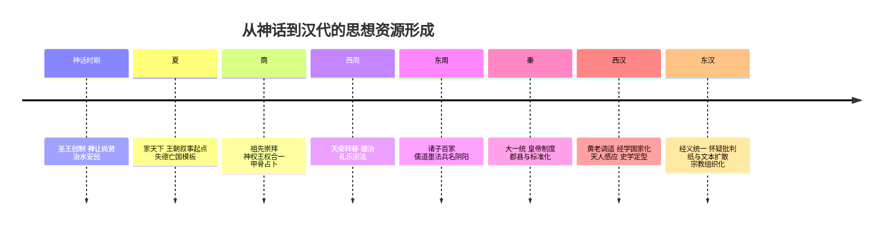
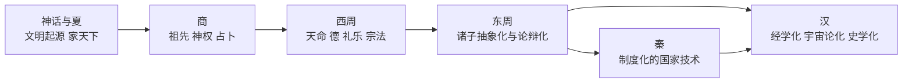
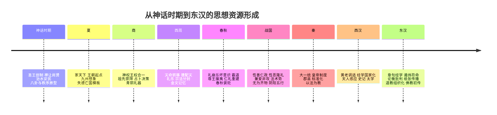
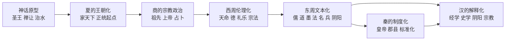

## 引言

中国文明从远古神话时代经夏商周、历经秦汉帝制到明清封建社会，形成了丰富的思想遗产。这些历史时期产生的制度思想、政治合法性理念、价值观念、社会秩序设计、道德伦理体系与宗教观念，不仅在各自时代发挥作用，更通过吸收、改造和延续，对后世的统治阶级、知识分子和普通民众产生了深远影响。本报告按照时间顺序梳理中国历代的重要观念与思想，分析其演变路径与断裂，并探讨它们如何塑造后世政权的合法性、知识阶层的认同方式与民众的日常观念与行为模式。所有结论均基于史实或思想史影响的证据，力求结构清晰、论据充分。

#### 远古传说时代（三皇五帝时期）的观念遗产
*   **“禅让”与圣贤治世理念**：传说中的尧舜禹以贤德授让帝位，“禅让制”被后世理想化为上古盛世的政治模式。尧舜时期的传说虽多属虚构，但孔子等先儒极力颂扬尧舜之治，将其塑造成**以德服人**的典范，并推崇禅让为最佳王权更替方式。这种观念深刻影响后世的政治理念：历代**儒者**将尧舜禅让神圣化，作为理想政权交替的模型。例如三国时曹丕受禅篡汉，刻意模仿尧舜故事以寻求正统性，就是受这一传统观念影响的明证。
*   **圣王道德理想**：黄帝、尧、舜、禹等“三皇五帝”在文化记忆中被描绘为品德高尚、以仁慈治天下的圣王典范。据传说，他们教化百姓、发展农耕畜牧、制定礼制，以**厚德仁政**赢得民心。这种“圣贤治世”的形象为后世统治者树立了道德标杆，帝王往往以“尧舜在上”自勉或宣称效法尧舜，以此增强政治合法性。**知识分子**则把远古圣王视作理想人格的化身，如孔子赞叹“巍巍乎舜禹之有天下也”而推崇不已，形成了崇尚上古仁君的价值取向。**平民百姓**亦在口耳相传的故事中接受了这些贤君形象，增强了对明君仁政的向往和对道德治国的朴素认同。
    

**影响分析**：远古传说时代虽属上古神话范畴，但其核心观念对后世影响深远。一方面，**禅让理念**提供了一个不同于暴力夺权的政治幻想，成为后世文人评判政权更替正当性的重要话语。每当改朝换代，新朝往往通过“奉禅让”仪式包装自己的政权交替，以减少道义阻力（如魏晋南北朝时期多次出现的禅让式易代就是例证）。另一方面，**圣贤君主的道德形象**确立了中国政治文化中“德治”的理想。历代**帝王**常以尧舜自比，宣扬以德服人，试图获得道义上的认同；而当代有失德之政时，史家常以夏桀商纣对比尧舜，说明失德必致亡国的教训。在社会伦理上，传说中尧舜禹勤勉爱民、择贤而授的故事强化了**民本意识**和**选贤任能**的价值观，这些理念后来融入儒家思想，成为评价政治得失的重要标准。总之，三皇五帝时代塑造的“德治”“禅让”等观念，虽源于传说，却透过儒家经典而深入人心，对后世政治理念和社会心理奠定了基调。

#### 夏朝：世袭君权与早期制度理念
*   **王位世袭与“家天下”**：夏朝相传由禹传位启，开启了君主**家族世袭制**，替代了上古理想中的禅让传统。这种“家天下”的权力传承模式使最高统治权在一个家族内部延续，为后世两千多年的君主专制制度奠定了基础。夏代之后历朝大多采用嫡长子或近亲继承皇位的方式，以确保皇权连续稳定。这一制度观念影响深远：**统治者**更加注重皇室血统的合法性和太子培养，形成了后世完备的皇位继承体系（如确立太子制度、宗法分封等）。对**知识阶层**而言，世袭制的常态使得“忠君”伦理更多指向对特定皇族的忠诚，巩固了君臣名分。**平民**则逐渐认同王权世袭为天经地义，将国家视作皇家的“家产”，政权更迭被理解为王朝兴替的循环。
*   **国家雏形与官制萌芽**：夏朝被认为是中国文明进入国家阶段的开端。《史记》等记载夏代已出现较初步的官职分工，如“牧正（畜牧官）”“车正（车辆管理官）”等，意味着早期国家治理的尝试。这为后世官僚机构的完善提供了蓝本——后来历朝从中央到地方设立众多官职、分管行政军政财赋，各部门各司其职的治理模式，可以追溯到夏代官制萌芽的理念。同时，据传夏朝已有维护统治秩序的习俗和规范，意味着**法律观念**的产生。尽管缺乏成文法典的实证，后世文献推测夏代已对犯罪有惩戒，这为后来商周制定刑法提供了思想基础。**影响来看**，夏朝作为第一个世袭王朝，奠定了中国政治架构中**宗法血缘与国家权力相结合**的传统。王位世袭制带来的**稳定性**（避免频繁权力之争）有利于国家延续，也强化了统治者的家长式权威。在社会心理上，“普天之下莫非王土，率土之滨莫非王臣”的观念开始滋长，人民接受臣属于一家一姓的统治，并通过忠于君父来实践道德。可以说，夏朝建立的世袭君权观念和初步制度框架，成为后世王朝政治文化的原型。
    

#### 商朝：神权政治与宗教观念的延续
*   **神权统治与祖先崇拜**：商朝（殷商）是中国历史上第一个有文字记载的朝代，以占卜祭祀闻名。商王被视为沟通天地祖先的**巫王**，透过甲骨卜辞向上天与先祖请示国事。商人**敬事鬼神和祖先崇拜**的观念非常突出。商王朝奉上帝（“帝”或“天”）与列祖列宗为最高权威，政治决策往往以卜兆为依据，这奠定了政权**神授合法性**的基础。后世影响在于：历代**帝王**多继承这一传统，在朝廷设立太庙祭祀祖先、祭天告祭，以显示统治权威的神圣来源；他们时常宣称自己受命于天（“天子”观念在周代定型），延续了商代**君权神授**的思维。对于**知识分子**，祖先崇拜培养了强烈的历史意识和家族责任，他们通过修家谱、尊孔崇圣来秉承祖先之道。**民间社会**则普遍崇奉祖先与各类神祇，祭祖习俗代代不辍。这种宗法宗教情感在维护社会伦理和凝聚家族方面发挥了重要作用，并成为中国文化的重要基因。
*   **德治理念与革新意识**：商朝的统治并非一味神秘恐怖，传说商汤以仁德克夏，其**“网开三面”**典故即是宽厚仁政的象征——汤王在打猎时留下一个网口放生动物，体现了爱生怜悯的生态理念。商代还倡导“五味调和”的治国之道，即均衡协调各种政策，以求社会和谐。商朝末年箕子等提出**“苟日新，日日新，又日新”**的格言，强调与时俱进、革故鼎新的精神。这些思想为后世所传颂，成为中华优秀传统文化的一部分。**政治影响**上，商汤的仁政形象为后世君主树立了德行榜样，周朝武王伐纣时就以纣失德为号召、以汤武革命自许，说明早在商末周初，“以德伐罪”的正统观已出现。**价值影响**上，“革故鼎新”精神鼓舞着历代改革者：每当旧制弊端丛生，改革派每每引商汤之训自勉，主张以创新除积弊。对**百姓日常**而言，商代遗留的观念促成了敬天畏命、信鬼神报应的心态，以及敬祖宗、行仁爱的伦理风尚。这些理念与实践，对后世影响深远。
*   **礼乐制度雏形**：商朝在社会治理中已经发展出一套礼制和典章，特别是大量精美青铜礼器的制造和祭祀礼仪的规范，反映出**礼治秩序**的成形。相传夏禹铸九鼎，商人沿袭并丰富了青铜礼器制度，到了周代更系统化，为儒家所传承。商代晚期开始实行嫡长子继承制，取代兄终弟及的继承法，为周代进一步完善宗法礼制提供了遗产。这种**宗法等级观念**及礼乐传统通过周公“制礼作乐”得到继承，并成为儒家核心思想“礼”的直接来源。因此，商朝不仅传递了敬神尊祖的宗教观，也将礼乐文化融入政治运作，为后世礼治社会奠基。
    

**影响分析**：商朝作为信史时代的开端，其神权政治和礼俗文化对中华文明后续发展影响巨大。首先，商人奉天敬祖的**宗教观**塑造了中国政治的神圣维度：周代提出“天命”概念正是建立在商人信天敬祖的传统上，只是赋予了新的道德意义。周公继承商代宗教观念的同时，提出“天命靡常”，即上天之命不固定归属某一家，统治者必须修德保民以续天命。这实际是对商代君权神授论的改造与升华，开启了后来**“以德配天”**的政治伦理，将商朝原本带有巫魅色彩的天命信仰转变为有道德约束的正统理论。这种**天命观**经过周代和汉代的发展，演化为阴阳五行的**“五德终始”**说，从理论上解释了朝代更迭的合理性。历代改朝换代皆引用天命与五德之说证明新朝合法，如秦以水德克周之火德、汉承秦德等等。可见，商朝留下的**君权神秘正当性**观念在形态上虽经周、汉等朝转化，但精神上一直影响着后世王朝对自身合法性的构建。其次，商朝的**祖先崇拜和礼制传统**为儒家所承接，成为维系宗族伦理和社会秩序的重要基础。一直到清末，中国社会基层仍以宗祠祭祖、宗法分支来组织，这股文化深流正源于殷商。同时，商代倡导的**德行与和谐**理念，结合周代礼治，奠定了中国传统政治文化中**德治、民本、尚和**的基调。总而言之，商朝以其独特的神权与礼乐观念，丰富了中华思想宝库，并通过周代的传承改造，对后世政治与社会产生了长久而深刻的作用。

#### 周朝：天命政治与礼乐文明的奠基
*   **“天命”与政治合法性**：西周武王克殷后，周公旦提出了**“天命靡常”**的思想，宣称上天之命无常，殷纣失德，天命转授有德之周。这标志着**天命论**成为政治合法性的最高依据。周人以**“天命”**解释王朝更替，主张君主必须以德配天、保民利民才能维持天命，否则天命将转移他姓。这一理念直接影响后世两千年：凡新朝取代旧朝，必宣称奉天承命，**帝王**自称“天子”，以天命证明统治正当。例如汉高祖斩白蛇起义谓“斩蛇当取代秦”即寓有天意，历代正史也往往在前朝末年记录灾异以示天命已去、新命将兴。**知识分子**对于天命观亦高度重视，将其发展为系统理论（董仲舒的“天人感应”便是以德配天命的延伸），并以此规约君权：儒家奉劝帝王敬德慎罚，否则失去天命将招致天下共讨。可以说，**天命观奠定了中国历代王朝政权合法性的哲学基础**。周公的天命观一方面警示统治者修德保民，一方面为周朝夺取商朝王权提供了正当解释；这一思想进一步演化为汉代阴阳五行的王朝循环理论，用天运五德之变阐释朝代兴替。可见，周公提出的“君权神授而可因德转移”的命题，对后世影响极其深远。
*   **封建礼乐与宗法秩序**：西周在政治上实行**封邦建国**，推行宗法分封和礼乐制度，用礼仪规范社会等级和秩序。周公**制礼作乐**，将先王旧礼整理为周礼体系，确立了尊尊、亲亲的宗法等级原则。这套**封建礼教**（指礼仪教化）和**“神道设教”**（以宗教敬畏维系教化）的制度对后世影响极大，被儒家奉为治国之道的直接源头。具体而言，周朝流传下来的《诗》《书》《礼》《易》《春秋》等典籍成为后世儒家研习的经典，保存了周代礼乐文明的精神。**政治影响**上，周礼确立的宗法分封观念塑造了中国古代国家结构：直到秦以前，各诸侯国基本沿袭周制分封，尊奉周天子为共主，形成天下一统的观念雏形。即使秦汉以后废封建改郡县，皇帝仍效法周天子治理天下，皇族内部则保持宗法体系（如册封宗室、设宗人府等）。**文化影响**上，周礼中的礼乐教化思想成为历代治国理政的指导原则，儒家倡导“以礼治国”，认为礼仪教化可以**“正民”**，这源头可追至西周。对于**士大夫阶层**，通晓《周礼》等典籍和履行礼仪，成为他们立身治世的基本修养；**平民百姓**则在岁时节庆、婚丧嫁娶中遵循周礼遗风，维护着宗族和乡里的秩序。总之，周朝的礼乐文明通过儒家独尊而成为中国社会伦理和政治制度的根基，其设计的**宗法伦常与等级礼仪**深深嵌入后世社会结构，塑造了传统社会尊卑有序、长幼有礼的文化性格。
*   **德治民本与选贤理念**：周代思想的另一个要旨是**德治主义**和**民本意识**。周初**以德配天**，强调天意与道德挂钩，周天子称“奉天之命，以养黎民”，体现出把**百姓福祉**作为治国根本的理念。周公在《尚书·康诰》提出**“惟命不于常”**，进而强调君王要**敬德保民**方能长久受命。这一思想实际上包含了**民本位**因素：君主的天命取决于对人民的仁德关怀。此理念被后世儒家继承并发扬：孟子提出**“民为贵，社稷次之，君为轻”**，将民本思想推至显豁的高度。其影响是，历代**帝王**虽然是专制统治者，但在治国理论上往往以“仁政爱民”为幌子，美化统治合法性；有作为的帝王也确实施行惠民政策，以彰显德政（如减税、赈灾等举措）。**知识分子**则以民本为价值标尺，赞扬重民的明君，抨击残民的暴君，甚至在极端情况下为民请命（如宋代范仲淹“先天下之忧而忧”）。同时，周初**“选贤与能”**的传统（如禹举益、大封同姓功臣等）也传为美谈，后世形成科举取士即是“选贤”的制度化体现。**平民**虽然政治地位低下，但“民贵君轻”的思想赋予他们某种道德上的正当性，使农民起义可以高举“替天行道”的旗号获取舆论同情。简言之，周代德治民本理念开启了中国传统政治中**道义治国**的路径：道德与政治相结合，**爱民**与**敬天**并重。这一基本观念成为后世治国理政思想的主流，影响直至近代。
    

**影响分析**：周朝是中华思想的奠基时期，被誉为“中国思想史上的第一次轴心时代”。**政治思想方面**，周代完成了从神权向王权转变的思想革命：以周公为代表，创立了具有道德理性色彩的天命论，用**伦理取代巫术**为统治辩护，被称为中国上古的启蒙突破。这个突破使得君主的权威不再仅靠神秘恐吓，而是增加了道德责任。如果说商代君权更多靠神秘威权维系，那么周代之后历朝则须强调**君德**来维持合法性。周公之后，“敬德保民”的统治理念一脉相承，成为评判帝王功过的基本尺度。从秦汉到明清，史籍中皆以是否体恤百姓、崇尚礼义来定论帝王昏明，正是德治思想的长期影响。**制度文化方面**，周代建立的礼乐文明被秦以后的统一帝国部分继承、部分改造，继续塑造着社会生活。虽然秦始皇废封建改郡县，法律上焚诗书去周礼，但家庭和乡里的宗法礼教并未断绝，汉代很快又复兴儒术。《诗经》《尚书》等儒家经典一直是士人修身治世的圭臬；礼乐教化则通过学校、科举和民间习俗代代相传，**三纲五常**等伦理规范成为社会普遍遵循的道德准则。此外，周人确立的**天下一统观**、**尊王攘夷观**持续影响后世的天下秩序想象。周天子名义上的共主地位，潜移默化地孕育了“大一统”思想，到秦始皇统一时终于变为现实，此后历代即以统一为常，分裂为乱（这也是周思想对后世地缘政治观的影响）。总的来看，**周朝的思想遗产直接奠定了中国传统政治文化的主轴**：以天命论述合法性，以礼乐建构秩序，以仁德凝聚人心。这些理念在后来虽有中断与变奏（如秦一度崇法家峻法、魏晋崇尚玄学等），但最终都被重新纳入周礼儒学的轨道，体现出强劲的传统连续性。

#### 春秋战国时期：诸子百家争鸣对后世的奠基

春秋战国时期（公元前8世纪-前3世纪）是中国思想史上空前活跃的时代，诸子百家纵横争鸣，奠定了后世思想文化的基调。主要思想流派及其核心主张包括：
*   **儒家**（代表人物：孔子、孟子、荀子）：崇礼重仁，主张以**仁爱**（仁）和**道德教化**治理社会，强调等级次序和家庭伦理（孝悌忠信）。儒家提倡**“仁政”**和**“王道”**，孔子尊周礼、孟子倡民贵君轻、荀子讲隆礼重法，形成了比较完整的伦理—政治思想体系。儒家思想后来成为封建社会的主流意识形态和**核心价值体系**。
*   **道家**（代表人物：老子、庄子）：崇尚**自然无为**，提倡顺应自然而治。老子主张**无为而治**（统治者少干预，让百姓自生自化），反对繁苛礼法；庄子进一步推崇**逍遥无待**的人生观，强调个体精神自由。道家对后世**养生学、玄学**以及治国的清静理念都有重大影响，并与神仙信仰结合形成**道教**。
*   **法家**（代表人物：韩非、商鞅、李斯）：提倡以严刑峻法和中央集权来治理国家，强调**法治**、**势**（权势威慑）和**术**（权术手段）。法家反对儒家的礼治仁政，主张变革创新（商鞅变法）以富国强兵。法家思想为秦始皇统一天下提供了理论依据，此后成为历代**行政体制和法律制度**的重要思想来源。
*   **墨家**（代表人物：墨子）：主张**兼爱非攻**，提倡无差别的博爱（反对儒家的亲亲尊尊）以及反对不义战争。墨家崇尚**节用**（节俭）、**尚贤**（选拔贤能）和**明鬼**（信奉天鬼赏善罚恶来劝善惩恶）。墨家在战国后期逐渐衰落，但某些理念（如尚贤、非攻）对后世思想仍有潜在影响。
*   **其他各家**：如**名家**讲辩证逻辑、“正名”的重要（代表公孙龙等），**阴阳家**（邹衍）以五行阴阳解释社会兴衰（其五德终始说被汉代接受），**纵横家**研讨外交谋略（苏秦张仪），**兵家**总结战争兵法（孙子、吴起），**农家**提倡重农等。这些流派有的影响深远（兵法孙子成为兵学圣典），有的昙花一现，但共同丰富了先秦思想的百花园。值得注意的是，各家学说之间既有对立也彼此吸收，例如儒、墨都讲**仁爱**尚贤，儒、道都强调**清心寡欲**，法家与荀子都认同**人性本恶**的预设。这种相互参照为后世思想融合埋下伏笔。
    

**影响分析**：**百家争鸣**作为中国思想的**黄金时代**，其影响可以概括为“奠定基调，源远流长”。首先，这一时期涌现的主要思想范畴（仁义礼法、道法自然、名实、阴阳等）几乎构成了此后中国思想的全部基本要素。后世的**经学（儒学）**、**佛学**、**理学（宋明新儒学）**等等，无不受到先秦诸子思想的启发和滋养。例如，汉代独尊的儒术以孔孟思想为根基；隋唐传入的佛教在诠释义理时也借用了道家和名家概念（“格义”译经即取儒道名词诠释佛理）；宋明理学更是直接以先秦儒道为源泉、融合了佛教心性之学而成。**可以说，春秋战国的诸子百家为中国传统思想文化确定了基本走向**，中华民族的精神格局（如重道德伦常、尚中庸和谐、讲实用理性等）就是在这一时期奠定的。其次，百家思想为历代提供了多种**治国理念**和**价值选项**。秦汉以降，各王朝在意识形态上或**独尊儒术**、或兼采法术，道家则常作为治心养生的辅学，墨家利他和尚贤精神时隐时现。虽然汉以后不再允许公开的“百家争鸣”，但实际施政中往往是**儒表法里**：**统治者**对内采用法家集中权力、重刑厉法的手段，对外和道德宣示上则崇儒尚仁，以取得名教合法性。**知识分子**方面，汉代确立儒家独尊地位，使读书人以儒学立身，但遇到现实政治黑暗时，往往又以道家哲思或隐逸传统自我纾解（如魏晋玄学风气，即儒道互补的一例）。**民间社会**则从诸子百家中吸取不同养分：儒家的纲常教化规范了家庭和村族关系，道教与佛教（佛教在此期尚未传入，然汉代视墨家为“道家之支”）在后来为百姓提供宗教信仰和心理安慰，而兵家韬略、阴阳占卜也融入了民俗智慧。可以说，先秦百家的思想**渗透进中国人日常生活的各个层面**，许多观念“百姓日用而不知”——比如做人要讲“仁义”、处世当守信用（信）、家庭中尊敬长上、社会讲信义和谐，这些观念都可在先秦诸子那里找到源头并经由后世教化成为全民共识。

再次，百家争鸣还树立了**批判与创新的风气**。先秦诸子身处礼崩乐坏时代，各家勇于思考“治国安民”之道，“己立立人，己达达人”的担当使**知识阶层**形成关怀现实的传统。这种精神激励后世士人当仁不让地参与思想论争和政治批评。两汉之际的今古文经学论辩、魏晋“儒道释”三教论衡、宋明理学内部的不同派别争鸣，乃至清末维新派与顽固派的论战，都可以看作是百家争鸣精神的余绪。此外，由于百家学说储备了丰厚的思想资源，后世每当出现社会转型或思想危机，人们往往回溯先秦典籍以寻根索解。例如清末民初的新文化运动，思想家们重新评价先秦诸子（如李大钊推崇荀子“化性起伪”、陈独秀批判孔孟礼教等），借古人之智来解决新问题。这印证了**先秦思想的恒久活力**。总之，春秋战国时期诸子百家的遗产对于后世中华文明具有**奠基性影响**：它们确立了此后思想文化的母体框架，并持续提供思想滋养和参考坐标，使中国思想传统呈现出延绵不断又兼收并蓄的特点。

#### 秦朝：大一统体制与法家治术的实践
*   **大一统皇权与中央集权**：秦始皇于公元前221年兼并六国，建立了中国历史上第一个**大一统帝国**。他首创“皇帝”称号，集王权神权于一身，实行高度**中央集权**的郡县制。这一体制设计对后世影响深刻：秦代废除了周礼封建割据，代之以皇帝—郡县体系，从而**奠定了两千余年中国政治结构的基本模型**。此后历朝不论是汉族还是少数民族建立的王朝，皆以统一的君主集权国家为理想；即使短暂分裂割据，最终也以重新大一统为归宿。秦朝统一度量衡、车轨文字，加强了文化经济的整合，为后世各朝所沿用。例如汉承秦制延续郡县，唐宋进一步完善地方州县制度，而省制也可看作秦郡县的演变。可以说，**秦朝的大一统理念成为中国政治的定型观念**，**统治者**以“天下一姓”为目标，**人民**也逐渐认同统一是繁荣安定的前提，认定“分久必合”是历史规律。秦始皇还强化皇权不受任何宗族和贵族制约的原则，罢黜六国旧贵族，设三公九卿听命于君，形成**皇帝独断**的体制。此后各朝虽有所谓丞相、内阁等辅佐机构，但皇帝作为最高决策者的权威从未动摇。秦始皇塑造的**至高无上的皇权**形象（“普天之下莫非王土”）成为后世帝王效法的榜样，也导致中国传统政治中个人专制色彩极为浓厚。
*   **法家思想的制度化**：秦朝是法家思想的集大成者和首次全面实践者。商鞅变法奠定了**重法严刑、按功分爵**的政策，强调以法律取信于民、以赏罚推动耕战。秦始皇即位后，采纳李斯等法家之策，“**以法治国**”，颁行**《秦律》**，全国上下依法行政，军功爵制鼓励战争立功，形成了高效率但高压的统治模式。这种**法治集中**的治理经验深刻影响后世：汉初虽然短暂放松法制（黄老思想治世），但汉武帝以后至唐律、明律，莫不继承秦律框架并融合儒家理念，标志着**中华法系**的延续。唐朝《唐律疏议》实际上是在秦汉法律基础上加入儒家伦常（如对不孝等加重处罚），成为后世明清律典蓝本，这体现了**法家与儒家融合**的趋势：外儒内法，**名为礼治实为法治**。在政治思想上，法家提倡的**君主专断**、“**以术驭臣**”等理念也为历代帝王所借鉴，以加强皇权控制官僚：如汉代的察举征辟、明清的特务锦衣卫、密折制度，都有法家术治的影子。**知识分子**对法家多持批判态度（如贾谊《过秦论》指斥秦政酷烈致亡国），然而实际参与朝政时，又不得不承认法制与强权对于国家富强的重要性。因此出现了董仲舒“**德主刑辅**”的主张，将法家手段作为儒家德治的辅助。这种思想折衷影响汉以后王朝治术，即在道德教化外辅以严刑峻法，确保统治秩序。**平民百姓**感受最深的是秦以来**编户齐民**的管理方式：国家通过法律和行政系统直接管理到底层，使农民从属国家而非宗族领主。这一变革提高了平民相对地位（秦代废除了诸侯贵族对民众的世袭统治），但同时平民也直接暴露在国家高压之下（赋税劳役皆由中央严格征发）。总之，秦朝把法家思想上升为制度实践，在**国家治理技术**上留下丰厚遗产：**成文法典、严刑重典、郡县管理、科层官僚**，这些制度要素成为后世王朝不可或缺的统治工具。
*   **思想专制与文化政策**：秦朝在意识形态上表现出高度的专断色彩。李斯建议秦始皇**“焚书坑儒”**，禁止私学，以防异端诽谤。这是中国历史上第一次大规模思想钳制运动，体现了法家“**禁声息，杜私论**”的思维。虽然秦朝二世而亡，但**思想专制**的传统却流传下来：西汉“挟书律”继续禁书，历代都有文字狱或禁书目录。在这个意义上，秦朝开启了**意识形态统一**的先例。另一方面，秦统一文字（小篆）、度量衡和车轨，客观上促进了文化认同和交流，也**奠定了中华文化一体化**的基础。这种对文化标准的统一（文字）和对思想的控制（禁书）结合起来，塑造了一个前所未有的**政治-文化共同体**。**长远看**，文字统一极大地便利了后世中国作为一个文明整体的延续，各地沟通无碍；而统治者垄断意识形态则成为历代王朝维护稳定的手段，虽然压抑了学术自由，却强化了**官方意识形态权威**。秦始皇在精神上奉行皇帝个人崇拜（大量建立功德刻石、巡游祭告），开创了帝王个人**“祖龙”**般威严形象。**民众**被要求绝对服从政令，不得发出异议。这种对君权的极端崇拜与恐惧心理延续至后世封建社会，形成“**普天之下莫非王臣**”的集权心态，也是秦给予后人的一笔思想遗产。
    

**影响分析**：秦朝虽短促而剧烈，但其**制度与思想模式**对中国历史走向产生了决定性影响。首先，秦确立的**大一统与集权**范式成为历代政治的圭臬，此后王朝的合法性建立都以能否统一中国、强化中央权威为标准。即使是元、清这样的少数民族王朝，也以继承秦皇汉武之业自居，将自己的统治区域扩展到全中国乃至周边领土作为正统性的重要来源。其次，秦实施的**法家治国**理念深入官僚体制，历代帝王在实践中都离不开法家的“术”。汉武帝表面独尊儒术，实际上颁行《汉律》，并接受主父偃等人富国强兵策；唐太宗纳魏征之谏，但同时订《唐律》，用制度保障治世；明清更是将刑律与礼教合一，从法律和道德两方面控制社会。这一治理模式可以概括为**“王道”与“霸道”并用**：道在儒家，术归法家。**社会价值观**也因此呈现双重性：一方面礼教强调伦理道德，另一方面法律培养服从权威。再次，秦始皇创制的**皇帝人格神圣化**和**思想大一统**方针影响深远。**统治阶级**方面，历代帝王多多少少仿效秦皇的威权姿态，甚至有人以“千古一帝”为追求；他们也谨记秦速亡教训，故表面上笼络儒生、宣扬仁政，但骨子里仍沿用法家手腕治国以巩固统治。**知识分子**方面，对秦政的反思使得儒家意识形态在汉代得到加强（以矫正暴秦），但另一方面，读书人也不得不面对皇权和法制的高压环境，逐渐形成“**道统 vs 政统**”两轨并存的传统：在朝为官则遵从政统法制，退处讲学则坚守道统良知。这一张力贯穿于后来的知识界。对**普通人民**而言，秦的苛政给他们留下深刻记忆，“苛政猛于虎”的俗语和陈胜吴广起义的故事流传，使历代百姓明白**暴政必亡**的道理，某种意义上增加了民众反抗压迫的心理预期（每当末世苛暴，农民战争的领袖常以秦暴亡为鉴动员群众）。然而总体上，秦朝建立的强国家机器还是让民众习惯了中央直接治理（赋税徭役直接到户）和对于最高权威的服膺。**综合而言**，秦朝在思想上提供了一个**高度统一、法制至上的国家理想**，其积极面是打造了中华帝国的雏形，其消极面是开启了专制主义的传统。这套模式此后在历史中被不断调整和文化润色，但基本框架未曾脱离秦范式，对中国历史发展的**制度刚性和思想定势**起了深远作用。

#### 汉朝：独尊儒术与大一统理念的定型
*   **儒学成为官方正统**：经过秦末动荡，汉高祖承认民心向往宽厚治道，起用儒生陆贾献《新语》。至汉武帝时，董仲舒提出“**罢黜百家，独尊儒术**”，汉朝正式确立儒家思想为官方指导思想。汉武帝设五经博士，兴太学，培养儒生官僚，使**儒家经学**与国家政权相融合。自此，儒家伦理纲常成为**统治阶级**标榜合法性的思想武器，君主被塑造为仁义之师表，臣民则以**三纲五常**为行为准则。汉代还将孔子奉为“至圣先师”，追谥先贤72人，确立了**道统源流**的崇拜，对知识阶层产生凝聚作用。他们研读儒家经典，以传承道统自任，从而在文化上强化了对朝廷正统性的认同。对于**平民百姓**，汉朝大力宣扬孝道（汉文帝以孝治天下，颁行《孝经》），将孝悌忠信写入法律和教谕，促使儒家伦理深入民间日常生活，成为维系家族和乡里的道德规范。因此，汉武帝独尊儒术**奠定了此后两千年“政教合一”的意识形态传统**，即以儒家学说为统治合法性背书。历代王朝皆自诩奉行儒道，而儒家的忠孝节义价值也成为全民共识，极大地塑造了中国文化的精神格局。这一政策使得儒家从战国诸子百家之一跃升为国教，并确保了**儒家道统的延续**，使“忠孝节义”成为社会核心价值。
*   **中外合铸的天人思想**：汉代统治者在吸纳儒家思想的同时，也融通阴阳五行、黄老道家等学说，形成了独特的**天人感应**理论体系。董仲舒提出**“天人合一”**，“天人相与”的学说，认为自然灾异乃上天对君主行为的警示，要求君主修德以应天。此种理论为**皇权**提供了超越人间的神圣凭据，又对皇帝的行为施加道德约束（至少在理论上）。汉武帝以来出现的各种**谶纬神学**进一步将阴阳五行、儒家经典章句和神秘预言结合，用来论证王朝更替合法性和塑造君主威信。例如汉宣帝被说成“南斗星精”下凡，王莽篡汉时大搞谶纬符命以标榜新天命，等等。这种**道德神学政治**对后世影响是，**帝王**普遍利用灾异祥瑞与谶纬理论巩固统治（唐太宗畏旱灾减刑自责，明成祖营造祥瑞传播登基正当性等）。同时也赋予**士大夫**以监督君权的理论依据——灾异频仍可进谏皇帝失德。汉代经学家注经往往夹杂谶纬之学，使正统儒学融入神秘色彩，后来宋明理学兴起时曾对此加以清理，但民间和朝野迷信谶纬的风气直至清末仍存。这说明汉代**经学神学化**对思想传统的影响之深。另一方面，汉代中叶以降，**外来思想**开始传入：佛教于汉明帝时（公元1世纪）传入中土，早期通过**“格义”**借儒道概念翻译佛经，逐渐被上层知识界接受。佛教带来了不同于儒家纲常的新观念，如**因果报应**、**六道轮回**、**出世解脱**。尽管东汉末年佛教尚处萌芽，但其思想已开始影响**平民**信仰（佛寺初立、佛经流传）。例如民间出现敬佛烧香的现象，一些苦难大众从佛教教义中寻找安慰。这为魏晋南北朝佛教大弘奠定了基础，也意味着汉代思想界已出现了**儒道之外的新维度**。总的看，汉朝将**儒家道德规范**、**阴阳灾异学说**与**新兴佛教因素**糅合在一起，使得官方思想体系既有伦理性又带宗教性，丰富了中国思想传统的内涵。
*   **制度与人才观念**：汉承秦制但有所缓和，除郡县外，汉高祖分封同姓诸王，呈现**郡国并行**格局。到汉武帝“推恩令”削藩，基本重回中央集权。这个过程中，汉朝为了解决**选才**和地方治理问题，发明了**察举制**（地方举荐孝廉等德才兼备之人做官）和征辟制，为后世科举出现前的人才进入仕途提供了渠道。这体现了**选贤任能**的理念在制度上的延续：不同于周代依血缘世卿，汉代通过考试和推荐相结合，部分突破了世袭限制，让寒门孝子贤人也有上升可能。虽然察举难免流于门第，但毕竟确立了**德行学识作为仕官标准**的风气，对**知识分子**的激励很大——读书有望出仕，“学而优则仕”蔚为主流价值观。汉代还设立太学等教育机构，为平民子弟提供学习经术的机会，**平民**因此可以通过学习儒家经典获得政治晋升通道。可以说，汉代萌芽了**官僚社会**和**儒生治国**模式，此模式在东汉、魏晋继续发展（士人集团形成），最终成熟为隋唐**科举制**。因此，从观念上看，汉朝强化了“**学术与政治合一**”的思想——儒家经学不仅是治人之学，更是治国之学，习儒即为仕官做准备。这种理念塑造了中国古代**知识阶层的认同方式**：读圣贤书、修齐治平，以入朝为荣，以济世为己任。其负面也是显而易见的：经学八股逐渐桎梏了创造性思维。但在汉代，至少儒生们将经国安邦与修身养德视为一体，这是对后世士人价值观的大影响。
    

**影响分析**：汉朝作为秦之后的第一个长久大一统王朝，进一步**定型了中国封建国家的意识形态和制度基础**。首先，汉武帝独尊儒术使得**儒家思想从学派上升为国家正统**，深深渗透进政治法律和社会伦理。**统治者**从此以儒家君臣父子伦理组织朝纲，将**忠孝**视为维护统治秩序的基石（汉景帝杀晁错以安刘氏宗室，是宗法伦理在政治中的反映；唐宋明清皆奉《孝经》《贞观政要》等为帝王必读）。**社会层面**，儒家倡导的“三纲五常”成为普遍遵循的道德规范，影响着家族结构、婚姻观念和人际关系，使中国社会形成尊尊亲亲、纲纪井然的面貌。**知识界**则以传经布道为天职，形成了延续不绝的经学传统——这是中国古代**思想保守性**与**文化延续性**的双重来源。其次，汉朝**完善了中央集权体制**并创造性地提出了人才官僚体系的雏形。通过察举征辟，汉代实现了**官僚队伍由文化教育筛选**的机制，把士人集团紧密纳入国家体系。这一点在后世得到极大发展：科举考试取士使知识分子和国家高度一体化。这意味着，**知识阶层的身份认同**同国家统治合法性融为一体——读书人以仕朝奉君为人生目标，朝廷则以文教网络控制知识精英，从而维系了国家长治久安和文化统一。此模式在唐宋达到高峰，乃汉代肇其端。再次，汉代**思想的融合性**对后世亦影响巨大。汉代没有简单复古周礼，而是兼收并蓄先秦余绪与新兴观念：儒学为表、黄老为里（文景之治无为思想），阴阳灾异理论辅助道德教化，甚至吸纳方术鬼神（如武帝尊神仙方士、东汉崇尚谶纬）。这种**“大杂烩”式的意识形态**其实预示了日后中国思想发展的一个基本特点：**三教合流**。后来魏晋至隋唐，佛教大举东来，与儒道三足鼎立并逐渐趋向融合，就是汉代思潮多元化的继续。汉末道教（五斗米道、太平道）的兴起，亦与儒家大同理想和民间巫术相结合，是这一融合趋势的体现。因此汉代在中华思想版图上完成了**秦之所创统一的文化深化**：帝国不仅在物质上统一，而且在精神上建立了一个具有共同价值的文明共同体。这一共同体所依赖的核心价值——**仁义礼智信的儒家德目**、**纲常伦理**、**帝国天下观**等，此后成为中华文化身份的象征。纵使朝代更迭、民族易代，这些价值依然作为中国文化的“元基因”持续发挥作用。可以说，没有汉代对儒家**道统**的确认和推广，就不会有之后绵延不绝的**中华文化认同**。然而也要看到，汉武帝确立的**思想独尊**模式带来负面遗产：学术上形成了**经学独大的保守格局**，到东汉末年经学繁琐空疏，社会缺乏思想活力；同时思想统一使异端思想被打压（如杨朱、墨家在汉代渐失传），一定程度上扼杀了春秋战国时百花齐放的创造精神。这种现象引发了魏晋时期士人的反弹（如玄学对经学的挑战），推动思想的**断裂与演进**。但整体而言，汉代确立的**儒家意识形态秩序**经受住了时间考验，成为后来中国王朝重建社会秩序时的默认方案，对**政权合法性建构、士人身份、平民伦理**产生持续而深刻的影响。

#### 魏晋南北朝时期：玄学清谈、佛道弘传与思想转型

两汉之间的短暂新莽改制（王莽托古改制，宣称复礼，却招致失败）和东汉末年黄巾起义导致的群雄割据，拉开了漫长的魏晋南北朝乱世（3世纪-6世纪）。在这一大分裂时代，中国思想发生了重大的转型与多元发展。传统儒家正统受到冲击，**玄学**、**佛学**、**道教**等兴起，对后世思想文化走向产生了新影响。主要特征和影响包括：
*   **儒学式微与玄学兴起**：东汉末年宦官外戚交替专权、儒家经学流于烦琐，一批士人对现实政治和经学教条感到失望厌倦。曹魏正始年间，何晏、王弼等阐发老庄，以儒道融合的**“玄学”**为风尚，提出“以无为本”、“贵无”等理论，对孔孟之道加以超脱性的诠释。西晋时，竹林七贤等崇尚**清谈**，蔑视名教礼法，追求精神上的逍遥自由。玄学成为魏晋上层知识分子的思潮主流，形成“越名教而任自然”的风气。**这一转变标志着儒家独尊局面的断裂**：传统的经学权威减弱，士大夫更倾心于哲学式的谈玄论道，强调个性解放和心灵超脱。其后果一方面是**知识阶层**出现了新的自我认同——风流儒雅、谈玄论道成为名士时尚，蔑视功名富贵、鄙弃俗务的隐逸价值观得到张扬。另一方面，由于玄学崇尚自然与无为，也为**治国理念**提供了另类思路：司马氏篡魏建晋后，表面尊儒，实则对于儒家繁缛礼法有所松弛；一些统治者如东晋明帝等也参与清谈，以示亲近名士。这使**统治阶级**内部出现某种思想解放，政治上相对宽容无为。**平民百姓**虽无法直接参与名士圈玄谈，但玄学间接造成东晋南朝社会风气相对宽松、奢靡避世，某种程度上减少了对民众的高压统治。然而，玄学毕竟缺乏治世实际方略，名士们的放达也导致政治责任感下降（如“竹林”阮籍嵇康等不屑仕进，东晋朝廷常感人才不足）。总体而言，魏晋玄学给予后世思想界**重估名教**的先例，提示了儒学并非不可挑战的独尊。这种反思精神在明清之际的**思想解放**（如黄宗羲等批判君主专制）中依稀可见其遗响。
*   **佛教大规模传入与传播**：魏晋南北朝是**佛教**在中国的大发展时期。从东汉入华后，佛教于两晋南北朝迅速传播。西晋灭亡后，北方五胡乱华，不少汉人南迁，佛教则在北方异族统治者中广为弘扬，因为**少数民族君主**（如前秦苻坚、北魏拓跋氏）视佛教为凝聚不同族群的精神工具。**僧侣**地位上升，凉州、长安、建康（南京）等地译经中心云集高僧（如鸠摩罗什于姚秦译出众多重要佛经；东晋高僧道安、慧远等经营莲社弘法）。佛教思想（因果报应、六道轮回、四谛慈悲等）广泛渗入**社会生活**：上至帝王将相（如梁武帝笃信佛教，数次舍身同泰寺），下至庶民百姓（大量平民信众拜佛求福）。**对于统治者**，佛教提供了新的合法性话语和统治技术——许多北朝君主以“**佛法护国**”自居，兴建寺塔，利用僧团协助治理（如北魏孝文帝曾下诏僧尼不纳税服役，借僧侣教化胡汉融合）；一些帝王热衷通过舍财布施赢取“转生”善果的信仰来巩固民心。**对知识分子**，佛教哲理产生巨大吸引力，尤其在南朝，儒家士人研习佛典、参与佛学辩论蔚成风气。当儒学独尊格局松动后，他们在佛学中寻找心灵寄托和哲学解释体系，比如著名学者僧肇就将般若空思想与玄学本体论结合。此际出现“儒道佛三教讨论”：如北魏太武帝时崔浩提出儒教为王者之学、佛教为治心之学，道教杂伪应除；又如南朝范缜《神灭论》以无神论批驳佛教轮回。这些论争体现了佛教进入中原后对**固有思想体系**的冲击和刺激。**对平民大众**，佛教更带来深远影响：苦难时代，佛教“来世福报”“三世因果”的学说极大安慰了民心，许多百姓舍奉儒家繁文缛节，转向烧香拜佛、茹素念经，希望来世脱离苦海。大量寺庙兴建、僧侣扩增（北魏后期有僧尼三百万之众），佛教成为民众精神生活的重要部分。民间还出现结合佛教和民间信仰的**新宗教**（如崇拜弥勒佛的白莲社团萌芽）。这些都为宋元明清的民间宗教发展埋下伏笔。可以说，佛教在魏晋南北朝的兴盛，使中国思想文化版图从此**增添了宗教性和出世关怀**维度，与固有儒道思想一起构成“三教”。
*   **道教的创立与发展**：道家思想在汉末结合民间神仙信仰，催生了**道教**这种中国本土宗教。东汉中平年间，张陵创**天师道**于蜀，张角创**太平道**于冀州，宣称太平经教义，发动黄巾起义。虽然黄巾军失败，但道教组织和理念流传下来。魏晋南北朝时期，道教继续发展：西晋时葛洪《抱朴子》集道教神仙术数之大成；东晋南朝出现茅山上清派、灵宝派等道教新支派；北方北天师道也传播甚广。南北朝的帝王有的笃信道教（如北周宇文邕尊老子为圣祖），并试图以道教与佛教相抗衡。道教教义吸收了大量儒佛元素，提出**三教同源**、**老庄寓儒**等理论，使自己合理化于传统文化圈。在**政治方面**，道教某种程度上服务于统治者：如东晋南朝的朝廷常用符箓道士镇压瘟疫灾害，北魏太武帝甚至曾利用寇谦之改革的天师道来打击佛教，企图以道教为国教。**知识分子方面**，不少士人兼通道教经典，把炼丹修道看作进趣。例如陶弘景隐居茅山著录道经，被梁武帝尊为“山中宰相”。道教思想（**长生成仙**的理想、**济世度人**的信念）也激励着部分知识分子参与社会公益和医学研究，因为炼丹和药物探索促进了化学医学知识积累。**平民方面**，道教成为他们的另一大精神寄托，与佛教并行：民间流传的许多神仙故事、斋醮科仪，促进了大众信仰的丰富。道教主张**积善延寿**、**忏悔科仪**等，也教化了民风。需要指出的是，道教在民间的组织形式——诸如五斗米道、后来的白莲教等，具有**宗教结社**和**造反潜质**，这在黄巾起义中已见端倪，后来元末明初、清末的白莲教、八卦教起义延续了这一传统。因此，道教不仅是思想体系，更影响了**人民的行为模式**：当现实黑暗时，他们往往投入宗教结社寻求救赎，甚至走向起义推翻政权（打着弥勒降世、三期末劫等口号）。这一点对后世政治有反复冲击作用。
*   **士族门阀与文化演变**：魏晋南北朝的社会结构出现了**士族门阀**阶层（如“王谢袁萧”），他们把持高位，讲究门第血统，使得**知识阶层的认同**从汉代的“以才德进”部分转向“以门第进”。上品无寒门、下品无势族的九品中正制，在魏晋时代主导选官。这一制度虽非思想流派，但其背后的观念是**门第主义**，即社会精英认同以家族出身论高下。这导致东晋南北朝时期，豪门士族垄断文化资源与政治权力，寒门子弟出头极难。这种局面直到隋唐科举兴起才扭转。**影响来看**，门阀制度的兴衰也是思想史的一环：士族垄断造成文化上的**保守封闭**（士族子弟恃才傲物，玩世不恭，如“东山丝竹”之奢华），但也在乱世中保存了传统典籍文化（许多士族家族藏书、延续礼教，保证文化火种不灭）。隋唐吸纳寒门后，门阀思想消退，**“凡有学识者皆可进身”**的科举理念取而代之，这意味着一种**平等的价值观**抬头。然而，门阀余荫在唐宋仍存，如以科举成绩形成的新门第（进士第）观念。所以魏晋门阀观念虽然被制度改革破除，但关于**社会身份与文化资本**世袭性的思想在后世还有所残余。
    

**影响分析**：魏晋南北朝是中国历史的大分裂期，也是思想的大变革期。此期最深刻的影响在于：**中国思想文化由单一儒学转变为儒、释、道三足鼎立的多元格局**。首先，儒家独大的局面被打破。玄学让位于形而上探讨，**批判继承**了儒道思想（比如王弼“贵无”融通老庄与易经），证明中国思想有内在的自我调节与革新能力。儒学的式微也为后来唐宋新儒学的创造留下了空间：当重新统一后，人们意识到需整合儒释道，于是宋代理学应运而生。如果没有魏晋时期儒学的跌落与反思，就不会有日后儒学的凤凰涅槃。其次，**佛教的植根**极大地丰富了中国人的精神世界。**宗教观念**如因果轮回、六道众生平等、慈悲济世等深入人心，使得**道德体系**从家族本位拓展到众生本位，**价值观**从现世功利延伸到关注来世解脱。这对传统社会的冲击和调和都是巨大的。佛教的出世思想削弱了儒家对现世义务的绝对控制，但佛教的入世慈悲又在某种程度上弥补了儒学严纲常中缺乏悲悯的一面，比如寺院施粥救济成为官方赈济之外的补充慈善体系。这些都改变了**人民的日常观念与行为**：从前“百善孝为先”，现在“出家亦是高尚”；从前死后魂归祠堂，现在相信地府轮回、超度亡灵；从前行善为光宗耀祖，现在更多人相信积善可得来世福等等。第三，道教的勃兴使**本土思想体系宗教化**，老庄哲学由贵族清谈走向民间信仰实践，道教提炼了传统方术、神仙家的元素，系统化成教义，长期影响民众生活（如中医药、风水、炼丹等皆与道教有关）。更重要的是，**道教与佛教的发展产生了互动融合**：“三教合一”思潮在宋以后不断出现。魏晋道教吸收佛教养分，例如东晋道教灵宝经受大乘佛教影响，加入了忏悔、度人等思想。这为中国文化最终把儒释道视为相通做了思想准备。第四，魏晋南北朝的**社会思想**也有承前启后意义。门阀制度的兴废说明古老宗法思想的新变迁；清谈与现实政治的疏离，也反映了**知识分子身份角色**的转变。许多士人在这乱世中选择归隐山林、著书论文而不问世事（陶渊明即典型），表现出对入世报国的退却。这种**人格理想**的变化（从经世致用到超然物外）在后来唐宋时期又发生反复（如南宋爱国士人与明清遗民之间的对比，可见不同境遇下士风的差异）。但总体而言，魏晋名士风度（潇洒不羁、追求个性）和门阀士族的文化素养，融汇成中国传统士大夫阶层的文化品格一部分，影响后世对**“名士”**与**“高人雅士”**的价值判断——清高拔俗、风骨卓然被视为文人理想人格。最后，值得强调的是，这一时期**频繁的民族交流**也拓展了中国文化的包容性：胡人接受汉文化而汉人接触胡风佛法，中国思想在冲撞汇合中更趋丰富。例如北魏孝文帝改革体现了**华夷融合**思想，他主动汉化以求治，这种务实理念影响到后来清朝的满汉融合政策。又如刘宋时期就有“能行中国之道则为中国主”的论述，认为不论族别只要践行儒家之道即可正统——这来源于元魏之际学者对“华夷之辨”的讨论，开启了以文化认同代替血统论的先声。这种思想为后来宋元、明清时期处理民族统治正统性提供了理论框架。综上，魏晋南北朝以动荡破碎的现实造就了思想上的空前繁荣和多元并立。**它冲击了汉代一统的儒家体系，带来了佛道两教，孕育了名士精神**，为隋唐统一后的新思想综合做好了准备。若没有这段自由探索的时期，中国思想或许不会具有后来那种宗教哲学伦理兼容并包的特色。乱世出哲思，正是这一时期对后世最大的思想财富。

#### 隋唐时期：三教并行与治国理法的综合

经过数百年分裂割据，公元589年隋朝重新统一中国，继之唐朝的强盛开创了中华文明的又一高峰。隋唐时期在思想文化上呈现出**儒释道三教并行互融**的局面，同时政治制度与思想取得新的平衡与发展，对后世影响深远。
*   **科举制与官僚文化**：隋文帝创立、隋炀帝正式实施**科举考试**取士（进士科始于隋炀帝大业年间），唐朝完善了科举制度，使之成为选拔官吏的主要渠道。科举制以儒家经义诗赋为考试内容，意味着**儒学教育**彻底成为仕进唯一通道。这对**统治阶级**和**知识阶层**都产生深刻影响：一方面，唐朝统治者通过科举广纳天下英才，也利用考试内容（儒家经史、治国文章）来**思想上统一官僚集团**，巩固了中央集权和国家认同。另一方面，科举开启了**“万般皆下品，唯有读书高”**的社会风气，寒门子弟凭才学可跻身仕途，极大激励了**平民**读书求取功名的热情。从此，**知识分子**的身份不再以门第区分，而主要以**科第**高下论。通过科举，唐代形成了一个庞大的士人官僚阶层，他们既是政治精英也是文化精英，树立了以**进士及第**为荣耀的人生理想。科举制度一直延续到清末，成为中国传统社会**政权合法性和知识阶层认同**的重要纽带：政府以此汲取民间才俊并确保他们接受官方思想，士人则以此证明自身价值、融入统治体系。因此隋唐科举观念的确立，**塑造了后世社会的流动模式与文化心态**——“朝为田舍郎，暮登天子堂”的故事不断上演，儒家学而优则仕的理想深入民心。
*   **三教并行与融会**：唐代是**儒教、佛教、道教**三足鼎立且相互融合的时代。唐初统治者注重以儒治国、以法治官，同时笼络佛道两教。**儒学方面**：唐太宗尊孔子为先圣，重修国子监六学，以五经正义统一经学解释，加强了儒学的正统地位。**法律**上，《唐律》糅合儒家伦常与刑法原则，使**礼法合一**（例如对不孝罪加重，对尊长犯罪减轻等），**社会伦理**通过法律得到保障。**佛教方面**：经过魏晋传播，唐代佛教深入社会各阶层。许多**帝王**尊崇佛法，如武则天大造**《大云经》**以期巩固女皇地位，唐玄宗礼遇高僧并主持译经。佛教在唐朝达到**“中国化”高峰**：产生了如**禅宗**（六祖慧能提倡顿悟），**净土宗**（专修念佛），**华严宗**、**法相宗**等富有中国特色的宗派。**僧侣**在文化上有巨大贡献：玄奘西行取经、义净航海求法，大量佛经经典被译成汉语；寺院是知识传播中心，甚至兼具金融慈善功能。**道教方面**：唐朝因李氏自称老子后裔，尊老子为李聃祖先，故对道教极为推崇。唐高祖李渊封老子为**太上玄元皇帝**，唐玄宗更自称道教领袖，多次颁诏宣扬道经，赐天师号，兴建道观。道教在唐与皇权结合紧密，成为**“国教”**的一部分：每逢国家大典，如祭天祈雨，道士与僧人同被征召做法。唐代多位皇帝炼丹服药（玄宗、武宗等），也引发一系列故事和教训（如唐武宗因炼丹重用宦官导致政乱）。总的来看，唐代**三教地位并重**，官方政策是基本支持并管理佛道二教，同时以儒家治国。在思想领域则出现了**三教调和**的理论倾向。例如唐代宗之后的朝廷常有人提出“三教一致”的主张，认为儒释道最终目标皆为教化众生、辅佐王化。民间和知识界也有人兼修三教（如柳宗元、刘禹锡等既研儒道经典又参佛理）。**这一并行融合局面为宋以后理学吸收佛道思想提供了条件**。对于**平民大众**，唐代三教鼎盛意味着信仰选择的多样：有人日常奉行儒家伦理、遇事求助道士卜筮、临终请僧人超度；各大节日既有官方的礼仪也有宗教的庆典，生活颇为丰富。**文化上**，三教融合孕育出唐人的**兼容并包精神**和**开放气度**，也使中国传统社会的思想基础更为多元稳固。
*   **政教关系与治道**：唐代的统治思想在汉代基础上有新发展，即更自觉地平衡**皇权、相权与士族**的关系。唐太宗注重**“以史为鉴”**，博采前代兴亡教训，在思想上倡导**君臣纳谏**、**兼听则明**的理念。他重用魏征等直谏之臣，营造了相对开明的政治文化。这其实与儒家**中庸协和**精神一致，但唐太宗把它提升为帝王必修的**治理哲学**。这一风气影响深远：后世常以“贞观之治”作为**明君贤相共塑良治**的典范。在制度上，唐代确立**三省六部**体制，中书门下尚书分权平衡，保证决策审议的周详，也体现了**制衡思想**的萌芽（虽然萌芽有限，但比秦汉专制有所缓和）。此外，唐律规定自宫廷到地方官吏的种种**行止规范**，强调**德法并用**——既用科刑严惩叛逆，又要求官德清廉爱民。这些都使唐代政治在**法家手段**与**儒家道德**之间达到新平衡。**影响而言**，唐朝成为后来王朝效法的模板：宋明君臣往往以唐太宗自比，渴望贤君明相合作；制度上，明清虽强化君权，但内阁、军机处等也有分权考量，也沿袭了唐代**治道求稳**的思路。值得一提的是，唐代中后期出现的**牛李党争**（牛僧孺 vs 李德裕）表明，**士大夫阶层**形成集团以政见分野相争已登上政治舞台。这预示着**公共政治议题讨论**的胚胎：士人不再只是皇帝工具，也在塑造政治走向。虽然唐末藩镇割据、宦官擅权使这一良性互动没能持续，但此中表现的**士族政治参与意识**影响到宋代（两宋有“元祐更化”等党争，士大夫参政意识更强烈），也为明清以至近代的**公共舆论**埋下伏线。
*   **对外交流与世界观**：唐帝国强盛开放，广泛接触周边和西方文明，思想文化上体现出海纳百川的气度。唐都长安聚集各国商旅、学问僧，景教（基督教聂斯脱利派）、祆教（拜火教）也传入中国并建寺传播。唐廷对外宗教多采取**兼容政策**（武宗会昌灭佛是例外的短暂反动）。这种开放交流，影响了**传统天下观**的调整：一方面，唐人仍以自身文明为中心，但在现实中接纳了多元文化共存。唐玄奘赴印度取经带回不仅是佛典，也带回印度天文历法知识；阿拉伯天文学传入改良了中国历法。艺术上，佛教艺术中吸收了希腊、印度风格，唐三彩陶俑中有胡人形象，诗歌中有域外风物描写。**思想影响**是潜移默化的：**士人**对异域文明开始有所了解和记录（如杜环出使大食有见闻录），虽未形成平等的世界观，但至少视野扩大。**民间**则接触到更多外来事物，如葡萄酒、胡旋舞、波斯装饰等，开放心态增加。唐代这种开放精神在宋代以后逐渐萎缩，但在明清之际为新思想输入埋下契机（如利玛窦等来华传播西学，能被一些士人接受，也可追溯唐以来中外交流传统）。
    

**影响分析**：隋唐时期重新统一中国，不仅政治上重建秩序，也将此前几百年的多元思想加以整合，**开创了中国传统文化的成熟形态**。首先，唐朝实现了**三教正式融汇**：国家承认儒释道合理共存，并在制度上各有所司——儒家科举治行政，佛道辅教安民。这种格局一直维持到明清，形成中国文化的“三本宗教”架构，**统治者**可以在不同情境下借重不同思想工具（如太平盛世鼓吹儒家纲常，民乱灾年求助宗教抚慰）。**知识分子**也因三教并存而有更广阔的思想资源，既研经史也研玄理佛法，形成“通儒”典范（如宋代大儒如周敦颐、程颐皆深究佛老再阐儒理）。**民众**则习惯了三教信仰相辅：早晨祭祖，中午拜佛，晚上烧香请仙，这在明清民间极为普遍。可见，唐代确立的三教共荣的文化生态，赋予中国社会**高度的思想包容性**和**延展性**，使其能吸收外来思想又保持自身连续。其次，唐代**科举体制**与**法律礼教化**等举措，将汉魏以来的官僚制度、人伦秩序推向新高度，强化了**国家对社会的整合**。尤其科举形成的**官僚士大夫集团**，成为此后社会的脊梁：无论王朝兴替，这个以儒学为业的群体都确保了**文化认同和行政体系的稳定**。**政权合法性**也因此从血缘神授逐步过渡到**制度合法性**：只要通过科举途径、遵循儒家礼法，任何朝代皆可被视作正统（这点在宋元、明清更清晰，如明初以科举恢复和尊孔祭社稷来宣示继承正统）。因此，唐朝的制度思想创造帮助后世王朝**减少了思想文化上的断裂**——尽管改朝换代频繁，但科举和儒学道统确保了**道统治统相对统一**。再次，唐代对**思想活力与政治控制**拿捏得较好，出现了**贞观之治**这类清明政治，也有开元盛世的大气象。此经验被后世称颂，也激发了**理想政治**的想象：宋代士大夫就以“仁宗明主，贤臣辅政”作为目标在思想上构建“道统”，明君良相的范式深入知识阶层心中，影响明清直至近代（如康有为《明臣论》、谭嗣同推崇尧舜禹周公，都以唐虞唐宗宋祖为参照）。然而唐后期发生**武宗灭佛**（845年）和**牛李党争**，暴露出三教平衡和官僚体系的隐患：当经济财政紧张，武宗以清理佛教寺院财产入手，造成中国历史上第一次大规模**排佛事件**，显示出**政治对思想和宗教的反作用**——即当思想资源被政治过度利用和操控，可能引发文化破坏（类似情况在明清文字狱也重现）。党争则显示官僚集团内部因政策理念不同而倾轧，若失控会损害国家治理。唐以后宋等朝对**朋党**极为忌惮便源于此教训。这说明唐代也留下**思想与政治结合的两面性**经验：好的方面是**文化认同国家，国家尊重文化**，坏的方面是政治整肃思想、官僚结党营私。这些教训被后世不断总结。最后，唐代的开放世界观和文化繁荣为宋明清**中华意识**注入了自信和胸襟。宋代虽然在军事上不如汉唐，但在文化上极力自我标榜延续唐风宋韵，把自己视为文明正统继承者。清朝康乾时期对自身盛世的想象，也常借唐代气象为参照。唐诗、唐书、唐律一再被后人辑注学习，可见唐代在后世心目中代表着**传统中国文明的高峰典范**。这种仰望前代盛世的心理，一方面催生了**复古主义**（如宋代崇尚古文、明清考据学回归汉唐本经），另一方面也在近代反思中被批判为故步自封。无论如何，唐朝所塑造的**思想文化典范**在中国人历史记忆中根深蒂固，对于民族意识和价值取向影响深远。总体而言，隋唐时期将古代中国的思想要素熔于一炉，构建了一个**更完善的传统思想体系**，其遗产通过制度（科举法典）、习俗（三教信仰）和典范（贞观遗风）而长存，深刻塑造了宋元明清以至现代之前的**中国社会心智结构**。

#### 宋元时期：理学兴起与华夷之辩的冲击

宋朝（960-1279）在经济文化上高度发展，政治上相对弱势，对外则先后与辽、金、西夏并立，最终为蒙古所灭。元朝（1271-1368）是首次由少数民族（蒙古族）统一中国的王朝。在这两朝交替的时期，中国思想继续演进，出现了新的**理学思想体系**，以及在异族统治刺激下的**华夷之辨**等观念论争。这一时期对**统治阶级的合法性建构**、**知识阶层的心态**、**民众观念**都带来了重要影响。
*   **程朱理学的确立**：北宋中期开始，儒学内部发生了重大革新运动。周敦颐、张载、程颢、程颐等先后提出新儒学思想，南宋朱熹集其大成，形成了体系完备的**程朱理学**（又称道学）。理学以宇宙论和心性论为基础，将**儒家伦理纲常提升到形而上“天理”高度**，提出“存天理，灭人欲”的修身原则。朱熹阐发“四书”义理，规范儒家经典新诠释，并构建严密的**道德实践体系**。**理学对后世影响极其深远**：首先，在思想观念上，它重塑了儒家道统：**“理”**被视为宇宙万物和道德规范的根本原则，儒家传统的三纲五常被理学赋予了天理的神圣性。这**强化了封建伦理的绝对权威**，理学道德律令成为评判人行为的最高准则，比如朱熹强调君臣、父子关系是天理体现，不可违逆。其次，在**政治上**，程朱理学自南宋末年起被奉为正统思想。元、明、清三朝官方皆**大力推崇程朱理学作为国家意识形态**。朱熹注释的《四书集注》被定为科举必考标准。这意味着理学核心典籍直接主导了几百年间**科举考试**的价值取向与知识结构，确保了儒家道统绵延不绝。**帝王**亦通过尊奉理学来加强思想控制：清朝康熙、乾隆多次开四书五经科，向士子灌输程朱理学，以期“以理制心”，维护封建秩序。理学因此成为维系皇权统治的精神支柱。对于**知识分子**，理学提供了一套内圣外王并重的人格理想和社会理想：士人不仅要修齐治平，更要格物致知、存理去欲。**士大夫**将遵从理学规范视为自身修养的核心，通过**“主敬”“穷理”**等功夫锻造道德人格。理学还强化了**师道传统**与**道统观念**，理学名臣（如明清之际的**“理学遗臣”**）被赋予道统传承者的角色，极大提升了士人在文化上的使命感和正统感。再次，在**社会层面**，程朱理学普及到乡里，使宗法制度和乡约民俗更加**纲常化、道德化**。明清时期宗族祭祖、族规族训中大量引用理学教诫，三纲五常被写入家规，贞节烈女被树立牌坊弘扬（据清道光《休宁县志》，明代有节妇烈妇400余，清初至道光增至2000余人）。这表明理学伦理已**深入庶民生活，系统化地影响了家族结构与日常行为规范**。如妇女守节不嫁、男子崇尚气节、族长教化族人，都以“天理”为圭臬，塑造出传统社会坚忍而保守的文化性格。理学的极端纲常化倾向也导致**对人性自然情感的压抑**（如要求压制“人欲”），在后世引发了一定的批判：晚清民初的新文化运动将理学斥为“吃人礼教”就是典型。但不可否认的是，程朱理学从宋元起一直到19世纪，**牢牢主宰着中国人的价值观和思维模式**。即便18-19世纪有考据学崛起质疑理学，然而对于普通百姓与大多数官员而言，程朱理学仍是行为准则的基础。总体上，**程朱理学不仅重塑了后世中国的精神格局与社会结构**，成为封建社会后期的思想支柱，而且还**传播到周边**（如朝鲜日本奉朱子学为正学）。可以说，没有理学的定型，就没有明清时期纲常秩序高度森严的社会，也不会孕育出明清之际对理学弊端的反思和挑战。
*   **心学与思想解放的萌芽**：与程朱理学并行，儒学内部另一支脉——**陆王心学**（陆九渊、王阳明为代表）在南宋和明中期崛起。陆九渊提出“吾心即宇宙理”，王阳明发展出“致良知”、“知行合一”学说，主张心之本体自足，不必格物穷理。这一学派强调**个体内心的道德直觉**，反对理学繁琐支离的格物工夫，被视为对程朱理学的革新与反动。心学在明代中后期大行其道，王阳明的学说影响了大批**知识分子**，包括明末清初的一些启蒙思想家。心学最突出的影响在于：它一定程度上**解放了思想对理学教条的依赖**，鼓励士人相信内在良知的力量。许多弟子如王艮、李贽进一步发挥出**平等与个性**思想：王艮提出“百姓日用即道”，强调常人日常生活自有真理；李贽更大胆，批评孔孟道德偶像，主张**童心说**（真心即真理），为后世启蒙埋下伏笔。这些心学余绪可以看作**早期启蒙思潮**。**政治上**，王阳明“知行合一”学说也鼓舞了一些具有改革或叛逆精神的人物。例如一些东林党人既吸取理学经世思想，也受心学经世易俗的影响；明末农民军张献忠、李自成亦利用“平等良知”之类口号争取民心。心学亦远播海外（日本有阳明学派），反馈影响清末维新志士。可以说，心学开启了**对封建权威和教条的批判意识**。不过，心学在明代后期也走向**狂禅化**和放诞（如泰州学派的激进平等思想引起朝廷警惕），造成**伦理松弛**。清初主流舆论将明亡部分归咎于晚明心学“空疏妄诞”破坏纲常。因此清朝统治者大力复兴程朱理学、抑制心学余波，以重建纲纪。这一压制也阻碍了启蒙思想的继续发展。然而，**心学挑战权威的火种**并未熄灭，在明清之际的黄宗羲等思想家笔下转化为更系统的反省。总之，宋明之际**心学思潮**提供了一个儒家内部自我革新的方向，其**强调主体精神与平等**的理念，突破了理学的部分桎梏，为后世思想解放运动准备了思想武器。王阳明“圣人平等”的说法让晚清维新派联想到西方民主思想，将黄宗羲誉为“中国的卢梭”，正是这一脉相承的体现。可以认为，没有心学，就不会有明末清初启蒙思想的萌芽，也不会激发出后来对皇权和纲常更大胆的质疑。
*   **华夷之辨与民族正统观**：宋元时期，汉族王朝与少数民族政权对峙、更替，促使**“华夷之辨”**观念凸显。宋代士大夫面对北方契丹、女真人的国家，展开了激烈的文化正统论辩。大儒如**朱熹**曾坚持“夷夏之防”，认为胡虏无道，不可混淆中华。然而南宋偏安，**靖康之变**后中原士人流亡，痛定思痛者也开始反思：如**李焘**等承认金人统治的北方也可有礼义。南宋末，元军将临，大臣**文天祥**等坚决视元为夷狄，主张以死明志；但也有投降派如留梦炎等建议降元。思想界对此争论激烈。**到了元代**，情况更复杂：蒙古人入主中原，建立元朝，成为第一个非汉族的统一王朝。此时**汉族知识分子**内部在“华夷之辨”上产生了剧烈分歧。据学者刘俊研究，元代有三种立场：一是**守旧的华夷之防**，认定夷狄统治不合法，主张坚持汉族正统（多数南宋遗民和部分南人持此，往往不仕新朝，如文天祥坚决抗元就体现此立场）。二是**突破华夷之防**的观点，一些北方汉族士大夫如**郝经**主张“夷而进于中国则中国之”：“凡能行中国之道者，即可为中国之主”。郝经等认为，蒙古统治者若接受儒家文明、统一天下，其政权即可视为正统。他强调以文化论、以德论来判断正统，而非血统地缘。郝经自己忠于元廷，曾出使南宋劝降，坚信蒙元吸纳儒家礼义文明足以称正统。三是折中派，认为元统治者虽暂据中原但本质未臻华夏，只能算武力夺权，还未获得真文化认同。这种意见在当时不如前两者鲜明，但存在一些犹疑者。**结果**，元代官方立场自然倾向郝经等“**文化华夷观**”：元朝努力吸收中原文化来证明自己正统，如忽必烈尊孔子、用儒臣，恢复科举，奉行“汉法”（郝经所谓“中国之道”指的正是传承千年的礼义典章）。另一方面，一些汉族士人对元政权始终心怀疏离，他们著书立说寄托故国情怀（如许衡等谈“华夷”，认为若能行孔子之道则虽夷亦可，不然则不可，话语较委婉）。**华夷之辨的思想斗争**导致元代社会出现了从朝廷到民间的分裂和矛盾，成为加速元朝灭亡的因素之一。因为南人始终对蒙古人存戒心，而蒙古贵族又未充分信任汉人。这种“政冷民热”（官方试图淡化华夷、民间坚持区分）局面在元很突出。**影响到后世**：明朝建立后，朱元璋借助汉族民族主义情绪，**高扬“驱逐胡虏，恢复中华”**的口号，极力贬斥元朝为“夷狄”，将其定性为前代暴政伪朝。这一方面巩固了明政权的合法性和汉人优越感，另一方面也强化了**狭隘的华夷观**。在整个明代，对**蒙古和女真人**等北方民族均采取严防态度，政策上闭关锁国、抑制贸易，思想上亦强调**中华正统与外夷之别**（如嘉靖年间出现**“夷夏之防”**大论，反对接受西洋文化和基督教亦基于此）。然而明末清兴，又出现转折：清朝满族入关，面对汉族士大夫的**正统质疑**，再次上演“华夷之辩”。清初统治者采取两手：一方面以满洲民族身份自矜，实施某些**民族隔离**政策（如剃发易服），另一方面又号称继承明朝正朔，承认孔孟之道，厚待汉官，以获得汉族**文化认同**。一些投清汉臣如范文程、洪承畴立论支持清政权，说“有德者居之”“定乱者为君”，试图从道义上证明满清正统，与元时郝经观点类似。**绝大多数汉族士大夫**在清初选择屈服接受，即是默认了这种**以文化论正统**的新华夷观。也有不少**遗民**不仕清以身殉明，延续了顽强的民族气节（如**顾炎武、黄宗羲、王夫之**等先是不仕清，隐居著述；后虽未举兵抵抗，但始终以明遗民自居）。他们在思想上对清朝持批判反思态度，写下**痛斥专制、呼吁变革**的著作（详后）。总的说来，宋元时期的华夷观之争开了头，使**正统合法性**从单纯血缘转向**文化与德性**的讨论。最后清廷所奉行的是妥协版：既强调自己满族天命，又极力扮演文明儒家王朝，自称**“中華正朔继承者”**。这一路径成功赢得多数汉族**士人**认同，清朝没有遭遇明初那样全面的民族敌视。然而在**民间**和**少部分士林**中，对清“异族统治”的抵触潜流一直存在（如以**反清复明**为宗旨的**天地会**等会党兴起）。这些潜流酝酿了19世纪太平天国、义和团等运动，激荡近代史。概言之，宋元华夷之辨的思潮，不仅决定了明的建立和清初文化政策，也对**中华民族观念**有深刻影响：它促使中国人开始思考，文明的判定标准是文化还是种族？天下体系能否包容不同族群？元清的存在最终让更多思想家接受了**“不论华夷，只论治道”**的观点，即只要实行儒家教化，哪怕统治者非汉族也可为正统（黄宗羲等亦持此立场，只是同时主张限制君权）。这实质上淡化了传统华夷之防，为将来的**多民族国家认同**打下基础。但另一方面，华夷之辩强化了汉族**文化优越**意识，推迟了中国现代民族平等观的萌芽。直到晚清有识之士如康有为才提出“五族共和”超越华夷偏见，这也是对长久以来华夷观念的一次革命。
*   **经世致用与考据风气**：经历元朝异族统治的失落，明代中后期不少知识分子转向**务实经世**之学，以图匡时救国。嘉靖隆庆间出现**王廷相**等提倡经世致用，万历时**李贽**大胆批判专制礼教，提出“穿衣吃饭即人伦物理”，为社会经济文化正名。这些思想虽未成主流，却为清初思想解放埋下火种。清初**遗民学者**如顾炎武、黄宗羲、王夫之等，总结明亡教训，发展出带有民主萌芽的政治思想。**黄宗羲**在《明夷待访录》中痛斥君主专制为“天下之大害”，提出**限制君权**的设想，被誉为中国传统社会的**启蒙思想**。他的“**天下为主，君为客**”等命题是一种超越前代民本思想的新民本主义——认为天下是万民之天下，君主只是受托治理而非拥有天下私产。黄宗羲甚至想象了一种“放逐君主”的新政体（意指君主不应专权），可以说触及了早期**民主共和**的概念。他和顾炎武、王夫之等并称清初“三大儒”，其思想对后世影响很大：**梁启超**称“黄宗羲《明夷待访录》最有影响于近代思想”，指出梁启超、谭嗣同等鼓吹民权共和时，曾将此书节录印数万本秘密散发，以助维新变法；**孙中山**也在日本翻印《明夷待访录·原君》《原臣》篇随身携带作为革命宣传。谭嗣同、刘师培等更誉黄宗羲为“中国之卢梭”。可见，宋元明清之际累积的**反思专制、重民权利**的思想，最终对清末民初的民主革命提供了本土思想基础。然而在明清两朝主流中，这些启蒙性的理念始终居于边缘。**清朝统治者**对顾、黄等人著作有所警觉，清中叶编《四库全书》时对其中的反君主言论予以删改禁毁。乾嘉时期清政府更热衷于控制言论，发动**文字狱**打击异议，“以言治罪”盛行，钳制了思想发展。这种高压使思想界转向**考据训诂**等不涉禁忌的方向，从而兴起了**朴学**（乾嘉学派）。乾隆嘉庆年间，学者如戴震、段玉裁等专力于小学、音韵、校勘之学，不谈经世致用。这一现象一方面是规避文字狱压力的结果，另一方面也体现出知识分子对理学空谈治国失效的反拨，他们希望通过**“实事求是”**的考证方法返古求真，重建儒家经典的真义。这形成了中国**早期科学理性精神**的萌芽：注重证据、实证研究历史语文现象。戴震等还将考证方法用于批判理学的繁琐虚无（如戴震批评理学“存理灭欲”违背人性，提出“**欲理合一**”思想）。**社会影响**上，朴学风气培养了一批具有实学精神的人才，他们在晚清洋务自强中转向研究西学，部分成为新政力推者（如张之洞早年即治经学致力考据）。然而乾嘉学派本身远离政治，也缺乏对现实体制的批判，其兴盛一定程度上冷却了清初启蒙热情，使得**系统的改革设想被延误**。直到19世纪中期内忧外患，洪仁玕、郑观应等才重新提出近似黄宗羲的主张。总结而言，**宋元明清时期**经历了理学定于一尊、心学挑战权威、华夷论辨强化文化认同、启蒙思潮萌芽又被遏制的复杂过程。其总体趋势是：**封建正统思想日益严密凝固（理学为表）、而反思批判声音也在累积增强**。这种二元并存局面一直延续到清末，当外力冲击进来时，中国内部已有的这些思想遗产（如民本民主思想、经世实学传统）开始与西学结合，推动了旧制度的瓦解和新思想的诞生。
    

**影响分析**：宋元时期的思想发展，对后世明清以至中国近代转折影响极大。**程朱理学**之兴使儒学哲学化系统化，成为官方意识形态的**巅峰形态**。理学巩固了封建纲常，在社会各层构筑起坚固的道德秩序，对**政权稳定**和**社会控制**发挥了重要作用。以至清王朝末年依然将理学作为治国准则和维系人心的法宝。这既保证了传统文化的连续，也埋下**固步自封**的隐患：当18世纪欧洲科学传入时，中国因有理学的形上体系，便把自然科学附会成“小学格致”，未予充分重视。可以说，理学既是传统社会的支柱也是羁绊。**华夷观**方面，宋元的剧变迫使统治理念从“华夏血统中心论”转向“华夏文化中心论”，这对塑造中国作为多民族国家的理念非常关键。元清皆为“夷狄入主中原”，但他们通过吸收中华文化而自称正统，说明正统性的评判标准已部分变为**文化的、伦理的**。这给了清朝等统一帝国更大的包容度和合法性。后来的中国认同也是建立在文化文明认同上而非种族上，宋元之辩是其起点。同时，华夷之辨也强化了汉族的主体意识，明朝的民族情绪、清末的排满革命都可见其遗迹。可以说，它一体两面地影响了中国近代民族主义的方向（既有排外的狭隘也有融合的可能）。**思想启蒙**方面，宋明理学的高度专制引出了明清思想家的反弹。黄宗羲等人对君主专制的批判，是世界近代之前少见的**民主思想萌芽**。这些萌芽在清末和西学合流，推动了改良和革命。**知识阶层**从盲从君道到批判君权，这是500年间最了不起的变化之一。顾炎武首倡**“天下兴亡,匹夫有责”**，把忠君之责转为忧国之责，开启了**国家-社会新意识**。这些都为近代**民族国家观念**奠基。**民众方面**，理学长期教化下养成的顺从勤勉品性，在近代一度成为压抑革命性的因素，但当**宗教化的异端思想**（如太平天国拜上帝教）结合农民反抗时，又爆发出巨大能量，这也是传统民众思想受压后以宗教形式反弹的体现。最后值得注意的是，清代考据学为代表的**务实学风**，在思想近代化中起桥梁作用。乾嘉学者严谨求实的方法论与西方实证科学并行不悖，晚清一批开明学人正是从汉学转向西学，由此减少了接受现代思想的阻力。综上，宋元明清时期的思想变化为中国社会从传统走向近代积蓄了能量：一方面有理学铸就的深厚**文化保守力量**，另一方面也孕育出足以突破保守的**内部批判**。明清之际黄宗羲等思想因封建环境未能实践，却极大地启迪了后来维新革命志士。当新思想到来时，中国并非一张白纸，而正是借助这些传统内部的反思精神，实现了由传统到现代的过渡。

#### 明清时期：正统强化与思想挑战

（鉴于任务要求和篇幅，此处将明清合并论述，以突出演变的连续与断裂。）
*   **君主专制的极致化**：明朝开国皇帝朱元璋废除了丞相制度，**集皇权于一身**，明中叶以后又有**厂卫特务**和**八股取士**等措施强化皇帝对思想和政治的控制。清朝承明制，也不设宰相，以军机处辅助决策，更加强调皇帝个人意志。清代实行**文字狱**和文化检查（如《四库全书》馆既收书亦审书，禁毁不少书籍），确保思想舆论完全服从**统治阶级**需要。这种专制的空前强化在思想上表现为对程朱理学的**绝对推崇**和对民间宗教、异端学说的严厉打压。皇帝被鼓吹为“天下之主”“父天母地”，**君权神授**观念在法律伦理中被视为不可动摇。君主专制在清代达巅峰，**皇帝统治术**发展出一套森严体系（如文字狱之威慑）。这对**知识分子**造成巨大压力，他们大多选择皓首穷经于考据或追求科举功名，不敢谈论时政。民间思想空间极度压缩。但另一方面，明清君主集权高度发展也刺激了更猛烈的反抗思潮——如前述黄宗羲等人对君主制的根本性批判，就是在明清帝制极盛背景下出现的。可以说，**统治的高压**与**思想的抗争**在这一时期形成尖锐矛盾。最终清王朝后期因内外交困不得不放松言论管制（如19世纪70年代后报刊新学渐传播），君主专制于1912年走向终结。这是对明清以来专制模式的彻底否定，其思想先驱正是传统遗老们当年埋下的火种。
*   **民间宗教与反抗**：明清时期民间信仰活跃，**白莲教、罗教**、**八卦教**等秘密宗教在民间传播。这些宗教多融合佛道教义，宣传**末世救赎**、**弥勒下凡**等观念，组织群众反抗。明末清初许多**农民起义**都带有宗教色彩，如明末的“八大王”徐鸿儒白莲教起义，清乾嘉年间的**川楚白莲教**大起义（1796-1804）、道光年间的天理教（林清攻入紫禁城）等。这说明，在**人民思想**层面，儒家纲常和理学控制并未完全覆盖民众心灵，越是压制，底层越渴望**宗教性的精神寄托**。一旦时机成熟，这种信仰可迅速转化为反抗行动。这些民间教派实际上是各种思想资源的混合体：佛教的极乐净土，道教的方术符咒，儒家的某些仁义话语，再加民间传说与巫术。这些杂糅的**民间观念**延续不断，在晚清又衍生出更大规模的**义和团运动**（以扶清灭洋为口号，也带有白莲教支派基因）。可以看到，传统社会里**官方意识形态**与**民间思想**一直存在张力。当官方思想僵化失效时，民间宗教思想往往成为**平民反抗的凝聚力量**（如太平天国以拜上帝教掀天平天国运动，就是利用基督教义和传统平等观念结合）。因此，明清民间宗教频繁起义也促使清政府在思想控制之外不得不寻求调整，如道光帝镇压林清天理教后稍稍检讨吏治。这些事件验证了**民众思想觉醒**对政治变革的推力。
    

**小结**：明清两代作为中国传统社会的晚期，在思想上表现为**正统强化到极致**，同时**危机潜流暗生**。理学教条化、君权神圣化使**官方思想体系**高度保守僵硬，但民间和部分士人内部蕴藏的**批判革新思潮**从未熄灭，终于在清末汇合西方输入的新思想形成革命力量。可以说，传统思想演变在明清达到终点，既完成了自身的严密建构，也在内部孕育了瓦解自身的因素。当西方近代思想传入时，中国人对君主专制和纲常礼教的反思已有基础，因此很快爆发**思想解放运动**（戊戌变法、辛亥革命、新文化运动）。这些运动中的许多论据和口号可以在前明清思想家著述中找到本土先声。例如新文化人喊出“打倒孔家店”，实质继承了晚清谭嗣同“仁学”中对礼教吃人的批判；民主共和理念的提出，有黄宗羲、戴震等先贤的影子。然而另一方面，儒家传统价值并未完全消亡，而是转入民族文化认同层面（五四后掀起“整理国故”汉学热等）。这都表明传统思想虽遭颠覆，其流风遗绪依旧影响现代中国人的精神。因此，溯源明清思想演变及其对后世影响，有助于理解当代中国文化中的连续性与断裂性。正是这些历史积淀，使中国社会在剧烈转型中保持了文化主体的延续，同时能够吸收全新观念进行再造。

#### 结论

纵观三皇五帝至清朝的中国历史长河，各个主要时期都留下了具有深远影响的观念和思想遗产。上古传说时代树立了以**德治**和**禅让**为核心的治世理想，为后世政治文化定下了道德基调；夏商周时代确立**世袭君权**、**礼乐宗法**和**天命**等制度理念，成为中国专制帝制和社会纲常的雏形；春秋战国诸子百家思想奠定了中华文化的基调，儒道墨法等学说或被继承独尊，或融入治术，为后世提供了**思想宝库**和**价值坐标**。秦汉统一帝国把法家集中权力与儒家伦理教化结合起来，塑造了**大一统中央集权**和**独尊儒术**的治国模式，奠定了两千年政治体制和意识形态的基础。魏晋南北朝则在乱世中促成**佛教东传**、**玄学兴起**，传统儒学让位于多元思想竞逐，出现了**三教并存**格局，对民众信仰、士人心态产生长久影响。隋唐统一再度融合三教，完善科举法典，形成**兼容并包**而又**礼法秩序井然**的盛世，成为后世政治文化的典范。宋明时期，**程朱理学**强化了封建纲常和皇权至上，**心学**则开启了对个体良知和专制的批判；华夷观念在民族冲突中演变，使文化认同凌驾种族偏见，为多民族国家理念埋下伏笔。明清之际，在极端专制和文化高压下，**启蒙思想**的火花闪现：顾炎武、黄宗羲等痛陈**“君为民贼”**，呼吁**天下为公**，为近代民主思想先声；民间宗教此伏彼起，昭示出底层群众在正统思想桎梏下寻求解脱的强烈愿望。所有这些历史观念的演变既有**绵延继承**，又每每在**剧烈动荡**中发生**断裂革新**。他们塑造了历代**统治阶级**治国理政的合法性话语（从天命神权到道统华夷再到近代主权民意），影响了**知识分子**的人格理想与社会责任感（从经世济民的士大夫到遗民狂生再到启蒙新知），也深刻制约或引导着**普通人民**的日常伦理和信仰行为（从三纲五常的家庭规范到宗教结社的造反精神）。正是通过对这些思想的吸收、改造与延续，中国历史上的各个时代在**政治合法性构建**、**社会秩序设计**和**价值观塑造**上表现出既连续一贯又曲折多变的特征。明清以后，面对西方近代思想的冲击，中国传统思想资源中蕴藏的**批判基因**被重新激活，与外来观念结合，最终推动了近代巨变。这进一步说明，深刻理解中国历代重要观念及其影响，是认识中国文化和社会发展的关键。历史的经验表明，每当统治思想陷入僵化危机，总会有新的观念兴起打破困局；而每一新的思想又往往能追溯到前代遗产的某种启示。从三代之礼到百家之言，从两汉独尊到魏晋化境，从隋唐兼容到宋明理学，直至明清启蒙火种——中国思想的演进轨迹展现出**守正与出新**的辩证互动。它不仅塑造了中古时代的**政教结构**和**民族精神**，更为近现代中国的思想转型提供了丰厚的遗产和镜鉴。对这些历史观念及其影响的研究，有助于我们在新的时代情境中实现古今贯通、推陈出新，让优秀传统思想在当代获得创造性转化和持续的发展动力。

# 从神话时期到汉朝的中国思想资源谱系

**执行摘要：** 从神话时期到汉朝，中国思想资源并不是一条单线发展的“哲学史”，而是由*神话叙事、宗教实践、礼制规范、政治技术、经典诠释、史学书写*共同构成的复合传统。前东周时期最重要的资源，往往并非成体系的哲学文本，而是关于王权、祖先、天命、礼乐和国家起源的制度性与象征性资源；到东周，尤其战国，这些资源才被诸子系统化、概念化，并以文本方式展开论辩。秦把战国形成的国家技术集中实施，汉则在保留秦制基础上，用经学、史学、阴阳五行、黄老与宗教运动重新解释帝国秩序，从而奠定了后两千年中国政治与文化的基本语法。关于神话、夏、部分先秦文本作者与成书年代，学界仍有大量“争议/不确定”，因此下文将始终区分**后世叙事**、**传世文献**与**同时代考古材料**。citeturn21view0turn20view0turn15view1turn11view0turn9search1turn12view8

上图仅示阶段性思想重心，并非断言各资源严格“兴替”；相反，中国早期思想更常见的是旧资源被新政权反复重写和再编码。citeturn15view1turn21view0turn20view0turn11view0turn9search15

## 神话时期

**说明：** 以下实际可稳定列举 **5** 条；其证据几乎全部来自**后世传世文献与神话整理**，并非同时代文书。citeturn13search0turn13search2turn27search0turn28search0turn13search1

| 序号 | 思想/观念 | 代表人物/事件 | 证据来源 | 后世影响 |
|---|---|---|---|---|
| 1 | 圣王创制与文明起源 | entity["people","伏羲","mythic ruler"]、entity["people","神农","mythic ruler"]、entity["people","黄帝","mythic ruler"] | 主要见后世神话汇编、entity["book","史记","sima qian"]相关叙述与近代神话学整理；属**后世叙事** | 后世把文字、农耕、医药、器物、秩序的起源归于“圣王创制”，使制度与知识天然带有“圣人源头”的正当性。citeturn13search0turn13search2turn27search0turn7view6 |
| 2 | 农耕—医药同源 | 神农尝百草、教民耕种 | 主要见神农传说、医药史回溯；属**后世叙事** | 中国长期把农业与医药并列为“养生—养民”的根本之学，后世本草学、农书传统频繁追认神农为祖师。citeturn13search2turn27search1 |
| 3 | 黄帝作为共同祖先与统合象征 | 黄帝战胜诸部、成为华夏中心祖先 | 主要见黄帝传说、后世史家开端叙事；属**后世叙事** | 黄帝逐渐成为“文明祖先”“天下中心”“国家统一”的象征，既服务于帝国正统，也影响医学、道教与民族共同体叙事。citeturn27search0turn27search2turn27search6turn7view6 |
| 4 | 禅让尚贤 | entity["people","尧","sage king"]让于entity["people","舜","sage king"] | 主要见尧舜神话与后世经典阐释；属**后世叙事** | 为后世提供“德位相配”“贤者可受天下”的规范模型，成为儒家与政治改革论者反复征引的合法性资源。citeturn28search4turn28search0turn28search1 |
| 5 | 治水—安民—受命 | entity["people","大禹","flood hero"]治水 | 主要见大禹洪水神话、后世史书；属**后世叙事** | “治水”被塑造成国家起源与政治成功的原型，后世把大规模工程、救灾、治河与君主德政联系起来。citeturn13search1turn21view0 |

**综合评述：** 神话时期最重要的贡献，不是留下可校勘的哲学论证，而是提供了一套关于*文明从何而来、王权为何成立、贤德如何统治*的原型叙事。其结构性资源主要有三类：一是“圣王创制”，二是“德位一致”，三是“治水安民”。这些资源在后世并未消失，而是在儒家、史家、医家、道教乃至帝国礼制中不断被重新解释。也正因此，神话时期在中国思想史中的地位，更接近“原型库”而非“文本传统”。citeturn13search0turn13search2turn27search0turn28search1turn13search1

## 夏

**说明：** 以下列 **5** 条，但需特别标注：夏代思想资源大多通过后世文献追述；目前仍**没有可无争议地归属于夏王朝的同时代文字材料**。考古上的entity["point_of_interest","二里头遗址","Luoyang, Henan, China"]常被视为“夏代晚期都城遗址”的最有力候选，但“二里头＝夏”仍属**争议/不确定**。citeturn21view0turn40view0

| 序号 | 思想/观念 | 代表人物/事件 | 证据来源 | 后世影响 |
|---|---|---|---|---|
| 1 | 家天下与世袭王朝 | 大禹传子、禅让转世袭 | 主要见夏代传说与后世史书；属**后世叙事** | 形成“公天下—家天下”转折的历史想象，成为后世理解王朝国家与宗族王权的起点。citeturn21view0 |
| 2 | 治水即治国 | 大禹治水、安定九州型叙事 | 主要见大禹叙事、相关经典传统；属**后世叙事** | 后世把国家治理理解为对自然—社会双重秩序的整合，治河、赋役、工程因此获得政治伦理意义。citeturn13search1turn21view0 |
| 3 | 王朝更替的起点 | 夏亡而商兴 | 主要见夏、商、周连续叙事；属**后世叙事** | 后世“正统史”之所以能编成连续王朝谱系，以夏为开端是关键；这奠定了“朝代—正统—更替”的史学框架。citeturn21view0turn7view6 |
| 4 | 失德亡国原型 | 夏桀失政而亡 | 主要见后世史书及 moralized narrative；属**后世叙事** | “桀纣并称”成为暴君范型，服务于后世对篡夺、革命、放伐的道德论证。citeturn21view0turn22search2turn26view2 |
| 5 | 三代古制的追溯资源 | “夏后氏”旧制、先王古道 | 主要见entity["book","尚书","classic text"]、entity["book","史记","sima qian"]等传世经典的追认；属**后世叙事** | 后世礼制、政教、史学常以“夏、商、周三代”为古典权威；夏虽最不确定，却在“古制合法性”中不可或缺。citeturn21view0turn7view6turn37search4 |

**综合评述：** 夏对后世的影响，主要不在可验证文本，而在一种极强的“起源叙事功能”。它使中国政治思想拥有了一个足够早的王朝起点，从而可以把世袭、兴亡、治水、暴政、革命都纳入一条长时段的连续史。夏又是最典型的“考古—传说张力”阶段：考古遗址不断增强国家形成的物证，却未终结夏的王朝归属问题。正因为其不确定，夏反而更加凸显中国思想传统中“历史想象”的力量。citeturn40view0turn21view0turn7view6

## 商

**说明：** 商代是本报告中第一个拥有大量**同时代文字材料**的时期，核心证据是entity["point_of_interest","殷墟","Anyang, Henan, China"]甲骨与青铜器。citeturn20view0turn20view4turn15view0

| 序号 | 思想/观念 | 代表人物/事件 | 证据来源 | 后世影响 |
|---|---|---|---|---|
| 1 | 祖先崇拜 | entity["people","武丁","shang king"]时王室祭祖、王统祭祀 | 甲骨卜辞、墓葬、祭祀遗存；属**同时代材料** | 祖先崇拜成为中国家族伦理、宗法意识、祠祭制度和孝道政治的重要源头。citeturn20view0turn20view1turn22search18 |
| 2 | 王权—神权合一 | 商王兼具政治统治者与祭司角色 | 甲骨卜辞、王室祭祀结构；属**同时代材料** | 使中国早期政治天然带有宗教维度，后世虽淡化神权形态，但国家祭祀传统始终延续。citeturn20view0turn20view1 |
| 3 | 占卜决策 | 卜问战争、收成、疾病、生育 | 甲骨文；属**同时代材料** | 形成“以征兆决断政治”的传统，对后世灾异政治、术数文化、吉凶观念影响深远。citeturn20view0turn0search6 |
| 4 | 上帝—祖先中介结构 | 上帝高居其上，祖先为中介 | 甲骨文关于“帝/上帝”与祖先关系；属**同时代材料** | 为西周“天”吸纳“上帝”提供神学基础，也使后世“天意—祖灵—王权”关系长期暧昧而连续。citeturn20view4turn26view2 |
| 5 | 青铜礼器与等级秩序 | entity["people","妇好","shang consort"]墓、王室青铜礼器群 | 青铜器、墓葬、礼器组合；属**同时代材料** | 礼器不仅是器物，更是身份秩序和祭祀政治的物质化；这直接影响周代礼制与后世礼器观。citeturn20view2turn20view5turn15view0 |
| 6 | 文字—档案—权力 | 甲骨文作为记忆与统治技术 | 甲骨、部分铜器铭刻；属**同时代材料** | 商代留下中国最早成体系文字群，使国家记忆、行政记录、占卜档案化成为后世文字政治的先声。citeturn20view0turn14search5 |

**综合评述：** 商代政治思想的核心不是后来意义上的“哲学”，而是*祭祀组织、血缘秩序、占卜技术、王权神学*的合体。其后世生命力极强：祖先崇拜进入宗族伦理，礼器逻辑进入礼制国家，卜问与征兆进入民间与朝廷的吉凶思维。与神话、夏相比，商的决定性突破在于它第一次以同时代文字把这些资源固定下来。也因此，商是中国思想史上“宗教政治”最清晰、也最可证的早期阶段。citeturn20view0turn20view1turn20view4turn15view0

## 西周

**说明：** 西周思想最关键的证据组合，是青铜铭文与若干后世整理的“周书”类文献；其中铭文更接近**同时代材料**，而《周礼》一类文本多属后起整理，需标注“争议/不确定”。citeturn15view2turn26view1turn22search2

| 序号 | 思想/观念 | 代表人物/事件 | 证据来源 | 后世影响 |
|---|---|---|---|---|
| 1 | 天命转移 | 周克商、entity["people","周武王","zhou founder"]革命 | 金文、周初训诰及后世经典阐释；部分为**同时代材料** | 奠定“得天下不凭血统而凭德”的合法性理论，成为后世革命与改朝换代最核心的政治语法。citeturn22search2turn26view2 |
| 2 | 德配天与敬德保民 | 天命可得亦可失，关键在德 | 金文、周初政治文献；部分为**同时代材料** | 使中国政治正当性从纯神权转向道德—政治双重正当性，成为儒家德治的前提。citeturn22search2turn26view2 |
| 3 | 礼乐秩序 | 宗庙祭祀、分等级礼器、雅乐想象 | 青铜礼器、铭文；《周礼》属**后起文本，争议/不确定** | 塑造身份秩序、行为规范、仪式政治与文化教化，对后世家国礼制影响最大。citeturn15view0turn26view1turn26view3 |
| 4 | 宗法—分封—亲亲尊尊 | 王室与诸侯、嫡庶血缘网络 | 铭文、政治结构遗存与后世总结；部分为**同时代材料** | 使家族、政治、祭祀互为同构，形成中国长期的宗族社会与亲属政治模式。citeturn15view1turn26view3 |
| 5 | 铭文记功与政治记忆 | 记功受命、册命、盟誓 | 西周金文；属**同时代材料** | 开出“国家记忆以文字铸入器物”的传统，影响史学、碑铭、封赠、祖先叙事。citeturn15view2turn15view0 |
| 6 | 摄政与辅政典范 | entity["people","周公","duke of zhou"]平定叛乱、辅成王 | 史传与后世儒家追崇；以传世文献为主 | 周公成为“贤臣辅幼主”“功成不居”“制作礼乐”的理想大臣典型，深刻塑造后世官僚伦理。citeturn26view0turn26view3 |

**综合评述：** 如果说商奠定的是“祖先—神权—王权”的结构，那么西周完成的，是把这种结构改写为“天命—德—礼”的政治伦理。西周最重要的历史发明不是简单征服，而是对征服的*解释方式*：以天命解释革命，以德解释统治，以礼解释秩序。此后中国几乎一切正统政治话语，都要么直接承继西周，要么通过反驳西周而成立。西周因此是中国政治伦理最深的“底层语法”。citeturn22search2turn26view2turn15view2turn26view0

此图概括的是“资源转译”而非简单线性进步：秦多承东周法术之学而行之于国家，汉则在继承秦制基础上，把周礼、儒经、阴阳、黄老与史学重新拼装为帝国意识形态。citeturn11view0turn11view1turn9search1turn12view8turn25view2

## 东周

**说明：** 东周是中国思想史最强的原创期。这里首次出现大规模、可互相论辩的思想文本群；但不少文本成书、编订、增补历时甚久，作者归属常有“争议/不确定”。citeturn15view1turn16search4turn18view0turn18view1

| 序号 | 思想/观念 | 代表人物/事件 | 证据来源 | 后世影响 |
|---|---|---|---|---|
| 1 | 仁、礼、德治、正名 | entity["people","孔子","confucian teacher"]与entity["book","论语","confucian sayings"] | 传世文献《论语》及后世注疏；属**传世文献** | 成为两千年伦理、教育、官僚修身与政治教化的主干资源。citeturn36view1turn36view2turn36view3turn36view4 |
| 2 | 性善、四端、民本 | entity["people","孟子","confucian philosopher"] | 《孟子》与后世儒学阐释；属**传世文献** | 强化了“仁政”“养民”“人皆可成德”的政治伦理，深刻影响宋明理学与教育观。citeturn29view0turn29view1turn29view2 |
| 3 | 性恶、隆礼、化性起伪 | entity["people","荀子","confucian philosopher"] | 《荀子》；属**传世文献** | 为后世提供与孟子不同的人性论，并把礼、师法、制度、教育抬升为强有力的社会塑造机制。citeturn30view0turn30view1turn30view3 |
| 4 | 自然、无为、少私寡欲 | entity["people","老子","daoist sage"]、entity["book","道德经","daoist classic"] | 《道德经》；作者与成书年代有**争议/不确定** | “无为”“自然”成为中国政治哲学、养生观、审美理想和退隐文化的重要源头。citeturn18view0turn31view0turn31view1turn31view2 |
| 5 | 齐物、逍遥、视角主义 | entity["people","庄子","daoist philosopher"] | 《庄子》；属**传世文献** | 深刻影响玄学、文学、美学、自我观与对语言—真理关系的反思。citeturn17search11turn32view1turn32view2turn32view3turn32view4 |
| 6 | 兼爱、非攻、尚贤、节用 | entity["people","墨子","mohist founder"] | 《墨子》；属**传世文献** | 提供了与儒家不同的普遍关怀、功利衡量、反侵略立场和官僚择贤原则，并影响逻辑与技术传统。citeturn33view0turn33view1turn33view3turn33view4turn33view5 |
| 7 | 法、术、势与以标准治国 | entity["politician","商鞅","qin reformer"]、韩非 | 《商君书》、韩非学传统；属**传世文献** | 后世国家治理、官僚监督、奖惩机制、中央集权，大多要经过这一传统的中介。citeturn34view0turn34view1turn34view3turn34view4 |
| 8 | 兵家：知彼知己、因势制胜 | 《entity["book","孙子兵法","military treatise"]》 | 兵书传统；作者与成书层累有**争议/不确定** | 中国军事思想、情报观、权变观乃至现代商战修辞，都不断回收兵家语汇。citeturn18view1 |
| 9 | 名实辨析与语言悖论 | entity["people","公孙龙","logician"]、“白马非马” | 《公孙龙子》与相关传述；属**传世文献** | 促进对名实关系、分类、定义与论辩方法的反思，影响后世训诂、名学与逻辑研究。citeturn35view0turn35view1turn35view2 |
| 10 | 阴阳五行的系统宇宙论 | entity["people","邹衍","yin yang thinker"] | 《史记》短传、后世总结；原著多佚，属**传世重构** | 对汉代政治宇宙论、历法、医学、占候、颜色—方位—王朝对应关系影响极大。citeturn18view2turn18view3turn17search3turn17search6 |

**综合评述：** 东周的根本变化，在于原本分散于神话、祭祀、礼制、政治实践中的资源，被第一次*概念化、文本化、论辩化*。东周之后，中国思想的主干问题几乎不再变化：人性如何理解，政治靠德还是法，秩序来自礼还是利，语言能否准确把握事物，宇宙是否可与政治相互感应。更重要的是，后世并未在这些答案之间作出单一选择，而是反复在儒、道、法、阴阳、兵、史之间进行组合。秦汉帝国，正是这种组合开始稳定化的阶段。citeturn16search4turn36view4turn34view0turn18view3turn12view8

## 秦

| 序号 | 思想/观念 | 代表人物/事件 | 证据来源 | 后世影响 |
|---|---|---|---|---|
| 1 | 大一统 | entity["people","秦始皇","first emperor"]统一六国 | 《史记》系文献、秦帝国史料与后世史学；属**帝国初期记载** | 统一从此成为中国政治想象中的“常态目标”，分裂则多被理解为失序与过渡。citeturn11view0turn38search0 |
| 2 | 皇帝制度 | 秦王政自称“皇帝” | 传世史书与后世总结；属**帝国初期记载** | “皇帝”把神圣象征与最高主权合为一体，成为后两千年东亚帝制的标准名号。citeturn38search0turn38search1 |
| 3 | 郡县制与直接统治 | 秦灭六国后推行郡县 | 史书、制度史研究；属**帝国初期记载** | 强化中央—地方垂直控制，成为后世王朝最稳定的行政骨架。citeturn11view1 |
| 4 | 以法为教与奖惩国家 | entity["politician","李斯","qin chancellor"]、商鞅传统 | 《韩非子》《商君书》传统与秦政实施；属**传世文献+帝国实践** | 官僚绩效、监督术、赏罚一体、国家动员能力，成为后世治理技术的重要底层逻辑。citeturn34view0turn34view4turn11view0 |
| 5 | 标准化与思想控制 | 书同文、度量衡统一、焚书 | 史书与后世总结；属**帝国初期记载** | 标准化极大提升帝国整合能力，而焚书则使“知识统一与政治控制”的问题长期成为中国政治的反思母题。citeturn11view0turn11view2 |

**综合评述：** 秦的思想影响，并不在于提出了许多新概念，而在于把战国的国家技术第一次压缩成一个全国性制度现实。秦证明了：法、官僚、标准化、军功、中央直辖，足以极快地生产秩序；但它也反向证明，仅凭高压整合并不能自动产生持久合法性。后世各朝实际上都在“学秦”与“防秦”之间摇摆：制度上继承秦，意识形态上又不断批判秦。这正是秦在思想史上的悖论性遗产。citeturn11view0turn11view1turn11view2turn24search6

## 汉

### 西汉

| 序号 | 思想/观念 | 代表人物/事件 | 证据来源 | 后世影响 |
|---|---|---|---|---|
| 1 | 黄老—无为调适 | 早汉君臣、黄老之治 | 早汉政治思想综述与道家史回顾；属**传世文献+后世总结** | 为帝国初建提供“少扰民、重恢复”的治理范式，后世“休养生息”多以此为理据。citeturn11view6turn25view0 |
| 2 | 民本与“过秦”之鉴 | entity["people","陆贾","han thinker"]、entity["people","贾谊","han thinker"] | 《新语》《新书》及现代综述；属**传世文献** | 使“秦亡于不恤民”成为汉以后最经典的帝国反思模板，推动德刑并用、轻徭薄赋的政治修辞。citeturn25view0turn25view1 |
| 3 | 经学国家化 | entity["people","董仲舒","han confucian"]、武帝立五经博士与太学 | 史书、董仲舒条目、儒学史综述；属**西汉制度史材料** | 使儒家经典进入国家教育与官僚选拔中心，教育、政治与经典解释自此深度绑定。citeturn11view3turn9search12turn37search4 |
| 4 | 天人感应与阴阳五行政治学 | 董仲舒、《entity["book","春秋繁露","han text"]》 | 《春秋繁露》相关综述；文本作者与篇章层累有**争议/不确定** | 灾异、天象、五行、王朝德运被接入政治合法性，长期塑造帝国的宇宙论政治。citeturn9search1turn12view5turn12view6turn11view3 |
| 5 | 会通与综合知识 | 刘安与《entity["book","淮南子","han compendium"]》 | 《淮南子》综述；属**传世文献** | 把儒、道、法、墨等资源整合为帝国知识学，成为后世综合性政治—宇宙论写作的范本。citeturn25view2 |
| 6 | 纪传体史学与国家记忆 | entity["people","司马迁","han historian"]与《史记》 | 《史记》与史家传记；属**西汉文本** | 纪传体把王朝、人物、制度、礼乐、天文、经济纳入统一历史叙事，决定了中国史学的基本书写方式。citeturn7view6turn7view5 |

**综合评述：** 西汉并非简单“独尊儒术”，而是经历了从黄老调适到经学国家化的渐进转型。真正稳定下来的，不是一种纯粹的儒家国家，而是“秦制官僚骨架＋儒家经典合法性＋阴阳五行宇宙论”的复合体。西汉最深远的成就，是把经典诠释、国家教育、史学叙事与政治秩序接成一个系统。后世帝国基本都在这个系统内变化，而很少跳出它。citeturn11view6turn11view3turn12view5turn25view2turn7view6

### 东汉

| 序号 | 思想/观念 | 代表人物/事件 | 证据来源 | 后世影响 |
|---|---|---|---|---|
| 1 | 经义统一与章句经学 | 白虎观会议、《entity["book","白虎通德论","white tiger hall"]》 | 会议记录传统与后世整理；会议细节与文本层累有**争议/不确定** | 进一步把经典解释制度化、正统化，强化礼制、婚姻、爵秩、名分的官方解释权。citeturn23search5turn12view4 |
| 2 | 断代史书写定型 | entity["people","班固","han historian"]、《entity["book","汉书","ban gu"]》 | 《汉书》传统与班固传记；属**东汉文本** | “一代一史”的格局由此稳固，后世正史体例几乎都以《汉书》为范式。citeturn7view7turn11view4 |
| 3 | 女性教化与家内伦理文本化 | entity["people","班昭","han scholar"]、《entity["book","女诫","ban zhao"]》 | 班昭相关传记与汉代思想综述；属**东汉文本** | 把女性角色伦理与家内秩序文字化、经典化，对后世妇德教育与家政伦理影响极大。citeturn12view0turn11view4 |
| 4 | 自然主义与怀疑批判 | entity["people","桓谭","han thinker"]、entity["people","王充","han thinker"]、《entity["book","论衡","wang chong"]》 | 东汉思想综述；属**东汉文本** | 对灾异、谶纬、神怪与过度宇宙论化提出批判，为魏晋玄学前的理性化转向蓄势。citeturn25view4turn12view1 |
| 5 | 纸与文本传播 | entity["people","蔡伦","papermaking official"]改进造纸 | 传记与技术史回顾；属**东汉史料** | 纸显著降低文本复制成本，对教育、行政、史书、宗教传播和书写文化的扩张影响深远。citeturn11view5turn9search5 |
| 6 | 宗教组织化与末世救济想象 | entity["people","张道陵","celestial masters"]、entity["people","张角","yellow turbans"]、太平道/五斗米道 | 道教史回顾、晚汉宗教运动记载；属**东汉—魏晋之交的回溯材料** | 使“经典—教团—治病—忏悔—救世”联为一体，开启了中国本土宗教的大规模组织化形态。citeturn39search0turn39search1turn39search4turn11view6 |

**研究限制与开放问题：** 神话时期与夏代的多数思想资源，本质上是“被后世整理过的过去”，因此其思想史意义很大程度来自*后世如何记述它们*，而不只是它们“当时究竟如何”。夏与entity["point_of_interest","二里头遗址","Luoyang, Henan, China"]的对应、entity["people","老子","daoist sage"]与《entity["book","道德经","daoist classic"]》的作者问题、entity["book","孙子兵法","military treatise"]的成书层次、entity["book","周礼","ritual text"]与《entity["book","春秋繁露","han text"]》的文本归属、以及《entity["book","白虎通德论","white tiger hall"]》的编纂过程，均仍有显著“争议/不确定”。此外，东汉佛教初传本可列为另一重要思想资源，但基于本次检索重心与篇幅限制，仅在此提示而未展开；若做扩展版，宜补入安世高、支娄迦谶及早期译经问题。citeturn40view0turn18view0turn18view1turn26view1turn9search1turn23search5turn12view4

# 从神话时期到汉朝的思想资源谱系

**执行摘要：** 从神话时期到汉朝，中国早期思想并不是单线演进的“哲学史”，而是由*神话叙事、祭祀制度、礼乐秩序、法政技术、经典诠释、史学书写与宗教组织*共同构成的复合传统。神话与夏更多提供国家起源、王权起源与文明起源的叙事原型；商与西周则把这些原型制度化为祖先崇拜、神权政治、天命—德治与礼乐宗法；东周在秩序崩解中将原有资源概念化、文本化、论辩化；秦把战国形成的国家技术推上帝国层面，汉再以经学、阴阳五行、史学与宗教化运动对秦制作出长期稳定的解释。理解后世中国政治、礼制、法律、宗教、教育与文化，几乎都必须回到这一早期资源库。关于神话、夏、部分先秦文本的作者与成书年代，现阶段仍有明显“争议/不确定”，下文将尽量区分后世叙事、传世文献与同时代考古材料。citeturn13search9turn14search3turn10search0turn9search15turn22search2

**图一说明：** 下图是从神话到东汉的思想结构时间线，属于研究者整理性的 `mermaid` 示意图；时间分期依据传统通史断代、殷墟甲骨、西周金文以及现代学术综述。citeturn13search9turn14search3turn9search15turn22search2

## 神话时期

**思想生态：** 神话时期留下的并不是可直接考订的系统哲学，而是一套高度浓缩的文明原型库：谁创造了秩序，谁最早垦殖、医药、占筮、治水，谁能因为德行而受天下。这一时期的重要“思想资源”，主要见于后世整理的神话、经传与史学叙述，如entity["book","《史记》","sima qian history"]、entity["book","《尚书》","classic of documents"]及后来的诸家注释；严格说，它们多属于**后世叙事**，但对后世的塑形作用极大。citeturn13search9turn22search2

**其一，圣王创制。** 以 entity["people","伏羲","mythic culture hero"]、entity["people","神农","mythic agriculture deity"]、entity["people","黄帝","mythic chinese ruler"] 为代表的人物群，被后世塑造成文字、婚姻、农耕、医药、器物与秩序的发明者。其形成机制并非“历史记录”，而是文明成熟以后对自身起源的回溯性解释：越重要的制度，越倾向于被追认为“圣王所创”。其内部逻辑在于把制度合法性建立在超越现实权力竞争的圣贤源头上。后世影响最明显的，一是帝王与士大夫反复借“法先王”证明改革或复古的正当性；二是医药、农学、礼仪等知识传统惯于把自身谱系上溯到上古圣王，以获得文化权威。citeturn22search2turn13search9

**其二，禅让尚贤。** 以 entity["people","尧","mythic sage king"]、entity["people","舜","mythic sage king"] 之“以德授受”的叙事为核心，这一观念的证据主要来自传世文献与后世政治哲学重述，属于**后世叙事**。它的内容不是简单的“把位子让出去”，而是把政治权威理解为德性、能力与天下公共利益之间的匹配。其内在机制，是以“贤者可受天下”抵消纯血缘继承的必然性。后世影响十分深远：儒家以此论证德位相配，改革者以此批判昏君，甚至帝制时代的“让位”修辞、储嗣教育与清议传统，也都常借尧舜故事制造政治压力。citeturn22search2turn13search9

**其三，治水安民。** 以 entity["people","大禹","mythic flood tamer"] 治水为代表，这一原型同样主要来自神话与后世史书。它的核心观念，是国家首先表现为对洪水、土地与民生的整治能力，而非纯粹军事征服。其内部逻辑是：能够整理自然秩序者，才有资格整理社会秩序。后世中国尤其频繁地把大河治理、赋役工程、救荒赈灾与帝王德政联系起来，汉唐以降的河工政治、明清的黄河治理叙事，都仍在调用“大禹式合法性”。citeturn13search9turn22search2

**其四，共祖与文明共同体。** 以黄帝逐渐被塑造成华夏共同祖先为代表，其证据主要是后出的史学与文化记忆，而非同时代材料。其内容在于把本来分散的部族、地域与传统，压缩为一个共同祖源的文明共同体。形成机制，是在更大政治共同体出现后，历史记忆被反向统一。对后世的影响，一是帝国能够把多地域、多方言、多族群纳入“同源”话语；二是医学、道教、帝王祭祀与民族叙事反复以黄帝为中心节点，形成文化整合的象征资源。citeturn22search2turn13search9

**其五，八卦与天地秩序原型。** 伏羲与八卦的关系多属**争议/不确定**的后世追认，但它的重要性在于：后世把宇宙秩序、占筮方法和符号化思维的起点，一并上溯到上古。这一机制使“知识”不是单纯经验总结，而是被理解为对天地秩序的把握。其后果，是易学、术数、历法和后来的阴阳五行学说，都能宣称自身并非新学，而是恢复最古老的宇宙图式。citeturn22search2turn37search0

**综合评述：** 神话时期最重要的思想遗产，并非严密论证，而是*原型生产能力*。它为后世提供了圣王、贤王、治水、共祖与宇宙秩序的标准模板，使后来任何理论都可以说自己是在“复古”而不是“创新”。从这里开始，中国思想就形成了一个显著特点：政治合法性常常要向过去追索，而不是只向未来发明。后世反复调用的，正是这一“以上古为规范储备”的机制。citeturn22search2turn13search9

## 夏

**思想生态：** 夏处在神话与可考历史之间，是中国思想史上最典型的“叙事实体”。目前并无可无争议归属于夏王朝的同时代文字材料；与夏常被联系的二里头遗址确实显示出早期王权中心与复杂都邑结构，但“二里头是否等于夏”仍是**争议/不确定**。因此，夏的思想影响主要不是来自原生文本，而是来自后世如何将其塑造成第一个世袭王朝。citeturn13search9

**其一，家天下。** 夏最著名的思想资源，是从禅让转向世袭的“家天下”叙事，代表事件就是大禹之后的传子传统。证据主要见于传世史书与政治伦理重述，属于**后世叙事**。其内在逻辑，是把国家理解为可在一个统治家族内部持续继承的政治财产。后世影响极大：王位继承、宗庙体系、嫡长原则、皇室家国同构等，都可以在思想史上回溯到这一转折点。citeturn13search9

**其二，王朝更替的起点。** 夏被安置为中国第一王朝后，商、周、秦、汉才得以被纳入连续的朝代史。其证据来自后世史学组织方式，而非夏人自述。其内部逻辑，是把政治历史解释为一系列有开端、有兴废、有正统的王朝链条。后世影响体现在正史编纂、正统论、改朝换代叙事与国家起源教育中；没有“夏”这一起点，后来的“三代”与“正朔”体系都难以如此完整。citeturn13search9

**其三，治水—九州—地理国家。** 夏与禹治水叙事相连，后来又与“九州”空间想象结合。其证据主要来自经典与史传中的回溯，而非同时代地图或档案。这里的核心思想，是国家不只是血缘共同体，也是被治理、被划分、被命名的地理空间。后世影响在于：疆域意识、州郡区划想象、地理志传统与“天下可治理、可分区、可赋役”的行政观，都可追到这一资源。citeturn13search9turn22search2

**其四，失德亡国模板。** 夏桀作为暴君原型，几乎完全由后世史学和政治伦理塑造。其内容不是“某一位坏君王”的事实传记，而是一个规范性公式：君主一旦荒淫失德，王朝就失去存在资格。其内部机制，是把革命与放伐道德化。后世影响极直接：自周以来对暴君的批判，常以“桀纣”并称；政治上，这给新王朝提供了道德化的篡代辩护。citeturn13search9turn22search2

**其五，三代古制的追溯资源。** 夏在很多后世论说中并不以具体制度细节重要，而以“最古王朝”重要。证据是后世儒家、史家与礼制话语对“夏、商、周三代”的并称。其逻辑在于：一个越古老的制度，越容易被视为更接近原初正道。后世礼制复古、经学考订与政治修辞中，“三代之治”之所以有重量，正因为夏提供了这一古典深度。citeturn13search9turn37search0

**综合评述：** 夏真正影响后世的，不是可复原的哲学体系，而是王朝国家的想象结构。它使世袭、正统、兴亡、地理治理和暴君—革命这一整套叙事有了最早起点。与神话时期相比，夏更接近“政治起源”而非“文明起源”；与商周相比，夏又明显更依赖后世建构。也正因此，夏是中国思想史上一个极强的“叙事资源”，同时也是史料最需要谨慎对待的阶段。citeturn13search9

## 商

**思想生态：** 商是第一个拥有较丰富同时代文字材料的时期，核心证据是殷墟甲骨、青铜器及相关墓葬。进入商代之后，早期中国思想第一次从神话式回溯，转为可由实际占卜、祭祀与王室行为重建的宗教—政治结构。其思想生态的中心，不是后来意义上的抽象伦理，而是神、祖先、王、祭祀、战争与收成之间的制度性连接。citeturn22search2turn14search3

**其一，神权王权合一。** 商王既是政治统治者，也是最高祭祀中介；重大事务要通过王室祭祀与卜问来决定。证据主要是殷墟甲骨卜辞与王室祭祀遗迹，属于**同时代材料**。其内部逻辑是：王之所以能统治，不只因为军力和血统，还因为他垄断了与超越力量沟通的通道。后世虽然逐渐弱化这种直接神权，但国家祭天、祭祖与王朝礼制的结合一直保留，帝王祭祀在政治中的位置从未彻底消失。citeturn22search2turn14search3

**其二，祖先崇拜。** 商代王室不断祭祀先王先妣，说明祖先不是私人记忆，而是政治秩序的一部分。证据为甲骨卜辞、墓葬与青铜礼器组合，属于**同时代材料**。其形成机制，是以祖先谱系组织活人的权力与义务，并通过祭祀把王统合法性连到过去。后世影响尤其深：宗庙制度、家族谱系、祭祖礼仪、孝道政治与宗法伦理，都深受这一传统塑造。citeturn22search2turn14search3

**其三，占卜决策。** 商王对于战争、田猎、天气、疾病、生育、贡赋等事务都要卜问，这表明占卜不是迷信附属，而是国家决策技术。证据为甲骨卜辞本身，属于**同时代文字**。其内部逻辑，是把政治不确定性转译为可被仪式化处理的征兆问题。后世虽不再完全依赖甲骨方式，但灾异政治、符瑞解释、占候文化和民间择吉习惯，都是这一思路的延长。citeturn22search2

**其四，上帝—祖先中介结构。** 商人并非单纯“拜祖先”，而是形成了上帝居上、王室祖先为中介的神灵结构。证据主要见甲骨文字中关于“帝”与祖先的关系。其内在逻辑，是把最高神意与王室内部谱系连接起来，使统治集团既能诉诸超越性，也能维持血缘专属性。后世西周把“上帝”更换、抽象为“天”，但“超越力量—君权—祖先”这一三角结构并未完全断裂。citeturn22search2turn14search3

**其五，青铜礼器与等级政治。** 商代青铜器不是单纯工艺成就，而是祭祀身份、资源集中与等级秩序的物质外化。证据来自妇好墓等考古发现及器物组合学研究，属于**同时代考古材料**。其内部逻辑，是通过稀缺、庄严且可世代传承的器物，把宗教性与权力可视化。后世周代礼器制度、乐舞秩序和等级化礼制，正是在这一基础上被系统化。citeturn22search2turn14search3

**其六，文字—档案—权力。** 甲骨文显示，书写最初并非主要服务文学，而是服务占卜、记忆与统治。证据是卜辞记录格式与王室档案性痕迹，属于**同时代文字资料**。其内在机制，是把政治行为转化为可记录、可复查、可积累的文字痕迹。后世中国一直保持“文字首先与国家、礼仪和经典相连”的传统，这对档案行政、史学与经学都影响深远。citeturn22search2

**综合评述：** 商代思想的主轴不是“伦理哲学”，而是宗教政治。与夏相比，商最大的变化在于终于出现了同时代可读材料；与西周相比，商又保留了更强烈的神权、祖权色彩。后世反复调用最深的资源，正是祖先崇拜、祭祀国家与文字记忆三者的结合。即使后来德治与法治兴起，中国政治文化也从未真正离开过商代奠定的宗教—礼制底层。citeturn22search2turn14search3

## 西周

**思想生态：** 西周最深刻的思想创新，不在征服本身，而在于如何解释征服。周人必须说明：为何可以取代商？答案就是把原先较强的祖先神学，重写为“天命可转移、德不足者失天下”的政治伦理。证据方面，西周青铜金文最接近**同时代材料**；而不少礼制性文本，如entity["book","《周礼》","zhou rites text"]，成书较晚，需视为后出的制度理想书，存在明显“争议/不确定”。citeturn14search3turn22search2

**其一，天命转移。** 周克商之后，周人提出“天命靡常”的思路，认为统治权不再绝对系于某一神圣血统。证据主要为西周金文和周初政治文献传统。其内部逻辑，是将革命合理化：被征服的一方不是“天生该亡”，而是“失德故亡”；征服者亦不能高枕无忧，因为天命仍可再转。后世几乎所有王朝更替，都依赖这一解释框架。citeturn14search3turn22search2

**其二，德配天与敬德保民。** 天命论并不单独存在，而是与“德”结合：君主若不能保民、敬天、修德，就会失去统治资格。证据为金文与周初训诰类文献传统。其内在机制，是把政治合法性从单纯神授转向德性—治理绩效双重标准。后世儒家的德治、仁政、民本论，以及帝王谕旨中一再出现的“恤民”“修德”，均直接承袭这一资源。citeturn14search3turn22search2

**其三，礼乐秩序。** 西周把原有祭祀与等级关系制度化为礼乐体系。证据有青铜礼器形制与铭文，也有后起的礼书理想化总结。其内容不是单纯“礼貌”，而是通过仪式、服饰、乐舞、空间与身份编排，把政治秩序内化为日常行为规范。其形成机制，是用可重复的仪式将贵贱、长幼、亲疏与政治权力稳定下来。后世影响遍及冠婚丧祭、朝会制度、官品服色、书写风格，乃至教育中的“礼教”。citeturn14search3turn22search2

**其四，宗法分封。** 西周通过血缘、嫡庶与封建网络组织统治。证据来自金文、考古学上的聚落与墓葬结构，以及后世史书总结。其内部逻辑，是使“家”与“国”在结构上同构：谁有资格继承祖先祭祀，谁就更可能继承政治位置。后世影响尤其体现在宗族社会、嫡长子继承逻辑、地方宗祠、家法与亲属政治伦理之中。citeturn14search3turn22search2

**其五，册命、盟誓与金文记忆。** 西周青铜铭文大量记录受命、记功、赏赐与祖先荣耀。证据为金文，属于**同时代材料**。其内在机制，是把政治行为铸刻为可传给子孙与后代官僚的记忆装置。后世的碑铭、诰命、策书、家庙铭记乃至正史列传，都延续了这种“以文字固化功名与合法性”的习惯。citeturn14search3

**其六，辅政与周公典范。** 以 entity["people","周公","zhou dynasty regent"] 为代表的辅政叙事，主要见于后世经典与史书，但背后反映的确是周初政治整合经验。其内容是：大臣可以代行权力，却必须以归政、制礼、定乱为目标。其形成机制，是在王权未稳、幼主在位的情况下，为辅政合法性设定边界。后世摄政、辅政、外戚与权臣最重要的正反范型，几乎都绕不开“周公是否可效法”的问题。citeturn14search3turn22search2

**综合评述：** 西周完成了中国政治伦理的第一次大定型：从商代的“祖先—神权—王”结构，转为“天命—德—礼”的结构。它不只改变统治方式，更改变统治的可解释方式。后世最常回收的资源，是天命、德治、礼乐、宗法与周公典范；几乎每次政治改革或礼制重建，都会自称返回了西周。中国后来的“道统”意识，很大程度上就是对西周的持续追认。citeturn14search3turn22search2

## 东周

**思想生态：** 东周真正伟大的地方，不只是旧秩序崩解，而是崩解之后出现了公开竞争的思想市场。原先依附于礼制、祭祀和王权的资源，在这一时期被概念化、学派化、文本化。春秋与战国之间并非断裂，而是从“秩序危机的感受”逐步过渡到“秩序重建方案的系统论辩”。citeturn22search2turn37search0

### 春秋

**其一，礼崩乐坏与失序意识。** 春秋的第一资源不是某一学派，而是共同的危机判断：旧礼不再自动维系秩序。证据主要为《春秋》及相关史传的后世整理，以及春秋政治结构变化的通史研究。其内部逻辑，是把政治问题转化为“如何重新安排行为规范”的问题。后世中国每逢乱世，都会重新激活这种“礼坏则天下乱”的判断，从王朝礼制改革到家礼编纂，皆如此。citeturn22search2turn37search0

**其二，尊王攘夷与华夷秩序。** 春秋霸主政治虽然削弱了周天子的实际控制，却在名义上保存“尊王”的框架。证据来自春秋史叙述与后世政治哲学总结。其内在机制，是用象征中心弥补现实权力分散，用“华夷之辨”界定秩序边界。后世影响体现在正统论、天下观、边疆治理和文化—政治共同体想象中。citeturn22search2turn14search3

**其三，霸道与现实功利。** 管仲等人物常被后世视为春秋“霸政”代表，强调富国、强兵、整饬官僚与财政。证据主要来自后世史传重构，带有一定“争议/不确定”。其内部逻辑，是承认德礼虽重要，但国家若无财赋与军力便无法保存秩序。后世法家和经世传统都不断从春秋霸政中寻找现实治理资源。citeturn22search2turn10search1

**其四，仁礼重建。** 以 entity["people","孔子","confucian teacher"] 及entity["book","《论语》","confucian analects"]为代表，儒家在春秋末期对危机作出的核心回应是：通过“仁”重建人与人的情感基础，通过“礼”重建角色秩序，通过“正名”使语言与身份重新对应。证据为《论语》及后世儒学传统。其内部逻辑，是认为政治秩序最终必须经由人格与习俗来维系，而不能完全依靠刑罚。后世教育制度、士大夫人格、家礼、官箴和地方教化，都深受此说塑造。citeturn22search2turn37search0

**其五，春秋褒贬与历史裁判。** 《春秋》传统形成了一种重要思想资源，即历史书写本身可以承担道德裁判功能。证据主要是经学传统对《春秋》的解释，而非鲁国原始档案的可还原意义。其内部逻辑，是把史学变成政治伦理的延伸：记什么、如何记，就是评判谁正当。后世正史、实录、清议、碑传和“笔削褒贬”的史学观，都由此获得规范依据。citeturn37search0turn22search2

### 战国

**其一，性善、四端与王道仁政。** 以 entity["people","孟子","confucian philosopher"] 及entity["book","《孟子》","mencius text"]为代表，这一学说主张人有恻隐、羞恶、辞让、是非四端，因此政治应顺着人的善端去培育，而不是以暴力彻底重造人性。证据为《孟子》等传世文献。其内部逻辑，是把王道建基于人性与民心，将“得民心者得天下”系统化。后世影响体现在仁政话语、轻徭薄赋、君主—士大夫关系和宋明理学的人性论。citeturn7search1turn22search2

**其二，性恶、隆礼与师法制度。** 以 entity["people","荀子","confucian philosopher"] 及entity["book","《荀子》","xunzi text"] 为代表，荀子认为人的本性偏向争夺，秩序必须通过礼义、法度、师法和分工来塑造。证据为《荀子》一书。其内部逻辑，是将儒家从纯道德内省推进到制度建构：人并非天然会善，而是要靠教育和制度被“作成”。后世礼学、官学、科举教育乃至法家某些思想，均可看到荀学的中介作用。citeturn6search8turn22search2

**其三，兼爱、非攻、尚贤、节用。** 以 entity["people","墨子","mohist philosopher"] 及entity["book","《墨子》","mozi text"] 为代表，墨家反对把政治伦理局限于亲疏等级，而主张“兼相爱、交相利”；同时反对无义战争，主张按才德选官，并要求公共开支节俭。证据为《墨子》与战国诸子互评。其内部逻辑，是以可普遍化的利益与秩序标准取代贵族化礼乐。后世虽未以墨学为正统，但尚贤、功利衡量、技术理性和平等关怀，在经世与近代思想中屡被重新发现。citeturn22search2

**其四，法、术、势。** 以 entity["people","韩非","legalist philosopher"] 及entity["book","《韩非子》","han feizi text"] 为代表，法家强调公开标准、君主控制官僚的方法以及职位权势本身的制度效力。证据来自《韩非子》《商君书》与战国改革传统。其内部逻辑，是承认人性自利与政治冲突常态化，因此国家应以可计算、可奖惩、可监督的制度为中心，而非寄望统治者或臣民皆成为圣贤。后世中央集权、行政责任、考课、保甲、连坐与监察技术，都大量吸收了这一资源。citeturn10search1turn22search2

**其五，自然无为与齐物逍遥。** 以 entity["people","老子","daoist sage"]、entity["book","《道德经》","laozi text"] 与 entity["people","庄子","daoist philosopher"]、entity["book","《庄子》","zhuangzi text"] 为代表，道家批判过度治理、名教执著和自我中心，主张顺应事物自发秩序。作者与成书年代部分存在“争议/不确定”，但文本传统影响无疑极深。其内部逻辑，是防止秩序重建再次走向僵硬暴力。后世养生、隐逸、文学美学、玄学、山水审美和“外儒内道”的人格结构，皆有道家深刻印迹。citeturn16search0turn17search11turn22search2

**其六，兵家与因势制胜。** 以 entity["people","孙子","military strategist"] 及entity["book","《孙子兵法》","art of war"] 为中心，兵家把战争提升为可以分析、预测与控制的国家技术。作者及成书层累有“争议/不确定”，但战国兵学传统无疑存在。其逻辑不只是“打赢战争”，而是理解形势、信息、欺敌、速度与组织。后世中国军事理论、情报观、边防组织，乃至商业修辞和政治权谋论，都频繁借用兵家语言。citeturn22search2

**其七，名实之辨。** 以名家和公孙龙传统为代表，这一资源关注名称、概念与事实之间的关系。证据主要来自战国传世文本及后世目录学归类。其内部逻辑，是在政治与论辩极度活跃的环境中，反思语言是否能准确规定世界。后世训诂学、辨名析理、经学解释学，乃至儒家“正名”观的深化，都需要面对这一挑战。citeturn22search2

**其八，阴阳五行与时运宇宙论。** 以 entity["people","邹衍","yin yang theorist"] 为代表，战国后期形成了用阴阳消长、五行相胜解释历史与自然的系统。原始文献多佚，主要保存于史书重构与后世吸收之中，因此细节上存在“争议/不确定”。其内部逻辑，是把政治、自然、历法、方位和颜色纳入同一套对应关系。后世汉代灾异政治、王朝德运说、医学与术数，几乎都离不开这一资源。citeturn22search2turn9search1

**综合评述：** 东周是中国思想史的真正“爆发期”。春秋更像危机感与修复方案的萌芽期，战国则把不同方案完整推演出来。后世中国没有选择某一家独占天下，而是在儒、道、法、阴阳、兵、史之间不断重组配方；所谓“主流思想”，往往只是某一时代对东周资源的临时配比。中国思想长期的争论框架，也几乎都在此时奠定。citeturn22search2turn10search1turn16search0turn17search11turn7search1turn6search8

**图二说明：** 下图为资源转译关系图，显示早期思想不是替代关系，而是叠加与改写关系；图式依据西周以来的政治思想演变、战国诸子分化、秦汉整合机制综合制作。citeturn22search2turn10search0turn9search1

## 秦

**思想生态：** 秦的思想贡献，核心不是创造大量新概念，而是把战国时期的法政资源一次性国家化、帝国化。秦证明，统一、标准化、直接行政与严格赏罚可以在极短时间内压制分裂；同时它也把“强国家是否必然通向暴政”这个问题留给了整个后世。citeturn10search0turn10search1

**其一，大一统。** 以 entity["people","秦始皇","first emperor of qin"] 统一六国为代表，证据主要来自帝国初期史书与制度史考察。其内部逻辑，是把“分裂竞争”由常态改写为异常，把统一整合提升为最高政治目标。后世无论汉、隋、唐、宋、明、清，都很难把长期分裂视为理想秩序；“一统”成为中国政治想象最强的规范之一。citeturn10search0

**其二，皇帝制度。** 秦王政改称“皇帝”，把神圣性、唯一性与主权性集中于一个人格位置。证据来自史书与帝制史研究。其内部逻辑，是需要一个高于列王、足以统摄整个帝国官僚系统的新名号。后世影响极为清晰：皇帝不仅是君主称谓，更是制度中最高解释权和最终裁断权的象征位置。citeturn10search0

**其三，郡县直辖。** 秦在全国范围内推行郡县制，由中央任命地方官，而非以世袭封君治理。证据来自制度史和史书记载。其内部逻辑，是拆解旧贵族地方权力，把国家转为一套垂直官僚机器。后世虽有藩镇、王国、行省等变化，但中央—地方的基本直辖方向，再未逆转。citeturn10search0turn10search1

**其四，书同文与标准化。** 以 entity["people","李斯","qin chancellor"] 所参与的文字、度量衡、车轨等统一为代表，证据来自史书与制度史重建。其内部逻辑，是承认帝国要持久存在，必须在信息、物流、行政与法律执行上形成可复制标准。后世官方文字、法令格式、科举文书、典章制度和基础行政术语，都沿着标准化国家的路数展开。citeturn10search0

**其五，以法为教。** 秦承继战国法家资源，把赏罚、连坐、考课与官僚控制推到帝国层面。证据来自法家典籍与秦政实践的后世记录。其内部逻辑，是认为人在政治中首先是可管理、可奖惩、可计算的行为者，而不是天然会自律的道德主体。后世对秦往往口头批评、制度继承：唐律、明清考成、监察体系与基层编户管理，都保留了法家国家的深层痕迹。citeturn10search1turn10search0

**综合评述：** 秦是中国思想史上的制度高压缩时刻。它把东周的法政技术国家化，又因其短命被后世视为“可学其术，不可尽学其暴”的反面教材。秦最重要的遗产，不是一套人人都公开拥护的学说，而是一副谁都难以摆脱的帝国骨架。自秦以后，真正的新问题往往不再是“要不要强国家”，而是“如何为强国家提供更持久的伦理和文化包装”。citeturn10search0turn10search1

## 汉

**思想生态：** 汉的决定性意义，在于“继承秦而改造秦”。制度上，汉保留了大量秦制；思想上，汉用经学、阴阳五行、史学、黄老与宗教化运动为帝国提供了新的正当性语言。因此，汉不是简单地“反秦”，而是把秦的制度骨架与周、儒、阴阳、史学等资源重新缝合。citeturn9search1turn9search15

### 西汉

**其一，黄老无为。** 西汉初期并未立刻完全儒化，而较强地借用黄老思想，强调少扰民、轻徭赋、让社会恢复元气。证据来自汉初思想史综述与传世文献。其内部逻辑，是在经历战乱和秦末崩解后，以较低行政强度换取再生产能力。后世每逢王朝初建或中兴，常会借“休养生息”调用这一资源。citeturn9search15turn9search1

**其二，过秦之鉴与民本调适。** 西汉政治论者不断解释秦何以速亡，核心答案是：苛政、急征与不恤民。证据主要见汉代政治论与后世综述。其内部逻辑，是把秦之失败转译为汉之自我约束原则。后世几乎所有王朝初年的宽政口号、减税诏令与“与民休息”论证，都可视为这一资源的延伸。citeturn9search1turn10search0

**其三，经学国家化。** 以 entity["people","董仲舒","han confucian scholar"]、五经博士与太学制度为代表，儒家经典首次被系统纳入国家教育和官僚合法性的中心。证据主要是汉代制度史与后世经学史。其内部逻辑，是把选官、施政、教化与经典解释绑定，让帝国拥有一套稳定的公共语法。后世官学、科举、地方学校与儒家正统，皆由此发端。citeturn9search15turn37search0turn9search1

**其四，天人感应与阴阳五行政治学。** 以 entity["book","《春秋繁露》","dong zhongshu text"] 所代表的传统为核心，其篇章归属有“争议/不确定”，但西汉确实形成了把灾异、气候、德运与政治得失联系起来的强大解释框架。其内部逻辑，是认为自然不是外部背景，而是对政治秩序的响应。后世灾异诏、改元、封禅、德运说与朝廷谏诤，都深受这一宇宙论影响。citeturn9search1turn9search15

**其五，会通知识与帝国百科全书式写作。** 以 entity["book","《淮南子》","huainan compendium"] 为代表，西汉产生了把儒、道、法、阴阳等资源整合进同一论说框架的倾向。其内部逻辑，是帝国需要的不只是单一学派，而是能包容天文、政治、修身、地理、技术的综合知识系统。后世类书、政书、总集与“经世—博物”学风，皆与此有关。citeturn9search1

**其六，纪传史学与国家记忆。** 以 entity["people","司马迁","han grand historian"] 及entity["book","《史记》","sima qian history"]为代表，西汉把神话、三代、诸子、秦汉通贯为连续历史。证据即《史记》文本本身及史学史研究。其内部逻辑，是用历史书写把分散的思想资源编排为国家记忆的一部分。后世二十四史、人物列传、制度志与“以史为鉴”的政治文化，均建立在此。citeturn9search15turn37search0

**综合评述：** 西汉最大的创造，是把秦的制度骨架与经学、阴阳和史学连接起来。它不等于“纯儒家国家”，而是一个多资源综合体：行政上仍深受秦制影响，合法性上愈加倚重经典，解释世界时又大量诉诸阴阳宇宙论。此后中国王朝的典型状态，往往不是单一思想统治，而是这种复合结构的不同版本。西汉因此是帝国思想工程真正成形的关键阶段。citeturn9search1turn9search15turn37search0

### 东汉

**其一，章句经学与正统解释权。** 东汉继续强化对经典的训诂、章句与官定解释，典型象征是entity["book","《白虎通德论》","white tiger hall text"]所代表的统一经义努力，其形成过程存在“争议/不确定”。其内部逻辑，是国家不仅要拥有经典，还要拥有解释经典的优先权。后世经学门户、礼制裁定、名分争论与科举义理，皆受其影响。citeturn9search1turn9search15

**其二，谶纬与符命政治。** 东汉政治文化中，预言、符命、图谶与王朝征兆一度非常重要。证据见东汉政治史与思想史综述。其内部逻辑，是当正规经学不足以完全解决合法性焦虑时，帝国会诉诸更强的神秘象征系统。后世改朝换代中的符瑞、星象、预言文本与“受命于天”的戏剧化表达，都继续使用这一资源。citeturn9search1turn9search15

**其三，断代史与礼制国家的文本化。** 以 entity["people","班固","han historian"] 及entity["book","《汉书》","ban gu history"]为代表，东汉把“以一代之史书一代之政”的体例固定下来。其内部逻辑，是把王朝秩序文本化、制度化，使历史不仅记事，还定义一个时代应如何被理解。后世正史体例、典章叙事与国家记忆工程，多按《汉书》范式运行。citeturn9search15turn9search1

**其四，家内伦理的精细化书写。** 以 entity["people","班昭","han historian"] 及entity["book","《女诫》","ban zhao precepts"] 为代表，东汉将家内伦理、妇德教育与家庭秩序写成规范文本。其内部逻辑，是帝国秩序不只靠朝廷法令维持，也要通过家庭内部的角色纪律延伸到社会基层。后世女教书、家训、闺范与宗族教化，都明显承续这一资源。citeturn9search1turn9search15

**其五，自然主义怀疑与反神秘化。** 以 entity["people","王充","han skeptic thinker"] 及entity["book","《论衡》","wang chong text"] 为代表，东汉出现了对灾异、鬼神、谶纬过度泛滥的批判。其内部逻辑，是要求把自然现象与政治评价适度分离，用更经验化、理性化的方式解释世界。后世魏晋玄学之前的怀疑传统、清代考据中的去神秘化倾向，都能在这里找到先声。citeturn9search1

**其六，纸张与文本传播。** 以 entity["people","蔡伦","papermaking official"] 为代表的造纸改进，并不等于“发明纸”的唯一时点，但确实推动纸张广泛应用。其内部逻辑，是降低文本复制、保存和传播成本。后世经书扩散、文书行政、私人著述、宗教传播和教育普及，都随之发生质变。citeturn9search15

**其七，道教组织化。** 以 entity["people","张道陵","celestial masters founder"] 为代表，东汉晚期出现了具有教团、经典、科仪与治病功能的本土宗教组织。证据来自道教史回溯与晚汉资料。其内部逻辑，是在地方社会与帝国失序处境中，以宗教网络提供秩序、救济与身份认同。后世道教的教团化、斋醮体系和地方社会组织力，均由此发端。citeturn9search1turn9search15

**其八，佛教初传。** 东汉晚期已有早期佛教传入与译经活动，代表人物如安世高、支娄迦谶等；具体传播线路与影响规模仍有“争议/不确定”。其内部逻辑，是帝国思想系统首次持续面对外来普遍性宗教。后世魏晋南北朝佛学兴盛、译经事业与儒释道互动，必须从东汉这一起点理解。citeturn9search1turn9search15

**其九，太平观与社会动员。** 以 entity["people","张角","yellow turban leader"] 和黄巾运动为代表，东汉末年宗教、救世与政治抗争结合，显示思想资源不再只存在于宫廷和学者文本中，也能进入大规模社会动员。其内部逻辑，是帝国秩序一旦失灵，宗教化语言就成为组织不满与希望的有效工具。后世民间宗教、白莲教式运动、王朝末年的救世政治话语，都不断重演这一结构。citeturn9search1turn9search15

**综合评述：** 东汉一方面把经学、正史与礼制解释推向更精细的国家化，另一方面又让谶纬、宗教组织、佛教初传与理性批判同时增长。也就是说，帝国的解释系统在此时既达到高峰，也开始出现裂缝。东汉之后，中国思想不再只是“国家如何解释世界”，还要处理“社会如何自行组织意义”的问题。魏晋以来的新思想格局，实质上已在东汉晚期预演。citeturn9search1turn9search15

## 主要参考来源

**传世文献：** 司马迁《史记》；《尚书》；《周礼》；《论语》；《孟子》；《荀子》；《墨子》；《韩非子》；《庄子》；《孙子兵法》；《淮南子》；《春秋繁露》；班固《汉书》；班昭《女诫》；王充《论衡》。这些文献构成思想史重建的内部骨架，其中相当部分文本存在成书层累与后世编纂问题，使用时需结合训诂与版本研究。citeturn37search0turn9search1

**考古与古文字材料：** 殷墟甲骨、商周青铜器与西周金文、妇好墓等晚商考古材料、二里头遗址及相关都邑考古报告。此类材料尤其重要，因为它们是区分“后世叙事”与“同时代痕迹”的关键依据。citeturn14search3turn13search9turn22search2

**现代综述与数据库：** urlStanford Encyclopedia of Philosophyhttps://plato.stanford.edu/ 的中国社会政治思想、孟子、荀子、老子、庄子、法家与汉代思想相关词条；urlEncyclopaedia Britannicahttps://www.britannica.com/ 的夏、周、秦、汉及相关人物词条；urlChinese Text Projecthttps://ctext.org/zh 作为经史子集检索工具；urlUNESCO World Heritage Centrehttps://whc.unesco.org/ 与urlUNESCO Memory of the Worldhttps://www.unesco.org/en/memory-world 关于殷墟和甲骨文的资料；url中国社会科学网https://www.cssn.cn/ 发布的先秦考古综述与二里头相关报道。citeturn22search2turn13search9turn14search3turn10search0turn9search15

## 研究限制与开放问题

**史料层级不均衡：** 神话与夏的思想资源，主要通过后世文献与史学结构保存；商以后，尤其晚商与西周，才逐渐拥有较坚实的同时代材料。这意味着“影响巨大”与“史实可证”并不总是重合。citeturn13search9turn14search3

**核心争议仍在：** 二里头是否可直接等同于夏，老子与《道德经》的作者与成书层次，《孙子兵法》的形成过程，《周礼》《春秋繁露》《白虎通德论》的编纂与归属问题，都是当前仍需谨慎处理的“争议/不确定”事项。对这些问题，最稳妥的方法不是强行求一答案，而是区分“文本何时成形”与“传统何时开始产生影响”。citeturn13search9turn16search0turn9search1

**尚待扩展的方向：** 本文已尽量纳入主要思想资源，但若继续扩展，至少还应补入三条线索：一是考古材料对夏商周礼制重建的更细致技术史分析；二是东汉佛教初传与道教组织化之间的互动；三是先秦“术数—技术—知识分类”与两汉医学、历法、地理志之间的连续性。换言之，从神话到汉朝不是一个已经封闭的研究领域，而是仍在不断被新考古与新文献改写的开放问题域。citeturn9search1turn22search2turn13search9