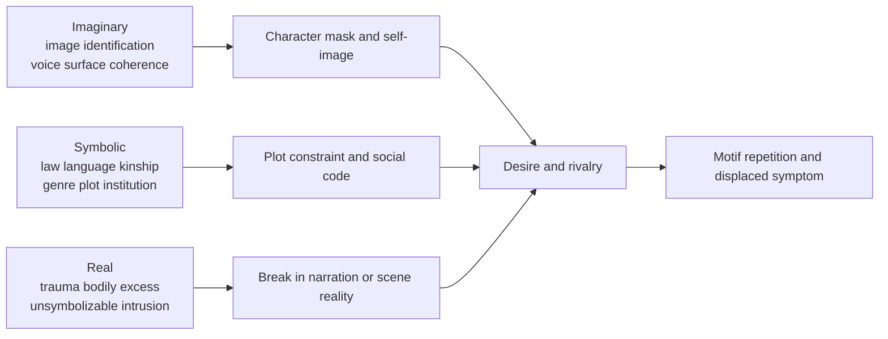
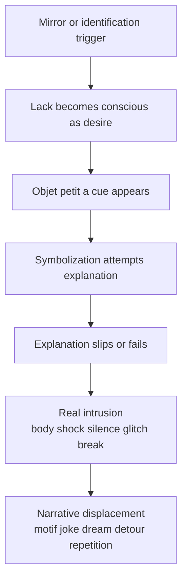
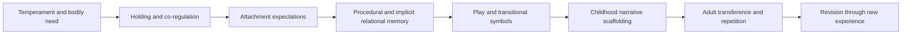
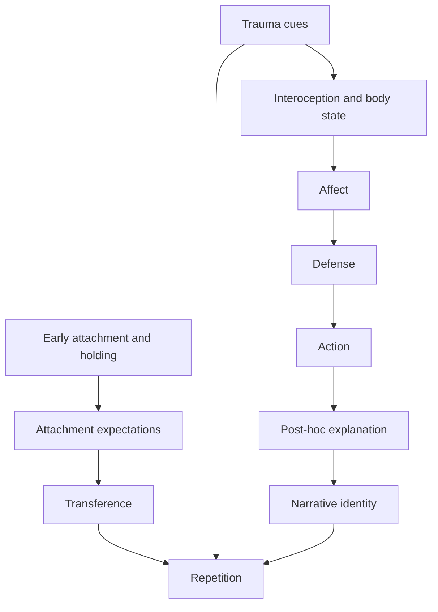

# Contemporary Literary Practice and Interdisciplinary Psychology

## Executive Summary

This report argues that contemporary literary practice rarely uses **Lacan** as a ready-made doctrine and more often uses him as a **craft heuristic**: a way of designing misrecognition, desire, blockage, repetition, and formal rupture. The Lacanian concepts that travel best into writing practice are the **mirror stage**, the **Imaginary / Symbolic / Real**, **lack and desire**, **objet petit a**, **fantasy**, the **four discourses**, and the split between **enunciation** and the **enunciated**. Each of these can be translated into scene-level questions about image, law, voice, narrative omission, and what resists being said (Lacan, 1949/2006; 1953/2006; 1964/1978; 1969–70/2007). citeturn32view2turn33view0turn33view1turn32view4turn32view3turn4search0turn4search1turn4search2turn15search0turn17search1

In current practice, the most explicit uses of Lacan appear not only in fiction itself but also in **creative-writing pedagogy**, **writer interviews**, and **critical-creative scholarship**. entity["people","Lauren Elkin","writer"] has said directly that reading entity["people","Jacques Lacan","french psychoanalyst"] on the mirror stage, lack, and desire helped generate her novel entity["book","Scaffolding","novel 2024"]; entity["people","Betty Milan","brazilian writer"]’s entity["book","Analyzed by Lacan","memoir and play 2023"] turns analysis with Lacan into memoir and drama; entity["people","Susan Finlay","writer and artist"] has described entity["book","The Jacques Lacan Foundation","novel 2024"] as a satirical fiction that also functions as a metaphor for Lacanian theories of selfhood; and creative-writing scholars such as entity["people","Dominique Hecq","writer scholar"] and entity["people","Zoe Charalambous","psychosocial scholar"] have explicitly built Lacanian ideas into workshops and writer-development exercises. citeturn6view0turn34view0turn5view5turn5view6turn39search0turn42view0turn13view0turn13view1turn5view3turn9view1

The strongest interdisciplinary finding is that **Lacan, neuroscience, and psychodynamics are most useful together when they are not forced into false unity**. Affective neuroscience gives a vocabulary for bodily arousal and motivational systems; attachment theory gives a research-based account of relational patterning; interoception research gives a strong account of how bodily signals stabilize self-experience; neuropsychoanalysis tries to bridge subjective and neural description; but Lacan remains strongest where narrative deals with **signification, lack, fantasy, and failure of symbolization**. For writers, this means that symbolic conflict and bodily cueing should often be written **together**, but not collapsed into one explanatory language. citeturn43view0turn28view3turn44search2turn44search3turn44search4turn28view4turn28view5turn27search2

The practical conclusion is simple. A Lacanian writer does not primarily ask, “What is my character’s diagnosis?” The better questions are: **What image of self is this character defending?** **What law, discourse, or institution speaks through them?** **What object organizes their wanting?** **Where does language fail them?** **What bodily or formal rupture reveals that failure?** Those questions produce stronger characters, more tensile plots, and more resonant motifs than surface psychology alone. citeturn32view2turn33view0turn33view1turn32view4turn21view0turn13view0turn9view1

**Assumptions used throughout:** unspecified genre is treated as **adult literary fiction**; unspecified audience is treated as **writers and critics**; and no specific cultural or national constraint is assumed, although cultural limits are addressed later. citeturn6view0turn42view0turn13view0

## Scope and assumptions

A rigorous account of “how contemporary literary practice uses interdisciplinary psychology” has to distinguish **three different levels of use**. The first is **conceptual use**, where a writer or critic borrows a model such as the mirror stage or attachment. The second is **formal use**, where theory gets translated into narrative devices such as gaps, doubles, false coherence, repetition, or bodily intrusion. The third is **institutional use**, where programs, workshops, journals, and courses explicitly organize writing around psychoanalytic or neuropsychological frameworks. The evidence is strongest for the second and third levels in academic and small-press contexts, and more uneven in mainstream commercial craft discourse. citeturn13view0turn13view1turn5view3turn9view1turn5view10turn41search7

## Lacanian concepts most used in literary practice

For literary practice, the most portable Lacanian ideas are the ones that can be turned into **questions of construction** rather than merely **questions of interpretation**. The mirror stage gives a model of self-image as misrecognition; the three registers give a way to layer scenes; lack and desire make plot structural rather than merely motivational; objet petit a helps writers specify the lure that keeps a story moving; fantasy gives a matrix for repetition; the four discourses make dialogue and institutional relations writable; and the split between enunciation and the enunciated clarifies why narrators say one thing while performing another (Lacan, 1949/2006; 1953/2006; 1964/1978; 1969–70/2007). citeturn32view2turn33view0turn33view1turn32view4turn32view3turn31view1

| Lacanian concept | Core writing use | Typical technique | Example texts / authors in current discussion | Practical applicability |
|---|---|---|---|---|
| Mirror stage | Selfhood as misrecognition | Mirror scenes, doubles, rivalry, “outside-in” self-description | *Scaffolding*; *The Jacques Lacan Foundation* | High |
| Imaginary | Image, ego, fantasy of coherence | Seductive voice, visual self-styling, false mastery | Elkin; Finlay | High |
| Symbolic | Law, language, kinship, institution | Plot rules, dialogue codes, institutional speech | Collin; university / clinic scenes; Lacanian pedagogy | High |
| Real | What resists symbolization | Trauma spike, silence, formal cut, bodily break, tonal derailment | Beckett criticism; Cixous criticism; trauma writing | High |
| Lack / desire | Want as structural incompletion | Desire-chain plotting, deferred fulfillment, substitutions | Elkin; Mari Ruti’s Lacanian writing on lack | High |
| objet petit a | Object-cause rather than object-goal | Charged object, motif, MacGuffin-like lure, absence that magnetizes action | Duras; Elkin’s apartment; Finlay’s institutional fetish | High |
| Fantasy | Repeated unconscious scenario | Recurring scene architecture; repeated relational template | Charalambous; Milan | High |
| Four discourses | Social positions in speech | Rewrite dialogue as master / university / hysteric / analyst | Collin; Lacanian teaching contexts | Medium-High |
| Enunciation vs enunciated | Split voice | Unreliable narration, self-betraying dialogue, double register | Beckett criticism; psychoanalytic prose practice | High |
| Jouissance | Excess that binds and damages | Comedy that hurts, compulsive repetition, pleasure-in-failure | Finlay’s satire; late-Lacanian criticism | Medium |

This table synthesizes Lacan’s primary texts, the major English reference overviews, and contemporary practice examples from Elkin, Milan, Finlay, Hecq, Charalambous, Collin, and recent psychoanalytic literary criticism. citeturn32view2turn33view0turn33view1turn32view4turn6view0turn34view0turn5view6turn39search0turn42view0turn13view0turn13view1turn5view3turn9view1turn21view0turn37view0turn37view2turn37view3

### Mirror stage and misrecognition

The mirror stage matters to writers not because babies literally stare into mirrors, but because Lacan’s model treats identity as **an image secured from outside**, then lived as if it were inward truth. The ego, in this frame, is not the transparent center of the person but an objectified, often defensive image. That is why the concept is so useful for **character formation**, **social shame**, **rivalry**, and **voice that sounds more coherent than the life it narrates** (Lacan, 1949/2006). citeturn32view2turn32view3

Elkin makes this practical use explicit. In interviews about *Scaffolding*, she says that reading Lacan’s mirror-stage essay in graduate school, and especially his account of separation, lack, and desire, spoke directly to her “deepest preoccupations and anxieties,” and that she wanted to explore those ideas in a novel. This is one of the clearest contemporary examples of a novelist directly translating Lacanian theory into plot, erotic structure, and character interiority. citeturn6view0turn34view0turn5view5

### The registers as a scene-design system

The **Imaginary**, **Symbolic**, and **Real** are often the most immediately writable part of Lacan because they map easily onto literary layers. The Imaginary governs image, self-display, rivalry, and apparent coherence; the Symbolic governs law, kinship, genre, institutions, and signifying chains; the Real names what remains resistant to meaning, whether as trauma, bodily intensity, anxiety, or a break in narrative sense. In practice, strong Lacanian scenes often work by letting all three registers operate at once rather than by isolating one of them. citeturn32view3turn33view0turn33view1

That triadic structure is one reason Lacan remains useful for literary practice despite his difficulty. He gives writers a way to decide whether a given scene is functioning as **surface image**, **social law**, or **rupture**—and whether a scene becomes more powerful when those planes collide. Recent criticism of entity["people","Samuel Beckett","irish writer"] and essays by entity["people","Jamieson Webster","psychoanalyst writer"] and entity["people","Adam Phillips","psychoanalyst essayist"] show this continuing usefulness: writing becomes a site where bodily anguish, aliveness in language, and structural alienation are staged rather than merely explained. citeturn37view1turn37view2turn37view3

The following diagram turns the three registers into a **narrative map**. It is an inference from Lacan’s own register theory and from contemporary literary uses of it. citeturn33view0turn33view1turn6view0turn37view2

### Lack, desire, objet petit a, and fantasy

Lacan is unusually useful for writers when desire is understood not as “what the character wants” in a simple screenwriting sense, but as **the structural persistence of wanting around a constitutive lack**. That is why Lacanian plots often feel more alive than plots built on clearly attainable goals: the aim shifts, substitutes arise, and each attempted satisfaction reveals that something else was being pursued all along. citeturn32view4turn31view1turn36search10

The concept of **objet petit a** sharpens this further. It is not the goal-object itself but the **object-cause of desire**: the thing, fragment, cue, or motif that makes an ordinary object glow. That is the craft value of the idea. Writers can make desire legible without overexplaining psychology by building a charged object-system: an apartment, a letter, a gesture, a bodily tic, an inaccessible room, a title, a name, a missing sentence. In criticism, this is one reason Lacan remains attractive for reading entity["people","Marguerite Duras","french writer"] and other writers of repetition and fixation; in contemporary practice, Elkin’s apartment-space and Finlay’s Lacanian institution both function like desire-organizing lures rather than simple settings. citeturn32view4turn37view0turn6view0turn42view0

Lacanian **fantasy** is similarly practical when treated as the recurring scene-template through which a subject organizes desire. Charalambous’s creative-writing research is especially clear here: she uses Lacanian fantasy as a framework for exploring authorial identity, voice, and “otherness,” while Maloney’s review shows how that framework gets translated into actual classroom exercises such as freewriting, writing about an object, “Instructions from the Other,” writing in an opposite voice, and describing oneself in a mirror. The theoretical value is that fantasy is not just content; it becomes a repeatable **architecture of discourse**. citeturn5view3turn9view1

### Discourse theory and split voice

Lacan’s later theory of the **four discourses** is often underused in general craft books but extremely useful for dialogue, narration, and institution-heavy fiction. The discourses of the master, university, hysteric, and analyst are not personality types; they are **positions in social linkage**. As the Stanford Encyclopedia summary notes, Lacan develops them in Seminar XVII to describe permutations of social relation among speaking subjects. That makes them unusually adaptable to scenes in classrooms, clinics, families, bureaucracies, activist groups, and intellectual circles. citeturn32view0turn33view0

Ross Collin’s synthesis of rhetorical genre theory and Lacanian unconscious theory is important here because it shows how genres and discourses materialize desire in concrete situations. His account is not about novel-writing specifically, but it is highly transferable: institutional genres call people to present themselves in certain ways, and writing becomes the place where those demands are taken up, adapted, or resisted. For fiction writers, this offers a precise way to build scenes where dialogue is not “expression” but **position-taking under discursive pressure**. citeturn21view0

## Contemporary writers, critics, and creative-practice settings

The most explicit contemporary writerly testimony comes from Elkin. In interviews with *The Millions*, *Worms*, and *The London Magazine*, she describes *Scaffolding* as emerging from graduate-school reading of Lacan, especially the mirror stage and the schema of lack and desire. Importantly, she does not present this as a scholarly framework pasted onto a novel after the fact. She presents it as a direct **generator of narrative form**: a way of thinking about monogamy, desire, motherhood, breakdown, and how people live together in shared space. citeturn6view0turn5view5turn34view0

Milan offers a different but equally explicit model. *Analyzed by Lacan* gathers her memoir of being analyzed by Lacan with a play inspired by that experience, and Bloomsbury’s description emphasizes that the book offers a view of Lacan’s analytic method and its suspicion of traditional interpretation as provoking resistance. In interview, Milan connects themes of origin, “self-xenophobia,” gender, and writing directly to her analytic work with Lacan. Here psychoanalysis is not a theoretical ornament but a **live source** for memoiristic and dramatic composition. citeturn39search0turn5view6

Finlay’s case is especially instructive because it shows a contemporary writer using Lacan both **seriously and satirically**. In interview, she says that *The Jacques Lacan Foundation* was meant partly as a metaphor for Lacanian theories and for the question of whether a stable core self exists, while also mocking the use of “Lacan” as cultural capital in academic-art worlds. This double movement matters for craft: Lacan is used not only to deepen psychology, but also to expose the **social theater of theory itself**. citeturn42view0

In creative-writing pedagogy, Hecq and Charalambous provide the strongest documented evidence of explicit Lacanian application. Hecq’s “Writing the unconscious: psychoanalysis for the creative writer” argues for the usefulness of psychoanalysis in creative writing and frames pedagogy as a “practice of the letter” for MA-level workshops. Her later work on supervision argues that transference is crucial in writing education and that supervisory positions should privilege the Symbolic dimension of language rather than simple identification with authority. Charalambous’s UCL thesis and later workbook project explicitly transfer Lacanian concepts of fantasy, objet a, and discourse into writing exercises, interviews, and classroom practice. citeturn13view0turn13view1turn5view3turn9view1turn11search1turn11search0

These ideas are not confined to specialist psychoanalytic spaces. The entity["organization","University of Chicago","university chicago il us"] course listing for “Psychoanalytic Theory: Freud and Lacan” shows Lacan being taught inside a major literature curriculum through Poe, *Écrits*, and later theory, which matters because such courses seed later creative and critical practice even when they are not labeled “craft.” Meanwhile, contemporary literary magazines such as *Worms* have staged whole psychoanalysis issues around writers, critics, and artists, demonstrating that psychoanalysis remains a living conversational frame in literary small-press culture. citeturn5view10turn41search7

Finally, interdisciplinary practice is not only Lacanian. entity["people","Siri Hustvedt","novelist essayist"] explicitly describes her work as combining narrative, psychoanalysis, neurology, neuroscience, and phenomenology in order to create “epistemological pluralism” around symptoms and selfhood. entity["people","Temi Oh","novelist"] likewise writes about fiction influenced by neuroscience, consciousness studies, and free-will debates. Their importance here is methodological: they show contemporary literary practice using psychology and neuroscience not merely for realism, but for **formal and epistemic design**. citeturn6view1turn6view2turn6view3

## How writers operationalize Lacan in craft

The most useful way to turn Lacan into practice is to translate concepts into **repeatable scene protocols**. The following techniques are workshop-ready and grounded in Lacan, Hecq, Charalambous, Collin, and current work on embodiment and interoception. citeturn13view0turn13view1turn9view1turn21view0turn44search2turn44search3turn44search4

**Write the self from outside.** Draft one page in which a character’s selfhood appears only through an image, description, label, or naming act coming from someone else. Do not let the character say “I am X.” Let them become legible through mirrors, photographs, phone screens, uniforms, or a caregiver’s phrase. Then rewrite the same page from the character’s private perspective and compare the gap. This operationalizes the mirror stage as **misrecognition** rather than simple self-description. citeturn32view2turn32view3turn34view0

**Layer every major scene across the three registers.** For any pivotal scene, write three columns: **Imaginary** (image, posture, tone, self-styling), **Symbolic** (law, taboo, role, institutional speech, kinship code), and **Real** (what resists articulation: panic, bodily jolt, silence, temporal glitch, intrusive object). Then ensure that at least one beat from each column enters the final scene. This prevents “psychological” writing from floating free of social structure or bodily rupture. citeturn33view0turn33view1turn37view2

**Replace goals with desire-chains.** Instead of giving a character one stable wish, list three successive objects or stand-ins: what they say they want, what they pursue next when that fails, and the charged remainder that keeps desire alive. The story gets stronger when each satisfaction reveals a deeper non-satisfaction. This is a workable literary translation of lack, desire, and objet petit a. citeturn32view4turn31view1turn36search10

**Build an object system, not just a symbol.** Choose one object that returns in altered forms across the text: a room, scarf, keycard, bruise, joke, lipstick mark, dead inbox, train announcement. The object should not “mean” one thing. It should **cause recurrence**, intensify attention, and pull behavior toward it without ever exhausting its charge. That is more Lacanian, and more narratively useful, than stable symbolism. citeturn32view4turn37view0turn42view0

**Rewrite dialogue through discourse positions.** Take a scene and draft it four times: once with one speaker in the position of **master**, once as **university**, once as **hysteric**, and once as **analyst**. Do not change the topic; change only the relation to knowledge, command, questioning, or listening. This is especially effective for seminar rooms, therapy scenes, family confrontations, and institutional comedy. citeturn32view0turn21view0

**Split voice into statement and act.** Under each important line of dialogue or narration, write a second line beginning: “What this utterance is doing is …” Very often the enunciated content and the act of enunciation diverge. A narrator may claim indifference while staging appeal, accusation, seduction, or panic. This is one of the strongest tools for unreliable narration. citeturn31view1

**Use “Instructions from the Other.”** Borrowing from Charalambous’s reported practice, impose a constraint-list addressed as if by an external Other: “Give voice to an object. Use a sentence you do not understand. Describe what you see in a mirror. Write in the voice opposite your own.” The point is not obedience but discovering where writerly identity resists, freezes, or unexpectedly opens. citeturn9view1

**Let the body arrive before the explanation.** In scenes of conflict, grief, shame, or attraction, write the interoceptive and sensorimotor events first—breath pattern, jaw, heat, numbness, gait, grip, gut pressure, throat dryness—and delay interpretation by several sentences or paragraphs. Contemporary interoception research strongly supports the idea that bodily signals shape self-experience and feeling, and this matches psychoanalytic practice better than overly cognitive exposition. citeturn44search2turn44search3turn44search4

A compact Lacanian scene-construction flow can be represented as follows. This is a writerly formalization of Lacan’s mirror logic, lack, objet a, failed symbolization, and the Real. citeturn32view2turn32view4turn33view1

## Intersections and tensions with neuroscience and psychodynamics

The strongest interdisciplinary work today does **not** prove Lacan by neuroscience, nor reduce neuroscience to Lacan. It stages a tension between levels of description. Affective neuroscience, attachment theory, interoception, and neuropsychoanalysis each add something concrete to craft, but they also expose where Lacan is strongest as a **theory of signification and subject-division** rather than a settled empirical psychology. citeturn43view0turn28view3turn28view4turn28view5turn44search2turn44search3

| Interface | Lacanian emphasis | Contemporary psychology / neuroscience emphasis | Main tension | Use for writers |
|---|---|---|---|---|
| Desire and drive | Lack, desire, substitution, fantasy | Panksepp’s SEEKING and other primary affective systems | Symbolic desire is not reducible to reward circuitry, but body-level motivation matters | Write wanting as both **signifying lack** and **felt propulsion** |
| The Other and relation | Subject formed in language and law | Attachment, mentalizing, internal working models | Lacan privileges signifier and lack; attachment is more observational and developmental | Build characters through both **relational history** and **discursive positioning** |
| Body and self | The Real, jouissance, non-transparency of the subject | Interoception, insula, embodied self-awareness | Lacan names opacity; neuroscience gives mechanisms for bodily self-feeling | Put bodily signal before narrative interpretation |
| Unconscious | Structured by signifiers; split subject | Neuropsychoanalysis, predictive coding, affective consciousness | Some Lacanians resist neural translation; bridge-figures argue for dialogue without reduction | Use multiple explanatory frames inside a text without forcing final synthesis |
| Trauma | Failed symbolization; intrusive Real | PTSD / PTG models, symptom clusters, clinical intervention | Lacan criticizes purely psychiatric codification; psychiatry gives operational tools | Write trauma as both **clinical reality** and **narrative impasse** |
| Affect | Lacan is often criticized for underplaying affect | Affective neuroscience and embodied emotion research foreground affect | Lacan’s language-heavy uses can become bloodless if detached from sensation | Keep symbolic analysis tethered to scene physiology |

This synthesis rests on several lines of evidence. Pankseppian affective neuroscience identifies seven primary emotional systems and argues that subcortical affective systems organize action and psychopathology; attachment-and-psychoanalysis literature emphasizes lines of convergence around mentalizing and relational development; contemporary interoception reviews argue that self-concept is deeply tied to internal bodily signals; and Lacanian neuropsychoanalytic work remains divided between “nothing in common” objections and attempts at a “no-thing in common” bridge. Meanwhile, Lacanian trauma scholarship argues that his account of trauma offers a corrective to purely psychiatric codifications of PTSD or “post-traumatic growth.” citeturn43view0turn28view3turn44search2turn44search3turn44search4turn28view4turn28view5turn27search2turn28view6turn25search18

For writers, the practical implication is not to choose one camp. It is to decide **which level of explanation belongs to which textual moment**. If a scene needs bodily immediacy, interoception and affective neuroscience are useful. If a scene needs relational durability, attachment helps. If a scene needs to show why a character’s speech misses itself, or why an institution speaks through them, Lacan often does better than neuro-language. The most durable fiction lets these levels rub against one another without premature reconciliation. citeturn43view0turn28view3turn28view4turn44search2

## Ethical and critical cautions

The first caution is against **diagnostic overreach**. Lacanian concepts are powerful for literary making, but many of them are not empirically testable in the same way as attachment classifications, interoceptive measures, or trauma protocols. Treating every recurring object as objet a or every formal break as the Real quickly turns writing into allegory-by-theory. As several interdisciplinary debates show, the bridge between psychoanalysis and science is productive precisely because the fields are not identical. citeturn28view3turn28view4turn28view5turn27search2

The second caution is against **over-psychologizing characters and under-writing institutions**. One reason discourse theory remains so valuable is that it relocates conflict from private “depth” to the structure of social links. Finlay’s satire is especially instructive here: “Lacan” can become prestige language, class marker, or institutional fetish. A theoretically sophisticated novel should therefore be able to show how desire is socially staged, not only inwardly felt. citeturn32view0turn42view0

The third caution concerns **trauma and bodily material**. “The Real” is not a license for vagueness, opacity for its own sake, or aestheticized suffering. If a text invokes trauma as what cannot be symbolized, it still has to show what that failure does to time, syntax, memory, relation, and body. Likewise, body-centered craft exercises should be used carefully in workshops, because interoceptive attention can intensify distress as well as deepen writing. citeturn28view6turn44search7turn35search5

The fourth caution is **cultural and historical humility**. Lacanian theory emerged in a particular French intellectual and clinical milieu; contemporary uses in Anglophone literary culture are often mediated by criticism, translation, and academic institutional life. Theories of self, family, law, and sexuality do not enter all literary traditions in the same way. A good working principle is to use Lacan as a **machine for questions**, not as a universal solvent. citeturn34view0turn37view0turn42view0

## Short annotated bibliography

**Primary Lacan texts and authoritative English editions**
- **entity["book","Écrits","psychoanalytic essays 1966"]**. The Norton edition translated by **Bruce Fink** remains the standard English gateway and is the central source for “The Mirror Stage,” “Function and Field of Speech and Language,” and “Subversion of the Subject.” It is the best starting point for misrecognition, the speaking subject, and desire. citeturn4search0turn32view2turn32view4
- **The Seminar, Book XI: The Four Fundamental Concepts of Psychoanalysis**. The Norton edition translated by **Alan Sheridan** is indispensable for the unconscious, repetition, transference, and drive. It is also the most teachable seminar for writers trying to think structure rather than theme. citeturn4search1turn31view0
- **The Seminar, Book VII: The Ethics of Psychoanalysis**. The Norton edition translated by **Dennis Porter** is crucial for later Lacan’s treatment of the Real, das Ding, and desire’s ethical impasses. It is especially useful for writers interested in excess, taboo, sublimation, and fatal attraction. citeturn15search0turn31view0turn33view1
- **The Seminar, Book XVII: The Other Side of Psychoanalysis**. The Norton edition translated by **Russell Grigg** is the key source for the **four discourses**, and the Duke volume *Jacques Lacan and the Other Side of Psychoanalysis* is an important companion for literary and cultural applications. Use this when writing institutions, classrooms, clinics, or ideological speech. citeturn4search2turn15search9turn32view0
- **The Seminar, Book III: The Psychoses**. The English translation by **Russell Grigg** is central for Lacan’s account of psychosis, metaphor, and foreclosed signification. It matters for writers working on breakdown, delusion, or language unraveling, though it is less immediately portable than XI or XVII. citeturn17search1turn17search15

**Contemporary secondary and bridge texts**
- **entity["people","Joan Copjec","literary theorist"], *Read My Desire***. Still a major Anglophone intervention in Lacanian literary and cultural criticism; it stages Lacan against historicist habits of reading and remains valuable for critics writing about subjectivity, fantasy, and ideology. citeturn36search12turn36search16
- **entity["people","Todd McGowan","film and theory scholar"], *The Cambridge Introduction to Jacques Lacan***. A recent, systematic English introduction that is especially useful for writers and critics needing a clear map of Lacan’s development rather than isolated keywords. citeturn36search7turn36search15
- **entity["people","Arka Chattopadhyay","literary scholar"], *Beckett, Lacan and the Mathematical Writing of the Real***. A strong example of contemporary criticism using Lacan not just as theme but as a formal reading tool. Helpful for writers interested in experiment, abstraction, counting, emptiness, and the logic of formal disruption. citeturn37view1
- **Adrian Johnston, “Jacques Lacan” in the Stanford Encyclopedia of Philosophy**. Not a substitute for the seminars, but a highly reliable reference for the Imaginary, Symbolic, Real, mirror stage, fantasy, and object a. It is especially useful when a writer needs conceptual precision quickly. citeturn31view0turn33view0turn33view1

**Creative and critical examples of Lacan in literary practice**
- **Elkin, *Scaffolding***. Valuable because the writer herself explicitly links the novel’s genesis to Lacan’s mirror stage and to the structure of lack and desire. This is one of the strongest contemporary cases of direct writerly uptake. citeturn6view0turn34view0
- **Milan, *Analyzed by Lacan***. Important for showing how Lacanian analysis can become memoir and drama rather than simply criticism. Useful for writers working at the border of testimony, scene, and theory. citeturn39search0turn5view6
- **Finlay, *The Jacques Lacan Foundation***. A good reminder that Lacan in fiction can be comic, satirical, class-conscious, and anti-reverential while still conceptually serious. Useful for writers who want theory to appear as social performance, not only as inward depth. citeturn42view0

## Open questions and limitations

Two limits should be kept in view. First, **explicitly Lacanian writing practice is well documented in interviews, small-press literary culture, and creative-writing scholarship, but less systematically documented in mainstream commercial craft publishing**. Second, the most ambitious bridges between Lacan and neuroscience remain **heuristic and contested** rather than settled empirical syntheses. That does not weaken their literary usefulness; it means they should be used as disciplined frameworks for making and reading, not as final explanations of mind. citeturn13view0turn13view1turn5view3turn41search7turn28view4turn28view5

# Eighteen Psychodynamic and Neuroscientific Insights for Literary Writing

## Executive summary

This report extracts eighteen psychological conclusions that are especially useful for literary fiction when the goal is not clinical diagnosis but **credible motive, conflict, voice, repetition, symbolization, and change**. The most robust cross-framework findings are these: **early relational and procedural learning matters disproportionately; bodily and affective processes often lead reflective explanation; attachment expectations strongly shape how characters read distance and rescue; shame and guilt create different plot logics; and deep change is most believable when an old model is reactivated and then contradicted by lived experience**. citeturn18view0turn17view6turn31view7turn23search5turn8search1

Two propositions often used by writers are worth sharpening. First, the idea that “many behaviors are compulsive repetitions formed before age seven” is useful as a **craft heuristic**, but not as a strict developmental law: the evidence supports a broader claim that the **first years and early childhood** disproportionately organize attachment, regulation, and procedural expectation, without there being a magical cutoff exactly at age seven. Second, the idea that “the body is unconscious, and action precedes awareness” is also powerful, but should be stated carefully: motor preparation, interoceptive appraisal, and post-hoc explanation often precede reflective intention in **simple and semi-automatic acts**, yet this should not be overstretched into the claim that all meaningful life choices are fully unconscious. citeturn24search0turn24search2turn28view2turn22search21turn28view3

For fiction, the practical sequence is usually more convincing than abstract trait labels: **trigger → bodily shift → affect → defense → reading of the other → action → explanation → repetition or revision**. Characters feel alive when the prose respects that order. citeturn32view1turn20search1turn19search1turn26search17turn8search6

## Assumptions and method

This report assumes **general literary fiction for adult readers**, with no fixed genre and no specific cultural constraint. Classical psychoanalytic concepts are treated here as **models of motive and form**, not as infallible truths. Where attachment research, affective neuroscience, interoception research, trauma theory, or memory science offers corroboration, it is included; where empirical support is mixed, that is marked explicitly. In current scholarship, this bridge between psychoanalysis and neuroscience is not eccentric but established enough to be named directly as **psychodynamic neuroscience** or adjacent neuropsychoanalytic work. **Support labels** are used pragmatically: **high** means broad converging evidence; **medium** means meaningful but partial or mixed support; **low/controversial** means clinically fertile but weakly tested, disputed, or unsafe to generalize too far. citeturn27search12turn27search5turn27search3

## Developmental formation

The strongest developmental lesson for writers is that “childhood” is not useful as a vague explanation. What matters is more specific: **how need, soothing, frustration, dependence, symbolization, and self-organization were repeatedly learned in interaction**. Attachment theory, infant memory research, and object-relations thinking converge on the idea that the earliest layers of character are often **enacted long before they can be narrated**. citeturn18view0turn18view1turn24search11turn30view3

The flow below condenses the developmental path that is most useful for literary construction. citeturn18view0turn24search0turn30view3turn30view2

### Early procedural templates

**Conclusion.** Many recurring adult behaviors are **old solutions in new clothes**. ***Linked to classic psychoanalysis and physiology.***

**Psychological rationale and sources.** entity["people","Sigmund Freud","psychoanalyst"] described patients as often **repeating rather than remembering**; entity["people","John Bowlby","attachment theorist"] and entity["people","Mary Ainsworth","developmental psychologist"] supplied a developmental mechanism in attachment expectations and “secure base” behavior; later work on implicit relational knowing and childhood amnesia helps explain why these patterns can be enacted without being verbally recalled. The phrase “before age seven” is a good novelist’s shorthand, but the evidence supports a broader **early-childhood window**, not a precise threshold. **Empirical support:** *medium*. citeturn28view0turn18view0turn29view1turn24search3turn24search0

**Use in writing.** Build the apparent “fatal flaw” as an adaptation that once made sense: pleasing a volatile caregiver becomes seducing authority, emotional withdrawal becomes adult prestige, jealousy becomes early-warning vigilance, perfectionism becomes pre-emptive self-protection.

**Prompt / technique.** Write two scenes with the **same regulatory logic**: one at age five, one at age thirty-five. Change the behavior, but keep the hidden aim identical.

### Implicit memory usually comes before explicit narrative

**Conclusion.** A character can **know a pattern before they can tell a story about it**.

**Psychological rationale and sources.** Research on implicit memory and infantile or childhood amnesia suggests that early experience leaves behind forms of **procedural, sensory, and relational knowing** that outlast explicit autobiographical recall. That is one reason a person may repeatedly “know how this goes” in relationships without being able to narrate where that expectation came from. **Empirical support:** *high*. citeturn24search2turn24search0turn24search11turn24search17

**Use in writing.** This is invaluable for characters who are psychologically legible to the reader but not fully legible to themselves. Their knowledge appears as bodily timing, choice of distance, misplaced certainty, or immediate trust/distrust, not as insight.

**Prompt / technique.** Remove all explanatory backstory from a scene. Let the character reveal history only through **timing, hesitation, posture, route choice, and what they immediately assume**.

### Holding failures can produce compliant voices and false selves

**Conclusion.** A socially effective voice can be built around **compliance rather than spontaneity**.

**Psychological rationale and sources.** entity["people","Donald Winnicott","pediatrician psychoanalyst"] argued that “good-enough” holding allows continuity of being, whereas repeated environmental impingement can organize personality around reaction, adaptation, and the “false self.” The concept is clinically influential but harder to operationalize directly than attachment classifications. **Empirical support:** *low/controversial*. citeturn30view3turn28view5

**Use in writing.** A polished, tactful, hyper-competent narrator may not be “stable”; the very smoothness of the voice may signal over-adaptation. This is especially useful in first person: the language itself can become a mask.

**Prompt / technique.** Write the same monologue twice: first in the character’s **socially acceptable voice**, then in a version stripped down to images, bodily sensations, and fragments. Compare what the polished version edits out.

### Play is the first bridge from raw feeling to symbol

**Conclusion.** **Play** is often the earliest workshop in which private affect becomes shared symbol.

**Psychological rationale and sources.** Winnicott’s account of the transitional object and transitional phenomena treats the blanket, toy, tune, or repeated game as an **intermediate area** between inner and outer reality. This is where symbol, creativity, culture, and tolerable illusion begin. **Empirical support:** *medium*. citeturn30view2turn30view1

**Use in writing.** Literary motif becomes stronger when it behaves like a transitional object: a scarf, broken music box, ritual phrase, or childish game can carry grief, desire, and attachment without becoming a blunt symbol.

**Prompt / technique.** Give each major character **one object or repeated act** that is both literal and relational. Ask: what does this object regulate when no one else can?

## Unconscious process and the body

The unconscious becomes most useful to fiction when it is treated not as a box of hidden meanings but as a **set of ongoing processes**: motor preparation, bodily monitoring, omissions, substitutions, defensive detours, and reenactments. Here psychoanalysis and contemporary neuroscience often speak different languages about overlapping realities. citeturn28view0turn28view1turn28view2turn28view3turn32view1

The conceptual map below shows the relations among the most narratively useful processes. citeturn28view0turn31view3turn32view1turn31view7

### The body often begins before reflective awareness

**Conclusion.** Bodily preparation and action-biasing often begin **before** reflective awareness, and consciousness frequently arrives as commentary. ***Linked to classic psychoanalysis and physiology.***

**Psychological rationale and sources.** entity["people","Benjamin Libet","neuroscientist"] found readiness potentials preceding reported intention in voluntary acts; later decoding work extended the point for simple choices. entity["people","Richard Nisbett","social psychologist"] and colleagues showed that introspective reports often lack direct access to higher-order processes; entity["people","Michael Gazzaniga","neuroscientist"] described the left-hemisphere “interpreter” that constructs explanations after distributed processes are already underway. The generalization from laboratory tasks to complex moral action remains debated, but as a writing principle this is exceptionally fruitful. **Empirical support:** *medium*. citeturn28view2turn22search21turn28view3turn22search3turn22search23

**Use in writing.** Let the hand reach for the cigarette, the body lean toward the door, the jaw tighten, the text get sent, **before** the character “decides.” Then let thought arrive with a plausible reason.

**Prompt / technique.** Draft one scene in **action-first order**: gesture, posture, breath, movement. Only afterward add the character’s explanation. Do not let the explanation fully match the body.

### Avoided material usually returns indirectly

**Conclusion.** What cannot be tolerated directly often returns **sideways**.

**Psychological rationale and sources.** Freud’s model of repression treated intolerable impulses or meanings as turned away from consciousness rather than simply erased. Contemporary work on thought suppression suggests that some efforts at mental exclusion can produce ironic return effects or rebound. Strong claims about classical repression remain disputed, but the broader idea that avoidance reorganizes expression is on firmer ground. **Empirical support:** *controversial*. citeturn28view1turn16search0turn16search11turn16search6

**Use in writing.** The important thing is not always said directly. It leaks into misnaming, topic shifts, omissions, over-formality, jokes, route changes, forgotten objects, or a recurring image that appears whenever the forbidden thought approaches.

**Prompt / technique.** For every crucial dialogue, identify the **forbidden noun**. Then write the scene so the character circles that noun by substitutions, euphemisms, and detours.

### Unresolved conflict seeks mastery through reenactment

**Conclusion.** Some conflicts are staged again and again because the mind is trying to achieve **mastery, punishment, recognition, or a different ending**.

**Psychological rationale and sources.** Freud’s repetition-compulsion argument in *Beyond the Pleasure Principle* and in the technical papers proposes that people do not merely recall the past; they **relive it in action**, especially in current relationships. Later psychodynamic practice treated this as a central engine of recurring themes. Direct empirical confirmation is mixed, but the pattern is clinically and narratively powerful. **Empirical support:** *medium*. citeturn28view7turn28view0

**Use in writing.** This gives plot architecture. The protagonist does not “have a problem”; the protagonist **recreates a situation**. They repeatedly select versions of the same triangle, humiliation, rescue fantasy, or abandonment test.

**Prompt / technique.** Design a three-step plot arc in which the same conflict recurs in three keys: **minor**, **explicit**, **catastrophic**. Each recurrence should feel both familiar and newly costly.

## Affect, defense, and conflict

If development gives fiction its hidden scaffolding, **affect** gives it pressure, and **defense** gives it form. Characters are rarely moved by ideas alone. They are moved by states of urgency, disgust, panic, relief, shame, attraction, envy, grief, or triumph, and then forced to manage those states in uneven ways. citeturn20search1turn28view6turn13search11turn31view6

### Affect is the first draft; explanation is the later edit

**Conclusion.** Feeling-states and action tendencies usually arrive **before** explicit reasons.

**Psychological rationale and sources.** entity["people","Jaak Panksepp","affective neuroscientist"] argued that basic affective systems are rooted in deep subcortical circuitry; entity["people","Antonio Damasio","neuroscientist"] formulated the somatic marker idea, according to which bodily signals bias reasoning and choice; interoception research now treats the sensing and integration of bodily signals as central to emotion, self-regulation, decision making, and consciousness. Theories differ in mechanism, but they converge on the importance of **bodily-affective prioritization**. **Empirical support:** *high*. citeturn20search1turn28view6turn32view1turn20search3

**Use in writing.** Scene logic improves when emotion is first rendered as heat, air hunger, pulse, gastric drop, ice in the limbs, or narrowed attention, and only later as “anger,” “love,” or “fear.”

**Prompt / technique.** Draft the first version of a key scene with **no emotion words at all**. Use only body, action tendency, and sensory distortion. Add abstract feeling labels only in revision.

### Defense mechanisms are engines of style

**Conclusion.** Defenses do not only shape what a character says; they shape **how the prose itself behaves**.

**Psychological rationale and sources.** entity["people","Anna Freud","psychoanalyst"] systematized defense mechanisms; entity["people","George Vaillant","psychiatrist"] later arranged defenses into a hierarchy with empirical support for differing adaptive levels; contemporary psychodynamic work links defensive functioning to broader patterns of regulation and mentalization. **Empirical support:** *medium*. citeturn0search3turn13search4turn13search11turn19search1

**Use in writing.** Denial creates flat understatement. Intellectualization creates bloodless precision. Projection produces suspicious dialogue and moral certainty. Undoing produces excessive apology or ritual. Humor and sublimation can turn suffering into wit, form, and art.

**Prompt / technique.** Rewrite one confession scene through **three defenses**: denial, intellectualization, and humor. The facts should remain identical while the voice changes completely.

### Splitting is what happens when ambivalence cannot be held

**Conclusion.** Under stress, characters often simplify mixed feeling into **all-good / all-bad** forms.

**Psychological rationale and sources.** entity["people","Otto Kernberg","psychoanalyst"] treated splitting as a primitive defense that keeps contradictory self- and object-images apart; contemporary emotion research independently confirms that mixed emotions are real and common, which implies that maturation involves tolerating ambivalence rather than erasing it. **Empirical support:** *medium*. citeturn25search20turn25search23turn25search2turn25search30

**Use in writing.** Splitting is a superb engine for reversals: idealization flips into contempt, devotion into disgust, political certainty into purification fantasy, romance into devaluation. It also explains why some characters can seem intelligent yet profoundly unstable in judgment.

**Prompt / technique.** List **five contradictory truths** about one important relationship. Then write scenes in which the character can tolerate only one truth at a time.

### Shame and guilt generate different plots

**Conclusion.** **Shame** attacks the self; **guilt** attacks the act.

**Psychological rationale and sources.** entity["people","June Tangney","psychologist"] and colleagues distinguished shame from guilt and showed that they differ phenomenologically and behaviorally. Shame is more tied to exposure, withdrawal, diminished self-esteem, and self-condemnation; guilt is more tied to specific wrongdoing, responsibility, and repair. **Empirical support:** *high*. citeturn31view6turn35search1turn35search6turn7search9

**Use in writing.** A shame plot moves toward hiding, rage, disappearance, or self-erasure. A guilt plot moves toward confession, compensation, restitution, or sacrifice. The same event can drive radically different narratives depending on which moral emotion dominates.

**Prompt / technique.** Write the same wrongdoing twice. In version one, the character thinks **“I am rotten.”** In version two, the character thinks **“I did something terrible.”** Track how plot direction changes.

## Attachment and the relational mind

Characters do not simply respond to events; they respond to **availability, distance, unpredictability, and regulation by others**. Attachment theory and psychodynamic relational theory are therefore invaluable to scene construction, because they explain why a neutral act from one person is lived as abandonment, engulfment, indifference, rescue, or safety by another. citeturn17view6turn18view1turn19search0turn33search8

### Attachment scripts shape the reading of ordinary events

**Conclusion.** Characters do not only read what happened; they read **whether anyone will come, stay, soothe, or leave**.

**Psychological rationale and sources.** Bowlby and Ainsworth’s work on proximity seeking, secure base, and attachment patterns remains foundational. Contemporary neurobiological accounts frame attachment as a system of **social allostasis** and repeated co-regulatory learning. Attachment patterns show meaningful continuity across development, even though they are not destiny. **Empirical support:** *high*. citeturn29view1turn18view1turn17view6

**Use in writing.** An unanswered message, a pause at the door, a delayed touch, a changed tone, a missed train, or a rescheduled dinner can carry enormous force if the character interprets it through an anxious, avoidant, or disorganized script.

**Prompt / technique.** Take one neutral event — for example, “someone arrived twenty minutes late” — and write it four times from **secure, anxious, avoidant, and disorganized** attachment positions.

### New people are often drafted into old roles

**Conclusion.** Characters frequently **miscast new people using old templates** before those people are truly known.

**Psychological rationale and sources.** Freud’s theory of transference holds that people bring forward characteristic ways of loving, expecting, fearing, and selecting; contemporary interpersonal research suggests that transference-like template activation can arise in ordinary encounters, not just in psychoanalytic treatment. **Empirical support:** *medium*. citeturn28view8turn26search17turn26search9

**Use in writing.** A boss becomes a father before he becomes himself. A lover becomes a savior before she becomes a person. A friend becomes a rival because their tone, age, scent, or patience matches an old pattern. This is one of the cleanest ways to make first meetings psychologically dense.

**Prompt / technique.** For a key relationship, write two columns: **present person** and **old role unconsciously assigned**. Then identify the cue that fuses them.

### Mentalization collapses when attachment distress peaks

**Conclusion.** The precise moment when accurate mind-reading is most needed is often the moment when it fails.

**Psychological rationale and sources.** entity["people","Peter Fonagy","psychoanalyst"] and colleagues made mentalization central to psychodynamic developmental theory; later studies suggest that attachment distress can reduce affect-centered mentalization, especially in clinical populations. Under pressure, people may either stop reading minds well or become **hypercertain** about what others think. **Empirical support:** *medium*. citeturn19search0turn19search1turn19search2

**Use in writing.** The calm character may be nuanced and observant, then become literal, paranoid, or grandly interpretive when love, abandonment, humiliation, or envy is activated. This gives scenes authentic asymmetry.

**Prompt / technique.** In a conflict scene, annotate every inference about another mind. Then mark which inferences are based on **evidence**, which on **fear**, and which on **attachment panic**.

### Regulation is often co-created before insight appears

**Conclusion.** Another person can change a character’s physiology **before** a new idea changes their beliefs.

**Psychological rationale and sources.** entity["people","James Coan","neuroscientist"] and colleagues’ social baseline work argues that humans expect access to relationships that reduce risk and effort; related co-regulation research describes mutual adaptation across biological and behavioral levels; current attachment neuroscience explicitly frames attachment as external co-regulation of internal state. **Empirical support:** *high*. citeturn33search8turn33search2turn33search5turn17view6

**Use in writing.** Do not make all change insight-driven. A mug of tea, a hand on the shoulder, walking at matched pace, synchronized breathing, parallel silence, skin-to-skin contact, or being allowed to leave and return can alter a whole scene’s psychology before a single explanation is uttered.

**Prompt / technique.** Write a reconciliation or rescue scene with **almost no interpretation**. Let rhythm, proximity, breath, handedness, and pacing do the work.

## Narrative, trauma, and revision

Literary writing needs a theory not only of motivation but of **how experience gets turned into story**. Narrative identity theory explains how people produce continuity from selection, emphasis, and interpretation. Trauma theory explains why some experiences resist ordinary narrativization. Memory reconsolidation explains why believable deep change requires more than epiphany. citeturn31view7turn34search1turn23search5turn8search6

### Identity is an edited life story, not a full archive

**Conclusion.** People live through more than they can narrate, but they become themselves through the **stories they keep revising**.

**Psychological rationale and sources.** entity["people","Dan P. McAdams","personality psychologist"] proposed that identity takes the form of an internalized and evolving life story. Later work links personal narrative coherence and variation in narrative identity to trajectories of well-being and mental health. This does not mean a person is “nothing but a story,” but it does mean that selfhood is partly organized through narration. **Empirical support:** *medium*. citeturn31view7turn34search1turn34search3turn34search0

**Use in writing.** Every major character should have a **working self-story**: the unjustly exiled one, the rescuer, the survivor, the chosen one, the realist, the bad daughter, the witness, the one who always leaves first. Plot becomes vivid when events begin to **break the old narration**.

**Prompt / technique.** Ask each protagonist to complete the sentence: **“The kind of person I have always been is…”** Then write the scene that makes that sentence unstable.

### Trauma often returns as sensory urgency and disordered time

**Conclusion.** Trauma is frequently remembered less as orderly exposition than as **intrusion, sensory compression, “nowness,” and altered temporal context**.

**Psychological rationale and sources.** entity["people","Anke Ehlers","clinical psychologist"] and colleagues emphasized poorly elaborated, easily triggered trauma memories that generate current threat; later trauma-memory research links intrusive memories to specific “worst moments,” sensory vividness, and disrupted temporal integration. Fragmentation theories are useful, but not universal laws: not every trauma memory is globally incoherent. **Empirical support:** *medium*. citeturn11search5turn23search2turn23search5turn23search0

**Use in writing.** Replace generic “flashback” exposition with **cue-driven returns**: a metallic smell, fluorescent hum, wet fabric, a phrase, a hand near the throat, a hospital corridor, an angle of light. Trauma in fiction often persuades more through **recurrence and altered temporality** than through descriptive extremity.

**Prompt / technique.** Identify one “worst moment” and write it only through **five sensory elements and one temporal distortion**. Do not explain it at first.

### Durable change requires reactivation and updating, not insight alone

**Conclusion.** Believable deep transformation happens when an old expectation is **reactivated** and then **disconfirmed in experience**.

**Psychological rationale and sources.** entity["people","Karim Nader","neuroscientist"] and colleagues showed that reactivated memories can return to a labile state requiring reconsolidation; later reviews suggest that memory updating is central to the possibility of emotional change, even though human translation is more complex than the original animal work. The strongest evidence is in basic learning and emotional memory updating, while clinical extrapolation remains active and incomplete. **Empirical support:** *medium*. citeturn8search10turn8search1turn8search6turn8search4

**Use in writing.** A convincing character arc is rarely “they understood themselves.” It is more often: they expected humiliation, abandonment, attack, seduction, punishment, or indifference — and then the scene **went otherwise while the old expectation was fully alive**. That is what makes change feel earned.

**Prompt / technique.** For a major turning point, script five beats: **old expectation, trigger, defensive readiness, disconfirming response, bodily aftermath**. Only after that should the character generate a new story about themselves.

## Comparative matrix

The table below compresses the eighteen conclusions into a single writing-oriented matrix. The sources column lists the **seminal or organizing references** rather than every supporting study already cited above.

| Label | Seminal sources | Brief application to writing | Empirical support |
|---|---|---|---|
| Early procedural templates | Freud 1914; Bowlby 1969; Ainsworth 1978 | Build adult “choice” as old adaptation in disguise | Medium |
| Implicit memory before narrative | Infantile amnesia and implicit-memory research; implicit relational knowing | Show knowledge without explanation | High |
| Holding and false self | Winnicott 1960 | Use compliant, polished, over-adapted voice | Low/controversial |
| Play as symbolic bridge | Winnicott 1953, 1971 | Turn objects and games into living motifs | Medium |
| Body acts first; mind explains later | Libet 1983; Nisbett & Wilson 1977; Gazzaniga 1998/2000 | Let gesture precede conscious reason | Medium |
| Return of the avoided | Freud 1915; suppression-rebound research | Use slips, omissions, substitutions, detours | Controversial |
| Repetition compulsion | Freud 1914, 1920 | Build recursive plot patterns and reenactments | Medium |
| Affect before explanation | Panksepp 2010; Damasio 1996; interoception research | Write bodily affect before abstract feeling labels | High |
| Defenses as style engines | Anna Freud 1936; Vaillant 1986 | Different defenses produce different voices and scenes | Medium |
| Splitting versus ambivalence | Kernberg 1975/2005; mixed-emotion research | Drive idealization/devaluation cycles | Medium |
| Shame versus guilt | Tangney 1996, 2007 | Shame plots hide; guilt plots repair | High |
| Attachment scripts | Bowlby 1969; Ainsworth 1978 | Make neutral events carry relational charge | High |
| Transference | Freud 1912; interpersonal transference research | Cast new people in old roles | Medium |
| Mentalization under distress | Fonagy tradition; Bateman 2013; Herrmann 2018 | Make misreading peak when stakes are highest | Medium |
| Co-regulation before insight | Social baseline theory; co-regulation research | Change scenes through rhythm, proximity, touch, pacing | High |
| Identity as life story | McAdams 2001, 2006; narrative-coherence research | Build character around revisable self-story | Medium |
| Trauma as sensory return | Ehlers 2000/2010; trauma-memory research | Use cues, “nowness,” worst moments, altered time | Medium |
| Reconsolidation-based change | Nader 2000; Lee 2017 | Make deep change experiential, not merely declarative | Medium |

This matrix condenses the same primary texts and contemporary research synthesized in the annotated sections above. citeturn28view0turn17view6turn31view7turn23search2turn8search1