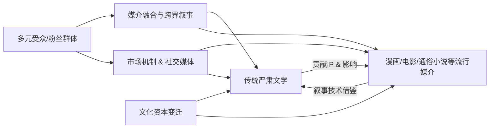

## 1

The anxiety in your question is older than it feels, and taking its history seriously is the first step toward answering it honestly. Every ascendant popular form has been greeted with the same unease. The novel itself was once the contemptible form—servants' reading, women's reading, a disreputable cousin to poetry and drama. Cinema was "canned theater" before it became Bergman and Tarkovsky. Comics were juvenilia until they weren't. What we call "literature" has never been a fixed category; it is the name we give, retrospectively, to whatever has survived the filtration of serious attention. So when *Fire Punch* achieves what it achieves—a reflexive meditation on cinema-as-religion, on performance and witness, on the obscene logic by which suffering demands an audience to become meaning—the correct response is not to panic about literature's borders but to notice that Fujimoto is doing, in his medium, something structurally analogous to what Dostoevsky or Kafka did in theirs. The category of "serious art" is expanding to accommodate new producers, as it always has.

That said, there is a real phenomenon underneath your question, and it would be dishonest to dissolve it entirely. Literature's *cultural centrality* has declined. From roughly 1850 to 1950, the novel was the dominant form through which educated societies understood themselves; now it is one form among many, and no longer the prestige form for most of the ambitious young. This is not an aesthetic problem—it is a sociological one. Manga, prestige television, film, and certain games now occupy the ecological niche the novel used to fill: the form to which a serious young person turns to find her own moral and existential situation rendered with adequate complexity. *Fire Punch*, *Evangelion*, *Berserk*, *The Wire*, *Mulholland Drive*—these are where many thoughtful people first encounter sustained formal ambition. The novelist who refuses to acknowledge this is writing as though it were still 1925.

But "losing centrality" is not the same as "losing value," and here I want to be precise about what literature can still do that no other form can do as well. Three things, essentially.

The first is *interiority through language itself.* Cinema can show a face; manga can show a panel of inner monologue; but only prose can inhabit consciousness from the inside with the flexibility of free indirect discourse—can slip, within a single sentence, between a character's self-deception and the narrator's irony, between thought and the rhythm that betrays thought. What Henry James, Woolf, and Proust discovered about consciousness is not translatable to visual media without loss. The novel's deepest technology is the sentence as an instrument for thinking.

The second is *the texture of language as ethical and aesthetic matter.* A Cormac McCarthy paragraph, a Bolaño riff, a Krasznahorkai sentence that runs for eight pages—these are irreducible. Every other medium has language as a component; only literature has it as its entire substance. This is both literature's constraint and its power.

The third is *time compression and expansion through narration.* A novel can cover three generations in a paragraph and a single instant in twenty pages, without the viewer's perceptual scaffolding ever noticing the shift. Film can do this too, but clumsily; games cannot really do it at all. The manipulation of narrated time—what Genette analyzed—remains the novel's distinctive choreography.

So what should the serious novelist do? I'd suggest four directions, none of them original but all of them underpracticed.

*Write toward what only the novel can render.* Stop competing with cinema on spectacle or with games on interactivity. Those battles are lost and were never worth fighting. Double down on consciousness, on language, on the architecture of time. The novelists who feel most alive right now—Rachel Cusk, W.G. Sebald, Annie Ernaux, Knausgaard, Ben Lerner—have all, in different ways, dug deeper into what only prose can do rather than trying to produce prose-imitations of other media.

*Absorb the other arts without apologizing.* The best contemporary writers have internalized film, television, manga, music. They do not pretend these forms did not happen. Fujimoto himself is a voracious reader of Western literature; the great novelists of the next generation will likely be voracious consumers of manga. Cross-pollination has always been how literature renews itself; it is how the novel absorbed journalism in the 18th century and cinema in the 20th.

*Confront the conditions of contemporary attention honestly.* The novel that pretends to address an 1880 reader with unfragmented attention and a shared cultural archive is dead on arrival. The interesting question is what forms serious fiction takes when it knows its reader is also a viewer, a scroller, a player. Some writers respond with formal difficulty (make the reader earn it); some with the autofictional fragment (match the reader's actual texture of attention); some with maximalist sprawl (Bolaño, Ducks, Newburyport). All of these are legitimate answers to the same problem.

*Recover sincerity without regressing.* David Foster Wallace saw this clearly: after a century of irony, the path forward cannot be a retreat into pre-ironic earnestness, but must find a way to speak directly about meaning, love, grief, and goodness while having fully absorbed ironic skepticism. This is genuinely hard. It is also, I think, the central stylistic problem of serious literature in our moment.

One last reframing. "Greatness" in literature has never been about *hierarchy among media*—about whether the novel outranks cinema or manga. It has been about what a particular work does to a particular attentive mind. *Fire Punch* achieving greatness in its medium does not subtract from the novel; it adds to the total stock of serious art and, if anything, raises the standard for what ambitious work in any medium looks like. The novelist's task is not to defend the novel's prestige but to write a book that, encountered by a reader who has also read Fujimoto and watched *The Wire*, justifies itself—that offers an experience those works cannot. That is a high bar. It should be. It was always supposed to be.

## 2 The Novel's Foothold: On Fire Punch, the Vanguard, and the Discipline of What Only Prose Can Do

The serious novel has lost its monopoly on cultural seriousness, not its reason for existing. That is the thesis this essay will defend. Tatsuki Fujimoto's *Fire Punch* is real evidence that formal ambition has migrated into media the literary world once patronized; the empirical record on reading habits confirms the share-loss; prestige television has colonized the vocabulary of "novelistic" gravity. But none of this establishes that the novel should abdicate the vanguard claim. It establishes that the claim has to be made again, on narrower and more exact terms than the twentieth century could afford. The correct response is neither the defensive nostalgia of the Franzen–Wood axis nor the panicked mimicry of the "internet novel" at its weakest; it is the recovery of what only prose can do, under conditions in which almost everything else has become possible elsewhere. The novel's future as vanguard art depends on the discipline of this *only*.

The essay proceeds in seven movements. First, a serious reading of *Fire Punch* as test case. Second, what media theory and cognitive science actually license us to claim about prose's irreducibility. Third, the sociological reality of literature's diminished position. Fourth, the historical pattern by which the novel has always absorbed its rivals. Fifth, the five formal programs visible in the twenty-first-century serious novel, with specific attention to the Chinese-language situation. Sixth, the philosophical stakes — Adorno, Rancière, Deleuze, Heidegger, Badiou, and the post-irony problem — and what "vanguard" can still mean. Seventh, a concrete proposal: how the serious novelist, Chinese or otherwise, should write now.

### I. Fire Punch as a test case, read seriously

*Fire Punch* rewards the sophisticated reader because it actually does several things at once that serious fiction was once alone in attempting. Fujimoto inverts the shonen page-turn so that the two-page spread becomes an ambush rather than a heroic crescendo — Agni's amputation on a stump, Togata's self-immolation, the Behemdorg massacre each arrive as trauma detonations rather than reveals. His line is not the Shueisha house style but a scratchy, under-rendered mark floating in negative white, closer to Asano Inio's gestural minimalism than to Miura or Nihei (whose *Abara* Fujimoto cites). He deploys wordless panels, the pure-black panel, the single-eye panel as *aposiopesis* — the rhetorical figure of the sentence that breaks off before completion — which is precisely the kind of device critics used to praise in Beckett. He borrows structural vertigo from Na Hong-jin's *The Chaser*, killing Doma, the apparent antagonist, at the midpoint so that the arc shape refuses conventional completion.

More importantly, *Fire Punch* is **philosophically coherent in a way most contemporary manga is not**. Its central figure, Togata, is a cinema-as-theology engine: a 300-year-old being unable to transition due to regenerative dysphoria who has survived by projecting himself into male film stars, who believes the afterlife is an empty theater in which one watches the film of one's own life before moving on, and who, when his film collection is destroyed, resolves to make a new film with Agni as protagonist. The manga's proposition is stronger than escapism: **narrative framing is ontologically prior to meaning itself**. The cult of Agnism — a messiah who literally feeds the starving his regenerating flesh — is explicitly a consoling lie that Agni cannot disown. The Ice Witch's malevolence is revealed to be a story Behemdorg invented to legitimate its power, and the narrative does not resolve into liberation but into the production of new myths. The claim is bleaker than nihilism: **meaning is necessarily fabricated, and fabrication is what keeps human beings alive**. The final panel — figures resembling Agni and Luna leaving an empty cinema at the end of the universe — is closer to Beckett's *Nacht und Träume* than to any shonen ending.

And yet the honest assessment must be equally direct. Agni has, at bottom, two interior states: *I want to avenge Luna* and *I want to stop being in pain*. The manga cannot stage the sustained internal monologue of even a middlebrow novel. Its "depth" is produced by situational extremity, not by psychological articulation. It does not attempt free indirect discourse; its dialogue is functional at best ("Live on." "I will avenge you."); nothing at the sentence level would survive transcription. There is no narrated time in Genette's sense — no sustained manipulation of duration, frequency, order. The Luna/Judah substitution, in which an amnesiac Agni brainwashes Judah into believing she is his dead sister and enters an incestuous relationship with her, is the manga's most visible ethical wobble: the violence is absorbed into an abstraction called Agni without being given an inward relation to him — unlike Denji in *Chainsaw Man*, whose grooming trauma remains recognizably his own.

Most consequentially, **a significant portion of *Fire Punch*'s perceived intellectual weight is borrowed prestige**. Fujimoto's cited canon — PTA, Tarantino, Evangelion, Lynch, the Coen Brothers, Texas Chainsaw Massacre, Anpanman — functions as a bibliographic claim substituting for some of the work the manga does not itself do. Its power depends substantially on affective shock and on cinematic citation; removed from shock, the themes are surprisingly thin. The important conclusion is not that *Fire Punch* fails as a novel — it is not one — but that it **performs the vanguard function (unsettling form, refusing consolation, dramatizing contemporary consciousness) in a medium the literary world cannot patronize without self-delusion**, and it does so while demonstrating the limits of what image-and-sequence can achieve without language-as-thought. *Fire Punch* is not a great novel in comic form. It is a different thing that novels cannot do, and it does that different thing well enough to make the novel's vanguard claim a question rather than a given.

### II. What the novel can actually do, and what it cannot claim

The strongest honest answer to the medium-specificity question is not Greenbergian essentialism but what Rosalind Krauss, in *A Voyage on the North Sea*, called a **post-medium reinvention**: once a technical support is no longer culturally dominant, its specific aesthetic possibilities become legible precisely because they are obsolescent. The novel occupies this position now. Its vanguard claim cannot rest on a single irreducible property but on a coherent ensemble of capacities that no other current mass medium realizes together.

Four such capacities, taken from media theory and narratology, are genuinely specific to prose. The first is **free indirect discourse**. Ann Banfield's *Unspeakable Sentences* analyzes FID as a class of utterances that literally cannot be spoken — they have no speaker, no addressee, no first person, yet carry the deictic marks of a subjectivity. Dorrit Cohn's *Transparent Minds* shows that fiction is the only discourse that can render another consciousness from the inside with epistemic certainty: biography can only infer, film can only quote via voiceover, manga can only quote via balloon. The grammatical fusion of narrator and character voice in a single clause — Flaubert rendering Emma's clichés in the very prose that ironizes them, Woolf sliding between Clarissa, Septimus, and Peter without seam — has no visual or performative equivalent. The second is **narrated time** in Genette's tripartite sense: order, duration, frequency. Film can flashback and montage, but it cannot do iterative narration, cannot compress ten years in a sentence and dilate a minute across twenty pages with the same instrument. The Proustian iterative — "Longtemps, je me suis couché de bonne heure" — narrates a thousand evenings in one clause; no cut or dissolve does this. The third is **interiority rendered as syntactic texture**: the Jamesian sentence whose seven subordinate clauses do not report a complex thought but *are* the thought performed in syntax; Bernhard's recursive obsessionality enacted at the level of grammar; Sebald's page-long unparagraphed sentence enacting the weight of historical memory. The fourth is **an attentional regime structurally opposed to the post-2016 mediascape** — long, single-stream, silent, self-paced — that exercises the neurological circuit Stanislas Dehaene identifies as the "letterbox" of the left lateral occipitotemporal sulcus and trains what Maryanne Wolf calls cognitive patience.

The empirical claims deserve more care than the advocacy literature usually provides. The famous Kidd and Castano 2013 *Science* study claiming that literary fiction immediately improves theory of mind has not survived replication: Panero et al. (2016), Samur et al. (2018), and van Kuijk et al. (2018), with a combined sample over 1,800, found no such effect. What does survive is a robust correlation between lifetime fiction exposure and social-cognitive measures, consistent with Mar and Oatley's simulation framework and with Tamir's fMRI evidence that fiction reading recruits the default-mode/ToM network. The honest claim is not that reading makes you measurably more empathetic than watching *The Leftovers*; the honest claim is that **reading exercises a cortical circuit and a duration of attention that no other current mass practice exercises at equal density**. Gloria Mark's twenty years of unobtrusive attention-logging show that single-screen attention has fallen from about 2.5 minutes in 2004 to 47 seconds today; a recent meta-analysis of 71 studies finds moderate negative correlations between short-form video use and sustained attention and inhibitory control. One may doubt the causal direction, but the cultural fact — that the dominant attentional regime is hostile to long-form prose — is established. **The novel's vanguard claim now rests on being the last mass-cultural practice that demands the cognitive architecture of deep reading**. Not because other media are degraded, but because only prose still requires that architecture to be used at full intensity.

The Kittlerian objection remains live: literature's monopoly on data storage ended around 1900, when the gramophone, film, and typewriter broke print's singular claim, and any apparent essence of the novel is therefore historically contingent. This is correct and it is not fatal. Krauss's answer — that obsolescence is the condition under which a medium's specific possibilities become aesthetically articulable — is the one to adopt. The novel is now in its post-medium phase, and this is the phase in which a medium can finally be honest about what it is.

### III. The sociological picture: decline, not death

The empirical record on reading is unambiguous and should not be softened. NEA data show literary reading among U.S. adults falling from 56.9 percent in 1982 to 46.7 percent in 2002, recovering slightly in 2008, and collapsing to **37.6 percent in 2022 — the lowest in the survey's history**. NAEP data show thirteen-year-olds who read for fun almost every day falling from 27 percent in 2012 to 14 percent in 2023. The Bureau of Labor Statistics American Time Use Survey shows the share of Americans reading over twenty minutes a day for personal interest falling from 22.3 percent in 2003 to 14.6 percent in 2023. Meanwhile, the U.S. manga market reached $1.06 billion in 2024 with a projected 24 percent compound annual growth rate, and in 2023 roughly 49 percent of graphic novels sold through BookScan were manga — a single volume of *Chainsaw Man* regularly outsells most individual literary-fiction bestsellers.

This is a real and significant displacement. But the "crisis of the serious novel" narrative is more textured than its slogans. The Booker Prize continues to reward formally ambitious work (Galgut's shifting omniscience in *The Promise*, Harvey's essayistic *Orbital*, Karunatilaka's phantasmagoria), the Nobel recently crowned Han Kang and Annie Ernaux, more books are being published than ever, and experimental writers from Krasznahorkai to Tokarczuk to Fosse to Balle now reach English readers through small presses and the International Booker pipeline. What has collapsed is not the production of serious novels but the novel's monopoly on cultural seriousness. Prestige television now underwrites the adjectives — "novelistic," "chapters," "ten-hour movie" — that once belonged exclusively to fiction. *The Economist* in December 2024 asked explicitly whether prestige TV has killed the novel. The displacement is discursive more than productive: serious novels continue to appear; what has changed is that the cultural conversation about seriousness no longer refers to them first.

In Bourdieu's terms, this is a **collapse of the autonomy of the restricted pole of cultural production**. Mark McGurl's *Everything and Less* overstates the case when he argues that under Amazon and Kindle Direct Publishing every novel has become a genre novel, but his descriptive point is correct: the margin of autonomy at the restricted pole has shrunk, publishing-conglomerate concentration has eroded the buffer between artistic and economic logics, and what Bourdieu called cultural capital — the disposition to find the serious novel legible and pleasurable — has narrowed to a thinner class fraction. John Guillory's argument in the 2023 reissue of *Cultural Capital* is the right diagnosis: the "crisis of the canon" has become "the crisis of the humanities" — a long-term decline in the cultural capital of literature itself, regardless of which authors are on which syllabus.

This does not mean the vanguard claim is sociologically impossible. It means it cannot be asserted as a matter of cultural centrality. The serious novel is now a minority art with a committed readership, sustained by prizes, small presses, translation, and academic attention. **Its vanguard status has to be made formally legible to readers who have chosen it against the current**, not inherited as default prestige.

### IV. The absorption pattern

History provides the actual template for how the novel should respond to its rivals, and it is not withdrawal. Bakhtin's "Epic and Novel" argues that the novel is the sole genre "that continues to develop, that is as yet uncompleted" — an anti-genre whose formlessness is its form, which "freely absorbs other literary as well as subliterary and extraliterary forms." Franco Moretti's evolutionary account in *Graphs, Maps, Trees* shows genres of the novel rising and falling in twenty-five- to thirty-year cycles, surviving by variation and absorption. The novel's history across 280 years is the record of serial cannibalization: Defoe absorbing criminal biography and pseudo-journalistic authentication; Richardson absorbing the familiar letter; Dickens absorbing serial journalism and theater; Joyce in "Aeolus" absorbing newspaper typography and in "Wandering Rocks" absorbing cinematic simultaneity with a map of Dublin and a stopwatch; Dos Passos in *U.S.A.* absorbing newsreels and the Vertov-named "Camera Eye"; Döblin splicing Berlin's tram schedules into *Berlin Alexanderplatz*; DeLillo absorbing television's ambient murmur; Pynchon absorbing advertising and bureaucracy; Lockwood absorbing the Twitter timeline.

The pattern is consistent across this entire record. **Stage one is mimicry**: the novel imitates the surface of the rival medium. **Stage two is internalization**: the novel adopts the rival's *formal logic* — its rhythm of attention, its temporality, its mode of juxtaposition — at the level of structure rather than surface. **Stage three is transcendence**: the novel uses the absorbed form to do what the rival cannot. "Wandering Rocks" achieves a simultaneity no film of 1922 could produce; *No One Is Talking About This* uses feed-form to hold grief at a length and depth Twitter itself cannot sustain.

The prescription follows. The novel should not withdraw into autonomous-pole purism (this is Bakhtin's walled-off epic, which dies) and it should not capitulate to mimicry (which produces pastiche and has no evolutionary future in Moretti's sense). **It should absorb the logic, not the surface, of manga, short video, prestige TV, and game-world architectures.** Against manga: panel-grammar, visual rhythm, the compressed time of the action beat, the iconographic character-sign — absorbed as principles of prose organization, not as typographic imitation. Against short video: algorithmic serialization, jump-cut of attention, vertical-scroll temporality — absorbed as prose rhythm and then superseded by the duration video cannot host. Against prestige TV: the serial structure and the slow burn of character — absorbed without the cliffhanger economy. Against games: save-state logic, branching, looping, respawn as temporal principles (Danielewski, Mitchell, McCarthy point the way; most successors merely imitated the typography).

### V. Five formal programs and the Chinese-language situation

Looking across the living body of the twenty-first-century serious novel, five formal programs are visible, each a distinct response to the pressure from rival media.

**Long-sentence maximalism** is the program video cannot compete with at all. TikTok and film are cut-based, clip-based, montage-based; their unit is the shot. A Krasznahorkai sentence that runs for pages without period (*Satantango*'s twelve chapters moving six forward and six back in a tango structure, *Seiobo There Below*'s Fibonacci numbering), a Fosse *Septology* unfolding across seven hundred pages as a single sentence punctuated only by Catholic prayer, a Melchor *Hurricane Season* in eight unbroken paragraphs circling a single femicide, an Ellmann *Ducks, Newburyport* in which thousands of clauses begin "the fact that" and accumulate into a thousand-page Trump-era anxiety lattice, an Énard *Zone* that is one 517-page sentence delivered during a train from Milan to Rome in 24 chapters mimicking the *Iliad* — these impose a duration the eye cannot scrub. The sentence is the novel's unexportable asset. Its current health (Fosse's Nobel, Melchor's Booker International shortlisting, Balle's ongoing septology *On the Calculation of Volume*) suggests intensification. The risk is formulaic imitation; only Fosse and Krasznahorkai have really linked sentencelessness to metaphysics rather than bravura.

**Constellation and archival hybrid** is the program best positioned to outflank the feed by adopting its rhythm and refusing its dopamine. Sebald's embedded uncaptioned photographs in *Austerlitz* and *Rings of Saturn*, Tokarczuk's 116 discrete fragments in *Flights* and reverse-paginated *Books of Jacob*, Stepanova's *In Memory of Memory* describing family photographs without reproducing them, Lockwood's tweet-length micro-fragments giving way to unmediated grief, Erpenbeck's *Visitation* organizing a German century through a single Brandenburg house across twelve inhabitants, Balle's recursive diary. The program's strength is that it performs Bakhtin's three-stage absorption within its own structure: surface mimicry of the feed, internalization of its serialized rhythm, transcendence via duration and context the feed cannot sustain.

**Translingual and exophonic writing** is the program least colonizable by anglophone film and streaming because its aesthetic subject is precisely the friction between linguistic systems. Tawada writes in both Japanese and German and builds fiction around morphological defamiliarization (*Scattered All Over the Earth*'s "Panska," an invented pan-Scandinavian idiom spoken by a climate-refugee from a vanished Japan). Cărtărescu's *Solenoid* treats Bucharest as counterfactual self-topography. Kristof's *Le Grand Cahier* uses enforced French as austere formal subtraction. As Kellman's *The Translingual Imagination* argues, this mode is ultimately panlingual — an urge toward a space beyond any single language — and manga and K-drama, however globalized, flatten language into subtitle. The exophonic novel insists on the untranslatable residue.

**Autofiction and listener-narrator** have consolidated into a major program — Knausgaard's six volumes of radical granularity, Ernaux's collective-third-person "she" in *The Years*, Cusk's annihilated first-person receiving monologues, Lerner's recursive metacommentary — but it is also the program most rapidly absorbed into the personal-brand economy. Its radicalism was real in Doubrovsky and early Ernaux; by 2020 it is a genre convention. Radicalization requires pushing away from the I-center: Cusk's negative approach, or Ernaux's sociological plural, or autofiction that interrogates its own market conditions rather than performs its sincerity.

**Documentary-archival and polyphonic witness** is the fifth program: Bolaño's 300-page forensic litany of femicide reports in "The Part About the Crimes" in *2666*, Han Kang's triptych structures in which a single traumatic body is narrated successively by others (the silent Yeong-hye through husband, brother-in-law, sister in *The Vegetarian*; the massacred Dong-ho through first, second, third person including direct second-person address from the dead in *Human Acts*), Drndić's *Trieste* with pages of names of deported Italian Jews as the novel, Luiselli's *Lost Children Archive* using the mixtape as structural container. Its ethical urgency is highest where the document itself resists being aestheticized.

The **Chinese-language situation** is not a subset of this map but an adjacent one with its own coordinates. The 先锋派 avant-garde of 1985–1989 — Ma Yuan's 叙述圈套 self-declaring meta-narration, Can Xue's Kafkaesque somatic dreamwork, early Yu Hua's zero-degree violence, Ge Fei's Borgesian labyrinth, Su Tong and early Mo Yan's Faulknerian family mythology — performed a real formal revolution that retreated under post-1989 political contraction and the commercialization of the 1990s. What has survived and evolved is more specific than the global map suggests. Yan Lianke's 神实主义 (mythorealism) — theorized in *Discovering Fiction* (2011) and executed in *Lenin's Kisses* (with dialect footnotes called 絮言 that recall the traditional 笔记), *Dream of Ding Village*, *The Four Books* (four fabricated manuscripts collaged to rewrite the Great Leap Forward famine, publishable only in Hong Kong), and *The Day the Sun Died* — uses 内因果 (inner causality) to enter what state-sanctioned realism cannot. Mo Yan's *Life and Death Are Wearing Me Out* uses Buddhist six-realms reincarnation as structural spine for fifty years of land-reform history, recovering the 章回 chapter-novel form at maximal ambition. Han Shaogong's *A Dictionary of Maqiao* uses 115 dictionary entries as a non-linear anthropological novel, continuous with the Chinese 类书 tradition. Ge Fei's Jiangnan trilogy returns to *Honglou Meng* cyclical poetics with *Chunqiu*-style narrative sparseness. Li Er's *应物兄* (2018) organizes 101 sections titled by first sentence, restaging the 纪传体 biographical form and the *Rulin Waishi* satire for the academic-Confucian present. The 东北文艺复兴 — Shuang Xuetao's *Moses on the Plain*, Ban Yu's *Winter Swim*, Zheng Zhi's *Xianzheng* — uses Shenyang vernacular and mystery/detective genre shells to encode post-industrial intergenerational trauma from the 1990s state-owned-enterprise layoffs. Jin Yucheng's *繁花* (2012) is the most successful Shanghainese syntactic experiment, using 不响 ("no response") as a recurring rhythmic beat. In Hong Kong, Dung Kai-cheung's vast unfinished "natural history" trilogy is arguably the most formally ambitious Sinophone project of the twenty-first century; in Taiwan, Wu Ming-Yi's *The Man with the Compound Eyes* and Lin Yi-han's *Fang Si-chi's First Love Paradise* push ecological and trauma material into forms whose classical-Chinese lyric density is itself interrogated as instrument.

Chinese serious fiction has resources the global map does not fully capture: the character as visual unit, allusive density (Li Er and Ge Fei can layer *Shijing*, *Lunyu*, and *Zhuangzi* within a page), the dream tradition of *Honglou Meng*, the 章回 chapter structure as recoverable form, the 笔记 fragment as fully modern technique, and a dialect stratum (Shanghainese, Cantonese, Dongbei, 楚 language, 胶东 土语) that, against *putonghua* standardization, becomes self-conscious formal resistance. And it has unresolved problems. The long sentence, as a prose instrument, has not yet been restructured in Chinese at Krasznahorkai's or Bernhard's or Saramago's intensity; Can Xue's dream-flow and Dung Kai-cheung's scholastic monologue are the closest approaches, and neither has gone the distance. Autofiction in the Knausgaard/Ernaux mode is still underdeveloped — Liang Hong's 梁庄 non-fiction trilogy and Lin Bai's *妇女闲聊录* approach it, but no full program has consolidated. Censorship has produced the formal achievement of allegorical displacement (Carlos Rojas, Yan's principal English translator, has argued that self-censorship itself shapes Yan's form), but the inverse is the loss: the major experiences — 1989, the deep Cultural Revolution, Xinjiang, the pandemic — cannot be addressed frontally, and the resulting indirection is both productive and truncating. Web fiction (起点, 晋江, 番茄) and short video have drained what remained of the general public, and the serious novel survives inside a professional circuit of journals (*收获*, *当代*, *十月*, *花城*) and prizes (茅盾, 鲁迅, 华语文学传媒大奖). David Der-Wei Wang's *Why Fiction Matters in Contemporary China* (2020) names the situation exactly: fiction in Chinese matters because it is where what cannot be said officially is displaced, transformed, and preserved — the 转写 of the real.

### VI. What "vanguard" can still mean

The philosophical case for the novel's continued vanguard possibility is not single but fivefold, and the five versions do not fully reconcile. **Adorno** insists that autonomous form is the only remaining political resistance under administered culture — the artwork's *Wahrheitsgehalt* is not a proposition but a formal registration of what social life forbids from being said directly; "politics has migrated to autonomous art, and nowhere more so than where it seems politically dead." **Rancière** locates politics not in difficulty but in the aesthetic regime's democratic redistribution of the sensible — Flaubert's willingness to describe Emma's plate with the full weight of prose was the political act, not his opinions. **Deleuze**, in *Kafka: Toward a Minor Literature*, names a third possibility: vanguard as the becoming-minor of a major language, the stutter from within, the collective assemblage speaking for a people not yet present. **Badiou** refuses the postmodern "end of avant-garde" altogether and insists that art remains a truth-procedure through evental fidelity to what the situation could not count — Mallarmé, Beckett, Pessoa. **Heidegger** (stripped of the 1930s inflection) locates vanguard in the work's capacity to open a new order of intelligibility, to stage the strife between world and earth, to let Being sound.

These cannot be synthesized without flattening. But they converge on a single minimal claim: **literature is vanguard to the extent that something *thinks* in it that cannot be thought elsewhere and that resists absorption by the communicative economy within the cycle of its reception**. Everything else — formal novelty, political explicitness, genre innovation, confession — is a symptom that may or may not be a sign.

The post-irony problem is the stylistic corollary. David Foster Wallace's "E Unibus Pluram" identified irony as television's absorbed idiom and proposed "anti-rebels… who have the childish gall actually to endorse single-entendre values" — but he did not supply the formal program, and every subsequent new-sincerity move has faced the same trap: naive sincerity becomes marketable nostalgia, self-aware sincerity reproduces the infinite regress it sought to escape. The metamodernist "oscillation" of Vermeulen and van den Akker is more diagnosis than prescription, and its unfalsifiability is fair criticism. What survives as viable is a narrower and more exact requirement. **The novel now cannot be ironic in the 1990s sense** — irony has become the house style of the algorithmic feed, the default idiom of capital, no longer the rebel mode. **Nor can it be naively sincere** — naive sincerity is either market uplift or unconscious ideology. **Nor can it be merely difficult** — Adornian recalcitrance without any attempt to address a reader has become a credential, a guild marker, Franzen's "Status" novel as professional product. What remains is a narrow and real path: a prose formally disciplined enough to resist paraphrase, tonally low enough to refuse the irony/sincerity binary, and attentive enough to its object that **the attention itself becomes the form of address**. Robinson's *Gilead*, Cusk's *Outline*, Krasznahorkai's *Seiobo There Below*, Saunders's *Lincoln in the Bardo*, Lerner's *10:04*, Ernaux's *The Years*, VanderMeer's *Annihilation*, Knausgaard at his best: these do not share a style. They share a discipline. None has solved the problem once for all. Each demonstrates that the wager — **that there is still a form of serious attention that cannot be produced on a screen, cannot be summarized on social media, and cannot be read in infinite-scroll mode** — remains live.

### VII. How the serious novelist should write now: a concrete proposal

The defensible conclusion is both more modest and more demanding than the user's initial thesis. The claim that literature *ought* to be *the* vanguard art form cannot be made from within the literary field without circularity — it reproduces the Euro-modernist prestige structure the global/decolonial critique targets, it ignores Krauss's post-medium dissolution of cross-medium hierarchy, and it underestimates the real formal achievements of manga, prestige television, and Chinese SF (Han Song's *Hospital Trilogy* being a particularly serious test case). Peter Bürger's *Theory of the Avant-Garde* and Paul Mann's *The Theory-Death of the Avant-Garde* have shown that "vanguard" as a category has been economically and institutionally absorbed; Amitav Ghosh's *The Great Derangement* has argued that the serious novel has structurally failed the defining crisis of our time by evolving alongside uniformitarian science and banishing the improbable to genre. These are real objections, and they must be conceded in their substantive portions.

What can be defended is the narrower claim: **the serious novel can be a vanguard art form in specific formal domains where no other medium operates at equal density** — interiority under pressure, durational consciousness, free indirect voice-fusion, iterative temporal manipulation, document-hosting with calibrated epistemic frame, translingual constraint, syntactic rhythm as cognition. The ambition should be to identify which formal problems only prose can address and address them. The vanguard claim, if made, should be made on the terrain of Ghosh's ecological challenge and Hannes Bajohr's "post-artificial" framing (the novel as what LLMs cannot compress), not on nostalgia for Joyce.

The concrete program that follows is severe and specific. It is the program, I would argue, that the contemporary serious novelist — Chinese, anglophone, or otherwise — should now undertake.

First, **choose one formal problem only prose can solve and pursue it to the limit of the sentence**. Not the novel's general difficulty, which has become credential; the specific capacity the sentence still has over the image. For one writer this will be the long sentence as durational metaphysics, in the lineage of Krasznahorkai, Fosse, Melchor, and Ellmann; the Chinese language has not yet produced its full analogue, and the reasons (syntactic short-clause tendency, *putonghua*'s regularizing grip) are themselves the formal opportunity. For another it will be free indirect discourse as voice-fusion at multi-generational or multi-species scale, in the lineage of Han Kang's polyphonic triptychs. For another it will be iterative narration restored to Proustian intensity, compressing and dilating historical time at speeds film cannot match.

Second, **absorb the logic of rival media, not their surfaces**. Take the panel-grammar of manga, the algorithmic serialization of short video, the save-state architecture of games, the slow-burn seriality of prestige television, as organizing principles of prose structure; refuse to imitate them typographically. Lockwood's first half mimics the Twitter feed; her second half ruptures it. The rupture, not the mimicry, is the formal achievement. A Chinese novelist could absorb the *hiraki* page-turn's ambush logic of *Fire Punch* as a principle of prose cadence without drawing a single panel.

Third, **write against the LLM horizon by being what the LLM cannot be**. This is Bajohr's *via negativa*: a novel cannot survive on sentence-level plausibility when machines produce sentence-level plausibility at scale. What remains unreplicable is the accumulation of a single sensibility's pressure on material across hundreds of pages — Knausgaard's duration, Krasznahorkai's metaphysical cadence, Sebald's melancholic periodic sentence — and the deictic *I declare this* of a community of judgment that LLMs structurally lack. Write what cannot be compressed. Write what cannot be summarized. Write what a twenty-second TikTok cannot instantiate and a thirty-second prompt cannot produce.

Fourth, **take seriously Ghosh's challenge and abandon the bourgeois-scale protagonist where the subject requires it**. The planetary crisis cannot be housed inside the realist novel's nineteenth-century frame. Richard Powers's arboreal macro-structure in *The Overstory*, Kim Stanley Robinson's polyphonic *Ministry for the Future*, VanderMeer's weird-ecological *Southern Reach*, Solvej Balle's recursive *Calculation of Volume* are first moves, not conclusions. The radical direction is deep-present rather than speculative-future: time-scales that do not reward human protagonists, written at present-tense intensity. Wu Ming-Yi's *The Man with the Compound Eyes* and Chi Zijian's *The Last Quarter of the Moon* are Sinophone anticipations of this.

Fifth, **use the documentary and archive without smoothing them**. Daša Drndić, not Sebald, is the advanced position: the list of names, the juridical document, the forensic litany, allowed to stand without being absorbed into the harmonic melancholy of a unified narrator. In the Chinese context, Yan Lianke's *The Four Books* and Yang Xianhui's *Chronicle of Jiabiangou* already point this way; the next step is formal, not merely referential.

Sixth, **practice what may be called disciplined sincerity or earned plainness**. Refuse both the televisual irony that has become the feed's house style and the naive sincerity that sells as uplift. The tonal model is Marilynne Robinson, Rachel Cusk, Annie Ernaux, Jon Fosse: prose that does not seduce the reader with pacing it borrowed from streaming, does not protect the author with the ironist's poker-face, and does not perform its feeling. Attention becomes the form of address. In Chinese, this is closest to what Jin Yucheng does with 不响 and what Lin Yi-han does with the ironized lyrical inheritance of Eileen Chang — using the classical tradition against itself without either reverence or camp.

Seventh — and this is the point the Chinese context sharpens — **accept that the serious novel is now a minority art and refuse both triumphalist defense and market capitulation**. A vanguard requires a following public, but the following public need not be large; what it must be is *chosen*. Readers who have chosen serious fiction against the current are the only audience the form has. The novelist's obligation is not to flatter this audience and not to pretend it is larger than it is; the obligation is to give this audience something the rest of the cultural field cannot give it. The Chinese situation, where audiences have been eroded by 网络文学 and short video under conditions of state constraint, makes the selection more visible, not different in kind. Dung Kai-cheung's 140-million-character unfinished trilogy is exactly what a vanguard minority art looks like under its sociological conditions.

### Conclusion: the foothold

The user's intuition — that *Fire Punch* and its kin have taken something from literature — is correct in its descriptive content and wrong in its prescription. What *Fire Punch* has taken is the literary world's monopoly on being the medium where formal ambition and philosophical seriousness are assumed to coincide. That monopoly is not coming back, and its loss is not a scandal; it is the condition under which the novel can now be honest about what it uniquely is. Fujimoto can produce a cosmology of cinema-as-theology and he cannot produce free indirect discourse. He can stage the ethics of narrative and he cannot sustain interiority across three hundred pages. He can wield the shock of the real and he cannot perform iterative temporal manipulation at the sentence level. These are the exact gaps into which the serious novel should step — not to reclaim cultural centrality, which is gone, but to occupy the formal territory no other medium occupies at comparable intensity.

The breakthrough the user asks after will not come from a program applied from outside. It will come from writers who take one of the five live formal programs — long-sentence maximalism, constellation-archival hybrid, translingual exophony, disciplined autofiction, polyphonic witness — and push it past its current consolidation toward something the program itself does not yet know how to do. In Chinese, this most likely looks like: a long-sentence 神实主义 that restructures *putonghua* syntax from inside the dialect stratum; a documentary-allegorical mode that refuses the harmonic narrator; a translingual Sinophone novel that makes the friction between classical 文言, modern 白话, regional dialect, and English an explicit formal material; an ecological novel operating at Anthropocene scale without reverting to SF genre packaging; an autofiction that interrogates its own market conditions rather than performs intimacy. The resources are all present. The examples — Yan Lianke, Can Xue, Li Er, Dung Kai-cheung, Lin Yi-han, Shuang Xuetao, Wu Ming-Yi, Jin Yucheng — exist. What has not yet appeared is the writer who combines them at the intensity of Krasznahorkai or Han Kang or Fosse while remaining unmistakably rooted in Chinese-language resources.

This is not a renaissance and it is not a restoration. It is a foothold. The serious novel's vanguard claim now rests on being the last cultural practice that demands the cognitive architecture of deep reading at full intensity, on being the only medium that can host free indirect discourse and iterative narration at density, on being unreplicable by LLMs precisely because what it does cannot be compressed. This is a smaller foothold than the twentieth century would have accepted and a more honest one. From this foothold, any future vanguard literature will have to push off. The wager is not settled. The strongest recent novels — in English, in Korean, in Norwegian, in Romanian, in Hungarian, in Chinese — show that the wager is still live. That, under present conditions, is enough to justify continuing. It is also, if the serious novelist understands what the foothold actually consists of, enough to justify the gamble of writing a great one.

## 3 流行媒介与严肃文学：地位、策略与前景

**执行摘要**：报告回顾近30年媒介互渗与文学演变，认为多元媒介丰富了表现形式，但并不必然削弱严肃小说的文化地位；强调严肃作家应吸纳多媒体元素、深耕主题、创新结构，以适应当代阅读生态和市场机制。

**背景**：21世纪以来，数字化、新媒体技术飞速发展，图像和影像对文学的冲击日益显著。如文献所指出，人们越沉浸于“虚拟王国”，文字想象地位被影像游戏化世界取代的趋势显现【5†L21-L25】。习近平总书记也指出：“互联网技术和新媒体改变了文艺形态，催生了一大批新的文艺类型，也带来文艺观念和文艺实践的深刻变化。”在新的媒介语境下，文学跨媒介改编和“破圈”发展成为显著现象【12†L70-L72】【5†L21-L25】。这些变化使得文学必须重新定义自身传播方式和受众策略。

### 理论框架  
**文学地位与文化资本**：传统而言，严肃文学（纯文学）常以*“启蒙引领”*和*“深刻性”*为标志，而通俗文学则更强调*“大众性”*。布迪厄的文化资本理论提醒我们，高低文化之分并非绝对，而是社会地位和教育资源共同塑造的结果。在媒介多元化背景下，通俗作品吸纳创新技法并广泛传播，可能改变文学的*“正典”*定义。正如但汉松所言，流行文学的极端流行会将传统正典推向边缘，从而导致严肃阅读的受众减少【8†L83-L87】【8†L88-L92】。但也有观点认为，经典与流行并非泾渭分明，流行作品通过改编和衍生为经典注入新生命【8†L94-L97】【13†L1-L4】。**跨媒介叙事**理论（transmedia storytelling）强调故事可以在漫画、电影、短片、小说等多种媒介间交织传播，形成新的叙事模式。

**媒介学视角**：媒介融合（融媒介）成为重要概念。在*视觉时代*，文学作品可能整合图像、音乐、影像等元素，通过双向、多维的方式讲故事【5†L29-L34】。文艺评论界认为，文学不再孤立于印刷出版，而应利用网络平台、社交媒体等渠道进行再生产和传播【13†L1-L4】【27†L53-L57】。**跨界创造**亦是新方向：电影导演、漫画家和作家合作的案例越来越多，打破了媒介界限，使文学与流行文化产生复杂互动【3†L11-L18】【12†L75-L83】。

### 代表作品案例分析  
**漫画示例**：《炎拳》（藤本樹）是一部世界观宏大的图像小说，它通过黑白对比强烈的画面和圣经式的意象探讨人性与救赎。许多评论认为其主题**深刻**、内涵**丰富**，达到接近文学名著的水平。例如有读者评价《炎拳》“具有深层故事，影射圣经等神话，探讨人类最重要的主题”【0†L1-L4】。**电影示例**：克里斯托弗·诺兰的《盗梦空间》（2010）以多重梦境结构呈现现代人的意识迷宫，探讨现实与幻想的哲学边界。该片凭借复杂的时间结构和视听特效成为经典科幻电影。中国科幻片《流浪地球》（2019）则以集体主义视角和宏大场景号召关注全球命运，被誉为*“中国科幻电影的一座里程碑”*【31†L13-L17】。奉俊昊的《寄生虫》（2019）通过黑色幽默折射阶级鸿沟，其深刻的社会寓意获得奥斯卡最佳影片等多项大奖【35†L1-L4】。**短片示例**：皮克斯动画《小馄饨》（Bao, 2018）以母亲与会跑动的馄饨宝宝为隐喻，讲述家庭关系与成长的故事。尽管篇幅很短，却以富有象征意义的画面和**情感深度**打动大众。**通俗小说示例**：J.K.罗琳的《哈利·波特》（Harry Potter）系列在内容上承载奇幻冒险，其大众影响力巨大，但批评者认为其艺术性与经典作品尚有差距【8†L83-L87】。**严肃小说示例**：陈忠实的《白鹿原》（长篇小说）通过西北农村的沧桑变迁探讨传统与现代对立，主题宏大且语言质朴，获得茅盾文学奖和广泛文学界认可。

上表对比了上述代表作品在主题、表现技法、哲学深度、受众与影响力等维度的异同：

| 作品       | 类型       | 主题             | 主要表现技法               | 哲学/内涵深度       | 受众群体             | 影响力与地位                     |
|------------|------------|------------------|----------------------------|---------------------|----------------------|----------------------------------|
| 《炎拳》   | 漫画（图像小说） | 末日灾难、信仰       | 大胆黑白对比画面，多义符号   | 人性、救赎、自由意志 | 青年读者（二次元群体）   | 被视为具有文学水准的漫画作品    |
| 《盗梦空间》 | 电影（好莱坞）   | 潜意识、现实与虚幻    | 多层梦境叙事、视觉特效       | 现实本质、心理探索   | 全球科幻/电影爱好者    | 经典科幻电影；文化影响力大      |
| 《流浪地球》 | 电影（中国）     | 全球主义、人类命运    | 宏大太空场面、群像叙事       | 群体主义、人类未来   | 中外观众               | 中国科幻里程碑之作；票房丰收【31†L13-L17】 |
| 《Bao》    | 短片（动画）   | 家庭、成长         | 拟人化象征、情感细腻画面     | 情感依附与放手       | 普遍观众               | 奥斯卡最佳动画短片；广泛好评    |
| 《哈利·波特》| 通俗小说（英）  | 魔幻冒险、友情成长   | 奇幻世界观、符号象征丰富     | 善恶、勇气、爱       | 少年及广大读者群体     | 全球畅销；流行文化现象（但非正统经典）【8†L83-L87】 |
| 《白鹿原》 | 严肃小说（中）  | 乡土历史、传统冲突   | 现实主义描写、史诗结构       | 传统与现代对立       | 成年文学读者         | 中国当代文学经典之一          |

### 叙事与美学技法比较  
**视角与结构**：上述作品在叙事视角上多样。现代小说（如《白鹿原》）通常采用全知或限定视角揭示群像，现代派作品（如《盗梦空间》）则通过角色主观视角交替展开，旨在展现多重心理经验【21†L27-L34】。不同叙事视角能够揭示人内心的复杂性【21†L27-L34】。电影和漫画往往结合主观镜头和客观镜头，如《盗梦空间》在镜头中呈现主角内心世界，动漫《炎拳》通过主人公的旁白画面交替推进情节。**时间结构**上，非线性叙事（闪回、梦境）被广泛运用。《盗梦空间》多层梦境跨时空，《流浪地球》则在当前灾难中频闪回忆，两者都打破线性时间轴以增强紧张感。在严肃小说中，也存在多时空叙事，如《白鹿原》通过几个世代的交错叙述展现历史变迁。**图像与文字互文性**：漫画与动画直接结合文字与图像，如《炎拳》在画面中使用符号隐喻。《宝》（Bao）短片用形象化隐喻传递情感，视觉叙事承担了大量信息。电影则整合画面、音乐与台词，形成多模态叙事。**符号学与美学**：这些作品常用符号象征深层主题。《哈利·波特》中的魔法、名字等富含象征意义，《寄生虫》中地下室与石头分别象征贫富隔阂和希望。《炎拳》里反复出现的火与雪隐喻罪与赎。**哲学主题**：总体而言，当代流行媒介在题材上更趋多元，从宗教、伦理到社会批判均有涉猎。如上述案例涉及自由意志、阶级斗争、人性本善等问题。相较之下，传统严肃小说仍关注现实主义议题和思想深度，但受到读者偏好的影响，叙事上日益借鉴影像化技术，以保持吸引力。

### 读者接受与市场机制  
如今读者群体多元且互动性强。从传统被动接受者到网络时代的**活跃粉丝**，【27†L53-L57】指出读者参与作品生产和传播的方式发生转变。数字平台促使大众以弹幕、评论、同人创作等形式与文本互动，使文化产品的接受场域更加开放。媒体如微信公众号、微博、短视频都成为文学内容传播的新渠道【13†L1-L4】。市场机制上，商业逻辑日益主导文艺生产，IP产业链将流行小说、漫画和电影紧密连接。《哈利·波特》通过电影、衍生品成为全球文化现象；网络文学则形成规模巨大的市场，2025年中国网文市场规模达502.1亿元【29†L50-L52】。社交媒体的算法与粉丝经济影响内容流行方向，快速碎片化阅读使严肃文学难以获得大规模注意【8†L88-L92】【27†L53-L57】。但正如文艺界专家所言，文学借助跨媒介传播获得新生也是机会，例如通过动漫、影视改编等形式“破圈”吸引新读者【12†L78-L87】【13†L1-L4】。

### 严肃小说家的写作策略  
面对上述挑战，严肃小说家可从以下方面寻求突破：**主题选择**应兼顾*时代性*与*普遍性*，深入挖掘伦理、身份、科技等当代议题，将哲学思考融入故事；**语言风格**可适当借鉴通俗文学的可读性，但不放弃文学性。**结构创新**上，可尝试非线性叙事、多视角叙事或多模态叙事，将影像化写作技巧纳入文字创作。**跨媒介合作**也是重要方向：小说家可主动与漫画家、导演或游戏团队合作，将小说IP改编为其他媒介形式，扩大影响力。**读者参与策略**方面，可以通过社交媒体与读者互动（如连载期间与读者交流、回应评论），或开展线上活动，培养忠实读者群体。正如业内所倡导的，优秀文学不应闭门造车，而要重视读者体验和接受环境，同时保持艺术独立【8†L94-L97】【13†L1-L4】。

### 教育与批评实践建议  
**教育**方面，可在文学教育中纳入跨媒介分析，让学生接触漫画、影视等多种叙事形式，培养审美和批评能力。**文学批评**需要跨学科视角，关注文学与新媒介的互动，以及文化资本重构对作品价值评判的影响。批评界应鼓励严肃文学与大众文化平等对话，既保持对文学深度的要求，也欣赏多元表达手段。

### 结论与建议  
综上所述，**流行媒介丰富了叙事语言和主题多样性，但并不会彻底取代传统文学**。*严肃小说*的地位更多取决于其思想深度和艺术创新而非媒介类型。为写出伟大作品，严肃小说家应：***强化主题思考***，关注当下社会与人生哲学问题；***创新叙事形式***，借鉴影视、漫画的技巧（如非线性、多视角、象征符号）；***跨界合作***，让作品在不同媒介中延展影响；***关注读者体验***，利用数字平台互动提高可见度；***精炼语言风格***，兼顾文学性与可读性。批评与教育则需适应新语境，对流行文本与严肃文本保持平等而深入的解读。

未来研究可深入考察全球不同文化中流行文学与精英文学的互动模式，量化分析受众阅读行为变化，以及长期来看科技进步（如AI、元宇宙）对文学创作与接受的潜在影响。同时，严肃文学如何在保持批判精神的同时融入更广泛的文化场域，仍是尚待解决的课题。