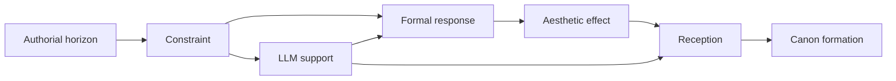
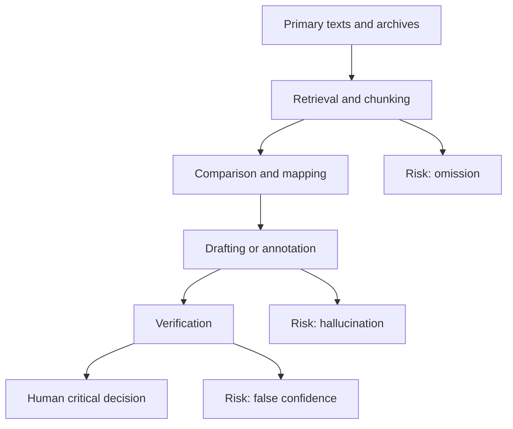

# Serious Literature Under Constraint

## Executive Summary

This report argues that the major difficulties of **serious literature** are not accidental defects that happen to befall otherwise transparent art. They are structural pressures built into the medium, into history, into institutions, and into unequal systems of circulation. From entity["people","William Wordsworth","romantic poet"]’s attack on elevated poetic diction in entity["book","Lyrical Ballads","1800 poetry volume"], to entity["people","Virginia Woolf","modernist novelist"]’s critique of the “customary” novel, to entity["people","Toni Morrison","nobel novelist"]’s insistence that language cannot definitively capture slavery, genocide, or war, literary history repeatedly shows that the art form develops by wrestling with its own limits rather than by escaping them. citeturn28search1turn28search13turn6search0

The twelve limitations isolated below fall into five broad families. Some are **medium-internal**: stale convention, the inadequacy of language before consciousness and extreme experience, intertextual overload, and the difficulty of preserving local idiom. Some are **epistemic**: archival silence, authorial blind spots, and the problem of representing social totality. Some are **institutional**: censorship, serialization, market pacing, and posthumous editorial contingency. Some are **world-systemic**: translation asymmetry and unequal canonization. And some are **self-reflexive**: literature’s recurrent fear that its own forms have become exhausted. These pressures shape not only aesthetics but also reception, pedagogy, and canon formation. citeturn21search2turn5search0

**Large language models** can help, but only under a strict division of labor. They are strongest when used as **research amplifiers, annotation engines, perspective auditors, structural mappers, contrastive stylists, and collation assistants**. They are weakest when asked to replace archival evidence, moral judgment, witness, or singular style. Retrieval-augmented generation improves knowledge-intensive work; prompt chaining and iterative critique can improve complex drafting; but hallucination remains endemic, and long-context systems still miss relevant information, especially in the middle of large inputs. A responsible literary workflow therefore requires retrieval, chunking, verification, and explicit human adjudication at every critical stage. citeturn12search0turn13search14turn13search23turn12search11turn12search1

## Frame and Method

In this report, **serious literature** means works that pursue **formal ambition, linguistic pressure, cognitive density, ethical risk, and durable rereadability**, rather than primarily speed, entertainment efficiency, or market predictability. That category is not identical with “high culture” in any simple sociological sense. It is an **operational category** for criticism: the works considered here are those that seek to extend what literature can know, say, sound like, or endure.

The governing analytical sequence is simple: **constraint produces formal response; formal response produces aesthetic effect; aesthetic effect conditions reception; reception under unequal institutions and translations conditions canon formation**. That is why literary difficulty cannot be separated from literary history. A work may be formally powerful precisely because it confronts a limit, yet it may also become marginal, scandalous, or invisible for the same reason. citeturn21search2turn5search0

The value of this model is not reduction. It is diagnostic clarity. It shows why the same difficulty can appear, at one moment, as **failure**, at another as **innovation**, and later as **canonical necessity**.

## Twelve Historical and Contemporary Limitations

**Formal conventionality and ossified decorum.**  
**Definition.** Literature repeatedly hardens into inherited diction, expected plots, sanctioned tonal registers, and “proper” forms of seriousness. **Historical cases.** In the preface to entity["book","Lyrical Ballads","1800 poetry volume"], entity["people","William Wordsworth","romantic poet"] proposes poetry rooted in common life and the “real language of men,” explicitly resisting the prestige of inherited poetic diction. More than a century later, entity["people","Virginia Woolf","modernist novelist"], in “Modern Fiction,” argues that the ordinary mind receives a “myriad impressions” and that the conventional novel falsifies that experience by filling its pages in the old way. **Causes.** School canons, publishing expectations, critical taxonomies, and the inertia of successful prior forms all reward repetition. **Consequences.** Aesthetically, convention produces polish at the cost of pressure; works may become rhetorically correct and imaginatively second-hand. In reception, rebels are first charged with formlessness or vulgarity; in canon formation, the successful rebel is then retroactively normalized and taught as a new classic. **LLM intervention.** Use the model as a **convention detector** rather than a ghostwriter: feed it a chapter or poem, ask it to flag inherited phrases, default scene structures, and tonal habits, then ask for three alternatives—conservative, moderate, and radical—without adopting any output verbatim. A useful prompt is: *“Mark every phrase that depends on inherited literary prestige rather than local necessity; then propose three revisions that preserve semantic content while changing diction, syntax, and tonal temperature.”* **Risks and ethics.** The main danger is homogenization: the model can erase intentional period texture and replace one stale convention with a synthetic contemporary middle style. It should therefore function as an adversarial mirror, not as an authority. citeturn28search1turn28search13

**Ineffability of consciousness and extreme experience.**  
**Definition.** Language is sequential, but consciousness is dispersed, recursive, bodily, and discontinuous; extreme experience often defeats direct representation. **Historical cases.** entity["people","Samuel Beckett","irish writer"]’s entity["book","The Unnamable","1953 novel"] strips away conventional plot and stable selfhood in order to stage language at the edge of its own failure. entity["people","Toni Morrison","nobel novelist"], in her Nobel lecture, argues that language should not imagine it can finally “pin down” slavery, genocide, or war. **Causes.** Inner life exceeds descriptive capture; trauma resists linear narration; bodily sensation often arrives before concept. **Consequences.** Literature answers with stream of consciousness, fragmentation, silence, repetition, and non-resolution. These strategies extend the art form’s reach, but they also generate charges of obscurity, self-indulgence, or “difficulty.” In canon formation, works once dismissed as unreadable often become central precisely because they transformed the representation of inner life. **LLM intervention.** The model can help **decompose experience into channels**: sensory, affective, temporal, somatic, associative, and reticent. Use it to generate *multiple partial renderings* of the same scene, each from a different phenomenological angle, then recombine manually. A precise prompt is: *“Render this scene five ways: bodily sensation first; perception before interpretation; associative memory; fractured chronology; almost-silent version with implication rather than statement.”* **Risks and ethics.** LLMs easily produce **counterfeit depth**—language that sounds profound without bearing experiential necessity. They are especially unreliable when simulating trauma. They may sharpen craft, but they must never be allowed to counterfeit witness. citeturn18search1turn6search0

**Archival silence and documentary deficit.**  
**Definition.** Much of what literature most urgently wants to know—especially the interior lives of the oppressed—survives only in partial, biased, or missing records. **Historical cases.** In “The Site of Memory,” Morrison explicitly distinguishes **fact** from **truth** and describes her task as filling the blank spaces left by slave narratives; her novel entity["book","Beloved","1987 novel"] turns that problem into form. entity["people","Primo Levi","italian writer"]’s late work entity["book","The Drowned and the Saved","1986 essays"] complicates testimony by theorizing the “gray zone,” where clean moral categories blur under camp conditions. **Causes.** Enforced illiteracy, destroyed records, censorship, the asymmetry between rulers’ archives and subjects’ lives, and the attrition of memory all create documentary voids. **Consequences.** Aesthetically, writers are pushed toward montage, haunting, reticence, and strategic invention. In reception, critics often reward heavily documented narratives and undervalue works that openly dramatize archival incompleteness. In canon formation, the documented elite remain easier to teach than the half-erased. **LLM intervention.** This is one of the best domains for a **retrieval-first workflow**. Ask the model to separate materials into four columns: **verified**, **contested**, **unknown**, and **ethically non-inferable**. Then use it to cluster testimony, detect recurring motifs, and identify where the archive stops. A good prompt is: *“From these documents, build a criticism-ready evidence table. Do not invent interior states. Mark every inference level as certain, probable, possible, or forbidden.”* **Risks and ethics.** The danger is severe: hallucinated archives and fabricated voice. Here the model must remain a disciplined archivist’s assistant, never a ventriloquist for the dead or the dispossessed. citeturn19search2turn19search23turn19search5

**Positional blind spots and representational asymmetry.**  
**Definition.** Authors write from historically situated standpoints that can produce systematic blindness toward other peoples, classes, genders, or colonized subjects. **Historical cases.** entity["people","Joseph Conrad","novelist"]’s entity["book","Heart of Darkness","1899 novella"] remains powerful partly because it stages imperial horror; yet entity["people","Chinua Achebe","nigerian novelist"]’s “An Image of Africa” altered twentieth-century criticism by arguing that Conrad’s Africa functions as a foil for European self-regard rather than as a world with full human reciprocity. **Causes.** Colonial ideology, unequal social distance, monolingual archives, and the absence of accountable interlocutors permit writers to misrecognize what they depict. **Consequences.** Aesthetic force can become entwined with epistemic violence. Reception then divides: some readers defend formal power, others foreground representational injury. Canon formation no longer appears neutral; it becomes a history of argument over whose reality counts. **LLM intervention.** Use a model as a **perspective auditor**. Ask it to map who speaks, who is described but voiceless, who receives interiority, which metaphors cluster around which groups, and what knowledge the narrative withholds from some characters while granting it to others. The best workflow compares the target text to a **counter-corpus** from historically excluded voices. Prompt: *“Audit representational asymmetry in this chapter. Build a table of speakers, silent objects of description, lexical clustering, and missing epistemic perspectives.”* **Risks and ethics.** The model itself inherits stereotypes from training data. It can also turn critique into cosmetic “fairness rewriting,” which moralizes the text instead of exposing its contradictions. The aim is diagnosis, not laundering. citeturn24search0turn24search22turn24search2

**The problem of social totality.**  
**Definition.** Serious literature often wants to represent systems—capital, empire, bureaucracy, war, media, ecology—that exceed any one consciousness. **Historical cases.** entity["people","Emile Zola","french novelist"]’s entity["book_series","Les Rougon-Macquart","20 novel cycle"] is conceived as a natural and social history of a family under the Second Empire. entity["people","John Dos Passos","american novelist"]’s entity["book_series","U.S.A.","trilogy"] intercuts fictional lives with newsreels and documentary fragments. entity["people","Don DeLillo","american novelist"]’s entity["book","Underworld","1997 novel"] spans decades of American history in order to render waste, media, and Cold War residue as system rather than episode. **Causes.** Modernity generates causal networks too large for direct seeing. The novelist therefore confronts a scale gap between lived immediacy and systemic structure. **Consequences.** Aesthetically, literature invents cycles, montage, panoramic casts, documentary inserts, and distributed plots. Reception often admires ambition while complaining of bloat or dispersal. Canon formation tends to privilege those rare works that solve scale without dissolving into schema. **LLM intervention.** This is where models are genuinely useful as **structural cartographers**. Build a graph of actors, institutions, times, and causal links before revising the prose. Ask the model to detect dropped arcs, under-embodied institutions, and expository bottlenecks. Prompt: *“Extract a world-model from this draft: actors, institutions, temporal layers, missing causal bridges, and scenes needed to embody rather than explain the system.”* **Risks and ethics.** The risk is over-rationalization. A graph can tame what the work needs to keep unstable. The model can help map totality, but only the writer can restore its density and friction. citeturn23search13turn23search2turn23search3

**Intertextual overload and encyclopedic difficulty.**  
**Definition.** Literature becomes difficult when it assumes a reader already embedded in vast prior traditions, myth systems, language games, or scholarly apparatus. **Historical cases.** The Cambridge preface to entity["people","James Joyce","irish novelist"]’s entity["book","Ulysses","1922 novel"] bluntly notes that many readers try and fail to finish it, and links its difficulty to its political and historical moment. Meanwhile, the 1948 Nobel presentation for entity["people","T. S. Eliot","poet critic"] describes modern poetry as increasingly allusive and indirect, and identifies erudite allusion as one source of the bewilderment produced by *The Waste Land*. **Causes.** Fragmented modern culture, mythic method, citation-rich form, and a prestige economy of erudition all push literature toward encyclopedic density. **Consequences.** Annotated editions, seminars, and expert communities become gatekeepers. Yet the same difficulty can intensify rereadability and produce durable interpretive communities. Canon formation here is double-edged: exclusion and consecration advance together. **LLM intervention.** Use LLMs for **layered annotation**, not final interpretation. Ask for three note bands—*minimum context*, *necessary historical frame*, and *advanced intertextual extension*—while forcing the model to label each link **certain**, **plausible**, or **speculative**. Prompt: *“Annotate this page at baseline, intermediate, and specialist levels. Distinguish required allusions from optional scholarship. Never hide uncertainty.”* **Risks and ethics.** Hallucinated allusions are common. The deeper risk is subtler: replacing interpretive labor with pre-digested context, thereby destroying the productive resistance that the work imposes. citeturn16search8turn29view1

**Censorship, obscenity law, and coercive publication regimes.**  
**Definition.** Literature is limited not only by what can be imagined, but by what can be printed, imported, owned, taught, or safely signed. **Historical cases.** The American legal history of *Ulysses* shows how obscenity doctrine constrained publication; after the Little Review case, the novel could not be legally printed in the United States or United Kingdom, and the ban also affected copyright and piracy. entity["people","Boris Pasternak","russian novelist"] first accepted, then under Soviet pressure declined, the Nobel Prize after authorities banned entity["book","Doctor Zhivago","1957 novel"]. **Causes.** Moral law, state ideology, surveillance, import controls, party discipline, and the material vulnerability of publishers. **Consequences.** Aesthetics shift toward indirection, allegory, exile publication, samizdat, euphemism, or silence. Reception can be distorted by scandal or suppression; canon formation is often accelerated by persecution, but only after the fact. **LLM intervention.** In repressive environments, LLMs can assist through **risk triage**: classify passages by likely legal or political exposure; separate **non-negotiable artistic core** from **replaceable surface wording**; generate jurisdiction-specific risk notes. Prompt: *“For jurisdiction X, identify passages likely to trigger obscenity, sedition, or ideological sanctions; preserve artistic intent while proposing safer publication surfaces.”* **Risks and ethics.** This is dangerous terrain. Cloud-based systems can leak drafts; “safety rewriting” can become machine-administered self-censorship; and no model should be trusted with sensitive political material without local privacy guarantees. citeturn25search0turn25search1turn25search2

**Market tempo, serialization, and reader-retention pressure.**  
**Definition.** Literature written under installment or market pace constraints internalizes the rhythms of sale, suspense, and recap. **Historical cases.** entity["people","Charles Dickens","novelist"]’s working notes, especially for entity["book","Our Mutual Friend","1864 novel"], show serial composition as a long process of managing narrative over monthly parts; by the mid-Victorian period, his formula of shilling numbers had become highly standardized. Victorian serial fiction also reached readers within a material frame of advertisements, reviews, and magazine temporality. **Causes.** Installment economics, magazine schedules, audience expectation, advertiser adjacency, and the need to secure repeated purchases. **Consequences.** Aesthetically, serialization yields cliffhangers, recap structures, recurring motifs, and occasionally prolixity or melodramatic inflation. Reception later tends to forget the material conditions of first reading and judges the works as if they were born between hard covers. Canon formation often strips the market machinery away while keeping the formal traces it produced. **LLM intervention.** Use models as **installment architects**: map revelation tempo, recap burden, cliffhanger density, and deferred motif return. Prompt: *“For a 12-part serial release, score each installment for recap, new revelation, suspense carryover, and arc continuity. Show where pacing is market-driven rather than artistically earned.”* **Risks and ethics.** The model can easily optimize for retention instead of resonance. That produces efficient but thin plotting. The proper use is diagnostic: to see where commerce has overrun design. citeturn15search0turn15search7turn15search9

**Theoretical self-consciousness and literary exhaustion.**  
**Definition.** Literature sometimes becomes overburdened by awareness of its own belatedness, turning formal intelligence into self-consumption. **Historical cases.** In 1967, entity["people","John Barth","american novelist"] defined “exhaustion” as the used-upness of certain forms, not the death of literature itself. Later commentary and obituary notices emphasize that he subsequently clarified the point through “replenishment,” while critics also observed that once-shocking postmodern self-consciousness could harden into mannerism. **Causes.** A strong sense that modernism and metafiction have already tested the limits of representation; academicization; the prestige of theory; fear of naïveté. **Consequences.** The result can be brilliant art about art, but also emotional thinning, narrowed social contact, and a split between “writer’s writer” prestige and broader readability. In canon formation, such work is often preserved through graduate pedagogy long after its initial shock has cooled. **LLM intervention.** Models are useful here as **ratios of emphasis**. Ask them to tag prose by function—story movement, reflection, meta-commentary, citation burden, scene embodiment—and return proportions. Prompt: *“Tag each paragraph as narrative, reflection, meta-fictional commentary, or theoretical exposition. Show where conceptual self-reference suppresses dramatic pressure.”* **Risks and ethics.** The danger is false correction in the opposite direction: an algorithmic push toward simplified “clarity” can destroy justified difficulty and flatten thought into paraphrase. citeturn20search4turn20news38turn20news41

**Translation asymmetry and world-literary inequality.**  
**Definition.** Literature reaches world scale only through translation networks that are structurally unequal. **Historical cases.** entity["organization","UNESCO","un cultural agency"]’s Index Translationum data show overwhelming dominance by English as a source language. entity["people","Franco Moretti","literary theorist"]’s formula of world literature as “one and unequal” remains analytically apt. Nobel history itself acknowledges that one function of the prize has been to draw attention to “important but unnoticed writers and literatures.” **Causes.** Publishing capital, prestige languages, translator concentration, school markets, prize circuits, and asymmetrical review ecologies. **Consequences.** Canon formation becomes inseparable from what is translated, how it is paratextually framed, and which languages are granted centrality. Aesthetically, works may be written with translation in mind or, conversely, remain stubbornly local at the cost of circulation. Reception often mistakes translated visibility for intrinsic universality. **LLM intervention.** Here the model can serve as a **translation scout** rather than a professional substitute: produce synopsis banks, translator briefs, term glossaries, comparable-author maps, and sample passages for publishers and human translators. Prompt: *“Create a translator and editor dossier: untranslatable terms, register shifts, cultural assumptions, likely false domestications, and three paratext strategies for first-time foreign readers.”* **Risks and ethics.** Machine translation can erase style, political nuance, dialect, and rhythm; it can also accelerate the domination of already central languages. The right use is infrastructural support for human translation, not replacement. citeturn21search1turn21search2turn5search0

**Material contingency, posthumous editing, and archival survival.**  
**Definition.** What literature “is” depends on what survives, who keeps it, who edits it, and under what institutions it becomes legible. **Historical cases.** entity["people","Franz Kafka","czech writer"]’s unfinished novels, including entity["book","The Trial","1925 novel"], entered history because Max Brod ignored Kafka’s request to destroy the manuscripts. entity["people","Emily Dickinson","poet"] published only a tiny fraction of her nearly 1,800 poems in her lifetime; posthumous discovery and editing created “Dickinson” as a literary event. A useful Chinese counterexample is entity["people","Lu Xun","chinese writer"]: the 2021 new edition of his manuscript archive runs to 78 volumes and more than 32,000 pages, showing how preservation policy can transform future criticism. **Causes.** Fragile materials, heirs, war, editorial ideology, private custody, copyright, and institutional capacity. **Consequences.** Critical interpretation rests on textual mediation. Works may survive only through betrayal, intervention, or state-backed preservation. Canon formation thus has a custodial history as much as an aesthetic one. **LLM intervention.** Models can assist with **version collation**, variant tracking, and editorial diff maps. Prompt: *“Compare versions A, B, and C; identify substantive revisions, punctuation normalization, uncertainty zones, and editorial interventions likely to affect interpretation.”* **Risks and ethics.** Automated transcription can silently normalize or corrupt. Every variant workflow therefore needs provenance logs, image checks, and human review against the manuscript witness. citeturn22search2turn22search6turn22search19turn11search7

**Local idiom, dialect density, and acoustic singularity.**  
**Definition.** Literature often gains its deepest force by fastening itself to local speech, oral cadence, and historically layered idiom; the same choice can reduce portability. **Historical cases.** In his Nobel lecture, entity["people","Mo Yan","chinese novelist"] says that with entity["book","Sandalwood Death","2001 novel"] he stepped out from behind his earlier fiction and imagined himself publicly telling a story. Chinese critical discussion of the novel emphasizes its embedding in Gaomi local culture and the use of Maoqiang opera textures; the English publisher underscores its movement among stylized arias, poetry, late-imperial idiom, and contemporary prose. **Causes.** Commitment to region, sound, oral performance, and historical language thickness. **Consequences.** Aesthetically, such writing becomes highly singular and difficult to substitute; in reception, it may require glosses, retranslation, or performance-sensitive criticism. In canon formation, some works rise precisely because they remain stubbornly local, while others are thinned in translation until they become legible only by losing their strongest pressure. **LLM intervention.** Use the model for **layered glossing**, not flattening: literal gloss, functional paraphrase, cultural context, sonic note, and alternative translation choices. Prompt: *“For each dialectal or opera-derived term, give a literal gloss, a cultural gloss, a sonic comment, and two translation options, one foreignizing and one domesticating. State what is lost in each.”* **Risks and ethics.** The model will tend to standardize local language into generic prose. That is precisely what must be resisted. In this domain, opacity is often an artistic achievement, not a defect to be removed. citeturn26search0turn26search2turn26search15

## Comparative Table

The table below compresses the twelve cases into a working matrix for critics and writers.

| Limitation | Historical examples | Causes | LLM interventions | Main risks |
|---|---|---|---|---|
| Formal conventionality | Wordsworth, *Lyrical Ballads*; Woolf, “Modern Fiction” citeturn28search1turn28search13 | School canon; publisher norms; prestige diction | Style audit; cliché detection; parallel rewrites | Homogenization; false period style |
| Ineffability of consciousness | Beckett, *The Unnamable*; Morrison’s Nobel lecture citeturn18search1turn6search0 | Sequential language vs dispersed mind; trauma | Multi-channel rendering; sensory decomposition | Counterfeit depth; trauma simulation |
| Archival silence | Morrison, “The Site of Memory”; *Beloved*; Levi, *The Drowned and the Saved* citeturn19search2turn19search23turn19search5 | Missing records; biased archives; memory loss | Retrieval-first evidence tables; lacuna mapping | Hallucinated sources; ventriloquism |
| Positional blind spots | Conrad, *Heart of Darkness*; Achebe, “An Image of Africa” citeturn24search0turn24search22turn24search2 | Colonial ideology; social distance; mono-perspectival knowledge | Perspective audit; counter-corpus comparison | Model bias; cosmetic moral laundering |
| Social totality | Zola, *Les Rougon-Macquart*; Dos Passos, *U.S.A.*; DeLillo, *Underworld* citeturn23search13turn23search2turn23search3 | Systems exceed individual perception | Graph mapping; timeline extraction; arc tracking | Schematic abstraction; loss of texture |
| Intertextual overload | Joyce, *Ulysses*; Eliot’s allusive modernism citeturn16search8turn29view1 | Erudition; mythic method; fractured culture | Layered annotation; certainty-ranked notes | Hallucinated allusions; loss of productive difficulty |
| Censorship and repression | *Ulysses* obscenity regime; Pasternak, *Doctor Zhivago* citeturn25search0turn25search1turn25search2 | Law; state ideology; surveillance | Risk triage; jurisdiction-sensitive revision | Auto-censorship; privacy leakage |
| Market tempo and serialization | Dickens’s serial composition; Victorian print framing citeturn15search0turn15search7turn15search9 | Installment economics; advertiser and readership pressure | Installment planner; pacing diagnostics | Retention optimization over art |
| Theoretical exhaustion | Barth, “The Literature of Exhaustion” and afterlives citeturn20search4turn20news38turn20news41 | Belatedness; academicization; irony fatigue | Narrative/meta ratio map; exposition trimming | Anti-intellectual simplification |
| Translation asymmetry | UNESCO translation data; Moretti; Nobel “unknown masters” logic citeturn21search1turn21search2turn5search0 | Prestige languages; publisher capital; translator scarcity | Translator dossiers; sample glossaries; scouting | Stylistic erasure; center-language dominance |
| Archival contingency | Kafka/Brod; Dickinson posthumous archive; Lu Xun manuscripts citeturn22search2turn22search19turn11search7 | Survival accidents; heirs; editorial mediation | Version collation; provenance-aware diffing | Silent normalization; bad transcription |
| Dialect and acoustic singularity | Mo Yan, *Sandalwood Death* citeturn26search0turn26search2turn26search15 | Local speech; oral performance; historic idiom | Layered glossing; translation alternatives | Dialect flattening; domestication |

## LLM Workflows and Ethical Boundaries

Across the twelve cases, the most defensible **cross-cutting LLM workflow** is: **retrieve -> chunk -> compare -> draft or annotate -> verify -> human decide**. This order matters. Retrieval-augmented generation was designed precisely because parametric memory alone is limited in knowledge-intensive tasks; prompt chaining and iterative critique materially improve complex text work; but hallucination persists, and long-context models are still vulnerable to missing relevant information in the middle of large inputs. Plug-and-play fact-checking modules can help, but they do not remove the need for scholarly judgment. citeturn12search0turn13search14turn13search23turn13search9turn12search11

In practice, five tool patterns recur. The first is the **corpus builder**: turn notebooks, letters, editions, reviews, and criticism into searchable chunks. The second is the **perspective auditor**: detect lexical asymmetries, speaker distribution, and silences. The third is the **variant lab**: generate alternative phrasings, structures, or annotation depths without accepting them uncritically. The fourth is the **edition collator**: compare versions and expose editorial mediation. The fifth is the **translator’s bench**: produce glossaries, register maps, and paratexts for human translators or editors. These are not futuristic tasks. They are extensions of long-standing scholarly labor. What changes is speed and scale. citeturn12search0turn13search14turn13search9

The ethical boundary must remain explicit. Guidance from entity["organization","NIST","us standards agency"] and entity["organization","UNESCO","un cultural agency"] converges on the need for human accountability, transparency, cultural and linguistic diversity, and careful risk management in generative-AI use. For literary work, that means at least four non-negotiables: **never present fabricated archival material as evidence; never let the model silently replace citation; never outsource witness; never confuse smoothness with truth**. The model may help criticism move faster, but criticism remains responsible for what it affirms. citeturn12search1turn12search6

## Conclusion and Actionable Recommendations

The central conclusion is simple. **Serious literature does not merely suffer from limits; it is formed by them.** Convention provokes innovation. Unrepresentability generates new forms. Archival silence forces ethical invention or principled restraint. Censorship distorts but also exposes the political stakes of form. Translation and canonization remain unequal. For that reason, the right ambition is **not** to make literature frictionless. It is to decide which frictions are historically necessary, which are institutionally imposed, and which can be more intelligently negotiated. citeturn6search0turn21search2turn12search1

For **critics**, the most useful rule is to treat LLMs as **second-order instruments**: use them to retrieve, compare, map, gloss, collate, and audit, but not to certify interpretation. For **writers**, the most useful rule is to treat them as **productive antagonists**: let them expose cliché, dropped arcs, implied bias, or uncontrolled exposition, but do not let them choose the final sentence. A disciplined practice would do the following: keep a source bundle beside every substantial use of the model; mark every claim as verified, inferred, or speculative; run at least one counter-prompt against the first output; preserve a version trail for major revisions; and refuse any generated passage that solves an artistic problem by erasing the work’s singular pressure. citeturn12search0turn13search23turn12search11turn12search1turn12search6

**Practical recommendations.**
- **For critics:** build citation-rich corpora first; use models to surface asymmetries, not to close debate.  
- **For critics:** separate archive, inference, and invention in every notebook or annotation layer.  
- **For writers:** use LLMs for pre-publication audits of diction, pacing, and perspective, not for core imaginative substitution.  
- **For translators and editors:** use models to prepare glossaries and paratext, but keep decisive stylistic choices human.  
- **For scholars working on witness, atrocity, or silenced archives:** prohibit uncited generative filling of documentary voids.  
- **For everyone:** preserve opacity where opacity is an artistic achievement rather than a mere obstacle.  

The decisive principle is therefore not **AI-assisted ease**, but **critically supervised difficulty**. Literature remains most alive where language is forced to work against its own limits rather than being relieved of them.