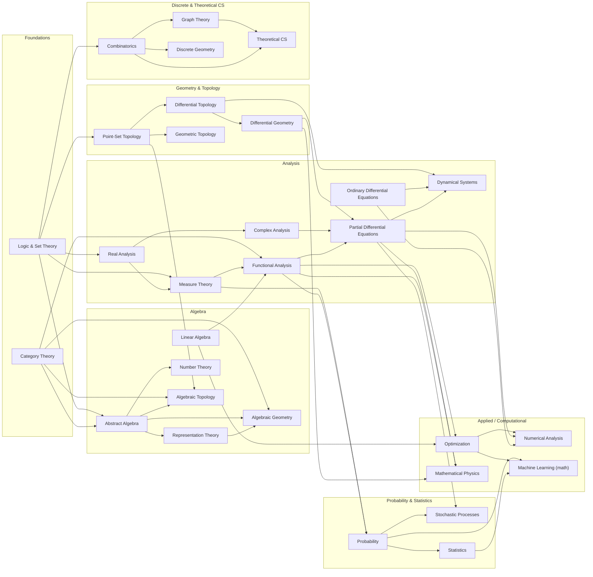

## Knowledge Structure of Pure Mathematics

### First principles and underlying mechanics

* **Axiomatization** (explicit primitive notions; constraint setting)
* **Formal inference** (rule-governed derivation; proof as certified transformation)
* **Abstraction / forgetful passage** (structure retention; data suppression)
* **Structuralism** (objects-by-morphisms; invariance under isomorphism)
* **Construction / existence** (explicit construction; non-constructive existence; choice principles)
* **Duality** (variance reversal; contravariance; mirror theorems)
* **Symmetry** (group action; orbit–stabilizer logic; conserved form)
* **Invariants** (classification by preserved quantities; obstruction theory)
* **Universality** (initial/terminal objects; free objects; adjunction patterns)
* **Local-to-global** (patching; descent; sheafification; completion)
* **Compactness / completeness** (finitary control of infinitary behavior)
* **Recursion / induction** (well-foundedness; transfinite iteration)
* **Decomposition** (prime factorization analogues; simple components; spectral splitting)
* **Optimization / extremality** (variational principles; minimax; convexity)
* **Randomness formalization** (measure; typicality; concentration)

### Knowledge System And Development Order

#### A. Foundations (rules of the game)

* **Axiomatic method**
  * Euclid, c. 300 BCE; “Elements” (axiomatic geometry)
  * Hilbert, 1899; “Foundations of Geometry”
* **Mathematical logic**
  * Propositional/predicate logic; proof theory; model theory; computability
  * Frege (1879); Peano (1889); Russell/Whitehead (1910–13)
  * Gödel, 1931; “Incompleteness” (limits of formal systems)
  * Turing, 1936; “Computability / halting”
* **Set theory**
  * Cantor, 1870s–1890s; “Infinity / cardinality”
  * Zermelo–Fraenkel axioms (1908–1922); Choice principle
  * Cohen, 1963; “Independence of CH”
* **Category theory (structural mechanics layer)**
  * Eilenberg–Mac Lane, 1945; “Categories”
  * Grothendieck, 1950s–60s; “Functors, sheaves, schemes” (unification engine)

#### B. Algebra (discrete structure and symmetry)

* **Group theory (symmetry algebra)**
  * Galois, 1830–32; “Galois theory” (symmetry of roots)
  * Lie, 1870s; “Continuous symmetry groups”
* **Ring and field theory (algebraic arithmetic)**
  * Dedekind, 1870s; ideals; algebraic integers
  * Noether, 1920s; structural ring theory; “Noetherianity”
* **Linear algebra and module theory (representation backbone)**
  * Jordan (1870s); canonical forms
  * Representation theory: Frobenius (1890s); Weyl (1920s)
* **Homological algebra (derived invariants)**
  * Cartan–Eilenberg, 1950s; derived functors; Ext/Tor
* **Universal algebra (axioms for algebraic structures)**

#### C. Topology and Geometry (space, form, invariance)

* **Point-set topology (continuity substrate)**
  * Hausdorff, 1914; separation axioms
* **Algebraic topology (invariants of shape)**
  * Poincaré, 1895; “Analysis situs” (homology precursor)
  * Fundamental group; homology; cohomology; spectral sequences
* **Differential geometry (smooth structure)**
  * Gauss, 1827; curvature of surfaces
  * Riemann, 1854; manifolds; metric geometry
* **Geometric topology / low-dimensional topology**
  * Thurston, 1970s–80s; geometrization program
  * Perelman, 2002–03; “Poincaré / Geometrization” milestone
* **Symplectic and contact geometry (phase-space geometry)**
  * Hamilton (1830s); modern symplectic topology (Gromov, 1980s)
* **Algebraic geometry (geometry via commutative algebra)**
  * Descartes, 1637; coordinate method
  * Weil, 1940s; foundations; conjectures
  * Grothendieck, 1957–67; “Schemes, étale cohomology” milestone
* **Complex geometry (holomorphic structure; Hodge theory)**

#### D. Analysis (continuum mechanics of functions and limits)

* **Real analysis (limits, measure, integration)**
  * Cauchy (1820s); rigor of limits
  * Weierstrass (1860s); epsilon–delta
  * Lebesgue, 1902; measure/integration
* **Functional analysis (infinite-dimensional linearity)**
  * Banach, 1920s; normed spaces
  * Hilbert spaces; spectral theory (von Neumann, 1930s)
* **Complex analysis (analytic continuation; residues)**
  * Cauchy (1810s–30s); Riemann (1850s)
* **Harmonic analysis (frequency decomposition)**
  * Fourier, 1807–22; “Fourier series” milestone
  * Calderón–Zygmund (1950s); singular integrals
* **Partial differential equations (structural analysis of fields)**
  * elliptic/parabolic/hyperbolic theory; regularity; microlocal analysis
* **Dynamical systems / ergodic theory**
  * Poincaré (1890s); qualitative dynamics
  * Kolmogorov–Arnold–Moser, 1950s–60s; stability theory

#### E. Arithmetic and discrete mathematics (finitary worlds and exactness)

* **Number theory (arithmetic core)**
  * Euclid; primes; Diophantus; Fermat (1630s)
  * Gauss, 1801; “Disquisitiones” milestone
  * Class field theory (Hilbert, Takagi, Artin; 1890s–1930s)
  * Modular forms; automorphic forms; Langlands, 1967; “Langlands program” milestone
  * Wiles, 1994; “Fermat’s Last Theorem” milestone
* **Combinatorics (discrete counting/invariants)**
  * extremal, probabilistic, algebraic combinatorics
* **Graph theory (network invariants)**
  * Euler, 1736; “Königsberg bridges” milestone
* **Discrete geometry; convexity**
* **Theoretical computer science interface (pure-leaning)**

  * complexity theory; proof complexity; pseudorandomness (structural overlap with logic)

#### F. Unification layers (cross-cutting frameworks; “bridges”)

* **Category theory (universality + composition)**
  * adjunction; limits/colimits; monoidal categories; higher categories
* **Sheaf theory and cohomology (local-to-global engine)**
  * Leray (1940s); Grothendieck (1950s)
* **Representation theory as a bridge**
  * groups ↔ geometry ↔ analysis (harmonic analysis on groups; geometric representation)
* **Noncommutative geometry**
  * Connes, 1980s–90s; operator-algebraic geometry
* **Arithmetic geometry**
  * elliptic curves; motives; cohomological methods in number theory
* **Topological/derived methods**
  * derived categories; ∞-categories; modern homotopy theory

###  Milestone chain

* “Euclid’s Elements” (c. 300 BCE)
* “Descartes’ analytic geometry” (1637)
* “Newton/Leibniz calculus” (1660s–1700s)
* “Gauss Disquisitiones” (1801)
* “Galois theory” (1830–32)
* “Riemann manifolds” (1854)
* “Cantor set theory” (1870s–1890s)
* “Hilbert axiomatization” (1899)
* “Lebesgue measure” (1902)
* “Gödel incompleteness” (1931)
* “Turing computability” (1936)
* “Eilenberg–Mac Lane categories” (1945)
* “Grothendieck schemes” (1957–67)
* “Atiyah–Singer index theorem” (1963)
* “Langlands program” (1967)
* “Perelman Poincaré/Geometrization” (2002–03)

### Dependencies

## Guide for Pure Mathematics Learning

Research-level mathematicians at places like Princeton, ENS or MIT are expected to have a broad and deep foundation across all major pure-math fields. In **Algebra**, they know group theory (simple and finite groups, Sylow theorems, representation theory), ring and module theory, field extensions and Galois theory, category theory, homological algebra and basics of algebraic geometry. In **Number Theory**, they are familiar with divisibility, primes, Diophantine equations, algebraic and analytic methods (e.g. quadratic forms, reciprocity, L-functions, modular forms, elliptic curves). In **Geometry** (differential and algebraic), they know manifolds and curvature (Riemannian geometry, Lie groups), basics of symplectic topology, as well as varieties and schemes, sheaf cohomology and Hodge theory in algebraic geometry. In **Topology**, they have training in point-set topology (compactness, metric spaces) and algebraic topology (homotopy, homology, cohomology, fundamental groups, covering spaces), and often manifold topology (knot theory, characteristic classes, surgery, etc.). In **Analysis**, they master real and complex analysis (metric spaces, Lebesgue integration, analytic continuation, Riemann surfaces, etc.), functional analysis (Banach/Hilbert space theory, spectral theory), and partial differential equations/basic harmonic analysis. In **Logic and Foundations**, they know set theory (ZFC axioms, ordinals, cardinals), basic model theory and computability, and formal proof concepts. Many PhDs also study **Combinatorics** (graph theory, extremal methods, probabilistic combinatorics) and apply category-theoretic methods.

Across these areas, key **techniques** include: using group actions and cohomology in algebra; analytic continuation and contour integration in complex analysis; variational methods and Sobolev spaces in PDEs; simplicial and singular complexes in topology; sheaf-theoretic arguments in algebraic geometry; diagonalization and compact operators in functional analysis; model-theoretic methods and forcing in logic, etc. **Influential works** range from classical theorems (e.g. the Atiyah–Singer index theorem in geometry, Weil conjectures in algebraic geometry, Hardy–Littlewood’s work in analytic number theory, foundational set theory of Gödel and Cohen) to modern breakthroughs (Wiles’ proof of Fermat’s Last Theorem, Perelman’s solution of Poincaré, Langlands’s reciprocity conjectures, etc.). Each field also has famous open problems or conjectures: for example, the **Riemann Hypothesis** (number theory/complex analysis), the **Birch–Swinnerton–Dyer conjecture** (arithmetic geometry), the **Hodge conjecture** (algebraic geometry), **Navier–Stokes existence and smoothness** (PDEs), **continuum hypothesis** (set theory), and many others. (For a general survey of famous unsolved problems, see the Clay Mathematics Millennium Problem list.) In short, a top-tier pure-math PhD is expected to command the core definitions and theorems of each area, understand standard proof methods (e.g. induction and extremal arguments in combinatorics, Fourier and analytic methods in analysis, spectral sequences and category theory in topology, etc.), and be aware of the main conjectures and landmarks in each field.

#### Traits and Habits of a Research Mathematician

Successful research mathematicians share a blend of intellectual abilities and personal habits. **Problem-solving ability and creativity** are central: modern commentary emphasizes that “the creative aspect of mathematics now occupies primary place” over rote calculation. Mathematicians must identify new questions or unexpected connections (“thinking up problems that “should be” studied”) and then explore them systematically. One mentor advises: _“Don’t get stuck on any single problem. Instead, let the problem guide you to a deeper overall understanding… that deeper understanding is what may eventually lead you full circle back to solving the original problem.”_. This flexibility—widely surveying problems and pursuing broader insight—is often crucial.

Rigour and precision are equally vital: a mathematician must _“work out the precise details of \. In other words, they internalize rigorous proof-writing and check every argument to ensure correctness. A good researcher also cultivates persistence and patience: major theorems can take years of effort (for example, Gonthier’s team spent six years formalizing the Feit–Thompson theorem). Learning from mistakes and dead-ends is part of the process; a healthy “growth mindset” helps one keep trying even when ideas fail.

Strong **analytical abstraction** is a hallmark: top mathematicians quickly shift between concrete examples and high-level abstractions (e.g. understanding a specific group action versus reasoning in category-theoretic language), and they maintain a “big picture” perspective while handling technical details. They also read widely, building on others’ work. Collaboration is common: researchers network and coauthor to compensate for gaps in their own knowledge. Indeed, one guide notes that as you advance, you should _“build up a robust enough network of collaborators to make up for any weaknesses of your own”_. Communication skills—writing clear proofs, giving talks, and explaining ideas—are expected. (While groundbreaking theorems won’t fail publication due to rough exposition, seasoned advice is to _“make \.) Other habits include systematic literature review, organizing work (often by breaking big problems into smaller steps), and time management. Soft skills like adaptability and teamwork are increasingly valued even in math: surveys rank creativity, collaboration, adaptability and communication among the top skills that professionals want.

In summary, a competitive pure-math researcher is extremely curious and imaginative, persistent in the face of difficulty, exquisitely precise in logic and notation, and adept at working collaboratively and communicating clearly. They combine deep abstract reasoning with technical mastery, and they balance intense focus on a problem with an openness to exploring new directions. Such habits and character traits—rigor, creativity, persistence, adaptability and collegiality—are as important as any individual theorem they know.

#### Computational Tools in Research

Modern mathematicians routinely use computer tools to support research. Three broad classes of software are employed:

*   **Symbolic Computation (Computer Algebra Systems):** These tools manipulate mathematical expressions in exact (symbolic) form. Examples include _Mathematica_ (Wolfram), _Maple_, _SageMath_, and _Magma_. For instance, _Mathematica_ is a comprehensive system that “allows symbolic computation” as well as numeric work, with built-in libraries for calculus, algebra, graphing, optimization, etc.. _Maple_ similarly “is a symbolic and numeric computing environment… covering symbolic mathematics, numerical analysis, data processing, visualization, and others”#:~:text=Maple%20is%20a%20symbolic%20,physical%20modeling%20and%20code%20generation). SageMath is an open-source environment that integrates many packages (NumPy, SciPy, Sympy, Maxima, GAP, etc.) under a common Python interface; its mission is “creating a viable free open source alternative to Magma, Maple, Mathematica and MATLAB”. Magma (proprietary) is highly optimized for algebra, number theory and geometry computations: it is “designed to solve problems in algebra, number theory, geometry and combinatorics”.
    
    These CAS are very powerful for tasks like factoring polynomials, solving symbolic equations, computing Gröbner bases, symbolic integration/differentiation, working with group or number-theoretic objects, and generating conjectural formulas. Their strength is speed and precision on algebraic manipulations (they never “blow up” with rounding error). However, they have limits: symbolic problems often grow combinatorially complex, and performance varies greatly between systems. As one user notes, “symbolic computation is extremely heavy-duty, and for almost any non-trivial task, performance varies wildly from software to software, with no single program being best for everything”. In practice mathematicians often use multiple CAS and choose the one best suited to a task (e.g. Sage or Magma for number-theoretic computations, Mathematica for complex algebraic expansions, etc.). In summary, symbolic tools automate tedious algebra and provide experimental insight into complicated formulas, but they complement rather than replace human reasoning.
    
*   **Numerical and Scientific Computing:** Numerical tools compute approximate solutions to mathematical problems. The prototypical system is **MATLAB**, a commercial numerical environment: _“MATLAB (Matrix Laboratory) is a proprietary… numeric computing environment… \. Such tools are used for large-scale linear algebra, eigenvalue problems, simulations, optimization, data fitting, finite-element PDE solvers (e.g. FEniCS, FreeFEM), and statistical analysis. They excel at numerical approximation, especially when exact symbolic answers are infeasible.
    
    Numerical tools allow exploration of mathematical behavior (e.g. plotting graphs of solutions, testing conjectures on many cases, estimating integrals or eigenvalues). However, their output is approximate and depends on floating-point arithmetic or discretization. As noted in the literature of **experimental mathematics**, numerical results alone “by themselves produce no insight, and symbolic computations frequently fail to produce full-fledged, closed-form solutions”. In other words, raw computations need a human to interpret. When combined with symbolic reasoning and creative insight, numerical experimentation can suggest patterns or guide proofs, but it is not a substitute for rigorous argument. Mathematicians use numerical tools for evidence and intuition, and to tackle problems (like PDEs) that have no exact solution formula.
    
*   **Formal Proof Assistants:** These are interactive theorem-proving systems (e.g. _Coq_, _Lean_, _Isabelle/HOL_, _HOL Light_, etc.) that allow users to build fully machine-checked proofs from logical foundations. They are based on formal logic and type theory, with a tiny trusted kernel that verifies each proof step. Historically, they have been used to verify both software and deep mathematical theorems. For example, Georges Gonthier’s group formalized the **Four-Color Theorem** and later the **Feit–Thompson odd-order theorem** in Coq, and Thomas Hales formalized the **Kepler conjecture** (sphere packing) in HOL Light (the Flyspeck project). Isabelle/HOL has been used to formalize the **Prime Number Theorem**#:~:text=Isabelle%20has%20been%20used%20to,the%20formal%20proofs%20are%2C%20as) and many algebraic structures, while Lean’s community (mathlib) has formalized vast areas of modern math (algebra, analysis, topology) and is actively working on projects like a formal proof of **Fermat’s Last Theorem**.
    
    These proof assistants are extremely powerful but require enormous effort: formalizing a major theorem can mean tens of thousands of lines of code and years of work. They excel at guaranteeing absolute correctness: once a proof is checked by a system like Coq or Lean, one is virtually certain there are no logical gaps. They also help organize mathematics into libraries of formally defined concepts. On the other hand, writing proofs in these systems is still much slower and more detailed than traditional paper proofs, so their use in daily research is growing slowly. Recently the development of libraries (e.g. Lean’s mathlib now has hundreds of thousands of lines of formalized math) and integration with automated reasoning (SMT solvers, AI tools) is making these assistants more practical.
    

In the **practice of current research**, all these tools play roles. Computer algebra systems and numerical software enable experimentation, checking examples, and sometimes discovering patterns or conjectures (though the human researcher must then prove them). Indeed, hybrid use of computers is now _“typical of modern experimental mathematics”_: we use symbolic and numeric computation _together_, guided by insight, to explore and formulate new facts. Formal proof assistants are beginning to shape future practice by making verified proofs attainable; as one visionary puts it, they allow breaking proofs into small verifiable pieces and ensure _“the correctness of proofs”_, opening new possibilities for collaboration and even for AI to assist with proofs.

In summary, a top pure-math PhD is expected to master classical mathematical theory and technique across algebra, geometry, analysis, topology, number theory, logic, etc., while possessing creativity, rigor, and persistence. They habitually combine human insight with modern computational tools: using CAS for algebraic manipulation, numerical codes for approximation and visualization, and beginning to employ proof assistants for rigorous verification. This blend of deep theoretical knowledge and adept use of computational tools underpins the competitive practice of contemporary mathematical research.

## Resources

TODO:
  - 两种抽象，对象和方法：参见pikachu345的文章

### 数学科普
1. 基本概念及方法 - 科朗，罗宾《什么是数学》
2. 数学思想，发展和危机 - 克莱因《数学，确定性的丧失》《古今数学思想》
3. 框架，分支及其意义 - 《普林斯顿数学指南》

### 数学学习资料

### Analysis - 分析

Analysis - 数学分析：
* T. M. Apostol - *Mathematical Analysis* - 适合初学
* Terrence Tao - *Analysis I/II* - 高观点、清晰易读
* Vladimir A. Zorich - *Mathematical Analysis I/II* - 全面、现代、多视角
* Rudin - *Principles of Mathematical Analysis* - 高观点、简略、抽象、高质量习题
* *Thomas Calculus*

Complex Analysis - 复变函数
* Stein - *Complex Analysis* - 经典
* Alhfors - *Complex Analysis* - 适合入门

Real Analysis - 实分析/实变函数
* Stein - *Real Analysis, Measure Theory, Integration, And Hilbert Spaces* - 经典
* G. B. Folland - *Real Analysis: Modern Techniques and Their Applications* - 全面

Functional Analysis - 泛函分析
* Peter Lax - *Functional Analysis*
* Rudin - *Functional Analysis* - 或许过时

Ordinary Differential Equation - 常微分方程
* Arnold - *Ordinary Differential Equations* - 入门
* Po-Fang Hsieh, Yasutaka Sibuya - *Basic Theory of Ordinary Differential Equations* - 深入

Partial Differential Equation - 偏微分方程
* Evans - *Partial Differential Equation* - 经典必读
* John K. Hunter - *Notes on Partial Differential Equations* - 讲解细致、适合参考

Fourier Analysis - 调和分析
* Loukas Grafakos - *GTM 249 Classical Fourier Analysis* - 详细、经典、错误较多
* Loukas Grafakos - *GTM 250 Modern Fourier Analysis* - 详细、经典、错误较多
* Dorina Mitrea - *Distributions, Partial Differential Equations, and Harmonic Analysis* - 调和分析、泛函分析、偏微分方程的基础

#### Algebra - 代数学

Algebras - 代数学/高等代数
* Sheldon Axler - *Linear Algebra Done Right* - 适合初学、篇幅短
* Steven Roman - *GTM135 Advanced Linear Algebra* - 高级
* Artin - *Algebra* - 适合初学

Abstract Algebras - 抽象代数
* Rotman - *First Course in Abstract Algebra with Applications* - 适合初学

Commutative Algebra - 交换代数
* Atiyah - *Introduction To Commutative Algebra*
* J. Elias etc. - *Six Lectures on Commutative Algebra*

Homological Algebra - 同调代数
* Peter J. Hilton, Urs Stammbach - *GTM4 A Course in Homological Algebra*

Lie Groups & Lie Algebras - 李群李代数
* Brian Hall - *GTM222 Lie Groups, Lie Algebras, and Representations*
* Kirillov - *An Introduction To Lie Groups And Lie Algebras*

Representation Theory - 群表示论
* Pavel Etingof, etc. - *Introduction to Representation Theory*

Algebraic Number Theory - 代数数论
* 加藤和也 - *数论I，II*

#### Geometry - 几何学

Space Analytic Geometry - 空间解析几何

Classical Differential Geometry - 古典微分几何

Manifolds - 流形
* R. Bishop, S. Goldberg - *Tensor Analysis on Manifolds* - 应用

Reimannian Geometry - 黎曼几何
* Do Carmo - 黎曼几何

Point Set Topology - 点集拓扑
* M. A. Armstrong - *Basic Topology* - 适合初学
* Munkres - *代数拓扑基础*

Differential Topology - 微分拓扑
* Milnor - *从微分观点看拓扑*

Algebrac Topology - 代数拓扑
* A. Hatcher - *Algebraic Topology*

#### Mathematical Logic - 数理逻辑

Mathematical Logic - 数理逻辑
- Anil Nerode, Richard A. Shore - *Logic for applications* - 适合初学、计算机向
- Michael Huth, Mark Ryan - *Logic in Computer Science - Modeling and Reasoning about Systems* - 适合初学、计算机向

Axiom Set Theory - 公理化集合论
- Thomas Jech - *Set Theory: an Introduction to Independence Proofs* - 适合初学
- Keneth Kunen - *Set Theory* - 难度高

Recursive Theory - 递归论
- Nigel Cutlan - *Computability: an Introduction to Recursive Function Theory* - 适合初学
- Robert I. Soare - *Recursively Enumerable Sets and Degrees :a Study of Computable Functions and Computably Generated Sets*

Model Theory - 模型论
- Chen Chung Chang，H.J.Keisler - *Model Theory* - 高质量
- David Marker - *Model Theory: an Introduction*

Proof Theory - 证明论
- Takeuti - *Proof Theory*

Category Theory - 范畴论
- Saunders Mac Lane - *GTM5 Categories for Working Mathematician* - 高质量

#### 应用

Probability - 概率论
* Kallenberg - Foundations of Modern Probability

Mathematical Computing - 数学计算
* Borwein, Skerritt -  An Introduction to Modern Mathematical Computing: with Maple

Quantum Mechanics - 量子力学
* David Griffiths - Introduction to Quantum Mechanics - 适合初学、高质量习题
* Cohen - Quantum Mechanics Vol I/II - 适合初学、补充材料丰富
* Feynman - Feynman Lectures on Physics: Volume III - 物理思想
* Weinberg - Lectures on Quantum Mechanics - 高级教材

String Theory - 弦论
* Polchinski - String Theory I/II - 适合初学

#### 1900年 希尔伯特的23个问题

1. 康托的连续统基数问题。
* 1874年，康托猜测在可数集基数和实数集基数之间没有别的基数，即著名的连续统假设。1938年，侨居美国的奥地利数理逻辑学家哥德尔证明连续统假设与ZF集合论公理系统的无矛盾性。1963年，美国数学家科恩（P.Choen）证明连续统假设与ZF公理彼此独立。因而，连续统假设不能用ZF公理加以证明。在这个意义下，问题已获解决。
2. 算术公理系统的无矛盾性。
* 欧氏几何的无矛盾性可以归结为算术公理的无矛盾性。希尔伯特曾提出用形式主义计划的证明论方法加以证明，哥德尔1931年发表不完备性定理作出否定。
* 根茨（G.Gentaen，1909-1945）1936年使用超限归纳法证明了算术公理系统的无矛盾性。
3. 只根据合同公理证明等底等高的两个四面体有相等之体积是不可能的。
* 问题的意思是：存在两个等高等底的四面体，它们不可能分解为有限个小四面体，使这两组四面体彼此全等，德思（M.Dehn）1900年已解决了这一问题。
4. 两点间以直线为距离最短线问题。
* 此问题提的一般。满足此性质的几何模型很多，因而需要加某些限制条件。1973年，苏联数学家波格列洛夫（Pogleov）宣布，在对称距离情况下，问题获解决。
5. 拓扑学成为李群的条件（拓扑群）。
* 这一个问题简称连续群的解析性，即是否每一个局部欧氏群都一定是李群。1952年，由格里森（Gleason）、蒙哥马利（Montgomery）、齐宾（Zippin）共同解决。1953年，日本的山迈英彦已得到完全肯定的结果。
6. 对数学起重要作用的物理学的公理化。
* 1933年，苏联数学家柯尔莫哥洛夫将概率论公理化。后来，在量子力学、量子场论方面取得成功。但对物理学各个分支能否全盘公理化，很多人有怀疑。
7. 某些数的超越性的证明。
* 需证：如果a是代数数，β是无理数的代数数，那么aβ一定是超越数或至少是无理数（例如，2√-2和exp(π)）。苏联的盖尔封特（Gelfond）1929年、德国的施奈德（Schneider）及西格尔（Siegel）1935年分别独立地证明了其正确性。但超越数理论还远未完成。目前，确定所给的数是否超越数，尚无统一的方法。
8. 素数分布问题，尤其对黎曼猜想、哥德巴赫猜想和孪生素数问题。
* 素数是一个很古老的研究领域。希尔伯特在此提到黎曼（Riemann）猜想、哥德巴赫（Goldbach）猜想以及孪生素数问题。黎曼猜想至今未解决。哥德巴赫猜想和孪生素数问题目前也未最终解决，其最佳结果均由中国数学家陈景润得出。
9. 一般互反律在任意数域中的证明。
* 1921年由日本的高木贞治，1927年由德国的阿廷（E.Artin）各自给以基本解决。而类域理论至今还在发展之中。
10. 能否通过有限步骤来判定不定方程是否存在有理整数解？
* 求出一个整数系数方程的整数根，称为丢番图（约公元前210-公元前290，古希腊数学家）方程可解。1950年前后，美国数学家戴维斯（Davis）、普特南（Putnan）、罗宾逊（Robinson）等取得关键性突破。1970年，巴克尔（Baker）、费罗斯（Philos）对含两个未知数的方程取得肯定结论。1970年， 苏联数学家马蒂塞维奇最终证明：在一般情况答案是否定的。尽管得出了否定的结果，却产生了一系列很有价值的副产品，其中不少和计算机科学有密切联系。
11. 一般代数数域内的二次型论。
* 德国数学家哈塞（Hasse）和西格尔（Siegel）在20年代获重要结果。60年代，法国数学家魏依（A.Weil）取得了新进展。
12. 类域的构成问题。
* 即将阿贝尔域上的克罗内克定理推广到任意的代数有理域上去。此问题仅有一些零星结果，离彻底解决还很远。
13. 一般七次代数方程以二变量连续函数之组合求解的不可能性。
* 七次方程x7+ax3+bx2+cx+1=0的根依赖于3个参数a、b、c；x=x(a,b,c)。这一函数能否用两变量函数表示出来？此问题已接近解决。1957年，苏联数学家阿诺尔德（Arnold）证明了任一在［0，1］上连续的实函数f(x1，x2，x3)可写成形式∑hi(ξi(x1,x2),x3)(i=1--9)，这里hi和ξi为连续实函数。柯尔莫哥洛夫证明f(x1,x2),x3)可写成形式∑hi(ξi1(x1)+ξi2(x2)+ξi3(x3))(i=1--7)这里hi和ξi为连续实函数，ξij的选取可与f完全无关。1964年，维土斯金（Vituskin）推广到连续可微情形，对解析函数情形则未解决。
14. 某些完备函数系的有限的证明。
*  即域K上的以x1,x2,…,xn为自变量的多项式fi（i=1,…，m），R为K［X1，…，Xm]上的有理函数F［X1，…，Xm]构成的环，并且F（f1，…，fm）∈K［X1，…，Xm]试问R是否可由有限个元素F1，…，FN的多项式生成？这个与代数不变量问题有关的问题，日本数学家永田雅宜于1959年用漂亮的反例给出了否定的解决。
15. 建立代数几何学的基础。
* 荷兰数学家范德瓦尔登1938年至1940年，魏依1950年已解决。舒伯特（Schubert）计数演算的严格基础。
* 一个典型的问题是：在三维空间中有四条直线，问有几条直线能和这四条直线都相交？舒伯特给出了一个直观的解法。希尔伯特要求将问题一般化，并给以严格基础。现在已有了一些可计算的方法，它和代数几何学有密切的关系。但严格的基础至今仍未建立。
1.   代数曲线和曲面的拓扑研究。
* 此问题前半部涉及代数曲线含有闭的分枝曲线的最大数目。后半部要求讨论备dx/dy=Y/X的极限环的最多个数N（n）和相对位置，其中X、Y是x、y的n次多项式。对n=2（即二次系统）的情况，1934年福罗献尔得到N(2)≥1；1952年鲍廷得到N(2)≥3；1955年苏联的波德洛夫斯基宣布N(2)≤3，这个曾震动一时的结果，由于其中的若干引理被否定而成疑问。关于相对位置，中国数学家董金柱、叶彦谦1957年证明了E（2）不超过两串。1957年，中国数学家秦元勋和蒲富金具体给出了n＝2的方程具有至少3个成串极限环的实例。1978年，中国的史松龄在秦元勋、华罗庚的指导下，与王明淑分别举出至少有4个极限环的具体例子。1983年，秦元勋进一步证明了二次系统最多有4个极限环，并且是（1，3）结构，从而最终地解决了二次微分方程的解的结构问题，并为研究希尔伯特第（16）问题提供了新的途径。
2.  半正定形式的平方和表示。
* 实系数有理函数f(x1,…，xn)对任意数组(x1,…，xn)都恒大于或等于0，确定f是否都能写成有理函数的平方和？1927年阿廷已肯定地解决。
18. 用全等多面体构造空间。
* 德国数学家比贝尔巴赫（Bieberbach）1910年，莱因哈特（Reinhart）1928年作出部分解决。
19. 正则变分问题的解是否总是解析函数？
* 德国数学家伯恩斯坦（Bernrtein，1929）和苏联数学家彼德罗夫斯基（1939）已解决。
20. 研究一般边值问题。
* 此问题进展迅速，己成为一个很大的数学分支。日前还在继读发展。
21. 具有给定奇点和单值群的Fuchs类的线性微分方程解的存在性证明。
* 此问题属线性常微分方程的大范围理论。希尔伯特本人于1905年、勒尔（H.Rohrl）于1957年分别得出重要结果。1970年法国数学家德利涅（Deligne）作出了出色贡献。
22. 用自守函数将解析函数单值化。
* 此问题涉及艰深的黎曼曲面理论，1907年克伯（P.Koebe）对一个变量情形已解决而使问题的研究获重要突破。其它方面尚未解决。
23. 发展变分学方法的研究。
* 这不是一个明确的数学问题。20世纪变分法有了很大发展。

#### 1967年 朗兰兹纲领
简介：1967年，年仅30岁的加拿大数学家罗伯特·朗兰兹在给美国数学家安德烈·韦伊的一封信中，提出了一组意义深远的猜想。这些猜想指出了三个相对独立发展起来的数学分支：数论、代数几何和群表示论，实际上它们是密切相关的这些猜想现在被称为朗兰兹互反猜想，而后演变成朗兰兹纲领，被称为数学界的“大统一理论”，在过去几十年里对数学的发展产生了极大影响。

### 形式化证明
1. Mathematical Components: https://math-comp.github.io/

### 前沿研究
1. 顶级刊物 Annals of Mathematics
2. 科普读物：Theorems of the 21st Century

学习方法：
1. **视频学习**。连续观看完整的视频课程，简单记录“内容大纲”、“数学思想”、“证明技巧”。
2. **制作笔记**。根据大纲，补充“完整定义”、“证明过程”、“重要例题”，用制作笔记“模拟”教授他人的过程
3. **练习习题**。进行第二步的同时，即寻找经典习题，特别是有全新证明技巧的习题进行练习，并补充在笔记上。积累一定经验后，进行大量练习。

### Learning Tips

Principles for choosing a suitable textbook:
  - **High-level viewpoint**: The "high-level viewpoint" in mathematics refers to approaching mathematical concepts, structures, and theories from a broader, more abstract perspective. This approach emphasizes understanding the `underlying principles` and `patterns` that unify different areas of mathematics, rather than focusing solely on specific problems or techniques. It seeks to reveal deep connections across various mathematical disciplines and to simplify complex problemsidentifying their essential features.
  - **High-quality exercises**: Well-designed exercises help students master mathematical concepts and techniquesproviding opportunities for practice and reinforcement. Also, high-quality exercises could promote critical thinking, and foster a deeper understanding of mathematical concepts.
  - **Well-explained**: A good mathematics textbook explains concepts clearly and concisely, making it easier for readers to grasp complex ideas. This is particularly important for **self-learners**.

### Entry Level 

#### Popular Books

**How to Solve it, A Structured Approach**, Daniel J. Velleman

All the Math You Missed, Thomas A. Garrity

Proofs from THE BOOK

Mathematical Proofs: A Transition to Advanced Mathematics
  - but for others who are still in high school or first and second year university the following bookChartrand, Polimeni, and Zhang, is an incredible introduction to proofs and various areas of mathematics

L.Steen, ed."今日数学"(Mathematics Today)
里面的文章.附带说一句,这本书是最好的数学普及读物之一,绝对值得一看,中译本的质量也不错.

#### History of Mathematics

**Mathematics and Its History**, John Stillwell

**Mathematics: The Loss of Certainty**, Morris Cline

**Mathematical Thought from Ancient to Modern Times**, Morris Cline

#### Systematic Cognition and Mathematical Thinking

**The Princeton Companion to Mathematics**, Timothy Gowers
  - An overview of the development of mathematics in the 20th century, aimed at establishing systematic cognition.

**How to Think Like a Mathematician: A Companion to Undergraduate Mathematics**, Kevin Houston

### Pure Mathematics

`Pure mathematics` is the branch of mathematics that focuses on the study of mathematical concepts independent of any application outside mathematics. It is driven**abstract reasoning**, **logical rigor**, and the intrinsic beauty of **mathematical structures, patterns, and relationships**. Pure mathematics is not developed with any particular application in mind, although many of its discoveries often find applications much later, sometimes in entirely unexpected ways.

#### Analysis

`Analysis` is a branch of mathematics that deals with the study of `change`, `motion`, and the **properties of real numbers**, including their behavior and the operations defined on them. It encompasses a variety of subfields that focus on `limits`, `continuity`, `differentiation`, `integration`, and the rigorous construction of the real and complex `number systems`. Analysis lays the foundation for understanding the quantitative aspects of the world and provides the essential tools for solving problems in physics, engineering, economics, and beyond.

##### Basic Analysis

**★ Mathematical Analysis**, Tom M. Apostol
  - Elementary, suitable for beginners

**★ Principles of Mathematical Analysis (Baby Rudin)**, Walter Rudin
  - High-level viewpoint, high-quality exercises

**Analysis I/II ★**, Terrence Tao
  - High-level viewpoint, legible writing

**Mathematical Analysis I/II**, Vladimir A. Zorich
  - Comprehensive, modern, multiple perspective

An Introduction to Analysis (4th Edition) 4th Edition
William R. Wade
  - intro

##### Real Analysis

**Real Analysis: Modern Techniques and Their Applications**, Gerald B. Folland
  - In-depth

**Real Analysis, Measure Theory, Integration, And Hilbert Spaces**, Elias M. Stein, Rami Shakarchi

**Real Analysis**, 4th Edition, Halsey Royden, Patrick Fitzpatrick

**Measure Theory**, Donald L. Cohn
  - Entry level, easy exercises

##### Complex Analysis

Stein - **Complex Analysis** - 经典 借用我同学的一句话，读这本书就像读小说一样，相当流畅。但深度不足，有些证明并不严谨

Alhfors - **Complex Analysis** - 适合入门
Complex Analysis 3rd Edition
Lars Ahlfors

Elementary Theory of Analytic Functions of One or Several Complex Variables (Dover Books on Mathematics) Text is Free of Markings Edition
Henri Cartan

Complex Analysis (Universitext): Second Edition 2nd ed. 2009 Edition
Eberhard Freitag

Real and Complex Analysis - Rudin
  - For those wishing to go further in analysis this is absolutely necessary as far as I'm concerned.

Markushevich 《Theory of Functions of a Complex Variable》又是苏联人留给数学界的一个完美的作品。Amazon全五星评价，细致入微，证明严谨友好。总之哪里学不懂，来这里找，肯定有，也肯定讲得更好。缺点就是太厚了，铺垫太多，前两百页左右其实可以直接跳过去。

##### Functional Analysis

Peter Lax - **Functional Analysis**

Rudin - **Functional Analysis** - 或许过时

##### Ordinary Differential Equation

Arnold - **Ordinary Differential Equations** - 入门

Po-Fang Hsieh, Yasutaka Sibuya - **Basic Theory of Ordinary Differential Equations** - 深入

##### Partial Differential Equation

Evans - **Partial Differential Equation** - 经典必读
John K. Hunter - **Notes on Partial Differential Equations** - 讲解细致、适合参考
Partial Differential Equations (Graduate Texts in Mathematics, 128)
Jeffrey Rauch 

R. Courant, D. Hilbert"数学物理方法"(I,II)
可以说是毫无疑问的经典.按照洪家兴老师的说法,不管椭圆,双曲,抛物里面的哪一块这本书里面的相应章节都是经典,问题就是这书放在一起你是没办法当教材来学的,所以只能有空翻翻啦....
经典的教材,大概可以算

O.A. Ladyzhenskaya"The Boudary Value Problems of Mathematical Physics"
和5.一样,都很经典.当然你要说它们陈旧我也没话可说.
既然这课叫数学物理方程,多少和物理沾点边吧,在这个方向上我以为

彼得罗夫斯基"偏微分方程讲义"

M. Taylor"Partial Differential Equations I"(Applied Mathematical Sciences 115)
后面这本看前一半就可以,后一半也看当然更好:-))引G. Lebeau的一句话,这书比
15.L. Hormander"Linear Partial Differential Operators, I"
要好念多了.(当然基本上人人都是这么认为的,只不过这位的来头比较大而已--法国科学院通讯院士,46岁)

##### Fourier Analysis

Loukas Grafakos - **GTM 249 Classical Fourier Analysis** - 详细、经典、错误较多

Loukas Grafakos - **GTM 250 Modern Fourier Analysis** - 详细、经典、错误较多

Dorina Mitrea - **Distributions, Partial Differential Equations, and Harmonic Analysis** - 调和分析、泛函分析、偏微分方程的基础

An Introduction to Harmonic Analysis (Cambridge Mathematical Library) 3rd Edition
Yitzhak Katznelson

##### Several Complex Variables

Analytic Functions of Several Complex Variables (AMS Chelsea Publishing)
Robert C. Gunning, Hugo Rossi 

Functions of Several Complex Variables and Their Singularities (Graduate Studies in Mathematics, 83)
Wolfgang Ebeling

##### Vector Calculus

##### Dynamical Systems

##### Convex Analysis

**Convex Analysis and Beyond**, Boris S. Mordukhovich, Mau Nam Nguyen
  - Friendly to beginners, well-explained

#### Algebra

##### General Algebra

Abstract Algebra, 3rd Edition 3rd Edition
David S. Dummit, Richard M. Foote

★ Advanced Modern Algebra (Graduate Studies in Mathematics) 2nd Edition
Joseph J. Rotman

Algebra (Graduate Texts in Mathematics, 211) 3rd Edition
Serge Lang

Abstract Algebra (Graduate Texts in Mathematics, 242) Softcover reprint of hardcover 2nd ed. 2007 Edition
Pierre Antoine Grillet

Contemporary Abstract Algebra 这本教材很通俗易读，中学生也完全可以读懂，但是从数学专业来看，有些啰嗦，抽象程度不够。如果你本身数学基础一般的话，可以考虑用这本书作为代数的入门书。

代数里有一本书，amazon评价很高，就是 Algebra: Chapter 0 作者是 Paolo Aluffi，该书的特点是用范畴的观点贯穿全书，很现代，而且起点很低，低到什么程度，作者在群论部分，故意不使用带余除法定理，这是一个很基本的定理，可能小学生都知道。为什么不使用呢？原因是作者不假定读者已经知道这个定理。但是不要真的认为小学生能读懂此书，实际上这是一本数学研究生教科书，起点低，或者说对数学知识的要求低，不代表这本书容易读，实际上要读懂这本书，需要有一定的mathematical maturity，很多数学书都是这样，不需要读者懂很多数学，但是就是读不懂，原因就是读者的mathmatical maturity不够。还有要说明一点，这本书有很多typo，所以读前先到作者的官网上去看勘误表，不然会产生很多不必要的误解。电子版在这里可以买到https://bookstore.ams.org/gsm-104/  大概是七十多美金，你需要有一张可以刷美元的信用卡，当然不支持支付宝。

作者：無雙
链接：https://www.zhihu.com/question/366915371/answer/1229144590
来源：知乎
著作权归作者所有。商业转载请联系作者获得授权，非商业转载请注明出处。

##### Linear Algebra

Sheldon Axler - **★ Linear Algebra Done Right** - 适合初学、篇幅短

**Linear Algebra: and Its Application**, Fifth Edition,David C. Lay, Steven R. Lay, Judi J. McDonald
  - Well explained, friendly to beginners

Linear Algebra - Friedberg, Insel, Spence
  - An excellent introduction to finite dimensional linear algebra. In fact, for most undergraduate stuff you won't need anything else.
  - This book straddles the line between a rigorous presentation of linear algebra and an applied approach better then any of the others.It's only major defect is a very confusing presentation of the Jordan form,for which Charles Curtis' book does a much better job. I'd have given more points,but I disagree with some of your other picks.This' ll be clearer when I post my list. 

Advanced Linear Algebra (Graduate Texts in Mathematics, 135) Softcover reprint of hardcover 3rd ed. 2008 Edition
Steven Roman
Steven Roman - **GTM135 Advanced Linear Algebra** - 高级

Artin - **Algebra** - 适合初学

Linear Algebra (2nd Edition) 2nd Edition
Kenneth M Hoffman, Ray Kunze

The Linear Algebra a Beginning Graduate Student Ought to Know Paperback – January 1, 2007
Jonathan S. Golan

**★[Courses] MIT 18.06 Linear Algebra** [#哔哩哔哩-中英字幕](https://www.bilibili.com/video/BV1zx411g7gq/) [#课程主页](https://ocw.mit.edu/courses/mathematics/18-06sc-linear-algebra-fall-2011/syllabus/) [#课程笔记](https://github.com/apachecn/mit-18.06-linalg-notes)
  - 地球上最好的线性代数课程，配套教材为 Gibert Strang 编写的《线性代数》。
  - Kenji Hiranabe 根据教材编写的图解笔记：[#Github](https://github.com/kenjihiranabe/The-Art-of-Linear-Algebra)

**线性代数 Introduction to Linear Algebra** [#豆瓣](https://book.douban.com/subject/34820335/)
  - Gibert Strang 编写的教材，本书内容包括行列式、矩阵、线性方程组与向量、矩阵的特征值与特征向量、二次型及Mathematica软件的应用等。每章都配有习题，书后给出了习题答案。本书在编写中力求重点突出、由浅入深、通俗易懂，努力体现教学的适用性。
  
**★ Linear Algebra Done Right** [#豆瓣](https://book.douban.com/subject/26265880/)
   - 适合初学者的教材，篇幅短。

##### Abstract Algebra

** Rotman - **First Course in Abstract Algebra with Applications** - 适合初学

Abstract Algebra, Dummite & Foote比上面那本好读，例子和习题也多不少但是有的地方写的太罗嗦。不过依然是一本极好的书。

##### Commutative Algebra

** Atiyah - **★ Introduction To Commutative Algebra**无须解释的经典，关键是要好好做书后习题。

** J. Elias etc. - **Six Lectures on Commutative Algebra**

Commutative Algebra: with a View Toward Algebraic Geometry (Graduate Texts in Mathematics, 150)
David Eisenbud

Introduction To Commutative Algebra (Addison-Wesley Series in Mathematics)
Michael Atiyah

Undergraduate Commutative Algebra (London Mathematical Society Student Texts, Series Number 29) 1st Edition
Miles Reid

S.Lang "Algebra"
Lang写书以清晰著称,他的这本书还得过AMS发的Steel优秀图书奖. 代数的经典教材。Ken. Ribet 评价为“代书圣经”，也是我的第一本代数书。可以和作者 Undergraduate Algebra一起看。

.N.Jacobson "Basic Algebra I,II"
这书在总书库里面有不少,理图里面也有前面几章的中译本,应该是叫"基础代数学"吧,不过翻译质量一般.Jacobson在代数领域也属于权威,是华先生同时代的人.这本书从观点上说是相当现代化的

##### Homological Algebra

** Peter J. Hilton, Urs Stammbach - **GTM4 A Course in Homological Algebra**

An Introduction to Homological Algebra (Cambridge Studies in Advanced Mathematics, Series Number 38)
Charles A. Weibel

An Introduction to Homological Algebra (Universitext) 2nd Edition
Joseph J. Rotman

An Elementary Approach to Homological Algebra (Monographs and Surveys in Pure and Applied Mathematics) 1st Edition
L.R. Vermani

##### Group Theory

Finite Group Theory (Graduate Studies in Mathematics, Vol. 92) (Graduate Studies in Mathematics, 92) First Edition
I. Martin Isaacs

The Theory of Finite Groups: An Introduction (Universitext) Softcover reprint of the original 1st ed. 2004 Edition

A Course in the Theory of Groups (Graduate Texts in Mathematics, Vol. 80) (Graduate Texts in Mathematics, 80) 2nd Edition
Derek J.S. Robinson

An Introduction to the Theory of Groups (Graduate Texts in Mathematics, 148) 4th Edition
Joseph J. Rotman
  - This is a great second text in group theory after an elementary exposition (say Contemporary Abstract Algebra - Gallian).

G.K. Pedersen "C*-Algebras and their Automorphism Groups"
这书连A.Connes都说好,我想决不会差到哪里去.
再说两句A.Connes,关于他的工作,或者说整个算子代数往后来的非交换几何的发展历史,特别是这一分支从其开始的阶段就和量子物理的联系,可以看

Groups and Symmetry, Amstrong 学群论不读这本书不完整，只读这本书不充分。

##### Metric Groups

Topological Groups: An Introduction 1st Edition
Nelson G. Markley 

##### Ring Theory

Lectures on Modules and Rings (Graduate Texts in Mathematics, 189) 1999th Edition
Tsit-Yuen Lam

A First Course in Noncommutative Rings (Graduate Texts in Mathematics, 131) 2nd Edition
Tsit-Yuen Lam

##### Field Theory

Field and Galois Theory (Graduate Texts in Mathematics, 167) 1996th Edition
Patrick Morandi
  - Friendly to Beginners

Field Theory (Graduate Texts in Mathematics, 158) 2nd Edition
Steven Roman

##### Galois Theory

.E.Artin "伽罗华理论"
非常薄,讲得很精彩,绝对是本传世佳作.还有

Edwards "Galois Theory"(GTM 101)
这本书很有趣,它是循着Galois的原始想法写的,因此和一般通行的教本里面的讲法不是很一样.

##### Lie Groups & Lie Algebra

** Brian Hall - **GTM222 Lie Groups, Lie Algebras, and Representations**
** Kirillov - **An Introduction To Lie Groups And Lie Algebras**

Lectures on Lie Algebras, J.Bernstein. Bernstein大神的名字如雷贯耳。这份notes很短，但是从最最基础的李代数的定义一直讲到Verma module 以及 Weyl Character Formula。看完之后就可以直接进入 BGG Category O 的学习了。

Representations of Semisimple Lie Algebras in BGG Category O, Humphreys. 其实作者还有一本Linear Algebraic Groups 也是经典。

##### General Representation Theory

** Pavel Etingof, etc. - **Introduction to Representation Theory**

Representation Theory: A First Course (Graduate Texts in Mathematics, 129) Corrected Edition
William Fulton, Joe Harris

Introduction to Lie Algebras and Representation Theory (Graduate Texts in Mathematics, 9) First Edition (US) First Printing
J.E. Humphreys

Lie Groups, Lie Algebras, and Representations: An Elementary Introduction Hardcover – January 1, 2003
Brian C. Hall

##### Representation Theory of Finite Groups

Linear Representations of Finite Groups (Graduate Texts in Mathematics, 42) 1st ed. 1977. Corr. 5th printing 1996 Edition
Jean-Pierre Serre, Leonhard L. Scott (Translator) 基础知识要求很少，任何一个大一学生都能看。

Representation Theory of Finite Groups: An Introductory Approach (Universitext) 2012th Edition
Benjamin Steinberg

Character Theory of Finite Groups
I. Martin Isaacs

Representations and Characters of Groups, Second Edition 2nd Edition
Gordon James, Martin Liebeck

Representation Theory: a First Course, Fulton & Harris. Richard. Borhcerds 推荐的表示论入门。里面有非常多的例子，炒鸡喜欢~

##### Representation Theory of Compact Groups

Representations of Compact Lie Groups (Graduate Texts in Mathematics, 98)
T. Bröcker, T.tom Dieck

Compact Lie Groups (Graduate Texts in Mathematics, 235) Softcover reprint of hardcover 1st ed. 2007 Edition
Mark R. Sepanski

##### Linear Algebraic Groups

Linear Algebraic Groups (Modern Birkhäuser Classics) 2nd ed. 1998. 2nd printing 2008 Edition
T.A. Springer

Linear Algebraic Groups (Graduate Texts in Mathematics, 21) Corr Print Edition
James E. Humphreys

##### Algebraic Number Theory

** 加藤和也 - **数论I，II**

##### Generalized Functions

在广义函数的标题下最有名的应该是
36.I.M.Gelfand等"广义函数"(Generalized Functions,I-V)
大概I-IV都有中译本吧!理图里面应该是有的,英文本系资料室有.从泛函的角度,据说是第二本最有意思.另外还有两本好书,不光是这一块内容,从整体上讲也是很好的泛函课本
37.K.Yosida(吉田耕作)"Functional Analysis"
他也过两种不同"规格"的书,一本比较厚,一本比较薄,都很好.其中有一本的第六版去年世界图书刚刚影印.
38.H.Brezis "Analyse Fonctionelle"
Brezis是我校名誉教授,法国科学院院士,非线性偏微的权威.他的这本书很见功力.如果能念法语的话绝对值得一读.
在Rudin的书25.里面也讲了不少广义函数的内容,特别有一章讲Tauberian Theory,很有意思.

#### Geometry

##### Trigonometry

##### Differential Geometry

Riemannian Geometry First Edition
Manfredo Perdigao do Carmo, Francis Flaherty

A Comprehensive Introduction to Differential Geometry, Vol. 1, 3rd Edition 3rd Edition

Riemannian Geometry and Geometric Analysis (Universitext) Paperback – January 1, 2011
Jürgen: Jost

Riemannian Manifolds: An Introduction to Curvature (Graduate Texts in Mathematics) 1997th Edition
John M. Lee

**Visual Differential Geometry and Forms: A Mathematcial Drama in Five Acts**, Tristan Needham

Do Carmo(多卡模) "曲线和曲面的微分几何学"
"Differential Geometry of Curves and Surfaces"这是本绝对的好书,胡先生他们把这本书翻译出来实在是功德无量.在总书库里面有一本英文本,如果怀疑有什么翻译问题的话可以去对照.
1.第三章里面有个习题是从2.的中译本上搬过来的,不过有题意不清之嫌.做的时候要小心.
还有一点要注意的是1.里面曲面论基本定理的证明中有个地方漏印了两项,具体去问黄宣国老师吧.
一般说来,看上面两本书也就够了,可以考虑的扩充部分包括在2.的末尾所开列的参考书目.

##### Space Analytic Geometry

##### Classical Differential Geometry

##### Manifolds

** R. Bishop, S. Goldberg - **Tensor Analysis on Manifolds** - 应用

Munkres《Analysis on Manifolds》第三章第四章太啰嗦但其它章出奇的好，第一章我认为是写的最好的对拓扑和线性代数的review，讲Tensor那章也是很好，注意一点，学习这本书之前最好有过一些多元微积分的基础，否则看第三四章的时候有点空中楼阁的感觉

Loring Tu《An Introduction to Manifolds》简练易懂，且不需要多少点集拓扑的知识，有些notation很奇怪，比如开区间。对我来说，这本书最大的优点就在于它的诚实。很多书前言会写不需要太多prerequisites，但你读着读着就会发现作者在开玩笑。这本书作者真的就做到了。还有它的习题量合理，难度适中，且都有hint，极为适合自学。总之强推。

##### Riemann Surfaces

Riemann SurfacesWay of Complex Analytic Geometry (Graduate Studies in Mathematics) (Graduate Studies in Mathematics, 125)
Dror Varolin

Complex Analysis 2: Riemann Surfaces, Several Complex Variables, Abelian Functions, Higher Modular Functions (Universitext) 2nd ed. 2011 Edition
Eberhard Freitag

Lectures on Riemann Surfaces 1981. Corr. 4th Edition
Otto Forster, Bruce Gilligan (Translator)

Riemann Surfaces (Oxford Graduate Texts in Mathematics) 1st Edition

Gallot, Hulin, Lafontain"Introduction to Riemannian Geometry"(?)
是Springer-Verlag的Universitext中的一本,应该说写得很好,评价(我听到的)也很不错.
用这种观点(其实用前一种观点也一样,多元函数的反函数定理,隐函数定理都是要明白的.
J.Milnor曾经写过两本很有意思的书,里面的讲解都是非常精彩的,

** Do Carmo - 黎曼几何

##### Algebraic Geometry

Undergraduate Algebraic Geometry (London Mathematical Society Student Texts, Series Number 12) 1st Edition
Miles Reid

Basic Algebraic Geometry 1: Varieties in Projective Space Paperback – January 1, 1994
Igor R. Shafarevich

Algebraic Geometry (Graduate Texts in Mathematics, 52)
Robin Hartshorne或许是整个茧中数学社区最有热度的书了，骂它的人很多，我也必须承认即使我对它印象不错，它仍然有很多不足，比如self contained做的极差。但是我仍然认为它会是后来的大部分人无法绕过的一本书，因为它把大部分更高阶学习所需要的知识都写进去了，而且只用了五百页，非常短平快。如果只是想学点概形的废话，那么只需要看第二章，学点上同调就加上第三章，两百页内容可能比其它书七百页写的还多。如果要学点古典的有趣的几何，那么另外几章倒也不错。当然也可以不当教材而用来当字典查。

Principles of Algebraic Geometry 1st Edition
Phillip Griffiths, Joseph Harris

The Red Book of Varieties and Schemes: Includes the Michigan Lectures (1974) on Curves and their Jacobians (Lecture Notes in Mathematics, 1358) 2nd exp. ed. 1999 Edition
David Mumford, E. Arbarello (Contributor)

Etale Cohomology Theory, Revised Edition, by Lei Fu
或许不算很有名的书，但是我个人认为对于想学etale cohomology的人来说，绝对算是不会坏的书。作者基本上从零开始建立etale cohomology的理论，哪怕没有什么背景的人也应该能看懂这本书。证明写的非常详细，同时把etale cohomology的大部分理论都囊括进去了，哪怕懒得用这本书当教材，当成字典也是不错的。

##### Noncommutative Geometry

33.A.Lesniewski "Noncommutative Geometry"
AMS Notice,v.44(1997),No.7
还有
34.Irving Segal Book Review, Non commutative geometryAlain Connes
AMS Bulletin,v.33(1996),No.4
因为
35.Alain Connes(Fields 82) "Noncommutative Geometry"
可以说是这一块的里程碑式的著作,(33.中甚至说今后人们会用今天看Riemann的就职演说的眼光看这本书)所以对于这本书的评论很多也就把整个分支都评论进去了,不妨看看.Jones说这书是"A milestone for mathematics.Connes has created a theory that embraces most aspects of `classical\' mathematics and sets us out on a long and exciting voyage into the world of noncommutative mathematics".做为老前辈,Segal的书评里面有一些批评,也值得注意.
第七章这一章一般不讲,在本科阶段不讲,在研究生阶段也不讲,实在奇怪,不是吗?主要问题是,就事论事地讨论广义函数
恐怕不是非常地有趣,要紧的还是这套框架在偏微分理论中的应用.现在的状态就是你在复旦数学系基础专业念四年出来可以还没听说过什么叫Sobolev空间,尽管大家都承认复旦的偏微是很强的...

##### Modular Forms

A First Course in Modular Forms (Graduate Texts in Mathematics, Vol. 228) (Graduate Texts in Mathematics, 228) First Edition
Fred Diamond, Jerry Shurman

Modular Forms, a Computational Approach (Graduate Studies in Mathematics) (Graduate Studies in Mathematics, 79)
William Stein

##### Local Fields

Algebra: Volume II: Fields with Structure, Algebras and Advanced Topics (Universitext) 2008th Edition
Falko Lorenz, Silvio Levy (Translator)
  - Chapter 23 - 25

Local Fields (Graduate Texts in Mathematics, 67) Corr Print Edition
Jean-Pierre Serre, Marvin J. Greenberg

Local Fields and Their Extensions (Translations of Mathematical Monographs, Vol. 121) 2nd Edition
S. V. Vostokov, I.B. Fesenko

Local Class Field Theory (Oxford Mathematical Monographs)
Kenkichi Iwasawa

##### Class Field Theory

Algebra: Volume II: Fields with Structure, Algebras and Advanced Topics (Universitext) 2008th Edition
Falko Lorenz, Silvio Levy (Translator)
  - Chapter 28 - 32

Class Field Theory (AMS Chelsea Publishing) (Ams Chelsea Publishing, 366) 2nd Revised edition
Emil Artin and John Tate

Class Field Theory (Universitext) 1st Edition. 2nd Printing. 2008
Nancy Childress

Local Class Field Theory (Oxford Mathematical Monographs)
Kenkichi Iwasawa

#### Topology

##### Point Set Topology

★ Topology 2nd Edition
James Munkres

Counterexamples in Topology;Dover Books on Mathematics New edition
Lynn Arthur Steen, J. Arthur Seebach Jr.

** M. A. Armstrong - **Basic Topology** - 适合初学

General Topology
John Leroy Kelley, Sam Sloan (Foreword)

5.I.M.Singer, J.A.Thorp "Lecture notes on elementary topology and geometry
(中译本:(基础?)几何学与拓扑学讲义,干丹岩译)这是本极好的教材,应该可以用深入浅出来形容吧!第一作者Singer就是和Atiyah一起证指标定理的那位,说是重量级人物当无疑义.

R.Engelking "General Topology"
这书是七十年代末写的,内容翔实,至少对我来说是有包罗万象的感觉,当然对做这一块的人就不一定了.

Lectures on Elementary Topology and Geometry,I.M. Singer, J.A. Thorpe. 作者之一是 著名的Atiyah-Singer之一的Singer。这本书的内容在基础的拓扑学和几何学中dense。

##### Differential Topology

** Milnor - **从微分观点看拓扑**

Differential Topology Reprint Edition
Victor Guillemin, Alan Pollack

Topology from the Differentiable Viewpoint Revised Edition
John Willard Milnor

Introduction to Smooth Manifolds (Graduate Texts in Mathematics) 1st Edition
John M. Lee

##### Algebraic Topology

** A. Hatcher - **★ Algebraic Topology**无需多言的经典，特别是对初学者。讲得很细致，但是有点过于啰嗦。不过如果你能耐下心来阅读，就会发现作者其实很苦口婆心地叫你怎么样去理解拓扑。下功夫看这本书可以得到很好的几何上的直觉。

Topology and Geometry (Graduate Texts in Mathematics, 139) Corrected Edition
Glen E. Bredon

A Concise Course in Algebraic Topology (Chicago Lectures in Mathematics) 1st Edition
J. P. May

Differential Forms in Algebraic Topology (Graduate Texts in Mathematics, 82)
Raoul Bott, Loring W. Tu
这本书写的相当不错，如果看Hatcher、may等等代数拓扑书对同调论没什么感觉，那么不妨看看这本书。它把很多代数拓扑的结论翻译成了de Rham版本的，同时搬到流形上，在这种对称性比较好的空间里，同调论的意义可以看的更清楚。同时这本书还教了Cech上同调、谱序列等等比较“吓人”的东西，告诉了读者如何使用它们。Griffith的rational homotopy theory and differential forms也是类似的书，同样相当不错，感兴趣的可以看看。

An Introduction to Algebraic Topology (Graduate Texts in Mathematics, 119) First Edition
Joseph J. Rotman

A Basic Course in Algebraic Topology Corrected Edition
William S. Massey

Algebraic Topology (Ems Textbooks in Mathematics)
Tammo Tom Dieck

Greenberg "Lectures on Algebraic Topology"
属于写得很通俗易懂,配置合理的那一类.

W.S.Massay"Algebraic Topology: An Introduction"(GTM 56)
也是写得很好的书.

##### Fractal Geometry

##### Symplectic Topology

**Morse Theory and Floer Homology**, by Michele Audin, Mihai Damian
一本讲hamilton Floer理论的书，同时也算得上是辛拓扑入门书。辛拓扑入门一直不是个容易的事，市面上很多顶着辛拓扑名字的书大部分内容都是很古典的辛拓扑，比如dusa mcduff的introduction to symplectic topology ，对现代辛拓扑基本上是蜻蜓点水般地介绍。而这本书基本上讲了必要的古典辛拓扑知识，然后细致地引领读者学习现代辛拓扑的理论，同时以Arnold猜想的证明为引子来导出floer同调，让读者至少有一点动机去学习如此复杂的理论。

##### Lagrangian Floer Theory

**Fukaya Categories and Picard–Lefschetz Theory**, Paul Seidel
或许对于想学Lagrangian floer theory的人来说，这本书称得上是最好的选择了。这本书讲了需要的同调代数知识（ A∞A_\inftyA_\infty category），同时快速“复习”了一下经典的floer理论，然后导出Fukaya category，然后讲了一些Fukaya category的计算方法。

作者：回归永恒
链接：https://www.zhihu.com/question/641419735/answer/3405822344
来源：知乎
著作权归作者所有。商业转载请联系作者获得授权，非商业转载请注明出处。

#### Combinatorics

**Polynomial Methods in Combinatorics**, by Larry Guth
  - This book discusses the application of polynomial methods and algebraic geometry methods in combinatorics, and relation to Harmonic analysis, Fourier analysis, Number theory, differential geometry.
  - Terence Tao: It is extremely challenging to present a current research area in a manner that a good mathematics undergraduate would be able to grasp after a reasonable effort, but the author is quite successful in this task, and this would be a book of value to both undergraduates and graduates！

(9) R. A. Brualdi, Introductory Combinatorics (5th edition), Pearson Education International, (2010).经典教材 --组合数学教材，机械工业出版社出版了该书的中文译本

(10) L. Lovász, Combinatorial Problems and Exercises (2nd edition), AMS Chelsea Publishing, (2007). --包含了大量组合数学的习题和解答。高等教育出版社有中译版《组合问题与练习》

Y. F. Zhao, Graph Theory and Additive Combinatorics: Exploring Structure and Randomness, Cambridge University Press, (2023). --非常好

(14) T. Tao and V. H. Vu. Additive combinatorics, Cambridge: Cambridge Univ. Press, (2006). --陶哲轩和 Vu 写的加性组合书

H. Furstenberg, Recurrence in ergodic theory and combinatorial number theory, Princeton University Press, Princeton, N.J. (1981). --Furstenberg 提出的遍历论在组合中的应用

(23) R. P. Stanley, Enumerative Combinatorics (2nd edition), Cambridge University Press, (2012).

(24) P. Frankl and N. Tokushige, Extremal problems for finite sets, American Mathematical Society, (2018). --关于极值集合论的书籍

(25) L. Babai and P. Frankl, Linear algebra methods in combinatorics with applications to geometry and computer science, (1992). --代数方法

I.Tomescu "组合学引论"
的话,倒还是想说两句的.首先,这是本很好的书,不管上不上这门课都值得一读.其次,这本书的习题不是很好做的,特别是没有答案:)(严肃的说,当你看到许多习题后面都标有人物,年代,就该知道这些结果不是那么平凡的了)作为补充,可以考虑
2.I.Tomescu "Problem in graph theory and combinatorics(???)"
这本书有比较详细的提示和解答,里面的题目也非常好,高二的时候曾和一个哥们把里面的题目抄了一遍(当时条件简陋,没法复印的说...//sigh).不过复旦是不是有我不是最清楚.但是我可以肯定的是,下面这本书总书库里面有很多:
3.Lovasz "Problems in Combinatorics(?)"
这是本相当好的习题集,作者Lovasz是唯一一个得过wolf奖的组合学家.唯一的可能有麻烦的地方这本书的块头大了点,不过千万不要被吓倒!(这里应当声明,已经快五年没好好看过组合书了,所以脑子里面的印象难免有所偏差,还望大家原谅)
有一些书是讲图论的,其中比较好的书大概可以算

I. Anderson "A First Course in COmbinatorial Mathematics"

##### Graph Theory

J. A. Bondy and U. S. R. Murty, Graph Theory, Graduate Texts in Mathematics, Volume 244, Springer, New York (2008). --著名的图论基础书，有1976版和2008版

(2) R. J. Wilson, Introduction to Graph Theory (5th edition), Pearson, (2010). --一本比较薄的图论书，包含了基础知识，适合本科生

(3) D. B. West, Introduction to Graph Theory (2nd edition), Prentice Hall, (2001). --见 West 的网站 https://faculty.math.illinois.edu/~west/igt/

(4) R. Diestel, Graph Theory (5th edition), Graduate Texts in Mathematics, Volume 173, Springer, (2017).

(5) B. Bollobás, Modern Graph Theory, Graduate Texts in Mathematics, Volume 184, Springer, New York (1998).

N. Alon and J. H. Spencer, The Probabilistic Method (3rd edition), John Wiley & Sons, Inc., Hoboken, New Jersey (2008). --著名的概率方法书

(7) J. Bang-Jensen and G. Gutin, Digraphs: Theory Algorithms and Applications, (2nd edition), Springer, (2009). --关于有向图的教材

(8) C. Berge, Hypergraphs: combinatorics of finite sets, North Holland, (1989). --一本古老的超图书，东南大学出版社出版了该书的中文译本，由卜月华和张克民译

(15) L. Lovász, Large networks and graph limits, American Mathematical Society, (2012). --著名的图极限书

(16) D. Cvetković, P. Rowlinson and S. Simić, An Introduction to The Theory of Graph Spectra, Cambridge Univ. Press, (2010). --图谱书

) B. Bollobás, Extremal Graph Theory, Dover Publications, INC., Mineola, NewYork (2004).

(18) B. Bollobás, Random Graphs (2nd edition), Cambridge University Press, (2011).

Bondy,Murty "Graph Theory and Applications(?)"
(中译本:图论及其应用,科学出版社,理图里有)这本书内容翔实,写得很容易读,而且有许多难度适当的习题,注意这些习题不仅在书后(好象)有简短的提示,而且在图书馆里面还有一本
5."图论及其应用"习题解答

B. Bollobas "Graph Theory"(GTM 63)
这本书世界图书刚刚重印,市面上应该还能见到不少.Bollobas现在是在剑桥吧,国际数学家大会上也是做过(作为参照,改革开放以来,从大陆出去做过45分钟报告的好象才两个人--在国外工作的加上去也不到十个吧)

G.Chartrand,L. Lesniak"Graph and Digraphs"
是本好书,浅显易懂.此外还有

##### Ramsey Theory

 R. L. Graham, B. L. Rothschild and J. H. Spencer, Ramsey Theory (2nd edition), John Wiley & Sons, New York (1990). --Ramsey 理论的经典著作

(20) A. Soifer (Editor), Ramsey theory: yesterday, today and tomorrow, Progress in Mathematics. Birkhäuser, Springer, New York (2011). --介绍了详细的 Ramsey 理论的历史

##### Order Theory

#### Number Theory

##### Elementary Number Theory

**★ Elements of Number Theory**, by Ivan Matveevich Vinogradov
  - Entry Level, friendly to beginners

**★ An Introduction to the Theory of Numbers**, 5th Edition, by Niven, Ivan, Herbert S. Zuckerman, and Hugh L. Montgomery。

A Classical Introduction to Modern Number Theory (Graduate Texts in Mathematics, 84)
Kenneth Ireland, Michael Rosen

J. P. Serre的《★ A Course in Arithmetic,
  - Anyone interested in modular forms should begin with the last part of Serre's book

##### Algebraic Number Theory

A Course in Algebraic Number Theory (Dover Books on Mathematics)
Robert B. Ash

An Invitation to Arithmetic Geometry (Graduate Studies in Mathematics)
Dino Lorenzini

Algebraic Number Theory (Grundlehren der mathematischen Wissenschaften, 322) Softcover reprint of hardcover 1st ed. 1999 Edition
Jürgen Neukirch, Norbert Schappacher (Translator)

Number Fields (Universitext)
Daniel A. Marcus

Introduction to Cyclotomic Fields (Graduate Texts in Mathematics, 83) 2nd Edition
Lawrence C. Washington

##### Analystic Number Theory

Introduction to Analytic Number Theory, Tom M. Apostol

##### Partition Theory

#### Mathematical Foundations

##### Mathematical Logic - 数理逻辑

Beginning Mathematical Logic: A Study Guide

- Anil Nerode, Richard A. Shore - **Logic for applications** - 适合初学、计算机向
- Michael Huth, Mark Ryan - **Logic in Computer Science - Modeling and Reasoning about Systems** - 适合初学、计算机向

Barwise J.
Admissible sets and structures--an approach to definability theory, Perspectives in Mathematical Logic, Springer-Verlag, 1975
这绝对是本好书，有人说任何学数理逻辑的人都必须看这本书。

Ebbinghaus H.D., Flim J., Thomas W.
Mathematical Logic, Unergraduate texts in Mathematics, Springer-Verlag, 1984
没看过

Logic: form. and function, The mechanization of deductive reasoning, University Press of Edinburgh, 1979

Van Heijenoort J.
From Frege to Godel, a source book in mathematical logic, 1879-1931, Harvard Univ. Press, Cambridge, MA,1967
一本数学史，我觉得在数理逻辑的研究生阶段以前你可以不懂命题演算，谓词演算，但必须知道数理逻辑史，呵呵。

##### Axiom Set Theory - 公理化集合论
- Thomas Jech - **Set Theory: an Introduction to Independence Proofs** - 适合初学  Jech T.J.
Set Theory, Pure and Applied Mathematics, Academic Press, 1978
集合论中最经典的入门读物，98年出了修订版。作者是匈牙利人，后来因为布拉格之春逃了出来。先后在普林斯顿，PSU任教。现已退休，回到匈牙利，正在重写这本书。现在中国集合论界的第一高手就是他的弟子，呵呵。这本书的一大特点就是全，几乎囊括了集合论的各个分支。据说现在要去Berkeley都Ph.D.首先得把这本书看完。
- Keneth Kunen - **Set Theory** - 难度高

Moschovakis Y.N.
Descriptive set theory, Studies in logic and the Foundations of Mathematics n°100, North Holland, 1980
描述集合论的经典教材，作者是波兰人，UCLA学派的领袖人物。对于经典描述集合论讲得非常精彩，而且只需要很少的预备知识。

Kechris
Classical Descriptive Set theory， GTM No.?
真如作者在书中说的，这不是一本入门读物，而是一本演讲的合集。可以和Moschovakis的书互补，方法更加现代一些。

##### Recursive Theory - 递归论
- Nigel Cutlan - **Computability: an Introduction to Recursive Function Theory** - 适合初学
- Robert I. Soare - **Recursively Enumerable Sets and Degrees :a Study of Computable Functions and Computably Generated Sets**

Rogers H.Jr
Theory of recursive functions and effective computability, McGraw Hill, 1967
递归论（现在成为可计算性理论）的最经典教材，现在虽然过时了，但是看一看它还是很有收获的，作者把递归论的来龙去脉讲得非常清除，很精彩的一本书。

Soarse R.I.
Recursively enumerable sets and degrees, Springer-Verlag, 1987
现代递归论的必读教材，看完了它，就可以开始写论文了，呵呵。作者是现代递归论的领袖人物（可偶以为他更多的是个学霸，呵呵）。

Odiferddi
Classical Recursion Theory I,II
一本unreadable的递归论百科式的参考书，可以当字典来看。

##### Model Theory - 模型论
- Chen Chung Chang，H.J.Keisler - **Model Theory** - 高质量模型论的最经典的教材，现在看虽然有些过时，但仍然是一本非常好的入门读物.最近的一版是1990年的， Chang C.C.是华人，当时的模型论大牛之一，现在据说搞神学去了，呵呵。
- David Marker - **Model Theory: an Introduction**

Barwise J., Feferman S.
Model-theoretic logics, Perspectives in Mathematical Logic, 1985
想起来了，这本书狂厚，是抽象模型轮的一部大百科全书。做教材是绝对不适合的，呵呵。

Kunen K.
Set Theory, North Holland, 1980
当年美国数理逻辑研究生的必修教材。绝对是一本好书。相比较于Jech的书，这本书集中于组合与描述集合论。对Forcing讲得非常透彻。如果想学集合论，强烈推荐这本书。

Devlin
Inner Model
集合论的另一个分支内模型的必读教材。

##### Proof Theory - 证明论
- Takeuti - **Proof Theory**

Girard J.Y., Lafont Y., Taylor P.
Proofs and types, Cambridge Tracts in Theoretical Computor Science n°7,
Cambridge Univ. Press, 1989

Schutte K.
Proof Theory, Grundlehren der Mathematischen Wissenschaften n°225,
Springer-Verlag, 1977
证明论中一本比较经典的教材.

##### Category Theory - 范畴论
- Saunders Mac Lane - **GTM5 Categories for Working Mathematician** - 高质量

Categories for the Working Mathematician (Graduate Texts in Mathematics) 2nd ed. 1978. Softcover reprint of the original 2nd ed. 1978 Edition
Saunders Mac Mac Lane

Abstract and Concrete Categories: The Joy of Cats (Dover Books on Mathematics)
Jiri Adamek, Horst Herrlich, George E Strecker

Categories and Modules with K-Theory in View (Cambridge Studies in Advanced Mathematics, Series Number 67) 1st Edition
A. J. Berrick, M. E. Keating

Category Theory (Oxford Logic Guides) 2nd Edition
Steve Awodey

Theory of categories, Volume 17 (Pure and Applied Mathematics) Fir Edition
Barry Mitchell

##### Others

Akihiro Kanamori
The higher infinite
关于大基数的写得最好的一本书。

#### Computational Mathematics

#### Chaos Theory

### Applied Mathematics

#### Probability Theory

** Kallenberg - Foundations of Modern Probability

**Probability, Theory and Examples** [#豆瓣](https://book.douban.com/subject/5326315/)

**Probability and Statistics for Computer Science** [#豆瓣](https://book.douban.com/subject/31728806/)

Grimmett, Stirzaker: Probability Theory and Random Process. 碾压国内所有本科概率论和随机过程教科书。

##### Stochastic Processes

Foundations of Modern Probability, Olav Kallenberg

Almost None of the Theory of Stochastic Processes, Cosma Rohilla Shalizi[#Homepage](https://www.stat.cmu.edu/~cshalizi/almost-none/)
  - Comprehensive

Jean-François Le Gall: Brownian Motion, Martingales, and Stochastic Calculus, GTM 274. 比GTM113（布朗运动与随机计算）友好。

#### Statistics

#### Game Theory

#### Optimaization

#### Control Theory

#### Theoretical Computer Science

**★[Courses] MIT 6.080: Great Ideas In Theoretical Computer Science**
 [#课程主页](https://ocw.mit.edu/courses/6-080-great-ideas-in-theoretical-computer-science-spring-2008/)

**[Courses] MIT 6.045/18.400: Automata, Computability and Complexity**
[#哔哩哔哩-无字幕](https://www.bilibili.com/video/BV18o4y1R748) [#油管](https://www.yuque.com/ob26eq/s?q=MIT%3A%206.045%EF%BC%8F18.400) [#课程主页](https://ocw.mit.edu/courses/6-045j-automata-computability-and-complexity-spring-2011/)

Stern J.
Fonements Math\'ematiques de l\'informatique, McGraw Hill, 1990

#### Discrete Mathematics

**★[Courses] MIT 6.042J: Mathematics For Computer Science** [#哔哩哔哩-中英字幕](https://www.bilibili.com/video/BV1Kb411n7oa) [#油管](https://www.youtube.com/playlist?list=PLB7540DEDD482705B
) [#课程主页](https://ocw.mit.edu/courses/6-042j-mathematics-for-computer-science-spring-2015/)
 

**[Courses] UC Berkeley CS70 Discrete Mathematics and Probability Theory** [#哔哩哔哩-英文字幕](https://www.bilibili.com/video/BV1gf4y1q7UY) [#油管](https://www.youtube.com/playlist?list=PLzAv_uHZw7dTI2e0F8-lxxOWV9zXMzwNE) [#课程主页](https://ocw.mit.edu/courses/electrical-engineering-and-computer-science/6-042j-mathematics-for-computer-science-fall-2010/)
 [Assignment](https://ocw.mit.edu/courses/electrical-engineering-and-computer-science/6-042j-mathematics-for-computer-science-fall-2010/assignments/)

**★Mathematics for Computer Science** [#豆瓣](https://book.douban.com/subject/33396340/)

**(DMIA)离散数学及其应用 Discrete Mathematics and Its Applications** [#豆瓣](https://book.douban.com/subject/34866266/)

**Mathematics, A Discrete Introduction** [#豆瓣](https://book.douban.com/subject/12047615/)

##### 信息论 Information theory

**MIT 6.050J: Information theory and Entropy** [#哔哩哔哩-无字幕](https://www.bilibili.com/video/BV1c741177oH/) [配套教材](https://ocw.mit.edu/courses/6-050j-information-and-entropy-spring-2008/resources/mit6_050js08_textbook/)

**[Courses] Cambridge: The Information Theory, Pattern Recognition, and Neural Network** [#哔哩哔哩-无字幕](https://www.bilibili.com/video/BV1rs411T71e) [#课程主页](http://www.inference.org.uk/mackay/itila/)
  - 配套教材为：Information Theory, Inference, and Learning Algorithms [#豆瓣](https://book.douban.com/subject/1789534/)

##### 形式语言 Formal Languages

**形式语言与自动机导论 An Introduction to Formal Languages and Automata** [#豆瓣](https://book.douban.com/subject/1435126/)

##### 自动机理论 Automata Theory

**Introduction to Automata Theory, Languages, and Computation** [#豆瓣](https://book.douban.com/subject/2249114/)

Minsky M.
Computation: finite and infinite machines, Prentice Hall Series in Automatic Computation, Prentice Hall, 1967

##### 量子计算 Quantum Computing

**[Courses] CMU 15-859BB: Quantum Computation and Quamtum Information** [#哔哩哔哩-无字幕](https://www.bilibili.com/video/BV1QL411e7se) [#油管](https://www.youtube.com/watch?v=78tSf2R1huk) [#课程主页](https://www.cs.cmu.edu/~odonnell/quantum18/)

**Quantum Computation and Quantum Information** [#豆瓣](https://book.douban.com/subject/1443631/)

##### 软件基础 Software Foundations

**★软件基础 Software Foundations** [中文主页](https://coq-zh.github.io/SF-zh/)

**[Courses] UPENN CIS 500: Software Foundations** [#课程主页](https://www.seas.upenn.edu/~cis5000/cis500-f19/index.html)

##### Lambda-Calculus

**Lambda-Calculus and Combinators** [#豆瓣](https://book.douban.com/subject/4323391/)

**The Lambda Calculus, Its Syntax and Semantics** [#豆瓣](https://book.douban.com/subject/20142135/)

**Lambda-calculus, Combinators and Functional Programming** [#豆瓣](https://book.douban.com/subject/3928453/)

Hinuley J.R., Sedlin J.-P.
Introduction to Combinatorics and \\lambda-calculus, London Math.Soc.,
Students texts 1, 1986

Krivine J.-L.
Lambda Calcul, types et mod\\`eles, Masson Paris, 1990
不好意思，这两本都没看过。

#### Numerical Analysis

#### Cryptography

#### Mathematical Computing - 数学计算
** Borwein, Skerritt -  An Introduction to Modern Mathematical Computing: with Maple

#### Mathematical Physics

#### Mathematical Finance

#### Mathematical Chemistry

#### Biomathematics

### Websites

For latest study: International Congress of Mathematics [Websites](https://www.mathunion.org/) Proceedings [Websites](https://www.mathunion.org/icm/proceedings)

### 说明

[^msc]: Introduced in a book listan answer in Mathematics Stack Exchange, [#link](https://math.stackexchange.com/questions/94827/what-books-must-every-math-undergraduate-read).

[^ps]: Introduced in a book listPierre Schapira in 1992.