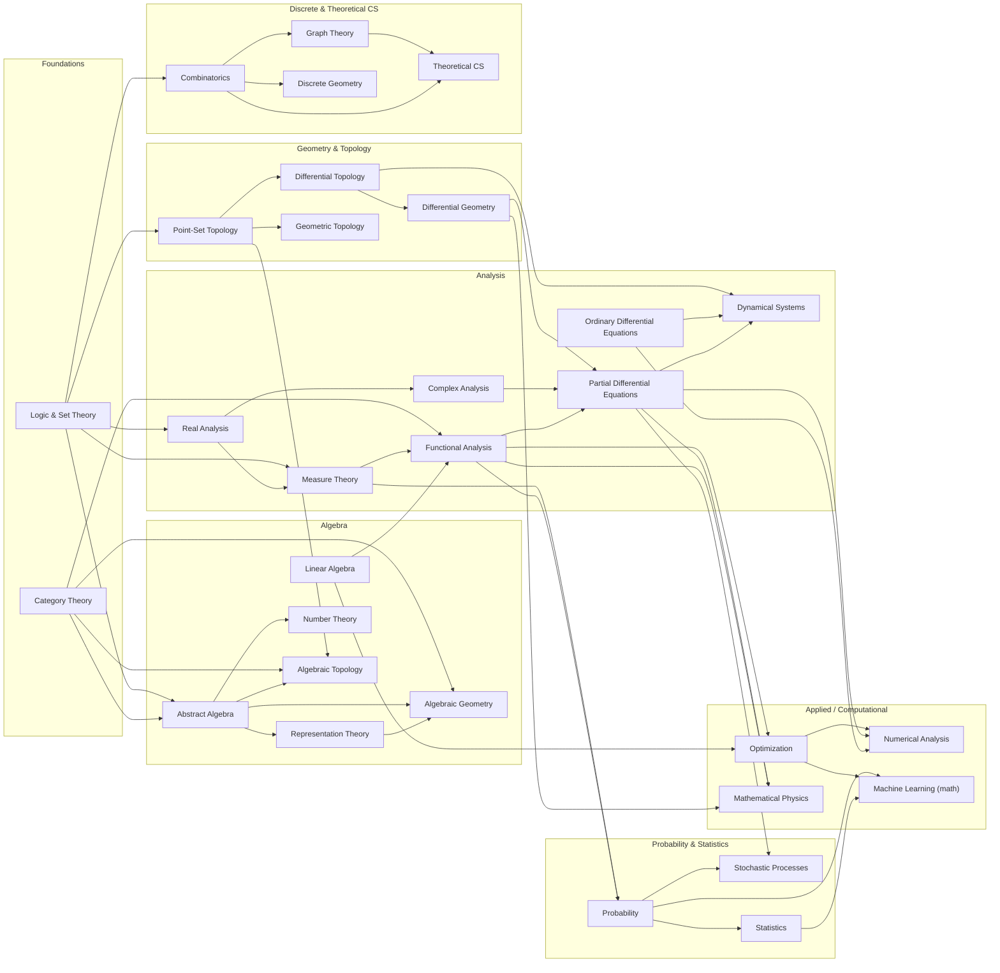
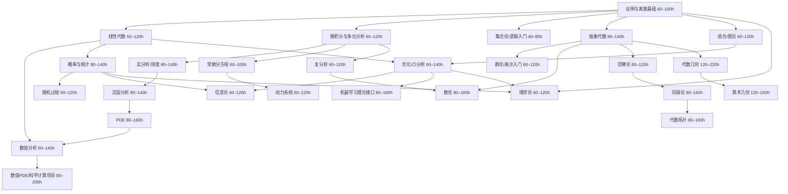
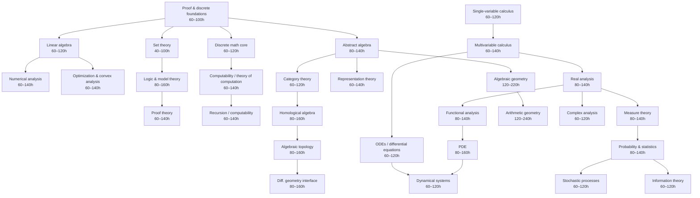

```mermaid
graph TD
  subgraph Foundations["Foundations (shared background)"]
    FOL["Classical logic (1st-order as default)"]
    ZFC["ZFC set-theoretic universe"]
    PT["Proof theory / metatheory of deduction"]
    COMP["Computability (Turing-style)"]
    CAT["Category-theoretic language"]
    HOTT["Type theory / HoTT (alternative)"]
  end

  subgraph MetaAxioms["Meta-axioms & stances (fault lines)"]
    AC["Choice principles (AC, weaker choice)"]
    CH["Continuum hypotheses (CH etc.)"]
    LCD["Large cardinals & determinacy"]
    UNIV["Universe/size principles"]
    CONS["Constructivism / extractability norms"]
  end

  subgraph Interfaces["Methodological interfaces"]
    ALG["Algebraization (structures, homomorphisms)"]
    GEO["Geometrization (spaces, invariants)"]
    ANA["Analytic methods (limits, estimates)"]
    HOM["Homological / derived methods"]
    PROB["Probabilistic methods (laws, coupling)"]
    OPT["Convexity / duality / fixed points"]
    NUM["Numerical/algorithmic stability"]
  end

  subgraph Fields["Main subfields (requested coverage)"]
    SET["Set theory"]
    LOG["Logic & model theory"]
    PROOF["Proof theory"]
    REC["Recursion/computability"]
    NUMT["Number theory"]
    ALGEB["Algebra"]
    LINALG["Linear algebra"]
    REP["Groups & representation theory"]
    TOP["Topology"]
    DGEOM["Differential geometry"]
    RANA["Real analysis"]
    CANA["Complex analysis"]
    FAN["Functional analysis"]
    PDE["PDE"]
    DYN["Dynamical systems"]
    AG["Algebraic geometry"]
    ARITHG["Arithmetic geometry"]
    ATOP["Algebraic topology"]
    HOMALG["Homology / homological algebra"]
    COMB["Combinatorics"]
    DISCRETE["Discrete mathematics"]
    PROBSTATS["Probability & statistics"]
    STOCH["Stochastic processes"]
    INFO["Information theory"]
    GAME["Game theory"]
    CONV["Optimization & convex analysis"]
    NA["Numerical analysis"]
  end

  FOL --> ZFC
  FOL --> LOG
  PT --> FOL
  COMP --> REC

  ZFC --> SET
  ZFC --> ALGEB
  ZFC --> TOP
  ZFC --> RANA
  ZFC --> PROBSTATS

  CAT --> HOM
  HOM --> HOMALG
  HOMALG --> AG
  HOMALG --> ATOP

  ALG --> ALGEB
  ALGEB --> REP
  REP --> NUMT
  AG --> ARITHG
  NUMT --> ARITHG

  GEO --> TOP
  TOP --> ATOP
  DGEOM --> DYN
  ANA --> RANA
  RANA --> FAN
  FAN --> PDE
  PDE --> DYN

  PROB --> PROBSTATS
  PROBSTATS --> STOCH
  STOCH --> INFO
  OPT --> CONV
  CONV --> INFO
  PROBSTATS --> GAME
  OPT --> GAME

  NUM --> NA
  LINALG --> NA
  NA --> PDE
  COMB --> DISCRETE
  DISCRETE --> REC

  AC --> TOP
  AC --> FAN
  AC --> LINALG
  CH --> TOP
  CH --> SET
  LCD --> SET
  LCD --> LOG
  UNIV --> CAT
  CONS --> HOTT
  HOTT --> ATOP
```

## Knowledge Structure of Pure Mathematics

### First principles and underlying mechanics

* **Axiomatization** (explicit primitive notions; constraint setting)
* **Formal inference** (rule-governed derivation; proof as certified transformation)
* **Abstraction / forgetful passage** (structure retention; data suppression)
* **Structuralism** (objects-by-morphisms; invariance under isomorphism)
* **Construction / existence** (explicit construction; non-constructive existence; choice principles)
* **Duality** (variance reversal; contravariance; mirror theorems)
* **Symmetry** (group action; orbit–stabilizer logic; conserved form)
* **Invariants** (classification by preserved quantities; obstruction theory)
* **Universality** (initial/terminal objects; free objects; adjunction patterns)
* **Local-to-global** (patching; descent; sheafification; completion)
* **Compactness / completeness** (finitary control of infinitary behavior)
* **Recursion / induction** (well-foundedness; transfinite iteration)
* **Decomposition** (prime factorization analogues; simple components; spectral splitting)
* **Optimization / extremality** (variational principles; minimax; convexity)
* **Randomness formalization** (measure; typicality; concentration)

### Knowledge System And Development Order

#### A. Foundations (rules of the game)

* **Axiomatic method**
  * Euclid, c. 300 BCE; “Elements” (axiomatic geometry)
  * Hilbert, 1899; “Foundations of Geometry”
* **Mathematical logic**
  * Propositional/predicate logic; proof theory; model theory; computability
  * Frege (1879); Peano (1889); Russell/Whitehead (1910–13)
  * Gödel, 1931; “Incompleteness” (limits of formal systems)
  * Turing, 1936; “Computability / halting”
* **Set theory**
  * Cantor, 1870s–1890s; “Infinity / cardinality”
  * Zermelo–Fraenkel axioms (1908–1922); Choice principle
  * Cohen, 1963; “Independence of CH”
* **Category theory (structural mechanics layer)**
  * Eilenberg–Mac Lane, 1945; “Categories”
  * Grothendieck, 1950s–60s; “Functors, sheaves, schemes” (unification engine)

#### B. Algebra (discrete structure and symmetry)

* **Group theory (symmetry algebra)**
  * Galois, 1830–32; “Galois theory” (symmetry of roots)
  * Lie, 1870s; “Continuous symmetry groups”
* **Ring and field theory (algebraic arithmetic)**
  * Dedekind, 1870s; ideals; algebraic integers
  * Noether, 1920s; structural ring theory; “Noetherianity”
* **Linear algebra and module theory (representation backbone)**
  * Jordan (1870s); canonical forms
  * Representation theory: Frobenius (1890s); Weyl (1920s)
* **Homological algebra (derived invariants)**
  * Cartan–Eilenberg, 1950s; derived functors; Ext/Tor
* **Universal algebra (axioms for algebraic structures)**

#### C. Topology and Geometry (space, form, invariance)

* **Point-set topology (continuity substrate)**
  * Hausdorff, 1914; separation axioms
* **Algebraic topology (invariants of shape)**
  * Poincaré, 1895; “Analysis situs” (homology precursor)
  * Fundamental group; homology; cohomology; spectral sequences
* **Differential geometry (smooth structure)**
  * Gauss, 1827; curvature of surfaces
  * Riemann, 1854; manifolds; metric geometry
* **Geometric topology / low-dimensional topology**
  * Thurston, 1970s–80s; geometrization program
  * Perelman, 2002–03; “Poincaré / Geometrization” milestone
* **Symplectic and contact geometry (phase-space geometry)**
  * Hamilton (1830s); modern symplectic topology (Gromov, 1980s)
* **Algebraic geometry (geometry via commutative algebra)**
  * Descartes, 1637; coordinate method
  * Weil, 1940s; foundations; conjectures
  * Grothendieck, 1957–67; “Schemes, étale cohomology” milestone
* **Complex geometry (holomorphic structure; Hodge theory)**

#### D. Analysis (continuum mechanics of functions and limits)

* **Real analysis (limits, measure, integration)**
  * Cauchy (1820s); rigor of limits
  * Weierstrass (1860s); epsilon–delta
  * Lebesgue, 1902; measure/integration
* **Functional analysis (infinite-dimensional linearity)**
  * Banach, 1920s; normed spaces
  * Hilbert spaces; spectral theory (von Neumann, 1930s)
* **Complex analysis (analytic continuation; residues)**
  * Cauchy (1810s–30s); Riemann (1850s)
* **Harmonic analysis (frequency decomposition)**
  * Fourier, 1807–22; “Fourier series” milestone
  * Calderón–Zygmund (1950s); singular integrals
* **Partial differential equations (structural analysis of fields)**
  * elliptic/parabolic/hyperbolic theory; regularity; microlocal analysis
* **Dynamical systems / ergodic theory**
  * Poincaré (1890s); qualitative dynamics
  * Kolmogorov–Arnold–Moser, 1950s–60s; stability theory

#### E. Arithmetic and discrete mathematics (finitary worlds and exactness)

* **Number theory (arithmetic core)**
  * Euclid; primes; Diophantus; Fermat (1630s)
  * Gauss, 1801; “Disquisitiones” milestone
  * Class field theory (Hilbert, Takagi, Artin; 1890s–1930s)
  * Modular forms; automorphic forms; Langlands, 1967; “Langlands program” milestone
  * Wiles, 1994; “Fermat’s Last Theorem” milestone
* **Combinatorics (discrete counting/invariants)**
  * extremal, probabilistic, algebraic combinatorics
* **Graph theory (network invariants)**
  * Euler, 1736; “Königsberg bridges” milestone
* **Discrete geometry; convexity**
* **Theoretical computer science interface (pure-leaning)**

  * complexity theory; proof complexity; pseudorandomness (structural overlap with logic)

#### F. Unification layers (cross-cutting frameworks; “bridges”)

* **Category theory (universality + composition)**
  * adjunction; limits/colimits; monoidal categories; higher categories
* **Sheaf theory and cohomology (local-to-global engine)**
  * Leray (1940s); Grothendieck (1950s)
* **Representation theory as a bridge**
  * groups ↔ geometry ↔ analysis (harmonic analysis on groups; geometric representation)
* **Noncommutative geometry**
  * Connes, 1980s–90s; operator-algebraic geometry
* **Arithmetic geometry**
  * elliptic curves; motives; cohomological methods in number theory
* **Topological/derived methods**
  * derived categories; ∞-categories; modern homotopy theory

###  Milestone chain

* “Euclid’s Elements” (c. 300 BCE)
* “Descartes’ analytic geometry” (1637)
* “Newton/Leibniz calculus” (1660s–1700s)
* “Gauss Disquisitiones” (1801)
* “Galois theory” (1830–32)
* “Riemann manifolds” (1854)
* “Cantor set theory” (1870s–1890s)
* “Hilbert axiomatization” (1899)
* “Lebesgue measure” (1902)
* “Gödel incompleteness” (1931)
* “Turing computability” (1936)
* “Eilenberg–Mac Lane categories” (1945)
* “Grothendieck schemes” (1957–67)
* “Atiyah–Singer index theorem” (1963)
* “Langlands program” (1967)
* “Perelman Poincaré/Geometrization” (2002–03)

### Dependencies

## Guide for Pure Mathematics Learning

Research-level mathematicians at places like Princeton, ENS or MIT are expected to have a broad and deep foundation across all major pure-math fields. In **Algebra**, they know group theory (simple and finite groups, Sylow theorems, representation theory), ring and module theory, field extensions and Galois theory, category theory, homological algebra and basics of algebraic geometry. In **Number Theory**, they are familiar with divisibility, primes, Diophantine equations, algebraic and analytic methods (e.g. quadratic forms, reciprocity, L-functions, modular forms, elliptic curves). In **Geometry** (differential and algebraic), they know manifolds and curvature (Riemannian geometry, Lie groups), basics of symplectic topology, as well as varieties and schemes, sheaf cohomology and Hodge theory in algebraic geometry. In **Topology**, they have training in point-set topology (compactness, metric spaces) and algebraic topology (homotopy, homology, cohomology, fundamental groups, covering spaces), and often manifold topology (knot theory, characteristic classes, surgery, etc.). In **Analysis**, they master real and complex analysis (metric spaces, Lebesgue integration, analytic continuation, Riemann surfaces, etc.), functional analysis (Banach/Hilbert space theory, spectral theory), and partial differential equations/basic harmonic analysis. In **Logic and Foundations**, they know set theory (ZFC axioms, ordinals, cardinals), basic model theory and computability, and formal proof concepts. Many PhDs also study **Combinatorics** (graph theory, extremal methods, probabilistic combinatorics) and apply category-theoretic methods.

Across these areas, key **techniques** include: using group actions and cohomology in algebra; analytic continuation and contour integration in complex analysis; variational methods and Sobolev spaces in PDEs; simplicial and singular complexes in topology; sheaf-theoretic arguments in algebraic geometry; diagonalization and compact operators in functional analysis; model-theoretic methods and forcing in logic, etc. **Influential works** range from classical theorems (e.g. the Atiyah–Singer index theorem in geometry, Weil conjectures in algebraic geometry, Hardy–Littlewood’s work in analytic number theory, foundational set theory of Gödel and Cohen) to modern breakthroughs (Wiles’ proof of Fermat’s Last Theorem, Perelman’s solution of Poincaré, Langlands’s reciprocity conjectures, etc.). Each field also has famous open problems or conjectures: for example, the **Riemann Hypothesis** (number theory/complex analysis), the **Birch–Swinnerton–Dyer conjecture** (arithmetic geometry), the **Hodge conjecture** (algebraic geometry), **Navier–Stokes existence and smoothness** (PDEs), **continuum hypothesis** (set theory), and many others. (For a general survey of famous unsolved problems, see the Clay Mathematics Millennium Problem list.) In short, a top-tier pure-math PhD is expected to command the core definitions and theorems of each area, understand standard proof methods (e.g. induction and extremal arguments in combinatorics, Fourier and analytic methods in analysis, spectral sequences and category theory in topology, etc.), and be aware of the main conjectures and landmarks in each field.

#### Traits and Habits of a Research Mathematician

Successful research mathematicians share a blend of intellectual abilities and personal habits. **Problem-solving ability and creativity** are central: modern commentary emphasizes that “the creative aspect of mathematics now occupies primary place” over rote calculation. Mathematicians must identify new questions or unexpected connections (“thinking up problems that “should be” studied”) and then explore them systematically. One mentor advises: _“Don’t get stuck on any single problem. Instead, let the problem guide you to a deeper overall understanding… that deeper understanding is what may eventually lead you full circle back to solving the original problem.”_. This flexibility—widely surveying problems and pursuing broader insight—is often crucial.

Rigour and precision are equally vital: a mathematician must _“work out the precise details of \. In other words, they internalize rigorous proof-writing and check every argument to ensure correctness. A good researcher also cultivates persistence and patience: major theorems can take years of effort (for example, Gonthier’s team spent six years formalizing the Feit–Thompson theorem). Learning from mistakes and dead-ends is part of the process; a healthy “growth mindset” helps one keep trying even when ideas fail.

Strong **analytical abstraction** is a hallmark: top mathematicians quickly shift between concrete examples and high-level abstractions (e.g. understanding a specific group action versus reasoning in category-theoretic language), and they maintain a “big picture” perspective while handling technical details. They also read widely, building on others’ work. Collaboration is common: researchers network and coauthor to compensate for gaps in their own knowledge. Indeed, one guide notes that as you advance, you should _“build up a robust enough network of collaborators to make up for any weaknesses of your own”_. Communication skills—writing clear proofs, giving talks, and explaining ideas—are expected. (While groundbreaking theorems won’t fail publication due to rough exposition, seasoned advice is to _“make \.) Other habits include systematic literature review, organizing work (often by breaking big problems into smaller steps), and time management. Soft skills like adaptability and teamwork are increasingly valued even in math: surveys rank creativity, collaboration, adaptability and communication among the top skills that professionals want.

In summary, a competitive pure-math researcher is extremely curious and imaginative, persistent in the face of difficulty, exquisitely precise in logic and notation, and adept at working collaboratively and communicating clearly. They combine deep abstract reasoning with technical mastery, and they balance intense focus on a problem with an openness to exploring new directions. Such habits and character traits—rigor, creativity, persistence, adaptability and collegiality—are as important as any individual theorem they know.

#### Computational Tools in Research

Modern mathematicians routinely use computer tools to support research. Three broad classes of software are employed:

*   **Symbolic Computation (Computer Algebra Systems):** These tools manipulate mathematical expressions in exact (symbolic) form. Examples include _Mathematica_ (Wolfram), _Maple_, _SageMath_, and _Magma_. For instance, _Mathematica_ is a comprehensive system that “allows symbolic computation” as well as numeric work, with built-in libraries for calculus, algebra, graphing, optimization, etc.. _Maple_ similarly “is a symbolic and numeric computing environment… covering symbolic mathematics, numerical analysis, data processing, visualization, and others”#:~:text=Maple%20is%20a%20symbolic%20,physical%20modeling%20and%20code%20generation). SageMath is an open-source environment that integrates many packages (NumPy, SciPy, Sympy, Maxima, GAP, etc.) under a common Python interface; its mission is “creating a viable free open source alternative to Magma, Maple, Mathematica and MATLAB”. Magma (proprietary) is highly optimized for algebra, number theory and geometry computations: it is “designed to solve problems in algebra, number theory, geometry and combinatorics”.
    
    These CAS are very powerful for tasks like factoring polynomials, solving symbolic equations, computing Gröbner bases, symbolic integration/differentiation, working with group or number-theoretic objects, and generating conjectural formulas. Their strength is speed and precision on algebraic manipulations (they never “blow up” with rounding error). However, they have limits: symbolic problems often grow combinatorially complex, and performance varies greatly between systems. As one user notes, “symbolic computation is extremely heavy-duty, and for almost any non-trivial task, performance varies wildly from software to software, with no single program being best for everything”. In practice mathematicians often use multiple CAS and choose the one best suited to a task (e.g. Sage or Magma for number-theoretic computations, Mathematica for complex algebraic expansions, etc.). In summary, symbolic tools automate tedious algebra and provide experimental insight into complicated formulas, but they complement rather than replace human reasoning.
    
*   **Numerical and Scientific Computing:** Numerical tools compute approximate solutions to mathematical problems. The prototypical system is **MATLAB**, a commercial numerical environment: _“MATLAB (Matrix Laboratory) is a proprietary… numeric computing environment… \. Such tools are used for large-scale linear algebra, eigenvalue problems, simulations, optimization, data fitting, finite-element PDE solvers (e.g. FEniCS, FreeFEM), and statistical analysis. They excel at numerical approximation, especially when exact symbolic answers are infeasible.
    
    Numerical tools allow exploration of mathematical behavior (e.g. plotting graphs of solutions, testing conjectures on many cases, estimating integrals or eigenvalues). However, their output is approximate and depends on floating-point arithmetic or discretization. As noted in the literature of **experimental mathematics**, numerical results alone “by themselves produce no insight, and symbolic computations frequently fail to produce full-fledged, closed-form solutions”. In other words, raw computations need a human to interpret. When combined with symbolic reasoning and creative insight, numerical experimentation can suggest patterns or guide proofs, but it is not a substitute for rigorous argument. Mathematicians use numerical tools for evidence and intuition, and to tackle problems (like PDEs) that have no exact solution formula.
    
*   **Formal Proof Assistants:** These are interactive theorem-proving systems (e.g. _Coq_, _Lean_, _Isabelle/HOL_, _HOL Light_, etc.) that allow users to build fully machine-checked proofs from logical foundations. They are based on formal logic and type theory, with a tiny trusted kernel that verifies each proof step. Historically, they have been used to verify both software and deep mathematical theorems. For example, Georges Gonthier’s group formalized the **Four-Color Theorem** and later the **Feit–Thompson odd-order theorem** in Coq, and Thomas Hales formalized the **Kepler conjecture** (sphere packing) in HOL Light (the Flyspeck project). Isabelle/HOL has been used to formalize the **Prime Number Theorem**#:~:text=Isabelle%20has%20been%20used%20to,the%20formal%20proofs%20are%2C%20as) and many algebraic structures, while Lean’s community (mathlib) has formalized vast areas of modern math (algebra, analysis, topology) and is actively working on projects like a formal proof of **Fermat’s Last Theorem**.
    
    These proof assistants are extremely powerful but require enormous effort: formalizing a major theorem can mean tens of thousands of lines of code and years of work. They excel at guaranteeing absolute correctness: once a proof is checked by a system like Coq or Lean, one is virtually certain there are no logical gaps. They also help organize mathematics into libraries of formally defined concepts. On the other hand, writing proofs in these systems is still much slower and more detailed than traditional paper proofs, so their use in daily research is growing slowly. Recently the development of libraries (e.g. Lean’s mathlib now has hundreds of thousands of lines of formalized math) and integration with automated reasoning (SMT solvers, AI tools) is making these assistants more practical.
    

In the **practice of current research**, all these tools play roles. Computer algebra systems and numerical software enable experimentation, checking examples, and sometimes discovering patterns or conjectures (though the human researcher must then prove them). Indeed, hybrid use of computers is now _“typical of modern experimental mathematics”_: we use symbolic and numeric computation _together_, guided by insight, to explore and formulate new facts. Formal proof assistants are beginning to shape future practice by making verified proofs attainable; as one visionary puts it, they allow breaking proofs into small verifiable pieces and ensure _“the correctness of proofs”_, opening new possibilities for collaboration and even for AI to assist with proofs.

In summary, a top pure-math PhD is expected to master classical mathematical theory and technique across algebra, geometry, analysis, topology, number theory, logic, etc., while possessing creativity, rigor, and persistence. They habitually combine human insight with modern computational tools: using CAS for algebraic manipulation, numerical codes for approximation and visualization, and beginning to employ proof assistants for rigorous verification. This blend of deep theoretical knowledge and adept use of computational tools underpins the competitive practice of contemporary mathematical research.

## Resources

TODO:
  - 两种抽象，对象和方法：参见pikachu345的文章

### 数学科普
1. 基本概念及方法 - 科朗，罗宾《什么是数学》
2. 数学思想，发展和危机 - 克莱因《数学，确定性的丧失》《古今数学思想》
3. 框架，分支及其意义 - 《普林斯顿数学指南》

### 数学学习资料

### Analysis - 分析

Analysis - 数学分析：
* T. M. Apostol - *Mathematical Analysis* - 适合初学
* Terrence Tao - *Analysis I/II* - 高观点、清晰易读
* Vladimir A. Zorich - *Mathematical Analysis I/II* - 全面、现代、多视角
* Rudin - *Principles of Mathematical Analysis* - 高观点、简略、抽象、高质量习题
* *Thomas Calculus*

Complex Analysis - 复变函数
* Stein - *Complex Analysis* - 经典
* Alhfors - *Complex Analysis* - 适合入门

Real Analysis - 实分析/实变函数
* Stein - *Real Analysis, Measure Theory, Integration, And Hilbert Spaces* - 经典
* G. B. Folland - *Real Analysis: Modern Techniques and Their Applications* - 全面

Functional Analysis - 泛函分析
* Peter Lax - *Functional Analysis*
* Rudin - *Functional Analysis* - 或许过时

Ordinary Differential Equation - 常微分方程
* Arnold - *Ordinary Differential Equations* - 入门
* Po-Fang Hsieh, Yasutaka Sibuya - *Basic Theory of Ordinary Differential Equations* - 深入

Partial Differential Equation - 偏微分方程
* Evans - *Partial Differential Equation* - 经典必读
* John K. Hunter - *Notes on Partial Differential Equations* - 讲解细致、适合参考

Fourier Analysis - 调和分析
* Loukas Grafakos - *GTM 249 Classical Fourier Analysis* - 详细、经典、错误较多
* Loukas Grafakos - *GTM 250 Modern Fourier Analysis* - 详细、经典、错误较多
* Dorina Mitrea - *Distributions, Partial Differential Equations, and Harmonic Analysis* - 调和分析、泛函分析、偏微分方程的基础

#### Algebra - 代数学

Algebras - 代数学/高等代数
* Sheldon Axler - *Linear Algebra Done Right* - 适合初学、篇幅短
* Steven Roman - *GTM135 Advanced Linear Algebra* - 高级
* Artin - *Algebra* - 适合初学

Abstract Algebras - 抽象代数
* Rotman - *First Course in Abstract Algebra with Applications* - 适合初学

Commutative Algebra - 交换代数
* Atiyah - *Introduction To Commutative Algebra*
* J. Elias etc. - *Six Lectures on Commutative Algebra*

Homological Algebra - 同调代数
* Peter J. Hilton, Urs Stammbach - *GTM4 A Course in Homological Algebra*

Lie Groups & Lie Algebras - 李群李代数
* Brian Hall - *GTM222 Lie Groups, Lie Algebras, and Representations*
* Kirillov - *An Introduction To Lie Groups And Lie Algebras*

Representation Theory - 群表示论
* Pavel Etingof, etc. - *Introduction to Representation Theory*

Algebraic Number Theory - 代数数论
* 加藤和也 - *数论I，II*

#### Geometry - 几何学

Space Analytic Geometry - 空间解析几何

Classical Differential Geometry - 古典微分几何

Manifolds - 流形
* R. Bishop, S. Goldberg - *Tensor Analysis on Manifolds* - 应用

Reimannian Geometry - 黎曼几何
* Do Carmo - 黎曼几何

Point Set Topology - 点集拓扑
* M. A. Armstrong - *Basic Topology* - 适合初学
* Munkres - *代数拓扑基础*

Differential Topology - 微分拓扑
* Milnor - *从微分观点看拓扑*

Algebrac Topology - 代数拓扑
* A. Hatcher - *Algebraic Topology*

#### Mathematical Logic - 数理逻辑

Mathematical Logic - 数理逻辑
- Anil Nerode, Richard A. Shore - *Logic for applications* - 适合初学、计算机向
- Michael Huth, Mark Ryan - *Logic in Computer Science - Modeling and Reasoning about Systems* - 适合初学、计算机向

Axiom Set Theory - 公理化集合论
- Thomas Jech - *Set Theory: an Introduction to Independence Proofs* - 适合初学
- Keneth Kunen - *Set Theory* - 难度高

Recursive Theory - 递归论
- Nigel Cutlan - *Computability: an Introduction to Recursive Function Theory* - 适合初学
- Robert I. Soare - *Recursively Enumerable Sets and Degrees :a Study of Computable Functions and Computably Generated Sets*

Model Theory - 模型论
- Chen Chung Chang，H.J.Keisler - *Model Theory* - 高质量
- David Marker - *Model Theory: an Introduction*

Proof Theory - 证明论
- Takeuti - *Proof Theory*

Category Theory - 范畴论
- Saunders Mac Lane - *GTM5 Categories for Working Mathematician* - 高质量

#### 应用

Probability - 概率论
* Kallenberg - Foundations of Modern Probability

Mathematical Computing - 数学计算
* Borwein, Skerritt -  An Introduction to Modern Mathematical Computing: with Maple

Quantum Mechanics - 量子力学
* David Griffiths - Introduction to Quantum Mechanics - 适合初学、高质量习题
* Cohen - Quantum Mechanics Vol I/II - 适合初学、补充材料丰富
* Feynman - Feynman Lectures on Physics: Volume III - 物理思想
* Weinberg - Lectures on Quantum Mechanics - 高级教材

String Theory - 弦论
* Polchinski - String Theory I/II - 适合初学

#### 1900年 希尔伯特的23个问题

1. 康托的连续统基数问题。
* 1874年，康托猜测在可数集基数和实数集基数之间没有别的基数，即著名的连续统假设。1938年，侨居美国的奥地利数理逻辑学家哥德尔证明连续统假设与ZF集合论公理系统的无矛盾性。1963年，美国数学家科恩（P.Choen）证明连续统假设与ZF公理彼此独立。因而，连续统假设不能用ZF公理加以证明。在这个意义下，问题已获解决。
2. 算术公理系统的无矛盾性。
* 欧氏几何的无矛盾性可以归结为算术公理的无矛盾性。希尔伯特曾提出用形式主义计划的证明论方法加以证明，哥德尔1931年发表不完备性定理作出否定。
* 根茨（G.Gentaen，1909-1945）1936年使用超限归纳法证明了算术公理系统的无矛盾性。
3. 只根据合同公理证明等底等高的两个四面体有相等之体积是不可能的。
* 问题的意思是：存在两个等高等底的四面体，它们不可能分解为有限个小四面体，使这两组四面体彼此全等，德思（M.Dehn）1900年已解决了这一问题。
4. 两点间以直线为距离最短线问题。
* 此问题提的一般。满足此性质的几何模型很多，因而需要加某些限制条件。1973年，苏联数学家波格列洛夫（Pogleov）宣布，在对称距离情况下，问题获解决。
5. 拓扑学成为李群的条件（拓扑群）。
* 这一个问题简称连续群的解析性，即是否每一个局部欧氏群都一定是李群。1952年，由格里森（Gleason）、蒙哥马利（Montgomery）、齐宾（Zippin）共同解决。1953年，日本的山迈英彦已得到完全肯定的结果。
6. 对数学起重要作用的物理学的公理化。
* 1933年，苏联数学家柯尔莫哥洛夫将概率论公理化。后来，在量子力学、量子场论方面取得成功。但对物理学各个分支能否全盘公理化，很多人有怀疑。
7. 某些数的超越性的证明。
* 需证：如果a是代数数，β是无理数的代数数，那么aβ一定是超越数或至少是无理数（例如，2√-2和exp(π)）。苏联的盖尔封特（Gelfond）1929年、德国的施奈德（Schneider）及西格尔（Siegel）1935年分别独立地证明了其正确性。但超越数理论还远未完成。目前，确定所给的数是否超越数，尚无统一的方法。
8. 素数分布问题，尤其对黎曼猜想、哥德巴赫猜想和孪生素数问题。
* 素数是一个很古老的研究领域。希尔伯特在此提到黎曼（Riemann）猜想、哥德巴赫（Goldbach）猜想以及孪生素数问题。黎曼猜想至今未解决。哥德巴赫猜想和孪生素数问题目前也未最终解决，其最佳结果均由中国数学家陈景润得出。
9. 一般互反律在任意数域中的证明。
* 1921年由日本的高木贞治，1927年由德国的阿廷（E.Artin）各自给以基本解决。而类域理论至今还在发展之中。
10. 能否通过有限步骤来判定不定方程是否存在有理整数解？
* 求出一个整数系数方程的整数根，称为丢番图（约公元前210-公元前290，古希腊数学家）方程可解。1950年前后，美国数学家戴维斯（Davis）、普特南（Putnan）、罗宾逊（Robinson）等取得关键性突破。1970年，巴克尔（Baker）、费罗斯（Philos）对含两个未知数的方程取得肯定结论。1970年， 苏联数学家马蒂塞维奇最终证明：在一般情况答案是否定的。尽管得出了否定的结果，却产生了一系列很有价值的副产品，其中不少和计算机科学有密切联系。
11. 一般代数数域内的二次型论。
* 德国数学家哈塞（Hasse）和西格尔（Siegel）在20年代获重要结果。60年代，法国数学家魏依（A.Weil）取得了新进展。
12. 类域的构成问题。
* 即将阿贝尔域上的克罗内克定理推广到任意的代数有理域上去。此问题仅有一些零星结果，离彻底解决还很远。
13. 一般七次代数方程以二变量连续函数之组合求解的不可能性。
* 七次方程x7+ax3+bx2+cx+1=0的根依赖于3个参数a、b、c；x=x(a,b,c)。这一函数能否用两变量函数表示出来？此问题已接近解决。1957年，苏联数学家阿诺尔德（Arnold）证明了任一在［0，1］上连续的实函数f(x1，x2，x3)可写成形式∑hi(ξi(x1,x2),x3)(i=1--9)，这里hi和ξi为连续实函数。柯尔莫哥洛夫证明f(x1,x2),x3)可写成形式∑hi(ξi1(x1)+ξi2(x2)+ξi3(x3))(i=1--7)这里hi和ξi为连续实函数，ξij的选取可与f完全无关。1964年，维土斯金（Vituskin）推广到连续可微情形，对解析函数情形则未解决。
14. 某些完备函数系的有限的证明。
*  即域K上的以x1,x2,…,xn为自变量的多项式fi（i=1,…，m），R为K［X1，…，Xm]上的有理函数F［X1，…，Xm]构成的环，并且F（f1，…，fm）∈K［X1，…，Xm]试问R是否可由有限个元素F1，…，FN的多项式生成？这个与代数不变量问题有关的问题，日本数学家永田雅宜于1959年用漂亮的反例给出了否定的解决。
15. 建立代数几何学的基础。
* 荷兰数学家范德瓦尔登1938年至1940年，魏依1950年已解决。舒伯特（Schubert）计数演算的严格基础。
* 一个典型的问题是：在三维空间中有四条直线，问有几条直线能和这四条直线都相交？舒伯特给出了一个直观的解法。希尔伯特要求将问题一般化，并给以严格基础。现在已有了一些可计算的方法，它和代数几何学有密切的关系。但严格的基础至今仍未建立。
1.   代数曲线和曲面的拓扑研究。
* 此问题前半部涉及代数曲线含有闭的分枝曲线的最大数目。后半部要求讨论备dx/dy=Y/X的极限环的最多个数N（n）和相对位置，其中X、Y是x、y的n次多项式。对n=2（即二次系统）的情况，1934年福罗献尔得到N(2)≥1；1952年鲍廷得到N(2)≥3；1955年苏联的波德洛夫斯基宣布N(2)≤3，这个曾震动一时的结果，由于其中的若干引理被否定而成疑问。关于相对位置，中国数学家董金柱、叶彦谦1957年证明了E（2）不超过两串。1957年，中国数学家秦元勋和蒲富金具体给出了n＝2的方程具有至少3个成串极限环的实例。1978年，中国的史松龄在秦元勋、华罗庚的指导下，与王明淑分别举出至少有4个极限环的具体例子。1983年，秦元勋进一步证明了二次系统最多有4个极限环，并且是（1，3）结构，从而最终地解决了二次微分方程的解的结构问题，并为研究希尔伯特第（16）问题提供了新的途径。
2.  半正定形式的平方和表示。
* 实系数有理函数f(x1,…，xn)对任意数组(x1,…，xn)都恒大于或等于0，确定f是否都能写成有理函数的平方和？1927年阿廷已肯定地解决。
18. 用全等多面体构造空间。
* 德国数学家比贝尔巴赫（Bieberbach）1910年，莱因哈特（Reinhart）1928年作出部分解决。
19. 正则变分问题的解是否总是解析函数？
* 德国数学家伯恩斯坦（Bernrtein，1929）和苏联数学家彼德罗夫斯基（1939）已解决。
20. 研究一般边值问题。
* 此问题进展迅速，己成为一个很大的数学分支。日前还在继读发展。
21. 具有给定奇点和单值群的Fuchs类的线性微分方程解的存在性证明。
* 此问题属线性常微分方程的大范围理论。希尔伯特本人于1905年、勒尔（H.Rohrl）于1957年分别得出重要结果。1970年法国数学家德利涅（Deligne）作出了出色贡献。
22. 用自守函数将解析函数单值化。
* 此问题涉及艰深的黎曼曲面理论，1907年克伯（P.Koebe）对一个变量情形已解决而使问题的研究获重要突破。其它方面尚未解决。
23. 发展变分学方法的研究。
* 这不是一个明确的数学问题。20世纪变分法有了很大发展。

#### 1967年 朗兰兹纲领
简介：1967年，年仅30岁的加拿大数学家罗伯特·朗兰兹在给美国数学家安德烈·韦伊的一封信中，提出了一组意义深远的猜想。这些猜想指出了三个相对独立发展起来的数学分支：数论、代数几何和群表示论，实际上它们是密切相关的这些猜想现在被称为朗兰兹互反猜想，而后演变成朗兰兹纲领，被称为数学界的“大统一理论”，在过去几十年里对数学的发展产生了极大影响。

### 形式化证明
1. Mathematical Components: https://math-comp.github.io/

### 前沿研究
1. 顶级刊物 Annals of Mathematics
2. 科普读物：Theorems of the 21st Century

学习方法：
1. **视频学习**。连续观看完整的视频课程，简单记录“内容大纲”、“数学思想”、“证明技巧”。
2. **制作笔记**。根据大纲，补充“完整定义”、“证明过程”、“重要例题”，用制作笔记“模拟”教授他人的过程
3. **练习习题**。进行第二步的同时，即寻找经典习题，特别是有全新证明技巧的习题进行练习，并补充在笔记上。积累一定经验后，进行大量练习。

### Learning Tips

Principles for choosing a suitable textbook:
  - **High-level viewpoint**: The "high-level viewpoint" in mathematics refers to approaching mathematical concepts, structures, and theories from a broader, more abstract perspective. This approach emphasizes understanding the `underlying principles` and `patterns` that unify different areas of mathematics, rather than focusing solely on specific problems or techniques. It seeks to reveal deep connections across various mathematical disciplines and to simplify complex problemsidentifying their essential features.
  - **High-quality exercises**: Well-designed exercises help students master mathematical concepts and techniquesproviding opportunities for practice and reinforcement. Also, high-quality exercises could promote critical thinking, and foster a deeper understanding of mathematical concepts.
  - **Well-explained**: A good mathematics textbook explains concepts clearly and concisely, making it easier for readers to grasp complex ideas. This is particularly important for **self-learners**.

### Entry Level 

#### Popular Books

**How to Solve it, A Structured Approach**, Daniel J. Velleman

All the Math You Missed, Thomas A. Garrity

Proofs from THE BOOK

Mathematical Proofs: A Transition to Advanced Mathematics
  - but for others who are still in high school or first and second year university the following bookChartrand, Polimeni, and Zhang, is an incredible introduction to proofs and various areas of mathematics

L.Steen, ed."今日数学"(Mathematics Today)
里面的文章.附带说一句,这本书是最好的数学普及读物之一,绝对值得一看,中译本的质量也不错.

#### History of Mathematics

**Mathematics and Its History**, John Stillwell

**Mathematics: The Loss of Certainty**, Morris Cline

**Mathematical Thought from Ancient to Modern Times**, Morris Cline

#### Systematic Cognition and Mathematical Thinking

**The Princeton Companion to Mathematics**, Timothy Gowers
  - An overview of the development of mathematics in the 20th century, aimed at establishing systematic cognition.

**How to Think Like a Mathematician: A Companion to Undergraduate Mathematics**, Kevin Houston

### Pure Mathematics

`Pure mathematics` is the branch of mathematics that focuses on the study of mathematical concepts independent of any application outside mathematics. It is driven**abstract reasoning**, **logical rigor**, and the intrinsic beauty of **mathematical structures, patterns, and relationships**. Pure mathematics is not developed with any particular application in mind, although many of its discoveries often find applications much later, sometimes in entirely unexpected ways.

#### Analysis

`Analysis` is a branch of mathematics that deals with the study of `change`, `motion`, and the **properties of real numbers**, including their behavior and the operations defined on them. It encompasses a variety of subfields that focus on `limits`, `continuity`, `differentiation`, `integration`, and the rigorous construction of the real and complex `number systems`. Analysis lays the foundation for understanding the quantitative aspects of the world and provides the essential tools for solving problems in physics, engineering, economics, and beyond.

##### Basic Analysis

**★ Mathematical Analysis**, Tom M. Apostol
  - Elementary, suitable for beginners

**★ Principles of Mathematical Analysis (Baby Rudin)**, Walter Rudin
  - High-level viewpoint, high-quality exercises

**Analysis I/II ★**, Terrence Tao
  - High-level viewpoint, legible writing

**Mathematical Analysis I/II**, Vladimir A. Zorich
  - Comprehensive, modern, multiple perspective

An Introduction to Analysis (4th Edition) 4th Edition
William R. Wade
  - intro

##### Real Analysis

**Real Analysis: Modern Techniques and Their Applications**, Gerald B. Folland
  - In-depth

**Real Analysis, Measure Theory, Integration, And Hilbert Spaces**, Elias M. Stein, Rami Shakarchi

**Real Analysis**, 4th Edition, Halsey Royden, Patrick Fitzpatrick

**Measure Theory**, Donald L. Cohn
  - Entry level, easy exercises

##### Complex Analysis

Stein - **Complex Analysis** - 经典 借用我同学的一句话，读这本书就像读小说一样，相当流畅。但深度不足，有些证明并不严谨

Alhfors - **Complex Analysis** - 适合入门
Complex Analysis 3rd Edition
Lars Ahlfors

Elementary Theory of Analytic Functions of One or Several Complex Variables (Dover Books on Mathematics) Text is Free of Markings Edition
Henri Cartan

Complex Analysis (Universitext): Second Edition 2nd ed. 2009 Edition
Eberhard Freitag

Real and Complex Analysis - Rudin
  - For those wishing to go further in analysis this is absolutely necessary as far as I'm concerned.

Markushevich 《Theory of Functions of a Complex Variable》又是苏联人留给数学界的一个完美的作品。Amazon全五星评价，细致入微，证明严谨友好。总之哪里学不懂，来这里找，肯定有，也肯定讲得更好。缺点就是太厚了，铺垫太多，前两百页左右其实可以直接跳过去。

##### Functional Analysis

Peter Lax - **Functional Analysis**

Rudin - **Functional Analysis** - 或许过时

##### Ordinary Differential Equation

Arnold - **Ordinary Differential Equations** - 入门

Po-Fang Hsieh, Yasutaka Sibuya - **Basic Theory of Ordinary Differential Equations** - 深入

##### Partial Differential Equation

Evans - **Partial Differential Equation** - 经典必读
John K. Hunter - **Notes on Partial Differential Equations** - 讲解细致、适合参考
Partial Differential Equations (Graduate Texts in Mathematics, 128)
Jeffrey Rauch 

R. Courant, D. Hilbert"数学物理方法"(I,II)
可以说是毫无疑问的经典.按照洪家兴老师的说法,不管椭圆,双曲,抛物里面的哪一块这本书里面的相应章节都是经典,问题就是这书放在一起你是没办法当教材来学的,所以只能有空翻翻啦....
经典的教材,大概可以算

O.A. Ladyzhenskaya"The Boudary Value Problems of Mathematical Physics"
和5.一样,都很经典.当然你要说它们陈旧我也没话可说.
既然这课叫数学物理方程,多少和物理沾点边吧,在这个方向上我以为

彼得罗夫斯基"偏微分方程讲义"

M. Taylor"Partial Differential Equations I"(Applied Mathematical Sciences 115)
后面这本看前一半就可以,后一半也看当然更好:-))引G. Lebeau的一句话,这书比
15.L. Hormander"Linear Partial Differential Operators, I"
要好念多了.(当然基本上人人都是这么认为的,只不过这位的来头比较大而已--法国科学院通讯院士,46岁)

##### Fourier Analysis

Loukas Grafakos - **GTM 249 Classical Fourier Analysis** - 详细、经典、错误较多

Loukas Grafakos - **GTM 250 Modern Fourier Analysis** - 详细、经典、错误较多

Dorina Mitrea - **Distributions, Partial Differential Equations, and Harmonic Analysis** - 调和分析、泛函分析、偏微分方程的基础

An Introduction to Harmonic Analysis (Cambridge Mathematical Library) 3rd Edition
Yitzhak Katznelson

##### Several Complex Variables

Analytic Functions of Several Complex Variables (AMS Chelsea Publishing)
Robert C. Gunning, Hugo Rossi 

Functions of Several Complex Variables and Their Singularities (Graduate Studies in Mathematics, 83)
Wolfgang Ebeling

##### Vector Calculus

##### Dynamical Systems

##### Convex Analysis

**Convex Analysis and Beyond**, Boris S. Mordukhovich, Mau Nam Nguyen
  - Friendly to beginners, well-explained

#### Algebra

##### General Algebra

Abstract Algebra, 3rd Edition 3rd Edition
David S. Dummit, Richard M. Foote

★ Advanced Modern Algebra (Graduate Studies in Mathematics) 2nd Edition
Joseph J. Rotman

Algebra (Graduate Texts in Mathematics, 211) 3rd Edition
Serge Lang

Abstract Algebra (Graduate Texts in Mathematics, 242) Softcover reprint of hardcover 2nd ed. 2007 Edition
Pierre Antoine Grillet

Contemporary Abstract Algebra 这本教材很通俗易读，中学生也完全可以读懂，但是从数学专业来看，有些啰嗦，抽象程度不够。如果你本身数学基础一般的话，可以考虑用这本书作为代数的入门书。

代数里有一本书，amazon评价很高，就是 Algebra: Chapter 0 作者是 Paolo Aluffi，该书的特点是用范畴的观点贯穿全书，很现代，而且起点很低，低到什么程度，作者在群论部分，故意不使用带余除法定理，这是一个很基本的定理，可能小学生都知道。为什么不使用呢？原因是作者不假定读者已经知道这个定理。但是不要真的认为小学生能读懂此书，实际上这是一本数学研究生教科书，起点低，或者说对数学知识的要求低，不代表这本书容易读，实际上要读懂这本书，需要有一定的mathematical maturity，很多数学书都是这样，不需要读者懂很多数学，但是就是读不懂，原因就是读者的mathmatical maturity不够。还有要说明一点，这本书有很多typo，所以读前先到作者的官网上去看勘误表，不然会产生很多不必要的误解。电子版在这里可以买到https://bookstore.ams.org/gsm-104/  大概是七十多美金，你需要有一张可以刷美元的信用卡，当然不支持支付宝。

作者：無雙
链接：https://www.zhihu.com/question/366915371/answer/1229144590
来源：知乎
著作权归作者所有。商业转载请联系作者获得授权，非商业转载请注明出处。

##### Linear Algebra

Sheldon Axler - **★ Linear Algebra Done Right** - 适合初学、篇幅短

**Linear Algebra: and Its Application**, Fifth Edition,David C. Lay, Steven R. Lay, Judi J. McDonald
  - Well explained, friendly to beginners

Linear Algebra - Friedberg, Insel, Spence
  - An excellent introduction to finite dimensional linear algebra. In fact, for most undergraduate stuff you won't need anything else.
  - This book straddles the line between a rigorous presentation of linear algebra and an applied approach better then any of the others.It's only major defect is a very confusing presentation of the Jordan form,for which Charles Curtis' book does a much better job. I'd have given more points,but I disagree with some of your other picks.This' ll be clearer when I post my list. 

Advanced Linear Algebra (Graduate Texts in Mathematics, 135) Softcover reprint of hardcover 3rd ed. 2008 Edition
Steven Roman
Steven Roman - **GTM135 Advanced Linear Algebra** - 高级

Artin - **Algebra** - 适合初学

Linear Algebra (2nd Edition) 2nd Edition
Kenneth M Hoffman, Ray Kunze

The Linear Algebra a Beginning Graduate Student Ought to Know Paperback – January 1, 2007
Jonathan S. Golan

**★[Courses] MIT 18.06 Linear Algebra** [#哔哩哔哩-中英字幕](https://www.bilibili.com/video/BV1zx411g7gq/) [#课程主页](https://ocw.mit.edu/courses/mathematics/18-06sc-linear-algebra-fall-2011/syllabus/) [#课程笔记](https://github.com/apachecn/mit-18.06-linalg-notes)
  - 地球上最好的线性代数课程，配套教材为 Gibert Strang 编写的《线性代数》。
  - Kenji Hiranabe 根据教材编写的图解笔记：[#Github](https://github.com/kenjihiranabe/The-Art-of-Linear-Algebra)

**线性代数 Introduction to Linear Algebra** [#豆瓣](https://book.douban.com/subject/34820335/)
  - Gibert Strang 编写的教材，本书内容包括行列式、矩阵、线性方程组与向量、矩阵的特征值与特征向量、二次型及Mathematica软件的应用等。每章都配有习题，书后给出了习题答案。本书在编写中力求重点突出、由浅入深、通俗易懂，努力体现教学的适用性。
  
**★ Linear Algebra Done Right** [#豆瓣](https://book.douban.com/subject/26265880/)
   - 适合初学者的教材，篇幅短。

##### Abstract Algebra

** Rotman - **First Course in Abstract Algebra with Applications** - 适合初学

Abstract Algebra, Dummite & Foote比上面那本好读，例子和习题也多不少但是有的地方写的太罗嗦。不过依然是一本极好的书。

##### Commutative Algebra

** Atiyah - **★ Introduction To Commutative Algebra**无须解释的经典，关键是要好好做书后习题。

** J. Elias etc. - **Six Lectures on Commutative Algebra**

Commutative Algebra: with a View Toward Algebraic Geometry (Graduate Texts in Mathematics, 150)
David Eisenbud

Introduction To Commutative Algebra (Addison-Wesley Series in Mathematics)
Michael Atiyah

Undergraduate Commutative Algebra (London Mathematical Society Student Texts, Series Number 29) 1st Edition
Miles Reid

S.Lang "Algebra"
Lang写书以清晰著称,他的这本书还得过AMS发的Steel优秀图书奖. 代数的经典教材。Ken. Ribet 评价为“代书圣经”，也是我的第一本代数书。可以和作者 Undergraduate Algebra一起看。

.N.Jacobson "Basic Algebra I,II"
这书在总书库里面有不少,理图里面也有前面几章的中译本,应该是叫"基础代数学"吧,不过翻译质量一般.Jacobson在代数领域也属于权威,是华先生同时代的人.这本书从观点上说是相当现代化的

##### Homological Algebra

** Peter J. Hilton, Urs Stammbach - **GTM4 A Course in Homological Algebra**

An Introduction to Homological Algebra (Cambridge Studies in Advanced Mathematics, Series Number 38)
Charles A. Weibel

An Introduction to Homological Algebra (Universitext) 2nd Edition
Joseph J. Rotman

An Elementary Approach to Homological Algebra (Monographs and Surveys in Pure and Applied Mathematics) 1st Edition
L.R. Vermani

##### Group Theory

Finite Group Theory (Graduate Studies in Mathematics, Vol. 92) (Graduate Studies in Mathematics, 92) First Edition
I. Martin Isaacs

The Theory of Finite Groups: An Introduction (Universitext) Softcover reprint of the original 1st ed. 2004 Edition

A Course in the Theory of Groups (Graduate Texts in Mathematics, Vol. 80) (Graduate Texts in Mathematics, 80) 2nd Edition
Derek J.S. Robinson

An Introduction to the Theory of Groups (Graduate Texts in Mathematics, 148) 4th Edition
Joseph J. Rotman
  - This is a great second text in group theory after an elementary exposition (say Contemporary Abstract Algebra - Gallian).

G.K. Pedersen "C*-Algebras and their Automorphism Groups"
这书连A.Connes都说好,我想决不会差到哪里去.
再说两句A.Connes,关于他的工作,或者说整个算子代数往后来的非交换几何的发展历史,特别是这一分支从其开始的阶段就和量子物理的联系,可以看

Groups and Symmetry, Amstrong 学群论不读这本书不完整，只读这本书不充分。

##### Metric Groups

Topological Groups: An Introduction 1st Edition
Nelson G. Markley 

##### Ring Theory

Lectures on Modules and Rings (Graduate Texts in Mathematics, 189) 1999th Edition
Tsit-Yuen Lam

A First Course in Noncommutative Rings (Graduate Texts in Mathematics, 131) 2nd Edition
Tsit-Yuen Lam

##### Field Theory

Field and Galois Theory (Graduate Texts in Mathematics, 167) 1996th Edition
Patrick Morandi
  - Friendly to Beginners

Field Theory (Graduate Texts in Mathematics, 158) 2nd Edition
Steven Roman

##### Galois Theory

.E.Artin "伽罗华理论"
非常薄,讲得很精彩,绝对是本传世佳作.还有

Edwards "Galois Theory"(GTM 101)
这本书很有趣,它是循着Galois的原始想法写的,因此和一般通行的教本里面的讲法不是很一样.

##### Lie Groups & Lie Algebra

** Brian Hall - **GTM222 Lie Groups, Lie Algebras, and Representations**
** Kirillov - **An Introduction To Lie Groups And Lie Algebras**

Lectures on Lie Algebras, J.Bernstein. Bernstein大神的名字如雷贯耳。这份notes很短，但是从最最基础的李代数的定义一直讲到Verma module 以及 Weyl Character Formula。看完之后就可以直接进入 BGG Category O 的学习了。

Representations of Semisimple Lie Algebras in BGG Category O, Humphreys. 其实作者还有一本Linear Algebraic Groups 也是经典。

##### General Representation Theory

** Pavel Etingof, etc. - **Introduction to Representation Theory**

Representation Theory: A First Course (Graduate Texts in Mathematics, 129) Corrected Edition
William Fulton, Joe Harris

Introduction to Lie Algebras and Representation Theory (Graduate Texts in Mathematics, 9) First Edition (US) First Printing
J.E. Humphreys

Lie Groups, Lie Algebras, and Representations: An Elementary Introduction Hardcover – January 1, 2003
Brian C. Hall

##### Representation Theory of Finite Groups

Linear Representations of Finite Groups (Graduate Texts in Mathematics, 42) 1st ed. 1977. Corr. 5th printing 1996 Edition
Jean-Pierre Serre, Leonhard L. Scott (Translator) 基础知识要求很少，任何一个大一学生都能看。

Representation Theory of Finite Groups: An Introductory Approach (Universitext) 2012th Edition
Benjamin Steinberg

Character Theory of Finite Groups
I. Martin Isaacs

Representations and Characters of Groups, Second Edition 2nd Edition
Gordon James, Martin Liebeck

Representation Theory: a First Course, Fulton & Harris. Richard. Borhcerds 推荐的表示论入门。里面有非常多的例子，炒鸡喜欢~

##### Representation Theory of Compact Groups

Representations of Compact Lie Groups (Graduate Texts in Mathematics, 98)
T. Bröcker, T.tom Dieck

Compact Lie Groups (Graduate Texts in Mathematics, 235) Softcover reprint of hardcover 1st ed. 2007 Edition
Mark R. Sepanski

##### Linear Algebraic Groups

Linear Algebraic Groups (Modern Birkhäuser Classics) 2nd ed. 1998. 2nd printing 2008 Edition
T.A. Springer

Linear Algebraic Groups (Graduate Texts in Mathematics, 21) Corr Print Edition
James E. Humphreys

##### Algebraic Number Theory

** 加藤和也 - **数论I，II**

##### Generalized Functions

在广义函数的标题下最有名的应该是
36.I.M.Gelfand等"广义函数"(Generalized Functions,I-V)
大概I-IV都有中译本吧!理图里面应该是有的,英文本系资料室有.从泛函的角度,据说是第二本最有意思.另外还有两本好书,不光是这一块内容,从整体上讲也是很好的泛函课本
37.K.Yosida(吉田耕作)"Functional Analysis"
他也过两种不同"规格"的书,一本比较厚,一本比较薄,都很好.其中有一本的第六版去年世界图书刚刚影印.
38.H.Brezis "Analyse Fonctionelle"
Brezis是我校名誉教授,法国科学院院士,非线性偏微的权威.他的这本书很见功力.如果能念法语的话绝对值得一读.
在Rudin的书25.里面也讲了不少广义函数的内容,特别有一章讲Tauberian Theory,很有意思.

#### Geometry

##### Trigonometry

##### Differential Geometry

Riemannian Geometry First Edition
Manfredo Perdigao do Carmo, Francis Flaherty

A Comprehensive Introduction to Differential Geometry, Vol. 1, 3rd Edition 3rd Edition

Riemannian Geometry and Geometric Analysis (Universitext) Paperback – January 1, 2011
Jürgen: Jost

Riemannian Manifolds: An Introduction to Curvature (Graduate Texts in Mathematics) 1997th Edition
John M. Lee

**Visual Differential Geometry and Forms: A Mathematcial Drama in Five Acts**, Tristan Needham

Do Carmo(多卡模) "曲线和曲面的微分几何学"
"Differential Geometry of Curves and Surfaces"这是本绝对的好书,胡先生他们把这本书翻译出来实在是功德无量.在总书库里面有一本英文本,如果怀疑有什么翻译问题的话可以去对照.
1.第三章里面有个习题是从2.的中译本上搬过来的,不过有题意不清之嫌.做的时候要小心.
还有一点要注意的是1.里面曲面论基本定理的证明中有个地方漏印了两项,具体去问黄宣国老师吧.
一般说来,看上面两本书也就够了,可以考虑的扩充部分包括在2.的末尾所开列的参考书目.

##### Space Analytic Geometry

##### Classical Differential Geometry

##### Manifolds

** R. Bishop, S. Goldberg - **Tensor Analysis on Manifolds** - 应用

Munkres《Analysis on Manifolds》第三章第四章太啰嗦但其它章出奇的好，第一章我认为是写的最好的对拓扑和线性代数的review，讲Tensor那章也是很好，注意一点，学习这本书之前最好有过一些多元微积分的基础，否则看第三四章的时候有点空中楼阁的感觉

Loring Tu《An Introduction to Manifolds》简练易懂，且不需要多少点集拓扑的知识，有些notation很奇怪，比如开区间。对我来说，这本书最大的优点就在于它的诚实。很多书前言会写不需要太多prerequisites，但你读着读着就会发现作者在开玩笑。这本书作者真的就做到了。还有它的习题量合理，难度适中，且都有hint，极为适合自学。总之强推。

##### Riemann Surfaces

Riemann SurfacesWay of Complex Analytic Geometry (Graduate Studies in Mathematics) (Graduate Studies in Mathematics, 125)
Dror Varolin

Complex Analysis 2: Riemann Surfaces, Several Complex Variables, Abelian Functions, Higher Modular Functions (Universitext) 2nd ed. 2011 Edition
Eberhard Freitag

Lectures on Riemann Surfaces 1981. Corr. 4th Edition
Otto Forster, Bruce Gilligan (Translator)

Riemann Surfaces (Oxford Graduate Texts in Mathematics) 1st Edition

Gallot, Hulin, Lafontain"Introduction to Riemannian Geometry"(?)
是Springer-Verlag的Universitext中的一本,应该说写得很好,评价(我听到的)也很不错.
用这种观点(其实用前一种观点也一样,多元函数的反函数定理,隐函数定理都是要明白的.
J.Milnor曾经写过两本很有意思的书,里面的讲解都是非常精彩的,

** Do Carmo - 黎曼几何

##### Algebraic Geometry

Undergraduate Algebraic Geometry (London Mathematical Society Student Texts, Series Number 12) 1st Edition
Miles Reid

Basic Algebraic Geometry 1: Varieties in Projective Space Paperback – January 1, 1994
Igor R. Shafarevich

Algebraic Geometry (Graduate Texts in Mathematics, 52)
Robin Hartshorne或许是整个茧中数学社区最有热度的书了，骂它的人很多，我也必须承认即使我对它印象不错，它仍然有很多不足，比如self contained做的极差。但是我仍然认为它会是后来的大部分人无法绕过的一本书，因为它把大部分更高阶学习所需要的知识都写进去了，而且只用了五百页，非常短平快。如果只是想学点概形的废话，那么只需要看第二章，学点上同调就加上第三章，两百页内容可能比其它书七百页写的还多。如果要学点古典的有趣的几何，那么另外几章倒也不错。当然也可以不当教材而用来当字典查。

Principles of Algebraic Geometry 1st Edition
Phillip Griffiths, Joseph Harris

The Red Book of Varieties and Schemes: Includes the Michigan Lectures (1974) on Curves and their Jacobians (Lecture Notes in Mathematics, 1358) 2nd exp. ed. 1999 Edition
David Mumford, E. Arbarello (Contributor)

Etale Cohomology Theory, Revised Edition, by Lei Fu
或许不算很有名的书，但是我个人认为对于想学etale cohomology的人来说，绝对算是不会坏的书。作者基本上从零开始建立etale cohomology的理论，哪怕没有什么背景的人也应该能看懂这本书。证明写的非常详细，同时把etale cohomology的大部分理论都囊括进去了，哪怕懒得用这本书当教材，当成字典也是不错的。

##### Noncommutative Geometry

33.A.Lesniewski "Noncommutative Geometry"
AMS Notice,v.44(1997),No.7
还有
34.Irving Segal Book Review, Non commutative geometryAlain Connes
AMS Bulletin,v.33(1996),No.4
因为
35.Alain Connes(Fields 82) "Noncommutative Geometry"
可以说是这一块的里程碑式的著作,(33.中甚至说今后人们会用今天看Riemann的就职演说的眼光看这本书)所以对于这本书的评论很多也就把整个分支都评论进去了,不妨看看.Jones说这书是"A milestone for mathematics.Connes has created a theory that embraces most aspects of `classical\' mathematics and sets us out on a long and exciting voyage into the world of noncommutative mathematics".做为老前辈,Segal的书评里面有一些批评,也值得注意.
第七章这一章一般不讲,在本科阶段不讲,在研究生阶段也不讲,实在奇怪,不是吗?主要问题是,就事论事地讨论广义函数
恐怕不是非常地有趣,要紧的还是这套框架在偏微分理论中的应用.现在的状态就是你在复旦数学系基础专业念四年出来可以还没听说过什么叫Sobolev空间,尽管大家都承认复旦的偏微是很强的...

##### Modular Forms

A First Course in Modular Forms (Graduate Texts in Mathematics, Vol. 228) (Graduate Texts in Mathematics, 228) First Edition
Fred Diamond, Jerry Shurman

Modular Forms, a Computational Approach (Graduate Studies in Mathematics) (Graduate Studies in Mathematics, 79)
William Stein

##### Local Fields

Algebra: Volume II: Fields with Structure, Algebras and Advanced Topics (Universitext) 2008th Edition
Falko Lorenz, Silvio Levy (Translator)
  - Chapter 23 - 25

Local Fields (Graduate Texts in Mathematics, 67) Corr Print Edition
Jean-Pierre Serre, Marvin J. Greenberg

Local Fields and Their Extensions (Translations of Mathematical Monographs, Vol. 121) 2nd Edition
S. V. Vostokov, I.B. Fesenko

Local Class Field Theory (Oxford Mathematical Monographs)
Kenkichi Iwasawa

##### Class Field Theory

Algebra: Volume II: Fields with Structure, Algebras and Advanced Topics (Universitext) 2008th Edition
Falko Lorenz, Silvio Levy (Translator)
  - Chapter 28 - 32

Class Field Theory (AMS Chelsea Publishing) (Ams Chelsea Publishing, 366) 2nd Revised edition
Emil Artin and John Tate

Class Field Theory (Universitext) 1st Edition. 2nd Printing. 2008
Nancy Childress

Local Class Field Theory (Oxford Mathematical Monographs)
Kenkichi Iwasawa

#### Topology

##### Point Set Topology

★ Topology 2nd Edition
James Munkres

Counterexamples in Topology;Dover Books on Mathematics New edition
Lynn Arthur Steen, J. Arthur Seebach Jr.

** M. A. Armstrong - **Basic Topology** - 适合初学

General Topology
John Leroy Kelley, Sam Sloan (Foreword)

5.I.M.Singer, J.A.Thorp "Lecture notes on elementary topology and geometry
(中译本:(基础?)几何学与拓扑学讲义,干丹岩译)这是本极好的教材,应该可以用深入浅出来形容吧!第一作者Singer就是和Atiyah一起证指标定理的那位,说是重量级人物当无疑义.

R.Engelking "General Topology"
这书是七十年代末写的,内容翔实,至少对我来说是有包罗万象的感觉,当然对做这一块的人就不一定了.

Lectures on Elementary Topology and Geometry,I.M. Singer, J.A. Thorpe. 作者之一是 著名的Atiyah-Singer之一的Singer。这本书的内容在基础的拓扑学和几何学中dense。

##### Differential Topology

** Milnor - **从微分观点看拓扑**

Differential Topology Reprint Edition
Victor Guillemin, Alan Pollack

Topology from the Differentiable Viewpoint Revised Edition
John Willard Milnor

Introduction to Smooth Manifolds (Graduate Texts in Mathematics) 1st Edition
John M. Lee

##### Algebraic Topology

** A. Hatcher - **★ Algebraic Topology**无需多言的经典，特别是对初学者。讲得很细致，但是有点过于啰嗦。不过如果你能耐下心来阅读，就会发现作者其实很苦口婆心地叫你怎么样去理解拓扑。下功夫看这本书可以得到很好的几何上的直觉。

Topology and Geometry (Graduate Texts in Mathematics, 139) Corrected Edition
Glen E. Bredon

A Concise Course in Algebraic Topology (Chicago Lectures in Mathematics) 1st Edition
J. P. May

Differential Forms in Algebraic Topology (Graduate Texts in Mathematics, 82)
Raoul Bott, Loring W. Tu
这本书写的相当不错，如果看Hatcher、may等等代数拓扑书对同调论没什么感觉，那么不妨看看这本书。它把很多代数拓扑的结论翻译成了de Rham版本的，同时搬到流形上，在这种对称性比较好的空间里，同调论的意义可以看的更清楚。同时这本书还教了Cech上同调、谱序列等等比较“吓人”的东西，告诉了读者如何使用它们。Griffith的rational homotopy theory and differential forms也是类似的书，同样相当不错，感兴趣的可以看看。

An Introduction to Algebraic Topology (Graduate Texts in Mathematics, 119) First Edition
Joseph J. Rotman

A Basic Course in Algebraic Topology Corrected Edition
William S. Massey

Algebraic Topology (Ems Textbooks in Mathematics)
Tammo Tom Dieck

Greenberg "Lectures on Algebraic Topology"
属于写得很通俗易懂,配置合理的那一类.

W.S.Massay"Algebraic Topology: An Introduction"(GTM 56)
也是写得很好的书.

##### Fractal Geometry

##### Symplectic Topology

**Morse Theory and Floer Homology**, by Michele Audin, Mihai Damian
一本讲hamilton Floer理论的书，同时也算得上是辛拓扑入门书。辛拓扑入门一直不是个容易的事，市面上很多顶着辛拓扑名字的书大部分内容都是很古典的辛拓扑，比如dusa mcduff的introduction to symplectic topology ，对现代辛拓扑基本上是蜻蜓点水般地介绍。而这本书基本上讲了必要的古典辛拓扑知识，然后细致地引领读者学习现代辛拓扑的理论，同时以Arnold猜想的证明为引子来导出floer同调，让读者至少有一点动机去学习如此复杂的理论。

##### Lagrangian Floer Theory

**Fukaya Categories and Picard–Lefschetz Theory**, Paul Seidel
或许对于想学Lagrangian floer theory的人来说，这本书称得上是最好的选择了。这本书讲了需要的同调代数知识（ A∞A_\inftyA_\infty category），同时快速“复习”了一下经典的floer理论，然后导出Fukaya category，然后讲了一些Fukaya category的计算方法。

作者：回归永恒
链接：https://www.zhihu.com/question/641419735/answer/3405822344
来源：知乎
著作权归作者所有。商业转载请联系作者获得授权，非商业转载请注明出处。

#### Combinatorics

**Polynomial Methods in Combinatorics**, by Larry Guth
  - This book discusses the application of polynomial methods and algebraic geometry methods in combinatorics, and relation to Harmonic analysis, Fourier analysis, Number theory, differential geometry.
  - Terence Tao: It is extremely challenging to present a current research area in a manner that a good mathematics undergraduate would be able to grasp after a reasonable effort, but the author is quite successful in this task, and this would be a book of value to both undergraduates and graduates！

(9) R. A. Brualdi, Introductory Combinatorics (5th edition), Pearson Education International, (2010).经典教材 --组合数学教材，机械工业出版社出版了该书的中文译本

(10) L. Lovász, Combinatorial Problems and Exercises (2nd edition), AMS Chelsea Publishing, (2007). --包含了大量组合数学的习题和解答。高等教育出版社有中译版《组合问题与练习》

Y. F. Zhao, Graph Theory and Additive Combinatorics: Exploring Structure and Randomness, Cambridge University Press, (2023). --非常好

(14) T. Tao and V. H. Vu. Additive combinatorics, Cambridge: Cambridge Univ. Press, (2006). --陶哲轩和 Vu 写的加性组合书

H. Furstenberg, Recurrence in ergodic theory and combinatorial number theory, Princeton University Press, Princeton, N.J. (1981). --Furstenberg 提出的遍历论在组合中的应用

(23) R. P. Stanley, Enumerative Combinatorics (2nd edition), Cambridge University Press, (2012).

(24) P. Frankl and N. Tokushige, Extremal problems for finite sets, American Mathematical Society, (2018). --关于极值集合论的书籍

(25) L. Babai and P. Frankl, Linear algebra methods in combinatorics with applications to geometry and computer science, (1992). --代数方法

I.Tomescu "组合学引论"
的话,倒还是想说两句的.首先,这是本很好的书,不管上不上这门课都值得一读.其次,这本书的习题不是很好做的,特别是没有答案:)(严肃的说,当你看到许多习题后面都标有人物,年代,就该知道这些结果不是那么平凡的了)作为补充,可以考虑
2.I.Tomescu "Problem in graph theory and combinatorics(???)"
这本书有比较详细的提示和解答,里面的题目也非常好,高二的时候曾和一个哥们把里面的题目抄了一遍(当时条件简陋,没法复印的说...//sigh).不过复旦是不是有我不是最清楚.但是我可以肯定的是,下面这本书总书库里面有很多:
3.Lovasz "Problems in Combinatorics(?)"
这是本相当好的习题集,作者Lovasz是唯一一个得过wolf奖的组合学家.唯一的可能有麻烦的地方这本书的块头大了点,不过千万不要被吓倒!(这里应当声明,已经快五年没好好看过组合书了,所以脑子里面的印象难免有所偏差,还望大家原谅)
有一些书是讲图论的,其中比较好的书大概可以算

I. Anderson "A First Course in COmbinatorial Mathematics"

##### Graph Theory

J. A. Bondy and U. S. R. Murty, Graph Theory, Graduate Texts in Mathematics, Volume 244, Springer, New York (2008). --著名的图论基础书，有1976版和2008版

(2) R. J. Wilson, Introduction to Graph Theory (5th edition), Pearson, (2010). --一本比较薄的图论书，包含了基础知识，适合本科生

(3) D. B. West, Introduction to Graph Theory (2nd edition), Prentice Hall, (2001). --见 West 的网站 https://faculty.math.illinois.edu/~west/igt/

(4) R. Diestel, Graph Theory (5th edition), Graduate Texts in Mathematics, Volume 173, Springer, (2017).

(5) B. Bollobás, Modern Graph Theory, Graduate Texts in Mathematics, Volume 184, Springer, New York (1998).

N. Alon and J. H. Spencer, The Probabilistic Method (3rd edition), John Wiley & Sons, Inc., Hoboken, New Jersey (2008). --著名的概率方法书

(7) J. Bang-Jensen and G. Gutin, Digraphs: Theory Algorithms and Applications, (2nd edition), Springer, (2009). --关于有向图的教材

(8) C. Berge, Hypergraphs: combinatorics of finite sets, North Holland, (1989). --一本古老的超图书，东南大学出版社出版了该书的中文译本，由卜月华和张克民译

(15) L. Lovász, Large networks and graph limits, American Mathematical Society, (2012). --著名的图极限书

(16) D. Cvetković, P. Rowlinson and S. Simić, An Introduction to The Theory of Graph Spectra, Cambridge Univ. Press, (2010). --图谱书

) B. Bollobás, Extremal Graph Theory, Dover Publications, INC., Mineola, NewYork (2004).

(18) B. Bollobás, Random Graphs (2nd edition), Cambridge University Press, (2011).

Bondy,Murty "Graph Theory and Applications(?)"
(中译本:图论及其应用,科学出版社,理图里有)这本书内容翔实,写得很容易读,而且有许多难度适当的习题,注意这些习题不仅在书后(好象)有简短的提示,而且在图书馆里面还有一本
5."图论及其应用"习题解答

B. Bollobas "Graph Theory"(GTM 63)
这本书世界图书刚刚重印,市面上应该还能见到不少.Bollobas现在是在剑桥吧,国际数学家大会上也是做过(作为参照,改革开放以来,从大陆出去做过45分钟报告的好象才两个人--在国外工作的加上去也不到十个吧)

G.Chartrand,L. Lesniak"Graph and Digraphs"
是本好书,浅显易懂.此外还有

##### Ramsey Theory

 R. L. Graham, B. L. Rothschild and J. H. Spencer, Ramsey Theory (2nd edition), John Wiley & Sons, New York (1990). --Ramsey 理论的经典著作

(20) A. Soifer (Editor), Ramsey theory: yesterday, today and tomorrow, Progress in Mathematics. Birkhäuser, Springer, New York (2011). --介绍了详细的 Ramsey 理论的历史

##### Order Theory

#### Number Theory

##### Elementary Number Theory

**★ Elements of Number Theory**, by Ivan Matveevich Vinogradov
  - Entry Level, friendly to beginners

**★ An Introduction to the Theory of Numbers**, 5th Edition, by Niven, Ivan, Herbert S. Zuckerman, and Hugh L. Montgomery。

A Classical Introduction to Modern Number Theory (Graduate Texts in Mathematics, 84)
Kenneth Ireland, Michael Rosen

J. P. Serre的《★ A Course in Arithmetic,
  - Anyone interested in modular forms should begin with the last part of Serre's book

##### Algebraic Number Theory

A Course in Algebraic Number Theory (Dover Books on Mathematics)
Robert B. Ash

An Invitation to Arithmetic Geometry (Graduate Studies in Mathematics)
Dino Lorenzini

Algebraic Number Theory (Grundlehren der mathematischen Wissenschaften, 322) Softcover reprint of hardcover 1st ed. 1999 Edition
Jürgen Neukirch, Norbert Schappacher (Translator)

Number Fields (Universitext)
Daniel A. Marcus

Introduction to Cyclotomic Fields (Graduate Texts in Mathematics, 83) 2nd Edition
Lawrence C. Washington

##### Analystic Number Theory

Introduction to Analytic Number Theory, Tom M. Apostol

##### Partition Theory

#### Mathematical Foundations

##### Mathematical Logic - 数理逻辑

Beginning Mathematical Logic: A Study Guide

- Anil Nerode, Richard A. Shore - **Logic for applications** - 适合初学、计算机向
- Michael Huth, Mark Ryan - **Logic in Computer Science - Modeling and Reasoning about Systems** - 适合初学、计算机向

Barwise J.
Admissible sets and structures--an approach to definability theory, Perspectives in Mathematical Logic, Springer-Verlag, 1975
这绝对是本好书，有人说任何学数理逻辑的人都必须看这本书。

Ebbinghaus H.D., Flim J., Thomas W.
Mathematical Logic, Unergraduate texts in Mathematics, Springer-Verlag, 1984
没看过

Logic: form. and function, The mechanization of deductive reasoning, University Press of Edinburgh, 1979

Van Heijenoort J.
From Frege to Godel, a source book in mathematical logic, 1879-1931, Harvard Univ. Press, Cambridge, MA,1967
一本数学史，我觉得在数理逻辑的研究生阶段以前你可以不懂命题演算，谓词演算，但必须知道数理逻辑史，呵呵。

##### Axiom Set Theory - 公理化集合论
- Thomas Jech - **Set Theory: an Introduction to Independence Proofs** - 适合初学  Jech T.J.
Set Theory, Pure and Applied Mathematics, Academic Press, 1978
集合论中最经典的入门读物，98年出了修订版。作者是匈牙利人，后来因为布拉格之春逃了出来。先后在普林斯顿，PSU任教。现已退休，回到匈牙利，正在重写这本书。现在中国集合论界的第一高手就是他的弟子，呵呵。这本书的一大特点就是全，几乎囊括了集合论的各个分支。据说现在要去Berkeley都Ph.D.首先得把这本书看完。
- Keneth Kunen - **Set Theory** - 难度高

Moschovakis Y.N.
Descriptive set theory, Studies in logic and the Foundations of Mathematics n°100, North Holland, 1980
描述集合论的经典教材，作者是波兰人，UCLA学派的领袖人物。对于经典描述集合论讲得非常精彩，而且只需要很少的预备知识。

Kechris
Classical Descriptive Set theory， GTM No.?
真如作者在书中说的，这不是一本入门读物，而是一本演讲的合集。可以和Moschovakis的书互补，方法更加现代一些。

##### Recursive Theory - 递归论
- Nigel Cutlan - **Computability: an Introduction to Recursive Function Theory** - 适合初学
- Robert I. Soare - **Recursively Enumerable Sets and Degrees :a Study of Computable Functions and Computably Generated Sets**

Rogers H.Jr
Theory of recursive functions and effective computability, McGraw Hill, 1967
递归论（现在成为可计算性理论）的最经典教材，现在虽然过时了，但是看一看它还是很有收获的，作者把递归论的来龙去脉讲得非常清除，很精彩的一本书。

Soarse R.I.
Recursively enumerable sets and degrees, Springer-Verlag, 1987
现代递归论的必读教材，看完了它，就可以开始写论文了，呵呵。作者是现代递归论的领袖人物（可偶以为他更多的是个学霸，呵呵）。

Odiferddi
Classical Recursion Theory I,II
一本unreadable的递归论百科式的参考书，可以当字典来看。

##### Model Theory - 模型论
- Chen Chung Chang，H.J.Keisler - **Model Theory** - 高质量模型论的最经典的教材，现在看虽然有些过时，但仍然是一本非常好的入门读物.最近的一版是1990年的， Chang C.C.是华人，当时的模型论大牛之一，现在据说搞神学去了，呵呵。
- David Marker - **Model Theory: an Introduction**

Barwise J., Feferman S.
Model-theoretic logics, Perspectives in Mathematical Logic, 1985
想起来了，这本书狂厚，是抽象模型轮的一部大百科全书。做教材是绝对不适合的，呵呵。

Kunen K.
Set Theory, North Holland, 1980
当年美国数理逻辑研究生的必修教材。绝对是一本好书。相比较于Jech的书，这本书集中于组合与描述集合论。对Forcing讲得非常透彻。如果想学集合论，强烈推荐这本书。

Devlin
Inner Model
集合论的另一个分支内模型的必读教材。

##### Proof Theory - 证明论
- Takeuti - **Proof Theory**

Girard J.Y., Lafont Y., Taylor P.
Proofs and types, Cambridge Tracts in Theoretical Computor Science n°7,
Cambridge Univ. Press, 1989

Schutte K.
Proof Theory, Grundlehren der Mathematischen Wissenschaften n°225,
Springer-Verlag, 1977
证明论中一本比较经典的教材.

##### Category Theory - 范畴论
- Saunders Mac Lane - **GTM5 Categories for Working Mathematician** - 高质量

Categories for the Working Mathematician (Graduate Texts in Mathematics) 2nd ed. 1978. Softcover reprint of the original 2nd ed. 1978 Edition
Saunders Mac Mac Lane

Abstract and Concrete Categories: The Joy of Cats (Dover Books on Mathematics)
Jiri Adamek, Horst Herrlich, George E Strecker

Categories and Modules with K-Theory in View (Cambridge Studies in Advanced Mathematics, Series Number 67) 1st Edition
A. J. Berrick, M. E. Keating

Category Theory (Oxford Logic Guides) 2nd Edition
Steve Awodey

Theory of categories, Volume 17 (Pure and Applied Mathematics) Fir Edition
Barry Mitchell

##### Others

Akihiro Kanamori
The higher infinite
关于大基数的写得最好的一本书。

#### Computational Mathematics

#### Chaos Theory

### Applied Mathematics

#### Probability Theory

** Kallenberg - Foundations of Modern Probability

**Probability, Theory and Examples** [#豆瓣](https://book.douban.com/subject/5326315/)

**Probability and Statistics for Computer Science** [#豆瓣](https://book.douban.com/subject/31728806/)

Grimmett, Stirzaker: Probability Theory and Random Process. 碾压国内所有本科概率论和随机过程教科书。

##### Stochastic Processes

Foundations of Modern Probability, Olav Kallenberg

Almost None of the Theory of Stochastic Processes, Cosma Rohilla Shalizi[#Homepage](https://www.stat.cmu.edu/~cshalizi/almost-none/)
  - Comprehensive

Jean-François Le Gall: Brownian Motion, Martingales, and Stochastic Calculus, GTM 274. 比GTM113（布朗运动与随机计算）友好。

#### Statistics

#### Game Theory

#### Optimaization

#### Control Theory

#### Theoretical Computer Science

**★[Courses] MIT 6.080: Great Ideas In Theoretical Computer Science**
 [#课程主页](https://ocw.mit.edu/courses/6-080-great-ideas-in-theoretical-computer-science-spring-2008/)

**[Courses] MIT 6.045/18.400: Automata, Computability and Complexity**
[#哔哩哔哩-无字幕](https://www.bilibili.com/video/BV18o4y1R748) [#油管](https://www.yuque.com/ob26eq/s?q=MIT%3A%206.045%EF%BC%8F18.400) [#课程主页](https://ocw.mit.edu/courses/6-045j-automata-computability-and-complexity-spring-2011/)

Stern J.
Fonements Math\'ematiques de l\'informatique, McGraw Hill, 1990

#### Discrete Mathematics

**★[Courses] MIT 6.042J: Mathematics For Computer Science** [#哔哩哔哩-中英字幕](https://www.bilibili.com/video/BV1Kb411n7oa) [#油管](https://www.youtube.com/playlist?list=PLB7540DEDD482705B
) [#课程主页](https://ocw.mit.edu/courses/6-042j-mathematics-for-computer-science-spring-2015/)
 

**[Courses] UC Berkeley CS70 Discrete Mathematics and Probability Theory** [#哔哩哔哩-英文字幕](https://www.bilibili.com/video/BV1gf4y1q7UY) [#油管](https://www.youtube.com/playlist?list=PLzAv_uHZw7dTI2e0F8-lxxOWV9zXMzwNE) [#课程主页](https://ocw.mit.edu/courses/electrical-engineering-and-computer-science/6-042j-mathematics-for-computer-science-fall-2010/)
 [Assignment](https://ocw.mit.edu/courses/electrical-engineering-and-computer-science/6-042j-mathematics-for-computer-science-fall-2010/assignments/)

**★Mathematics for Computer Science** [#豆瓣](https://book.douban.com/subject/33396340/)

**(DMIA)离散数学及其应用 Discrete Mathematics and Its Applications** [#豆瓣](https://book.douban.com/subject/34866266/)

**Mathematics, A Discrete Introduction** [#豆瓣](https://book.douban.com/subject/12047615/)

##### 信息论 Information theory

**MIT 6.050J: Information theory and Entropy** [#哔哩哔哩-无字幕](https://www.bilibili.com/video/BV1c741177oH/) [配套教材](https://ocw.mit.edu/courses/6-050j-information-and-entropy-spring-2008/resources/mit6_050js08_textbook/)

**[Courses] Cambridge: The Information Theory, Pattern Recognition, and Neural Network** [#哔哩哔哩-无字幕](https://www.bilibili.com/video/BV1rs411T71e) [#课程主页](http://www.inference.org.uk/mackay/itila/)
  - 配套教材为：Information Theory, Inference, and Learning Algorithms [#豆瓣](https://book.douban.com/subject/1789534/)

##### 形式语言 Formal Languages

**形式语言与自动机导论 An Introduction to Formal Languages and Automata** [#豆瓣](https://book.douban.com/subject/1435126/)

##### 自动机理论 Automata Theory

**Introduction to Automata Theory, Languages, and Computation** [#豆瓣](https://book.douban.com/subject/2249114/)

Minsky M.
Computation: finite and infinite machines, Prentice Hall Series in Automatic Computation, Prentice Hall, 1967

##### 量子计算 Quantum Computing

**[Courses] CMU 15-859BB: Quantum Computation and Quamtum Information** [#哔哩哔哩-无字幕](https://www.bilibili.com/video/BV1QL411e7se) [#油管](https://www.youtube.com/watch?v=78tSf2R1huk) [#课程主页](https://www.cs.cmu.edu/~odonnell/quantum18/)

**Quantum Computation and Quantum Information** [#豆瓣](https://book.douban.com/subject/1443631/)

##### 软件基础 Software Foundations

**★软件基础 Software Foundations** [中文主页](https://coq-zh.github.io/SF-zh/)

**[Courses] UPENN CIS 500: Software Foundations** [#课程主页](https://www.seas.upenn.edu/~cis5000/cis500-f19/index.html)

##### Lambda-Calculus

**Lambda-Calculus and Combinators** [#豆瓣](https://book.douban.com/subject/4323391/)

**The Lambda Calculus, Its Syntax and Semantics** [#豆瓣](https://book.douban.com/subject/20142135/)

**Lambda-calculus, Combinators and Functional Programming** [#豆瓣](https://book.douban.com/subject/3928453/)

Hinuley J.R., Sedlin J.-P.
Introduction to Combinatorics and \\lambda-calculus, London Math.Soc.,
Students texts 1, 1986

Krivine J.-L.
Lambda Calcul, types et mod\\`eles, Masson Paris, 1990
不好意思，这两本都没看过。

#### Numerical Analysis

#### Cryptography

#### Mathematical Computing - 数学计算
** Borwein, Skerritt -  An Introduction to Modern Mathematical Computing: with Maple

#### Mathematical Physics

#### Mathematical Finance

#### Mathematical Chemistry

#### Biomathematics

### Websites

For latest study: International Congress of Mathematics [Websites](https://www.mathunion.org/) Proceedings [Websites](https://www.mathunion.org/icm/proceedings)

### 说明

[^msc]: Introduced in a book listan answer in Mathematics Stack Exchange, [#link](https://math.stackexchange.com/questions/94827/what-books-must-every-math-undergraduate-read).

[^ps]: Introduced in a book listPierre Schapira in 1992.

# Foundational Logics and Working Assumptions Underlying the Major Subfields of Mathematics

## Executive summary

This report systematizes (from the standpoint of a mathematician and metamathematician) the “bottom-level logic and assumptions” that organize the main subfields of modern mathematics into an interconnected research ecosystem. The guiding premise is that most day-to-day mathematical reasoning is carried out inside an implicit background consisting of classical first-order logic and a set-theoretic foundational framework such as $$\text{ZFC}$$; this background is rarely mentioned in ordinary papers, but it becomes crucial whenever one studies existence principles, independence phenomena, or the possibility of extracting computational content from proofs. 

A high-level understanding of “mathematics as a whole” becomes clearer once mathematics is seen as a network with (i) a foundations layer (logic, set theory, proof theory, computability, alternative foundations), (ii) several methodological “spines” (algebraization, geometrization, analyticity/estimates, probabilistic reasoning, categorification/homological methods, computational/numerical practice), and (iii) cross-disciplinary interface technologies (category theory, homological algebra, measure-theoretic probability, convex duality) that allow results and intuitions to migrate across subfields. The widely used top-level taxonomy in research practice—e.g., $$\text{MSC2020}$$—reflects this plurality of interacting areas rather than a single linear hierarchy. 

Metamathematically, the most consequential “shared fault lines” across subfields are: (a) choice principles (AC and weaker forms), (b) continuum-scale independence (CH and related statements), (c) large cardinals and determinacy as candidate “new axioms,” (d) the axiomatization of probability, (e) constructivist vs. classical proof norms, and (f) type-theoretic/univalent approaches as alternative foundational packages with computational implementations. These controversies do not affect all subfields equally: some areas are directly “axiom-sensitive” (parts of set theory, general topology, functional analysis), while many mainstream results in number theory, PDE, or differential geometry are comparatively stable under changes in foundational base, though they still rely on classical logic’s non-constructive existence patterns. 

## Subfield dossiers

To keep the landscape comparable, each subfield is described using six lenses: (i) core objects and typical problems, (ii) baseline axioms / common extra hypotheses (state “no specific constraint” when appropriate), (iii) reasoning style (constructive vs. non-constructive; algebraization; geometrization; categorification; analytic/probabilistic methods), (iv) dependencies and crossovers, (v) characteristic tools, (vi) signature open problems and their metamathematical stakes.

A default reference point for “baseline axioms” is classical first-order reasoning formalizable in $$\text{ZFC}$$ as presented in entity["organization","Open Logic Project","open textbook project"] materials; major foundational fault lines are surveyed in entity["organization","Stanford Encyclopedia of Philosophy","stanford, online encyclopedia"] entries, and major “benchmark open problems with foundational resonance” are often canonized via the entity["organization","Clay Mathematics Institute","nonprofit math institute"] Millennium Prize Problem expositions. 

### Foundations, logic, and metamathematics

**Set theory (including forcing and large-cardinal theory)**  
Core objects & typical problems: cumulative hierarchy, ordinals/cardinals, definability, inner models, forcing extensions; typical questions include the size/structure of the continuum and the relative consistency of principles. Baseline axioms / extra hypotheses: $$\text{ZF/ZFC}$$; frequent extra hypotheses include AC, CH/GCH, large cardinals, and determinacy axioms (often for definable games). Reasoning style: strongly model-theoretic and metamathematical—relative consistency, independence, absoluteness, and fine-structure arguments dominate; non-constructive existence is pervasive and often the point. Dependencies & crossovers: directly supplies the ambient “universe of discourse” for much of mathematics; interacts sharply with general topology, measure/real analysis (via definability/regularity), and model theory. Tools: forcing, inner model theory, absoluteness, large cardinal hierarchies. Open problems & metamathematical stakes: CH and related “new axiom” debates are paradigmatic of the limits of $$\text{ZFC}$$ and the search for principled extensions; large-cardinal/determinacy equivalence patterns inform what “natural” strengthening might mean. 

**Mathematical logic and model theory**  
Core objects & typical problems: formal languages, structures, satisfaction, definability; classification of theories (stability and dividing lines), transfer of algebraic/number-theoretic phenomena into definability statements, existence/non-existence of models with given properties. Baseline axioms / extra hypotheses: classical first-order logic is standard; typically “no specific constraint” beyond set-theoretic background, but some classification results depend on set-theoretic size assumptions. Reasoning style: semantic/syntactic duality driven by completeness and compactness; model construction (ultraproducts, saturation) and structural classification (stability-theoretic methods). Dependencies & crossovers: deep interfaces with algebra (fields, groups), geometry (o-minimality in real geometry), and descriptive set theory; also feeds back into foundations by exhibiting independence of definability regularity claims. Tools: Gödel completeness/compactness, ultraproducts and Łoś’ theorem, quantifier elimination, stability and simplicity theory. Open problems & metamathematical stakes: Vaught’s conjecture is a flagship open problem with known links to descriptive set theory and forcing, illustrating how model-theoretic classification can become set-theoretically sensitive. 

**Proof theory**  
Core objects & typical problems: proofs as mathematical objects; normalization/cut-elimination; proof-theoretic strength and conservativity; extraction of computational content and ordinal analyses of theories. Baseline axioms / extra hypotheses: depends on the target theory (e.g., fragments of arithmetic, set theory, or type theory); “extra assumptions” appear as stronger induction/collection or reflection schemes, and as the ambient logic (classical vs. intuitionistic). Reasoning style: constructive at the meta-level (transforming proofs), even when analyzing non-constructive object-level mathematics; emphasis on structural proof transformations. Dependencies & crossovers: interfaces with computability/complexity (proof complexity), foundations (Hilbert program), and type theory/proof assistants. Tools: sequent calculi, cut-elimination, normalization, ordinal analyses, realizability and functional interpretations. Open problems & metamathematical stakes: Gödel’s incompleteness results delimit the scope of Hilbert-style consistency programs and motivate refined “relative” proof-theoretic reduction programs; connections to complexity (e.g., proof lengths vs computation) tie foundational limits to algorithmic limits. 

**Recursion theory / computability**  
Core objects & typical problems: computable functions/sets, decidability, Turing degrees, relative computability, algorithmic randomness; canonical problems include the boundary between effective and noneffective existence. Baseline axioms / extra hypotheses: “no specific constraint” (largely stable inside standard arithmetic/set-theoretic frameworks). Reasoning style: strongly constructive (explicit simulations, reductions) with meta-diagonalization and priority arguments; sharp separation of existence vs effective construction. Dependencies & crossovers: foundations of complexity theory (and thus discrete math and optimization), formal verification, parts of model theory (decidability/definability), and proof theory (realizers). Tools: Turing machines, reductions, recursion theorems, priority constructions. Open problems & metamathematical stakes: while core undecidability is settled classically, major frontier questions migrate to complexity (e.g., $$\text{P}$$ vs $$\text{NP}$$) and to “effectivization” of classical theorems—how much of analysis/algebra can be made computationally explicit. 

**Category theory (including categorical logic and higher-categorical perspectives)**  
Core objects & typical problems: categories, functors, natural transformations, adjunctions, universal properties; recasting constructions via representability and naturality; organizing “structure-preserving” information transfer. Baseline axioms / extra hypotheses: often “no specific constraint” at the mathematical-content level, but technical size issues motivate universe assumptions (or careful class/set bookkeeping) when forming large categories. Reasoning style: categorification and functoriality; proofs often emphasize universal properties and coherence rather than element-chasing, though the latter remains essential in concrete categories. Dependencies & crossovers: provides a lingua franca for algebraic geometry, homological algebra, algebraic topology, and parts of logic and computer science; interfaces strongly with HoTT (types as $$\infty$$-groupoids) in alternative foundations. Tools: Yoneda lemma, adjoint functor theorems, limits/colimits, monads, derived and higher-categorical frameworks. Open problems & metamathematical stakes: coherence and foundations for higher categories, and bridges between univalent/type-theoretic foundations and classical set-based mathematics, are active foundational-structural frontiers (often more about packaging and transfer than a single “Millennium-style” conjecture). 

### Algebra, number theory, and arithmetic–geometric interfaces

**Algebra (general: groups, rings, fields, modules)**  
Core objects & typical problems: algebraic structures and homomorphisms; classification up to isomorphism, structure theorems, extension/splitting, representation via actions; common “typical problems” include determining invariants and understanding how local data controls global structure. Baseline axioms / extra hypotheses: “no specific constraint,” though maximality arguments often invoke choice-like principles (e.g., Zorn-style reasoning) in standard presentations. Reasoning style: algebraization—translate problems into equations in universal algebraic structures, often using exact sequences and homological language when modules are central. Dependencies & crossovers: foundational to number theory, algebraic geometry (via commutative algebra), representation theory, and algebraic topology (algebraic invariants). Tools: isomorphism theorems, structure of modules, homological tools in module categories. Open problems & metamathematical stakes: the Jacobian conjecture exemplifies how seemingly elementary polynomial invertibility questions can resist both constructive and nonconstructive approaches for decades, stressing the limits of current algebraic techniques and of computational algebra heuristics. 

**Linear algebra**  
Core objects & typical problems: vector spaces, linear maps, matrices, spectral invariants, canonical decompositions; problems include solving linear systems, eigenvalue analysis, and understanding invariants under basis changes. Baseline axioms / extra hypotheses: “no specific constraint” in finite dimensions; in infinite-dimensional settings, basis existence (Hamel bases) and certain maximality arguments connect to choice principles, while Hilbert/Banach settings often prefer topological bases and completeness assumptions rather than Hamel bases. Reasoning style: strongly structural plus computational/algorithmic; diagonalization and factorization are archetypal “structure-extraction” moves. Dependencies & crossovers: a universal substrate for numerical analysis, optimization, representation theory, statistics, PDE discretization, and functional analysis. Tools: canonical forms (Jordan where applicable), SVD/QR/LU; spectral methods. Open problems & metamathematical stakes: the matrix multiplication exponent problem (how fast matrix multiplication can be done) illustrates how algebraic structure, combinatorics, and complexity theory co-evolve around a “linear” core. 

**Group theory and representation theory**  
Core objects & typical problems: symmetry groups and their actions; representations as linear realizations of symmetry; decomposition into irreducibles, characters, induced representations; in Lie theory, representations encode geometric and analytic structure. Baseline axioms / extra hypotheses: “no specific constraint.” Reasoning style: algebraization plus “linearization”—replace symmetry by linear actions; in modern geometry/number theory, geometric and categorical forms of representation theory are central. Dependencies & crossovers: deep ties to number theory (automorphic representations, Langlands correspondences), combinatorics, geometry (Lie groups, geometric representation theory), and mathematical physics. Tools: character theory, highest-weight theory, induced representations, categorical constructions (e.g., derived categories in geometric contexts). Open problems & metamathematical stakes: large portions of the Langlands program remain conjectural and act as a blueprint for unifying arithmetic, harmonic analysis, and representation theory—an architectural role that shapes what counts as “natural objects” across fields. 

**Number theory (analytic, algebraic, and modern arithmetic)**  
Core objects & typical problems: integers and prime distribution; Diophantine equations; algebraic number fields and local/global arithmetic; modern directions study $$L$$-functions, modular forms, and Galois representations. Baseline axioms / extra hypotheses: “no specific constraint” at the foundational level, but central research often proceeds under major conjectures (RH/GRH, BSD, functoriality/reciprocity conjectures). Reasoning style: hybrid—analytic number theory relies on complex-analytic estimates and harmonic analysis; algebraic number theory relies on ring/ideal structure, cohomology, and representation theory; “geometrization of number theory” recasts arithmetic in geometric/cohomological terms. Dependencies & crossovers: strongly connected to algebraic geometry (schemes, étale cohomology), representation theory, complex analysis, probability (random models of primes), and logic (decidability issues in Diophantine contexts). Tools: analytic continuation and contour methods; adeles/ideles; class field theory; cohomological methods. Open problems & metamathematical stakes: the Riemann hypothesis is emblematic because it links a complex-analytic statement about zeta zeros to fine-grained arithmetic distribution, and functions as a “structural hinge” between analysis and arithmetic; BSD is similarly structural, tying analytic behavior of $$L$$-functions to arithmetic ranks. 

**Algebraic geometry**  
Core objects & typical problems: solution sets of polynomial equations; schemes, sheaves, cohomology; classification of varieties and morphisms; understanding how local algebra controls global geometry. Baseline axioms / extra hypotheses: often “no specific constraint,” but choices of base field (algebraically closed vs arithmetic fields) and finiteness/separatedness assumptions are standard; size issues may require universe bookkeeping in categorical formulations. Reasoning style: geometrization of algebra—translate equations into geometric objects; categorification via sheaves/derived categories; heavy use of local-to-global principles. Dependencies & crossovers: commutative algebra, category theory, homological algebra, topology (via cohomology theories), and arithmetic geometry. Tools: schemes, sheaf cohomology, derived functors, intersection theory. Open problems & metamathematical stakes: the Hodge conjecture is a cornerstone open problem linking algebraic cycles to cohomological invariants, illustrating how “which cohomology classes come from geometry” encodes deep foundational information about the relationship between topology and algebraic structure. 

**Arithmetic geometry**  
Core objects & typical problems: algebraic varieties over number fields/finite fields; rational points; Galois actions on cohomology; moduli and Diophantine geometry. Baseline axioms / extra hypotheses: “no specific constraint” foundationally, but research is conjecture-driven (BSD, Tate-type conjectures, Langlands-type reciprocity, etc.). Reasoning style: synthesis—geometrize arithmetic, then apply cohomological/representation-theoretic tools; local–global and comparison theorems are central. Dependencies & crossovers: number theory, algebraic geometry, representation theory, and homological techniques. Tools: elliptic curves and modularity, étale cohomology, Galois representations, height functions. Open problems & metamathematical stakes: BSD serves as a paradigmatic bridge between analytic invariants and arithmetic ranks; metamathematically, it exemplifies how deep conjectures can act as “organizing axioms” for research programs even when not adopted as formal axioms of set theory. 

**Homology theory / homological algebra**  
Core objects & typical problems: chain complexes, derived functors (Ext, Tor), exactness/derived categories; translating extension and obstruction phenomena into computable invariants. Baseline axioms / extra hypotheses: “no specific constraint.” Reasoning style: categorification—identify the correct abelian/triangulated setting so that long exact sequences and derived constructions become canonical; many proofs are non-constructive in the sense of choosing resolutions, but conceptually constructive in organizing obstructions. Dependencies & crossovers: core infrastructure for algebraic topology, algebraic geometry, representation theory, and increasingly for parts of analytic geometry and mathematical physics. Tools: resolutions, derived functors, spectral sequences, derived categories. Open problems & metamathematical stakes: while the field is tool-centric, deep open problems manifest as “computability of invariants” (e.g., explicit calculations via spectral sequences) and as foundational questions about the best categorical frameworks (triangulated vs stable $$\infty$$-categorical) for doing derived mathematics robustly. 

### Geometry, topology, and global structure

**Topology (general topology and set-theoretic topology)**  
Core objects & typical problems: topological spaces, continuity, compactness, connectedness; classification up to homeomorphism; understanding how separation axioms and compactness drive function theory. Baseline axioms / extra hypotheses: often “no specific constraint” for core theory, but many global existence/classification statements can be sensitive to choice principles and continuum-scale hypotheses (AC/CH and variants), making topology a classical testing ground for independence phenomena. Reasoning style: geometrization at the level of “soft structure”; extensive use of counterexamples and subtle infinite constructions; when set-theoretic topology enters, metamathematical reasoning becomes explicit. Dependencies & crossovers: functional analysis (via compactness and function spaces), measure theory, algebraic topology. Tools: nets/filters, product and quotient constructions, compactness arguments. Open problems & metamathematical stakes: the role of AC in product compactness (via Tychonoff-type theorems) and the role of CH-like statements in classification/structure questions exemplify how “purely topological” statements can encode foundational strength. 

**Differential geometry (including Riemannian geometry and geometric analysis)**  
Core objects & typical problems: smooth manifolds, tensors, connections, curvature; classification under curvature constraints; existence of special metrics (Einstein, constant scalar curvature, Kähler metrics) and flows (Ricci flow) linking geometry and PDE. Baseline axioms / extra hypotheses: “no specific constraint” foundationally; standard additional assumptions are geometric (completeness, curvature bounds, compactness) rather than set-theoretic. Reasoning style: geometrization plus analytic methods—local coordinate computations fused with global invariants and a priori estimates. Dependencies & crossovers: topology (characteristic classes, de Rham theory), PDE, dynamical systems (geodesic flows), probability (heat kernel methods). Tools: differential forms, curvature identities, comparison theorems, geometric flows. Open problems & metamathematical stakes: positive curvature classification and Hopf-type conjectures illustrate the difficulty of forcing global topological consequences from local curvature assumptions and show how geometric hypotheses function as “domain-specific axioms” guiding research direction. 

**Algebraic topology**  
Core objects & typical problems: homotopy/homology invariants of spaces; computing invariants and using them for classification up to homotopy; understanding fiber bundles and obstruction theory. Baseline axioms / extra hypotheses: “no specific constraint.” Reasoning style: algebraization of geometry—translate spaces and maps into algebraic invariants; categorification via spectra, stable homotopy, and derived/categorical frameworks in modern practice. Dependencies & crossovers: general topology, homological algebra, category theory, differential geometry (via characteristic classes and index ideas), and HoTT (types as homotopy spaces). Tools: fundamental group, homology/cohomology, spectral sequences, stable homotopy methods. Open problems & metamathematical stakes: computing stable homotopy groups of spheres remains a deep engine of the field, and modern approaches (e.g., motivic methods) highlight how new foundational “worlds” can unlock classical invariants. 

### Analysis, PDE, and dynamical evolution

**Real analysis (measure theory, integration, harmonic analysis as a core extension)**  
Core objects & typical problems: measurable functions and sets, integrals, modes of convergence, differentiation theorems; in harmonic analysis, quantitative bounds for transforms and maximal operators. Baseline axioms / extra hypotheses: “no specific constraint” for mainstream theory, though some pathological set-existence questions can be choice-sensitive; additional research hypotheses are usually analytic (integrability, regularity). Reasoning style: analytic methods—epsilon–delta control, limiting arguments, compactness/weak convergence, quantitative inequalities; typically non-constructive existence appears via compactness and duality unless one works constructively by design. Dependencies & crossovers: probability (measure-theoretic foundation), PDE (Sobolev spaces, distributions), geometry (geometric measure theory), additive combinatorics. Tools: measure construction, dominated convergence and differentiation theorems, Fourier analysis, maximal inequalities. Open problems & metamathematical stakes: the Kakeya conjecture typifies the deep entanglement between geometric packing, measure dimension, and Fourier-analytic estimates; it demonstrates how “soft” measure axioms lead to “hard” quantitative frontiers and how progress reshapes adjacent areas (restriction theory, incidence geometry). 

**Complex analysis (one complex variable, with complex dynamics as a major modern branch)**  
Core objects & typical problems: holomorphic/meromorphic functions, conformal geometry, analytic continuation, residue calculus, harmonic and potential theory; in dynamics, iteration of holomorphic maps and parameter spaces. Baseline axioms / extra hypotheses: “no specific constraint.” Reasoning style: rigidity-driven analysis—holomorphicity yields strong structural constraints; geometric viewpoints (Riemann surfaces, conformal mappings) are inseparable from analytic arguments. Dependencies & crossovers: number theory (zeta and $$L$$-functions, modular forms), dynamical systems, PDE (harmonic functions), algebraic geometry (complex varieties). Tools: Cauchy integral methods, normal families, conformal mapping, potential theory. Open problems & metamathematical stakes: the Mandelbrot set local connectivity conjecture (MLC) is a landmark open problem in one-dimensional complex dynamics, illustrating how “elementary” iterative systems produce global structures whose topology remains elusive; it also shows how conjectures function as programmatic constraints guiding classification and rigidity results. 

**Functional analysis (operator theory and Banach/Hilbert structures)**  
Core objects & typical problems: Banach and Hilbert spaces, bounded/unbounded operators, duality, weak topologies, spectra; applications to PDE via Sobolev spaces and variational formulations. Baseline axioms / extra hypotheses: formally “no specific constraint,” but foundational sensitivity is higher than in many fields because classical existence tools (maximality, extension, compactness) are often proved using choice principles or weaker choice-like lemmas; in practice, separability and completeness assumptions play the role of “working axioms.” Reasoning style: analytic plus structural—dualities and weak compactness convert hard existence questions into functional-analytic fixed-point/compactness forms; proofs are often non-constructive unless one explicitly pursues quantitative estimates. Dependencies & crossovers: real analysis, PDE, probability on Banach spaces, optimization (duality). Tools: Hahn–Banach-type extension phenomena, Banach–Alaoglu weak-* compactness, spectral theorems and functional calculus, Sobolev embeddings. Open problems & metamathematical stakes: the invariant subspace problem (open for general bounded operators on Hilbert space, while false in full generality on Banach spaces) illustrates how foundational existence/structure claims can bifurcate sharply depending on the ambient category of spaces and on the strength of available compactness principles. 

**Partial differential equations (PDE)**  
Core objects & typical problems: equations constraining functions by derivatives; existence/uniqueness, regularity, singularity formation, long-time behavior; elliptic/parabolic/hyperbolic archetypes encode geometry and physics. Baseline axioms / extra hypotheses: “no specific constraint” foundationally; typical additional assumptions are analytic/geometric (smoothness, growth bounds, boundary conditions). Reasoning style: analytic estimates and compactness; weak formulations and energy methods; nonlinear PDE often demands delicate functional-analytic frameworks. Dependencies & crossovers: functional analysis (Sobolev spaces), differential geometry (geometric PDE), probability (stochastic representations), numerical analysis. Tools: energy methods, maximum principles, weak convergence/compactness, Fourier methods, variational methods. Open problems & metamathematical stakes: the Navier–Stokes existence and smoothness problem is a canonical example where the standard analytic framework has not yet resolved global regularity, showing that even when foundational axioms are stable, methodological assumptions (which estimates close) determine the frontier. 

**Dynamical systems**  
Core objects & typical problems: iterated maps and flows; orbit structure, invariants under conjugacy, stability and bifurcation, ergodicity and statistical behavior; deterministic systems with chaotic behavior. Baseline axioms / extra hypotheses: “no specific constraint”; typical assumptions are smoothness, hyperbolicity, or measure-preservation. Reasoning style: mixture of geometrization (invariant manifolds, hyperbolicity), topological conjugacy, and probabilistic/statistical reasoning (ergodic theory); constructive computation is often local, while global classification involves non-constructive compactness and genericity arguments. Dependencies & crossovers: PDE (flows, dissipative systems), topology (qualitative classification), probability (random perturbations, thermodynamic formalism), differential geometry (geodesic flows). Tools: Lyapunov exponents, invariant manifolds, symbolic dynamics, ergodic theorems. Open problems & metamathematical stakes: Palis-type conjectures frame global classification by asserting that typical systems decompose into finitely many “statistical attractors,” illustrating how conjectural “meta-structure theorems” guide the organization of a field. 

### Probability, information, stochasticity, and strategic interaction

**Probability theory and statistics**  
Core objects & typical problems: probability measures as models of uncertainty; laws of large numbers and limit theorems; in statistics, inference (estimation, testing, confidence sets), asymptotics, and decision-theoretic optimality. Baseline axioms / extra hypotheses: probability is axiomatized measure-theoretically (Kolmogorov framework); statistics adds model assumptions (parametric/nonparametric, independence, identifiability, regularity). Reasoning style: probabilistic methods (coupling, martingales, concentration), analytic limits, and optimization/decision principles (risk minimization, likelihood, Bayesian/posterior constructions). Dependencies & crossovers: real analysis (measure), functional analysis (weak convergence), information theory (entropy/divergence), optimization, game theory (Bayesian games). Tools: measure-theoretic foundations, conditional expectation, martingales; in statistics, likelihood and asymptotic theory and minimax/decision frameworks. Open problems & metamathematical stakes: statistical decision theory shows how “optimal inferential rules” can be treated axiomatically; high-dimensional inference highlights how structural assumptions (sparsity, low rank) function as domain-specific axioms that change what is statistically possible. 

**Stochastic processes**  
Core objects & typical problems: random-time evolution (Markov chains, diffusions, martingales, SDEs); ergodicity, hitting times, scaling limits, path regularity, stochastic integration. Baseline axioms / extra hypotheses: “no specific constraint” beyond measure-theoretic probability, but standard constructions require consistency/extension conditions (e.g., Kolmogorov extension) and filtered probability spaces. Reasoning style: probabilistic plus analytic—martingale methods and semigroups; existence often proved via extension/compactness arguments, while fine properties require estimates and stopping-time analysis. Dependencies & crossovers: PDE (Fokker–Planck, stochastic representations), dynamical systems (random dynamical systems), functional analysis (semigroups), finance and control. Tools: Markov property, coupling, martingale convergence, Itô calculus for SDEs. Open problems & metamathematical stakes: universality questions (e.g., KPZ universality) illustrate how probabilistic “scaling axioms” guide classification of macroscopic limits, and how rigorous proofs often demand new integrable or analytic structure beyond the base axioms. 

**Information theory**  
Core objects & typical problems: entropy, mutual information, channel capacity, coding and compression; quantifying tradeoffs between reliability, rate, and resources. Baseline axioms / extra hypotheses: “no specific constraint”; built on probability and measure-theoretic expectations; typical assumptions are channel models and ergodicity/independence of sources. Reasoning style: probabilistic and asymptotic—typicality, concentration, and large deviations; heavily optimization-driven (convexity and variational characterizations). Dependencies & crossovers: statistics (information bounds), optimization (duality), probability (limit theorems), combinatorics (codes), and increasingly computer science and learning theory. Tools: coding theorems, entropy inequalities, typical sets, converse bounds. Open problems & metamathematical stakes: multi-user/network information theory contains many unresolved capacity-region problems, reflecting a broader theme: once the “axioms of information” are set, the frontier becomes structural characterization of feasible regions rather than foundational consistency. 

**Game theory**  
Core objects & typical problems: strategic interactions; equilibria (Nash, correlated), mechanism design, repeated games and learning; fixed points and stability of strategic solutions. Baseline axioms / extra hypotheses: “no specific constraint,” but equilibrium existence often relies on fixed-point theorems (topological/convex-analytic assumptions); modeling assumptions (rationality, information structure) function as “behavioral axioms.” Reasoning style: fixed-point logic (existence), convex/variational methods, and increasingly computational complexity (feasibility vs computability). Dependencies & crossovers: probability (mixed strategies), optimization (dualities and convexity), dynamical systems (learning dynamics), information theory (incentives and information). Tools: Nash existence via fixed point methods; minimax and convexity for zero-sum games. Open problems & metamathematical stakes: the computational complexity of finding Nash equilibria (PPAD-completeness results) shows how “existence in classical mathematics” can coexist with “intractability,” forcing a separation between ontological and algorithmic notions of solution. 

### Combinatorics, discrete structures, numerical computation, and convexity

**Combinatorics**  
Core objects & typical problems: finite/discrete structures (graphs, designs, partitions, matroids), counting, extremal problems, Ramsey-type phenomena. Baseline axioms / extra hypotheses: “no specific constraint.” Reasoning style: typically constructive (explicit configurations) but also famously non-constructive via the probabilistic method; algebraization (generating functions, representation-theoretic and polynomial methods) is a major modern trend. Dependencies & crossovers: number theory (additive combinatorics), probability, algebra/representation theory, theoretical computer science. Tools: double counting, probabilistic method, generating functions, algebraic methods. Open problems & metamathematical stakes: Hadamard-type existence conjectures illustrate how “pure existence” questions can be both combinatorial and algebraic, and how computational searches, algebraic obstructions, and probabilistic constructions interact. 

**Discrete mathematics (as a foundational toolkit for CS-oriented mathematics)**  
Core objects & typical problems: discrete structures and algorithms—graphs, recurrences, discrete probability, basic algebraic structures for computation; typical problems emphasize computability and efficient construction. Baseline axioms / extra hypotheses: “no specific constraint.” Reasoning style: constructive/algorithmic; proof by induction, invariants, reductions; increasingly probabilistic and linear-algebraic techniques in modern applications. Dependencies & crossovers: computability and complexity, combinatorics, optimization, numerical linear algebra, information theory. Tools: recurrences and generating functions, graph algorithms, discrete probability, reductions. Open problems & metamathematical stakes: $$\text{P}$$ vs $$\text{NP}$$ is a canonical frontier that operationalizes the difference between “existence of a solution” and “efficient findability,” thereby linking discrete math practice to foundational questions about feasible reasoning and proof complexity. 

**Numerical analysis**  
Core objects & typical problems: algorithmic approximations to continuous objects (linear systems, eigenproblems, integration, ODE/PDE discretization); stability, conditioning, error propagation. Baseline axioms / extra hypotheses: “no specific constraint” foundationally; practical assumptions include floating-point models and cost models, which act as “computational axioms” shaping what counts as a valid method. Reasoning style: highly constructive—algorithms and a priori/a posteriori error analysis; proofs focus on stability and convergence rather than existence. Dependencies & crossovers: linear algebra, PDE, optimization, scientific computing. Tools: backward error analysis, iterative methods, discretization schemes, complexity and performance models. Open problems & metamathematical stakes: while core numerical theory is mature for many linear problems, modern frontiers often quantify tradeoffs among accuracy, stability, and resource constraints, emphasizing that “computational realizability” is a distinct layer over classical existence. 

**Optimization and convex analysis**  
Core objects & typical problems: minimizing functions subject to constraints; convex problems where geometry and duality give strong global structure; first-order and second-order methods. Baseline axioms / extra hypotheses: “no specific constraint”; typical working assumptions are convexity, regularity/constraint qualifications, and smoothness—these are methodological axioms determining which theorems and algorithms apply. Reasoning style: geometric convexity plus analytic inequalities; strongly constructive algorithm design, plus non-constructive existence via separation theorems and duality. Dependencies & crossovers: numerical analysis, statistics (regularization), information theory (maximum entropy and variational principles), game theory (saddle points), functional analysis (duality). Tools: convex duality, KKT conditions, interior-point methods, proximal and gradient methods. Open problems & metamathematical stakes: conjectures around hardness of approximation and the Unique Games Conjecture illustrate how optimization landscapes are shaped by complexity-theoretic “meta-assumptions,” affecting which relaxations (SDP/SOS hierarchies) are expected to be optimal. 

## System architecture and information flow

The following diagram is a deliberately “interface-oriented” abstraction: it separates foundations (logic + base axioms), meta-axioms (choice/continuum/large cardinals/determinacy, universes, constructivism/HoTT), methodological interfaces, and the major subfields requested. The intent is to visualize where information typically flows (e.g., homological methods mediate between category theory and geometry/topology; measure-theoretic probability mediates between analysis and stochastic/information/game domains). 

## Comparative matrix across subfields

The qualitative ratings below are heuristic and meant for high-level orientation. “Axiom-dependence” refers primarily to sensitivity to extra set-theoretic axioms beyond $$\text{ZFC}$$ (AC/CH/large cardinals/universes), rather than to domain-specific conjectures (RH, BSD, etc.). “Constructivity tendency” reflects the dominant proof culture: whether results are typically obtained via explicit constructions/algorithms/quantitative bounds or via non-constructive existence (compactness, maximality, choice). “Affinity to category-theoretic language” reflects how central categorical/homological formalisms are in mainstream practice. 

| Subfield | Axiom-dependence | Constructivity tendency | Category-language affinity | Primary methodology |
|---|---|---|---|---|
| Set theory | High | Medium | Medium | Combinatorics/logic |
| Logic & model theory | Medium | Medium | Medium | Logic/algebra |
| Proof theory | High | High | Medium | Logic/combinatorics |
| Recursion/computability | Medium | High | Low | Combinatorics/logic |
| Category theory | Medium–High (size) | Medium | High | Algebra |
| Algebra | Low | Medium | Medium | Algebra |
| Linear algebra | Low (finite-dim), Medium (infinite-dim) | High | Medium | Algebra |
| Groups & representation theory | Low | Medium | High | Algebra |
| Number theory | Low (foundational), High (conjectural) | Medium | High | Algebra + analysis |
| Algebraic geometry | Medium (size conventions) | Medium | High | Geometry + algebra |
| Arithmetic geometry | Medium | Medium | High | Geometry + algebra |
| Homology / homological algebra | Low | Medium | High | Algebra |
| Topology | Medium–High (set-theoretic topology) | Medium | Medium | Geometry |
| Differential geometry | Low | Medium | Medium | Geometry + analysis |
| Algebraic topology | Low | Medium | High | Geometry + algebra |
| Real analysis | Medium (pathologies), usually Low | Medium | Medium | Analysis |
| Complex analysis | Low | Medium | Medium | Analysis + geometry |
| Functional analysis | High (choice-like tools) | Low–Medium | Medium | Analysis |
| PDE | Low | Low–Medium | Medium | Analysis |
| Dynamical systems | Low | Medium | Medium | Geometry + analysis |
| Probability & statistics | Low | Medium | Medium | Probability + analysis |
| Stochastic processes | Low | Medium | Medium | Probability + analysis |
| Information theory | Low | Medium | Medium | Probability + optimization |
| Game theory | Low | Medium | Medium | Optimization + probability |
| Combinatorics | Low | High | Medium | Combinatorics |
| Discrete mathematics | Low | High | Low–Medium | Combinatorics |
| Numerical analysis | Low | High | Medium | Analysis + computation |
| Optimization & convex analysis | Low | High | Medium | Optimization/geometry |

## Metamathematical common assumptions and controversies

The controversies below function as “global constraints” on what kinds of existence, definability, and constructivity are available. Their influence differs by subfield: some directly depend on them, while others are only weakly affected (except at the meta-level of how proofs are interpreted or mechanized).

**Choice principles (AC and weaker forms)**  
AC is a paradigmatic example of a principle that is “quietly used” via equivalent or near-equivalent lemmas (maximality, product compactness, ultrafilter principles). Its strongest impact is on fields that routinely invoke maximal objects, bases, duality constructions, and compactness in infinite-product settings—functional analysis and parts of topology are canonical examples—whereas many concrete finite-dimensional arguments are less sensitive. The metamathematical lesson is that standard mathematical practice often treats “existence without explicit witness” as acceptable; constructivist programs treat this as a methodological, not merely philosophical, choice. 

**Continuum hypotheses (CH and related independence)**  
CH crystallizes the phenomenon that natural statements about the structure of the real line (and related combinatorics/topology) can be independent of $$\text{ZFC}$$. This affects (i) set theory directly, (ii) descriptive-set-theoretic regularity and definability questions in analysis, and (iii) general topology and functional analysis problems that encode statements about the powerset of $$\mathbb{R}$$. Practically, CH functions as a “scenario parameter”: some classifications split into CH-world and non-CH-world, which changes the shape of possible counterexamples and general theorems. 

**Large cardinals and determinacy (as candidates for ‘new axioms’)**  
Large-cardinal axioms and determinacy axioms are often treated as two conceptually distinct but deeply interconnected strategies for extending $$\text{ZFC}$$ to resolve otherwise undecidable questions, especially in descriptive set theory. Metamathematically, they provide a graded scale of consistency strength and a structural program: prove that strong axioms yield regularity and classification at lower descriptive levels, and conversely show that such regularity implies inner-model strength. This primarily reshapes set theory and its neighboring interface fields; it has weaker direct effect on, say, mainstream PDE, but it can influence what “definable object” means in certain analytic constructions. 

**Axiomatizing probability (Kolmogorov’s program and beyond)**  
Kolmogorov’s axiomatization embeds probability into measure theory, making probabilistic reasoning a part of “ordinary” analysis while clarifying what is assumed (sigma-additivity, measurable structure) and what is derived (limit theorems, stochastic processes). Modern probability extends this by adding filtration axioms and regularity conditions (e.g., right-continuity of filtrations) that function like “structural axioms” ensuring that conditional expectations and sample-path modifications behave well. This clarifies why probability and stochastic processes are often foundationally stable but methodologically sensitive: subtle regularity assumptions can change theorems. 

**Constructivism and ‘existence means constructible’ norms**  
Constructive mathematics treats existence as requiring a construction, reshaping which classical theorems are acceptable and how proofs are written. In practice, constructivist constraints (or computational extractability goals) most strongly affect analysis and topology (where classical proofs use excluded middle/AC), while fields like numerical analysis and optimization are already aligned with constructive ideals because their success criteria are algorithmic stability and explicit bounds. Even for non-constructive fields, the metamathematical significance is that proofs can be audited for extractable content—changing the “informational meaning” of theorems without changing their classical truth. 

**HoTT and univalent foundations (type-theoretic alternative)**  
HoTT/univalent foundations present an alternative foundation in which types behave like spaces (or $$\infty$$-groupoids), and proofs become computationally checkable objects. This shifts the meta-logic from classical truth to constructive proof objects by default and is tied to proof assistants. The impact is strongest near homotopy theory/algebraic topology and category theory (where “equivalence-invariant” reasoning is native), and it reframes classical questions about identity/equality (e.g., “isomorphic structures should be treated as equal up to equivalence”) as foundational commitments. 

## Conclusion and recommended reading paths

Mathematics can be read coherently as a multi-spine system unified less by a single hierarchy than by shared formal backbones and reusable interfaces. For a graduate-level reader aiming for a high-level structural map, an effective strategy is to learn (i) one foundations package, (ii) one major methodological spine, and (iii) one interface technology that cuts across areas.

A “foundations-first” path can start with an explicit development of $$\text{ZFC}$$ and meta-logic (completeness, compactness, independence) and then broaden into proof theory, computability, and the core meta-axiom debates (AC/CH/large cardinals/determinacy). 

An “algebra–geometry interface” path can take modern algebra and number theory as an algebraic spine, then move into algebraic geometry and arithmetic geometry via sheaves/cohomology and representation-theoretic interfaces (Langlands-style blueprints and $$L$$-functions). 

An “analysis–probability–information” path can start from measure-theoretic real analysis and functional analysis, then branch to PDE and stochastic processes; information theory and convex optimization provide a complementary “variational language” that unifies many asymptotic and learning/inference arguments. 

A “discrete–computational” path treats combinatorics and discrete math as the structural base, then uses computability/complexity and optimization/numerical methods to understand the boundary between existence, efficient construction, and stable computation—where major open problems such as $$\text{P}$$ vs $$\text{NP}$$ and Unique Games play the role of meta-assumptions about what is feasibly solvable. 

# Foundational Logics and Working Assumptions Underlying the Major Subfields of Mathematics

## Executive summary

This report systematizes (from the standpoint of a mathematician and metamathematician) the “bottom-level logic and assumptions” that organize the main subfields of modern mathematics into an interconnected research ecosystem. The guiding premise is that most day-to-day mathematical reasoning is carried out inside an implicit background consisting of classical first-order logic and a set-theoretic foundational framework such as $$\text{ZFC}$$; this background is rarely mentioned in ordinary papers, but it becomes crucial whenever one studies existence principles, independence phenomena, or the possibility of extracting computational content from proofs. 

A high-level understanding of “mathematics as a whole” becomes clearer once mathematics is seen as a network with (i) a foundations layer (logic, set theory, proof theory, computability, alternative foundations), (ii) several methodological “spines” (algebraization, geometrization, analyticity/estimates, probabilistic reasoning, categorification/homological methods, computational/numerical practice), and (iii) cross-disciplinary interface technologies (category theory, homological algebra, measure-theoretic probability, convex duality) that allow results and intuitions to migrate across subfields. The widely used top-level taxonomy in research practice—e.g., $$\text{MSC2020}$$—reflects this plurality of interacting areas rather than a single linear hierarchy. 

Metamathematically, the most consequential “shared fault lines” across subfields are: (a) choice principles (AC and weaker forms), (b) continuum-scale independence (CH and related statements), (c) large cardinals and determinacy as candidate “new axioms,” (d) the axiomatization of probability, (e) constructivist vs. classical proof norms, and (f) type-theoretic/univalent approaches as alternative foundational packages with computational implementations. These controversies do not affect all subfields equally: some areas are directly “axiom-sensitive” (parts of set theory, general topology, functional analysis), while many mainstream results in number theory, PDE, or differential geometry are comparatively stable under changes in foundational base, though they still rely on classical logic’s non-constructive existence patterns. 

## Subfield dossiers

To keep the landscape comparable, each subfield is described using six lenses: (i) core objects and typical problems, (ii) baseline axioms / common extra hypotheses (state “no specific constraint” when appropriate), (iii) reasoning style (constructive vs. non-constructive; algebraization; geometrization; categorification; analytic/probabilistic methods), (iv) dependencies and crossovers, (v) characteristic tools, (vi) signature open problems and their metamathematical stakes.

A default reference point for “baseline axioms” is classical first-order reasoning formalizable in $$\text{ZFC}$$ as presented in entity["organization","Open Logic Project","open textbook project"] materials; major foundational fault lines are surveyed in entity["organization","Stanford Encyclopedia of Philosophy","stanford, online encyclopedia"] entries, and major “benchmark open problems with foundational resonance” are often canonized via the entity["organization","Clay Mathematics Institute","nonprofit math institute"] Millennium Prize Problem expositions. 

### Foundations, logic, and metamathematics

**Set theory (including forcing and large-cardinal theory)**  
Core objects & typical problems: cumulative hierarchy, ordinals/cardinals, definability, inner models, forcing extensions; typical questions include the size/structure of the continuum and the relative consistency of principles. Baseline axioms / extra hypotheses: $$\text{ZF/ZFC}$$; frequent extra hypotheses include AC, CH/GCH, large cardinals, and determinacy axioms (often for definable games). Reasoning style: strongly model-theoretic and metamathematical—relative consistency, independence, absoluteness, and fine-structure arguments dominate; non-constructive existence is pervasive and often the point. Dependencies & crossovers: directly supplies the ambient “universe of discourse” for much of mathematics; interacts sharply with general topology, measure/real analysis (via definability/regularity), and model theory. Tools: forcing, inner model theory, absoluteness, large cardinal hierarchies. Open problems & metamathematical stakes: CH and related “new axiom” debates are paradigmatic of the limits of $$\text{ZFC}$$ and the search for principled extensions; large-cardinal/determinacy equivalence patterns inform what “natural” strengthening might mean. 

**Mathematical logic and model theory**  
Core objects & typical problems: formal languages, structures, satisfaction, definability; classification of theories (stability and dividing lines), transfer of algebraic/number-theoretic phenomena into definability statements, existence/non-existence of models with given properties. Baseline axioms / extra hypotheses: classical first-order logic is standard; typically “no specific constraint” beyond set-theoretic background, but some classification results depend on set-theoretic size assumptions. Reasoning style: semantic/syntactic duality driven by completeness and compactness; model construction (ultraproducts, saturation) and structural classification (stability-theoretic methods). Dependencies & crossovers: deep interfaces with algebra (fields, groups), geometry (o-minimality in real geometry), and descriptive set theory; also feeds back into foundations by exhibiting independence of definability regularity claims. Tools: Gödel completeness/compactness, ultraproducts and Łoś’ theorem, quantifier elimination, stability and simplicity theory. Open problems & metamathematical stakes: Vaught’s conjecture is a flagship open problem with known links to descriptive set theory and forcing, illustrating how model-theoretic classification can become set-theoretically sensitive. 

**Proof theory**  
Core objects & typical problems: proofs as mathematical objects; normalization/cut-elimination; proof-theoretic strength and conservativity; extraction of computational content and ordinal analyses of theories. Baseline axioms / extra hypotheses: depends on the target theory (e.g., fragments of arithmetic, set theory, or type theory); “extra assumptions” appear as stronger induction/collection or reflection schemes, and as the ambient logic (classical vs. intuitionistic). Reasoning style: constructive at the meta-level (transforming proofs), even when analyzing non-constructive object-level mathematics; emphasis on structural proof transformations. Dependencies & crossovers: interfaces with computability/complexity (proof complexity), foundations (Hilbert program), and type theory/proof assistants. Tools: sequent calculi, cut-elimination, normalization, ordinal analyses, realizability and functional interpretations. Open problems & metamathematical stakes: Gödel’s incompleteness results delimit the scope of Hilbert-style consistency programs and motivate refined “relative” proof-theoretic reduction programs; connections to complexity (e.g., proof lengths vs computation) tie foundational limits to algorithmic limits. 

**Recursion theory / computability**  
Core objects & typical problems: computable functions/sets, decidability, Turing degrees, relative computability, algorithmic randomness; canonical problems include the boundary between effective and noneffective existence. Baseline axioms / extra hypotheses: “no specific constraint” (largely stable inside standard arithmetic/set-theoretic frameworks). Reasoning style: strongly constructive (explicit simulations, reductions) with meta-diagonalization and priority arguments; sharp separation of existence vs effective construction. Dependencies & crossovers: foundations of complexity theory (and thus discrete math and optimization), formal verification, parts of model theory (decidability/definability), and proof theory (realizers). Tools: Turing machines, reductions, recursion theorems, priority constructions. Open problems & metamathematical stakes: while core undecidability is settled classically, major frontier questions migrate to complexity (e.g., $$\text{P}$$ vs $$\text{NP}$$) and to “effectivization” of classical theorems—how much of analysis/algebra can be made computationally explicit. 

**Category theory (including categorical logic and higher-categorical perspectives)**  
Core objects & typical problems: categories, functors, natural transformations, adjunctions, universal properties; recasting constructions via representability and naturality; organizing “structure-preserving” information transfer. Baseline axioms / extra hypotheses: often “no specific constraint” at the mathematical-content level, but technical size issues motivate universe assumptions (or careful class/set bookkeeping) when forming large categories. Reasoning style: categorification and functoriality; proofs often emphasize universal properties and coherence rather than element-chasing, though the latter remains essential in concrete categories. Dependencies & crossovers: provides a lingua franca for algebraic geometry, homological algebra, algebraic topology, and parts of logic and computer science; interfaces strongly with HoTT (types as $$\infty$$-groupoids) in alternative foundations. Tools: Yoneda lemma, adjoint functor theorems, limits/colimits, monads, derived and higher-categorical frameworks. Open problems & metamathematical stakes: coherence and foundations for higher categories, and bridges between univalent/type-theoretic foundations and classical set-based mathematics, are active foundational-structural frontiers (often more about packaging and transfer than a single “Millennium-style” conjecture). 

### Algebra, number theory, and arithmetic–geometric interfaces

**Algebra (general: groups, rings, fields, modules)**  
Core objects & typical problems: algebraic structures and homomorphisms; classification up to isomorphism, structure theorems, extension/splitting, representation via actions; common “typical problems” include determining invariants and understanding how local data controls global structure. Baseline axioms / extra hypotheses: “no specific constraint,” though maximality arguments often invoke choice-like principles (e.g., Zorn-style reasoning) in standard presentations. Reasoning style: algebraization—translate problems into equations in universal algebraic structures, often using exact sequences and homological language when modules are central. Dependencies & crossovers: foundational to number theory, algebraic geometry (via commutative algebra), representation theory, and algebraic topology (algebraic invariants). Tools: isomorphism theorems, structure of modules, homological tools in module categories. Open problems & metamathematical stakes: the Jacobian conjecture exemplifies how seemingly elementary polynomial invertibility questions can resist both constructive and nonconstructive approaches for decades, stressing the limits of current algebraic techniques and of computational algebra heuristics. 

**Linear algebra**  
Core objects & typical problems: vector spaces, linear maps, matrices, spectral invariants, canonical decompositions; problems include solving linear systems, eigenvalue analysis, and understanding invariants under basis changes. Baseline axioms / extra hypotheses: “no specific constraint” in finite dimensions; in infinite-dimensional settings, basis existence (Hamel bases) and certain maximality arguments connect to choice principles, while Hilbert/Banach settings often prefer topological bases and completeness assumptions rather than Hamel bases. Reasoning style: strongly structural plus computational/algorithmic; diagonalization and factorization are archetypal “structure-extraction” moves. Dependencies & crossovers: a universal substrate for numerical analysis, optimization, representation theory, statistics, PDE discretization, and functional analysis. Tools: canonical forms (Jordan where applicable), SVD/QR/LU; spectral methods. Open problems & metamathematical stakes: the matrix multiplication exponent problem (how fast matrix multiplication can be done) illustrates how algebraic structure, combinatorics, and complexity theory co-evolve around a “linear” core. 

**Group theory and representation theory**  
Core objects & typical problems: symmetry groups and their actions; representations as linear realizations of symmetry; decomposition into irreducibles, characters, induced representations; in Lie theory, representations encode geometric and analytic structure. Baseline axioms / extra hypotheses: “no specific constraint.” Reasoning style: algebraization plus “linearization”—replace symmetry by linear actions; in modern geometry/number theory, geometric and categorical forms of representation theory are central. Dependencies & crossovers: deep ties to number theory (automorphic representations, Langlands correspondences), combinatorics, geometry (Lie groups, geometric representation theory), and mathematical physics. Tools: character theory, highest-weight theory, induced representations, categorical constructions (e.g., derived categories in geometric contexts). Open problems & metamathematical stakes: large portions of the Langlands program remain conjectural and act as a blueprint for unifying arithmetic, harmonic analysis, and representation theory—an architectural role that shapes what counts as “natural objects” across fields. 

**Number theory (analytic, algebraic, and modern arithmetic)**  
Core objects & typical problems: integers and prime distribution; Diophantine equations; algebraic number fields and local/global arithmetic; modern directions study $$L$$-functions, modular forms, and Galois representations. Baseline axioms / extra hypotheses: “no specific constraint” at the foundational level, but central research often proceeds under major conjectures (RH/GRH, BSD, functoriality/reciprocity conjectures). Reasoning style: hybrid—analytic number theory relies on complex-analytic estimates and harmonic analysis; algebraic number theory relies on ring/ideal structure, cohomology, and representation theory; “geometrization of number theory” recasts arithmetic in geometric/cohomological terms. Dependencies & crossovers: strongly connected to algebraic geometry (schemes, étale cohomology), representation theory, complex analysis, probability (random models of primes), and logic (decidability issues in Diophantine contexts). Tools: analytic continuation and contour methods; adeles/ideles; class field theory; cohomological methods. Open problems & metamathematical stakes: the Riemann hypothesis is emblematic because it links a complex-analytic statement about zeta zeros to fine-grained arithmetic distribution, and functions as a “structural hinge” between analysis and arithmetic; BSD is similarly structural, tying analytic behavior of $$L$$-functions to arithmetic ranks. 

**Algebraic geometry**  
Core objects & typical problems: solution sets of polynomial equations; schemes, sheaves, cohomology; classification of varieties and morphisms; understanding how local algebra controls global geometry. Baseline axioms / extra hypotheses: often “no specific constraint,” but choices of base field (algebraically closed vs arithmetic fields) and finiteness/separatedness assumptions are standard; size issues may require universe bookkeeping in categorical formulations. Reasoning style: geometrization of algebra—translate equations into geometric objects; categorification via sheaves/derived categories; heavy use of local-to-global principles. Dependencies & crossovers: commutative algebra, category theory, homological algebra, topology (via cohomology theories), and arithmetic geometry. Tools: schemes, sheaf cohomology, derived functors, intersection theory. Open problems & metamathematical stakes: the Hodge conjecture is a cornerstone open problem linking algebraic cycles to cohomological invariants, illustrating how “which cohomology classes come from geometry” encodes deep foundational information about the relationship between topology and algebraic structure. 

**Arithmetic geometry**  
Core objects & typical problems: algebraic varieties over number fields/finite fields; rational points; Galois actions on cohomology; moduli and Diophantine geometry. Baseline axioms / extra hypotheses: “no specific constraint” foundationally, but research is conjecture-driven (BSD, Tate-type conjectures, Langlands-type reciprocity, etc.). Reasoning style: synthesis—geometrize arithmetic, then apply cohomological/representation-theoretic tools; local–global and comparison theorems are central. Dependencies & crossovers: number theory, algebraic geometry, representation theory, and homological techniques. Tools: elliptic curves and modularity, étale cohomology, Galois representations, height functions. Open problems & metamathematical stakes: BSD serves as a paradigmatic bridge between analytic invariants and arithmetic ranks; metamathematically, it exemplifies how deep conjectures can act as “organizing axioms” for research programs even when not adopted as formal axioms of set theory. 

**Homology theory / homological algebra**  
Core objects & typical problems: chain complexes, derived functors (Ext, Tor), exactness/derived categories; translating extension and obstruction phenomena into computable invariants. Baseline axioms / extra hypotheses: “no specific constraint.” Reasoning style: categorification—identify the correct abelian/triangulated setting so that long exact sequences and derived constructions become canonical; many proofs are non-constructive in the sense of choosing resolutions, but conceptually constructive in organizing obstructions. Dependencies & crossovers: core infrastructure for algebraic topology, algebraic geometry, representation theory, and increasingly for parts of analytic geometry and mathematical physics. Tools: resolutions, derived functors, spectral sequences, derived categories. Open problems & metamathematical stakes: while the field is tool-centric, deep open problems manifest as “computability of invariants” (e.g., explicit calculations via spectral sequences) and as foundational questions about the best categorical frameworks (triangulated vs stable $$\infty$$-categorical) for doing derived mathematics robustly. 

### Geometry, topology, and global structure

**Topology (general topology and set-theoretic topology)**  
Core objects & typical problems: topological spaces, continuity, compactness, connectedness; classification up to homeomorphism; understanding how separation axioms and compactness drive function theory. Baseline axioms / extra hypotheses: often “no specific constraint” for core theory, but many global existence/classification statements can be sensitive to choice principles and continuum-scale hypotheses (AC/CH and variants), making topology a classical testing ground for independence phenomena. Reasoning style: geometrization at the level of “soft structure”; extensive use of counterexamples and subtle infinite constructions; when set-theoretic topology enters, metamathematical reasoning becomes explicit. Dependencies & crossovers: functional analysis (via compactness and function spaces), measure theory, algebraic topology. Tools: nets/filters, product and quotient constructions, compactness arguments. Open problems & metamathematical stakes: the role of AC in product compactness (via Tychonoff-type theorems) and the role of CH-like statements in classification/structure questions exemplify how “purely topological” statements can encode foundational strength. 

**Differential geometry (including Riemannian geometry and geometric analysis)**  
Core objects & typical problems: smooth manifolds, tensors, connections, curvature; classification under curvature constraints; existence of special metrics (Einstein, constant scalar curvature, Kähler metrics) and flows (Ricci flow) linking geometry and PDE. Baseline axioms / extra hypotheses: “no specific constraint” foundationally; standard additional assumptions are geometric (completeness, curvature bounds, compactness) rather than set-theoretic. Reasoning style: geometrization plus analytic methods—local coordinate computations fused with global invariants and a priori estimates. Dependencies & crossovers: topology (characteristic classes, de Rham theory), PDE, dynamical systems (geodesic flows), probability (heat kernel methods). Tools: differential forms, curvature identities, comparison theorems, geometric flows. Open problems & metamathematical stakes: positive curvature classification and Hopf-type conjectures illustrate the difficulty of forcing global topological consequences from local curvature assumptions and show how geometric hypotheses function as “domain-specific axioms” guiding research direction. 

**Algebraic topology**  
Core objects & typical problems: homotopy/homology invariants of spaces; computing invariants and using them for classification up to homotopy; understanding fiber bundles and obstruction theory. Baseline axioms / extra hypotheses: “no specific constraint.” Reasoning style: algebraization of geometry—translate spaces and maps into algebraic invariants; categorification via spectra, stable homotopy, and derived/categorical frameworks in modern practice. Dependencies & crossovers: general topology, homological algebra, category theory, differential geometry (via characteristic classes and index ideas), and HoTT (types as homotopy spaces). Tools: fundamental group, homology/cohomology, spectral sequences, stable homotopy methods. Open problems & metamathematical stakes: computing stable homotopy groups of spheres remains a deep engine of the field, and modern approaches (e.g., motivic methods) highlight how new foundational “worlds” can unlock classical invariants. 

### Analysis, PDE, and dynamical evolution

**Real analysis (measure theory, integration, harmonic analysis as a core extension)**  
Core objects & typical problems: measurable functions and sets, integrals, modes of convergence, differentiation theorems; in harmonic analysis, quantitative bounds for transforms and maximal operators. Baseline axioms / extra hypotheses: “no specific constraint” for mainstream theory, though some pathological set-existence questions can be choice-sensitive; additional research hypotheses are usually analytic (integrability, regularity). Reasoning style: analytic methods—epsilon–delta control, limiting arguments, compactness/weak convergence, quantitative inequalities; typically non-constructive existence appears via compactness and duality unless one works constructively by design. Dependencies & crossovers: probability (measure-theoretic foundation), PDE (Sobolev spaces, distributions), geometry (geometric measure theory), additive combinatorics. Tools: measure construction, dominated convergence and differentiation theorems, Fourier analysis, maximal inequalities. Open problems & metamathematical stakes: the Kakeya conjecture typifies the deep entanglement between geometric packing, measure dimension, and Fourier-analytic estimates; it demonstrates how “soft” measure axioms lead to “hard” quantitative frontiers and how progress reshapes adjacent areas (restriction theory, incidence geometry). 

**Complex analysis (one complex variable, with complex dynamics as a major modern branch)**  
Core objects & typical problems: holomorphic/meromorphic functions, conformal geometry, analytic continuation, residue calculus, harmonic and potential theory; in dynamics, iteration of holomorphic maps and parameter spaces. Baseline axioms / extra hypotheses: “no specific constraint.” Reasoning style: rigidity-driven analysis—holomorphicity yields strong structural constraints; geometric viewpoints (Riemann surfaces, conformal mappings) are inseparable from analytic arguments. Dependencies & crossovers: number theory (zeta and $$L$$-functions, modular forms), dynamical systems, PDE (harmonic functions), algebraic geometry (complex varieties). Tools: Cauchy integral methods, normal families, conformal mapping, potential theory. Open problems & metamathematical stakes: the Mandelbrot set local connectivity conjecture (MLC) is a landmark open problem in one-dimensional complex dynamics, illustrating how “elementary” iterative systems produce global structures whose topology remains elusive; it also shows how conjectures function as programmatic constraints guiding classification and rigidity results. 

**Functional analysis (operator theory and Banach/Hilbert structures)**  
Core objects & typical problems: Banach and Hilbert spaces, bounded/unbounded operators, duality, weak topologies, spectra; applications to PDE via Sobolev spaces and variational formulations. Baseline axioms / extra hypotheses: formally “no specific constraint,” but foundational sensitivity is higher than in many fields because classical existence tools (maximality, extension, compactness) are often proved using choice principles or weaker choice-like lemmas; in practice, separability and completeness assumptions play the role of “working axioms.” Reasoning style: analytic plus structural—dualities and weak compactness convert hard existence questions into functional-analytic fixed-point/compactness forms; proofs are often non-constructive unless one explicitly pursues quantitative estimates. Dependencies & crossovers: real analysis, PDE, probability on Banach spaces, optimization (duality). Tools: Hahn–Banach-type extension phenomena, Banach–Alaoglu weak-* compactness, spectral theorems and functional calculus, Sobolev embeddings. Open problems & metamathematical stakes: the invariant subspace problem (open for general bounded operators on Hilbert space, while false in full generality on Banach spaces) illustrates how foundational existence/structure claims can bifurcate sharply depending on the ambient category of spaces and on the strength of available compactness principles. 

**Partial differential equations (PDE)**  
Core objects & typical problems: equations constraining functions by derivatives; existence/uniqueness, regularity, singularity formation, long-time behavior; elliptic/parabolic/hyperbolic archetypes encode geometry and physics. Baseline axioms / extra hypotheses: “no specific constraint” foundationally; typical additional assumptions are analytic/geometric (smoothness, growth bounds, boundary conditions). Reasoning style: analytic estimates and compactness; weak formulations and energy methods; nonlinear PDE often demands delicate functional-analytic frameworks. Dependencies & crossovers: functional analysis (Sobolev spaces), differential geometry (geometric PDE), probability (stochastic representations), numerical analysis. Tools: energy methods, maximum principles, weak convergence/compactness, Fourier methods, variational methods. Open problems & metamathematical stakes: the Navier–Stokes existence and smoothness problem is a canonical example where the standard analytic framework has not yet resolved global regularity, showing that even when foundational axioms are stable, methodological assumptions (which estimates close) determine the frontier. 

**Dynamical systems**  
Core objects & typical problems: iterated maps and flows; orbit structure, invariants under conjugacy, stability and bifurcation, ergodicity and statistical behavior; deterministic systems with chaotic behavior. Baseline axioms / extra hypotheses: “no specific constraint”; typical assumptions are smoothness, hyperbolicity, or measure-preservation. Reasoning style: mixture of geometrization (invariant manifolds, hyperbolicity), topological conjugacy, and probabilistic/statistical reasoning (ergodic theory); constructive computation is often local, while global classification involves non-constructive compactness and genericity arguments. Dependencies & crossovers: PDE (flows, dissipative systems), topology (qualitative classification), probability (random perturbations, thermodynamic formalism), differential geometry (geodesic flows). Tools: Lyapunov exponents, invariant manifolds, symbolic dynamics, ergodic theorems. Open problems & metamathematical stakes: Palis-type conjectures frame global classification by asserting that typical systems decompose into finitely many “statistical attractors,” illustrating how conjectural “meta-structure theorems” guide the organization of a field. 

### Probability, information, stochasticity, and strategic interaction

**Probability theory and statistics**  
Core objects & typical problems: probability measures as models of uncertainty; laws of large numbers and limit theorems; in statistics, inference (estimation, testing, confidence sets), asymptotics, and decision-theoretic optimality. Baseline axioms / extra hypotheses: probability is axiomatized measure-theoretically (Kolmogorov framework); statistics adds model assumptions (parametric/nonparametric, independence, identifiability, regularity). Reasoning style: probabilistic methods (coupling, martingales, concentration), analytic limits, and optimization/decision principles (risk minimization, likelihood, Bayesian/posterior constructions). Dependencies & crossovers: real analysis (measure), functional analysis (weak convergence), information theory (entropy/divergence), optimization, game theory (Bayesian games). Tools: measure-theoretic foundations, conditional expectation, martingales; in statistics, likelihood and asymptotic theory and minimax/decision frameworks. Open problems & metamathematical stakes: statistical decision theory shows how “optimal inferential rules” can be treated axiomatically; high-dimensional inference highlights how structural assumptions (sparsity, low rank) function as domain-specific axioms that change what is statistically possible. 

**Stochastic processes**  
Core objects & typical problems: random-time evolution (Markov chains, diffusions, martingales, SDEs); ergodicity, hitting times, scaling limits, path regularity, stochastic integration. Baseline axioms / extra hypotheses: “no specific constraint” beyond measure-theoretic probability, but standard constructions require consistency/extension conditions (e.g., Kolmogorov extension) and filtered probability spaces. Reasoning style: probabilistic plus analytic—martingale methods and semigroups; existence often proved via extension/compactness arguments, while fine properties require estimates and stopping-time analysis. Dependencies & crossovers: PDE (Fokker–Planck, stochastic representations), dynamical systems (random dynamical systems), functional analysis (semigroups), finance and control. Tools: Markov property, coupling, martingale convergence, Itô calculus for SDEs. Open problems & metamathematical stakes: universality questions (e.g., KPZ universality) illustrate how probabilistic “scaling axioms” guide classification of macroscopic limits, and how rigorous proofs often demand new integrable or analytic structure beyond the base axioms. 

**Information theory**  
Core objects & typical problems: entropy, mutual information, channel capacity, coding and compression; quantifying tradeoffs between reliability, rate, and resources. Baseline axioms / extra hypotheses: “no specific constraint”; built on probability and measure-theoretic expectations; typical assumptions are channel models and ergodicity/independence of sources. Reasoning style: probabilistic and asymptotic—typicality, concentration, and large deviations; heavily optimization-driven (convexity and variational characterizations). Dependencies & crossovers: statistics (information bounds), optimization (duality), probability (limit theorems), combinatorics (codes), and increasingly computer science and learning theory. Tools: coding theorems, entropy inequalities, typical sets, converse bounds. Open problems & metamathematical stakes: multi-user/network information theory contains many unresolved capacity-region problems, reflecting a broader theme: once the “axioms of information” are set, the frontier becomes structural characterization of feasible regions rather than foundational consistency. 

**Game theory**  
Core objects & typical problems: strategic interactions; equilibria (Nash, correlated), mechanism design, repeated games and learning; fixed points and stability of strategic solutions. Baseline axioms / extra hypotheses: “no specific constraint,” but equilibrium existence often relies on fixed-point theorems (topological/convex-analytic assumptions); modeling assumptions (rationality, information structure) function as “behavioral axioms.” Reasoning style: fixed-point logic (existence), convex/variational methods, and increasingly computational complexity (feasibility vs computability). Dependencies & crossovers: probability (mixed strategies), optimization (dualities and convexity), dynamical systems (learning dynamics), information theory (incentives and information). Tools: Nash existence via fixed point methods; minimax and convexity for zero-sum games. Open problems & metamathematical stakes: the computational complexity of finding Nash equilibria (PPAD-completeness results) shows how “existence in classical mathematics” can coexist with “intractability,” forcing a separation between ontological and algorithmic notions of solution. 

### Combinatorics, discrete structures, numerical computation, and convexity

**Combinatorics**  
Core objects & typical problems: finite/discrete structures (graphs, designs, partitions, matroids), counting, extremal problems, Ramsey-type phenomena. Baseline axioms / extra hypotheses: “no specific constraint.” Reasoning style: typically constructive (explicit configurations) but also famously non-constructive via the probabilistic method; algebraization (generating functions, representation-theoretic and polynomial methods) is a major modern trend. Dependencies & crossovers: number theory (additive combinatorics), probability, algebra/representation theory, theoretical computer science. Tools: double counting, probabilistic method, generating functions, algebraic methods. Open problems & metamathematical stakes: Hadamard-type existence conjectures illustrate how “pure existence” questions can be both combinatorial and algebraic, and how computational searches, algebraic obstructions, and probabilistic constructions interact. 

**Discrete mathematics (as a foundational toolkit for CS-oriented mathematics)**  
Core objects & typical problems: discrete structures and algorithms—graphs, recurrences, discrete probability, basic algebraic structures for computation; typical problems emphasize computability and efficient construction. Baseline axioms / extra hypotheses: “no specific constraint.” Reasoning style: constructive/algorithmic; proof by induction, invariants, reductions; increasingly probabilistic and linear-algebraic techniques in modern applications. Dependencies & crossovers: computability and complexity, combinatorics, optimization, numerical linear algebra, information theory. Tools: recurrences and generating functions, graph algorithms, discrete probability, reductions. Open problems & metamathematical stakes: $$\text{P}$$ vs $$\text{NP}$$ is a canonical frontier that operationalizes the difference between “existence of a solution” and “efficient findability,” thereby linking discrete math practice to foundational questions about feasible reasoning and proof complexity. 

**Numerical analysis**  
Core objects & typical problems: algorithmic approximations to continuous objects (linear systems, eigenproblems, integration, ODE/PDE discretization); stability, conditioning, error propagation. Baseline axioms / extra hypotheses: “no specific constraint” foundationally; practical assumptions include floating-point models and cost models, which act as “computational axioms” shaping what counts as a valid method. Reasoning style: highly constructive—algorithms and a priori/a posteriori error analysis; proofs focus on stability and convergence rather than existence. Dependencies & crossovers: linear algebra, PDE, optimization, scientific computing. Tools: backward error analysis, iterative methods, discretization schemes, complexity and performance models. Open problems & metamathematical stakes: while core numerical theory is mature for many linear problems, modern frontiers often quantify tradeoffs among accuracy, stability, and resource constraints, emphasizing that “computational realizability” is a distinct layer over classical existence. 

**Optimization and convex analysis**  
Core objects & typical problems: minimizing functions subject to constraints; convex problems where geometry and duality give strong global structure; first-order and second-order methods. Baseline axioms / extra hypotheses: “no specific constraint”; typical working assumptions are convexity, regularity/constraint qualifications, and smoothness—these are methodological axioms determining which theorems and algorithms apply. Reasoning style: geometric convexity plus analytic inequalities; strongly constructive algorithm design, plus non-constructive existence via separation theorems and duality. Dependencies & crossovers: numerical analysis, statistics (regularization), information theory (maximum entropy and variational principles), game theory (saddle points), functional analysis (duality). Tools: convex duality, KKT conditions, interior-point methods, proximal and gradient methods. Open problems & metamathematical stakes: conjectures around hardness of approximation and the Unique Games Conjecture illustrate how optimization landscapes are shaped by complexity-theoretic “meta-assumptions,” affecting which relaxations (SDP/SOS hierarchies) are expected to be optimal. 

## System architecture and information flow

The following diagram is a deliberately “interface-oriented” abstraction: it separates foundations (logic + base axioms), meta-axioms (choice/continuum/large cardinals/determinacy, universes, constructivism/HoTT), methodological interfaces, and the major subfields requested. The intent is to visualize where information typically flows (e.g., homological methods mediate between category theory and geometry/topology; measure-theoretic probability mediates between analysis and stochastic/information/game domains). 

## Comparative matrix across subfields

The qualitative ratings below are heuristic and meant for high-level orientation. “Axiom-dependence” refers primarily to sensitivity to extra set-theoretic axioms beyond $$\text{ZFC}$$ (AC/CH/large cardinals/universes), rather than to domain-specific conjectures (RH, BSD, etc.). “Constructivity tendency” reflects the dominant proof culture: whether results are typically obtained via explicit constructions/algorithms/quantitative bounds or via non-constructive existence (compactness, maximality, choice). “Affinity to category-theoretic language” reflects how central categorical/homological formalisms are in mainstream practice. 

| Subfield | Axiom-dependence | Constructivity tendency | Category-language affinity | Primary methodology |
|---|---|---|---|---|
| Set theory | High | Medium | Medium | Combinatorics/logic |
| Logic & model theory | Medium | Medium | Medium | Logic/algebra |
| Proof theory | High | High | Medium | Logic/combinatorics |
| Recursion/computability | Medium | High | Low | Combinatorics/logic |
| Category theory | Medium–High (size) | Medium | High | Algebra |
| Algebra | Low | Medium | Medium | Algebra |
| Linear algebra | Low (finite-dim), Medium (infinite-dim) | High | Medium | Algebra |
| Groups & representation theory | Low | Medium | High | Algebra |
| Number theory | Low (foundational), High (conjectural) | Medium | High | Algebra + analysis |
| Algebraic geometry | Medium (size conventions) | Medium | High | Geometry + algebra |
| Arithmetic geometry | Medium | Medium | High | Geometry + algebra |
| Homology / homological algebra | Low | Medium | High | Algebra |
| Topology | Medium–High (set-theoretic topology) | Medium | Medium | Geometry |
| Differential geometry | Low | Medium | Medium | Geometry + analysis |
| Algebraic topology | Low | Medium | High | Geometry + algebra |
| Real analysis | Medium (pathologies), usually Low | Medium | Medium | Analysis |
| Complex analysis | Low | Medium | Medium | Analysis + geometry |
| Functional analysis | High (choice-like tools) | Low–Medium | Medium | Analysis |
| PDE | Low | Low–Medium | Medium | Analysis |
| Dynamical systems | Low | Medium | Medium | Geometry + analysis |
| Probability & statistics | Low | Medium | Medium | Probability + analysis |
| Stochastic processes | Low | Medium | Medium | Probability + analysis |
| Information theory | Low | Medium | Medium | Probability + optimization |
| Game theory | Low | Medium | Medium | Optimization + probability |
| Combinatorics | Low | High | Medium | Combinatorics |
| Discrete mathematics | Low | High | Low–Medium | Combinatorics |
| Numerical analysis | Low | High | Medium | Analysis + computation |
| Optimization & convex analysis | Low | High | Medium | Optimization/geometry |

## Metamathematical common assumptions and controversies

The controversies below function as “global constraints” on what kinds of existence, definability, and constructivity are available. Their influence differs by subfield: some directly depend on them, while others are only weakly affected (except at the meta-level of how proofs are interpreted or mechanized).

**Choice principles (AC and weaker forms)**  
AC is a paradigmatic example of a principle that is “quietly used” via equivalent or near-equivalent lemmas (maximality, product compactness, ultrafilter principles). Its strongest impact is on fields that routinely invoke maximal objects, bases, duality constructions, and compactness in infinite-product settings—functional analysis and parts of topology are canonical examples—whereas many concrete finite-dimensional arguments are less sensitive. The metamathematical lesson is that standard mathematical practice often treats “existence without explicit witness” as acceptable; constructivist programs treat this as a methodological, not merely philosophical, choice. 

**Continuum hypotheses (CH and related independence)**  
CH crystallizes the phenomenon that natural statements about the structure of the real line (and related combinatorics/topology) can be independent of $$\text{ZFC}$$. This affects (i) set theory directly, (ii) descriptive-set-theoretic regularity and definability questions in analysis, and (iii) general topology and functional analysis problems that encode statements about the powerset of $$\mathbb{R}$$. Practically, CH functions as a “scenario parameter”: some classifications split into CH-world and non-CH-world, which changes the shape of possible counterexamples and general theorems. 

**Large cardinals and determinacy (as candidates for ‘new axioms’)**  
Large-cardinal axioms and determinacy axioms are often treated as two conceptually distinct but deeply interconnected strategies for extending $$\text{ZFC}$$ to resolve otherwise undecidable questions, especially in descriptive set theory. Metamathematically, they provide a graded scale of consistency strength and a structural program: prove that strong axioms yield regularity and classification at lower descriptive levels, and conversely show that such regularity implies inner-model strength. This primarily reshapes set theory and its neighboring interface fields; it has weaker direct effect on, say, mainstream PDE, but it can influence what “definable object” means in certain analytic constructions. 

**Axiomatizing probability (Kolmogorov’s program and beyond)**  
Kolmogorov’s axiomatization embeds probability into measure theory, making probabilistic reasoning a part of “ordinary” analysis while clarifying what is assumed (sigma-additivity, measurable structure) and what is derived (limit theorems, stochastic processes). Modern probability extends this by adding filtration axioms and regularity conditions (e.g., right-continuity of filtrations) that function like “structural axioms” ensuring that conditional expectations and sample-path modifications behave well. This clarifies why probability and stochastic processes are often foundationally stable but methodologically sensitive: subtle regularity assumptions can change theorems. 

**Constructivism and ‘existence means constructible’ norms**  
Constructive mathematics treats existence as requiring a construction, reshaping which classical theorems are acceptable and how proofs are written. In practice, constructivist constraints (or computational extractability goals) most strongly affect analysis and topology (where classical proofs use excluded middle/AC), while fields like numerical analysis and optimization are already aligned with constructive ideals because their success criteria are algorithmic stability and explicit bounds. Even for non-constructive fields, the metamathematical significance is that proofs can be audited for extractable content—changing the “informational meaning” of theorems without changing their classical truth. 

**HoTT and univalent foundations (type-theoretic alternative)**  
HoTT/univalent foundations present an alternative foundation in which types behave like spaces (or $$\infty$$-groupoids), and proofs become computationally checkable objects. This shifts the meta-logic from classical truth to constructive proof objects by default and is tied to proof assistants. The impact is strongest near homotopy theory/algebraic topology and category theory (where “equivalence-invariant” reasoning is native), and it reframes classical questions about identity/equality (e.g., “isomorphic structures should be treated as equal up to equivalence”) as foundational commitments. 

## Conclusion and recommended reading paths

Mathematics can be read coherently as a multi-spine system unified less by a single hierarchy than by shared formal backbones and reusable interfaces. For a graduate-level reader aiming for a high-level structural map, an effective strategy is to learn (i) one foundations package, (ii) one major methodological spine, and (iii) one interface technology that cuts across areas.

A “foundations-first” path can start with an explicit development of $$\text{ZFC}$$ and meta-logic (completeness, compactness, independence) and then broaden into proof theory, computability, and the core meta-axiom debates (AC/CH/large cardinals/determinacy). 

An “algebra–geometry interface” path can take modern algebra and number theory as an algebraic spine, then move into algebraic geometry and arithmetic geometry via sheaves/cohomology and representation-theoretic interfaces (Langlands-style blueprints and $$L$$-functions). 

An “analysis–probability–information” path can start from measure-theoretic real analysis and functional analysis, then branch to PDE and stochastic processes; information theory and convex optimization provide a complementary “variational language” that unifies many asymptotic and learning/inference arguments. 

A “discrete–computational” path treats combinatorics and discrete math as the structural base, then uses computability/complexity and optimization/numerical methods to understand the boundary between existence, efficient construction, and stable computation—where major open problems such as $$\text{P}$$ vs $$\text{NP}$$ and Unique Games play the role of meta-assumptions about what is feasibly solvable. 

# 数学子领域知识的结构化全景与学习指南

## 执行摘要

数学并不是一串“课程列表”，而是一张由少数核心语言（集合、逻辑、结构、极限、对称、优化、随机）驱动的知识网络：一部分分支更像“基础设施”（如集合论、逻辑、线性代数、实分析），提供统一的可表达性与工具；另一部分分支更像“接口技术”（如范畴论、同调论、测度概率、凸对偶），负责把看似不同的对象转译到可迁移的框架里；还有一些分支更像“问题驱动的前沿工场”（如算术几何、偏微分方程、动力系统），它们不断把工具推向极限并反向促成新语言诞生。这个网络式视角对初学者的最大价值，是帮助把“我现在学的定理”定位在更大的依赖链与方法链上，从而更快形成全局直觉与可复用能力。

学习上的关键策略是“双轨推进”：一轨是“主干能力”（证明写作、线性代数、实分析/概率、抽象代数），对应可迁移的技能；另一轨是“兴趣方向的最小闭环”（选一个你真想做的方向，从最小一套先修出发做小项目），让知识网络在你脑中“连起来”。公开课与讲义能把路径具体化：例如 entity["organization","MIT OpenCourseWare","online course platform"] 系列课程覆盖线代、离散数学、概率统计、复分析、泛函分析、随机过程、信息论、PDE 与数值方法等核心模块，为自学者提供可复制的学习节奏与题目体系。

下文给出：每个子学科的一段结构化简介（概念/难点/工具/依赖/教材/练习）；一张学习路径图（含大致学习时长）；三条面向不同目标的路线图；一张启发式比较表；以及可执行的学习策略与 6 个月、2 年学习计划模板。

## 子学科速写：你到底在学“什么对象、什么推理、什么工具”

写法约定：每段包含“核心概念与问题 / 先修与难点 / 工具 / 依赖 / 资源 / 练习(1–3)”六要素。教材优先给公开可获取的讲义与权威教材；中文资源如果难以统一链接，则以“常见中文教材类型”补充（不影响你用英文经典快速打底）。

**集合论**：核心概念是集合、基数/序数、可数与连续统、构造层级；典型问题包括“哪些数学对象可被集合化”“哪些命题在 $$\mathrm{ZFC}$$ 下可判定”。先修与难点在于：形式化的定义与递归构造（序数递归）会让初学者感到抽象，但回报是“把数学的对象观一次性装好”。常用工具是归纳/递归定义、基数算术、对选择公理的理解（它在很多存在性论证里被“后台调用”）。依赖关系：逻辑、拓扑、泛函分析中的一些现象会对集合论敏感。入门资源建议以 entity["book","Elements of Set Theory","enderton 1977"] 或 Open Logic 的集合论文本为主，先把对象语言学会。练习：①用序数递归证明“任意良序集同构于唯一序数”；②用集合语言重写“自然数—整数—有理数”的构造链，并写一页短文解释每一步为何需要。

**数理逻辑与模型论**：核心是“语言—结构—满足关系”，典型问题包括完备性/紧致性、可判定性、量词消去、以及用模型分类理解代数结构。先修与难点：需要证明技巧与对形式语言不恐惧；难点是把“语法证明”与“语义模型”来回切换。工具：紧致性、超积、类型空间等。依赖：集合论提供背景宇宙；代数与数论提供丰富结构作为应用场。入门可用 Open Logic 的系统教材；若偏应用模型论，建议后续转向更专门讲义。练习：①写出并证明一条紧致性推论（如“每个有限子理论可满足 ⇒ 全理论可满足”）；②找一个你熟悉的代数结构（如有序实数），尝试描述“哪些性质是一阶可表达的”。

**证明论**：研究对象是“证明本身”，典型问题包括割消去、规范化、证明长度与理论强度比较。先修与难点：需要逻辑基础；难点在于从“陈述⇒证明”转为“证明⇒可变形对象”。工具：相继式演算、归约、序数分析等。依赖：与可计算性、形式化验证、类型论天然相连。入门同样可从 Open Logic 的元逻辑部分进入。练习：①对一个简单系统（命题逻辑自然演绎）实现“规范化”变换并写出例子；②阅读并复述一次 Gödel 不完备的证明骨架（不求细节，求结构）。

**递归论/可计算性**：核心是可计算函数、可判定性、归约与不可解问题；典型问题是“存在是否意味着可有效给出”。先修与难点：离散数学与证明技巧；难点在于对角线法、归约思维与优先级构造。工具：图灵机/递归函数、many-one/Turing 归约、可枚举集合。依赖：离散数学、复杂性理论、形式化方法。入门可先用离散数学课程中关于可计算性的内容打底，再进入专门教材。练习：①把停机问题不可判定的证明写成可讲 10 分钟的“黑板版”；②做一个小项目：实现一个极简解释器，展示“自解释”与对角线式自指。

**范畴论**：核心概念是对象/态射、函子、自然变换、伴随、极限与泛性质；典型问题是“用结构而非元素描述构造，并保证可迁移性”。先修与难点：抽象代数与一点点拓扑/代数直觉；难点是转变视角——从“看对象”到“看映射”。工具：Yoneda、伴随、交换图、Kan 扩张（进阶）。依赖：同调论、代数几何、代数拓扑、表示论都强依赖。入门首推 entity["book","Category Theory in Context","riehl 2017"]。练习：①证明 Yoneda 引理并用它解释“对象由其到所有对象的态射集合决定”；②把“自由群/自由模”用伴随刻画写成一页笔记；③用 Python 写一个小范畴（有限对象与态射）并自动检查结合律与单位元。

**代数（抽象代数）**：核心是群、环、域、模与同态；典型问题包括结构分类、分解与扩张（如伽罗瓦思想、理想分解）。先修与难点：证明与集合；难点是“用同态与商对象组织信息”，以及从具体算术抽出结构不变量。工具：同态基本定理、作用、商结构、链条件。依赖：数论、表示论、代数几何的地基。可用 entity["people","Michael Artin","mathematician"] 的 18.701 讲义或学生笔记作为入门主线。练习：①用群作用证明 Burnside 引理并做一个“项链计数”小项目；②实现有限群的 Cayley 表并计算共轭类与中心。

**线性代数**：核心是向量空间、线性映射、矩阵分解与谱；典型问题是解线性方程、理解线性结构的不变量（秩、特征值、正定性）。先修与难点：微积分前置不强；难点是把“几何直觉（子空间/投影）”与“代数运算（矩阵）”统一。工具：LU/QR/SVD、谱分解、最小二乘。依赖：几乎所有应用方向（数值、优化、统计、机器学习、PDE）。建议以 entity["people","Gilbert Strang","mathematician"] 的 18.06 体系（讲义/ZoomNotes）建立直觉。练习：①用 SVD 做一个小项目：实现 PCA 并在公开数据上可视化前两主成分；②手算证明“正定矩阵 ⇔ 存在 Cholesky 分解”。

**群论与表示论**：核心对象是对称性（群）与“把对称变成线性代数问题”的表示；典型问题包括不可约分解、特征标、李群/李代数表示（进阶）。先修与难点：抽象代数与线性代数；难点是把“抽象群”转译为“线性作用”并学会用表示提取结构不变量。工具：表示分解、Schur 引理、特征标表。依赖：数论（自守/朗兰兹路线）、组合、量子与几何。入门可先在 18.701 群论部分建立群作用素养，再转向专门的表示论教材/讲义。练习：①写程序计算 $$S_n$$ 的共轭类与类函数维数，理解“共轭类=表示论的坐标系”；②推导有限阿贝尔群分类并实现“分解算法”。

**拓扑学（一般拓扑）**：核心概念是连续性、开集、紧致、连通、商空间；典型问题是“哪些性质在连续变形下保持”。先修与难点：证明能力是门槛；难点在于反例文化（直觉经常失效）与抽象定义的必要性。工具：紧致性论证、滤子/网（进阶）、构造反例。依赖：分析（函数空间）、微分几何（流形的拓扑基底）、代数拓扑（把拓扑不变量代数化）。入门常以经典拓扑教材为主；若希望与后续流形顺滑衔接，可参考 Lee 在流形教材中给出的拓扑先修要求作为学习清单。练习：①构造一个“局部紧但不紧”的空间并解释失败点；②证明：紧致 Hausdorff 空间上的连续双射必为同胚。

**微分几何**：核心对象是光滑流形与其上的张量、联络、曲率；典型问题是“局部微分结构如何约束全局几何/拓扑”。先修与难点：一般拓扑 + 线性代数 + 多元微积分/实分析；难点在于抽象坐标无关表述（切丛、张量场）与计算之间切换。工具：微分形式、Stokes、度量与 Levi-Civita 联络（进阶）。依赖：PDE（几何分析）、动力系统（流与测地线）、代数拓扑（de Rham 上同调）。入门首推 entity["people","John M. Lee","mathematician"] 的 entity["book","Introduction to Smooth Manifolds","lee 2nd ed 2012"]。练习：①证明分割统一（partition of unity）的存在并用它推出“流形可嵌入欧氏空间”（理解即可，细节可选）；②做一个可编程项目：在 $$S^2$$ 上用图册实现向量场并数值积分流线。

**实分析（含测度论方向）**：核心概念是极限、连续、可测性、Lebesgue 积分、函数空间与收敛定理；典型问题是“在什么条件下可以交换极限/积分/求导”。先修与难点：微积分与严谨证明；难点在于“几乎处处”与“测度零集”的思维，以及把直觉从 Riemann 积分升级到 Lebesgue 框架。工具：单调/支配收敛、Fatou 引理、Lp 空间。依赖：概率论（测度概率就是其一支）、泛函分析、PDE。可借 MIT 18.102 的讲义中 Lebesgue 部分作为“从分析到泛函的桥”来学习。练习：①证明三大收敛定理并为每条定理构造一个“条件缺失则失败”的反例；②用 Python 做蒙特卡罗模拟，比较 Riemann 近似与 Lebesgue 视角下的积分稳定性（从数值直觉反推理论条件）。

**复分析**：核心是解析函数、Cauchy 理论、留数、共形映射与调和函数；典型问题包括积分计算、解析延拓、函数的全局刚性。先修与难点：实变积分与级数；难点是“解析性 ⇒ 强结构”（例如仅有复导数存在就带来极强结论），以及围道积分与拓扑直觉。工具：Cauchy 定理/积分公式、留数定理、幂级数与 Laurent 展开。依赖：解析数论、PDE（调和/势理论）、动力系统（复迭代）。入门可用 MIT 18.04 的完整讲义链。练习：①用留数定理计算一类经典实积分（自选 3 个）；②做一个小项目：数值绘制复函数映射下的网格变形，理解共形性。

**泛函分析**：核心对象是无限维赋范/内积空间上的线性算子、对偶、弱拓扑与谱；典型问题是“用连续线性泛函与紧性把存在性问题转化为结构定理”。先修与难点：线性代数 + 实分析/测度；难点是弱收敛、对偶空间与“用 Zorn 引理/完备性做存在性”的证明风格。工具：Hahn–Banach、Baire 类定理与一致有界、谱定理（Hilbert 情形）。依赖：PDE、概率（随机过程在函数空间里）、优化（对偶）。MIT 18.102 的讲义明确列出核心主题（Hahn–Banach、对偶、谱定理等）。练习：①完整写出 Hahn–Banach 的证明并用它推导“闭凸集分离”；②实现一个紧算子近似（如积分算子离散化）并数值观察谱的收敛。

**概率论与统计**：核心是概率空间、随机变量、期望与极限定理；统计关注估计/检验/回归与贝叶斯推断。先修与难点：实分析（至少要懂极限与积分直觉）+ 组合；难点在于条件概率与独立性的建模、以及把“随机直觉”变成可证明不等式。工具：经典分布、LLN/CLT、似然与置信区间、简单回归。依赖：随机过程、信息论、机器学习、优化。可用 MIT 18.05 的讲义体系（含用 R 做模拟 demonstrate 的风格）建立“证明 + 计算实验”双直觉。练习：①用模拟与理论两条线验证 CLT（不同分布、不同样本量）；②对一个公开数据集实现线性回归，并用自助法（bootstrap）估计参数不确定性。

**组合学**：核心是计数、构造、极值与结构（图、设计、拟阵等）；典型问题是“存在多少/能否构造/最优界是多少”。先修与难点：离散数学与证明（尤其归纳/反证/构造）；难点在于“看似简单的问题需要高阶工具”（生成函数、代数方法、概率法）。工具：双计数、生成函数、概率方法、谱图论（进阶）。依赖：离散数学、理论计算机、表示论、数论（加法组合）。入门可用 6.042 的计数与概率章节建立“可证明计数能力”，再转向更专门课程。练习：①做一个项目：实现 Polya 计数在若干对称群作用下的计数器；②用概率方法证明一个经典存在性结论（如图的独立集下界）。

**离散数学**：核心是证明方法、集合/函数、图、递推、离散概率与基本算法文化；典型问题是把现实问题抽象成离散结构并可证地分析。先修与难点：高中数学到微积分前即可起步；难点是“把直觉陈述写成可检验的证明”。工具：归纳、反证、构造、图算法、渐近。依赖：可计算性、信息论、优化、统计学习。强烈建议用 entity["book","Mathematics for Computer Science","lehman leighton meyer 2010"] 作为“证明+离散结构”第一本系统书。练习：①把你常用的 3 个证明套路（归纳/反证/不变量）各写一份模板并配例题；②实现并分析一个随机游走，连接到马尔可夫链直觉。

**数值分析**：核心是用算法近似连续数学对象，并控制误差/稳定性/复杂度；典型问题包括线性方程迭代、插值/积分、ODE/PDE 离散化。先修与难点：线性代数 + 微积分；难点是把“数学正确”升级为“数值稳定且可计算”。工具：条件数、后向误差、迭代法、有限差分/有限元（进阶）。依赖：PDE、优化、科学计算与机器学习训练。MIT 的数值 PDE 课程说明了项目式学习与经典教材（如 LeVeque）在该领域的地位。练习：①实现共轭梯度法并做数值实验：条件数如何影响迭代；②做一个小项目：对一维热方程实现显式/隐式差分并比较稳定性边界。

**偏微分方程**：核心是扩散/波动/椭圆三大类型与解的存在唯一性、正则性；典型问题是“如何用能量估计与弱解框架把物理直觉变成可证结论”。先修与难点：多元微积分、实/泛函分析基础；难点在于弱导数、Sobolev 空间与先验估计。工具：能量法、最大值原理、傅里叶方法、变分法。依赖：微分几何（几何 PDE）、数值分析、概率（Feynman–Kac 等）。入门可用 MIT 18.152 的讲义与题库建立“类型—方法”地图。练习：①对热方程推导能量衰减并据此证明唯一性；②做一个可编程项目：用谱方法解周期边界条件下的波方程并观察色散误差。

**动力系统**：核心是迭代/流的轨道结构、稳定性、分岔与遍历；典型问题是“确定性规则如何产生复杂长期行为”。先修与难点：常微分方程、线性代数与一点拓扑；难点是把“相图直觉”与严格证明（不动点、稳定流形）对齐。工具：Lyapunov 函数、线性化、Poincaré 截面、符号动力（进阶）。依赖：PDE（演化方程）、随机过程（随机动力系统）、几何。可从 OCW 的非线性动力学/相关课程索引入手选课式学习。练习：①用数值模拟做 Logistic map 的分岔图并写一页解释；②为一个二维系统寻找 Lyapunov 函数或数值验证其存在的迹象。

**代数几何**：核心对象是由多项式方程定义的几何对象及其抽象化（层、概形、上同调）；典型问题是“局部环—整体几何—不变量”三者的转换。先修与难点：抽象代数（尤其交换代数）+ 一点范畴论；难点在于层与概形语言的“新坐标系”。工具：局部化、层、导出函子与上同调（进阶）。依赖：数论（算术几何）、表示论、代数拓扑。入门到进阶的最佳免费主线之一是 entity["people","Ravi Vakil","mathematician"] 的 entity["book","Foundations of Algebraic Geometry","vakil foag 2025 draft"]（The Rising Sea）。练习：①用交换代数语言完整推导“Spec 的 Zariski 拓扑与基本开集”；②做一个小项目：用计算机代数系统（SageMath/ Singular）探索平面代数曲线的奇点与消去。

**算术几何**：核心是把数论问题几何化（在数域/有限域上研究几何对象与有理点），典型问题如椭圆曲线有理点结构、局部—整体原理、与 $$L$$-函数/上同调的联系。先修与难点：代数几何 + 代数数论（理想分解、局部域）+ 一点上同调；难点在于“同时精通几何语言与数论技巧”。工具：高度函数、局部域分析、（进阶）étale 上同调与伽罗瓦表示。依赖：数论、代数几何、表示论。入门建议先完成代数几何方式（FOAG）与一门标准代数数论/数论课程（如 18.785）形成闭环。练习：①对椭圆曲线实现群律的显式计算，并用程序做“点倍加”；②阅读一篇关于有理点的入门讲义，写出“局部可解 vs 全局可解”差异的例子（如 Hasse 原理失败案例）。

**代数拓扑**：核心是把空间的连续信息转化为代数不变量（基本群、同调/上同调、同伦），典型问题是分类与计算。先修与难点：一般拓扑的基本概念 + 抽象代数；难点是谱序列等计算机器（进阶）与“几何直观—代数形式”的来回翻译。工具：覆盖空间、基本群、链复形与同调、（进阶）谱序列。依赖：微分几何（de Rham）、代数几何（上同调思想）、范畴论。入门经典是 entity["people","Allen Hatcher","mathematician"] 的 entity["book","Algebraic Topology","hatcher 2002"]；中文可补充 entity["organization","清华大学","beijing, china"] 的代数拓扑讲义型笔记作为辅助。练习：①计算 3 个空间的基本群与第一同调（圆环面、楔和、射影平面等选其三）；②做一个小项目：用程序生成有限 CW 复形的边界矩阵并计算同调群（Smith 正规形）。

**同调论（同调代数/同调方法）**：核心是链复形、正合、导出函子与“障碍=同调类”的思想；典型问题是用 Ext/Tor、谱序列、上同调解释分类与存在性。先修与难点：抽象代数 + 一点范畴论；难点是抽象层级高、但一旦掌握就能在拓扑/几何/表示论中反复复用。工具：分辨、导出函子、长正合列、谱序列（进阶）。依赖：代数拓扑、代数几何、表示论。入门可先跟随 Hatcher 的同调部分建立“链复形计算”直觉，再在 FOAG 中体会层上同调如何成为几何语言的一部分。练习：①亲手证明蛇引理（snake lemma）并用它推出五引理；②实现一个谱序列玩具例子（如过滤复形的页间差分）并验证收敛到目标同调。

**最优化与凸分析**：核心是凸集/凸函数、对偶、KKT 条件与可高效求解的凸优化；典型问题是“能否把问题建模成凸的，并得到可证明的全局最优与稳定算法”。先修与难点：线性代数 + 多元微积分；难点是对偶与几何分离定理的直觉，以及把应用问题“翻译成形式化模型”。工具：对偶理论、内点法、梯度/近端方法、凸共轭。依赖：统计学习、信息论、控制、数值分析。入门权威就是 entity["people","Stephen Boyd","engineer"] 与 entity["people","Lieven Vandenberghe","engineer"] 的 entity["book","Convex Optimization","boyd vandenberghe 2004"]。练习：①把 Lasso/岭回归写成凸优化并用 CVX/CVXPY 复现；②推导并实现对偶梯度法解决一个带简单约束的凸问题。

**信息论**：核心是熵、互信息、信道容量、编码定理；典型问题是“在噪声与资源约束下信息能以多快、多可靠传输/压缩”。先修与难点：概率 + 线性代数 + 一点优化；难点是“极限定理风格的证明”（典型集、AEP）与信息不等式。工具：Kraft 不等式、数据处理不等式、Fano 不等式、典型集。依赖：统计、学习理论、通信、随机过程。可用 MIT 6.441 的讲义体系把经典内容跑一遍。练习：①实现 Huffman 编码并在真实文本上测压缩率；②用模拟估计二元对称信道的误码-码率关系，并比较理论容量界。

**随机过程**：核心是马尔可夫链、随机游走、鞅、停时与极限行为；典型问题是“长期分布、混合时间、命中时间与稳定性”。先修与难点：概率论基础 + 线性代数；难点是条件期望、鞅技巧与把“路径”当对象的思维。工具：马尔可夫半群、鞅收敛、耦合、（进阶）Ito 过程与 SDE。依赖：统计、信息论、动力系统、金融数学。MIT 18.445 明确以马尔可夫链/随机游走/鞅为主线，适合做系统入门。练习：①做一个项目：对几类图上的随机游走估计混合时间并与谱间隙关系对照；②用可选停时定理由“赌徒破产问题”推出精确概率/期望。

**博弈论**：核心概念是策略、收益、均衡（Nash）、机制与激励；典型问题是“个体理性如何导出群体结果，以及如何设计规则改善结果”。先修与难点：线性代数/凸分析（固定点思想）、概率（混合策略）；难点是把“策略空间”与“均衡存在性证明”抽象化。工具：Nash 均衡的固定点论证、最小最大、（进阶）机制设计与学习动态。依赖：优化、统计、算法、信息。入门最应读原典之一是 entity["people","John Nash","mathematician"] 的均衡存在短文，再配现代教材形成闭环。练习：①对 3 个经典博弈（囚徒困境、鹰鸽、拍卖简化模型）手算混合 Nash；②写程序做“最优化求均衡”：把两人零和博弈写成线性规划并求解。

## 学习路径图：从基础到交叉前沿的依赖与时间投入

下图把“课程/模块”当作节点，把“先修依赖”当作边；每个节点标注建议投入（自学含做题的总小时数范围，按一门标准学期课的工作量估计）。对于本科/转专业研究生起点的初学者，通常每周 8–15 小时是可持续强度；更高强度需要项目驱动或导师/课程约束来维持节奏。

## 三条学习路线：面向不同目标的“可完成课程包”

说明：每条路线给出 6–8 门模块，按“目标 / 先修 / 推荐资源 / 预计投入”描述。资源优先引用可公开获取的讲义与教材；其中 OCW 模块普遍配套习题与解答，有利于自学闭环。

**路线 A：纯数学研究导向（代数/几何/数论/范畴为主）**

- 证明与离散基础（60–100h）：目标是掌握证明套路与反例意识；先修无；资源：MCS 体系；产出：能独立写严谨证明与读教材。  
- 抽象代数（80–140h）：目标是熟练使用群/环/域/模语言；先修证明；资源：18.701 学生笔记；产出：会用同态与商结构做结构性推理。  
- 范畴论（60–120h）：目标是会用泛性质、伴随组织构造；先修抽象代数；资源：Riehl；产出：能读懂现代几何/同调语言的“句法”。  
- 同调论/同调代数（80–160h）：目标是理解链复形与导出思维；先修范畴+代数；资源：从 Hatcher 的同调部分切入，再过渡到 FOAG 的上同调语言；产出：能使用长正合列/谱序列做计算。  
- 代数几何（120–220h）：目标是掌握概形/层/上同调的基本语法；先修抽象代数+范畴+同调入门；资源：Vakil FOAG；产出：能读基础代数几何论文与做例子。  
- 数论（80–160h）：目标是建立代数数论主线（局部—整体、Dedekind 域、类域论入门）；先修抽象代数+一点复分析；资源：18.785 讲义；产出：能把数论问题接到几何/表示接口。  
- 代数拓扑（80–160h）：目标是基本群/同调/覆盖空间熟练；先修拓扑+代数；资源：Hatcher；产出：能把几何问题转成不变量并计算。  
- 算术几何导论项目（120–240h，可选）：目标是把椭圆曲线/有理点问题跑出最小闭环；先修数论+代数几何；资源：数论讲义 + 代数几何讲义；产出：完成一个可讲 30 分钟的小专题。  

**路线 B：应用/计算导向（数值/优化/概率/信息/离散为主）**

- 线性代数（60–120h）：目标是分解与最小二乘/正定结构；资源：18.06；  
- 概率与统计（80–140h）：目标是概率建模+基本推断；资源：18.05；  
- 优化与凸分析（60–140h）：目标是对偶/KKT/算法实现；资源：Boyd–Vandenberghe；  
- 数值分析（60–140h）：目标是误差/稳定性与迭代法；资源：18.336（偏数值 PDE，应对工程兴趣强者更合适）；  
- PDE 入门（80–160h）：目标是三类方程与能量法；资源：18.152；  
- 信息论（60–120h）：目标是熵/容量/编码基本定理；资源：6.441；  
- 随机过程（60–120h）：目标是马尔可夫链/鞅与应用；资源：18.445；  
- 综合项目（80–200h）：例如“用凸优化 + 统计建模 + 数值算法”完成一个端到端系统（推荐主题：稀疏回归、图信号处理、PDE 反问题玩具版）。  

**路线 C：数据科学/机器学习导向（线代/概率统计/优化/数值/信息/随机过程）**

- 线性代数（60–120h）：目标是 SVD、投影、正定；资源：18.06；  
- 概率统计（80–140h）：目标是条件概率、估计检验、回归；资源：18.05；  
- 优化（80–140h）：目标是凸优化 + 一阶方法（大规模）；资源：Convex Optimization；  
- 信息论/统计界（60–120h）：目标是互信息、Fano、典型集直觉；资源：6.441 讲义；  
- 随机过程/马尔可夫链（60–120h）：目标是 MCMC/混合直觉；资源：18.445；  
- 数值方法与计算实践（60–140h）：目标是稳定性、自动微分/线性代数后端理解；资源：18.336（偏 PDE）或同类数值课程索引；  
- 离散数学与图（60–120h，可选但强烈建议）：目标是证明与图结构（对图学习、优化、复杂性很关键）；资源：MCS；  
- 学期项目（120–240h）：建议“可解释的概率模型 + 凸优化训练 + 不确定性评估”，例如：稀疏贝叶斯回归或带置信区间的预测系统（强调评估与误差分析）。  

## 子学科比较表：抽象度、可计算性与范畴语言亲和度

说明：这是启发式评估，用来帮助“选课与配比”，不是价值排序。抽象层次高并不意味着更难，往往意味着“压缩信息的方式更强”；计算/构造倾向高并不意味着更有用，而是更接近算法与实验闭环；范畴亲和度高通常意味着在现代文献中会更频繁遇到函子/自然性/导出语言。

| 子学科 | 抽象层次 | 计算/构造倾向 | 与范畴论亲和度 | 主要方法论 |
|---|---|---|---|---|
| 集合论 | 高 | 中 | 中 | 逻辑/组合 |
| 数论 | 中-高 | 中 | 高（现代方向） | 代数+分析 |
| 代数 | 中-高 | 中 | 中 | 代数 |
| 线性代数 | 中 | 高 | 中 | 代数+计算 |
| 群论与表示论 | 中-高 | 中 | 高 | 代数 |
| 拓扑学 | 中 | 中 | 中 | 几何 |
| 微分几何 | 中-高 | 中 | 中 | 几何+分析 |
| 实分析 | 中 | 中 | 中 | 分析 |
| 复分析 | 中 | 中 | 中 | 分析+几何 |
| 泛函分析 | 高 | 低-中 | 中 | 分析 |
| 概率论与统计 | 中 | 中-高 | 中 | 概率+分析 |
| 逻辑与模型论 | 高 | 中 | 中 | 逻辑 |
| 证明论 | 高 | 高（元层面） | 中 | 逻辑 |
| 递归论/可计算性 | 中 | 高 | 低 | 逻辑+构造 |
| 范畴论 | 高 | 中 | 高 | 结构/代数 |
| 组合学 | 中 | 高 | 中 | 组合 |
| 离散数学 | 中 | 高 | 低-中 | 组合 |
| 数值分析 | 中 | 高 | 中 | 分析+计算 |
| 偏微分方程 | 高 | 中 | 中 | 分析 |
| 动力系统 | 中 | 中 | 中 | 几何+分析 |
| 代数几何 | 高 | 中 | 高 | 代数+几何 |
| 算术几何 | 高 | 中 | 高 | 代数+几何 |
| 代数拓扑 | 高 | 中 | 高 | 几何→代数 |
| 同调论 | 高 | 中 | 高 | 代数 |
| 最优化与凸分析 | 中 | 高 | 中 | 优化+几何 |
| 信息论 | 中 | 中 | 中 | 概率+优化 |
| 随机过程 | 中-高 | 中 | 中 | 概率+分析 |
| 博弈论 | 中 | 中 | 中 | 优化+概率 |

## 学习策略与时间规划：把“全局感”变成可执行的日程

跨学科建立直觉的四种高收益做法  
第一是“同一概念在不同学科的多重表征”。例如“对偶”在凸优化中是对偶问题与 KKT，在泛函分析中是对偶空间与 Hahn–Banach，在信息论中是变分表述与界；把同一结构在三处各做一个例子，会迅速形成可迁移直觉。

第二是“用具体模型代替抽象名词”。学拓扑先牢牢抓住商空间与基本群的三个模型（圆、环面、射影平面）；学测度先抓住“Cantor 集/稠密零测集/不可测集的影子”这类边界例子；学范畴先抓住“自由对象=伴随”的例子。Hatcher 与 FOAG 的写法都强调大量具体例子与“把抽象语法落地”。

第三是“编程实验把定理变成可观测对象”。线代的 SVD/PCA、随机过程的混合时间、数值 PDE 的稳定边界、信息论的 Huffman 编码性能，都能被极少代码实现，并立即反馈直觉。MIT 18.05 甚至明确把软件模拟作为理解概率的重要途径之一。

第四是“小型研究项目闭环”。每学完一门主干课，强制做一个 2–3 周项目：写一份 5 页“概念地图 + 一个完整证明 + 一个计算实验”。这样你会把“学过”变成“掌握”。

工具与语言建议（按用途配套）  
Python（NumPy/SciPy/JAX）适合：线代、统计、优化、数值实验；Julia 适合：数值与高性能线性代数实验（18.06 也提供计算示例线索）；Mathematica 适合：符号计算与可视化；SageMath 适合：代数/数论计算；Coq/Lean 适合：证明论与形式化训练（尤其适合想把“证明”当可执行对象的学习者）。

复习与时间安排的操作性原则  
把学习切成 3 层循环：日循环（当天题目当天清）、周循环（每周产出 1 页总结：定义—定理—例子—失败例）、月循环（用一次综合题/项目把多个章节串起来）。做题时优先“写出你用到的结构”：你在用“紧致”还是“对偶”还是“同态基本定理”？这种标注能把技能抽成可迁移模块。

一个可执行的 6 个月样例计划（每周 10–12 小时）  
- 周 1–8：证明与离散基础（每周 6h：读+题） + 线性代数（每周 4–6h：题+计算实验）。资源：MCS + 18.06。  
- 周 9–16：概率统计（每周 6h） + 优化入门（每周 4–6h）。资源：18.05 + Convex Optimization（前 5–6 章）。  
- 周 17–24：选一个兴趣小闭环（每周 10–12h）：  
  - 方向 1：随机过程（18.445）+ 一个 MCMC 项目；  
  - 方向 2：复分析（18.04）+ 一个围道积分/保角映射可视化项目；  
  - 方向 3：数值 PDE（18.336）+ 一个稳定性/误差收敛项目。  

一个可执行的 2 年样例计划（每周 12–15 小时，含两个“方向学期项目”）  
- 第一年上：证明与离散（MCS）→ 线性代数（18.06）→ 抽象代数（18.701）。  
- 第一年下：实分析/测度（可用 18.102 的 Lebesgue 部分承接）→ 概率统计（18.05）→ 优化（Convex Optimization）。  
- 第二年上：按目标选一条“接口线”  
  - 纯数：范畴论（Riehl）→ 代数拓扑（Hatcher）或代数几何（FOAG）；  
  - 应用：PDE（18.152）→ 数值 PDE（18.336）→ 项目；  
  - 数据科学：随机过程（18.445）→ 信息论（6.441）→ 项目。  
- 第二年下：做一个“可写成报告的小研究题”（20–40 页讲义式）并尝试公开分享：这一步的目标是从“学习者”过渡到“能组织知识的人”。  

## 结语：如何用这张地图真正“学会数学”

对初学者而言，最常见失败模式不是“学不会某个定理”，而是“学了很多但不连通”。解决办法是：你必须让每个模块至少在两条链上出现——一条是“先修依赖链”（我为什么需要它），另一条是“工具输出链”（它能被我拿去解决什么）。把线性代数当作“分解语言”，把实分析当作“极限交换许可条件”，把抽象代数当作“结构压缩与不变量”，把概率当作“测度与不确定性的计算规则”，把优化当作“可解性与对偶”，把范畴/同调当作“跨学科接口”；当你能用这六句定位你正在学的内容，你就已经拥有了全局视角的骨架。

# A Global, Actionable Map of Mathematics: A Scholar-Oriented Guide for Beginners

## Executive summary

Mathematics is not a linear ladder of “harder and harder” topics; it is a network of **languages** (sets, logic, structures, limits, symmetry, optimization, randomness) and **interfaces** (category theory, homological methods, measure-theoretic probability, convex duality) that let ideas migrate across domains. A beginner gains disproportionate leverage by learning (i) a **proof/definition discipline** (how statements are built and verified), (ii) one or two **core toolkits** (linear algebra; real analysis/measure), and (iii) one **interface language** that helps organize everything else (category theory or convex duality). MIT’s open course notes make these “spines” visible and runnable as a self-study program; for instance, linear algebra, discrete mathematics, real analysis, functional analysis, numerical analysis, PDE, stochastic processes, information theory, and game theory have complete OCW materials designed for structured learning. 

This document is built as an “action guide.” For each major subfield, one paragraph provides: (a) the core objects and typical problems; (b) prerequisites and common difficulties; (c) standard methods/tools; (d) dependencies; (e) a short list of entry + advanced references favoring open notes and MIT OCW; (f) 1–3 exercises/projects that force real mastery. The goal is to help an undergraduate or early graduate student form a **global mental map** while maintaining a **local execution plan**.

Finally, because time and attention are scarce, the guide includes: a learning-path diagram with hour ranges, three curated 6–8-course study tracks (pure-math research, applied/computational, data-science/ML), a comparative matrix of subfields (abstraction vs constructivity vs categorical affinity), and pragmatic study workflows (review cycles, cross-field intuition building, and tool choices). Hour estimates are **rules of thumb** for self-study with problem-solving; they vary widely by background and depth.

## Subfield dossiers

**Set theory.** Core: sets as “untyped containers,” relations/functions, cardinality/ordinals, and (in a modern formulation) axioms such as extensionality, replacement, choice; typical problems include constructing standard objects, comparing infinities, and recognizing when choice-like principles are being used implicitly. Prereqs/difficulties: comfort with proofs and recursive definitions; common difficulty is shifting from “intuitive collections” to axiomatic discipline and transfinite induction. Tools: ZFC-style axioms, well-ordering, recursion, ordinal arithmetic. Dependencies: logical foundations; occasionally surfaces in topology/analysis via choice and pathology. Entry/advanced: entity["book","Elements of Set Theory","enderton 1977"] (Enderton) for a clean undergraduate start; Open Logic’s set theory materials for an open, structured alternative. Exercises/projects: (1) write a fully formal construction of integers/rationals/reals from sets; (2) prove Cantor’s theorem and derive uncountability of reals; (3) implement ordinal notation for finite/ω+finite and compute ordinal addition/multiplication for examples. 

**Number theory.** Core: arithmetic of integers and their generalizations (congruences, valuations, rings of integers, ideals, local–global principles); typical problems include solving Diophantine equations, studying primes, and understanding factorization in number fields. Prereqs/difficulties: abstract algebra (groups/rings/fields), proof maturity; main difficulty is coordinating local computations (p-adics/valuations) with global structure (ideals/class groups). Tools: modular arithmetic, valuations, Dedekind domains, class field-theoretic ideas (advanced). Dependencies: algebra; complex analysis/representation theory appear in analytic and modern directions. Entry/advanced: MIT OCW Number Theory I lecture notes (a complete reference-style path); pair with Milne’s open notes on algebraic number theory for an alternative exposition. Exercises/projects: (1) implement Euclid/extended Euclid, CRT, and fast modular exponentiation; (2) compute ideal factorization in quadratic fields for small discriminants; (3) prove quadratic reciprocity in one standard route and summarize the proof strategy in a one-page “map.” 

**Algebra (abstract algebra).** Core: groups, rings, fields, modules, homomorphisms; typical problems are classification (up to isomorphism), invariants, and building/quotienting structures. Prereqs/difficulties: proof-based discrete math; common difficulty is learning to think “morphism-first” (kernels/images/quotients) rather than element manipulations. Tools: isomorphism theorems, group actions, module methods, structural decomposition. Dependencies: foundational for number theory, representation theory, algebraic geometry, algebraic topology. Entry/advanced: MIT’s Algebra I student notes (18.701-style) provide a coherent modern algebra spine. Exercises/projects: (1) classify all groups of order ≤ 15 (by hand + small code); (2) compute automorphism groups for small finite groups; (3) write a mini-library implementing groups/rings with homomorphisms and quotient constructions for finite examples. 

**Linear algebra.** Core: vector spaces, linear maps, matrices, eigenvalues/spectral structure, orthogonality, least squares; typical problems include solving linear systems, understanding invariants under change of basis, and decompositions (LU/QR/SVD). Prereqs/difficulties: basic calculus and proof comfort; common difficulty is merging geometry (subspaces/projections) with computation (matrix algorithms). Tools: factorization, spectral theorem (in appropriate settings), numerical conditioning. Dependencies: nearly universal (numerical analysis, optimization, statistics/ML, PDE discretization, representation theory). Entry/advanced: MIT OCW 18.06 with Strang’s emphasis on conceptual geometry; pair with entity["book","Linear Algebra Done Right","axler 4th ed 2023"] (open-access edition) for a proof-oriented second pass. Exercises/projects: (1) implement SVD-based PCA on a real dataset and interpret components; (2) prove and illustrate the four fundamental subspaces of a matrix; (3) compare numerical stability of normal equations vs QR for least squares. 

**Group theory & representation theory.** Core: symmetry (groups) and its linear realizations (representations); typical problems include classifying representations, decomposing into irreducibles, and using characters/invariants to extract structure. Prereqs/difficulties: abstract algebra + linear algebra; major difficulty is moving between abstract symmetries and concrete linear actions, and learning what data is “complete” (e.g., characters for finite groups in characteristic 0). Tools: group actions, character theory, Schur’s lemma, induction/restriction, (advanced) Lie theory and categories. Dependencies: algebra and linear algebra; deep ties to number theory, combinatorics, geometry, physics. Entry/advanced: entity["people","Pavel Etingof","mathematician"]’s open representation theory notes/book are unusually readable and exercise-rich. Exercises/projects: (1) compute character tables for small groups (D_n, S_3, A_4) by hand and verify orthogonality; (2) implement induced representations for subgroup inclusions in small groups; (3) mini-project: use representation theory to count colorings via Burnside/characters. 

**Topology (general topology).** Core: continuity via open sets, compactness, connectedness, separation axioms, quotient spaces; typical problems ask what is preserved under continuous deformation and how global properties emerge from local definitions. Prereqs/difficulties: proof maturity; difficulty is that intuition built from Euclidean space fails—learning to build and diagnose counterexamples is part of the skill set. Tools: product/quotient constructions, compactness arguments, metrization ideas (advanced). Dependencies: feeds analysis (compactness, function spaces), differential geometry (manifolds), algebraic topology. Entry/advanced: MIT OCW 18.901 (topology) is a classical, clean route that aligns with modern analysis/geometry needs. Exercises/projects: (1) construct and analyze classic pathological spaces (e.g., countable complement topology; product topologies) and test separation/compactness properties; (2) prove “compact + Hausdorff + continuous bijection ⇒ homeomorphism”; (3) implement a “topology checker” for finite sets (enumerate all topologies on n≤4, compute invariants). 

**Differential geometry.** Core: smooth manifolds, tangent/cotangent bundles, differential forms, metrics/connection/curvature; typical problems relate local differential data to global geometric/topological phenomena. Prereqs/difficulties: topology, multivariable calculus, linear algebra, and some real analysis; difficulty is coordinating coordinate computations with coordinate-free definitions (bundles, tensors). Tools: partitions of unity, differential forms, Stokes’ theorem, Levi–Civita connection, curvature identities. Dependencies: topology and analysis; interfaces strongly with PDE (geometric analysis) and dynamical systems. Entry/advanced: entity["people","John M. Lee","differential geometer"]’s Smooth Manifolds text (widely circulated PDF) for foundations; his Riemannian geometry texts for curvature and geodesics. Exercises/projects: (1) compute de Rham cohomology of basic manifolds via forms (S^1, T^2); (2) implement geodesic equations numerically on a surface (sphere/torus) and visualize; (3) prove existence of partitions of unity and use them to globalize local constructions. 

**Real analysis.** Core: rigorous limits, continuity, differentiation/integration, metric spaces, and (in deeper form) measure and integration; typical problems focus on when limit operations commute and how “size” (measure/category) controls behavior. Prereqs/difficulties: calculus + proof writing; difficulty is developing epsilon–delta and compactness reflexes, and later, “almost everywhere” reasoning in measure theory. Tools: completeness/compactness, uniform convergence, measure construction, convergence theorems. Dependencies: foundational for probability, functional analysis, PDE, dynamical systems. Entry/advanced: MIT OCW 18.100B lecture notes are a coherent proof-based pathway; for a classic proof culture, MIT’s 18.100C reading list uses entity["people","Walter Rudin","mathematician"]’s *Principles of Mathematical Analysis*; for measure theory, entity["people","Terence Tao","mathematician"]’s open measure theory text is a strong bridge to probability/analysis. Exercises/projects: (1) build a “counterexample notebook” (pointwise vs uniform convergence; interchange failures); (2) prove Arzelà–Ascoli in a concrete setting and apply it; (3) implement numerical experiments illustrating convergence modes (L^1 vs almost sure vs in probability) on simulated sequences. 

**Complex analysis.** Core: holomorphic functions, Cauchy theory, residues, conformal maps, harmonic functions; typical problems include evaluating integrals, analytic continuation, and mapping domains via conformal transformations. Prereqs/difficulties: multivariable calculus and real analysis basics; difficulty is that a “single complex derivative” implies strong global structure—learning to exploit that rigidity is key. Tools: Cauchy integral formula, residue theorem, normal families, conformal mapping. Dependencies: analytic number theory, PDE (harmonic/elliptic theory), dynamical systems (complex iteration). Entry/advanced: MIT OCW 18.04 lecture notes and problem sets provide a complete working introduction. Exercises/projects: (1) compute families of real integrals via residues and compare with numerical integration; (2) visualize conformal maps numerically (grid distortion); (3) mini-project: implement Newton fractals for polynomials and relate to basins of attraction. 

**Functional analysis.** Core: Banach/Hilbert spaces, bounded operators, duality and weak topologies, spectral theory; typical problems include existence via compactness/duality and understanding operator structure through spectra. Prereqs/difficulties: real analysis/metric spaces + linear algebra; difficulty is “weak” notions (weak convergence, weak-* compactness) and abstract existence proofs (often via Baire category/Hahn–Banach). Tools: Hahn–Banach, Banach–Alaoglu, open mapping/closed graph, spectral theorem (Hilbert setting). Dependencies: PDE (Sobolev/weak solutions), probability (random elements in function spaces), optimization (duality). Entry/advanced: MIT OCW 18.102 notes (Melrose/Rodriguez/Lin notes) provide a modern, usable path. Exercises/projects: (1) prove Hahn–Banach and apply it to a separation theorem; (2) implement a compact integral operator (discretize) and observe spectral approximation; (3) prove uniform boundedness and build a counterexample showing why pointwise boundedness is not enough without completeness. 

**Probability & statistics.** Core: probability spaces, random variables, expectation/variance, limit theorems; statistics adds inference (estimation, testing, regression, Bayesian updating). Typical problems include computing distributions, proving LLN/CLT (at some level), and designing/assessing estimators. Prereqs/difficulties: calculus and linear algebra; difficulty is conditional probability/conditioning as an operator, and translating modeling assumptions into mathematical structure. Tools: conditioning, Bayes’ rule, concentration inequalities (advanced), likelihood and regression geometry. Dependencies: real analysis (measure), stochastic processes, information theory, optimization (learning). Entry/advanced: MIT OCW 18.05 provides an integrated probability+statistics pathway with exercises and applications. Exercises/projects: (1) simulation + proof: empirically validate CLT under multiple distributions and write a short proof sketch for one route; (2) implement linear regression with uncertainty estimates (bootstrap and/or Bayesian); (3) build and diagnose a probabilistic model for a real dataset, explicitly recording assumptions and failure modes. 

**Mathematical logic & model theory.** Core: formal languages, proof systems, semantics, definability, and classification of structures; typical problems include completeness/compactness applications, quantifier elimination in friendly structures, and model construction (ultraproducts). Prereqs/difficulties: proof maturity and comfort with symbolic definitions; difficulty is switching between syntactic proof and semantic model perspectives. Tools: completeness/compactness, Löwenheim–Skolem, ultraproducts, types/saturation (advanced). Dependencies: connects to set theory and to algebra/number theory via definability of fields and groups. Entry/advanced: Open Logic’s open metatheory text for foundations; Marker’s “Introduction to Model Theory” survey gives an accessible, algebra-facing doorway. Exercises/projects: (1) prove compactness and apply it to a nontrivial existence claim (e.g., nonstandard models); (2) work one full quantifier-elimination example (e.g., dense linear orders without endpoints); (3) mini-project: formalize a small theory and use compactness to generate a model with prescribed finite properties. 

**Proof theory.** Core: proofs as objects, normalization/cut elimination, strength of formal systems, and extraction of computational content; typical problems involve transforming proofs, comparing systems, and understanding what kinds of induction/choice are required. Prereqs/difficulties: logic; difficulty is treating proofs structurally (rules, derivations) rather than as narrative. Tools: sequent calculus, normalization, Curry–Howard correspondence (via type theory). Dependencies: computability, logic, formal verification, category theory/type theory interfaces. Entry/advanced: entity["people","Jean-Yves Girard","logician"]’s *Proofs and Types* is short, deep, and unusually practical for connecting proof theory with computation. Exercises/projects: (1) write a small typed lambda calculus interpreter and show normalization on examples; (2) prove a basic cut-elimination or normalization result for a tiny system; (3) map a proof in natural deduction to a typed term (Curry–Howard) and back. 

**Recursion theory / computability.** Core: computable functions/sets, decidability, reducibility, and the boundary of effective procedure; typical problems include proving undecidability and building reductions. Prereqs/difficulties: discrete math and proof techniques; difficulty is mastering reduction thinking (how to encode one problem into another) and diagonalization. Tools: Turing machines, enumeration, many-one/Turing reductions, recursion theorem (advanced). Dependencies: logic, proof theory, complexity theory, parts of number theory and formal methods. Entry/advanced: entity["people","Alan Turing","computer scientist"]’s 1936 paper as the conceptual origin; MIT OCW Theory of Computation (Sipser) for a modern structured course path. Exercises/projects: (1) write a reduction portfolio (3–5 reductions among classic decision problems); (2) implement a minimal universal TM/interpreter and demonstrate self-reference patterns; (3) prove Rice’s theorem and explain its “one-sentence moral” for specification checking. 

**Category theory.** Core: categories/functors/natural transformations, universal properties, adjunctions, limits/colimits; typical problems are “organizing constructions” and proving results by functoriality rather than element-chasing. Prereqs/difficulties: abstract algebra and proof maturity; difficulty is learning to “see” objects through their morphisms and to read commutative diagrams fluently. Tools: Yoneda lemma, adjoint functor patterns, monads (advanced), categorical equivalence. Dependencies: homological algebra, algebraic geometry, algebraic topology, representation theory, theoretical CS. Entry/advanced: entity["book","Category Theory in Context","riehl 2016"] (open PDF) is arguably the best single-semester first text. Exercises/projects: (1) prove Yoneda and use it to characterize representable functors; (2) re-derive “free group/free module” as adjoints; (3) code a finite category and automatically test associativity/identity for randomly generated morphism tables. 

**Combinatorics.** Core: counting, extremal principles, discrete structures (graphs, partitions, posets); typical problems ask “how many,” “does there exist,” and “what is the best possible bound.” Prereqs/difficulties: discrete proof skills; difficulty is choosing the right method (bijection, generating function, probabilistic method, algebraic method). Tools: generating functions, recurrences, probabilistic method, inclusion–exclusion, spectral/linear-algebraic methods. Dependencies: discrete mathematics, representation theory (symmetric functions/Young tableaux), probability, theoretical CS. Entry/advanced: MIT OCW Algebraic Combinatorics provides high-quality lecture notes combining technique with structure. Exercises/projects: (1) implement generating function manipulations to solve counting problems; (2) write a “bijection diary”: pick 10 counting identities and give bijective proofs; (3) mini-project: random graph experiments to illustrate thresholds and concentration. 

**Discrete mathematics.** Core: proof techniques, sets/functions/relations, graphs, recurrences, discrete probability; typical problems emphasize correctness proofs and asymptotic reasoning. Prereqs/difficulties: can start early, but proof maturity is the main barrier; difficulty is shifting from computation to argument structure and invariants. Tools: induction, invariants, graph algorithms, counting, asymptotics. Dependencies: computability/complexity, combinatorics, algorithms, information theory, optimization. Entry/advanced: MIT OCW Mathematics for Computer Science (MCS) is an unusually complete open textbook with strong problem culture. Exercises/projects: (1) write three canonical proof templates (induction, contradiction, invariant) and apply each to 5 problems; (2) implement graph algorithms (BFS/DFS) and prove correctness; (3) build a small SAT→graph-reduction example and document the reduction cleanly. 

**Numerical analysis.** Core: turning continuous math into stable algorithms—root finding, interpolation/approximation, numerical integration, numerical linear algebra, ODE/PDE solvers; typical problems quantify error, stability, conditioning, and complexity. Prereqs/difficulties: linear algebra + calculus; difficulty is learning that “mathematically correct” can still be computationally useless if unstable. Tools: conditioning, backward error, iterative methods, discretization, spectral methods (advanced). Dependencies: linear algebra, PDE, optimization, scientific computing. Entry/advanced: MIT OCW 18.330 offers a broad survey with lecture notes; it is well suited as a first systematic course. Exercises/projects: (1) compare Newton, secant, and bisection on ill-conditioned roots; (2) implement Gaussian elimination with partial pivoting and demonstrate when pivoting matters; (3) project: solve an ODE two ways (explicit vs implicit) and empirically map stability regions. 

**Partial differential equations (PDE).** Core: equations relating partial derivatives—elliptic/parabolic/hyperbolic archetypes; typical problems are existence/uniqueness, regularity, and qualitative behavior (maximum principles, energy decay). Prereqs/difficulties: multivariable calculus + real/functional analysis (eventually Sobolev spaces); difficulty is moving from classical solutions to weak formulations and deriving a priori estimates. Tools: energy methods, maximum principles, Fourier methods, variational methods, weak convergence. Dependencies: functional analysis, differential geometry (geometric PDE), numerical analysis. Entry/advanced: MIT OCW 18.152 lecture notes provide a very usable first framework. Exercises/projects: (1) prove uniqueness for the heat equation via energy or maximum principle; (2) implement finite-difference heat and wave solvers and empirically study stability; (3) derive the fundamental solution for a basic PDE (where appropriate) and validate numerically. 

**Dynamical systems.** Core: long-term behavior of iterated maps and flows; typical problems include fixed points, stability, bifurcations, chaos, and (advanced) ergodic/statistical properties. Prereqs/difficulties: ODEs and linear algebra; difficulty is building geometric intuition (phase portraits) while learning rigorous stability tools. Tools: linearization, Lyapunov functions, bifurcation normal forms, Poincaré maps, symbolic dynamics (advanced). Dependencies: ODE/PDE, probability (stochastic dynamics), geometry. Entry/advanced: MIT OCW Nonlinear Dynamics and Chaos (18.385J) provides notes that connect formal tools to vivid examples. Exercises/projects: (1) generate bifurcation diagrams for the logistic map and explain period-doubling; (2) compute Lyapunov exponents numerically for a simple chaotic system; (3) project: fit a low-dimensional dynamical model to time series and evaluate predictability limits. 

**Algebraic geometry.** Core: solution sets of polynomial equations and their modern abstractions (varieties, schemes, sheaves, cohomology); typical problems include classification, invariants, and local-to-global phenomena. Prereqs/difficulties: abstract algebra (especially commutative algebra), some topology, and comfort with categories; difficulty is accepting new “infrastructure objects” (Spec, sheaves) that replace coordinates as the primary language. Tools: Zariski topology, local rings/localization, sheaves, (advanced) cohomology and derived methods. Dependencies: algebra, category theory, homological algebra, number theory (via arithmetic geometry). Entry/advanced: MIT OCW Algebraic Geometry (18.725) provides coherent lecture notes; Vakil’s entity["book","The Rising Sea: Foundations of Algebraic Geometry","vakil 2023 preprint"] is a famously thorough open text; the Stacks Project is the open reference backbone for modern scheme theory. Exercises/projects: (1) implement Gröbner basis computations (e.g., in Sage) for elimination and solve small geometric problems; (2) prove the correspondence between radical ideals and affine varieties in simple cases; (3) project: study blow-ups through explicit plane curve singularities with computation + geometric interpretation. 

**Arithmetic geometry.** Core: geometry over non-algebraically-closed fields (especially number fields/finite fields), rational points, and the interplay between geometric invariants and arithmetic behavior; typical problems include Mordell-type finiteness, ranks of elliptic curves, local-to-global obstructions, and cohomological methods (advanced). Prereqs/difficulties: solid number theory + algebraic geometry; difficulty is operating in two languages simultaneously (ideals/valuations and geometric objects/sheaves) and tracking which properties survive base change. Tools: heights, local methods (p-adics), descent, Galois actions on geometric objects, (advanced) étale cohomology. Dependencies: number theory, algebraic geometry, representation theory. Entry/advanced: entity["people","James S. Milne","mathematician"]’s open *Elliptic Curves* text is an unusually clear bridge into arithmetic geometry; complement with MIT’s Number Theory I notes for the algebraic number theory backbone. Exercises/projects: (1) implement elliptic curve group law and compute torsion for sample curves; (2) explore local solubility vs global solubility with explicit Diophantine equations; (3) project: compute zeta functions of curves over finite fields in small examples and relate to point counts. 

**Algebraic topology.** Core: translating spaces into algebraic invariants (fundamental group, homology/cohomology, homotopy); typical problems involve classification up to homotopy and computation of invariants via exact sequences/spectral sequences (advanced). Prereqs/difficulties: topology + algebra; difficulty is learning how geometric decomposition becomes algebraic computation (CW complexes, chain complexes). Tools: covering spaces, cellular homology, Mayer–Vietoris, cohomology operations and spectral sequences (advanced). Dependencies: topology, homological algebra, differential geometry (de Rham cohomology). Entry/advanced: entity["people","Allen Hatcher","topologist"]’s open textbook is the canonical first serious route. Exercises/projects: (1) compute homology of a list of CW complexes (torus, projective plane, wedge sums); (2) implement boundary matrices and compute homology via Smith normal form; (3) write a short note proving one flagship theorem (e.g., Brouwer fixed point in a special case or invariance of domain sketch) to practice proof architecture. 

**Homological algebra.** Core: chain complexes, exactness, derived functors (Ext/Tor), derived categories (advanced); typical problems are “classify extensions,” “measure obstructions,” and build invariants stable under equivalence. Prereqs/difficulties: abstract algebra + category theory basics; difficulty is accepting that many constructions are defined “up to quasi-isomorphism” and that computations often run through resolutions. Tools: long exact sequences, resolutions, derived functors, spectral sequences. Dependencies: essential for algebraic topology and algebraic geometry; increasingly common in representation theory and modern geometry. Entry/advanced: the Stacks Project’s Homological Algebra chapter is an open, rigorous reference that scales from basics upward. Exercises/projects: (1) compute Ext and Tor for modules over a PID in explicit cases; (2) construct projective/injective resolutions for small modules and verify derived functor independence; (3) project: compute group cohomology H^n(G,M) for a small finite group and interpret extensions. 

**Optimization & convex analysis.** Core: minimizing functions under constraints, with convexity as the structural regime where local optimality becomes global; typical problems include least squares, linear programming, constrained estimation, and dual formulations. Prereqs/difficulties: linear algebra + calculus; difficulty is learning to “model with convexity,” and to read duality/KKT conditions as geometry rather than symbol manipulation. Tools: convex sets/functions, duality, KKT, interior-point methods, first-order methods (large-scale). Dependencies: statistics/ML, numerical analysis, game theory, information theory (variational principles). Entry/advanced: entity["people","Stephen Boyd","control theorist"] & entity["people","Lieven Vandenberghe","mathematician"]’s *Convex Optimization* is the standard modern reference and is freely available. Exercises/projects: (1) implement Lasso/ridge via CVXPY (or a proximal gradient method) and compare to closed forms; (2) derive duals for 3 classic problems (least squares, SVM hinge, entropy maximization); (3) project: build an end-to-end pipeline where modeling choices (norms/constraints) are justified by convex geometry and validated on data. 

**Information theory.** Core: entropy, divergence, mutual information, channel capacity, coding theorems; typical problems characterize limits of compression and reliable communication, and derive sharp inequalities used across statistics and learning. Prereqs/difficulties: probability and some linear algebra/optimization; difficulty is asymptotic reasoning (typical sets, concentration) and learning to treat information measures as “geometric” objects. Tools: information inequalities, typicality, coding converses/achievability, variational characterizations. Dependencies: probability, statistics, optimization, stochastic processes. Entry/advanced: MIT 6.441 lecture notes (Polyanskiy–Wu) are a deep, modern, open reference; classic anchor is entity["people","Claude Shannon","information theorist"]’s 1948 paper establishing the field’s core definitions and theorems. Exercises/projects: (1) implement Huffman coding and measure compression vs empirical entropy on real text; (2) simulate a binary symmetric channel and numerically compare error rates to capacity-based bounds; (3) prove the data processing inequality and apply it to a concrete Markov chain/channel cascade. 

**Stochastic processes.** Core: time-evolving randomness—Markov chains, random walks, martingales, branching processes; typical problems: stationary distributions, hitting times, convergence/mixing, optional stopping, and (advanced) diffusion limits. Prereqs/difficulties: probability + linear algebra; difficulty is conditioning-as-operator and learning pathwise arguments (stopping times). Tools: Markov chain theory, coupling, martingale inequalities, optional stopping, (advanced) Ito calculus. Dependencies: probability/statistics, dynamical systems, information theory, algorithms (MCMC). Entry/advanced: MIT OCW 18.445 is a clean entry emphasizing Markov chains, martingales, and random walks. Exercises/projects: (1) implement random walks on graphs and estimate mixing time empirically; (2) prove gambler’s ruin probabilities with martingale/optional stopping; (3) project: implement MCMC (Metropolis–Hastings) for a Bayesian model and diagnose convergence with multiple chains. 

**Game theory.** Core: strategic interaction—equilibrium concepts (Nash), refinements, Bayesian games, repeated games, mechanism themes; typical problems analyze equilibrium existence, stability, and efficiency. Prereqs/difficulties: probability, optimization/convexity (fixed-point logic), and proof maturity; difficulty is distinguishing “solution concepts” (definitions) from “selection” (Which equilibria are plausible?) and connecting models to informational assumptions. Tools: fixed-point theorems, best-response dynamics, equilibrium refinements, incentive-compatibility (advanced). Dependencies: optimization, probability/statistics, information theory, dynamical systems (learning dynamics). Entry/advanced: MIT OCW Game Theory lecture notes (14.126) for a coherent modern treatment; classical anchor is entity["people","John Nash","mathematician"]’s equilibrium existence paper. Exercises/projects: (1) compute mixed Nash equilibria for families of 2×2 and 2×3 games and implement a solver; (2) formulate a two-player zero-sum game as a linear program and solve numerically; (3) project: simulate learning dynamics (fictitious play / replicator dynamics) and compare convergence behavior across game classes. 

## Learning-path diagram and time budget

The diagram below is a pragmatic prerequisite flow. Hour ranges are **self-study estimates** (watch/read + solve a meaningful amount of problems). When in doubt, bias toward fewer concurrent courses and more problem-solving.

(Representative open anchors for the foundations and core spines: MIT OCW for calculus, linear algebra, discrete math, and real analysis; Rudin-based or open-textbook-based analysis variants; and open texts like Riehl/Vakil/Hatcher/Tao/Boyd for major interfaces.) 

## Three learning tracks

Hour ranges are “typical” for a first serious pass with problem sets. The resources listed are chosen for being open and structured whenever possible.

### Pure-math research track (algebra/geometry/topology interface)

| Module (6–8) | Objective | Prereqs | Primary resources | Hours |
|---|---|---|---|---|
| Proof & discrete foundations | Learn proof writing and core discrete structures | none | MIT OCW MCS notes | 60–100  |
| Linear algebra | Build invariant/structure reflexes (subspaces, SVD) | basic calculus | MIT OCW 18.06 (Strang) | 60–120  |
| Real analysis (Rudin- or open-text route) | Rigorous limits, metric spaces, compactness | proof maturity | MIT OCW 18.100C (Rudin) or 18.100B notes | 80–140  |
| Abstract algebra | Groups/rings/modules as universal language | proof maturity | MIT Algebra I notes | 80–140  |
| Topology | Continuity/compactness/quotients; prep for homotopy/homology | proofs | MIT OCW 18.901 | 80–140  |
| Category theory | Universal properties; functorial thinking | algebra | Riehl (open PDF) | 60–120  |
| Algebraic topology *or* homological algebra | Compute invariants; exact sequences | topology + algebra | Hatcher (AT) and/or Stacks homological algebra | 80–160  |
| Algebraic geometry (capstone) | Schemes/sheaves; local-to-global reasoning | algebra + category basics | MIT 18.725 notes + Vakil FOAG | 120–220  |

### Applied / computational math track (numerics–PDE–optimization)

| Module (6–8) | Objective | Prereqs | Primary resources | Hours |
|---|---|---|---|---|
| Linear algebra | Decompositions + numerical stability intuition | basic calculus | MIT OCW 18.06 | 60–120  |
| Multivariable calculus + ODEs | Continuous modeling toolkit | single-variable calculus | MIT OCW 18.02 + 18.03 | 120–260  |
| Numerical analysis | Error, conditioning, sensible algorithms | LA + calculus | MIT OCW 18.330 | 60–140  |
| Optimization / convex analysis | Modeling + tractable solvers | LA + calculus | Boyd & Vandenberghe | 60–140  |
| PDE (intro) | Main PDE types, energy/maximum principles | analysis-ish + ODE | MIT OCW 18.152 notes | 80–160  |
| Dynamical systems | Stability, bifurcation, qualitative behavior | ODE + LA | MIT OCW 18.385J notes | 60–120  |
| Stochastic processes (optional) | Random dynamics; Markov/martingale tools | probability | MIT OCW 18.445 | 60–120  |

### Data-science / ML track (LA–probability–optimization–information)

| Module (6–8) | Objective | Prereqs | Primary resources | Hours |
|---|---|---|---|---|
| Linear algebra | SVD/PCA; geometry of regression | basic calculus | MIT OCW 18.06 + Axler for proofs | 80–160  |
| Probability & statistics | Modeling, inference, regression | calculus | MIT OCW 18.05 | 80–140  |
| Optimization / convex analysis | Model training as optimization; duality | LA + calculus | Boyd & Vandenberghe | 60–140  |
| Numerical analysis (pragmatic) | Stability/conditioning; iterative methods | LA | MIT OCW 18.330 | 60–140  |
| Stochastic processes / Markov chains | MCMC, mixing, martingales | probability + LA | MIT OCW 18.445 | 60–120  |
| Information theory | Entropy/MI; generalization bounds intuition | probability + math maturity | MIT 6.441 notes + Shannon 1948 | 60–120  |
| Discrete math foundations (recommended) | proofs, graphs, asymptotics | none | MIT OCW MCS | 60–100  |
| Game theory (optional) | strategic modeling; equilibrium computation | probability + optimization | MIT OCW 14.126 | 60–120  |

## Comparative matrix across subfields

Ratings are deliberately heuristic: they help with planning (what will feel abstract? what will require coding? where does category language show up?) rather than functioning as a strict taxonomy.

| Subfield | Abstraction | Constructive/computational tendency | Category-language affinity | Primary methodology |
|---|---|---|---|---|
| Set theory | High | Medium | Medium | Algebra/logic (foundations) |
| Number theory | Medium–High | Medium | Medium–High | Algebra + analysis |
| Algebra | Medium–High | Medium | Medium | Algebra |
| Linear algebra | Medium | High | Medium | Algebra |
| Group & representation theory | Medium–High | Medium | High | Algebra |
| Topology | Medium | Medium | Medium | Geometry |
| Differential geometry | Medium–High | Medium | Medium | Geometry + analysis |
| Real analysis | Medium–High | Medium | Medium | Analysis |
| Complex analysis | Medium | Medium | Medium | Analysis + geometry |
| Functional analysis | High | Low–Medium | Medium | Analysis |
| Probability & statistics | Medium | Medium–High | Medium | Probability + analysis |
| Logic & model theory | High | Medium | Medium | Logic |
| Proof theory | High | High (meta-level) | Medium | Logic |
| Recursion/computability | Medium | High | Low | Discrete/logic |
| Category theory | High | Medium | High | Algebra (interface) |
| Combinatorics | Medium | High | Medium | Combinatorics |
| Discrete mathematics | Medium | High | Low–Medium | Combinatorics |
| Numerical analysis | Medium | High | Medium | Analysis + computation |
| PDE | High | Medium | Medium | Analysis |
| Dynamical systems | Medium | Medium | Medium | Geometry + analysis |
| Algebraic geometry | High | Medium | High | Algebra + geometry |
| Arithmetic geometry | High | Medium | High | Algebra + geometry |
| Algebraic topology | High | Medium | High | Geometry → algebra |
| Homological algebra | High | Medium | High | Algebra (categorified) |
| Optimization & convex analysis | Medium | High | Medium | Optimization/geometry |
| Information theory | Medium | Medium | Medium | Probability + optimization |
| Stochastic processes | Medium–High | Medium | Medium | Probability + analysis |
| Game theory | Medium | Medium | Medium | Optimization + probability |

## Study strategies and sample plans

### Cross-disciplinary intuition: how to make the “global map” stick

A high-yield cognitive move is to learn **one concept in multiple dialects**:  
- **Duality**: convex duality (optimization), dual spaces (functional analysis), and variational entropy (information theory). The point is not to generalize prematurely, but to recognize the *same structural skeleton* across domains.   
- **Spectral thinking**: eigenvalues in linear algebra; mixing times in Markov chains; stability of differential equations; Fourier methods in PDE/numerics.   
- **Local-to-global**: sheaves/patching in algebraic geometry; partitions of unity in differential geometry; compactness arguments in analysis/topology.   

As a practical routine: after each chapter, produce a one-page “interface note” answering: *What is the object? What is the invariant? What is the canonical map? What is the standard existence technique?*

### Time management: a sustainable loop

A simple loop that tends to work for beginners transitioning to proof-based mathematics:

- **Daily (30–90 min)**: solve 1–2 “core” problems fully; write solutions as if grading were strict.  
- **Weekly (2–4 h)**: do a “compression pass”: rewrite chapter notes into definitions → lemmas → one flagship theorem → one counterexample.  
- **Every 4–6 weeks (one afternoon)**: build a mini-project or synthesis note that combines two modules (e.g., “Markov chains + linear algebra spectral gap”; “convex duality + entropy”; “topology + complex analysis via winding number”).  

MIT OCW problem sets provide a natural cadence for this loop across multiple areas. 

### Tools: when to use Python/Julia/Mathematica/Sage/Lean/Coq (and why)

- Use **Python** (NumPy/SciPy, CVXPY) for linear algebra experiments, optimization prototypes, and probabilistic simulation; it shortens the feedback loop between theorem and phenomenon.  
- Use **Julia** when numerical linear algebra and PDE discretization become compute-heavy; it is also common in modern linear algebra instructional ecosystems.   
- Use **Mathematica** when symbolic transforms (Fourier/Laplace) and complex-analytic visualization matter.  
- Use **SageMath** for algebra/number theory (factorization in number fields, elliptic curves, Gröbner bases).  
- Use **Lean/Coq** if you want proof discipline and formalization: they are especially valuable for logic/proof theory and for “making proof objects executable” (a high-yield way to learn proof structure).   

### Sample 6-month plan (10–12 hours/week)

This is designed for a technically trained beginner who wants a global map while steadily building transferable skill.

- **Months 1–2 (10–12 h/wk):**  
  - Proof/discrete foundations (6 h/wk): MIT MCS chapters + problems.   
  - Linear algebra (4–6 h/wk): MIT 18.06 videos + problem sets + one coding mini-project.   

- **Months 3–4 (10–12 h/wk):**  
  - Real analysis (6–7 h/wk): MIT 18.100B notes; write full proofs for core theorems (Bolzano–Weierstrass, Heine–Borel in metric spaces).   
  - Probability/statistics (4–5 h/wk): MIT 18.05 + simulations.   

- **Months 5–6 (10–12 h/wk): choose one “capstone interface”**  
  - Option A (analysis interface): functional analysis (MIT 18.102).   
  - Option B (computational interface): numerical analysis (MIT 18.330) with 2–3 implemented algorithms.   
  - Option C (structure interface): abstract algebra (MIT algebra notes) plus one small software project implementing groups and homomorphisms.   

### Sample 2-year plan (12–15 hours/week)

This plan aims to move from “global overview” to “functional competence” in one chosen direction, while keeping breadth.

- **Year 1 (core spine):**  
  - Proof/discrete foundations (MCS) → Linear algebra (18.06) → Real analysis (18.100B or Rudin-based 18.100C) → Abstract algebra (MIT algebra notes).   
  - Add one of: probability/statistics (18.05) or topology (18.901), depending on goals.   

- **Year 2 (choose a specialization + interface):**  
  - Pure-math: category theory (Riehl) → algebraic topology (Hatcher) → algebraic geometry (MIT 18.725 + Vakil) → homological algebra (Stacks).   
  - Applied: numerical analysis (18.330) → PDE (18.152) → dynamical systems (18.385J) → optimization (Boyd) with a computational capstone (e.g., PDE-constrained optimization toy problem).   
  - Data-science/ML: optimization (Boyd) → stochastic processes (18.445) → information theory (6.441) plus a capstone project emphasizing uncertainty quantification and causal/experimental design assumptions.   

A reliable “graduate-level learning signature” is: you can take a modern paper/notes in your chosen area, identify the prerequisite lemmas, reconstruct the missing steps, and replicate either a proof sketch or a computational experiment. The reading lists above are chosen specifically because they support that workflow with coherent prerequisites and problem cultures.