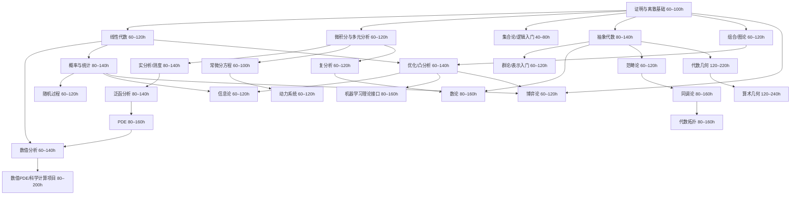
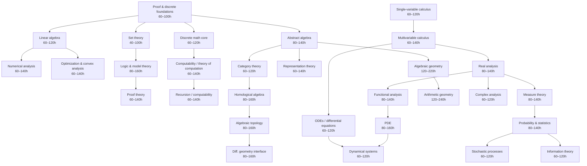
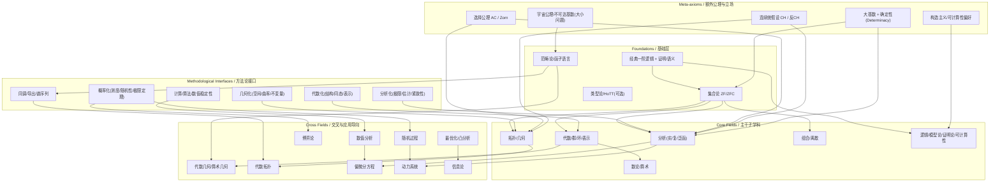

```mermaid
graph TD
  subgraph Foundations["Foundations (shared background)"]
    FOL["Classical logic (1st-order as default)"]
    ZFC["ZFC set-theoretic universe"]
    PT["Proof theory / metatheory of deduction"]
    COMP["Computability (Turing-style)"]
    CAT["Category-theoretic language"]
    HOTT["Type theory / HoTT (alternative)"]
  end

  subgraph MetaAxioms["Meta-axioms & stances (fault lines)"]
    AC["Choice principles (AC, weaker choice)"]
    CH["Continuum hypotheses (CH etc.)"]
    LCD["Large cardinals & determinacy"]
    UNIV["Universe/size principles"]
    CONS["Constructivism / extractability norms"]
  end

  subgraph Interfaces["Methodological interfaces"]
    ALG["Algebraization (structures, homomorphisms)"]
    GEO["Geometrization (spaces, invariants)"]
    ANA["Analytic methods (limits, estimates)"]
    HOM["Homological / derived methods"]
    PROB["Probabilistic methods (laws, coupling)"]
    OPT["Convexity / duality / fixed points"]
    NUM["Numerical/algorithmic stability"]
  end

  subgraph Fields["Main subfields (requested coverage)"]
    SET["Set theory"]
    LOG["Logic & model theory"]
    PROOF["Proof theory"]
    REC["Recursion/computability"]
    NUMT["Number theory"]
    ALGEB["Algebra"]
    LINALG["Linear algebra"]
    REP["Groups & representation theory"]
    TOP["Topology"]
    DGEOM["Differential geometry"]
    RANA["Real analysis"]
    CANA["Complex analysis"]
    FAN["Functional analysis"]
    PDE["PDE"]
    DYN["Dynamical systems"]
    AG["Algebraic geometry"]
    ARITHG["Arithmetic geometry"]
    ATOP["Algebraic topology"]
    HOMALG["Homology / homological algebra"]
    COMB["Combinatorics"]
    DISCRETE["Discrete mathematics"]
    PROBSTATS["Probability & statistics"]
    STOCH["Stochastic processes"]
    INFO["Information theory"]
    GAME["Game theory"]
    CONV["Optimization & convex analysis"]
    NA["Numerical analysis"]
  end

  FOL --> ZFC
  FOL --> LOG
  PT --> FOL
  COMP --> REC

  ZFC --> SET
  ZFC --> ALGEB
  ZFC --> TOP
  ZFC --> RANA
  ZFC --> PROBSTATS

  CAT --> HOM
  HOM --> HOMALG
  HOMALG --> AG
  HOMALG --> ATOP

  ALG --> ALGEB
  ALGEB --> REP
  REP --> NUMT
  AG --> ARITHG
  NUMT --> ARITHG

  GEO --> TOP
  TOP --> ATOP
  DGEOM --> DYN
  ANA --> RANA
  RANA --> FAN
  FAN --> PDE
  PDE --> DYN

  PROB --> PROBSTATS
  PROBSTATS --> STOCH
  STOCH --> INFO
  OPT --> CONV
  CONV --> INFO
  PROBSTATS --> GAME
  OPT --> GAME

  NUM --> NA
  LINALG --> NA
  NA --> PDE
  COMB --> DISCRETE
  DISCRETE --> REC

  AC --> TOP
  AC --> FAN
  AC --> LINALG
  CH --> TOP
  CH --> SET
  LCD --> SET
  LCD --> LOG
  UNIV --> CAT
  CONS --> HOTT
  HOTT --> ATOP
```

# Q1:  What Is Mathematics, Really?

There is a question that almost never gets asked in school: what is mathematics *about*? Students learn to solve equations, compute integrals, and prove theorems, but the subject is rarely introduced as a coherent intellectual enterprise with a character and a direction. This article is an attempt to give that introduction — not a list of topics, but a map of a territory, with enough detail that you can orient yourself within it.

The most honest answer to "what is mathematics about?" is this: mathematics is the study of **structure**. A structure, in the mathematical sense, is any collection of objects together with relationships or operations defined on them. The integers form a structure — you can add and multiply them, and those operations obey certain rules. A geometric surface is a structure — points are related to one another by distance and curvature. Even a simple network of cities connected by roads is a structure. Mathematics asks: what are the properties of these structures? Which structures are fundamentally the same, despite looking different? What can be proven about them from first principles alone?

This is what separates mathematics from the natural sciences. A physicist studies the actual universe; a mathematician studies any universe that is logically consistent. A theorem in mathematics is not confirmed by experiment — it is established by proof, which means it is true in every possible world where the axioms hold.

Over the past two centuries, mathematics has organized itself into a recognizable architecture. There are a few great families of ideas — algebra, analysis, geometry, combinatorics, logic, probability — each with its own central questions and characteristic tools. These families are not isolated; they constantly lend methods to one another, and some of the deepest results in mathematics live precisely at their intersections. What follows is a guided tour of this architecture, starting from the ground up.

---

## §1 — Foundations: Logic, Set Theory, and Model Theory

Every building needs a foundation. In mathematics, that foundation is not intuition or physical reality — it is formal logic and set theory. Before you can prove anything, you need a language in which to express statements, and rules that determine what counts as a valid proof. This is what mathematical logic provides.

### Mathematical Logic and Proof Theory

Mathematical logic asks: what is a proof? The question sounds almost circular, but it has a precise answer. A formal proof is a finite sequence of statements, each of which is either an axiom (a starting assumption accepted without proof) or follows from earlier statements by one of a small number of explicitly permitted inference rules. The most common system used is first-order logic, which allows statements about objects, properties, and relations, using quantifiers like "for all" (∀) and "there exists" (∃).

Proof theory studies the structure of proofs themselves as mathematical objects. One central concern is **consistency** — can a given set of axioms ever lead to a contradiction? Another is **completeness** — are all true statements provable? These questions led to some of the most profound and unsettling results in the history of thought.

In 1931, Kurt Gödel proved his **Incompleteness Theorems**. The first says that any consistent formal system powerful enough to describe basic arithmetic contains statements that are true but cannot be proved within that system. The second says that such a system cannot prove its own consistency. These theorems are not technical curiosities — they permanently changed the philosophical status of mathematics. The dream of reducing all of mathematics to a complete, decidable, mechanically verifiable system — Hilbert's Program — was shown to be impossible.

### Set Theory

Set theory is the language in which virtually all of modern mathematics is written. A set is simply a collection of objects, called its elements. From this primitive concept, every mathematical object can be constructed: the natural numbers, the real numbers, functions, geometric spaces, and so on.

The standard foundation for mathematics is **Zermelo-Fraenkel set theory with the Axiom of Choice**, universally abbreviated ZFC. This is a list of about nine axioms that specify what sets exist and how they can be combined. For instance, one axiom says that for any two sets you can form their union; another says that for any set you can form the set of all its subsets (the power set). From these simple rules, the entire edifice of mathematics — or at least all of mathematics practiced before the mid-20th century — can be derived.

Set theory is also where **infinity** becomes rigorous. Georg Cantor, in the 1870s, showed that not all infinite sets are the same size. The set of natural numbers and the set of real numbers are both infinite, but the reals are a *larger* infinity — there is no way to put them into a one-to-one correspondence with the naturals. Cantor's theory of **cardinal numbers** gives a precise arithmetic of infinite sizes, producing an entire hierarchy of infinities (ℵ₀, ℵ₁, ℵ₂, ...) that extends without end.

One of the most important and controversial principles in ZFC is the **Axiom of Choice** (AC), which states that given any collection of nonempty sets, you can simultaneously pick one element from each — even if the collection is infinite and no rule specifies which element to pick. AC is equivalent to many other statements scattered throughout mathematics: every vector space has a basis, every surjective function has a right inverse, the product of any collection of nonempty spaces is nonempty (Tychonoff's theorem). It is also responsible for some counterintuitive results, most famously the **Banach-Tarski paradox**: using AC, you can theoretically decompose a solid ball into finitely many pieces and reassemble them into two balls of the same size as the original. This is not a physical claim — it relies on sets so pathological they cannot be measured — but it illustrates how far the axioms can take you from ordinary intuition.

### Model Theory

Model theory stands at the intersection of logic and algebra. Where proof theory asks "what can be derived from these axioms?", model theory asks "what mathematical structures *satisfy* these axioms?" A **model** of a set of axioms is simply any structure in which all the axioms are true.

The central insight of model theory is that the same set of axioms can have many different models, some of which look nothing like what you had in mind when you wrote the axioms. For instance, the axioms for a group (a set with an associative operation, an identity element, and inverses) are satisfied by the integers under addition, by the symmetries of a snowflake, by the invertible matrices under multiplication, and by countless other structures. The axioms do not uniquely determine the structure — they carve out a *class* of structures.

A fundamental result is the **Löwenheim-Skolem theorem**: if a set of first-order axioms has an infinite model, it has models of every infinite cardinality. This means you cannot write a first-order axiom system that pins down the real numbers uniquely — any such system also has models with countably many elements, which look nothing like ℝ. This phenomenon is called **non-standard models**, and it has been creatively exploited: Abraham Robinson's **non-standard analysis** uses a non-standard model of the real numbers to rigorously formalize the "infinitesimals" that Newton and Leibniz used intuitively when they invented calculus.

Model theory has deep connections to algebraic geometry — a theorem of Ax and Grothendieck, for instance, can be proved model-theoretically. It also connects to combinatorics through results about the structure of definable sets in various theories. Logic, in this sense, is not merely a philosophical preamble — it is an active mathematical discipline with its own powerful techniques.

## §2 — The Algebra Family: The Study of Structure and Operation

If logic and set theory are the foundation, algebra is the first great floor built on top of it. The word "algebra" in its modern sense means something far more general than the high-school subject of solving for x. Modern algebra is the study of **operations and the structures they generate** — it asks what happens when you impose rules on how objects combine, and what deep properties follow from those rules alone, without caring what the objects actually are.

### Abstract Algebra: Groups, Rings, and Fields

The entry point into modern algebra is the concept of a **group**. A group is a set G together with a binary operation (call it ·) satisfying four axioms: closure (combining two elements gives another element of G), associativity, the existence of an identity element, and the existence of inverses. That's it. From these four axioms, a rich and surprising theory unfolds.

Why groups? Because symmetry is everywhere. Whenever a system has a symmetry — a transformation that leaves something unchanged — the collection of all such transformations forms a group under composition. The rotations that leave a square looking the same form a group of eight elements. The permutations of the roots of a polynomial form a group. The symmetries of space-time form a group (the Poincaré group), and understanding it was essential to special relativity. **Group theory is, at its core, the mathematics of symmetry.**

One of the landmark achievements of 20th-century mathematics is the **Classification of Finite Simple Groups** — the complete catalog of every "atom" of finite group theory, completed collaboratively over decades and spanning tens of thousands of pages of proof. Simple groups are those with no proper normal subgroups, and they serve as the irreducible building blocks from which all finite groups are assembled, much as primes are the building blocks of integers.

Moving beyond groups, algebra introduces richer structures by adding more operations. A **ring** is a set with two operations — addition and multiplication — where addition forms a commutative group, and multiplication is associative and distributes over addition. The integers ℤ are the prototypical ring. A **field** goes further: it requires that every nonzero element has a multiplicative inverse, so division (except by zero) is always possible. The rationals ℚ, the reals ℝ, and the complex numbers ℂ are fields; so is the set {0, 1} with arithmetic modulo 2, which underlies all of digital computation.

**Galois theory** connects fields to groups in a profound way. Given a polynomial equation, Galois associated to it a group — its **Galois group** — that encodes the symmetries among the roots. The solvability of the equation by radicals (square roots, cube roots, and so on) turns out to be equivalent to a purely group-theoretic property: whether the Galois group is **solvable** in a precise algebraic sense. This explains why there is a formula for the roots of any cubic or quartic polynomial, but — as Abel and Galois proved — no such formula can exist for degree five or higher in general. The question "can this equation be solved?" becomes "does this group have a particular structure?" — a beautiful translation between two seemingly unrelated problems.

### Linear Algebra

Linear algebra occupies a peculiar position in mathematics: it is simultaneously one of the simplest theories and one of the most pervasive. Its objects are **vector spaces** — sets equipped with operations of addition and scalar multiplication satisfying certain axioms — and its maps are **linear transformations**, functions that respect those operations.

The power of linear algebra comes from the fact that linear systems are completely understood. A linear transformation between finite-dimensional spaces can be represented as a matrix, and the theory of matrices — rank, determinants, eigenvalues, eigenvectors, diagonalization — gives complete information about the transformation. The **spectral theorem**, which says that symmetric matrices can always be diagonalized in an orthonormal basis, is one of the most useful theorems in all of applied mathematics, underpinning everything from principal component analysis to quantum mechanics.

But the real significance of linear algebra in pure mathematics is that it provides the template for understanding far more complex situations. When you encounter a hard problem in geometry or analysis, a common strategy is to **linearize** it — to approximate it locally by something linear, and then use linear algebra to extract information. Differential calculus is, in essence, a systematic theory of linear approximation. The derivative of a function at a point is the best linear approximation to that function near that point.

### Category Theory

Category theory is sometimes described as "abstract nonsense" — a joke that reflects both its level of generality and the initial resistance it encountered. A **category** consists of objects and morphisms (arrows between objects), with a rule for composing morphisms and an identity morphism on each object. No further structure is assumed. Sets and functions form a category. Groups and group homomorphisms form a category. Topological spaces and continuous maps form a category. Vector spaces and linear maps form a category.

The point is not to study any particular category but to study the **patterns that recur across all of mathematics** at this level of abstraction. A **functor** is a map between categories that preserves structure — it translates objects to objects and morphisms to morphisms in a compatible way. A **natural transformation** is a morphism between functors. The famous **Yoneda lemma** — perhaps the most important basic result in category theory — says that any mathematical object is completely determined by all the ways other objects can map into it. It is a precise formulation of the idea that an object's identity is constituted by its relationships.

Category theory became indispensable in algebraic topology and algebraic geometry, where the objects of study are so complex that keeping track of all the relevant structure requires the categorical framework. It has also influenced theoretical computer science deeply — type theory and functional programming are essentially applications of categorical ideas.

### Representation Theory

Representation theory asks: given an abstract algebraic structure, can we realize it concretely as a collection of matrices? More precisely, a **representation** of a group G is a homomorphism from G into the group of invertible linear transformations of some vector space. This sends each abstract group element to a matrix, such that multiplication in G corresponds to matrix multiplication.

Why does this help? Because matrices are concrete — you can compute with them, take traces, diagonalize them, study their eigenvalues. Representation theory translates hard problems about abstract groups into (relatively) tractable problems in linear algebra.

The theory is richest for **compact Lie groups** and **finite groups**. For finite groups, every representation decomposes uniquely (up to isomorphism) into irreducible representations — indecomposable pieces that cannot be broken down further. These irreducible representations are the "atoms" of the representation theory of the group, and they are organized by a remarkable object called the **character table**, which encodes the traces of matrices in each irreducible representation.

The applications are broad and deep. In physics, the representations of symmetry groups essentially determine what kinds of particles can exist — the classification of elementary particles in the Standard Model is fundamentally a representation-theoretic result. In number theory, the Langlands program — one of the grandest unifying visions in contemporary mathematics — can be understood as a deep correspondence between representations of Galois groups and representations of certain Lie groups arising in harmonic analysis.

### Number Theory

Number theory begins with the integers and the primes, and ends — or rather, refuses to end — in some of the deepest and most difficult mathematics known. It is a field of notorious contrasts: problems that a child can state (is every even number greater than 2 the sum of two primes? — Goldbach's conjecture, unsolved since 1742) that have resisted centuries of attack, alongside machinery of extraordinary sophistication developed to resolve them.

**Elementary number theory** studies divisibility, the Euclidean algorithm, modular arithmetic, and the structure of the integers ℤ/nℤ. Results like the Chinese Remainder Theorem and Euler's theorem on totients live here.

**Algebraic number theory** extends these ideas by replacing ℤ with more general rings of integers in **number fields** — finite extensions of the rationals. In ℤ, every integer factors uniquely into primes. But in more general rings of algebraic integers, unique factorization can fail. The resolution of this failure — the theory of **ideals**, developed by Kummer and Dedekind — reveals that while elements may not factor uniquely, *ideals* do. This recovered a form of unique factorization at the level of ideals, and is one of the conceptual triumphs of 19th-century algebra.

**Analytic number theory** brings in tools from analysis — complex functions, contour integration, Fourier analysis — to study the distribution of primes and other arithmetic phenomena. The **Riemann zeta function** ζ(s) = Σ n⁻ˢ, extended to the complex plane, encodes deep information about the primes through its zeros. The **Riemann Hypothesis** — that all nontrivial zeros of ζ(s) lie on the line Re(s) = 1/2 — remains the most famous unsolved problem in mathematics. The **Prime Number Theorem**, which says that the number of primes up to x is asymptotic to x/ln(x), was proved in 1896 using complex analysis, and the Riemann Hypothesis is essentially the question of how sharp this approximation can be made.

### Algebraic Geometry

Algebraic geometry is the study of geometric objects defined by polynomial equations. At its most elementary, this means curves and surfaces in the plane and in space — the circle x² + y² = 1, the parabola y = x², the surface x² + y² - z² = 1. But modern algebraic geometry operates at a level of abstraction far beyond this intuitive starting point.

The modern foundations, built by Grothendieck in the 1960s, replace the naive notion of a "variety" (the set of solutions to a polynomial system) with the concept of a **scheme**, which encodes not just the solutions but also information about multiplicities, infinitesimal structure, and behavior over different fields and rings. This abstraction, initially seen as excessive, turned out to be exactly what was needed to prove results that had been inaccessible before.

The deepest recent achievement of algebraic geometry is Andrew Wiles's proof of **Fermat's Last Theorem** in 1995 — the statement that xⁿ + yⁿ = zⁿ has no positive integer solutions for n ≥ 3. The proof did not directly attack the equation. Instead, it established the **Modularity Theorem** for elliptic curves, which is a deep structural result connecting algebraic geometry (elliptic curves — certain curves of genus 1) to complex analysis and number theory (modular forms). Fermat's theorem followed as a consequence. This proof is emblematic of how modern mathematics works: a problem stated in elementary terms is resolved through machinery connecting several apparently distant fields.

Algebraic geometry interfaces with virtually every area of pure mathematics — with number theory through arithmetic geometry, with topology through the study of cohomology theories, with complex analysis through the theory of Riemann surfaces and complex manifolds, and with representation theory through geometric methods in the Langlands program.

## §3 — The Analysis Family: The Mathematics of Continuity and Change

If algebra studies structure through operations, analysis studies structure through **limits**. The central idea is that many quantities of interest — lengths, areas, rates of change, accumulated totals — cannot be computed exactly in a finite number of steps. They require passing to a limit: approximating the quantity by simpler ones and asking what value the approximations approach. Analysis is the rigorous theory of this process. It asks when limits exist, when they behave predictably, when you can interchange them safely, and what goes wrong when you cannot.

The intellectual transition that created analysis as a rigorous discipline happened in the 19th century, when mathematicians like Cauchy, Weierstrass, and Riemann replaced the intuitive but imprecise language of Newton and Leibniz — "infinitely small quantities," "quantities approaching zero" — with the now-standard **epsilon-delta definition** of a limit. This was not mere pedantry. The 18th century was full of results that seemed plausible but were secretly wrong, usually because limits had been exchanged in an order that was not legitimate. The rigorization of analysis was a correction of accumulated errors, and it permanently raised the standard of proof in mathematics.

### Real Analysis

Real analysis is the rigorous foundation of calculus on the real number line. It begins by constructing ℝ itself — not as an intuitive continuum, but as a precisely defined mathematical object with a specific property: **completeness**. A sequence of real numbers that is "trying to converge" (a Cauchy sequence) always converges to something in ℝ. This is not true in ℚ: the sequence of rational approximations to √2 is Cauchy, but its limit is irrational and therefore not in ℚ. The completeness of ℝ is what makes analysis work.

From completeness, the key theorems of calculus follow rigorously: the intermediate value theorem (a continuous function that is negative somewhere and positive somewhere must be zero somewhere in between), the extreme value theorem (a continuous function on a closed bounded interval attains its maximum and minimum), and the fundamental theorem of calculus (differentiation and integration are inverse operations). These results feel obvious to the intuition, but their proofs require the full machinery of limits and completeness.

Real analysis also investigates what can go wrong. Can a function be continuous everywhere but differentiable nowhere? Yes — Weierstrass constructed such a function in 1872, scandalizing mathematicians who had assumed continuity implied differentiability "almost everywhere." Can you rearrange the terms of a convergent series and get a different sum? Yes — the **Riemann rearrangement theorem** says that any conditionally convergent series can be rearranged to converge to any real number you like, or to diverge to infinity. These pathological examples are not curiosities — they are precisely what forced mathematicians to state their hypotheses carefully and distinguish between different strengths of convergence (pointwise, uniform, absolute).

**Measure theory**, developed by Lebesgue around 1900, extends the notion of integration far beyond continuous functions. The **Lebesgue integral** assigns a value to a much wider class of functions than the Riemann integral, and its behavior under limits is dramatically better: the dominated convergence theorem allows, under mild conditions, the interchange of limits and integrals in a completely controlled way. Measure theory is not merely a generalization for its own sake — it is the correct framework for probability theory, and it is indispensable in functional analysis and PDEs.

### Complex Analysis

Complex analysis — the study of functions of a complex variable — is one of the most beautiful and surprising theories in mathematics. You take the real analysis you know, replace the real line ℝ with the complex plane ℂ, and the consequences are astonishing.

A function f: ℂ → ℂ is called **holomorphic** (or analytic) at a point if it is complex-differentiable there — meaning the derivative exists as a complex number, regardless of the direction from which you approach the point. This single condition turns out to be enormously stronger than real differentiability. A holomorphic function is automatically infinitely differentiable, and is equal to its Taylor series everywhere in its domain. It cannot be nonzero in a neighborhood and then zero at a point without being identically zero (the **identity theorem**). Its values on a curve completely determine its values inside the region bounded by that curve (the **Cauchy integral formula**).

This rigidity makes complex analysis extraordinarily powerful for computing things. The technique of **contour integration** — integrating a complex function along a path in ℂ — allows the evaluation of real integrals that are completely intractable by real methods. The **residue theorem** converts a contour integral into a finite sum involving the behavior of the function at its isolated singularities. Many definite integrals appearing in physics and probability are computed this way.

Complex analysis also connects to number theory through the behavior of functions like the Riemann zeta function ζ(s), and to geometry through **conformal mappings** — holomorphic functions that preserve angles locally. The **Riemann mapping theorem** says that any simply connected proper open subset of ℂ can be mapped conformally onto the unit disk. This is a global existence result of a kind that has no analog in real analysis, and it exemplifies the characteristic style of complex analysis: strong rigidity produces powerful existence theorems.

### Functional Analysis

Functional analysis is, roughly, linear algebra in infinite dimensions. Instead of finite-dimensional vector spaces like ℝⁿ, it studies spaces whose elements are themselves functions — for instance, the space of all continuous functions on an interval, or the space of all square-integrable functions on ℝ. These spaces are infinite-dimensional, and many familiar results from linear algebra require significant modification before they hold.

The central objects are **Banach spaces** (complete normed vector spaces) and **Hilbert spaces** (Banach spaces with an inner product, giving a notion of angle and orthogonality). The distinction matters: Hilbert spaces have a much richer theory, including the **spectral theorem for self-adjoint operators**, which generalizes the diagonalization of symmetric matrices to infinite-dimensional settings. This theorem is the mathematical foundation of quantum mechanics — the observables of a quantum system are modeled as self-adjoint operators on a Hilbert space, and their possible measurement values are the spectral values of those operators.

**Linear operators** between Banach spaces — the infinite-dimensional analogs of matrices — are studied with tools like the **Hahn-Banach theorem** (which extends linear functionals from subspaces to the whole space), the **open mapping theorem** (a bounded linear bijection between Banach spaces has a bounded inverse), and the **uniform boundedness principle** (a collection of bounded operators that is pointwise bounded must be uniformly bounded). These three theorems are the structural pillars of the theory.

Functional analysis also addresses **compact operators** — operators that map bounded sets to precompact sets — which behave much more like matrices than general bounded operators. The **Fredholm theory** of compact perturbations of the identity, and the **spectral theory of compact self-adjoint operators** (which gives a genuine, countable eigenbasis), are central to the study of integral equations and differential equations with boundary conditions.

### Harmonic Analysis

Harmonic analysis asks: can we decompose a function into simpler, oscillating components? The simplest version of this is **Fourier analysis** on the real line: any sufficiently nice function f(x) can be written as a superposition of sine and cosine waves (or complex exponentials e^{2πiξx}), with the **Fourier transform** giving the amplitude and phase of each frequency component ξ.

This decomposition is not just a computational trick. The Fourier transform converts differentiation into multiplication by a polynomial — so differential equations become algebraic equations in frequency space, often much easier to solve. Convolution of functions becomes pointwise multiplication of their Fourier transforms. The **Plancherel theorem** says the Fourier transform is an isometry on L²(ℝ) — it preserves the L² norm — which gives it the status of a natural isomorphism rather than an ad hoc tool.

Modern harmonic analysis extends this basic idea in multiple directions. **Abstract harmonic analysis** replaces ℝ with a general locally compact abelian group, developing a Fourier theory on any such group. **Wavelet theory** replaces fixed-frequency sines and cosines with a family of localized, oscillating functions scaled and shifted to probe both frequency and spatial location simultaneously — this is why wavelets appear in image compression (JPEG 2000) and signal processing. **Littlewood-Paley theory** and the study of singular integral operators (such as the Hilbert transform) connect harmonic analysis to PDEs and geometric measure theory.

### Ordinary and Partial Differential Equations

A **differential equation** is an equation involving a function and its derivatives. When the function depends on a single variable, you have an **ordinary differential equation** (ODE); when it depends on several variables and partial derivatives appear, you have a **partial differential equation** (PDE). Both are among the most practically important branches of mathematics, since the laws of physics, chemistry, biology, and economics are typically expressed as differential equations.

For ODEs, the basic existence and uniqueness theory — the **Picard-Lindelöf theorem** — says that under mild conditions on the right-hand side, an initial value problem has a unique solution locally in time. The theory of **linear ODEs** is completely understood: solutions form a vector space, and can be expressed explicitly in terms of the matrix exponential. **Nonlinear ODEs** are far harder, and are studied through qualitative methods — phase portraits, stability theory, bifurcation theory — rather than explicit formulas.

PDEs are richer and harder. A few canonical equations organize much of the theory. The **Laplace equation** Δu = 0 describes steady-state phenomena — the equilibrium distribution of temperature in a region, the electrostatic potential in a vacuum. Its solutions (**harmonic functions**) are incredibly smooth and rigid: a harmonic function is determined everywhere inside a region by its values on the boundary (the **maximum principle**), and is equal to the average of its values on any surrounding sphere. The **heat equation** ∂u/∂t = Δu governs diffusion — heat spreading through a material, particles undergoing Brownian motion. The **wave equation** ∂²u/∂t² = c²Δu governs the propagation of sound, light, and water waves. The **Schrödinger equation** iℏ ∂ψ/∂t = Hψ governs the evolution of quantum mechanical states.

These equations are not just models — they generate deep mathematics. Proving existence and uniqueness of solutions for a PDE is often a major achievement. The **Navier-Stokes equations** governing fluid flow are so poorly understood that proving whether their solutions can develop singularities in finite time (the "blow-up problem") is one of the Millennium Prize Problems, carrying a $1 million prize for resolution.

### Dynamical Systems

A dynamical system is any system that evolves over time according to a fixed rule. It might be a system of ODEs, a map from a space to itself iterated repeatedly, or a more abstract flow on a manifold. The central concern is **long-term behavior**: does the system settle into equilibrium? Does it repeat periodically? Does it behave chaotically?

**Chaos** has a precise mathematical definition: a dynamical system is chaotic if it has sensitive dependence on initial conditions — meaning nearby trajectories diverge exponentially fast, making long-term prediction impossible regardless of computational power. The **Lorenz system**, a simplified model of atmospheric convection, was the first system where chaos was observed computationally (by Edward Lorenz in 1963), leading to the famous "butterfly effect." The mathematical analysis of chaotic systems uses tools from topology (invariant sets, attractors), probability (ergodic theory — the study of statistical properties of trajectories), and number theory (Diophantine approximation appears in the study of quasi-periodic dynamics).

**Ergodic theory** is particularly deep. A dynamical system is ergodic if, loosely, time averages equal space averages — a trajectory that spends time in a region proportional to that region's measure. The **Birkhoff ergodic theorem** makes this precise. Ergodic theory connects to number theory through **continued fractions** and to statistical mechanics through the justification of thermodynamic averaging. The **Furstenberg correspondence principle** uses ergodic theory to prove combinatorial results, most famously giving a new proof of **Szemerédi's theorem** — that any set of integers with positive density contains arithmetic progressions of arbitrary length.

The study of dynamical systems also encompasses **Hamiltonian mechanics** — the mathematics of conservative physical systems like planetary motion. The **KAM theorem** (Kolmogorov-Arnold-Moser) addresses the stability of quasi-periodic motion under small perturbations, a question going back to Newton's concern with whether the solar system is stable. The answer — partial and subtle — required deep new mathematics involving Diophantine conditions and infinite-dimensional function spaces.

## §4 — Geometry and Topology: The Study of Space and Shape

Geometry and topology both study space, but they ask different questions about it. Geometry asks about **measurement** — distances, angles, curvature, area. Topology asks about **structure that survives deformation** — properties that are unchanged when you stretch, bend, or continuously deform a space, as long as you never tear it or glue distinct points together. A coffee cup and a donut are topologically identical (both are surfaces with one hole), but geometrically very different. The two subjects share many tools and have grown increasingly intertwined, but the distinction in spirit is real and useful to keep in mind.

### Differential Geometry

Differential geometry studies smooth shapes — curves, surfaces, and their higher-dimensional generalizations called **manifolds** — using the tools of calculus. A manifold is a space that looks locally like ordinary Euclidean space ℝⁿ, even if its global structure is complicated. The surface of the Earth is a 2-manifold: small enough regions look flat, but the whole is a sphere. Space-time in general relativity is a 4-manifold with a geometric structure that encodes gravity.

The central concept is **curvature**. For a curve in the plane, curvature measures how fast the tangent direction turns — a straight line has curvature zero, a circle of radius r has curvature 1/r. For surfaces, curvature is more subtle: **Gaussian curvature** measures the intrinsic bending of the surface, independently of how it sits in ambient space. A sphere has positive Gaussian curvature; a saddle surface has negative Gaussian curvature; a flat plane or cylinder has zero Gaussian curvature. The **Gauss-Bonnet theorem** connects Gaussian curvature to topology: the integral of Gaussian curvature over a closed surface equals 2π times the **Euler characteristic** χ of the surface — a topological invariant. For a sphere, χ = 2; for a torus, χ = 0. This is one of the most striking results in mathematics: an analytical quantity (curvature, computed using calculus) equals a topological quantity (Euler characteristic, computed by counting vertices, edges, and faces).

For higher-dimensional manifolds, curvature becomes a tensor — the **Riemann curvature tensor** — and the theory grows accordingly. The **Ricci tensor**, a contraction of the Riemann tensor, appears directly in Einstein's field equations of general relativity: Rᵢⱼ - ½Rgᵢⱼ = 8πGTᵢⱼ. This equation says that the curvature of space-time (left side) is determined by the distribution of matter and energy (right side). Differential geometry is not optional background for general relativity — it *is* the language in which the theory is written.

The study of **geodesics** — the shortest paths between points on a curved surface, the natural generalization of straight lines — connects differential geometry to physics (light follows geodesics in curved space-time) and to calculus of variations. The theory of **connections and parallel transport** makes precise the notion of moving a vector along a curve on a manifold without rotating it relative to the surface — and the extent to which a vector fails to return to its original orientation after traveling around a loop is exactly the curvature of the connection.

### Algebraic Topology

Algebraic topology answers geometric questions by converting them into algebra. The fundamental strategy is to assign to each topological space an algebraic object — a group, a ring, a sequence of groups — in a way that is invariant under homeomorphism (continuous bijection with continuous inverse). If two spaces have different algebraic invariants, they cannot be homeomorphic. The algebraic invariants thus serve as fingerprints of topological spaces.

The most intuitive invariant is the **fundamental group** π₁(X, x₀), which captures the structure of loops in a space. Fix a basepoint x₀; consider all loops starting and ending at x₀, and identify loops that can be continuously deformed into one another. The group operation is concatenation of loops. For a simply connected space like ℝⁿ or the sphere Sⁿ (n ≥ 2), every loop can be contracted to a point, so π₁ = 0. For the circle S¹, loops wind around by an integer number of times, and π₁(S¹) = ℤ. For the torus (the surface of a donut), loops can wind in two independent directions, and π₁(T²) = ℤ × ℤ.

The fundamental group is powerful but coarse — it captures one-dimensional "holes" but misses higher-dimensional ones. **Homology groups** H₀, H₁, H₂, ... capture holes of all dimensions simultaneously. H₀ counts connected components; H₁ captures one-dimensional holes (loops that cannot be filled); H₂ captures two-dimensional holes (enclosed voids); and so on. **Cohomology** is the dual theory, and it has additional multiplicative structure (the **cup product**) making it a ring rather than just a group.

The connection between topology and algebra is made precise by **functors**. Homology is a functor from topological spaces to sequences of abelian groups: a continuous map between spaces induces a homomorphism between their homology groups in a compatible way. This functoriality is what makes algebraic topology useful — a topological problem (is there a continuous map with certain properties?) becomes an algebraic problem (is there a homomorphism between these groups?), which is often tractable.

One of the deepest results is the **Atiyah-Singer index theorem**, which connects the analytical properties of differential operators on a manifold (specifically, the dimension of their solution spaces) to the topology of the manifold. It is a vast generalization of the Gauss-Bonnet theorem and unifies results from analysis, topology, and geometry in a single statement. Its proof uses K-theory, a generalized cohomology theory, and its applications range from the classification of manifolds to the understanding of anomalies in quantum field theory.

### Differential Topology

Differential topology studies manifolds with a smooth structure — the additional data that allows calculus to be done on the manifold — and asks questions about properties that are invariant under **diffeomorphism** (smooth bijection with smooth inverse), a more restrictive equivalence than homeomorphism.

The distinction matters, and in dimension four it matters dramatically. A fundamental discovery of Simon Donaldson and Michael Freedman in the 1980s revealed that ℝ⁴ — four-dimensional Euclidean space — admits infinitely many inequivalent smooth structures. No other ℝⁿ has this property: for n ≠ 4, the smooth structure on ℝⁿ is unique up to diffeomorphism. This **exotic ℝ⁴** phenomenon has no physical interpretation yet, but it represents a profound difference between dimension four and all others — and dimension four is, of course, the dimension of space-time.

**Morse theory** connects the topology of a manifold to the critical points of smooth functions on it. A **Morse function** is a smooth function whose critical points are all non-degenerate (the Hessian is nonsingular at each one). The topology of the sublevel sets {x : f(x) ≤ c} changes only when c passes through a critical value, and the type of change — which cell is attached, in what dimension — is determined by the index (number of negative eigenvalues of the Hessian) of the critical point. This turns the global topology of the manifold into a combinatorial count of critical points and their indices, and gives lower bounds: a manifold with complex topology must support a Morse function with many critical points.

The **h-cobordism theorem** of Smale, proved using Morse theory, implies the **Poincaré conjecture** in dimensions five and higher: a closed, simply connected n-manifold with the homology of an n-sphere is homeomorphic to the n-sphere. The three-dimensional case resisted all such methods and was finally resolved by Perelman in 2003 using **Ricci flow** — a PDE that deforms the metric on a Riemannian manifold to smooth out irregularities, introduced by Richard Hamilton. Perelman's proof blends differential geometry, PDEs, and topology in a way that exemplifies the deep unity of modern mathematics.

### Moduli Spaces

A moduli space is a space whose points parametrize isomorphism classes of geometric objects of a given type. Instead of studying one curve or one surface, you study the space of all curves or all surfaces simultaneously — the moduli space becomes a geometric object in its own right, and its properties reflect how the individual objects vary and degenerate.

The simplest example is the **moduli space of elliptic curves** — the space of all elliptic curves over ℂ up to isomorphism. An elliptic curve is a smooth cubic curve, or equivalently a torus ℂ/Λ for a lattice Λ ⊂ ℂ. The isomorphism class depends only on the shape of Λ, parametrized by a complex number τ in the upper half-plane modulo the action of a certain symmetry group. The resulting space — the **modular curve** — is not just a set; it is itself a Riemann surface, and its geometry encodes deep number-theoretic information. **Modular forms** are functions on this space with specific transformation properties, and they appear throughout number theory: in the proof of Fermat's Last Theorem, in the theory of partitions, and in the classification of finite simple groups.

More generally, **Teichmüller theory** and the **moduli space of curves** 𝓜_g (the space of all Riemann surfaces of genus g up to isomorphism) are objects of intense study. 𝓜_g has dimension 3g − 3 for g ≥ 2, and its topology, cohomology, and compactification involve ideas from algebraic geometry, hyperbolic geometry, and combinatorics. The **Witten conjecture** — proved by Kontsevich — relates intersection numbers on 𝓜_g to solutions of the KdV equation, a PDE arising in fluid dynamics. The connection seems improbable, but it illustrates how moduli spaces serve as meeting points for disparate areas of mathematics.

---

## §5 — Combinatorics and Discrete Mathematics: The Study of Finite Structure

Combinatorics is the mathematics of finite and countable structures. It asks questions like: how many configurations of a certain type exist? Does a structure with given properties necessarily exist? What is the most efficient way to organize or search a finite collection of objects? These questions are elementary to state but can be ferociously difficult to answer, and their study has led to profound connections with algebra, probability, topology, and theoretical computer science.

### Graph Theory

A **graph** is a set of vertices together with a set of edges connecting pairs of vertices. The definition is almost childishly simple, but graphs model an enormous range of phenomena: road networks, social networks, molecules in chemistry, dependencies between computational tasks, neural connectivity. Graph theory studies properties intrinsic to this combinatorial structure, independent of how the graph is drawn or embedded.

Many central problems in graph theory are easy to state but hard to solve. The **four color theorem** — every planar map can be colored with four colors so that no two adjacent regions share a color — was conjectured in 1852 and proved only in 1976, using a computer-assisted case analysis that examined nearly 2,000 configurations. The proof remains controversial because no human has read every case. **Ramsey theory** asks: how large does a graph need to be before some specific substructure necessarily appears? The **Ramsey number** R(s, t) is the smallest n such that every graph on n vertices contains either a clique of size s (a complete subgraph) or an independent set of size t (no edges). Computing Ramsey numbers exactly is notoriously difficult — even R(5, 5) is unknown, though it is known to lie between 43 and 48.

**Graph coloring** more generally — assigning colors to vertices so adjacent vertices have different colors — connects to scheduling problems, register allocation in compilers, and frequency assignment in wireless networks. The **chromatic polynomial** of a graph counts the number of proper colorings using exactly k colors and is a polynomial in k, connecting combinatorics to algebra.

Structural graph theory asks about the global architecture of graphs. The **Robertson-Seymour theorem** — one of the deepest results in combinatorics, proved in a series of 23 papers spanning decades — says that in the set of all finite graphs ordered by the "minor" relation (contracting edges and deleting vertices), there are no infinite antichains. Equivalently, any property of graphs that is closed under taking minors can be characterized by a finite list of **forbidden minors**. This vastly generalizes Kuratowski's theorem (a graph is planar if and only if it contains no minor homeomorphic to K₅ or K₃,₃) and has deep algorithmic consequences.

### Enumerative and Algebraic Combinatorics

Enumerative combinatorics is the oldest branch, concerned with counting. How many ways can n objects be arranged? How many paths exist through a grid from one corner to another? How many ways can a number n be written as a sum of positive integers (partitions of n)? These questions, apparently simple, lead to generating functions, recursions, and bijections of considerable ingenuity.

**Generating functions** are a central technique: encode a sequence a₀, a₁, a₂, ... as the coefficients of a formal power series A(x) = Σ aₙxⁿ, then manipulate the function algebraically to extract information about the sequence. The **transfer matrix method** encodes combinatorial problems as linear recurrences by reading off powers of a matrix. The **Lagrange inversion formula** inverts power series and counts labeled trees (Cayley's formula: the number of labeled trees on n vertices is nⁿ⁻²). These are not just computational tools; they reveal structural patterns underlying the counts.

Algebraic combinatorics uses algebraic structures to organize and prove combinatorial results. **Symmetric functions** — polynomials invariant under permutation of variables — form a Hopf algebra whose basis elements (monomial, elementary, homogeneous, Schur symmetric functions) are in natural bijection with combinatorial objects (partitions, tableaux). **Young tableaux** — fillings of Young diagrams with numbers obeying certain order conditions — count irreducible representations of symmetric groups, lattice paths, and plane partitions simultaneously. This universality reveals hidden algebraic structure in seemingly unrelated counting problems.

The **Lindström-Gessel-Viennot lemma** turns a count of non-intersecting lattice paths into a determinant, connecting combinatorics to linear algebra in a precise way. **Cluster algebras**, introduced by Fomin and Zelevinsky in 2002, are algebraic structures defined by combinatorial mutation rules on matrices, and they appear unexpectedly in Teichmüller theory, representation theory, tropical geometry, and mathematical physics. They exemplify the modern pattern: combinatorial objects, defined by simple rules, organize vast amounts of algebraic and geometric data.

### Extremal and Probabilistic Combinatorics

Extremal combinatorics asks: given a combinatorial structure satisfying certain constraints, how large or small can some parameter be? **Turán's theorem** is the paradigmatic result: among all graphs on n vertices with no complete subgraph Kᵣ₊₁, the maximum number of edges is achieved by the **Turán graph** T(n, r), which divides the vertices as evenly as possible into r independent groups and connects all pairs from different groups. The clean answer — a specific, describable graph — and the clean proof structure have inspired an enormous field.

The **probabilistic method**, introduced in its modern form by Paul Erdős, is a technique for proving existence without constructing. To show that a graph with certain properties exists, you define a random graph (for example, include each possible edge independently with probability p) and show that the expected number of "bad" configurations is less than 1, or more subtly, that with positive probability none occur. The conclusion — that a structure with the desired properties exists — is purely existential; the proof gives no clue how to find it. This non-constructive approach was initially philosophically controversial but has become one of the most powerful methods in combinatorics.

The probabilistic method also connects to the **theory of random graphs**, initiated by Erdős and Rényi. In the random graph G(n, p) — n vertices, each edge included independently with probability p — there are sharp **threshold phenomena**: properties like connectivity, existence of a Hamiltonian cycle, or emergence of a giant connected component appear suddenly as p crosses a critical value. For connectivity, the threshold is p = (log n)/n: below this threshold, the graph almost surely has isolated vertices; above it, it is almost surely connected. These threshold phenomena mirror phase transitions in statistical physics, and the connection is not superficial.

### Combinatorics and Computer Science

Combinatorics is the mathematical foundation of theoretical computer science, and the traffic between them has been heavy in both directions. **Complexity theory** asks which computational problems are intrinsically hard — and the central open problem, **P vs. NP**, is a combinatorial question: is there a polynomial-time algorithm for every problem whose solutions can be verified in polynomial time? The canonical NP-complete problem, **Boolean satisfiability** (given a propositional formula, is there an assignment of truth values satisfying it?), is purely combinatorial.

**Coding theory** uses combinatorics to design error-correcting codes — methods for encoding information so that errors introduced in transmission can be detected and corrected. **Hamming codes**, **Reed-Solomon codes**, and **LDPC codes** are combinatorial constructions with algebraic structure guaranteeing their error-correction capacity. They are in use in every digital communication system, from CDs to space probes.

**Cryptography** relies on combinatorial hardness assumptions — the presumed difficulty of factoring large integers, computing discrete logarithms, or finding short vectors in lattices. The security of RSA encryption depends on no efficient factoring algorithm being known; the security of elliptic curve cryptography depends on the discrete logarithm being hard in the group of points of an elliptic curve. Whether these assumptions are true — whether the relevant problems are genuinely hard — is, ultimately, a combinatorial question that complexity theory is trying to resolve.

## §6 — Probability and Randomness: The Mathematics of Uncertainty

Probability theory is the mathematical study of uncertainty and random phenomena. It occupies a peculiar position in the architecture of mathematics: it is rigorous and deductive like all other mathematics, yet its subject matter is inherently about what is not determined. The resolution of this tension is one of the conceptual achievements of the 20th century. Once probability was placed on a measure-theoretic foundation by Kolmogorov in 1933, it became a full branch of pure mathematics — one with its own deep theorems — while simultaneously remaining the language in which statistical mechanics, quantum mechanics, finance, and information theory are written.

### Probability Theory

The modern foundation of probability is **measure theory**. A probability space is a triple (Ω, ℱ, P): a sample space Ω of outcomes, a σ-algebra ℱ of measurable events (subsets of Ω), and a probability measure P assigning to each event a number between 0 and 1, with P(Ω) = 1 and countable additivity. A **random variable** is a measurable function X: Ω → ℝ. Its **expectation** E[X] is its integral with respect to P. This abstract framework subsumes all earlier intuitive approaches to probability and resolves the conceptual difficulties that plagued the subject.

From these foundations, the classical limit theorems follow. The **law of large numbers** says that if X₁, X₂, X₃, ... are independent and identically distributed random variables with finite mean μ, then their sample average (X₁ + ... + Xₙ)/n converges to μ almost surely as n → ∞. This formalizes the intuition that averages stabilize. The **central limit theorem** goes further: the fluctuations of the sample average around μ, rescaled by √n, converge in distribution to a standard normal (Gaussian) distribution, regardless of the underlying distribution of the Xᵢ — provided only that the variance is finite. This universality of the Gaussian is why the normal distribution appears throughout science and statistics. It is not an assumption about nature but a theorem about sums of independent random variables.

**Conditional probability** and **conditional expectation** are where probability departs most sharply from elementary intuition and becomes technically demanding. The conditional expectation E[X | ℱ'] of a random variable X given a sub-σ-algebra ℱ' is itself a random variable — the best ℱ'-measurable approximation to X in L² — and its properties are the foundation of martingale theory, Bayesian inference, and Markov chain theory.

**Martingales** are sequences of random variables Mₙ representing a fair game: E[Mₙ₊₁ | M₁, ..., Mₙ] = Mₙ. Despite the absence of any systematic drift, martingales can still exhibit complex behavior. The **optional stopping theorem** says that under regularity conditions, the expected value of a martingale at a stopping time (a random time determined by the process's history) equals its initial value — a fact that has consequences from gambling theory to the pricing of financial derivatives. The **martingale convergence theorem** says that bounded martingales converge almost surely, which is the basis for many existence results in probability.

### Stochastic Processes

A **stochastic process** is a collection of random variables {Xₜ}ₜ∈T indexed by time T, which may be discrete (T = ℕ) or continuous (T = [0, ∞)). The theory asks about the structure of the trajectories — the functions t ↦ Xₜ(ω) for a fixed outcome ω — and about the statistical properties of the process as a whole.

**Brownian motion** (the Wiener process) is the central object of continuous-time probability. It is the unique stochastic process with continuous sample paths, independent and stationary increments, and normally distributed increments: Bₜ − Bₛ ~ N(0, t−s) for t > s. Brownian motion is the scaling limit of random walks: if you take a random walk on ℤ (equal probability of stepping left or right at each step) and zoom out in space and time simultaneously, you get Brownian motion in the limit. It is simultaneously continuous everywhere and differentiable nowhere — a pathological object by the standards of real analysis, but the correct model for thermal fluctuations, diffusion, and the erratic motion of particles.

**Stochastic calculus** — developed by Itô — extends the rules of calculus to functions of Brownian motion. The fundamental surprise is that the ordinary chain rule fails: if f is smooth and Bₜ is Brownian motion, then df(Bₜ) ≠ f'(Bₜ)dBₜ. The correct formula, **Itô's lemma**, includes an additional second-order term coming from the quadratic variation of Brownian motion: df(Bₜ) = f'(Bₜ)dBₜ + ½f''(Bₜ)dt. This correction term, invisible in classical calculus, is the source of the drift in many stochastic models and is directly responsible for the Black-Scholes formula for option pricing.

**Markov chains** — discrete-time stochastic processes where the future depends on the present but not the past — are the foundation of a vast applied theory. The **Perron-Frobenius theorem** ensures that under mild conditions (irreducibility and aperiodicity), a Markov chain converges to a unique stationary distribution, regardless of its starting state. This convergence is the mathematical basis for **Markov chain Monte Carlo** (MCMC) methods, which sample from complex probability distributions by running a cleverly designed Markov chain whose stationary distribution is the target. MCMC is one of the most important computational methods in statistics and machine learning.

### Probability and Statistical Physics

Statistical mechanics is the branch of physics that derives macroscopic thermodynamic behavior — temperature, pressure, entropy — from the probabilistic behavior of microscopic constituents. The mathematics here is probability theory applied to systems with enormous numbers of interacting components.

The canonical model is the **Ising model**: a lattice of sites, each carrying a spin ±1, with interactions favoring neighboring spins to align. At high temperature, thermal fluctuations dominate and spins are essentially random. At low temperature, cooperative interactions dominate and the spins align into a ferromagnetic ordered state. At a critical temperature between these regimes, the system undergoes a **phase transition** — a sharp qualitative change in macroscopic behavior emerging from microscopic rules.

The mathematical analysis of phase transitions requires understanding the behavior of probability distributions in the thermodynamic limit — as the lattice size goes to infinity. The tools are those of probability theory (percolation theory, large deviations), functional analysis (transfer matrix methods), and complex analysis (exactly solvable models in two dimensions). The **renormalization group** — a method for understanding how physical systems behave at different scales — was placed on a rigorous mathematical footing using the theory of **Schramm-Loewner evolution** (SLE), a family of random curves in the plane describing the interfaces between different phases at criticality. SLE is a triumph of rigorous probability theory: it gives exact, proved descriptions of the scaling limits of models that physicists had studied for decades using non-rigorous methods.

**Large deviation theory** asks about the probability of rare events — not just that the sample average converges to its mean, but how fast the probability of a large deviation from the mean decays. The **Cramér theorem** gives the exponential rate of this decay in terms of the **Legendre transform** of the cumulant generating function. Large deviation theory connects probability to thermodynamics (free energy is a large deviation rate function), information theory (the Sanov theorem), and statistical mechanics (the Gibbs variational principle).

---

## §7 — Computation and Numerical Mathematics

The two branches discussed here are different in character from all the preceding ones. Numerical analysis and theoretical computer science both engage with computation — but the first asks how to approximate mathematical objects efficiently and accurately, while the second asks about the fundamental limits and structure of computation itself.

### Numerical Analysis

Most equations arising in practice cannot be solved in closed form. Even something as simple as the equation x = cos(x) has no explicit algebraic solution — but it has a unique solution (approximately 0.739), which can be found to any desired accuracy by iterating the map x ↦ cos(x) starting from almost any initial point. Numerical analysis is the systematic study of such methods: how fast do they converge, how accurate are they, and when do they fail?

The three central concerns of numerical analysis are **accuracy** (how close is the computed answer to the true answer?), **stability** (does the algorithm amplify small errors in the input?), and **efficiency** (how many operations does it require?). These concerns are in constant tension. An algorithm that is highly accurate may be computationally expensive; an algorithm that is fast may be unstable.

**Floating-point arithmetic** — the way computers actually represent and compute with real numbers — introduces rounding errors at every step, and understanding how these errors propagate through a computation requires careful analysis. A **well-conditioned** problem is one where small changes in the input cause small changes in the output; an **ill-conditioned** problem amplifies input errors. The **condition number** of a matrix — the ratio of its largest to smallest singular values — measures how ill-conditioned the linear system Ax = b is, and determines how much accuracy is lost when solving it numerically.

**Numerical linear algebra** — solving systems of linear equations, computing eigenvalues, decomposing matrices — is both the most theoretically developed and the most practically important part of numerical analysis. The **QR algorithm** for computing eigenvalues, the **singular value decomposition** (SVD), and **iterative methods** like conjugate gradient are used billions of times per day in scientific computing, machine learning, and engineering. The SVD in particular — decomposing a matrix as A = UΣVᵀ with U, V orthogonal and Σ diagonal with nonnegative entries — is arguably the most useful matrix factorization in applied mathematics, underlying dimensionality reduction, least-squares fitting, image compression, and the analysis of data sets.

**Numerical methods for differential equations** — finite difference methods, finite element methods, spectral methods — discretize continuous problems into finite linear systems. The **finite element method** (FEM), which approximates solutions to PDEs by piecewise polynomial functions on a mesh, is the workhorse of computational physics and engineering: it simulates the structural integrity of bridges, the aerodynamics of aircraft, the flow of blood through arteries.

### Computability and Complexity Theory

Theoretical computer science asks questions that are mathematical in character: what can be computed at all, and what can be computed efficiently? These questions were first posed — and partially answered — before computers existed, by Alan Turing and Alonzo Church in the 1930s.

A **Turing machine** is an abstract model of computation: an infinite tape of symbols, a read-write head, and a finite set of states with transition rules. Despite its simplicity, the Turing machine captures exactly the class of **computable functions** — functions that can be computed by any physically realizable device, according to the **Church-Turing thesis**. The thesis is not a theorem (it is a claim about physical reality, not mathematics) but is universally accepted.

Some problems are not computable at all. The **halting problem** — given a Turing machine and an input, will the machine eventually halt? — has no algorithmic solution. Turing's proof, by a diagonalization argument reminiscent of Cantor's proof that the reals are uncountable, shows that no Turing machine can correctly answer this question for all inputs. Incomputability is not a limitation of current technology; it is a mathematical absolute.

Among computable problems, **complexity theory** classifies them by efficiency. The class **P** contains problems solvable in polynomial time — the running time is bounded by some polynomial in the input size. The class **NP** contains problems whose solutions can be verified in polynomial time. Every problem in P is in NP, but whether P = NP — whether efficient verification always implies efficient solution — is unknown, and is the most important open problem in theoretical computer science, with profound practical consequences. If P = NP, then codes are breakable, mathematical proofs are findable automatically, and optimization is easy. The consensus is that P ≠ NP, but no proof exists.

**NP-complete** problems are the hardest problems in NP: every other NP problem reduces to them in polynomial time. If any NP-complete problem has a polynomial-time algorithm, then P = NP. Thousands of practical problems — graph coloring, traveling salesman, protein folding, scheduling — are NP-complete, which is why the P vs. NP question carries enormous practical weight alongside its theoretical importance.

---

## §8 — The Great Bridges: Where Fields Meet

The most exciting mathematics often lives not within a single field but at the crossroads between several. These intersections are not accidents — they reflect the underlying unity of mathematical structure, the fact that the same ideas recur in different guises across apparently unrelated domains.

### The Langlands Program

The Langlands program, initiated by Robert Langlands in a 1967 letter to André Weil, is perhaps the grandest unifying vision in contemporary pure mathematics. It proposes a deep web of correspondences — still largely conjectural — between three apparently distant subjects: **number theory** (specifically, the representation theory of Galois groups), **automorphic forms** (highly symmetric functions on certain symmetric spaces, generalizing modular forms), and **representation theory of reductive groups**.

The simplest instance is the **modularity theorem**: every elliptic curve over ℚ corresponds to a modular form. This was the key ingredient in Wiles's proof of Fermat's Last Theorem. But the Langlands program envisions this as the tip of an iceberg: a vast family of such correspondences connecting arithmetic objects (L-functions attached to Galois representations) to analytic objects (automorphic L-functions). The **geometric Langlands program** translates all of this into algebraic geometry and has connections to quantum physics and string theory. The **p-adic Langlands program** works over p-adic fields instead of ℝ and ℂ.

The Langlands program does not just unify — it generates theorems. Results proved on the automorphic side can be transferred to the arithmetic side and vice versa, yielding new information about primes, class groups, and the arithmetic of varieties that seems completely inaccessible by direct methods.

### Topology and Physics

The relationship between topology and theoretical physics has been transformative for both subjects. In the 1980s, physicists working on quantum field theory and string theory began producing topological invariants — quantities associated to manifolds and knots that are independent of geometry — using path integrals and other physical methods. The mathematical rigor of these computations was initially unclear, but the results were spectacular.

**Chern-Simons theory**, a three-dimensional quantum field theory, produces invariants of 3-manifolds and knots, including the **Jones polynomial** — a knot invariant discovered by Vaughan Jones in 1984 and interpreted by Witten in terms of Chern-Simons theory. **Donaldson theory** uses instantons — solutions to the Yang-Mills equations from gauge theory — to define invariants of four-manifolds that detect properties invisible to classical topology. The **Seiberg-Witten invariants**, arising from a different physical duality, give simpler and more computable versions of Donaldson's invariants.

This exchange has been bidirectional. Topological ideas — cobordisms, surgery, characteristic classes — have been imported into physics and reshaped how physicists think about quantum field theories and string compactifications. The mathematical notion of a **topological quantum field theory** (TQFT), axiomatized by Atiyah, provides a framework for understanding what kind of mathematical object a quantum field theory is.

### Probability and Everything Else

Probability theory has developed connections to virtually every other branch of mathematics. **Probabilistic number theory** studies the distribution of arithmetic functions (how many prime factors does a typical integer near n have? — answer: approximately log log n, by the **Erdős-Kac theorem**, which shows the number of prime factors is approximately normally distributed). **Random matrix theory** — the study of the eigenvalue distributions of random matrices — produces statistics that describe the zeros of the Riemann zeta function, energy levels of heavy nuclei, and singular values of random data matrices, revealing a striking universality across completely different physical and mathematical systems.

**Geometric measure theory** studies measures on geometric objects — rectifiable curves and surfaces, currents, varifolds — and its probabilistic aspects underpin the theory of random surfaces and the SLE curves mentioned in §6. **Optimal transport**, the study of the most efficient way to move mass from one distribution to another, connects probability to PDEs (the Monge-Ampère equation), geometry (it defines a metric on the space of probability measures, the **Wasserstein metric**), and economics (it originated in Monge's 18th-century question about moving soil most efficiently). Optimal transport has recently become central to machine learning, where it provides a geometrically meaningful way to compare probability distributions — the foundation of **generative adversarial networks** and distribution matching in statistics.

---

## Coda: How to Navigate This Territory

Standing at the end of this map, a few observations are worth making.

First, this map is incomplete — necessarily and permanently. Mathematics grows faster than any survey can track. Fields like **tropical geometry** (replacing ordinary arithmetic with (min, +) operations to create a piecewise-linear shadow of algebraic geometry), **∞-category theory** (a far-reaching generalization of category theory that has restructured algebraic topology and homotopy theory), **arithmetic dynamics** (the study of iteration of maps in an arithmetic setting), and dozens of other active areas were not discussed. Every branch described above contains multiple subfields that could have warranted their own sections.

Second, the divisions between fields are provisional. The boundaries between algebra, geometry, and analysis are real enough that mathematicians specialize, but the deepest results almost always transgress them. Wiles's proof of Fermat uses algebraic geometry, complex analysis, representation theory, and commutative algebra simultaneously. Perelman's proof of the Poincaré conjecture uses Riemannian geometry, PDEs, and topology. The Atiyah-Singer theorem is simultaneously a statement about differential operators (analysis), characteristic classes (topology), and index theory (algebra). A narrow specialist is necessarily limited; the greatest mathematicians have always been those who could think across boundaries.

Third — and most important for the serious beginner — the order in which these subjects are typically studied is not the order in which they become most fruitful. Linear algebra and real analysis are learned first because they are foundational, not because they are the most important. The ability to perceive the large-scale structure — to know that algebraic topology studies invariants of spaces, that number theory connects to geometry through the Langlands program, that probability and analysis are inseparably linked — transforms the experience of learning any individual subject. Every theorem you prove in a course has a location in this map, and knowing that location turns an isolated fact into part of a coherent story.

The story of mathematics, ultimately, is about the unreasonable power of abstract structure. The same group can describe the symmetries of a crystal and the fundamental group of a topological space. The same equation — the heat equation — governs the diffusion of heat, the diffusion of stock prices, and the smoothing of metrics in Perelman's proof. The same Fourier transform appears in quantum mechanics, signal processing, analytic number theory, and the theory of partial differential equations. This recurrence is not coincidence. It reflects the fact that mathematics studies structure itself — and the deep structures are few and ubiquitous. Learning mathematics, at the deepest level, is learning to recognize the same face wearing different masks.

# Knowledge Structure of Pure Mathematics

## Table 1 — The 15 Modes of Mathematical Thinking

These are not topics but *cognitive operations* — the recurring moves that mathematicians make regardless of field. Recognizing them transforms isolated theorems into a coherent practice.

| # | Principle | What It Actually Means | Canonical Example | Appears Heavily In |
|---|---|---|---|---|
| 1 | **Axiomatization** | Choose a minimal list of unprovable starting assumptions; derive everything else | ZFC set theory; Peano arithmetic | Logic, Geometry, Algebra |
| 2 | **Formal Inference** | Proof as a rule-governed transformation of symbols, independent of meaning | Natural deduction; sequent calculus | Proof theory, CS |
| 3 | **Abstraction** | Forget irrelevant data; retain only the structure you care about | A "group" forgets what the elements are; keeps only the operation | All of pure mathematics |
| 4 | **Structuralism** | An object is fully characterized by how it relates to all other objects | Yoneda lemma; Cayley's theorem | Category theory, Algebra |
| 5 | **Duality** | Reverse all arrows; the mirror theory is equally valid | Vector space ↔ dual space; homology ↔ cohomology; point ↔ hyperplane | Algebra, Topology, Analysis |
| 6 | **Symmetry** | A transformation that leaves a structure unchanged encodes deep information | Galois group of a polynomial; isometry group of a crystal | Group theory, Physics, Geometry |
| 7 | **Invariants** | Assign a quantity that does not change under the equivalence you care about; use it to distinguish objects | Euler characteristic; knot polynomials; cardinality | Topology, Number theory, Combinatorics |
| 8 | **Universality** | One object satisfies a property that all other objects in a class map into uniquely | Free group on a set; tensor product; adjoint functors | Category theory, Algebra |
| 9 | **Local-to-Global** | Understand a whole by patching together local data, controlling how the patches agree | Sheaves; analytic continuation; the fundamental theorem of calculus | Topology, Complex analysis, Geometry |
| 10 | **Compactness** | Use finitary control to dominate infinitary behavior | Compactness theorem in logic; Heine-Borel in analysis; ultrafilters | Logic, Analysis, Combinatorics |
| 11 | **Decomposition** | Break a complex object into irreducible pieces; classify the atoms | Prime factorization; Jordan-Hölder theorem; spectral decomposition | Algebra, Functional analysis |
| 12 | **Recursion / Induction** | Prove or construct something at stage n+1 assuming it holds at stage n; transfinite generalization | Strong induction; transfinite recursion; well-founded relations | Logic, Set theory, Combinatorics |
| 13 | **Optimization / Extremality** | The extreme case of a quantity often forces a unique, maximally structured object | Variational principles; Lagrange multipliers; extremal graph theory | Analysis, PDEs, Combinatorics |
| 14 | **Probabilistic Existence** | Show an object with desired properties exists by proving a random construction produces it with positive probability | Erdős's probabilistic method; random graphs | Combinatorics, Number theory |
| 15 | **Linearization** | Approximate a hard nonlinear problem locally by a linear one; extract global information from local linear data | Derivative as best linear approximation; tangent spaces; spectral methods | Analysis, Geometry, Physics |

---

## Table 2 — The Domain Map

| Domain | Central Question | Primary Objects | Essential Tools | Key Output Concepts | Major Connections |
|---|---|---|---|---|---|
| **Mathematical Logic** | What is a proof? What can be proved? | Formal languages, theories, models | Proof calculi, Gödel numbering, model construction | Completeness, incompleteness, undecidability | Foundations for all mathematics; CS (computability) |
| **Set Theory** | What is a collection? How do infinities differ in size? | Sets, ordinals, cardinals, forcing extensions | ZFC axioms, transfinite induction, forcing | Cardinality, well-ordering, independence results | Universal foundation; every field cashes out in sets |
| **Model Theory** | Which structures satisfy a given theory? | Structures, elementary maps, types | Compactness, ultraproducts, Ehrenfeucht-Fraïssé games | Categoricity, quantifier elimination, non-standard models | Algebraic geometry (Ax-Grothendieck); number theory |
| **Group Theory** | What is symmetry? How do symmetries compose? | Groups, subgroups, normal subgroups, quotients | Homomorphisms, coset analysis, Sylow theorems | Simple groups, solvability, classification (CFSG) | Representation theory; topology (fundamental group); physics |
| **Ring & Field Theory** | What arithmetic is possible in a structure? | Rings, ideals, domains, fields, extensions | Quotient rings, localization, Galois theory | UFDs, Dedekind domains, field extensions, Galois groups | Number theory; algebraic geometry; coding theory |
| **Linear Algebra** | How do linear transformations structure space? | Vector spaces, linear maps, matrices | Eigenvalue/eigenvector analysis, SVD, tensor products | Spectral theorem, Jordan form, duality | Universal tool — appears in every other domain |
| **Homological Algebra** | How do algebraic structures fail to be exact, and what does that failure measure? | Chain complexes, derived functors, Ext/Tor | Long exact sequences, spectral sequences, resolutions | Derived categories, cohomological invariants | Algebraic topology; algebraic geometry; representation theory |
| **Category Theory** | What do all mathematical structures have in common at the level of maps? | Categories, functors, natural transformations, adjunctions | Yoneda lemma, limits/colimits, adjoint functor theorem | Universal properties, topos theory, ∞-categories | Meta-framework unifying all of mathematics |
| **Number Theory** | What are the deep properties of integers and primes? | Integers, primes, algebraic numbers, L-functions | Analytic methods, modular forms, étale cohomology | Prime distribution, class groups, modularity, reciprocity | Algebraic geometry; analysis; representation theory (Langlands) |
| **Algebraic Geometry** | What geometry do polynomial equations define? | Varieties, schemes, sheaves, motives | Commutative algebra, cohomology theories, deformation theory | Moduli spaces, intersection theory, étale cohomology | Number theory; topology; representation theory; string theory |
| **Differential Geometry** | How does curvature structure smooth spaces? | Manifolds, metrics, connections, fiber bundles | Tensor calculus, Lie derivatives, characteristic classes | Geodesics, Riemann curvature tensor, Chern classes | General relativity; gauge theory; PDEs |
| **Algebraic Topology** | Which properties of a space survive continuous deformation? | Topological spaces, CW complexes, spectra | Homology/cohomology, homotopy groups, spectral sequences | Fundamental group, Euler characteristic, K-theory | Algebraic geometry; differential geometry; physics (TQFTs) |
| **Real & Complex Analysis** | How do functions behave continuously and differentially? | Functions on ℝ and ℂ, measures, analytic functions | Epsilon-delta, Lebesgue integration, contour integration | Measure theory, holomorphicity, conformal maps, residues | PDEs; number theory (ζ-function); probability |
| **Functional Analysis** | What is linear algebra in infinite dimensions? | Banach/Hilbert spaces, bounded operators, spectra | Spectral theory, duality, weak topologies | Spectral theorem, Fredholm theory, distributions | Quantum mechanics; PDEs; harmonic analysis |
| **Harmonic Analysis** | How can functions be decomposed into frequency components? | L^p spaces, Fourier transform, wavelets, singular integrals | Fourier/Laplace transform, Littlewood-Paley theory | Plancherel theorem, singular integrals, wavelet bases | PDEs; number theory; signal processing; representation theory |
| **PDEs** | What functions satisfy equations involving their own rates of change? | Solutions in function spaces, distributions, weak solutions | Energy methods, Fourier transform, pseudodifferential operators | Existence/uniqueness/regularity; elliptic/parabolic/hyperbolic trichotomy | Physics; differential geometry; probability; numerical analysis |
| **Dynamical Systems** | How do systems evolve over time, and what is their long-run fate? | Flows, maps, attractors, invariant measures | Lyapunov theory, KAM theory, ergodic theory | Chaos, stability, ergodicity, mixing | Probability; number theory; physics; PDEs |
| **Probability Theory** | How can uncertainty be quantified and reasoned about rigorously? | Probability spaces, random variables, stochastic processes | Measure theory, martingales, characteristic functions | LLN, CLT, large deviations, stochastic calculus | Statistical physics; combinatorics; PDEs; finance |
| **Combinatorics** | How many structures of a given type exist, and must certain substructures appear? | Graphs, permutations, partitions, posets | Generating functions, probabilistic method, algebraic structure | Ramsey theory, Szemerédi's theorem, symmetric functions | Number theory; algebra; CS; probability |
| **Numerical Analysis** | How can mathematical problems be solved approximately by finite computation, with controlled error? | Floating-point numbers, meshes, quadrature rules | Error analysis, stability theory, iterative methods | Convergence rates, condition numbers, FEM | All applied mathematics; CS; scientific computing |
| **Complexity Theory** | Which computational problems are intrinsically hard, and why? | Turing machines, circuits, oracle separations | Reductions, diagonalization, probabilistic computation | P vs. NP, NP-completeness, randomized complexity classes | Logic; combinatorics; cryptography; algebra |

---

## Table 3 — Prerequisite Structure for a Serious Learner

Reading direction: to study the field in a given row, solid command of the listed prerequisites is expected.

| Field | Hard Prerequisites | Soft Prerequisites (helpful but not blocking) | Approximate Entry Point |
|---|---|---|---|
| Mathematical Logic | None beyond mathematical maturity | Set theory (naive) | Early undergraduate |
| Set Theory | Mathematical logic (basic) | — | Early undergraduate |
| Linear Algebra | None | — | First year undergraduate |
| Real Analysis | Linear algebra; naive set theory | Mathematical logic | First/second year undergraduate |
| Group Theory | Linear algebra | Real analysis | Second year undergraduate |
| Ring & Field Theory | Group theory | Real analysis | Second year undergraduate |
| Complex Analysis | Real analysis | Linear algebra | Second year undergraduate |
| Point-Set Topology | Real analysis | Set theory | Second/third year undergraduate |
| Number Theory (elementary) | Linear algebra; modular arithmetic | Group theory | Second year undergraduate |
| Algebraic Topology | Point-set topology; group theory | Real analysis; linear algebra | Third year undergraduate / graduate |
| Differential Geometry | Real analysis; linear algebra; multivariable calculus | Point-set topology | Third year undergraduate / graduate |
| Functional Analysis | Real analysis; linear algebra | Measure theory; complex analysis | Graduate |
| Homological Algebra | Ring & field theory; algebraic topology | Category theory | Graduate |
| Category Theory | Group theory; ring theory; basic topology | Any mature algebraic experience | Graduate (can be learned earlier with care) |
| Harmonic Analysis | Real analysis; functional analysis | Complex analysis | Graduate |
| PDEs | Real analysis; multivariable calculus | Functional analysis; complex analysis | Graduate |
| Dynamical Systems | Real analysis; ODEs; linear algebra | Topology; measure theory | Graduate |
| Representation Theory | Group theory; linear algebra; ring theory | Homological algebra | Graduate |
| Algebraic Geometry | Ring & field theory; complex analysis; algebraic topology | Category theory; homological algebra | Graduate |
| Analytic Number Theory | Complex analysis; real analysis | Fourier analysis | Graduate |
| Algebraic Number Theory | Ring & field theory; Galois theory | Algebraic geometry | Graduate |
| Probability Theory | Measure theory (Lebesgue) | Functional analysis | Graduate |
| Stochastic Processes | Probability theory | Functional analysis; PDEs | Graduate |
| Model Theory | Mathematical logic; set theory; abstract algebra | — | Graduate |
| Complexity Theory | Mathematical logic; combinatorics; linear algebra | Algebraic structures | Graduate |
| Langlands Program | Algebraic number theory; representation theory; automorphic forms; algebraic geometry | All of the above | Research level |

---

## Table 4 — Historical Milestones: What Each Established

Selective — chosen for conceptual significance, not encyclopedic completeness.

| Year | Figure(s) | Milestone | What It Permanently Established |
|---|---|---|---|
| ~300 BCE | Euclid | *Elements* | The axiomatic method as the standard of mathematical argument |
| 1637 | Descartes | Coordinate geometry | Algebra and geometry are the same subject, translated |
| 1736 | Euler | Königsberg bridges | Graph theory; topology as a discipline distinct from geometry |
| 1801 | Gauss | *Disquisitiones Arithmeticae* | Number theory as a rigorous discipline; quadratic reciprocity |
| 1820s–30s | Galois, Abel | Galois theory | Symmetry determines solvability; group theory as a field |
| 1827–54 | Gauss, Riemann | Differential geometry of surfaces and manifolds | Intrinsic curvature; geometry freed from ambient space |
| 1870s–90s | Cantor | Infinite set theory | Actual infinity is mathematically tractable; uncountability; cardinality hierarchy |
| 1872 | Weierstrass | Nowhere-differentiable continuous function | Intuition about smoothness is unreliable; analysis must be rigorous |
| 1870s | Dedekind | Ideals in rings of algebraic integers | Unique factorization rescued at the level of ideals; algebraic number theory founded |
| 1895 | Poincaré | *Analysis Situs* | Algebraic topology begins; homology; fundamental group |
| 1899 | Hilbert | *Foundations of Geometry* | Formal axiomatics; the program to rigorize all mathematics |
| 1902 | Lebesgue | Measure theory and integration | Integration fully generalized; probability theory foundationalized |
| 1910–13 | Russell, Whitehead | *Principia Mathematica* | The attempt to reduce mathematics to logic; type theory |
| 1920s | Noether | Abstract ring theory | Mathematics of structure, not computation; the modern algebraic style |
| 1931 | Gödel | Incompleteness theorems | No consistent formal system captures all arithmetic truth; limits of formalism |
| 1936 | Turing, Church | Computability theory | What an algorithm is; undecidability; the halting problem |
| 1945 | Eilenberg, Mac Lane | Category theory | Mathematics of structure-preserving maps at maximal generality |
| 1945–50s | Leray, Cartan, Serre | Sheaf theory and spectral sequences | Local-to-global machinery; the algebraic topology revolution |
| 1950s–60s | Grothendieck | Schemes, étale cohomology, toposes | Algebraic geometry rebuilt from scratch; the Weil conjectures framework |
| 1963 | Cohen | Forcing | Independence of the Continuum Hypothesis; new models of set theory can be built |
| 1963 | Lorenz | Chaos in dynamical systems | Sensitive dependence; determinism does not imply predictability |
| 1967 | Langlands | Langlands program (letter to Weil) | Grand unification vision: number theory ↔ representation theory ↔ automorphic forms |
| 1970s–80s | Thurston | Geometrization of 3-manifolds | Classification program for 3-manifolds; eight geometric structures |
| 1983–84 | Donaldson, Freedman | Exotic smooth structures on ℝ⁴ | Dimension 4 is anomalous; gauge theory produces topological invariants |
| 1994–95 | Wiles | Fermat's Last Theorem via modularity | Algebraic geometry + automorphic forms can resolve century-old arithmetic questions |
| 2002–03 | Perelman | Poincaré conjecture via Ricci flow | PDEs can resolve purely topological problems; geometrization confirmed |

---

## Table 5 — The Unification Bridges

The most important cross-domain connections in pure mathematics.

| Bridge | Domains Connected | Core Mechanism | Landmark Result | Why It Matters |
|---|---|---|---|---|
| **Galois Theory** | Field theory ↔ Group theory | Field extensions correspond bijectively to subgroups of Galois group | Insolubility of degree-5 polynomial by radicals | First proof that algebra and symmetry are the same subject |
| **Representation Theory** | Group theory ↔ Linear algebra ↔ Harmonic analysis | Groups act on vector spaces; decompose into irreducibles | Peter-Weyl theorem; character tables of finite groups | Bridges discrete symmetry to continuous linear structure; essential in physics |
| **Sheaf Theory & Cohomology** | Topology ↔ Algebra ↔ Geometry | Assign algebraic data to open sets; measure failure of local-to-global extension | De Rham theorem; Dolbeault theory; étale cohomology | The universal mechanism for extracting global information from local data |
| **Algebraic Topology ↔ Geometry** | Differential geometry ↔ Topology ↔ Analysis | Analytical invariants (index of a differential operator) equal topological invariants | Atiyah-Singer index theorem | Unifies analysis, geometry, and topology in a single equation |
| **Modularity / Langlands** | Number theory ↔ Automorphic forms ↔ Representation theory | Galois representations correspond to automorphic representations via L-functions | Wiles's proof of FLT; Langlands functoriality | The deepest known unification in pure mathematics; still largely conjectural |
| **Ergodic Theory ↔ Combinatorics** | Dynamical systems ↔ Combinatorics ↔ Number theory | Model a combinatorial problem as a measure-preserving dynamical system | Furstenberg's proof of Szemerédi's theorem | Probabilistic/dynamical language proves purely finitary results |
| **Arithmetic Geometry** | Number theory ↔ Algebraic geometry | Study solutions to Diophantine equations via geometric properties of schemes | Faltings's theorem (Mordell conjecture); Weil conjectures | Makes the geometry of curves over finite fields answer questions about integer solutions |
| **Gauge Theory ↔ Topology** | Mathematical physics ↔ Differential topology | Solutions to Yang-Mills / Seiberg-Witten equations define topological invariants | Donaldson invariants; exotic ℝ⁴; Jones polynomial via Chern-Simons | Physics generates new pure mathematics; the direction of discovery reverses |
| **Optimal Transport** | Probability ↔ Geometry ↔ PDEs | Moving mass between distributions minimizes a cost; defines a metric on measure spaces | Brenier theorem; Wasserstein geometry; Monge-Ampère equation | Connects probability, PDE theory, and Riemannian geometry; now central to ML |
| **Random Matrix Theory** | Probability ↔ Number theory ↔ Physics | Eigenvalue distributions of random matrices match zeros of ζ(s) and nuclear energy levels | Montgomery-Odlyzko law; GUE universality | Unexpected universality: the same statistics govern quantum chaos and prime gaps |
| **Tropical Geometry** | Algebraic geometry ↔ Combinatorics ↔ Optimization | Replace (×, +) with (+, min); algebraic geometry degenerates to piecewise-linear combinatorics | Tropical Grassmannians; mirror symmetry combinatorics | Converts hard algebraic geometry into tractable combinatorial problems |
| **∞-Categories / Derived Methods** | Homotopy theory ↔ Algebra ↔ Algebraic geometry | Replace equality with homotopy equivalence throughout; work in derived ∞-categories | Lurie's *Higher Topos Theory*; derived algebraic geometry | Restructures foundations of algebraic topology and algebraic geometry simultaneously |

## Table 6 — The Milestone Chain: A Critical History of Mathematics

*Organized chronologically by era. The "Conceptual Shift" column is where philosophical analysis lives — it marks not just what was done, but what kind of mathematical thinking became possible or necessary afterward.*

---

### Era I — Ancient Mathematics: Calculation Before Proof (c. 2000–300 BCE)

| Year | Milestone & Figure | Mathematical Achievement | Conceptual / Philosophical Shift | What It Unlocked |
|---|---|---|---|---|
| ~1800 BCE | **Babylonian algebra** (anonymous scribes) | Systematic solution of quadratic equations; numerical tables for multiplication, reciprocals, square roots; positional base-60 numeration | Mathematics exists as a *practical technology* before it exists as a *discipline*. No distinction between exact and approximate; no notion of proof. The scribe does not ask *why* the method works. | Positional notation (the deepest invention in arithmetic); the model of equation-solving as a repeatable procedure |
| ~1650 BCE | **Rhind Papyrus** (Ahmes) | Egyptian arithmetic: unit fractions, area calculations, linear equations by "false position" | A different approach to fractions — every fraction as a sum of distinct unit fractions. Shows that the number system you adopt shapes what problems you can even pose. | Illustrates that arithmetic is not universal: choice of representation determines tractability |
| ~500 BCE | **Discovery of incommensurability** (Pythagorean school, attributed to Hippasus) | Proof that √2 cannot be expressed as a ratio of integers — the diagonal of a unit square is incommensurable with its side | The first genuine mathematical *crisis*. The Pythagorean worldview — "all is number," where number means rational ratio — is internally refuted by a proof. Mathematics demonstrates its capacity to destroy its own assumptions. | The concept of irrational number; the distinction between geometric magnitude and arithmetic number that persisted until Dedekind (1872); the philosophical problem of the continuum |
| ~450 BCE | **Zeno's paradoxes** (Zeno of Elea) | Achilles and the tortoise; the dichotomy; the arrow — arguments that motion and infinite division lead to contradiction | The first serious engagement with infinity as a mathematical problem, not just a vague concept. Zeno shows that naive intuitions about infinite sums and infinite divisibility are inconsistent. | Forces the question: can infinitely many quantities sum to a finite total? Precursor to the limit concept; 2,300 years before the answer is made rigorous |
| ~370 BCE | **Method of exhaustion** (Eudoxus) | Rigorous calculation of areas and volumes (circle, sphere, cone) by approximating with inscribed/circumscribed polygons; a proto-limit argument | The first mathematically rigorous treatment of infinity in Greek mathematics. Eudoxus avoids asserting that infinitely many steps *complete* — instead, he shows that any error can be made arbitrarily small. This is structurally identical to the ε-δ definition used 2,200 years later. | Archimedes' quadrature; the conceptual template for Cauchy-Weierstrass rigor; proof that geometry can handle irrationals via comparison rather than computation |
| ~300 BCE | **Euclid's *Elements*** (Euclid) | 465 propositions in geometry and number theory derived from 5 postulates and 5 common notions; includes proof of infinitude of primes, Euclidean algorithm, classification of Pythagorean triples | The axiomatic method as the *definition* of mathematical knowledge. Mathematics is reconceived: a proof is not a convincing argument or a verified calculation — it is a derivation from explicitly stated starting assumptions by explicitly stated rules. This standard would not be matched again until Hilbert (1899) and not surpassed until Gödel (1931). | Every subsequent axiomatic system; the very concept of "theorem"; the model of mathematics as *certain* knowledge that influenced Descartes, Kant, and Spinoza's *Ethics* (which imitates the *Elements* format) |
| ~250 BCE | **Archimedes' method** (Archimedes) | Area of parabolic segment; volume of sphere; approximation of π between 223/71 and 22/7; "The Method" — a heuristic using infinitesimals to discover results before proving them rigorously | Two distinct modes of mathematical work are distinguished: *discovery* (using informal, heuristic, even physically intuitive reasoning) and *proof* (rigorous derivation). Archimedes knew he was doing both and kept them separate. | The idea that intuition and rigor serve different functions; proto-integration; the recovered palimpsest of "The Method" (1906) shows he conceptually anticipated integral calculus |
| ~250 CE | **Diophantus' *Arithmetica*** (Diophantus) | Systematic study of polynomial equations seeking rational or integer solutions; symbolic notation for unknown and its powers | Shifts arithmetic from computation toward *structure*: which equations have solutions, and of what type? The question is no longer "compute this value" but "does a solution of this kind exist?" | Number theory as a discipline; directly inspired Fermat; Diophantine equations remain central to modern arithmetic geometry |

---

### Era II — The Islamic Golden Age and Renaissance Algebra (800–1600)

| Year | Milestone & Figure | Mathematical Achievement | Conceptual / Philosophical Shift | What It Unlocked |
|---|---|---|---|---|
| ~830 CE | **Al-Khwarizmi's *Al-Kitāb al-mukhtaṣar*** (Al-Khwarizmi) | Systematic classification and solution of all quadratic equations by type; algebra as a unified discipline; the word "algebra" derives from *al-jabr* in the title | Algebra is constituted as an *autonomous* mathematical subject — not part of geometry, not mere arithmetic. Equations are studied *in general*, not case by case. The unknown is treated as an object of reasoning, not just a placeholder. | European algebra for 700 years; the concept of "solving" an equation as a general operation; the name "algorithm" derives from Al-Khwarizmi's Latinized name |
| ~1000 CE | **Ibn al-Haytham's sum of fourth powers** (Ibn al-Haytham) | Formula for Σk⁴ derived by a geometric-inductive argument; used to compute volumes of paraboloids | An embryonic form of mathematical induction; recognition that a formula proved for small cases extends systematically to all cases. Not yet formalized, but the structure is present. | Embryonic induction; polynomial summation formulas that reappear in Newton and Euler |
| ~1100 CE | **Khayyam's cubic equations** (Omar Khayyam) | Geometric construction of solutions to all 14 types of cubic equation using intersections of conics; proof that some cubics have no positive rational solution | Recognizes that algebraic questions may require *geometric* tools — the two disciplines are not independent. Also: explicit acknowledgment of negative and irrational quantities as problematic, setting the stage for the eventual acceptance of complex numbers. | Motivated Cardano's algebraic solution; the question of *what kind of number* a solution is becomes urgent |
| 1202 | **Fibonacci's *Liber Abaci*** (Fibonacci) | Introduction of Hindu-Arabic numerals and positional decimal arithmetic to Europe; Fibonacci sequence in the context of population models | A purely notational change with transformational consequences. Computation in Roman numerals is so cumbersome that much practical arithmetic was impossible. The right notation does not just make problems easier — it makes them *conceivable*. | Modern arithmetic; the rabbit sequence; exponential growth modeling; commerce mathematics |
| 1545 | **Cardano's *Ars Magna*** (Cardano, Tartaglia, Ferrari) | Algebraic formulae for all cubics and quartics; first appearance of square roots of negative numbers as intermediate steps in real solutions | The *unavoidability* of complex numbers: in computing the real roots of x³ = 15x + 4, the Cardano formula passes through √(−121). Complex numbers are not introduced by choice — they are *forced* by the algebra of real problems. | Complex numbers as legitimate mathematical objects; the algebraic closure of ℝ; Galois theory's eventual explanation of *why* no quintic formula exists |
| 1591 | **Viète's symbolic algebra** (Viète) | Introduction of letters for known and unknown quantities; general polynomial equations written symbolically; species logistic | The transition from verbal/rhetorical algebra to symbolic algebra is complete. A general equation is now a *syntactic object* that can be manipulated by rules, independent of any particular numerical instance. | All subsequent algebraic notation; the concept of a polynomial as an object; Newton's generalized binomial theorem; the possibility of algebraic geometry |

---

### Era III — The 17th Century: Infinity Harnessed (1600–1700)

| Year | Milestone & Figure | Mathematical Achievement | Conceptual / Philosophical Shift | What It Unlocked |
|---|---|---|---|---|
| 1637 | **Descartes' analytic geometry** (Descartes; independently Fermat) | Every curve defined by an algebraic equation; every equation visualized as a curve; coordinates translate geometry into algebra and back | The unification of two previously independent traditions. This is not merely a technique — it is the claim that *geometric truth and algebraic truth are the same truth*. The apparent distinction between continuous space and discrete symbol is collapsed. | Algebraic geometry; the concept of a function; calculus (which needs the coordinate plane); the modern view that mathematical structures can be studied through multiple equivalent representations |
| ~1637 | **Fermat's Last Theorem stated** (Fermat) | Marginal note: no integers x,y,z,n satisfy xⁿ+yⁿ=zⁿ for n>2; Fermat claims a proof "too large for the margin" | A single sentence generates 357 years of mathematics. The problem's difficulty is not immediately apparent — it looks like a simple extension of Pythagorean triples. Its eventual solution requires machinery Fermat could not have imagined. | Number theory, algebraic geometry, modular forms, Galois representations — the chain of ideas FLT catalyzed is itself a history of mathematics |
| 1654 | **Pascal-Fermat correspondence on probability** (Pascal, Fermat) | Solution to the "problem of points" (dividing stakes fairly in an interrupted game); foundations of probability as expected value | The first rigorous mathematical treatment of uncertainty. Probability is revealed to be a *calculable* quantity — not a vague intuition about likelihood but a precise ratio satisfying algebraic rules. | Probability theory; expected value; combinatorics as a formal subject; the later measure-theoretic formalization |
| 1660s–1680s | **Newton/Leibniz calculus** (Newton, Leibniz) | Differentiation and integration as inverse operations (FTC); systematic rules for derivatives; power series; notation (Leibniz's dx, dy, ∫ becomes standard) | The mathematization of *change*. For the first time, rates, areas, tangents, and motion can be computed algorithmically. The universe becomes, in principle, a deterministic system whose future states can be calculated from present ones. Philosophically: mathematics steps from describing static structures to *modeling dynamic processes*. | Mechanics; physics; engineering; economics; all of modern analysis; the foundational crisis about infinitesimals that requires 150 years to resolve |
| 1687 | **Newton's *Principia Mathematica*** (Newton) | Mathematical derivation of all three laws of planetary motion from inverse-square gravity; differential equations as the language of physics | A proof of concept for the unreasonable effectiveness of mathematics. The elliptical orbits of planets are *theorems*, derived from two assumptions. Mathematics is not just a tool for describing nature — it appears to *explain* it. | Mathematical physics as a discipline; the expectation that natural laws are differential equations; Lagrangian and Hamiltonian mechanics; general relativity (as its eventual successor) |

---

### Era IV — The 18th Century: Euler's Universe (1700–1800)

| Year | Milestone & Figure | Mathematical Achievement | Conceptual / Philosophical Shift | What It Unlocked |
|---|---|---|---|---|
| 1736 | **Königsberg bridge problem** (Euler) | Proof that no walk crosses each of the seven Königsberg bridges exactly once; solution depends only on the *connectivity structure* of the graph, not on distances or geometry | The founding act of both graph theory and topology. Euler demonstrates that some mathematical problems have nothing to do with measurement — their solution depends only on *qualitative relational structure*. A new kind of mathematical object (the graph) and a new kind of mathematical question (topological invariance) are born simultaneously. | Graph theory; combinatorics; topology; the concept of topological invariance |
| 1748 | **Euler's *Introductio in Analysin Infinitorum*** (Euler) | Functions as the central objects of analysis (not curves); eˣ, sin x, cos x defined by series; Euler's identity e^{iπ}+1=0; product formula for sin x over its zeros | Reconceives analysis: the fundamental object is the *function*, not the geometric curve. Also: complex numbers are revealed as geometrically natural — e^{iθ} = cosθ + i sinθ — connecting previously separate subjects. The identity e^{iπ}+1=0 unites the five most fundamental constants. | Complex analysis; the function concept foundational for all of analysis; Riemann's later work; the connection between analysis and number theory through the zeta function |
| 1750s | **Euler's polyhedron formula** (Euler) | V − E + F = 2 for any convex polyhedron; V vertices, E edges, F faces | A quantity that depends only on the topological type of the surface, not its geometry. Euler does not have the language to state this properly — the concept of "topological type" does not yet exist — but the invariant is clearly topological. This is topology's first theorem, stated 150 years before topology exists as a discipline. | Algebraic topology; the Euler characteristic as a topological invariant; Poincaré's generalization |
| 1788 | **Lagrange's analytical mechanics** (Lagrange) | All of classical mechanics reformulated as variational calculus: the principle of least action; generalized coordinates; no geometric diagrams needed | The mechanistic worldview is fully algebraized. Physics need not refer to space — it can be expressed purely in terms of functions and their extrema. This is the beginning of the idea that *physical law is mathematical structure*, not geometric intuition. | Hamiltonian mechanics; symplectic geometry; Noether's theorem; quantum mechanics; the variational method in PDEs |
| 1807–22 | **Fourier's heat theory** (Fourier) | Heat conduction modeled by a PDE; solution by trigonometric series; claim that *any* function can be expressed as an infinite sum of sines and cosines | Philosophically explosive: if Fourier is right, then all continuous functions are determined by their frequency content — a radically non-obvious claim. The controversy over whether "any" function admits such expansion drives the development of rigorous analysis for the entire 19th century. The question "what is a function?" becomes urgent. | PDEs; harmonic analysis; the rigorous theory of functions and pointwise convergence; measure theory (as the eventual correct framework for Fourier's claim); signal processing; quantum mechanics |

---

### Era V — The 19th Century Revolution: Rigor, Abstraction, and the Boundaries of Mathematics (1800–1900)

| Year | Milestone & Figure | Mathematical Achievement | Conceptual / Philosophical Shift | What It Unlocked |
|---|---|---|---|---|
| 1801 | **Gauss' *Disquisitiones Arithmeticae*** (Gauss) | Systematic theory of congruences; quadratic residues; quadratic reciprocity (proved); theory of binary quadratic forms; construction of 17-gon | Number theory constituted as a *rigorous discipline* with its own methods. The law of quadratic reciprocity — a deep symmetry between the solvability of p mod q and q mod p — is the first result that hints at the vast structural regularities in arithmetic that the Langlands program eventually addresses. | Algebraic number theory; Gauss's work on class groups anticipates Dedekind's ideals; reciprocity laws generalized to class field theory |
| 1820s | **Cauchy's rigorous calculus** (Cauchy) | Precise definition of limit, continuity, convergence of series; proof of FTC under explicit hypotheses; distinction between pointwise and uniform convergence embryonic | The first systematic attempt to place calculus on rigorous foundations. Cauchy's definition of a limit is recognizable as the modern one, though ε-δ notation is not yet standard. He reveals that many 18th-century results were technically incorrect as stated — the hypotheses matter. | The entire rigorous edifice of real and complex analysis; identification of pathological functions that violate naive intuitions |
| 1824–32 | **Abel and Galois on the quintic** (Abel, Galois) | Abel: proof that the general degree-5 polynomial has no solution by radicals. Galois: the full theory — a polynomial is solvable by radicals if and only if its Galois group is solvable as a group | A question about equations becomes a question about symmetry. This is the first major instance of the *algebraicization of a problem*: instead of asking about numbers, you ask about the group of permutations of those numbers. The answer to the arithmetic question is completely determined by the structure of this group — a purely algebraic object. Galois theory is the first deep example of what is now called *the method of invariants*. | Abstract group theory; representation theory; algebraic topology (fundamental group); all of modern algebra's methodology |
| 1830s | **Non-Euclidean geometry** (Lobachevsky, Bolyai; independently Gauss) | Consistent geometries where Euclid's parallel postulate fails; the sum of angles in a triangle can be less than 180° | The most philosophically destructive result in the history of mathematics. For 2,000 years, Euclid's geometry was taken as the *a priori* structure of physical space — Kant built his epistemology on it. Non-Euclidean geometry shows that the parallel postulate is *independent* of the others: multiple consistent geometries exist. Mathematics does not describe the one true space — it can describe *any logically consistent space*. | The plurality of mathematical structures; Riemann's general theory of geometry; general relativity (which uses non-Euclidean geometry for space-time); the formalist and structuralist philosophies of mathematics |
| 1843 | **Hamilton's quaternions** (Hamilton) | Four-dimensional number system ℍ = {a + bi + cj + dk} where ij = k but ji = −k; the first non-commutative algebra | Commutativity was previously considered an obvious, inviolable property of multiplication. Hamilton shows it can be consistently abandoned. This breaks the implicit assumption that algebra mirrors ordinary arithmetic — abstract algebra begins here, in the recognition that *any consistent set of rules defines a legitimate algebraic system*. | Non-commutative algebra; matrix algebra (Cayley, 1858); Lie algebras; quantum mechanics (where observables do not commute); the concept of abstract algebraic structure |
| 1854 | **Riemann's habilitation lecture** (Riemann) | *On the Hypotheses Which Lie at the Foundation of Geometry*: n-dimensional manifolds defined intrinsically; Riemannian metric as variable curvature; the geometry of physical space as an *empirical* question | Geometry is liberated from Euclidean space entirely. A manifold needs no ambient space — it is defined intrinsically by its metric. Physical space might have positive, negative, or zero curvature, and this is a question for physics, not pure reason. This is the conceptual foundation for general relativity, realized 60 years later. | Differential geometry; general relativity; Riemannian geometry; the study of manifolds as intrinsic objects; global analysis |
| 1859 | **Riemann's zeta function and the prime-counting hypothesis** (Riemann) | Analytic continuation of ζ(s) to ℂ; functional equation; explicit formula relating primes to zeros of ζ; conjecture that all nontrivial zeros have Re(s)=1/2 | Number theory and complex analysis are revealed to be deeply connected. The distribution of primes — the most basic arithmetic objects — is controlled by the zeros of a complex analytic function. The Riemann Hypothesis remains the most important unsolved problem in mathematics; its resolution (or refutation) would reorganize analytic number theory. | Analytic number theory; the Prime Number Theorem (1896); L-functions; the Langlands program; random matrix theory (the Montgomery-Odlyzko connection between zeta zeros and random matrix eigenvalues) |
| 1860s | **Weierstrass' rigorization** (Weierstrass) | ε-δ definition of limit in modern form; construction of a continuous, nowhere-differentiable function; uniform convergence clarified; power series as foundation for complex analysis | The counterexample — a function continuous everywhere and differentiable nowhere — is mathematically devastating to intuition and philosophically important: it demonstrates that the *concepts* of analysis (continuity, differentiability) are genuinely distinct and do not imply one another. Weierstrass forces mathematics to state every hypothesis explicitly and to distrust geometric intuition. | The complete separation of analysis from geometry; functional analysis (which studies spaces of functions without geometric intuition); the modern standard of mathematical rigor |
| 1870s–1890s | **Cantor's set theory** (Cantor) | Proof that ℝ is uncountable (diagonal argument, 1874, 1891); transfinite cardinals (ℵ₀ < ℵ₁ < ...); ordinal arithmetic; the Continuum Hypothesis; derived sets and point-set topology | Actual infinity — not merely the potential infinity of "as large as you like" — becomes a legitimate object of mathematical study. Cantor's diagonal argument is one of the deepest proof techniques ever discovered: it reappears in Gödel's incompleteness proof and Turing's undecidability proof. The existence of multiple sizes of infinity is among the most counterintuitive results in mathematics, and remains conceptually difficult. | Set theory as a foundation; point-set topology; measure theory; the foundational crisis (Russell's paradox); the independence of CH (Cohen, 1963) |
| 1872 | **Dedekind's construction of the reals** (Dedekind) | Real numbers constructed as *cuts* in ℚ — a real number is defined as a partition of the rationals into two sets; completeness of ℝ proved from the construction | For the first time, the real numbers are *defined* rather than assumed. The continuum is not a primitive intuition but a mathematical construction from simpler objects. This completes the *arithmetization of analysis* — analysis need not appeal to geometry; it rests entirely on arithmetic. | The rigorous foundation of real analysis; the completion of the program begun by Cauchy; the model for subsequent constructions (p-adic numbers, completions of metric spaces) |
| 1870s | **Dedekind's ideals and algebraic number theory** (Dedekind) | Unique factorization fails in general rings of algebraic integers; *ideals* (not elements) factor uniquely; algebraic integers form a Dedekind domain | When unique factorization fails, the naive analogy between ℤ and more general rings breaks. Dedekind's recovery — factorization of ideals — is a conceptual masterpiece: it identifies the *correct* level at which a theorem holds. The methodology — find the right objects at which a property becomes true — is central to modern algebra. | Algebraic number theory; class groups; the conceptual basis for Wiles's proof; commutative algebra; the Dedekind domain as a fundamental structure |
| 1872 | **Klein's Erlangen Program** (Klein) | Geometry redefined: a geometry is *any* group of transformations together with the invariants of that group; Euclidean, projective, affine, hyperbolic geometries are all instances | Group theory and geometry are unified. Instead of a geometry being a collection of axioms about points and lines, it is the study of what is preserved by a specific group of transformations. This makes the relationship between different geometries precise — Euclidean geometry is a *subgeometry* of projective geometry because its group of transformations is a subgroup. | The classification of geometries; the role of symmetry groups in physics; differential geometry (where the relevant group is the diffeomorphism group) |
| 1895 | **Poincaré's *Analysis Situs*** (Poincaré) | Homology groups; Betti numbers; fundamental group; the Poincaré conjecture stated (every simply connected closed 3-manifold is homeomorphic to S³) | Algebraic topology is born. Poincaré assigns algebraic objects (groups) to topological spaces and uses them to distinguish spaces. The Poincaré conjecture — stated in passing — turns out to be one of the hardest problems of the 20th century, driving the development of geometric topology for 100 years. | Homology; cohomology; homotopy theory; the entire field of algebraic topology; Perelman's proof (2002–03) |
| 1890s | **Poincaré's qualitative dynamics** (Poincaré) | Three-body problem shown to be non-integrable in general; qualitative methods (phase portraits, periodic orbits, heteroclinic connections); discovery of chaos | The expectation — inherited from Newton — that differential equations governing physical systems have explicit solutions is shattered. Most dynamical systems cannot be solved, only *analyzed qualitatively*. Poincaré invents the topological and geometric methods to do so. Chaos is first glimpsed here: sensitive dependence is observed but not yet named. | Dynamical systems theory; ergodic theory; KAM theory; chaos theory; the geometric approach to ODEs |

---

### Era VI — The Foundational Crisis and Its Resolution (1900–1940)

| Year | Milestone & Figure | Mathematical Achievement | Conceptual / Philosophical Shift | What It Unlocked |
|---|---|---|---|---|
| 1900 | **Hilbert's 23 Problems** (Hilbert) | A programmatic list of the most important open problems in mathematics, presented at the ICM in Paris | Sets the research agenda for the 20th century. Many remain open (Riemann Hypothesis: #8; P vs NP is the computational descendant of #10). Hilbert's *style* — axiomatic, structural, problem-oriented — defines what it means to do mathematics for the next 100 years. | The direction of 20th-century research; the formalist philosophy of mathematics; the Hilbert program (axiomatize all mathematics) |
| 1901 | **Russell's paradox** (Russell) | The set R = {x : x ∉ x} leads to contradiction: R ∈ R ↔ R ∉ R; Frege's logicist foundation is destroyed | A proof that naïve set theory is inconsistent. The simplest, most primitive mathematical construction — forming a set of all sets satisfying a property — leads to contradiction. This is the *foundational crisis*: the ground floor of mathematics collapses, and everything built on it is suspect. | ZFC axiomatics (which restricts set formation to avoid the paradox); type theory; the formalist and intuitionist responses; category theory (which eventually offers an alternative foundation) |
| 1902 | **Lebesgue measure and integration** (Lebesgue) | A new integral that integrates vastly more functions than Riemann's; measure theory as the foundation; convergence theorems (monotone, dominated) | The correct framework for integration is not geometric (Riemann's approach: add up rectangles) but measure-theoretic. This reframes the question: instead of asking whether a function is integrable, ask whether the set of its discontinuities has measure zero. The dominated convergence theorem finally justifies the interchange of limits and integrals that Fourier needed. | The mathematical foundation of probability theory; L^p spaces; functional analysis; Fourier analysis in full generality |
| 1910–13 | **Russell-Whitehead *Principia Mathematica*** (Russell, Whitehead) | Attempt to derive all mathematics from logical axioms using type theory; 360 pages to prove 1+1=2 | The most ambitious foundational project in history: mathematics as pure logic. Even as an attempt, it demonstrates both the possibility and the extreme difficulty of complete formalization. Gödel's theorems are partly a response to *Principia*'s program. | Proof theory; formal systems; the Hilbert program; Gödel's incompleteness theorems (which use the formalism of *Principia*-type systems) |
| 1915 | **Noether's theorem** (Noether) | Every continuous symmetry of a physical system corresponds to a conserved quantity; time-translation symmetry ↔ energy; spatial symmetry ↔ momentum | The deepest result in theoretical physics is a *mathematical theorem* — a consequence of variational calculus and group theory. It reveals that conservation laws are not contingent facts about the universe but structural consequences of symmetry. Physics is not merely described by mathematics; its deepest principles *are* mathematical structure. | Modern theoretical physics; gauge theory; the Standard Model (where conservation of charge, lepton number, etc., all follow from symmetries) |
| 1920s | **Noether's abstract algebra** (Noether) | Ring theory built axiomatically from ascending/descending chain conditions; *Noetherian rings*; homomorphism theorems; the structural approach to algebra | The shift from *computational algebra* (solving equations) to *structural algebra* (understanding what kind of structure a ring or module has, independent of specific elements). Noether invents the style of thinking — focus on morphisms, not on objects; study properties invariant under isomorphism — that Eilenberg and Mac Lane will later formalize as category theory. | Modern algebra; homological algebra; algebraic geometry (Noetherian schemes); the structural style that pervades all of contemporary mathematics |
| 1931 | **Gödel's incompleteness theorems** (Gödel) | First theorem: any consistent formal system strong enough to express arithmetic contains true statements that cannot be proved within the system. Second theorem: such a system cannot prove its own consistency. | The most philosophically significant result in the history of mathematics. Hilbert's program — axiomatize all mathematics, prove it consistent from within — is proved impossible. Mathematical truth outstrips formal provability. Every sufficiently powerful formal system has blind spots — statements it cannot see. The theorems use a profound self-reference technique (Gödel numbering) that recurs in computability theory and complexity theory. | The limits of formalism; independence results (CH, AC are later shown independent of ZFC using similar ideas); the philosophy of mathematical Platonism gets new ammunition; computability theory |
| 1936 | **Turing's computability theory** (Turing; Church independently) | Definition of the Turing machine as a model of computation; proof that the halting problem is undecidable; Church-Turing thesis | What an *algorithm* is is made precise for the first time. The halting problem's undecidability is Gödel's incompleteness theorem in computational form — some questions have no algorithmic answer, regardless of computational power or time. The Turing machine simultaneously defines the concept of computation and demonstrates its limits. | Theoretical computer science; computability; complexity theory; the stored-program computer; cryptography; the question of whether minds are Turing machines (philosophy of mind) |
| 1932 | **Von Neumann's mathematical quantum mechanics** (von Neumann) | Hilbert space formalism for quantum mechanics; self-adjoint operators as observables; spectral theorem; uncertainty principle as non-commutativity of operators | Quantum mechanics, previously formulated in two apparently incompatible ways (Heisenberg's matrix mechanics, Schrödinger's wave mechanics), is unified by functional analysis. The non-commutativity of position and momentum operators is not a physical mystery but a mathematical fact. Physics demands functional analysis; functional analysis delivers physics. | Operator algebras (von Neumann algebras, C*-algebras); quantum information theory; quantum computing; the functional analytic approach to PDEs |

---

### Era VII — The Mid-20th Century: Category Theory and the Unification of Mathematics (1940–1970)

| Year | Milestone & Figure | Mathematical Achievement | Conceptual / Philosophical Shift | What It Unlocked |
|---|---|---|---|---|
| 1945 | **Eilenberg-Mac Lane: category theory** (Eilenberg, Mac Lane) | Definition of category, functor, natural transformation; the concept of naturality formalized | The question that motivated category theory was: what does it mean for a mathematical construction to be *natural* — independent of arbitrary choices? The answer required a new foundational language in which *morphisms* (maps between objects) are primary, and objects are secondary. Category theory does not study what things *are* but how they *relate*. This is the most radical reorganization of mathematical perspective since the axiomatic method. | Homological algebra; algebraic topology; algebraic geometry (Grothendieck's program); topos theory as an alternative foundation; higher category theory; a new answer to the question "what is mathematical structure?" |
| 1940s–50s | **Weil's conjectures and foundations** (Weil) | Conjectures relating the number of solutions of polynomial equations over finite fields to the topology of associated complex varieties; reformulated algebraic geometry on rigorous foundations | The Weil conjectures demand a cohomology theory for varieties over finite fields that "sees" the topology of the complex version. This apparently impossible requirement drives Grothendieck to invent étale cohomology. The conjectures are a bridge between finite arithmetic and complex topology — seemingly incompatible worlds. | Étale cohomology; the Weil conjectures' proof (Deligne, 1974); arithmetic geometry; the idea that algebraic varieties have "cohomological shadows" across all fields |
| 1950s | **Cartan-Eilenberg homological algebra** (Cartan, Eilenberg) | Derived functors (Ext, Tor); projective and injective resolutions; the systematic study of how algebraic constructions fail to be exact | When a functor fails to be exact — fails to preserve short exact sequences — the *derived functors* measure the failure. This converts a defect into information. The methodology (study what goes wrong, and make that the subject of study) becomes characteristic of modern mathematics. | Sheaf cohomology; derived categories; algebraic K-theory; the derived algebraic geometry of Lurie |
| 1950s–60s | **Serre's contributions** (Serre) | Spectral sequences for fibrations; computation of homotopy groups of spheres; algebraic geometry over arbitrary fields; GAGA theorem (algebraic and analytic geometry coincide for projective varieties) | Serre demonstrates repeatedly that the *same* mathematical object looks different from different perspectives (algebraic vs. analytic, topological vs. algebraic) and that making these perspectives agree is a deep theorem. GAGA is the paradigm of a "comparison theorem" — a result that two apparently different theories are secretly equivalent. | The GAGA methodology (comparison theorems as a class of results); the homotopy groups of spheres as a central object; Grothendieck's collaboration with Serre |
| 1957–67 | **Grothendieck's schemes and étale cohomology** (Grothendieck) | Complete reformulation of algebraic geometry using schemes (spectra of commutative rings); étale cohomology; Grothendieck-Riemann-Roch; topos theory; the six operations formalism | The most thorough and ambitious reformation of any mathematical field in history. Grothendieck does not just generalize algebraic geometry — he rebuilds its foundations from scratch, replacing intuitive geometric objects with rigorous categorical ones. A *point* of a scheme can be a prime ideal, not a number; a scheme over Spec(ℤ) simultaneously encodes geometry over every prime field. Mathematics becomes *arithmetic geometry* — number theory and geometry are the same subject. | The proof of the Weil conjectures; the Langlands program (which uses Grothendieck's machinery); modern algebraic geometry; the influence on algebraic topology (via motivic homotopy theory); the philosophy that correct generalizations often require radical conceptual surgery |
| 1963 | **Cohen's forcing** (Cohen) | Proof that the Continuum Hypothesis (CH) is *independent* of ZFC — it can neither be proved nor disproved from the standard axioms; new models of set theory constructed by "forcing" | Gödel (1938) showed CH is consistent with ZFC; Cohen shows its negation is also consistent. Together: CH is independent of ZFC. This means that questions about the size of the continuum — how many real numbers there are — have no answer within standard mathematics. New axioms are needed, and their choice is not forced by logic alone. The philosophy of mathematics fractures: are mathematical truths objective (Platonism), or do we choose axioms (formalism/pluralism)? | Forcing as a general technique; independence results throughout set theory and mathematics; the set-theoretic pluralism debate; large cardinal axioms as potential resolutions |
| 1963 | **Atiyah-Singer index theorem** (Atiyah, Singer) | The analytical index of an elliptic differential operator (dimension of its solution space minus dimension of solutions of the adjoint) equals its topological index (computed from characteristic classes of the manifold) | A theorem that simultaneously belongs to analysis, topology, and geometry — the analytical index lives in functional analysis, the topological index lives in K-theory and differential topology, and they are equal. This is not a coincidence but a structural fact about elliptic operators on manifolds. It subsumes the Gauss-Bonnet theorem, the Riemann-Roch theorem, and the Hirzebruch signature theorem as special cases. | K-theory; non-commutative geometry (Connes); anomaly cancellation in quantum field theory; the index theorem as a model of how analysis and topology interact |
| 1967 | **Langlands program** (Langlands) | Conjectured correspondence between automorphic representations of reductive groups and Galois representations; L-functions as the bridge; functoriality and reciprocity as organizing principles | The grandest unification in contemporary mathematics. Langlands conjectures that the deepest structure of number theory (Galois groups) and the deepest structure of harmonic analysis (automorphic forms) are secretly the same — related by a precise dictionary. Every theorem about one side is a theorem about the other. | Wiles's proof of FLT (which uses a small piece of this program); Ngô's proof of the fundamental lemma (2010); the geometric Langlands program; a still-incomplete but organizing vision for all of arithmetic |

---

### Era VIII — Late 20th Century: Physics Enters Pure Mathematics (1970–2000)

| Year | Milestone & Figure | Mathematical Achievement | Conceptual / Philosophical Shift | What It Unlocked |
|---|---|---|---|---|
| 1971 | **Cook-Levin theorem; NP-completeness** (Cook, Levin) | Boolean satisfiability is NP-complete; every problem in NP reduces to it in polynomial time; P vs NP formulated | The central open problem of theoretical computer science is identified and precisely stated. NP-completeness is a classification theorem: thousands of practical problems (scheduling, optimization, cryptography) are shown to be *equivalent in difficulty*. If any one has a polynomial algorithm, all do. The problem is discrete and combinatorial but touches the deepest questions about the nature of mathematical reasoning. | Complexity theory as a field; cryptography (which rests on NP-hardness assumptions); the P vs NP problem; algorithm design |
| 1974 | **Deligne's proof of the Weil conjectures** (Deligne) | The last and deepest of the Weil conjectures (the analogue of the Riemann Hypothesis for varieties over finite fields) proved using ℓ-adic cohomology | Grothendieck built the machinery (étale cohomology) specifically to prove the Weil conjectures; Deligne completes the proof, but using a technique Grothendieck had not anticipated — an unexpected shortcut that bypassed some of Grothendieck's planned approach. The proof demonstrates that cohomological methods in algebraic geometry can prove analytic-type results about counting solutions. | Arithmetic geometry; the philosophy that "counting points" and "understanding cohomology" are the same problem; the function field analogy |
| 1975–82 | **Thurston's geometrization program** (Thurston) | Conjecture that every closed 3-manifold decomposes into pieces each admitting one of eight canonical geometric structures; proof for Haken manifolds; revolution in geometric topology | Thurston demonstrates that 3-manifolds have rich geometric structure — not just topological, but geometric in the sense of admitting a complete Riemannian metric of constant curvature type. The geometrization conjecture is the 3-dimensional analogue of the uniformization theorem for surfaces. It implies the Poincaré conjecture as a special case. | Hyperbolic 3-manifolds; the Poincaré conjecture strategy; Perelman's proof; the connection between topology and differential geometry in dimension 3 |
| 1982–83 | **Freedman and Donaldson on 4-manifolds** (Freedman, Donaldson) | Freedman: classification of simply connected topological 4-manifolds. Donaldson: smooth 4-manifolds behave completely differently — exotic ℝ⁴ exists; Yang-Mills equations produce differential-topological invariants | Dimension 4 is anomalous. Every other dimension's smooth and topological theories are equivalent (by Smale's h-cobordism theorem for n≥5, and by classification for n≤3). In dimension 4 they diverge catastrophically. Donaldson's invariants come from *physics* — solutions to the Yang-Mills equations, which govern gauge fields in particle physics. Mathematical physics has become a generator of pure mathematical results. | Gauge-theoretic topology; Seiberg-Witten invariants; the exchange of ideas between physics and topology; the exotic structures on ℝ⁴ |
| 1984 | **Jones polynomial** (Jones) | A new invariant of knots and links, arising from von Neumann algebras and operator theory | A knot invariant discovered not by topology but by operator algebras — objects from functional analysis and quantum mechanics. When Witten later interpreted the Jones polynomial using Chern-Simons theory, it became clear that quantum field theory could produce topological invariants. The boundary between mathematics and physics becomes porous in a productive, not confused, way. | Quantum topology; topological quantum field theories; Witten's Chern-Simons theory; quantum groups |
| 1988 | **Witten's topological quantum field theory** (Witten) | Physical path integrals over spaces of connections produce topological invariants; Chern-Simons theory yields the Jones polynomial; Donaldson invariants obtained from N=2 super Yang-Mills theory | A physicist uses physically-motivated (but mathematically non-rigorous) tools to produce *new topological invariants* that mathematicians then must prove exist rigorously. The direction of mathematical discovery reverses: physics generates conjectures, mathematics proves them. Witten receives the Fields Medal (1990) as a physicist — the only physicist to do so — in recognition of this. | Topological QFT; quantum knot invariants; mirror symmetry; string theory as a source of mathematical conjectures |
| 1994–95 | **Wiles's proof of Fermat's Last Theorem** (Wiles, Taylor) | Proof of modularity theorem for semistable elliptic curves over ℚ; FLT follows via Frey-Ribet; uses Galois representations, modular forms, Hecke algebras, and deformation theory | A 357-year-old problem is resolved using mathematics that did not exist when it was stated. The proof is not elementary — it requires the full machinery of 20th-century arithmetic geometry and representation theory. More important than the theorem is the *method*: the Langlands correspondence in a specific case is established, and it is powerful enough to resolve the ancient problem as a corollary. The proof is a demonstration that deep structural mathematics has arithmetic consequences. | The modularity theorem (later extended to all elliptic curves over ℚ by Breuil-Conrad-Diamond-Taylor); the Langlands program's vindication; a new era of arithmetic geometry |

---

### Era IX — The 21st Century: Verification, Perfectoids, and New Foundations (2000–present)

| Year | Milestone & Figure | Mathematical Achievement | Conceptual / Philosophical Shift | What It Unlocked |
|---|---|---|---|---|
| 2002–03 | **Perelman's Poincaré and Geometrization proofs** (Perelman) | Ricci flow with surgery used to prove Thurston's geometrization conjecture (implying Poincaré conjecture); posted on arXiv without journal submission | A differential equation — Ricci flow, which deforms a Riemannian metric to smooth out irregularities — is used to prove a purely topological theorem. PDEs, which govern continuous change, resolve a question about topological type. The methodology: evolve the geometry of a manifold by a PDE until it reaches a canonical form. Perelman also declines the Fields Medal and the Millennium Prize, raising questions about mathematical community and recognition. | Geometric flows as a tool in topology; Ricci flow with surgery; the resolution of 100-year-old problems by unexpected methods |
| 2004 | **Green-Tao theorem** (Green, Tao) | The primes contain arithmetic progressions of arbitrary length | A result about the global structure of primes proved using methods from ergodic theory (Furstenberg's approach to Szemerédi's theorem) combined with analytic number theory and additive combinatorics. The primes — the multiplicative atoms of arithmetic — turn out to have additive structure of a strong kind. The proof exemplifies the 21st-century style: combine tools from multiple fields with no prior relationship. | Additive combinatorics as a field; the polynomial method; Tao's work on compressed sensing; the interaction of ergodic theory and number theory |
| 2009 | **Lurie's *Higher Topos Theory*** (Lurie) | A complete foundational framework for ∞-categories (categories where morphisms exist in all dimensions, not just between objects); derived algebraic geometry developed on this foundation | Category theory is generalized: instead of morphisms between objects, there are morphisms between morphisms, between those morphisms, and so on, to all levels. This is not generalization for its own sake — ∞-categories are the natural home for homotopy-theoretic constructions, and they resolve long-standing coherence problems in algebraic topology and algebraic geometry. A new foundation for mathematics, potentially as significant as Grothendieck's, is proposed. | Derived algebraic geometry; spectral algebraic geometry; the chromatic program in homotopy theory; homotopy type theory |
| 2010 | **Ngô's proof of the fundamental lemma** (Ngô Bảo Châu) | A combinatorial identity in the Langlands program, conjectured by Langlands and Shelstad in the 1970s, proved using geometry of Hitchin fibrations on moduli spaces of vector bundles | A statement that begins in pure group theory and harmonic analysis on p-adic groups is proved using algebraic geometry over finite fields — the Weil conjectures' legacy. The proof takes a purely local arithmetic statement and proves it by global geometric methods. The fundamental lemma is a key technical linchpin of the entire Langlands program; its proof allows many other results to flow. | The global Langlands correspondence for function fields; endoscopy theory; the automorphic side of the Langlands program |
| 2012– | **Scholze's perfectoid spaces** (Scholze) | A new class of geometric objects interpolating between characteristic 0 (ℚ_p) and characteristic p (𝔽_p((t))); a "tilting" equivalence between them; p-adic Hodge theory revolutionized | The distinction between characteristic 0 and characteristic p — between p-adic numbers and power series over finite fields — has been a persistent barrier in arithmetic geometry. Perfectoid spaces build a bridge: geometric objects in characteristic 0 can be "tilted" to characteristic p where they may be easier to study, then tilted back. A 22-year-old (at the Fields Medal award, age 30) rebuilds foundational aspects of p-adic geometry. | The p-adic Langlands program; prismatic cohomology (Bhatt-Scholze); a unified framework for p-adic cohomology theories; the proof of the weight-monodromy conjecture |
| 2014 | **Hales' *Flyspeck* project** (Hales et al.) | Formal verification of the proof of Kepler's sphere-packing conjecture (1611, proved by Hales 1998) using HOL Light and Isabelle proof assistants | A major theorem is verified *by a computer checking every logical step*. This is a qualitative shift in mathematical epistemology: proof verification, previously a human activity, is now partially automatable. The project raises the question of whether all proofs should be formally verified, and whether a proof that has been machine-checked is more certain than one that has only been peer-reviewed. | Formal proof verification; proof assistants (Lean, Coq, Isabelle) as research tools; the Lean Mathlib project; the question of what *certainty* in mathematics means |
| 2019– | **Condensed mathematics** (Clausen, Scholze) | A new framework replacing topological spaces with "condensed sets" to eliminate pathologies in the interaction between algebra and topology; all of functional analysis reconstructed in this framework | Functional analysis and algebraic geometry have always had an awkward relationship — continuous functions and algebraic functions do not combine cleanly in the classical framework. Condensed mathematics proposes a new foundation where the combination is natural. If it succeeds fully, it would unify algebra, topology, and analysis at the foundational level. | A potential new foundation for analytic geometry; new approaches to p-adic Hodge theory; long-term implications for the foundations of mathematics still being worked out |

---

### A Concluding Analysis: The Five Philosophical Arcs

Across this history, five recurring conceptual tensions drive mathematical progress:

**1. Rigor vs. Discovery.** Mathematics alternates between periods of free intuitive discovery (Newton-Euler-Fourier) and periods of rigorous consolidation (Cauchy-Weierstrass-Lebesgue). The productive pattern is: intuition generates results, counterexamples expose their fragility, rigorization saves the true core and reveals precisely why it is true. Neither phase is dispensable.

**2. The Expansion of "What Counts as a Number."** From naturals to integers to rationals to irrationals (Pythagoras' crisis) to imaginaries (Cardano's forced hand) to quaternions (Hamilton's non-commutativity) to p-adic numbers (Hensel) to perfectoids (Scholze): each expansion was initially resisted, then became indispensable. The pattern suggests that the right question is never "is this a number?" but "what algebraic structure does this satisfy?"

**3. The Unexpected Power of Generalization.** Galois did not generalize equations to solve more equations — he solved equations by *stepping outside* the category of equations entirely and studying symmetry groups. Grothendieck did not generalize algebraic geometry to study more varieties — he rebuilt the foundations so radically that previously impossible questions became routine. The deepest generalizations are not extensions; they are *reconceptualizations* that make the original problem look different.

**4. The Unreasonable Effectiveness of Formal Foundations — and Their Limits.** Axiomatics (Hilbert) promised completeness and certainty; Gödel proved this impossible. Formalism promised to reduce mathematics to symbol manipulation; Turing proved that no algorithm can verify all proofs. Yet the *attempt* — building ZFC, developing model theory, constructing forcing — generated profound mathematics. The limits of formalism are themselves mathematical theorems, proved using the very tools formalism developed.

**5. The Physics-Mathematics Exchange.** Until the 1980s, mathematics influenced physics (calculus → mechanics, Riemannian geometry → general relativity, Hilbert spaces → quantum mechanics). Since Donaldson and Witten, the exchange has run both ways: physics generates conjectures (mirror symmetry, topological invariants via path integrals) that mathematics then proves. The mathematical universe and the physical universe appear, again and again, to be exploring the same structures by different methods.

# How to Study Pure Mathematics?

## Part One: The Nature of the Discipline

### What You Are Actually Doing

Pure mathematics is a strange intellectual activity, and understanding its strangeness is the first prerequisite for studying it seriously. It is not science: the mathematician does not test hypotheses against experiment or revise conclusions in light of new data. It is not philosophy: its conclusions, once proved, do not remain open to interpretive disagreement. It is not computation: a calculation, however complex, is not a proof, and a proof is not a calculation. What pure mathematics is, precisely, has been contested for over a century — and engaging with that contest is not optional background for a serious student. It is part of the subject itself.

The working mathematician encounters three fundamental questions, whether or not they are stated explicitly. First: when you prove a theorem, what have you proved it *about*? Second: what is a proof actually *for*? Third: when a statement is neither provable nor disprovable from a given set of axioms, does it have a truth value at all? These are not questions to settle once and then set aside. They recur throughout mathematical work, and the answers you carry — even implicitly — shape how you read a proof, how you judge a research program, and how you respond to results like Gödel's incompleteness theorems or Cohen's forcing.

### Three Philosophies and Why They Matter Practically

**Mathematical Platonism** holds that mathematical objects — numbers, sets, functions, manifolds — exist independently of human minds, and that mathematical research is a process of discovery rather than invention. The prime numbers do not become infinite in number because we proved Euclid's theorem; they were always infinite, and the proof revealed what was already true. Most working mathematicians, when they describe their experience, sound like Platonists. G.H. Hardy wrote that a mathematician, like a painter or a poet, is a maker of patterns, but that mathematical patterns — unlike paintings — are eternal. When Ramanujan said that his results were delivered to him in dreams by the goddess Namagiri, he was expressing, in a different idiom, the same phenomenology: mathematical truth feels found, not made.

Platonism has real consequences for practice. A Platonist is comfortable asserting the existence of a mathematical object without constructing it — a non-constructive existence proof, using the law of excluded middle or the axiom of choice, is a legitimate form of knowledge. The fact that no algorithm produces the object, that you cannot write down any particular example, is no objection: the object exists in the mathematical realm, and the proof reveals this. The Platonist reads the axiom of choice not as a convention but as a claim about set-theoretic reality.

**Formalism** holds that mathematics is a formal game: a collection of symbols manipulated according to explicitly stated rules, with no commitment to what the symbols mean or whether the objects they denote exist in any sense beyond the formal system. On this view, the question "do infinite sets really exist?" is malformed. The correct question is: does the assertion "an infinite set exists" follow from the axioms of ZFC? And the answer to that is a purely syntactic question about derivations.

Formalism became influential after the foundational crisis of the early 20th century — Russell's paradox, the failure of Frege's logicist program — because it seemed to offer a way to do mathematics rigorously without making controversial metaphysical commitments. Hilbert's program was its most ambitious expression: axiomatize all of mathematics, then prove the consistency of those axioms by purely finitary means. Gödel's incompleteness theorems destroyed this program. They showed not only that no consistent formal system powerful enough to express arithmetic can prove all arithmetic truths, but that no such system can prove its own consistency. Formalism survived Gödel, but as a chastened position: we can work within formal systems without claiming they are complete or self-justifying.

For the practical mathematician, formalism has the virtue of precision. Writing a proof formally — spelling out every inference rule — exposes hidden assumptions and prevents the kind of "obvious" steps that turn out to be gaps. The recent development of proof assistants like Lean and Coq is, in a sense, the implementation of formalism as a tool: mathematics verified by a machine checking formal derivations.

**Intuitionism and constructivism**, associated with Brouwer and later Errett Bishop, hold that mathematical objects exist only insofar as they can be constructed by a finite procedure, and that mathematical truth is established only by such construction. The law of excluded middle — every statement is either true or false — is rejected as a logical axiom, because asserting that a statement P is either true or false carries no information if we have no method for determining which. Under intuitionist logic, a proof that "there exists an x with property P" must exhibit a specific x and verify that it has property P. A proof by contradiction — assume no such x exists and derive a contradiction — establishes only that the negation of existence is false, which in classical logic implies existence but in intuitionistic logic does not.

Intuitionism is not just philosophical eccentricity. Constructive mathematics has produced genuinely different theorems — results with explicit algorithms where classical mathematics gives only existence — and it is the intellectual ancestor of type theory and, through type theory, of functional programming and proof assistants. The Curry-Howard correspondence, which identifies proofs with programs and propositions with types, is a formalization of the constructivist insight that a proof of existence should be a construction of the object.

Why does this matter to you as a student? Because the kind of proof you accept, the kind of existence result you find satisfying, and the way you read a non-constructive argument all depend on your background philosophical commitments — even if those commitments are implicit. When you first encounter a proof that uses Zorn's lemma to produce a maximal ideal without constructing one, or the Banach-Tarski paradox, which produces a decomposition of a sphere that cannot be physically realized, your reaction will be shaped by these commitments. A mathematically literate person understands what kind of claim is being made and what kind of objection is and is not available.

### What a Proof Is For

The standard answer — a proof establishes that a theorem is true — is correct but incomplete. A proof that merely verifies a conclusion, without revealing why it is true or how it connects to other things, is mathematically inferior to a proof that does both, even if both are logically valid. Hardy's distinction between a "verification" and a "proof" captures something real: there is a difference between confirming that a numerical pattern holds up to 10¹⁰ (strong evidence but not proof), establishing the pattern by induction (a proof, but possibly one that offers little understanding), and proving it by identifying the algebraic structure responsible for the pattern (a proof that carries insight).

This distinction matters for how you study. When you read a proof, the goal is not to verify that each step follows from the previous one — that is the minimum. The goal is to understand *why* the argument works, which assumptions it genuinely needs, whether the result is sharp, and what other theorems live in the same conceptual neighborhood. A proof you have genuinely understood is one you could reconstruct from scratch a week later, not because you memorized it, but because you understand the architecture.

Poincaré described mathematical intuition as the ability to perceive, before working out the details, that a particular approach will lead somewhere and that another will not. This intuition is not mystical — it is the accumulated experience of having understood many proofs deeply enough that the structural patterns become recognizable. It develops only through a specific kind of engagement: not passive reading, but active reconstruction and interrogation of every argument you encounter.

---

## Part Two: The Knowledge Architecture

### The Dependency Graph

Pure mathematics is not a collection of independent subjects that can be studied in any order. It is a structured network with genuine prerequisites — not arbitrary pedagogical ones, but logical dependencies where one theory provides the language or the tools necessary for another to be stated at all. Ignoring this structure leads to the experience, common among self-taught learners, of reading advanced material that uses concepts one has encountered as names but not internalized as working tools.

The following is not a comprehensive map — no finite document can be — but it is an honest account of the primary dependencies that a serious student must respect.

**Logic and set theory** are foundational in the precise sense: every other branch of mathematics is conducted within the language they provide. You do not need to study mathematical logic and set theory exhaustively before learning anything else — mathematicians routinely use sets, functions, and logical quantifiers before studying them formally. But at some point, usually by the end of an undergraduate education, you need to understand what you are doing when you form sets, apply the axiom of choice, and reason by contradiction. Gödel's incompleteness theorems, forcing, and the independence of the continuum hypothesis are not merely historical landmarks — they define the limits within which all mathematical work occurs.

**Linear algebra** is the most pervasive single subject in mathematics. Its concepts — vector spaces, linear maps, eigenvalues, dual spaces, bilinear forms — appear in every branch: as the local structure of manifolds in differential geometry, as the language of representation theory, as the foundation of functional analysis, as the computational backbone of numerical methods. Study it deeply, not just computationally. The abstract definition of a vector space — a set with two operations satisfying eight axioms — is the prototype for all of abstract algebra's methodology: you write down axioms, prove consequences from the axioms alone, and observe that the results hold for every concrete realization simultaneously.

**Abstract algebra** — group theory, ring theory, field theory — is the next major layer. Group theory should be studied first, because groups are the simplest algebraic structure with rich theory, and because the proof techniques (coset arguments, homomorphism theorems, group actions, Sylow theory) reappear in more complex settings. Ring theory extends the ideas to two operations; field theory adds the requirement of division. Galois theory, which sits at the intersection of field theory and group theory, is one of the first places where a student experiences genuine mathematical depth — a hard problem (which polynomial equations are solvable by radicals?) resolved by a profound structural insight (the solvability of the Galois group). Understanding Galois theory well is a milestone.

**Real analysis** must be studied rigorously, not just operationally. This means the epsilon-delta definition of a limit, the construction of the real numbers (via Dedekind cuts or Cauchy sequences — both are worth understanding), the Heine-Borel theorem, the fundamental theorem of calculus with its precise hypotheses, and the theory of uniform convergence. The point is not the computational facility — you developed that in calculus — but the recognition that analysis requires careful hypotheses, that the order of limits and integrals cannot be freely exchanged, and that pathological functions (continuous but nowhere differentiable, integrable but discontinuous on a dense set) are not exotic curiosities but natural inhabitants of the function spaces you will encounter in more advanced work. Measure theory — Lebesgue integration, σ-algebras, the convergence theorems — follows real analysis and is the correct foundation for probability theory, functional analysis, and Fourier analysis.

**Point-set topology** can and should be studied concurrently with or shortly after real analysis. It abstracts the metric-space concepts of real analysis — open sets, continuity, compactness, connectedness — to general topological spaces, and reveals which theorems depend on the metric and which depend only on the topology. Compact spaces behave like finite sets in many ways; this analogy organizes a great deal of analysis. A student who understands point-set topology will subsequently find that many arguments in differential geometry, algebraic topology, and functional analysis that seemed technical are in fact applications of a small number of topological principles.

**Complex analysis** is one of the most beautiful subjects in mathematics, and it should be encountered before or alongside abstract algebra's more advanced topics. Its central result — that a function differentiable in the complex sense is automatically analytic, infinitely differentiable, and determined everywhere by its values on any curve — is the paradigm of a rigidity theorem: a mild local hypothesis produces extraordinary global consequences. Complex analysis is also the gateway to analytic number theory (through the Riemann zeta function and the prime number theorem), to the theory of Riemann surfaces (which connects complex analysis, topology, and algebraic geometry), and to harmonic analysis.

**Algebraic topology** requires linear algebra, abstract algebra (particularly group theory and its homomorphism theorems), and point-set topology. It assigns algebraic invariants — groups, rings, vector spaces — to topological spaces, translating geometric questions into algebraic ones. The fundamental group, homology groups, and cohomology rings are the basic tools; spectral sequences, K-theory, and homotopy groups of spheres are more advanced. Algebraic topology is the field where many students first encounter the categorical perspective at full strength — the language of functors, natural transformations, and universal properties becomes essential, not optional.

**Differential geometry** requires real analysis (multivariable calculus in the rigorous sense), linear algebra, and point-set topology. It applies calculus to smooth manifolds, studying curvature, geodesics, and connections. The transition from curves and surfaces in ℝ³ to abstract Riemannian manifolds is conceptually significant: geometry becomes intrinsic, defined by the metric tensor alone, without reference to an ambient space. This transition is the mathematical prerequisite for general relativity, but its mathematical significance — that geometry is a structure on a manifold, not a property of how the manifold sits in space — is equally important for Lie group theory, symplectic geometry, and the geometric approach to PDEs.

**Commutative algebra** — the study of commutative rings and their modules — is the algebraic prerequisite for algebraic geometry. Noetherian rings, localization, completion, flatness, primary decomposition: these are the tools that algebraic geometry uses to reason about the local structure of varieties and schemes. A student who studies algebraic geometry without adequate commutative algebra will find themselves perpetually looking up definitions rather than understanding arguments.

**Algebraic geometry**, built on commutative algebra, algebraic topology, and complex analysis, is one of the deepest and most technically demanding subjects in mathematics. In its modern form, due to Grothendieck, it studies schemes — a vast generalization of classical varieties — using the language of category theory and sheaf theory. It connects to number theory through arithmetic geometry, to topology through cohomology theories, and to complex analysis through the theory of complex algebraic varieties and Hodge theory. It is not a subject to approach casually or early.

**Functional analysis** requires real analysis, measure theory, and linear algebra, and extends linear algebra to infinite-dimensional settings. Banach spaces, Hilbert spaces, bounded operators, the spectral theorem for self-adjoint operators, compact operators, and distribution theory are its core. Functional analysis is the mathematical language of quantum mechanics, the natural setting for PDE theory, and the foundation of harmonic analysis. Its great theorems — the Hahn-Banach theorem, the open mapping theorem, the uniform boundedness principle — are structural results about infinite-dimensional spaces that require genuine new ideas beyond finite-dimensional linear algebra.

**Number theory** has several levels that can be approached at different stages. Elementary number theory — divisibility, congruences, quadratic residues, Diophantine equations — requires little beyond careful algebraic reasoning and is accessible early. Algebraic number theory — rings of integers, ideal class groups, Dedekind domains — requires ring theory and Galois theory. Analytic number theory — the distribution of primes, L-functions, the Riemann zeta function, sieve methods — requires complex analysis and real analysis. The deepest modern number theory — elliptic curves, modular forms, Galois representations, the Langlands program — draws on algebraic geometry, representation theory, and harmonic analysis simultaneously. Number theory is unusual in that its most elementary problems (the distribution of primes, the integer solutions of polynomial equations) connect to the deepest mathematical structures. This makes it a uniquely motivating subject to carry throughout one's education.

**Representation theory** requires group theory, linear algebra, and ring theory at minimum; deeper aspects require homological algebra and algebraic geometry. It studies groups through their actions on vector spaces, converting abstract symmetry into concrete matrix computations. The representation theory of finite groups — character theory, the orthogonality relations, the classification of irreducible representations — is a complete and beautiful theory accessible at the advanced undergraduate level. The representation theory of Lie groups and algebraic groups, Langlands's automorphic representations, and the geometric representation theory of Kazhdan-Lusztig are research-level topics that require years of preparation.

**Probability theory**, properly formulated, requires measure theory. The foundations — probability spaces, random variables, expectation, independence, conditional expectation — are measure-theoretic. The central theorems — the law of large numbers, the central limit theorem, the martingale convergence theorem — are results in analysis applied to measure spaces with total measure one. More advanced topics — stochastic processes, Brownian motion, Itô calculus, large deviations — extend into functional analysis and PDEs. Probability theory connects to combinatorics (the probabilistic method), to statistical mechanics (random matrix theory, percolation), and to number theory (probabilistic number theory, the distribution of arithmetic functions).

---

### How to Study Each Field: The Right Approach

Knowing the dependency graph tells you what to study in what order. It does not tell you *how* to study each subject. The "how" is where most students, even serious ones, make systematic errors.

**Start every new subject by asking what problem it is solving.** Every major branch of mathematics was created to answer specific questions that existing mathematics could not handle. Group theory was created to understand the symmetries of polynomial equations. Topology was created to study properties of space that survive continuous deformation. Measure theory was created to give a satisfactory theory of integration for discontinuous functions. When you begin a new subject, find the motivating problems before you engage with the general theory. A student who knows why sheaves were invented — to organize the local-to-global data of complex analytic functions, and later to handle the obstruction to extending local solutions globally — understands sheaf cohomology differently than one who encounters sheaves as an abstract definition.

**Choose your first textbook carefully and commit to it.** A common mistake is to accumulate many references and read none of them through. For each subject, find one book whose style matches your current level and read it from beginning to end, doing every significant exercise. The exercises are not optional: they are where the concepts become operational rather than decorative. A concept you have read about but never used is not yours. The criterion for choosing a textbook is not prestige but fit: the book should be challenging but not opaque, and its exercises should be at the boundary of what you can do.

**Maintain a personal mathematical notebook.** Not a journal of emotional responses to the material, but a technical record: definitions restated in your own words, theorems with the hypotheses you think are essential highlighted, proofs with the key idea extracted and stated separately, counterexamples to statements that are close to but not quite the theorem. The act of restating mathematics in your own words is not mere copying — it forces you to identify what you actually understand and what you are only recognizing. Recognizing a definition when you see it is not the same as being able to produce it; being able to produce it is not the same as understanding why it is the right definition.

**Seek out the counterexamples.** Every theorem has hypotheses, and those hypotheses are there because without them the conclusion fails. When you encounter a theorem, ask: which hypotheses are essential? What fails if I remove each one? Often the answer is a specific, named counterexample — the Weierstrass function (continuous but nowhere differentiable), the Cantor set (closed, bounded, uncountable, but measure zero), the Hawaiian earring (a space whose fundamental group resists standard techniques). These counterexamples are not distractions from the positive theory — they define the exact boundary of its validity. A theorem whose failure cases you understand is a theorem you own.

**Work on problems you cannot immediately solve.** The experience of being stuck — of having thought about a problem for an hour, or a day, or a week, without progress — is not a sign of inadequacy. It is the primary condition of mathematical learning at any serious level. The instinct to look up the solution as soon as progress stalls is one of the most damaging habits a student can form. Every minute spent genuinely engaged with a problem you cannot solve builds the kind of cognitive flexibility — the willingness to abandon a failing approach, to reconsider the problem's structure, to look for analogies in other domains — that constitutes mathematical ability. Solutions obtained before this investment has been made are not remembered, not understood at the right depth, and not generative of new ideas.

---

## Part Three: How to Read Mathematics

### Reading a Textbook

A mathematics textbook is not read like a novel or a scientific paper. Its information density is too high for linear reading at a constant speed. The effective approach is layered.

On a first pass through a chapter, read for orientation: understand what the chapter is about, what the main definitions and theorems are, what the overarching argument is. Do not stop to verify every claim or work every example. The goal is a coarse map of the territory.

On the second pass, engage with the proofs. For each proof, before reading it, try to construct it yourself — or at least to identify what the key idea must be. If the theorem says that compact metric spaces are complete, ask: what does compactness give me? What do I need to prove completeness? A Cauchy sequence that does not converge must be doing something strange — what does compactness say about sequences? Then read the proof and identify whether your intuition was correct, and where it failed if not. Understanding *why your approach didn't work* is often more educational than understanding why the standard approach does.

Pay attention to where the hypotheses are used. Proofs are not always structured to make this explicit — the hypothesis of compactness might be invoked in a subordinate clause three steps into the argument. Circle or annotate every step that uses a hypothesis. This discipline reveals the logical structure of the argument and helps you understand which hypotheses are necessary and which might be weakened.

### Reading a Research Paper

Research papers are not pedagogical documents. They are written by specialists for specialists, and they assume a working familiarity with the background that may require months to develop. They also have a structural logic that is worth making explicit.

Begin with the introduction, which serves two purposes: it motivates the problem and it states the main results. Read it carefully. The motivation tells you what question is being answered and why the mathematical community considers it important; the results tell you what the paper actually does, in precise terms. After reading the introduction, you should be able to answer: what is the main theorem? What is novel about this result compared to what was previously known? What methods does the paper use, at a high level?

Next, if the paper is long and technical, read the conclusion or the final remarks if they exist, and then look at the main theorems and their proofs in the body of the paper. In a well-organized paper, each major section proves one or a few key lemmas, and the main theorem is assembled from these. Understanding the modular structure — which lemmas are needed for which results, and which lemmas are the genuinely hard ones — gives you a roadmap before you engage with the technical details.

Do not expect to fully understand a research paper in a field you are entering on the first reading. A realistic goal for a first reading of a hard paper is to understand the statement of the main results, to have a rough sense of the proof strategy, and to identify the two or three key lemmas or techniques on which everything depends. Deeper understanding comes from returning to the paper repeatedly as your background develops, from working through the proofs in your own notation, and from reading the papers that the current paper cites.

### The Role of Examples

Every abstract definition is accompanied, in the mind of a working mathematician, by a small family of canonical examples that the definition is intended to capture, and a family of edge cases that test its boundaries. When you encounter a new definition — a topological group, a Noetherian ring, a martingale — your first task is to populate these two families.

The canonical examples for a definition are usually the historical motivation: the definition was written to describe something specific. The integers modulo n are the canonical example of a cyclic group; the polynomial ring k[x] is the canonical example of a Noetherian domain; the random walk is the canonical example of a martingale. Having these examples in mind lets you test whether a theorem is plausible (if it holds for these examples) and whether a proof idea works (if the step you are attempting uses only the abstract axioms, not properties specific to these examples).

The edge cases are equally important. The trivial group is a group, and theorems about groups should make sense for it. The zero ring (where 0 = 1) is a ring, and it sometimes causes theorems about rings to require hypotheses like "nonzero" or "nontrivial." The empty set is a topological space, and it is vacuously both open and closed. These degenerate cases expose the exact scope of theorems and prevent overconfident generalization.

---

## Part Four: The Transition from Student to Researcher

### The Qualitative Change

There is a moment in mathematical education that almost no one prepares you for, and that many people fail to pass through cleanly. It is the moment when the task changes from learning mathematics that exists to producing mathematics that does not yet exist. The transition is not a matter of knowing more — a person who has mastered all the material in a graduate curriculum is not thereby ready to do research. Something else is required, and that something else is difficult to name precisely because it is not a body of knowledge but a different relationship to knowledge.

As a student, you work on problems that have solutions. The solution exists, your instructor knows it, the textbook contains it, and your task is to find your way there. This creates a particular cognitive posture: uncertainty is temporary, guidance is available, and progress is measurable by comparison to the known answer. The experience of being stuck is uncomfortable but bounded — if you are stuck long enough, you look up the solution and understand why you were wrong. This posture is appropriate for learning. It is catastrophic for research.

In research, problems do not come with the guarantee of solutions. A problem you work on for a year may be genuinely unsolvable by current methods — or may be solvable by a method no one has yet tried — or may be the wrong problem, misformulated in a way that conceals what is actually going on. You cannot know which of these is the case, often for years. The experience of being stuck is no longer bounded. The question "should I keep trying, or is this approach fundamentally limited?" has no algorithmic answer. The decision to abandon one approach and try another is a judgment call requiring taste, experience, and a tolerance for wasted effort.

This is not a psychological challenge separate from the mathematics. It is internal to how mathematics is done. The ability to work productively in the absence of guaranteed progress, to maintain intellectual clarity and rigor while genuinely uncertain whether the theorem is true, to recognize the difference between a difficulty that signals a wrong approach and a difficulty that signals you are close to something real — these capacities are mathematical, not merely personal. They develop through specific practices, and they can be cultivated intentionally.

### Working Without a Net

The first practice is to begin working on open or open-ended problems before you feel ready. Most students believe they need to master the background before attempting anything original. This belief is not entirely wrong — you cannot prove theorems in a field you know nothing about — but it systematically overestimates the amount of preparation required and underestimates how much can be learned in the context of attempting something specific.

A useful intermediate stage, between standard exercises and genuine open problems, is what might be called **reconstruction problems**: taking a published result and attempting to prove it before reading the proof, then comparing your approach to the published one. This is different from a standard exercise because the theorem is not tagged as an exercise, its proof is not immediately adjacent to it in the text, and there is no guarantee that your level of preparation is matched to the difficulty. It is also different from genuine research because you know the conclusion is true and that a proof exists. This intermediate uncertainty — outcome known, method unknown — develops the specific skill of proof-finding without the full disorientation of open-ended research.

The next stage is to work on problems at the boundary of the known, where partial results exist and the full answer is unclear. These problems are typically found in the "open problems" sections of survey papers, in the questions raised in recent research papers, and through conversation with people already working in a field. The value is not primarily in solving the problem — though that would be the ideal outcome — but in developing the experience of sustained engagement with genuine uncertainty.

### Choosing What to Work On

One of the least-discussed skills in mathematics is the ability to choose problems well. A great deal of mathematical talent is wasted on problems that are either too hard for anyone to solve with current methods, too routine to be worth a serious investment of time, or — more subtly — not the right problems, problems whose solution would not illuminate anything beyond the solution itself.

A good mathematical problem has several properties. It is **connected**: its solution requires understanding things you did not understand before, and that understanding applies to other problems. It is **sharp**: the answer, when found, is definite and clean, not a matter of approximation or degree. It is **placed well**: it sits at a junction between known results and unknown territory, where existing tools reach but do not quite arrive. And it is **generative**: thinking about it produces ideas, even when those ideas do not immediately solve it.

The complementary question — what makes a bad problem to work on — is equally important. Problems that are isolated, where a solution would require only technical manipulation without conceptual innovation, tend to produce technical papers that are quickly forgotten. Problems that are simply hard without being connected to deeper structure — brute-force open cases of combinatorial conjectures, for instance — consume enormous effort for limited mathematical return. Problems that are too fashionable, where many strong people are already working with better preparation than you have, offer poor expected value. The ability to assess these factors — connection, sharpness, position, generativity, competition — is what mathematicians mean when they talk about **taste**.

### The Role of Advisors and Mentors

The transition to research is rarely made alone, and there are good reasons for this. An advisor provides several things that cannot be substituted by books or papers: a curated introduction to the live problems of a field, an ongoing assessment of whether a line of attack is promising or doomed, and — perhaps most importantly — the experience of watching someone else think. The last of these is undervalued. Much of what distinguishes an experienced mathematician from a well-read student is invisible in published papers, which present only the polished final argument. Watching a mathematician think out loud — making false starts, recognizing the false starts, redirecting, identifying the conceptual crux — transmits knowledge that cannot be textualized.

This is not an argument for passivity. The best use of an advisor or mentor is to arrive at meetings with specific questions, specific partial progress, and specific points of confusion — not to receive instruction but to engage in a dialogue between two people who are thinking about the same problem from different positions of knowledge and experience. The student who waits to be guided will learn less than the student who comes prepared to push back.

Beyond an advisor, the mathematical community serves a function that is worth taking seriously even for someone who considers themselves primarily a solitary thinker. Other mathematicians are not merely competitors or collaborators; they are a distributed memory of the field, with different subsets of knowledge, different intuitions about what is true, and different experiences of what proof strategies tend to work in which settings. A conversation with someone who has spent years working on a related problem can save months of rediscovery.

---

## Part Five: Mathematical Taste

### What Taste Is

Mathematical taste is the ability to perceive, before a proof is complete, that a problem is interesting, that an approach is promising, that a result is deep, and that a proof is beautiful or ugly. It is not mystical — it is an acquired perceptual capacity, developed through long engagement with mathematics, that allows pattern recognition at a level above the technical. A mathematician with good taste chooses better problems, pursues more productive approaches, and produces results of greater lasting significance. Taste can be developed deliberately, and understanding what it consists in is the first step.

**The perception of depth** is the most important component. A deep result is one that connects things that were previously unconnected, that reveals a structure responsible for a phenomenon that had previously seemed accidental, or that changes the way subsequent problems are thought about. Euler's identity e^{iπ} + 1 = 0 is often cited as beautiful, but its depth lies not in the numerical coincidence but in the revelation that exponential functions, trigonometric functions, and imaginary numbers are aspects of a single complex analytic function. The Atiyah-Singer index theorem is deep because it shows that an analytical quantity — the index of an elliptic differential operator, computed using calculus — equals a topological quantity computed by counting characteristic classes of the manifold. These are objects from different mathematical universes; their equality reveals something structural about the relationship between analysis and topology that is not visible until the theorem is proved.

A mathematically mature student develops the ability to ask, of any result: why is this true? Not in the sense of "what is the proof?" but in the sense of "what is the underlying structure that makes this inevitable?" When a result feels arbitrary — when it could just as well have been false, and its truth seems to depend on a specific computation rather than a conceptual necessity — it is usually either not the deepest form of the result, or the student is missing the context that would make it feel necessary. Pursuing this question — searching for the conceptual inevitability behind a result — consistently leads to deeper mathematics.

**The perception of the right level of generality** is the second component. Every theorem can be stated in a more general or a more special form. The right level of generality is the one at which the theorem is both true and natural — where the hypotheses are exactly what the proof uses, and the conclusion is as strong as the argument supports. Working at too special a level produces results that apply only to specific cases and fail to reveal underlying structure. Working at too general a level produces abstract theorems that subsume many cases but require so many hypotheses that applying them requires verifying a long list of conditions in each specific situation.

Grothendieck's career is the paradigmatic example of consistently finding higher levels of generality that made previously hard theorems routine. His development of scheme theory was not generalization for its own sake — it was the identification of the correct setting in which algebraic geometry's central questions became naturally stated and naturally answered. A student who studies his work and asks, at each step, why this level of generality and not a slightly less general or slightly more general one, is doing precisely the kind of thinking that develops taste.

**The perception of elegance in proof** is the third component, and the most subjective. An elegant proof is one where each step is necessary, where the key idea is clearly identified and stated, and where the argument has a sense of inevitability — given the key idea, the rest follows naturally. An inelegant proof achieves the same conclusion through a longer path with more case analysis, more arbitrary choices, and less transparency about what is actually going on. The distinction matters for more than aesthetic reasons: an elegant proof is easier to remember, easier to generalize, and more likely to contain the seed of new ideas. When an ugly proof of a result exists, the existence of a cleaner proof is often a research problem worth pursuing.

Hardy argued that there is no permanent place in mathematics for ugly mathematics. This is too strong — mathematics contains many results whose only known proofs are computational and inelegant — but it captures a real directional truth: the history of mathematics is largely the history of cleaning up and revealing the deep structure behind results that were first proved by laborious case analysis or computation.

### Developing Taste

Taste is developed by exposure to excellent mathematics and by sustained reflection on what makes it excellent. Read the original papers of great mathematicians — not for the theorems alone, but to see how problems were chosen, how arguments were structured, and how dead ends were recognized and abandoned. Riemann's 1859 paper on the zeta function is eight pages long and contains more deep ideas per page than most books. Galois's papers, written in the night before his duel, are a monument to seeing the right structure immediately. Grothendieck's *Récoltes et Semailles*, a philosophical autobiography, is one of the most extended reflections on what it means to do mathematics that any great mathematician has left. These are not sources of technical information alone; they are models of mathematical thinking.

Regularly ask yourself, when you encounter a theorem: is this the right theorem? Is there a stronger statement that is still true? A more natural statement? A statement whose proof would be cleaner? Could the hypotheses be weakened? Could the conclusion be strengthened? This questioning posture — not accepting theorems as finished objects but treating them as current best understanding, subject to improvement — is how taste is exercised and developed simultaneously.

---

## Part Six: The Traits Specific to Mathematics

### Why Generic Virtues Are Not Enough

Research mathematicians are regularly described as creative, rigorous, and persistent. These descriptions are accurate but uninformative, because they apply equally to research scientists, research philosophers, and research artists. What is worth understanding is the specific form these virtues take in mathematics — how mathematical creativity differs from scientific creativity, how mathematical rigor differs from philosophical rigor, how mathematical persistence differs from the persistence required in other long-form intellectual work. These specific forms can be cultivated, but only if they are accurately described.

### Mathematical Creativity

Mathematical creativity is not primarily the ability to generate new ideas. It is the ability to **perceive structure that is not yet visible**. A creative mathematician, facing a hard problem, sees that it is secretly a different problem — that the question about integer solutions to an equation is really a question about the symmetry group of a geometric object, or that the question about the convergence of a sequence is really a question about the spectrum of an operator. This perception of hidden structure is what allows mathematicians to bring tools from distant fields to bear on specific problems.

Creativity in mathematics is also the ability to ask the right question. This is different from solving questions. Many of the greatest contributions to mathematics are not proofs but questions — Riemann's hypothesis about the zeros of the zeta function, Langlands's conjectured correspondence between automorphic forms and Galois representations, Thurston's geometrization conjecture. These questions organized decades of subsequent work. The ability to perceive which questions are deep — which questions, if answered, would reorganize our understanding of a field — is among the rarest and most valuable forms of mathematical creativity.

Concretely, this kind of creativity develops through a specific practice: **noticing analogies and following them**. When a proof technique works in one setting, ask whether the analogous technique works in a related but different setting. When two theorems look formally similar, ask whether there is a common generalization. When a result in one field seems to correspond to a result in another, ask whether the correspondence is a theorem. Most analogies do not lead anywhere — the structural similarity is superficial, and the apparent correspondence breaks down under examination. But the ones that do lead somewhere are among the most productive sources of mathematical progress.

### Mathematical Rigor

Rigor in mathematics is not the same as carefulness in general. It is the specific discipline of **making every inference explicit and verifiable**. A mathematician who says "it is clear that..." in a proof is making a claim that requires verification. Sometimes "clear" arguments are genuinely obvious once articulated; sometimes they hide a significant gap. The discipline of rigor requires treating every inference with the same scrutiny, regardless of how obvious it seems, because mathematical intuition is reliable enough to feel confident about false things.

The experience of finding a gap in your own proof — after you have announced a result, or after you have been working on something for months — is one of the most important experiences in mathematical development. The appropriate response is not shame but investigation: what exactly went wrong? At which step? Was the hypothesis too weak, the conclusion too strong, or the inference invalid? Understanding your own errors at this level of precision is how you develop the intuition to avoid them.

Rigor also means **tracking the hypotheses**. Every theorem has a domain of validity, and applying a theorem outside that domain is a logical error even if the computation goes through. The pathologies of mathematics — the Banach-Tarski paradox, the existence of non-measurable sets, the failure of unique factorization in rings of algebraic integers — are precisely the reminders that formally valid-looking arguments can fail when hypotheses are not met. A rigorous mathematician knows not just the statement of each theorem they use, but which hypotheses are genuinely needed.

### Mathematical Persistence

The persistence required for mathematical research is qualitatively different from persistence in most other fields, because the feedback is so sparse. In experimental science, experiments produce data, and data tells you something even when the experiment fails — a failed experiment establishes that a hypothesis is false, which is information. In mathematics, a failed proof attempt often tells you very little: an argument that does not work might be failing because the approach is fundamentally wrong, because the theorem is false, because the theorem is true but requires completely different methods, or because the approach is essentially correct but requires a key idea you have not yet found. Distinguishing these possibilities requires judgment that is itself developed through experience.

This makes mathematical persistence a subtler quality than endurance. It requires knowing when to continue with an approach and when to abandon it — a judgment that cannot be made algorithmically. It requires the ability to maintain genuine intellectual engagement with a problem over months or years, not merely the dogged repetition of failed attempts. And it requires a particular relationship to failure: treating dead ends not as wasted time but as information about the structure of the problem. A proof attempt that fails typically reveals why a certain approach cannot work, and understanding why an approach fails is sometimes the key to finding an approach that succeeds.

The psychologically specific challenge of mathematical research is the extended experience of **not knowing whether progress is occurring**. In most work, effort produces measurable output. In mathematical research, you can think about a problem intensely for weeks and produce nothing that looks like progress — no lemmas, no partial results, no computations — while the thinking is actually doing something essential. Poincaré famously described having a sudden insight about Fuchsian functions while stepping onto a bus, after weeks in which he had made no apparent progress but had been thinking about the problem continuously. The non-linear relationship between effort and visible output is not a feature of a few exceptional cases but a normal part of research. Living productively within this non-linearity — sustaining engagement without becoming either complacent or despairing — is one of the central practical skills of the research mathematician.

### The Specific Form of Abstraction

The ability to move between concrete examples and abstract structures — to reason simultaneously about a specific group (the symmetric group on five elements) and about groups in general — is characteristic of mathematical thinking in a way that is worth examining carefully.

The direction of most mathematical progress is **upward through levels of abstraction**: a specific computation or example reveals a pattern, the pattern is abstracted into a definition, the definition generates theorems, the theorems are then applied back to specific cases with much greater power than the original direct approach would have allowed. Galois did not just solve specific polynomial equations — he identified the right abstract structure (the group of permutations of roots) and showed that the properties of this structure determined the solvability of the equation. The abstraction paid off in a result stronger than any direct approach could have produced.

But the movement must be bidirectional. Abstraction without grounding in concrete examples produces definitions that may be technically consistent but are not connected to any mathematical reality worth understanding. Every definition at a high level of abstraction should be accompanied by at least two things: the specific examples that motivated it, and a theorem that the abstract definition makes easier to prove than the direct approach would. A definition that has neither of these — that is merely general without generating anything — is mathematical language without mathematical content.

The mature mathematician holds abstract and concrete simultaneously: when reasoning about a general theorem, they have specific examples in the back of the mind, checking that the argument makes sense and flagging when something seems wrong; when computing in a specific case, they are aware of the general structure that makes the computation work, and alert to generalizations. This simultaneity is not natural — it is developed, through the deliberate practice of working back and forth between levels of description.

---

## Part Seven: Computational Tools and Their Epistemological Status

### The Right Question to Ask About Computers in Mathematics

The standard account of computational tools in mathematics — here is what each piece of software does, here are its strengths and limitations, here is when to use which — misses the more important question. The more important question is: what is the relationship between computation and mathematical knowledge? When a computer performs a calculation, verifies a proof, or searches a space of examples, what kind of epistemic product results? The answer is neither obvious nor settled, and engaging with it honestly changes how you use these tools.

Mathematics has always contained a computational dimension. Gauss computed extensively — his tables of quadratic residues, his numerical explorations of the prime counting function, his calculations in the theory of elliptic integrals — and these computations were not separate from his mathematics but integral to it. The computer extends this tradition enormously in scope and speed, but it does not change its logical character. A computation, however vast, remains a finite process that verifies a finite number of cases. A theorem is a statement about all cases. The gap between computation and proof is not bridged by making the computation larger.

This is not an argument against computation. It is an argument for understanding what computation does. A computer can verify that a conjecture holds for all inputs up to 10¹², generating strong evidence. It can factor specific large integers, enabling cryptographic applications. It can solve numerical PDE problems to high precision, providing quantitative information about physical models. It can search large algebraic structures for counterexamples, efficiently ruling out possibilities. And — this is more recent and more philosophically significant — it can verify formal proofs, checking every logical inference in a machine-certified derivation. Each of these tasks has a different epistemic character, and conflating them produces confusion.

### Computer Algebra Systems

Computer algebra systems — Mathematica, Maple, SageMath, Magma, PARI/GP — manipulate mathematical expressions symbolically, producing exact results rather than numerical approximations. They can factor polynomials over various fields, compute Gröbner bases, perform symbolic integration and differentiation, work with group-theoretic structures, and handle a vast range of algebraic computations that would take a human days or be practically impossible by hand.

Their primary role in research is **experimental mathematics**: using computation to explore, to generate examples, to test conjectures, and to discover patterns that can then be proved. The history of mathematics contains many results that were first observed computationally — patterns in the distribution of prime gaps, identities among special functions, relationships between the coefficients of modular forms — and later proved theoretically. The computation does not prove the result, but it directs attention toward what is true and worth proving.

The practical limitation is that symbolic computation scales poorly with problem size. Computing the Gröbner basis of a polynomial system with many variables can be computationally infeasible even for relatively small systems; factoring polynomials over large rings can be expensive; computing cohomology groups of algebraic varieties involves algorithms whose complexity grows rapidly. Moreover, no single CAS excels at everything: Magma is optimized for number-theoretic computations and group theory; PARI/GP is exceptionally strong for analytic number theory and elliptic curves; SageMath provides a unified interface to a large collection of packages but is slower on some tasks than the specialized systems it wraps; Mathematica has the broadest coverage but is proprietary and has inconsistencies in its handling of mathematical rigor. A working mathematician in number theory or algebra typically knows at least two of these systems and chooses between them depending on the task.

What a CAS cannot do is equally important. It cannot determine whether a mathematical object with certain properties exists unless the search space is finite and exhaustible. It cannot generate proofs — it can sometimes find computations that verify specific cases, but it cannot produce the universal argument. And it can be wrong: CAS bugs exist, and results produced by symbolic computation should be treated as strong evidence rather than proof, especially for complex computations.

### Numerical Computing

Numerical tools — Python's NumPy and SciPy, MATLAB, Julia, specialized PDE solvers like FEniCS — compute approximate solutions using floating-point arithmetic. Their role in pure mathematics is more limited than in applied mathematics and physics, but it is not negligible.

Numerical experimentation is most useful in pure mathematics when the objects of interest have analytic properties that can be observed numerically: the distribution of eigenvalues of random matrices, the statistical properties of zeros of L-functions, the behavior of iterates of dynamical systems near a bifurcation, the convergence properties of spectral sequences in specific examples. These observations do not prove theorems, but they inform conjectures and calibrate intuition. The Montgomery-Odlyzko law — the remarkable numerical observation that the spacing statistics of zeros of the Riemann zeta function match the eigenvalue spacing statistics of large random unitary matrices — was made numerically before any theoretical understanding existed, and it has driven a significant body of research in both analytic number theory and random matrix theory.

The epistemological status of numerical results must be kept clearly in mind. Floating-point arithmetic introduces rounding errors that accumulate through a computation, and the result of a numerical computation is an approximation whose accuracy depends on the conditioning of the problem and the precision of the arithmetic. For well-conditioned problems with controlled precision, numerical results can be trusted within specified error bounds. For ill-conditioned problems — those whose output is highly sensitive to small perturbations of the input — numerical results can be misleading even when the computation appears to converge.

### Formal Proof Assistants

Formal proof assistants — Lean, Coq, Isabelle/HOL — represent the most philosophically significant development in mathematical computation of the past two decades. They allow mathematicians to write proofs in a formal language that a machine verifies, checking every logical step against the rules of a formal system. A proof that has been verified by Lean is, within the assumptions of the formal system, certified correct with a degree of certainty that no human peer-review process can match.

This matters for several reasons. First, it addresses the real problem of **proof complexity**: many proofs in modern mathematics are sufficiently long and technically involved that no single mathematician has verified every detail. The classification of finite simple groups spans tens of thousands of journal pages; Wiles's proof of Fermat's Last Theorem required a complex synthesis of techniques that experts needed years to fully check. Formal verification offers a systematic answer to the question: how do we know this proof is correct?

Second, it is changing the infrastructure of mathematics. The Lean mathematical library, Mathlib, now contains formally verified proofs of theorems across algebra, analysis, topology, number theory, and combinatorics — hundreds of thousands of lines of formalized mathematics. This is not merely a curiosity; it is the beginning of a searchable, machine-verifiable archive of mathematical knowledge. When a new result is proved, it can be checked against this library for consistency and built upon with confidence.

Third, and most conceptually significant, formal proof assistants make the formalist perspective on mathematics practically operative. When you write a proof in Lean, you are forced to make every inference explicit in a way that human mathematical writing does not require. Definitions must be precise in every detail. Proof steps that are "obvious" must be justified. The experience is demanding and slow — formalizing a graduate-level theorem that takes two pages in a textbook can require hundreds of lines of code and weeks of work — but it is also revelatory: it reveals exactly where the genuinely hard steps are and what implicit background knowledge ordinary mathematical prose relies on.

The current limitation is precisely this demand: formal verification is expensive in time and effort, making it impractical for daily research use. Mathematicians who develop new results write their proofs in the traditional informal style, with the understanding that formalization is possible in principle but not performed in practice. This gap is narrowing as proof assistants become more capable and as AI-assisted formalization tools improve, but as of now, most mathematical knowledge is not formally verified, and the relationship between informal and formal proof remains a genuine philosophical question rather than a settled technical matter.

### The Epistemology of Machine-Assisted Proof

The four-color theorem was proved in 1976 by Appel and Haken using a computer to verify 1,936 reducible configurations. The proof was correct — subsequent work, including Gonthier's formal verification in Coq, confirmed this — but its initial reception revealed a genuine philosophical disagreement about what mathematical knowledge is. Some mathematicians were uncomfortable accepting a proof that no human had read in its entirety. The concern was not that the computer had made an error; it was that a proof no one understands does not provide the understanding that mathematical proof is supposed to provide.

This concern has substance. One of the functions of a proof is to explain — to make a result feel necessary rather than accidental, to reveal the structure responsible for the truth of the theorem. A proof that verifies without explaining achieves only the first function. The four-color theorem, three decades after its proof, is still not understood in this deeper sense: we know it is true, but we do not know *why* every planar map requires at most four colors in a way that connects to other mathematics. The computational proof established truth without providing understanding.

This does not mean machine-assisted proof is illegitimate. It means that verification and understanding are distinct goals, and that a proof satisfying one does not automatically satisfy the other. As formal verification becomes more common, the discipline of asking "but why is it true?" — seeking the conceptual understanding behind the certified derivation — becomes more rather than less important. The machine can tell you that a sequence of logical steps is valid; it cannot tell you which of those steps contains the key idea.

---

## Part Eight: The Open Problems and the Frontier

### Why Open Problems Matter for Students

A student who is unaware of the major open problems in a field is missing the most important information about that field: where it is going, what it does not yet understand, and what questions would most change it if answered. Open problems are not exotic endpoints for specialists — they are the organizing principles of research programs, the statements that explain why certain technical developments were undertaken, and the benchmarks against which progress is measured.

Every branch of mathematics has its canonical open problems, and a serious student should know them not as a list of names but as genuine mathematical questions whose difficulty and significance they understand. The following is not exhaustive, but it represents the landscape that any mathematically literate person should be familiar with.

### The Riemann Hypothesis

The Riemann zeta function ζ(s) = Σ n⁻ˢ, originally defined for Re(s) > 1, extends by analytic continuation to a meromorphic function on the entire complex plane with a single pole at s = 1. It has "trivial" zeros at the negative even integers and infinitely many "nontrivial" zeros in the critical strip 0 < Re(s) < 1. The Riemann Hypothesis, stated in 1859, asserts that all nontrivial zeros lie on the critical line Re(s) = 1/2.

The difficulty of the hypothesis is inseparable from its importance. The distribution of prime numbers is controlled by the location of the zeros of ζ(s): the prime number theorem, which says that the number of primes up to x is asymptotic to x/ln(x), is equivalent to the absence of zeros on the line Re(s) = 1. The Riemann Hypothesis implies a much stronger and essentially optimal error term in the prime number theorem — that the deviation of the prime counting function from its main term is on the order of √x · ln(x). Every currently known approach to the hypothesis has reached a barrier whose nature is not fully understood. The function-field analogue of the hypothesis — the Weil conjectures — was proved by Deligne in 1974 using algebraic geometry, but the methods do not transfer to the original number-field setting in any known way.

### The Birch and Swinnerton-Dyer Conjecture

An elliptic curve over ℚ is a smooth cubic curve with a rational point; its set of rational points forms an abelian group whose structure — specifically, its rank, the number of independent generators of infinite order — is the central arithmetic invariant. The BSD conjecture relates this rank to an analytic invariant: the order of vanishing of the L-function L(E, s) at s = 1. The conjecture predicts that the rank equals this order of vanishing. The conjecture is striking because it connects a discrete, algebraic quantity (the rank, which can be 0, 1, 2, ...) to an analytic quantity (the order of vanishing of a complex function). Currently, the conjecture is proved in rank 0 and rank 1 cases under additional hypotheses; the general case is open. The BSD conjecture is one of the Clay Millennium Problems.

### The Hodge Conjecture

In algebraic geometry, a smooth projective complex algebraic variety X has cohomology groups that carry additional structure: the Hodge decomposition splits the cohomology into pieces H^{p,q}(X) consisting of classes representable by differential forms of type (p, q). A cohomology class that is rational — in the image of the natural map from singular cohomology with rational coefficients — is called a Hodge class if it lies in the middle part H^{p,p}(X). Every algebraic subvariety of X defines a cohomology class that is a Hodge class. The Hodge conjecture asserts the converse: every rational Hodge class is a linear combination of classes of algebraic subvarieties. It is a conjecture about the relationship between the differential-geometric structure of a variety (its Hodge decomposition) and its algebro-geometric structure (its algebraic subvarieties). In dimension one, it is trivially true. In dimension two, it was proved by Lefschetz. In dimension three and above, it is open.

### The Langlands Conjectures

The Langlands program is less a single conjecture than a web of conjectures and theorems of varying levels of generality and proof status. The central vision — a deep correspondence between automorphic representations of reductive groups and Galois representations — has been partially established in specific cases (the modularity theorem for elliptic curves over ℚ, the local Langlands correspondence for GL(n), the fundamental lemma proved by Ngô) but remains open in full generality. The geometric Langlands program, which translates the arithmetic correspondence into algebraic geometry over curves over finite fields or over ℂ, has seen major recent progress. The program is not merely a collection of conjectures awaiting proof; it is an organizing principle that predicts the existence of relationships between areas of mathematics that would not otherwise be expected to be related. Establishing any piece of it tends to have consequences throughout arithmetic, representation theory, and number theory.

### The P versus NP Problem

Whether P = NP — whether every problem whose solution can be verified in polynomial time can also be solved in polynomial time — is the central open problem in theoretical computer science and one of the most consequential open questions in all of mathematics. The consequences of a resolution are enormous in either direction: if P = NP, then cryptographic systems based on computational hardness are insecure in principle, mathematical proofs are findable automatically, and many optimization problems are efficiently solvable; if P ≠ NP (the consensus view), then the gap between verification and discovery is fundamental and irreducible.

The difficulty of the problem lies partly in its logical depth. All current methods for proving lower bounds — showing that a problem cannot be solved in polynomial time — have been shown to be insufficient by a series of barrier results (relativization, natural proofs, algebrization) that characterize the limitations of known proof techniques. A resolution of P versus NP likely requires fundamentally new ideas in complexity theory that have not yet been developed.

### Navier-Stokes Existence and Smoothness

The Navier-Stokes equations govern the motion of viscous incompressible fluids. In three spatial dimensions, it is not known whether smooth initial data always produces a smooth solution for all future times, or whether singularities — points where the velocity field becomes infinite — can develop in finite time. The physical intuition, based on observed fluid behavior, suggests that solutions should remain smooth, but mathematical proof has not been achieved. The difficulty is that the nonlinear term in the equations can potentially cause energy to concentrate at small scales faster than diffusion can dissipate it. A proof of global regularity or a construction of a finite-time blowup solution would be a milestone in the theory of nonlinear PDEs.

### The Continuum Hypothesis

Cohen's 1963 proof that the Continuum Hypothesis (CH) — the assertion that there is no set strictly larger than ℕ and strictly smaller than ℝ — is independent of ZFC completed Gödel's earlier consistency result. Together, they established that CH can neither be proved nor disproved from the standard axioms of set theory. The question that remains open — and is philosophically the most delicate — is: is there a "correct" answer to whether CH is true, and if so, what additional axioms, beyond ZFC, would settle it?

Different schools of thought have emerged. Some set theorists, following Gödel, believe CH is genuinely false and that the right axioms — large cardinal axioms, forcing axioms — will eventually settle the question in favor of ¬CH. Others hold a pluralist position: there are many consistent extensions of ZFC, CH is true in some and false in others, and there is no fact of the matter beyond the formal independence. The question touches the deepest issues in the philosophy of mathematics: what mathematical truth is, whether axiom systems are discovered or invented, and whether the independence of CH from ZFC reveals a limitation of formal systems or an indeterminacy in mathematical reality.

---

## Part Nine: What It Means to Be a Mathematician

### A Vocation With a Specific Character

The word "vocation" is not too strong. Pure mathematics, pursued seriously, is not a job in which tasks are assigned and completed but an ongoing engagement with a set of questions that one carries continuously. The mathematician thinks about their problems while walking, while making coffee, during conversations about other subjects. This is not romantic mythology; it is a description of how the work actually proceeds. Ideas do not come primarily during scheduled work hours. They come in the interstices of focused attention, often after a period of sustained engagement that has prepared the mind without visibly producing anything.

This has consequences for how to structure a mathematical life. Periods of intense technical work — reading papers, working through proofs, writing — need to alternate with periods of lower-intensity engagement in which the problems are held lightly in the background. Many mathematicians find that physical activity, manual work, or simply walking without a destination creates conditions in which ideas surface that do not appear during seated work. This is not mystical; it reflects the non-linear relationship between conscious effort and productive thought that characterizes intellectual work at the frontier.

### The Community and Its Culture

Mathematics is practiced within a community with its own culture, values, and norms, and understanding that culture is part of professional preparation. The central value is truth: mathematical claims are either correct or incorrect, and the community is unusually intolerant — by the standards of academic disciplines — of imprecision, unsupported assertion, and appeals to authority. A theorem proved by a graduate student is evaluated on the same terms as a theorem proposed by a Fields medalist, and a gap in the medalist's proof is a gap regardless of their reputation.

The community transmits knowledge through papers, seminars, and conferences, but also through personal mathematical conversation that is not recorded anywhere. A significant amount of mathematical knowledge — informal techniques, heuristics, the sense of which approaches are likely to work in a given problem, knowledge of what others have tried and failed — exists only in the heads of practicing mathematicians and is transmitted through personal contact. This is one reason why attending seminars and conferences, even on topics outside one's immediate specialty, and maintaining active mathematical relationships, is not merely socially desirable but epistemically important.

Mathematical culture also contains a norm of intellectual honesty about uncertainty that is worth internalizing. A mathematician who presents a result as proved should be confident that every step is correct. The alternative — announcing a result that is probably correct, or that is correct modulo some steps one has not fully checked — is a serious failure of professional standards, because others will build on the result. The recent history of mathematics contains several high-profile cases of announced proofs that contained irreparable gaps, and the damage to the field and to the individuals involved was significant. The norm of certainty is demanding, but it is also what makes mathematical knowledge reliable.

### Growing as a Mathematician

Mathematical growth is not linear. There are long plateaus during which nothing seems to be advancing, followed by rapid transitions in which many things that were opaque suddenly become clear. These transitions typically occur when a new piece of conceptual understanding falls into place — not new information, but a new way of organizing information one already has, a new vantage point from which a collection of disparate facts looks like a coherent structure.

The most reliable way to accelerate these transitions is to seek out the conceptual understanding, not just the technical knowledge. For any subject you are learning, ask: what is the organizing principle? If I had to explain this to someone who had never seen it, what would I say is the central idea from which everything else follows? This question often cannot be answered immediately — sometimes it requires months of study before the answer crystallizes — but asking it consistently and returning to it is what distinguishes deep learning from surface coverage.

The second reliable accelerant is working on problems at the edge of your current understanding. Not so far beyond that you have no foothold, but far enough that you cannot proceed by routine methods. The cognitive effort of genuine engagement with a problem that resists your existing tools is what builds the new tools. A mathematician who only works on problems they already know how to solve is not developing; they are practicing.

### On the Experience of Doing Mathematics

One final thing deserves to be said directly. The experience of doing mathematics at its best — of following a line of reasoning into genuinely unknown territory, of finding that an approach that seemed like a long shot is actually working, of suddenly seeing why two apparently unrelated things are the same thing in different clothing — is one of the more intense intellectual pleasures available. Hardy described mathematics as a young man's game, emphasizing the creativity required; but what he perhaps underdescribed is the pleasure of the game itself, which is available at every level of expertise and does not diminish with mathematical sophistication.

This matters because the difficulty is real. Mathematics at any serious level involves extended periods of frustration, confusion, and apparent lack of progress. These periods are not incidental obstacles to the real work; they are part of the real work. What sustains mathematicians through them is not only ambition or professional commitment but genuine absorption in the problems — a kind of attention that is its own reward, independent of whether the problem is solved. Developing that absorption — learning to find the problems themselves interesting rather than only their solutions — is perhaps the most important thing a student can do, and it is something that cannot be faked or accelerated by any study strategy. It grows naturally from deep engagement with mathematics that is genuinely at the frontier of your understanding, and it is, in the end, what makes the enterprise worth undertaking.

---

*Pure mathematics makes no promises about applicability, practicality, or timely completion. What it offers instead is this: a domain of inquiry in which questions have definite answers, in which correct arguments are recognized as correct regardless of who makes them, in which the deepest structures of logical possibility are explored without the constraint of physical realizability, and in which the pleasure of understanding something precisely and completely is available in a form found nowhere else. These are not small offerings. They are sufficient reason for a serious person to spend a serious life.*

## 1900: Hilbert’s 23 Problems and the Architecture of Modern Mathematics

In 1900, **David Hilbert** presented a set of mathematical problems that became one of the most influential research programs in modern intellectual history. Only ten were delivered in his Paris lecture, but the later printed version contained the famous list of twenty-three. These problems were not merely exercises. They were a map of what Hilbert regarded as the deepest structural questions in mathematics: the nature of infinity, the consistency of arithmetic, the foundations of geometry, the distribution of prime numbers, the solvability of equations, the axiomatization of physics, and the future of analysis, topology, algebra, and number theory. ([mathworld.wolfram.com][1])

Hilbert’s list is best understood not as twenty-three isolated riddles, but as a program for transforming mathematics into a more systematic, rigorous, and self-conscious discipline. Some problems were solved in a classical sense. Some were shown to be impossible in precisely the form Hilbert imagined. Some were too broad to have a single final answer. Others became entire fields. The list therefore records not only mathematical results, but also a shift in the meaning of mathematical knowledge itself.

### 1. The Continuum Hypothesis

Hilbert’s first problem concerned **Georg Cantor**’s theory of infinite sets. Cantor had shown that the set of natural numbers and the set of real numbers have different sizes of infinity. The natural numbers are countable; the real numbers form the continuum. The `Continuum Hypothesis` asks whether there is any cardinality strictly between these two: no set larger than the natural numbers but smaller than the real numbers.

The eventual answer changed the foundations of mathematics. **Kurt Gödel** showed in 1940 that the continuum hypothesis cannot be disproved from the standard axioms of set theory, provided those axioms are consistent. **Paul Cohen** then showed in 1963 that it cannot be proved from those axioms either. Thus the hypothesis is independent of `ZFC` set theory: it can be true in some models of set theory and false in others. ([Simons Foundation][2])

This was not a “solution” in the ordinary sense of proving either yes or no. It showed that Hilbert’s question depends on the chosen axiomatic universe. The first problem therefore became a landmark in *mathematical pluralism*: in sufficiently powerful formal systems, some questions are not settled by the usual axioms.

### 2. The Consistency of Arithmetic

Hilbert’s second problem asked for a proof that the axioms of arithmetic are consistent. In Hilbert’s larger foundational program, mathematics was to be formalized, and its freedom from contradiction was to be established by secure, finitary means.

**Gödel**’s incompleteness theorems, published in 1931, sharply limited this ambition. His second incompleteness theorem implies that any sufficiently strong, consistent, effectively axiomatized formal system cannot prove its own consistency from within itself. In that sense, Hilbert’s original hope could not be fulfilled in the way he intended. ([Simons Foundation][2])

There was also a positive development. **Gerhard Gentzen** gave a consistency proof for Peano arithmetic in 1936 using transfinite induction up to the ordinal $$\varepsilon_0$$. This was a major achievement in proof theory, but it was not a purely finitary proof in Hilbert’s strict sense. The second problem therefore stands as both a partial achievement and a foundational defeat: arithmetic can be studied with powerful proof-theoretic tools, but Hilbert’s original finitistic dream cannot be realized as stated.

### 3. The Scissors-Congruence Problem for Polyhedra

Hilbert’s third problem asked whether two polyhedra of equal volume can always be cut into finitely many polyhedral pieces and reassembled into one another. In two-dimensional geometry, equal-area polygons are scissors-congruent: one can cut one polygon into finitely many polygonal pieces and rearrange them into the other. Hilbert asked whether the same principle holds in three dimensions.

**Max Dehn** solved the problem in 1900, making it the first Hilbert problem to be resolved. He introduced what is now called the `Dehn invariant` and showed that equal volume is not enough. A cube and a regular tetrahedron of the same volume, for example, need not be scissors-congruent. ([Simons Foundation][2])

The result revealed that three-dimensional geometry contains subtler invariants than volume. This problem became a prototype for modern thinking about classification: two objects may share an obvious numerical invariant while differing in a deeper structural invariant.

### 4. Straight Lines as Shortest Paths

Hilbert’s fourth problem asked for the construction and classification of geometries in which straight lines remain the shortest paths between points, while some usual Euclidean assumptions are weakened. The problem sits between geometry, metric spaces, and the foundations of convexity.

The difficulty is that Hilbert’s wording was broad. Depending on the interpretation, the problem leads to different theories: metric geometries, convex domains, Finsler geometry, Hilbert geometries, and related work by **Georg Hamel**, **Busemann**, and **Pogorelov**. Some formulations have been solved, but the problem as originally phrased is too open-ended to possess a single universally accepted final answer. ([Simons Foundation][2])

Its long-term importance lies in the shift from Euclidean geometry to generalized metric structures. The problem helped push geometry away from the exclusive study of figures in space and toward the study of distance, geodesics, and axiomatic structure.

### 5. Continuous Groups and Lie Groups

Hilbert’s fifth problem concerned the foundations of `Lie groups`. A Lie group is simultaneously a group and a smooth manifold; it describes continuous symmetries, such as rotations or translations. Hilbert asked whether the differentiability assumption in Lie theory was really necessary. In modern terms: is every locally Euclidean topological group automatically a Lie group?

The answer, in the standard interpretation, is yes. The problem was solved in the early 1950s by **Andrew Gleason**, **Deane Montgomery**, **Leo Zippin**, and **Hidehiko Yamabe**. They showed that the expected analytic structure follows from the weaker topological assumptions. ([Simons Foundation][2])

This result clarified why Lie groups are so robust. Continuous symmetry is not merely a topological phenomenon; under natural local assumptions, it automatically carries differentiable structure. The result became fundamental for modern geometry, topology, and mathematical physics.

### 6. The Axiomatization of Physics

Hilbert’s sixth problem asked for the axiomatization of the parts of physics in which mathematics plays a central role. This is one of the most ambitious and least “closed” of the Hilbert problems.

There have been major successes. **Kolmogorov** axiomatized probability theory in 1933. Quantum mechanics developed rigorous mathematical formulations through Hilbert spaces, operator algebras, and spectral theory. Quantum field theory has been studied through Wightman axioms, Haag–Kastler algebraic quantum field theory, constructive field theory, and modern mathematical physics. Statistical mechanics, kinetic theory, and hydrodynamic limits remain active areas of rigorous work. ([Simons Foundation][2])

Yet no complete axiomatization of all physics exists. The sixth problem therefore remains open in spirit. Its modern form is not “write down all axioms of physics,” but rather: identify which physical theories can be derived rigorously from clear mathematical assumptions, and determine where current physical language still lacks mathematical closure.

### 7. The Transcendence of Certain Numbers

Hilbert’s seventh problem asked whether numbers of the form $$\alpha^\beta$$ are transcendental when $$\alpha$$ is algebraic, $$\alpha \neq 0,1$$, and $$\beta$$ is irrational algebraic. A number is algebraic if it is a root of a nonzero polynomial with rational coefficients; a transcendental number is not algebraic.

The problem was solved by the `Gelfond–Schneider theorem`. **Aleksandr Gelfond** and **Theodor Schneider** proved that under Hilbert’s conditions, every value of $$\alpha^\beta$$ is transcendental. This established, for example, the transcendence of numbers such as $$2^{\sqrt{2}}$$ and $$e^\pi$$. ([Simons Foundation][2])

The deeper significance is methodological. Transcendental number theory tries to prove that specific, naturally occurring numbers cannot satisfy algebraic equations. Hilbert’s seventh problem showed that some apparently mysterious constants can be brought under systematic theory.

### 8. Prime Numbers, the Riemann Hypothesis, Goldbach, and Twin Primes

Hilbert’s eighth problem grouped several central questions about prime numbers. The most famous is the `Riemann Hypothesis`, which asserts that all nontrivial zeros of the Riemann zeta function have real part $$1/2$$. The Clay Mathematics Institute still lists the Riemann Hypothesis as one of the Millennium Prize Problems, and it remains unsolved. ([Clay Mathematics Institute][3])

The problem also included the `Goldbach Conjecture` and the `Twin Prime Conjecture`. The strong Goldbach conjecture—that every even integer greater than $$2$$ is the sum of two primes—remains open, though the weak Goldbach conjecture for odd integers was proved by **Harald Helfgott** in 2013. For twin primes, the exact claim that infinitely many prime pairs differ by $$2$$ remains open, but the modern breakthrough on bounded prime gaps showed that infinitely many prime pairs have bounded difference; the Polymath8 project brought the known unconditional bound down to $$246$$. ([ICMAT][4])

The eighth problem remains one of the central monuments of number theory. Its unresolved status is not due to lack of progress; rather, it has generated analytic number theory, sieve methods, automorphic forms, random matrix heuristics, and deep connections between primes, complex analysis, and spectral theory.

### 9. General Reciprocity Laws

Hilbert’s ninth problem asked for the most general reciprocity law in algebraic number fields. Classical reciprocity laws, beginning with quadratic reciprocity, describe when certain equations are solvable modulo primes. Hilbert wanted a sweeping generalization to arbitrary number fields.

The major answer came through `class field theory`, especially the work of **Teiji Takagi**, **Emil Artin**, and **Helmut Hasse**. Artin reciprocity gave a profound general framework for abelian extensions of number fields. However, the fully general non-abelian analogue is not simply “class field theory extended”; it leads toward the Langlands program and remains a vast open landscape. ([Simons Foundation][2])

Thus Hilbert’s ninth problem is partially solved in its abelian form and still alive in broader modern form. Its descendants are among the deepest areas of contemporary arithmetic geometry and representation theory.

### 10. The Decision Problem for Diophantine Equations

Hilbert’s tenth problem asked for a general algorithm to decide whether a polynomial equation with integer coefficients has an integer solution. Such equations are called `Diophantine equations`.

The answer is negative. After work by **Martin Davis**, **Hilary Putnam**, and **Julia Robinson**, **Yuri Matiyasevich** completed the proof in 1970. The result, now known as the `MRDP theorem`, shows that no algorithm can decide solvability for all Diophantine equations. ([Simons Foundation][2])

This problem became a bridge between number theory and computer science. It showed that undecidability is not confined to symbolic logic or artificial formal systems; it appears inside the ancient arithmetic question of solving polynomial equations over the integers.

### 11. Quadratic Forms over Algebraic Number Fields

Hilbert’s eleventh problem asked for a general theory of quadratic forms over algebraic number fields. A quadratic form is a homogeneous polynomial of degree $$2$$, such as $$x^2 + y^2 - 3z^2$$. The problem concerns when such forms represent numbers and how they can be classified.

The central solution came through the `Hasse–Minkowski theorem` and the local-global principle. Roughly, a quadratic form over a number field can be studied by examining its behavior over all completions of that field: the real or complex completions and the $$p$$-adic completions. **Hermann Minkowski** handled important rational cases, and **Helmut Hasse** generalized the theory to number fields. ([ウィキペディア][5])

The eleventh problem is often counted as solved in its main classical form, though later refinements continue in the arithmetic theory of quadratic forms. Its lasting contribution is the local-global method: solve a global arithmetic problem by checking all local versions and then proving that the local data patch together.

### 12. Kronecker’s Theorem and Explicit Class Field Theory

Hilbert’s twelfth problem asked for a generalization of **Kronecker**’s theorem on abelian extensions. Over the rational numbers, abelian extensions are generated by roots of unity. For imaginary quadratic fields, they are generated by special values of elliptic and modular functions. Hilbert wanted an analogous explicit description for general number fields.

This remains one of the most difficult open problems in number theory. It is often described as the problem of `explicit class field theory`. For some special fields there are beautiful theories; for general number fields, no complete explicit construction is known. ([Simons Foundation][2])

The twelfth problem is important because it asks for more than existence. Class field theory can describe abelian extensions abstractly, but Hilbert wanted concrete generators. In modern terms, the problem asks for the hidden special functions that generate arithmetic fields.

### 13. Solving the Seventh-Degree Equation by Functions of Two Variables

Hilbert’s thirteenth problem concerned the equation $$x^7 + ax^3 + bx^2 + cx + 1 = 0$$ and whether its solution, depending on three parameters, can be represented using functions of only two variables. Hilbert believed that such a reduction should be impossible.

The surprising answer, for continuous functions, went against Hilbert’s expectation. **Andrey Kolmogorov** and **Vladimir Arnold** proved that every continuous function of several variables can be represented through superpositions of continuous functions of fewer variables, indeed of functions of one variable together with addition in refined versions. ([Simons Foundation][2])

However, the problem changes if stronger regularity is required. For analytic or algebraic functions, the question is more delicate and not simply settled by the Kolmogorov–Arnold theorem. The thirteenth problem therefore became a lesson in the difference between continuity and analytic structure.

### 14. Finite Generation in Invariant Theory

Hilbert’s fourteenth problem grew out of invariant theory and commutative algebra. It asked whether certain rings of functions are always finitely generated. Finite generation means that a possibly infinite algebraic object can be built from finitely many basic elements.

The answer is negative. **Masayoshi Nagata** constructed a counterexample in 1958, showing that Hilbert’s expected finiteness property does not always hold. ([Simons Foundation][2])

The problem is historically important because Hilbert himself had earlier transformed invariant theory through finiteness theorems. The fourteenth problem showed that his finiteness philosophy had limits. Modern algebraic geometry and commutative algebra still study when finite generation holds, because it is closely connected to the possibility of constructing moduli spaces and quotient varieties.

### 15. The Rigorous Foundation of Schubert Calculus

Hilbert’s fifteenth problem asked for a rigorous foundation for **Hermann Schubert**’s enumerative geometry. Schubert calculus dealt with questions such as: how many geometric objects satisfy a given set of incidence conditions? For example, how many lines in three-dimensional projective space meet four given lines in general position?

Schubert had powerful intuitive methods, but they lacked the level of rigor demanded by the new algebraic geometry. The twentieth century supplied major foundations through intersection theory, Chow rings, cohomology, characteristic classes, schemes, and modern enumerative geometry. Still, because Schubert’s calculus expanded into many modern frameworks, the problem is often treated as substantially developed rather than finished in one single act. ([Simons Foundation][2])

The fifteenth problem helped move algebraic geometry from visual intuition toward rigorous structural machinery. Its descendants include Gromov–Witten theory, quantum cohomology, and modern intersection theory.

### 16. Topology of Algebraic Curves and Limit Cycles

Hilbert’s sixteenth problem has two major parts. The first concerns the topology of real algebraic curves and surfaces: how many components can they have, and how can those components be arranged? The second concerns polynomial differential equations in the plane, especially the number and position of `limit cycles`.

This remains one of the great open problems. The second part, concerning limit cycles, is especially famous. A limit cycle is an isolated closed trajectory of a dynamical system. Hilbert asked, in effect, whether there is a finite upper bound for the number of limit cycles of a polynomial vector field of degree $$n$$, and how those cycles can be arranged. Even relatively low-degree cases have proved extremely difficult. ([Simons Foundation][2])

The sixteenth problem is significant because it links algebraic geometry, topology, and dynamical systems. It asks not merely whether equations have solutions, but what the qualitative shape of all possible solutions can be.

### 17. Positive Polynomials as Sums of Squares

Hilbert’s seventeenth problem asked whether every polynomial that is nonnegative for all real inputs can be represented as a sum of squares of rational functions. The subtlety is that not every nonnegative polynomial is a sum of squares of polynomials, as Hilbert himself had shown. The question was whether rational functions are sufficient.

**Emil Artin** solved the problem affirmatively in 1927. Every real polynomial that is nonnegative everywhere can be expressed as a sum of squares of rational functions. ([Simons Foundation][2])

The problem became a foundation stone for real algebraic geometry. It shows that positivity, algebraic representation, and order structure are deeply connected, but that the correct algebraic language may require passing from polynomials to rational functions.

### 18. Space-Filling, Tilings, and Sphere Packing

Hilbert’s eighteenth problem collected several geometric questions about how space can be built from congruent pieces. It included crystallographic groups, tilings by congruent polyhedra, and sphere packing.

**Ludwig Bieberbach** answered the crystallographic part in 1910 by proving finiteness results for crystallographic groups in each dimension. **Karl Reinhardt** found non-isohedral tilings in three-dimensional space in 1928. The sphere-packing part eventually culminated in **Thomas Hales**’ computer-assisted proof of the Kepler conjecture, showing that the familiar cannonball or orange-stacking arrangement gives the densest packing of equal spheres in three-dimensional Euclidean space. ([Simons Foundation][2])

This problem anticipated several modern themes: discrete geometry, crystallography, computational proof, and the classification of highly symmetric structures. It also showed that simple spatial questions can require extremely sophisticated mathematical machinery.

### 19. Analyticity of Solutions in the Calculus of Variations

Hilbert’s nineteenth problem asked whether solutions of regular variational problems are necessarily analytic. In the calculus of variations, one studies functions that minimize or extremize quantities such as length, area, energy, or action.

The problem was solved affirmatively in important generality through the work of **Sergei Bernstein**, **Ivan Petrovsky**, **Ennio De Giorgi**, **John Nash**, and others. The resulting regularity theory became a central branch of partial differential equations. ([Simons Foundation][2])

Its importance is methodological. Many physical and geometric problems produce weak or generalized solutions first. The nineteenth problem asks when such solutions are actually smooth or analytic. Modern regularity theory grew from this demand to understand how much hidden smoothness is forced by an equation.

### 20. General Boundary Value Problems

Hilbert’s twentieth problem asked whether boundary value problems in the calculus of variations have solutions. Boundary value problems specify conditions on the boundary of a domain and ask for a function inside the domain satisfying a differential equation or variational principle.

This problem became one of the great engines of twentieth-century analysis. The direct method in the calculus of variations, Sobolev spaces, weak solutions, elliptic regularity, and functional analysis all contributed to broad existence theories. The problem is not a single theorem but an entire research program. ([Simons Foundation][2])

Its legacy is enormous. Much of modern PDE theory depends on the distinction between existence, uniqueness, regularity, and qualitative behavior. Hilbert’s twentieth problem helped force that distinction into the center of analysis.

### 21. Linear Differential Equations with Prescribed Monodromy

Hilbert’s twenty-first problem asked whether there exist linear differential equations with prescribed singularities and prescribed monodromy. `Monodromy` describes how solutions change when analytically continued around singular points.

For a long time, **Josip Plemelj**’s work was believed to solve the problem. Later, however, **Andrei Bolibrukh** found counterexamples showing that the original problem, in its unrestricted form, does not always have a positive answer. There are positive results under additional hypotheses, especially in regular singular cases, but the general picture is subtler than initially believed. ([Simons Foundation][2])

The problem lies at the intersection of complex analysis, algebraic geometry, differential equations, and representation theory. It helped generate the modern `Riemann–Hilbert correspondence`, one of the central conceptual bridges between differential equations and geometry.

### 22. Uniformization by Automorphic Functions

Hilbert’s twenty-second problem asked for the uniformization of analytic relations by automorphic functions. In simpler language, it concerns representing complicated multi-valued analytic objects by single-valued functions on better-behaved domains.

The one-dimensional case was solved through the `uniformization theorem`, associated with **Poincaré**, **Koebe**, and others. Every simply connected Riemann surface is conformally equivalent to one of three standard domains: the Riemann sphere, the complex plane, or the unit disk. ([Simons Foundation][2])

The broader spirit of the problem continues in complex geometry, Teichmüller theory, moduli spaces, and higher-dimensional uniformization. Like several Hilbert problems, it was both solved in a central case and transformed into a continuing field.

### 23. Further Development of the Calculus of Variations

Hilbert’s twenty-third problem was not a sharply formulated question. It was a call for the further development of the calculus of variations. In hindsight, it was prophetic. The twentieth century saw enormous growth in variational methods: minimal surfaces, optimal control, weak solutions of PDEs, Sobolev spaces, geometric measure theory, Morse theory, variational inequalities, and modern mathematical physics.

Because the problem does not specify a final theorem, it cannot be “solved” in the same way as the third or seventeenth problem. But its influence is undeniable. Variational thinking became one of the main languages of modern analysis and geometry. ([Simons Foundation][2])

Hilbert’s final problem was therefore less a puzzle than a directive: continue developing the mathematical language of optimization, equilibrium, and extremal principles.

## Overall Meaning of Hilbert’s List

Hilbert’s twenty-three problems changed mathematics in three ways.

First, they organized research around precise foundational questions. The list showed that a mathematical discipline matures when it can identify its own central unsolved problems.

Second, they revealed that “solution” has multiple meanings. Some problems received affirmative proofs; some received counterexamples; some were shown to be undecidable relative to standard axioms; some dissolved into broader theories; some remain open. The continuum hypothesis, Hilbert’s second problem, and Hilbert’s tenth problem especially changed the concept of mathematical possibility itself.

Third, they helped define twentieth-century mathematics as a discipline of structures rather than isolated calculations. Set theory, proof theory, algebraic number theory, Lie theory, algebraic geometry, topology, dynamical systems, PDEs, and mathematical physics all appear in the list, not as disconnected fields, but as parts of one larger attempt to understand the architecture of mathematics.

Hilbert’s list remains powerful because it was not merely a catalogue of unknown results. It was a vision of mathematics as a rationally organized enterprise: axiomatic where possible, constructive where necessary, structural in method, and ambitious enough to expose its own limits.

## 1967: The Langlands Program and the Search for a Unified Mathematics

In January 1967, **Robert P. Langlands**, then a young Canadian mathematician at **Princeton**, wrote a seventeen-page handwritten letter to **André Weil**. The letter looked modest in form, but it contained one of the most ambitious mathematical visions of the twentieth century. In it, Langlands proposed that several domains which had developed with their own languages—number theory, harmonic analysis, algebraic geometry, and representation theory—were not separate territories, but different expressions of a deeper structure. The letter introduced ideas that soon became known as the `Langlands conjectures`; even the modern object called the `L-group` already appeared there in a surprisingly mature form. ([Institute for Advanced Study][1])

The collection of conjectures that grew out of that letter is now called the `Langlands Program`. It is often described as a “grand unified theory” of mathematics, not because it reduces all mathematics to one theorem, but because it builds systematic correspondences between some of the deepest objects in different mathematical worlds. The **Institute for Advanced Study** describes its origin as a grand unifying theory relating apparently unrelated concepts in number theory, algebraic geometry, and automorphic forms; Langlands later received the 2018 `Abel Prize` “for his visionary program connecting representation theory to number theory.” ([Institute for Advanced Study][2])

### From Reciprocity Laws to Langlands Reciprocity

The historical root of the Langlands Program lies in `reciprocity laws`. The oldest model is quadratic reciprocity, proved by **Gauss**, which explains when one prime number behaves like a square modulo another prime. Nineteenth-century number theory gradually generalized this idea through cyclotomic fields, algebraic number fields, class field theory, and $$L$$-functions. By the early twentieth century, `class field theory` had given a sweeping answer for abelian extensions of number fields: it described abelian Galois groups in terms of arithmetic data attached to the base field.

Langlands’s leap was to ask whether this abelian theory had a non-abelian extension. Classical class field theory deals with commutative Galois groups. But most Galois groups arising in arithmetic are non-commutative. Langlands proposed that these non-abelian arithmetic symmetries should correspond to analytic objects called `automorphic forms` or, more generally, `automorphic representations`. In modern language, Langlands reciprocity relates Galois-side objects, often expressed through Galois representations or motivic $$L$$-functions, to automorphic-side objects and their $$L$$-functions. 

This is the first central idea: arithmetic equations and analytic symmetries may encode the same information. A Diophantine equation, a Galois representation, a modular form, and an automorphic representation may look unrelated, but the Langlands Program predicts that they can be different manifestations of one hidden object.

### The Two Sides of the Correspondence

The Langlands Program is often explained as a dictionary between two worlds.

On one side is the `Galois side`. Given a number field $$F$$, one studies the absolute Galois group $$\operatorname{Gal}(\overline{F}/F)$$, the group of symmetries of all algebraic numbers over $$F$$. This group is enormous and difficult to see directly. Instead of trying to understand it all at once, mathematicians study its representations: homomorphisms from the Galois group into matrix groups such as $$\operatorname{GL}_n(\mathbb{C})$$ or $$\operatorname{GL}*n(\overline{\mathbb{Q}}*\ell)$$. These representations encode arithmetic information about polynomial equations, algebraic varieties, elliptic curves, and motives.

On the other side is the `automorphic side`. Here one studies automorphic forms and automorphic representations, which generalize modular forms. Classical modular forms are highly symmetric analytic functions on the upper half-plane. Automorphic forms extend this idea to more general groups, often over adeles. Their representation-theoretic version, `automorphic representations`, provides the natural modern language of the theory.

The Langlands correspondence predicts a deep matching between these two sides. Roughly, suitable Galois representations should correspond to suitable automorphic representations, and the correspondence should preserve $$L$$-functions. This preservation of $$L$$-functions is crucial: it means that the same arithmetic data can be recovered from both sides, even though the two constructions use very different tools.

### Why $$L$$-Functions Matter

An $$L$$-function is a complex analytic object built from arithmetic or automorphic data. The Riemann zeta function is the simplest example; Dirichlet $$L$$-functions generalize it; Dedekind zeta functions, Artin $$L$$-functions, Hasse–Weil $$L$$-functions, and automorphic $$L$$-functions generalize it further.

The central insight is that $$L$$-functions are not merely analytic gadgets. They store arithmetic information: prime distributions, point counts over finite fields, Galois actions, and properties of algebraic varieties. Langlands’s theory proposes that $$L$$-functions arising from arithmetic geometry should match $$L$$-functions arising from automorphic representations. In **Matthew Emerton**’s formulation, Langlands reciprocity relates motivic $$L$$-functions to automorphic $$L$$-functions, and this reciprocity is closely tied to Langlands functoriality. 

This explains why the program is so powerful. If an arithmetic $$L$$-function can be identified with an automorphic $$L$$-function, then analytic tools developed for automorphic forms can be used to solve arithmetic problems. This is one reason the Langlands Program has influenced the study of elliptic curves, modularity, Diophantine equations, and zeta functions of algebraic varieties.

### Local and Global Langlands

The Langlands Program has both `local` and `global` forms.

The global theory concerns number fields, such as $$\mathbb{Q}$$ or finite extensions of $$\mathbb{Q}$$, and function fields, such as fields of rational functions on algebraic curves over finite fields. Global Langlands tries to relate automorphic representations over adelic groups to Galois representations of global fields.

The local theory concerns completions of number fields, such as $$\mathbb{R}$$, $$\mathbb{C}$$, or $$p$$-adic fields like $$\mathbb{Q}_p$$. Local Langlands asks for a correspondence between representations of local reductive groups and local Galois or Weil–Deligne parameters.

The local-global relationship is essential. Global automorphic representations decompose into local pieces, and global Galois representations also have local restrictions at each prime. The Langlands Program predicts that these decompositions are compatible. In this way, the theory links local arithmetic behavior at each prime with global arithmetic structure.

### The Role of the `L-Group`

One of Langlands’s decisive innovations was the introduction of the `L-group`. For a reductive algebraic group $$G$$, its Langlands dual group $$^LG$$ is not merely a technical convenience. It is the object that makes functoriality possible.

For the general linear group $$\operatorname{GL}_n$$, the situation is already rich but relatively direct. For general reductive groups, however, the Galois side does not simply map into the original group $$G$$. Instead, it maps into the `L-group`, which combines the dual group with Galois action. This duality is why the Langlands Program is not just a theory about one group at a time; it is a theory about how different groups communicate through their dual structures.

This is also where the program becomes a theory of symmetry. Ordinary representation theory studies how groups act on vector spaces. Langlands theory asks how arithmetic symmetries, analytic symmetries, and geometric symmetries can be translated into one another.

### Functoriality: The Core Organizing Principle

The deepest structural principle in the Langlands Program is `functoriality`. If there is a suitable homomorphism between $$L$$-groups, then there should be a corresponding transfer between automorphic representations. In simpler terms: a relation between symmetry groups should produce a relation between the automorphic objects attached to those groups.

Functoriality is not an auxiliary conjecture. It is one of the main organizing forces of the entire program. The **IAS** account of Langlands’s Abel Prize notes **Peter Sarnak**’s description of functoriality as the program’s core conjecture, and emphasizes that Langlands developed major tools such as the trace formula to establish cases of these conjectures. ([Institute for Advanced Study][2])

The principle explains why results in one group can imply results in another. It also explains why the program has so many consequences. If automorphic representations can be transferred systematically, then many analytic properties of $$L$$-functions can be transported across mathematical domains.

### The Trace Formula and the Problem of Comparison

One of the central tools in the Langlands Program is the `Arthur–Selberg trace formula`. At a very high level, a trace formula compares spectral data, coming from representations, with geometric or orbital data, coming from conjugacy classes and group actions. It is a machine for translating harmonic analysis into arithmetic geometry.

But applying the trace formula requires extremely delicate comparison between different groups. This led to the `Fundamental Lemma`, a technical statement whose name badly understates its importance. The lemma establishes identities between orbital integrals needed for endoscopy and trace formula comparisons.

**Ngô Bảo Châu** proved the Fundamental Lemma in general and received the 2010 `Fields Medal` for this work. The International Mathematical Union described the result as a proof in the theory of automorphic forms using new algebro-geometric methods, and explained that the lemma had become a central difficulty in applying the trace formula to Langlands conjectures. ([mathunion.org][3])

Ngô’s proof illustrates a recurring pattern in modern Langlands theory: a problem that appears to belong to harmonic analysis over local fields may require deep algebraic geometry for its solution.

### Major Successes of the Langlands Program

The Langlands Program is not a completed theorem. It is a vast network of conjectures, partial results, and connected theories. Still, several achievements have confirmed its extraordinary power.

The first basic case is $$\operatorname{GL}_1$$, where Langlands reciprocity essentially recovers class field theory. This means the program correctly generalizes the older abelian reciprocity laws rather than replacing them arbitrarily.

A second landmark is the modularity of elliptic curves. **Andrew Wiles**’s proof of Fermat’s Last Theorem depended on modularity results connecting elliptic curves and modular forms. This is Langlands in action: arithmetic objects on one side, automorphic objects on the other. The **IAS** notes that Langlands’s base change theorem became a starting point for Wiles’s proof of Fermat’s Last Theorem. ([Institute for Advanced Study][2])

A third major success occurred over function fields. **Vladimir Drinfeld** proved the Langlands correspondence for $$\operatorname{GL}_2$$ over function fields, and **Laurent Lafforgue** later proved the correspondence for $$\operatorname{GL}_r$$ over function fields of positive characteristic. **Michael Rapoport**’s account of Lafforgue’s work describes his Fields Medal-winning achievement as a proof of the Langlands correspondence for general linear groups over function fields of positive characteristic. 

These successes matter because they are not isolated confirmations. They show that Langlands’s proposed dictionary works in deep, technically demanding cases and can solve problems that originally looked unrelated to representation theory.

### Geometric Langlands

The `geometric Langlands program` is a parallel and related development in which number fields and function fields are replaced or reinterpreted through the geometry of algebraic curves. Instead of relating automorphic representations to Galois representations directly, geometric Langlands relates categories of sheaves, $$D$$-modules, local systems, and moduli spaces.

In the geometric version, the automorphic side often involves the moduli stack $$\operatorname{Bun}_G$$ of $$G$$-bundles on a curve. The spectral side involves local systems for the Langlands dual group. The expected result is not merely a bijection between objects, but an equivalence of categories. This categorical form is one reason geometric Langlands has had deep interactions with algebraic geometry, representation theory, mathematical physics, and quantum field theory.

In 2024, **Dennis Gaitsgory**, **Sam Raskin**, and collaborators announced/provided a proof of the unramified geometric Langlands conjecture in a five-paper series totaling more than 800 pages, according to **IHES**. Their formulation relates categories of $$D$$-modules on the moduli space of principal $$G$$-bundles to categories of sheaves on the moduli space of local systems for the Langlands dual group. ([ihes.fr][4]) The first paper constructs the geometric Langlands functor from the automorphic to the spectral side in characteristic-zero settings; the second paper states that the series proves the geometric Langlands conjecture and develops key tools including the Fundamental Local Equivalence. ([arXiv][5])

This does not mean that the entire classical Langlands Program is finished. It means that a major geometric analogue, in an important unramified setting, has reached a new level of completion. The result is historically significant because geometric Langlands has long been one of the most conceptually powerful branches of the program.

### Why the Langlands Program Is Called a “Grand Unified Theory”

The phrase “grand unified theory” can be misleading if understood too literally. Langlands does not provide one equation from which all mathematics follows. Rather, it gives a network of correspondences showing that different mathematical structures are shadows of one another.

Its unifying power operates through several translations.

Arithmetic questions about polynomial equations become questions about Galois representations. Galois representations become automorphic representations. Automorphic representations produce $$L$$-functions. $$L$$-functions encode prime-by-prime arithmetic data. Representation theory supplies the language of symmetry. Algebraic geometry supplies moduli spaces, sheaves, and cohomological tools. Harmonic analysis supplies trace formulas and spectral decompositions.

The result is not a single bridge, but a system of bridges. One can start with a Diophantine equation, an elliptic curve, a modular form, a reductive group, a sheaf on a moduli stack, or an $$L$$-function, and the Langlands philosophy suggests that these objects may be connected by a hidden correspondence.

### The Present Status of the Program

The Langlands Program remains unfinished. Its full form over number fields, especially for general reductive groups and full functoriality, is still far beyond present knowledge. Many local correspondences are known; many global cases are known; major parts of the function-field case have been proved; geometric Langlands has advanced dramatically; but there is no single theorem called “the Langlands Program” that has been proved in full.

This incompleteness is not a weakness. It is the reason the program remains so productive. Like **Hilbert**’s problems, it provides direction, language, and standards of depth. Unlike a finite problem list, however, it is an expanding architecture. Each solution tends to produce new conjectures, sharper formulations, and unexpected links with other fields.

### The Mathematical Meaning of Langlands

The Langlands Program changed the meaning of unification in mathematics. Earlier unifications often connected nearby areas: algebra with geometry, analysis with differential equations, topology with geometry. Langlands connected domains that seemed structurally remote: prime numbers, Galois symmetries, harmonic analysis on adelic groups, automorphic forms, algebraic varieties, sheaf theory, and quantum field theory.

Its central message is that arithmetic is not isolated. The behavior of primes, the symmetries of equations, and the analytic properties of functions are different forms of the same underlying structure. To solve a problem in one domain, one may need to translate it into another.

That is why the Langlands Program is one of the central projects of modern mathematics. It is not only a collection of conjectures, but a way of seeing mathematics as a system of correspondences: local and global, arithmetic and analytic, geometric and spectral, concrete and categorical. Its deepest promise is that the most difficult questions about numbers may become intelligible only when viewed through the full geometry of symmetry.

# Foundational Logics and Working Assumptions Underlying the Major Subfields of Mathematics

## Executive summary

This report systematizes (from the standpoint of a mathematician and metamathematician) the “bottom-level logic and assumptions” that organize the main subfields of modern mathematics into an interconnected research ecosystem. The guiding premise is that most day-to-day mathematical reasoning is carried out inside an implicit background consisting of classical first-order logic and a set-theoretic foundational framework such as $$\text{ZFC}$$; this background is rarely mentioned in ordinary papers, but it becomes crucial whenever one studies existence principles, independence phenomena, or the possibility of extracting computational content from proofs.

A high-level understanding of “mathematics as a whole” becomes clearer once mathematics is seen as a network with (i) a foundations layer (logic, set theory, proof theory, computability, alternative foundations), (ii) several methodological “spines” (algebraization, geometrization, analyticity/estimates, probabilistic reasoning, categorification/homological methods, computational/numerical practice), and (iii) cross-disciplinary interface technologies (category theory, homological algebra, measure-theoretic probability, convex duality) that allow results and intuitions to migrate across subfields. The widely used top-level taxonomy in research practice—e.g., $$\text{MSC2020}$$—reflects this plurality of interacting areas rather than a single linear hierarchy.

Metamathematically, the most consequential “shared fault lines” across subfields are: (a) choice principles (AC and weaker forms), (b) continuum-scale independence (CH and related statements), (c) large cardinals and determinacy as candidate “new axioms,” (d) the axiomatization of probability, (e) constructivist vs. classical proof norms, and (f) type-theoretic/univalent approaches as alternative foundational packages with computational implementations. These controversies do not affect all subfields equally: some areas are directly “axiom-sensitive” (parts of set theory, general topology, functional analysis), while many mainstream results in number theory, PDE, or differential geometry are comparatively stable under changes in foundational base, though they still rely on classical logic’s non-constructive existence patterns.

## Subfield dossiers

To keep the landscape comparable, each subfield is described using six lenses: (i) core objects and typical problems, (ii) baseline axioms / common extra hypotheses (state “no specific constraint” when appropriate), (iii) reasoning style (constructive vs. non-constructive; algebraization; geometrization; categorification; analytic/probabilistic methods), (iv) dependencies and crossovers, (v) characteristic tools, (vi) signature open problems and their metamathematical stakes.

A default reference point for “baseline axioms” is classical first-order reasoning formalizable in $$\text{ZFC}$$ as presented in entity["organization","Open Logic Project","open textbook project"] materials; major foundational fault lines are surveyed in entity["organization","Stanford Encyclopedia of Philosophy","stanford, online encyclopedia"] entries, and major “benchmark open problems with foundational resonance” are often canonized via the entity["organization","Clay Mathematics Institute","nonprofit math institute"] Millennium Prize Problem expositions.

### Foundations, logic, and metamathematics

**Set theory (including forcing and large-cardinal theory)**  
Core objects & typical problems: cumulative hierarchy, ordinals/cardinals, definability, inner models, forcing extensions; typical questions include the size/structure of the continuum and the relative consistency of principles. Baseline axioms / extra hypotheses: $$\text{ZF/ZFC}$$; frequent extra hypotheses include AC, CH/GCH, large cardinals, and determinacy axioms (often for definable games). Reasoning style: strongly model-theoretic and metamathematical—relative consistency, independence, absoluteness, and fine-structure arguments dominate; non-constructive existence is pervasive and often the point. Dependencies & crossovers: directly supplies the ambient “universe of discourse” for much of mathematics; interacts sharply with general topology, measure/real analysis (via definability/regularity), and model theory. Tools: forcing, inner model theory, absoluteness, large cardinal hierarchies. Open problems & metamathematical stakes: CH and related “new axiom” debates are paradigmatic of the limits of $$\text{ZFC}$$ and the search for principled extensions; large-cardinal/determinacy equivalence patterns inform what “natural” strengthening might mean.

**Mathematical logic and model theory**  
Core objects & typical problems: formal languages, structures, satisfaction, definability; classification of theories (stability and dividing lines), transfer of algebraic/number-theoretic phenomena into definability statements, existence/non-existence of models with given properties. Baseline axioms / extra hypotheses: classical first-order logic is standard; typically “no specific constraint” beyond set-theoretic background, but some classification results depend on set-theoretic size assumptions. Reasoning style: semantic/syntactic duality driven by completeness and compactness; model construction (ultraproducts, saturation) and structural classification (stability-theoretic methods). Dependencies & crossovers: deep interfaces with algebra (fields, groups), geometry (o-minimality in real geometry), and descriptive set theory; also feeds back into foundations by exhibiting independence of definability regularity claims. Tools: Gödel completeness/compactness, ultraproducts and Łoś’ theorem, quantifier elimination, stability and simplicity theory. Open problems & metamathematical stakes: Vaught’s conjecture is a flagship open problem with known links to descriptive set theory and forcing, illustrating how model-theoretic classification can become set-theoretically sensitive.

**Proof theory**  
Core objects & typical problems: proofs as mathematical objects; normalization/cut-elimination; proof-theoretic strength and conservativity; extraction of computational content and ordinal analyses of theories. Baseline axioms / extra hypotheses: depends on the target theory (e.g., fragments of arithmetic, set theory, or type theory); “extra assumptions” appear as stronger induction/collection or reflection schemes, and as the ambient logic (classical vs. intuitionistic). Reasoning style: constructive at the meta-level (transforming proofs), even when analyzing non-constructive object-level mathematics; emphasis on structural proof transformations. Dependencies & crossovers: interfaces with computability/complexity (proof complexity), foundations (Hilbert program), and type theory/proof assistants. Tools: sequent calculi, cut-elimination, normalization, ordinal analyses, realizability and functional interpretations. Open problems & metamathematical stakes: Gödel’s incompleteness results delimit the scope of Hilbert-style consistency programs and motivate refined “relative” proof-theoretic reduction programs; connections to complexity (e.g., proof lengths vs computation) tie foundational limits to algorithmic limits.

**Recursion theory / computability**  
Core objects & typical problems: computable functions/sets, decidability, Turing degrees, relative computability, algorithmic randomness; canonical problems include the boundary between effective and noneffective existence. Baseline axioms / extra hypotheses: “no specific constraint” (largely stable inside standard arithmetic/set-theoretic frameworks). Reasoning style: strongly constructive (explicit simulations, reductions) with meta-diagonalization and priority arguments; sharp separation of existence vs effective construction. Dependencies & crossovers: foundations of complexity theory (and thus discrete math and optimization), formal verification, parts of model theory (decidability/definability), and proof theory (realizers). Tools: Turing machines, reductions, recursion theorems, priority constructions. Open problems & metamathematical stakes: while core undecidability is settled classically, major frontier questions migrate to complexity (e.g., $$\text{P}$$ vs $$\text{NP}$$) and to “effectivization” of classical theorems—how much of analysis/algebra can be made computationally explicit.

**Category theory (including categorical logic and higher-categorical perspectives)**  
Core objects & typical problems: categories, functors, natural transformations, adjunctions, universal properties; recasting constructions via representability and naturality; organizing “structure-preserving” information transfer. Baseline axioms / extra hypotheses: often “no specific constraint” at the mathematical-content level, but technical size issues motivate universe assumptions (or careful class/set bookkeeping) when forming large categories. Reasoning style: categorification and functoriality; proofs often emphasize universal properties and coherence rather than element-chasing, though the latter remains essential in concrete categories. Dependencies & crossovers: provides a lingua franca for algebraic geometry, homological algebra, algebraic topology, and parts of logic and computer science; interfaces strongly with HoTT (types as $$\infty$$-groupoids) in alternative foundations. Tools: Yoneda lemma, adjoint functor theorems, limits/colimits, monads, derived and higher-categorical frameworks. Open problems & metamathematical stakes: coherence and foundations for higher categories, and bridges between univalent/type-theoretic foundations and classical set-based mathematics, are active foundational-structural frontiers (often more about packaging and transfer than a single “Millennium-style” conjecture).

### Algebra, number theory, and arithmetic–geometric interfaces

**Algebra (general: groups, rings, fields, modules)**  
Core objects & typical problems: algebraic structures and homomorphisms; classification up to isomorphism, structure theorems, extension/splitting, representation via actions; common “typical problems” include determining invariants and understanding how local data controls global structure. Baseline axioms / extra hypotheses: “no specific constraint,” though maximality arguments often invoke choice-like principles (e.g., Zorn-style reasoning) in standard presentations. Reasoning style: algebraization—translate problems into equations in universal algebraic structures, often using exact sequences and homological language when modules are central. Dependencies & crossovers: foundational to number theory, algebraic geometry (via commutative algebra), representation theory, and algebraic topology (algebraic invariants). Tools: isomorphism theorems, structure of modules, homological tools in module categories. Open problems & metamathematical stakes: the Jacobian conjecture exemplifies how seemingly elementary polynomial invertibility questions can resist both constructive and nonconstructive approaches for decades, stressing the limits of current algebraic techniques and of computational algebra heuristics.

**Linear algebra**  
Core objects & typical problems: vector spaces, linear maps, matrices, spectral invariants, canonical decompositions; problems include solving linear systems, eigenvalue analysis, and understanding invariants under basis changes. Baseline axioms / extra hypotheses: “no specific constraint” in finite dimensions; in infinite-dimensional settings, basis existence (Hamel bases) and certain maximality arguments connect to choice principles, while Hilbert/Banach settings often prefer topological bases and completeness assumptions rather than Hamel bases. Reasoning style: strongly structural plus computational/algorithmic; diagonalization and factorization are archetypal “structure-extraction” moves. Dependencies & crossovers: a universal substrate for numerical analysis, optimization, representation theory, statistics, PDE discretization, and functional analysis. Tools: canonical forms (Jordan where applicable), SVD/QR/LU; spectral methods. Open problems & metamathematical stakes: the matrix multiplication exponent problem (how fast matrix multiplication can be done) illustrates how algebraic structure, combinatorics, and complexity theory co-evolve around a “linear” core.

**Group theory and representation theory**  
Core objects & typical problems: symmetry groups and their actions; representations as linear realizations of symmetry; decomposition into irreducibles, characters, induced representations; in Lie theory, representations encode geometric and analytic structure. Baseline axioms / extra hypotheses: “no specific constraint.” Reasoning style: algebraization plus “linearization”—replace symmetry by linear actions; in modern geometry/number theory, geometric and categorical forms of representation theory are central. Dependencies & crossovers: deep ties to number theory (automorphic representations, Langlands correspondences), combinatorics, geometry (Lie groups, geometric representation theory), and mathematical physics. Tools: character theory, highest-weight theory, induced representations, categorical constructions (e.g., derived categories in geometric contexts). Open problems & metamathematical stakes: large portions of the Langlands program remain conjectural and act as a blueprint for unifying arithmetic, harmonic analysis, and representation theory—an architectural role that shapes what counts as “natural objects” across fields.

**Number theory (analytic, algebraic, and modern arithmetic)**  
Core objects & typical problems: integers and prime distribution; Diophantine equations; algebraic number fields and local/global arithmetic; modern directions study $$L$$-functions, modular forms, and Galois representations. Baseline axioms / extra hypotheses: “no specific constraint” at the foundational level, but central research often proceeds under major conjectures (RH/GRH, BSD, functoriality/reciprocity conjectures). Reasoning style: hybrid—analytic number theory relies on complex-analytic estimates and harmonic analysis; algebraic number theory relies on ring/ideal structure, cohomology, and representation theory; “geometrization of number theory” recasts arithmetic in geometric/cohomological terms. Dependencies & crossovers: strongly connected to algebraic geometry (schemes, étale cohomology), representation theory, complex analysis, probability (random models of primes), and logic (decidability issues in Diophantine contexts). Tools: analytic continuation and contour methods; adeles/ideles; class field theory; cohomological methods. Open problems & metamathematical stakes: the Riemann hypothesis is emblematic because it links a complex-analytic statement about zeta zeros to fine-grained arithmetic distribution, and functions as a “structural hinge” between analysis and arithmetic; BSD is similarly structural, tying analytic behavior of $$L$$-functions to arithmetic ranks.

**Algebraic geometry**  
Core objects & typical problems: solution sets of polynomial equations; schemes, sheaves, cohomology; classification of varieties and morphisms; understanding how local algebra controls global geometry. Baseline axioms / extra hypotheses: often “no specific constraint,” but choices of base field (algebraically closed vs arithmetic fields) and finiteness/separatedness assumptions are standard; size issues may require universe bookkeeping in categorical formulations. Reasoning style: geometrization of algebra—translate equations into geometric objects; categorification via sheaves/derived categories; heavy use of local-to-global principles. Dependencies & crossovers: commutative algebra, category theory, homological algebra, topology (via cohomology theories), and arithmetic geometry. Tools: schemes, sheaf cohomology, derived functors, intersection theory. Open problems & metamathematical stakes: the Hodge conjecture is a cornerstone open problem linking algebraic cycles to cohomological invariants, illustrating how “which cohomology classes come from geometry” encodes deep foundational information about the relationship between topology and algebraic structure.

**Arithmetic geometry**  
Core objects & typical problems: algebraic varieties over number fields/finite fields; rational points; Galois actions on cohomology; moduli and Diophantine geometry. Baseline axioms / extra hypotheses: “no specific constraint” foundationally, but research is conjecture-driven (BSD, Tate-type conjectures, Langlands-type reciprocity, etc.). Reasoning style: synthesis—geometrize arithmetic, then apply cohomological/representation-theoretic tools; local–global and comparison theorems are central. Dependencies & crossovers: number theory, algebraic geometry, representation theory, and homological techniques. Tools: elliptic curves and modularity, étale cohomology, Galois representations, height functions. Open problems & metamathematical stakes: BSD serves as a paradigmatic bridge between analytic invariants and arithmetic ranks; metamathematically, it exemplifies how deep conjectures can act as “organizing axioms” for research programs even when not adopted as formal axioms of set theory.

**Homology theory / homological algebra**  
Core objects & typical problems: chain complexes, derived functors (Ext, Tor), exactness/derived categories; translating extension and obstruction phenomena into computable invariants. Baseline axioms / extra hypotheses: “no specific constraint.” Reasoning style: categorification—identify the correct abelian/triangulated setting so that long exact sequences and derived constructions become canonical; many proofs are non-constructive in the sense of choosing resolutions, but conceptually constructive in organizing obstructions. Dependencies & crossovers: core infrastructure for algebraic topology, algebraic geometry, representation theory, and increasingly for parts of analytic geometry and mathematical physics. Tools: resolutions, derived functors, spectral sequences, derived categories. Open problems & metamathematical stakes: while the field is tool-centric, deep open problems manifest as “computability of invariants” (e.g., explicit calculations via spectral sequences) and as foundational questions about the best categorical frameworks (triangulated vs stable $$\infty$$-categorical) for doing derived mathematics robustly.

### Geometry, topology, and global structure

**Topology (general topology and set-theoretic topology)**  
Core objects & typical problems: topological spaces, continuity, compactness, connectedness; classification up to homeomorphism; understanding how separation axioms and compactness drive function theory. Baseline axioms / extra hypotheses: often “no specific constraint” for core theory, but many global existence/classification statements can be sensitive to choice principles and continuum-scale hypotheses (AC/CH and variants), making topology a classical testing ground for independence phenomena. Reasoning style: geometrization at the level of “soft structure”; extensive use of counterexamples and subtle infinite constructions; when set-theoretic topology enters, metamathematical reasoning becomes explicit. Dependencies & crossovers: functional analysis (via compactness and function spaces), measure theory, algebraic topology. Tools: nets/filters, product and quotient constructions, compactness arguments. Open problems & metamathematical stakes: the role of AC in product compactness (via Tychonoff-type theorems) and the role of CH-like statements in classification/structure questions exemplify how “purely topological” statements can encode foundational strength.

**Differential geometry (including Riemannian geometry and geometric analysis)**  
Core objects & typical problems: smooth manifolds, tensors, connections, curvature; classification under curvature constraints; existence of special metrics (Einstein, constant scalar curvature, Kähler metrics) and flows (Ricci flow) linking geometry and PDE. Baseline axioms / extra hypotheses: “no specific constraint” foundationally; standard additional assumptions are geometric (completeness, curvature bounds, compactness) rather than set-theoretic. Reasoning style: geometrization plus analytic methods—local coordinate computations fused with global invariants and a priori estimates. Dependencies & crossovers: topology (characteristic classes, de Rham theory), PDE, dynamical systems (geodesic flows), probability (heat kernel methods). Tools: differential forms, curvature identities, comparison theorems, geometric flows. Open problems & metamathematical stakes: positive curvature classification and Hopf-type conjectures illustrate the difficulty of forcing global topological consequences from local curvature assumptions and show how geometric hypotheses function as “domain-specific axioms” guiding research direction.

**Algebraic topology**  
Core objects & typical problems: homotopy/homology invariants of spaces; computing invariants and using them for classification up to homotopy; understanding fiber bundles and obstruction theory. Baseline axioms / extra hypotheses: “no specific constraint.” Reasoning style: algebraization of geometry—translate spaces and maps into algebraic invariants; categorification via spectra, stable homotopy, and derived/categorical frameworks in modern practice. Dependencies & crossovers: general topology, homological algebra, category theory, differential geometry (via characteristic classes and index ideas), and HoTT (types as homotopy spaces). Tools: fundamental group, homology/cohomology, spectral sequences, stable homotopy methods. Open problems & metamathematical stakes: computing stable homotopy groups of spheres remains a deep engine of the field, and modern approaches (e.g., motivic methods) highlight how new foundational “worlds” can unlock classical invariants.

### Analysis, PDE, and dynamical evolution

**Real analysis (measure theory, integration, harmonic analysis as a core extension)**  
Core objects & typical problems: measurable functions and sets, integrals, modes of convergence, differentiation theorems; in harmonic analysis, quantitative bounds for transforms and maximal operators. Baseline axioms / extra hypotheses: “no specific constraint” for mainstream theory, though some pathological set-existence questions can be choice-sensitive; additional research hypotheses are usually analytic (integrability, regularity). Reasoning style: analytic methods—epsilon–delta control, limiting arguments, compactness/weak convergence, quantitative inequalities; typically non-constructive existence appears via compactness and duality unless one works constructively by design. Dependencies & crossovers: probability (measure-theoretic foundation), PDE (Sobolev spaces, distributions), geometry (geometric measure theory), additive combinatorics. Tools: measure construction, dominated convergence and differentiation theorems, Fourier analysis, maximal inequalities. Open problems & metamathematical stakes: the Kakeya conjecture typifies the deep entanglement between geometric packing, measure dimension, and Fourier-analytic estimates; it demonstrates how “soft” measure axioms lead to “hard” quantitative frontiers and how progress reshapes adjacent areas (restriction theory, incidence geometry).

**Complex analysis (one complex variable, with complex dynamics as a major modern branch)**  
Core objects & typical problems: holomorphic/meromorphic functions, conformal geometry, analytic continuation, residue calculus, harmonic and potential theory; in dynamics, iteration of holomorphic maps and parameter spaces. Baseline axioms / extra hypotheses: “no specific constraint.” Reasoning style: rigidity-driven analysis—holomorphicity yields strong structural constraints; geometric viewpoints (Riemann surfaces, conformal mappings) are inseparable from analytic arguments. Dependencies & crossovers: number theory (zeta and $$L$$-functions, modular forms), dynamical systems, PDE (harmonic functions), algebraic geometry (complex varieties). Tools: Cauchy integral methods, normal families, conformal mapping, potential theory. Open problems & metamathematical stakes: the Mandelbrot set local connectivity conjecture (MLC) is a landmark open problem in one-dimensional complex dynamics, illustrating how “elementary” iterative systems produce global structures whose topology remains elusive; it also shows how conjectures function as programmatic constraints guiding classification and rigidity results.

**Functional analysis (operator theory and Banach/Hilbert structures)**  
Core objects & typical problems: Banach and Hilbert spaces, bounded/unbounded operators, duality, weak topologies, spectra; applications to PDE via Sobolev spaces and variational formulations. Baseline axioms / extra hypotheses: formally “no specific constraint,” but foundational sensitivity is higher than in many fields because classical existence tools (maximality, extension, compactness) are often proved using choice principles or weaker choice-like lemmas; in practice, separability and completeness assumptions play the role of “working axioms.” Reasoning style: analytic plus structural—dualities and weak compactness convert hard existence questions into functional-analytic fixed-point/compactness forms; proofs are often non-constructive unless one explicitly pursues quantitative estimates. Dependencies & crossovers: real analysis, PDE, probability on Banach spaces, optimization (duality). Tools: Hahn–Banach-type extension phenomena, Banach–Alaoglu weak-* compactness, spectral theorems and functional calculus, Sobolev embeddings. Open problems & metamathematical stakes: the invariant subspace problem (open for general bounded operators on Hilbert space, while false in full generality on Banach spaces) illustrates how foundational existence/structure claims can bifurcate sharply depending on the ambient category of spaces and on the strength of available compactness principles.

**Partial differential equations (PDE)**  
Core objects & typical problems: equations constraining functions by derivatives; existence/uniqueness, regularity, singularity formation, long-time behavior; elliptic/parabolic/hyperbolic archetypes encode geometry and physics. Baseline axioms / extra hypotheses: “no specific constraint” foundationally; typical additional assumptions are analytic/geometric (smoothness, growth bounds, boundary conditions). Reasoning style: analytic estimates and compactness; weak formulations and energy methods; nonlinear PDE often demands delicate functional-analytic frameworks. Dependencies & crossovers: functional analysis (Sobolev spaces), differential geometry (geometric PDE), probability (stochastic representations), numerical analysis. Tools: energy methods, maximum principles, weak convergence/compactness, Fourier methods, variational methods. Open problems & metamathematical stakes: the Navier–Stokes existence and smoothness problem is a canonical example where the standard analytic framework has not yet resolved global regularity, showing that even when foundational axioms are stable, methodological assumptions (which estimates close) determine the frontier.

**Dynamical systems**  
Core objects & typical problems: iterated maps and flows; orbit structure, invariants under conjugacy, stability and bifurcation, ergodicity and statistical behavior; deterministic systems with chaotic behavior. Baseline axioms / extra hypotheses: “no specific constraint”; typical assumptions are smoothness, hyperbolicity, or measure-preservation. Reasoning style: mixture of geometrization (invariant manifolds, hyperbolicity), topological conjugacy, and probabilistic/statistical reasoning (ergodic theory); constructive computation is often local, while global classification involves non-constructive compactness and genericity arguments. Dependencies & crossovers: PDE (flows, dissipative systems), topology (qualitative classification), probability (random perturbations, thermodynamic formalism), differential geometry (geodesic flows). Tools: Lyapunov exponents, invariant manifolds, symbolic dynamics, ergodic theorems. Open problems & metamathematical stakes: Palis-type conjectures frame global classification by asserting that typical systems decompose into finitely many “statistical attractors,” illustrating how conjectural “meta-structure theorems” guide the organization of a field.

### Probability, information, stochasticity, and strategic interaction

**Probability theory and statistics**  
Core objects & typical problems: probability measures as models of uncertainty; laws of large numbers and limit theorems; in statistics, inference (estimation, testing, confidence sets), asymptotics, and decision-theoretic optimality. Baseline axioms / extra hypotheses: probability is axiomatized measure-theoretically (Kolmogorov framework); statistics adds model assumptions (parametric/nonparametric, independence, identifiability, regularity). Reasoning style: probabilistic methods (coupling, martingales, concentration), analytic limits, and optimization/decision principles (risk minimization, likelihood, Bayesian/posterior constructions). Dependencies & crossovers: real analysis (measure), functional analysis (weak convergence), information theory (entropy/divergence), optimization, game theory (Bayesian games). Tools: measure-theoretic foundations, conditional expectation, martingales; in statistics, likelihood and asymptotic theory and minimax/decision frameworks. Open problems & metamathematical stakes: statistical decision theory shows how “optimal inferential rules” can be treated axiomatically; high-dimensional inference highlights how structural assumptions (sparsity, low rank) function as domain-specific axioms that change what is statistically possible.

**Stochastic processes**  
Core objects & typical problems: random-time evolution (Markov chains, diffusions, martingales, SDEs); ergodicity, hitting times, scaling limits, path regularity, stochastic integration. Baseline axioms / extra hypotheses: “no specific constraint” beyond measure-theoretic probability, but standard constructions require consistency/extension conditions (e.g., Kolmogorov extension) and filtered probability spaces. Reasoning style: probabilistic plus analytic—martingale methods and semigroups; existence often proved via extension/compactness arguments, while fine properties require estimates and stopping-time analysis. Dependencies & crossovers: PDE (Fokker–Planck, stochastic representations), dynamical systems (random dynamical systems), functional analysis (semigroups), finance and control. Tools: Markov property, coupling, martingale convergence, Itô calculus for SDEs. Open problems & metamathematical stakes: universality questions (e.g., KPZ universality) illustrate how probabilistic “scaling axioms” guide classification of macroscopic limits, and how rigorous proofs often demand new integrable or analytic structure beyond the base axioms.

**Information theory**  
Core objects & typical problems: entropy, mutual information, channel capacity, coding and compression; quantifying tradeoffs between reliability, rate, and resources. Baseline axioms / extra hypotheses: “no specific constraint”; built on probability and measure-theoretic expectations; typical assumptions are channel models and ergodicity/independence of sources. Reasoning style: probabilistic and asymptotic—typicality, concentration, and large deviations; heavily optimization-driven (convexity and variational characterizations). Dependencies & crossovers: statistics (information bounds), optimization (duality), probability (limit theorems), combinatorics (codes), and increasingly computer science and learning theory. Tools: coding theorems, entropy inequalities, typical sets, converse bounds. Open problems & metamathematical stakes: multi-user/network information theory contains many unresolved capacity-region problems, reflecting a broader theme: once the “axioms of information” are set, the frontier becomes structural characterization of feasible regions rather than foundational consistency.

**Game theory**  
Core objects & typical problems: strategic interactions; equilibria (Nash, correlated), mechanism design, repeated games and learning; fixed points and stability of strategic solutions. Baseline axioms / extra hypotheses: “no specific constraint,” but equilibrium existence often relies on fixed-point theorems (topological/convex-analytic assumptions); modeling assumptions (rationality, information structure) function as “behavioral axioms.” Reasoning style: fixed-point logic (existence), convex/variational methods, and increasingly computational complexity (feasibility vs computability). Dependencies & crossovers: probability (mixed strategies), optimization (dualities and convexity), dynamical systems (learning dynamics), information theory (incentives and information). Tools: Nash existence via fixed point methods; minimax and convexity for zero-sum games. Open problems & metamathematical stakes: the computational complexity of finding Nash equilibria (PPAD-completeness results) shows how “existence in classical mathematics” can coexist with “intractability,” forcing a separation between ontological and algorithmic notions of solution.

### Combinatorics, discrete structures, numerical computation, and convexity

**Combinatorics**  
Core objects & typical problems: finite/discrete structures (graphs, designs, partitions, matroids), counting, extremal problems, Ramsey-type phenomena. Baseline axioms / extra hypotheses: “no specific constraint.” Reasoning style: typically constructive (explicit configurations) but also famously non-constructive via the probabilistic method; algebraization (generating functions, representation-theoretic and polynomial methods) is a major modern trend. Dependencies & crossovers: number theory (additive combinatorics), probability, algebra/representation theory, theoretical computer science. Tools: double counting, probabilistic method, generating functions, algebraic methods. Open problems & metamathematical stakes: Hadamard-type existence conjectures illustrate how “pure existence” questions can be both combinatorial and algebraic, and how computational searches, algebraic obstructions, and probabilistic constructions interact.

**Discrete mathematics (as a foundational toolkit for CS-oriented mathematics)**  
Core objects & typical problems: discrete structures and algorithms—graphs, recurrences, discrete probability, basic algebraic structures for computation; typical problems emphasize computability and efficient construction. Baseline axioms / extra hypotheses: “no specific constraint.” Reasoning style: constructive/algorithmic; proof by induction, invariants, reductions; increasingly probabilistic and linear-algebraic techniques in modern applications. Dependencies & crossovers: computability and complexity, combinatorics, optimization, numerical linear algebra, information theory. Tools: recurrences and generating functions, graph algorithms, discrete probability, reductions. Open problems & metamathematical stakes: $$\text{P}$$ vs $$\text{NP}$$ is a canonical frontier that operationalizes the difference between “existence of a solution” and “efficient findability,” thereby linking discrete math practice to foundational questions about feasible reasoning and proof complexity.

**Numerical analysis**  
Core objects & typical problems: algorithmic approximations to continuous objects (linear systems, eigenproblems, integration, ODE/PDE discretization); stability, conditioning, error propagation. Baseline axioms / extra hypotheses: “no specific constraint” foundationally; practical assumptions include floating-point models and cost models, which act as “computational axioms” shaping what counts as a valid method. Reasoning style: highly constructive—algorithms and a priori/a posteriori error analysis; proofs focus on stability and convergence rather than existence. Dependencies & crossovers: linear algebra, PDE, optimization, scientific computing. Tools: backward error analysis, iterative methods, discretization schemes, complexity and performance models. Open problems & metamathematical stakes: while core numerical theory is mature for many linear problems, modern frontiers often quantify tradeoffs among accuracy, stability, and resource constraints, emphasizing that “computational realizability” is a distinct layer over classical existence.

**Optimization and convex analysis**  
Core objects & typical problems: minimizing functions subject to constraints; convex problems where geometry and duality give strong global structure; first-order and second-order methods. Baseline axioms / extra hypotheses: “no specific constraint”; typical working assumptions are convexity, regularity/constraint qualifications, and smoothness—these are methodological axioms determining which theorems and algorithms apply. Reasoning style: geometric convexity plus analytic inequalities; strongly constructive algorithm design, plus non-constructive existence via separation theorems and duality. Dependencies & crossovers: numerical analysis, statistics (regularization), information theory (maximum entropy and variational principles), game theory (saddle points), functional analysis (duality). Tools: convex duality, KKT conditions, interior-point methods, proximal and gradient methods. Open problems & metamathematical stakes: conjectures around hardness of approximation and the Unique Games Conjecture illustrate how optimization landscapes are shaped by complexity-theoretic “meta-assumptions,” affecting which relaxations (SDP/SOS hierarchies) are expected to be optimal.

## System architecture and information flow

The following diagram is a deliberately “interface-oriented” abstraction: it separates foundations (logic + base axioms), meta-axioms (choice/continuum/large cardinals/determinacy, universes, constructivism/HoTT), methodological interfaces, and the major subfields requested. The intent is to visualize where information typically flows (e.g., homological methods mediate between category theory and geometry/topology; measure-theoretic probability mediates between analysis and stochastic/information/game domains).

## Comparative matrix across subfields

The qualitative ratings below are heuristic and meant for high-level orientation. “Axiom-dependence” refers primarily to sensitivity to extra set-theoretic axioms beyond $$\text{ZFC}$$ (AC/CH/large cardinals/universes), rather than to domain-specific conjectures (RH, BSD, etc.). “Constructivity tendency” reflects the dominant proof culture: whether results are typically obtained via explicit constructions/algorithms/quantitative bounds or via non-constructive existence (compactness, maximality, choice). “Affinity to category-theoretic language” reflects how central categorical/homological formalisms are in mainstream practice.

| Subfield | Axiom-dependence | Constructivity tendency | Category-language affinity | Primary methodology |
|---|---|---|---|---|
| Set theory | High | Medium | Medium | Combinatorics/logic |
| Logic & model theory | Medium | Medium | Medium | Logic/algebra |
| Proof theory | High | High | Medium | Logic/combinatorics |
| Recursion/computability | Medium | High | Low | Combinatorics/logic |
| Category theory | Medium–High (size) | Medium | High | Algebra |
| Algebra | Low | Medium | Medium | Algebra |
| Linear algebra | Low (finite-dim), Medium (infinite-dim) | High | Medium | Algebra |
| Groups & representation theory | Low | Medium | High | Algebra |
| Number theory | Low (foundational), High (conjectural) | Medium | High | Algebra + analysis |
| Algebraic geometry | Medium (size conventions) | Medium | High | Geometry + algebra |
| Arithmetic geometry | Medium | Medium | High | Geometry + algebra |
| Homology / homological algebra | Low | Medium | High | Algebra |
| Topology | Medium–High (set-theoretic topology) | Medium | Medium | Geometry |
| Differential geometry | Low | Medium | Medium | Geometry + analysis |
| Algebraic topology | Low | Medium | High | Geometry + algebra |
| Real analysis | Medium (pathologies), usually Low | Medium | Medium | Analysis |
| Complex analysis | Low | Medium | Medium | Analysis + geometry |
| Functional analysis | High (choice-like tools) | Low–Medium | Medium | Analysis |
| PDE | Low | Low–Medium | Medium | Analysis |
| Dynamical systems | Low | Medium | Medium | Geometry + analysis |
| Probability & statistics | Low | Medium | Medium | Probability + analysis |
| Stochastic processes | Low | Medium | Medium | Probability + analysis |
| Information theory | Low | Medium | Medium | Probability + optimization |
| Game theory | Low | Medium | Medium | Optimization + probability |
| Combinatorics | Low | High | Medium | Combinatorics |
| Discrete mathematics | Low | High | Low–Medium | Combinatorics |
| Numerical analysis | Low | High | Medium | Analysis + computation |
| Optimization & convex analysis | Low | High | Medium | Optimization/geometry |

## Metamathematical common assumptions and controversies

The controversies below function as “global constraints” on what kinds of existence, definability, and constructivity are available. Their influence differs by subfield: some directly depend on them, while others are only weakly affected (except at the meta-level of how proofs are interpreted or mechanized).

**Choice principles (AC and weaker forms)**  
AC is a paradigmatic example of a principle that is “quietly used” via equivalent or near-equivalent lemmas (maximality, product compactness, ultrafilter principles). Its strongest impact is on fields that routinely invoke maximal objects, bases, duality constructions, and compactness in infinite-product settings—functional analysis and parts of topology are canonical examples—whereas many concrete finite-dimensional arguments are less sensitive. The metamathematical lesson is that standard mathematical practice often treats “existence without explicit witness” as acceptable; constructivist programs treat this as a methodological, not merely philosophical, choice.

**Continuum hypotheses (CH and related independence)**  
CH crystallizes the phenomenon that natural statements about the structure of the real line (and related combinatorics/topology) can be independent of $$\text{ZFC}$$. This affects (i) set theory directly, (ii) descriptive-set-theoretic regularity and definability questions in analysis, and (iii) general topology and functional analysis problems that encode statements about the powerset of $$\mathbb{R}$$. Practically, CH functions as a “scenario parameter”: some classifications split into CH-world and non-CH-world, which changes the shape of possible counterexamples and general theorems.

**Large cardinals and determinacy (as candidates for ‘new axioms’)**  
Large-cardinal axioms and determinacy axioms are often treated as two conceptually distinct but deeply interconnected strategies for extending $$\text{ZFC}$$ to resolve otherwise undecidable questions, especially in descriptive set theory. Metamathematically, they provide a graded scale of consistency strength and a structural program: prove that strong axioms yield regularity and classification at lower descriptive levels, and conversely show that such regularity implies inner-model strength. This primarily reshapes set theory and its neighboring interface fields; it has weaker direct effect on, say, mainstream PDE, but it can influence what “definable object” means in certain analytic constructions.

**Axiomatizing probability (Kolmogorov’s program and beyond)**  
Kolmogorov’s axiomatization embeds probability into measure theory, making probabilistic reasoning a part of “ordinary” analysis while clarifying what is assumed (sigma-additivity, measurable structure) and what is derived (limit theorems, stochastic processes). Modern probability extends this by adding filtration axioms and regularity conditions (e.g., right-continuity of filtrations) that function like “structural axioms” ensuring that conditional expectations and sample-path modifications behave well. This clarifies why probability and stochastic processes are often foundationally stable but methodologically sensitive: subtle regularity assumptions can change theorems.

**Constructivism and ‘existence means constructible’ norms**  
Constructive mathematics treats existence as requiring a construction, reshaping which classical theorems are acceptable and how proofs are written. In practice, constructivist constraints (or computational extractability goals) most strongly affect analysis and topology (where classical proofs use excluded middle/AC), while fields like numerical analysis and optimization are already aligned with constructive ideals because their success criteria are algorithmic stability and explicit bounds. Even for non-constructive fields, the metamathematical significance is that proofs can be audited for extractable content—changing the “informational meaning” of theorems without changing their classical truth.

**HoTT and univalent foundations (type-theoretic alternative)**  
HoTT/univalent foundations present an alternative foundation in which types behave like spaces (or $$\infty$$-groupoids), and proofs become computationally checkable objects. This shifts the meta-logic from classical truth to constructive proof objects by default and is tied to proof assistants. The impact is strongest near homotopy theory/algebraic topology and category theory (where “equivalence-invariant” reasoning is native), and it reframes classical questions about identity/equality (e.g., “isomorphic structures should be treated as equal up to equivalence”) as foundational commitments.

## Conclusion and recommended reading paths

Mathematics can be read coherently as a multi-spine system unified less by a single hierarchy than by shared formal backbones and reusable interfaces. For a graduate-level reader aiming for a high-level structural map, an effective strategy is to learn (i) one foundations package, (ii) one major methodological spine, and (iii) one interface technology that cuts across areas.

A “foundations-first” path can start with an explicit development of $$\text{ZFC}$$ and meta-logic (completeness, compactness, independence) and then broaden into proof theory, computability, and the core meta-axiom debates (AC/CH/large cardinals/determinacy).

An “algebra–geometry interface” path can take modern algebra and number theory as an algebraic spine, then move into algebraic geometry and arithmetic geometry via sheaves/cohomology and representation-theoretic interfaces (Langlands-style blueprints and $$L$$-functions).

An “analysis–probability–information” path can start from measure-theoretic real analysis and functional analysis, then branch to PDE and stochastic processes; information theory and convex optimization provide a complementary “variational language” that unifies many asymptotic and learning/inference arguments.

A “discrete–computational” path treats combinatorics and discrete math as the structural base, then uses computability/complexity and optimization/numerical methods to understand the boundary between existence, efficient construction, and stable computation—where major open problems such as $$\text{P}$$ vs $$\text{NP}$$ and Unique Games play the role of meta-assumptions about what is feasibly solvable.

# Foundational Logics and Working Assumptions Underlying the Major Subfields of Mathematics

## Executive summary

This report systematizes (from the standpoint of a mathematician and metamathematician) the “bottom-level logic and assumptions” that organize the main subfields of modern mathematics into an interconnected research ecosystem. The guiding premise is that most day-to-day mathematical reasoning is carried out inside an implicit background consisting of classical first-order logic and a set-theoretic foundational framework such as $$\text{ZFC}$$; this background is rarely mentioned in ordinary papers, but it becomes crucial whenever one studies existence principles, independence phenomena, or the possibility of extracting computational content from proofs.

A high-level understanding of “mathematics as a whole” becomes clearer once mathematics is seen as a network with (i) a foundations layer (logic, set theory, proof theory, computability, alternative foundations), (ii) several methodological “spines” (algebraization, geometrization, analyticity/estimates, probabilistic reasoning, categorification/homological methods, computational/numerical practice), and (iii) cross-disciplinary interface technologies (category theory, homological algebra, measure-theoretic probability, convex duality) that allow results and intuitions to migrate across subfields. The widely used top-level taxonomy in research practice—e.g., $$\text{MSC2020}$$—reflects this plurality of interacting areas rather than a single linear hierarchy.

Metamathematically, the most consequential “shared fault lines” across subfields are: (a) choice principles (AC and weaker forms), (b) continuum-scale independence (CH and related statements), (c) large cardinals and determinacy as candidate “new axioms,” (d) the axiomatization of probability, (e) constructivist vs. classical proof norms, and (f) type-theoretic/univalent approaches as alternative foundational packages with computational implementations. These controversies do not affect all subfields equally: some areas are directly “axiom-sensitive” (parts of set theory, general topology, functional analysis), while many mainstream results in number theory, PDE, or differential geometry are comparatively stable under changes in foundational base, though they still rely on classical logic’s non-constructive existence patterns.

## Subfield dossiers

To keep the landscape comparable, each subfield is described using six lenses: (i) core objects and typical problems, (ii) baseline axioms / common extra hypotheses (state “no specific constraint” when appropriate), (iii) reasoning style (constructive vs. non-constructive; algebraization; geometrization; categorification; analytic/probabilistic methods), (iv) dependencies and crossovers, (v) characteristic tools, (vi) signature open problems and their metamathematical stakes.

A default reference point for “baseline axioms” is classical first-order reasoning formalizable in $$\text{ZFC}$$ as presented in entity["organization","Open Logic Project","open textbook project"] materials; major foundational fault lines are surveyed in entity["organization","Stanford Encyclopedia of Philosophy","stanford, online encyclopedia"] entries, and major “benchmark open problems with foundational resonance” are often canonized via the entity["organization","Clay Mathematics Institute","nonprofit math institute"] Millennium Prize Problem expositions.

### Foundations, logic, and metamathematics

**Set theory (including forcing and large-cardinal theory)**  
Core objects & typical problems: cumulative hierarchy, ordinals/cardinals, definability, inner models, forcing extensions; typical questions include the size/structure of the continuum and the relative consistency of principles. Baseline axioms / extra hypotheses: $$\text{ZF/ZFC}$$; frequent extra hypotheses include AC, CH/GCH, large cardinals, and determinacy axioms (often for definable games). Reasoning style: strongly model-theoretic and metamathematical—relative consistency, independence, absoluteness, and fine-structure arguments dominate; non-constructive existence is pervasive and often the point. Dependencies & crossovers: directly supplies the ambient “universe of discourse” for much of mathematics; interacts sharply with general topology, measure/real analysis (via definability/regularity), and model theory. Tools: forcing, inner model theory, absoluteness, large cardinal hierarchies. Open problems & metamathematical stakes: CH and related “new axiom” debates are paradigmatic of the limits of $$\text{ZFC}$$ and the search for principled extensions; large-cardinal/determinacy equivalence patterns inform what “natural” strengthening might mean.

**Mathematical logic and model theory**  
Core objects & typical problems: formal languages, structures, satisfaction, definability; classification of theories (stability and dividing lines), transfer of algebraic/number-theoretic phenomena into definability statements, existence/non-existence of models with given properties. Baseline axioms / extra hypotheses: classical first-order logic is standard; typically “no specific constraint” beyond set-theoretic background, but some classification results depend on set-theoretic size assumptions. Reasoning style: semantic/syntactic duality driven by completeness and compactness; model construction (ultraproducts, saturation) and structural classification (stability-theoretic methods). Dependencies & crossovers: deep interfaces with algebra (fields, groups), geometry (o-minimality in real geometry), and descriptive set theory; also feeds back into foundations by exhibiting independence of definability regularity claims. Tools: Gödel completeness/compactness, ultraproducts and Łoś’ theorem, quantifier elimination, stability and simplicity theory. Open problems & metamathematical stakes: Vaught’s conjecture is a flagship open problem with known links to descriptive set theory and forcing, illustrating how model-theoretic classification can become set-theoretically sensitive.

**Proof theory**  
Core objects & typical problems: proofs as mathematical objects; normalization/cut-elimination; proof-theoretic strength and conservativity; extraction of computational content and ordinal analyses of theories. Baseline axioms / extra hypotheses: depends on the target theory (e.g., fragments of arithmetic, set theory, or type theory); “extra assumptions” appear as stronger induction/collection or reflection schemes, and as the ambient logic (classical vs. intuitionistic). Reasoning style: constructive at the meta-level (transforming proofs), even when analyzing non-constructive object-level mathematics; emphasis on structural proof transformations. Dependencies & crossovers: interfaces with computability/complexity (proof complexity), foundations (Hilbert program), and type theory/proof assistants. Tools: sequent calculi, cut-elimination, normalization, ordinal analyses, realizability and functional interpretations. Open problems & metamathematical stakes: Gödel’s incompleteness results delimit the scope of Hilbert-style consistency programs and motivate refined “relative” proof-theoretic reduction programs; connections to complexity (e.g., proof lengths vs computation) tie foundational limits to algorithmic limits.

**Recursion theory / computability**  
Core objects & typical problems: computable functions/sets, decidability, Turing degrees, relative computability, algorithmic randomness; canonical problems include the boundary between effective and noneffective existence. Baseline axioms / extra hypotheses: “no specific constraint” (largely stable inside standard arithmetic/set-theoretic frameworks). Reasoning style: strongly constructive (explicit simulations, reductions) with meta-diagonalization and priority arguments; sharp separation of existence vs effective construction. Dependencies & crossovers: foundations of complexity theory (and thus discrete math and optimization), formal verification, parts of model theory (decidability/definability), and proof theory (realizers). Tools: Turing machines, reductions, recursion theorems, priority constructions. Open problems & metamathematical stakes: while core undecidability is settled classically, major frontier questions migrate to complexity (e.g., $$\text{P}$$ vs $$\text{NP}$$) and to “effectivization” of classical theorems—how much of analysis/algebra can be made computationally explicit.

**Category theory (including categorical logic and higher-categorical perspectives)**  
Core objects & typical problems: categories, functors, natural transformations, adjunctions, universal properties; recasting constructions via representability and naturality; organizing “structure-preserving” information transfer. Baseline axioms / extra hypotheses: often “no specific constraint” at the mathematical-content level, but technical size issues motivate universe assumptions (or careful class/set bookkeeping) when forming large categories. Reasoning style: categorification and functoriality; proofs often emphasize universal properties and coherence rather than element-chasing, though the latter remains essential in concrete categories. Dependencies & crossovers: provides a lingua franca for algebraic geometry, homological algebra, algebraic topology, and parts of logic and computer science; interfaces strongly with HoTT (types as $$\infty$$-groupoids) in alternative foundations. Tools: Yoneda lemma, adjoint functor theorems, limits/colimits, monads, derived and higher-categorical frameworks. Open problems & metamathematical stakes: coherence and foundations for higher categories, and bridges between univalent/type-theoretic foundations and classical set-based mathematics, are active foundational-structural frontiers (often more about packaging and transfer than a single “Millennium-style” conjecture).

### Algebra, number theory, and arithmetic–geometric interfaces

**Algebra (general: groups, rings, fields, modules)**  
Core objects & typical problems: algebraic structures and homomorphisms; classification up to isomorphism, structure theorems, extension/splitting, representation via actions; common “typical problems” include determining invariants and understanding how local data controls global structure. Baseline axioms / extra hypotheses: “no specific constraint,” though maximality arguments often invoke choice-like principles (e.g., Zorn-style reasoning) in standard presentations. Reasoning style: algebraization—translate problems into equations in universal algebraic structures, often using exact sequences and homological language when modules are central. Dependencies & crossovers: foundational to number theory, algebraic geometry (via commutative algebra), representation theory, and algebraic topology (algebraic invariants). Tools: isomorphism theorems, structure of modules, homological tools in module categories. Open problems & metamathematical stakes: the Jacobian conjecture exemplifies how seemingly elementary polynomial invertibility questions can resist both constructive and nonconstructive approaches for decades, stressing the limits of current algebraic techniques and of computational algebra heuristics.

**Linear algebra**  
Core objects & typical problems: vector spaces, linear maps, matrices, spectral invariants, canonical decompositions; problems include solving linear systems, eigenvalue analysis, and understanding invariants under basis changes. Baseline axioms / extra hypotheses: “no specific constraint” in finite dimensions; in infinite-dimensional settings, basis existence (Hamel bases) and certain maximality arguments connect to choice principles, while Hilbert/Banach settings often prefer topological bases and completeness assumptions rather than Hamel bases. Reasoning style: strongly structural plus computational/algorithmic; diagonalization and factorization are archetypal “structure-extraction” moves. Dependencies & crossovers: a universal substrate for numerical analysis, optimization, representation theory, statistics, PDE discretization, and functional analysis. Tools: canonical forms (Jordan where applicable), SVD/QR/LU; spectral methods. Open problems & metamathematical stakes: the matrix multiplication exponent problem (how fast matrix multiplication can be done) illustrates how algebraic structure, combinatorics, and complexity theory co-evolve around a “linear” core.

**Group theory and representation theory**  
Core objects & typical problems: symmetry groups and their actions; representations as linear realizations of symmetry; decomposition into irreducibles, characters, induced representations; in Lie theory, representations encode geometric and analytic structure. Baseline axioms / extra hypotheses: “no specific constraint.” Reasoning style: algebraization plus “linearization”—replace symmetry by linear actions; in modern geometry/number theory, geometric and categorical forms of representation theory are central. Dependencies & crossovers: deep ties to number theory (automorphic representations, Langlands correspondences), combinatorics, geometry (Lie groups, geometric representation theory), and mathematical physics. Tools: character theory, highest-weight theory, induced representations, categorical constructions (e.g., derived categories in geometric contexts). Open problems & metamathematical stakes: large portions of the Langlands program remain conjectural and act as a blueprint for unifying arithmetic, harmonic analysis, and representation theory—an architectural role that shapes what counts as “natural objects” across fields.

**Number theory (analytic, algebraic, and modern arithmetic)**  
Core objects & typical problems: integers and prime distribution; Diophantine equations; algebraic number fields and local/global arithmetic; modern directions study $$L$$-functions, modular forms, and Galois representations. Baseline axioms / extra hypotheses: “no specific constraint” at the foundational level, but central research often proceeds under major conjectures (RH/GRH, BSD, functoriality/reciprocity conjectures). Reasoning style: hybrid—analytic number theory relies on complex-analytic estimates and harmonic analysis; algebraic number theory relies on ring/ideal structure, cohomology, and representation theory; “geometrization of number theory” recasts arithmetic in geometric/cohomological terms. Dependencies & crossovers: strongly connected to algebraic geometry (schemes, étale cohomology), representation theory, complex analysis, probability (random models of primes), and logic (decidability issues in Diophantine contexts). Tools: analytic continuation and contour methods; adeles/ideles; class field theory; cohomological methods. Open problems & metamathematical stakes: the Riemann hypothesis is emblematic because it links a complex-analytic statement about zeta zeros to fine-grained arithmetic distribution, and functions as a “structural hinge” between analysis and arithmetic; BSD is similarly structural, tying analytic behavior of $$L$$-functions to arithmetic ranks.

**Algebraic geometry**  
Core objects & typical problems: solution sets of polynomial equations; schemes, sheaves, cohomology; classification of varieties and morphisms; understanding how local algebra controls global geometry. Baseline axioms / extra hypotheses: often “no specific constraint,” but choices of base field (algebraically closed vs arithmetic fields) and finiteness/separatedness assumptions are standard; size issues may require universe bookkeeping in categorical formulations. Reasoning style: geometrization of algebra—translate equations into geometric objects; categorification via sheaves/derived categories; heavy use of local-to-global principles. Dependencies & crossovers: commutative algebra, category theory, homological algebra, topology (via cohomology theories), and arithmetic geometry. Tools: schemes, sheaf cohomology, derived functors, intersection theory. Open problems & metamathematical stakes: the Hodge conjecture is a cornerstone open problem linking algebraic cycles to cohomological invariants, illustrating how “which cohomology classes come from geometry” encodes deep foundational information about the relationship between topology and algebraic structure.

**Arithmetic geometry**  
Core objects & typical problems: algebraic varieties over number fields/finite fields; rational points; Galois actions on cohomology; moduli and Diophantine geometry. Baseline axioms / extra hypotheses: “no specific constraint” foundationally, but research is conjecture-driven (BSD, Tate-type conjectures, Langlands-type reciprocity, etc.). Reasoning style: synthesis—geometrize arithmetic, then apply cohomological/representation-theoretic tools; local–global and comparison theorems are central. Dependencies & crossovers: number theory, algebraic geometry, representation theory, and homological techniques. Tools: elliptic curves and modularity, étale cohomology, Galois representations, height functions. Open problems & metamathematical stakes: BSD serves as a paradigmatic bridge between analytic invariants and arithmetic ranks; metamathematically, it exemplifies how deep conjectures can act as “organizing axioms” for research programs even when not adopted as formal axioms of set theory.

**Homology theory / homological algebra**  
Core objects & typical problems: chain complexes, derived functors (Ext, Tor), exactness/derived categories; translating extension and obstruction phenomena into computable invariants. Baseline axioms / extra hypotheses: “no specific constraint.” Reasoning style: categorification—identify the correct abelian/triangulated setting so that long exact sequences and derived constructions become canonical; many proofs are non-constructive in the sense of choosing resolutions, but conceptually constructive in organizing obstructions. Dependencies & crossovers: core infrastructure for algebraic topology, algebraic geometry, representation theory, and increasingly for parts of analytic geometry and mathematical physics. Tools: resolutions, derived functors, spectral sequences, derived categories. Open problems & metamathematical stakes: while the field is tool-centric, deep open problems manifest as “computability of invariants” (e.g., explicit calculations via spectral sequences) and as foundational questions about the best categorical frameworks (triangulated vs stable $$\infty$$-categorical) for doing derived mathematics robustly.

### Geometry, topology, and global structure

**Topology (general topology and set-theoretic topology)**  
Core objects & typical problems: topological spaces, continuity, compactness, connectedness; classification up to homeomorphism; understanding how separation axioms and compactness drive function theory. Baseline axioms / extra hypotheses: often “no specific constraint” for core theory, but many global existence/classification statements can be sensitive to choice principles and continuum-scale hypotheses (AC/CH and variants), making topology a classical testing ground for independence phenomena. Reasoning style: geometrization at the level of “soft structure”; extensive use of counterexamples and subtle infinite constructions; when set-theoretic topology enters, metamathematical reasoning becomes explicit. Dependencies & crossovers: functional analysis (via compactness and function spaces), measure theory, algebraic topology. Tools: nets/filters, product and quotient constructions, compactness arguments. Open problems & metamathematical stakes: the role of AC in product compactness (via Tychonoff-type theorems) and the role of CH-like statements in classification/structure questions exemplify how “purely topological” statements can encode foundational strength.

**Differential geometry (including Riemannian geometry and geometric analysis)**  
Core objects & typical problems: smooth manifolds, tensors, connections, curvature; classification under curvature constraints; existence of special metrics (Einstein, constant scalar curvature, Kähler metrics) and flows (Ricci flow) linking geometry and PDE. Baseline axioms / extra hypotheses: “no specific constraint” foundationally; standard additional assumptions are geometric (completeness, curvature bounds, compactness) rather than set-theoretic. Reasoning style: geometrization plus analytic methods—local coordinate computations fused with global invariants and a priori estimates. Dependencies & crossovers: topology (characteristic classes, de Rham theory), PDE, dynamical systems (geodesic flows), probability (heat kernel methods). Tools: differential forms, curvature identities, comparison theorems, geometric flows. Open problems & metamathematical stakes: positive curvature classification and Hopf-type conjectures illustrate the difficulty of forcing global topological consequences from local curvature assumptions and show how geometric hypotheses function as “domain-specific axioms” guiding research direction.

**Algebraic topology**  
Core objects & typical problems: homotopy/homology invariants of spaces; computing invariants and using them for classification up to homotopy; understanding fiber bundles and obstruction theory. Baseline axioms / extra hypotheses: “no specific constraint.” Reasoning style: algebraization of geometry—translate spaces and maps into algebraic invariants; categorification via spectra, stable homotopy, and derived/categorical frameworks in modern practice. Dependencies & crossovers: general topology, homological algebra, category theory, differential geometry (via characteristic classes and index ideas), and HoTT (types as homotopy spaces). Tools: fundamental group, homology/cohomology, spectral sequences, stable homotopy methods. Open problems & metamathematical stakes: computing stable homotopy groups of spheres remains a deep engine of the field, and modern approaches (e.g., motivic methods) highlight how new foundational “worlds” can unlock classical invariants.

### Analysis, PDE, and dynamical evolution

**Real analysis (measure theory, integration, harmonic analysis as a core extension)**  
Core objects & typical problems: measurable functions and sets, integrals, modes of convergence, differentiation theorems; in harmonic analysis, quantitative bounds for transforms and maximal operators. Baseline axioms / extra hypotheses: “no specific constraint” for mainstream theory, though some pathological set-existence questions can be choice-sensitive; additional research hypotheses are usually analytic (integrability, regularity). Reasoning style: analytic methods—epsilon–delta control, limiting arguments, compactness/weak convergence, quantitative inequalities; typically non-constructive existence appears via compactness and duality unless one works constructively by design. Dependencies & crossovers: probability (measure-theoretic foundation), PDE (Sobolev spaces, distributions), geometry (geometric measure theory), additive combinatorics. Tools: measure construction, dominated convergence and differentiation theorems, Fourier analysis, maximal inequalities. Open problems & metamathematical stakes: the Kakeya conjecture typifies the deep entanglement between geometric packing, measure dimension, and Fourier-analytic estimates; it demonstrates how “soft” measure axioms lead to “hard” quantitative frontiers and how progress reshapes adjacent areas (restriction theory, incidence geometry).

**Complex analysis (one complex variable, with complex dynamics as a major modern branch)**  
Core objects & typical problems: holomorphic/meromorphic functions, conformal geometry, analytic continuation, residue calculus, harmonic and potential theory; in dynamics, iteration of holomorphic maps and parameter spaces. Baseline axioms / extra hypotheses: “no specific constraint.” Reasoning style: rigidity-driven analysis—holomorphicity yields strong structural constraints; geometric viewpoints (Riemann surfaces, conformal mappings) are inseparable from analytic arguments. Dependencies & crossovers: number theory (zeta and $$L$$-functions, modular forms), dynamical systems, PDE (harmonic functions), algebraic geometry (complex varieties). Tools: Cauchy integral methods, normal families, conformal mapping, potential theory. Open problems & metamathematical stakes: the Mandelbrot set local connectivity conjecture (MLC) is a landmark open problem in one-dimensional complex dynamics, illustrating how “elementary” iterative systems produce global structures whose topology remains elusive; it also shows how conjectures function as programmatic constraints guiding classification and rigidity results.

**Functional analysis (operator theory and Banach/Hilbert structures)**  
Core objects & typical problems: Banach and Hilbert spaces, bounded/unbounded operators, duality, weak topologies, spectra; applications to PDE via Sobolev spaces and variational formulations. Baseline axioms / extra hypotheses: formally “no specific constraint,” but foundational sensitivity is higher than in many fields because classical existence tools (maximality, extension, compactness) are often proved using choice principles or weaker choice-like lemmas; in practice, separability and completeness assumptions play the role of “working axioms.” Reasoning style: analytic plus structural—dualities and weak compactness convert hard existence questions into functional-analytic fixed-point/compactness forms; proofs are often non-constructive unless one explicitly pursues quantitative estimates. Dependencies & crossovers: real analysis, PDE, probability on Banach spaces, optimization (duality). Tools: Hahn–Banach-type extension phenomena, Banach–Alaoglu weak-* compactness, spectral theorems and functional calculus, Sobolev embeddings. Open problems & metamathematical stakes: the invariant subspace problem (open for general bounded operators on Hilbert space, while false in full generality on Banach spaces) illustrates how foundational existence/structure claims can bifurcate sharply depending on the ambient category of spaces and on the strength of available compactness principles.

**Partial differential equations (PDE)**  
Core objects & typical problems: equations constraining functions by derivatives; existence/uniqueness, regularity, singularity formation, long-time behavior; elliptic/parabolic/hyperbolic archetypes encode geometry and physics. Baseline axioms / extra hypotheses: “no specific constraint” foundationally; typical additional assumptions are analytic/geometric (smoothness, growth bounds, boundary conditions). Reasoning style: analytic estimates and compactness; weak formulations and energy methods; nonlinear PDE often demands delicate functional-analytic frameworks. Dependencies & crossovers: functional analysis (Sobolev spaces), differential geometry (geometric PDE), probability (stochastic representations), numerical analysis. Tools: energy methods, maximum principles, weak convergence/compactness, Fourier methods, variational methods. Open problems & metamathematical stakes: the Navier–Stokes existence and smoothness problem is a canonical example where the standard analytic framework has not yet resolved global regularity, showing that even when foundational axioms are stable, methodological assumptions (which estimates close) determine the frontier.

**Dynamical systems**  
Core objects & typical problems: iterated maps and flows; orbit structure, invariants under conjugacy, stability and bifurcation, ergodicity and statistical behavior; deterministic systems with chaotic behavior. Baseline axioms / extra hypotheses: “no specific constraint”; typical assumptions are smoothness, hyperbolicity, or measure-preservation. Reasoning style: mixture of geometrization (invariant manifolds, hyperbolicity), topological conjugacy, and probabilistic/statistical reasoning (ergodic theory); constructive computation is often local, while global classification involves non-constructive compactness and genericity arguments. Dependencies & crossovers: PDE (flows, dissipative systems), topology (qualitative classification), probability (random perturbations, thermodynamic formalism), differential geometry (geodesic flows). Tools: Lyapunov exponents, invariant manifolds, symbolic dynamics, ergodic theorems. Open problems & metamathematical stakes: Palis-type conjectures frame global classification by asserting that typical systems decompose into finitely many “statistical attractors,” illustrating how conjectural “meta-structure theorems” guide the organization of a field.

### Probability, information, stochasticity, and strategic interaction

**Probability theory and statistics**  
Core objects & typical problems: probability measures as models of uncertainty; laws of large numbers and limit theorems; in statistics, inference (estimation, testing, confidence sets), asymptotics, and decision-theoretic optimality. Baseline axioms / extra hypotheses: probability is axiomatized measure-theoretically (Kolmogorov framework); statistics adds model assumptions (parametric/nonparametric, independence, identifiability, regularity). Reasoning style: probabilistic methods (coupling, martingales, concentration), analytic limits, and optimization/decision principles (risk minimization, likelihood, Bayesian/posterior constructions). Dependencies & crossovers: real analysis (measure), functional analysis (weak convergence), information theory (entropy/divergence), optimization, game theory (Bayesian games). Tools: measure-theoretic foundations, conditional expectation, martingales; in statistics, likelihood and asymptotic theory and minimax/decision frameworks. Open problems & metamathematical stakes: statistical decision theory shows how “optimal inferential rules” can be treated axiomatically; high-dimensional inference highlights how structural assumptions (sparsity, low rank) function as domain-specific axioms that change what is statistically possible.

**Stochastic processes**  
Core objects & typical problems: random-time evolution (Markov chains, diffusions, martingales, SDEs); ergodicity, hitting times, scaling limits, path regularity, stochastic integration. Baseline axioms / extra hypotheses: “no specific constraint” beyond measure-theoretic probability, but standard constructions require consistency/extension conditions (e.g., Kolmogorov extension) and filtered probability spaces. Reasoning style: probabilistic plus analytic—martingale methods and semigroups; existence often proved via extension/compactness arguments, while fine properties require estimates and stopping-time analysis. Dependencies & crossovers: PDE (Fokker–Planck, stochastic representations), dynamical systems (random dynamical systems), functional analysis (semigroups), finance and control. Tools: Markov property, coupling, martingale convergence, Itô calculus for SDEs. Open problems & metamathematical stakes: universality questions (e.g., KPZ universality) illustrate how probabilistic “scaling axioms” guide classification of macroscopic limits, and how rigorous proofs often demand new integrable or analytic structure beyond the base axioms.

**Information theory**  
Core objects & typical problems: entropy, mutual information, channel capacity, coding and compression; quantifying tradeoffs between reliability, rate, and resources. Baseline axioms / extra hypotheses: “no specific constraint”; built on probability and measure-theoretic expectations; typical assumptions are channel models and ergodicity/independence of sources. Reasoning style: probabilistic and asymptotic—typicality, concentration, and large deviations; heavily optimization-driven (convexity and variational characterizations). Dependencies & crossovers: statistics (information bounds), optimization (duality), probability (limit theorems), combinatorics (codes), and increasingly computer science and learning theory. Tools: coding theorems, entropy inequalities, typical sets, converse bounds. Open problems & metamathematical stakes: multi-user/network information theory contains many unresolved capacity-region problems, reflecting a broader theme: once the “axioms of information” are set, the frontier becomes structural characterization of feasible regions rather than foundational consistency.

**Game theory**  
Core objects & typical problems: strategic interactions; equilibria (Nash, correlated), mechanism design, repeated games and learning; fixed points and stability of strategic solutions. Baseline axioms / extra hypotheses: “no specific constraint,” but equilibrium existence often relies on fixed-point theorems (topological/convex-analytic assumptions); modeling assumptions (rationality, information structure) function as “behavioral axioms.” Reasoning style: fixed-point logic (existence), convex/variational methods, and increasingly computational complexity (feasibility vs computability). Dependencies & crossovers: probability (mixed strategies), optimization (dualities and convexity), dynamical systems (learning dynamics), information theory (incentives and information). Tools: Nash existence via fixed point methods; minimax and convexity for zero-sum games. Open problems & metamathematical stakes: the computational complexity of finding Nash equilibria (PPAD-completeness results) shows how “existence in classical mathematics” can coexist with “intractability,” forcing a separation between ontological and algorithmic notions of solution.

### Combinatorics, discrete structures, numerical computation, and convexity

**Combinatorics**  
Core objects & typical problems: finite/discrete structures (graphs, designs, partitions, matroids), counting, extremal problems, Ramsey-type phenomena. Baseline axioms / extra hypotheses: “no specific constraint.” Reasoning style: typically constructive (explicit configurations) but also famously non-constructive via the probabilistic method; algebraization (generating functions, representation-theoretic and polynomial methods) is a major modern trend. Dependencies & crossovers: number theory (additive combinatorics), probability, algebra/representation theory, theoretical computer science. Tools: double counting, probabilistic method, generating functions, algebraic methods. Open problems & metamathematical stakes: Hadamard-type existence conjectures illustrate how “pure existence” questions can be both combinatorial and algebraic, and how computational searches, algebraic obstructions, and probabilistic constructions interact.

**Discrete mathematics (as a foundational toolkit for CS-oriented mathematics)**  
Core objects & typical problems: discrete structures and algorithms—graphs, recurrences, discrete probability, basic algebraic structures for computation; typical problems emphasize computability and efficient construction. Baseline axioms / extra hypotheses: “no specific constraint.” Reasoning style: constructive/algorithmic; proof by induction, invariants, reductions; increasingly probabilistic and linear-algebraic techniques in modern applications. Dependencies & crossovers: computability and complexity, combinatorics, optimization, numerical linear algebra, information theory. Tools: recurrences and generating functions, graph algorithms, discrete probability, reductions. Open problems & metamathematical stakes: $$\text{P}$$ vs $$\text{NP}$$ is a canonical frontier that operationalizes the difference between “existence of a solution” and “efficient findability,” thereby linking discrete math practice to foundational questions about feasible reasoning and proof complexity.

**Numerical analysis**  
Core objects & typical problems: algorithmic approximations to continuous objects (linear systems, eigenproblems, integration, ODE/PDE discretization); stability, conditioning, error propagation. Baseline axioms / extra hypotheses: “no specific constraint” foundationally; practical assumptions include floating-point models and cost models, which act as “computational axioms” shaping what counts as a valid method. Reasoning style: highly constructive—algorithms and a priori/a posteriori error analysis; proofs focus on stability and convergence rather than existence. Dependencies & crossovers: linear algebra, PDE, optimization, scientific computing. Tools: backward error analysis, iterative methods, discretization schemes, complexity and performance models. Open problems & metamathematical stakes: while core numerical theory is mature for many linear problems, modern frontiers often quantify tradeoffs among accuracy, stability, and resource constraints, emphasizing that “computational realizability” is a distinct layer over classical existence.

**Optimization and convex analysis**  
Core objects & typical problems: minimizing functions subject to constraints; convex problems where geometry and duality give strong global structure; first-order and second-order methods. Baseline axioms / extra hypotheses: “no specific constraint”; typical working assumptions are convexity, regularity/constraint qualifications, and smoothness—these are methodological axioms determining which theorems and algorithms apply. Reasoning style: geometric convexity plus analytic inequalities; strongly constructive algorithm design, plus non-constructive existence via separation theorems and duality. Dependencies & crossovers: numerical analysis, statistics (regularization), information theory (maximum entropy and variational principles), game theory (saddle points), functional analysis (duality). Tools: convex duality, KKT conditions, interior-point methods, proximal and gradient methods. Open problems & metamathematical stakes: conjectures around hardness of approximation and the Unique Games Conjecture illustrate how optimization landscapes are shaped by complexity-theoretic “meta-assumptions,” affecting which relaxations (SDP/SOS hierarchies) are expected to be optimal.

## System architecture and information flow

The following diagram is a deliberately “interface-oriented” abstraction: it separates foundations (logic + base axioms), meta-axioms (choice/continuum/large cardinals/determinacy, universes, constructivism/HoTT), methodological interfaces, and the major subfields requested. The intent is to visualize where information typically flows (e.g., homological methods mediate between category theory and geometry/topology; measure-theoretic probability mediates between analysis and stochastic/information/game domains).

## Comparative matrix across subfields

The qualitative ratings below are heuristic and meant for high-level orientation. “Axiom-dependence” refers primarily to sensitivity to extra set-theoretic axioms beyond $$\text{ZFC}$$ (AC/CH/large cardinals/universes), rather than to domain-specific conjectures (RH, BSD, etc.). “Constructivity tendency” reflects the dominant proof culture: whether results are typically obtained via explicit constructions/algorithms/quantitative bounds or via non-constructive existence (compactness, maximality, choice). “Affinity to category-theoretic language” reflects how central categorical/homological formalisms are in mainstream practice.

| Subfield | Axiom-dependence | Constructivity tendency | Category-language affinity | Primary methodology |
|---|---|---|---|---|
| Set theory | High | Medium | Medium | Combinatorics/logic |
| Logic & model theory | Medium | Medium | Medium | Logic/algebra |
| Proof theory | High | High | Medium | Logic/combinatorics |
| Recursion/computability | Medium | High | Low | Combinatorics/logic |
| Category theory | Medium–High (size) | Medium | High | Algebra |
| Algebra | Low | Medium | Medium | Algebra |
| Linear algebra | Low (finite-dim), Medium (infinite-dim) | High | Medium | Algebra |
| Groups & representation theory | Low | Medium | High | Algebra |
| Number theory | Low (foundational), High (conjectural) | Medium | High | Algebra + analysis |
| Algebraic geometry | Medium (size conventions) | Medium | High | Geometry + algebra |
| Arithmetic geometry | Medium | Medium | High | Geometry + algebra |
| Homology / homological algebra | Low | Medium | High | Algebra |
| Topology | Medium–High (set-theoretic topology) | Medium | Medium | Geometry |
| Differential geometry | Low | Medium | Medium | Geometry + analysis |
| Algebraic topology | Low | Medium | High | Geometry + algebra |
| Real analysis | Medium (pathologies), usually Low | Medium | Medium | Analysis |
| Complex analysis | Low | Medium | Medium | Analysis + geometry |
| Functional analysis | High (choice-like tools) | Low–Medium | Medium | Analysis |
| PDE | Low | Low–Medium | Medium | Analysis |
| Dynamical systems | Low | Medium | Medium | Geometry + analysis |
| Probability & statistics | Low | Medium | Medium | Probability + analysis |
| Stochastic processes | Low | Medium | Medium | Probability + analysis |
| Information theory | Low | Medium | Medium | Probability + optimization |
| Game theory | Low | Medium | Medium | Optimization + probability |
| Combinatorics | Low | High | Medium | Combinatorics |
| Discrete mathematics | Low | High | Low–Medium | Combinatorics |
| Numerical analysis | Low | High | Medium | Analysis + computation |
| Optimization & convex analysis | Low | High | Medium | Optimization/geometry |

## Metamathematical common assumptions and controversies

The controversies below function as “global constraints” on what kinds of existence, definability, and constructivity are available. Their influence differs by subfield: some directly depend on them, while others are only weakly affected (except at the meta-level of how proofs are interpreted or mechanized).

**Choice principles (AC and weaker forms)**  
AC is a paradigmatic example of a principle that is “quietly used” via equivalent or near-equivalent lemmas (maximality, product compactness, ultrafilter principles). Its strongest impact is on fields that routinely invoke maximal objects, bases, duality constructions, and compactness in infinite-product settings—functional analysis and parts of topology are canonical examples—whereas many concrete finite-dimensional arguments are less sensitive. The metamathematical lesson is that standard mathematical practice often treats “existence without explicit witness” as acceptable; constructivist programs treat this as a methodological, not merely philosophical, choice.

**Continuum hypotheses (CH and related independence)**  
CH crystallizes the phenomenon that natural statements about the structure of the real line (and related combinatorics/topology) can be independent of $$\text{ZFC}$$. This affects (i) set theory directly, (ii) descriptive-set-theoretic regularity and definability questions in analysis, and (iii) general topology and functional analysis problems that encode statements about the powerset of $$\mathbb{R}$$. Practically, CH functions as a “scenario parameter”: some classifications split into CH-world and non-CH-world, which changes the shape of possible counterexamples and general theorems.

**Large cardinals and determinacy (as candidates for ‘new axioms’)**  
Large-cardinal axioms and determinacy axioms are often treated as two conceptually distinct but deeply interconnected strategies for extending $$\text{ZFC}$$ to resolve otherwise undecidable questions, especially in descriptive set theory. Metamathematically, they provide a graded scale of consistency strength and a structural program: prove that strong axioms yield regularity and classification at lower descriptive levels, and conversely show that such regularity implies inner-model strength. This primarily reshapes set theory and its neighboring interface fields; it has weaker direct effect on, say, mainstream PDE, but it can influence what “definable object” means in certain analytic constructions.

**Axiomatizing probability (Kolmogorov’s program and beyond)**  
Kolmogorov’s axiomatization embeds probability into measure theory, making probabilistic reasoning a part of “ordinary” analysis while clarifying what is assumed (sigma-additivity, measurable structure) and what is derived (limit theorems, stochastic processes). Modern probability extends this by adding filtration axioms and regularity conditions (e.g., right-continuity of filtrations) that function like “structural axioms” ensuring that conditional expectations and sample-path modifications behave well. This clarifies why probability and stochastic processes are often foundationally stable but methodologically sensitive: subtle regularity assumptions can change theorems.

**Constructivism and ‘existence means constructible’ norms**  
Constructive mathematics treats existence as requiring a construction, reshaping which classical theorems are acceptable and how proofs are written. In practice, constructivist constraints (or computational extractability goals) most strongly affect analysis and topology (where classical proofs use excluded middle/AC), while fields like numerical analysis and optimization are already aligned with constructive ideals because their success criteria are algorithmic stability and explicit bounds. Even for non-constructive fields, the metamathematical significance is that proofs can be audited for extractable content—changing the “informational meaning” of theorems without changing their classical truth.

**HoTT and univalent foundations (type-theoretic alternative)**  
HoTT/univalent foundations present an alternative foundation in which types behave like spaces (or $$\infty$$-groupoids), and proofs become computationally checkable objects. This shifts the meta-logic from classical truth to constructive proof objects by default and is tied to proof assistants. The impact is strongest near homotopy theory/algebraic topology and category theory (where “equivalence-invariant” reasoning is native), and it reframes classical questions about identity/equality (e.g., “isomorphic structures should be treated as equal up to equivalence”) as foundational commitments.

## Conclusion and recommended reading paths

Mathematics can be read coherently as a multi-spine system unified less by a single hierarchy than by shared formal backbones and reusable interfaces. For a graduate-level reader aiming for a high-level structural map, an effective strategy is to learn (i) one foundations package, (ii) one major methodological spine, and (iii) one interface technology that cuts across areas.

A “foundations-first” path can start with an explicit development of $$\text{ZFC}$$ and meta-logic (completeness, compactness, independence) and then broaden into proof theory, computability, and the core meta-axiom debates (AC/CH/large cardinals/determinacy).

An “algebra–geometry interface” path can take modern algebra and number theory as an algebraic spine, then move into algebraic geometry and arithmetic geometry via sheaves/cohomology and representation-theoretic interfaces (Langlands-style blueprints and $$L$$-functions).

An “analysis–probability–information” path can start from measure-theoretic real analysis and functional analysis, then branch to PDE and stochastic processes; information theory and convex optimization provide a complementary “variational language” that unifies many asymptotic and learning/inference arguments.

A “discrete–computational” path treats combinatorics and discrete math as the structural base, then uses computability/complexity and optimization/numerical methods to understand the boundary between existence, efficient construction, and stable computation—where major open problems such as $$\text{P}$$ vs $$\text{NP}$$ and Unique Games play the role of meta-assumptions about what is feasibly solvable.

# 数学子领域知识的结构化全景与学习指南

## 执行摘要

数学并不是一串“课程列表”，而是一张由少数核心语言（集合、逻辑、结构、极限、对称、优化、随机）驱动的知识网络：一部分分支更像“基础设施”（如集合论、逻辑、线性代数、实分析），提供统一的可表达性与工具；另一部分分支更像“接口技术”（如范畴论、同调论、测度概率、凸对偶），负责把看似不同的对象转译到可迁移的框架里；还有一些分支更像“问题驱动的前沿工场”（如算术几何、偏微分方程、动力系统），它们不断把工具推向极限并反向促成新语言诞生。这个网络式视角对初学者的最大价值，是帮助把“我现在学的定理”定位在更大的依赖链与方法链上，从而更快形成全局直觉与可复用能力。

学习上的关键策略是“双轨推进”：一轨是“主干能力”（证明写作、线性代数、实分析/概率、抽象代数），对应可迁移的技能；另一轨是“兴趣方向的最小闭环”（选一个你真想做的方向，从最小一套先修出发做小项目），让知识网络在你脑中“连起来”。公开课与讲义能把路径具体化：例如 entity["organization","MIT OpenCourseWare","online course platform"] 系列课程覆盖线代、离散数学、概率统计、复分析、泛函分析、随机过程、信息论、PDE 与数值方法等核心模块，为自学者提供可复制的学习节奏与题目体系。

下文给出：每个子学科的一段结构化简介（概念/难点/工具/依赖/教材/练习）；一张学习路径图（含大致学习时长）；三条面向不同目标的路线图；一张启发式比较表；以及可执行的学习策略与 6 个月、2 年学习计划模板。

## 子学科速写：你到底在学“什么对象、什么推理、什么工具”

写法约定：每段包含“核心概念与问题 / 先修与难点 / 工具 / 依赖 / 资源 / 练习(1–3)”六要素。教材优先给公开可获取的讲义与权威教材；中文资源如果难以统一链接，则以“常见中文教材类型”补充（不影响你用英文经典快速打底）。

**集合论**：核心概念是集合、基数/序数、可数与连续统、构造层级；典型问题包括“哪些数学对象可被集合化”“哪些命题在 $$\mathrm{ZFC}$$ 下可判定”。先修与难点在于：形式化的定义与递归构造（序数递归）会让初学者感到抽象，但回报是“把数学的对象观一次性装好”。常用工具是归纳/递归定义、基数算术、对选择公理的理解（它在很多存在性论证里被“后台调用”）。依赖关系：逻辑、拓扑、泛函分析中的一些现象会对集合论敏感。入门资源建议以 entity["book","Elements of Set Theory","enderton 1977"] 或 Open Logic 的集合论文本为主，先把对象语言学会。练习：①用序数递归证明“任意良序集同构于唯一序数”；②用集合语言重写“自然数—整数—有理数”的构造链，并写一页短文解释每一步为何需要。

**数理逻辑与模型论**：核心是“语言—结构—满足关系”，典型问题包括完备性/紧致性、可判定性、量词消去、以及用模型分类理解代数结构。先修与难点：需要证明技巧与对形式语言不恐惧；难点是把“语法证明”与“语义模型”来回切换。工具：紧致性、超积、类型空间等。依赖：集合论提供背景宇宙；代数与数论提供丰富结构作为应用场。入门可用 Open Logic 的系统教材；若偏应用模型论，建议后续转向更专门讲义。练习：①写出并证明一条紧致性推论（如“每个有限子理论可满足 ⇒ 全理论可满足”）；②找一个你熟悉的代数结构（如有序实数），尝试描述“哪些性质是一阶可表达的”。

**证明论**：研究对象是“证明本身”，典型问题包括割消去、规范化、证明长度与理论强度比较。先修与难点：需要逻辑基础；难点在于从“陈述⇒证明”转为“证明⇒可变形对象”。工具：相继式演算、归约、序数分析等。依赖：与可计算性、形式化验证、类型论天然相连。入门同样可从 Open Logic 的元逻辑部分进入。练习：①对一个简单系统（命题逻辑自然演绎）实现“规范化”变换并写出例子；②阅读并复述一次 Gödel 不完备的证明骨架（不求细节，求结构）。

**递归论/可计算性**：核心是可计算函数、可判定性、归约与不可解问题；典型问题是“存在是否意味着可有效给出”。先修与难点：离散数学与证明技巧；难点在于对角线法、归约思维与优先级构造。工具：图灵机/递归函数、many-one/Turing 归约、可枚举集合。依赖：离散数学、复杂性理论、形式化方法。入门可先用离散数学课程中关于可计算性的内容打底，再进入专门教材。练习：①把停机问题不可判定的证明写成可讲 10 分钟的“黑板版”；②做一个小项目：实现一个极简解释器，展示“自解释”与对角线式自指。

**范畴论**：核心概念是对象/态射、函子、自然变换、伴随、极限与泛性质；典型问题是“用结构而非元素描述构造，并保证可迁移性”。先修与难点：抽象代数与一点点拓扑/代数直觉；难点是转变视角——从“看对象”到“看映射”。工具：Yoneda、伴随、交换图、Kan 扩张（进阶）。依赖：同调论、代数几何、代数拓扑、表示论都强依赖。入门首推 entity["book","Category Theory in Context","riehl 2017"]。练习：①证明 Yoneda 引理并用它解释“对象由其到所有对象的态射集合决定”；②把“自由群/自由模”用伴随刻画写成一页笔记；③用 Python 写一个小范畴（有限对象与态射）并自动检查结合律与单位元。

**代数（抽象代数）**：核心是群、环、域、模与同态；典型问题包括结构分类、分解与扩张（如伽罗瓦思想、理想分解）。先修与难点：证明与集合；难点是“用同态与商对象组织信息”，以及从具体算术抽出结构不变量。工具：同态基本定理、作用、商结构、链条件。依赖：数论、表示论、代数几何的地基。可用 entity["people","Michael Artin","mathematician"] 的 18.701 讲义或学生笔记作为入门主线。练习：①用群作用证明 Burnside 引理并做一个“项链计数”小项目；②实现有限群的 Cayley 表并计算共轭类与中心。

**线性代数**：核心是向量空间、线性映射、矩阵分解与谱；典型问题是解线性方程、理解线性结构的不变量（秩、特征值、正定性）。先修与难点：微积分前置不强；难点是把“几何直觉（子空间/投影）”与“代数运算（矩阵）”统一。工具：LU/QR/SVD、谱分解、最小二乘。依赖：几乎所有应用方向（数值、优化、统计、机器学习、PDE）。建议以 entity["people","Gilbert Strang","mathematician"] 的 18.06 体系（讲义/ZoomNotes）建立直觉。练习：①用 SVD 做一个小项目：实现 PCA 并在公开数据上可视化前两主成分；②手算证明“正定矩阵 ⇔ 存在 Cholesky 分解”。

**群论与表示论**：核心对象是对称性（群）与“把对称变成线性代数问题”的表示；典型问题包括不可约分解、特征标、李群/李代数表示（进阶）。先修与难点：抽象代数与线性代数；难点是把“抽象群”转译为“线性作用”并学会用表示提取结构不变量。工具：表示分解、Schur 引理、特征标表。依赖：数论（自守/朗兰兹路线）、组合、量子与几何。入门可先在 18.701 群论部分建立群作用素养，再转向专门的表示论教材/讲义。练习：①写程序计算 $$S_n$$ 的共轭类与类函数维数，理解“共轭类=表示论的坐标系”；②推导有限阿贝尔群分类并实现“分解算法”。

**拓扑学（一般拓扑）**：核心概念是连续性、开集、紧致、连通、商空间；典型问题是“哪些性质在连续变形下保持”。先修与难点：证明能力是门槛；难点在于反例文化（直觉经常失效）与抽象定义的必要性。工具：紧致性论证、滤子/网（进阶）、构造反例。依赖：分析（函数空间）、微分几何（流形的拓扑基底）、代数拓扑（把拓扑不变量代数化）。入门常以经典拓扑教材为主；若希望与后续流形顺滑衔接，可参考 Lee 在流形教材中给出的拓扑先修要求作为学习清单。练习：①构造一个“局部紧但不紧”的空间并解释失败点；②证明：紧致 Hausdorff 空间上的连续双射必为同胚。

**微分几何**：核心对象是光滑流形与其上的张量、联络、曲率；典型问题是“局部微分结构如何约束全局几何/拓扑”。先修与难点：一般拓扑 + 线性代数 + 多元微积分/实分析；难点在于抽象坐标无关表述（切丛、张量场）与计算之间切换。工具：微分形式、Stokes、度量与 Levi-Civita 联络（进阶）。依赖：PDE（几何分析）、动力系统（流与测地线）、代数拓扑（de Rham 上同调）。入门首推 entity["people","John M. Lee","mathematician"] 的 entity["book","Introduction to Smooth Manifolds","lee 2nd ed 2012"]。练习：①证明分割统一（partition of unity）的存在并用它推出“流形可嵌入欧氏空间”（理解即可，细节可选）；②做一个可编程项目：在 $$S^2$$ 上用图册实现向量场并数值积分流线。

**实分析（含测度论方向）**：核心概念是极限、连续、可测性、Lebesgue 积分、函数空间与收敛定理；典型问题是“在什么条件下可以交换极限/积分/求导”。先修与难点：微积分与严谨证明；难点在于“几乎处处”与“测度零集”的思维，以及把直觉从 Riemann 积分升级到 Lebesgue 框架。工具：单调/支配收敛、Fatou 引理、Lp 空间。依赖：概率论（测度概率就是其一支）、泛函分析、PDE。可借 MIT 18.102 的讲义中 Lebesgue 部分作为“从分析到泛函的桥”来学习。练习：①证明三大收敛定理并为每条定理构造一个“条件缺失则失败”的反例；②用 Python 做蒙特卡罗模拟，比较 Riemann 近似与 Lebesgue 视角下的积分稳定性（从数值直觉反推理论条件）。

**复分析**：核心是解析函数、Cauchy 理论、留数、共形映射与调和函数；典型问题包括积分计算、解析延拓、函数的全局刚性。先修与难点：实变积分与级数；难点是“解析性 ⇒ 强结构”（例如仅有复导数存在就带来极强结论），以及围道积分与拓扑直觉。工具：Cauchy 定理/积分公式、留数定理、幂级数与 Laurent 展开。依赖：解析数论、PDE（调和/势理论）、动力系统（复迭代）。入门可用 MIT 18.04 的完整讲义链。练习：①用留数定理计算一类经典实积分（自选 3 个）；②做一个小项目：数值绘制复函数映射下的网格变形，理解共形性。

**泛函分析**：核心对象是无限维赋范/内积空间上的线性算子、对偶、弱拓扑与谱；典型问题是“用连续线性泛函与紧性把存在性问题转化为结构定理”。先修与难点：线性代数 + 实分析/测度；难点是弱收敛、对偶空间与“用 Zorn 引理/完备性做存在性”的证明风格。工具：Hahn–Banach、Baire 类定理与一致有界、谱定理（Hilbert 情形）。依赖：PDE、概率（随机过程在函数空间里）、优化（对偶）。MIT 18.102 的讲义明确列出核心主题（Hahn–Banach、对偶、谱定理等）。练习：①完整写出 Hahn–Banach 的证明并用它推导“闭凸集分离”；②实现一个紧算子近似（如积分算子离散化）并数值观察谱的收敛。

**概率论与统计**：核心是概率空间、随机变量、期望与极限定理；统计关注估计/检验/回归与贝叶斯推断。先修与难点：实分析（至少要懂极限与积分直觉）+ 组合；难点在于条件概率与独立性的建模、以及把“随机直觉”变成可证明不等式。工具：经典分布、LLN/CLT、似然与置信区间、简单回归。依赖：随机过程、信息论、机器学习、优化。可用 MIT 18.05 的讲义体系（含用 R 做模拟 demonstrate 的风格）建立“证明 + 计算实验”双直觉。练习：①用模拟与理论两条线验证 CLT（不同分布、不同样本量）；②对一个公开数据集实现线性回归，并用自助法（bootstrap）估计参数不确定性。

**组合学**：核心是计数、构造、极值与结构（图、设计、拟阵等）；典型问题是“存在多少/能否构造/最优界是多少”。先修与难点：离散数学与证明（尤其归纳/反证/构造）；难点在于“看似简单的问题需要高阶工具”（生成函数、代数方法、概率法）。工具：双计数、生成函数、概率方法、谱图论（进阶）。依赖：离散数学、理论计算机、表示论、数论（加法组合）。入门可用 6.042 的计数与概率章节建立“可证明计数能力”，再转向更专门课程。练习：①做一个项目：实现 Polya 计数在若干对称群作用下的计数器；②用概率方法证明一个经典存在性结论（如图的独立集下界）。

**离散数学**：核心是证明方法、集合/函数、图、递推、离散概率与基本算法文化；典型问题是把现实问题抽象成离散结构并可证地分析。先修与难点：高中数学到微积分前即可起步；难点是“把直觉陈述写成可检验的证明”。工具：归纳、反证、构造、图算法、渐近。依赖：可计算性、信息论、优化、统计学习。强烈建议用 entity["book","Mathematics for Computer Science","lehman leighton meyer 2010"] 作为“证明+离散结构”第一本系统书。练习：①把你常用的 3 个证明套路（归纳/反证/不变量）各写一份模板并配例题；②实现并分析一个随机游走，连接到马尔可夫链直觉。

**数值分析**：核心是用算法近似连续数学对象，并控制误差/稳定性/复杂度；典型问题包括线性方程迭代、插值/积分、ODE/PDE 离散化。先修与难点：线性代数 + 微积分；难点是把“数学正确”升级为“数值稳定且可计算”。工具：条件数、后向误差、迭代法、有限差分/有限元（进阶）。依赖：PDE、优化、科学计算与机器学习训练。MIT 的数值 PDE 课程说明了项目式学习与经典教材（如 LeVeque）在该领域的地位。练习：①实现共轭梯度法并做数值实验：条件数如何影响迭代；②做一个小项目：对一维热方程实现显式/隐式差分并比较稳定性边界。

**偏微分方程**：核心是扩散/波动/椭圆三大类型与解的存在唯一性、正则性；典型问题是“如何用能量估计与弱解框架把物理直觉变成可证结论”。先修与难点：多元微积分、实/泛函分析基础；难点在于弱导数、Sobolev 空间与先验估计。工具：能量法、最大值原理、傅里叶方法、变分法。依赖：微分几何（几何 PDE）、数值分析、概率（Feynman–Kac 等）。入门可用 MIT 18.152 的讲义与题库建立“类型—方法”地图。练习：①对热方程推导能量衰减并据此证明唯一性；②做一个可编程项目：用谱方法解周期边界条件下的波方程并观察色散误差。

**动力系统**：核心是迭代/流的轨道结构、稳定性、分岔与遍历；典型问题是“确定性规则如何产生复杂长期行为”。先修与难点：常微分方程、线性代数与一点拓扑；难点是把“相图直觉”与严格证明（不动点、稳定流形）对齐。工具：Lyapunov 函数、线性化、Poincaré 截面、符号动力（进阶）。依赖：PDE（演化方程）、随机过程（随机动力系统）、几何。可从 OCW 的非线性动力学/相关课程索引入手选课式学习。练习：①用数值模拟做 Logistic map 的分岔图并写一页解释；②为一个二维系统寻找 Lyapunov 函数或数值验证其存在的迹象。

**代数几何**：核心对象是由多项式方程定义的几何对象及其抽象化（层、概形、上同调）；典型问题是“局部环—整体几何—不变量”三者的转换。先修与难点：抽象代数（尤其交换代数）+ 一点范畴论；难点在于层与概形语言的“新坐标系”。工具：局部化、层、导出函子与上同调（进阶）。依赖：数论（算术几何）、表示论、代数拓扑。入门到进阶的最佳免费主线之一是 entity["people","Ravi Vakil","mathematician"] 的 entity["book","Foundations of Algebraic Geometry","vakil foag 2025 draft"]（The Rising Sea）。练习：①用交换代数语言完整推导“Spec 的 Zariski 拓扑与基本开集”；②做一个小项目：用计算机代数系统（SageMath/ Singular）探索平面代数曲线的奇点与消去。

**算术几何**：核心是把数论问题几何化（在数域/有限域上研究几何对象与有理点），典型问题如椭圆曲线有理点结构、局部—整体原理、与 $$L$$-函数/上同调的联系。先修与难点：代数几何 + 代数数论（理想分解、局部域）+ 一点上同调；难点在于“同时精通几何语言与数论技巧”。工具：高度函数、局部域分析、（进阶）étale 上同调与伽罗瓦表示。依赖：数论、代数几何、表示论。入门建议先完成代数几何方式（FOAG）与一门标准代数数论/数论课程（如 18.785）形成闭环。练习：①对椭圆曲线实现群律的显式计算，并用程序做“点倍加”；②阅读一篇关于有理点的入门讲义，写出“局部可解 vs 全局可解”差异的例子（如 Hasse 原理失败案例）。

**代数拓扑**：核心是把空间的连续信息转化为代数不变量（基本群、同调/上同调、同伦），典型问题是分类与计算。先修与难点：一般拓扑的基本概念 + 抽象代数；难点是谱序列等计算机器（进阶）与“几何直观—代数形式”的来回翻译。工具：覆盖空间、基本群、链复形与同调、（进阶）谱序列。依赖：微分几何（de Rham）、代数几何（上同调思想）、范畴论。入门经典是 entity["people","Allen Hatcher","mathematician"] 的 entity["book","Algebraic Topology","hatcher 2002"]；中文可补充 entity["organization","清华大学","beijing, china"] 的代数拓扑讲义型笔记作为辅助。练习：①计算 3 个空间的基本群与第一同调（圆环面、楔和、射影平面等选其三）；②做一个小项目：用程序生成有限 CW 复形的边界矩阵并计算同调群（Smith 正规形）。

**同调论（同调代数/同调方法）**：核心是链复形、正合、导出函子与“障碍=同调类”的思想；典型问题是用 Ext/Tor、谱序列、上同调解释分类与存在性。先修与难点：抽象代数 + 一点范畴论；难点是抽象层级高、但一旦掌握就能在拓扑/几何/表示论中反复复用。工具：分辨、导出函子、长正合列、谱序列（进阶）。依赖：代数拓扑、代数几何、表示论。入门可先跟随 Hatcher 的同调部分建立“链复形计算”直觉，再在 FOAG 中体会层上同调如何成为几何语言的一部分。练习：①亲手证明蛇引理（snake lemma）并用它推出五引理；②实现一个谱序列玩具例子（如过滤复形的页间差分）并验证收敛到目标同调。

**最优化与凸分析**：核心是凸集/凸函数、对偶、KKT 条件与可高效求解的凸优化；典型问题是“能否把问题建模成凸的，并得到可证明的全局最优与稳定算法”。先修与难点：线性代数 + 多元微积分；难点是对偶与几何分离定理的直觉，以及把应用问题“翻译成形式化模型”。工具：对偶理论、内点法、梯度/近端方法、凸共轭。依赖：统计学习、信息论、控制、数值分析。入门权威就是 entity["people","Stephen Boyd","engineer"] 与 entity["people","Lieven Vandenberghe","engineer"] 的 entity["book","Convex Optimization","boyd vandenberghe 2004"]。练习：①把 Lasso/岭回归写成凸优化并用 CVX/CVXPY 复现；②推导并实现对偶梯度法解决一个带简单约束的凸问题。

**信息论**：核心是熵、互信息、信道容量、编码定理；典型问题是“在噪声与资源约束下信息能以多快、多可靠传输/压缩”。先修与难点：概率 + 线性代数 + 一点优化；难点是“极限定理风格的证明”（典型集、AEP）与信息不等式。工具：Kraft 不等式、数据处理不等式、Fano 不等式、典型集。依赖：统计、学习理论、通信、随机过程。可用 MIT 6.441 的讲义体系把经典内容跑一遍。练习：①实现 Huffman 编码并在真实文本上测压缩率；②用模拟估计二元对称信道的误码-码率关系，并比较理论容量界。

**随机过程**：核心是马尔可夫链、随机游走、鞅、停时与极限行为；典型问题是“长期分布、混合时间、命中时间与稳定性”。先修与难点：概率论基础 + 线性代数；难点是条件期望、鞅技巧与把“路径”当对象的思维。工具：马尔可夫半群、鞅收敛、耦合、（进阶）Ito 过程与 SDE。依赖：统计、信息论、动力系统、金融数学。MIT 18.445 明确以马尔可夫链/随机游走/鞅为主线，适合做系统入门。练习：①做一个项目：对几类图上的随机游走估计混合时间并与谱间隙关系对照；②用可选停时定理由“赌徒破产问题”推出精确概率/期望。

**博弈论**：核心概念是策略、收益、均衡（Nash）、机制与激励；典型问题是“个体理性如何导出群体结果，以及如何设计规则改善结果”。先修与难点：线性代数/凸分析（固定点思想）、概率（混合策略）；难点是把“策略空间”与“均衡存在性证明”抽象化。工具：Nash 均衡的固定点论证、最小最大、（进阶）机制设计与学习动态。依赖：优化、统计、算法、信息。入门最应读原典之一是 entity["people","John Nash","mathematician"] 的均衡存在短文，再配现代教材形成闭环。练习：①对 3 个经典博弈（囚徒困境、鹰鸽、拍卖简化模型）手算混合 Nash；②写程序做“最优化求均衡”：把两人零和博弈写成线性规划并求解。

## 学习路径图：从基础到交叉前沿的依赖与时间投入

下图把“课程/模块”当作节点，把“先修依赖”当作边；每个节点标注建议投入（自学含做题的总小时数范围，按一门标准学期课的工作量估计）。对于本科/转专业研究生起点的初学者，通常每周 8–15 小时是可持续强度；更高强度需要项目驱动或导师/课程约束来维持节奏。

## 三条学习路线：面向不同目标的“可完成课程包”

说明：每条路线给出 6–8 门模块，按“目标 / 先修 / 推荐资源 / 预计投入”描述。资源优先引用可公开获取的讲义与教材；其中 OCW 模块普遍配套习题与解答，有利于自学闭环。

**路线 A：纯数学研究导向（代数/几何/数论/范畴为主）**
* 证明与离散基础（60–100h）：目标是掌握证明套路与反例意识；先修无；资源：MCS 体系；产出：能独立写严谨证明与读教材。  
* 抽象代数（80–140h）：目标是熟练使用群/环/域/模语言；先修证明；资源：18.701 学生笔记；产出：会用同态与商结构做结构性推理。  
* 范畴论（60–120h）：目标是会用泛性质、伴随组织构造；先修抽象代数；资源：Riehl；产出：能读懂现代几何/同调语言的“句法”。  
* 同调论/同调代数（80–160h）：目标是理解链复形与导出思维；先修范畴+代数；资源：从 Hatcher 的同调部分切入，再过渡到 FOAG 的上同调语言；产出：能使用长正合列/谱序列做计算。  
* 代数几何（120–220h）：目标是掌握概形/层/上同调的基本语法；先修抽象代数+范畴+同调入门；资源：Vakil FOAG；产出：能读基础代数几何论文与做例子。  
* 数论（80–160h）：目标是建立代数数论主线（局部—整体、Dedekind 域、类域论入门）；先修抽象代数+一点复分析；资源：18.785 讲义；产出：能把数论问题接到几何/表示接口。  
* 代数拓扑（80–160h）：目标是基本群/同调/覆盖空间熟练；先修拓扑+代数；资源：Hatcher；产出：能把几何问题转成不变量并计算。  
* 算术几何导论项目（120–240h，可选）：目标是把椭圆曲线/有理点问题跑出最小闭环；先修数论+代数几何；资源：数论讲义 + 代数几何讲义；产出：完成一个可讲 30 分钟的小专题。  

**路线 B：应用/计算导向（数值/优化/概率/信息/离散为主）**
* 线性代数（60–120h）：目标是分解与最小二乘/正定结构；资源：18.06；  
* 概率与统计（80–140h）：目标是概率建模+基本推断；资源：18.05；  
* 优化与凸分析（60–140h）：目标是对偶/KKT/算法实现；资源：Boyd–Vandenberghe；  
* 数值分析（60–140h）：目标是误差/稳定性与迭代法；资源：18.336（偏数值 PDE，应对工程兴趣强者更合适）；  
* PDE 入门（80–160h）：目标是三类方程与能量法；资源：18.152；  
* 信息论（60–120h）：目标是熵/容量/编码基本定理；资源：6.441；  
* 随机过程（60–120h）：目标是马尔可夫链/鞅与应用；资源：18.445；  
* 综合项目（80–200h）：例如“用凸优化 + 统计建模 + 数值算法”完成一个端到端系统（推荐主题：稀疏回归、图信号处理、PDE 反问题玩具版）。  

**路线 C：数据科学/机器学习导向（线代/概率统计/优化/数值/信息/随机过程）**
* 线性代数（60–120h）：目标是 SVD、投影、正定；资源：18.06；  
* 概率统计（80–140h）：目标是条件概率、估计检验、回归；资源：18.05；  
* 优化（80–140h）：目标是凸优化 + 一阶方法（大规模）；资源：Convex Optimization；  
* 信息论/统计界（60–120h）：目标是互信息、Fano、典型集直觉；资源：6.441 讲义；  
* 随机过程/马尔可夫链（60–120h）：目标是 MCMC/混合直觉；资源：18.445；  
* 数值方法与计算实践（60–140h）：目标是稳定性、自动微分/线性代数后端理解；资源：18.336（偏 PDE）或同类数值课程索引；  
* 离散数学与图（60–120h，可选但强烈建议）：目标是证明与图结构（对图学习、优化、复杂性很关键）；资源：MCS；  
* 学期项目（120–240h）：建议“可解释的概率模型 + 凸优化训练 + 不确定性评估”，例如：稀疏贝叶斯回归或带置信区间的预测系统（强调评估与误差分析）。  

## 子学科比较表：抽象度、可计算性与范畴语言亲和度

说明：这是启发式评估，用来帮助“选课与配比”，不是价值排序。抽象层次高并不意味着更难，往往意味着“压缩信息的方式更强”；计算/构造倾向高并不意味着更有用，而是更接近算法与实验闭环；范畴亲和度高通常意味着在现代文献中会更频繁遇到函子/自然性/导出语言。

| 子学科 | 抽象层次 | 计算/构造倾向 | 与范畴论亲和度 | 主要方法论 |
|---|---|---|---|---|
| 集合论 | 高 | 中 | 中 | 逻辑/组合 |
| 数论 | 中-高 | 中 | 高（现代方向） | 代数+分析 |
| 代数 | 中-高 | 中 | 中 | 代数 |
| 线性代数 | 中 | 高 | 中 | 代数+计算 |
| 群论与表示论 | 中-高 | 中 | 高 | 代数 |
| 拓扑学 | 中 | 中 | 中 | 几何 |
| 微分几何 | 中-高 | 中 | 中 | 几何+分析 |
| 实分析 | 中 | 中 | 中 | 分析 |
| 复分析 | 中 | 中 | 中 | 分析+几何 |
| 泛函分析 | 高 | 低-中 | 中 | 分析 |
| 概率论与统计 | 中 | 中-高 | 中 | 概率+分析 |
| 逻辑与模型论 | 高 | 中 | 中 | 逻辑 |
| 证明论 | 高 | 高（元层面） | 中 | 逻辑 |
| 递归论/可计算性 | 中 | 高 | 低 | 逻辑+构造 |
| 范畴论 | 高 | 中 | 高 | 结构/代数 |
| 组合学 | 中 | 高 | 中 | 组合 |
| 离散数学 | 中 | 高 | 低-中 | 组合 |
| 数值分析 | 中 | 高 | 中 | 分析+计算 |
| 偏微分方程 | 高 | 中 | 中 | 分析 |
| 动力系统 | 中 | 中 | 中 | 几何+分析 |
| 代数几何 | 高 | 中 | 高 | 代数+几何 |
| 算术几何 | 高 | 中 | 高 | 代数+几何 |
| 代数拓扑 | 高 | 中 | 高 | 几何→代数 |
| 同调论 | 高 | 中 | 高 | 代数 |
| 最优化与凸分析 | 中 | 高 | 中 | 优化+几何 |
| 信息论 | 中 | 中 | 中 | 概率+优化 |
| 随机过程 | 中-高 | 中 | 中 | 概率+分析 |
| 博弈论 | 中 | 中 | 中 | 优化+概率 |

## 学习策略与时间规划：把“全局感”变成可执行的日程

跨学科建立直觉的四种高收益做法  
第一是“同一概念在不同学科的多重表征”。例如“对偶”在凸优化中是对偶问题与 KKT，在泛函分析中是对偶空间与 Hahn–Banach，在信息论中是变分表述与界；把同一结构在三处各做一个例子，会迅速形成可迁移直觉。

第二是“用具体模型代替抽象名词”。学拓扑先牢牢抓住商空间与基本群的三个模型（圆、环面、射影平面）；学测度先抓住“Cantor 集/稠密零测集/不可测集的影子”这类边界例子；学范畴先抓住“自由对象=伴随”的例子。Hatcher 与 FOAG 的写法都强调大量具体例子与“把抽象语法落地”。

第三是“编程实验把定理变成可观测对象”。线代的 SVD/PCA、随机过程的混合时间、数值 PDE 的稳定边界、信息论的 Huffman 编码性能，都能被极少代码实现，并立即反馈直觉。MIT 18.05 甚至明确把软件模拟作为理解概率的重要途径之一。

第四是“小型研究项目闭环”。每学完一门主干课，强制做一个 2–3 周项目：写一份 5 页“概念地图 + 一个完整证明 + 一个计算实验”。这样你会把“学过”变成“掌握”。

工具与语言建议（按用途配套）  
Python（NumPy/SciPy/JAX）适合：线代、统计、优化、数值实验；Julia 适合：数值与高性能线性代数实验（18.06 也提供计算示例线索）；Mathematica 适合：符号计算与可视化；SageMath 适合：代数/数论计算；Coq/Lean 适合：证明论与形式化训练（尤其适合想把“证明”当可执行对象的学习者）。

复习与时间安排的操作性原则  
把学习切成 3 层循环：日循环（当天题目当天清）、周循环（每周产出 1 页总结：定义—定理—例子—失败例）、月循环（用一次综合题/项目把多个章节串起来）。做题时优先“写出你用到的结构”：你在用“紧致”还是“对偶”还是“同态基本定理”？这种标注能把技能抽成可迁移模块。

一个可执行的 6 个月样例计划（每周 10–12 小时）  
* 周 1–8：证明与离散基础（每周 6h：读+题） + 线性代数（每周 4–6h：题+计算实验）。资源：MCS + 18.06。  
* 周 9–16：概率统计（每周 6h） + 优化入门（每周 4–6h）。资源：18.05 + Convex Optimization（前 5–6 章）。  
* 周 17–24：选一个兴趣小闭环（每周 10–12h）：  
  * 方向 1：随机过程（18.445）+ 一个 MCMC 项目；  
  * 方向 2：复分析（18.04）+ 一个围道积分/保角映射可视化项目；  
  * 方向 3：数值 PDE（18.336）+ 一个稳定性/误差收敛项目。  

一个可执行的 2 年样例计划（每周 12–15 小时，含两个“方向学期项目”）  
* 第一年上：证明与离散（MCS）→ 线性代数（18.06）→ 抽象代数（18.701）。  
* 第一年下：实分析/测度（可用 18.102 的 Lebesgue 部分承接）→ 概率统计（18.05）→ 优化（Convex Optimization）。  
* 第二年上：按目标选一条“接口线”  
  * 纯数：范畴论（Riehl）→ 代数拓扑（Hatcher）或代数几何（FOAG）；  
  * 应用：PDE（18.152）→ 数值 PDE（18.336）→ 项目；  
  * 数据科学：随机过程（18.445）→ 信息论（6.441）→ 项目。  
* 第二年下：做一个“可写成报告的小研究题”（20–40 页讲义式）并尝试公开分享：这一步的目标是从“学习者”过渡到“能组织知识的人”。  

## 结语：如何用这张地图真正“学会数学”

对初学者而言，最常见失败模式不是“学不会某个定理”，而是“学了很多但不连通”。解决办法是：你必须让每个模块至少在两条链上出现——一条是“先修依赖链”（我为什么需要它），另一条是“工具输出链”（它能被我拿去解决什么）。把线性代数当作“分解语言”，把实分析当作“极限交换许可条件”，把抽象代数当作“结构压缩与不变量”，把概率当作“测度与不确定性的计算规则”，把优化当作“可解性与对偶”，把范畴/同调当作“跨学科接口”；当你能用这六句定位你正在学的内容，你就已经拥有了全局视角的骨架。

# A Global, Actionable Map of Mathematics: A Scholar-Oriented Guide for Beginners

## Executive summary

Mathematics is not a linear ladder of “harder and harder” topics; it is a network of **languages** (sets, logic, structures, limits, symmetry, optimization, randomness) and **interfaces** (category theory, homological methods, measure-theoretic probability, convex duality) that let ideas migrate across domains. A beginner gains disproportionate leverage by learning (i) a **proof/definition discipline** (how statements are built and verified), (ii) one or two **core toolkits** (linear algebra; real analysis/measure), and (iii) one **interface language** that helps organize everything else (category theory or convex duality). MIT’s open course notes make these “spines” visible and runnable as a self-study program; for instance, linear algebra, discrete mathematics, real analysis, functional analysis, numerical analysis, PDE, stochastic processes, information theory, and game theory have complete OCW materials designed for structured learning.

This document is built as an “action guide.” For each major subfield, one paragraph provides: (a) the core objects and typical problems; (b) prerequisites and common difficulties; (c) standard methods/tools; (d) dependencies; (e) a short list of entry + advanced references favoring open notes and MIT OCW; (f) 1–3 exercises/projects that force real mastery. The goal is to help an undergraduate or early graduate student form a **global mental map** while maintaining a **local execution plan**.

Finally, because time and attention are scarce, the guide includes: a learning-path diagram with hour ranges, three curated 6–8-course study tracks (pure-math research, applied/computational, data-science/ML), a comparative matrix of subfields (abstraction vs constructivity vs categorical affinity), and pragmatic study workflows (review cycles, cross-field intuition building, and tool choices). Hour estimates are **rules of thumb** for self-study with problem-solving; they vary widely by background and depth.

## Subfield dossiers

**Set theory.** Core: sets as “untyped containers,” relations/functions, cardinality/ordinals, and (in a modern formulation) axioms such as extensionality, replacement, choice; typical problems include constructing standard objects, comparing infinities, and recognizing when choice-like principles are being used implicitly. Prereqs/difficulties: comfort with proofs and recursive definitions; common difficulty is shifting from “intuitive collections” to axiomatic discipline and transfinite induction. Tools: ZFC-style axioms, well-ordering, recursion, ordinal arithmetic. Dependencies: logical foundations; occasionally surfaces in topology/analysis via choice and pathology. Entry/advanced: entity["book","Elements of Set Theory","enderton 1977"] (Enderton) for a clean undergraduate start; Open Logic’s set theory materials for an open, structured alternative. Exercises/projects: (1) write a fully formal construction of integers/rationals/reals from sets; (2) prove Cantor’s theorem and derive uncountability of reals; (3) implement ordinal notation for finite/ω+finite and compute ordinal addition/multiplication for examples.

**Number theory.** Core: arithmetic of integers and their generalizations (congruences, valuations, rings of integers, ideals, local–global principles); typical problems include solving Diophantine equations, studying primes, and understanding factorization in number fields. Prereqs/difficulties: abstract algebra (groups/rings/fields), proof maturity; main difficulty is coordinating local computations (p-adics/valuations) with global structure (ideals/class groups). Tools: modular arithmetic, valuations, Dedekind domains, class field-theoretic ideas (advanced). Dependencies: algebra; complex analysis/representation theory appear in analytic and modern directions. Entry/advanced: MIT OCW Number Theory I lecture notes (a complete reference-style path); pair with Milne’s open notes on algebraic number theory for an alternative exposition. Exercises/projects: (1) implement Euclid/extended Euclid, CRT, and fast modular exponentiation; (2) compute ideal factorization in quadratic fields for small discriminants; (3) prove quadratic reciprocity in one standard route and summarize the proof strategy in a one-page “map.”

**Algebra (abstract algebra).** Core: groups, rings, fields, modules, homomorphisms; typical problems are classification (up to isomorphism), invariants, and building/quotienting structures. Prereqs/difficulties: proof-based discrete math; common difficulty is learning to think “morphism-first” (kernels/images/quotients) rather than element manipulations. Tools: isomorphism theorems, group actions, module methods, structural decomposition. Dependencies: foundational for number theory, representation theory, algebraic geometry, algebraic topology. Entry/advanced: MIT’s Algebra I student notes (18.701-style) provide a coherent modern algebra spine. Exercises/projects: (1) classify all groups of order ≤ 15 (by hand + small code); (2) compute automorphism groups for small finite groups; (3) write a mini-library implementing groups/rings with homomorphisms and quotient constructions for finite examples.

**Linear algebra.** Core: vector spaces, linear maps, matrices, eigenvalues/spectral structure, orthogonality, least squares; typical problems include solving linear systems, understanding invariants under change of basis, and decompositions (LU/QR/SVD). Prereqs/difficulties: basic calculus and proof comfort; common difficulty is merging geometry (subspaces/projections) with computation (matrix algorithms). Tools: factorization, spectral theorem (in appropriate settings), numerical conditioning. Dependencies: nearly universal (numerical analysis, optimization, statistics/ML, PDE discretization, representation theory). Entry/advanced: MIT OCW 18.06 with Strang’s emphasis on conceptual geometry; pair with entity["book","Linear Algebra Done Right","axler 4th ed 2023"] (open-access edition) for a proof-oriented second pass. Exercises/projects: (1) implement SVD-based PCA on a real dataset and interpret components; (2) prove and illustrate the four fundamental subspaces of a matrix; (3) compare numerical stability of normal equations vs QR for least squares.

**Group theory & representation theory.** Core: symmetry (groups) and its linear realizations (representations); typical problems include classifying representations, decomposing into irreducibles, and using characters/invariants to extract structure. Prereqs/difficulties: abstract algebra + linear algebra; major difficulty is moving between abstract symmetries and concrete linear actions, and learning what data is “complete” (e.g., characters for finite groups in characteristic 0). Tools: group actions, character theory, Schur’s lemma, induction/restriction, (advanced) Lie theory and categories. Dependencies: algebra and linear algebra; deep ties to number theory, combinatorics, geometry, physics. Entry/advanced: entity["people","Pavel Etingof","mathematician"]’s open representation theory notes/book are unusually readable and exercise-rich. Exercises/projects: (1) compute character tables for small groups (D_n, S_3, A_4) by hand and verify orthogonality; (2) implement induced representations for subgroup inclusions in small groups; (3) mini-project: use representation theory to count colorings via Burnside/characters.

**Topology (general topology).** Core: continuity via open sets, compactness, connectedness, separation axioms, quotient spaces; typical problems ask what is preserved under continuous deformation and how global properties emerge from local definitions. Prereqs/difficulties: proof maturity; difficulty is that intuition built from Euclidean space fails—learning to build and diagnose counterexamples is part of the skill set. Tools: product/quotient constructions, compactness arguments, metrization ideas (advanced). Dependencies: feeds analysis (compactness, function spaces), differential geometry (manifolds), algebraic topology. Entry/advanced: MIT OCW 18.901 (topology) is a classical, clean route that aligns with modern analysis/geometry needs. Exercises/projects: (1) construct and analyze classic pathological spaces (e.g., countable complement topology; product topologies) and test separation/compactness properties; (2) prove “compact + Hausdorff + continuous bijection ⇒ homeomorphism”; (3) implement a “topology checker” for finite sets (enumerate all topologies on n≤4, compute invariants).

**Differential geometry.** Core: smooth manifolds, tangent/cotangent bundles, differential forms, metrics/connection/curvature; typical problems relate local differential data to global geometric/topological phenomena. Prereqs/difficulties: topology, multivariable calculus, linear algebra, and some real analysis; difficulty is coordinating coordinate computations with coordinate-free definitions (bundles, tensors). Tools: partitions of unity, differential forms, Stokes’ theorem, Levi–Civita connection, curvature identities. Dependencies: topology and analysis; interfaces strongly with PDE (geometric analysis) and dynamical systems. Entry/advanced: entity["people","John M. Lee","differential geometer"]’s Smooth Manifolds text (widely circulated PDF) for foundations; his Riemannian geometry texts for curvature and geodesics. Exercises/projects: (1) compute de Rham cohomology of basic manifolds via forms (S^1, T^2); (2) implement geodesic equations numerically on a surface (sphere/torus) and visualize; (3) prove existence of partitions of unity and use them to globalize local constructions.

**Real analysis.** Core: rigorous limits, continuity, differentiation/integration, metric spaces, and (in deeper form) measure and integration; typical problems focus on when limit operations commute and how “size” (measure/category) controls behavior. Prereqs/difficulties: calculus + proof writing; difficulty is developing epsilon–delta and compactness reflexes, and later, “almost everywhere” reasoning in measure theory. Tools: completeness/compactness, uniform convergence, measure construction, convergence theorems. Dependencies: foundational for probability, functional analysis, PDE, dynamical systems. Entry/advanced: MIT OCW 18.100B lecture notes are a coherent proof-based pathway; for a classic proof culture, MIT’s 18.100C reading list uses entity["people","Walter Rudin","mathematician"]’s *Principles of Mathematical Analysis*; for measure theory, entity["people","Terence Tao","mathematician"]’s open measure theory text is a strong bridge to probability/analysis. Exercises/projects: (1) build a “counterexample notebook” (pointwise vs uniform convergence; interchange failures); (2) prove Arzelà–Ascoli in a concrete setting and apply it; (3) implement numerical experiments illustrating convergence modes (L^1 vs almost sure vs in probability) on simulated sequences.

**Complex analysis.** Core: holomorphic functions, Cauchy theory, residues, conformal maps, harmonic functions; typical problems include evaluating integrals, analytic continuation, and mapping domains via conformal transformations. Prereqs/difficulties: multivariable calculus and real analysis basics; difficulty is that a “single complex derivative” implies strong global structure—learning to exploit that rigidity is key. Tools: Cauchy integral formula, residue theorem, normal families, conformal mapping. Dependencies: analytic number theory, PDE (harmonic/elliptic theory), dynamical systems (complex iteration). Entry/advanced: MIT OCW 18.04 lecture notes and problem sets provide a complete working introduction. Exercises/projects: (1) compute families of real integrals via residues and compare with numerical integration; (2) visualize conformal maps numerically (grid distortion); (3) mini-project: implement Newton fractals for polynomials and relate to basins of attraction.

**Functional analysis.** Core: Banach/Hilbert spaces, bounded operators, duality and weak topologies, spectral theory; typical problems include existence via compactness/duality and understanding operator structure through spectra. Prereqs/difficulties: real analysis/metric spaces + linear algebra; difficulty is “weak” notions (weak convergence, weak-* compactness) and abstract existence proofs (often via Baire category/Hahn–Banach). Tools: Hahn–Banach, Banach–Alaoglu, open mapping/closed graph, spectral theorem (Hilbert setting). Dependencies: PDE (Sobolev/weak solutions), probability (random elements in function spaces), optimization (duality). Entry/advanced: MIT OCW 18.102 notes (Melrose/Rodriguez/Lin notes) provide a modern, usable path. Exercises/projects: (1) prove Hahn–Banach and apply it to a separation theorem; (2) implement a compact integral operator (discretize) and observe spectral approximation; (3) prove uniform boundedness and build a counterexample showing why pointwise boundedness is not enough without completeness.

**Probability & statistics.** Core: probability spaces, random variables, expectation/variance, limit theorems; statistics adds inference (estimation, testing, regression, Bayesian updating). Typical problems include computing distributions, proving LLN/CLT (at some level), and designing/assessing estimators. Prereqs/difficulties: calculus and linear algebra; difficulty is conditional probability/conditioning as an operator, and translating modeling assumptions into mathematical structure. Tools: conditioning, Bayes’ rule, concentration inequalities (advanced), likelihood and regression geometry. Dependencies: real analysis (measure), stochastic processes, information theory, optimization (learning). Entry/advanced: MIT OCW 18.05 provides an integrated probability+statistics pathway with exercises and applications. Exercises/projects: (1) simulation + proof: empirically validate CLT under multiple distributions and write a short proof sketch for one route; (2) implement linear regression with uncertainty estimates (bootstrap and/or Bayesian); (3) build and diagnose a probabilistic model for a real dataset, explicitly recording assumptions and failure modes.

**Mathematical logic & model theory.** Core: formal languages, proof systems, semantics, definability, and classification of structures; typical problems include completeness/compactness applications, quantifier elimination in friendly structures, and model construction (ultraproducts). Prereqs/difficulties: proof maturity and comfort with symbolic definitions; difficulty is switching between syntactic proof and semantic model perspectives. Tools: completeness/compactness, Löwenheim–Skolem, ultraproducts, types/saturation (advanced). Dependencies: connects to set theory and to algebra/number theory via definability of fields and groups. Entry/advanced: Open Logic’s open metatheory text for foundations; Marker’s “Introduction to Model Theory” survey gives an accessible, algebra-facing doorway. Exercises/projects: (1) prove compactness and apply it to a nontrivial existence claim (e.g., nonstandard models); (2) work one full quantifier-elimination example (e.g., dense linear orders without endpoints); (3) mini-project: formalize a small theory and use compactness to generate a model with prescribed finite properties.

**Proof theory.** Core: proofs as objects, normalization/cut elimination, strength of formal systems, and extraction of computational content; typical problems involve transforming proofs, comparing systems, and understanding what kinds of induction/choice are required. Prereqs/difficulties: logic; difficulty is treating proofs structurally (rules, derivations) rather than as narrative. Tools: sequent calculus, normalization, Curry–Howard correspondence (via type theory). Dependencies: computability, logic, formal verification, category theory/type theory interfaces. Entry/advanced: entity["people","Jean-Yves Girard","logician"]’s *Proofs and Types* is short, deep, and unusually practical for connecting proof theory with computation. Exercises/projects: (1) write a small typed lambda calculus interpreter and show normalization on examples; (2) prove a basic cut-elimination or normalization result for a tiny system; (3) map a proof in natural deduction to a typed term (Curry–Howard) and back.

**Recursion theory / computability.** Core: computable functions/sets, decidability, reducibility, and the boundary of effective procedure; typical problems include proving undecidability and building reductions. Prereqs/difficulties: discrete math and proof techniques; difficulty is mastering reduction thinking (how to encode one problem into another) and diagonalization. Tools: Turing machines, enumeration, many-one/Turing reductions, recursion theorem (advanced). Dependencies: logic, proof theory, complexity theory, parts of number theory and formal methods. Entry/advanced: entity["people","Alan Turing","computer scientist"]’s 1936 paper as the conceptual origin; MIT OCW Theory of Computation (Sipser) for a modern structured course path. Exercises/projects: (1) write a reduction portfolio (3–5 reductions among classic decision problems); (2) implement a minimal universal TM/interpreter and demonstrate self-reference patterns; (3) prove Rice’s theorem and explain its “one-sentence moral” for specification checking.

**Category theory.** Core: categories/functors/natural transformations, universal properties, adjunctions, limits/colimits; typical problems are “organizing constructions” and proving results by functoriality rather than element-chasing. Prereqs/difficulties: abstract algebra and proof maturity; difficulty is learning to “see” objects through their morphisms and to read commutative diagrams fluently. Tools: Yoneda lemma, adjoint functor patterns, monads (advanced), categorical equivalence. Dependencies: homological algebra, algebraic geometry, algebraic topology, representation theory, theoretical CS. Entry/advanced: entity["book","Category Theory in Context","riehl 2016"] (open PDF) is arguably the best single-semester first text. Exercises/projects: (1) prove Yoneda and use it to characterize representable functors; (2) re-derive “free group/free module” as adjoints; (3) code a finite category and automatically test associativity/identity for randomly generated morphism tables.

**Combinatorics.** Core: counting, extremal principles, discrete structures (graphs, partitions, posets); typical problems ask “how many,” “does there exist,” and “what is the best possible bound.” Prereqs/difficulties: discrete proof skills; difficulty is choosing the right method (bijection, generating function, probabilistic method, algebraic method). Tools: generating functions, recurrences, probabilistic method, inclusion–exclusion, spectral/linear-algebraic methods. Dependencies: discrete mathematics, representation theory (symmetric functions/Young tableaux), probability, theoretical CS. Entry/advanced: MIT OCW Algebraic Combinatorics provides high-quality lecture notes combining technique with structure. Exercises/projects: (1) implement generating function manipulations to solve counting problems; (2) write a “bijection diary”: pick 10 counting identities and give bijective proofs; (3) mini-project: random graph experiments to illustrate thresholds and concentration.

**Discrete mathematics.** Core: proof techniques, sets/functions/relations, graphs, recurrences, discrete probability; typical problems emphasize correctness proofs and asymptotic reasoning. Prereqs/difficulties: can start early, but proof maturity is the main barrier; difficulty is shifting from computation to argument structure and invariants. Tools: induction, invariants, graph algorithms, counting, asymptotics. Dependencies: computability/complexity, combinatorics, algorithms, information theory, optimization. Entry/advanced: MIT OCW Mathematics for Computer Science (MCS) is an unusually complete open textbook with strong problem culture. Exercises/projects: (1) write three canonical proof templates (induction, contradiction, invariant) and apply each to 5 problems; (2) implement graph algorithms (BFS/DFS) and prove correctness; (3) build a small SAT→graph-reduction example and document the reduction cleanly.

**Numerical analysis.** Core: turning continuous math into stable algorithms—root finding, interpolation/approximation, numerical integration, numerical linear algebra, ODE/PDE solvers; typical problems quantify error, stability, conditioning, and complexity. Prereqs/difficulties: linear algebra + calculus; difficulty is learning that “mathematically correct” can still be computationally useless if unstable. Tools: conditioning, backward error, iterative methods, discretization, spectral methods (advanced). Dependencies: linear algebra, PDE, optimization, scientific computing. Entry/advanced: MIT OCW 18.330 offers a broad survey with lecture notes; it is well suited as a first systematic course. Exercises/projects: (1) compare Newton, secant, and bisection on ill-conditioned roots; (2) implement Gaussian elimination with partial pivoting and demonstrate when pivoting matters; (3) project: solve an ODE two ways (explicit vs implicit) and empirically map stability regions.

**Partial differential equations (PDE).** Core: equations relating partial derivatives—elliptic/parabolic/hyperbolic archetypes; typical problems are existence/uniqueness, regularity, and qualitative behavior (maximum principles, energy decay). Prereqs/difficulties: multivariable calculus + real/functional analysis (eventually Sobolev spaces); difficulty is moving from classical solutions to weak formulations and deriving a priori estimates. Tools: energy methods, maximum principles, Fourier methods, variational methods, weak convergence. Dependencies: functional analysis, differential geometry (geometric PDE), numerical analysis. Entry/advanced: MIT OCW 18.152 lecture notes provide a very usable first framework. Exercises/projects: (1) prove uniqueness for the heat equation via energy or maximum principle; (2) implement finite-difference heat and wave solvers and empirically study stability; (3) derive the fundamental solution for a basic PDE (where appropriate) and validate numerically.

**Dynamical systems.** Core: long-term behavior of iterated maps and flows; typical problems include fixed points, stability, bifurcations, chaos, and (advanced) ergodic/statistical properties. Prereqs/difficulties: ODEs and linear algebra; difficulty is building geometric intuition (phase portraits) while learning rigorous stability tools. Tools: linearization, Lyapunov functions, bifurcation normal forms, Poincaré maps, symbolic dynamics (advanced). Dependencies: ODE/PDE, probability (stochastic dynamics), geometry. Entry/advanced: MIT OCW Nonlinear Dynamics and Chaos (18.385J) provides notes that connect formal tools to vivid examples. Exercises/projects: (1) generate bifurcation diagrams for the logistic map and explain period-doubling; (2) compute Lyapunov exponents numerically for a simple chaotic system; (3) project: fit a low-dimensional dynamical model to time series and evaluate predictability limits.

**Algebraic geometry.** Core: solution sets of polynomial equations and their modern abstractions (varieties, schemes, sheaves, cohomology); typical problems include classification, invariants, and local-to-global phenomena. Prereqs/difficulties: abstract algebra (especially commutative algebra), some topology, and comfort with categories; difficulty is accepting new “infrastructure objects” (Spec, sheaves) that replace coordinates as the primary language. Tools: Zariski topology, local rings/localization, sheaves, (advanced) cohomology and derived methods. Dependencies: algebra, category theory, homological algebra, number theory (via arithmetic geometry). Entry/advanced: MIT OCW Algebraic Geometry (18.725) provides coherent lecture notes; Vakil’s entity["book","The Rising Sea: Foundations of Algebraic Geometry","vakil 2023 preprint"] is a famously thorough open text; the Stacks Project is the open reference backbone for modern scheme theory. Exercises/projects: (1) implement Gröbner basis computations (e.g., in Sage) for elimination and solve small geometric problems; (2) prove the correspondence between radical ideals and affine varieties in simple cases; (3) project: study blow-ups through explicit plane curve singularities with computation + geometric interpretation.

**Arithmetic geometry.** Core: geometry over non-algebraically-closed fields (especially number fields/finite fields), rational points, and the interplay between geometric invariants and arithmetic behavior; typical problems include Mordell-type finiteness, ranks of elliptic curves, local-to-global obstructions, and cohomological methods (advanced). Prereqs/difficulties: solid number theory + algebraic geometry; difficulty is operating in two languages simultaneously (ideals/valuations and geometric objects/sheaves) and tracking which properties survive base change. Tools: heights, local methods (p-adics), descent, Galois actions on geometric objects, (advanced) étale cohomology. Dependencies: number theory, algebraic geometry, representation theory. Entry/advanced: entity["people","James S. Milne","mathematician"]’s open *Elliptic Curves* text is an unusually clear bridge into arithmetic geometry; complement with MIT’s Number Theory I notes for the algebraic number theory backbone. Exercises/projects: (1) implement elliptic curve group law and compute torsion for sample curves; (2) explore local solubility vs global solubility with explicit Diophantine equations; (3) project: compute zeta functions of curves over finite fields in small examples and relate to point counts.

**Algebraic topology.** Core: translating spaces into algebraic invariants (fundamental group, homology/cohomology, homotopy); typical problems involve classification up to homotopy and computation of invariants via exact sequences/spectral sequences (advanced). Prereqs/difficulties: topology + algebra; difficulty is learning how geometric decomposition becomes algebraic computation (CW complexes, chain complexes). Tools: covering spaces, cellular homology, Mayer–Vietoris, cohomology operations and spectral sequences (advanced). Dependencies: topology, homological algebra, differential geometry (de Rham cohomology). Entry/advanced: entity["people","Allen Hatcher","topologist"]’s open textbook is the canonical first serious route. Exercises/projects: (1) compute homology of a list of CW complexes (torus, projective plane, wedge sums); (2) implement boundary matrices and compute homology via Smith normal form; (3) write a short note proving one flagship theorem (e.g., Brouwer fixed point in a special case or invariance of domain sketch) to practice proof architecture.

**Homological algebra.** Core: chain complexes, exactness, derived functors (Ext/Tor), derived categories (advanced); typical problems are “classify extensions,” “measure obstructions,” and build invariants stable under equivalence. Prereqs/difficulties: abstract algebra + category theory basics; difficulty is accepting that many constructions are defined “up to quasi-isomorphism” and that computations often run through resolutions. Tools: long exact sequences, resolutions, derived functors, spectral sequences. Dependencies: essential for algebraic topology and algebraic geometry; increasingly common in representation theory and modern geometry. Entry/advanced: the Stacks Project’s Homological Algebra chapter is an open, rigorous reference that scales from basics upward. Exercises/projects: (1) compute Ext and Tor for modules over a PID in explicit cases; (2) construct projective/injective resolutions for small modules and verify derived functor independence; (3) project: compute group cohomology H^n(G,M) for a small finite group and interpret extensions.

**Optimization & convex analysis.** Core: minimizing functions under constraints, with convexity as the structural regime where local optimality becomes global; typical problems include least squares, linear programming, constrained estimation, and dual formulations. Prereqs/difficulties: linear algebra + calculus; difficulty is learning to “model with convexity,” and to read duality/KKT conditions as geometry rather than symbol manipulation. Tools: convex sets/functions, duality, KKT, interior-point methods, first-order methods (large-scale). Dependencies: statistics/ML, numerical analysis, game theory, information theory (variational principles). Entry/advanced: entity["people","Stephen Boyd","control theorist"] & entity["people","Lieven Vandenberghe","mathematician"]’s *Convex Optimization* is the standard modern reference and is freely available. Exercises/projects: (1) implement Lasso/ridge via CVXPY (or a proximal gradient method) and compare to closed forms; (2) derive duals for 3 classic problems (least squares, SVM hinge, entropy maximization); (3) project: build an end-to-end pipeline where modeling choices (norms/constraints) are justified by convex geometry and validated on data.

**Information theory.** Core: entropy, divergence, mutual information, channel capacity, coding theorems; typical problems characterize limits of compression and reliable communication, and derive sharp inequalities used across statistics and learning. Prereqs/difficulties: probability and some linear algebra/optimization; difficulty is asymptotic reasoning (typical sets, concentration) and learning to treat information measures as “geometric” objects. Tools: information inequalities, typicality, coding converses/achievability, variational characterizations. Dependencies: probability, statistics, optimization, stochastic processes. Entry/advanced: MIT 6.441 lecture notes (Polyanskiy–Wu) are a deep, modern, open reference; classic anchor is entity["people","Claude Shannon","information theorist"]’s 1948 paper establishing the field’s core definitions and theorems. Exercises/projects: (1) implement Huffman coding and measure compression vs empirical entropy on real text; (2) simulate a binary symmetric channel and numerically compare error rates to capacity-based bounds; (3) prove the data processing inequality and apply it to a concrete Markov chain/channel cascade.

**Stochastic processes.** Core: time-evolving randomness—Markov chains, random walks, martingales, branching processes; typical problems: stationary distributions, hitting times, convergence/mixing, optional stopping, and (advanced) diffusion limits. Prereqs/difficulties: probability + linear algebra; difficulty is conditioning-as-operator and learning pathwise arguments (stopping times). Tools: Markov chain theory, coupling, martingale inequalities, optional stopping, (advanced) Ito calculus. Dependencies: probability/statistics, dynamical systems, information theory, algorithms (MCMC). Entry/advanced: MIT OCW 18.445 is a clean entry emphasizing Markov chains, martingales, and random walks. Exercises/projects: (1) implement random walks on graphs and estimate mixing time empirically; (2) prove gambler’s ruin probabilities with martingale/optional stopping; (3) project: implement MCMC (Metropolis–Hastings) for a Bayesian model and diagnose convergence with multiple chains.

**Game theory.** Core: strategic interaction—equilibrium concepts (Nash), refinements, Bayesian games, repeated games, mechanism themes; typical problems analyze equilibrium existence, stability, and efficiency. Prereqs/difficulties: probability, optimization/convexity (fixed-point logic), and proof maturity; difficulty is distinguishing “solution concepts” (definitions) from “selection” (Which equilibria are plausible?) and connecting models to informational assumptions. Tools: fixed-point theorems, best-response dynamics, equilibrium refinements, incentive-compatibility (advanced). Dependencies: optimization, probability/statistics, information theory, dynamical systems (learning dynamics). Entry/advanced: MIT OCW Game Theory lecture notes (14.126) for a coherent modern treatment; classical anchor is entity["people","John Nash","mathematician"]’s equilibrium existence paper. Exercises/projects: (1) compute mixed Nash equilibria for families of 2×2 and 2×3 games and implement a solver; (2) formulate a two-player zero-sum game as a linear program and solve numerically; (3) project: simulate learning dynamics (fictitious play / replicator dynamics) and compare convergence behavior across game classes.

## Learning-path diagram and time budget

The diagram below is a pragmatic prerequisite flow. Hour ranges are **self-study estimates** (watch/read + solve a meaningful amount of problems). When in doubt, bias toward fewer concurrent courses and more problem-solving.

(Representative open anchors for the foundations and core spines: MIT OCW for calculus, linear algebra, discrete math, and real analysis; Rudin-based or open-textbook-based analysis variants; and open texts like Riehl/Vakil/Hatcher/Tao/Boyd for major interfaces.)

## Three learning tracks

Hour ranges are “typical” for a first serious pass with problem sets. The resources listed are chosen for being open and structured whenever possible.

### Pure-math research track (algebra/geometry/topology interface)

| Module (6–8) | Objective | Prereqs | Primary resources | Hours |
|---|---|---|---|---|
| Proof & discrete foundations | Learn proof writing and core discrete structures | none | MIT OCW MCS notes | 60–100  |
| Linear algebra | Build invariant/structure reflexes (subspaces, SVD) | basic calculus | MIT OCW 18.06 (Strang) | 60–120  |
| Real analysis (Rudin- or open-text route) | Rigorous limits, metric spaces, compactness | proof maturity | MIT OCW 18.100C (Rudin) or 18.100B notes | 80–140  |
| Abstract algebra | Groups/rings/modules as universal language | proof maturity | MIT Algebra I notes | 80–140  |
| Topology | Continuity/compactness/quotients; prep for homotopy/homology | proofs | MIT OCW 18.901 | 80–140  |
| Category theory | Universal properties; functorial thinking | algebra | Riehl (open PDF) | 60–120  |
| Algebraic topology *or* homological algebra | Compute invariants; exact sequences | topology + algebra | Hatcher (AT) and/or Stacks homological algebra | 80–160  |
| Algebraic geometry (capstone) | Schemes/sheaves; local-to-global reasoning | algebra + category basics | MIT 18.725 notes + Vakil FOAG | 120–220  |

### Applied / computational math track (numerics–PDE–optimization)

| Module (6–8) | Objective | Prereqs | Primary resources | Hours |
|---|---|---|---|---|
| Linear algebra | Decompositions + numerical stability intuition | basic calculus | MIT OCW 18.06 | 60–120  |
| Multivariable calculus + ODEs | Continuous modeling toolkit | single-variable calculus | MIT OCW 18.02 + 18.03 | 120–260  |
| Numerical analysis | Error, conditioning, sensible algorithms | LA + calculus | MIT OCW 18.330 | 60–140  |
| Optimization / convex analysis | Modeling + tractable solvers | LA + calculus | Boyd & Vandenberghe | 60–140  |
| PDE (intro) | Main PDE types, energy/maximum principles | analysis-ish + ODE | MIT OCW 18.152 notes | 80–160  |
| Dynamical systems | Stability, bifurcation, qualitative behavior | ODE + LA | MIT OCW 18.385J notes | 60–120  |
| Stochastic processes (optional) | Random dynamics; Markov/martingale tools | probability | MIT OCW 18.445 | 60–120  |

### Data-science / ML track (LA–probability–optimization–information)

| Module (6–8) | Objective | Prereqs | Primary resources | Hours |
|---|---|---|---|---|
| Linear algebra | SVD/PCA; geometry of regression | basic calculus | MIT OCW 18.06 + Axler for proofs | 80–160  |
| Probability & statistics | Modeling, inference, regression | calculus | MIT OCW 18.05 | 80–140  |
| Optimization / convex analysis | Model training as optimization; duality | LA + calculus | Boyd & Vandenberghe | 60–140  |
| Numerical analysis (pragmatic) | Stability/conditioning; iterative methods | LA | MIT OCW 18.330 | 60–140  |
| Stochastic processes / Markov chains | MCMC, mixing, martingales | probability + LA | MIT OCW 18.445 | 60–120  |
| Information theory | Entropy/MI; generalization bounds intuition | probability + math maturity | MIT 6.441 notes + Shannon 1948 | 60–120  |
| Discrete math foundations (recommended) | proofs, graphs, asymptotics | none | MIT OCW MCS | 60–100  |
| Game theory (optional) | strategic modeling; equilibrium computation | probability + optimization | MIT OCW 14.126 | 60–120  |

## Comparative matrix across subfields

Ratings are deliberately heuristic: they help with planning (what will feel abstract? what will require coding? where does category language show up?) rather than functioning as a strict taxonomy.

| Subfield | Abstraction | Constructive/computational tendency | Category-language affinity | Primary methodology |
|---|---|---|---|---|
| Set theory | High | Medium | Medium | Algebra/logic (foundations) |
| Number theory | Medium–High | Medium | Medium–High | Algebra + analysis |
| Algebra | Medium–High | Medium | Medium | Algebra |
| Linear algebra | Medium | High | Medium | Algebra |
| Group & representation theory | Medium–High | Medium | High | Algebra |
| Topology | Medium | Medium | Medium | Geometry |
| Differential geometry | Medium–High | Medium | Medium | Geometry + analysis |
| Real analysis | Medium–High | Medium | Medium | Analysis |
| Complex analysis | Medium | Medium | Medium | Analysis + geometry |
| Functional analysis | High | Low–Medium | Medium | Analysis |
| Probability & statistics | Medium | Medium–High | Medium | Probability + analysis |
| Logic & model theory | High | Medium | Medium | Logic |
| Proof theory | High | High (meta-level) | Medium | Logic |
| Recursion/computability | Medium | High | Low | Discrete/logic |
| Category theory | High | Medium | High | Algebra (interface) |
| Combinatorics | Medium | High | Medium | Combinatorics |
| Discrete mathematics | Medium | High | Low–Medium | Combinatorics |
| Numerical analysis | Medium | High | Medium | Analysis + computation |
| PDE | High | Medium | Medium | Analysis |
| Dynamical systems | Medium | Medium | Medium | Geometry + analysis |
| Algebraic geometry | High | Medium | High | Algebra + geometry |
| Arithmetic geometry | High | Medium | High | Algebra + geometry |
| Algebraic topology | High | Medium | High | Geometry → algebra |
| Homological algebra | High | Medium | High | Algebra (categorified) |
| Optimization & convex analysis | Medium | High | Medium | Optimization/geometry |
| Information theory | Medium | Medium | Medium | Probability + optimization |
| Stochastic processes | Medium–High | Medium | Medium | Probability + analysis |
| Game theory | Medium | Medium | Medium | Optimization + probability |

## Study strategies and sample plans

### Cross-disciplinary intuition: how to make the “global map” stick

A high-yield cognitive move is to learn **one concept in multiple dialects**:  
* **Duality**: convex duality (optimization), dual spaces (functional analysis), and variational entropy (information theory). The point is not to generalize prematurely, but to recognize the *same structural skeleton* across domains.
* **Spectral thinking**: eigenvalues in linear algebra; mixing times in Markov chains; stability of differential equations; Fourier methods in PDE/numerics.
* **Local-to-global**: sheaves/patching in algebraic geometry; partitions of unity in differential geometry; compactness arguments in analysis/topology.

As a practical routine: after each chapter, produce a one-page “interface note” answering: *What is the object? What is the invariant? What is the canonical map? What is the standard existence technique?*

### Time management: a sustainable loop

A simple loop that tends to work for beginners transitioning to proof-based mathematics:
* **Daily (30–90 min)**: solve 1–2 “core” problems fully; write solutions as if grading were strict.  
* **Weekly (2–4 h)**: do a “compression pass”: rewrite chapter notes into definitions → lemmas → one flagship theorem → one counterexample.  
* **Every 4–6 weeks (one afternoon)**: build a mini-project or synthesis note that combines two modules (e.g., “Markov chains + linear algebra spectral gap”; “convex duality + entropy”; “topology + complex analysis via winding number”).  

MIT OCW problem sets provide a natural cadence for this loop across multiple areas.

### Tools: when to use Python/Julia/Mathematica/Sage/Lean/Coq (and why)

* Use **Python** (NumPy/SciPy, CVXPY) for linear algebra experiments, optimization prototypes, and probabilistic simulation; it shortens the feedback loop between theorem and phenomenon.  
* Use **Julia** when numerical linear algebra and PDE discretization become compute-heavy; it is also common in modern linear algebra instructional ecosystems.
* Use **Mathematica** when symbolic transforms (Fourier/Laplace) and complex-analytic visualization matter.  
* Use **SageMath** for algebra/number theory (factorization in number fields, elliptic curves, Gröbner bases).  
* Use **Lean/Coq** if you want proof discipline and formalization: they are especially valuable for logic/proof theory and for “making proof objects executable” (a high-yield way to learn proof structure).

### Sample 6-month plan (10–12 hours/week)

This is designed for a technically trained beginner who wants a global map while steadily building transferable skill.
* **Months 1–2 (10–12 h/wk):**  
  * Proof/discrete foundations (6 h/wk): MIT MCS chapters + problems.
  * Linear algebra (4–6 h/wk): MIT 18.06 videos + problem sets + one coding mini-project.
* **Months 3–4 (10–12 h/wk):**  
  * Real analysis (6–7 h/wk): MIT 18.100B notes; write full proofs for core theorems (Bolzano–Weierstrass, Heine–Borel in metric spaces).
  * Probability/statistics (4–5 h/wk): MIT 18.05 + simulations.
* **Months 5–6 (10–12 h/wk): choose one “capstone interface”**  
  * Option A (analysis interface): functional analysis (MIT 18.102).
  * Option B (computational interface): numerical analysis (MIT 18.330) with 2–3 implemented algorithms.
  * Option C (structure interface): abstract algebra (MIT algebra notes) plus one small software project implementing groups and homomorphisms.

### Sample 2-year plan (12–15 hours/week)

This plan aims to move from “global overview” to “functional competence” in one chosen direction, while keeping breadth.
* **Year 1 (core spine):**  
  * Proof/discrete foundations (MCS) → Linear algebra (18.06) → Real analysis (18.100B or Rudin-based 18.100C) → Abstract algebra (MIT algebra notes).
  * Add one of: probability/statistics (18.05) or topology (18.901), depending on goals.
* **Year 2 (choose a specialization + interface):**  
  * Pure-math: category theory (Riehl) → algebraic topology (Hatcher) → algebraic geometry (MIT 18.725 + Vakil) → homological algebra (Stacks).
  * Applied: numerical analysis (18.330) → PDE (18.152) → dynamical systems (18.385J) → optimization (Boyd) with a computational capstone (e.g., PDE-constrained optimization toy problem).
  * Data-science/ML: optimization (Boyd) → stochastic processes (18.445) → information theory (6.441) plus a capstone project emphasizing uncertainty quantification and causal/experimental design assumptions.

A reliable “graduate-level learning signature” is: you can take a modern paper/notes in your chosen area, identify the prerequisite lemmas, reconstruct the missing steps, and replicate either a proof sketch or a computational experiment. The reading lists above are chosen specifically because they support that workflow with coherent prerequisites and problem cultures.

# 数学主要子学科的底层逻辑与假设：从数学与元数学视角的系统梳理

## 执行摘要

本报告的任务是：在默认读者具备研究生水平数学素养的前提下，从数学基础（foundations）与元数学（metamathematics）的研究视角，系统梳理主要数学子学科的“研究对象—公理/假设—推理范式—依赖关系—工具方法—未解问题/元数学意义”，从而提供一个高层（high-level）理解数学整体结构与内部信息流的框架。citeturn18search1turn17search2turn18search8

核心结论可以浓缩为三点。首先，现代数学默认的“背景逻辑”通常是经典一阶逻辑（classical first-order logic），默认的“共同语义底座”常以集合论的 $$\text{ZFC}$$（Zermelo–Fraenkel set theory with Choice）表述：多数子学科的日常论证并不显式谈论这些公理，但许多关键存在性定理在形式上依赖选择公理（Axiom of Choice, AC）及其等价形式（如 Zorn 引理），从而在元数学上形成“隐含依赖”。citeturn17search2turn16search0turn0search9

其次，数学子学科之间并非树状层级，而更像“多层网络”：集合论/逻辑提供可表达性与一致性框架；代数—几何—分析—组合/离散—概率形成几条主干方法论（methodological spines）；范畴论与同调语言提供跨学科的“结构接口（interface）”，在代数几何、代数拓扑、表示论、现代概率等方向起到统一与迁移工具的作用。citeturn18search11turn7search1turn15search2

最后，元数学争议（如 AC、CH、确定性公理与大基数、构造主义/可计算性立场、宇宙公理/不可达基数、类型论与 HoTT/Univalent Foundations 等）对不同子学科的影响强弱不一：某些领域几乎不受影响（典型如经典微分几何的多数局部论证），而另一些领域的研究路径会随着基础选择产生实质分歧（典型如集合论、描述集合论、某些一般拓扑与泛函分析问题）。citeturn16search1turn16search2turn24search2turn17search0

## 总体框架与架构图

### “底层逻辑与假设”的分解

为了可比较地谈“底层逻辑与假设”，报告采用六层分解（从下到上）：

一是背景逻辑（logic）：常见默认是经典一阶逻辑及其语义/证明系统；其标志性结果包括完备性（completeness）与由此导出的紧致性（compactness），这些塑造了模型论与许多“存在模型/存在结构”的推理方式。citeturn23search0turn6search4turn6search7

二是基础公理体系（foundational axioms）：最常见的叙述框架是 $$\text{ZF/ZFC}$$；其“广泛使用”的经验性理由之一是：它足以形式化并推出大多数数学家预期可证的结果（在常规数学实践范围内）。citeturn17search2turn17search10

三是额外公理/假设（extra axioms / hypotheses）：包括选择公理 AC、连续统假设 CH、大基数学（large cardinals）、确定性（determinacy）等；它们常用于决定 ZFC 内不可判定命题或获得更强结构性结论。citeturn16search1turn16search2turn16search0

四是“推理范式”或方法论风格（styles of reasoning）：如构造性 vs 非构造性（constructive vs non-constructive）、代数化（algebraization）、几何化（geometrization）、范畴化（categorification）、分析化（analytic estimates/limits）、概率化（probabilistic method）等；它们决定“什么算自然的证明路线”。citeturn18search11turn7search1turn2search2

五是对象层结构（object theories）：各子学科的基本对象（群、环、流形、算子、随机过程、策略均衡等）及其常用公理化定义方式。

六是未解问题与元数学反身性（metamathematical reflection）：未解问题为何“基础敏感”、为何推动新工具或新公理、以及如何反过来改变人们对“可证明性、可计算性、可形式化性”的理解。citeturn18search8turn16search4turn1search1

### 总体架构图（概念信息流）

下面给出一个“可读性优先”的概念信息流图（并非严格包含所有箭头，但覆盖主要依赖与接口）。其中 Foundations 与 Meta-axioms 代表基础层；Methods 代表跨学科方法论接口；其后为若干主干学科与交叉学科。citeturn18search1turn18search11turn7search24

## 分学科详述

为满足“可横向比较”，每个子学科均按同一模板给出：核心对象与问题；公理/额外假设；推理模式；依赖与交叉；工具；未解问题与元数学意义。除特别说明外，“基本公理/逻辑”默认指经典一阶逻辑背景下的 $$\text{ZFC}$$ 语境。citeturn17search2turn23search0turn18search1

**集合论（Set Theory）**：研究对象是集合层级、基数/序数、可定义性与模型；典型问题包括连续统规模、构造宇宙与强公理的相容性/后果；基本公理是 $$\text{ZF/ZFC}$$，常见额外假设包括 CH、GCH、大基数与确定性原理；推理模式以模型构造与相对一致性为核心（forcing、inner model、绝对性等），显著呈现“可判定性边界”；依赖与交叉在逻辑、描述集合论、一般拓扑与某些分析命题的独立性上非常关键；工具包括 forcing（模型延拓技术）、绝对性定理与大基数层级；未解/元意义集中在“寻找新公理以决定 CH 类问题”的争论、以及大基数—确定性的等价式互补图景。citeturn0search1turn16search1turn16search2turn16search9

**数理逻辑与模型论（Mathematical Logic & Model Theory）**：研究对象是形式语言—结构—满足关系，典型问题包括可判定性、模型分类、量词消去、稳定性/简单性等；基本公设是经典一阶逻辑，额外假设通常“无特定约束”，但在大结构或集合论背景下会用到基数与紧致性；推理模式侧重语义—句法双轨与“结构的可转述性”（interpretation、bi-interpretability），强依赖完备性/紧致性范式；交叉领域包括代数（尤其域与代数闭包）与几何（模型论代数几何）；工具包括紧致性定理、Łoś 定理（超积）、量词消去与类型空间；未解意义体现为：模型论作为“结构分类学”不断输出跨领域结构定理，并反向推动对“可表达性”边界的理解。citeturn6search7turn6search4turn6search1turn23search0

**证明论（Proof Theory）**：研究对象是证明系统本身（自然演绎、相继式演算、归约/规范化），典型问题包括割消去（cut elimination）、一致性强度、证明长度与可构造内容提取；基本公设常从一阶逻辑出发，额外假设依研究对象（如算术、二阶系统、类型论）而定；推理模式强调“证明作为对象”的结构归约与可计算转化（normalization/ordinal analysis）；交叉包含可计算性、构造数学与证明助理；工具包括 Gentzen 体系、序数分析、可消去性与归约理论；元数学意义在于：它提供“Hilbert 计划”式一致性与可靠性分析的技术核心，同时刻画了经典数学可形式化与可构造的边界。citeturn6search2turn18search8turn1search6turn18search3

**递归论/可计算性（Recursion Theory / Computability）**：研究对象是可计算函数、可判定性、图灵可计算与不可计算的层级；典型问题包括停机不可判定、可枚举集与度结构、归约与相对计算；基本公设多为算术与逻辑框架（在 $$\text{ZFC}$$ 中可形式化），额外假设通常“无特定约束”；推理模式以对角线法、归约构造、优先级方法与可计算近似为代表；交叉到复杂性理论（如 $$\text{P vs NP}$$ 属于可形式化算术命题族的一部分）、以及形式化验证；工具的“原像”可追溯到图灵机模型与不可判定性证明；元意义是：它把“知道一个对象存在”与“能否有效给出”区分开，并系统化为数学内部的层级结构。citeturn1search1turn6search10turn17search2

**范畴论（Category Theory）**：研究对象是对象—态射与其组合规律、函子与自然变换、伴随与极限余极限；典型问题包括以“泛性质”统一构造、以伴随刻画自由对象、以范畴等价表达“同构不变性”；基本公设通常在 $$\text{ZFC}$$ 内工作，但会遇到“大小问题”（大范畴/真类），因而常用 Grothendieck 宇宙或等价的不可达基数假设来便捷化处理；推理模式强调结构与迁移（functoriality）、自然性与可交换图，属于高度“结构主义”的统一语言；依赖与交叉极强：同调代数、代数几何、代数拓扑、表示论、逻辑（范畴逻辑）都直接受益；工具包括 Yoneda 引理、伴随函子定理、导出范畴与高阶范畴观念；元数学意义在于提供“替代基础”的候选路径之一（集合—类型—范畴的互译视角），同时将“宇宙公理/不可达基数”问题带入日常数学语言中。citeturn7search1turn7search24turn24search2turn24search1

**数论（Number Theory）**：研究对象是整数及其推广（代数数域、局部域、阿代尔等）上的算术结构；典型问题包括素数分布、同余、L-函数、椭圆曲线/模形式与伽罗瓦表示的联系；基本公设通常“无特定约束”，但大量深结果以未证猜想为条件（RH/GRH、BSD 等）；推理模式混合代数化与分析化：解析数论强调估计与复分析工具，代数数论强调环与理想分解，现代算术强调几何化与表示论接口；依赖与交叉包括：交换代数与代数几何（方案语言）、表示论（自守表示）、概率与随机模型（启发式）；工具包括局部—整体原则、迹公式、上同调与模形式；未解问题的核心象征之一是黎曼猜想（作为千禧难题之一）以及 BSD 猜想（把椭圆曲线的点群秩与 L-函数在 $$s=1$$ 的零阶联系起来），它们同时牵动“算术—分析—几何统一”的基础图景。citeturn0search2turn20search3turn14search0turn3search21

**代数（Algebra，一般/抽象代数）**：研究对象是代数结构（群、环、模、域、代数等）及其同态与表示；典型问题包括结构分类（同构不变量）、构造自由对象、分解与扩张（如伽罗瓦理论）；基本公设通常“无特定约束”，但常用 Zorn 引理式的极大化存在论证（因此在元层面与 AC 相连）；推理模式以代数化为主，强调同态、商结构与泛性质；依赖与交叉包括数论、表示论、代数几何与计算复杂性；工具包括同态基本定理、模论与范畴语言；未解问题示例：雅可比猜想（Jacobian conjecture）作为多变量多项式映射可逆性的深层问题，展示了“代数存在性/可逆性”与“可构造逆”的张力。citeturn11search13turn16search0turn22search12

**线性代数（Linear Algebra）**：研究对象是向量空间、线性映射、矩阵与谱；典型问题包括分解（LU/QR/SVD）、特征结构与不变子空间、线性方程与最小二乘；基本公设通常“无特定约束”，但“任意向量空间都有基（Hamel basis）”在元层面等价于 AC，因此当无限维情形进入基础讨论时会出现选择依赖；推理模式偏构造/计算与结构分解并重：有限维可显式算法化，无限维则与泛函分析合流；依赖与交叉在数值分析、表示论、优化、概率统计中极为基础；工具包括谱理论与矩阵分解、线性算子观点；未解问题示例可来自矩阵理论与计算复杂性：如矩阵乘法复杂度指数 $$\omega$$ 的最优界仍是重大开放方向，以及矩阵理论中长期开放的 Hadamard 矩阵存在性猜想等，显示“线性结构”在计算与组合层面的深水区。citeturn11search0turn16search0turn21search1turn21search2

**群论与表示论（Group Theory & Representation Theory）**：研究对象是对称性（群）及其在线性空间上的实现（表示），典型问题包括群作用、不可约分解、特征标、李群/李代数表示与量子化结构；基本公设通常“无特定约束”，但许多分类/存在性结果仍会使用选择型论证；推理模式高度代数化，并通过“表示把非线性对称转化为线性代数”形成强迁移；依赖与交叉广泛：数论（自守形式与朗兰兹纲领）、物理（对称与守恒）、代数几何（几何表示论）；工具包括特征标理论、诱导表示、李代数与根系、几何方法（如用几何对象承载表示）；未解意义集中体现在朗兰兹纲领把“伽罗瓦群表示—自守表示—几何对象”编织成统一预测网络，是当代数学最强的跨域组织框架之一。citeturn2search7turn2search12turn14search0turn14search5

**拓扑学（Topology，一般拓扑）**：研究对象是连续性与极限结构（开集、公理化空间、紧致性、连通性等）；典型问题包括空间分类（到同胚/同伦层级）、紧致性与函数空间性质；基本公设通常“无特定约束”，但许多一般拓扑命题与 AC/CH 有深联系（例如无限乘积紧致性的定理族与选择原则相关）；推理模式以“局部—整体”与不变量为核心，常以反例构造与极限过程驱动；依赖与交叉包括分析（函数空间/紧致性）、代数拓扑（把空间问题代数化）、集合论拓扑（独立性现象）；工具包括网/滤子、紧致性引理、构造反例；未解/元意义常体现在：哪些拓扑命题在 ZFC 内可判定、哪些需要额外公理（CH/MA 等）才有定论，拓扑因而成为“基础敏感性”的重要实验场。citeturn4search20turn16search0turn16search1

**微分几何（Differential Geometry）**：研究对象是光滑流形上的几何结构（度量、联络、曲率、测地线等）；典型问题包括曲率约束下的分类、几何流（Ricci flow 等）与全局不变量关系；基本公设通常“无特定约束”（大多在经典分析与流形理论内完成），但某些全局存在性（例如度量/结构的存在）可能借助选择与紧致性手段；推理模式强几何化，并与分析（偏微分方程、变分法）深度耦合；依赖与交叉包括拓扑（上同调/特征类）、PDE、动力系统；工具包括局部坐标计算、张量/微分形式、曲率估计与几何分析；未解问题示例包括 Hopf 型曲率—Euler 示性数猜想族，显示“局部曲率条件如何强制全局拓扑不变量”的深层张力，也是几何分析持续驱动的问题源。citeturn10search1turn10search8turn22search6turn22search18

**实分析（Real Analysis）**：研究对象是实数、测度与积分、函数空间、收敛模式与微分性质；典型问题包括可测性、几乎处处性质、积分与极限定理、函数空间嵌入；基本公设通常“无特定约束”，但在测度论与选择之间存在微妙关系（例如某些病态集合的存在性与选择相关的历史脉络常被讨论）；推理模式是典型的分析化：把结构问题转化为估计、紧致性、极限交换等；依赖与交叉包括概率论（概率空间是测度空间）、泛函分析（Banach/Hilbert 结构）、PDE（弱解/分布）；工具包括测度与积分理论、收敛定理、函数空间技术；未解问题示例可用 Kakeya 猜想作为几何测度论/调和分析的标志性难题，它与傅里叶限制等问题网络相互牵引，体现分析中“几何排列—估计—极限”之间的核心张力。citeturn4search1turn22search1turn22search9

**复分析（Complex Analysis）**：研究对象是一复变解析函数、保角映射、留数与调和/亚调和结构；典型问题包括解析延拓、极值原理、共形分类与函数论不变量；基本公设通常“无特定约束”；推理模式融合几何化与分析化：解析函数的刚性使得局部信息强制全局结构（独特延拓、最大模原理等）；依赖与交叉包括数论（模形式与 L-函数）、动力系统（复迭代）、PDE（调和函数）；工具包括柯西积分公式、留数、黎曼面、共形映射；未解/元意义常体现在：复分析在许多领域充当“刚性工具箱”，同时为数论核心猜想（如 RH）提供关键分析语言与启发结构。citeturn4search6turn0search2turn14search5

**泛函分析（Functional Analysis）**：研究对象是赋范/内积空间上的线性算子、对偶性、算子代数与谱；典型问题包括连续线性泛函、紧性、谱分解、弱拓扑与对偶结构；基本公设表面上“无特定约束”，但大量核心定理以 Zorn 引理/AC 为幕后支撑（例如极大化论证与对偶对象存在性），从而在基础层面对 AC 敏感；推理模式强分析化但高度结构化（拓扑—代数兼容），常通过对偶与紧致性把“连续性”变成“可控结构”；依赖与交叉包括 PDE（Sobolev 空间与弱解）、概率（随机过程的 Banach 空间理论）、数值分析（算子条件数/稳定性）；工具包括 Hahn–Banach 型延拓、Banach–Alaoglu 弱紧致、谱理论与算子代数；未解问题示例：不变子空间问题在无限维算子理论中长期作为标志性开放方向，凸显“线性结构在无限维下的反直觉性”与基础层面存在性论证的复杂互动。citeturn4search3turn16search0turn22search3

**概率论与统计（Probability & Statistics）**：研究对象分别是随机事件/随机变量/概率测度与从数据推断参数/模型；典型问题包括大数定律、中心极限定理、马尔可夫性质、估计与检验、贝叶斯推断；基本公设以 Kolmogorov 公理化为基础（把概率论嵌入测度论框架），额外假设通常来自模型设定（独立同分布、可积性、正则条件等），在基础层面一般“无特定约束”；推理模式兼具分析化（收敛/紧致性）与概率化（耦合、鞅、随机化论证），统计则强调决策与最优化视角；依赖与交叉包括实分析（测度）、泛函分析（弱收敛）、信息论（熵与散度）、博弈论（贝叶斯博弈）；工具包括测度论概率、鞅与极限定理、似然与充分统计量；元数学意义在于：Kolmogorov 的公理化显示“随机性可被严格嵌入经典数学”，同时统计思想把“可证明”与“可推断”之间的规范性差异凸显出来。citeturn1search7turn5search0turn5search15

**随机过程（Stochastic Processes）**：研究对象是“随时间演化的随机性”（马尔可夫链、布朗运动、鞅、跳过程等）；典型问题包括遍历性、停时、极限行为、随机微分方程与随机积分；基本公设通常在测度论概率框架内“无特定约束”；推理模式是概率化与分析化的深度耦合（路径正则性、生成元、半群方法）；依赖与交叉包括动力系统（随机动力系统）、PDE（Fokker–Planck、随机偏微分）、金融数学；工具包括马尔可夫半群、鞅问题、Ito/Levy 随机积分；未解/元意义常体现在：从离散到连续（链到扩散）的极限过渡如何保持结构，以及在复杂噪声（Levy 跳）下的解析结构如何被严格控制。citeturn13search0turn13search14turn13search2

**信息论（Information Theory）**：研究对象是信息、熵、信道容量与编码极限；典型问题包括无噪/有噪信道的最优编码、压缩与误码权衡、互信息与统计估计的联系；基本公设通常“无特定约束”，但建模层面依赖概率论；推理模式以概率化与优化化为核心：用不等式与凸性刻画极限性能；依赖与交叉包括数理统计（Fano、不等式）、最优化（对偶/凸性）、学习理论与算法；工具包括 Shannon 熵与典型集、信息不等式、编码定理证明；元意义是：它把“可压缩性/可通信性”变成严格的极限定量，并反哺概率与统计中的结构不等式体系。citeturn12search12turn12search9

**组合学（Combinatorics）**：研究对象是离散结构的计数、构造与极值性质（排列、分拆、图、拟阵等）；典型问题包括计数公式、Ramsey/极值图论、生成函数与对称函数方法；基本公设通常“无特定约束”；推理模式常以构造性与反证并存、并大量使用双射证明与不变量；依赖与交叉包括表示论（Young 图式）、概率方法（随机图）、代数几何（多面体/格点计数）与理论计算机科学；工具包括生成函数、递推与不变式、代数方法；未解问题示例：拟阵与基相关的开放猜想（如 Rota 基猜想）展示了“线性代数—离散结构”的深耦合，同时具有明显的结构—算法张力。citeturn8search12turn8search2turn19search7turn19search11

**离散数学（Discrete Mathematics）**：研究对象是离散结构与算法化推理（逻辑、集合、图、关系、递归、离散概率等的综合平台）；典型问题包括可判定性、组合构造与算法复杂性基础；基本公设通常“无特定约束”；推理模式强调有限结构的严格构造与递推，并在需要时引入概率化/线性代数化工具；依赖与交叉与计算机科学最紧密；工具包括归纳法、计数与界、图算法与离散优化；未解意义常体现在：许多“离散结构的极限性能”问题会自然连接到复杂性与可计算性边界。citeturn8search5turn8search16turn18search6

**数值分析（Numerical Analysis）**：研究对象是连续数学对象的可计算近似（线性方程、特征值、积分、ODE/PDE 离散化等）；典型问题是误差分析、稳定性、条件数与复杂度；基本公设通常“无特定约束”，但默认浮点算术模型与误差传播规则；推理模式是“分析 + 计算”：把算法视作数学对象，用后向误差/稳定性证明可靠性；依赖与交叉包括线性代数、PDE、优化与科学计算；工具包括稳定性理论、迭代法、稀疏/稠密数值线代；未解意义可体现在规模化计算与复杂性：如矩阵乘法与线性代数核心算子的最优复杂度仍是活跃研究方向之一，推动算法与理论相互塑形。citeturn9search4turn9search9turn21search1

**最优化与凸分析（Optimization & Convex Analysis）**：研究对象是目标函数与约束下的最优解结构，凸优化以其可解性与完备理论为核心；典型问题包括线性/二次/锥规划、对偶性、内点法与大规模优化；基本公设通常“无特定约束”，前提是实分析与线性代数；推理模式以凸性带来的全局结构（局部=全局）与对偶性为核心，兼具几何直觉与不等式技术；依赖与交叉包括统计学习、信息论（最大熵/散度投影）、控制与数值分析；工具包括分离定理、KKT 条件、对偶理论与内点算法；元意义是：凸性把“可计算性”与“可证明的全局最优结构”直接关联，是现代应用数学连接理论与工程的关键枢纽。citeturn2search2turn2search10

**偏微分方程（PDE）**：研究对象是多变量函数满足的局部—全局约束关系；典型问题包括解的存在唯一性、正则性、长时间行为与奇性形成；基本公设通常“无特定约束”，但具体方程常需额外光滑性/边界条件假设；推理模式高度分析化：先验估计、紧致性、弱收敛与变分法是主线；依赖与交叉包括泛函分析（Sobolev 空间）、几何（几何流）、概率（随机化表示）；工具包括能量法、Sobolev 嵌入、弱解与分布；未解问题的元数学象征之一是 Navier–Stokes 存在与光滑性（千禧难题），它把“物理直觉的方程”推到严格分析与基础方法的极限边界。citeturn3search19turn0search2

**动力系统（Dynamical Systems）**：研究对象是迭代/流的轨道结构与不变量；典型问题包括稳定性、分岔、遍历性、混沌与结构稳定；基本公设通常“无特定约束”；推理模式在几何、拓扑、测度与概率之间游走：既研究坐标变化不变的结构，也研究统计性质；依赖与交叉包括微分方程、测度论、拓扑与随机过程；工具包括 Lyapunov 指数、遍历定理、符号动力系统与几何方法；元意义在于：它提供“确定性系统如何产生统计行为”的严谨框架，并促成“几何—概率—分析”的深层融合。citeturn10search7turn10search3

**代数几何（Algebraic Geometry）**：研究对象是多项式方程的解集及其抽象化（簇、概形 schemes、层与上同调）；典型问题包括几何对象的分类、映射与不变量、局部—整体性质（例如从局部环信息重建几何）；基本公设通常“无特定约束”，但在范畴/大小问题上常出现“宇宙”处理习惯；推理模式是“代数化的几何化”：用交换代数刻画局部，用层与上同调刻画全局；依赖与交叉包括交换代数、范畴论、同调代数与拓扑；工具包括概形语言、层上同调、导出范畴/导出函子；未解问题象征之一是 Hodge 猜想（千禧难题），它体现了“拓扑上同调类何时来自代数几何子对象”的基础张力。citeturn3search0turn20search4turn0search2

**算术几何（Arithmetic Geometry）**：研究对象是数论问题的几何化表述（在数域/有限域上的几何对象、椭圆曲线与更一般的代数簇）；典型问题包括有理点结构、L-函数与上同调的关系、伽罗瓦表示的几何构造；基本公设通常“无特定约束”；推理模式强调局部—整体、几何—算术对偶与表示论接口；依赖与交叉包括代数几何、代数数论、表示论与同调方法；工具包括 étale 上同调、模形式与伽罗瓦表示、算术不变量；未解问题的标志性例子是 BSD 猜想（千禧难题之一），它把“椭圆曲线有理点群秩”与“L-函数在中心点的解析行为”绑定，具有强烈的“算术—分析—几何统一”元意义。citeturn20search3turn3search13turn14search0

**代数拓扑（Algebraic Topology）**：研究对象是把空间问题转译为代数不变量（基本群、同调/上同调、同伦群等）；典型问题包括空间的同伦分类、纤维化与谱序列计算；基本公设通常“无特定约束”，但计算深度与抽象语言常引入范畴与同调代数；推理模式是“代数化的几何”：用代数对象承载连续变形信息；依赖与交叉包括一般拓扑、范畴论、同调代数与几何；工具包括同调/上同调、谱序列、同伦论技术；未解/元意义可用“稳定同伦群的计算”作为长期核心难题代表：它展示了从有限结构到高维稳定现象的复杂层级，并推动了强计算与新理论（如 motivic 方法）进入基础拓扑。citeturn2search1turn15search0turn15search4

**同调论/同调代数（Homology / Homological Algebra）**：研究对象是“由链复形与导出函子生成的不变量体系”，用于刻画障碍（obstruction）与存在性；典型问题包括导出函子、Ext/Tor、导出范畴与对偶性；基本公设通常“无特定约束”，但风格上常伴随非构造性存在论证（通过消去障碍得到存在）；推理模式高度范畴化：用正合性、分辨与导出把复杂构造分解为可计算片段；依赖与交叉在代数拓扑、代数几何、表示论中几乎是基础设施；工具包括导出范畴、谱序列、Grothendieck 对偶性等；元意义在于：它系统化了“存在性=障碍消失”的思想，并把“证明结构”通过链复形与函子语言编码为可迁移技术。citeturn15search2turn20search0

**交换代数（Commutative Algebra，作为代数几何/数论接口）**：研究对象是交换环、理想、局部化、维数与正则性；典型问题包括 Noether 性、局部环结构、代数几何中的局部工具；基本公设通常“无特定约束”；推理模式是代数化且强“局部—整体”：用局部化把几何问题拆成环论问题；依赖与交叉是代数几何与代数数论的直接地基；工具包括局部化、整闭与分解理论、维数论；元意义是：它把“几何直觉”转换为“环论可操控对象”，并在同调语言下与导出方法深度耦合。citeturn20search1turn3search21

**信息流补充：多领域共享的“基础敏感点”**：在上述多个子学科中反复出现的敏感点主要有：选择原则（基与极大化对象）、连续统规模与可定义性、大小问题（宇宙/不可达基数）、构造/可计算性立场。它们将在“元数学争议分析”统一讨论。citeturn16search0turn16search1turn24search2turn17search0

## 比较表格

表格中的“公理依赖性”指对 $$\text{ZFC}$$ 之外额外公理（AC/CH/大基数/宇宙等）的敏感度；“构造性倾向”指主流证明文化中更偏算法/显式构造还是更常接受非构造存在论证；“与范畴论亲和度”指范畴/函子/自然性语言是否构成日常核心工具；“主要方法论”按代数/几何/分析/组合/概率选其主导者（必要时用复合）。评分是启发式高层刻画，旨在帮助建立整体结构直觉。citeturn18search11turn7search1turn16search0turn16search1

| 子学科 | 公理依赖性 | 构造性倾向 | 与范畴论亲和度 | 主要方法论 |
|---|---|---|---|---|
| 集合论 | 高 | 中 | 中 | 逻辑/集合建模 |
| 数理逻辑与模型论 | 高 | 中 | 中 | 逻辑/结构分类 |
| 证明论 | 高 | 高 | 中 | 逻辑/归约 |
| 递归论/可计算性 | 中 | 高 | 低 | 逻辑/构造 |
| 范畴论 | 中-高（大小问题） | 中 | 高 | 结构接口 |
| 代数（一般） | 中 | 中 | 中 | 代数 |
| 线性代数 | 低-中（无限维时 AC 敏感） | 高 | 中 | 代数/计算 |
| 群论与表示论 | 中 | 中 | 高 | 代数（几何化增强） |
| 数论 | 中 | 中 | 高（现代算术） | 代数+分析+几何 |
| 交换代数 | 低 | 中 | 高 | 代数 |
| 拓扑学（一般） | 中-高（与 AC/CH 有交叉） | 中 | 中 | 几何+集合论接口 |
| 代数拓扑 | 低-中 | 中 | 高 | 几何→代数（同调） |
| 同调论/同调代数 | 低 | 中-低（常非构造） | 高 | 代数（范畴化） |
| 微分几何 | 低 | 中 | 中 | 几何+分析 |
| 实分析 | 中（部分病态对象与选择相关） | 低-中 | 中 | 分析 |
| 复分析 | 低 | 中 | 中 | 分析+几何 |
| 泛函分析 | 高（核心存在性常用 AC/Zorn） | 低 | 中-高 | 分析+结构 |
| 偏微分方程 | 低 | 低-中 | 中 | 分析 |
| 动力系统 | 低 | 中 | 中 | 几何+分析+概率 |
| 概率论 | 低 | 中 | 中 | 概率+分析 |
| 统计 | 低 | 中 | 中 | 概率+优化 |
| 随机过程 | 低 | 中 | 中 | 概率+分析 |
| 数值分析 | 低 | 高 | 中 | 计算+分析 |
| 最优化与凸分析 | 低 | 高 | 中 | 优化+几何 |
| 信息论 | 低 | 中 | 中 | 概率+优化 |
| 组合学 | 低 | 高 | 中-高 | 组合（代数化增强） |
| 离散数学 | 低 | 高 | 低-中 | 组合+逻辑 |

## 元数学争议分析

### 选择公理 AC：从“隐含依赖”到“方法论分水岭”

AC 在数学实践中的影响常呈“后台化”：很多证明写作不提 AC，却大量使用与之等价的极大化原则（如 Zorn 引理）来获得基、极大理想、Hahn–Banach 延拓、紧致性结论等。这意味着：在形式化层面，一些关键存在性工具若剥离选择，结论可能失败或需要重写成更弱的版本。citeturn16search0turn0search9

典型影响链条包括：线性代数中“任意向量空间存在 Hamel 基”的定理族，与 AC 直接相连；一般拓扑中无限乘积紧致性（Tychonoff 定理的强形式）与选择原则纠缠；泛函分析中对偶性与延拓性定理（Hahn–Banach 体系）在传统证明中常依赖极大化构造。因而 AC 既是“逻辑公理”，也是方法论选择：接受 AC 往往意味着接受广泛的非构造存在论证；拒绝 AC 则迫使研究转向更构造、可计算或可验证的替代结论。citeturn16search0turn4search20turn4search3

### CH 与“新公理”问题：哪些问题需要超越 ZFC 的决定？

CH 的重要性不在于其具体表述本身，而在于：它是最早、最核心地暴露出“ZFC 不足以决定关键数学命题”的命题之一，因此推动了“寻找新公理决定不可判定问题”的元数学议程。围绕 CH 的争论通常不是技术细节，而是对“何谓自然公理”“何谓数学事实”的哲学与方法论分歧。citeturn16search1turn16search5turn16search9

对各子学科的影响大体分层：集合论本身直接以 CH 及其后果为核心对象；描述集合论与某些实分析/一般拓扑命题在 CH/反CH 下呈不同结构；而多数“算术型命题”（可在皮亚诺算术语言表述）通常不受 ZFC vs ZF 的选择影响，体现了绝对性与独立性技术给出的“影响边界”。citeturn16search1turn17search3

### 大基数与确定性：把“不可判定”转化为“结构理论”

大基数公理与确定性公理在现代集合论中往往被视为两条通向“新公理”的主线：一条以巨大基数的存在性为代价换取更强结构定理；另一条以可定义博弈的确定性为起点换取良好正则性与分类性质。重要的元数学事实是：在相当深的层面上，两条路径通过一系列结果显示出“概念上不同、结构上等价/互补”的关系：大基数足以推出可定义确定性，而确定性的内模型反过来要求相应强度的大基数。citeturn16search2

这种发展对其他子学科的影响集中在“与实数集合的结构有关”的领域：描述集合论、实分析的可定义集合性质、以及某些与可定义性相关的拓扑/测度现象。对代数几何、经典 PDE 等领域的直接影响相对较弱，但它改变了“基础研究如何为数学其余部分提供可控结构背景”的整体视角。citeturn16search2turn16search1

### 宇宙公理与“大小问题”：范畴论/几何语言的基础代价

范畴论与现代几何语言经常直接面对“真类/大范畴”问题。Grothendieck 的处理方式之一是引入“宇宙（universe）”作为额外公理：对每个集合 $$s$$ 存在包含它的宇宙 $$U$$，从而把许多“过大”的范畴工作转回集合内部操作。这样的宇宙公理在集合论强度上等价于“存在（强）不可达基数”的大基数层级（相对 ZFC 更强），因此并非纯粹语法糖。citeturn24search2turn24search1turn24search4

值得注意的是，数学社群也存在另一条实践路线：尽量在 ZFC 内通过反射原理、编码技巧或谨慎的“大小分层”避免显式引入宇宙公理（例如现代代数几何大型工程中对此有系统处理）。这使得“是否引入宇宙”成为一种工程化基础选择：它往往不改变研究对象，却显著改变形式化与写作/组织方式。citeturn24search2turn24search6

### 构造主义、可计算性与 HoTT：从“存在”到“可实现”的再评价

构造主义（constructivism）并不只是哲学立场，而是对“证明应当携带何种信息”的技术要求：典型立场是把存在性证明与可构造（或可计算）内容绑定，促使分析与代数的许多结论以更精细的形式重写。以 Bishop 为代表的构造分析提供了一个历史上影响深远的范例：它试图在构造性约束下重建相当大一块分析学，从而迫使研究者区分“依赖选择/排中律的纯存在性”与“可提取算法内容”的结论。citeturn16search3turn16search11

与此并行的现代路线是类型论与 HoTT/Univalent Foundations：它强调可在证明助理中实现的基础框架，并引入“同构即相等”之类的新原则（univalence）来更贴近数学结构主义直觉。其元数学意义在于：它把“基础”与“可机械验证”紧密绑定，改变了对同伦论、范畴化结构乃至日常证明组织方式的想象空间。citeturn17search0turn17search4turn7search24

## 结论与研究建议

### 结论：把数学看作“基础—接口—主干—交叉”的网络

从元数学视角看，数学整体结构更像一个由“基础层 + 方法论接口层 + 若干主干学科 + 大量交叉学科”构成的网络系统，而非线性课程顺序。基础层（经典逻辑与 $$\text{ZFC}$$）提供共用表达与一致性语境；额外公理（AC/CH/大基数/宇宙）在特定区域决定结构命题的可判定性与推理风格；范畴论与同调语言构成横贯代数—几何—拓扑的统一接口；分析与概率提供“极限/估计/随机性”接口；计算与数值则把可证明性进一步推进到可实施性。citeturn17search2turn18search11turn7search1turn9search4

### 建议的后续阅读路径：以“主线 + 接口”组织学习

如果目标是“高层把握整体结构”，更有效的阅读策略是选定一条主线（spine）再搭配一条接口语言（interface），而不是按子学科散点阅读：

一条可行主线是“集合论/逻辑—代数—几何/拓扑—分析—概率”，用 $$\text{ZFC}$$ 作为共同背景语言，并在关键处主动识别 AC/CH/大小问题的介入点：例如从 $$\text{ZFC}$$ 的表达能力与广泛使用性入手，再进入集合论独立性（forcing）、随后理解范畴与同调为什么能作为跨域接口。citeturn17search2turn0search1turn7search24

另一条可行主线是“结构主义主线”：从 Bourbaki 的“结构母体”（代数/序/拓扑）观念理解现代数学统一性，再用范畴论把这些母体以泛性质与伴随统一起来，最后在代数几何/代数拓扑中体会同调语言如何把局部—整体与障碍理论系统化。citeturn18search11turn18search2turn15search2turn3search0

若希望进一步把“可形式化/可机械验证”纳入研究工作流，可在上述任一路线之上增添“证明论与类型论(HoTT)”作为第二接口：它能把“证明=对象”的观念与现代基础替代方案串联起来，尤适合对严密形式化与长期可维护知识库感兴趣的读者。citeturn6search2turn17search0turn17search4
