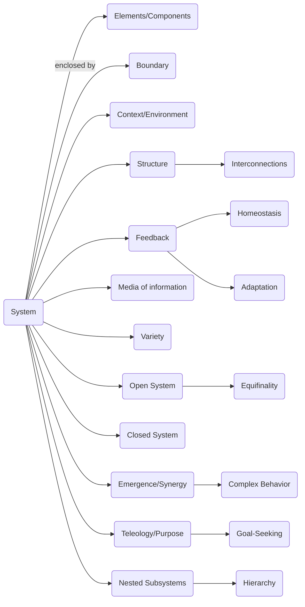
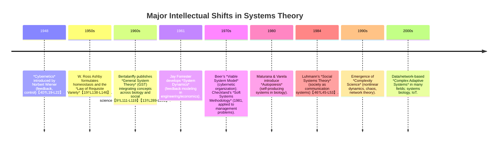

Systems theory studies how interacting parts form cohesive wholes and explains their behavior in context【7†L319-L327】【31†L558-L566】. It emerged to address problems of fragmentation and reductionism by providing holistic principles (e.g. wholeness, feedback, hierarchy) that apply across domains【9†L111-L119】【7†L378-L387】. The field spans biology, engineering, sociology, etc., integrating cybernetics, control theory, and complexity concepts. Its first principles include feedback loops, open‐system thermodynamics (equifinality, homeostasis), information theory and network models, applied via mathematical models and simulation. Systems research uses paradigms from positivist modeling to interpretive “soft” inquiry, and invites collaboration across physics, CS, biology, social sciences, etc. Core questions involve defining systems, understanding change/adaptation, and designing controllable yet self-organizing structures.  

**Metainformation:** Systems theory’s object is *“systemic organization”* – any set of interacting elements with boundaries and purpose. It arose to solve the failure of purely reductionist science to explain complex, organized phenomena【9†L111-L119】【33†L596-L604】. Key intellectual shifts include (1) recognizing *open vs. closed systems* (Von Bertalanffy, 1968) and the principle of **equifinality**, and (2) introducing *feedback and control* (Wiener, 1948; Ashby, 1956), and later (3) network/complexity perspectives (1970s–90s) and (4) second-order cybernetics and autopoiesis (Maturana & Varela, 1980; Luhmann, 1984). Foundational assumptions include that “the whole is more than the sum of its parts”, context matters, and purposive behavior (teleology) exists in living/social systems【9†L144-L152】【13†L270-L279】. Core questions ask: *How to define a system?* *What invariants and laws apply across systems?* *How do systems adapt, self-organize or fail?* Paradigms range from **hard systems** (quantitative models, deterministic laws) to **soft systems** (interpretive models of social “problem worlds”), and from first-order (objective control) to second-order (reflexive modeling) approaches. First-principles tools include differential equations and control theory (for dynamics), information/entropy measures (for complexity), network graphs, and agent-based models. These tools are applied by building causal loop diagrams, running simulations (e.g. system dynamics), and constructing formal models of feedback regulation. Systems theory collaborates with **physics** (thermodynamics, statistical mechanics), **computer science** (algorithms, AI), **biology** (ecology, physiology), **sociology/political science** (organizations, social networks), **engineering** (control systems), **management science** and **psychology** (cognitive systems).  

**Knowledge-System Map (nouns):** system, element, boundary, environment, feedback, control, equilibrium, homeostasis, adaptation, emergence, hierarchy, network, complexity, cybernetics, self-organization, teleology, variety, information, model, subsystem, autopoiesis, interdependence, synergy, structure, dynamics, entropy, regulation, causality, paradigm, resilience, viability.  

## Key Questions and Answers  

**Q1: What is a “system” in systems theory?**  
**Answer:** A system is “a regularly interacting or interdependent group of items forming a unified whole”【31†L558-L566】.  It comprises multiple elements connected by relationships, exchanging energy/information through defined *boundaries*【33†L596-L603】.  Crucially, a system’s behavior cannot be understood simply by analyzing its parts in isolation; one must consider the whole and its *context*.  Classic examples: an ecosystem, a family, or an engine.  The concept generalizes across domains: e.g., a cell, an organization, or a market can each be viewed as a system. *This broad definition shows systems theory’s transdisciplinary character【7†L371-L378】【40†L19-L22】.*  

**Q2: What are the foundational principles of systems theory?**  
**Answer:**  From Bertalanffy and others, key principles include:  
- **Open vs. Closed:**  Closed systems are isolated (no exchange with environment) whereas *open systems* exchange matter/energy/information. Living and social systems are inherently open【9†L191-L200】.  
- **Equifinality:** In open systems, different initial states can lead to the same end state by adjusting processes along the way【13†L208-L214】. (Closed systems lack equifinality.)  
- **Feedback and Homeostasis:** Systems use feedback loops (positive or negative) to self-regulate. Negative feedback maintains equilibrium (homeostasis), while positive feedback drives change or growth【33†L599-L604】【19†L138-L146】.  
- **Holism (Wholeness):** The whole has properties (emergent behavior, synergy) not present in parts alone【9†L144-L152】【7†L319-L327】.  Analysts must study interconnections.  
- **Hierarchy/Nestedness:** Systems consist of subsystems and are embedded in larger supersystems (scale invariance). Hierarchical organization manages complexity【33†L619-L623】【46†L45-L53】.  
- **Teleology/Purpose:** Especially in biological/social systems, goal-seeking and purposive behavior appear; systems often maintain a “goal” through feedback (a cybernetic view)【13†L270-L279】【40†L19-L22】.  

These principles underpin how systems change and adapt. For example, Bertalanffy notes that living systems can increase order (contrasting thermodynamics) because as open systems they import negative entropy【13†L226-L234】.  

**Q3: What tools and models are used in systems analysis?**  
**Answer:** Key tools include:  
- **Mathematical Modeling:** Differential equations and state-space models (originating in control theory) capture dynamics of system variables over time. For linear systems, transfer functions and stability analysis apply【19†L138-L146】.  
- **Feedback Diagrams:** Block diagrams or causal loop diagrams (from cybernetics/Forrester) visualize how variables influence each other via feedback loops. These aid reasoning about stability and oscillation.  
- **Network Models:** Graph and network theory represent system elements (nodes) and relations (edges). Tools from complex networks (clustering, path analysis) reveal structure and emergent connectivity patterns.  
- **Agent-Based Simulation:** For complex adaptive systems, computational agents with simple rules simulate how macro-behavior emerges from micro-interactions.  
- **Information Theory:** Shannon entropy quantifies complexity and information flow in a system【19†L138-L146】. Measures like mutual information capture dependencies.  
- **Soft Systems Methods:** (Checkland) Use conceptual models (“rich pictures,” ‘CATWOE’ analysis) to structure discussions about ill-defined problems. These tools apply when human perceptions and goals are central.  

Application: For example, in engineering one might use Laplace transforms to design a feedback controller; in ecology one might simulate predator-prey ODEs (Lotka-Volterra); in sociology one might map social networks and model diffusion of information; in management one might draw stock-and-flow diagrams (system dynamics) for organizational planning.  

**Q4: What research paradigms and approaches are used?**  
**Answer:** Systems theory spans paradigms:  
- **Reductionist/Analytic:** Early approaches (hard systems) seek objective laws (like in physics) that are valid across domains【9†L111-L119】. For instance, equifinality and teleology were formulated as if scientific laws.  
- **Holistic/Pattern-Based:** Later “soft” approaches (Checkland, Ackoff) recognize multiple stakeholder perspectives and treat system definitions as constructs. They often use qualitative analysis and participatory modeling.  
- **Constructivist/Cybernetic:** Second-order cybernetics focuses on the observer within the system, studying how systems define themselves (self-referential, autopoietic ideas of Maturana & Varela).  
- **Complexity/Nonlinear:** Modern paradigm treats systems as inherently complex, with emphasis on emergent behavior and network topology. It uses computational experiments and interdisciplinary heuristics rather than closed-form solutions.  

Explanatory approaches include mechanistic models (views system as “machine”), organismic/metaphorical (living systems analogies), and phenomenological (focus on meaning/interpretation in social systems). In practice, a researcher may switch between these paradigms: e.g. hard systems engineering for a production plant, and soft methods for organizational change.

**Q5: How did systems theory develop historically?**  
**Answer:** Its evolution involved several shifts:  
- **Foundations (1940s–1960s):** Wiener’s *cybernetics* (1948) introduced feedback and communication theory【40†L19-L22】. Simultaneously Bertalanffy (1968) collected ideas as *General System Theory*, emphasizing general laws across biology and society【9†L111-L119】. Ashby (1956) added homeostasis and requisite variety【19†L138-L146】. Forrester (1961) pioneered system dynamics (feedback in engineering/economics). Beer (1972) applied cybernetics to organizational “viability”.  
- **Expansion (1970s–1980s):** Checkland’s Soft Systems (1981) addressed organizational “messy” problems with modeling workshops. Maturana & Varela (1980) introduced *autopoiesis*, showing living systems self-produce. Luhmann (1984) applied systems language to sociology (society as self-referential network of communications【46†L45-L53】). Complexity/chaos theories began to explain unpredictability and fractal patterns.  
- **Integration (1990s–2000s):** Various strands converged under “complex adaptive systems” and network science. The internet and computing enabled large-scale simulations. Systems thinking became popular in management (Senge, 1990) and ecology (Odum). The focus broadened to global socio-ecological systems, sustainability, and systemic risk.  

**Q6: What is *equifinality*, and why is it important?**  
**Answer:** **Equifinality** means “many roads to Rome”: an open system can reach the same final state via different initial conditions and paths【13†L208-L214】. For example, different species communities can evolve similar functions despite different starting points. This contrasts with closed-systems (physical) where end states are uniquely determined by initial state. The concept implies flexibility and adaptability of systems (e.g. organizations can adapt processes to achieve goals despite disturbances). It was identified by Bertalanffy【13†L208-L214】. A pitfall is to assume determinism: equifinality tells us not to rely on unique cause-effect chains in open systems.  Under different assumptions (e.g. if we assume closure), equifinality disappears, so design must then be precise to initial settings.

**Q7: How does feedback create self-regulation and complexity?**  
**Answer:** Feedback loops link outputs back into inputs. **Negative feedback** reduces deviations and maintains stability (homeostasis). E.g., thermostat keeps temperature steady. **Positive feedback** amplifies deviations, often driving change (e.g. population growth). In combination, feedback allows **self-regulation**: a system monitors and adjusts itself towards goals【19†L138-L146】. The interplay of many feedbacks creates complex dynamics (oscillations, chaos). In cybernetics (Wiener), feedback was the core idea of control【40†L19-L22】. One pitfall is linear thinking: complex feedback networks can yield counterintuitive results (small loops can produce large effects). If assumptions change (e.g. time delays or nonlinearity), a stable feedback loop might oscillate or diverge.

**Q8: What is *autopoiesis* and its role in systems theory?**  
**Answer:** *Autopoiesis* (Maturana & Varela, 1980) describes how living systems are self-making: their components continuously regenerate the network that produced them. In other words, a living cell or organism is defined by its own self-produced boundary and processes. This concept shifted systems theory by emphasizing that some systems (biological, social) create their own identity through internal feedback loops, rather than being imposed externally. It links to second-order cybernetics, as the observer and system blur. Autopoiesis shows why living systems appear teleological without invoking external design: their structure inherently defines their purpose (e.g. survival)【46†L45-L53】. Critics note it’s abstract: it assumes closed informational loops, whereas real organisms do interact with environment (albeit maintaining identity). Changing this assumption (allowing non-autopoietic systems) leads to viewing organisms as open to evolutionary change rather than perfectly self-contained networks.

**Q9: How does systems theory relate to complexity science?**  
**Answer:** Systems theory laid the groundwork for modern complexity science. Both study **emergence**, **networks**, and nonlinearity. Complexity theory focuses on systems with many interacting agents leading to unpredictable macroscopic patterns. Systems theory’s concepts (feedback, hierarchy, adaptation) are core to complexity models. For example, *complex adaptive systems* (CAS) theory builds on cybernetics and networks to study ecosystems, economies, brains. A key tool is computational simulation: the “first-principles” approach is to start from basic agent rules (e.g. game-theoretic or algorithmic) and see what patterns emerge. A major paradigm shift here is from seeking universal laws to exploring statistical and simulation results. Systems theory contributes formalism (control, equilibrium concepts) to complexity, while complexity adds stochastic and network analysis to classical GST. The two together suggest research questions like: “How do small changes in rules or connectivity alter a system’s global behavior?”

**Q10: What pitfalls should researchers avoid in systems theory?**  
**Answer:** Common pitfalls include:
- **Overgeneralization:** Assuming a single “laws of systems” applies everywhere can lead to superficial analogies【7†L378-L387】. It’s important to check which assumptions hold in each domain.  
- **Reduction to Metaphor:** Mistaking systems concepts as mere analogies. For example, saying “a company is a brain” is metaphorical. Systems theory advises using formal models or specific mechanisms (e.g. actual feedback circuits), not just metaphor.  
- **Over-simplification vs. Over-complexity:** Models must balance tractability with realism. A too-simple model may miss emergent behavior; an overly detailed model can be intractable. The modeling process should iterate with empirical testing【33†L671-L680】.  
- **Ignoring Second-order Effects:** Observers affect systems (e.g. in social planning). Systems research in social domains must account for reflexivity and changing goals (Checkland’s Mode 2 SSM).  
- **Boundary Errors:** Defining system boundaries improperly (too broad or narrow) can mislead analysis. The choice of boundary is a key assumption. Researchers should be explicit about why certain elements are included or excluded, and explore how shifting boundaries changes outcomes.  

**Q11: How would conclusions change under different assumptions?**  
**Answer:** Systems analysis is sensitive to assumptions like openness, linearity, and agency:
- If one assumes *no feedback*, then control theory and self-regulation disappear – systems become simple input/output mappings, losing homeostasis.  
- If one assumes *closure* (no environment interaction), equifinality fails and evolutionary growth is impossible (consistent with thermodynamics, not life).  
- Assuming *full rationality* (all agents predict) vs. bounded rationality drastically changes dynamic predictions.  
- In social systems, assuming *fixed goals* vs. evolving goals (second-order cybernetics) changes model form.  
Hence, one must state assumptions clearly. For example, modeling a company as a deterministic system ignores human learning and adaptation; including adaptive agents would likely predict more resilient but less predictable outcomes.

## Exercises, Readings, and Projects  

**Suggested First-Step Readings:**  
- Bertalanffy, L. von (1968) *General System Theory: Foundations, Development, Applications*【9†L111-L119】.  
- Ashby, W. R. (1956) *An Introduction to Cybernetics* (chapter on requisite variety)【19†L138-L146】.  
- Wiener, N. (1948) *Cybernetics: Or Control and Communication in the Animal and the Machine* (esp. Chapter I: Feedback).  
- Checkland, P. (1981) *Systems Thinking, Systems Practice* (STSMPH CH 1) [for Soft Systems context].  
- Luhmann, N. (1984) *Social Systems* (selected passages on communication).  
- Maturana, H. & Varela, F. (1980) *Autopoiesis and Cognition: The Realization of the Living*.  

**Practical Exercises/Applications (suggest 5):**  
1. **Feedback Loop Analysis:** Take a simple control system (e.g., temperature control in a home or cruise control in a car), diagram its feedback loops, write the equations, and simulate how it responds to a disturbance. Observe homeostasis.  
2. **Predator-Prey Model (Lotka-Volterra):** Build the differential equations for a simple two-species food chain, analyze equilibria, and simulate with different initial populations. Demonstrates open-system dynamics and equifinality.  
3. **Stock and Flow Diagram:** Using system dynamics software (e.g. Vensim, Stella), model population growth with resource limits (including feedback from limited resources). Identify leverage points to avoid collapse.  
4. **Organizational Soft-Systems Exercise:** Identify a “messy” problem in an organization (e.g. declining employee morale). Use Checkland’s CATWOE (Customers, Actors, Transformation, Worldview, Owner, Environmental constraints) to develop conceptual models and debate improvements.  
5. **Network Analysis:** Map a real-world network (social network of acquaintances, or metabolic network in a cell), compute basic metrics (degree distribution, clustering). Discuss how the network structure might affect robustness and information flow (introducing complexity and emergence concepts).  

**Recommended Interdisciplinary Research Projects (3):**  
1. **Modeling a City’s Transportation System:** Use multi-scale system dynamics (traffic flow equations) plus agent-based commuter models. *Methods:* Combine PDEs for flow with ABM for individual drivers; calibrate with traffic data. *Expected Outcomes:* Identification of bottlenecks, evaluation of feedback policies (e.g. adaptive traffic lights), and emergent effects of new infrastructure. Demonstrates integration of engineering, computer science, and social behavior.  
2. **Socio-Ecological Sustainability:** Study a river-ecosystem coupled with human water use. *Methods:* Build an open-system model with feedback between ecological variables (fish population, water quality) and social variables (agricultural demand, regulation policies). Use system dynamics simulation. *Expected Outcomes:* Insights into resilience (e.g. tipping points) and policy levers that balance human needs and ecosystem health. Involves ecology, economics, and political science.  
3. **Organizational Health via Systems Diagnostics:** Analyze a company using the Viable System Model (Beer) and Complex Adaptive Systems principles. *Methods:* Survey the organization to map communication/network structure and feedback processes (meetings, information systems). Model how information flows and control is maintained. *Expected Outcomes:* Recommendations for restructuring (e.g. flattening hierarchy) to improve adaptability and information variety. Collaboration of management science, sociology, and information technology.  

## References (key works)  
- Ashby, W. Ross (1956). *An Introduction to Cybernetics*. London: Chapman & Hall【19†L138-L146】.  
- Bertalanffy, Ludwig von (1968). *General System Theory: Foundations, Development, Applications*. New York: George Braziller【9†L111-L119】【13†L289-L292】.  
- Checkland, Peter (1981). *Systems Thinking, Systems Practice*. Chichester: Wiley.  
- Forrester, Jay W. (1961). *Industrial Dynamics*. Cambridge, MA: MIT Press.  
- Luhmann, Niklas (1984). *Soziale Systeme: Grundriß einer allgemeinen Theorie*. Frankfurt: Suhrkamp【46†L45-L53】.  
- Maturana, Humberto R., & Varela, Francisco J. (1980). *Autopoiesis and Cognition: The Realization of the Living*. Dordrecht: Reidel.  
- Wiener, Norbert (1948). *Cybernetics: Or Control and Communication in the Animal and the Machine*. New York: Wiley【40†L19-L22】.  
- **Supplementary:** Beer, Stafford (1972) *Brain of the Firm*; Capra, Fritjof (1982) *The Turning Point*; Senge, P. (1990) *The Fifth Discipline* (popular).  

Each reference above is foundational.  See these for definitions and examples of core concepts discussed.

