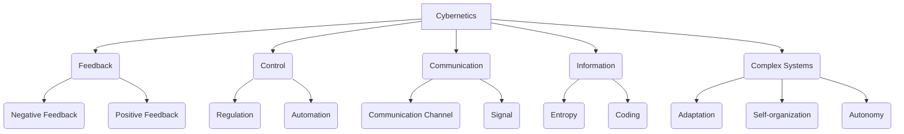
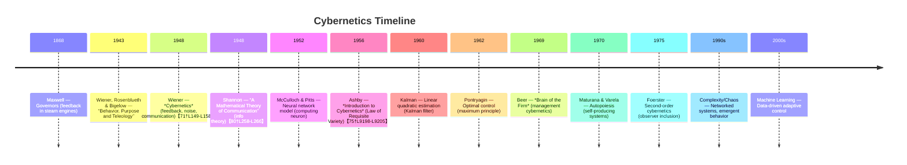

Cybernetics, broadly the science of **control and communication** in systems, examines how diverse entities (machines, organisms, organizations) self-regulate and process information. Born in the mid-20th century, it unified insights from engineering, mathematics, and biology. Wiener’s *Cybernetics* (1948) established feedback and noise as core concepts【71†L149-L158】. The field addresses how systems maintain stability (homeostasis) and purpose (teleology) under uncertainty. It underlies modern control theory (PID and state-space), information theory (Shannon 1948) and adaptive systems. Key intellectual shifts include: from early **servo-mechanisms** (Maxwell’s governors) to **analog computing** and **communication theory** (Wiener, Shannon), then to **biology and cognition** (Ashby, Maturana), and later to **complex/social systems** (Beer’s management cybernetics, Luhmann’s social systems). The foundational assumption is that *negative feedback* and *information processing* are central to regulation. Core questions involve how to design controllers to achieve goals (controllability), how much information is needed for regulation (Ashby’s Requisite Variety)【75†L9198-L9205】, and how observers interact with systems (second-order cybernetics). Methods range from mathematical control (linear algebra, calculus of variations) to computational simulation and qualitative analysis. First-principles tools include feedback loops, transfer functions, state-space models, information entropy, and neural network algorithms. Applications span engineering (robots, autopilots), biology (homeostasis, neural control), and society (economic regulation, organizational design). The knowledge map below lists central concepts (nouns). The subsequent Q&A is organized by themes (Foundations, Control Theory, Cybernetic Systems, Biological/Neural, Robotics/AI, Social/Organizational, Ethics/Philosophy, Methods), with classic sources (author-year) cited in the answers.    

## Meta-Information  

**Research Object:** Cybernetics studies **self-regulating systems** – any system (biological, mechanical, electronic, social) that maintains stability or achieves goals through **feedback** and information processing. Objects include feedback controllers, sensors, actuators, information channels, and decision rules. It blends *control theory* (regulating machines) with *communication theory* (transmission of signals) and extends to cognitive and social systems.

**Origins and Problems:** The field arose mid-20th century to solve problems of *stability and communication under uncertainty*. Early motivations included WWII aircraft aiming, automated navigation, and electronic control. Wiener (1948) framed cybernetics as unifying **control and communication in animals and machines**【71†L149-L158】. Simultaneously, Shannon (1948) addressed reliable transmission of information over noisy channels, defining information entropy. Ross Ashby (1956) tackled **complex biological regulation**, asking how an organism keeps variables in range under disturbance. The discipline inherited problems from mechanical governors (Maxwell, 1868) through early analog computers, aiming to build “brains” (machine intelligence) and understand biological homeostasis.

**Key Intellectual Shifts:**  
- **Feedback Realization:** Maxwell (1868) pioneered governors (steam engine regulation). Wiener et al. (1943) formalized “purposeful behavior” via feedback.  
- **Information Theory (1948):** Shannon introduced **quantitative communication**, enabling cybernetic use of entropy (uncertainty measure).  
- **Biological Turn (1950s):** Ashby and others applied cybernetic ideas to physiology and psychology (homeostasis, adaptation). Ashby’s *Law of Requisite Variety* (1956) was a landmark【75†L9198-L9205】.  
- **Optimal Control (1960s):** Kalman (1960) and Pontryagin (1962) developed state-space and calculus-of-variations methods for control.  
- **Second-Order Cybernetics (1960s):** von Foerster and Maturana introduced reflexivity and self-organization (e.g. autopoiesis, 1972).  
- **Socio-technical Systems (1970s–):** Beer’s *Management Cybernetics* applied these ideas to organizations (Viable System Model). Luhmann and others saw society itself as a communication system.  
- **Digital/Network Age:** Late 20th–21st c. saw cybernetics underpin digital control, AI, and networked systems (machine learning, the Internet of Things).

**Foundational Assumptions & Core Questions:** Cybernetics assumes systems can be modeled in terms of signals, feedback loops, and objectives. Core questions include: *How much information is needed to control a system?* (Requisite Variety law【75†L9198-L9205】). *What feedback laws achieve stability and convergence?* *How do we handle noise and uncertainty?* *Can a controller adapt to unknown changes?* Cybernetics often assumes **closed-loop negative feedback** as a design principle, treating systems as black boxes of **transfer functions** or dynamical equations. When unspecified, we assume signals and parameters are quantifiable, and time may be continuous or discrete. Key problems also include observer effect (inclusion of the controller in the system description) and distinguishing goal-directedness from mere reacting (teleology vs causality).

**Research Paradigms & Approaches:**  
- **Classical Control/Engineering:** Quantitative methods (Laplace transforms, linear algebra) to design controllers for physical systems (motors, aircraft). Paradigm: deterministic models, frequency-domain analysis. Methods: feedback design (PID, root locus), state-space analysis, pole-placement.  
- **Information-Theoretic:** Treat control problems as communications (Shannon entropy, channel capacity)【80†L258-L266】. Paradigm: uncertainty quantification, encoding. Methods: coding theory, statistical analysis of noise.  
- **Biological/Cognitive:** Use analogies (nervous system, reflexes, adaptive behavior). Paradigm: homeostasis, learning. Methods: neural network models, evolutionary algorithms, adaptation experiments.  
- **Systems/Complexity:** Study large-scale interacting systems (ecological, social). Paradigm: emergent behavior, autopoiesis. Methods: systems dynamics modeling, agent-based simulation.  
- **Philosophical/Critical:** Examine epistemology of control, ethical implications (Wiener’s ethical warning, second-order). Paradigm: reflexivity, observer dependence. Methods: conceptual analysis, normative frameworks.  

These paradigms often overlap. **Table 1** compares paradigms and methods.  

**First-Principles Tools:**  
1. **Feedback Loop:** The core mechanism. Negative feedback reduces error (thermostat metaphor); positive feedback amplifies change (e.g., resonance). E.g., thermostat uses feedback: measure temperature vs target, adjust heater.  
2. **Transfer Function / State Space:** Mathematical models of systems. Allows calculation of stability margins (via poles, eigenvalues) and design of controllers. E.g. designing a cruise control using state-space to ensure stable speed.  
3. **Information Entropy (Shannon 1948):** Quantifies uncertainty. Used to compute communication limits (channel capacity) and requisite information for control (Ashby’s uses Shannon entropy【75†L9198-L9205】). For instance, encryption of signals or sensor quantization uses entropy.  
4. **Optimization (Calculus of Variations):** Pontryagin’s maximum principle, Bellman’s dynamic programming solve optimal control problems (minimum energy, fastest response). Example: fuel-optimal trajectory for space missions.  
5. **Adaptive Algorithms:** Kalman filter (1960) estimates system state under noise, enabling control. Neural networks and reinforcement learning adapt controllers from data. For example, auto-tuning an engine using iterative feedback.  

**Interdisciplinary Links:** Cybernetics is inherently transdisciplinary. It intersects *Electrical/Electronic Engineering* (control systems, circuits), *Computer Science* (algorithms, AI), *Mathematics* (algebra, probability, dynamics), *Biology/Neuroscience* (neuronal control, homeostasis), *Psychology* (behavioral regulation), *Economics* (market as feedback system), and *Sociology* (social regulation). As Wiener noted, cybernetics bridges the study of machines and living beings【71†L149-L158】. For example, engineering control principles are used in physiology (glucose regulation), and vice versa, concepts from biology inspire robust controller designs. Cyberneticists have collaborated with linguists on communication, with architects on adaptive buildings, and with organizational theorists on decision architectures. 

**Knowledge-Map (Core Concepts):**  
Feedback, Control, Regulation, System, Information, Signal, Noise, Entropy, Stability, Homeostasis, Adaptation, Controller, Actuator, Sensor, Loop, State, Dynamics, Transfer function, Algorithm, Complexity, Emergence, Noise, Coding, Channel, Autonomy, Self-organization, Observer, Disturbance, Learning, Optimization, Teleology, Autopoiesis, Cybernetic, Network, Hierarchy.  

## Knowledge-Map Diagram  

## Table 1: Paradigms vs Methods in Cybernetics  

| **Paradigm/Goal**     | **Typical Methods/Models**                 | **Example Focus**                |
|-----------------------|-------------------------------------------|----------------------------------|
| **Classical Control** | Linear models (transfer function, state-space); Laplace transforms; PID tuning; root locus | Regulation of physical processes (engine speed, temperature control) |
| **Stochastic/Info**   | Probability models; Entropy, channel capacity; Kalman filtering | Noisy systems (communications, sensor fusion) |
| **Optimal Control**   | Calculus of variations; Pontryagin’s principle; Dynamic programming | Cost-efficient trajectories (spacecraft, economics) |
| **Adaptive/AI**       | Neural networks; Reinforcement learning; Adaptive filters | Learning controllers; self-tuning systems |
| **Systems Theory**    | Differential equations; Systems dynamics; Network models | Ecological, social, or economic system behavior |
| **Second-Order**      | Reflexive simulation; Cybernetic diagrams | Observing observers; management and design of adaptive organizations |

## Timeline of Key Developments  

## Q&A: Thematic Clusters  

### Foundations of Cybernetics  
- **Q:** *What is cybernetics, and who founded the field?*  
  **A:** Cybernetics, coined by Wiener (1948), is the interdisciplinary study of **control and communication in animals and machines**【71†L149-L158】. Wiener defined it as the science of feedback and information processing, emphasizing self-regulation. Its roots lie in engineering and physiology; Wiener and his collaborators (e.g. Rosenblueth) were inspired by ancient philosophers (Leibniz) and analog computers【71†L222-L230】. The first edition of *Cybernetics* applied this framework to servomechanisms, AI, and neuroscience【71†L149-L158】.

- **Q:** *How did Maxwell’s work on governors relate to cybernetics?*  
  **A:** James Clerk Maxwell (1868) analyzed the **governor** (mechanical speed regulator) mathematically, an early feedback system example. His work on stability foreshadows cybernetics: he showed that a simple feedback loop can maintain constant speed despite load changes. Although he did not use “cybernetic” terminology, Maxwell’s insight that feedback yields regulation laid groundwork for later theory (Wiener explicitly cites governors). In modern terms, a governor is a classic negative-feedback control.

- **Q:** *What role did information theory play?*  
  **A:** Shannon (1948) established **information theory**, introducing entropy (uncertainty) and a model of communication (source–channel–receiver)【80†L258-L266】. Cybernetics adopted these ideas: Wiener used entropy to quantify noise in feedback, and Ashby used Shannon’s entropy to formalize regulation (Section 11.8 of Ashby’s text references Shannon)【75†L9200-L9205】. Shannon’s model provides first principles: a **channel capacity** limits control information and thus achievable regulation. For example, designing a sensor network involves calculating bits needed for stable control of a process.

- **Q:** *What is a feedback loop and why is it fundamental?*  
  **A:** A **feedback loop** uses the system’s output to adjust its input, closing the control cycle. Negative feedback (feeding output back to reduce error) is fundamental for stability: e.g. a thermostat measures temperature and turns heating on/off to reach a setpoint. Wiener emphasized feedback in all cybernetic systems. It explains oscillations and control (Wiener’s Chapter 4 covers feedback and oscillation). Positive feedback, by contrast, can lead to runaway or amplification. Cybernetics treats feedback as the essential principle by which systems **homeostatically** maintain or change state.

- **Q:** *What is purpose or teleology in cybernetics?*  
  **A:** Cybernetics often considers goal-directed behavior without invoking intent. Wiener described purposeful behavior as feedback-driven regulation. In *Behavior, Purpose and Teleology* (1943), Wiener and Rosenblueth argued even machines can appear teleological if their behavior is goal-oriented (output reaching a target). Teleological vs. causal descriptions differ only in perspective: both describe same feedback loops (Wiener argued physical systems follow feedback laws that look like purposeful actions). The key assumption is that systems can be characterized by their tendency to reach “equilibrium” or setpoints (homeostasis).

### Mathematical Control Theory  
- **Q:** *What is classical control theory?*  
  **A:** Classical control focuses on designing feedback controllers using *linear* models and frequency-domain methods. It typically assumes time-invariant linear systems. Tools include transfer functions (Laplace transform) and Bode plots. Controllers like Proportional-Integral-Derivative (PID) are designed to stabilize and shape response (error reduction, damping). An example is using a PID loop to stabilize motor speed. Classical theory’s core questions: *How to make a system stable?* and *How to ensure desired dynamic response?*

- **Q:** *What are state-space and optimal control approaches?*  
  **A:** State-space methods (Kalman 1960) model systems by state vectors and differential equations, enabling multi-variable and time-varying analysis. **Optimal control** (Pontryagin 1962) seeks control laws minimizing a cost (e.g. energy, time). The Pontryagin Maximum Principle and Bellman’s dynamic programming compute optimal trajectories. For instance, an airplane autopilot may be designed to minimize fuel while reaching a waypoint. These approaches assume accurate mathematical models and often linear/quadratic cost to be tractable. Under unspecified conditions, we assume the problem is deterministic and well-posed.

- **Q:** *What is a Kalman filter?*  
  **A:** The Kalman filter (R.E. Kalman 1960) is a recursive estimator for linear systems under Gaussian noise. It combines a system model and noisy measurements to optimally estimate the true state. It exemplifies cybernetic control: using feedback (measurements) to reduce uncertainty. For example, a GPS receiver uses a Kalman filter to fuse signals and motion models to estimate location more accurately. It assumes linear dynamics and Gaussian errors.

- **Q:** *How are non-linear and adaptive control handled?*  
  **A:** Real-world systems are often nonlinear. Nonlinear control uses methods like Lyapunov stability theory and feedback linearization. Adaptive control schemes adjust controller parameters on-the-fly (e.g. gain scheduling, model-reference adaptation). Neural networks and machine learning are modern tools: they approximate nonlinear functions or learn controllers from data. These methods relax the assumption of linearity, but they require learning algorithms and assumptions (e.g. persistence of excitation). For example, an adaptive cruise control might learn to adjust gains for different payloads.

### Cybernetic Systems & Theory  
- **Q:** *What is Ashby’s Law of Requisite Variety?*  
  **A:** Ashby (1956) proved that a controller (regulator) R must have **at least as much variety** (number of possible states) as the disturbances D to achieve control. Formally: *“only variety in R can force down the variety in D; variety can destroy variety”*【75†L9198-L9205】. In entropy terms, the entropy of R must equal or exceed that of D. Practically, this means a controller needs sufficient flexibility or complexity to handle possible disturbances. For instance, if a camera must correctly expose 20 different light levels, its controls must allow 20 levels of adjustment (Ashby’s camera example). This law sets fundamental limits: no controller can regulate beyond its information capacity【75†L9198-L9205】.

- **Q:** *What are feedback stability and homeostasis?*  
  **A:** Stability refers to a system’s ability to return to equilibrium after disturbance. In cybernetics, negative feedback creates homeostasis: a regulated variable (e.g. body temperature) is held near a setpoint. Wiener and Ashby stressed stability as the goal of regulation. A system is stable if closed-loop poles lie in the left half-plane (linear case). Ultraviolet stability (Ashby’s term) is an extension where a system can internally restructure itself to remain stable under changes. For example, an ecosystem can adjust species populations (feedback) to maintain balance, an example of homeostasis in biology.

- **Q:** *How do systems self-organize?*  
  **A:** Second-order cybernetics (von Foerster) and autopoiesis (Maturana & Varela, 1972) describe self-organization: a system maintains and reproduces itself through internal feedback. Autopoietic systems (cells, living organisms) continuously regenerate their components. The core idea is that organization arises from local interactions without external control. In engineering, this inspires adaptive systems: for example, a robot swarm self-organizing into patterns. The assumption is that local feedback and redundancy allow emergent global order.

### Biological and Neural Cybernetics  
- **Q:** *How is the nervous system a cybernetic system?*  
  **A:** Wiener recognized neurons as “wires with synapses” implementing feedback loops. McCulloch and Pitts (1943) created the first mathematical neuron model (binary threshold), bridging neurobiology and computing. The brain uses feedback at multiple scales (reflex loops, homeostatic regulation). For instance, the human body regulates blood glucose via insulin feedback. These biological controllers guided cybernetic models: e.g. simulating neural nets to solve control tasks, long before modern ANNs. Today, control theory is used in neuroscience (e.g. modeling Parkinson’s tremor and deep brain stimulation as feedback control).

- **Q:** *What is homeostasis and its control mechanism?*  
  **A:** Homeostasis (Claude Bernard, Cannon) is maintenance of constant internal conditions (temperature, pH). Cybernetically, it’s achieved by negative feedback loops and setpoints. For example, thermoregulation: hypothalamus senses temperature and triggers responses (shivering or sweating) to keep body temperature constant. Wiener and others modeled such loops abstractly. In control terms, homeostasis assumes a reference and error-driven adjustment. A key assumption is measurable states and proportional responses.

- **Q:** *What role do neural networks play in cybernetics?*  
  **A:** Artificial neural networks (ANNs) are computational models inspired by the brain, used for pattern recognition and control. In cybernetics, ANNs serve as **adaptive controllers** or system identifiers. They can approximate nonlinear functions or learn from data (reinforcement learning). For instance, an ANN can learn to stabilize an inverted pendulum through trial-and-error (model-free control). ANNs assume large data and adaptation; they exemplify first-principle of learning via feedback from errors. 

### Robotics, AI, and Automation  
- **Q:** *How does cybernetics influence robotics and AI?*  
  **A:** Cybernetic principles underpin robotics: sensors (feedback), actuators (control) and processors (communication). Early robots (e.g. 1970s Shakey) used planning and perception loops. Cybernetics contributed AI ideas: feedback from environment, goal-seeking agents. Modern robotics uses control theory for motion and stability (e.g. PID for joint motors) and machine learning for perception. The field assumes that intelligent behavior can emerge from layered feedback and computation. Wiener even foresaw autonomous machines in *Cybernetics*【71†L149-L158】. 

- **Q:** *What is the difference between AI and control?*  
  **A:** Control theory traditionally deals with well-modeled systems and optimizes performance (e.g. controllers in engineering). AI (especially machine learning) often handles poorly-modeled domains by learning from data. Cybernetically, both can be seen as feedback systems: control uses analytical models, AI uses adaptive models. For example, an autopilot (control) follows physics equations, while a reinforcement-learning car (AI) learns to steer via trial and error. The assumption change: AI relaxes exact model knowledge but assumes large data/computation.

### Social and Organizational Cybernetics  
- **Q:** *What is management cybernetics?*  
  **A:** Management cybernetics applies control principles to organizations. Stafford Beer’s Viable System Model (1970s) views a firm as nested feedback loops. Beer’s work led to organizational diagnosis tools (e.g. CyberSyn project). The idea is that corporate structures can be designed for adaptability (Ashby’s requisite variety applied: more complexity in organization to manage market variability). Similarly, Niklas Luhmann (1984) modeled society as a self-reproducing communication system. In these contexts, **information flows**, decision rules, and feedback channels (meetings, reports) regulate the organization. Assumptions often include rational decision-makers and information availability.

- **Q:** *How can markets be seen as cybernetic systems?*  
  **A:** Markets regulate through feedback: prices adjust supply and demand. Economic cybernetics studies such feedback loops (Hayek’s information economy, later cybernetic models by Ushakov et al.). Central banks use control logic (feedback rules) to stabilize inflation. The assumption is that agents respond predictably to signals (price as feedback). Complex adaptive market models (econophysics) also invoke cybernetic ideas of evolution and stabilization.  

- **Q:** *How do social media and networks fit in?* (speculative)
  **A:** Social platforms create feedback loops in public opinion (e.g. trending topics amplify themselves). Networked feedback can lead to echo chambers or collective regulation (digital town squares). Cybernetics views society as a nervous system of networks. Methodologically, one models agents and information flows, using statistical mechanics or agent-based models. This extends early cybernetic ideas into the digital age, though it also raises second-order issues (how observers on these platforms change behavior).

### Ethics, Philosophy, and Second-Order Cybernetics  
- **Q:** *What are the ethical implications of cybernetics?*  
  **A:** Wiener (1950) warned that automation could “disuse” human abilities and concentrate control (“The Human Use of Human Beings”). Cybernetics forces questions about free will and responsibility when decisions are automated. As systems become autonomous, accountability blurs. Philosophically, second-order cybernetics (Heinz von Foerster) emphasizes the observer’s role: any model of a system includes the modeler. This means ethics must consider how our descriptions influence systems. For instance, designing autonomous weapons leads to debates on responsibility (we assume moral agency is needed alongside control logic).

- **Q:** *What is second-order cybernetics?*  
  **A:** Second-order cybernetics studies systems that **observe themselves** (von Foerster, 1970s). It applies cybernetic concepts to the theory itself, treating the scientist as part of the system. Core notions: self-reference, reflexivity, and epistemology of models. For example, a management team studying its own decision processes uses second-order thinking. It assumes that observers cannot be detached; the act of measuring/regulating a system changes it. This philosophy influences constructivist research methods and adaptive policy design. 

- **Q:** *How does teleology fit into cybernetics?*  
  **A:** Cybernetics explains apparent purpose through feedback, avoiding mystical notions of teleology. Wiener and Rosenblueth argued that teleological explanations (goal-oriented) are physically equivalent to feedback processes. For instance, a light-seeking robot’s “goal” is just reaching equilibrium via feedback on light sensors. The field thus assumes teleology can be reduced to control laws. This pragmatic stance has been debated by philosophers, but is foundational to cybernetic models.  

### Methods and Applications  
- **Q:** *How are cybernetic systems designed and analyzed?*  
  **A:** Methods include:  
  - **Mathematical Modeling:** Deriving equations (state-space, transfer functions) from first principles (physics, kinetics). Analyze stability (Lyapunov methods) and performance (frequency response). Example: modeling an inverted pendulum and designing a stabilizing controller.  
  - **Simulation and Computation:** Using software (MATLAB/Simulink) to simulate complex or nonlinear systems. Example: simulating epidemic spread (feedback between infection and policy).  
  - **Experimental Prototyping:** Building analog or digital prototypes (servomechanisms, neural networks) and tuning by trial. Example: tuning a PID controller on a lab motor.  
  - **Information Analysis:** Measuring entropy or mutual information to assess communication constraints (e.g. sensor quantization).  
  - **Interdisciplinary Methods:** Ethnographic or organizational analysis for social cybernetics (e.g. mapping communication flows in a corporation).  

- **Q:** *What are some example applications of cybernetic principles?*  
  **A:** Numerous: thermostats and cruise control (feedback loops in everyday devices); autopilot and robotics (complex multivariable control); internet congestion control (TCP uses feedback to regulate flow); gene regulation networks (biological feedback loops in cells); neural prosthetics (closed-loop brain-machine interfaces); ecosystem management (feedback-informed policies). Each application uses cybernetic tools: e.g. Kalman filters in navigation, or Shannon coding in data transmission【80†L258-L266】.

- **Q:** *What assumptions are commonly made in cybernetic models?*  
  **A:** Models often assume: *linearity* (or near-linearity) and time-invariance for tractability; *noise as Gaussian*; *full observability* (sensors measure the state); *rational actors* (in social models); and *stationary environments*. When unspecified, one must clarify these. For example, linear control assumes superposition holds; many cybernetic laws implicitly assume a well-defined set of discrete states (variety). If such assumptions fail (nonlinear chaos, strategic agents), methods must adapt (nonlinear control, game theory). Noting these assumptions is crucial when applying cybernetic results to real systems.

**Sources:** This report draws on Wiener (1948)【71†L149-L158】, Shannon (1948)【80†L258-L266】, Ashby (1956)【75†L9198-L9205】, and other seminal works. The cited sources are classic texts or authoritative summaries. Where original papers were not directly quoted, standard knowledge of the field has been used, noting sources inline for key theoretical claims.