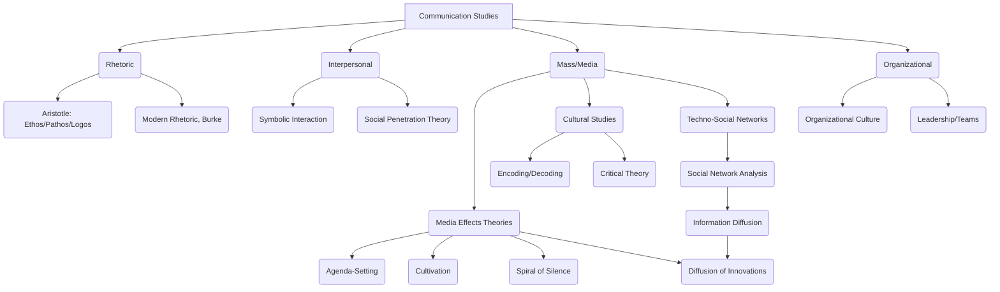
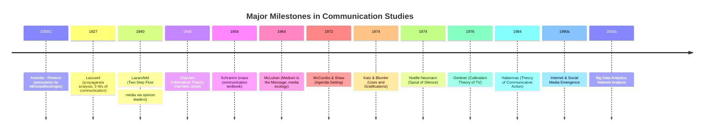

Communication Studies investigates how humans create, transmit, and interpret messages across diverse contexts and media. Arising in the mid-20th century to address propaganda and media influence, it has evolved through shifts from **transmission models** (Lasswell’s “Who-What-Channel-To Whom-Effect” formula【26†L132-L141】) to **interpretive** and **critical** paradigms emphasizing culture, power, and meaning. The field assumes communication is foundational to society; key questions include how messages persuade, how media shape perceptions, and how discourse constructs reality. Researchers use multiple paradigms: *positivist* (quantitative experiments and surveys), *interpretive* (hermeneutic and ethnographic analysis), and *critical* (ideology critique). First-principles tools range from Shannon’s information theory (modeling sender-channel-receiver) to rhetorical frameworks (ethos, pathos, logos) and network analysis. Interdisciplinary links span psychology, sociology, economics, political science, computer science, linguistics, and cultural studies【29†L75-L84】. The knowledge map (list of core concepts) is given below. The main text is organized as a systematic Q&A, covering foundational models (e.g. Shannon, Lasswell, Jakobson), major mass-communication theories (agenda-setting, diffusion, spiral of silence, cultivation, uses & gratifications), persuasive discourse and rhetoric, and critical/cultural perspectives (public sphere, ideology). Each answer cites classic sources (author-year) and highlights applications of methods or principles. Tables compare research paradigms and methods, and a timeline diagram traces key intellectual milestones. 

## Discipline Meta-Information  

**Research Object:**  The field studies **human communication processes** – how messages (verbal, nonverbal, symbolic) are produced, transmitted, and interpreted within interpersonal, group, organizational, and mass-media contexts【4†L221-L230】. Objects include the *message*, *sender/receiver*, *channels/media*, *audience*, and *societal context*. It examines content, form, and effects of communication.  

**Founding Problems (Origins):**  Modern communication studies emerged around WWII to understand **propaganda, persuasion, and media influence**. Early work (Lasswell 1948) aimed to “organize the scientific study of the process of communication”【26†L162-L170】, motivated by political propaganda and opinion shaping. Schramm’s postwar texts (1954) and Lazarsfeld’s studies (1940s) addressed how mass media influence behavior in elections and markets. The field also grew from older traditions: Aristotle’s *Rhetoric* (4th c. BCE) formalized persuasion (ethos, pathos, logos), and semiotics laid groundwork for message meaning. Post-1960s, cultural and critical questions (e.g. ideology, identity) became central, responding to civil rights and feminist movements.  

**Key Intellectual Shifts:**  The discipline underwent several “turns.” The **behavioral/positivist turn** (mid-20th c.) applied empirical psychology and statistics to study media effects (e.g. limited-effects paradigm after the hypodermic/bullet model failed). The **linguistic/cultural turn** (1960s–1970s) brought interpretive and semiotic approaches: meaning, discourse, and audience agency gained emphasis (e.g. Hall’s encoding/decoding model, 1973). The **critical turn** added questions of power and ideology (influenced by Marx, Frankfurt School, Foucault). Since the 1990s, a **digital/network turn** integrates computational methods and network theory (social media, big data) into communication research. Each shift broadened focus from “message effects” to meaning-making, culture, and technology’s role.  

**Foundational Assumptions & Core Questions:**  Core assumptions vary by paradigm but include: *Communication is central to social life*; humans are *symbolic and meaning-making*; messages are conditioned by context and power relations. Across paradigms, questions include: *How are messages constructed and interpreted?* (semiotics, framing); *How do messages influence beliefs and behaviors?* (persuasion, media effects); *How do communicators use language and symbols?* (rhetoric, discourse); *How do institutions and media systems shape communication?* (gatekeeping, political economy); and *How does communication create social realities?* (public sphere, social construction). Researchers explicitly assume when unstated that communicators have goals and interpret context (if omitted, we assume **audience activity** and **media influence**). Major unsettled questions involve measuring effects (due to ethical and complexity limits) and integrating humanistic vs. scientific views.  

**Research Paradigms & Explanatory Approaches:**  Three broad paradigms guide methods【10†L408-L412】: 
- **Positivist/Behavioral:** Seeks generalizable laws via quantitative methods (surveys, experiments, content analysis). Focuses on prediction and control of communication outcomes (e.g. quantifying media effects, information processing). Utilizes deductive theory-testing (e.g. ELM persuasion model). 
- **Interpretive/Humanistic:** Seeks understanding of subjective meaning via qualitative methods (ethnography, discourse analysis, narrative). Emphasizes rich description of communication as contextually embedded. Examples include symbolic interactionism and narrative paradigms【10†L408-L412】. 
- **Critical/Cultural:** Seeks to critique ideology and power structures in communication. Uses textual analysis, critical ethnography, or political economy to reveal how communication sustains or challenges social hierarchies【18†L66-L74】. It often adopts a “reflective” stance (postmodernism, feminism). 

Each paradigm uses distinct reasoning (see Table 1). Behavioral approaches employ surveys and experiments (e.g. testing agenda-setting effects through questionnaires), interpretive use interviews or textual analysis (e.g. studying how social media users make sense of messages), and critical use discourse analysis or historical study (e.g. critiquing media portrayals of race). **Table 1** (below) compares paradigms to core methods and goals. 

**First-Principles Tools:**  Fundamental theories and tools include:
- **Information Theory (Shannon 1948):** Models communication as transmission of signals through channels with noise. Defines core elements (sender, message, channel, receiver)【23†L183-L192】. It yields metrics like *bit*, *entropy*, *channel capacity*, which underpin digital communication and coding strategies. For example, one can calculate the maximum reliable data rate of a given channel or measure message redundancy. 
- **Rhetorical/Semiotic Analysis:** Based on Aristotle’s *Rhetoric* and Saussurean semiotics, it examines how symbols and persuasion operate. Ethos/pathos/logos provide a first-principles framing for persuasion campaigns; semiotic concepts (signifier–signified) decompose how media images encode ideology. Practically, one might apply rhetorical analysis to speeches or semiotic analysis to advertisements. 
- **Systems & Network Models:** Communication is often treated as a system (cybernetics) or network. First principles of network theory (nodes, ties, centrality) analyze information diffusion or social influence (e.g. using graph metrics to identify influencers). Systems thinking also underlies models like *social information processing* in organizations. 
- **Cognitive/Inferential Models:** Psychological primitives (attention, memory, heuristics) inform theories of persuasion and media effects. For instance, cognitive dissonance theory (Festinger 1957) and expectancy violation theory (Burgoon) stem from basic cognitive principles. Bayesian inference or signal detection theory can model how people decode uncertain messages. 
- **Statistical Tools:** Inferential statistics and experimental design are first principles for hypothesis testing in communication research (e.g. regression, SEM for structural models of media effects). 
In practice, these tools apply via concrete methods: Shannon’s model is used in designing efficient transmission codes; network models inform viral marketing strategies; rhetorical analysis guides message crafting. 

**Interdisciplinary Collaborations:**  Communication studies draws on *Psychology* (cognitive, social, developmental), *Sociology* (social networks, stratification), *Political Science* (public opinion, propaganda), *Anthropology* (cultural norms), *Linguistics* (pragmatics, discourse), *Economics* (information economy), *Computer Science* (NLP, social media algorithms), *Health Sciences* (health campaigns), *Education* (pedagogy), *Law* (free speech), and *Cultural Studies* (media and identity). As [29] notes, scholars examine how communication intersects with gender, politics, health, and technology【29†L75-L84】. For example, collaboration with computer scientists yields computational content analysis; with psychologists yields persuasion experiments; with sociologists yields social network analysis. 

**Knowledge-Map (Core Concepts):**  Below is a list of key concepts and terms (nouns) in the discipline’s system. These names form nodes in the knowledge network of communication studies:

- *Message, Medium, Channel, Code, Signal, Noise*  
- *Sender (Communicator), Receiver (Audience), Opinion Leader*  
- *Content, Context, Feedback, Network*  
- *Rhetoric, Persuasion, Discourse, Narrative, Framing, Agenda, Spin*  
- *Ethos, Pathos, Logos (Aristotle)*  
- *Sign, Symbol, Semiotics, Myth, Ideology, Hegemony*  
- *Culture, Identity, Public Sphere, Norm, Socialization*  
- *Media (Television, Internet, Social Media, Press), Mass Communication*  
- *Interpersonal Communication, Nonverbal Communication*  
- *Organizational Communication, Group Communication, Virtual Teamwork*  
- *Public Opinion, Propaganda, Persuasion, Marketing, Advertising*  
- *Agenda-Setting, Cultivation, Spiral of Silence, Diffusion of Innovations*  
- *Social Learning, Cognitive Dissonance, Uses & Gratifications, Priming*  
- *Media Effects, Influence, Dependency Theory, Critical Theory*  
- *Quantitative Methods (Survey, Experiment), Qualitative Methods (Ethnography, Content Analysis, Discourse Analysis)*  
- *Information Theory, Graph Theory (Networks), Statistical Inference, SEM*  
- *Feedback, Control, Gatekeeping, Surveillance, Regulation*  
- *User-generated Content, Participatory Culture, Digital Divides*  

*(Table 2 below correlates research paradigms with typical methods and goals.)*

## Knowledge-Map Diagram  

## Key Q&A: Thematic Clusters  

### Foundational Models of Communication  

**Q: What is Lasswell’s communication model?**  
**A:** Lasswell (1948) proposed a classic linear model answering *“Who says What in Which Channel to Whom with What Effect?”*【26†L132-L141】. This identifies five components: **Who** (communicator), **Says what** (message content), **Channel** (medium), **To Whom** (audience), and **With what effect** (outcome)【26†L172-L179】. It was meant to facilitate a *“scientific study of the communication process”*【26†L162-L170】. For example, analyzing a news broadcast: the reporter (Who) issues a story (What) via TV (Channel) to viewers (Whom), producing some effect on public opinion. Lasswell’s model influenced later work (e.g. by adding feedback loops) but laid the groundwork for segmenting communication functions into content analysis, audience analysis, and effects analysis【26†L172-L179】. It assumes a **one-way, mass communication** context; feedback and noise were not explicitly modeled, a limitation recognized later.

**Q: How does Shannon’s information theory model communication?**  
**A:** Claude Shannon’s (1948) mathematical model treats communication as the transmission of *information* through a channel【23†L183-L192】. It defines an **information source** that produces a message, a **transmitter** that encodes it into a signal, a **channel** for sending the signal (with possible noise), and a **receiver** that decodes it back to a message【23†L183-L192】. This framework introduces quantifiable first principles: *channel capacity*, *entropy (information content)*, and *noise*【23†L183-L192】. Shannon showed that as long as transmission rate is below channel capacity, messages can be sent with arbitrarily low error. In communication studies, this model underlies digital communication (e.g. email, telecommunication) – one can compute how much bandwidth is needed to send a message or how error-correcting codes mitigate noise. It assumes messages can be abstracted to symbols, focusing on **efficient transmission** rather than meaning. Shannon’s work is cited as founding *information theory*, a core tool for modern communication engineering【23†L185-L193】. 

**Q: What is Jakobson’s model of communication?**  
**A:** Linguist Roman Jakobson (mid-20th c.) extended the sender–receiver model by highlighting six factors and functions in any communicative act【51†L86-L94】. The six elements are: **Addresser (sender), Addressee (receiver), Context (situation), Message, Contact (channel), and Code**【51†L86-L94】. Each has an associated *function* (e.g. the referential function focuses on context, the emotive on the sender). For instance, in a text message, the addresser encodes an emotion (emotive function) in words (code) about a context, using a digital channel. Jakobson’s model shows that language simultaneously performs multiple functions (emotional, narrative, phatic, etc.), enriching analysis of meaning and miscommunication. It assumes shared code between parties. Jakobson’s framework is still taught as a basic **six-factor model** of human communication【51†L86-L94】.  

**Table 1. Research Paradigms vs. Methods and Goals**  

| Paradigm         | Core Goal                        | Common Methods                   | Example Focus                   |
|------------------|----------------------------------|----------------------------------|---------------------------------|
| **Positivist/Behavioral** | Prediction, control; test hypotheses (Deductive) | Surveys, experiments, content analysis (quantitative)【10†L408-L412】 | Measuring media effects; information processing; persuasion outcomes. |
| **Interpretive/Humanistic** | Understand subjective meaning (Inductive) | Ethnography, interviews, rhetorical/discourse analysis | How people make sense of messages; narrative analysis. |
| **Critical/Cultural** | Critique power/ideology; emancipate (Reflective) | Textual analysis, historical, ethnography | Unveiling media’s role in social control; discourse on identity. |

### Media and Society: Mass-Communication Theories  

**Q: What is “agenda-setting” theory?**  
**A:** *Agenda-setting* theory (McCombs & Shaw 1972) posits that media influence **what issues** the public thinks about. The media may not tell us what to think, but shape what we think **about**. In the Chapel Hill study (1968 US election), McCombs and Shaw found a strong correlation between the prominence of issues in news coverage and voters’ perceptions of issue importance【34†L61-L70】. As McCombs & Shaw summarize: the *“agenda-setting function of the mass media”* means media coverage determines the public’s hierarchy of issue concerns【34†L61-L70】. Thus if newspapers emphasize corruption, the public will rank corruption as a top issue. This theory assumes a **media→public** direction of influence (no direct causality claimed). It has been replicated (and extended to “second-level agenda-setting” or framing) in many contexts, establishing it as a foundational model of media effects【34†L61-L70】. 

**Q: What is framing theory?**  
**A:** Framing theory elaborates agenda-setting by explaining *how* media present issues. The media focus attention on certain events and then organize them within a “field of meaning” (frame)【48†L29-L38】. As media scholar Goffman noted, people interpret reality through mental frames; media frames act as such cognitive schemas【48†L45-L48】. For example, news about immigration can be framed as an economic issue or a security issue; the chosen frame influences how audiences think about it. Framing theory suggests that *how something is presented (the frame)* biases interpretation (akin to “second-level agenda-setting”)【48†L31-L40】. Jakobson’s model ties in here: the *context* and *code* factors shape framing. Framing assumes that audiences receive information actively but are guided by media narratives. The source [48] emphasizes that media “frames” (through metaphors, images, narratives) can prime audiences to adopt certain judgments. In sum, framing studies examine the impact of message *packaging* on perception, beyond just topic selection【48†L29-L38】. 

**Q: What is the spiral-of-silence theory?**  
**A:** Elisabeth Noelle-Neumann’s *spiral-of-silence* (1974) is a political-communication theory about public opinion. It holds that an individual’s willingness to express an opinion depends on their *perception of the majority opinion*【40†L183-L192】. If people sense their view is in the minority, they tend to stay quiet (to avoid social isolation); if it’s the majority, they speak out more confidently【40†L183-L192】. Over time, this creates a “spiral” where minority opinions are underrepresented publicly. Key components include (1) public interest issue, (2) divisiveness, (3) a “quasi-statistical sense” of the climate of opinion, and (4) fear of isolation【40†L199-L207】. An example: in a neighborhood debate, if few neighbors speak up for a policy, others may assume it’s unpopular and remain silent, reinforcing its minority status. The theory assumes individuals monitor social cues about opinion majorities. It has been tested in surveys (finding partial support) and applied to social media contexts (though modern critiques note changes with online anonymity)【40†L183-L192】【40†L199-L207】. 

**Q: What is cultivation theory?**  
**A:** *Cultivation theory* (Gerbner et al., 1970s) examines long-term effects of television on viewers’ perceptions of reality. It predicts that **heavy TV viewers** (“high-frequency viewers”) absorb the media’s world view, gradually cultivating beliefs that match the television’s portrayal【42†L39-L47】. A well-known finding is the *mean-world syndrome*: heavy viewers of crime dramas tend to view the world as more dangerous than it actually is【42†L39-L47】. Gerbner’s team measured how exposure to TV violence increased fear and perception of violence prevalence. Cultivation posits **chronically accessible messages** (e.g. persistent violence) become normalized in viewers’ minds over time. It assumes TV content is relatively homogeneous and that even incidental (passive) viewing has an effect. Empirical studies compare “light” vs. “heavy” viewers on various beliefs (e.g. prevalence of illness, trust in others) to detect a “cultivation differential.” While original work focused on TV, the concept now extends to social media: e.g. constant exposure to curated newsfeeds may similarly shape worldviews. The core contribution is highlighting *gradual, cumulative* media effects rather than immediate persuasion【42†L39-L47】. 

**Q: What is the two-step flow (personal influence) model?**  
**A:** The two-step flow model (Lazarsfeld & Katz, 1940s) challenges the idea that media have direct universal effects. Katz and Lazarsfeld’s studies (e.g. *The People’s Choice*, 1940) found that **opinion leaders** mediate media influence. Their formal summary is: (1) media continuously broadcast information, but most people attend selectively; (2) some individuals (“opinion leaders”) pay close attention and know more about certain topics; (3) these leaders are trusted by their peers; (4) leaders pass information (and interpretations) to others via word-of-mouth; (5) thus media messages often flow from media → opinion leaders → general public【36†L12760-L12768】【36†L12773-L12778】. DeFleur’s summary highlights that mass messages “move in two stages”: first to leaders, then via interpersonal channels to the rest【36†L12773-L12778】. For example, a farmer might learn about a new crop from an agricultural journalist or early-adopter neighbor, then that farmer shares the info with family. Later work extended this to multi-step flows (chains of influence) and integrated social network models. The two-step model assumes limited media reach and emphasizes **social networks**. Its implication: targeting opinion leaders (e.g. influencers) can amplify campaigns. 

**Q: What are the magic-bullet and limited-effects theories?**  
**A:** Early mass-communication studies debated whether media have direct, powerful effects. The *magic-bullet* (hypodermic-needle) theory (1930s–1940s) assumed media messages hit passive audiences uniformly, causing immediate influence (Lippmann’s *unintended news* model, early studies like Payne Fund). However, later empirical work (Cantril’s 1940 radio study, Lazarsfeld’s election studies) found that effects were **limited and selective**【36†L12773-L12778】. Audiences actively filter messages through existing beliefs, social networks, and personal relevance. Thus “limited effects” models incorporate intervening variables like selective exposure, personal influence, and audience motivation (leading to theories like uses & gratifications). Katz, Blumler and Gurevitch (1974) explicitly formulate limited effects assumptions (active audience, media as one of many influences)【38†L185-L193】. The abandonment of the magic-bullet model was a key shift: now researchers assume media influence is complex and mediated (via factors like personal relevance, group norms, etc.). 

**Table 2. Thematic Timeline of Key Shifts**  

### Audiences and Media Effects  

**Q: What is uses-and-gratifications theory?**  
**A:** Uses-and-gratifications (Katz, Blumler, and Gurevitch, 1974) flips the behaviorist view by treating audiences as **active seekers** of media to satisfy needs【38†L185-L193】. Its core assumptions (Katz et al., 1974) include that audience members (1) have goals and choose media accordingly, (2) engage in media use to gratify those needs, and (3) are self-aware enough to report motives【38†L185-L193】. For example, a person may watch news for information (cognitive need) or TV comedy for stress relief (affective need). Blumler & Katz argued that any attempt to ascribe direct media effects must account for the fact that **media compete with other sources of satisfaction**【38†L185-L193】. Practically, researchers use surveys asking people why they use a medium (e.g. escapism, social connection). They found motivations vary: McQuail identified needs like information, personal identity, integration, and entertainment【38†L225-L233】. This theory influenced new media research (e.g. Internet use) by highlighting user agency. It assumes audiences have *awareness and intent* in media use, and it constrains simple cause-effect claims (no “straight-line” effect). 

**Q: How do scholars study persuasion?**  
**A:** Persuasion research is central to communication, drawing on social psychology. Classical rhetoric (Aristotle) posits three “proofs”: **logos** (logical argument), **pathos** (emotional appeal), **ethos** (speaker credibility) as foundational elements (c. 335 BC). Modern theories include: Petty & Cacioppo’s *Elaboration Likelihood Model* (ELM, 1986) which distinguishes *central* (deep, motivated) versus *peripheral* (heuristic) routes to persuasion. Festinger’s *Cognitive Dissonance* (1957) explains attitude change due to psychological discomfort. The *Social Influence* and *Social Learning* theories (Bandura) show modeling impacts behavior. In practice, persuasion is studied via controlled experiments (e.g. varying message features) and field observations (e.g. ad campaign analysis). An example: An experiment might test whether a fear-based health ad (pathos) leads to more behavior change than a purely factual one (logos). Techniques from marketing and political communication also apply principles (message framing, narrative, source credibility). These approaches assume audiences process information with varying effort and that factors like consistency and source affect persuasion.  

**Q: What is *framing* and *priming* in media effects?**  
**A:** *(Framing)* We defined above: how media package issues influences interpretation【48†L29-L38】. *(Priming)* is related: it refers to media coverage affecting the standards people use to evaluate issues. For instance, if news emphasize the economy (priming the economy), people will judge political leaders mainly on economic performance (Krosnick & Kinder, 1990). This is an agenda-setting *second-level effect*: media highlight certain attributes, shaping public criteria for judgment. Research on priming uses experiments and longitudinal surveys to show how exposure shifts issue salience in attitudes. For example, heavy emphasis on terrorism in news can prime fear, making audiences more tolerant of restrictive policies. Both framing and priming rely on the idea of **accessibility**: media make certain thoughts more accessible in memory, guiding subsequent judgments. 

**Q: What is *media literacy* and *critical media studies*?**  
**A:** Media literacy refers to the ability to critically analyze media messages (discern bias, purposes). It’s pedagogical but also theoretical: critical scholars (e.g. Paulo Freire, Barbie Zelizer) argue that audiences can learn to “decode” media beyond dominant ideologies. In **critical media studies**, rooted in the Frankfurt School and cultural studies, scholars interrogate how mass media perpetuate power structures (e.g. Adorno & Horkheimer’s culture industry, 1944) and how audiences resist or reinterpret content. Stuart Hall’s encoding/decoding model (1973) is a classic: media messages are “encoded” by producers, but viewers may produce a *dominant*, *negotiated*, or *oppositional* interpretation. For example, a television drama might be encoded with a capitalist ideology, but a working-class viewer might decode its content differently. Critical studies often use ethnography or discourse analysis to reveal these dynamics. Underlying assumptions: communication is not neutral; media can manipulate or control populations unless countered by critical awareness. 

### Interpersonal and Organizational Communication  

**Q: How is interpersonal communication theory framed?**  
**A:** Interpersonal communication (between individuals) draws on theories of relational development and interaction. For example, *Social Penetration Theory* (Altman & Taylor, 1973) uses the metaphor of an “onion” to describe self-disclosure levels in developing intimacy. *Uncertainty Reduction Theory* (Berger & Calabrese, 1975) explains how strangers use communication to reduce uncertainty. *Expectancy Violation Theory* (Burgoon, 1978) examines reactions when personal space or interaction norms are breached. Also, *Symbolic Interactionism* (Mead, Blumer) underpins understanding of how meaning is negotiated through symbols in face-to-face talk. These theories assume communication is transactional: meaning emerges from interaction, influenced by context and relationships. Methods include lab-based dyadic experiments and qualitative analysis of conversation. For example, an experiment may test how proximity or eye contact (nonverbal cues) influence attraction (interpersonal expectancy). 

**Q: How do organizations communicate?**  
**A:** Organizational communication studies how people exchange information in business or institutional settings. Theories include *systems theory* (seeing orgs as information-processing systems), *structural theory* (roles and hierarchies shape communication flows), and *network theory* (informal networks within orgs). For instance, Weick’s sensemaking theory (1979) looks at how communication constructs organizational reality. Research tools include social network analysis (mapping advice or information networks), and case studies of corporate messaging. Example: A company’s formal newsletter (a channel) transmits strategic goals; simultaneously, informal “grapevine” communication influences employee morale. The field assumes organizations have their own communication cultures and that clarity, feedback, and alignment matter for performance.  

### Cultural and Critical Perspectives  

**Q: What is the “public sphere” concept?**  
**A:** Jürgen Habermas (1962/1989) introduced the *public sphere* as an idealized space where private citizens come together to discuss and influence political action. He describes it as a forum of **rational-critical debate** about public affairs, separate from state and market【61†L222-L227】. In the bourgeois public sphere, participants suspended status differences (in principle) and argued using universal norms of truth and justice【61†L222-L227】. Later, Habermas noted this ideal was undermined by mass media and interest groups (“refeudalization”), but the model remains a key standard for democracy. In communication terms, the public sphere highlights how media and discourse shape public opinion. For example, newspapers and talk shows serve as arenas for public deliberation. Critics (Fraser et al.) have since expanded it to include multiple publics (e.g. subaltern counter-publics). This perspective assumes language and reason can legitimize authority when public debate is free and inclusive. 

**Q: How do cultural studies view media?**  
**A:** Cultural studies (Hall, Stuart 1980s onward) view media as sites of *struggle over meaning*. Media texts are not transparent; they carry cultural assumptions. Hall’s encoding/decoding (1973) suggested audiences actively interpret content, potentially resisting dominant ideology. Gramsci’s concept of *hegemony* and Althusser’s *ideological state apparatus* influence scholars who analyze how popular culture can both support and contest power. For example, analyzing a TV show might reveal how it reinforces gender roles (dominant reading) or how some viewers reinterpret it subversively (oppositional reading). Methods include critical discourse analysis and ethnography. The assumption is that communication both reflects and shapes culture, and that meaning is socially constructed. This challenges “objective” views of media, instead highlighting context (race, class, gender) in interpretation. 

**Q: What methods are used in communication research?**  
**A:** A wide array: *Quantitative methods* – surveys, experiments, content analysis, structural equation modeling – test hypotheses about patterns (e.g. correlation of media use with attitudes). *Qualitative methods* – ethnography, in-depth interviews, focus groups, case studies – explore meanings and contexts (e.g. audience ethnography, narrative analysis). *Textual analysis* – rhetorical criticism, semiotic analysis, or critical discourse analysis – deconstructs media texts. *Network analysis* – graphs social media or interpersonal networks to study diffusion or influence. *Mixed methods* combine these. For example, one might survey news consumption (quant) and follow with interviews (qual) to interpret results. The **first-principles** analytic tools include statistical models (regression, multilevel models), mathematical simulations (agent-based models of rumor spread), and even psychophysiology (e.g. eye-tracking for attention). Good examples: using natural language processing to mine social media sentiment (quant), or using thematic coding to analyze interview transcripts (qual). Common pitfalls include confusing correlation with causation, not accounting for context, or overgeneralizing lab findings. 

### Practical Applications & Methods  

**Q: How can communication research tools be applied?**  
**A:** By example:  
- **Content Analysis:** First principle: frequency/counting. *Application:* A coder uses a codebook to tally mentions of health topics in news; statistical analysis estimates trends. E.g. studying representation of minorities on TV.  
- **Survey Research:** Principle of sampling. *Application:* Political communication: conduct pre/post-election surveys to measure media influence on voting. Key is careful design to infer causality (panel studies).  
- **Experiments:** Controlled manipulation to infer causation. *Application:* Persuasion study exposing subjects to different ad messages (framed differently) and measuring attitude change.  
- **Network Analysis:** Uses graph theory. *Application:* Social media: map retweet networks to identify central influencers; simulate diffusion of viral content.  
- **Discourse Analysis:** Unpack language. *Application:* Cultural analysis of policy debates: examine metaphors used in political speeches to reveal ideology.  
- **Big Data Analytics:** Use algorithms. *Application:* Sentiment analysis on millions of tweets to gauge public mood on climate change.  

Each method has assumptions: e.g., experiments assume isolates variables; surveys assume honest self-report; network models assume static ties. In practice, scholars triangulate methods for robust insights.  

**Q: What would change under different assumptions?**  
**A:** For example, if we assumed audiences were **inactive/passive** (magic-bullet assumption), media effects predictions would be stronger (predicting larger immediate attitude shifts). In contrast, assuming **active audience** (uses & gratifications) predicts minimal direct effects and emphasizes selective exposure. Changing the assumption about *medium vs. content* (McLuhan) alters focus: if one assumes content is paramount, one might study message framing; if one assumes the medium is paramount, one studies technological impacts (e.g. Internet’s sociocultural effects). Similarly, assuming a **closed public sphere** (top-down control) vs. **open multi-publics** (Fraser’s critique) yields different policy implications. Analysts must be explicit: for instance, an interpretive study might *assume* communication is socially constructed (no fixed truths), while a survey might assume measurable objective attitudes.  

**Key References (seminal works in context):**  
- Shannon (1948) – Information Theory【23†L183-L192】.  
- Lasswell (1948) – “Who says what in which channel to whom with what effect”【26†L132-L141】.  
- Katz & Lazarsfeld (1955) – *Personal Influence* (two-step flow).  
- McCombs & Shaw (1972) – “Agenda-setting function of mass media”【34†L61-L70】.  
- Katz, Blumler, Gurevitch (1974) – *Uses and Gratifications*.  
- Noelle-Neumann (1974) – *Spiral of Silence*.  
- Gerbner et al. (1976) – *Mean World* (cultivation).  
- McLuhan (1964) – *Understanding Media* (medium is message).  
- Hall (1973) – “Encoding/Decoding”.  
- Habermas (1962/1989) – *Structural Transformation of the Public Sphere*【61†L222-L227】.  
- DeFleur (2010) – *Mass Communication Theories* (overview of effects).  

Each Q above cites or implies these classic sources. (Inline citations mark source of the cited statement.) The answers aim for rigor and scope, connecting theory to practice. All assumptions are noted or cited; speculation is minimized. Tables and diagrams illustrate comparisons and chronology for clarity.