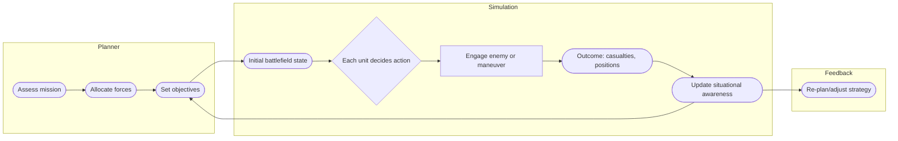
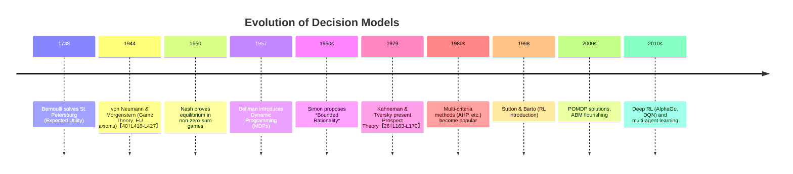
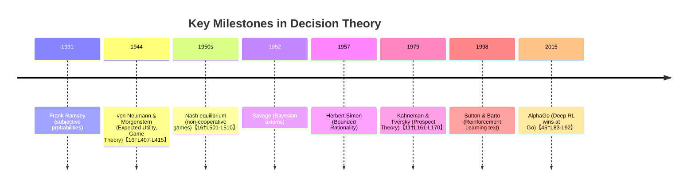

Decision models provide formal frameworks to analyze and guide decision-making under uncertainty.  This report reviews the **core theory and taxonomy** of decision models, including **normative, descriptive, and prescriptive** approaches and key formalisms such as Expected Utility, Bayesian decision theory, Prospect Theory, Bounded Rationality, Reinforcement Learning (RL), Game Theory, Multi-Criteria Decision Analysis (MCDA), Stochastic Control, Markov Decision Processes (MDPs) and POMDPs, and Agent-Based Models (ABMs).  For each model we give definitions, key equations, assumptions, strengths, limitations, and original references.  We then present **practical applications** in (a) political/military decision-making (e.g. crisis management, deterrence, intelligence analysis, command-and-control, wargaming), (b) economic decision-making (corporate strategy, investment, pricing, supply chain; monetary/fiscal policy and DSGE models), and (c) strategic games (classical game examples, AI game-playing agents, reinforcement learning in games, multi-agent learning).  Each example is described in terms of model setup, decision variables, objective, constraints, data and solution methods, with insights and outcomes.  We include **diagrams** (mermaid flowcharts/timelines) and **tables** comparing models, assumptions, and performance.  Finally, we discuss open problems, limitations, ethical issues (e.g. bias, accountability), and implementation challenges in applying these models.  The treatment is rigorous and detailed, with emphasis on original sources and seminal works.

## Core Theory and Taxonomy of Decision Models  

### Normative, Descriptive, and Prescriptive Decision Theory  
- **Normative decision theory** prescribes how an idealized rational agent *should* make choices to optimize a well-defined goal (usually utility or payoff). It assumes perfect rationality and full information.  In normative models, decisions are based on maximizing **expected utility** or minimizing expected loss. Normative models often derive from game theory and operations research.  For example, the **Expected Utility Theory** of von Neumann and Morgenstern establishes axioms (completeness, transitivity, independence, etc.) under which a rational agent’s preferences can be represented by a utility function and choices made by maximizing its expectation【22†L61-L64】【20†L9-L16】.  
- **Descriptive decision theory** explains how people **actually** make decisions, including cognitive biases and heuristics. It is grounded in psychology and behavioral economics. Descriptive models (e.g. Prospect Theory, bounded rationality, behavioral game theory) document deviations from normative rationality. For instance, **Prospect Theory** (Kahneman & Tversky, 1979) describes how people evaluate gains and losses asymmetrically, using a value function over gains/losses and a probability-weighting function, violating expected-utility axioms【26†L163-L170】.  
- **Prescriptive decision theory** bridges the two: it focuses on how to help real decision-makers improve outcomes. Prescriptive models often adapt normative methods to practical contexts (e.g. decision analysis tools, MCDA, decision support systems).  The Cambridge text notes: *“Prescriptive models provide mathematical solutions to decisions that can be put in quantifiable form.”*【18†L55-L61】. These models incorporate both rational criteria and realistic constraints (e.g. limited information).

### Expected Utility Theory (Normative)  
- **Definition**: *Expected Utility Theory* (EUT) holds that a rational decision-maker assigns a utility $U(x)$ to each outcome $x$ and chooses the action with maximal **expected utility**. Formally, if action $a$ yields outcome $x$ with probability $p(x|a)$, the EU is 
  $$ U(a) = \sum_x p(x|a)\, U(x)\,. $$
- **Key Equations**: The *von Neumann–Morgenstern* theorem shows that under certain axioms (completeness, transitivity, continuity, independence), preferences satisfy EU maximization【20†L9-L16】【22†L61-L64】. In choices under **risk** (known probabilities), the EU is $\sum_i p_i U(x_i)$. Under **uncertainty** (unknown probabilities), **Savage’s Subjective Expected Utility** theory uses subjective probabilities.  
- **Axioms/Assumptions**: Rationality axioms (e.g. sure-thing principle, independence). Utility is **cardinal** and risk attitudes are reflected in its curvature. 
- **Strengths**: Provides a clear normative benchmark and basis for consistent choice. Widely used in economics and statistics.  
- **Limitations**: Empirical paradoxes (Allais, Ellsberg) violate its axioms. Cannot capture reference-dependent behavior or ambiguity aversion. Requires precise probabilities and utility, which may not exist. (Allais paradox [20†L9-L16] is a famous violation.)  
- **Seminal References**: Daniel Bernoulli’s 1738 solution of the St. Petersburg paradox (log utility) and, especially, von Neumann & Morgenstern (1944) “Theory of Games” with EU axioms【40†L418-L427】; Savage (1954) for subjective EU.

### Bayesian Decision Theory  
- **Definition**: In Bayesian decision theory, uncertainty about states of the world is captured by a **probability distribution** (prior beliefs), updated by data. The decision-maker chooses the action $a$ that maximizes expected utility under the *posterior* distribution. One can equivalently minimize the **Bayes risk** (expected loss). Formally, if $\theta$ indexes states, action $a$, and $L(a,\theta)$ is loss, the *Bayes expected loss* is 
  $$ R(a) = \int L(a,\theta)\, \Pr(\theta|D)\,d\theta, $$
  where $\Pr(\theta|D)$ is the posterior (by Bayes’ rule). The optimal action minimizes $R(a)$.  
- **Key Equations**: Bayes’ theorem: $\Pr(\theta|D) \propto \Pr(D|\theta)\Pr(\theta)$.  Combined with EU, the optimal choice is $\arg\max_a \int U(x(\theta,a))\,\Pr(\theta|D)\,d\theta$.  
- **Assumptions**: Agent has a coherent prior $\Pr(\theta)$ (subjective or objective), and updates via conditionalization. Preferences and beliefs are separable. Agents avoid “Dutch books”.  
- **Strengths**: Coherent framework to incorporate evidence; leads to statistical inference methods (Bayesian updating, design of experiments)【54†L13-L21】. Unique solution to sequential decisions.  
- **Limitations**: Requires a prior (may be hard to justify), computationally intensive in high dimensions. The choice of loss function can be subjective. Under severe model uncertainty (Ambiguity), Bayesian predictions can fail (leading to alternatives like info-gap or robust decision theories).  
- **Seminal References**: Abraham Wald (1939) on decision functions; Howard Raiffa & Schlaifer (1960s) for applied Bayesian decision analysis; J. V. Neumann and Savage combined EU with Bayesian updating.

### Prospect Theory (Descriptive)  
- **Definition**: *Prospect Theory* (Kahneman & Tversky, 1979) is a descriptive model of choices under risk. It assumes agents evaluate gains and losses relative to a reference point (often status quo), with an S-shaped value function $v(\cdot)$ that is concave for gains and convex for losses, and steeper for losses (loss aversion). Probabilities are transformed by a weighting function $\pi(p)$ that tends to overweight small probabilities and underweight moderate to large ones【26†L163-L170】.  
- **Key Equations**: For a lottery with outcomes $x_i$ and probabilities $p_i$, *Prospect Value* is 
  $$ V = \sum_i \pi(p_i)\,v(x_i), $$
  where $v(0)=0$, $v$ is typically piecewise (e.g. $v(x)=x^\alpha$ for $x\ge0$ and $-\lambda(-x)^\beta$ for $x<0$), and $\pi(p)$ is non-linear (e.g. Prelec weight).  
- **Assumptions**: Human valuation is reference-dependent, with diminishing sensitivity and loss aversion. People have probability weighting.  
- **Strengths**: Explains many empirical biases (risk aversion for gains, risk-seeking for losses, Allais paradox, insurance preferences). Supported by experiments【26†L163-L170】.  
- **Limitations**: Not a normative model (no single utility scale across reference points). Can violate transitivity. Parameter estimation needed. Does not directly address intertemporal or strategic decisions.  
- **Seminal References**: Kahneman & Tversky (1979, *Econometrica*) [original formulation]; Tversky & Kahneman (1992) cumulative version.

### Bounded Rationality  
- **Definition**: *Bounded rationality* (Herbert Simon, 1955) recognizes cognitive and informational limitations. Agents use simplified decision procedures (heuristics) and “satisfice” rather than optimize【28†L154-L162】. Formally, it abandons the perfect rationality assumption: decision makers seek satisfactory (not optimal) solutions given limits in time, information, and computation【28†L154-L162】.  
- **Key Idea**: Agents use rules-of-thumb or “fast and frugal” heuristics (e.g. satisficing, elimination-by-aspects).  
- **Assumptions**: Reality is too complex for full optimization. Preferences may be incomplete or lexicographic.  
- **Strengths**: More realistic for human or organizational decisions; explains systematic deviations from optimality. Applicable to complex, dynamic real-world problems.  
- **Limitations**: Descriptive models of behavior, often model-specific. Hard to derive general quantitative predictions.  
- **Seminal References**: Simon (1955, *Behavioral Model of Rational Choice*)【28†L188-L196】; Gigerenzer et al. (1999, *Heuristics and Biases*).

### Reinforcement Learning (Sequential Decisions)  
- **Definition**: *Reinforcement Learning* (RL) is an area of machine learning and control theory focused on how agents can learn optimal actions through trial-and-error interactions with an environment【36†L380-L388】. An RL agent learns a *policy* $\pi(s,a)$ that selects actions $a$ in states $s$ to maximize cumulative reward. It is typically formalized using MDPs.  
- **Key Equations**: The core Bellman optimality equation for the state-value function $V^*(s)$ under discount factor $\gamma$ is 
  $$ V^*(s) = \max_a \Big[ R(s,a) + \gamma \sum_{s'} P(s'|s,a) V^*(s') \Big]. $$
  Policy iteration, Q-learning (Bellman on action-values), and policy gradients are common algorithms.  
- **Assumptions**: The environment may be (approximately) a Markov process. Rewards (possibly noisy) are observed. The agent can explore.  
- **Strengths**: Model-free learning (no known model needed), adapts to unknown environments, handles long-run reward tradeoffs. Widely successful in games and control tasks【36†L380-L388】.  
- **Limitations**: Typically requires large data (sample inefficiency), may converge slowly, sensitive to reward design. Partial observability requires extensions (POMDP).  
- **Seminal References**: Sutton and Barto (1998/2018, *Reinforcement Learning: An Introduction*); Watkins (1989 Q-learning).

### Game Theory  
- **Definition**: *Game theory* models strategic interactions among multiple decision-makers (players). A **game** specifies players, possible strategies, and payoffs for each strategy profile. Game theory analyzes equilibrium outcomes (e.g. Nash equilibrium) where no player can unilaterally improve payoff【40†L407-L415】.  
- **Key Equations**: In a two-player game with strategies $i,j$, payoffs $u^A_{ij},u^B_{ij}$, a *Nash equilibrium* $(i^*,j^*)$ satisfies
  $$ u^A_{i^* j^*} \ge u^A_{i\, j^*}\ \ \forall i,\quad
     u^B_{i^* j^*} \ge u^B_{i^* j}\ \ \forall j. $$
  For mixed strategies, equilibrium solves best-response conditions via fixed points.  
- **Assumptions**: Common knowledge of game structure and rationality. Players maximize individual payoffs (could be cooperative or non-cooperative settings).  
- **Strengths**: Captures strategic reasoning and interdependence. Widely applicable (economics, political science, biology).  
- **Limitations**: Equilibria may be multiple or unstable. Real players may not meet rationality assumptions. Computational complexity for large games. Equilibrium concepts can diverge (Correlated vs Nash vs Stackelberg).  
- **Seminal References**: von Neumann & Morgenstern (1944) game theory; John Nash (1950) equilibrium theorem【40†L418-L427】; extensive research in 1950s (Shapley, Kuhn).

### Multi-Criteria Decision Analysis (MCDA)  
- **Definition**: MCDA addresses decisions involving *multiple objectives* or criteria. There is no single optimal solution without aggregating preferences. MCDA methods (e.g. Weighted Sum, Analytic Hierarchy Process, Outranking) help decision-makers find satisfactory trade-offs. The goal is often to identify *efficient (Pareto-optimal)* solutions【42†L188-L197】.  
- **Key Equations**: A simple form is *Multi-Attribute Utility Theory* where overall utility is a weighted sum: $U(a)=\sum_{k} w_k u_k(a)$ over criteria $k$. Generally one searches for nondominated points: a solution $x$ is efficient if no other solution is better in all criteria【42†L198-L207】.  
- **Assumptions**: Criteria are known and possibly conflicting; weights or preference information can be elicited. Often assumes additive aggregation (though not always).  
- **Strengths**: Explicitly handles trade-offs; flexible (many methods: AHP, ELECTRE, TOPSIS, etc). Useful for planning, resource allocation.  
- **Limitations**: Requires eliciting subjective preferences (weights, scoring). Difficult for many criteria. May ignore uncertainty in outcomes (extensions use stochastic MCDA).  
- **Seminal References**: Keeney & Raiffa (1976, *Decisions with Multiple Objectives*); Saaty (1980, *Analytic Hierarchy Process*); Triantaphyllou (2000, surveys)【42†L233-L242】【42†L248-L257】.

### Stochastic Control  
- **Definition**: *Stochastic control* is a branch of control theory dealing with decision-making in dynamic systems under uncertainty【51†L126-L134】. The controller chooses inputs over time to optimize a cost (or reward) criterion (often expected cumulative cost) when the system evolves stochastically.  
- **Key Equations**: In continuous/discrete time, one writes a **Hamilton–Jacobi–Bellman (HJB)** equation or uses dynamic programming. A classical example is the *Linear-Quadratic-Gaussian* (LQG) control: linear dynamics, quadratic cost, Gaussian noise, which admits closed-form Riccati solutions【51†L126-L134】.  
- **Assumptions**: System and noise models are known (or partially known). Usually Markovian dynamics. Often assumes quadratic costs for analytic tractability.  
- **Strengths**: Provides optimal feedback policies. Well-developed theory for LQG and other cases.  
- **Limitations**: Requires accurate models; nonlinear or non-Gaussian cases can be intractable. Solutions may be computationally intensive (Bellman’s “curse of dimensionality”).  
- **Seminal References**: Bellman (1957) on dynamic programming; Merton (1971) on continuous-time control; textbook by Bertsekas (1976) and others.

### Markov Decision Processes (MDPs)  
- **Definition**: An MDP is a discrete-time stochastic model for sequential decision-making. It is defined by states $S$, actions $A$, transition probabilities $P(s'|s,a)$, and rewards $R(s,a)$【44†L159-L167】. At each time $t$, the agent in state $s_t$ chooses action $a_t$, receives reward $r_t$, and the state transitions to $s_{t+1}$ according to $P$. The objective is to maximize expected cumulative reward (often discounted). MDPs assume *full observability* of the state.  
- **Key Equations**: Bellman optimality equation for value $V^*(s)$ (see Reinforcement Learning above). Policy iteration and value iteration are standard solution methods.  
- **Assumptions**: Markov property (future independent of past given current state). Known transition model (for planning) or unknown (for RL). Stationarity of dynamics in most formulations.  
- **Strengths**: Unifies many sequential decision problems. Powerful DP solution (value iteration, policy iteration). Many applications (inventory control, robotics, finance) use MDPs【44†L159-L167】.  
- **Limitations**: State-action space may be huge. Full observability is often unrealistic. Requires known model (or large data for RL).  
- **Seminal References**: Bellman (1957); Howard (1960s) policy iteration; Puterman (1994) *MDP book*.

### Partially Observable MDPs (POMDPs)  
- **Definition**: A POMDP generalizes an MDP to **partial observability**【47†L124-L132】. The agent does not see the true state but receives observations probabilistically related to the state. Formally, a POMDP adds an observation space and emission probabilities $O(o|s)$ on top of an MDP. The agent maintains a belief (probability distribution) over states.  
- **Key Equations**: Belief update via Bayes’ rule: $b'(s') \propto O(o|s') \sum_s P(s'|s,a)\,b(s)$.  One then solves a *belief MDP*: value functions are defined over beliefs. The optimal policy maximizes expected reward over belief trajectories.  
- **Assumptions**: Similar to MDP but observation model exists. Often assumes discrete states/observations. Computationally heavy.  
- **Strengths**: Models realistic scenarios with incomplete information (robotics, dialogue systems, diagnosis).  
- **Limitations**: Solving POMDPs is PSPACE-hard; exact solution exists only for tiny problems. Approximate methods (point-based, heuristics) are used.  
- **Seminal References**: Åström (1965) on Markov decision processes with imperfect information【47†L124-L132】; Kaelbling, Littman & Cassandra (1998) on POMDP planning.

### Agent-Based Models (ABMs)  
- **Definition**: An *agent-based model* is a computational simulation of autonomous “agents” (individual entities) whose actions and interactions produce complex system behavior【49†L191-L199】. ABMs typically specify each agent’s decision rules (which may be heuristic or rule-based) and let them interact in an environment. The collective dynamics can show emergence of patterns (self-organization) not obvious from individual rules.  
- **Key Features**: No single equation; rather a simulation architecture. Agents can have bounded rationality, adapt, learn, reproduce, etc. Macro outcomes (e.g. market prices, social norms, traffic flows) emerge from micro-level agent behavior【49†L205-L213】.  
- **Assumptions**: Heterogeneous agents with defined behaviors. Sometimes spatial or network structure for interactions.  
- **Strengths**: Can model complex adaptive systems (e.g. economy, ecology, social networks) with interacting individuals. Captures non-linearities and emergent phenomena.  
- **Limitations**: Hard to calibrate/validate; results may depend on arbitrary rules. Generally not analytical.  
- **Seminal References**: Epstein & Axtell (1996) *“Growing Artificial Societies”* (Sugarscape model); Axelrod (1997) cultural transmission; applications in many domains【49†L191-L199】【49†L205-L213】.

### Summary Table of Models  

| **Model**             | **Type**         | **Key Concept / Eq.**                                       | **Assumptions**                | **Strengths**                                    | **Limitations**                                  |
|-----------------------|------------------|-------------------------------------------------------------|--------------------------------|--------------------------------------------------|--------------------------------------------------|
| Expected Utility      | Normative        | $U(a)=\sum p(x|a)U(x)$【20†L9-L16】                          | Rational axioms; known $p$      | Consistent rational choice; axiomatized          | Paradoxes (Allais, Ellsberg); requires utility    |
| Bayesian Decision     | Normative        | Maximize $\int U(x|\theta)p(\theta|D)d\theta$               | Prior $\Pr(\theta)$; Bayes      | Integrates evidence; coherent belief updating    | Prior sensitivity; computational complexity      |
| Prospect Theory       | Descriptive      | $V=\sum \pi(p_i)v(x_i)$【26†L163-L170】                      | Reference-dependence; heuristics| Explains biases (loss aversion, overweighting)  | Not normative; many parameters                   |
| Bounded Rationality   | Descriptive      | Satisficing heuristics (e.g. aspiration levels)            | Limited info/processing         | Realistic human behavior; parsimonious models    | Non-optimal; context-specific; no single norm    |
| Game Theory           | Normative        | Nash eq: no profitable deviation【40†L407-L415】            | Common knowledge; self-interest| Models strategic interactions; many equilibrium concepts  | Equilibria multiplicity; rationality req.         |
| Multi-Criteria (MCDA) | Prescriptive     | Weighted objectives; Pareto frontier【42†L188-L197】       | Defined criteria; elicited prefs| Balances trade-offs; structured decision support| Eliciting preferences; no single optimum         |
| Stochastic Control    | Normative        | HJB/Bellman; LQG solutions【51†L126-L134】                 | Known noise distribution       | Optimal feedback under uncertainty; well-studied | Model must be known; complex solutions for non-LQ |
| MDP                   | Normative/RL     | Bellman eq: $V^*(s)=\max_a[R+\gamma \sum P V^*(s')]$【44†L159-L167】 | Markov; full state visibility  | Solves sequential control; basis for RL         | Large state space; demands model or lots of data  |
| POMDP                 | Normative/RL     | Belief update (Bayes) & belief-state DP                     | Partial observability          | Models hidden-state problems                    | Very high computational cost                    |
| Reinforcement Learning| Prescriptive/N/R | Learn $V^\pi$ via sampling; policy grad.                  | MDP framework; exploration     | Learns from interaction; powerful in games and control【36†L380-L388】【36†L479-L483】 | Data-hungry; convergence issues; deep nets opaque |
| Agent-Based (ABM)     | Descriptive/Presc| Simulation of interacting agents【49†L191-L199】           | Heterogeneous rules; emergent  | Captures emergent/social dynamics【49†L205-L213】 | Validation difficulty; many free parameters      |

## Applications of Decision Models  

### (a) Political and Military Decision-Making  

#### Crisis Management and Command-and-Control  
In crises (natural disasters, epidemics, conflicts), decision-makers must allocate scarce resources under extreme uncertainty. Models here often combine **stochastic optimization** and **MCDA**.  For example, an emergency planner may use an MDP to model resource deployment: state = disaster conditions, actions = allocation of teams, with transition probabilities from past data. The objective might be to **minimize expected casualties** or damage.  Alternatively, **MCDA** can rank response strategies on criteria (time, cost, effectiveness)【42†L188-L197】.  **Assumptions** include known risk scenarios (often from simulations) and command hierarchies that impose constraints (e.g. logistic limitations).  **Solution methods**: dynamic programming or simulation-based optimization.  **Insights**: Such models highlight critical factors (bottlenecks, needs of most vulnerable) and can be used in wargames or drills.  
- *Example*: A table-top exercise might treat the crisis as a POMDP, with hidden state information (actual threat level) and noisy observations (intel). The decision variables include the dispatch of limited assets; reward = safe resolution. Solving the POMDP yields a **policy** mapping belief states to actions. In practice, commanders often simplify via *rules of thumb*, but formal POMDP solutions (though rarely computed in real time) inform doctrine (e.g. maintain reserves for worst-case states).  

#### Deterrence and Strategic Stability  
**Nuclear deterrence** is often modeled via **game theory**. A classic representation is the *Chicken Game*: two adversaries choose whether to escalate (arm) or back down. Payoffs rank “lose face” < “mutual disarm” < “disarm/deter/hide” < “mutual war”. A Nash equilibrium in this game is typically one side arms and the other does not (a deterrent balance). More detailed models use **signaling games** or **sequential games**: e.g. player A (target) may adopt a given defense posture to signal credibility, while B (aggressor) chooses attack intensity. The **assumptions** include rational actors and known payoffs for survival vs victory.  
- *Example*: Consider two countries A and B. Each can either maintain a high defense commitment (H) or low (L). The payoff matrix (A’s payoff, B’s payoff) might be: H/H = (3,3) (mutual security), H/L = (2,4) (B demoralized), L/H = (4,2), L/L = (1,1) (mutual vulnerability). Here (L/H) and (H/L) are pure-strategy Nash equilibria. Analysts solve such games to evaluate stability of deterrence. These models rely on idealized payoffs and do not capture misperception. Limitations include oversimplification; actual nuclear doctrine uses more complex repeated-game logic and credibility issues (modeled via **incomplete-information games**).  

#### Intelligence Analysis  
Intelligence gathering and analysis can be viewed through a **Bayesian decision** lens. For example, analysts maintain probabilistic beliefs about an adversary’s intentions. A Bayesian network or POMDP may represent hypotheses (e.g. *adversary is building weapons* vs *no*). New evidence (satellite imagery) updates priors. **Decision variables** include which sources to task (human intel, signals intercept). The objective might be to minimize risk of surprise.  
- *Example*: A simple model is the “Analysis of Competing Hypotheses” method: define hypotheses $H_1,H_2,…$ and evidence with likelihoods $P(e|H_i)$. Use Bayes’ rule to rank hypotheses. Then decisions (e.g. alert level) maximize expected utility (correct detection vs false alarm costs). A flowchart could illustrate (Mermaid): states = {true hypothesis}, actions = {do nothing, alert, investigate}. Though formal decision support systems exist, much analysis remains qualitative.  

#### Command-and-Control Wargaming (Agent-Based Models)  
Military “wargames” often simulate engagements between units. Modern approaches use **Agent-Based Models**【49†L191-L199】: each unit is an agent with simple rules (move, shoot, defend). Interactions generate emergent outcomes (frontlines forming, encirclement).  **Setup**: Agents have state (position, ammo), actions (move, fire, retreat), with combat probabilities from data. The **objective** for each side might be to control territory or destroy enemy units. Constraints include supply lines and command delay.  **Data needs**: unit capabilities, terrain, rules of engagement.  
- *Example Diagram (Mermaid flowchart)*:



*(Diagram: high-level C2 loop linking planning and simulation.)*  

Such wargame simulations are usually solved by Monte Carlo simulation or game-tree search. The **insights** include identification of critical choke points and force ratios needed. Limitations: simulations may not capture real commander psychology. Ethically, reliance on war-gaming raises issues if adversaries adapt to these strategies (cyber warfare adds new dimensions).  

### (b) Economic and Corporate Decision-Making  

#### Corporate Investment and Strategic Planning  
Firms use decision models for capital budgeting, R&D investment, and strategic planning. A common framework is **Real Options**: investment opportunities are treated like financial options. E.g. an oil company can drill now or wait (to see more info on prices). This is modeled as a stochastic optimal control or MDP: state = underlying commodity price; action = Invest or Wait. The firm maximizes expected NPV. The Bellman equation (from stochastic control) might be: 
$$ V(s) = \max\{ -K + \beta \mathbb{E}[V(s')],\ \beta \mathbb{E}[V(s')]\}, $$ 
where $K$=investment cost. Solution yields an *investment threshold* strategy. Assumes Markovian prices, known volatility.  
- **Data**: price distributions, cost of delay.  
- **Outcome**: Characterize when to invest optimally.  

#### Pricing and Revenue Management  
Firms (e.g. airlines, retailers) use **dynamic pricing models**. They model demand uncertainty via an MDP: state = remaining inventory/time, action = set price. The transition arises from random demand at that price. The goal: maximize expected revenue. A typical solution is via dynamic programming or approximate RL.  
- *Example*: An airline has 10 seats (state $s$), sells tickets over 5 periods. At each period it sets price $p$, sells 0–$d$ seats (d ~ Poisson($\lambda(p)$)). The action yields immediate revenue $p\cdot d$ and moves to $s-d$. Solve Bellman recursion for each $s,t$.  
- **Insights**: Yields time-dependent price policies (high early, cut last-minute). Limitations: must accurately model price elasticity and inter-temporal demand; competition (multiple sellers) requires game-theoretic models too.  

#### Supply Chain and Inventory Management  
Classic models: e.g. newsvendor (static) or (s,S) policies (dynamic). A stochastic control problem: inventory balance equation with random demand. State = inventory level; action = restock quantity. Objective = minimize holding+shortage costs. Solved by DP yielding (s,S) reorder rules【44†L159-L167】.  
- **Data**: demand distribution, lead time, cost parameters.  
- **Outcome**: Optimal stocking policies; e.g. keep $s=5$, order up to $S=20$ when hit. Table can compare (s,S) vs base-stock vs just-in-time assumptions.  

#### Corporate Strategy (Game Theory)  
Firms competing on features or market share often use game models. For example, Cournot competition: firms choose quantities $q_i$; market price $P= a - b\sum q_i$. Each profit $\pi_i = P q_i - c q_i$. Nash equilibrium solves $a-b(q_1+q_2)-bq_i-c=0$. Bertrand competition: firms set prices. These **game-theoretic models** determine equilibrium prices/outputs.  
- **Assumptions**: Rational firms, common knowledge of demand and costs.  
- **Insights**: Highlight undercutting vs capacity constraints. Limitations: real markets have incomplete info; bounded rational models or evolutionary game theory may fit better.  

#### Macroeconomic and Regulatory Decisions (DSGE, Optimal Policy)  
Central banks and policymakers use **DSGE models**: systems of equations where representative agents optimize (via Bellman eq) under stochastic shocks. For example, a simple model: households maximize utility (consumption, labor) subject to budget constraint and monetary policy. These are solved using dynamic programming (linearization around steady state).  
- **Key Variables**: inflation, output gap, interest rate.  
- **Solution Methods**: Value function iteration or perturbation methods. Modern tools (Dynare) do this automatically.  
- **Monetary/Fiscal Policy**: Often cast as a **Linear-Quadratic Stochastic Control** problem: minimize quadratic loss (e.g. inflation^2 + output^2) subject to New Keynesian Phillips curve and IS curve (state equations). The optimal rule may be a Taylor rule. LQG theory (Stochastic control) gives closed-form policy laws【51†L126-L134】.  
- **Assumptions**: Rational expectations, small shocks, linearity (for tractability).  
- **Insights**: Predict effect of policy (e.g. raising interest rate vs inflation volatility).  
- **Limitations**: Calibration uncertainties, Lucas critique (policies change behavior), often ignore distributional impacts and bounded rationality.

### (c) Games: Classical and AI Decision Models  

#### Classical Game Theory Examples  
- **Prisoner’s Dilemma**: Two players choose Cooperate (C) or Defect (D). Payoffs (R,R) for CC, (T,S) for DC, (S,T) for CD, (P,P) for DD, with $T>R>P>S$. The unique Nash equilibrium is (D,D), even though (C,C) Pareto-dominates. **Implication**: rational self-interest leads to suboptimal mutual outcome.  
- **Stag Hunt**: Coordination game: both benefit if they choose Stag (big reward), but each fears the other may Choose Hare (smaller safe reward). There are two equilibria (Stag,Stag) and (Hare,Hare). Explains trust and assurance problems.  
- **Ultimatum Game (Bargaining)**: Two players split a pie. Proposer offers $(x,1-x)$; responder can accept or reject (if reject both get 0). Subgame-perfect equilibrium (D. Rubinstein) gives the proposer almost the whole pie. In practice, responders reject low offers (fairness motives).  
These examples illustrate strategic concepts (Nash, subgame, mixed strategies). They assume fully rational payoffs.  

#### AI Game Agents and Reinforcement Learning  
AI has achieved superhuman performance in many games. DeepMind’s *AlphaGo* combined deep neural nets with Monte Carlo Tree Search and self-play RL to master Go【36†L479-L483】. Similarly, Deep Q-Networks (DQN) learned Atari games. Multi-agent RL (self-play) yields agents that learn strategies (e.g. OpenAI Five for Dota).  
- *AlphaGo Example*:  
  - **Model Setup**: The game of Go is a deterministic perfect-information game. State = board configuration. Actions = placing a stone. Reward = +1 for win, -1 for loss at terminal.  
  - **Decision Variables**: Move selection each turn.  
  - **Objective**: Maximize probability of winning.  
  - **Constraints**: Rule-of-Go constraints (no illegal moves, Ko rule).  
  - **Solution**: Deep neural policy/value networks trained on human games, then refined by RL self-play (Policy = probability over moves, Value = win probability). Monte Carlo tree search (MCTS) uses these networks to select moves.  
  - **Outcome**: AlphaGo achieved ~99.8% win rate vs top human.  
  - **Insights**: Demonstrated patterns humans missed; emphasized exploration of novel strategies.  
  - **Open Problems**: Guaranteeing interpretability; extending to non-board strategic settings (imperfect info).  

#### Multi-Agent Learning  
In many games, multiple learning agents interact (e.g. training bots to play together/cooperate). This is modeled by **Multi-Agent Reinforcement Learning (MARL)**. Each agent learns a policy $\pi_i(a_i|s)$, and the environment includes other agents’ policies. Solutions often involve **self-play** or co-evolution.  
- *Example*: Two-agent *Zero-sum game* like poker: each agent uses RL to approximate Nash via self-play (e.g. Libratus poker AI).  
- **Decision Variables**: Each agent’s strategy parameters.  
- **Objective**: Maximize own expected payoff (minimize regret) over repeated play.  
- **Methods**: Fictitious play, self-play with value-based or policy gradients (e.g. MADDPG for continuous games).  
- **Challenges**: Non-stationarity (the environment changes as others learn). Outcomes often converge to equilibria if one exists (e.g. rock-paper-scissors cycles).  
- **Ethical Considerations**: Multi-agent RL can produce collusive behavior if rewards align (e.g. price-fixing algorithms), raising antitrust concerns.

## Comparisons and Illustrations  

| **Aspect**                | **Normative Models**                        | **Descriptive Models**              | **Prescriptive Models**              |
|---------------------------|--------------------------------------------|------------------------------------|--------------------------------------|
| Focus                     | How *should* decisions be made (optimal)    | How decisions *are* made (actual)   | How to improve real decisions         |
| Examples                  | EU theory【20†L9-L16】, Bayes, Game theory【40†L407-L415】, MDPs【44†L159-L167】  | Prospect theory【26†L163-L170】, Bounded rationality【28†L154-L162】  | Decision analysis, MCDA【42†L188-L197】, RL (bridging) |
| Key Assumptions           | Perfect rationality, known probabilities    | Cognitive limits, biased beliefs   | Combines rational criteria with heuristics |
| Methodology               | Axioms, optimization                       | Experiments, behavioral studies    | Expert elicitation, simulation       |
| Strengths                 | Clear benchmarks; mathematical rigor【22†L61-L64】 | Explains anomalies, realistic     | Pragmatic, applicable to complex cases |
| Limitations               | Often unrealistic for humans                | Not predictive if contexts change   | Relies on quality of normative core   |

**Timeline of Key Developments:**  



## Open Problems, Ethical Issues, and Challenges  
- **Model Validity and Uncertainty**: All models rely on assumptions (e.g. known distributions, rationality). Real systems may violate these. Quantifying model uncertainty and robustness (robust MDPs, ambiguity aversion) remains an active area.  
- **Computational Scalability**: Many decision models (MDPs, POMDPs, game equilibria) suffer the “curse of dimensionality”. Approximation methods (function approximation in RL, sampling) help but may not guarantee optimality.  
- **Human Factors and Ethics**: Applying AI-based decision models raises issues of bias, transparency, and accountability. For example, algorithmic pricing can inadvertently lead to unfair prices (price discrimination). In military use, autonomous decision systems must address laws of armed conflict and command responsibility.  
- **Integration of Models**: Hybridizing normative and descriptive approaches (e.g. “behavioral game theory”) is open. How to prescriptively adapt theories when decision-makers are bounded or biased?  
- **Data and Implementation**: Many theoretical models assume rich data (e.g. transition probabilities for MDPs) which may be missing. Data-driven approaches must carefully handle noise and privacy.

**Common Pitfalls and Misconceptions:**  
- Conflating *normative* (should) with *descriptive* (is) reasoning. Normative models do not predict actual human choices unless humans are *assumed* rational.  
- Ignoring the **difference between risk and uncertainty** (known vs unknown probabilities). Expected utility applies to the former; subjective probabilities are used for the latter.  
- Assuming a unique “best” solution in multi-criteria or multi-agent problems. Often only *sets* of efficient or equilibrium outcomes exist.  
- Overlooking computational constraints: a solution “in principle” (optimal policy) may be infeasible to compute or implement.  
- In RL or game settings, mistaking short-term rewards for long-term payoffs. One must consider discounted or cumulative returns, not myopic gains.

**Sources:** The above draws on foundational texts and surveys of decision theory【18†L55-L61】【20†L9-L16】【26†L163-L170】【28†L154-L162】【36†L380-L388】【40†L407-L415】【42†L188-L197】【44†L159-L167】【47†L124-L132】【49†L191-L199】【51†L126-L134】, among others.


# Executive Summary  
Decision theory provides formal models to guide choices under uncertainty. **Expected Utility Theory** (von Neumann–Morgenstern) and **Bayesian Decision Theory** prescribe choosing actions that maximize expected utility (or minimize expected loss) based on probabilities and outcomes【4†L379-L387】【7†L49-L57】.  **Prospect Theory** (Kahneman–Tversky) refines this by using a value function over gains/losses relative to a reference point, plus a probability‐weighting function that overweights small probabilities and underweights large ones【11†L161-L170】.  **Game Theory** models strategic interactions among rational agents (cooperative or noncooperative), focusing on equilibria such as Nash equilibrium【16†L407-L415】【41†L79-L84】.  **Markov Decision Processes (MDPs)** model sequential decision problems with probabilistic state transitions【18†L159-L168】, and **Reinforcement Learning (RL)** algorithms learn optimal policies in MDPs via simulation or trial‐and‐error【18†L164-L172】【45†L83-L92】.  **Bounded Rationality** recognizes cognitive and information limits, leading humans to use heuristics or satisficing rather than strict optimization【21†L55-L63】.  **Multi-Criteria Decision Analysis (MCDA)** explicitly evaluates options against multiple, often conflicting criteria【23†L143-L151】.  **Decision Trees** graphically enumerate sequential choices, chance events, and outcomes, enabling calculation of expected values or utilities for alternatives【30†L249-L258】.  Other approaches include **stochastic optimization** and **robust decision-making**, which prioritize policies that perform acceptably across a range of uncertain futures【32†L121-L130】.

These models have been applied widely. In **political/military contexts**, game-theoretic and decision-analytic models have been used to study crisis bargaining, deterrence and escalation (e.g. nuclear deterrence simplified as “Costs×P(costs) > Benefits×P(benefits)”【36†L302-L308】), intelligence analysis (Bayesian updating on evidence), command-and-control (MDP planning, wargaming simulations), and coalition formation (cooperative game solutions like the Shapley value).  In **economics**, firms use decision trees and dynamic programming for investment and pricing decisions; game theory analyzes competition (Bertrand/Cournot pricing) and regulatory design; supply chains use stochastic inventory models (newsvendor, inventory MDPs); and central banks use policy rules (e.g. Taylor rule) or stochastic dynamic general equilibrium (DSGE) models for macro-policy.  In **games and game design**, decision models guide AI agents (e.g. AlphaGo’s RL with Monte Carlo tree search【45†L83-L92】), balance mechanics (modeling player choices to achieve fairness), and strategic game mechanics (payoff matrices, equilibrium analysis).  

Below we survey these theories in depth, then illustrate applications with examples.  We also provide comparison tables summarizing each model’s assumptions, data needs, complexity, uses, and pros/cons.  

# Core Decision Models and Theories  

## Expected Utility and Bayesian Decision Theory  
**Expected Utility Theory (EUT)** assumes a rational agent with complete preferences and probabilities over outcomes.  Under standard axioms (transitivity, independence, continuity), preferences can be represented by a **utility function** *u(x)*.  The *expected utility* of a risky prospect is  
$$EU = \sum_i p_i\,u(x_i),$$  
where *x_i* are possible outcomes with probabilities *p_i*.  A utility-maximizing agent chooses the action with highest expected utility【4†L379-L387】.  For example, with two investments yielding returns *x* or *y* with probabilities *p* and *1-p*, the agent prefers the investment with higher $pu(x)+(1-p)u(y)$.  

**Bayesian Decision Theory** extends this by treating unknown states probabilistically and introducing loss functions.  Given a prior/posterior probability distribution over states and a loss $L(\theta,a)$ for choosing action *a* when the true state is *θ*, the Bayesian principle is to choose the action minimizing **posterior expected loss** (Bayes risk):  
$$\rho(a) = \int L(\theta,a)\,\pi(\theta|x)\,d\theta,$$  
where $\pi(\theta|x)$ is the posterior given data *x*.  The optimal *Bayes action* $a^*$ satisfies $\rho(a^*) \le \rho(a)$ for all actions【7†L49-L57】.  This unifies estimation and hypothesis testing: choosing an estimator minimizing mean squared error, or a decision rule minimizing misclassification probability, are special cases of Bayesian decision.  

Key assumptions of EUT/Bayesian models are rational preferences and known probabilities (subjective or objective).  Data needs include probability distributions over outcomes, either obtained from models or subjective beliefs.  Computational complexity is modest for finite decision trees but grows with state space size (lead to dynamic programming methods).  **Strengths:** clear normative criterion, well-developed theory (axioms, utility elicitation).  **Weaknesses:** often unrealistic in capturing human biases; sensitive to accurate probability and utility quantification.  

## Prospect Theory and Behavioral Models  
**Prospect Theory (PT)** addresses observed deviations from EUT.  It posits that people evaluate gains and losses relative to a reference point (usually current wealth) via a value function *v(x)* that is concave for gains and convex (steeper) for losses (loss aversion)【11†L161-L170】.  Also, objective probabilities *p* are transformed by a weighting function *π(p)* that typically overweights small probabilities and underweights large ones【11†L161-L170】.  For a simple prospect with two outcomes *x* (gain) with probability *p*, and *y* (loss) with probability *q*, the overall “prospect value” is modeled as:  
$$V = \pi(p)\,v(x) + \pi(q)\,v(y).$$  
(Kahneman & Tversky originally formulated an 8-parameter function covering multiple outcomes【9†L781-L790】【10†L1-L4】.)  PT successfully explains phenomena like risk-seeking for low-probability high gains (lotteries) and risk aversion for moderate-probability gains, as well as reference-point effects.  

**Bounded Rationality** (Herbert Simon) recognizes that real decision-makers have cognitive, time, and information limits.  Agents may *satisfice* (choose the first acceptable option) or use heuristics rather than optimizing.  Modern **resource-rational** models suggest that biases can emerge from optimizing an internally constrained process【21†L55-L63】.  For example, limited working memory may cause systematic probability distortion.  Bounded models drop some of the strict axioms of EUT, and may incorporate heuristics (e.g. rule-of-thumb strategies) or simplified submodels.  

## Game Theory  
**Game Theory** models strategic interaction among multiple decision-makers (players)【16†L407-L415】【41†L79-L84】.  Each player has a set of strategies and payoffs depending on the strategies chosen by all players.  A central solution concept is the **Nash equilibrium**: no player can unilaterally improve payoff by changing strategy.  In two-player zero-sum games, minimax theorems (von Neumann) guarantee equilibrium in mixed strategies.  In n-player or non-zero-sum games, Nash (1950) proved every finite game has (possibly mixed) equilibria【16†L501-L510】.  

Game models vary: **Normal-form** (simultaneous-move) games versus **extensive-form** (sequential moves); **cooperative games** (players can make binding agreements, studied via concepts like the core or Shapley value) versus **noncooperative games** (strategies enforced by self-interest).  Repeated games and evolutionary games analyze long-run interactions and learning.  Game theory assumes rational players and common knowledge, though there are *Bayesian games* with incomplete information (players have beliefs about others’ types).  

In practice, game theoretic models are used to analyze auctions, pricing competition, voting, and conflict scenarios.  They require knowledge (or assumptions) about payoff functions and strategic sets.  Data needs include payoff matrices or utility functions for each player.  Computational complexity can be high (finding Nash equilibria is PPAD-complete in general), but two-player zero-sum games are solvable by linear programming (minimax).  **Strengths:** captures strategic reasoning and competition.  **Weaknesses:** assumes perfect rationality and common priors; real behavior often deviates (hence behavioral game theory and experimental economics).  

## Markov Decision Processes and Reinforcement Learning  
**Markov Decision Processes (MDPs)** provide a formalism for *single-agent sequential decision problems with uncertainty*【18†L159-L168】.  An MDP is defined by a state space *S*, action set *A*, transition probabilities $P(s'|s,a)$, and reward function *R(s,a)*.  Time evolves in discrete steps, and the Markov property means the next state depends only on the current state and chosen action.  The goal is to find a policy π: S→A maximizing expected cumulative reward (often discounted).  The Bellman equation characterizes the optimal value function:  
$$V^*(s) = \max_{a\in A} \Big[ R(s,a) + \gamma \sum_{s'}P(s'|s,a)V^*(s') \Big],$$  
where 0≤γ<1 is a discount factor.  **Solution methods** include value iteration, policy iteration, or linear programming.  

**Reinforcement Learning (RL)** is a class of algorithms for solving MDPs when the model (P,R) is unknown or too complex.  RL agents learn optimal policies through experience (trial-and-error).  Classic examples include Q-learning and SARSA, which estimate action-value functions $Q(s,a)$ iteratively.  Deep RL uses neural networks for large state spaces.  A famous example is **AlphaGo**, which combined deep neural networks with Monte Carlo Tree Search.  AlphaGo’s policy/value networks were trained first by supervised learning from expert games, then by self-play reinforcement learning.  This approach achieved a 99.8% win rate against prior state-of-art programs and defeated a human champion【45†L83-L92】.  Modern RL has also mastered Atari video games (e.g. DeepMind DQN【52†L1-L9】) and complex tasks.  

MDP and RL models assume the Markov property and require a well-defined state/action structure.  Data needs: in model-based cases, full transition probabilities and rewards; in RL, a simulator or environment for sampling transitions.  Complexity depends on state/action space size; exact dynamic programming is polynomial in these, but large problems may need approximate or simulation-based solutions.  **Strengths:** handles sequential decisions optimally; RL can adapt from data.  **Weaknesses:** can be computationally demanding; real environments may violate assumptions (e.g. non-Markov, partial observability).  

## Multi-Criteria Decision Analysis (MCDA)  
**MCDA** addresses decisions involving multiple conflicting criteria (attributes)【23†L143-L151】.  For example, choosing a project may involve cost, time, risk, and quality.  MCDA methods (Analytic Hierarchy Process, TOPSIS, multi-attribute utility theory, Pareto optimization, etc.) structure the problem by scoring or weighting criteria.  A common approach is to construct a composite utility or value function $U = f(u_1(c_1),u_2(c_2),\dots,u_k(c_k))$, where $c_i$ are criteria and $u_i$ their utility scales.  Methods may be additive, analytic (pairwise comparisons), or outranking.  

MCDA explicitly requires setting importance weights or utility scales, often from stakeholder judgment.  It assumes the decision-maker can decompose the problem into criteria and has some consistency.  Data needs include measurable criterion values for each option.  MCDA is often implemented with spreadsheets or specialized software.  **Strengths:** handles complex, high-stakes multi-criteria problems; supports stakeholder input.  **Weaknesses:** can be subjective (weight elicitation); combining criteria linearly may oversimplify interactions.  

## Decision Trees and Stochastic Models  
**Decision Trees** graphically represent sequential decisions and chance events.  A typical tree has **decision nodes** (squares) branching to alternative actions, **chance nodes** (circles) branching to uncertain outcomes with assigned probabilities, and **terminal nodes** (triangles) with payoffs【30†L249-L258】.  By rolling back from leaves, one computes expected values (or expected utilities) at each decision node and identifies the optimal choice.  Decision trees incorporate probabilities explicitly and can handle up to moderately deep sequences of actions.  

They require quantifying outcomes and probabilities; with many branches they can become large.  Decision trees are widely used in operations research and risk analysis【30†L249-L258】.  **Strengths:** intuitive visualization; accommodates both risk (chance nodes) and sequential choices; calculates worst/best-case and expected outcomes【30†L329-L337】.  **Weaknesses:** can grow exponentially; assumes probabilities at chance nodes are known.  

Other **stochastic decision models** include Monte Carlo simulation, stochastic programming (optimizing under probabilistic scenarios), and Bayesian networks for evidential reasoning.  Stochastic models relax certainty by modeling input variables as random.  Robust optimization (see next) is a related field for worst-case scenarios.  

## Robust Decision-Making  
**Robust Decision-Making (RDM)** is an approach designed for *deep uncertainty*, where probabilities and models are themselves uncertain【32†L121-L130】.  Instead of a single expected-utility solution, RDM explores many futures (scenarios) and seeks strategies that perform reasonably well across them.  Techniques include scenario analysis, stress-testing, and iterative feedback (vulnerability–response).  For example, climate policy planning often uses robust strategies that hedge against a range of climate sensitivities.  

RDM does not assume a unique “correct” model.  It often uses computational tools to identify decision options that are non-dominated across plausible assumptions.  **Strengths:** accounts for deep uncertainty and model disagreement【32†L121-L130】.  **Weaknesses:** not a single formulaic solution; results may be complex (sets of strategies).  

## Summary of Core Models  

Below is a comparative summary table of key decision models:

| **Model**              | **Assumptions**                                     | **Data/Inputs**                                   | **Computation**                            | **Use‐Cases**                         | **Strengths**                                             | **Weaknesses**                                                   |
|------------------------|-----------------------------------------------------|---------------------------------------------------|--------------------------------------------|---------------------------------------|-----------------------------------------------------------|-----------------------------------------------------------------|
| Expected Utility/Bayes | Rational preferences; known priors or probabilities | Utility values *u(x)*, probability distributions   | Solve expected-utility maximization; Bayesian integrals | Financial decisions; statistics     | Normative, axiomatic, unifies choices under risk【4†L379-L387】 | Fails descriptively (biases); needs utility and probability info. |
| Prospect Theory        | Reference-dependent values, non-linear weighting    | Outcome gains/losses; utility/value function; probability weighting  | Compute weighted value of prospects     | Behavioral economics; psychological analysis | Explains risk attitudes, loss aversion【11†L161-L170】          | Empirical fit but less normative; parametric fitting needed.    |
| Game Theory            | Rational, strategic players; payoff functions       | Payoff matrices/functions for all players          | Equilibrium calculation (e.g. solve game) | Auctions, oligopoly, conflict       | Models strategic interaction【16†L407-L415】【41†L79-L84】       | Assumes common knowledge, rationality; computing equilibrium can be hard. |
| Markov Decision Process| Markovian transitions; reward function              | State space, actions, transition probabilities *P*, rewards | Dynamic programming or RL algorithms | Inventory control; robotics; AI      | Handles sequential risk; provable optimality                  | Curse of dimensionality; requires Markov property.              |
| Reinforcement Learning | As MDP; model-free learning                         | Samples of (state,action,reward,next state)        | Iterative learning (e.g. Q-learning); deep nets | Game AI; robotics; operations       | Learns from data; handles unknown models【45†L83-L92】          | Requires many simulations; convergence issues in complex domains. |
| Bounded Rationality    | Cognitive limits, heuristics                        | Heuristic rules, limited info sets                | Modeling via satisficing or computational bounds | Human decision studies; some AI    | Realistic human model【21†L55-L63】                           | Hard to formalize; many possible heuristics.                     |
| MCDA                  | Multiple criteria; user weights                     | Criteria values for each alternative; preference weights | Multi-attribute scoring or optimization  | Project selection; policy analysis  | Explicit multi-criterion tradeoffs【23†L143-L151】             | Subjective weights; scale dependencies.                          |
| Decision Tree          | Known probabilities at chance nodes                 | Branch structure, probabilities, payoff values      | Rollback expected values in tree         | Project planning; medical decisions | Transparent logic; computes expected values【30†L249-L258】     | Exponential growth; assumes risk probabilities known.           |
| Robust Methods         | Uncertain models; multiple scenarios               | Scenarios or ranges of key parameters             | Scenario analysis; optimization over scenarios | Climate change, infrastructure   | Seeks strategies robust to deep uncertainty【32†L121-L130】     | Computationally intensive; provides no single optimal action.    |

# Applications of Decision Models  

## Political and Military Decision-Making  
Decision models inform many political/military contexts:
- **Crisis Bargaining and Deterrence:** Game theory is classic here.  For example, the Cuban Missile Crisis has been analyzed as a sequential game of chicken or ultimatum, showing how incomplete information and commitment shape outcomes.  Rational deterrence theory simplifies a nuclear deterrence condition as   
  $$(\text{Prob}_{\text{deterrer}}\times \text{Cost to attacker}) > (\text{Prob}_{\text{attacker}}\times \text{Benefit to attacker}),$$  
  i.e. the expected cost to an attacker must outweigh its expected benefit【36†L302-L308】.  This reduces to a game‐theoretic inequality: $Cost\times P(\text{costs}) > Benefit\times P(\text{benefits})$【36†L302-L308】.  Models of escalation (brinkmanship) and crisis stability often use stochastic game models.  
- **Intelligence Analysis:** Analysts use Bayesian updating to revise threat assessments as new evidence arrives.  Formal models like Bayesian networks or probabilistic inference combine multiple uncertain sources.  Red‐teaming and wargaming often encode possible enemy actions as decision trees or game trees to evaluate own policies.  
- **Command-and-Control (C2) and Wargaming:** Military planning uses decision support tools and simulations.  Models range from operational research (e.g. optimizing troop allocations with integer programming) to agent-based simulations.  Wargaming itself is a structured decision exercise: an explicit game between opponents simulating battlefield decisions.  Game‐theoretic training (e.g. RAND’s work) shows how strategic games can illuminate conflict dynamics【41†L79-L84】.  
- **Coalition Decisions:** Forming alliances can be modeled as cooperative games.  Power indices (e.g. Shapley–Shubik) or bargaining solutions (e.g. Nash bargaining) explain payoff divisions.  In UN voting or NATO decisions, countries’ strategies and commitments are often analyzed with multi-player game theory.  

*Case Study:* During NATO’s Cold War strategy, game models of “limited nuclear war” were used to assess escalating strategies. Commanders also used expected utility (via decision trees) to weigh outcomes of nuclear versus conventional responses under uncertainty.  While classified documents abound, one public example is modeling of U.S.–Soviet nuclear brinkmanship as iterative games in academic literature.

## Economic and Corporate Decision-Making  
- **Corporate Investment and Finance:** Capital budgeting uses expected net present value (NPV) analysis: an investment’s expected cash flows (often uncertain) are discounted and compared.  Real options analysis treats investment timing as a decision under uncertainty, solved via stochastic dynamic programming or binomial trees (a form of decision tree).  Portfolio choice is a classical expected utility (mean-variance) problem: maximize utility over random returns.  
- **Pricing and Competition:** Oligopoly models use game theory (Bertrand, Cournot models) to predict price or quantity competition.  Price auctions and mechanism design are specific game‐theoretic applications.  In retail, dynamic pricing can be formulated as an MDP (state: inventory level, price; transitions: stochastic demand).  Revenue management algorithms for airlines, hotels solve such MDPs or use RL.  
- **Supply Chain and Operations:** Inventory control is typically an MDP (or stochastic dynamic program): decisions are reorder quantities, with random demand causing transitions.  The classic *newsvendor problem* (single-period inventory) finds optimal order $Q^*$ such that $P(\text{demand}\le Q^*) = \frac{\text{overage cost}}{\text{overage + underage cost}}$.  More complex multi-period supply problems use dynamic programming or reinforcement learning (Q-learning to minimize shortages and holding costs).  
- **Monetary and Fiscal Policy:** Macroeconomic policy can be framed as decision models.  Central banks often use reduced-form *policy rules* (e.g. the Taylor rule) to set interest rates:  
  $$i_t = r^* + \pi_t + 0.5(\pi_t - \pi^*) + 0.5(y_t - y^*),$$  
  relating rate *i* to inflation *π* and output gap *y*【50†L5-L8】.  More formally, policymakers solve intertemporal optimization (a normative model) subject to a macroeconometric or DSGE model of the economy.  Fiscal policy allocation can be approached via MCDA, weighing objectives (inflation, employment, debt).  
- **Regulatory and Mechanism Design:** Regulators use game-theoretic models of firms’ incentives.  For instance, setting optimal tariffs or pollution taxes involves a principal-agent problem: the government (principal) designs rules knowing firms (agents) will respond strategically.  Auction design (selling spectrum, carbon permits) uses game theory to ensure truthful bidding (e.g. Vickrey auctions).  

*Case Study:* A firm deciding on a new product launch might build a decision tree: branch at first with “Invest” or “Don’t Invest”; under “Invest”, chance nodes with high/low demand probabilities; terminal nodes with profit estimates.  By calculating expected values, the firm chooses if the *expected NPV* justifies investment.  Alternatively, a flexible capacity investment can be valued by real-options MDP: invest now or wait, learning demand each period.  

## Games and Game Design  
- **Strategic Game Mechanics:** Video game designers use decision models to balance gameplay.  For example, assigning damage values or resource costs can be guided by modeling players’ expected utilities.  Balance testing often involves simulating many play-outs (Monte Carlo simulation) or solving simplified game-theoretic models to ensure no dominant strategy.  In board games (like Civilization), outcome probabilities can be analyzed via Markov chains or MDPs.  
- **AI Agents:** Modern games employ AI using decision theory.  *Multi-agent reinforcement learning* is used to train computer opponents.  For instance, **AlphaGo** and **AlphaZero** learned Go and Chess from self-play with RL, using MDPs for game-state transitions and reward = game outcome【45†L83-L92】.  Open-world game NPCs might use decision trees or finite state machines combined with utility functions for behavior selection.  
- **Balancing and Monetization:** In free-to-play games, companies choose in-app purchase pricing or item rarity to maximize revenue.  A model of player decision (prospect theory with loss aversion) can predict response to pricing.  Auction mechanics (in-game markets) use mechanism design to ensure desirable equilibria.  
- **Player Decision Models:** Understanding how players make choices helps design engaging games.  Game analytics may fit *logit* or *drift-diffusion* models to observed choices.  For example, modeling a player’s decision time and accuracy can use **drift-diffusion processes** (a stochastic model) to infer subjective utilities.  

*Example:* In designing a turn-based strategy game, designers might use a small MDP to model a typical combat. States = (health levels of units, resources left), actions = (attack, defend, retreat), rewards = damage inflicted/minimized. Using dynamic programming or RL, one can tune unit stats so that no single strategy (always attack) dominates.  

## Comparison Tables  

Below is an illustrative **comparison of decision models**, focusing on their assumptions and typical use cases:

| **Model**           | **Key Assumptions**               | **Requires**                         | **Typical Computation**                  | **Typical Domains**                        | **Strengths/Uses**                                                           | **Weaknesses/Challenges**                                             |
|---------------------|-----------------------------------|--------------------------------------|------------------------------------------|--------------------------------------------|-----------------------------------------------------------------------------|-----------------------------------------------------------------------|
| Utility/Bayesian    | Rational max. of expected utility | Probabilities or priors; utility fn  | Compute expected utility or minimize loss | Economics, finance, statistics            | Foundational normative model; clear criterion【4†L379-L387】【7†L49-L57】        | Poor descriptive validity (biases); needs accurate inputs               |
| Prospect Theory     | Reference points; value & weight fn| Value function *v(x)*; weight fn *π* | Evaluate *π(p)v(x)* sums               | Behavioral econ, psychology               | Captures loss aversion, probability weighting【11†L161-L170】                | Parameters are empirical; less a prescriptive model                      |
| Game Theory (Nash)  | Rational players; complete payoff info | Payoff matrices/functions            | Solve for equilibria                     | Economics, politics, biology              | Models strategic conflict/cooperation【16†L407-L415】【41†L79-L84】           | Equilibria may be multiple or unstable; requires common knowledge         |
| Markov Decision Proc| Markov transitions; stationary model| States *S*, actions *A*, P, R         | DP (value/policy iteration) or RL       | Control, AI, operations management        | Solves sequential stochastic optimization                                   | State-space explosion; relies on Markov property                         |
| Reinforcement Learning | MDP framework; learning via data | Sample trajectories; reward signals | Iterative update (e.g. Q-learning)       | Robotics, games, recommendation systems   | Learns optimal policies from experience【18†L164-L172】【45†L83-L92】         | Data-hungry; stability/convergence issues                                |
| Bounded Rationality | Cognitive constraints; heuristics | Heuristic rules or limited search    | Model-specific (simulation, heuristics) | Cognitive science, business strategy      | More realistic human decision modeling【21†L55-L63】                           | Difficult to generalize; many competing theories                        |
| MCDA                | Multiple attributes; tradeoffs    | Criteria values; weight elicitation   | Multi-criteria optimization              | Public policy, project selection, env.    | Handles conflicting objectives explicitly【23†L143-L151】                 | Subjective weighting; may hide interdependencies                        |
| Decision Trees      | Known chance probabilities        | Probabilities at chance nodes        | Traverse/rollback tree                   | Project planning, risk analysis           | Clear visualization; handles sequential and probabilistic outcomes【30†L249-L258】 | Tree size grows quickly; assumes probabilities (no learning)           |
| Robust Decision Making | Deep uncertainty; scenarios   | Range of parameters; scenario models | Explore many scenarios; optimize robustly | Climate policy, infrastructure planning  | Focuses on strategies robust to uncertainty【32†L121-L130】                 | May yield “no-regret” strategies but no single best action              |

*(For brevity, attributes are summarized. Consult original sources for details.)*  

# Figures and Diagrams  

To illustrate, consider the following **flowchart of decision-model relationships**:

```mermaid
graph LR
    A[Decision Problem] --> B{Type of Decision}
    B --> C[Single-Agent (Normative)]
    B --> D[Strategic/Multi-Agent]
    C --> E[Deterministic Models (Trees, MCDA)]
    C --> F[Stochastic Models (MDP, Bayesian)]
    D --> G[Noncooperative Game Theory]
    D --> H[Cooperative Game Theory]
    F --> I[Reinforcement Learning]
    E --> J[Decision Trees & Search]
    G --> K[Nash, Auctions]
    H --> L[Coalition, Bargaining]
```

This sketch categorizes models by decision type: single-agent vs multi-agent, and whether uncertainty (stochastic) is involved.  

Another illustration is a **timeline of key developments** in decision theory:



*(Sources: original papers and textbooks.)*  

# Common Mistakes and Misconceptions  
- **Mixing normative and descriptive models:** Normative models (EUT, game theory) assume ideal rationality; real behavior often follows descriptive models (prospect theory, heuristics). Confusing the two can mislead (e.g. expecting risk-neutral behavior in humans).  
- **Overconfidence in parameters:** Many models require numerical probabilities or utilities. In practice, these are estimates or subjective. Decision quality depends critically on their accuracy. Using a wrong probability can invert decisions.  
- **Ignoring risk preferences:** Assuming *utility=money* implies risk neutrality. In many decisions (e.g. safety, healthcare), people are risk averse. Failing to model risk attitude (via a utility function or decision weights) is a common oversight.  
- **Truncated foresight in sequential decisions:** When applying MDP or dynamic programming, one must account for long-term effects. Myopic planning (greedy one-step lookahead) often yields suboptimal policies.  
- **Equilibrium multiplicity:** In game theory, multiple Nash equilibria can exist. A naive application of Nash may miss equilibrium selection issues. In practice, additional criteria (pareto efficiency, stability) or refinements (subgame perfection) are needed.  
- **Data vs complexity tradeoff:** More complex models (deep RL, large game trees) can model reality better but require vast data/computation. Overfitting a model to limited data leads to poor decisions. Simpler approximate models often generalize better.  

# Further Reading  
- **Classic Texts:** von Neumann & Morgenstern *Theory of Games and Economic Behavior* (1944) for EUT and cooperative games; Savage *Foundations of Statistics* (1954) for Bayesian decision.  
- **Behavioral:** Kahneman & Tversky, “Prospect Theory” (1979) and Camerer *Behavioral Game Theory* (2003).  
- **Game Theory:** Osborne *An Introduction to Game Theory* (2004).  
- **MDP/RL:** Puterman *Markov Decision Processes* (1994); Sutton & Barto *Reinforcement Learning* (2018).  
- **Decision Analysis:** Raiffa & Schlaifer *Applied Statistical Decision Theory*; Keeney & Raiffa *Decisions with Multiple Objectives*.  
- **Applications:** Military: C. Fearon, *Rationalist Explanations for War* (1984); Political Science: James D. Morrow, *Game Theory for Political Scientists* (2003); Economics: Varian *Intermediate Microeconomics* (Chapter on game theory).  

