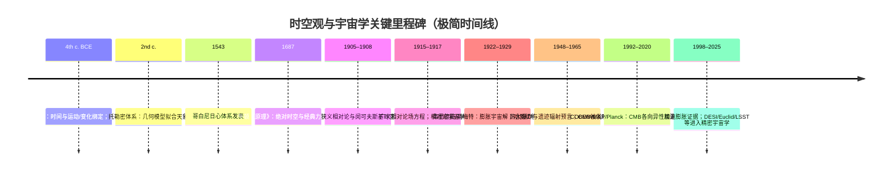

<!-- 每篇结构：1. 简单描述 2. 相关图 3. 分类:解读+表格 4. 详细专业论述  5. 实例:解读+表格 -->

<strong>全文目录</strong> (点击查看)

<!-- The 
 is for kramdown, which only partially supports HTML5-->

- [**一 宇宙学框架 Cosmological Framework**](#一-宇宙学框架-cosmological-framework)
  - [**宇宙 Universe**：包含所有时空、物质、能量及其相互作用的整体](#宇宙-universe包含所有时空物质能量及其相互作用的整体)
  - [**可观测宇宙 Observable universe**：在光速和宇宙年龄限制下，人类目前理论上可观测到的宇宙区域](#可观测宇宙-observable-universe在光速和宇宙年龄限制下人类目前理论上可观测到的宇宙区域)
  - [**时空 Spacetime**：将时间与空间统一描述的物理结构，是广义相对论的基本框架](#时空-spacetime将时间与空间统一描述的物理结构是广义相对论的基本框架)
  - [**宇宙学原理 Cosmological Principle**：宇宙空间分布是均匀且各向同性的基本假定](#宇宙学原理-cosmological-principle宇宙空间分布是均匀且各向同性的基本假定)
  - [**FLRW 度规 FLRW Metric**：描述满足宇宙学原理且随时间动态膨胀或收缩的齐次各向同性时空几何](#flrw-度规-flrw-metric描述满足宇宙学原理且随时间动态膨胀或收缩的齐次各向同性时空几何)
  - [**哈勃定律 Hubble–Lemaître law**：宇宙均匀膨胀，遥远星系的退行速度与距离成正比](#哈勃定律-hubblelemaître-law宇宙均匀膨胀遥远星系的退行速度与距离成正比)
  - [**临界密度 Critical Density**：使膨胀宇宙的空间几何恰好保持欧几里得平直状态所需的总能量密度阈值](#临界密度-critical-density使膨胀宇宙的空间几何恰好保持欧几里得平直状态所需的总能量密度阈值)
  - [**宇宙曲率 Spatial Curvature**：描述空间整体几何形状为封闭、平直或开放的拓扑属性](#宇宙曲率-spatial-curvature描述空间整体几何形状为封闭平直或开放的拓扑属性)
  - [**宇宙视界 Cosmological Horizons**：观测者在物理上能够接收信号或建立因果联系的时空边界](#宇宙视界-cosmological-horizons观测者在物理上能够接收信号或建立因果联系的时空边界)
    - [**粒子视界 particle horizon**：宇宙开始至今，光子在膨胀时空中所能传播的最大共动距离](#粒子视界-particle-horizon宇宙开始至今光子在膨胀时空中所能传播的最大共动距离)
    - [**事件视界 event horizon**：光信号能够到达观测者的最大时空界限](#事件视界-event-horizon光信号能够到达观测者的最大时空界限)
  - [**真空能 Vacuum Energy**：真空状态下仍然存在的最低能量](#真空能-vacuum-energy真空状态下仍然存在的最低能量)
  - [**宇宙学常数 Cosmological Constant**：驱动宇宙加速膨胀的“暗能量”来源](#宇宙学常数-cosmological-constant驱动宇宙加速膨胀的暗能量来源)
  - [**ΛCDM 模型的未解之谜**：当下观测与理论的差异](#λcdm-模型的未解之谜当下观测与理论的差异)
- [**宇宙热史 Cosmic History**](#宇宙热史-cosmic-history)
    - [**大爆炸模型 Big Bang Model**：描述宇宙起源及早期演化的宇宙学模型](#大爆炸模型-big-bang-model描述宇宙起源及早期演化的宇宙学模型)
    - [**普朗克时期 Planck Epoch**](#普朗克时期-planck-epoch)
    - [**大统一时期 Grand Unification Epoch**：强相互作用与电弱相互作用统一为同一规范相互作用的假想阶段（理论）](#大统一时期-grand-unification-epoch强相互作用与电弱相互作用统一为同一规范相互作用的假想阶段理论)
    - [**大暴胀 Cosmic Inflation**：早期宇宙经历的极短暂指数膨胀阶段](#大暴胀-cosmic-inflation早期宇宙经历的极短暂指数膨胀阶段)
    - [**夸克/轻子时期**](#夸克轻子时期)
    - [重子生成 Baryogenesis](#重子生成-baryogenesis)
    - [原初核合成 BBN](#原初核合成-bbn)
    - [复合 Recombination:](#复合-recombination)
    - [CMB 形成 Photon Decoupling / Last Scattering](#cmb-形成-photon-decoupling--last-scattering)
    - [**黑暗时代 Cosmic Dark Ages**：复合到第一批天体点亮之前](#黑暗时代-cosmic-dark-ages复合到第一批天体点亮之前)
    - [**再电离 Epoch of Reionization**](#再电离-epoch-of-reionization)
    - [**第一代恒星 Population III stars**](#第一代恒星-population-iii-stars)
    - [**暗能量主导期**](#暗能量主导期)
    - [**宇宙终极命运 Ultimate Fate of the Universe**：关于宇宙长期演化结局的理论描述](#宇宙终极命运-ultimate-fate-of-the-universe关于宇宙长期演化结局的理论描述)
- [**宇宙大尺度结构 LSS**](#宇宙大尺度结构-lss)
  - [**宇宙网 Cosmic Web**：暗物质主导形成的丝状与节点状分布网络](#宇宙网-cosmic-web暗物质主导形成的丝状与节点状分布网络)
    - [**丝状体 Cosmic Filaments**：连接星系团和超星系团的高密度物质带](#丝状体-cosmic-filaments连接星系团和超星系团的高密度物质带)
    - [墙/片层 Walls/Sheets](#墙片层-wallssheets)
    - [**空洞 Cosmic Voids**：星系密度极低的巨大空间区域](#空洞-cosmic-voids星系密度极低的巨大空间区域)
    - [**节点 node**](#节点-node)
  - [**超星系团 Superclusters**：由多个星系团、星系群及丝状体构成的大尺度结构](#超星系团-superclusters由多个星系团星系群及丝状体构成的大尺度结构)
  - [**星系团 Galaxy Clusters**：在引力束缚下聚集的大量星系系统](#星系团-galaxy-clusters在引力束缚下聚集的大量星系系统)
  - [**星系群 Galaxy Groups**：规模小于星系团的星系集合体](#星系群-galaxy-groups规模小于星系团的星系集合体)
  - [**巨引源 Great Attractor**：宇宙结构运动流线汇聚的重力焦点](#巨引源-great-attractor宇宙结构运动流线汇聚的重力焦点)
- [**星系系统 Galactic Systems**](#星系系统-galactic-systems)
  - [**星系 Galaxies**：由恒星、气体、尘埃、暗物质组成并受引力约束的系统](#星系-galaxies由恒星气体尘埃暗物质组成并受引力约束的系统)
    - [**椭圆星系 Elliptical Galaxies**：恒星分布平滑、气体含量低、恒星形成活动弱的星系类型](#椭圆星系-elliptical-galaxies恒星分布平滑气体含量低恒星形成活动弱的星系类型)
    - [**螺旋星系 Spiral Galaxies**：具有旋转盘面和旋臂结构的星系](#螺旋星系-spiral-galaxies具有旋转盘面和旋臂结构的星系)
    - [**棒旋星系 Barred Spiral Galaxies**：中心具有棒状恒星结构的螺旋星系](#棒旋星系-barred-spiral-galaxies中心具有棒状恒星结构的螺旋星系)
    - [透镜状星系 Lenticular Galaxies](#透镜状星系-lenticular-galaxies)
    - [**不规则星系 Irregular Galaxies**：缺乏明显几何对称结构的星系](#不规则星系-irregular-galaxies缺乏明显几何对称结构的星系)
    - [**矮星系 Dwarf Galaxies**：质量和体积显著小于典型星系的星系类型](#矮星系-dwarf-galaxies质量和体积显著小于典型星系的星系类型)
  - [**活动星系核 AGN**：](#活动星系核-agn)
    - [**类星体 Quasars**：中心黑洞吸积物质并释放极高能量的遥远活动星系核](#类星体-quasars中心黑洞吸积物质并释放极高能量的遥远活动星系核)
    - [**塞弗特星系 Seyfert Galaxies**：中心核区高能辐射明显但整体亮度较低的星系](#塞弗特星系-seyfert-galaxies中心核区高能辐射明显但整体亮度较低的星系)
    - [**耀变体 Blazar**](#耀变体-blazar)
  - [**射电星系 Radio Galaxies**：在射电波段辐射强烈的活动星系](#射电星系-radio-galaxies在射电波段辐射强烈的活动星系)
  - [霍格天体](#霍格天体)
  - [Cloud-9 (RELHIC)](#cloud-9-relhic)
  - [**星系际介质 IGM**：存在于星系之间的稀薄物质](#星系际介质-igm存在于星系之间的稀薄物质)
  - [环星系介质 CGM](#环星系介质-cgm)
  - [星系团内介质 ICM](#星系团内介质-icm)
- [**次级星系结构 Sub-galactic Structures**：星系的内部结构，在物理属性与演化中扮演重要角色](#次级星系结构-sub-galactic-structures星系的内部结构在物理属性与演化中扮演重要角色)
  - [星系中心 Galactic Center](#星系中心-galactic-center)
    - [银河系中心](#银河系中心)
    - [**核球 Bulge**：星系中心的高恒星密度区域，通常包含 SMBH 及被其引力支配的核星团](#核球-bulge星系中心的高恒星密度区域通常包含-smbh-及被其引力支配的核星团)
  - [**星系盘 Galactic Disk**： 旋涡星系的主要部分，包含大部分年轻恒星、气体和尘埃](#星系盘-galactic-disk-旋涡星系的主要部分包含大部分年轻恒星气体和尘埃)
  - [**旋臂 Spiral Arms**：盘内的高密度波，是恒星形成的活跃区](#旋臂-spiral-arms盘内的高密度波是恒星形成的活跃区)
  - [**星系棒 Bar**： 部分星系中心存在的贯穿核球的棒状恒星聚集结构，负责向中心输送气体](#星系棒-bar-部分星系中心存在的贯穿核球的棒状恒星聚集结构负责向中心输送气体)
  - [**星系晕 Galactic Halo**：包裹整个星系的球状区域，密度极低，分布着古老的球状星团和暗物质](#星系晕-galactic-halo包裹整个星系的球状区域密度极低分布着古老的球状星团和暗物质)
  - [**星团 Star Clusters**：星系中的恒星集群](#星团-star-clusters星系中的恒星集群)
    - [疏散星团 Open Clusters](#疏散星团-open-clusters)
    - [球状星团 Globular Clusters](#球状星团-globular-clusters)
  - [**星际介质 ISM**：存在于恒星之间的气体和尘埃](#星际介质-ism存在于恒星之间的气体和尘埃)
    - [**星际气体 Interstellar Gas**：以氢和氦为主的稀薄气体成分](#星际气体-interstellar-gas以氢和氦为主的稀薄气体成分)
    - [**星际尘埃 Interstellar Dust**：由微小固体颗粒组成的物质成分](#星际尘埃-interstellar-dust由微小固体颗粒组成的物质成分)
  - [**星际云 Interstellar Clouds**：比周围致密、云状气体与尘埃集合体](#星际云-interstellar-clouds比周围致密云状气体与尘埃集合体)
    - [**H I 云（H I cloud）**: 以中性原子氢为主的星际介质团块](#h-i-云h-i-cloud-以中性原子氢为主的星际介质团块)
    - [**分子云 Molecular Clouds**：恒星形成的主要场所](#分子云-molecular-clouds恒星形成的主要场所)
    - [**恒星形成区/H II 区 Star-forming Regions**：正在发生或即将发生恒星形成的区域](#恒星形成区h-ii-区-star-forming-regions正在发生或即将发生恒星形成的区域)
- [**恒星 Stars**](#恒星-stars)
  - [原恒星 Protostars](#原恒星-protostars)
  - [前主序星 PMS stars](#前主序星-pms-stars)
  - [T Tauri 星 T Tauri stars](#t-tauri-星-t-tauri-stars)
  - [棕矮星 Brown Dwarfs](#棕矮星-brown-dwarfs)
  - [**主序星 Main Sequence Stars**：处于稳定氢聚变阶段的恒星](#主序星-main-sequence-stars处于稳定氢聚变阶段的恒星)
  - [**红矮星 Red Dwarfs**：质量低、温度低、寿命极长的恒星](#红矮星-red-dwarfs质量低温度低寿命极长的恒星)
  - [**红巨星 Red Giants**：核心氢耗尽后体积显著膨胀的恒星](#红巨星-red-giants核心氢耗尽后体积显著膨胀的恒星)
  - [**蓝巨星 Blue Giants**：质量大、温度高、光度强的恒星](#蓝巨星-blue-giants质量大温度高光度强的恒星)
  - [**超巨星 Supergiants**：质量和体积极大的晚期演化恒星](#超巨星-supergiants质量和体积极大的晚期演化恒星)
  - [**沃尔夫-拉叶星 Wolf-Rayet stars**：大质量、强恒星风、外层剥离显著的演化阶段恒星](#沃尔夫-拉叶星-wolf-rayet-stars大质量强恒星风外层剥离显著的演化阶段恒星)
  - [**变星 Variable Stars**：从地球上观察其亮度有起伏变化的恒星](#变星-variable-stars从地球上观察其亮度有起伏变化的恒星)
  - [双星与多星系统 Binary and Multiple Systems](#双星与多星系统-binary-and-multiple-systems)
- [**高能与瞬变天体 High-energy and Transient Objects**](#高能与瞬变天体-high-energy-and-transient-objects)
  - [**行星状星云 Planetary Nebulae (PNe)**：恒星晚期抛射气体形成的发光结构](#行星状星云-planetary-nebulae-pne恒星晚期抛射气体形成的发光结构)
  - [**超新星 Supernovae**：恒星在演化末期发生的剧烈爆发现象](#超新星-supernovae恒星在演化末期发生的剧烈爆发现象)
  - [**超新星遗迹 Supernova Remnants (SNRs)**：超新星爆发后膨胀的气体与能量结构](#超新星遗迹-supernova-remnants-snrs超新星爆发后膨胀的气体与能量结构)
  - [**千新星 Kilonovae**：双中子星或中子星与黑洞并合产生的瞬变天文现象](#千新星-kilonovae双中子星或中子星与黑洞并合产生的瞬变天文现象)
  - [**伽马射线暴 Gamma-ray Bursts (GRBs)**：短时间内释放极高能量的宇宙事件](#伽马射线暴-gamma-ray-bursts-grbs短时间内释放极高能量的宇宙事件)
  - [**快速射电暴 Fast Radio Bursts (FRBs)**：持续毫秒级的高亮度射电脉冲](#快速射电暴-fast-radio-bursts-frbs持续毫秒级的高亮度射电脉冲)
  - [相对论喷流 Relativistic Jets](#相对论喷流-relativistic-jets)
  - [潮汐瓦解事件 Tidal Disruption Events, TDEs](#潮汐瓦解事件-tidal-disruption-events-tdes)
- [**恒星残骸 Stellar Remnants**：恒星生命结束后留下的核心](#恒星残骸-stellar-remnants恒星生命结束后留下的核心)
  - [**白矮星 White Dwarfs**：低至中等质量恒星演化终点形成的致密天体](#白矮星-white-dwarfs低至中等质量恒星演化终点形成的致密天体)
    - [**黑矮星 Black Dwarfs**：冷却的白矮星（理论）](#黑矮星-black-dwarfs冷却的白矮星理论)
  - [**中子星 Neutron Stars**：由超新星爆发后形成的超高密度恒星残骸](#中子星-neutron-stars由超新星爆发后形成的超高密度恒星残骸)
    - [**脉冲星 Pulsars**：高速自转并发射周期性电磁辐射的中子星](#脉冲星-pulsars高速自转并发射周期性电磁辐射的中子星)
    - [**磁星 Magnetars**：具有极强磁场的中子星类型](#磁星-magnetars具有极强磁场的中子星类型)
  - [**黑洞 Black Holes**：时空曲率大到光都无法从其事件视界逃脱的致密天体](#黑洞-black-holes时空曲率大到光都无法从其事件视界逃脱的致密天体)
    - [**恒星级黑洞 Stellar-mass Black Holes**：由大质量恒星坍缩形成的黑洞](#恒星级黑洞-stellar-mass-black-holes由大质量恒星坍缩形成的黑洞)
    - [**中等质量黑洞 Intermediate-Mass Black Holes （IMBHs）**：质量介于恒星级与超大质量之间的黑洞](#中等质量黑洞-intermediate-mass-black-holes-imbhs质量介于恒星级与超大质量之间的黑洞)
    - [**超大质量黑洞 Supermassive Black Holes, SMBHs**：位于星系中心、质量极大的黑洞](#超大质量黑洞-supermassive-black-holes-smbhs位于星系中心质量极大的黑洞)
    - [**原初黑洞 Primordial Black Hole**：早期宇宙中直接形成的黑洞（理论）](#原初黑洞-primordial-black-hole早期宇宙中直接形成的黑洞理论)
  - [**夸克星/奇异星 Quark Star/Strange Star**：去禁闭的夸克物质态天体（理论）](#夸克星奇异星-quark-starstrange-star去禁闭的夸克物质态天体理论)
  - [**预子星 Preon Star**：比夸克更基本的物质态天体（理论）](#预子星-preon-star比夸克更基本的物质态天体理论)
  - [**Thorne–Żytkow Object**：中子星核包裹在一个红超巨星内部（理论）](#thorneżytkow-object中子星核包裹在一个红超巨星内部理论)
  - [**暗能量星 Dark-energy Star**：充满负压真空能的致密球体（理论）](#暗能量星-dark-energy-star充满负压真空能的致密球体理论)
- [**行星系统 Planetary Systems**](#行星系统-planetary-systems)
  - [原行星盘 Protoplanetary Disks](#原行星盘-protoplanetary-disks)
  - [**行星 Planets**：绕恒星运行且自身不发生核聚变的天体](#行星-planets绕恒星运行且自身不发生核聚变的天体)
    - [**类地行星 Terrestrial Planets**：以岩石和金属为主要成分的行星](#类地行星-terrestrial-planets以岩石和金属为主要成分的行星)
    - [**气态巨行星 Gas Giants**：主要由氢氦构成、体积巨大的行星](#气态巨行星-gas-giants主要由氢氦构成体积巨大的行星)
    - [**冰巨行星 Ice Giants**：富含挥发性冰物质的巨行星](#冰巨行星-ice-giants富含挥发性冰物质的巨行星)
  - [**系外行星 Exoplanets**：位于太阳系之外、绕其他恒星运行的行星](#系外行星-exoplanets位于太阳系之外绕其他恒星运行的行星)
    - [**碳行星**：以碳化物与碳相为主的行星](#碳行星以碳化物与碳相为主的行星)
    - [**烟灰行星 Soot Planets**：表面被厚重有机雾霾笼罩的系外行星](#烟灰行星-soot-planets表面被厚重有机雾霾笼罩的系外行星)
  - [矮行星 Dwarf Planets](#矮行星-dwarf-planets)
  - [**（天然）卫星 Natural Satellites (Moons):**：绕行星运行的天体](#天然卫星-natural-satellites-moons绕行星运行的天体)
  - [**行星环 Planetary Rings**：由大量小颗粒组成并绕行星分布的结构](#行星环-planetary-rings由大量小颗粒组成并绕行星分布的结构)
  - [**小行星 Asteroids**：主要分布于行星轨道之间的岩石天体](#小行星-asteroids主要分布于行星轨道之间的岩石天体)
  - [**彗星 Comets**：含挥发性物质并在接近恒星时产生彗发的天体](#彗星-comets含挥发性物质并在接近恒星时产生彗发的天体)
  - [**流星体 流星体、流星、陨石 Meteoroids**：在行星际空间运动的小型固体天体](#流星体-流星体流星陨石-meteoroids在行星际空间运动的小型固体天体)
- [太阳系](#太阳系)
  - [太阳](#太阳)
  - [行星与卫星](#行星与卫星)
    - [水星](#水星)
    - [金星](#金星)
    - [地球](#地球)
    - [火星](#火星)
    - [木星](#木星)
    - [土星](#土星)
    - [天王星](#天王星)
    - [海王星](#海王星)
  - [矮行星](#矮行星)
  - [小行星带](#小行星带)
  - [海王星外天体 TNOs](#海王星外天体-tnos)
  - [柯伊伯带](#柯伊伯带)
  - [奥尔特云](#奥尔特云)
- [观测宇宙的证据与方法 Observational Probes](#观测宇宙的证据与方法-observational-probes)
  - [**宇宙微波背景辐射 CMB**：宇宙辐射底噪与宇宙史记忆](#宇宙微波背景辐射-cmb宇宙辐射底噪与宇宙史记忆)
  - [**重子声学振荡 BAO**：从早期声学到晚期几何的“标准尺”](#重子声学振荡-bao从早期声学到晚期几何的标准尺)
  - [红移 Redshift](#红移-redshift)
    - [不同红移下的宇宙](#不同红移下的宇宙)
  - [光谱学 Spectroscopy](#光谱学-spectroscopy)
  - [距离阶梯 Cosmic Distance Ladder](#距离阶梯-cosmic-distance-ladder)
  - [Ia 型超新星 Type Ia Supernovae](#ia-型超新星-type-ia-supernovae)
  - [引力透镜 Gravitational Lensing](#引力透镜-gravitational-lensing)
  - [星系巡天 Galaxy Surveys](#星系巡天-galaxy-surveys)
  - [引力波](#引力波)
    - [引力波标准警报器 Standard Sirens](#引力波标准警报器-standard-sirens)
  - [**X 射线源 X-ray Sources**：主要在 X 射线波段辐射的天体](#x-射线源-x-ray-sources主要在-x-射线波段辐射的天体)
  - [宇宙线 Cosmic Rays](#宇宙线-cosmic-rays)
  - [中微子天文学 Neutrino Astronomy](#中微子天文学-neutrino-astronomy)
  - [多信使天文学 Multi-messenger Astronomy](#多信使天文学-multi-messenger-astronomy)
- [**基本物质形态**](#基本物质形态)
  - [**普通物质（重子物质）Normal Matter (Baryonic Matter)**：由质子和中子组成的可直接观测物质](#普通物质重子物质normal-matter-baryonic-matter由质子和中子组成的可直接观测物质)
    - [**原子 Atoms**：由原子核和电子构成的基本化学单位](#原子-atoms由原子核和电子构成的基本化学单位)
    - [**离子 Ions**：失去或获得电子而带电的原子或分子](#离子-ions失去或获得电子而带电的原子或分子)
    - [**分子 Molecules**：由多个原子通过化学键结合形成的结构](#分子-molecules由多个原子通过化学键结合形成的结构)
    - [**等离子体 Plasma**：高度电离、整体呈现集体行为的物质状态](#等离子体-plasma高度电离整体呈现集体行为的物质状态)
  - [**暗物质 Dark Matter**：不参与电磁相互作用但具有引力效应的物质成分](#暗物质-dark-matter不参与电磁相互作用但具有引力效应的物质成分)
  - [**暗能量 Dark Energy**：驱动宇宙加速膨胀的未知能量成分](#暗能量-dark-energy驱动宇宙加速膨胀的未知能量成分)
- [**基本粒子与场**](#基本粒子与场)
  - [**基本粒子 Elementary Particles**：不可再分的物质与力的基本构成单元](#基本粒子-elementary-particles不可再分的物质与力的基本构成单元)
    - [**夸克 Quarks**：构成强子并参与强相互作用的基本粒子](#夸克-quarks构成强子并参与强相互作用的基本粒子)
    - [**轻子 Leptons**：不参与强相互作用的一类基本粒子](#轻子-leptons不参与强相互作用的一类基本粒子)
    - [强子 Hadrons](#强子-hadrons)
    - [重子 Baryons](#重子-baryons)
    - [介子 Mesons](#介子-mesons)
    - [光子 Photon](#光子-photon)
    - [中微子 Neutrinos](#中微子-neutrinos)
    - [**玻色子 Bosons**：自旋为整数的粒子，包括规范玻色子与希格斯玻色子](#玻色子-bosons自旋为整数的粒子包括规范玻色子与希格斯玻色子)
    - [希格斯玻色子 Higgs boson](#希格斯玻色子-higgs-boson)
  - [**相互作用 Fundamental Interactions**](#相互作用-fundamental-interactions)
    - [**引力 Gravity**：描述质量与能量导致时空曲率的基本相互作用](#引力-gravity描述质量与能量导致时空曲率的基本相互作用)
    - [**电磁力 Electromagnetism**：作用于带电粒子的相互作用](#电磁力-electromagnetism作用于带电粒子的相互作用)
    - [**强相互作用 Strong Interaction**：束缚夸克形成强子的作用](#强相互作用-strong-interaction束缚夸克形成强子的作用)
    - [**弱相互作用 Weak Interaction**：导致粒子衰变的相互作用](#弱相互作用-weak-interaction导致粒子衰变的相互作用)
  - [**量子场 Quantum Fields**：在量子理论中描述粒子存在与相互作用的基本实体](#量子场-quantum-fields在量子理论中描述粒子存在与相互作用的基本实体)
- [**理论与假设实体**](#理论与假设实体)
  - [**奇点 Singularity**：物理量在理论中趋于无穷大的时空点](#奇点-singularity物理量在理论中趋于无穷大的时空点)
  - [**视界 Event Horizon**：信息无法从其内部传递到外部的边界](#视界-event-horizon信息无法从其内部传递到外部的边界)
  - [**虚粒子 Virtual Particles**：量子场论中用于描述相互作用的计算实体](#虚粒子-virtual-particles量子场论中用于描述相互作用的计算实体)
  - [**拓扑缺陷 Topological Defects**](#拓扑缺陷-topological-defects)
    - [**宇宙弦 Cosmic Strings**：早期宇宙相变可能产生的线状结构](#宇宙弦-cosmic-strings早期宇宙相变可能产生的线状结构)
    - [**磁单极子 Magnetic Monopoles**：假设存在的单极磁荷粒子](#磁单极子-magnetic-monopoles假设存在的单极磁荷粒子)
    - [**畴壁 Domain Walls**：不同真空态区域之间的界面结构](#畴壁-domain-walls不同真空态区域之间的界面结构)

 

# **一 宇宙学框架 Cosmological Framework**

现代宇宙学，作为人类智识探索中最为宏大的理论建构之一，其核心抱负在于：用有限的物理定律和可观测的物质现象，去描述整个可观测宇宙从极早期高温高密状态直至今日星系成网之间的完整演化历程。这是一门从根本上联结了广义相对论、热力学与统计力学、量子场论、粒子物理学以及天体物理观测的交叉学科，其内在结构的一致性令人叹服，而其尚未解决的问题又揭示了人类知识边界的深刻轮廓。要进入这个领域，必须首先理解它所采用的基本框架假设，并认识到这些假设本身并非先验给定的，而是在理论简洁性与观测符合性之间达成的某种张力平衡的产物。

宇宙学最核心的基础假设是宇宙学原理，即在足够大的尺度上，宇宙在空间上是均匀且各向同性的。这一命题并非显而易见。在我们所能直接观察的范围内，宇宙充满了令人眼花缭乱的结构：行星、恒星、星系、星系团乃至超星系团，以及连接它们的巨型宇宙纤维结构和介于其间的巨洞。然而，当我们把目光投向超过数亿光年的尺度时，这些结构开始平滑化，宇宙微波背景辐射的高度各向同性——其温度在天空各个方向的起伏仅约十万分之一——为这一大尺度均匀性提供了迄今最为精确的经验支撑。宇宙学原理与广义相对论相结合，给出了一个唯一确定的时空度规形式，即罗伯逊-沃尔克（Robertson-Walker）度规。

罗伯逊-沃尔克度规的推导建立在纯几何学论证之上，其结果是：任何满足均匀各向同性条件的三维空间度规只有三种可能的几何类型，分别对应正曲率（球面几何）、负曲率（双曲几何）和零曲率（欧氏几何），由曲率参数 $K = +1, -1, 0$ 加以区分，而将这一空间度规嵌入四维时空后，则引入了依赖于宇宙时间的尺度因子 $a(t)$，给出线元

$$d\tau^2 = dt^2 - a^2(t)\left[\frac{dr^2}{1-Kr^2} + r^2 d\Omega\right]$$

如温伯格在其《宇宙学》中所详细推导的，这一度规具有一个深刻的物理含义：处于共动坐标系中的观测者（即随宇宙膨胀整体运动的理想观测者）之间的固有距离正比于 $a(t)$，因而 $a(t)$ 的增长直接意味着宇宙的膨胀，而 $\dot{d} = d\dot{a}/a$ 则表明固有距离的增长速率与距离本身成正比，这正是哈勃定律的几何起源。值得注意的是，光子在这一时空中传播时其动量与 $1/a(t)$ 成反比衰减，这意味着光子的波长随宇宙膨胀而被拉伸——这就是宇宙学红移的本质，不应被简单地类比为多普勒效应，因为它是时空几何本身膨胀的结果，而非光源相对于观测者的局域运动。

哈勃定律的发现——即遥远星系的退行速度与其到我们的距离之间存在线性正比关系 $v = H_0 d$——是二十世纪天文学最重大的经验发现之一，其概念意义远超其字面含义：它表明宇宙在动态演化，而非静止不变，这从根本上颠覆了此前主流的宇宙静态图像，并强烈暗示宇宙起源于某个过去的密度奇点，即所谓的大爆炸。哈勃常数 $H_0$ 的精确测量在过去数十年间经历了极大的变动。在哈勃本人时代，其测定值约为 $500\,\mathrm{km\,s^{-1}\,Mpc^{-1}}$，此后随着造父变星、超新星等距离标尺的不断校准而持续修正，哈勃空间望远镜的观测将其约束在 $72\pm8\,\mathrm{km\,s^{-1}\,Mpc^{-1}}$，而近年来基于 Planck 卫星宇宙微波背景数据的间接测定给出 $H_0 \approx 67.4\,\mathrm{km\,s^{-1}\,Mpc^{-1}}$，与基于 Cepheid 变星和 Ia 型超新星梯度法的直接测量值 $\approx 73\,\mathrm{km\,s^{-1}\,Mpc^{-1}}$ 之间存在约四到五个标准差的系统性张力，这一"哈勃张力"至今是宇宙学中最重要的开放问题之一，其来源可能指向超越标准宇宙学模型的新物理。

宇宙的动力学演化由爱因斯坦场方程将度规与物质内容联系起来加以描述。将罗伯逊-沃尔克度规代入场方程后，得到弗里德曼方程组，其中第一个方程

$$H^2 \equiv \left(\frac{\dot{a}}{a}\right)^2 = \frac{8\pi G}{3}\rho - \frac{K}{a^2} + \frac{\Lambda}{3}$$

以最简洁的形式整合了宇宙的膨胀率、总物质-能量密度 $\rho$、空间曲率 $K$ 以及宇宙学常数 $\Lambda$ 之间的关系，而第二个弗里德曼方程则给出加速度：

$$\frac{\ddot{a}}{a} = -\frac{4\pi G}{3}(\rho + 3p) + \frac{\Lambda}{3}$$

这里 $p$ 是压强，$(+)$号前的条件 $\rho + 3p > 0$ 对应减速膨胀，而当宇宙中存在使 $p < -\rho/3$ 的成分时，膨胀则会加速。能量守恒则给出

$$\dot{\rho} + 3H(\rho + p) = 0$$

这一组方程的物理内涵极为深刻。它告诉我们，宇宙的命运完全由其物质与能量成分的状态方程 $w \equiv p/\rho$ 决定：辐射（光子与极端相对论性粒子）的 $w = 1/3$，其能量密度随 $a^{-4}$ 衰减；物质（非相对论性粒子）的 $w \approx 0$，其能量密度随 $a^{-3}$ 衰减；真空能（宇宙学常数）具有 $w = -1$，其能量密度不随膨胀改变。这三种成分的不同稀释率意味着宇宙历史上必然经历了从辐射主导到物质主导，再到今日暗能量主导的三个动力学时代，这一演化序列在观测上留下了精确可测的印记。

宇宙微波背景辐射（CMB）是理解大爆炸宇宙学最关键的观测窗口，其重要性在于它所携带的信息来自宇宙的极早期，且其物理解释拥有极为坚实的理论基础。在大爆炸后约 37.8 万年，宇宙温度降至约 3000 K，氢核与自由电子结合形成中性氢原子，宇宙对光子变得透明——这一时刻称为复合时期，也是光子最后一次散射（最后散射面）的时期。此后，这些光子自由穿行于宇宙之中，随着宇宙膨胀其温度以 $T \propto 1/a$ 的规律降低，今日测得的温度约为 $2.7255\,\mathrm{K}$，对应一个极为精确的黑体辐射谱。1989 年 COBE 卫星的光谱仪测量以前所未有的精度确认了这一热谱性质，其偏离黑体谱的上限极低，这一事实本身就是对早期宇宙曾处于热力学平衡的有力佐证。

CMB 最丰富的信息储存在其温度各向异性之中。COBE 卫星首先探测到这些涨落，随后地面及气球实验进一步精化，最终 WMAP 和 Planck 卫星提供了全天覆盖的高精度各向异性图谱。将温度涨落 $\delta T/T$ 按球谐函数 $Y_{\ell m}$ 展开，角功率谱 $C_\ell$ 编码了在角尺度 $\sim\pi/\ell$ 上的涨落强度，其中 $\ell$ 为多极矩指数。这一功率谱展现出一系列声学峰（acoustic peaks），其位置和相对高度包含了极为丰富的宇宙学参数信息。第一声学峰位于 $\ell \approx 220$，对应角径约为一度，其角度位置精确确定了宇宙几何为近平坦（$\Omega_\mathrm{tot} \approx 1$）；奇数峰（压缩峰）与偶数峰（稀疏峰）高度之比反映了重子物质与光子的比例；峰的整体包络揭示了物质与辐射的相对含量；声学峰衰减的细节（Silk 阻尼）则反映了重子-光子流体的扩散尺度。这一整套信息与冷暗物质-宇宙学常数（$\Lambda$CDM）模型的理论预言吻合得极为精确，为现代宇宙学标准模型提供了迄今最有力的验证。

CMB 各向异性的理论描述是现代宇宙学技术性最强的领域之一。在线性微扰论框架下，对均匀宇宙背景的微小偏离可按其变换性质分解为标量、矢量和张量扰动，其中标量扰动（密度和压力涨落）与观测到的温度涨落关系最为直接，张量扰动对应原初引力波。温伯格在其专著中从基本原理出发，严格推导了温度涨落的一般表达式，这包含了来自最后散射面的直接贡献（Sachs-Wolfe 效应、多普勒效应和本征温度涨落），以及光子在从最后散射面到今日传播过程中穿越变化引力势时积累的贡献，即积分 Sachs-Wolfe（ISW）效应。前者主要产生 $\ell > 20$ 的小角度涨落，而后者在宇宙从物质主导转变为暗能量主导的时期贡献显著，主要影响 $\ell < 20$ 的大角度端，是宇宙学常数对 CMB 功率谱留下独特印记的物理机制之一。

理解声学峰的物理图像需要追溯到重子-光子紧耦合时期。在复合之前，重子（质子与电子）通过汤姆逊散射与光子紧密耦合，共同构成一种相对论性流体。在这种流体中，引力不均匀性驱动的密度涨落产生压力梯度，形成以声速 $c_s \approx c/\sqrt{3}$ 传播的压缩波，即重子声学振荡（BAO）。当宇宙在复合时突然对光子透明时，这些声波被"冻结"在最后散射面上，其波长与宇宙学参数精确相关。声学尺度 $r_s$ 定义为复合时刻的声速视界（音速范围），其理论计算值约为 150 Mpc，已成为宇宙学中一把标准尺，可用于测量不同红移处的角径距离和哈勃参数，从而独立约束宇宙的膨胀历史。BAO 不仅在 CMB 中留下印记，也在大尺度星系分布的两点相关函数中产生可检测的特征峰，于 2005 年首次由斯隆数字巡天（SDSS）和 2dF 星系红移巡天数据所确认，这是宇宙学观测精确化时代的重要里程碑。

宇宙中的物质成分问题揭示了当代物理学最深刻的谜题之一。现代宇宙学测量表明，在宇宙总能量密度中，普通重子物质（由夸克和轻子构成的标准模型物质）仅占约 $4.9\%$，而某种不与电磁辐射相互作用的"冷暗物质"约占 $26.8\%$，暗能量（以宇宙学常数形式出现）约占 $68.3\%$。暗物质的存在有多条独立观测证据：星系旋转曲线的扁平化表明星系外围存在延伸的质量分布，远超可见恒星的贡献；星系团中的热气体、引力透镜效应以及星系团碰撞（如著名的子弹星系团）都指向大量不发光质量的存在；宇宙学核合成对重子密度的约束与 CMB 各向异性对总物质密度的约束相结合，给出了暗物质非重子性质的独立证明。冷暗物质（CDM）模型假设暗物质粒子在结构形成时代是非相对论性的，这使它们得以在小尺度上聚集，驱动宇宙大尺度结构由小到大的层级式形成，理论预言的物质功率谱与星系巡天观测吻合良好。然而暗物质的粒子物理本质迄今不明，大型强子对撞机和各类直接、间接探测实验尚未在标准模型之外发现任何可信的暗物质信号，这是粒子物理与宇宙学交叉最紧张的前沿之一。

宇宙学核合成（BBN）为大爆炸宇宙学提供了仅次于 CMB 的最重要支柱。在大爆炸后约 1 秒到 3 分钟之间，宇宙温度处于 $10^{10}$ K 到 $10^9$ K 之间，此时中子与质子的弱作用平衡被冻结，核合成过程开始。最终约 $25\%$（质量分数）的重子物质被合成为氦-4，少量合成为氘、氦-3 和锂-7，其余大部分保留为氢。这一预言以极少的自由参数（主要是重子-光子数比 $\eta \equiv n_B/n_\gamma \approx 6.1 \times 10^{-10}$）重现了宇宙中轻元素的观测丰度，特别是氘与氢的比值 $D/H \approx 2.5 \times 10^{-5}$ 对 $\eta$ 极为敏感，由此独立测定的重子密度 $\Omega_B h^2 \approx 0.022$ 与 CMB 测量值高度一致，这种来自完全不同物理时期的独立约束的汇聚正是标准大爆炸宇宙学成功的标志性特征。值得注意的是，锂-7 的观测丰度相对于理论预言存在约三倍的系统性偏低，即所谓的"宇宙学锂问题"，这可能指向核合成期间的非标准过程或恒星大气中锂的消耗机制，目前尚无定论。

早期宇宙的热历史在温度高于核合成时期时进入更为复杂的物理域。当温度超过约 $10^{12}$ K（即 $\sim 100$ MeV，对应大爆炸后约 $10^{-5}$ 秒）时，重子与反重子乃至各种强子和轻子处于热力学平衡中。QCD 相变（即夸克-胶子等离子体向强子物质的相变）发生于此温度附近，为宇宙早期演化的重要节点。在更高温度下，电弱相变（约 $10^{15}$ K，$\sim 100$ GeV）标志着电弱对称性自发破缺，赋予了标准模型粒子以质量。宇宙学中一个极为深刻的问题是重子不对称性起源：今日宇宙中物质相对于反物质的显著超额。要产生这一不对称性，萨哈罗夫（Sakharov）于 1967 年提出了三个必要条件：重子数不守恒、C 与 CP 对称性破坏以及偏离热力学平衡的过程。标准模型中存在重子数不守恒（通过电弱散射子"sphaleron"过程）和 CP 破坏（通过 CKM 矩阵），但其强度似乎不足以解释观测到的重子-反重子比，这促使研究者探索超越标准模型的重子合成（baryogenesis）机制，轻子合成（leptogenesis）——通过重的马约拉纳型中微子的 CP 非守恒衰变产生轻子不对称性，再经 sphaleron 过程转化为重子不对称——是当前最受关注的理论框架之一。

宇宙暴胀理论是二十世纪八十年代以来宇宙学理论最重要的进展，也是迄今最具解释力而又最难直接验证的理论构建。标准大爆炸模型面临若干内在的逻辑困难：其一是视界问题，即 CMB 在天空中相互之间在因果上不应相连的区域之间温度却极为一致，无法用简单的热传导解释；其二是平坦性问题，即宇宙今日空间曲率极接近于零要求初始条件被精确微调到惊人程度；其三是磁单极子问题，大统一理论预言的超重磁单极子在标准大爆炸框架下应大量产生，但实际上从未被观测到。暴胀理论（Guth，1981；Linde，Albrecht-Steinhardt，1982）的核心思想是：在极早期宇宙中，某种标量场（暴胀子）处于缓慢滚动的势能主导状态，此时宇宙学常数 $\Lambda$ 等效量驱动接近指数式的极快速膨胀，在极短时间内使宇宙的线度增大了至少 $e^{60}$ 倍。这一剧烈的体积增长自然地将任何预先存在的曲率、磁单极子密度和视界尺度稀释至不可测量的水平，从而一举解决了上述三个困难。

然而暴胀理论的最深刻意义并不仅在于解决了这些"微调问题"，而在于它提供了一个生成原初密度涨落的量子力学机制。在暴胀期间，驱动暴胀的标量场的量子真空涨落（zero-point fluctuations）被宇宙学尺度的膨胀拉伸到超视界尺度，"冻结"成为经典密度涨落，成为宇宙大尺度结构和 CMB 各向异性的种子。这一机制的关键预言是：原初密度涨落应具有接近标度不变（Harrison-Zel'dovich）的功率谱，即 $\mathcal{P}(k) \propto k^{n_s - 1}$，谱指数 $n_s \approx 1$；同时，单场慢滚暴胀预言这些扰动应以绝热模式为主。CMB 观测已精确确认 $n_s \approx 0.965$，略小于 1，与慢滚暴胀的预言高度相符。此外，暴胀还预言应存在原初引力波（张量扰动），其强度相对于标量扰动的比值（张量-标量比 $r$）依赖于暴胀势的具体形态，$r$ 的检测——主要通过 CMB 偏振中的 B 模式——是当前和未来实验最重要的目标之一。目前 BICEP/Keck 等实验给出 $r < 0.036$（95\% 置信水平），已排除了一大类较大场暴胀模型，但尚未发现正信号。

温伯格的专著用相当大的篇幅处理宇宙扰动的正式理论，这是连接早期宇宙的原初条件与晚期宇宙观测（CMB 和大尺度结构）之间的技术核心。其关键概念之一是在视界尺度（$q/a \ll H$）之外守恒的规范不变量：曲率扰动 $\mathcal{R}_q$ 和 $\zeta_q$。这两个量在单流体近似下等价，其重要性在于，在扰动波长超越哈勃视界之后的漫长演化过程中，无论宇宙的物质成分如何变化，只要扰动是绝热的，$\mathcal{R}_q$ 就保持不变。这一守恒定理由温伯格本人在其专著和相关研究论文中给出了严格证明，使得暴胀期间生成的原初扰动谱可以被无歧义地传递到复合时期，而无需详细跟踪中间宇宙学历史（如重加热）的复杂细节，大大简化了理论预言与观测的比较。值得注意的是，多场暴胀模型可以产生非绝热（熵）扰动，打破这一守恒，但观测上 CMB 各向异性的相位关系强烈支持扰动以绝热模式为主。

宇宙大尺度结构的形成理论将扰动的线性增长与引力非线性塌缩联系起来，是宇宙学与星系天文学的接口。在物质主导时代，密度涨落 $\delta \equiv \delta\rho/\bar{\rho}$ 满足增长方程

$$\ddot{\delta} + 2H\dot{\delta} = 4\pi G \bar{\rho} \delta$$

其中哈勃摩擦项 $2H\dot{\delta}$ 来自宇宙膨胀，这区分了宇宙学情形与静态自引力不稳定性（Jeans 不稳定性）的根本差异：在一个膨胀的宇宙中，密度涨落的增长是幂律而非指数式的。在物质主导时代，增长因子 $D_+ \propto a(t)$，这意味着自最后散射至今，密度涨落可增大约 1000 倍，而 CMB 中只有约 $10^{-5}$ 量级的温度涨落——这一矛盾要求冷暗物质早于重子物质开始引力塌缩，在复合前已积累了显著的扰动增长，构成引力势阱供复合后的重子物质落入，从而成功解释了 CMB 平滑而宇宙结构粗糙之间的表观矛盾。这一论证是冷暗物质模型最有力的理论支撑之一。

在线性理论失效之后，密度涨落进入非线性区域，形成引力束缚结构。球形塌缩模型（spherical collapse model）是分析非线性结构形成的最简单近似：当一个球对称区域的过密度超过临界值 $\delta_c \approx 1.686$ 时，该区域脱离哈勃膨胀流，开始自引力坍缩，最终弛豫到动力学平衡（维里化）状态，形成暗物质晕。Press-Schechter 理论及其后续改进利用这一临界密度和初始功率谱对不同质量暗物质晕的数密度分布（晕质量函数）作出定量预言，这与 N 体数值模拟的结果相当吻合，并在大型星系巡天数据中得到了广泛验证。宇宙网（cosmic web）的丝状结构、星系墙和巨洞则是 N 体模拟在更大尺度上自洽再现的宇宙学特征，其拓扑形态也已成为新一代测量宇宙学参数（特别是中微子质量）的统计工具。

引力透镜效应——光线在经过质量分布附近时被弯曲的现象——是将宇宙学理论与直接质量测量联结起来的独特工具。强引力透镜（产生可见弧和多重像）用于测量星系和星系团的质量分布；弱引力透镜（宇宙剪切）统计性地测量大量星系像的形状扭曲，是直接探测暗物质大尺度分布的最干净方法之一，不依赖于光与物质分布之间的关系假设（偏袒因子）。温伯格在其专著中将引力透镜的处理放在最后，正是因为其最重要的宇宙学应用——弱引力透镜对大尺度结构的层析测量——是从单纯观测扰动的统计演化到三维质量分布重建的关键一步。当前和未来大规模巡天项目（如 Euclid、Rubin 天文台 LSST）的核心科学目标之一便是利用弱引力透镜约束暗能量状态方程及其演化。

宇宙加速膨胀的发现是近代宇宙学中最震撼人心的经验发现，其根源是 Ia 型超新星的标准烛光测量。由于白矮星热核爆发的物理机制相对稳定，Ia 型超新星的峰值光度经光变曲线宽度-亮度关系校正后具有高度一致性，可作为可靠的标准烛光。1998 年，Riess 等人和 Perlmutter 等人领导的两个独立小组利用高红移 Ia 型超新星观测，发现远处超新星比在减速膨胀宇宙模型下所预期的更暗，意味着宇宙膨胀正在加速。这一结论要求弗里德曼方程右端存在使 $\ddot{a} > 0$ 的成分，即 $p < -\rho/3$ 的"暗能量"，宇宙学常数 $\Lambda$（对应 $w = -1$）是最简单的候选。加速膨胀的发现随后被 CMB 和 BAO 数据独立证实，三者的汇聚构成了 $\Lambda$CDM 标准模型最强有力的观测基础。然而暗能量的物理本质至今是物理学最深刻的谜题之一。从量子场论的角度，宇宙学常数对应真空能量密度，但理论计算值与观测值之间存在高达 $10^{120}$ 量级的巨大差异（宇宙学常数问题），这是迄今理论物理最严重的精度失配，暗示我们对量子引力本质的理解存在根本缺口。是否存在随时间演化的暗能量（quintessence 型标量场，$w \neq -1$）？宇宙学常数是否只是选择效应（人择原理）或某种更深层真空结构的体现？这些问题的答案将深刻影响物理学的未来走向。

中微子在宇宙学中扮演着跨越粒子物理与宇宙学的独特角色。中微子振荡实验确认中微子具有非零质量，但绝对质量尺度尚待测定。即便是亚电子伏特量级的中微子质量也会因其相对论性自由流动（free-streaming）而抹去小尺度物质涨落，在物质功率谱中留下可辨识的压制特征。目前来自 CMB 加 BAO 加大尺度结构测量的组合约束给出中微子质量之和 $\sum m_\nu < 0.12$ eV（Planck，2018），这是实验室实验难以企及的极高灵敏度，展示了宇宙学作为粒子物理探针的独特力量。

在理论结构层面，宇宙学的数学框架之所以能够发挥如此强大的解释力，根本原因在于线性微扰论的适用性范围出人意料地宽广。只要扰动幅度 $|\delta\rho/\bar{\rho}| \ll 1$，不同波数的模式相互独立演化，傅里叶分解成立，理论预言的 CMB 功率谱可以无歧义地与观测比较。这一线性化的成功背后是宇宙学原理的成立——正因为宇宙在大尺度上高度均匀，对均匀背景的偏离才能被处理为小量。当我们深入到非线性尺度时，理论不可避免地要借助数值 N 体模拟，而这既带来了计算宇宙学的辉煌成就，也使得理论的解析透明度有所损失。现代宇宙学的一个重要挑战是如何系统地将非线性效应参数化（例如通过有效场论方法），以便精确提取 Euclid 和 LSST 量级巡天中的宇宙学信息。

当代宇宙学站在一个精确化的新时代入口。$\Lambda$CDM 模型以六个基本参数（哈勃常数、重子密度、冷暗物质密度、光学深度、原初扰动幅度和谱指数）高度简洁地拟合了几乎所有主要宇宙学观测，其内在一致性令人印象深刻。然而，哈勃张力、$S_8$ 张力（来自弱引力透镜的物质涨落幅度测量与 CMB 预言之间的~2-3 倍标准差不一致）、锂丰度问题等一系列"裂缝"正在被越来越精确的观测所逐渐揭露。这些张力是否预示着超越 $\Lambda$CDM 的新物理——无论是早期暗能量、相互作用暗物质、额外中微子种类还是对引力本身的修改——抑或不过是系统误差的累积，是当前宇宙学论战最为激烈的焦点。与此同时，引力波天文学的兴起开辟了全新的宇宙学探针：通过双中子星合并作为"标准汽笛"（standard siren）独立测量哈勃常数，通过未来的空间引力波探测器（如 LISA）探测暴胀期间原初随机引力波背景，这将使宇宙学进入真正意义上的多信使时代。

宇宙学面临的最深刻的概念问题，或许并不在于技术层面的参数优化，而在于几个根本性的解释困境。宇宙学常数问题——为何真空能恰好具有如此微小的数值——是理论物理中最严重的自然度问题，迄今没有令人信服的机制性解释，任何依赖对称性自发破缺或动力学弛豫的方案都遭遇了严峻的理论困难。暴胀的模型空间极为宽广，绝大多数具体暴胀势模型产生的宇宙远超当前可观测宇宙，引出了多宇宙（multiverse）的概念，而在多宇宙背景下物理预言的可证伪性遭到了严肃质疑。箭头时间问题——为何早期宇宙处于极低熵状态——与热力学第二定律的起源深刻交织，构成宇宙学与哲学的接合地带。量子引力的缺席是宇宙学在极早期（普朗克时代，$t \sim 10^{-43}$ 秒，$T \sim 10^{32}$ K）理论描述的根本局限，弦理论的景观（landscape）、圈量子宇宙学以及各种量子引力诱导的早期宇宙场景，目前均缺乏可被实验区分的定量预言。

综观整个现代宇宙学的知识体系，其深层逻辑结构呈现出一种令人惊叹的特征：物理规律在其应用范围的极端边界——最高的能量、最早的时刻、最大的尺度——仍旧保持了令人意想不到的可预言性和可检验性。从约十亿分之一秒时的核合成，到最后散射面上的声学振荡，再到今日宇宙的大尺度网络，每一个理论预言都在数量级精度乃至精确测量层面得到了验证，这种跨越时间与空间尺度的理论一致性，是人类科学认识论成就的最高体现之一。然而，恰恰是这些理论成功的边界处——暗物质、暗能量、宇宙起源——也是最深刻的无知开始的地方。宇宙学的前途，在于直面这些已知的未知，以新的观测技术打开新的探测窗口，同时保持对理论框架的根本性批判精神，时刻警惕将拟合的成功误认为已然理解了宇宙的深层本质。

## **宇宙 Universe**：包含所有时空、物质、能量及其相互作用的整体

当前已知显著天体分布的可观测宇宙对数缩放图
: 天体自左向右按其与地球的距离依次排列。左侧边缘描绘了地球及其近地天体；右侧边缘描绘了目前观测到最遥远的天体，包括伽马射线暴（GRBs）、类星体、星系超群以及宇宙微波背景辐射。图中天体的大小经夸张放大处理，以便于观察其形态。

宇宙，作为一切存在的总体，是物理学与哲学交汇处最深刻的研究对象。从直觉上理解，宇宙是空间、时间、物质与能量的总和，是已知与未知现象的终极容器。然而，在现代物理学框架下，"宇宙"这一概念本身就蕴含着多层次的精确内涵与认识论边界：我们所能观测的宇宙（可观测宇宙，Observable Universe）由光速与宇宙年龄共同划定，其边界是一个与我们相距约46.5亿秒差距（约460亿光年）的共动视界球面，这一数字之所以远超宇宙年龄（约138亿年）乘以光速，正是由于宇宙的持续膨胀；而"整个宇宙"（the Universe at large）则可能在可观测边界之外无限延伸，其空间曲率、拓扑结构以及是否存在其他"宇宙域"，至今仍是物理学最深刻的开放问题之一。

宇宙的组成在现代宇宙学的精密观测下呈现出令人惊叹的陌生面貌。我们日常生活所熟悉的一切——行星、恒星、气体云、重子物质——仅占宇宙总能量密度的约4.9%；其余由约26.8%的暗物质和约68.3%的暗能量（以宇宙学常数形式存在）构成，两者都不与电磁辐射发生相互作用，只能通过引力效应间接探测。这一图景并非凭空臆造，而是从独立的多个观测渠道——CMB各向异性、大尺度结构功率谱、Ia型超新星距离-红移关系、宇宙年龄约束、宇宙轻元素丰度与大爆炸核合成的预言比对——共同汇聚而成。

宇宙有一个起点，或者更准确地说，有一个我们所知物理规律能够描述的最早时刻。大爆炸（Big Bang）理论并非描述一次爆炸，而是描述宇宙从极高温、极高密度的初始状态开始膨胀冷却的整个演化历程。在这一图景下，时间本身与空间一道在大爆炸时刻诞生，询问"大爆炸之前发生了什么"在经典广义相对论框架内是无意义的，因为时间坐标本身在奇点处失效。宇宙的演化是一部宏大的冷却史：从普朗克时代（$t \sim 10^{-43}$ s，$T \sim 10^{32}$ K，能量尺度约 $10^{19}$ GeV）所有已知物理规律失效的极端状态，经过依次出现的大统一相变、电弱相变、夸克-强子相变、大爆炸核合成（BBN，$t \sim 180$ s—$20$ min）、物质-辐射等密（$z \sim 3400$，$t \sim 47000$ 年）、光子退耦与再组合（$z \sim 1100$，$t \sim 380000$ 年），到恒星与星系的逐步形成（宇宙黎明，$z \sim 15$—$30$），直至今日的低温低密度宇宙（$T_{CMB} = 2.72548 \pm 0.00057$ K，Fixsen 2009）。

在这一宏大演化的背后，宇宙膨胀的数学框架由弗里德曼-勒梅特-罗伯逊-沃克（FLRW）度规精确描述。FLRW度规是在宇宙学原理（大尺度均匀性与各向同性）下广义相对论场方程的最一般对称解，其线元形式为：

$$ds^2 = -c^2 dt^2 + a(t)^2\left[\frac{dr^2}{1-kr^2} + r^2 d\Omega^2\right]$$

其中 $a(t)$ 是无量纲的宇宙标度因子（scale factor），$k \in \{-1, 0, +1\}$ 分别对应开放、平坦、闭合的空间曲率，$d\Omega^2 = d\theta^2 + \sin^2\theta\, d\phi^2$ 是单位球面上的面积元。将爱因斯坦场方程 $G_{\mu\nu} + \Lambda g_{\mu\nu} = 8\pi G T_{\mu\nu}/c^4$ 应用于FLRW度规，得到描述宇宙整体动力学的弗里德曼方程：

$$H^2 \equiv \left(\frac{\dot{a}}{a}\right)^2 = \frac{8\pi G}{3}\rho - \frac{kc^2}{a^2} + \frac{\Lambda}{3}$$

以及加速度方程（Raychaudhuri方程）：

$$\frac{\ddot{a}}{a} = -\frac{4\pi G}{3}\left(\rho + \frac{3p}{c^2}\right) + \frac{\Lambda}{3}$$

这两个方程加上物质的连续性方程（即能量守恒）$\dot{\rho} + 3H(\rho + p/c^2) = 0$，构成描述宇宙整体演化的完备方程组。每一种物质成分 $i$ 具有状态方程 $p_i = w_i \rho_i c^2$，其中非相对论性物质（冷暗物质和重子）$w = 0$，辐射（光子和相对论性粒子）$w = 1/3$，宇宙学常数/暗能量 $w = -1$。从连续性方程可以推出每种成分的密度随标度因子的演化：$\rho_i \propto a^{-3(1+w_i)}$，因此物质密度 $\propto a^{-3}$（稀释），辐射密度 $\propto a^{-4}$（稀释加红移），宇宙学常数密度 $\propto a^0$（不变）。这一简洁的幂律关系决定了宇宙演化的各阶段主导成分：早期宇宙为辐射主导（$a \propto t^{1/2}$），中期为物质主导（$a \propto t^{2/3}$），今日起宇宙学常数主导（$a \propto e^{Ht}$，指数膨胀）。

宇宙的年龄是弗里德曼方程的直接输出，通过对哈勃参数的红移积分得到：

$$t_0 = \int_0^1 \frac{da}{aH(a)} = \frac{1}{H_0}\int_0^\infty \frac{dz}{(1+z)E(z)}$$

其中 $E(z) = H(z)/H_0 = \sqrt{\Omega_r(1+z)^4 + \Omega_m(1+z)^3 + \Omega_k(1+z)^2 + \Omega_\Lambda}$ 是无量纲哈勃函数。代入Planck 2018最佳拟合参数，宇宙年龄为 $t_0 = 13.787 \pm 0.020$ 亿年（Planck Collaboration 2020），这一数值与来自完全不同途径的独立约束——最古老球状星团的测光年龄（$\sim 12$—$13.5$ Gyr）、放射性铀/钍核时钟（cosmochronometry）——在误差范围内高度吻合，构成ΛCDM模型内部一致性的有力佐证。

宇宙的早期演化中，暴胀（Inflation）理论是解决视界问题（horizon problem）、平坦性问题（flatness problem）和磁单极子问题（monopole problem）的标准框架，同时为宇宙大尺度结构的形成提供初始密度扰动的量子起源机制。视界问题的核心困惑在于：CMB在全天范围内表现出极高的温度均匀性（相对涨落约 $10^{-5}$），但在标准大爆炸框架下，CMB的不同方向区域之间的因果视界（comoving Hubble radius $c/(aH)$）在再组合时期仅约 $\sim 1°$，即相隔超过约2°的天空区域在大爆炸标准理论下没有因果联系，无法解释它们为何拥有近乎相同的温度。暴胀通过在极早期（$t \sim 10^{-36}$—$10^{-32}$ s）引入一段超指数膨胀（$a \propto e^{Ht}$，$H$ 近似恒定）来解决这一问题：在暴胀之前，整个可观测宇宙曾处于因果联系的极小体积内，暴胀将其拉伸了至少60个e折叠（$e$-folds，即 $a$ 增大至少 $e^{60}$ 倍），使得今天可观测宇宙的所有部分都来自同一个热力学平衡的初始区域。平坦性问题的解决同理：标准大爆炸中，$|\Omega_\mathrm{total} - 1|$ 随时间增大（物质主导时 $\propto t^{2/3}$，辐射主导时 $\propto t$），若今天宇宙接近平坦则需要在普朗克时刻 $|\Omega - 1| < 10^{-60}$，是极不自然的微调；暴胀使宇宙曲率半径指数增大，将任意初始曲率在暴胀后稀释至接近零。

暴胀的微观实现通常引入一个缓慢滚动（slow-roll）的标量场——暴胀子（inflaton）$\phi$——其势能 $V(\phi)$ 在暴胀期间主导宇宙能量密度，其场方程为 $\ddot{\phi} + 3H\dot{\phi} + V'(\phi) = 0$（Klein-Gordon方程在FLRW背景下的形式），满足慢滚条件 $\epsilon \equiv -\dot{H}/H^2 \ll 1$ 和 $\eta \equiv \dot{\epsilon}/(H\epsilon) \ll 1$。在慢滚近似下，暴胀子的量子涨落在视界穿越时刻（horizon crossing，$k = aH$，其中 $k$ 是扰动的共动波数）"冻结"成经典的绝热密度扰动，其功率谱为近标度不变的形式：

$$\mathcal{P}_\mathcal{R}(k) = A_s\left(\frac{k}{k_*}\right)^{n_s - 1}$$

其中 $A_s$ 是在基准波数 $k_* = 0.05\ \mathrm{Mpc^{-1}}$ 处的功率谱振幅（Planck 2018: $\ln(10^{10}A_s) = 3.044 \pm 0.014$），$n_s$ 是标量谱指数（Planck 2018: $n_s = 0.9649 \pm 0.0042$，即接近但略小于1的"红谱"）。暴胀还产生原初引力波（原初张量扰动），其功率谱振幅与标量谱振幅之比定义为张量-标量比 $r = \mathcal{P}_T/\mathcal{P}_\mathcal{R}$，目前CMB B模偏振的上限给出 $r < 0.036$（95% CI，BICEP/Keck 2021），对众多暴胀模型（如 $R^2$ 暴胀即Starobinsky模型预言 $r \approx 0.004$，仍未被排除；单场单项式暴胀 $V \propto \phi^2$ 预言 $r \approx 0.13$，已被排除）提供了重要区分度。这些原初扰动是宇宙大尺度结构一切复杂性的种子，它们在引力不稳定性（Jeans不稳定性的宇宙学版本）的驱动下，经历约140亿年的增长，演化为今天所见的宇宙网络（Cosmic Web）。

宇宙大尺度结构的形成是一个从线性扰动演化到非线性引力坍缩的多尺度物理过程。在线性阶段，物质密度对比 $\delta(\mathbf{x},t) \equiv [\rho(\mathbf{x},t) - \bar\rho(t)]/\bar\rho(t)$ 满足线性增长方程：

$$\ddot\delta + 2H\dot\delta - \frac{4\pi G\bar\rho}{a^3}\delta = 0$$

在物质主导宇宙中，增长因子 $D_+(a) \propto a$（即 $\delta \propto a \propto (1+z)^{-1}$），而在宇宙学常数主导的加速膨胀宇宙中，增长受到宇宙膨胀的阻尼，增长因子的增长速率 $f \equiv d\ln D_+/d\ln a < 1$。这种增长的阻尼在宇宙学中被称为"增长率的宇宙学常数压制"，是通过红移空间畸变（Redshift Space Distortions，RSD）观测 $f\sigma_8$ 来探测暗能量和修改引力的核心可观测量之一。当密度对比 $\delta \sim 1$ 时，线性近似失效，扰动进入非线性坍缩阶段。球形顶帽坍缩（spherical top-hat collapse）的分析解给出，一个初始过密度为 $\delta_i$ 的球形区域在线性外推的过密度达到临界值 $\delta_c \approx 1.686$ 时发生维里化（virialization），形成稳定的暗物质晕（dark matter halo）。维里化后的晕遵循维里定理 $2K + U = 0$（$K$ 为动能，$U$ 为势能），其特征半径（维里半径 $r_\mathrm{vir}$）对应于晕的平均密度约为宇宙临界密度的200倍（所谓的 $r_{200}$）。

已维里化的暗物质晕的密度轮廓（density profile）在N体数值模拟中呈现为近似普适的NFW（Navarro-Frenk-White）形式：

$$\rho(r) = \frac{\rho_s}{(r/r_s)(1+r/r_s)^2}$$

其中 $r_s$ 是特征尺度半径，$\rho_s$ 是特征密度，两者通过浓度参数 $c = r_{200}/r_s$ 相互关联。NFW轮廓在中心处（$r \to 0$）呈现 $\rho \propto r^{-1}$ 的内尖刺（cusp），在外部（$r \gg r_s$）呈 $\rho \propto r^{-3}$，过渡处近似 $\propto r^{-2}$（对应对数斜率 $d\ln\rho/d\ln r = -2$ 处的等温球行为）。浓度参数 $c$ 对晕质量有依赖性（更大质量的晕浓度参数更低，约为 $c \sim 3$—$5$ 对于星系团，$c \sim 10$—$20$ 对于银河系量级的晕），这反映了大质量晕在宇宙演化中相对晚近形成、因此有更短时间进行中心质量聚集的历史。对NFW轮廓的中心陡度（cusp-core problem）以及矮星系中暗物质子结构数量（missing satellites problem）的观测挑战，构成ΛCDM在小尺度上的若干已知内部张力，正在通过暗物质自相互作用（SIDM）、重子物理反馈（超新星驱动的中心密度软化）等机制探索解决路径。

宇宙网络（Cosmic Web）是暗物质和重子物质在重力演化下形成的宏观结构，由节点（nodes，即星系团/超星系团）、纤维（filaments）、片状结构（sheets/walls）和巨大空洞（voids）构成分形状的网状拓扑。这一结构的形成可以追溯至Zel'dovich近似（Zel'dovich 1970）：在线性扰动增长到接近非线性之前，物质首先沿最小特征轴方向坍缩形成二维片（泛称"煎饼"，pancakes），随后在第二轴方向坍缩形成一维纤维，最终在三轴方向坍缩形成零维节点（星系团）。Zel'dovich近似给出的轨迹方程 $\mathbf{x}(t) = \mathbf{q} - D_+(t)\nabla\psi(\mathbf{q})$（其中 $\mathbf{q}$ 为拉格朗日坐标，$\psi$ 为引力势，$D_+$ 为线性增长因子），在壳交叉（shell crossing）之前精确，超过此后需要数值方法处理。现代大规模N体模拟（如Millennium Simulation，IllustrisTNG，Euclid Flagship）在数十亿粒子的尺度上追踪暗物质动力学，辅以流体动力学代码处理重子物理过程，复现了从小尺度（~kpc，单个星系分辨率）到大尺度（~Gpc，宇宙学体积）的多尺度结构，其与真实宇宙星系巡天（SDSS、2dFGRS、BOSS、DESI）的大尺度结构观测高度吻合。

宇宙学功率谱 $P(k)$ 是描述宇宙大尺度结构统计特性的核心工具，定义为密度对比在傅里叶空间中的方差：$\langle\tilde\delta(\mathbf{k})\tilde\delta^*(\mathbf{k}')\rangle = (2\pi)^3P(k)\delta^{(3)}(\mathbf{k}-\mathbf{k}')$。在 $\Lambda$CDM中，物质功率谱由暴胀给出的原初谱经过转移函数 $T(k)$ 修正得到：$P(k) \propto k^{n_s}T^2(k)D_+^2$。转移函数在大尺度（$k \ll k_{eq}$，$k_{eq} \sim 0.01\ \mathrm{Mpc}^{-1}$ 为物质-辐射等密波数）处近似为1，在小尺度（$k \gg k_{eq}$）处因辐射主导时期的声学振荡和Silk阻尼（photon diffusion damping）而产生压制，BBKS形式给出 $T(k) \sim [\ln(1+0.171q)/0.171q][1+0.284q+(1.18q)^2+(0.399q)^3+(0.490q)^4]^{-1/4}$ 其中 $q = k/\Gamma h$，$\Gamma$ 为形状参数。这一功率谱的精确形态——包括BAO振荡的峰谷位置、转移函数的截断尺度以及谱指数的精确值——已被现代大规模星系巡天（SDSS/BOSS DR12覆盖约140万个星系，eBOSS DR16添加类星体至 $z \sim 2.4$，正在运行的DESI预期覆盖超过4000万个目标）以亚百分位精度测量，成为约束宇宙学参数的最强大工具集之一。

暗物质的存在证据积累自多个独立观测层次，构成现代物理学中证据最为充分的基础推断之一。在星系尺度，Vera Rubin等人在1970年代确立的旋转曲线平坦化现象（rotation curve flatness）提供了最早、最直观的证据：理论上若星系质量集中于可见的恒星盘区域，则遵循开普勒第三定律，轨道速度 $v(r) \propto r^{-1/2}$（对于 $r$ 超过大部分质量所在位置）；然而观测表明旋转速度在 $r \sim 10$—$20$ kpc以外趋于平坦甚至略微上升，直接暗示 $M(r) \propto r$，即质量随半径线性增长，暗示存在延伸至可见盘之外的不可见质量晕（dark matter halo）。在星系团尺度，Fritz Zwicky于1933年通过对后发座星系团（Coma Cluster）中星系运动速度弥散的维里定理分析，首次发现引力质量超出可见质量约400倍（后经现代修正约为8倍超出），这是暗物质存在的历史最早推断。在宇宙学尺度，弱引力透镜（weak gravitational lensing）通过测量背景星系形状在前景质量分布引力场下的系统性扭曲（cosmic shear，宇宙剪切），直接重建物质（包括暗物质）的二维投影质量分布，无需任何关于物质动力学状态的假设。子弹星系团（Bullet Cluster，1E 0657-558）提供了迄今最具说服力的暗物质直接证据：两个子星系团正面碰撞后，X射线观测（Chandra）显示热气体（占重子质量约85%）因流体动力学阻力而减速留在碰撞中心，而引力透镜重建的总质量中心却超前于气体、与星系（碰撞截面小，几乎无碰撞地穿越）位置吻合，清楚地表明大部分质量与气体分离，不可能是简单地修改引力理论的效应（因修改引力将跟随势阱，而势阱由透镜直接示踪，已超前于气体）。

暗物质的微观性质至今仍是粒子物理学和宇宙学交叉的最大谜题。在理论候选粒子方面，弱相互作用大质量粒子（WIMPs）曾是最受青睐的候选：若暗物质粒子的质量在 $\sim 10\ \mathrm{GeV}$—$\sim 10\ \mathrm{TeV}$范围内，其弱相互作用截面恰好给出正确的热遗迹丰度（"WIMP奇迹"，WIMP miracle），即从早期热宇宙中通过冻出（freeze-out）机制产生恰好与观测一致的暗物质密度 $\Omega_c h^2 \approx 0.12$。冻出机制的核心方程是Boltzmann方程对暗物质数密度 $n_\chi$ 的积分形式：

$$\frac{dn_\chi}{dt} + 3Hn_\chi = -\langle\sigma v\rangle(n_\chi^2 - n_{\chi,\mathrm{eq}}^2)$$

其中 $\langle\sigma v\rangle$ 是热平均湮灭截面速度乘积，$n_{\chi,\mathrm{eq}}$ 是热平衡时的数密度。当 $\langle\sigma v\rangle n_\chi \lesssim H$ 时，湮灭率低于膨胀率，暗物质"冻结"（freeze out），其遗迹丰度正比于 $1/\langle\sigma v\rangle$。典型弱相互作用截面 $\langle\sigma v\rangle \sim 3 \times 10^{-26}\ \mathrm{cm^3\,s^{-1}}$ 给出 $\Omega_\chi h^2 \approx 0.1$，与观测惊人吻合。然而，尽管LHC（大型强子对撞机）在 $\sqrt{s} = 13\ \mathrm{TeV}$ 质心能量的质子-质子碰撞中已穷举了大量超对称（SUSY）参数空间，ATLAS和CMS实验均未发现TeV量级超对称粒子的信号；直接探测实验（LUX-ZEPLIN即LZ、XENONnT、PandaX-4T）以液氙技术将WIMP-核子自旋无关散射截面上限压至 $\sim 10^{-47}\ \mathrm{cm^2}$（对于50 GeV WIMP，LZ 2022）的前所未有低值；间接探测（Fermi-LAT伽马射线，AMS-02正电子/反质子）同样未发现来自WIMP湮灭的明确超出信号。这一系列"空手而归"的结果使WIMP候选正经历前所未有的参数空间压缩，但并未完全排除（较轻或较重质量区间仍有大量开放空间），同时促使理论社群更积极探索轴子（Axion，质量 $\sim 10^{-6}$—$10^{-3}$ eV，候选解决QCD强CP问题的Peccei-Quinn对称破缺所产生的伪南部-戈德斯通玻色子）、惰性中微子（sterile neutrino）、引力微粒（gravitino）、原初黑洞等替代候选者。

暗能量是宇宙学中最深刻的理论困境之一，它与粒子物理学中的真空能（vacuum energy）存在令人难堪的关联。量子场论中，真空能量密度（来自零点涨落的贡献）的自然估算尺度为 $\rho_\mathrm{vac}^{QFT} \sim M_P^4 \sim (10^{18}\ \mathrm{GeV})^4$（普朗克尺度截断）或至少 $\sim (10^2\ \mathrm{GeV})^4$（电弱对称破缺尺度截断），而观测到的暗能量密度约为 $\rho_\Lambda \sim (10^{-3}\ \mathrm{eV})^4$，两者相差约 $10^{120}$ 到 $10^{60}$ 个数量级——这被称为"宇宙学常数问题"（Cosmological Constant Problem），是理论物理学中最严重的理论-观测差距，Weinberg（1989）将其形容为"理论物理学中最严重的理论失败"。目前没有任何基于第一原理的理论解释为何真空能恰好为如此小的非零值。超对称理论原则上可以消除玻色子和费米子零点能的贡献（两者符号相反），但超对称显然是破缺的（否则超对称伴子质量应与已知粒子相同），破缺尺度引入的真空能贡献仍远超观测值。人择原理（Anthropic Principle）——尤其是在弦景观（String Landscape）框架内——提供了一种非传统的解释路径：若宇宙学常数在多宇宙（multiverse）的不同"泡泡"（bubble universes）中取随机值，则只有在宇宙学常数不过大（以允许星系和恒星形成）的宇宙中才会有观察者存在（Weinberg 1987的著名预言在超新星宇宙学发现宇宙加速膨胀前约十年提出，并已被其后的观测验证），但这一论证在认识论上引发了广泛的哲学争议，因为它本质上是一种关于观察者选择效应的统计推断，无法被传统科学方法证伪。

宇宙热历史中的大爆炸核合成（Big Bang Nucleosynthesis，BBN）是宇宙学中理论预言最精确的领域之一，也是我们能够可靠延伸的最早可观测时期。BBN发生在宇宙温度从约10 MeV降至约0.1 MeV（约 $t \sim 0.01$—$20$ min）的时间窗口内。在 $T \gtrsim 1\ \mathrm{MeV}$，弱相互作用（$n + \nu_e \leftrightarrow p + e^-$，$n + e^+ \leftrightarrow p + \bar\nu_e$）维持中子-质子数密度比在热平衡值 $n/p = e^{-(m_n - m_p)c^2/k_BT}$（其中 $m_n - m_p \approx 1.293\ \mathrm{MeV}$）。在 $T \approx 0.8\ \mathrm{MeV}$ 时弱相互作用冻结，$n/p \approx 1/6$；随后中子通过 $\beta$ 衰变（半衰期 $\tau_n \approx 878.4\ \mathrm{s}$，精确测量本身是粒子物理和宇宙学的精密界面）使比例降至 $n/p \approx 1/7$（在氘堡垒被突破，氦核合成开始时约为 $t \approx 200$ s）。最终约75%的重子以氢（$^1$H）形式存在，约25%以氦-4（$^4$He）形式存在（质量比），以及痕量的氘（D，$D/H \approx 2.5 \times 10^{-5}$）、氦-3（$^3$He）和锂-7（$^7$Li，$^7\mathrm{Li}/H \approx 1.6 \times 10^{-10}$，理论预测）。这些丰度比例仅依赖于一个参数——重子与光子的数密度比 $\eta_b = n_b/n_\gamma \approx 6.1 \times 10^{-10}$（对应 $\Omega_b h^2 \approx 0.022$）——以及中微子代数 $N_\nu$。观测到的原初氦丰度（通过低金属丰度HII区的氦复合线：$Y_p = 0.2449 \pm 0.0040$，Aver et al. 2015）和原初氘丰度（通过高红移类星体吸收系统，$D/H = (2.527 \pm 0.030) \times 10^{-5}$，Cooke et al. 2018）与BBN理论预言在亚百分位精度上高度一致，同时与Planck CMB对 $\Omega_b h^2$ 的独立测量相符合——这一跨越约10个数量级时间尺度（BBN在宇宙年龄约20分钟时，CMB在约380000年时）的一致性是大爆炸标准模型最深刻的内部自洽性证明之一。值得一提的是著名的"锂-7问题"（Lithium Problem）：观测到的原初 $^7$Li丰度（从贫金属晕族星的Spite Plateau: $^7\mathrm{Li}/H \approx (1.6 \pm 0.3) \times 10^{-10}$）比标准BBN预言低约3倍，这一长达30年的不符至今未有定论，可能来自恒星物理（元素弥散、原子扩散导致的表面Li消耗）、非标准BBN物理（额外的重子物理或中微子物理）或核反应截面的测量误差，是宇宙学-核物理-恒星物理交叉领域的持久谜题。

宇宙中微子背景（Cosmic Neutrino Background，CνB）是仅次于CMB的第二重要宇宙学热遗迹，但迄今尚未被直接探测。中微子在约 $T \approx 2$—$3\ \mathrm{MeV}$（$t \sim 1$ s）时与光子热浴退耦，形成各向同性、均匀分布的中微子背景，其当前温度为 $T_\nu = (4/11)^{1/3}T_\gamma \approx 1.945$ K（由于正负电子湮灭加热光子而非中微子），对应每种味道约 $56\ \mathrm{cm^{-3}}$ 的数密度（三味共约 $336\ \mathrm{cm^{-3}}$）。中微子质量上限由宇宙学给出最严格约束：大质量中微子会抑制小尺度结构形成（因为中微子的自由流动（free streaming）熨平了小于自由流动长度的密度扰动），CMB+BAO+LSS的联合约束给出三代中微子质量之和 $\sum m_\nu < 0.12$ eV（Planck 2018，95% CI）。中微子振荡实验（Super-Kamiokande、SNO、KamLAND等）已确认中微子具有非零质量，质量分裂（mass splittings）给出 $\sqrt{\Delta m^2_{21}} \approx 8.6 \times 10^{-3}$ eV 和 $\sqrt{\Delta m^2_{31}} \approx 50 \times 10^{-3}$ eV，但绝对质量标度尚未测定，正质量（normal hierarchy，$m_1 < m_2 \ll m_3$）或倒质量（inverted hierarchy，$m_3 \ll m_1 < m_2$）顺序仍有待确认，这将是未来宇宙学观测（DESI、欧几里得卫星、Rubin LSST）的重要科学目标。PTOLEMY实验正尝试通过测量氚 $\beta$ 衰变终端电子能谱中CνB对中微子的捕获信号来直接探测宇宙中微子背景，这将是人类首次直接探测到该背景辐射。

宇宙物质-反物质不对称性（baryon asymmetry，重子不对称）是宇宙学中另一个深层谜题，其参数化为 $\eta_b \approx 6 \times 10^{-10}$，意味着在早期宇宙中，每 $10^{10}$ 对正反质子湮灭后剩余约1个质子。Sakharov（1967）提出了产生这一不对称所需的三个条件：重子数不守恒（B violation）、C和CP对称性破缺（C and CP violation）、以及热力学非平衡（departure from thermal equilibrium）。标准模型在原则上满足这三个条件（电弱相变期间存在弱相互作用对B+L的破缺、CKM矩阵包含CP破缺相）但实际量化给出的不对称比观测值小约10个数量级，因此重子成因（Baryogenesis）仍是开放问题。候选机制包括电弱重子成因（Electroweak Baryogenesis，需要比标准模型预言更强的一阶相变）、轻子成因（Leptogenesis，通过大质量右手中微子的CP破缺衰变产生轻子不对称，再由泡子（sphaleron）过程转化为重子不对称）、以及GUT（大统一理论）量级的重子成因。这些机制的检验最终将依赖于对CP破缺（包括轻子区中微子振荡中的Dirac CP相 $\delta_{CP}$ 的精确测量，这是T2K、NO$\nu$A、未来的DUNE和Hyper-Kamiokande实验的核心目标）以及可能存在的质子衰变（proton decay，GUT预言质子寿命约 $10^{34}$—$10^{36}$ 年，Hyper-K和JUNO等实验正在探索）的精密测量。

恒星是宇宙物质与能量循环的核心节点，也是宇宙化学演化（cosmic chemical evolution）的引擎。恒星的生命从分子云的引力坍缩开始，经历主序（main sequence，氢燃烧）、红巨星（红超巨星）、以及依质量不同而分叉的末态：低质量恒星（$M \lesssim 8\ M_\odot$）经行星状星云（planetary nebula）阶段留下白矮星（white dwarf，由电子简并压支撑，质量上限即Chandrasekhar极限 $M_{Ch} = 5.83 Y_e^2 M_\odot \approx 1.44\ M_\odot$，$Y_e$ 为电子数分子量）；大质量恒星（$M \gtrsim 8\ M_\odot$）在铁核（iron core）形成后因无法继续核燃烧而发生引力坍缩，触发核心坍缩型超新星（core-collapse supernova，CCSN），留下中子星（neutron star，由中子简并压和强相互作用支撑，质量上限即Tolman-Oppenheimer-Volkoff极限 $M_\mathrm{TOV} \approx 2$—$3\ M_\odot$，精确值取决于核物质状态方程）或黑洞（black hole）。中子星状态方程是当代核物理学最前沿问题之一：对中子星最大质量的观测约束（最大质量已知中子星为PSR J0952-0607，$M = 2.35 \pm 0.17\ M_\odot$，Romani et al. 2022）以及NICER（Neutron star Interior Composition Explorer）对中子星半径的X射线脉冲轮廓测量（PSR J0030+0451的半径约 $12$—$13$ km，Miller et al. 2019；PSR J0740+6620的半径约 $12.4 \pm 1.3$ km，Riley et al. 2021），在密度超过核饱和密度（$\rho_0 \approx 2.7 \times 10^{17}\ \mathrm{kg\,m^{-3}}$）约2—8倍的极端条件下约束核物质的压力-密度关系，对于区分纯中子流体、含超子（hyperon）、或夸克-胶子等离子体（quark matter）核心等不同物理图景至关重要，同时对引力波双中子星并合事件的潮汐形变率（tidal deformability $\Lambda$，由GW170817波形分析约束 $\tilde\Lambda \lesssim 800$，Abbott et al. 2018）提供互补约束。

黑洞是广义相对论预言的极端时空弯曲结构，其存在已从多个独立观测角度得到确认。史瓦西黑洞（Schwarzschild black hole，不旋转、不带电）的度规：

$$ds^2 = -\left(1-\frac{r_s}{r}\right)c^2 dt^2 + \left(1-\frac{r_s}{r}\right)^{-1}dr^2 + r^2 d\Omega^2$$

其中 $r_s = 2GM/c^2$ 是史瓦西半径（事件视界，event horizon）。在事件视界处，$g_{tt} = 0$，即时间对于无穷远处的观察者无限减慢（引力红移无穷大），而对于自由落体的观察者，视界的穿越在有限的固有时间内完成且无奇异性（等效原理的局部有效性）。克尔黑洞（Kerr black hole，旋转）的解由Boyer-Lindquist坐标描述，并产生参考系拖曳效应（frame dragging，或Lense-Thirring效应），在事件视界之外存在所谓的"能量层"（ergosphere），其中不可能存在相对于无穷远静止的观测者。Penrose过程（Penrose process）允许从旋转黑洞的能量层提取旋转能量，这一机制的磁流体动力学版本（Blandford-Znajek机制，BZ process）被认为是活动星系核（AGN）相对论性喷流的主要能源机制。

关于黑洞的现代观测里程碑，事件视界望远镜（Event Horizon Telescope，EHT）于2019年发布了对M87星系中心黑洞（$M \approx 6.5 \times 10^9\ M_\odot$，距离约16.8 Mpc）的第一张"黑洞照片"：一个环形亮结构包围着中心暗影（shadow），与广义相对论对光子轨道（光子球，photon sphere，$r = 1.5 r_s$ 对于史瓦西黑洞）的预言精确吻合（EHT Collaboration 2019）。2022年EHT进一步发布了对银河系中心黑洞人马座A*（Sgr A*，$M \approx 4 \times 10^6\ M_\odot$，距离约8 kpc）的成像，由于Sgr A*的流量变化时标短（反映质量小，约数分钟），成像技术面临额外挑战（EHT Collaboration 2022）。Sgr A*的质量和距离也通过对银河系中心恒星轨道（S星，尤其是S2/S0-2）的多年精密追踪得到独立确认，Ghez et al.（2008）和Gillessen et al.（2009）从S2的完整17年轨道（$a = 1030\ \mathrm{AU}$，$P = 15.9$ 年，$e = 0.88$ 的高椭圆轨道）确定 $M \approx 4.1 \times 10^6\ M_\odot$，GRAVITY合作组（2018，2019）更以微角秒精度追踪了S2在近星点附近的运动，探测到广义相对论预言的轨道进动（Schwarzschild precession，$\Delta\phi \approx 0.2°$ per orbit）和引力红移（$z_\mathrm{grav} \approx 2 \times 10^{-4}$ at periapsis），是迄今在强场引力区域对广义相对论最精确的检验之一。

引力波天文学的开启是21世纪物理学最重大的实验突破之一。LIGO（激光干涉引力波天文台）于2015年9月14日首次探测到引力波（GW150914），来自两个黑洞的并合（$m_1 \approx 36\ M_\odot$，$m_2 \approx 29\ M_\odot$，合并后黑洞质量约 $62\ M_\odot$，辐射约 $3\ M_\odot c^2$ 的引力波能量，峰值光度约 $3.6 \times 10^{49}$ W，即宇宙所有可见天体电磁辐射总功率的约 $50$ 倍）。引力波应变（strain）$h = \Delta L/L$（L为臂长），对于GW150914约为 $h \sim 10^{-21}$，对应4 km臂长的 $\Delta L \sim 4 \times 10^{-18}$ m（约质子半径的1/1000）。LIGO-Virgo-KAGRA合作组在O1、O2、O3运行期探测到近百个引力波事件（GWTC-3目录），包括双黑洞（BBH）、双中子星（BNS）、以及黑洞-中子星（NSBH）并合，构建起致密天体并合的统计样本，对双星演化、黑洞质量谱（尤其是"质量间隙"，mass gap，$\sim 2.5$—$5\ M_\odot$ 处的缺口是否真实存在）以及中子星方程状态提供了前所未有的约束。

引力波的产生机制在弱场慢速近似（post-Newtonian approximation）下可用四极辐射公式描述：

$$\frac{dE}{dt} = -\frac{G}{5c^5}\langle\dddot{Q}_{ij}\dddot{Q}^{ij}\rangle$$

其中 $Q_{ij} = \int \rho\left(x_i x_j - \frac{1}{3}\delta_{ij}r^2\right)dV$ 是质量四极矩张量的无迹部分。对于双星系统，能量损失率驱动轨道收缩（啁啾，chirp），在并合前的inspiral阶段，波形频率 $f_{GW}$ 以 $\dot{f}_{GW} \propto f_{GW}^{11/3}\mathcal{M}^{5/3}$ 的速率增大（其中 $\mathcal{M} = \mu^{3/5}M^{2/5}$ 是啁啾质量），使得啁啾质量可以从引力波频率演化率精确读出，这是引力波数据中信息量最丰富的可观测量之一。双脉冲星系统PSR B1913+16（Hulse & Taylor，1975年发现，1993年诺贝尔物理学奖）因引力波辐射导致的轨道衰减（公转周期每年缩短约 $75.8\ \mu$s）与广义相对论预言的一致程度优于0.2%（经过40年观测，Weisberg & Taylor 2005），是引力波存在的间接证明，也是辐射阻尼（radiation backreaction）理论的精密检验。

宇宙物理学中的热力学视角提供了一个关于宇宙演化方向的深层视野。热力学第二定律——孤立系统的熵（entropy）不减——在宇宙学语境中提出了深刻问题：若宇宙总熵在增加，则宇宙初始状态必然处于极低熵（高度有序）的特殊状态。Roger Penrose通过魏尔曲率假设（Weyl Curvature Hypothesis）论证，宇宙的低熵起源与引力自由度的特殊初始条件（平滑、各向同性的初始宇宙，对应极低的引力熵）密切相关——在引力存在的情况下，均匀分布并非最大熵状态（与非引力系统相反），因为引力允许物质通过聚集形成黑洞来大幅增加熵。Bekenstein-Hawking熵公式 $S_{BH} = k_B A/(4l_P^2)$（其中 $A$ 是黑洞事件视界面积，$l_P = \sqrt{\hbar G/c^3} \approx 1.616 \times 10^{-35}$ m是普朗克长度）表明，一个史瓦西黑洞的熵 $S \propto M^2$，这意味着若今天可观测宇宙中所有物质都坍缩成一个黑洞，其熵约为 $10^{123}\ k_B$，而当前宇宙总熵约为 $10^{104}\ k_B$（主要来自CMB光子的热辐射熵），两者差距约 $10^{19}$ 倍，表明宇宙距离最大熵（热寂，heat death）仍极为遥远，引力聚集仍有巨大的熵增潜力空间——而这正是星系、恒星、行星、生命能够存在的热力学基础。

Hawking辐射（Hawking radiation）是量子力学与广义相对论结合的最深刻预言之一，尽管至今尚未被直接观测。其物理起源在于量子真空涨落在黑洞事件视界附近产生虚粒子对：一个粒子落入视界，另一个逃逸至无穷远，从外部观察者角度表现为黑洞发射热辐射，温度为：

$$T_H = \frac{\hbar c^3}{8\pi G M k_B} \approx 6.2 \times 10^{-8}\left(\frac{M_\odot}{M}\right)\ \mathrm{K}$$

对于太阳质量量级的黑洞，$T_H \sim 10^{-8}$ K，远低于CMB温度 $2.73$ K，因此任何宏观天体物理黑洞都在净吸收CMB光子而非蒸发。Hawking辐射对质量极轻（$M \lesssim 10^{15}$ g，约小行星质量）的原初黑洞（Primordial Black Holes）才在宇宙年龄内具有可观的蒸发效应，质量约 $5 \times 10^{14}$ g的PBH正在今天蒸发，其信号（$\gamma$射线暴发）是探测PBH的可能方式。Hawking辐射更深刻的意义在于"黑洞信息悖论"（Black Hole Information Paradox）：若Hawking辐射是完全热的（无序随机的），则落入黑洞的量子态信息在黑洞蒸发后将永久丢失，违反量子力学的幺正性（unitarity）。这一悖论历经Hawking、Penrose、Susskind等人数十年争论，近年来通过对"Page曲线"（Page curve，描述纠缠熵随黑洞蒸发的演化应在"Page时间"后转而减小以维持幺正性）的岛公式（Island Formula）推导（Penington 2019，Almheiri et al. 2019），以及全息纠缠熵（holographic entanglement entropy，Ryu-Takayanagi公式）的语言，在理论上得到重要进展，表明幺正性可能被保持，但信息逃逸的物理机制（通过极晚期Hawking辐射的微妙量子相关性）在半经典近似下极为隐蔽。这是量子引力理论尚未完全建立的核心难题之一。

宇宙的空间拓扑（cosmic topology）超越了局部曲率的描述，涉及宇宙整体的全局连通性。即便在局部平坦（$k = 0$）或略微弯曲的宇宙中，全局拓扑仍可以是多连通的（multiply-connected），如3-环面（3-torus，$T^3$）、波乔德空间（Poincaré dodecahedral space）等，使宇宙在某些方向上"绕回"自身。若宇宙尺度足够小（共动尺度小于或可比于哈勃视界 $c/H_0$），则CMB温度涨落的角功率谱在最低多极矩（$\ell = 2$，四极矩；$\ell = 3$，八极矩）处将表现出功率压制和特定的统计各向异性特征，与简单连通的无限宇宙预期不同。Luminet et al.（2003）曾声称Poincaré空间可以解释Planck/WMAP观测到的低四极矩功率，但后续更精确的Planck数据对这一特定模型的支持程度有限。对多连通拓扑最直接的检验是寻找CMB全天温度图中的"匹配圆"（matched circles in the sky）：若宇宙在某个方向绕回，则CMB球面上存在两个大圆，其上的温度模式近乎相同（因为两个圆代表视界球面与同一基本域墙面的两次相交）。目前CMB数据对这一特征的搜索尚未给出阳性结果，约束宇宙基本域的长度尺度大于约 $0.98 c/H_0$（Cornish et al. 2004，Planck Collaboration 2016），但整个拓扑参数空间远未被穷举。

宇宙的命运（ultimate fate of the universe）是宇宙学的最终问题之一，其答案依赖于暗能量的本质。在宇宙学常数（$w = -1$）主导的宇宙中，膨胀以指数加速方式永续，温度趋近绝对零度，恒星熄灭（$\sim 10^{14}$ 年后），黑洞主导（$\sim 10^{40}$ 年后质子衰变将消除所有重子物质，若存在质子衰变的话），最终Hawking辐射蒸发最后的超大质量黑洞（约 $10^{100}$ 年量级），宇宙达到由稀疏光子和引力子组成的近真空高熵平衡态——Boltzmann脑（Boltzmann Brains）作为统计涨落自发出现的时间尺度远超任何结构时标——宇宙进入"热寂"（heat death/Big Freeze）。若暗能量方程状态 $w < -1$（幻影暗能量），则宇宙膨胀加速率本身随时间增大，最终在有限时间内（$t_{rip} \approx \frac{2}{3|1+w|H_0\sqrt{1-\Omega_m}}$ 对于常数 $w$）撕裂所有结构：星系团（$\sim t_{rip} - 60$ Myr前），银河系（$\sim - 20$ Myr），太阳系（$\sim -$ 数月），地球（$\sim -$ 最后30 min），原子（$\sim$ 最后 $10^{-19}$ s），空间本身的度规发散——即"大撕裂"（Big Rip）。若暗能量是动力学的（quintessence，满足 $w > -1$ 但随时间演变），或若暗能量最终衰变为物质状态，宇宙命运的预言将更为复杂，可能包括大反弹（Big Bounce，在量子宇宙学框架下）、循环宇宙（cyclic universe，如Penrose的共形周期宇宙学CCC，或Steinhardt-Turok的火劫宇宙学ekpyrotic model）等替代图景。

量子宇宙学（quantum cosmology）是对宇宙作为一个整体应用量子力学的尝试，其中心方程是Wheeler-DeWitt方程（WdW方程），可视为广义相对论的"薛定谔方程"：

$$\hat{H}\Psi[\gamma_{ij}, \phi] = 0$$

其中 $\hat{H}$ 是超哈密顿约束算符（superHamiltonian constraint），$\Psi[\gamma_{ij}, \phi]$ 是宇宙波函数（wave function of the universe），定义在三维黎曼度规 $\gamma_{ij}$ 和物质场 $\phi$ 构成的"超空间"（superspace）上。WdW方程的解给出宇宙在不同几何和场构型上的量子振幅，理论上包含关于宇宙初始状态（"无边界条件"，Hartle-Hawking波函数；或"隧穿条件"，Vilenkin波函数）的所有信息。然而，WdW方程存在严重的技术困难（超空间的无限维性、算符排序问题、时间问题——宇宙波函数不显式依赖时间，时间的出现需要通过近似（Born-Oppenheimer类比）从度规自由度中提取）。这些困难反映了量子力学与广义相对论在宇宙学尺度上的深层不兼容，是量子引力理论（弦理论、圈量子引力）最终需要解决的核心问题。圈量子宇宙学（Loop Quantum Cosmology，LQC）在圈量子引力框架内处理FLRW背景，预言当宇宙密度接近普朗克密度时排斥效应阻止经典奇点，替代以大爆炸前宇宙的量子反弹（Big Bounce），将宇宙历史在大爆炸前后连通，但这些预言目前仍难以直接观测检验。

多宇宙（multiverse）概念在现代宇宙学中以多种不同物理机制出现，彼此独立，认识论地位差异显著。永恒暴胀（eternal inflation）框架中，暴胀子场的量子涨落使得不同时空区域以不同速率终止暴胀，产生无限多个"泡泡宇宙"（bubble universes），每个泡泡在自身内部实现不同的暴胀后物理（可能对应弦景观中不同的真空），彼此之间被永续暴胀区域（de Sitter space）隔离，在因果上不可访问；弦景观（string landscape）预言约 $10^{500}$ 个不同的有效场论真空，每个真空具有不同的低能物理常数，使得宇宙常数的多样性（与人择原理的结合）成为理解其小但非零值的可能框架；量子力学的多世界诠释（Many-Worlds Interpretation，Everett 1957）将测量中的波函数坍缩替换为波函数分支（每次量子测量后宇宙分裂为包含所有可能结果的并行支），在这一意义上，宇宙学意义上的量子初始条件决定了我们所在分支的历史。这些多宇宙框架的共同困境在于可检验性（falsifiability）：泡泡宇宙之间的碰撞可能在CMB上留下圆形印记（bubble collision signatures），已通过Planck数据搜索但未发现阳性证据；弦景观的统计预测需要明确的先验测度（measure）才能给出可验证的概率分布，而测度问题（measure problem in eternal inflation）至今没有共识解法，使得弦景观在严格意义上尚不能给出确定性的可证伪预言。

宇宙的可观测性边界值得从信息论（information theory）的角度审视。粒子视界（particle horizon）定义了从大爆炸至今我们所能与之有过因果联系的宇宙最远区域，其共动距离为 $\chi_p = c\int_0^{t_0} dt'/a(t')$，在ΛCDM参数下约为46.5 Gpc；事件视界（event horizon）则定义了我们今后永远能与之发生因果联系的区域，$\chi_e = c\int_{t_0}^{\infty} dt'/a(t')$，在加速膨胀宇宙中为有限值约5 Gpc（即今天我们之外约16 Gly处的区域将永远在我们的宇宙学视野之外）。这意味着加速膨胀在宇宙的信息获取能力上施加了永久性的限制：当前宇宙学事件视界之外的星系正在加速远离，其发出的光将永远无法到达我们；未来的文明面对宇宙学常数主导的宇宙，将逐渐失去对越来越多宇宙区域的观测能力，直至宇宙在局部视界内看起来越来越空旷，最终留下的可观测宇宙将仅包含本星系群（Local Group，约 $3 \times 10^{12}\ M_\odot$，最终可能在约 $4$—$5$ Gyr后与仙女座星系并合形成"Milkomeda"）的引力束缚成员，而其他一切将永久性地退出因果联系的视野。

精密宇宙学（precision cosmology）的当代成就在于，通过综合CMB全天功率谱（温度、偏振、透镜）、大尺度结构BAO测量、SNe Ia宇宙距离阶梯、弱引力透镜宇宙剪切、星系团丰度计数（cluster abundance）以及中性氢Ly$\alpha$森林功率谱等多路径、多探针的独立测量，将ΛCDM的6个基础参数（$\Omega_b h^2$，$\Omega_c h^2$，$\theta_*$，$\tau$，$A_s$，$n_s$）约束至亚百分位精度，并由此推算出覆盖宇宙年龄、空间几何（$|\Omega_k| < 0.0007$，约束宇宙平坦至0.07%，Planck 2018+BAO）、暗能量方程状态（$w = -1.03 \pm 0.03$，与宇宙学常数在3%精度内吻合）等宇宙学参数全貌。这一综合图景是20世纪和21世纪上半叶人类智识探索的历史性成就，它将宇宙学从定性的哲学思辨转变为定量精密科学，并在此基础上开拓出新的疆域：暗物质粒子性质的直接探测、暗能量动力学性质的厘米精度测量、宇宙暴胀的张量-标量比约束、宇宙再电离历史的重建——这些问题的回答将不仅改变我们对宇宙的认识，更可能深刻变革基础物理学的理论结构。

除了主流的 ΛCDM 模型，还有为了解决某些悬而未决的问题而生其他宇宙假说：

`共形循环宇宙`（CCC）：庞罗斯的无限螺旋：诺贝尔奖得主罗杰·庞罗斯（Roger Penrose）提出，大爆炸并非万物的起点，而仅仅是一个无限循环系列中的一个节点。根据共形循环宇宙理论，在一个永世（Aeon）的末期，当所有物质衰变为辐射，宇宙尺度失去了几何参考意义，其无限膨胀的末端可以通过共形映射与下一个永世的大爆炸奇点平滑连接。庞罗斯甚至主张在 CMB 辐射中存在“霍金点”——即上一个永世中黑洞蒸发留下的残留热量，这一观点虽具争议，但却为循环论提供了观测路径。

`膜宇宙学`：高维散体中的孤岛：在弦理论和 M 理论的框架下，我们的三维宇宙（加上时间为四维）可能仅仅是一个嵌入在更高维空间（称为散体，Bulk）中的“膜”（Brane）。兰德尔-桑德拉姆模型（Randall-Sundrum）提出，由于引力可以自由进入额外维度，而电磁力等相互作用被限制在膜内，这解释了为何引力在微观尺度上如此微弱。在膜宇宙学中，大爆炸可能是两个膜在散体中发生碰撞而产生的能量释放过程。

`模拟假设`与`全息原理`：现实的信息本质：全息原理认为，一个空间体积内的所有信息都可以编码在其边界上。这种理论不仅用于解决黑洞信息悖论，也启发了关于宇宙本质是“投影”或“模拟”的思考。然而，2025 年的新研究对“模拟假设”提出了严峻挑战。  

根据 2025 年 4 月发表在《物理前沿》的研究，模拟一个包含量子效应的宏观宇宙所需的计算能耗是惊人的。研究者通过兰德尔原理和贝肯斯坦上限计算得出，即便只模拟地球的原子级细节，所需的能量也将超过银河系质能的数倍。此外，2025 年 11 月不列颠哥伦比亚大学（UBC）的研究利用哥德尔不完备定理证明，现实中存在大量不可算法化的非算法过程，这意味着没有任何经典或量子计算机能够完整模拟出这个宇宙的全部物理属性。

多重宇宙与`人择原理`：在永恒暴胀模型中，暴胀在不同区域停止，形成了无数个具有不同物理定律的“泡泡宇宙”。这为解决物理定律的“精细调节问题”提供了解释：如果存在无限个宇宙，那么必然有一个宇宙（即我们的宇宙）拥有适合生命存在的常数。虽然多重宇宙目前难以直接观测，但 CMB 中的某些异常斑块（如“冷斑”）被一些物理学家怀疑是另一个宇宙在碰撞中留下的伤痕。

`宇宙的部分参数`

| 物理解释                                                   | 物理量（符号）                           |                                                              典型值 | 主要观测/推断途径                                 | 说明                                                                                             |
| ---------------------------------------------------------- | ---------------------------------------- | ------------------------------------------------------------------: | ------------------------------------------------- | ------------------------------------------------------------------------------------------------ |
| 现今宇宙平均膨胀率（决定距离–红移关系的“归一化”）          | $$H_0$$                                  |                         $$67.4\pm0.5\ \mathrm{km,s^{-1},Mpc^{-1}}$$ | CMB 各向异性 +（常与）BAO 联合拟合                | “张力”讨论常围绕不同测量链得到的 $$H_0$$ 是否一致展开；此处为 CMB 推断值。                       |
| 无量纲化膨胀率（便于写成简洁的密度参数）                   | $$h\equiv H_0/100$$                      |                                                   $$h\approx0.674$$ | 由 $$H_0$$ 定义                                   | 许多参数以 $$\Omega_i h^2$$ 形式给出，减少与 $$H_0$$ 的简并。                                    |
| 宇宙年龄（在给定模型下从膨胀史积分得到）                   | $$t_0$$                                  |                                    $$13.787\pm0.020\ \mathrm{Gyr}$$ | CMB（+外部数据）在 $$\Lambda$$CDM 下推断          | 严格为“模型依赖量”：换模型（如 $$w\neq-1$$）数值会变。                                           |
| 用于定义所有 $$\Omega$$ 的密度标尺（“几何临界”对应的密度） | $$\rho_{c,0}=\dfrac{3H_0^2}{8\pi G}$$    | 约 $$8.53\times10^{-27}\ \mathrm{kg,m^{-3}}$$（代入上面的 $$H_0$$） | 由 $$H_0$$ 与常数 $$G$$ 推导                      | 这是“规范化常数”，不是独立观测量；用于把各种成分写成 $$\Omega_i=\rho_i/\rho_{c,0}$$。            |
| 现今总物质（重子+冷暗物质）占临界密度比例                  | $$\Omega_m$$                             |                                                   $$0.315\pm0.007$$ | CMB（峰结构、透镜）+ BAO                          | 粗略理解：决定“引力骨架”的强度与晚期结构增长的总体尺度。                                         |
| 现今暗能量（在 $$\Lambda$$CDM 中近似常数）占比             | $$\Omega_\Lambda$$                       |      约 $$0.685$$（与 $$\Omega_k\approx0$$、$$\Omega_m$$ 一起确定） | CMB/BAO 在近平直假设下推断                        | 仅在 $$\Lambda$$CDM 中可直接等同“宇宙常数项”；若允许 $$w(a)$$ 演化，解释会改变。                 |
| 空间曲率的等效密度参数（描述几何是否平直）                 | $$\Omega_k$$                             |                                               与 0 一致（近乎平直） | CMB 声学角尺度 + BAO 几何标尺                     | 通过角直径距离与声学标尺耦合被强约束；小的偏离也会显著影响距离关系。                             |
| “物理重子密度”（对早期声学与轻元素丰度都关键）             | $$\Omega_b h^2$$                         |                                                 $$0.0224\pm0.0001$$ | CMB（奇偶峰相对高度等）+ BBN 交叉检验             | 这是“真正进入早期微物理”的密度量，比单独 $$\Omega_b$$ 更基础。                                   |
| “物理冷暗物质密度”（决定引力势井与峰结构）                 | $$\Omega_c h^2$$                         |                                                   $$0.120\pm0.001$$ | CMB（峰高度/位置、透镜）+ LSS/BAO                 | 冷暗物质越多，早期引力势井越深，晚期结构增长更强。                                               |
| CMB 的热学基准：宇宙背景辐射温度（黑体谱温度）             | $$T_0$$                                  |                                   $$2.72548\pm0.00057\ \mathrm{K}$$ | COBE / FIRAS 绝对谱测量                           | 黑体谱精度极高，强支持“早期热平衡+膨胀冷却”的热大爆炸热史框架。                                  |
| 早期宇宙“声学角尺度”（CMB 峰位置的核心量）                 | $$100\theta_*$$                          |                                                 $$1.0411\pm0.0003$$ | CMB 温度/偏振功率谱峰位置                         | $$\theta_*$$ 近似为“复合时声学视界/到最后散射面的角直径距离”。                                   |
| BAO “标准尺”：拖曳纪元声学视界（常写 $$r_d$$）             | $$r_d$$                                  |                              约 $$147.1\ \mathrm{Mpc}$$（量级稳定） | BAO（星系相关函数特征尺度）+ CMB 早期物理         | 把“早期声学物理”投影到晚期星系分布，是连接早期与晚期宇宙的几何桥梁。                             |
| 原初标量扰动的谱指数（刻画“近尺度不变”的偏离）             | $$n_s$$                                  |                                                   $$0.965\pm0.004$$ | CMB 温度/偏振谱形状                               | $$n_s=1$$ 对应严格尺度不变；偏离提供早期宇宙机制（如暴涨）的判别信息。                           |
| 原初曲率扰动振幅（决定结构“种子”的强弱）                   | $$A_s$$（常以 $$\ln(10^{10}A_s)$$ 给出） |                                   $$\ln(10^{10}A_s)=3.044\pm0.014$$ | CMB 各向异性整体振幅（并与 $$\tau$$ 有简并）      | 物理上是“初始条件”的统计幅度；影响后续星系/星团形成的整体水平。                                  |
| 再电离对 CMB 的“二次散射强度”刻画                          | $$\tau$$                                 |                                                   $$0.054\pm0.007$$ | CMB 大尺度偏振（最敏感）                          | $$\tau$$ 越大，原初温度各向异性被“擦除”越明显，同时增强大尺度偏振信号。                          |
| 结构增长幅度的常用标尺（线性理论下的 RMS）                 | $$\sigma_8$$                             |                                                   $$0.811\pm0.006$$ | CMB 透镜重建、星系团簇、弱引力透镜、星系聚类联合  | 定义为半径 $$8h^{-1}\mathrm{Mpc}$$ 球内密度涨落的均方根；常与 $$\Omega_m$$ 组合成 $$S_8$$ 讨论。 |
| 早期辐射能量密度的“等效自由度”（检验暗辐射/新轻粒子）      | $$N_{\rm eff}$$                          |                                                     $$2.99\pm0.17$$ | CMB 阻尼尾 + BAO（打破几何简并）                  | 标准模型（含中微子微小修正）预期接近 3；显著偏离会指向新轻自由度。                               |
| 中微子总质量（影响小尺度结构增长与透镜）                   | $$\sum m_\nu$$                           |                                      $$<0.12\ \mathrm{eV}$$（上限） | CMB + BAO（对功率谱与距离的联合约束）             | 质量越大，对小尺度功率抑制越强；该约束随数据组合与模型空间而变。                                 |
| 早期热史的“重子数/光子数”比（BBN 的核心控制参量）          | $$\eta_b\equiv n_b/n_\gamma$$            |                                              约 $$6\times10^{-10}$$ | BBN（氘、氦等）+ CMB 对 $$\Omega_b h^2$$ 的一致性 | $$\eta_b$$ 也可视为“每个重子对应的熵含量”的逆量级；把早期微物理与今天的密度联系起来。            |

## **可观测宇宙 Observable universe**：在光速和宇宙年龄限制下，人类目前理论上可观测到的宇宙区域 

可观测宇宙——这个词组中每一个字都承载着精密的物理内涵。"可观测"并非指技术上的限制，而是一个由光速与宇宙年龄共同划定的基本物理边界；"宇宙"则是一切存在的总体，而其可观测部分仅仅是这个整体的一个有限采样。站在今天的认知高度，可观测宇宙是一个直径约930亿光年的球形区域，其中包含约两万亿个星系，约$10^{24}$颗恒星，约$10^{80}$个原子，以及数以千亿计的星系团、超星系团、巨型纤维与宇宙空洞所构成的宏观网络。这一数字规模令人目眩，但同样令人印象深刻的是，我们对这片广袤时空的认知已经精确到了足以在1%精度内描述其整体几何、组成与演化历史的程度。

从直觉感知的角度入门：当我们在晴朗的夜晚仰望星空，肉眼所见的几千颗恒星全部属于银河系，与可观测宇宙的全貌相比犹如太平洋中的一滴水。即便是最强大的望远镜在同一天空方向所能见到的最遥远光子，其出发地是宇宙大爆炸后仅约38万年的等离子体——那是宇宙微波背景辐射（CMB）光子最后一次与物质相互作用的表面，被称为"最后散射面"（Last Scattering Surface）。在这一视界之内，时间的积累与光速的有限性共同编织出一张宏大的观测之网：我们越看越远，实质上是在越看越早，每一架望远镜都是一台时间机器，而可观测宇宙的边界正是时间本身的极限——大爆炸时刻。

理解可观测宇宙的几何结构，必须首先厘清若干容易混淆的距离概念。共动距离（comoving distance）$\chi$ 是在扣除宇宙膨胀效应后定义的静止坐标距离，反映天体在当前宇宙膨胀框架下的"真实"空间位置；光行距离（lookback distance，或更准确地称为光行时间 $t_{lb}$）是光从源出发至今所用时间对应的尺度，对于 $z=1$ 的星系约为77.8亿年；固有距离（proper distance）$d_p(t) = a(t)\chi$ 是在某一宇宙学时刻 $t$ 上测量的物理间距，随标度因子增长而增大；光度距离（luminosity distance）$d_L = (1+z)\chi$ 用于将观测流量转换为内禀光度；角直径距离（angular diameter distance）$d_A = \chi/(1+z)$ 用于将观测角尺度转换为物理线尺度。这四种距离在低红移（$z \ll 1$）时趋于一致，但在宇宙学红移下产生显著差异，不同的观测目的需要使用不同的距离定义，混用会导致系统性错误。

可观测宇宙的粒子视界共动半径，通过以下积分精确给出：

$$\chi_p = c\int_0^{t_0}\frac{dt'}{a(t')} = \frac{c}{H_0}\int_0^{\infty}\frac{dz}{E(z)}$$

代入 Planck 2018 的最佳拟合参数（$H_0 = 67.36\ \mathrm{km\,s^{-1}\,Mpc^{-1}}$，$\Omega_m = 0.315$，$\Omega_\Lambda = 0.685$，$\Omega_r \approx 9.2 \times 10^{-5}$），数值积分给出 $\chi_p \approx 46.5$ Gpc $\approx 14.26$ Gpc/$H_0^{-1}$，即约 $14200$ Mpc 或 $46.3$ 十亿光年。这一数字常被误解：人们有时将其与宇宙年龄 $t_0 \approx 13.8$ Gyr 对应的"光行距离" $c t_0 \approx 13.8$ 十亿光年相混淆，认为可观测宇宙应为这个尺度。然而，两者差异（46.5 vs 13.8 Gly）完全来自宇宙膨胀：早期宇宙中，光子在出发后经历了宇宙的膨胀，其发源地在此后的时间内被宇宙膨胀携带到了远比光速传播所能到达更远的位置。更直观的理解是，共动粒子视界等于对光子行进路径积分 $d\chi = c\,dt/a(t)$ 的结果，而 $a(t)$ 在早期宇宙极小（物质主导时 $a \propto t^{2/3}$，辐射主导时 $a \propto t^{1/2}$），分母极小，使被积函数在早期宇宙极大，对总积分贡献显著。

CMB最后散射面的角直径距离约为 $d_A(z_{*}) \approx 13.9$ Mpc，对应共动距离 $\chi_{*} \approx d_A \times (1+z_*) \approx 13.9 \times 1091 \approx 15160$ Mpc，与粒子视界仅相差约 $1000$ Mpc，这说明CMB几乎已经是我们能够利用光子探测的宇宙边界——最后散射面与粒子视界之间的区域（对应 $z \gtrsim 1100$ 即大爆炸后前38万年的等离子体）对光子完全不透明，无法用电磁方式探测（但理论上可以通过引力波或中微子背景探测，参见后文）。这一几何事实决定了电磁观测宇宙学的根本局限：对宇宙的绝大多数演化历史（从大爆炸至再组合的$99.997\%$的宇宙年龄之前），我们只能通过CMB的一张"快照"加以研究，而无法进行任何直接的"逐层"深度探测。

可观测宇宙的质能清单（cosmic inventory）是现代宇宙学最重要的成就之一。按照 Planck 2018 参数，总能量密度由宇宙学临界密度 $\rho_c = 3H_0^2/(8\pi G) \approx 8.62 \times 10^{-27}\ \mathrm{kg\,m^{-3}}$（对应约5.4个质子$/\mathrm{m^3}$）精确给出，其中各成分的贡献如下：重子（原子）物质 $\Omega_b = 0.0493$，冷暗物质 $\Omega_c = 0.265$，暗能量 $\Omega_\Lambda = 0.685$，光子 $\Omega_\gamma \approx 5.4 \times 10^{-5}$，中微子 $\Omega_\nu h^2 \approx 0.0006$（对应 $\sum m_\nu \approx 0.06$ eV，取正质量顺序最小值）。在重子物质内部，进一步细分：约$10\%$的重子物质以恒星（可见光可探测）形式存在（$\Omega_* \approx 0.0024$，Fukugita \& Peebles 2004）；约$5\%$以致密天体（白矮星、中子星、黑洞）形式存在；其余约$85\%$以弥散气体形式分布——其中星系际介质（IGM）中的"温热星系际介质"（WHIM，温度约 $10^5$—$10^7$ K，通过氧和碳的紫外/X射线吸收线可探测）约占总重子质量的 $30$—$40\%$，是现代天文学中重要的"缺失重子"（missing baryon problem）研究对象；星系内的星际介质（ISM，分子云、HI气体、HII区等）约占 $5$—$10\%$；热星系团气体（ICM，通过X射线热辐射探测）约占 $4\%$。

关于重子物质的空间分布，宇宙网络（Cosmic Web）在观测层面有其精确的统计描述。宇宙空洞（cosmic voids）占据可观测宇宙体积的约$62\%$（Cautun et al. 2014），平均直径约20—30 Mpc，其内部物质密度约为宇宙平均的20—30\%；片状结构（sheets/walls）包围空洞，占体积约$28\%$；纤维（filaments）约占$10\%$的体积但包含约约$38\%$的质量；星系团和组（groups）节点仅占约$0.3\%$的体积但包含约$10\%$的质量。这一分布反映了暗物质在引力作用下的层级聚集历史，同时构成了宇宙尺度上最宏大的"建筑"。迄今已知的最大结构包括：赫尔克里斯-北冕座长城（Hercules-Corona Borealis Great Wall，$z \approx 2$，线度约$10$ Gpc，Horváth et al. 2014，但争议较大）、史隆长城（Sloan Great Wall，$z \approx 0.07$，线度约$420$ Mpc，Gott et al. 2005）、武仙-北冕长城（如上所述）、以及拉尼亚凯亚超星系团（Laniakea Supercluster，线度约520 Mpc，包含约10万个星系，总质量约$10^{17}\ M_\odot$，Tully et al. 2014），银河系位于其边缘的"本地泡"（Local Bubble）内。这些超大结构的定义依赖于速度场的流域划分（watershed in the peculiar velocity field），其边界处引力作用相互抵消，物质整体处于向不同超星系团流动的分水岭。

银河系（Milky Way）作为我们所在的星系，其详细研究是理解宇宙的起点与参照。银河系是一个棒旋星系（barred spiral galaxy，Hubble分类SBbc），总质量约 $1.0$—$1.5 \times 10^{12}\ M_\odot$（包含暗物质晕，Watkins et al. 2019），其中恒星质量约 $5 \times 10^{10}\ M_\odot$，冷气体（HI+H$_2$）约 $10^{10}\ M_\odot$。银盘直径约 $50$—$60$ kpc（包括外延的薄盘，López-Corredoira et al. 2018的翘曲盘测量），太阳位于距离银心约 $8.122 \pm 0.031$ kpc 处（GRAVITY Collaboration 2018，通过Sgr A*轨道恒星测量），距银道面约 $25 \pm 5$ pc。银盘的厚度存在两个组成成分：薄盘（thin disk，标高约 $300$ pc，$\alpha$元素贫乏，较年轻，$\tau \lesssim 8$ Gyr）和厚盘（thick disk，标高约 $900$ pc，$\alpha$元素丰富，较古老，$\tau \sim 8$—$12$ Gyr），其相对质量比约为 $5:1$。银晕（halo）包含球状星团（globular clusters，约150个已知，多为古老低金属丰度的星族II恒星）和场星（field stars），以及大量暗物质。银河系的中心棒（Galactic bar）长度约 $4$—$5$ kpc，旋转角速度（模式速度，pattern speed）约 $35$—$45\ \mathrm{km\,s^{-1}\,Mpc^{-1}}$，近年通过对内盘星流（stellar streams）动力学分析（Clarke et al. 2019等）精确限制。太阳围绕银心的轨道速度（本地标准静止系，Local Standard of Rest，LSR）为 $v_\mathrm{LSR} = 232.8 \pm 3.0\ \mathrm{km\,s^{-1}}$（Reid \& Brunthaler 2020，VLBI精密测量），轨道周期约 $226$ Myr（所谓"银河年"）。

从银河系向外，本星系群（Local Group）是由银河系与仙女座星系（M31/Andromeda）共同主导的引力束缚系统，直径约 $3$—$4$ Mpc，总质量约 $2$—$3 \times 10^{12}\ M_\odot$，已发现成员约80个以上（大部分为矮星系，分布于两大主星系的卫星系统中）。M31与银河系的距离约 $785$ kpc（通过Cepheids、RR Lyrae、TRGB及食双星多方法综合，McConnachie 2012），其视向速度为 $-110\ \mathrm{km\,s^{-1}}$（向银河系靠近），横向速度约 $17\ \mathrm{km\,s^{-1}}$（van der Marel et al. 2012，利用HST精密自行测量），预计约 $4.5$ Gyr后银河系与M31发生正面并合，形成"Milkomeda"——一个椭圆星系（Cox \& Loeb 2008）。本星系群之外，本超星系团延伸至室女座星系团（Virgo Cluster，距离约 $16.5$ Mpc，成员超过1300个星系，总质量约 $10^{15}\ M_\odot$，是本超星系团的引力中心），银河系正以约 $200$—$250\ \mathrm{km\,s^{-1}}$ 的特殊速度向室女座星系团的方向运动（"室女座引力"，Virgocentric infall）。

星系的形态学分类是可观测宇宙内容研究的基础框架。哈勃序列（Hubble sequence，"音叉图"）将星系分为椭圆星系（E0—E7，按扁率分类）、透镜星系（S0/SA0）、旋涡星系（SA、SAB、SB，按棒的强度和旋臂的紧密程度分 a/b/c）和不规则星系（Irr）。现代研究已将这一经典形态分类与内在物理参数（恒星年龄、金属丰度、颜色、比角动量、块径/有效半径、Sersic指数）相联系，揭示出形态的本质是星系生长史与环境的综合投影。Sersic轮廓是描述星系面亮度分布的普适经验公式：

$$I(r) = I_e \exp\left\{-b_n\left[\left(\frac{r}{r_e}\right)^{1/n} - 1\right]\right\}$$

其中 $r_e$ 是有效半径（包含总光度一半的等亮面椭圆半径），$n$ 是Sersic指数（$n=1$ 为指数盘，$n=4$ 即de Vaucouleurs 轮廓描述椭圆星系），$b_n \approx 2n - 0.324$（近似）。典型旋涡星系盘 $n \approx 1$，椭圆星系 $n \approx 4$—$6$，矮椭球星系 $n \approx 0.5$—$2$。双分量拟合（bulge $+$ disk）将星系的核球（bulge，Sersic $n > 2$）与盘（disk，$n \approx 1$）分开处理，其质量比（bulge-to-total ratio，B/T）与核球-黑洞质量关系（$M_\mathrm{BH}$-$\sigma$ 关系，Ferrarese \& Merritt 2000；$M_\mathrm{BH}$-$M_\mathrm{bulge}$ 关系）以及星系演化模式密切相关。

星系光度函数（galaxy luminosity function，GLF）是描述单位共动体积内不同光度星系数密度的统计工具，标准参数化为Schechter（1976）函数：

$$\Phi(L) dL = \Phi^*\left(\frac{L}{L^*}\right)^\alpha \exp\left(-\frac{L}{L^*}\right)\frac{dL}{L^*}$$

其中 $\Phi^*$ 是正规化数密度（$\approx 10^{-2}$ Mpc$^{-3}$ mag$^{-1}$），$L^*$（对应 $M^*_r \approx -21.5$ AB星等，$r$ 波段，SDSS）是特征"转折"光度，$\alpha \approx -1.1$ 是幂律端（faint-end slope）指数。Schechter函数的亮端指数截断反映了AGN反馈（quenching）对最大质量星系星系形成的压制，低光度端的幂律斜率描述矮星系的丰富程度（且幂律斜率在矮星系端可能比ΛCDM原始暗物质晕质量函数更浅，构成"矮星系问题"的观测基础）。利用SDSS的约100万个星系红移巡天样本，低红移（$z < 0.3$）的GLF已被精确测定；高红移GLF（涵盖 $z \sim 3$—$10$，通过 Lyman-break 技术选源）已在前文JWST部分详细讨论，此处不赘。

星系数量问题本身是可观测宇宙研究的一个里程碑。Conselice et al.（2016）通过对多个深场（HFF、CANDELS、GOODS）的星系计数，结合演化修正，得出可观测宇宙中星系总数约为 $2 \times 10^{12}$（两万亿个），这比哈勃深场时代基于简单外推所得到的 $\sim 10^{11}$（一千亿）高出约20倍。差异的来源是高红移低光度星系：大量小质量、低表面亮度的早期宇宙星系前身体在HST深场中因角分辨率和灵敏度限制未被完整计数，考虑演化效应后数量显著上修。这一结果的另一面向是"费米悖论"（Fermi Paradox）讨论中"星系数量"参数的更新：若可观测宇宙中有两万亿个星系，而每个星系平均含有约 $10^{11}$ 颗恒星，则可观测宇宙中约有 $2 \times 10^{23}$ 颗恒星，这一数字超过地球上沙粒的总数约$10^{4}$ 倍，是人类迄今已确认规模最大的数字之一。

活动星系核（Active Galactic Nuclei，AGN）作为可观测宇宙中最极端的持续能量释放现象，是可观测宇宙研究的核心主题之一。AGN的中心引擎是超大质量黑洞（Supermassive Black Hole，SMBH，质量范围 $\sim 10^6$—$10^{10}\ M_\odot$）的吸积盘，通过将引力势能转化为辐射（辐射效率 $\eta = L/(\dot{M}c^2)$，标准薄盘 $\eta \approx 0.06$—$0.42$，取决于黑洞自旋；对比核燃烧效率约 $0.7\%$，吸积的能量转化效率约高一个数量级）。AGN的统一模型（Antonucci 1993，Urry \& Padovani 1995）将观测上形态各异的AGN类型——Seyfert 1型、Seyfert 2型、类星体（quasar/QSO）、低电离核发射线区星系（LINER）、BL Lac天体、平谱射电类星体（FSRQ）、射电星系（radio galaxy）——统一为同一物理结构（中心SMBH + 吸积盘 + 宽线区BLR + 窄线区NLR + 尘埃环面 torus）在不同观测方向和吸积率下的不同视角投影，辅以相对论性喷流（relativistic jet）的存在与否作为额外分支维度。类星体在红移约 $z \sim 2$—$3$ 处达到活动峰（quasar epoch），其共动数密度比今天高约1000倍；这一活动峰与宇宙恒星形成率峰（cosmic star formation rate density peak，约 $z \sim 2$—$3$，对应宇宙年龄约 $2$—$4$ Gyr）在时间上高度吻合，暗示AGN活动与宿主星系恒星形成的共演化（AGN-star formation coevolution）以及AGN反馈在抑制大质量星系恒星形成中的核心作用。

宇宙中已知光度最高的天体类别是类星体，其峰值光度可达 $\sim 10^{14}\ L_\odot$（约 $4 \times 10^{47}$ erg/s），比典型的大质量星系亮约$10^3$倍，在数十亿光年外仍可探测。迄今发现的最高红移类星体为ULAS J1342+0928（$z = 7.085$，Bañados et al. 2018，对应宇宙年龄仅约690 Myr，中心黑洞质量约$8 \times 10^8\ M_\odot$），以及J0313-1806（$z = 7.642$，Wang et al. 2021，宇宙年龄约670 Myr，黑洞质量约$1.6 \times 10^9\ M_\odot$）。这些高红移超大质量黑洞的存在本身就是理论挑战：在宇宙年龄不足$10^9$年的情况下，若从一个$\sim 100\ M_\odot$的PopIII恒星残余黑洞种子出发，即便以爱丁顿极限（Eddington limit）连续吸积（$L = L_\mathrm{Edd} = 4\pi G M m_p c/\sigma_T$，即辐射压恰好等于引力，对应 $\dot{M}_\mathrm{Edd} = 4\pi G M m_p/(\eta c \sigma_T)$，$e$折叠时间 $t_\mathrm{Edd} = \eta \sigma_T c/(4\pi G m_p) \approx 45$ Myr），达到$10^9\ M_\odot$ 需要约$10^9/(100 \times 2^{1/45\,\mathrm{Myr}}) \sim$ 连续约$\sim 20$ 个爱丁顿时间（即约$900$ Myr），而宇宙当时年龄仅约$670$ Myr，时间上极为紧张。这一"早期SMBH种子问题"（early SMBH seeding problem）已成为与JWST早期星系问题并列的高红移宇宙学挑战，候选的更重初始种子机制包括直接坍缩黑洞（DCBH，$\sim 10^4$—$10^6\ M_\odot$ 量级）、密集恒星团（nuclear star cluster）的失控并合（runaway merger）以及超爱丁顿吸积（super-Eddington accretion）阶段。

宇宙尘埃（cosmic dust）虽然仅占重子质量的约$1\%$，却在宇宙观测和物理过程中扮演着远超其质量份额的角色。宇宙尘埃颗粒的尺寸范围约为$0.01$—$1\ \mu$m，成分主要包括碳质颗粒（石墨、PAH——多环芳烃）和硅酸盐颗粒（olivine、pyroxene），由恒星演化晚期（AGB星的质量损失风、超新星爆炸等）的重元素凝聚形成。尘埃的主要可观测效应是消光（extinction）——对紫外/可见光的吸收和散射（$A_V \propto 1/\lambda$ 近似，即波长越短消光越强，称为消光律 $A(\lambda)/A(V)$，标准Cardelli et al. 1989或Fitzpatrick 1999消光律在银河系内有约$R_V = 3.1$ 的典型值）——以及重新辐射（reemission）——被吸收的能量在远红外（FIR，$\lambda \sim 60$—$1000\ \mu$m，峰值约$100\ \mu$m）以热辐射形式重新发出。在全宇宙的辐射背景中，宇宙红外背景（Cosmic Infrared Background，CIB）的能量密度与宇宙光学背景（Cosmic Optical Background，COB）相当（各约 $\sim 25$—$30\ \mathrm{nW\,m^{-2}\,sr^{-1}}$，Dole et al. 2006），表明宇宙中约一半的恒星光已被尘埃再处理，说明不考虑远红外/亚毫米观测将遗漏约一半的宇宙恒星形成历史——这是SCUBA/SCUBA-2（JCMT亚毫米波相机）、Herschel（ESA远红外卫星）、以及ALMA在揭示尘埃遮蔽星暴星系（DSFG）方面具有不可替代性的根本原因。

宇宙射线（cosmic rays）是可观测宇宙的另一重要非热成分，由高能带电粒子（主要是质子，约$85\%$；$\alpha$粒子约$12\%$；重核约$1\%$；电子约$2\%$）和少量反粒子（正电子、反质子）组成。其能谱覆盖从约$10^9$ eV（MeV量级，太阳风调制，在日球层内与相对论性太阳风成分相互作用）到约$10^{20}$ eV（10^20 eV即约$10^{11}$ GeV，超越任何人造粒子加速器的约$100$ TeV）的约11个数量级能量范围，其功率谱近似幂律形式 $dN/dE \propto E^{-\gamma}$，谱指数在约$3 \times 10^{15}$ eV（"knee"膝点）以下约 $\gamma \approx 2.7$，在膝点以上约 $\gamma \approx 3.1$（第一膝），约$3 \times 10^{17}$ eV处存在"第二膝"，约$10^{18}$ eV（"ankle"踝点）处谱变硬至约$\gamma \approx 2.7$——反映成分从银河系源变为河外源（extragalactic origin）的过渡。在约$6 \times 10^{19}$ eV处，GZK截断（Greisen-Zatsepin-Kuzmin 截断，GZK 1966）预言：超过此能量的质子与CMB光子的逆康普顿散射/光致介子（photo-pion）生成反应 $p + \gamma_\mathrm{CMB} \to \Delta^+ \to n + \pi^+$（阈值能量 $E_{th} = 4\epsilon_\gamma m_\Delta^2 c^4/(4\epsilon_\gamma^2) \approx 3 \times 10^{20}$ eV，对应CMB光子能量 $\epsilon_\gamma \approx 6 \times 10^{-4}$ eV）使宇宙射线的传播距离受限于约$\sim 50$—$100$ Mpc，来自更远处的超高能宇宙射线（UHECR，$E > 10^{20}$ eV）应在到达地球前被显著衰减。Auger天文台（Pierre Auger Observatory，阿根廷，覆盖$3000\ \mathrm{km}^2$）和Telescope Array（犹他州）的观测已证实约$10^{20}$ eV附近能谱的明显压制，与GZK截断预言定性一致，同时发现UHECR的到达方向与某些活动星系核（特别是Centaurus A方向）存在约$3\sigma$的关联，暗示AGN可能是UHECR源（但尚未达到确认水平）。

可观测宇宙的多波段面貌是多信使天文学（multi-messenger astronomy）的物质基础。宇宙在每个电磁频段呈现出截然不同的物理过程主导的图景：无线电波段（$\sim 10$ MHz—$\sim 100$ GHz）揭示同步辐射（来自相对论性电子在磁场中的螺旋运动，主导在射电星系、脉冲星、超新星遗迹中）、中性氢21厘米线（HI，反映宇宙气体的分布和运动学）、CMB（热辐射的峰值虽在微波段约160 GHz，但实际CMB探测主要在微波段进行）；微波段（$\sim 1$—$\sim 100$ GHz）主要探测CMB和SZ效应（下详）；近/中/远红外（$\sim 1\ \mu$m—$\sim 1$ mm）探测恒星的热辐射（近红外）、星际尘埃的热辐射（中/远红外）、以及高红移星系被红移至近红外的光学辐射；光学（$\sim 400$—$\sim 900$ nm）是历史上最主要的观测波段，探测恒星和星云的热/发射线辐射；紫外（$\sim 10$—$\sim 400$ nm）探测热的年轻恒星（OB星）、AGN吸积盘的黑体辐射峰、以及星系际介质的莱曼系列吸收（Lyman-$\alpha$森林）；X射线（$\sim 0.1$—$\sim 100$ keV）探测热等离子体（星系团ICM的韧致辐射，温度约$10^7$—$10^8$ K）、吸积天体（X射线双星、AGN）的非热辐射、以及超新星遗迹激波加热气体；$\gamma$射线（$> 100$ keV）探测宇宙射线的 $\pi^0$ 衰变辐射（$\pi^0 \to 2\gamma$）、伽马射线暴（GRB）、以及极端相对论性过程（Blazars喷流的反康普顿散射辐射）。

苏尼亚耶夫-泽尔多维奇效应（Sunyaev-Zel'dovich effect，SZ效应，1972）是可观测宇宙研究中一个精巧的多波段工具，其物理机制是CMB光子在穿越热星系团气体（ICM，温度$\sim 10^7$—$10^8$ K）时发生逆康普顿散射（inverse Compton scattering），光子平均能量增加，CMB频谱在低频端（$\nu < 217$ GHz）出现亮度降低，在高频端（$\nu > 217$ GHz）出现亮度升高，转折点恰在 $217$ GHz 处（此处谱畸变为零）。热SZ效应（thermal SZ，tSZ）的谱畸变振幅与ICM的Compton $y$ 参数成正比：

$$y = \int \frac{k_BT_e}{m_ec^2} n_e \sigma_T dl$$

即沿视线方向对ICM压力的积分（$\sigma_T$ 是汤姆逊散射截面），与星系团距离无关（只依赖于角直径距离方向的积分）。这使得SZ效应成为探测星系团的"不偏"方法（不受红移影响），与X射线团（$S_X \propto n_e^2 T^{1/2} D_A^{-2}$，受距离平方衰减）互补。动力学SZ效应（kinematic SZ，kSZ）来自具有视线方向整体速度（bulk peculiar velocity）的星系团，产生与 $y$ 参数成正比但正负取决于速度方向的谱畸变，是探测宇宙大尺度速度场的独特工具。SPT（South Pole Telescope）和ACT已通过SZ效应普查发现数千个星系团，延伸至 $z > 1.5$，对宇宙学参数（尤其是 $\sigma_8$ 和 $\Omega_m$ 通过团丰度计数）提供强有力的约束。CMB-S4（下一代地面CMB实验，计划$\sim 2030$年代运行）预期将SZ探测团的数量推至约 $75000$ 个，将星系团宇宙学的统计精度提升至前所未有的水平。

可观测宇宙的恒星形成历史（cosmic star formation history，CSFH）是描述物质从气体转化为恒星的宏观演化曲线。Madau \& Dickinson（2014）综合了紫外、红外、射电等多波段测量，给出以下标准参数化形式：

$$\dot{\rho}_*(z) = 0.015\frac{(1+z)^{2.7}}{1+[(1+z)/2.9]^{5.6}}\ M_\odot\ \mathrm{yr^{-1}\ Mpc^{-3}}$$

该曲线的特征是：从高红移（$z \sim 10$）单调增长，在约$z \sim 2$—$3$（宇宙年龄约$2$—$4$ Gyr）达到峰值约$0.1\ M_\odot\ \mathrm{yr^{-1}\ Mpc^{-3}}$（约比今天高约10倍），随后单调下降至今天的约$0.015\ M_\odot\ \mathrm{yr^{-1}\ Mpc^{-3}}$（所谓"下午的宇宙"，宇宙恒星形成的"黄昏"）。将CSFH对时间积分，可得到宇宙恒星质量密度随时间的演化，其今日值约 $\rho_{*,0} \approx 3 \times 10^8\ M_\odot\ \mathrm{Mpc^{-3}}$（对应 $\Omega_* \approx 0.0025$），与直接的星系质量函数积分所得结果在约$20\%$精度内吻合。值得注意的是，CSFH在尘埃修正（将观测到的UV光度修正为内禀UV光度，再换算为SFR）方面存在约$0.2$—$0.4$ dex的系统不确定性，而高红移（$z > 3$）的约束主要依赖于Lyman break星系（LBG）样本，在尘埃遮蔽系统的完备性上存在已知的系统偏差，如前文所述。

宇宙的化学演化（cosmic chemical evolution）将元素的起源追溯至三个主要途径：大爆炸核合成（BBN，产生H、D、$^3$He、$^4$He、$^7$Li），恒星内部核反应（stellar nucleosynthesis，产生从碳到铁的元素，以及$s$过程核合成产生的重元素如Sr、Ba），以及超新星爆炸和中子星并合（$r$过程核合成产生铁以上直至铀的重元素）。关于$r$过程（rapid neutron capture process）的天文物理场所，长期存在两类候选——核坍缩型超新星（特别是磁旋转驱动的极超新星）和双中子星并合（kilonova）——GW170817/AT2017gfo的多信使观测提供了强力支持后者的证据：AT2017gfo的光学和近红外光变曲线（在 $r$、$i$、$z$、$J$、$H$、$K_s$ 等波段的快速演化）与包含$r$过程重元素（特别是Lanthanide系元素，如Ce、Nd、Eu等，其高不透明度$\kappa \sim 10$—$100\ \mathrm{cm^2\,g^{-1}}$使kilonova呈现为偏红的慢速成分"红千新星"）的千新星模型相符，直接确认了千新星为宇宙中$r$过程重元素的主要生产地。对锶（Sr）在AT2017gfo光谱中的识别（Watson et al. 2019，Nature）是迄今最直接的$r$过程元素天文学探测，该单次事件估计产生了约$(1.5$—$5)\times 10^{-2}\ M_\odot$的锶，对宇宙中锶丰度的历史积累贡献可观。

可观测宇宙中的光子总数是一个可以精确估算的宏观量。CMB光子的数密度为 $n_\gamma^\mathrm{CMB} = \frac{2\zeta(3)}{\pi^2}\left(\frac{k_BT_\gamma}{\hbar c}\right)^3 \approx 411\ \mathrm{cm^{-3}}$（$\zeta(3) \approx 1.202$，黎曼ζ函数值），这是宇宙中数密度最高的稳定粒子（除中微子外）。可观测宇宙的共动体积约为 $V_{obs} = \frac{4}{3}\pi\chi_p^3 \approx \frac{4}{3}\pi(14200\ \mathrm{Mpc})^3 \approx 4.1 \times 10^4\ \mathrm{Gpc^3}$，换算为 $\sim 4.1 \times 10^{13}\ \mathrm{Mpc^3}$，即约 $\sim 1.4 \times 10^{80}\ \mathrm{m^3}$，则CMB光子总数约为 $N_\gamma^\mathrm{CMB} \approx 411\ \mathrm{cm^{-3}} \times 1.4 \times 10^{86}\ \mathrm{cm^3} \approx 5.7 \times 10^{88}$。相比之下，重子数 $N_b \approx n_b V \approx \eta_b n_\gamma^\mathrm{CMB} V \approx 6 \times 10^{-10} \times 5.7 \times 10^{88} \approx 3.4 \times 10^{79}$，即可观测宇宙中的重子数约为$10^{80}$量级（与"宇宙中原子数约$10^{80}$"的常见说法一致）。光子数远超重子数，比例约$1.7 \times 10^9$，精确反映了 $\eta_b^{-1}$ 的宇宙学重子丰度参数。

可观测宇宙的磁场（cosmological magnetic fields）是一个至今认识不完整但观测手段日益丰富的领域。星系际磁场（Intergalactic Magnetic Field，IGMF）的存在通过多种途径被探测和约束：法拉第旋转（Faraday rotation，偏振位置角 $\Delta\psi = \mathrm{RM} \cdot \lambda^2$，旋转测度 $\mathrm{RM} = 0.81\int n_e B_{||} dl$ rad m$^{-2}$）对视线方向磁场强度与电子密度的乘积敏感；高能$\gamma$射线从遥远Blazar到达地球过程中，TeV光子与EBL（Extragalactic Background Light，河外背景光）相互作用产生电子-正电子对，后者在IGMF中发生回旋运动并逆康普顿散射CMB光子升级为GeV光子，导致TeV信号的"GeV晕"（GeV cascade）；宇宙射线的各向异性也对IGMF有敏感性。目前约束IGMF的下限约为 $B \gtrsim 10^{-16}$—$10^{-15}$ G（如果TeV来源是各向同性的，Neronov \& Vovk 2010，Fermi-LAT数据），上限约 $B \lesssim 10^{-9}$ G（来自CMB谱的约束，避免磁场能量超过辐射能量密度）。IGMF的起源是宇宙磁场问题的核心：候选产生机制包括宇宙相变（电弱相变或QCD相变期间，湍流产生磁场）、暴胀期间的磁场产生（破坏共形不变性的机制需要引入非最小耦合）、以及后期天体物理反馈（AGN喷流、超新星爆炸向IGM注入磁化等离子体）。"宇宙原初磁场"（Primordial Magnetic Fields，PMF）的探测将是ΛCDM框架中关于宇宙早期相变物理的独立窗口。

SKA（Square Kilometre Array，平方千米阵）作为21世纪最重要的射电天文基础设施，其科学驱动之一正是通过对数亿个河外射电源的法拉第旋转测度（RM Grid）系统性地映射宇宙磁场的三维分布，预期将IGMF约束提高几个数量级。SKA同时将在中性氢21厘米线宇宙学（HI cosmology）方面革命性地推进可观测宇宙的研究：SKA-Low（频率$50$—$350$ MHz，对应 $z \approx 3$—$27$ 的HI信号）将直接探测宇宙再电离时代的中性氢分布，重建宇宙"黎明"和再电离的三维图景；SKA-Mid（频率$350$ MHz—$15.4$ GHz）将通过HI强度映射（HI intensity mapping）以亿量级的有效分辨率覆盖宇宙学体积，实现BAO测量和增长率测量的突破性精度。

宇宙的"透明性"（cosmic transparency）是一个涉及可观测宇宙能量来源结构的基本问题。宇宙对各波段辐射的不透明度随光子能量和宇宙学时代而异：在今天的低红移宇宙，光学/近红外辐射几乎自由传播（仅在穿过气体/尘埃浓厚区域时受阻），而TeV $\gamma$射线在传播约 $\sim 100$ Mpc后因与河外背景光（EBL）湮灭（$\gamma + \gamma_\mathrm{EBL} \to e^+ + e^-$，阈值条件 $E_1 E_2 \gtrsim (m_e c^2)^2$，对TeV光子对应EBL波长约$1\ \mu$m）受到明显压制，EBL的精确谱形因此可以通过测量远距Blazar在不同能量的TeV吸收特征来约束（Fermi-LAT + MAGIC/HESS/VERITAS联合分析，Ackermann et al. 2012，Biteau \& Williams 2015）。在高红移，宇宙对Lyman系列辐射（$\lambda < 1216$ Å）的"莱曼不透明度"（Lyman opacity）在 $z \gtrsim 6$ 急剧增大（中性氢的 $\tau_\mathrm{GP} \propto (1+z)^{3/2}$ 在 $z \sim 6$ 约为 $10^5$），是宇宙再电离历史研究的核心可观测量——高红移类星体光谱的Gunn-Peterson槽（Gunn-Peterson trough，$1965$年预言，$2002$年Becker et al.首次在 $z = 6.28$ 的类星体光谱中观测到）标志着视线方向中性氢的大量存在，是宇宙再电离研究的关键证据。

引力透镜（gravitational lensing）作为可观测宇宙研究的工具，其物理基础是广义相对论中光线在引力场中的偏折。强引力透镜（strong lensing）产生可见的多像、弧（arcs）或爱因斯坦环（Einstein ring）——爱因斯坦半径 $\theta_E = \sqrt{4GM D_{ls}/(c^2 D_l D_s)}$（其中 $D_l$、$D_s$、$D_{ls}$ 分别为透镜、源和透镜-源的角直径距离），当背景天体、透镜和观测者精确对准时形成完整的环形像，半径约为$1$—$3$ arcsec量级（典型星系透镜，$z_l \sim 0.3$—$0.8$）。截至2023年，已知强透镜系统超过$10000$个（通过SDSS、CFHTLS、DES、Hyper Suprime-Cam等宽场巡天，以及JWST的深场发现），用于宇宙距离测量（时延宇宙学，如前文）、探测高红移星系（通过透镜放大效应观测本不可见的高红移天体，如Hubble Frontier Fields对$z > 6$星系的开创性工作）、以及约束暗物质子结构（通过透镜磁通比异常，flux ratio anomalies，探测 $M \sim 10^7$—$10^9\ M_\odot$ 暗物质子晕）。弱引力透镜（weak lensing）虽然只使背景星系形状产生约$1\%$的系统性扭曲，但通过对数万至数百万个背景星系形状的统计平均，可以精确重建前景物质分布，无需任何关于物质动力学状态的假设，是测量暗物质分布和宇宙剪切功率谱（cosmic shear power spectrum $C_\ell^{\kappa\kappa}$）的最纯洁宇宙学探针之一。Euclid卫星（2023年发射，$2024$年开始科学观测）预期在$15000\ \mathrm{deg^2}$天区内对约$15$亿个星系进行高精度形状测量，将弱引力透镜约束的系统误差推至$<0.5\%$量级，其对 $S_8 = \sigma_8\sqrt{\Omega_m/0.3}$ 和宇宙增长率 $f\sigma_8$ 的测量将成为未来十年宇宙学精密测量的基石。

可观测宇宙的极深场观测（ultra-deep field surveys）是人类以技术克服物理极限的最典型案例之一。哈勃深场（Hubble Deep Field North，HDF-N，1995年，$5.3\ \mathrm{arcmin^2}$，曝光约$140$ ks，发现约$3000$个星系）和后续的哈勃超深场（HUDF，2003—2004年，$11\ \mathrm{arcmin^2}$，累计曝光约$1$ Ms，发现约$10000$个星系至 $AB \sim 30$ mag）将人类的视野直接推至$z \sim 7$—$8$。在这些深场中，每一个光子级别的探测极限所对应的宇宙物理尺度，都代表着对宇宙演化历史的时间切片——HUDF中最暗的天体（$AB \approx 30$ mag）相当于接收到约每分钟$1$个光子的极弱信号，是哈勃在当时技术极限下的最深凝视。JWST的HDF类后继深场（如JADES、PRIMER、COSMOS-Web等）在相同或更大天区将深度推至$AB \sim 30$—$31$ mag的近红外，其意义在于前文已详述的高红移星系的大量发现。未来的Nancy Grace Roman Space Telescope（视场约$0.28\ \mathrm{deg^2}$，约哈勃WFC3视场的约200倍）将把"哈勃深场级别"的深度推广至$\sim 1\%$全天，在保持深度的同时极大地拓展视场，解决深场固有的宇宙方差问题。

恒星物理学在可观测宇宙的内容描述中处于连接微观核物理与宏观宇宙结构的枢纽位置。赫罗图（Hertzsprung-Russell diagram，HR图）将恒星按表面温度（或光谱型）和绝对亮度（或光度）排列，呈现出以主序（main sequence，即氢燃烧阶段）为主轴、辅以红巨星支（Red Giant Branch，RGB）、水平支（Horizontal Branch，HB，氦燃烧）、渐近巨星支（Asymptotic Giant Branch，AGB）以及白矮星冷却序（white dwarf cooling sequence）的复杂结构。恒星演化的理论依据是恒星内部结构的四个基本方程：质量守恒（$dM_r/dr = 4\pi r^2\rho$）、流体静力学平衡（$dP/dr = -G M_r \rho/r^2$）、能量传输方程（辐射传导: $dT/dr = -3\kappa\rho L/(64\pi\sigma r^2 T^3)$，对流时用绝热梯度）和能量产生（$dL_r/dr = 4\pi r^2\rho\epsilon$，$\epsilon$ 为单位质量核能产生率）。质子-质子链（pp chain，主导低质量恒星如太阳）和CNO循环（CNO cycle，主导质量 $\gtrsim 1.3\ M_\odot$ 的恒星）是氢燃烧的两条路径，其对温度的不同依赖性（pp链 $\epsilon \propto T^4$，CNO循环 $\epsilon \propto T^{16.5}$—$T^{20}$）导致大质量恒星对流核（convective core）的形成，使得恒星质量-光度关系在高质量端陡峭（$L \propto M^{3.5}$ 近似，更精确的关系对太阳质量量级约为 $L \propto M^{4}$，对更大质量约为 $L \propto M^{2}$）。恒星演化的时标主要由主序寿命决定：$t_\mathrm{MS} \approx t_\odot (M/M_\odot)^{-2.5} \approx 10\ \mathrm{Gyr} \times (M/M_\odot)^{-2.5}$，对于 $10\ M_\odot$ 的恒星约为$30$ Myr，对于 $100\ M_\odot$ 的恒星仅约$3$ Myr。这一强烈质量依赖性使得大质量恒星寿命短暂，在宇宙早期即完成恒星演化循环（核合成、爆炸、重元素返回ISM），在宇宙化学演化的"快速"道上发挥关键作用。

星际介质（Interstellar Medium，ISM）是可观测宇宙中连接恒星形成与演化的复杂多相流体系统，在星系的质量和能量循环中处于核心位置。ISM按温度和密度分为若干相：冷中性介质（CNM，Cold Neutral Medium，$T \sim 50$—$100$ K，$n \sim 20$—$50\ \mathrm{cm^{-3}}$，以HI自吸收或CO等分子线可探测），暖中性介质（WNM，Warm Neutral Medium，$T \sim 8000$ K，$n \sim 0.3\ \mathrm{cm^{-3}}$，热压力平衡态），暖电离介质（WIM，$T \sim 8000$ K，$n_e \sim 0.03\ \mathrm{cm^{-3}}$，由漏出星云电离辐射维持），热电离介质（HIM，Hot Ionized Medium，$T \sim 10^6$ K，$n \sim 3 \times 10^{-3}\ \mathrm{cm^{-3}}$，由超新星爆炸加热，通过软X射线发射可探测），以及分子云（$T \sim 10$—$30$ K，$n \sim 10^2$—$10^6\ \mathrm{cm^{-3}}$，以CO、NH$_3$、HCN等分子谱线可探测，是恒星形成的直接前体）。这些相之间通过热交换、辐射冷却、超新星加热和光致电离动态共存，McKee \& Ostriker（1977）的三相ISM模型是描述此系统的经典框架。

脉冲星（pulsar）是可观测宇宙的精密时钟，也是检验极端物理的天然实验室。脉冲星是快速旋转的磁化中子星，其强磁场（$B \sim 10^8$—$10^{15}$ G）导致的偶极辐射（magnetic dipole radiation）使自转速率以极精确的速率减慢（$\dot{P}$），由此可推算其特征年龄 $\tau_c = P/(2\dot{P})$ 和表面磁场 $B = 3.2 \times 10^{19}\ \mathrm{G}\sqrt{P\dot{P}}$。毫秒脉冲星（Millisecond Pulsars，MSP，$P < 30$ ms，由双星系统中中子星吸积角动量"再加速"产生）因其极低的 $\dot{P}$（约$10^{-20}$）而具有极高的计时稳定性，某些MSP在10年基线内的计时残差（timing residual）小于$100$ ns，媲美甚至超越原子钟精度，成为引力波的低频探测器（"脉冲星计时阵列"，Pulsar Timing Array，PTA）：多个MSP的到达时间的地球关联残差包含了频率约$\sim$nHz（即周期约数年至数十年）引力波的信号，主要来源是超大质量双黑洞（SMBH binary）的旋进辐射。2023年，NANOGrav、PPTA、EPTA、InPTA等多个PTA合作组几乎同时宣布探测到纳赫兹引力波随机背景（GW background）的证据（显著性约$\sim 3$—$4\sigma$），其特征与超大质量双黑洞并合形成的随机背景的理论预言相符，这是继LIGO/Virgo对$\sim 100$ Hz引力波的探测之后，人类探测到的第二个引力波频段，开启了毫赫兹-纳赫兹引力波天文学的新时代。

快速射电暴（Fast Radio Bursts，FRB）是近年来最神秘且迅速崛起的宇宙学探针之一。FRB是持续时间约毫秒、亮度极高（峰值流量约Jy量级）的射电脉冲，其频率色散（即不同频率到达时间差，$\Delta t \propto \mathrm{DM}/\nu^2$，DM为色散量DM $= \int n_e dl$）远超银河系ISM的预期贡献，证明其来源于星系际距离（$z \sim 0.1$—$1$ 甚至更高）。迄今已探测到数百个FRB（CHIME/FRB目录，Amiri et al. 2021，包含约600个事件），其中约$20$个已被精确定位到宿主星系并测定光谱红移。FRB作为宇宙学探针的核心价值在于利用"色散量-红移"关系（Macquart relation，Macquart et al. 2020，通过8个已定位FRB的统计拟合）直接探测宇宙重子密度的路径积分——通过 $\mathrm{DM_{IGM}} \approx \frac{3cH_0\Omega_b}{8\pi Gm_p}\int_0^z \frac{(1+z')f_{IGM}(z')dz'}{E(z')}$（其中 $f_{IGM}$ 是IGM中重子的比例），可以约束宇宙中弥散重子（diffuse baryons）的总量，直接解决"缺失重子问题"：Macquart等人发现 $\mathrm{DM_{IGM}}$ 与已定位FRB红移的统计关系与宇宙重子密度 $\Omega_b$ 与Planck CMB推断值一致，为"缺失重子"（missing baryons，主要存在于WHIM中）提供了宇宙学规模的统计探测。未来利用SKA探测的 $\sim 10^4$—$10^5$ 个定位FRB，将把宇宙重子密度测量的精度推至$1\%$量级，与CMB对 $\Omega_b h^2$ 的精度相当，同时提供对IGM湍流、磁场和再电离历史的新约束。

系外行星（exoplanets）的发现与统计，是可观测宇宙内容研究从"宏观"延伸至"细节"的最生动体现。1992年（Wolszczan \& Frail，围绕脉冲星PSR B1257+12的行星）和1995年（Mayor \& Queloz，围绕主序星51 Pegasi的第一颗热木星）的发现开启了系外行星时代。截至2024年初，已确认系外行星超过5600颗，其中NASA外行星档案库（NASA Exoplanet Archive）的统计数字持续快速增长，主要来自Kepler/K2（凌日法，transit photometry，通过行星遮挡恒星造成的光度周期性下降探测，发现约$2800$颗）和TESS（同样凌日法，覆盖全天约$75\%$，专注于近邻亮星）。发生率（occurrence rate）统计——即每颗恒星平均拥有的行星数——对于类地球大小（$R_p = 1$—$2\ R_\oplus$）的行星约为$0.5$—$1$ 颗/每颗FGK矮星，意味着仅银河系中便有约 $\sim 10$—$40$ 亿颗潜在的"类地球"行星处于其宿主恒星的"宜居带"（habitable zone，即允许液态水存在的轨道距离范围）内。这一数字，乘以可观测宇宙中约 $2 \times 10^{23}$ 颗恒星（大部分可能拥有行星系统），给出令人难以想象的数量级。然而，费米悖论的深层挑战在于：尽管可观测宇宙的规模如此宏大，恒星与行星数量如此庞大，我们仍未获得任何关于地球外文明存在的直接证据——无论是SETI（Search for Extraterrestrial Intelligence）的无线电搜索（已覆盖数千个近邻恒星方向，Allen Telescope Array，Breakthrough Listen等项目），还是对"奥陌陌"（'Oumuamua，2017年发现的第一颗已知星际天体，$1I/2017 U1$）等星际访客的分析，均未发现可证实的非自然起源信号。

可观测宇宙的照明历史（cosmic illumination history）可以从宇宙光学/红外背景的角度加以描述。宇宙光学背景（COB）的能量密度通过整合所有星系贡献的光子来衡量，而其直接测量面临严重的前景困难（黄道光即太阳系内尘埃散射的日光是COB测量的主要前景污染，比COB本身亮约$\sim 100$ 倍）。New Horizons探测器（已远离日球层至$\sim 50$ AU）于2021年利用其位置优势首次直接测量到几乎不含黄道光的COB，结果（约$16.37 \pm 1.47$ nW m$^{-2}$ sr$^{-1}$，Lauer et al. 2021）与星系计数外推值（约$8$—$10$ nW m$^{-2}$ sr$^{-1}$）存在约$2\sigma$的超出，引发了关于是否存在来自未解析弥散辐射来源（如暗恒星、"逃逸光"等）的讨论，但这一偏差尚未被广泛接受为确凿的系统性超出。

从哲学与认识论维度收束全文，可观测宇宙的概念本身暗含着一个深刻的认知限制：我们所建立的关于宇宙的一切知识，都来自穿越时间抵达我们的光（以及引力波、宇宙射线、中微子等少量其他信使）。光行时间的存在意味着我们所见是过去而非现在，而不同时刻发出的光到达我们的时间不同，使得"可观测宇宙"实际上是一个时空四维锥截面（过去光锥，past light cone）的投影，而非某一时刻的三维快照。在这一框架下，CMB是这个四维锥的最大底面（最后散射面），而我们每天所见的星空是这个锥上不同深度的时间切片叠加。Olbers悖论（1823年，"为何夜空是黑暗的"）在这一框架下有了完整的现代解答：夜空是黑暗的，不仅因为宇宙年龄有限（可观测体积有限，恒星数量有限），更因为宇宙在膨胀（遥远天体的光被红移，能量密度下降），以及恒星的寿命有限（早于可观测宇宙时间深度的辐射来自温度更高但非恒星的CMB背景）。在约 $15$ 亿 K 以上的极早期，宇宙不透明，光子被束缚；CMB热辐射是宇宙对整个电磁频段开放后的第一道光；一切其后的光，都是宇宙复杂性涌现——核聚变、化学键、生命、意识——的结果，而这些涌现本身正是可观测宇宙得以被"观测"的前提条件。

整个可观测宇宙的模拟视图
: 直径约 930 亿光年（或 285 亿秒差距）。尺度上细粒代表大量超星系团的集合。银河系的所在地处女座超星系团在中心被标记，但体积太小，无法在图像中看到。

要直观地理解可观测宇宙有多大，可以做一个简单的类比，假设直径 10 万光年的银河系，是成年人的一大步远，也就是 1 米，那么：
采用同一个“比例尺模型”来表示从最大到最小的结构：
* 可观测宇宙（直径约 930 亿光年）相当于 930 km，也就是北京到上海、芝加哥到纽约。
* 典型“巨墙/超结构”（长度约 10–15 亿光年量级）相当于 10–15 km，也就是一场半程马拉松或一座大城市的东西跨度。
* 拉尼亚凯亚级超星系团（尺度约 5.2 亿光年）相当于 5.2 km，也就是5 km 跑步路线。
* 室女超星系团级（尺度约 1.1 亿光年）相当于 1.1 km，也就是两个公交车站之间的距离。
* 典型宇宙丝状体（长度约 3 亿光年，“粗细/直径”约 1500 万光年量级）相当于 3 km/150m，三个哈里发塔首尾相接。
* 大型星系团（直径约 5 Mpc ≈ 1600 万光年）相当于 160 m，也就是一个大型体育场。
* 本星系群（直径约 1000 万光年）相当于 100 m，也就是一座标准运动场的长度。
* 银河系到仙女座的距离（约 250 万光年）相当于 25 m，一个标准泳池的长度。
* 银河系（盘直径，定义为 1 m）→ 模型里 1 m，也就是一根米尺/一张桌子的长度。
* 银河系薄盘厚度（约 1000 光年）相当于 1 cm，也就是指甲的厚度或硬币的厚度。
* 太阳到银心距离（约 2.6 万光年）相当于 26 cm，也就是一把直尺的长度。
* 太阳到最近恒星（半人马座 α，约 4.37 光年）相当于 44 μm，也就是一根头发的直径量级。
* 奥尔特云外半径（约 1.6 光年）相当于 16 μm，也就是细粉尘颗粒或两三个红细胞并排的尺度。
* 日球层/日球顶半径（约 120 AU）相当于 19 nm，也就是纳米颗粒（比多数病毒还小一个量级）。
* 海王星轨道直径（约 60 AU）相当于 9.5 nm，也就是蛋白质分子尺度（几纳米到十纳米）。
* 地球公转轨道直径（2 AU）相当于 0.316 nm，也就是小分子/原子键长度的几倍（原子尺度）。
* 太阳直径（约 139 万 km）相当于 1.5 pm，也就是远小于原子直径（原子直径约 0.1 nm），大致是“原子尺度的约七十分之一”。
* 地月距离（约 38.4 万 km）相当于 0.406 pm，也就是仍在“皮米—核尺度”之间，非常微小。
* 地球直径（约 1.27 万 km）相当于 13.5 fm，也就是一个重原子核的直径量级（核尺度，飞米）。

数量级则是：
1. **可观测宇宙**：包含约 $$10^{11}\text{–}10^{12}$$ 个星系、$$10^{22}\text{–}10^{24}$$ 颗恒星，总物质质量约 $$5\times10^{23}M_\odot$$，重子数约 $$10^{80}$$、CMB 光子数约 $$10^{89}$$。
2. **典型“巨墙/超结构”**：通常由约 $$10\text{–}50$$ 个超星系团拼接，包含约 $$10^{5}\text{–}10^{6}$$ 个星系、$$10^{16}\text{–}10^{18}$$ 颗恒星，总物质质量约 $$10^{17}\text{–}10^{18}M_\odot$$。
3. **拉尼亚凯亚级超星系团**：包含约 $$10^{2}$$ 个大型星系团、约 $$10^{5}$$ 个星系与约 $$10^{16}$$ 颗恒星，总物质质量约 $$10^{17}M_\odot$$。
4. **室女超星系团级**：包含约 $$\gtrsim 5\times10^{4}$$ 个星系与约 $$10^{15}\text{–}10^{16}$$ 颗恒星，总物质质量约 $$10^{16}\text{–}10^{17}M_\odot$$。
5. **典型宇宙丝状体**：通常连接 $$0\text{–}2$$ 个端点星系团，包含约 $$10^{2}\text{–}10^{4}$$ 个星系与 $$10^{13}\text{–}10^{15}$$ 颗恒星，总物质质量约 $$10^{14}\text{–}10^{16}M_\odot$$。
6. **大型星系团**：包含约 $$10^{2}\text{–}10^{3}$$ 个星系与 $$10^{13}\text{–}10^{14}$$ 颗恒星，总物质质量约 $$10^{15}M_\odot$$（重子主要在热气体里）。
7. **本星系群**：包含约百级星系（绝大多数为矮星系），恒星总数约 $$10^{12}$$（两大星系主导），总物质质量约几 $$\times10^{12}M_\odot$$。
8. **银河系**：包含约 $$10^{11}\text{–}4\times10^{11}$$ 颗恒星与同阶数量的行星系统，总质量约 $$10^{12}M_\odot$$、重子（恒星+气体）质量约 $$10^{11}M_\odot$$。
9.  **典型恒星（以太阳量级）**：包含一个行星系统（0–10 颗大行星外加大量小天体），重子数约 $$10^{57}$$。
10. **典型行星（以地球量级）**：由分子/矿物等微观结构组成，重子数约 $$10^{51}$$。

地球在宇宙中的位置
  : 1. 可观测宇宙，其中局部超星系团在中心区域隐约可见。2. 室女座超星系团（Virgo Supercluster）在宇宙中邻近超星系团群中的位置。 3. 本星系群在室女座超星系团中的位置，该超星系团是更宏大的拉尼亚凯亚超星系团（Laniakea Supercluster）的一部分。4. 银河系在本星系群（Local Group）中的位置，及其最邻近的主要星系和矮星系。5. 邻近恒星群位于银河系猎户臂的具体位置。6. 太阳系在银河系中邻近恒星群中的位置。7. 地球在太阳系中的位置，及其与外太阳系和各行星体的相对关系。8. 地球。

单位换算：$$1 \text{ ly} \approx 9.461 \times 10^{12} \text{ km} \approx 63,241 \text{ au} \approx 0.3066 \text{ pc}$$

|       特征      |                   直径                   |                       | 备注                                                                                                                    |
| :-----------: | :------------------------------------: | :-------------------: | :-------------------------------------------------------------------------------------------------------------------- |
|       地球      |            12,756.2 km（赤道直径）           |       1.28×10^4       | 此测量仅包括地球的固体部分；地球大气层没有公认的上边界。地冕（geocorona）是由发出紫外辐射的氢原子构成的一层，可延伸至 100,000 km。卡门线（Kármán line）通常被定义为航天学上的太空边界，位于 100 km。 |
|      月球轨道     |              768,210 km             |       7.68×10^5       | 月球绕地球轨道的平均直径。                                                                                                         |
|      地球空间     | 6,363,000–12,663,000 km（110–210 个地球半径） |  6.36×10^6–1.27×10^7  | 由地球磁场及其在太阳风作用下形成的磁尾所主导的空间区域。                                                                                          |
|      地球轨道     |          2.992 亿 km；2 AU        |       2.99×10^8       | 地球绕太阳轨道的平均直径。该范围包含太阳、水星和金星。                                                                                           |
|    太阳系内侧区域    |                ~6.54 AU                |       9.78×10^8       | 包含太阳、内行星（水星、金星、地球、火星）以及小行星带。所引距离为与木星的 2:1 共振位置，通常视为小行星带的外缘。                                                           |
|    太阳系外侧区域    |                60.14 AU                |       9.00×10^9       | 包含外行星（木星、土星、天王星、海王星）。所引距离为海王星轨道的直径。                                                                                   |
|      柯伊伯带     |                 ~96 AU                 |       1.44×10^10      | 围绕太阳系外侧的冰质天体带。包含矮行星冥王星、妊神星和鸟神星。所引距离为与海王星的 2:1 共振位置，通常被视为主柯伊伯带的外缘。                                                     |
|      日球层      |                 160 AU                 |       2.39×10^10      | 太阳风及行星际介质所能达到的最大范围。                                                                                                   |
|      散射盘      |                195.3 AU                |       2.92×10^10      | 围绕柯伊伯带、由稀疏分布的冰质天体构成的区域。包含矮行星阋神星。所引距离通过将阋神星的远日点加倍得到；阋神星是目前已知最远的散射盘天体。因此，阋神星的远日点目前标示了散射盘已知的最远边界。                        |
|      奥尔特云     |    100,000–200,000 AU；0.613–1.23 pc    | 1.89×10^13–3.80×10^13 | 由超过一万亿（10^12）颗彗星构成的球壳结构。目前仍属假说，但可由长周期彗星的轨道推断其存在。                                                                      |
|      太阳系      |                 1.23 pc                |       3.80×10^13      | 指太阳及其行星系统。所引直径为太阳希尔球（Hill sphere）的直径，即其引力影响范围。                                                                        |
|     本地星际云     |                 9.2 pc                 |       2.84×10^14      | 太阳及若干其他恒星目前正在穿行其中的一团星际气体云。                                                                                            |
|      本地泡      |               2.82–250 pc              | 8.70×10^13–7.71×10^15 | 太阳及若干其他恒星目前正在穿行的星际介质空腔，由过去的一次超新星爆发造成。                                                                                 |
|     拉德克利夫波    |                2,700 pc                |       8.33×10^16      | 一种与银河系旋臂大致平行延展的气体结构，包含若干恒星形成区域，并与古尔德带（Gould Belt）重叠。                                                                  |
|      猎户臂      |              6,100 pc（长度）              |       1.88×10^17      | 银河系中的一条旋臂，太阳目前正沿其运行。                                                                                                  |
|    太阳系的银河轨道   |                17,200 pc               |       5.31×10^17      | 太阳系绕银河中心轨道的平均直径。太阳的轨道半径约为 8,600 秒差距，略多于通向银河边缘距离的一半。太阳系绕银河中心一周的公转周期约为 2.25 亿至 2.5 亿年。                                  |
|      银河系      |                30,000 pc               |       9.26×10^17      | 地球所在的星系，由约 2000 亿至 4000 亿颗恒星构成，并充满星际介质。                                                                               |
|     银河系子群     |               840,500 pc               |       2.59×10^19      | 由银河系及其在引力上受其束缚的矮卫星星系构成。例子包括人马座矮星系、小熊座矮星系和大犬座矮星系。所引距离为狮子座 T 矮星系轨道的直径；它是银河系子群中最遥远的星系。目前该子群包含 59 个卫星星系。                  |
|      本星系群     |                  3 Mpc                 |       9.26×10^19      | 银河系所属的星系群，至少包含 80 个星系。其主要成员为仙女座星系（最大）、银河系和三角座星系，其余大多为矮星系。                                                             |
|      本星系片     |                  7 Mpc                 |       2.16×10^20      | 包含本星系群在内的一组星系，它们以相同的相对速度朝向室女座星系团运动，并远离本地空洞。                                                                           |
|     室女超星系团    |                 30 Mpc                 |       9.26×10^20      | 本星系群所属的超星系团，约由 100 个星系群和星系团组成，以室女座星系团为中心。本星系群位于室女超星系团的外缘。                                                             |
|   拉尼亚凯亚超星系团   |                 160 Mpc                |       4.94×10^21      | 本星系群所属的一组彼此相连的超星系团。约包含 300 至 500 个星系群和星系团，以长蛇—半人马超星系团中的巨引源为中心。                                                        |
| 双鱼—鲸鱼座超星系团复合体 |                 330 Mpc                |        1×10^22        | 一条星系丝状结构，包含双鱼—鲸鱼座超星系团、英仙—双鱼座超星系团、玉夫座超星系团及相关较小的丝状链。                                                                    |
|     可观测宇宙     |               28,500 Mpc               |       8.79×10^23      | 可观测宇宙中至少包含 2 万亿个星系，它们排列成数百万个超星系团、星系丝和空洞，构成一种泡沫状的超大尺度结构。                                                               |
|       宇宙      |            ≫28,500 Mpc（可能无限）           |      ≫8.79×10^23      | 可观测宇宙之外是那些光尚未来得及到达地球的不可观测区域。由于光是信息传播速度最快的媒介，因此目前没有相关直接信息。不过，均变论（uniformitarianism）认为，宇宙很可能仍包含更多以类似泡沫状超结构组织起来的星系。      |

## **时空 Spacetime**：将时间与空间统一描述的物理结构，是广义相对论的基本框架

人类对“空间与时间”的理解史，可以被看作一条从“宇宙秩序的舞台”走向“可被方程塑形的对象”、再走向“可能由信息与量子关联涌现的结构”的概念迁移链。古代宇宙论往往把空间当作容纳天体的等级秩序，把时间当作运动与变化的尺度；近代科学革命把“测量—几何—动力学”打包为一套可检验的框架，使空间与时间成为可用坐标、仪器与数学结构共同刻画的公共语言；相对论进一步将二者合并为四维时空，并在广义相对论中把时空几何提升为受物质能量驱动、反过来支配运动的动力学实体（从“容器”到“参与者”）。

当代宇宙学的主干图景通常以广义相对论为时空理论、以宇宙学原理刻画大尺度均匀各向同性，并以 $$\Lambda\mathrm{CDM}$$ 作为最简参数化模型来解释宇宙的膨胀史、微波背景辐射各向异性、以及大尺度结构的形成。该框架在高精度观测下表现出强一致性：例如最终任务数据的宇宙微波背景（CMB）参数推断与 $$\Lambda\mathrm{CDM}$$ 拟合良好，并给出一套“六参数”宇宙学基准数值（如 $$H_0$$、$$\Omega_m$$、$$n_s$$ 等）。与此同时，关键张力也清晰浮现：暗物质与暗能量在引力上“必要”，却在微观本体上“未知”；局地距离梯与早期宇宙（CMB）推断间的 $$H_0$$ “哈勃张力”仍未被共识性解决，且在 JWST 对距离梯系统误差的检验后更具方法论意味。

在古典传统中，空间—时间—运动往往被同时思考：空间不是抽象“容器”，而更像“事物所处之处（place）”与宇宙等级秩序的表达；时间则与变化紧密绑定，作为对运动的度量而获得意义（亚里士多德式传统中这种“时间不独立于事件”的倾向，是后来“相对/关系时间”立场的重要源头之一）。这种图景的认识论底色，是把宇宙当作一个具有内在目的论与自然位置的整体，测量更多是对秩序的“读出”，而不是对可疑假设的“压力测试”。

天文学的数学化（如托勒密体系）强化了“以几何构造拟合天象”的方法论：行星的周转、退行等通过本轮—均轮等几何装置被编码为可计算模型。其成就与局限恰好提示一个长期主题：同一套观测现象可以被不同几何机制解释，模型的“可计算有效性”与“本体真实性”并不自动等同。

近代科学革命把上述张力系统化。哥白尼的日心方案（1543）并非立刻给出“更高精度”，但它改变了“何为自然参照”的哲学前提：把地球从宇宙中心移出，等价于把“坐标系的特权”变成可疑对象，从而为后续以观测与力学统一天上地下奠定了概念背景。

真正把时空变成“力学方程的先验舞台”的，是经典力学传统中关于绝对空间与绝对时间的建制化：绝对时间被设想为独立流逝的尺度，绝对空间被设想为运动的终极背景；相应的哲学反对面则是关系主义（relationism），认为空间与时间不过是物与事件之间关系的结构性表达。牛顿—莱布尼茨式论争并非历史花絮，而是现代时空哲学的母题：它预演了后来广义相对论中的“坐标冗余”“规范结构”与“何种数学差异对应物理差异”的问题。

19 世纪末的电磁学与“以太”争论，将时空问题推入一个新的认识论形态：如果光是电磁波，它是否需要介质？如果存在优选静止系，“绝对空间”是否可通过光速测量显影？迈克耳孙—莫雷实验以极高精度寻找“以太风”效应而得到零结果，使“优选静止系”的经验基础遭受重击，并迫使理论家重新思考把“测量规程”与“时空结构”绑定的方式。

狭义相对论的革命性，不仅在于给出洛伦兹变换的物理解释，更在于把“不变结构”从欧氏空间距离转移到闵可夫斯基时空间隔：经验上同等地位的惯性系之间，空间与时间分量可以混合，但某种四维几何量保持不变。闵可夫斯基在 1908 年明确提出“空间与时间各自退为影子，唯有二者的统一保持独立实在”的宣言，标志着时空观从“两个独立实体”转向“一个带度量结构的四维整体”。

广义相对论（1915）进一步将这一几何化推进到动力学层面：引力不再被视为在固定空间中传播的力，而是时空度量的曲率效应；物质能量通过场方程决定几何，几何再通过测地线与因果结构约束物质运动。一个高度概念性的转折点在于：时空不再是“背景”，而是“场”。这一点在 1919 年对引力致光线偏折的日食观测检验中获得公众性的经验确认（尽管从后见之明看，测量与统计争议也提醒人们：观测并非直接给出“理论真理”，而是通过复杂的数据管道与方法选择参与理论评价）。

相对论宇宙学的诞生来自一个看似技术、实则哲学的问题：如果把广义相对论应用到“宇宙整体”，是否允许时空自行演化？爱因斯坦在 1917 年提出静态宇宙模型并引入宇宙常数以抵消引力收缩倾向，随后弗里德曼（1922）与勒梅特（1927）展示了均匀各向同性条件下的非静态解：宇宙尺度因子可以随时间膨胀或振荡。哈勃（1929）则以星系红移与距离的近似线性关系提供了强烈的经验线索，使“宇宙膨胀”从数学可能性转为可观测推断。与此同时，罗伯逊（1935）以“操作方法论”（只允许观测者使用钟、经纬仪与光信号来建构时空图）强调：宇宙学的几何并非纯粹形而上学设定，而是对可操作测量程序的抽象总结，这一点为后来的哲学宇宙学讨论埋下伏笔。

当代宇宙学对“时空”的工作性理解，通常以广义相对论的数学对象为起点：时空是四维可微流形 $$\mathcal{M}$$，在其上给定洛伦兹符号的度量张量 $$g_{\mu\nu}$$，从而定义线元 $$ds^2=g_{\mu\nu}dx^\mu dx^\nu$$；度量决定测地线（自由落体）、因果锥（光锥）与曲率。物质的能量动量张量 $$T_{\mu\nu}$$ 与几何的爱因斯坦张量 $$G_{\mu\nu}$$ 通过场方程耦合：$$G_{\mu\nu}+\Lambda g_{\mu\nu}=8\pi G\,T_{\mu\nu}$$。对于宇宙学而言，关键不在于记住符号，而在于理解其逻辑：左边是“时空如何弯曲”，右边是“物质能量如何分布”，二者互为约束而不是单向因果。

在“大尺度近似均匀各向同性”（宇宙学原理的几何化表达）下，时空度量可写为 Robertson–Walker 形式，其动力学由弗里德曼方程给出。常用表达是：$$ds^2=-dt^2+a^2(t)\left(\frac{dr^2}{1-kr^2}+r^2 d\Omega^2\right)$$，其中 $$a(t)$$ 是尺度因子，$$k$$ 表示空间曲率符号，哈勃参数定义为 $$H(t)=\dot a/a$$。相应的第一弗里德曼方程可写为 $$H^2=\frac{8\pi G}{3}\rho-\frac{k}{a^2}+\frac{\Lambda}{3}$$，其物理含义是：膨胀率由总能量密度、空间曲率与宇宙常数共同决定；而不同组分随膨胀的稀释规律由状态方程 $$w=p/\rho$$ 控制（例如非相对论物质近似 $$w\approx0$$，辐射 $$w=1/3$$，宇宙常数对应 $$w=-1$$）。

把上述方程与观测连接起来，需要一套“从时空到光锥”的推断语言。红移的核心关系是 $$1+z=a_0/a(t_{\rm em})$$：不是（仅仅）“星系在空间中穿行导致多普勒效应”，而是“宇宙尺度因子变化导致光波长被拉伸”。由此定义出的各种距离（光度距离、角径距离、共动距离）都是把“几何+动力学”压缩成可与观测量匹配的函数。正因如此，在宇宙学中“模型”不是装饰，而是把不同观测通道统一到同一套几何量上的必要翻译器。

在这一框架内，标准模型 $$\Lambda\mathrm{CDM}$$ 把宇宙的主要能量组分分解为：重子物质、冷暗物质（CDM）、辐射与暗能量（以 $$\Lambda$$ 或近似 $$w=-1$$ 的形态进入）。其“成功”通常指这样一种事实：CMB 功率谱、BAO 标尺、超新星距离—红移关系、以及大尺度结构增长等多条证据链，在一个相对低维参数空间中实现了高度自洽的联合拟合。以 Planck 2018 的最终任务参数推断为例，在平直六参数 $$\Lambda\mathrm{CDM}$$ 下可得到 $$H_0\approx67.4\pm0.5\,\mathrm{km\,s^{-1}\,Mpc^{-1}}$$、$$\Omega_m\approx0.315\pm0.007$$、以及标量谱指数 $$n_s\approx0.965\pm0.004$$ 等基准数值（并对中微子有效自由度与总质量给出紧约束）。这些结果的重要性不仅在数值本身，更在于它们把“时空的整体演化史”压缩成可被反复检验的统一参数化语言。

当代宇宙学的证据结构是一套“互补而彼此制衡”的网络：一条证据链通常不足以锁定全部参数，但多条链路交叉后，时空模型的自由度会被显著挤压；同时，任何单一路径的系统误差也更容易在交叉一致性检验中暴露。对“宇宙加速膨胀”的发现就是典型案例：高红移 Ia 型超新星的距离—红移关系显示它们比无宇宙常数的低密度宇宙预期更“暗”（即光度距离更大），从而提示宇宙在晚期经历加速阶段。这一结论在 1998–1999 年由两支团队分别给出，并迅速成为暗能量问题的经验起点。

随后十余年里，宇宙学进入“精密测绘”阶段。CMB 的发现（1965）提供了热大爆炸最具决定性的证据之一：Penzias–Wilson 测到各向同性微波背景后，Dicke–Peebles–Roll–Wilkinson 立即指出其可解释为早期高温宇宙的遗迹辐射；更早在 1948 年，Alpher–Herman 就已在热大爆炸框架中讨论了遗迹辐射温度量级。之后 COBE 首次测得大尺度各向异性结构，WMAP 与 Planck 将温度与极化功率谱推入高精度时代，使原初扰动的统计性质（近高斯、近尺度不变、以绝热线性扰动为主）成为可被量化检验的事实。

BAO 与弱引力透镜则把“几何距离”与“结构增长”两类信息引入同一舞台。BAO 的思想是：早期宇宙等离子体中的声波在复合时代冻结，留下一个共动尺度的标准标尺；在星系相关函数中观测到这一峰的位置即可约束距离—红移关系，从而直接钉住 $$H(z)$$ 与角向距离。Eisenstein 等在 SDSS 的相关函数中检测到 BAO 峰，为这一方法奠定了现代实践基础；DESI 随后将 BAO 推向更大样本与更高红移，并在其第一年数据的多示踪体分析中给出新的宇宙学约束。与之互补，弱透镜通过测量星系形状的微弱统计剪切来重建引力势与暗物质分布，是“时空曲率（或引力势）如何塑造光锥”的直接观测窗口。

“暗物质存在”的证据链同样体现了多通道一致性：从星系旋转曲线（Rubin–Ford 及后续工作）提示可见物质不足以提供所需引力，到星系团动力学的“缺失质量”（Zwicky 1933 的先驱性讨论），再到子弹星系团碰撞中透镜质量峰与 X 射线气体峰的空间分离，被视为对“引力源主要非重子、且近似无碰撞”的强证据之一。这里的哲学要点是：暗物质作为“理论实体”的可信度，并非来自单一现象的拟合优雅，而来自跨尺度、跨系统、跨观测方法的一致解释力。

近年来，“哈勃张力”把精密宇宙学推回到认识论前线：CMB（以 Planck 为代表）在 $$\Lambda\mathrm{CDM}$$ 框架下推断的 $$H_0$$ 与本地距离梯（以 Cepheid–SN Ia 校准为代表）的 $$H_0$$ 存在多西格玛差异。距离梯给出 $$H_0\approx73.04\pm1.04\,\mathrm{km\,s^{-1}\,Mpc^{-1}}$$ 的代表性结果；而 Planck 基准值约为 $$67.4$$。更关键的是，JWST 对 Cepheid 拥挤度等系统误差的高分辨率检验显示：未识别的拥挤偏差难以作为张力来源（在作者给出的统计说法中可达更高显著性排除）。于是问题转向：是早期宇宙物理需被修正（例如额外辐射、早期暗能量等），还是晚期宇宙/天体物理的系统误差仍潜伏，抑或 $$\Lambda\mathrm{CDM}$$ 的最简闭包确实需要扩展？这正体现了宇宙学的独特方法论处境：证据网络愈精密，欠定性并不必然消失，反而可能被“更细的裂缝”呈现出来。

在结构形成理论层面，现代宇宙学把“时空演化”与“扰动增长”并置：背景由弗里德曼方程控制，线性扰动由爱因斯坦—玻尔兹曼—流体方程组控制。关键技术点在于“规范（gauge）/坐标选择”与“物理变量”的区分：同一个物理扰动可在不同坐标条件下呈现不同数学形式，需构造规范不变变量才能获得清晰物理解释（这是广义相对论背景下“数学冗余”的具体体现）。Bardeen 的规范不变框架与 Ma–Bertschinger 的系统处理成为现代线性扰动计算（如 CMBFast/CAMB/CLASS 的理论传统）的经典基础。

如果说 $$\Lambda\mathrm{CDM}$$ 给予我们一幅“可计算的宇宙史”，那么时空概念最尖锐的压力测试集中在三个地方：奇点（大爆炸、黑洞内部）、地平线（宇宙学视界与黑洞视界的因果边界）、以及普朗克尺度附近的量子引力区。广义相对论的奇点定理（Penrose 1965；Hawking–Penrose 1970）表明，在相当一般的能量条件与因果结构假设下，时空几何会不可避免地产生测地线不完备性，从而出现“经典理论自我指向的失效边界”：不是说“宇宙从数学点爆炸出来”被证明了，而是说在这些条件下，经典几何描述无法延伸为处处良好的时空流形。哲学上，这把“奇点”从具体情景的怪异点，提升为“理论适用域的标志”。

在地平线附近，时空与热力学、信息概念发生深度耦合。Bekenstein 提出黑洞熵与视界面积成正比的思想，Hawking 用量子场论指出黑洞会辐射，从而把温度赋予黑洞；Jacobson 更进一步展示：若要求局域 Rindler 地平线满足热力学关系 $$\delta Q=T\,dS$$，可在一定意义上反推出爱因斯坦方程像“状态方程”。这些成果共同提示一个强烈的当代直觉：时空几何可能并非最底层实体，而是某种统计/信息论意义上的有效描述。

把量子场放在弯曲时空中（“曲率背景上的量子场论”）是连接经典几何与量子理论的中间层：它在不量子化几何本身的条件下，研究粒子产生、真空态依赖性与地平线效应，并为早期宇宙与黑洞辐射等现象提供可控近似。它既展示了量子效应如何“感知”时空曲率，也暴露了半经典近似的局限：当反作用变强、或当时空本身的量子涨落不可忽略时，必须进入量子引力区。

量子引力的主要候选方案可以被理解为对同一问题的不同“概念押注”：是要保持背景独立性，还是接受在固定背景上做微扰；是把基本对象设为几何变量，还是设为更高维的弦/膜或离散因果结构；是把时空视为基本，还是视为涌现。以下以“认识论地位 + 优势/困难”的方式做凝练比较（并非穷尽）：

其一，弦论路径把引力嵌入更大的量子一致性结构（弦的世界面共形对称性与高维一致性约束），并在 AdS/CFT 这样的全息对偶中提供“用无引力的量子场论描述含引力的体相时空”的强形式证据。Maldacena 的对偶猜想与后续系统综述奠定了这一图景的理论中心地位；同时，经验检验仍是核心挑战：对偶最成熟的版本多在理想化的负曲率边界条件下成立，而我们可观测宇宙的近似 de Sitter 加速背景使“把全息工具直接落地到宇宙学”成为活跃但困难的前沿。

其二，环量子引力（及其宇宙学化版本）强调背景独立与几何量子化：把广义相对论写成类似规范理论的形式，尝试得到面积、体积等几何算符的离散谱。Ashtekar–Lewandowski 的综述代表了这一方向的“状态报告”式总结：其优势在于对几何的非微扰量子化与数学严密性追求；困难在于与低能极限的可检验联系、以及如何自然统一物质与相互作用。

其三，因果集与因果动力三角剖分等离散方案把“因果结构”作为更基本的数据：Bombelli 等提出以局部有限的偏序集作为最微观的时空结构，主张连续流形是粗粒化近似；Ambjørn–Jurkiewicz–Loll 等的因果动力三角剖分则以路径积分/求和历史的离散正则化为手段，试图在数值模拟中“长出”经典时空。其优势在于与因果结构的基础地位相契合且具数值可行性；困难在于从离散到连续、以及与标准粒子物理的耦合与可观测预言的清晰化。

其四，渐近安全（asymptotic safety）把量子引力视为在重整化群意义下存在非平庸紫外不动点的量子场论，从而实现无需额外自由参数爆炸的 UV 完备。Reuter–Saueressig 的入门性综述呈现了该计划的核心逻辑与证据链。其优势在于紧贴 QFT 的方法论并追求可控连续极限；困难在于截断近似的可靠性评估、以及如何将“存在不动点”转化为明确的可观测预言。

其五，全息/信息论与涌现引力路线（包括对全息原理的多种实现）把“自由度计数”与“纠缠结构”视为时空几何的深层来源：’t Hooft 的“维数约化”论证与 Bousso 的全息综述系统化了“边界/面积控制体相信息”的思想；Ryu–Takayanagi 将纠缠熵与极小曲面面积联系起来，Van Raamsdonk 更直接提出“纠缠编织时空连通性”的图景。这些成果的强点是把广义相对论、黑洞热力学与量子信息联系为统一语言；弱点在于：对现实宇宙学时空（近 de Sitter）的完整适用性与可实验区分性仍在形成中，而部分“涌现引力”提案在暗物质/暗能量层面的经验相容性仍存在争议。

早期宇宙的“暴胀”理论则是把时空动力学与量子涨落紧密耦合的另一条主线：Guth 的原始暴胀提案与 Linde 的新暴胀方案旨在解决视界、平坦性等问题，而 Starobinsky 的模型展示了量子修正可导致类 de Sitter 阶段。暴胀最强的经验支撑来自原初扰动的近尺度不变谱与 CMB 数据对 $$n_s$$、非高斯性、以及张量—标量比 $$r$$ 的约束；Planck 的通胀约束论文与后续结合 B 模数据的分析持续收紧 $$r$$ 的上限，并对暴胀势形状给出偏好区间。这里的认识论要点是：暴胀的“正确性”并不等于某个具体势函数被证实，而更像一套生成初始条件与扰动统计的有效机制族；而“测度问题”“永恒暴胀与多重宇宙”等议题，则把宇宙学推向关于可检验性边界的哲学讨论中心。

最后，“宇宙常数问题”提供了一个极具象征性的交汇点：在量子场论中真空能对引力的贡献预期巨大，但天文学所需的有效 $$\Lambda$$ 却极小；Weinberg 的经典综述系统阐明了这一巨大差异的理论困境，而 Carroll 的综述把它与观测宇宙学框架连接起来。它之所以重要，并非因为它只是“数值不对”，而因为它触及“时空如何响应量子真空”的基础机制，改变了人们对“把 QFT 与 GR 直接拼接”的信心。

从哲学视角看，“时空是什么”至少有三层可分离的问题：本体论（它是实体、关系，还是涌现结构？）、表征论（理论中的数学对象哪些是物理、哪些是冗余？）、认识论（证据能在多大程度上锁定理论？）。在本体论上，经典的实体论/关系论争在广义相对论中被“洞论证（hole argument）”与规范冗余问题重新表述：坐标变换导致的数学差异是否对应物理差异？如果不对应，那么理论表达中存在“多余结构”，而识别多余结构并非纯数学问题，必须诉诸物理解释原则。

在认识论上，宇宙学是欠定性最尖锐的科学之一：我们不能做“对照实验的宇宙”，只能在一条过去光锥上读取信息；因此数据与模型之间的关系更依赖于“多探针交叉一致性”“系统误差建模”“可识别参数化”的制度化实践。Smeenk 与 Ellis 在 SEP“哲学宇宙学”条目中强调的一个核心点是：宇宙学的解释范围与方法论（例如对初始条件、对不可观测整体结构的推断）具有独特性，必须认真对待其证据结构与推断边界。这里，科学实在论与工具主义的分歧会以宇宙学特有的形式出现：对暗物质、暗能量、暴胀场、多重宇宙等不可观测实体，究竟是采取“最优解释推断”的实在论承诺，还是采取更谨慎的“模型即工具”的态度？答案往往并非非此即彼，而是随证据网络成熟度而动态变化。

在方法论上，当代宇宙学的一个成熟标志，是把“时空理论”与“观测程序”更紧密地缝合：罗伯逊早在 1935 年就强调以操作定义来建构宇宙学几何；今天，这种精神体现在从 CMB 前景分离、到 BAO 重建算法、到透镜系统学与超新星标定链条的严格化之中。更进一步，随着引力波天文学兴起，时空本身的动力学波动成为可直接观测的对象：LIGO/Virgo 的首次直接探测不仅验证了强场时空动力学，也为“标准警报器（standard siren）”式的独立宇宙学测距打开新通道，预示未来对膨胀史与引力理论检验将出现新的证据组合方式。

**几种关键时空模型/候选图景**

| 模型/图景                                                | 本体论取向                                  | 度量/几何结构                             | 动力学定律（核心方程）                                             | 观测地位                                                                        |
| -------------------------------------------------------- | ------------------------------------------- | ----------------------------------------- | ------------------------------------------------------------------ | ------------------------------------------------------------------------------- |
| 经典力学的绝对时空                                       | 倾向实体论：时间与空间为独立背景            | 欧氏空间 + 绝对时间参数                   | 牛顿运动定律（背景固定）                                           | 日常尺度与弱场近似有效；被相对论推广/取代为更深层理论（历史与哲学分析可见 SEP） |
| 闵可夫斯基时空                                           | 结构实在论色彩强：不变间隔优先              | 平直洛伦兹度量                            | 洛伦兹对称的动力学（无引力或弱引力）                               | 粒子物理与高精度相对论效应的基础框架；由 1908 的几何化表述定型                  |
| 广义相对论的 FLRW 宇宙                                   | 更接近关系论/动力学几何：时空与物质互构     | 曲率可变的洛伦兹度量；大尺度均匀各向同性  | $$G_{\mu\nu}+\Lambda g_{\mu\nu}=8\pi G T_{\mu\nu}$$ 与弗里德曼方程 | 现代宇宙学主框架；与 CMB/BAO/SN 等多探针高度一致                                |
| de Sitter 时空（真空加速背景的典型）                     | 作为“几何+常数项”的模型实体；亦可作有效背景 | 常曲率、存在宇宙学视界                    | 真空且 $$\Lambda>0$$ 的解                                          | 作为晚期加速与暴胀近似的核心参照；其物理解释史本身体现理论—哲学互动             |
| 量子时空候选（弦论/环量子/因果离散/渐近安全/全息涌现等） | 多为涌现论或结构实在论：时空未必基本        | 可能是高维弦/离散偏序/重整化流/纠缠几何等 | 取决于方案：对偶、量子几何、离散求和历史、不动点等                 | 理论证据强但直接实验可检验性仍有限；黑洞热力学与全息等提供关键线索              |

## **宇宙学原理 Cosmological Principle**：宇宙空间分布是均匀且各向同性的基本假定
宇宙学原理是现代宇宙学整个理论大厦的基础性假设，其地位之于宇宙学，如同欧几里得公理之于平面几何——不仅是推演的逻辑起点，更是一种深刻的认识论立场，规定了我们以何种方式向宇宙提问，以何种语言描述宇宙。然而，与几何公理不同的是，宇宙学原理并非一个纯粹的逻辑构造，而是一个关于物理实在的声明，是观测与理论之间持续协商的产物。理解这一原理，不仅仅是理解某个方程或某种对称性，而是要理解人类在面对宇宙这一终极对象时所采取的认识论策略，以及这种策略在多大程度上是自洽的、有据可查的，乃至在何种程度上它本身已成为一个需要被解释的现象。

宇宙学原理的核心陈述相当简洁：在足够大的空间尺度上，宇宙是均匀且各向同性的。均匀性（homogeneity）意味着宇宙在空间上没有特殊的位置，任意两个被分隔足够远的观测者所看到的宇宙在统计意义上是相同的；各向同性（isotropy）则意味着从任意给定位置向外看，宇宙在各个方向上呈现出相同的面貌。这两个概念在数学上并不等价，但它们之间存在着紧密的逻辑关联。仅有各向同性而没有均匀性，在理论上是可能的，例如一个以我们所在位置为中心的球对称宇宙，可以在任何方向上看起来相同，却并不均匀。反过来，均匀性本身也并不直接蕴含各向同性。但如果假设从每一个空间点出发宇宙都是各向同性的，那么均匀性便可以被逻辑地推导出来——这是一个相对简洁的论证：若宇宙对所有点都各向同性，那么任意两点之间便不存在可区分的内禀差异，均匀性随即成立。这个推论虽然需要一定的技术细节加以严格化，但其逻辑骨架是清晰的。

宇宙学原理的历史根源可以追溯到哥白尼革命所开启的"去中心化"思想传统。哥白尼提出地球并非宇宙的中心，这一立场后来被逐步推广：太阳不是银河系的中心，银河系不是宇宙的中心，我们所在的任何位置都不拥有宇宙学意义上的特权。这种"平庸原理"（Copernican principle）是宇宙学原理的思想前身，也是它最直接的哲学辩护：若我们所在的位置不具有任何特殊性，而宇宙又对每个观测者都呈现各向同性，则均匀性必然成立。但必须承认，这一辩护本质上是归纳性的，甚至带有某种形而上学的色彩，它无法被纯粹从逻辑上演绎出来，只能通过不断积累的观测证据来加以支撑或检验。

在数学层面，宇宙学原理为时空几何施加了极为强烈的约束。若空间是均匀且各向同性的，则其曲率在各处必须相同，且在各方向上没有差异，由此空间的几何只能属于三种类型之一：正曲率的球面几何（$k = +1$）、零曲率的欧氏几何（$k = 0$）以及负曲率的双曲几何（$k = -1$）。这一结论是纯粹的数学定理，源于对最大对称黎曼空间的分类。将上述约束代入广义相对论的爱因斯坦方程，并引入随时间演化的尺度因子 $a(t)$ 以描述宇宙的膨胀或收缩，便自然导出了弗里德曼-勒梅特-罗伯逊-沃克度规（FLRW metric）：

$$ds^2 = -c^2 dt^2 + a^2(t)\left[\frac{dr^2}{1 - kr^2} + r^2 d\theta^2 + r^2\sin^2\theta\, d\phi^2\right]$$

这个度规是宇宙学原理在广义相对论框架内的唯一自洽实现，其推导不依赖任何关于物质成分或引力场方程的具体假设，纯粹是对称性约束的产物。它告诉我们，一旦我们接受宇宙学原理，宇宙的整体几何结构便被完全参数化为三个量：曲率参数 $k$、尺度因子 $a(t)$ 及其时间演化。Ryden 在《宇宙学导论》中将这一度规的推导放在全书最靠前的位置，正是因为它构成了整个现代宇宙学理论框架的几何骨架——一切关于宇宙膨胀史、距离测量、视界结构的讨论，都建立在这个度规之上。

将 FLRW 度规代入爱因斯坦方程，并假设宇宙物质内容可被理想化为完全流体，便得到弗里德曼方程组。第一弗里德曼方程描述了 $a(t)$ 的演化：

$$H^2 \equiv \left(\frac{\dot{a}}{a}\right)^2 = \frac{8\pi G}{3}\rho - \frac{kc^2}{a^2} + \frac{\Lambda c^2}{3}$$

其中 $H$ 为哈勃参数，$\rho$ 为总能量密度，$\Lambda$ 为宇宙学常数。加速度方程则为：

$$\frac{\ddot{a}}{a} = -\frac{4\pi G}{3}\left(\rho + \frac{3p}{c^2}\right) + \frac{\Lambda c^2}{3}$$

这两个方程的全部结构来自于宇宙学原理所规定的对称性。可以说，宇宙学原理将一个无限维的广义相对论问题——在任意复杂时空几何中求解爱因斯坦方程——归约为一个关于单变量 $a(t)$ 的常微分方程问题。这是理论上极为深刻的简化：宇宙的整个动力学历史，理论上可以用一条曲线来描述。但这种简化的前提，正是宇宙学原理的有效性，一旦该原理被动摇，整个框架便需要根本性地重建。

宇宙学原理究竟在多大尺度上成立，以及它是否仅仅是一种近似，是这一领域中最核心的经验问题。宇宙在小尺度上显然是极度非均匀的：行星、恒星、星系、星系团，都是物质高度聚集的区域，远非均匀分布。真正的问题在于，这些结构随着尺度的增大是否会趋于某种统计上的均匀。观测天文学为此提供了大量证据，尤其是宇宙大尺度结构（Large-Scale Structure，LSS）的观测。从斯隆数字天空巡天（SDSS）等项目积累的星系红移巡天数据中，我们看到宇宙物质分布在小于约 $100 \, h^{-1}$ Mpc 的尺度上呈现出丝状、墙状和空洞相互交织的"宇宙网"（cosmic web）结构，这些结构的存在本身并不违反宇宙学原理，因为该原理陈述的是统计均匀性，而非逐点的精确均匀性。在超过约 $300 \, h^{-1}$ Mpc 的尺度上，物质的功率谱趋于平坦，意味着涨落幅度趋于常数，这与均匀性的统计图像相符。然而，这一"均匀性尺度"的确定本身并非无争议，观测上对超大尺度结构的探测，例如尺度超过 $1$ Gpc 的星系超星系团或类星体聚集体，仍然持续地向这一图像提出挑战。

宇宙微波背景辐射（Cosmic Microwave Background，CMB）提供了宇宙学原理最强有力的观测支持，也同时是其最精细的检验场所。CMB 是宇宙在重组时期（redshift $z \approx 1100$）留下的热辐射遗迹，它的温度在天空各方向上的均匀程度达到 $\delta T / T \sim 10^{-5}$ 的量级，而扣除由地球运动产生的偶极各向异性之后，其涨落模式的功率谱在统计意义上是各向同性的。这是已知最接近精确各向同性的物理系统。Mukhanov 在《宇宙学的物理基础》中特别强调，CMB 的这种惊人光滑性本身就构成了一个需要解释的理论问题，标准大爆炸模型在没有宇宙暴胀的情况下无法解释为什么宇宙视界之外、在因果上本无联系的区域会表现出如此高度的热平衡。这一"视界问题"（horizon problem）恰恰是暴胀宇宙学（inflationary cosmology）得以被提出的最重要动机之一。

视界问题与宇宙学原理之间存在着一种深刻的张力，值得在此作较为详细的阐述。在标准 FLRW 宇宙学框架内，宇宙在不同方向上物理上彼此隔离的区域——即在粒子视界（particle horizon）之外的区域——在因果意义上本不应当能够达到热平衡，因为光信号根本没有足够的时间从一个区域传播到另一个区域。然而，CMB 的观测告诉我们，在天球上角距离超过约 $2°$ 的两个点，在最后散射面上的物理间距已超过当时的视界大小，但它们的温度几乎相同，差异仅在十万分之一量级。若不借助暴胀机制，这一现象便只能被归结为不可思议的初始条件的巧合。暴胀理论通过假设早期宇宙曾经历过一段指数加速膨胀，使得当前可观测宇宙中在物理上看似没有因果关联的区域实际上起源于同一个极小的因果连通区域，从而自然地解释了宇宙的大尺度均匀性。换言之，暴胀不仅解决了视界问题，更在某种意义上"生成"了宇宙学原理：它提供了一个动力学机制，使均匀性成为一种物理上可以理解的结果，而非必须被预设的初始条件。

这里有一个颇为微妙的认识论要点。宇宙学原理在传统意义上被视为一个关于宇宙当前状态的假设，但暴胀理论将其转化为一个关于早期宇宙动力学的命题——均匀性是被"推平"的，是一个物理过程的产物。这种从假设到解释的转变，标志着宇宙学理论的重要深化：原本被视为先验公理的东西，现在被内嵌进了一个更大的物理叙事之中。但这同时也引发了新的问题：暴胀本身究竟在多大程度上是可观测的、可证伪的？暴胀模型的参数空间极为庞大，不同的暴胀势函数可以产生差别显著的预言，如何从中筛选出与观测一致的模型，仍然是现代宇宙学的前沿课题。Dodelson、Scott 等人在《现代宇宙学》第二版中，以功率谱的计算为中心线索，详细展示了如何从量子涨落出发，通过暴胀时期的参数放大，最终产生与 CMB 各向异性和大尺度结构相符的初始扰动谱，这一推导链条清晰地揭示了宇宙学原理作为零阶近似的地位，以及扰动理论如何在其基础上系统地引入对这一近似的修正。

从宇宙学原理出发建立的均匀各向同性背景宇宙，其密度场在任意位置可以被写成均匀背景值与一个小扰动之和：$\rho(\mathbf{x}, t) = \bar{\rho}(t)[1 + \delta(\mathbf{x}, t)]$，其中 $\delta$ 为密度对比度（density contrast）。当 $|\delta| \ll 1$ 时，扰动理论（perturbation theory）在线性近似下成立。密度场在傅里叶空间中的统计性质由功率谱 $P(k)$ 描述，定义为 $\langle \delta(\mathbf{k})\delta^*(\mathbf{k}')\rangle = (2\pi)^3 P(k)\delta^{(3)}(\mathbf{k} - \mathbf{k}')$，其中角括号代表系综平均，各向同性保证了 $P$ 只依赖于波数的大小 $k$ 而非方向。暴胀预言的初始扰动谱接近于哈里森-泽尔多维奇（Harrison-Zel'dovich）谱，即 $P(k) \propto k^{n_s}$，其中谱指数 $n_s \approx 0.96$，与精确的尺度不变谱（$n_s = 1$）略有偏离，这一偏离的大小直接与暴胀势的慢滚参数（slow-roll parameters）相关，是检验暴胀模型的关键观测量。Planck 卫星等实验的数据与此预言的惊人吻合，是目前宇宙学标准模型最重要的成功之一。

宇宙学原理的另一个深刻数学含义体现在宇宙学常数 $\Lambda$ 的诠释上。在 FLRW 框架内，宇宙学常数等价于一种具有状态方程 $w = p/\rho c^2 = -1$ 的完全流体，这种流体的能量密度在空间上完全均匀，不存在任何梯度，从而其自身就自洽地满足宇宙学原理。这使得宇宙学常数，或者更一般地，具有接近 $-1$ 的状态方程的暗能量，在理论上与宇宙学原理具有内在的亲和性。然而，当我们将宇宙学常数诠释为真空能量密度时，场论的计算给出的值比观测值大约 $10^{120}$ 倍，这一令人窒息的不符构成了理论物理最严重的问题之一，通常被称为"宇宙学常数问题"（cosmological constant problem）。这个问题的存在提醒我们，FLRW 框架虽然在观测上极为成功，但作为一个建立在宇宙学原理基础上的经典广义相对论框架，它对量子引力效应是盲目的。宇宙学原理在某种意义上是一个宏观的、热力学意义上的陈述，它所描述的是对微观自由度进行某种粗粒化（coarse-graining）后的有效图像。

均匀性与各向同性的对称性在宇宙学中不仅仅是几何上的方便，它们还具有深刻的热力学含义。在一个精确均匀各向同性的宇宙中，空间中不存在压强梯度所驱动的大规模物质流动，即不存在热流或粘滞力，这使得完全流体（perfect fluid）的近似在宇宙学背景水平上是精确成立的。而宇宙的演化——从辐射主导时期到物质主导时期，再到暗能量主导的加速膨胀时期——完全由各成分的能量密度及其状态方程决定，不受任何空间结构的影响，这正是宇宙学原理所赋予弗里德曼方程的简洁力量。然而，一旦我们考虑扰动，热力学图像便变得复杂：重子声学振荡（Baryon Acoustic Oscillations，BAO）的存在表明，在重组之前，光子-重子等离子体中的声波在物质功率谱上留下了特征尺度 $r_s \approx 150$ Mpc，这个尺度在今天的宇宙中可以作为标准尺（standard ruler），被用于独立测量宇宙的膨胀历史。BAO 的分析本身就是一种利用宇宙学原理所保证的统计均匀性的方法——它依赖于功率谱在角向和径向上的各向同性来提取宇宙距离信息。

在更深的层次上，宇宙学原理与爱因斯坦方程的结合导致了一个在哲学上颇为深刻的结论：宇宙必然在膨胀或收缩，而不能处于静态。爱因斯坦本人最初为了使宇宙学方程容许静态解而引入宇宙学常数，但勒梅特和弗里德曼的独立工作表明，这个静态解是不稳定的，而哈勃 1929 年关于星系退行速度与距离之间线性关系的发现，更是直接揭示了宇宙的膨胀事实。哈勃定律 $v = H_0 d$ 中的哈勃常数 $H_0$ 的精确测定至今仍是宇宙学中最具张力的前沿问题。由 CMB 数据（Planck）推断的 $H_0 \approx 67.4 \, \mathrm{km/s/Mpc}$ 与由超新星和造父变星等低红移探针（如 SH0ES 项目）测定的 $H_0 \approx 73 \, \mathrm{km/s/Mpc}$ 之间存在约 $5\sigma$ 的显著差异，即著名的"哈勃张力"（Hubble tension）。这一张力的存在本身可能暗示着标准 $\Lambda$CDM 模型的某种系统性不足，无论是早期暗能量、早期暗物质、额外辐射成分，还是对弗里德曼方程的某种修正，都被提议作为潜在的解决方案。哈勃张力所挑战的，恰恰是宇宙学原理与 $\Lambda$CDM 模型相结合所构成的标准框架的自洽性。

宇宙学原理在观测层面受到的另一类重要挑战来自对大尺度宇宙各向异性的探索。CMB 功率谱的低多极矩区（尤其是四极矩 $\ell = 2$ 和八极矩 $\ell = 3$）展示出一种奇特的排列结构，被一些研究者称为"轴"或"平面"，暗示可能存在某种内禀的各向异性方向，有时与"黄道面对准"（ecliptic alignment）联系在一起，有时被称为"邪恶轴"（axis of evil）。这些异常的统计显著性以及其物理根源，至今仍有争议，Weinberg 在其《宇宙学》中对这些低多极矩异常持较为审慎的态度，认为其统计显著性尚不足以构成对宇宙学原理的强有力反驳，部分原因在于宇宙方差（cosmic variance）的限制——对于最低的多极矩，我们只有一个天球可以观测，样本方差不可消除。此外，偶极各向异性的本地运动校正是否完全准确，高纬度银河系前景的扣除是否精确，都可能对低多极矩的形态产生影响。尽管如此，对于 CMB 各向异性统计性质的更精细检验，例如利用 Planck 数据进行的各种统计量的分析，已经成为检验宇宙学原理的重要工具。

值得深思的是，在宇宙学原理被广泛接受的同时，"人择原理"（anthropic principle）代表了一种截然不同的认识论策略，其在当代宇宙学中的影响日益增大，尤其是在与多宇宙（multiverse）理论的关联中。若宇宙是均匀各向同性的，那么宇宙学中的任何观测结果都不应依赖于观测者的位置，这正是宇宙学原理的精髓。然而，若宇宙作为整体是高度非均匀的，而我们所观测到的区域之所以如此是因为只有这样的区域才能产生观测者，那么选择效应便成为解释宇宙大尺度性质的不可或缺的因素。这种思路挑战了宇宙学原理的普世性，将观测者的存在内嵌进了宇宙学解释之中，但也引发了关于科学解释的边界与可证伪性的深刻哲学问题。弦理论景观（string landscape）所暗示的巨大参数空间，与暴胀多宇宙的结合，使这一张力在当代理论物理中变得格外尖锐。从某种意义上说，宇宙学原理所代表的平庸性（mediocrity）立场，与人择论所代表的特殊性（exceptionality）立场，是关于宇宙学解释策略的两种根本性分歧。

宇宙学原理还有一个常被忽视但在技术层面十分重要的面向，即它在宇宙学中的"适用尺度"问题，本质上是一个关于粗粒化的问题。在广义相对论框架内，如果时空存在真实的不均匀性，那么对时空度规进行平均操作（averaging）本身就是非平凡的：对爱因斯坦方程两边分别取平均，由于方程的非线性性，结果并不等于将平均后的度规代入方程所得的结果。这就是所谓的"巴克尔-皮拉尼问题"（Buchert-Pirani averaging problem）或更一般的"宇宙学回波问题"（backreaction problem）。Mukhanov 在其书中对这一问题有所涉及，指出真实宇宙的不均匀性通过非线性引力效应可能对 Hubble 参数的有效值产生修正，尽管大多数学者认为这种修正的量级远不足以解释宇宙加速膨胀，但这一问题的存在本身表明，宇宙学原理不仅仅是一个关于观测事实的陈述，也是一个关于如何对广义相对论宇宙学进行合法简化的方法论选择。

从更宏观的角度来看，宇宙学原理与宇宙学中的时间箭头问题也存在深刻的联系。热力学第二定律要求封闭系统的熵随时间增加，但在一个均匀各向同性的宇宙中，宇宙在大爆炸时刻处于极低熵的状态，而这个低熵状态本身是宇宙学原理的另一面：一个处于热平衡的均匀宇宙在热力学意义上具有最大熵，但宇宙的均匀性并非热力学意义上的均匀——它是在引力自由度尚未被激发时的一种特殊低熵状态，因为引力的作用是驱动物质聚集，而聚集程度越高，引力熵越大。换言之，早期宇宙之所以熵低，正是因为引力自由度几乎完全没有被激发：物质分布的高度均匀性，在引力意义上对应于一种引力宏观态的简并度极低的状态。Penrose 将这种引力自由度的初始冻结归因于一个他称为"外尔曲率假说"（Weyl curvature hypothesis）的条件：宇宙在初始奇点处的外尔张量为零，即初始奇点在引力意义上是高度有序的，而热力学大奇点（big crunch，若存在）则相反。宇宙学原理在这个图像中不仅是一个几何假设，更是一个深刻的热力学-引力边界条件，它规定了宇宙的初始引力状态。

综合以上的分析，我们可以看到宇宙学原理具有多个相互嵌套的层次：它首先是一个关于观测实在的经验概括，其次是驱动 FLRW 度规和弗里德曼方程的数学对称性公理，再次是宇宙扰动理论得以建立的零阶背景，然后是暴胀理论需要解释的动力学结果，最后是宇宙学中关于观测者、选择效应和宇宙解释策略的认识论立场的核心争议所在。在所有这些层次上，宇宙学原理既是已知最有力的宇宙学工具，也是一个需要持续被检验、被质疑和被深化的活的科学命题。它的成立有赖于多个独立的观测支柱——CMB 的高度各向同性、宇宙大尺度结构的统计均匀性、哈勃流的普遍性、BAO 峰的检测——而任何一个方向上显著的异常，都将迫使我们重新审视整个理论框架的基础。

正是这种脆弱而坚韧的特质，使宇宙学原理在所有科学假设中具有独特的知识论地位。它足够强大，以至于单凭对称性论证便能约束宇宙时空几何于三种可能之一，并将宇宙的全部动力学历史压缩进一个实数函数 $a(t)$；它又足够开放，以至于每一代更精确的观测仪器，无论是 Planck、BOSS、DESI 还是未来的 Euclid 和 SKA，都在对它进行愈来愈精细的审查。宇宙学原理是人类理智在面对宇宙这一无可比拟的对象时所能采取的最经济而最深刻的认识论姿态，它的存在提醒我们，最有力的科学原理往往不是关于某种特定现象的精确定律，而是关于自然具有何种对称性、宇宙是否允许被从某个视角理性地把握的深层信念。在这个意义上，宇宙学原理不仅仅是宇宙学的基础，它也是人类关于可理解性（intelligibility）之本质的最大胆的假说之一。

## **FLRW 度规 FLRW Metric**：描述满足宇宙学原理且随时间动态膨胀或收缩的齐次各向同性时空几何

宇宙学中存在若干数学对象，其优雅程度与物理深度之间的比例达到了几乎令人难以置信的高度，弗里德曼-勒梅特-罗伯逊-沃克度规便是其中最杰出的代表。这个度规以极为简洁的形式，将宇宙的整体几何与动力学压缩进了两个核心量之中：一个描述空间曲率类型的离散参数 $k$，以及一个描述宇宙膨胀历史的时间函数 $a(t)$。理解 FLRW 度规，不仅意味着理解一个微分几何的特定解，更意味着理解为什么宇宙的对称性恰好允许如此深刻的简化，理解这个简化在何处是严格的、在何处是近似的，以及在它所界定的几何框架之内，物理学家如何建立起关于宇宙膨胀、距离测量、光的传播和结构形成的整个概念体系。

FLRW 度规的推导出发点，是上一篇文章所讨论的宇宙学原理：在足够大的尺度上，宇宙是空间均匀且各向同性的。这一物理假设对时空几何施加了极为强烈的约束，约束的力量来自黎曼几何中关于最大对称空间的分类定理。一个 $n$ 维黎曼流形在每一点上的等距群（isometry group）最多拥有 $n(n+1)/2$ 个生成元；若某流形恰好实现了这一最大值，则称其为最大对称空间（maximally symmetric space）。对于三维空间而言，最大对称性要求存在六个独立的 Killing 矢量场——三个对应于空间平移，三个对应于空间转动。正是这六个 Killing 矢量场的存在，完全固定了三维空间度规的形式，使其只能属于三种等价类之一，分别对应于正曲率、零曲率和负曲率的三维常曲率流形。这个结论是纯粹的数学定理，其证明不依赖任何物理输入，只需要微分几何的标准工具。

在实践上，可以用以下方式来直觉地理解为什么最大对称性如此强烈地约束了几何。均匀性要求度规在空间平移下不变，这意味着在任意坐标系中度规张量的分量不能显式依赖于空间坐标（在适当选取的坐标下）。各向同性则要求度规在任意一点的空间转动下不变，这意味着在该点的切空间中不存在任何优选方向。将两者结合，空间度规在任意点的邻域内必须与其他任意点的邻域在几何上无法区分，且在每一点上不存在优选方向，这实际上是说曲率张量必须具有极为特殊的形式。对于最大对称空间，黎曼曲率张量满足 $R_{\mu\nu\rho\sigma} = K(g_{\mu\rho}g_{\nu\sigma} - g_{\mu\sigma}g_{\nu\rho})$，其中 $K$ 是一个全局常数，即曲率在各处相同。这就是"常曲率"条件。

在球坐标系 $(r, \theta, \phi)$ 下，满足最大对称性的三维空间度规可以被写为：

$$d\ell^2 = \frac{dr^2}{1 - kr^2} + r^2 d\Omega^2$$

其中 $d\Omega^2 = d\theta^2 + \sin^2\theta\, d\phi^2$ 是单位二球面上的标准度规，$k$ 为曲率参数。当 $k = +1$ 时，空间具有正曲率，几何上等价于三维球面 $S^3$，嵌入四维欧氏空间后满足 $X_1^2 + X_2^2 + X_3^2 + X_4^2 = R^2$；当 $k = 0$ 时，空间是平坦的欧氏空间；当 $k = -1$ 时，空间具有负曲率，几何上等价于三维双曲面。这三种几何在局部都满足最大对称性条件，它们的区别仅在于全局曲率符号。需要指出的是，$k$ 的取值可以被规范化为 $\{-1, 0, +1\}$，因为任意非零的曲率值都可以通过重新定义坐标尺度吸收进 $a(t)$ 之中。这个规范化选择是标准的，但值得注意的是，$k$ 只刻画了宇宙的局部曲率类型，并未完全确定宇宙的全局拓扑结构——平坦宇宙（$k=0$）可以是无界的欧氏空间，也可以是三维环面 $T^3$ 或其他具有有限体积的平坦流形。

然而，上述三维空间度规仅描述了某一时刻的宇宙几何，完整的时空度规还需要描述宇宙随时间的演化。宇宙学原理在时间方向上同样施加了约束：均匀各向同性要求存在一族优选的"共动观测者"（comoving observers），这些观测者以相同的方式感受到宇宙的演化，其固有时间（proper time）构成了一个全局意义上良好定义的宇宙时（cosmic time）$t$。将宇宙时与随时间变化的尺度因子 $a(t)$ 结合，完整的四维时空度规取得以下形式：

$$ds^2 = -c^2 dt^2 + a^2(t)\left[\frac{dr^2}{1 - kr^2} + r^2 d\theta^2 + r^2\sin^2\theta\, d\phi^2\right]$$

这就是 FLRW 度规的标准形式。度规中的坐标 $(r, \theta, \phi)$ 是共动坐标（comoving coordinates），随宇宙膨胀而"随波逐流"：一个在宇宙膨胀中不受任何非引力力作用的粒子，其共动坐标保持不变，而其物理距离则随 $a(t)$ 的增大而增大。尺度因子 $a(t)$ 是这个度规的核心动力学变量，它完全编码了宇宙的膨胀历史，通常被规范化为今天的值 $a(t_0) = 1$。

FLRW 度规的推导过程揭示了一个重要的方法论原则：对称性约束是宇宙学理论简化的根本来源。在没有任何对称性约束的情况下，广义相对论的爱因斯坦方程是一组高度非线性的偏微分方程，其通解至今未知，也可能根本不存在解析表达。但在宇宙学原理所施加的最大对称性条件下，这组方程退化为关于单变量 $a(t)$ 的两个常微分方程，即弗里德曼方程。这种降维的壮观程度，在物理学的整个历史中几乎找不到第二个类似的例子。它意味着，若宇宙学原理成立，我们只需要确定一个时间函数便能完整描述宇宙的整体几何动力学——这是一种令人叹为观止的认识论压缩。

在进入度规的具体物理内容之前，有必要对 FLRW 度规中坐标系的选择作一说明，因为不同坐标系的使用在宇宙学文献中常常引起混乱。除了上述以宇宙时 $t$ 为时间坐标的标准形式之外，另一种极为常用的参数化是共形时间（conformal time）$\eta$，定义为 $d\eta = dt/a(t)$。在共形时间坐标下，FLRW 度规取形式：

$$ds^2 = a^2(\eta)\left[-c^2 d\eta^2 + \frac{dr^2}{1-kr^2} + r^2 d\Omega^2\right]$$

即度规等于平坦时空（或常曲率空间中的对应度规）乘以一个纯时间函数的共形因子。共形时间的优越性在于：在共形时间框架下，光的传播方程——零测地线方程——在形式上与平坦时空中的形式相同，光锥结构因此变得极为直观，这对于计算粒子视界、因果结构以及 CMB 各向异性的传播均十分方便。Mukhanov 在《宇宙学的物理基础》中大量使用共形时间，正是因为在处理宇宙扰动的量子理论时，共形时间极大地简化了莫德方程（mode equations）的形式，使得 Bunch-Davies 真空的定义和量子化程序更为自然。

宇宙膨胀的物理后果在 FLRW 度规中有着直接而精确的数学表达，其中最基本的是宇宙学红移（cosmological redshift）的推导。考虑一个位于共动坐标 $r_e$ 处的光源在宇宙时 $t_e$ 发出频率为 $\nu_e$ 的光子，该光子沿径向传播，经宇宙时 $t_0$ 被位于原点的观测者接收，测得频率 $\nu_0$。由于光子沿零测地线传播，$ds^2 = 0$，且在径向传播时 $d\theta = d\phi = 0$，由 FLRW 度规得：

$$\int_{t_e}^{t_0} \frac{c\, dt}{a(t)} = \int_0^{r_e} \frac{dr}{\sqrt{1-kr^2}} \equiv f(r_e)$$

对于连续发出的两个光波峰，第一个波峰在 $t_e$ 发出，第二个在 $t_e + \delta t_e$ 发出，由于右侧的共动距离 $f(r_e)$ 不随时间变化，可得：

$$\frac{\delta t_0}{a(t_0)} = \frac{\delta t_e}{a(t_e)}$$

即 $\nu_0/\nu_e = a(t_e)/a(t_0)$。定义红移参数 $z = (\nu_e - \nu_0)/\nu_0$，则：

$$1 + z = \frac{a(t_0)}{a(t_e)} = \frac{1}{a(t_e)}$$

其中最后一步使用了 $a(t_0) = 1$ 的规范化。这个关系是宇宙学红移的精确定义，它将光子的频率变化直接与发射和接收时刻之间尺度因子的比值联系起来，完全不依赖于 $a(t)$ 具体的时间形式。宇宙学红移与多普勒红移在物理本质上有所不同：多普勒效应是粒子在既定时空背景中运动的结果，而宇宙学红移是时空度规本身随时间变化的结果——光子波长随着宇宙的膨胀而被拉伸，这是一种完全不同的机制。然而，在低红移极限下，哈勃定律 $v = H_0 d$ 将两者在形式上统一起来，其中哈勃参数 $H_0 = \dot{a}(t_0)/a(t_0)$ 正是今日尺度因子的变化率。

距离测量是 FLRW 宇宙学中技术上最为微妙的部分之一，原因在于在一个时空弯曲且随时间演化的宇宙中，"距离"并非一个唯一定义的概念，不同的操作定义给出不同的数值，理解它们之间的关系对于正确解读观测数据至关重要。在宇宙学中使用最广泛的距离概念有三种：共动距离（comoving distance）、角直径距离（angular diameter distance）和光度距离（luminosity distance）。

共动距离 $\chi$ 定义为沿零测地线传播的光在共动坐标空间中走过的坐标距离：

$$\chi = \int_{t_e}^{t_0} \frac{c\, dt}{a(t)} = \int_0^z \frac{c\, dz'}{H(z')}$$

其中 $H(z) = H_0 E(z)$，$E(z)$ 为无量纲的哈勃函数，编码了宇宙的物质-能量成分信息。共动距离在宇宙膨胀中保持不变，是最方便进行理论计算的距离量。

角直径距离 $d_A$ 定义为一个已知物理尺寸 $D$ 的天体与观测者之间的等效距离，使得天体的张角 $\theta = D/d_A$。在 FLRW 度规中，对于曲率为 $k$ 的宇宙，$d_A$ 与共动距离的关系为：

$$d_A = \frac{a(t_e)}{1} \cdot f_k(\chi) = \frac{f_k(\chi)}{1+z}$$

其中 $f_k(\chi)$ 是曲率修正的共动横向距离：

$$f_k(\chi) = \begin{cases} K^{-1/2}\sin(K^{1/2}\chi) & k = +1 \\ \chi & k = 0 \\ |K|^{-1/2}\sinh(|K|^{1/2}\chi) & k = -1 \end{cases}$$

光度距离 $d_L$ 定义为使得观测到的辐射流量 $F$ 与光源光度 $L$ 之间满足平方反比律 $F = L/(4\pi d_L^2)$ 的等效距离。在 FLRW 宇宙中，光子的能量因红移而降低一个因子 $(1+z)$，光子到达率也因时间膨胀而降低一个因子 $(1+z)$，因此 $d_L = (1+z)^2 d_A$。这个被称为"距离对偶关系"（distance duality relation，或 Etherington relation）的等式 $d_L = (1+z)^2 d_A$ 在任何满足测地线光学定律的度规理论中都成立，不依赖于爱因斯坦方程的具体形式，因而是对 FLRW 几何框架的强力观测检验。任何对这一关系的偏离，都将指向光子的非守恒、额外维度的存在或其他深层的新物理。

在理解 FLRW 度规的几何结构时，视界（horizon）的概念具有核心意义。宇宙学中有两种基本类型的视界，它们在物理上截然不同但在数学上都来源于 FLRW 度规中的因果结构。粒子视界（particle horizon）是由宇宙的有限年龄决定的：从大爆炸时刻 $t = 0$ 到今天 $t = t_0$，光所能传播的最大共动距离为：

$$\chi_{ph} = \int_0^{t_0} \frac{c\, dt}{a(t)}$$

物理上，粒子视界定义了今天可以与我们发生因果联系的最远区域——这个区域之外的物质与我们在宇宙有限的历史中从未有过因果接触。粒子视界的大小取决于 $a(t)$ 在接近 $t = 0$ 时的行为：若 $a(t) \propto t^\alpha$ 且 $\alpha < 1$（如辐射主导时期 $\alpha = 1/2$ 或物质主导时期 $\alpha = 2/3$），则上述积分收敛，粒子视界有限；若 $\alpha > 1$（如暴胀时期），则积分发散，这正是暴胀解决视界问题的数学根源。

事件视界（event horizon）则由宇宙未来的演化决定：

$$\chi_{eh} = \int_{t_0}^{t_{max}} \frac{c\, dt}{a(t)}$$

其中 $t_{max}$ 是宇宙演化的最终时刻（若宇宙永远膨胀则 $t_{max} = \infty$）。事件视界定义了我们今天发出的信号最终能够到达的最远共动距离——这之外的区域永远无法接收到我们今天的任何信息。在暗能量主导的加速膨胀宇宙中，$a(t)$ 增长得足够快以至于上述积分收敛，宇宙因而存在事件视界，这对于宇宙学信息论和黑洞热力学与宇宙学之间的类比有深刻的含义。

Ryden 的《宇宙学导论》在处理这两种视界时有一段特别值得关注的分析，她指出在标准 $\Lambda$CDM 宇宙中，今天的粒子视界约为 $46.5$ Gpc（物理距离），而我们的事件视界约为 $16.5$ Gpc，这意味着我们目前所看到的宇宙中的绝大部分区域，我们永远无法向其发出信号。这两个数字之间的巨大差异，深刻地揭示了在一个正在加速膨胀的宇宙中，信息的传播能力是如何受到根本性限制的。

FLRW 度规中的另一个重要几何量是共形 Hubble 参数 $\mathcal{H} = aH = \dot{a}$（其中点号表示对共形时间 $\eta$ 的导数），它在扰动宇宙学中扮演着极为核心的角色。在共形时间坐标下，哈勃半径（Hubble radius）$c/\mathcal{H}$ 定义了一个当前因果连通的特征尺度——在哈勃半径内的区域，在一个哈勃时间内可以进行因果信息交换。在暴胀时期，$\mathcal{H}$ 近似为常数，哈勃半径近似不变，而共动波长 $\lambda/a$ 则随 $a$ 的指数增长而指数增大，因此长波扰动模式会"退出视界"（exit the horizon），即其波长超过哈勃半径，扰动被冻结。这正是暴胀产生几乎尺度不变的初始扰动谱的几何机制。在后暴胀的热大爆炸时期，$\mathcal{H}$ 随时间减小，共动哈勃半径增大，原本冻结在视界之外的扰动模式先后"重新进入视界"（re-enter the horizon），开始参与宇宙的引力塌缩与结构形成。这种模式退出与进入视界的图像，在 Dodelson 等人的《现代宇宙学》中被作为统贯全书的核心线索加以阐释，它从根本上说是 FLRW 度规的因果结构与尺度因子时间演化之间相互作用的产物。

FLRW 度规的曲率张量计算是广义相对论的一个标准练习，但其结果在物理上具有深刻的意义。在 FLRW 时空中，克里斯托费尔符号（Christoffel symbols）与黎曼曲率张量均可以解析计算。里奇张量 $R_{\mu\nu}$ 的非零分量为：

$$R_{00} = -3\frac{\ddot{a}}{a}$$

$$R_{ij} = \left[\frac{\ddot{a}}{a} + 2\left(\frac{\dot{a}}{a}\right)^2 + \frac{2kc^2}{a^2}\right]g_{ij}$$

里奇标量为：

$$R = 6\left[\frac{\ddot{a}}{a} + \left(\frac{\dot{a}}{a}\right)^2 + \frac{kc^2}{a^2}\right]$$

将这些结果代入爱因斯坦方程 $G_{\mu\nu} + \Lambda g_{\mu\nu} = 8\pi G T_{\mu\nu}/c^4$，并假设物质-能量内容由完全流体描述，$T_{\mu\nu} = (\rho + p/c^2)u_\mu u_\nu + (p/c^2) g_{\mu\nu}$，便得到弗里德曼方程组：

$$H^2 = \left(\frac{\dot{a}}{a}\right)^2 = \frac{8\pi G}{3}\rho - \frac{kc^2}{a^2} + \frac{\Lambda c^2}{3}$$

$$\frac{\ddot{a}}{a} = -\frac{4\pi G}{3}\left(\rho + \frac{3p}{c^2}\right) + \frac{\Lambda c^2}{3}$$

此外，由 $T^{\mu\nu}{}_{;\nu} = 0$（能量-动量守恒）得连续性方程（流体方程）：

$$\dot{\rho} + 3H\left(\rho + \frac{p}{c^2}\right) = 0$$

这三个方程中只有两个是独立的，第三个可由其他两个导出。弗里德曼方程组完全描述了宇宙的整体动力学，其中的每一项都有明确的物理诠释：第一弗里德曼方程是宇宙学意义上的能量守恒（其形式类似于牛顿力学中的质点在势场中运动的能量守恒），第二方程反映了不同类型物质对宇宙加速度的贡献——普通物质（$\rho > 0$，$p > 0$）总是使膨胀减速，而宇宙学常数（或更一般地，满足 $\rho + 3p/c^2 < 0$ 的暗能量）则使膨胀加速。

值得特别关注的是流体方程的物理含义。对于状态方程 $p = w\rho c^2$ 的物质，流体方程的解给出 $\rho \propto a^{-3(1+w)}$。对于非相对论性物质（尘埃，$w = 0$），$\rho_m \propto a^{-3}$，这正是固定数量的质量被稀释在随 $a^3$ 增大的体积中的结果；对于辐射（$w = 1/3$），$\rho_r \propto a^{-4}$，额外的一个 $a^{-1}$ 因子来自单个光子因宇宙膨胀而发生的红移（能量 $\propto a^{-1}$）；对于宇宙学常数（$w = -1$），$\rho_\Lambda = \mathrm{const}$，其能量密度不随宇宙膨胀而稀释，这是真空能量的特征行为，也是为什么在物质密度随膨胀而下降之后，宇宙学常数最终在能量预算中占据主导的根本原因。

对不同的物质主导时期，FLRW 度规中的尺度因子有解析解：辐射主导时 $a \propto t^{1/2}$，物质主导时 $a \propto t^{2/3}$，宇宙学常数主导时 $a \propto e^{Ht}$（德西特膨胀）。宇宙的实际演化经历了从辐射主导到物质主导、再到暗能量主导的三个阶段，其历史完全编码在 $a(t)$ 的时间轮廓中。临界密度 $\rho_c = 3H^2/(8\pi G)$ 是使空间曲率为零（$k = 0$）所需的物质-能量密度，当前值约为 $\rho_{c,0} \approx 9.47 \times 10^{-27}$ kg/m$^3$，这是一个极其稀薄的密度，约等于在一立方米空间内有五个氢原子的质量。各成分的密度参数 $\Omega_i = \rho_i/\rho_c$ 是描述宇宙成分比例的无量纲标准量，Planck 卫星的最新结果给出 $\Omega_m \approx 0.315$，$\Omega_\Lambda \approx 0.685$，$\Omega_r \approx 9 \times 10^{-5}$，且总密度参数 $\Omega_{total} = 1$ 在精度约 $0.4\%$ 的水平上成立，表明宇宙空间在我们的观测尺度内是高度平坦的（$k \approx 0$）。

FLRW 度规在宇宙学中的应用并不仅限于背景宇宙学，它还是宇宙扰动理论的脚手架。在扰动理论的框架内，实际宇宙的度规被分解为 FLRW 背景度规与小扰动之和：

$$g_{\mu\nu} = g_{\mu\nu}^{(0)} + \delta g_{\mu\nu}$$

其中 $g_{\mu\nu}^{(0)}$ 是均匀各向同性的 FLRW 度规，$|\delta g_{\mu\nu}| \ll |g_{\mu\nu}^{(0)}|$。度规扰动在三维空间旋转群的表示下可以分解为标量（scalar）、矢量（vector）和张量（tensor）扰动，三种类型在线性阶解耦，可以独立处理，这就是宇宙学扰动的 SVT 分解。标量扰动对应于密度涨落，是大尺度结构形成的种子；矢量扰动对应于涡旋模式，在没有持续源的情况下会衰减；张量扰动对应于引力波，是暴胀最干净的可观测信号之一，在 CMB B 模偏振中留有特征印记。

在纵向规范（longitudinal gauge，又称 Newtonian gauge）下，标量扰动对 FLRW 度规的修正取形式：

$$ds^2 = -(1+2\Phi)c^2 dt^2 + a^2(t)(1-2\Psi)\gamma_{ij}dx^i dx^j$$

其中 $\Phi$ 和 $\Psi$ 分别是广义意义上的引力势，在没有各向应力（anisotropic stress）的情况下 $\Phi = \Psi$。这两个势满足扰动的爱因斯坦方程，在亚视界尺度上退化为泊松方程 $\nabla^2 \Phi = 4\pi G a^2 \bar{\rho} \delta$，与牛顿引力的标准形式一致。这展示了 FLRW 扰动理论如何自然地在小尺度上过渡到牛顿宇宙学，同时在视界尺度上包含了完整的相对论效应。Dodelson 等在《现代宇宙学》中对这一规范的计算有极为详尽的展示，并特别强调了规范选择（gauge choice）的物理意义以及如何通过构造规范不变量来提取物理可观测量，因为在 FLRW 背景下进行的坐标变换会混合时间和空间分量，使得某些看似物理的扰动量实际上是纯粹的坐标赝象。

FLRW 度规与热力学之间还有一个值得深入探讨的联系，涉及绝热膨胀与宇宙温度的关系。在辐射主导时期，宇宙中充满热辐射，光子气体的温度随宇宙膨胀而冷却，关系为 $T \propto a^{-1}$。这是热辐射在绝热膨胀过程中的标准结果，可以直接从 FLRW 度规中光子频率随 $a^{-1}$ 缩放的关系导出。宇宙微波背景的当前温度 $T_0 = 2.7255$ K，结合红移关系，意味着在红移 $z \approx 1100$ 的重组时期，宇宙温度约为 $T_{rec} \approx 3000$ K，在大爆炸核合成时期（$z \sim 10^9$）温度约为 $10^{10}$ K，而在更早期宇宙温度可以达到大统一（GUT）尺度乃至普朗克尺度。宇宙的热历史——从极端高温的早期宇宙演化至今天的冷宇宙——是 FLRW 框架与热力学相结合所给出的最具代表性的物理图像，而这一切都被 $a(t)$ 的时间演化所完全参数化。

从纯数学的角度来看，FLRW 度规是一类特殊的沃伯顿乘积空间（warped product space）：$M = \mathbb{R} \times_f \Sigma_k$，其中 $\mathbb{R}$ 对应时间方向，$\Sigma_k$ 是常曲率三维空间，$f = a(t)$ 是翘曲函数。在这个数学结构中，时间方向与空间方向的耦合完全通过翘曲因子 $a(t)$ 进行，空间截面的内禀几何由 $k$ 决定，而空间截面的嵌入几何（即时间方向看到的空间的外曲率）则由 $\dot{a}$ 和 $\ddot{a}$ 决定。爱因斯坦方程恰好给出了 $a(t)$ 所需满足的方程——这个圆满的自洽性是广义相对论与宇宙学原理之间深刻相容性的体现。

Weinberg 在其《宇宙学》中特别强调了 FLRW 度规的一个常被低估的性质：即使在宇宙曲率 $k \neq 0$ 的情况下，宇宙的空间截面仍然是均匀的，不存在特殊的"中心"。球面宇宙（$k = +1$）有时被形象地类比为球面二维宇宙：球面上没有任何一点是球面的中心，球面的"中心"在嵌入的高维空间中，而非球面本身的流形上。在 $k = +1$ 的三维宇宙中，宇宙是一个三维球面，其"中心"在假想的四维空间中，在三维宇宙自身的流形上不存在任何特殊点。这是宇宙学原理的几何体现，也是理解 FLRW 度规时必须克服的最主要的直觉误区之一——许多初学者误以为球面宇宙在空间上有一个中心，这混淆了流形的内禀几何与其外部嵌入。

FLRW 度规的某些看似基础的特征，实际上蕴含着深刻的物理与哲学含义。例如，度规中宇宙时 $t$ 的存在依赖于共动观测者的存在，而共动观测者的定义又依赖于宇宙的均匀各向同性——因为只有在均匀各向同性的宇宙中，才能通过局部观测（如 CMB 偶极各向异性是否为零）来唯一地定义一个"与宇宙一起运动"的参考系。宇宙时的全局定义因而与宇宙学原理是不可分割的：一个打破均匀各向同性的宇宙，将不再有一个自然的全局时间坐标，宇宙时的概念便失去了其物理基础。这个观察提醒我们，FLRW 度规中宇宙时的存在并非一个纯粹的约定，而是宇宙物理对称性的直接反映。

另一个值得深思的细节是 FLRW 度规与超光速退行（superluminal recession）之间的关系。在 FLRW 宇宙中，两个相距共动距离 $\chi$ 的星系的退行速度为 $v = H \chi$，当 $\chi > c/H$ 时，退行速度超过光速。这在初学者中常常引起混乱，似乎与狭义相对论的光速限制相矛盾。但实际上，$v = H\chi$ 所描述的是两点之间的"宇宙学退行速度"，这不是任何物体相对于局部惯性系的速度，而是空间本身的膨胀所产生的坐标效应。在广义相对论中，只有局部惯性系内的速度受到光速限制，不存在全局意义上的速度上限。超光速退行的星系可以发出光子，这些光子的共动距离随时间的变化可以为正（远离我们）或为负（接近我们），取决于宇宙膨胀速率与光子在共动空间中的传播速率之间的竞争；在加速膨胀宇宙中，来自事件视界以外的光子永远无法到达我们，这正是事件视界存在的物理含义。Ryden 对这一点有清晰的阐述，她通过计算光子共动距离随时间的导数，清楚地区分了正在退行的星系仍然可以被观测到的情形与真正无法被观测到的情形，这是理解 FLRW 宇宙中观测限制时不可或缺的概念辨析。

FLRW 度规作为一个宇宙学模型框架，其适用性已经经受了大量高精度观测的检验。宇宙年龄的确定（$t_0 \approx 13.8$ Gyr，通过对弗里德曼方程积分 $t_0 = \int_0^1 da/(aH(a))$ 计算）、Ia 型超新星的标准烛光测量（首次揭示宇宙加速膨胀，1998 年 Perlmutter、Riess、Schmidt 等）、CMB 的声学峰结构（对 $\Omega_{total}$、$\Omega_b$、$\Omega_c$ 等参数的精确约束）以及重子声学振荡的检测，共同构成了对 $\Lambda$CDM 模型（即 FLRW 框架加上特定的物质成分假设）的独立验证。这些检验相互一致的程度令人叹为观止，但并非没有张力——哈勃张力与 $S_8$ 张力（低红移弱引力透镜测定的物质涨落幅度与 CMB 预测之间的差异）等问题的存在，提示着 FLRW 框架在某些方面可能需要延伸或修正。

归根结底，FLRW 度规是人类在理解宇宙整体结构问题上所取得的最深刻的智识成就之一。它将广义相对论的深刻对称结构与关于宇宙均匀性的物理假设相结合，产生了一个在数学上极为简洁、在物理上又极为丰富的框架。它既是宇宙学的基础语言，也是宇宙学所有重大问题——从宇宙的起源与年龄，到暗物质与暗能量的本质，到宇宙初始扰动的来源——的共同表达场所。无论未来的观测如何修正我们对宇宙成分和演化历史的理解，FLRW 度规所代表的对称性框架以及它所揭示的宇宙学简化之可能性，将永久地刻印在我们对宇宙的认知史中。

## **哈勃定律 Hubble–Lemaître law**：宇宙均匀膨胀，遥远星系的退行速度与距离成正比

在宇宙学的历史叙事中，极少有哪个实验发现能够在如此短暂的时间内、以如此彻底的方式重塑人类对宇宙的整体图像。1929年，埃德温·哈勃在威尔逊山天文台发表了一篇篇幅不长却意义深远的论文，展示了一组关于星系退行速度与距离之间关系的数据，从中归纳出了一条至今仍是宇宙学核心支柱的经验规律：星系的退行速度与其距离成正比。这一关系以其发现者的名字命名为哈勃定律，尽管在国际天文学联合会2018年的决议之后，为了纪念比利时神父、天体物理学家乔治·勒梅特更早的独立推导，它被正式更名为哈勃-勒梅特定律。这个名称上的调整，不仅仅是历史公正的问题，更折射出这条定律在理论上的来源与其观测确立之间长达数年的微妙张力，以及科学发现的优先权问题在宇宙学史中的复杂性。

然而，若仅仅将哈勃-勒梅特定律理解为一条关于星系运动的经验规律，便大大低估了它的物理深度。这条定律的真正伟大之处，在于它是宇宙膨胀这一深层物理事实的直接运动学表现，而宇宙膨胀本身是广义相对论与宇宙学原理相结合的必然结论——一个从理论上早在观测之前便已被暗示的结论。哈勃的数据，与其说是发现了一个意外的新现象，不如说是为一个理论上早已准备好的框架提供了决定性的经验支撑。理解这条定律，意味着理解宇宙膨胀的运动学本质、红移与距离的关系、哈勃常数的测量策略及其深刻的宇宙学含义，以及围绕哈勃常数的当代"哈勃张力"所揭示的标准模型可能面临的挑战。

在进入定律的具体内容之前，有必要先厘清其历史背景，因为历史本身在这里揭示了一个关于理论与观测之间关系的深刻教训。在哈勃1929年论文发表之前，宇宙学已经在爱因斯坦广义相对论的框架内经历了一场重要的理论发展。爱因斯坦本人在1917年首次将广义相对论用于宇宙学时，在方程中引入了宇宙学常数 $\Lambda$，目的是为了得到一个静态宇宙的解——这反映了当时科学界普遍持有的静态宇宙信念。但这个静态解随即被证明是不稳定的：Alexander Friedmann在1922年与1924年通过对爱因斯坦方程的分析证明，一个均匀各向同性的宇宙必然处于膨胀或收缩之中，静态宇宙只是边界情形且不稳定。勒梅特在1927年独立地推导出了类似的结果，并在理论框架内明确预言了星系退行速度与距离之间的线性关系，甚至从当时已有的观测数据（Slipher的星系视向速度测量与Hubble等人的距离估算）中估算出了"哈勃常数"的数值。然而，勒梅特的工作最初发表于法国的一份相对冷僻的期刊，未能在国际宇宙学界引起足够的注意，直到1931年其论文被翻译成英文后才广为人知。

1929年，哈勃在积累了24个星系的视向速度数据（主要来自Slipher多年的光谱观测积累）和他本人利用造父变星等方法测定的距离数据之后，将两者作图，发现了清晰的线性相关，并给出了比例关系：

$$v = H_0 d$$

其中 $v$ 为星系的退行速度，$d$ 为星系到我们的距离，$H_0$ 为比例常数，即今天所称的哈勃常数。哈勃从其1929年的数据估算出 $H_0 \approx 500$ km/s/Mpc，这个数值比现代测量值高出约七倍，其主要原因是当时距离测量的系统误差——造父变星光变曲线周光关系的零点校准存在偏差，以及将不同类型的变星混淆所导致的错误。但尽管数值严重偏高，线性关系本身的揭示已经足以引发范式转变。

哈勃-勒梅特定律的物理基础在于宇宙的均匀膨胀，而均匀膨胀本身是 FLRW 度规中尺度因子 $a(t)$ 的时间演化在运动学上的必然后果。考虑两个共动坐标分别为 $\mathbf{x}_1$ 和 $\mathbf{x}_2$ 的星系，它们之间的物理距离为 $\mathbf{d} = a(t)(\mathbf{x}_2 - \mathbf{x}_1)$。对时间求导，得到两星系之间的相对退行速度：

$$\mathbf{v} = \dot{a}(t)(\mathbf{x}_2 - \mathbf{x}_1) = \frac{\dot{a}}{a} \cdot a(\mathbf{x}_2 - \mathbf{x}_1) = H(t)\mathbf{d}$$

其中哈勃参数 $H(t) = \dot{a}(t)/a(t)$，在当前时刻取值 $H_0 = H(t_0)$，即哈勃常数。这个推导极为简洁，但蕴含着深刻的物理：线性速度-距离关系不是对某种特殊初始条件的巧合，而是均匀膨胀的必然结果。只有在均匀膨胀（即 $H$ 不依赖于空间位置）的情况下，速度-距离关系才是严格线性的；而均匀性恰好正是宇宙学原理所保证的。任何破坏宇宙均匀性的因素——例如局部引力结构所产生的"奇特速度"（peculiar velocity）——都会使线性关系出现偏差，这正是在实际观测中需要仔细处理的系统效应。

从更深的层次来看，哈勃-勒梅特定律的线性形式还有一个重要的含义：它表明宇宙膨胀没有中心。无论我们处于宇宙中的哪个位置，向任意方向看，远处的星系都以与距离成正比的速度退行。这是宇宙学原理在运动学层面的直接体现，也是为什么哈勃-勒梅特定律并不意味着我们处于宇宙的中心。在一个均匀膨胀的宇宙中，每一个观测者都会看到周围的星系以 $v = H_0 d$ 的规律退行，这与三维球面上的每一点都"自认为"是球面的中心的直觉是一样的。

宇宙学红移与哈勃定律之间的关系在低红移极限下呈现为特别简单的形式，但在高红移时需要仔细区分不同的距离定义和红移机制。对于低红移 $z \ll 1$，利用 $a(t) \approx 1 - H_0(t_0 - t)$ 的线性近似，可以导出 $z \approx H_0 d/c$，从而哈勃定律在低红移极限下等价于：

$$cz \approx H_0 d$$

这与通过多普勒公式 $v/c \approx z$（在 $v \ll c$ 时成立）所得到的结果在形式上一致，但物理机制不同。对于高红移 $z \sim 1$ 乃至更高，哈勃定律的简单线性形式不再适用，必须使用完整的 FLRW 宇宙学框架计算共动距离与红移的关系：

$$d_C(z) = \frac{c}{H_0}\int_0^z \frac{dz'}{E(z')}$$

其中无量纲哈勃函数 $E(z) = H(z)/H_0$ 依赖于宇宙的物质成分：

$$E(z) = \sqrt{\Omega_r(1+z)^4 + \Omega_m(1+z)^3 + \Omega_k(1+z)^2 + \Omega_\Lambda}$$

这里 $\Omega_k = 1 - \Omega_m - \Omega_r - \Omega_\Lambda$ 是曲率密度参数。在 $z \ll 1$ 的极限下，$d_C \approx cz/H_0$，恢复哈勃定律的线性形式。在高红移，不同的物质成分对 $E(z)$ 的贡献不同，距离-红移关系因而携带了关于宇宙成分的完整信息。这正是高红移Ia型超新星作为"标准烛光"能够用来约束暗能量性质的原因——通过测量不同红移处超新星的光度距离，可以重建 $E(z)$ 的形状，从而区分不同的宇宙学模型。

哈勃常数的测量在历史上经历了漫长而充满争议的过程，这一历史本身是科学方法论的一个精彩案例。在哈勃最初估算出 $H_0 \approx 500$ km/s/Mpc 之后的数十年间，随着距离阶梯（distance ladder）的逐步修正，这一数值不断下调。1950年代，Walter Baade发现造父变星存在两个不同族群，利用这一发现修正了距离零点，使 $H_0$ 下调至约200 km/s/Mpc。随后，Allan Sandage经过多年工作，在1970年代将 $H_0$ 的估值压低至约50 km/s/Mpc，而Gerard de Vaucouleurs则坚持认为 $H_0 \approx 100$ km/s/Mpc。这种关于 $H_0$ 是50还是100的争论持续了约二十年，两个阵营各持己见，而他们之间约两倍的差异主要来自于对"标准烛光"的系统校准分歧。这段历史提醒我们，距离测量在天文学中是极端困难的，因为我们无法直接测量宇宙距离，只能通过一系列相互依赖的间接方法逐步向外延伸，每一步的误差都会向上传播，系统误差的积累往往比统计误差更难控制。

哈勃常数测量的方法论核心是"宇宙距离阶梯"（cosmic distance ladder）的概念——这是一套将不同精度和不同适用范围的距离测量方法层层叠加、逐步延伸到宇宙学距离的系统框架。距离阶梯的最底层是三角视差（trigonometric parallax），这是唯一完全基于欧氏几何的直接距离测量方法，通过测量近距恒星随地球公转产生的视差角来确定距离，精度极高但只适用于约1 kpc以内的恒星。依巴谷（Hipparcos）卫星和近年来的盖亚（Gaia）卫星大幅扩展了视差测量的精度与范围，后者能够以微角秒（microarcsecond）量级的精度测量数kpc内恒星的视差，为整个距离阶梯的零点校准提供了前所未有的坚实基础。

第二级是造父变星（Cepheid variables），即周期-光度关系（Leavitt law）的应用。造父变星是一类光变周期与绝对光度之间存在稳定关联的脉动变星，其周期可以由光变曲线的时间序列精确测定，由此可以推断其绝对光度，再结合观测到的表观亮度便可计算距离。Henrietta Leavitt于1908年在大麦哲伦云中发现了这一关系，是现代宇宙距离测量的奠基性工作之一。造父变星可以在哈勃空间望远镜的分辨率下在约30 Mpc以内的星系中被个别分辨和测量，哈勃关键项目（Hubble Key Project）利用这一方法于2001年给出 $H_0 = 72 \pm 8$ km/s/Mpc，这是当时迄今为止精度最高的测量结果。

第三级是Ia型超新星（Type Ia supernovae），作为"标准化烛光"（standardizable candle）延伸到数千Mpc的宇宙学距离。Ia型超新星是白矮星在双星系统中积累质量至钱德拉塞卡极限（Chandrasekhar limit $\approx 1.4 M_\odot$）后发生的热核爆炸，由于爆炸机制在物理上相似，其峰值光度具有较小的内禀弥散，通过Phillips关系（峰值后15天内的光变曲线下降幅度 $\Delta m_{15}$ 与峰值绝对星等之间的相关）进行标准化之后，可以作为精度约5%的标准烛光使用。1998年，Perlmutter领导的超新星宇宙学项目（SCP）和Riess、Schmidt领导的高红移超新星搜寻组（HZT）分别独立宣布，通过比较高红移（$z \sim 0.5-1$）与低红移超新星的光度距离，发现宇宙膨胀正在加速而非减速，意味着宇宙能量预算中存在一种具有负压力的成分——暗能量（dark energy），三位领导人因此荣获2011年诺贝尔物理学奖。这是哈勃-勒梅特定律框架在当代宇宙学中最戏剧性的应用。

近年来，距离阶梯方法得到了来自SH0ES（Supernovae $H_0$ for the Equation of State）项目的大幅改进。SH0ES以Gaia视差校准近邻造父变星，再用造父变星标定包含Ia型超新星的宿主星系的距离，最终通过哈勃流中的大量超新星提取 $H_0$。2022年，Riess等人利用这一距离阶梯方法给出的最精确测量值为 $H_0 = 73.04 \pm 1.04$ km/s/Mpc，不确定度已压缩至约1.4%，这是距离阶梯方法的历史最高精度。

与此同时，一条完全独立于距离阶梯的、基于早期宇宙物理的间接测量路径给出了截然不同的结果。Planck卫星对宇宙微波背景辐射角功率谱的精密测量，结合 $\Lambda$CDM 模型对声学峰位置、相对高度和阻尼尾形状的拟合，给出 $H_0 = 67.4 \pm 0.5$ km/s/Mpc。这两条独立路径给出的 $H_0$ 值之间的差异约为 $4$-$5\sigma$，在统计意义上已超过了"偶然性涨落"的范畴，构成了当代宇宙学最重要的未解谜题，即著名的"哈勃张力"（Hubble tension）。

理解哈勃张力的深刻性需要认识到这两类测量的完全不同的物理基础。距离阶梯方法是一种纯粹的低红移、近域宇宙（late-universe）测量，它依赖于局部天体物理标准烛光的校准，所涉及的物理主要是恒星结构与演化；CMB方法则是一种对早期宇宙（$z \approx 1100$）状态的高精度快照，其对 $H_0$ 的推断依赖于将 $\Lambda$CDM 模型外推到今天。若两者的差异是真实的、而非系统误差所致，则意味着 $\Lambda$CDM 模型本身存在某种不足——即现有的宇宙成分与状态方程假设无法同时拟合早期宇宙与晚期宇宙的观测。

已经被提出的解决哈勃张力的物理机制可以大致分为两类。第一类是"早期宇宙"解决方案：在重组之前引入某种额外的能量成分，改变早期宇宙的膨胀速率，从而在保持声学视界角直径不变的同时（因为这由CMB峰位置直接测量）改变物理声学视界的大小，进而改变推断出的 $H_0$。最受关注的候选方案是"早期暗能量"（early dark energy，EDE），它在重组之前短暂贡献约10%的能量密度，然后快速衰减。然而，EDE模型在解决哈勃张力的同时往往会加剧 $S_8$ 张力（物质涨落幅度的测量差异），两者的同时解决至今未有令人满意的方案。第二类是"晚期宇宙"解决方案：在低红移引入对暗能量或暗物质性质的修改，或修改引力理论，使晚期宇宙的膨胀历史发生改变。然而，任何晚期修改都必须在不破坏超新星、BAO和其他低红移观测的前提下使 $H_0$ 升高，这在理论上被证明是极为困难的约束。

与此同时，也有相当一部分学者认为哈勃张力的根源可能仍然是系统误差，而非新物理。距离阶梯方法的每一级都存在潜在的系统偏差：造父变星的周光关系对金属丰度的依赖是否被正确处理？银河系消光的校正是否精确？Ia型超新星的标准化关系是否在所有宿主星系类型中普适？这些问题都是当前活跃研究的前沿。特别值得关注的是，与造父变星完全独立的另一种近邻距离测量方法——利用渐近巨星分支（TRGB，Tip of the Red Giant Branch）的光度跳变作为距离指示器——由CCHP项目测定的 $H_0 \approx 69.8 \pm 1.7$ km/s/Mpc，介于CMB值与SH0ES值之间，暗示可能存在与造父变星相关的系统偏差，但也不能完全排除TRGB方法本身的系统误差。随着詹姆斯·韦布空间望远镜（JWST）的投入运行，对造父变星和TRGB在更遥远星系中的测量正在以更高的分辨率和灵敏度进行，初步结果在一定程度上支持了SH0ES的数值，但争论仍在继续。

除了距离阶梯和CMB之外，还有若干完全独立的 $H_0$ 测量方法正在提供新的约束，其中一些具有特别重要的潜在意义。引力波标准汽笛（gravitational wave standard sirens）是近年来最受期待的独立方法。双中子星并合事件不仅产生引力波信号，还伴随有电磁对应体（kilonova），引力波信号的振幅直接给出光度距离（无需任何距离阶梯），而电磁对应体允许确定宿主星系从而测定红移，两者结合可以直接测定 $H_0$。2017年的事件GW170817由LIGO/Virgo联合观测，得到 $H_0 = 70^{+12}_{-8}$ km/s/Mpc，不确定度较大，但这是利用引力波直接测量哈勃常数的历史性首次。随着更多双中子星并合事件的探测，统计不确定度将随之降低，这一方法有望在未来十年以约1%的精度独立约束 $H_0$。强引力透镜时间延迟（time-delay strong lensing）是另一种独立方法，H0LiCOW等合作组利用被星系透镜放大的类星体在不同像之间的光变时间延迟，测定角直径距离从而约束 $H_0$，最新结果约为 $H_0 = 73 \pm 2$ km/s/Mpc，与SH0ES结果相符。梅格马色尔（megamaser）距离测量方法利用围绕活动星系核的水脉泽系统，通过开普勒运动的几何学直接测定距离，MCP项目的结果约为 $H_0 = 73.9 \pm 3.0$ km/s/Mpc。这些独立方法的汇聚，虽然各有较大的不确定度，但总体倾向于支持比CMB值更高的 $H_0$，这使得哈勃张力越来越难以被单纯归结为距离阶梯的系统误差。

哈勃-勒梅特定律在宇宙学中的另一个深刻应用是宇宙年龄的估算。若宇宙在整个历史中以恒定速率膨胀（即 $\dot{a} = \text{const}$），则哈勃时间 $t_H = H_0^{-1}$ 给出宇宙的特征年龄尺度。对于 $H_0 = 70$ km/s/Mpc，$t_H \approx 14.0$ Gyr。但宇宙的实际年龄 $t_0 = \int_0^1 da/(aH(a))$ 依赖于完整的膨胀历史；在 $\Lambda$CDM 模型参数下，$t_0 \approx 13.8$ Gyr，恰好略小于哈勃时间，这一数值与最古老球状星团的恒星年龄（约12-13 Gyr）以及放射性同位素宇宙学的独立估算相符，是标准宇宙学模型内在一致性的重要体现。在哈勃1929年估算 $H_0 \approx 500$ km/s/Mpc 时，哈勃时间仅约2 Gyr，远小于当时已知的地球年龄（约45亿年），这一"时间悖论"（宇宙比地球还年轻）曾经是大爆炸宇宙学面临的重大困难，直到距离测量的逐步修正才得以解除。

哈勃-勒梅特定律的另一个重要面向是所谓的"奇特速度"（peculiar velocities）问题，这是在实际观测中应用这一定律时不可回避的复杂性。真实宇宙中的星系并非精确地随宇宙膨胀运动，它们还受到周围质量分布（星系团、超星系团、大尺度结构）的引力作用，从而具有相对于哈勃流的附加速度分量，即奇特速度。典型的星系奇特速度为几百 km/s，在某些星系团中可达上千 km/s。在低红移（$z \lesssim 0.03$，对应距离约100 Mpc）时，奇特速度对退行速度的贡献不可忽视，会显著污染哈勃定律的线性关系，使从小样本低红移星系推断 $H_0$ 变得困难。在高红移时，哈勃流速度远大于奇特速度，后者的影响可以忽略，这正是为什么 $H_0$ 的精确测量需要尽量利用较高红移的样本（如 $z > 0.02$），以确保哈勃流本身主导星系的退行速度。

在这里有一个概念上重要的区分需要阐明：宇宙学中常用的"红移空间"（redshift space）与"实空间"（real space）之间的区别。由于我们无法直接测量星系的三维位置，只能通过其红移和角位置来定位它们，而红移包含了哈勃流与奇特速度两种贡献，因此红移空间中的星系分布（红移空间功率谱）与实空间中的分布（实空间功率谱）存在系统性的差异，这种差异被称为"红移空间畸变"（Redshift Space Distortions，RSD）。在视线方向上，奇特速度将使质量密度峰附近的星系在红移空间中呈现出沿视线方向的拉伸（对应于密度峰内部随机运动主导的"手指效应"，Fingers of God）和挤压（对应于大尺度相干内流产生的Kaiser效应）。有趣的是，RSD本身包含了关于引力强度和物质成分的信息，是独立于膨胀历史约束引力增长率 $f\sigma_8$ 的重要工具，其中 $f = d\ln\delta/d\ln a$ 是线性增长率，$\sigma_8$ 是8 $h^{-1}$ Mpc尺度上的物质密度涨落均方根。

哈勃-勒梅特定律在哲学层面也蕴含着极为深刻的含义，尽管这些含义常常被技术讨论所掩盖。最根本的问题是：宇宙膨胀意味着什么？宇宙是在"向某处"膨胀吗？是否存在一个宇宙之外的空间，宇宙正在扩张进入其中？这些问题在物理上的正确回答是：宇宙的膨胀是空间本身度规的变化，而非物质在既定空间中的运动。在 FLRW 框架内，并不存在一个"宇宙之外的空间"——宇宙是全部的时空，宇宙的膨胀是时空度规的演化，不需要也不存在外部的参照空间。哈勃-勒梅特定律中的退行速度，严格来说不是速度而是一种距离随时间的变化率，是 FLRW 度规中尺度因子变化的运动学表现。这种语义上的精确区分在物理上是必要的：只有理解了宇宙膨胀的本质是度规膨胀而非运动，才能正确理解为什么退行速度可以超过光速而不违反相对论，以及为什么宇宙学红移与多普勒红移是不同的物理机制。

宇宙膨胀是否意味着星系之间的物理间距总是在增大？严格地说，哈勃-勒梅特定律描述的是整体宇宙学流中共动星系之间物理距离的增长，而引力束缚系统内部的物体不会参与宇宙膨胀。银河系与仙女座星系（M31）之间实际上以约110 km/s的速度相互靠近，预计在约45亿年后将发生并合，这并不违反宇宙膨胀——因为两者所处的局域引力势阱远强于宇宙学膨胀的效应。太阳系、地球乃至人体内的原子间距都不随宇宙膨胀而增大，因为这些系统内部的非引力力（电磁力、核力）远强于宇宙膨胀所产生的等效"力"，后者只在引力束缚系统之间的空旷宇宙学尺度上才能主导。Weinberg 在其《宇宙学》中对这一点有细致的讨论，他指出宇宙膨胀对引力束缚系统的影响实际上极为微小，可以通过计算在 FLRW 背景下引力束缚系统的运动方程来精确评估，结论是对于密度远超宇宙平均密度的系统，膨胀效应完全可以忽略。

就哈勃-勒梅特定律与宇宙大爆炸理论之间的逻辑关系而言，存在一个在科普语境中常被混淆的问题：哈勃定律是否"证明"了宇宙起源于一个奇点？逻辑上，哈勃定律直接证明的只是宇宙目前处于膨胀状态；若将膨胀在时间上向过去外推，则宇宙在有限的过去应当处于极度致密的状态，这就是大爆炸的图像。然而，这一外推在极端密度和温度下是否严格有效，依赖于广义相对论和已知物理定律在那些极端条件下的适用性，而这正是量子引力所要探索的领域。Penrose-Hawking奇性定理证明，在相当一般的条件下，时空过去必然存在奇性，这为大爆炸的存在提供了理论支撑，但奇性定理并不告诉我们奇性的物理本质是什么，它只是广义相对论框架内的数学结论，而在普朗克尺度附近广义相对论本身已经失效。

在宇宙学数据分析的语境中，哈勃-勒梅特定律在其看似简单的形式之下，隐含着若干技术上极为精细的问题。其中之一是如何在统计上处理具有红移误差和距离误差的样本——由于红移通常测量精度极高（光谱红移的误差约 $\delta z \sim 10^{-4}$），而距离误差往往较大（对于造父变星约5-7%，对于标准化超新星约5%），简单的最小二乘拟合会受到方向性偏差（Malmquist bias）等统计效应的影响，需要采用专门的统计框架加以校正。另一个问题是低红移宇宙中物质分布的整体"流场"（bulk flow）——大尺度引力场在宇宙学尺度上产生的系统性奇特速度场——是否被正确地纳入了分析。已有观测表明，我们所在的本星系群（Local Group）以约627 km/s的速度向大引力子（Great Attractor）方向运动，而更大尺度上可能存在百 Mpc量级的整体流场，这些系统性运动在测量 $H_0$ 时需要被精确地扣除。

归根结底，哈勃-勒梅特定律在宇宙学中的地位是多层次的。在最基本的层面，它是关于宇宙膨胀的运动学陈述，是 FLRW 度规下均匀各向同性膨胀的必然推论，其线性形式是宇宙学原理的直接运动学体现。在观测层面，它是宇宙学距离测量的基础框架，通过将红移与距离联系起来，使整个宇宙学观测程序得以建立。在历史层面，它是大爆炸宇宙学范式确立的关键观测触发器，将宇宙学从爱因斯坦静态宇宙的迷途中解放出来，开启了以膨胀、演化、热历史为核心概念的现代宇宙学时代。在当代宇宙学前沿，哈勃常数的精确测量与哈勃张力的解决，是检验 $\Lambda$CDM 标准模型自洽性、寻找超越标准模型的新物理的最重要战场之一。一个诞生于1929年、从24个星系的粗糙数据中归纳出的线性关系，在近一个世纪后仍然是宇宙学研究的核心舞台，这或许正是自然界最深刻的规律所应有的命运：愈是简单，愈是经久不衰，愈是在每一代更精密的仪器与更深刻的理论面前展现出新的深度。

## **临界密度 Critical Density**：使膨胀宇宙的空间几何恰好保持欧几里得平直状态所需的总能量密度阈值

在所有宇宙学中定义的特征量之中，临界密度以一种几乎令人惊讶的方式将几何、动力学与命运三个维度统一于一个单一的数值之中。它不是一个从观测直接读出的量，而是一个从理论框架内部生长出来的概念——一个精确界定宇宙几何临界点的理论构造，而这个临界点恰好对应于宇宙空间曲率为零的状态。理解临界密度，意味着理解为什么宇宙的物质-能量总量能够决定时空的整体几何，理解这种决定关系的数学结构与物理机制，以及理解为什么当代观测以令人叹为观止的精度告诉我们，我们所居住的宇宙处于临界密度附近这一极为特殊的状态——这种特殊性本身便构成了需要理论解释的深刻问题。

临界密度的概念根植于弗里德曼方程，它是宇宙学原理与广义相对论相结合的产物，而非任何独立的物理假设。第一弗里德曼方程在其最基本的形式中写为：

$$H^2 = \frac{8\pi G}{3}\rho - \frac{kc^2}{a^2} + \frac{\Lambda c^2}{3}$$

若暂时忽略宇宙学常数项（稍后将回头处理这一点），方程变为：

$$H^2 = \frac{8\pi G}{3}\rho - \frac{kc^2}{a^2}$$

此处存在一个显而易见却深刻的问题：给定哈勃参数 $H$，宇宙空间的曲率 $k$ 的符号由什么决定？答案直接来自方程的代数结构：若能量密度 $\rho$ 恰好满足 $8\pi G\rho/3 = H^2$，则曲率项消失，$k = 0$；若 $\rho$ 超过这一临界值，则 $k > 0$（正曲率球面宇宙）；若 $\rho$ 低于临界值，则 $k < 0$（负曲率双曲宇宙）。这个临界值便定义为临界密度：

$$\rho_c \equiv \frac{3H^2}{8\pi G}$$

这个定义在形式上极为简洁，但其物理含义极为丰富。首先，临界密度不是一个固定的常数，而是随时间演化的——它依赖于哈勃参数 $H(t)$，后者本身随宇宙膨胀而变化。我们通常所说的"临界密度"是指今天时刻的值，以 $\rho_{c,0}$ 表示，代入今日哈勃常数 $H_0$：

$$\rho_{c,0} = \frac{3H_0^2}{8\pi G}$$

取 $H_0 = 67.4$ km/s/Mpc（Planck 2018结果），计算得：

$$\rho_{c,0} \approx 8.53 \times 10^{-27} \, \mathrm{kg/m^3} \approx 9.47 \times 10^{-27} \, \mathrm{kg/m^3}$$

这是一个极其稀薄的密度，约相当于在一立方米空间内平均分布5至6个氢原子的质量。与之对比，地球的平均密度约为 $5500$ kg/m$^3$，太阳约为 $1400$ kg/m$^3$，即便是星系际介质（intergalactic medium）的密度也约为 $10^{-28}$ kg/m$^3$ 至 $10^{-26}$ kg/m$^3$，与临界密度同量级。这个数值的微小性，是宇宙在极大尺度上极度稀薄这一基本事实的反映，也是为什么宇宙的平均密度在直觉上难以把握——我们生活在宇宙中密度远超平均值的局部结构（太阳系、银河系）之中，从日常经验出发对宇宙密度的直觉完全失效。

临界密度的定义引出了宇宙学中最重要的无量纲参数族：密度参数（density parameter），通常以 $\Omega$ 表示，定义为某种物质-能量成分的实际密度与临界密度的比值：

$$\Omega_i \equiv \frac{\rho_i}{\rho_c}$$

总密度参数 $\Omega_{total} = \sum_i \Omega_i$ 包含了宇宙中所有形式的能量贡献。弗里德曼方程可以被整洁地改写为：

$$\Omega_{total} - 1 = \frac{kc^2}{a^2 H^2}$$

这个关系揭示了临界密度概念的核心意义：$\Omega_{total}$ 与1的偏差直接对应于宇宙空间曲率的符号与大小。$\Omega_{total} = 1$ 意味着空间平坦；$\Omega_{total} > 1$ 意味着正曲率；$\Omega_{total} < 1$ 意味着负曲率。临界密度于是成为了联结宇宙物质-能量内容与时空几何之间的枢纽，是这两个表面上迥异的物理量之间的翻译词典。

在标准宇宙学模型（$\Lambda$CDM）中，能量密度的来源被分解为若干成分，每一种成分都有自己的密度参数。当代Planck卫星的精密测量给出：重子物质密度参数 $\Omega_b \approx 0.049$，冷暗物质密度参数 $\Omega_c \approx 0.265$，因此总物质密度参数 $\Omega_m = \Omega_b + \Omega_c \approx 0.315$；辐射（光子加上相对论性中微子）的密度参数在今天约为 $\Omega_r \approx 9 \times 10^{-5}$，极其微小，因为辐射能量密度随 $a^{-4}$ 稀释，在今天的宇宙中已经可以忽略不计；暗能量密度参数 $\Omega_\Lambda \approx 0.685$。将所有成分求和：$\Omega_{total} = \Omega_m + \Omega_r + \Omega_\Lambda \approx 1.000$，与1的偏差在测量精度约0.4%的水平上为零，这意味着宇宙空间在我们观测尺度内是高度平坦的。

这里有一个需要细心处理的概念问题：宇宙学常数在临界密度框架内的地位。在弗里德曼方程中，$\Lambda$ 项的贡献等价于一种具有能量密度 $\rho_\Lambda = \Lambda c^2/(8\pi G)$ 和压力 $p_\Lambda = -\rho_\Lambda c^2$ 的完全流体。因此，宇宙学常数可以被纳入 $\Omega$ 框架，定义 $\Omega_\Lambda = \rho_\Lambda/\rho_c = \Lambda c^2/(3H^2)$。在这种处理方式下，弗里德曼方程被整理为：

$$\frac{kc^2}{a^2H^2} = \Omega_m + \Omega_r + \Omega_\Lambda - 1$$

总密度参数 $\Omega_{total}$ 现在包含了宇宙学常数的贡献。这种参数化方式在现代宇宙学文献中已成为标准，但需要注意的是，$\Omega_\Lambda$ 的物理性质与物质或辐射成分截然不同：它不随宇宙膨胀而稀释（$\rho_\Lambda = \mathrm{const}$），对应状态方程 $w = -1$，这意味着随着宇宙膨胀，$\rho_m$ 和 $\rho_r$ 不断下降，而 $\rho_\Lambda$ 保持不变，临界密度 $\rho_c = 3H^2/(8\pi G)$ 也随宇宙膨胀而下降（因为 $H$ 随时间减小），最终宇宙进入暗能量主导的德西特（de Sitter）相，$H \to H_\infty = \sqrt{\Lambda c^2/3} = \mathrm{const}$，临界密度趋近于一个固定值 $\rho_{c,\infty} = \Lambda c^2/(8\pi G)$，而此时 $\Omega_\Lambda \to 1$。

临界密度与宇宙的"命运"之间的关系，是宇宙学早期历史中最令人着迷的思想实验之一。在没有宇宙学常数的简化模型（即 $\Lambda = 0$ 的爱因斯坦-德西特模型及其推广）中，临界密度的意义尤为直观。考虑一个物质主导、$\Lambda = 0$ 的宇宙，弗里德曼方程化为：

$$H^2 = \frac{8\pi G}{3}\rho_m - \frac{kc^2}{a^2}$$

当 $k = +1$（$\Omega_m > 1$，密度超过临界值）时，随着宇宙膨胀，$\rho_m \propto a^{-3}$ 下降，而曲率项 $\propto a^{-2}$ 下降得更慢，最终曲率项将主导并使 $H^2 \to 0$，膨胀停止后宇宙开始收缩，最终走向"大挤压"（Big Crunch）；当 $k = 0$（$\Omega_m = 1$，恰好等于临界密度）时，膨胀速率渐近趋零但永不停止，宇宙以恰好逃逸的方式永远膨胀，称为爱因斯坦-德西特宇宙；当 $k = -1$（$\Omega_m < 1$，密度低于临界值）时，曲率项为正，宇宙永远以有限速率膨胀。

这个物理图像与牛顿力学中的逃逸速度问题有着令人愉悦的类比，尽管这种类比本身需要谨慎对待。考虑一个质量为 $m$ 的粒子从质量为 $M$ 的球体表面出发，若粒子的初速度恰好等于逃逸速度 $v_{esc} = \sqrt{2GM/R}$，则其动能与势能之和为零，粒子刚好能逃到无穷远处而速度趋零——这对应于 $k = 0$ 的平坦宇宙。若初速度小于逃逸速度，粒子最终被引力拉回——对应 $k = +1$；若大于逃逸速度，粒子以有限速度逃逸到无穷远——对应 $k = -1$。这个牛顿类比并非偶然：弗里德曼方程的第一方程在形式上完全等价于牛顿力学中的能量守恒方程，其中 $k$ 项扮演了总能量的角色（在 $k < 0$ 时总能量为正，$k > 0$ 时总能量为负，$k = 0$ 时总能量为零）。这个等价性来源于宇宙学中的一个精妙结论——Birkhoff定理：球对称质量分布外部的引力场完全由总质量决定，内部的分布不影响外部的动力学。因此，在一个均匀宇宙中，从任意点出发的一个球形区域内的质量决定了该区域边界的膨胀动力学，而宇宙学原理保证了这个论证在全局上自洽。

然而，必须立即指出，这个牛顿类比有其固有的局限性。它在严格意义上只在 $k = 0$ 且忽略宇宙学常数时有效，对于 $\Lambda \neq 0$ 的情形，牛顿框架中没有对应的类比，宇宙的"命运"与密度参数之间的简单对应关系也不再成立。加入宇宙学常数后，一个 $\Omega_m < 1$ 的宇宙可能在某个时刻开始加速膨胀（若 $\Omega_\Lambda > 0$ 足够大），而一个 $\Omega_m > 1$ 的宇宙若同时有足够强的 $\Omega_\Lambda$，也可能避免大挤压而永远膨胀。当代宇宙——以 $\Omega_m \approx 0.315$、$\Omega_\Lambda \approx 0.685$、总 $\Omega \approx 1$ 为特征——虽然空间接近平坦，但其命运是永远加速膨胀，而非像 $\Lambda = 0$ 的爱因斯坦-德西特宇宙那样以趋零的速率永远膨胀。这揭示了临界密度概念在 $\Lambda \neq 0$ 时的微妙性：它仍然是空间曲率为零的条件，但宇宙的动力学命运（膨胀还是收缩，加速还是减速）不再由密度是否等于临界值单独决定，而是由总密度参数与各成分状态方程的组合共同决定。

宇宙当前处于如此接近临界密度的状态，并非观测上理所当然的事实，它构成了宇宙学中被称为"平坦性问题"（flatness problem）的深刻理论困境。这个问题可以通过对弗里德曼方程的仔细分析来看出其尖锐程度。将弗里德曼方程改写为：

$$\Omega_{total}(t) - 1 = \frac{kc^2}{a^2H^2}$$

对于物质主导宇宙，$a \propto t^{2/3}$，故 $H = \dot{a}/a = 2/(3t)$，$aH \propto t^{2/3} \cdot t^{-1} = t^{-1/3}$，因此 $(aH)^{-2} \propto t^{2/3}$，即 $|\Omega - 1| \propto t^{2/3}$，随时间增大。对于辐射主导宇宙，$a \propto t^{1/2}$，$aH \propto t^{-1/2}$，故 $|\Omega - 1| \propto t$，同样随时间增大。这意味着 $\Omega = 1$ 是一个不稳定的不动点（unstable fixed point）：若宇宙在某个早期时刻偏离临界密度哪怕一点点，这种偏离会随时间被放大。若今天 $|\Omega - 1| \lesssim 0.01$，则在大爆炸核合成时期（$t \sim 1$ 秒，$T \sim 10^{10}$ K），这要求 $|\Omega - 1| \lesssim 10^{-16}$；而在普朗克时期（$t \sim 10^{-43}$ 秒），这要求 $|\Omega - 1| \lesssim 10^{-62}$。这种对初始条件的极端精细调节，在没有额外物理机制的情况下，在科学上是无法令人满意的，它不是一个解释，而是一个需要被解释的谜题。

暴胀宇宙学（inflationary cosmology）提供了对平坦性问题的标准解答，其机制在几何上极为清晰。在暴胀期间，宇宙经历指数加速膨胀，$a \propto e^{Ht}$，$H$ 近似为常数，故 $(aH)^{-1} \propto e^{-Ht}$，即 $|\Omega - 1| \propto e^{-2Ht}$ 指数衰减。这意味着无论暴胀之前 $\Omega$ 偏离1多少，经过足够多的e-fold（尺度因子增大一个自然对数底 $e$ 的倍数称为一个e-fold），$|\Omega - 1|$ 都可以被指数地压缩到任意接近零的水平。物理上，可以将这个过程理解为：一个弯曲的球面若被放大足够多倍，其局部区域看起来便趋于平坦——正曲率宇宙的球面被暴胀"吹平"了。暴胀产生的最小e-fold数约为60，足以将任何合理量级的初始曲率压缩到今天观测精度下无法探测的程度。这是暴胀理论最重要的理论动机之一，与视界问题的解决一起构成了暴胀理论被广泛接受的核心理由。从这个角度看，今天 $\Omega \approx 1$ 的观测事实，与其说是对宇宙初始条件的精细调节，不如说是暴胀动力学将宇宙驱向临界密度状态的必然结果——临界密度不是一个需要事先给定的精确初始条件，而是暴胀的动力学吸引子。

Ryden 的《宇宙学导论》在处理临界密度与平坦性问题时采用了一个特别值得借鉴的视角：她通过计算在不同成分主导时期 $|\Omega - 1|$ 的时间演化，清晰地展示了平坦性问题的定量尖锐程度，然后引入暴胀作为解决方案，并指出暴胀预言的 $\Omega$ 极度接近1这一事实不仅有理论动机，更有了来自CMB数据的强有力观测确认，两者相辅相成，使平坦宇宙的图像成为现代宇宙学的核心结论。

现在让我们更仔细地考察观测上如何确定宇宙的总密度参数，以及这与临界密度的测量如何相互关联。$\Omega_{total}$ 的测量主要来自三个独立方向。第一个来源是CMB功率谱的声学峰位置。重子声学振荡在最后散射面上留下的特征角尺度（第一声学峰的角位置 $\ell_1 \approx 220$）对应于重组时期的声学视界角直径，其角位置对宇宙的空间曲率极为敏感：正曲率宇宙会将这个特征尺度"放大"（使峰向较小的多极矩移动），负曲率宇宙则"缩小"之。Boomerang、MAXIMA、DASI等气球实验及随后的WMAP、Planck卫星精确测定了第一声学峰的位置在 $\ell \approx 220$ 处，与平坦宇宙的预测高度吻合。将CMB峰位置与对 $\Omega_m$ 和 $H_0$ 的独立约束相结合，Planck给出 $\Omega_k = 1 - \Omega_{total} = 0.001 \pm 0.002$，即总密度参数在0.4%的精度下等于1，宇宙空间曲率的绝对值 $|k|/(a^2H^2) \lesssim 0.002$。

第二个来源是重子声学振荡在星系分布中的检测。BAO峰的物理尺度（$r_s \approx 150$ Mpc）作为标准尺，通过星系巡天测量其在不同红移处的角直径和视线方向尺度，可以独立约束角直径距离与哈勃参数的组合，从而对宇宙的几何提供约束。SDSS、BOSS、eBOSS以及近年来的DESI等大型巡天项目，通过测量不同红移区间的BAO信号，提供了对宇宙膨胀历史的精密重建，其结果与平坦 $\Lambda$CDM 模型高度一致。第三个来源是弱引力透镜（weak gravitational lensing）对物质分布的直接测量，以及宇宙学超新星（Ia型超新星）的光度距离-红移关系，两者结合对 $\Omega_m$ 提供约束，从而间接约束 $\Omega_\Lambda = 1 - \Omega_m$（在平坦宇宙假设下）。

临界密度在宇宙学中还有一个极为重要的应用，即对暗物质存在的间接论证。我们可以通过多种独立方式估算宇宙中重子物质（即已知的质子、中子等普通物质）的密度。大爆炸核合成理论（Big Bang Nucleosynthesis，BBN）给出了对重子密度的精确预言：轻元素（$^4$He、$^2$H、$^3$He、$^7$Li）的原始丰度依赖于宇宙在核合成时期（$T \sim 10^{10}$ K，$t \sim 1-200$ 秒）的重子-光子比 $\eta = n_b/n_\gamma$。通过比较观测到的轻元素丰度（尤其是氘的原始丰度，对 $\eta$ 最为敏感）与BBN预言，可以推断 $\Omega_b h^2 \approx 0.0224$（其中 $h = H_0/100$ km/s/Mpc），从而 $\Omega_b \approx 0.049$。CMB功率谱对声学峰相对高度的分析同样独立地给出 $\Omega_b \approx 0.049$，两者高度吻合，是标准宇宙学模型内在一致性的重要验证。

然而，$\Omega_b \approx 0.049$ 远小于总物质密度参数 $\Omega_m \approx 0.315$，差异约为一个因子6。这意味着宇宙中大约85%的物质是非重子的暗物质——一种不与光子发生电磁相互作用、因而不被直接观测到的神秘成分。如果没有暗物质，宇宙的总密度将仅为 $\Omega_{total} \approx \Omega_b + \Omega_\Lambda \approx 0.049 + 0.685 = 0.734$，显著低于临界密度，宇宙将是空间负曲率的。暗物质的存在，是使总密度参数接近1（即宇宙接近临界密度）的关键组成部分。从这个角度看，临界密度的概念通过其与 $\Omega = 1$ 的精确关联，成为了推断暗物质存在与丰度的重要工具之一。

暗能量的发现与临界密度概念之间的关系同样深刻。1998年超新星宇宙学项目的加速膨胀发现，意味着宇宙中存在一种使膨胀加速的成分——这要求该成分的状态方程满足 $w < -1/3$（即压力足够负以克服引力的减速效应）。暗能量的密度参数 $\Omega_\Lambda \approx 0.685$，意味着当今宇宙的能量预算中约有68.5%是暗能量。若宇宙总密度参数等于1，则暗能量的能量密度约为 $0.685 \times \rho_{c,0} \approx 5.8 \times 10^{-27}$ kg/m$^3$，对应能量密度约为 $5.2 \times 10^{-10}$ J/m$^3$，或约 $3.3 \times 10^{-3}$ eV/cm$^3$。若将这个能量密度解释为真空能量，则根据量子场论的估算，真空能量密度应当约为普朗克密度 $\rho_{Pl} \sim m_{Pl}^4 c^3/\hbar^3 \sim 10^{96}$ kg/m$^3$，与观测值之比约为 $10^{123}$——这是物理学中已知最大的"精细调节"问题，宇宙学常数问题（cosmological constant problem）之严重程度由此可见一斑。临界密度在这里成为了量子引力与经典宇宙学之间鸿沟的一个具体体现：量子场论预言的真空能量密度与使宇宙总密度等于临界密度所需的暗能量密度之间，相差123个数量级。

Mukhanov 在《宇宙学的物理基础》中对临界密度与宇宙学常数问题有一段入木三分的分析，他指出宇宙学常数问题的本质是一个关于不同物理尺度之间的精细消去（fine cancellation）问题：量子场论给出巨大的真空能量贡献，而观测到的有效宇宙学常数极小，这意味着存在某种精妙的消去机制使得净结果仅保留极小的剩余值，而目前没有任何已知的对称性原理能够自然地解释这种消去。超对称（supersymmetry）虽然可以将真空能量的量级降低，但超对称破缺使净真空能量仍然远大于观测值。这个问题目前没有令人满意的解决方案，是理论物理最深刻的未解问题之一，而临界密度的精确测量恰好使这一问题的严重程度变得无可回避。

值得深入探讨的还有临界密度概念在宇宙学扰动理论框架内的推广意义。在均匀各向同性的背景宇宙中，临界密度是一个只依赖于时间的量。但在扰动理论中，局部密度涨落 $\delta\rho$ 与临界密度的比较决定了局部引力塌缩的命运——密度超过某个临界值的区域将经历引力塌缩，形成非线性结构（星系、星系团）。这个局部临界密度与宇宙学临界密度 $\rho_c$ 既相关又不同：局部球形坍缩模型（spherical collapse model）给出，在物质主导时期，一个经历引力塌缩、最终"维里化"（virialize）的密度峰，其峰值时刻的平均密度约为宇宙背景密度的约 $\delta_c \approx 1.686$ 倍（线性外推的密度对比度临界值），而维里化后的密度约为背景密度的 $18\pi^2 \approx 178$ 倍。星系团的质量函数（mass function）——单位体积内星系团数密度随质量的分布——通过Press-Schechter理论与这一临界密度概念直接相关，是宇宙学参数（尤其是 $\sigma_8$，即8 $h^{-1}$ Mpc尺度上密度涨落的均方根）的敏感探针。

$\sigma_8$ 与临界密度概念之间的联系揭示了宇宙学参数体系的内在相关性：$\sigma_8$ 的测量依赖于对物质密度参数 $\Omega_m$ 的知识（因为物质密度影响结构形成的效率），而 $\Omega_m$ 的定义本身就是实际密度与临界密度的比值。因此，弱引力透镜测量的 $S_8 \equiv \sigma_8\sqrt{\Omega_m/0.3}$ 这一组合量（对 $\Omega_m$ 的依赖被部分消除）提供了对物质分布统计性质的独立约束，而CMB推断的 $S_8$ 值与弱引力透镜直接测量值之间约2-3$\sigma$的差异——$S_8$ 张力——是当代宇宙学标准模型面临的另一个重要张力，与哈勃张力一道构成了对 $\Lambda$CDM 模型精度边界的系统性挑战。

在探讨临界密度的认识论地位时，有一个深层问题值得提出：为什么宇宙的密度参数如此接近1？这个问题有两个截然不同的层次的回答。在动力学层面，暴胀理论提供了令人信服的回答——暴胀将 $\Omega$ 驱向1，使得平坦性成为暴胀动力学的普遍结果，而非对初始条件的特殊要求。但在更深的层次上，有人会问：如果不进行暴胀，是否存在一种宇宙学的"选择效应"使 $\Omega$ 接近1的宇宙更可能产生观测者？在人择原理（anthropic principle）的框架内，空间曲率 $|k|$ 过大的宇宙（正曲率过大则宇宙过早坍缩，负曲率过大则宇宙膨胀过快以至于结构无法形成）将无法产生足够复杂的结构来容纳观测者，因此我们观测到 $\Omega \approx 1$ 可能部分反映了观测者存在的选择约束。然而，这种人择论证在科学方法论上极具争议——它在何种程度上是一种真正的物理解释，在何种程度上是一种无法证伪的后验辩护，是宇宙学哲学中尚无定论的深层问题。

Weinberg 在其《宇宙学》中以一贯的严谨风格对这个问题给出了平衡而深刻的讨论，他指出临界密度概念的精确性来自弗里德曼方程的数学结构，而 $\Omega \approx 1$ 的观测事实则是宇宙学近年来最重要的定量发现之一，它将宇宙学从"确定宇宙学参数量级"的粗糙阶段推进到了"精确宇宙学"（precision cosmology）的时代，使得 $\Omega_m$、$\Omega_\Lambda$、$H_0$、$\sigma_8$、$n_s$ 等参数能够以百分之几乃至千分之几的精度被同时约束，这种精确性的实现本身就是人类认识宇宙能力的一次历史性飞跃。

临界密度还与宇宙热力学和信息论有着深层联系。在暗能量主导、宇宙以德西特（de Sitter）模式指数膨胀的渐近未来，宇宙存在一个事件视界，其面积为 $A = 4\pi(c/H_\infty)^2$，其中 $H_\infty = \sqrt{\Lambda c^2/3}$。与黑洞类比，可以为德西特视界赋予吉本斯-霍金（Gibbons-Hawking）温度 $T_{dS} = \hbar H_\infty/(2\pi k_B c)$ 和贝肯斯坦-霍金熵 $S_{dS} = k_B A c^3/(4G\hbar)$。在今天的宇宙中，$H_\infty \approx H_0\sqrt{\Omega_\Lambda} \approx 56$ km/s/Mpc，对应的德西特温度极低——约 $10^{-30}$ K，远不可观测——但这种宇宙热力学的存在本身，意味着临界密度通过 $\Omega_\Lambda$ 的大小，间接决定了宇宙未来的热力学状态和信息容量上限。宇宙的最终信息论容量由其事件视界面积决定（全息原理），而视界面积又通过 $H_\infty \propto \sqrt{\rho_\Lambda}$ 与暗能量密度直接相关，后者又与今天的临界密度通过 $\rho_\Lambda = \Omega_\Lambda \rho_{c,0}$ 联系。从这个角度看，临界密度不仅决定了宇宙的几何，也从根本上界定了宇宙的信息论边界。

最后，临界密度的意义可以被这样综合把握：它是一个技术性定义，却指向了宇宙学中最根本的问题。定义本身$\rho_c = 3H^2/(8\pi G)$——从弗里德曼方程中代数地析出，纯粹是理论构造——但其背后牵连的物理问题跨越了宇宙的几何命运、物质成分的精确测量、暗物质与暗能量的存在与本质、暴胀理论的动力学、量子场论与宇宙学的深刻张力，以及宇宙学哲学中关于初始条件、选择效应和理论解释边界的根本争论。今日宇宙密度参数 $\Omega_{total} \approx 1$ 的精确观测事实，是精确宇宙学时代最重要的定量遗产之一，它以毋庸置疑的精度告诉我们：宇宙的总能量密度，以一种令人惊叹的精确性，处于将时空几何置于正曲率与负曲率之间临界平坦状态的特殊数值附近。解释这种精确性，是宇宙学理论的核心使命之一；测量这种精确性，是当代宇宙学观测的核心成就之一。

## **宇宙曲率 Spatial Curvature**：描述空间整体几何形状为封闭、平直或开放的拓扑属性

在所有宇宙学的核心概念中，空间曲率占据着一个独特而微妙的位置：它既是最抽象的几何概念之一，又是最具有直接物理后果的宇宙学参数之一；它既是广义相对论框架内的一个纯粹几何量，又是联结物质-能量内容与时空结构的动力学纽带；它既在观测上被测定为极度接近零的量，又在理论上是一个需要被解释、而非被简单接受的深刻谜题。空间曲率的故事，是几何学、物理学与认识论三者在宇宙学这一终极舞台上最深刻的交汇之一，理解它需要同时把握微分几何的精确语言、广义相对论的物理框架、宇宙学观测的技术细节，以及关于宇宙整体几何性质的哲学问题。

任何关于宇宙空间曲率的讨论，都必须从一个根本性的概念区分开始：曲率是内禀的（intrinsic），还是外在的（extrinsic）？在日常经验中，当我们说一个球面是弯曲的，我们通常是在将球面与它所嵌入的三维欧氏空间相比较。但黎曼几何最深刻的洞见之一——由高斯的著名定理（Theorema Egregium）所奠定，由黎曼在其就职演讲中系统推广——是曲率是流形的内禀属性，可以完全由流形自身的度规决定，无需参照任何外部嵌入空间。一个生活在球面上的二维存在，通过在球面内进行平行移动的实验（观察矢量平行移动一周后的转动角度），或者通过测量三角形内角之和是否等于180度，便能感知到曲率的存在，而无需"看到"球面所嵌入的三维空间。这个内禀曲率的概念，是宇宙学中讨论空间曲率时的正确框架：我们所讨论的宇宙空间曲率，是三维空间流形的内禀曲率，不依赖于宇宙是否嵌入某个更高维的空间（尽管嵌入图像有时作为直觉辅助是有用的）。

描述内禀曲率的数学核心工具是黎曼曲率张量 $R^\rho{}_{\sigma\mu\nu}$，它通过以下方式编码了空间弯曲的信息：将一个矢量沿闭合路径平行移动一圈，其方向的改变量正比于路径所围面积和曲率张量在该区域的值。对于一个 $n$ 维黎曼流形，黎曼张量有 $n^2(n^2-1)/12$ 个独立分量，对于三维空间有6个，对于四维时空有20个。宇宙学所关心的是经过宇宙学原理约束之后的高度对称情形：若空间是最大对称的（均匀且各向同性），则曲率张量必须满足 $R_{ijkl} = K(g_{ik}g_{jl} - g_{il}g_{jk})$，其中 $K$ 是一个全局常数，称为截面曲率（sectional curvature）或高斯曲率。这一条件将所有可能的三维弯曲空间几何归约为由单一参数 $K$ 标记的三类，分别对应 $K > 0$（球面几何）、$K = 0$（欧氏几何）和 $K < 0$（双曲几何）。习惯上通过重新定义坐标，将 $K$ 的绝对值吸收进尺度因子，从而将曲率参数规范化为 $k \in \{+1, 0, -1\}$，而将曲率的实际量级编码进今日哈勃半径 $c/H_0$。

三种空间几何的数学性质在宏观上有着清晰而相互区分的特征，这些特征虽然在宇宙学尺度上极难直接观测（因为曲率效应在当前观测精度下极小），但在原则上都是可测的。在正曲率的球面几何（$k = +1$）中，测地线（即三维空间中的"直线"，即两点之间最短路径）最终会相互收敛并在"对跖点"处相交，类比于球面上的大圆；三角形的内角和大于180度；平行于某一直线的直线最终相交；球面上以半径 $r$ 为界的球体，其体积小于欧氏空间中的对应值 $4\pi r^3/3$，实际体积为 $4\pi K^{-3/2}[\sin(\sqrt{K}r/2) - (\sqrt{K}r/2)\cos(\sqrt{K}r/2)] \cdot (2/\sqrt{K})$。正曲率宇宙在空间上是有限且无边的——类比于球面，其总体积是有限的 $2\pi^2/K^{3/2}$，但没有任何空间边界，走足够远的路可以回到出发点。在负曲率的双曲几何（$k = -1$）中，情形完全相反：测地线相互发散，三角形内角和小于180度，以半径 $r$ 为界的球体体积大于欧氏值，且随 $r$ 呈指数增长；负曲率宇宙在空间上是无限延伸的（至少在最简单的拓扑假设下）。平坦几何（$k = 0$）则恢复了我们最熟悉的欧氏空间的所有性质。

然而，必须立即强调宇宙学中一个极为重要且常被忽视的区别：曲率参数 $k$ 刻画的是宇宙空间的局部曲率类型，而非其全局拓扑结构。局部几何与全局拓扑是两个独立的层次。一个平坦空间（$k = 0$）在局部具有欧氏几何，但其全局拓扑可以是无界的欧氏空间 $\mathbb{R}^3$，也可以是各种有限体积的紧致流形，例如三维环面 $T^3 = \mathbb{R}^3/\mathbb{Z}^3$（三个方向均周期性认同），或者其他更复杂的商空间。类似地，负曲率空间也可以通过适当的拓扑认同构造出有限体积的紧致双曲流形。正曲率空间则因为球面的有限性，自然具有有限体积，但即便如此，$S^3/\Gamma$（其中 $\Gamma$ 是某个有限群的等距作用）也给出了不同的正曲率拓扑。宇宙拓扑学（cosmic topology）是宇宙学的一个独立分支，专门研究宇宙的全局拓扑结构，通过寻找CMB上的"拓扑印记"（例如，一个有限拓扑宇宙在天球上的多个方向可能看到相同的温度斑点，因为光线可以绕宇宙一圈后到达我们）来约束可能的拓扑类型。目前的观测约束表明，若宇宙存在拓扑认同，其最小特征尺度必须大于当前的粒子视界（约28 Gpc），使得拓扑效应在实践中极难探测。

在广义相对论的框架内，空间曲率的物理意义通过爱因斯坦方程得以充分体现。在FLRW时空中，第一弗里德曼方程：

$$H^2 = \frac{8\pi G}{3}\rho - \frac{kc^2}{a^2} + \frac{\Lambda c^2}{3}$$

将空间曲率项 $-kc^2/a^2$ 作为能量密度与哈勃参数之间关系的一个附加修正。曲率项随尺度因子的演化为 $\rho_k \propto a^{-2}$，其衰减速度介于物质（$\rho_m \propto a^{-3}$）和曲率效应（$\propto a^{-2}$）之间，快于暗能量（$\rho_\Lambda = \mathrm{const}$）但慢于物质。这个比较意味着，即便宇宙今天的曲率极小，在宇宙的早期历史（$a \ll 1$时）曲率项相对于物质和辐射密度的比值更小，因为 $\rho_m/\rho_k \propto a^{-3}/a^{-2} = a^{-1} \to 0$ 当 $a \to 0$，即在极早期宇宙中曲率项相对于物质是可以忽略的。反过来，在宇宙的遥远未来，若宇宙以暗能量主导膨胀，则 $\rho_\Lambda/\rho_k \propto \mathrm{const}/a^{-2} = a^2 \to \infty$，曲率项相对于暗能量也趋于可以忽略。因此，曲率项在宇宙的演化历史中，既不主导早期，也不主导晚期，只在特定的中间时期才可能有显著影响——具体来说，是在物质密度下降到与曲率项相当的时期。

若宇宙有一个可测的空间曲率 $\Omega_k = -kc^2/(a^2H^2)$，那么弗里德曼方程可以被写为等价于一个在附加势能 $V_k \propto -k/a^2$ 中运动的质点的能量守恒方程。将曲率参数化为等效密度参数 $\Omega_k \equiv 1 - \Omega_{total}$，则 $\Omega_k > 0$（即 $k < 0$，负曲率）对应开放宇宙，$\Omega_k < 0$（即 $k > 0$，正曲率）对应闭合宇宙，$\Omega_k = 0$ 对应平坦宇宙。需要特别注意这里的符号约定：$\Omega_k$ 的符号与 $k$ 的符号相反，这在文献中有时引起混乱。

现在让我们从纯粹几何的抽象讨论转向最深刻的物理问题：宇宙的空间曲率从何而来？在广义相对论的框架内，爱因斯坦方程 $G_{\mu\nu} + \Lambda g_{\mu\nu} = 8\pi G T_{\mu\nu}/c^4$ 联结了时空几何（左侧）与物质-能量内容（右侧）。对于FLRW宇宙学，这种联结通过弗里德曼方程体现：给定宇宙的物质成分（即给定 $\rho$ 和 $p$ 作为时间的函数），爱因斯坦方程便确定了 $a(t)$ 的演化，而 $a(t)$ 与 $\rho$ 之间的关系又通过曲率参数 $k$ 进入方程。在这个框架内，$k$ 是一个积分常数，不是由方程决定的，而是作为初始条件的一部分被给定。从这个意义上说，宇宙的空间曲率是宇宙初始条件的一个遗留：它反映了在某个给定时刻，宇宙的膨胀动能与引力势能之间的相对大小，这种相对大小的失配若存在，便表现为非零的曲率。

这里有一个来自量子宇宙学的深层洞察值得提及。在霍金-哈特尔（Hartle-Hawking）"无边界"提案或林德（Linde）等人的暴胀量子宇宙学框架内，宇宙的初始状态可能是通过某种量子宇宙学过程"创生"的，而不同的曲率值对应于不同的量子振幅。在这些框架中，$k = 0$ 的平坦宇宙和 $k = \pm 1$ 的弯曲宇宙都有非零的量子创生概率，而"自然"创生的宇宙可能偏向于某种曲率值。然而，这类量子宇宙学的预言目前缺乏成熟的数学基础（它依赖于尚未建立的量子引力理论），且难以在观测上检验，因此主要停留在思辨层面。

从经典动力学的角度来看，宇宙曲率的演化行为揭示了为什么平坦性问题如此尖锐。考虑密度参数的时间导数，利用弗里德曼方程和流体方程，可以推导出：

$$\frac{d(\Omega - 1)}{d\ln a} = (\Omega - 1)(1 + 3w)\Omega$$

其中 $w = p/(\rho c^2)$ 是物质的状态方程参数，$\Omega$ 是总密度参数。在物质主导（$w = 0$）或辐射主导（$w = 1/3$）时期，$1 + 3w > 0$，因此若 $\Omega > 1$ 则 $\Omega$ 随尺度因子增大而进一步偏离1（向更大值偏移），若 $\Omega < 1$ 则进一步减小——这就是 $\Omega = 1$ 作为不稳定不动点的数学表现。只有当 $1 + 3w < 0$（即 $w < -1/3$，暗能量类物质）时，$\Omega$ 才会被驱向1；在暴胀期间 $w \approx -1$，$1 + 3w \approx -2$，从而 $\Omega = 1$ 变成了稳定吸引子，这正是暴胀解决平坦性问题的动力学机制的精确数学表达。

等价地，将曲率密度参数的演化写成：

$$\frac{d\Omega_k}{dN} = \Omega_k(1 + 3w)$$

其中 $N = \ln a$ 是e-fold数。在暴胀期间 $w \approx -1$，故 $d\Omega_k/dN \approx -2\Omega_k$，这是一个衰减方程，解为 $\Omega_k \propto e^{-2N}$，即曲率密度参数在每个e-fold中指数衰减。经过约60个e-fold的暴胀，初始 $|\Omega_k| \sim 1$ 被压缩至约 $e^{-120} \sim 10^{-52}$，比当前观测精度（$|\Omega_k| \lesssim 10^{-3}$）小了约50个量级，彻底解决了平坦性问题。从这个角度看，暴胀的一个核心可观测预言便是：宇宙空间在我们的观测尺度内应当高度平坦，且 $|\Omega_k|$ 的预期值比当前观测能力所能探测的还要小许多量级。若未来的观测发现 $|\Omega_k|$ 显著不为零，这将对大多数暴胀模型构成严峻挑战。

然而，这里存在一个微妙的逻辑关系需要厘清。暴胀预言 $|\Omega_k| \ll 1$ 在我们的可观测宇宙内成立，但这并不意味着整个宇宙是平坦的——在暴胀生成的宇宙中，可观测宇宙只是整个宇宙的一个极小片段，其尺度远小于暴胀所产生的总体宇宙尺度。在这个更大的宇宙中，曲率可能在不同区域有不同的表现。此外，某些暴胀模型——特别是"开放暴胀"（open inflation）模型，在其中我们的可观测宇宙起源于一次量子隧穿事件，在更大的暴胀宇宙中形成一个负曲率的"泡泡"——预言了显著但仍然较小的负曲率，$\Omega_k \sim 10^{-5}$ 至 $10^{-2}$，原则上可以被未来精密测量所探测。因此，对 $\Omega_k$ 的精密测量不仅仅是检验平坦性，更是区分不同暴胀机制的重要工具。

宇宙空间曲率的观测测量是现代精密宇宙学最引人入胜的成就之一，其技术手段的多样性与结果的高度一致性共同构成了当代宇宙学标准模型的一个核心支柱。最直接的曲率测量来自宇宙微波背景辐射的角功率谱，特别是声学峰的角位置。在重组时期，光子-重子等离子体中的声波传播留下了特征尺度——声学视界（sound horizon）$r_s$，即从大爆炸到重组时刻声波能传播的最大共动距离：

$$r_s = \int_0^{t_{rec}} \frac{c_s\, dt}{a(t)} = \int_{z_{rec}}^\infty \frac{c_s\, dz}{H(z)}$$

其中声速 $c_s = c/\sqrt{3(1 + 3\rho_b/(4\rho_\gamma))}$ 在重组前的辐射主导等离子体中接近 $c/\sqrt{3}$。$r_s$ 的精确值约为 $\approx 147$ Mpc（物理距离）或 $\approx 145$ Mpc（共动距离），可以从CMB数据本身和BBN理论约束精确推算。这个特征尺度对应于CMB温度各向异性功率谱上第一声学峰的角尺度：

$$\theta_s = \frac{r_s}{D_A(z_{rec})}$$

其中 $D_A(z_{rec})$ 是到最后散射面的角直径距离：

$$D_A(z_{rec}) = \frac{1}{1+z_{rec}} f_k\left(\int_0^{z_{rec}} \frac{c\, dz'}{H(z')}\right)$$

这里 $f_k$ 是曲率修正函数，在 $k = 0$ 时 $f_k(\chi) = \chi$，$k = +1$ 时 $f_k(\chi) = \sin(\chi/R_k)/R_k^{-1}$，$k = -1$ 时 $f_k(\chi) = \sinh(\chi/|R_k|)/|R_k|^{-1}$，其中 $R_k = c/(H_0\sqrt{|\Omega_k|})$ 是曲率半径。观测到的第一声学峰位于多极矩 $\ell_1 \approx 220$，对应 $\theta_s \approx 1/220 \approx 0.26°$。在其他宇宙学参数固定的情况下，正曲率（$k = +1$，$\Omega_k < 0$）会使 $D_A$ 增大，从而使 $\theta_s$ 减小，声学峰向更低的 $\ell$ 值移动；负曲率（$k = -1$，$\Omega_k > 0$）则相反，使峰向更高的 $\ell$ 值移动。这种对曲率的几何灵敏度，使CMB声学峰位置成为迄今为止最精确的宇宙曲率探针。

Planck卫星的精密测量——结合温度功率谱、温度-偏振交叉谱和偏振功率谱的全面分析——在允许 $\Omega_k$ 自由变化的广义 $\Lambda$CDM 模型框架内，给出 $\Omega_k = 0.0007 \pm 0.0019$（Planck 2018，TT,TE,EE+lowE），与零值在约$0.4\sigma$ 处相符，置信水平极高地支持空间平坦性。值得注意的是，这一约束是在 $\Omega_k$、$\Omega_m$、$\Omega_\Lambda$、$H_0$ 等参数联合拟合的框架内得到的，存在参数简并（parameter degeneracy）：特别是 $\Omega_k$ 与 $H_0$ 之间存在相关性，因为增大 $H_0$ 减小角直径距离的效果可以被适当的 $\Omega_k$ 部分补偿。这种简并在仅使用CMB数据时最为明显，加入BAO等外部约束后可以有效打破。

加入来自星系巡天的重子声学振荡数据后，曲率约束显著改善。BAO测量提供了对 $D_A(z)/r_s$ 和 $H(z)r_s$ 的直接约束（前者来自横向BAO，后者来自径向BAO），这些约束与CMB对 $r_s$ 的约束结合，在本质上独立于CMB曲率约束而提供了对宇宙膨胀历史的重建。Planck联合BAO（来自BOSS/eBOSS等巡天）的约束给出 $\Omega_k = 0.0004 \pm 0.0018$，进一步压缩了曲率的允许范围，且结果稳健地指向平坦性。若考虑更晚期的Ia型超新星光度距离约束，以及弱引力透镜对物质功率谱的约束，这些来自完全不同物理机制的测量彼此高度一致地支持 $|\Omega_k| \lesssim 10^{-3}$ 的结论，使空间平坦性成为精密宇宙学中确立最为坚实的结论之一。

然而，在这幅看似完美的图像中，有一处值得重点讨论的暗流。2019年，Aghanim等人（即Planck合作组的部分成员）注意到，若仅使用Planck TT功率谱（包括最低的多极矩，$\ell \lesssim 800$）而不加外部约束，CMB数据有一个约 $2.5\sigma$ 的倾向支持正曲率宇宙（$\Omega_k < 0$，$\Omega_{total} > 1$），最佳拟合值约为 $\Omega_k \approx -0.04$。这一倾向主要来源于CMB功率谱低多极矩端（$\ell \lesssim 30$）的反常增强——相对于最佳拟合平坦 $\Lambda$CDM 模型，低多极矩功率有轻微过剩——以及高多极矩端（$\ell \gtrsim 800$）的"引力透镜振幅"（lensing amplitude $A_L$）偏高。CMB光子在传播到我们途中会受到沿途物质分布的引力透镜效应，使功率谱高多极矩端的振荡对比度被平滑，这一平滑效果的振幅由 $A_L$ 参数化，在标准模型中应有 $A_L = 1$。但Planck数据倾向于 $A_L \approx 1.18 \pm 0.07$，比理论预期偏高约 $2.8\sigma$，这一偏高与偏向正曲率的 $\Omega_k$ 在物理上是相关的——正曲率宇宙的物质分布会产生更强的引力透镜效应，从而使 $A_L$ 偏高。

这一被部分研究者称为"Planck曲率异常"或"透镜振幅异常"的现象，在宇宙学界引发了广泛讨论。一种解释是统计涨落——在宇宙方差的限制下，低多极矩仅有非常有限的样本数，约 $2.5\sigma$ 的偏差并不超出统计偶然性的范围。另一种解释是某种系统误差，可能与Planck数据的前景扣除、波束（beam）校准或噪声模型有关。第三种解释则认为这是真实的物理信号，暗示宇宙可能真的存在微小的正曲率，或者更一般地，暗示在CMB多极矩中存在超出 $\Lambda$CDM 预期的功率。值得注意的是，加入BAO数据后，正曲率偏好消失并恢复到与平坦宇宙相符的结果，这可能意味着 $\Omega_k$ 的偏好是与BAO数据不兼容的系统性偏差，也可能意味着BAO数据本身包含了某种约束曲率方向的信息而使两组数据产生了张力。目前学界主流倾向于认为这是统计效应或轻微的系统误差，但并未完全排除新物理的可能性。这一插曲提醒我们，即便是当前宇宙学中确立最为坚实的结论，其确立过程也充满了微妙的统计学争议，精密宇宙学的精度边界并非总是清晰的。

从更深的物理层面探讨空间曲率，需要理解它与宇宙学中不同物理尺度之间的关系。定义共动曲率半径（comoving curvature radius）$R_k = c/(H_0\sqrt{|\Omega_k|})$，它是空间曲率开始对几何产生显著影响的特征长度尺度。在当前约束 $|\Omega_k| \lesssim 10^{-3}$ 下，$R_k \gtrsim c/H_0/\sqrt{10^{-3}} \approx 4.2$ Gpc $\times 31 \approx 130$ Gpc，这远大于当前可观测宇宙的视界尺度（约14 Gpc物理距离，约46 Gpc共动距离）。这意味着即便宇宙有微小的曲率，其曲率半径也远超我们的视界，在可观测宇宙的尺度内，时空几何极度接近平坦，曲率效应极难被直接感知——这在物理上解释了为什么生活在宇宙中的我们通常感受不到宇宙弯曲。

空间曲率与宇宙结构形成的关系，是另一个值得深入探讨的物理面向。在线性扰动理论中，宇宙的背景曲率影响了物质密度扰动的增长方程。在曲率主导时期（若曲率显著不为零），扰动的增长会受到抑制，因为引力势的演化与平坦宇宙不同。具体地说，在开放宇宙（$k = -1$）中，曲率主导之后 $a(t) \propto t$（而非物质主导时的 $a \propto t^{2/3}$），增长因子 $D(a)$ 趋于常数，结构形成被冻结；在闭合宇宙（$k = +1$）中，宇宙最终会收缩，结构形成问题则变为宇宙坍缩的问题。但在实际的 $\Lambda$CDM 宇宙中，曲率效应可以忽略（$|\Omega_k| \ll 1$），在宇宙从物质主导过渡到暗能量主导之前，结构形成已经在近似平坦的背景下充分发展。曲率对结构形成的约束主要体现在功率谱的角分辨率（即将三维功率谱投影到二维天球时的几何变换），以及通过影响膨胀历史间接影响距离测量和增长率测量。

在理论物理更宏观的框架内，宇宙空间曲率的符号与大小与宇宙学中的若干基本问题存在深刻关联，其中之一是"宇宙弦"（cosmic strings）和其他拓扑缺陷的宇宙学效应。若宇宙在极早期经历了相变并产生了拓扑缺陷（如宇宙弦、磁单极子、畴壁），这些缺陷本身不会改变背景曲率参数 $k$，但它们可以在CMB和大尺度结构上留下特征印记，并对有效的引力势产生贡献。更重要的理论背景是弦理论景观（string landscape）与宇宙曲率的关系：在弦论的景观图像中，不同的真空对应于不同的低能有效场论，包括不同的宇宙学常数值；在暴胀多宇宙的图像中，不同的"泡泡宇宙"（pocket universes）可以具有不同的物理定律和不同的曲率值。若我们的可观测宇宙是从某个更大宇宙中的量子隧穿（bubble nucleation）产生的，其内部空间几何自然具有负曲率（开放几何），因为隧穿产生的泡泡宇宙内部的几何由双曲面描述。这是"开放暴胀"模型的理论基础，其预言的 $\Omega_k$ 范围取决于隧穿率和泡泡形成后的局部暴胀e-fold数，原则上可以给出从极小到数量级约 $10^{-2}$ 的负曲率值，这是当前和未来观测可能探测到的范围。

宇宙曲率的测量还与基础物理中的量子引力问题有深刻联系。在圈量子宇宙学（Loop Quantum Cosmology，LQC）的框架内，量子几何效应在宇宙密度接近普朗克密度时变得显著，经典的大爆炸奇性被一个"量子弹跳"（quantum bounce）所代替，宇宙从一个收缩相平滑过渡到膨胀相而无需经历奇点。在LQC中，宇宙曲率的演化方程受到量子修正，弗里德曼方程变为：

$$H^2 = \frac{8\pi G}{3}\rho\left(1 - \frac{\rho}{\rho_{Pl}}\right) - \frac{kc^2}{a^2}$$

其中 $\rho_{Pl}$ 是普朗克密度量级的临界密度，量子修正项在 $\rho \to \rho_{Pl}$ 时使 $H^2 \to 0$，触发弹跳。在这个框架内，空间曲率 $k$ 的角色与经典宇宙学中相同，但其在极端条件下的效应被量子修正项主导。LQC对宇宙空间曲率的预言目前尚无可观测的独特信号，但这个框架提供了一个无需初始奇性便能定义宇宙"初始条件"的自洽方式，其中宇宙曲率的初始值（在弹跳时刻）成为理论预测的一部分，而非外部输入的参数。

空间曲率在宇宙学中的另一个深刻面向，是它与宇宙微波背景辐射的各向异性图样之间的关系，超越了单纯的声学峰位置。引力透镜效应（gravitational lensing）使CMB光子在传播途中受到沿途物质的引力偏折，将小尺度温度各向异性从其"原始"位置移动，产生一种特殊的四点函数统计信号，即CMB透镜功率谱。透镜效应的振幅依赖于沿光子路径上的物质分布，而这一路径的几何——特别是角直径距离与共动距离的关系——对空间曲率高度敏感。通过精确测量CMB的透镜功率谱，可以独立于声学峰位置对宇宙曲率提供约束，这也是Planck观测到的 $A_L > 1$ 异常的来源之一。未来的CMB实验如CMB-S4和Simons Observatory，将以前所未有的精度测量CMB透镜功率谱，预期将宇宙曲率的约束改善至 $\sigma(\Omega_k) \sim 10^{-3}$ 至 $10^{-4}$，接近暴胀理论预言的信号水平下限。

21厘米氢线宇宙学（21 cm cosmology）代表了未来宇宙曲率测量的另一个极具潜力的前沿。中性氢的21厘米超精细跃迁提供了一种在大范围红移（从宇宙黎明 $z \sim 30$ 到再电离时期 $z \sim 6$，乃至后再电离时期）追踪宇宙中性气体分布的手段。21厘米功率谱包含BAO峰的信号，其在不同红移处的角位置和径向位置对宇宙的膨胀历史及曲率高度敏感。由于21厘米巡天能够覆盖比当前光学星系巡天大得多的宇宙体积，其对曲率的约束潜力极为可观——理论估计表明，未来的SKA（Square Kilometre Array）望远镜阵列利用21厘米宇宙学，有望将 $\Omega_k$ 的约束压缩至 $\sim 10^{-4}$ 量级，这将是区分各种暴胀模型和检验开放暴胀预言的关键精度门槛。

宇宙曲率的哲学含义也值得在这里加以讨论，因为它触及了科学认识论的某些基本问题。空间曲率——作为宇宙整体几何属性——是一个在原则上只能间接推断而无法"直接感受"的量，因为我们生活在宇宙之内，而非从外部观察宇宙。我们所有的曲率测量，都是通过在宇宙内部测量光的传播、物质的运动和辐射的温度来间接推断时空几何，这与在一个流形上通过内禀量（曲率张量、测地线曲率）来推断其几何的数学程序完全对应。这种"内禀"认识论——通过内部测量重建全局几何——是黎曼几何最深刻的认识论遗产在物理学中的体现，也是广义相对论的根本精神：物理规律应当以与坐标选择无关的内禀几何语言来表述。

在这里有一个认识论上的重要限制需要明确指出：即便我们能以任意高的精度测量到 $\Omega_k = 0$，这也不能证明宇宙空间是精确平坦的，而只能表明在我们的可观测宇宙尺度内，空间几何与平坦几何的偏差小于测量精度。若曲率半径 $R_k$ 远大于我们的视界，我们在原则上无法区分精确平坦宇宙与曲率极小的弯曲宇宙。从这个意义上说，"宇宙是平坦的"这一陈述，精确地说应当是"在我们的观测精度和视界范围内，宇宙空间与平坦几何的偏差不可测"——这是物理陈述（而非数学定理），且依赖于观测精度的持续改进而可以被逐步精炼。这种认识论谦逊，是精密宇宙学应当保持的基本态度。

Weinberg 在其《宇宙学》中以一贯的物理直觉，将宇宙曲率的讨论置于更宽广的理论物理背景中：他指出 $k$ 的不可预测性（在经典宇宙学框架内，它是初始条件的一部分而非方程的输出）是经典宇宙学理论框架的一个局限，而暴胀理论通过将 $|\Omega_k|$ 驱向极小值，在某种意义上"预测"了这个参数的量级（即它对我们来说应当不可测），从而使宇宙曲率从一个需要观测约束的自由参数，转变为一个在暴胀框架内理论上可以理解其大小的量——尽管其精确值仍然依赖于暴胀的具体模型和e-fold数。

从宇宙曲率的视角来审视整个宇宙学，可以看到它处于多条物理线索的交汇点：它是FLRW度规中唯一的离散拓扑参数，将几何的类型而非量级固定下来；它是弗里德曼方程中的一个积分常数，反映了宇宙初始条件的一个本质面；它是平坦性问题的核心量，其接近零的事实要求理论解释；它是暴胀理论最干净的（尽管也是最难探测的）可观测预言之一；它是宇宙学参数空间中与其他参数存在简并的量，使其精密测量需要多种独立观测手段的配合；它是量子宇宙学和弦理论景观中关于宇宙"选择"问题的一个具体表现。在所有这些层面上，空间曲率都扮演着一个核心角色，它的精确零值（或极度接近零）是现代精密宇宙学最重要的定量发现之一，而对其更精确测量的持续追求，是未来宇宙学探索最重要的科学驱动力之一。

最终，宇宙空间曲率的概念在物理学思想史上具有深远意义，远超其作为宇宙学参数的技术价值。它是欧几里得几何之普世性假说被彻底颠覆的物理实现——高斯、黎曼、罗巴切夫斯基和鲍耶的非欧几何，在爱因斯坦广义相对论中从数学猜想变为了物理现实，而在宇宙学尺度上，空间曲率的可观测性将非欧几何从抽象数学带入了可以被卫星和望远镜检验的实证科学领域。我们今天以千分之几的精度知道宇宙空间接近平坦，这本身是人类智识史上的一个奇异时刻：通过遥远星系的光谱、卫星对微波辐射的精密测量，以及引力透镜对物质分布的统计分析，我们已经能够开始回答一个曾经纯粹属于形而上学领域的问题——宇宙的空间，是弯曲的还是平直的？现有答案是：在我们能看到的范围内，以令人叹为观止的精度，它是平直的——而理解这种平直性，又将我们引向了关于宇宙极早期动力学的最深刻问题。

## **宇宙视界 Cosmological Horizons**：观测者在物理上能够接收信号或建立因果联系的时空边界

在宇宙学的概念体系中，视界是那种表面上看似简单、却在愈深入的追问中愈发展现出惊人复杂性的基础概念。它的表面定义几乎可以用一句话完成：视界是因果联系的边界。但这个简短的定义之内，隐藏着关于时空结构、信息传播、因果律在弯曲动态时空中的有效性、热力学与量子场论在引力背景下的深刻修正，以及宇宙整体演化命运等一系列相互嵌套的问题。宇宙学视界不仅仅是一条几何上的分界线，它是宇宙学认识论边界的物理化身——它规定了我们能够知道什么，不能够知道什么，以及在一个有限生命史的膨胀宇宙中，观测与理论之间的鸿沟在何处变得不可逾越。

理解视界的第一步，是理解它存在的根本原因，而这个根本原因并非仅仅是光速有限这一简单事实，而是光速有限与宇宙有限历史、以及时空度规随时间演化这两个因素共同作用的结果。在静态闵可夫斯基时空中，虽然光速有限，但给定足够长的时间，光原则上可以从宇宙中任意远处到达观测者，因此不存在真正意义上的因果视界。视界的出现，依赖于时间的有限性（宇宙有一个有限的过去，即大爆炸）或者空间膨胀速率的特殊行为（使得光在某些情况下永远无法追上退行的物体）。正是这两种机制，分别对应于宇宙学中两种本质上不同的视界：粒子视界（particle horizon）与事件视界（event horizon）。除此之外，还有哈勃视界（Hubble horizon）这一经常被使用但在概念上需要仔细区分的特征尺度，以及在宇宙扰动理论中扮演核心角色的声学视界（sound horizon）。每一种视界都有其精确的数学定义、独特的物理含义，以及对应的观测后果与理论意义。

粒子视界的定义来自一个最简单的因果问题：今天的观测者，能够接收到来自宇宙中多远处的光信号？由于宇宙有一个开始时刻——大爆炸奇性（或在量子宇宙学框架内，某种等价的极早期状态），从那个时刻到今天只有有限的时间，因此光所能传播的最大共动距离是有限的，这个距离便定义了粒子视界。在FLRW宇宙学的框架内，沿零测地线传播的光满足 $ds^2 = 0$，对于径向传播有 $c\, dt = a(t)\, dr$（在 $k=0$ 的平坦宇宙中），因此从宇宙开始（$t = 0$，对应共形时间 $\eta = 0$）到今天（$t = t_0$，对应 $\eta = \eta_0$）光所能传播的最大共动距离为：

$$\chi_{ph}(t_0) = \int_0^{t_0} \frac{c\, dt}{a(t)} = \int_0^{\eta_0} c\, d\eta = c\eta_0$$

在共形时间坐标下，这个表达式呈现出极为简洁的形式：粒子视界的共动大小恰好等于共形时间乘以光速，即光在共形时空中走过的坐标距离。这种简洁性是共形时间框架最深刻的优越性之一：在共形坐标下，光的传播完全等价于闵可夫斯基时空中的情形，光锥结构因而变得透明直观，因果关系的分析在形式上退化为平坦时空的标准问题。Mukhanov在《宇宙学的物理基础》中正是基于这一优越性，将共形时间作为贯穿全书宇宙扰动理论计算的基本时间坐标，尤其是在处理视界穿越与模式冻结问题时，共形时间使整个计算框架变得数学上最为自然。

粒子视界所对应的物理距离（即今天观测者能够看到的最远区域的物理距离）为 $d_{ph} = a(t_0)\chi_{ph} = \chi_{ph}$（在 $a(t_0) = 1$ 的规范化下）。对于标准 $\Lambda$CDM 宇宙学，数值计算给出今日粒子视界约为共动距离 $\approx 46.5$ Gpc，这便是通常所说的"可观测宇宙"的半径。这个数值远大于哈勃半径 $c/H_0 \approx 4.4$ Gpc，原因在于宇宙在其漫长历史的大部分时间内以较慢的速率膨胀（辐射主导和物质主导时期），使得光有足够的时间传播很远的共动距离。粒子视界是一个以我们为中心的球面，其内部区域便是"可观测宇宙"——所有我们在原则上能够观测到任何信息的区域。这个边界是随时间增大的：随着宇宙年龄增长，光有更多时间传播，粒子视界不断向外延伸，可观测宇宙的范围也持续扩大，尽管在加速膨胀的宇宙中这种扩大速率会逐渐减慢。

粒子视界积分收敛还是发散，取决于尺度因子在 $t \to 0$ 极限下的行为，这是一个技术上重要但物理含义深刻的问题。若 $a(t) \propto t^\alpha$（幂律膨胀），则 $\int_0 dt/a(t) \propto \int_0 t^{-\alpha} dt$，当 $\alpha < 1$ 时积分收敛（粒子视界有限），当 $\alpha \geq 1$ 时积分发散（粒子视界无限大，不存在粒子视界）。在标准大爆炸宇宙学的辐射主导时期，$\alpha = 1/2 < 1$，粒子视界有限；在物质主导时期，$\alpha = 2/3 < 1$，同样有限。但在暴胀时期，$\alpha \gg 1$（实际上 $a \propto e^{Ht}$，指数增长），积分发散，粒子视界无限大。这正是暴胀解决视界问题的数学本质：在暴胀时期，因果联系可以在任意远处建立，因此今天观测到的宇宙中所有看似没有因果联系的区域，在暴胀期间曾经处于同一粒子视界之内，其热平衡因此得以建立。

视界问题（horizon problem）的定量表述进一步揭示了标准大爆炸宇宙学面临的困境之深刻。在最后散射面（$z \approx 1100$）上，光子-重子等离子体经历了热平衡并随后释放出CMB光子。这个最后散射面在当时的粒子视界半径——即从大爆炸到重组时刻 $t_{rec}$ 光所能传播的最大共动距离——约为：

$$\chi_{ph}(t_{rec}) = \int_0^{t_{rec}} \frac{c\, dt}{a(t)} \approx 2c/H(t_{rec}) \approx 290 \text{ Mpc（共动）}$$

而最后散射面到我们的共动距离约为 $\chi_{rec} \approx 14$ Gpc。最后散射面上两个因果上不相关的点（即相互距离大于当时粒子视界的两点），在我们的天球上所张的角度约为：

$$\theta_H \approx \frac{\chi_{ph}(t_{rec})}{\chi_{rec}} \approx \frac{290\text{ Mpc}}{14000\text{ Mpc}} \approx 1.2° \approx 2°$$

这意味着，在CMB天图上，角距离超过约2°的任意两点，在最后散射时刻在因果上是彼此隔离的——它们之间从未有过光信号的交流。然而，CMB的温度各向异性幅度为 $\delta T/T \sim 10^{-5}$，意味着这些因果上从未接触过的区域温度相同到十万分之一的精度。没有暴胀的标准大爆炸模型必须将这种惊人的热均匀性归结为宇宙的特殊初始条件，但这种解释在科学上是不令人满意的——它将需要解释的现象的复杂性转移到了初始条件的精细调节上，而非提供一个动力学理解。

暴胀通过一种深刻而优雅的机制解决视界问题。在暴胀期间，共动哈勃半径 $(aH)^{-1}$ 随时间减小（因为 $\dot{a}/a \approx H \approx \mathrm{const}$，而 $a$ 指数增长，故 $(aH)^{-1} \propto a^{-1}$ 指数减小），而共动粒子视界 $\chi_{ph}$ 指数增大。这意味着今天可观测宇宙中所有不同区域，在暴胀开始之前的早期宇宙中曾经处于同一个因果联系区域内，热平衡可以在那时建立；随后暴胀将这个区域急剧放大，使得在暴胀结束后的标准热大爆炸时期，这些区域看起来彼此超出粒子视界，但它们携带着暴胀之前已经建立的热平衡的"记忆"。从这个角度看，视界问题不是被"解决"了，而是被"倒转"了：CMB的均匀性不再需要初始条件的精细调节，而是暴胀动力学将任意初始条件驱向均匀性的自然结果。

事件视界（event horizon）的物理意义与粒子视界截然不同，尽管两者的数学定义在形式上有着引人注目的对偶关系。粒子视界是向过去的因果边界——它界定了哪些过去事件的信息能够到达今天的观测者；事件视界则是向未来的因果边界——它界定了今天发出的信号能够到达未来的哪些观测者，或等价地，哪些未来事件的信息能够到达未来仍然存在的观测者。宇宙学事件视界的共动半径定义为：

$$\chi_{eh}(t) = \int_t^{t_{max}} \frac{c\, dt'}{a(t')} = c\int_\eta^{\eta_{max}} d\eta'$$

其中 $t_{max}$ 是宇宙演化的最终时刻（若宇宙永远膨胀则令 $t_{max} \to \infty$）。若这个积分收敛，则事件视界存在；若发散，则不存在事件视界，今天发出的光原则上可以最终到达无限远处的任何观测者。

事件视界是否存在，取决于宇宙未来膨胀的行为。对于 $a(t) \propto t^\alpha$ 的幂律膨胀，$\int_t^\infty dt'/a(t') \propto \int_t^\infty t'^{-\alpha} dt'$，当 $\alpha > 1$ 时收敛（存在事件视界），当 $\alpha \leq 1$ 时发散（不存在事件视界）。在物质主导时期 $\alpha = 2/3 < 1$，不存在事件视界；在辐射主导时期 $\alpha = 1/2 < 1$，同样不存在。但在宇宙学常数主导的德西特（de Sitter）膨胀中，$a \propto e^{Ht}$，$\int_t^\infty dt'/e^{Ht'} = 1/(He^{Ht})$ 收敛，事件视界存在，其共动半径为 $c/\dot{a} = c/(aH)$，对应的物理半径恰好等于哈勃半径 $c/H$。这是一个深刻的结论：在宇宙学常数主导的渐近德西特宇宙中，事件视界与哈勃视界趋于重合，且在渐近极限下保持不变（因为 $H \to H_\infty = \mathrm{const}$）。

当代宇宙——由 $\Omega_\Lambda \approx 0.685$ 的暗能量主导，正在经历加速膨胀——便处于这样一个存在宇宙学事件视界的状态。今天的宇宙事件视界约为共动距离 $\chi_{eh,0} \approx 16.5$ Gpc，对应物理距离约 $16.5$ Gpc。这意味着，今天我们发出的光信号，最终只能到达共动距离小于约 $16.5$ Gpc 的星系；超出这一范围的星系，将永远接收不到我们今天发出的任何信息。更引人深思的是，可观测宇宙（粒子视界内）大约 $\approx 46.5$ Gpc，远大于事件视界 $\approx 16.5$ Gpc，这意味着我们虽然能够看到那些遥远的星系（因为它们过去发出的光已经到达了我们），但我们今天发出的光永远无法到达它们，在信息传播的意义上，我们与它们已经永久隔离。这是宇宙加速膨胀对宇宙学信息论的最深刻后果之一：随着宇宙继续加速膨胀，越来越多的星系将退出我们的因果可及范围，最终遥远的宇宙结构将逐渐从我们的天空消失——其光因红移而变得极度暗淡，最终完全无法探测。在远未来，一个生活在今天银河系所在位置的观测者，将看到一个比今天贫瘠得多的天空，只有本星系群（Local Group）内通过引力束缚而未被宇宙膨胀分离的星系仍然可见，其他一切都将退入事件视界之外的不可见区域。

事件视界存在与否，与宇宙的热力学性质之间存在深刻而令人惊叹的联系，这一联系由霍金辐射（Hawking radiation）的宇宙学推广——即吉本斯-霍金（Gibbons-Hawking）效应——所揭示。霍金在1974年证明，黑洞视界导致量子场论在弯曲时空背景下预言一种热辐射，温度为 $T_H = \hbar c^3/(8\pi G M k_B)$（对于质量 $M$ 的史瓦西黑洞）。这一结论的根本来源是：视界将时空分割为因果上彼此隔离的区域，量子场的真空涨落在视界附近产生虚粒子-反粒子对，其中一个粒子穿越视界进入黑洞，另一个逃逸至无穷远，被外部观测者探测为热辐射。1977年，吉本斯和霍金将这一论证推广至宇宙学背景：在德西特时空中，宇宙学事件视界同样具有热力学性质，处于宇宙学视界内部的观测者将感受到温度为：

$$T_{dS} = \frac{\hbar H}{2\pi k_B c}$$

的热辐射，其中 $H$ 是德西特空间的哈勃参数。对于当前宇宙，$H_0 \approx 67$ km/s/Mpc，对应的吉本斯-霍金温度约为 $T_{dS} \approx 2.3 \times 10^{-30}$ K——比宇宙微波背景温度（$2.725$ K）低约30个量级，在任何可预见的将来都完全无法探测。然而，这个温度的理论存在本身具有深刻意义：它意味着宇宙学事件视界是一个热力学对象，具有与黑洞完全类比的熵，即贝肯斯坦-霍金熵：

$$S_{dS} = \frac{k_B c^3 A_{dS}}{4G\hbar} = \frac{k_B c^3}{4G\hbar} \cdot 4\pi\left(\frac{c}{H}\right)^2 = \frac{\pi k_B c^5}{G\hbar H^2}$$

其中 $A_{dS} = 4\pi(c/H)^2$ 是宇宙学视界的面积。对于当前宇宙，$S_{dS} \approx 10^{122} k_B$，这是宇宙中最大的已知熵——远超过宇宙中所有物质熵（约 $10^{88} k_B$）和超大质量黑洞的熵（约 $10^{90} k_B$）的总和。这个视界熵的巨大量级，以及它对宇宙学视界面积的依赖，是全息原理（holographic principle）在宇宙学中最直接的体现：宇宙中可以编码的最大信息量，由视界面积（而非体积）决定，具体为视界面积以普朗克面积 $\ell_{Pl}^2 = G\hbar/c^3$ 为单位的量值的四分之一。贝肯斯坦-霍金熵公式以及它所揭示的全息本质，被广泛认为是通向量子引力理论最重要的线索之一，而宇宙学视界——作为一个热力学对象——是这一线索最宏观的物理实现。

这里有一个需要仔细辨析的概念问题：宇宙学视界的热辐射对称性。在黑洞情形中，外部观测者处于视界之外，感受到从视界发出的霍金辐射，而视界之内（黑洞内部）的"观测者"则处于一个与外部因果隔离的区域，无法向外传递信息。宇宙学视界的情形有一个重要的不同：我们（观测者）处于宇宙学视界的内部，视界是我们向外能够发送信息的边界，而不是我们无法进入的区域的边界。在德西特时空中，吉本斯-霍金辐射是处于视界内部的观测者在其加速膨胀的参考系中感受到的热浴，这与Unruh效应（匀加速观测者感受到的热辐射）有着深刻的类比：在德西特时空中，每个共动观测者都以恒定的加速度远离视界（在等效的Rindler坐标意义上），从而感受到温度为 $T_{dS}$ 的热辐射。这种观测者依赖性——不同参考系的观测者对真空量子态有不同的解读——是弯曲时空量子场论最深刻的特征之一，在概念上挑战了真空态的绝对性，表明"粒子"和"真空"在弯曲时空中并非客观给定的概念，而是依赖于参考系的相对概念。

哈勃视界（Hubble horizon）是宇宙学中经常被提及、但在概念上与粒子视界和事件视界有本质区别的特征尺度，需要特别谨慎地加以处理。哈勃半径定义为：

$$d_H = \frac{c}{H} = \frac{c}{\dot{a}/a}$$

共动哈勃半径则为 $(aH)^{-1} = c/\dot{a}$。哈勃半径的物理意义是：退行速度恰好等于光速的共动距离，即"视界速度等于光速"的距离。在哈勃半径以内，宇宙的退行速度小于光速，光子能够对抗膨胀向我们传播；在哈勃半径以外，宇宙的膨胀速度超过光速，光子在向我们传播的同时被膨胀携带着远离我们。然而，"退行速度超过光速"并不意味着这些区域的光子永远无法到达我们——在一个减速膨胀的宇宙中，哈勃半径随时间增大，越来越多的超哈勃区域进入哈勃半径之内，其光子最终可以到达我们，这正是为什么今天的粒子视界（$\approx 46.5$ Gpc）远大于哈勃半径（$\approx 4.4$ Gpc）。在减速膨胀的宇宙中，哈勃视界与粒子视界是本质上不同的概念，哈勃视界不是一个真正的因果边界。

只有在精确的德西特膨胀（$a \propto e^{Ht}$，$H = \mathrm{const}$）中，共动哈勃半径恒为常数，且粒子视界发散而事件视界收敛至恰好等于哈勃半径 $c/H$，三者才在某种意义上趋于统一。在当代宇宙（暗能量主导，但尚未达到精确德西特状态）中，事件视界 $\approx 16.5$ Gpc 与哈勃半径 $\approx 4.4$ Gpc 仍然有显著差异，这表明我们处于德西特吸引子的过渡阶段而非精确的德西特相。

在宇宙扰动理论和暴胀宇宙学中，哈勃视界（或更精确地说，共动哈勃半径 $(aH)^{-1}$）扮演着与粒子视界和事件视界不同但同样核心的角色。在暴胀期间，$(aH)^{-1} \propto e^{-Ht}$ 指数减小，而扰动模式的共动波长 $\lambda/a \propto e^{-Ht+Ht} = \mathrm{const}$（等等，让我更仔细地表达）——实际上，对于固定的共动波数 $k$，共动波长 $\propto 1/k$ 是恒定的，而共动哈勃半径在减小，因此模式的"视界穿越"发生在 $k = aH$ 时刻，即当模式的物理波长 $\lambda_{phys} = a/k$ 等于哈勃半径 $c/H$ 时。在暴胀期间，随着 $(aH)^{-1}$ 减小，所有模式先后穿越哈勃视界"退出"：短波模式（大 $k$）最后退出，长波模式（小 $k$）最先退出。退出视界后，模式的量子涨落被冻结——更精确地说，超哈勃模式的曲率扰动（comoving curvature perturbation）$\mathcal{R}$ 在哈勃视界外是常数，不随时间演化（在慢滚近似下严格成立）。这个冻结性质是暴胀产生尺度不变初始扰动谱的关键机制。

曲率扰动在超哈勃尺度上的守恒，可以从扰动的运动方程理解。在共形时间框架下，莫德方程（Mukhanov-Sasaki equation）为：

$$v_k'' + \left(k^2 - \frac{z''}{z}\right)v_k = 0$$

其中 $v_k$ 是穆哈诺夫变量（与曲率扰动相关），$z = a\dot{\phi}/H$（$\phi$ 为暴胀子场），$z''/z$ 在慢滚暴胀中近似等于 $2/\eta^2$（这里 $\eta$ 是共形时间）。在 $k \gg |z''/z|^{1/2}$ 的次哈勃极限（即模式在哈勃视界以内），方程约化为 $v_k'' + k^2 v_k = 0$，标准简谐振子方程，对应平坦时空中的量子场振荡；在 $k \ll |z''/z|^{1/2}$ 的超哈勃极限（模式退出视界后），方程约化为 $v_k'' - (z''/z)v_k = 0$，其一个解为 $v_k \propto z$，对应曲率扰动 $\mathcal{R}_k = v_k/z = \mathrm{const}$——这正是超哈勃模式冻结的精确数学表达。在视界穿越时刻（$k = aH$），模式从振荡行为过渡到冻结行为，量子涨落的振幅被"刻录"为经典的密度扰动，这个过程被形象地称为量子涨落的"经典化"（classicalization），是宇宙学扰动从量子起源到经典结构之间的关键桥梁，也是在实际计算中确定初始扰动功率谱时最重要的技术步骤。

在暴胀结束、热大爆炸开始后，$(aH)^{-1}$ 随宇宙减速膨胀而增大，超哈勃尺度上冻结的扰动模式先后重新进入哈勃视界——这个"视界再进入"（horizon re-entry）时刻对于每个模式来说取决于其波长：短波模式（相当于小尺度结构）在辐射主导时期早期进入视界，长波模式（大尺度结构）在物质主导时期进入视界，而今天仍在哈勃视界外的超长波模式则对应于CMB功率谱最低多极矩的扰动（如CMB二极矩、四极矩等大角度涨落）。模式进入视界的时机决定了宇宙学原初功率谱如何被转移函数（transfer function）修饰，从而产生我们在CMB和大尺度结构中观测到的物质功率谱的特征形状，尤其是在物质-辐射等价时期（matter-radiation equality）附近的峰值及其两侧的幂律行为。

声学视界（sound horizon）是宇宙学中另一个在技术上极为重要的特征尺度，它在物理性质上与上述视界有所不同——它不是光信号的因果边界，而是声波传播的最大距离，是等离子体中扰动传播的特征尺度。在重组之前，宇宙中充满了光子-重子等离子体，扰动以声速 $c_s = c/\sqrt{3(1 + 3\rho_b/4\rho_\gamma)}$ 传播。从大爆炸到重组时刻，声波所能传播的最大共动距离便是声学视界（或声学视界半径）：

$$r_s = \int_0^{t_{rec}} \frac{c_s\, dt}{a(t)} \approx 147 \text{ Mpc（共动）}$$

这一特征尺度在CMB功率谱中留下了系列声学峰（声学振荡的痕迹），在大尺度结构中留下了重子声学振荡（BAO）特征峰，是宇宙学中最重要的"标准尺"之一。声学视界虽不是真正的因果视界，但它在重组时刻充当了物理信息传播的有效边界：尺度远小于 $r_s$ 的扰动经历了多个振荡周期，尺度远大于 $r_s$ 的扰动则几乎未经振荡，这种尺度依赖性是CMB功率谱声学峰结构的根本来源。

宇宙视界的概念在宇宙学中还有一个经常被讨论但需要仔细处理的应用，即"宇宙视界互补性"（cosmological horizon complementarity）。这一概念源于黑洞互补性（black hole complementarity）的宇宙学推广，后者最初由萨斯坎德（Susskind）、索纳（Thorlacius）和阿格瓦（Uglum）于1993年提出，旨在协调黑洞信息悖论：对于外部观测者，黑洞蒸发似乎保存了信息（信息以霍金辐射的形式返回）；对于穿越视界的观测者，信息似乎正常地进入了黑洞内部。互补性原则认为，这两种描述虽然看似矛盾，但由于黑洞视界的存在，没有任何单一观测者可以同时验证两者，因此在操作层面上不存在矛盾。在宇宙学背景下，类似的互补性可以在宇宙学事件视界处被表述：视界内的观测者和视界外（若存在）的观测者有彼此互补的、相互因果隔离的描述，两者共同构成了对量子宇宙学信息的完整图像，尽管任何单一观测者只能访问其中的一半。这种互补性思想在具体的宇宙学量子引力计算中的精确实现，仍然是前沿理论物理的开放问题，但它提供了一个思考视界信息论含义的重要概念框架。

从观测角度来看，宇宙视界概念的一个重要实际后果是对"宇宙方差"（cosmic variance）的理解，这是宇宙学统计分析中不可消除的基本限制。CMB温度各向异性的功率谱 $C_\ell$（每个多极矩 $\ell$ 的功率）在理论上由宇宙的初始条件和转移函数决定，其测量值是对天球上所有方向的平均：$\hat{C}_\ell = (2\ell+1)^{-1}\sum_{m=-\ell}^\ell |a_{\ell m}|^2$。但我们只有一个宇宙，因此只有 $2\ell + 1$ 个独立的 $a_{\ell m}$ 测量值可以用来估计每个 $C_\ell$，其统计不确定度为：

$$\frac{\Delta C_\ell}{C_\ell} = \sqrt{\frac{2}{2\ell+1}}$$

这就是宇宙方差：在最低的多极矩（$\ell = 2, 3, 4, \ldots$），统计不确定度为 $\sim 50\%$（$\ell = 2$），$\sim 40\%$（$\ell = 3$）等，无论测量仪器有多精密都无法避免。宇宙方差的根本来源正是粒子视界的有限性：我们只有一个可观测宇宙，最大尺度的涨落模式只有极少数的实现，样本方差因而不可约化地大。这是宇宙学与粒子物理实验之间的一个根本区别：粒子物理实验可以通过重复实验来降低统计误差，宇宙学则面对一个只有一次实现的样本。宇宙方差在低多极矩处的主导性，直接影响了我们对CMB低多极矩异常（如四极矩和八极矩的反常取向）的统计解读，使得这些异常的显著性始终受到宇宙方差的限制而难以达到决定性的水平。

粒子视界的有限性还引发了关于宇宙学"可测试性"的深层哲学问题。宇宙学原理所描述的均匀各向同性，是一个关于整个宇宙（包括我们粒子视界之外的区域）的陈述，但我们只能直接观测视界之内的宇宙。视界之外是否存在与我们不同的宇宙区域——例如，在暴胀多宇宙（inflationary multiverse）中其他物理参数取不同值的"泡泡宇宙"——在原则上是一个不可直接验证的命题。这使宇宙学在某种意义上处于科学哲学的边界地带：宇宙学原理是一个关于我们视界之外的超观测断言，其确立依赖于间接论证（如暴胀的均匀化机制）而非直接观测。Ryden 在《宇宙学导论》中对这一认识论问题有一段简洁而深刻的表述，她指出粒子视界的存在从根本上限制了宇宙学的可证伪性范围——它定义了"宇宙学实验"可以做的最大范围，而关于视界之外的任何命题只能通过理论推断而非直接观测来检验。这不是宇宙学的弱点，而是宇宙作为研究对象的本质特征：宇宙是唯一的，我们在其中，且只能看到其有限的一部分。

将所有这些视界概念统一在一个共同数学框架下，共形时空图（conformal spacetime diagram，即彭罗斯图Penrose diagram）提供了最为直观而精确的工具。在彭罗斯图中，通过适当的坐标变换将无穷远处压缩到有限的图表边界，使因果结构——即光锥的整体布局——得以完整呈现。对于FLRW宇宙学，彭罗斯图揭示了粒子视界对应于从大爆炸时刻（图的底边）沿45°角光锥向未来延伸到今天（某一时刻的水平线）的边界；事件视界对应于从今天沿45°角光锥向未来延伸到宇宙结束（图的顶边或右边界）的边界。在德西特时空的彭罗斯图中，未来类光无穷远（$\mathscr{I}^+$）是一条水平线，而不是类光的斜线（如在平坦闵可夫斯基时空中），这反映了德西特时空指数加速膨胀导致类光信号无法到达无穷远的因果结构特征，事件视界的存在在图中表现为过去类光无穷远（$\mathscr{I}^-$）与未来类光无穷远之间的空间隔离。不同的宇宙学模型（物质主导、辐射主导、德西特、$\Lambda$CDM等）在彭罗斯图中有着清晰可辨的不同因果结构，通过比较这些图，可以直观地把握不同模型在视界结构上的本质差异。

在FLRW宇宙学的彭罗斯图框架内，一个常常引发混乱的问题是：既然粒子视界之外的区域与我们在因果上从未联系过，我们如何能够观测到CMB——而CMB本身来自最后散射面，其角关联尺度超过了当时的粒子视界？答案在于粒子视界是动态演化的：重组时刻的粒子视界（约290 Mpc共动）小于最后散射面上CMB关联的空间尺度（通过暴胀建立的关联，可以跨越更大尺度），但我们今天的粒子视界（约46.5 Gpc）远大于到最后散射面的共动距离（约14 Gpc），因此最后散射面整体处于我们今天的粒子视界之内，我们能够看到整个CMB天球。CMB的超视界关联（即大角度温度关联），在没有暴胀的宇宙中无法解释，而有了暴胀，这种关联是在暴胀期间那个巨大粒子视界内部建立的，随后被放大到超哈勃尺度并冻结，在重组时期以CMB温度关联的形式显现。彭罗斯图在这里提供了最清晰的视觉化工具，可以将暴胀时期的因果结构与后暴胀时期的因果结构叠加展示，使视界问题的解决方式在几何上一目了然。

视界概念在宇宙学中还有一个不容忽视的认识论维度，涉及到可观测宇宙与"整个宇宙"之间的关系。在科学意义上，"整个宇宙"究竟意味着什么，是一个语义与认识论交织的深层问题。若我们将"宇宙"定义为在原则上可以影响我们的一切，那么"宇宙"便等同于我们的过去光锥所覆盖的区域，而粒子视界便是其空间边界；若我们将"宇宙"定义为完整的时空流形，那么它可能（在不同的宇宙学模型下）远大于可观测宇宙，甚至无限大。这两种定义之间的选择，在哲学上与科学实在论（scientific realism）的基本问题相关：一个原则上永远无法被观测的区域，在科学意义上是否"存在"？Weinberg在《宇宙学》中以审慎的实在论立场对待这一问题，倾向于将宇宙学模型的预测范围限定在可观测宇宙之内，同时保留对超视界结构进行理论外推的权利，但明确区分了这种外推与其在视界内的可检验部分。这种科学态度在面对暴胀多宇宙的宏大图像时尤为重要：暴胀预言了超越我们视界的宇宙区域（乃至无数个其他"泡泡宇宙"），这些预言在原则上无法被直接检验，但它们来自一个在视界内部有强大预言力的理论，其本身的自洽性与理论的整体可信度相关联。

在宇宙视界概念的最后，有必要将这一话题与当代理论物理中的另一个深刻思想流派——反德西特/共形场论对应（AdS/CFT correspondence）及其宇宙学推广——联系起来。在AdS/CFT框架内，反德西特时空（AdS space，具有负宇宙学常数）中的量子引力与其边界上的共形场论存在精确的对应关系，时空的"体"（bulk）物理可以完全编码在其"边界"（boundary）的场论中。这一全息对应已经在弦理论的严格框架内得到了大量支持，构成了当代理论物理最重要的洞见之一。然而，AdS空间与我们所居住的德西特宇宙在结构上截然不同：AdS空间具有全局边界（类似于无穷远处的时间类边界），而德西特空间没有此类边界，其"边界"是未来类光无穷远 $\mathscr{I}^+$，且每个观测者都有一个事件视界。在德西特空间建立类似AdS/CFT的全息对应（dS/CFT对应），是理论宇宙学最具挑战性的前沿问题之一：若成功建立，将为量子宇宙学提供一个严格的计算框架，使宇宙学视界的热力学性质在微观量子理论层面得到精确的诠释。目前，dS/CFT对应的数学基础仍然相当不完整，但其核心思想——宇宙学事件视界作为宇宙信息内容的全息编码屏——已经成为指引量子宇宙学发展方向的重要概念灯塔。

宇宙视界的整个概念体系，从粒子视界的因果约束，到事件视界的热力学性质，从哈勃视界在扰动理论中的动力学角色，到声学视界在观测宇宙学中的标准尺地位，构成了现代宇宙学中一张层次丰富、相互联结的概念网络。在这张网络的核心，是一个始终如一的物理主题：在一个有限年龄且度规随时间演化的宇宙中，因果联系是有限的，信息的传播有其边界，而这些边界不是消极的认识论限制，而是时空结构最深刻物理性质的积极体现。视界的存在告诉我们，宇宙是一个有历史的、有结构的、在因果上并非完全连通的时空，而我们——作为这个时空内部的有限观测者——所能知道的，永远是整体的一个有限投影。这种有限性不是遗憾，而是宇宙学作为一门科学的最独特的认识论特征，它规定了宇宙学可以问的问题的范围，也以最深刻的方式提醒着我们，我们的认识始终是从某个特定的时空位置、在某段特定的宇宙历史中展开的，视界之内便是我们的全部宇宙，视界之外是我们永远只能以理论的眼光加以想象的存在。

### **粒子视界 particle horizon**：宇宙开始至今，光子在膨胀时空中所能传播的最大共动距离

粒子视界是宇宙学中所有视界概念里在物理直觉上最为基础、在数学上最为简洁、却在认识论含义上最为深邃的一个。它的定义可以用一句话表达：粒子视界是今天的观测者能够接收到任何信息的最远区域的边界。但这句话的每一个词背后，都隐藏着需要细心展开的物理内容——"今天"意味着什么，"能够接收"意味着什么，"最远"以何种距离度量，以及为什么这个边界存在而非每一个方向都开放到无穷——这些问题的回答，将我们引向宇宙学时空结构的最核心之处。与此同时，粒子视界在整个现代宇宙学中的地位远不止于一个技术性定义，它是宇宙学中最重要的未解谜题之一——视界问题——的核心，是暴胀宇宙学理论最重要的动机之一，是CMB物理中大角度关联结构的几何根源，也是宇宙学认识论边界最直接的物理体现。

粒子视界存在的根本原因，需要从时空因果结构的最基本层面加以理解，而不能仅仅归结为"光速有限"这一直觉上看似充分的理由。在静态闵可夫斯基时空中，光速虽然有限，但给定任意长的时间，光原则上可以从任意远处传播到达观测者，因此不存在粒子视界。粒子视界的出现，需要两个条件同时满足：其一，宇宙具有有限的过去，即存在一个时间上的"开始"（大爆炸奇性，或在量子宇宙学框架内等价的某种起始状态）；其二，从这个起始时刻到今天，光所能传播的最大共动距离是有限的，而非无限大。第二个条件并非自动满足——它取决于早期宇宙膨胀的具体行为，特别是尺度因子 $a(t)$ 在趋近 $t = 0$ 时的行为。若早期膨胀足够慢，光在有限的宇宙历史内只能传播有限的共动距离，粒子视界便是有限的；若早期膨胀足够快，共动光行距离的积分发散，粒子视界便不存在或等同于整个宇宙。这两种情形对应于宇宙学中性质迥异的不同时期，其分界线在宇宙扰动理论和暴胀宇宙学中具有核心意义。

在FLRW宇宙学的数学框架内，粒子视界的精确定义来自对沿径向传播的零测地线（即光子的世界线）进行积分。对于具有度规：

$$ds^2 = -c^2dt^2 + a^2(t)\left[\frac{dr^2}{1-kr^2} + r^2d\Omega^2\right]$$

的FLRW时空，沿径向传播的光子满足 $ds^2 = 0$，在忽略角向成分时给出 $c\,dt = a(t)\,dr/\sqrt{1-kr^2}$。从宇宙诞生时刻 $t_i$（在无暴胀的标准大爆炸宇宙学中，$t_i = 0$）到今天 $t_0$，光所能传播的最大共动径向距离为：

$$\chi_{ph}(t_0) = \int_{t_i}^{t_0} \frac{c\,dt}{a(t)}$$

这个积分就是今日粒子视界的共动半径。它给出了一个球面的共动坐标半径，以我们为中心，视界之内的所有区域都与我们至少存在过因果联系——即它们过去某时刻发出的光信号已经到达了我们，或者将来某时刻可以到达我们。视界之外的区域，从大爆炸到今天，其发出的任何信号都无法到达我们，在因果意义上与我们完全隔绝。

引入共形时间 $\eta$，定义为 $d\eta = dt/a(t)$，即 $\eta = \int_0^t dt'/a(t')$，则粒子视界的共动半径取得极为简洁的形式：

$$\chi_{ph} = c(\eta_0 - \eta_i) = c\eta_0$$

其中最后一步利用了 $\eta_i = 0$（对应 $t_i = 0$ 的大爆炸奇性）。这个表达式揭示了共形时间框架的深刻优越性：在共形时间坐标下，FLRW度规在空间平坦（$k=0$）情形变为：

$$ds^2 = a^2(\eta)\left(-c^2d\eta^2 + dr^2 + r^2d\Omega^2\right)$$

即原始闵可夫斯基度规乘以一个纯时间依赖的共形因子 $a^2(\eta)$。共形因子不影响零测地线方程（因为光子的 $ds^2 = 0$ 在乘以任何正函数后仍然成立），因此光子在共形坐标 $(\eta, r)$ 中的传播轨迹与平坦闵可夫斯基时空中完全相同：光锥是45°角的直线，粒子视界是共形时间的线性函数 $c\eta_0$，因果结构在共形坐标中变得完全透明。这正是为什么共形时间在宇宙学的几乎所有需要处理因果结构的问题中都是首选坐标。

粒子视界积分的收敛性是一个技术上重要、物理上深刻的问题，值得进行细致的分析。对于幂律膨胀 $a(t) \propto t^\alpha$，积分变为：

$$\chi_{ph} \propto \int_0^{t_0} t^{-\alpha}dt$$

当 $\alpha < 1$ 时，被积函数在 $t \to 0$ 处的发散是可积的，积分收敛，粒子视界有限；当 $\alpha = 1$ 时，积分对数发散；当 $\alpha > 1$ 时，积分幂次发散，粒子视界无限大——即不存在粒子视界。在标准大爆炸宇宙学中，辐射主导时期 $a \propto t^{1/2}$（$\alpha = 1/2$），物质主导时期 $a \propto t^{2/3}$（$\alpha = 2/3$），两者都满足 $\alpha < 1$，粒子视界有限。在暴胀时期，$a \propto e^{Ht}$，$\alpha$ 实际上趋于无穷大（因为指数增长比任何幂次增长都快），积分发散，粒子视界变得无限大——这是暴胀解决视界问题的数学根源。

等价地，在共形时间框架下，问题变为：$d\eta = dt/a(t)$，从 $t = 0$ 到 $t = t_0$ 的共形时间积分是否有界。对于辐射主导宇宙，$a \propto t^{1/2}$，故 $d\eta = dt/t^{1/2} \propto t^{1/2}$，$\eta \propto t^{1/2}$ 从零到有限值，共形时间是有界的，粒子视界有限。对于暴胀宇宙，$a \propto e^{Ht}$，$d\eta = e^{-Ht}dt$，$\eta = -e^{-Ht}/H$，从 $t_i \to -\infty$（暴胀开始于无穷远的过去）到 $t_f$（暴胀结束），$\eta$ 的变化量为 $(e^{-Ht_i} - e^{-Ht_f})/H \to \infty$（若 $t_i \to -\infty$），共形时间范围无限大，粒子视界发散。这在彭罗斯图（Penrose diagram）上有直观的几何表现：在暴胀时期，"大爆炸"奇性（如果暴胀开始于某个有限时间）在彭罗斯图中被推到了远离我们当前位置的地方，使得在可观测宇宙范围内不存在真正的因果边界。

粒子视界的数值计算在 $\Lambda$CDM 宇宙学中需要对完整的哈勃函数 $H(z)$ 进行积分。利用变量替换 $dt = -dz/[(1+z)H(z)]$，粒子视界可以写为：

$$\chi_{ph} = c\int_0^\infty \frac{dz}{H(z)} = \frac{c}{H_0}\int_0^\infty \frac{dz}{E(z)}$$

其中 $E(z) = H(z)/H_0 = \sqrt{\Omega_r(1+z)^4 + \Omega_m(1+z)^3 + \Omega_\Lambda}$（在平坦宇宙中）。积分从 $z = 0$（今天）到 $z = \infty$（大爆炸奇性），下限对应于"今天"，上限对应于"宇宙开始"。代入Planck 2018参数（$\Omega_m \approx 0.315$，$\Omega_\Lambda \approx 0.685$，$H_0 \approx 67.4$ km/s/Mpc），数值积分给出：

$$\chi_{ph} \approx 3.24 \times H_0^{-1} \approx 14.26 \text{ Gpc}$$

这里 $3.24 \times c/H_0$ 是共动距离。对应的今日物理距离为 $d_{ph} = a(t_0)\chi_{ph} = \chi_{ph} \approx 46.5$ Gpc，这便是通常所说的可观测宇宙半径——大约140亿秒差距，或约450亿光年。这个数值远大于哈勃半径 $c/H_0 \approx 4.4$ Gpc，差了约一个量级，体现了宇宙膨胀的历史对光行距离的复杂影响：宇宙膨胀使得远处天体退行，光需要走更长的时间才能到达我们，使得可观测宇宙的"大小"超过了哈勃时间内光本可以走过的距离（约140亿光年）。换言之，我们今天能够观测到的最远天体，其"宇宙年龄"时刻距我们实际只有约140亿光年（光行距离），但由于宇宙的膨胀，该天体今天已经距我们约460亿光年。

粒子视界与宇宙年龄之间的关系是宇宙学中最常见的混淆来源之一，值得在这里作精确的澄清。光行距离（light-travel distance，也称"回溯时间距离"）定义为 $c \times t_{lookback}$，其中 $t_{lookback} = t_0 - t_e$ 是从发射时刻到今天的时间差。对于最大回溯时间（即从宇宙开始到今天），光行距离约为 $c \times t_0 \approx c \times 13.8 \text{ Gyr} \approx 13.8 \times 10^9 \text{ ly} \approx 4.2$ Gpc。这个数值与哈勃半径相近，但与粒子视界的共动距离 $\chi_{ph} \approx 14$ Gpc 差了约三倍。两者不同的原因在于，光行距离计算的是光子旅行时间乘以光速，而粒子视界共动距离计算的是光子在共动坐标中的总位移，后者等于 $\int c\,dt/a(t)$，由于在早期宇宙 $a(t) \ll 1$，分母 $a(t)$ 使被积函数放大，共动距离远大于光行距离。物理距离（即今天对光子总共动位移乘以当今尺度因子）则约为 $46.5$ Gpc，这是通常所说的"可观测宇宙半径"。在科普语境中，"宇宙年龄约138亿年因此宇宙半径约138亿光年"的说法是不正确的——它将光行距离与粒子视界物理半径混为一谈，忽略了宇宙膨胀对距离概念的根本影响。

粒子视界的时间演化是一个动态过程，而非固定的常数。由于积分上限 $t_0$ 随时间增大，粒子视界共动半径 $\chi_{ph}(t)$ 随宇宙年龄单调增大——宇宙越老，光有更多时间传播，我们能够观测到的区域越大。粒子视界的增长率为：

$$\frac{d\chi_{ph}}{dt} = \frac{c}{a(t)}$$

即粒子视界共动半径的增长速率等于当时的共动光速 $c/a(t)$。在减速膨胀宇宙中，$a(t)$ 增大意味着这一速率减小，但粒子视界始终在增大（因为增长率始终为正）。在加速膨胀宇宙中，$a(t)$ 增大得更快，共动光速 $c/a$ 减小得更快，粒子视界增长速率也减小，但仍然为正——粒子视界仍然单调增大，只是增大的速率越来越慢。这与事件视界（其共动半径在加速膨胀宇宙中随时间减小，因为未来可联系的共动体积收缩）形成了鲜明对比。

等价地，在共形时间框架下，粒子视界共动半径就是当前共形时间 $c\eta_0$ 的线性函数，随着 $\eta$ 增大而线性增大。在彭罗斯图上，今日观测者的粒子视界是从大爆炸奇性（图的过去边界）出发的45°角光锥与今日时刻（某条类空曲线）的交点，随着"今日"时刻向未来移动，这个交点也向外移动，粒子视界增大。这个几何图像在Ryden的《宇宙学导论》中有非常清晰的展示，她通过在共形坐标中绘制光锥和时间切片，将粒子视界的动态演化直观化，使抽象的积分表达式获得了具体的几何诠释。

粒子视界在物理上最深刻的含义，体现在它为宇宙学中最著名的未解谜题之一——视界问题（horizon problem）——提供了精确的定量表述。视界问题的本质是：宇宙微波背景辐射（CMB）在天球各个方向上表现出高度的热均匀性，温度涨落幅度仅为 $\delta T/T \sim 10^{-5}$，但标准大爆炸宇宙学（即没有暴胀的FLRW宇宙学）告诉我们，CMB天球上大部分区域在重组时刻彼此处于各自的粒子视界之外，因果上从未有过联系，其热平衡无法被任何已知的物理机制解释。

让我们将这个问题定量化到其最精确的形式。在重组时刻 $z_{rec} \approx 1100$，$t_{rec} \approx 380,000$ 年，当时的粒子视界共动半径为：

$$\chi_{ph}(t_{rec}) = \int_0^{t_{rec}} \frac{c\,dt}{a(t)}$$

在辐射主导时期（$z \gg z_{eq} \approx 3400$，物质-辐射等价红移），$a \propto t^{1/2}$，$\chi_{ph} \approx 2c/H(t_{rec}) \approx 2ct_{rec}$（辐射主导时的粒子视界等于两倍的哈勃半径）。在物质主导时期（$z_{rec} < z < z_{eq}$）的修正使这个估算稍有复杂，但数值结果约为 $\chi_{ph}(t_{rec}) \approx 290$ Mpc（共动）。

从最后散射面到我们的共动距离（即到 $z = 1100$ 处的共动距离）约为：

$$\chi_{rec} = \int_0^{z_{rec}} \frac{c\,dz}{H(z)} \approx 14,000 \text{ Mpc（共动）}$$

因此，最后散射面上一个区域的粒子视界（当时约290 Mpc共动），对应于我们天球上的角尺度约为：

$$\theta_{ph} \approx \frac{\chi_{ph}(t_{rec})}{\chi_{rec}} \approx \frac{290}{14000} \approx 0.021 \text{ rad} \approx 1.2°$$

这意味着，在CMB天图上，角间距超过约 $1°$-$2°$ 的任意两点，在重组时刻分别处于各自粒子视界之外，彼此从未有过因果联系。然而，CMB的温度在全天球上（超过 $4\pi$ 球面度）保持均匀到 $10^{-5}$ 量级。整个CMB天球可以被划分为 $(4\pi / \theta_{ph}^2) \approx (4\pi / 0.021^2) \approx 28,000$ 个因果上彼此独立的区域，这些区域的温度却如此精确地相同。在没有额外物理机制的情况下，这只能被理解为初始条件的极端精细调节，这在科学上是不可接受的解释——它将需要解释的事实的复杂性完全转移到了初始条件的假设中，而非提供任何真正的理解。

Mukhanov在《宇宙学的物理基础》中对视界问题有一个精妙的比喻：这就好比你在全球不同地点同时测量海水温度，发现每个地方的温度在误差范围内完全相同，却没有任何热传导机制将它们联系起来。这种均匀性唯一合理的解释，是这些区域曾经处于热接触状态，随后被某种机制分离开来。宇宙学的任务，便是找到将这些区域在过去联系起来的物理机制，而粒子视界的计算精确地告诉我们，在标准大爆炸框架内，这种热接触是不可能的。

暴胀理论（inflation）通过对粒子视界的精妙重构，提供了对视界问题的标准解答，其机制在共形时间的语言中表达得最为清晰。暴胀在共形时间框架下将问题"倒转"：暴胀时期的共形时间从 $\eta_i = -\infty$（对于精确的德西特暴胀）延伸到 $\eta_f \approx 0$（暴胀结束），而后暴胀的热大爆炸时期从 $\eta = 0$ 延伸到今天的 $\eta_0$。在共形时间的彭罗斯图中，今天某个点的过去光锥向后延伸，不仅覆盖了从 $\eta = 0$ 到 $\eta_0$ 的热大爆炸时期，还通过暴胀向更早的 $\eta < 0$ 延伸。由于暴胀时期的共形时间范围（$-\infty$ 到 $0$）是无限的，观测者的过去光锥在暴胀时期可以任意向外延伸，因此整个可观测宇宙在暴胀时期早期曾经处于单一的因果联系区域内，热均匀性在那时被建立，随后暴胀的指数膨胀将这个小区域放大到了今天可观测宇宙的尺度。

更精确地说，暴胀需要的最小e-fold数 $N_{min}$ 可以从以下要求确定：可观测宇宙中今天哈勃半径尺度的模式，在暴胀开始时必须已经处于哈勃半径之内（即在因果联系区域内）。设暴胀开始时刻为 $t_i$，结束时刻为 $t_f$，暴胀期间的哈勃参数为 $H_{inf}$（近似常数），则：

$$e^{N} = \frac{a(t_f)}{a(t_i)} = \frac{a_0 H_0}{a(t_f) H_{inf}} \cdot \frac{a(t_f) H_{inf}}{a(t_i) H_0} \cdot \frac{a(t_i)}{a(t_i)}$$

利用热大爆炸阶段的标准演化，并要求今天哈勃半径对应的共动尺度 $(a_0 H_0)^{-1}$ 在暴胀开始时处于哈勃半径以内（即 $< (a_i H_i)^{-1}$），可以推导出：

$$N_{min} \approx 60 + \ln\left(\frac{H_{inf}}{10^{14} \text{ GeV}}\right) + \frac{1}{3}\ln\left(\frac{T_{reh}}{H_{inf}}\right)$$

其中 $T_{reh}$ 是再加热（reheating）温度。对于典型的暴胀能量尺度（$H_{inf} \sim 10^{13}$ GeV）和再加热温度（$T_{reh} \sim 10^{15}$ GeV），$N_{min} \approx 60$。这个数字60个e-fold的要求，是暴胀宇宙学的基本约束之一，它连接了宇宙学（视界问题）、粒子物理（暴胀能量尺度）和热力学（再加热过程）三个不同的物理层面，是暴胀理论作为宇宙学"宏观定律"与粒子物理"微观模型"之间桥梁的最清晰体现。

粒子视界在宇宙扰动理论中的角色，超越了视界问题本身，延伸到了结构形成的全部细节之中。在线性扰动理论框架内，密度扰动的傅里叶模式 $\delta_k(t)$（波数 $k$ 的模式）的演化行为在进入与退出粒子视界时发生质性改变。当一个模式的物理波长 $\lambda_{phys} = a/k$ 远大于粒子视界时（超视界模式），该模式的密度扰动在宇宙背景下处于"冻结"状态，其演化主要由宇宙的整体膨胀决定，引力不稳定性无法在这一尺度上有效工作。当模式进入粒子视界（即 $\lambda_{phys} \lesssim d_{ph}$）之后，引力与压力的竞争开始主导扰动的演化，振荡和增长的行为取决于物质成分的性质（辐射、冷暗物质、重子）。

然而，这里需要格外小心地区分粒子视界与哈勃视界在扰动理论中的角色，因为两者在宇宙学文献中经常被混淆，有时甚至被互换使用。在实践中，扰动理论中所说的"视界进入"（horizon entry）通常指的是模式的物理波长等于哈勃半径 $c/H$ 的时刻，即 $k = aH$，而非严格意义上的粒子视界穿越。这是因为哈勃半径是扰动方程的自然特征尺度：在次哈勃尺度（$k \gg aH$），莫德方程的时间变化项（包含宇宙膨胀效应）相对于空间梯度项（包含引力和压力）可以忽略，方程退化为平坦时空中的标准振荡方程；在超哈勃尺度（$k \ll aH$），情况相反，膨胀效应主导，扰动行为定性地不同。在减速膨胀的标准大爆炸时期，哈勃半径与粒子视界在量级上相近（通常 $d_{ph} \sim 2c/H$，即粒子视界约为哈勃半径的两倍），两者的区别在多数计算中不影响定性结论，因此"视界进入"等同于哈勃半径穿越的近似在文献中被普遍接受。但在精确计算中，以及在涉及暴胀时期（两者行为截然不同）时，这种区分是不可忽视的。

在辐射主导时期，物质功率谱的特征形状可以通过粒子视界（或等价的哈勃半径）在不同时刻的大小来理解。在辐射主导时期，哈勃半径为 $c/H \approx 2ct$（辐射主导时的精确结果），进入视界的模式随即开始振荡（因为辐射压力阻止引力塌缩），而尚未进入视界的超视界模式则保持冻结。在物质-辐射等价时刻 $t_{eq}$（$z_{eq} \approx 3400$），哈勃半径的共动大小约为 $d_{eq} \approx 100$ Mpc，这个尺度在物质功率谱上留下了一个特征转折点（turnover）：在 $k > k_{eq} \sim 1/d_{eq}$ 的模式（在等价时刻之前就进入了视界，在辐射主导时期经历了辐射压力抑制的振荡）上，功率谱相对于原初谱被压制了 $(k/k_{eq})^{-4}$ 的因子（在辐射主导时期，亚视界的物质扰动几乎不增长，而宇宙继续膨胀，导致相对于等价时刻后进入视界的模式的增长落后了约 $\ln(k/k_{eq})^2$ 的因子，更精确地说通过梅斯纳-扎帕特(Meszaros)效应）；在 $k < k_{eq}$ 的模式（在物质主导时期才进入视界）上，功率谱基本保持原初谱形（经过增长因子的修正）。这一转折在今天观测到的星系功率谱中清晰可见，其位置约在 $k \approx 0.02$ $h$/Mpc 处，是对宇宙物质-辐射等价时刻（从而对 $\Omega_m h^2$）的灵敏探针，而物质-辐射等价时刻又直接对应于那个时刻的粒子视界大小。

粒子视界与CMB温度各向异性功率谱之间的关系，在观测宇宙学中具有特别重要的地位。CMB功率谱 $C_\ell$ 在不同多极矩 $\ell$ 处的行为，可以大致分为三个区域，每个区域对应于不同的物理机制，而粒子视界在区分这些区域中起着核心作用。在大角度（小 $\ell$，约 $\ell < 30$）的区域，对应于今天哈勃视界尺度到视界以外的涨落，这些模式在重组时刻仍处于粒子视界之外，其功率谱反映了几乎未经修饰的原初扰动谱（通过萨克斯-沃尔夫效应，Sachs-Wolfe effect，引力势的扰动直接导致CMB温度涨落 $\delta T/T \approx \Phi/3$，其中 $\Phi$ 是引力势扰动），谱形与暴胀预言的接近尺度不变谱高度吻合。在中等角度（$30 \lesssim \ell \lesssim 1000$）的区域，声学峰结构主导，这些模式在重组时刻处于粒子视界之内，经历了光子-重子等离子体中的声学振荡，在CMB上留下了系列峰谷结构。在小角度（$\ell \gtrsim 1000$）的区域，扩散阻尼（丝状阻尼，Silk damping）使功率谱指数衰减，这是由于光子的有限扩散长度导致小尺度扰动被洗刷。

萨克斯-沃尔夫高原（Sachs-Wolfe plateau）的物理来源与粒子视界的关系特别值得深入探讨。在重组时刻处于粒子视界之外（即超视界）的扰动模式，其量子起源可以追溯到暴胀时期，它们在退出哈勃视界时被冻结，然后在整个热大爆炸历史中以固定的振幅保持不变（在慢滚暴胀下，超视界曲率扰动 $\mathcal{R}_k$ 守恒），直到重组时刻仍然未进入粒子视界。这些模式在CMB上主要通过引力势的扰动（萨克斯-沃尔夫效应）贡献温度涨落，其功率谱约为 $\ell(\ell+1)C_\ell \approx \mathrm{const}$（若原初谱精确尺度不变），这就是功率谱在 $\ell \lesssim 30$ 处表现为近似平坦高原的原因。实测的萨克斯-沃尔夫高原与尺度不变谱的轻微偏离（即谱指数 $n_s \approx 0.965 < 1$，高原轻微向大角度倾斜），是检验具体暴胀模型的关键观测量之一。

在低多极矩区域，有一个观测上引人注目的异常值得在这里讨论。CMB四极矩（$\ell = 2$）的观测功率比最佳拟合 $\Lambda$CDM 模型的预言低约20-30%，八极矩（$\ell = 3$）也存在类似的轻微异常，且这两个最低多极矩的主轴方向存在奇特的对齐（接近黄道面方向），这一现象有时被称为"邪恶轴"（axis of evil）。这些低多极矩异常是否是真实的宇宙学信号，抑或是前景污染（银河系尘埃和同步辐射）、统计涨落（宇宙方差），或者CMB数据处理的系统效应，至今没有定论。在物理上，若这些异常是真实的，它们将暗示在最大可观测尺度（接近今日粒子视界的尺度）上存在某种超出 $\Lambda$CDM 模型的结构或各向异性，可能来源于暴胀的非标准特征（如暴胀势的非平凡特征）、拓扑效应（有限尺度宇宙），或者更深层的新物理。这些可能性的关键特征是它们都涉及与粒子视界尺度相当的物理效应，正是因为粒子视界定义了我们所能观测的最大因果尺度，任何宇宙学信号若出现在这一尺度上，都具有特别深刻的含义。

粒子视界还与宇宙学中一个微妙但重要的概念——"过去光锥"（past light cone）——密切相关但需要仔细区分。观测者的过去光锥是时空中所有在原则上能够向观测者发送信号的点的集合，它是四维时空中的一个曲面，而粒子视界则是这个曲面与某一特定时刻（如最后散射面，或宇宙开始时刻）的交集。粒子视界是观测者过去光锥在宇宙开始时刻的截面，它界定了"哪些区域曾经与观测者有过因果联系"。这个区分在处理CMB时特别重要：我们在CMB上看到的信息，来自过去光锥与最后散射面的交集（即一个球面，对应于约 $z = 1100$ 处），而不是来自粒子视界边界（对应于约 $z \to \infty$ 处的大爆炸奇性）。粒子视界是一个关于全部宇宙历史的因果边界，而我们实际观测到的是过去光锥的特定截面上的信息。

在宇宙学中还有一个与粒子视界相关的重要概念，即"观测者视界"与"共动视界"之间的关系，这在涉及不同共动观测者时需要特别注意。对于两个今天处于不同共动位置的观测者A和B，若它们之间的共动距离小于粒子视界 $\chi_{ph}(t_0)$，则它们各自的过去光锥在大爆炸奇性处有重叠，两者在宇宙历史中曾经有过因果联系；若距离超过 $2\chi_{ph}(t_0)$，则两者的过去光锥完全不重叠，彼此从未有过任何因果联系。在暴胀宇宙学的多宇宙（multiverse）框架中，不同"泡泡宇宙"（pocket universes）之间的共动距离极大，远超任何粒子视界，它们之间永远不会有因果联系——它们从宇宙学意义上来说是真正独立的宇宙，粒子视界在这里成为了定义"一个宇宙"与"多个宇宙"之间边界的概念工具。

粒子视界的概念在宇宙学信息论中有着深刻的应用。贝肯斯坦（Bekenstein）的信息论宇宙学边界告诉我们，某一区域中可以编码的最大信息量受到该区域表面积（而非体积）的限制——这就是全息原理（holographic principle）的核心命题。若将这一原理应用于粒子视界所界定的可观测宇宙，则可观测宇宙中可以编码的最大信息量约为：

$$I_{max} \sim \frac{A_{ph}}{4\ell_{Pl}^2} \sim \frac{\pi \chi_{ph}^2}{\ell_{Pl}^2} \sim 10^{123} \text{ bits}$$

其中 $\ell_{Pl} = \sqrt{G\hbar/c^3} \approx 1.6 \times 10^{-35}$ m 是普朗克长度，$\chi_{ph} \approx 14$ Gpc。这个天文数字的信息量，比任何局域量子场论在同样体积内预言的自由度数量都要小得多，正是全息边界的实质。粒子视界在这里扮演着全息屏（holographic screen）的角色：可观测宇宙中所有物理过程的完整信息，原则上都可以被编码在粒子视界球面上，而非需要整个三维体积。这个论点在当代量子引力研究中具有深远影响，尽管其精确的理论实现（在宇宙学背景下，与黑洞情形不同，粒子视界是类光的而非类时的，全息对应的具体数学形式仍然不完整）仍然是前沿理论物理的开放问题。

在有限可观测宇宙的哲学含义上，粒子视界触及了科学认识论的某些最基本问题。它告诉我们，无论我们的观测技术多么先进，总有一部分宇宙是我们在原则上永远无法看到的——不是因为技术限制，而是因为因果律本身的结构。这是一种本体论意义上的不可知性，区别于普通的认识论不确定性。视界之外的区域不仅仅是我们"还没有"观测到的，而是在基础物理意义上与我们永远隔绝的。宇宙学理论对视界之外所作的任何预言（如暴胀产生的多宇宙），都是理论的"形而上学延伸"——它们来自在视界之内具有预言力的理论的数学外推，但本身是不可被直接验证的。

Weinberg 在《宇宙学》中对这种认识论困境采取了一种务实而深刻的立场：他认为，一个在视界之内高度成功的理论对视界之外的预言，虽然无法被直接验证，但仍然具有科学价值，因为它的可信度来源于理论在可验证区域内的成功。这种立场——将理论的解释力与其超出可观测边界的推断联系起来——是现代宇宙学理论所面对的最深刻的科学哲学挑战之一，而粒子视界是这个挑战最清晰的物理体现。它不仅仅是一条数字上可以计算的积分，更是人类认识能力在宇宙学这一终极领域中的自然边界——一条不是由技术限制划定的、而是由自然界最基本的因果律永久镌刻在时空几何之中的界线。

### **事件视界 event horizon**：光信号能够到达观测者的最大时空界限

在宇宙学视界的概念体系中，事件视界与粒子视界构成了一对深刻的对偶：粒子视界是向过去的因果边界，界定了哪些历史事件的信息能够到达今天的观测者；事件视界则是向未来的因果边界，界定了今天的观测者发出的信号能够最终到达的最远区域。这种对偶在数学形式上几乎是镜像的，但在物理意义上却有着根本性的差异，这种差异的深度远比表面上的形式对称所暗示的要大得多。粒子视界是一个关于过去的陈述，其大小随宇宙年龄单调增长，完全由宇宙的历史决定；事件视界则是一个关于未来的陈述，其存在与否取决于宇宙膨胀在无穷远未来的渐近行为，而其物理后果——包括与量子场论、热力学和信息论的深刻联系——在深度上远超粒子视界所能触及的范围。事件视界是宇宙学中少数几个同时属于经典广义相对论、量子场论、热力学和量子引力这四个物理层次的概念之一，理解它意味着在这四个层次之间建立一幅统一而相互自洽的物理图像。

宇宙学事件视界的定义来自一个关于未来的因果问题，其表述方式可以有若干等价但在直觉上各有侧重的形式。第一种表述：今天位于共动坐标原点的观测者，在其整个未来历史中能够向其发送光信号的最远共动区域的边界是什么？超过这个边界的区域，无论等待多长时间，都永远无法接收到观测者今天发出的任何信号。第二种等价表述：今天的观测者能够在未来某时刻接收到来自哪些区域的光信号？超过某个距离的区域，即便其现在发出光信号，由于宇宙膨胀的速度最终超过光的传播速度，光永远无法追上退行的空间，永远无法到达观测者。第三种最为数学化的表述：宇宙学事件视界是今天的观测者的未来光锥（future light cone）在时间趋于无穷时的渐近边界。这三种表述在FLRW宇宙学的精确数学框架内是完全等价的，但它们各自强调了事件视界不同的物理侧面。

在FLRW度规的数学框架内，事件视界的共动半径定义为：

$$\chi_{eh}(t_0) = \int_{t_0}^{t_{max}} \frac{c\,dt}{a(t)} = c\int_{\eta_0}^{\eta_{max}} d\eta = c(\eta_{max} - \eta_0)$$

其中 $t_{max}$ 是宇宙演化的最终时刻（若宇宙永远膨胀，则令 $t_{max} \to \infty$），$\eta_{max}$ 是对应的最大共形时间。这个积分给出了从今天到宇宙结束，光所能传播的最大共动距离，即今天发出的光信号最终能够到达的最远区域。与粒子视界的积分从过去到现在不同，事件视界的积分从现在延伸到未来，因此其是否存在（即积分是否收敛）完全取决于宇宙未来的膨胀行为，而非过去的历史。

事件视界存在与否的判据，是积分 $\int_{t_0}^\infty c\,dt/a(t)$ 的收敛性。对于幂律膨胀 $a(t) \propto t^\alpha$，被积函数为 $\propto t^{-\alpha}$，积分在 $t \to \infty$ 处收敛当且仅当 $\alpha > 1$。在标准大爆炸宇宙学中，辐射主导时期 $\alpha = 1/2$、物质主导时期 $\alpha = 2/3$，两者均满足 $\alpha < 1$，积分发散，不存在事件视界。这在物理上意味着：在一个减速膨胀的宇宙中，哈勃半径随时间增大，越来越多的超哈勃区域进入因果联系范围，今天发出的光信号最终可以到达任意远处的观测者，宇宙的因果联系能力随时间增强。在宇宙学常数主导的德西特膨胀中，$a(t) \propto e^{Ht}$，$\int_{t_0}^\infty e^{-Ht}dt = e^{-Ht_0}/H$ 收敛，事件视界存在，其共动半径恰好等于当时的共动哈勃半径 $c/(aH) = c\,e^{-Ht}/H$，物理半径为 $c/H$，即哈勃半径本身。当代 $\Lambda$CDM 宇宙正在向这个德西特吸引子渐近演化，已经拥有宇宙学事件视界，其今日共动半径约为：

$$\chi_{eh}(t_0) = c\int_0^\infty \frac{dz}{H(z)(1+z)} \approx \frac{c}{H_0}\int_0^\infty \frac{dz}{(1+z)E(z)}$$

代入标准 $\Lambda$CDM 参数，数值积分给出 $\chi_{eh}(t_0) \approx 5.0 \,c/H_0 \approx 16.5$ Gpc，这便是今日宇宙学事件视界的共动半径。对应的物理半径与共动半径相等（因为 $a(t_0) = 1$），约为 $16.5$ Gpc。

将这个数字与粒子视界（$\approx 46.5$ Gpc）和哈勃半径（$c/H_0 \approx 4.4$ Gpc）相比较，得到一幅关于当代宇宙因果结构的完整图像。可观测宇宙的半径（粒子视界，约46.5 Gpc）远大于事件视界（约16.5 Gpc），这意味着我们今天能够观测到（接收其历史信息）的许多星系，我们永远无法向其发送信号——我们看得到它们，但无法与之交流。事件视界内（约16.5 Gpc）的星系，是我们今后仍然能够建立单向信息联系的区域；事件视界外、粒子视界内（16.5到46.5 Gpc之间）的星系，我们虽然能够接收其历史发出的光，但今后发出的任何信号永远无法到达它们。在这个意义上，宇宙加速膨胀不仅仅是一个关于天文距离的陈述，更是一个关于宇宙学信息论的深刻事实：宇宙正在以不可逆的方式将越来越大的部分隔离在我们的因果可及范围之外。

这种信息隔离的过程在时间上是单调进行的，其速率在当前的加速膨胀宇宙中不断加快。今天处于我们事件视界内的星系，若干亿年后将退出视界——不是因为它们本身在移动，而是因为宇宙膨胀将它们之间的物理距离以超过光速的速率拉大，使得任何新发出的光信号都无法追及退行的空间。从受影响的星系的角度来看，它们不会感受到任何局部的物理变化，引力仍然束缚着星系内部的恒星和气体，局部物理定律毫无改变；但从宇宙学的整体视角来看，它们正在永久地从我们的信息视野中消失。Ryden在《宇宙学导论》中描述的这个"宇宙的孤独化"图景，在远未来将变得尤为鲜明：若暗能量真的是宇宙学常数（而非某种随时间衰减的暗能量），则宇宙最终趋于德西特状态，只有本星系群（Local Group）内通过引力束缚在一起的星系仍然可见，其余的宇宙将以指数速率消失在事件视界之外，宇宙从我们的角度将变得愈发空旷和寂静。

宇宙学事件视界与哈勃视界之间的关系，在不同的宇宙学时期呈现出质性不同的特征，理解这种差异对于把握事件视界的物理本质至关重要。在纯粹的德西特时空中（精确的宇宙学常数主导，$H = \mathrm{const}$），事件视界的物理半径恰好等于哈勃半径 $c/H$，两者完全重合。这是因为在德西特时空中，任何物理距离大于 $c/H$ 的共动点，其退行速度已超过光速，今天发出的光永远无法追上退行的空间。然而，在真实的 $\Lambda$CDM 宇宙中，$H$ 随时间减小（虽然在暗能量主导的晚期宇宙中减小越来越慢），事件视界的物理半径（$c\int_t^\infty e^{-Ht'}/a(t')dt'$之类的积分值）与哈勃半径 $c/H(t)$ 之间存在差异。今天事件视界物理半径约为16.5 Gpc，哈勃半径约为4.4 Gpc，差了将近四倍——这反映了宇宙尚未到达真正的德西特极限，$H$ 尚在继续减小。在无限远未来，$H \to H_\infty = c\sqrt{\Lambda/3}$，事件视界物理半径趋近哈勃半径 $c/H_\infty$，两者渐近重合，宇宙进入真正的德西特相。

宇宙学事件视界最深刻的物理意义，来自其与量子场论之间的关联，这一关联由霍金（Hawking）关于黑洞辐射的发现和吉本斯-霍金（Gibbons-Hawking）对宇宙学背景的推广所揭示，是二十世纪理论物理最深刻的洞见之一。理解这一联系需要从量子场论在弯曲时空中的基本框架开始。在经典广义相对论中，时空度规是一个固定的背景场，量子场在这个背景上传播。量子场的真空态（vacuum state）是场的最低能量态，但关键在于：真空态的定义依赖于时间演化算符的本征态分解，而在弯曲时空中，不同的观测者（处于不同运动状态或不同时空区域的观测者）对时间流逝有不同的定义，从而对"真空"有不同的诠释。这种真空态的观测者依赖性，是弯曲时空量子场论最深刻且最令人不安的特征之一。

在平坦时空中，洛伦兹对称性保证了所有惯性观测者对真空态的诠释完全一致——没有任何观测者会在真空中"看到"粒子。但对于加速运动的观测者，情形截然不同。1976年，威廉·安鲁（William Unruh）证明了一个令人惊叹的结论：在平坦时空中以恒定加速度 $a$ 做直线运动的观测者，会探测到温度为 $T_U = \hbar a/(2\pi k_B c)$ 的热辐射，即使惯性观测者认为场处于真空态。这个安鲁效应（Unruh effect）的根本来源，是加速观测者的Rindler视界：对于匀加速观测者，其过去的因果历史中有一部分区域——位于Rindler视界另一侧——永远无法向观测者发送信号，量子场的真空涨落在这个视界附近产生了粒子对，其中一个粒子穿越视界进入因果隔离区，另一个以热辐射的形式被加速观测者探测到。视界的存在——将时空分割为因果上相互隔离的区域——直接导致了量子场论层面的热效应，这是视界物理最深刻的普遍规律之一。

霍金在1974年将类似的推理应用于黑洞时空，证明了黑洞视界（事件视界）同样会产生热辐射，温度为 $T_H = \hbar c^3/(8\pi G M k_B)$（史瓦西黑洞，质量 $M$）。霍金辐射的推导涉及对黑洞形成过程中量子场的Bogoliubov变换（Bogoliubov transformation）：将量子场分解为黑洞形成之前（远过去）的正频模式和黑洞形成之后（远未来）的正频模式，由于这两组模式之间的混合（Bogoliubov系数的非对角元素不为零），远过去的真空态在远未来的观测者看来不再是真空态，而是一个温度为 $T_H$ 的热态——这就是霍金辐射。其物理图像与安鲁效应完全类比：黑洞视界将时空分割为外部区域（观测者可及）和内部区域（黑洞内部，与外部因果隔离），虚粒子对在视界附近的量子涨落中产生，一个粒子落入黑洞，另一个逃逸至无穷远，被远处观测者探测为热辐射。

1977年，吉本斯和霍金将这一推理推广至德西特时空，证明了宇宙学事件视界同样具有热力学性质：处于德西特时空中的共动观测者会探测到温度为：

$$T_{dS} = \frac{\hbar H}{2\pi k_B c}$$

的热辐射，其中 $H$ 是德西特空间的哈勃参数。这个吉本斯-霍金效应（Gibbons-Hawking effect）的推导遵循完全类比于霍金辐射的路径：在德西特时空中，共动观测者被其宇宙学事件视界所包围，视界将时空分割为观测者可及的内部区域（视界以内）和永久因果隔离的外部区域（视界以外），量子场在视界附近的涨落产生粒子对，导致观测者探测到温度为 $T_{dS}$ 的热辐射。对于当前宇宙的哈勃参数 $H_0 \approx 67.4$ km/s/Mpc $\approx 2.18 \times 10^{-18}$ s$^{-1}$，对应的吉本斯-霍金温度为：

$$T_{dS,0} = \frac{\hbar H_0}{2\pi k_B c} \approx \frac{(1.055 \times 10^{-34})(2.18 \times 10^{-18})}{2\pi (1.38 \times 10^{-23})} \approx 2.6 \times 10^{-30} \text{ K}$$

这个温度比宇宙微波背景温度（$T_{CMB} \approx 2.725$ K）低约30个量级，比氦的液化温度（约4 K）低约30个量级，在任何可预见的技术条件下都完全无法探测。然而，它的理论存在本身具有深远意义：它意味着宇宙学事件视界不是一个中性的几何边界，而是一个热力学意义上的活跃对象，具有温度、熵和热容，以量子场论层面真实存在的方式与其内部的量子场相互作用。

与霍金辐射在黑洞热力学中所处的地位完全类比，吉本斯-霍金效应在宇宙学热力学中具有奠基性意义。黑洞热力学的四条定律将黑洞的表面引力（surface gravity）、质量、面积和电荷联系起来，与热力学的四条定律形成精确的对应：第零定律（黑洞视界表面引力为常数）对应热力学第零定律（热平衡态温度为常数）；第一定律（$dM = \kappa dA/(8\pi G) + \Omega dJ + \Phi dQ$）对应热力学第一定律（能量守恒）；第二定律（面积不减定理，即 $dA \geq 0$）对应热力学第二定律（熵不减）；第三定律（表面引力不能通过有限操作降为零）对应热力学第三定律（绝对零度不可达）。在宇宙学背景下，类比的热力学定律同样成立，以宇宙学视界面积代替黑洞面积，以 $H$ 代替黑洞的表面引力（两者在德西特时空中具有精确的对应 $\kappa = Hc$）。

宇宙学事件视界的贝肯斯坦-霍金熵（Bekenstein-Hawking entropy）定义为视界面积除以四倍的普朗克面积：

$$S_{eh} = \frac{k_B c^3 A_{eh}}{4G\hbar} = \frac{k_B c^3}{4G\hbar} \cdot 4\pi r_{eh}^2 = \frac{\pi k_B c^3 r_{eh}^2}{G\hbar}$$

其中 $r_{eh} = c/H$（在德西特极限中）是视界的物理半径。对于当前宇宙，$r_{eh,0} \approx c/H_\infty \approx c/\sqrt{\Lambda c^2/3}$（利用渐近德西特极限），代入计算：

$$S_{eh} \approx \frac{\pi k_B c^3}{G\hbar} \cdot \left(\frac{c}{H_\infty}\right)^2 = \frac{3\pi k_B c^5}{G\hbar \Lambda c^2} = \frac{3\pi k_B}{\ell_{Pl}^2 \Lambda}$$

对于 $\Lambda \approx 1.1 \times 10^{-52}$ m$^{-2}$ 和 $\ell_{Pl}^2 = G\hbar/c^3 \approx 2.6 \times 10^{-70}$ m$^2$，得到 $S_{eh} \approx \pi k_B/(1.1 \times 10^{-52} \times 2.6 \times 10^{-70}) \approx 10^{122} k_B$。这个数字——约 $10^{122}$ 个玻尔兹曼常数——是宇宙中迄今已知最大的熵，远超宇宙中所有光子的熵（约 $10^{88} k_B$）、所有重子物质的熵（约 $10^{80} k_B$），以及已观测到的最大黑洞（质量约 $10^{10} M_\odot$，熵约 $10^{95} k_B$）的熵。宇宙学事件视界熵的压倒性优势，意味着在宇宙的热力学预算中，几何（视界面积）而非物质（粒子数和黑洞）主导着熵。

这个结论在信息论和全息原理（holographic principle）的框架内有着根本性的含义。全息原理——由萨斯坎德（Susskind）和特霍夫特（'t Hooft）在1990年代基于黑洞热力学和弦理论的洞见提出——断言，任何空间区域所能编码的最大信息量，不由该区域的体积决定，而由其边界面积以普朗克面积为单位的大小决定，具体地，$I_{max} = A/(4\ell_{Pl}^2)$ 比特（其中每个普朗克面积对应约一比特的信息）。若将这一原理应用于宇宙学事件视界所界定的可观测宇宙：我们所在的宇宙区域中所有物理自由度的完整信息，原则上可以被编码在视界面积上，而无需整个三维体积。这是一个极为深刻的非直觉结论：宇宙是三维的，但其信息内容是二维的。全息原理在宇宙学中的精确实现，是量子引力理论的核心未解问题之一，而宇宙学事件视界——作为宇宙信息编码的"屏幕"——是这个问题最宏观的物理实现。

全息原理在弦理论中最精确的实现，是反德西特/共形场论对应（AdS/CFT correspondence），由马尔达塞纳（Maldacena）于1997年发现。在AdS/CFT框架内，$(d+1)$维AdS时空（具有负宇宙学常数）中的量子引力理论，与其 $d$ 维边界上的共形场论完全等价，"体"（bulk）中的引力自由度被完全编码在"边界"（boundary）的场论中。这是全息原理迄今最精确的数学实现，并已被用来计算强耦合量子场论的诸多性质（如夸克-胶子等离子体的粘度），其中黑洞视界的热力学与边界场论的热力学完全匹配，霍金辐射对应于边界场论的热涨落。然而，将AdS/CFT推广至宇宙学背景——即德西特空间（dS/CFT对应）——面临根本性的困难：德西特时空的"边界"是未来类光无穷远（$\mathscr{I}^+$），其几何性质与AdS空间的时间类边界截然不同，且德西特空间中每个观测者都被宇宙学事件视界所包围，视界的存在使得"整体"描述与"局部"描述之间的关系变得复杂。dS/CFT对应目前仍然是弦理论宇宙学中最重要的开放问题之一，其解决将为宇宙学事件视界的量子力学本质提供前所未有的理论基础。

宇宙学事件视界与黑洞事件视界之间，既存在深刻的类比，也存在根本性的差异，这种差异在概念上值得细心辨析。最重要的差异在于观测者相对于视界的位置：黑洞的外部观测者处于视界之外，视界是其可观测区域的边界，黑洞内部区域对外部观测者永久隐藏；而在宇宙学情形中，观测者处于宇宙学事件视界的内部，视界之外的区域（即宇宙学视界以外的广大宇宙）是永久隔离的，不是观测者所"在"的地方，而是观测者信号无法到达的远处。这种位置关系的倒转，导致了热力学第二定律在两种情形中的不同表现：黑洞的视界面积（从而熵）随物质吸积而增大，熵增对应于外部观测者对黑洞内部信息的损失；宇宙学视界的面积在德西特宇宙中保持不变（德西特视界面积不变），在趋向德西特的 $\Lambda$CDM 宇宙中渐近不变，视界熵作为宇宙总熵的最大成分代表着宇宙可编码信息的上限。

另一个深刻的差异是视界的动态性质。黑洞视界的大小随质量变化，霍金辐射使黑洞逐渐失去质量、视界面积减小，最终蒸发——这是黑洞热力学最戏剧性的动力学后果。宇宙学德西特视界则在精确德西特时空中静止不变（面积恒定），在 $\Lambda$CDM 宇宙中缓慢趋近于德西特极限值，并无"蒸发"的对应过程。若宇宙学常数真的是常数，德西特宇宙的最终状态是一个热力学上接近平衡的状态：吉本斯-霍金辐射充满视界内部，温度为 $T_{dS}$，熵达到最大值 $S_{max} \approx 3\pi k_B/(\ell_{Pl}^2 \Lambda)$，宇宙进入一种类似于热力学热寂（heat death）的状态，尽管这个"热寂"的温度极低（约 $10^{-30}$ K），而非我们通常所想象的高温热平衡。这个极低温的宇宙学热平衡态，是宇宙加速膨胀与宇宙学事件视界热力学共同决定的宇宙终极命运的图像，在哲学和物理上都是极为深刻而令人深思的。

信息悖论（information paradox）在宇宙学背景下呈现出与黑洞情形既相似又独特的形式，是理论物理当前最活跃的前沿问题之一。黑洞信息悖论的核心是：若信息真的在黑洞蒸发过程中丢失（霍金辐射在最简单的半经典计算中是精确热辐射，不携带关于初态的任何量子信息），则量子力学的幺正演化（unitary evolution）被破坏，这与量子力学的基本原则相矛盾。若信息被保留，则它以某种方式被编码在霍金辐射的量子关联中，这要求对半经典计算进行超越阶数的量子修正，其机制至今仍是理论物理中激烈讨论的问题。近年来，Penington、Almheiri等人利用"岛公式"（island formula）和量子极端曲面（quantum extremal surfaces）的概念，在AdS/CFT框架内对黑洞信息悖论取得了重要进展，证明了在合并引力效应后，黑洞蒸发的冯·诺依曼熵（von Neumann entropy，量子信息论中的广义熵）遵循佩吉曲线（Page curve）而非单调增大，与幺正演化相符。这些进展依赖于视界几何——特别是岛（island）的出现，即在黑洞内部某个区域的引力贡献使冯·诺依曼熵的计算规则改变——对视界热力学的理解有根本性的修正。

将这些进展推广至宇宙学背景是当前理论物理最重要的方向之一。在宇宙学情形中，信息悖论的形式是：若宇宙学事件视界以吉本斯-霍金温度向视界内的观测者辐射热粒子，这些辐射在最简单的计算中同样是精确的热辐射，不携带任何关于视界外部状态的量子信息。若视界外的宇宙区域通过加速膨胀永久进入视界之外，它们携带的信息是否真的永久丢失？若是，则同样面临量子力学幺正性的问题；若否，则同样需要某种量子引力机制来恢复信息。岛公式在宇宙学背景下的应用目前正在积极探索之中，其结论对于理解宇宙学事件视界的量子力学本质至关重要，但尚无完整的答案。这一问题的解决，可能需要真正的量子引力理论——无论是弦理论、圈量子引力，还是某种目前尚未想象的框架。

宇宙学事件视界在更宏观的宇宙学框架内还有一个重要的热力学应用，即宇宙热力学第二定律的推广形式——广义第二定律（generalized second law，GSL）。经典热力学第二定律要求物理系统的熵不减；量子场论在弯曲时空中的应用告诉我们，物质熵（由冯·诺依曼熵描述）可以在某些过程中局部减小（例如，辐射越过视界进入黑洞或宇宙学视界之外）；广义第二定律则断言，物质熵与视界熵之和（即贝肯斯坦-霍金熵）在任何物理过程中不减：

$$\frac{d}{dt}\left(S_{matter} + \frac{k_B c^3 A_{eh}}{4G\hbar}\right) \geq 0$$

在宇宙学背景下，若物质穿越宇宙学事件视界进入视界之外的隔离区域（即宇宙膨胀将其带出视界），观测者内部的物质熵减小（因为某些自由度永久从观测者的视野中消失），但宇宙学视界的面积（在趋向德西特的过程中）相应增大，净结果是总熵不减。广义第二定律的宇宙学版本，是将引力视界视为热力学对象这一思想的最直接验证，其成立（在各种宇宙学背景计算中已被多次验证）表明宇宙学事件视界不是一个被动的几何概念，而是热力学意义上的活跃参与者，将引力自由度与量子场论自由度以广义熵的语言统一在一个框架之中。

Mukhanov在《宇宙学的物理基础》中对宇宙学事件视界的热力学含义有一段极为深刻的讨论，他指出宇宙学视界的存在从根本上改变了我们对"宇宙中可以存在什么"的认识：一个具有宇宙学常数的宇宙，不是一个具有固定物理内容的容器，而是一个其可访问信息量被视界面积永久限制的热力学系统，任何超出视界容量的信息都会以吉本斯-霍金辐射的形式被"蒸发"到视界外，宇宙的信息论容量是一个由 $\Lambda$ 决定的绝对上限。这个洞见将宇宙学常数问题（为什么 $\Lambda$ 如此之小）与宇宙学信息论容量联系起来：$\Lambda$ 越小，视界越大，可访问信息越多；若 $\Lambda$ 由某种量子引力机制所决定，则宇宙的信息容量也是一个被基本理论固定的有限量，而非可以任意大的。

在彭罗斯图（Penrose diagram）的几何框架中，宇宙学事件视界的因果结构可以得到最直观的表示。对于 $\Lambda$CDM 宇宙，彭罗斯图呈现为一个梯形（或三角形，取决于曲率），其底边对应大爆炸奇性（$t = 0$，$\eta = 0$），顶边（或顶点）对应未来类光无穷远（$\mathscr{I}^+$，在德西特渐近极限中对应一条类空曲线），左边对应原点（对称轴），右边对应粒子视界。处于图中某点（对应今天的共动观测者）的未来光锥，是从该点向上延伸的45°角区域；这个光锥与 $\mathscr{I}^+$ 的交点，便是事件视界在共形坐标中的位置。所有位于这个光锥外部（即超出事件视界）的 $\mathscr{I}^+$ 上的点，永远无法接收到今天的光信号；所有位于光锥内部（即视界之内）的点，则在未来某时刻可以接收到信号。在精确的德西特彭罗斯图中，$\mathscr{I}^+$ 是一条水平直线（类空），观测者的未来光锥在 $\mathscr{I}^+$ 上只能到达有限的一段，这有限的一段的共动大小恰好对应宇宙学事件视界的共动半径——几何图像与解析计算完全吻合。

在共形彭罗斯图中，粒子视界和事件视界构成了因果结构的完整描述。观测者的过去光锥在大爆炸面上的截面是粒子视界；观测者的未来光锥在 $\mathscr{I}^+$ 上的截面是事件视界。这两个边界——一个来自过去，一个投向未来——在图中将时空划分为四个在不同程度上与观测者因果联系的区域：既位于过去光锥内、又位于未来光锥可达范围内的区域（双向可联系，即今天完全因果连通的区域）；仅位于过去光锥内但超出未来视界的区域（单向可接收信号，但无法向其发送）；超出粒子视界但将来会进入视界的区域（今天尚无信号联系，但将来可能建立）；以及既超出粒子视界又超出事件视界的区域（永久因果隔离）。这四个区域的几何关系，构成了对当代 $\Lambda$CDM 宇宙因果结构的完整地图。

宇宙学事件视界还在暗能量的宇宙学探针中扮演着重要但常被忽视的角色。暗能量的状态方程 $w = p/(\rho c^2)$ 直接决定了宇宙膨胀的加速程度，从而决定了宇宙学事件视界是否存在以及其大小。若 $w > -1/3$，宇宙膨胀减速，事件视界不存在；若 $-1 < w < -1/3$，宇宙加速膨胀，事件视界存在但其大小取决于 $w$ 的具体值；若 $w = -1$（宇宙学常数），事件视界趋近于德西特视界 $c/H_\infty$；若 $w < -1$（幻影暗能量，phantom dark energy），宇宙膨胀超指数加速，最终导致"大撕裂"（Big Rip），在有限时间内所有结构——星系、行星、原子乃至质子——都被宇宙膨胀撕碎，事件视界在大撕裂之前趋于零。幻影暗能量的预言——虽然目前的观测尚不能排除 $w < -1$ 的可能性——将使宇宙学事件视界成为宇宙生命的终结时钟，其收缩代表着宇宙中所有结构被不可逆地瓦解。这个极端情形在物理上和哲学上都令人惊骇：宇宙的终局不是热寂（$w = -1$）或大挤压（$k = +1$，$\Omega_m > 1$），而是一种大撕裂（$w < -1$）——物质被越来越快加速的膨胀从内部撕毁，事件视界以超光速收缩，最终在有限时间内塌缩为零尺度，宇宙在物理意义上彻底解体。目前Planck卫星和其他观测联合约束给出 $w = -1.03 \pm 0.03$，与 $w = -1$ 高度一致，幻影暗能量在约 $1\sigma$ 水平上受到约束，但仍然无法排除。

宇宙学事件视界的热力学性质，还引出了一个关于宇宙学第二定律的深层问题，这个问题将宇宙学视界与彭罗斯（Penrose）的引力熵和外尔曲率假说（Weyl curvature hypothesis）联系起来。彭罗斯注意到，热力学第二定律要求宇宙在大爆炸时刻处于极低熵状态，这种低熵性质的根源在于引力自由度——由外尔曲率张量（Weyl tensor）描述的引力波和潮汐力自由度——在早期宇宙中几乎完全被压制：FLRW度规中的外尔张量恒为零，表明早期均匀各向同性宇宙的引力自由度处于最低可能的激发水平。彭罗斯将这种初始条件的特殊性归结为一个基本的宇宙学假设——外尔曲率假说：宇宙的初始奇性在引力意义上是"规则"的，即外尔曲率为零；而终结奇性（若存在）则是"混乱"的，外尔曲率发散。在这个框架中，宇宙的热力学演化是引力自由度从初始的零激发状态逐渐被激发的过程：早期均匀宇宙的低引力熵，通过引力不稳定性驱动物质聚集成星系和黑洞，最终演化为充满超大质量黑洞的高引力熵状态。宇宙学事件视界的熵（$\sim 10^{122} k_B$）在这个图像中代表着引力熵的当前主导成分，而随着宇宙继续演化、更多物质进入视界外的隔离区域、视界趋于德西特极限，引力熵最终趋于最大值 $S_{max} = 3\pi k_B/(\ell_{Pl}^2\Lambda)$，宇宙达到引力热平衡——但这个"平衡"状态在标准意义上极为特殊，因为引力的长程性质使得真正的热力学平衡与普通统计力学中的情形有根本性的差异。

在最深的层面上，宇宙学事件视界的存在提出了一个关于科学认识论本身的问题，其严峻程度甚至超过粒子视界所揭示的认识论限制。粒子视界限制的是我们能够观测的历史信息；事件视界限制的是我们能够影响的未来范围。在一个存在事件视界的宇宙中，宇宙学实验的意义受到了根本性的约束：任何今天的物理实验或天文观测，其结果所能传播和影响的范围，永久地被限制在事件视界之内。宇宙学视界之外不仅仅是我们"看不到"的地方，更是我们的任何行动在原则上都无法影响的地方——这是一种比认识论限制更为根本的能动性限制（agential limitation）。若将这种能动性限制推广到宇宙学的整体框架，则意味着宇宙学实验的"信息视野"（informational horizon）是有限的，任何关于视界之外宇宙状态的理论预言，都只能来自外推，而永远无法被验证或证伪。这将宇宙学的部分内容置于科学哲学中"形而上学"与"物理学"之间的边界地带——这不是批评，而是宇宙学作为一门独特科学的本质特征，它揭示了当我们将科学认知的边界推向宇宙的终极尺度时，自然界本身为我们划定的不可逾越的界限。

宇宙学事件视界，作为一个将经典几何、量子场论、热力学、信息论和量子引力四个层次的物理联结于一身的概念，在现代理论物理的版图中占据着一个独一无二的位置。它是宇宙加速膨胀这一观测事实最深刻的因果后果，是吉本斯-霍金效应和宇宙学热力学的几何基础，是全息原理在宇宙学中的具体实现，也是dS/CFT对应这一量子引力前沿问题的核心对象。它的物理半径（约16.5 Gpc今天）是一个可以计算的数字，但它所蕴含的物理深度远超这个数字所能表达的范围：它是宇宙学常数的几何化身，是暗能量物理性质的因果尺度，是宇宙信息论容量的上限，是宇宙热力学状态的熵主导成分，以及理论物理中关于量子引力、全息性和信息守恒最深刻的未解问题的实验室。理解宇宙学事件视界，不仅仅是理解一条几何边界，而是理解在一个有限的、加速膨胀的宇宙中，物理学的认识边界究竟在哪里，以及在那条边界之内，自然界以何种方式将几何、热力学与量子信息编织成一个最终尚未被完全破译的统一图像。

## **真空能 Vacuum Energy**：真空状态下仍然存在的最低能量

真空能是现代物理学中最深刻、最令人困惑、同时也最具实际宇宙学后果的概念之一。它的存在是量子场论最基本原理的直接推论，它的大小是理论物理迄今已知最严重的预测失败的来源，它的宇宙学效应是20世纪末最惊人的观测发现的理论背景，而它与引力的关系，是连接量子力学与广义相对论这一理论物理核心未竟事业最尖锐的接触点。理解真空能，不是理解某个边缘性的技术问题，而是理解为什么我们当前最成功的两套物理理论在面对同一个物理量时，给出了相差约120个数量级的答案，以及为什么这种失败可能指向超越已知框架的新物理。

真空的现代物理概念，与日常语言中"真空即虚无"的直觉相去甚远。在经典物理学框架内，真空确实可以被理解为不含任何物质和辐射的空无空间，其能量为零，具有完美的对称性和均匀性。但量子力学的出现彻底颠覆了这一图像。海森堡不确定性原理（Heisenberg uncertainty principle）要求，一对共轭物理量（如位置与动量，或能量与时间）的测量精度不能同时任意提高，它们的乘积满足 $\Delta x \Delta p \geq \hbar/2$ 或 $\Delta E \Delta t \geq \hbar/2$。这一原理的深刻推论是：一个量子系统不能同时具有精确为零的位移和精确为零的动量，也不能在任意短的时间间隔内具有精确为零的能量。对于量子场论中的每一个模式，这意味着即便在无任何实粒子激发的"真空"状态下，场的振幅也不能精确为零，而必须存在称为零点涨落（zero-point fluctuations）的量子涨落，对应一个非零的最低能量——零点能（zero-point energy）。

量子谐振子是理解零点能最简洁的切入点。一维谐振子的能量本征值为 $E_n = \hbar\omega(n + 1/2)$（$n = 0, 1, 2, \ldots$），基态（$n = 0$）能量为 $E_0 = \hbar\omega/2$，即著名的零点能。这个 $1/2$ 来自于量子化的代数结构：产生算符 $\hat{a}^\dagger$ 和湮灭算符 $\hat{a}$ 的对易关系 $[\hat{a}, \hat{a}^\dagger] = 1$，使得哈密顿量在写成 $\hat{H} = \hbar\omega(\hat{a}^\dagger\hat{a} + 1/2)$ 时必然包含那个 $1/2$。零点能不是近似，不是数学技巧，而是量子力学正则对易关系的直接代数后果，是量子力学最基本结构的必然产物。

在量子场论中，场被分解为无穷多个独立的谐振子模式（傅里叶模式），每个模式 $k$ 对应角频率 $\omega_k = c\sqrt{k^2 + m^2c^2/\hbar^2}$（对于质量为 $m$ 的标量场），其零点能为 $\hbar\omega_k/2$。对所有模式求和，场的真空能密度为：

$$\rho_{vac} = \frac{1}{2}\int \frac{d^3k}{(2\pi)^3} \hbar\omega_k = \frac{1}{2}\int \frac{d^3k}{(2\pi)^3}\hbar c\sqrt{k^2 + m^2c^2/\hbar^2}$$

这个积分在紫外方向（高波数 $k \to \infty$）是四次发散的——被积函数在大 $k$ 极限下约为 $\hbar ck/2$，积分 $\int_0^\infty k^3 dk$ 发散。这种发散在量子场论中通过正则化（regularization）和重整化（renormalization）来处理，通过引入紫外截断 $\Lambda_{UV}$——即假设场论在某个高能尺度以上不再有效——积分给出：

$$\rho_{vac} \sim \frac{\hbar \Lambda_{UV}^4}{c^3}$$

不同的物理论据给出不同的紫外截断选择。若认为已知物理在电弱尺度（$\Lambda_{EW} \sim 100$ GeV）以上仍然适用但超出未知，则 $\rho_{vac} \sim (100 \text{ GeV})^4/(\hbar^3 c^3) \approx 10^{47}$ kg/m$^3$；若认为量子场论在大统一尺度（$\Lambda_{GUT} \sim 10^{15}$ GeV）以上失效，则 $\rho_{vac} \sim 10^{77}$ kg/m$^3$；若认为适用到普朗克尺度（$\Lambda_{Pl} \sim 10^{19}$ GeV），则 $\rho_{vac} \sim 10^{97}$ kg/m$^3$。宇宙学观测确定的暗能量密度约为 $\rho_\Lambda \approx 10^{-27}$ kg/m$^3$，若将其诠释为量子真空能量密度，则理论预言（取普朗克截断）与观测之间的比值约为 $10^{124}$——这是物理学中已知最大的数量级差距，没有任何已知的其他物理量的理论预言与观测有如此巨大的偏离。

真空能的可观测性问题，是理解宇宙学常数问题必须首先澄清的概念问题，因为常见的一种误解是"真空能不可观测，因为所有测量只测能量差"。这一论点在忽略引力的情况下是成立的：在非相对论性量子力学和量子场论中，物理可观测量（散射振幅、跃迁速率、能量差等）对真空能的绝对值不敏感，因为系统的哈密顿量可以被任意整体常数平移而不改变任何物理预言。这是为什么在粒子物理实验室中，量子场论可以在忽略真空能绝对值的情况下给出精确的预言——在粒子物理的能量尺度上，引力效应可以完全忽略，真空能的绝对值因而是物理上不相关的。

但广义相对论从根本上打破了这一豁免。爱因斯坦方程 $G_{\mu\nu} + \Lambda g_{\mu\nu} = 8\pi G T_{\mu\nu}/c^4$ 的右侧是能量-动量张量，而能量-动量张量的绝对值（而非相对值）耦合到引力，决定时空的弯曲。量子场论的真空态具有非零的期望能量-动量张量 $\langle T_{\mu\nu}\rangle_{vac}$，其洛伦兹不变性要求它必须取形式 $\langle T_{\mu\nu}\rangle_{vac} = -\rho_{vac} g_{\mu\nu}$（唯一满足洛伦兹不变的二阶张量形式），即真空能密度为 $\rho_{vac}$，压力为 $p_{vac} = -\rho_{vac} c^2$，这正好是宇宙学常数 $\Lambda = 8\pi G\rho_{vac}/c^2$ 的形式。因此，量子场论的真空能通过其对爱因斯坦方程的贡献，直接影响时空曲率和宇宙的膨胀历史，在有引力的世界中是完全物理可观测的。这个事实揭示了宇宙学常数问题的根本性质：它不是量子场论内部的问题（在粒子物理层面它甚至不存在），而是量子场论与广义相对论相结合时产生的冲突，是我们当前物理理论框架在面对引力与量子力学共同起作用的领域时的根本局限。

卡西米尔效应（Casimir effect）是真空涨落物理实在性最直接的实验验证，尽管它验证的是真空能的变化而非其绝对值。1948年，亨德里克·卡西米尔（Hendrik Casimir）预言，两块平行导体板之间由于真空电磁场涨落的边界条件约束，允许存在的振动模式比自由空间更少，导致板间真空能密度低于板外，从而产生将两板相互吸引的净力。这个力每单位面积为：

$$\frac{F}{A} = -\frac{\pi^2\hbar c}{240 d^4}$$

其中 $d$ 是板间距离，负号表示吸引力。对于间距 $d = 1$ 微米的两板，卡西米尔力约为 $1.3 \times 10^{-3}$ N/m$^2$，相当于约 $10$ mPa 的压强，已经远超越实验精度可以忽略的量级。1997年，Lamoreaux 利用精密扭摆实验对卡西米尔力进行了首次精确测量，与理论预言符合约5\%，此后多个实验组（Decca等，2003；Munday等，2009）将验证精度提升到约1\%水平，不同几何构型（平行板、球-板、圆柱-板）的测量均与理论一致。值得强调的是，卡西米尔效应所验证的不是真空能的绝对值，而是边界条件改变所导致的真空能差——这正类比于宇宙学中"重整化后的有效宇宙学常数"：我们直接观测到的是真空能在不同背景（有无导体板，或有无宇宙学常数）下的差异，而非其绝对量。

在量子场论的标准重整化框架内，真空能的发散通过添加反项（counterterms）来消除，将发散吸收进裸宇宙学常数 $\Lambda_0$，留下有限的重整化宇宙学常数：

$$\Lambda_{ren} = \Lambda_0 + \frac{8\pi G}{\hbar c^3}\delta\rho_{vac}^{quantum}$$

其中 $\delta\rho_{vac}^{quantum}$ 包含了所有量子修正的有限部分。这个重整化程序在数学上是自洽的——它消除了发散，给出有限的可观测量——但它留下了一个深层的物理问题：重整化后的 $\Lambda_{ren}$ 是一个自由参数，其值必须由实验确定，而观测告诉我们 $\Lambda_{ren} \approx 10^{-52}$ m$^{-2}$。若这个值完全由 $\Lambda_0$ 和 $\delta\rho_{vac}^{quantum}$ 之间的精确抵消所确定，则这两项之间必须以约120位有效数字的精度相互消去，这种精细调节（fine-tuning）没有任何已知的对称性保护，在量子场论中极度不自然。

超对称（supersymmetry）提供了迄今理论上最优雅的真空能消去机制。在精确超对称的理论中，每个玻色子场有一个对应的费米子场作为超对称伴侣，两者质量相同但自旋相差 $1/2$。玻色子场的零点能为 $+\hbar\omega/2$，费米子场的零点能为 $-\hbar\omega/2$（费米子量子化中产生-湮灭算符的反对易关系给出负的零点能贡献），两者精确抵消，使总真空能为零。这是超对称在宇宙学常数问题上的核心贡献：玻色-费米超对称性是唯一已知的能够将真空能精确驱向零的连续对称性。然而，我们观测到的宇宙不是超对称的——超对称若成立，则每个已知粒子都应有一个等质量的超对称伴粒子，而实验（特别是LHC）表明这样的等质量伴粒子不存在，超对称必须是自发破缺的，且破缺尺度至少在约1 TeV量级（LHC对超对称伴粒子质量的下限约1-2 TeV）。超对称破缺意味着玻色子与其费米子超对称伴侣质量不同，零点能的抵消不再精确，留下约 $\Delta\rho_{vac} \sim M_{SUSY}^4/(\hbar^3 c^3)$ 的残余，对于 $M_{SUSY} \sim 1$ TeV，约为 $10^{57}$ kg/m$^3$，比普朗克尺度截断的预言小60个数量级，但仍比观测值大约56个数量级。超对称在技术上将真空能问题的严重程度从124个数量级减少到约56个，但并未解决问题，只是移动了问题的位置。

相变真空能（phase transition vacuum energy）是宇宙学常数问题的另一个面向，使问题更为复杂。宇宙在其热历史中经历了多次相变——电弱相变（$T \sim 100$ GeV）和QCD相变（$T \sim 150$ MeV）——每次相变都伴随着希格斯场或QCD凝聚（chiral condensate）真空期望值的改变，产生约 $\Delta\rho_{vac} \sim T_{phase}^4$ 量级的真空能变化。电弱相变对真空能的贡献约 $(100 \text{ GeV})^4/(\hbar^3 c^3) \sim 10^{47}$ kg/m$^3$，QCD相变贡献约 $(0.15 \text{ GeV})^4 \sim 10^{35}$ kg/m$^3$，两者都远大于观测的暗能量密度 $\sim 10^{-27}$ kg/m$^3$。这意味着，即便某种神奇的机制使普朗克尺度的真空能精确为零，每次相变仍然会在宇宙学常数上留下巨大的印记，需要被独立地精确消去。宇宙学常数问题因而不是单一的精细调节，而是至少三个（普朗克截断、电弱相变、QCD相变）相互独立的精细调节的叠加，每一个都需要分别解释。这种多重精细调节的要求，是问题深度的最清晰体现。

维曼（Weinberg）在1987年基于弦理论景观的人择论证，是迄今关于真空能小值最具影响力的理论讨论。维曼注意到，若宇宙学常数 $\Lambda$ 远大于今日观测值，则宇宙在达到足够密度形成引力束缚结构（星系和恒星）之前就会进入指数加速膨胀，没有恒星、没有行星、没有生命，也没有观测者。由此可以推断，观测者的存在本身就给宇宙学常数施加了一个上限：$\rho_\Lambda \lesssim$ 几倍 $\times \rho_m(z_{galaxy\, form})$，即暗能量密度不能超过星系形成时期的物质密度的若干倍。这个上限约为 $\rho_\Lambda \lesssim 10^2 \rho_{m,0} \approx 10^{-25}$ kg/m$^3$，而观测给出 $\rho_\Lambda \approx 2.3\rho_{m,0} \approx 2.3 \times 10^{-27}$ kg/m$^3$，确实在此上限之内。维曼的预测在弦理论景观被发现之前完成，被视为人择推理在宇宙学中少有的定量成功案例之一。弦理论景观（约 $10^{500}$ 个真空，每个有不同的有效宇宙学常数）与永恒暴胀（不同真空在不同泡泡宇宙中被实现）的结合，为人择选择提供了多宇宙"样本空间"，使维曼的论证获得了（争议性的）微观物理基础。然而，人择论证的科学地位在理论物理学界高度争议——批评者认为它是不可证伪的，将物理问题转化为统计问题而回避了对机制的真正解释；支持者认为在给定景观假设下它是原则上可以统计检验的（通过对观测者在景观中的典型性假设），且在没有更好替代方案的情况下，它是迄今对宇宙学常数观测值量级最有解释力的框架。这场争论本质上是关于物理学解释的本质、可证伪性标准、以及理论美学在科学评价中角色的深层方法论分歧，不存在简单的裁决。

在弦理论的具体框架内，真空能问题有若干技术性的处理途径，但都面临尚未解决的困难。KKLT构建（Kachru、Kallosh、Linde、Trivedi，2003）是迄今最系统性地尝试在弦理论中实现正值宇宙学常数的框架：通过通量压实（flux compactification）使额外维度的形状模场（moduli fields）稳定化，然后添加反D-膜（anti-D-branes）作为上提（uplift）机制，将负能量的反德西特真空（AdS vacuum）提升到正能量的德西特真空（dS vacuum）。KKLT及其推广（LARGE Volume Scenario，de Sitter Swampland等）的核心技术挑战，是模场稳定化的非微扰效应（D-膜实例子、盖诺-马伏动力学超对称破缺）是否可以在弦论中被精确建立，以及上提后的德西特真空是否真正稳定（免于量子隧穿回到更低能量真空的问题）。近年来，"沼泽地猜想"（Swampland conjecture，Obied等，2018；Ooguri等，2019）提出，de Sitter空间可能不存在于弦理论的一致性框架内（"沼泽地"，即不能被弦理论实现的有效场论的区域），若此猜想成立，则弦理论景观中不存在稳定的正宇宙学常数真空，今日宇宙的加速膨胀必须由某种动力学暗能量（而非稳定的宇宙学常数）来描述，这是一个将弦理论内部一致性约束直接与宇宙学观测对接的极具挑战性的推论。目前弦理论界对Swampland de Sitter猜想的有效性存在相当大的争议，KKLT的支持者认为现有构建足以回避猜想，而猜想的提出者坚持认为精确的de Sitter真空在弦理论中不可能存在。

量子引力的非微扰方法——圈量子引力（LQG）——对真空能问题提供了一种截然不同的视角。在LQG中，空间几何本身是离散化的量子结构，面积算符和体积算符有离散谱，最小面积量子约为普朗克面积 $\ell_{Pl}^2$。在这个离散几何框架内，"真空"的概念需要从根本上重新定义——LQG中的基态（Ashtekar真空或Kodama态）不是普通量子场论中建立在连续时空背景上的真空，其零点能的计算方式也根本不同。LQG目前尚未给出对真空能量密度的精确计算（部分原因是LQG的半经典极限和连续时空的涌现机制尚未被完整建立），但它提供了一种可能的概念框架：若时空在普朗克尺度的离散性使得有效场论的紫外截断本身就被修改，则量子场论中基于连续时空计算的 $\Lambda_{UV}^4$ 型发散可能被离散几何效应所抑制。圈量子宇宙学（LQC）对弗里德曼方程的量子修正，虽然主要在大爆炸附近的极高密度条件下显著，但原则上也包含对宇宙学常数有效值的量子修正，尽管这些修正的量级估算目前仍高度不确定。

塞贝尔格-维滕理论（Seiberg-Witten theory）和AdS/CFT对应是量子场论中少有的能够对真空能进行精确非微扰计算的框架。在 $\mathcal{N} = 2$ 超对称Yang-Mills理论（塞贝尔格-维滕理论）中，超对称保护定理使真空能（前因超对称精确守恒而为零）的计算在强耦合情形下仍然可以被精确完成，揭示了超对称真空结构的丰富性（真空模空间，vacuum moduli space）。在AdS/CFT框架内，强耦合CFT的真空能通过引力侧（Anti-de Sitter时空中的引力理论）来计算，边界CFT的Casimir能量（在弯曲背景上的量子场论真空能）与体引力中的 AdS 宇宙学常数精确对应，这种对偶关系为理解真空能在引力背景下的精确含义提供了新的工具，尽管目前这些计算仅在高度对称的特殊理论中实现，离现实宇宙的 $\Lambda$CDM 框架仍相当遥远。

哈特尔-霍金无边界提案（Hartle-Hawking no-boundary proposal）和维连金的量子宇宙学隧穿提案，从宇宙的量子创生角度对真空能提供了另一视角。在这些框架中，宇宙的初始波函数由路径积分确定，不同宇宙学常数值的宇宙以不同的权重被赋予。哈特尔-霍金提案给出的宇宙波函数对较大宇宙学常数有较大权重（这在某些诠释下被认为与观测矛盾），而维连金的隧穿提案给出的权重峰值在 $\Lambda > 0$ 的某个特定值处（取决于势函数的细节），理论上为宇宙学常数的观测值提供了预言框架，但这些量子宇宙学计算严重依赖于对量子宇宙学路径积分的定义（特别是如何处理引力路径积分的符号问题和实鞍点与复鞍点的贡献权重），其数学基础至今仍有争议，不能被视为宇宙学常数的可靠预言。

真空能与暗能量之间的关系，在概念上需要仔细区分。宇宙学常数 $\Lambda$ 是爱因斯坦方程在数学上允许的最一般形式中的一个参数，它可以被解释为两种不同的物理来源的叠加：纯几何的宇宙学常数（爱因斯坦原始意义上的，作为度规张量的系数）和量子真空能量密度（通过 $\langle T_{\mu\nu}\rangle_{vac} = -\rho_{vac}g_{\mu\nu}$ 对引力的贡献）。在实际中，这两者在爱因斯坦方程中具有完全相同的形式，无法被单独的引力观测所区分——我们只能测量两者之和 $\Lambda_{eff} = \Lambda_{geom} + 8\pi G\rho_{vac}/c^2$。宇宙学常数问题的深刻性，正在于我们无法在观测上独立确定 $\Lambda_{geom}$ 和 $\rho_{vac}$，只知道它们的总和极小，需要两者之间的精确消去，而这种消去没有任何已知的物理机制来保证。暗能量（dark energy）是一个更宽泛的概念，泛指任何能够驱动宇宙加速膨胀、具有足够负压力（$w < -1/3$）的能量成分——宇宙学常数是其特例（$w = -1$），但动力学暗能量（精质场等）是另一种可能，后者不要求 $\rho_{vac}$ 精确抵消 $\Lambda_{geom}$，而是通过场动力学的演化给出有效的 $w \approx -1$，将精细调节问题转化为对势函数形状的约束（虽然这并未根本上减轻调节要求，只是将其转移到势函数参数上）。

真空能在宇宙早期的角色，与今日宇宙的作用有着完全不同的物理图像。暴胀时期的加速膨胀，其驱动力正是暴胀子场在缓慢滚动阶段近似恒定的势能 $V(\phi)$，等效于一个大的（临时性的）宇宙学常数 $\Lambda_{inf} \approx 8\pi G V(\phi)/c^4$。暴胀能量密度约为 $V(\phi)^{1/4} \sim 10^{16}$ GeV，对应的宇宙学常数约 $\Lambda_{inf} \sim 10^{70}$ m$^{-2}$，比今日宇宙学常数大约 $10^{122}$ 倍——这与今日宇宙学常数之间的巨大差异，正是为什么暴胀结束（暴胀子滚向势能最小值）必须对应于 $\Lambda_{eff}$ 的急剧减小，即"再加热"过程中暴胀子势能转化为标准模型粒子的热能，$\Lambda_{eff}$ 从暴胀值跌落至与今日值接近的量级。这一"跌落"的精确机制，以及为什么跌落后的 $\Lambda_{eff}$ 如此精确地接近于零（而非停在电弱尺度或QCD尺度），正是宇宙学常数问题在暴胀宇宙学背景下的具体表现——暴胀的成功（解决视界、平坦性等问题）在某种意义上以宇宙学常数问题的尖锐化为代价。

宇宙学常数的时间稳定性，是超出标准模型物理的重要约束。若宇宙学常数随时间演化（如动力学暗能量情形），则其时间变化率 $\dot{\Lambda}$ 受到若干宇宙学观测的约束。对大尺度结构的精密分析、CMB功率谱的形状、以及Ia型超新星的光度-红移关系，联合给出 $|dw/dz|_{z=0} \lesssim$ 几，即暗能量状态方程在今日的变化率受到约束。若暗能量演化与普通物质（如重子或暗物质）存在耦合，则这种耦合会产生额外的观测效应（等效引力常数的时间变化、等效原理的破缺、第五力效应），受到精密实验（Eöt-Wash扭摆实验、LLR月球激光测距、Cassini探测器对弱等效原理的约束）的严格限制。这些约束将任何暗能量-物质耦合的强度限制在极小的范围内，使得若暗能量不是精确的宇宙学常数，则其动力学行为必须极度接近 $w = -1$ 且近乎无耦合，这对精质场模型的参数空间施加了严格约束。

真空能与量子信息理论的交叉，是近年来极为活跃的理论前沿，特别是通过纠缠熵（entanglement entropy）与宇宙学常数的关系。在量子场论中，真空态是一个高度纠缠的多体量子态，空间中两个区域的量子自由度之间存在强烈的纠缠相关。这种纠缠的量化——约化密度矩阵的冯·诺依曼纠缠熵 $S = -\text{Tr}(\rho_A \ln \rho_A)$——对于一个 $d$ 维量子场论在连续极限下以"面积律"（area law）形式发散：$S \propto (\text{边界面积}/a^{d-1})$，其中 $a$ 是格点间距（紫外截断）。这个发散与贝肯斯坦-霍金熵（面积律）以及真空能（也以 $\Lambda_{UV}^{d+1}$ 形式发散）有着深刻的平行关系，暗示三者可能有共同的微观来源。一个引人注目的猜想是：引力本身（包括爱因斯坦方程和宇宙学常数）可能从量子纠缠的热力学涌现（emerge）出来，真空能量密度与真空纠缠熵密度通过某种基本关系相联系，宇宙学常数的小值对应于某种纠缠的临界或最优状态。雅各布森（Jacobson，1995）从热力学第一定律和视界熵面积律出发导出爱因斯坦方程的工作，以及范·拉姆斯东克（Van Raamsdonk，2010）关于时空连通性来源于量子纠缠的思想实验，都是这一方向的重要先导工作，尽管完整的理论框架至今尚未建立。

真空能还与宇宙学中的"暗能量追踪行为"（tracking behavior）这一重要理论概念密切相关。在某些精质模型中，势函数 $V(\phi)$ 被设计为使精质场的能量密度在早期宇宙中自动追踪辐射或物质能量密度（即 $\rho_\phi/\rho_{total} \approx$ const），随后在晚期宇宙中逐渐偏离追踪态并最终主导宇宙动力学——这种"追踪器"（tracker）行为的吸引子特性意味着，无论精质场的初始条件如何（在很大的范围内），最终的演化轨迹都会收敛到相同的追踪解，从而不需要精细调节初始条件。Steinhardt、Wang、Zlatev等人（1999）提出的追踪精质模型，是迄今在减轻初始条件精细调节方面最成功的尝试，但它们仍然需要对势函数的形状（如反幂律 $V \propto \phi^{-\alpha}$ 或指数势）作出特殊假设，且不能解决为什么今日暗能量密度与临界密度同量级的巧合问题（追踪行为可以解释密度参数 $\Omega_\phi$ 在宽广的红移范围内约为常数，但不能解释其今日值约0.68的具体数值）。这类模型在当前精密宇宙学数据的约束下，其参数空间被压缩至与宇宙学常数难以区分的范围，使得它们目前更多是理论研究的重要参考框架，而非有明显超越 $\Lambda$CDM 的可观测预言的替代模型。

从更宏观的视角来看，真空能问题之所以如此根本，是因为它处于物理学已知最成功的两个理论框架——量子场论和广义相对论——的交汇处，而这两个理论在这里的预言完全矛盾。量子场论说：真空不空，充满零点涨落，真空能密度约 $10^{97}$ kg/m$^3$（普朗克截断）。广义相对论（结合宇宙学观测）说：等效的宇宙学常数约对应 $10^{-27}$ kg/m$^3$。这120个数量级的差距，不是计算误差，不是实验精度问题，而是两个极为成功的理论框架在面对同一个物理量时的根本冲突，其严重程度在物理学历史上没有先例。解决这一冲突，可能需要对量子场论的紫外结构（新物理在普朗克尺度的出现）、广义相对论对真空能的响应方式（引力是否真的以我们理解的方式与真空能耦合），或者两者的结合作出根本性的修正，这种修正可能构成物理学下一次范式转变的核心内容。

在这个意义上，真空能是物理学一张最诚实的"无知地图"——它精确地标定了我们已知框架的失效边界，以一种令人无法回避的方式，用一个简单的数字（约120个数量级的差距）宣告了量子场论与引力之间在最基本层面上的深层不相容性。每一个试图解决宇宙学常数问题的方案，无论是超对称、弦理论景观、人择选择、动力学暗能量还是修正引力，都在触碰这个不相容性的某个侧面，试图提供一个将量子力学与引力统一的新框架的局部预演。在这些方案最终接受观测裁决之前，真空能继续以其令人谦卑的120个数量级，提醒着我们：宇宙最基本的组成部分——空无的空间——在其最深层的物理性质上，仍然是我们尚未理解的谜。

##  **宇宙学常数 Cosmological Constant**：驱动宇宙加速膨胀的“暗能量”来源

在整个理论物理的历史中，很少有哪个数学符号承载过如此丰富而曲折的命运：它被引入，被抛弃，被重新发现，被精确测量，被命名为"最大的错误"，又被承认为宇宙能量预算的最大成分。宇宙学常数 $\Lambda$，这个爱因斯坦在1917年几乎是出于权宜之计添加进广义相对论场方程的项，在一个世纪后成为了物理学中最深刻、最令人困惑、且至今悬而未决的问题的核心。它的数值极小——约 $10^{-52}$ m$^{-2}$——却主导着宇宙的整体动力学；它在理论上极难解释——量子场论给出的预测值与观测值相差约120个数量级——却在观测上被多种独立手段以惊人的精度确认。宇宙学常数是一个让最优秀的物理学家感到谦卑的问题，因为它处于我们最成功的两个物理理论——广义相对论与量子场论——之间的交界地带，而这两个理论在这个交界地带的预言，以一种令人尴尬的彻底性相互矛盾。理解宇宙学常数，意味着同时理解它在数学上的精确含义、在观测上的确立过程、在理论上的深刻困境，以及在当代理论物理中围绕它展开的种种解决尝试——这些尝试至今均未令人完全满意，但每一种都揭示了物理学前沿的某个重要面向。

爱因斯坦在1917年引入宇宙学常数的动机，与当时物理学界和哲学界普遍持有的静态宇宙观念密切相关。在完成广义相对论的场方程 $G_{\mu\nu} = 8\pi G T_{\mu\nu}/c^4$ 之后，爱因斯坦立即意识到，这组方程不容许一个静态且均匀各向同性的宇宙解——物质的引力会使宇宙坍缩，任何静态配置都是不稳定的。为了"修补"这个在当时看来不合理的结论，爱因斯坦在方程中引入了一个额外的项，将场方程修改为：

$$G_{\mu\nu} + \Lambda g_{\mu\nu} = \frac{8\pi G}{c^4} T_{\mu\nu}$$

其中 $\Lambda$ 是一个新的普适常数，即宇宙学常数，$g_{\mu\nu}$ 是度规张量。这一修改在数学上是完全合法的：从微分几何的角度，$\Lambda g_{\mu\nu}$ 项满足场方程左侧所需的所有对称性和协变性要求，它是协变常张量中最一般的形式之一；从变分原理的角度，这一项对应于在爱因斯坦-希尔伯特作用量（Einstein-Hilbert action）中添加一个正比于度规行列式的宇宙学项：

$$S = \int d^4x \sqrt{-g}\left[\frac{c^4}{16\pi G}(R - 2\Lambda) + \mathcal{L}_{matter}\right]$$

其中 $R$ 是里奇标量，$\mathcal{L}_{matter}$ 是物质场的拉格朗日密度。爱因斯坦选取适当的 $\Lambda > 0$ 值，使引力的吸引效应与 $\Lambda$ 项的排斥效应恰好平衡，从而构造出一个静态宇宙解。然而，列梅特和弗里德曼随即指出，这个静态解是不稳定的：任何微小的扰动都会使宇宙走向膨胀或收缩，而非回到静态平衡。哈勃在1929年宣布发现星系退行速度与距离的线性关系后，爱因斯坦放弃了宇宙学常数，据传将其称为自己"最大的错误"（尽管这句话是否确实出自爱因斯坦本人，在历史文献上仍有争议）。此后近七十年，宇宙学常数在大多数理论宇宙学研究中被默认为零，偶有讨论也主要停留在思辨层面。

1998年，宇宙学常数以一种出乎所有人意料的方式强势回归。两个独立的超新星研究小组——由索尔·帕尔马特（Saul Perlmutter）领导的超新星宇宙学项目（SCP）和由布莱恩·施密特（Brian Schmidt）与亚当·里斯（Adam Riess）领导的高红移超新星搜寻队（HZT）——通过观测约50至100颗高红移Ia型超新星（$z \sim 0.4$-$0.9$），发现这些超新星比在一个仅含物质的平坦宇宙模型中预期的更暗，意味着它们比预期更远，从而意味着宇宙的膨胀历史在较近的宇宙学时期发生了加速。这一发现——宇宙正在加速膨胀——是对在此之前占主导地位的减速膨胀图像的彻底颠覆，其意义之重大使三位领导人荣获2011年诺贝尔物理学奖。加速膨胀要求宇宙能量预算中存在一种具有负压力的成分：在FLRW框架的加速度方程 $\ddot{a}/a = -4\pi G(\rho + 3p/c^2)/3 + \Lambda c^2/3$ 中，宇宙加速膨胀（$\ddot{a} > 0$）要求 $\rho + 3p/c^2 < 0$ 或 $\Lambda > 0$，即物质的状态方程参数 $w = p/(\rho c^2) < -1/3$，而宇宙学常数提供的贡献恰好对应 $w = -1$ 的极端情形。

宇宙学常数在爱因斯坦方程中的效应，等价于一种均匀充满整个时空、密度和压力满足 $p_\Lambda = -\rho_\Lambda c^2$ 的完全流体，其能量密度为：

$$\rho_\Lambda = \frac{\Lambda c^2}{8\pi G}$$

这种状态方程 $w = -1$ 的奇特流体，具有与一切已知普通物质根本不同的性质：其能量密度不随宇宙膨胀而稀释，在任何时刻、任何地点均保持恒定；其压力为负，且其负压力的大小等于能量密度（乘以 $c^2$），正是这种负压力驱动了宇宙的加速膨胀。在流体连续性方程 $\dot{\rho} + 3H(\rho + p/c^2) = 0$ 中，代入 $p = -\rho c^2$ 给出 $\dot{\rho}_\Lambda = 0$，即 $\rho_\Lambda$ 与时间无关，与宇宙学常数的恒定性完全自洽。在FLRW宇宙学的弗里德曼方程中，宇宙学常数的贡献明确地出现为一个正的常数项，对哈勃参数的平方贡献 $+\Lambda c^2/3$，对加速度贡献 $+\Lambda c^2/3$，两者均为正，分别对应能量密度为正（使宇宙膨胀）和加速度为正（使膨胀加速）的效应。

在标准 $\Lambda$CDM 模型的参数框架内，宇宙学常数的密度参数为 $\Omega_\Lambda = \rho_\Lambda/\rho_c = \Lambda c^2/(3H_0^2)$。Planck 2018卫星数据给出 $\Omega_\Lambda \approx 0.6847 \pm 0.0073$，意味着宇宙今日能量预算约68.5%由宇宙学常数贡献，约31.5%由物质（重子物质+暗物质）贡献，辐射的贡献在今天约为 $10^{-4}$ 量级可以忽略。由此推算的宇宙学常数数值为：

$$\Lambda = \frac{3\Omega_\Lambda H_0^2}{c^2} \approx \frac{3 \times 0.685 \times (67.4 \text{ km/s/Mpc})^2}{c^2} \approx 1.11 \times 10^{-52} \text{ m}^{-2}$$

对应的能量密度约为：

$$\rho_\Lambda c^2 = \frac{\Lambda c^4}{8\pi G} \approx 6.0 \times 10^{-10} \text{ J/m}^3 \approx 3.7 \times 10^{-3} \text{ eV/cm}^3$$

这是一个极小的能量密度——约相当于在一立方厘米空间内放置约三分之一个电子的静止质量能量所对应的能量密度。这个数值微小到令人难以置信，但恰好是当今宇宙加速膨胀的观测约束所要求的量级。

多条独立的观测证据汇聚支持这一宇宙学常数数值，其相互一致性是精密宇宙学的最重要成就之一。除了Ia型超新星的光度距离-红移关系之外，宇宙微波背景辐射的精密测量通过声学峰位置（对总密度参数 $\Omega_{total}$ 的约束）和高多极矩功率谱形状（对 $\Omega_m h^2$ 等参数的约束），间接要求存在暗能量成分以使 $\Omega_{total} \approx 1$：若 $\Omega_m \approx 0.315$ 而宇宙空间平坦，则暗能量密度参数 $\Omega_\Lambda \approx 0.685$ 是必然要求。重子声学振荡（BAO）作为独立的标准尺，通过比较不同红移处星系分布的特征尺度与声学视界的理论预测，直接约束宇宙膨胀历史，其结果与宇宙学常数主导的宇宙学模型高度一致。星系团的数密度随时间的演化（星系团计数）、引力弱透镜的物质分布测量、以及宇宙学哈勃常数的测量，所有这些来自完全不同物理机制的独立测量，汇聚于同一幅宇宙图像：约68.5%的宇宙能量是某种形式的暗能量，其行为与宇宙学常数在精度约1-2%的水平上完全吻合。

然而，宇宙学常数最令人深感不安的特征，不在于它的存在，而在于它的大小。这就是所谓的"宇宙学常数问题"（cosmological constant problem），被威滕（Witten）、霍金（Hawking）等人普遍认为是理论物理中最严重的未解问题，甚至可能是科学史上最尖锐的理论-观测矛盾。问题的根源在于，现代量子场论为宇宙学常数（或等价地，为真空能量密度）提供了一个明确而巨大的理论预测，而这个预测与观测值之间的差距约为120个数量级。

量子场论的基本原则要求，每一个量子场都有一个基态（真空态），其能量并非零，而是所谓的零点能（zero-point energy）。对于频率为 $\omega_k$ 的谐振子模式，零点能为 $\hbar\omega_k/2$；对于量子场，对所有动量模式 $k$ 的零点能求和给出：

$$\rho_{vac} = \frac{1}{2}\int \frac{d^3k}{(2\pi)^3} \sqrt{k^2c^2 + m^2c^4/\hbar^2}$$

这个积分在紫外（高动量）方向发散，需要通过某种截断（cutoff）来正则化。若假设量子场论在普朗克尺度 $E_{Pl} = \sqrt{\hbar c^5/G} \approx 1.22 \times 10^{19}$ GeV 以上不再有效（这是几乎所有人都会同意的），则真空能量密度的自然估算为：

$$\rho_{vac} \sim \frac{E_{Pl}^4}{\hbar^3 c^3} \approx 10^{97} \text{ kg/m}^3$$

而观测到的宇宙学常数对应的等效真空能量密度约为：

$$\rho_\Lambda \approx \frac{\Lambda c^2}{8\pi G} \approx 10^{-27} \text{ kg/m}^3$$

两者之比约为 $10^{124}$，即观测值比理论预测小约124个数量级（若使用电弱尺度作为截断，比值约为 $10^{56}$；若使用大统一理论尺度，约为 $10^{112}$）。这是物理学历史上已知最大的数量级差距，远超任何其他理论-观测不符的情形。问题的本质不仅仅是数值的差异，更在于这种差异的性质：为什么量子场论给出的巨大真空能量密度，在其对宇宙学的贡献上被精确地消去到只剩下如此微小的剩余？是否存在某种至今未知的物理机制，使得量子真空的引力效应被精确地抵消到小数点后120位？

Weinberg在其《宇宙学》中对宇宙学常数问题的表述极为清晰而深刻，他指出这个问题的核心是两个独立的方面：其一是为什么 $\Lambda$ 如此之小（"老问题"），其二是为什么 $\Lambda$ 在今天恰好与物质密度同量级（"新问题"，即巧合问题），后者在1998年加速膨胀被发现后才变得尖锐。他的分析揭示了问题的深层结构：宇宙学常数问题本质上是量子场论与广义相对论之间矛盾的一个具体表现，它要求我们对这两个理论之一（或两者）进行根本性的修正或补充，而目前没有任何令人完全满意的解决方案。

理论物理学家在解决宇宙学常数问题上所做的尝试，可以大致分为若干范畴，每一种都揭示了一个重要的理论方向，但都有其深刻的局限性。第一类尝试是利用对称性原理。超对称（supersymmetry，SUSY）是玻色子与费米子之间的对称性，若超对称精确成立，则每个玻色子模式的正零点能与对应费米子模式的负零点能（费米子场的零点能为 $-\hbar\omega/2$）精确抵消，真空能量密度恰好为零。这是迄今为止最优雅的消去机制，但现实世界中超对称是破缺的——LHC和其他实验至今未发现超对称伴粒子，超对称伴粒子的质量下限已被推到TeV量级以上，这意味着超对称破缺的能量尺度至少在TeV量级（$\sim 10^3$ GeV）。超对称破缺在真空能量密度中留下剩余约 $M_{SUSY}^4/(\hbar^3c^3) \sim (10^3 \text{ GeV})^4/(\hbar^3c^3) \approx 10^{57} \text{ kg/m}^3$，比观测值仍然大约56个数量级，超对称将问题的严重程度减轻了约60个数量级，却远未解决问题。更基本的困难是：即便超对称能够使零点能精确为零，它无法解释为什么量子相变（electroweak phase transition, QCD phase transition等）在宇宙演化过程中所产生的真空能量贡献被精确消去，因为这些贡献与超对称的存在无关。

第二类尝试涉及调节（tuning）机制：假设某种未知的物理过程使得不同来源的真空能量贡献以极高精度相互抵消，只留下极小的净结果。但这种解释实质上是将问题推迟而非解决：为什么抵消是如此精确？在基本物理常数没有特殊对称性的情况下，要求120个数量级的精细抵消，在物理上是令人极度不满意的，被大多数物理学家认为是一种"自然性"（naturalness）的严重失败。

第三类尝试来自弦理论和景观（landscape）图像，这是斯坦福德·萨斯坎德（Susskind）、拉斐尔·布索（Raphael Bousso）等人在2000年代发展的框架。弦理论有一个巨大的真空空间（"弦理论景观"，string theory landscape），估计包含 $10^{500}$ 个或更多的离散真空，每个真空对应不同的低能有效物理定律，包括不同的宇宙学常数值。在暴胀多宇宙（inflationary multiverse）框架中，这些不同的真空在宇宙历史中通过量子隧穿和泡泡核化（bubble nucleation）被实现，产生了大量彼此因果隔离的"泡泡宇宙"，每个泡泡有自己的 $\Lambda$ 值。在这幅图像中，观测到某个特定 $\Lambda$ 值并非理论预测的结果，而是人择选择（anthropic selection）的结果：在 $\Lambda$ 过大的泡泡宇宙中，宇宙在星系形成之前便加速膨胀至稀薄状态，引力结构无法形成，观测者不可能存在；在 $\Lambda$ 为大负值的泡泡宇宙中，宇宙在星系形成之前便收缩坍缩，同样不存在观测者；只有在 $\Lambda$ 足够小（正值或负值绝对值足够小）的泡泡宇宙中，才能形成足够的引力结构，从而产生恒星、行星和观测者。Weinberg在1987年基于这个人择论证，在弦理论景观被发现之前，就预测了宇宙学常数的量级——他论证道，若 $\Lambda$ 的值由人择选择决定，则其上限约为 $\rho_\Lambda \lesssim 10^2 \rho_m$（即比物质密度大约两个数量级，否则星系无法形成），而观测值约为 $\rho_\Lambda \approx 2.3\rho_m$，恰好在人择允许的范围内。这一"预测"被视为人择原理在宇宙学中少有的几个定量成功之一。

然而，弦理论景观与人择原理的解释框架在科学方法论上引发了深刻争议。批评者认为，这个框架在原则上不可证伪——若存在 $10^{500}$ 个真空，几乎任何观测结果都可以在某个真空中"找到"，这使该框架丧失了标准意义上的科学可证伪性。支持者则认为，科学在面对宇宙这一唯一实例时必然需要依赖统计推断，人择论证提供了一种在多宇宙背景下进行统计推断的框架，其本质与我们在宇宙学中的其他"为什么是这个值"的问题（如为什么宇宙的物质-反物质不对称性取这个值）的处理方式并无本质区别。这场争论触及了关于物理解释的本质、理论的可证伪性、以及物理学与形而上学之间边界的深层哲学问题，目前没有定论，但已经成为理论物理哲学中最活跃的讨论领域之一。

宇宙学常数问题的第二个层面——所谓的"巧合问题"（coincidence problem）——在哲学上同样引人深思，尽管其严重程度在学界评价不一。问题在于：为什么今天宇宙学常数的能量密度 $\rho_\Lambda$ 与物质能量密度 $\rho_m$ 处于同一量级（比值约为 $\rho_\Lambda/\rho_m \approx 2.3$），而在宇宙历史的绝大多数时期，这两者相差悬殊？由于 $\rho_m \propto a^{-3}$ 而 $\rho_\Lambda = \mathrm{const}$，在物质主导时期早期（$z \gg 1$）$\rho_m \gg \rho_\Lambda$，在遥远未来（$a \gg 1$）$\rho_m \ll \rho_\Lambda$，只有在一个极短的（以宇宙学时间尺度衡量）过渡时期，两者才同量级。我们恰好生活在这个过渡时期，似乎是一种惊人的巧合。若用对数时间（e-fold数 $N = \ln a$）来表示，物质主导时期从 $N \approx -50$（再加热后）延续到 $N \approx 0$（今天），而暗能量主导从 $N \approx 0$ 开始，持续到宇宙的无限未来。我们恰好生活在 $N = 0$ 附近这一"短暂"时期，概率似乎极小。巧合问题的人择解答再次出现：若没有物质主导时期产生的星系、恒星和行星，观测者无法存在，因此观测者必然存在于物质主导时期的末尾——这是观测者存在的必要条件对我们所处宇宙学时期的选择效应。然而，这种人择解释是否充分，取决于对"多宇宙中不同时期"的统计意义的理解，存在深刻的争议。

在对宇宙学常数的理论处理中，有一个数学上极为精妙的问题需要在此详细讨论，即宇宙学常数重整化（renormalization）的微妙性。在量子场论中，所有物理量都需要通过重整化来消除紫外发散，宇宙学常数（或等价的真空能量密度）也不例外。在标准的重整化程序中，将计算得到的真空能量中的发散部分吸收进裸参数（bare cosmological constant $\Lambda_0$），留下有限的重整化后的 $\Lambda_{ren}$：

$$\Lambda_{ren} = \Lambda_0 + \delta\Lambda_{quantum}$$

其中 $\delta\Lambda_{quantum}$ 包含了所有量子修正的有限部分（在维数正则化等方案中）。问题在于，$\Lambda_0$ 是一个完全自由的参数，需要通过实验来确定，而任何量级的 $\Lambda_0$ 在数学上都是允许的。真正的问题是：若我们选择 $\Lambda_0$ 使得 $\Lambda_{ren}$ 符合观测，这需要 $\Lambda_0$ 与 $\delta\Lambda_{quantum}$ 之间以120位有效数字精度相互抵消。这种精细调节（fine-tuning）在数学上是可能的，但物理上极为不自然——任何对基本物理参数的微小修改（如改变电子的质量或强耦合常数），都会打破这种精细抵消，使宇宙学常数偏离观测值许多量级。这种对参数调节的极端敏感性，是自然性问题（naturalness problem）在宇宙学常数情形中的最极端体现。

广义相对论中还有一个深刻的技术细节，涉及宇宙学常数与量子场论真空能量之间的关系。在经典广义相对论中，$\Lambda$ 是一个纯几何常数，出现在作用量的引力部分，完全与物质无关；在量子场论中，量子场的真空期望值可以贡献等效的宇宙学常数，两者在广义相对论的框架内以完全相同的方式进入爱因斯坦方程的右侧（作为均匀的能量密度）。因此，物理上可观测的宇宙学常数是几何常数 $\Lambda_{geom}$ 与量子真空贡献 $\Lambda_{quantum} = 8\pi G\rho_{vac}/c^2$ 之和：

$$\Lambda_{eff} = \Lambda_{geom} + \Lambda_{quantum}$$

若 $\Lambda_{quantum} \sim 10^{70}$ m$^{-2}$（使用普朗克截断），而 $\Lambda_{eff} \sim 10^{-52}$ m$^{-2}$，则 $\Lambda_{geom}$ 必须以122位有效数字精度等于 $-\Lambda_{quantum}$ 的大部分，只留下极小的差值。这种精细消去的要求，没有任何已知的对称性原理来保证，是宇宙学常数问题的核心所在。一种被称为"序参量机制"（order parameter mechanism）的思路试图通过某种动力学过程（如某个场的真空期望值调节）来自动地将 $\Lambda_{eff}$ 驱向零，但目前已经被证明的调节机制（如Weinberg等人讨论的各种机制）要么不可行，要么引入了新的等价问题。

在观测上，区分宇宙学常数（$w = -1$，恒定）与动力学暗能量（$w \neq -1$，或 $w$ 随时间变化）是当代宇宙学最重要的实验目标之一。若暗能量不是宇宙学常数而是某种动力学场，则其状态方程 $w(z)$ 随时间（或等价地，随红移）变化，这种变化在原则上可以被高精度的距离-红移关系测量所探测。Chevallier-Polarski-Linder（CPL）参数化是最常用的动力学暗能量参数化框架：$w(a) = w_0 + w_a(1-a)$，其中 $w_0$ 是今天的状态方程值，$w_a$ 描述了其随尺度因子的变化率。当前来自超新星、BAO和CMB联合分析的约束给出 $w_0 = -1.03 \pm 0.03$，$w_a = 0.0 \pm 0.3$（Planck 2018+外部约束），与 $w_0 = -1$、$w_a = 0$（即宇宙学常数）在约1-2$\sigma$水平完全相符，尚无动力学暗能量的统计显著性证据。

然而，2024年DESI（Dark Energy Spectroscopic Instrument）巡天的初步结果引发了理论界的广泛关注。DESI利用超过600万个星系和类星体的红移测量，重建了宇宙膨胀历史，其BAO测量结合超新星和CMB数据的联合分析，在CPL参数化下给出偏离宇宙学常数（$w_0 = -1$，$w_a = 0$）约2-3$\sigma$ 的迹象，倾向于 $w_0 > -1$（今天的暗能量方程比宇宙学常数"软"），$w_a < 0$（暗能量密度在过去比今天更大）。这一结果若被未来更多数据所证实，将是对宇宙学常数图像的首次系统性挑战，可能指向真正的动力学暗能量。但在结论性地宣布发现之前，还需要对系统误差（超新星的光变曲线标准化、BAO的重建算法、宇宙学参数的先验选择等）进行更为细致的分析，且DESI全样本的完整分析尚待完成。科学界对这一结果持谨慎但高度关注的态度，这代表了观测宇宙学与宇宙学常数物理性质之间正在进行的最重要对话之一。

动力学暗能量的最简单理论实现是"精质"（quintessence）模型，由一个缓慢滚动的标量场 $\phi$ 提供。其拉格朗日密度为：

$$\mathcal{L}_\phi = \frac{1}{2}\partial_\mu\phi\partial^\mu\phi - V(\phi)$$

对应的能量密度和压力为 $\rho_\phi = \dot{\phi}^2/2 + V(\phi)$，$p_\phi = \dot{\phi}^2/2 - V(\phi)$，状态方程为：

$$w_\phi = \frac{\dot{\phi}^2/2 - V(\phi)}{\dot{\phi}^2/2 + V(\phi)}$$

在缓慢滚动极限（$\dot{\phi}^2 \ll V(\phi)$）下，$w_\phi \approx -1$，与宇宙学常数近似等价；若 $\dot{\phi}^2 \sim V(\phi)$，则 $w_\phi > -1$；特殊的幻影场（phantom field，动能项符号相反）可以给出 $w_\phi < -1$。精质模型虽然在数学上灵活，可以通过设计势函数 $V(\phi)$ 来拟合几乎任何暗能量行为，但它并未真正解决宇宙学常数问题——暗能量的小能量密度问题被转化为精质场的质量和耦合常数的精细调节问题，问题的本质并未改变。此外，若精质场与物质或辐射有非最小耦合，则违反等效原理（equivalence principle），与引力实验的强约束相矛盾，这进一步限制了精质模型的参数空间。

引力修正理论（modified gravity theories）代表了另一类试图绕过宇宙学常数问题的理论框架，其核心思路是修改大尺度（宇宙学尺度）上的引力方程，使得宇宙加速膨胀可以在没有暗能量的情况下实现。$f(R)$ 引力（将爱因斯坦-希尔伯特作用量中的 $R$ 替换为 $R$ 的一般函数）是最简单的修正引力理论之一，通过选择合适的 $f(R)$ 形式，可以产生在宇宙学尺度上等效于正宇宙学常数的加速效应，同时在太阳系尺度上通过一种被称为"变色龙机制"（chameleon mechanism）的非线性效应恢复与广义相对论的一致性。然而，满足所有观测约束（太阳系、宇宙学、中子星等）的 $f(R)$ 模型在参数上同样需要精细调节，且其与宇宙学常数的可观测区分至今未能实现。

引力的张量-标量理论（tensor-scalar theories，如Brans-Dicke理论及其推广）、德高斯-博内引力（Gauss-Bonnet gravity）、以及DGP模型（Dvali-Gabadadze-Porrati model，将宇宙理解为嵌入更高维空间的膜，高维引力效应导致四维宇宙学尺度上的加速膨胀）都代表了不同类型的引力修正尝试。这些模型都面临共同的挑战：它们在某些方面能够解释宇宙加速膨胀，却在其他方面（如引力波速度、宇宙结构形成、等效原理测试等）与观测产生新的矛盾，且通常引入与宇宙学常数问题等价或更严重的精细调节需求。2017年引力波事件GW170817伴随的电磁对应体测量，证明引力波与光速之差不超过约 $10^{-15}$ 的相对精度，这一约束几乎在一夜之间排除了大量修正引力模型（特别是那些导致引力波速度偏离光速的模型），显著压缩了修正引力理论的参数空间。

从量子引力的角度来看，宇宙学常数问题可能最终需要一个超越量子场论在固定时空背景下的框架的解决方案。在弦理论中，除了景观图像之外，还有若干其他的处理思路。一种思路是利用弦理论中的对偶性（duality）——特别是AdS/CFT对应——来对宇宙学常数进行非微扰的计算，但这需要将AdS/CFT推广至德西特背景（dS/CFT），而这一推广面临前述的根本性困难。另一种思路涉及非临界弦理论（non-critical string theory）或弦理论中的矩阵模型，试图从第一性原理直接计算真空能量，但目前的技术能力尚不足以进行精确计算。圈量子引力（loop quantum gravity，LQG）在宇宙学常数问题上的处理方式完全不同：LQG的基本变量是离散的量子几何自由度（自旋网络，spin networks），在LQG的框架内，连续时空本身是一种涌现（emergent）现象，真空能量的概念需要在这个离散几何的背景下重新定义，其计算目前仍然面临巨大的技术挑战。

圈量子宇宙学（loop quantum cosmology，LQC）——即LQG在宇宙学对称性限制下的应用——对宇宙学常数有一个有趣的处理：在LQC中，弗里德曼方程获得量子修正，在普朗克密度附近大爆炸奇性被量子弹跳所代替，宇宙学常数在这个修正框架内的角色略有不同，但宇宙学常数的微小性问题并未在LQC中得到真正的解答。Mukhanov在《宇宙学的物理基础》中对量子引力与宇宙学常数的关系有一段精辟的评论：他指出，任何试图从第一性原理计算宇宙学常数的理论，都必须同时是量子引力的完整理论，因为宇宙学常数问题本质上是量子场论与引力之间的矛盾，在没有量子引力的情况下不可能真正解决。这一观点被广泛认同，使得宇宙学常数问题成为量子引力理论最重要的检验标准之一。

在此有必要讨论一个常被提及但需要细心辨析的概念：零点能量的可观测性问题。有人认为，量子场论中的零点能量是不可观测的，因为所有的测量只测量能量差，而不测量绝对能量值；Casimir效应（两个平行导体板之间由于量子真空涨落产生的微小吸引力）虽然测量了真空涨落的效应，但严格来说测量的是两种几何配置（有板和无板）的能量差，而非绝对真空能量。然而，这个论证在引力存在的情况下失效：广义相对论中，引力与能量-动量张量（能量、动量和压力）耦合，而非仅与能量差耦合，因此绝对真空能量（而非能量差）在原则上影响时空几何，从而是可观测的。宇宙学常数问题的存在，正是这种在引力存在下绝对真空能量的可观测性的直接后果。这与量子力学中电子轨道能量的不可观测性（只有能级差可观测）的情形根本不同：后者在没有引力时是精确的，但引力的存在使绝对能量变得物理相关。

宇宙学常数与宇宙学时空的热力学之间的关系，是这一主题最深刻的理论面向之一，它将 $\Lambda$ 从一个动力学参数提升为一个热力学状态变量。在黑洞热力学的类比框架内，Jacobson（1995）提出了一个深刻的论证：爱因斯坦方程本身可能不是基本的动力学方程，而是某种底层量子引力理论的热力学状态方程，类似于气体的状态方程 $pV = nRT$ 是底层统计力学的热力学涌现（thermodynamic emergence）结果。在这个框架中，黑洞热力学第一定律 $TdS = dE + pdV$，结合 $S = A/(4G)$ 和 $T = \hbar\kappa/(2\pi)$（$\kappa$ 为表面引力），可以导出爱因斯坦方程作为热力学方程的成立条件。宇宙学常数在这个热力学图像中，对应于某种热力学系统的平衡参数，其微小性可能反映了宇宙作为一个热力学系统趋于某种特殊平衡态的结果。这一洞见虽然尚未发展为完整的理论，但它为理解宇宙学常数的本质提供了一个全新的视角：$\Lambda$ 也许不是一个需要从第一性原理推导的基本常数，而是一个需要从统计力学角度理解的热力学参数。

宇宙学常数对宇宙大尺度结构的形成有深刻的影响，这些影响通过物质功率谱和增长率的测量成为约束 $\Lambda$ 的重要工具，也揭示了 $\Lambda$ 在宇宙结构演化中的动力学角色。在物质主导时期，物质密度扰动以线性增长率 $D(a) \propto a$（爱因斯坦-德西特宇宙）增长，引力不稳定性驱动结构形成；在宇宙学常数开始主导之后（$z \lesssim 0.3$，大约近40亿年前），宇宙膨胀加速，物质密度扰动的增长被抑制，增长率偏离 $D \propto a$ 的幂律行为，线性增长率 $f = d\ln D/d\ln a$ 从近似等于1（物质主导时）降低到今天约0.46（$f \approx \Omega_m^\gamma$，其中 $\gamma \approx 0.55$ 是 $\Lambda$CDM 宇宙学的特征增长指数）。这种增长率的抑制，可以通过红移空间畸变（RSD）测量加以探测，从而提供对宇宙学常数的独立约束。

Dodelson等人在《现代宇宙学》第二版中，将宇宙学常数对物质功率谱的影响作为理解暗能量观测效应的核心内容加以详细计算，展示了 $\Lambda$ 如何通过改变宇宙的膨胀历史（从而改变角直径距离和哈勃参数的红移依赖），以及通过改变线性增长因子（从而改变物质扰动的振幅演化），同时在CMB功率谱的大角度端（晚期积分Sachs-Wolfe效应，ISW effect）留下可观测印记。ISW效应是宇宙学常数存在的一个直接观测信号：在宇宙学常数主导的宇宙中，引力势阱（对应于大尺度密度结构）随时间衰减（因为宇宙加速膨胀使结构增长停滞），穿越这些势阱的CMB光子在进入和离开时势深不同，净获得能量增益，在CMB温度场和大尺度结构的星系分布之间产生正的交叉关联。这种CMB-LSS交叉关联（cross-correlation）已被多个巡天项目（SDSS、2dF、NVSS等）统计探测，是对暗能量宇宙学最为直接的观测支持之一，尽管其统计显著性（约4-5$\sigma$）尚不及超新星或BAO的证据链。

宇宙学常数在宇宙的热历史中还有一个极为重要但常被忽视的面向：物质-宇宙学常数等价红移（matter-lambda equality redshift）$z_\Lambda$，即物质密度与宇宙学常数能量密度相等的时刻。在此之前，物质主导，结构形成蓬勃进行；在此之后，宇宙学常数主导，加速膨胀开始，结构形成被抑制。$z_\Lambda$ 可以由 $\Omega_m(1+z_\Lambda)^3 = \Omega_\Lambda$ 解出：

$$1 + z_\Lambda = \left(\frac{\Omega_\Lambda}{\Omega_m}\right)^{1/3} = \left(\frac{0.685}{0.315}\right)^{1/3} \approx 1.33$$

即 $z_\Lambda \approx 0.33$，对应宇宙年龄约99亿年（今天约138亿年），约40亿年前。这意味着宇宙大约在40亿年前开始加速膨胀，而我们今天生活在宇宙从物质主导向宇宙学常数主导的过渡时期。这个过渡时期的"当下性"正是巧合问题的核心：为什么人类文明恰好出现在宇宙学常数刚开始主导的过渡时期，而非宇宙历史更早或更晚的阶段？

从深刻的物理哲学角度审视宇宙学常数，它揭示了物理学面对"为什么这个数值"问题时的认识论困境。在物理学的历史中，成功的理论通常能够从更基本的原理推导出特定的数值，或者解释为什么某个量接近某个特殊值（如零或某个对称量）。宇宙学常数的测量值既不接近零（它非零且对宇宙动力学有主导贡献），也不接近任何已知的粒子物理能量尺度的自然值（它比普朗克能量尺度小120个数量级），这使它在已知的所有基本物理常数中处于一种独特的认识论处境：没有任何已知的对称性保护它为零，没有任何已知的动力学机制使它取观测值，没有任何已知的理论框架能够自然地解释它的大小。这种处境迫使物理学家面对一个根本性的问题：宇宙学常数是否根本不是一个"可以被推导"的量，而是宇宙的一个纯粹的、不需要更深解释的初始条件？或者是否存在一个比目前已知的任何物理理论都更深刻的框架，能够从第一性原理解释这个数值？

这两种立场代表了物理学家在面对宇宙学常数时的两种根本性认识论选择，而目前的物理学无法在两者之间作出裁决。第一种立场——承认宇宙学常数是无法进一步解释的初始条件，可能通过人择选择在多宇宙的背景下被解释其量级——是一种务实而令人不满足的立场，它终止了对"为什么"的追问，将解释转移到多宇宙这一不可直接验证的框架。第二种立场——坚持存在某种未知的深层物理机制能够从第一性原理解释宇宙学常数——是一种乐观而面临巨大困难的立场，它期待着物理学范式的下一次革命。在这两种立场之间，宇宙学常数作为一个悬而未决的问题，矗立在理论物理学的前沿，以其惊人的简单性和同样惊人的深度，标记着我们当前理解的边界，同时也标记着下一场物理学革命最可能的出发点之一。

宇宙学常数——从爱因斯坦出于权宜引入的一个修正项，到被抛弃的"最大错误"，到宇宙加速膨胀的观测揭示其不可忽视的物理存在，到被精确测量为宇宙能量预算中最大的单一成分，到成为物理学最深刻的未解谜题的核心——这段历史本身就是科学认识论最生动的案例之一：一个数学符号的命运，如何随着观测能力和理论框架的演进而发生根本性的转变；一个出于错误动机引入的项，如何在半个世纪后被证明是对宇宙最重要的物理事实的精确描述；一个数值极小的物理量，如何同时成为宇宙动力学的主导力量和理论物理最严峻的智识挑战。在这个意义上，宇宙学常数不仅仅是宇宙学中的一个参数，它是物理学在21世纪所面临的认识论处境的最清晰的象征：我们测量得越精确，有时反而越难以解释；我们越接近宇宙的真实面貌，有时反而越深切地感受到我们理解的局限。

## **ΛCDM 模型的未解之谜**：当下观测与理论的差异

标准宇宙学模型——以宇宙学常数 $\Lambda$ 和冷暗物质（Cold Dark Matter，CDM）为核心要素的 $\Lambda$CDM 模型——是人类智识史上最成功的物理理论之一。它以六个自由参数描述了宇宙从大爆炸后数秒到今天近140亿年的演化历史，其预言与来自宇宙微波背景辐射、大尺度结构、重子声学振荡、Ia型超新星和大爆炸核合成的独立观测在百分之几的精度上高度一致，构成了当代精密宇宙学的理论骨架。然而，正是这种前所未有的精度，使得若干无法被简单归结为系统误差的张力与异常在数据中浮现出来，并随着观测仪器的持续改进而愈发清晰、愈发难以回避。这些问题不是模型在某个边缘细节上的小修小补，而是触及了 $\Lambda$CDM 模型最核心的假设——宇宙学原理的普适性、暗能量的物理本质、暗物质的粒子属性、初始条件的理论来源，以及量子场论与广义相对论之间深层矛盾——的根本性挑战。理解这些未解之谜，不仅意味着理解宇宙学的当前困境，更意味着理解下一场物理学革命最可能的出发点。

哈勃张力（Hubble tension）是当代精密宇宙学中最具紧迫性的危机，其统计显著性已经达到约5$\sigma$的量级，远超越了系统误差在常规意义下所能合理解释的范围。问题的表述极为简洁：两类物理上完全独立、测量原理截然不同的 $H_0$ 测量，给出了相互不兼容的数值。以Planck卫星为代表的CMB分析路径，在 $\Lambda$CDM 模型框架内对功率谱进行全参数拟合，给出 $H_0 = 67.4 \pm 0.5$ km/s/Mpc；而以SH0ES项目为代表的宇宙距离阶梯路径，通过造父变星标定Ia型超新星光度、再由超新星建立哈勃流，给出 $H_0 = 73.04 \pm 1.04$ km/s/Mpc（Riess等，2022）。两者之差约5.8 km/s/Mpc，差异的统计显著性约 $5\sigma$，在现代物理学的标准中已经足以宣布发现新物理。

哈勃张力的深层意义在于它所揭示的两类测量之间的原则性差异。CMB路径是一种"早期宇宙"测量：它探测的是宇宙在 $z \approx 1100$ 时刻留下的辐射快照，对 $H_0$ 的推断依赖于将 $\Lambda$CDM 模型从重组时期外推至今天，其结果对模型假设高度敏感。距离阶梯路径是一种"晚期宇宙"测量：它完全基于低红移（$z \lesssim 0.15$）的局域天体物理观测，不依赖于任何关于宇宙学模型的先验假设，只要求牛顿力学和基本天体物理在距离指示器上的适用性。若这两类测量都是正确的，则 $\Lambda$CDM 模型在某个层次上是不完整的——它无法自洽地描述早期宇宙的CMB特征与晚期宇宙的膨胀历史。这是一个关于模型自洽性的根本性问题，而非仅仅是测量精度的争议。

距离阶梯测量的系统误差是最保守的解释方向，但随着Gaia卫星提供的银河系造父变星高精度视差数据、詹姆斯·韦布空间望远镜（JWST）对更远星系中造父变星的高分辨率观测，以及TRGB（渐近巨星分支尖端）等独立距离指示器的精度提升，SH0ES数值的系统误差来源正在被逐一检验。JWST对宿主星系造父变星的早期测量结果（Riess等，2023）不支持人群混淆（crowding bias）假设作为高 $H_0$ 值的来源，初步确认了地基观测的结果。与此同时，采用与造父变星完全独立的TRGB方法的CCHP项目给出 $H_0 \approx 69.8 \pm 1.7$ km/s/Mpc，介于两者之间，引发了关于TRGB零点校准的进一步争论。引力波标准汽笛（GW170817给出 $H_0 = 70^{+12}_{-8}$ km/s/Mpc）、强引力透镜时间延迟（H0LiCOW/TDCOSMO给出 $H_0 \approx 73 \pm 2$ km/s/Mpc）和水脉泽距离（MCP给出约73.9 km/s/Mpc）等完全独立的方法，其数值总体上倾向于与SH0ES一致的高值，使得将张力归因于距离阶梯系统误差的解释越来越难以为继。

在理论解释层面，解决哈勃张力的方案可以分为早期宇宙修正和晚期宇宙修正两大类，但两类方案都面临严峻的自洽性约束。早期暗能量（Early Dark Energy，EDE）是最受关注的早期修正方案：假设在重组之前存在一种额外的暗能量成分，短暂贡献约10%的宇宙能量密度，随后迅速衰减，这会增大重组时期的哈勃参数，从而在固定CMB声学峰角位置的同时缩小物理声学视界，使CMB推断的 $H_0$ 向较高值移动。然而，EDE模型在解决哈勃张力的同时，系统性地加剧了 $S_8$ 张力（物质涨落幅度的测量矛盾），且需要对场论势函数进行精细调节，其自然性问题并未优于宇宙学常数本身。晚期宇宙修正方案（如相互作用暗能量、动力学暗能量、修正引力）面临的困难是：任何能够使晚期哈勃参数有效增大的机制，必须在不破坏BAO、超新星等低红移观测约束的前提下实现，这在理论上被证明极为困难。数学上可以证明，纯粹的晚期修正在数学上无法在保持其他低红移观测量不变的情况下单独提高 $H_0$，因此若张力是真实的，其解决方案几乎必然涉及早期宇宙物理的修正。哈勃张力的最终解决——无论是通过系统误差的消除、早期宇宙新物理的发现、还是对 $\Lambda$CDM 模型更深层的修正——将是21世纪宇宙学最重要的里程碑之一。

詹姆斯·韦布空间望远镜带来的早期星系异常（JWST Early Galaxy Anomalies），是2022年JWST投入运行以来宇宙学界最令人惊讶的发现之一，其含义正在被理论界积极争论。在JWST运行的最初几个月内，多个研究团队报告在极高红移（$z \sim 10$-$17$）发现了大量候选星系，其中部分星系的质量（约 $10^{10}$-$10^{11} M_\odot$）和光度，远超标准 $\Lambda$CDM 模型中宇宙早期结构形成的理论预测。Labbé等（2023）在Nature上报告了六个红移 $z > 7.4$ 的候选星系，其恒星质量之大，若得到证实，将意味着宇宙在大爆炸后约7亿年内便产生了数量极为丰富的大质量星系，这在标准的冷暗物质结构形成框架下极难解释。

$\Lambda$CDM 模型对早期宇宙结构形成的预言，基于暴胀产生的接近尺度不变的初始扰动谱（谱指数 $n_s \approx 0.965$）和冷暗物质主导的引力塌缩过程。在这个框架内，暗物质晕（dark matter halos）从小到大分级形成（层级结构形成，hierarchical structure formation），大质量晕需要经过足够长的时间积累质量，因此在极早期宇宙（$z > 10$）大质量晕的数密度应当极低。标准模型预言，宇宙星系物质密度在 $z \approx 7$-$10$ 的红移范围应远小于JWST观测到的数值，部分候选天体的观测恒星质量密度超过理论预测约2个数量级。若这些JWST发现得到光谱确认（早期多数报告基于测光红移，存在一定的不确定性），则将对宇宙早期结构形成理论构成根本性挑战。

理论界对JWST早期星系异常的解释，形成了若干方向的讨论。保守解释认为，测光红移的不确定性可能导致低红移尘埃星系被误认为高红移源，且部分天体的光度可能由活动星系核（AGN）而非普通恒星贡献，从而高估了恒星质量；此外，早期宇宙中恒星的初始质量函数（IMF）可能与今天不同，更倾向于产生大质量星，使得相同质量的恒星产生更高的光度。更激进的解释则指向 $\Lambda$CDM 模型的修正：或者初始扰动谱在小尺度上相比哈里森-泽尔多维奇谱有额外的增强（蓝色增强，running spectral index），或者早期宇宙的星系形成效率比标准模型高得多（接近100%而非标准模型假设的10-20%），或者暗物质的性质使得结构在早期形成更快（如温暗物质到冷暗物质的过渡、模糊暗物质的特殊成团性质）。Boylan-Kolchin（2023）对JWST早期结果进行了细致的理论分析，指出在最极端的情形下，若部分大质量星系的测光质量被证实，其对 $\Lambda$CDM 框架的挑战可能是严峻的，因为在物质功率谱的给定形式下，即便假设星系形成效率为100%（所有进入星系的重子都转化为恒星），预测的大质量星系数密度仍然可能低于JWST观测。随着JWST光谱数据的持续积累，这一问题的轮廓将在未来数年内变得更加清晰，目前已有若干最极端的候选天体通过光谱确认了其高红移性，使早期星系异常成为一个越来越难以忽视的观测事实。

$S_8$ 张力（S8 tension）是 $\Lambda$CDM 模型面临的另一个重要定量矛盾，其物理内容是：宇宙微波背景辐射对宇宙大尺度物质涨落幅度的推断，与低红移直接测量物质分布的观测之间存在系统性差异。$S_8$ 参数定义为 $S_8 = \sigma_8\sqrt{\Omega_m/0.3}$，其中 $\sigma_8$ 是今天8 $h^{-1}$ Mpc尺度上物质密度涨落的均方根，$\Omega_m$ 是总物质密度参数。这一组合量被设计为弱引力透镜测量对 $\sigma_8$ 和 $\Omega_m$ 的联合约束方向最灵敏的方向，是现代宇宙学参数测量中的关键可观测量之一。

Planck CMB分析给出 $S_8 = 0.832 \pm 0.013$，而来自弱引力透镜巡天的系列测量——包括KiDS（Kilo-Degree Survey）、DES（Dark Energy Survey）和HSC（Hyper Suprime-Cam）——以及星系团计数方法，系统性地给出较低的 $S_8$ 值，约为 $0.76$-$0.79$，差异约为 $2$-$3\sigma$。这种差异的方向性非常一致：低红移测量系统性地倾向于比CMB推断更低的物质涨落幅度，暗示宇宙学结构在今天比 $\Lambda$CDM 在CMB约束下的预言更为"光滑"，即物质的成团程度比标准模型预期的低。

$S_8$ 张力在物理解释上比哈勃张力更为微妙，因为两者有可能相关但也可能源于完全不同的物理机制。弱引力透镜测量本身面临若干潜在的系统误差来源：源星系的形状测量误差（剪切偏差，shear bias）、测光红移的不确定性（照片红移误差），以及内禀对齐（intrinsic alignments，即星系因局部引力潮汐场而产生的内禀椭率关联）的模型误差。这些系统误差的控制是弱引力透镜宇宙学的核心技术挑战，不同巡天项目的系统误差处理方式不同，但 $S_8$ 张力在多个独立巡天之间的一致性，使得单纯的系统误差解释变得不令人信服。在理论层面，解决 $S_8$ 张力需要降低今天的物质涨落振幅，可能的机制包括：暗物质与暗能量之间的相互作用（使暗物质密度扰动的增长受到抑制）、质量有限的中微子（中微子的自由流动抑制小尺度结构的形成）、修正引力（在宇宙学尺度上减弱引力，降低结构形成效率），以及早期宇宙新物理改变线性增长率的历史。令人不安的是，许多缓解 $S_8$ 张力的方案（如早期暗能量）会加剧哈勃张力，使得同时解决两个张力的自洽模型极难构造，这暗示 $\Lambda$CDM 模型可能在多个层次上同时需要修正。

宇宙学锂丰度问题（Cosmological Lithium Problem）是大爆炸核合成理论（BBN）面临的一个悬而未决的困境，尽管它有时在宇宙学问题的讨论中被低估，其理论意义却不容小觑，因为它触及了我们对极早期宇宙（大爆炸后1到1000秒）热核反应过程的理解。BBN是标准宇宙学模型最精确、可检验程度最高的预言之一：在宇宙温度从约 $10^{10}$ K降至约 $3 \times 10^8$ K的过程中，质子和中子通过一系列核反应形成了氢、氘、氦-3、氦-4和锂-7等轻元素，其原始丰度被精确预言为重子-光子比 $\eta = n_b/n_\gamma$ 的函数。

BBN对氘的原始丰度预言（$\mathrm{D/H} \approx 2.5 \times 10^{-5}$）与天文观测（通过高红移类星体吸收线系统中的原始氘丰度测量，$\mathrm{D/H} = (2.527 \pm 0.030) \times 10^{-5}$）在1%精度上完美吻合，对氦-4的预言（$Y_p \approx 0.247$）与观测（$Y_p \approx 0.245 \pm 0.003$）同样高度一致。然而，BBN对锂-7的预言却与观测存在严重矛盾：利用CMB确定的 $\eta$ 值（$\eta \approx 6.1 \times 10^{-10}$），BBN预言的原始锂-7丰度约为 $\mathrm{^7Li/H} \approx (5.5-4.7) \times 10^{-10}$，而在银河系晕星（金属丰度极低的古老恒星，保留了最接近原始的锂丰度）中观测到的锂-7丰度约为 $\mathrm{^7Li/H} \approx (1.1-1.7) \times 10^{-10}$（Sbordone等，2010及后续工作）——观测值比BBN预言低约2.5至4倍，这一差异被称为"斯皮特-博格曼坪"（Spite plateau）偏差，其统计显著性超过4-5$\sigma$。

锂丰度问题的解释方向大致分为三类。第一类是天体物理解释：恒星内部的混合过程（convective mixing，旋转驱动的混合）可能使锂-7在恒星演化过程中逐渐向内部沉降、被高温破坏，从而在恒星光球层观测到低于原始值的锂丰度。但精确的恒星物理模拟表明，在金属丰度极低的晕星中，这种混合过程不足以将锂丰度降低2.5倍以上，且多个独立恒星群的观测都给出一致的锂坪值，暗示这是一个普遍现象而非个别恒星的特殊过程。第二类是核物理解释：BBN网络中涉及锂-7产生和破坏的某些核反应截面（特别是 $^3\mathrm{He}(\alpha,\gamma)^7\mathrm{Be}$ 和 $^7\mathrm{Be}(p,\gamma)^8\mathrm{B}$ 等反应）可能存在测量误差，但大量精密核物理实验已经独立测量了这些截面，其不确定度不足以解释如此大的因子差异。第三类是新物理解释：在BBN时期存在超出标准模型的物理过程，例如暗物质粒子在BBN时期的湮灭或衰变可能通过额外的热中子来改变核合成网络，或者某种带电重粒子（如带负电的长寿命粒子）通过形成核束缚态来催化超常核反应，从而降低锂-7的最终丰度。这类"催化BBN"（catalytic BBN）机制在超对称理论中有自然的动机（如长寿命的超对称伴粒子），但其精确实现需要对粒子物理标准模型进行扩展。锂丰度问题在 $\Lambda$CDM 框架内至今没有自洽的解决方案，是轻元素宇宙学的一个长期悬案。

CMB异常与宇宙偶极矩（CMB Anomalies and Cosmic Dipole）代表了一类对宇宙学原理本身的潜在挑战——若这些异常具有宇宙学起源，则均匀各向同性的基本假设在最大可观测尺度上可能不成立，其含义将是深远而根本的。CMB的角功率谱在统计意义上与均匀各向同性相符，这已被Planck卫星以前所未有的精度所确认。然而，在若干特定的统计量上，CMB展现出与 $\Lambda$CDM 预言不一致的异常特征，这些异常大多集中在最低的多极矩（最大的角尺度），其统计显著性通常在2-3$\sigma$量级，处于"引人注目但尚无定论"的区间。

四极矩（$\ell = 2$）和八极矩（$\ell = 3$）的功率低于 $\Lambda$CDM 预言，且两者的主轴方向以异常的精度相互对齐，并与黄道面方向近似一致——这就是所谓的"邪恶轴"（axis of evil）。四极矩和八极矩同时功率偏低的概率，在标准 $\Lambda$CDM 模型下约为0.1%至1%，取决于统计量的具体选取。CMB温度场的半球不对称性（hemispherical asymmetry）是另一个引人注目的异常：天球被分成两个半球时，其中一个半球的功率系统性地大于另一个，差异约6-7%，其显著性约3$\sigma$。冷斑（Cold Spot）是CMB天图上一个位于南天、尺度约10°的异常冷区域，其温度比周围低约70 $\mu$K，出现概率在 $\Lambda$CDM 下约1%，可能的解释包括超大尺度空洞（supervoid）的ISW效应，但已知空洞产生的效应量级不足以完全解释其深度。

这些CMB异常是否具有宇宙学起源，还是银河系前景残留、数据处理伪迹、或者纯粹的统计偶然性，是一个至今悬而未决的问题。宇宙方差的限制——对于最低多极矩，我们只有一个天球的样本，统计涨落不可约化地大——使得基于这些异常宣布发现新物理极为困难。但异常的持续性（跨越WMAP和Planck两代卫星的一致性）和多种异常在相似方向上的对齐，使得纯粹的统计解释越来越难以令人完全放心。

宇宙偶极矩的问题以一种更为尖锐的方式挑战了宇宙学原理。宇宙运动学偶极矩（kinematic dipole）——即由于地球相对于CMB静止参考系的运动在CMB温度图上产生的约3.37 mK的温度不对称——是 $\Lambda$CDM 框架的标准预言，且已被精确测量。标准宇宙学假设认为，在扣除这个运动学偶极矩之后，宇宙在各方向上应当是统计各向同性的。然而，多项研究（基于射电星系巡天、类星体巡天和X射线星系团的数密度偶极矩分析）发现，宇宙中射电源分布的偶极矩比从CMB运动学偶极矩推算的预期值大约1.5至2倍，且方向与CMB偶极矩一致但振幅偏高（Secrest等，2021，利用CatWISE巡天的超过100万个类星体，给出约4.9$\sigma$的显著性）。若这一差异是真实的，则意味着局域宇宙中存在超出标准 $\Lambda$CDM 预言的大尺度各向异性，可能来源于局域超大尺度结构的系统性影响（如大引力子方向的大尺度密度梯度），或者指向宇宙学原理在超视界尺度上的某种破缺。这一问题正在通过欧拉卫星（Euclid）、SKAO（Square Kilometre Array Observatory）等未来设施的更大样本观测来加以检验。

真空灾难（Vacuum Catastrophe），即宇宙学常数问题的核心部分，代表了理论物理迄今最严重的定量矛盾，其深度已在前文宇宙学常数的讨论中有所涉及，但在未解之谜的整体语境下值得从不同角度再次审视。问题的本质是量子场论与广义相对论之间的根本性张力在宇宙学观测层面的具体体现：量子场论的基本框架要求每个量子场在其真空态下具有非零的零点能量，各类量子场零点能量的自然估算值（以普朗克截断）约为 $\rho_{vac} \sim \rho_{Pl} \approx 10^{97}$ kg/m$^3$，而观测到的宇宙学常数对应的等效真空能量密度约为 $\rho_\Lambda \approx 10^{-27}$ kg/m$^3$，两者相差约124个数量级。

真空灾难的难解之处，在于它不是单纯的数值差异，而是体制上的差距：不存在任何已知的对称性原理，在不破坏量子场论或广义相对论基本结构的前提下，自然地强制真空能量密度为零或极小。超对称在精确成立时可以使玻色子和费米子的零点能相互抵消，但超对称破缺（必须存在，因为我们观测到的宇宙不是超对称的）在约 $M_{SUSY}^4$ 量级留下残余贡献，仍然比观测值大许多量级。保形对称（conformal symmetry）可以在特殊情况下消去真空能量，但保形对称的破缺（同样必须存在，以产生物质的质量）同样留下大量残余。更深层的问题是，即便某种机制使得量子场零点能在某个时刻被消去，宇宙演化过程中的各类相变（电弱相变在约100 GeV，QCD相变在约200 MeV）会在真空能量上产生跳跃，这些跳跃的量级也远大于观测值，同样需要被精细调节地消去。

从认识论角度来看，真空灾难挑战了物理学中"自然性"（naturalness）这一深层方法论原则——一个理论中无量纲参数的量级应当由理论的基本物理尺度决定，不需要相差许多量级的不同项之间进行精细消去。宇宙学常数是已知最严重的自然性问题，其精细调节的程度（约120位有效数字）无论如何都难以被视为"合理"的理论结构。弦理论景观与人择原理的框架试图在概念上绕过这个问题，但以牺牲传统意义上的科学可证伪性为代价。真空灾难在某种意义上是物理学最诚实地承认自身局限的地方：我们不知道为什么 $\Lambda$ 如此之小，我们拥有的任何理论框架都无法令人满意地解释这一事实，而这一无知本身，是指引物理学走向量子引力和超越标准模型物理的最重要路标之一。

暗能量（Dark Energy）的本质问题，是宇宙学和理论物理中最宏大的开放问题之一，其涵盖范围远超宇宙学常数是否恒定这一具体问题，而延伸至对真空能量的物理本质、时空结构的宏观行为、以及引力理论在宇宙学尺度上的有效性的根本追问。"暗能量"这一术语本身并非一个物理实体的名称，而是一个占位符，代表着对宇宙加速膨胀原因的某种未知解释的总称；将观测到的加速膨胀归因于"暗能量"，与将19世纪天文学家无法解释的行星轨道异常归因于"某个未知的影响"在认识论结构上是类似的——它命名了一个现象，但并未解释它。

宇宙学常数（$w = -1$）是暗能量最简单的模型，其优越性在于它与所有现有观测以百分之几的精度一致，且在广义相对论的框架内具有清晰的几何诠释。但如前所述，若将宇宙学常数诠释为量子真空能量，则面临124个数量级的理论-观测矛盾。动力学暗能量模型（精质、k-essence、幻影场等）通过引入随时间演化的标量场来驱动加速膨胀，在某些参数范围内可以给出与宇宙学常数几乎无法区分的观测预言，但通常同样面临为何场的能量密度恰好在今天与物质密度同量级（巧合问题）的理论困境。更根本的是，精质场的质量必须约为 $m_\phi \sim H_0 \sim 10^{-33}$ eV——比电子质量轻约38个数量级——这样轻的标量场在量子场论中极难避免与标准模型粒子的相互作用（否则它们会违反等效原理的检验），而避免这种相互作用的机制（移位对称，shift symmetry；保形耦合等）需要精细调节，并未从根本上改善自然性困境。

2024年DESI一年数据给出的约 $2$-$3\sigma$ 偏离宇宙学常数的迹象（在CPL参数化下倾向于 $w_0 > -1$，$w_a < 0$），若在DESI全样本数据和其他巡天的独立确认下统计显著性提升至5$\sigma$，将是宇宙学自1998年超新星发现加速膨胀以来最重大的观测突破。它将意味着暗能量不是宇宙学常数，而是某种随时间演化的动力学成分，这会将真空灾难问题与暗能量的动力学问题解耦：宇宙学常数（几何的 $\Lambda$）也许确实为零（或由某种未知机制被压制），而加速膨胀由某个动力学场驱动。然而，将DESI结果诠释为暗能量的确定性探测，目前还为时过早：超新星样本的系统误差（不同型Ia超新星标准化的精度、主星系依赖性效应）、CMB数据分析的先验选择，以及BAO重建方法的假设，都可能影响最终结论。欧拉卫星和罗曼空间望远镜（Roman Space Telescope）将在未来十年提供更精密的暗能量约束，其结果将是判断暗能量本质的决定性输入。

暗物质（Dark Matter）的本质问题，是粒子物理与宇宙学交界处最重大的未解之谜，它同时具有来自宇宙学尺度（大尺度结构、CMB、BBN）和天文学尺度（星系旋转曲线、星系群引力透镜、子弹星系团）的压倒性间接证据，却在粒子物理实验室中三十年来一无所获，形成了物理学中最显著的"存在证据充分但本质完全不清"的实体。暗物质的宇宙学案例是无可辩驳的：CMB功率谱的声学峰结构要求存在一种在重组时期不与光子发生相互作用的非重子物质成分（$\Omega_c \approx 0.265$），它驱动了重组之后的结构形成；BBN对重子密度的约束（$\Omega_b \approx 0.049$）远小于总物质密度，差额必须由非重子暗物质填补；子弹星系团（1E 0657-56）中星系团碰撞时可见物质（热气体，通过X射线观测）与引力质量（通过弱引力透镜）的空间分离，以直接可视化的方式展示了暗物质的存在，且排除了许多修正引力理论作为替代解释的可能。

星系旋转曲线异常（galactic rotation curve anomaly）是暗物质存在最经典、最直观的证据，也是其理论性质的第一个探针。薇拉·鲁宾（Vera Rubin）和肯特·福特（Kent Ford）在1970年代系统测量了螺旋星系的旋转速度曲线——即恒星和气体云绕星系中心公转速度随轨道半径的关系。牛顿力学预言，在星系可见质量（恒星和气体）集中于中心区域之外，旋转速度应随半径增大而降低（开普勒衰减，$v \propto r^{-1/2}$）。然而，观测结果显示旋转曲线在超过可见物质分布范围之后几乎保持平坦，甚至在某些星系中略有上升，延伸到数十千秒差距的距离。平坦的旋转曲线意味着在可见质量范围之外，物质密度仍然以 $\rho \propto r^{-2}$ 的形式分布（因为平坦旋转曲线 $v \approx \mathrm{const}$ 要求 $M(r) \propto r$，从而体积密度 $\rho \propto r^{-2}$），这种延伸到远超可见物质范围的质量分布，正是暗物质晕（dark matter halo）的观测表现。

冷暗物质（CDM）的N体数值模拟（如 Navarro-Frenk-White 对暗物质晕密度剖面的研究）给出了暗物质晕的标准密度剖面（NFW profile）：$\rho(r) = \rho_s/[(r/r_s)(1+r/r_s)^2]$，其中 $\rho_s$ 是特征密度，$r_s$ 是尺度半径。NFW剖面在小半径（$r \ll r_s$）处表现为 $\rho \propto r^{-1}$，即密度在中心以幂律方式上升，称为"尖峰"（cusp）。然而，对矮星系（dwarf galaxies）和低表面亮度星系（LSB galaxies）的详细旋转曲线测量，系统性地倾向于支持中心密度随半径缓慢增大或趋于常数的"核"（core）剖面，而非CDM数值模拟预言的尖峰剖面。这就是所谓的"尖峰-核"问题（cusp-core problem），是CDM模型在小尺度上最显著的困难之一。

暗物质在小尺度上的矛盾（small-scale structure problems）是 $\Lambda$CDM 模型面临的一类系统性挑战，统称为"小尺度危机"（small-scale crisis），主要包括三个密切相关的问题。除尖峰-核问题外，"丢失的卫星星系问题"（missing satellites problem）是指CDM N体模拟预言银河系周围应当存在数百至数千个卫星暗物质晕，而观测到的银河系卫星星系数量（约50个已确认，未来深度巡天可能发现更多）远少于预言，两者差距约一到两个数量级。"大到失败问题"（too-big-to-fail problem，TBTF）则指出，CDM模拟中质量最大的若干卫星晕（质量足够大，应当无论如何都能形成恒星从而成为可观测星系，"大到不会失败"），其中心密度比观测到的银河系最明亮卫星星系（大麦哲伦云、小麦哲伦云、Sgr矮星系等）的观测运动学所允许的高出约一个因子，产生密度与观测不符的矛盾。

小尺度矛盾的解释方案形成了两个主要方向。第一个方向是重子物理反馈机制（baryonic feedback）：超新星爆炸、恒星风和活动星系核的能量反馈，可以从星系中心将气体驱逐，降低中心引力势，进而通过引力响应使暗物质晕的中心密度降低（core forming），同时抑制小质量晕中的恒星形成（降低卫星星系的可见光度）。高分辨率的流体动力学模拟（如FIRE、EAGLE、Illustris-TNG系列）在一定程度上支持这种解释：在考虑恒星反馈的情况下，部分小尺度矛盾的严重程度有所缓解。然而，这类解释依赖于对恒星和AGN反馈的次网格物理（subgrid physics）模型，这些模型存在相当大的参数不确定性，且在极端低质量系统（超暗矮星系，ultra-faint dwarfs，$M_* \lesssim 10^4 M_\odot$）中反馈机制的效果存疑——因为这些系统的恒星数量太少，反馈能量太弱，难以显著改变暗物质晕结构。

第二个方向是修正暗物质粒子属性，即超越冷暗物质框架。温暗物质（Warm Dark Matter，WDM），如质量约 $1$-$10$ keV 的惰性中微子，在结构形成早期因热运动自由流动（free-streaming），能够抹去小于自由流动长度（约0.1-1 Mpc）的密度扰动，从而天然压制小质量晕的数量和中心密度，缓解小尺度矛盾。然而，高精度的Lyman-$\alpha$ 森林（Lyman-alpha forest）功率谱测量将WDM粒子的质量下限推到约 $3$-$5$ keV，在这个质量以上WDM与CDM在大多数可观测量上难以区分，而小尺度矛盾的缓解效果也大幅减弱。模糊暗物质（Fuzzy Dark Matter，FDM，或超轻轴子暗物质，Ultra-Light Axion，ULA），粒子质量约 $10^{-22}$ eV，以其量子力学德布罗意波长（约1 kpc）抑制千秒差距以下的结构形成，并预言暗物质晕中心形成量子压力支撑的平坦核（soliton core）而非CDM预言的尖峰，这与矮星系旋转曲线的观测趋势一致。但Lyman-$\alpha$ 森林对FDM的约束同样严格，约束质量 $m_{FDM} \gtrsim 2 \times 10^{-21}$ eV，恰好在FDM解决小尺度矛盾所需的质量范围的边界，两者之间存在相当的张力。自相互作用暗物质（Self-Interacting Dark Matter，SIDM）假设暗物质粒子之间存在较强的自相互作用（散射截面 $\sigma/m \sim 0.1$-$10$ cm$^2$/g），这会使暗物质晕中心因弹性散射而热化，将尖峰结构转变为等温核，同时在强自相互作用的"蒸发"机制下减少小卫星晕的数量。子弹星系团的X射线和透镜观测对SIDM截面的上限约束（$\sigma/m \lesssim 1$ cm$^2$/g）与缓解小尺度矛盾所需的截面范围接近，使SIDM成为目前理论上最受关注的CDM替代模型之一，且已有若干星系和星系团的观测暗示 $\sigma/m \sim 1$-$3$ cm$^2$/g 的信号。

暗物质粒子候选体的粒子物理探测，是理解暗物质本质的最直接途径，但三十余年来的实验结果令人困惑：没有任何粒子物理实验（直接探测、间接探测、对撞机产生）发现了标准弱相互作用大质量粒子（Weakly Interacting Massive Particles，WIMPs）的确定性信号，尽管该参数空间已经被大幅探索。直接探测实验（LUX、PandaX、XENON1T/XENONnT）将WIMP-核子散射截面的上限推到约 $10^{-47}$ cm$^2$（质量约50 GeV的WIMP），已经深入"中微子底"（neutrino floor）的边界区域——中微子与探测器核子的弹性散射（相干弹性中微子-核散射，CE$\nu$NS）成为不可避免的背景，限制了进一步提升的灵敏度。大型强子对撞机（LHC）在各类SUSY粒子搜索中未发现任何超标准模型信号，将最轻超对称中性子（neutralino）作为WIMP候选体的质量下限推至数百GeV，显著压缩了WIMP的参数空间。间接探测（费米伽马射线望远镜对矮星系伽马射线的搜索、宇宙射线反质子谱、银河系中心伽马射线超出的解释争议）同样未给出无可争辩的WIMP湮灭信号。WIMP奇迹（WIMP miracle）——即正确的热遗留丰度自然出现在弱相互作用能量尺度上——在理论上依然优雅，但实验上的持续零结果使得部分研究者开始严肃考虑轴子（axion）、惰性中微子（sterile neutrino）、原初黑洞（primordial black holes）等替代暗物质候选体。轴子作为解决强CP问题而引入的伪戈德斯通玻色子，其质量范围跨越许多量级（从 $10^{-22}$ eV的FDM到 $10^{-5}$ eV的传统QCD轴子），是理论上最为自然的暗物质候选体之一，ADMX、HAYSTAC、ABRACADABRA等实验正在系统性地扫描轴子参数空间，但尚未发现信号。

面对这一切——哈勃张力对宇宙膨胀历史的挑战，JWST早期星系对结构形成时序的挑战，$S_8$ 张力对物质成团程度的挑战，锂丰度问题对BBN精确性的挑战，CMB大尺度异常对宇宙学原理的潜在挑战，真空灾难对量子场论与引力相容性的根本性挑战，暗能量对真空物理本质的深层追问，以及暗物质小尺度矛盾对CDM粒子属性的压力——$\Lambda$CDM 模型处于一种深刻的认识论张力之中：它是迄今对宇宙最成功的定量描述，同时面临着来自多个独立方向的、统计显著性不断增长的挑战。

这些挑战之间并非孤立，它们之间存在若干令人思考的关联。哈勃张力与 $S_8$ 张力可能都指向早期宇宙物理的修正，但当前提出的解决方案往往在缓解一个张力的同时加剧另一个。暗物质小尺度矛盾可能与早期宇宙的初始扰动谱的非幂律特征相关联，而JWST早期星系异常可能与此有相同的根源。真空灾难与暗能量的本质可能是同一个更深层问题（量子真空的引力效应）的两个面向，解决前者可能自动提供后者的解释。这种内在关联性暗示，这些问题或许并非彼此独立的"补丁"，而是指向同一个更深层的理论框架的缺失——一个能够统一量子力学与引力、解释初始条件的来源、给出暗物质和暗能量的粒子物理基础的框架，这正是理论物理学寻求已久、至今仍未实现的"万有理论"的宇宙学维度。

$\Lambda$CDM 模型的这些未解之谜，与其说是该模型的失败，不如说是精密宇宙学时代最重要的科学礼物：它们以前所未有的定量精度，标记出了我们的理解在何处终结、何处必须被超越。每一个百分之几的测量精度，每一个以$\sigma$量化的张力，都是自然界向我们提出的精确问题，而提出问题的清晰程度，往往决定了解答的可能性。在这个意义上，$\Lambda$CDM 模型的未解之谜不是宇宙学的困境，而是宇宙学正在进入下一个认识论层次的最清晰信号——在那个层次上，暗能量将获得物理解释，暗物质将被粒子物理实验所捕获，宇宙的大尺度均匀性将得到比暴胀更基本的理解，而量子引力与宇宙学的深层统一将使真空灾难成为历史。我们身处这场认识论转型的临界点，而这批未解之谜，正是这场转型最精确的坐标。

# **宇宙热史 Cosmic History**

宇宙演化年表
: 该图展现了宇宙跨越 137.7 亿年的演化历程。最左侧描绘了人类目前所能探测到的最早时刻，即“大暴胀”时期引发的宇宙指数级扩张。（在本示意图中，网格的垂直跨度代表宇宙的尺度。）在随后的数十亿年间，受物质自身引力的相互吸引作用，宇宙的膨胀速度逐渐放缓。而在较近的宇宙时期，随着暗能量的斥力效应占据主导地位，宇宙的膨胀再次开始加速。

宇宙热史是对宇宙从极早期的高温高密状态演化至今日低温稀薄状态的整体叙述，其核心逻辑极为简洁：宇宙在膨胀，膨胀使温度降低，而温度的每一次跨越特定阈值都触发一次相变或一类物理过程的冻结，留下可观测的宇宙学遗迹。整个热历史因而是一部由温度阈值串联起来的事件编年史，每一个节点都对应着某种基本相互作用从平衡态退出耦合的时刻，而这些退耦事件的遗迹——轻元素丰度、CMB光子、中微子背景、暗物质丰度——构成了我们今天用以约束宇宙学模型的主要观测支柱。

在弗里德曼方程的辐射主导极限下，温度与宇宙时之间存在一个简洁的关系。辐射主导时期，$a \propto t^{1/2}$，能量密度 $\rho_r \propto T^4 \propto a^{-4}$，由此可以推导出温度与时间的标度关系：

$$T \approx \left(\frac{45c^5\hbar^3}{16\pi^3 G g_*}\right)^{1/4} t^{-1/2} \approx \frac{1.5 \times 10^{10} \text{ K}}{\sqrt{t/\text{s}}} \cdot g_*^{-1/4}$$

其中 $g_*(T)$ 是有效相对论性自由度数，随温度升高而增大，在极高温时 $g_* \approx 106.75$（标准模型全部粒子均相对论性），在核合成时期降至约 $10.75$。这一温度-时间关系是整个热历史的骨架：知道温度，便知道时间；知道温度对应的粒子物理过程，便知道那个时刻宇宙中发生了什么。

宇宙热历史的起点——若"起点"在严格意义上有物理含义的话——是普朗克时期，温度约 $10^{32}$ K，时间约 $10^{-43}$ 秒，对应能量尺度约 $10^{19}$ GeV。在此尺度以上，引力的量子效应与其他基本相互作用同量级，广义相对论失效，需要量子引力理论的描述，而后者至今尚未建立。普朗克时期之后，暴胀可能在约 $10^{-36}$ 至 $10^{-32}$ 秒之间发生，尺度约 $10^{15}$-$10^{16}$ GeV，通过约60个e-fold的指数膨胀解决了视界问题和平坦性问题，并以量子涨落的形式播种了宇宙大尺度结构的初始密度扰动谱。暴胀结束后，暴胀子场的能量通过再加热（reheating）过程转化为标准模型粒子的热浴，宇宙重新进入热大爆炸的轨道，此后的热历史进入相对坚实的物理基础之上。

大统一相变（若大统一理论成立）可能发生在约 $10^{15}$ GeV，此后强相互作用从电弱相互作用中分离，磁单极子等拓扑缺陷可能在此时产生（暴胀的功能之一便是稀释这些缺陷）。重子生成（baryogenesis）必须在某个早期时刻发生，使得重子-反重子对称性被破坏，留下约 $10^{-9}$ 的重子数超出，这个微小的不对称性是今天宇宙中所有可见物质的来源。萨哈罗夫（Sakharov）条件——重子数不守恒、C和CP对称性破缺、热力学不平衡——规定了重子生成机制的必要条件，但其具体的微观机制（电弱重子生成、轻子生成通过轻子不对称再转化为重子不对称，或其他机制）至今未被实验确认，是粒子物理与宇宙学交界最重要的未解问题之一。

电弱相变发生在约 $T \sim 100$ GeV（$t \sim 10^{-11}$ 秒），希格斯场获得真空期望值，W和Z玻色子以及费米子获得质量。若电弱相变是一阶相变（标准模型中实际上是弱一阶或光滑过渡，但在某些超标准模型中可以是强一阶），则气泡核化和气泡壁碰撞可以产生引力波背景，其频率约在毫赫兹量级，将来可能被空间引力波探测器（LISA）探测。QCD相变（夸克-胶子等离子体转变为强子物质）发生在约 $T \sim 200$ MeV（$t \sim 10^{-5}$ 秒），在此之前夸克和胶子自由弛豫，之后被禁闭在强子（质子、中子、介子等）之中，$g_*$ 在相变前后发生显著变化。重子的质量（主要来自QCD色禁闭和手征对称性破缺贡献，而非希格斯机制）在此阶段确立，宇宙从此以强子流体的形式演化。

中微子退耦发生在约 $T \sim 2$-$3$ MeV（$t \sim 0.1$ 秒），弱相互作用速率（$\Gamma_\nu \propto G_F^2 T^5$）降低到低于哈勃膨胀率（$H \propto T^2$），中微子从热浴中退耦，自由流动至今形成宇宙中微子背景（C$\nu$B），理论预言温度约为 $T_\nu = (4/11)^{1/3} T_{CMB} \approx 1.95$ K。中微子退耦后不久，正负电子对湮灭（在约 $T \sim 0.5$ MeV，即电子质量尺度）将其熵转移给光子而非中微子，使光子温度相对中微子温度升高一个因子 $(11/4)^{1/3}$，这正是中微子温度与光子温度之比 $(4/11)^{1/3}$ 的来源，是热力学绝热过程与退耦时序相互作用的精确结果。

大爆炸核合成（Big Bang Nucleosynthesis，BBN）是宇宙热历史中可观测性最强的环节之一，发生在约 $T \sim 10^{10}$-$3 \times 10^8$ K（$t \sim 1$-$200$ 秒）。在中微子退耦时，中子-质子比由弱相互作用（$n + \nu_e \leftrightarrow p + e^-$ 等）维持在热平衡值，约 $n/p \approx \exp(-\Delta m_{np} c^2/k_B T)$，其中 $\Delta m_{np} \approx 1.293$ MeV。退耦后，中子数通过自由衰变（半衰期约878秒）逐渐减少，直到温度降至约 $80$ keV时核合成开始：氘首先形成，随后迅速被进一步融合成氦-4。最终，约99%以上的中子被锁入氦-4核（$^4$He），质量丰度约 $Y_p \approx 0.247$；约 $10^{-5}$ 的氘核（$^2$H）、少量氦-3（$^3$He）和锂-7（$^7$Li）作为核合成的残余留存。BBN的输出几乎完全由一个参数——重子-光子比 $\eta$——决定，这使得轻元素丰度成为对 $\eta$ 的精确测量工具，从而约束重子密度 $\Omega_b h^2$，与CMB的独立约束高度一致，是标准宇宙学模型自洽性的最重要验证之一。

物质-辐射等价（matter-radiation equality）发生在约 $z_{eq} \approx 3400$（$t \approx 5 \times 10^4$ 年，$T \approx 9000$ K），此前宇宙由辐射主导，此后由物质（主要是暗物质）主导。这个时刻在宇宙大尺度结构上留下了重要印记：在等价时刻之前进入哈勃视界的扰动模式，在辐射主导时期经历了辐射压力的抑制（梅泽拉斯效应，Meszaros effect），其增长被阻滞；在等价时刻之后进入视界的大尺度模式则自由增长。这一差异在物质功率谱上产生了约在 $k_{eq} \sim 0.02$ $h$/Mpc 处的特征转折，是对 $\Omega_m h^2$ 的灵敏探针。

重组（recombination）发生在约 $z_{rec} \approx 1100$（$t \approx 380,000$ 年，$T \approx 3000$ K），自由电子与质子复合形成中性氢原子，光子的汤姆孙散射截面急剧下降，宇宙从光学厚变为光学薄，光子从物质中退耦，自由传播至今成为我们观测到的宇宙微波背景辐射。宇宙的"最后散射面"（last scattering surface）就是这层光学深度等于1的球面，CMB携带了这个时刻宇宙状态的精确快照——温度、密度扰动、速度场和引力势的印记，编码在CMB的温度和偏振各向异性功率谱中，是精密宇宙学参数估计的主要数据来源。重组之后，宇宙进入"黑暗时代"（dark ages），在第一代恒星和星系（在约 $z \sim 20$-$30$ 形成）点亮宇宙之前，宇宙中除了冷却的CMB光子和在结构中慢慢成团的中性氢之外，没有任何辐射源。

再电离（reionization）发生在约 $z \sim 6$-$12$（$t \sim 0.5$-$1$ Gyr），第一代恒星和星系产生的紫外光子将星系际介质中的中性氢重新电离，宇宙从"黑暗"再度变为透明（这次对紫外光子透明，对微波仍然透明）。再电离的历史——何时开始、持续多长时间、由恒星还是类星体主导——是当代天文学的重要研究前沿，21厘米宇宙学（通过中性氢的自旋翻转辐射追踪再电离过程）是探测这一时期最有潜力的手段。此后，宇宙进入我们今天所熟悉的结构演化时代：星系持续形成、星系团增长、暗能量在约 $z \sim 0.33$ 开始主导宇宙动力学并驱动加速膨胀，宇宙向德西特吸引子渐近演化，直到今天约138亿年的现在。

宇宙热历史的整体图像，是热力学与粒子物理在宇宙学时空中的宏大展开：从极高温时所有已知相互作用统一的早期宇宙，经过一系列对称性破缺和退耦事件，演化为今天由四种基本相互作用在不同尺度上分别主导的低温宇宙。每一次退耦事件都在宇宙中留下了一种"化石"遗迹，中微子背景、CMB光子、轻元素丰度、暗物质丰度，这些遗迹是不同物理时期的信使，携带着各自时代的宇宙学信息，使今天的观测者能够通过分析这些化石，重建宇宙几乎全部的热历史。这种通过遗迹进行的"宇宙考古学"，是宇宙学作为一门科学的最独特方法论特征，也是使宇宙热历史从理论叙述成为可检验物理学的根本保证。

| 阶段名            | 时间跨度 (以 $$t=0$$ 计)       | 主要物理现象                         | 核心特征                                       |
| ----------------- | ------------------------------ | ------------------------------------ | ---------------------------------------------- |
| **普朗克时期**    | $$0$$ 至 $$10^{-43}$$ s        | 四种基本作用力高度统一               | 现行物理定律失效，量子引力主导                 |
| **大暴胀时期**    | $$10^{-36}$$ 至 $$10^{-32}$$ s | 空间尺度的指数级扩张 ($$10^{26}$$倍) | 解决平直性与视界问题，量子涨落被拉伸为结构种子 |
| **夸克/轻子时期** | $$10^{-32}$$ s 至 $$1$$ s      | 电弱对称性破缺，希格斯机制产生质量   | 宇宙充斥着夸克-胶子等离子体，正反物质湮灭      |
| **太初核合成**    | $$10$$ s 至 $$20$$ min         | 质子与中子结合，形成轻元素原子核     | 确立宇宙丰度（约 $$75\%$$ 氢, $$25\%$$ 氦）    |
| **辐射主导期**    | 结束于约 $$7$$ 万年            | 光子能量密度高于物质能量密度         | 物质由于受辐射压力影响，无法进行大规模引力坍缩 |
| **复合时期**      | 约 $$37.5$$ 万至 $$38$$ 万年   | 电子与质子结合成中性原子             | **宇宙变得透明**，释放宇宙微波背景辐射 (CMB)   |
| **黑暗时代**      | $$38$$ 万至约 $$1.5$$ 亿年     | 中性氢云在引力下缓慢聚集             | 没有发光恒星，宇宙是一片漆黑的气体云           |
| **再电离时期**    | $$1.5$$ 亿至 $$10$$ 亿年       | 第一代恒星 (Pop III) 与星系诞生      | 高能紫外线将中性氢重新电离，宇宙“点亮”         |
| **暗能量主导期**  | 约 $$50$$ 亿年前至今           | 宇宙膨胀速率由减速转为加速           | 暗能量排斥力克服引力，星系间距离加速拉开       |
| **远未来 (热寂)** | 约 $$10^{100}$$ 年以后         | 恒星燃尽、黑洞蒸发、粒子衰变         | 熵达到极大值，温度趋于绝对零度，宇宙归于死寂   |

### **大爆炸模型 Big Bang Model**：描述宇宙起源及早期演化的宇宙学模型

大爆炸模型是人类关于宇宙起源与演化的最成功的科学理论，也是现代物理学中最令人叹为观止的智识成就之一。它将宇宙的整个可观测历史——从极早期的高温高密状态到今天约138亿年后的低温稀薄宇宙——纳入一个数学上自洽、物理上丰富、观测上得到多重独立验证的统一框架。然而，"大爆炸"这个名字本身就是一个危险的隐喻，它在日常语言中唤起的图像——某种发生在空间中某处的爆炸——在物理上是根本错误的。大爆炸不是发生在已有时空之中的事件，而是时空本身的起始；它没有发生在某个特定的位置，因为在大爆炸那个时刻，空间的每一点都是"大爆炸发生的地方"；它也不是向外爆炸进入某个预先存在的虚空，因为没有"之外"——空间本身在大爆炸时刻开始膨胀，而不是物质在既存空间中向外扩散。理解大爆炸模型，首先意味着理解这些概念上的根本转变，意味着放弃日常经验赋予我们的空间和时间直觉，转而以广义相对论和量子场论提供的更深刻的语言来把握宇宙的本质。

大爆炸模型的理论基础是广义相对论与宇宙学原理的结合，这一结合在数学上导出了弗里德曼-勒梅特-罗伯逊-沃克度规和弗里德曼方程组，已在前文有详细的阐述。在这里，重要的是强调大爆炸模型作为一个整体框架的认识论结构：它是一个后溯性的理论，通过将今天观测到的宇宙状态（膨胀、温度、组成成分）在弗里德曼方程的控制下向过去外推，重建宇宙的历史。这种外推在大多数时间段内建立在坚实的物理基础上，但在趋近于所谓的"大爆炸奇性"——即尺度因子 $a(t) \to 0$ 的数学极限——时，外推本身失去物理意义，因为在那个极限下物质密度和温度趋于无穷大，广义相对论和已知的量子场论均告失效。在这个意义上，大爆炸模型描述的是"大爆炸之后"——从普朗克时期（约 $10^{-43}$ 秒）之后到今天——的宇宙演化，而对于普朗克时期之前（若"之前"这个词在没有时间的情况下有意义的话）发生了什么，当前的物理理论保持诚实的沉默，将这个问题留给尚待建立的量子引力理论。

在大爆炸模型的历史发展中，有一个反复出现的叙事模式值得在一开始就点明：几乎每一个大爆炸模型的核心预言，在被提出时都遭遇了严重的怀疑甚至明确的反对，随后又被观测以有时令人叹为观止的精度所证实，这种理论超前于观测、观测随后追上理论的模式，在科学史上是相当罕见的，也是大爆炸模型理论力量最有力的证明之一。弗里德曼在1922年从爱因斯坦方程推导出膨胀宇宙解时，爱因斯坦本人起初认为这是数学错误。勒梅特在1927年提出宇宙从一个"原始原子"开始膨胀的思想时，被爱丁顿称为"令人厌恶的"。伽莫夫（Gamow）、阿尔弗（Alpher）和赫尔曼（Herman）在1948年预言宇宙中应当存在温度约几开尔文的热辐射遗迹时，这一预言在很大程度上被忽视，直到1965年彭齐亚斯（Penzias）和威尔逊（Wilson）意外发现宇宙微波背景辐射，才以最直接的方式证实了这一预言。同年，皮布尔斯（Peebles）独立地从理论上重新推导出CMB的存在及其大约温度。这段历史提醒我们，大爆炸模型不是一个被观测"发现"后才被理论家接受的描述，而是一个在观测确立之前已经被理论内在逻辑所驱使的预言系统，这赋予了它比单纯的数据拟合更深刻的认识论地位。

大爆炸模型有四个主要的观测支柱，每一个都从完全不同的物理机制出发，彼此独立地指向同一幅宇宙图像，它们的相互一致性是大爆炸模型被科学界广泛接受的根本原因。第一个支柱是哈勃-勒梅特定律揭示的宇宙膨胀，这是最直接的证据：星系以与距离成正比的速度退行，意味着宇宙正在膨胀，将这种膨胀向过去外推必然导致早期宇宙处于更高密度和更高温度的状态。第二个支柱是宇宙微波背景辐射，其存在及其高度精确的黑体谱（$T = 2.7255 \pm 0.0006$ K），是早期宇宙曾经处于热平衡高温状态的直接化石证据。第三个支柱是大爆炸核合成对轻元素丰度的成功预言，其精度在某些情况下达到了1%量级，将宇宙学与核物理紧密联系在一起。第四个支柱是宇宙大尺度结构的观测，星系、星系团和超星系团的分布统计，与从早期宇宙微小密度涨落通过引力不稳定性演化而来的理论预言高度吻合，这要求早期宇宙必须具有特定振幅和谱形的初始扰动。这四个支柱的相互支撑，构成了大爆炸模型在观测层面的坚实性。

宇宙微波背景辐射的发现与物理解释，是大爆炸模型历史上最重要的事件，值得在此更为详细地展开。1965年，在新泽西州贝尔实验室，阿诺·彭齐亚斯和罗伯特·威尔逊在调试一台7.35厘米波长的微波接收机时，发现了一个无论天线指向何处都持续存在、无法被消除的各向同性噪声背景，对应温度约3.5 K。他们起初以为是设备故障或鸽粪污染了天线，在排除所有已知干扰源之后，才意识到这个信号来自宇宙本身。同时，在几十英里之外的普林斯顿大学，迪克（Dicke）、皮布尔斯、罗尔（Roll）和威尔金森（Wilkinson）的团队正在建造一台专门探测这种热辐射遗迹的微波辐射计——他们在理论上预测了大爆炸遗留辐射的存在，并打算成为发现者，却被彭齐亚斯和威尔逊无意间抢先。1978年，彭齐亚斯和威尔逊因这一发现获得诺贝尔物理学奖。

CMB的物理本质是：在重组时期（$z \approx 1100$，$t \approx 380,000$ 年，$T \approx 3000$ K），宇宙中的自由电子与质子结合形成中性氢原子，光子的汤姆孙散射截面急剧下降，宇宙对光子变得透明，光子从此自由传播。这些光子携带着重组时刻等离子体状态的信息，随着宇宙膨胀其温度以 $T \propto a^{-1}$ 冷却，从最后散射面的约3000 K降低到今天的2.7255 K，波长被红移到微波频段。最重要的是，由于最后散射面的光子-重子等离子体处于极好的热平衡，退耦后的光子谱是一个精度极高的黑体谱（普朗克谱），其谱形与黑体辐射的偏差被COBE卫星限定在约0.005%以内，这是已知最精确的自然黑体谱，是早期宇宙热平衡状态最直接的证明。

CMB不仅仅是一个温度均匀的背景，它在约 $10^{-5}$ 的量级上存在温度各向异性，这些微小的温度涨落是今日宇宙大尺度结构的种子——早期宇宙中微小的密度不均匀性，通过引力不稳定性在宇宙演化中逐渐放大，最终形成了星系、星系团和宇宙网。COBE卫星在1992年首次探测到CMB温度各向异性（获得2006年诺贝尔物理学奖），WMAP卫星（2001-2010）和Planck卫星（2009-2013）随后以递进的精度绘制出全天CMB温度和偏振图，从中提取出角功率谱。CMB角功率谱的精确形状——特别是一系列声学峰的位置、高度和宽度——对宇宙学参数（$\Omega_b$、$\Omega_c$、$\Omega_\Lambda$、$H_0$、$n_s$、$\tau$等）有极为敏感的依赖，使得CMB数据分析成为精密宇宙学参数估计的主要工具，其约束精度达到了百分之一甚至千分之一的量级。CMB的温度功率谱 $C_\ell^{TT}$ 中的声学峰结构，来源于重组之前光子-重子等离子体中的声学振荡：密度过剩区域中的辐射压力阻止引力塌缩，驱动等离子体振荡，在不同相位的振荡在最后散射面被"冻结"，在天球上不同角尺度产生温度极值，形成系列峰谷。第一声学峰的位置（$\ell \approx 220$，对应约1°角尺度）对宇宙的空间曲率最为敏感，其精确位置确认了宇宙空间的高度平坦性；相邻奇偶峰的相对高度对重子密度敏感；声学峰的整体振幅对暗物质密度敏感；阻尼尾（$\ell \gtrsim 1000$）的形状对光子扩散长度（丝状阻尼，Silk damping）敏感。

大爆炸核合成（BBN）的理论框架是大爆炸模型最精确的定量成就之一，其成功程度在物理学中极为罕见。BBN发生在宇宙诞生后约1至200秒，温度从约 $10^{10}$ K降至约 $3 \times 10^8$ K的过程中。在这个时间窗口内，宇宙处于热平衡高温等离子体状态，质子和中子通过弱相互作用维持动态平衡，随着温度降低弱相互作用速率低于哈勃膨胀率，中子-质子比在约 $T \sim 0.8$ MeV处冻结为约 $n/p \approx 1/7$。随后在约 $T \sim 80$ keV时，氘的光解离率降低到允许氘核稳定存在，核合成序列迅速启动：$p + n \to d + \gamma$，$d + d \to {}^3\mathrm{He} + n$，$d + d \to t + p$，${}^3\mathrm{He} + n \to t + p$，$t + d \to {}^4\mathrm{He} + n$，最终约25%的重子质量以氦-4形式存在，约 $2.5 \times 10^{-5}$ 以氘的形式存在，少量 ${}^3$He 和 ${}^7$Li。整个核合成网络的精确计算只需要核反应截面（从实验室测量）和一个宇宙学输入参数——重子-光子比 $\eta = n_b/n_\gamma$，由此给出的轻元素丰度预言与观测（通过极低金属丰度天体中的原始丰度测量）的一致程度，在氦-4约1%、氘约3%的精度上成立，是大爆炸模型独立于CMB的强有力确认，也是约束重子密度 $\Omega_b$ 的最直接手段之一。

大爆炸模型的奇性问题是其最深刻的理论局限，也是最诚实地界定其适用范围的地方。彭罗斯-霍金奇性定理（Penrose-Hawking singularity theorems）证明，在相当一般的条件下（能量条件成立、时空因果结构正常），广义相对论预言宇宙的历史在有限的过去时间内必然终止于奇性——即曲率和密度发散的时空点。对于宇宙学，这意味着将弗里德曼方程的解向 $t \to 0$ 外推，必然遇到 $a \to 0$、$\rho \to \infty$、$T \to \infty$ 的奇性。这个奇性在物理上意味着广义相对论在那个极限下失效：在普朗克尺度（长度 $\ell_{Pl} \approx 1.6 \times 10^{-35}$ m，时间 $t_{Pl} \approx 5.4 \times 10^{-44}$ s，温度 $T_{Pl} \approx 1.4 \times 10^{32}$ K，能量 $E_{Pl} \approx 1.22 \times 10^{19}$ GeV），引力的量子效应与其他相互作用同等重要，广义相对论不再是引力的有效描述，需要量子引力理论接管。因此，大爆炸模型在技术上只能描述 $t > t_{Pl}$ 之后的宇宙，而对于奇性本身——"宇宙诞生于何处"——保持原则上的沉默。

这里有一个在哲学上极为微妙但在物理上极为重要的区别：大爆炸奇性意味着时间本身（在广义相对论的意义上）在那个点上开始，因此追问"大爆炸之前发生了什么"在广义相对论框架内是一个无意义的问题——不是因为我们不知道答案，而是因为"之前"这个词在时间开始之前没有指称对象，正如追问"北极以北是什么地方"一样。这是霍金在其与哈特尔（Hartle）合作的"无边界提案"（Hartle-Hawking no-boundary proposal）中明确表达的立场：若宇宙的量子态由一个无边界的欧几里得路径积分描述，则时间方向在宇宙极早期从实数变为纯虚数（即时间方向变为一个额外的空间方向），使得宇宙没有时间意义上的"开始"，消除了古典奇性。无边界提案是量子宇宙学中最著名的方案，但它依赖于尚未建立的量子引力理论，其物理含义和数学自洽性至今仍有争议。

暴胀宇宙学（inflationary cosmology）是大爆炸模型最重要的扩展，它在保留标准热大爆炸框架的同时，通过假设极早期宇宙经历了一段指数加速膨胀，解决了标准大爆炸模型无法解释的三个主要问题：视界问题（为什么CMB在因果上从未联系的区域有相同的温度）、平坦性问题（为什么宇宙今天如此接近临界密度）和磁单极子问题（为什么大统一相变产生的拓扑缺陷未被观测到）。暴胀由古斯（Guth）在1981年首次提出，随后由林德（Linde）、阿尔布雷希特（Albrecht）和斯坦哈特（Steinhardt）等人改进为"新暴胀"和"混沌暴胀"等更完善的模型。暴胀的物理机制通常由一个缓慢滚动的标量场（暴胀子，inflaton）提供，其势能主导了能量密度，等效于一个正的宇宙学常数，驱动指数加速膨胀。暴胀结束后，暴胀子的振荡能量通过再加热过程转化为标准模型粒子，重新点燃热大爆炸。

暴胀最重要的可观测预言，是通过量子涨落产生的近尺度不变的原初密度扰动谱，这是大尺度结构和CMB各向异性的种子。在暴胀期间，标量场的量子涨落（以及引力的张量模式涨落）在哈勃视界穿越时被"拉伸"到宏观尺度，其振幅被冻结，谱形接近（但不完全等于）尺度不变谱，谱指数 $n_s \approx 1 - 2\epsilon - \delta$（其中 $\epsilon$ 和 $\delta$ 是暴胀势的慢滚参数，量级约 $10^{-2}$）。Planck卫星对CMB温度和偏振功率谱的精密测量给出 $n_s = 0.9649 \pm 0.0042$，与1完美偏离约 $8\sigma$，这个精确的偏离与简单慢滚暴胀的预言完美一致，是支持暴胀宇宙学的最强观测证据之一。暴胀还预言存在原初引力波背景（张量模式），在CMB偏振中产生B模式（B-mode polarization）信号，其振幅由张量-标量比 $r$ 描述。目前对 $r$ 的最强约束为 $r < 0.036$（BICEP/Keck，95%置信水平），尚未探测到确定性的引力波信号，但这已经排除了许多简单的暴胀模型（如 $V \propto \phi^2$，$V \propto \phi^4$ 等大场暴胀模型），留下如 Starobinsky $R^2$ 模型和自然暴胀等少数模型与观测兼容。

大爆炸模型在面对"宇宙起源"这一终极问题时，必须在以下几种不同层次的问题之间进行区分，否则容易产生混淆。第一层是宇宙学意义上的起源问题：宇宙在约138亿年前处于极高温高密状态，这是有观测支持的科学陈述；在普朗克时间之前，物理规律未知，大爆炸模型保持沉默。第二层是量子宇宙学层面的起源问题：宇宙的量子态如何被确定，宇宙的初始条件是否有理论解释，霍金-哈特尔的无边界提案和维连金（Vilenkin）的"从虚无隧穿"提案代表了两种不同的量子宇宙学方案，两者都面临技术和概念上的困难。第三层是形而上学层面的问题：为什么存在某物而非虚无？这是一个超越物理学范围的哲学问题，物理学不声称提供答案，尽管某些理论家试图在弦理论景观和人择原理的框架内为其提供科学化的讨论。这三个层次的问题在科普语境中常被混淆，但在严格的科学讨论中必须加以明确区分。

大爆炸模型与稳恒态模型（Steady State model）之间在20世纪中期的历史对抗，是科学史上最生动的案例之一，值得在此简要提及，因为它揭示了大爆炸模型是如何在与替代理论的竞争中逐步确立其地位的。1948年，霍伊尔（Fred Hoyle）、邦迪（Hermann Bondi）和戈尔德（Thomas Gold）提出了稳恒态模型：宇宙在膨胀，但随着星系退行，新物质在星系之间的空间中自发产生，使宇宙的整体密度和外观保持不变，不需要一个"开始时刻"。稳恒态模型有其理论上的吸引力——它避免了奇性问题，保持了在时间上的完美对称——但它预言宇宙在各个方向和各个红移处的星系密度应当相同，且不存在CMB。当彭齐亚斯和威尔逊发现CMB之后，稳恒态模型被决定性地排除；此前射电星系计数显示远处（高红移）射电源密度高于近处的观测，已经暗示宇宙随时间演化而非处于稳恒态，CMB的发现只是最后的判决。有趣的是，"大爆炸"这个名字恰恰是霍伊尔在一次1949年的BBC广播节目中，为了嘲弄勒梅特和伽莫夫的模型而发明的，却意外地被广泛采用并沿用至今。霍伊尔本人是一位才华横溢的天体物理学家，他的恒星核合成理论（B²FH论文，1957年，解释了宇宙中比氦重的元素如何在恒星内部通过核聚变产生）是宇宙学的里程碑成就之一，然而他对大爆炸模型的抵制贯穿了他整个职业生涯。

大爆炸核合成成功预言的轻元素丰度与稳恒态模型的不兼容性，是早在CMB发现之前就开始动摇稳恒态模型的因素之一。在稳恒态模型中，宇宙没有高温早期阶段，轻元素必须在恒星内部产生，但恒星核合成无法解释氦-4的高丰度（约25%），因为即便宇宙中所有恒星都将氢完全燃烧为氦，贡献也远小于此值。大爆炸核合成自然地解释了这25%：它来自宇宙温度在约 $10^{10}$-$10^9$ K之间时的宇宙学核反应，与恒星无关，是早期宇宙高温状态的直接遗产。

在大爆炸模型的标准框架之外，若干理论扩展试图解决模型自身无法回答的问题，这些扩展代表了宇宙学理论的前沿，同时也是宇宙学中最具哲学争议的领域。永恒暴胀（eternal inflation）是最具代表性的例子：在许多暴胀模型中，暴胀子场由于量子涨落的随机性，在全局意义上永远不会完全结束暴胀——在某些区域暴胀子滚下势阱使暴胀结束、触发热大爆炸，但在其他区域（实际上是大多数区域）暴胀继续进行。这导致了一个"永恒暴胀"的图像，其中宇宙在全局尺度上永远处于暴胀状态，不断产生新的"泡泡宇宙"（bubble universes），每个泡泡内部经历自己的热大爆炸和此后的演化，而不同泡泡可能拥有不同的物理常数（若弦理论景观提供了不同真空的实现）。我们所在的宇宙便是这无数泡泡中的一个，我们的可观测宇宙是这个泡泡中的有限区域。这幅图像如果正确，将使大爆炸从宇宙的"绝对起点"变为一个局域事件——我们泡泡内部热大爆炸的起点，而非所有存在的开始。永恒暴胀和多宇宙的图像在物理上有着来自暴胀理论内部逻辑的强烈动机，但其预言在可观测宇宙内是否留有可检验的印记（如泡泡碰撞在CMB上的签名），是当前宇宙学观测的前沿探索领域，目前没有确定性的信号被发现。

圈量子宇宙学（Loop Quantum Cosmology，LQC）对大爆炸模型提供了另一种理论扩展的视角。在LQC框架内，空间几何被量子化为离散的基本面积单元（面积量子的最小值约为普朗克面积），当宇宙密度趋近于普朗克密度时，量子几何效应产生一种等效的排斥力，使弗里德曼方程获得量子修正项 $-\rho^2/\rho_{Pl}$（其中 $\rho_{Pl}$ 是普朗克密度量级的临界值），当 $\rho = \rho_{Pl}$ 时修正项恰好抵消标准引力项，哈勃参数 $H \to 0$，宇宙膨胀暂停并转为收缩（若从前一个收缩宇宙来）或反弹（bounce），将经典的大爆炸奇性替换为一个有限密度的"量子弹跳"。在LQC图像中，我们的宇宙诞生于一个前一个宇宙的坍缩——宇宙在达到普朗克密度之前由量子几何效应触发反弹，从坍缩转为膨胀，形成我们今天的宇宙。这一"大弹跳"（Big Bounce）图像消除了古典奇性，同时在原则上为"大爆炸之前"的问题提供了物理上有意义的答案，但LQC本身仍然是一个尚待完善的量子引力框架，其与完整的圈量子引力理论之间的关系，以及其可观测预言（如原初引力波谱的LQC修正），是活跃研究的前沿。

弦理论为大爆炸的起源提供了又一种完全不同的视角，即"碰撞宇宙学"（ekpyrotic cosmology）或"火劫宇宙学"，由斯坦哈特和图罗克（Turok）以及霍拉瓦（Horava）和林德（Witten）等人提出。在这个框架中，我们的宇宙是一个高维时空中的三维膜（D3-brane），另一个平行的膜在高维空间中与我们的膜周期性地碰撞，每次碰撞触发一次类似大爆炸的高能事件，宇宙经历周期性的碰撞-膨胀-冷却-收缩-再碰撞循环，没有绝对的起点。大爆炸在这个图像中是一次膜碰撞，"火劫"（ekpyrosis，来自希腊语的宇宙周期性更新）描述了这种循环过程。火劫宇宙学是暴胀宇宙学在解释宇宙均匀性和扰动谱方面的竞争理论，两者在某些可观测量（如原初引力波振幅和非高斯性）上有不同的预言，但目前的观测精度尚不足以在两者之间作出裁决。

大爆炸模型的宇宙年龄问题，在历史上曾经是一个严重的内部矛盾，今天的解决方式揭示了理论与观测之间精妙的相互调节。宇宙年龄 $t_0 = \int_0^1 da/[aH(a)]$ 取决于宇宙学参数的具体值，在哈勃常数的早期估算（$H_0 \approx 500$ km/s/Mpc，对应哈勃时间约20亿年）下，推算的宇宙年龄远小于地球的已知年龄（约45亿年）和球状星团中最古老恒星的年龄估算（约120至130亿年），这一"时间悖论"曾经是反对大爆炸模型的最有力论据之一。随着距离测量的逐步修正，$H_0$ 数值不断下调，同时暗能量的发现（$\Omega_\Lambda \approx 0.685$）为宇宙提供了额外的膨胀驱动，使相同 $H_0$ 值下的宇宙年龄增大（因为宇宙学常数使宇宙在近期加速，但在历史上大部分时间减速，总积分时间增大）。今天的标准 $\Lambda$CDM 宇宙年龄约为 $13.787 \pm 0.020$ Gyr（Planck 2018），与球状星团最古老恒星的年龄约 $13.2 \pm 0.5$ Gyr（利用赫-罗图主序转折点校准）在误差范围内相容，时间悖论得到了令人满意的消解。

在宇宙的物质成分方面，大爆炸模型面临的根本性谜题是宇宙能量预算的组成：约5%的重子物质（我们直接熟悉的质子、中子等组成的可见物质），约27%的暗物质（只参与引力和可能的弱相互作用，不发光），约68%的暗能量（驱动宇宙加速膨胀的未知成分）。这意味着我们直接理解的物质只占宇宙能量的约5%，宇宙95%的内容在本质上是未知的——这是一个令人不安的知识状况，也是大爆炸模型最诚实地承认自身局限的地方。大爆炸模型描述了宇宙如何在这些成分的相互作用下演化，但对这些成分本身的本质（特别是暗物质的粒子属性和暗能量的物理起源）几乎没有给出解释，这成为 $\Lambda$CDM 模型当前最重要的理论缺口。

重子不对称（baryon asymmetry）问题是大爆炸模型另一个深刻的内部困境：若大爆炸在初始状态下是完全对称的（产生等量的物质和反物质），则物质-反物质对应当在早期宇宙中完全湮灭，留下只含光子和中微子的宇宙，而非我们今天观测到的充满物质的宇宙。观测到的重子-光子比约为 $\eta \approx 6 \times 10^{-10}$，即每 $10^{10}$ 个光子对应约1个净重子，这个微小的不对称性是今天宇宙中所有可见物质的来源。萨哈罗夫在1967年提出了重子生成必须满足的三个条件：重子数不守恒（某些基本过程必须改变重子数）、C对称性和CP对称性必须破缺（否则物质和反物质的产生率完全相同）、系统必须偏离热平衡（否则CPT不变性保证无净重子数产生）。这三个条件在标准模型中原则上都可以满足：B数不守恒通过电弱速子（sphaleron）过程在高温时实现，CP破缺在CKM矩阵中存在，电弱相变提供非平衡环境。然而，标准模型中的CP破缺程度和电弱相变的强度，均不足以解释观测到的重子-光子比，需要标准模型之外的物理（如超出标准模型的CP破缺源、强一阶电弱相变，或者轻子生成加轻子-重子转化机制）。重子生成是联结粒子物理与宇宙学最深刻的问题之一，其解决将直接揭示为何宇宙由物质而非反物质组成这一终极问题的答案。

在大爆炸模型的哲学地位上，有几点值得从认识论角度加以阐明。大爆炸模型不是一个关于"无中生有"的理论，尽管这是科普语境中最常见的误解之一。大爆炸模型是一个关于宇宙从某个初始高温高密状态演化至今的理论，它对这个初始状态的起源保持沉默（这一沉默是诚实的，因为我们没有能够描述那个极限的物理理论），而非声称宇宙"从虚无中产生"。"从虚无中产生"是某些量子宇宙学方案（如维连金的隧穿提案）的非正式表述，而非大爆炸模型本身的内容，且即便在量子宇宙学框架内，"虚无"也不是绝对的空无，而是一种量子力学意义上的无几何状态，其中量子涨落是可能的。

大爆炸模型的成功有时被夸大为对宇宙"起源"的完整解释，有时又被不公正地批评为缺乏对终极问题的解答。正确的认识论立场是：大爆炸模型是一个关于宇宙演化的历史理论，它在其适用范围内（从普朗克时期之后到今天）以前所未有的定量精度描述了宇宙，这是一项巨大的智识成就；同时，它明确承认在其适用范围的边界（普朗克时期）处理解失效，需要量子引力理论的接替，这是一种科学的诚实。一个理论知道自己的局限性，往往比一个声称无所不解的理论更值得信任。大爆炸模型对宇宙起源问题的诚实沉默，与它对宇宙演化历史的惊人成功，共同构成了这个理论的认识论特征。

大爆炸模型代表了人类认识自身宇宙地位的历史性转变。从神话宇宙学到哥白尼日心说，从牛顿万有引力到爱因斯坦广义相对论，从哈勃宇宙膨胀到CMB的发现，每一次转变都彻底重塑了人类对自身在宇宙中位置的认知。大爆炸模型告诉我们，宇宙有一个有限的年龄，我们能够看到的宇宙有一个有限的大小，我们熟悉的物质只占宇宙能量的5%，宇宙的大尺度演化遵循着一套可以被数学精确描述的物理规律。这幅图像既令人谦卑——人类在宇宙的时空尺度上微不足道——又令人振奋：理性的力量使我们能够从地球上的实验室和望远镜出发，重建138亿年前宇宙起源后数秒钟内发生的物理过程，预言轻元素的丰度，计算宇宙背景辐射的温度，描述宇宙在时间尺度上远超人类文明历史的演化。大爆炸模型不仅仅是一个物理理论，它是人类理性在面对宇宙这一终极对象时所能取得的最宏大的认识成就，同时也是对我们无知的最清晰的测绘——正因如此，它在继续指引着宇宙学迈向下一个未知的领域。

### **普朗克时期 Planck Epoch**

普朗克时期是宇宙演化史上最短暂却最根本性的一段时间，从宇宙诞生的奇性时刻延伸到约 $t \sim 5.4 \times 10^{-44}$ 秒——即普朗克时间 $t_{Pl} = \sqrt{\hbar G/c^5}$。在这段时间内，宇宙的温度超过普朗克温度 $T_{Pl} = \sqrt{\hbar c^5/(G k_B^2)} \approx 1.4 \times 10^{32}$ K，能量密度超过普朗克密度 $\rho_{Pl} = c^5/(\hbar G^2) \approx 5.2 \times 10^{96}$ kg/m$^3$，时空曲率的特征尺度达到普朗克长度 $\ell_{Pl} = \sqrt{\hbar G/c^3} \approx 1.6 \times 10^{-35}$ m。普朗克时期的根本特征，是引力的量子效应与其他三种基本相互作用的量子效应处于同一量级，广义相对论与量子场论两套框架都同时失效，现有物理学对这一时期没有任何自洽的描述能力。

普朗克单位制的意义值得在此澄清，因为它不仅仅是一套方便的计量单位，而是揭示了物理学基本尺度的深层结构。普朗克质量 $m_{Pl} = \sqrt{\hbar c/G} \approx 2.18 \times 10^{-8}$ kg，对应能量约 $1.22 \times 10^{19}$ GeV，是量子引力效应开始主导的能量尺度——在此尺度以上，一个质量为 $m_{Pl}$ 的粒子的康普顿波长（量子力学特征长度）与其史瓦西半径（引力特征长度）相当，即 $\hbar/(m_{Pl}c) \sim Gm_{Pl}/c^2 \sim \ell_{Pl}$，意味着量子效应与引力效应不可分离。在普朗克能量以下，可以将时空视为固定的连续背景，在其上讨论量子场论；而在普朗克能量以上，时空本身的量子涨落变得剧烈，"光滑连续时空"的概念本身可能不再成立，空间可能呈现出"量子泡沫"（quantum foam，Wheeler的术语）的离散或泡沫状结构，但这仅仅是直觉性的描述，并无严格的理论支撑。

广义相对论与量子力学的不相容性，是普朗克时期物理学无从描述的根本原因，也是理论物理最核心的未解问题。广义相对论是一个经典场论，将引力描述为时空几何的弯曲，其基本变量是光滑的时空度规 $g_{\mu\nu}$；量子力学（及其场论推广）要求对系统的自由度进行量子化，引入叠加态、不确定性原理和路径积分等根本性的量子特征。将两者结合的尝试——即量子引力——面临着技术和概念两个层面的根本困难。技术上，将广义相对论按照处理电弱和强相互作用的微扰场论方式直接量子化，会得到一个不可重整化的理论：计算引力子散射的高阶修正时，紫外发散无法通过有限个反项（counterterms）加以消除，需要无穷多个自由参数，理论丧失预言能力。概念上，量子力学预设了一个外在的、固定的时空背景（用于定义"时间演化"和"空间分离"），而广义相对论恰恰告诉我们时空本身是动态的、由物质决定的，两者的基本预设存在根本矛盾。

在可重整化引力散射的低能有效场论框架内，广义相对论在普朗克能量以下可以被视为一个有效量子场论，计算引力的低能量子修正是可行的，例如牛顿势在量子修正下变为：

$$V(r) = -\frac{Gm_1 m_2}{r}\left[1 + \frac{3G(m_1+m_2)}{c^2 r} + \frac{41G\hbar}{10\pi c^3 r^2} + \cdots\right]$$

其中第二项是后牛顿修正，第三项是量子引力的最低阶贡献（Donoghue，1994），不依赖于未知的紫外完备理论。这表明在普朗克尺度以下，量子引力的低能效应原则上是可计算的。但普朗克时期本身处于这个有效场论的适用边界之外，是真正需要紫外完备量子引力理论的领域。

目前有几条寻求量子引力理论的主要研究路线，均处于高度发展但远未完成的阶段。弦理论（string theory）将基本粒子替换为一维的振动弦，在此框架内引力子自然地作为弦的无质量振动模式出现，理论在高能处是有限的（紫外有限），并预言了额外的空间维度（通常是六个紧化维）和超对称，其最成功的具体实现——反德西特/共形场论对应（AdS/CFT）——为强耦合量子场论提供了强大的计算工具，并对黑洞热力学给出了弦论层面的微观解释。然而，弦理论至今缺乏对我们宇宙（德西特时空背景）的完整描述，且在普朗克时期宇宙学方面的具体预言极为有限。圈量子引力（loop quantum gravity，LQG）采用完全不同的路径，将广义相对论的阿什泰卡（Ashtekar）变量直接量子化，得到以自旋网络（spin networks）描述的离散空间几何，面积和体积等几何量具有离散的量子化谱，最小面积量子约为 $\sim \ell_{Pl}^2$。LQG对普朗克时期的直接应用——圈量子宇宙学（LQC）——如前文所述，将大爆炸奇性替换为量子弹跳。这些路线各有其洞见，但均未达到完整、自洽、可与实验比较的程度，普朗克时期的物理在严格意义上仍然是物理学的未探索领域。

普朗克时期在宇宙学叙事中的地位，需要从认识论上加以准确定位。大爆炸模型在技术上是对 $t > t_{Pl}$ 之后宇宙的描述，普朗克时期之前（或更准确地说，在普朗克密度以上的状态）是模型外推能力的终止点。彭罗斯-霍金奇性定理保证了在广义相对论和标准能量条件下，时空必然在有限的过去时间内终止于奇性，但奇性定理本身依赖于广义相对论的成立，而广义相对论在普朗克尺度失效，定理的适用性也因而受到限制。若量子引力效应（如LQC的量子弹跳或弦论中的奇性分辨机制）使得经典奇性被某种平滑的量子几何状态所替代，则"宇宙的起点"这一概念本身需要在量子引力的语言中重新定义，而非在经典时空的框架内讨论。

普朗克时期对于当代物理学的意义，最终不在于我们能够描述它（我们目前不能），而在于它的存在本身定义了物理学理论必须面对的最深刻挑战：在那个极端条件下，自然界的基本规律是什么？时空是否仍然是描述物理实在的正确概念？量子力学的线性叠加原理是否在那个尺度上成立？信息是否守恒？这些问题的答案，将决定未来物理学理论的形态，而普朗克时期——以其短暂却无可回避的存在——是这些问题最集中、最尖锐的呈现。在这个意义上，普朗克时期不是宇宙历史的一个可以翻过的页面，而是物理学认识论边界最精确的坐标，它标记着人类已知与未知之间那条最根本的分界线。

### **大统一时期 Grand Unification Epoch**：强相互作用与电弱相互作用统一为同一规范相互作用的假想阶段（理论）

大统一时期在宇宙热历史的编年中占据着一个极为特殊的位置：它紧随普朗克时期之后，跨越从约 $10^{-43}$ 秒到约 $10^{-36}$ 秒的极短时间窗口，对应温度从约 $10^{32}$ K降至约 $10^{29}$ K，能量尺度约在 $10^{15}$-$10^{16}$ GeV。在这个时期，宇宙的能量密度虽然已经低于普朗克密度（引力可以在某种近似下被视为弱于其他相互作用），但仍然高到足以使强相互作用、弱相互作用和电磁相互作用表现为单一统一的相互作用——这至少是大统一理论所作出的核心预言。与普朗克时期的完全未知不同，大统一时期有着丰富的理论框架可以讨论，尽管这些框架至今尚未获得直接的实验确认，处于物理学"有充分理论动机但缺乏决定性证据"的特殊认识论地带。

理解大统一时期，必须从粒子物理标准模型的对称性结构出发，因为大统一假说本质上是对标准模型规范群结构的一种深层推广。标准模型的规范群为 $SU(3)_c \times SU(2)_L \times U(1)_Y$，分别对应强相互作用（色动力学，QCD）、弱同位旋和超荷，三种相互作用各自有独立的耦合常数 $g_s$、$g$ 和 $g'$。在低能下，这三个耦合常数取值差异显著，强耦合常数 $\alpha_s \approx 0.12$（在 $Z$ 玻色子质量尺度 $M_Z \approx 91.2$ GeV）远大于精细结构常数 $\alpha \approx 1/128$（在同一尺度）。然而，量子场论的重整化群方程告诉我们，耦合常数并非真正的常数，而是随着探测能量尺度（或等价地，随着距离）而运行（running）：强耦合常数随能量升高而减小（渐近自由，asymptotic freedom，格罗斯-威尔切克-波利策发现，1973年诺贝尔物理学奖），而弱耦合和电磁耦合则随能量升高而增大。这种相向而行的运行行为，在原则上可以使三个耦合常数在某个高能尺度相遇，汇聚于同一个值——这便是大统一尺度（GUT scale）的概念基础，而三条耦合常数曲线的交汇点，便是大统一发生的能量尺度。

耦合常数的运行由重整化群方程（Renormalization Group Equations，RGE）精确描述。对于 $SU(N)$ 规范理论，在单圈近似下，运行耦合常数满足：

$$\mu \frac{dg_i}{d\mu} = \beta_i g_i^3$$

其中 $\mu$ 是能量尺度，$\beta_i$ 系数由理论的粒子内容（费米子代数、标量场、规范玻色子）决定。将标准模型的三个耦合常数从电弱尺度（$\sim 100$ GeV）利用实验测量值向上外推，在标准模型（无超对称）的框架内，三条运行曲线在约 $10^{15}$ GeV的尺度附近相互接近，但并不精确汇聚于单一一点，三线之间存在约数个百分点的偏差，在实验误差之外。然而，在最小超对称标准模型（MSSM）框架内，由于超对称伴粒子（在约 $1$-$10$ TeV量级）对 $\beta$ 系数的修正，三条耦合常数曲线以令人印象深刻的精度在约 $2 \times 10^{16}$ GeV处精确相交于一点，这被视为支持超对称大统一理论的最重要间接证据之一。这种数值上的"巧合"——三条独立的耦合常数在如此高的能量尺度上精确汇聚——很难被视为偶然，尽管在没有超对称的情况下汇聚的失败，以及LHC至今未发现超对称伴粒子的事实，使得这幅图像充满了张力。

大统一理论（Grand Unified Theory，GUT）的数学框架，是将标准模型的规范群嵌入一个单一的更大规范群 $G_{GUT}$，使得三种相互作用成为同一个规范相互作用在不同子群方向上的分量。历史上最早、最简单的GUT模型是由乔治（Georgi）和格拉肖（Glashow）在1974年提出的 $SU(5)$ 模型：标准模型的规范群 $SU(3)_c \times SU(2)_L \times U(1)_Y$ 被嵌入 $SU(5)$，而费米子的一代（15个左手费米子）自然地填充 $SU(5)$ 的 $\bar{5}$ 和 $10$ 表示，这种自然的费米子填充是 $SU(5)$ 最优美的特征之一——在标准模型中看似独立的夸克和轻子，在 $SU(5)$ 的视角下属于同一个多重态，其电荷量子化（为什么夸克电荷是电子电荷的三分之一）也在此框架中得到自然解释。$SO(10)$ 是另一个重要的GUT规范群，其优越性在于一代费米子（包括右手中微子在内，共16个左手态）恰好填充 $SO(10)$ 的一个不可约的旋量表示 $\mathbf{16}$，提供了最紧凑的费米子统一，并自然地给出了大-小跷跷板机制（seesaw mechanism）为中微子提供小质量的框架。

大统一理论最重要的可检验预言是质子衰变（proton decay）。在大统一框架内，夸克和轻子处于同一个多重态，存在将夸克转变为轻子的规范玻色子（X和Y玻色子），其质量约为GUT尺度 $M_X \sim 10^{15}$-$10^{16}$ GeV。通过交换这些超重规范玻色子，质子可以衰变为介子和轻子，例如 $p \to e^+ + \pi^0$（最小 $SU(5)$ 的主要衰变模式）或 $p \to \bar{\nu} + K^+$（在超对称GUT中由维度五算符主导的模式）。质子的预期寿命可以从费米有效理论的类比估算：

$$\tau_p \sim \frac{M_X^4}{\alpha_{GUT}^2 m_p^5}$$

最小 $SU(5)$ 给出 $\tau(p \to e^+\pi^0) \sim 10^{29}$-$10^{31}$ 年，超对称 $SU(5)$ 给出 $\tau(p \to \bar{\nu}K^+) \sim 10^{32}$-$10^{34}$ 年（取决于超对称粒子的质量谱）。质子寿命的实验测量是当代粒子物理最重要的探索方向之一，日本的超级神冈探测器（Super-Kamiokande）利用约50,000吨超纯水和光电倍增管阵列，对质子衰变进行了迄今最灵敏的搜索。目前的实验下限为 $\tau(p \to e^+\pi^0) > 1.6 \times 10^{34}$ 年（90%置信水平，Super-K，2020年），$\tau(p \to \bar{\nu}K^+) > 5.9 \times 10^{33}$ 年。最小 $SU(5)$ 对 $p \to e^+\pi^0$ 模式的预言（$\sim 10^{29}$-$10^{31}$ 年）已经被实验确定性地排除，这是对最简单GUT方案的决定性打击。然而，超对称GUT模型的参数空间尚未被完全排除，其主要衰变模式（$\bar{\nu}K^+$）的寿命预言仍然与当前实验上限接近，处于"即将被探测或排除"的关键区域。下一代探测器——超级神冈的后续项目超级神冈探测器（Hyper-Kamiokande，预计2027年开始运行，约260,000吨水）和深部地下中微子实验（DUNE，美国）——将把敏感度提升约一个量级，足以检验大多数超对称GUT模型的主要预言，未来十年将是质子衰变实验的决定性时期。

磁单极子（magnetic monopoles）是大统一时期最重要的宇宙学遗迹预言，也是大统一相变与暴胀宇宙学之间最直接联系的桥梁。狄拉克（Dirac）在1931年从量子力学的一致性（电荷量子化条件）出发证明，若磁单极子存在，则其磁荷必须满足 $eg = n\hbar c/2$（$n$ 为整数），将电荷量子化从理论上加以解释。然而，在标准模型中磁单极子是可选的；而在大统一理论中，磁单极子是拓扑必然的——霍夫特（'t Hooft）和波利亚科夫（Polyakov）在1974年证明，任何将 $U(1)_{em}$ 嵌入半单紧致规范群（如 $SU(5)$、$SO(10)$ 等）的大统一理论，必然预言存在稳定的拓扑磁单极子作为规范对称性自发破缺时形成的拓扑缺陷。其质量约为 $M_{mon} \sim M_X/\alpha_{GUT} \sim 10^{16}$-$10^{17}$ GeV，即约 $10^{-8}$-$10^{-9}$ 克——一个宏观上可测量的质量，远超任何已知基本粒子。

在GUT相变（约 $T \sim 10^{15}$ GeV，$t \sim 10^{-36}$ 秒）中，磁单极子的产生遵循齐布拉（Kibble）机制：当宇宙温度降低穿过GUT相变温度时，Higgs场从无序的对称相进入有序的对称破缺相，如同铁磁材料冷却过程中形成随机取向的磁畴，不同因果联系区域（即不同粒子视界内的区域）独立选择了对称破缺的方向，相邻区域之间的不对齐导致拓扑缺陷——磁单极子——在因果视界边界处不可避免地产生，每个因果体积（约一个视界体积）产生约一个磁单极子。这个估算给出磁单极子在GUT相变时刻的数密度约与光子数密度同量级：$n_{mon}/n_\gamma \sim 1$，磁单极子质量密度将远远超过临界密度，宇宙将在远早于今天便因磁单极子的引力压倒性主导而坍缩。这就是著名的"磁单极子问题"（monopole problem）：标准大爆炸模型 + 大统一理论的结合，给出了与观测灾难性矛盾的磁单极子丰度预言。

宇宙暴胀（inflation）优雅地解决了磁单极子问题，这是暴胀理论被古斯（Guth）在1981年最初提出的直接动机之一。若暴胀发生在GUT相变之后（即暴胀能量尺度低于GUT尺度），则相变中产生的磁单极子被暴胀的指数膨胀稀释到极低的数密度——其数密度与熵密度之比约以 $e^{-3N}$ 被压制，其中 $N$ 是e-fold数，60个e-fold将磁单极子密度压制约 $e^{-180}$ 个数量级，使今天单位体积内的磁单极子数量接近于零，与观测上从未发现磁单极子（最严格的实验上限来自宇宙射线搜索和MACRO等地下探测器，磁单极子流量 $< 10^{-15}$ cm$^{-2}$s$^{-1}$sr$^{-1}$）完全一致。磁单极子问题的存在和暴胀对其的解决，是大统一时期物理学与宇宙学暴胀理论之间最直接的动力学联系：前者提出了问题，后者提供了答案，而两者合在一起构成了当代宇宙学标准图像中最优雅的理论联结之一。

重子数不守恒（baryon number violation）是大统一理论的另一个核心特征，其宇宙学含义同样深远，直接关联到宇宙物质-反物质不对称性的起源。在标准模型中，重子数 $B$ 和轻子数 $L$ 分别守恒（忽略非微扰的电弱速子过程），但在大统一框架内，夸克-轻子统一使得 $B$ 不守恒成为规范相互作用的固有特征。超重X和Y玻色子（质量 $\sim 10^{15}$ GeV）介导的反应——例如 $X \to u + u$ 和 $X \to \bar{d} + \bar{e}$——可以改变重子数，而若X玻色子的衰变存在CP破缺（即X和 $\bar{X}$ 的衰变分支比不同），则在宇宙冷却穿过GUT尺度时可以产生净重子数——这就是大统一重子生成（GUT baryogenesis）机制。萨哈罗夫的三个条件（重子数不守恒、CP破缺、热力学非平衡）在GUT框架内可以自然满足：重子数不守恒来自X玻色子交换，CP破缺来自GUT理论中的复相位，非平衡来自宇宙膨胀使重子生成速率脱离热平衡。然而，GUT重子生成机制面临一个关键困难：若暴胀发生在GUT相变之后且再加热温度低于GUT尺度，则暴胀后的热浴温度不足以重新产生超重X玻色子，GUT重子生成机制被压制。这将问题转移到再加热温度和暴胀能量尺度的具体数值，以及轻子生成（leptogenesis）等替代机制——通过重的右手中微子的CP破缺衰变产生轻子数不对称，再由电弱速子过程转化为重子数不对称——在当代宇宙学中受到更多的理论青睐。

大统一时期与宇宙学的另一个联系，来自GUT相变本身可能产生的宇宙学后果。若GUT相变是一阶相变（即通过气泡核化完成，而非连续的二阶相变），则气泡碰撞和湍流可以产生引力波背景，其峰值频率取决于相变温度：在GUT尺度（$\sim 10^{15}$ GeV，$\sim 10^{-36}$ 秒），产生的引力波今天的频率约在 $10^{8}$-$10^{9}$ Hz量级，远超任何现有或规划中的引力波探测器的频率范围（LIGO在 $10$-$10^3$ Hz，LISA在 $10^{-4}$-$10^{-1}$ Hz），因此GUT相变的引力波遗迹在可预见的未来不可直接探测。GUT相变也可能产生其他拓扑缺陷，除磁单极子外还包括宇宙弦（cosmic strings，一维拓扑缺陷）和畴壁（domain walls，二维），这取决于GUT规范群破缺的具体路径和剩余对称群的拓扑结构。宇宙弦若存在，其引力效应可以在CMB各向异性和脉冲星计时阵（PTA）引力波背景中留下特征信号，但目前的观测约束表明，宇宙弦的张力上限约为 $G\mu/c^2 \lesssim 10^{-7}$（$\mu$ 为弦的线密度）。

大统一时期的物理在认识论上处于一种特殊的位置：它建立在粒子物理标准模型的坚实基础上（规范对称性、重整化群方程、自发对称破缺），有着内在的理论一致性和优雅性（规范统一、电荷量子化、费米子多重态统一），具备明确的可检验预言（质子衰变、磁单极子），但这些预言至今均未被实验直接证实——最简单的 $SU(5)$ 已被排除，超对称GUT尚在被探测的过程中，磁单极子从未被发现。这种状况——有充分的理论动机、优美的数学结构、明确的实验检验途径，但尚无正面确认——使大统一理论成为物理学中"最可能正确的未经证实的理论框架"之一的典型代表。

从宇宙学的视角来看，大统一时期在整个宇宙热历史中的意义，超越了其对粒子物理统一的意义。它是重子数不守恒在宇宙学层面产生后果的时代，是磁单极子等拓扑缺陷可能大量产生的时代，是与暴胀之间存在最直接动力学联系的时代，也是宇宙从四种基本相互作用统一向三种相互作用分离的对称性破缺的历史转折点。尽管我们对这一时期缺乏直接观测证据，对其具体的物理机制缺乏确认，但它所代表的物理图像——自然界的基本相互作用在极高能量下统一为一——是驱动理论物理向前探索的最重要的智识动机之一，是从标准模型通往更深层统一理论的必经之路上最清晰可见的路标。

### **大暴胀 Cosmic Inflation**：早期宇宙经历的极短暂指数膨胀阶段

宇宙暴胀是二十世纪理论宇宙学最重要的思想贡献之一，其地位在于它不仅解决了标准大爆炸模型无法自洽解释的若干深层困境，更从根本上改变了我们对宇宙初始条件的理解方式——将若干原本必须作为先验假设的宇宙学事实，转变为可以从动力学原理推导的物理结果。暴胀是一个关于宇宙极早期的理论，其核心内容是：在宇宙诞生后极短的时间内（约 $10^{-36}$ 至 $10^{-32}$ 秒），宇宙经历了一段以指数加速膨胀为特征的阶段，尺度因子在极短时间内增大了至少约 $e^{60}$ 倍，即超过 $10^{26}$ 倍。这个看似简单的假设，在物理上产生了极为丰富的后果：它解决了视界问题、平坦性问题和磁单极子问题，生成了宇宙大尺度结构的初始扰动谱，并对CMB的温度各向异性和偏振模式作出了可被精密测量检验的定量预言。暴胀理论是当代宇宙学标准图像的核心组成部分，也是宇宙学与粒子物理之间最深刻的理论桥梁。

理解暴胀为何被提出，需要首先理解标准大爆炸模型在没有暴胀时所面临的三个根本性困境，因为这三个困境的性质直接揭示了暴胀作为解决方案的逻辑必然性。视界问题（horizon problem）是最为直观的：CMB温度在天球全方向上的均匀性（$\delta T/T \sim 10^{-5}$）意味着最后散射面上的不同区域在重组时刻处于精确的热平衡，但在标准大爆炸（辐射主导）的粒子视界计算中，最后散射面上任意两个角间距超过约 $1°$-$2°$ 的点，在重组时刻各自的粒子视界从未有过交叠，它们在因果上从未联系，无法通过任何信号传播达到热平衡。整个CMB天球可以被划分为约 $10^4$ 个因果上彼此独立的区域，它们的温度却以十万分之一的精度相同，这在没有共同起源的情况下是无法理解的巧合。平坦性问题（flatness problem）更为尖锐地揭示了标准模型对初始条件的极端敏感：弗里德曼方程中 $|\Omega - 1| = kc^2/(a^2H^2)$ 在辐射或物质主导时期随时间增大，是一个不稳定系统，$\Omega = 1$ 是不稳定不动点。若今天 $|\Omega - 1| \lesssim 10^{-2}$，则大爆炸核合成时期（$t \sim 1$ s）要求 $|\Omega - 1| \lesssim 10^{-16}$，在普朗克时期要求 $|\Omega - 1| \lesssim 10^{-62}$。这种对初始条件的极端精细调节，没有任何动力学理由，是一种深层的不自然性。磁单极子问题已在大统一时期的讨论中详述：GUT相变预言大量产生的磁单极子将主导宇宙能量密度，与观测完全矛盾。

古斯（Alan Guth）在1981年的关键洞见是：上述三个问题的共同根源，是标准大爆炸宇宙学中共动哈勃半径 $(aH)^{-1}$ 随时间单调增大的行为，而这一行为本身来源于减速膨胀（$\ddot{a} < 0$）的假设。若在宇宙极早期存在一段加速膨胀（$\ddot{a} > 0$）的时期，共动哈勃半径 $(aH)^{-1} = c/\dot{a}$ 将随时间减小——因为加速膨胀意味着 $\dot{a}$ 增大，共动哈勃半径的倒数 $aH$ 增大，视界收缩。这种共动视界的"收缩"（在共形坐标意义上），恰好将三个问题一并消解：今天可观测宇宙中所有区域在暴胀之前曾经处于同一个极小的因果联系区域（视界问题被解决），$\Omega = 1$ 成为加速膨胀的稳定吸引子（平坦性问题被解决），磁单极子被指数膨胀稀释至不可观测的密度（磁单极子问题被解决）。三个看似独立的问题拥有同一个动力学解，这种统一性是暴胀理论令人信服的重要原因之一。

在FLRW宇宙学的框架内，加速膨胀的条件来自加速度方程：

$$\frac{\ddot{a}}{a} = -\frac{4\pi G}{3}\left(\rho + \frac{3p}{c^2}\right) + \frac{\Lambda c^2}{3}$$

加速膨胀要求右侧为正，即 $\rho + 3p/c^2 < 0$，对应状态方程参数 $w = p/(\rho c^2) < -1/3$。宇宙学常数（$w = -1$）满足此条件，是最简单的加速膨胀驱动源，但若宇宙学常数驱动暴胀，膨胀将永远继续，无法自然结束，需要某种机制触发暴胀的终止。标准的解决方案是引入一个缓慢滚动的标量场（暴胀子，inflaton field）$\phi$，其势能 $V(\phi)$ 在场值较大时主导能量密度并满足 $w \approx -1$，随着场值缓慢演化滚向势阱底部，最终场的动能增大、势能降低，$w$ 从 $-1$ 升高超过 $-1/3$，暴胀结束。

暴胀子的能量密度和压力分别为：

$$\rho_\phi = \frac{\dot{\phi}^2}{2c^2} + V(\phi), \quad p_\phi = \frac{\dot{\phi}^2}{2c^2} - V(\phi)$$

状态方程为 $w_\phi = (\dot{\phi}^2/2 - V)/(\dot{\phi}^2/2 + V)$。在缓慢滚动近似（slow-roll approximation）下，$\dot{\phi}^2 \ll V(\phi)$，即场的动能远小于势能，此时 $w_\phi \approx -1$，宇宙以近似恒定的哈勃参数 $H_{inf} \approx \sqrt{8\pi G V/(3c^2)}$ 进行近似德西特膨胀。缓慢滚动条件的定量表达通过两个慢滚参数来描述：

$$\epsilon = \frac{c^2}{16\pi G}\left(\frac{V'}{V}\right)^2, \quad \eta = \frac{c^2}{8\pi G}\frac{V''}{V}$$

其中 $V' = dV/d\phi$，$V'' = d^2V/d\phi^2$。缓慢滚动条件要求 $\epsilon \ll 1$（势函数足够平坦，场的演化足够缓慢）和 $|\eta| \ll 1$（势函数的曲率足够小，场不会快速加速）。暴胀持续到 $\epsilon \approx 1$ 时结束，此时势的斜率足够陡峭使场开始快速滚动，$w$ 显著偏离 $-1$。在缓慢滚动近似下，暴胀子的运动方程为：

$$3H\dot{\phi} + c^2 V'(\phi) \approx 0$$

即哈勃摩擦（Hubble friction）$3H\dot{\phi}$ 与势力 $c^2 V'$ 平衡，场以近似匀速滚动，这是暴胀子"缓慢"滚动的动力学机制。e-fold数定义为：

$$N = \ln\frac{a_{end}}{a} = \int_\phi^{\phi_{end}} \frac{H}{\dot{\phi}}d\phi \approx \frac{8\pi G}{c^2}\int_{\phi_{end}}^\phi \frac{V}{V'}d\phi$$

其中积分从今天可观测尺度穿越视界的时刻（场值 $\phi$）到暴胀结束时刻（场值 $\phi_{end}$），通常要求 $N \approx 50$-$60$ 以解决视界和平坦性问题，这对暴胀势函数的形状施加了约束。

暴胀最深刻也最具革命性的物理内容，是它将宇宙大尺度结构的初始密度扰动归因于量子力学的零点涨落。在暴胀期间，每一个量子场（包括暴胀子本身的量子涨落 $\delta\phi$ 和引力的张量模式）都在其量子真空态下存在零点涨落。对于一个共动波数为 $k$ 的模式，当其物理波长 $\lambda_{phys} = a/k$ 小于哈勃半径 $c/H$ 时（次哈勃模式），该模式处于量子振荡态，表现为标准量子简谐振子的行为；当物理波长随宇宙暴胀膨胀超过哈勃半径（超哈勃模式）时，模式"穿越视界"（horizon crossing，发生在 $k = aH$ 时），其量子涨落振幅被"冻结"（freeze out），转变为经典的随机场涨落，不再振荡而维持恒定振幅。这种量子涨落到经典扰动的转化过程——通常被称为"经典化"（classicalization）或"量子到经典的转变"——是暴胀宇宙学中最深刻的物理过程之一，是宇宙大尺度结构的量子起源的核心机制。

在共形时间框架下，暴胀子涨落 $\delta\phi$ 满足的莫德方程（Mukhanov-Sasaki equation）最为清晰地揭示这一物理。引入莫德函数 $v_k = a\delta\phi_k$（穆哈诺夫变量），其满足：

$$v_k'' + \left(k^2 - \frac{a''}{a}\right)v_k = 0$$

其中 $' = d/d\eta$（共形时间导数），$a''/a = (aH)^2(2 - \epsilon)$ 在近似德西特时空中约为 $2/\eta^2$（利用德西特时空中 $a \propto -1/H\eta$，$\eta < 0$）。在次哈勃极限 $k \gg |a''/ a|^{1/2}$，方程变为标准谐振子 $v_k'' + k^2v_k = 0$，解为 $v_k \propto e^{\pm ik\eta}$，对应平面波振荡。在此极限下，选取Bunch-Davies（班奇-戴维斯）真空作为初始条件：

$$v_k \to \frac{1}{\sqrt{2k}}e^{-ik\eta}, \quad k|\eta| \gg 1$$

这是在平坦时空中最自然的真空选择（正频模式），在大多数暴胀模型中是标准的初始条件选取。在超哈勃极限 $k \ll |a''/a|^{1/2}$，方程变为 $v_k'' - (a''/a)v_k \approx 0$，其增长解为 $v_k \propto a$，对应曲率扰动 $\mathcal{R}_k = v_k/z$（$z = a\dot{\phi}/H$）趋于常数——即超哈勃模式在缓慢滚动暴胀下的冻结性质在莫德方程层面的精确数学表达。

暴胀后的扰动功率谱，定义为曲率扰动的功率谱 $\mathcal{P}_\mathcal{R}(k)$，在视界穿越时刻 $k = aH$ 处求值：

$$\mathcal{P}_\mathcal{R}(k) = \frac{k^3}{2\pi^2}|\mathcal{R}_k|^2 = \left.\frac{H^2}{8\pi^2 c^2 \epsilon M_{Pl}^2}\right|_{k=aH}$$

其中 $M_{Pl} = \sqrt{\hbar c/(8\pi G)}$ 是约化普朗克质量。由于在缓慢滚动近似下 $H$ 和 $\epsilon$ 随时间缓慢变化，不同 $k$ 值的模式在不同时刻穿越视界，对应 $H$ 和 $\epsilon$ 的不同值，因此功率谱随 $k$ 有轻微的变化。将功率谱写为幂律形式：

$$\mathcal{P}_\mathcal{R}(k) = A_s\left(\frac{k}{k_*}\right)^{n_s - 1}$$

其中 $k_*$ 是参考尺度（Planck选取 $k_* = 0.05$ Mpc$^{-1}$），$A_s$ 是功率谱振幅（在CMB尺度约为 $A_s \approx 2.1 \times 10^{-9}$），谱指数（spectral index，也称标量谱指数）为：

$$n_s - 1 = \frac{d\ln\mathcal{P}_\mathcal{R}}{d\ln k} = -2\epsilon - \delta_H \approx -6\epsilon + 2\eta$$

在一阶慢滚近似下（其中 $\delta_H = \dot{H}/H^2 \approx -\epsilon$ 是另一种慢滚参数的表达）。$n_s = 1$ 对应完全尺度不变的哈里森-泽尔多维奇谱（Harrison-Zel'dovich spectrum），$n_s < 1$（红谱，red spectrum）意味着大尺度（小 $k$）功率稍高，$n_s > 1$（蓝谱，blue spectrum）意味着小尺度功率稍高。由于暴胀期间 $\epsilon > 0$（势有非零斜率），$|\eta|$ 通常也不为零，$n_s$ 必然偏离1，具体偏离量取决于势函数的形状。Planck 2018精确测量给出 $n_s = 0.9649 \pm 0.0042$，偏离尺度不变谱约 $8\sigma$，与慢滚暴胀（$n_s < 1$）的预言完全一致，是支持暴胀理论最重要的定量观测证据之一。

除了标量（密度）扰动，暴胀还产生引力波（张量扰动），对应时空度规的张量模式涨落 $h_{\mu\nu}$。引力波的功率谱以类似的方式计算：

$$\mathcal{P}_t(k) = \frac{2H^2}{\pi^2 c^2 M_{Pl}^2}\bigg|_{k=aH}$$

张量-标量比（tensor-to-scalar ratio）定义为：

$$r = \frac{\mathcal{P}_t}{\mathcal{P}_\mathcal{R}} = 16\epsilon$$

这是慢滚暴胀的重要预言：引力波振幅与标量扰动振幅之比直接等于慢滚参数 $\epsilon$ 的16倍，从而 $r$ 的测量直接约束了暴胀期间势函数的平坦程度（$\epsilon$ 的量级）和暴胀能量尺度。利用功率谱振幅 $A_s = H^2/(8\pi^2 M_{Pl}^2\epsilon)$ 和 $r = 16\epsilon$，暴胀能量尺度可以表达为：

$$V^{1/4} = \left(\frac{3\pi^2 r A_s}{2}\right)^{1/4} M_{Pl} c^2 \approx 1.04 \times 10^{16}\left(\frac{r}{0.01}\right)^{1/4} \text{ GeV}$$

对于 $r \sim 0.01$，暴胀能量尺度约为 $10^{16}$ GeV，接近大统一能量尺度，提示了暴胀物理与大统一物理之间可能的联系。引力波在CMB中留下的B模偏振（B-mode polarization）信号是当代CMB实验最重要的科学目标之一。电场型偏振（E-mode）由标量和张量扰动均可产生，而磁场型偏振（B-mode）在线性宇宙学扰动理论的层次上，原初成分只能由引力波（张量扰动）产生，是原初引力波的特征信号。目前最强的 $r$ 上限来自BICEP/Keck合作组（BICEP2/Keck Array实验）：$r < 0.036$（95%置信水平，2021年结果），Planck+BICEP/Keck联合给出 $r < 0.032$。这一约束已经排除了若干简单的大场暴胀模型（large-field inflation，即 $\phi > M_{Pl}$ 的模型，如 $V \propto \phi^2$ 给出 $r \approx 0.13$，$V \propto \phi^4$ 给出 $r \approx 0.26$），而留下如斯塔罗宾斯基（Starobinsky）$R^2$ 模型（$r \approx 12/N^2 \approx 0.003$ 对于 $N = 60$）和希格斯暴胀（Higgs inflation，在非最小耦合框架下与斯塔罗宾斯基模型在观测上等价）等"吸引子类"模型与当前约束高度一致。

斯塔罗宾斯基模型是目前与CMB观测最为吻合的暴胀模型之一，其独特之处在于它不需要引入任何超出广义相对论的新物质场，而是通过修正引力作用量本身来驱动暴胀。作用量取形式：

$$S = \frac{c^4}{16\pi G}\int d^4x\sqrt{-g}\left(R + \frac{R^2}{6M^2}\right)$$

其中 $M$ 是一个质量参数，约束为 $M \approx 1.3 \times 10^{-5} M_{Pl}$。通过适当的共形变换，这个 $f(R) = R + R^2/(6M^2)$ 引力理论等价于带有特定势函数的标量场-爱因斯坦引力：

$$V(\phi) = \frac{3M^2 M_{Pl}^2}{4}\left(1 - e^{-\sqrt{2/3}\phi/M_{Pl}}\right)^2$$

这个势函数在 $\phi \gg M_{Pl}$ 时趋于平坦常数，完美满足缓慢滚动条件，给出的预言 $n_s = 1 - 2/N$（$\approx 0.967$ 对于 $N = 60$）和 $r = 12/N^2$（$\approx 0.003$ 对于 $N = 60$）与Planck和BICEP/Keck的观测高度一致，位于允许参数空间的最中心区域。斯塔罗宾斯基模型的观测成功，以及其与超引力（supergravity）框架的自然嵌入，使其成为当代暴胀理论研究的核心焦点之一。

暴胀结束后，宇宙处于一种寒冷的低熵状态——几乎所有能量都被锁定在暴胀子场的相干振荡中，宇宙中几乎没有任何其他粒子。要进入热大爆炸的高温辐射主导时期，暴胀子的能量必须通过某种机制转移给标准模型粒子，这一过程称为再加热（reheating）。最简单的再加热机制是微扰性衰变（perturbative decay）：暴胀子场通过与其他场的耦合（如 $g\phi\bar{\psi}\psi$ 型Yukawa耦合或 $\lambda\phi^2\chi^2$ 型耦合）缓慢衰变为标准模型粒子，衰变速率 $\Gamma \propto g^2 m_\phi/(8\pi)$，当衰变速率与哈勃参数相当（$\Gamma \sim H$）时再加热完成，宇宙进入辐射主导的热浴，再加热温度约为 $T_{reh} \sim \sqrt{\Gamma M_{Pl}}$。然而，若暴胀子场与标准模型粒子的耦合较强，再加热可以以更高效的方式进行——参数共振（parametric resonance）机制，即预热（preheating）：暴胀子场的相干振荡通过参数共振（Floquet机制）将能量爆炸性地转移给特定的Bose场模式，产生远离热平衡的非热分布，随后通过粒子散射热化。预热和再加热的详细物理直接影响再加热温度 $T_{reh}$，后者又决定了暴胀结束后哪些物理过程（如重子生成、暗物质产生）能够发生，以及CMB观测所约束的e-fold数 $N$ 与哈勃半径穿越时刻之间的精确关系。

在暴胀理论的观测检验方面，除 $n_s$ 和 $r$ 之外，另一个重要的可观测量是原初非高斯性（primordial non-Gaussianity）。单场慢滚暴胀在最低阶预言密度扰动具有近似高斯分布，非高斯偏差由双谱（bispectrum）参数 $f_{NL}$ 描述：

$$\langle\mathcal{R}(\mathbf{k}_1)\mathcal{R}(\mathbf{k}_2)\mathcal{R}(\mathbf{k}_3)\rangle = (2\pi)^3\delta^{(3)}(\sum \mathbf{k}_i)\frac{6}{5}f_{NL}\left[P(k_1)P(k_2) + \text{cyc.}\right]$$

马尔达塞纳（Maldacena）在2003年证明，在最一般的单场慢滚暴胀中，$f_{NL}^{local} = (5/12)(n_s - 1)$，即约为 $-0.02$，是极小的量。任何对单场慢滚暴胀的偏离——如多场暴胀（curvaton场、助理暴胀等）、非标准动能项（DBI暴胀、k-暴胀）、暴胀-曲率项的非最小耦合——都会产生显著大于单场预言的非高斯性。Planck对CMB双谱的分析给出 $f_{NL}^{local} = -0.9 \pm 5.1$（Planck 2018，$1\sigma$），与单场暴胀预言一致，对多场模型和非标准动能模型的参数空间施加了重要约束。未来的大尺度结构巡天（DESI、Euclid、SKA）通过星系功率谱的尺度依赖偏袒效应（scale-dependent bias），有望将 $f_{NL}^{local}$ 的约束改善到 $\sigma(f_{NL}) \sim 1$ 的精度，届时将有能力区分单场与多场暴胀模型，甚至探测到单场暴胀预言的极小非高斯性。

暴胀理论的内部结构还涉及若干深层的理论问题，其中"自然性"（naturalness）和"精细调节"（fine-tuning）问题最为突出。大多数暴胀模型要求势函数在场值约 $M_{Pl}$ 的量级上极为平坦，即 $V'' \ll H^2$（等价于 $|\eta| \ll 1$），但在量子场论中，标量场的质量会受到量子修正：$m_\phi^2 \sim \lambda M^2 + \delta m^2_{rad}$，其中 $M$ 是某个高能截断尺度。若截断为普朗克尺度，则量子修正约为 $\delta m^2_{rad} \sim H_{inf}^2 M_{Pl}^2/M_{Pl}^2 = H_{inf}^2$，而慢滚条件要求 $m_\phi^2 \ll 3H_{inf}^2$，这看起来是自洽的，但若存在超普朗克能量的新物理（如弦理论），可能产生更大的量子修正，破坏慢滚条件——这被称为"$\eta$问题"（$\eta$ problem），是许多暴胀模型构建需要面对的理论困难。解决 $\eta$ 问题的策略包括利用对称性（如移位对称 $\phi \to \phi + c$ 保护势函数的平坦性）、超引力框架（通过特殊的Kähler势构造）或将暴胀子认同为某种赝戈德斯通玻色子（如自然暴胀，natural inflation，$V = \Lambda^4[1 - \cos(\phi/f)]$，由 $U(1)$ 轴向对称性的破缺产生）。

"暴胀子是什么粒子"这一问题，是暴胀理论与粒子物理标准模型（及其扩展）联系的核心问题。标准模型本身包含一个标量场——希格斯玻色子——它能否充当暴胀子？最直接的尝试是将标准模型希格斯场与曲率进行非最小耦合（$\xi R H^\dagger H$，其中 $\xi \gg 1$），即希格斯暴胀（Higgs inflation，由Bezrukov和Shaposhnikov在2008年提出）：通过适当选取 $\xi \sim 10^4$，希格斯场在大场值下等价于一个势函数极为平坦的有效暴胀子，其观测预言（$n_s$ 和 $r$）与斯塔罗宾斯基模型完全一致，且在强紫外截断（cutoff $\sim M_{Pl}/\xi$）以下是有效场论意义上自洽的。希格斯暴胀的吸引力在于它不需要引入任何超越标准模型的新粒子，但 $\xi \sim 10^4$ 的非最小耦合是否是自然的，以及有效场论的适用范围，仍有争议。在超对称和弦理论框架内，暴胀子的候选体更为丰富：模场（moduli fields）、轴子（axions）、D-膜位置（D-brane position moduli）等都曾被提议作为暴胀子，但这些框架的预言通常依赖于对超对称破缺和模场稳定化的具体实现，参数不确定性较大。

永恒暴胀（eternal inflation）是暴胀理论最具哲学争议性的推论，它来自量子涨落与经典场演化之间的竞争。在慢滚暴胀期间，暴胀子在经典层面以确定的速率 $\dot{\phi} = -c^2V'/(3H)$ 向势阱底部滚动；但在量子层面，暴胀子存在量子涨落 $\delta\phi \sim H/(2\pi)$（每哈勃时间 $H^{-1}$ 内的典型量子跳跃）。若量子跳跃的幅度超过经典滚动速度（即每哈勃时间内 $|\delta\phi_{quantum}| = H/(2\pi) > |\dot{\phi}|H^{-1} = c^2|V'|/(3H^2)$），则场在某些哈勃体积内会"向上跳"（远离势阱底部），使那些区域继续暴胀而不是结束，同时其他哈勃体积中场向下滚动触发再加热。这种随机游走（stochastic inflation）使得暴胀在全局意义上永远不会完全终止——虽然每个给定区域的暴胀都会在有限时间内结束，但整个暴胀"超宇宙"（metauniverse）中总有新的区域不断开始暴胀，宇宙的整体体积以指数速率增大，产生无穷多个相互因果隔离的"泡泡宇宙"，构成暴胀多宇宙（inflationary multiverse）。永恒暴胀在满足 $H^3 > c^2|V'|M_{Pl}^{-1}$ 的条件（等价于 $\epsilon < (H/2\pi M_{Pl})^2 \cdot (M_{Pl}/H)^2 = 1$，但对量子跳跃的要求更严格）的势能区间内自然发生，许多流行的暴胀势在某个参数范围内满足永恒暴胀条件。永恒暴胀与弦理论景观的结合产生了多宇宙的宏大图像，其哲学与科学方法论含义已在宇宙学常数问题的讨论中有所涉及，这里不再展开，仅指出它是暴胀理论内部逻辑自然延伸的一个方向，而非对已有物理的额外添加。

随机暴胀（stochastic inflation）的形式体系提供了处理暴胀子量子涨落的系统方法。斯塔罗宾斯基（Starobinsky）在1982年提出了随机暴胀的朗之万（Langevin）方程：

$$\dot{\phi} = -\frac{c^2 V'}{3H} + \frac{H^{3/2}}{2\pi}\xi(t)$$

其中 $\xi(t)$ 是白噪声随机力（高斯随机变量，$\langle\xi(t)\xi(t')\rangle = \delta(t-t')$），表示从次哈勃尺度连续"进入"超哈勃尺度的量子模式对长波场的随机驱动。这个方程等价于Fokker-Planck方程，描述暴胀子场在高维配置空间中的概率分布演化，其稳定分布给出了不同宇宙学区域中暴胀子场值的概率密度，是分析永恒暴胀条件和多宇宙分布的理论工具。

宇宙暴胀理论面临的理论挑战，除了前述的 $\eta$ 问题和自然性问题之外，还包括所谓的"超普朗克问题"（trans-Planckian problem）。原初功率谱的最大可观测尺度（今天哈勃半径附近的尺度，$k \sim H_0$）在暴胀开始约60个e-fold前穿越哈勃视界，其对应的物理尺度在暴胀开始时约为 $\lambda_{phys} \sim H_0^{-1} e^{-60} \sim 10^{-37}$ m，远小于普朗克长度 $\ell_{Pl} \sim 10^{-35}$ m。这意味着CMB中我们观测到的密度扰动，其"种子"量子涨落在暴胀初期可能处于比普朗克长度更小的尺度，此时标准量子场论（在固定FLRW背景上）是否适用是一个开放问题——若初始条件依赖于不知道的普朗克尺度物理，暴胀的预言可能受到未知的超普朗克物理的修正。在大多数简单模型中，超普朗克效应对功率谱的修正量级约为 $(H/M_{Pl})^2 \sim 10^{-10}$，远低于当前和预期未来的观测精度，但这一问题提醒我们暴胀理论对量子引力的完整理论存在原则上的依赖。

在当代宇宙学的整体图像中，暴胀的地位可以这样概括：它是连接普朗克时期的未知物理与热大爆炸可观测宇宙学之间的理论桥梁，是宇宙大尺度结构量子起源的物理机制，是CMB各向异性统计性质（功率谱形状、B模偏振、非高斯性）的理论预言框架，也是若干宇宙学初始条件问题（平坦性、均匀性、各向同性）的动力学解释。CMB功率谱谱指数 $n_s = 0.9649 \pm 0.0042$ 与慢滚暴胀预言的精确吻合，是暴胀理论迄今最强的定量支持；引力波张量模式的B模偏振信号（$r$）尚待发现，是下一代CMB实验（CMB-S4、LiteBIRD）的核心科学目标；大尺度结构非高斯性的精密测量，将在未来十年对多场暴胀模型提供决定性的检验。

暴胀理论在认识论上具有一个值得强调的特殊性质：它是一个解释性理论而非描述性理论的典范。它不仅拟合了已有观测（CMB谱指数等），更在观测确立之前预言了这些观测的性质，并提供了一个从第一性原理推导初始条件的动力学框架。然而，它的核心动力学变量——暴胀子场——至今尚未与粒子物理标准模型的已知粒子建立确认的对应，暴胀的能量尺度（约 $10^{16}$ GeV）远超任何现有加速器的可达范围，暴胀子势函数的具体形式在模型层面存在极大的不唯一性（已有数百个暴胀模型被提出，许多与当前观测兼容）。因此，暴胀理论目前的状态是：其核心动力学机制（量子涨落生成近尺度不变的扰动谱）有强观测支持，但其微观粒子物理实现、势函数具体形状和与标准模型的联系，仍然是待解的重要问题。随着原初引力波探测精度的提升、非高斯性测量的改善和质子衰变实验的推进，未来十年将是暴胀宇宙学从"理论框架"向"精密物理"跨越的关键时期，其最终的理论实现，将是宇宙学与粒子物理深层统一最重要的成就之一。

### **夸克/轻子时期**

夸克时期与轻子时期在宇宙热历史的编年中构成了从极早期高能宇宙向热大爆炸标准演化阶段过渡的关键区间。夸克时期从电弱相变结束后约 $10^{-12}$ 秒延伸至约 $10^{-6}$ 秒，温度从约 $10^{15}$ K降至约 $10^{12}$ K，对应能量尺度从约100 GeV降至约150 MeV；轻子时期随后接续，从约 $10^{-6}$ 秒延伸至约1秒，温度从约 $10^{12}$ K降至约 $10^{10}$ K。在这两个时期，宇宙的物质内容从自由夸克-胶子等离子体经历QCD禁闭相变转变为强子物质，随后进入以轻子和反轻子为主导能量成分的阶段，并以中微子退耦和正负电子对湮灭作为轻子时期终结的标志。这两个时期涵盖了强相互作用的相变、重子数不对称性的锁定、轻子物理的宇宙学效应，以及宇宙热力学自由度的关键演化，是连接极早期宇宙高能物理与核合成时期低能宇宙学的不可缺少的中间环节。

电弱相变（约 $T \sim 100$ GeV，$t \sim 10^{-11}$ 秒）是夸克时期的逻辑起点。在电弱相变之前，$SU(2)_L \times U(1)_Y$ 规范对称性完整，W和Z玻色子以及费米子均无质量，四种基本相互作用中的弱力和电磁力表现为统一的电弱相互作用。随着宇宙温度降至约100 GeV，希格斯场从对称相（$\langle\phi\rangle = 0$）进入对称破缺相（$\langle\phi\rangle = v \approx 246$ GeV），电弱对称性自发破缺为 $U(1)_{em}$，W玻色子获得质量 $m_W = gv/2 \approx 80.4$ GeV，Z玻色子获得 $m_Z = m_W/\cos\theta_W \approx 91.2$ GeV，费米子通过汤川耦合（Yukawa coupling）$y_f v/\sqrt{2}$ 获得质量。在标准模型中，电弱相变不是严格意义上的一阶或二阶相变，而是一个光滑的过渡（crossover），这一结论来自格点场论（lattice field theory）的精确数值计算：在标准模型中希格斯质量 $m_H \approx 125$ GeV，远大于使相变成为一阶所需的约70 GeV的临界值，因此相变是连续的，没有气泡核化和潜热的释放，也不产生显著的引力波背景或明显的热力学非平衡。

电弱相变之后的宇宙，处于一种被称为夸克-胶子等离子体（Quark-Gluon Plasma，QGP）的物质状态。在温度远高于QCD特征尺度 $\Lambda_{QCD} \approx 200$ MeV 的条件下，强相互作用的耦合常数 $\alpha_s$ 因渐近自由（asymptotic freedom）而较小——夸克和胶子之间的相互作用足够弱，使它们可以在强子尺度之外自由游荡，不被禁闭在质子、中子等强子之内。这一特性由格罗斯（Gross）、波利策（Politzer）和威尔切克（Wilczek）在1973年发现，是量子色动力学（QCD）最重要的性质之一，也是理解夸克时期宇宙物质状态的物理基础。在 $T \gg \Lambda_{QCD}$ 的极限下，有效相互作用强度按 $\alpha_s(T) \approx 2\pi/[b_0\ln(T/\Lambda_{QCD})]$（其中 $b_0 = 11 - 2n_f/3$，$n_f$ 为有效夸克味数）对数衰减，热力学量在此极限下可以通过微扰QCD展开系统计算，有效相对论性自由度 $g_*$ 在高于顶夸克质量（$m_t \approx 173$ GeV）的温度下为标准模型全部粒子贡献的 $g_* = 106.75$，随温度降低随着各重粒子依次非相对论化而逐步减小。

夸克-胶子等离子体的实验室实现，是现代高能物理的重要成就，为理解夸克时期宇宙提供了直接的实验基础。在相对论重离子对撞机（RHIC，布鲁克海文国家实验室）和大型强子对撞机（LHC，CERN）的重离子碰撞（Au-Au、Pb-Pb）实验中，在短暂的时间内（约 $10^{-23}$ 秒）和极小的空间体积内（约几飞米的核尺度）重建了 $T \sim$ 几百MeV的QGP状态。令人惊讶的是，实验发现QGP不是一种自由气体，而是一种强耦合的、近似完美的液体（strongly coupled QGP，sQGP），其剪切粘度与熵密度之比 $\eta/s$ 极小，接近AdS/CFT对应预言的量子力学下限 $\hbar/(4\pi k_B)$——这是已知物质中最小的 $\eta/s$ 值之一，意味着QGP的集体流动行为极为强烈（强椭圆流，large elliptic flow），完全不同于微扰QCD预期的弱耦合气体。这种强耦合特性源于在 $T$ 接近 $\Lambda_{QCD}$ 时 $\alpha_s$ 不再小，微扰展开失效，需要非微扰方法（格点QCD、AdS/CFT等）处理。早期宇宙在QCD相变附近同样处于强耦合的QGP状态，因此实验室QGP物理为宇宙QCD相变提供了珍贵的直接类比。

QCD相变（约 $T \sim 150$-$170$ MeV，$t \sim 10^{-5}$ 秒）是夸克时期的核心事件，标志着宇宙从自由夸克-胶子等离子体相转变为强子物质相，是宇宙热历史中继电弱相变之后最重要的相变。QCD相变实际上涉及两个密切相关但在理论上独立的物理转变：色禁闭（color confinement）的发生——夸克和胶子从此被永久禁锢在强子内部，自由颜色荷不再存在于宏观尺度——以及手征对称性自发破缺（spontaneous chiral symmetry breaking）。手征对称性破缺是指轻夸克（u、d、s夸克，其流质量 $m_u \approx 2$ MeV，$m_d \approx 5$ MeV，$m_s \approx 95$ MeV 均远小于 $\Lambda_{QCD}$）的左右手分量之间的分离对称性 $SU(3)_L \times SU(3)_R$ 在低温下被自发破缺为矢量同位旋对称性 $SU(3)_V$，产生八个戈德斯通玻色子——三个 $\pi$ 介子（$\pi^+$、$\pi^-$、$\pi^0$，其相对较小的质量约140 MeV 是手征对称性的近似戈德斯通玻色子）、四个 K 介子和一个 $\eta$ 介子。手征凝聚（chiral condensate）$\langle\bar{q}q\rangle$ 在高温对称相中为零，在低温破缺相中取非零值（约 $-(250 \text{ MeV})^3$），是手征对称性破缺的序参量。

在格点QCD（Lattice QCD）——即将QCD场论离散化到欧氏时空格点上进行数值蒙特卡洛模拟——的精确计算（Aoki等，2006；Bazavov等，2019及后续工作）中，在物理夸克质量下的QCD相变是一个光滑的过渡（crossover）而非严格的热力学相变：色禁闭和手征对称性恢复在同一温度区间内发生，但没有奇异性（热力学量及其导数均连续），伪临界温度约为 $T_c \approx 156$-$160$ MeV。这与早期的预期（强一阶相变）不同，意味着QCD相变不产生大量潜热的释放和显著的引力波背景，不产生气泡碰撞。格点QCD还揭示了一个重要的物理事实：QCD热力学在 $T \sim T_c$ 附近偏离Stefan-Boltzmann自由气体极限（$p_{SB} = g_*\pi^2T^4/90$）约30%，表明相变附近的强相互作用效应（即便在"解禁闭"相中）不可忽视，是强耦合物理的直接体现。在质量更重的夸克极限（无限重夸克质量）下，格点计算发现QCD存在一阶相变（对应于纯规范 $SU(3)$ 的去禁闭相变），而在无质量夸克极限（精确手征极限）下，根据有效场论分析，三味轻夸克的QCD可能有一阶相变；物理夸克质量下的光滑过渡处于这两个极限的参数空间"内部"，说明现实QCD刚好落在允许连续相变的区域。

QCD相变在宇宙学上的后果，主要体现在有效相对论性自由度 $g_*$ 的急剧变化和对中微子退耦时序的影响。在 $T > T_c$ 的QGP相中，$g_*$ 包含所有相对论性夸克（按味数和颜色数计，三代轻夸克各贡献 $7/8 \times 2 \times N_c = 7/8 \times 6 = 21/4$ 个有效玻色子自由度）和胶子（8个胶子各贡献2个极化，即16个玻色子自由度），加上轻子和光子，总计约 $g_* \approx 51.25$（在 $T_c$ 以上但低于奇夸克质量以下的适当温度区间）。在 $T < T_c$ 的强子相中，强子内部自由度被禁闭，只有相对轻的强子（主要是 $\pi$ 介子，质量约140 MeV，在 $T \lesssim 100$ MeV时也变为非相对论性）对 $g_*$ 有贡献，$g_*$ 急剧降至约17.25（包含光子、三味中微子及其反粒子和 $e^\pm$）。这种 $g_*$ 的急剧变化在温度-时间关系 $t \approx 0.301 g_*^{-1/2}(T/\text{MeV})^{-2}$ s 中留下印记，使得QCD相变附近的时间-温度对应关系偏离简单幂律，对精确计算中微子退耦时序有细微但可计算的影响。此外，$g_{*S}$（熵相对论性自由度）在QCD相变时的变化意味着熵的重新分配——QGP相的熵密度 $s = 2\pi^2 g_{*S}T^3/45$ 随 $g_{*S}$ 的减小而"集中"到更低 $g_{*S}$ 的熵中，温度因此在相变附近不是单纯随时间单调降低，而是有轻微的停滞，使相变附近的时间-温度曲线更为平缓。

重子不对称性（baryon asymmetry）在夸克时期的角色，是这一时期宇宙学含义最深远的方面之一。宇宙中重子与反重子数量之差——即净重子数——在整个夸克时期作为守恒量（假设重子生成已在更早时期完成）维持着极小但非零的值：重子-光子比 $\eta = (n_b - n_{\bar{b}})/n_\gamma \approx 6 \times 10^{-10}$。在夸克时期的高温下，宇宙中夸克与反夸克的数量几乎完全相等，仅有约十亿分之一的超出：对每 $10^9$ 个反夸克，存在约 $10^9 + 1$ 个夸克。这个微小的不对称性在QCD相变时发挥了决定性的作用：当夸克-胶子等离子体转变为强子物质时，几乎所有的夸克-反夸克对通过强相互作用湮灭形成介子（主要是 $\pi$ 介子），随后这些介子也相继湮灭为光子和轻子，而那约十亿分之一的净重子超出则以质子和中子的形式留存下来——这正是今天宇宙中所有可见物质（恒星、行星、气体）的来源。从这个角度看，宇宙中所有可见的重子物质，都是夸克时期那个极小的数字"1"在 $10^9 + 1$ 与 $10^9$ 之差中幸存下来的部分，其余 $2 \times 10^9$ 份物质-反物质对全部转化为辐射和中微子。重子丰度的最终锁定（即净重子数不再被已知物理过程改变）实际上发生在QCD相变之后、核合成之前，在此阶段重子数守恒是好的近似，净重子数作为"遗迹"（relic）被冻结下来。

QCD相变还在宇宙学上产生了另一个重要效应，即重子数密度涨落（baryon isocurvature perturbations）的可能产生，这与QCD相变的具体性质密切相关。若QCD相变是一阶相变（如在某些扩展标准模型或有限重子化学势的情形下），则气泡核化会在不同区域产生不同的重子分布，形成重子密度的空间不均匀性，可能对大爆炸核合成产生局部影响。然而如前所述，在物理夸克质量下QCD相变是光滑过渡，这一机制在标准宇宙学中被抑制，不产生显著的重子不均匀性。关于QCD相变与原初黑洞（primordial black holes，PBH）产生的联系，有些理论认为在QCD相变期间 $g_*$ 的降低使引力Jeans不稳定性的阈值降低，可能增强原初黑洞的产生率，但这一效应的量级和天体物理后果仍有争议，不在标准宇宙学的核心内容之列。

轻子时期（约 $10^{-6}$ 秒至1秒，$T \sim 10^{12}$-$10^{10}$ K）在QCD相变完成、强子物质形成之后开始，以一种更为"平静"的热力学演化为主要特征。在这一时期，宇宙的能量密度由辐射（光子）和相对论性轻子（电子、正电子 $e^\pm$，$\mu$ 子、反 $\mu$ 子 $\mu^\pm$，以及三代中微子及其反粒子 $\nu_e$、$\bar{\nu}_e$、$\nu_\mu$、$\bar{\nu}_\mu$、$\nu_\tau$、$\bar{\nu}_\tau$）共同主导。$\mu$ 子的静止质量约 $m_\mu \approx 105.7$ MeV，在 $T \gtrsim 100$ MeV 时仍为相对论性，但随温度下降至 $T \lesssim m_\mu/3 \approx 35$ MeV 时变为非相对论性并通过 $\mu^+ + \mu^- \to \gamma + \gamma$（或通过弱相互作用道）湮灭，其熵转移给光子和（部分转移给）中微子，使 $g_*$ 从约17.25（含 $\mu^\pm$）降至10.75（不含 $\mu^\pm$），温度相应略有升高。在 $T \lesssim 10$ MeV 时，$\mu^\pm$ 已完全湮灭，宇宙处于由 $e^\pm$、光子和三代中微子（及其反粒子）构成的轻子时期主体阶段。

中微子退耦（neutrino decoupling）是轻子时期最重要的物理事件，发生在约 $T \sim 2$-$3$ MeV（$t \sim 0.1$-$1$ 秒）。在 $T \gtrsim$ 几MeV时，中微子通过弱相互作用（荷电流和中性流）与光子-$e^\pm$ 等离子体维持热平衡，反应如 $\nu_e + \bar{\nu}_e \leftrightarrow e^+ + e^-$、$\nu + e^\pm \rightleftharpoons \nu + e^\pm$（弹性散射）、$\nu + \bar{\nu} \rightleftharpoons \gamma + \gamma$ 等在热平衡下正逆方向均高速进行。弱相互作用速率约为 $\Gamma_\nu \sim G_F^2 T^5$（其中 $G_F \approx 1.166 \times 10^{-5}$ GeV$^{-2}$ 是费米耦合常数），而哈勃膨胀率为 $H \sim T^2/M_{Pl}$，两者之比为：

$$\frac{\Gamma_\nu}{H} \sim \frac{G_F^2 T^5}{T^2/M_{Pl}} = G_F^2 T^3 M_{Pl} \propto T^3$$

当温度降低至退耦温度 $T_{\nu,dec}$ 时，$\Gamma_\nu = H$，给出：

$$T_{\nu,dec} \sim \left(\frac{1}{G_F^2 M_{Pl}}\right)^{1/3} \approx \left(\frac{1}{(1.166 \times 10^{-5} \text{ GeV}^{-2})^2 \times 1.22 \times 10^{19} \text{ GeV}}\right)^{1/3} \approx 2\text{-}3 \text{ MeV}$$

精确的退耦温度因中微子味别（$\nu_e$ 比 $\nu_\mu$、$\nu_\tau$ 稍晚退耦，因为 $\nu_e$ 通过荷电流过程 $\nu_e + n \rightleftharpoons p + e^-$ 有额外的耦合）和考虑有限温度的QED修正而略有差异，但量级均在2-3 MeV。中微子退耦后，中微子以自由流动的方式传播，其分布函数冻结为退耦时刻的费米-狄拉克分布，温度随宇宙膨胀以 $T_\nu \propto a^{-1}$ 冷却，与后续的光子温度演化脱钩。

中微子退耦之后不久，在约 $T \sim m_e \approx 0.511$ MeV（$t \sim$ 几秒）时，正负电子对通过 $e^+ + e^- \to \gamma + \gamma$ 湮灭，将其熵完全转移给光子，而已退耦的中微子不参与这一过程，不接收来自 $e^\pm$ 湮灭的熵。这导致光子温度相对于中微子温度升高了一个因子，可以通过熵守恒精确计算：在 $e^\pm$ 湮灭前，光子和 $e^\pm$ 共享熵，有效玻色子自由度为 $2 + 7/8 \times 4 = 11/2$（光子2个自旋态 + 正负电子各2个自旋态）；湮灭后所有熵转给光子，有效自由度为2。由于熵密度 $s \propto g_{*S} T^3$ 守恒：

$$\frac{11}{2}T_{\gamma,before}^3 = 2 \cdot T_{\gamma,after}^3$$

$$\frac{T_{\gamma,after}}{T_{\gamma,before}} = \left(\frac{11}{4}\right)^{1/3}$$

由于中微子在 $e^\pm$ 湮灭前已退耦，其温度在整个过程中按 $T_\nu \propto a^{-1}$ 冷却（与 $e^\pm$ 湮灭前的光子温度相同），因此 $e^\pm$ 湮灭后：

$$\frac{T_\nu}{T_\gamma} = \left(\frac{4}{11}\right)^{1/3}$$

这个比值——光子温度与中微子温度之间的精确关系——是热力学绝热过程的一个经典结论，在精度约0.01%的水平上受到QED有限温度修正（来自光子和 $e^\pm$ 之间的电磁相互作用对有效自由度的修正），精确计算给出 $N_{eff} = 3.044$（有效中微子数，标准模型预言），而非理想情形的 $N_{eff} = 3$，其中约0.044的修正来源于中微子退耦的非瞬时性（部分 $e^\pm$ 湮灭熵转移给了尚未完全退耦的中微子）和QED热修正。$N_{eff}$ 的精确值是宇宙学的重要参数，Planck CMB测量给出 $N_{eff} = 2.99 \pm 0.17$，与标准模型预言3.044在约 $0.3\sigma$ 水平一致，任何超出标准模型的额外轻质相对论性粒子（如轻的暗辐射、额外的轻中微子态）都会使 $N_{eff}$ 偏高，目前的约束对此类模型施加了重要限制。

今日宇宙中微子背景（Cosmic Neutrino Background，C$\nu$B）是轻子时期中微子退耦留下的宇宙学化石，其温度为 $T_\nu = (4/11)^{1/3} T_{CMB} \approx 1.945$ K，数密度约为每种中微子味 $n_\nu = 3\zeta(3)T_\nu^3/(4\pi^2) \approx 56$ cm$^{-3}$（包含粒子和反粒子共112 cm$^{-3}$每味），三代共约336 cm$^{-3}$，与CMB光子数密度（约411 cm$^{-3}$）同量级。C$\nu$B 的宇宙学影响是确实存在且可测量的：中微子质量（若非零）使其在低温下成为非相对论性的"热暗物质"成分，抑制小尺度结构的形成（自由流动效应），CMB功率谱和大尺度结构的联合分析对中微子质量之和施加约束 $\sum m_\nu < 0.12$ eV（Planck 2018，95%置信水平）。中微子对CMB功率谱的直接影响体现在两个方面：一是通过对辐射-物质等价时刻的影响（中微子是辐射能量的约41%）影响声学峰的整体形状；二是中微子的自由流动抹平了小尺度的引力势涨落，减弱了CMB的引力透镜效应。C$\nu$B 的直接探测是宇宙学实验的重大挑战——由于中微子质量极小、交叉截面极低，探测宇宙中微子背景需要极为新颖的实验手段，PTOLEMY实验提议利用氚的 $\beta$ 衰变谱末端对C$\nu$B 中微子的捕获效应（$\nu_e + {}^3\mathrm{H} \to {}^3\mathrm{He} + e^-$）来探测，但技术挑战极为严峻，目前尚未实现。

在宇宙学参数描述中，有效中微子数 $N_{eff}$ 是将中微子时期物理与CMB和BBN观测联系起来的关键参数。宇宙的辐射能量密度可以写为：

$$\rho_r = \rho_\gamma\left[1 + \frac{7}{8}\left(\frac{4}{11}\right)^{4/3}N_{eff}\right]$$

其中方括号中的第二项是中微子对辐射能量密度的贡献（费米-狄拉克分布相对于玻色-爱因斯坦分布的因子7/8，加上温度比值 $(4/11)^{4/3}$，再乘以有效中微子数 $N_{eff}$）。$N_{eff}$ 不仅影响宇宙的膨胀率（通过 $H^2 \propto \rho_r$），还影响物质-辐射等价时刻（$a_{eq} \propto \Omega_r/\Omega_m \propto N_{eff}$），从而对CMB功率谱的声学峰相位和阻尼尾形状产生影响。额外的 $\Delta N_{eff} = N_{eff} - 3.044$ 在CMB中的效应可以通过对声学峰位置和阻尼尾斜率的精确拟合来约束，未来的CMB-S4实验（计划2030年代初运行）预期将 $N_{eff}$ 的约束精度改善至 $\sigma(N_{eff}) \approx 0.03$，接近标准模型预言值3.044本身与理想值3之间的差异0.044，即有望测量QED热修正和非瞬时中微子退耦效应对 $N_{eff}$ 的贡献，这将是标准模型的精密验证，同时对各类超出标准模型的额外轻粒子施加极为严格的约束。

轻子味不对称性（lepton flavor asymmetry）是轻子时期的另一个理论上有趣但观测上尚未被直接确认的方面。若宇宙中存在轻子数不对称性（即某一代中微子比其反中微子多，或反之），则会在中微子的化学势 $\mu_\nu \neq 0$ 中体现，影响弱平衡时的中子-质子比，从而影响BBN的轻元素丰度。对轻子不对称性 $\xi_\nu = \mu_\nu/T$ 的约束主要来自氦丰度和氘丰度的观测，一般要求 $|\xi_\nu| \lesssim$ 几，远宽松于对重子不对称性的约束（$\eta \approx 6 \times 10^{-10}$ 意味着重子化学势 $\mu_B/T \sim 10^{-9}$）。这与轻子生成（leptogenesis）框架中轻子不对称可能比重子不对称大许多量级的理论预期并不矛盾，但若 $|\xi_\nu|$ 过大，BBN约束便会显著收紧。在标准 $\Lambda$CDM 框架内，假定轻子不对称性与重子不对称性同量级（即极小），是标准的简化假设，但严格地讲这是一个假设而非推导。

在整个夸克-轻子时期的物理图景中，有一个贯穿始终的主题值得在结束时加以强调：这是宇宙从"粒子物理主导"的状态（各种基本粒子和相互作用均活跃参与宇宙动力学）向"热大爆炸标准宇宙学主导"的状态（宇宙内容可以被简单地参数化为辐射、物质、中微子的流体）过渡的阶段。在 $T \gtrsim $ GeV的夸克时期，理解宇宙需要完整的标准模型粒子物理知识：夸克、胶子、弱玻色子、希格斯场均在宇宙动力学中扮演角色；在 $T \lesssim $ MeV的中微子退耦后，宇宙的描述简化为三种成分（光子、中微子、重子）的流体力学，只需要几个热力学参数便可精确描述宇宙状态。夸克和轻子时期是这种简化得以成立的"因果链"——正是在这一阶段，各种粒子依次从热平衡中退耦、湮灭或被禁闭，留下精确可以计算的宇宙学遗迹（$g_*$ 的精确演化、中微子温度与光子温度的精确比值、净重子丰度），而这些遗迹的精确值，是今天精密宇宙学中大爆炸核合成计算、CMB参数推断和宇宙物质成分测量的底层输入参数。在这个意义上，夸克和轻子时期虽然短暂，却是连接极早期宇宙高能物理与可观测宇宙学之间最不可或缺的枢纽。

### 重子生成 Baryogenesis

宇宙中存在物质而非反物质，是自然界最深刻的不对称性之一，也是人类存在的终极前提。若宇宙在大爆炸时刻以完全对称的方式产生等量的物质与反物质，则两者将在极早期宇宙的高温环境中通过湮灭过程相互消灭，留下一个充满光子和中微子、却几乎不含任何重子的宇宙——没有质子，没有中子，没有原子，没有恒星，没有行星，没有任何复杂结构。然而观测告诉我们，今天的宇宙中重子（质子和中子）的数密度约为光子数密度的 $6 \times 10^{-10}$，这个极小而非零的比值——重子-光子比 $\eta \approx 6 \times 10^{-10}$——是今天宇宙中所有可见物质的来源，是恒星与星系存在的根本前提，也是物理学中最需要理论解释的数字之一。重子生成（baryogenesis）正是试图理解这个数字的物理起源的理论框架：在宇宙演化的某个时期，通过某种物理机制，从一个初始上对称或近似对称的状态，动力学地产生了净重子数超出，留下了我们今天所见的物质主导宇宙。

重子生成问题在认识论上具有独特的地位。它是宇宙学与粒子物理之间最深刻的接口之一：宇宙学提供了需要解释的观测事实（$\eta \approx 6 \times 10^{-10}$）和宇宙演化的热力学背景（膨胀速率、温度-时间关系），粒子物理则提供了可能产生重子不对称的微观机制（重子数不守恒过程、CP破缺源、非平衡条件）。这个问题的答案，将直接揭示超出标准模型的新物理的性质——因为标准模型本身虽然在原则上满足重子生成的必要条件，但其参数取值使得它无法产生足够大的重子不对称性，任何成功的重子生成机制都需要超出标准模型的物理扩展。在这个意义上，宇宙中物质的存在本身，是超出标准模型新物理存在的最有力的宇宙学证据之一。

萨哈罗夫（Andrei Sakharov）在1967年提出了重子生成必须满足的三个必要条件，这三个条件以其深刻的物理洞察和惊人的简洁性，成为整个重子生成理论框架的基础，至今仍然是分析任何具体重子生成机制的出发点。第一个条件是重子数（baryon number，$B$）不守恒：显然，若重子数是一个精确守恒的量，则任何从 $B = 0$ 的初始状态（若宇宙以对称状态开始）出发的演化都不可能产生净重子数，净重子数将永远为零。因此，必须存在某种物理过程能够改变重子数，即存在违反重子数守恒的相互作用。第二个条件是C（粒子-反粒子）对称性和CP（电荷共轭-宇称联合）对称性的破缺：若C对称性精确成立，则任何产生重子的过程，其镜像过程（产生反重子）的速率完全相同，净重子数产生为零；若CP对称性精确成立（即C破缺后再结合P变换仍对称），则粒子和反粒子的产生率仍然相同（在CPT定理保证T破缺的情形下），净重子数仍为零。因此，必须存在C和CP对称性的破缺，使得产生重子的过程与产生反重子的过程速率不同。第三个条件是热力学非平衡：若系统处于完全的热力学平衡，则CPT定理（在局域洛伦兹不变的量子场论中严格成立）保证正反粒子的数密度相等——在热平衡下，任何正向过程与逆向过程的速率相等，系统的状态由最大熵决定，而最大熵状态必然具有相等的物质和反物质密度（假设初始净重子数为零）。因此，必须存在某种使系统偏离热平衡的机制，为重子生成提供热力学驱动力。

这三个条件的逻辑关系值得细细品味。它们是必要条件而非充分条件——满足这三个条件的理论并不自动保证能够产生正确量级的重子不对称性，具体的预言依赖于相关耦合常数的大小、相变的性质、非平衡的程度等细节。更深刻的是，三个条件之间存在内在的张力：CP破缺通常意味着某种小参数（CP破缺参数），而有效的重子生成要求足够强的CP破缺；非平衡条件通常来自相变或粒子的退耦，其提供的非平衡程度有定量的约束。实际上，标准模型原则上满足萨哈罗夫的所有三个条件：重子数不守恒通过电弱速子（sphaleron）过程实现，CP破缺通过CKM矩阵的复相位体现，非平衡通过电弱相变提供。但标准模型中CP破缺的程度（由Jarlskog不变量 $J_{CP} \approx 3 \times 10^{-5}$量化，在重子生成相关计算中被进一步压制）和电弱相变的强度（如前所述，在物理希格斯质量下为光滑过渡而非一阶相变），都不足以产生观测到的 $\eta \approx 6 \times 10^{-10}$，这是超出标准模型物理在宇宙学中最直接的动机之一。

标准模型中的重子数不守恒并非来自任何经典的相互作用顶点，而是一种深刻的量子场论效应——拓扑真空转变（topological vacuum transitions），通过电弱速子过程实现。在经典层面，标准模型的重子数 $B$ 和轻子数 $L$ 分别守恒（忽略质子衰变等GUT效应），其守恒来自全局 $U(1)_B$ 和 $U(1)_L$ 对称性。然而在量子层面，存在所谓的量子反常（quantum anomaly，或ABJ反常，Adler-Bell-Jackiw anomaly）：$U(1)_B$ 和 $U(1)_L$ 流都与 $SU(2)_L$ 规范场存在三角图反常，使得 $B$ 和 $L$ 流的散度不为零：

$$\partial_\mu j_B^\mu = \partial_\mu j_L^\mu = \frac{n_g}{32\pi^2}\left(-g^2 W_{\mu\nu}^a\tilde{W}^{a\mu\nu} + g'^2 B_{\mu\nu}\tilde{B}^{\mu\nu}\right)$$

其中 $n_g = 3$ 是费米子代数，$W_{\mu\nu}^a$ 是 $SU(2)_L$ 场强，$\tilde{W}^{a\mu\nu}$ 是其对偶张量，$g$ 和 $g'$ 分别是 $SU(2)_L$ 和 $U(1)_Y$ 耦合常数。右侧的 $W\tilde{W}$ 项是拓扑密度，其在四维时空体积上的积分给出整数——陈-西蒙数（Chern-Simons number）$N_{CS}$ 的变化量。重要的是，$B - L$（重子数减轻子数）是异常自由的——$B - L$ 流没有反常——因此 $B - L$ 是精确守恒的（在忽略GUT效应的标准模型框架内）；而 $B + L$ 则有反常，每次陈-西蒙数变化 $\Delta N_{CS} = 1$ 对应 $\Delta(B + L) = 2n_g = 6$（即三代夸克和三代轻子各自改变一个单位）。

陈-西蒙数的改变对应于 $SU(2)_L$ 规范场从一个拓扑真空态跳跃到另一个拓扑真空态。在零温下，这种跳跃需要穿越能量势垒 $E_{sph} \approx 4\pi v/(g) \approx 10$ TeV（其中 $v \approx 246$ GeV 是希格斯真空期望值），只能通过量子隧穿（瞬子，instanton）实现，速率被指数压制 $\propto e^{-4\pi/\alpha_W} \approx e^{-180}$，在宇宙学和实验室尺度上完全可以忽略。然而在高温 $T \gg E_{sph}$ 的条件下，热涨落可以使规范场经典地越过势垒，这种热力学过程就是"电弱速子"（electroweak sphaleron，来自希腊语"sphalerós"，意为"不稳定的"）。速子是 $SU(2)_L$ 规范场和希格斯场的一个鞍点（unstable static classical solution），代表势垒顶点的场构型，其能量正是势垒高度 $E_{sph}$。速子过程的速率（每单位体积每单位时间）在高温下约为：

$$\Gamma_{sph} \sim \alpha_W^4 T^4 \cdot \kappa \sim (10^{-6}\text{-}10^{-4})T^4$$

其中 $\kappa$ 是一个数值因子，来自速子构型附近的量子涨落积分。在电弱相变温度 $T \sim 100$ GeV以上，速子速率远大于哈勃膨胀率，$B + L$ 破坏过程处于热平衡，这意味着在早期宇宙的高温时期（直到电弱相变），速子过程不断将任何已产生的 $B + L$ 不对称性洗刷掉，同时守恒 $B - L$。这个事实有一个极为重要的宇宙学推论：任何在电弱相变之前产生的重子不对称性，若同时有非零的 $B - L$，则速子过程会将其再分配（但不消除）；但若重子生成机制产生的不对称性满足 $B - L = 0$（即 $B = L$），速子过程会将其完全洗刷掉。因此，任何成功的重子生成机制，要么在电弱相变之后工作（此时速子速率已被冻结），要么在电弱相变之前产生非零的 $B - L$ 不对称性（速子过程会保留 $B - L$，将其部分转化为 $B$ 的不对称性）。这个"速子洗刷"的约束，是筛选重子生成理论方案最重要的宇宙学约束之一。

在电弱相变温度以下，希格斯场获得真空期望值 $v \neq 0$，速子的能量变为 $E_{sph}(T) \approx 4\pi v(T)/g$，速子过程的速率被玻尔兹曼压制 $\propto e^{-E_{sph}(T)/T}$，随温度降低而指数衰减，速子过程迅速冻结，$B + L$ 不对称性被"锁定"下来，不再被洗刷。电弱重子生成（electroweak baryogenesis）正是利用这一机制：在一阶电弱相变期间，气泡核化产生强烈的非平衡条件，CP破缺过程在气泡壁附近产生 $B + L$ 不对称性，这些不对称性随即被气泡扩张后的速子过程锁定在对称破缺相中，最终在相变完成后保留为宇宙的净重子数。然而如前所述，标准模型中电弱相变是光滑过渡而非一阶相变（对于物理希格斯质量），使得电弱重子生成在标准模型框架内不可行，需要超出标准模型的物理（如额外的标量场、超对称等）使相变重新成为一阶。

大统一理论重子生成（GUT baryogenesis）是历史上最早被系统研究的重子生成机制，由Yoshimura（1978）、Toussaint等（1979）和Weinberg（1979）等人发展。在GUT框架内（如 $SU(5)$ 或 $SO(10)$），存在超重的X和Y玻色子（质量 $\sim 10^{15}$ GeV），它们的衰变过程违反重子数守恒（将夸克变为轻子或反夸克），若X玻色子的衰变存在CP破缺（即 $X \to q + q$ 和 $\bar{X} \to \bar{q} + \bar{q}$ 的分支比不同），则在宇宙冷却穿过 $T \sim M_X/20$ 时，X玻色子的衰变从热平衡状态退出，以非平衡的方式产生净重子数。三个萨哈罗夫条件在此框架内都自然满足：X玻色子交换违反 $B$，GUT理论包含CP破缺相位，宇宙膨胀使X玻色子衰变从热平衡退出。然而，如前文大统一时期的讨论中所指出的，GUT重子生成面临一个关键困难：若暴胀在GUT相变之后发生，再加热温度 $T_{reh}$ 可能低于GUT尺度，超重X玻色子无法在热浴中被重新产生，GUT重子生成机制被关闭。对于许多暴胀模型，再加热温度约在 $10^9$-$10^{14}$ GeV量级，低于 $M_X \sim 10^{15}$ GeV，使得GUT重子生成难以实现。此外，即便再加热温度足够高，最小 $SU(5)$ 的质子寿命预言已被实验排除，对GUT重子生成的具体实现施加了严格约束。

轻子生成（leptogenesis）是目前理论上最受青睐的重子生成机制，由福柳曾（Fukugita）和柳田（Yanagida）在1986年提出。其基本思路是：首先在轻子扇区产生净轻子数不对称性，然后通过高温下活跃的电弱速子过程将部分轻子数不对称转化为重子数不对称，利用速子对 $B - L$ 的守恒性：在速子平衡条件下，最终重子不对称性约为：

$$B = -\frac{28}{79}(B - L)$$

（在标准模型中，精确系数取决于轻子与重子自由度数），因此若最初产生了非零的 $B - L$（轻子生成产生 $L \neq 0$ 但 $B = 0$，故 $B - L = -L \neq 0$），则速子过程会自动将其转化为非零的 $B$。

轻子生成的微观机制依赖于重的右手中微子（right-handed neutrinos，$N_R$，也称"seesaw中微子"）的CP破缺衰变。跷跷板机制（seesaw mechanism）在解释轻中微子的微小质量时，引入了质量约在 $10^9$-$10^{14}$ GeV量级的重的右手马约拉纳（Majorana）中微子 $N_i$，其质量矩阵为 $M_R$。标准模型中微子质量矩阵通过跷跷板机制给出：

$$m_\nu \approx -m_D M_R^{-1} m_D^T$$

其中 $m_D$ 是中微子的狄拉克质量矩阵（由汤川耦合 $y_\nu \langle H \rangle$ 决定）。右手中微子 $N_i$ 可以通过 $N_i \to \ell + H$ 和 $N_i \to \bar{\ell} + \bar{H}$ 衰变（其中 $\ell$ 是标准模型轻子，$H$ 是希格斯场），若存在CP破缺（来自汤川耦合矩阵 $y_\nu$ 中的复相位），则这两个过程的速率不同，产生净轻子数 $L$。CP不对称参数 $\varepsilon_i$ 定义为：

$$\varepsilon_i = \frac{\Gamma(N_i \to \ell H) - \Gamma(N_i \to \bar{\ell}\bar{H})}{\Gamma(N_i \to \ell H) + \Gamma(N_i \to \bar{\ell}\bar{H})}$$

在最简单的情形（最轻的右手中微子 $N_1$ 主导的轻子生成），$\varepsilon_1$ 由树图和单圈图（含自能修正和顶点修正）的干涉给出：

$$\varepsilon_1 = \frac{1}{8\pi v^2}\frac{1}{(y_\nu^\dagger y_\nu)_{11}}\sum_{j \neq 1}\mathrm{Im}\left[(y_\nu^\dagger y_\nu)_{1j}^2\right]f\left(\frac{M_j^2}{M_1^2}\right)$$

其中 $f(x) = \sqrt{x}[1 - (1+x)\ln(1+1/x)]$（自能贡献）加上类似的顶点修正项。这个参数的最大值（Davidson-Ibarra上限，2002年）为：

$$|\varepsilon_1| \leq \frac{3}{16\pi}\frac{M_1(m_{\nu_3} - m_{\nu_1})}{v^2} \approx \frac{3}{16\pi}\frac{M_1 m_{\nu_3}}{v^2}$$

其中 $m_{\nu_3}$ 是最重的轻中微子质量（约 $\lesssim 0.1$ eV）。要产生足够的重子不对称性 $\eta \approx 6 \times 10^{-10}$，需要足够大的 $|\varepsilon_1|$，结合对效率因子（washout factor）$\kappa$（描述轻子不对称产生后被逆反应部分洗刷的效率）的估算，轻子生成的成功要求最轻右手中微子的质量满足 $M_1 \gtrsim 10^9$ GeV（Davidson-Ibarra下限），与许多暴胀模型允许的再加热温度范围相容。

轻子生成的深刻优越性在于它与中微子物理的天然联系：右手中微子的存在是跷跷板机制解释轻中微子微小质量的必要成分，而同一个右手中微子既解释了中微子质量，又通过轻子生成机制解释了宇宙的重子不对称性。这种"一石二鸟"的特性，加上轻子生成对 $B - L$ 守恒（从而不受速子洗刷的影响）的利用，以及对超出标准模型最小扩展（仅需添加右手中微子）的依赖，使其成为当代粒子宇宙学中最受广泛研究的重子生成框架。然而，轻子生成的可检验性是其重要的理论局限：右手中微子质量 $\sim 10^9$-$10^{14}$ GeV 远超任何可预见加速器的能量范围，轻子生成机制本身无法在实验室中直接重现。轻子生成的间接测试依赖于轻中微子的CP破缺相（若狄拉克CP相 $\delta_{CP}$ 在中微子振荡实验中被测量，且与轻子生成所需的CP破缺相关），但从低能中微子CP破缺到高能轻子生成CP破缺的重建，需要对右手中微子质量谱和混合矩阵作出额外假设（即Casas-Ibarra参数化中的额外复正交矩阵 $R$），使得关系并不唯一。目前T2K和NOvA实验对中微子振荡CP相 $\delta_{CP} \approx -\pi/2$ 的指示性测量，以及未来DUNE实验将要达到的约3$\sigma$精度，是探索轻子CP破缺的前沿，但其与轻子生成的连接不可避免地依赖于模型假设。

电弱重子生成（electroweak baryogenesis，EWBG）是另一类重要的重子生成机制，其优越性在于它发生在电弱尺度（$\sim 100$ GeV），其所需的新物理原则上处于LHC可达的能量范围，因而具有较强的实验可检验性。EWBG依赖于一阶电弱相变：在相变时，代表对称破缺相的气泡从热浴中核化并膨胀，气泡壁附近的等离子体处于强烈的非平衡状态。标准模型中电弱相变是光滑过渡（对于 $m_H \approx 125$ GeV），因此标准EWBG不可行，需要新物理使相变恢复一阶。最小超对称标准模型（MSSM）中轻的右手停夸克（right-handed stop squark）可以在某些参数范围内使电弱相变成为足够强的一阶相变；在无超对称的框架中，添加一个额外的标量场（如复标量单态，singlet extension）或额外的希格斯多重态，可以通过与希格斯场的相互作用产生一阶相变所需的势垒。EWBG的CP破缺来源通常是新物理中的复相位，例如MSSM中的复 $\mu$ 参数或复Atri项，这些相位在气泡壁附近驱动CP破缺粒子流，为速子过程提供偏压，产生净重子数。

EWBG在LHC时代面临的最大挑战是：2012年希格斯玻色子被发现且质量约125 GeV，这排除了大部分允许一阶电弱相变的MSSM参数空间（MSSM中EWBG要求停夸克质量 $m_{\tilde{t}} \lesssim m_t$，但LHC的停夸克搜寻已将其质量下限推至约1 TeV），且迄今未发现任何超对称伴粒子。然而，在更一般的超出标准模型框架中（如Next-to-Minimal Supersymmetric Standard Model，NMSSM；或含额外标量的非超对称扩展）EWBG仍然存在可行的参数空间。EWBG的关键可观测签名包括：一阶相变产生的随机引力波背景（其频率恰好在LISA探测器的灵敏频率范围 $\sim 10^{-3}$-$10^{-1}$ Hz 附近，对于电弱尺度相变），以及新物理中的CP破缺在电子电偶极矩（electron electric dipole moment，eEDM）测量中的信号。ACME合作组对电子eEDM的精密测量（$|d_e| < 1.1 \times 10^{-29}$ e·cm，2018年结果）已经排除了许多EWBG模型中参数空间的大部分，但对某些模型（如具有特殊CP破缺结构的模型）仍有可行窗口。LISA的引力波测量和下一代eEDM实验（如ACME III的进一步改进）将在未来十年对EWBG的参数空间提供决定性检验。

Affleck-Dine（AD）机制（Affleck和Dine，1985年）是在超对称理论框架内特别自然的重子生成机制，它利用了超对称场论中沿着"平坦方向"（flat directions）的标量场的宇宙学演化。在超对称标准模型（MSSM等）中，标量势在某些场构型方向上在经典水平上恰好为零（平坦方向），这些方向由同时携带重子数或轻子数的标量场（夸克和轻子的超对称伴粒子，即标量夸克和标量轻子）组成。在暴胀期间，这些标量场可以被激发到大的场值（$\sim M_{Pl}$），存储大量的重子数或轻子数在相干振荡中。暴胀结束后，这些场在 $B$ 或 $L$ 不守恒的超对称破缺项（来自SUSY破缺和非微扰项）的作用下演化，相干振荡衰减后将储存的重子/轻子数转化为净不对称性。AD机制可以自然地产生大的重子不对称性，且不受再加热温度的严格约束（因为它不依赖于热平衡过程），但其具体预言高度依赖于超对称模型的细节（平坦方向的具体形式、SUSY破缺的机制和参数），使其理论预言具有一定的不确定性。AD机制还有一个有趣的副产品：平坦方向标量场的碎裂（fragmentation）可以产生大的非均匀重子分布，甚至形成"重子球"（Q-balls），这些Q-balls是超对称标量场的稳定孤子（soliton）解，在某些参数下可以是稳定或长寿命的，作为暗物质或对重子不对称性的贡献，是超对称宇宙学的一个特色预言。

低再加热温度重子生成（low-scale baryogenesis）代表了一类试图在较低能量尺度（GeV到TeV量级）实现重子生成的机制，其动机是LHC未发现新物理的实验困境。这类机制通常涉及在低能处具有重子数破坏相互作用的新粒子的非平衡衰变或振荡。介子振荡重子生成（Mesogenesis）是近年提出的一个有趣方案：若存在一种未知粒子 $X$（质量约1-10 GeV），通过与B介子的相互作用在B介子系统的CP破缺振荡过程中产生净重子数，同时暗物质也在此过程中产生，使暗物质丰度与重子不对称性在同一机制下得到解释（重子物质与暗物质的"共生成"，cogenesis）。这类低能重子生成机制的优势在于其可检验性：Belle II等B介子实验可以通过精密测量B介子衰变的重子不对称性来检验相关参数空间。

宇宙中重子-反重子不对称的局域性问题，即是否存在宇宙中某些区域由反物质主导，也是重子生成理论需要回答的问题。若重子生成机制产生的不对称性是均匀的（如大多数热重子生成机制），则宇宙中不应存在大规模的反物质区域，与普通物质区域之间的湮灭边界会产生可观测的伽马射线信号。PAMELA和AMS-02等反物质宇宙射线探测实验对反氦核的严格上限，以及宇宙学约束（来自CMB各向异性的等曲率扰动限制），均支持均匀重子不对称性的图像，与大尺度反物质区域的存在不相容。然而，某些早期宇宙的相变或场论机制可以原则上产生空间上非均匀的重子不对称性，但这些区域的尺度和量级受到严格的宇宙学约束。

原初黑洞（Primordial Black Holes，PBH）与重子生成的交叉是近年来引起关注的新方向。若PBH在早期宇宙中大量形成，则通过霍金辐射（Hawking radiation）的蒸发过程，可以将其质量转化为各类粒子，若霍金蒸发过程本身违反重子数守恒并具有CP破缺（例如通过GUT相互作用的贡献），则PBH蒸发可能产生净重子数。这一机制（PBH baryogenesis）不依赖于热力学平衡或相变，其所需的非平衡条件天然地由PBH蒸发的过程提供，但其具体预言高度依赖于PBH的质量谱、形成机制，以及在PBH蒸发温度下有效的重子数不守恒相互作用的性质，目前尚无成熟的定量框架。

在重子生成的定量计算框架方面，玻尔兹曼方程（Boltzmann equations）是标准工具。对于轻子生成，相关粒子数密度（$N_1$ 的数密度 $Y_{N_1}$ 和轻子不对称性 $Y_L$）的演化方程为：

$$\frac{dY_{N_1}}{dz} = -\frac{z}{sH(M_1)}\left[(D + S)(Y_{N_1} - Y_{N_1}^{eq})\right]$$

$$\frac{dY_L}{dz} = -\frac{z}{sH(M_1)}\left[\varepsilon_1 D(Y_{N_1} - Y_{N_1}^{eq}) - WY_L\right]$$

其中 $z = M_1/T$，$s$ 是熵密度，$H(M_1)$ 是 $T = M_1$ 时的哈勃参数，$D$ 和 $S$ 分别是衰变和散射对 $Y_{N_1}$ 的贡献（相对于平衡值），$W$ 是轻子不对称性的洗刷因子（washout factor，来自反向衰变和轻子数改变散射过程）。这些方程的求解给出最终轻子不对称性 $Y_L^{final}$，再通过速子转化关系给出重子不对称性 $Y_B = -(28/79)Y_{B-L} = (28/79) Y_L^{final}$。洗刷因子 $W$ 的大小决定了轻子生成工作在"弱洗刷"（weak washout，$K \lesssim 1$，其中 $K = \tilde{\Gamma}_{N_1}/H|_{T=M_1}$ 是衰变参数）还是"强洗刷"（strong washout，$K \gg 1$）机制下，两种情形的最终不对称性对初始条件（$N_1$ 的初始丰度）的敏感度显著不同：在强洗刷情形下，最终不对称性对初始条件不敏感（是"吸引子解"），而在弱洗刷情形下，初始条件对最终结果有显著影响。

重子生成问题在实验上的终极检验，部分依赖于对中微子质量和混合参数的精密测量，特别是轻子部分的CP破缺。现代中微子物理实验——T2K、NOvA、以及未来的DUNE和Hyper-Kamiokande——通过测量中微子振荡中的CP破缺相 $\delta_{CP}$，以及通过中微子无质量双 $\beta$ 衰变（neutrinoless double beta decay，$0\nu\beta\beta$）实验寻找轻子数破坏和马约拉纳中微子质量，构成了检验轻子生成框架的间接实验证据体系。$0\nu\beta\beta$ 衰变的发现将确认中微子是马约拉纳费米子（其粒子与反粒子相同），这是跷跷板机制中右手中微子为马约拉纳费米子的低能推论（尽管 $0\nu\beta\beta$ 的发现并不唯一确认轻子生成，因为马约拉纳中微子质量也可以来自其他机制）。KamLAND-Zen（利用136 Xe）、GERDA（76 Ge）、CUORE（130 Te）等实验已经将 $0\nu\beta\beta$ 的半衰期下限推至约 $10^{26}$-$10^{27}$ 年，对马约拉纳有效质量施加约束 $|m_{\beta\beta}| \lesssim 0.1$-$0.2$ eV，未来的吨级实验（nEXO、LEGEND-1000等）将进一步深入正常质量序列（normal hierarchy）中预期的信号范围。

重子生成是宇宙学中少数几个将基本粒子物理（CP破缺、重子数守恒破坏、相变物理）与宇宙学演化（宇宙膨胀、热力学非平衡、速子过程）深刻交织在一起的问题。它的解决——无论最终答案是轻子生成、电弱重子生成、AD机制还是某种目前尚未想到的机制——将不仅解释宇宙中物质存在这一最基本的事实，更将揭示超出标准模型的基本粒子物理的性质。在这个意义上，$\eta \approx 6 \times 10^{-10}$ 这个小小的数字，承载着宇宙学与基本物理之间最深刻的问题——为什么存在物质世界，而非虚无——的答案，而人类对这个答案的追寻，正通过中微子实验、引力波观测、电偶极矩测量和对撞机实验在多个前沿同步进行，构成了当代物理学最具活力的研究领域之一。

### 原初核合成 BBN

在宇宙热历史的全部章节中，大爆炸核合成（Big Bang Nucleosynthesis，BBN）占据着一个极为独特的认识论位置：它是标准宇宙学模型中可观测性最强、理论预言精度最高、与独立观测符合程度最令人叹服的环节之一，同时也是连接粒子物理标准模型与宇宙学观测之间最精密的定量桥梁。BBN发生在宇宙诞生后约1秒至约200秒之间，温度从约 $10^{10}$ K降至约 $3 \times 10^8$ K，在这极短的时间窗口内，宇宙完成了从自由质子和中子到轻元素核的转变，生成了今天宇宙中几乎全部的氦-4、大部分的氘和氦-3、以及微量的锂-7。这些轻元素的原始丰度是宇宙最早可观测的化学遗迹，携带着宇宙在诞生后第一分钟内的物理状态信息，是检验标准宇宙学模型最直接的工具，也是约束粒子物理新理论最重要的宇宙学探针之一。

BBN的物理基础建立在三个相互独立却紧密耦合的层次之上：热力学（宇宙在核合成期间的热平衡与退耦条件）、核物理（轻核之间的反应截面网络）、以及宇宙学（膨胀速率对各种过程时序的控制）。这三个层次的精妙协调，是BBN理论预言如此精确的根本原因——宇宙在恰当的时刻以恰当的速率冷却，使得核反应网络在一个极窄的温度窗口内完成了轻元素的合成，随后迅速冻结，将合成结果作为宇宙化学遗迹保留至今。

要理解BBN的物理，必须从更早一些的时期开始，即弱相互作用维持中子-质子平衡的时期。在温度 $T \gtrsim$ 几MeV时，中子和质子通过弱相互作用过程相互转化：

$$n + \nu_e \rightleftharpoons p + e^-, \quad n + e^+ \rightleftharpoons p + \bar{\nu}_e, \quad n \rightleftharpoons p + e^- + \bar{\nu}_e$$

这些反应在高温下进行得足够快，使得中子与质子的数密度比维持在热平衡值，由玻尔兹曼因子决定：

$$\left(\frac{n}{p}\right)_{eq} = \exp\left(-\frac{\Delta m_{np} c^2}{k_B T}\right)$$

其中 $\Delta m_{np} = m_n - m_p \approx 1.293$ MeV 是中子与质子的质量差。在温度远高于 $\Delta m_{np}$ 时，$n/p \to 1$（中子和质子等量）；随着温度降低，质子能量较低的有利性使平衡值向质子一侧倾斜，$n/p$ 减小。弱相互作用速率约为 $\Gamma_W \sim G_F^2 T^5$，其中 $G_F$ 是费米耦合常数，而哈勃膨胀率 $H \sim T^2/M_{Pl}$（在辐射主导时期）。两者之比 $\Gamma_W/H \propto T^3$，随温度降低而减小，当温度降至弱相互作用退耦温度 $T_f$（冻结温度）时，$\Gamma_W \approx H$，弱相互作用无法再维持 $n/p$ 比在热平衡值，$n/p$ 比在那个时刻"冻结"（freeze out）。

弱相互作用退耦温度的计算是BBN精密计算的起点。在辐射主导宇宙中，哈勃参数为 $H = \sqrt{8\pi G\rho_r/3}$，辐射能量密度为 $\rho_r = g_*(T)\pi^2 T^4/(30 c^3\hbar^3)$，其中 $g_*(T)$ 是有效相对论性自由度数。在冻结温度附近，宇宙中包含光子（$g = 2$）、正负电子对（$g_{e^\pm} = 7/4 \times 2 = 7/2$）和三代中微子及反中微子（$g_\nu = 7/8 \times 2 \times 6 = 21/2$），总计 $g_* = 2 + 7/2 + 21/2 = 43/4 = 10.75$。弱相互作用速率与哈勃率相等的条件给出退耦温度（在最低阶估算下）：

$$T_f \approx \left(\frac{4\pi^3 g_*}{45}\right)^{1/6} \left(\frac{G_F^2}{\sqrt{G}} \cdot \frac{c^{7/2}}{\hbar^3 k_B}\right)^{-1/3} \approx 0.8\text{-}1 \text{ MeV}$$

代入数值，更精确的计算给出 $T_f \approx 0.7$-$0.8$ MeV，对应冻结时的中子-质子比：

$$\left(\frac{n}{p}\right)_{T_f} \approx \exp\left(-\frac{1.293}{0.7\text{-}0.8}\right) \approx \frac{1}{6}\text{-}\frac{1}{7}$$

通常取近似值 $n/p \approx 1/7$，即每7个质子对应1个中子，这是BBN最终产物丰度的直接决定因素。

然而，$n/p$ 的冻结值并非核合成开始时刻的值，因为从冻结时刻到核合成开始时刻（约1-2分钟），中子会通过自由衰变逐渐减少：

$$n \to p + e^- + \bar{\nu}_e, \quad \tau_n = 878.4 \pm 0.5 \text{ s}$$

中子的自由衰变将冻结时的 $n/p \approx 1/7$ 进一步降低。从冻结时刻（约 $t_f \approx 1$ s）到核合成开始时刻（约 $t_{nuc} \approx 100\text{-}200$ s，当氘核开始稳定存在时），中子数密度按 $e^{-t/\tau_n}$ 衰减，使 $n/p$ 从约1/7进一步降至核合成开始时的约1/7到1/6之间（精确值依赖于核合成开始时刻的确定）。取近似值，在核合成开始时 $n/p \approx 1/7$，则最终核合成产物中氦-4的质量丰度约为：

$$Y_p = \frac{4 n_{^4He}}{n_b} \approx \frac{4 \times (n_n/2)}{n_n + n_p} = \frac{2n_n}{n_n + n_p} = \frac{2(n/p)}{1 + (n/p)} \approx \frac{2 \times 1/7}{1 + 1/7} = \frac{2/7}{8/7} = \frac{1}{4} \approx 0.25$$

这个简单估算——宇宙中约25%的重子质量以氦-4形式存在——是大爆炸核合成最重要的定量预言，与观测高度吻合，且在这个粗糙的估算层次上几乎不依赖于宇宙学参数（只依赖于中子-质子质量差、中子寿命和弱相互作用退耦温度，均来自粒子物理），这种对宇宙学参数的相对不敏感性，正是氦-4作为BBN最稳健预言的根本原因。

然而，核合成并非一步完成——在 $n/p$ 比冻结之后，核合成并不立即开始，存在一个延迟，即所谓的"氘瓶颈"（deuterium bottleneck），是BBN时间序列最关键的控制因素。氘（deuterium，$d$ 或 $^2$H）是所有更重轻核合成的必经中间产物：

$$p + n \to d + \gamma$$

若氘能够在形成后立即稳定存在，核合成将在中子冻结不久后便开始，但实际情况是，氘的结合能仅为约2.22 MeV，在核合成开始之前宇宙中光子数密度远大于重子数密度（重子-光子比 $\eta \approx 6 \times 10^{-10}$），即每个重子对应约 $1.6 \times 10^9$ 个光子。这意味着即便在温度低于氘结合能时，高能光子的尾端（玻尔兹曼分布的高能端）仍然足以高效地光解离（photodissociation）任何形成的氘核：

$$d + \gamma \to p + n$$

氘核的稳定存在要求光解离速率低于氘的形成速率，即要求宇宙中能量超过氘结合能的光子数密度与重子数密度之比足够小。这个条件给出核合成开始的温度约为 $T_{nuc} \approx 0.07\text{-}0.08$ MeV（$\approx 8 \times 10^8$ K），对应时间约 $t_{nuc} \approx 100\text{-}200$ s。在此之前，虽然中子和质子已经存在，但几乎所有形成的氘核立即被光子再次打碎，净重核合成速率极低。这个"等待"期——宇宙在 $T_f \approx 0.8$ MeV 和 $T_{nuc} \approx 0.07$ MeV 之间的冷却过程——正是大量中子通过自由衰变消失的时期，对最终氦-4丰度有直接影响。氘瓶颈的存在使得BBN产物对重子密度（通过 $\eta$）敏感：$\eta$ 越大，形成的氘越早能够稳定（因为高密度使复合速率更高），核合成越早开始，中子自由衰变损失越少，最终氦-4丰度越高；$\eta$ 越小，氘瓶颈越晚打破，中子损失越多，氦-4丰度越低，同时残余氘丰度越高（因为核合成来不及完全将氘转化为氦-4）。

核合成一旦开始，便以极高的效率迅速进行。氘核形成后立即通过多步核反应被进一步合成为氦-3和氚，最终合并为氦-4：

$$d + d \to {}^3\text{He} + n, \quad d + d \to t + p$$
$$d + t \to {}^4\text{He} + n, \quad d + {}^3\text{He} \to {}^4\text{He} + p$$

这些反应的截面在BBN温度（约0.1 MeV的质心能量）下均较大，使得从氘到氦-4的转化极为迅速，核合成在约200秒内基本完成。几乎所有的中子最终都被锁入氦-4核中，因为 $^4\text{He}$ 是这个质量区间内结合能最大的稳定核（结合能约7.07 MeV/核子），是热力学上最稳定的最终产物。质量数5（$^5\text{He}$、$^5\text{Li}$）和质量数8（$^8\text{Be}$）的核不存在稳定同位素，形成后立即衰变，这个"质量间隙"（mass gap at $A = 5$ and $A = 8$）阻止了核合成链向更重元素延伸，使BBN基本上在质量数4处停止。只有通过三体反应 $^4\text{He} + ^4\text{He} + n \to ^9\text{Be}^* \to {}^6\text{He} + 2\alpha$（以及类似的三体通道）能够越过质量间隙，但在BBN的密度和温度条件下，三体过程的速率极低，使得更重元素（碳以上）的产量可以忽略不计，宇宙中碳及以上元素的存在完全依赖于后来的恒星核合成。

锂-7（$^7\text{Li}$）的产生通过两条主要渠道进行。第一条是直接合成：

$${}^4\text{He} + t \to {}^7\text{Li} + \gamma$$

第二条是先合成铍-7再经电子俘获衰变：

$${}^4\text{He} + {}^3\text{He} \to {}^7\text{Be} + \gamma, \quad {}^7\text{Be} + e^- \to {}^7\text{Li} + \nu_e$$

其中铍-7的电子俘获在核合成结束后一段时间内（在宇宙冷却过程中）发生，因此在讨论原始核合成时，$^7\text{Li}$ 的有效产量是这两条渠道的总和。锂-7的总产量对重子密度的依赖呈现出一个V形曲线：在低 $\eta$ 端，$^7\text{Li}$ 直接合成主导，产量随 $\eta$ 增大；在高 $\eta$ 端（$\eta \gtrsim 3 \times 10^{-10}$），$^7\text{Be}$ 渠道主导，且 $^7\text{Be}$ 的产量随 $\eta$ 增大，使总的 $^7\text{Li}$ 产量在 $\eta \approx (3\text{-}4) \times 10^{-10}$ 处有一个极小值，随后在标准BBN参数（$\eta \approx 6 \times 10^{-10}$）处约为 $^7\text{Li}/\text{H} \approx (4\text{-}5) \times 10^{-10}$。

BBN理论预言的精确计算，需要一套包含约十余个反应的核反应网络，对玻尔兹曼方程（描述各核素数密度的时间演化）进行数值积分。关键核反应的列表和所使用的截面数据是BBN计算的核心输入，其中最重要的反应包括：$p + n \to d + \gamma$（氘形成）、$d + d \to {}^3\text{He} + n$、$d + d \to t + p$、$d + p \to {}^3\text{He} + \gamma$、$t + d \to {}^4\text{He} + n$、${}^3\text{He} + n \to t + p$、${}^3\text{He} + d \to {}^4\text{He} + p$、${}^4\text{He} + {}^3\text{He} \to {}^7\text{Be} + \gamma$、${}^4\text{He} + t \to {}^7\text{Li} + \gamma$，以及 $^7\text{Be}$ 和 $^7\text{Li}$ 的破坏反应（${}^7\text{Be} + n \to {}^4\text{He} + {}^4\text{He}$、${}^7\text{Li} + p \to {}^4\text{He} + {}^4\text{He}$）。这些反应截面的精度直接影响BBN预言的精度，是核物理实验室测量的重要目标。NACRE（Nuclear Astrophysics Compilation of REaction rates）和LUNA（Laboratory for Underground Nuclear Astrophysics）等项目专门提供低能核反应截面的精密测量，其中LUNA利用格兰萨索地下实验室的低宇宙射线背景，直接在BBN感兴趣的低能区（~100 keV质心能量）测量关键反应截面，将某些反应截面的不确定度压缩至约3-5%。

在BBN的数值计算中，通常使用的标准代码（如PArthENoPE、AlterBBN、PRIMAT等）通过求解包含轻核数密度和温度演化的耦合微分方程组来给出精确预言。以PRIMAT（PRIMordial Abundances Tables）为例，它包含了约100个核反应，精确处理了有限温度QED修正（对光子和 $e^\pm$ 的热力学性质的修正，约影响 $Y_p$ 约0.1%量级）、中微子非瞬时退耦效应（通过 $N_{eff} = 3.044$ 而非3，影响 $Y_p$ 约0.1%量级）、弱相互作用速率的辐射修正（约1%效应），以及中子寿命的不确定性。这些高阶修正的精确处理，使得BBN的理论预言精度达到了约0.1%（对 $Y_p$）、约1%（对氘）和约10%（对锂-7，主要受限于 ${}^4\text{He} + {}^3\text{He} \to {}^7\text{Be} + \gamma$ 截面的不确定性）的水平，这在理论宇宙学中是罕见的高精度。

BBN预言对宇宙学参数的依赖性，是其作为宇宙学探针的核心价值所在。在标准BBN框架（三代中微子、无新物理）下，BBN输出仅依赖于单一宇宙学参数——重子-光子比 $\eta = n_b/n_\gamma$（或等价地，重子密度参数 $\Omega_b h^2 = \eta \times 3.65 \times 10^7/T_{CMB}^3$）。各轻元素丰度对 $\eta$ 的依赖关系不同：氦-4质量丰度 $Y_p$ 随 $\eta$ 单调增大，但对 $\eta$ 不敏感（在 $\eta$ 的一个数量级变化范围内 $Y_p$ 仅变化约5%），对数斜率约 $dY_p/d\ln\eta \approx 0.02$；氘丰度 $\text{D/H}$ 随 $\eta$ 单调减小，且对 $\eta$ 极为敏感（对数斜率约 $-1.6$），是测量 $\eta$ 的最精密工具；氦-3丰度随 $\eta$ 减小，但不如氘敏感；锂-7丰度如前所述在 $\eta \approx 3 \times 10^{-10}$ 处有最小值，在标准 $\eta \approx 6 \times 10^{-10}$ 处随 $\eta$ 增大。这种不同元素对 $\eta$ 的不同敏感性，使得联合使用多种轻元素丰度的观测，可以在BBN理论框架内同时确定 $\eta$ 并检验框架本身的自洽性。

轻元素原始丰度的观测测量，是宇宙学中技术上最具挑战性的工作之一，因为需要在各种化学和天体物理演化过程（恒星内部核合成、宇宙射线散裂、从内部或外部的混合等）已经改变了原始丰度之后，仍然能够重建宇宙大爆炸时的原始值。

原始氦-4丰度（$Y_p$）的测量，通过观测金属丰度极低的矮不规则星系（极贫金属星系，extremely metal-poor galaxies）中HII区（电离氢区）的氦丰度来实现，并利用氦丰度-金属丰度关系外推至零金属丰度（即原始值）。金属（比氦重的元素）丰度是恒星核合成程度的代理量，在金属丰度为零时，氦来自纯粹的BBN，不含任何恒星贡献。主要系统误差来源包括电子密度和温度的测量误差（影响氦复合线的强度改正）、HII区中氦的尘埃消光、碰撞激发对氦复合线的贡献（"隐藏"氦），以及样本选择效应。Izotov、Thuan等人（2014年及后续）以及Aver、Olive、Skillman等人（2015年及后续）的测量结果约为 $Y_p = 0.245$-$0.247$，其中Peimbert等人（2016）给出 $Y_p = 0.2551 \pm 0.0022$，Aver等人（2021）给出 $Y_p = 0.2436^{+0.0039}_{-0.0039}$，不同组的结果在 $2\sigma$ 水平上存在一定的系统差异，主要来自对氦线强度的不同处理方式。精确的 $Y_p$ 测量与BBN预言的比较，是检验标准模型（特别是中微子代数和宇宙膨胀速率）的灵敏工具。

原始氘丰度的测量，利用高红移类星体吸收线系统（Damped Lyman-$\alpha$ systems，DLA，或Lyman Limit Systems）中极贫金属气体对类星体背景光的吸收。氘在氢的莱曼系列吸收线旁边（由于同位素位移，氘的莱曼 $\alpha$ 线相对于氢偏移约82 km/s，对应约0.33 Å的波长差）产生可辨认的吸收特征，通过测量氘与氢的吸收柱密度之比，可以直接得到D/H比值。这些高红移（$z \sim 2$-$4$）吸收系统的金属丰度极低（通常低于太阳的1/100），确保其原始成分几乎未被恒星核合成污染。主要系统误差来源包括视线方向上可能存在的多个速度成分造成的混淆、氢柱密度测量的不确定性，以及模型拟合时速度结构的假设。Cooke、Pettini、Steidel等人积累了约十余个精密D/H系统的测量，2018年综合最精密结果给出：

$$10^5 \times (\text{D/H})_p = 2.527 \pm 0.030$$

这是目前精度最高的原始氘丰度测量，相对不确定度约为1.2%，是BBN宇宙学中精度最高的观测约束之一。将此值代入BBN预言，可以精确确定 $\eta = (5.8\text{-}6.5) \times 10^{-10}$，与CMB功率谱分析给出的 $\eta = (6.09 \pm 0.06) \times 10^{-10}$（Planck 2018）在 $1\sigma$ 以内一致，这种跨越宇宙130亿年历史、通过完全不同物理过程的独立测量的一致性，是大爆炸模型最有力的验证之一。

原始氦-3丰度的直接测量极为困难，因为氦-3同时存在于恒星内部（作为核合成中间产物）和星际介质中，且在恒星演化过程中经历了复杂的化学演化。目前最可靠的原始氦-3约束来自银河系HII区中 $^3$He$^+$ 的21 cm超精细跃迁线（频率约8.67 GHz）观测，但这些测量的原始丰度解释需要银河系化学演化模型，使其作为BBN约束的价值不如氦-4和氘直接。通常在BBN分析中，氦-3作为弱约束（$^3\text{He}/\text{H} \lesssim$ 几 $\times 10^{-5}$）或完全不用作独立约束，其作用主要在于提供一个一致性检验。

锂-7丰度问题是BBN理论与观测之间最显著的矛盾，已在 $\Lambda$CDM 未解之谜的讨论中有所涉及，在此作更为详细的技术性阐述。银河系贫金属晕星（metal-poor halo stars，金属丰度 $[\text{Fe/H}] \lesssim -1.5$，对应宇宙金属增丰极少的早期阶段）的锂丰度在一个宽广的金属丰度范围内几乎保持恒定，形成著名的"斯皮特坪"（Spite plateau，由François和Monique Spite在1982年发现）：$\log\epsilon(\text{Li}) \equiv \log(n_\text{Li}/n_\text{H}) + 12 \approx 2.1$-$2.2$，对应 $^7\text{Li/H} \approx (1.1\text{-}1.6) \times 10^{-10}$。这个坪值的稳定性强烈暗示其反映了某种原始值，而非各种天体物理过程的偶然结果——若锂受到了大量的恒星污染，其丰度应当随金属丰度变化，而非保持恒定。

然而，BBN在标准参数（$\eta \approx 6 \times 10^{-10}$）下的预言给出原始 $^7\text{Li/H} \approx (4.7\text{-}5.3) \times 10^{-10}$，比观测到的斯皮特坪值高出约2.5-4倍，这就是"宇宙学锂丰度问题"（lithium problem）或"锂危机"（lithium crisis），其统计显著性约4-5$\sigma$。

这一矛盾在技术上的三种可能解释已在前文提及，在此可以从更深的物理角度加以阐发。恒星物理解释的核心挑战在于：标准恒星模型预测，在极贫金属晕星的大气层中，锂的扩散（diffusion）和引力沉降（gravitational settling）过程可以使锂向内迁移而降低光球层（观测到的外层大气）的锂丰度，但精确的扩散模型（Michaud等人的工作）预测在弱金属丰度端（$[\text{Fe/H}] < -2.5$）的低质量（$0.65 M_\odot$ 附近）晕星中，沉降可以使表面锂丰度降低约0.2-0.5 dex，这使得原始值可能比观测到的坪值高约0.2-0.5 dex，但仍不足以弥合整个约0.4-0.6 dex（即2.5-4倍）的差距。更精细的考虑是"带有混合"的模型（mixing models），其中旋转驱动的角动量输运（rotationally-induced mixing）将锂从热内部混合到观测层，但精确的混合效率高度依赖于对恒星旋转历史的假设，参数化的不确定性较大。

核物理解释集中在 ${}^7\text{Be}$ 的生成和破坏反应的截面上。${}^4\text{He}({}^3\text{He},\gamma){}^7\text{Be}$ 反应的截面直接决定了 $^7\text{Be}$（进而 $^7\text{Li}$）的产量，其在BBN相关能量（~100-300 keV 质心能量）的精确值是关键。LUNA实验组对此反应进行了迄今最精密的直接测量（Bordeanu等，2013；Takács等，2021），将截面不确定度降至约4%，BBN预言的锂丰度相应不确定度约6%，远不足以消除约2.5倍的差距。另一个研究方向是寻找消除 $^7\text{Be}$ 的额外反应通道：若存在能量约适当的 $^7\text{Be}$ 的共振态，可通过 $^7\text{Be}(d,p)2\alpha$ 或 $^7\text{Be}(d,\alpha){}^5\text{Li}$ 等反应大幅降低 $^7\text{Be}$ 产量，这类"共振解"需要在 $^7\text{Be}$ 的核能级中存在一个目前尚未被测量确认的特定激发态，TRIUMF、CERN/ISOLDE等实验室已经对此进行了实验搜寻，目前尚未找到能够解决锂问题所需强度的共振。

超出标准模型的新物理是最根本性的解释方向，包括：早期宇宙中暗物质粒子（如带负电荷的重粒子 $X^-$，如超对称中的长寿命带负电荷的粒子）在BBN期间形成 $({}^7\text{Be}, X^-)$ 束缚态，通过内部转换反应降低 $^7\text{Be}$ 产量（这就是"催化BBN"，CBBN，由Pospelov等人2007年提出）；暗物质粒子的湮灭或衰变注入额外的非热中子，通过 $^7\text{Be}+n \to {}^4\text{He}+{}^4\text{He}$ 破坏 $^7\text{Be}$；超对称暗物质凝聚在BBN时期的末态相互作用改变某些核反应速率；以及对哈勃膨胀速率的修正（例如通过额外的辐射成分增大 $H$，使核合成时温度更高、$^7$Be产量相对更低）。这些方案各自面临与 $Y_p$、D/H等其他BBN观测量的相容性约束，且参数化假设的不唯一性限制了其可信度。锂丰度问题至今没有令人完全满意的解决方案，是BBN精密宇宙学中最重要的悬而未决问题，也是超出标准模型物理在宇宙学中存在的一个可能信号。

BBN作为粒子物理探针的强大能力，体现在它对多种超出标准模型物理的灵敏约束上。有效中微子数 $N_{eff}$ 通过改变宇宙膨胀速率（$H \propto \sqrt{g_*} \propto \sqrt{N_{eff}}$）影响中子-质子冻结温度和核合成速率，从而影响 $Y_p$：$N_{eff}$ 增大使宇宙膨胀更快，弱相互作用在更高温度退耦，$n/p$ 比冻结值更大，最终 $Y_p$ 更高，近似关系为 $\Delta Y_p \approx 0.013 \Delta N_{eff}$（每增加一个有效中微子）。BBN对 $N_{eff}$ 的约束主要来自 $Y_p$ 的测量：$N_{eff} = 2.88 \pm 0.27$（来自 $Y_p$ 和D/H联合，Cooke等，2018），与标准模型预言3.044在约 $0.6\sigma$ 一致，对额外的轻质相对论性粒子施加约束 $\Delta N_{eff} < 0.3$（1$\sigma$）。这是对额外中微子态、轻的准相对论性粒子（如轴子、暗光子等）和其他贡献辐射能量密度的粒子的重要约束。

中子寿命（$\tau_n$）对 $Y_p$ 的影响同样精确可量化：$\tau_n$ 越长，中子在核合成开始前通过自由衰变损失越多，$Y_p$ 越低，近似关系 $\delta Y_p/Y_p \approx \delta\tau_n/(2\tau_n)$，即中子寿命不确定度直接影响 $Y_p$ 预言。目前中子寿命存在一个著名的"中子寿命谜题"（neutron lifetime puzzle）：利用磁阱约束中子（测量幸存中子的"瓶法"，bottle method）给出 $\tau_n = 877.75 \pm 0.34$ s（PDG 2022的综合值），而通过测量中子束衰变产生的质子（"束法"，beam method）给出 $\tau_n = 888.0 \pm 2.0$ s，两者相差约9.5秒，不一致性约 $3.9\sigma$。这个差异若来自系统误差之外的物理（如中子衰变存在一个额外的"暗"衰变通道 $n \to \text{dark matter}+\gamma$），则会影响BBN的 $Y_p$ 预言。但在BBN精密计算中，通常采用束法与瓶法的某种综合值，且 $Y_p$ 对中子寿命的灵敏度（$\delta Y_p \approx 3.5 \times 10^{-4} \times \delta\tau_n/$s）意味着9秒的差异产生约 $3 \times 10^{-3}$ 的 $Y_p$ 不确定度，在当前观测精度（约 $2\text{-}3 \times 10^{-3}$）范围内。中子寿命问题的解决（可能来自PENeLOPE等新一代实验），将进一步提升BBN预言的精度。

重子密度约束是BBN最重要的宇宙学输出之一，也是标准宇宙学模型一致性最著名的验证。BBN（主要通过D/H的精密测量）独立于CMB给出的重子密度约束为 $\Omega_b h^2 = 0.0222 \pm 0.0005$（Cooke等，2018），与Planck CMB给出的 $\Omega_b h^2 = 0.02237 \pm 0.00015$（Planck 2018）在 $0.3\sigma$ 水平上精确一致。这两种测量的物理机制完全不同（BBN通过核反应网络在宇宙年龄约200秒时测量重子密度，CMB通过声学峰的相对高度在宇宙年龄约380,000年时测量重子密度），其一致性跨越了约12个数量级的时间尺度，是标准宇宙学模型自洽性最有力的定量验证之一。若这两个值存在显著差异，则意味着重子数在BBN与CMB之间的时期发生了变化（例如通过某种重子数不守恒过程，或某种注入额外重子的机制），而两者的一致性给出了此类新物理的严格上限。

BBN在暗物质约束方面也扮演着重要角色。若暗物质粒子在BBN时期发生湮灭或衰变，注入额外的电磁能量或强子能量进入热浴，会通过光解离或强子注入改变轻元素丰度。例如，若某种长寿命粒子（寿命 $\tau \sim 10^2$-$10^6$ s）在BBN结束后衰变，注入高能光子，可以通过光解离重新打碎已合成的 $^4\text{He}$，产生额外的氘和 $^3\text{He}$，从而改变元素丰度比值。这类约束对超出标准模型粒子的质量和寿命施加了严格的宇宙学约束，被称为"BBN宇宙学约束"（cosmological BBN constraints），是排除某些超对称粒子（如引力微子，gravitino）参数空间的重要工具。类似地，若原初黑洞（PBH）在BBN时期蒸发，通过霍金辐射注入额外粒子，也会留下BBN观测量的特征改变，对PBH的质量和数密度施加约束。

BBN还与中微子振荡的宇宙学验证有深刻联系。若三代中微子中存在轻子数不对称性（化学势 $\mu_\nu \neq 0$），则会改变中子-质子冻结时的弱平衡，影响 $n/p$ 比，进而改变 $Y_p$。在标准模型中，通过电弱速子过程，三代中微子的化学势在高温下（$T \gtrsim$ 几MeV）相互平衡，使得即便某一代有大的轻子不对称性，到BBN时刻三代的化学势也已经均衡。但若中微子振荡的参数使得三代化学势在BBN之前无法完全均衡，则会产生可测量的效应。Mangano等人（2011）的精确计算表明，考虑完整的中微子振荡参数，三代化学势在约 $T \sim 10$ MeV时通过振荡达到平衡，比BBN开始早得多，因此这种效应在标准中微子物理框架内可以忽略。

从更宏观的视角审视BBN在宇宙学认识论中的地位，它是一个将实验室物理（核反应截面、中子寿命）、天体物理观测（金属贫星系的氦丰度、高红移类星体吸收系统的氘丰度）、以及宇宙学理论（膨胀速率、热力学统计、弱相互作用冻结）三者以极高精度整合在一起的范例。BBN是宇宙学中"预言精确、可检验性强、对多种参数灵敏"的罕见组合——大多数宇宙学理论在某种程度上是"软"的，可以通过调节参数拟合各种观测；而BBN在给定单一参数 $\eta$ 后，同时预言四种元素的丰度，在四条独立的观测约束下只有一个自由参数，其过定约束（over-constrained）性质使其成为标准宇宙学模型最严格的一致性检验。锂丰度问题正是这种严格性的体现：整个BBN框架在氦-4、氘、氦-3的预言上取得了卓越成功，而在锂-7上出现的偏差，恰恰说明BBN作为探针的高灵敏度——它足够精确，以至于某种尚不理解的物理（无论是天体物理、核物理还是新物理）在锂-7通道上的效应已经以统计显著的方式暴露出来。

原初核合成是宇宙热历史中一场精妙的核物理"舞蹈"，在宇宙诞生后第一分钟内完成，将热力学平衡时锻造的中子和质子，在宇宙膨胀冷却的精确时序中，通过一系列核反应编织成今日宇宙化学组成的基础。它的成功——精确地预言了宇宙中约25%的质量以氦-4存在、约0.0025%以氘存在——是大爆炸模型最有说服力的观测支柱之一，也是人类理性从实验室测量的基本物理常数出发、重建宇宙诞生后一分钟内物理过程的最壮观成就之一。

### 复合 Recombination:

在宇宙热历史的长河中，复合时期（recombination）以一种独特而深刻的方式标志着宇宙从一种根本性的物理状态向另一种状态的跨越。在复合之前，**宇宙是一个光子与带电粒子紧密耦合的等离子体，光子无法自由传播，宇宙对电磁辐射是不透明的，光子形成的辐射压强烈阻碍重子小尺度上聚集**；在复合之后，自由电子与质子结合形成中性氢原子，光子的汤姆孙散射截面急剧下降，宇宙突然对光子变得透明，光子从此自由传播，形成我们今天观测到的宇宙微波背景辐射。从信息论的角度来看，复合时期是宇宙历史上最重要的"相变"之一——不是物质相态的变化，而是信息传播方式的根本转变：在复合之前，光子携带的信息被频繁散射不断抹去，无法被今天的观测者接收；而在复合时刻，光子从等离子体中"解放"出来，将那个时刻宇宙状态的精确快照永久地烙印在自身的温度和偏振分布中，穿越138亿年的时空到达我们的探测器，成为精密宇宙学最重要的信息来源。

理解复合，必须首先理解它发生的物理条件，以及为什么它发生在宇宙年龄约38万年、温度约3000 K的特定时刻——而非更早或更晚。乍看之下，氢原子的电离能为13.6 eV，对应温度约 $1.6 \times 10^5$ K，人们可能天真地期待复合发生在宇宙温度降至约 $10^5$ K时。然而，实际的复合温度约为3000 K，比电离能对应温度低了约50倍，这个巨大的差异正是BBN中"氘瓶颈"的精确类比：重子-光子比 $\eta \approx 6 \times 10^{-10}$ 意味着每个重子对应约 $1.6 \times 10^9$ 个光子，光子数的压倒性优势使得即便在温度远低于13.6 eV/$k_B$ 时，光子分布的高能尾端（玻尔兹曼分布的指数衰减尾）仍然包含足够数量的电离光子，维持氢的电离状态。只有当温度降至约3000 K时，能量超过13.6 eV的光子数才真正降至不足以维持电离平衡的水平，氢原子的中性化才能有效进行。

复合的精确物理过程，远比简单的"电子与质子结合"的描述复杂得多，其中涉及统计力学、量子力学、辐射转移和动力学方程的精妙交织。在热平衡近似下，自由电子数密度 $n_e$、质子数密度 $n_p$ 和中性氢数密度 $n_H$ 之间的关系由萨哈方程（Saha equation）描述，这是量子统计力学在这一问题上的基础工具：

$$\frac{n_e n_p}{n_H} = \left(\frac{m_e k_B T}{2\pi\hbar^2}\right)^{3/2} \exp\left(-\frac{B_1}{k_B T}\right)$$

其中 $B_1 = 13.6$ eV 是氢原子基态的结合能，$m_e$ 是电子质量。引入电离分数 $x_e = n_e/(n_e + n_H) = n_p/(n_p + n_H)$（即自由电子数与总氢核数之比），并利用重子数密度 $n_b = n_e + n_H$，萨哈方程可以改写为：

$$\frac{x_e^2}{1 - x_e} = \frac{1}{n_b}\left(\frac{m_e k_B T}{2\pi\hbar^2}\right)^{3/2} \exp\left(-\frac{B_1}{k_B T}\right)$$

代入宇宙学参数（$\Omega_b h^2 \approx 0.022$，$T = T_0(1+z) \approx 2.725(1+z)$ K），可以计算 $x_e$ 随红移的演化。萨哈方程的解给出：复合主要发生在红移 $z \approx 1100$-$1400$ 的区间内，在此区间内 $x_e$ 从约1（完全电离）迅速下降至约 $10^{-3}$（高度中性化）。这种急剧变化的物理原因，是玻尔兹曼因子 $e^{-B_1/k_BT}$ 对温度的极端敏感性：当温度从 $3500$ K降至 $2500$ K，玻尔兹曼因子约变化 $e^{13.6\text{eV}(1/0.22 - 1/0.31)} \sim e^{20}$，量级变化超过 $10^8$，驱动 $x_e$ 在极短的红移区间内下降数个量级。

然而，萨哈方程是一个平衡态方程，它假设复合过程处于完全的热力学平衡，而实际的复合动力学由于宇宙膨胀的非平衡性和光子辐射场的特殊性质，与纯平衡描述存在重要偏差。复合的精确动力学需要通过玻尔兹曼方程（Boltzmann equation）对电离分数的时间演化进行追踪，这涉及到一个被称为"普尔科夫斯基方程"（Peebles equation，由皮布尔斯在1968年首先推导，随后由琴-韦斯特豪弗（Zahn-Wüstenhagen）和其他人改进）的有效方程，它描述了在实际辐射场中氢原子复合与再电离的竞争过程。

理解普尔科夫斯基方程的物理基础，需要认识到复合过程中一个微妙但关键的事实：氢原子通过直接复合到基态（$n=1$）的过程，会立即释放一个能量超过13.6 eV的电离光子，这个光子会立即再次电离周围的另一个中性氢原子，净效果是零——直接复合到基态是无效的，无法增加宇宙中中性氢原子的净数量。有效的复合只能通过两条途径进行：第一，复合到激发态（$n \geq 2$），随后通过辐射跃迁级联（cascading）到基态，在此过程中通过两光子衰变（two-photon decay，$2s \to 1s + 2\gamma$）从基态退激，避免产生可以再电离的单个高能光子；第二，通过莱曼 $\alpha$ 光子的红移逃逸——从 $2p \to 1s$ 的跃迁产生的莱曼 $\alpha$ 光子（波长121.6 nm，能量10.2 eV）在稠密的光子场中可以被重新吸收（激发 $1s \to 2p$），但由于宇宙膨胀，莱曼 $\alpha$ 光子在被重新吸收之前可能因为红移而脱离莱曼 $\alpha$ 线的共振频率，从而逃逸出辐射场，使得 $2p \to 1s$ 跃迁得以有效完成。

在这两条途径中，两光子衰变（$2s \to 1s + 2\gamma$）的速率约为 $\Lambda_{2s} = 8.22$ s$^{-1}$，而莱曼 $\alpha$ 光子的逃逸主要由宇宙膨胀速率决定。皮布尔斯的关键洞见是：有效复合速率由两光子衰变速率和莱曼 $\alpha$ 逃逸速率中较快者决定，而在大部分复合时期，这两者相互竞争，使得复合速率比纯平衡描述慢了约1-2个数量级。这种"延迟复合"（delayed recombination）使得实际电离分数在宇宙萨哈方程预言复合发生之后仍然维持在较高水平，随后在约 $z \approx 800$-$1000$ 时由于两光子衰变的有效性逐渐"冻结"在约 $x_e \approx 10^{-3}$-$10^{-4}$（远高于热平衡值 $\ll 10^{-10}$），形成"复合残余"（recombination freeze-out）。这个残余的自由电子，虽然数密度极低，但在后来的再电离研究和宇宙学扰动理论中有重要作用。

普尔科夫斯基方程的形式为：

$$\frac{dx_e}{dt} = \left[\beta(1 - x_e) - \alpha^{(2)} n_H x_e^2\right] C_r$$

其中 $\beta = \alpha^{(2)}(m_e k_B T/2\pi\hbar^2)^{3/2}e^{-B_1/k_BT}$ 是电离率（由萨哈平衡关系确定），$\alpha^{(2)}$ 是复合到 $n \geq 2$ 态的有效复合系数（case-B复合系数），$n_H$ 是氢核总数密度，以及皮布尔斯的关键修正因子：

$$C_r = \frac{\Lambda_{2s} + \Lambda_\alpha}{\Lambda_{2s} + \Lambda_\alpha + \beta^{(2)}}$$

其中 $\Lambda_\alpha = H(8\pi/\lambda_\alpha^3)/(n_{1s})$ 是莱曼 $\alpha$ 光子的逃逸速率（与哈勃参数 $H$、莱曼 $\alpha$ 波长 $\lambda_\alpha$ 和基态氢密度 $n_{1s}$ 相关），$\beta^{(2)} = \beta e^{(B_1 - B_2)/k_BT}$ 是从 $n=2$ 态的电离率，$\Lambda_{2s}$ 是两光子衰变率。因子 $C_r$ 代表一次复合到激发态的事件最终导致中性氢原子数目净增加的概率，其值通常在约0.1到0.5之间（远小于1），正是这个因子体现了实际复合比平衡预言慢得多的物理。

现代高精度复合计算（如RECFAST、HyRec、CosmoRec等代码）对皮布尔斯方程进行了大量改进，这些改进对于CMB精密宇宙学至关重要。重要的修正包括：多级氢原子能级的精确处理（高 $n$ 级的复合和辐射跃迁，皮布尔斯方程仅考虑了两级近似）、氦复合的处理（氦-4在约 $z \approx 1800$-$2000$ 时首先完成 He$^{2+} \to$ He$^+$ 的复合，随后在约 $z \approx 1600$-$1800$ 完成 He$^+$ He$^0$ 的复合，两者均先于氢复合，并将少量额外自由电子贡献给等离子体直到氢复合），以及辐射转移的精确处理（莱曼序列光子的详细辐射转移，超出简单逃逸概率近似）。Seager、Sasselov和Scott（1999,2000）发展了精细的多级氢原子复合代码（RECFAST），包含约300个氢能级，使复合历史的计算精度提升到约0.1%量级。随后，Rubiño-Martín、Chluba等人（2006-2010）进一步发展了包含精确辐射转移、双光子辐射过程和氦复合的代码（HyRec、CosmoRec），将精度提升到约0.01%（即约0.1%对CMB功率谱的影响），这对于Planck级别的CMB分析是必要的。

复合历史的核心可观测量，是光子的可见度函数（visibility function）$g(\eta)$，它描述了今天观测到的CMB光子最后一次散射发生在共形时间 $\eta$ 处的概率密度：

$$g(\eta) = \dot{\tau}e^{-\tau(\eta, \eta_0)}$$

其中 $\tau(\eta, \eta_0) = \int_\eta^{\eta_0} n_e \sigma_T a\, d\eta'$ 是光子从共形时间 $\eta$ 传播到今天 $\eta_0$ 的汤姆孙散射光学深度，$\sigma_T \approx 6.65 \times 10^{-29}$ m$^2$ 是汤姆孙散射截面，$\dot{\tau} = n_e \sigma_T a$ 是散射速率（对共形时间的导数）。可见度函数在光学深度为1的曲面处取得最大值，形成一个峰，其峰值位置对应于"最后散射面"（last scattering surface）的位置，其宽度反映了复合过程的持续时间。

在标准 $\Lambda$CDM 宇宙学参数下，可见度函数的峰值位于红移约 $z_{rec} \approx 1089$（标准值取决于精确的宇宙学参数），对应宇宙年龄约 $t_{rec} \approx 377,000$ 年，温度约 $T_{rec} \approx 2970$ K。可见度函数的半高宽对应约 $\Delta z \approx 195$，即复合主要发生在 $\Delta z \approx 195$ 的红移区间内，对应宇宙时间约 $\Delta t \approx 118,000$ 年。这个宽度是有限的——复合并非瞬间完成，而是经历了约10万年的过渡期——这一有限宽度在CMB角功率谱中留下了可观测的印记：它导致了小角度（高多极矩）CMB温度各向异性的阻尼，即所谓的"扩散阻尼"（diffusion damping）或"丝状阻尼"（Silk damping）的部分贡献。可见度函数的精确形状，是将CMB各向异性功率谱的理论预言精确计算到Planck数据分析所需精度的关键输入。

最后散射面（last scattering surface，LSS）是宇宙学中最重要的基准曲面之一，它并非一个严格的几何曲面，而是由可见度函数峰值所界定的一个近似球面，以我们为中心，半径约等于到红移 $z_{rec} \approx 1089$ 处的共动距离 $\chi_{rec} \approx 14,000$ Mpc。在实际应用中，最后散射面被视为一个厚度约 $\Delta\chi \approx \Delta z \cdot (d\chi/dz)|_{z_{rec}} \approx 195 \times 13.7 \text{ Mpc}/\text{unit z} \approx 270$ Mpc（共动）的球壳，其有限厚度对观测到的CMB信号具有视线方向上的平均效应（即在每条视线方向上，不同散射距离的光子被混合在一起），这使得沿视线方向的小尺度扰动被平均掉，不贡献到CMB各向异性，是CMB角功率谱在高 $\ell$ 处阻尼的来源之一。

CMB的温度各向异性，是复合时刻宇宙密度场、速度场和引力势涨落在光子温度分布上的直接投影。在复合时刻，宇宙中的密度扰动 $\delta(\mathbf{x}, t_{rec})$ 在不同位置产生了不同的局部物理条件，通过三种主要效应在CMB温度场上留下印记。第一是固有温度涨落（intrinsic temperature fluctuations）：密度过剩区域的光子-重子等离子体温度略高（辐射被压缩），密度不足区域温度略低，对CMB温度直接贡献 $\delta T/T \sim \delta/4$（辐射压缩加热）。第二是萨克斯-沃尔夫效应（Sachs-Wolfe effect）：光子从引力势阱中爬出（或掉入）时损失（或获得）能量，贡献 $\delta T/T \approx \Phi/c^2$（其中 $\Phi$ 是牛顿引力势），在大角度（超哈勃尺度，$\ell \lesssim 100$）主导CMB温度涨落，其量级约 $\Phi/c^2 \sim \delta_H \sim 10^{-5}$，正是观测到的CMB温度涨落幅度的来源。第三是多普勒效应（Doppler effect）：等离子体在复合时刻的速度场（声学振荡的速度分量）使光子频率产生多普勒位移，贡献 $\delta T/T \sim v/c$，在声学峰的"谷"（反节点）处最为显著，与密度扰动的相位相差四分之一周期，产生声学峰谷结构的偶奇不对称性。

声学振荡（acoustic oscillations）是复合时期宇宙学中最精妙的物理现象，也是CMB功率谱中声学峰结构的直接来源，在重子声学振荡（BAO）作为大尺度结构标准尺中同样扮演核心角色。在复合之前，光子-重子等离子体受到两种力的竞争：引力（趋向于使物质聚集在密度过剩处）和辐射压力（趋向于驱散聚集，因为光子压力远大于重子热压力）。这两种力的竞争产生了等离子体中的声波，其传播速度（声速）为：

$$c_s = \frac{c}{\sqrt{3(1 + R)}}, \quad R = \frac{3\rho_b}{4\rho_\gamma} = \frac{3\Omega_b}{4\Omega_\gamma(1+z)}$$

其中 $R$ 是重子-光子动量密度比，在重组之前通常 $R \ll 1$（辐射主导），声速约为 $c/\sqrt{3}$；在重组时刻（$z \approx 1089$，$R \approx 0.6$），声速降至约 $c/\sqrt{3 \times 1.6} \approx 0.45c/\sqrt{3}$。这些声波从宇宙"诞生"时（暴胀产生初始扰动后的热大爆炸时期）开始传播，在复合时刻突然被"冻结"——光子退耦后不再施加辐射压力，声波停止传播。从大爆炸到复合，声波传播的最大共动距离——声学视界（sound horizon）——为：

$$r_s = \int_0^{t_{rec}} \frac{c_s dt}{a(t)} = \int_{z_{rec}}^\infty \frac{c_s dz}{H(z)} \approx 147 \text{ Mpc（共动）}$$

这个特征尺度在CMB温度功率谱中留下了深刻的印记：对应于声学视界的角尺度 $\theta_s = r_s/D_A(z_{rec})$（其中 $D_A(z_{rec})$ 是到最后散射面的角直径距离）恰好对应于第一声学峰的角位置，约为 $\ell_1 \approx 220$（第一声学峰），对应约 $1°$ 的角尺度。在半波声学视界处（即一个完整振荡周期内完成半周的模式），密度扰动在复合时刻恰好处于压缩或稀疏的极端，产生温度极值，形成系列声学峰（$\ell_1$，$\ell_2$，$\ell_3$，…）和谷（$\ell_{1/2}$，$\ell_{3/2}$，…）的交替结构。

声学峰的位置和相对高度携带了丰富的宇宙学参数信息。第一峰位置（$\ell_1 \approx 220$）主要依赖于声学视界的角直径 $\theta_s = r_s/D_A(z_{rec})$，对宇宙的空间曲率极为敏感——正曲率宇宙使 $D_A$ 增大、$\theta_s$ 减小、峰向小 $\ell$ 移动，负曲率宇宙相反。Planck对第一峰位置的精密测量（$\ell_1 = 220.0 \pm 0.5$），结合对 $r_s$ 的独立约束，给出宇宙空间曲率 $|\Omega_k| < 0.001$，是确认宇宙空间高度平坦的最直接证据。奇数峰（第一、第三、第五…）对应于等离子体处于压缩极端，偶数峰（第二、第四…）对应于稀疏极端；由于重子物质（主要是质子和氘核）的存在使压缩相的辐射压力更大、温度升高量更多，奇数峰的高度相对偶数峰增高，相邻奇偶峰的高度差（即峰的不对称性）是重子密度 $\Omega_b h^2$ 的直接探针，与BBN给出的约束高度一致。声学峰的整体包络（从第一峰到高峰的振幅衰减）对物质-辐射等价时刻（$z_{eq}$，从而对 $\Omega_m h^2$）敏感；多极矩峰的总体高度对原初扰动的振幅 $A_s$ 和光学深度 $\tau$（再电离时期的汤姆孙散射光学深度）敏感；峰的相位依赖于声学视界与宇宙学参数的精确关系。

阻尼尾（damping tail）是CMB功率谱在高多极矩（$\ell \gtrsim 1000$）处的指数衰减特征，其物理根源是两种效应的叠加：有限厚度的最后散射面导致的平均效应（在每条视线方向，来自不同深度的光子被混合，小尺度起伏被平均），以及扩散阻尼（丝状阻尼，Silk damping）——光子在等离子体中有有限的扩散长度（丝状扩散长度，Silk length，$\lambda_S$），在尺度小于 $\lambda_S$ 的区域，光子从高温流向低温，抹平温度梯度，使小尺度密度涨落被阻尼。丝状扩散长度约为：

$$\lambda_S \approx \sqrt{\frac{c \cdot \lambda_{mfp} \cdot t_{rec}}{6}} \approx \frac{c}{H(z_{rec})}\sqrt{\frac{z_{rec}}{6 n_e \sigma_T (1+z)^{-1}|_{z_{rec}}}}$$

在标准参数下约为 $\lambda_S \approx 8$-$9$ Mpc（共动），对应角尺度约 $\theta_S \approx \lambda_S/\chi_{rec} \approx 0.001$ rad，即多极矩 $\ell_S \approx 1000$。功率谱在 $\ell \gtrsim 1000$ 处以约 $e^{-(\ell/\ell_S)^2}$ 的形式衰减，衰减速率对 $n_e \sigma_T$（从而对重子密度和复合历史的精确时序）敏感。Planck的高精度测量对阻尼尾形状的拟合，提供了对 $\Omega_b h^2$、$\Omega_c h^2$ 和 $n_s$ 的独立约束，与声学峰的约束相互补充。

CMB偏振（CMB polarization）是复合时期另一个极为丰富的信息来源，其产生机制与温度各向异性直接相关，但提供了独立的宇宙学信息。汤姆孙散射具有偏振效应：若入射光子场具有四极矩各向异性（即在散射点处，光子从不同方向到达的强度有四极方向的不均匀性），则散射后的光子将被线偏振化。在复合时期，光子自由程有限，散射点处的光子场由于声学振荡而具有非零的四极矩各向异性（其大小约为温度各向异性的 $1/10$），这个四极矩经过汤姆孙散射产生了CMB的线偏振。CMB偏振场可以分解为梯度型（E模，curl-free）和旋度型（B模，divergence-free）两种成分，这两种成分分别携带不同的物理信息。标量（密度）扰动只产生E模偏振，张量扰动（引力波）既产生E模也产生B模，而引力透镜效应可以将E模转化为B模。CMB的E模偏振功率谱（$C_\ell^{EE}$）与温度功率谱高度相关，其声学峰结构与温度峰的相位相差90°（即E模峰出现在温度谷处，因为E模偏振主要来自速度场，而速度场与密度场相差四分之一振荡周期），这种相位关系是声学振荡图像的直接确认，被WMAP和Planck实验精确测量验证。温度-偏振交叉谱（$C_\ell^{TE}$）的测量给出了额外的约束，特别是对大角度（低 $\ell$）的E模偏振（由再电离产生的散射贡献，见下文），提供了对再电离光学深度 $\tau$ 的重要约束。

再电离光学深度 $\tau$ 是复合与再电离之间的宇宙学"桥梁"，在CMB功率谱分析中起着重要的参数化作用。在复合完成（约 $z \approx 1000$）之后，宇宙进入"黑暗时代"（dark ages），中性氢气体不发光，宇宙对可见光不透明。直到第一代恒星和星系在约 $z \sim 20$-$30$ 形成，其紫外辐射将周围的氢重新电离，再电离时期开始，宇宙再次变得对紫外光子透明。再电离产生了一层新的自由电子，CMB光子在穿过这层新等离子体时再次发生汤姆孙散射，其光学深度约为：

$$\tau = \int_{z_{reion}}^0 n_e(z) \sigma_T \frac{c\,dz}{H(z)(1+z)} \approx 0.054 \pm 0.007 \text{（Planck 2018）}$$

再电离散射使大角度（$\ell \lesssim 20$）的CMB温度功率谱幂次以 $e^{-2\tau}$ 被压制（各向异性被额外的散射平均），同时在大角度产生E模偏振信号（因为再电离时的光子场在宇宙大尺度上具有四极矩各向异性，来自有限大小的再电离光子视界）——这个大角度E模偏振"隆起"（reionization bump，在 $\ell \lesssim 10$ 处）是约束 $\tau$ 最重要的观测量。Planck对 $\tau = 0.054 \pm 0.007$ 的测量，加上对 $z_{reion}$ 的推断约为 $z_{reion} \approx 8$，与高红移类星体（$z \sim 6$）的Gunn-Peterson槽（完全中性氢的莱曼 $\alpha$ 吸收）指示再电离在 $z \lesssim 6$ 时完成的观测一致，提供了再电离历史的综合约束图像。

复合时期在宇宙学历史上的认识论地位，值得在技术讨论之外作一番深层审视。最后散射面是我们用电磁望远镜（包括微波、射电、光学）能够"看到"的最远处，它定义了电磁可观测宇宙的时间深度边界——在最后散射面之前，宇宙对电磁辐射是不透明的，任何光子信息在到达我们之前都已经被反复散射所摧毁。从这个角度看，复合时期创造了一面"宇宙之墙"，将宇宙历史分隔为"可见"（$z \lesssim 1089$，其中光子可以自由传播）和"不可见"（$z \gtrsim 1089$，光子不能自由传播）两个时期，对于电磁观测而言，这是原则上的、不可克服的视野边界。这并不意味着更早的宇宙在任何物理意义上都不可探知——中微子（在约 $z \sim 10^{10}$ 退耦）、引力波（在暴胀时期产生，从未被散射）和宇宙学中微子背景都原则上携带着最后散射面之前宇宙的信息，但这些信使的探测技术目前远不能与光子观测相媲美。

在观测技术的维度上，CMB实验的精密化历程是精密宇宙学发展最重要的驱动力之一。COBE卫星（1989-1993年运行）首次以约7°的角分辨率探测到CMB温度各向异性（$\delta T/T \sim 10^{-5}$），确认了大角度功率谱的近似尺度不变性，其主要领导者斯穆特（Smoot）和马瑟（Mather）因此获得2006年诺贝尔物理学奖。WMAP卫星（2001-2010年）以约0.2°的分辨率绘制了全天CMB图，精密测量了前七个声学峰，确立了 $\Lambda$CDM 模型的基本参数框架，给出了宇宙学参数的约1-2%精度约束，其系列科学论文是精密宇宙学时代最重要的文献之一。Planck卫星（2009-2013年观测，成果持续发布至2020年）以约0.07°的角分辨率（在最高频率通道）和9个频率通道（从30 GHz到857 GHz），以前所未有的灵敏度绘制了全天CMB温度和偏振图，精密测量了约六个声学峰和阻尼尾，将宇宙学参数精度推进到约0.1-1%量级，其2018年最终数据发布确立了当代精密宇宙学的参数基准。地面CMB实验（南极望远镜SPT、阿塔卡马宇宙学望远镜ACT、POLARBEAR等）则专注于小角度（高 $\ell \sim 3000$-$10000$）的CMB测量，精密探测引力透镜对CMB的弱透镜信号和次级各向异性（热Sunyaev-Zel'dovich效应，kSZ效应等），为物质分布和大尺度结构提供约束。下一代CMB实验CMB-S4（规划中的地面实验网络）和LiteBIRD（JAXA/ESA的空间任务）将专注于CMB偏振的精密测量，寻找原初引力波的B模信号，并将 $N_{eff}$ 的约束精度提升至约0.03，对宇宙学参数的精度作进一步系数为2-3的改进。

复合时期在理论宇宙学中的另一个深刻面向，是它与重子声学振荡（BAO）作为低红移宇宙学标准尺之间的联系。声学视界 $r_s \approx 147$ Mpc 在复合时刻被"冻结"为物质功率谱的特征尺度，这个尺度在宇宙演化过程中随着宇宙膨胀成比例地增长（在线性扰动理论框架内），作为共动尺度保持不变。在今天的宇宙中，星系分布的功率谱（和两点相关函数）在 $r \approx 150$ Mpc 的尺度上显示出一个特征峰（BAO峰），正是这个声学视界的遗迹。通过在不同红移处测量BAO峰的角直径和视线延伸，可以精密测量宇宙的角直径距离 $D_A(z)$ 和哈勃参数 $H(z)$，从而重建宇宙的膨胀历史，这是独立于超新星测量的另一条精密测量暗能量性质的路径。SDSS、BOSS、eBOSS、DESI等大型星系巡天项目正是利用BAO技术，将复合时期的声学物理与今日宇宙的暗能量约束联系起来，体现了复合物理在当代宇宙学中的持续核心地位。

在所有宇宙学历史事件中，复合时期以一种特别直接的方式与今日的宇宙学观测相连：它不仅仅是一个可以被间接推断的过去事件，而是通过宇宙微波背景辐射的存在，以光子信使的方式将那个时刻的物理快照直接传递到我们的探测器。每当宇宙学家打开CMB数据，看到温度各向异性图谱上的声学峰、阻尼尾和偏振模式，他们实际上是在直接"阅读"宇宙在38万年前留下的信件——那个时刻宇宙的温度分布、密度涨落、速度场和引力势，被永久地编码在一批古老的光子中，穿越了约140亿年的宇宙时空，成为我们理解整个宇宙历史最重要的单一数据集。从这个角度看，复合不仅仅是宇宙热历史中的一个物理事件，它是宇宙向其未来的观测者发出的第一封可读信息——在此之前，宇宙对一切电磁探询保持沉默；在复合时刻，宇宙突然打开了这扇通向可观测性的大门，使整个宇宙学科学成为可能。

### CMB 形成 Photon Decoupling / Last Scattering

宇宙微波背景辐射的形成，是宇宙热历史中一个在物理上极为精妙、在认识论上极为深刻的事件：它不是某种新物质的产生，也不是某种对称性的破缺，而是信息传播方式的根本转变——光子从被持续散射的"囚徒"状态突然转变为自由传播的"信使"，将那个时刻宇宙状态的精确快照永久封存，穿越138亿年的时空直抵今日的探测器。在所有宇宙学观测中，CMB是信息量最丰富、测量精度最高、理论理解最深入的单一数据集，而理解它的形成机制，意味着理解宇宙学信息如何被物理过程编码、保存和传递的整个链条。

光子退耦（photon decoupling）的物理根源，是汤姆孙散射（Thomson scattering）速率与宇宙膨胀速率之间竞争关系的逆转。在复合之前，宇宙等离子体中大量自由电子对光子进行频繁的汤姆孙散射，散射速率约为：

$$\Gamma_\gamma = n_e \sigma_T c$$

其中 $n_e$ 是自由电子数密度，$\sigma_T \approx 6.65 \times 10^{-29}$ m$^2$ 是汤姆孙截面。在高温完全电离阶段（$z \gg 1100$），$n_e \approx n_b \propto (1+z)^3$，散射速率 $\Gamma_\gamma \propto (1+z)^3$，而哈勃膨胀率 $H \propto (1+z)^2$（物质主导时期），因此 $\Gamma_\gamma/H \propto (1+z)$——散射速率随红移升高而增大，光子与等离子体的耦合在高红移时极强。随着宇宙冷却，复合时期电离分数 $x_e$ 急剧下降，自由电子数密度在约 $z \sim 1100$ 的窄窗口内迅速降低几个数量级，使 $\Gamma_\gamma$ 以远超 $H$ 的速率衰减，在约 $z \approx 1100$ 时 $\Gamma_\gamma \approx H$，光子退耦发生，此后光子自由传播。

光子退耦与氢复合在时间上高度重叠但并非完全一致，这一微妙的区别在精密宇宙学中具有可观测的后果。复合描述的是氢原子的形成（中性化过程），退耦描述的是光子与物质的热接触断开（散射冻结），两者均在约 $z \approx 1100$ 处发生，但各自对应的物理量（中性氢分数 $x_{HI}$ 与光学深度 $\tau$）在精确的红移依赖上有所不同。从光子的视角，退耦时刻更自然地由可见度函数（visibility function）的峰值位置来定义，而非中性分数达到某个阈值的时刻。从今日观测者的视角，"最后散射面"（last scattering surface，LSS）是我们所接收的CMB光子在其最后一次散射发生的空间-时间曲面，即可见度函数 $g(\eta) = \dot{\tau}e^{-\tau}$ 峰值所在的超曲面，其精确红移约 $z_{LSS} \approx 1090$，宇宙年龄约 $t_{LSS} \approx 377,000$ 年，CMB温度约 $T_{LSS} \approx 2970$ K。

可见度函数的物理意义，是今日观测者接收到的CMB光子在共形时间 $\eta$ 处发生最后一次散射的概率密度，其归一化满足 $\int_0^{\eta_0} g(\eta)\,d\eta = 1$。可见度函数的形状刻画了最后散射面的厚度：在标准 $\Lambda$CDM 参数下，其半高宽对应约 $\Delta z \approx 195$，即复合主要发生在 $\Delta z \approx 195$ 的红移区间，对应宇宙时约 $\Delta t \approx 115,000$ 年。这一有限厚度——最后散射面是一个"球壳"而非精确的"球面"——在CMB功率谱的高多极矩处产生可观测的阻尼效应：来自最后散射面有限厚度内不同深度的光子，携带着相互稍有偏移的温度信息，在视线方向上叠加时相互平均，抹去了沿视线方向尺度小于球壳厚度的涨落模式，是CMB高 $\ell$ 端功率谱衰减的来源之一。

CMB的热谱（thermal spectrum）是其最基本也最具理论深度的性质，它直接反映了最后散射面上光子-重子等离子体的热平衡状态。在光子与等离子体紧密耦合的时期，频繁的散射使光子能量分布迅速弛豫到玻尔兹曼分布，宇宙等离子体对光子而言是一个完美的黑体，其谱形为普朗克分布：

$$B_\nu(T) = \frac{2h\nu^3}{c^2}\frac{1}{e^{h\nu/k_BT} - 1}$$

光子退耦之后，光子在自由传播中经历宇宙学红移：频率 $\nu \propto a^{-1}$，但普朗克谱在红移下保持其函数形式——若将红移后的频率和温度代入，红移后的谱仍然是普朗克谱，只是有效温度降低为 $T = T_{LSS}/(1+z)$。这是一个精确的热力学结论：均匀各向同性膨胀保持普朗克谱的函数形式，仅改变有效温度，因此今日CMB的完美黑体谱直接来自最后散射时刻的热平衡，138亿年的自由传播既未破坏谱形，也未引入任何新的谱畸变（在没有能量注入的情况下）。

COBE卫星的FIRAS（Far-InfraRed Absolute Spectrophotometer）仪器在1990年对CMB频谱进行了迄今最精确的绝对谱测量，频率范围覆盖2至21 cm$^{-1}$（60-630 GHz）。FIRAS的测量结果——CMB频谱与普朗克黑体谱的偏差小于 $|\Delta I_\nu/I_\nu| < 10^{-4}$（在任何频率处，$1\sigma$ 上限）——是已知最精确的自然黑体谱，其完美程度在物理实验的历史上罕见。Fixsen等（1996）给出的CMB温度精确值为 $T_0 = 2.725 \pm 0.002$ K，最新的精确值为 $T_0 = 2.7255 \pm 0.0006$ K（Fixsen，2009）。这种与完美黑体谱的极度吻合，是早期宇宙热平衡状态的最直接证明，也是大爆炸模型最有力的支柱之一——任何不经历高温热平衡阶段的宇宙起源模型（如稳恒态模型）都无法产生如此完美的黑体谱。

CMB温度在今日约 $2.7255$ K 的精确数值，与大爆炸核合成和重子声学振荡的独立测量相结合，给出了一系列宇宙学的关键参数。光子数密度为 $n_\gamma = 2\zeta(3)T^3/(\pi^2\hbar^3 c^3) \approx 411$ cm$^{-3}$（其中 $\zeta(3) \approx 1.202$ 是黎曼 $\zeta$ 函数值），光子能量密度 $\rho_\gamma = 2\pi^2 k_B^4 T^4/(30\hbar^3 c^3) \approx 4.64 \times 10^{-34}$ g/cm$^3$，对应 $\Omega_\gamma h^2 \approx 2.47 \times 10^{-5}$。重子-光子比 $\eta = n_b/n_\gamma \approx 6 \times 10^{-10}$ 可以从CMB温度和重子密度 $\Omega_b h^2 \approx 0.0224$ 直接计算，与BBN独立给出的值高度一致，是大爆炸宇宙学最重要的内部一致性检验之一。

CMB温度各向异性是光子退耦时刻宇宙状态的精确编码，其物理来源涉及三种主要机制的叠加。在理解各向异性的物理之前，需要明确"各向异性"的含义：CMB温度场 $T(\hat{n})$（其中 $\hat{n}$ 是观测方向）在全天球上并非严格均匀，而是在约 $10^{-5}$ 的相对幅度上存在起伏，即 $\delta T(\hat{n}) = T(\hat{n}) - \bar{T}$，其中 $\bar{T} \approx 2.7255$ K 是全天球平均温度。这些起伏反映了最后散射面上不同位置的物理条件差异，是宇宙初始密度扰动（暴胀量子涨落的遗迹）经过复合时期之前的演化在光子温度场上的投影。

第一种机制是萨克斯-沃尔夫效应（Sachs-Wolfe effect，SW），主导大角度（$\ell \lesssim 100$，对应角尺度 $\theta \gtrsim 2°$，即今日哈勃视界投影到最后散射面的角尺度）的温度涨落。在大尺度上，扰动在复合时期仍处于"超视界"状态（物理波长超过哈勃半径），声学振荡尚未有时间进行，扰动振幅近似冻结在其初始值。这些大尺度密度涨落通过两个途径贡献CMB温度：一是固有温度效应（intrinsic temperature fluctuation），密度过剩区域中光子-重子等离子体压缩加热，温度升高约 $\delta T/T \approx \delta/4$（辐射的状态方程 $w_r = 1/3$ 意味着密度涨落对应温度涨落1/4）；二是引力红移效应，光子从引力势阱中爬出时失去能量，温度降低约 $\delta T/T \approx \Phi/c^2$（其中 $\Phi$ 为牛顿引力势，为负值对应密度过剩）。在超视界尺度上，这两种效应之间满足一个精确的关系（来自绝热初始条件），使得总的萨克斯-沃尔夫效应净结果为：

$$\left.\frac{\delta T}{T}\right|_{SW} = \frac{\Phi}{3c^2}$$

即密度过剩区域对应 $\Phi < 0$（较深的势阱），该区域的光子虽然被压缩加热，但爬出势阱时的引力红移效应更强，净结果是这些方向的CMB温度比平均低（即密度峰对应CMB冷斑，密度谷对应CMB热斑），这个"反直觉"的结果是超视界标量扰动的特征。在平坦宇宙的物质主导极限下，萨克斯-沃尔夫效应给出的功率谱为 $\ell(\ell+1)C_\ell \approx$ const（尺度不变的"萨克斯-沃尔夫高原"），对应于暴胀预言的接近尺度不变的哈里森-泽尔多维奇原初功率谱，这是CMB低多极矩功率谱的主要特征，是检验暴胀理论最重要的观测之一。

第二种机制是声学振荡（acoustic oscillations），主导中等角度（$30 \lesssim \ell \lesssim 1000$，对应约 $0.2°$-$6°$）的CMB功率谱，产生一系列特征性的峰谷结构。在复合之前的光子-重子等离子体中，辐射压力与引力的竞争产生声波，声速约为 $c_s \approx c/\sqrt{3(1+R)}$（其中 $R = 3\rho_b/(4\rho_\gamma)$ 是重子-光子动量密度比）。考虑一个特定共动波数 $k$ 的扰动模式，在复合之前它经历声学振荡，振荡频率为 $\omega = kc_s$。从暴胀产生初始扰动（约在宇宙诞生后 $10^{-36}$-$10^{-32}$ 秒）到复合（约 $3.77 \times 10^5$ 年），声波传播的最大共动距离即声学视界：

$$r_s = \int_0^{t_{rec}}\frac{c_s\,dt}{a(t)} \approx 147 \text{ Mpc（共动）}$$

在最后散射时刻，对应于 $kr_s = n\pi$（$n$ 为正整数）的模式处于声学振荡的波腹（compression/rarefaction extrema），对CMB温度贡献最大（正负交替），形成CMB功率谱上的系列峰（$n = 1, 2, 3, \ldots$ 对应第一、第二、第三…声学峰）；对应于 $kr_s = (n-1/2)\pi$ 的模式处于振荡的节点，几乎不贡献密度涨落但有最大的速度涨落（多普勒效应贡献），对应功率谱的谷。奇数峰（$n = 1, 3, 5, \ldots$）对应等离子体压缩到极大密度的时刻（引力势阱中的压缩波峰），偶数峰（$n = 2, 4, 6, \ldots$）对应等离子体稀释到极小密度的时刻（势阱中的膨胀波谷），这种奇偶不对称性——奇数峰高于偶数峰——是重子物质存在的直接证据：重子的额外引力使压缩相（奇数峰）比稀疏相（偶数峰）更加极端，峰高之差与重子密度 $\Omega_b h^2$ 精确相关。

第三种机制是多普勒效应（Doppler effect），来自最后散射时刻等离子体速度场对光子频率的影响。声学振荡中，密度场和速度场相差约四分之一振荡周期，在密度波节处（功率谱的谷）速度最大。多普勒效应对CMB温度的贡献约为 $\delta T/T \approx \mathbf{v}\cdot\hat{n}/c$，其中 $\mathbf{v}$ 是等离子体的局域速度。由于多普勒效应的方向依赖性（只有视线方向分量有效）以及对速度功率谱（而非密度功率谱）的依赖，它填充了密度声学振荡产生的谷，使功率谱的谷不降为零，贡献了谷部分的功率。

在CMB温度功率谱 $C_\ell^{TT}$ 的形态上，这三种机制共同产生了今日观测到的特征结构。在大角度（小 $\ell$）端，萨克斯-沃尔夫高原主导，功率谱呈近似水平形态，其精确斜率（$n_s - 1 \approx -0.035$）反映了暴胀的慢滚参数。在中等角度（$\ell \approx 200$-$2500$），系列声学峰是功率谱最显著的特征：第一声学峰位于 $\ell_1 \approx 220$（对应约 $1°$ 角尺度），对应声学视界的角直径 $\theta_s = r_s/D_A(z_{LSS}) \approx 0.594°$；第二峰约 $\ell_2 \approx 537$；第三峰约 $\ell_3 \approx 810$；更高的峰依次出现，高度因阻尼而逐渐降低。在小角度（$\ell \gtrsim 1000$），功率谱以"阻尼尾"形式指数衰减，来源于两种互补的物理过程。

阻尼尾的物理来源，值得作细致的分析，因为它包含了关于复合过程本身的精密物理信息。第一个来源是丝状扩散阻尼（Silk damping），也称丝状阻尼（Silk 1968），来自光子在等离子体中的有限自由程导致的热扩散：在复合之前光子虽然频繁散射，但每次散射之间有有限的自由程 $\lambda_{mfp} = 1/(n_e\sigma_T)$，光子通过随机游走（random walk）在物质密度的不同区域之间扩散，抹平尺度小于扩散长度 $\lambda_S$ 的温度梯度。丝状扩散长度约为：

$$\lambda_S \approx \sqrt{N_{scatter}} \times \lambda_{mfp} \approx \sqrt{t_{rec}/(\tau\lambda_{mfp})} \times \lambda_{mfp}$$

在数量级上约 $8$-$9$ Mpc（共动），对应角尺度约 $\theta_S \approx \lambda_S/\chi_{rec} \approx 3$-$4'$，即多极矩 $\ell_S \approx 1000$-$1500$。精确的丝状阻尼功率谱衰减约为 $e^{-k^2/k_D^2}$（高斯型），其中 $k_D \propto (\Omega_b h^2)^{1/2}$（近似），使得丝状阻尼尾的指数衰减斜率对重子密度和光子扩散物理高度敏感。第二个来源是最后散射面有限厚度导致的视线方向平均效应：由于可见度函数有约 $\Delta z \approx 195$ 的有限宽度，沿每条视线方向积分时，来自不同深度（不同红移）的光子被叠加，尺度小于球壳厚度（约 $\sim 50$ Mpc 共动）的沿视线方向扰动被平均，进一步压制了小角度功率。两种阻尼机制共同作用，使CMB功率谱在 $\ell \gtrsim 3000$ 处几乎降至噪声水平，限制了从CMB温度功率谱中可以提取的宇宙学信息的角分辨率。

CMB偏振（CMB polarization）是光子退耦过程的另一个精妙的物理遗迹，其产生机制直接来自汤姆孙散射的偏振特性。汤姆孙散射是各向异性的：散射截面对入射方向和极化方向有依赖性，使得非各向同性的入射光子场在散射后产生线偏振。具体地，若在某散射点处入射光子的强度分布具有四极矩各向异性（即在该点，不同方向到达的光子强度在 $\ell = 2$ 的球谐函数 $Y_2^m$ 上有非零投影），则散射后的光子将被线偏振化。在复合之前的紧密耦合极限下，光子自由程极短，光子场在任意一点都被频繁散射迅速各向同性化，四极矩涨落被压制至约 $v_b/(c k\tau')$（其中 $\tau'$ 是散射速率），偏振信号极弱。随着复合进行、光子自由程增长，局域四极矩涨落才能有效建立，偏振信号在复合晚期迅速增强，在退耦时刻达到最大，然后随着散射的停止而被"冻结"——退耦之后没有新的散射来修改已有的偏振状态，偏振信号被保存下来自由传播。

CMB线偏振场可以分解为E模（E-mode，无旋度成分，梯度场）和B模（B-mode，无散度成分，旋度场）两种不可约成分，这种分解在数学上与电磁学中的电场-磁场分解类比，且具有在奇偶变换（parity transformation）下不同的变换性质（E模偶宇称，B模奇宇称）。这一分解在宇宙学中具有深刻的物理含义：线性宇宙学标量扰动（密度涨落）在汤姆孙散射通过四极矩各向异性只产生E模偏振；线性宇宙学张量扰动（引力波，即原初引力波）既产生E模也产生B模；而宇宙学矢量扰动（旋度速度场，在绝热初始条件下衰减极快）贡献可以忽略。这意味着原初B模偏振是原初引力波存在的特征信号，是检验暴胀的"圣杯"——通过测量CMB B模偏振功率谱的振幅，可以直接约束暴胀能量尺度（通过张量-标量比 $r$）。除原初B模之外，已知的另一个B模来源是引力透镜效应：CMB光子在传播至今途中经过宇宙大尺度结构时，路径发生偏折，将部分E模偏振转化为B模偏振（这是一种非线性效应），产生的透镜B模功率谱（lensing B-mode）在当前已被精确探测（Hanson等，SPT，2013；Ade等，BICEP2，2014等），其振幅包含了关于沿视线方向物质分布的宇宙学信息，已被用来约束神经质量和物质涨落振幅。

CMB偏振的E模功率谱（$C_\ell^{EE}$）在中等角度（$\ell \sim 100$-$1000$）上展示了与温度功率谱互补的声学峰结构：E模偏振峰出现在温度功率谱谷的位置，反映了声学振荡中速度场（产生四极矩的主要来源）与密度场的四分之一周期相位差。温度-偏振交叉功率谱（$C_\ell^{TE}$）在声学峰处为负或正（取决于 $\ell$），其正负交替模式是声学振荡相位关系的直接验证，在WMAP（2003年首次精确探测到TE相关，Kogut等）和Planck（2015，2018）数据中被精确确认，是声学振荡物理图像最直接的观测证明之一。

在大角度（$\ell \lesssim 20$）的E模偏振，主要来自再电离时期的额外散射：CMB光子在约 $z \sim 8$ 的再电离时期再次经历少量汤姆孙散射（总光学深度 $\tau \approx 0.054$），在大角度尺度（对应再电离时期的视界尺度）产生额外的E模偏振功率——即"再电离隆起"（reionization bump），在 $\ell \lesssim 10$ 处的E模功率谱上形成可观测的超出。这一特征在Planck的偏振数据中被精确测量，是约束再电离光学深度 $\tau$ 最直接的观测量，对限制再电离历史时序有决定性的意义。

CMB的角功率谱，无论是温度 $C_\ell^{TT}$ 还是偏振 $C_\ell^{EE}$ 和 $C_\ell^{TE}$，都假设CMB各向异性场是统计各向同性的（statistical isotropy），即功率谱 $C_\ell$ 只依赖于多极矩 $\ell$ 而不依赖于 $m$（方位取向）。这一假设来源于宇宙学原理（宇宙在足够大尺度上均匀各向同性）和暴胀产生的高斯随机初始条件，其检验本身是对宇宙学原理和暴胀图像的重要约束。Planck数据的系列统计检验表明，在中到小角度（$\ell \gtrsim 30$），CMB各向异性场与统计各向同性的假设在约1-2\%的精度上相符；但在大角度（$\ell \lesssim 30$），已知若干统计异常——如四极矩功率低、八极矩与四极矩的轴对齐、半球功率不对称等——在约 $2$-$3\sigma$ 水平上偏离了统计各向同性的预言，尽管这些异常的宇宙学起源至今没有定论（可能是统计偶然、系统误差或真实的宇宙学各向异性信号）。

CMB次级各向异性（secondary anisotropies）是光子退耦之后、光子在传播至今途中经历的各种物理过程在CMB温度和偏振场上叠加的额外效应，其研究是近年来CMB宇宙学最活跃的前沿之一。苏尼耶夫-泽尔多维奇效应（Sunyaev-Zel'dovich effect，SZ效应）是其中最重要的次级各向异性机制：高温（$\sim 10^7$-$10^8$ K）的星系团内热电子气体通过逆康普顿散射（inverse Compton scattering）将CMB光子散射至更高能量，在CMB谱中产生特征性的谱畸变——在低频（$\nu < 217$ GHz）处CMB温度降低，在高频（$\nu > 217$ GHz）处升高，精确的零点在 $217$ GHz，与宇宙学参数无关，是SZ效应的独特鉴别特征。热SZ效应（thermal SZ，tSZ）的强度与星系团的热电子压力积分（Compton $y$ 参数）成正比，不受距离影响（因为CMB本身也随红移降温），使得tSZ效应成为探测宇宙各红移处星系团的高效工具，已被用于大样本星系团的宇宙学研究（通过星系团数密度的红移演化约束 $\Omega_m$ 和 $\sigma_8$）。动力学SZ效应（kinematic SZ，kSZ）来自具有视线方向本动速度的热气体：运动的电子云通过多普勒效应在CMB上产生温度涨落，正比于视线方向的动量密度 $\int n_e v_\parallel d\ell$，不改变CMB频谱形状，只产生温度变化，因而无法通过谱测量与原初CMB各向异性区分，需要通过统计方法（交叉相关等）来提取。kSZ效应携带了关于宇宙中电子（重子）速度场的信息，是约束重子丰度分布（解决"缺失重子"问题）和测量大尺度速度场（检验广义相对论在宇宙学尺度的预言）的重要工具。晚期积分萨克斯-沃尔夫效应（late-time ISW）已在前文暗能量主导期讨论中详述，其大角度正交叉相关是暗能量宇宙学加速膨胀的独立确认，此处不再重复。引力透镜效应（gravitational lensing of CMB）使CMB光子路径发生偏折，在CMB温度和偏振场上产生非高斯特征，其功率谱已被精确测量（Planck、SPT、ACT等），包含关于沿视线方向物质分布的积分信息，被用来约束 $\sigma_8\Omega_m^{0.25}$，并通过"去透镜"（delensing）技术从观测的B模中去除透镜贡献，以提高原初引力波B模的探测灵敏度。

在CMB谱畸变（CMB spectral distortions）方面，完美黑体谱在某些早期宇宙过程后可能产生偏离，其形态和量级编码了宇宙早期历史（约 $z \sim 5 \times 10^4$-$2 \times 10^6$）的物理。$\mu$-型畸变来自约 $z \sim 5 \times 10^4$-$2 \times 10^6$ 时期能量注入后的化学势不平衡（光子数守恒但能量增加，使化学势 $\mu \neq 0$），$y$-型畸变（即tSZ效应积分）来自 $z \lesssim 5 \times 10^4$ 的能量注入（康普顿散射不能完全热化），以及两者之间的中间态（$r$-型畸变）。COBE/FIRAS对 $|\mu| < 9 \times 10^{-5}$ 和 $|y| < 1.5 \times 10^{-5}$（$95\%$置信水平，Fixsen等1996）的上限，为各类早期能量注入过程（如原初黑洞蒸发、暗物质湮灭、原初磁场耗散、小尺度原初扰动的丝状阻尼等）施加了宇宙学约束。提议中的PIXIE（Primordial Inflation Explorer）或PRISM等下一代谱测量任务，可以将谱畸变约束提升约三到四个数量级，达到 $\Delta\mu \sim 10^{-8}$ 的灵敏度，将系统性地探测标准 $\Lambda$CDM 预言的必然谱畸变（如瑞利散射贡献、小尺度扰动的丝状阻尼加热等），以及可能的超出标准模型物理信号，是未来CMB宇宙学最重要的方向之一。

CMB作为宇宙学观测工具的信息理论限制，是一个深层的认识论问题。从最后散射面接收到的CMB光子，携带了约 $\Delta\ell_{max} \approx 3000$ 以内的温度多极矩（受限于丝状阻尼和实验噪声），以及约相同量级的偏振多极矩，总信息约 $\ell_{max}^2 \approx 10^7$ 个独立的宇宙学模式，每个模式对应一个独立测量的傅里叶系数 $a_{\ell m}$。这个 $10^7$ 个模式的信息容量，已被Planck卫星在实验噪声和系统误差的限制下接近充分地提取，意味着Planck已经接近从CMB温度各向异性中可以提取的宇宙学信息的理论极限。未来改进温度CMB测量的主要收益，将来自偏振（特别是B模）的更精密测量（尚有约 $\ell_{max}^2 \approx 10^7$ 个偏振模式等待充分提取）和次级各向异性（如高分辨率SZ图的宇宙学应用），而非温度功率谱的进一步改进。

在历史维度上，CMB的发现是20世纪物理学最重要的实验事件之一，其意义超越了单纯的宇宙学数据。彭齐亚斯和威尔逊1965年的意外发现（以及同年Dicke-Peebles-Roll-Wilkinson团队的理论预测和实验设计）将宇宙学从一门主要依赖于星系红移的宏观天文学，转变为一门可以直接探测宇宙早期热状态的实验科学，标志着"精密宇宙学"（precision cosmology）时代的到来——在此之前，宇宙学参数的不确定度通常以"数量级"计；在CMB高精度测量（特别是WMAP和Planck）之后，主要宇宙学参数的测量精度达到了百分之几乃至千分之几的水平，宇宙学从定性描述走向了定量精密科学。

CMB形成的最终意义，可以这样来把握：在约 $z \approx 1100$ 的那个时刻，宇宙学原理（均匀各向同性）、量子场论（暴胀期间的零点涨落产生初始扰动）、等离子体物理（声学振荡）、原子物理（氢的复合）和统计力学（热平衡与退耦）在一个极度精巧的相互作用中汇聚在一起，将宇宙诞生约38万年后那个时刻的物理状态，以光子温度和偏振分布的形式永久封存。这个封存是完整的（光子自由传播，不再被散射修改）、精确的（黑体谱保持完美，只有次级效应留下细微的印记）、可读的（用微波望远镜可以直接探测），使得CMB成为宇宙送给未来观测者的一封以光速传递的精密信件，其内容编码着宇宙从量子涨落到宏观结构的全部演化历史。每一次翻开Planck的全天CMB温度图，看到那些约在 $10^{-5}$ 振幅上起伏的冷热斑点，便是直接看到了宇宙在38万岁时的脸，那是人类借助物理学的力量所能回溯的宇宙童年最清晰的影像，也是精密科学在最宏大尺度上最令人惊叹的成就之一。

### **黑暗时代 Cosmic Dark Ages**：复合到第一批天体点亮之前

黑暗时代是宇宙历史上最漫长的沉默——从复合时期（$z \approx 1100$，$t \approx 380,000$ 年）延伸至第一批恒星点亮宇宙（$z \approx 20$-$30$，$t \approx 100$-$200$ 百万年）的约一到两亿年间，宇宙中没有任何辐射源，没有任何可见光，只有在引力的缓慢牵引下逐渐成团的中性氢气体、已经退耦自由传播的CMB光子、以及在暗物质晕中悄然积累的引力势阱。这个时期在名字上的"黑暗"是双重含义的：字面上，宇宙中不存在任何发光天体；认识论上，这是宇宙学观测最难触及的时期之一——CMB给出了它开始时的快照，而第一批星系的观测给出了它结束时的图景，但对其内部演化过程的直接观测，至今仍是天文学最重要的未开拓领域。

黑暗时代开始时的宇宙，是一个极度简单却孕育着一切复杂性的状态。复合完成后，宇宙中的重子物质几乎完全以中性氢（约75%）和中性氦（约25%）的形式存在，自由电子数密度降至约 $x_e \approx 10^{-4}$ 的残余值。宇宙对电磁辐射变得透明，CMB光子自由传播，其温度按 $T_{CMB} \propto (1+z)$ 冷却。中性气体的温度在复合之后的一段时间内通过康普顿散射（Compton scattering）与CMB光子保持热接触：自由电子（虽然数量极少）仍然可以通过 $e + \gamma \to e + \gamma$ 的康普顿散射与光子交换能量，将光子的热量传递给气体。这个耦合一直持续到约 $z \approx 150$-$200$，此后气体温度与CMB光子温度脱耦，气体开始绝热冷却（$T_{gas} \propto (1+z)^2$），而CMB继续以 $T_{CMB} \propto (1+z)$ 冷却，气体温度因此比CMB温度冷却得更快。在约 $z \approx 20$（黑暗时代即将结束时），CMB温度约为 $T_{CMB} \approx 54$ K，而气体温度已冷却至约几开尔文，宇宙进入了有史以来最寒冷的状态之一，在第一批恒星的紫外辐射重新加热气体之前，宇宙气体温度持续降低。

在黑暗时代的黑暗与沉默之中，引力是唯一活跃的物理驱动力，而它的工作是缓慢而坚定的结构形成。宇宙微波背景辐射在最后散射面上印下的密度涨落——幅度约 $\delta\rho/\rho \sim 10^{-5}$——是所有宇宙大尺度结构的种子。在复合之后，光子压力对重子物质的支撑消失，重子物质可以自由地响应引力，落入暗物质引力势阱，密度涨落开始在引力不稳定性的驱动下增长。在线性扰动理论框架内，密度涨落在物质主导时期按增长因子 $D(a) \propto a$（在爱因斯坦-德西特宇宙中）增长——即共动密度涨落振幅随尺度因子线性增大。从复合（$a_{rec} \approx 9 \times 10^{-4}$）到第一批恒星形成（$a \approx 0.04$，$z \approx 25$），尺度因子增大了约45倍，对应密度涨落振幅约增大45倍，从 $\sim 10^{-5}$ 增长至 $\sim 5 \times 10^{-4}$。这个幅度仍然远小于1，意味着在黑暗时代的大部分时间里，宇宙的整体密度场仍然处于线性演化阶段，结构形成的非线性坍缩（即最终形成暗物质晕和星系的过程）尚未大规模发生。

暗物质在黑暗时代的结构形成中扮演着主导角色，而重子物质在很大程度上只是"跟随者"。冷暗物质（CDM）在复合之前已经开始进入非线性坍缩（因为暗物质不受光子压力影响，在物质-辐射等价时期之后便开始自由增长），而重子物质在复合后才能开始落入暗物质的引力势阱。在黑暗时代，质量约 $10^5$-$10^8 M_\odot$ 的"最小暗物质晕"（minimum halo）是最先形成的引力束缚结构，它们是所谓"第一代天体"（Population III stars，Pop III）形成的摇篮。暗物质晕形成的特征质量尺度由金斯质量（Jeans mass）$M_J$ 决定，金斯质量是气体在自引力与热压力竞争下能够发生引力坍缩的最小质量：

$$M_J \approx \frac{\pi}{6}\bar{\rho}\left(\frac{\pi c_s^2}{G\bar{\rho}}\right)^{3/2}$$

其中 $c_s = \sqrt{\gamma k_B T_{gas}/(\mu m_H)}$ 是声速（$\mu$ 是平均分子量），$\bar{\rho}$ 是平均物质密度。在黑暗时代的气体温度极低（约几到几十开尔文）的条件下，金斯质量约为 $10^4$-$10^6 M_\odot$（取决于具体的气体温度和密度），对应黑暗时代早期（$z \sim 100$）到晚期（$z \sim 20$）的演化区间。只有质量超过金斯质量的气体云才能在自引力作用下坍缩，这个条件在黑暗时代晚期随着暗物质晕的增长而逐渐被满足。

氢分子（$\mathrm{H}_2$）在黑暗时代的形成是第一批恒星前奏最重要的化学物理过程，因为它是高红移宇宙中气体冷却的主要手段。原子氢（$\mathrm{H}$）在宇宙学条件下没有有效的低温冷却机制——氢的最低跃迁（莱曼 $\alpha$，10.2 eV）能量远高于黑暗时代气体的热能（$k_BT \sim$ 几meV），无法被热激发。但氢分子 $\mathrm{H}_2$ 具有转动和振动能级，其最低跃迁能量约0.04 eV，可以在几百开尔文的温度下被热激发，通过辐射冷却将气体热能带走。$\mathrm{H}_2$ 在黑暗时代早期宇宙中的形成，主要通过两条路径：一是通过残余自由电子作为催化剂的 $\mathrm{H}^-$ 路径：$\mathrm{H} + e^- \to \mathrm{H}^- + \gamma$，随后 $\mathrm{H}^- + \mathrm{H} \to \mathrm{H}_2 + e^-$；二是通过残余自由质子的 $\mathrm{H}_2^+$ 路径：$\mathrm{H} + \mathrm{H}^+ \to \mathrm{H}_2^+ + \gamma$，随后 $\mathrm{H}_2^+ + \mathrm{H} \to \mathrm{H}_2 + \mathrm{H}^+$。在黑暗时代，$\mathrm{H}_2$ 的分子分数约为 $x_{\mathrm{H}_2} \approx 10^{-6}$-$10^{-3}$，数量极少但足以在暗物质晕中气体坍缩时提供有效冷却，使气体温度降至约200 K，成为第一代恒星形成的必要条件。

21厘米氢线（21 cm hydrogen line）是探测黑暗时代最重要的观测手段，其物理基础是中性氢原子基态的超精细跃迁：氢原子在基态（$1s$）的质子自旋与电子自旋可以平行（三重态，$F=1$）或反平行（单重态，$F=0$），两者之间的能量差对应波长21.1 cm（频率1420 MHz）的微波辐射。这个超精细跃迁的自发辐射速率极低（$A_{10} \approx 2.9 \times 10^{-15}$ s$^{-1}$，对应辐射寿命约1100万年），但宇宙中中性氢的巨大数量使其成为可观测信号。21厘米信号通常以相对于CMB背景的亮温度差（brightness temperature difference）来描述：

$$\delta T_b \approx 27 x_{HI}(1 + \delta)\left(\frac{T_s - T_{CMB}}{T_s}\right)\left(\frac{1+z}{10}\right)^{1/2} \text{ mK}$$

其中 $x_{HI}$ 是中性氢分数，$\delta$ 是局部密度对比度，$T_s$ 是自旋温度（spin temperature，描述两个超精细态之间粒子数分布的有效温度），$T_{CMB}$ 是CMB温度。信号的符号和幅度取决于自旋温度 $T_s$ 与 CMB 温度的相对大小：若 $T_s > T_{CMB}$，氢气体以发射的形式出现在CMB背景之上（$\delta T_b > 0$）；若 $T_s < T_{CMB}$，氢气体以吸收的形式出现（$\delta T_b < 0$）。

自旋温度的演化贯穿整个黑暗时代，经历了三个物理上截然不同的阶段。在黑暗时代早期（复合后至约 $z \approx 150$），气体通过康普顿散射与CMB耦合，$T_{gas} \approx T_{CMB}$，自旋温度通过碰撞耦合（collisional coupling）也被拉向气体温度，故 $T_s \approx T_{gas} \approx T_{CMB}$，21厘米信号为零，宇宙对21厘米辐射透明。在黑暗时代中期（约 $z \approx 150$-$30$），气体与CMB热脱耦，$T_{gas}$ 绝热冷却至低于 $T_{CMB}$，若碰撞耦合仍有效（在较高密度区域），则 $T_s \approx T_{gas} < T_{CMB}$，21厘米信号为负（吸收），这是黑暗时代中期的特征信号。在宇宙黎明（cosmic dawn，约 $z \approx 30$-$6$），第一批恒星产生莱曼 $\alpha$ 光子，通过Wouthuysen-Field效应（维甄-菲尔德效应，$\alpha$ 光子的反复散射将自旋温度与气体运动学温度耦合）将 $T_s$ 与 $T_{gas}$ 耦合，同时X射线背景开始加热气体，最终 $T_s > T_{CMB}$，信号转为发射，随后再电离将中性氢电离，信号消失。

Wouthuysen-Field效应的物理机制值得稍作阐述：来自第一批恒星的莱曼 $\alpha$ 光子（能量10.2 eV）在中性氢气体中被反复共振散射，在散射过程中通过间接途径将氢原子在两个超精细态之间混合（先激发至 $2p$ 态，再以不同的超精细态退激发），使自旋温度向气体动力学温度耦合。这一效应的发生标志着宇宙黎明的开始，是黑暗时代向再电离时期转变的第一个可观测信号。21厘米全局信号（sky-averaged signal，即全天平均的21厘米亮温度）理论上随红移呈现特征的起伏结构：一个在宇宙黎明早期的吸收谷（约 $z \sim 15$-$20$），随后转为发射，再随再电离进行而消失。

2018年，EDGES（Experiment to Detect the Global Epoch of Reionization Signature）实验报告在约78 MHz（对应 $z \approx 17$）处探测到一个深度约500 mK的吸收特征，这大约是标准宇宙学模型预言（约200 mK）的两倍深。这一出乎意料的深度若被证实，可能意味着黑暗时代的气体温度比标准预言更低（需要某种额外的气体冷却机制，如重子-暗物质相互作用），或者CMB温度在该时期局部偏高。然而，EDGES的结果至今仍有争议——多个独立分析认为前景剔除（银河系同步辐射、自由-自由辐射等的减除）的系统误差可能导致虚假信号，而其他21厘米实验（SARAS 3、PRIZM等）的独立搜寻尚未确认这一信号。黑暗时代21厘米信号的可靠探测，将是射电宇宙学最重大的成就之一，但也面临极端困难的前景剔除挑战和射频干扰（RFI）问题——地球电离层对低频射电（$\nu \lesssim 100$ MHz，对应 $z \gtrsim 13$）几乎完全不透明，限制了地基观测的深度，使月球背面成为放置21厘米天线阵的理想位置，若干概念性任务（如LuSEE-Night、中国嫦娥系列的相关载荷）已在此方向进行探索。

大尺度21厘米功率谱（不同于全局信号的角功率谱和径向功率谱）携带着黑暗时代密度场的三维信息，是宇宙学中信息量最为丰富的潜在数据集之一。理论上，在 $z \sim 30$-$200$ 的黑暗时代，21厘米功率谱可以提供约 $10^{16}$-$10^{18}$ 个独立的傅里叶模式（相比CMB的约 $10^7$ 个模式），这意味着若能成功测量，其对宇宙学参数（特别是原初扰动谱的谱指数、跑动和非高斯性）、中微子质量以及暗物质性质的约束能力，将远超过CMB和星系巡天。然而，实现这一潜力面临的技术挑战是极端的：观测频率在约10-200 MHz，对应前景（银河系弥散辐射、河外射电源）比21厘米信号强约5-6个数量级，需要极其精确的前景剔除技术；地球电离层的折射和散射效应在低频严重影响角分辨率；大型天线阵（如SKA、HERA、MWA、LOFAR）的灵敏度和系统性控制是关键瓶颈。这使得黑暗时代21厘米宇宙学在中短期内仍主要是一个理论预言充分但观测基础极为有限的领域。

在黑暗时代的物理图景之外，有一个常被忽视但在理论上极为重要的面向：黑暗时代提供了对宇宙学原初扰动谱最小尺度端的约束窗口。在CMB和星系巡天（$k \lesssim 0.1$ Mpc$^{-1}$）以及Lyman-$\alpha$ 森林（$k \lesssim 10$ Mpc$^{-1}$）的基础上，黑暗时代21厘米信号理论上可以探测到约 $k \sim 10^3$ Mpc$^{-1}$ 的小尺度扰动，这一极端小尺度上的信息对于区分不同暗物质模型（CDM、WDM、FDM、SIDM之间的差异在此尺度上表现最为显著）、约束原初扰动谱的精确形状以及探测可能的超出标准模型的粒子物理信号（如轻的暗物质粒子通过Silk damping类比的效应）具有无可替代的价值。这一潜力，是当代理论宇宙学最关注黑暗时代物理的重要原因之一。

关于第一批天体（Population III恒星，Pop III）形成的具体过程，即黑暗时代的终结，理论上的主要图像已经相对确立，但许多细节仍不清楚。在约 $z \sim 20$-$30$，质量约 $10^5$-$10^6 M_\odot$ 的最小暗物质晕（"微型晕"，minihalos）开始以足够的频率形成，其中落入的重子气体通过 $\mathrm{H}_2$ 冷却降温至约200 K，金斯质量降至约 $10^3 M_\odot$ 量级，气体云开始坍缩形成第一批恒星。Pop III恒星与今天宇宙中的恒星在物理性质上有根本差异：由于形成于金属完全缺乏（零金属丰度）的原始气体中，其冷却机制仅依赖 $\mathrm{H}_2$，导致气体无法冷却至很低温度（相比今天含金属气体的约10 K），使得形成的恒星趋向于质量极大（典型质量估计约 $100$-$1000 M_\odot$，比典型今日恒星大约两到三个量级），寿命极短（约 $300$ 万年），发出大量紫外和X射线辐射，是宇宙黎明和再电离的主要驱动力之一。但Pop III恒星的精确质量函数（初始质量函数，IMF）、形成效率和形成率，至今是数值模拟的前沿挑战，结果高度依赖于模拟的分辨率和对辐射反馈、磁场等物理过程的处理，存在相当大的不确定性。

宇宙黑暗时代作为一个整体，在宇宙学的认识论版图中占据着一个独特的位置：它是宇宙历史上信息最为稀缺却最具科学价值的时期。稀缺，是因为黑暗时代没有任何辐射源，CMB只给出其开始时的快照，而电磁天文观测至今无法穿透它；具有科学价值，是因为它包含了宇宙从极度均匀向高度结构化演化的最重要过渡，是暗物质物理、原初扰动谱小尺度行为、第一代化学演化和第一批天体形成的综合信息库。JWST已经将第一批星系的观测推进到 $z \sim 12$-$16$，触及了宇宙黎明的最初阶段；而对真正的黑暗时代（$z \gtrsim 30$）的直接探测，将是21世纪天文学最具挑战性和最具回报潜力的目标之一，其实现将把宇宙学的直接观测边界从CMB的38万年向前推进，使我们能够"看见"宇宙在点亮之前的那段漫长而黑暗的青年期。

### **再电离 Epoch of Reionization**

再电离时期（Epoch of Reionization，EoR）是宇宙从黑暗时代过渡到今日透明宇宙的关键历史阶段，跨越大约红移 $z \approx 6$-$20$（对应宇宙年龄约2亿至10亿年），标志着宇宙中弥漫的中性氢气体被第一批发光天体产生的紫外辐射逐渐电离的过程。从宏观物理图景来看，再电离是宇宙相变历史上的第三次大规模状态转变——第一次是电弱相变（夸克和轻子获得质量），第二次是复合（等离子体转变为中性气体），第三次便是再电离（中性气体重新转变为电离等离子体）——但与前两次相变由宇宙整体冷却驱动不同，再电离是由局域辐射源驱动的、空间上高度不均匀的外部加热与电离过程，其复杂性、涉及物理尺度的跨越程度（从单个恒星的紫外辐射到宇宙学尺度的电离泡结构），以及对后续宇宙结构演化的深远影响，使其成为当代观测宇宙学和数值宇宙学最具挑战性的前沿领域之一。

再电离的物理图景，在最简化的层次上可以描述为一个光子电离氢原子的竞争：第一批发光天体（第三星族恒星、早期星系、以及可能的活动星系核）产生大量能量超过13.6 eV的电离光子，这些光子从辐射源向外传播，将周围的中性氢电离，形成不断扩大的电离氢区（HII region，电离泡）；同时，已电离的氢气体中的自由电子与质子通过辐射复合（radiative recombination）不断重新形成中性氢，与电离过程相抗衡。随着电离泡不断扩大、相邻泡泡相互融合，宇宙的整体中性氢分数逐渐从接近1（完全中性）下降至约 $10^{-5}$（今日的高度电离星系际介质），这一过程在约10亿年的宇宙时间尺度上完成。然而，在这个简单图景背后，隐藏着极为丰富的物理细节：谁是主要的电离源？电离光子从辐射源逃逸进入星系际介质的效率是多少？气体密度的不均匀性如何影响电离进程？再电离是从高密度区域（星系集中处）还是从低密度空洞向外进行的？这些问题至今仍有部分尚待确定的答案，是再电离研究的核心科学问题。

在理论框架上，再电离的整体进度可以用电离光子的收支平衡来描述。宇宙整体的电离率必须超过复合率，才能使中性氢分数净减小。这一条件可以写为：

$$\frac{dQ_{HII}}{dt} = \frac{\dot{n}_{ion}}{n_H} - \frac{Q_{HII}}{t_{rec}}$$

其中 $Q_{HII}$ 是体积填充因子（volume filling fraction）——宇宙中电离区域的体积比例，$\dot{n}_{ion}$ 是单位时间单位共动体积内产生并逃逸进入星系际介质的电离光子数密度，$n_H$ 是氢的共动数密度，$t_{rec}$ 是体积平均的复合时标。复合时标约为：

$$t_{rec} = \frac{1}{\alpha_B \langle n_e \rangle C}$$

其中 $\alpha_B \approx 2.6 \times 10^{-13} (T/10^4 \text{ K})^{-0.7}$ cm$^3$s$^{-1}$ 是 case-B 复合系数（不计入基态复合，因为基态复合立即产生新的电离光子），$\langle n_e \rangle$ 是平均自由电子数密度，$C = \langle n_e^2 \rangle/\langle n_e \rangle^2 \geq 1$ 是气体密度的克伦平因子（clumping factor），反映了气体密度不均匀性对复合率的增强效应。克伦平因子的取值是再电离理论计算中最重要的不确定参数之一：在均匀气体中 $C = 1$，而在真实宇宙中，气体分布高度不均匀，致密团块和丝状结构中的局部电子密度远高于平均值，使得这些区域的复合率极高，克伦平因子可达 $C \sim 3$-$10$ 甚至更高（取决于所考虑的空间分辨率和气体密度阈值）。高克伦平因子意味着已电离的气体会迅速复合，要维持持续电离的状态需要持续不断地补充电离光子，这对再电离辐射源的光子产率要求更为严苛。

再电离进程对于电离光子总预算的约束，是宇宙学中著名的"光子预算问题"（photon budget problem）的核心。完成再电离所需的电离光子总数，约等于宇宙中氢原子总数乘以在整个再电离时期内每个氢原子平均复合的次数：

$$N_{ion} \approx N_H \times (1 + \bar{N}_{rec}) \approx N_H \times (1 + f_c)$$

其中 $\bar{N}_{rec}$ 是平均复合次数，约等于克伦平因子的某种积分。结合对电离源性质的估算——特别是星系的恒星质量光子产率（每单位恒星质量产生的电离光子数）、逃逸分数（电离光子从星系内部逃逸进入星系际介质的比例 $f_{esc}$），以及在高红移处星系光度函数的积分——可以检验已知天体是否有足够的光子完成再电离。这个检验的结果对逃逸分数极为敏感：若 $f_{esc} \sim 5$-$20\%$，来自高红移星系的电离光子基本上刚好能够完成再电离（"光子够用"的情形）；若 $f_{esc}$ 更低（许多低红移观测测量的 $f_{esc}$ 仅约1-3%），则可能需要活动星系核（AGN）、X射线双星或其他辐射源的额外贡献。逃逸分数的测量和理论预测是再电离研究中最重要的开放问题之一，其不确定性直接制约了对再电离物理过程的定量理解。

再电离源的性质，是再电离研究中争议最持久的核心问题。目前的主流观点认为，高红移小质量星系（星系质量 $M_* \sim 10^7$-$10^9 M_\odot$，远小于今日银河系）是驱动再电离的主要光源，其依据有几个层次。第一，观测到的高红移（$z \sim 6$-$10$）UV光度函数在暗端（低光度端）极为陡峭，暗星系的数量远多于亮星系，若其电离光子逃逸分数与亮星系相当甚至更高，它们的总光子贡献可以主导再电离光子预算。第二，数值模拟表明，小质量暗物质晕（$M_{halo} \sim 10^8$-$10^{10} M_\odot$）中的星系，由于超新星反馈的强烈效应（恒星风和超新星爆炸将气体从星系中心向外驱逐，在星系际介质中打开低密度通道），可能有较高的逃逸分数（$f_{esc} \sim 10$-$50\%$），与亮星系形成对比（亮星系气体密度高、覆盖度大，逃逸分数可能更低）。第三，再电离结束时的时序（约 $z \approx 6$）与高红移星系光度函数的演化历史在数量级上是一致的，尽管需要对逃逸分数作一定假设。

活动星系核（AGN，特别是高红移类星体）在再电离中的角色，长期以来是理论争议的焦点。AGN能够产生大量能量超过13.6 eV的紫外光子，且其辐射不受宿主星系中性气体的显著吸收（因为高能光子的截面较小），逃逸分数可能接近1。然而，高红移（$z > 3$）类星体的共动数密度随红移的增加而急剧下降，至 $z \sim 6$ 时其贡献的电离光子通量比星系低约一到两个量级。这一困难使大多数研究者认为，在 $z \gtrsim 6$ 的再电离主体阶段，AGN的贡献是次要的，尽管在 $z \sim 3$-$5$ 的后再电离时期维持星系际介质电离状态时，AGN的贡献变得更为重要。近年来，软X射线背景（软X射线光子能量约100-1000 eV，均自由程极长，可以穿越宇宙学距离）通过对中性氢气体的加热（X射线电离的二次电子将能量沉积为气体热能）在再电离前期发挥着重要作用，X射线双星（HMXBs，高质量X射线双星）在第一批恒星的超新星遗迹中可能大量存在，是黑暗时代晚期气体加热的重要来源。

莱曼极限系统（Lyman Limit Systems，LLS）和阻尼莱曼$\alpha$系统（Damped Lyman-$\alpha$ Systems，DLA）是再电离时期氢中性柱密度极高的气体云，对电离光子起到"吸收屏"的作用，限制了电离光子的自由程并对电离进度产生重要影响。在再电离进行过程中，宇宙中存在大量"光学厚"的中性气体云，每次电离光子试图穿越时被吸收，使得单个电离泡的扩展速率受到气体密度不均匀性的强烈调制。这种效应在数值模拟中表现为再电离进程的"内部前沿"（ionization front）结构：电离泡从辐射源向外扩展，在致密气体团块（对应DLA和LLS）处暂时停滞，形成复杂的电离几何拓扑。理解莱曼极限系统的统计分布和柱密度函数，是精确建模再电离进度的必要条件，也是高红移吸收线巡天最重要的科学目标之一。

再电离的空间不均匀性——电离泡的形成、增长和融合——是其最显著的物理特征，也是将其与均匀相变（如复合）区别开来的根本特征。在宇宙黎明的最早阶段（约 $z \sim 20$-$15$），第一批星系周围形成孤立的电离泡，尺寸约几兆秒差距，随着更多辐射源的形成，泡泡数量增加、尺寸扩大，在约 $z \sim 8$-$10$ 时（中间阶段），不同辐射源的电离泡开始相互重叠融合，宇宙中电离区域和中性区域并存，形成类似于"奶酪"的拓扑结构；在约 $z \sim 6$（再电离末期），电离泡几乎充满整个宇宙，只有最致密的中性氢气体云（DLA等）和宇宙"最后的中性氢"的残余存在，再电离基本完成。这种拓扑演化在原则上可以通过21厘米功率谱（特别是气泡尺寸功率谱）的测量来重建，是MWA、HERA、LOFAR、SKA等射电望远镜阵列的核心科学目标之一。

对再电离历史的观测约束，来自若干不同的物理探针，它们对再电离的不同阶段和不同物理量有各自的灵敏度，相互补充构成了我们当前对再电离时序的综合图像。最重要的单一约束来自CMB的汤姆孙散射光学深度 $\tau$，它对再电离产生的自由电子总柱密度积分：

$$\tau = \int_0^{z_{reion}} n_e(z)\sigma_T \frac{c\,dz}{H(z)(1+z)}$$

Planck 2018给出 $\tau = 0.054 \pm 0.007$，对应的即时再电离（instantaneous reionization）等效红移约 $z_{reion} \approx 7.7$，但实际再电离是一个延续过程，这个"等效"红移只是描述 $\tau$ 积分的某种平均特征。$\tau$ 的约束主要来自大角度CMB偏振（$\ell \lesssim 20$）的E模功率，再电离散射产生的偶极矩加热了这个尺度上的偏振信号，形成所谓的"再电离隆起"（reionization bump）。$\tau$ 约束的精度受限于大角度CMB偏振测量的宇宙方差，WMAP曾给出偏高的 $\tau \approx 0.17$（早期数据，后修正），Planck的最终值 $\tau = 0.054$ 比WMAP早期值低了约三倍，相应地将再电离等效时刻向更低红移推移，对高红移星系形成率的约束有重要影响。

高红移类星体光谱中的冈-彼得森槽（Gunn-Peterson trough）是再电离末期最直接的探针。宇宙中弥漫的中性氢对莱曼$\alpha$光子（波长121.6 nm）有极强的共振吸收，光子路径上的中性氢将产生连续的吸收，使类星体在波长短于观测者红移到莱曼$\alpha$处的光谱显示为零通量——这就是冈-彼得森槽。2001年，范等人（Fan et al.）利用SDSS对 $z > 6$ 类星体光谱的系统分析，发现在 $z \approx 6.1$ 时莱曼$\alpha$森林的有效光深急剧增大，表明在约 $z \approx 6$ 时宇宙中中性氢比例迅速升高（从高度电离的后再电离状态向部分中性状态转变），这是再电离在约 $z \approx 6$ 结束的最直接证据。后续的类星体光谱（包括红移更高的 $z \sim 7$-$7.5$ 的类星体）的莱曼$\alpha$和莱曼$\beta$吸收的系统研究（Becker等，McGreer等）给出了再电离末期（$5.5 \lesssim z \lesssim 6.5$）中性氢分数约从约10-50%下降至约 $10^{-4}$-$10^{-3}$ 的定量图像。值得注意的是，冈-彼得森槽对中性氢分数极为敏感（即便只有约 $10^{-4}$ 的中性氢比例也足以产生完全的吸收），因此它主要约束再电离的末期（最后约10%的中性氢被电离的阶段），而不敏感于再电离进程的中间阶段（$x_{HI} \sim 0.1$-$0.9$）。

莱曼$\alpha$发射星系（Lyman Alpha Emitters，LAE）的统计演化，是约束再电离中期（$z \sim 6$-$8$）最重要的工具之一。LAE是一类在莱曼$\alpha$发射线（121.6 nm）上有强烈发射的高红移星系，其莱曼$\alpha$光子的可见性对沿视线方向的中性氢分数极为敏感——即便少量残余中性氢（如 $x_{HI} \sim$ 几十\%）也足以将莱曼$\alpha$光子完全共振吸收，使LAE在中性宇宙中"消失"。通过比较不同红移处（$z \sim 5.7$、$6.5$、$7.0$、$7.3$ 等）LAE光度函数、等值宽度分布和成团性的演化，可以反演宇宙在这些红移处的中性氢分数。多个研究组（Ouchi等，Clément等，Matthee等）的观测结果表明，LAE的莱曼$\alpha$发射强度从 $z \approx 6$ 到 $z \approx 7$ 有显著下降（约50-80%的抑制），在 $z \approx 7.3$ 处进一步下降，与中性氢分数在 $z \sim 7$-$8$ 约为 $x_{HI} \sim 20$-$50\%$ 的图像一致。LAE方法的主要系统不确定性来自莱曼$\alpha$光子从星系内部的传输（星系的中性氢自身吸收）以及宇宙大尺度速度场对莱曼$\alpha$线轮廓的影响，这些效应需要详细的辐射转移模拟来建模。

星系早期JWST深场（deep field）观测为再电离时期的星系种群提供了前所未有的直接图像，是2022年以来再电离研究最重要的观测突破。JWST的近红外相机（NIRCam）和近红外光谱仪（NIRSpec），以超越哈勃空间望远镜约一个量级的灵敏度，在1-5微米波段（对应 $z \sim 4$-$14$ 的莱曼中断和连续体辐射）直接探测高红移星系。JWST的第一批深场数据（JADES、CEERS、GLASS等项目）已经在 $z > 10$ 处发现了大量星系候选体，其中若干已获光谱确认（如 $z = 13.2$ 的GS-z13-0，Curtain等，2022；以及 $z = 12.5$ 的 GHZ2，Castellano等，2022），将直接观测边界推进到宇宙黎明最初约3亿年的时期。JWST还首次系统地测量了 $z \sim 6$-$10$ 星系的莱曼$\alpha$发射线和UV连续体斜率（描述星系的恒星年龄、金属丰度和尘埃消光），以及对逃逸分数有约束力的镁II（MgII）发射和莱曼连续体辐射的统计性质，为再电离光子预算的精确计算提供了关键输入。如前文所述，JWST在极高红移（$z > 10$）发现的大量候选大质量星系（超出 $\Lambda$CDM 结构形成预言），若得到最终确认，将对宇宙黎明时期的恒星形成率和再电离时序产生重要影响。

21厘米射电观测是探测再电离空间不均匀性最直接的手段，其理论上的功率谱信号携带了再电离泡结构的统计信息。在再电离的中间阶段（电离体积填充因子 $Q_{HII} \sim 0.5$），21厘米功率谱在特征角尺度上达到最大值，该尺度对应于典型电离泡的大小（约10-100 Mpc），在数十MHz的频率通道间距上有显著的频率（即红移）依赖性。MWA（Murchison Widefield Array，澳大利亚），LOFAR（Low Frequency Array，荷兰），HERA（Hydrogen Epoch of Reionization Array，南非）等低频射电望远镜阵列，均以再电离21厘米功率谱的探测为首要科学目标。目前，这些实验已将21厘米功率谱的上限压低至约（数十mK）$^2$ 量级（在约 $z \sim 8$-$10$ 的敏感频段），开始进入理论预言的信号空间，但尚未达到确定性探测的灵敏度水平。HERA合作组（2022年）在约 $z \approx 7.9$ 和 $z \approx 10.4$ 处给出了迄今最严格的21厘米功率谱上限，开始排除某些极端的再电离模型（如完全由AGN驱动的极早期再电离，或气体温度极低的冷再电离情形），但标准模型的信号仍在当前灵敏度之下。SKA（Square Kilometre Array）的阶段一（SKA1-Low，预计2027年以后开始全科学运行），其有效集光面积约比HERA大约一个量级，有望首次实现对再电离21厘米功率谱的高信噪比探测，甚至进行三维断层成像（tomographic imaging），直接"看到"电离泡的空间分布和演化，这将是宇宙学观测史上一个里程碑式的成就。

夜空X射线背景（Cosmic X-ray Background，CXB）的分析，也为再电离时期的高能辐射源提供了约束。在软X射线段（0.5-2 keV），CXB的未分解成分中有一部分来自高红移的X射线双星和低光度AGN，其贡献与再电离时期气体加热的物理直接相关。通过对CXB的功率谱分析（特别是CXB与高红移星系分布的交叉相关），可以约束再电离时期X射线辐射的总背景强度，间接限制X射线加热对21厘米信号的影响。钱德拉（Chandra）和XMM-牛顿（XMM-Newton）的深场数据分析，以及未来的ATHENA和Lynx等X射线任务，将进一步深化对这一成分的理解。

再电离对宇宙后续演化的影响，远不只是氢的电离状态本身，而是通过辐射反馈（radiative feedback）对整个宇宙结构形成历史产生深远影响。再电离将宇宙的气体加热至约 $10^4$ K（电离光子的多余能量以热能形式沉积在气体中），这种加热的热力学后果极为深刻：加热后的气体的金斯质量急剧升高，约为：

$$M_J \sim 10^9 M_\odot \left(\frac{T}{10^4 \text{ K}}\right)^{3/2}\left(\frac{1+z}{10}\right)^{-3/2}$$

再电离后气体加热将金斯质量从再电离前的约 $10^4 M_\odot$ 提升至约 $10^9 M_\odot$，这意味着小质量暗物质晕（$M_{halo} \lesssim 10^9 M_\odot$）中的气体，由于热压力超过引力束缚能，无法继续冷却坍缩形成恒星，其恒星形成被完全抑制——这就是"光电离抑制"（photoionization suppression，也称为Jeans mass filtering）。这一效应是理解"丢失卫星问题"的天体物理解释方向之一：银河系周围预期存在的大量小质量卫星晕（CDM预言数量约100-1000个），其中许多可能由于再电离后气体被剥离而成为"空洞晕"（dark halos），仅含暗物质而无可见恒星，因此在观测上不显现为星系，而非真正"丢失"。

再电离还通过改变宇宙的热压力场，对莱曼$\alpha$森林（Lyman-$\alpha$ forest）——类星体光谱中由宇宙纤维结构中不同密度气体产生的吸收线系——的热宽度（thermal broadening）和功率谱产生持续的影响。后再电离期间（$z \sim 2$-$5$）的宇宙气体温度，继承了再电离加热的热历史，其中温度-密度关系（$T = T_0(1+\delta)^{\gamma-1}$）的参数 $T_0$（平均温度）和 $\gamma$（斜率）反映了再电离的热残留。通过精密测量莱曼$\alpha$森林功率谱对热宽度的约束，可以反演 $T_0$ 和 $\gamma$ 的红移演化，间接约束再电离的热历史（特别是氦再电离——$\text{He}^+ \to \text{He}^{2+}$ 的再电离，发生在约 $z \approx 3$，主要由类星体的极紫外辐射驱动，在温度-密度关系中留下可测量的加热印记）。HIRES、UVES、X-Shooter等高分辨率光谱仪对大量类星体光谱的系统分析，构成了后再电离宇宙热历史最重要的数据集，也是通过莱曼$\alpha$森林功率谱约束中微子质量（自由流动效应在小尺度上抑制功率）和暖暗物质（WDM）模型的主要手段。

氦再电离（Helium Reionization）是再电离历史中一个常被忽视但物理上同样丰富的章节。氦-4的第一次电离（$\text{He}^0 \to \text{He}^+$）发生在约与氢再电离相同的时期（因为 $\text{He}^0$ 的电离能约24.6 eV，高于氢的13.6 eV，但还在热星的紫外光子范围内），而氦-4的第二次电离（$\text{He}^+ \to \text{He}^{2+}$，需要54.4 eV以上的光子）推迟到约 $z \approx 3$，此时宇宙中类星体（活动星系核）的数密度和亮度达到峰值，其硬紫外和极紫外辐射足以将剩余的 $\text{He}^+$ 完全电离。氦再电离将约 $4 \times (1 - 1/4) \times Y_{He}/4 \approx 3.4$ eV 的额外热能（$\text{He}^+$ 的电离能减去 $\text{He}^0$ 的电离能）沉积在星系际介质中，产生一次显著的温度升高（约15,000-20,000 K），在莱曼$\alpha$森林的热历史中以约 $z \approx 3$ 处温度"隆起"的形式可观测。这一隆起已被若干研究通过莱曼$\alpha$功率谱的热截止约束所探测，是独立于氢再电离的另一个宇宙电磁历史章节。

在数值模拟方面，再电离的建模面临多尺度物理的极端挑战：驱动再电离的是个别恒星和星系（尺度 $\sim$ 几秒差距），而其结果影响到宇宙学尺度（$\sim$ 几百兆秒差距）的气体分布，这一尺度跨越超过8个数量级。全宇宙学尺度的再电离模拟（semi-numerical codes，如21cmFAST、SIMFAST21、thesan等）通常采用"半数值"（semi-numerical）或"半解析"（semi-analytic）方法，在共动约 $100$-$400$ Mpc 的盒子中以较低分辨率（约1-2 Mpc）追踪宇宙密度场和电离场的联合演化，能够高效地探索参数空间，但对小尺度气体物理（超新星反馈、分子云动力学、电离前沿的精细结构）只能通过亚网格模型近似处理。高分辨率的辐射流体力学模拟（radiation hydrodynamics，RHD，如AREPO-RT、RAMSES-RT、ENZO-E、THESAN等）则在较小盒子（约10-100 Mpc）中以更高分辨率（约0.01-0.1 Mpc）自洽地处理气体动力学、辐射传输和电离物理，能够精确建模电离前沿结构、莱曼$\alpha$辐射转移和气体热结构，但计算代价极高，难以同时覆盖宇宙学尺度。THESAN模拟（Kannan等，2022）是近年来最大规模的RHD宇宙学再电离模拟之一，在约100 Mpc的盒子中以约30万个太阳质量的质量分辨率追踪了再电离的全程，展示了电离泡的复杂三维拓扑结构和高红移星系属性与再电离进程之间的统计相关性，为JWST和SKA的联合解读提供了理论框架。

再电离时期的结束标志——冈-彼得森光深从"完全吸收"降至"高度透明"的过渡——并非在全天空同时发生，而是在不同视线方向上存在显著的弥散（scatter），这反映了宇宙在约 $z \approx 6$ 时中性氢分布的显著不均匀性。类星体光谱的系统分析（Becker等，2021；Keating等，2020）表明，在约 $z \approx 5.5$-$6.5$ 的宇宙中，不同视线方向的莱曼$\alpha$有效光深弥散极大，某些视线方向有极长的完全吸收区段（长达约 $100$ Mpc 共动），而其他方向已经高度透明——这种"不均匀光深"（inhomogeneous opacity）难以单纯用气体密度的不均匀性解释，更可能反映了在再电离末期仍有尺度为约 $30$-$100$ Mpc 的大型中性氢岛（neutral hydrogen islands）残存，这些中性岛的存在与再电离的"晚期且快速"（late and rapid）完成的图像一致，挑战了"早期且平缓"（early and gradual）再电离的某些理论模型。对这些视线方向光深弥散的精确建模，是当前高红移宇宙学模拟的重要约束目标。

再电离时期在整个宇宙学叙事中的意义，超越了其作为一个单一物理相变的技术含义。它是宇宙从黑暗走向光明的历史转折点，是第一批天体的诞生对宇宙大环境产生的第一次深刻改变，是宇宙的化学演化（从原始氢氦到重元素的起点）开始在星系际尺度上产生影响的时代。在再电离之前，宇宙的物质状态主要由原初核合成和引力动力学决定，与任何天体物理过程独立；而再电离标志着"天体物理反馈"（astrophysical feedback）第一次在宇宙学尺度上发挥了主导作用——辐射源的特性（光谱、逃逸分数、空间分布）通过改变大尺度气体的电离和热状态，对后续星系形成和宇宙结构演化产生了不可逆的影响。

从观测宇宙学的长远视角来看，对再电离时期的完整理解，需要多种探针的系统整合：CMB光学深度给出积分约束，高红移类星体光谱给出再电离末期的时序，LAE统计演化给出中间阶段的中性氢分数，JWST深场给出辐射源的星系种群，21厘米功率谱给出电离结构的空间信息，以及莱曼$\alpha$森林给出后再电离热历史的遗迹。这多条证据链的相互印证与相互制约，将在未来十年——随着SKA的开始运行、JWST数据的持续积累、下一代地面光学/红外望远镜（ELT、GMT、TMT）对高红移光谱的精密测量，以及新一代CMB实验对 $\tau$ 的更精密约束——逐渐汇聚成对再电离物理过程的完整定量图像。再电离研究代表了现代天文学与宇宙学的一个独特交汇点：它既需要宇宙学尺度的统计分析，又需要对单个星系甚至单个恒星的天体物理过程有深入理解；它既触及宇宙最早的发光天体形成这一深刻问题，又与暗物质的小尺度性质、暗能量的宇宙学影响、以及宇宙学常数的精确测定密切相关。在可预见的未来，宇宙再电离时期将从今日理论宇宙学与观测宇宙学之间的最大知识缺口，逐步转变为精密宇宙学最重要的新战场。

### **第一代恒星 Population III stars**

第三星族恒星（Population III stars，Pop III）是宇宙历史上第一批点亮黑暗的发光天体，它们在宇宙诞生后约一到两亿年内，在原始的纯氢氦气体中诞生，以极端的物理性质在极短的生命中完成了改变宇宙化学组成、触发再电离、以及播种第一批黑洞的多重历史使命。在宇宙热史的叙事逻辑中，Pop III恒星处于黑暗时代与宇宙黎明的交界处，是宇宙从"初始条件主导"向"天体物理反馈主导"转变的第一批行动者，其物理性质、形成机制和命运，与今日宇宙中所有恒星族群有着根本性的差异，这些差异的来源和含义，构成了当代恒星物理与宇宙学交叉研究最深刻的问题之一。

理解Pop III恒星为何与今日恒星如此不同，必须从其诞生环境的根本特殊性出发。今日宇宙中的恒星形成于富含重元素（天文学意义上，碳、氧、铁等氢氦以外的元素统称"金属"）的分子云，这些金属元素通过精细的辐射冷却机制——碳和氧的精细结构线辐射、CO分子转动跃迁、尘埃颗粒的热辐射——使气体冷却至约10 K，金斯质量（Jeans mass）降低至约 $1 M_\odot$ 量级，从而形成质量分布集中在约 $0.1$-$100 M_\odot$ 的今日初始质量函数（IMF）。但在宇宙黎明的第一批暗物质晕中，气体的金属丰度为零——宇宙中所有的"金属"都是由恒星核合成产生的，而Pop III恒星正是第一代恒星，此前没有任何恒星存在过，因此没有任何金属污染。零金属丰度的原始气体没有精细结构冷却机制，唯一有效的冷却剂是微量的分子氢（$\mathrm{H}_2$）和氘化氢（HD），而它们的冷却效率远低于金属线冷却，只能将气体冷却至约200 K（$\mathrm{H}_2$冷却极限，由于 $\mathrm{H}_2$ 的最低转动跃迁能量对应约512 K，在约200 K时热激发效率显著下降），而非今日分子云的10 K。这个约20倍的温度差异，通过金斯质量的 $T^{3/2}$ 依赖关系，使得Pop III恒星形成的特征质量比今日恒星高约 $(200/10)^{3/2} \approx 90$ 倍，理论上Pop III恒星的典型质量在约 $10 M_\odot$ 到超过 $1000 M_\odot$ 的范围内，与今日 $1 M_\odot$ 的典型恒星质量相差一到三个量级。

Pop III恒星形成的具体场所是所谓的"微型晕"（minihalos），这是宇宙最早形成的引力束缚暗物质结构，质量约 $10^5$-$10^8 M_\odot$，在约 $z \sim 20$-$30$ 时首批出现。在微型晕中，重子气体在引力作用下落入暗物质势阱，在向心汇聚过程中被绝热加热至约 $10^3$ K，随后通过 $\mathrm{H}_2$ 的转动-振动辐射冷却，在约 $10^2$-$10^3$ 年的时间尺度内缓慢降至约200-300 K。分子氢在此过程中通过残余自由电子催化的 $\mathrm{H}^-$ 路径形成，分子氢分数约 $x_{\mathrm{H}_2} \sim 10^{-3}$，虽然极少，但在低温下已足以驱动气体的持续冷却与坍缩。当气体云的质量超过局部金斯质量时，引力坍缩开始。数值模拟（Bromm、Yoshida、Abel等人在2000年代的奠基性工作）揭示了这一过程的关键特征：坍缩并非均匀进行，而是在气体云的中心首先形成一个密度极高的致密核，其质量约 $10^3 M_\odot$，随后通过吸积过程（accretion）继续增大。在早期宇宙的低温低金属条件下，原恒星的吸积速率 $\dot{M} \sim c_s^3/G \propto T^{3/2}$（其中 $c_s$ 为声速）约为 $10^{-3}$-$10^{-2} M_\odot$/yr，比今日典型原恒星的吸积率高约1-2个量级，使得在辐射反馈开始阻止吸积之前，原恒星可以积累相当大的质量。

HD（氘化氢）冷却在某些特殊情形下可以使气体冷却至远低于 $\mathrm{H}_2$ 极限的温度，约达到CMB温度（在 $z \sim 20$ 时约54 K），这是因为HD的偶极矩转动跃迁（D与H的质量不对称打破了 $\mathrm{H}_2$ 的四极跃迁限制）提供了更高效的冷却渠道。HD冷却在何种条件下有效，取决于宇宙射线背景、莱曼-Werner辐射场（可以光解离 $\mathrm{H}_2$ 和HD的UV辐射）以及局部气体的密度和温度历史。在特别致密的气体区域和高密度峰的后坍缩气体中，HD冷却可能产生相对较"冷"（约50-100 K）的气体团块，形成质量相对较小（约 $10$-$100 M_\odot$）的Pop III恒星，而这部分恒星的质量仍然远大于今日太阳质量恒星，只是比最极端的情形（仅 $\mathrm{H}_2$ 冷却）形成的恒星稍轻。

Pop III恒星的内部结构和演化，与今日大质量恒星在定性上相似但在定量上有重要差异。其主序（零龄主序，ZAMS）的基本结构由氢燃烧（CNO循环和质子-质子链）维持，但对于零金属丰度的原始恒星，CNO循环在主序开始时无法运作（因为没有碳、氮、氧作为催化剂），恒星必须首先在中心收缩使温度达到约 $10^8$ K，此时三氦过程（triple-alpha process，$3\alpha \to {}^{12}\text{C}$）开始运作，产生微量碳，随后CNO循环才能起动。这使得Pop III恒星主序前期有一个特殊的"原始核燃烧"（primordial nuclear burning）阶段，其中心温度和光度比等质量的金属贫星略高，半径较小。在主序上，Pop III恒星的有效温度极高（约 $T_{eff} \sim 10^5$ K，比今日最热的O型星约40,000 K还高约2.5倍），辐射场极蓝，光谱峰值在远紫外至极紫外波段，电离光子产率（每单位质量每单位时间产生的能量超过13.6 eV的光子数）比今日大质量星高约3-10倍，这正是Pop III恒星被认为是再电离重要驱动力的物理根据。

Pop III恒星的主序寿命极短。对于质量 $M \sim 100 M_\odot$ 的恒星，主序寿命约 $\tau_{MS} \approx 3$-$5 \times 10^6$ 年（约三百万年），与今日 $100 M_\odot$ 的O型星（约 $3 \times 10^6$ 年）相近，因为恒星寿命主要由核燃料总量与光度之比决定，而高光度正好抵消了高燃料储量的效应。然而，对于可能极大质量（$M \sim 10^3 M_\odot$）的Pop III恒星，寿命可能更短，约 $2$-$3$ 百万年。如此短暂的寿命意味着在宇宙黎明时期，每当一批Pop III恒星在微型晕中形成，约300-500万年后它们便以剧烈的超新星爆发结束生命，将重元素注入周围的星系际介质，同时产生强烈的冲击波和辐射反馈，从根本上改变了宿主晕和邻近晕的气体状态，影响下一代恒星的形成。

Pop III恒星的命运与其质量密切相关，在质量-命运图谱上形成了若干截然不同的结局类别，每一类都对宇宙的化学演化和黑洞种子形成有不同的后果。对于质量约 $8$-$25 M_\odot$ 的Pop III恒星，在核燃烧耗尽后，铁核坍缩导致标准的核塌缩超新星（core-collapse supernova，CCSN），抛出的物质（约 $0.1$-$10 M_\odot$）含有 $\alpha$ 元素（氧、镁、硅、钙等）和铁族元素，但金属产率与今日超新星类似。对于质量约 $25$-$40 M_\odot$ 的恒星，坍缩可能形成黑洞（失败超新星），金属抛射较少。对于质量约 $40$-$140 M_\odot$ 的恒星，在中心形成相对较大的黑洞，可能伴随弱的超新星或完全塌缩（collapsar），金属产量取决于具体的黑洞形成动力学。最引人注目的是质量约 $140$-$260 M_\odot$ 的极大质量恒星，其核燃烧末期会经历电子偶对不稳定性（pair instability，PI）：在核中心温度超过约 $7 \times 10^8$ K 后，高能光子通过 $\gamma \to e^+ + e^-$ 产生电子-正电子对，消耗了辐射压支撑恒星的热光子，导致动力学不稳定。若PI强度足够（质量约 $140$-$260 M_\odot$），会导致热核失控爆炸，完全摧毁恒星而不留下任何紧致残骸，这就是电对不稳定超新星（Pair Instability Supernovae，PISN），其抛出的重元素质量约数十至 $>100 M_\odot$，是宇宙原始化学增丰的最重要事件之一。PISN的元素产率具有独特的化学印记：由于核燃烧达到了最终的热核平衡态，各 $\alpha$ 元素的产率几乎相等，形成"偶数元素增丰"的特征模式（ [Mg/Ca]、[Si/Ca]、[S/Ca] 等比率接近零，与奇数元素铁相比形成特殊的奇偶差异模式），若在超贫金属晕星（extremely metal-poor stars，EMP stars）的化学丰度中找到这种印记，将是PISN存在的直接证据。对于质量超过约 $260 M_\odot$ 的超大质量Pop III恒星，PI不稳定导致的振荡脉冲（Pulsational Pair Instability，PPISN）可能在最终坍缩前抛出若干个脉冲，然后留下一个较大的黑洞（质量约 $50$-$130 M_\odot$，这个质量范围内的黑洞在今日LIGO/Virgo探测到的黑洞并合事件的质量分布中出现，与PPISN的理论预言有趣地重叠）；而对于质量超过约 $260$-$300 M_\odot$ 的恒星，直接坍缩形成超大质量黑洞（very massive black holes，VMBH），不产生超新星，不进行化学增丰，直接为后续大质量黑洞的增长提供种子。

Pop III恒星的化学遗迹——其超新星喷出物对宇宙原始化学组成的初次增丰——在今日宇宙中留有可追溯的印记，这正是宇宙考古学（galactic archaeology）最激动人心的科学目标之一。若某颗极早期的Pop III超新星将重元素注入原始气体，这些气体随后参与下一代（第二星族，Pop II）恒星的形成，则Pop II恒星的化学丰度模式（即各重元素相对于铁的丰度比 $[\text{X/Fe}]$）将携带Pop III超新星产率的直接印记。通过对银河系晕中超贫金属星（$[\text{Fe/H}] < -3$，即铁丰度不到太阳值的千分之一）的高分辨率光谱观测，可以重建早期宇宙中的化学增丰历史。SDSS、BOSS、LAMOST等巡天项目发现了大量 $[\text{Fe/H}] < -3$ 的超贫金属星，其中若干颗被认为是Pop III后代的候选体（"次贫金属星"，hyper metal-poor stars，$[\text{Fe/H}] < -5$）。2002年发现的HE 0107-5240（$[\text{Fe/H}] = -5.3$，Christlieb等）和2004年发现的HE 1327-2326（$[\text{Fe/H}] = -5.4$，Frebel等），其化学丰度模式中碳、氮极度过剩（$[\text{C/Fe}] > 3$），被认为可能来自单颗Pop III超新星（能量约 $10^{52}$ erg，小范围喷射物混入大量氢气稀释铁丰度，但轻元素比值保持特殊印记）的增丰；近年发现的SMSS J031300.36-670839.3（Keller等，2014，$[\text{Fe/H}] < -7.1$，即铁丰度不到太阳值的千万分之一）的极低铁丰度和高碳增丰，被部分研究者诠释为单颗低能量Pop III超新星（约 $10^{51.5}$ erg）的直接化学遗迹。这些"恒星考古"发现虽然充满争议（各种化学丰度模式都可能对应多种超新星类型，单颗超新星遗迹的诠释需要许多假设），但它们代表了目前唯一在观测上接近直接探测Pop III恒星后代的途径，是国际大型望远镜项目（包括ELT、TMT等下一代30米级望远镜）超贫金属星系统搜寻的重要科学驱动力。

对Pop III恒星存在的直接观测，是宇宙学观测中最艰巨的挑战之一，因为这些恒星形成于约 $z \sim 20$-$30$（对应宇宙年龄约1-2亿年），其辐射被宇宙学红移拉伸至近红外波段（原始UV辐射被红移至约3-30微米），且形成于极小质量的微型晕中（宿主晕质量约 $10^5$-$10^7 M_\odot$），对应极低的星系UV光度。单颗Pop III恒星（即便是 $1000 M_\odot$ 的极亮恒星）在 $z \sim 20$ 处的表观星等约为 $m_{AB} \sim 35$-$38$，远暗于JWST的极限（约 $m_{AB} \sim 31$-$32$，在长时曝光下），因此单颗Pop III恒星的直接探测在现有技术下不可行。然而，若干特殊情形可能使Pop III恒星在极端放大条件下可见。引力微透镜效应（gravitational microlensing）可以在短暂的事件持续时间（约小时至天的时标）内将单颗Pop III恒星的亮度放大约 $10^3$-$10^4$ 倍，若这样的微透镜事件发生在被大质量星系团强引力透镜（magnification $\mu \sim 10^2$-$10^3$）放大的弧（arc）上，则总的等效放大倍数可达约 $10^5$-$10^6$，理论上使单颗Pop III恒星进入JWST的探测范围。2022年，Welch等人报告了在哈勃深场通过强引力透镜放大的弧中发现了一个红移 $z = 6.2$ 的单颗恒星候选体（"Earendel"，WHL0137-LS），其等效放大倍数约4000倍，表观星等约28，推断物理光度约百万太阳光度——这仍不是Pop III恒星（其金属丰度约为太阳的1/1000-1/100，可能是极贫金属的Pop II恒星），但这一发现证明了通过强引力透镜探测高红移单颗恒星的技术可行性，为未来寻找真正的Pop III恒星候选体提供了方法论基础。若能在更高红移（$z > 10$）的类似引力透镜放大弧中找到类似的单颗点源，同时其蓝色UV斜率（极高的有效温度）和高氦Lyman-$\alpha$线与氢莱曼$\alpha$线的特殊比率与零金属丰度恒星的理论预言一致，则将构成Pop III恒星的可信探测。JWST的极深多色成像配合强引力透镜场（如MACS J0717、Abell 2744等已知的高放大倍数星系团场），是当前最有希望的Pop III直接探测战略。

Pop III恒星的集体辐射效应，可能在若干宇宙学可观测量中留下统计性的印记，这是对单颗恒星的直接探测的补充路径。宇宙近红外背景辐射（Cosmic Near-Infrared Background，CIB）是所有天体辐射红移叠加后的弥漫背景，其中 $z > 7$ 的天体贡献主要集中在约 $1$-$3$ 微米波段，Pop III恒星的集体贡献原则上会在CIB的涨落功率谱中留下特征（由于Pop III星系的空间成团方式与低红移星系不同），尽管与前景（低红移星系的远红外和中红外贡献）的分离极为困难。斯皮策和哈勃的早期测量（Kashlinsky等，2000年代）报告了CIB在约1-2微米处的超出涨落，被部分作者归因于Pop III恒星的贡献，但这一诠释存在争议，宇宙X射线背景的交叉相关分析（Cappelluti等，2013）给出了若干支持证据，但后续AKARI和Spitzer更精确的测量的诠释仍不统一。JWST的深场多色测光，原则上可以通过统计方法在"已解析"源（可分辨星系）与"未解析"背景之间的涨落中寻找高红移（$z > 10$）成分的贡献，这是探测Pop III恒星集体效应的一个潜在路径。

Pop III恒星对再电离的实际贡献，是一个至今争议持续的定量问题。Pop III恒星的电离光子产率极高（每秒约 $10^{49}$-$10^{50}$ 个电离光子，对于 $100 M_\odot$ 的恒星），但其宿主晕（微型晕，$M_{halo} \sim 10^6 M_\odot$）的总重子质量极小，能够形成的Pop III恒星总质量也因辐射反馈的自我抑制而有限。更重要的是，Pop III恒星产生的大量电离光子首先必须从宿主晕（高密度气体云）中逃逸进入星系际介质，才能对宇宙整体再电离有效贡献。在致密的微型晕中，气体的复合速率极高，大量电离光子在能够逃逸前已经被再吸收，有效逃逸分数可能相当低（约10-50\%，取决于模拟分辨率和反馈模型）。综合Pop III恒星的形成率密度（约 $10^{-5}$-$10^{-4} M_\odot$/yr/Mpc$^3$，数值模拟结果有一个数量级的不确定性）、电离光子产率和逃逸分数，大多数半数值分析认为Pop III恒星对总再电离光子的贡献约10-30\%，即便作为早期再电离的"点火者"，其主导作用也在约 $z \sim 10$ 时被质量更大、形成率更高的Pop II星系所取代。Pop III恒星的主要宇宙学遗产，可能更多地体现在化学增丰（金属元素的"第一批播种"，将宇宙从零金属丰度提升至约 $10^{-4} Z_\odot$ 的"临界金属丰度"，从而触发Pop II恒星形成模式的转变）和黑洞种子的产生（通过直接坍缩或PISN后遗留黑洞，为后续超大质量黑洞的增长提供起点）上，而非在再电离光子预算上。

Pop III恒星向Pop II恒星形成模式的转变，是宇宙恒星演化史上最重要的相变之一，由所谓的"临界金属丰度"（critical metallicity，$Z_{crit}$）控制。当Pop III超新星将重金属注入周围气体之后，若金属丰度超过 $Z_{crit}$，则金属冷却（碳、氧的精细结构线辐射）开始主导气体冷却，使气体可以冷却至更低温度（约10-100 K），金斯质量大幅降低，恒星形成模式从"少数大质量星"（Pop III）转变为"大量小质量星"（Pop II，类似今日IMF）。$Z_{crit}$ 的精确值依赖于冷却机制的相对贡献：若主要冷却剂是碳和氧的精细结构线（与宇宙射线加热平衡），则 $Z_{crit} \sim 10^{-3.5} Z_\odot$；若尘埃冷却是主要机制（Pop III超新星产生的少量尘埃），则 $Z_{crit}$ 可低至约 $10^{-6} Z_\odot$。不同的 $Z_{crit}$ 值对应不同的Pop III-Pop II转变时序和Pop III恒星的总累积数量，是Pop III恒星理论中最重要的不确定参数之一。一个Pop III超新星喷出约 $10$-$100 M_\odot$ 的金属，弥散到约 $10$-$100$ kpc 的空间（超新星遗迹的最大范围），对应约 $10^7$-$10^9 M_\odot$ 的气体被增丰至约 $Z_{crit}$，这个"增丰泡"的尺度与微型晕的典型间距相当，意味着在约 $z \sim 10$-$20$ 时，每颗Pop III超新星可以影响约 $1$-$10$ 个邻近微型晕的后续恒星形成，宇宙的初始化学增丰因此是一个高度不均匀的散斑式过程（patchy enrichment），不同区域的金属丰度在广泛的范围内变化，而非均匀地增丰。

数值模拟对Pop III恒星物理的研究在过去二十年取得了巨大进展，但若干核心不确定性至今仍未解决，主要集中在以下方面。Pop III的IMF（初始质量函数）——即Pop III恒星在何种质量范围内形成，质量函数的斜率如何——至今仍是最重要的开放问题。早期简单的模拟（Abel等，2002；Bromm等，2002）给出单颗极大质量（$\sim 100$-$1000 M_\odot$）恒星每个微型晕形成的图像；随后引入角动量（旋转）效应的模拟（Clark等，2011；Greif等，2012）显示，气体盘在形成原恒星后可以通过引力不稳定性碎裂（disk fragmentation）为多个子团块，产生多颗质量范围约 $1$-$100 M_\odot$ 的恒星，形成小群星。辐射反馈（原恒星的紫外辐射加热对吸积流的阻断，Hirano等，2014）的精确建模显示，辐射反馈可以在约 $10^5$-$10^6$ 年的时标内停止吸积，将典型Pop III恒星的终态质量限制在约 $10$-$1000 M_\odot$（取决于详细的角动量和辐射场条件）。最近的磁场效应（原始宇宙的弱种子磁场通过小尺度动力学被放大，影响气体盘的碎裂）模拟表明，磁压可以部分抑制盘碎裂，使IMF再次偏向更大质量。综合来看，目前理论界的"共识"（尽管不确定性仍然很大）倾向于Pop III恒星的IMF覆盖约 $10$-$1000 M_\odot$，典型质量约 $30$-$300 M_\odot$，远大于今日典型恒星，但并不极端地集中于 $>1000 M_\odot$ 的超大质量端。这一质量范围的确定，对于评估PISN在早期化学增丰中的贡献、Pop III黑洞种子的质量分布、以及Pop III恒星对再电离的贡献效率，都有决定性的影响。

莱曼-维尔纳辐射场（Lyman-Werner radiation，LW背景，能量约11.2-13.6 eV，能够光解离 $\mathrm{H}_2$ 和HD但不足以直接电离氢）是Pop III恒星形成的重要自我负反馈机制。一旦第一批Pop III恒星形成，其紫外辐射（能量低于13.6 eV的部分可以自由穿透周围中性气体，在更大范围内传播）形成弥漫的LW光子背景，光解离微型晕中用于冷却的 $\mathrm{H}_2$ 分子，从而抑制邻近微型晕中下一代Pop III恒星的形成，需要更大质量的暗物质晕（$M_{halo} \gtrsim 10^7$-$10^8 M_\odot$，原子冷却晕，atomic cooling halos）才能通过原子氢的莱曼$\alpha$跃迁冷却替代 $\mathrm{H}_2$ 冷却，维持有效的恒星形成。LW背景的建立将Pop III恒星形成的"最小晕"质量从微型晕（$10^5$-$10^6 M_\odot$）提升至约 $10^7$-$10^8 M_\odot$，使Pop III形成率密度在第一批Pop III出现后的约 $10^7$-$10^8$ 年内受到显著压制，直到原子冷却晕开始大量形成才重新活跃。LW背景强度随时间的演化，与Pop III和Pop II恒星的共同形成率密度的演化相互耦合，形成一个复杂的非线性反馈系统，是半解析再电离模型和数值模拟必须精确建模的重要物理过程。

关于Pop III恒星的自旋与角动量，理论研究近年来揭示了一个有趣的预言：Pop III恒星由于在低金属丰度环境中形成，缺乏磁制动和质量损失（金属线驱动的恒星风对于零金属丰度恒星极弱，质量损失率约为零），其自旋角动量在整个主序演化中几乎完全保留，使Pop III恒星成为快速自旋的极度旋转恒星（nearly critically rotating stars）。这种高自旋状态对其内部混合、核合成和命运有深刻影响：快速旋转驱动的内部旋转混合（rotational mixing）可以使燃烧区的物质与包层充分交换，使Pop III恒星以近均匀化的方式演化（chemically homogeneous evolution），避免或延迟碳-氧核的形成，改变最终坍缩时的核质量，甚至在某些情形下形成gamma射线暴（GRB）——Pop III"合并型"（collapsar）极超新星，即在直接坍缩形成黑洞的同时产生相对论性喷流，其等各向同性能量约 $10^{54}$-$10^{55}$ erg，是已知最亮的宇宙爆发现象之一。若高红移Pop III星系中存在GRB，其余辉（afterglow）可以在约 $z \sim 10$-$20$ 处以极高光度被JWST乃至地面望远镜探测，是对Pop III恒星进行间接观测的一个极具吸引力的路径。Swift卫星已经探测到约 $z > 6$ 的若干GRB，最高红移达 $z = 9.4$（GRB 140515A），将来若发现 $z > 10$ 的GRB并通过余辉光谱确认其宿主星系的零金属丰度，将为Pop III恒星的存在提供强有力的间接证据。

Pop III恒星在宇宙学叙事中的终极意义，不仅在于其作为"第一批恒星"的历史地位，更在于它们的存在将宇宙的初始条件（纯氢氦成分、均匀的原始气体）与今日宇宙的复杂化学多样性（碳基生命、固态行星、重元素驱动的化学演化）之间的鸿沟，通过物理可理解的核合成过程加以弥合。没有Pop III超新星播种的第一批碳、氧、铁，不会有Pop II恒星的形成（或者Pop II恒星形成的IMF会完全不同）；没有Pop II恒星，不会有银河系；没有银河系，不会有太阳；没有太阳，不会有地球上的碳基生命。在这个意义上，每一颗Pop III超新星的爆炸，都是宇宙从"简单"走向"复杂"这一漫长旅程上不可缺少的一步，而理解这些最早的恒星的物理性质，是理解宇宙化学演化历史的终极起点。第三星族恒星不是宇宙热史中的一个次要注脚，而是将宇宙学初始条件与宇宙的生物学（乃至认识论）潜力相互连接的关键链环，是大爆炸宇宙学与生命科学之间那条漫长的因果链上最早、最不为人知、却最不可缺少的一环。

### **暗能量主导期**

暗能量主导期是宇宙热历史最晚近的章节，也是我们今天所处的宇宙学时代。它从物质-暗能量等价红移（$z_\Lambda \approx 0.33$，对应宇宙年龄约99亿年，即约40亿年前）延伸至无限远的未来，以宇宙膨胀从减速向加速的转变为开端，以宇宙向德西特（de Sitter）吸引子的渐近演化为长期命运。在这个时期，宇宙的动力学不再由物质的引力主导，而是被一种具有负压力、能量密度不随膨胀稀释的神秘成分——暗能量——所控制，其观测发现于1998年，是过去一个世纪物理学最出乎意料的重大发现之一，至今仍是理论物理最深刻的未解谜题的核心。

暗能量主导期在弗里德曼方程框架内有精确的定义。当宇宙学常数的等效能量密度 $\rho_\Lambda = \Lambda c^2/(8\pi G)$ 超过物质能量密度 $\rho_m \propto a^{-3}$ 时，宇宙进入暗能量主导时代。由于 $\rho_m/\rho_\Lambda = (\Omega_m/\Omega_\Lambda)(a_0/a)^3$，等价红移由 $\Omega_m(1+z_\Lambda)^3 = \Omega_\Lambda$ 确定，代入Planck参数给出 $z_\Lambda \approx 0.33$。加速膨胀的开始（$\ddot{a} = 0$ 的时刻）早于暗能量主导的开始，由加速度方程 $\ddot{a}/a = -4\pi G(\rho + 3p/c^2)/3 + \Lambda c^2/3 = 0$ 给出，对应红移约 $z_{acc} \approx 0.67$（宇宙年龄约70亿年），此后宇宙膨胀持续加速至今并将永远加速下去。

在暗能量主导期，尺度因子的时间演化从物质主导时期的幂律行为（$a \propto t^{2/3}$）逐渐过渡到宇宙学常数主导的指数增长。在精确德西特极限（$\Omega_\Lambda = 1$，忽略物质贡献）下，$a(t) \propto e^{H_\infty t}$，其中 $H_\infty = \sqrt{\Lambda c^2/3}$。在真实的 $\Lambda$CDM 宇宙中，哈勃参数 $H(t)$ 从今天的 $H_0 \approx 67.4$ km/s/Mpc 渐近趋向 $H_\infty = H_0\sqrt{\Omega_\Lambda} \approx 55.8$ km/s/Mpc，两者相差约19\%，意味着今日宇宙已经深入暗能量主导阶段但尚未达到德西特极限——从物质-暗能量等价到德西特渐近态的过渡，将在宇宙未来数十亿至数百亿年内缓慢完成。

暗能量主导期最深刻的物理后果，是宇宙学事件视界的建立与收缩。在物质主导时期，共动哈勃半径 $(aH)^{-1}$ 随时间增大，宇宙的因果联系能力持续增强，不存在真正的事件视界；而在暗能量主导的加速膨胀宇宙中，$(aH)^{-1} = c/\dot{a} \propto e^{-H_\infty t}$ 指数减小，宇宙学事件视界收缩并趋向固定的物理半径 $c/H_\infty \approx 16.5$ Gpc。今天位于共动距离超过约16.5 Gpc 处的天体，我们今天发出的任何信号永远无法到达它们；更重要的是，随着宇宙继续加速膨胀，今日事件视界内的许多星系将在未来数十亿至数百亿年内越过视界，永久进入因果隔离的区域，从我们的天空中以指数衰减的方式消失——其光被宇宙学红移拉伸至无限长的波长，亮度以 $\propto e^{-2H_\infty t}$ 衰减趋零。在遥远的未来，若暗能量确实是宇宙学常数，则本星系群（Local Group）的引力束缚将足以对抗宇宙膨胀，银河系与仙女座星系（M31）将在约45亿年后并合，形成"银仙星系"（Milkomeda），而所有其他星系将最终从可见宇宙中消失，留下一个极度孤立、极度冷却的单一大椭圆星系漂浮在德西特空旷宇宙中。

在暗能量主导期，宇宙大尺度结构的增长受到显著抑制。在物质主导时期，密度扰动的线性增长因子 $D(a) \propto a$，结构形成持续进行；进入暗能量主导时期后，加速膨胀使哈勃摩擦增强，密度扰动的增长被有效冻结。线性增长率 $f \equiv d\ln D/d\ln a$ 从物质主导极限的 $f \approx \Omega_m(a)^{0.55}$（Linder近似，其中 $0.55$ 是 $\Lambda$CDM 宇宙学的特征增长指数）在约 $z \approx 0$ 时降至约 $f \approx 0.46$，意味着今天密度扰动的增长速率仅为宇宙物质主导时期的约一半。这种增长抑制的宇宙学后果是：宇宙网（cosmic web）的进化在暗能量开始主导之后明显放缓，星系团的质量函数（mass function）随红移的演化因而携带了关于暗能量状态方程的信息。红移空间畸变（Redshift Space Distortions，RSD）测量的 $f\sigma_8$（增长率与物质涨落振幅的乘积）随红移的演化，是独立于几何测量的另一条约束暗能量的观测路径，也是检验修正引力理论的关键工具——不同的引力理论（如 $f(R)$ 引力、DGP模型）预言了与 $\Lambda$CDM 不同的增长指数 $\gamma$（$\gamma \approx 0.55$ 对于 $\Lambda$CDM，约0.68对于DGP模型），使 $f\sigma_8$ 成为区分暗能量与修正引力的关键可观测量。

暗能量主导期的热力学含义，通过德西特宇宙的吉本斯-霍金效应得到最深刻的体现。在渐近德西特宇宙中，宇宙学事件视界具有与黑洞视界完全类比的热力学性质：温度 $T_{dS} = \hbar H_\infty/(2\pi k_B c) \approx 2.3 \times 10^{-30}$ K，熵 $S_{dS} = \pi k_B c^3/(G\hbar H_\infty^2) \approx 10^{122} k_B$。宇宙的熵在趋向德西特态的过程中单调增大，视界熵主导着宇宙总熵预算。广义第二定律（广义熵不减定理，包括物质熵与视界熵之和）在暗能量主导期成立：随着物质越过视界消失，视界面积增大，物质熵的减少被视界熵的增加所补偿。这个宇宙学的"热寂"是极低温的——约 $10^{-30}$ K 的德西特温度，与宇宙微波背景当前温度（2.7255 K）相比低了约30个数量级，在任何可预见的宇宙时间内都不会产生任何可观测的热效应，但它的理论存在本身，是量子场论与引力相互作用在宇宙学尺度上留下的最深刻印记之一，也是全息原理和量子引力理论面临的核心理论约束。

暗能量主导期是否真的由精确的宇宙学常数（$w = -1$，恒定能量密度）驱动，是当代宇宙学最重要的开放问题之一。2024年，暗能量光谱仪（DESI）的第一年巡天数据在联合超新星、CMB约束后，在 CPL 参数化（$w(a) = w_0 + w_a(1-a)$）下给出约 $2$-$3\sigma$ 偏离宇宙学常数的迹象，倾向于 $w_0 > -1$（今日暗能量比宇宙学常数"软"）和 $w_a < 0$（暗能量密度随时间减小）。若这一信号随DESI全样本数据和Euclid巡天的独立确认而统计显著性升至 $5\sigma$，则将意味着我们所处的时代不是趋向德西特吸引子的渐近演化，而是某种动力学暗能量——精质场（quintessence）、幻影场（phantom field）、或其他尚不知晓的物理——主导的阶段，其宇宙终极命运将与宇宙学常数图像根本不同。若状态方程 $w < -1$（幻影暗能量），则暗能量密度随宇宙膨胀而增大，将在有限时间内产生"大撕裂"（Big Rip），使宇宙中所有结构——星系、恒星、行星、原子——在约几百亿至几千亿年后被宇宙膨胀从内部撕碎；若 $w > -1$（精质），宇宙则趋向一个比德西特宇宙演化更慢的渐近态，结构形成的长期命运与 $\Lambda$CDM 有定量差异。区分这些可能性，是欧拉卫星（Euclid，2023年发射）、罗曼空间望远镜（Nancy Grace Roman Space Telescope）、鲁宾天文台（LSST）以及 DESI 未来数年数据的核心科学使命。

在暗能量主导期的宇宙学图景中，还有一个常被忽视但在理论上极为深刻的结构形成效应，即宇宙学常数通过积分萨克斯-沃尔夫效应（Integrated Sachs-Wolfe effect，ISW）在CMB上留下的晚期印记。在物质主导时期，引力势阱（对应于大尺度密度超出的区域）在线性扰动理论下保持恒定——密度增长恰好抵消宇宙膨胀稀释，使势阱深度不变。但在暗能量主导时期，结构增长被抑制，引力势阱随时间衰减；CMB光子穿越衰减的势阱时，在进入和离开势阱的过程中所经历的引力蓝移和红移不再对称，净效果是光子获得少量额外的能量（温度升高），在大角度（$\ell \lesssim 20$）处产生额外的CMB温度各向异性，即晚期ISW效应。这一效应通过CMB温度场与大尺度结构（星系分布）的正交叉相关来探测——在暗能量主导期，高密度区域上方的CMB温度应系统性地高于平均值（因为势阱衰减给穿越光子带来净的温度升高），这一正相关已被SDSS、2dF、NVSS等多个巡天与CMB数据的交叉相关分析在约 $4$-$5\sigma$ 的置信水平上探测到，是宇宙加速膨胀（暗能量存在）在CMB上的独立确认，也是暗能量影响宇宙结构演化的最直接观测信号之一。

从更宏观的宇宙演化视角来看，暗能量主导期在宇宙热历史中是一个高度反常的阶段——在宇宙漫长历史的大部分时间（辐射主导和物质主导共约99亿年），宇宙以减速膨胀为主导，结构形成持续进行；而在约 $z \approx 0.67$ 之后，宇宙突然转入加速膨胀，结构形成开始被系统性地抑制，因果联系范围开始收缩。我们恰好生活在这个转变刚刚发生后不久的宇宙时代——暗能量在约40亿年前开始主导宇宙动力学，而人类文明的历史仅约一万年，这种时间上的"巧合"构成了宇宙学巧合问题（coincidence problem）的核心：为什么在宇宙138亿年的历史中，人类恰好出现在暗能量刚开始主导的时代？这个问题在人择原理的框架内有一种解答——若宇宙学常数远大于今日观测值，宇宙将在星系形成之前便进入暗能量主导的空旷状态，不会有恒星、行星和生命；若宇宙学常数更早主导，同样无法形成复杂结构。但这种人择论证的科学意义，以及它是否真正"解释"了巧合，至今仍是宇宙学哲学最深刻的争议之一。

暗能量主导期是宇宙热历史的现在进行时，也是它的可预见的最终归宿。宇宙从大爆炸奇性的极高温、极高密状态出发，历经普朗克时期的量子混沌、暴胀的指数膨胀、热大爆炸的冷却与相变、核合成的轻元素锻造、复合的光子解放、黑暗时代的引力酝酿、第一批恒星的点亮、再电离的彻底转变、以及数十亿年物质主导的结构繁荣，最终在约40亿年前进入由暗能量驱动的加速膨胀时代，宇宙的演化从"建构"逐渐走向"分离"——结构不再形成，星系相互隔离，恒星逐渐消亡，宇宙趋向一个寒冷、空旷、永恒膨胀的德西特状态。这是一幅关于宇宙命运的完整图像，深刻而令人谦卑，它告诉我们，我们生活在宇宙复杂性的顶峰时刻——在这个时代，结构既已足够丰富以容纳生命与意识，又尚未被宇宙加速膨胀彻底撕裂分离。而这个顶峰之所以存在，正是因为某种量级约 $10^{-52}$ m$^{-2}$ 的宇宙学常数，在138亿年的演化历程中，以一种至今无法从理论第一性原理推导的精确数值，将宇宙的膨胀历史调节到了今日这一独特的状态。

| 宇宙主要质能成分分析 | 占比   | 物理性质                     | 核心作用               |
| -------------------- | ------ | ---------------------------- | ---------------------- |
| 暗能量 (Dark Energy) | 68.3%  | 负压、空间均匀分布           | 驱动宇宙加速膨胀       |
| 暗物质 (Dark Matter) | 26.8%  | 仅具引力效应、不与光相互作用 | 星系形成的引力支架     |
| 普通重子物质         | 4.9%   | 由已知基本粒子构成           | 构成恒星、行星及生命   |
| 辐射 (光子 & 中微子) | < 0.1% | 相对论性运动、高动能         | 早期宇宙动力学的主导者 |

### **宇宙终极命运 Ultimate Fate of the Universe**：关于宇宙长期演化结局的理论描述

宇宙的终极命运是科学与哲学的交汇点，是人类理性将自身投射到最远时间尺度上的终极尝试。与宇宙热历史的其他章节不同，宇宙命运的讨论在很大程度上是一种理论外推——将已经确立的物理定律延伸到远远超出任何观测可能触及的时间尺度，其结论的可信度随时间的延伸而递减，最终在某个边界处溶解为纯粹的推测。因此，讨论宇宙的终极命运，必须始终保持对物理知识边界的清醒意识：哪些结论来自坚实的理论框架，哪些依赖于尚未得到实验确认的假设，哪些只是基于已知规律的合理外推。在这个前提下，宇宙命运的图景仍然极为丰富而深刻，它将热力学、量子场论、引力物理和宇宙学的深层结构以一种在日常时间尺度上完全不可见的方式呈现出来。

宇宙的命运首先取决于暗能量的物理本质，这一依赖性使得关于宇宙终极命运的任何确定性结论，都不可避免地包含对暗能量性质的假设。在当前最成功的标准 $\Lambda$CDM 模型中，暗能量是宇宙学常数，状态方程精确为 $w = -1$，能量密度永恒不变。在这个假设下，宇宙的渐近未来趋向精确的德西特时空，膨胀以恒定的哈勃参数 $H_\infty = \sqrt{\Lambda c^2/3} \approx 55.8$ km/s/Mpc 指数进行，宇宙在热力学上趋向一种极低温的准平衡态。若暗能量是状态方程 $w > -1$ 的动力学精质场，则膨胀最终减速，宇宙在极远未来进入物质-暗能量的新平衡；若 $w < -1$（幻影暗能量），则能量密度随膨胀增大，最终在有限时间内导致"大撕裂"。2024年DESI一年数据的约 $2$-$3\sigma$ 偏离 $w = -1$ 的暗示，若被后续观测证实，将从根本上改变宇宙命运的图景，但目前学界仍将宇宙学常数作为最可能的情形对待。以下的讨论主要以 $\Lambda$CDM 框架为基础，并在适当处指出其他情形下的差异。

在 $\Lambda$CDM 宇宙中，宇宙命运的演化可以大致按照几个特征时间尺度加以描述，每个尺度对应于某一类物理过程的终结。这些时间尺度跨越从当前宇宙年龄（约 $10^{10}$ 年）到超乎想象的遥远未来（约 $10^{100}$ 年乃至更长），在这段漫长的演化中，宇宙从今日相对活跃的结构阶段，经过恒星消亡期、黑洞主导期，最终趋向一个寒冷、黑暗、近乎空无的准永恒德西特状态，其中仅有极低温的量子涨落和引力波背景作为宇宙存在过的极微弱遗迹。

在约 $10^{12}$-$10^{14}$ 年的时间尺度上，宇宙进入"恒星消亡期"（Degenerate Era）。今日宇宙中的恒星形成，依赖于星系中的分子气体云在引力不稳定性下坍缩，而随着宇宙加速膨胀持续将更多气体稀释于不断扩大的体积中，以及星系中可用于恒星形成的冷分子气体被逐渐耗尽（通过恒星形成本身、超新星反馈和活动星系核反馈），星系的恒星形成率将持续下降。在约 $10^{12}$ 年（约100倍当前宇宙年龄）的时间尺度上，绝大多数星系的恒星形成活动将已停止，最后一批恒星在极低金属丰度的气体中诞生。最后一批能够在主序上长期稳定燃烧的恒星是红矮星（M型主序星），其质量约 $0.08$-$0.3 M_\odot$，核燃烧时标约 $10^{12}$-$10^{14}$ 年。在约 $10^{14}$ 年时，最后一颗红矮星也将耗尽其氢核燃料，演化为白矮星，宇宙中不再有任何主序恒星存在，进入黑暗的"简并星时代"（白矮星、中子星和黑洞主导的宇宙）。

在约 $10^{15}$-$10^{23}$ 年的时间尺度上，各类天体物理过程继续将宇宙推向更简单的状态。白矮星通过缓慢的辐射冷却，在约 $10^{15}$-$10^{20}$ 年的时间尺度内冷却为接近绝对零度的"黑矮星"（black dwarfs）——虽然标准的白矮星冷却理论给出这个时标，但宇宙目前年龄（$\sim 1.4 \times 10^{10}$ 年）远短于此，意味着今日宇宙中不存在任何真正意义上的黑矮星，它们只会在极远未来出现。星系中的恒星轨道在约 $10^{19}$-$10^{20}$ 年的时间尺度上，通过双星引力弹弓散射（two-body gravitational scattering）缓慢驱逐，使大多数恒星遗迹被甩出星系进入星系间空间，而星系核中心的黑洞通过吸积最终剩余的致密遗迹而缓慢增长。

若质子不衰变（即重子数精确守恒），则白矮星和中子星在约 $10^{23}$ 年的时间尺度上，理论上可以通过量子隧穿（quantum tunneling）经由虚过程将内部的原子核和核子转化为铁-56（热力学上最稳定的核素），使星体内部物质趋向最低能态，这一极为缓慢的过程最终将白矮星的组成转化为一个铁球。然而，若质子寿命有限（大统一理论预言质子寿命约 $10^{34}$-$10^{36}$ 年），则这一隧穿过程将被质子衰变所取代，重子物质将在约 $10^{34}$-$10^{40}$ 年（取决于质子寿命的具体值）内通过 $p \to e^+ + \pi^0$ 等衰变道完全衰变，所有白矮星、中子星和行星将在这个时间尺度内通过质子衰变而蒸发消失，留下仅含轻子、光子和黑洞的宇宙。目前实验下限约 $\tau_p > 1.6 \times 10^{34}$ 年（Super-K），未来Hyper-K实验将进一步约束质子寿命，其结果直接决定了宇宙在 $10^{34}$-$10^{40}$ 年时间尺度上的物理面貌。

黑洞的长期命运，是宇宙远未来最重要的物理问题，其答案取决于霍金辐射是否真实存在。霍金在1974年的理论推导表明，黑洞通过辐射热谱而蒸发，史瓦西黑洞（质量 $M$）的霍金温度为 $T_H = \hbar c^3/(8\pi G M k_B)$，蒸发时标约为：

$$\tau_{evap} \approx \frac{5120\pi G^2 M^3}{\hbar c^4} \approx 2 \times 10^{67}\left(\frac{M}{M_\odot}\right)^3 \text{ 年}$$

对于一个太阳质量的黑洞，蒸发时标约 $2 \times 10^{67}$ 年；对于今日宇宙中最大的超大质量黑洞（质量约 $10^{10} M_\odot$，如Ton 618），蒸发时标约 $2 \times 10^{97}$ 年。霍金辐射的温度与黑洞质量成反比，因此黑洞在蒸发晚期（质量降至极小时）温度急剧升高，最终以爆炸性的方式完成蒸发——在最后约 $10^{-23}$ 秒内以约普朗克能量的辐射释放约 $5 \times 10^6$ J 的能量，这是一个量级上接近大型炸弹但在宇宙背景中极为微弱的事件。值得强调的是，霍金辐射至今从未被直接观测到（其温度对于任何已知黑洞都远低于CMB温度），其存在是半经典量子引力计算的理论预言，尽管来自不同理论框架（热场论、路径积分、Bogoliubov变换）的独立推导高度一致，但在量子引力完整理论建立之前，霍金辐射的精确物理图像（特别是信息悖论的解决）仍然是开放问题。

在约 $10^{97}$-$10^{100}$ 年后，若霍金辐射成立，宇宙中最后的超大质量黑洞也将完成蒸发，宇宙进入一个仅含光子、引力波、中微子（若无质量的中微子存在，否则非相对论性中微子将成为冷暗物质残留）以及极其稀疏的轻子（正负电子对，若质子已衰变）的状态，所有局域物理结构均已消亡。在德西特宇宙的背景下，这些粒子以宇宙学哈勃流被指数稀释，任意两个粒子之间的因果联系被事件视界永久切断，宇宙趋向一个几乎完美的德西特真空态，其中唯一剩余的物理过程是量子场在德西特背景下的涨落——即吉本斯-霍金辐射，以 $T_{dS} \approx 2.3 \times 10^{-30}$ K 的极低温度持续存在，直到宇宙学常数本身（若不是真正的常数而是某种准稳定真空态）可能在无限长的时间后通过量子隧穿而衰变。

真空衰变（vacuum decay）是宇宙命运中最为戏剧性也最具推测性的可能情形，值得在此简要介绍。若宇宙目前所处的量子场论真空（希格斯场的真空期望值 $v \approx 246$ GeV 对应的势能极小值）不是全局最低能量态（绝对稳定真空），而只是一个局域极小值（亚稳态，或"假真空"），则通过量子隧穿，宇宙的某个区域可能会突然跃迁到更低能量的"真真空"，触发一个以光速向外膨胀的真空泡（bubble）——在泡泡内部，物理定律（特别是基本粒子的质量和相互作用）将与今日宇宙根本不同，所有现有的物质结构（原子、分子、生命）在泡泡壁到达时将在瞬间被摧毁，而泡泡外的宇宙在泡泡到达之前对此毫无察觉（因为泡泡以光速传播，任何预警信号也无法超前到达）。LHC对希格斯玻色子质量（$m_H \approx 125.09$ GeV）和顶夸克质量（$m_t \approx 172.69$ GeV）的精确测量，使得对标准模型希格斯势的稳定性分析成为可能。当前的计算表明，标准模型的希格斯真空处于亚稳态（"亚稳定"或"不稳定"边界附近），亚稳真空的隧穿时标约为 $10^{400}$-$10^{600}$ 年，远远超过黑洞蒸发时标，在实际意义上与永久稳定无异。然而，高能物理中可能存在的超出标准模型的新物理（如超对称伴粒子），可能改变这一稳定性分析的结论，且真空稳定性的计算本身对顶夸克质量的输入高度敏感（顶夸克质量误差约1 GeV对应稳定性结论的定性改变），使得这一判断带有相当的不确定性。

"大收缩"（Big Crunch）是宇宙命运的另一种经典可能性，在物质密度超过临界密度（$\Omega_{total} > 1$，正曲率宇宙）且无宇宙学常数的情形下，宇宙将在引力主导下最终停止膨胀并开始收缩，最终坍缩回一个密度无限大的奇性。然而，当前Planck数据给出 $\Omega_{total} \approx 1.000 \pm 0.002$，宇宙高度平坦；同时 $\Omega_\Lambda \approx 0.685 > 0$，宇宙学常数的正值排除了在可预见的未来发生大收缩的可能性。只有在极远未来（若暗能量密度因某种动力学原因下降至负值，或宇宙曲率积累了可测量的效应）才可能重新开启大收缩的可能性，但这在标准 $\Lambda$CDM 框架内没有动力学根据。某些循环宇宙学（cyclic cosmology）模型（如Steinhardt-Turok的火劫模型）确实预言了宇宙的周期性大收缩与大爆炸，但这些模型目前缺乏观测支持，属于高度推测性的理论框架，在此不作详细展开。

"大冻结"（Big Freeze）或"热寂"（Heat Death）是 $\Lambda$CDM 框架内宇宙最可能的最终命运：在约 $10^{100}$ 年之后，最后的黑洞蒸发完毕，宇宙进入一个几乎完美的德西特真空态，温度趋近（但永不达到）绝对零度（以德西特温度 $\approx 2.3 \times 10^{-30}$ K 为下限），熵趋近最大值，所有热力学梯度消失，任何做功过程均不可能，宇宙达到最大熵的量子德西特平衡态。这与19世纪热力学家提出的"热寂"概念在精神上相同，但在机制上有所不同：经典热寂要求宇宙趋向均匀温度的热平衡，而德西特宇宙通过事件视界将不同区域永久隔离，每个因果区域独立趋向其局域的德西特平衡，总熵在全局意义上被视界面积所限制。在这个极远未来的状态中，"时间"的物理意义变得模糊——德西特时空在共形时间上是有限的，但在宇宙时上是无限的，两种时间坐标对于宇宙命运的描述给出不同的图像，这一微妙性涉及量子宇宙学的深层问题，在经典宇宙学框架内没有完整的解答。

庞加莱复现（Poincaré recurrence）是统计力学的一个定理，在有限相空间的有限系统中，任何初始状态都将在有限时间后以任意精度重复出现。若将这一定理应用于有限体积的德西特宇宙（视界内体积有限，且视界熵有限意味着系统自由度有限），则理论上宇宙将在约 $e^{S_{dS}} \approx e^{10^{122}}$ 年（即一个无法用数字写出的天文数字）后"复现"到某个任意的初始状态，包括偶然重新出现类似今日宇宙的状态。这一"庞加莱复现时"是所有物理时间尺度中最大的，比黑洞蒸发时标大出约 $10^{120}$ 个数量级的指数幂次。然而，在量子引力框架内，这一推论是否有意义，德西特空间是否真的是热力学意义上的有限封闭系统，本身就是高度争议的问题，不应将庞加莱复现视为确立的宇宙命运预言。

"博尔兹曼脑"（Boltzmann Brain）是庞加莱复现概念的一个令人不安的推论，首先由路德维希·博尔兹曼（Ludwig Boltzmann）在19世纪末在不同语境下隐含地提出，近年来在德西特宇宙学的背景下被广泛讨论。在一个持续存在的德西特宇宙中，以吉本斯-霍金温度涨落为驱动，真空量子涨落可以在极低概率下产生任意复杂的局域低熵涨落，包括自发产生一个拥有完整记忆（包括对"正常宇宙"的虚假记忆）的孤立"大脑"——博尔兹曼脑。若宇宙存在无限（或极长）的时间，且德西特真空持续稳定，则博尔兹曼脑的产生次数将远多于"正常观测者"（在热大爆炸宇宙中通过标准演化产生的观测者）的数量，这在宇宙学的"观测者测量问题"（measure problem）中产生了一个深刻的悖论：若大多数"观测者"都是博尔兹曼脑，为什么我们观测到的宇宙表现出有序的低熵演化历史而非随机涨落？博尔兹曼脑问题目前没有令人满意的解决方案，它所揭示的困难是永恒德西特宇宙作为最终命运在哲学上的深层张力，也是某些宇宙学家（如Penrose、Carroll等）提出替代性宇宙命运方案的动机之一。

在对宇宙终极命运的认识论评估中，必须诚实地指出：我们对宇宙远未来的所有"预言"，实质上都是基于今日已知物理定律的外推，其可靠性随时间延伸而系统性地下降。从今天到约 $10^{14}$ 年（最后一颗红矮星死亡），外推建立在相对坚实的恒星物理和宇宙学基础上，可信度较高。从约 $10^{14}$ 年到约 $10^{40}$ 年（质子衰变时标），预言取决于大统一理论的有效性，而大统一理论至今未获实验确认。从约 $10^{40}$ 年到约 $10^{100}$ 年（黑洞蒸发时标），预言依赖于霍金辐射的真实性，而霍金辐射本身虽有充分的理论支持但从未被直接观测。超过约 $10^{100}$ 年之后，我们已经进入了量子引力效应主导的领域，现有物理框架的适用性已无从保证，所有关于宇宙命运的"预言"都具有高度推测性的性质。

宇宙终极命运的探讨，在超越其严格的科学内容之外，具有一种深刻的哲学和认识论意义。它迫使我们面对这样一个事实：无论宇宙的起源多么令人惊叹，无论今日宇宙的复杂性和美丽多么令人振奋，从热力学第二定律的视角来看，宇宙从大爆炸初始低熵态出发的演化，最终趋向最大熵的平衡态，是一个不可逆的过程。恒星将燃尽，黑洞将蒸发，结构将消解，宇宙将趋向寒冷而空旷的德西特永恒。这幅图景被某些人视为悲观的虚无主义，但物理学本身对此保持价值中立——热力学的时间箭头是一个物理事实，而其哲学解读属于人类意义建构的领域，超出了自然科学的管辖范围。

更重要的是，宇宙命运的研究揭示了物理学知识结构的一个深层特征：我们对宇宙过去的认识（通过观测化石——CMB、轻元素丰度、星系分布）远比对宇宙未来的预言更为可靠，因为过去已经发生，留有可观测的遗迹，而未来的外推依赖于假设物理定律的稳定性、不存在根本性的新物理，以及宇宙在无限时间内的行为可以由今日已知的方程描述。宇宙的终极命运，是人类理性在时间维度上能够延伸到的最远处，而在那最远处，它承认了自身的局限：我们不知道量子引力在普朗克密度下的宇宙行为，我们不知道暗能量是否真的是常数，我们不知道希格斯真空是否最终稳定，我们不知道信息是否在黑洞蒸发中真正守恒。宇宙命运的图景因而是一幅关于已知与未知之间边界的精确地图，而绘制这幅地图，本身便是人类理性最壮观的成就之一。

# **宇宙大尺度结构 LSS**

宇宙大尺度结构是宇宙学中连接初始条件与终极观测之间最宏大、最精妙的物理章节。它所描述的，是宇宙在超过数百万秒差距的尺度上物质分布的整体几何形态——那张由星系、星系团、超星系团、丝状结构、墙状结构和空洞共同编织的"宇宙网"（cosmic web）——以及这种形态如何从大爆炸留下的极小密度涨落（幅度约 $10^{-5}$）通过近140亿年的引力演化生长而来。大尺度结构不仅仅是宇宙的外貌，它是宇宙整个历史的积分：初始功率谱的形状、暗物质的冷热属性、重子物质与辐射的声学耦合历史、暗能量对结构增长的抑制效应，以及广义相对论在宇宙学尺度的具体预言，全都以特定的统计特征编码在今日星系分布的三维图案之中。对大尺度结构的精密测量，是当代宇宙学参数估计最重要的工具之一，也是区分不同宇宙学模型、检验引力理论、探测中微子质量和暗能量状态方程的核心实验手段。

大尺度结构研究的历史起点，可以追溯到哈勃系统研究星系分布的20世纪初，但其作为一门精密科学的真正奠基，来自两个方向上几乎同期的理论与观测突破。理论方面，兹威基（Zwicky，1933）和随后鲁宾（Rubin，1970年代）发现的暗物质证据，以及泽尔多维奇（Zel'dovich，1970）对宇宙密度场在引力作用下非线性演化的"煎饼"（pancake）理论，奠定了大尺度结构形成理论的早期框架。观测方面，格雷戈里和汤普森（Gregory and Thompson，1978）对英仙座超星系团的精细研究，以及德·拉帕朗（de Lapparent）、盖勒（Geller）和赫克拉（Huchra）于1986年通过CfA红移巡天发现的"宇宙泡泡"结构（galaxies arranged on bubble-like surfaces surrounding large voids），第一次直观地揭示了宇宙物质分布的非均匀性远超此前想象，宇宙在数十至数百兆秒差距的尺度上呈现出网状的有序几何，而非随机分布。

宇宙网的基本物理机制，可以从引力不稳定性（gravitational instability）的线性与非线性演化两个阶段来理解。在宇宙早期（密度涨落幅度 $|\delta| \ll 1$），线性扰动理论精确描述了密度场的演化。将密度场写为背景密度与扰动之和 $\rho(\mathbf{x}, t) = \bar{\rho}(t)[1 + \delta(\mathbf{x}, t)]$，在物质主导时期的线性阶，密度对比度满足增长方程：

$$\ddot{\delta} + 2H\dot{\delta} - 4\pi G\bar{\rho}\delta = 0$$

方程左侧三项分别对应密度涨落的惯性项、宇宙膨胀的哈勃摩擦项（阻碍引力塌缩）和引力源项（驱动塌缩）。在爱因斯坦-德西特宇宙（$\Omega_m = 1$，$\Lambda = 0$）中，增长因子 $D(a) \propto a$，即密度涨落振幅与尺度因子线性正比增长；在真实的 $\Lambda$CDM 宇宙中，暗能量主导后增长被抑制，增长率 $f \equiv d\ln D/d\ln a \approx \Omega_m(a)^{0.55}$ 随时间下降（Linder，2005）。线性增长方程的解是尺度独立的——不同波数 $k$ 的模式以相同的速率增长——这意味着在线性阶，密度场的形状（功率谱）保持不变，只是整体振幅随时间增长。这一尺度独立性在非线性发展之前是精确的，是线性宇宙学扰动理论最重要的简化特征，也是为什么初始功率谱的形状可以在原则上从今日大尺度结构的统计性质中被重建的物理基础。

密度场的统计性质在傅里叶空间中通过功率谱来描述。将密度场在共动坐标空间中进行傅里叶变换，$\tilde{\delta}(\mathbf{k}) = \int \delta(\mathbf{x})e^{-i\mathbf{k}\cdot\mathbf{x}}d^3x$，假设密度场是统计均匀各向同性的（即宇宙学原理在统计意义上成立），则功率谱 $P(k)$ 定义为：

$$\langle\tilde{\delta}(\mathbf{k})\tilde{\delta}^*(\mathbf{k}')\rangle = (2\pi)^3 P(k)\delta^{(3)}(\mathbf{k} - \mathbf{k}')$$

其中角括号代表系综平均，$\delta^{(3)}$ 是三维狄拉克函数，各向同性保证 $P$ 只依赖波数大小 $k = |\mathbf{k}|$ 而非方向。暴胀预言的原初功率谱近似为幂律形式 $P_{prim}(k) \propto k^{n_s}$，其中 $n_s \approx 0.965$ 是标量谱指数（Planck 2018）。这个原初谱在宇宙演化过程中被"转移函数"（transfer function）$T(k)$ 所修饰，今日的物质功率谱为：

$$P(k, z) = P_{prim}(k) \cdot T^2(k) \cdot D^2(z)$$

转移函数编码了从大爆炸核合成到物质-辐射等价时期这段历史中各种物理过程对不同尺度扰动的影响，是连接初始条件与可观测大尺度结构功率谱的核心函数。在小尺度（大 $k$，即进入视界较早的模式），辐射主导时期的梅泽拉斯压制（Mészáros effect）——在辐射主导时期重子-暗物质系统的密度涨落增长被有效压制，因为辐射的引力势振荡而非稳定增长——使转移函数在 $k > k_{eq}$（等价红移对应的波数，$k_{eq} \approx 0.02\, h$/Mpc）处以约 $T(k) \propto k^{-2}\ln(k/k_{eq})$ 的形式衰减，在物质功率谱上产生约在 $k \approx 0.02\, h$/Mpc 处的特征转折（turnover）。在最小的尺度，重子声学振荡留下了间距约 $k_{BAO} \approx 2\pi/r_s$ 的弱振荡特征，而中微子的自由流动（free-streaming）在 $k > k_{FS}$（自由流动波数）以上额外压制功率谱。这些不同物理过程在功率谱形状上的叠加印记，使得精密测量物质功率谱可以同时约束多个宇宙学参数。

泽尔多维奇近似（Zel'dovich approximation，1970）是描述宇宙结构形成从线性到非线性过渡最优雅的半解析工具，它将粒子从其初始拉格朗日坐标 $\mathbf{q}$ 到欧拉坐标 $\mathbf{x}$ 的映射写为：

$$\mathbf{x}(\mathbf{q}, t) = \mathbf{q} - D(t)\nabla_\mathbf{q}\Phi(\mathbf{q})$$

其中 $\Phi(\mathbf{q})$ 是与初始密度场相关的势函数，$D(t)$ 是线性增长因子。泽尔多维奇近似的惊人之处在于它以极简单的形式捕捉了宇宙结构形成的基本几何学：初始均匀的粒子分布，在引力势梯度的驱动下，沿着各向异性的"位移场"运动，首先在最弱的主曲率方向上坍缩形成片状结构（"煎饼"），随后在第二方向坍缩形成丝状结构，最终在三个方向均坍缩形成节点处的星系团。这个坍缩的时间序列——片状→丝状→节点——正是今日观测到的宇宙网几何的理论解释：丝状结构和墙状结构（sheets/filaments）对应引力坍缩的中间阶段，而它们交汇处的节点对应已经完成多轴坍缩的团状结构。泽尔多维奇近似在密度涨落进入高度非线性状态（$|\delta| \gg 1$）之前是精确的，在涨落刚刚进入非线性的"弱非线性"阶段仍然是很好的近似，但对于完全维里化（virialized）的结构（如星系和星系团）则完全失效，需要N体数值模拟来精确追踪。

宇宙网的精细结构——丝状结构的宽度、空洞的尺寸分布、节点处星系团的质量函数——对暗物质的性质高度敏感，这正是大尺度结构作为暗物质属性探针的物理基础。冷暗物质（CDM）在宇宙演化早期以非相对论速度运动，自由流动长度（free-streaming length）极短（约 $10^{-6}$ Mpc 量级，对于质量约100 GeV的WIMP），因此CDM在所有宇宙学相关尺度上都形成结构，产生层级式从小到大的结构形成（bottom-up hierarchical structure formation）图像。与之对比，温暗物质（WDM）在早期宇宙以相对论性速度运动，自由流动长度约 $0.1$-$1$ Mpc，抹平了小于这一尺度的初始密度扰动，导致小尺度功率谱被抑制，预言的卫星星系数量和小质量晕的数密度比CDM少。模糊暗物质（FDM，超轻轴子，质量约 $10^{-22}$ eV）的量子压力（量子力学的不确定性原理对宏观波函数的排斥效应）在约1 kpc的尺度上显著，产生暗物质晕的中心量子压力支撑的"孤子核"（soliton core）而非CDM的NFW尖峰，以及小于德布罗意波长尺度上的干涉条纹结构。这些不同暗物质模型在大尺度结构中的具体预言差异，通过莱曼 $\alpha$ 森林功率谱（探测约 $0.5$-$40$ Mpc尺度的物质功率谱）、卫星星系统计、以及未来的21厘米功率谱加以检验。目前的莱曼 $\alpha$ 森林约束（Iršič等，2017；Villasenor等，2022）将WDM粒子质量下限压低至约 $3$-$5$ keV，FDM质量下限约 $2 \times 10^{-21}$ eV，使得这两类替代暗物质模型在小尺度结构上的预言已进入与CDM难以区分的参数范围，对其可观测效应的探测越来越依赖于比当前SDSS/eBOSS更高分辨率的莱曼 $\alpha$ 森林观测和未来SKA的高红移21厘米巡天。

N体数值模拟（N-body simulations）是研究非线性宇宙结构形成的核心工具，其发展历史与计算能力的提升高度同步。从Davis等人1985年的1024粒子模拟，到2000年代初的千年模拟（Millennium Simulation，Springel等，2005，约 $10^{10}$ 粒子，约 $500$ Mpc盒子，质量分辨率约 $10^9 M_\odot$），再到2019年的TNG300（IllustrisTNG项目，300 Mpc盒子，全流体动力学）和2021年的BelleRoute（500 Mpc重力模拟，约 $10^{12}$ 粒子），N体模拟在分辨率、盒子尺度和物理完整性上持续提升。N体模拟的核心算法是树算法（Barnes-Hut tree）和粒子-粒子-粒子-格点（P$^3$M）算法，用于在计算代价 $O(N\log N)$（而非暴力 $O(N^2)$）的前提下精确计算引力相互作用。纯引力模拟在几百 Mpc 的盒子中精确再现了宇宙网的整体几何、暗物质晕的质量函数和密度剖面，与观测结果（如2dFGRS和SDSS的星系功率谱，以及X射线和SZ星系团巡天的团数统计）高度一致，是 $\Lambda$CDM 模型预言能力的集中体现。

流体动力学模拟（hydrodynamical simulations），在N体引力模拟的基础上加入重子物质的流体力学、辐射冷却、恒星形成和反馈（超新星反馈、AGN反馈）等过程，是理解星系形成物理、预言星系属性（质量、大小、颜色、形态）与宇宙学参数（重子密度、暗物质性质）之间关系的必要工具。IllustrisTNG（Springel等，2018）、EAGLE（Schaye等，2015）、SIMBA（Davé等，2019）等现代流体动力学模拟在约 $100$ Mpc 盒子中以约 $10^6$-$10^7 M_\odot$ 的质量分辨率追踪重子物质演化，其预言的星系恒星质量函数、尺度-质量关系、颜色双峰分布（红星系与蓝星系的双峰）等统计量与SDSS观测达到了约10-30\%量级的吻合，这是大量次网格物理（subgrid physics）参数调节的产物，但同时也反映了宇宙学框架（暗物质晕统计）与星系物理（重子反馈）之间相对独立性的一个有趣特性：宇宙学框架（暗物质晕的质量函数和成团性）主要由宇宙学参数决定，而给定暗物质晕，星系的重子物理属性主要由天体物理过程（恒星形成效率、反馈强度）决定。这种两层结构是现代星系宇宙学的基础，也是"宇宙学模拟+半解析模型"（SAM）方法论的物理依据。

暗物质晕的统计描述，通过质量函数（halo mass function，HMF）和晕-晕相关函数（halo-halo correlation function）来量化。HMF $dn/dM$（单位共动体积、单位质量区间内的暗物质晕数密度）是星系宇宙学中最基本的可观测量之一，其理论预言来自Press-Schechter（PS）形式主义（Press和Schechter，1974）及其推广（Sheth-Tormen，2002；Jenkins等，2001）。Press-Schechter理论的核心思想是：一个共动半径 $R$（对应质量 $M = 4\pi\bar{\rho}R^3/3$）内的密度涨落，若超过球形坍缩的临界密度对比 $\delta_c \approx 1.686$（在爱因斯坦-德西特宇宙的线性外推值），则该区域将坍缩形成质量为 $M$ 的暗物质晕。利用密度场的高斯统计（在线性阶，初始密度场是高斯随机场），PS理论给出：

$$\frac{dn}{d\ln M} = \sqrt{\frac{2}{\pi}}\frac{\bar{\rho}}{M}\frac{|\delta_c|}{\sigma(M)}\left|\frac{d\ln\sigma}{d\ln M}\right|\exp\left(-\frac{\delta_c^2}{2\sigma^2(M)}\right)$$

其中 $\sigma(M)$ 是在质量尺度 $M$ 上平滑后的密度场均方根涨落。PS形式主义在定性上正确地给出了HMF的指数截断（大质量端）和幂律下降（小质量端），但在量化上与N体模拟（被视为"真实"HMF的基准）在高质量端有约20-30\%的偏差，Sheth-Tormen（2002）通过引入椭球坍缩的修正将这一偏差压缩至约10\%。精确的N体模拟拟合公式（如Tinker等，2008；Crocce等，2010）在约5\%精度上再现N体HMF，已达到当代星系团宇宙学分析所需的精度要求。HMF对宇宙学参数的灵敏度极高，特别是对 $\sigma_8$（$8h^{-1}$ Mpc尺度上的物质涨落振幅）和 $\Omega_m$（物质密度参数）的联合乘积约 $\sigma_8\Omega_m^{0.3} \sim$ const 的方向，是星系团计数宇宙学（cluster cosmology）约束宇宙学参数的物理基础。

重子声学振荡（Baryon Acoustic Oscillations，BAO）是大尺度结构中最重要的宇宙学"标准尺"，其物理起源和观测方法代表了精密宇宙学方法论的精华。在复合之前的光子-重子等离子体中，初始密度扰动驱动的声波从大爆炸开始向外传播，声速约为 $c_s \approx c/\sqrt{3(1+R)}$。复合时刻（$z_{rec} \approx 1100$），随着光子退耦，声波被"冻结"，波前到达的最大共动距离即声学视界 $r_s \approx 147$ Mpc。这个声波传播的最远距离，在密度场的两点相关函数中留下了一个特征间距的增强——在物理间隔约 $r_s \approx 147$ Mpc 处，星系对的数目比随机分布稍多，这就是BAO特征峰（BAO bump）。在傅里叶空间（功率谱）中，这表现为约在 $k_n \approx n\pi/r_s$（$n = 1, 2, 3, \ldots$）处的弱振荡，间距约 $\Delta k \approx \pi/r_s \approx 0.021\, h$/Mpc。BAO作为标准尺的优越性，在于声学视界 $r_s$ 可以从CMB数据（通过声学峰位置精确确定）以约0.2\%的精度独立标定，使得BAO峰在不同红移处的角直径 $\theta_{BAO} = r_s/D_A(z)$ 和沿视线方向的延伸 $\Delta z_{BAO} = r_s H(z)/c$，分别给出角直径距离 $D_A(z)$ 和哈勃参数 $H(z)$ 的直接测量，从而重建宇宙的膨胀历史并约束暗能量状态方程。

BAO的观测发现史，是精密宇宙学最重要的里程碑之一。艾森斯坦（Eisenstein）等人（2005）在SDSS的发光红星系（Luminous Red Galaxies，LRG）样本（约47,000个红移 $0.16 < z < 0.47$ 的星系）的角功率谱中，以约3.4$\sigma$ 的显著性首次探测到BAO特征，测量了约 $z = 0.35$ 处的角直径距离距离 $D_V(0.35) \approx 1356 \pm 27$ Mpc。科尔（Cole）等人（2dFGRS，2005）几乎同时在2dF星系红移巡天中独立报告了类似的BAO信号。此后，SDSS-III BOSS（巡天面积约 $10,000$ 平方度，约100万个LRG，$z \sim 0.2$-$0.75$），SDSS-IV eBOSS（类星体作为示踪子，延伸至 $z \sim 3.5$），以及2024年DESI第一年数据（约700万个星系和类星体，$0.1 < z < 4.2$），系统性地在约十个不同红移处精确测量了BAO距离，将膨胀历史的重建精度提升到约1-2\%水平，是目前约束暗能量状态方程演化（以及产生哈勃张力相关讨论）最强有力的数据集之一。

弱引力透镜（weak gravitational lensing）是大尺度结构研究的另一个核心工具，其原理是宇宙学中大尺度物质分布（暗物质晕、超星系团等）对背景星系光线的弯折效应，产生统计意义上的星系形状（椭率）相关，即"宇宙剪切"（cosmic shear）信号。弱引力透镜直接探测的是有效收敛场（convergence field）$\kappa$，即沿视线方向物质密度的投影积分：

$$\kappa(\hat{\theta}) = \frac{3\Omega_m H_0^2}{2c^2}\int_0^{\chi_s}\frac{\chi(\chi_s - \chi)}{\chi_s a(\chi)}\delta(\chi\hat{\theta}, \chi)\, d\chi$$

其中 $\chi$ 是共动距离，$\chi_s$ 是源星系的共动距离，$a(\chi)$ 是对应的尺度因子。收敛场的功率谱（剪切功率谱）在非线性尺度对 $S_8 = \sigma_8(\Omega_m/0.3)^{0.5}$ 的联合约束极为灵敏，是目前 $S_8$ 张力的主要来源之一。KiDS（Kilo-Degree Survey，Hildebrandt等，2020；Asgari等，2021）、DES（Dark Energy Survey Year 1 and Year 3，Abbott等，2022）、HSC（Hyper Suprime-Cam，Hamana等，2020；Li等，2023）等地面弱引力透镜巡天，在约1000-3000平方度的天区内对数百万至数千万个星系的形状进行精密测量，给出 $S_8 \approx 0.76$-$0.79$ 的测量结果，系统性地低于Planck CMB给出的 $S_8 \approx 0.832$，这就是 $S_8$ 张力的现状。弱引力透镜测量的主要系统误差来源包括：星系形状测量偏差（PSF（点扩散函数）建模误差、噪声偏差等），测光红移误差（photometric redshift uncertainty，$z_{photo}$ 误差导致源星系的红移分布不确定），以及内禀对齐（intrinsic alignments，IA，相邻星系因局部引力潮汐而产生的椭率相关，对剪切信号的污染）。其中IA的建模是当前最大的系统误差来源之一，主要模型（NLA，TATT等）的精度限制了弱引力透镜宇宙学约束的最终精度。欧拉卫星（Euclid，2023年发射）和鲁宾天文台（LSST/VRO，即将开始全面巡天）将在约15,000平方度天区对约十亿个星系进行弱引力透镜测量，使宇宙剪切的统计误差降低约一个量级，届时系统误差的控制将成为决定性因素。

星系群和星系团（galaxy groups and clusters）是宇宙中质量最大的引力束缚结构，其形成率和空间分布是宇宙学参数（特别是 $\Omega_m$ 和 $\sigma_8$）最灵敏的探针之一。星系团的典型质量约 $10^{14}$-$10^{15} M_\odot$，维里半径（virial radius）约1-2 Mpc，重子分数约15\%（与宇宙平均重子分数 $f_b = \Omega_b/\Omega_m \approx 0.156$ 一致，是对 $\Omega_b/\Omega_m$ 的直接测量）。星系团可以通过多种方式被识别和质量标定：X射线成像（高温团内热气体 ICM 的轫致辐射，温度约 $10^7$-$10^8$ K，光度约 $10^{43}$-$10^{45}$ erg/s）、热SZ效应（通过 Compton $y$ 参数积分），以及光学/近红外成像中星系的空间成团（光学里奇内斯，optical richness）。质量标定（mass calibration）——即如何从观测的可观测量（X射线温度、SZ信号、光学里奇内斯）推断真实质量——是星系团宇宙学最关键的系统挑战，通常通过弱引力透镜（对透镜信号进行堆叠）对大样本星系团进行统计质量标定，其精度约10-20\%，是目前星系团宇宙学 $\Omega_m$-$\sigma_8$ 约束精度的主要限制。

eROSITA卫星（2019年发射，已完成全天X射线巡天）将发现约10万个星系团（比此前所有X射线巡天的总和多约一个量级），是X射线星系团宇宙学的历史性突破。eROSITA西德组（eRASS1，Bulbul等，2024；Ghirardini等，2024）的初步结果给出了约 $12,000$ 个宇宙学候选团的样本，在 $0 < z < 0.8$ 的红移范围内约束了 $S_8 = 0.86 \pm 0.01$，与Planck CMB较为一致，与KiDS等弱引力透镜测量之间的张力（约 $2$-$3\sigma$）仍然存在但量级不同，为 $S_8$ 张力的解读增添了新的维度。结合宇宙微波背景偏振实验（SPT、ACT）对SZ星系团样本的精密研究，以及欧拉卫星弱引力透镜质量标定，未来十年的星系团宇宙学将在约1\%精度水平上约束 $\Omega_m$ 和 $\sigma_8$，对 $S_8$ 张力的解决（或证实）具有决定性意义。

红移空间畸变（Redshift Space Distortions，RSD）是大尺度结构观测中一个微妙但包含丰富宇宙学信息的效应。在星系红移巡天中，我们通过测量星系的红移来推断其视线方向距离，但星系的观测红移不仅包含哈勃膨胀（宇宙学红移），还包含其相对于哈勃流的本动速度（peculiar velocity）沿视线方向的多普勒贡献。这种本动速度的贡献使得在红移空间中重建的三维星系分布，相对于真实空间的分布产生系统性的"畸变"：在小尺度，维里化的星系团内部的随机速度（速度弥散 $\sim 500$-$1000$ km/s）使星系团在视线方向被"拉伸"，形成所谓的"手指指向上帝"（Fingers of God，FoG）效应；在大尺度，相干的质量内流（物质从空洞向暗物质晕汇聚的线性速度场）在视线方向产生"挤压"效应（Kaiser效应，Kaiser 1987），使功率谱在视线方向相对横向方向有约 $10$-$30\%$ 的增强，增强幅度约为 $(1 + \beta\mu^2)^2$，其中 $\mu$ 是波矢 $\mathbf{k}$ 与视线方向之间的余弦，$\beta = f/b$（$f$ 是增长率，$b$ 是线性偏袒因子）。RSD测量的直接可观测量是 $f\sigma_8$——增长率与物质涨落振幅的乘积——对于广义相对论（GR）在 $\Lambda$CDM 框架内，$f\sigma_8$ 随红移的演化有精确预言：$f\sigma_8(z) = \sigma_8(z)\Omega_m(z)^{0.55}$。任何与GR预言的偏离，将指向修正引力理论或超出标准模型的新物理。目前BOSS、eBOSS、DESI等巡天在约10个红移箱内测量了 $f\sigma_8$，总体结果与GR的 $\Lambda$CDM 预言在约5\%精度上一致，暂未发现显著的引力修正信号，但部分测量点（特别是某些低红移点）与GR预言有约 $2$-$3\sigma$ 的轻微偏差，需要更大样本来澄清。

星系偏袒（galaxy bias）是大尺度结构观测与理论之间最重要的中间层，它描述了可观测的星系分布与理论预言的物质分布之间的关系。在最简单的线性偏袒模型中，星系数密度扰动 $\delta_g$ 与物质密度扰动 $\delta_m$ 成正比：$\delta_g = b\delta_m$，其中 $b$ 是线性偏袒因子。偏袒的物理起源，在峰背景分割（peak-background split）框架内有自然的理解：星系形成于物质密度超过某阈值的高密度峰，因此在密度波动的大尺度背景上，高密度区域的星系数密度相对于物质密度被放大，偏袒因子约为 $b \approx 1 + \delta_c/\sigma^2(M)$（PS理论的预言），高质量晕（更罕见的密度峰）有更大的偏袒因子。然而，真实的星系偏袒超出了简单线性模型，包括尺度依赖偏袒（scale-dependent bias，在 $k \gtrsim 0.1\, h$/Mpc 处偏袒因子开始依赖尺度）、非线性偏袒（$\delta_g = b_1\delta_m + b_2\delta_m^2/2 + \ldots$）、速度偏袒（星系的速度场与物质速度场之间的差异）等复杂效应。精确建模星系偏袒是利用大尺度结构数据进行宇宙学分析的最重要的系统挑战，目前通过有效场论方法（Effective Field Theory of Large Scale Structure，EFTofLSS，Baumann等，2012；Carroll等，2014）在约 $k \lesssim 0.25\, h$/Mpc 的准线性尺度上实现了约1-2\%精度的理论预言，正在成为精密宇宙学的标准分析框架。

大尺度结构的非线性统计——超越两点功率谱的高阶统计量——携带了两点统计所无法捕捉的宇宙学信息，是当前大尺度结构研究最活跃的前沿之一。双谱（bispectrum） $B(k_1, k_2, k_3)$ 是密度场三点相关函数的傅里叶变换，在高斯随机场中 $B = 0$，其非零值来源于非线性引力演化（引力将初始高斯密度场演化为非高斯场）和原初非高斯性（暴胀期间如果存在非标准动力学）。双谱分析在原则上可以使宇宙学参数约束比仅用功率谱改善约30-50\%，并独立约束偏袒参数，是DESI、欧拉卫星和LSST数据分析的重要目标。Marked power spectrum（加权功率谱）、Minkowski functionals（闵可夫斯基泛函，描述密度场的拓扑性质）、wavelet statistics（小波统计）以及机器学习方法（特别是通过模拟辅助推断，simulation-based inference，SBI）等新型统计工具，近年来被系统性地应用于从大尺度结构数据中提取超出两点统计的宇宙学信息，这一方向正在从方法论探索走向实际宇宙学约束的应用阶段。

模拟辅助推断（SBI）或称似然自由推断（likelihood-free inference），是大尺度结构宇宙学中一个重要的方法论进展，试图绕过高度非线性大尺度结构的精确解析似然函数（在非线性尺度上难以写出封闭形式）而直接从模拟数据中训练神经网络或其他机器学习模型来进行参数估计。其核心思路是：给定一组宇宙学参数 $\theta$，通过数值模拟产生足够多的"合成观测"，训练一个神经网络从观测数据到后验分布 $p(\theta|\text{data})$ 的直接映射，而无需显式写出似然函数 $\mathcal{L}(\text{data}|\theta)$。CAMELS（Cosmology and Astrophysics with Machine Learning Simulations，Villaescusa-Navarro等，2021）和MTNG（MillenniumTNG，Springel等，2023）等项目，通过在大量宇宙学和天体物理参数组合下运行流体力学模拟，为SBI方法提供了训练集，初步显示了从非线性星系场中提取宇宙学信息（超出功率谱）的潜力。然而，SBI的核心挑战是其预言对模拟中次网格天体物理模型（超新星反馈、AGN反馈参数等）的依赖性，如何在不依赖于特定模拟代码的情况下保证参数推断的稳健性，是这一方向目前最重要的方法论问题。

中微子质量的宇宙学测量，是大尺度结构研究与粒子物理之间最重要的联结之一。中微子振荡实验（Super-K、K2K、KamLAND、T2K、NOvA等）证明中微子有质量，但只能测量质量平方差：$\Delta m_{21}^2 \approx 7.5 \times 10^{-5}$ eV$^2$，$|\Delta m_{31}^2| \approx 2.5 \times 10^{-3}$ eV$^2$，给出中微子质量之和的下限约 $\sum m_\nu \gtrsim 0.058$ eV（正常质量序列）或 $\gtrsim 0.1$ eV（倒序质量序列），但不能确定绝对质量尺度。宇宙学上，中微子质量通过自由流动效应对大尺度结构产生可测量的影响：质量约 $0.05$-$0.1$ eV 的中微子在宇宙学相关尺度上以相对论性速度运动到约 $z \sim 0.5$（此后成为非相对论性），在此之前的自由流动抹去了自由流动波数 $k_{FS} \approx 0.03(\sum m_\nu/0.1 \text{ eV})^{1/2}(1+z) h/\text{Mpc}$ 以下的密度扰动，使物质功率谱在 $k > k_{FS}$ 处相对于无质量中微子宇宙的抑制约为 $\Delta P/P \approx -8\Omega_\nu/\Omega_m \approx -0.056\sum m_\nu/0.1$ eV（在 $k \sim 0.1$-$1\, h$/Mpc 量级）。Planck CMB（通过引力透镜B模提取的物质功率谱）与大尺度结构BAO、RSD联合给出 $\sum m_\nu < 0.12$ eV（$95\%$置信水平，Planck 2018），这是目前宇宙学对中微子质量最强的上限约束，已经开始进入神经振荡实验给出的物理相关质量范围，未来欧拉卫星预期将灵敏度提升至约 $\sigma(\sum m_\nu) \approx 0.01$-$0.02$ eV，有望在约 $3$-$5\sigma$ 的置信水平上"探测"正常质量序列中微子的最小总质量（$\sum m_\nu \approx 0.06$ eV），这将是宇宙学与粒子物理之间最深刻的相互验证之一。

大尺度结构的拓扑性质——宇宙网的整体几何形态——可以通过持续同调（persistent homology）等拓扑数据分析工具来量化，提取超出两点统计的几何信息。闵可夫斯基泛函（Minkowski functionals）是密度场的四个整体拓扑量（体积、面积、曲率积分和欧拉示性数），其对宇宙学参数的灵敏度与功率谱互补，对非高斯性尤为灵敏。持续同调追踪密度场在不同阈值下连通分量（$H_0$，对应空洞边界上的点）、循环（$H_1$，对应丝状结构的环状拓扑）和空洞（$H_2$，对应封闭曲面）的诞生和消亡，以"持续图"（persistence diagram）的形式编码密度场的多尺度拓扑特征。近年来，持续同调分析已被应用于SDSS和IllustrisTNG数据（Pranav等，2017；Wilding等，2021），显示了其约束宇宙学参数（特别是 $\Omega_m$ 和 $\sigma_8$）的能力超出功率谱约 $10$-$30\%$，正在成为大尺度结构分析的新兴标准工具。

从认识论的角度来审视宇宙大尺度结构研究，它展示了宇宙学作为一门科学的独特方法论特征：我们无法在实验室中重现宇宙，但通过精密统计分析超过数百万个星系的空间分布，可以在统计意义上"重现"宇宙的初始条件和演化历史。大尺度结构是宇宙演化的积分——它以今日物质分布的形式保存了从暴胀量子涨落到非线性引力演化的全部历史——而精密巡天的使命，是从这个积分中解卷积（deconvolve）出各个历史阶段的物理贡献。这个解卷积需要精确的理论（线性扰动理论、转移函数、N体模拟、流体动力学模拟、偏袒理论），精密的观测（测光精度、光谱精度、天区覆盖、星系样本统计），以及精密的系统误差控制（前景消除、光纤目标选择效应、测光校准等），三者缺一不可。随着DESI、欧拉卫星、鲁宾天文台、罗曼空间望远镜等下一代巡天项目在未来十年系统性地绘制宇宙三维结构图，大尺度结构将从约束宇宙学参数的辅助工具，提升为与CMB精度相当乃至超越的主要宇宙学信息来源，标志着宇宙学观测从"发现"阶段到"精密测量"阶段的历史性跃迁。

宇宙大尺度结构，从某种意义上来说，是宇宙对自身历史最完整的记录——比CMB更接近今日，因而包含了更多关于结构演化、暗能量和引力的信息；比单颗星系的观测更大尺度，因而对宇宙学原理（统计均匀性）的依赖更直接可验证。它是联结暴胀早期宇宙与今日天文学观测的最主要的物理桥梁，是检验标准宇宙学模型在最大空间尺度上有效性的最重要战场，也是在即将到来的十年中有望解决哈勃张力、$S_8$ 张力、中微子质量测量等当代宇宙学核心悬案的最重要实验平台。宇宙网——那张由引力在138亿年间精心编织、跨越数十亿光年的物质纹理——不仅仅是美丽的图像，它是自然界关于自身初始条件和演化规律最完整、最精密的物理档案，而我们理解它的能力，是人类理性在最大尺度上的终极检验。

银河系之外的星系分布情况
: 这幅全景图展示了整个近红外天空。该图像源自 2MASS（二微米全天巡天）的“扩展源星表”（XSC）——包含超过 150 万个星系，以及“点源星表”（PSC）——包含近 5 亿颗银河系内的恒星。图中星系根据红移值 $z$（见括号内数值）进行颜色编码，这些红移数据获取自 UGC、CfA、Tully NBGC、LCRS、2dF、6dFGS 和 SDSS 等巡天项目（以及由 NASA 银河系外数据库汇编的各项观测数据），或是根据 K 波段（2.2 $\mu$m）测光数据推演而得。蓝色/紫色代表最近的天体（$z < 0.01$）；绿色代表中等距离天体（$0.01 < z < 0.04$）；红色则代表 2MASS 所能分辨的最远天体（$0.04 < z < 0.1$）。本地图采用银道坐标系（银河系位于中心）下的等面积艾托夫（Aitoff）投影。

## **宇宙网 Cosmic Web**：暗物质主导形成的丝状与节点状分布网络

宇宙网是人类已知最大的物理结构，也是引力在宇宙时间尺度上最壮观的杰作。它由丝状结构、墙状结构、星系团节点和巨大空洞共同编织而成，在数百兆秒差距的尺度上将宇宙中几乎全部的重子物质和暗物质组织成一张相互连接、层次分明的立体网络。宇宙网不是一个静止的背景，而是一个仍在演化的动态结构，其生长历史从大爆炸后极小的密度涨落开始，经历了近140亿年的引力塑造，将今日的面貌定格为暴胀、暗物质、重子物理和暗能量共同作用的最直接可见记录。理解宇宙网，不仅意味着理解宇宙中可见物质的分布方式，更意味着理解这种分布背后的因果链条——从量子尺度的零点涨落到宇宙学尺度的几何形态，从初始功率谱的形状到今日星系际介质的密度场，从暗物质晕的并合历史到星系在不同环境中的演化命运。

宇宙网的基本几何单元，是四种结构类型的有机组合，每一种对应于局域密度场的不同坍缩状态。在泽尔多维奇近似（Zel'dovich approximation）的语言中，密度场在任意一点的局域几何由形变张量（deformation tensor）$\Psi_{ij} = \partial^2\Phi/\partial q_i\partial q_j$ 的三个本征值 $\lambda_1 \geq \lambda_2 \geq \lambda_3$ 决定，其中 $\Phi$ 是与初始密度场相关的势函数，$\mathbf{q}$ 是拉格朗日坐标。本征值的符号决定了该区域在各方向上是否发生坍缩：若三个本征值均为正（$\lambda_1, \lambda_2, \lambda_3 > 0$），则三个方向均坍缩，对应节点（nodes，即星系团）；若两个为正、一个为负，则两方向坍缩而一方向膨胀，对应丝状结构（filaments）；若一个为正、两个为负，则一方向坍缩而两方向膨胀，对应墙状结构或片状结构（walls/sheets）；若三个均为负，则三方向均膨胀，对应空洞（voids）。这四种结构类型在物理上对应了局域引力场各向异性的四种基本模式，是宇宙网几何拓扑的数学基础。

宇宙网的四种基本几何单元
：宇宙网可以看作由引力驱动形成的层级结构：$$ \text{空洞} \rightarrow \text{墙/片层} \rightarrow \text{丝状体} \rightarrow \text{节点} $$ 其中，物质一般从低密度区域向高密度区域迁移，最终汇聚到节点。若从几何维数理解，也可概括为：$$ \text{void} \sim 3D,\quad \text{sheet} \sim 2D,\quad \text{filament} \sim 1D,\quad \text{node} \sim 0D $$ 这四类单元共同构成了宇宙大尺度结构（large-scale structure）的基本图景。

| 几何单元 | 英文           | 维度特征      | 典型形态        | 物质密度  | 在宇宙网中的作用                  | 常见天体分布                 |
| ---- | ------------ | --------- | ----------- | ----- | ------------------------- | ---------------------- |
| 空洞   | void         | 近似三维低密度区域 | 大片“空”的泡状区域  | 最低    | 构成宇宙大尺度结构中的稀疏背景，包围其他高密度结构 | 星系极少，暗物质和气体都较稀薄        |
| 墙/片层 | wall / sheet | 近似二维结构    | 像薄片、幕墙或壳层   | 较低到中等 | 连接空洞与丝状体，是物质塌缩过程中的中间层级    | 星系比空洞多，但不如丝状体和节点密集     |
| 丝状体  | filament     | 近似一维延展结构  | 细长“丝线”或“桥梁” | 中等到高  | 是宇宙网的骨架，输运物质到节点           | 大量星系沿丝状体排列，气体和暗物质也较集中  |
| 节点   | node         | 近似零维交汇核心  | 丝状体交叉的致密团块  | 最高    | 是引力汇聚中心，宇宙网中最致密区域         | 常见星系团、超大质量晕、热气体和高密度暗物质 |

在泽尔多维奇框架的基础上，黏性近似（adhesion approximation，Gurbatov等，1989）进一步改进了对宇宙网的描述。泽尔多维奇近似在粒子轨道交叉（shell crossing）后失效——粒子穿越坍缩结构继续运动，而非停留，导致密度场出现多值性（multi-stream regions）。黏性近似通过在运动方程中添加人工粘滞项 $\nu\nabla^2\mathbf{v}$（$\nu \to 0^+$），使粒子在结构交叉处"粘合"在一起，模拟引力束缚形成后的维里化过程。在零粘滞极限下，黏性近似的解等价于汉密尔顿-雅可比方程的解（Burgers方程），其密度场由初始势函数的凸包络（convex hull）构造，精确再现了宇宙网的薄壁几何和丝状结构的锐边，是解析描述宇宙网几何的最优雅数学工具之一。黏性近似的惊人之处，在于它不仅给出了与N体模拟高度吻合的宇宙网形态，还揭示了宇宙网的几何结构与沃罗诺伊镶嵌（Voronoi tessellation）——将空间按照最近种子点划分的镶嵌——之间的深刻数学联系：丝状结构对应沃罗诺伊单元的边，墙状结构对应单元的面，节点对应单元的顶点，空洞对应单元的内部，这种几何对应在物理上反映了密度峰作为"引力吸引子"将周围物质归并的过程。

宇宙丝状结构（cosmic filaments）是宇宙网中信息最丰富的组成部分，其物理和统计属性反映了宇宙演化历史的多个层次。在大尺度N体模拟中，丝状结构的物理密度约为宇宙平均密度的约 $5$-$50$ 倍（远低于星系团中心的约 $10^2$-$10^4$ 倍过密度），共动宽度约 $1$-$10$ Mpc（物理宽度取决于具体的识别算法和密度阈值），长度约 $10$-$100$ Mpc。丝状结构通过将物质从空洞边界持续输送向节点处的星系团，驱动着宇宙结构的层级并合：从暗物质子晕沿丝状结构向主晕的并合（即所谓的"冷吸积"，cold accretion），到气体沿丝状结构流向形成中心星系的冷流（cold streams），丝状结构是今日星系质量积累的主要通道。高红移数值模拟（Dekel等，2009；Kereš等，2005）揭示了质量约 $M < 10^{12} M_\odot$ 的低质量晕主要通过沿丝状结构的冷流（温度约 $10^4$-$10^5$ K）积累气体，而质量更大的晕则通过激波加热（shock heating）使气体在维里温度（约 $10^6$-$10^8$ K）下积累——这种"冷流"与"热模式吸积"的双模式，是星系质量聚集历史的重要物理图像，对理解"蓝色星系-红色星系"双峰分布的形成有直接关联。

宇宙丝状结构中的星系际介质（Inter-Galactic Medium，IGM），通称"温热星系际介质"（Warm-Hot Intergalactic Medium，WHIM），是宇宙重子物质分布中最难观测却最重要的成分之一。宇宙学数值模拟（Cen和Ostriker，1999；Davé等，2001）预言，在今日宇宙中约30-50\%的重子物质以温度约 $10^5$-$10^7$ K、密度约 $10$-$200$ 倍平均重子密度的WHIM形式存在于宇宙丝状结构中，而非集中于星系和星系团内部。这部分重子是著名的"缺失重子问题"（missing baryon problem）的核心：BBN和CMB确定宇宙重子密度 $\Omega_b h^2 \approx 0.0224$，但低红移宇宙中直接可观测到的重子（星系中的恒星和气体、星系团中的ICM热气体）仅约占宇宙学预言总量的约50-60\%，其余的重子被认为隐藏在WHIM中。WHIM的直接探测极为困难：在远紫外和软X射线波段，WHIM产生氧（O VI、O VII、O VIII）的吸收线和发射线，但其信号微弱（等值宽度约 $10$-$50$ mÅ），需要极高灵敏度的X射线光谱仪（如XMM-Newton的RGS光栅）对背景类星体的吸收线进行统计堆叠分析。近年来，通过对类星体光谱中O VII和O VIII吸收线的统计分析（Nicastro等，2018；Kovács等，2019），以及动力学SZ效应与星系分布的交叉相关（kSZ tomography，de Bernardis等，2017），WHIM的存在已经在约3-5$\sigma$ 水平上得到确认，基本解决了缺失重子问题，但对WHIM温度、密度结构和金属丰度分布的精密测量仍然是未来X射线天文学（特别是ATHENA卫星）的重要科学目标。

宇宙空洞（cosmic voids）是宇宙网中被最严重低估的结构，其物理意义远超其字面含义——空洞不是"空无"，而是一种具有精确可预言密度剖面、动力学特征和宇宙学敏感性的物理结构。在 $\Lambda$CDM 宇宙中，空洞占据宇宙总体积的约60-80\%，但其物质密度仅为宇宙平均的约 $10$-$30\%$，是物质密度最稀薄的区域。空洞的动力学极为简单：在线性近似下，空洞内部密度不足导致引力向外，使物质从空洞中心向边界流动（outflow），产生相干的大尺度速度场。这种外流动力学使空洞成为测量引力增长率的清洁探针——通过比较空洞的真实空间形状（球形）与红移空间形状（因视线方向本动速度产生畸变），可以提取增长率 $f$，方法与常规RSD类似但系统误差不同，提供独立的约束。更重要的是，空洞的密度剖面（void density profile）对暗能量的状态方程高度敏感：不同 $w$ 值的暗能量模型预言的空洞尺寸函数（void size function，即单位体积内半径为 $R$ 的空洞数密度）有可区分的差异，是约束暗能量最有潜力的新兴探针之一。Clampitt和Jain（2015）、Hamaus等（2016）以及Sánchez等（2023）利用SDSS和DES数据进行的空洞宇宙学分析，已经给出了与超新星和BAO相当但独立的 $\Omega_m$-$w$ 约束，显示了空洞宇宙学在未来精密宇宙学中的重要潜力。

空洞的引力透镜信号（void lensing）是近年来的重要观测突破。由于空洞内部密度低于宇宙平均，穿越空洞的光线经历负的收敛（negative convergence，$\kappa < 0$），产生辐散（diverging）的引力透镜效应，使穿越空洞视线方向上的背景星系的统计形状偏向于沿切向方向拉伸（tangential shear为负）。Clampitt和Jain（2015）在SDSS数据中首次统计探测到空洞的弱引力透镜信号，Cai等（2017）和Granett等（2015）将其与积分萨克斯-沃尔夫效应联合分析，给出了暗能量存在的独立约束。空洞引力透镜的特别价值在于其对尘埃消光和测光系统误差的不敏感性（与星系团引力透镜相比），以及对修正引力理论的独特灵敏性——在 $f(R)$ 引力等修正引力模型中，空洞内部的引力强度相对于广义相对论有约10-30\%的偏差，弱引力透镜可以精确测量这种偏差。

宇宙网中超级空洞（supervoids）的发现，是近年来大尺度结构研究最引人注目的成果之一，也是检验标准宇宙学最有价值的探针。2015年，Szapudi等（2015）报告了在南天CMB冷斑（"WMAP冷斑"，约 $-70\, \mu$K 的温度降低，对应约 $15°$ 角尺度）方向上，发现了一个中心红移约 $z \approx 0.22$、共动半径约 $220$ Mpc 的超级空洞，是已知最大的宇宙学结构之一。这个超级空洞通过积分萨克斯-沃尔夫效应对CMB产生约 $-20\, \mu$K 的温度降低，与观测到的冷斑温度（扣除其他效应后的残余）基本一致，暗示CMB冷斑可能（至少部分）由这个超级空洞的ISW效应解释。然而，标准 $\Lambda$CDM 模型预言，在宇宙学中存在如此大的超级空洞（Mpc尺度过密度约 $-0.14$）同时在CMB上产生如此大的ISW温度降低，其联合概率约为 $1\%$-$5\%$，处于统计偶然的边界——不是压倒性的矛盾，但也是一个有趣的张力，指向可能的宇宙学模型修正（如更高的暗能量密度、修正引力、或更高的初始扰动振幅），或者统计偶然加上系统效应的叠加。超级空洞是大尺度宇宙结构中对宇宙学原理（均匀性）挑战的一类代表性例子，目前已通过SDSS、2MPZ等多个巡天数据得到独立确认其存在，但其与CMB冷斑的精确联系、以及对标准模型的冲击程度，仍在持续的观测和理论研究中。

宇宙网的自相似性（self-similarity）是其最引人入胜的数学特征之一，它反映了宇宙结构在不同尺度上重复出现的层级几何。在N体模拟中可以观察到，星系团节点周围环绕着丝状结构，丝状结构连接着子节点（子群、子团），子节点周围又有更细的子丝，这种层级嵌套结构在约 $0.1$-$100$ Mpc 的尺度范围内呈现出约分形（fractal）的统计自相似性。密度场的两点相关函数 $\xi(r)$ 在约 $r \sim 5$-$50\, h^{-1}$ Mpc 的范围内近似以幂律 $\xi(r) \approx (r/r_0)^{-\gamma}$（其中 $r_0 \approx 5\, h^{-1}$ Mpc，$\gamma \approx 1.8$）的形式描述，这个幂律行为是引力不稳定性将初始近似高斯随机场演化为非线性密度场的拓扑自相似性的统计反映。然而，宇宙密度场严格来说并非分形：在约 $100$-$150$ Mpc 的尺度以上，两点相关函数趋于零（密度场趋于均匀），这正是宇宙学原理成立的尺度，也是精密宇宙学测量均匀性尺度的核心依据。

宇宙网识别方法（cosmic web identification methods）是将连续的密度场或离散的星系（粒子）目录分类为节点、丝状结构、墙状结构和空洞的算法体系，其技术多样性和各自的物理适用范围是这一领域的重要研究内容。主要的识别方法可以大致分为几类。基于密度场梯度和Hessian矩阵的方法，如NEXUS（Cautun等，2013）和V-web（Hoffman等，2012），通过计算密度场（或速度场散度、引力势等）在每个空间点的多尺度Hessian矩阵本征值的符号来分类结构类型，这类方法与泽尔多维奇形变张量的物理图像直接对应，理论基础清晰。基于相空间的方法，如ORIGAMI（Falck等，2012）和MUSCLE（Sousbie，2011），通过追踪粒子在相空间（位置加速度六维空间）中的流形折叠次数来判断坍缩状态，在理论上最为严格，但计算代价较高。基于图论和骨架提取的方法，如DisPerSE（Sousbie，2011）和SpineWeb，通过计算密度场的莫尔斯复合体（Morse complex，即密度极大值、极小值和鞍点之间连接的梯度流线）来提取宇宙网的"骨架"（skeleton），这种方法对观测数据（星系目录）特别适用，已被广泛应用于SDSS和DES数据的宇宙网分析。滤波方法（如T-web、spinweb）通过在特定尺度上平滑速度散度场或密度场，然后利用平滑场的Hessian矩阵进行分类，在大尺度巡天数据分析中计算高效。不同方法对相同的密度场给出不同的宇宙网分类结果，特别是在"墙"与"丝"的边界以及低密度过渡区域，差异可达约20-50\%，这使得宇宙网的定量统计（如各类型区域中的物质分数、星系分数等）对方法选择有一定的依赖性，是这一研究领域的方法论挑战。

星系的形态-密度关系（morphology-density relation）是宇宙网对星系演化影响最直接的观测证据，也是"环境对星系演化的影响"这一课题的核心观测基础。奥姆勒（Oemler，1974）和德雷斯勒（Dressler，1980）系统研究了星系形态随局域环境密度的变化：在高密度的星系团核心区域，椭圆星系（早型，红色，无星形成）占主导（约70-80\%）；在低密度的场环境，旋涡星系（晚型，蓝色，有星形成）占主导（约60-70\%）；而透镜状星系（S0）在中间密度环境的比例最高。在宇宙网的层级上，这种形态-密度关系延伸到更大尺度：沿丝状结构两端向节点运动的星系，其颜色（$g-r$ 色指数）、恒星形成率（SFR）和形态在约 $10$-$30$ Mpc 的距离上表现出统计上的梯度变化，节点附近的星系更趋向于红色、早型、低恒星形成率。这种大尺度环境对星系属性的影响，被称为"宇宙网预处理"（cosmic web pre-processing），即星系在并入星系团之前，在丝状结构和星系群环境中已经开始经历星形成抑制（quenching）和形态转变，使得星系在最终抵达团核之前就已经在一定程度上演化为"红色和死亡"（red and dead）的状态。

星系自旋对齐（galaxy spin alignment）与宇宙网几何之间的关系，是近年来大尺度结构与星系形成交叉研究最活跃的前沿之一。角动量的起源是星系形成理论的经典问题：潮汐力矩理论（tidal torque theory，TTT，Hoyle 1951；Peebles 1969；White 1984）预言，原始原星系（proto-galactic）气体云通过潮汐场对其惯量张量的力矩作用获得角动量，角动量的方向与宇宙学潮汐场的本征向量相关联，从而与宇宙网的几何（丝状结构方向、墙状结构法线方向）存在统计相关。N体模拟（Aragón-Calvo等，2007；Hahn等，2007；Forero-Romero等，2014）表明，低质量暗物质晕（$M \lesssim 10^{12} M_\odot$）的自旋轴倾向于平行于宿主丝状结构的长轴，而高质量晕（$M \gtrsim 10^{12} M_\odot$）的自旋轴倾向于垂直于丝状结构（即沿墙状结构面的法线方向）。这种质量依赖的过渡反映了大质量晕通过沿丝状结构的各向异性物质并合而获得轨道角动量，使自旋轴逐渐转变为垂直于丝状结构方向。观测上，这种自旋-丝状结构相关已经在SDSS和COSMOS数据中以约 $2$-$4\sigma$ 的统计显著性被探测到（Tempel和Libeskind，2013；Trujillo等，2006），尽管信号幅度较弱（仅约5-10\%的角相关超出随机），需要大样本统计方能从随机噪声中提取。星系内禀对齐（intrinsic alignments，IA）——星系椭率与宇宙潮汐场的相关——是弱引力透镜测量中最重要的系统污染之一，也与星系自旋对齐物理密切相关，精确建模IA效应需要对星系自旋-宇宙网相关的定量理解，使这一问题具有直接的精密宇宙学意义。

宇宙网中的星系际磁场（inter-galactic magnetic field，IGMF）是宇宙网物理中最不确定但极为重要的成分。理论上，星系际磁场的起源可能来自星系和AGN通过外流将磁化气体喷出到星系际空间，也可能来自更早期宇宙（如再电离时期或甚至暴胀时期）产生的原初磁场。丝状结构中的磁场强度估计约 $1$-$100$ nG（纳高斯），约比星系团内（约 $1$-$10\, \mu$G）低约3-4个量级，比宇宙大空洞中（约 $0.01$-$1$ nG）稍高。探测星系际磁场的主要手段是法拉第旋转测量（Faraday Rotation Measure，RM）：线偏振射电源（如遥远的类星体或射电星系）的偏振角随射电波长平方线性旋转，旋转量正比于视线路径积分 $\text{RM} = 0.81\int n_e B_\parallel dl$（rad/m$^2$），其中 $n_e$ 是自由电子密度，$B_\parallel$ 是磁场视线分量。通过大量遥远射电源RM的统计分析，结合已知的星系际电子密度（来自DMB重子模型），可以反演磁场强度。近年来，SKA先驱设施（LOFAR、MeerKAT、ASKAP）提供的大样本RM目录（如VLASS、LoTSS巡天），以及与宇宙网结构（特别是与已知的丝状结构和超级空洞）的交叉相关分析，正在开始探测星系际磁场的统计信号（Carretti等，2023）。宇宙网中磁场的精确测量，对于理解宇宙磁场的起源（原初还是天体物理）、宇宙射线在星系际空间的传播（与高能天体物理密切相关）以及WHIM的热力学状态，都有重要意义。

宇宙网的重子-暗物质共演化，在现代模拟中呈现出超越纯引力图像的丰富物理。在纯引力N体模拟中，宇宙网的几何完全由暗物质决定，重子物质只是被动地追随暗物质的引力势阱。但在真实宇宙中，重子物理（特别是恒星反馈和AGN反馈）对中等和小尺度（$k \gtrsim 0.1\, h$/Mpc）的物质功率谱有显著影响：超新星风将重子从小质量晕中驱逐，AGN喷流将气体从大质量晕中加热并驱散到周边的丝状结构和空洞，使得在约 $k \sim 0.5$-$10\, h$/Mpc 的中间尺度，重子物质的功率谱相对于纯暗物质模拟偏低约 $10$-$30\%$。这种"重子效应"（baryonic effects）对弱引力透镜宇宙学约束是一个重要的系统误差来源，因为弱引力透镜探测的是物质（重子+暗物质）的总功率谱，而在约 $\ell \sim 1000$-$10000$ 的角尺度上，重子效应的修正与宇宙学参数（特别是 $\sigma_8$ 和中微子质量）对功率谱的影响的量级相当，需要精确建模。"重子化因子"（baryonification factor）方法（Schneider和Teyssier，2015；Aricò等，2021）试图通过简化参数模型描述重子对功率谱的修正，使弱引力透镜分析对具体的流体动力学模拟选择更为鲁棒，是当前精密宇宙学系统误差控制的重要技术进展。

宇宙网的演化时序，通过模拟和观测的联合分析，揭示了一幅层次分明的结构形成图景。在高红移（$z \sim 5$-$10$），宇宙网处于"原始"阶段：暗物质已经开始成团，但丝状结构还相对稀薄而细长，节点处的暗物质晕质量约 $10^{10}$-$10^{11} M_\odot$，星系际介质大部分仍为中性（或者刚刚开始被再电离）。在中间红移（$z \sim 1$-$3$，宇宙黎明结束后的"宇宙正午"），宇宙网进入最活跃的演化时期：丝状结构快速增粗并向节点输送物质，星系团质量以约 $e$-fold/Gyr 的速率增长，恒星形成率在宇宙整体上达到峰值（约 $z \approx 2$），星系沿丝状结构的预处理开始显现。在约 $z \sim 0.3$（暗能量开始主导），宇宙网的增长开始减速：线性增长因子 $f \approx \Omega_m(z)^{0.55}$ 下降，丝状结构向节点的物质输送减弱，空洞的内部密度进一步稀薄，宇宙网整体趋向更加稳定的准平衡状态。在遥远未来，宇宙加速膨胀将逐渐"拉长"丝状结构并最终切断不同区域之间的物质连接，宇宙网将逐渐从连通的网络碎裂为孤立的引力束缚岛。

宇宙网的观测研究，在2020年代进入了一个全新的精密阶段，这得益于多个大型巡天项目的接连投入运行。SDSS/BOSS/eBOSS巡天通过约300万个星系和类星体的红移测量，完成了对 $z \lesssim 3$ 宇宙网在约1/4天空上的三维统计图谱，是迄今最全面的宇宙网观测数据集。DESI（Dark Energy Spectroscopic Instrument）在2021年开始运行，计划在约14,000平方度天区内获取约4000万个星系和类星体的光谱，将在约 $0.1 < z < 3.5$ 的红移范围内以约三倍于eBOSS的精度测量BAO和RSD信号，同时为宇宙网的统计分析提供前所未有的大样本。欧拉卫星（Euclid）在可见光和近红外（0.55-2 $\mu$m）波段对约 $1.5 \times 10^9$ 个星系进行测光，并对约 $5 \times 10^7$ 个星系进行无缝光谱，覆盖约 $0.9 < z < 1.8$ 的红移范围和约15,000平方度天区，将提供最精密的弱引力透镜和BAO联合约束，同时绘制有史以来最详细的中高红移宇宙网三维图谱。鲁宾天文台（Vera C. Rubin Observatory/LSST）将在约18,000平方度天区对约 $2 \times 10^{10}$ 个星系进行10年的多色测光，提供最大样本的宇宙剪切测量和光度红移样本，对约 $0.3 < z < 3$ 的宇宙网演化进行精密追踪。这些巡天项目的联合分析，特别是通过"多探针"（multi-probe）方法将弱引力透镜、BAO、RSD、星系团计数和CMB透镜等不同宇宙学探针联合约束（并打破它们各自的参数简并），将在约2030年前后把宇宙学参数（特别是暗能量状态方程 $w_0$、$w_a$ 和 $\sigma_8$）的约束精度提升至约0.1-0.5\%，从根本上改变我们对暗能量物理本质的认识。

射电连续谱对宇宙网的追踪，是最近几年出现的一个新兴方向，其物理基础是宇宙网中的丝状结构可以通过同步辐射（高能相对论性电子在磁场中加速运动）在射电波段发光。LOFAR低频射电阵列在约150 MHz的频率上提供了迄今最灵敏的弥散射电辐射图像，在若干星系团之间（"桥接辐射"，radio bridges）探测到了约10 Mpc尺度的射电发射（Govoni等，2019；de Gasperin等，2022），以及在更大尺度的宇宙丝状结构方向上的微弱弥散辐射候选（Vacca等，2016；Vernstrom等，2021）。2021年，Vernstrom等（2021）通过对约30,000对星系之间射电发射的统计堆叠分析，在约 $3\sigma$ 水平上探测到了宇宙丝状结构中的统计性射电信号，这是宇宙网射电发射的首次统计性探测。若这种丝状结构射电辐射被未来更灵敏的设施（如SKA，预计灵敏度比LOFAR高约10-100倍）所证实并精确测量，将直接提供对丝状结构磁场强度和高能宇宙射线电子分布的约束，是补充X射线和SZ宇宙网研究的重要多波段观测维度。

宇宙网在认识论上的独特地位，来自它与物理学多个分支的深层联系。从数学角度，宇宙网是引力不稳定性将近似高斯随机场演化为高度非高斯结构的最直接视觉化——从CMB图像上几乎均匀分布的 $10^{-5}$ 量级涨落，到今日宇宙网中密度对比达到 $10^3$-$10^6$ 的非线性结构，这一演化包含了完整的引力多体问题的信息，是广义相对论在宇宙学近牛顿极限下的宏观表现。从热力学角度，宇宙网是宇宙从初始低熵（均匀）状态向高熵（成团）状态演化的引力熵增过程——与通常热力学中"混合增加熵"的图像相反，引力导致物质聚集，使密度场变得更不均匀，引力熵（由外尔曲率张量量化）随时间增大，这正是彭罗斯（Penrose）引力熵假说在宇宙学大尺度结构中的具体体现。从信息论角度，宇宙网的密度场包含了宇宙初始条件（原初功率谱）的全部信息（在线性阶），但非线性演化使一部分信息从可直接提取的两点统计转移到高阶统计中，测量宇宙网的统计性质相当于从一个被引力"编码"（加密）的信号中解码原始信息，这是精密宇宙学"信息提取"这一核心方法论问题的物理本质。

宇宙网是宇宙最真实的自画像——它不是宇宙的某个局部特征，而是宇宙整体物质内容在引力作用下近140亿年演化的综合结果，将暗物质的统计性质、重子的热历史、暗能量的动力学效应以及广义相对论在宇宙学尺度的精确预言，全部编码在那张跨越数十亿光年的物质纹理之中。每一根丝状结构都是物质沿引力势梯度流动的路径；每一个空洞都是膨胀战胜引力的区域；每一个星系团节点都是亿年尺度引力并合的终点；每一个星系都是在这张网络的特定位置、受特定环境影响的局域结果。读懂宇宙网，就是读懂宇宙从混沌初开到层次有序的整部演化史，而这正是宇宙学作为一门科学的最终使命——不仅仅是测量参数，而是理解宇宙如何在物理规律的驱动下，从极端的简单性出发，生长出今日令人叹为观止的复杂与美丽。

### **丝状体 Cosmic Filaments**：连接星系团和超星系团的高密度物质带

宇宙丝状结构是宇宙网四种基本几何单元中物理上最复杂、信息上最丰富、天体物理上最活跃的成员。节点（星系团）和空洞在几何上相对简单——前者是引力坍缩的终态，后者是膨胀的极限——而丝状结构则处于两者之间的动力学过渡区域，它既是物质从空洞向节点输送的通道，又是引力坍缩在两个方向上完成但第三方向尚未坍缩的中间状态，这种"未完成性"赋予了它极为丰富的内部物理结构和演化动力学。在宇宙学尺度上，丝状结构是宇宙中最长的连续引力束缚结构，其长度可达数十至数百兆秒差距；在天体物理尺度上，它是星系群和星系团的前体物质聚集区域，是高红移宇宙冷吸积流的主要载体；在观测宇宙学上，它是约束宇宙学参数、测量星系际重子、探测宇宙磁场和追踪暗物质分布的多功能探针。丝状结构的多尺度物理，从微观的气体热力学到宏观的宇宙学几何，构成了当代大尺度结构研究中最具挑战性也最具回报潜力的前沿领域之一。

丝状结构的形成物理，在泽尔多维奇近似（Zel'dovich approximation）的框架内有最清晰的解析描述。考虑一个质量元素，其初始位置由拉格朗日坐标 $\mathbf{q}$ 描述，其在引力作用下的运动由局域形变张量 $\Psi_{ij} = \partial^2\Phi/\partial q_i \partial q_j$ 决定。形变张量的三个本征值 $\lambda_1 \geq \lambda_2 \geq \lambda_3$ 决定了该质量元素在三个主轴方向上的压缩或拉伸程度。在引力坍缩的时间序列中，最大本征值方向上的坍缩最先完成：当 $\lambda_1 D(t) = 1$（其中 $D(t)$ 是线性增长因子）时，该方向发生"泽尔多维奇煎饼"坍缩，形成片状结构（wall）。若随后 $\lambda_2 D(t) = 1$，第二方向坍缩完成，片状结构进一步坍缩为一维的线状结构——这正是宇宙丝状结构的形成时刻。在这个阶段，物质在两个主轴方向上已经完成坍缩并形成细长的线状积聚，而第三方向（$\lambda_3 < 0$，即对应膨胀方向）的物质仍在沿丝状轴向内汇聚或向外流散。这种不完全坍缩的动力学状态，正是丝状结构内部仍然存在大尺度流动（matter streaming）而非完全维里化（virialized）的物理原因，也是丝状结构作为物质输送通道而非最终聚集态的根本区别于星系团的动力学特征。

在黏性近似（adhesion approximation）的框架内，丝状结构的几何更为精确。Burgers方程（无散度极限）的解在速度场发生激波（shock）的地方形成密度不连续面，这些激波在三维空间中以曲面形式出现，对应于沃罗诺伊镶嵌（Voronoi tessellation）的边界面（墙状结构）和棱边（丝状结构）。丝状结构在黏性近似中对应于相邻三个或更多初始密度峰的"势能山脊"（saddle points of the potential），物质从势能极大值（初始密度极大值，对应节点处未来的星系团）流向势能极小值（空洞中心），在流动过程中沿山脊汇聚，在丝状结构处积聚。这个几何图像精确地预言了丝状结构的拓扑特征：每根丝状结构连接两个节点（星系团），其沿轴向的密度剖面从中部向两端的节点单调升高，横截面密度剖面从轴心向外单调降低，在横截面上约以 $\rho \propto r^{-2}$ 的幂律形式下降（在内部近似维里化区域以外）。

宇宙丝状结构的横截面密度剖面，是其最重要的可观测物理量之一，也是对暗物质模型最灵敏的约束手段之一。在CDM框架的N体模拟中，丝状结构的横截面密度剖面通常被参数化为截断幂律形式：$\rho(r) = \rho_s/[1 + (r/r_s)^\alpha]^{\beta/\alpha}$，其中 $r_s$ 是特征半径（约0.5-2 Mpc），$\alpha$ 和 $\beta$ 描述内外斜率。Colberg等（2005）、Aragón-Calvo等（2010）以及更近期的NEXUS+分析（Cautun等，2014）给出：在约 $0.5$-$5\, h^{-1}$ Mpc 的半径范围内，丝状结构的密度剖面约以 $\rho \propto r^{-1}$ 到 $r^{-2}$ 的幂律下降，轴心密度约为宇宙平均密度的约 $10$-$100$ 倍，显著低于星系团的核心密度（约 $10^3$-$10^6$ 倍平均密度）但远高于空洞（约 $0.1$-$0.3$ 倍平均密度）。这种密度剖面的形状对暗物质的自由流动长度（从而对WDM和FDM的粒子质量）高度敏感：WDM和FDM因自由流动效应使小尺度功率谱被压制，导致丝状结构的横截面密度剖面相比CDM更平坦（中心密度更低，外围密度梯度更缓），其轴心密度可比CDM低约20-50\%（对于WDM质量约1-3 keV或FDM质量约 $10^{-22}$ eV），是区分不同暗物质模型最灵敏的大尺度结构探针之一。

宇宙丝状结构的多体动力学，超出了纯引力图像的范畴，涉及到气体的热力学过程和辐射物理。在重子物理引入之后，丝状结构的结构形成图景变得更为复杂而丰富。沿丝状结构轴向汇聚的气体，在进入引力势阱的过程中被绝热压缩加热，同时被激波加热（在气体从低密度区域进入高密度丝状结构时发生的斜激波）。这些加热过程使丝状结构中的气体温度约在 $10^4$-$10^7$ K 的范围内——低温端（约 $10^4$-$10^5$ K）对应原子冷却区域（氢和氦的辐射冷却有效），高温端（约 $10^6$-$10^7$ K）对应较高密度区域的激波加热（Cen和Ostriker，1999；Davé等，2001）。这种温度约在 $10^5$-$10^7$ K 之间的弥漫气体，被称为温热星系际介质（WHIM），是宇宙丝状结构的主要重子成分，存储了约30-50\%的宇宙重子物质。WHIM的辐射冷却时标（约 $t_{cool} \sim \rho k_B T / n^2 \Lambda(T)$，其中 $\Lambda(T)$ 是冷却函数）通常远长于哈勃时间，意味着WHIM是热力学上准平衡但非冷却的准静态气体，在哈勃时间内不会自发坍缩形成新的结构，而是保持弥漫状态填充着丝状结构的外围区域，形成宇宙丝状结构的"气体晕"。

冷流（cold streams）是高红移宇宙丝状结构中最重要的气体动力学现象，也是理解高红移大质量星系快速质量积累的关键物理机制。Dekel等（2009）和Kereš等（2009）利用高分辨率流体动力学模拟指出，在红移 $z \gtrsim 2$ 的宇宙中，质量约 $M_{halo} \lesssim 10^{12} M_\odot$ 的暗物质晕内，沿丝状结构汇聚的气体以温度约 $10^4$-$3\times 10^5$ K 的"冷流"（cold streams）形式直接穿透热气体晕（hot gaseous halo）到达中心星系，而无需经历激波加热至维里温度的过程。这种冷吸积（cold accretion）的重要性在于它的效率：冷流中的气体密度高、温度低，可以直接用于恒星形成，其质量吸积率（约 $10$-$100\, M_\odot$/yr）与高红移大质量星系（约 $z \sim 2$-$4$）的恒星形成率相当，是解释"宇宙正午"（cosmic noon，$z \sim 2$-$3$）大质量星系强烈星形成活动的自然机制。相比之下，在质量约 $M_{halo} \gtrsim 10^{12} M_\odot$ 的大质量晕中，热气体晕对冷流有抑制作用（热气体晕的热压力阻止冷流穿透），气体以热模式（hot mode）吸积，吸积效率低，对应今日大质量早型星系低星形成率的环境。冷流的存在和性质对模拟分辨率极为敏感，高分辨率模拟（空间分辨率约 $\lesssim 1$ kpc）可以分辨丝状结构内部气体的精细流动结构，而低分辨率模拟可能对冷流的存在和流量有系统性的低估，这是理解星系形成数值模拟中冷流物理的核心技术挑战。

WHIM探测的观测进展，代表了近年来宇宙丝状结构研究最重要的成果之一。由于WHIM的温度约 $10^5$-$10^7$ K 和密度约 $10$-$200$ 倍平均重子密度，其主要辐射和吸收特征集中在远紫外（FUV，约 $O$ VI吸收线，1032 Å 和 1038 Å）和软X射线（O VII和O VIII吸收/发射线，约 $21.6$ Å 和 $18.97$ Å）波段。对背景类星体光谱的O VI吸收线统计分析（Danforth和Shull，2008；Tilton等，2012），利用哈勃空间望远镜的宇宙起源光谱仪（COS），在约 $z < 0.5$ 的宇宙中系统探测了O VI吸收体系统，发现其线密度（每单位红移路径的吸收系统数）与模拟预言的WHIM O VI信号基本一致，提供了对 $T \sim 10^5$-$10^6$ K 温度范围WHIM的间接证据，但受限于O VI电离分数对温度的非单调依赖（O VI峰值电离分数仅出现在约 $10^{5.5}$ K 处），无法覆盖更高温度的WHIM组分。软X射线O VII（温度约 $10^6$-$10^7$ K）的探测技术上更为困难，需要高分辨率X射线光谱仪。Nicastro等（2018）利用XMM-Newton对明亮类星体Mrk 421的长时间曝光（约1.7兆秒）观测，报告在其光谱中探测到两个O VII吸收系统（显著性约 $3.5\sigma$ 和 $4.5\sigma$），对应红移约 $z \approx 0.011$ 和 $z \approx 0.027$ 处的WHIM，并根据这两个系统的柱密度估算WHIM的重子密度约为宇宙重子总量的约40-45\%，声称基本解决了缺失重子问题。Kovács等（2019）随后通过将这两个O VII系统与SDSS星系目录中的丝状结构位置进行空间匹配，发现两者均与已知的大尺度丝状结构方向空间重合，进一步支持了WHIM位于宇宙丝状结构中的图像。这些结果虽然信噪比相对有限，但代表了直接探测宇宙丝状结构WHIM最重要的观测里程碑，预示着下一代X射线天文台——特别是ESA的ATHENA任务（预计2030年代中期发射），其X-IFU光谱仪将提供比XMM-Newton高约100倍的灵敏度——将能够对大量类星体视线方向的WHIM O VII和O VIII吸收线进行系统的统计测量，实现对宇宙丝状结构热气体的定量宇宙学研究。

苏尼耶夫-泽尔多维奇效应（SZ效应）对宇宙丝状结构的探测，是与X射线互补的另一条重要路径。热SZ效应的Compton $y$ 参数正比于电子压力沿视线的积分 $y = (\sigma_T/m_e c^2)\int n_e k_B T_e dl$，对温度约 $10^6$-$10^8$ K 的热电子气体最为灵敏，正好覆盖WHIM的高温端和星系团气体的温度范围。通过对CMB天图中两个相邻星系团之间的"桥接"区域进行高分辨率SZ成像，可以探测连接两团的丝状结构中的热气体。普朗克（Planck）卫星于2013年首次在两个相邻的Abell星系团（Abell 399和Abell 401，红移约 $z \approx 0.07$，角间距约 $3°$）之间探测到SZ桥接信号（Planck Collaboration，2013），对应两团之间约3 Mpc跨度的热气体桥，温度约 $8 \times 10^6$ K，重子密度约0.3倍宇宙平均，是首次通过SZ效应探测到两个大质量星系团之间的大尺度连接气体。此后，高分辨率地面CMB实验（ACT、SPT）在若干相邻星系团对之间探测到类似的SZ桥接（Hincks等，2022；Bonjean等，2018），而Bonjean等（2018）通过对大量星系对的SZ信号进行统计堆叠，将对丝状热气体的统计探测延伸到了更典型的丝状结构参数范围（丝状结构质量约 $10^{13}$-$10^{14} M_\odot$，温度约 $10^6$-$10^7$ K），首次提供了对"普通"（非团-团桥接）宇宙丝状结构热气体的统计性SZ探测。未来的下一代CMB实验——CMB-S4（灵敏度约比ACT高10倍，角分辨率约 $1'$）和Simons Observatory——将能够对大量丝状结构-星系群系统的SZ信号进行精密测量，与DESI和Euclid的星系三维位置目录联合分析，系统性地测量丝状结构热气体的质量、温度和压力分布，完成对宇宙重子预算的精密盘点。

射电波段对宇宙丝状结构的直接成像，是最近几年出现的令人兴奋的新突破，其物理来源是相对论性电子在丝状结构磁场中的同步辐射。LOFAR（Low-Frequency Array，荷兰）在约150 MHz的低频射电波段，以约 $5''$ 的角分辨率和约 $100$ μJy/beam 的灵敏度对天空进行大面积成像，在2019年提供了对连接Abell 1758N和Abell 1758S两个子团之间约2 Mpc尺度射电弥散发射的图像（Botteon等，2020），以及对若干星系团外围（$r > r_{500}$）延伸射电发射的探测，这些发射被解释为丝状结构内部或星系团外围的激波加速粒子的同步辐射。更为引人注目的是，Vernstrom等（2021）通过对约30,000个接近的星系对（间距约15-100 Mpc，NVSS巡天数据）进行射电信号堆叠，在约 $4\sigma$ 水平上探测到了来自星系对之间宇宙丝状结构方向的统计性射电信号，功率约 $10^{22}$-$10^{23}$ W/Hz，对应丝状结构磁场强度约 $30$-$60$ nG（若由粒子密度与CMB光子的逆康普顿散射模型来解释则需更低磁场）。这是首次在个别星系团桥接之外，对"普通"宇宙丝状结构射电发射进行统计探测，标志着射电宇宙学正在成为宇宙丝状结构研究的新前沿。2022年，Carretti等（2022，MeerKAT观测）对Abell 3391/3395星系团系统（Reiprich等，2021年eROSITA发现的这一X射线丝状结构桥接系统，长度约15 Mpc，是已知X射线观测到的最大单一丝状结构桥接）进行了射电成像，清晰地看到连接两个星系团的约10 Mpc尺度的射电发射，其形态与eROSITA X射线图像高度对应，是多波段宇宙丝状结构观测的里程碑成果之一。

Abell 3391/3395系统（也称"超弦"系统）值得在此较详细地介绍，因为它是迄今最壮观也最完整的宇宙丝状结构多波段观测案例之一。这个系统由两个正在相互并合的星系团（Abell 3391 在北，红移 $z \approx 0.053$；Abell 3395 在南，红移 $z \approx 0.050$）以及若干较小的星系群和星系组成，整个系统跨越约15 Mpc（物理距离）的线性尺度，由德国航天局eROSITA卫星的全天X射线巡天首轮数据（Reiprich等，2021）以前所未有的清晰度成像，揭示了一个包含两个主团、若干子团和连接它们的X射线丝状结构的完整超大尺度结构系统。eROSITA的X射线图像显示，连接两个主团的丝状热气体温度约 $2$-$3\, \text{keV}$（约 $2$-$3 \times 10^7$ K），重子密度约 $10^{-4}$ cm$^{-3}$（约宇宙平均的约200倍），在约10 Mpc的尺度上连续可见——这是X射线望远镜直接成像的宇宙丝状结构最壮观的单一案例。随后，MeerKAT（Carretti等，2022）、Atacama Cosmology Telescope（ACT）和Planck（Bonjean等，2022）的SZ成像，以及哈勃空间望远镜和VLT的光学巡天，共同从射电、SZ、X射线和光学等多个波段对这一系统进行了综合研究，为理解星系团前体环境、丝状结构气体属性和星系团形成过程提供了迄今最丰富的多波段数据集。Abell 3391/3395系统是下一代X射线（ATHENA）、射电（SKA）和CMB实验（CMB-S4）未来精密观测宇宙丝状结构的理想靶场，也是数值模拟中"丝状结构观测特征"理论预言与观测对比的重要基准。

宇宙丝状结构的引力透镜（gravitational lensing）探测是另一条独立于热气体观测的多波段观测路径，它直接测量丝状结构的总质量（暗物质+重子），而非单独的气体成分。弱引力透镜效应使穿越丝状结构视线方向的背景星系产生微弱的统计性形状扭曲（剪切），其信号振幅与沿视线方向总质量密度的投影积分成正比。由于单根典型丝状结构的弱引力透镜信号（Compton $y$ 约 $10^{-4}$-$10^{-3}$，对应表面质量密度约 $\Sigma \sim 10$-$100\, M_\odot$/pc$^2$）远低于星系团（$\Sigma \sim 10^3$-$10^4\, M_\odot$/pc$^2$）和个别大质量星系（$\Sigma \sim 10^2$-$10^3\, M_\odot$/pc$^2$），对单根丝状结构的弱引力透镜直接探测在现有巡天精度下极为困难。然而，通过对大量丝状结构（由星系红移巡天识别）进行统计堆叠，可以将信噪比提升约 $\sqrt{N_{fil}}$ 倍（$N_{fil}$ 为叠加丝状结构数目）。Dietrich等（2012）利用CFHTLenS数据对两个相邻星系团之间的丝状结构进行了引力透镜研究，在约 $2$-$3\sigma$ 水平上探测到两团之间的质量连接信号，是首次通过引力透镜探测到星系团桥接丝状结构。Epps和Hudson（2017）通过堆叠约 $20,000$ 对来自SDSS的相邻发光红星系（LRGs）之间区域的CFHT弱引力透镜信号，在约 $5\sigma$ 水平上探测到了这些星系对之间的统计性弱引力透镜超出，对应平均线质量密度约 $1.6 \times 10^{12}\, M_\odot$/Mpc，与N体模拟对丝状结构质量的预言量级一致。未来的欧拉卫星（Euclid）和鲁宾天文台（LSST）的大样本弱引力透镜数据，将对数百万条丝状结构进行引力透镜堆叠分析，有望将弱引力透镜对丝状结构质量的约束精度提升至约5-10\%，为约束暗物质分布与重子分布的比例（从而独立约束 $\Omega_b/\Omega_m$）提供新的手段。

法拉第旋转测量（Faraday Rotation Measure，RM）是探测丝状结构磁场最直接的工具，其原理已在前文宇宙网讨论中介绍。对于宇宙丝状结构而言，视线方向通过丝状结构气体的RM信号约为：

$$\text{RM} \approx 0.81 \int n_e B_\parallel dl \approx 0.81 \langle n_e B_\parallel \rangle L_{fil} \text{ rad/m}^2$$

取典型丝状结构参数 $n_e \approx 10^{-5}$ cm$^{-3}$（WHIM密度），$B_\parallel \approx 10$-$100$ nG，$L_{fil} \approx 10$ Mpc，得到 RM 约 $0.1$-$1$ rad/m$^2$，远小于银河系前景RM贡献（约 $10$-$100$ rad/m$^2$）和星系际介质对明亮射电源（类星体）的RM的统计弥散（约 $\sim 10$ rad/m$^2$）。这使得从单个视线方向上提取丝状结构RM信号几乎不可能，只能通过大量统计（将丝状结构方向的RM样本与随机背景方向比较，或与已知丝状结构位置交叉相关）来提取统计信号。Vernstrom等（2019）对约40,000个来自NVSS的偏振类星体的RM进行统计分析，与SDSS星系目录中丝状结构位置交叉相关，发现在丝状结构方向上RM的绝对值统计性升高，约 $2$-$3\sigma$ 的信号对应磁场强度约 $30$ nG（若磁场相关长度约1 Mpc），这是宇宙丝状结构磁场的首次统计性RM探测。SKA（Square Kilometre Array）将提供来自约 $10^7$ 个偏振射电源的RM目录（SKA-Mid，2$\mu$Jy灵敏度），RM网格密度约 $10^4$/deg$^2$，比现有最佳数据集密集约100-1000倍，将使对宇宙丝状结构磁场的逐条丝状结构分辨的RM分析成为可能，提供约1 nG精度的磁场强度约束，从而深刻改变我们对宇宙磁场起源（原初磁场还是天体物理起源）的理解。

宇宙丝状结构中的星系演化，是宇宙网"环境效应"研究的核心内容，其基本物理问题是：沿丝状结构运动的星系，在抵达星系团之前是否已经经历了显著的恒星形成抑制（pre-processing）或形态转变？这个问题在观测上表现为：丝状结构中的星系是否在统计上比"场"（void）中的星系更红（更低星形成率）、更倾向于椭圆形态、拥有更低的气体分数，以及这些差异是否随距最近节点（星系团）的距离而系统性地变化？大量基于SDSS数据的统计分析（Tempel等，2015；Kuutma等，2017；Martínez等，2016；Malavasi等，2017）表明，在统计意义上，丝状结构中的星系确实比同等密度的场环境中的星系有更高的红色（passive）星系比例（约10-30\%的增强，取决于具体的分析框架和丝状结构识别算法），更高的形态早型比例，以及更低的比恒星形成率（specific star formation rate，sSFR），这种差异在靠近丝状结构轴心（约 $\lesssim 1$-$2$ Mpc）的星系中最为显著，并随着距丝状结构的横向距离增大而减弱。这些观测表明，宇宙丝状结构确实对星系演化有统计上可测量的影响，但其物理机制尚有争议：是潮汐剥离（tidal stripping，丝状结构的潮汐场从卫星星系中剥离气体）、冲压剥离（ram pressure stripping，星系以相对速度约 $100$-$500$ km/s 穿过丝状结构中的WHIM气体时所受到的压力剥离）、还是恒星反馈（相邻星系的AGN喷流或超新星风加热丝状结构中的气体从而抑制新星形成），是丝状结构预处理效应的主导机制，不同研究给出了不一致的结论，反映了丝状结构物理的复杂性和当前数据分辨率的局限性。

宇宙丝状结构与星系自旋的统计相关，已经成为宇宙学与星系形成理论的重要交叉前沿。角动量守恒（或其缓慢演化）意味着星系今日的旋转方向保留了其原始气体云获得角动量时的方向信息，而这个方向与初始潮汐场（从而与宇宙网几何）密切相关。如前文宇宙网讨论中所述，N体模拟预言低质量晕（$M \lesssim 10^{12} M_\odot$）的自旋轴倾向于平行于宿主丝状结构，而高质量晕倾向于垂直于丝状结构。在观测上，Tempel和Libeskind（2013）利用SDSS中约88,000个旋涡星系（低质量样本）的光谱数据，通过测量星系斜率方向（倾斜轴）与DisPerSE识别的丝状结构方向之间的相对角，在约 $3\sigma$ 水平上探测到了旋涡星系自旋轴倾向于平行于丝状结构的统计信号，与模拟预言的方向一致，信号幅度约 $3$-$5\%$ 的角相关超出。Trujillo等（2006）利用SDSS中约4,000个旋涡星系（在已知的超星系团墙状结构附近），报告了星系自旋轴倾向于平行于墙状结构面（即垂直于墙的法线），与模拟对"墙中星系"的预言一致。这些统计相关虽然在单次测量的统计显著性上还不高，但多个独立研究和数据集的一致性使得星系自旋-宇宙网几何相关的物理实在性越来越得到认可，它是角动量宇宙学（angular momentum cosmology）中理解宇宙潮汐场如何在星系尺度上留下印记的直接证据，也为大规模弱引力透镜分析中内禀对齐效应的精确建模提供了观测约束。

从宇宙丝状结构观测到宇宙学参数约束的定量联系，在近年来通过若干新颖的分析方法得到了深化。丝状结构的长度函数（filament length function）——单位共动体积内不同长度范围的丝状结构的数密度——是对初始功率谱形状和宇宙学参数（特别是 $\sigma_8$ 和 $n_s$）的统计探针：更高的 $\sigma_8$ 使大振幅的密度涨落更丰富，产生更多和更粗的丝状结构，丝状结构的长度函数在长端（$\gtrsim 50$ Mpc）的截断对 $\sigma_8$ 的约束类似于星系团质量函数对 $\sigma_8$ 的约束。González和Padilla（2010）以及Tempel等（2015）的初步分析显示，丝状结构的统计（长度、宽度、质量）对 $\sigma_8$ 的灵敏度与BAO对 $H_0$ 的灵敏度量级相当（约 $5$-$10\%$ 的约束），且与常规探针的参数简并方向不同，提供互补的宇宙学约束。当然，丝状结构统计宇宙学面临的最大挑战是识别算法的依赖性——不同丝状结构识别方法给出不同的"丝状结构目录"，使得约束结果对方法选择有较强的系统依赖，需要发展对方法选择鲁棒的统计量（如拓扑不变量）来绕过这一困难。

在精密宇宙学的语境中，宇宙丝状结构最重要的定量宇宙学应用，可能是对重子声学振荡（BAO）的贡献测量。丝状结构及其连接的节点（星系团）构成了宇宙网骨架（cosmic skeleton），沿丝状结构方向的星系分布在约 $r_s \approx 147$ Mpc 处有BAO特征增强，这与普通星系样本的BAO测量提供完全相同的宇宙学距离信息，但丝状结构样本（通过识别算法提取）中的BAO信号可能有更高的信噪比，因为丝状结构追踪了宇宙网最大的引力束缚结构，对密度场的偏袒因子 $b$ 更高（BAO信噪比 $\propto b^2 P(k)/P_{shot}$，其中 $P_{shot} = 1/\bar{n}$ 是散粒噪声功率），在给定星系数密度的条件下可以给出比随机星系样本更高精度的BAO约束。Malavasi等（2020）和Doogah等（2022）等研究表明，利用丝状结构节点（星系团）作为BAO示踪子，其有效偏袒因子比普通LRG（$b \approx 2$-$3$）高约一倍（$b \approx 4$-$6$），理论上可以在等效有效体积下使BAO精度改善约 $\sqrt{b_{fil}^2/b_{LRG}^2} \approx 2$ 倍。这一潜力正在被DESI和Euclid等巡天的高密度星系目录中系统地探索，是未来BAO宇宙学最有潜力的新方向之一。

宇宙丝状结构的数值模拟研究，在近年来随着计算能力的提升和模拟技术的进步，进入了一个分辨率和物理完整性前所未有的新阶段。Illustris-TNG（The Next Generation，Springel等，2018）、EAGLE（Schaye等，2015）和SIMBA（Davé等，2019）等大型流体动力学模拟，在约100-300 Mpc的宇宙学盒子中以约 $10^6$-$10^7 M_\odot$ 的质量分辨率同时追踪暗物质和重子物质，精确再现了丝状结构的气体温度、密度、金属丰度分布以及星系在丝状结构中的分布统计。TNG300模拟（盒子约300 Mpc，物质分辨率约 $8 \times 10^7 M_\odot$）提供的丝状结构中重子分布显示：WHIM（$10^5 < T < 10^7$ K）占宇宙总重子的约46\%，与解析估计高度吻合，其中约1/3的WHIM集中在密度最高的丝状结构核心区域（过密度 $\delta > 100$），约2/3分布在丝状结构外围（$\delta \sim 10$-$100$）。TNG模拟还揭示了AGN反馈对丝状结构气体属性的显著影响：高质量晕（$M > 10^{12} M_\odot$）的AGN喷流将高温（$T > 10^7$ K）金属富集的气体注入到丝状结构外围，使丝状结构的金属丰度比"无AGN"模拟高约 $3$-$10$ 倍，这对解释观测到的宇宙丝状结构O VI吸收线强度分布有重要意义，是"AGN反馈化学增丰丝状结构"图像的直接定量预言。

从更宏观的认识论角度来审视宇宙丝状结构，它在宇宙学中的地位有一个深刻而常被忽视的特征：丝状结构是唯一一种同时跨越"线性"（linear）和"非线性"（nonlinear）扰动理论适用范围的宇宙学结构。在其大尺度统计性质（长度函数、取向相关、BAO信号）上，丝状结构处于线性到准线性的演化状态，线性扰动理论和有效场论（EFTofLSS）提供了定量预言框架；而在其内部物理（横截面密度剖面、内部湍流、气体热力学、星系-丝状结构相互作用）上，丝状结构处于高度非线性状态，需要全精度的流体动力学模拟。这种"跨越两个物理体制"的特性，使丝状结构成为检验宇宙学理论（需要线性扰动理论）与天体物理模拟（需要非线性流体力学）在同一物理对象上协调一致的理想试验台，是未来精密宇宙学分析中"宇宙学推断与天体物理系统误差"这一核心张力最集中的体现场所。

宇宙丝状结构，在其所有的物理复杂性之中，归根结底是引力在宇宙时间尺度上将量子涨落的遗迹组织成宏观几何形态的最直接可见的产物。每一根跨越数十兆秒差距的丝状结构，都是两个相邻密度峰之间的引力"桥梁"，是物质从空洞向节点迁移的路径，是高红移星系冷吸积流的载体，是宇宙重子物质的主要存储库，也是宇宙磁场、相对论性粒子和重元素在星系际空间传播的通道。观测它，需要从射电到X射线的全谱段能力；理解它，需要从量子涨落到流体动力学的跨尺度物理；测量它，需要从百兆秒差距的统计巡天到千秒差距的高分辨率光谱的多尺度技术。正因如此，宇宙丝状结构是宇宙学这门科学在方法论上最富挑战、在物理上最富层次的研究对象之一，而对它的精密测量和完整理解，是21世纪精密宇宙学最重要的目标之一，也将是人类理性对自然界最大尺度秩序的最深刻认识之一。

**已经被命名的宇宙丝状体/长城**

| 名称（常用专名）                                         | 类型                                | 主要示踪/数据集（典型）                      | 典型红移/距离（口径）                                  | 主要尺度（常见口径，约）                                                                      | 性质与说明（要点与注意事项）                                                                                         |
| -------------------------------------------------------- | ----------------------------------- | -------------------------------------------- | ------------------------------------------------------ | --------------------------------------------------------------------------------------------- | -------------------------------------------------------------------------------------------------------------------- |
| CfA2 Great Wall（CfA2 长城）                             | 墙/片状超结构                       | 近邻红移巡天（CfA 系列）星系                 | 近邻宇宙（$$z\lesssim 0.05$$ 量级）                    | $$\sim 200,h^{-1},\mathrm{Mpc}$$ 量级（“长度”依定义浮动）                                     | 典型“墙”案例，展示星系倾向于分布在片状边界上；“墙”并非刚体束缚结构，更多是过密区的连通集合。                         |
| Sloan Great Wall（SDSS 长城）                            | 墙/片状超结构集合                   | Sloan Digital Sky Survey（SDSS）星系         | 低红移（常被描述为 $$z\sim 0.07\text{–}0.1$$）         | $$\sim 400\text{–}450,\mathrm{Mpc}$$（不同定义下常见如 $$\sim 433,\mathrm{Mpc}$$）            | 更像多个超星系团/丝状体拼接的墙状系统；“最大尺度”高度依赖识别算法与阈值。                                            |
| BOSS Great Wall（BGW）                                   | 墙/超星系团系统                     | BOSS 星系样本、光度密度场/连通性识别         | $$z\approx 0.47$$（常见口径）                          | 两个主要“墙”直径约 $$186$$ 与 $$173,h^{-1},\mathrm{Mpc}$$                                     | 通常被描述为由两堵墙构成的系统；报告中也给出成员星系数、总质量量级等；边界由密度阈值定义，结构“分块方式”方法依赖强。 |
| South Pole Wall（南极墙）                                | 墙/丝-墙复合连续结构                | Cosmicflows 距离–速度数据、速度场/密度场重建 | 近邻宇宙，特征速度约 $$\sim 12000,\mathrm{km,s^{-1}}$$ | 延伸尺度以 $$c$$ 的分数表述（例如 $$\sim 0.11c$$ 的量级口径）                                 | 价值在于用速度流重建补足银河遮挡带附近信息；“墙”的几何来自重建场而非纯红移点云，需注意重建先验与平滑尺度。           |
| Quipu superstructure（Quipu 超结构）                     | 超长丝/墙状复合体（以团簇为骨架）   | CLASSIX/ROSAT 团簇样本、连通结构识别         | 距离壳层约 $$130\text{–}250,\mathrm{Mpc}$$             | 报告“长度”约 $$428,\mathrm{Mpc}$$（定义依论文方法）                                           | 以团簇作为高纯度示踪子，强调局域超结构对速度流、ISW 等观测的潜在系统性影响；“最大”是方法与距离窗下的最大。           |
| Sculptor Wall（Sculptor 墙）                             | 墙（近邻）                          | 近邻星系制图/红移空间结构                    | 近邻（常以红移空间速度范围描述）                       | 汇总口径常见 $$8000/5000/1000,\mathrm{km,s^{-1}}$$（长/宽/深）                                | 用 $$\mathrm{km,s^{-1}}$$ 给出的多为红移空间几何；不宜直接当作共动“长度”。                                           |
| Fornax Wall（Fornax 墙）                                 | 墙（近邻）                          | 近邻星系制图/红移空间结构                    | 近邻                                                   | （不同制图口径差异较大）                                                                      | 常与周边墙/丝一起讨论其几何取向与连通性；更像“局域泡沫/壁”体系的一部分。                                             |
| Grus Wall（Grus 墙）                                     | 墙（近邻）                          | 近邻星系制图/红移空间结构                    | 近邻                                                   | （不同制图口径差异较大）                                                                      | 与 Sculptor/Fornax 等在宇宙学制图里常成组出现；边界与厚度对算法敏感。                                                |
| Perseus–Pisces Supercluster（英仙–双鱼超星系团链）       | 典型主丝/墙边界脊                   | 星系/团簇（多波段制图反复出现）              | 近邻（低红移）                                         | 常见描述为 $$\sim 40\text{–}100+,\mathrm{Mpc}$$ 量级的延展（依截取范围）                      | 教科书级“连通主丝”；更稳健的特征是其跨示踪子的一致连通性，而非单一“长度数值”。                                       |
| Coma Filament（后发座丝）                                | 丝状体                              | 星系/团簇（与 Coma 区域相关）                | 近邻                                                   | （常随“墙”的拆分方式改变）                                                                    | 常被用来说明：墙往往由多根丝与团块拼接，丝与墙是尺度与截面形态的不同侧写。                                           |
| Perseus–Pegasus Filament（英仙–飞马丝）                  | 丝状体                              | 星系制图                                     | 低红移                                                 | （多为示意性/制图口径）                                                                       | 多出现在“局域宇宙网”制图列表中；适合作为“丝如何连接超星系团”的例子。                                                 |
| Lynx–Ursa Major Filament（天猫–大熊丝，LUM）             | 丝状体                              | 星系制图                                     | 近邻                                                   | 常见红移空间口径：$$2000\text{–}8000,\mathrm{km,s^{-1}}$$ 覆盖                                | 典型“以速度范围标注”的丝；若用于几何比较，需要统一把 $$cz$$ 映射为距离并处理本动速度。                               |
| Ursa Major Filament（大熊丝）                            | 丝状体                              | 星系制图                                     | 近邻                                                   | （依制图方法）                                                                                | 常作为局域丝网络的一段被提及；“长度/厚度”没有统一标准值。                                                            |
| “Spinning filament”（旋转丝状体个例）                    | 丝状体（带动力学特征：旋转/角动量） | 射电 HI/速度场分析（个例研究）               | 近邻（取决于具体系统）                                 | 报告尺度约 $$\sim 15,\mathrm{Mpc}$$ 量级                                                      | 关注点不在“最大结构”，而在“丝可能携带可测角动量/涡度”；需要警惕投影、样本选择与速度场系统。                          |
| Huge-LQG（巨大类星体群）                                 | “超大结构”候选（类星体示踪）        | 类星体点集连通性                             | 平均 $$z\approx 1.27$$                                 | 特征尺度常报 $$\sim 500,\mathrm{Mpc}$$；最长维度报到 $$\sim 1240,\mathrm{Mpc}$$（口径依论文） | 争议焦点通常在稀疏示踪子、选择函数与后验搜寻导致的显著性评估；更适合作为统计方法学案例。                             |
| Giant Arc（MgII 吸收体“巨弧”）                           | 超大结构候选（吸收体示踪）          | MgII 吸收体（视线统计）                      | $$z\sim 0.8$$                                          | 跨度常报 $$\sim 1,\mathrm{Gpc}$$（口径依论文）                                                | 优点是示踪 IGM/吸收体分布；关键风险在系统不均匀、天空覆盖与后验定义对显著性的影响。                                  |
| Big Ring（MgII 吸收体“巨环”）                            | 超大结构候选（环状）                | MgII 吸收体                                  | $$z\sim 0.8$$                                          | 环直径常报 $$\sim 400,\mathrm{Mpc}$$（口径依论文）                                            | 典型“形态异常”候选；需要独立数据与严格的盲搜/多重检验控制来稳固结论。                                                |
| Hercules–Corona Borealis Great Wall（武仙–北冕长城候选） | 超大结构候选（GRB 示踪）            | 伽马暴（GRB）角聚集 + 红移壳层               | $$1.6<z<2.1$$（常见口径）                              | 推断尺度常报 $$\sim 2000\text{–}3000,\mathrm{Mpc}$$                                           | GRB 样本稀疏且选择效应复杂；“结构尺度”与“显著性”对样本更新敏感，通常不被视为已定论“墙”。                             |
| Giant GRB Ring（巨大 GRB 环候选）                        | 超大结构候选（环状）                | GRB 点集                                     | $$0.78<z<0.86$$（常见口径）                            | 报告直径 $$\sim 1720,\mathrm{Mpc}$$                                                           | 同属稀疏示踪子后验结构搜寻问题；适合作为“如何做稳健显著性评估”的案例。   
                                            |
                                         
### 墙/片层 Walls/Sheets

宇宙墙状结构（cosmic walls，又称片层结构，sheets）是宇宙网四种基本几何单元中形态上最为平坦、动力学上最接近初始状态的成员，在宇宙大尺度结构的层级体系中扮演着一个独特而常被低估的角色。若说宇宙丝状结构是宇宙网的"骨架"，星系团节点是其"关节"，空洞是其"肺腔"，那么墙状结构便是其"皮肤"——覆盖在空洞表面的薄层物质积聚，是空洞边界的几何实体化，是丝状结构诞生之前的引力坍缩中间状态，也是宇宙在最大可观测尺度上物质分布的第一层非均匀性表现。尽管墙状结构在视觉上不如丝状结构引人注目，在物理上不如星系团研究成熟，但它蕴含着关于宇宙初始条件、引力各向异性演化和大尺度结构拓扑的独特信息，是宇宙学完整图像不可或缺的组成部分。

墙状结构的形成物理，在泽尔多维奇近似的框架内是三种宇宙网结构中最早发生的。形变张量 $\Psi_{ij} = \partial^2\Phi/\partial q_i\partial q_j$ 的三个本征值 $\lambda_1 \geq \lambda_2 \geq \lambda_3$ 描述了初始密度场在三个主轴方向上的压缩程度，坍缩时序严格遵循本征值大小排列：最大本征值 $\lambda_1$ 方向的坍缩最先完成，当 $\lambda_1 D(t) = 1$（$D(t)$ 为线性增长因子）时，物质在该方向上形成密度奇点，即泽尔多维奇"煎饼"（pancake）——这正是宇宙墙状结构的原型。在这个阶段，物质在一个方向上完成了引力坍缩，但另外两个方向（$\lambda_2$ 和 $\lambda_3$ 对应的方向，后者若为负值则对应膨胀）尚未坍缩，使得坍缩的结果是一个近似平面的薄层，其厚度远小于横向延伸，形成宇宙网中最为平坦的物质积聚形态。随后，若 $\lambda_2 D(t)$ 也达到1，则该墙状结构进一步沿第二方向坍缩，演变为丝状结构；若三个本征值均正且相近（即初始密度场在三个方向上压缩程度相当），则墙状结构的寿命极短，几乎同时在三个方向坍缩形成星系团节点。因此，在真实宇宙中持续存在的墙状结构，对应于初始形变张量中 $\lambda_1$ 显著大于 $\lambda_2$ 的区域——这些区域的密度场有强烈的各向异性，使得一个方向的坍缩比其他方向早完成了宇宙学意义上的相当长时间。

泽尔多维奇对墙状结构（煎饼）的物理描述揭示了一个深刻的几何事实：墙状结构是宇宙密度场的一阶结构，而丝状结构是二阶结构，节点是三阶结构，这里的"阶"指的是引力坍缩在几个空间维度上完成的数目。这种层级关系在拓扑上对应于莫尔斯理论（Morse theory）中势函数的临界点分类：势函数的极大值对应节点（三维坍缩），1-鞍点（一个负本征值）对应丝状结构（二维坍缩），2-鞍点（两个负本征值）对应墙状结构（一维坍缩），极小值对应空洞（零维坍缩，即三方向均膨胀）。宇宙网的拓扑结构——节点由丝状结构连接，丝状结构由墙状结构围绕，墙状结构包裹着空洞——精确地对应于莫尔斯复合体（Morse complex）的几何，这是宇宙网几何与纯数学中微分拓扑之间的深刻联系，为DisPerSE等基于莫尔斯理论的宇宙网识别算法提供了数学基础。

在宇宙学观测中，墙状结构最早的直接识别来自对特定超大尺度结构的发现，这些发现揭示了宇宙在超过数十甚至数百兆秒差距尺度上的非均匀性。CfA长城（CfA Great Wall，de Lapparent等，1986；Geller和Huchra，1989）是最早被认识到的宇宙墙状结构之一，它是一个跨越约170 Mpc（$h^{-1}$）的薄层状星系积聚，深度约 $5$ $h^{-1}$ Mpc，宽度约 $60$ $h^{-1}$ Mpc，涵盖了英仙座-双鱼座超星系团等著名的大质量星系系统。CfA长城的发现，在1980年代末使天文学界第一次清晰地认识到宇宙中存在比超星系团更大的结构——跨越约数百兆秒差距的平坦物质片层，其内部包含着多个相互连接的星系团和超星系团，以一种网状的薄层几何形态将空洞包围。斯隆长城（Sloan Great Wall，Gott等，2005），从SDSS红移巡天中被识别，长度约420 Mpc（$h^{-1}$，约1.37亿光年），是已知最大的单一宇宙结构之一（在SDSS时代），涵盖约在红移 $z \approx 0.08$ 处的一个壮观的星系积聚区域，其长度约为CfA长城的约2.5倍，使其在发现时成为已知最大的宇宙结构候选体。BOSS巨大弧（BOSS Great Arc）和超大类星体聚集体（Large Quasar Groups）等后来发现的超大结构，进一步挑战了宇宙学原理所预期的"均匀性尺度"，这些结构是否真正超出了 $\Lambda$CDM 预言的最大非均匀性尺度（约 $300$ $h^{-1}$ Mpc），至今仍是活跃的争议领域。

墙状结构的密度剖面，是其内部物理结构最重要的描述量。与丝状结构（横截面密度约以 $\rho \propto r^{-1}$-$r^{-2}$ 下降）相比，墙状结构的密度剖面在垂直于墙面的方向上更为平坦。在N体模拟中，典型墙状结构的法向密度剖面约以高斯型或幂律型从轴心（密度极大值处）向外下降，轴心密度约为宇宙平均的约 $3$-$10$ 倍（显著低于丝状结构的约 $10$-$100$ 倍和星系团的约 $10^3$-$10^6$ 倍），厚度约 $5$-$20$ Mpc（由具体的识别算法和密度阈值定义），远小于其横向延伸（约 $50$-$200$ Mpc）。这种密度上的相对稀薄性，使得墙状结构的重子物质主要以温热星系际介质（WHIM，$T \sim 10^4$-$10^6$ K）的形式存在，而非完全电离的高温热等离子体（后者更集中于丝状结构核心和星系团中心），也使得墙状结构的X射线亮度极低（约 $10^{-14}$-$10^{-13}$ erg/s/cm$^2$/deg$^2$），远低于当前X射线望远镜对弥散源的探测能力，是宇宙重子物质探测中技术挑战最严峻的环境之一。

墙状结构与周围空洞之间的动力学关系，揭示了宇宙网演化最基本的物理图景。墙状结构是空洞表面的"壳"，在引力作用下空洞持续膨胀，其内部物质向边界（即墙状结构所在处）汇聚，使墙状结构随时间逐渐增厚和致密化。这种从空洞内部向外的物质流动，在宇宙学上产生了可观测的速度场特征——空洞内部的星系以相干的"外流"（outflow）速度场从空洞中心向外运动，在到达墙状结构处速度减小并在激波（shock）处堆积。这种空洞-墙状结构边界处的激波，是宇宙大尺度结构中的"吸积激波"（accretion shocks）的一种形式，其温度约 $T \sim v_{infall}^2 m_H / k_B \sim 10^5$-$10^6$ K（取典型流入速度约 $200$-$500$ km/s），在远紫外和软X射线波段有微弱的辐射特征。在红移空间（redshift space）中，墙状结构两侧的星系向内的本动速度（peculiar velocity）产生特征性的RSD信号——在墙状结构法向方向上，墙状结构的"Kaiser压缩"（Kaiser squishing，大尺度相干内流导致的功率谱各向异性）叠加在其固有的密度超出信号上，使墙状结构在红移空间中看起来比真实空间中更厚、更致密，这是识别墙状结构并测量其动力学性质的重要观测特征。

宇宙墙状结构中的星系分布与演化，与丝状结构类似地表现出环境效应，但具有其独特的特征。在统计意义上，墙状结构中的星系颜色和恒星形成率介于空洞星系（最蓝、最高星形成率）和丝状结构星系（较红、较低星形成率）之间，符合从空洞（最低密度、最活跃星形成）经墙状结构（中等密度）到丝状结构（较高密度）再到节点（最高密度、最低星形成率）的密度-星系演化梯度。然而，墙状结构中的星系有一个独特的特征：其潮汐场（tidal field）具有强烈的各向异性——沿墙面方向的潮汐力较弱（对应已完成坍缩的方向），而垂直于墙面方向的潮汐力较强（对应尚未坍缩或正在坍缩的方向）。这种各向异性潮汐场对星系自旋的影响，与丝状结构有本质区别：墙状结构中的星系角动量方向倾向于平行于墙面（即自旋轴落在墙面内），而非像丝状结构中那样平行于丝状结构的长轴。这一预言来自潮汐力矩理论（tidal torque theory）的直接推导：角动量 $\mathbf{L} \propto \mathbf{I} \times \mathbf{T}$（其中 $\mathbf{I}$ 是惯量张量，$\mathbf{T}$ 是潮汐张量），在墙状结构的各向异性潮汐场中，叉积自然使角动量方向落在垂直于墙面法向的平面内，即平行于墙面。Trujillo等（2006）利用SDSS数据在若干已知的超星系团墙状结构附近探测到了这一统计相关（约 $2$-$3\sigma$），为潮汐力矩理论在宇宙学尺度上的适用性提供了观测支持，也为弱引力透镜分析中内禀对齐效应的建模提供了直接的观测约束。

从宇宙学观测的实用角度，墙状结构的识别和统计是大尺度结构研究中一个技术挑战较大的领域，主要困难来自墙状结构的低对比度（密度超出仅约3-10倍）、大横向延伸（难以被有限的巡天体积完整覆盖）以及较弱的信号特征（与丝状结构相比）。在方法论上，专门针对平面状结构识别的算法——如NEXUS系列中基于Hessian矩阵本征值的墙状结构判据（即在一个本征值显著正、另两个为负或小的区域识别墙状结构）、以及基于密度场的二阶矩分析——给出了宇宙网中墙状结构的统计分类。然而，与丝状结构（在高密度中心线处有显著峰值）不同，墙状结构缺乏明确的一维"轴"，其几何边界更为模糊，识别结果对平滑尺度和密度阈值的选择更为敏感，这是墙状结构统计研究发展相对滞后于丝状结构和节点的主要技术原因。

在宇宙学理论的精密检验中，超大尺度墙状结构对宇宙学原理本身构成了一种特殊的挑战，值得在此仔细讨论。宇宙学原理要求在约 $300$ $h^{-1}$ Mpc 以上的尺度，宇宙在统计意义上趋向均匀，密度涨落的功率谱趋于平坦。若存在尺度超过 $300$ $h^{-1}$ Mpc 的宇宙学结构（如超大宇宙长城或超大类星体聚集体），且其密度对比度超出 $\Lambda$CDM 预言的统计范围，则将对宇宙学原理和标准初始功率谱构成挑战。2013年，Clowes等发现的"雨果-大类星体群"（Huge-Large Quasar Group，Huge-LQG），报告跨越约1.24 Gpc的类星体聚集体，声称超出了均匀性尺度，引发了广泛关注；但随后的统计分析（Nadathur，2013；Einasto等，2014）指出这些大型结构在统计上与 $\Lambda$CDM 的预言并不矛盾，因为它们是低对比度的偶然积聚（密度超出仅约 $\delta \sim 0.1$-$0.3$），在大体积内的出现概率并不被标准模型所排除。这一争议揭示了超大尺度结构研究中的核心方法论问题：如何正确地统计评估一个结构的"异常性"——它不仅依赖于结构的尺寸，还依赖于其密度对比度、选择效应（observer bias）、以及所用的统计量的具体定义，稳健的统计框架是评判超大尺度结构是否挑战标准宇宙学的关键前提。

将墙状结构与宇宙学信息联系起来的另一个路径，是通过其弱引力透镜信号对宇宙学参数的约束。与丝状结构类似，单个墙状结构的弱引力透镜信号极弱（表面质量密度约 $\Sigma \sim 1$-$10\, M_\odot$/pc$^2$，约比星系团低约2-3个数量级），远低于当前巡天的单源测量精度，只能通过对大量已知墙状结构的信号进行统计堆叠来提取。目前这方面的观测探索尚处于起步阶段，受限于墙状结构识别算法的成熟度和大面积弱引力透镜巡天（KiDS、DES）与深度红移巡天（BOSS）的联合覆盖面积，但欧拉卫星和鲁宾天文台的大样本数据有望在未来十年使墙状结构的统计弱引力透镜测量成为可行。

在宇宙学参数约束方面，墙状结构的独特贡献可能来自其对于小尺度原初功率谱的敏感性。理论上，相比丝状结构（在约 $1$-$10$ Mpc 尺度上成团）和星系团（在约 $1$ Mpc 以下尺度上维里化），墙状结构保留了更多关于约 $10$-$50$ Mpc 尺度初始密度场的记忆，其厚度和密度对比度与该尺度的原初功率谱振幅直接相关。通过统计大量墙状结构的厚度分布（thickness function）和密度对比分布，原则上可以约束原初功率谱在约 $k \sim 0.05$-$0.5\, h$/Mpc 的形状，这是BAO测量尺度（约 $k \sim 0.02\, h$/Mpc）与丝状结构约束尺度（约 $k \sim 0.1$-$1\, h$/Mpc）之间的补充范围，对于约束宇宙学参数的联合分析（特别是 $n_s$、$\sigma_8$ 和中微子质量）有潜在价值，尽管方法论上的挑战（算法依赖性、偏袒因子建模）使其实际应用还有待发展。

在整个宇宙网的层级中，墙状结构有一种哲学上令人深思的地位：它是宇宙引力演化尚未走完全程的中间站，是宇宙密度场在空间上的"第一道皱纹"——在一个方向上完成了从均匀到成团的转变，在另外两个方向上还保持着接近初始状态的大尺度延伸。这种"半成品"的性质，使它同时携带着宇宙初始条件的更多记忆（因为非线性演化程度较低）和宇宙演化动力学的信息（因为坍缩已经完成了关键的第一步）。与节点（引力演化的终态，已经充分维里化）和空洞（引力演化的"反面"，物质被驱散）相比，墙状结构处于引力演化这一宏大过程的"现场"——坍缩正在进行中，物质正在积聚但尚未完成，宇宙的自组织还在展开而非已经完成。这种中间状态，赋予了墙状结构在宇宙大尺度结构研究中一种特殊的认识论价值：它是宇宙学初始条件与引力演化之间最直接的接口，是追溯宇宙结构形成因果链条最清晰的窗口之一，也是精密宇宙学从"测量已有结构"向"理解结构如何形成"转变过程中最不可缺少的中间环节。

### **空洞 Cosmic Voids**：星系密度极低的巨大空间区域

宇宙空洞是宇宙网中体积最庞大却物质最稀疏的结构单元，它们占据着宇宙总体积的约60-80\%，却仅包含宇宙总物质的约10-20\%。从表面上看，空洞是宇宙的"空处"——物质引力坍缩后留下的虚空——但这种直觉性理解严重低估了空洞的物理丰富性和宇宙学价值。空洞不是被动的背景，而是宇宙演化动力学最清晰的体现之一：它们的膨胀驱动着物质向边界迁移，其内部速度场是宇宙最纯净的引力运动，其形态对暗能量和修正引力极为敏感，其统计分布追踪着初始密度场的负端涨落。在某种意义上，空洞与星系团是宇宙密度场的两极——星系团是密度极大值处引力坍缩的产物，空洞是密度极小值处引力膨胀的产物，两者共同构成了宇宙密度场统计学完整图像不可分割的两半。理解空洞，意味着理解宇宙在其大部分体积中的物理状态，以及引力如何在这些几乎为空的区域驱动宇宙网的整体演化。

空洞的形成物理，在泽尔多维奇近似的框架内对应于形变张量三个本征值均为负（$\lambda_1, \lambda_2, \lambda_3 < 0$）的区域——即三个方向均呈膨胀趋势的初始密度凹处。在线性演化阶段，这些密度低于宇宙平均值的区域随时间持续稀释：密度对比度 $\delta = \rho/\bar{\rho} - 1$（初始为负，$\delta_0 < 0$）随增长因子 $D(t)$ 按 $\delta(t) = D(t)\delta_0$ 演化，使密度偏差持续增大。然而，空洞的非线性演化比星系团的非线性演化更为复杂，因为负密度对比度有一个天然的下界——密度不能为负，即 $\delta \geq -1$（对应完全空无的区域）。当线性理论预言 $\delta(t) \to -1$ 时，真实的密度演化因为空洞内部物质近乎耗尽而偏离线性外推，这种非线性效应使空洞的演化呈现出被称为"壳交叉"（shell crossing）的拓扑转变：空洞边界处的物质壳在向外膨胀过程中最终相互重叠，形成复杂的内部结构。空洞的演化历史因此分为两个阶段：线性阶段（$\delta \gg -1$），密度对比度简单线性增长；非线性阶段（$\delta \to -1$），空洞扩展减速并形成内部的密度涨落结构。

球形空洞模型（spherical void model）是理解空洞动力学最重要的解析框架，其核心结论被称为"空洞的内部欧拉定理"（Euler theorem for voids）：在均匀各向同性宇宙中，一个球形空洞的内部演化仅由其边界条件决定，与外部宇宙的细节无关（类比于引力比尔科夫定理的内部版本）。考虑一个初始（共动）半径为 $R_i$ 的球形空洞区域，其内部平均密度为 $\bar{\rho}_{void} = \bar{\rho}(1 + \delta_i)$，其中 $\delta_i < 0$。通过将弗里德曼方程应用于这个欠密区域，可以导出空洞内部的等效哈勃参数 $H_{void}$ 大于宇宙背景哈勃参数 $H$，即空洞内部的膨胀比外部宇宙更快。这种超膨胀（super-Hubble expansion）使空洞内部的物质以相对于背景宇宙向外流动的速度场逃离，在空洞边界处积聚，形成空洞的"壳"（void wall），即前文讨论的墙状结构。球形空洞在欠密区域的超膨胀与球形坍缩模型在过密区域的子膨胀（sub-Hubble expansion）构成了对偶关系，两者共同描述了宇宙密度场从均匀向宇宙网演化的完整动力学图像。

球形空洞的密度剖面，是其最重要的可观测量，也是理论预言与观测比较的核心接触点。在N体模拟中，大量独立空洞的平均堆叠密度剖面（stacked void density profile）表现出一种高度普适的形态：从空洞中心向外，密度从约 $\delta \approx -0.8$ 到 $\delta \approx -0.9$（中心几乎完全空无）向外单调上升，在约 $r/r_v \approx 0.9$（$r_v$ 为空洞有效半径）处穿越宇宙平均密度（$\delta = 0$），在约 $r/r_v \approx 1$ 至 $r/r_v \approx 1.2$ 处形成密度补偿壳（compensation shell，密度略超过宇宙平均的壳层，$\delta \approx 0.1$-$0.3$），随后在更大半径处趋向宇宙平均密度（$\delta \to 0$）。这种"中心深谷+边界补偿壳"的密度剖面形态，具有一个深刻的物理含义：质量守恒要求空洞内部的质量亏缺（相对于均匀宇宙）被周围的质量超出精确补偿，即空洞是"质量守恒"的结构，其内部和外部的密度扰动积分为零。这个补偿条件对空洞的引力透镜信号有独特的影响，使得足够大尺度上对空洞进行平均的引力透镜信号理论上精确为零（因为总质量亏缺被补偿壳中的质量超出补偿），而实际上小于零（因为观测积分在有限半径内，未能完全覆盖补偿壳）——这是空洞引力透镜的"空洞透镜悖论"，需要在分析时精确处理。

空洞密度剖面的参数化，有若干常用的解析形式。Hamaus等（2014）提出的经验拟合公式是使用最广泛的之一：

$$\frac{\rho(r)}{\bar{\rho}} = 1 + \delta_c \frac{1 - (r/r_s)^\alpha}{1 + (r/r_v)^\beta}$$

其中 $\delta_c < 0$ 是中心密度对比度，$r_s$ 是内部特征半径，$r_v$ 是空洞有效半径，$\alpha$ 和 $\beta$ 描述中心平坦程度和外壳斜率。这个四参数公式在约1\%精度上拟合N体模拟中的空洞密度剖面，其参数与空洞大小有系统性关系：大空洞（$r_v \gtrsim 20$ $h^{-1}$ Mpc）的中心密度更低（$\delta_c \to -1$）且补偿壳更明显，小空洞（$r_v \lesssim 10$ $h^{-1}$ Mpc）的中心密度较高（$\delta_c \approx -0.3$-$-0.6$）且轮廓更缓。这种空洞大小依赖性，在宇宙学文献中被区分为"S型空洞"（shell void，大空洞，有明显补偿壳）和"R型空洞"（rising void，小空洞，密度从中心向外单调上升至补偿）两类，两类空洞的形成机制和宇宙学用途有所不同，在实际分析中需要分别处理。

空洞的尺寸函数（void size function，VSF）是空洞宇宙学中类比于星系团质量函数的核心统计量，描述单位共动体积内不同有效半径 $r_v$ 的空洞数密度 $dn/dr_v$。类比于Press-Schechter理论（对星系团质量函数的半解析描述），Sheth和van de Weygaert（2004）发展了空洞的"激励-障碍"（excursion set）理论框架。其核心思想是：在平滑到半径 $R$ 的密度场中，若一个随机游走轨迹首次下穿线性坍缩阈值 $\delta_c = -2.81$（对应于球形模型中空洞边界处的线性密度对比度），则认为形成了一个有效半径约为 $R$ 的空洞。VSF的理论预言为：

$$\frac{dn}{d\ln r_v} = \frac{\bar{n}_{void}}{V_{void}}\left|\frac{d\ln\sigma^{-1}}{d\ln r_v}\right| f(\sigma)$$

其中 $\sigma(r_v)$ 是在尺度 $r_v$ 上平滑后的密度场均方根涨落，$f(\sigma)$ 是空洞多重度函数（multiplicity function），类比于哈洛质量函数中的 $f(\sigma)$。VSF对宇宙学参数（特别是 $\sigma_8$ 和 $\Omega_m$）的灵敏度与星系团质量函数互补：在大半径端（$r_v \gtrsim 30$ $h^{-1}$ Mpc），VSF的截断指数对 $\sigma_8$ 极为敏感，较高的 $\sigma_8$ 产生更多的大空洞（因为初始密度涨落更大，空洞扩展更快）；在小半径端，VSF的幂律斜率对 $n_s$（初始功率谱谱指数）敏感，因为小尺度功率谱的形状决定了小空洞的数量。在暗能量约束方面，VSF的红移演化（即不同红移处空洞数密度的变化）对暗能量状态方程 $w(z)$ 极为灵敏：暗能量通过抑制线性增长率（$f(z) \approx \Omega_m(z)^{0.55}$）影响空洞的扩展速率，不同 $w$ 值的暗能量模型预言了不同的空洞数密度演化历史，是从结构形成角度约束暗能量的重要独立手段。

空洞的动力学，特别是其内部速度场，是宇宙学中引力增长率 $f\sigma_8$ 测量的重要工具，在某些方面甚至优于传统的RSD分析。空洞内部的速度场在线性近似下由扰动理论严格预言：在球对称近似下，空洞内部在半径 $r$ 处的平均径向速度为：

$$v_r(r) = -\frac{1}{3}H f \bar{\delta}(r) r$$

其中 $\bar{\delta}(r)$ 是空洞内部半径 $r$ 以内的平均密度对比度，$f$ 是线性增长率。这个速度场在红移空间中产生了对空洞形状的各向异性畸变——沿视线方向的本动速度使空洞在红移空间中的形状相对真实空间变形：从真实空间的球形，变为红移空间中沿视线方向"压扁"的椭球形（对于膨胀型空洞，内流对应正的本动速度，使沿视线方向的深度在红移空间中比真实空间小）。通过测量空洞在红移空间中椭率（偏离球形对称性的程度）随视线方向与投影方向夹角 $\mu$ 的变化，可以提取 $\beta = f/b$（其中 $b$ 是线性偏袒因子），进而得到 $f\sigma_8$。与传统RSD分析（利用星系两点功率谱的各向异性）相比，基于空洞形状各向异性的RSD分析有若干优势：空洞内部的密度环境更接近线性（避免了非线性速度弥散的"手指效应"），偏袒参数的建模更为简单（空洞示踪子的偏袒性质已被较好理解），且空洞与星系样本的系统误差来源不同（提供独立的系统误差检查）。Hamaus等（2017）对SDSS数据中约1000个大空洞的堆叠RSD分析给出了 $f\sigma_8 = 0.50 \pm 0.09$，与Planck $\Lambda$CDM 预言（约0.46）在误差范围内一致，并对某些修正引力模型产生了约束，显示了空洞RSD作为独立宇宙学探针的可行性。

空洞的引力透镜（void lensing），是空洞宇宙学最重要的观测工具之一，直接测量空洞的投影质量剖面，对宇宙学参数提供独立于气体物理的约束。由于空洞内部密度低于宇宙平均，穿越空洞的光线经历负的引力汇聚（negative convergence $\kappa < 0$），产生辐散（diverging）效应：空洞背后的背景星系在统计上呈现圆形化（tangential shear $\gamma_T < 0$，即星系的形状被拉伸到径向方向而非切向方向），这与星系团透镜（正的 $\kappa$，切向剪切 $\gamma_T > 0$）的效应相反。空洞引力透镜的信号幅度约为 $\gamma_T \sim 10^{-3}$-$10^{-2}$（远小于星系团透镜的约 $10^{-2}$-$10^{-1}$），需要对大量空洞进行堆叠才能以高信噪比提取。Clampitt和Jain（2015）首次在SDSS数据中对约约8,000个空洞（来自SDSS光谱巡天星系目录）进行弱引力透镜堆叠，以约9$\sigma$ 的统计显著性探测到了空洞引力透镜信号，其径向剪切剖面与理论预言高度一致，成为空洞弱引力透镜的历史性首次探测。此后，Sanchez等（2017）、Cai等（2017）和DES合作组（Gruen等，2016；Brouwer等，2018；Jeffrey等，2021）利用更大的弱引力透镜数据集（KiDS、DES）和更精确的空洞目录，系统性地测量了空洞引力透镜信号，获得了约 $10$-$20\sigma$ 的统计显著性，并将空洞透镜信号与模拟预言比较，对 $S_8 = \sigma_8\sqrt{\Omega_m/0.3}$ 提供了约束，精度约15-20\%，与弱引力透镜的宇宙剪切分析相比精度低但系统误差来源不同，提供了独立的交叉检验。

空洞-星系交叉相关（void-galaxy cross-correlation）是空洞宇宙学最常用的观测统计量，结合了空洞密度剖面和RSD效应，在同一框架内约束空洞结构参数和增长率。在真实空间中，空洞-星系交叉相关函数 $\xi_{vg}(r)$ 精确等于空洞密度剖面（因为星系密度追踪物质密度）；在红移空间中，由于星系的本动速度（内外方向的空洞速度场加上星系自身的随机速度弥散），交叉相关函数 $\xi_{vg}^s(\sigma, \pi)$（其中 $\sigma$ 和 $\pi$ 分别是横向和视线方向分离）变得各向异性，其四极矩（quadrupole）包含了增长率 $f$ 的信息，而单极矩（monopole）给出密度剖面。这种在单一统计量中同时编码密度结构和动力学信息的特性，使空洞-星系交叉相关成为宇宙学"全形状"（full-shape）分析的重要新方向。Nadathur等（2019，2020）将空洞-星系交叉相关与星系-星系自相关（RSD）联合分析，证明了联合约束的参数约束显著优于单独使用任一种，在BOSS CMASS样本中给出了迄今最精密的空洞宇宙学结果。

积分萨克斯-沃尔夫（ISW）效应是空洞宇宙学另一个重要的宇宙学信号，其物理来源已在前文讨论：在暗能量主导的加速膨胀宇宙中，引力势随时间衰减，CMB光子穿越衰减的势阱（空洞对应势阱较浅，星系团对应势阱较深）时，进入和离开势阱的能量变化不对称，净效果是穿越空洞方向的CMB温度偏低（因为势阱在光子穿越期间加深——等等，需要更仔细：穿越空洞时势阱变浅，光子进入时获得的势能小于离开时失去的，净效果是穿越空洞的CMB光子温度偏低？让我重新考虑。在暗能量主导的宇宙中，引力势随时间衰减。穿越过密区域（星系团）时：光子进入较深势阱，在其衰减的同时穿越，离开时势阱已变浅，净获得能量（温度升高）。穿越欠密区域（空洞）时：光子进入较浅势阱，但势阱在其穿越期间进一步变浅（空洞膨胀使势阱更浅），离开时净损失能量（温度降低）。因此，CMB-空洞交叉相关应为负：空洞方向CMB温度偏低）。

实际上CMB-空洞交叉相关符号的分析需要注意：ISW效应使CMB与大尺度结构的密度场交叉相关为正（密度过剩方向CMB温度偏高，空洞方向偏低），这已被多项研究确认。Granett等（2008）首次对SDSS LRG样本中的约100个超级空洞和超级团（superclusters）进行CMB叠加，报告了约 $4\sigma$ 的ISW信号，在空洞方向CMB温度约偏低 $-11$ μK，在超星系团方向温度偏高约 $+8$ μK。Cai等（2014，2017）和Kovacs等（2019）利用更大的样本和更高质量的空洞目录重复这项分析，普遍证实了ISW信号的存在，但信号幅度（特别是空洞方向的温度偏低幅度）在某些情形下超出了 $\Lambda$CDM 预言约 $2$-$3\sigma$——即观测到的ISW信号比标准宇宙学预言更强，这是所谓的"ISW-空洞张力"，是大尺度结构宇宙学中一个持续的、未解决的轻微异常。这一张力的可能解释包括：系统误差（空洞识别算法的偏差、光度红移不确定性）、统计涨落（小样本效应）、或真实的物理信号（修正引力、额外的暗能量耦合、或空洞-CMB相关中某种未被建模的非线性效应）。ISW-空洞张力与CMB大角度异常、$S_8$ 张力等其他大尺度宇宙学张力一起，构成了对 $\Lambda$CDM 标准模型在最大尺度上精确性的系统性挑战，尽管每个单独的张力统计显著性尚不足以宣告新物理的发现。

宇宙空洞在对暗能量状态方程的约束中具有独特的灵敏度。暗能量通过两个独立的机制影响空洞统计：第一，几何效应——暗能量改变角直径距离 $D_A(z)$ 和哈勃参数 $H(z)$，从而改变从红移坐标重建真实空间时空洞的投影形状（"空洞-艾尔科克-帕克琴斯基"效应，void-Alcock-Paczyński effect，vAP）；第二，动力学效应——暗能量改变线性增长率 $f(z)$，从而改变空洞内部速度场（RSD效应）。这两种效应的灵敏方向在参数空间中不同（几何效应对 $D_A H$ 的乘积灵敏，动力学效应对 $f\sigma_8$ 灵敏），因此联合测量可以打破单独使用任一效应的参数简并，提供比单一探针更强的约束。Pisani等（2015）、Hamaus等（2016，2020）、Contarini等（2021，2023）等系列工作，利用SDSS BOSS数据中的空洞样本（数百至数千个空洞），联合使用vAP效应和RSD效应，给出了与超新星和BAO量级相当（约10-15\%精度）的暗能量约束，包括对 $w_0$ 的约束 $w_0 = -0.8$-$-1.1$ 和对 $\Omega_\Lambda$ 的约束约15\%，并发现结果与 $\Lambda$CDM 一致。更重要的是，这些约束与超新星和BAO的参数简并方向不同，当联合使用时可以显著改善总体约束精度，是多探针宇宙学分析"协同增效"的典型范例。

宇宙空洞对广义相对论偏离的探测，是其宇宙学应用中最具独特性的方向之一。在 $f(R)$ 引力等修正引力理论中，引力在低密度环境（空洞内部）表现出与广义相对论不同的行为：变色龙机制（chameleon mechanism）使 $f(R)$ 引力的"第五力"（fifth force）在高密度环境（星系、星系团）被筛选（screened）而恢复广义相对论行为，但在低密度的空洞内部第五力未被筛选，引力有效增强，使得空洞内部的膨胀速率比广义相对论预言更快。这种修正引力效应在空洞上的可观测签名包括：空洞密度剖面的形状变化（中心密度更低，补偿壳更薄且密度更高），空洞尺寸函数的变化（大空洞数量增多，小空洞数量减少），以及空洞内部速度场振幅的增强（空洞RSD信号更强）。Cai等（2015）、Barreira等（2015）、Cautun等（2018）等理论研究量化了这些效应的量级，发现对于修正引力强度参数 $f_{R0} \sim 10^{-5}$-$10^{-4}$（处于目前太阳系和引力波约束边界附近），空洞统计量（VSF、密度剖面）的修正约为10-30\%，处于未来大型巡天（欧拉卫星、DESI）的可检验精度范围之内。Cautun等（2018）利用SDSS数据对空洞密度剖面和VSF进行了 $f(R)$ 引力检验，给出 $|f_{R0}| < 5 \times 10^{-5}$（$1\sigma$，与 $f(R) = 0$ 一致），是从空洞得到的目前最强的宇宙学尺度修正引力约束之一。

宇宙空洞还是测量中微子质量的独立宇宙学工具，且相比功率谱分析有独特的互补性。中微子质量通过自由流动效应在约 $k \gtrsim k_{FS}$ 的尺度上压制物质功率谱，从而减少这些尺度上的密度涨落，使形成的结构（包括空洞）在统计上有所变化：更高的中微子总质量使线性增长率降低，空洞膨胀速率减小，VSF的大尺度截断向小半径移动（大空洞数量减少）。Massara等（2015）和Kreisch等（2019）的模拟研究定量表明，中微子质量 $\sum m_\nu = 0.1$ eV 使大空洞（$r_v \gtrsim 25$ $h^{-1}$ Mpc）的数密度减少约10-15\%，这种效应在欧拉卫星级别的巡天中理论上可以以约 $2$-$3\sigma$ 的显著性区分 $\sum m_\nu = 0$ eV 和 $\sum m_\nu = 0.1$ eV，与功率谱分析对中微子质量的约束能力相当，且系统误差来源（偏袒因子建模、非线性演化）与功率谱分析不同，提供独立的约束路径。未来将空洞宇宙学（VSF + 引力透镜 + RSD）与功率谱分析和CMB透镜联合，有望在约 $3$-$5\sigma$ 水平上探测或约束 $\sum m_\nu \approx 0.06$ eV（正常质量序列的最小值），这是下一代宇宙学巡天最重要的粒子物理科学目标之一。

宇宙空洞的识别方法是空洞宇宙学的核心技术问题，其多样性和各自的优缺点直接影响宇宙学分析结果的鲁棒性。主要的空洞识别算法可以分为若干类型。基于泰森多边形/沃罗诺伊细分的算法（如ZOBOV，Neyrinck，2008），通过计算给定点的泰森多边形（每个多边形包含距该点比任何其他点更近的所有空间点），将低密度区域（泰森多边形体积大的地方，即局部密度低的地方）识别为空洞种子，随后通过"泡泡分水岭"（watershed）算法将相邻的低密度区域合并为完整的空洞区域。ZOBOV的优点是不假设任何特定的空洞形状（可以识别非球形空洞），且直接应用于点过程（星系目录），无需密度场插值；缺点是对示踪子（星系）的稀疏性敏感，在低密度示踪子样本中识别结果噪声较大。基于球形增长的算法（如VIDE，Sutter等，2015；Lavaux-Wandelt找最大无星系球，2012），从每个密度极小值出发，将球形区域向外扩大直到平均密度达到某个阈值（如 $\bar{\delta} \leq -0.8$ 或 $\bar{\delta} \leq -0.2$），给出球形或近球形的空洞目录。这类算法的空洞定义明确（球形近似使理论模型最为简单），适合宇宙学分析，但在识别非球形或重叠空洞时有局限。基于网格密度场的算法（如SpDen，VOIDFINDER，El-Ad和Piran，1997）先将星系目录插值到密度网格，再在网格上搜索低密度区域，对噪声具有较强的抑制，适合低密度示踪子样本，但对网格分辨率和平滑尺度有依赖性。

不同识别算法给出的空洞目录在细节上有显著差异，特别是在空洞边界的精确定义、小空洞的处理和空洞内部分层次结构（空洞中的空洞，subvoids within voids）方面。Colberg等（2008）对当时七种空洞识别算法在同一N体模拟上的比较研究发现，不同算法给出的空洞数密度相差约一倍，平均半径相差约20-30\%，但在大尺度统计量（功率谱、两点相关函数的宇宙学信号）上各算法给出定性一致的结论，差异主要在定量细节。这种算法依赖性是空洞宇宙学最重要的系统不确定性来源，目前通过以下策略加以缓解：采用对算法选择鲁棒的统计量（如堆叠密度剖面的相对形状而非绝对幅度）、利用模拟中相同算法产生的空洞目录进行分析（确保模拟与观测的算法一致性）、以及开发"算法独立"的空洞统计量（如基于拓扑不变量的空洞描述）。

宇宙空洞的层级结构（hierarchical void structure）是宇宙密度场在多尺度上自相似性的体现。在初始密度场中，大尺度的负密度涨落（大空洞的前体）内部包含着小尺度的正负涨落，使得在大空洞形成后，其内部仍然存在小尺度的密度不均匀性：某些区域（对应小尺度正涨落）形成小的子结构（子晕、子星系群），而另一些区域（对应小尺度负涨落）进一步形成嵌套在大空洞中的小空洞（子空洞，subvoids）。这种"空洞中的空洞"（voids-in-voids）层级结构，在泡泡形成理论（void-in-void problem）中对应于大尺度密度场的云状分层（cloud-in-cloud problem 的空洞版本），其数学处理需要将Press-Schechter类型的激励-障碍理论扩展到负密度阈值的情形，精确处理大尺度与小尺度涨落的统计关联。在观测上，这种层级结构表现为：在大型超级空洞（supervoids，$r_v \gtrsim 100$ $h^{-1}$ Mpc）的内部，分布着若干个中等尺度的次级空洞（$r_v \sim 20$-$50$ $h^{-1}$ Mpc），而这些次级空洞内部又可能包含更小的空洞，直到个别星系周围的"局部空洞"（local void）尺度（$\sim 1$-$5$ $h^{-1}$ Mpc）。我们银河系本身就位于一个相对空旷的局部宇宙区域——本地空洞（Local Void，Tully等，2008），中心约位于银河系以外约20-30 Mpc，其存在通过本星系群相对于CMB静止参考系的本动速度约 $627$ km/s（朝向武仙座/北银极方向）的偏移得到印证。

超级空洞（supervoids）是宇宙学中特别重要的极大尺度空洞，其共动有效半径约 $r_v \gtrsim 100$ $h^{-1}$ Mpc，包括若干已知最大的宇宙结构候选体。Szapudi等（2015）发现的赫克拉超级空洞（Eridanus Supervoid，也被认为与CMB"冷斑"相关）中心红移约 $z \approx 0.22$，共动半径约 $200$ Mpc，是已知最大的单一欠密区域候选体之一，其内部平均密度约低于宇宙平均的约14\%（$\bar{\delta} \approx -0.14$）。正如前文讨论，这个超级空洞通过ISW效应对CMB产生约 $-20$ μK 的温度降低，与WMAP/Planck天图上著名的"CMB冷斑"（尺度约 $10°$，温度约 $-70$ μK）的方向一致，两者之间的关联是当代宇宙学最引人关注的结构-CMB相关案例之一。DES合作组（Kovács等，2022）利用DES Y3数据（约3亿个星系）对若干已知超级空洞（包括赫克拉超级空洞和若干DES新发现的超级空洞）进行了ISW效应分析，发现叠加信号约比标准 $\Lambda$CDM 预言强约 $3.5\sigma$，是ISW-空洞张力迄今最显著的报告，进一步加深了对这一潜在系统效应或新物理信号的关注。

宇宙空洞的内部星系属性，是理解环境对星系演化影响的理想实验场所。空洞提供了宇宙中密度最低的环境，几乎排除了高密度环境特有的星系-星系相互作用（并合、碰撞）和密集介质效应（冲压剥离、潮汐剥离），因此空洞中的星系代表了在引力"隔离"条件下星系演化的基准。多项SDSS研究（Rojas等，2004，2005；Croton等，2005；Kreckel等，2011，2012；Pan等，2012）系统比较了空洞星系（位于空洞深处的星系）与场星系（位于平均密度区域的星系）的属性，发现空洞星系统计上更蓝（$(g-r)$ 色指数约低0.1-0.2 mag），更活跃（恒星形成率约高约10-30\%），形态更倾向于晚型（旋涡星系比例约高约20-30\%），以及具有更高的气体分数（HI气体丰富星系比例更高）。这些差异不是单纯的密度效应（即并非仅仅因为空洞中的平均密度低而导致更低的并合率），而是包含了引力潮汐场各向异性（空洞中的潮汐场较弱且较为各向同性）和宇宙学演化历史（空洞中的星系形成较晚，经历的质量积累历史不同）的综合贡献。Kreckel等（2011）对一批详细成像的空洞星系进行了多目标光谱研究，发现空洞中的孤立旋涡星系的恒星形成率和气体含量与场环境中的孤立旋涡星系相比没有统计上显著的差异，暗示"空洞环境效应"的主要来源可能是群/团前期预处理效应的缺失（而非空洞本身的特殊物理影响），这与宇宙网预处理（cosmic web pre-processing）的图像一致。

从更宏观的宇宙学认识论视角，宇宙空洞在精密宇宙学的参数估计中的独特价值，来自其与其他宇宙学探针的互补性和独立性。CMB探测早期宇宙的线性密度场，星系团追踪密度场的最高峰值，BAO测量特定尺度的两点相关，弱引力透镜积分视线方向的总物质，而空洞探测的是密度场的负端——在统计学上，联合利用密度场的正负两端（星系团+空洞）可以显著减少参数简并，提高宇宙学参数约束的精度。特别地，在约束 $w_0$-$w_a$（暗能量状态方程随时间演化）和 $\Omega_m$-$\sigma_8$ 参数平面时，空洞统计量（VSF + 密度剖面 + 引力透镜）的参数简并方向与超新星（几何测量，约束 $D_L(z)$）和弱引力透镜宇宙剪切（约束 $S_8 = \sigma_8\sqrt{\Omega_m/0.3}$）显著不同，三者的联合分析比任何单一或双重组合强约 $2$-$3$ 倍，是精密暗能量宇宙学最有价值的多探针协同分析之一。Pisani等（2019）和Hamaus等（2022）在欧拉卫星预期精度的预测研究中显示，将空洞宇宙学纳入欧拉卫星的联合分析，对 $w_0$ 的约束精度可以从约6\%（仅用弱引力透镜+BAO）改善到约4\%，对 $w_a$ 的约束从约25\%改善到约18\%，虽然改善幅度适中，但在未来精密宇宙学的精度要求下，这种互补性对于最终区分宇宙学常数与动力学暗能量具有重要意义。

宇宙空洞是大自然馈赠给宇宙学家的一种特殊礼物：在宇宙最空旷的地方，物理最简单，线性理论最精确，系统误差最少，引力增长率最清晰——正是在这些表面上"什么都没有"的区域，宇宙密度场最深层的引力动力学以最干净、最原始的形式运作，等待着足够灵敏的观测者去测量它的轮廓、追踪它的演化、并从中读出暗能量的性质和引力的本质。空洞宇宙学不是宇宙学的边缘领域，而是精密宇宙学工具箱中独一无二的清洁探针，其科学回报将随着未来十年大型巡天数据（DESI、欧拉卫星、鲁宾天文台）的积累而以超乎比例的方式增长，成为解决哈勃张力、$S_8$ 张力和暗能量之谜的重要新战场。

**代表性空洞/超空洞（supervoid）**

| 空洞（专名/样本）        | 类型                                                                                                            | 位置/距离（常用表述）                                                                                                                                | 尺寸（典型口径）                                                                                                                                                           | 欠密程度（典型口径）                                                                                                           | 主要数据来源与要点                                                                                                                                |
| ------------------------ | --------------------------------------------------------------------------------------------------------------- | ---------------------------------------------------------------------------------------------------------------------------------------------------- | -------------------------------------------------------------------------------------------------------------------------------------------------------------------------- | ------------------------------------------------------------------------------------------------------------------------------ | ------------------------------------------------------------------------------------------------------------------------------------------------- |
| Boötes Void              | 经典“命名超空洞”                                                                                                | 以红移空缺（速度间隙）表征；中心速度约 $$v\sim 1.55\times 10^4,\mathrm{km,s^{-1}}$$                                                                  | 近似球形，半径约 $$R\approx 62,\mathrm{Mpc}$$（对应直径 $$\sim124,\mathrm{Mpc}$$）                                                                                         | HI/光学样本给出其内部星系数密度显著低于平均（有工作估计约为平均的 $$\sim(1/3)\text{ 到 }(1/6)$$ 量级）                         | 1981 年工作提出并以红移巡天确证这一“百万立方 $$\mathrm{Mpc}$$ 级”空洞；后续巡天进一步确认其大尺度空缺结构。                                       |
| Local Void               | 近邻空洞（局域动力学重要）                                                                                      | 紧邻本星系群的欠密区（“本地宇宙”结构的一部分）                                                                                                       | 动力学下限估计半径至少 $$\gtrsim 16,\mathrm{Mpc}$$，但不能排除直径 $$>45,\mathrm{Mpc}$$ 甚至更大尺度的有效空缺                                                             | 以“显著少于期望的星系数密度/质量密度”定义；精确深度依样本与算法而变                                                            | 对本星系群的特殊速度（peculiar velocity）贡献可达 $$\sim 200\text{–}250,\mathrm{km,s^{-1}}$$ 量级，体现“空洞也会推”（引力势梯度导致的有效排斥）。 |
| Northern Local Supervoid | 局域“超空洞”分区                                                                                                | 局域大尺度平面结构一侧                                                                                                                               | 典型直径约 $$\sim 100,\mathrm{Mpc}$$（文献用“local supervoid”口径）                                                                                                        | 以团簇/星系分布的相对缺失定义（深度随定义变化）                                                                                | 更接近“超结构分区”的概念：用来描述局域宇宙里超星系平面两侧的欠密域。                                                                              |
| Southern Local Supervoid | 局域“超空洞”分区                                                                                                | 同上（另一侧）                                                                                                                                       | 典型直径约 $$\sim 100,\mathrm{Mpc}$$                                                                                                                                       |                                                                                                                                |                                                                                                                                                   |
|                          | 同上                                                                                                            | 与北侧对应，反映“墙—丝—团—空洞”网络在近邻宇宙中的分层结构。                                                                                          |                                                                                                                                                                            |                                                                                                                                |                                                                                                                                                   |
| KBC Void (Local Hole)    | “局域欠密”（是否为真正“空洞”仍在争论）                                                                          | 以本星系群为中心附近的相对欠密壳层                                                                                                                   | 常被描述为尺度到 $$\sim 300,\mathrm{Mpc}$$ 量级的“局域欠密”                                                                                                                | 一种常见定义为 $$\delta\equiv 1-\rho/\rho_0$$，在 $$40\text{–}300,\mathrm{Mpc}$$ 范围给出 $$\delta=0.46\pm0.06$$（即相对欠密） | 与 $$H_0$$ 张力等问题常被放在同一讨论框架里，但其“幅度/尺度/统计显著性”高度依赖样本选择与系统误差处理，属于活跃争议主题。                         |
| Eridanus supervoid       | 与 CMB 冷斑方向相关的“超空洞”                                                                                   | 模型化中心红移常取 $$z_0\approx 0.14$$                                                                                                               | 一类拟合给出横向尺度 $$r_0^{\perp}\approx 195,h^{-1}\mathrm{Mpc}$$、视线向可拉长到 $$r_0^{\parallel}\approx 500,h^{-1}\mathrm{Mpc}$$，中心欠密约 $$\delta_0\approx -0.25$$ |                                                                                                                                |                                                                                                                                                   |
|                          | 作为前景大尺度欠密，其线性 ISW 效应在标准 $$\Lambda$$CDM 下通常只能解释冷斑温度下降的约 $$10%\text{–}20%$$ 量级 | 关键价值在于：把“超空洞（引力势）—光子沿途能量变化（ISW/RS）—CMB 异常”这条链条放到可检验框架里；但目前共识更偏向“单一超空洞不足以解释全部冷斑幅度”。 |                                                                                                                                                                            |                                                                                                                                |                                                                                                                                                   |
| Draco supervoid          | 另一处与 CMB 低温区对齐的“超空洞”                                                                               | 银河坐标附近 $$\ell\approx 101^\circ,\ b\approx 46^\circ$$                                                                                           | 在一组球对称补偿空洞模型拟合下得到 $$z_0\approx 0.15$$、$$r_0\approx 190,h^{-1}\mathrm{Mpc}$$（并给出误差条）                                                              | 同一拟合给出欠密幅度参数约 $$\delta_0\approx 0.37^{+0.22}_{-0.12}$$（符号/定义依作者记号；要点是“显著欠密”）                   | 论文结论倾向于：该方向的 ISW+RS 可以更好地解释对应的 CMB 温度轻度下降，相比冷斑方向更“好解释”。                                                   |
| Coma/A1367 void          | 早期红移巡天中首先“看见”的典型空洞之一                                                                          | 出现在连接两个富团（Coma 与 A1367）区域的楔形图/锥形图前景                                                                                           | 早期综述/回顾常把其尺度描述为直径约 $$\sim 20,h^{-1}\mathrm{Mpc}$$ 量级（口径较粗）                                                                                        | —                                                                                                                              | 重要性主要是历史性的：它让“空洞—墙—团”的网络在观测上首次以直观方式显现，并促成后续“宇宙网”范式。命名与讨论见综述材料。                            |
| Hercules/A2199 void      | 同上（另一处经典空洞）                                                                                          | 与 Hercules/A2199 富团区域相关的楔形图结构                                                                                                           | 同样常被归入直径 $$\sim 20,h^{-1}\mathrm{Mpc}$$ 量级的“早期典型空洞”                                                                                                       | —                                                                                                                              | 与 Coma/A1367 空洞一道，经常作为“观测上首次成体系识别空洞”的例子出现。                                                                            |

### **节点 node**

宇宙网中的节点是宇宙大尺度结构层级体系的顶点，是引力在宇宙时间尺度上最彻底的建设性杰作，也是已知宇宙中质量最大的引力束缚结构的所在地。在宇宙网的几何体系中，节点处于丝状结构的交汇点、墙状结构的角隅、空洞的顶角，集中了从四面八方汇聚而来的物质流，是密度场局域极大值处三维引力坍缩完成后的终态结构。若说空洞是宇宙网的"肺腔"，墙状结构是其"皮肤"，丝状结构是其"骨架"，那么节点便是其"心脏"——物质在此积聚、维里化、并以星系团和超星系团的形式完成宇宙网中最壮观的引力凝聚过程。理解宇宙网中的节点，意味着理解引力坍缩如何在三维空间中同时完成、暗物质晕如何通过层级并合增长质量、星系际热气体如何在数千万摄氏度的温度中充满引力势阱、以及星系如何在这个极端密度环境中经历与孤立场环境截然不同的演化历史。节点宇宙学——主要通过星系群和星系团的观测与理论研究来实现——是当代精密宇宙学最成熟、最重要的子领域之一，其科学产出从宇宙学参数约束到引力理论检验，从暗物质性质探测到重子反馈物理，横跨了天体物理与基础物理的广泛边疆。

节点的形成物理，在泽尔多维奇近似的框架内对应于形变张量三个本征值均显著为正（$\lambda_1, \lambda_2, \lambda_3 > 0$，且三者量级相当）的初始密度极大值区域。当三个方向的坍缩依次完成（$\lambda_1 D(t) = 1$，$\lambda_2 D(t) = 1$，$\lambda_3 D(t) = 1$ 顺次实现）后，物质在三个主轴方向上均已积聚，形成的结构不再具有丝状或片状的优势方向，而是近似球形的三维密度极大值——这就是节点的几何原型。然而，与泽尔多维奇近似的线性图像不同，真实宇宙中节点的形成是高度非线性的过程：随着密度对比度 $\delta \gg 1$ 进入完全非线性区域，线性外推失效，粒子轨道交叉（shell crossing）发生，气体激波加热，暗物质维里化，最终形成一个处于动力学准平衡态（virial equilibrium）的引力束缚系统——暗物质晕（dark matter halo）。维里定理（virial theorem）描述了这个准平衡态的能量关系：$2K + W = 0$（其中 $K$ 是系统的总动能，$W$ 是引力势能），即系统的平均动能约等于引力势能绝对值的一半，这是暗物质晕在统计平均意义上的基本热力学状态，是一切基于维里质量（virial mass）的星系团质量估算的物理基础。

球形坍缩模型（spherical collapse model）是描述节点形成最重要的解析框架，它将复杂的三维引力坍缩简化为一个球对称的单壳（thin shell）动力学问题，并导出了一系列在宇宙学中被广泛应用的参数化结果。考虑一个初始密度对比度为 $\delta_i > 0$、与背景宇宙同步膨胀的均匀球形区域，其演化方程在忽略压力的情形下与弗里德曼方程完全类似，只是哈勃参数被替换为该球形区域的等效哈勃参数。随着时间演化，该球形区域的膨胀速率低于背景宇宙（因为内部引力更强），最终在某个"周转"（turnaround）时刻停止膨胀并开始收缩。线性理论预言，当线性外推的密度对比度达到临界值 $\delta_c \approx 1.686$（在爱因斯坦-德西特宇宙，物质主导时期）时，球形区域发生坍缩（形式上密度发散），而实际上在 $\delta_c$ 以下（约 $\delta \approx 1.06$ 时，球形区域周转后坍缩至约为周转半径一半时）维里化完成，维里化时球形区域的平均密度约为背景宇宙密度的 $18\pi^2 \approx 178$ 倍，这就是著名的"临界过密度" $\Delta_c = 18\pi^2 \approx 178$（在 $\Omega_m = 1$ 的爱因斯坦-德西特宇宙）。在真实的 $\Lambda$CDM 宇宙中，$\Delta_c$ 对宇宙学参数有依赖，通常近似为 $\Delta_c \approx 18\pi^2(1 + 0.4093(1/\Omega_m(z) - 1)^{0.9052})$（Bryan和Norman，1998），在 $z = 0$ 约为 $\Delta_c \approx 95$ 至 $360$（取决于参考密度是否为临界密度或物质密度）。基于这个维里化密度对比度，星系团的维里半径（virial radius）$r_{vir}$ 定义为内部平均密度等于 $\Delta_c \bar{\rho}$ 的球形半径，维里质量 $M_{vir}$ 则是这个球内的总质量，是星系团质量标定的标准定义框架。实际文献中常用的质量定义还包括 $M_{200c}$（内部平均密度为 $200\rho_c$ 的球内质量）、$M_{500c}$（内部平均密度为 $500\rho_c$ 的球内质量）等，这些不同的质量定义对应不同的特征半径（$r_{200}$、$r_{500}$ 等），选择哪种定义取决于具体的观测手段和理论需求：X射线和SZ观测通常更精确地测量 $r_{500}$ 以内的区域，而弱引力透镜可以延伸至 $r_{200}$ 甚至更大范围，N体模拟通常报告维里质量。这种质量定义的多样性，以及不同定义之间的换算关系（需要关于暗物质晕密度剖面形状的假设），是星系团宇宙学实践中一个重要的技术细节，在不同数据集和方法之间进行比较时必须仔细处理。

暗物质晕的密度剖面，是节点内部物质分布的理论描述核心，其标准形式——NFW（Navarro-Frenk-White）剖面——来自于大量N体数值模拟的系统性总结。Navarro、Frenk和White（1996，1997）发现，在宽广的质量范围（从矮星系晕到超星系团）内，CDM的暗物质晕密度剖面均近似遵循同一个双幂律形式：

$$\rho(r) = \frac{\rho_s}{(r/r_s)(1 + r/r_s)^2}$$

其中 $\rho_s$ 是特征密度，$r_s$ 是尺度半径，两者之比 $c = r_{vir}/r_s$ 被称为浓度参数（concentration parameter）。NFW剖面在小半径（$r \ll r_s$）处以 $\rho \propto r^{-1}$ 的内部"尖峰"（cusp）发散，在大半径（$r \gg r_s$）处以 $\rho \propto r^{-3}$ 的幂律衰减。浓度参数 $c$ 随晕质量单调减小（大质量晕更为扩展，$c$ 较小，约 $c \sim 4$-$5$ 对于 $10^{15} M_\odot$ 的超星系团晕；$c \sim 10$-$20$ 对于 $10^{12} M_\odot$ 的银河系质量晕），这种质量-浓度关系反映了较早形成（较高红移处）的晕在形成时宇宙密度更高，因而具有更高的特征密度和更大的浓度参数。NFW剖面的发现，揭示了CDM结构形成的一个深刻普适性：尽管暗物质晕在质量、形成时间和并合历史上有巨大差异，其密度剖面的归一化形状几乎由单一参数（浓度参数 $c$，或等价地，晕质量 $M$）完全描述，这种自相似性（self-similarity）是CDM结构形成中无量纲引力物理支配的直接体现。然而，NFW剖面的内部"尖峰"（$\rho \propto r^{-1}$）在观测上受到来自矮星系旋转曲线（倾向于平坦核而非尖峰）的系统性挑战，这正是小尺度矛盾（尖峰-核问题）的核心，如前文暗物质讨论中所详述，可能指向重子物理反馈（超新星驱动的气体运动改变暗物质分布）或替代暗物质模型（SIDM、FDM等）。

节点的多波段观测图景，是其物理丰富性最直观的体现。在光学/近红外波段，节点表现为星系团——大量椭圆星系和S0星系（早型星系）在约1-2 Mpc范围内的密集积聚，其中最亮的星系（brightest cluster galaxy，BCG）通常位于团的引力势阱最深处（接近X射线亮度峰值位置），具有极高的光度（约 $10^{12}$-$10^{13} L_\odot$）、延伸的椭圆形态（常有"cD"形态，即具有延伸的弥散包层），以及几乎为零的恒星形成率——BCG是宇宙中研究最成熟的"死星系"样本之一，其极低的恒星形成率反映了星系团密集环境对星形成的强烈抑制，以及AGN反馈对冷却气体的持续加热。在X射线波段，节点表现为弥漫的高温热气体（团内介质，Intra-Cluster Medium，ICM）辐射——温度约 $10^7$-$10^8$ K（对应 $kT \approx 1$-$15$ keV），发射机制主要是自由-自由辐射（轫致辐射，bremsstrahlung），光度约 $10^{43}$-$10^{45}$ erg/s，这使得星系团是X射线天空中最亮的延伸辐射源之一。ICM的温度、密度和金属丰度（通过X射线光谱中铁等重元素发射线测量）分布，携带着星系团的热力学状态、并合历史和重子物理反馈的丰富信息。在射电波段，部分星系团中可见来自中心BCG的射电喷流（AGN射电活动）和弥漫的射电辐射结构——射电晕（radio halos，位于团中心，来源于并合激波加速的相对论性电子在团际磁场中的同步辐射）和射电遗迹（radio relics，位于团外围，标记大规模并合激波的位置）。在毫米/亚毫米波段，热SZ效应通过星系团ICM对CMB光子的逆康普顿散射，在CMB天图上产生独特的温度降低（低于217 GHz）和升高（高于217 GHz）信号，其Compton $y$ 参数与ICM电子压力沿视线积分成正比，对团的总热能（从而对团的质量）高度敏感，是现代大面积CMB巡天（Planck、SPT、ACT）探测和质量标定星系团最重要的观测工具之一。

节点的多波段观测之所以特别重要，是因为节点（星系团）是宇宙学参数最灵敏的探针之一，其利用路径来自统计宇宙学的基本逻辑：节点的数密度（即单位共动体积内不同质量范围星系团的数目，即哈洛质量函数HMF）对宇宙学参数——特别是 $\sigma_8$（物质密度涨落振幅）和 $\Omega_m$（物质密度参数）——极为敏感。这种灵敏度的物理根源，来自Press-Schechter理论的指数截断：HMF在大质量端约以 $dn/dM \propto \exp(-M^2/(2\sigma^2 M_*^2))$ 指数衰减（其中 $\sigma$ 是密度场的均方根涨落，$M_*$ 是特征质量），因此即使 $\sigma_8$ 的微小变化也会导致大质量端团数密度的显著改变——$\sigma_8$ 增大10\%使质量约 $10^{15} M_\odot$ 的超星系团数密度增大约一到两个数量级。这种"杠杆效应"使得通过统计大型星系团样本来约束 $\sigma_8$ 的方法，在精度上具有独特的优势，同时也意味着星系团质量的系统误差对宇宙学约束有放大效应——质量估算的系统偏差直接转化为 $\sigma_8$ 和 $\Omega_m$ 约束的系统偏差，使得精确的质量标定（mass calibration）成为节点宇宙学的核心技术挑战。

星系团的质量标定，是精密宇宙学中一个极为重要而技术复杂的问题，其重要性在于几乎所有基于星系团的宇宙学推断，都依赖于能够将可观测量（X射线温度/光度、SZ信号、光学丰度richness）可靠地转换为质量的标定关系（scaling relations）。理想的质量测量方法是弱引力透镜，因为它直接测量视线方向的总质量投影（暗物质+重子），不依赖于气体的热力学状态假设，是最少系统误差的质量估算手段（尽管存在射影效应、结构共线性等统计不确定性）。实践中，弱引力透镜质量标定通过对大样本星系团（按可观测量分箱）进行堆叠弱引力透镜分析，统计地确定可观测量与质量之间的平均关系（scaling relation），再将这个关系应用于整个星系团样本进行宇宙学分析。目前最重要的星系团宇宙学工作——包括Planck SZ团宇宙学（Planck Collaboration，2016，2020）、SPT宇宙学（de Haan等，2016；Bocquet等，2019）、ACT宇宙学（Hasselfield等，2013；Hilton等，2021）、eROSITA宇宙学（Bulbul等，2024；Ghirardini等，2024）以及DES光学团（Abbott等，2020；Myles等，2021）——均将弱引力透镜质量标定作为核心系统不确定性的主要来源，其精度约10-20\%（因质量范围和巡天面积不同而异），是目前星系团宇宙学约束 $\Omega_m$ 和 $\sigma_8$ 精度的主要瓶颈。欧拉卫星将对约数万个星系团进行高精度弱引力透镜质量标定，有望将质量标定精度提升至约3-5\%，使星系团宇宙学在 $\sigma_8$ 约束精度上与CMB竞争。

节点处的重子物理，特别是AGN反馈（Active Galactic Nucleus feedback）的宇宙学意义，是现代星系群/团研究中最重要的跨学科课题之一。在质量约 $M > 10^{13} M_\odot$ 的星系群和星系团中，中心BCG通常宿主一个超大质量黑洞（$M_{BH} \sim 10^9$-$10^{10} M_\odot$），其周期性的吸积活动产生射电喷流，将能量（以机械和热的形式）注入团中心的热气体（ICM），阻止ICM冷却坍缩（所谓的"冷却流"，cooling flow，问题）。这个"AGN机械反馈"（mechanical AGN feedback，或"维护模式"反馈，maintenance mode feedback）是近年来天体物理研究最深刻的进展之一：Chandra X射线天文台对若干明亮星系团（如Perseus、Virgo、Cygnus A）的深度成像，发现中心ICM中存在X射线"气泡"——被AGN喷流膨胀推开的ICM空洞，其规模约几kpc到数百kpc，所携带的机械能约 $10^{44}$-$10^{46}$ erg/s，与ICM的辐射冷却率（约 $10^{43}$-$10^{45}$ erg/s）量级相当，表明AGN机械反馈正是维持ICM热平衡、防止大量恒星形成（cooling catastrophe）的主要物理机制。这种"AGN加热-ICM冷却"的自调节反馈循环，将BCG的黑洞物理与星系团尺度的热气体热力学深刻地联系在一起，是宇宙网节点处最重要的"星系-环境"耦合物理过程，也是为什么今日宇宙中大质量早型星系（特别是BCG）几乎完全缺乏恒星形成活动的直接原因。

节点处的并合（mergers）动力学，是宇宙大尺度结构演化中能量最高的过程之一，其宇宙学和天体物理后果极为丰富。星系团并合——两个质量相当的子团在引力作用下相互汇聚——释放的引力势能约为 $E_{merger} \sim GM_{tot}^2/r_{vir} \sim 10^{63}$-$10^{65}$ erg，相当于约 $10^4$-$10^6$ 颗超新星能量的总和，是已知宇宙中（除大爆炸外）能量最高的单一事件。这些能量主要通过ICM气体的激波加热和湍流来耗散，产生：激波（在并合子团的碰撞前缘形成，温度可达约 $10^8$ K，是星系团ICM中能量最高的区域）、湍流（并合过程中气体的相互穿插和剪切运动产生的ICM湍流，为宇宙射线加速提供能量）、以及射电晕和射电遗迹（并合激波加速的相对论性电子在团际磁场中产生的同步辐射）。并合过程还通过潮汐剥离（tidal stripping）、冲压剥离（ram-pressure stripping）和骚扰（harassment）等机制深刻影响成员星系的演化：成员星系在穿越高密度ICM时，其星际气体被ICM的气体压力从外向内剥离，剩余的气体耗尽后恒星形成被迅速截断，星系演化为"贫气体"的早型星系，这正是星系团中高比例早型星系（形态-密度关系）的主要成因机制之一。

子弹星系团（Bullet Cluster，1E 0657-56，Clowe等，2006）是最著名的宇宙网节点并合案例，其重要性不仅在于天文学，更在于它提供了迄今对暗物质存在最直接、最令人信服的观测证据。子弹星系团系统由两个已经完成穿越（post-collision）的子团组成，穿越速度约 $4700$ km/s，形成于约 $1$-$2$ 亿年前。Chandra X射线观测显示，两个子团的ICM热气体在碰撞过程中由于电磁相互作用（主要是热压力）而被显著减速和偏转，最终停留在系统中心附近，形成一个呈"子弹"形状的高温气体云（以"子弹"的X射线弓形激波命名）。与此同时，弱引力透镜重建的总质量分布显示，引力质量的峰值位于两个光学星系团（成员星系）峰值的位置，与X射线气体峰值明显分离——这意味着引力质量（暗物质+重子总质量）跟随着几乎无碰撞的星系和暗物质移动，而重子（热气体，占总重子质量约90\%）则因电磁相互作用而滞后。暗物质和星系之间的"跟随一致"（comovement），正是暗物质以几乎无碰撞的方式（散射截面极小）穿越对方的直接证据，对修正引力理论（无暗物质版本，如MOND）提供了强有力的反驳——若宇宙中无暗物质，引力质量应与重子质量（热气体）共同分布，而非分离。子弹星系团对自相互作用暗物质（SIDM）也给出了约束：两个子团的暗物质晕在穿越期间如果有显著的SIDM散射，其穿越后的质量中心应该滞后于无相互作用情形（类似于ICM气体的滞后），但观测到的偏移（约束为 $\Delta x < 28$ kpc，$68\%$置信水平，Randall等，2008）对SIDM截面给出了 $\sigma/m < 1.25$ cm$^2$/g 的上限，是宇宙学尺度上对SIDM最重要的约束之一。

潘多拉星系团（Abell 2744，"Pandora's Box"）是另一个极为复杂的多体并合星系团系统，包含至少四个正在并合的子结构，其Chandra X射线和Hubble弱引力透镜图像展示了一幅错综复杂的暗物质和热气体分离图景，比子弹星系团更为壮观。对于SIDM的约束，Harvey等（2015）通过分析约72个并合星系团系统（结合X射线气体和弱引力透镜质量）进行统计分析，给出了 $\sigma/m < 0.47$ cm$^2$/g 的统计约束，这是迄今宇宙学尺度上对SIDM最严格的约束之一（尽管随后的重分析结论有所放宽）。节点处的并合事件，因而成为检验暗物质粒子属性的独特宇宙学实验室，将粒子物理的截面约束与宇宙学尺度的结构演化深刻联系。

节点的宇宙学分布——其在宇宙三维空间中的位置、成团性（clustering）和环境相关——携带着关于初始密度场的统计信息，远超单个团的物理属性所能提供的。团-团两点相关函数（cluster-cluster correlation function） $\xi_{cc}(r)$ 是追踪宇宙密度场功率谱（特别是BAO信号）的重要工具：由于星系团具有较高的线性偏袒因子（$b \approx 2$-$6$，取决于团质量），其两点相关函数的BAO峰信噪比高于等数密度的普通星系样本，理论上可以提供比普通星系BAO更高效的距离测量。然而，由于星系团数密度远低于普通星系，实际的BAO测量精度取决于巡天体积和样本数量之间的平衡——大体积的X射线和SZ巡天（如Planck，约1000个高质量团；eROSITA，约数万个团）在原则上提供了进行团BAO测量的样本，但统计样本尚不足以达到与BOSS相当的BAO精度。未来的eROSITA全天X射线巡天（预期约10万个星系团，覆盖半天球）和欧拉卫星的光学/SZ联合团样本，将使节点的BAO测量成为精密宇宙学的新前沿。

节点与周围丝状结构的连接几何，即节点的"连接数"（connectivity，节点连接的丝状结构数目）和"连接角度"（opening angles between connected filaments），是近年来宇宙网几何研究的重要新方向。Codis等（2018）和Sarron等（2019）通过N体模拟和SDSS数据分析发现，质量越大的节点（超星系团）倾向于连接更多的丝状结构（连接数更高，约4-6，而低质量星系群的连接数约2-3），且连接丝状结构之间的角度分布（约均匀分布在约 $60°$-$120°$）反映了初始密度场在极大值处的各向异性程度。节点的连接数还与宇宙学参数（特别是 $\sigma_8$）有关：较高的 $\sigma_8$ 使密度场有更多的高峰，节点的平均连接数略低（因为每条丝状结构分享了更多的高密度节点），而较低的 $\sigma_8$ 使大质量节点更为罕见且倾向于连接更多的丝状结构。这种拓扑统计量（连接数函数，connectivity function）作为宇宙学约束工具的潜力，正在被欧拉卫星和DESI的数据分析所探索，代表了超越传统两点统计、利用宇宙网高阶拓扑信息的新方向。

节点处的超大质量黑洞（supermassive black holes，SMBH）是宇宙网节点物理中最具戏剧性的居民，也是当代天文学最令人困惑的谜题之一。类星体（quasars）和活动星系核（AGN）是SMBH在质量吸积时的高光度表现，其峰值活动发生在约 $z \sim 2$-$3$（宇宙正午），与宇宙的恒星形成率峰值高度重合，暗示SMBH增长与宿主星系演化之间存在深刻的共生关系（co-evolution）。这种共生关系在节点环境中表现得最为明显：BCG的黑洞质量 $M_{BH}$ 与宿主星系的恒星速度弥散 $\sigma_*$ 之间存在著名的 $M_{BH}$-$\sigma_*$ 关系（Gebhardt等，2000；Ferrarese和Merritt，2000），精度约0.3 dex，暗示黑洞的增长与宿主椭圆星系的形成历史（特别是并合和随之而来的气体吸积）深度耦合。在节点环境中，BCG由于频繁并合而积累了极大的黑洞质量（约 $10^9$-$10^{10} M_\odot$，是已知最大的黑洞之一），其AGN反馈（前述的维护模式射电AGN）在维持星系团热平衡中起核心作用，形成了一个从黑洞尺度（$\sim$ pc）到星系团尺度（$\sim$ Mpc）跨越约九个数量级的多尺度反馈回路——这是宇宙网节点中尺度跨越最惊人的物理联系，是宇宙学模拟中次网格物理建模最重要、最不确定的环节。

节点中的星系种群演化，在多个时间维度上呈现出与场环境的系统性差异，构成了宇宙网环境效应研究中最成熟的观测基础。从宇宙学时间尺度来看，节点中早型（椭圆和S0）星系的比例随宇宙时间增大：在约 $z \sim 1$ 的星系团中，早型星系比例约50-60\%（Dressler等，1997），而在 $z \sim 0$ 的今日星系团中约70-80\%，这反映了在约70亿年的时间内，原本蓝色旋涡星系在星系团环境中被逐渐"淬灭"（quenched）为红色早型星系的过程持续进行。从质量函数来看，节点中星系的恒星质量函数相比场环境在高质量端（$M_* > 10^{11} M_\odot$）有显著超出，反映了BCG和大质量早型星系通过并合积累了远高于场环境中典型星系的恒星质量。"星系团中的星系究竟是如何被"淬灭"的"这一问题，在星系形成物理中被称为"淬灭机制"（quenching mechanisms）研究，其主要候选机制包括：冲压剥离（ram-pressure stripping，星系穿越ICM时气体被剥离）、扼流（strangulation，星系进入节点时外部气体供应被切断，现有气体耗尽后星形成停止）、并合引发的AGN反馈（merger-triggered AGN feedback，并合驱动气体吸积触发AGN，AGN反馈驱逐残余气体），以及骚扰和潮汐剥离（harassment and tidal stripping，高速星系-星系相互作用和团的潮汐场改变星系的内部结构）。目前观测上的证据倾向于认为，"扼流"和"冲压剥离"在解释大多数普通质量星系（$M_* \sim 10^9$-$10^{11} M_\odot$）在团环境中的淬灭上有主导作用，而AGN反馈在大质量星系（$M_* > 10^{11} M_\odot$）的淬灭中更为重要，但各机制的相对贡献仍有争议，是当代星系物理研究的重要前沿。

节点的宇宙学演化（红移演化），通过对不同红移处星系团样本的多波段观测研究，提供了对宇宙从减速到加速膨胀历史最直接的天体物理观测窗口之一。在约 $z \sim 1$-$2$ 的"原星系团"（proto-clusters，即尚未完成完全维里化的高红移节点前体），JWST等新一代设施正在直接观测宇宙最早的大质量星系积聚区域——在约 $z \sim 2$ 处发现的"过热"（overdense）区域，其中星系的恒星形成率比场环境高约5-10倍（"protocluster boost"），大量高恒星形成率的星爆星系（starburst galaxies）在此积聚，代表了今日超大质量BCG的前身。这些高红移过热区域的发现，通过与低红移星系团的对比研究，提供了对宇宙演化最直接的"考古"路径，将今日宇宙网节点与其宇宙正午时期的活跃前体连接起来，是宇宙考古学（galactic archaeology）在宇宙学尺度上最壮观的应用。

在宇宙学参数约束的精度前沿，节点宇宙学正在经历一场由eROSITA等新一代巡天设施驱动的历史性跨越。eROSITA全天X射线巡天（SRG/eROSITA，2019年发射）在约4年内完成了八次全天X射线扫描，在约 $0.5$-$2$ keV 波段以约28秒弧角分辨率和约0.3 cm$^2$ 有效面积探测X射线源。eROSITA第一天巡天（eRASS1，覆盖西德半球，面积约20,626平方度）的初步星系团宇宙学结果（Bulbul等，2024；Ghirardini等，2024）基于约 $12,000$ 个 $0 < z < 0.8$ 的宇宙学质量星系团（阈值约 $M_{500} > 2 \times 10^{13} M_\odot$），通过联合X射线计数方法（利用X射线光度-质量标定关系）和弱引力透镜质量标定（利用KiDS和DES数据），给出了迄今统计精度最高的星系团宇宙学约束：$\Omega_m = 0.29 \pm 0.01$，$\sigma_8 = 0.88 \pm 0.02$，$S_8 = \sigma_8\sqrt{\Omega_m/0.3} = 0.86 \pm 0.01$。这些结果与Planck CMB约束（$\Omega_m \approx 0.315$，$\sigma_8 \approx 0.811$，$S_8 \approx 0.832$）之间存在约 $2.5$-$3\sigma$ 的轻微张力（特别是在 $\sigma_8$ 方向），与KiDS等弱引力透镜巡天给出的 $S_8 \approx 0.76$-$0.79$ 相比则偏高，eROSITA星系团宇宙学的结果处于CMB（高值）与弱引力透镜（低值）之间，进一步复杂化了 $S_8$ 张力问题的解读，但同时也为独立三角验证提供了重要数据。eROSITA全天巡天完成后预期将发现约 $10^5$ 个星系团，其宇宙学约束精度将进一步提升约3-5倍，有望在 $S_8$ 张力问题上提供决定性的新观测输入。

宇宙网中的节点，在其所有的物理复杂性与观测丰富性之中，体现了宇宙引力演化最深刻的一条原则：引力是宇宙最终极的建筑师，在足够长的时间里，它将宇宙中弥漫的物质凝聚成越来越紧密、越来越有序的结构层级，从最初的 $10^{-5}$ 密度涨落出发，经历数十亿年的层级并合与质量积累，最终在宇宙网的十字路口打造出质量超过 $10^{15}$ 太阳质量、包含数千颗星系、温度高达数千万摄氏度的壮观引力堡垒。每一个星系团节点都是宇宙演化历史的一个三维档案馆：其暗物质晕的密度剖面记录了层级并合的历史，其ICM气体的温度和金属丰度分布记录了恒星形成和AGN反馈的历史，其成员星系的颜色和形态分布记录了环境效应对星系演化的累积影响，而其在宇宙空间中的数密度分布则记录了宇宙初始条件和暗能量物理。阅读这些档案，是宇宙学这门科学的核心使命之一；而以越来越高的精度、越来越全面的多波段观测、以及越来越精确的理论建模来解读节点的物理，正是精密宇宙学在21世纪最重要的集体事业之一。

## **超星系团 Superclusters**：由多个星系团、星系群及丝状体构成的大尺度结构

地球附近的超星系団和空洞。

超星系团是宇宙网层级结构中规模最宏大、物理状态最为流动、概念定义最富争议的尺度层级，处于已精确建模的维里化节点（星系团）与统计均匀的宇宙学背景之间的动力学过渡带。其典型尺度约100-300 Mpc，总质量约 $10^{15}$-$10^{16} M_\odot$，内部平均密度超出宇宙平均约2-10倍。超星系团研究的核心挑战，在于它们并非今日宇宙的引力束缚系统——暗能量的加速膨胀效应正在持续瓦解它们的外围区域——而是未来某些子结构将会维里化坍缩、其余部分将被永久分离的过渡态结构。理解超星系团，因而意味着同时理解宇宙大尺度引力动力学的现状与未来命运，以及在暗能量存在的宇宙中引力建构作用的最终边疆。

超星系团概念的历史演变，从单纯的密度统计定义到物理上更为严格的流场拓扑定义，经历了一次深刻的范式转变。传统定义将超星系团理解为若干相邻星系团通过某个密度阈值或友邻关系算法连接而成的聚集体，这一定义在技术上依赖主观参数选择，缺乏物理第一性原理的支撑。2014年，塔利（R. Brent Tully）、科尔托瓦（Hélène Courtois）、霍夫曼（Yehuda Hoffman）和波马尔（Daniel Pomarède）提出了基于宇宙学速度场分水岭的新定义：超星系团是宇宙流场中所有向同一引力吸引子汇聚的物质所构成的"流域"（basin of attraction），其边界是速度场散度 $\nabla\cdot\mathbf{v} = 0$ 的超曲面，即物质流向由一个吸引子转向另一个吸引子的分水岭面。这个定义的优越性在于其物理客观性：流域边界由引力场的拓扑结构唯一决定，不依赖任何密度阈值的主观选择，使超星系团成为具有精确物理意义的宇宙学结构——宇宙引力场的一个拓扑单元。

这一新定义直接导出了"拉尼亚凯亚超星系团"（Laniakea Supercluster）的识别，是超星系团研究史上最重要的发现之一。利用CosmicFlows-2巡天（约8,000个星系的本动速度测量）重建的本地宇宙三维速度场，拉尼亚凯亚被识别为一个横跨约500 Mpc、总质量约 $5 \times 10^{17} M_\odot$ 的巨大引力流域，囊括了此前分别命名的处女座超星系团、长蛇-半人马超星系团、孔雀-印第安超星系团和南十字超星系团，将约100,000个星系统一在同一流域之中。银河系位于拉尼亚凯亚的外围，距其引力中心（对应著名的"巨引子"，Great Attractor，即Norma星系团/Abell 3627附近的质量积聚区域）约150 Mpc，以约631 km/s的速度向巨引子方向运动，这一本动速度由哈勃膨胀以外的引力驱动贡献。"拉尼亚凯亚"名称来自夏威夷语，意为"无边的天堂"，其命名的象征意义在于：超星系团的边界不是物质的终点，而是引力影响域的边缘，反映了宇宙结构在概念上固有的开放性。

超星系团物理状态的核心问题，是其引力束缚条件的精确分析。在宇宙学常数存在的情形下，两个质量分别为 $M_1$ 和 $M_2$、相距 $r$ 的物质系统的引力束缚条件为引力势能超过暗能量等效排斥能：

$$\frac{GM_1 M_2}{r} > \frac{1}{2}\Lambda c^2 M_1 r^2$$

等价地，要求系统内部平均密度超过宇宙平均密度约 $2\Omega_\Lambda/\Omega_m \approx 4.3$ 倍（取 $\Omega_\Lambda \approx 0.685$，$\Omega_m \approx 0.315$）。对于典型超星系团，其核心区域（致密节点积聚处）的密度超出通常达到约5-10倍以上，满足引力束缚条件，将在约数百亿年后维里化坍缩为质量约 $10^{14}$-$10^{15} M_\odot$ 的超大质量星系团；而外围区域（包括银河系所处的处女座超星系团周围区域）密度超出仅约2-3倍，已不满足引力束缚条件，正在被宇宙加速膨胀逐渐拉散。超星系团因而不是引力束缚系统，而是"正在解体中的结构"——我们今日观测到它处于其历史上最大空间延伸的最后时刻，此后引力束缚部分（核心）与非束缚部分（外围）将永久分离。拉尼亚凯亚包括银河系在内的大部分区域，将随宇宙加速膨胀与其核心吸引子断开引力联系，成为宇宙中永久隔离的引力孤岛。

超星系团的速度场重建技术，是其研究的核心工具，也是当前最重要的技术限制所在。宇宙流场（cosmic velocity field）在线性扰动理论中与密度场通过 $\nabla\cdot\mathbf{v} = -Hf\delta$ 精确关联（其中 $f \approx \Omega_m^{0.55}$ 是线性增长率），使得速度场的精密测量直接反映密度场的分布，包括光学巡天无法直接探测的"银河系掩蔽区域"（Zone of Avoidance，ZOA）中的质量。本动速度的测量依赖于距离指示器（Tully-Fisher关系、基本面、Ia型超新星等）提供的距离与红移之差，通过维纳滤波（Wiener filter）重建三维速度场。CosmicFlows系列巡天（CF-1,2,3,4，塔利等）从几百个星系系统地扩展到CosmicFlows-4（Tully等，2023）的约56,000个星系，将速度场重建精度持续提升，拉尼亚凯亚边界的定位精度目前约10-20 Mpc，主要受限于距离指示器约20\%的内禀散射和ZOA覆盖不完整。未来CosmicFlows-5和-6将借助SKAO的HI 21厘米巡天（提供数百万个旋涡星系的Tully-Fisher距离）和欧拉卫星基本面距离测量，将速度场重建深度扩展至约500 Mpc，精度提升约一个量级，使超星系团的完整三维流域图谱在约 $z \lesssim 0.15$ 的宇宙体积内成为可能。

已知的显著超星系团构成了本地宇宙大尺度结构的主要地标。英仙-双鱼超星系团（Perseus-Pisces Supercluster）横跨约140 Mpc，是拉尼亚凯亚"对面"方向（银河系正同时受到来自两侧的引力牵引）最重要的大质量结构，其核心英仙座星系团（Abell 426，距我们约73 Mpc）是X射线天空中最亮的星系团之一。沙普利超星系团（Shapley Supercluster，约200 Mpc距离）是本地宇宙中已知密度最高的超星系团，质量约 $10^{16} M_\odot$，包含约25个Abell星系团，其引力对银河系本动速度的贡献约180 km/s，是巨引子方向本动速度中仅次于巨引子本身的最大单一贡献来源；其核心复合体Abell 3558-3562是数个正在并合的星系团组成的极度活跃环境，是研究超星系团内部天体物理过程最成熟的实验室。在更高红移（$z \sim 2$-$3$）的"原超星系团"（proto-superclusters）研究中，Cucciati等（2018）发现的Hyperion结构（约 $z \approx 2.45$，跨度约60 Mpc）是已知最早的超星系团前体候选体，质量约 $5 \times 10^{15} M_\odot$，其内部正在形成的致密星系群和高星形成率星系，是今日超星系团核心区域在宇宙正午时期的直接前身，揭示了超星系团从高红移活跃积累到低红移静态维里化的演化轨迹。

超星系团的重子物质分布，涵盖了宇宙中最难观测的温热星系际介质（WHIM，$T \sim 10^5$-$10^7$ K，$n_e \sim 10^{-5}$-$10^{-4}$ cm$^{-3}$），其探测是当代多波段天文学最重要的挑战之一。超星系团内各成员星系团的ICM热气体（$T > 10^7$ K）在X射线波段清晰可见，而连接成员节点的更弥漫的超星系团尺度热气体辐射亮度（约 $10^{-14}$-$10^{-13}$ erg/s/cm$^2$/deg$^2$）低于当前X射线望远镜的探测极限。eROSITA全天X射线巡天已经在较小尺度上取得了突破：其对Abell 3391/3395系统（Reiprich等，2021，跨度约15 Mpc）的X射线成像，以史无前例的清晰度展示了两个大质量星系团之间连续的热气体桥接，温度约 $2$-$3$ keV，是超星系团尺度重子分布多波段研究的里程碑。在毫米波段，ACT和Planck的热SZ效应已在若干成员星系团对之间探测到热气体桥接（Bonjean等，2018；Hincks等，2022），通过对大量星系对的统计堆叠将探测延伸到更典型的超星系团内部条件。真正超星系团尺度（50-200 Mpc）弥漫WHIM的系统探测，需要下一代高灵敏度软X射线光谱仪（ATHENA，预计2030年代中期发射，X-IFU光谱仪灵敏度约比XMM-Newton高100倍）和SKAO的多探针协同，是精确完成宇宙重子盘点的最后重要一步。

超星系团对星系演化的"预处理"（pre-processing）效应，是宇宙网环境影响研究的重要议题。核心问题是：星系在并入维里化星系团之前，在超星系团环境中是否已经经历了可测量的恒星形成抑制和形态转变？对沙普利超星系团（Haines等，2018）和本地宇宙其他超星系团中星系属性的统计分析表明，超星系团环境（即使在维里化星系团之外的弥散区域）的星系，其被动（红色、无恒星形成）比例比同等密度场环境高约10-25\%，恒星形成率系统性偏低，气体分数趋于降低。这种预处理效应的物理机制包括超星系团内弥散热气体对星系气体的低压力冲压剥离（ram-pressure stripping at low ICM pressure）、超星系团潮汐场对卫星星系的潮汐剥离，以及高红移时期超星系团环境中更频繁的星系-星系碰撞。预处理效应虽然远弱于星系团内部的剧烈处理，但由于宇宙中大多数星系经历超星系团环境的时间远长于它们在致密团核中度过的时间，其对整个星系种群演化历史的累积贡献不可忽视，是星系形成模型中需要精确建模的重要效应。

超星系团在精密宇宙学中的定量约束能力，目前仍远不如BAO、弱引力透镜和星系团计数，主要局限来自其识别算法的主观性和低数密度带来的统计精度不足。然而，若干新兴的超星系团统计宇宙学方向具有独特的互补价值。超星系团尺度的速度场功率谱，对约 $k \sim 0.01$-$0.05\, h$/Mpc 的物质功率谱形状（控制 $\Omega_m h$ 和 $n_s$）极为灵敏，是目前其他宇宙学探针覆盖相对薄弱的尺度范围；超星系团连接数（connectivity，每个超星系团核连接的丝状结构数量）作为宇宙密度场高阶统计量，携带初始密度场非高斯信息（Codis等，2018），对 $\sigma_8$ 提供与功率谱互补的约束；以及超星系团的ISW效应贡献（最大尺度的密度过剩产生最强的ISW温度信号），在约 $\ell \sim 2$-$10$ 的CMB大角度多极矩处理论上给出最大的贡献，与CMB大角度异常的可能关联值得系统研究。

超星系团还在宇宙学原理检验方面扮演着微妙的角色。宇宙学原理预言在约300 Mpc以上尺度统计均匀，而超星系团处于这一均匀性尺度的下边界。若存在密度对比度显著（$\delta \gtrsim 0.5$）且尺度超过300 Mpc的超大结构，则将挑战宇宙学原理。目前已报告的超大结构候选体（如斯隆长城约420 Mpc，雨果大类星体群声称约1.24 Gpc）在统计分析上均未被证明超出 $\Lambda$CDM 模型的 $2$-$3\sigma$ 范围，主要因为其密度对比度极低（$\delta \sim 0.1$-$0.3$），在宇宙学标准场的统计波动中有非可忽略的概率出现，但随着巡天精度的提升，这些结构的统计显著性评估将成为约束初始扰动谱和宇宙学原理的新工具。

从宇宙学哲学的深层视角来看，超星系团代表着宇宙结构层级中一种独特的认识论边界。它是我们能够精确测量其完整三维速度场的最大宇宙结构，是引力在宇宙演化中主动建构（而非被动保持）的最终尺度前沿，也是暗能量加速膨胀效应从"可忽略"转变为"主导"的特征尺度。拉尼亚凯亚的发现，不仅重新定义了银河系在宇宙中的"地址"（从处女座超星系团的一个角落升级为拉尼亚凯亚的一个外围成员），更深刻地改变了我们理解"宇宙邻域"的方式：宇宙的引力版图不是由可见星系的空间分布直接读出的，而是由不可见的引力流场的拓扑结构所揭示的，这种流场不止记录着过去的引力历史，更预言着未来的分离命运。超星系团是宇宙大尺度结构在引力意义上最后一层完整的层级单元——比它小的结构将在暗能量宇宙的遥远未来继续存在，而超星系团本身正在悄然走向解体，将其构成部分逐渐释放为永久隔离的引力孤岛，漂浮在不断加速扩张的宇宙虚空之中。

重要超星系团/超星系团复合体/墙状超结构
: 名称、红移、尺度、富集度

| 名称                                      | 层级/类型（口径印象）             | 典型红移/距离（量级）                                                   | 典型尺度（量级）                                                          | 富集度/成员（量级）                                        | 说明（性质与要点）                                                                           |
| ----------------------------------------- | --------------------------------- | ----------------------------------------------------------------------- | ------------------------------------------------------------------------- | ---------------------------------------------------------- | -------------------------------------------------------------------------------------------- |
| Quipu 超结构                              | 墙状超结构（团簇结点连通体）      | 近邻宇宙，$$z\sim 0.04$$                                                | 长度 $$\sim 4\times10^2,\mathrm{Mpc}$$                                    | 星系团结点数十个；质量量级可到 $$\sim 10^{17}M_\odot$$     | 代表“以团簇作骨架”得到的超长连通结构；“最大”强依赖连通阈值与样本选择。                       |
| Shapley 超星系团（Shapley Concentration） | 致密超星系团核心（富集团簇区）    | 近邻宇宙，$$z\sim 0.05$$                                                | 线性延展 $$\sim 10^2,\mathrm{Mpc}$$                                       | 团簇/群密集；质量常被认为达到 $$10^{16}!-!10^{17}M_\odot$$ | 典型“超结构核心”：不是特别“长”，但非常“密、富”，常被用作环境效应与并合组装的近邻实验室。     |
| Serpens–Corona Borealis 超结构            | 墙/带状超结构                     | 近邻宇宙，$$z\sim 0.05\text{–}0.06$$                                    | 长度 $$\sim 2\times10^2,\mathrm{Mpc}$$                                    | 团簇结点数十个；质量量级 $$\sim 10^{17}M_\odot$$           | 更像“带状/墙状”的连通过密区；边界切法不同会分裂/合并成不同命名结构。                         |
| Sculptor–Pegasus 超结构                   | 墙状/链状超结构                   | 近邻宇宙，$$z\sim 0.05$$                                                | 长度 $$\sim 2\times10^2,\mathrm{Mpc}$$                                    | 团簇结点数十个                                             | 赤经跨度大、形态偏“长带”；用来强调“超结构的几何往往跨越很大天区”。                           |
| Hercules 超结构                           | 较松散的超结构段落                | 近邻宇宙，$$z\sim 0.03$$                                                | 长度 $$\sim 1.5\times10^2,\mathrm{Mpc}$$                                  | 团簇结点几十个量级                                         | 常作为“并非极致致密”的对照样本：连通可很长，但平均过密度未必极高。                           |
| Laniakea 超星系团                         | **速度场流域**（吸引盆地口径）    | 本地宇宙（以流线定义，不以单一 $$z$$ 为核心）                           | 直径 $$\sim 1.6\times10^2,\mathrm{Mpc}$$（约 5.2 亿光年）                 | 质量量级常给 $$\sim 10^{17}M_\odot$$                       | 代表“动力学定义”：边界是速度流线分界面；与“密度阈值/FoF”口径不直接可比，但物理直觉非常清晰。 |
| Virgo 超星系团（Local Supercluster）      | 传统本地超星系团（密度/制图口径） | 极近邻（含本星系群）                                                    | 直径常见 $$\sim 35\text{–}45,\mathrm{Mpc}$$                               | 以室女团为核心，多群团组成                                 | 历史上最常用的“本地参照系”；在“Laniakea”框架下常被视为其内部的一部分/一瓣。                  |
| Perseus–Pisces 超星系团                   | 典型丝/墙链（教科书级）           | 近邻宇宙，距离量级 $$\sim 10^2,\mathrm{Mpc}$$                           | 延展可达 $$\sim 3\times10^2,\mathrm{Mpc}$$（口径依切割）                  | 多个富团串联                                               | 常被当作“长链结构”的范例：用来理解丝—团—空洞边界的几何关系。                                 |
| Horologium–Reticulum 超星系团             | 富集超星系团（南天重要目标）      | $$z\sim 0.06$$                                                          | 天区跨度大；线性尺度量级 $$\sim 10^2,\mathrm{Mpc}$$                       | 团簇丰富，多组分                                           | 经典难点是“视线方向叠加”：红移空间里可能表现为多峰结构，需要把投影与真实连通区分开。         |
| Saraswati 超星系团                        | 中等红移大型超星系团              | $$z\sim 0.28$$                                                          | 尺度量级 $$\sim 2\times10^2,\mathrm{Mpc}$$                                | 团簇数量几十量级；质量可到 $$\sim 10^{16}M_\odot$$ 量级    | 用来强调：在更高红移仍会出现很大的连通过密复合体；但“是否稀有到产生张力”取决于统计口径。     |
| Vela 超星系团                             | 遮蔽带附近的大型超结构            | $$z\sim 0.06$$（常以 $$cz\sim 1.8\times10^4,\mathrm{km,s^{-1}}$$ 表述） | 尺度量级 $$\sim \text{数}\times 10^2,\mathrm{Mpc}$$                       | 富集团簇区（量级）                                         | 典型示例：银河遮蔽带会让结构长期“断裂/被低估”，补齐观测后才显露其连通性与动力学影响。        |
| Sloan Great Wall（SGW）                   | 墙状超结构复合体                  | 低红移宇宙                                                              | 延展量级 $$\sim 3\text{–}5\times10^2,\mathrm{Mpc}$$                       | 由多个超星系团/高密核拼接                                  | 更像“多核心的墙状集合”，不是单个动力学系统；“最长尺度”对阈值非常敏感。                       |
| BOSS Great Wall（BGW）                    | 更高红移墙状超结构                | $$z\sim 0.47$$                                                          | 两个主要“墙”直径量级 $$\sim 1.7\text{–}1.9\times10^2,h^{-1}\mathrm{Mpc}$$ | 总质量量级可到 $$\sim 10^{17}h^{-1}M_\odot$$               | 常被用来说明：大体积巡天会系统发现更长的连通结构；但“墙由几块组成”取决于算法。               |
| Pisces–Cetus 超星系团复合体               | 超星系团复合体（多墙/多链拼装）   | 低红移                                                                  | 延展量级 $$\sim 3\times10^2,\mathrm{Mpc}$$（可更大，口径依拼接）          | 多条链与多个结点系统                                       | 适合作为“复合体”概念例子：不是单个对象，而是一组在某阈值下贯通的结构拼装。                   |
| Coma 超星系团（Coma–Leo 区域）            | 超星系团链/墙的核心段落           | $$z\sim 0.02\text{–}0.03$$                                              | 尺度量级 $$\sim 10^2,\mathrm{Mpc}$$（依切割）                             | 以 Coma 等富团为核心                                       | 常与“早期红移楔形图中最直观的墙—空洞结构”联系在一起，是宇宙网制图史上的经典区域。            |
| A2142 超星系团                            | “可能有塌缩核心”的超星系团        | 低到中等红移（量级）                                                    | 主干长度量级 $$\sim 50,h^{-1}\mathrm{Mpc}$$                               | 总质量量级 $$\sim \text{几}\times 10^{15}M_\odot$$         | 常被用来强调：超星系团整体未必束缚，但其高密核心可能先达到 turn-around 并开始塌缩。          |
| Ophiuchus 超星系团                        | 近邻富团主导的超星系团环境        | $$z\sim 0.03$$                                                          | 尺度口径依定义（量级 $$\sim 10^2,\mathrm{Mpc}$$）                         | 以蛇夫座富团及周边群团为骨架                               | 另一类“观测选择效应教材”：靠近银心方向时，消光与源混叠会显著影响编目完整性与结构连通性。     |

## **星系团 Galaxy Clusters**：在引力束缚下聚集的大量星系系统

星系团是宇宙网中规模最大的引力束缚结构，是宇宙学、天体物理学与粒子物理学在同一物理对象上交汇最深刻的场所，也是精密宇宙学中信息最丰富、研究最成熟的单一类别天体。一个典型的星系团包含数十至数千个星系，总质量约 $10^{14}$-$10^{15} M_\odot$，维里半径约1-2 Mpc，其能量预算由三个成分主导：约80-85\%是暗物质（以NFW型密度剖面分布），约12-15\%是弥漫的高温团内介质（Intra-Cluster Medium，ICM，温度约 $10^7$-$10^8$ K），约2-5\%是成员星系中的恒星和气体。这三种成分在同一引力势阱中共存的事实，使星系团成为一个独一无二的宇宙学实验室：暗物质的存在与分布可以通过引力透镜重建，ICM的热力学状态可以通过X射线和SZ效应精密测量，成员星系的光谱和形态携带着环境演化的历史印记，而这一切的组合给出了宇宙学参数——特别是 $\Omega_m$ 和 $\sigma_8$——对结构形成历史最灵敏的宏观约束。理解星系团，不仅意味着理解一类天体的物理，更意味着理解宇宙如何通过引力将弥漫物质组织成有序结构的整个过程，以及这个过程如何被我们目前最成功的宇宙学模型所描述和检验。

星系团的形成物理，根植于冷暗物质（CDM）结构形成理论的层级并合（hierarchical merging）图像。在宇宙早期，初始密度场中的局域极大值处，物质在引力不稳定性的驱动下率先坍缩形成最小的暗物质晕（约 $10^6$-$10^8 M_\odot$，首先在宇宙黎明时期形成），随后通过不断的并合与吸积，这些初始小晕逐步增长为更大质量的结构，最终在数十亿年的时间尺度上形成今日星系团。这种"自下而上"的层级结构形成模式，是CDM模型最重要的宇宙学预言之一，与观测上高红移星系团（$z > 1$）比低红移星系团更不成熟、更具活动性的事实高度吻合。星系团的形成速率——即单位时间单位体积内质量超过某阈值的新星系团的形成数目——对宇宙学参数极为灵敏：较高的 $\sigma_8$ 使密度场涨落振幅更大，使大质量晕更早、更频繁地形成，而较低的 $\Omega_m$ 则减慢结构增长的速率，两者的联合效应体现在哈洛质量函数（halo mass function，HMF）的形态上，特别是其在大质量端的指数截断的精确位置。这个指数截断的极端灵敏性——$\sigma_8$ 变化10\%可使质量约 $10^{15} M_\odot$ 的超大质量团数密度变化一到两个量级——正是星系团作为宇宙学探针的核心力量所在，也是为什么在精密宇宙学时代，每一项基于大型星系团样本的统计分析都能产生对宇宙学参数有竞争力约束的根本原因。

球形坍缩模型（spherical collapse model）为定量理解星系团的形成提供了基础性框架，其核心输出是一系列在宇宙学分析中被广泛应用的特征参数。在 $\Lambda$CDM 宇宙中，一个初始过密度为 $\delta_i$（线性外推至当今的值 $\delta_c \approx 1.686$）的球形区域，在引力主导下周转（turnaround）后坍缩并最终维里化，维里化时的内部平均密度约为背景宇宙密度的 $\Delta_{vir} \approx 178$ 倍（在爱因斯坦-德西特宇宙中的解析值），在真实 $\Lambda$CDM 宇宙中修正为约 $\Delta_c \approx 95$-$360$（依参考密度和红移而定）。这个维里化密度对比度定义了星系团的维里半径 $r_{vir}$——内部平均密度等于 $\Delta_{vir}\bar{\rho}$ 的球形半径——以及维里质量 $M_{vir}$。宇宙学文献中广泛使用的 $M_{200c}$（内部平均密度为 $200\rho_c$ 的球内质量）、$M_{500c}$ 等质量定义，对应不同的特征半径（$r_{200}$、$r_{500}$），在实践中的选取取决于具体的观测手段：X射线和SZ效应通常最精确地约束 $r_{500}$ 以内的区域，弱引力透镜可延伸至 $r_{200}$ 乃至更大半径，不同定义之间的换算需要对暗物质晕密度剖面形状的假设，是不同数据集比较时必须仔细处理的技术细节。

暗物质晕的密度剖面，是星系团内部结构理论描述的核心，其标准参数化——NFW（Navarro-Frenk-White）剖面——来自大量N体模拟的系统总结，反映了CDM结构形成的深刻普适性。NFW剖面（Navarro、Frenk和White，1996，1997）形式为：

$$\rho(r) = \frac{\rho_s}{(r/r_s)(1 + r/r_s)^2}$$

在小半径（$r \ll r_s$，内部尖峰区）以 $\rho \propto r^{-1}$ 发散，在大半径（$r \gg r_s$）以 $\rho \propto r^{-3}$ 衰减，两者通过尺度半径 $r_s$ 过渡。浓度参数 $c = r_{200}/r_s$ 描述了晕的"集中程度"，通过质量-浓度关系（mass-concentration relation，$c \propto M^{-0.1}(1+z)^{-0.7}$，数值结果来自Duffy等，2008；Bhatt等，2013等模拟研究）系统性地随晕质量增大而减小：质量约 $10^{15} M_\odot$ 的超星系团晕浓度约 $c \approx 4$-$5$，质量约 $10^{12} M_\odot$ 的银河系质量晕约 $c \approx 10$-$15$。这种质量依赖的浓度，反映了较早形成的较低质量晕在形成时宇宙背景密度更高，因而具有更高的特征密度和更大的浓度参数——浓度参数本质上是晕形成时宇宙密度的"记忆"，是宇宙结构形成时序信息的编码。NFW剖面的发现揭示了CDM结构形成中的深刻自相似性：尽管暗物质晕在质量、形成时间和并合历史上有巨大差异，其密度剖面的形状几乎由单一参数（质量或浓度参数）完全描述，这种自相似性是无量纲引力物理在宇宙学尺度上主导的直接体现，也是建立星系团质量标定关系的物理基础。

然而，NFW剖面的内部 $r^{-1}$ 尖峰在小尺度观测（特别是矮星系旋转曲线和近邻星系团强引力透镜分析）面临系统性的观测挑战，倾向于支持更平坦的"核"（core）结构而非尖锐的"尖峰"（cusp）。对于星系团尺度，重子物理过程（特别是AGN反馈产生的气体运动和引力势涨落）可以将CDM的内部尖峰"晕化"（core-forming），使暗物质密度剖面在中心约几十kpc范围内比纯CDM模拟更平坦，这是流体动力学宇宙学模拟（如TNG、EAGLE）相对于纯N体模拟的重要物理改进之一。此外，一小部分星系团的强引力透镜分析揭示了质量投影中心出现多个密度峰（例如著名的"环形-弧形"系统Abell 2218的复杂质量分布），反映了这些星系团仍处于活跃的并合演化阶段，其内部结构偏离球形对称和NFW参数化，需要更复杂的自由形式（free-form）质量重建。

星系团在多波段天文学中的完整观测图景，是其物理丰富性最直观的体现，也是多探针宇宙学分析的实践基础。在光学和近红外波段，星系团表现为空间上集中的星系超密区，其成员星系的红移（识别团的视线方向范围和距离）、形态（早型星系比例、形态-密度关系）、颜色（红序列，red sequence，即星系团中椭圆星系在色-星等图中排列的紧密线性结构）和光度函数，构成了光学/近红外星系团探测和表征的核心可观测量。红序列的存在是星系团最可靠的光学识别特征之一：大部分星系团成员椭圆星系在色-星等平面上排列成一条极窄的线性序列（弥散约0.05 mag），其斜率和零点随红移的演化反映了成员早型星系的恒星演化历史（老星族的被动演化），是高红移星系团光度红移识别（photometric redshift identification）的精密工具，也是宇宙学时间尺度上星系演化的直接证据。最亮团星系（Brightest Cluster Galaxy，BCG）通常位于团的引力势阱最深处（接近X射线亮度峰值位置），以其极高光度（约 $10^{12}$-$10^{13} L_\odot$）、延伸的cD形态（具有弥散恒星包层，延伸至数百kpc），以及几乎为零的恒星形成率，标志着星系团中星系演化的极端终态。BCG的质量积累历史被认为主要通过"恒星吸积"（stellar stripping）——将伴星系的外围星族剥离并积累到BCG的弥散包层——来实现，其与宿主晕的整体质量增长有深刻的统计联系，被广泛用作宇宙学质量代理（mass proxy）。

X射线波段是星系团观测最信息量丰富的波段之一，ICM的高温（$T \sim 2$-$15$ keV，约 $2$-$15 \times 10^7$ K）和高密度（$n_e \sim 10^{-3}$-$10^{-4}$ cm$^{-3}$，比星系际介质高约3-4个量级）使其产生亮度约 $10^{43}$-$10^{46}$ erg/s 的X射线轫致辐射（bremsstrahlung，或自由-自由辐射），以及铁和其他重元素的K $\alpha$ 和L线系发射。X射线轫致辐射的谱密度约为：

$$\epsilon_{ff} \propto n_e^2 T^{1/2} e^{-h\nu/k_BT} g_{ff}$$

其中 $g_{ff}$ 是费米-冈特因子（Gaunt factor），谱形的高能截断位置对 $T$ 极为灵敏（温度每增加一倍，截断能量增加约两倍），这是通过X射线光谱测量ICM温度（从而质量）的物理基础。X射线观测揭示的ICM密度剖面和温度剖面，通过流体静力学平衡假设（hydrostatic equilibrium，HSE）可以推算团的总质量：

$$M_{HSE}(<r) = -\frac{k_BT(r)r}{G\mu m_H}\left(\frac{d\ln n_e}{d\ln r} + \frac{d\ln T}{d\ln r}\right)$$

其中 $\mu \approx 0.59$ 是平均原子量，$m_H$ 是氢的质量。流体静力学质量估算是目前X射线宇宙学的标准质量估算方法，但其依赖"ICM处于流体静力学平衡"的假设，在活跃并合系统中可能失效，导致约5-30\%的"流体静力学偏差"（hydrostatic bias，$b_{HSE}$）。精确标定 $b_{HSE}$ 是X射线宇宙学的核心系统不确定性，目前通过弱引力透镜质量标定（对其他质量估算偏差不敏感的"黄金标准"）进行约束，Planck SZ合作组与弱引力透镜的交叉比较（Planck Collaboration，2016；von der Linden等，2014；Hoekstra等，2015）给出 $b_{HSE} \approx 15$-$30\%$，是星系团宇宙学最重要的系统不确定性来源之一。

ICM的金属丰度（metallicity）是恒星反馈物理的直接化石记录，携带着宇宙重元素富集历史的信息。X射线光谱中铁的 K$\alpha$ 发射线（能量约6.7-7.0 keV，在 $z = 0$ 的星系团谱中最为突出）是ICM金属丰度测量的主要手段，其他元素（Si、S、Ar、Ca、Ni等）的发射线提供了对超新星类型（Ia型 vs. 核坍缩型）的区分信息。铁的丰度约为太阳值的约0.3-0.5倍，在团中心（冷却流区域）可达约0.7-1倍太阳，向外逐渐降低至约0.2-0.3倍太阳，这种从中心到外围的金属丰度梯度，反映了中心BCG积累的大量老年恒星（通过Ia型超新星持续富集铁族元素）对ICM的长期化学富集。Ia型超新星（主要贡献铁族元素：Fe、Ni）和核坍缩超新星（主要贡献 $\alpha$ 元素：O、Mg、Si、Ca）对ICM富集的相对贡献，可以通过比较多种元素丰度来定量，其结果（约1:3的Ia型:核坍缩型比率，de Plaa等，2007）与宇宙化学演化的独立约束基本一致，是X射线宇宙学中最令人信服的内部一致性检验之一。

苏尼耶夫-泽尔多维奇效应（Sunyaev-Zel'dovich effect，SZ效应）是继X射线之后最重要的星系团探测手段，其物理机制是ICM热电子对CMB光子的逆康普顿散射（inverse Compton scattering）。CMB光子（典型能量约 $k_B T_{CMB} \approx 2.35 \times 10^{-4}$ eV）在穿越ICM时，与温度约 $kT_e \approx 2$-$15$ keV 的热电子碰撞，从电子中获得约 $4k_B T_e/(m_e c^2) \approx 2$-$10\%$ 的能量，频率从低频端迁移到高频端，产生特征性的谱畸变：在低于约217 GHz的频率处CMB温度降低（Compton $y$ 效应，$y < 0$），在高于约217 GHz处升高（$y > 0$），精确零点在 $\nu_0 \approx 217$ GHz（与宇宙学参数无关）。Compton $y$ 参数定义为：

$$y = \frac{\sigma_T}{m_e c^2}\int n_e k_B T_e dl$$

正比于ICM热压力沿视线的积分。热SZ效应（thermal SZ，tSZ）的最大优点是其对距离的不敏感性：$y$ 参数不随红移降低（因为CMB温度本身随 $(1+z)^{-1}$ 下降，与ICM温度随 $(1+z)^{-1}$ 的宇宙学红移共同导致 $y$ 参数不随 $z$ 变化），这使得SZ选择的星系团样本在所有红移上有均匀的质量选择函数，是SZ巡天相对于光学和X射线巡天的核心优势——在约 $z > 0.5$ 处，SZ探测能力反而优于X射线（因为X射线亮度随 $(1+z)^4$ 的表面亮度降低而迅速减弱）。动力学SZ效应（kinematic SZ，kSZ）来自具有视线方向本动速度 $v_{pec,\parallel}$ 的ICM气体的多普勒散射，贡献温度改变 $\Delta T_{kSZ}/T_{CMB} = -\tau_e v_{pec,\parallel}/c$（其中 $\tau_e$ 是Thomson光学深度），不改变CMB频谱形状，提供了约束ICM气体动力学（包括并合速度、湍流、大规模气体运动）的手段。

现代大面积CMB实验——Planck卫星（全天，约1000个高信噪比SZ团）、南极望远镜（SPT，约$100\deg^2$深场，约数百个团，de Haan等，2016；Bleem等，2020）、阿塔卡马宇宙学望远镜（ACT，约18,000平方度，约4,000个团，Hilton等，2021）——通过SZ效应发现了大量高红移（$z > 0.5$）星系团，系统性地将星系团样本扩展到宇宙加速膨胀之前的时期，是目前研究结构形成红移演化最重要的观测数据集。ACT DR5（Hilton等，2021）包含约4,195个SZ候选团（在约17,000平方度天区），其中约一半具有光学/近红外对应体确认，是迄今最大的SZ宇宙学样本之一。Planck合作组利用约1,000个SZ团的数密度约束（Planck Collaboration，2016，2020）给出 $\Omega_m = 0.30 \pm 0.02$，$\sigma_8 = 0.79 \pm 0.02$，与Planck CMB功率谱约束（$\Omega_m \approx 0.315$，$\sigma_8 \approx 0.811$）在约 $2\sigma$ 水平一致，两者之间的轻微张力（特别是在 $\sigma_8$ 方向偏低约5\%）是 $S_8$ 张力问题的星系团层面体现，其主要来源被认为是流体静力学偏差的不确定性，在Planck SZ团分析中取 $b_{HSE} = 0.2$ 时约束与CMB完全吻合，暗示流体静力学偏差是调和两类测量的主要调节参数。

弱引力透镜（weak gravitational lensing）是星系团质量测量的"黄金标准"，其核心优势在于直接测量视线方向的总质量投影（暗物质+重子），不依赖于ICM的热力学状态假设（不需要流体静力学平衡、不受非热压力效应影响），是目前对星系团质量精度最高的独立方法。背景星系在通过星系团附近时，光线受引力偏折，产生系统性的形状畸变（shear）：对于位于角距离 $\theta$ 处的背景星系，其切向剪切（tangential shear）$\gamma_T(\theta)$ 与星系团质量密度剖面的关系为：

$$\gamma_T(\theta) = \bar{\kappa}(<\theta) - \kappa(\theta)$$

其中 $\kappa = \Sigma/\Sigma_{cr}$ 是收敛（convergence），$\Sigma$ 是投影质量密度，$\Sigma_{cr} = c^2/(4\pi G) \cdot D_s/(D_l D_{ls})$ 是临界表面质量密度（$D_s$、$D_l$、$D_{ls}$ 分别是源、透镜和源-透镜角直径距离），$\bar{\kappa}(<\theta)$ 是 $\theta$ 以内的平均收敛。通过测量环绕星系团不同角半径处背景星系的平均切向椭率（即 $\langle\epsilon_T\rangle \approx \gamma_T$），可以重建星系团的质量剖面。对单个星系团的弱引力透镜质量测量精度约15-25\%（受限于源星系形状的内禀椭率弥散，即"形状噪声"，$\sigma_e \approx 0.25$），但通过对大样本相同质量、相同红移的星系团进行堆叠分析，可以将统计精度提升至约1-3\%，是为数十到数百个星系团进行精密质量标定的标准方法。

Weighing the Giants（WtG，von der Linden等，2014），Cluster Lensing and Supernova Survey with Hubble（CLASH，Umetsu等，2014；Merten等，2015），和Local Cluster Substructure Survey（LoCuSS，Okabe和Smith，2016）等哈勃空间望远镜引力透镜巡天，在高分辨率光学成像的基础上，对数十个大质量（$M > 3 \times 10^{14} M_\odot$）星系团的弱和强引力透镜进行了精密分析，给出了迄今质量精度最高的星系团质量测量，并系统性地标定了X射线/SZ质量偏差，为Planck SZ宇宙学和其他星系团宇宙学分析提供了关键的系统误差校正。地面弱引力透镜巡天（KiDS、DES、HSC）通过大面积（数千至数万平方度）的星系弱引力透镜测量，覆盖了数千至数十万个星系团的质量标定，使质量-可观测量标定关系从"校准单个明亮系统"发展到"统计标定大样本"的阶段，是现代精密宇宙学分析不可或缺的核心输入。

冷却流（cooling flow）与AGN反馈的相互作用，是星系团物理中最重要的天体物理问题之一，也是宇宙网节点中最重要的"负反馈"物理机制。冷却流是指星系团中心ICM（密度约 $10^{-2}$-$10^{-1}$ cm$^{-3}$）的辐射冷却时标（$t_{cool} = (3/2)nkT/(n^2\Lambda(T)) \sim 10^8$-$10^9$ yr）短于宇宙年龄，按照"冷却流"模型（Fabian，1994），这些气体应当以约 $100$-$1000 M_\odot$/yr 的速率冷却坍缩形成恒星和冷气体，在约 $10^{10}$ 年内积累约 $10^{12}$-$10^{13} M_\odot$ 的新恒星。然而，X射线光谱观测（特别是XMM-Newton的反射光栅光谱仪RGS和Chandra的高分辨率X射线光谱）揭示了真实情况与纯冷却流预言的严重矛盾：温度低于约1-2 keV的X射线发射线（对应 $T \lesssim 10^7$ K 的气体）远比预期弱，表明ICM并没有大量冷却至极低温，而是在某个中间温度被加热。这个"冷却流问题"（cooling flow problem）的解决方案，在现代宇宙学中普遍认为是中心BCG宿主的超大质量黑洞的AGN机械反馈（mechanical AGN feedback）：AGN通过射电喷流将机械能（约 $10^{44}$-$10^{46}$ erg/s）注入ICM，在团中心产生可见的X射线"气泡"（X-ray cavities），并通过声波、激波和对流将能量传播到更大尺度，精确地补偿了ICM的辐射冷却率，使团中心达到一个动态准平衡的"弱冷却流"（weak cooling flow，净流入率约 $1$-$50 M_\odot$/yr）状态。

Chandra X射线天文台对若干最亮星系团中心的深度成像，提供了AGN反馈物理最直接的视觉证据。在Perseus星系团（Abell 426，最亮的X射线星系团，距离约77 Mpc）的Chandra图像（Fabian等，2003；Graham等，2008）中，围绕中心BCG NGC 1275可以清晰看到多个尺寸约10-30 kpc的X射线空腔（对应于AGN喷流膨胀推开的ICM气泡），以及从中心向外传播的同心X射线亮度涟漪（对应于AGN活动产生的声波），其传播速度约为局域声速（约1000 km/s），携带的能量约 $3 \times 10^{42}$ erg/s，约等于Perseus团中心ICM的辐射冷却率，完美地展示了AGN反馈维持ICM热平衡的动力学机制。在Virgo星系团（M87/NGC 4486，最近的大质量星系团，距离约16.5 Mpc）中，VLBI射电观测甚至分辨出了起源于M87中心约 $6.5 \times 10^9 M_\odot$ 黑洞（著名的事件视界望远镜EHT成像黑洞，Event Horizon Telescope Collaboration，2019）的相对论性喷流，其延伸约2.5 kpc后与ICM相互作用，形成X射线亮度的复杂不规则结构，是将黑洞物理（亚pc尺度）与星系团宇宙学（Mpc尺度）直接视觉联系在一起的最直观案例。

星系团的并合动力学，是宇宙大尺度结构演化中能量最为壮观的过程，其天体物理后果覆盖从高能粒子加速到宇宙磁场放大的广泛尺度范围。两个质量相当的子团在引力作用下碰撞，相互穿越后在约2-3 Gyr的时间尺度内最终维里化为单一系统，其释放的引力势能约 $E_{merger} \sim GM^2/r_{vir} \sim 10^{63}$-$10^{65}$ erg，以激波加热、湍流耗散和相对论性粒子加速等方式注入ICM。并合激波（merger shocks）在两个子团碰撞前缘形成，马赫数（Mach number）约 $\mathcal{M} \approx 2$-$4$，使ICM温度在激波后跳跃至约 $\mathcal{M}^2$ 倍激波前值，在X射线图像中表现为亮度的急剧跳变（X射线边缘，X-ray edges），在射电波段表现为射电遗迹（radio relics）——由激波加速的相对论性电子在团磁场中产生的兆秒差距尺度弥漫射电辐射，通常位于并合系统的外围（$r > r_{500}$），形态弧状，偏振度约20-40\%，谱指数约 $-1.3$ 到 $-1.0$，是宇宙最大规模的粒子加速实验室之一。射电晕（radio halos）则位于并合团的中心区域，由湍流加速（turbulence re-acceleration，Brunetti-Lazarian机制）或宇宙射线-热电子散射注入的相对论性电子产生，光度约 $10^{22}$-$10^{26}$ W/Hz（150 MHz），已在约100个大质量并合团中被LOFAR、VLA和GMRT探测。射电晕的存在与否与团的并合状态（用X射线形态不规则度和"中心熵"量化）存在双峰式相关性（bimodal correlation）：几乎所有显著的射电晕都位于活跃并合团（X射线形态扰动大、中心熵高的"扰动团"），而弛豫团（cool-core clusters，X射线形态规则、中心熵低的系统）几乎从不显示射电晕，这种双峰相关性被称为"弛豫团/并合团双峰分布"，是湍流加速模型对射电晕形成的核心预言的观测证实（Cassano等，2010，2013）。

子弹星系团（1E 0657-56，Bullet Cluster，Clowe等，2006）是宇宙网节点并合物理学中具有特殊历史地位的案例，其对暗物质存在的直接观测证明，是现代天文学中最具说服力的单一证据之一，其物理逻辑无需任何关于暗物质性质的先验假设，仅依赖于引力透镜（测量总质量）和X射线（测量重子物质）的对比。子弹星系团系统由两个已完成穿越的子团组成，较小的"子弹"子团以约 $4700$ km/s 的高速（约为典型并合速度 $1000$-$2000$ km/s 的约3倍）穿越了较大主团，形成了约67亿年前（$z \approx 0.296$）的高能并合事件。Chandra X射线图像显示，较小子团的ICM热气体在穿越主团ICM时，因电磁相互作用（热压力）而被显著减速，形成了"子弹"形状的弓形激波（马赫数约 $\mathcal{M} \approx 3$，是已知最强的星系团激波之一），子弹气体的最终位置落在子团星系（成员星系通过几乎无碰撞的重力相互作用维持速度）之后约720 kpc（物理距离）。与此同时，Hubble和Magellan望远镜的弱引力透镜重建（利用约 $10^5$ 个背景星系的统计形状）揭示的总质量（引力质量）分布的两个峰，与两个子团的成员星系位置精确对应，而非与X射线气体（主要重子成分，约占重子质量的约85\%）峰值对应。这种引力质量与气体的空间分离，直接表明大部分质量（约85\%）以几乎无碰撞（collisionless）的方式运动——这正是非重子暗物质的特征行为——而不是通过电磁相互作用被减速的重子物质行为。子弹星系团对自相互作用暗物质（SIDM）的截面约束（$\sigma/m < 1.25$ cm$^2$/g，Randall等，2008）是迄今最重要的宇宙学尺度暗物质自相互作用约束之一，对于区分CDM、WDM和SIDM等暗物质候选模型有直接的判别意义。

星系团环境对成员星系演化的深刻影响，是宇宙网环境效应研究中数据最丰富、理论最成熟的领域，其观测基础横跨从近邻（$z \sim 0$）到高红移（$z \sim 2$）的宇宙时间尺度。形态-密度关系（Dressler，1980）揭示了星系形态（椭圆vs.旋涡）与局域星系密度的系统关联：在高密度团核区域，椭圆和S0早型星系比例约70-80\%；而在低密度场环境，晚型旋涡星系比例约60\%。这种关联在约 $z \sim 1$ 处仍然存在但强度较弱（早型比例约50\%，Dressler等，1997；Smith等，2005），其红移演化证明了星系团环境对星系形态转变的持续主动影响，而非仅仅反映形成时的初始条件差异。星系颜色与密度的关联（颜色-密度关系，color-density relation）同样极为显著：团核中红色（无恒星形成）星系比例约70-80\%，而团外围和场环境中蓝色（有恒星形成）星系比例约60\%，这一颜色双峰性（bimodality）随红移的演化（在约 $z \sim 1$ 时颜色双峰更不明显，红色比例更低）揭示了星系在被并入星系团后经历"淬灭"（quenching）的宇宙学时间尺度约为2-5 Gyr。

淬灭机制的物理起源，在现代星系形成理论中仍是活跃的研究前沿，主要候选机制的相对贡献根据星系质量和红移而异。冲压剥离（ram-pressure stripping，RPS），由Gunn和Gott（1972）首先系统提出，是星系穿越ICM时其星际气体受到的ICM压力 $P_{ram} = \rho_{ICM} v^2$ 超过星系自身引力对气体的束缚力 $F_{grav} \sim G\Sigma_*\Sigma_{gas}$ 时发生的气体剥离，其效果随星系速度（$v \sim 1000$ km/s）和ICM密度（在团核约 $10^{-2}$ cm$^{-3}$）增大而增强，对低质量（$M_* \lesssim 10^{10} M_\odot$）星系特别有效，可以在约 $0.5$-$1$ Gyr 内完全剥除星系的盘面气体，导致急剧而彻底的星形成淬灭。近年来，MUSE和GALEX等光学/UV巡天发现了大量"水母星系"（jellyfish galaxies）——具有长达数十kpc的气体尾迹、向团后方拖拽的视觉效果，是RPS正在进行中的直接观测证据——在近邻富星系团（如室女座、发状座）中随处可见，是RPS物理最直观的确认。扼流（strangulation，或称"饥饿"，starvation，Larson等，1980）是指星系进入星系团后，其热气体晕（hot gas halo，气体储库）被潮汐力或ICM热压力剥离，导致冷气体的后续补给被切断，星系只能消耗已有的冷气体维持恒星形成，在约 $1$-$3$ Gyr 后气体耗尽而缓慢淬灭。扼流比RPS作用更缓慢，是低密度外围区域（$r > r_{500}$，ICM密度低、RPS不足以直接剥离盘面气体）星系淬灭的主要机制，与红序列在星系团外围（$r \sim r_{200}$-$r_{500}$）仍然存在的观测相符。并合引发的AGN反馈（merger-triggered AGN feedback），在高质量星系（$M_* > 10^{11} M_\odot$）的淬灭中更为重要：质量足够高的星系通过并合触发中心黑洞的大量气体吸积，激活高光度AGN，其强烈的辐射和喷流将宿主星系内的冷气体加热驱散，产生快速而彻底的淬灭，称为"猛烈模式"（quasar mode）或"高光度模式"AGN反馈，与BCG进入团核后通过"维护模式"（maintenance mode）射电AGN持续阻止ICM冷却形成互补的多尺度反馈图景。

星系团宇宙学的精密应用，要求将观测到的可观测量（X射线温度、X射线光度、SZ Compton $y$ 参数、光学丰度richness、BCG光度等）与理论模型中的质量精确联系起来，即所谓的标定关系（scaling relations）。这些关系的基本形式来自引力自相似性（self-similarity）论证：若星系团形成过程仅由引力决定（无非热压力、无重子反馈），则所有星系团是同一个"自相似"解的尺度缩放版本，质量与各可观测量之间应满足幂律关系，如 $L_X \propto M^{4/3}$（X射线光度-质量关系），$T_X \propto M^{2/3}$（温度-质量关系），$Y_{SZ} \propto M^{5/3}$（SZ体积积分 $Y$-质量关系）。实际观测（Kaiser，1986；Ettori等，2004；Kravtsov等，2006；Nagai等，2007）表明：SZ的 $Y_{SZ}$-$M$ 关系最接近自相似预言（斜率约 $1.76 \pm 0.08$，理论预言 $5/3 \approx 1.67$），是质量代理中散射最小（内禀散射约15-20\%）的可观测量；而 $L_X$-$M$ 关系偏离自相似（观测斜率约 $1.6$-$1.8$，理论预言 $4/3 \approx 1.33$），因为ICM的辐射冷却（在团中心）和重子反馈（AGN和超新星加热）打破了自相似性，在低质量端（星系群，$M < 5 \times 10^{13} M_\odot$）更为显著。标定关系的精度和系统误差，直接影响星系团宇宙学分析的精度，是当前星系团宇宙学最重要的研究热点。

eROSITA卫星的全天X射线巡天，代表了星系团宇宙学在2020年代进入新精度阶段的历史性里程碑。德国航天局的SRG/eROSITA卫星于2019年7月发射，在约 $2 \times 10^{12}$ 秒的总曝光时间内完成了八次全天扫描，在约 $0.2$-$10$ keV 波段以约28角秒的PSF和约0.3 cm$^2$ 的有效面积探测X射线源，预期在全天发现约 $10^5$ 个星系团（约为此前所有X射线巡天总数的约10-20倍）。eROSITA第一天巡天（eRASS1，覆盖西德半球，2020年6月）的初步宇宙学结果（Bulbul等，2024；Ghirardini等，2024；Clerc等，2024）基于约 $12,000$ 个 $0 < z < 0.8$ 的宇宙学质量星系团（质量阈值约 $M_{500} > 2 \times 10^{13} M_\odot$），联合X射线光子计数统计和来自KiDS-1000和DES-Y1的弱引力透镜质量标定，给出了迄今精度最高的星系团宇宙学约束：$\Omega_m = 0.29 \pm 0.01$，$\sigma_8 = 0.88 \pm 0.02$，$S_8 = 0.86 \pm 0.01$。eROSITA的 $\Omega_m$ 约束与Planck CMB约束（$\Omega_m \approx 0.315$）在约 $2\sigma$ 水平一致，但 $\sigma_8$ 约束（$0.88 \pm 0.02$）高于Planck CMB值（$0.811 \pm 0.006$）约3$\sigma$，与KiDS弱引力透镜（$S_8 \approx 0.76$-$0.79$）相比则偏高，将eROSITA结果置于CMB（高 $\sigma_8$）和弱引力透镜（低 $S_8$）之间，进一步复杂化了 $S_8$ 张力问题的解读，但同时也为独立三角检验提供了重要约束。eROSITA完整全天巡天完成后（预期约 $10^5$ 个团的最终样本），其宇宙学约束精度将进一步提升约3-5倍，有望在 $S_8$ 张力的解决（或证实）和暗能量状态方程约束（通过团数密度红移演化测量 $w(z)$）方面提供决定性的新观测输入，标志着X射线星系团宇宙学从"数百个团"精度水平进入"数万至数十万个团"的统计精密宇宙学时代。

在认识论和方法论的最深层，星系团宇宙学面临一个贯穿始终的根本挑战：如何在一个既是宇宙学实验室（提供宇宙学参数约束）又是天体物理实验室（蕴含丰富重子物理）的对象中，将宇宙学信号与天体物理"污染"精确分离。星系团的可观测量（X射线光度、SZ信号、成员星系性质）既对宇宙学参数（通过质量函数）灵敏，又对重子物理（ICM动力学、AGN反馈、星系演化）灵敏，两者的简并（degeneracy）是精密宇宙学分析必须系统性处理的核心挑战。多探针联合分析（combining X-ray + SZ + optical + weak lensing + CMB lensing），在打破参数简并的同时相互校验系统误差，是当代星系团宇宙学的标准范式；而高精度流体动力学宇宙学模拟（TNG、EAGLE、FLAMINGO等），通过精确再现ICM热力学、AGN反馈和星系演化的物理，为多探针联合分析提供理论解释框架，是将观测结果转化为宇宙学约束的不可缺少的理论支柱。

星系团在宇宙的整体图景中，是引力在宇宙时间尺度上建构性作用的最终产物，是宇宙网在其所有尺度层级中最终完成维里化的结构形态。它将暗物质的宇宙学分布、重子物质的热力学历史、星系演化的环境效应、以及宇宙学参数的统计约束，全都编码在同一个多兆秒差距的引力系统中，以X射线、射电、光学、紫外和毫米波段的多色面貌呈现给观测者，等待被越来越精密的仪器和越来越深刻的理论加以解读。每一个星系团，从某种意义上说，都是一部宇宙演化的小型百科全书——其中的暗物质晕记录了宇宙初始条件的统计性质，其中的ICM记录了恒星形成与反馈的化学历史，其中的成员星系记录了密度环境对生命历程的深刻塑造，而其在宇宙中的数量与分布则记录了暗能量在近期宇宙演化中对结构增长的抑制效应。解读这部百科全书，是当代精密宇宙学最重要的集体科学事业之一，也将是21世纪天文学给出关于宇宙本质问题——暗物质是什么、暗能量来自哪里、引力在极端尺度上是否遵循广义相对论——最深刻答案的主要来源之一。

一次星系团之间的剧烈碰撞
: 这场星系团之战为暗物质的存在提供了有力证据，并让人们对其属性有了深入了解。对这一名为 MACS J0025.4-1222 星系团的观测表明，一场巨大的碰撞将暗物质与普通物质分离开来，这独立证实了此前在“子弹星系团”（Bullet Cluster）中探测到的类似效应。这些新结果证明，子弹星系团并非孤例。MACS J0025 是由两个大型星系团发生极高能碰撞后形成的。研究团队利用哈勃的可见光图像，通过引力透镜技术推断出了总质量（包括暗物质和普通物质）的分布，并将暗物质标注为蓝色；而钱德拉的数据则让天文学家能够精确映射出普通物质的位置（主要是放射出 X 射线的炽热气体），并标注为粉红色。当形成 MACS J0025 的两个星系团（每个质量都高达太阳的一千万亿倍）以每小时数百万英里的速度合并时，两个星系团中的热气体发生碰撞并减速，但暗物质却直接穿过了这场撞击。因此，粉红色和蓝色物质的分离为暗物质提供了观测证据，并支持了这样一种观点：除了引力作用外，暗物质粒子之间的相互作用非常微弱，甚至完全没有。这项研究由加州大学圣巴巴拉分校的马鲁莎·布拉达克以及斯坦福大学卡夫利粒子天体物理和宇宙学研究所的史蒂夫·艾伦领导，其研究结果将发表在即将出版的《天体物理学杂志》上。

**星系团**
: 天文观测中典型的星系団。

| 星系团（常用名/代号）                        | 红移 $$z$$ |                            质量（量级） |                   ICM 温度（量级） | 典型科学“标签”           | 说明（为何重要/该看什么）                                                                                            |
| -------------------------------------------- | ---------: | --------------------------------------: | ---------------------------------: | ------------------------ | -------------------------------------------------------------------------------------------------------------------- |
| Coma Cluster（后发座团，Abell 1656）         |      0.023 |                 $$\sim 10^{15}M_\odot$$ |   $$\sim 8\text{–}9,\mathrm{keV}$$ | “经典富团”/团动力学      | 最典型的近邻富团之一：成员星系速度弥散高、ICM 明亮；团质量标定、团内环境效应的教科书对象。                           |
| Virgo Cluster（室女座团）                    |     0.0036 |  $$\sim 10^{14}\text{–}10^{15}M_\odot$$ |   $$\sim 2\text{–}3,\mathrm{keV}$$ | “最近的大团”/环境物理    | 离本地宇宙最近的大型团：可解析到单个成员与 ICM 细节；非常适合研究动压剥离、群落入、亚结构。                          |
| Perseus Cluster（英仙座团，Abell 426）       |      0.018 |                 $$\sim 10^{15}M_\odot$$ |   $$\sim 6\text{–}7,\mathrm{keV}$$ | 冷核 + AGN 反馈标杆      | 团中心冷核极著名：气泡、声波/弱激波等反馈迹象清晰，是“冷却流问题 → AGN 自调节”最经典的实物样本。                     |
| Fornax Cluster（天炉座团）                   |     0.0046 |                 $$\sim 10^{14}M_\odot$$ |   $$\sim 1\text{–}2,\mathrm{keV}$$ | 低质量团/近邻精细结构    | 近邻、质量较低但结构清晰：用于研究从群到团的过渡、团内星系演化与 ICM 金属丰度。                                      |
| Centaurus Cluster（半人马座团，Abell 3526）  |      0.011 |  $$\sim 10^{14}\text{–}10^{15}M_\odot$$ |   $$\sim 3\text{–}4,\mathrm{keV}$$ | 冷核/多相气体            | 冷核与金属丰度梯度显著；常用于研究 ICM 混合、导热、湍流与反馈耦合。                                                  |
| Hydra A（九头蛇座团，Abell 780）             |      0.055 |  $$\sim 10^{14}\text{–}10^{15}M_\odot$$ |   $$\sim 3\text{–}4,\mathrm{keV}$$ | 射电 AGN 与 ICM 相互作用 | 强射电源驱动的大尺度气泡与冲击结构清晰，常作为“喷流如何加热团气体”的代表。                                           |
| Ophiuchus Cluster（蛇夫座团）                |      0.028 |                 $$\sim 10^{15}M_\odot$$ |  $$\sim 9\text{–}10,\mathrm{keV}$$ | 近邻高温团/遮蔽带附近    | 银心附近观测条件更难（消光/前景），但它本身很热、很亮，是研究高温 ICM 与非热成分的典型对象。                         |
| Abell 2029                                   |      0.077 |                 $$\sim 10^{15}M_\odot$$ |   $$\sim 8\text{–}9,\mathrm{keV}$$ | “平滑、近松弛”的大团     | 常被当作“相对松弛”的质量标定对象之一：对比并合团，可研究静水平衡偏差与系统误差。                                     |
| Abell 2142                                   |      0.091 |                 $$\sim 10^{15}M_\odot$$ |   $$\sim 8\text{–}9,\mathrm{keV}$$ | 冷前（cold fronts）标杆  | 最著名的“冷前”案例之一：显示并合扰动与气体剥离/接触不连续面，是 ICM 流体力学与磁场抑制热传导的教材。                 |
| Abell 2163                                   |      0.203 | $$\sim 2\times 10^{15}M_\odot$$（量级） | $$\sim 12\text{–}15,\mathrm{keV}$$ | 极端高温/强并合          | 常被作为“最热、最剧烈并合之一”讨论：并合激波、湍流与非热辐射研究都很典型。                                           |
| Bullet Cluster（子弹团，1E 0657−56）         |      0.296 |                 $$\sim 10^{15}M_\odot$$ | $$\sim 10\text{–}15,\mathrm{keV}$$ | 暗物质“分离”标志         | 并合中气体被碰撞拖滞、透镜质量峰更贴近无碰撞成分：是“质量—气体分离”最著名案例之一。                                  |
| Abell 520（“火车残骸团”）                    |      0.201 |                 $$\sim 10^{15}M_\odot$$ |  $$\sim 8\text{–}10,\mathrm{keV}$$ | 复杂并合/透镜结构争议    | 由于透镜质量分布与气体结构的细节更复杂，长期用于检验弱透镜系统学与并合几何解释。                                     |
| Abell 1689                                   |      0.183 |                 $$\sim 10^{15}M_\odot$$ |            $$\sim 9,\mathrm{keV}$$ | 强透镜“冠军”之一         | 产生大量强透镜弧与多重像，是质量分布、浓度参数、以及背景高红移星系放大研究的核心工具团。                             |
| Abell 2744（潘多拉团）                       |      0.308 |                 $$\sim 10^{15}M_\odot$$ |  $$\sim 9\text{–}10,\mathrm{keV}$$ | 多体并合 + 强透镜        | 多子团并合、质量峰多、透镜极强：常作为“复杂并合 + 透镜重建”与深场（HFF）放大镜。                                     |
| MACS J0717.5+3745                            |      0.545 |                 $$\sim 10^{15}M_\odot$$ | $$\sim 10\text{–}15,\mathrm{keV}$$ | 极端复杂并合/强透镜      | 多合并核心、强激波与大尺度丝输入特征明显，是“宇宙网喂入团”与并合流体力学的标杆对象之一。                             |
| MACS J1149.5+2223                            |      0.544 |                 $$\sim 10^{15}M_\odot$$ |  $$\sim 8\text{–}10,\mathrm{keV}$$ | 强透镜 + 时延            | 强透镜几何非常适合做透镜模型与时延（用于宇宙学距离标尺）的练兵场；也常作为深场放大镜。                               |
| Abell 370                                    |      0.375 |                 $$\sim 10^{15}M_\odot$$ |   $$\sim 7\text{–}9,\mathrm{keV}$$ | 经典强透镜团             | 历史上最早一批“透镜弧”名团之一，至今仍是透镜质量重建与高红移星系研究的常用样本。                                     |
| Phoenix Cluster（SPT-CL J2344−4243）         |      0.596 |                 $$\sim 10^{15}M_\odot$$ | $$\sim 10\text{–}15,\mathrm{keV}$$ | 极端冷核/高恒星形成      | “冷却—反馈”链条的极端例子：在很强 AGN 的同时仍表现出异常高的冷却与恒星形成迹象，用来约束反馈自调节的上限与失效条件。 |
| El Gordo（ACT-CL J0102−4915）                |       0.87 | $$\sim 2\times 10^{15}M_\odot$$（量级） | $$\sim 10\text{–}15,\mathrm{keV}$$ | 高红移巨质量并合         | 在高红移仍极其巨大、且并合强烈：常用于极值统计（“高红移这么大的团有多稀有？”）与并合动力学。                         |
| SPT-CL J2106−5844                            |       1.13 |         $$\sim 10^{15}M_\odot$$（量级） |   $$\sim 10,\mathrm{keV}$$（量级） | 高红移大质量团标杆       | 早期被认为是最重的 $$z>1$$ 团之一，常用于校准高红移团的 SZ/X 射线标度关系与选择函数。                                |
| CL J1449+0856（常被称“原始团/正在形成的团”） |        2.0 |  $$\sim 10^{13}\text{–}10^{14}M_\odot$$ |                  （ICM 弱/不典型） | 原初团环境               | 更接近“正在长成团”的阶段：强调团的形成不是瞬间完成，而是从原初过密区（proto-cluster）逐步热化与维里化。              |
| MS 0735.6+7421                               |      0.216 |                 $$\sim 10^{15}M_\odot$$ |   $$\sim 4\text{–}6,\mathrm{keV}$$ | 最强 AGN 爆发之一        | 团中心出现极巨大的 X 射线空腔与反馈能量注入，是研究“反馈能量预算上限”的代表。                                        |
| Abell 1835                                   |      0.253 |                 $$\sim 10^{15}M_\odot$$ |   $$\sim 8\text{–}9,\mathrm{keV}$$ | 典型强冷核               | 常被用作冷核团的标准样本：用于研究冷却时间、金属丰度梯度、以及与透镜质量的交叉标定。                                 |
| CL 0024+17                                   |      0.395 |  $$\sim 10^{14}\text{–}10^{15}M_\odot$$ |   $$\sim 3\text{–}5,\mathrm{keV}$$ | 透镜质量结构/并合历史    | 因透镜质量重建与动力学结构曾引发广泛讨论，常被用作“质量重建系统学 + 并合几何”的训练对象。                            |

## **星系群 Galaxy Groups**：规模小于星系团的星系集合体

星系群是宇宙网层级结构中质量介于孤立星系晕与星系团之间的引力束缚系统，其典型质量范围约 $10^{12.5}$-$10^{14} M_\odot$，成员星系数目从数个到数十个不等，维里半径约0.3-1 Mpc。在宇宙学的能量预算中，星系群占据了一个不成比例的重要地位：按照哈洛质量函数（HMF）的统计，宇宙中约50-70\%的星系——包括银河系在内——居住在星系群环境中，而非在孤立场中或大质量星系团中，这使星系群成为宇宙中星系演化的"典型"环境，而非某种极端情形。然而，正是这种"中间性"——在质量上居于星系与星系团之间，在物理状态上处于引力束缚结构的发展过渡阶段——赋予了星系群极为丰富而独特的物理内容：其热气体（群内介质，Intra-Group Medium，IGrM）的加热机制不由引力坍缩主导而是被非引力能量输入（超新星反馈、AGN反馈）显著修改，其成员星系的演化历史既受到密集环境的预处理，又尚未经历大质量星系团内部的剧烈处理，其暗物质晕的内部结构处于"重子物理反馈效应最显著"的质量区间，而其对宇宙重子预算的贡献是所有宇宙学尺度上最难精确测量的。星系群是连接星系物理与宇宙学之间最重要的中间尺度，其精密研究是理解宇宙重子循环、星系演化环境依赖和宇宙大尺度结构形成物理的不可缺少的环节。

星系群的定义在天文学文献中存在相当的多样性，反映了"群"这一概念本身的多维性。最早的系统性星系群目录来自特纳和戈特（Turner and Gott，1976）以及赫克拉和胡克拉（Huchra and Geller，1982）基于友邻关系算法（Friends-of-Friends，FoF）对CfA红移巡天的应用，将空间上相互邻近（在位置空间和速度空间上均相邻）的星系联接为"群"。现代定义通常将质量 $M_{200c} \lesssim 10^{14} M_\odot$ 或速度弥散 $\sigma_v \lesssim 500$ km/s（远小于大质量星系团的约 $800$-$1200$ km/s）、成员星系数目少于约50个的引力束缚系统称为星系群。本星系群（Local Group，LG）是我们所居住的星系群，包含银河系、仙女座星系（M31）和约50个已知的卫星星系，总质量约 $3 \times 10^{12} M_\odot$（基于银河系-M31相对运动的定时论证），维里半径约1.0-1.2 Mpc，是研究星系群物理最近且最详细的实验室，同时也是星系演化环境效应研究中"近邻宇宙"的基准参照系。

星系群与星系团之间的物理差异，不仅仅是质量和星系数目的定量区别，更重要的是若干关键物理过程在这一质量尺度上发生的定性转变，使星系群成为一个物理上独立而特殊的类别。最重要的转变体现在热气体（IGrM）的热力学性质上。维里定理要求，质量为 $M$ 的暗物质晕的特征温度（维里温度）约为：

$$k_B T_{vir} \approx \frac{1}{2}\frac{\mu m_H G M}{r_{vir}} \approx 1 \text{ keV}\left(\frac{M}{3 \times 10^{13} M_\odot}\right)^{2/3}\left(\frac{1+z}{1}\right)$$

对于典型星系群（$M \sim 10^{13}$-$10^{14} M_\odot$），维里温度约为 $0.5$-$3$ keV（约 $6 \times 10^6$-$3.5 \times 10^7$ K），而对于大质量星系团（$M \sim 10^{14}$-$10^{15} M_\odot$），维里温度约为 $3$-$15$ keV。这个温度差异在物理上具有根本性的后果：在约1 keV以下的温度，铁和其他重元素的L壳层发射线（Fe XVII至Fe XXIV系列，约0.7-1.5 keV）对X射线谱有主导贡献，使得星系群的X射线光谱特征与大质量星系团（主要是K壳层铁线，约6.7-7.0 keV）有系统性的不同，需要完全不同的光谱模型。更重要的是，在约1 keV的温度下，IGrM的辐射冷却效率（冷却函数 $\Lambda(T)$）达到峰值，是约 $10^8$ K（星系团温度）时的约10倍，这意味着星系群中的热气体辐射冷却极为有效，其冷却时标通常短于宇宙年龄，暗示若无持续的加热机制，大量热气体应当冷却坍缩并在中心形成大量恒星——这正是冷却流问题在星系群尺度上的最极端表现，也是为什么AGN反馈（而非引力加热）在星系群中对维持热气体热平衡有决定性重要性的物理根本原因。

星系群热气体的标定关系（scaling relations）偏离自相似（self-similar）预言的程度，比星系团更为显著，是研究重子反馈效应最灵敏的工具之一。在引力自相似的框架内，X射线光度-质量关系预言 $L_X \propto M^{4/3}$，X射线温度-质量关系预言 $T_X \propto M^{2/3}$。然而，在星系群质量区间（$kT \lesssim 3$ keV），实际观测（Ponman等，1999；Osmond和Ponman，2004；Sun等，2009）系统性地显示：星系群的X射线光度相对于其温度（或质量）的自相似预言被显著"压低"（suppressed），使得 $L_X$-$T$ 关系的斜率在低温端明显陡于自相似预言。Ponman等（1996）最早系统描述了这种"X射线光度超出"的反面——X射线光度不足（X-ray underluminosity）——并将其归因为星系群中"超出熵"（excess entropy）的存在：相比引力加热预言，星系群的热气体具有更高的比熵（specific entropy，$K = kT/n_e^{2/3}$，单位约 keV cm$^2$），热气体被"预热"到高于引力加热预测的温度，从而膨胀到更大体积、密度更低，使X射线亮度（正比于 $n_e^2 \Lambda(T)$）被抑制。这个"超出熵"（entropy excess）的物理来源，是超新星反馈（将能量注入原星系群气体，使其在坍缩前已被加热）和/或AGN反馈（将能量注入已坍缩但尚未完全维里化的气体）的直接证据，是重子物理在宇宙大尺度结构形成中留下的最清晰热力学印记之一。

星系群中心区域的"冷却核"（cool core，CC）结构是大部分弛豫（relaxed）星系群的重要特征，其物理与星系团中的冷却核类似但在某些方面更为极端。在弛豫星系群中，中心X射线亮度峰值区域（约几十kpc内）的热气体冷却时标（$t_{cool} \sim 10^8$-$10^9$ yr）远短于宇宙年龄，按照纯热传导模型，应当发展出强烈的净内流（约 $10$-$100 M_\odot$/yr），但实际观测（XMM-Newton高分辨率光谱，特别是RGS光谱）发现真实的净冷却率仅约 $1$-$10 M_\odot$/yr，即冷却流被强烈压制。这种冷却流的压制，在星系群中与中心最亮群星系（Brightest Group Galaxy，BGG）宿主的射电AGN反馈直接相关：Giacintucci等（2011）、O'Sullivan等（2011）等对近邻星系群的X射线和射电联合研究，普遍发现中心BGG的射电喷流在群内介质中产生X射线气泡（尺寸约几kpc），其机械功率（约 $10^{41}$-$10^{44}$ erg/s）与群中心IGrM的辐射冷却率（约 $10^{41}$-$10^{43}$ erg/s）相匹配，证明星系群中AGN维护模式反馈同样是维持热平衡的主要加热机制，与大质量星系团的情形定性相同但在量级上约小1-2个数量级。值得注意的是，在相同质量（或温度）下，具有强烈冷却核的星系群倾向于有更显著的X射线光度（冷却核增亮效应，cool core boost），这种"冷却核偏差"（cool-core bias）在基于X射线光度选择的星系群/团样本中产生系统偏差，是X射线宇宙学中需要精确建模的重要系统效应。

重子分数（baryon fraction，$f_b = M_b/M_{tot}$）随星系群/团质量的变化，是宇宙学与天体物理交叉研究中最重要的可观测量之一。在大质量星系团（$M > 3 \times 10^{14} M_\odot$）中，重子分数接近宇宙学预言的宇宙平均值 $f_b = \Omega_b/\Omega_m \approx 0.156$，表明引力势阱足够深以将几乎全部宇宙学比例的重子物质保留在其中。然而，在星系群质量区间（$M \sim 10^{13}$-$10^{14} M_\odot$），X射线气体分数（$f_{gas} = M_{gas}/M_{tot}$）系统性地低于宇宙学预言，差异约30-50\%（Lin等，2003；Sun等，2009；Gonzalez等，2013），即星系群中约30-50\%的宇宙学预期重子物质"缺失"。这种"缺失重子"现象在星系群质量尺度最为显著，有两种互补的解释：第一，超新星驱动的星系尺度外流（galactic-scale winds）在宇宙早期将重子物质驱逐出浅层引力势阱（星系群），这在大质量星系团（引力势阱深）中不显著但在星系群中有效；第二，部分缺失的重子以低温（$T < 10^6$ K）气体的形式存在于群的外围（$r > r_{500}$），在X射线波段探测不到（因为在此温度范围辐射主要在远紫外而非X射线），但可能通过远紫外/软X射线吸收线（如O VI，O VII）探测到。无论哪种解释，缺失重子在星系群尺度最显著的观测事实，证明了非引力能量输入（重子反馈）在中等质量引力系统中对重子分布有定量显著的宇宙学级别影响，是宇宙学模拟中"重子效应"对物质功率谱修正最重要的物理根源之一。

星系群中的金属丰度分布，为星系演化与宇宙化学富集过程之间的联系提供了最直接的约束。在大质量星系团中，X射线光谱测量的铁丰度（$Z_{Fe}$）呈现从中心（约 $Z_{Fe} \sim 0.7 Z_\odot$）到外围（约 $0.2 Z_\odot$）的梯度分布；而在星系群中，铁丰度的中心值通常更高（约 $0.8$-$1.0 Z_\odot$），而外围的丰度也相对较高（约 $0.3$-$0.5 Z_\odot$），这反映了群中较少量的热气体更容易被相对数量较多的超新星（Ia型和核坍缩型）富集到更高的金属丰度。镁与铁的丰度比（Mg/Fe）是区分Ia型超新星（主要产Fe）和核坍缩超新星（主要产Mg等 $\alpha$ 元素）相对贡献的最敏感探针：若Mg/Fe比约为太阳值（约0.3按质量比），表明两类超新星贡献相当；若Mg/Fe明显高于太阳值，表明核坍缩超新星（早期）贡献更大。XMM-Newton和Chandra对若干近邻星系群（如NGC 5044、NGC 5813、HCG 62等）的精密光谱分析（de Plaa等，2007；Mernier等，2016，2017），通过多元素丰度测量（Fe、O、Mg、Si、S、Ar、Ca、Ni等），给出了迄今最精确的群内热气体化学组成，显示铁丰度分布在约 $r_{500}$ 以外趋向"宇宙铁丰度"（cosmic iron abundance），暗示大规模重元素富集发生在星系群和星系团的原星系（proto-group/cluster）阶段，与当前原星系的中心AGN活动相关的外流将重元素输送到今日群/团尺度。

星系群中最亮群星系（BGG）的物理性质，是理解大质量星系形成历史的独特窗口。BGG与BCG（最亮团星系）在物理上相似但在量级上更小，是其宿主晕历史上通过星系并合积累的最大质量星系，通常位于群的引力势阱最深处（与X射线亮度峰值一致），具有椭圆星系的形态和极低的恒星形成率（$\text{sSFR} < 10^{-12}$ yr$^{-1}$）。BGG的恒星质量约 $3 \times 10^{10}$-$3 \times 10^{11} M_\odot$，是其宿主晕（约 $5 \times 10^{12}$-$5 \times 10^{13} M_\odot$）重子质量的约10-30\%（作为恒星），远高于场环境中典型星系的约1-3\%，反映了群环境对中心星系质量积累（通过星系并合）的促进效应。BGG的大小（有效半径 $R_e$）显著大于同等恒星质量的孤立椭圆星系，约大约30-50\%（Hyde等，2009；Bernardi等，2011），这种"过大"的尺度被理解为BGG通过重复的"干并合"（dry mergers，无气体的椭圆-椭圆并合）在保持恒星质量基本不变的同时，通过次要并合（minor mergers）积累了延伸的弥散恒星包层（stellar envelope），使有效半径系统性偏大。BGG与宿主晕质量之间的相关性（$M_*^{BGG}$-$M_{halo}$ 关系），通过弱引力透镜和卫星运动学测量精确建立（Klypin等，2011；Yang等，2009；Moster等，2013），其在星系群质量区间（$M_{halo} \sim 10^{13}$-$10^{14} M_\odot$）的幂律斜率约为 $0.3$-$0.4$（即晕质量增加一个量级，中心星系质量仅增加约3倍），体现了反馈效应（特别是AGN反馈）对大质量星系形成效率的强烈抑制，这一压制效率的最大值恰好出现在星系群质量区间（$M_{halo} \sim 10^{12}$-$10^{13} M_\odot$），是"恒星质量-晕质量关系"（stellar mass-halo mass relation，SMHM relation）峰值效率处与星系群质量尺度对应的重要宇宙学事实。

紧致星系群（Compact Galaxy Groups，CGs）是星系群中最极端的子类，是研究星系-星系相互作用和AGN触发机制的理想实验室。赫克拉紧致群（Hickson Compact Groups，HCGs，Hickson，1982）是最著名的紧致群目录，包含100个由约4-10个星系组成、相互距离约几十到几百kpc（物理间距）、投影密度极高的系统。HCG系统中的星系速度弥散约100-200 km/s，远低于典型星系团（$\sim 1000$ km/s），意味着HCG中星系-星系相互作用（并合）的时标仅约 $1$-$3$ Gyr，是宇宙中星系并合速率最高的环境之一。紧致群中的星系形态演化极为剧烈：与同等质量的场星系相比，HCG成员星系的早型比例约高50\%，恒星形成率系统性偏低，气体分数（HI 21厘米测量）约低约一个数量级（Verdes-Montenegro等，2001；Jones等，2023），反映了密集相互作用和气体剥离（潮汐剥离加冲压剥离）的综合效果。HCG系统也是研究群内弥漫光（Intra-Group Light，IGL）——通过星系并合和潮汐剥离从成员星系中剥离、自由漂浮在群内的恒星——最理想的实验室，IGL的恒星质量可达群总恒星质量的约10-40\%（Da Rocha等，2008；Aguerri等，2021），其颜色和金属丰度剖面携带着群历史上并合事件的热力学遗迹，是近年来低表面亮度天文学（low surface brightness astronomy）最重要的研究对象之一。

本星系群（Local Group）作为最近的星系群，其详细研究是星系群物理的最终基准。LG由约两个大质量成员（银河系，$M_{vir} \approx 1.0$-$1.5 \times 10^{12} M_\odot$；M31，$M_{vir} \approx 1.0$-$2.0 \times 10^{12} M_\odot$）和约50个已知卫星星系（大麦哲伦云、小麦哲伦云、人马矮星系等）组成，总维里质量约 $3$-$5 \times 10^{12} M_\odot$。LG的质量估算通要通过若干独立方法：银河系和M31相对运动的定时论证（timing argument，约 $3$-$5 \times 10^{12} M_\odot$，Kahn和Woltjer，1959；van der Marel等，2012），利用盖亚（Gaia）数据约束的卫星星系运动学（约 $1$-$2 \times 10^{12} M_\odot$ 对银河系，Posti和Helmi，2019；Deason等，2019），以及N体模拟中LG类似体的统计约束（Gonzalez等，2014）。LG热气体（温度约 $10^6$ K 的暖-热晕气体，WHIM的延伸）的直接测量极为困难：Gupta等（2012）和Henley等（2013）利用X射线背景软X射线光谱分析，推断银河系晕（$r \lesssim 250$ kpc）中温度约 $1.5$-$2 \times 10^6$ K 的热气体质量约 $10^{10}$-$10^{11} M_\odot$，但更大尺度（LG级别，约1 Mpc）热气体的存在与总量，仍然是LG研究中重要的未解问题，其探测需要ATHENA等下一代软X射线光谱仪的高灵敏度吸收线测量。LG的研究的特殊价值还在于其提供了对"近邻宇宙定时问题"（Local Group timing problem）的独特检验：广义相对论的宇宙学预言（包括宇宙学常数）与LG的当前运动学状态之间的精确比较，是对 $\Lambda$CDM 模型在最小宇宙学尺度上的直接验证，目前的盖亚精密天体测量（测量M31相对银河系的切向速度约 $57$ km/s，van der Marel等，2019）与 $\Lambda$CDM 预言在约 $1\sigma$ 水平内一致。

卫星星系（satellite galaxies）的统计性质，是星系群物理学与宇宙学小尺度矛盾（small-scale crisis）之间最重要的连接点。在理论上，CDM预言宇宙中每个类银河系（Milky Way-like）宿主晕周围应当存在数百至数千个卫星暗物质晕（Klypin等，1999；Moore等，1999），而观测到的银河系已确认卫星星系仅约50个（包括通过SDSS、DES等深度巡天新发现的超暗矮星系，ultra-faint dwarfs）——这就是著名的"丢失卫星问题"（missing satellites problem）。现代理论解释认为，大多数预言的小质量晕（$M_{halo} \lesssim 10^9 M_\odot$）由于质量太小、星形成效率极低（受再电离时期光电离抑制和内部超新星反馈），几乎不形成恒星，因而成为"暗卫星晕"（dark satellites），而非真正消失。然而，"大到失败问题"（Too Big to Fail，TBTF，Boylan-Kolchin等，2011）提供了一个更深刻的挑战：CDM模拟预言银河系周围应当存在若干质量足够大（暗物质晕峰值速度约 $25$-$40$ km/s）以至于"大到不会失败形成星系"的卫星晕，但这些晕的预言内部密度高于已观测的最明亮卫星星系（大麦哲伦云、小麦哲伦云、Fornax等矮椭圆星系）的实测动力学质量，两者存在约因子2-5的密度超出。TBTF问题被认为指向CDM在亚星系群尺度（$M_{halo} \lesssim 10^{10} M_\odot$）上的内部密度预言可能需要修正，可能的解决途径包括：重子物理反馈（超新星驱动的气体流动使暗物质晕中心密度降低，产生核而非尖峰的密度剖面）、暗物质自相互作用（SIDM通过弹性散射使暗物质晕核形成低密度核），或者暗物质粒子性质的修改（WDM、FDM）。盖亚卫星精密运动学数据与高分辨率CDM+重子物理模拟（如FIRE模拟，Hopkins等，2014；Wheeler等，2019）的详细比较，是目前约束这些机制相对贡献最直接的方法，代表了星系群物理研究与暗物质粒子物理之间最深刻的科学联结。

星系群的引力透镜研究，在方法论上介于对单个星系的弱引力透镜（galaxy-galaxy lensing）和对大质量星系团的弱引力透镜之间，需要针对群尺度系统的专门分析框架。由于单个星系群的弱引力透镜信号约为 $\gamma_T \sim 10^{-2}$-$10^{-1}$（比星系团约小1个量级），对单个星系群进行精密弱引力透镜质量测量需要约数百到数千个背景星系，在只有几平方角分有效面积的群视场中极为困难，通常只有最大质量的"星系团-群边界"系统（$M > 5 \times 10^{13} M_\odot$）才能以约 $3$-$5\sigma$ 的显著性单独探测到弱引力透镜信号（Hoekstra等，2001；Mandelbaum等，2006）。更有效的策略是堆叠分析（stacked lensing analysis）：将大样本（数百至数千个）按质量、红移或可观测量分类的星系群进行弱引力透镜信号统计叠加，以约 $10$-$30\sigma$ 的高信噪比测量平均质量剖面和质量标定关系。Yang等（2006，2007）构建的SDSS星系群目录（利用基于光度的友邻关系算法识别的约30万个群），结合SDSS弱引力透镜数据（Mandelbaum等，2006，2008），系统性地建立了从约 $10^{12} M_\odot$ 到约 $10^{14.5} M_\odot$ 的整个星系群质量区间的质量-可观测量标定关系，是星系群宇宙学中最重要的基础性工作之一。这类堆叠引力透镜分析揭示了暗物质晕质量剖面在星系群尺度上严格遵循NFW形式（浓度参数约 $c \approx 6$-$10$，与模拟预言一致），以及晕内部（$r < r_{200}$）与"两晕项"（two-halo term，来自邻近晕的贡献，主导 $r > r_{200}$ 的信号）之间的分离，是约束"晕的线性偏袒因子-质量关系"最精密的直接观测。

X射线发现的宇宙学意义延伸到星系群方面，随着eROSITA全天巡天的数据处理推进，星系群的宇宙学潜力开始被系统性地开发。eROSITA预期在全天发现约 $10^5$ 个宇宙学质量星系团和星系群（质量下限约 $10^{13} M_\odot$，来自其软X射线灵敏度），其中约一半将处于 $M < 10^{14} M_\odot$ 的星系群质量区间。对于宇宙学应用，星系群的X射线宇宙学面临额外的复杂性：由于重子反馈效应在群尺度更显著，流体静力学质量偏差（hydrostatic bias）不再是一个约10-30\%的固定修正，而是随质量、集中程度和动力学状态系统变化（低质量群有更大的流体静力学偏差，约20-50\%），需要精确建模。这要求将eROSITA星系群样本的宇宙学分析与同时覆盖的弱引力透镜巡天（KiDS、DES、Euclid）结合，进行精密的群质量标定，是未来十年精密宇宙学最重要的实测前沿之一。理论上，若能以约10-20\%精度标定星系群（$M \sim 10^{13}$-$10^{14} M_\odot$）的质量，其对 $\sigma_8$ 和 $\Omega_m$ 的约束精度将与大质量星系团相当，同时由于群的数密度远高于团，有效样本量增大约10倍，统计精度理论上可改善约3倍，但系统误差（重子效应、流体静力学偏差的质量依赖性）的精确控制将是决定实际精度的关键。

在宇宙热历史的整体图景中，星系群是连接"宇宙正午"（cosmic noon，$z \sim 2$-$3$，恒星形成率峰值时期）与今日宇宙的关键结构节点。在约 $z \sim 1$-$3$，星系群前体（proto-groups，原星系群）是宇宙中最活跃的恒星形成和黑洞增长环境之一：其成员的前身星系正在进行大规模的冷气体吸积、剧烈的恒星形成（比今日高约10-100倍），以及频繁的星系并合（促进黑洞并合和AGN活动），高红移原星系群环境是理解星系演化双模性（蓝云vs.红序列）如何在宇宙时间中建立的关键物理场所。从 $z \sim 2$ 到今日的约100亿年演化，原星系群通过层级并合增长为今日观测到的星系群（某些并合为更大质量的星系团），其成员星系经历了从活跃星形成到被动演化的系统转变，其中心BGG通过干并合持续积累了延伸的弥散恒星包层，其群内热气体通过超新星和AGN的持续注能维持了准平衡的热力学状态。理解这整个演化轨迹，需要从高红移（JWST和Euclid对原星系群的发现和表征）到低红移（eROSITA、KiDS、DESI对今日星系群的精密多波段研究）的系统性跨越，以及高精度流体动力学宇宙学模拟（FLAMINGO，Schaye等，2023，$1$ Gpc盒子，$10^8 M_\odot$ 质量分辨率）对整个演化链条的精确建模。

星系群在认识论上的独特地位，来自其在宇宙结构层级中作为"最典型"（most representative）环境的双重身份：它既是宇宙中大多数星系经历或将经历的引力环境，又是重子物理反馈在宇宙学尺度上效应最显著的质量区间。理解星系群，意味着同时理解两件事：作为宇宙学探针，它携带着初始功率谱小尺度形状、$\sigma_8$-$\Omega_m$ 平面的精密约束信息；作为天体物理实验室，它是超新星反馈、AGN反馈、星系并合和气体剥离等一切形塑今日星系种群的物理机制在其典型活动质量尺度上的综合表现场所。这种"宇宙学和天体物理的双重敏感性"，使星系群成为精密宇宙学进入下一精度层级时最重要而最复杂的前沿领域：它同时要求对宇宙学信号（HMF、标定关系）和天体物理污染（重子反馈效应、流体静力学偏差、ICM非热压力）达到同等精度水平的精确理解，两者缺一不可，而任何一方面的进步都将直接推动另一方面的边界。在这个意义上，星系群不仅仅是宇宙网的一个结构层级，它是宇宙学精密科学在21世纪面临的核心挑战与机遇的最集中体现，是宇宙从微观量子涨落演化至宏观引力结构这一漫长旅程中，人类理性理解能力在中间尺度上的最终前沿。

**重要星系群（galaxy groups）**
: 量级参考：星系群典型母晕质量 $$M\sim10^{13}\text{–}10^{14}M_\odot$$，速度弥散 $$\sigma_v\sim150\text{–}500,\mathrm{km,s^{-1}}$$；X 射线亮群的热气体温度常在 $$T\sim0.3\text{–}2,\mathrm{keV}$$。

| 星系群（常用名/代号）                         | 类型/定位                       |                         距离或红移（量级） |                              质量（量级） |                             速度弥散（量级） | 热气体（IGM）特征                                | 代表性成员/结构                  | 说明（为何重要/该看什么）                                                           |
| --------------------------------------------- | ------------------------------- | -----------------------------------------: | ----------------------------------------: | -------------------------------------------: | ------------------------------------------------ | -------------------------------- | ----------------------------------------------------------------------------------- |
| 本星系群（Local Group）                       | 近邻贫群/动力学标尺             |                               0–1 Mpc 近域 |  $$\sim(2\text{–}5)\times10^{12}M_\odot$$ |    $$\sim 50\text{–}100,\mathrm{km,s^{-1}}$$ | 无典型“明亮”热群介质；以稀薄温热介质为主         | 银河系、仙女座、M33 + 大量矮星系 | 最适合把“群”的概念落地到轨道、潮汐、卫星分布与暗物质小尺度问题。                    |
| M81 星系群                                    | 近邻贫群/相互作用显著           |                  $$\sim 3.6,\mathrm{Mpc}$$ |  $$\sim 10^{12.5}\text{–}10^{13}M_\odot$$ |                      $$\sim 100\text{–}200$$ | 热气体较弱/局部                                  | M81、M82、NGC 3077               | 著名潮汐 HI 桥与星暴触发：群尺度相互作用与气体搬运的经典现场。                      |
| 半人马座A–M83 复合群（Cen A/M83）             | 近邻较富的群复合体              |         $$\sim 3.7\text{–}4,\mathrm{Mpc}$$ |                   $$\sim 10^{13}M_\odot$$ |                      $$\sim 150\text{–}250$$ | 可见较多热介质迹象（但不如典型 X 射线亮群）      | Cen A、M83 + 多矮星系            | 兼具射电AGN反馈（Cen A）与近邻卫星系统：适合研究“群势阱 + 反馈 + 卫星演化”。        |
| 雕刻者星系群（Sculptor Group / NGC 253 方向） | 近邻松散群/丝上结点             |           $$\sim 3\text{–}4,\mathrm{Mpc}$$ |  $$\sim 10^{12}\text{–}10^{12.8}M_\odot$$ |                       $$\sim 70\text{–}150$$ | 热介质弱                                         | NGC 253 等                       | “松散群”的代表：展示群并不一定是高密紧凑系统，也可是一段丝上的弱束缚集合。          |
| IC 342–Maffei 群（含遮蔽带成员）              | 近邻但受银河遮挡                |           $$\sim 3\text{–}4,\mathrm{Mpc}$$ |           $$\sim 10^{13}M_\odot$$（量级） |                      $$\sim 150\text{–}250$$ | 介质特征受观测限制                               | IC 342、Maffei 1/2 等            | “选择效应教材”：银河遮蔽带会显著影响群成员编目、质量估计与连通性判断。              |
| M101 群（松散群）                             | 近邻松散群                      |           $$\sim 6\text{–}7,\mathrm{Mpc}$$ |  $$\sim 10^{12.5}\text{–}10^{13}M_\odot$$ |                      $$\sim 100\text{–}200$$ | 热介质弱                                         | M101 + 伴星系                    | 常被用作“低密环境群”的对照：群环境效应比团/致密群更温和。                           |
| 狮子座 I 群（Leo I / M96 群）                 | 近邻典型群                      |         $$\sim 10\text{–}11,\mathrm{Mpc}$$ |                   $$\sim 10^{13}M_\odot$$ |                                 $$\sim 200$$ | 一般较弱                                         | M96、M105 等                     | 经典“中等质量群”：成员选择与速度弥散质量估计常用练习对象。                          |
| NGC 1023 群                                   | 近邻群/卫星系统丰富             |         $$\sim 10\text{–}12,\mathrm{Mpc}$$ |                   $$\sim 10^{13}M_\odot$$ |                      $$\sim 150\text{–}250$$ | 介质弱–中等                                      | NGC 1023 + 多矮星系              | 适合研究卫星分布、潮汐扰动与“群内预处理”。                                          |
| Eridanus 群（含 NGC 1407 子群/Eridanus A）    | 较富群/向团过渡                 |         $$\sim 25\text{–}30,\mathrm{Mpc}$$ |    $$\sim \text{几}\times10^{13}M_\odot$$ |                      $$\sim 250\text{–}400$$ | IGM 可达 $$\sim 1,\mathrm{keV}$$ 量级            | NGC 1407 等                      | 常用于研究“从群到团”的过渡：动力学亚结构与热介质开始变得显著。                      |
| NGC 5846 群                                   | X 射线亮椭圆主导群              |                   $$\sim 24,\mathrm{Mpc}$$ |    $$\sim \text{几}\times10^{13}M_\odot$$ |                      $$\sim 300\text{–}400$$ | 明显热 IGM（$$\sim 0.6\text{–}1,\mathrm{keV}$$） | NGC 5846（中心大椭圆）           | “椭圆主导 + 热介质”的典型：适合研究金属丰度、反馈与静水平衡偏差。                   |
| NGC 5044 群                                   | **最经典的 X 射线亮群之一**     |         $$\sim 35\text{–}40,\mathrm{Mpc}$$ | $$\sim (3\text{–}8)\times10^{13}M_\odot$$ |                      $$\sim 400\text{–}500$$ | 热 IGM 很明亮（$$\sim 1,\mathrm{keV}$$）         | NGC 5044（中心）                 | 群尺度“冷却—反馈”与空腔/扰动研究的标杆；也是质量代理与散布研究常用样本。            |
| NGC 2563 群                                   | X 射线群/重子分布差异案例       | $$\sim 60\text{–}70,\mathrm{Mpc}$$（量级） |    $$\sim \text{几}\times10^{13}M_\odot$$ |                      $$\sim 300\text{–}500$$ | 热 IGM 可测，但对反馈很敏感                      | NGC 2563（中心）                 | 常被用于对比“相近质量群”的气体分数差异，凸显反馈对群尺度的强影响。                  |
| NGC 1550 群                                   | X 射线亮群/中心富集             |           $$\sim 50,\mathrm{Mpc}$$（量级） |                 $$\sim 10^{13.5}M_\odot$$ |                      $$\sim 300\text{–}450$$ | $$\sim 1,\mathrm{keV}$$ 量级热 IGM               | NGC 1550                         | 适合研究金属丰度梯度、冷却时间与群尺度静水平衡质量。                                |
| Stephan’s Quintet（HCG 92）                   | 紧凑群（Hickson Compact Group） |                     $$z\sim 0.02$$（量级） |           $$\sim 10^{13}M_\odot$$（量级） | $$\sim 200\text{–}500$$（投影/成员选择敏感） | 强相互作用冲击加热；多相介质                     | 多星系高速相互作用系统           | “相互作用物理教科书”：冲击、潮汐、气体剥离与星形成触发的近距离实验室。              |
| HCG 16                                        | 紧凑群                          |                 $$z\sim 0.01\text{–}0.02$$ |  $$\sim 10^{12.5}\text{–}10^{13}M_\odot$$ |                      $$\sim 150\text{–}300$$ | 常见多相介质与反馈                               | 多成员近距相互作用               | 典型“群内预处理”：并合/扰动/耗气与淬火在小尺度内同时发生。                          |
| HCG 31                                        | 紧凑群/并合进行时               |                     $$z\sim 0.01$$（量级） |  $$\sim 10^{12.5}\text{–}10^{13}M_\odot$$ |                      $$\sim 100\text{–}250$$ | 气体受潮汐强重塑                                 | 正在并合的多星系系统             | 常被用来研究潮汐触发星暴、潮汐矮星系形成与气体循环。                                |
| HCG 44                                        | 紧凑群/HI 尾                    |                    $$z\sim 0.004$$（量级） |  $$\sim 10^{12.5}\text{–}10^{13}M_\odot$$ |                      $$\sim 100\text{–}250$$ | 热 IGM 弱；HI 特征更显著                         | 近邻成员                         | 典型“气体被剥离后留下长 HI 尾”的案例，适合研究群内气体搬运。                        |
| NGC 6482（化石群）                            | 化石群（fossil group）          |                 $$z\sim 0.01\text{–}0.02$$ |    $$\sim 10^{13}\text{–}10^{14}M_\odot$$ |                      $$\sim 300\text{–}500$$ | X 射线亮、较集中                                 | 中心超亮椭圆 + 亮度间隙大        | “早形成/早并合”候选：亮星系被中心吞并后留下巨大亮度间隙，用于检验形成史。           |
| NGC 1132（化石群候选）                        | 化石群                          |                     $$z\sim 0.02$$（量级） |    $$\sim 10^{13}\text{–}10^{14}M_\odot$$ |                      $$\sim 300\text{–}600$$ | X 射线扩展辐射可见                               | 单一主导椭圆明显                 | 化石群经典对象：用于讨论“亮度间隙”是否必然对应早形成或只是统计涨落。                |
| RX J1340.6+4018（化石群）                     | 化石群                          |                     $$z\sim 0.17$$（量级） |           $$\sim 10^{14}M_\odot$$（量级） |              $$\sim 500\text{–}700$$（量级） | X 射线亮                                         | 光学上亮度间隙显著               | 化石群在更远距离的代表：用于研究化石群的普适性与选择效应。                          |
| CL J1449+0856（原初群/原始团环境）            | 高红移“原初群/原始团”           |                                $$z\sim 2$$ |    $$\sim 10^{13}\text{–}10^{14}M_\odot$$ |                         （成员动力学不易定） | 热 IGM 不一定成熟                                | 高红移过密区                     | 关键意义在于展示“群/团并非一开始就有成熟热介质”，而是从原初过密区逐步热化、维里化。 |

## **巨引源 Great Attractor**：宇宙结构运动流线汇聚的重力焦点

巨引源（Great Attractor）是宇宙大尺度结构研究史上最引人入胜的概念之一，它的发现历程本身就是一部关于科学认识如何在错误、修正和深化中前进的精彩叙事。它不是一个单一的天体，而是一个弥漫在约150 Mpc范围内的大质量密度超出区域，是驱动包括银河系在内的约十万个星系以数百公里每秒的速度朝向同一方向运动的引力源。巨引源的存在最初从本动速度场的统计分析中被推断，其精确的物理性质在随后数十年的观测中被逐步揭示，至今仍在被更精密的多波段巡天所深化理解。它处于银河系掩蔽区域（Zone of Avoidance）的中心方向，宛如一个被银河系尘埃和气体半遮蔽的宇宙学谜题，其"神秘感"驱动了整整一代宇宙学家开发新的观测技术和理论工具来穿透这道障碍。在宇宙学的概念地图上，巨引源是拉尼亚凯亚超星系团的引力中心，是本地宇宙最重要的单一引力吸引子，也是理解宇宙大尺度流场、超星系团动力学和宇宙学原理检验中不可绕过的核心节点。

巨引源的发现故事，起源于1970年代至1980年代对星系本动速度（peculiar velocities）的系统测量。在哈勃定律的框架内，星系的退行速度应当严格正比于距离（$v = H_0 d$），但观测发现大量星系的实际红移与纯哈勃流预言存在系统性偏差，这些偏差正是本动速度的体现——星系在宇宙膨胀的整体背景上叠加了由局域密度不均匀性驱动的引力运动。1977年，亚拉尼斯-坎恩（Yahil、Tammann和Sandage）和鲁宾（Rubin等）的工作已经暗示本地宇宙中存在大规模的整体性内流，但明确识别"巨引源"作为一个独立概念，来自七武士（Seven Samurai，1988）——由戴维斯-沃登、法伯、伯斯坦、戴维斯、林登-贝尔、特雷利、维格曼组成的研究团队——对约400个椭圆星系的系统本动速度测量。他们利用"基本面"（Fundamental Plane）关系作为距离指示器，发现本地宇宙中的椭圆星系（包括银河系所在区域）整体上以约600 km/s的速度朝向豺狼座-半人马座方向（距我们约65-70 Mpc）流动，而这一大规模内流不能被当时已知的处女座超星系团或任何单一已知星系团完全解释，暗示在更远处（约150 Mpc）存在一个质量约 $5 \times 10^{16} M_\odot$ 的巨大引力源——他们将其命名为"大引力子"（Great Attractor，中文也译为"巨引源"或"巨引子"）。

七武士的发现在当时引起了广泛关注和争议，其核心技术挑战在于本动速度测量本身的不确定性。任何基于距离指示器的本动速度测量，都需要先独立确定距离（从而知道"若无本动速度时的预期红移"），再从观测红移中减去，得到本动速度。距离指示器的内禀散射（椭圆星系基本面关系约有约20\%的距离误差）直接传播为本动速度的不确定性（约 $H_0 \times 0.2 d \approx 1200$ km/s 对于100 Mpc的星系），使单个星系的本动速度测量精度远低于信号本身（约600 km/s）。七武士通过统计平均大量星系来提升信噪比，但这要求样本在各方向均匀覆盖，而银河系掩蔽区域（$|b| < 15°$-$20°$）恰好位于巨引源方向附近，导致巨引源方向的覆盖缺失正是统计分析最不确定的区域。这种"掩蔽区域中心"的困境，是随后二十年巨引源研究最重要的技术挑战，并直接推动了若干穿透掩蔽区域的新巡天技术（HI 21厘米射电巡天、近红外巡天）的发展。

在物理图像上，巨引源并非一个单一的点状质量，而是由若干大质量结构共同构成的引力超出区域。其中最重要的已确认成分是Norma星系团（Abell 3627），位于约65 Mpc（$z \approx 0.016$），是已知最大质量、X射线最亮的星系团之一（X射线温度约 $kT \approx 5.8$ keV，$M_{500} \approx 7 \times 10^{14} M_\odot$）。Norma星系团在1996年由克拉安-科尔特维赫（Renée Kraan-Korteweg）等人通过专门针对银河系掩蔽区域的光学和HI射电巡天发现，被认为是巨引源密度超出的最重要单一贡献来源。然而，更详细的研究表明，Norma星系团（约65 Mpc）只是巨引源整体结构的冰山一角：在其背后约160-200 Mpc（$z \approx 0.04$-$0.05$）处存在更大的质量积聚——沙普利超星系团（Shapley Concentration），其质量约 $10^{16} M_\odot$，引力影响与Norma星系团相叠加，共同构成了朝向豺狼座-半人马座方向的整体引力场。因此，"巨引源"在今日宇宙学文献中被理解为一个跨越约65 Mpc（Norma主核）至约200 Mpc（沙普利超星系团）的延伸引力超出区域，而非单一点源，其边界由宇宙流场的分水岭拓扑定义。

巨引源在拉尼亚凯亚超星系团框架内的重新定位，是2014年塔利等人工作最重要的宇宙学贡献之一。在流场分水岭定义下，拉尼亚凯亚的引力吸引子（即流域内所有物质流动的最终汇聚区域）正好对应于Norma星系团及其周围的质量积聚，即传统意义上的巨引源核心。换言之，巨引源是拉尼亚凯亚超星系团的引力中心，银河系距离这个中心约150 Mpc，以约631 km/s（包括哈勃膨胀贡献后的净本动速度）朝其运动。这一认识重新定义了银河系的宇宙学"地址"：我们不仅仅是处女座超星系团的一个外围成员，而是拉尼亚凯亚这一横跨500 Mpc的宇宙流域的一个外围居民，而拉尼亚凯亚的"引力之心"——巨引源——位于约150 Mpc之外的豺狼座-半人马座方向，隐藏在银河系盘面的部分遮蔽之后。

银河系的本动速度场分解，是理解巨引源引力影响定量贡献的核心问题。银河系相对于CMB静止参考系（即宇宙学意义上的"静止"参考系）的运动速度约为 $627 \pm 22$ km/s（朝向赤经 $l = 276°$、$b = 30°$，即狮子座/处女座方向，COBE卫星测量），这一运动被称为银河系的"本动速度"或"CMB偶极矩对应的本动速度"。这个本动速度的引力来源，可以通过对本地宇宙密度场的积分来分解为不同距离结构的贡献。现代CosmicFlows系列分析（Carrick等，2015；Lilow和Nusser，2021；Courtois等，2023）的结果表明：约50\%的本动速度来自拉尼亚凯亚以内（$r < 200$ Mpc）的结构，其中Norma星系团和巨引源核心区域（$r \sim 50$-$80$ Mpc）贡献约150-200 km/s，处女座星系团贡献约220 km/s（朝向处女座方向，与巨引源方向不同，两者的矢量叠加产生最终的运动方向）；约50\%来自更远处（$r > 200$ Mpc）的结构，其中沙普利超星系团（$r \sim 200$ Mpc）贡献约180 km/s，其余来自更遥远的超大尺度结构。这种本动速度的多尺度分解，清晰地揭示了巨引源并非一个孤立吸引子，而是整个宇宙大尺度密度场在银河系位置产生的累积引力场的局域体现。

巨引源方向的观测挑战，推动了若干具有深远方法论意义的天文技术发展。银河系掩蔽区域（ZOA）是由银河系盘面的气体和尘埃在光学和紫外波段产生的遮蔽效应形成的，在银经 $l \approx 325°$（指向Norma星系团方向）附近，银纬约 $|b| < 15°$-$20°$ 的区域几乎完全被银河系消光（$A_V > 5$-$20$ mag）遮蔽，使得标准的光学星系巡天完全无法探测这一方向的遥远星系。穿透ZOA的主要技术路线包括：近红外（NIR）巡天（消光比光学小约5-10倍，2MASS、WISE等），HI 21厘米射电巡天（中性氢辐射完全不受尘埃消光影响，HIPASS、HI-ZOA巡天），X射线巡天（X射线光子在低能段虽然受到银河系中性氢的吸收，但在 $E > 2$ keV 的硬X射线波段穿透能力较强），以及偶极散射（dipole scattering）技术（利用射电连续谱源的散射偏振）。克拉安-科尔特维赫等人的光学深场ZOA巡天（1990年代，利用低消光的"银河窗口"区域）和ZOA红移巡天系列工作，以及HIZOA（HI Zone of Avoidance Survey，Staveley-Smith等）的系统性HI巡天，逐步揭示了ZOA内部的星系分布，确认了Norma星系团的位置和质量，并发现了若干新的大质量星系团和超星系团结构。

ROSAT全天X射线巡天（RASS）和随后的XMM-Newton、Chandra深度指向观测，对巨引源区域（特别是Norma星系团附近）提供了重要的额外约束。Böhringer等（1996，2000）利用RASS数据识别了Norma星系团（Abell 3627）的X射线延伸辐射，确认其温度约5.8 keV和高X射线光度（$L_X \approx 5 \times 10^{44}$ erg/s，在0.1-2.4 keV波段），将其归类为"Perseus或Coma类"的最大质量星系团之一，证实了巨引源核心包含一个极大质量的引力结构。Venas和Böhringer（2006）对Norma星系团的Chandra深度成像，揭示了其内部X射线形态的复杂性——中心亮度峰值、X射线弧和温度不均匀性——表明这是一个正在经历亚结构并合的活跃系统，与其作为宇宙大尺度流场吸引子的角色（大量物质正在向其汇聚）完全一致。eROSITA全天X射线巡天（2019年后）提供了迄今最灵敏的ZOA方向X射线图像，其对Norma星系团及其周围（巨引源核心区域）的精密X射线成像和光谱分析，正在提供对这一区域质量分布和IGM热气体性质最完整的约束，是深化我们对巨引源物理性质理解的最新前沿。

巨引源对宇宙学参数约束的直接贡献，体现在其作为本动速度场的引力驱动来源上。通过精密测量本地宇宙中大量星系的本动速度（CosmicFlows系列巡天），可以重建驱动这些速度的密度场，并将重建的密度场与光度密度场（来自星系巡天，如2MRS，2MASS Redshift Survey）进行比较，约束线性偏袒因子 $\beta = f/b = \Omega_m^{0.55}/b$（其中 $b$ 是星系线性偏袒因子）。这种"速度-密度比较"（velocity-density comparison）方法，通过将巨引源方向（密度场的局域极大值）与其他方向的流场同时拟合，给出对 $\sigma_8\Omega_m^{0.55}$ 的约束（约束精度约10-15\%），是独立于CMB功率谱和BAO的本地宇宙学参数约束方法之一。Carrick等（2015）利用2MRS密度场和CosmicFlows-2本动速度，得到 $\beta = 0.43 \pm 0.021$（对应 $b \approx 1.38$，$\Omega_m \approx 0.3$），与Planck CMB约束在 $1\sigma$ 以内一致。Lilow和Nusser（2021）利用CosmicFlows-3数据给出了更精密的约束（精度约8\%），与 $\Lambda$CDM 预言高度吻合，同时证实巨引源（Norma星系团+沙普利区域）是本地宇宙速度场最重要的单一引力结构。

巨引源区域的星系分布，在银河系掩蔽区域之外的可观测部分，展现出一个连接若干超星系团和星系团的复杂大尺度网络。Norma超星系团（Norma Supercluster，也称Abell 3627超星系团）是由Norma星系团为核心、周围约$15$-$20$ Mpc范围内的星系群和丝状结构共同组成的松散超星系团，是巨引源的最密集可见成分。与其毗邻的长蛇-半人马超星系团（Hydra-Centaurus Supercluster，约40-60 Mpc距离）是已知的另一个大质量超星系团，包含长蛇座星系团（Abell 1060）和半人马座星系团（Abell 3526，距我们约43 Mpc），这两个明亮的X射线星系团在本动速度场中产生了约50-100 km/s的局域内流，叠加于更大尺度的巨引源整体流场之上。这种多层次引力结构——从单个星系团（几Mpc）到超星系团（几十Mpc）到巨引源整体（100-200 Mpc）——使得巨引源方向的本动速度场分析需要精细的多尺度建模，而非单一吸引子的简化图像。

宇宙流场中的"推力"（push）与"拉力"（pull）之间的竞争，是近年来宇宙学流场研究最重要的概念进展之一，与巨引源的物理直接相关。长期以来，宇宙学流场被理解为密度过剩区域的"引力拉动"：致密区域（如巨引源）引力吸引周围物质内流，而稀薄区域（空洞）物质向外膨胀。然而，凯尔（Keenan）等（2013）和霍夫曼（Hoffman）等（2017）的工作指出，"空洞的推力"（void push，即低密度区域相对于背景宇宙的局域缺乏引力使物质"被推离"）与"超星系团的拉力"（supercluster pull）对于解释银河系本动速度的相对贡献，在定量上可能各占约50\%。特别是，本星系群所处区域背后（与巨引源相反方向）的一个大型本地超级空洞——本地空洞（Local Void，中心约位于20-30 Mpc之外的牧夫座方向）——通过其低密度引起的相对外推，可能贡献了约160 km/s的推离速度（朝向远离本地空洞方向，即朝向巨引源方向），与巨引源的约200-300 km/s拉力相叠加，共同产生了观测到的约600 km/s本动速度。这一"拉力+推力"的双重机制图像，使巨引源的讨论不再仅仅是一个孤立吸引子的问题，而是本地宇宙整体密度场各向异性（空洞+超星系团）对银河系运动的综合效应，是宇宙流场研究近年来最重要的概念深化。

巨引源研究在宇宙学认识论上的特殊地位，来自其处于观测可及与观测困难边界上的独特位置。它足够近（约150 Mpc），使得各种距离指示器（Tully-Fisher、基本面、超新星）可以精密测量其影响范围内星系的本动速度，提供对本地宇宙大尺度结构的直接动力学约束；但它又恰好处于银河系掩蔽区域的核心方向，使得光学星系巡天无法直接观测其中心区域，要求特殊的多波段穿透技术。这种"隐约可见"的状态，正是巨引源在宇宙学史上长期保持神秘色彩的原因，也是推动一系列创新观测技术（NIR巡天、ZOA射电巡天、硬X射线巡天）发展的重要动力。在更深的方法论层面，巨引源是宇宙学中"通过间接证据（动力学）推断不可直接观测的结构（ZOA内部物质分布）"这一认识论策略最典型的案例之一，体现了宇宙学作为一门科学如何在直接观测受限的条件下，通过精密的物理推理和多探针协同来扩展知识边界。

在遥远的未来，巨引源将以一种宇宙学宿命的方式影响银河系所在区域的命运。在 $\Lambda$CDM 宇宙中，暗能量的加速膨胀正在以约 $H_0\Omega_\Lambda^{1/3} \approx 46$ km/s/Mpc 的速率（当前哈勃参数的暗能量修正项）稀释引力与膨胀之间的竞争：距离超过约引力束缚半径（约300-500 Mpc）的结构，其膨胀速率超过引力速度，将永久分离。在约50亿年后，Norma星系团和巨引源核心将成为拉尼亚凯亚中少数几个完成维里化坍缩的结构之一；而包含银河系的本地区域（处女座超星系团及其周围约30-50 Mpc范围），其密度超出约3-5倍宇宙平均，处于引力束缚阈值（约4.3倍）边界附近，未来命运取决于暗能量密度参数的精确值——若 $\Omega_\Lambda$ 稍大，则本地区域在约500亿年后将分裂，银河系所在的本星系群成为孤立的引力岛屿，永远失去与巨引源的因果联系；若 $\Omega_\Lambda$ 稍小，则本地区域最终并合为一个超大质量结构。这个遥远的未来命运，深刻地揭示了巨引源作为宇宙大尺度流场引力吸引子的物理本质：它不仅是今日宇宙结构的中心，更是宇宙引力竞争命运的裁决者，其是否能最终将银河系所在区域纳入其引力范围，取决于暗能量这一量级仅约 $10^{-52}$ m$^{-2}$ 的宇宙学常数的精确数值——这是物理学已知最微小的宇宙学参数，却决定着宇宙中已知最宏大的结构演化的最终归宿。

巨引源因而在宇宙学中占据着一个独特而深刻的认识论位置：它是我们通过运动感知到但无法直接看见的引力实体，是宇宙学动力学推理能力的最极端展现，是本地宇宙大尺度结构中最重要而最难直接测量的物理节点，也是连接我们作为宇宙观测者的局域位置与宇宙整体结构演化命运之间的引力纽带。从七武士1988年对"某个在ZOA背后大质量结构"的第一次推断，到Norma星系团的光学发现，到eROSITA的精密X射线成像，到CosmicFlows对整个拉尼亚凯亚流域的重建，人类对巨引源的认识经历了从推断到确认、从局部到整体、从静态密度图像到动力学流场的逐步深化，这一过程本身是精密宇宙学在过去半个世纪中理解本地宇宙大尺度结构之旅最生动的缩影。

值得注意的巨引源
: **对本星系群/CMB 偶极相关速度场解释占关键地位，或最新的流域宇宙学分区里被识别为显著盆地**

| 结构（常用中文名 / 英文名）                                           | 类型（动力学意义）                        | 天区方位（量级）                         | 距离/红移尺度（量级）                                                                                 | 关联“骨架”（团簇/墙/超星系团）                                                   | 典型规模（质量/体积量级）                                                                                 | 速度场角色（“为何重要”）                                                                                                | 关键分析与不确定性（你该怎么读它）                                                                                                                                    |
| --------------------------------------------------------------------- | ----------------------------------------- | ---------------------------------------- | ----------------------------------------------------------------------------------------------------- | -------------------------------------------------------------------------------- | --------------------------------------------------------------------------------------------------------- | ----------------------------------------------------------------------------------------------------------------------- | --------------------------------------------------------------------------------------------------------------------------------------------------------------------- |
| 巨引源 / Great Attractor                                              | 过密吸引区（有效吸引子）                  | 近银道面、回避带后方；常以诺玛团方向刻画 | $$d\sim 50\text{–}80,\mathrm{Mpc}$$；$$cz\sim(4.5\text{–}5.0)\times10^3,\mathrm{km,s^{-1}}$$          | 诺玛墙、九头蛇–半人马复合结构；核心参照常用诺玛团                                | 区域总质量常被引用为 $$\sim10^{16}M_\odot$$ 量级；“核心团簇”自身可达 $$\sim10^{15}M_\odot$$               | 解释本地速度场“中尺度汇聚”（从室女到更远处过渡）的传统核心概念                                                          | 不是单体天体而是分布式过密区；回避带不完备与距离指标系统误差会显著影响“等效吸引子”位置与质量估计；在现代图景里常被视为更大尺度流域的一部分而非终点。                  |
| 诺玛星系团 / Norma Cluster (Abell 3627)                               | 团簇级势阱（巨引源区最强结点之一）        | $$l\approx325^\circ,\ b\approx-7^\circ$$ | $$d\approx 68,\mathrm{Mpc}$$；$$cz\approx 4.8\times10^3,\mathrm{km,s^{-1}}$$                          | 回避带后的 X 射线亮富团；嵌在诺玛墙上                                            | 团簇动力学质量（Abell 半径内）$$\sim 10^{15}M_\odot$$                                                     | 为“巨引源区确有深势阱”提供直接天体物证（X 射线/成员速度弥散）                                                           | “它在巨引源区”不等于“它就是巨引源”；巨引源是更大尺度的势场汇聚区，诺玛团只是最突出的结点之一。                                                                        |
| 夏普利吸引子 / Shapley Supercluster（Shapley Concentration）          | 大尺度过密吸引子/盆地候选                 | 半人马座方向（与本地 CMB 偶极方向接近）  | $$z\approx 0.046$$（$$cz\sim 1.4\times10^4,\mathrm{km,s^{-1}}$$）；$$d\sim 200,\mathrm{Mpc}$$         | 多富团复合体（如 A3558 复合体等），为“本地宇宙最大物质集中之一”                  | 文献对其核心区与扩展结构给出 $$\sim10^{16}\text{–}10^{17}M_\odot$$ 量级的质量估计（取决于偏置与体积定义） | 现代常见结论：本地速度矢量不能只靠“巨引源”解释，更远处的夏普利等过密结构与潮汐场贡献显著                                | “它到底贡献多少速度”高度依赖：采用的密度—速度关系、样本深度、以及是否把更大尺度潮汐项并入；一些分析甚至指出“单一结构不应支配速度预算”，而是多尺度汇聚随平滑尺度迁移。 |
| 拉尼亚凯亚吸引域 / Laniakea Supercluster（Laniakea basin）            | 流域式超星系团（watershed）及其中央吸引子 | 包含本地宇宙邻域的大尺度流域             | 近邻宇宙 $$z\lesssim 0.1$$ 框架中的一个主要流域                                                       | 以速度流线分水岭定义，而非单纯密度阈值；历史上常把“巨引源区”当作其中心吸引点附近 | 体积量级在文献中给到 $$\sim 2\times 10^6,(h^{-1}\mathrm{Mpc})^3$$                                         | 把“我们属于哪片超结构”从形态学变成动力学：同一流域内的流线更倾向汇聚到同一势阱区                                        | 最新 CF4 相关工作提示：拉尼亚凯亚是否独立成盆地、或在统计上更倾向属于更大的夏普利盆地，仍有“概率偏好”层面的更新空间（不是教科书定论）。                               |
| 室女吸引子 / Virgo Cluster（Virgo-centric component）                 | 中尺度吸引（本地速度分解中的一项）        | 室女座方向（高银纬）                     | $$d\approx 16.5\text{–}17,\mathrm{Mpc}$$                                                              | 室女星系团及其周边“室女超星系团”环境                                             | 团簇质量可到 $$\sim 10^{14}\text{–}10^{15}M_\odot$$（取半径定义）                                         | 在一些经典分解里：本地速度可拆成“远离本地方空洞 + 指向室女 + 更大尺度指向半人马方向”的多分量；室女对应其中的“中尺度项”  | 不能把室女团当作孤立球对称吸引子；其亚结构与周边丝/墙会改变简单的“径向落入”估计。                                                                                     |
| 英仙–双鱼吸引域 / Perseus–Pisces Supercluster（Perseus–Pisces basin） | 流域式超星系团吸引子之一                  | 北天冬季星座区（英仙/双鱼）              | $$d\approx 75\text{–}80,\mathrm{Mpc}$$（量级）                                                        | 由多个团簇链状连接（如 A426 等），与相邻空洞相伴                                 | 作为“近邻主要过密链”之一，常被视为与本地流场相竞争的吸引域                                                | 在流域划分里常作为与“拉尼亚凯亚/夏普利”并列的主要动力学域之一                                                           | 它对“我们”的贡献通常不是主导项，但对“近邻宇宙整体分区”非常关键：它提供了另一条大尺度流线收敛的“出口/汇”。                                                             |
| 斯隆巨墙吸引盆地 / Sloan Great Wall（Sloan Great Wall BoA）           | CF4 重建下的最大盆地之一（势阱域）        | 远于传统“近邻”结构的更大尺度域           | 在 CF4 重建范围内到 $$cz\sim 3\times10^4,\mathrm{km,s^{-1}}$$ 的框架里识别                            | 与著名的大尺度墙状结构相关                                                       | CF4 盆地体积在样本内可达 $$\sim 1.55\times10^7,(h^{-1}\mathrm{Mpc})^3$$（论文给出的“样本内体积”）         | 用来说明：当把视野推到更大尺度，速度场的“主盆地”不一定是直觉中的近邻巨引源/夏普利，而可能由更远的墙状结构在统计上占优势 | 这不是在说“它在拉我们”，而是说在给定重建体积内，它对应最大的势阱域；对本地 CMB 偶极的直接贡献需要另行做“源项分解”，不能从“盆地最大”直接推出。                         |
| 偶极排斥子 / Dipole Repeller（对照项）                                | 欠密“有效排斥中心”（并非反引力）          | 近似在 CMB 偶极反向（anti-apex）附近     | 文献给出距离量级 $$\sim 220,\mathrm{Mpc}$$；也常以 $$\sim 1.6\times10^4,\mathrm{km,s^{-1}}$$ 量级表述 | 大空洞/欠密区                                                                    | 以“欠密导致相对少拉力”形成有效推离的速度场解释                                                            | 现代速度场解释强调“拉 + 推”共同塑形：过密吸引子（如夏普利/巨引源区）与欠密排斥子一起决定偶极主方向                      | 虽非“巨引源”，但如果只列吸引子会系统性误读速度场；排斥子是理解“为何单一过密结构不够”的关键补件。                                                                      |

# **星系系统 Galactic Systems**

星系系统是宇宙结构层级中介于单颗恒星与宇宙网之间的中间尺度组织，是宇宙中绝大多数可见物质的实际居所，也是恒星形成、化学演化、超大质量黑洞增长和多种天体物理反馈过程共同作用的主要舞台。从最宏观的视角来看，星系系统涵盖了从单个星系（约 $10^{10}$-$10^{12} M_\odot$）到双星系（binary galaxies）、三重星系（triplets）、紧致群、星系群，直至刚刚从宇宙网层级向下连接的过渡尺度，其质量跨越约六个数量级，形态涵盖了从螺旋星系、椭圆星系、不规则星系到矮星系的全部多样性。

星系系统的最基本组成单元是单个星系——由恒星、气体、尘埃、暗物质晕及超大质量黑洞共同构成的引力束缚系统。星系按形态被经典地分为哈勃序列（Hubble sequence）的几类：椭圆星系（E0-E7，按椭率分）、透镜状星系（S0）、旋涡星系（Sa-Sc，按旋臂卷曲程度和核球比例分）和不规则星系（Irr），以及棒旋星系（SB系列）。这一形态分类在物理上反映了角动量、并合历史和恒星形成状态的系统差异：椭圆星系通常是演化终态，由并合形成，恒星形成率接近零；旋涡星系保留了大量冷气体和活跃的恒星形成；不规则星系通常是低质量、富气体且受引力相互作用扰动的系统。矮星系（dwarf galaxies，$M_* \lesssim 10^9 M_\odot$）是宇宙中数量最多的星系类型，包括矮椭圆（dE）、矮球状（dSph）、矮不规则（dIrr）和超暗矮星系（ultra-faint dwarfs，$M_* \lesssim 10^5 M_\odot$）等亚类，后者是已知质量最小的引力束缚恒星系统，其暗物质与恒星质量比可达约 $10^3$:1，是暗物质粒子性质研究最灵敏的宇宙学实验室。

在单个星系内部，还存在若干重要的子结构系统。球状星团（globular clusters，GCs）是由约 $10^4$-$10^6$ 颗古老恒星（年龄约 $10$-$13$ Gyr）组成的致密引力束缚系统，轨道分布在宿主星系的晕中，是研究早期宇宙星系形成历史和化学演化的化石探针。银河系拥有约160个已知球状星团，M87等大质量椭圆星系可拥有数万个。卫星星系（satellite galaxies）是环绕大质量宿主星系轨道运动的低质量伴星系，是层级结构形成理论最重要的检验场所，"丢失卫星问题"和"大到失败问题"均源于CDM预言的卫星晕数量与观测到的卫星星系数目之间的矛盾。银河系的大麦哲伦云（LMC，$M_* \approx 3 \times 10^9 M_\odot$）和小麦哲伦云（SMC，$M_* \approx 3 \times 10^8 M_\odot$）是距我们最近、研究最详细的卫星星系，正在经历被银河系潮汐剥离的过程，其拖拽形成的"麦哲伦流"（Magellanic Stream）是潮汐相互作用物理最经典的可见实例之一。星系流（stellar streams）是星系并合或卫星星系潮汐瓦解后留下的恒星流迹，在银河系晕中已发现数十条，盖亚卫星的精密运动学数据使其三维重建成为可能，是约束银河系暗物质晕形状和质量分布的独特工具。

在星系际尺度，星系系统还包括若干特殊的相互作用形态。相互作用星系对（interacting galaxy pairs）是两个引力相互作用的星系，其中包括并合前的接近系统（如天线星系，Antennae Galaxies，NGC 4038/4039，距我们约22 Mpc，是研究并合触发星暴最经典的案例）和并合后的扭曲系统。星系环（ring galaxies）是碰撞诱发的特殊形态，由一个小星系穿越另一大星系盘面时产生的密度波向外传播形成。极环星系（polar ring galaxies）具有垂直于主盘的气体环，是捕获小伴星系气体的结果，其环与主盘的运动学独立性提供了对暗物质晕形状（球形vs.扁圆vs.长椭球）的三维约束。星系际恒星（intra-cluster/intra-group light，ICL/IGL）是在星系群和星系团的并合历史中被潮汐剥离、自由漂浮在群/团间空间的恒星，其质量可占群/团总恒星质量的约10-50\%，其颜色和金属丰度剖面是并合历史的直接化石记录。

在物理过程的层面，星系系统是宇宙中若干最重要的能量和物质循环的场所。恒星形成（star formation）和恒星反馈（超新星风、辐射压、HII区）之间的自调节循环，是单个星系质量积累和化学演化的基本引擎。超大质量黑洞（SMBH）与宿主星系的共同演化（co-evolution），通过 $M_{BH}$-$\sigma_*$ 关系等定量相关体现，是星系系统物理中尺度跨越最惊人的联系（从亚pc的黑洞视界到kpc尺度的恒星速度弥散）。星系际介质（IGM）和环银河介质（Circum-Galactic Medium，CGM）——环绕星系的热/温/冷气体多相介质（half the baryons in the universe likely reside here）——是恒星形成燃料的储库、超新星风和AGN喷流的接收器，以及反馈能量从星系内部传播到星系际空间的关键中间介质，是近年来宇宙学模拟和多波段观测（紫外吸收线系统、软X射线发射）最重要的前沿领域之一。

星系系统在宇宙学中的意义，在于它是连接宇宙初始条件（暗物质晕的质量函数和空间分布）与天体物理过程（恒星形成、黑洞增长、反馈）最终产物的关键中间环节。星系的光度函数（luminosity function）、颜色双峰分布、大小-质量关系和形态密度关系等统计量，构成了宇宙学模拟与观测比较最重要的基准，也是约束重子反馈物理（对物质功率谱的修正、对宇宙重子预算的影响）最精密的工具集合。理解星系系统的全部丰富性，从超暗矮星系到最亮团星系，从孤立旋涡星系到正在并合的相互作用对，从球状星团到星系流，是宇宙学与天体物理学最深刻的共同事业之一，也是人类理性探索可见宇宙全貌最重要的认知维度。

| 天体/结构                             |                                                                 典型半径 $$R$$ |                                                典型质量 $$M$$ | 光谱/谱型（主导机制）                    |                    典型亮度 $$L$$ | 产生/形成机制                               | 典型寿命                                          | 简介                               |
| ------------------------------------- | -----------------------------------------------------------------------------: | ------------------------------------------------------------: | ---------------------------------------- | --------------------------------: | ------------------------------------------- | ------------------------------------------------- | ---------------------------------- |
| 疏散星团 open cluster                 |                                                    $$1\text{–}10,\mathrm{pc}$$ |                               $$10^{2}\text{–}10^{4}M_\odot$$ | 总体由成员星决定；年轻者偏蓝             |   $$10^{2}\text{–}10^{5}L_\odot$$ | GMC 中的成团成星                            | $$10^{8}\text{–}10^{9},\mathrm{yr}$$              | 松散束缚；校准恒星演化的重要样本   |
| 球状星团 globular cluster             |                                                   $$10\text{–}50,\mathrm{pc}$$ |                               $$10^{5}\text{–}10^{6}M_\odot$$ | 老年、低金属丰度；SED 偏红/近红外        |   $$10^{5}\text{–}10^{6}L_\odot$$ | 早期宇宙/早期星系高密度成星（细节仍有争议） | $$\gtrsim10^{10},\mathrm{yr}$$                    | 古老致密系统；动力学实验室         |
| 矮星系 dwarf galaxy                   |                                                  $$0.5\text{–}5,\mathrm{kpc}$$ | 恒星 $$10^{7}\text{–}10^{9}M_\odot$$；总质量常更大（DM 主导） | 成星者偏蓝且线强；被淬火者偏红           |   $$10^{7}\text{–}10^{9}L_\odot$$ | 层级结构形成；强受反馈与环境影响            | 系统 $$\gtrsim10^{10},\mathrm{yr}$$（成星可爆发） | 数量最多；暗物质与反馈约束关键对象 |
| 旋涡星系 spiral galaxy                |    盘 $$10\text{–}30,\mathrm{kpc}$$；晕 virial $$100\text{–}300,\mathrm{kpc}$$ |                      总质量 $$10^{11}\text{–}10^{12}M_\odot$$ | 恒星连续谱 + H II 发射线；尘致 IR        |  $$10^{9}\text{–}10^{11}L_\odot$$ | 气体在 DM 晕中冷却并成盘；持续吸积/并合     | $$\gtrsim10^{10},\mathrm{yr}$$                    | 旋转支撑盘结构，常持续成星         |
| 椭圆星系 elliptical galaxy            |                                          有效半径 $$1\text{–}10,\mathrm{kpc}$$ |                      总质量 $$10^{11}\text{–}10^{13}M_\odot$$ | 老年恒星主导；线弱；大者常有热 X 气晕    | $$10^{10}\text{–}10^{11}L_\odot$$ | 大并合 + 耗散过程 + 反馈淬火                | $$\gtrsim10^{10},\mathrm{yr}$$                    | 压力支撑系统；并合与淬火的终态之一 |
| 活动星系核/类星体（AGN/quasar，状态） | 引擎 $$10^{-4}\text{–}10^{-2},\mathrm{pc}$$；BLR $$0.01\text{–}1,\mathrm{pc}$$ |                        SMBH：$$10^{6}\text{–}10^{10}M_\odot$$ | 幂律连续谱（UV/X）+ 宽/窄发射线；尘环 IR | $$10^{10}\text{–}10^{14}L_\odot$$ | 气体流入触发吸积（并合、棒旋、不稳定等）    | 明亮期 $$10^{6}\text{–}10^{8},\mathrm{yr}$$       | 可短时压倒宿主亮度；反馈模型核心   |

哈勃超深空（Hubble Ultra-Deep Field, HUDF）
: 这是一张“深场”（deep field）成像：哈勃对天空中极小的一块区域长时间曝光，画面里几乎每一个“非恒星点”都是一个星系。HUDF常被用来直观解释两个宇宙学事实：其一，星系在宇宙时间早期更不规则、更富恒星形成；其二，越暗越红的小斑点往往对应更远、更早期的星系。

## **星系 Galaxies**：由恒星、气体、尘埃、暗物质组成并受引力约束的系统

星系是宇宙中最基本的可见物质组织单元，是恒星、气体、尘埃与暗物质在引力束缚下共同构成的自洽系统，是宇宙化学演化的工厂、超大质量黑洞生长的摇篮、以及连接宇宙学初始条件与今日可见宇宙形态之间最重要的物理桥梁。从最宏观的认识论视角来看，星系在宇宙学图景中占据着一个特殊而不可替代的位置：它既是观测宇宙学的主要示踪子（通过星系分布测量宇宙大尺度结构，通过星系红移测量宇宙膨胀历史），又是天体物理学最复杂的研究对象之一（其内部物理涉及从亚秒差距的星际介质湍流到百千秒差距的星系盘动力学的多尺度过程），更是基础物理在极端条件下最丰富的实验室——从超大质量黑洞附近的强引力场到星系合并时的动力学摩擦，从恒星爆炸的核合成到宇宙射线的加速。理解星系，意味着理解宇宙如何将原始的氢氦气体转化为今日宇宙中元素多样、形态多变、层级丰富的可见物质世界。

星系的多样性，在哈勃（Edwin Hubble）1926年提出的形态分类系统中得到了第一次系统性的组织。哈勃序列（Hubble sequence，或称哈勃音叉图）将星系按形态分为椭圆星系（elliptical galaxies，E0至E7，按投影椭率分类）、透镜状星系（lenticular galaxies，S0）、旋涡星系（spiral galaxies，Sa至Sc，按旋臂卷曲程度和核球相对大小分类）和不规则星系（irregular galaxies，Irr）四大类，其中旋涡星系还进一步分为普通旋涡（S）和棒旋（SB）两个子序列。哈勃序列在提出近百年后仍然是星系形态分类的标准框架，尽管在深度巡天时代大量高红移和低表面亮度星系的发现不断丰富和挑战这一分类体系。哈勃序列的形态排列有一个常见的误解：从椭圆到旋涡被直觉地理解为从"演化晚期"到"演化早期"（早型对应椭圆，晚型对应开放旋涡），但这一"早型-晚型"的命名实际上并非反映演化时序，而是历史上的约定俗成，在现代星系形成图景中椭圆星系反而通常是演化更晚、经历了更多并合的系统。

星系形态多样性背后的物理根源，是角动量、气体含量、并合历史和反馈效应的综合差异。旋涡星系（包括银河系）具有较高的比角动量，其重子物质通过近似角动量守恒的冷气体冷却坍缩形成旋转的盘结构，恒星形成持续进行于盘中的旋臂区域（密度波理论，林家翘-萨弗拉涅克密度波，Lin-Shu density wave，1964年）；其中心核球（bulge）是古老恒星族的聚集，而延伸的弥散星系晕（stellar halo）则是早期并合事件留下的化石。椭圆星系通常缺乏有序的旋转结构，其恒星轨道呈现各向同性或各向异性的速度弥散支撑（pressure-supported），被认为主要通过"湿并合"（wet merger，含气体的旋涡-旋涡并合）或"干并合"（dry merger，无气体的椭圆-椭圆并合）形成，并合过程中的动力学弛豫（violent relaxation，Lynden-Bell，1967）将有序运动随机化，形成椭球形的速度各向同性分布。矮星系（$M_* \lesssim 10^9 M_\odot$）是数量最多的星系类型，其物理性质受到环境效应（宿主晕潮汐剥离、电离背景辐射压制星形成）和内部反馈（超新星爆炸驱逐气体）的强烈影响，是暗物质性质研究的理想系统，其丰富的亚类（矮椭圆dE、矮球状dSph、矮不规则dIrr、超暗矮星系UFDs）反映了不同质量、红移和环境条件下星系演化的极端结果。

星系的基本物理参数中，最重要的是恒星质量（stellar mass，$M_*$）、恒星形成率（Star Formation Rate，SFR）、金属丰度（metallicity，以气相氧丰度 $12 + \log(\mathrm{O/H})$ 或恒星铁丰度 $[\mathrm{Fe/H}]$ 表征）、有效半径（effective radius，$R_e$）和速度弥散（velocity dispersion，$\sigma_*$）。这五个参数及其相互关系，构成了星系物理学的核心可观测量框架。恒星质量通过近红外测光（对尘埃消光不敏感）和光谱能量分布（SED）拟合来测量，精度约0.1-0.2 dex。恒星形成率的估算方法多样，依赖不同的电离辐射或非热辐射示踪子：H$\alpha$ 发射线（对应刚刚形成的大质量O/B型恒星产生的HII区，时标约 $10$ Myr）、紫外连续谱（来自大质量年轻恒星，时标约100 Myr）、红外热辐射（被尘埃吸收的UV光再辐射，对尘埃遮蔽的星爆最灵敏）、射电连续谱（非热同步辐射来自超新星遗迹加速的宇宙射线），以及OII]λ3727发射线（常用于无法观测H$\alpha$ 的高红移星系）。不同示踪子对应不同的恒星形成时标，以及对尘埃消光不同的敏感性，联合多波段信息对SFR的综合约束是当代精密星系天体物理的标准做法，其中Kennicutt（1998）给出的校准关系 $\mathrm{SFR}(M_\odot/\mathrm{yr}) = L_{H\alpha}/(1.26 \times 10^{41}\ \mathrm{erg/s})$ 至今仍是H$\alpha$ SFR估算的标准参考。

恒星质量函数（Stellar Mass Function，SMF）是描述宇宙中单位共动体积内不同恒星质量星系数密度分布的统计工具，是宇宙学模拟与观测比较最重要的基准之一。SMF的Schechter（1976）参数化形式为：

$$\phi(M_*) = \phi^* \ln(10) \left(\frac{M_*}{M_*^{char}}\right)^{\alpha+1} \exp\left(-\frac{M_*}{M_*^{char}}\right)$$

其中 $\phi^*$ 是归一化密度，$M_*^{char}$ 是特征质量（约 $2 \times 10^{10} M_\odot$，其对应的光度 $L^*$ 是宇宙平均意义上"典型"星系的标志），$\alpha$ 是低质量端幂律斜率（约 $-1.3$ 至 $-1.5$）。SMF在低质量端的陡幂律斜率反映了宇宙中矮星系的极度丰富，而在高质量端的指数截断反映了AGN反馈对大质量星系形成的强烈压制——在没有AGN反馈的宇宙学模拟中，高质量端SMF的数密度比观测高约一个量级，这是现代宇宙学模拟中AGN反馈不可缺少的最重要直接证据之一。SMF随红移的演化（特征质量 $M_*^{char}$ 从 $z \sim 2$ 到今日约增大约3倍）反映了宇宙恒星质量积累的历史，其与恒星形成率密度的积分（即"恒星质量守恒方程"）提供了对星系生命期的整合性约束，是"顶-下"（top-down，从统计观测推断物理过程）宇宙学研究方法最重要的实践。

恒星质量-恒星形成率（$M_*$-SFR）关系——通常被称为星系"主序"（Main Sequence of star-forming galaxies，也称星系主序，Noeske等，2007；Elbaz等，2007）——是现代星系形成理论中最重要的经验规律之一。对于给定红移处的恒星形成星系，其SFR与 $M_*$ 之间存在紧密的幂律相关：$\mathrm{SFR} \propto M_*^{0.7-0.9}$，内禀散射约0.3 dex，跨越约4个数量级的恒星质量范围（约 $10^9$-$10^{12} M_\odot$）。这种相关的紧密性，在理论上意味着宇宙中大多数恒星形成星系处于一种"主序平衡态"（main sequence equilibrium）——气体吸积（补充燃料）与恒星形成（消耗燃料）和反馈（驱逐气体）之间的准稳态平衡。主序的整体归一化（即给定 $M_*$ 时的典型SFR）随红移强烈演化：$\mathrm{SFR}(z=2) \approx 30 \times \mathrm{SFR}(z=0)$，反映了高红移宇宙中气体供给速率远高于今日，是宇宙"恒星形成率密度"峰值（约 $z \sim 2$-$3$，宇宙正午，Madau和Dickinson，2014）的微观星系层面体现。偏离主序的星系形成两类：位于主序上方（高特比恒星形成率）的星爆星系（starburst galaxies，通常由并合触发），以及位于主序下方（低或零恒星形成率）的被动演化星系（passive/quiescent galaxies，通常为红色椭圆星系）。这种"双峰分布"（bimodality，Baldry等，2004；Kauffmann等，2003）在颜色-质量图中最为清晰：星系种群呈现为"蓝云"（blue cloud，星形成星系）和"红序列"（red sequence，被动星系）两个显著的聚集，中间有相对稀疏的"绿谷"（green valley），被解释为星系从蓝云向红序列快速过渡的"淬灭"（quenching）通道。

星系淬灭的物理机制是现代星系形成理论中争议最持久、研究最活跃的核心问题，其复杂性来自淬灭可以由多种不同的物理过程驱动，且在不同质量、红移和环境条件下主导机制可能不同。内部淬灭（内因淬灭，internal quenching）是指由星系内部物理过程导致的恒星形成终止，其中AGN反馈是最重要的候选机制：中心超大质量黑洞通过高光度辐射（"猛烈模式"，quasar mode）或低光度射电喷流（"维护模式"，maintenance mode）将能量注入宿主星系的气体，加热或驱逐冷气体，阻止或终止恒星形成。淬灭的AGN起源的直接证据来自若干方面：$M_{BH}$-$\sigma_*$ 关系（超大质量黑洞质量与宿主星系速度弥散的紧密相关，Gebhardt等，2000；Ferrarese和Merritt，2000）暗示黑洞增长与星系演化之间的深度协同；星系颜色与其中心黑洞质量的统计相关（Kauffmann和Heckman，2009）表明AGN活动倾向于出现在从蓝云向红序列过渡的星系中；以及宇宙学模拟中若关闭AGN反馈则高质量端SMF严重超出观测。然而，AGN反馈导致淬灭的直接物理链条——AGN能量如何被冷气体吸收并阻止恒星形成而非直接驱逐——在观测上至今难以精确追踪，是星系形成理论最重要的未解问题之一。环境淬灭（外因淬灭，environmental quenching）在星系群和星系团环境中占主导，其机制（冲压剥离、扼流、潮汐剥离、骚扰）已在前文星系团和星系群的讨论中详述。

恒星形成的物理，在星系尺度上通过Kennicutt-Schmidt关系（Kennicutt，1989，1998；Schmidt，1959）得到最直接的描述：星系圆盘的恒星形成面密度（$\Sigma_{SFR}$）与气体面密度（$\Sigma_{gas}$）之间满足幂律相关：$\Sigma_{SFR} \propto \Sigma_{gas}^{N}$，其中 $N \approx 1.4$-$1.5$（全气体，原子+分子），或 $N \approx 1.0$-$1.2$（仅分子气体 $H_2$）。分子气体的Kennicutt-Schmidt关系接近线性，意味着恒星形成效率（$\epsilon_{SF} = \Sigma_{SFR}/\Sigma_{H_2} \approx 1/(1$-$2$ Gyr）——即单位质量分子气体每Gyr转化为恒星的比例——在不同星系和不同局域环境中近似恒定，这一"普适性"在理论上被理解为在分子云尺度上引力坍缩时标（约自由落体时间 $t_{ff} = \sqrt{3\pi/(32 G\rho)}$）决定了恒星形成速率，而局部的湍流支撑（超音速湍流通过激波压缩局域密度）提供了约1-2\%的低效率因子——这是Padoan-Nordlund-Krumholz等人发展的多尺度湍流恒星形成理论的核心预言，与观测一致到约0.3 dex。在更基本的尺度，个别分子云（Giant Molecular Clouds，GMCs，质量约 $10^4$-$10^7 M_\odot$，尺寸约10-100 pc，温度约10-50 K）内部的高密度核（dense cores，$n_{H_2} \gtrsim 10^4$ cm$^{-3}$，尺寸约0.1 pc）是单颗恒星或小质量恒星群的直接诞生地，其磁场支撑（安比极漫射，ambipolar diffusion）和湍流衰减是恒星形成速率低效性的微观起源。

金属丰度-恒星质量关系（mass-metallicity relation，MZR）是星系化学演化研究最重要的基础性经验规律，由Tremonti等（2004）基于约53,000个SDSS星系系统建立，后续被大量研究验证和精化。MZR表明，更大质量的星系倾向于有更高的气相氧丰度（$12 + \log(\mathrm{O/H})$）：从矮星系（$M_* \sim 10^7 M_\odot$，$12 + \log(\mathrm{O/H}) \approx 7.5$）到大质量旋涡星系（$M_* \sim 10^{11} M_\odot$，$12 + \log(\mathrm{O/H}) \approx 9.0$），跨越约1.5 dex。MZR在高质量端（$M_* \gtrsim 10^{10.5} M_\odot$）趋于平坦，反映了大质量星系较深的引力势阱有效地保留了超新星富集的金属，而低质量星系通过星系风（galactic winds）将大量金属驱逐出引力势阱。MZR随红移的演化（Zahid等，2014；Steidel等，2014）显示：在同等恒星质量下，高红移星系（$z \sim 2$-$3$）的金属丰度比今日低约0.3-0.5 dex，反映了宇宙化学富集历史——早期宇宙中新形成的气体尚未被大量核合成产物所富集，MZR在宇宙时间中单调升高。引入恒星形成率后，Mannucci等（2010）发现了"基本金属丰度关系"（fundamental metallicity relation，FMR）：金属丰度与 $M_*$ 和SFR的联合相关在 $z = 0$ 至约 $z \sim 2.5$ 的宇宙演化中几乎不变，即高SFR的星系（持续有新鲜气体输入，稀释金属丰度）具有比同等质量但低SFR星系更低的金属丰度，这种"三维平面"在宇宙时间中的稳定性，被理解为气体循环（cosmic baryon cycle）在星系尺度的基本调节机制的体现：气体吸积（输入低金属丰度气体）、恒星形成（消耗气体）和外流（带走富金属气体）之间的准稳态平衡。

大小-质量关系（size-mass relation）是描述星系结构参数空间的另一个基本经验规律：椭圆星系和旋涡星系的有效半径（$R_e$，包含一半光度的等效圆半径，由Sérsic剖面拟合给出）随恒星质量的增大而系统性地增大，约遵循 $R_e \propto M_*^{0.5-0.7}$，但两类星系的大小-质量关系在同等 $M_*$ 下有约3-5倍的系统差异（椭圆星系通常比同等质量旋涡星系更小），反映了并合历史（特别是干并合）与冷吸积盘形成之间不同的角动量传递效率。大小-质量关系的最显著红移演化，是高红移（$z \sim 2$-$3$）的致密大质量星系（"红核"，red nuggets，$M_* \sim 10^{11} M_\odot$，$R_e \sim 1$-$2$ kpc，约比今日同等质量星系小约3-5倍，van Dokkum等，2008；Daddi等，2005）的发现。这些在宇宙约30亿年时已停止恒星形成的大质量致密星系，其后续演化的主要机制被认为是"inside-out生长"（由内向外增长）：通过次要干并合（minor dry mergers）将较小星系的恒星积累到外围，在保持中心致密核基本不变的情况下，使有效半径增大约2-4倍，最终演化为今日大质量椭圆星系的延伸弥散形态。近年来，JWST的早期数据（Labbe等，2023；van Dokkum等，2024）发现了红移 $z > 4$ 甚至 $z \sim 7$-$10$ 的大质量致密早型星系候选体，其存在对 $\Lambda$CDM 中结构形成时序施加了严格约束，与前文JWST早期星系异常的讨论相关联，是当前星系形成理论最重要的前沿挑战之一。

星系圆盘的动力学与结构，是旋涡星系物理中信息最丰富的层次。旋涡星系的圆盘由恒星盘、中性氢（HI）盘和分子气体（主要是CO示踪的 $H_2$）盘叠加而成，其旋转曲线（rotation curve，$v_{rot}(r)$，轨道速度随半径的关系）是暗物质存在最直接的证据之一。在纯重子（恒星+气体）的引力范围之外，旋转曲线的平坦性（$v_{rot} \approx$ const 直到约 $10$-$30 R_e$）要求在可见物质分布之外存在质量随半径线性增大的暗物质晕（$M_{DM}(r) \propto r$），与NFW剖面的预言定性一致。圆盘的稳定性由图明不稳定性参数（Toomre $Q$ 参数）描述：

$$Q = \frac{\sigma_g \kappa}{\pi G \Sigma_g}$$

其中 $\sigma_g$ 是气体速度弥散，$\kappa$ 是骚扰（epicycle）频率，$\Sigma_g$ 是气体面密度。当 $Q < 1$ 时，圆盘对引力不稳定性（气体碎裂为团块，进而触发恒星形成或形成星系巨型团块，giant clumps）敏感；当 $Q > 1$ 时，圆盘热压力和差速旋转稳定了圆盘，抑制进一步坍缩。高红移（$z \sim 2$）的大质量旋涡星系在ALMA和SINFONI/KMOS的高分辨率观测中显示出比今日星系高约5-10倍的气体湍流（$\sigma_g \sim 50$-$80$ km/s，相比今日约10-20 km/s），$Q$ 参数接近临界值，使这些星系处于"边界不稳定"状态，圆盘中形成约0.1-1 kpc尺寸、质量约 $10^8$-$10^9 M_\odot$ 的巨型恒星形成团块，其命运（是向中心迁移积累核球，还是被超新星反馈瓦解）是高红移星系演化中核球形成物理的核心议题。

旋涡星系的旋臂结构，在密度波理论（Lin-Shu，1964）的框架内被理解为圆盘中传播的螺旋密度波，而非物质的真实积聚：恒星和气体以各自的轨道速度旋转，而密度波以独立于物质旋转的"模式速度"（pattern speed，$\Omega_p$）缓慢传播，使密度波峰（旋臂）在物质中依次穿越，触发气体压缩和恒星形成，在旋臂前缘产生尘埃带和分子云，后缘产生新生HII区和年轻蓝色恒星，这种前缘-后缘的偏色（color gradient）是密度波理论的标志性预言，在近邻旋涡星系（如M51）的精细成像中得到清晰验证。棒结构（galactic bars）在旋涡星系中极为普遍（约60-70\%的旋涡星系有棒，Eskridge等，2000；Menéndez-Delmestre等，2007），是由共振激发的长期不稳定性形成的盘内旋转结构，其引力力矩将气体向圆盘中心输送（约 $1$-$10 M_\odot$/yr），为中心的恒星形成环和核球增长提供燃料，也可能是触发中低光度AGN活动的重要机制之一（Shlosman等，1989）。

椭圆星系的内部动力学，由Jeans方程（Jeans equations，各向异性流体力学方程在碰撞松弛时标远长于轨道时间的系统中的无碰撞极限）控制，是质量分布重建的理论基础。椭圆星系的速度场由积分视线方向速度分布（LOSVD，Line-Of-Sight Velocity Distribution）表征，其高斯近似给出视线速度（$v$）和速度弥散（$\sigma$）；非高斯偏差通过Gauss-Hermite多项式展开的 $h_3$（偏度，奇偏斜）和 $h_4$（峰度，各向异性指标）参数描述，对轨道各向异性（径向轨道主导vs.切向轨道主导）极为敏感。综合视场光谱（Integral Field Spectroscopy，IFS）技术（VLT/SAURON，ATLAS$^{3D}$，MaNGA，SAMI等）通过二维光谱视场同时获取星系所有位置的光谱，系统性地揭示了椭圆星系的旋转状态：约三分之二的"早型星系"（包括透镜状星系）是"快旋转体"（fast rotators，具有显著的整体旋转，$\lambda_R \gtrsim 0.1$），而约三分之一的真正"慢旋转体"（slow rotators）通常是最大质量的系统（$M_* \gtrsim 10^{11.5} M_\odot$），可能通过多次相等质量并合（major mergers）被随机化。快旋转椭圆星系的高 $\lambda_R$ 与旋涡星系的连续性，以及其扁平的形状（与旋转支持一致），暗示它们与旋涡星系之间的演化联系比哈勃序列的形态分类所暗示的更为紧密，可能是通过气体耗尽或轻度并合从旋涡星系演化而来，而非经历了完全的随机化过程。

超大质量黑洞（Supermassive Black Holes，SMBHs）是几乎所有大质量星系（$M_* \gtrsim 10^{10} M_\odot$）中心的常驻居民，其质量约为宿主星系恒星质量的约0.1\%（$M_{BH}/M_{bulge} \approx 10^{-3}$，Magorrian等，1998），与多种宿主星系结构参数之间存在紧密相关：$M_{BH}$-$\sigma_*$关系（超大质量黑洞质量与核球速度弥散，$M_{BH} \propto \sigma_*^{4-5}$，散射约0.3 dex，Gebhardt等，2000；Ferrarese和Merritt，2000；Kormendy和Ho，2013），$M_{BH}$-$L_{bulge}$关系，以及 $M_{BH}$-$n_{Sersic}$关系。这些相关表明SMBH的增长与宿主星系演化之间存在某种自调节机制，而非孤立进行——尽管SMBH的影响半径（引力球，sphere of influence，$r_{infl} = GM_{BH}/\sigma_*^2 \approx 10$-$100$ pc）远小于星系整体尺度（约kpc-tens of kpc），使得"SMBH与整个星系的协同演化"的物理机制至今仍是星系形成理论最重要的开放问题之一。SMBH的增长历史，通过活动星系核（AGN）的光度函数随红移的演化来追踪：AGN光度函数（Quasar Luminosity Function，QLF）在约 $z \sim 2$-$3$ 达到峰值（与恒星形成率密度的峰值高度重合），随后向低红移和高红移均迅速下降，被称为"宇宙正午"同样也是黑洞增长的黄金时代。宇宙SMBH的质量密度积分（索尔坦论证，Soltan argument，1982）——将所有AGN的辐射积分等效为SMBH质量积累的量——给出宇宙中SMBH总质量密度约 $4 \times 10^5 M_\odot$ Mpc$^{-3}$，与今日大量直接黑洞质量测量的统计总和在约30\%精度内一致，是AGN活动是SMBH增长主要驱动机制的强有力间接证据。

星系的气体循环（baryon cycle，cosmic baryon cycle）是理解星系演化物理的核心框架，它将宇宙学尺度（气体从宇宙丝状结构沿丝状结构冷流输入星系）、星系尺度（恒星形成消耗气体、超新星和AGN反馈驱逐气体）和银河系晕尺度（热气体晕作为气体库和反馈能量储存库）三个层次统一起来。环银河系介质（Circumgalactic Medium，CGM）是星系的大型"大气层"，延伸至约维里半径（约100-300 kpc），是气体循环的中间介质，同时存储着来自星系内部的外流气体和来自宇宙纤维结构的内流气体，其多相结构（热气体约 $10^6$ K、温气体约 $10^4$-$10^5$ K、冷气体约 $10^4$ K）通过紫外-X射线吸收线系统（莱曼限系统、阻尼莱曼$\alpha$系统、OVI-OVII-OVIII等金属离子吸收线）得到详细研究。宇宙起源光谱仪（Hubble/COS）对大量类星体视线方向CGM吸收线的系统测量（COS-Halos项目，Tumlinson等，2013；Werk等，2014），揭示了CGM中储存的重子质量（约 $6 \times 10^{10} M_\odot$ 对于 $10^{12} M_\odot$ 宿主晕）与宿主星系恒星质量相当，OVI柱密度与宿主星系恒星形成率的强相关（活跃恒星形成星系的OVI吸收远强于被动星系），以及CGM金属丰度的普遍存在（$Z \sim 0.1$-$1 Z_\odot$），提供了CGM是星系恒星形成反馈物质储库和宇宙重子主要栖居地的直接证据。

星系外流（galactic outflows）是反馈物理最可直接观测的表现形式，在星爆星系和AGN宿主中尤为显著。在近邻星爆星系（如M82，Cigar Galaxy，距我们约3.5 Mpc，SFR约10 $M_\odot$/yr）的多波段观测中，由超新星驱动的超级星风（superwind）以约600 km/s的速度从星系盘双极方向喷出，在X射线（热气体，$T \sim 10^7$ K），H$\alpha$（电离气体），CO（分子气体），以及NIR（尘埃）等多个波段留下清晰的可见形态，其质量外流速率（约 $1$-$3 M_\odot$/yr，与SFR相当）和金属丰度（约 $1 Z_\odot$，富含超新星产物）直接证明了超新星反馈将富金属气体驱逐出宿主星系的物理过程。在高红移星系（$z \sim 2$-$3$）中，外流信号通过低电离吸收线（如MgII、CIV等）相对于系统红移的蓝移（约100-1000 km/s）来识别，这种"蓝移吸收轮廓"（blueshifted absorption）在几乎所有大质量高SFR星系中普遍存在（Pettini等，2002；Steidel等，2010），表明星系尺度外流在宇宙正午时期是几乎普适的现象，对宇宙金属增丰历史、星系化学演化和CGM质量积累有基础性贡献。AGN驱动外流（AGN-driven outflows）在高光度类星体中可以达到约1000-10,000 km/s的极端速度（如 FeLoBAL、BAL类星体的宽吸收线），将气体以约 $10$-$1000 M_\odot$/yr 的速率抛射到星系际空间，是"猛烈模式"AGN反馈淬灭宿主星系恒星形成的直接物理表现，其驱动机制（辐射压通过尘埃、气体热压力膨胀，或磁流体动力学加速）至今仍有争议，是AGN反馈物理中最重要的技术细节问题。

星系的形成理论，在现代宇宙学框架内被理解为暗物质晕的层级并合（hierarchical merging）与重子物质在其中的多物理过程（冷却、加热、恒星形成、反馈、并合动力学）共同作用的结果。这一框架最简洁的表达是"两模式"吸积（two-mode accretion）理论（Birnboim和Dekel，2003；Kereš等，2005；Dekel等，2009）：对于质量低于约 $10^{12} M_\odot$ 的暗物质晕，沿宇宙丝状结构输入的气体以冷流（cold streams，$T \sim 10^4$-$10^5$ K）形式直接穿透热气体晕到达中心星系，保持高效的恒星形成；而对于质量超过约 $10^{12} M_\odot$ 的大质量晕，入射气体在穿越热气体晕（温度接近维里温度 $\sim 10^6$-$10^7$ K）时被激波加热（shock heating），无法有效冷却，星系的气体供给被截断（"热调节"，hot regulation）。这个临界质量（"超质量尺度"，critical mass，$M_{crit} \sim 10^{12} M_\odot$）与星系恒星质量-晕质量关系（SMHM relation）的峰值效率位置（恒星形成效率最高的晕质量约 $10^{12} M_\odot$，Moster等，2013；Behroozi等，2013）以及银河系质量的惊人吻合，暗示了银河系可能处于星系形成效率最高的"甜蜜点"（sweet spot）晕质量处，其约 $5 \times 10^{10} M_\odot$ 的恒星质量约代表了约 $10^{12} M_\odot$ 质量晕在现有反馈机制下所能产生的约5\%的重子转化效率，其余约95\%的宇宙学预期重子物质分布在热气体晕、外流和CGM中。

星系的化学演化（chemical evolution），是理解宇宙重元素起源和分布的核心物理框架，其基本方程——"化学演化方程"（closed-box model，Pagel，1997；Tinsley，1980）——描述了星系中气体、恒星和金属丰度随时间的演化：

$$\frac{dM_{gas}}{dt} = -\Psi(t) + R\Psi(t) + \dot{M}_{in} - \dot{M}_{out}$$

$$\frac{d(Z M_{gas})}{dt} = -Z\Psi(t) + (R + y)\Psi(t) + Z_{in}\dot{M}_{in} - Z\dot{M}_{out}$$

其中 $\Psi$ 是恒星形成率，$R$ 是气体回归分数（restored fraction，已形成的恒星中通过超新星和行星状星云回归为气体的比例，约0.3-0.4），$y$ 是真实化学产率（true yield，单位质量恒星形成产生的金属质量），$\dot{M}_{in}$ 和 $\dot{M}_{out}$ 是外流和内流速率，$Z$ 和 $Z_{in}$ 是星系气体和内流气体的金属丰度。闭箱模型（无内外流）的解析解给出"G-矮星问题"（G-dwarf problem）：在银河系中观测到的低金属丰度G型主序星数量远少于闭箱模型预言（因为在化学演化早期应有大量低金属丰度恒星形成），这一问题的标准解决方案是引入气体外流（降低有效产率，减少低金属丰度恒星数量）或"预富集"（pre-enrichment，内流气体已有少量金属丰度 $Z_{in} > 0$）。现代的数值化学演化模型（如Romano等，2010；Kobayashi等，2011；Prantzos等，2018）通过引入精确的核反应网络（包括双星系统Ia型超新星、core-collapse超新星、AGB星、中子星并合的贡献）和内外流参数，同时拟合银河系盘和晕星的元素丰度比值分布（$[\alpha/\text{Fe}]$、$[\text{Ba/Eu}]$ 等），给出了迄今最精确的银河系化学演化约束，同时为极贫金属星的化学考古提供了理论基础。

银河系（Milky Way）的结构和演化，是星系天文学中最重要的"解剖学"研究案例，因为我们在其内部无法获得整体图像，但可以通过对单颗恒星的精密观测（运动学、化学成分、年龄）来重建其三维结构和历史。银河系被分类为棒旋星系（SBbc型），总恒星质量约 $5 \times 10^{10} M_\odot$，暗物质晕质量约 $10^{12} M_\odot$（通过卫星星系轨道和引力透镜约束），中心棒（galactic bar）半长约 $4$ kpc，旋臂（约4条主旋臂：人马臂、英仙臂、猎户臂和半人马臂）延伸至约 $15$ kpc。银河系的多成分结构包括：薄盘（thin disk，尺度高度约300 pc，富含年轻及中龄恒星，$[\text{Fe/H}] \approx -0.1$ 至 $+0.3$，$[\alpha/\text{Fe}] \approx 0$）、厚盘（thick disk，尺度高度约1 kpc，富含年老恒星，$[\text{Fe/H}] \approx -0.3$ 至 $-0.7$，$[\alpha/\text{Fe}] \approx +0.3$，形成于约8-10 Gyr前的并合激烈时期）、核球（bulge，中央约3 kpc内的古老恒星聚集，包含X形/花生形核球结构，反映了盘的内部Buckling不稳定性，以及更古老的经典核球成分）、以及恒星晕（stellar halo，扩展至约100 kpc，包含若干已识别的并合残余流，如盖亚-肠道星系，Gaia-Sausage/Enceladus，是约80-100亿年前的一次重大并合事件的遗迹，Belokurov等，2018；Haywood等，2018）。盖亚卫星（Gaia，2013年发射，Data Release 1,2,3系列）提供的约 $1.5 \times 10^9$ 颗恒星的精密位置、自行和视差数据，以及约 $3.3 \times 10^7$ 颗恒星的径向速度，是近年来银河系研究最革命性的数据集，极大地深化了对银河系多成分结构、并合历史（数个已识别的古代卫星并合残余，如Gaia-Sausage/Enceladus、Sequoia、Thamnos等）以及暗物质晕形状和质量分布的认识。

仙女座星系（Andromeda，M31，NGC 224）是本星系群最大的成员，也是研究最详细的近邻旋涡星系（距我们约785 kpc），其与银河系的对比研究是"双星系学"（galactic archeology by comparison，通过两个相似质量但不同演化历史的近邻旋涡星系的详细对比推断星系演化普适规律）的核心案例。M31的恒星质量约 $10^{11} M_\odot$（约为银河系的2倍），具有更显著的中心核球和更复杂的恒星晕结构（包括著名的"巨南流"，Giant Southern Stream，一条长达约100 kpc的恒星流，是M31约2-3 Gyr前吞并一个大型卫星星系的遗迹）。盖亚+哈勃空间望远镜的精密天体测量（van der Marel等，2012，2019）确定了M31相对于银河系的三维速度矢量（径向速度 $v_r \approx -110$ km/s，切向速度约 $57$ km/s），其运动学状态与定时论证（timing argument）的 $\Lambda$CDM 预言在约 $1\sigma$ 以内吻合，预言在约40-50亿年后银河系与M31将发生直接并合，形成一个大质量椭圆星系（"银仙星系"，Milkomeda），届时太阳将在银河系轨道外扰动的作用下被抛射到更大轨道半径，但太阳系本身不会因星系并合被直接摧毁（因为恒星间距极大，直接碰撞概率可忽略）。

星系天文学在精密宇宙学时代的核心使命，是如何将星系的复杂天体物理与宇宙学信号精确分离，将天体物理的"系统误差"转化为重子物理的精密约束，同时为宇宙学参数提供独立于CMB和BAO的多探针检验。现代大型光谱巡天——SDSS（斯隆数字天空巡天，约 $10^6$ 个星系，覆盖约 $z < 0.3$），BOSS/eBOSS（延伸至 $z \sim 0.7$-$3.5$），DESI（约 $4 \times 10^7$ 个星系，$z < 3.5$，2021年开始运行），以及欧拉卫星（约 $3 \times 10^7$ 个光谱，$0.9 < z < 1.8$）和4MOST（4-metre Multi-Object Spectroscopic Telescope，约 $2 \times 10^7$ 个目标，$z < 2$，南半球）——通过测量数百万至数千万个星系的光谱红移和线发射/吸收特征，在提供宇宙学测量（BAO、RSD、引力透镜）的同时，系统性地统计宇宙中星系的光谱性质（金属丰度、恒星形成率、AGN活动比例、成员星龄）随红移、环境和质量的演化，构建了迄今最全面的星系演化统计数据库。JWST的近红外成像和光谱能力，将这种系统性研究推进到 $z > 6$ 乃至 $z > 10$ 的宇宙黎明时期，使我们第一次能够直接观测第一批星系的形成、演化和化学富集过程，是当前星系天文学最激动人心的研究前沿。

星系，作为宇宙可见物质的主要组织形式，在其无尽的多样性之中蕴藏着宇宙学、引力物理、核物理和流体力学在宇宙时间尺度上共同作用的完整记录。从矮球状星系中几千颗古老恒星的精密化学分布，到类星体光谱中氢云密布的莱曼森林，从银河系盘中分子云的精细湍流结构，到高红移星系团中巨型星爆的爆发性恒星形成，星系是宇宙物理学在最直观的尺度上留给我们最丰富的信息档案。理解星系，不是理解某类天体的孤立性质，而是理解宇宙从极早期极端均匀的初始条件出发、在引力、热力学、核物理和量子力学的协同作用下，如何一步步走向今日这个充满复杂结构和生命的可见宇宙的完整演化史——这是宇宙学这门科学最深刻、最根本的使命之一。

NGC 4414 
: 宇宙中典型的絮状旋涡星系（Flocculent Spiral Galaxy）。它不像“宏观设计”旋涡星系（如 M51）那样具有清晰、连贯的旋臂，而是由无数断续、零碎的恒星形成区构成的螺旋结构。它是天文学中研究恒星形成演化及暗物质分布的理想实验室。

JWST 发布的19个正向旋涡星系的近红外与中红外肖像
: 这组精细的图像以前所未有的分辨率，揭示了河外星系中最小尺度的恒星、气体及尘埃结构。多支研究团队正致力于分析这些图像，以探究这些复杂结构的起源。学界的集体研究成果最终将为理论学家的数值模拟提供约束，并深化我们对恒星形成及旋涡星系演化的认知。

触角星系 Antennae galaxies，NGC 4038 和 NGC 4039
: 这张由美国宇航局（NASA）哈勃太空望远镜拍摄的）图像，是这对正在合并的星系迄今为止最清晰的影像。在这场星系大碰撞的过程中，数以十亿计的新恒星将会诞生，其中最明亮、最紧凑的恒星诞生区被称为“超星团”。这对螺旋星系在大约几亿年前开始相互作用，使触角星系成为已知距离最近且最年轻的碰撞星系样本之一。在图像中，近一半的微弱天体都是包含数万颗恒星的年轻星团。位于图像中心左右两侧的橙色团块是原星系的两个核心，主要由老龄恒星组成，并被棕色的尘埃丝线交错覆盖。此外，两个星系中还点缀着灿烂的蓝色恒星形成区，它们被发光的粉色氢气云团所环绕。

### **椭圆星系 Elliptical Galaxies**：恒星分布平滑、气体含量低、恒星形成活动弱的星系类型

椭圆星系，作为宇宙中质量最大、结构最为成熟的星系类型之一，在星系天文学的概念图谱中占据着一个极具张力的位置：它们既是宇宙演化之终态的象征——由亿万年引力过程积淀而成的恒星系统——又是若干最深刻的天体物理问题的集中体现场所，涵盖从恒星形成的骤然终止到超大质量黑洞的共演化，从暗物质晕的结构到星系际介质的热力学。要真正理解椭圆星系，不能仅仅满足于描述其表观形态，而必须追问：为何宇宙中恰好存在这类系统？是什么物理机制将数量庞大的恒星汇聚为这样一种特定的平衡构型？是什么力量在数十亿年前终止了它们的恒星形成，并令这种终止状态此后得以维持？这些问题贯穿椭圆星系研究的全部深度，其答案与宇宙学的大框架以及粒子物理的边界密不可分。

从最宏观的分类视角来看，椭圆星系在哈勃音叉图（Hubble tuning fork）的左端占据"早型星系"一翼，与旋涡星系（晚型）并列构成今日宇宙星系多样性的两极。哈勃的分类方案依据椭圆度将其标记为 E0 到 E7，数字越大表示在天空投影平面上的视椭率越高，其中 E0 呈圆形，E7 对应轴比约为 0.3 的强扁椭圆。然而这一纯形态学分类方案的物理内涵十分有限，因为同一视椭率可以对应截然不同的三维形态——从三轴椭球到斜扁或斜长球体——且投影效应使得仅凭外观无法区分。更具物理意义的分类是在积累了足够的运动学信息之后逐步建立起来的：按照旋转支撑与压力支撑的主导机制，椭圆星系可分为缓慢旋转但速度弥散度高的"慢转子"（slow rotators）和具有明显整体旋转、形态偏平的"快转子"（fast rotators），这一区分与它们的形成历史深刻相关，是近年来利用积分场光谱巡天（如 ATLAS³D 和 SAMI 巡天）获得的最重要进展之一。

椭圆星系最显著的物理特征是其恒星族的整体古老性。与旋涡星系盘中普遍存在蓝色年轻恒星和活跃恒星形成区域不同，椭圆星系的颜色偏红，其光谱由年龄通常超过 80 亿年乃至接近宇宙年龄的老年恒星主导，色-星等图（CMD）呈现出清晰的红序（red sequence），其紧密程度表明这些恒星不仅年龄老，而且金属丰度呈现出特定的、窄分布的规律性。这一"红而死"（red and dead）的特征最初通过颜色-星等关系（color-magnitude relation）加以量化：在星系团环境中，椭圆星系的 $B-V$ 或 $g-r$ 色指数与其绝对星等之间呈现出极为紧密的线性关系，弥散度极小（$\sigma_{color} \sim 0.05$ mag），这要求同一质量的椭圆星系在恒星年龄和金属丰度上具有高度一致性，任何持续至晚期的恒星形成或长期分散的化学增丰历史都会显著加宽这一关系，因而这一紧密性本身便是椭圆星系形成时间早且集中的有力约束。

然而，将红色与老年简单等同则是一种概念上的粗糙化。恒星族综合（stellar population synthesis）分析表明，恒星光谱能量分布同时受年龄和金属丰度的影响，即所谓年龄-金属丰度简并（age-metallicity degeneracy）：在宽带测光中，年老-贫金属与年轻-富金属的恒星族可能产生相似的颜色。打破这一简并需要依赖窄带测光指数或高分辨光谱，特别是 Lick 系统中的线指数，如 $H\beta$（对年龄敏感）、$Mg_2$、$\mathrm{Fe5270}$（对金属丰度敏感）以及 $[\alpha/\mathrm{Fe}]$ 比值（对恒星形成时标敏感）。系统的线指数研究揭示了椭圆星系恒星族的若干深刻特征：第一，椭圆星系普遍表现为 $\alpha$ 元素（O、Mg、Si、Ca、Ti 等）相对于铁族元素的超丰，即 $[\alpha/\mathrm{Fe}] > 0$，有时高达 $+0.3$ 到 $+0.5$；这一特征的关键意义在于，$\alpha$ 元素主要由大质量恒星（寿命短，$\lesssim 10^7$ 年）的 II 型超新星释放，而铁则大量来自 Ia 型超新星（延迟 $\sim 1$ Gyr 爆发），因此高 $[\alpha/\mathrm{Fe}]$ 直接意味着恒星形成在约 $10^9$ 年之内便骤然终止，来不及让 Ia 型超新星的铁丰度贡献积累至太阳比值水平；第二，$[\alpha/\mathrm{Fe}]$ 与星系速度弥散度（即质量）正相关，即更大质量的椭圆星系具有更高的 $\alpha$ 增丰，暗示更大的椭圆星系反而以更短的时标完成了恒星形成，这与自下而上的层级结构形成场景预期的趋势相反，被称为星系形成的"化学反级序"（anti-downsizing）问题；第三，大质量椭圆星系的中心往往比其外围区域具有更高的金属丰度，形成金属丰度梯度（metallicity gradient），而年龄梯度通常较弱，这与恒星形成及增丰过程的空间集中性一致。

椭圆星系的空间结构和运动学特性是理解其形成物理机制的核心证据体系。在表面亮度分布方面，椭圆星系的亮度轮廓通常被 de Vaucouleurs $R^{1/4}$ 律（Sérsic 指数 $n=4$ 的特例）或更一般的 Sérsic 轮廓 $I(R) \propto \exp\left[-(R/R_e)^{1/n}\right]$ 很好地描述，其中 $R_e$ 是包含一半光度的有效半径，$n$ 值对于大质量椭圆星系通常较大（$n \gtrsim 4$），而对于较小的矮椭圆星系（dwarf ellipticals，dE）则较小。大质量椭圆星系（通常也称为 cD 星系或 brightest cluster galaxies，BCG）在中心往往呈现出平坦的核（core），其亮度轮廓在中心偏低于 Sérsic 定律的延伸，被称为"缺光核"（core-Sérsic 轮廓）；而较低质量的椭圆星系则往往具有向中心单调增亮的"幂律"轮廓。这一二分性（bimodality in central surface brightness profile）被认为与中心超大质量黑洞双星的轨道衰减过程有关：大质量黑洞双星通过引力弹弓效应将恒星抛出核心区域，从而在中心形成质量亏缺（mass deficit），其数量级与中央黑洞质量相当，这为超大质量黑洞双星的最终并合提供了间接的化石证据。

速度弥散度（velocity dispersion）是椭圆星系最关键的动力学特征量之一。与旋涡星系依赖有序旋转（旋转速度 $v_c$）对抗引力塌缩不同，绝大多数椭圆星系——特别是大质量的慢转子——主要依靠恒星无规热运动（速度弥散度 $\sigma$）提供压力支撑，构成动力学维里化的自引力系统。Faber-Jackson 关系（1976）最早发现椭圆星系的光度 $L$ 与其中心速度弥散度 $\sigma$ 之间存在幂律关系 $L \propto \sigma^\alpha$，指数 $\alpha \approx 4$，这是椭圆星系最重要的标度关系之一，其物理根源可追溯到维里定理：对于均匀质光比的系统，$M \propto \sigma^2 R_e$ 与 $L \propto R_e^2 I_e$（$I_e$ 为有效半径处的表面亮度）相结合，即可推导出此类幂律关系的近似形式。然而更精确的分析揭示了 Faber-Jackson 关系的内在弥散不可忽视，原因在于它其实是一个三参量关系——基本面（Fundamental Plane，FP）——在 $(\log \sigma, \log R_e, \log I_e)$ 空间中的二维投影。

基本面关系是椭圆星系研究中最具结构意义的经验定律。它表明，椭圆星系在以有效半径 $R_e$、中心速度弥散度 $\sigma$ 和平均表面亮度 $\langle I \rangle_e$ 构成的三维参数空间中并非随机散布，而是集中分布在一个薄的二维平面上：

$$\log R_e = \alpha \log \sigma + \beta \log \langle I \rangle_e + \gamma$$

典型的拟合系数为 $\alpha \approx 1.24$，$\beta \approx -0.82$，这与简单维里定理预期（$\alpha = 2$，$\beta = -1$）有系统性偏差，这一"基本面倾斜"（tilt of the Fundamental Plane）反映了椭圆星系家族内质光比的系统性变化——更大质量的椭圆星系往往具有更高的质光比——其来源可能包括动力学质光比随质量的变化（暗物质贡献的变化）、恒星族质光比随质量的变化（年龄、金属丰度效应）以及轨道各向异性的系统变化。基本面弥散度极小（$\lesssim 0.05$ dex），这使其成为测量宇宙距离的有力工具，因为可以在不知道红移距离的情况下利用 $\sigma$ 和 $\langle I \rangle_e$ 预测 $R_e$，进而通过与视角径距比较推算距离（Dn-$\sigma$ 方法）。

科尔门迪关系（Kormendy relation，1977）是基本面在 $(\log R_e, \log I_e)$ 空间的投影，即较大有效半径的椭圆星系具有较低的有效面亮度，这一关系虽然比基本面本身弥散更大，但从物理上揭示了椭圆星系内部结构与总光度之间的自相似性，以及不同质量等级椭圆星系在形成机制上的统一性。顺磁动力学摩擦诱导的合并事件与科尔门迪关系的演化之间的联系——特别是合并导致 $R_e$ 增大而 $I_e$ 降低——是近年数值模拟与观测对比研究的重要主题，也是理解大质量椭圆星系在宇宙历史中经历的"里-外成长"（inside-out growth）模式的关键切入点。

椭圆星系的形成理论历史上经历了单体塌缩（monolithic collapse）与等级并合（hierarchical merging）两种图像之间漫长的争论，其最终解决方向指向一种更为精细的综合理解。单体塌缩图像由 Eggen、Lynden-Bell 和 Sandage（1962）及 Larson（1974）等人率先提出：在这一图像中，早期宇宙中的大尺度气体云在极短时标（$\lesssim 10^9$ 年）内经历强烈的恒星形成爆发，迅速消耗所有可用气体，随后系统动力学弛豫（virialize）为椭球形构型。这一图像天然解释了椭圆星系的老年恒星族、高 $[\alpha/\mathrm{Fe}]$ 以及内部的金属丰度梯度，但难以与层级结构形成的宇宙学框架相融合，后者强烈预期大质量结构应由小质量结构的逐步并合而形成。等级并合图像（White & Rees，1978；Kauffmann，1993 等）则将椭圆星系视为旋涡星系并合的最终产物：两个富含气体的旋涡星系碰撞并合时，冲击加热和潮汐力破坏了有序的旋转结构，将角动量重新分配，气体被驱动至中心触发星暴（starburst），最终形成以速度弥散度为主导的椭球形系统。数值模拟（Barnes & Hernquist，1991 等）令人信服地再现了这一过程的许多细节，包括最终弛豫态的 $R^{1/4}$ 亮度轮廓和椭球运动学特征。

然而等级并合图像面临一个严峻的时序挑战：观测表明最大质量的椭圆星系（特别是亮度等级最高的 BCG）的恒星族年龄最老、$[\alpha/\mathrm{Fe}]$ 最高，意味着它们的恒星形成最早完成，且时标最短，这与单纯从并合建造大质量系统的预期相悖。调和这一矛盾的现代图像将椭圆星系的形成分为"两阶段"（two-phase formation）：第一阶段（高红移，$z > 2$）是通过致密气体云的快速冷却和星暴形成恒星质量主体（这一阶段更接近"单体塌缩"的思路），第二阶段（$z < 2$）是通过无气体"干并合"（dry merging）使系统尺寸增大、速度弥散度降低，但不显著增加新恒星。这一两阶段图像得到了若干观测的支持：高红移（$z \sim 2$）的大质量椭圆星系"先驱体"（progenitors）观测上往往极为致密，有效半径仅为今日同质量椭圆星系的三分之一到五分之一，而其恒星质量则大体相当——这要求在 $z = 2$ 至今的时间内系统经历了显著的尺寸增大但几乎没有质量增加，正是无气体并合和吸积所预期的行为，尽管精确的增长机制（次级并合还是微小合并的累积效应）仍是活跃的研究前沿。

超大质量黑洞（SMBH）与其宿主椭圆星系之间的共演化关系是过去三十年星系天文学中最引人瞩目的发现之一。通过恒星和气体运动学的细致建模，人们发现几乎所有大质量椭圆星系中心都栖居着一个超大质量黑洞，其质量 $M_{BH}$ 从数百万到数百亿个太阳质量不等，并与宿主星系的整体性质之间存在精确的统计相关。最著名的是 $M_{BH}$-$\sigma$ 关系（Ferrarese & Merritt，2000；Gebhardt et al.，2000）：

$$M_{BH} \approx 1.5 \times 10^8 M_\odot \left(\frac{\sigma}{200\,\mathrm{km\,s^{-1}}}\right)^{4-5}$$

这一关系的弥散度极小（$\sim 0.3$ dex），令人印象深刻，因为黑洞的引力影响球（Bondi 半径，$r_{Bondi} \sim GM_{BH}/\sigma^2 \sim 10-100$ pc）相对于宿主星系的尺度（$\sim 10$ kpc）微不足道，从纯引力角度两者没有理由"知晓"彼此的存在，而观测上的紧密相关强烈暗示存在某种反馈调节机制将两者耦合在一起。类似地，$M_{BH}$ 与核球光度、质量乃至 Sérsic 指数之间也存在统计相关，这些"黑洞标度关系"的集合是共演化理论框架的核心观测基础。

AGN（活动星系核）反馈机制是将超大质量黑洞与宿主星系演化联结起来的关键物理概念，也是当代星系形成理论中最重要而又最不确定的环节之一。其基本思想是：当中央黑洞处于吸积活跃阶段（类星体或 Seyfert 星系相），它以辐射或动能（喷流、外流）的形式向宿主星系注入巨大能量，加热并驱逐气体，从而终止恒星形成，并自我调节黑洞的进一步增长，最终在 $M_{BH}$-$\sigma$ 关系处形成稳定不动点。AGN 反馈通常被分为两种模式：高光度的"猝灭模式"（quasar mode 或 radiative mode），通过强烈的辐射压和宽线区外流驱动分子气体外流，一次性截断恒星形成；以及低光度的"维持模式"（radio mode 或 kinetic mode），主要通过相对论性喷流加热星系团热气体，防止热气体冷却并再次形成恒星，从而在长达数十亿年的时间尺度上维持椭圆星系的"死亡"状态。后一种机制在星系群和星系团的冷核（cool core）系统中得到了 X 射线观测的直接支持：Chandra 和 XMM-Newton 卫星在若干冷核星系团（如 Perseus A 团）中清晰揭示了射电喷流在星系际热气体中开凿出的腔洞（cavities），其机械能量与防止冷却所需的能量量级一致，构成了 AGN 动能反馈直接作用于星系际介质的迄今最有力的观测证据。

椭圆星系的 X 射线弥散气体光晕是理解其质量结构和热力学状态的重要探针。大质量椭圆星系（特别是位于星系群或星系团中心的 cD 星系）普遍被温度为 $10^7$ K 量级、通过轫致辐射（bremsstrahlung）辐射 X 射线的热气体所包裹，这些热气体部分来自恒星演化（AGB 星的星风、行星状星云）的缓慢积累，部分来自宇宙纤维结构沿引力势阱温和吸积的弥散气体，还有部分来自历史上被 AGN 加热后留存的残余。X 射线光度 $L_X$ 与光学光度和速度弥散度之间同样存在标度关系，但弥散较大，反映了反馈过程对热气体含量的强烈调制。通过分析热气体的密度和温度分布（在球对称静水压平衡假设下），可以重建总质量分布 $M(r)$，从而在光学观测之外独立约束暗物质晕的结构参数，这是少数几种能够在星系尺度上直接测量暗物质的方法之一。

暗物质在椭圆星系中的存在及其分布是近年来通过多种探针得到越来越精确约束的重要课题。行星状星云（planetary nebulae，PN）因其作为示踪恒星动力学的优越性——可追踪到远超有效半径的大半径处——而成为约束椭圆星系外围质量分布的利器。Romanowsky 等人（2003）基于行星状星云的视线速度分散度发现若干中等质量椭圆星系的外围速度弥散度随半径迅速下降，初步暗示该类星系暗物质含量极少，与 $\Lambda$CDM 模型预期相悖；然而后续的模拟研究（Dekel et al.，2005）表明这一解释受制于轨道各向异性的简并——径向高度各向异性的恒星轨道分布可以在暗物质含量正常的情形下复现下降的速度弥散度轮廓，因而无法单纯从视线速度一维信息确定暗物质含量，必须结合四阶速度矩（kurtosis）或利用多示踪体（如球状星团和弥散恒星）打破简并。更大规模的统计分析（如 SLUGGS 巡天）以及基于超薄壳结构（shells）、潮汐流等引力探针的约束，普遍表明大质量椭圆星系在若干个有效半径处暗物质贡献显著，总质量轮廓与 NFW 或类似的 $\Lambda$CDM 晕轮廓相当吻合，尽管暗物质晕的中心密度斜率（cusp vs. core 问题）在椭圆星系中的情形仍有争议。

球状星团（globular clusters，GC）系统是研究椭圆星系组合并合历史的另一重要化石探针。与旋涡星系的球状星团系统相比，椭圆星系——特别是大质量的 cD 星系——往往拥有数量庞大、比例极高的球状星团（以比例参数 $S_N \equiv N_{GC} \times 10^{0.4(M_V+15)}$ 量化），且球状星团的颜色分布通常表现出明显的双峰结构，由蓝色（贫金属，$[\mathrm{Fe/H}] \sim -1.5$）和红色（富金属，$[\mathrm{Fe/H}] \sim -0.5$）两个子族群构成。这一双峰性质被解读为椭圆星系形成的多事件历史：蓝色球状星团可能在高红移的矮星系前身体中形成，后被吸积至大质量椭圆星系；红色球状星团则与星系主体的主恒星形成事件同期形成。不同并合历史的模拟产生不同的球状星团颜色分布和空间分布，为量化并合事件次数和气体比例提供了独立约束。

环境效应对椭圆星系的分布与性质具有强烈的调制作用，这一密度-形态关系（morphology-density relation，Dressler，1980）是星系天文学的经典经验定律：高密度环境（星系团中心）中椭圆星系和S0星系的比例远高于场环境，而旋涡星系则更集中于低密度区域。驱动这一关系的物理机制候选者众多：冲压气体剥离（ram-pressure stripping），即星系以高速穿越星系际热气体时其冷气体被剥除；潮汐骚扰（harassment），即高速近距遭遇在星系盘中引发轨道混沌；星系合并（merging），在低速度弥散度的星系群环境中最为高效；以及气体"窒息"（strangulation），即热的暗物质晕防止冷气体进一步补充星系。这些机制的相对重要性随环境密度和星系质量的变化而变化，一般认为在富星系团中冲压剥离和骚扰主导，而在星系群中合并更为重要。

极端质量的椭圆星系——亮度最高的星系团星系（BCG）和 cD 星系——以其独特的弥散光晕（cD envelope 或星系际恒星）标志着一类在普通椭圆星系之上的特殊子族群。cD 光晕可能由历次并合和潮汐剥离积累的恒星物质构成，其恒星运动学往往在大半径处表现出向星系团速度弥散度的过渡，模糊了"星系"与"星系团"之间的边界。BCG 质量在过去 70 亿年内的增长被认为是通过持续的"干并合"（minor dry mergers，即与质量比大于 1:4 的伴星系的无气体合并）实现的，其尺寸增长速率远超恒星质量增长速率，这与两阶段形成理论的第二阶段一致，也是目前数值模拟与观测对比得到较好定量符合的预言之一。

矮椭圆星系（dwarf ellipticals，dE）和致密椭球星系（compact ellipticals，如 M32 型）代表了椭圆星系形态家族的低光度端，其物理性质与大质量椭圆星系存在显著差异，有时被怀疑是否具有统一的起源机制。矮椭圆星系在星系团和星系群中极为常见，其结构参数（Sérsic 指数 $n \sim 1$-$2$、有效半径）与大质量椭圆星系的外推不符，暗示它们并非是同一形成机制在低质量端的简单延伸，而可能是被环境效应（冲压剥离、骚扰）改变形态的矮旋涡星系或矮不规则星系（dIrr）转化的产物。另一方面，超致密矮星系（ultra-compact dwarfs，UCD）与最亮球状星团之间的质量差距持续缩小，其性质界定至今仍有争议。这一低质量端的多样性提醒我们，"椭圆星系"这一分类标签所覆盖的实际上是一个物理上并不完全统一的家族，其中既有由宇宙中最大尺度结构演化驱动、质量数千亿个太阳质量的巨型椭球系统，也有在星系群中被环境剥蚀至残骸状态的贫血矮星系，两者之间的连续性和断裂性至今仍是开放问题。

超椭圆星系（ultra-massive ellipticals）和高红移"红核"（red nuggets）在过去十五年的高红移星系调查中给宇宙学和星系形成理论带来了一系列意想不到的惊喜。哈勃空间望远镜和地面自适应光学系统对 $z \sim 2$ 的大质量静止星系（quiescent galaxies）的高分辨成像表明，这些系统的有效半径仅为 $\sim 1$-$2$ kpc，而其恒星质量却高达 $10^{11} M_\odot$，远比同质量的今日椭圆星系（有效半径 $\sim 5$-$10$ kpc）致密得多，中心恒星密度高出 1-2 个量级。这些"红核"被认为是今日大质量椭圆星系的原始核心，其后通过无气体并合在外围附着恒星包层，尺寸大幅增长但质量增长有限，形成今日观测到的大尺度弥散椭球结构。极少数 $z = 0$ 的"化石红核"（relic red nuggets）——如 NGC 1277 和 Mrk 1216——保存了早期宇宙的这种极致密构型，为直接研究高红移椭圆星系先驱体的恒星族和动力学特征提供了难得的近距样本，James Webb 空间望远镜的高红移巡天正在系统地扩大这一样本，并将彻底改变我们对早型星系形成宇宙历史的认识精度。

从哲学认识论的角度审视椭圆星系研究，可以发现一个贯穿其中的深刻张力：这类星系的外在宁静与其内在形成历史的暴烈之间存在惊人的落差。今日椭圆星系平滑的椭球构型、宁静的恒星族以及几乎完全熄灭的恒星形成，掩盖了其形成过程中极为激烈的气体动力学、超大质量黑洞的能量喷发以及可能多次发生的星系并合事件。天文学家对椭圆星系的研究在很大程度上是一种"宇宙考古学"——从今日的形态参数、运动学特征、化学成分以及球状星团等化石遗迹中逆向重建已无法直接观测的形成历史，正如地质学家从岩层中读出地球的过去一样。这种逆向推理的逻辑结构赋予了椭圆星系研究独特的认识论地位：理论预言与观测检验之间的循环不仅依赖物理定律的演绎，更依赖对不完整信息的统计推断，以及对模型简并性和系统误差的审慎评估。正是这种多层次的认识论复杂性，使得椭圆星系在当代天体物理学中始终保持着引人入胜的研究前沿地位，任何声称已经完整理解这类系统的论断都应当被谨慎对待，因为每一代更精确的观测技术都在这幅图像中注入了新的约束，也暴露出之前图像的局限与不自洽之处。

IC 1101
: a class S0 supergiant (cD) lenticular galaxy at the center of the Abell 2029 galaxy cluster.

| 星系（昵称）                |             距离（量级） | 类型/环境                    | 关键数据点说明                                                  | 说明                                                                                     |
| --------------------------- | -----------------------: | ---------------------------- | --------------------------------------------------------------- | ---------------------------------------------------------------------------------------- |
| M87（Virgo A）              |             约 54–55 Mly | 巨椭圆/室女团主导成员        | $$M_{\rm BH}\approx6.5\times10^9M_\odot$$                       | 人类首次黑洞“阴影”成像所在宿主；相对论喷流与团际热气体反馈的标杆                         |
| M49（NGC 4472）             |             约 56–60 Mly | 巨椭圆/室女团                | 直径约 157,000 ly（量级）                                       | 室女团最亮/最早发现成员之一；适合做椭圆星系恒星族群与外晕结构的“标准样本”                |
| M60（NGC 4649）             |                约 50 Mly | 巨椭圆/室女团                | $$M_{\rm BH}\sim4.5\times10^9M_\odot$$（NASA给出的量级）        | “大质量端黑洞—核球共演化”的直观案例；与伴星系近邻也常用于研究潮汐扰动                    |
| NGC 4889（Coma BCG）        |           约 300–340 Mly | 极大椭圆/后发座团中心星系    | $$M_{\rm BH}$$ 可到 $$\sim2.1\times10^{10}M_\odot$$（最佳拟合） | “十亿到百亿太阳质量黑洞”极端端点；团中心巨椭圆的干并合增长（外包络堆叠）标杆             |
| NGC 1600                    |  约 64 Mpc（约 210 Mly） | 相对“宇宙空旷区”的群中心椭圆 | $$M_{\rm BH}\approx1.7\times10^{10}M_\odot$$                    | 证明“超巨黑洞不只出现在最富团中心”，对黑洞增长/并合史提出约束                            |
| NGC 1275（Perseus A）       |               约 230 Mly | cD/英仙座团中心活动星系      | 多波段丝状体与冷核环境                                          | “冷却流—AGN反馈—冷前/空腔”物理的经典现场：团中心气体为何不灾难性冷却                     |
| NGC 5128（Centaurus A）     |               约 3.8 Mpc | 近邻射电星系/尘埃带明显      | 最近的射电星系之一                                              | 并合残骸（尘埃带）+ 强喷流的“近邻实验室”；EHT 也对其喷流起源开展成像研究                 |
| NGC 1399                    | 约 20.2 Mpc（约 66 Mly） | 福纳克斯团中心椭圆           | “超丰富球状星团系统”典型                                        | 适合研究球状星团系统、团中心外晕与暗晕质量分布（重子与暗物质耦合）                       |
| NGC 1316（Fornax A）        |             约 60–75 Mly | 早型/强射电源/并合遗迹       | 多重尘带、壳层与涟漪结构                                        | “椭圆在形成中”的经典并合残骸：如何从并合走向红死早型；射电活动与并合供气关联             |
| IC 1101（Abell 2029 BCG）   |               约 354 Mpc | 超巨 cD/团中心               | $$D_{25}$$ 直径约 124 kpc（口径）                               | “极大核心/外包络”常用于讨论：干并合把外晕堆到多大、核心缺星（core scouring）能到何种程度 |
| M32（NGC 221）              |               约 2.5 Mly | 紧致椭圆/仙女座伴星系        | 尺度仅数千光年量级                                              | 经典紧致椭圆（cE）：潮汐剥离与“被剥掉外壳的核球”形成通道的样本                           |
| M105（NGC 3379）            |             约 30–32 Mly | 椭圆/狮子座 I 群             | 外围发现大量金属贫“自由漂浮恒星”证据                            | 群环境下椭圆形成的“化石记录”：持续并合与剥离如何在外晕留下痕迹                           |
| NGC 4261（3C 270）          |               约 100 Mly | 射电椭圆/喷流                | HST 见到约 800 ly 尺度尘埃盘                                    | “黑洞吸积盘—尘埃盘—喷流”几何最清楚的近邻样本之一（用来讲清 AGN 供气与喷流准直）          |
| NGC 1052                    |                约 60 Mly | 椭圆/活动核（LINER）         | EHT/喷流物理常用目标之一                                        | 用于研究“低光度吸积 + 双喷流”与紧致射电结构（不同于类星体的高吸积态）                    |
| NGC 7252（Atoms-for-Peace） |               约 220 Mly | 并合残骸（将演化成类椭圆）   | 深长潮汐尾 + 中心残余盘                                         | “两盘并合→未来椭圆”的原型；潮汐尾、年轻星团与间歇 AGN 活动证据都在一个对象里             |

### **螺旋星系 Spiral Galaxies**：具有旋转盘面和旋臂结构的星系

螺旋星系是宇宙中视觉上最为壮丽、物理上最为丰富的天体结构之一，同时也是星系天文学中理论与观测交织最为紧密、概念层次最为复杂的研究对象。它们并非仅仅是宇宙中美丽的漩涡图案，而是一类持续进行着恒星诞生、物质循环、化学增丰和动力学演化的活跃系统，是将宇宙学大尺度结构与恒星及行星层次的微观物理连接起来的中间环节。我们自身所栖居的银河系便是一个典型的旋涡星系，这一事实既赋予了螺旋星系研究以独特的亲近感，也带来了独特的认识论困难：我们身处其中，既无法以外部视角一览全貌，又获得了任何遥远星系研究所无法企及的细节分辨率，这种内外视角的张力贯穿了螺旋星系研究的始终，也使得银河系与河外旋涡星系的比较研究成为极具启发性的认识论实验。

从最宏观的概念层面审视，螺旋星系的本质是一种动力学上持续活跃、结构上高度有序而又不断演化的盘状自引力系统。与椭圆星系的动力学成熟、热力学宁静形成鲜明对比，螺旋星系处于一种持续的、几乎可以称之为"代谢"意义上的物质循环之中：星际介质中的分子气体在引力不稳定性触发下塌缩为恒星，恒星以辐射、星风和超新星爆发向周围空间注入能量和重元素，这些物质又被星际介质吸收并再次循环进入下一代恒星的形成，与此同时来自宇宙大尺度结构的气体沿宇宙纤维持续向星系盘补充新鲜燃料。螺旋臂作为这一整体系统中最引人注目的形态特征，并非物质的固定排列，而是一种在物质基底上传播的密度波——一种集体现象，其理解需要超越单个恒星或气体云的视角，进入宏观波动力学和盘的整体稳定性理论的层次。理解螺旋星系因此意味着必须同时掌握流体力学、恒星动力学、磁流体力学、辐射转移和化学演化等多个物理学分支，而将这些物理机制融合为一个自洽图像的努力，至今仍在持续推进之中。

螺旋星系的形态分类始于哈勃，其音叉图的右侧两叉分别对应正向旋涡星系（S）和棒旋星系（SB），各自按旋臂的缠绕程度和核球与盘的相对大小进一步细分为 Sa/SBa（旋臂紧密缠绕、核球显著）到 Sd/SBd（旋臂松散开放、核球极小甚至缺失）的序列。这一分类方案虽然在最初设计上纯属形态学，但随后的物理研究揭示了形态参数背后丰富的物理内涵：Sa 型旋涡星系通常具有更高的恒星质量面密度、更老的恒星族、更低的比恒星形成率（sSFR）和更高的金属丰度，而 Sd 型则具有更大的气体质量分数、更活跃的恒星形成和更低的总质量，这一沿哈勃序列的系统性变化并非偶然，而是反映了不同质量星系在相同宇宙学背景下受不同物理过程主导的演化结果。de Vaucouleurs 对哈勃分类系统的精化引入了中间棒（SAB）、环（r）和旋臂数目的区分，而现代研究中积分场光谱和多波段成像的广泛应用已将形态分类从单纯的视觉判断提升为定量的多参数分析，例如非对称性参数（asymmetry）、集中度（concentration）、Gini 系数和 $M_{20}$ 统计量的组合使用，以及基于机器学习的自动形态识别，但这些工具的最终物理解释仍然需要回归到星系形成与演化的理论框架之中。

旋涡星系的主要结构成分及其各自独立的物理性质是理解其整体行为的基础。核球（bulge）是旋涡星系中心的三维恒星过密度结构，根据其形态和运动学特征可进一步分为"经典核球"（classical bulge）和"伪核球"（pseudobulge）：前者形态上接近小型椭圆星系，以无规速度弥散为主，Sérsic 指数 $n > 2$，表面亮度轮廓服从 de Vaucouleurs $R^{1/4}$ 律，被认为源于并合或高红移早期的快速气体塌缩；后者形态更为扁平，具有显著的旋转支撑、盒形/花生形等结构和近乎指数式的亮度轮廓（$n \approx 1$），被认为由棒的内部动力学驱动气体向中心集中并在原地形成恒星（secular evolution，即长时标世俗演化）而形成。这一区分具有深刻的形成机制意义：经典核球的存在暗示该星系曾经历过重要的并合事件，而伪核球则指向一种更为温和的、由内部动力学自发驱动的演化路径。银河系的核球是一个研究得相当深入的典型伪核球，其 X 形和花生形结构是棒在共振 $2:1$ 垂直共振（banana 轨道）的捕获而引起的屈曲不稳定性（buckling instability）产物，这一理解在近年 BRAVA 和 APOGEE 巡天对银河系核球运动学的精确测量中得到了定量验证。

薄盘（thin disk）是螺旋星系中恒星质量和星际物质最集中的区域，也是恒星形成最活跃的场所。薄盘的恒星面密度轮廓近似指数分布 $\Sigma(R) \propto e^{-R/h_R}$，其中标长 $h_R$ 对不同旋涡星系从约 2 kpc 到超过 10 kpc 不等，与总质量和形态类型相关。在垂直方向，盘的恒星密度以标高 $h_z \sim 300$ pc 的指数律衰减，远小于盘的径向延伸，这一极端扁平的几何形态是角动量守恒在引力塌缩过程中自然产生的结果——原始气体云在沿径向方向塌缩的同时保留了其角动量，使得最终形成的旋转支撑结构在垂直方向被引力压缩至远小于其径向延伸的厚度。许多旋涡星系在薄盘之外还存在一个厚盘（thick disk）成分，其标高约为薄盘的 3 倍（$\sim 1$ kpc），由年龄更老、金属丰度更低、$\alpha$ 增丰更高的恒星构成，运动学温度（即速度弥散度）也更高。厚盘的起源是银河系动力学研究中长期讨论的问题，候选机制包括：早期并合事件对原始薄盘的动力学加热、直接由高红移湍动气体盘原位形成、气体丰富合并中的星暴产物，以及不同来源机制的组合。Gaia 卫星对银河系数十亿颗恒星的高精度运动学测量在近年来极大地细化了这一图像，特别是揭示了所谓"Gaia-Enceladus/Sausage"并合事件（一次约 8-10 Gyr 前发生的重要卫星星系并合）对银河系薄盘和厚盘性质的深刻影响，标志着对单个旋涡星系并合历史的重建正在从统计推断走向精确的"星系考古学"。

星际介质（ISM）是旋涡星系中与恒星族同等重要的物质成分，是理解星系作为一个热力学开放系统的关键。旋涡星系的星际介质极为多相，涵盖从分子云（$T \sim 10$ K，$n \sim 10^3$-$10^6$ cm$^{-3}$）、冷中性介质（CNM，$T \sim 100$ K，$n \sim 30$ cm$^{-3}$）、温中性介质（WNM，$T \sim 10^4$ K，$n \sim 0.3$ cm$^{-3}$）、温暖电离介质（WIM）到热电离介质（HIM，$T \sim 10^6$ K，超新星遗迹泡的热气体）的宽广温度和密度范围，相差超过六个数量级。这种多相结构并非偶然，而是由超新星爆发向星际介质注入能量的方式与辐射冷却过程之间的竞争平衡自然形成的：麦基-奥斯特里克（McKee & Ostriker，1977）的三相 ISM 模型给出了这一竞争平衡的第一个系统性理论框架，尽管后续研究已大幅增加了其复杂性，特别是关于湍流、磁场和宇宙线对多相结构的贡献。分子氢（H$_2$）是旋涡星系恒星形成的直接原料，但其本身在通常条件下难以直接探测（因其对称分子没有永久电偶极矩，无法产生旋转跃迁辐射），因此在观测上主要以一氧化碳（CO）的 $J=1\to0$ 转动跃迁（波长 2.6 mm）作为替代示踪分子，通过经验的 X$_{CO}$ 转化系数（CO-to-H$_2$ conversion factor）推算分子气体总质量，而这一转化系数对金属丰度、辐射场强度和气体压力的依赖使其在不同环境中的适用性一直是活跃的争议话题。

旋涡结构的形成与维持问题是旋涡星系物理中最具理论深度的核心议题之一，其理解经历了漫长而曲折的历史演进。最初面临的困惑是所谓"缠绕困难"（winding problem）：如果旋臂是由物质固定构成的刚性结构，那么由于差速旋转（盘中不同半径处的旋转角速度不同），旋臂将在若干转动周期内被缠绕至不可见的程度，无法解释旋臂能在数十亿年时间尺度上持续存在这一观测事实。林家翘（C.C. Lin）和徐遐生（Frank Shu）于 1964 年提出的密度波理论（density wave theory）给出了迄今最具解释力的经典解答：旋臂不是物质固定的，而是物质在其中流动、穿越的密度波，类似于高速公路上减速区产生的"交通密集波"——汽车持续进入和离开密集区域，但密集区本身以不同的速度传播。在这一图像中，旋臂是盘中恒星和气体的集体性自洽密度波，以特定的模式角速度（pattern speed）$\Omega_p$ 作为刚体旋转，而盘中物质本身则以差速旋转的轨道运动穿越旋臂，导致气体在旋臂内受到周期性压缩，触发恒星形成，从而造成旋臂区域蓝色年轻恒星和 HII 区的集中分布，恰与观测吻合。密度波理论的关键数学基础是沿准圆轨道运动的恒星在受到小扰动后产生的本轮运动（epicyclic oscillation），其频率为外尔纳共振频率（epicyclic frequency）$\kappa$，它与旋臂密度波的多普勒频移条件共同决定了密度波能够存在的径向范围，即两个林德布拉德共振（Lindblad resonances，ILR 和 OLR）之间的区域。

然而密度波理论并非没有困难。经典的林-徐理论预言旋臂应为长寿命的准定态（quasi-stationary）结构，但数值 N 体和流体动力学模拟在二十世纪八十年代以后的发展逐渐揭示出另一种图像：旋臂可能是暂时性的、在差速旋转中不断形成和消散的动力学结构，而非长期稳定存在的密度波。在这一"动态旋臂"（transient spiral arm）图像中，旋臂由盘中局域引力不稳定性激发，从一组共旋轨道群（corotating group of stars）的局域引力聚集中自发涌现，以接近共旋速度传播，持续时间约为若干旋转周期后便被差速旋转所溶解，随即在另一处形成新的旋臂结构。这两种机制——全局密度波与局域动态不稳定性——可能并非互斥，而是在不同类型旋涡星系和星系的不同区域中各有侧重；理论上，受到伴星系引力潮汐扰动或强烈棒驱动的旋臂（如宏观设计旋涡，grand design spirals，M51 是经典例子）更接近全局密度波的描述，而多臂、絮状旋涡（flocculent spirals）则更接近局域动态不稳定性的产物。此外，近年来利用积分场光谱仪对银河系和河外旋涡星系旋臂区域的运动学精细测量，以及基于 N 体+流体动力学耦合的高分辨模拟，正在逐步揭示两种机制在真实旋涡星系中共存和竞争的精细图像。

棒结构（bar）出现在相当大比例的旋涡星系中，近红外波段的巡天（对恒星质量而非尘埃和年轻恒星更为敏感）表明约 60\%-70\% 的旋涡星系在其中心区域存在不同强度的棒，银河系本身也有一个长约 5 kpc、以约 $35$-$45\,\mathrm{km\,s^{-1}\,kpc^{-1}}$ 的角速度旋转的恒星棒。棒的形成被理解为旋转盘对非轴对称扰动的引力不稳定性（bar instability）的结果：当盘的质量足够高而随机运动（速度弥散度）或暗物质晕的稳定化作用不足以抑制全局非轴对称模式时，盘将自发发展出 $m=2$ 模式的棒形扰动，并通过轨道共振的正反馈机制迅速增长为强棒。棒的动力学影响是多层次的：在棒本身，恒星沿纵向共振轨道（x1 族轨道）运动，构成棒的骨干；棒通过引力力矩向气体施加角动量，驱动气体沿超前冲击波（leading shock）向中心内流，为中心区域的星暴或 AGN 活动提供燃料；棒还通过与旋臂和外环的耦合传递角动量至盘的外围，调控盘的长期演化。棒的角速度随时间减慢（棒与暗物质晕的动力学摩擦导致角动量向晕转移），这一效应的量级在理论上与观测到的棒图案角速度一致，但细节仍存争议，特别是关于棒的减慢速率对暗物质晕核密度结构的依赖，使得对棒图案角速度的测量成为约束小尺度暗物质分布的独立方法。

盘的引力稳定性是联结盘动力学、恒星形成和螺旋结构的核心理论概念。Toomre（1964）针对薄盘中无碰撞恒星系统推导了稳定性判据：当无量纲参数

$$Q \equiv \frac{\kappa \sigma_R}{\pi G \Sigma} > 1$$

时（其中 $\kappa$ 为本轮频率，$\sigma_R$ 为径向速度弥散度，$\Sigma$ 为面密度），盘对轴对称扰动稳定；当 $Q < 1$ 时盘局域引力不稳定，气体/恒星云倾向于在 $\lambda_J \sim \sigma^2/(G\Sigma)$ 的尺度上塌缩。对气体盘，相应的 Toomre 参数将 $\sigma_R$ 替换为气体声速或湍流速度弥散度。真实旋涡星系盘中，气体 Toomre 参数 $Q_g$ 观测上普遍接近 1，即盘处于接近临界稳定的状态，这不是偶然：超新星爆发等恒星反馈过程在盘趋于不稳定时向气体注入湍流能量，升高有效温度从而恢复稳定，而当盘趋于过度稳定时，气体冷却并积累质量又使 $Q_g$ 降低，这种自调节（self-regulation）机制解释了旋涡星系盘在大尺度上长时间维持 $Q \sim 1$ 状态的观测规律，也是理解恒星形成率与气体面密度之间关系的理论基础。

恒星形成是旋涡星系中将抽象的气体动力学与可观测的光学、紫外和红外辐射联结起来的关键物理过程，也是整个星系天文学中最复杂、理论理解最不完善的领域之一。观测上，旋涡星系的恒星形成率（SFR）可通过多种指示剂定量测量：紫外连续辐射（特别是 GALEX 的 FUV 和 NUV 波段）追踪年龄 $\lesssim 10^8$ yr 的大质量恒星辐射；H$\alpha$ 发射线追踪被 O/B 型恒星电离的 HII 区，对应时标 $\sim 10^7$ yr；红外连续辐射（60-100 μm）追踪被尘埃吸收再辐射的紫外光子；射电连续谱（非热同步辐射和热轫致辐射）提供不受尘埃消光影响的 SFR 估计。这些不同时标和波段的指示剂对恒星初始质量函数（IMF）、尘埃几何分布和 HII 区泄漏率的假设各有敏感性，在实际应用中需要仔细交叉校准。肯尼科特-施密特（Kennicutt-Schmidt）关系（Schmidt，1959；Kennicutt，1998）是描述旋涡星系恒星形成最重要的经验定律之一，它表明面积恒星形成率 $\Sigma_{SFR}$ 与气体面密度 $\Sigma_{gas}$ 之间存在幂律关系

$$\Sigma_{SFR} \propto \Sigma_{gas}^N$$

对全盘积分测量，$N \approx 1.4$（超线性幂律）；而当只考虑分子气体时，$N \approx 1$（近乎线性），对应一个近似恒定的"分子气体耗尽时标"$\tau_{dep} \equiv \Sigma_{H_2}/\Sigma_{SFR} \sim 2$ Gyr，这一时标对星系质量、红移和局域环境的依赖相对较弱，暗示分子云的内部性质（而非大尺度环境）可能是决定单个分子云恒星形成效率的主要因素，尽管关于湍流、磁场和辐射反馈对分子云内部恒星形成效率的相对贡献，目前仍无定论。

在更精细的尺度上，旋涡星系中的恒星形成呈现出高度分级的空间结构：从 $\sim 100$ pc 尺度的巨分子云（GMC，质量 $10^5$-$10^7 M_\odot$）、到 $\sim 10$ pc 尺度的致密分子云核（clump）、再到 $\sim 0.1$ pc 尺度的个别原恒星核，形成一个跨越约四个数量级的空间层级体系，其质量谱（mass spectrum）近似幂律 $dN/dM \propto M^{-\alpha}$，$\alpha \approx 1.7$-$2.0$，与柯尔莫哥罗夫（Kolmogorov）湍流的自相似性密切相关。旋臂穿越诱发的气体压缩（触发恒星形成）与盘面局域引力不稳定性（自发恒星形成）对 GMC 系综的相对贡献，以及分子云内部湍流维持的物理机制（超新星、引力塌缩释放能量、磁旋转不稳定性驱动的剪切能），是当前计算天体物理和射电/毫米波观测联合研究的核心前沿，阿塔卡马大型毫米/亚毫米波阵列（ALMA）在过去十余年对近邻旋涡星系中个别分子云和恒星形成区域的高分辨成像，正在以前所未有的精度揭示这些问题的细节。

旋涡星系中的化学演化是将恒星形成历史、气体流动学和核合成物理学联系起来的综合框架，其最直接的观测体现是盘内金属丰度的径向梯度（radial abundance gradient）。观测表明，旋涡星系普遍存在从中心向外延伸的负金属丰度梯度，即中心区域更富金属而外盘更贫金属，典型梯度约为 $-0.03$ 到 $-0.1$ dex/kpc。这一梯度的存在反映了恒星形成率（从而核合成产率的注入率）在盘中随半径的系统性变化：中心恒星形成率更高、积累金属更多，而外盘气体更充沛、且因柯氏力和湍流扩散而稀释了注入的重元素。化学演化模型（如 Chiappini 等人的双内落模型）通过将 IMF 假设的核合成产率、时变的恒星形成率和气体流入/流出历史（infall and outflow）输入到一系列封闭或开放方程组中，并通过拟合观测到的元素丰度分布（O、Fe、Mg、Si、Ba 等多种元素对不同年龄恒星的丰度）来约束银河系和近邻旋涡星系的化学演化历史，这已成为一个半解析的精密工具。元素丰度比——特别是 $[\alpha/\mathrm{Fe}]$ 随 $[\mathrm{Fe/H}]$ 的变化关系（"化学钟"）——对不同宇宙时期恒星形成率的变化高度敏感，其解读依赖对 Ia 型超新星延迟时间分布（DTD）的精确了解，而后者本身又是超新星天体物理学中尚存争议的话题，这种不同子领域之间的认识论依存关系是现代天体物理学中普遍存在的复杂性特征。

旋涡星系的旋转曲线（rotation curve）在二十世纪七十年代提供了暗物质存在的最有力早期证据之一，其概念和观测意义至今仍是星系天文学的基础性内容。在只有可见物质（恒星和气体）的情形下，简单的引力动力学预言旋涡星系盘边缘的旋转速度应随半径增大而下降（开普勒式下降，$v_c \propto R^{-1/2}$），类似太阳系中外行星轨道速度随日距增大而减小。然而 Vera Rubin 和 W. Kent Ford（1970 年代）以及随后大量利用中性氢 21cm 线对旋涡星系进行延伸至光学盘边缘之外的系统观测，发现旋涡星系的旋转曲线在盘的光学可见边界之外普遍趋于平坦（flat rotation curve），即 $v_c(R) \approx \mathrm{const}$，这要求在可见物质分布之外存在大量延伸的不发光质量——暗物质晕，其质量随半径线性增长（$M(R) \propto R$），密度轮廓在大半径处趋近 $\rho \propto R^{-2}$，即奇异等温球（singular isothermal sphere，SIS）的渐近行为，这正是 $v_c = \mathrm{const}$ 的引力等价物。旋转曲线分解（rotation curve decomposition）通过联合拟合盘的恒星质量（由近红外光度和质光比估算）、气体质量（由 HI 和 H$_2$ 观测确定）和暗物质晕的贡献，可以约束暗物质晕的密度轮廓形状和归一化，特别是核心半径和暗物质相对于重子物质的质量比，这是迄今约束星系尺度暗物质分布最直接的方法之一。

然而旋转曲线分解所揭示的"盘-晕简并"（disk-halo degeneracy）是一个根本性的技术困难：在一定范围内，提高对恒星盘质量的估计（即提高质光比 $\Upsilon_*$）可以减少所需的暗物质贡献，且两者在旋转曲线拟合质量上难以区分。最大盘假设（maximum disk hypothesis）取在与观测一致的前提下最大可能的盘质量贡献，而 $\Lambda$CDM 宇宙学模拟对暗物质晕轮廓的约束（NFW 轮廓，Navarro-Frenk-White，1997）则独立地限制了晕的密度结构，两者结合在原则上可以打破简并，但这要求对 $\Upsilon_*$ 的独立约束（来自恒星族综合分析）和对 NFW 轮廓普适性的信任（而后者在小尺度上的适用性——特别是"核-尖"问题，即观测上矮星系中心密度倾向于呈核状而非尖状——至今仍有争议，并引发了对 $\Lambda$CDM 模型的系统性挑战或对重子物理反馈机制的修正理解）。尤其引人注目的是麦加-赫里格曼-勒利（MDAR/RAR，McGaugh，Lelli & Schombert，2016）的发现：旋涡星系中局域向心加速度 $g_{obs}$ 与局域重子物质引起的引力加速度 $g_{bar}$ 之间存在极为紧密的普适关系，跨越五个数量级均一致，其弥散度远小于暗物质模型的自然预期，这一"径向加速度关系"（RAR）的紧密性无论是在修正牛顿动力学（MOND，Milgrom 1983）框架内还是在 $\Lambda$CDM 框架内都需要深入解释，前者将其视为基本定律，后者则需要暗物质晕与重子盘之间存在精确的共同演化关联，其实现机制至今是活跃争议的焦点。

中性氢 21cm 线发射是研究旋涡星系气体盘最独特、应用最广泛的观测工具之一。氢原子基态超精细跃迁（电子自旋翻转，频率 1420.405 MHz，波长 21.106 cm）产生的辐射由于其长波性质几乎不受尘埃消光影响，可以追踪到远超旋涡星系光学盘边界的大半径处，通常可延伸至 $2$-$3 R_{25}$（$R_{25}$ 为 B 波段 25 mag arcsec$^{-2}$ 等亮度椭圆的半长轴）乃至更远。HI 盘的空间延伸使其成为追踪旋转曲线至大半径（从而约束暗物质晕质量）的首选工具，而 HI 的速度场（通过多普勒频移测量）还提供了盘的动力学倾斜、翘曲（warp）和非圆轨道运动的精细信息。几乎所有研究得足够深入的旋涡星系都表现出 HI 盘的翘曲（warp）：即盘在大半径处偏离其内盘定义的平面，形成 S 形或不规则弯曲，这一普遍现象的起源可能来自宇宙大尺度结构中气体和物质沿宇宙纤维持续向星系盘的各向异性吸积，也可能与暗物质晕和盘之间的错位倾角有关。HIPASS、THINGS 和近年的 MeerKAT、APERTIF 等射电巡天以不断提高的空间分辨率和灵敏度在大样本旋涡星系中系统地测绘 HI 分布，为星系气体含量对宇宙学参数和环境的依赖关系提供了无可替代的数据集。

磁场在旋涡星系中的存在和结构是通常在介绍性文献中被低估却具有深刻物理意义的话题。旋涡星系普遍具有整体有序的大尺度磁场，其强度通过同步辐射偏振和法拉第旋转测量确定，典型值约为 $1$-$10\,\mu\mathrm{G}$，在旋臂和星际介质致密区域可高达 $\sim 30\,\mu\mathrm{G}$。磁场能量密度与湍流动能密度和宇宙线能量密度的量级相当（磁、湍流和宇宙线"能量均分"），意味着磁场并非星际介质中的微小扰动，而是对气体动力学具有实质影响的关键组成部分，特别是在抑制引力塌缩（提高有效压力）、影响分子云形成效率和宇宙线的传播与约束方面。旋涡星系的有序大尺度磁场被认为由 $\alpha$-$\Omega$ 发电机（galactic dynamo）维持：盘的差速旋转（$\Omega$ 效应）将极向磁场拉伸为环向场，湍流中的螺旋性（$\alpha$ 效应，由科氏力对超新星驱动湍流的作用产生）则将环向场重新转化为极向场，形成一个周期性的自维持发电机。发电机理论预言磁场应具有沿旋臂的轴对称模式（ASS）或双对称模式（BSS），与偏振射电观测的结果大体相符，但磁场几何与旋臂结构之间的精确关系以及原始磁场种子的来源（宇宙学磁化还是首批超新星注入）仍是开放问题。

宇宙线（高能带电粒子，以质子和电子为主）与旋涡星系的演化之间存在多层次的物理耦合，这在近年来的多信使天文学框架下得到了日益广泛的关注。旋涡星系是宇宙线的主要产生场所（通过超新星遗迹的一阶费米加速机制），而宇宙线一旦被产生便在星际磁场中做螺旋运动、经共振散射逐步扩散传播，可以在几千万年的时标内弥散至整个盘并驱动星系风（cosmic ray-driven galactic wind）——一种与热超新星泡驱动的热风不同、由宇宙线压力梯度驱动的相对论性气体外流机制，其对旋涡星系质量增长和化学富集历史的影响在当前高分辨宇宙学模拟（如 IllustrisTNG、FIRE、EAGLE 等）中正日益受到重视，尽管宇宙线传输物理本身（扩散系数的各向异性、共振散射与流方程的适用性）包含显著的理论不确定性。

星系风（galactic wind）和外流（outflow）是旋涡星系将内部恒星形成过程与其宿主暗物质晕乃至宇宙大尺度结构连接起来的关键介质，也是理解星系整体质量增长和化学演化历史不可或缺的物理成分。在星暴旋涡星系（如 M82）中，超新星在密集恒星形成区域的集中爆发产生热超压气泡，超压气泡突破盘面向高纬方向喷出，形成从 X 射线到 H$\alpha$ 各波段可见的双极锥形外流，其速度可超过 $\sim 300$-$500$ km/s，有效地将金属富集气体从星系盘输送至晕甚至圆周介质（CGM）中。这种物质和能量的双向循环——新鲜气体从宇宙网络流入（cosmological accretion），经过恒星形成和核合成后以外流形式返还至圆周介质（"银河喷泉"，galactic fountain，和真正逃逸出星系的外流）——构成了现代星系形成理论中"重子循环"（baryon cycle）概念的核心，而其定量描述（质量加载因子 $\eta \equiv \dot{M}_{out}/SFR$、外流速度、金属富集程度）是当前从亚解析度反馈模型（sub-grid feedback models）到高分辨数值模拟所面临的最大不确定性来源之一。

旋涡星系的圆周介质（CGM）作为一个独立的研究领域在过去十余年间经历了快速兴起，这在很大程度上源于哈勃空间望远镜宇宙起源光谱仪（COS）使得对数十个近距旋涡星系晕中吸收线系统的系统性研究成为可能。COS-Halos 巡天（Tumlinson et al.，2011 等）揭示了旋涡星系圆周介质中存在大量低密度电离气体（以 OVI、HI Ly$\alpha$ 等紫外吸收线示踪），其覆盖面和总质量大得出人意料，与星系盘中恒星的质量量级相当，暗示大量重元素实际上驻留在暗物质晕内的弥散气体中，而非集中在恒星或星际介质中。这些观测从根本上挑战了早期星系演化模型中将星系视为封闭或半封闭系统的假设，确立了一幅旋涡星系与其宿主暗物质晕之间持续进行物质和能量交换、相互深度耦合的动态图像。

旋涡星系在其演化过程中受到环境的深刻影响，但方式与椭圆星系有所不同。在场环境中的孤立旋涡星系主要受自内部驱动的世俗演化（secular evolution）支配，这一过程包括棒的形成与增强、由棒和旋臂驱动的气体径向迁移（radial migration）和恒星的径向混合（stellar radial mixing），其时标通常超过数 Gyr，不涉及剧烈的动力学事件。Sellwood & Binney（2002）提出共旋共振（corotation resonance）附近的恒星可以在角动量交换中发生大幅度的轨道迁移而不显著加热轨道（即增大速度弥散度），这一"冷迁移"机制为解释银河系中存在金属丰度异常的恒星（如在太阳附近发现的富金属老年恒星，它们可能来自更靠近银心的化学更丰富的区域）提供了理论依据，并对银河系化学演化模型提出了重要修正，因为传统模型通常假设恒星自形成后轨道半径不变（"化学地层学"假设）。在团体环境中，冲压剥离气体、潮汐扰动和星系间并合可以触发星暴、增强中心活动性或最终将旋涡星系变形为早型星系，这一形态转变（morphological transformation）在密度-形态关系框架内构成了星系团生态学的核心议题。

相互作用旋涡星系（interacting spirals）和并合系统是揭示旋涡星系形成与演化物理机制最为戏剧性的天然实验室，也是诸多理论概念（如并合诱发星暴、AGN 触发、旋臂扰动）的检验场所。M51（涡状星系，Whirlpool Galaxy）与其伴星系 NGC 5195 的相互作用是密度波驱动宏观旋臂的最经典范例：潮汐扰动被认为触发或强化了 M51 中的全局密度波，形成了其视觉上极为规则壮观的双臂结构。触角星系（Antennae Galaxies，NGC 4038/4039）是两个旋涡星系并合初期的典型案例，ALMA 和 Hubble 的高分辨成像揭示了其中正在发生的剧烈星暴和大量新形成的超级星团，为旋涡-旋涡并合产生椭圆星系的理论图像提供了直接的观测支撑。然而并合过程的细节复杂性远超简单的"旋涡+旋涡=椭圆"图像：并合的结果强烈依赖于并合双方的质量比（主合并 vs. 次合并）、轨道几何（顺行/逆行、轨道倾角）和气体含量（湿并合 vs. 干并合），使得从统计分布推断旋涡星系的整体并合历史是一个需要精确处理选择效应的统计问题。

从宇宙学演化的长时标视角来看，旋涡星系代表的是在 $\Lambda$CDM 宇宙学框架中一种相对"顺利"的演化路径：它们的前身气体云在宇宙学时标上由暗物质晕引力势阱吸积，通过角动量守恒形成旋转盘，在盘中以受调控的速率持续形成恒星，未经历使盘结构受到严重破坏的重大并合事件（或经历了此类事件后重新构建了盘），并维持了足够的气体供给使恒星形成至今仍在进行。这一演化路径的宇宙学背景是：在层级式结构形成的框架中，盘星系的形成和维持要求并合历史相对平静，因为重大并合（质量比 $\lesssim 1:4$）会将有序旋转的盘结构破坏为无序的椭球构型，而只有质量比小于约 1:5 的次合并（minor mergers）在使盘略微加热和翘曲的同时才能维持盘结构的基本完整。然而 $\Lambda$CDM 模型对这种"平静"并合历史的出现频率的预测与宇宙中实际观测到的大盘旋涡星系丰度之间存在历史上的一定张力（"盘过剩问题"，disk abundance problem 或 "too big to fail"及其相关问题的盘结构延伸），尽管近年来高分辨模拟在纳入精细的重子物理反馈之后已大幅改善了这一一致性。

银河系作为我们身处其中的旋涡星系，在所有旋涡星系中提供了无与伦比的细节信息，也因此成为一个特殊的认识论案例。我们对银河系旋臂结构的了解一直到 Gaia 时代都不如许多遥远旋涡星系清晰，因为盘内的尘埃消光严重阻碍了光学观测，而确定臂结构需要同时测量距离和方向，这对银河系内天体而言远比对遥远星系困难。利用 HI 21cm 线和 CO 分子线速度场对银河系旋臂结构的重建经历了数十年的演化，目前倾向于一个以猎户臂（Orion-Cygnus arm，太阳所在的小臂）、英仙臂、人马-船底臂和盾牌-半人马臂为主要结构的四臂加两主臂图像，但各臂的确切几何参数（臂间距、螺旋角、起点位置）仍存争议。Gaia DR2 和 DR3 释放的数十亿颗恒星的精确位置和自行数据，已将银河系的运动学结构重建提升至全新精度，不仅为约束旋臂的图案角速度和动力学本质提供了前所未有的统计力量，还揭示了盘中大量此前未知的相空间精细结构（如速度空间中的移动群、角动量-速度关系中的共振棱线、以及翘曲和起伏结构中的响应），使银河系动力学进入了一个"精密宇宙"时代。

一个常被忽视但概念上极为重要的方面是旋涡星系结构研究中理论框架对观测解释的深刻依存。旋转曲线的解读依赖对盘倾角、旋转中心和非圆轨道成分的假设；SFR 指示剂的使用依赖对 IMF 的假设，而 IMF 是否在不同环境和宇宙时期保持普适是仍存争议的基础性问题；旋臂图案角速度的测量依赖对共旋半径的确定，而后者本身可以通过多种方法估计（如基于恒星年龄梯度、CO 速度的 Tremaine-Weinberg 方法或引力势的分析），不同方法有时给出相差较大的结果；恒星质量的估计依赖对恒星族综合模型和质光比的选择，不同恒星演化轨道库给出的结果可差约 0.1-0.3 dex。这些相互依存的假设链条构成了旋涡星系研究中"不确定性传播网络"，任何声称对某一参数（如旋臂角速度、暗物质含量或 SFR 历史）的精确确定，都应当在这一网络的语境中加以审慎评估，而非仅从单一方法的内部拟合优度判断其可靠性。

在星系形成的宇宙学语境中，旋涡星系代表着宇宙物质组织从弥散气体云到高度有序盘结构的演化成就，其维持需要在引力聚集的驱动力与恒星反馈的消散力之间、在角动量守恒的约束下、在并合历史的随机性与宇宙学初始条件的统计规律性之间达成精妙平衡。这种平衡的脆弱性和持久性同时并存：今日宇宙中旋涡星系的丰富多样性表明这种平衡在相当宽广的条件下都是可以实现的，而高红移宇宙中旋涡星系先驱体的高度湍动、不规则形态（clumpy high-z disks）则提醒我们，今日看到的宁静螺旋图案是漫长演化过程中相对晚近才达到的动力学成熟状态。在这个意义上，旋涡星系既是宇宙演化的产物，也是正在进行中的过程——在其旋转的螺旋臂中，分子云正在塌缩形成今日的恒星，而这些恒星将在数十亿年后成为下一代天文学家回望时所见的化学和动力学化石，从中提取关于今日宇宙状态的信息，正如我们今日从太阳邻域的老年恒星中读取十亿年前银河系面貌的努力一样。

Squid Galaxy，M77，NGC 1068
: a barred spiral galaxy in the constellation Cetus

| 星系（昵称）                            |             距离（量级） | 类型                                              | 关键数据点说明                                    | 说明                                                                                       |
| --------------------------------------- | -----------------------: | ------------------------------------------------- | ------------------------------------------------- | ------------------------------------------------------------------------------------------ |
| M51（Whirlpool）                        |                   31 Mly | 典型“grand design”相互作用螺旋                    | 与 NGC 5195 相互作用                              | 历史上最早被明确归类为螺旋的星系之一；潮汐触发旋臂与成星的教科书对象                       |
| M74                                     |                约 32 Mly | 近乎正面“纯螺旋”                                  | 低表面亮度、但旋臂结构清晰                        | 用来讲清“旋臂密度波/盘不稳定”与为何有些正面盘很难被小望远镜看到                            |
| M81                                     |                 11.6 Mly | 近邻大螺旋                                        | 与 M82/NGC 3077 的气体潮汐丝显著                  | “群环境潮汐—气体再分配—星暴触发”的经典系统；近邻可高分辨率测盘结构                         |
| M101（Pinwheel）                        |             约 22–25 Mly | 大盘螺旋（含大量 HII 区）                         | 强成星与巨大 HII 区族群                           | 用来讲“外盘增长/金属丰度梯度/强电离氢区”；也是多次超新星出现的近邻盘样本                   |
| M33（三角座）                           |               2.73–3 Mly | 低质量盘螺旋                                      | 近邻、相对“少并合痕迹”                            | 低质量端“盘如何在温和并合史下生长”的标杆；与本地群动力学也相关                             |
| M104（Sombrero）                        |             约 28–29 Mly | 早型螺旋/“核球极强”                               | 宽尘带 + 巨核球                                   | 用来讲“核球—盘分解”“球状星团系统”“边缘视角下的尘埃与恒星族群”                              |
| NGC 4258（M106）                        | 7.576 Mpc（约 24.7 Mly） | 盘星系（弱棒/螺旋）                               | 水脉泽几何距离锚点                                | 宇宙距离尺度“黄金锚”：把几何测距接到造父变星与 $$H_0$$ 距离梯子                            |
| NGC 6946（Fireworks）                   |                约 22 Mly | 面向我们的大盘螺旋                                | 近百年观测到 8 次超新星爆发                       | 超新星与高能残骸的“工厂”，非常适合讲“恒星末期统计如何受星系成星率控制”                     |
| M64（Black Eye）                        |                   17 Mly | 近邻盘星系                                        | 核区尘带/“黑眼”结构                               | 经典案例：盘星系的尘埃带如何塑造可见形态；也常被用来讨论气体动力学异常（如反向气体）       |
| NGC 5907（Knife Edge）                  |                约 50 Mly | 边缘视角薄盘螺旋                                  | 巨大恒星流（被吞并矮星系遗迹）                    | “吞并并不总是剧烈”的直观证据：低表面亮度恒星流把并合史刻在外晕里                           |
| NGC 253（Sculptor）                     |                约 13 Mly | 近邻强成星盘星系                                  | 强星暴（starburst）                               | 讲“盘内气体流动—中心星暴—外流”的绝佳近邻对象；也是距离标尺与恒星族群研究常用靶标           |
| UGC 2885（Rubin’s / Godzilla）          |                  232 Mly | 巨型盘螺旋                                        | 盘宽约为银河系 2.5 倍、恒星数约 10 倍（NASA叙述） | “极端大盘”用来检验：在低并合史下盘如何靠长期吸积生长；也致敬 Vera Rubin 的暗物质证据链     |
| NGC 6822（Barnard’s Galaxy）            |             0.5 Mpc 量级 | 矮不规则/盘系统边界（更偏矮端，但常作盘气体样本） | HI 盘与离散成星区                                 | 常被用来讲“盘在低质量端如何破碎成团块化成星”；（若你希望“严格螺旋”，这一行可换成其它大盘） |
| M81 组潮汐气体丝（以 M81 为中心的系统） |           11–12 Mly 量级 | 盘星系+伴星系系统                                 | 组内 HI 丝状体                                    | 用一个“系统”讲清：盘形态不只由内部决定，群环境的潮汐能重塑气体与成星史                     |

#### 仙女座星系

仙女座星系（Andromeda Galaxy），正式编号为梅西耶31（M31）或NGC 224，是人类肉眼可见的最遥远天体之一，也是宇宙中与我们银河系亲缘最近的大质量旋涡星系。它在天文学史上占据着无可替代的特殊地位：正是对它的研究，彻底终结了关于"螺旋星云"是否属于银河系内天体的长期争论，从根本上重塑了人类对宇宙尺度的认识；而对其旋转曲线的精密测量，又成为二十世纪天体物理学最重要发现之一——星系暗物质晕——的决定性证据。从认识论的角度来看，M31对天文学的意义在于它提供了一个与银河系既足够相似（使得比较研究有意义），又足够遥远（使得整体观测成为可能）的样本，是人类理解自身星系的一面镜子。

M31位于仙女座方向，距太阳系约780千秒差距（kpc），约合250万光年，是本星系群（Local Group）中与银河系并列的两大主导成员之一。如Ryden在其宇宙学教材中所指出的，本星系群在宇宙尺度上构成一个直径约3 Mpc的小型星系集团，其中M31和银河系合计贡献了约86%的总光度，二者共同主导着这个引力系统的动力学。M31在现代天文学史上的登场本身就是一段极具戏剧性的科学史：在爱德文·哈勃（Edwin Hubble）1923年之前，它被称为"仙女座大星云"（Andromeda Nebula），关于其本质的争论——究竟是银河系内的气体云，还是独立的、遥远的"岛宇宙"——几乎将整个天文学界一分为二。1923年，哈勃利用威尔逊山天文台2.5米望远镜在M31的旋臂中分辨出了造父变星（Cepheid Variable Stars），并利用亨丽爱塔·莱维特（Henrietta Leavitt）于1912年建立的造父变星周光关系（Period-Luminosity Relation）估算出M31的距离，证明其远远超出任何关于银河系边界的估计，从而确认其为一个独立的星系。这一发现从根本上拓展了人类宇宙观的边界，并为随后哈勃建立宇宙膨胀理论奠定了方法论基础——正是造父变星距离尺度，使得哈勃能够构建第一条红移-距离关系，即哈勃定律的雏形。如Weinberg在其宇宙学教材中所记载，在Slipher于1922年列出的41个螺旋星云的红移测量中，M31是极少数呈现蓝移的天体之一，其红移值 $z = -0.001$，对应约300 km/s的视向接近速度——这一蓝移至今仍是M31最标志性的天文特征，也是它正向我们运动的第一个观测证据。

M31的距离测量本身是天文距离尺度研究的核心课题之一，其精度的演进折射了整个天文测量学的技术进步史。最早哈勃基于造父变星估算的距离存在系统误差——主要是由于他未能区分造父变星与亮度相近的HII区，以及当时的周光关系标定尚不完善——导致其最初估算的M31距离偏低。经过多次校正，特别是沃尔特·巴德（Walter Baade）在1952年发现了星族I和星族II造父变星的周光关系差异并加以修正后，M31的距离被大幅上修至现代公认值约780 kpc（距离模数约24.47星等）。现代的距离测量综合利用了多种独立方法：造父变星（得益于哈勃空间望远镜的高分辨率成像）、红巨星支顶端（Tip of the Red Giant Branch，TRGB）方法、食双星轨道分析（通过比较轨道速度与角直径变化直接确定几何距离，无需任何标准烛光假设）以及球状星团的光度函数等，各方法给出的结果高度一致，证实了约780 kpc的最佳估值，系统不确定度约为3%—5%。

从形态和结构来看，M31是一个典型的Sb型旋涡星系，比银河系更大、更亮，也更倾斜于视线方向——其盘面与视线的夹角约为77度，使其呈现出明显的椭圆投影轮廓，长轴延伸约3度，是满月角直径的六倍。其光盘的视直径约为2.5度（约34 kpc物理直径），但包括外围恒星晕在内的总体延伸可达至少100—200 kpc。如Ryden所指出的，M31盘的V波段标长（scale length）$R_s \approx 6$ kpc，略大于银河系的约4 kpc，与其作为本星系群中最大旋涡星系的地位相符。M31的总V波段光度约为 $L_{M31,V} \approx 2.6 \times 10^{10} L_\odot$，与银河系估算的光度基本相当，但M31的星族构成略有不同：它拥有更为显著的中心核球（Bulge），核球与盘的光度比（Bulge-to-Disk ratio，B/D）约为0.3—0.5，高于银河系的约0.1—0.2，表明M31在历史上可能经历了更为活跃的并合增长事件。这与M31核球中恒星年龄偏老、金属度分布较宽的观测事实相符。

M31的旋转曲线是二十世纪天体物理学中最具革命性意义的观测结果之一，也是暗物质存在最有力的证据之一。如Ryden在其教材中详细记述的，1914年Vesto Slipher首次探测到了M31的旋转信号，但受限于当时光谱仪在低表面亮度区域的灵敏度，外盘的旋转曲线无法测量。直到1970年，薇拉·鲁宾（Vera Rubin）与肯特·福特（Kent Ford）利用新型图像管光谱仪对M31中热电离气体区域的发射线进行了测量，获得了延伸至 $R = 24$ kpc（约 $4R_s$）的旋转曲线，发现轨道速度没有任何开普勒下降的迹象。在 $R > 4R_s$ 的区域，仍有少量原子氢气体分布在M31盘中，通过HI 21厘米发射线的多普勒频移，可以将旋转曲线进一步延伸至 $R = 35$ kpc（约 $6R_s$），结果显示轨道速度在整个测量范围内几乎保持恒定，约为 $v(R) \approx 230$ km s$^{-1}$。这一"平坦旋转曲线"（flat rotation curve）是决定性的：如果M31中所有质量都集中在可见的恒星和气体中，则在恒星质量基本恒定的区域（$R \gtrsim 3R_s$）之外，轨道速度应按开普勒规律 $v \propto R^{-1/2}$ 下降。持续平坦的旋转曲线意味着 $M(R) \propto R$——质量随半径线性增长，远超可见物质的分布范围，因此必然存在一个弥漫的、延伸至远超盘半径的不可见物质分布，即暗物质晕（dark matter halo）。正如Ryden所总结的，"M31并非一个例外；大多数（如果不是全部）旋涡星系都有类似的暗物质晕"，这一结论为随后数十年暗物质研究的整个理论框架提供了基础性的观测支柱。

从质量测量的角度，利用平坦旋转曲线可以估算M31包含暗物质在内的总质量。将 $v = 230$ km s$^{-1}$、$R = 35$ kpc 代入

$$M(R) = \frac{v^2 R}{G} \approx 1.05 \times 10^{11} M_\odot \left(\frac{v}{235 \; \text{km s}^{-1}}\right)^2 \left(\frac{R}{8.2 \; \text{kpc}}\right)$$

可得在35 kpc以内 $M \approx 3.5 \times 10^{11} M_\odot$，远超仅依靠可见恒星光度估算的恒星质量（约 $10^{11} M_\odot$）。而考虑到暗物质晕延伸至更远处——基于卫星星系和球状星团的轨道动力学约束，暗物质晕的实际延伸可达约200—300 kpc——M31的总质量估算约在 $10^{12}$—$2 \times 10^{12} M_\odot$ 的量级，与银河系的总质量估算高度可比。这一质量比较对理解本星系群的未来动力学至关重要，将在后文讨论。

M31的恒星种群结构为研究星系的整体化学与运动学演化提供了无与伦比的细节。与银河系一样，M31可以分解为薄盘、厚盘、核球和恒星晕等组分，但由于外部视角的优势，这些组分的空间分离在M31中比在银河系中更为直接。M31的核球（Bulge）是其最显眼的特征：在可见光波段，核球的表面亮度剖面（Surface Brightness Profile）遵循de Vaucouleurs $r^{1/4}$律，即 $\mu(r) \propto r^{1/4}$，有效半径（half-light radius）约为1—2 kpc，其中的恒星普遍年老（约80—120亿年）且富金属（$[\text{Fe/H}] \sim 0$），呈现出经典椭圆星系的特征。然而，近年来深度近红外成像揭示M31核球中可能存在一个"假核球"（Pseudo-bulge）或棒形成分，与银河系的情形相似，但其棒的规模和形态仍有争议。M31核心（Central Region）在结构上极为复杂，天文学家在HST分辨率图像中发现其包含一个偏心的双核（Double Nucleus，P1和P2）：P1是由年老恒星在偏离真实光度中心约5 pc处轨道运动产生的视觉亮度极大，而P2才是真正的光度中心，包含年轻恒星盘和中心超大质量黑洞。M31中心黑洞的质量估算约为 $M_\bullet \approx 1.4 \times 10^8 M_\odot$，约为银河系中心黑洞（约 $4.15 \times 10^6 M_\odot$）的30倍以上，与M31整体质量略大于银河系的事实定性符合。这一偏心双核结构由Tremaine（1995）建立了理论模型：P1的亮度极大是由于年老恒星在高度椭圆的轨道上在远心点附近（即较慢运动段）积聚，而并非真实的物质过密区域，这是第一个在星系核心中识别出的"偏心恒星盘"（eccentric stellar disk）结构，在理论上具有重要价值。

M31的恒星晕（Stellar Halo）是近二十年来最受关注的研究领域之一，因为Gaia卫星虽然对银河系的晕有极佳的三维运动学覆盖，但对M31的晕则只能依赖分解成单颗恒星的测光与光谱巡天。利用加拿大-法国-夏威夷望远镜（CFHT）的宽场成像仪实施的"仙女座星系成像巡天"（PAndAS，Pan-Andromeda Archaeological Survey），已将M31晕的测光覆盖延伸至约150 kpc的投影半径，分辨出了大量的恒星流（Stellar Streams）、恒星壳（Shells）和恒星过密区（Overdensities）。其中最显著的是"西部大结构"（Giant Stream，亦称Southern Stream或Giant Stellar Stream），这是一条巨大的恒星流，从M31中心向南延伸超过120 kpc，包含约 $5 \times 10^8 M_\odot$ 的恒星质量，是迄今在任何邻近星系中发现的最壮观的潮汐流结构之一。其金属度特征（$[\text{Fe/H}] \sim -0.5$ 至 $-0.7$，对应于一个中等质量矮星系的化学特征）以及数值模拟重现其轨道形态所需的参数，共同指向它是一个质量约为 $10^9 M_\odot$ 的矮椭圆星系（可能是M32p的前身体）在约数十亿年前被M31潮汐摧毁后留下的遗迹。PAndAS巡天还揭示了M31晕中至少15—20条独立的恒星流和过密结构，远多于银河系晕中已知的类似特征（部分原因是银河系内部视角的限制），表明M31在近期历史上（约10亿年内）经历了多次次级并合事件，处于相对"混乱"的演化阶段。

M31的卫星星系系统是本星系群动力学研究的重要组成部分。在已知的约30—40个M31卫星星系中，最大的是仙女座II（M32）和NGC 205（仙女座椭圆星系），它们均属于矮椭圆星系（dE），投影距离在M31盘约20—40 kpc以内，几乎可以确定是真实的物理伴星系。M32是一个极为紧凑的矮椭圆星系，有效半径仅约100 pc，却包含约 $3 \times 10^8 M_\odot$ 的恒星质量，核心表面亮度极高，是"紧凑矮椭圆星系"（compact dwarf elliptical）这一罕见形态类型的原型天体。近年来的数值模拟研究（特别是d'Souza & Bell 2018的工作）提出，M32可能是一个更大的矮旋涡星系（"M32p"，质量约 $2 \times 10^{10} M_\odot$）在被M31潮汐剥离后剩余的密集核心——正是这个M32p的剥离事件同时产生了上述"西部大结构"（Giant Stream），将这两个看似独立的观测特征统一在一个连贯的物理图景中。如果这一假说成立，M32将是迄今发现的被剥离最彻底的星系核心之一，其质量-尺度关系位于正常矮星系和超紧凑矮星系（Ultra-Compact Dwarf，UCD）之间的空白区域，对理解星系的潮汐演化极具理论意义。

M31的球状星团（Globular Cluster，GC）系统包含约500—600个已知球状星团，是本星系群中迄今已知最丰富的球状星团系统，约为银河系球状星团数目的三倍以上。M31球状星团的高丰度本身就暗示其历史上曾经历更为频繁的并合事件——因为来自被潮汐瓦解的矮星系的球状星团会被吸积到宿主星系的晕中，而M31晕中大量球状星团（特别是年老、金属贫乏的外晕球状星团）的运动学和化学特征与其来自并合起源的假说高度一致。M31球状星团系统的另一显著特征是存在相当比例的"年轻"球状星团（年龄约1—5 Gyr），这在银河系球状星团系统中极为罕见，同样支持M31近期并合活动的图景。通过对M31球状星团系统的二维投影分布和视向速度弥散的综合分析，可以独立约束M31的总质量和暗物质晕的密度轮廓，这类"动力学探针"方法给出的结果与旋转曲线法高度一致。

从化学演化的角度，M31盘的金属度梯度（Abundance Gradient）是研究其星系形成历史的重要诊断工具。基于HII区的发射线丰度分析和行星状星云（Planetary Nebulae，PN）光谱研究，M31盘中气体的氧丰度梯度约为 $-0.029$ dex kpc$^{-1}$（以氧为例，即每千秒差距金属度降低约6%），比银河系的梯度稍浅，但量级相似，支持两个星系均遵循"由内而外"（inside-out）形成模式。值得注意的是，M31外盘（$R > 15$ kpc）的金属度分布表现出明显的扩散性增宽，意味着外盘中存在大量来自不同来源的恒星混合，这与并合事件将化学特征各异的恒星带入外盘的图景一致。对M31晕中各类恒星种群的金属度分布函数（Metallicity Distribution Function，MDF）分析揭示，其晕的平均金属度约为 $[\text{Fe/H}] \sim -0.5$，显著高于银河系晕（$\sim -1.5$），这一差异被解读为M31在历史上并合了更多中等质量（金属度较高）矮星系的结果——这一"并合历史决定晕金属度"的图景与星系形成的半解析模型预测一致。

M31与银河系在未来约45—50亿年内将发生碰撞并合，这一预测基于对两者相对速度和质量的精密测量。如前所述，M31目前以约110 km s$^{-1}$ 的视向速度向银河系接近；Gaia精密自行测量（van der Marel等2019年的工作）还确定了M31相对于银河系的横向速度分量约为57 km s$^{-1}$，由此得到总相对速度约为120 km s$^{-1}$，方向几乎正对银河系，意味着这次碰撞将近乎正碰（head-on collision）而非掠射式交会。高分辨率N体模拟（如Cox & Loeb 2008，以及后续系列工作）显示，这次碰撞将经历若干阶段：约40亿年后第一次近距离穿越（first pericenter passage），伴随强烈的引力扰动和激增的恒星形成率；约56亿年后两个星系的恒星盘发生第二次交会；约64亿年后最终并合为一个大椭圆星系。在这一过程中，太阳（如果仍然存在的话）有约12%的概率被引力弹射至距离合并后新星系中心极远的轨道，也有约3%的概率被抛射出本星系群以外，但绝大多数情况下太阳将继续绕新星系中心轨道运动，只是轨道参数会显著改变。这一"银仙并合"（Milkdromeda merger）是有史以来第一次被精密预测的星系尺度碰撞事件，是对星系并合物理学的一次直接未来验证。

M31在宇宙距离尺度建立中扮演的方法论角色值得单独强调，因为这一角色超出了纯天体物理研究的范畴，涉及宇宙学参数测量的整个逻辑链条。哈勃常数 $H_0$（表征宇宙当前膨胀率）的精确测量依赖于一个多级距离梯（Distance Ladder）：以几何视差（Parallax）为根基，经由造父变星、Ia型超新星等多级标准烛光向外延伸。M31是造父变星方法中的关键"锚"——其距离（780 kpc）被用于校正造父变星周光关系，而任何对M31距离的系统偏差都会传播至所有依赖造父变星标定的次级距离指示剂，进而影响哈勃常数的测量值。如Weinberg在其教材中所详述，宇宙距离尺度测量的精度在很大程度上依赖于对大麦哲伦云（LMC）和M31等近邻天体造父变星绝对亮度的标定，而这一标定的不确定性（包括金属度依赖性、消光修正等）是"哈勃张力"（Hubble Tension）——即CMB推算的 $H_0 \approx 67.4$ km s$^{-1}$ Mpc$^{-1}$ 与近邻距离梯给出的 $H_0 \approx 73$ km s$^{-1}$ Mpc$^{-1}$ 之间持续存在的2—5σ矛盾——的潜在系统误差来源之一。

最后，M31在科学社会学和科学史层面的意义同样值得关注。哈勃对M31造父变星的发现终结了天文学史上著名的"大争论"（Great Debate，1920年沙普利与柯蒂斯之争），确立了宇宙由无数独立"岛宇宙"（即星系）构成的现代图景，这是人类认识史上最深刻的视野扩展之一。薇拉·鲁宾与肯特·福特对M31及其他旋涡星系旋转曲线的系统研究，在当时被主流天文学界严重低估，直至多年后才得到应有的认可，这段历史是科学共识形成过程中范式转换阻力的经典案例。M31还直接催生了天文距离尺度方法学的现代形态：正是为了更精确地测量M31及其他近邻星系的距离，才产生了对哈勃空间望远镜最初科学目标的定义，进而最终导向暗能量的发现——当Ia型超新星在远远超出M31的距离处被精确测量时，宇宙的加速膨胀才得以揭示。从某种意义上说，M31是贯穿现代宇宙学最重要发现的一条隐形线索：从宇宙是由无数星系构成的，到旋涡星系被暗物质晕所主宰，到宇宙距离尺度的精密标定，再到暗能量的探测——每一步都以某种方式路经这个距我们最近的大星系邻居。

### **棒旋星系 Barred Spiral Galaxies**：中心具有棒状恒星结构的螺旋星系

棒旋星系在星系动力学的概念版图中占据着一个独特而又极为中心的位置，其重要性远超其作为形态类别的表面意义。棒结构——那条穿越星系核球、由恒星密集排列构成的线性过密度——并非旋涡星系形态体系中的一种装饰性变体，而是盘星系在自引力驱动下走向非轴对称构型的内在倾向的最直接体现，是将星系盘的大尺度动力学与中心区域的恒星形成、气体动力学、化学演化乃至超大质量黑洞增长联结起来的结构性枢纽。从观测的宏观事实来看，棒结构在宇宙中极为普遍，近红外波段的系统巡天表明今日宇宙中约 60\% 到 70\% 的旋涡星系——即绝大多数盘星系——在其中心拥有不同强度的棒，若将弱棒（SAB 型）纳入统计则这一比例还将进一步上升，我们的银河系本身便是一个带有明确恒星棒的棒旋星系。这一惊人的普遍性立即提出了一个深刻的问题：棒结构究竟是旋涡星系演化历史中的偶然产物，还是盘系统某种内在动力学不稳定性驱动下几乎不可避免的演化归宿？回答这个问题，需要深入盘动力学的理论核心，追溯从线性扰动理论到非线性轨道结构的完整逻辑链条，并将其与覆盖宇宙历史数十亿年的观测约束相互印证。

理解棒旋星系首先需要理解棒形成的动力学根源，而这根源深埋于旋转自引力盘对非轴对称扰动的响应机制之中。一个均匀旋转的自引力盘从原则上讲对多种集体不稳定性都具有内禀的易感性。对于轴对称扰动，Toomre 稳定性判据 $Q > 1$ 提供了抵抗引力塌缩的条件；但对于 $m=2$ 模式的全局非轴对称扰动——即棒模式——即便满足局域 Toomre 稳定性的盘也可能仍然处于全局不稳定状态（global bar instability），这一区别揭示了局域稳定性与全局稳定性之间的根本差异，是盘动力学中最深刻的概念之一。Ostriker 和 Peebles（1973）通过早期 N 体模拟率先系统性地展示了这一点：一个由恒星构成的旋转圆盘在纯自引力演化下会自发发展出强烈的棒形不稳定性，在若干旋转周期内将轴对称盘变形为明显的棒状构型，而只有当系统中存在足够质量的热的球对称成分——即暗物质晕或速度弥散度高的核球——才能抑制这种全局棒不稳定性，这一发现最初被解读为暗物质晕的"稳定盘"功能的证据，尽管后来的模拟揭示其关系远比最初想象的微妙。

棒不稳定性的线性理论建立在对盘中恒星轨道共振结构的深入分析之上。在一个轴对称势中做准圆轨道运动的恒星，其径向振动频率（本轮频率）为 $\kappa$，而轨道角速度为 $\Omega$。当一个以图案角速度 $\Omega_p$ 旋转的非轴对称扰动（如 $m=2$ 棒模式）存在时，恒星感受到一个以频率 $m(\Omega_p - \Omega)$ 振荡的周期性力，当这一频率与恒星的本轮频率发生共振，即 $m(\Omega_p - \Omega) = \pm \kappa$，便出现林德布拉德共振（Lindblad resonances）：取正号给出外林德布拉德共振（OLR），取负号给出内林德布拉德共振（ILR）；对于 $m=2$，还存在 $\Omega = \Omega_p$ 的共旋共振（corotation resonance，CR）。这些共振不仅是密度波存在范围的边界，更是棒与盘之间角动量交换的关键位置：棒从 ILR 附近的物质吸收负角动量、向 OLR 附近和 CR 以外的物质释放正角动量，这一角动量转移过程是棒生长和棒缓慢的物理基础。在有内林德布拉德共振存在的情形下，密度波在 ILR 处被吸收而难以穿透至中心，这为棒的向内延伸设置了动力学边界，而棒的半长轴通常终止于共旋半径附近（$R_{bar} \lesssim R_{CR}$），这一"共旋条件"既是理论预测也是观测约束棒图案角速度的重要工具。

棒的三维轨道结构是理解其形态和稳定性最具解释力的视角，其核心是所谓的"骨架"（backbone）概念——即由特定共振轨道族构成的稳定周期轨道家族，大量恒星在这些轨道附近形成准周期运动，从而在宏观上产生棒的形态。最基础的是 x1 轨道族：这是在棒势中沿棒长轴排列的、延长的闭合轨道，其轴比随轨道能量变化，从棒中心的近圆形逐渐变为向外延伸的高度椭圆形，而其长轴始终与棒对齐。x1 轨道构成棒的主骨架，大量恒星被捕获到 x1 族及其邻近的准周期轨道中形成棒体的主要质量。在垂直方向，x1 轨道在特定能量处经历竖向共振（尤其是 $2:1$ 竖向共振，即垂直振动频率是水平本轮频率的两倍），使轨道在垂直方向发生屈曲（buckling），相应的轨道族——x1v1（香蕉形轨道）和 x1v2（"鱼"形轨道）——在垂直方向具有明显的 z 振幅，这些轨道的积累在宏观上产生了棒的垂直加厚，即盒形/花生形（boxy/peanut-shaped，B/P）突起。这一 B/P 结构被广泛认为是棒在三维空间延伸的特征签名，其在银河系核球中的存在已由 COBE/DIRBE 近红外图像（Dwek et al.，1995；Weiland et al.，1994）以及随后的恒星计数和运动学分析所确凿确认，而其形成机制——棒的竖向屈曲不稳定性（buckling instability）——是二十世纪八十年代 N 体模拟的重要预言，在若干近邻侧向旋涡星系中也已通过对其核球区域的直接成像得到观测证实。

与 x1 轨道并存的是 x2 轨道族，这是短轴（垂直于棒）方向的闭合轨道，存在于 ILR 以内的区域，当棒势具有足够强烈的 ILR 时 x2 族方才出现。x2 轨道与棒长轴垂直排列，构成核棒（nuclear bar）或核盘（nuclear disk）的动力学支撑，在引力势中起到与主棒相互垂直的嵌套结构的作用，形成所谓"棒中棒"（bar-within-bar）结构，这在若干旋涡星系中以高分辨率成像得到了观测确认。x1 和 x2 轨道之间存在一条被 $3:1$ 共振轨道（x3）占据的过渡带，在这一带中轨道不稳定，恒星难以被捕获于稳定轨道，从而形成 x1 和 x2 轨道族之间的密度下降区，宏观上有时表现为核盘与棒之间的近圆形核环（nuclear ring）的外边界，核环正是在 ILR 附近由棒驱动的气体堆积和星暴所形成的重要结构，下文将详述。

棒的图案角速度 $\Omega_p$ 是棒旋星系中最难直接测量、却对约束棒动力学最为关键的参数之一。直接方法中最严格的是 Tremaine-Weinberg（TW）方法（1984），该方法利用观测量——在一系列沿位置角方向的切片上测量的表面亮度加权平均视线速度（$\langle V \rangle$）和位置（$\langle X \rangle$）——通过连续性方程（要求所观测的示踪粒子服从连续性方程）推导 $\Omega_p$，且这一方法原则上不依赖对棒势或轨道结构的任何假设，因而是"模型无关"的。然而 TW 方法在实践中要求精确知道星系的倾角和位置角，对观测的几何误差极为敏感，且要求示踪量（通常为恒星表面亮度或气体发射线）严格满足连续性方程（对气体而言可能因恒星形成而受到破坏），这些实际困难使其精度受到限制。间接方法则包括：通过共旋半径（利用旋臂的特征形态变化、速度场中共旋圆附近的特征结构）或通过将 N 体模拟的旋转曲线分解与观测拟合间接推断 $\Omega_p$。综合已有测量，旋涡星系棒的图案角速度通常在 $20$-$60\,\mathrm{km\,s^{-1}\,kpc^{-1}}$ 之间，对应"快棒"（fast bar）条件，即共旋半径与棒半长轴之比 $\mathcal{R} \equiv R_{CR}/R_{bar} \approx 1.0$-$1.4$，这一较小的比值（接近共旋）在数值上被理论认为是棒处于动力学"快"状态的判据。

棒减速（bar slowdown）是棒旋星系长期演化中最基本的物理过程之一，其驱动机制是棒与宿主暗物质晕之间的动力学摩擦（dynamical friction）。当棒以角速度 $\Omega_p$ 旋转时，它的引力势扰动在暗物质晕中产生密度响应波，由于轨道共振，密度响应相对于棒势存在相位滞后，这一相位差导致净角动量从棒转移到暗物质晕，从而使棒减速——这是动力学摩擦的严格量子化版本，在相空间层次可以理解为暗物质颗粒在共旋和林德布拉德共振处对棒角动量的吸收。棒减速的速率直接依赖于暗物质晕在共振处的相空间密度：一个致密的中心集中（cuspy）暗物质晕将提供更大的力矩，使棒迅速减速（$\Omega_p$ 下降），而一个中心密度较低的核型（cored）暗物质晕则提供更弱的力矩，棒减速更慢。这一依赖关系从理论上赋予了对棒图案角速度的精确测量以约束小尺度暗物质分布的能力，成为独立于旋转曲线分解的又一种星系尺度暗物质探针。然而将这一理论预言转化为实际约束面临多重复杂性：气体向中心的内流会使中心质量增加从而反过来加速棒，恒星形成产生的中心质量集中会破坏共振结构，而棒自身的强度演化（棒可以吸收盘中物质而增强）也对减速速率有非线性反馈，这些相互耦合的效应使得在高分辨宇宙学模拟框架内做出定量预言远比孤立的纯暗物质晕-棒相互作用更为复杂。

棒旋星系中气体运动学是连接棒的动力学理论与可观测物理量（恒星形成率、化学梯度、AGN 活动）的核心中介。气体与恒星在动力学上的根本差异在于气体是耗散性的（dissipative）：当气体流线交叉或产生冲击时，气体损失动能并改变轨道，而恒星则在交叉点穿越而不发生相互作用。在棒的引力势中，气体不能简单地跟随 x1 或 x2 等封闭轨道运动，而是在非轴对称势的引力力矩驱动下沿流线运动，这些流线在特定位置形成气体冲击波（gas shocks），宏观上表现为棒前沿（leading edge）的尘埃带（dust lanes），即沿棒轴方向、在棒旋转方向前方呈现的暗色直线状尘埃吸收特征。这些直线尘埃带是棒旋星系最标志性的形态特征之一，在光学图像中清晰可见（如 NGC 1300、NGC 1365），其直线性（相对于旋臂的弯曲尘埃带）恰好反映了棒势中气体冲击方向的特殊性：棒的引力势在其长轴方向产生几乎平行于棒轴的气体流线，冲击波因此呈现出相对笔直的形态，且通常向内弯曲，最终将气体引导至 ILR 附近。

气体经由棒诱导的内流向星系中心输送物质是棒旋星系最重要的物理效应之一，其量级、效率和时间依赖性是过去数十年理论与观测研究持续聚焦的核心问题。定性图像是清晰的：棒对气体施加引力力矩，驱动气体从外盘向 ILR 内侧流动，在 ILR 附近（若存在 x2 轨道族）气体积累形成核环，或直接流至中心几百秒差距乃至数十秒差距内，为中心恒星形成（核星暴，nuclear starburst）和可能的 AGN 吸积提供燃料。然而定量估计面临相当大的不确定性：流体动力学模拟给出的内流速率在 $0.01$ 到超过 $10\,M_\odot\,\mathrm{yr}^{-1}$ 的宽广范围内变化，强烈依赖棒的强度、气体含量、声速（即星际介质的热力学状态）和是否存在核环等因素。Athanassoula（1992）的经典二维流体力学模拟系统性地研究了棒势参数对气体流线形态和内流效率的影响，揭示了一个重要但反直觉的结果：对于给定的棒引力势，气体内流速率并不简单地随棒强度单调增大，而是受到气体有效声速（或湍流速度）的强烈调制——更热（声速更高）的气体形成的冲击更为弥散，内流效率反而可能更高，这是因为更高的有效声速使得气体轨道更接近于 x2 族的稳定区间，从而在 ILR 附近积累而非直接穿越至中心。

核环（nuclear ring）是棒旋星系中心区域最具特征性的结构之一，其存在是棒诱导气体动力学的直接可观测后果。核环通常呈现为圆形或椭圆形的恒星形成链，半径约 $0.5$-$2$ kpc，由大量 HII 区、年轻恒星团和分子云环绕中心排列构成，在 H$\alpha$ 发射线、近紫外和热红外图像中清晰可见（典型例子包括 NGC 1097、NGC 1300 的近距类似物 NGC 4314 等）。核环的形成位置对应于棒势的内林德布拉德共振附近：从盘外侧经由棒尘埃带引导向内流动的气体在到达 ILR 时，其轨道从延伸的 x1 型过渡到紧密的 x2 型，这一轨道转变过程中气体角动量守恒与轨道形态不兼容的矛盾导致气体在 ILR 附近积累，形成环状气体过密度。核环中的恒星形成活动有时极为剧烈，SFR 可达全星系平均水平的数倍乃至十倍，形成"核星暴"（circumnuclear starburst），其化学增丰效率和对中心区域金属丰度的快速提升是理解棒旋星系与非棒星系化学演化差异的关键。此外，核环的大小（半径）对棒的图案角速度有直接依赖——图案角速度更高意味着 ILR 更靠近中心，核环因而更小——这一关系原则上可用于从高分辨成像中反推 $\Omega_p$，但需要谨慎对待 ILR 位置对星系旋转曲线细节的敏感性。

棒旋星系中的化学丰度分布提供了棒对气体混合和再分布作用的时间积分记录，也是将动力学理论与化学演化观测连接起来的重要桥梁。在没有棒结构的纯旋涡星系中，气体（以及从中形成的恒星）大体上维持轴对称的径向金属丰度梯度；而棒的存在通过两种截然不同的机制改变这一图像：第一，棒诱导的气体内流将外盘金属丰度较低的气体输送至中心区域，稀释了中心区域因星暴增丰积累的高金属丰度气体，有可能使中心到中盘之间的金属丰度梯度趋于平坦；第二，棒在其长轴两端（即棒端，bar ends）产生的非轴对称气体流动可以在棒端区域形成局域的高恒星形成率和金属增丰，与沿棒轴的气体对流共同造成棒旋星系中金属丰度方位角变化（azimuthal variation）显著高于非棒星系。观测上，Zaritsky 等人（1994）和随后的系统研究确认了棒旋星系的盘内金属丰度梯度在统计上比非棒旋星系更为平坦，这与棒诱导气体混合和内流的理论预期一致；但梯度平坦的程度与棒强度、气体含量和星系质量之间的定量相关远比理论预期复杂，可能反映了棒的年龄、气体内流历史以及内流气体后续恒星形成的综合效应。在棒端和棒区域内，近年来 MUSE、PHANGS-MUSE 等积分场光谱巡天以亚千秒差距分辨率测绘了近邻棒旋星系盘内 HII 区的金属丰度分布，揭示了沿棒轴的丰度变化以及棒与旋臂交界处的增丰特征，为将理论模型与高精度空间分辨观测直接比较提供了前所未有的数据质量。

棒与中央超大质量黑洞活动之间是否存在统计关联是天体物理学中长期争议而至今尚无定论的问题，其解决对理解黑洞增长与宿主星系共演化的物理机制具有重要意义。理论预期是清晰的：如果棒能够有效地将气体从盘的中间区域输送至中心 $\sim 100$ pc 之内，则这些气体应能向黑洞的吸积圈（Bondi 半径，通常 $\lesssim 10$ pc）提供物质，触发或增强 AGN 活动。然而观测上，早期基于形态分类的统计研究（如 Mulchaey & Regan，1997；Ho et al.，1997）并未发现 Seyfert 星系与棒的存在之间有统计上显著的关联，后来更精细的分析（Knapen et al.，2000；Laine et al.，2002）在考虑了样本选择和距离效应后给出了弱正相关，但其显著性仍然有限。这一令人困惑的观测结果可能来自若干相互竞争的物理效应：棒诱导的内流将气体输送至 ILR 附近的核环，而核环中的剧烈恒星形成消耗了大量气体，使之无法继续向内流至黑洞的吸积半径；从核环到黑洞吸积半径（$\ll 1$ pc）之间还存在巨大的空间跨度（约五个数量级），需要"次级驱动"机制（如核棒、核螺旋或湍流黏滞）将气体从核环内边界进一步输送至黑洞的吸积区，而这些次级机制是否普遍存在以及其效率如何尚无定论；此外，AGN 活动的时变性使得在任意观测时刻的 AGN 状态并不能代表其时间平均的吸积历史，从而稀释了与棒结构（通常持续数 Gyr）之间的时间平均相关性。更近期的工作——特别是利用 Chandra 对宽样本近邻星系的 X 射线核活动检测与精细形态分析的组合——倾向于支持棒与 AGN 活动之间确实存在弱但真实的正相关，尤其是在中等质量星系和较高气体含量的系统中，但其因果关系和定量物理机制仍需进一步探索。

棒旋星系中的恒星形成空间分布相对于非棒旋涡星系呈现出若干系统性差异，这些差异直接反映了棒对气体分布和动力学压缩的宏观效应。最显著的特征是棒旋星系中恒星形成的向心集中趋势：大量观测表明棒旋星系在中心区域（$R \lesssim 1$-$2$ kpc）具有更高的 SFR 面密度，而在棒本身覆盖的中间盘区域（棒半径范围内）恒星形成往往被压制——棒对该区域气体施加的非轴对称力矩将气体从盘中间区域清扫至中心或外环，从而在棒覆盖区域造成气体"沙漠"（gas desert），降低了棒区域的恒星形成率。这一"中心富集、中间区域抑制"的模式已在若干近邻棒旋星系的多波段观测中得到证实，例如对 NGC 1300、NGC 2903 等典型棒旋星系的 CO 分子线和 H$\alpha$ 联合观测揭示了分子气体在核环附近的显著过密度与棒区域的气体贫乏之间的鲜明对比。从宇宙学演化的角度，如果棒普遍地将气体集中至中心从而加速中心区域的恒星形成和化学增丰，则棒旋星系应在统计上比非棒旋星系更早地完成中心区域的恒星形成、建立更高的中心金属丰度梯度，以及可能形成更大质量的伪核球——这一预言与观测上棒的存在与伪核球之间强烈统计相关（Kormendy & Kennicutt，2004 综述所论述的），以及棒旋星系相对于匹配的非棒对照星系具有更高的中央 SFR 的观测结果相当吻合。

棒强度（bar strength）的定量测量是将形态观测转化为动力学约束的关键步骤，也是棒旋星系研究中方法论最为精细的环节之一。最直观的强度度量是基于近红外（$K_s$ 波段）图像的椭率：利用椭圆拟合（isophote fitting）测量棒区域的最大椭率 $\epsilon_{bar} = 1 - b/a$，其中 $a/b$ 为椭圆的轴比，椭率越高表明棒越扁、越强。然而椭率测量受到棒周围晕成分（即核球和盘的叠加）的稀释，对于嵌入大核球的弱棒可能严重低估棒的实际对比度。更物理的方法是直接从表面亮度分布计算切向（非轴对称）引力力矩相对于平均径向引力的比值，即引力力矩参数 $Q_b$（Block et al.，2001；Buta & Block，2001）：

$$Q_b \equiv \max_r \left[\frac{F_T^{max}(r)}{\langle F_R(r) \rangle}\right]$$

其中 $F_T^{max}$ 是在半径 $r$ 处的最大切向力，$\langle F_R \rangle$ 是同一半径处的平均径向力，这一比值在物理上表征棒对轨道偏转的相对能力，与椭率相比对核球的稀释效应更不敏感，更直接反映棒的引力效应。$Q_b$ 值从弱棒的 $\sim 0.1$ 到强棒的 $\sim 0.6$-$0.8$ 变化，其分布函数为连续而非双峰的，印证了棒强度在旋涡星系家族中的渐变性而非二元性。此外，基于傅里叶分解的 $m=2$ 模式幅度 $A_2/A_0$ 也被广泛用作棒强度的替代量，而基于 N 体模拟的"棒骨架"（bar skeleton）追踪方法在近年高分辨宇宙学模拟中被用于自动化、客观地识别和量化模拟星系中的棒结构，为将模拟预言与观测统计直接对比提供了方法论基础。

棒旋星系中棒的年龄和宇宙演化是近年来观测宇宙学关注的重要前沿，其核心问题是：在宇宙历史上，棒是何时形成的？棒的丰度（即具有棒的旋涡星系比例）如何随红移演化？早期基于 Hubble 空间望远镜深场巡天的研究（如 Sheth et al.，2008，利用 COSMOS 场的 ACS 数据）发现高红移（$z > 0.8$）旋涡星系中棒的比例显著低于低红移样本，棒的丰度从 $z \sim 0.2$ 的 $\sim 65\%$ 下降至 $z \sim 0.8$ 的 $\sim 20\%$，这一趋势被解读为高红移宇宙中星系盘普遍偏热（速度弥散度相对于旋转速度的比值 $\sigma/V$ 更高，即 Toomre $Q$ 更大）而难以发展棒不稳定性的证据，与高红移旋涡星系湍动、不规则的整体形态一致。然而这些早期研究面临严重的方法论挑战：在高红移处，近红外对应的静止帧光学（$V, I$ 波段）分辨率降低，棒的视角直径减小，弱棒和短棒可能被漏检，从而系统性地低估高红移棒的丰度（观测偏差）。近年来利用 JWST 的近红外成像，特别是 NIRCam 在 $1$-$4\,\mu\mathrm{m}$ 的高分辨率（$0.03$-$0.06$ 角秒/像素），已可以在 $z \sim 1$-$3$ 的旋涡星系中可靠地识别棒结构，初步结果（Guo et al.，2023；Le Conte et al.，2023 等）表明高红移棒的丰度比之前基于 HST 的估计显著更高，在 $z \sim 1$-$1.5$ 已达到 $\sim 20$\%-$30$\%，而在 $z \sim 2$-$3$ 也已检测到少量疑似棒结构，这一发现挑战了早期"棒形成主要发生在 $z < 1$"的共识，暗示盘在宇宙较早期便可以在一定条件下发展出棒不稳定性，而高红移盘的湍动性与棒形成之间的关系可能比简单的稳定性判据所预示的更为微妙。

棒旋星系与伴星系或弥散外部物质之间的相互作用对棒的形成和演化具有外部驱动的补充作用，这一"潮汐触发棒"（tidally triggered bar）机制在理论上早有研究，并在若干观测案例中得到支持。在一个足够孤立的旋涡星系盘中，棒不稳定性完全由盘的内部自引力驱动（内禀不稳定性）；而当伴星系接近时，其潮汐力可以在原本稳定的盘中触发非轴对称不稳定性，或者显著加速正在自发发展中的棒的增长。然而潮汐触发棒与内禀形成棒在形态和运动学上的观测区分极为困难，因为在相互作用发生数十亿年后，棒的记忆已被盘的动力学弛豫所抹去。统计方法是目前处理这一问题的主要途径：比较具有不同并合/相互作用历史的旋涡星系（利用亲近对星系和孤立星系样本）中棒的丰度和强度分布，以及利用大规模宇宙学流体动力学模拟（IllustrisTNG、EAGLE、Horizon-AGN 等）统计棒形成事件与并合历史之间的相关性。这些分析普遍表明，孤立的旋涡星系也有相当高的棒丰度，表明内禀不稳定性是棒形成的主要机制，但潮汐相互作用可以在统计意义上将棒的丰度提高约 10\%-20\%，特别是对于原本处于稳定边缘的盘（$Q \sim 1.5$-$2$）。

棒旋星系的世俗演化（secular evolution）——即棒在长时标（$\sim$ 几 Gyr 到 Hubble 时间）内对宿主盘结构的缓慢但累积性重塑——是理解今日旋涡星系多样性的核心概念框架之一，由 Kormendy 和 Kennicutt（2004）的综述文章系统性地纳入星系演化理论主流视野。世俗演化的核心内容是：棒通过持续的引力力矩驱动气体向中心积累并形成恒星，随着时间推移逐渐在中心建立一个以旋转支撑为主的扁平恒星成分——即伪核球（pseudobulge）——其结构参数（Sérsic 指数 $n \sim 1$-$2$、旋转/弥散度比 $V/\sigma > 1$、有时具有内旋臂或核棒）与并合起源的经典核球截然不同。伪核球的发现和对其与棒结构之间强统计相关的确认，是世俗演化理论最有力的观测支撑之一，其物理逻辑是：只有在缓慢的、由棒（以及在一定程度上旋臂和共振环）驱动的气体积累和原位恒星形成过程中，才能形成如此扁平、旋转支撑的中央成分，而并合过程不可避免地向系统注入大量随机速度，破坏旋转支撑特征。反过来，伪核球与经典核球的区分在观测上并非总是清晰的，特别是当两者叠加（composite bulge）时，单一的形态参数（如 Sérsic 指数）无法唯一区分，需要结合运动学（旋转-弥散度比）、恒星族（年龄-金属丰度-$\alpha$ 增丰特征）和形态细节（盒形/花生形 vs. 球形）的多维信息才能可靠辨别，这一分类挑战在大样本统计研究中至今仍是方法论上的重要障碍。

棒旋星系中的恒星径向迁移（stellar radial migration）是世俗演化框架内近年来日益受到重视的动力学过程，特别是棒的共旋共振附近发生的"冷迁移"（cold migration，或称 churning）对理解银河系盘的化学和年龄径向分布具有重要意义。Minchev 和 Famaey（2010）的重要工作表明，当棒与旋臂的共旋共振在径向方向发生重叠（即两者的共旋半径接近）时，两种非轴对称结构的共同共振驱动可以产生比任一单独结构更为高效的恒星轨道径向随机行走，在不显著增加轨道离心率（不加热轨道）的前提下将恒星从其初始轨道半径迁移至几 kpc 之外的新位置，这一"共旋对流"（corotation resonance overlap）机制对化学地层学假设（恒星形成后轨道半径不变）的违背比单独的旋臂共旋迁移更为严重，因为棒和旋臂的共同驱动有时可将恒星在 Hubble 时间内迁移超过 5 kpc，这意味着太阳邻域中老年富金属恒星（可能来自更靠近银心的高增丰区域）和老年贫金属恒星（可能来自外盘）共存的观测事实可以得到自然解释，无需求助于外部并合或特殊的化学演化历史。Gaia 卫星提供的银河系恒星精密运动学数据已揭示出恒星年龄-金属丰度关系在太阳邻域的巨大弥散（$\sigma_{[Fe/H]} \sim 0.2$ dex 在给定年龄处），其中相当部分可被棒和旋臂驱动的径向迁移所解释，但迁移效率的精确量化仍依赖于对棒的图案角速度演化历史和旋臂形态稳定性的假设，而这些量本身又存在相当大的不确定性，形成了银河系化学动力学模型中一个典型的认识论循环。

棒旋星系在宇宙学 N 体和流体动力学模拟中的再现是当代计算宇宙学的重要课题，也是检验模拟分辨率、重子物理处理和暗物质模型的严苛试验场。早期的纯暗物质 N 体模拟（如 NFW 轮廓研究中的大型模拟）已充分确认了棒不稳定性的普遍性，但由于缺乏重子盘成分，无法直接与观测对比。现代的宇宙学流体动力学模拟（如 FIRE-2、IllustrisTNG、EAGLE 的高分辨率运行）在统计意义上能够在旋涡星系样本中再现棒的丰度，但高分辨率个案模拟中棒的强度和长度分布与观测之间仍存在系统性差异，常见的困难是模拟产生的棒在经历核心质量聚集后减速过快，或在特定反馈方案下棒形成被过度抑制。这些差异部分源于数值分辨率对棒区域相空间精细结构的要求极高（需要在棒长度内拥有足够的粒子数以避免人为的数值加热），部分源于恒星反馈方案对中心气体动力学的强烈影响。在理解这些数值细节的同时，模拟也提供了观测无法直接揭示的三维时间演化信息：例如棒的形成时刻与暗物质晕并合历史之间的关联、棒强度随宇宙时间的典型演化轨迹，以及棒与 AGN 反馈之间的耦合（棒诱导的气体内流为 AGN 提供燃料，而 AGN 对中央气体的加热反过来影响棒的形成条件），这些信息对于解释观测到的棒丰度宇宙演化和棒统计性质在不同宇宙学环境中的变化不可或缺。

银河系作为最接近我们的棒旋星系案例，其棒结构的研究处于一种独特的认识论处境：我们身处盘中，对棒的三维结构的了解不得不通过间接方法重建，而非像研究河外棒旋星系那样从外部一览全貌。银河系棒的存在最初由 COBE/DIRBE 的近红外全天图中中心区域亮度分布的显著非对称性所揭示，其形态与一个对主平面倾斜约 20°-45°（不同研究给出的角度有所差异）的长棒相符。对棒的半长轴估计经历了较大演变，目前较为共识的数值约为 4.5-5 kpc，但部分研究区分了一个较短（约 3-3.5 kpc）的"厚棒"（thick bar 或核心棒，与 B/P 核球对应）和一个更长（约 4.5-5 kpc）的"长棒"（long bar，可能延伸至 OLR 附近），两者是否为同一结构的不同组成部分还是物理上独立的成分至今仍有讨论。棒的图案角速度测量值约为 $35$-$45\,\mathrm{km\,s^{-1}\,kpc^{-1}}$，对应共旋半径约 5-7 kpc，即太阳距银心约 8.2 kpc 处位于 OLR 之外，太阳轨道受到棒的 OLR 共振效应的影响，这一点在 Gaia 的速度场数据中以角动量空间的密度不均匀（Hercules 流）的形式得到了具体体现：Hercules 流——太阳邻域中速度空间中一个明显的星流——的运动学特征与棒的 OLR（或 CR）共振捕获的恒星族的理论预期高度吻合，使得利用 Hercules 流约束银河系棒的图案角速度成为可能，尽管不同的共振解释（OLR 还是 CR？）给出了有所不同的 $\Omega_p$ 约束，其分辨有待更精确的径向速度和距离数据。

银河系棒的 B/P 核球——即由棒的竖向屈曲不稳定性形成的花生形三维结构——是近年来利用多种恒星族示踪体得到最为系统研究的银河系中心结构。利用红巨星支（RC）恒星作为标准烛光（其绝对星等在近红外可精确校准）对 Galactic bulge 方向进行数密度测量，揭示出沿视线方向清晰的双峰分布，即对应花生形核球"上支"和"下支"的两个不同距离处的 RC 星过密度峰，这一双峰 RC 结构已在多个核球银纬方向（$|b| > 4°$）得到确认，是 B/P 核球存在的直接测光证据。BRAVA 巡天（Rich et al.，2007 等）通过测量核球方向 M 型巨星的视线速度（超过数千颗），确认了核球的整体运动学符合圆柱旋转（cylindrical rotation）模式，即 $V_{rot}$ 在不同银纬 $b$ 处基本相同，这正是 N 体模拟中由盘不稳定性形成的棒/B/P 核球的运动学特征，而并非并合起源的经典核球所具有的均匀旋转模式（旋转速度随银纬降低），这一运动学证据被视为银河系核球以世俗演化（棒不稳定性）而非并合形成为主的关键证据。ARGOS、GIBS 和 APOGEE 等后续巡天进一步提供了核球恒星的化学丰度（$[\mathrm{Fe/H}]$、$[\alpha/\mathrm{Fe}]$）与运动学的联合约束，揭示了核球中不同金属丰度成分之间的运动学差异：富金属（$[\mathrm{Fe/H}] > 0$）恒星更强烈地参与棒/B/P 的柱状旋转，而贫金属（$[\mathrm{Fe/H}] < -0.5$）恒星则更接近各向同性的球形分布，暗示银河系核球中包含至少两个化学动力学上不同的恒星族群，其中贫金属成分可能代表原始的内盘或早期小型卫星并合的遗迹，而富金属成分则是世俗演化过程中由棒积累的主要核球体。

棒旋星系的物理在宇宙学的更大框架中所占据的位置，从本质上说是连接重子物质的小尺度自引力动力学与星系形成和演化的宇宙学大图景的关键环节之一。棒不稳定性作为一种内部、自发驱动的演化机制，区别于并合、环境剥离等外部驱动机制，代表了旋涡星系在与外部宇宙大尺度环境相对隔离的情况下、依靠自身质量结构内禀地向更复杂形态演化的能力，这一演化方向——由盘的轴对称到棒的非轴对称、由均匀的化学梯度到由棒诱导气体内流所改变的中心增丰、由纯旋转支撑盘到包含旋转支撑伪核球的复合结构——提供了一条无需剧烈并合事件即可实现星系核球增长和中心恒星形成的演化路径，是"平静"宇宙学环境（即星系处于稀疏场环境、长时间未经历重大并合的情形）下旋涡星系演化最重要的驱动力之一。

理解棒旋星系所面临的根本困难之一是多尺度物理过程之间深刻的非线性耦合：棒本身是 $\sim 10$ kpc 尺度的宏观引力结构，其对气体的驱动作用影响着 $\sim 1$ kpc 尺度的核环恒星形成，而这些恒星形成事件通过超新星反馈将能量注入 $\sim 100$ pc 尺度的星际介质，并可能通过宇宙线驱动的星系风影响整个晕的热力学状态，同时中心 $\sim 10$ pc 尺度的 AGN 吸积和反馈又可能逆向影响核环的气体含量和棒的进一步气体供给。这一从 kpc 到 pc 跨越三个量级的耦合问题在数值上极为苛刻，目前任何单一的模拟都无法同时在所有尺度上达到所需的分辨率并处理全部相关物理，因而棒旋星系的完整理论描述在可预见的未来仍将是分尺度、分物理域的理论模块的拼合，而非一个从第一原理自上而下的统一推导。正是这种跨尺度物理耦合的复杂性，使得棒旋星系成为星系天文学中最能体现物理学不同分支深刻交叉的研究对象，也使得任何声称已充分理解棒旋星系演化全貌的论断都应当保持相当的谦逊，因为每一次分辨率的提升和每一个新的多波段观测窗口的开启，都在这幅图像中揭示出此前被简化掉的新层次的物理细节，提醒我们宇宙中的自引力动力学系统在其表观的规则性之下，隐藏着远比初看时更为丰富的结构复杂性。

NGC 1300
: A prototypical barred spiral galaxy.

| 星系（昵称）                          |     距离/红移（量级） | 类型                           | 棒相关关键结构                  | 说明                                                                               |
| ------------------------------------- | --------------------: | ------------------------------ | ------------------------------- | ---------------------------------------------------------------------------------- |
| 银河系                                |             —（本地） | 大型棒旋                       | 棒+核球复合体                   | 棒旋的“内部视角”唯一案例：可把共振、核环、中心分子区与恒星族群做到最细             |
| M31（仙女座）                         |               2.5 Mly | 棒旋（子类）                   | 棒/核球强                       | 最重要的外部“类银河”对照；盘外晕并合遗迹与卫星系统非常丰富                         |
| M83（Southern Pinwheel）              |                15 Mly | 近邻棒旋                       | 核区结构复杂（含核活动线索）    | 近邻明亮棒旋、超新星频繁：适合讲“棒驱动内流→核环成星/核活动”                       |
| NGC 1300                              |             约 69 Mly | 经典强棒                       | 巨大棒+两主旋臂                 | “教科书级强棒形态”：用来讲棒的轨道族与共振区（尤其与核环/内外共振的关系）          |
| NGC 1365（Great Barred Spiral）       |                56 Mly | 双棒旋                         | 双棒结构                        | 强棒+双棒的标杆：观测上可直接讨论“多尺度棒如何协同输运角动量与气体”                |
| NGC 1097                              |                45 Mly | 棒旋/含 Seyfert                | 约 5000 ly 核环成星             | “棒→核环→中心供气”的经典：核环明亮，适合讲内流触发的环状爆发成星                   |
| NGC 4314                              |     约 53 Mly（量级） | 棒旋                           | 著名核星暴环                    | 用来讲“核环是短时标结构”：几 Myr–几十 Myr 的成星会显著改变中心外观                 |
| NGC 1530                              | 19.9 Mpc（约 65 Mly） | 强棒旋                         | “异常强/大”的棒（bar class 高） | 棒动力学与非圆运动的测试台：用来校验从速度场反演棒势与气体流动的方法               |
| NGC 1672                              |                49 Mly | 棒旋                           | 多波段强成星臂+核区             | 典型“多波段灯光秀”：同一对象里讲清恒星、电离氢区、尘埃与棒的协同形态               |
| NGC 1512                              | 约 30 Mly（NASA口径） | 棒旋                           | 双环结构（核环+内环）           | “环+棒”的组合能把共振图像化：环往往对应共振半径附近的气体堆积与成星                |
| NGC 2903                              |                30 Mly | 棒旋                           | 中心棒区细结构                  | 早期 HST 专门给过“棒区”高分辨率影像：适合讲棒内部尘带与气体冲击前沿                |
| M61（NGC 4303）                       |             约 55 Mly | 棒旋                           | 棒+活跃成星盘                   | 既是经典 Hubble 条目，也因 Rubin/低表面亮度成像揭示恒星流而变得更“现代”            |
| NGC 6872（Condor）                    |               212 Mly | 超巨棒旋                       | 臂端到臂端约 522,000 ly         | “最大已知螺旋（按臂展口径）”标杆；与伴星系相互作用如何把盘拉到极端尺度             |
| Malin 1                               |               366 Mpc | 巨型低表面亮度盘（含棒，SB0a） | 超大、超暗盘；气体盘巨大        | 低表面亮度宇宙学的原型之一；“如何在高角动量下长出超大盘而不被并合毁掉”是其核心谜题 |
| COSMOS-74706（JWST 高红移棒旋里程碑） |  “大爆炸后约 20 亿年” | 高红移棒旋（谱证确认）         | 早期宇宙就出现棒结构            | 用来约束：棒这种“成熟盘不稳定”到底能在宇宙多早出现（对盘形成时间表很敏感）         |
| J0107a（早期宇宙超大质量棒旋）        |       “约 111 亿年前” | 高红移棒旋（JWST/ALMA）        | 棒长可到 50,000 ly 量级         | 形态像银河但更极端：高质量、高成星率却缺乏明显并合迹象，挑战“早期盘必然混乱”的直觉 |

#### 银河系

银河系是我们所在的星系，也是人类理解宇宙结构的第一个真正意义上的实验室。然而，正是因为我们身处其中，银河系反而是最难被整体认识的天体之一：我们无法从外部俯瞰，只能从银盘内部一个极不显眼的位置——距银心约8.2 kpc、距银盘中平面约26 pc的地方——向四面八方仰望，试图从大量被尘埃遮蔽、距离不确定的观测数据中重构出这个巨型结构的全貌。这种内部视角赋予了银河系研究一种独特的认识论挑战：每一次关于银河系整体形态的陈述，都在某种意义上是一种"蒙着眼睛的雕塑家描述自己所处的雕像"。尽管如此，二十世纪以来天文观测技术的革命性进步——从射电天文到红外巡天，从高精度视差测量到引力波探测——已经将银河系的物理图景从一幅依稀轮廓变成了一幅层次分明、细节丰富的精密画卷。

理解银河系的第一步，是把握其基本的结构层级。从内而外，银河系可以分解为若干在物理性质上截然不同的组成部分：核球（Bulge）、银盘（Disk，进一步区分为薄盘thin disk与厚盘thick disk）、恒星晕（Stellar Halo）、以及弥漫的暗物质晕（Dark Matter Halo）。这些组分在形态、运动学、年龄分布、化学组成和形成历史上各有其特征，但它们并非孤立存在，而是通过引力场、气体循环、恒星反馈和并合历史相互塑造，共同构成一个在宇宙演化长河中持续演进的动态系统。

核球位于银河系的中心区域，半径约1—2 kpc，包含了大量年老、富金属的恒星，在近红外波段（对尘埃消光敏感度低）表现为一个轴比约为2:1的扁球形或棒形结构。近年来的COBE和DIRBE红外巡天数据确认了银河系核球的显著棒状形态（Bar），棒的半长轴约3.5—5 kpc，与太阳-银心连线夹角约20—30度。这个棒的存在深刻影响着银河系内盘的动力学：棒的引力势产生向内流入的气体流，在棒的末端（称为共转共振区域）积累气体，触发增强的恒星形成。核球区域的恒星年龄主要集中在约80—120亿年，意味着核球是银河系中最早聚集和形成大量恒星的区域，其化学演化先于盘的形成显著加速。对核球恒星的光谱分析显示，其平均金属度约为$[\text{Fe/H}] \sim 0$—$+0.3$（以太阳丰度为基准），并且存在显著的$\alpha$元素超丰（即$[\alpha/\text{Fe}] > 0$），这是早期快速恒星形成时期以II型超新星为主要化学增丰来源的直接化学化石证据。

银盘是银河系大多数可见物质的居所，也是恒星形成、化学演化和气体循环最活跃的舞台。薄盘的垂直尺度高度（scale height）约为300 pc，包含了大多数年轻恒星（年龄 $< 8$ Gyr）、气体和尘埃，是银河系恒星形成的当前主战场。薄盘恒星的金属度较高（$[\text{Fe/H}] \sim -0.2$—$+0.3$），$\alpha$元素丰度相对较低，反映了漫长的慢速化学增丰历史（Ia型超新星，即白矮星爆炸，在约1—5 Gyr的时间延迟后大量注入铁族元素，稀释了早期II型超新星主导时期的高$[\alpha/\text{Fe}]$比值）。厚盘的垂直尺度高度约为900—1000 pc，包含年龄约8—12 Gyr的较老恒星，其化学特征明显不同于薄盘：金属度较低（$[\text{Fe/H}] \sim -0.5$—$-0.2$），但$\alpha$元素超丰，类似于核球恒星的化学模式。厚盘的起源至今存在争议，主流假说包括：早期并合事件对原始薄盘的动力学加热（vertical heating by mergers）、早期银盘在气体湍流弥漫阶段原位形成的厚结构、或大量来自早期被潮汐瓦解的矮星系的星团残骸。Gaia空间天体测量卫星在2018年前后通过精密的运动学数据揭示了一个被称为"Gaia-Sausage-Enceladus"（GSE）的古老并合事件的化学-运动学化石，强烈支持厚盘至少部分由约100亿年前与一个质量约为当时银河系1/4的矮星系碰并事件所驱动形成的假说，这是近年来银河系考古研究最重要的突破之一。

银盘的面密度轮廓在径向方向表现为指数衰减：表面亮度（以及恒星面密度）遵循

$$\Sigma(R) = \Sigma_0 \exp\left(-\frac{R}{R_s}\right)$$

其中标长 $R_s$ 在V波段约为4 kpc。如Ryden在其宇宙学教材中所指出的，这意味着在距离银心几个标长之外，盘内恒星的累积质量基本不再随半径增加，若仅凭恒星和气体的质量，轨道速度应按开普勒旋转规律下降，即 $v \propto R^{-1/2}$。然而，现实恰恰相反——这正是暗物质存在的核心证据，将在后文详述。

银盘的旋臂结构是银河系宏观形态最引人注目的特征之一，其物理本质是一种在恒星和气体分布中的密度波（density wave）。恒星旋臂并非由固定的恒星组成的物质流，而是密度增强的驻波区域——恒星在穿越旋臂时速度减慢（因为旋臂处引力势更深），形成类似高速公路上的堵车效应。旋臂区域的气体压缩触发增强的恒星形成，使得旋臂因大质量高光度的年轻O/B型恒星（以及伴生的HII区、分子云）而特别明亮，呈现出蓝色的外观（相比于旋臂间区域的红色老年恒星主导背景）。银河系的旋臂结构基于HI 21厘米辐射的多普勒巡天和分子云CO巡天被初步识别，现在认为银河系是一个拥有两条主旋臂（英仙臂Perseus Arm和矩尺-半人马臂Norma-Centaurus Arm）和两条次级旋臂（猎户臂Orion Arm，太阳所在位置，以及人马臂Sagittarius Arm）的四臂棒旋星系，尽管近年来基于VLBI脉泽天体精密视差测量的细节图景仍在持续修正中。

银河系的自转曲线（rotation curve）是理解其质量分布最直接的工具，也是20世纪天体物理学最重大的发现之一的证据基础。自转曲线描述的是银盘中各圆形轨道处气体和恒星的轨道速度 $v(R)$ 随银心距 $R$ 的变化。根据引力和向心加速度的平衡：

$$v^2(R) = \frac{GM(R)}{R}$$

如果所有质量都集中在恒星和气体中，则在约 $R > 4R_s \sim 16$ kpc之外（恒星质量基本集中于此半径以内）应有 $v \propto R^{-1/2}$（开普勒下降）。但实际观测，从HI 21厘米发射线和分子气体的多普勒速度测量中所构建的自转曲线，显示 $v(R)$ 在整个可测范围（从3 kpc到至少25 kpc）内基本保持平坦，约为220—240 km s$^{-1}$。如Ryden所注意到的，太阳处的轨道速度约为235 km s$^{-1}$，在 $R_\odot = 8.2$ kpc处，据此可以估算出半径 $R$ 以内的总质量：

$$M(R) \approx 1.05 \times 10^{11} M_\odot \left(\frac{v}{235 \; \text{km s}^{-1}}\right)^2 \left(\frac{R}{8.2 \; \text{kpc}}\right)$$

自转曲线的平坦性意味着 $M(R) \propto R$，即质量随半径线性增长，远超可见物质的分布范围，这是弥漫暗物质晕的直接动力学证据。银河系的总质量估算是一个持续争议的课题，不同方法给出从约 $6 \times 10^{11} M_\odot$（基于卫星星系轨道约束）到 $1.5 \times 10^{12} M_\odot$（基于逃逸速度和潮汐撕裂分析）不等的结果，中心值大约在 $10^{12} M_\odot$ 左右，其中暗物质占约90%，恒星约占5%—7%（即约 $5$—$6 \times 10^{10} M_\odot$），气体约占1%—2%。这与宇宙学的普遍图景一致：恒星所在的发光盘只是嵌套在一个远更庞大的暗物质晕中的薄薄一层，其质量比率约为1:9至1:15。

暗物质晕的密度轮廓是理论和观测之间一个长期存在微妙张力的问题。基于冷暗物质（CDM）N体数值模拟的Navarro-Frenk-White（NFW）轮廓给出：

$$\rho(r) = \frac{\rho_s}{(r/r_s)(1 + r/r_s)^2}$$

其中 $r_s$ 为特征半径（对银河系约为15—25 kpc），$\rho_s$ 为特征密度。这一轮廓在小半径处给出一个 $\rho \propto r^{-1}$ 的密度尖峰（"cusp"）。然而，对低面亮度矮星系和矮椭圆星系的观测显示其中心密度轮廓更接近平坦的"核"（"core"）而非尖峰，这被称为"cusp-core问题"，是ΛCDM模型在小尺度上最持久的张力之一。对于银河系本身，暗物质密度轮廓可以通过多种间接手段约束：包括正确再现旋转曲线、垂直方向的恒星运动学（给出盘面处的体积质量密度）、以及球状星团和卫星星系的轨道动力学。当前最佳估计给出太阳附近的本地暗物质密度约为 $\rho_{\rm DM}(R_\odot) \approx 0.3$—$0.4$ GeV cm$^{-3}$（约 $0.008$—$0.012 \, M_\odot$ pc$^{-3}$），这一数值对于计划中的暗物质直接探测实验（如XENON、LUX-ZEPLIN等）至关重要。

银河系恒星晕（Stellar Halo）是一个延伸至约100—150 kpc的、准球形的稀薄恒星系统，包含了约 $10^9 M_\odot$ 的恒星，仅占银河系恒星总量的约1%—2%，但在化学演化和形成历史研究中具有不成比例的重要意义。晕中的恒星主要是金属度极低的古老恒星（$[\text{Fe/H}] \sim -1$—$-3$，甚至更低），年龄普遍在110—135亿年，是宇宙中最老的恒星种群之一。球状星团（Globular Clusters，GCs）是晕的最显眼成员，约150—160个球状星团轨道于银晕中，每个包含约 $10^4$—$10^6$ 颗恒星，本身是银河系形成早期或并合事件的遗迹。通过测量球状星团的年龄（利用主序拐点方法），可以独立约束宇宙年龄的下限：最老的球状星团（如NGC 6752、47 Tuc的金属度贫乏成员）年龄约为 $12$—$13.5$ Gyr，与基于ΛCDM宇宙学的宇宙年龄（13.8 Gyr）高度吻合，是宇宙学与恒星物理相互检验的重要范例。

近年来，对恒星晕的大尺度结构分析揭示了丰富的"流结构"（Streams）——即被潮汐力撕裂的矮星系或球状星团的恒星残骸在轨道上形成的长弧形带状分布。射手座矮椭球星系（Sagittarius Dwarf Spheroidal，Sgr dSph）是其中最著名的案例：这个正在被银河系引力潮汐摧毁的矮星系在银晕中留下了两条几乎环绕整个天球的恒星流（Sagittarius Stream），其中的恒星携带着Sgr dSph的化学特征（独特的$[\alpha/\text{Fe}]$-$[\text{Fe/H}]$关系），可以在SDSS等大型测光巡天数据中被清晰识别。Monoceros环（Monoceros Ring）和Orphan Stream等其他结构也是银晕中活跃并合历史的见证。整个银晕可以被视为一个"星系考古学档案"，其中埋藏着银河系100亿年形成历史中每一次重要并合事件的化学-运动学化石。

在银心区域，一个质量约为 $4.15 \times 10^6 M_\odot$ 的超大质量黑洞（SMBH）——人马座A*（Sgr A*）——是银河系最极端的存在。其存在的证据来自对S星族（S-stars）运动的精密追踪：距Sgr A*数百天文单位以内的一群O/B型恒星在近几十年内被逐一追踪其完整轨道，其轨道参数可以用牛顿引力精确拟合，得到中心质量集中在半径 $< 0.1$ mpc（约45天文单位）的体积内，远超任何正常天体的可能，证实了一个黑洞的存在。2022年，事件视界望远镜（EHT）团队发布了Sgr A*的第一张毫米波射电直接成像，在事件视界尺度上（史瓦西半径 $r_s = 2GM/c^2 \approx 0.08$ AU）直接分辨出了光子环结构，这是观测天文学史上的里程碑。值得注意的是，Sgr A*目前处于相对沉寂状态，其射电光度约 $10^{33}$ erg s$^{-1}$，比活动星系核中心黑洞的光度低十个数量级以上，表明当前银心气体吸积率极低（约 $\dot{M} \sim 10^{-8}$—$10^{-9} M_\odot$ yr$^{-1}$）。然而，来自X射线和$\gamma$射线的历史"回声"（如费米气泡Fermi Bubbles）显示在约200—600万年前可能发生过一次强烈的AGN活动事件。

费米气泡（Fermi Bubbles）是近年来银河系研究最出人意料的发现之一：2010年由费米$\gamma$射线空间望远镜发现的一对对称分布于银河系南北两侧的巨型结构，各向银盘以上/下延伸约25 kpc（约50 kpc总跨度），在$\gamma$射线波段呈现出近乎均匀的强烈辐射。其物理起源至今仍存争议，主流假说包括约数百万年前Sgr A*的强烈爆发（AGN-like jet activity）或银心区域的短暂集中恒星形成活动（"starburst"）产生的超新星驱动超级风（superwind）。费米气泡的辐射机制同样存在争议：反康普顿散射（IC散射，高能电子将低能CMB光子散射到$\gamma$射线能量）与强子（质子-质子碰撞产生$\pi^0$衰变$\gamma$辐射）机制都有支持者。无论起源如何，费米气泡的存在揭示了银心在地质时标上的剧烈活动历史，以及星系盘-晕能量交换的宏观机制——这与在高红移星系中普遍观测到的"银河风"（galactic winds）现象在物理本质上是一致的。

银河系的化学演化是天体物理学中连接宏观星系动力学与微观核物理的枢纽课题。恒星在其生命周期中通过核合成（nucleosynthesis）将氢、氦合成更重的元素，在死亡时（通过超新星爆炸、行星状星云抛射或中子星并合）将这些元素注入星际介质，使下一代恒星在金属度更高的环境中形成，这一循环被称为"化学增丰"（chemical enrichment）。描述这一过程的标准框架是"简单封闭箱模型"（Simple Closed Box Model）：假设气体转化为恒星的过程在封闭系统中进行，每代恒星按照规定的核合成产率释放金属，气体金属度 $Z$ 随时间单调增加，最终预测气体金属度满足：

$$Z = y \ln\left(\frac{M_{\rm gas,0}}{M_{\rm gas}}\right)$$

其中 $y$ 为"真实产率"（true yield），即每单位形成的恒星质量所注入星际介质的金属质量。然而，对银盘中太阳附近恒星的金属度分布函数（MDF）的观测显示，低金属度恒星（$[\text{Fe/H}] < -1$）的数量远少于简单封闭箱模型的预测——这被称为"G矮星问题"（G-Dwarf Problem）：模型预言大量的金属度贫乏的老年G型矮星应该存在于银盘中，但观测上几乎找不到。解决这一问题需要引入"气体内流"（gas infall/accretion）模型：银盘持续地从河外或银晕中吸积原始（金属度接近零的）气体，稀释了盘内已有的富金属气体，推迟了金属度的增长，使得在给定时刻的恒星形成率对应的金属度低于封闭箱模型预测，从而减少了低金属度恒星的总数。如Ryden所讨论的，当前银河系星际气体的氢质量分数约为 $X = 0.72$，氦质量分数约为 $Y = 0.27$（由原初值 $Y_p = 0.24$ 被恒星污染至现值），重元素质量分数约为 $Z = 0.01$，这一数值本身就是银河系约100亿年化学演化历史的积分结果。

在空间维度上，银河系盘存在显著的丰度梯度（abundance gradient）：从银心向外，气体和年轻恒星的金属度系统性地降低，梯度约为 $-0.04$—$-0.07$ dex kpc$^{-1}$（即每千秒差距金属度降低约10%—15%）。这一梯度的成因是多方面的：内盘恒星形成率历史上更高（正比于气体面密度），因此积累了更多的核合成产物；而外盘恒星形成效率较低，化学增丰相对缓慢。丰度梯度为银河系的"inside-out"形成模式提供了直接的化学证据：银盘从内向外逐步形成，内盘更老、更富金属，外盘更年轻、金属度更低。这一模式与气体吸积模型以及角动量守恒的盘形成理论相符。

银河系的恒星形成历史（Star Formation History，SFH）是另一个通过化学-运动学考古手段重建的重要参数。利用对大量恒星年龄（通过等龄线拟合或星震学）和金属度的同时测量，可以在化学-年龄空间中重建"银河系的过去"。大体上，银河系的恒星形成率呈现出两个历史高峰：一是约110—130亿年前（对应宇宙早期，红移 $z \sim 2$—$3$）的初始爆发，形成了晕和厚盘中大多数老年金属贫乏恒星；二是此后持续但逐渐减弱的、以形成薄盘恒星为主的"稳态"阶段（约50—80亿年前至今）。当前银河系的恒星形成率估计约为1—3 $M_\odot$ yr$^{-1}$，主要发生在内部旋臂的分子云中，相比宇宙高峰时期（红移 $z \sim 2$，全宇宙恒星形成率密度比今天高出约10—30倍）已大幅衰减。

在银河系的运动学中，恒星流体力学理论（stellar hydrodynamics）通过Jean方程组描述了无碰撞恒星系统在引力场中的平衡状态。对于轴对称系统，稳态的Jeans方程为：

$$\frac{\partial(\nu \overline{v_R^2})}{\partial R} + \frac{\partial(\nu \overline{v_R v_z})}{\partial z} + \nu\left(\frac{\overline{v_R^2} - \overline{v_\phi^2}}{R} + \frac{\partial\Phi}{\partial R}\right) = 0$$

其中 $\nu$ 为恒星数密度，$\overline{v_i^2}$ 为速度弥散张量分量，$\Phi$ 为引力势。这组方程将可观测的速度弥散（通过光谱多普勒展宽或Gaia精密自行）与引力势（进而与质量分布）联系起来。特别地，银盘面处的垂直Jeans方程：

$$\frac{\partial(\nu \overline{v_z^2})}{\partial z} = -\nu \frac{\partial\Phi}{\partial z}$$

允许通过测量恒星速度弥散的垂直分布推断盘面附近的体积质量密度——这正是"Oort极限"（Oort limit）的基础，即对太阳附近盘面处总动力学质量密度的经典估计（约0.1 $M_\odot$ pc$^{-3}$）。Gaia任务提供的亿级恒星六维相空间数据（三维位置+三维速度）使这一分析精度提升了数个量级，近年来对太阳附近暗物质面密度的约束已精确到约10% 的水平。

银河系的"本动群"（Moving Groups）和"相空间流"（Phase Space Streams）是近年来运动学研究的热门领域，揭示了银盘并非处于热力学平衡的静态系统，而是充满了历史并合事件留下的运动学痕迹。Gaia数据在速度空间（特别是 $v_R$-$v_\phi$ 平面）中揭示了大量清晰的流状结构——Hercules流、Hyades流、Pleiades流等——这些结构是旋臂密度波、棒形共振（Galactic Bar resonances）或远古并合遗迹在相空间中留下的印记，为了解银河系动力学演化历史提供了精细信息。特别值得注意的是，棒结构的共转共振（Corotation Resonance）和外Lindblad共振（Outer Lindblad Resonance，OLR）在速度空间中会产生特定的"速度空间缺口"和堆积，对银盘自转曲线的精细形状有系统性修正，任何基于自转曲线的质量分布分析都必须考虑这些非轴对称效应。

磁场在银河系中的结构和能量分配与引力场和湍流场共同构成了三足鼎立的宏观物理框架。银河系盘内的磁场强度约为 $3$—$6$ μG（均匀规则分量约 $2$—$3$ μG，随机湍流分量约 $3$—$5$ μG），主要通过脉冲星旋转测量（Rotation Measure，RM）和同步辐射偏振进行探测。规则磁场沿银盘旋臂方向分布，总体呈现出螺旋形的大尺度结构，在不同旋臂间可能存在方向反转，意味着一个偶极或多极的全局结构，但细节至今未完全厘清。磁场通过三种物理机制深刻影响着银盘的演化：约束和引导宇宙线传播（宇宙线主要沿磁力线螺旋运动，在垂直于盘面方向的传播受阻，导致宇宙线在盘内"漫射"而非自由逃逸，产生约 $10^7$ 年的逃逸时标）；通过磁压支撑对抗引力（磁场的Parker不稳定性在大尺度上还能把气体从盘面向上抛起，形成磁浮力驱动的"磁性喷泉"）；以及通过安培力（洛伦兹力）对气体运动施加约束，特别是在分子云凝聚和恒星形成过程中调控磁通量与质量的比率。

宇宙线（Cosmic Rays，CRs）是银河系能量学中常被忽视却至关重要的组分。能量约1 GeV（每核子）的质子是宇宙线的主体，其能量密度约为 $1$ eV cm$^{-3}$，与局部磁场能量密度 $B^2/8\pi \sim 0.7$ eV cm$^{-3}$ 以及湍流动能密度处于粗略均分，这三者同时也与银盘热压力大体相当，暗示着某种深层的物理调节机制（这种能量均分被有时称为"宇宙压力均分"）。超新星遗迹（特别是其激波加速过程，即扩散激波加速机制，Diffusive Shock Acceleration）被普遍认为是银河系宇宙线的主要产生场所，能够将热等离子体中约1%—10%的超新星激波能量转化为高能粒子的动能，时间上积分得到的银河系宇宙线总功率约为 $10^{40}$—$10^{41}$ erg s$^{-1}$，与超新星率约每100年一次、每次能量约 $10^{51}$ erg以及约1%—10%转化效率的估算一致。宇宙线在通过银盘穿行时与星际气体相互作用，产生$\pi^0$衰变$\gamma$射线（费米LAT探测到的弥漫$\gamma$射线背景的主要成分），以及轰击靶核产生次级宇宙线（如硼来自碳、氮、氧的散裂反应），硼/碳比（B/C ratio）是推断宇宙线在银河系中传播路径长度（约$10$—$15$ g cm$^{-2}$的路径深度）的经典手段。

银河系的卫星星系系统是理解小尺度宇宙学的天然实验室。目前已知约50—60个围绕银河系轨道运行的矮卫星星系，最大的是大麦哲伦云（LMC，距离约50 kpc，质量约 $10^{11} M_\odot$）和小麦哲伦云（SMC，距离约60 kpc），其余大多数是超暗弱的矮球状星系（Ultra-Faint Dwarfs，UFDs），质量仅 $10^5$—$10^7 M_\odot$，星际气体几乎完全耗尽，由极老的金属贫乏恒星组成，暗物质与重子的质量比可高达100:1以上，是宇宙中已知的暗物质比重最高的天体系统，为暗物质直接探测实验（寻找暗物质自湮灭产生的$\gamma$射线信号）提供了极佳的靶场。卫星星系的数量在"小尺度宇宙学危机"（small-scale crisis）中长期扮演核心角色：ΛCDM宇宙学模拟预言银河系量级暗物质晕中应有数百至数千个小子晕（subhalos），而观测到的卫星星系数目（约60个）远少于此，这被称为"缺失卫星问题"（Missing Satellites Problem）。然而近年来，随着暗弱卫星星系的不断发现（得益于SDSS、DES、LSST等深度光学巡天），以及对重子物理反馈（超新星反馈驱动的气体外流会抑制低质量子晕中的恒星形成，使大量子晕变成"空晕"dark subhalos）的深入理解，这一矛盾在很大程度上已得到缓解。

大麦哲伦云（LMC）的物理地位近年来得到了前所未有的重视。基于Gaia精密自行测量的LMC轨道分析显示，LMC可能正在经历其与银河系的第一次近距离交会（first infall），而非此前假设的多次轨道循环。更重要的是，LMC的质量（约 $10^{11} M_\odot$）相对于银河系总质量（约 $10^{12} M_\odot$）并非可忽略，LMC的引力场实际上在约过去20亿年里系统性地扭曲了银河系的暗物质晕，并在银晕中激发了一道巨大的密度尾流（dark matter wake），银河系的质心相对于银晕的最远处发生了约25—40 kpc的偏移——这意味着以往所有关于银河系质量分布的分析都必须重新考虑这种"反冲"效应。同时，LMC最近一次近银心距（约50 kpc，约16—20亿年前）带走了或扰动了若干原属银河系的卫星星系，这对于完整重建银河系卫星系统的"原初族谱"至关重要。

在更宏观的宇宙结构背景下，银河系是本星系群（Local Group）中仅次于仙女座星系（M31）的第二大成员，两者相距约780 kpc，正以约110 km s$^{-1}$ 的速度相互靠近，预计在约45—50亿年后发生碰撞并最终并合为一个大椭圆星系，天文学家有时称这一未来事件为"银仙星系"（Milkomeda或Milkdromeda）。本星系群是一个质量约为 $3$—$4 \times 10^{12} M_\odot$ 的局部引力系统，在宇宙大尺度结构中处于室女座超星系团（Virgo Supercluster）的郊区，后者本身又是拉尼亚凯亚超星系团（Laniakea Supercluster）的一部分——这个宏观结构尺度约5亿光年，包含约10万个星系，是迄今定义的最大引力约束超星系团结构之一。银河系在这一等级结构中的动力学状态受到本星系群、室女座星系团引力吸引（约$v_{\rm Virgo} \sim 200$ km s$^{-1}$）以及宇宙学膨胀（哈勃流）的共同制约，其本动速度（peculiar velocity，相对于宇宙微波背景辐射静止系）约为 $v_{\rm pec} \sim 620$ km s$^{-1}$，方向指向所谓"巨引力源"（Great Attractor）区域——一个位于约65 Mpc处的大质量物质过密区。

从演化的时间维度来看，银河系的形成与宇宙结构形成的宏大进程是深度纠缠在一起的。在ΛCDM宇宙学框架中，如Ryden所详述的，结构形成遵循"自下而上"（bottom-up）的层级并合模式：小质量暗物质晕先于大质量晕坍缩，通过不断并合和吸积逐步增长为大质量结构。银河系量级的暗物质晕（约 $10^{12} M_\odot$）的典型形成时间对应于红移 $z \sim 2$—$3$，即约100—110亿年前，这与银晕和厚盘中最老恒星的年龄吻合。随后的若干次主要并合事件——GSE并合（约100亿年前）、可能的"Kraken"早期并合（约110亿年前，GSE之前更大的一次）——进一步塑造了银晕和厚盘的化学-运动学结构。薄盘的形成则在主要并合活动基本停止后（约80亿年前以来）在相对平静的环境中缓慢建立，对应的正是宇宙整体恒星形成率从高峰开始下降的时期，也是通过对正在发展中的薄盘的动力学扰动可能导致厚盘形成的最后一段时间窗口。

最终，银河系的研究在方法论上代表了天文物理学中一种独特的范式：它是一门不可重复实验、只能以单一系统的不同历史切片重建演化历程的"考古科学"。从光谱学重建的化学丰度型式（chemical abundance patterns）、到测光法重建的恒星年龄分布、到运动学分析揭示的动力学化石，银河系研究者的认识论工具箱涵盖了从原子物理（谱线波长的精密计算）到统计力学（多体无碰撞系统的Jeans方程）、到流体动力学（磁流体力学激波和湍流）、到广义相对论（黑洞近邻的轨道修正）的全部现代物理。银河系的每一个组分都是一本物理教科书：自转曲线展示了引力定律在星系尺度的普适性与暗物质的必然性；球状星团是恒星演化理论的检验场；超新星遗迹是宇宙线物理的产生场所；黑洞近邻是广义相对论的极端测试台。银河系不仅是我们赖以生存的物质基础，更是宇宙学与天体物理最深刻问题的汇聚点：从宇宙暗物质的本质，到星系形成的普遍规律，到生命存在所需的化学元素从何而来，每一条线索最终都指向这个壮丽而复杂的巨型恒星系统——我们的宇宙之家。

### 透镜状星系 Lenticular Galaxies

透镜状星系（lenticular galaxies，哈勃分类中的 S0 型）在星系天文学的概念图谱中占据着一个从未真正令人满意地得到解释的位置，而这种解释的困难本身便是理解这类星系的最重要入口。它们在哈勃音叉图中被安置于椭圆星系与旋涡星系之间的枢轴位置，形态上兼具两者的某些特征——拥有旋涡星系的扁平盘结构和明显核球，却又像椭圆星系一样缺乏旋臂、几乎不存在正在进行的恒星形成、星际介质极为贫乏——但这种中间性的形态安置并不意味着它们在物理上是介于两类星系之间的过渡态，更不意味着它们代表了某种演化上的中间阶段，尽管这正是哈勃本人最初的直觉。透镜状星系的真实物理图像远比这种几何中间性更为复杂：它们可能代表了若干截然不同的演化路径的共同终态，这些路径包括从富气体旋涡星系经历环境驱动的气体剥离、从并合系统的盘重建、以及从早期宇宙致密气体云的原位快速演化等，而不同的路径可能在透镜状星系家族内部产生物理性质上的系统差异，这种差异在表观形态上不易分辨，却在运动学、恒星族和化学特征上留下了可辨识的痕迹。正是这种形态简洁性与起源多样性之间的深刻张力，使透镜状星系成为星系形成与演化研究中最具认识论挑战性的对象之一。

在最宏观的物理层面，透镜状星系的核心特征是一种结构上的矛盾：它们具有一个形态完好、动力学上明显旋转支撑的恒星盘，这一特征通常与活跃的恒星形成、气体丰富的星际介质以及旋臂密度波紧密关联；但它们的恒星形成却几乎已经完全停止，冷气体含量极低，颜色接近甚至与椭圆星系难以区分，在颜色-星等图上坐落于"红序"（red sequence）之上。这一矛盾的内在张力驱使研究者追问：盘是如何在失去气体供给、恒星形成停止的同时得以完整保存的？又是什么物理机制在某个特定时刻截断了恒星形成，使盘在此后的数十亿年间在没有新恒星注入的情况下缓慢老化？这些问题指向"猝灭"（quenching）的物理机制，而透镜状星系恰恰是研究猝灭机制的理想实验室，因为它们的盘结构保留了比椭圆星系更多的关于猝灭发生之前星系状态的信息，而它们的恒星族性质则记录了猝灭发生的时刻和时标，两者结合构成了比任何单一星系类型都更为完整的形成历史的化石档案。

从观测事实的层面，透镜状星系的若干宏观统计规律为理论提供了最基本的约束。第一，透镜状星系在密度-形态关系（morphology-density relation，Dressler 1980）中表现出强烈的环境偏好：在富星系团的中心区域，透镜状星系的比例可以超过所有星系的 40\%-60\%，而在场环境中仅占约 10\%-15\%，这一环境依赖性远比椭圆星系更为显著（椭圆星系在星系团与场环境中的比例差异较小），强烈暗示环境相关的物理过程——无论是气体剥离、潮汐骚扰还是饥饿（strangulation）——在透镜状星系的形成中扮演了核心角色。第二，透镜状星系的比例随宇宙时间增加：对不同红移星系团的形态统计（如 Dressler et al.，1997 对 $z \sim 0.4$ 星系团的研究）表明，在 $z \sim 0.5$ 时星系团中心的旋涡星系比例显著高于今日同类环境，而透镜状星系的比例则相应较低，这一演化趋势被解读为过去约 50 亿年内大量旋涡星系在星系团环境中被转化为透镜状星系（形态转变，morphological transformation）的观测证据，是透镜状星系形成研究中被引用最广泛的经验依据之一。第三，透镜状星系在质量-尺寸关系上介于椭圆星系和旋涡星系之间，其有效半径通常大于同质量椭圆星系而小于同质量旋涡星系，核球与盘的光度比（bulge-to-total ratio，$B/T$）通常在 0.3 至 0.7 之间，核球 Sérsic 指数覆盖宽广范围，既包含 $n \sim 4$ 的经典（de Vaucouleurs 型）核球也包含 $n \sim 1$-$2$ 的伪核球，这种内部结构的多样性本身已暗示透镜状星系并非起源于单一的物理机制。

透镜状星系的形态定义本身包含了若干值得深入辨析的认识论困难，这些困难不仅是分类学上的细节问题，而且具有实质性的物理意义。哈勃原始分类方案中，S0 星系被定义为具有核球和盘但无旋臂的系统，然而这一负面定义（"无旋臂"）在实践中极为依赖观测深度和分辨率：当观测深度不足时，具有极弱旋臂或旋臂已大部分消散的旋涡星系会被错分为 S0 型；而在足够深的图像中，部分 S0 型星系的盘中实际存在残余的环状结构、细微的棒状痕迹或极低对比度的螺旋结构，使形态分界线变得模糊。Cappellari 等人（2011）基于 ATLAS³D 积分场光谱巡天提出以运动学替代形态作为分类基础：将早型星系（ETGs，包括椭圆星系和 S0 星系）按其旋转支撑程度划分为快转子（fast rotators，FR）和慢转子（slow rotators，SR），前者拥有显著的整体旋转（以比值 $\lambda_R$ 参数化），后者以随机速度弥散为主。这一分类方案的重要发现是：绝大多数（约 85\%）的早型星系——包括视觉形态上看似圆形椭圆的 E0 至 E4 型——实际上是快转子，其运动学特征与透镜状星系的旋转盘完全连续；而慢转子仅占少数，主要是质量最高的近圆形大型椭圆星系。这一结论从根本上质疑了传统形态分类的物理意义，表明在早型星系家族中，真正的物理二分不是椭圆与 S0 之间的边界，而是快转子（具有盘结构）与慢转子（以压力支撑为主）之间的动力学区分，而大多数视觉上的"椭圆星系"实际上是倾角较大的旋转盘系统，与透镜状星系在运动学上无缝相连。这一认识从方法论层面要求将透镜状星系的研究置于更广泛的旋转早型星系家族框架内，而非孤立地作为形态上界于椭圆和旋涡之间的过渡类型来理解。

透镜状星系的恒星盘是其最基本、最具物理信息的结构成分，其光度轮廓、运动学特征和恒星族性质联合编码了盘的形成历史和后续演化。在光度轮廓方面，透镜状星系的盘成分同样近似服从指数面亮度分布 $\Sigma(R) \propto e^{-R/h_R}$，其盘标长 $h_R$ 与旋涡星系的分布有所重叠但统计上偏短（对给定质量），反映了若干可能的物理解释：透镜状星系的盘可能在形成时便较为紧凑，或者其外盘恒星在此后的演化过程中（如环境剥离）被选择性地移除。盘的标高（scale height）测量——通常对侧向（edge-on）透镜状星系进行——给出的薄盘标高与同质量旋涡星系相当（$\sim 200$-$400$ pc），表明盘的垂直结构在猝灭过程中并未受到剧烈的动力学加热，这对以高速遭遇（harassment）为主要猝灭机制的情形提供了约束——若遭遇速度过高或次数过多，盘的垂直速度弥散度会显著增加，标高相应增大，这与许多透镜状星系盘相对薄而动力学冷的观测不符，因而倾向于支持较为温和的气体剥离机制（如冲压剥离）而非剧烈的动力学扰动为主要猝灭途径，至少对于保留了动力学冷盘的那部分透镜状星系样本而言如此。

在运动学结构方面，透镜状星系的盘表现出高度有序的整体旋转，旋转速度 $V_{rot}$ 与速度弥散度 $\sigma$ 之比 $V_{rot}/\sigma$ 在盘的中间区域通常超过 3，与旋涡星系的盘相当，这进一步确认了盘的旋转支撑性质以及其在演化过程中动力学温度保持相对低冷的特征。然而透镜状星系盘的 Tully-Fisher 关系（即旋转速度与绝对星等或恒星质量的幂律关系）相对于旋涡星系存在系统性的偏移：在给定旋转速度下，透镜状星系通常比旋涡星系光度更低（即质光比更高），这一偏移幅度约为 $0.3$-$0.5$ 星等。这一差异的物理解释是多层次的：首先，旋转速度的定义和测量方法在透镜状星系中更为复杂，因为缺乏气体发射线（通常用于测量旋涡星系的旋转曲线），必须依赖恒星吸收线的速度场，而恒星的不对称漂移（asymmetric drift，即恒星相对于圆形轨道的系统性滞后旋转，源于其随机速度贡献）需要被仔细修正才能得到真实的圆形旋转速度；其次，透镜状星系的恒星族比同旋转速度的旋涡星系更老，恒星质光比更高，因此在同等恒星质量下发出的光更少，造成星等偏暗；此外，若透镜状星系经历了气体剥离（即损失了旋涡星系前身的气体盘），则其质量-光度对应关系已被改变，与其假想的旋涡前身的 Tully-Fisher 关系之间的偏移正好反映了已被剥离并转化为恒星或逃逸至圆周介质的物质量。对透镜状星系 Tully-Fisher 关系偏移的精确测量和理论解读是约束旋涡-到-透镜转变过程中质量损失量的重要观测工具。

透镜状星系的恒星族特性是其形成历史最直接的化石记录，也是区分不同形成机制的关键判别标准。从宽带颜色来看，透镜状星系位于红序之上，与同质量椭圆星系颜色接近但统计上略蓝，这一细微颜色差异可能反映了恒星族年龄或金属丰度的轻微差异，或是少量晚期低水平恒星形成（"frosting"，即在老年主恒星族之上叠加少量年轻恒星的贡献）的存在。然而宽带颜色作为恒星族诊断工具受到严重的年龄-金属丰度简并制约，解读时必须结合吸收线指数。基于 Lick 系统线指数的研究（如 Kuntschner et al.，2006；Thomas et al.，2010 对 SAURON/ATLAS³D 样本的分析）揭示了透镜状星系恒星族的若干关键特征：首先，透镜状星系核球区域的恒星年龄通常很老（$> 8$-$10$ Gyr），与同质量椭圆星系的核球相当，暗示核球的恒星形成在数十亿年前便已完成；其次，盘成分的恒星族年龄通常比核球略年轻，且在不同透镜状星系之间变化较大（从 $\sim 3$ Gyr 到 $> 8$ Gyr），这种年龄弥散性正是不同形成时刻和机制的直接反映；第三，$[\alpha/\mathrm{Fe}]$ 比值——这一恒星形成时标的敏感探针——在透镜状星系中通常低于同质量椭圆星系，即 $[\alpha/\mathrm{Fe}] \sim 0$ 到 $+0.2$（对应约 1-3 Gyr 的延伸恒星形成时标），而大质量椭圆星系通常具有 $[\alpha/\mathrm{Fe}] \sim +0.2$ 到 $+0.4$（对应 $\lesssim 1$ Gyr 的快速恒星形成）；这一差异表明透镜状星系前身的恒星形成比椭圆星系更为延伸，延伸至 Ia 型超新星的铁增丰可以显著积累的时标，更接近旋涡星系的恒星形成历史，这与透镜状星系起源于演化较晚才被猝灭的旋涡星系（而非早期快速塌缩形成的椭球体）的图像一致。

金属丰度梯度（metallicity gradient）是透镜状星系内部化学结构的另一重要特征，其存在和量级对形成机制提供了有价值的约束。观测表明，透镜状星系普遍具有从中心向外递减的金属丰度梯度，典型值约为 $\Delta[\mathrm{Fe/H}]/\Delta\log R \approx -0.2$ 到 $-0.4$ dex，在量级上与旋涡星系的盘内梯度相当，但略陡于并合产物（因为并合过程中的轨道混合往往使预先存在的梯度趋于平坦）。这一梯度的存在被解读为支持渐进式气体剥离（而非剧烈并合）机制的证据：若透镜状星系主要由旋涡星系经温和的气体剥离而来，则前身旋涡星系的化学梯度应在剥离过程中得到较好保留；相反，若主要形成机制是星系并合，则梯度通常会被部分或全部抹平。然而这一推断的可靠性依赖于对前身旋涡星系化学梯度的假设，以及对剥离过程中恒星轨道是否受到显著扰动的评估，而两者均存在相当不确定性，使得金属丰度梯度作为形成机制约束的判别力有所局限。

透镜状星系的气体成分——或更准确地说，其气体的普遍缺乏——是理解透镜状星系物理最直接的切入点之一。中性氢（HI）21cm 线观测表明，透镜状星系的 HI 质量相对于其恒星质量的比值（气体分数 $f_{HI} \equiv M_{HI}/M_*$）通常比旋涡星系低 1 到 2 个数量级，许多透镜状星系的 HI 探测上限低于 $10^8 M_\odot$，远低于同质量旋涡星系典型的 $10^{9}$-$10^{10} M_\odot$。分子气体（H$_2$，通过 CO 追踪）的情况类似，尽管有趣的是，透镜状星系中分子气体相对于 HI 的比值（$M_{H_2}/M_{HI}$）有时高于旋涡星系，暗示在气体剥离过程中原子气体（延伸的外盘和晕的气体）比分子气体（集中于盘的中心区域）更容易被剥离——这与冲压剥离的理论预期一致，后者预言在面向星系团内介质的气体冲压力作用下，延伸的低密度外盘气体最先被剥离，而中心密集的分子云因其自引力更强而能抵御更高的冲压压力，从而在剥离过程中被选择性保留。这一"由外向内剥离"（outside-in stripping）的图像还预言透镜状星系的恒星形成（若有残余的话）应集中于中心区域——与旋涡星系的盘中弥散恒星形成形成鲜明对比——这一预言与对具有微量恒星形成的 S0 星系的多波段成像研究大体一致。

冲压剥离（ram-pressure stripping，RPS）作为在星系团环境中将旋涡星系转化为透镜状星系的主导机制，其物理图像和理论框架已相当成熟，但其细节和在整个透镜状星系家族中的适用范围仍是活跃研究的前沿。Gunn 和 Gott（1972）最初提出了冲压剥离的判据：当星系团内介质（ICM）对星系盘施加的动压（ram pressure）$P_{ram} = \rho_{ICM} v^2$（$v$ 为星系相对于 ICM 的运动速度，$\rho_{ICM}$ 为 ICM 密度）超过星系盘在半径 $R$ 处对其气体的引力束缚力 $2\pi G \Sigma_* \Sigma_{gas}$（$\Sigma_*$ 和 $\Sigma_{gas}$ 分别为恒星和气体的面密度），则该半径处的气体将被剥离。这一简单判据给出的剥离半径 $R_{strip}$ 提供了关于剥离"前沿"位置的粗略估计，但真实剥离过程远比静态判据复杂，涉及气体被剥离时形成的尾巴（gas tail）、被剥离气体与 ICM 的混合、剥离对盘内残余气体冷却和再补充的抑制，以及剥离前后恒星形成率的瞬态响应等多个相互耦合的过程，需要三维流体动力学模拟才能定量追踪。近年来，"水母星系"（jellyfish galaxies）——那些在深度 H$\alpha$ 或 HI 成像中清晰呈现出气体被剥离拖尾形态的星系团成员——作为冲压剥离进行时的直接观测案例受到广泛关注，GASP（GAs Stripping Phenomena in galaxies with MUSE）等专项巡天通过对数十个水母星系的积分场光谱分析，详细追踪了冲压剥离过程中气体分布、恒星形成位置和金属丰度梯度的变化，提供了迄今对这一猝灭机制最为细致的观测描述，并揭示了一些出人意料的细节：在强冲压剥离作用下，残余气体有时被压缩至中心，反而在短时间内触发中心区域的恒星形成增强（"先激发后猝灭"，pre-quenching enhancement），而被剥离的气体尾巴中也有时发现有低水平的恒星形成活动（尾巴中的年轻恒星），这些细节大大丰富了冲压剥离不仅仅是简单"关闭"恒星形成的简化图像。

然而，仅凭冲压剥离无法解释透镜状星系家族的全部性质，特别是那些存在于场环境（低密度区域）中的透镜状星系——场 S0 星系在总 S0 星系样本中虽然比例较低，但数量上并非可以忽略，且其形态和运动学特征与星系团 S0 星系难以区分，这暗示在低密度环境中必然存在不依赖 ICM 冲压的替代形成机制。并合（merging）是场环境中形成透镜状星系最自然的候选机制之一：一个旋涡星系与一个气体较少的小质量伴星系的次级并合（minor merger），可以在破坏有序旋臂结构的同时将旋转盘的基本动力学特征保留下来，而并合带来的动力学骚扰引发星暴，消耗了大部分气体，从而实现猝灭。纯恒星的"干并合"（dry minor merger）——即两个已经几乎耗尽气体的早型星系之间的并合——也被认为在透镜状星系家族中起到了重要的尺寸和形态演化作用，特别是对于质量较高的透镜状星系（其核球成分往往更接近椭圆星系特征）。"饥饿"（strangulation 或 starvation）机制代表了另一类更为温和但时间更长的猝灭途径：当一个旋涡星系被吸积至更大质量的暗物质晕（如星系群或星系团的晕）时，其自身的暗物质晕中热气体（即为星系盘提供冷气体补充的热晕）被宿主晕的潮汐截断（tidal truncation）和加热所剥除，使星系盘无法获得新的冷气体补充，恒星形成因燃料供给终止而在约几 Gyr 的耗尽时标内缓慢熄灭。饥饿机制预言的猝灭时标（$\sim 2$-$4$ Gyr）显著长于冲压剥离（$\sim 0.5$-$1$ Gyr），两者在透镜状星系恒星族的年龄-金属丰度关系中留下不同的印记，为区分主导机制提供了理论依据，尽管在实际样本分析中两种机制的贡献往往难以清晰分离。

透镜状星系的核球结构是诊断其整体形成历史的另一核心证据体系。如前所述，透镜状星系的核球在形态和运动学上表现出显著的多样性，覆盖从 Sérsic 指数高达 $n \sim 4$-$6$ 的大型经典核球到 $n \sim 1$-$2$ 的低表面亮度伪核球的宽广范围。经典核球的存在通常被解读为并合或高红移快速塌缩起源的证据，而伪核球则指向世俗演化路径（棒和旋臂驱动的气体内流及原位恒星形成），这一区分对于透镜状星系的重要意义在于：若其核球主要为伪核球性质，则该星系在其前身旋涡阶段已经经历了相当程度的内部世俗演化（即存在过棒结构），而若核球为经典性质，则并合事件更为可能是核球建立的主要途径。一个有趣的观测事实是：在部分透镜状星系中发现了内盘（inner disk）或核盘（nuclear disk）结构——即嵌套在核球内的小尺度旋转恒星盘，其运动学与外盘方向一致——这一内盘成分被解读为棒猝灭后（bar dissolution 或棒在气体耗尽后强度降低）遗留下来的核环或核旋涡演化的残余，或是气体在被完全剥离前在中心区域最后形成恒星的痕迹，为理解透镜状星系内部演化历史的细节提供了宝贵的结构信息。

透镜状星系与棒结构之间的关系值得专门讨论，因为它揭示了透镜状星系在形成时刻之前的动力学演化状态。统计研究表明，约 40\%-60\% 的透镜状星系在其中心区域存在棒形结构（在近红外图像中，避免了尘埃和年轻恒星的干扰），其棒丰度（bar fraction）与旋涡星系相当甚至更高，这一事实具有深刻的物理含义：若大量透镜状星系来自旋涡星系的形态转变，则旋涡星系在转变过程中既有可能已经拥有棒（因此转变后的 S0 保留了棒），也有可能在转变过程中新发展出棒（因为气体含量降低使盘的 Toomre $Q$ 降低，更易于棒不稳定性）。前者意味着棒结构在旋涡到透镜状的转变中得到保存，而后者则暗示猝灭本身（气体剥离引起的盘质量分数和温度变化）可以触发棒的形成，这是两种完全不同的物理图像。观测上，星系团中的透镜状星系相对于场中的旋涡星系具有略高的棒强度（在统计意义上），这与猝灭促进棒形成的理论相符；而场透镜状星系的棒强度则与场旋涡星系相当，暗示其棒更可能是从旋涡阶段遗留的。棒在透镜状星系中的存在和性质还具有重要的反馈意义：即使在气体剥离发生之后，如果仍有少量残余分子气体存在，棒诱导的气体内流可以将这些气体集中至中心核环，在那里形成最后一批恒星，从而在透镜状星系的中心区域产生相对年轻的恒星族成分，这一"最终集中恒星形成"（terminal central star formation）机制可能解释了为什么部分透镜状星系的中心区域具有比其外盘更年轻的恒星族，形成"向外老化"（outside-in aging）的年龄梯度。

透镜状星系的球状星团（GC）系统作为形成历史的化石探针，提供了与其他方法互补的独立约束。一般而言，透镜状星系的比球状星团数（specific globular cluster frequency，$S_N$）介于旋涡星系（$S_N \sim 0.5$-$2$）和椭圆星系（$S_N \sim 2$-$20$ 或更高）之间，但具有相当大的弥散，部分大质量透镜状星系的 $S_N$ 可高达椭圆星系水平，而部分则接近旋涡星系。球状星团系统的颜色分布通常也呈现出蓝色（贫金属）和红色（富金属）两个峰的双峰结构，类似于椭圆星系，但红色峰的相对丰度通常低于同质量椭圆星系，暗示富金属（通常较年轻）球状星团的形成在透镜状星系中受到一定抑制。球状星团的空间分布和运动学——特别是其对星系核球和盘的相对关联性——是区分"盘中原位形成"和"并合吸积"来源的工具：若球状星团系统高度旋转且在空间上与盘共面，则倾向于原位形成（即在旋涡星系阶段的恒星形成爆发中形成）；若其分布更为球形且低旋转，则并合或潮汐吸积的贡献更为显著。

暗物质晕的结构在透镜状星系中留下了与其他星系类型共有的动力学印记，但因缺乏延伸的 HI 气体盘（旋涡星系最常用的旋转曲线示踪物），对透镜状星系的质量分布测量在方法上更为挑战性。行星状星云（PN）在此扮演了旋转曲线追踪物的角色：由于其窄发射线（[OIII] 5007Å）可以精确测量视线速度，且其示踪的恒星族年龄接近透镜状星系的主恒星成分，因而是追踪星系外围质量分布的理想动力学探针。PN.S（Planetary Nebula Spectrograph）巡天及后续研究对若干近邻透镜状星系的行星状星云运动学测量揭示了其速度弥散度轮廓随半径的变化，结合 Jeans 方程分析（需要处理轨道各向异性的简并），给出了透镜状星系在若干倍有效半径处的总质量约束，结果普遍表明大质量透镜状星系在大半径处具有与早型椭圆星系相似的暗物质贡献分数（约 50\%-70\% 的总质量在 5$R_e$ 内由暗物质贡献），而较低质量的透镜状星系则显示出更多样化的情形，部分接近旋涡星系的质量分布特征。X 射线观测对于具有足够热气体光晕的大质量透镜状星系也提供了补充的质量约束，尽管许多透镜状星系的 X 射线光度过低，无法通过这一方法进行有效的质量测量。

透镜状星系的 X 射线性质揭示了其与周围热介质之间复杂的热力学关系。质量较高的透镜状星系——特别是那些位于星系群或贫星系团中心的系统——通常具有一个弥漫的热气体晕（$T \sim 10^6$-$10^7$ K），其 X 射线光度 $L_X$ 与光学光度和速度弥散度之间的关系与早型椭圆星系的趋势连续，无明显间断，进一步支持了大质量透镜状星系与旋转椭圆星系之间物理连续性的图像。热气体晕的来源可能包括恒星演化（AGB 星星风和行星状星云的气体注入）的积累、宇宙学尺度上的暗物质晕热气体吸积残余，以及历史上 AGN 活动加热并留存的气体，三者的相对贡献随星系质量和宇宙学环境而变化。对于较低质量的透镜状星系，X 射线光晕通常较弱甚至不可探测，其气体经济（gas budget）主要由恒星演化注入与各种加热和外流机制（超新星加热、AGN 反馈）之间的平衡决定。值得注意的是，部分星系团中心的透镜状星系（即作为 BCG 存在的透镜状星系，虽然这类情形相对少见）表现出与 cD 椭圆星系类似的冷却流（cooling flow）相互作用特征，其中心区域 X 射线气体的冷却时标短于哈勃时间，但恒星形成率远低于冷却流预期，暗示 AGN 反馈或导热（thermal conduction）在阻止气体冷却至恒星形成阈值方面起到了维持作用。

超大质量黑洞与透镜状星系宿主之间的共演化关系提供了将透镜状星系纳入更广泛的星系-黑洞协同演化框架的切入点。透镜状星系的黑洞质量-速度弥散度关系（$M_{BH}$-$\sigma$）与椭圆星系和旋涡星系的核球遵从同一关系（Ferrarese & Merritt，2000；Gebhardt et al.，2000），这一普适性本身就要求核球的形成与黑洞增长之间存在某种自调节机制，而对于透镜状星系而言，其伪核球与经典核球成分分别可能对应不同的黑洞-核球共演化路径：伪核球宿主的黑洞普遍低于经典核球宿主——在给定核球质量下——这一"低质量伪核球黑洞"现象被解读为世俗演化路径（棒和旋臂驱动的缓慢核球增长）相比并合路径（能量更集中、可能更有效地驱动黑洞增长的快速事件）对黑洞增长效率较低的表现，并已在多组独立研究中得到统计确认。对于透镜状星系中 AGN 活动的统计研究，与旋涡星系和椭圆星系的比较揭示了其 AGN 活跃程度处于中等水平，与其气体含量低但仍可能通过恒星演化气体注入或次级并合吸积小量气体的物理状态相符。

透镜状星系在大尺度宇宙学框架中的演化位置是一个至今没有完全自洽理解的问题，其根本困难在于形成透镜状星系所需的多种物理机制在不同质量、不同环境和不同宇宙时期的相对贡献存在系统性变化，使得"透镜状星系的形成"并非一个单一的物理命题，而是若干物理过程在特定参数空间中汇聚的综合结果。从宇宙学演化的定量层面，$\Lambda$CDM 框架下的半解析模型（SAMs）和全流体动力学模拟（如 IllustrisTNG、EAGLE、Horizon-AGN）都成功再现了宇宙中早型星系（包括透镜状星系）丰度随红移的大体演化趋势，但在细节层面——特别是透镜状星系与椭圆星系的分别比例随环境和质量的精确分布——与观测之间仍存在系统性差异。这些差异的诊断对于厘清哪种猝灭机制在哪种环境条件下主导具有直接价值，也是当前大规模星系巡天（如 SAMI、MaNGA、CALIFA 及其后续 WAVES、4MOST 等）的重要科学目标之一。

积分场光谱技术（IFU spectroscopy）的广泛应用是过去十五年透镜状星系研究最重要的方法论进步，它将对单个星系的研究从单一孔径的全局平均测量提升为具有空间分辨率的二维运动学和恒星族图谱，使得对盘的旋转结构、核球的速度弥散度分布、恒星族空间梯度和金属丰度方位角变化的精确测量成为常规工作。SAURON 巡天（de Zeeuw et al.，2002）和随后的 ATLAS³D 巡天（Cappellari et al.，2011）利用 SAURON 积分场单元对体积限制样本（260 个早型星系，$D < 42$ Mpc）进行了系统性积分场光谱观测，提供了包括恒星运动学、气体运动学、恒星族和多波段测光的高质量综合数据集，成为近十五年透镜状星系研究最重要的参考样本。特别是 ATLAS³D 揭示的快转子/慢转子二分性，其对透镜状星系分类框架的颠覆性影响已在前文详述。MaNGA（Mapping Nearby Galaxies at Apache Point Observatory，Bundy et al.，2015）将积分场光谱调查规模扩大至约 10000 个星系，覆盖更宽广的质量范围和更多样化的环境，提供了在统计意义上对透镜状星系运动学和恒星族参数环境依赖性最为系统的分析，其结果正在从统计意义上约束不同猝灭机制的相对权重，尽管在从相关关系推断因果机制时仍需谨慎处理样本选择效应和混淆变量。

透镜状星系在近红外波段（特别是 Spitzer 和 WISE 的 3.6 μm、4.5 μm 图像）提供的恒星质量图谱揭示了其内部结构细节，消除了光学波段中尘埃消光和年轻恒星热发射的干扰，是研究其真实恒星质量面密度分布和核球-盘分解的最可靠工具。近红外图像中透镜状星系的核球-盘二维分解分析（2D decomposition，如 GALFIT 等工具的广泛应用）给出了大样本透镜状星系的 $B/T$ 分布和核球 Sérsic 指数分布，为将形态参数与运动学和恒星族特征相关联提供了必要的结构基础，也为与 $\Lambda$CDM 宇宙学模拟的定量比较提供了约束。值得注意的是，在进行核球-盘分解时，透镜状星系中常见的附加结构成分——如棒、环、内核盘、透镜（lens）等——需要在分解模型中明确包含，否则将系统性地影响核球和盘参数的估计，而这些额外成分本身也携带着关于形成历史的信息，不应仅仅被视为分解的"干扰项"而被参数化掉。

透镜状星系中的"透镜"（lens）结构——一种位于核球与外盘之间的低梯度亮度区域，在等亮度线上表现为近圆形的平坦亮度平台，以陡峭的边缘与外部截断——是哈勃分类系统中专门引入的形态特征，也是这类星系被命名为"透镜状"（lenticular）的形态根源。透镜在物理上可能对应于共振环（resonance ring，特别是与棒的内林德布拉德共振相关的外环或外透镜）演化后的遗迹，或是在世俗演化过程中由轨道圆化（orbital circularization）自发形成的动力学结构，其形成机制与棒的减弱或消失（bar dissolution，即棒在气体耗尽后因向中心的角动量耗散而强度降低甚至完全消失）密切相关。棒消亡的理论可能性——即原本存在的棒结构是否可以在星系演化过程中完全消失并被吸收进核球——是星系动力学中长期争议的问题：早期模拟建议棒在中心质量集中（central mass concentration）超过临界值后会被破坏，但更近期的高分辨模拟表明棒通常只是减弱而非完全消失，转变为弱棒或核部透镜结构，这一理论图像与透镜状星系中透镜结构的形态特征有相当程度的一致性，暗示部分透镜状星系可能是经历了棒消亡或强度大幅减弱的棒旋星系的演化产物。

场环境（field environment）中透镜状星系的形成路径代表了对环境主导机制的最重要补充，其理解对于建立完整的透镜状星系形成图景不可或缺。场 S0 星系——定义为与任何已知伴星系或结构体系（群、团）无关联的孤立透镜状星系——约占所有 S0 星系的 20\%-30\%（具体比例依赖于孤立度定义的严格程度），其存在要求在缺乏星系团 ICM 的低密度环境中也能有效地实现旋涡星系的形态转变。内部过程——AGN 反馈、超新星驱动的星系风、世俗演化积累的中心质量——是场环境中猝灭的主要候选机制。质量驱动的猝灭（mass quenching）——即当星系超过某一特征质量（$\sim 10^{10.5} M_\odot$）后即使在场环境中也因内部反馈过程而猝灭——在大质量场 S0 星系中可能起主导作用，这一机制被多项大尺度巡天（如 SDSS 对颜色-质量关系的分析）证明是低红移宇宙中星系颜色二分的主要驱动力之一，并在理论上通过 AGN 的射电模式（kinetic mode）反馈来具体实现：当中央超大质量黑洞的吸积率降至高度效率相变点以下，进入"射电模式"后，其相对论性喷流向晕气体注入机械能，防止热气体冷却，从而在长达数 Gyr 的时间尺度上维持旋转盘上的气体剥夺。对于较低质量的场 S0 星系，内部猝灭机制的效率更低，其形成可能更依赖于小质量伴星系的并合事件或较早期的孤立演化历史中恒星形成的自然耗尽。

从哲学认识论的层面反思透镜状星系研究，可以发现其中蕴含着一种星系天文学普遍面临的认识论困境的特别纯粹的版本：我们试图从静态的今日快照重建动态的演化历史，而这一历史对于同一表观形态类型的不同个体可能是根本不同的。透镜状星系的外观——平滑的恒星盘、突出的核球、缺乏气体和旋臂——是若干不同物理路径的共同终态，正如同一种矿物晶体可以从熔融、蒸发、溶液沉淀等不同结晶路径产生同样的宏观形态一样。这种"等终态性"（equifinality）不仅是一个科学上的困难，也是一个深层的哲学问题：当不同的物理历史汇聚为难以区分的今日状态时，我们在多大程度上可以从观测约束中可靠地重建历史，而在多大程度上必须接受历史的不可完全分辨？积分场光谱所提供的空间分辨运动学和恒星族信息已将这种不可分辨性向前推进了相当程度，但并未从原则上消除它；未来的观测技术进步——更高分辨率的银河核球恒星族测量、对大量 S0 星系中球状星团系统的系统运动学分析、以及高红移前身体的直接统计对比——将在实践上进一步缩小这种不确定性，但重建路径的任务将永远只能是概率性的，而非决定性的，这一认识论的内在局限性与其说是缺陷，不如说是任何有关过去的科学推断的基本条件，是将天文学与物理实验室科学区别开来的本质属性之一。

透镜状星系研究的当代前沿最终收敛于若干互相交织的核心问题：是什么决定了一个旋涡星系是否发展成为透镜状星系而非椭圆星系，即两种不同猝灭路径的分叉条件是什么？盘结构在各种猝灭机制作用下的存活条件究竟如何，特别是在强并合或高速度弥散度的星系团环境中盘为何仍然得以保全？透镜状星系的形成在宇宙历史上的峰值时期是什么，以及这一峰值与星系团演化的历史是否同步？多大比例的透镜状星系经历了棒结构的中间阶段，棒的消亡与透镜状星系特征形态（透镜、外环、无旋臂盘）之间的联系有多普遍？这些问题的回答将需要结合大样本积分场光谱巡天的统计力量、高红移星系形态和运动学观测（特别是 JWST 的系统调查）对前身体演化的时间层析，以及高分辨数值模拟对各种猝灭机制物理细节的精确追踪，三者缺一不可。而在所有这些技术和观测进步的背后，透镜状星系所揭示的最深刻的物理真理或许是：宇宙中的结构形成并非单一路径的确定性过程，而是在引力、流体力学、辐射场和宇宙学大背景相互交织的多变量参数空间中，不同初始条件和环境历史殊途同归地收敛于少数几种稳定构型的统计性结果，理解这种收敛的机制与条件，正是星系天文学探索宇宙演化规律的核心使命之一。

### **不规则星系 Irregular Galaxies**：缺乏明显几何对称结构的星系

不规则星系在星系分类体系的概念版图中占据着一个既边缘又中心的奇特位置：它们被定义为不符合任何标准形态类别的星系，是哈勃分类方案中的剩余类别（residual category），似乎天然地处于理论关注的外围；然而恰恰是这种形态上的"不规则性"，使它们成为理解星系形成与演化最本质过程的直接窗口。不规则星系不是演化历史的终态，而是演化过程本身最为裸露的呈现——它们缺乏旋涡星系的有序旋臂和盘结构，缺乏椭圆星系和透镜状星系的平滑椭球构型，但这种缺乏并非缺陷，而是信息：它告诉我们这些系统尚未到达动力学弛豫的成熟状态，正处于气体吸积、恒星形成爆发、相互作用扰动或并合过程的进行时。从更宏观的宇宙学视角来看，不规则星系代表了宇宙中质量最低的一类星系——矮不规则星系（dwarf irregulars，dIrr）是宇宙中数量最丰富的星系类型——以及高红移宇宙中普遍存在的形态扰动星系前身体，因而其理解对于从宇宙学的底层（低质量结构）和顶端（高红移演化）两个方向理解星系家族的整体图景都具有不可替代的意义。

在进入具体的物理分析之前，有必要厘清"不规则星系"这一术语所涵盖的内在多样性，因为这一类别在历史上积累了相当程度的概念模糊性，使得不加辨别地将其作为统一物理类型讨论会造成严重的误导。哈勃（1936）最初将不规则星系定义为缺乏旋转对称性、无法被纳入旋涡或椭圆分类的系统，并将大麦哲伦云（LMC）和小麦哲伦云（SMC）列为典型代表。de Vaucouleurs（1959）随后进一步将不规则星系细分，识别出具有内禀不对称性但仍具某种低水平结构的 Irr I 型，以及形态完全混沌无序的 Irr II 型。现代星系形态研究则倾向于区分若干物理上不同的子类：矮不规则星系（dIrr），即低质量、低金属丰度、气体丰富、恒星形成活跃的小型系统；蓝致密矮星系（blue compact dwarfs，BCD），具有极高的表面亮度和高度集中的恒星形成活动；磁流星系（magellanic irregulars，Im 型），以麦哲伦云为原型，具有偏心的棒状结构和不对称的气体盘；以及相互作用/并合系统（merging/interacting irregulars），其不规则形态源于外部潮汐扰动而非内禀结构特征。这些子类在质量、金属丰度、恒星形成历史和动力学状态上存在显著差异，其共同之处仅在于形态上不符合标准分类，而其形成机制和演化路径则可能截然不同。正是这种内在多样性要求我们在讨论不规则星系时始终明确所指的具体子类，并对将不同子类的性质混合统计所可能产生的系统偏差保持清醒。

矮不规则星系作为不规则星系家族中数量最多、质量最低的成员，是理解宇宙结构底层组织的关键实验室。在 $\Lambda$CDM 宇宙学框架中，暗物质晕的质量函数在低质量端以接近 $n(M) \propto M^{-\alpha}$（$\alpha \approx 1.9$）的幂律迅速上升，意味着小质量暗物质晕在宇宙中数量极为丰富，而矮不规则星系被认为是占据低质量暗物质晕（$M_{halo} \sim 10^8$-$10^{10} M_\odot$）的重子对应体。然而这里立即出现了宇宙学小尺度结构问题（small-scale structure problems）的核心张力之一："缺失卫星问题"（missing satellites problem）：$\Lambda$CDM 模型对银河系质量暗物质晕周围子晕的预测数量（超过数百个可见星系）远超实际观测到的银河系卫星星系数量（已知的约 60 个，包括新发现的超暗矮星系），这一差距要么意味着大量低质量暗物质子晕中没有足够的重子物质形成可观测星系（重子物理压制了低质量晕中的星系形成），要么意味着 $\Lambda$CDM 本身需要在小尺度上修正（如温暗物质、模糊暗物质等替代方案）。重子物理压制机制的主要候选者包括宇宙再电离（cosmic reionization）——在再电离时代（$z \sim 6$-$10$），紫外光子背景（UV background）加热了低质量晕中的气体，阻止其冷却和形成恒星——以及超新星反馈（SN feedback），即低质量晕的引力势阱太浅，早期恒星形成的超新星爆发便足以将大部分气体驱逐出星系。这两种机制的相对重要性以及它们的定量预言至今仍是宇宙学模拟和近邻矮星系观测研究最活跃的交汇点之一，其分辨对于厘清 $\Lambda$CDM 宇宙学框架在小尺度上的适用边界具有根本重要性。

矮不规则星系极为丰富的气体含量——中性氢质量 $M_{HI}$ 有时超过其恒星质量 $M_*$，气体分数 $f_{gas} \equiv M_{gas}/(M_{gas}+M_*) > 0.5$，部分极端情形可达 $\sim 0.9$——使其在整个星系家族中独树一帜，并为研究从气体到恒星转化的物理过程提供了理想条件。与大质量旋涡星系不同，矮不规则星系的气体含量如此高，以至于其演化尚未被恒星形成所强烈消耗，某种程度上保留着接近原始的气体储量（经过若干代恒星的少量化学增丰之后），这使得它们成为研究在低金属丰度、低尘埃含量、低宇宙线密度等近原始条件下气体动力学和恒星形成物理的独特窗口。此外，矮不规则星系的高气体分数还导致其质量-光度关系的极端情形：在 HI 21cm 线观测中，矮不规则星系的 HI 延伸通常超过其光学（恒星）可见范围的数倍，HI 盘的空间分布常呈现不规则、不对称的形态，有时具有明显的空洞（holes）、弧形结构和向外延伸的尾迹，这些形态特征直接反映了超新星驱动气泡（superbubbles）和星系风对 HI 盘的破坏、重组，以及外部潮汐力和冲压力对气体分布的扰动，是将恒星形成反馈与 ISM 结构联结起来的直接可观测后果。

不规则星系的金属丰度是理解其化学演化状态和恒星形成历史最敏感的诊断量之一。观测表明，矮不规则星系的气相金属丰度（通常以氧丰度 $12 + \log(O/H)$ 度量）与其光度和恒星质量之间存在紧密的正相关，即质量-金属丰度关系（mass-metallicity relation，MZR），低质量矮不规则星系的氧丰度可低至 $12 + \log(O/H) \sim 7.0$-$7.5$，即太阳值（$\sim 8.69$）的约 5\%-20\%，最为贫金属的极端情形如 I Zw 18（$12 + \log(O/H) \approx 7.17$）和 SBS 0335-052（$\approx 7.25$）更接近宇宙化学演化早期的原始水平，使其成为研究低金属丰度下恒星形成物理、HII 区性质和原始氦丰度（primordial helium abundance）的理想对象。质量-金属丰度关系的物理根源是多层次的：首先，低质量系统的引力势阱较浅，超新星驱动的外流能够将金属富集气体以更高的质量加载因子（mass loading factor）从星系中驱逐出去，使星系保留的金属分数（metal retention fraction）随质量降低而减小；其次，低质量矮不规则星系的恒星形成历史通常表现出"阵发性"（bursty）特征（下文详述），在恒星形成低谷期（inter-burst period）气体从外部宇宙纤维的新鲜吸积可以稀释已增丰的 ISM，起到"降低"平均金属丰度的作用；第三，低质量系统的总氧注入速率较低，积累效应随时间推进也较慢。这三种机制的相对贡献以及它们随质量和红移的演化是当前化学演化理论研究的核心关注之一，来自高红移星系的 MZR 测量（JWST 已将可靠的金属丰度测量推至 $z > 6$）提供了对这些机制宇宙学演化历史的直接约束。

不规则星系的恒星形成历史表现出与大质量旋涡星系和椭圆星系截然不同的时间模式，这一差异具有深刻的物理根源，同时也对从今日观测推断高红移星系形成过程具有重要的方法论意义。大质量旋涡星系的恒星形成通常表现为随宇宙时间缓慢演变的连续过程，其时间变化尺度与哈勃时间可比；而矮不规则星系的恒星形成则倾向于表现出显著的时间间歇性（stochasticity）或阵发性——在时间尺度远短于哈勃时间的若干亿年内，恒星形成率可以升高至平均水平的若干倍甚至数十倍（星暴阶段），随后回落至极低水平（休眠阶段），形成反复循环的"呼吸"模式（breathing mode）。这种阵发性恒星形成的物理驱动机制被认为主要是超新星反馈与重力之间在低质量系统中的非线性动力学耦合：在星暴阶段，密集的超新星爆发向星际介质注入大量能量，在低质量晕的浅引力势阱内形成大规模超级气泡（superbubbles），将气体从盘中心驱逐至数 kpc 之外乃至晕中，从而暂时清空盘的中心区域，终止恒星形成；在随后的数亿年内，被驱逐的气体在引力势的作用下逐渐回落（galactic fountain），重新在盘中心积累，触发下一轮恒星形成爆发。这一"反馈驱动的气体振荡"（feedback-driven gas oscillation）机制在高分辨宇宙学模拟（如 FIRE 模拟，Hopkins et al.）中被完整地再现出来，并被认为是解决 $\Lambda$CDM 小尺度结构问题的重要机制之一：反复的气体振荡可以使中心暗物质的密度分布从 NFW 型的尖形（cusp）轮廓变平为核型（core）轮廓，因为每次气体大量流出引起中心引力势的骤然变化，通过非绝热过程向暗物质粒子注入随机动能，使暗物质中心密度降低。这一"重子物理驱动的暗物质核形成"机制能否在真实矮不规则星系中的超新星反馈强度下有效实现，是当前对"核-尖问题"（cusp-core problem）最受关注的理论与观测研究方向之一。

麦哲伦云作为距离最近的大型不规则星系，在宇宙天文学中具有无可替代的地位，既是不规则星系物理的原型实验室，也是银河系与其卫星星系相互作用最详细可研究的案例。大麦哲伦云（LMC，距离约 50 kpc）和小麦哲伦云（SMC，距离约 62 kpc）不仅是南天最引人注目的天体，更是集中了星系物理众多领域最优质观测数据的多功能实验室。LMC 的形态特征包括：一个向北偏心的棒状结构（被分类为 Im 型麦哲伦不规则星系的原型特征）、不对称的非圆形 HI 盘、大量 HII 区（以著名的蜘蛛星云/剑鱼座 30，即 30 Doradus，为最大的活跃恒星形成区）、大量年龄从数百万年到数十亿年不等的星团，以及弥漫的老年恒星场。SMC 则更为不规则，几乎缺乏任何有序的旋转结构，其 HI 气体呈现出高度扭曲的三维分布，沿视线方向具有显著的深度（$\sim 10$-$20$ kpc），暗示 SMC 的三维结构远比其在天空平面上的二维投影更为延展，这可能反映了与 LMC 和银河系长期潮汐相互作用的强烈变形。

麦哲伦流（Magellanic Stream）是连接 LMC 和 SMC 与银河系的巨型 HI 气体丝，其角延伸超过 200°（全天约一半的范围），是宇宙中规模最宏大的星系际气体结构之一，也是研究星系相互作用对气体剥离和再分布效应最为详细的可观测案例。麦哲伦流的形成机制长期以来存在两种主要竞争理论：潮汐撕裂模型认为流中的气体主要来自 SMC（以及部分来自 LMC）在绕银河系运行过程中所受的潮汐剥离，气体沿轨道方向被拉伸形成前导臂（Leading Arm）和拖尾流（trailing stream）；冲压剥离模型则认为来自银晕（galactic halo）弥漫气体对 LMC 和 SMC 的冲压作用是主要剥离机制，特别是在两者最近一次近银心通过（约 1.5-2 Gyr 前，根据 Gaia 精确测量的当前速度向后积分）过程中受到的较强冲压。现代 N 体加流体动力学联合模拟（如 Besla et al. 2010 等系列工作）的重要突破是认识到 LMC 和 SMC 可能是在约 1-2 Gyr 前才被银河系引力捕获的首次轨道通过天体（first-infall objects），而非多次绕行的旧卫星，这一图像根本改变了对其历史轨道和相互作用强度的估计，也使潮汐起源与 LMC-SMC 之间的相互作用而非单纯的银河系潮汐成为麦哲伦流形成的主要驱动力，来自 LMC-SMC 相互作用本身的潮汐剥离可以解释流中大部分气体的来源，而银河系潮汐的作用是在此基础上的补充扰动。麦哲伦流中的金属丰度测量（通过对流中 HI 柱密度方向上的背景类星体吸收线分析）给出约太阳值 10\%-30\% 的低丰度，与 SMC 的气相金属丰度接近而低于 LMC，这与 SMC 作为流中大部分气体来源的潮汐起源图像高度一致，同时也排除了流中气体主要来自银河系晕再循环气体的可能性。

30 Doradus（蜘蛛星云）是宇宙中局域宇宙内已知的最大恒星形成区，其物理规模和活动强度在今日宇宙的近邻星系中无与伦比，是研究极端环境下大质量恒星形成、电离辐射反馈和超大质量恒星（very massive stars，$M > 100 M_\odot$）物理的全球最佳实验室。30 Dor 中心的 R136 星团在约 1 pc 的核心内密集聚集了数十颗大质量 O 型和 WN 型恒星，其中最大质量恒星（如 R136a1）的估计质量超过 $200$-$300\,M_\odot$，接近或超越传统上认为的恒星质量上限（$\sim 150 M_\odot$，来自爱丁顿光度限制的估计），这为极高密度恒星形成区中是否存在超大质量恒星提供了迄今最可靠的近邻案例，对恒星初始质量函数（IMF）的高质量端形状提出了重要约束。30 Dor 的高电离辐射场（来自 R136 等致密大质量星团的极紫外光子通量）导致其周围 HII 区的物理条件极为极端，电离参数 $\log U \sim -1$ 到 $-2$（远高于普通 HII 区的 $\log U \sim -3.5$），电子温度可达 $\sim 15000$-$20000$ K，其辐射谱在近紫外和可见光波段产生独特的高电离线（如 He II 4686、[O III] 5007）轮廓，这与高红移（$z > 6$）宇宙中莱曼间隙（Lyman-break）星系和星系形成时代（epoch of reionization，EoR）星系的发射线谱型极为相似。这一相似性使 30 Dor 成为解读高红移星系积分光谱时最重要的近邻参考模板，而 JWST 对高红移星系的大量 He II 和高电离线探测使这一参考价值在近年来进一步显著提升。

LMC 的恒星形成历史（SFH）是通过深度测光解析颜色-星等图（CMD）并利用恒星演化理论拟合（CMD fitting technique，如 MATCH 软件包）来重建的，这代表了近邻矮不规则星系研究中方法论最为成熟的技术之一。利用哈勃空间望远镜对 LMC 多个区域进行的深度测光（达到主序转折点以下若干星等，即能够分辨年龄超过数十亿年的恒星），结合精确的恒星演化轨道模型，可以以约 1 Gyr 的时间分辨率重建 LMC 各个区域过去约 13 Gyr 的逐时恒星形成率历史。研究结果（如 Harris & Zaritsky，2009）揭示了 LMC 的恒星形成历史并非平滑演化，而是经历了若干增强阶段，其中约 2-4 Gyr 前和约 0.5 Gyr 前发生了两次显著的恒星形成率提升事件，与 LMC-SMC 相互作用（两者最近一次近距遭遇发生在约 1-2 Gyr 前，由近年轨道计算约束）的时序大体吻合，是相互作用触发星暴的直接化石记录。CMD 拟合方法已被推广至数十个局域星系群（Local Group）和局域体（Local Volume，$D < 10$ Mpc）内的矮不规则星系，产生了一批关于矮不规则星系恒星形成历史的宝贵数据集（如 Dolphin 等人的 LCID 项目），系统揭示了这类星系恒星形成历史的多样性：部分系统表现出相对平滑的持续形成，另一些则在特定时期经历了强烈的星暴，而宇宙再电离时代（$z \sim 6$-$10$）的恒星形成被部分低质量系统（约束为 $M_{halo} \lesssim 10^9 M_\odot$）所压制，这与再电离时代 UV 背景光子加热低质量晕中气体、阻断恒星形成的理论预期定性一致，但精确的质量阈值和压制效率仍存在争议。

蓝致密矮星系（BCD）代表了不规则星系家族中恒星形成强度最高、表面亮度最高的极端子类，其名称直接反映了其紫外-光学颜色极蓝（正在进行的强烈恒星形成）和空间上高度集中（有效半径通常仅 $\sim 1$ kpc）的形态特征，典型例子包括 I Zw 18、SBS 0335-052 和 Haro 11 等。BCD 的中心恒星形成区域（通常称为恒星形成"核"或"结节"，knot）在 H$\alpha$、紫外和近紫外波段表现出极高的表面亮度，而其外围通常存在一个低表面亮度的老年恒星包络（LSB envelope），其颜色更红、结构更弥散，形态上有时呈现出接近椭圆或不规则形态的外晕，这与 BCD 可能是经历了局域剧烈星暴的正常矮不规则星系的观点一致，即 BCD 在时间平均意义上仍然属于矮不规则星系的连续体，只是当前恰好处于恒星形成的爆发高峰。支持这一"演化序列"图像的证据包括：BCD 的老年恒星包络的颜色和质量与矮不规则星系相当，暗示其在当前星暴之前具有类似的过去恒星形成历史；BCD 的气体金属丰度与同质量矮不规则星系接近；以及数值模拟中低质量星系的阵发性恒星形成循环自然地在某些时刻产生类 BCD 的高恒星形成率状态。然而 BCD 是否确实是普通矮不规则星系阵发性循环中的"高阶段"，抑或存在使某些矮星系特别倾向于发展出致密中央恒星形成的独特条件（如气体角动量特别低、特殊的合并触发），至今没有明确的定论，其分辨需要对 BCD 与矮不规则星系的气体运动学（特别是角动量分布）进行系统对比。

BCD 中一个极为重要而引人深思的问题是极低金属丰度系统中恒星形成的物理，特别是在 $[\mathrm{Z}] \lesssim -1.5$（低于太阳值约 30 倍）的条件下分子氢的形成机制和冷却路径是否发生实质性变化。在金属丰度较高（$\gtrsim 0.1 Z_\odot$）的环境中，CO 是分子云的主要冷却剂之一，且尘埃颗粒是 H$_2$ 形成的主要催化表面；但在极低金属丰度条件下，尘埃含量极低，CO 被更强的光致离解辐射场（photodissociation radiation，PDR）迅速摧毁，分子氢的形成主要依赖气相反应（通过 H$^-$ 和 H$_2^+$ 中间体），CO-暗（CO-dark）的分子氢气体（即 H$_2$ 存在但 CO 极弱的区域）可能占主导，使得传统的 CO 观测严重低估分子气体总量。这一"CO-to-H$_2$ 转化因子"（$X_{CO}$）在低金属丰度环境中的急剧升高，不仅是不规则星系研究中的重要观测偏差来源，也揭示了低金属丰度 ISM 中分子相的物理与高金属丰度环境之间的根本差异，这对于理解高红移宇宙（整体金属丰度较低）中的恒星形成物理具有直接的外推意义。近年来，利用尘埃连续谱作为 H$_2$ 的替代示踪物（基于气体-尘埃质量比与金属丰度的关系）以及 [CII] 157 μm 细结构线（在低金属丰度 PDR 中可有效追踪 CO-暗 H$_2$ 区域）对低金属丰度不规则星系进行多波段分析，正在系统地揭示 $X_{CO}$ 从太阳金属丰度到极低金属丰度的变化规律，其结论对从射电 CO 观测推断高红移星系分子气体储量的标准方法提出了重要的修正要求。

不规则星系的动力学结构是揭示其物理状态与暗物质分布的关键，也是与理论预期比较最为直接的领域之一。与大质量旋涡星系可以利用延伸的旋转曲线清晰测量总质量分布不同，矮不规则星系的动力学分析面临一系列特殊挑战：其非圆形运动（non-circular motions）可与圆形旋转速度相比拟，使从观测速度场推断旋转曲线的标准方法（tilted-ring fitting）产生系统偏差；其 HI 速度场常呈现出显著的不规则性（涡状、偏心、翘曲），难以用轴对称假设处理；其气体压力（湍流速度弥散度）对轨道支撑的贡献相对较大，不可忽略的"不对称漂移修正"（asymmetric drift correction）需要对 HI 速度弥散度的径向分布进行精确测量；此外，许多矮不规则星系的旋转速度本身仅约 $20$-$50\,\mathrm{km\,s^{-1}}$，仅比 HI 谱线的热宽度大几倍，对速度测量精度的要求极高。尽管如此，利用高分辨 HI 干涉观测（如 THINGS，The HI Nearby Galaxy Survey；LITTLE THINGS，Local Irregulars That Trace Luminosity Extremes；以及更近期的 MHONGOOSE 等 MeerKAT 巡天）对矮不规则星系旋转曲线的系统提取，结合对非圆运动的仔细建模，已在数十个近邻矮不规则星系中给出了可靠的总质量轮廓，并由此提取了暗物质密度分布的斜率，对"核-尖问题"提供了观测约束。de Blok 等人（2001）及随后多组研究的汇总结果表明，矮不规则星系的暗物质密度轮廓在中心的斜率普遍较浅（$\rho \propto r^{-0.2}$ 到 $r^{-0.5}$），与 $\Lambda$CDM 模拟预测的 NFW 轮廓内斜率（$\rho \propto r^{-1}$，即"尖"）之间存在系统性差异，这一"核-尖问题"是当前 $\Lambda$CDM 小尺度挑战中证据最为坚实的观测层面之一，其分辨方向——重子物理反馈核化（如前述的 FIRE 模拟）还是暗物质模型修正——是宇宙学与星系物理交叉最深刻的开放问题之一。

磁旋转不稳定性（magneto-rotational instability，MRI）和湍流对矮不规则星系气体动力学的贡献值得专门讨论，因为在这类系统中有效声速（湍流速度弥散度 $\sigma_{turb} \sim 6$-$15\,\mathrm{km\,s^{-1}}$）对旋转速度（$v_c \sim 20$-$50\,\mathrm{km\,s^{-1}}$）的比值远高于大质量旋涡星系（$\sigma/V_c \sim 0.1$-$0.3$ vs. $0.03$-$0.1$），意味着 Toomre $Q$ 参数需要用修正了气体厚度效应的三维稳定性判据来评估，且盘的整体稳定性对湍流驱动的细节非常敏感。在矮不规则星系中，湍流的主要驱动源是超新星（在恒星形成爆发阶段）和引力不稳定性本身（在气体重新积累阶段），而磁场（典型强度约 $1$-$5\,\mu G$，比大质量旋涡星系弱约 3-5 倍，但与其低面密度 ISM 的能量均分值相当）通过磁张力和压力对湍流级联和气体冷却施加影响。近年来射电偏振和法拉第旋转测量对若干近邻矮不规则星系（如 LMC、SMC、IC 10、NGC 4449 等）磁场结构的研究揭示，即使在这些形态不规则的系统中，也存在一定规模有序的大尺度磁场成分，尽管其相对于湍乱随机场的比例通常低于大型旋涡星系，这暗示即便在低质量、低金属丰度、高湍流的矮不规则星系中，星系发电机过程也能够运作，只是其效率和有序化程度有所降低，这一结果对于理解银河系发电机在宇宙早期低金属丰度前身体中的起源具有重要含义。

不规则星系的球状星团（GC）系统提供了研究低质量星系并合历史和早期恒星形成爆发的宝贵化石探针，尤其是与椭圆星系和旋涡星系的球状星团系统相比，不规则星系的球状星团系统在统计和年龄分布上具有独特特征。LMC 拥有迄今已知唯一一批确认的年龄处于约 3-10 Gyr 之间的大质量星团（通常称为"中年"球状星团或 intermediate-age clusters），如 Hodge 301、Lindsay 1 等，这一年龄范围在银河系和其他大型旋涡星系的球状星团系统中几乎空缺（银河系球状星团的年龄分布呈双峰，分布于 $\sim 10$-$13$ Gyr 的老族群和 $\sim 6$-$8$ Gyr 的年轻族群，中间年龄段相对贫乏），被称为"第二参数问题"的延伸。LMC 中年球状星团的存在表明其早期恒星形成历史经历了一次与银河系不同步的、约 2-5 Gyr 前的增强阶段，进一步支持了 LMC-SMC 相互作用触发恒星形成的图像。在比 LMC 更低质量的矮不规则星系中，球状星团总数通常极少（通常仅有几个到数十个），使得统计研究受到严重的小样本限制；但正是这种极少数的球状星团（有时单个星团便占整个星系恒星质量的相当比例）提供了该系统早期恒星形成的高度压缩记录，特别是当这些球状星团被分辨为单一恒星并进行精确的 CMD 年龄测定时，可以直接约束早期星暴的强度和持续时间，为理解宇宙再电离时代矮星系的恒星形成历史提供了极为宝贵的局域案例研究。

高红移宇宙中的形态扰动星系——那些在哈勃深场（Hubble Deep Field）和哈勃超深场（Hubble Ultra Deep Field）图像中表现为不规则、多核、高不对称性或"絮状"（clumpy）形态的高红移星系——在概念上与今日近邻不规则星系之间的联系是宇宙演化研究中一个充满张力的核心议题。在 $z > 1$-$2$ 的高红移宇宙中，哈勃静止帧紫外或可见光波段的深度成像揭示出大量高恒星形成率（SFR $\sim 10$-$100\,M_\odot\,\mathrm{yr}^{-1}$）、形态高度不规则（高不对称系数 $A > 0.35$）、且常具有若干明亮"团块"（clumps，直径约 $\sim 1$ kpc、质量约 $\sim 10^8 M_\odot$）的星系，这类系统通称"团块状星系"（clumpy galaxies）或"链式星系"（chain galaxies，当侧向观察时）。这些团块状星系在恒星形成主序（star-forming main sequence）的高红移延伸上占主导，其 Toomre $Q$ 参数估计值接近 1 甚至低于 1，与高气体分数（$f_{gas} \sim 0.3$-$0.6$）下盘局域引力不稳定性产生的预期一致，表明高红移盘星系的团块状恒星形成是高气体含量和高湍流驱动的引力不稳定性直接产物，而非主要源于星系并合。然而将这些高红移团块状星系与今日近邻不规则星系直接类比需要极为谨慎：高红移团块状星系的质量（$M_* \sim 10^{10}$-$10^{11} M_\odot$）远超典型矮不规则星系（$M_* \sim 10^6$-$10^9 M_\odot$），其物理尺寸、气体分数、湍流速度和恒星形成环境与今日矮不规则星系所在的不同质量区间对应，因而两者之间的相似性更多是在特定物理机制（高 $Q^{-1}$ 不稳定性盘、阵发性恒星形成、不对称形态）层面的类比，而非演化意义上的直接对应（即今日近邻矮不规则星系并不是高红移团块状星系演化后的遗存，因为后者大多数将演化为今日宇宙中的大质量旋涡星系和椭圆星系）。

宇宙再电离（cosmic reionization）与矮不规则星系之间的关系是近年来因 JWST 观测的快速积累而进入新阶段的研究领域，其核心问题是：小质量矮星系对宇宙再电离的贡献有多大？再电离时代的 UV 光子究竟主要来自较少数量的大质量明亮星系还是极大数量的低质量暗弱星系？理论计算表明，要维持再电离时代（$z \sim 6$-$12$）所需的 UV 光子逃逸通量，低光度端的星系（即质量对应于今日矮不规则星系前身体的系统）必须提供相当大的贡献，因为其数量极多，但这要求这些低质量系统具有足够高的莱曼连续辐射（Lyman continuum，LyC）逃逸分数（$f_{esc,LyC}$）——即产生的电离光子中有足够比例逃逸出星系、进入星系际介质（IGM）参与再电离。在今日宇宙中对 LyC 逃逸分数的直接测量（利用紫外波段直接探测 $< 912$ Å 的辐射）极为困难，因为低红移 IGM 对 LyC 光子几乎完全不透明（从 $z \lesssim 4$ 开始 IGM 光学深度急剧增大），因此只能通过局域类比系统（"LyC leakers"，即已知具有高 LyC 逃逸分数的近邻星系，如 Haro 11、Mrk 54 等 BCD 和星暴矮不规则星系）间接约束再电离时代的平均逃逸分数。有趣的是，迄今发现的最显著 LyC 逃逸者普遍是类 BCD 的致密强星暴矮星系，其高 LyC 逃逸分数（$f_{esc} \sim 10$-$40\%$，部分个例更高）被认为是超新星反馈在 ISM 中开凿出低柱密度通道（low-density channels 或 ISM 穿孔）的结果，这与超新星驱动气泡破壳（blowout）的理论图像一致，进一步强化了超新星反馈、ISM 多相结构和 LyC 逃逸之间的物理联系，也使矮不规则星系和 BCD 在再电离宇宙学中扮演了不可或缺的角色。JWST 对再电离时代星系（$z > 6$）大量 [OIII]+H$\beta$ 发射线的探测揭示出这些早期星系普遍具有极高的电离参数、年轻恒星族年龄和高 O/Fe 增丰，与近邻 BCD 和强星暴矮不规则星系的光谱特征极为相近，进一步印证了以近邻不规则星系作为高红移星系形成时代研究模板的物理合理性。

不规则星系中的大质量恒星演化和超新星物理是这类星系成为恒星演化实验室的重要基础，也体现了不规则星系研究与更广泛的高能天体物理之间的深刻联系。由于矮不规则星系的低金属丰度，其中大质量恒星在演化和最终爆炸时经历的质量损失过程（通过辐射驱动星风，其强度与金属丰度成正比）显著弱于太阳金属丰度恒星，导致低金属丰度大质量恒星在临近死亡时保留了更多的初始质量，产生更大质量的致密残骸（中子星或黑洞），以及在某些质量范围内可能发生坍缩形成黑洞而不经历超新星光学爆发（fallback 超新星或直接坍缩）。低金属丰度大质量恒星被认为是产生长伽马射线暴（long gamma-ray bursts，lGRB）的优选环境：lGRB 的前身体可能是高速自旋的大质量恒星，其低金属丰度确保了较弱的星风质量损失从而维持了高角动量，使得恒星坍缩时的核心旋转足以驱动相对论性喷流。观测上，lGRB 宿主星系普遍具有低金属丰度、高比恒星形成率和不规则形态，与矮不规则星系和 BCD 高度重叠，这一统计相关性为低金属丰度驱动 lGRB 形成的理论提供了重要支撑，同时也使 lGRB 成为探测高红移（乃至宇宙再电离时代）低质量星系（通常太暗而无法直接成像）的独特宇宙学探针。此外，低金属丰度环境中 X 射线双星（X-ray binaries，XRB）的丰度相对于恒星形成率显著高于太阳金属丰度环境，因为低质量损失的大质量恒星演化产生更大质量的黑洞，进而形成更多的亮 X 射线双星，这一趋势使矮不规则星系中 X 射线发射的整体性质成为约束早期宇宙（高红移、低金属丰度）中 X 射线背景产生和加热 IGM 的重要参考，与宇宙再电离时代高能辐射环境的研究密切相关。

不规则星系与局域星系群（Local Group）和局域体（Local Volume）的系统性比较研究为理解矮星系的演化提供了统计基础。局域星系群包含约 80 个已知成员，其中大多数是质量低于 $10^9 M_\odot$ 的矮星系，包括矮不规则星系（dIrr）、矮球状星系（dSph）、矮椭圆星系（dE）和过渡型矮星系（dTrans）。一个引人注目的规律是：在银河系和仙女座星系的近邻（距离 $\lesssim 300$ kpc），几乎所有矮星系都是缺乏气体的球状矮星系（dSph），而在更远的"场"环境（距离 $> 300$ kpc）则富含气体的矮不规则星系大量存在，这一"形态-距离关系"（morphology-distance relation for dwarfs）是星系团中大质量星系密度-形态关系在矮星系层面的低质量对应体，反映了近距环境效应（潮汐剥离和冲压剥离）对矮星系气体的系统性移除。矮球状星系与矮不规则星系之间的关系是近年来局域宇宙矮星系研究的核心主题：两者是否代表同一物理类型在不同演化阶段的不同表现（即矮不规则星系随时间失去气体后演化为矮球状星系），还是从根本上具有不同的起源和物理本质（即某些矮球状星系是宇宙再电离时代被强烈压制的原始前身体，从未形成类似矮不规则星系的丰富气体盘）？颜色-星等图对局域群矮球状星系恒星形成历史的重建显示了极大的多样性：某些矮球状星系（如 Carina dSph）的恒星形成历史具有明显的多个分离爆发，类似矮不规则星系的阵发性模式，但发生于 $> 2$ Gyr 之前，随后因气体被剥离而终止；而其他矮球状星系（如 Sculptor、Ursa Minor）则具有集中于早期宇宙（$> 10$ Gyr 前）的单一恒星形成阶段，更接近宇宙再电离时代压制的早期形成图像。过渡型矮星系（dTrans，即具有极少量残余 HI 气体但几乎无正在进行恒星形成的系统，如 Phoenix、LGS 3）则被认为是矮不规则星系向矮球状星系演化的进行时快照，其气体含量的时间变化可能直接反映了间歇性的恒星形成和气体加热-冷却循环，是研究矮星系形态转变关键时刻的最佳近邻样本。

超富气体矮星系（extremely gas-rich dwarfs，如 Leo P、Leo T 等）和超暗矮星系（ultra-faint dwarfs，UFDs）代表了矮星系家族质量下端的极端情形，其研究为 $\Lambda$CDM 宇宙学在最小结构尺度上的检验提供了最为严苛的约束。Leo P 是一个质量仅约 $5 \times 10^5 M_\odot$（恒星质量），HI 质量约 $10^5 M_\odot$ 的孤立极低质量矮不规则星系，其金属丰度约为太阳值的 3\%，且至今仍具有活跃（虽然极低水平）的恒星形成活动，使其成为星系质量函数下端仍然存在正在形成恒星的孤立系统的极端案例，对于约束星系形成的最低质量阈值（即在多低质量的暗物质晕中仍然能够形成可见恒星）具有直接的观测价值，其所在暗物质晕质量估计约为 $\sim 5 \times 10^8 M_\odot$，接近理论预言的再电离时代抑制阈值。超暗矮星系（发现于 SDSS 巡天及后续 DES、Pan-STARRS 等巡天）的恒星质量极低（$M_* \sim 10^3$-$10^5 M_\odot$），速度弥散度却保持在 $\sim 3$-$10\,\mathrm{km\,s^{-1}}$，给出的质量-光度比（$M/L \sim 100$-$10^4 M_\odot/L_\odot$）是宇宙中已知最高的，意味着其质量几乎完全由暗物质主导，是研究极低质量暗物质晕结构的独特窗口，但这些系统几乎已完全耗尽气体、恒星形成早已停止，更接近矮球状星系而非矮不规则星系，因此它们与不规则星系的关联主要是历史演化意义上的，而非今日物理状态的直接联系。

不规则星系的尘埃性质和红外光谱能量分布（SED）是理解其恒星形成物理和 ISM 结构不可分割的组成部分，也体现了低金属丰度环境对 ISM 热力学的深刻影响。在金属丰度较高的旋涡星系中，尘埃（主要由碳质颗粒和硅酸盐颗粒构成）是星际介质加热和冷却（通过光电效应加热气体）的重要媒介，也是分子氢形成的主要催化表面；而在矮不规则星系的低金属丰度环境中，尘埃含量按质量计约与金属丰度成正比（尘埃-气体质量比 $\propto Z$），导致尘埃对辐射场的遮蔽大幅降低，紫外光子可以穿透更深的 ISM，光致离解区（PDR）更为延伸，CO 分子被更容易摧毁，大质量恒星的辐射驱动星风更弱（见前述）。Spitzer 空间望远镜和 Herschel 天文台对大量近邻矮不规则星系的红外巡天（如 SINGS、SAGE-SMC/LMC、KINGFISH、DGS 等）系统性地测量了这些系统从中红外（$3$-$70\,\mu\mathrm{m}$）到远红外/亚毫米（$70$-$500\,\mu\mathrm{m}$）的热尘埃连续谱辐射，揭示了矮不规则星系红外 SED 相对于旋涡星系的若干系统性特征：多环芳烃（polycyclic aromatic hydrocarbons，PAH）在 $6$-$12\,\mu\mathrm{m}$ 的特征发射带在低金属丰度（$< 0.3 Z_\odot$）矮不规则星系中显著压制，相对于总红外光度的 PAH 等效宽度与金属丰度正相关（Engelbracht et al.，2005），这被解读为强 UV 辐射场（由于低尘埃遮蔽）对 PAH 分子的高效光致销毁，以及可能的低金属丰度 ISM 中 PAH 形成效率降低；远红外 SED 峰值温度通常高于同光度旋涡星系（即 SED 峰值向更短波长偏移），反映了更强 UV 辐射场对尘埃的更高效加热。这些红外 SED 特征已成为高红移（$z \sim 1$-$8$，普遍处于低金属丰度状态）星系红外能量预算和尘埃温度估算的重要校准参考，而 JWST 的 MIRI 仪器正在系统性地将这些近邻矮不规则星系的中红外物理推广至高红移宇宙中的类似系统。

在将不规则星系纳入更广泛的宇宙演化框架时，一个需要特别审慎对待的认识论问题是"宇宙时间上的尺度偏差"（cosmic time-scale bias）：我们在今日局域宇宙（$z \approx 0$）观测到的矮不规则星系，是在质量上与高红移宇宙中那些构成今日大质量星系原材料的前身体完全不同的系统，它们代表了宇宙结构形成过程中质量下端"幸存"至今的低质量子晕对应体，而不是高红移宇宙中高恒星形成率团块状星系的质量类比物（后者的质量高出数个量级）。理解不规则星系因此需要在至少两个独立的维度上保持同时的清醒：一是低质量维度（矮不规则星系代表今日宇宙中质量最低的自引力恒星系统，其物理对应于 $\Lambda$CDM 理论预言最丰富却最难观测的低质量暗物质晕的重子填充者），二是扰动状态维度（相互作用、并合和环境骚扰所产生的形态不规则性，可以在任何质量等级的星系上发生，与其本底的演化状态无关）。将这两个维度混淆——即将质量驱动的不规则性（矮星系内禀的形态无序）与相互作用驱动的不规则性（大质量星系被潮汐扰动暂时呈现的不规则形态）视为同一物理过程的产物——是不规则星系研究中最常见的概念混淆之一，其克服需要在任何统计或个案分析中始终明确不规则性的具体来源。

不规则星系研究在当前天文学中的前沿汇聚于若干相互交织的核心问题，其解决将同时推进宇宙学、星系物理和恒星物理多个领域的理解。关于矮不规则星系暗物质分布的核-尖问题，JWST 和即将到来的 30 米级地面望远镜（ELT、TMT、GMT）将通过分辨局域群及更远矮星系中的单颗恒星运动学，以前所未有的精度测量矮不规则星系的总质量分布，对重子物理核化机制（FIRE 类模拟预言）和暗物质模型修正（温暗物质、自相互作用暗物质 SIDM）进行关键区分性检验。关于矮不规则星系向矮球状星系演化的形态转变物理，局域群过渡型矮星系（dTrans）和 Leo T 类极低质量系统的多波段精细研究正在逐步揭示这一转变的气体剥离时标和恒星形成历史细节，为理解环境驱动猝灭在质量函数最低端的工作机制提供直接约束。关于低质量不规则星系对宇宙再电离的贡献，JWST 对 $z > 6$ 极低光度星系候选体的系统搜索及其莱曼连续辐射逃逸分数的间接估算（通过高电离发射线比值的代用指示剂），将最终给出再电离时代低质量星系光子贡献的定量答案，而近邻 BCD 和 LyC 逃逸者的精细研究继续为解读高红移观测提供不可替代的物理模板。

不规则星系作为一类在外表上"缺乏秩序"的天体，实际上在宇宙演化的深层逻辑中扮演着不可或缺的多重角色：它们是宇宙中质量最低的恒星系统，保存着星系形成物理在引力势阱最浅的极限条件下如何运作的记录；它们是恒星形成的直接实验室，将气体转化为恒星的全过程以相对原始、未被大量化学增丰所改变的形式展现在观测者面前；它们是高红移宇宙的近邻类比物，以可分辨单颗恒星和精细结构的近距优势补充了遥远宇宙中无法实现的细节分辨；它们是宇宙学小尺度结构理论最严苛的试验场，暗物质分布、再电离物理和重子反馈机制的多项核心预言在这里汇聚接受检验；而它们的外表不规则——那种形态上无法纳入标准分类方案的混沌性——既是多种物理过程共同作用于欠成熟动力学系统的自然结果，也是提醒我们任何试图将宇宙中的结构化约为少数几种整洁形态类别的努力都不可避免地遗漏了宇宙演化最为活跃、信息最为丰富的那些时刻的深刻警示。宇宙中的秩序是演化的产物，而不规则星系正处于这种秩序尚未完全建立、演化尚未完成的进行时，它们的存在本身便是宇宙动力学复杂性和多样性最直接的体现。

NCG 1427A
: 5200 万光年外的不规则星系。

ESO 338-4
: 蓝致密矮星系

IC 4710
: 位于南天星座天燕座，距离地球约 2500 万光年。

IC 559
: 被分类为 Sm 型（麦哲伦型旋涡）星系。

| 星系                         | 距离（量级） | 子类/标签                            | 主要数据（数量级）                     | 关键性质与“为何重要”                                                                                                                        |
| ---------------------------- | -----------: | ------------------------------------ | -------------------------------------- | ------------------------------------------------------------------------------------------------------------------------------------------- |
| 大麦哲伦云 LMC               |       50 kpc | Magellanic irregular（近邻矮不规则） | $$M_\star\sim10^9M_\odot$$             | 近邻最强成星区之一（30 Dor）；潮汐相互作用塑造“麦哲伦系统”；近期还有研究提出其中心可能存在 $$\sim10^6M_\odot$$ 级黑洞迹象（仍需持续检验）。 |
| 小麦哲伦云 SMC               |       60 kpc | dIrr                                 | $$M_\star\sim10^8\text{–}10^9M_\odot$$ | 低金属、气体富；与 LMC/MW 三体相互作用导致气体桥/尾，是“潮汐+反馈”联合塑形的标准样本。                                                      |
| NGC 6822（Barnard’s Galaxy） |      0.5 Mpc | 棒状不规则（barred Irr）             | $$M_\star\sim10^8M_\odot$$             | 近邻且相对孤立，适合把“内部演化”与“环境效应”分开讲清；可分辨恒星族群、金属丰度与HI盘结构。                                                  |
| IC 1613                      |  0.7–0.8 Mpc | dIrr（安静成星）                     | $$M_\star\sim10^8M_\odot$$             | 低尘、成星温和，常作为“低系统误差的近邻矮不规则模板”用于恒星形成与化学演化。                                                                |
| WLM                          |  0.9–1.0 Mpc | dIrr（孤立）                         | $$M_\star\sim10^7\text{–}10^8M_\odot$$ | 极其适合做“孤立矮星系对照”：环境影响弱，气体循环更能反映内部反馈。                                                                          |
| SagDIG（Sagittarius dIrr）   |     ~1.1 Mpc | 极贫金属 dIrr                        | $$M_\star\sim10^6\text{–}10^7M_\odot$$ | 低金属但并不等于“年轻星系”；用来讲“贫金属 ≠ 初生”，而是长期低效率成星+金属丢失。                                                            |
| Leo P                        |      1.6 Mpc | 低质量、气体富 dIrr                  | $$M_\star\sim10^5\text{–}10^6M_\odot$$ | 低质量端“仍能保气并成星”的关键样本：对再电离门槛、反馈外流效率非常敏感。                                                                    |
| IC 10                        |  0.7–0.8 Mpc | Local Group 星暴 dIrr/BCD            | $$M_\star\sim10^8M_\odot$$             | 强星暴、WR星丰富；把“低质量系统也能爆发性成星”与反馈/金属增丰联系起来的近邻标杆。                                                           |
| NGC 1569                     |  3.3–3.4 Mpc | 星暴不规则                           | $$M_\star\sim10^8M_\odot$$             | “超星团”与强外流著名：星暴→外流→金属丢失/再循环的经典实验室。                                                                               |
| NGC 1705                     |       ~5 Mpc | 星暴矮星系（常归入不规则/BCD谱系）   | $$M_\star\sim10^8M_\odot$$             | 强中心星团与外流；常用于估算反馈能量预算与气体逃逸条件。                                                                                    |
| NGC 4449                     |  3.8–4.0 Mpc | Magellanic-type starburst Irr        | $$M_\star\sim10^9M_\odot$$             | 发现清晰的恒星流/吞并证据：矮星系也会“吃小弟”，并合史会刻在外晕低表面亮度结构里。                                                           |
| NGC 5253                     |    3.5–4 Mpc | BCD（蓝致密矮星系）                  | $$M_\star\sim10^8\text{–}10^9M_\odot$$ | 多超星团、局部化学富集显著；常作为高红移极端成星系统的近邻类比。                                                                            |
| He 2-10                      |       ~9 Mpc | BCD/星暴 +（可能）AGN迹象            | $$M_\star\sim10^9M_\odot$$             | “矮星系里也可能出现黑洞吸积活动”的代表讨论对象之一；适合讲“星暴与黑洞供气能否共存”。                                                        |
| I Zw 18                      |      ~18 Mpc | XMP（极端贫金属）BCD                 | 氧丰度极低（约几％太阳量级）           | 近邻宇宙最著名的“极端贫金属成星系统”之一：用来模拟早期宇宙低金属成星与化学演化。                                                            |
| SBS 0335–052W                |     ~50+ Mpc | XMP BCD                              | 氧丰度极低（与 I Zw 18 同级甚至更低）  | “极端贫金属 + 强星暴 + 致密尘/气体环境”的极端样本，常用于检验低金属下尘埃与分子气体形成。                                                   |
| DDO 68                       |   ~12–13 Mpc | XMP + 形态强扰动                     | $$M_\star\sim10^8M_\odot$$             | 极端贫金属且处在大尺度空洞附近、形态又像并合/扰动：把“环境 + 并合 + 低金属”三者绑在一起。                                                   |
| Holmberg II                  |     ~3.4 Mpc | dIrr（HI洞/壳极丰富）                | $$M_\star\sim10^8M_\odot$$             | HI盘上大量“洞与壳”（feedback bubbles/shells）：把超新星/星风如何重塑ISM讲得最直观。                                                         |
| IC 2574                      |     ~4.0 Mpc | dIrr（M81组）                        | $$M_\star\sim10^8\text{–}10^9M_\odot$$ | 著名“超巨壳”与大量HI洞：反馈与触发成星的能量闭环教材级对象。                                                                                |
| DDO 154                      |     ~3–4 Mpc | LSB dIrr（暗物质占优）               | 旋转曲线非常“干净”                     | 暗物质密度剖面（cusp/core）与盘质量分解的经典样本：系统误差相对容易控制。                                                                   |

#### 小麦哲伦星系

小麦哲伦星云（Small Magellanic Cloud，SMC），正式编号为NGC 292，是银河系最近的卫星星系之一，距太阳系约62千秒差距（kpc），约合20.2万光年。作为与大麦哲伦星云（LMC）并列的"麦哲伦云"双星系统，SMC在天文学史上的意义远超其体积与质量所暗示的层次——正是对SMC中造父变星的系统研究，在二十世纪初催生了整个宇宙距离尺度测量学的奠基性框架。理解SMC，因此同时意味着理解矮不规则星系的物理本质、银河系环境对小质量星系演化的影响，以及天文测量学方法论的历史渊源。

SMC在科学史上最重要的贡献，毫无疑问是为亨丽爱塔·莱维特（Henrietta Swan Leavitt）1908年至1912年间奠定造父变星周光关系（Period-Luminosity Relation）提供了关键数据。如Ryden在其宇宙学教材中所阐释的，莱维特在哈佛大学天文台研究SMC中的变星时，注意到每颗造父变星的平均视流量与其亮度变化的周期之间存在清晰的单调关系——周期越长，星等越亮。由于SMC整体上相对于其距地球的距离而言延展极小（即SMC的"视深度"far-to-near ratio远小于其距离比），莱维特可以合理地假设SMC中所有造父变星几乎处于同一距离上，从而将视流量差异完全归因于真实光度差异，而非距离差异。这一推理的简洁性——以一个实际上处于"等距平面"中的星系为天然实验室——正是SMC特殊地理位置给天文学带来的偶然而深刻的礼物。如Weinberg所记述，正是莱维特建立的这一周光关系，使得此后哈勃能够通过识别M31中的造父变星，于1923年确立仙女座星云是远在银河系之外的独立星系，从而终结了关于"岛宇宙"的大争论。在某种意义上，现代宇宙学关于星系、宇宙膨胀乃至暗能量的整个认识体系，都可以追溯到莱维特在分析SMC造父变星数据时所做的那个直觉性推断。

从形态分类来看，SMC属于矮不规则星系（Dwarf Irregular Galaxy，dIrr），麦哲伦型（Magellanic type，Im），无明确的旋臂或对称盘结构。在南半球晴夜的裸眼观测中，SMC呈现为南极附近一片延伸约4度×3度的弥散云雾状斑块，视星等约为2.7等，是肉眼可见的最近的河外天体之一，长期以来是南半球航海者（包括麦哲伦船队成员，16世纪欧洲航海探险中首次向欧洲学界系统介绍这一天体，尽管南半球土著居民早已熟知）的重要导航参照。其总V波段光度约为 $L_V \approx 6 \times 10^8 L_\odot$，约为银河系光度的3%，恒星总质量约为 $3 \times 10^8 M_\odot$，仅为银河系恒星质量的约0.5%，属于典型的低质量矮星系。

SMC的距离测量本身是天文距离尺度方法论精密化历史的缩影。造父变星方法给出的距离模数（Distance Modulus）约为 $\mu = 18.96$ mag，对应物理距离约62 kpc；而如Weinberg所详述，利用食双星（Eclipsing Binary）方法——通过比较双星系统的轨道速度（从多普勒频移推断）与星体角半径变化（从食光曲线推断）——可以以纯几何方法独立测定距离，完全绕开任何"标准烛光"假设中潜在的系统误差。Harries、Hilditch和Howarth（2003）以及Hilditch等（2005）先后利用这一方法，对SMC中的食双星样本进行了精密测量，给出了与造父变星法高度一致的距离，有力地互相印证了两种方法的可靠性，并为整个宇宙距离梯（Cosmic Distance Ladder）提供了坚实的低层级锚点。SMC与LMC相比距离略远约10%（LMC距离约50 kpc，SMC约62 kpc），且两者之间存在实物联系（见后文），意味着它们的距离差是真实的三维空间配置，而非视线方向投影效果。

SMC最引人注目的物理特征之一是其极低的金属度（Metallicity）。SMC气体相的平均氧丰度约为 $12 + \log(\text{O/H}) \approx 8.0$，约为太阳值的20%（$0.2 Z_\odot$），是本星系群中金属度最低的大型恒星形成星系之一。这一低金属度具有深远的物理意涵：首先，低金属度意味着更低的尘埃含量（因为星际尘埃的主要成分是碳、氧、硅等重元素化合物），这使SMC成为研究低尘埃环境中星际介质性质的天然实验室——在SMC中，紫外辐射场穿透力更强，光解离区（Photodissociation Region，PDR）的结构更为弥散，分子气体更难以自我屏蔽，H$_2$的分布与形成效率显著不同于太阳邻域。其次，低金属度对恒星演化和恒星风也有显著影响：金属度越低，大质量恒星的辐射驱动质量损失率（radiation-driven mass loss）越低，导致大质量恒星在SMC中维持更高质量更长时间，最终演化为更大质量的致密遗迹（中子星或黑洞），这对引力波天文学（SMC中可能存在更大质量的双中子星或黑洞-中子星并合系统）具有直接关联。SMC的低金属度还使其成为研究宇宙再电离时期条件的"近邻类比"（nearby analogue）——高红移宇宙中第一代恒星形成的低金属度环境，在SMC中以某种程度上得到了局部的近似再现。

如Ryden所注意到的，麦哲伦云（包括LMC和SMC）中气体与恒星的质量比显著高于银河系或M31（后两者中气体质量约为恒星质量的20%），SMC中这一比值更高，约达50%—60%。这反映了SMC较低的恒星形成效率历史：相当比例的气体储量尚未被消耗为恒星，SMC至今仍维持着活跃的恒星形成活动。SMC中HI气体总质量约为 $4 \times 10^8 M_\odot$，其HI气体与恒星质量之比约为1:1，远高于银河系的约1:5，显示SMC是一个仍然富含"未燃烧"气体的年轻态星系。这些中性氢气体在空间分布上极为弥散和不规则，延伸远超SMC的恒星盘范围，并与一个庞大的HI气体结构——麦哲伦流（Magellanic Stream）——相连接，这将在后文讨论。

SMC的恒星形成历史（Star Formation History，SFH）是近二十年来研究最为深入的矮星系演化课题之一。通过对SMC中大量单颗恒星的颜色-星等图（Colour-Magnitude Diagram，CMD）进行等龄线拟合（Isochrone Fitting），可以统计地重建不同年龄恒星的相对数量，从而反演出SMC在各历史时期的恒星形成率。Noël等（2009）、Rubele等（2015、2018）先后基于VMC（VISTA Magellanic Cloud）等红外巡天，对SMC不同区域的SFH进行了系统重建，发现SMC的恒星形成历史并非平滑连续，而是呈现出若干显著的增强事件（bursts）：约6—10亿年前、约3—4亿年前，乃至约2—3千万年前，均存在恒星形成率的局部高峰。这些增强事件与SMC和LMC之间，以及SMC/LMC与银河系之间的近距离交会事件（Close Encounters）在时间上存在相关性，强烈暗示这些潮汐相互作用事件是触发星暴（Starburst）的主要机制——引力潮汐扰动压缩气体，触发超Jeans质量区域的坍缩，从而引发恒星形成的集中爆发。这一"潮汐触发恒星形成"机制在数值模拟中已被反复验证，并在SMC的观测特征中找到了有力支持。

SMC的内部结构极为复杂，远超其表面上不规则外形所暗示的层次。多波段观测揭示SMC实际上是一个高度三维延伸的系统：沿视线方向，不同区域的距离弥散可达约10—20 kpc（即SMC在视线方向的"深度"远大于其投影在天球上的横向延展尺度）。这种显著的视线方向深度使得SMC不能被简单视为一个薄盘系统，而是一个经过多次潮汐扰动后被严重拉伸和扭曲的三维气体-恒星结构。Subramanian & Subramaniam（2012）以及Jacyszyn-Dobrzeniecka等（2016）通过对SMC中RR Lyrae变星和造父变星的三维分布分析，证实了这种显著的"距离弥散"是真实的三维延展，而非观测误差，进一步确认了SMC曾遭受严重的潮汐扰动。SMC中还存在一个被称为"西翼"（Western Wing）或"SMC翼"（SMC Wing）的恒星和气体延伸结构，指向LMC方向，是两者之间引力相互作用的直接形态证据；以及一个富含年轻蓝色恒星的区域（称为"麦哲伦桥"Magellanic Bridge的起始端），将两个麦哲伦云通过HI气体桥和恒星连接起来。

麦哲伦流（Magellanic Stream）是迄今天空中已知角范围最大的HI气体结构之一，沿大圆弧从麦哲伦云尾随延伸约150度的天球角度。它的HI气体总质量约为 $2$—$5 \times 10^8 M_\odot$，与SMC本体的HI质量相当，是一条几乎纯中性氢（几乎无恒星形成的痕迹，即无OB型恒星的存在）的气体尾流。麦哲伦流的起源是一个长期争议的问题，涉及三种主要物理机制的竞争：第一，潮汐剥离（Tidal Stripping），即LMC与SMC之间以及两者与银河系之间的引力潮汐将气体从麦哲伦云外盘剥离；第二，冲压剥离（Ram-Pressure Stripping），即麦哲伦云在穿越银河系热冠（Hot Halo，温度约 $10^6$ K，密度极低的热等离子体）时受到的动压力剥离外层气体；第三，SMC-LMC的直接碰撞（SMC-LMC Encounter），即约1.5—2亿年前两个麦哲伦云之间的近距离交会将SMC的气体盘物质抛射出来，形成气体流。现代高分辨率N体-流体动力学模拟（特别是Besla等2012年的工作）表明，麦哲伦流最可能是在LMC和SMC之间的直接碰撞后约1.5亿年前形成，潮汐剥离是主要机制，而冲压剥离是次要但非可忽略的贡献。麦哲伦流的金属度测量（通过对穿越其中的亮类星体进行吸收线光谱分析）给出约0.1—0.3倍太阳值的结果，与SMC的气体金属度更接近（而非LMC，LMC金属度约为0.3—0.5倍太阳值），支持大部分流内物质来自SMC而非LMC的起源假说。麦哲伦流在天体物理上的另一重要意义是它作为可能的银河系气体吸积来源：如果流内气体最终落入银河系盘，将为银河系持续的恒星形成提供低金属度气体补给，部分解决银河系的"G矮星问题"所要求的持续气体内流。

SMC与LMC之间通过"麦哲伦桥"（Magellanic Bridge）实物相连，这是一条连接两个麦哲伦云之间的稀薄HI气体与恒星流，长约约15 kpc，从SMC西翼指向LMC东盘。桥内气体的质量约为 $1.5 \times 10^8 M_\odot$，其内部存在年轻的OB型星协和星团（Demers & Battinelli 1998；Harris 2007等的工作），表明桥内气体正在发生低水平的恒星形成，这是一个在无明确宿主星系的星系间气体桥中发生就地（in situ）恒星形成的罕见案例，对理解星系际介质（Circumgalactic Medium）中的恒星形成物理具有重要意义。桥的形成一般被认为是约2—3亿年前SMC与LMC发生近距离相互作用时，SMC的气体被潮汐撕裂，部分物质被甩向LMC方向所形成，其运动学特征（桥内HI的视向速度平滑地从SMC值过渡到LMC值）与这一潮汐起源图景高度一致。

从三体动力学的视角，SMC-LMC-银河系系统的轨道历史是近年来研究最活跃的课题之一。传统观点认为麦哲伦云已绕银河系轨道运行数十亿年，经历多次近银心距（Pericenter Passage）。然而，基于Gaia精密自行测量的轨道分析（Kallivayalil等2013年的里程碑工作）揭示LMC和SMC的速度（约300—380 km s$^{-1}$）显著高于此前估算，意味着两者可能正处于其第一次绕银河系近银心距的过程，而非多次轨道循环后的稳定伴星系——这一"第一次内落"（First Infall）假说如今已成为主流。对SMC而言，轨道分析表明其最近一次与LMC的近距离交会（即两者之间的近距离相遇，而非与银河系的近银心距）发生在约150—300百万年前，正与麦哲伦流的形成时间和SMC最近一次星暴事件相符，构成了自洽的动力学图景。两个麦哲伦云很可能作为一个引力束缚的双星系统共同运动，其质心沿一个相对于银河系的不规则轨道运行，而SMC围绕LMC的轨道周期约为1.5—2 Gyr。

SMC内部的恒星种群多样性在空间上呈现出显著的梯度，反映了不同年龄组分在不同历史时期形成时所对应的不同物理环境。SMC的中心区域（称为"棒"Bar，虽然SMC并没有真正意义上的光学棒，但其中心密集区域形态类似）集中了大量较年老的红星族恒星（年龄约2—8 Gyr）；活跃恒星形成的迹象（年轻OB星协、电离氢区HII Region、嵌入分子云的原恒星天体YSO）主要集中在中心棒的东北端以及SMC翼区域，特别是NGC 346（SMC中最大的HII区，也是最活跃的恒星形成区，包含约10万颗近期形成的恒星）和NGC 602（靠近SMC翼前端的年轻星团）等区域；而年老恒星（年龄 $> 8$ Gyr，包括RR Lyrae变星和老年球状星团成员）则更均匀地弥漫分布，延伸至SMC外盘，甚至进入其晕中。这种空间-年龄相关性是"inside-out"恒星形成场景以及近期潮汐触发星暴集中于特定区域的双重效应的体现。

SMC中存在多个球状星团，其中最古老的（如NGC 121，年龄约10.5 Gyr）记录了SMC在宇宙早期就已开始恒星形成的化学化石，而较年轻的球状星团（如Kron 3，约6.5 Gyr；Lindsay 1，约7.5 Gyr）则覆盖了SMC的中期演化历史。值得注意的是，SMC中球状星团的年龄-金属度关系（Age-Metallicity Relation，AMR）与银河系球状星团系统存在显著差异：同等年龄下，SMC球状星团的金属度更低，反映了SMC整体化学演化速率较慢（因其较低的恒星形成效率，单位时间内合成并注入星际介质的金属元素更少）。同时，SMC球状星团系统在年龄约5—7 Gyr处存在一个明显的"间隙"（Age Gap），几乎无球状星团形成，而LMC中同样存在一个类似但位置不同的间隙（约3—10 Gyr），这种间隙结构在星系形成理论中被解读为这段时期两者的星形成活动受到了抑制，可能是由于在该时期与银河系的交会尚未开始而自身的气体储量又处于稳定消耗阶段所致。

SMC作为天文测量学基础设施的角色远不止于造父变星周光关系的奠基地位。它还被广泛用作微引力透镜（Gravitational Microlensing）搜寻银河系暗物质晕中MACHOs（大质量致密晕天体）的背景光源。如Ryden所述，如果银河系晕中存在大量由白矮星、中子星、黑洞或褐矮星等致密天体构成的暗物质，则这些天体在穿越银河系盘与SMC（或LMC）之间的视线方向时，将会引发背景星的引力放大事件（Microlensing Event）。MACHO、EROS和OGLE等微引力透镜巡天项目自1990年代起对LMC和SMC进行了长达数年的密集监测，利用SMC中数百万颗背景恒星搜索由前景MACHOs引发的光度放大事件。最终的统计结果表明，银河系晕中MACHOs对暗物质的贡献极为有限（质量约在 $10^{-7}$—$10 M_\odot$ 范围内的MACHOs贡献不超过晕质量的约20%），这一结果与LMC背景观测的结论相互印证，排除了MACHOs作为主体暗物质候选者的可能，为WIMPs（弱相互作用大质量粒子）等非重子暗物质模型提供了关键的间接支持。

从宇宙学的宏观视角来看，SMC提供了一个研究低质量星系形成与演化的极近邻样本，其物理参数与高红移宇宙中大量存在的矮星系高度类似：低质量（$\sim 10^9 M_\odot$ 总晕质量）、低金属度（$\sim 0.2 Z_\odot$）、高气体分数（gas fraction $\sim 50\%$）、活跃的非规则恒星形成、正受到大质量邻居强烈的潮汐扰动。这些特征使SMC成为研究"环境效应"（Environmental Effects）——即宿主星系对卫星星系演化的压制和触发机制——的标准教科书案例。大质量星系对其卫星星系的作用通过三种主要机制实现：引力潮汐（Gravitational Tides，剥离外盘恒星和气体）、冲压剥离（Ram-Pressure Stripping，去除热气体晕乃至中性气体盘）、以及"扼制"（Strangulation，截断来自宇宙网的冷气体吸积补给）。对SMC而言，前两种机制的痕迹通过麦哲伦流和麦哲伦桥清晰可见，而第三种机制的证据则更为间接。值得注意的是，SMC至今仍维持活跃的恒星形成，说明环境效应在其演化中更多扮演触发而非终止的角色——潮汐相互作用压缩气体、触发星暴，而非彻底剥离所有气体、导致"骤死"（Quenching），这与银河系附近大质量矮卫星星系的普遍图景相符（对比之下，更靠近大质量主星系的矮椭球星系dSph则普遍已停止恒星形成）。

在高能天体物理方面，SMC因其低金属度和大质量恒星形成的活跃环境而成为研究脉冲星（Pulsars）、X射线双星（X-ray Binaries）和恒星级黑洞的重要天然实验室。SMC中已知的高质量X射线双星（High-Mass X-ray Binary，HMXB）数目相对于其总恒星质量而言异常丰富：已发现约80—100个HMXB系统，比银河系相对恒星质量归一化后的HMXB密度高出约50倍以上。这种高HMXB过丰被普遍认为与SMC低金属度恒星演化的特点有关：低金属度大质量恒星质量损失率更低，在双星系统中更容易形成大质量致密遗迹（中子星或黑洞），而保留较小的轨道分离，从而增大了双星系统存活与形成HMXB的概率。SMC HMXB系统的集中爆发性出现（主要系统年龄约25—60百万年，对应于约3—4亿年前的星暴事件中形成的大质量恒星演化至中子星阶段所需的时间）是"延迟型"天体物理反馈的直观示例：一次星暴在恒星形成后数亿年才通过其大质量星遗迹开始大量释放X射线辐射，产生所谓的"时间延迟X射线反馈"（Time-Delayed X-ray Feedback）。

最终，小麦哲伦星云在天体物理学中的价值是多维度的，体现在认识论、方法论和物理内容的多个层面上同时交织。它是宇宙距离尺度的历史奠基之地，是低金属度星系演化的近邻窗口，是银河系潮汐作用的实时画板，是引力透镜暗物质搜索的背景幕布，也是大质量恒星演化在非太阳金属度环境下表现形式的天然档案馆。它的体积不及银河系的千分之一，却承载着现代天文学最核心的若干方法论发现，这种智识重量与物理体量之间的悬殊对比，本身就是宇宙偶然性对科学认识论的一种深刻馈赠。

小麦哲伦星系 Nubecula Minor、Small Magellanic Cloud (SMC)
: 银河系的卫星星系。它被归类为矮不规则星系，其D25等热线直径约为5.78千秒差距（18,900光年），并包含数十亿颗恒星。 它的总质量约为70亿太阳质量。小麦哲伦星系的距离约20万光年，是银河系最近的星系邻居之一，也是肉眼可见的最遥远的天体之一。

### **矮星系 Dwarf Galaxies**：质量和体积显著小于典型星系的星系类型

矮星系是宇宙中数量最丰富的自引力恒星系统，在可观测宇宙的任何一个代表性体积内，矮星系的数量都以数量级的优势超过大型旋涡星系和椭圆星系的总和，然而它们在天文学史上长期处于边缘位置，原因仅仅是它们太暗、太小、太难以探测。这种历史性的忽视掩盖了一个深刻的物理真相：矮星系不是大型星系的缩小版，不是演化序列中不重要的低质量端，而是宇宙结构形成物理在最极端参数空间内运作的独特实验室，是将粒子物理学的暗物质本质、宇宙学的大尺度结构理论、天体物理学的恒星形成和反馈物理，以及化学演化的核合成历史以最直接、最裸露的方式联结在同一类天体之中的少数几个场所之一。矮星系研究在过去二十年间经历了一场真正意义上的革命：大规模数字巡天（SDSS、DES、Pan-STARRS）和空间天文台（HST、Spitzer、Gaia）使已知矮星系数量从数十个增至数百个，而 JWST 的投入运行正在将这场革命推至高红移，使人类第一次得以直接观测宇宙再电离时代正在形成中的矮星系前身体。这种观测革命与计算宇宙学中高分辨流体动力学模拟（FIRE、IllustrisTNG、EAGLE 等）的迅速发展相互呼应，使矮星系成为今日宇宙学与天体物理学交叉最为深刻、争议最为激烈、进展最为迅速的研究前沿之一。

要理解矮星系的物理，必须首先理解为何"矮"这个形容词在宇宙学语境中不仅仅是尺寸的描述，而是一系列物理差异的集中体现。当一个星系的恒星质量降至约 $10^9 M_\odot$ 以下时，一系列物理参数开始进入定性不同的区间：引力势阱的逃逸速度降至与超新星爆炸驱动星系风的特征速度相当甚至更低的量级（约 $50$-$100\,\mathrm{km\,s^{-1}}$），使超新星反馈从大质量星系中相对温和的局域扰动变为可以系统性驱逐大部分星际介质的全球性事件；恒星形成时标与哈勃时间相比不再可以被视为"瞬时"过程，使星系化学演化对恒星形成历史的时间细节高度敏感；宇宙再电离产生的 UV 光子背景（photoionization background）可以有效加热低质量暗物质晕中的气体，从根本上抑制恒星形成；暗物质的质量分数从占总质量的若干倍上升至数十倍乃至数千倍，使矮星系成为宇宙中暗物质与重子物质比值最极端的系统；而低金属丰度使 ISM 的冷却物理、分子氢形成机制和尘埃催化过程都进入与太阳金属丰度环境根本不同的物理区间。这些参数上的定性转变使矮星系不仅仅是大质量星系在质量上的连续延伸，而是在物理上拥有自身独特规律和主导机制的一类天体，理解矮星系因而意味着不能简单地将大质量星系的理论框架向低质量端外推，而必须重新审视哪些物理过程在这一参数空间中主导，哪些则被压制或取代。

矮星系的形态分类体系比大型星系更为复杂，因为其形态多样性在相对狭窄的质量范围内极为丰富，且不同形态子类之间的演化关联至今仍有争议。最基本的形态分类将矮星系分为以下几个主要子类：矮椭球星系（dwarf spheroidals，dSph），具有平滑的椭球形恒星分布、几乎无气体、无正在进行的恒星形成，主要见于大型星系的近邻；矮椭圆星系（dwarf ellipticals，dE），尺寸和光度略高于 dSph，通常出现于星系团环境，可能包含少量残余气体和低水平旋转；矮不规则星系（dwarf irregulars，dIrr），气体丰富、形态无序、恒星形成活跃，主要见于场环境；蓝致密矮星系（blue compact dwarfs，BCD），经历剧烈星暴的极高表面亮度矮星系；过渡型矮星系（transition dwarfs，dTrans），介于 dIrr 和 dSph 之间，保有少量 HI 但几乎无正在进行的恒星形成；以及超暗矮星系（ultra-faint dwarfs，UFDs），质量极低（$M_* \lesssim 10^5 M_\odot$）、表面亮度极低（$\mu_V \gtrsim 30\,\mathrm{mag\,arcsec^{-2}}$）的极端系统。此外，近年来还识别出超弥散星系（ultra-diffuse galaxies，UDGs）这一特殊子类——它们的光度处于矮星系量级，但有效半径却异常大（$R_e > 1.5$ kpc），使其表面亮度极低而空间延伸极广，其物理起源至今仍有激烈争议。这些形态子类之间的界限并非截然分明，不同环境和不同演化历史的系统在形态参数空间中形成连续分布，而将其人为分割为离散类别所引入的概念框架本身已经预设了某些演化图像的正确性，因而在分析时必须保持对这种分类框架的批判性距离。

矮椭球星系作为局域星系群中数量最多的已知矮星系类型，也是宇宙学小尺度结构研究最关注的对象，其物理性质与其所在环境之间的深刻关联提供了研究环境驱动星系演化最理想的近邻实验室。局域群中已知的经典矮椭球星系（classical dSphs，如天炉座 Fornax、雕刻座 Sculptor、船底座 Carina、六分仪座 Sextans、玉夫座 Sculptor 等，以及仙女座系统周围的 And I-XXXV 等系列）的恒星质量约在 $10^5$ 到 $10^8 M_\odot$ 之间，距离在约 80 到 600 kpc 的范围内，恒星速度弥散度 $\sigma_* \sim 5$-$15\,\mathrm{km\,s^{-1}}$。它们共同的最显著特征是几乎完全缺乏气体：HI 上限通常低于 $10^4 M_\odot$，与其恒星质量相比 HI 分数 $< 10^{-4}$，这与同质量的矮不规则星系的气体分数（$\gtrsim 0.5$）形成了宇宙中最极端的两极对比之一，其成因——无论是宇宙再电离时代的初始气体驱逐、随后轨道上的冲压剥离，还是自身恒星形成反馈的累积耗尽——直接指向矮星系形成与演化物理的核心问题。

矮椭球星系极高的质量-光度比（$M/L$）是暗物质研究中最重要的观测事实之一。通过对 dSph 成员星（主要是红巨星支 RGB 星，利用其特征颜色和测光选择）视线速度的光谱测量，可以利用 Jeans 方程（球对称情形下的动力学平衡方程）将恒星速度弥散度转化为对总质量的约束。对局域群经典 dSph 的系统性动力学分析给出其有效半径（$R_e \sim 100$-$800$ pc）内的总质量约为 $\sim 10^7$-$10^8 M_\odot$，而恒星质量仅约 $10^5$-$10^7 M_\odot$，对应的质量-光度比 $M/L_V \sim 10$-$100\,M_\odot/L_\odot$（太阳值约 $1$-$3 M_\odot/L_\odot$），暗物质在其有效半径内已占主导地位，是普通旋涡星系（同等半径内 $M/L \sim 2$-$5$）的若干倍到数十倍。超暗矮星系的情形更为极端：Segue 1（$M_* \approx 340 M_\odot$，$\sigma_* \approx 3.7\,\mathrm{km\,s^{-1}}$）的动力学质量估计高于其恒星质量四个量级，$M/L_V \sim 3400$，是宇宙中已知质量-光度比最高的系统，意味着其质量几乎完全由暗物质主导，重子物质仅是微不足道的示踪粒子。这些极端系统对暗物质直接探测实验具有重要意义：它们是暗物质粒子湮灭或衰变产生伽马射线的最佳靶标（高暗物质密度、低天体物理背景），Fermi-LAT 卫星对局域群矮椭球星系堆叠的伽马射线上限已对弱相互作用大质量粒子（WIMPs）的湮灭截面给出了与大型强子对撞机互补的严格约束，在某些暗物质质量范围内已超过热遗迹截面（thermal relic cross section）$\langle\sigma v\rangle \sim 3 \times 10^{-26}\,\mathrm{cm^3\,s^{-1}}$，对 GeV 质量 WIMP 的简单热遗迹模型形成了严峻挑战，是粒子物理学和宇宙学最重要的交叉约束之一。

动力学建模中轨道各向异性与质量分布之间的简并（mass-anisotropy degeneracy）是矮椭球星系暗物质研究中最根本的技术困难，其理解和克服是过去二十年矮星系动力学研究的核心主题。在球对称 Jeans 方程中，速度弥散度轮廓 $\sigma_{los}(R)$（视线速度弥散度作为投影半径的函数）由密度轮廓 $\rho(r)$ 和轨道各向异性参数 $\beta(r) \equiv 1 - \sigma_\theta^2/\sigma_r^2$ 共同决定，其中 $\beta = 0$ 对应各向同性轨道分布，$\beta = 1$ 对应纯径向轨道，$\beta < 0$ 对应切向偏好轨道。在仅有视线速度分量的情形下（天文观测通常只能测量视线速度而非三维速度），不同的 $\rho(r)$ 和 $\beta(r)$ 组合可以产生相同的 $\sigma_{los}(R)$，使得从速度弥散度轮廓单独推断暗物质密度分布成为病态问题（ill-posed problem）。沃克-佩纳鲁比亚（Walker & Peñarrubia，2011）的重要贡献是证明了一个在轨道各向异性意义下鲁棒的质量估计量：在投影半径 $R_{1/2}$（包含一半光度的半径，即二维半光半径）处的总质量

$$M_{1/2} \approx \frac{4 \sigma_{los}^2 R_{1/2}}{G \cdot f(\beta)}$$

对各向异性参数 $\beta$ 的依赖相对较弱（$f(\beta)$ 在 $\beta \in [-1, 0.5]$ 范围内变化约 20\%），提供了一个实践上较为鲁棒的质量约束。进一步打破简并的方法包括：利用速度分布的高阶矩（四阶矩 $\kappa$，即 kurtosis）对各向异性的不同敏感性；利用固有运动（proper motion）测量提供的切向速度分量（Gaia 卫星已对若干局域群 dSph 实现 $\lesssim 10\,\mu\mathrm{as\,yr^{-1}}$ 精度的固有运动测量，Helmi et al.，2018；McConnachie & Venn，2020）；以及利用同一系统中存在两个动力学独立子族群（如 Sculptor dSph 中已确认的金属丰度不同、速度弥散度不同的两个恒星族群）的特殊情形，两个约束条件联合可以强烈压缩简并空间（Walker & Peñarrubia 2011 的双族群方法正是基于此）。这些进展正在系统性地将矮椭球星系的暗物质分布约束从定性（暗物质主导）推进至定量（密度轮廓形状的精确测定），为核-尖问题的最终解答奠定观测基础。

矮星系的恒星形成历史是其整个物理图像中信息最为丰富、也最难简化为单一模式的维度。通过颜色-星等图（CMD）拟合技术对局域群矮星系进行的系统性恒星形成历史重建（基于 HST 深度测光，分辨至主序转折点，提供 $\sim 1$ Gyr 精度的时间分辨率），揭示了矮星系恒星形成历史的极大多样性，而这种多样性本身便是理论必须解释的关键约束。大致而言，这一多样性遵从两个主要的组织维度：环境（与大型宿主星系的距离和轨道历史）和质量（低至超暗矮星系、高至经典 dSph 或大型 dIrr）。在环境维度，局域群中最接近银河系的 dSph（如 Sagittarius，Sculptor，Ursa Minor）大多在宇宙早期便基本完成了其恒星形成，最后一代恒星形成于约 8-12 Gyr 前，之后恒星形成骤然终止，这与 UV 背景光子加热或宿主星系冲压/潮汐剥离气体的预期时序一致；而较远的 dSph（如 Fornax，Leo I）则保有更晚期（约 2-4 Gyr 前）的恒星形成活动，金属丰度更高，恒星形成历史更为延伸；更远的孤立 dIrr（如 Leo A，Aquarius）至今仍有低水平恒星形成，其恒星形成历史几乎延伸至宇宙年龄的全程，显示出环境效应在截断恒星形成中的决定性作用。在质量维度，超暗矮星系的恒星形成历史在技术上是迄今最难确定的，但已有证据（特别是对 Hercules 和 Leo IV 的 HST CMD 分析）表明其恒星形成极为古老（$> 11$-$12$ Gyr）且持续时间极短（$< 1$-$2$ Gyr），与宇宙再电离时代急剧压制低质量晕中恒星形成的理论预期高度一致，是支持再电离起源假说的最强证据之一。

宇宙再电离（cosmic reionization）在矮星系形成历史中的作用是连接宇宙学大尺度物理与近邻矮星系天文学的关键桥梁，其深刻意义在于它将一个发生在宇宙历史极早期（$z \sim 6$-$10$，宇宙年龄约 5-10 亿年）的全局性事件的印记保存在了今日可以详细研究的近邻矮星系的恒星族组成中，形成了一种独特的"宇宙考古"机会。在再电离时代，星系际介质（IGM）中的中性氢被第一代大质量恒星和第一批类星体产生的极紫外光子（$E > 13.6$ eV）逐步电离，形成 UV 光子背景（Lyman-Werner 和 Lyman-continuum 辐射背景），这一背景对暗物质晕内气体的热效应是双重的：一方面，光子加热将气体温度提高至 $\sim 10^4$ K（氢的光致电离温度），显著提高了其 Jeans 质量（即需要更大的气体质量才能克服热压力发生引力塌缩），使此前正在形成恒星的低质量晕中的剩余气体被蒸发；另一方面，光子背景的光致离解效应摧毁了低质量晕中用于气体冷却的 H$_2$（分子氢），使气体无法冷却至形成分子云和恒星所需的 $\sim 100$ K 以下温度，从根本上切断了恒星形成所需的冷却路径。再电离后能够维持恒星形成的最小暗物质晕质量对应于维里温度超过约 $10^4$ K 的晕，即所谓"原子冷却阈值"（atomic cooling threshold）$M_{halo} \sim 10^8 M_\odot$，低于这一阈值的晕即便之后没有受到任何其他剥离效应，其恒星形成也已被再电离所永久终止。这一阈值对应的恒星质量约为 $10^5$-$10^6 M_\odot$，恰好与超暗矮星系的质量范围吻合，为超暗矮星系的低质量、古老恒星族、以及在宇宙年龄上几乎"冻结"的动力学和化学状态提供了统一的宇宙学解释框架。

然而宇宙再电离时代 UV 背景对矮星系形成压制的精确量化面临严重的不确定性，这些不确定性来自多个方向的耦合：首先是再电离过程本身在时间和空间上的不均匀性（patchy reionization）——宇宙再电离并非在全宇宙同一时刻发生，而是由最初的电离气泡逐渐扩展合并完成的，这意味着不同位置的矮星系前身体受到 UV 背景加热的时间可以相差超过亿年，从而在今日观测的恒星形成历史中产生弥散；其次是"再电离后气体再吸积"（post-reionization gas reaccretion）的可能性——在再电离后的哈勃时间内，被光致加热蒸发的气体可能在更大质量的晕中或在 UV 背景强度随红移降低后重新冷却，发生后期的气体补充，使简单的"再电离一次性关闭"模型过于粗略；第三是反馈物理与再电离的相互作用——超新星驱动的外流可以在再电离之前便将气体从低质量晕中清除，使得难以从今日观测到的无气体状态直接区分再电离截断与超新星驱动耗尽，两种机制预言的恒星形成历史时间轮廓（formation time profile）理论上有差别（前者在再电离时刻之后急剧截断，后者更为渐进），但实际上因 CMD 拟合的时间分辨率限制而难以区分，这是矮星系起源研究中最重要的观测认识论困难之一。

矮星系的化学演化是将核合成物理、恒星演化理论、气体动力学和宇宙学演化联系为一体的综合框架，也是矮星系研究中证据最为丰富、理论争议最为激烈的领域之一。低质量矮星系（特别是 dSph 和 UFDs）的恒星化学成分提供了关于宇宙中最早期核合成事件的直接记录，因为其极低的金属丰度（UFDs 中最古老恒星的 $[\mathrm{Fe/H}]$ 可低至 $-4$ 甚至 $-5$，极接近宇宙核合成（BBN）后的原始成分）以及极短的恒星形成持续时间，使每颗恒星的化学成分都近乎直接反映了其形成时周围 ISM 所受到的前几代核合成事件的污染，而非数十代恒星累积增丰的时间平均结果。这一特性使矮星系（特别是其贫金属恒星）成为研究宇宙中最早期核合成事件的天然档案库，其中包括：核合成研究中最受关注的问题之一——r 过程元素（通过快中子捕获过程产生的重元素，如 Ba、Eu、Sr）的天文学起源是中子星合并（kilonovae）还是特殊型超新星（如磁旋转超新星，collapsar），以及两种渠道的相对贡献比。

r 过程元素在矮星系恒星中的分布特征是近年来核天体物理学中最重要的进展之一，其细节揭示了宇宙早期重元素合成的随机性和离散性。观测上，局域群 dSph（特别是 Sculptor、Draco、Fornax 等）中的贫金属恒星在 $[\mathrm{Eu/Fe}]$-$[\mathrm{Fe/H}]$ 关系中显示出巨大的逐星弥散（$\sigma_{[Eu/Fe]} \sim 1$ dex 甚至更大，远超同金属丰度的大质量星系晕恒星的弥散），这种极大弥散被解读为在这些小体积系统中，每一次 r 过程事件（中子星合并或特殊超新星）的 Eu 产额相对于星系总金属量而言并非可忽略不计，而是一次对局域 ISM 的离散性大幅增丰，产生了化学成分的强烈非均匀性（chemical inhomogeneity），而不同恒星形成于不同增丰程度的 ISM 局域之后被化石化在今日的恒星族中。相比之下，大质量旋涡星系晕的同等金属丰度范围内 $[\mathrm{Eu/Fe}]$ 弥散较小（但仍存在），因为大质量系统中任何单次 r 过程事件对整体 ISM 的相对贡献可忽略不计，大量事件的统计平均抹平了逐次事件的随机性。这一解读框架的直接预言是：矮星系中 r 过程元素的统计分布（包括极高 $[\mathrm{Eu/Fe}]$ 恒星与极低 $[\mathrm{Eu/Fe}]$ 恒星共存、以及与恒星形成历史时间轮廓的相关性）可以用于约束 r 过程事件的发生率和每次事件产额，从而区分中子星合并（发生率低、每次产额高、且有几亿年的延迟时间）与特殊超新星（发生率高、每次产额低、无延迟时间）的相对贡献。引力波探测器 LIGO/Virgo 已确认中子星合并（GW170817 及其电磁对应体 AT 2017gfo）确实是 r 过程元素的重要来源，但 Reticulum II dSph 的 9 颗贫金属恒星中发现的极高 $[\mathrm{r/Fe}]$ 增丰事件（Ji et al.，2016），其最自然解释是该系统在其极短的恒星形成历史早期恰好经历了一次中子星合并事件，为中子星合并作为 r 过程起源提供了在矮星系环境中的直接天体物理证据，是迄今将引力波天文学与化学演化天文学最为深刻地联结起来的观测发现之一。

矮星系中 $\alpha$ 元素（O、Mg、Si、Ca、Ti）与铁族元素的比值（$[\alpha/\mathrm{Fe}]$）随金属丰度的变化关系是诊断恒星形成时标的经典化学探针，其在矮星系中的系统特征与银河系晕和厚盘之间的对比揭示了宇宙结构形成的层级性与化学演化速率之间的深刻关系。银河系晕恒星（通常被认为是宇宙早期形成的古老恒星，部分可能来自并入银河系的矮星系）在低金属丰度（$[\mathrm{Fe/H}] < -1$）端普遍具有高 $\alpha$ 增丰（$[\alpha/\mathrm{Fe}] \sim +0.3$ 到 $+0.4$），反映了主导其形成的 II 型超新星在短时标内大量注入 $\alpha$ 元素而 Ia 型超新星的铁贡献尚未积累的早期宇宙化学状态；而局域群 dSph 的恒星在类似金属丰度范围内呈现的 $[\alpha/\mathrm{Fe}]$ 普遍低于银河系晕恒星的典型值，特别是在 $[\mathrm{Fe/H}] \sim -1.5$ 到 $-0.5$ 的"平台到下降"过渡区，dSph 恒星往往已经呈现出接近太阳值的 $[\alpha/\mathrm{Fe}]$，甚至出现 $[\alpha/\mathrm{Fe}] < 0$ 的"过贫 $\alpha$"恒星，这种"化学膝"（chemical knee）位置相对于银河系晕向更低金属丰度的偏移，被解读为 dSph 的恒星形成时标更长（允许 Ia 型超新星的铁贡献积累至较低金属丰度时便开始拉低 $[\alpha/\mathrm{Fe}]$），或者恒星形成效率更低（单位气体质量的 SFR 更低，导致金属丰度积累缓慢），或者具有更显著的气体外流（将重元素驱逐出系统，降低了有效增丰效率），通常这几种因素的组合共同造成了观测到的 $[\alpha/\mathrm{Fe}]$-$[\mathrm{Fe/H}]$ 关系差异。关键的理论意义是：这种 dSph 与银河系晕恒星之间的化学差异表明，今日银河系晕恒星的前身体与今日存活 dSph 的前身体在化学演化速率和恒星形成历史上是不同类型的系统，即今日 dSph 不是银河系晕的前身体，而是演化速率更慢的"失败"（在宇宙学意义上）矮星系，这一化学证据是反对简单的"银河系晕由并合的矮星系堆积而来"图像、支持更复杂的层级形成模式的重要论据之一。

超暗矮星系的化学性质处于整个星系化学演化研究的极端前沿，其对核天体物理学的贡献不亚于对宇宙学的贡献。UFDs 中已光谱确认的恒星数量通常仅有数颗到数十颗（受其极低光度的限制），但恰恰因为其极低的金属丰度和极短的恒星形成历史，每颗恒星都携带着对极早期宇宙化学状态近乎"原始"的信息。UFDs 中已发现若干极贫金属恒星（$[\mathrm{Fe/H}] < -3.5$），其化学成分有时表现出高碳增丰（carbon-enhanced metal-poor stars，CEMP-no 型），这是在最早期宇宙化学环境中、在任何 Ia 型超新星铁贡献出现之前、由"零金属丰度"或近零金属丰度的第一代大质量恒星（Population III 恒星）的爆炸产物所污染的 ISM 中形成的恒星的化学特征。CEMP-no 恒星的化学丰度模式（特别是 $[\mathrm{C/Fe}]$、$[\mathrm{N/Fe}]$、$[\mathrm{O/Fe}]$ 以及奇偶效应和中子俘获元素的特征）对 Population III 恒星的质量范围、爆炸能量和混合-回退（mixing-fallback）参数非常敏感，因而对这些极贫金属恒星的精密光谱分析是约束 Population III 恒星核合成产额、间接研究宇宙第一代恒星性质的最有效方法之一，而 UFDs 提供了在近邻宇宙中以可接受的曝光时间实现这一分析的最佳观测条件。将来 30 米级地面望远镜的高分辨率光谱能力将把这类分析从今日可达的数颗到数十颗 UFD 成员星扩展至数百颗，极大地增强对 Population III 恒星性质统计分布的约束。

矮星系的气体运动学和暗物质晕结构之间的关系，即宇宙学所谓的"核-尖问题"（cusp-core problem），是当代宇宙学与天体物理学交叉中最具张力的开放问题之一，其解决方向将对 $\Lambda$CDM 宇宙学模型的小尺度适用性和暗物质粒子模型施加根本性约束。$\Lambda$CDM 数值模拟（特别是 NFW，Navarro-Frenk-White，1997）预言暗物质晕的密度轮廓在中心具有幂律型的"尖"（cusp），即 $\rho(r) \propto r^{-1}$（随半径减小而单调增大），而对矮不规则星系和矮椭球星系中心暗物质密度的观测估计则普遍倾向于"核"型（core）轮廓，即中心密度趋向平坦（$\rho \to \mathrm{const}$，内斜率 $\gamma \to 0$）。这一 cusp-core 不一致已有超过二十年的历史，但其解释至今存在两个根本不同的学派：重子物理核化学派认为这一不一致是 $\Lambda$CDM 预言的暗物质分布在遭受重子物理过程影响后的真实变化，而非对 $\Lambda$CDM 本身的否证；暗物质模型修正学派则认为这是 $\Lambda$CDM（冷暗物质）模型需要被更改暗物质粒子性质（如温暗物质 WDM、自相互作用暗物质 SIDM、模糊暗物质 FDM）的信号。

重子物理核化机制的物理图像如前文已述，核心思想是阵发性恒星形成产生的超新星驱动气体振荡可以通过非绝热引力势变化向暗物质粒子注入随机动能，使中心暗物质从 cusp 平坦化为 core。FIRE 等高分辨模拟（Chan et al.，2015；Wetzel et al.，2016 等）成功在若干模拟矮星系中再现了这一核化过程，并发现核化的程度强烈依赖于星系的恒星质量与暗物质晕质量之比 $M_*/M_{halo}$：在 $M_*/M_{halo} \sim 5 \times 10^{-3}$ 左右存在一个核化效率峰值（对应恒星质量约 $10^7$-$10^8 M_\odot$），而在极低质量端（$M_* \lesssim 10^5 M_\odot$，即 UFDs 的范围）因恒星形成过于微弱而无法产生足够的气体振荡，暗物质 cusp 保持不变（模拟预言 UFDs 中的暗物质仍应为 cusp 型）。这一质量依赖的核化效率预言是可观测检验的：如果重子物理核化是正确的解释，则应观测到中等质量矮星系（$M_* \sim 10^6$-$10^8 M_\odot$）更倾向于 core 型轮廓，而 UFDs 仍为 cusp 型，其中间质量系统应处于过渡状态。目前观测约束对这一预言的检验仍然受到暗物质密度分布测量的轨道各向异性简并的限制，使得从观测数据中可靠区分 cusp 和 core 比理论上更为困难，但随着 Gaia 固有运动测量精度的提高和 ELT 时代大量 dSph 成员星光谱样本的扩大，这一检验有望在近未来实现关键性的进展。

自相互作用暗物质（SIDM，Spergel & Steinhardt，2000）是目前在理论上最为系统发展的暗物质模型修正方案之一，其核心思想是暗物质粒子之间存在弹性散射相互作用，截面与动量交换截面 $\sigma/m \sim 0.1$-$10\,\mathrm{cm^2\,g^{-1}}$，这一相互作用在暗物质晕的中心（密度最高、碰撞频率最大）产生热化效应，将速度各向异性的 cusp 型轨道分布热化为各向同性分布，同时将中心密度轮廓从幂律 cusp 平坦化为有限密度的等温球核，自然产生 core 型轮廓。SIDM 的预言与 CDM 的主要区别集中在暗物质晕中心（$< 1$ kpc）的密度结构，矮星系的暗物质分布测量是目前约束 $\sigma/m$ 最灵敏的天体物理探针。近年来的重要发展是认识到 SIDM 和重子物理之间的相互作用并非简单叠加——在 SIDM 框架内，重子物质通过引力对暗物质晕的形状施加影响（contraction 或 expansion），SIDM 的热传导效应与重子物质的冷却和反馈相互耦合，产生比纯 SIDM 或纯重子反馈预言更为丰富的中心密度行为，包括在某些参数范围内中心密度的"坍缩"（gravothermal collapse）效应，可能将部分矮星系的中心密度从 core 反转为更陡的 cusp（甚至类 spike 结构），这对高密度暗物质系统（如 UFDs）中的间接探测预言具有显著影响。

模糊暗物质（fuzzy dark matter，FDM，或称超轻暗物质 ultra-light axion dark matter，ULA）是近年来受到越来越多关注的另一种暗物质模型，其基本假设是暗物质由质量极低（$m_a \sim 10^{-22}$ eV，远低于任何标准粒子）的玻色子（如量子色动力学轴子的超轻类比物）构成，这类粒子具有宏观量子效应——其德布罗意波长可达 $\lambda_{dB} \sim h/(m_a v) \sim 1$ kpc（对于 $v \sim 10\,\mathrm{km\,s^{-1}}$，$m_a \sim 10^{-22}$ eV），与矮星系的特征尺度相当，量子压力（quantum pressure，或称梯度能，gradient energy）在 kpc 尺度上产生可与引力相竞争的向外排斥力，从而自然地将暗物质晕中心平坦化为量子"soliton 核"（孤立子核）并抑制小尺度功率谱，解决 cusp-core 问题和缺失卫星问题。FDM 的观测检验主要来自三个方面：（1）莱曼 $\alpha$ 森林功率谱对小尺度物质功率谱的约束——FDM 压制 $k \gtrsim 2\pi/\lambda_{dB}$ 的功率，当前 $z \sim 4$-$5$ 的高分辨率 Lyman-$\alpha$ 森林数据对 $m_a \lesssim 10^{-21}$ eV 的约束已相当严格，部分研究给出 $m_a > 2 \times 10^{-21}$ eV 的下限（Irsič et al.，2017），使最初动机于解决 cusp-core 问题的 $m_a \sim 10^{-22}$ eV 受到挑战；（2）矮卫星星系数量约束——FDM 压制小质量晕的形成，其预言的卫星数量与 CDM 的差异在 $m_a$ 较小时可与观测区别；（3）矮星系中心恒星速度弥散度对 soliton 核半径的约束——FDM soliton 核的大小与晕质量存在理论关系，与观测的 dSph 中心速度弥散度比较可以约束 $m_a$，但这一约束目前仍与其他方法有若干矛盾，FDM 的整体参数空间约束仍在快速演变中。

矮星系与大型宿主星系之间的相互作用动力学——包括动力学摩擦驱动的轨道衰减、潮汐剥离和冲压剥离——是将矮星系的今日观测状态与其形成历史联结起来的关键动力学媒介，也是宇宙学结构形成中卫星星系演化物理的核心内容。当一个矮星系被吸积至大质量宿主星系的暗物质晕后，它随即开始经历两类主要的轨道演化过程：其一是动力学摩擦（dynamical friction），即矮星系的引力势在其运动前方积聚宿主暗物质晕粒子的密度波，这一密度响应的引力回拉使矮星系的轨道角动量持续损失，轨道半径逐渐减小（螺旋向内），其时标约为 Chandrasekhar 动力学摩擦时标 $t_{fric} \propto v_{orb}^3/(G^2 M_{sat} \rho_{halo} \ln\Lambda)$，对于质量 $\sim 10^9 M_\odot$ 的矮星系绕银河系质量晕运行，$t_{fric} \sim$ 若干 Gyr，与宇宙年龄可比；其二是潮汐力（tidal forces），即宿主晕对矮星系施加的引力梯度在矮星系内部产生潮汐应力，当潮汐力超过矮星系自引力时将系统性地剥离矮星系的外层物质（恒星和暗物质），形成潮汐流（tidal streams）和潮汐尾（tidal tails）。潮汐剥离的深度和速率取决于矮星系的内部密度结构（特别是暗物质 cusp vs. core，cusp 型晕更能抵抗潮汐剥离）、轨道近心点距离（近心点越小，潮汐越强）和近心点遭遇次数（每次近心点通过都导致一定量的物质被剥离），这些因素的组合使卫星星系的潮汐演化高度依赖个体轨道历史，难以从统计参数推断个别系统的演化细节。

潮汐流（tidal streams）——被潮汐剥离的恒星沿轨道分布形成的弧形恒星流——是宇宙"引力势层析"（gravitational potential tomography）的独特工具，因为流中恒星的空间分布和速度场同时受到宿主星系引力势的精细调制，理论上可以用于精确测量银河系的质量分布和暗物质晕的形状（轴比）。银河系内已知的潮汐流中最为著名的是人马座矮星系（Sgr dSph）的潮汐流，其环绕银河系全天弧长超过 300°，多个分支（leading arm 和 trailing arm）记录了人马座矮星系在过去若干 Gyr 内多次近银心通过时逐步被剥离的物质，其精确轨道拟合原则上可以约束银河系晕从数 kpc 到超过 100 kpc 的三维质量分布，包括暗物质晕的椭率和取向。然而将潮汐流转化为银河系质量分布的精确约束面临若干复杂性：流中恒星的轨道分散（stream widening）源于多种机制的综合——包括流的固有相空间厚度（源于母矮星系的内部速度弥散度）、宿主晕的非球对称性引起的差速进动、以及（若存在）暗物质晕中不均匀子结构（granularity）或流内穿越的潮汐流间相互干扰，Gaia 卫星提供的银河系内数十条潮汐流的精密位置-速度数据正在将这一方法从定性图像推进至精确定量约束的新阶段，其综合分析已给出银河系总质量约 $\sim 1.3 \times 10^{12} M_\odot$（McMillan，2017；Deason et al.，2021 等）并对暗物质晕形状给出初步约束，但不同方法之间的系统性差异仍存在约 20\%-30\% 的不一致，这一精度的提升将是 Gaia DR4 及最终数据发布的重要成果。

人马座矮星系（Sgr dSph）的物理是矮星系与大型宿主星系相互作用研究中最为详细研究的案例，其对银河系结构的影响已超出简单的恒星流，延伸至对银河系盘结构的动力学激发。人马座矮星系的当前质量约为 $\sim 4 \times 10^8 M_\odot$（恒星质量），但其初始质量在被潮汐剥离之前估计超过 $10^{10} M_\odot$（暗物质晕质量），是迄今与银河系发生相互作用的最大质量卫星星系之一。Laporte 等人（2018，2019）的高分辨 N 体模拟揭示，人马座矮星系过去几次（$\sim 2$-$3$ 次）穿越银河系盘的轨道近心点遭遇可以激发银河系盘的波状垂直弯曲（bending wave）和螺旋形密度波，产生与 Gaia 卫星揭示的银河系盘面"波纹"结构（Gaia collaboration，Antoja et al.，2018 发现的相空间螺旋结构）在量级和形态上定性一致的扰动特征，将银河系盘的垂直结构与卫星星系的轨道历史以前所未有的定量精度联系起来，是银河系精密动力学研究最重要的进展之一。

矮星系研究与再电离宇宙学（reionization cosmology）的交织在 JWST 时代正经历前所未有的加速深化。JWST 的 NIRCam 和 NIRSpec 仪器已在数百小时的深度曝光中探测到 $z > 10$ 的星系候选体，部分通过光谱确认到 $z > 13$（即宇宙年龄不足 3 亿年），这些极早期星系的星等通常对应极低光度（$M_{UV} \sim -16$ 到 $-18$），其质量按现有理论关系估计约为 $10^7$-$10^9 M_\odot$，恰好处于矮星系前身体的质量范围。令人惊讶的是，JWST 探测到的高红移星系数量超过了早期 $\Lambda$CDM 模型的预期，特别是在 $z > 10$ 的明亮端（$M_{UV} < -20$）出现了相对于模型的超额（Naidu et al.，2022；Castellano et al.，2022；Finkelstein et al.，2022 等），这一"JWST 超额星系"问题已引发广泛讨论，候选解释包括：高红移星系具有比低红移更低的尘埃含量（导致紫外辐射更易逃逸，等效增加光度）、高红移星系的初始质量函数顶端更重（产生更多大质量恒星，增大紫外光度-质量比）、AGN 贡献（活动星系核在早期宇宙中贡献了部分被误认为恒星形成驱动的紫外发射）、以及可能的超出 $\Lambda$CDM 预言的物质功率谱增强（需要修改宇宙学初始条件）。厘清这些候选解释的相对贡献是当前宇宙学和高红移星系天文学的头号热点问题之一，而其解答直接关系到对矮星系在宇宙历史最早期（形成阶段）物理状态的理解。

超弥散星系（ultra-diffuse galaxies，UDGs）作为近年来发现的特殊矮星系子类，在矮星系物理研究中代表了一种极端的参数区间，其起源之谜是当前矮星系研究中最具活力的争议性话题之一。UDGs 最初由 van Dokkum 等人（2015）在 Coma 星系团的深度成像中系统性发现，其定义特征是低于常规矮星系的中心表面亮度（$\mu_{0,g} > 24\,\mathrm{mag\,arcsec^{-2}}$）与相对于同质量矮星系异常大的有效半径（$R_e > 1.5$ kpc），使其在 Coma 团中呈现为极度弥散的"幽灵星系"（ghost galaxies）。Coma 团已发现超过 800 个 UDG 候选体，随后在其他星系团（Virgo、Abell 2744 等）和星系群中大量发现，总数估计在已知星系团中超过数千个，甚至在场环境（孤立 UDGs）中也有少量案例。UDGs 的成因主要存在两类对立的理论框架：一类认为 UDGs 本质上是"失败的大型星系"（failed $L_*$ galaxies），即原本应成长为大型旋涡星系的暗物质晕（$M_{halo} \sim 10^{11}$-$10^{12} M_\odot$）中的气体在早期被再电离或内部反馈等机制清除，恒星形成在系统远未达到正常大型星系光度之前便终止，留下大量暗物质晕包裹着贫乏的恒星成分，因而具有异常高的 $M_{halo}/M_*$ 比值（已对少数 UDGs 通过球状星团系统动力学约束）；另一类则认为 UDGs 是普通矮星系经历特殊形成历史（如高自旋暗物质晕、强烈的早期星暴反馈将系统"膨胀"、或并合和潮汐剥离的特殊轨道）而产生的尺寸异常大的矮星系，其暗物质晕质量实际上处于正常矮星系的范围（$\sim 10^{10}$-$10^{11} M_\odot$），而非"失败大型星系"所需的更大质量晕。区分这两类图像的关键观测量是 UDGs 的暗物质晕质量，其测量方法主要通过球状星团系统（GC 数量与晕质量之间的线性关系，即 $M_{halo}$-$N_{GC}$ 关系）和弱引力透镜（stacked weak lensing）。Dragonfly 44（一个明亮的 Coma UDG）的球状星团数量约为 $\sim 90$，按 $M_{halo}$-$N_{GC}$ 关系外推对应晕质量 $\sim 10^{12} M_\odot$（van Dokkum et al.，2016），支持"失败大型星系"图像；然而随后的弱引力透镜堆叠分析（Sifón et al.，2018；Mancera Piña et al.，2022 等）给出的 UDG 平均晕质量显著低于 Dragonfly 44 的估计，更接近正常矮星系晕质量，这一矛盾尚未完全解决，反映了不同测量方法之间的系统差异以及 UDG 家族内部可能存在物理上不均匀的子类（部分是"失败大型星系"，部分是经历特殊演化的普通矮星系）。

具有极少或无暗物质的矮星系案例——若真实存在——将对 $\Lambda$CDM 宇宙学和暗物质物理构成深刻挑战，因为标准星系形成图像中，恒星（重子）系统总是形成于暗物质晕内，几乎不可能形成完全无暗物质的独立恒星系统。Van Dokkum 等人（2018）对 UDG NGC 1052-DF2 的研究声称通过 10 颗球状星团的视线速度测量给出了远低于暗物质主导预期的速度弥散度（$\sigma \sim 8\,\mathrm{km\,s^{-1}}$，对应 $M/L \sim 2$，接近纯恒星质量），并随后对另一个系统 NGC 1052-DF4（Keim et al.，2022 发现其恒星质量正在被潮汐剥离）报告了类似性质，将这两个系统解读为缺乏暗物质的星系。然而这一解读受到来自多方面的方法论挑战：距离测量的不确定性（距离估计从约 13 Mpc 到 22 Mpc 的不同值直接影响速度弥散度的动力学质量推断和视半径的物理尺寸）；球状星团示踪量的低数量统计（仅 10 颗，使速度弥散度估计具有很大的统计不确定性）；测量偏差（速度弥散度测量的系统误差方向偏低）；以及潮汐剥离和动力学加热（若这些 UDG 位于 NGC 1052 附近并正在受到潮汐作用，其弥散的暗物质晕可能已被剥离，留下对应恒星成分）。在 MOND（修正牛顿动力学）框架下，这些系统的低速度弥散度反而可以被自然解释（MOND 在高外部场效应，external field effect，的情形下预言速度弥散度降低），这使其成为检验 MOND 相对于 $\Lambda$CDM 的一个有争议的判别性案例。这一争议的最终解决需要更大的成员星样本、独立的距离测量（如表面亮度涨落法或水平支星定标）以及对动力学状态的精确模型，是当前矮星系观测研究中最引人关注的悬而未决问题之一。

矮星系中的反馈物理——超新星、辐射压和宇宙线对星际介质、气体外流和暗物质晕的综合影响——是连接恒星物理（微观）与宇宙学（宏观）两个尺度的最重要中介，也是当前矮星系宇宙学模拟不确定性最大的来源。在矮星系的质量范围内，单次 II 型超新星爆炸（释放约 $10^{51}$ erg 动能）相对于矮星系引力束缚能（$\sim G M_*^2/R_* \sim 10^{53}$-$10^{55}$ erg，对 $M_* \sim 10^5$-$10^7 M_\odot$，$R_* \sim 300$ pc）的比值远高于大质量星系中的相应比值，意味着超新星驱动的 ISM 扰动对矮星系整体动力学状态（而非仅局域的 ISM 泡）具有实质性影响，这是大质量星系中超新星反馈无法替代的物理特殊性。FIRE 模拟（Hopkins et al.，2014；2018）通过对单次超新星爆炸进行分辨（即不使用"子格"参数化而是直接模拟超新星能量注入），在矮星系中成功再现了气体的阵发性行为（bursty star formation）、暗物质核化效应、以及质量-金属丰度关系的低质量端，而其他采用"软"超新星反馈参数化的宇宙学模拟在这些方面表现较差，这一对比直接揭示了超新星反馈的空间分辨率对模拟结果的强烈敏感性，也说明了目前宇宙学流体动力学模拟中不同反馈模型之间系统差异的物理根源。宇宙线（cosmic rays，CRs）反馈作为独立于热超新星反馈的另一种能量注入渠道，近年来在矮星系模拟中受到越来越多关注：CRs 由超新星遗迹加速，以相对论性能量密度弥散至 ISM 中，其压力梯度可以驱动"缓慢但广泛"的外流（与热超新星气泡驱动的"快速但局域"外流不同），对矮星系的质量加载因子（mass loading factor $\eta \equiv \dot{M}_{out}/\mathrm{SFR}$）的贡献在低质量系统中可与热超新星相当，但 CRs 传输物理（扩散系数、流驱动 vs. 扩散占主导、共振散射率）的巨大不确定性使其在模拟中的定量处理至今缺乏共识。

矮星系系统的"丢失问题"（missing satellites problem）是 $\Lambda$CDM 理论小尺度挑战的经典表述，但其现代理解已从最初的简单"数量不匹配"深化为对重子物理压制机制效率和卫星质量函数形状的精细约束。在 Klypin 等人（1999）和 Moore 等人（1999）的原始工作中，$\Lambda$CDM 模拟预言的银河系质量暗物质晕的子晕数量（超过 500 个具有圆速度 $v_c > 10\,\mathrm{km\,s^{-1}}$ 的子晕）远超当时已知的银河系卫星星系数量（约 10 个经典卫星），构成严重的数量不匹配。随后二十年的发展从两个方向系统性地缩小了这一差距：观测方面，SDSS 和 DES 等大型巡天在银河系周围发现了数十个此前未知的低表面亮度卫星（超暗矮星系），使已知卫星数量增至约 60 个，加上对巡天完备性修正（Koposov et al.，2008；Tollerud et al.，2008）后的推算总数约为 100-400 个（具体范围依赖完备性校正模型），与 $\Lambda$CDM 预言的差距大幅缩小；理论方面，高分辨模拟加入重子物理（再电离压制、超新星反馈、冲压剥离等）后对可见卫星数量的预言也显著降低，使二者趋于一致。然而消除了"数量"问题并不意味着所有矛盾都已解决——"太大而不能失败问题"（too-big-to-fail problem，TBTF，Boylan-Kolchin et al.，2011）的出现将挑战从数量转移到了内部结构：$\Lambda$CDM 预言的银河系质量晕中应存在数个内部密度极高（中心速度 $v_{max} > 25\,\mathrm{km\,s^{-1}}$）的大质量子晕，这些子晕按理应足够大以克服再电离和超新星反馈，形成发光的卫星星系，然而银河系中没有任何已知卫星星系具有与这些大质量子晕相匹配的恒星速度弥散度，即这些子晕要么"太大而不能失败形成恒星"却又"空空如也"，要么其内部密度被某种机制（暗物质核化或 SIDM）大幅降低而无法从纯 CDM 模拟中预言，这一 TBTF 问题在 FIRE 框架下通过重子物理核化（降低中心密度）可以得到部分缓解，但仍需精确模拟和观测的进一步对比。

矮星系的球状星团系统与宿主星系性质之间的关系是近年来迅速发展的研究方向，在方法论上代表了从研究个别系统向研究统计关系转变的重要进步。最重要的经验关系之一是球状星团总数量（或总质量）与宿主暗物质晕质量之间的线性相关（Harris et al.，2017；Burkert & Forbes，2020），跨越超过五个数量级（从 UFDs 中偶有的单个球状星团到 BCG 中的数千个），其线性性和极小的弥散（$\sigma \sim 0.25$ dex）令人印象深刻，物理解释仍有争议，但最受青睐的图像是：球状星团主要在宇宙早期（$z > 2$）于当时的矮星系前身体中形成，随后通过层级并合聚集至今日的大质量系统，而单个矮星系前身体中形成的球状星团数量与其暗物质晕质量成正比，这一比例关系在层级合并过程中被"加法"地保留，产生了今日观测到的全局线性关系。这一图像的重要推论是：大质量星系的球状星团系统本质上是其并合历史中所有矮星系前身体球状星团的总和，通过对大质量星系球状星团颜色、年龄和金属丰度分布的系统分析，可以反推其并合历史中矮星系前身体的数量和质量分布，这是一种从今日可观测量重建层级形成历史的"球状星团考古学"（globular cluster archaeology），对于验证 $\Lambda$CDM 层级形成图像具有独特的统计价值。

局域体（Local Volume，$D < 10$ Mpc）内矮星系的系统性巡天是将矮星系研究从局域星系群延伸至统计上更具代表性样本的关键步骤，其中 ELVES（Exploration of Local VolumE Satellites，Carlsten et al.，2022）和 SAGA（Satellites Around Galactic Analogs，Mao et al.，2021）等项目提供了迄今对局域宇宙银河系类似宿主星系（$L^*$-like hosts）卫星系统的最系统统计描述。SAGA 巡天对 127 个类银河系宿主的卫星系统（$M_r < -12.3$，即恒星质量 $\gtrsim 10^7 M_\odot$）进行了光谱完备性约束，发现这些宿主的卫星数量和颜色分布与 $\Lambda$CDM 模拟的整体趋势一致，但相对于模拟预言呈现出更高比例的恒星形成活跃（蓝色）卫星（在类银河系宿主的卫星系统中约 26\% 处于非猝灭状态，高于 $\Lambda$CDM 流体模拟的典型预言），这一"蓝卫星问题"（too-many-star-forming satellites）可能指向模拟中过于激进的卫星猝灭效率（即模拟中卫星一旦被宿主晕吸积便过快失去气体和恒星形成能力），要求对模拟中冲压剥离和饥饿效率参数进行校正，对理解低质量系统中环境驱动猝灭的精确物理具有直接约束价值。

从矮星系研究的整体认识论格局来看，这一领域面临的最深层困难是：矮星系的今日状态是若干相互耦合的物理过程（宇宙再电离、超新星反馈、外部环境效应、并合历史）在宇宙学时标上综合作用的结果，而这些过程在时间上不可分离，在空间上又相互依存，使得从任何单一观测量推断单一物理机制的努力都不可避免地面临简并性。精确化矮星系研究的根本方法论要求是：同时使用多个独立的物理探针（恒星形成历史来自 CMD、化学成分来自高分辨光谱、暗物质分布来自运动学建模、气体动力学来自射电干涉测量、轨道历史来自固有运动）对同一系统进行联合约束，通过这些探针之间的交叉一致性来压缩物理参数空间，而非依赖任何单一探针的独立推断。Gaia 卫星在这一方向上的贡献已不可估量——其对局域群成员星的精密运动学测量已从根本上改变了对若干 dSph 轨道历史（从而潮汐演化程度）的理解，并通过银河系卫星系统的完整 6 维相空间（位置+速度）分布提供了对宇宙学 $\Lambda$CDM 卫星轨道分布预言的直接检验，其中关于卫星系统在相空间中的各向异性分布（"卫星面"问题，planar satellite distribution，Pawlowski et al.，2012）——即若干卫星倾向于分布在一个共面的盘状结构中而非球对称分布——是另一个尚未有完整解释的 $\Lambda$CDM 小尺度挑战，其在 Gaia 精密运动学数据支持下的严格统计检验正在进行中。

矮星系作为宇宙结构层级中的最小有效单元，其物理在某种深刻的意义上代表了宇宙学理论与天体物理学之间的最终界面：宇宙学在其上向下提供了初始条件（暗物质晕的质量函数、密度轮廓、宇宙再电离背景），天体物理学在其中向上决定了重子物质的行为（恒星形成、核合成、超新星反馈、ISM 相结构），而这两套物理在矮星系的参数范围内以最极端的方式相互耦合和竞争，任何一方的微小改变都可能使矮星系在形成发光星系与仅作为暗物质晕的"空"子晕之间发生转变。这种极端的参数敏感性使矮星系成为检验宇宙学和天体物理学不同理论框架的最苛刻试验场，同时也意味着矮星系物理的进步必然是宇宙学、粒子物理、恒星物理和星际介质物理多个领域同步推进的产物，而非任何单一学科的孤立发展。在这个意义上，矮星系研究不是宇宙学的一个偏僻角落，而是物理学最宏观（宇宙学常数与暗物质）与最微观（核反应与量子场论）问题在可观测天体中交汇最为深刻的场所，其完整理解将需要并值得物理学最广泛的智识投入。

| 星系                                      |         距离（量级） | 类型                      | 主要数据（数量级）                         | 关键性质与“为何重要”                                                              |
| ----------------------------------------- | -------------------: | ------------------------- | ------------------------------------------ | --------------------------------------------------------------------------------- |
| 本星系群的两大矮星系：LMC / SMC           |            50–60 kpc | dIrr                      | $$M_\star\sim10^8\text{–}10^9M_\odot$$     | 最重要的“卫星并合/气体剥离/潮汐流”标杆；把卫星轨道、潮汐与成星直接连起来。        |
| Sagittarius dSph（人马座矮球状）          |              ~25 kpc | dSph（潮汐瓦解中）        | 巨大恒星流                                 | “银河正在吞并卫星”的实时案例；恒星流成为MW势场与暗晕形状的探针。                  |
| Fornax dSph（福纳克斯）                   |             ~140 kpc | dSph                      | $$M_\star\sim10^7M_\odot$$；有多颗球状星团 | 既是暗物质实验室，又因“球状星团长期不沉降”引出动力摩擦与暗物质核/尖问题。         |
| Sculptor dSph（雕刻者）                   |              ~90 kpc | dSph                      | 古老恒星为主、化学分层清晰                 | 经典动力学与化学宇宙学样本：适合做“多族群速度场→势阱”反演。                       |
| Draco dSph（天龙座）                      |              ~76 kpc | dSph                      | 极高质光比                                 | 暗物质占优的代表靶标：常用于间接暗物质探测的“J因子”估计练兵。                     |
| Ursa Minor dSph（小熊座）                 |              ~60 kpc | dSph                      | 古老、几乎无气体                           | 环境淬火与“卫星为何变红变干”的标杆对照。                                          |
| Carina dSph（船底座）                     |             ~105 kpc | dSph                      | 间歇性多次成星史                           | 把“矮星系成星不是单峰”讲得最清楚之一：对再电离+反馈+环境耦合极敏感。              |
| Sextans dSph（六分仪座）                  |              ~86 kpc | dSph                      | 低表面亮度、速度弥散小                     | 动力学系统误差（成员选择、双星污染、各向异性）讨论的常用样本。                    |
| Leo I / Leo II（狮子座I/II）              |      ~250 / ~230 kpc | dSph                      | 远距离卫星                                 | 约束MW总质量与卫星轨道分布非常关键：远卫星对势场更敏感。                          |
| Tucana dSph / Cetus dSph                  |         ~0.8–0.9 Mpc | 孤立 dSph                 | 远离两大主星系但已被淬火                   | “孤立却没气”的悖论样本：用于检验 backsplash（曾近掠后甩出）或早期内部耗尽情景。   |
| Phoenix dwarf（凤凰座）                   |             ~0.4 Mpc | 过渡型（dIrr→dSph）       | 少量年轻恒星+古老族群共存                  | 形态转变的活教材：把“从气体富到气体贫”的中间态摆在眼前。                          |
| Leo T                                     |             ~0.4 Mpc | 超低质量但仍有气体        | 同时有HI与年轻恒星                         | 再电离门槛附近“还活着”的关键点：为什么有的极小系统还能保气继续成星。              |
| Segue 1                                   |              ~23 kpc | UFD（超暗矮星系）         | $$M_\star\sim10^3M_\odot$$；极高质光比     | 超暗端代表：暗物质间接探测、极端成员选择与速度弥散统计问题的标杆。                |
| Reticulum II                              |              ~30 kpc | UFD                       | r-过程元素极强增强                         | “整座矮星系被一次稀有事件富集”的里程碑：把r过程起源与化学宇宙学连接起来。         |
| Boötes I / Ursa Major II / Coma Berenices |            40–70 kpc | UFD                       | $$M_\star\sim10^3\text{–}10^4M_\odot$$     | SDSS/DES时代发现的典型UFD：用于统计“卫星数量/选择函数/发光效率”。                 |
| Antlia 2                                  |             ~130 kpc | UDG-like 超低表面亮度卫星 | 半光半径~kpc级但极暗                       | “幽灵矮星系”标杆：对潮汐剥离、暗物质核以及低密度晕提出强约束。                    |
| Crater II                                 |             ~120 kpc | 超弥散 dSph               | 半光半径~kpc级、速度弥散异常低             | 结构参数空间的极端值：常用于检验CDM子晕密度与潮汐效应。                           |
| M32（紧致椭圆 cE）                        |             0.78 Mpc | cE（矮椭圆极端）          | $$R_e$$ 百pc量级                           | “潮汐剥离后的核球残留”经典：展示矮星系也可走向极致紧致态。                        |
| M60-UCD1（超致密矮星系/UCD）              |              ~16 Mpc | UCD（超致密）             | 半光半径几十pc；可含大比例黑洞             | 讲“UCD可能是被剥离星系核”最有说服力的一类对象：把剥离、核球与黑洞联系起来。       |
| Dragonfly 44（DF44）                      | ~100 Mpc（后发座团） | UDG（超弥散）             | 半光半径~kpc级、表面亮度极低               | “超弥散但可能很有暗物质”的标志对象之一：引发关于UDG形成通道与系统误差的广泛讨论。 |
| NGC 147 / NGC 185（M31卫星）              |         ~0.6–0.8 Mpc | dE/dSph                   | 外晕可延展到极低表面亮度                   | 用作“近似同环境不同演化”的对照：轨道/气体史差异如何导致不同成星与结构。           |

#### 大麦哲伦星系

大麦哲伦星云（Large Magellanic Cloud，LMC），正式编号为ESO 56-G115，是迄今已知最近的大质量星系卫星之一，也是银河系引力场中质量最大的伴星系。以约50千秒差距（kpc）、约16.3万光年的距离悬挂于南天剑鱼座与山案座边界，它在南半球晴夜可呈现为一片约10.7度×9.2度的巨大不规则发光云雾，裸眼视星等约0.9等，是全天最明亮的河外天体，远在人类发展出现代天文学概念之前便已被南半球的各个文明所熟知与记录。在天体物理与宇宙学的现代语境下，LMC的意义多层叠加：它既是宇宙距离尺度体系中最关键的基准锚点，又是大质量恒星演化与超新星物理的天然实验室，既是麦哲伦流动力学的主驱动者，又是近年来揭示银河系暗物质晕受大质量卫星扰动效应的核心角色。认识LMC，意味着同时触及天文测量学的方法论根基、恒星物理的极端事件、星系互动的潮汐动力学，以及银河系自身演化史中一个尚未完结的动态篇章。

理解LMC的第一个维度是其在宇宙距离尺度测量史上无可替代的方法论地位。整个现代宇宙学中哈勃常数的确定，乃至对暗能量存在的最初揭示，都依赖于一条从近及远的"距离梯"（Cosmic Distance Ladder），而LMC正是这条梯子最关键的第二级踏板——它是造父变星周光关系（Cepheid Period-Luminosity Relation）现代形式的主要标定场所。如Weinberg在其宇宙学教材中所详述，莱维特发现的周光关系原始数据来自小麦哲伦云（SMC），但由于SMC距离较远、造父变星样本数量有限，现代形式的周光关系标定已主要依托LMC——因为LMC距离更近、造父变星数量更为丰富，OGLE（光学引力透镜实验）项目已在LMC中系统地编目了数千颗造父变星，并精确测量了它们的光变周期和多波段测光，构成迄今最完整的造父变星样本库之一。Freedman等人的哈勃空间望远镜关键项目（HST Key Project）在2001年基于LMC造父变星标定，得出哈勃常数约为 $H_0 = 72 \pm 8$ km s$^{-1}$ Mpc$^{-1}$，这一数值奠定了现代宇宙学参数测量的基准框架。

然而，LMC距离本身的精确确定是一段充满争议与方法论创新的历史。如Weinberg所记录，数十年间LMC的距离模数（Distance Modulus，$\mu = m - M$，表示视星等与绝对星等之差，直接对应 $\mu = 5\log_{10}(d/10\,\text{pc})$）的测定存在系统性的不一致：红团星（Red Clump Stars，核氦燃烧阶段水平支恒星的近似标准烛光）给出的距离模数约18.47 mag；RR Lyrae变星方法给出约18.33 mag；食双星（Eclipsing Binaries）的几何方法——通过比较轨道速度与角半径变化率的纯几何推算——给出约18.30 mag（Guinan等1998年的HV2274系统分析）。这些数值之间约0.2 mag的差异（对应约10%的距离差）在当时造成了宇宙距离尺度的系统性不确定性。解决这一争议的关键突破来自对食双星方法与金属度效应的精细处理：Pietrzyński等（2013年，Nature）利用8对LMC食双星系统构建了极精密的几何距离，得到LMC距离为 $49.97 \pm 0.19$（统计）$\pm 1.11$（系统）kpc，距离模数 $\mu = 18.493 \pm 0.048$ mag，系统误差仅约2%。这一精度的实现，使LMC距离从宇宙距离尺度中最大的不确定性来源之一，跃升为当前最精确确定的星系际距离之一，并直接为里斯（Riess）团队2022年利用Hubble和James Webb空间望远镜精测哈勃常数（$H_0 = 73.04 \pm 1.04$ km s$^{-1}$ Mpc$^{-1}$）提供了关键基础，这一数值与CMB推算值（$H_0 \approx 67.4$ km s$^{-1}$ Mpc$^{-1}$，Planck 2018）之间约5σ的显著偏差构成当今宇宙学最深刻的未解张力之一——"哈勃张力"（Hubble Tension）——而其根本能够以如此高精度量化，正得益于LMC距离的精确标定。

如Ryden在其教材中所指出的，造父变星的周光关系在V波段和I波段分别具有如下形式：

$$M_V = -2.760 \log_{10} P - 1.458, \quad M_I = -2.962 \log_{10} P - 1.942$$

其中 $P$ 以天为单位。这两条关系是在假定LMC距离模数为18.5 mag的条件下标定的。将两波段数据联合使用（形成"威森海特函数"Wesenheit Function，$W = I - 1.55(V-I)$，对消光具有内禀免疫性）可以有效消除尘埃消光的影响，这是现代造父变星测距的标准做法。LMC中造父变星的金属度约为 $[\text{Fe/H}] \approx -0.3$，略低于太阳值，而造父变星周光关系对金属度存在微弱但不可忽略的依赖——每单位金属度的光度修正量约为 $\gamma_W \approx -0.2$ mag dex$^{-1}$（在Wesenheit波段），这一金属度修正是将LMC标定推广到更远、金属度更高的星系时必须仔细处理的系统误差来源，也是LMC标定直接适用性的内在局限。

从形态学角度看，LMC属于麦哲伦型矮不规则星系（Magellanic Irregular，Im），但与SMC相比，LMC展示出更为明显的内部结构：它具有一个发育相对清晰的不对称棒（Bar），长约3 kpc，指向约120度的位置角，以及向东北方向延伸的若干旋臂雏形，特别是在HI气体分布中可以清晰识别出多个螺旋状增强区域。LMC的光学投影呈近似椭圆形，长轴约10.7度，倾角（Inclination Angle）——即LMC盘面法线与视线方向的夹角——约为25—35度，这意味着我们以近乎正面朝上（face-on）的视角观测LMC，使得其内部结构的空间分析远比侧视（edge-on）系统直接。LMC的V波段总光度约为 $L_V \approx 2 \times 10^9 L_\odot$，约为银河系光度的10%，恒星总质量约为 $3 \times 10^9 M_\odot$，包含暗物质在内的总质量估计约为 $1$—$2.5 \times 10^{11} M_\odot$，使其相对于银河系（$\sim 10^{12} M_\odot$）的质量比约在10:1至5:1之间——这一比值足以使LMC产生对银河系暗物质晕的显著动力学扰动，这是近年来研究的重要焦点，后文将专门展开。

LMC在恒星物理领域的核心地位来自它所提供的极端恒星演化环境的近邻观测窗口。LMC的气态金属度约为 $[\text{Fe/H}] \approx -0.3$ dex（约为太阳的50%），中等偏低的金属度意味着大质量恒星的辐射驱动质量损失率低于太阳邻域恒星，从而在诸如沃尔夫-拉叶星（Wolf-Rayet Stars）的演化、超亮X射线源（Ultra-Luminous X-ray Sources，ULX）的形成、以及双黑洞并合率等方面都与太阳金属度星系存在系统差异。LMC拥有本星系群中最活跃的大质量恒星形成区之一——蜘蛛星云（Tarantula Nebula，正式编号为30 Doradus或NGC 2070），这是一个直径约数百光年的巨型HII区，其中心包含年轻密集的OB星协R136，R136中心约0.5 pc内聚集了约200颗早O型和W-R型超大质量恒星，其中包含数颗已知宇宙中质量最大的恒星（估计质量在150—300 $M_\odot$以上），超过了传统Eddington稳定性极限所预期的单颗恒星最大质量约150 $M_\odot$的理论上限。30 Doradus区域的紫外辐射场强度在地球上相当于把这个区域放在距太阳约150 pc处产生的照射量，是目前最接近高红移宇宙中第一代大质量恒星密集形成场景的近邻类比，被视为研究"星暴星系"（Starburst Galaxies）物理的天然实验室。

LMC在天体物理史上最突出的单一事件无疑是1987年2月23日爆发的超新星SN 1987A——这是自1604年开普勒超新星以来人类观测到的第一颗肉眼可见超新星，也是自中微子天文学建立以来第一次探测到来自超新星爆发的中微子爆发信号。SN 1987A在爆发前身星（蓝超巨星Sanduleak -69 202，质量约20 $M_\odot$）确认、前身星演化理论检验、中微子辐射物理、超新星遗迹（SNR）的近距离实时演化观测等方面提供了无可替代的数据。三个独立的地下中微子探测器（神冈探测器Kamiokande-II、IMB探测器、Baksan Neutrino Observatory）在光信号抵达地球前约3小时共探测到约25个中微子事件，确认了核心坍缩超新星的"中微子爆发"（Neutrino Burst）物理图景：在约10秒的时间窗口内，约 $3 \times 10^{53}$ erg的引力结合能（远大于超新星光学辐射输出的约 $10^{49}$ erg）以中微子形式释放，这一数值与理论预测的中子星形成引力能释放量高度一致。SN 1987A之所以在LMC距离处（而非更近或更远的位置）被观测到，本身是一个偶然的历史幸运——如果它发生在银河系内，强烈的星际尘埃消光会严重影响光学观测；如果发生在Virgo星系团（约15 Mpc），中微子信号将极其微弱而无法探测。LMC的50 kpc距离恰好落在"可同时实现光学精密观测与中微子探测"的最适距离窗口内。SN 1987A在爆发近40年后仍是活跃的天体物理观测目标：其膨胀激波正在与前身星抛射的密环（由前身星晚期演化阶段的恒星风物质构成）碰撞，产生持续增强的射电、X射线和光学辐射；其内部是否存在预期中的中子星至今仍未直接探测到（最近JWST的观测给出了可能存在年轻脉冲星风星云的红外证据），这本身就是致密天体物理中悬而未决的重要问题。

LMC气体与尘埃的分布揭示了其内部物理环境的多相结构，在许多方面与银河系既相似又存在系统差异。LMC的HI气体总质量约为 $5 \times 10^8 M_\odot$，其HI柱密度分布高度不均匀：以30 Doradus为中心的东北区域HI密度最低（气体已被大量电离），西南方向和盘外区域密度较高。LMC中HI的多普勒速度场显示出明显的旋转结构，旋转速度约为60—90 km s$^{-1}$（远小于银河系的约220 km s$^{-1}$），但存在显著的湍流弥散（速度弥散约30—50 km s$^{-1}$），反映出活跃超新星反馈对气体动力学的强烈搅动。分子气体（H$_2$，通过CO示踪）分布更为集中，主要位于若干巨分子云（Giant Molecular Cloud，GMC）中，LMC中已知最大的GMC（如在30 Doradus区域附近的那些）质量约达 $10^7 M_\odot$，与银河系中的典型值相比并无显著差异，但LMC中CO与H$_2$的转换因子 $X_{\rm CO}$ 显著高于银河系标准值（约2—4倍），这与LMC较低的金属度和较强的紫外辐射场直接相关：在低尘埃环境中，CO分子更易被光解离，而H$_2$通过自屏蔽可以在比CO更低的柱密度阈值处生存，导致大量"CO-暗"分子气体（CO-dark H$_2$）的存在，这是低金属度星系中分子气体质量系统性低估的普遍问题。

LMC的尘埃性质是红外与亚毫米波天文学的重要研究课题。由于金属度约为太阳的50%，LMC的尘埃-气体比（Dust-to-Gas Ratio）约为银河系的1/3—1/2，但其尘埃的消光曲线（Extinction Curve）与银河系存在质的区别：最著名的差异是2175 Å处的"紫外消光凸包"（UV Extinction Bump）在LMC中比银河系弱得多，而在SMC中几乎完全消失。这一特征被归因于造成这一消光特征的主要载体——多环芳烃（PAH，Polycyclic Aromatic Hydrocarbons）或石墨质微粒——在低金属度、强紫外辐射环境中被大量光解离破坏。Spitzer空间望远镜对LMC的中远红外全面成像揭示了PAH在LMC中的弱辐射（相对于总红外光度）以及尘埃辐射温度的较高值，均与低金属度、强UV辐射场的物理图景一致。尘埃消光曲线的这种差异对于利用LMC中超新星（包括SN 1987A）进行宇宙学标准烛光校正时具有重要的系统误差含义，也是Ia型超新星宇宙学研究中需要仔细处理主机星系金属度效应的经典案例。

如Ryden所注意到的，在银河系与M31这样的大旋涡星系中，星际气体质量约为恒星质量的20%，而在麦哲伦云这样的不规则星系中，气体与恒星的质量比甚至更高——LMC的气体质量约为恒星质量的10%—15%（考虑全部中性气体和热气体），仍处于活跃恒星形成阶段，尚未进入"红色死亡"（Red and Dead）的老年椭圆星系状态。这与LMC当前较高的恒星形成率（约0.2—0.4 $M_\odot$ yr$^{-1}$，约为银河系的10%—20%，但归一化到单位恒星质量后则高于银河系）一致，反映出潮汐相互作用持续供给了压缩气体、触发恒星形成的力学驱动。

LMC的恒星种群结构在空间上呈现出清晰的年龄-位置梯度，是星系内部恒星形成历史的空间化石记录。年老恒星种群（年龄 $> 10$ Gyr，以RR Lyrae变星和金属贫乏球状星团为代表）构成一个近球形的晕，延伸半径可达约15 kpc，弥漫分布不受LMC内部结构扰动的影响，是LMC最早期形成阶段的遗迹。中等年龄恒星种群（约2—8 Gyr，以AGB星、红巨星为代表）构成LMC的主要盘结构，体现了LMC在宇宙中期的渐进恒星形成活动。年轻恒星种群（年龄 $< 1$ Gyr，以OB星协、年轻疏散星团、HII区为代表）高度集中于LMC棒的东端以及30 Doradus周边区域，是近期潮汐相互作用触发的集中恒星形成的产物。这种老-中-新恒星种群的空间分层结构，与LMC本身的"inside-out"形成历史以及近期潮汐事件的局域化效应相符。

LMC的球状星团系统是本星系群中研究最深入的系外星系球状星团样本之一，已知约160个球状星团，覆盖年龄从约 $10^7$ 年（最年轻的疏散星团量级）至约 $13$ Gyr（最古老的金属贫乏球状星团）的完整范围。LMC球状星团最著名的特征是其年龄间隙（Age Gap）：几乎没有年龄在约4—10 Gyr范围内的球状星团（即"中年"球状星团严重缺失），而在银河系中这一年龄段的球状星团数量众多。这一间隙被多种机制解释，主要假说包括：这段时期LMC处于引力孤立、外部压缩气体的条件不具备，球状星团形成需要的高压环境无法实现；或者这段时期LMC正在经历与银河系或SMC的远距离潮汐相互作用弱期，缺乏足够强的触发机制。这一问题至今仍是麦哲伦云星族研究中最重要的未解之谜之一，其解答将直接约束麦哲伦云系统的完整轨道历史。LMC中包含几个极老的球状星团（如NGC 1841，年龄约14 Gyr；NGC 2257，年龄约13.5 Gyr），年龄估计接近甚至等于宇宙年龄的下限，是独立于宇宙学方法约束宇宙年龄的珍贵"恒星时钟"。

在星系动力学的宏观框架内，LMC-SMC-银河系三体系统的轨道演化是近年来研究最活跃的领域之一。基于Gaia精密自行测量（van der Marel等2014、Kallivayalil等2013、Luri等2021等的系列工作），LMC当前的三维速度约为 $v \approx 321$ km s$^{-1}$（相对于银河系中心），SMC约为 $v \approx 217$ km s$^{-1}$。这些速度远高于历史上基于地面观测的旧估算，意味着两个麦哲伦云可能正经历它们历史上第一次绕银河系的近距离飞掠（First Infall）。标准的"多次轨道循环"模型（认为两者已绕银河系运行若干次）与Gaia数据存在显著张力，"第一次内落"假说如今获得了相当大的支持，这在概念上重塑了对麦哲伦系统形成历史的整体理解。

LMC的巨大质量（$\sim 10^{11} M_\odot$）对银河系暗物质晕产生了不可忽略的引力扰动，这是近年来银河系研究中最重要的认识转变之一。在传统认知中，银河系的暗物质晕被视为一个静态的、球对称的背景势场，所有卫星星系的质量都可以忽略不计。但当LMC的质量被Gaia测量所修正至约 $10^{11} M_\odot$ 时，这一假设不再成立：LMC的引力场在其经过银河系内盘区域时，在其身后的暗物质晕中激发了一道巨大的"引力尾流"（Gravitational Wake），即暗物质密度在LMC轨道尾部的过密区域；同时，LMC的引力拉力使银河系的质心从其暗物质晕的几何中心向LMC方向偏移了约25—40 kpc——这意味着在太阳位置观测到的银河系中心方向，与真实的银河系暗物质晕几何中心之间存在非零的偏移。这一效应被称为"LMC反冲"（LMC Recoil），对精密测量银河系质量分布的所有动力学方法都引入了系统修正，并已在银晕恒星流的形态（特别是射手座流的偏折）和高速星（Hypervelocity Stars）的飞行方向分布中留下可测量的印记。引力尾流的探测——通过统计银晕南半天球与北半天球星系计数的不对称性——已在多个独立数据集中获得初步证据（Contigiani等2022、Garavito-Camargo等2021等），正在从理论预测转变为观测事实，这将为暗物质晕的整体质量和密度轮廓提供全新的约束途径。

LMC与银河系之间的物质交换通过麦哲伦流（Magellanic Stream）、麦哲伦前导臂（Leading Arm）以及麦哲伦桥（Magellanic Bridge）等HI气体结构实现。麦哲伦流的HI气体总质量约为 $3$—$5 \times 10^8 M_\odot$，其金属度梯度——沿流方向从麦哲伦云附近的约0.3倍太阳值降至远端的约0.1倍太阳值以下——以及其内部的速度结构，提供了判断不同区域气体来源（LMC贡献的高金属度成分与SMC贡献的低金属度成分的叠加比例）和起源机制（潮汐剥离对比冲压剥离）的化学-运动学诊断。前导臂（Leading Arm）是麦哲伦云运动方向前方的HI气体结构，与尾部的麦哲伦流方向相反，主要形成于潮汐力将气体向LMC轨道前方抛射的过程，其金属度（约0.1—0.2倍太阳值）和运动学特征支持SMC主导的潮汐起源。前导臂的一部分气体将在未来数亿年内落入银河系盘，成为银河系气体补充（Gas Accretion）的低金属度来源，可能对银盘外区的化学演化产生可测量的影响，是"银河系气体吸积史"研究中重要的近期事件。

在高能天体物理方面，LMC因其近邻距离和较低的消光提供了若干宇宙学意义上的重要参照。超新星遗迹（Supernova Remnants，SNR）在LMC中已编目约60个，包括N49（LMC中X射线最亮的SNR）、N63A等经典天体，其形态与多波段辐射特征提供了超新星爆炸与星际介质相互作用的近距离案例研究。LMC中高质量X射线双星（HMXB）的数量同样相对丰富——约15个已确认系统，相比SMC较少，但金属度效应同样适用，中子星HMXB（Be/X-ray Binaries）尤为集中，其爆发周期与Be星伴星的盘活动密切相关。LMC中还探测到若干磁星（Magnetar）候选天体以及相对论性喷流天体（Microquasars），是研究强磁场中子星和致密天体吸积物理的近邻样本。

从宇宙化学演化的视角，LMC的化学丰度图景记录了一个与银河系平行但演化速率更慢的化学演化历史。LMC的[$\alpha$/Fe]—[Fe/H]关系（即$\alpha$元素相对于铁的过丰度随金属度的变化）是约束其星形成历史的关键化学诊断工具：高[$\alpha$/Fe]比值（如高[$\text{Mg/Fe}]$）指向II型超新星主导的快速化学增丰阶段（对应高恒星形成率时期），而低[$\alpha$/Fe]比值指向Ia型超新星延迟注入铁族元素后的稀释，即恒星形成率较低、时间尺度较长的演化阶段。LMC中恒星的[$\alpha$/Fe]-[Fe/H]关系相对于银河系整体向较低金属度方向位移，即相同[$\alpha$/Fe]比值对应的[Fe/H]更低，这反映了LMC整体恒星形成效率低于银河系，导致其化学增丰在同等时间内积累的金属更少。这一系统性偏移是麦哲伦云与银河系之间化学演化"时钟"差异的直观体现，也是矮星系普遍低于大星系化学演化率这一宇宙学规律的近邻范例。LMC中还探测到锂（Li）丰度的测量，对约束原初核合成锂产量具有独立价值，尽管Li在恒星内部的破坏和重新注入过程使其解读相当复杂。

在恒星变星天文学中，LMC提供了多种类型变星的极为丰富的样本，使其成为最接近"天然变星动物园"的河外星系。OGLE项目已在LMC中编目了超过20万颗各类变星，包括数万颗造父变星（Classical Cepheids和W Virginis型Cepheids）、数万颗RR Lyrae变星、数千颗长周期变星（Long Period Variables，主要是AGB星的Mira型和半规则型变星）、以及大量食双星、椭球变星和旋转变星。这一前所未有的统计样本使LMC成为研究各类变星的脉动机制、星族依赖性、周光关系普适性及其金属度修正的最重要数据集。特别值得一提的是，LMC中存在大量"过渡型"变星——如"异常造父变星"（Anomalous Cepheids，可能由恒星并合产生）和"Type II造父变星"（金属贫乏老年星族的脉动恒星），这些罕见类别的统计研究依赖LMC提供的大样本支持，而在银河系内部由于视差距离不确定性和尘埃消光的影响，同类研究极为困难。

在更宏观的宇宙学背景中，LMC的近期演化状态为理解星系形成的"晚期阶段"提供了直接观测样本。LMC作为一个质量约为 $10^{11} M_\odot$、处于第一次内落轨道的大质量卫星星系，代表了一类在模拟宇宙中相当罕见的事件——从ΛCDM模拟来看，银河系量级的暗物质晕在今天拥有像LMC这么大质量（相对比例约10%）的第一内落卫星的概率仅约5%—10%。这意味着LMC的当前存在本身就是对银河系具体形成历史的一次特殊采样，代表了一种在统计上并不典型、但在物理上极为有趣的状态：LMC正在为银河系输入大量质量（通过未来可能的并合）、大量气体（通过麦哲伦流和前导臂的物质交换），并通过引力扰动重塑银河系暗物质晕的形态，这一进行中的动态过程将在未来数十亿年内显著改变银河系的整体结构。

归根结底，大麦哲伦星云在现代天文学中的地位是多维度的，且每一维度在认识论上都具有独立的深度。作为宇宙距离尺度的方法论基础，它是哈勃常数精密测量不可或缺的标定场；作为大质量恒星演化的极端实验室，它提供了30 Doradus星暴区和SN 1987A这两个无可替代的极端物理案例；作为矮星系演化的近邻样本，它保存了从宇宙早期至今的完整化学-运动学化石档案；作为银河系最大质量的动态伴侣，它正在以可测量的引力扰动实时重塑银河系的暗物质结构。这种物理角色的多样性——既是标尺，又是实验室，既是历史档案，又是动态扰动者——赋予了LMC一种在整个可观测宇宙中几乎独一无二的认识论价值：它是我们目前唯一可以同时以亚角秒分辨率分解单颗恒星、以宇宙学精度标定距离尺度、以实时时标追踪超新星遗迹膨胀、并以引力波天文学约束致密天体合并率的单一天体系统，是人类理解宇宙的一扇近在咫尺却通向无限深远的窗口。

大麦哲伦星系 Large Magellanic Cloud (LMC)
: 银河系的卫星星系。距离约为50,000秒差距（～160,000光年），直径大约是银河系的1/20，恒星数量约为1/10（大约是100亿颗恒星）。虽然比大多数星系为大，但在讨论银河系的时候也会被当做矮星系。大麦哲伦星系的形态类似不规则星系，但似乎有一些螺旋结构的痕迹。有些推测认为大麦哲伦星系以前是棒旋星系，受到银河系的重力扰动才成为不规则星系，因此在中央仍保有短棒的结构。大麦哲伦星系是本星系群中第四大的星系，其余三个为第三大的三角座星系（M33）、第二大的银河系及第一大的仙女座星系（M31）。

## **活动星系核 AGN**：

活动星系核（active galactic nuclei，AGN）是宇宙中能量最集中、物理最极端、影响最深远的天体现象之一，其本质是星系中心超大质量黑洞通过吸积周围物质而向外释放巨大能量的过程。然而将 AGN 简单描述为"黑洞吸积"是一种粗糙化，甚至在某种程度上是误导性的：AGN 现象的真正深度在于它所展示的物理过程横跨从黑洞视界附近约几个天文单位的极端相对论性区域，到延伸至数十万光年乃至超过星系尺度的宏观结构，连接了量子真空涨落（产生 Hawking 辐射的量子引力领域虽非直接可观测，但在概念上构成边界条件）、广义相对论（旋转黑洞的时空曲率对吸积物质和喷流产生关键影响）、磁流体动力学（吸积盘的角动量转移和喷流产生机制）、辐射转移（从高度光学厚的吸积盘内区到光学薄的宽线区和窄线区气体）、等离子体物理（射电喷流中的相对论性粒子加速和同步辐射），直至宇宙学尺度上 AGN 对宿主星系乃至星系团热气体的反馈作用。这种物理跨度之宽广、机制之复杂、观测表现之多样，使 AGN 成为现代天体物理学中最具综合性挑战的研究领域之一，同时也是理解宇宙演化历史——特别是星系形成与超大质量黑洞共演化——不可或缺的关键环节。

在最宏观的概念层面，AGN 的物理可以被理解为一种普适的能量释放机制在不同参数空间（黑洞质量、吸积率、黑洞自旋、宿主星系性质、外部环境）下呈现多样面貌的统一现象。这种统一性的核心论点——所谓"统一模型"（unified model）——认为不同类型的 AGN（Seyfert 1 型、Seyfert 2 型、类星体、射电星系、BL Lac 天体等）在物理上属于同一类天体，其观测差异主要源于观测者相对于 AGN 轴对称结构的视线角度不同，以及可能附加的吸积率和喷流活动强度的内禀差异。然而这种统一图像的简洁性与观测现实的复杂性之间存在持续的张力，这一张力不是理论建构的失败，而恰恰是 AGN 研究最富生命力的驱动力——每一次对统一模型简化假设的精细化修正，都揭示出 AGN 物理中此前被掩盖的新层次。

AGN 的历史发现进程本身就是一部物理认识论的演进史。二十世纪初，Fath（1908）和 Slipher（1917）在若干旋涡星云（后来被证认为星系）的核心区域发现了宽发射线，预示着某种非正常恒星活动的存在。Seyfert（1943）系统研究了若干具有明亮核心和宽发射线的星系，提出了以他命名的星系类型，但当时对其能量来源毫无理解。真正的革命来自二十世纪六十年代射电天文学的兴起：1963 年，Schmidt 对 3C 273 的光学光谱分析揭示其氢巴尔末线系的红移高达 $z = 0.158$，意味着这个视觉上点源状的天体距离超过 20 亿光年，其光度因此高达 $\sim 4 \times 10^{46}\,\mathrm{erg\,s^{-1}}$，远超任何已知恒星系统的总光度，而其辐射区域的尺度（从变光时标限制）仅约数光日，这一结果一经发表便震惊了天文学界，提出了一个当时无法回答的根本问题：如此微小的空间内如何能产生如此巨大的能量输出？类星体（quasi-stellar objects，QSO，或 quasi-stellar radio sources，quasars）的发现由此开启了一个全新的天体物理研究领域，而其能量来源的问题也在随后十年内通过黑洞吸积理论的发展逐步得到了理论上的解答。

AGN 的能量来源机制是整个 AGN 物理的理论基石，其最简洁的表述是：物质从星系核心以外通过角动量耗散螺旋向内落入超大质量黑洞，在这一过程中引力势能被以辐射（以及可能的机械能喷流）的形式释放。引力势能的释放效率由吸积物质下落至黑洞最内稳定圆轨道（innermost stable circular orbit，ISCO）所损失的质量-能量比 $\eta$ 来刻画，对于史瓦西（非自旋）黑洞，ISCO 位于 $r_{ISCO} = 6 GM/c^2 = 3 r_s$（$r_s$ 为史瓦西半径），对应 $\eta \approx 0.057$，即约 5.7\% 的静质量能量被辐射释放；而对于最大自旋（极端 Kerr）黑洞，ISCO 收缩至 $r_{ISCO} = GM/c^2$，对应 $\eta \approx 0.42$，即可以辐射释放高达 42\% 的静质量能量。这一效率远超核聚变（氢聚变释放约 0.7\% 静质量能量），是宇宙中已知最高效的能量转化机制之一，可以定量解释类星体以及更一般 AGN 的能量输出而无需援引任何超越广义相对论和基本热力学的物理。标准吸积盘模型（薄盘，Shakura & Sunyaev，1973；Novikov & Thorne，1973）给出了吸积盘的温度轮廓 $T(r) \propto (r/r_{ISCO})^{-3/4}$（对大半径渐近行为），盘的峰值温度约为

$$T_{max} \approx 6.3 \times 10^5\,\mathrm{K}\left(\frac{M_{BH}}{10^8 M_\odot}\right)^{-1/4}\left(\frac{\dot{M}}{\dot{M}_{Edd}}\right)^{1/4}$$

对于典型的 $10^8 M_\odot$ 黑洞在接近爱丁顿吸积率的条件下，盘的峰值辐射落在远紫外（extreme UV，EUV）波段，这解释了为何类星体的光谱能量分布（SED）在光学-紫外波段存在"大蓝包"（big blue bump）特征，这一特征是薄盘热辐射的直接观测证据，其与薄盘模型的比较在数十年的研究中提供了对吸积盘基本参数（$M_{BH}$、$\dot{M}$）的约束，尽管盘的内区辐射主要在 EUV 波段（$\sim 100$-$1000$ Å）被星系际介质中性氢吸收而难以直接观测，为模型与观测的精确比较带来了持续的技术困难。

爱丁顿光度（Eddington luminosity）$L_{Edd}$ 是 AGN 物理中最基本的特征光度尺度，定义为辐射压力（作用于电子）与引力（作用于质子）平衡时的光度：

$$L_{Edd} = \frac{4\pi G M_{BH} m_p c}{\sigma_T} \approx 1.3 \times 10^{46}\,\mathrm{erg\,s^{-1}}\left(\frac{M_{BH}}{10^8 M_\odot}\right)$$

其中 $\sigma_T$ 为汤姆逊散射截面，$m_p$ 为质子质量。爱丁顿光度设定了稳定球对称吸积的理论上限（超过这一上限辐射压力将超过引力，向外驱散吸积物质，使吸积自我调节），而爱丁顿吸积率 $\dot{M}_{Edd} = L_{Edd}/(\eta c^2)$ 则是对应的质量吸积率上限。实际 AGN 的吸积率与爱丁顿吸积率之比（爱丁顿比，Eddington ratio，$\lambda_{Edd} \equiv L_{bol}/L_{Edd}$）在不同 AGN 中跨越数个量级，从超爱丁顿吸积的极端情形（$\lambda_{Edd} > 1$，对应窄线 Seyfert 1 星系和某些高红移类星体）到高度次爱丁顿的低光度 AGN（$\lambda_{Edd} \lesssim 10^{-3}$，对应低光度 AGN 如 Seyfert LINER 型核），这一宽广的爱丁顿比分布与 AGN 在物理状态（吸积模式、辐射谱形状、喷流产生倾向）上的多样性密切相关，是理解 AGN "双模"（radiatively efficient vs. radiatively inefficient）行为的核心参数。

AGN 的多波段观测特征是连接其物理机制与可观测量的直接接口，理解不同波段辐射的产生机制是将观测数据转化为物理约束的基础。在射电波段，AGN 的辐射主要来自两种机制：一是相对论性电子在磁场中运动产生的同步辐射（synchrotron radiation），具有幂律谱 $S_\nu \propto \nu^\alpha$（$\alpha < 0$ 为陡谱，$\alpha \approx 0$ 为平谱），是射电强 AGN（radio-loud AGN）喷流和射电瓣（radio lobes）的主要辐射机制；二是热气体的自由-自由辐射（bremsstrahlung），但在 AGN 的射电辐射中通常不占主导。在近红外到光学波段，薄吸积盘的热辐射（大蓝包）贡献最重要，叠加来自宽线区（broad-line region，BLR）的发射线和来自宿主星系恒星的贡献。在 X 射线波段，AGN 的辐射主要来自吸积盘内区上方的热等离子体"冕"（corona），通过逆康普顿散射（inverse Compton scattering）将软 X 射线光子上散射至硬 X 射线（$\sim 0.1$-$100$ keV），产生近似幂律的 X 射线连续谱，其光子指数 $\Gamma$ 通常在 $1.5$-$2.0$ 之间，反映了冕等离子体的温度和光学深度（康普顿 $y$ 参数）。此外，X 射线谱中的铁 K$\alpha$ 发射线（静止能量 6.4 keV）是最重要的 X 射线谱线特征，其轮廓（宽度、红移、非对称性）对黑洞附近的时空曲率高度敏感，宽而红移的铁 K$\alpha$ 线轮廓（如在 MCG-6-30-15 和若干其他 Seyfert 星系中观测到的）被解读为来自 ISCO 附近吸积盘表面的反射辐射，其特征形状是引力红移和相对论性多普勒效应（轨道速度接近光速 $v \sim 0.2c$-$0.5c$）叠加的产物，是研究黑洞自旋的最直接观测工具，而对自旋的约束反过来为黑洞增长历史（持续有序吸积倾向于使黑洞自旋增大，随机方向并合则使自旋趋向更低值）提供了化石信息。

黑洞自旋的测量是 AGN 和黑洞物理中方法论最精细也最具争议的领域之一，因为自旋参数 $a^* = Jc/(GM_{BH}^2)$（$J$ 为黑洞角动量，$0 \leq a^* \leq 1$）对 AGN 物理具有根本重要性：它不仅决定了吸积效率 $\eta$（从而单位吸积质量释放的辐射能量），还被认为是驱动相对论性喷流的 Blandford-Znajek 机制（1977）的能量来源——喷流功率在该机制中正比于 $a^{*2} \Phi_{BH}^2$（$\Phi_{BH}$ 为穿越视界的磁通量），因此高自旋黑洞更倾向于产生强大的相对论性喷流。目前测量黑洞自旋的主要方法有两类：其一是吸积盘连续谱拟合（continuum fitting method），通过拟合多温黑体叠加的吸积盘热辐射谱来确定 ISCO 半径，进而推算自旋，这一方法对 $M_{BH}$ 和吸积率（$\dot{M}$）的独立约束要求很高，且难以分辨 AGN 中（因为 AGN 的峰值辐射落在难以观测的 EUV 波段）；其二是铁 K$\alpha$ 线轮廓拟合（reflection spectroscopy），通过对 X 射线反射谱（包括铁线和反射连续谱）的相对论性宽化轮廓进行详细建模来约束 ISCO 半径和自旋，这一方法需要精确的 X 射线光谱（通常来自 XMM-Newton 或 NuSTAR 卫星），以及对反射模型本身（入射辐射角度分布、盘面元素丰度、电离参数空间变化）的处理，其系统不确定性是当前研究的活跃前沿，已有若干 AGN（如 MCG-6-30-15、1H 0707-495、Mrk 335 等）的自旋测量给出接近极端 Kerr 自旋（$a^* > 0.9$）的结果，暗示这些系统的黑洞增长以有序、单方向的吸积为主，但不同分析方法之间的系统差异仍阻止了对黑洞自旋分布的普适性结论。

吸积盘的"冕"（corona）结构是 AGN X 射线辐射产生的关键物理组件，其几何形态和物理状态至今仍是高能 AGN 天体物理的核心不确定性之一。标准图像将冕描述为覆盖在吸积盘内区表面的高温（$kT_e \sim 100$ keV，$T \sim 10^9$ K）、光学薄（$\tau_{es} \sim 0.1$-$2$）的热等离子体，吸积盘软 X 射线光子进入冕并被热电子多次逆康普顿散射（Comptonization）升温至硬 X 射线，产生近幂律的连续谱，而硬 X 射线辐照盘面再反射产生包含铁 K$\alpha$ 线的"反射谱"（reflection spectrum）。冕的几何结构存在若干竞争图像：球状"子接触面"冕（lamppost corona，灯柱冕）假设冕高度集中在黑洞自旋轴上方数个引力半径（$r_g = GM/c^2$）高处的一个紧凑发光区域，其预言的反射谱中铁线轮廓的极度宽化（因辐射源紧邻 ISCO，盘面全程被辐照）与若干 AGN 的观测相符；分布式"沙发"冕（sandwich corona）假设冕均匀分布在盘面两侧；而"截断盘-冕"图像（truncated disk）则认为在低吸积率时吸积盘在某一过渡半径内演变为几何厚、光学薄的热吸积流（ADAF，见下），冕实际上是这一热流的延伸。X 射线回声（X-ray reverberation mapping），即通过测量直接 X 射线辐射与反射辐射之间的传播时间差来三角定位反射区域的光传播时间技术，是近年来约束冕几何的最重要新方法，已在 NGC 4051、IRAS 13224-3809 等 AGN 中测量到延迟约数十秒到若干分钟，对应约 $3$-$10\,r_g$ 的光传播距离，支持了灯柱冕或紧凑冕几何，是将广义相对论效应的精确预言与高时间分辨率 X 射线观测联结的最前沿成就之一。

AGN 的结构分区是理解不同辐射成分来源的概念框架，按照从黑洞向外的顺序，标准图像包含以下主要结构区域。最内区是黑洞视界和 ISCO，向外是相对论性吸积盘（从 ISCO 延伸至约 $100$-$1000\,r_g$），再向外是宽线区（broad-line region，BLR，距黑洞约 $0.01$-$1$ pc，气体视线速度高达 $\sim 1000$-$10000\,\mathrm{km\,s^{-1}}$），其外是遮蔽环面（obscuring torus，半径约 $0.1$-$10$ pc），更外是窄线区（narrow-line region，NLR，延伸至约 $10$-$1000$ pc，气体速度约 $100$-$1000\,\mathrm{km\,s^{-1}}$），最外是宿主星系尺度上 AGN 通过辐射、风和喷流所影响的区域。宽线区的物理状态——高密度（$n_e \sim 10^9$-$10^{11}\,\mathrm{cm^{-3}}$）、高电离（被中央引擎的极紫外辐射光致电离）、高速运动——使其产生显著多普勒宽化的发射线（如 H$\alpha$、H$\beta$、Mg II、C IV），这些宽线是 Type 1 AGN（Seyfert 1 型和类星体）的标志性光谱特征，其线宽（等效于速度弥散度 $\sigma_{BLR}$）与 BLR 到中心黑洞的距离 $R_{BLR}$（可由 BLR 对连续谱变化的响应延迟时间，即回声定标，reverberation mapping，来测量：$R_{BLR} = c \tau_{lag}$）联合给出黑洞质量的维里估计

$$M_{BH} = f \frac{R_{BLR} \sigma_{BLR}^2}{G}$$

其中因子 $f$ 反映了 BLR 几何和各向异性对维里估计的修正，其值约为 $f \sim 1$-$6$（不同 BLR 几何模型给出不同值，通常通过将 RM 黑洞质量与 $M_{BH}$-$\sigma$ 关系比较来校准）。回声定标技术（reverberation mapping，Peterson et al.，1993 等）是目前测量 AGN 黑洞质量最直接的方法，也是建立 AGN 黑洞质量与各发射线宽度和连续谱光度之间单次光谱估算关系（"维里质量估计量"，single-epoch virial mass estimators）的定标基础，这些关系使利用单次光谱估计大量 AGN 的黑洞质量成为可能，进而实现对 AGN 黑洞质量函数（active black hole mass function）的统计测量，这是理解黑洞宇宙学演化（Soltan 论证的延伸，见下）的核心数据集。回声定标还揭示了 BLR 半径与 AGN 光度之间的幂律关系（$R_{BLR}$-$L$ 关系，Kaspi et al.，2000；Bentz et al.，2013），其物理基础是光致电离辐射场强度随距离的平方反比衰减与 BLR 气体电离参数的自洽约束，这一关系的校准精度直接决定了单次光谱黑洞质量估计量的系统精度，也是解释为何不同发射线（H$\beta$、Mg II、C IV 等对应的黑洞质量估计量之间存在系统偏差）的物理基础。

遮蔽环面（obscuring torus）在 AGN 统一模型中扮演了关键的几何角色：一个环绕中央引擎的厚尘埃和气体环面在某些视线角度上对 BLR 和吸积盘提供柱密度高达 $N_H \sim 10^{23}$-$10^{25}\,\mathrm{cm^{-2}}$ 的 X 射线吸收和光学-紫外遮蔽，当视线角沿赤道面方向时（Type 2 AGN），BLR 的宽线被环面遮蔽，观测者只能看到延伸至环面外的 NLR 的窄发射线；当视线角沿极轴方向时（Type 1 AGN），BLR 和吸积盘直接可见。统一模型（Antonucci 1993 综述对此框架最为系统）最有力的早期证据来自 NGC 1068 的偏振光谱：其直接光谱为典型的 Type 2 Seyfert 光谱（只有窄线），但其偏振光谱中出现了被电子散射后绕过环面抵达观测者的宽线特征，直接证明了被环面遮蔽的 BLR 和宽线的存在。然而环面的具体物理本质——是连续均匀的"甜甜圈"状气体尘埃环，还是由许多致密气体云团（clumps）构成的不连续结构（clumpy torus，Nenkova et al.，2008）——以及环面覆盖角（covering factor）对黑洞质量、爱丁顿比和宿主星系性质的依赖，是过去二十年 AGN 中红外天文学（特别是 Spitzer、Herschel 和 WISE 巡天，以及近年 VLTI GRAVITY 和 MATISSE 对近邻 AGN 环面的干涉成像）最活跃的研究前沿之一。云团化环面模型通过允许不同视线方向对 BLR 的遮蔽概率（而非统一模型中的确定性遮蔽）来自然解释若干统计观测，如 Type 1 和 Type 2 AGN 相对比例随光度的演化（AGN 在更高光度时遮蔽比例降低，即环面覆盖因子降低，被解释为更高光度 AGN 的辐射压力将环面气体吹离，增大了极向开口角），以及软 X 射线 AGN 中"变吸收"（changing-look AGN，即某些 AGN 在时间尺度上的吸收状态变化）现象的出现。

"变面 AGN"（changing-look AGN，CL-AGN）是近年来 AGN 物理研究中最引人关注的新发现之一，其核心现象是某些 AGN 在约数年到数十年的时间尺度上在 Type 1（有宽线）和 Type 2（无宽线）之间发生转变，伴随着连续谱光度的显著变化（通常亮度变化超过 1 mag），打破了统一模型中视角不变决定类型的简单图像。CL-AGN 现象的理解需要区分两类可能的物理机制：其一是吸收变化，即沿视线方向的气体云团移入或移出，改变了遮蔽状态，这是统一模型框架内的解释；其二是吸积状态变化，即吸积率本身在短时标内发生剧烈变化，使 BLR 的光致电离辐射场强度（因而 BLR 气体电离状态和发射线强度）随之变化，这要求 AGN 能在不超过光穿越 BLR 的时间（约数年）内发生显著的吸积率改变，其物理机制可能包括吸积盘的热不稳定性（thermal-viscous instability，类似 X 射线双星中的盘不稳定性）、磁通量累积和释放（magnetically driven accretion state transitions）或外部气体团块的随机吸积事件，目前观测上支持吸积率变化而非单纯吸收变化的证据在多个 CL-AGN 案例中已相当充分（特别是对于那些同时显示连续谱剧烈变化而非仅吸收变化的系统），CL-AGN 已成为研究吸积盘不稳定性物理时标和吸积状态切换机制最直接的天体物理实验室。

AGN 的分类多样性是其丰富物理的观测投影，梳理这一多样性的逻辑结构有助于理解统一图像与其局限性。在射电特性上，AGN 被分为射电强（radio-loud，$R \equiv f_{5GHz}/f_{B-band} > 10$，约占 AGN 的 10\%-15\%）和射电弱（radio-quiet，$R < 10$，约占 85\%-90\%），前者以相对论性喷流和延伸射电瓣为主要特征，后者也可能有弱喷流但不以射电辐射为主。在光学光谱上，AGN 被分为具有宽发射线的 Type 1（Seyfert 1 型、QSO）和只有窄发射线的 Type 2（Seyfert 2 型、Narrow-line radio galaxies）。在光度上，Seyfert 星系（$L_{bol} \sim 10^{42}$-$10^{45}\,\mathrm{erg\,s^{-1}}$）和类星体（$L_{bol} \gtrsim 10^{45}\,\mathrm{erg\,s^{-1}}$，在光学上星系核超过宿主星系光度）在历史上被分开研究，但在物理上是同一类天体在不同光度区间的表现。BL Lac 天体和平谱射电类星体（FSRQ）构成耀变体（blazars）大类，其特征是喷流接近指向观测者，相对论性聚束（Doppler boosting）使喷流辐射主导了从射电到 $\gamma$ 射线的宽波段 SED，其连续谱变化剧烈（有时几天内改变若干倍）且光学偏振高（$\sim 10\%$-$40\%$），是研究相对论性喷流物理最极端的场所。低光度 AGN（LLAGN）和 LINER（低电离核发射线区，low-ionization nuclear emission-line regions）代表了 AGN 光度函数的低光度端，其吸积率通常极低（$\lambda_{Edd} \lesssim 10^{-3}$），可能工作在与高吸积率薄盘完全不同的吸积模式下。

低吸积率时的吸积模式转变是 AGN 物理中理论上最为精细的议题之一，其核心概念是"辐射低效吸积流"（radiatively inefficient accretion flow，RIAF），通常被实现为"平流主导吸积流"（advection-dominated accretion flow，ADAF，Narayan & Yi，1994，1995），也称"热吸积流"（hot accretion flow）。标准薄盘（Shakura-Sunyaev 盘）在吸积率接近爱丁顿率时有效工作，其辐射效率高（$\eta \sim 0.1$），气体在盘中旋转同时通过黏滞耗散辐射能量；当吸积率降至约 $\dot{M} \lesssim \alpha^2 \dot{M}_{Edd}$（$\alpha$ 为黏滞参数，通常 $\sim 0.01$-$0.1$），气体的冷却时间超过吸积时间，气体来不及辐射其引力势能便被带入黑洞，形成几何厚（$H/R \sim 1$）、光学薄（$\tau_{es} \ll 1$）的热流，辐射效率 $\eta \propto \dot{m}$（$\dot{m} \equiv \dot{M}/\dot{M}_{Edd}$）随吸积率降低而进一步降低，意味着大量能量通过离子的热传导和对流被带入黑洞而非辐射出去，这是"平流主导"名称的来源。ADAF 的电子温度约 $T_e \sim 10^9$-$10^{10}$ K，离子温度可超过维里温度，使其产生的辐射谱与薄盘迥异——峰值在 X 射线甚至 $\gamma$ 射线，无明显大蓝包，这与银河系中心（Sgr A*）以及近邻 LLAGN 观测到的宽带 SED 高度一致，为 ADAF 模型在低吸积率 AGN 中的适用性提供了强有力支持。ADAF 的另一重要特性是其固有的风（outflow）和喷流产生能力：几何厚流的表面具有自由逃逸点（Bernoulli 积分为正的流线），允许大量物质以风的形式逃逸，使真正进入黑洞的质量远低于初始供给质量（质量损失率主导），这一"风解流"（advection-dominated inflow-outflow solution，ADIOS，Blandford & Begelman，1999）概念是理解低光度 AGN 喷流和反馈物理的重要理论基础。

AGN 的相对论性喷流（relativistic jets）是宇宙中最壮观的宏观物理现象之一，也是将黑洞物理与宇宙大尺度结构直接联结的物理通道。喷流从黑洞附近的区域产生（具体产生区域是旋转黑洞的磁层还是吸积盘的最内区仍有争议），以接近光速（洛伦兹因子 $\Gamma_{jet} \sim 3$-$50$，对应速度 $\beta_{jet} = v/c \geq 0.94$，对耀变体中的极端喷流 $\Gamma_{jet}$ 可超过 50）沿旋转轴方向向外传播，携带着电磁场能量、相对论性粒子（电子和正电子，或电子和质子）以及可能的 Poynting 能流，延伸距离从数秒差距到数百千秒差距乃至数兆秒差距（如超大射电星系 Hercules A 和 Cygnus A 的射电瓣延伸超过数百 kpc）。喷流的超光速表观运动（superluminal motion）——即甚长基线干涉测量（VLBI）观测中喷流子结构（blobs 或 knots）以超过光速的表观横向速度运动（可达 $\mu_{app} c \sim 3c$-$30c$ 乃至更高）——是相对论性集束效应（relativistic beaming）和有利几何取向（喷流接近指向观测者）的综合产物，通过简单的几何推导可知表观速度

$$\beta_{app} = \frac{\beta \sin\theta}{1 - \beta \cos\theta}$$

在 $\theta \approx 1/\Gamma$ 时达到最大值 $\beta_{app,max} \approx \Gamma$，对 $\Gamma \sim 10$ 的喷流给出 $\beta_{app,max} \sim 10c$，与观测完全一致，是相对论集束效应最直接的观测证据，也是约束喷流洛伦兹因子和取向角最有效的方法之一。VLBI 技术以微角秒级的空间分辨率对 AGN 核心附近（parsec 尺度）喷流的精细结构进行成像，已对若干近邻射电星系（如 M87、Centaurus A、NGC 1052）的喷流准直过程、磁场结构（通过偏振 VLBI）和亮度温度（通过基线分辨或亮度温度超过 $10^{11}$-$10^{12}$ K 的等效黑体温度推断）给出约束，其中 M87 星系（室女座 A 射电星系）的喷流是研究得最为详细的 AGN 喷流之一：事件视界望远镜（EHT，2019）对 M87 黑洞阴影的历史性成像（分辨率约 20 $\mu$as，对应约 $3\,r_g$）不仅直接测量了黑洞质量 $M_{BH} \approx 6.5 \times 10^9 M_\odot$，还揭示了喷流足部与黑洞阴影在空间上的关联，为 Blandford-Znajek 机制从旋转黑洞磁层提取自旋能量驱动喷流的理论提供了迄今最为直接的观测支持，尽管最终在可靠性层面确认 BZ 机制在 M87 中起主导作用仍需更多高分辨率成像和时变监测。

喷流产生机制的两类主要理论——Blandford-Znajek（BZ，1977）机制和 Blandford-Payne（BP，1982）机制——代表了以旋转黑洞磁层为能量来源还是以旋转吸积盘为能量来源的根本分歧，其区分在观测上极为困难，因为两种机制在喷流宏观形态上都可以产生类似的相对论性准直流，其差别主要体现在喷流基脚处几乎无法分辨的精细结构（需要约 $1\,r_g$ 量级的分辨率），以及在喷流功率与黑洞自旋和吸积盘参数之间的定量关系上。近年来大量 AGN 样本统计分析（特别是对喷流功率与黑洞自旋和吸积率的相关性分析，McNamara et al.，2011 等）的结果更支持 BZ 机制（高自旋黑洞具有更强喷流）作为强相对论性喷流的主要能量来源，而 BP 机制可能主要驱动较慢的非相对论性盘风，但这一区分仍非定论，两种机制在真实 AGN 中可能共同存在并相互耦合。磁通量在驱动喷流中的核心作用——特别是穿越黑洞视界的磁通量 $\Phi_{BH}$ 直接决定 BZ 喷流功率——引出了"磁旋转黑洞"（magnetically arrested disk，MAD，Narayan et al.，2012）状态的概念：当足够多的磁通量积累在黑洞附近，使磁压可以与辐射压和气体压抗衡甚至主导时，吸积流进入 MAD 状态，喷流功率可以超过吸积能量的 100\%（从黑洞自旋能量提取），这被认为是射电强 AGN（特别是低吸积率时的强射电喷流源）的真实物理状态，EHT 对 M87 和 Sgr A* 的偏振成像（EHT Collaboration，2021）已探测到与 MAD 状态一致的有序大尺度磁场结构，是磁通量在 AGN 喷流产生中关键作用的直接观测证据。

AGN 反馈（AGN feedback）是近二十年星系形成与演化理论中最重要的概念进展之一，也是将 AGN 物理与宇宙学大尺度结构问题联结起来的核心环节。其基本认识论背景是：$\Lambda$CDM 宇宙学框架的半解析模型在不加入有效反馈机制的情况下严重过预测了大质量星系的数量和光度（即预言的大质量星系光度函数高端相对于观测过高），而 AGN 反馈被认为是压制大质量星系端恒星形成、产生"红而死"大质量椭圆星系的必要物理机制。AGN 反馈通常被区分为两种主要模式：第一是"猝灭模式"（quasar mode 或 radiative mode，也称"强烈反馈模式"），发生于高吸积率（$\lambda_{Edd} \gtrsim 0.01$）的明亮 AGN 阶段，中央引擎通过辐射压力、宽吸收线风（BAL winds）和高速外流将宿主星系中的分子气体驱逐出去，终止恒星形成，其能量注入率可达 $\dot{E}_{feed} \sim 0.05 L_{bol}$（假设 5\% 的动力学耦合效率），相比宿主星系的引力束缚能（$\sim 10^{61}$-$10^{62}$ erg）而言足以在短时标内驱逐大量气体；第二是"维持模式"（radio mode 或 kinetic mode，也称"弱反馈模式"），发生于低吸积率（$\lambda_{Edd} \lesssim 0.01$）的 AGN 阶段，相对论性射电喷流向宿主星系团的热气体（ICM，星系团内介质）注入机械能，阻止热气体冷却并再次下落至星系盘中形成新的恒星，在长达数十亿年的时间尺度上维持星系的"死亡"状态。

维持模式 AGN 反馈的最直接观测证据来自对冷核星系团（cool-core clusters，也称冷却流星系团）中 X 射线腔洞（X-ray cavities 或 radio bubbles）的 Chandra 和 XMM-Newton 卫星精细成像。在 Perseus 星系团（NGC 1275/Perseus A）、Virgo 星系团（M87/Virgo A）和 Hydra A 等经典案例中，Chandra 图像在弥漫 X 射线发射的宿主星系团热气体中清晰揭示出射电喷流开凿的腔洞——即 X 射线发射的显著凹陷区域，其位置与射电瓣（同步辐射气泡）在空间上高度吻合，表明喷流膨胀的相对论性等离子体将热 ICM 物理排开形成腔洞。腔洞的机械功率估计为 $P_{cav} = 4pV/t_{buo}$（$pV$ 为腔洞热力学焓，$t_{buo}$ 为对流浮升时间），对于 Perseus 星系团中心的腔洞系统，$P_{cav} \sim 10^{44}$-$10^{45}\,\mathrm{erg\,s^{-1}}$，而阻止 ICM 冷却所需的加热功率（等于 X 射线冷却光度）约为 $10^{43}$-$10^{44}\,\mathrm{erg\,s^{-1}}$，两者量级相当（在样本统计意义上，McNamara & Nulsen，2007 综述的系统分析表明机械功率与冷却光度大体平衡），提供了 AGN 射电模式反馈定量平衡冷却的迄今最有力观测证据。然而这一能量平衡的维持机制——即喷流能量如何从腔洞的 $pV$ 功转化为 ICM 的热能（通过声波加热、涡流混合、弱激波加热还是宇宙线加热等哪种途径主导）——至今仍是星系团物理最活跃的理论争议之一，不同机制预言的加热空间分布（局域 vs. 弥散）和 ICM 温度分布轮廓（等温 vs. 中心峰值）各有不同，与 Chandra 精细 X 射线温度图谱的比较正在系统性地约束这些加热机制的相对重要性。

AGN 驱动的分子气体外流（molecular gas outflows）是猝灭模式 AGN 反馈的直接可观测体现，其探测方法主要依赖 CO 分子发射线、OH 分子吸收线（特别是 $119\,\mu\mathrm{m}$ 的 OH 超精细线，其宽吸收特征对 $v \sim 100$-$1000\,\mathrm{km\,s^{-1}}$ 的快速外流高度敏感）以及近年来 ALMA 对高红移 AGN 宿主星系的高分辨 CO 和连续谱成像。Fischer 等人（2010）和 Sturm 等人（2011）利用 Herschel PACS 光谱仪对大量 ULIRGs 和 AGN 的 OH 超精细线系统性观测，发现 OH 吸收线中广泛存在蓝移宽翼（指示高速度外流），其等效外流质量率可达 $\dot{M}_{out} \sim 100$-$1000\,M_\odot\,\mathrm{yr}^{-1}$，与 AGN 光度正相关，而与仅靠恒星形成驱动的外流相比显著更快和更大质量，暗示 AGN 是驱动这些高速分子外流的主要能量来源。ALMA 对 IC 5063 等近邻 AGN 的高分辨 CO 成像（Morganti et al.，2015 等）直接在空间上分辨出沿射电喷流方向分布的快速分子外流（$v \sim 500$-$700\,\mathrm{km\,s^{-1}}$，延伸至约 $0.5$-$1$ kpc），揭示了射电喷流与分子 ISM 之间的直接动力学耦合（喷流通过激波加速周围分子气体），是射电喷流驱动分子外流（而非仅通过 ICM 腔洞的大尺度加热）的直接证据，也使人们认识到即使射电功率相对较弱的 AGN 也可以通过喷流-ISM 相互作用在宿主星系盘的 kpc 尺度上高效驱动气体外流。

AGN 的宽吸收线（broad absorption lines，BAL）是约 15\%-20\% 的类星体光谱中观测到的深宽蓝移吸收槽，主要出现在 C IV（$\lambda 1549$ Å）、Si IV、N V 等高电离紫外吸收线和/或 Mg II、Al III 等低电离线（LoBAL 类星体）中，其蓝移速度从约 $1000\,\mathrm{km\,s^{-1}}$ 到超过 $30000\,\mathrm{km\,s^{-1}}$ 不等，代表了从 AGN 中央引擎以高速向外流出的紫外吸收气体风（line-driven winds）的直接光谱特征。BAL 风的物理驱动机制被认为是辐射压力通过吸收截面对紫外光子的吸收而在 AGN 紫外辐射场中加速吸积盘外缘附近的气体，形成高度电离、大列密度（$N_{UV} \sim 10^{22}$-$10^{24}\,\mathrm{cm^{-2}}$）的快速外流，其质量流率和动能流率对猝灭效率的理论估计高度依赖对风的立体角覆盖（covering factor）和密度的假设，但对于最极端的 BAL 外流（终端速度 $\gtrsim 0.1c$），其动能通量可以达到 $\gtrsim 0.5\%$-$5\% L_{bol}$，已被认为足以（按 Hopkins & Elvis，2010 的理论计算）驱动宿主星系尺度的有效猝灭，尽管 BAL 风与宿主星系 ISM 的实际耦合效率（即有多少动能被热化并驱动宿主星系尺度的外流，而非在到达 ISM 之前便以 X 射线辐射的形式耗散）目前仍高度不确定。

X 射线驱动的超高速外流（ultra-fast outflows，UFOs）是近年来利用 X 射线光谱对 AGN 高电离外流最重要的发现之一。UFOs 表现为 X 射线高分辨率光谱（通常来自 XMM-Newton 的 EPIC 和 RGS 探测器）中蓝移的铁 K 壳层（Fe XXV 和 Fe XXVI）吸收线，对应风速 $v_{wind} \sim 0.05c$-$0.3c$，其中若干极端情形可超过 $0.3c$（如 PG 1211+143 的 $v \approx 0.15c$，APM 08279+5255 的 $v \approx 0.2c$ 等）。UFOs 的检测在若干十个明亮 Seyfert 星系和类星体中得到确认（Tombesi et al.，2010 综述），其等效质量流率约 $0.01$-$1\,M_\odot\,\mathrm{yr}^{-1}$，动能流率约 $0.1\%$-$5\% L_{bol}$，在理论上已足够驱动宿主星系尺度的有效猝灭。UFOs 被认为产生于吸积盘的磁流体动力学风或辐射压驱动风，在距黑洞约 $10$-$1000\,r_g$ 的半径处被加速，代表了从黑洞附近（天文单位到秒差距尺度）向外传播、并可能在 kpc 到 Mpc 尺度上驱动分子外流的能量级联的初始驱动阶段，理论预言（如 King，2010 的动量驱动外流模型）认为此类风在扫过宿主星系 ISM 时若通过能量守恒（energy-driven）传播，可以将初始 $0.1\% L_{bol}$ 的风动能效率放大为约 $5\%$ 的宿主星系尺度外流效率（因为在能量驱动阶段，风与 ISM 的碰撞产生的热等离子体在向外膨胀时对外做的 $pV$ 功比最初注入的动能更大），从而系统性地驱逐宿主星系气体、终止恒星形成，形成今日观测到的 $M_{BH}$-$\sigma$ 关系。

$M_{BH}$-$\sigma$ 关系（黑洞质量-宿主星系速度弥散度关系，Ferrarese & Merritt，2000；Gebhardt et al.，2000）是 AGN 物理与星系天文学最深刻交汇点之一，其在概念上的意义已在椭圆星系一章中有所触及，这里从 AGN 物理角度进一步深入。这一关系的精确形式约为 $M_{BH} \propto \sigma^{4\text{-}5}$，弥散约 $0.3$-$0.4$ dex，其紧密性（黑洞质量与宿主星系整体速度弥散度在超过五个量级的质量范围内保持紧密相关）要求存在将黑洞增长与宿主星系整体演化相互联系的某种自调节机制，即"黑洞-星系共演化"（co-evolution）的概念基础。从 AGN 反馈的角度，King（2003）和 Murray 等人（2005）最早提出的理论图像是：AGN 的动量驱动风对宿主星系 ISM 扫荡，当风的动量通量 $\dot{p}_{wind} = L_{bol}/c$ 与宿主星系的临界状态（静水压平衡破坏条件）相当时，存在一个自然的平衡黑洞质量，其值正比于 $\sigma^4$（对于等温球状宿主），从而自动产生与观测吻合的 $M_{BH}$-$\sigma$ 关系斜率，且不需要对任何参数进行微调，这一结果被认为是 AGN 反馈机制"优雅"解释 $M_{BH}$-$\sigma$ 关系的最有力理论支持。然而这一图像的直接验证——即在大样本 AGN 中观测到当黑洞质量接近 $M_{BH}$-$\sigma$ 预言值时外流反馈强度与引力束缚能之间的临界相关——在实践中受到观测困难（特别是外流覆盖因子和耦合效率的不确定性）的严重限制，使得 $M_{BH}$-$\sigma$ 关系是否真的由 AGN 反馈通过上述动量驱动自调节机制产生，还是由其他机制（如并合历史的统计平均、星系-黑洞的共演化遗传初始条件等）所导致，至今仍是活跃争议的开放问题。

索尔坦（Soltan）论证（1982）是连接 AGN 的宇宙学历史贡献与今日宇宙中超大质量黑洞总质量密度的关键桥梁论证，其逻辑简洁而深刻：将 AGN 在整个宇宙历史中的辐射能量密度（通过对 AGN 光度函数随红移的积分来估计，主要利用 X 射线和光学 AGN 巡天数据）除以典型的辐射效率 $\eta$，即可得到 AGN 增长过程中必须吸积的总质量密度 $\rho_{BH,acc} = (1-\eta)/\eta \cdot u_{AGN}/c^2$（$u_{AGN}$ 为 AGN 辐射能量密度），这一宇宙学吸积质量密度应等于今日宇宙中由各种方法（恒星动力学、气体动力学、超大质量黑洞测量）确定的局域超大质量黑洞质量密度 $\rho_{BH,0}$。精确的计算给出 $\rho_{BH,0} \approx (3$-$5) \times 10^5 M_\odot\,\mathrm{Mpc}^{-3}$（不同研究有所差别），而基于 $\eta \approx 0.1$ 的 Soltan 论证给出的吸积增长质量密度约为 $(2$-$4) \times 10^5 M_\odot\,\mathrm{Mpc}^{-3}$，两者的一致性（误差范围内）是对以下几个深刻结论的有力支持：今日超大质量黑洞的质量主要由宇宙历史上 AGN 活动期间的辐射高效吸积积累（而非无辐射的黑洞并合），平均辐射效率约 $\eta \sim 0.1$（与自旋中等的 Kerr 黑洞的理论预期一致），以及 AGN 对宇宙学 X 射线背景（CXB，cosmic X-ray background）的主要贡献（CXB 在 $\sim 20$-$30$ keV 处的能量密度可以被 Compton 厚 AGN，即 $N_H > 1.5 \times 10^{24}\,\mathrm{cm^{-2}}$ 的高吸收 AGN，主导性贡献所解释）。Soltan 论证在概念上的深刻性在于它将微观的 AGN 辐射物理（效率 $\eta$）与宇宙学的大尺度统计（AGN 光度函数演化）以及今日宇宙的观测状态（黑洞质量密度）联结在一起，是宇宙学大尺度观测与单个天体物理系统的小尺度机制之间最优雅的量化桥梁之一，其精确版本和对系统误差的仔细分析仍是当代 AGN 宇宙学研究的重要基础工作。

AGN 的光度函数演化（luminosity function evolution）是理解 AGN 与宇宙结构形成历史关系最重要的统计工具。X 射线 AGN 巡天（Chandra Deep Fields、XMM-COSMOS 等）和光学 AGN 巡天（SDSS quasar survey、2QZ 等）提供了从 $z = 0$ 到 $z > 5$ 的宽波段 AGN 光度函数的系统测量，揭示了 AGN 活动在宇宙历史上的强烈演化：类星体的共动数量密度在 $z \sim 2$-$3$ 处达到峰值（比今日高约 3 个数量级的强烈增加），然后随时间迅速下降，这一"宇宙正午"（cosmic noon）的 AGN 活动峰值与星系的恒星形成率密度峰值（也在 $z \sim 2$-$3$）高度吻合，是宇宙历史上黑洞增长与恒星形成"共同演化"最直接的宏观统计证据。更精细的分析揭示了 AGN 光度函数演化呈现"反宇宙学下级别主导"（anti-hierarchical）或"宇宙学下级别主导"（downsizing）特征：高光度 AGN（对应最大质量黑洞的快速增长）的活动峰值出现在更早的宇宙学时期（$z \sim 2$-$3$），而低光度 AGN 的活动峰值则延伸至更晚期（$z \sim 0.5$-$1$），即质量最大的黑洞反而在宇宙历史上最早完成其主要增长阶段，随后进入"静止"状态（今日只维持极低水平的吸积），而低质量黑洞的增长延伸至更晚近的宇宙学时期。这一 AGN"downsizing"特征与大质量星系的恒星形成历史"downsizing"（质量越大的星系在越早的宇宙时期完成恒星形成）相互对应，是黑洞-星系共演化在宇宙学尺度上的统计反映。

高红移 AGN（$z > 6$，宇宙年龄不足约 10 亿年）的存在是宇宙学和黑洞物理中最具挑战性的理论难题之一。SDSS 巡天（Fan et al.，2006）和随后的若干光学巡天已发现超过 300 个 $z > 6$ 的类星体，其中若干（如 ULAS J1120+0641，$z = 7.09$；ULAS J1342+0928，$z = 7.54$；目前最高红移确认类星体 J0313-1806，$z = 7.64$，对应宇宙年龄约 6.7 亿年）的黑洞质量高达 $\sim 10^9$-$10^{10} M_\odot$，这意味着在宇宙诞生后不足约 7-10 亿年内必须形成如此巨大的黑洞。从黑洞种子（seed black holes）以爱丁顿速率持续增长的最优情形出发，所需增长时间为 $t_{grow} = (t_{Edd}/\eta) \ln(M_{BH}/M_{seed})$（$t_{Edd} = 0.45$ Gyr），对于 $\eta = 0.1$、$M_{BH} = 10^9 M_\odot$ 和种子质量 $M_{seed} = 10^2 M_\odot$（Population III 恒星残余黑洞），$t_{grow} \approx t_{Edd} \cdot \ln(10^7) \approx 7.2\,\mathrm{Gyr}$，远超 $z = 7$ 时可用的宇宙年龄（$\sim 0.77$ Gyr），意味着连续的爱丁顿吸积以轻种子出发不足以在如此短的时间内产生这些超大质量黑洞，必须援引超爱丁顿吸积（$\lambda_{Edd} > 1$，对应细长盘或辐射俘获的超临界吸积流）或更重的黑洞种子（如直接塌缩黑洞，direct collapse black holes，DCBH，质量 $\sim 10^4$-$10^6 M_\odot$，形成于特定低金属丰度、无分子氢冷却的原始气体云的整体塌缩）或两者的组合。DCBH 形成机制要求原始气体云同时满足金属丰度极低（$Z < 10^{-3} Z_\odot$）且处于足够强的 Lyman-Werner（$11.2$-$13.6$ eV）辐射场下以光致离解 H$_2$ 从而阻止碎裂冷却，这些条件在早期宇宙（$z \sim 10$-$15$）的特定环境（邻近强辐射源旁边的孤立高密度气体晕）中可能实现，但其发生率（每共动 Mpc$^3$ 产生 DCBH 的频率）的理论估计与能够解释已观测高红移类星体数量密度所需要的种子黑洞丰度之间的一致性仍存在争议，是高红移 AGN 宇宙学中最活跃的理论前沿之一。JWST 正在系统性地将 AGN 探测推至 $z > 10$，并已在若干高红移星系中发现疑似 AGN 活动的证据（通过宽 H$\alpha$ 线或高电离发射线比值，Maiolino et al.，2024），这将最终提供对高红移黑洞种子形成和早期增长机制的直接约束。

AGN 的遮蔽（obscuration）及其宇宙学演化是理解 AGN 宇宙学贡献和宿主星系-黑洞共演化的关键问题之一，因为大量 AGN 被厚尘埃和气体柱遮蔽，其光学和软 X 射线辐射被严重衰减甚至完全湮没，只在硬 X 射线、中红外和射电波段可见，这导致在不完全的多波段覆盖下 AGN 样本存在严重的系统性不完备。宇宙 X 射线背景（CXB）是遮蔽 AGN 宇宙学研究最重要的背景约束：其在 $\sim 30$ keV 处的能量密度峰值要求大量 Compton 厚 AGN（$N_H > 1.5 \times 10^{24}\,\mathrm{cm^{-2}}$）的存在，因为低吸收 AGN 的幂律 X 射线谱在 $\sim 10$ keV 以上迅速下降，无法解释 CXB 的高能谱形（Gilli et al.，2007 等 CXB 综合模型）。Compton 厚 AGN 的系统搜索（主要通过 NuSTAR 硬 X 射线望远镜对 $\sim 10$-$80$ keV 辐射的灵敏探测）是过去十年 X 射线天文学的重要前沿，已对近邻宇宙（$z < 0.1$）的 Compton 厚 AGN 比例给出约 20\%-40\% 的约束（相对于所有 AGN），但其宇宙学演化（在 $z \sim 1$-$3$ 的主要 AGN 活动时期遮蔽比例是否更高）仍有较大不确定性，直接影响到对 AGN 对 CXB 总贡献的估计和 Soltan 论证的修正精度。中红外巡天（Spitzer MIPS、WISE 全天巡天）通过尘埃重辐射的热红外发射对遮蔽 AGN 不敏感，是搜索被光学完全遮蔽的 AGN 的互补方法，已揭示出大量在光学和软 X 射线中不可见的"尘埃红 AGN"（dust-reddened AGN 或 hot-DOGs，hot dust-obscured galaxies）可能代表了 AGN 反馈最活跃阶段（大量尘埃和气体仍未被驱逐、吸积和反馈同时进行）的特殊天体，其宇宙学演化和与一般 AGN 的关系正在通过多波段巡天系统探索。

AGN 的宿主星系性质与 AGN 活动之间的关系是理解 AGN 在星系演化中作用的关键统计背景。大量统计研究（如 AEGIS、zCOSMOS、3D-HST 等多波段巡天项目）表明：AGN 宿主星系在颜色-质量图上并非随机分布于"蓝云"（正在积极形成恒星的晚型星系）或"红序"（已猝灭的早型星系），而是偏向于"绿谷"（green valley，即颜色介于蓝云与红序之间的过渡区星系），这一偏好被解读为 AGN 活动优先发生于恒星形成正在减弱、星系正向猝灭状态过渡的系统中，与 AGN 反馈驱动猝灭的因果关系图像定性一致。然而"AGN 在绿谷中"的统计并不能直接证明 AGN 是猝灭的因（而非猝灭过程的果，或者两者同为某种共同原因——如并合触发了 AGN 和增强的恒星形成，随后两者共同演化达到猝灭），因为宿主星系颜色的时间演化（即星系穿越绿谷的速率）与 AGN 活动时标的相对关系（AGN 活动时标约 $10^7$-$10^8$ yr，而星系颜色演化时标约 $10^8$-$10^9$ yr）的不一致使简单的因果推断存在根本的时间分辨率困难。利用"AGN 比率"（AGN fraction 作为宿主星系 sSFR 的函数）和将 AGN 宿主星系的恒星形成历史追溯至 AGN 活动之前（利用恒星族综合分析）的方法正在系统性地约束这一因果序列，初步证据（如 Schawinski et al.，2009；Nandra et al.，2007 等）支持 AGN 活动在早型宿主中确实发生于 sSFR 下降之后不久，在晚型宿主中则与 sSFR 保持正相关，暗示两类宿主中 AGN 驱动猝灭的物理机制和重要性可能有所不同，这一细节正是理解宇宙学尺度上不同质量和形态类型星系的多样化猝灭路径所需要厘清的关键信息之一。

AGN 作为引力透镜中的光源和背景探针，以及作为宇宙距离指示器（类星体 Hubble 图）的宇宙学应用，是 AGN 研究与宇宙学精确测量最新交叉的前沿。类星体的 UV-X 射线关系（Lusso & Risaliti，2016，2019）——即类星体的紫外光度与 X 射线光度之间存在非线性幂律关系 $L_X \propto L_{UV}^\gamma$（$\gamma \approx 0.6$）且弥散约 $0.2$ dex——被提议用于将类星体作为"标准烛光"（经内在关系校正后）构建延伸至 $z \sim 7$ 的 Hubble 图，从而将宇宙学距离-红移关系的约束范围延伸至 Ia 型超新星（$z \lesssim 2$）无法到达的高红移宇宙。这一方法若能以足够小的内禀弥散实现，将对约束 $z > 2$ 的暗能量状态方程提供宝贵的独立约束，但其可靠性面临的主要挑战包括：类星体样本中各种系统效应（吸收、倾角效应、爱丁顿比弥散）对 UV-X 关系的污染、选择偏差（Malmquist 偏差和类星体发现的样本选择效应），以及内禀弥散的物理来源（若弥散源于物理参数的内禀多样性而非测量误差，则在无法独立控制这些参数的情形下利用此关系进行距离测量将包含系统误差），这些方法论挑战的解决需要更大、更均匀的宽波段类星体样本，是当前 AGN 宇宙学研究的前沿挑战之一。

强引力透镜类星体（gravitationally lensed quasars）为独立于标准烛光和 CMB 的哈勃常数测量提供了另一个宇宙学工具：时间延迟宇宙学（time-delay cosmography），其中多像强透镜类星体的不同光路上光变信号的时间延迟 $\Delta t$ 依赖于哈勃常数和透镜质量分布（$\Delta t \propto H_0^{-1}$），通过精确测量时间延迟和详细建模透镜质量（包括对"质量-位形简并"的处理），可以给出对 $H_0$ 的独立约束，不依赖距离阶梯的任何中间步骤。H0LiCOW 合作组和后续的 TDCOSMO 合作组通过对若干强透镜类星体（如 B1608+656、RXJ1131-1231、HE 0435-1223 等）的系统分析，给出 $H_0 = 73.3^{+1.7}_{-1.8}\,\mathrm{km\,s^{-1}\,Mpc^{-1}}$（Wong et al.，2020），与 Planck CMB 测量值（$67.4\,\mathrm{km\,s^{-1}\,Mpc^{-1}}$）之间的约三到四个标准差张力（构成"哈勃张力"的重要组成部分），使类星体强透镜时间延迟宇宙学在"哈勃张力"争论中成为一个独立的高红移声音，其重要性随着 LSST 和 Euclid 时代大量强透镜系统的发现（预期数千个）而将进一步提升。

粒子加速与高能辐射物理是 AGN 研究与高能天体物理最深刻的交叉领域，其中 $\gamma$ 射线辐射（通过 Fermi 伽马射线空间望远镜）提供了对 AGN 喷流中相对论性粒子加速机制的最强约束。Fermi-LAT 对天空的持续监测已探测到超过 3000 个 AGN（其中大多数为耀变体），其 $\gamma$ 射线辐射机制主要为轻子过程（leptonic processes）：电子同步辐射光子被高能电子自康普顿散射（synchrotron self-Compton，SSC）升温至 $\gamma$ 射线能量，或外部软光子（来自 BLR、环面或吸积盘）被喷流中相对论性电子逆康普顿散射（external Compton，EC）至 $\gamma$ 射线能量，两种机制的区分以及与强子过程（hadronic processes，即相对论性质子与背景辐射场或气体的光致核反应产生中性 $\pi$ 介子衰变 $\gamma$ 射线）的相对贡献是 AGN 高能天体物理中尚未完全解决的问题，对理解宇宙线的 AGN 起源以及超高能宇宙线（UHECR，$E > 10^{18}$ eV）的加速场所具有重要意义。事件 TXS 0506+056（2017 年 IceCube 探测到的高能中微子事件 IceCube-170922A）与耀变体 TXS 0506+056 在时间和空间上的多信使关联（IceCube Collaboration + Fermi-LAT collaboration，Science，2018），首次提供了 AGN 喷流（耀变体）产生 PeV 量级高能中微子——从而暗示喷流中存在高能强子加速——的具有统计显著性的证据，是高能天体物理和多信使天文学的里程碑式成果，标志着 AGN 研究正式进入以中微子和引力波为补充探针的多信使天文学新时代。

从认识论的视角审视 AGN 研究的整体知识结构，可以发现贯穿其中的一个深刻的认识论挑战：AGN 物理的核心区域（吸积盘内区、冕、喷流产生区）在直接成像意义上几乎无法分辨（角分辨率要求约 $\mu$as 量级，只有 EHT 对少数质量极大、距离极近的 AGN 勉强实现），因此绝大多数关于 AGN 内部结构的物理知识来自于间接推断——通过变光时标约束辐射区尺度、通过谱线轮廓推断速度场、通过时间延迟测量光程差、通过多波段 SED 拟合约束辐射机制——这种间接性使得模型的多重简并成为 AGN 物理中不可回避的认识论处境，任何单一观测约束几乎都无法唯一确定物理模型，需要多种独立约束的联合才能逐步压缩参数空间。EHT 的突破性成就正在改变这一状况，但即便是 EHT，其有效基线也受到地球直径的限制，对 $M_{BH} < 10^8 M_\odot$ 或距离超过约 100 Mpc 的 AGN 仍无法直接分辨黑洞阴影。未来的空间 VLBI（如 EHI，Event Horizon Imager 概念，轨道面扩大基线）、X 射线偏振探测（IXPE 卫星已发射并正在测量 AGN 的 X 射线偏振，为冕几何提供新约束），以及在引力波波段（LISA 空间引力波探测器对超大质量黑洞双星并合的探测将直接测量合并黑洞的质量和自旋，为黑洞增长历史提供革命性约束）的多信使观测，将在这一认识论约束的突破方向上提供最重要的未来进展。

活动星系核的研究在宇宙学、粒子物理、广义相对论和天体物理学之间构成了一个真正意义上的四向交叉，这种交叉的深度和广度在今日物理学的任何其他单一研究对象中都难以复现：它以旋转黑洞的广义相对论时空曲率为舞台，以磁流体动力学和辐射转移为机制语言，以宇宙学尺度的物质循环和能量反馈为宏观结果，以暗物质粒子的间接探测（通过矮星系晕伽马射线上限）和 UHECR 与高能中微子的起源（通过 AGN 喷流加速）为粒子物理外延，将人类智识探索的最微观与最宏观的边界以令人叹服的方式收束于宇宙中心那个亿万光年外的黑暗核心。理解活动星系核的完整物理，意味着同时理解量子力学与引力在极端条件下的边界、物质在极端引力场中的行为、等离子体在强磁场中的集体动力学、辐射与物质在光学深从极厚到极薄的广泛范围内的耦合，以及所有这些局域物理过程在宇宙学时标和空间尺度上的综合效应——这是一项永远不会完全完成、但每一步进展都向人类的自然知识边界推进的宏大探索。

钱德拉深空南天区 Chandra Deep Field South (CDF-S)
: 它展示的是“X射线宇宙”：以活动星系核（AGN）与高能过程为主，能在宇宙学距离上追踪黑洞吸积与热气体。

### **类星体 Quasars**：中心黑洞吸积物质并释放极高能量的遥远活动星系核

类星体是宇宙中人类所能观测到的最明亮的持续辐射天体，在可观测宇宙的尺度上以近乎不可思议的光度闪耀，其单体辐射功率可以超过一个包含千亿颗恒星的完整星系的总光度数百乃至数千倍，而这一切能量均源自一个在天文学尺度上几近"点状"的区域——一个质量在数亿到数百亿个太阳质量之间的超大质量黑洞的吸积系统。然而，将类星体仅仅描述为"极端明亮的活动星系核"是对其深层物理意义的严重简化。类星体的真正重要性是多层次的：它们是宇宙演化历史上黑洞增长最激烈时期的直接探针，是理解星系从气体富集的恒星形成活跃状态向气体贫乏的红而死状态转变的关键物理驱动者，是探测宇宙再电离时代结束之后星系际介质化学和热力学状态的无与伦比的背景光源，是在宇宙学最大的时间和空间尺度上追踪物质分布和宇宙膨胀历史的精确工具，更是在物理理论层面将广义相对论、量子场论（通过黑洞的量子性质）、等离子体物理和辐射水动力学以最极端的参数值联结在一个单一天体上的罕见实验室。类星体研究的历史本身便是一部探索宇宙极端物理的认识论演进史，从最初令整个天文学界困惑的神秘点状天体，到今日被纳入星系演化宏图中的关键节点，这一历程揭示了天文学如何通过积累多波段观测证据、发展理论框架、并在理论与观测的持续对话中逼近对宇宙中最极端物理过程的理解。

类星体的发现过程包含了科学认识论中最典型的"意外收获"结构。二十世纪五十年代，随着射电天文学的兴起，天文学家对射电源星表（如剑桥第三射电源星表，3C）中若干光学对应体展开系统性搜寻，发现部分射电源具有恒星状的蓝色光学对应体，却与任何已知类型的恒星或星系光谱都不符合——它们显示出陌生的宽发射线，无法对应任何已知元素的静止波长。1963 年，Schmidt 对 3C 273 的光谱分析给出了突破性解释：将那些陌生的谱线识别为高度红移（$z = 0.158$）的氢巴尔末系发射线，由此推算出的距离超过 20 亿光年，而相应的内禀光度高达约 $4 \times 10^{46}\,\mathrm{erg\,s^{-1}}$，远超此前已知任何天体系统的辐射能力。这一发现的震撼性不仅在于数字本身，更在于它所揭示的物理现实与当时理论框架之间的根本矛盾：如此巨大的能量来自如此微小的区域（由短时标光变限制，辐射区域不超过约数光日），任何依赖核聚变的常规恒星物理机制都无法自洽地解释这一能量来源，唯有引力能的释放——特别是物质落入超大质量黑洞时释放的引力势能——才能在量级上满足要求，而这一认识的建立本身花费了数年时间。3C 273 的发现因而标志着人类认识的边界被推至宇宙年龄早期，也标志着黑洞从纯数学的广义相对论解推进为具有可观测天体物理意义的真实存在的决定性时刻。

在定量理解类星体之前，厘清类星体与一般活动星系核之间的概念边界是必要的。类星体（quasar）这一术语在历史上的使用本身便包含了若干不同的定义标准，它最初专指具有类恒星光学形态（即在天空平面上无法分辨宿主星系盘面）的高红移高光度 AGN，这一形态特征与其极高光度直接关联——当中央引擎的光度超过宿主星系总恒星光度的若干倍时，在当时的望远镜分辨率下宿主星系的延伸发射便被淹没在核心的点源辐射中，使其在照相底片上呈现恒星状。随着哈勃空间望远镜对高红移类星体宿主星系的成像分辨（Host et al.，2009；Bahcall et al.，1997 等），以及低红移低光度类星体（通常称为 Seyfert 1 型星系）与高红移高光度类星体之间光谱特征的连续性被确认，现代天文学已倾向于将类星体定义为光度最高的 AGN 子集，通常取定为 $M_B < -23$（或 $L_{bol} \gtrsim 10^{45}\,\mathrm{erg\,s^{-1}}$）的活动星系核，而类星体与 Seyfert 核的区分仅是光度上的连续梯度，并非物理机制的本质差异。尽管如此，这种光度界定并非没有物理意义：超过这一光度阈值的类星体通常吸积率接近或超过若干分之一爱丁顿率，中央黑洞的增长速率显著，其对宿主星系的反馈影响（通过辐射和外流）也远超低光度 AGN，因而"类星体模式反馈"（quasar-mode feedback）在星系形成理论中代表着一种与低光度 AGN 的"射电模式反馈"有本质区别的物理过程。

类星体的光谱能量分布（SED）是其多波段辐射物理的综合反映，也是将不同波段观测联结为统一物理图像的基础。典型类星体的 SED 从射电到 $\gamma$ 射线跨越约二十个数量级的频率范围，在以 $\nu F_\nu$（即每倍频程的能量通量）为纵轴的表示中呈现出若干鲜明的结构特征：在射电至毫米波段，射电弱类星体（约占总数 85\%-90\%）的辐射较弱，射电强类星体则具有由相对论性喷流同步辐射主导的较平的射电谱；在近红外波段存在来自遮蔽环面热尘埃辐射的"尘埃红外峰"（infrared bump，峰值约 $10\,\mu\mathrm{m}$，对应尘埃温度 $\sim 300$-$1500$ K，即尘埃升华温度以内的热尘埃辐射）；在光学-紫外波段是最具诊断性的"大蓝包"（big blue bump，对应吸积盘多温黑体叠加的热辐射，在静止帧约 $1000$-$4000$ Å处达到能量峰值，其具体位置依赖于黑洞质量和吸积率）；在 X 射线波段是由吸积盘冕的逆康普顿散射产生的幂律连续谱（光子指数 $\Gamma \sim 1.7$-$2.0$，在软 X 射线端常有"软 X 射线超出"即 soft X-ray excess，其起源或为相对论性吸积盘的直接热辐射的极紫外延伸，或为温 Comptonization 的贡献）；以及在高能端可能的 $\gamma$ 射线辐射（对射电强类星体和耀变体最为突出）。将这些 SED 成分整合为一个完整物理图像的努力揭示了若干参数对 SED 形状的主导性影响：黑洞质量 $M_{BH}$ 决定了吸积盘的特征温度（$T_{peak} \propto M_{BH}^{-1/4}$），从而控制了大蓝包的峰值频率；爱丁顿比 $\lambda_{Edd}$ 决定了大蓝包的光度归一化；遮蔽柱密度 $N_H$ 决定了软 X 射线和紫外辐射的衰减程度；而视线角相对于喷流轴的取向则决定了射电和 $\gamma$ 射线辐射是否被相对论性集束放大。对大样本类星体 SED 的统计分析（如 Richards et al.，2006；Elvis et al.，1994 的 QSO SED 模板）提供了类星体 SED 变化的统计描述，其弥散反映了上述参数的内禀多样性，而对这些参数的精确测量则需要多波段同时或准同时观测，结合辐射转移建模，这是类星体物理中方法论上最苛刻的挑战之一。

类星体的光学发射线光谱是其物理状态最信息丰富的单一观测量，其系统研究构成了整个 AGN 光谱学的基础。类星体光谱在紫外和光学波段呈现出一系列强烈的发射线，可以按其轮廓宽度分为宽线（broad lines，FWHM $\gtrsim 1000\,\mathrm{km\,s^{-1}}$，典型值 $\sim 3000$-$8000\,\mathrm{km\,s^{-1}}$）和窄线（narrow lines，FWHM $\lesssim 1000\,\mathrm{km\,s^{-1}}$，典型值 $\sim 300$-$500\,\mathrm{km\,s^{-1}}$）两类。宽线主要来自宽线区（BLR），其中最重要的包括莱曼 $\alpha$（Ly$\alpha$，$\lambda 1216$ Å，通常是最强的 UV 宽线，但在低红移 AGN 中因星际介质吸收难以观测）、C IV（$\lambda 1549$ Å，高电离，对类星体 BLR 气体运动学研究最常用）、Mg II（$\lambda 2798$ Å，中等电离，在 $z \sim 0.7$-$2.5$ 类星体中落入光学窗口，常用于黑洞质量估计）以及 H$\beta$（$\lambda 4861$ Å，低红移类星体最重要的定标宽线）；窄线则主要来自窄线区（NLR），其中 [O III]（$\lambda 5007$ Å）是类星体窄线中最强的禁戒线，因其来自低密度（$n_e < 10^7\,\mathrm{cm^{-3}}$，否则碰撞去激发压制线辐射）、中等电离（$E_{ion} = 35.1$ eV）的气体，其宽度和轮廓反映了 NLR 中气体的动力学状态（包括 AGN 驱动的外流贡献）。不同发射线对中央引擎辐射场的响应具有不同的电离参数依赖，使其联合分析可以约束 BLR 气体的密度、柱密度、金属丰度和距中心黑洞的距离，构成了 AGN 光谱学的核心研究内容。

类星体宽线的一个重要系统性特征是高电离线相对于低电离线的"蓝移"（blueshifts）和轮廓不对称性。C IV 宽线相对于系统红移的蓝移可达 $\sim 1000$-$3000\,\mathrm{km\,s^{-1}}$，而 Mg II 和 H$\beta$ 通常与系统红移符合较好，这种电离层次依赖的速度结构被解读为 BLR 内的辐射压驱动外流（radiation-driven accretion disk wind）的证据——高电离气体（C IV 区域）位于更靠近外流驱动力来源的区域，更强烈地参与外流运动，从而表现出净蓝移，而低电离气体（H$\beta$ 区域）则更靠近吸积盘平面，受盘风驱动较弱，运动更接近引力平衡轨道。这一 BLR 内的速度分层结构对于用发射线宽度估计黑洞质量具有重要的系统误差含义：若 C IV 宽度被辐射驱动外流的额外速度贡献所夸大，则基于 C IV 的黑洞质量估计会系统性偏高，而基于 H$\beta$ 或 Mg II 的估计则更可靠，这一认识对大量依赖 C IV 宽线（因为对高红移类星体来说 H$\beta$ 位于近红外窗口外）进行统计黑洞质量研究的工作具有直接的校准意义，相关系统误差的量化和修正是当前类星体光谱学最活跃的方法论前沿之一。

类星体的光度函数（luminosity function，QLF）是描述类星体在宇宙中数量分布及其宇宙学演化的核心统计工具，其精确测量涵盖了从宇宙最早期（$z > 6$）到今日（$z \sim 0$）的全宇宙历史，揭示了类星体活动随宇宙时间变化的完整宏观图像。QLF 通常以双幂律（double power-law）形式参数化：

$$\Phi(L, z) = \frac{\Phi^*}{(L/L^*)^{\alpha} + (L/L^*)^{\beta}}$$

其中 $\alpha$ 和 $\beta$ 分别为亮端和暗端斜率，$L^*$ 为转折光度，$\Phi^*$ 为归一化常数，而这四个参数均随红移演化。光学类星体 QLF（主要来自 SDSS、2dF-SDSS LRG and QSO Survey 2SLAQ、以及近年的 eBOSS 巡天）在 $z \sim 0$-$3$ 的系统测量揭示了经典的"纯光度演化"（pure luminosity evolution，PLE）在 $z \lesssim 2$ 是很好的近似——即 QLF 的形状在低红移大体保持不变，整体光度向高红移方向移动，但在高红移端（$z \gtrsim 2$）亮端斜率的变化表明此时亮类星体的数密度下降速率比简单 PLE 更快，需要"光度和数量同时演化"（luminosity and density evolution，LEDE）来描述。X 射线 AGN QLF（包含了大量光学被遮蔽的类星体，特别是 Compton 厚 AGN）的测量（Ueda et al.，2014；Aird et al.，2015 等）揭示了"AGN downsizing"的精确统计描述：高光度 AGN 的活动峰值在 $z \sim 2$-$3$（类星体时代，quasar epoch），而低光度 AGN 的活动峰值延伸至 $z \sim 0.5$-$1$，对应宇宙历史上大质量黑洞先于小质量黑洞完成其主要增长阶段，这一反层级特征要求大质量黑洞在宇宙早期便有充足的气体供给以高效率增长，而这种气体供给的来源——宇宙大尺度结构中沿宇宙纤维流向高密度节点的冷气体吸积（cold flow accretion）在高红移宇宙中远比今日更为旺盛——是高红移类星体宿主星系星暴与 AGN 活动同步增强的宇宙学背景。

类星体宿主星系的研究是理解 AGN-星系共演化中最技术上具有挑战性的领域之一，因为类星体强烈的点源核辐射往往淹没了延伸的宿主星系发射，使宿主星系的形态、恒星族和运动学测量极为困难。早期的哈勃空间望远镜研究（Bahcall et al.，1997；McLure et al.，1999）通过精确的点扩散函数（PSF）减除从若干低红移（$z < 0.5$）类星体的 HST 图像中分离出宿主星系，揭示了低红移明亮类星体宿主普遍为大型椭圆星系或经历并合的扰动星系，而低光度 Seyfert 核则可以栖居于旋涡星系的核球，这与类星体光度越高、其宿主越倾向于大质量早型星系的趋势一致。在高红移（$z \sim 2$-$3$，即类星体活动的宇宙学峰值时期），类星体宿主星系的研究在 HST 时代几乎不可能（由于极高红移下宿主表面亮度极低且被核心淹没），而 JWST 的高近红外灵敏度和空间分辨率正在开始改变这一局面：JWST 对若干 $z \sim 2$-$3$ 类星体的 NIRCam 图像已初步分辨出延伸的宿主发射（Ding et al.，2023；Yue et al.，2023 等），揭示出高红移类星体宿主普遍具有超过预期（相对于今日同质量椭圆星系平均值）的恒星质量，且若干系统中存在正在进行中的合并或扰动形态，暗示并合驱动的气体供给在类星体峰值时代的高吸积率维持中起到了重要作用，与理论预期定性一致但需要系统性的大样本统计确认，这是近未来 JWST 类星体宿主研究最重要的目标之一。

类星体作为宇宙中最明亮的天体，提供了跨越数十亿光年的"探照灯"，允许天文学家通过分析类星体光谱中的吸收线来系统研究沿视线方向上的星系际和星系周介质的物理化学状态。这一"吸收线宇宙学"（absorption line cosmology）是类星体研究中独立于类星体本身物理的另一重要科学主线，也是迄今研究宇宙中弥散气体（包括大量未被星系辐射所照亮因而无法通过发射探测的"暗"气体）最有效的方法。莱曼 $\alpha$ 森林（Ly$\alpha$ forest）——类星体光谱中在 Ly$\alpha$ 发射线蓝侧密集排布的 Ly$\alpha$ 吸收线系——是沿视线方向上分布在不同红移处的弥散中性氢气体（IGM 中密度起伏引起的中性氢柱密度起伏）的直接记录，其每单位红移的吸收系统数密度（$\mathrm{d}N/\mathrm{d}z$）反映了 IGM 中性氢的总量，而其功率谱（pressure-smoothed density power spectrum）则是约束宇宙物质功率谱在小尺度（约 $0.1$-$10$ comoving Mpc/$h$，即温暗物质、模糊暗物质等对小尺度功率有压制的暗物质模型最重要的约束区间）的最敏感工具之一（Irsič et al.，2017 等）。高密度中性氢气体柱（$N_{HI} > 2 \times 10^{20}\,\mathrm{cm^{-2}}$，即阻尼莱曼 $\alpha$ 系统，damped Ly$\alpha$ absorbers，DLAs）是高红移宇宙中性气体储量最大的贮藏库，其金属丰度（通过 Si II、Fe II、Zn II 等吸收线测量）随红移的演化提供了弥散气体化学增丰历史的直接约束，而其对 21cm 发射的预期检测（或上限）是 SKA 时代射电天文学的重要科学目标之一。

莱曼极限系统（Lyman limit systems，LLS，$N_{HI} > 1.6 \times 10^{17}\,\mathrm{cm^{-2}}$）和次级 DLA 系统（sub-DLAs）代表了 DLA 与 Ly$\alpha$ 森林之间的过渡性气体柱密度系统，其统计性质（分布函数、金属丰度、电离状态）提供了对星系圆周介质（CGM）气体状态的重要约束，因为这些系统往往在空间上与 $\sim 1$-$100$ kpc 处的星系晕相关联。利用类星体成对（quasar pairs，两个类星体在天空平面上投影邻近或恰好沿视线排列为前景-背景对）进行的 CGM 横向（transverse，即沿宿主星系平面方向）和视线方向（line-of-sight）吸收的比较，以及系统性地将已知星系红移与其附近类星体视线上吸收系统的关联分析（如 COS-Halos 项目，Tumlinson et al.，2011），已揭示出大量低电离（MgII、CII）和高电离（OVI、NV）金属吸收气体弥漫分布于星系晕中，其覆盖面和总质量远超早期预期，表明星系晕是宇宙中重要的重元素储库，而类星体视线提供了目前为止研究这种弥散但质量巨大的气体相的最不可缺少的工具，这一利用类星体"探照灯"功能的研究方向在 DESI、4MOST 等新一代光谱巡天时代将因大量新类星体-星系对的发现而获得极大扩展。

类星体近区（quasar proximity effect）——即在类星体 Ly$\alpha$ 发射线附近，由于类星体自身强烈 UV 辐射对周围 IGM 的高效光致电离使 Ly$\alpha$ 吸收减弱，导致 Ly$\alpha$ 森林吸收系统数密度在类星体红移附近显著降低的现象——是利用类星体辐射场探测 IGM 物理的重要工具。近区的横向延伸（transverse proximity effect，即在背景类星体视线上探测到前景类星体辐射造成的横向方向 IGM 透明区域）的统计性质原则上可以约束前景类星体的辐射各向异性（beaming factor）和辐射历史（照明时间，light-up time），因为横向方向的光传播路径比视线方向长，对类星体辐射的"记忆"时间更长，如果类星体最近刚刚开启（辐射时标短于 IGM 到达横向方向的光传播时间），则横向近区效应将弱于（甚至完全消失于）视线方向近区效应。尽管横向近区效应的探测在实践中受到 IGM 大尺度密度涨落的混淆，若干尝试性分析（如 Jakobsen et al.，2003；Gonçalves et al.，2008）给出了对类星体辐射时标的粗略约束（$\gtrsim 10^7$ yr），但精确统计仍需更大的类星体对样本，是当前类星体研究与 IGM 物理交叉的活跃前沿。

类星体的莱曼 $\alpha$ 辐射本身——那条在类星体静止帧 1216 Å 处的强宽发射线——是高红移宇宙中宇宙再电离进程最重要的探针之一。当中性氢比例足够高（$x_{HI} \gtrsim 10^{-4}$-$10^{-3}$）时，Ly$\alpha$ 光子在星系际介质中的平均自由程极短（因共振散射截面极大），使得来自 $z > 6$ 类星体或星系的 Ly$\alpha$ 辐射在穿越中性 IGM 时被显著甚至完全抑制，在光谱上表现为 Ly$\alpha$ 发射线的"红色翼"被残余中性 IGM 的阻尼翼（damping wing）吸收——即使当视线 IGM 已经完全电离，从中性气体区域散射来的 Ly$\alpha$ 光子的阻尼翼也能在类星体 Ly$\alpha$ 发射线红侧产生可探测的吸收特征（Miralda-Escudé，1998）。利用高红移（$z > 6$）类星体光谱的 Ly$\alpha$ 和 Ly$\beta$ 透过率分析（Gunn-Peterson 检验），Fan 等人（2006）系统性地分析了 SDSS 发现的 19 个 $z > 5.7$ 类星体光谱，揭示出在 $z \gtrsim 6$ 处 IGM 透过率（Ly$\alpha$ 传输因子）骤然下降至几乎为零，而在 $z \sim 5.5$-$6$ 处开始出现完全 Gunn-Peterson 槽（GP trough），标志着 IGM 中性氢分数在此红移处骤然升高至 $x_{HI} \gtrsim 0.1$，提供了宇宙再电离在 $z \sim 6$-$7$ 时代基本完成（但在 $z \sim 6$ 仍有相当残余中性氢）的最直接证据。更精确的阻尼翼分析——利用 $z > 7$ 的最高红移类星体（如 ULAS J1120+0641，$z = 7.09$，由 Bolton et al.，2011 分析）的光谱拟合中性气体分数，给出 $x_{HI} \sim 0.1$ 在 $z = 7.1$ 的约束，进一步证实了再电离在 $z \sim 7$-$8$ 仍在进行的图像，而 JWST 探测 $z > 7$ 类星体的 Ly$\alpha$ 阻尼翼将是未来进一步精化再电离历史的关键数据集。

巴尔默解限系统（proximate DLAs，pDLAs，即在类星体系统红移处或其附近的 DLA 系统，速度差 $|\Delta v| < 3000\,\mathrm{km\,s^{-1}}$）是研究类星体宿主星系气体状态的独特探针，其金属丰度和分子氢（H$_2$）吸收特征提供了类星体宿主 ISM 的直接化学信息，而来自类星体本身的强 UV 辐射场对这些近距气体的光致离解和光致加热效应使 pDLA 系统的物理状态（特别是 H$_2$ 分子分数和 CO 分子分数）与普通视线 DLA 显著不同，为在极强辐射场条件下分子气体的存活和辐射物理提供了独特的实验室，其研究对于理解类星体宿主星系中 ISM 在强 AGN 辐射场照射下的演化——特别是 AGN 辐射反馈对分子气体的直接效应——具有不可替代的价值。

类星体的变光性（variability）是揭示其辐射区物理机制和宿主环境的重要工具，同时也是利用时域天文学（time-domain astronomy）识别和研究类星体的重要观测特征。类星体在光学和 UV 波段的光变幅度通常约为 $0.1$-$0.5$ mag，时标从数小时（硬 X 射线波段可见最短时标变化，约束冕的光学深度和尺度）到数月或数年（光学波段，追踪吸积盘外区的热波传播或吸积率的整体变化），变光的统计特征通常用结构函数（structure function）或功率谱密度（power spectral density，PSD）来描述，在对数频率-功率谱图上典型类星体的 PSD 呈近似幂律形式（$P(f) \propto f^{-2}$，对应"阻尼随机游走"，damped random walk，DRW，过程），这一统计描述已成为光学时域巡天（如 SDSS Stripe 82、PTF、ZTF）中用于区分类星体与变星的重要分类工具，并通过类星体变光时间尺度（DRW 过程的弛豫时间 $\tau_{DRW}$）与黑洞质量的相关性（$\tau_{DRW} \propto M_{BH}^{0.5}$，MacLeod et al.，2010）为统计黑洞质量研究提供了新途径，尽管 DRW 过程的物理驱动机制（磁转动不稳定性的湍流涨落、星际闪烁、或其他机制）至今仍无定论，是吸积盘物理研究的开放问题。

"极端变光类星体"（changing-look quasars，CLQs）是近年来时域天文学兴起后快速增长的特殊子类，其定义特征是在约数年到数十年的时间尺度上光度发生超过 1 mag 的剧烈变化，并伴随宽发射线（特别是 H$\beta$）的显著增强或消失。与 Seyfert 星系的"变面 AGN"（changing-look AGN）现象相似，CLQ 的大振幅光变挑战了标准薄盘模型（标准 Shakura-Sunyaev 盘的热-黏滞时标约为数千年，远长于观测到的光变时标），要求在数年到十年时间内发生吸积率的剧烈改变，其可能的物理机制包括：吸积盘热不稳定性（类比 X 射线双星软-硬态转变的类星体版本，由盘内辐射压与气体压之间的相变驱动，理论预言的热不稳定时标在量级上与观测相符，但细节仍不清晰）；外部气体云团的随机吸积（单次大质量气体团块落入吸积盘中心区域，脉冲性地提高局部吸积率）；以及磁通量的积累和释放（类似潮汐瓦解事件 TDE 中磁流形态骤变对吸积率的调制）。CLQ 的发现和统计研究是近年来 SDSS 重复光谱巡天（MacLeod et al.，2016；Yang et al.，2018；Ross et al.，2018 等）和 ZTF 光变巡天的重要科学成果，已发现数百个 CLQ 候选体，其统计性质（光变幅度分布、复现时标、与黑洞质量和爱丁顿比的相关性）正在系统性地约束吸积盘不稳定性理论，而 LSST/Rubin 天文台时代预期发现的数千个 CLQ 将使这一领域从个案研究进入统计普查的新阶段。

类星体吸积的极端情形——超爱丁顿吸积（super-Eddington accretion，$\lambda_{Edd} > 1$）——在高红移超大质量黑洞的快速增长和部分近邻极端类星体的理解中具有关键意义，但其物理机制远比次爱丁顿吸积的标准薄盘更为复杂，理论理解也更为不完善。当吸积率超过爱丁顿值时，标准薄盘（辐射冷却效率等于引力加热速率）失效，辐射压力开始主导气体动力学，吸积流在盘中面附近进入几何厚的"细长"（slim disk，或称"辐射俘获"）状态：光子扩散时间超过吸积时间，大量辐射能量被俘获在流体中随气体一起被平流进入黑洞，使有效辐射效率随吸积率增大而降低（$\eta_{eff} \propto 1/\dot{m}$ 在 $\dot{m} \gg 1$ 时），实际辐射光度以比爱丁顿光度更慢的对数方式增长（$L_{bol} \propto L_{Edd} \ln\dot{m}$）。在超爱丁顿吸积的强辐射压驱动下，强烈的辐射驱动风（radiation-driven winds）从盘面向极向喷出，形成具有宽开口角的物质外流，其质量流率可以超过吸积率的若干倍。这种超爱丁顿吸积流的形态——已被大型磁流体动力学（MHD）辐射转移数值模拟（如 Sa¸dowski et al.，2014；McKinney et al.，2015 等）所定量描述——具有若干区别于标准薄盘的独特辐射特征：SED 软化（峰值相对于标准薄盘更偏向软 X 射线）、强宽吸收线风（BAL）特征（由强辐射驱动盘风产生）、以及可能的各向异性辐射（沿极轴方向的辐射强度高于赤道方向）。窄线 Seyfert 1 星系（NLS1，以 H$\beta$ 宽线较窄——$\mathrm{FWHM}(H\beta) < 2000\,\mathrm{km\,s^{-1}}$——定义）普遍具有高爱丁顿比（$\lambda_{Edd} \sim 0.1$-$1$ 乃至超过 1），被认为是超爱丁顿吸积类星体的低红移类比，其强 Fe II 发射（相对于 [O III] 强度，即高 Fe II/[O III] 比值，沿"特征 I 向量"，Eigenvector 1，的极端端）、陡软 X 射线谱以及强变光性正是超爱丁顿薄盘辐射物理的近邻实验室体现。

类星体在高红移大量存在、而今日宇宙中几乎消失（即绝大多数超大质量黑洞当前处于"休眠"状态，吸积率远低于历史峰值）这一事实，是 AGN 宇宙学最基本的演化图像之一，而对其物理机制的理解涉及"气体剥夺"（gas starvation）、"AGN 反馈猝灭"和"宇宙大尺度结构气体供给衰减"三种并非互斥的机制。在宇宙学 $z \sim 2$-$3$ 的类星体峰值时代，宇宙大尺度结构中物质聚集速率（即暗物质晕的并合率和气体吸积率）处于历史峰值，沿宇宙纤维方向的"冷气体流"（cold streams）可以以超过 $100\,M_\odot\,\mathrm{yr}^{-1}$ 的速率向星系核心输送气体，同时高频率的星系并合事件（并合率在 $z \sim 2$ 较今日高约一个量级）不断触发新的气体向中心汇聚，两者协同维持了超高吸积率的类星体活动；而随着宇宙年龄增大，冷气体流速率随宇宙纤维密度的降低而减弱（$\dot{M}_{cold} \propto (1+z)^{2.25}$，Dekel et al.，2009），并合率也随背景密度降低而减小，使类星体的气体供给在宇宙尺度上系统性地减弱；与此同时，历史上类星体活动的积累效应——通过激烈的反馈外流驱逐气体、加热星系晕气体——使宿主星系本身的气体储量逐渐消耗殆尽，形成今日宇宙中大多数超大质量黑洞栖居于气体极少的大型椭圆星系中的状态，这一"从类星体到宁静"的演化被称为"AGN 猝灭"（AGN quenching），是星系形成理论中最重要的过渡过程之一。

类星体宿主星系中的分子气体研究——特别是利用 ALMA 对高红移（$z \sim 1$-$7$）类星体宿主的 CO 分子发射线成像——为直接测量类星体峰值时代星系的气体储量和动力学状态提供了前所未有的能力。ALMA 对若干 $z \sim 2$-$6$ 亮类星体宿主星系的 CO 观测（Walter et al.，2009；Talia et al.，2018 等）揭示出这些系统含有 $\sim 10^{10}$-$10^{11} M_\odot$ 的分子气体（与今日宇宙中最气体丰富的星系相当甚至更高），其气体运动学（从 CO 速度场重建的旋转曲线）往往显示出高度湍动甚至多个成分的混合（可能反映了并合状态），而其恒星形成率（从 FIR 连续谱估计）高达 $\sim 100$-$1000\,M_\odot\,\mathrm{yr^{-1}}$，远超今日宇宙的平均水平，显示出类星体宿主与当时的超级星暴星系（submillimeter galaxies，SMGs，即 $850\,\mu\mathrm{m}$ 亮度超过 $\sim 5$ mJy 的高红移星暴星系）在气体和恒星形成特征上的相似性——事实上，大量证据（共同发现于同一天空区域的高度过密集、统计相关等）支持类星体和 SMGs 代表了宇宙"正午"时代（$z \sim 2$-$3$）同一类大质量星系演化的不同阶段或不同视角。"SMG-类星体"演化序列（Sanders et al.，1988，最初提出于低红移 ULIRG-类星体序列）认为星系并合首先触发大规模星暴（SMG 阶段），随后中心黑洞开始快速增长（类星体被尘埃遮蔽的"埋藏类星体"阶段），最终 AGN 反馈驱逐气体使系统成为可见类星体（尘埃清除阶段），进而随气体消耗完毕演化为宁静的大质量椭圆星系，这一宏观演化序列已通过多种统计证据获得支持，但其时间尺度和各阶段物理细节仍有争议。

类星体的精细结构——特别是其射电结构——是利用 VLBI 技术在亚毫角秒至微角秒分辨率上研究相对论性喷流物理的最重要窗口。射电类星体（radio-loud quasars，特别是射电强源如 3C 273、3C 279 等）的 VLBI 图像揭示了从核心到延伸数十毫角秒（对应物理距离约数十 pc 到数 kpc）的单侧喷流结构，其核心的亮度温度通常超过 $10^{11}$-$10^{12}$ K（Compton 散射限），在极端耀变体中可超过 $10^{13}$-$10^{14}$ K（需要相对论集束因子 $\delta \equiv [\Gamma(1-\beta\cos\theta)]^{-1} \sim 10$-$40$ 来将内禀温度降至理论上限以下）。超光速运动分量（VLBI 中追踪喷流结节以明显超过光速的表观速度运动）的统计分析——系统性测量不同类星体的表观运动速度分布，约束各向同性洛伦兹因子分布$\Gamma_{jet}$——是当代 VLBI 天体测量学的重要成果之一，莫亚诺（MOJAVE，Monitoring of Jets in Active galactic nuclei with VLBA Experiments）项目对超过 400 个射电强 AGN 的长时间基线 VLBI 监测已提供了最系统的超光速运动统计，给出典型射电类星体喷流洛伦兹因子约为 $\Gamma_{jet} \sim 5$-$25$，取向角约为 $\theta \sim 1$-$5°$（相对于视线方向），并对喷流加速和准直区域（从 VLBI 核到约 $10$-$100$ pc 处）的物理图像提供了直接约束。

类星体作为宇宙学工具——在哈勃常数、宇宙膨胀历史和大尺度结构的精确测量中——代表了将类星体研究与基础宇宙学联结的现代前沿，其意义在"哈勃张力"这一当代宇宙学核心争议中尤为突出。重子声学振荡（BAO）特征——原始宇宙等离子体中声波在复合时期被冻结形成的 $\sim 150$ Mpc 特征尺度——在高红移 AGN（包括类星体）分布的功率谱中已被 eBOSS 项目（Extended Baryon Oscillation Spectroscopic Survey）利用超过 340000 个 $z \sim 0.8$-$2.2$ 的类星体在三维功率谱中成功探测到（Ata et al.，2018；Neveux et al.，2020 等），将 BAO 宇宙学距离测量覆盖的红移范围从超新星的 $z \lesssim 1$ 和星系 BAO 的 $z \lesssim 0.8$ 扩展至 $z \sim 1.5$-$2.5$，对宇宙膨胀历史（特别是暗能量在高红移的状态方程）提供了覆盖类星体峰值时代的直接约束，是 DESI（Dark Energy Spectroscopic Instrument）和 Euclid 时代大规模类星体巡天宇宙学的先驱工作，其类星体的高红移 BAO 测量结合低红移星系和 CMB 的约束给出的暗能量方程参数（$w_0, w_a$）的联合约束已开始排除若干标准 $\Lambda$CDM 的修正模型。DESI 在其首年数据中（DESI Collaboration，2024）利用包括类星体 BAO 在内的多探针组合，报告了对 $w_0 w_a$CDM 模型的弱约束迹象（$\sim 2$-$3$ 个标准差偏离 $\Lambda$CDM），引发了关于暗能量是否随时间演化的广泛讨论，类星体 BAO 测量在这一讨论中提供了红移 $z \sim 1$-$2.5$ 这一关键时代的宇宙学约束，是当代精确宇宙学的重要数据支柱。

类星体的 Ly$\alpha$ 森林在精确宇宙学中还提供了另一个独立于 BAO 的测量渠道：Ly$\alpha$ 森林的一维功率谱（沿视线方向的 Ly$\alpha$ 透过率功率谱）对宇宙物质功率谱在约 $0.1$-$10\,\mathrm{Mpc}^{-1}$ 的波数范围内高度敏感，这一尺度正好是温暗物质（WDM）和模糊暗物质（FDM）模型相对于 CDM 的功率压制最显著的区间，因而 Ly$\alpha$ 森林功率谱对暗物质模型的约束（通过比较观测谱与流体动力学宇宙学模拟预言）是目前对 WDM 热速度（或 FDM 粒子质量）最严格的天体物理约束之一，已将 WDM 粒子质量限制在 $m_{WDM} \gtrsim 3$-$5$ keV（对应自由流长度约 $< 0.1$ Mpc），显著优于其他天体物理约束。此外，Ly$\alpha$ 森林的三维功率谱（需要多条类星体视线的横向对比，对应约 $\sim 10$-$100$ Mpc 尺度，即 eBOSS 等大型类星体巡天的主要科学产出之一）提供了对 IGM 温度-密度关系（thermal history of the IGM）的约束，进而约束了宇宙再电离的时间和性质——特别是氦二次再电离（He II reionization，由类星体硬紫外辐射在 $z \sim 2$-$3$ 驱动）使 IGM 加热历史留下的特征印记（温度在 $z \sim 3$ 的升高），这将宇宙再电离物理、类星体辐射场强度的宇宙学演化和 IGM 热力学历史以罕见的方式联结在同一观测数据集中，是宇宙学与类星体天体物理学最深刻的交汇点之一。

从理论认识论的视角审视类星体物理，可以发现贯穿其中的若干深层张力和未解困难，这些困难不是技术细节上的待优化问题，而是指向我们理解中的根本性缺口。第一，吸积盘的角动量耗散机制虽然在标准薄盘理论中被参数化为"$\alpha$黏滞"（Shakura-Sunyaev $\alpha$ 参数），但其微观物理基础——磁转动不稳定性（MRI，Balbus & Hawley，1991）——在真实吸积盘中的实现是否与简单的 $\alpha$ 黏滞参数化等效，对于辐射压主导区域（即类星体吸积盘最内区的物理条件）是否真正产生热-黏滞不稳定性，以及这种不稳定性是否在真实情形中被其他效应（磁场的大尺度有序性、垂直气体层流）所稳定，至今没有明确答案；第二，BLR 的精细几何结构和运动学——即 BLR 气体是否以盘状流动、径向外流、径向内流还是维里化云团的形式运动——对于将 BLR 宽度转化为黑洞质量估计的维里因子 $f$ 的精确值（以及其对黑洞质量、爱丁顿比和系统取向的依赖）至今缺乏从第一原理出发的完整理解，使整个类星体黑洞质量定标体系建立在一个理解尚不完善的基础上；第三，类星体峰值活动期（$z \sim 2$-$3$）后类星体活动急剧下降的机制——即"类星体如何关闭"——虽然在概念上被归因于气体耗尽和 AGN 反馈，但两者各自的定量贡献以及触发最终关闭的具体机制（并合结束后的气体耗尽 vs. 某次特别强烈的反馈事件驱逐最后的气体储量 vs. 宇宙大尺度气体供给的系统性降低）在观测上难以区分，因为关闭事件本身发生在难以直接观测的时间尺度上；第四，超高红移（$z > 7$）超大质量黑洞（$M_{BH} > 10^9 M_\odot$）的存在对黑洞种子形成机制（Population III 恒星残余 vs. 直接塌缩黑洞 vs. 核星团核心塌缩）以及早期黑洞增长历史（是否需要持续超爱丁顿吸积）提出了根本挑战，其解决需要 JWST 和未来的 Lynx 或AXIS X 射线天文台对 $z > 10$ 黑洞增长早期阶段的直接探测，以及引力波探测器 LISA 对中等质量黑洞合并的统计测量来约束种子黑洞质量分布。

类星体研究中一个极为重要但常被忽视的认识论问题是"类星体光度函数的遮蔽修正"（obscuration correction to QLF）对整体物理图像的深刻影响。如果宇宙历史上有显著比例（可能超过 50\%）的类星体被厚尘埃所遮蔽，则基于光学或软 X 射线选择的类星体样本严重低估了真实的 AGN 活动强度，Soltan 论证中基于可见类星体光度函数积分给出的吸积质量密度必须上调，相应的平均辐射效率估计也将改变。硬 X 射线巡天（NuSTAR）和中红外巡天（WISE，特别是对"热红外超亮星系"hot DOGs 的发现，Eisenhardt et al.，2012；Wu et al.，2012）提供了遮蔽修正的最重要约束：hot DOGs——那些在 $W1$（$3.4\,\mu$m）、$W2$（$4.6\,\mu$m）波段暗但在 $W3$（$12\,\mu$m）、$W4$（$22\,\mu$m）波段极亮的高红移天体——代表了一类极度尘埃遮蔽、高度超爱丁顿吸积的类星体，其 $z \sim 2$-$4$ 的红移分布峰值与类星体宇宙学峰值重合，而其极端的尘埃红外光度（可超过 $10^{14} L_\odot$）暗示其加热尘埃的中央引擎光度接近或超过最明亮的未遮蔽类星体，这些系统可能代表了类星体演化序列中尘埃未被完全吹散阶段的极端端点，对理解类星体前身体和"埋藏类星体"（buried quasars）在宇宙类星体总活动中的份额具有关键意义，而其与 SMGs 的关系（部分 hot DOGs 已被 ALMA 探测到 SMG 级别的亚毫米辐射）更进一步加深了"星暴-类星体演化序列"的宇宙学证据体系。

多信使类星体天文学是一个正在迅速发展的研究方向，它将类星体的电磁波段观测与引力波、高能中微子和超高能宇宙线探测相结合，从根本上扩展了研究类星体物理的工具箱。在引力波方面，LIGO/Virgo/KAGRA 对恒星质量黑洞合并的探测已揭示出宇宙中大量中小质量黑洞的存在和合并率，而面向 $10^4$-$10^7 M_\odot$ 中等质量黑洞和超大质量黑洞合并的毫赫兹引力波探测（LISA 空间天文台，预期发射于 2030 年代）将直接探测类星体宿主星系中心超大质量黑洞双星并合事件（massive black hole binary mergers，MBHBMs），其信号对黑洞质量和自旋的约束精度达到约 $1\%$，远超任何电磁波方法，并将对理解黑洞增长历史（并合 vs. 吸积的相对贡献）提供决定性约束。在高能中微子方面，IceCube 天文台已探测到 $\sim 10$-$1000$ TeV 量级的弥漫高能中微子背景，其中相当部分可能来自 AGN 和类星体的喷流或盘风环境中的强子相互作用（$p\gamma$ 和 $pp$ 过程），TXS 0506+056 类星体与单个 IceCube 事件的统计关联（Science，2018）已提供了初步证据，而下一代神经望远镜（如 IceCube-Gen2，Baikal-GVD，KM3NeT）将在 $\sim 2030$ 年代将高能中微子与 AGN 的统计关联提升至无可争辩的水平，为类星体喷流中强子加速的研究开辟新维度。在超高能宇宙线方面，Pierre Auger 天文台已发现 $E > 60$ EeV 的 UHECR 到达方向分布存在一定的各向异性，其方向与近邻活动星系（包括类星体和射电星系 Cen A）的分布存在统计相关，暗示 AGN（特别是射电强类星体的大尺度喷流）可能是 UHECR 的加速场所，尽管磁场偏转对 UHECR 传播的影响使方向重建困难，这一关联的确认仍需下一代地面 UHECR 实验更大的统计积累。

类星体研究在今日宇宙学物理学中占据的地位，可以从三个层次加以审视。在观测工具层次，类星体以其极端亮度成为宇宙历史的最深探针——JWST 已探测到 $z \sim 7.6$ 的类星体，E-ELT 时代有望将光谱确认的类星体推至 $z \sim 10$-$12$，接近第一代黑洞种子形成时代，而 Rubin 天文台 LSST 将在十年内发现超过 $10^7$ 个类星体，将类星体作为宇宙学探针的统计力量提升数个数量级；在物理实验室层次，类星体的中央引擎是宇宙中将强引力（$GM/c^2 r \sim 0.1$-$1$，接近广义相对论极限）、高温等离子体（$T \sim 10^9$-$10^{10}$ K 的冕等离子体）、强磁场（$B \sim 10^3$-$10^4$ G 在吸积盘内区）和极端辐射场（在 BLR 处辐射压力与引力可比）同时以最极端值展示的唯一已知宇宙环境，使类星体成为检验广义相对论（铁线轮廓的强场相对论效应）、等离子体物理（MRI、康普顿化、磁重联）和辐射转移（超临界吸积中的辐射俘获）的最重要天体实验室之一；在宇宙演化层次，类星体活动的宇宙学历史——其峰值时代、演化下降机制和对宿主星系的反馈效果——是理解今日星系多样性（特别是大质量椭圆星系的红而死状态）和黑洞质量函数（从最早期种子到今日的 $\sim 10^9$-$10^{10} M_\odot$ 怪兽）的不可缺少的因果链条中的关键环节，任何缺失了类星体反馈这一环的星系形成理论都无法自洽地解释今日宇宙中大质量端星系的颜色、化学和形态分布。

类星体最终留给人类智识探索的，是一种特殊的认识论处境：它们存在于宇宙历史最深远的时期，以最极端的物理条件在最微小的空间内将最巨大的能量以最持续的方式释放出来，同时作为宇宙中最遥远可靠光源为我们提供了探测整个宇宙历史中弥散物质分布、化学状态和热力学历史的背景光幕。研究类星体是同时凝视宇宙最深处和物理最极端处的少数几个机会之一：在那些遥远的点状光斑背后，是一个质量超过数十亿个太阳、以约为光速的几分之一旋转、其视界内的时空曲率使任何物质和辐射都无法逃逸的黑暗核心，而包裹它的是以相当于光速数十分之一的速度旋转的炽热等离子体盘、以精确量子化方式从黑洞自旋提取能量驱动相对论性喷流的强磁场，以及在宇宙历史最激烈的恒星形成与黑洞增长共同演化的洪流中正在被辐射和外流所重塑的整个宿主星系——这一切都发生在距离我们数十亿光年之外，发生在宇宙尚年轻而物质还充沛的时代，而其光芒以减弱了数亿亿亿亿倍之后仍然能够在地球上的望远镜中留下可测量的光子，告诉我们那个遥远时代宇宙的物理状态。理解这道光，是人类理性探索宇宙的边界与深度的最高标志之一，而这一理解的完成，仍然在我们的前方。

ULAS J1120+0641 艺术家想像图
: 人类发现的最古老且最遥远的类星体之一。它存在于大爆炸后仅 7.7 亿年的时期，其高达 20 亿倍太阳质量的黑洞挑战了现有的超大质量黑洞演化模型，暗示了早期宇宙中可能存在超越“爱丁顿极限”的吸积率或大质量黑洞种子的直接坍缩。

PKS 1127-145 的 X 射线喷流
: 宇宙中最壮观的能量输运现象之一。其长达 100 万光年的尺度（远超其宿主星系本身的直径）证明了核心超大质量黑洞释放的能量足以影响到星系团尺度的空间环境。这一观测结果是研究早期宇宙中黑洞反馈（Feedback）机制的关键证据。

哈勃空间望远镜观测到的类星体 3C 273
: 在明亮的类星体左侧可见 3C 273 的相对论性喷流；从中心波源向外延伸的四条直线是由望远镜光学系统产生的衍射分光（Diffraction Spikes）。3C 273 在天文学史上具有里程碑意义，它是人类发现的第一个类星体（1963年由马滕·施密特辨认）。

活跃的 M87 星系中喷射出一条长达 5000 光年的喷流
: M87 的喷流是人类观测到的最著名的天体物理喷流之一。其显著的蓝色源于相对论性电子在强磁场中绕转产生的同步辐射，这种辐射的非热性质与宿主星系由千万颗恒星组成的、呈黄色的热辐射（黑体辐射近似）形成了鲜明的物理对比。这不仅是黑洞存在的直接视觉证据，也是能量从微观史瓦西半径尺度向宏观星系尺度输运的范例。

| 名称                                               | AGN 子类               | $$z$$ 或距离        |           $$M_{\rm BH}$$（典型估计） | 主要性质                               | 说明                                     |
| -------------------------------------------------- | ---------------------- | ------------------- | -----------------------------------: | -------------------------------------- | ---------------------------------------- |
| Sagittarius A*                                     | LLAGN（银河系中心）    | 8.2 kpc             |       $$\approx4\times10^6,M_\odot$$ | 极低吸积率；强引力近场实验室           | “最近的 SMBH”，吸积微物理的基准          |
| M81*（NGC 3031）                                   | LLAGN/LINER            | $$D\approx3.6$$ Mpc |          $$\sim7\times10^7,M_\odot$$ | 低光度核、喷流迹象                     | 低吸积态（RIAF）与喷流耦合常用样本       |
| NGC 4258（M106）                                   | 脉泽盘 AGN             | $$D\approx7.6$$ Mpc |       $$\approx4\times10^7,M_\odot$$ | H$$_2$$O 脉泽给出几何盘与精确质量/距离 | 把“距离标尺”和“黑洞质量”做成几何测量     |
| OJ 287                                             | 耀变体；双黑洞候选     | 0.306               |  $$\sim10^{10},M_\odot$$（模型依赖） | 准周期爆发；用于双黑洞动力学检验       | PTA/纳赫兹引力波背景语境下常被引用       |
| BL Lacertae                                        | BL Lac 原型            | 0.069               |             $$\sim10^{8-9},M_\odot$$ | 谱线极弱，喷流主导；变光强             | 统一模型里“喷流指向我们”的原型           |
| 3C 279                                             | FSRQ 耀变体            | 0.536               |                 $$\sim10^9,M_\odot$$ | 强伽马暴发、超光速结构                 | 用于研究喷流最内区辐射与多普勒增亮极限   |
| PKS 2155−304                                       | BL Lac                 | 0.116               |             $$\sim10^{8-9},M_\odot$$ | TeV 极端快变（分钟级事件曾引发讨论）   | 把“发射区尺度/因果性”推到极限的源        |
| CTA 102                                            | FSRQ 耀变体            | 1.037               |             $$\sim10^{8-9},M_\odot$$ | 极端爆发与长时标演化                   | 用于检验喷流内部结构（激波/磁重联）      |
| NGC 6240                                           | 并合星系中的双AGN      | 0.024               | 两个核各 $$\sim10^{8},M_\odot$$ 量级 | 双核X源；并合驱动的供料/反馈           | “并合—双黑洞—最终并合”的近邻样板         |
| Mrk 231                                            | ULIRG+AGN              | 0.042               |                 $$\sim10^8,M_\odot$$ | 强分子外流、尘致遮蔽                   | 把“反馈是否能吹掉气体”变成可量化观测     |
| NGC 1052                                           | LINER/射电核           | 0.005               |                 $$\sim10^8,M_\odot$$ | 双喷流+吸收结构；低光度但结构清楚      | RIAF、喷流、吸收的耦合样本               |
| NGC 1277（常被讨论）                               | 紧致星系核             | 0.017               | 文献中曾给出“偏大”的质量估计（争议） | 极端核/动力学测量系统差异明显          | 用来提醒“黑洞质量估计的系统误差”有多要命 |
| ESO 243-49 HLX-1（边界例）                         | 超亮X源/中等质量BH候选 | 0.023（宿主）       |     $$\sim10^{4-5},M_\odot$$（候选） | 介于XRB与AGN之间的候选                 | 连接“IMBH—SMBH 种子”的桥梁式对象         |
| “Changing-look AGN”族群（代表：NGC 1365、Mrk 590） | 状态转变               | 本地宇宙            |             $$\sim10^{6-8},M_\odot$$ | 宽线与连续谱在年尺度开关               | 用来区分“视角遮蔽”与“吸积态变化”的主战场 |

| 名称                                          | 细分/标签                  |    $$z$$ |                      $$M_{\rm BH}$$（典型估计） | 主要性质                                        | 说明                                              |
| --------------------------------------------- | -------------------------- | -------: | ----------------------------------------------: | ----------------------------------------------- | ------------------------------------------------- |
| 3C 273                                        | 近邻明亮类星体；射电响亮   |    0.158 |                        $$\approx 10^9,M_\odot$$ | 明亮核+可见喷流；多波段“标准烛光”式样本         | 历史与物理都极关键：把“点源核=远处超亮”这件事钉死 |
| 3C 48                                         | 早期射电类星体             |    0.367 |                        $$\sim10^{8-9},M_\odot$$ | 强射电、早期确认对象；宿主可分辨                | 观测史上“类星体时代”的开端样本之一                |
| PG  quasars（代表：PG 1211+143）              | 光学选出的“典型亮核”       | 0.08–0.3 |                        $$\sim10^{7-9},M_\odot$$ | 易做RM、X射线风、SED                            | 用于建立“BLR 半径—光度”“质量标定”等基础标尺       |
| SDSS J1148+5251                               | 高红移、富尘/富金属        |     6.42 |                            $$\sim10^9,M_\odot$$ | 强 [CII]、尘与分子气；宿主星形成旺盛            | 早期宇宙里“黑洞增长与快速金属富集”并行的证据链    |
| ULAS J1120+0641                               | 再电离时代类星体           |     7.09 |                     $$\sim2\times10^9,M_\odot$$ | 处于中性氢更高的时期；用于IGM吸收约束           | 高红移端的“增长时间不够用”典型个案                |
| ULAS J1342+0928                               | 极高红移类星体             |     7.54 |                            $$\sim10^9,M_\odot$$ | 早期曾是最远/最早时期代表                       | 直接推动“重种子/超爱丁顿”讨论走向可检验模型       |
| J0313−1806                                    | 极高红移类星体             |     7.64 |                   $$\sim1.6\times10^9,M_\odot$$ | 系统红移精测；宿主气体/尘可用毫米波约束         | 对“种子质量+增长史”约束极硬                       |
| “Pōniuā‘ena” J1007+2115                       | 极高红移类星体             |     7.52 |                            $$\sim10^9,M_\odot$$ | 极亮；宿主气体与动力学质量可测                  | 再电离时代端“亮端族群”的代表                      |
| SDSS J0100+2802                               | 超亮/超大质量高红移类星体  |     6.30 |                         $$\sim10^{10},M_\odot$$ | 极端光度与质量；对盘自引力/增长上限敏感         | 把“早期就有超大黑洞”推到极端                      |
| TON 618                                       | 极端质量/光度类星体        |     2.22 | $$\sim {\rm few}\times10^{10},M_\odot$$（争议） | 常被列作“最大 SMBH”候选                         | 用于讨论质量测量系统误差与“最大可长到多大”        |
| S5 0014+813                                   | 超亮类星体                 |     3.37 |                         $$\sim10^{10},M_\odot$$ | 极端盘光度；参数对盘模型敏感                    | 典型“超亮端”用于检验盘模型与辐射效率              |
| APM 08279+5255                                | 透镜放大BAL类星体          |     3.91 |                                    透镜模型敏感 | 强透镜+吸收外流；X射线风常被讨论                | 既是“极端外流”候选，也提醒“透镜放大偏置”          |
| Q0957+561                                     | 首个广为人知的“透镜类星体” |     1.41 |                                               — | 双像+时间延迟                                   | 直接把类星体送进“引力透镜宇宙学/时延测距”体系     |
| Q2237+0305（Einstein Cross）                  | 前景盘星系强透镜           |     1.70 |                                               — | 微透镜极强，连续谱/BLR 尺度可被“透镜当显微镜”测 | 极适合用微透镜解剖盘与BLR结构尺度                 |
| H1413+117（Cloverleaf）                       | 四像透镜BAL类星体          |     2.56 |                                               — | 透镜+吸收；多波段高信噪                         | 透镜放大让“本来太暗的细节”变得可测                |
| “双峰/双核候选”（代表：SDSS J0927+2943 一类） | 动力学特殊谱线             | 0.5 左右 |                                               — | 多组窄线/宽线速度偏移                           | 用于检验：双黑洞、回冲黑洞、盘发射等多种解释竞争  |

### **塞弗特星系 Seyfert Galaxies**：中心核区高能辐射明显但整体亮度较低的星系

塞弗特星系在活动星系核家族中占据着一个在认识论上极为特殊的位置，这种特殊性并非源于其物理参数的极端性——它们在光度上远不如类星体壮观，在射电功率上远不如射电星系宏大，在时间变化幅度上也不如耀变体剧烈——而恰恰源于其参数的适中性：作为近邻宇宙中最丰富的活动星系类型，塞弗特星系以其相对较近的距离、可分辨的宿主星系结构以及足够高的活动水平，成为在全细节层次研究 AGN 物理的首选实验室，是连接类星体物理的远距统计研究与近邻星系的高空间分辨研究的不可替代的概念桥梁。理解塞弗特星系，意味着理解 AGN 物理在参数空间的中间区域——介于低光度活动星系核的几近宁静与类星体的极端炽热之间——如何运作，而这一参数空间恰恰是大多数 AGN 在宇宙时间积分意义上所度过的最长历史阶段，因此塞弗特星系所揭示的物理机制具有远超其个体参数所暗示的普适宇宙学意义。

在最宏观的历史脉络中，塞弗特星系的发现与系统研究构成了二十世纪天体物理学认识进化的一个典范性轨迹。卡尔·塞弗特（Carl Seyfert）于 1943 年在威尔逊山天文台发表的那篇仅有六页的论文，描述了六个具有不寻常核谱的旋涡星系——NGC 1068、NGC 1275、NGC 3516、NGC 4051、NGC 4151 和 NGC 7469——其核心区域呈现出宽度远超普通 HII 区发射线的高电离气体发射线，线宽对应气体运动速度高达数千公里每秒。在当时的理论框架下，这种宽线既无法用普通恒星运动解释，也不符合任何已知的星云物理，塞弗特本人对其能量来源没有提出解释，仅仅是系统性地记录了这一异常现象。这种"先观测，后理解"的模式在塞弗特星系研究史上延续了超过二十年，直至类星体的发现（1963 年）和随后黑洞吸积理论的建立，才为这些奇异的宽线提供了物理框架，而塞弗特最初记录的那些"奇异核谱"的旋涡星系才被认识为活动星系核最近邻的代表体系，与类星体本质上属于同一物理类别，仅是观测参数（距离、光度、爱丁顿比）上的差异使其呈现出不同的表观特征。这段历史揭示了天文学认识论中一个普遍的特征：观测发现往往先于理论理解，而理解的建立需要来自完全不同物理领域（此处是广义相对论和黑洞物理）的概念输入，两者之间的时间间隔恰恰标志着该领域理论成熟度的缺乏。

塞弗特星系的基本分类——Type 1 和 Type 2 的二分——是 AGN 物理中最具概念意义的分类方案之一，其内涵远超简单的形态描述，触及 AGN 物理中最深刻的对称性与破缺问题。Khachikian 和 Weedman（1974）的系统性工作正式确立了这一二分：Type 1 塞弗特星系（Sy1）具有宽（FWHM $\gtrsim 1000\,\mathrm{km\,s^{-1}}$）的允许发射线（氢巴尔末系、He I、He II 等）叠加在相对较窄的禁戒线（[O III]、[N II]、[S II] 等）上，而 Type 2 塞弗特星系（Sy2）只显示窄线，允许线与禁戒线宽度相当（均为 $\sim 300$-$500\,\mathrm{km\,s^{-1}}$）。这一区别的物理解释在最初的二十年间充满争议：是 Sy1 和 Sy2 代表两种内禀不同的物理系统（不同的黑洞质量、不同的吸积模式、不同的宿主星系类型）？还是本质上相同的物理系统因观测视角不同而呈现不同面貌？安东努奇（Antonucci）和米勒（Miller）于 1985 年对 NGC 1068 的偏振光谱观测提供了决定性的回答：在 NGC 1068 的偏振光谱（即仅保留被散射后产生净偏振的光子的光谱）中，出现了与 Type 1 系统完全相同的宽发射线特征，这意味着宽线区（BLR）在 NGC 1068 中实际存在，只是被某种环形尘埃和气体结构（遮蔽环面，obscuring torus）在通往观测者的视线方向上加以遮蔽，而少量 BLR 发射的光子通过被垂直于环面轴方向的自由电子的汤姆逊散射绕过遮蔽后抵达观测者，产生了带有偏振特征的宽线信号。这一"隐藏宽线区"（hidden broad-line region，HBLR）的发现奠定了 AGN 统一模型的观测基础，成为二十世纪天体物理学最重要的单一观测结果之一。

然而统一模型的成立并不意味着 Sy1 和 Sy2 之间的所有差异均可被视角效应解释，这一模型的精细化与挑战构成了塞弗特星系研究过去三十年最富生产力的张力来源。遮蔽环面的物理本质问题是第一个深层次问题：早期统一模型将环面概念化为一个连续均匀的圆环状尘埃气体结构（"甜甜圈"图像），其内边界由尘埃升华温度决定（$T_{sub} \approx 1500$ K，对应距黑洞约 $0.01$-$0.1$ pc 的位置），外边界延伸至约数十秒差距，其半开口角（half-opening angle）决定了 Sy1 和 Sy2 的相对比例。对近邻塞弗特星系环面尘埃热发射的中红外（$\sim 10$-$100\,\mu\mathrm{m}$）精细观测——特别是利用 Spitzer 的红外光谱和 VLTI/MIDI 的中红外干涉测量（Tristram et al.，2007 对 NGC 1068、Circinus 等近邻塞弗特 2 型星系的 mid-IR 干涉观测）——揭示出环面的发射在中红外干涉基线上被部分分辨，约束了其典型尺寸约为数到数十秒差距，与连续均匀环面模型大体一致，但干涉可见度（visibility）曲线的精细形状与均匀圆环的预期存在系统偏差，更倾向于支持云团化环面（clumpy torus）模型（Nenkova et al.，2002，2008），即环面由许多致密气体尘埃云团构成，而非连续介质，云团的覆盖因子（即视线上平均拦截的云团数目 $N_0$）和云团的几何厚度（$\sigma$ 参数，决定云团在纬度方向上的分布宽度）共同决定了视线遮蔽的概率分布，而非统一模型的确定性开/关二分。云团化环面模型的重要预言是：即使对于 Sy2 型系统，若某条视线"恰好"穿过云团间隙，也有一定概率直接看到 BLR，产生"变面" AGN（changing-look AGN）现象；反之，在某些原本分类为 Sy1 的系统中，若一个云团偶尔移入视线，也可导致短暂的光学吸收增强，这在时域上表现为 X 射线吸收柱密度 $N_H$ 的显著变化——"X 射线变吸收"（X-ray variable absorption）现象——已在若干近邻塞弗特星系中观测到（如 NGC 1365、NGC 4151 等），是云团化环面物理图像的有力支持，但同时也要求对传统的 Sy1/Sy2 分类框架保持一定的认识论警惕：分类不是物理状态的稳定描述，而可能是对时变遮蔽状态的瞬时快照。

塞弗特星系光学光谱分类的精细化已远超最初的 Sy1/Sy2 二分，演化为一个在概念上更为连续的分类连续体。Osterbrock（1981）引入了 Sy 1.5、Sy 1.8 和 Sy 1.9 的中间类型，其分类依据是 H$\beta$ 宽线相对于窄线成分的强度比：Sy 1.5 中 H$\beta$ 宽线强度与窄线相当；Sy 1.8 中 H$\beta$ 宽线已相当微弱但仍可辨认；Sy 1.9 中 H$\beta$ 宽线几乎消失，仅 H$\alpha$ 仍显示明显的宽线成分（因 H$\alpha$ 的内禀线强度高于 H$\beta$ 约三倍，且所在波长的尘埃消光较小，因而在中等程度遮蔽情形下 H$\alpha$ 宽线比 H$\beta$ 更能存活）。这一分类的物理解释存在两种并行的图像：第一种认为中间类型反映了遮蔽程度的连续变化（统一模型框架内，视线角接近环面边界的情形），因而 H$\beta$ 宽线受尘埃消光比窄线更强；第二种则认为中间类型可能部分反映了真实的内禀 BLR 发射强度差异，例如较低的爱丁顿比使 BLR 气体更贫乏，产生内禀较弱的宽线。区分这两种解释的关键观测是宽 H$\alpha$ 和宽 H$\beta$ 之间的线强比（"宽 Balmer 递降"，broad Balmer decrement）：若宽线弱化源于尘埃消光，则宽 H$\alpha$/H$\beta$ 比值应超过其本征值（Case B 复合的内禀比约为 2.86，被消光后升高），而若源于内禀 BLR 辐射的减弱（例如 BLR 气体本身减少），则宽 Balmer 递降应接近本征值。对大量近邻塞弗特星系的系统宽 Balmer 递降分析（Dong et al.，2008；La Mura et al.，2007 等）揭示出中间型塞弗特星系的宽 Balmer 递降普遍超过内禀值，支持了尘埃消光的解释，与统一模型框架一致；但也存在若干系统显示出极高的宽 Balmer 递降（$F_{H\alpha}/F_{H\beta} > 10$），要求高达数个星等的光学消光，这与视线通过分子云（而非干燥尘埃环面）的情形更为一致，揭示了部分塞弗特星系的遮蔽结构可能比简单环面更为复杂。

窄线 Seyfert 1 型星系（narrow-line Seyfert 1，NLS1）作为 Sy1 的特殊子类，其物理意义在理解 AGN 参数空间的极端端点方面具有不可替代的价值。Osterbrock 和 Pogge（1985）首次系统识别了 NLS1 类型，其定义特征是：H$\beta$ 发射线的 FWHM 小于 $2000\,\mathrm{km\,s^{-1}}$（正常宽线塞弗特星系的典型值约 $3000$-$8000\,\mathrm{km\,s^{-1}}$）、[O III] 5007 与 H$\beta$ 的强度比 $I([OIII])/I(H\beta) < 3$，以及相对强烈的 Fe II 多重线发射（在 $4434$-$4684$ Å 的 Fe II 光学波段和 $5100$-$5400$ Å 处形成显著的宽包络）。NLS1 独特的光谱特征在物理上反映了若干关键参数的极端值：首先，其"窄"的宽线（相对于普通 Sy1 而言）被解读为较低的 BLR 气体速度弥散度，若遵从维里关系 $M_{BH} \propto v^2 R$，则对于给定的 BLR 半径，这意味着黑洞质量较低，通常约为 $10^6$-$10^7 M_\odot$，比典型大质量 Sy1 低约 1-2 个量级；其次，NLS1 普遍具有接近或超过爱丁顿光度的极高爱丁顿比（$\lambda_{Edd} \sim 0.1$-$1$，甚至超过 1），这不仅从维里质量与爱丁顿光度的联合估计中给出，也在其观测特征（陡软 X 射线谱、强 X 射线变光、强 Fe II 发射）中得到独立支持；第三，NLS1 的 [O III]/H$\beta$ 比值较低反映了其 NLR 气体的较低平均电离参数，可能与更强的星形成气体稀释效应或 NLR 电离辐射谱的差异有关。NLS1 因而代表了黑洞质量较小、正在快速增长（高爱丁顿比意味着吸积时标短）的 AGN 系统，是研究超爱丁顿吸积物理、黑洞增长早期阶段以及 Fe II 辐射机制（至今在理论上没有完全令人满意的解释）的理想近邻实验室。

塞弗特星系的 X 射线性质是其多波段物理中信息最为丰富的窗口之一，也是将吸积盘、冕、反射体（reflection component）和吸收结构的物理状态以最直接的方式呈现给观测者的波段。塞弗特星系（特别是 Sy1 型）的 X 射线辐射在约 $0.5$-$10$ keV 的能量范围内呈现为近似幂律连续谱（光子指数 $\Gamma \sim 1.5$-$2.5$，典型值约 $1.8$），被认为是来自吸积盘冕（corona）的热电子对来自吸积盘的软 X 射线光子进行逆康普顿散射的产物，冕的电子温度通常由 NuSTAR 的硬 X 射线（$3$-$79$ keV）谱拟合约束在 $kT_e \sim 20$-$200$ keV。软 X 射线端（$\lesssim 1$ keV）常观测到超出幂律延伸的"软 X 射线超出"（soft X-ray excess），其起源至今仍有若干互相竞争的解释：一是温 Comptonization 解释（warm corona，Porquet et al.，2004；Magdziarz et al.，1998），认为吸积盘上方存在一个光学厚（$\tau \sim 10$-$20$）、温度约 $kT \sim 0.1$-$1$ keV 的"温冕"，其逆康普顿散射产生了软 X 射线超出；二是反射模糊化（blurred reflection）解释（Crummy et al.，2006；Walton et al.，2013 等），认为软 X 射线超出是来自强相对论性宽化的铁 L 壳层（$\sim 0.8$-$1.0$ keV）和氧 K 边（$\sim 0.5$-$0.6$ keV）反射特征的叠加；三是吸收模型（absorption model），认为软 X 射线超出是被高速（部分电离）外流吸收后形成的"假软 X 射线超出"。不同解释对于 BLR、吸积盘结构和 AGN 反馈物理具有截然不同的含义，其区分需要高能量分辨率的 X 射线光谱（如 Chandra HETG 和 XMM-Newton RGS 提供的 $< 1$ eV 能量分辨率在软 X 射线段的精细谱线结构分析，以及 Athena/XRISM 时代将提供的量子跃迁精度的 X 射线量热计谱），是当前高能 AGN 天体物理最活跃的前沿之一。

塞弗特星系 X 射线谱中铁 K$\alpha$ 发射线（静止能量 $6.4$ keV 对应中性铁，随电离状态升高至 $6.67$ keV 对应 Fe XXV 和 $6.97$ keV 对应 Fe XXVI）的系统研究是约束吸积盘内区几何和黑洞自旋参数的最重要工具，也是检验极端强场广义相对论效应最直接的天体物理途径。由于铁 K$\alpha$ 线的内禀线宽极小（原子跃迁的自然宽度），任何观测到的铁 K$\alpha$ 线加宽都直接反映了产生铁线的气体的动力学状态（热宽化和/或相对论性宽化）以及引力效应（引力红移）。对大量近邻明亮塞弗特星系（如 MCG-6-30-15、Mrk 766、NGC 3516、1H 0707-495 等）的 XMM-Newton EPIC 和 Chandra HETG 高质量 X 射线光谱拟合揭示出若干系统具有宽而不对称（红翼延伸明显）的铁 K$\alpha$ 线轮廓，其最自然的解释是相对论性宽化——来自接近 ISCO 的强引力场区域、以接近光速的轨道速度运动的吸积盘表面气体对冕 X 射线的荧光反射，同时受到相对论性多普勒效应（轨道速度 $v \sim 0.1c$-$0.5c$ 造成蓝翼增亮和红翼减弱的非对称性）和引力红移（在 ISCO 处的引力红移量级 $\Delta z \sim 0.1$-$0.5$）的共同调制。MCG-6-30-15 是宽铁线研究的经典案例：其 XMM-Newton 和 Suzaku 的高质量光谱显示出延伸至约 $3$-$4$ keV 的极宽红翼，系统性拟合分析（Fabian et al.，2002；Miniutti et al.，2007 等）给出 ISCO 半径约 $1.2$-$2 GM/c^2$，对应黑洞自旋参数 $a^* > 0.9$（近极端 Kerr），即 MCG-6-30-15 的中央超大质量黑洞几乎以最大速率旋转，这对其吸积历史（持续、有序方向的气体吸积才能高效自旋增长）以及相对论性喷流产生能力（高自旋 Blandford-Znajek 机制的必要条件）均有重要含义。然而宽铁线解释也面临来自另一学派（Tanaka & Mehdipour，2019 等）的系统性质疑：他们认为观测到的宽铁线轮廓可以被具有复杂速度结构的部分电离吸收体（partial-covering absorbers）所充分解释，无需援引极端相对论性效应，这一替代解释若正确将彻底改变我们对吸积盘内区物理的理解，因而这场关于宽铁线物理起源的争论代表了现代 X 射线天文学最重要的认识论争议之一，其最终解决有望来自 XRISM（已发射）和未来 Athena 量热计的超高能量分辨率 Fe K$\alpha$ 线谱，这些仪器能够将 Fe K$\alpha$ 线分辨为多个窄子成分，直接区分反射宽化和吸收伪宽化的不同贡献。

X 射线回声定标（X-ray reverberation mapping）是近年来利用 X 射线时域观测约束塞弗特星系吸积盘和冕几何的最重要新方法，其原理与光学回声定标类比但探测的时间延迟更短（对应更小的空间尺度），揭示的物理过程更接近黑洞视界。当冕发出一次 X 射线辐射闪变时，直接辐射到达观测者；而辐照吸积盘表面产生的反射辐射（包括铁 K$\alpha$ 线和软 X 射线反射连续谱）需要额外的光传播时间（即软 X 射线光子从冕经盘面反射再到达观测者的路径差），在时域上产生软 X 射线/铁线相对于硬 X 射线的"回声"延迟。对 NGC 4051、IRAS 13224-3809、1H 0707-495、NGC 7469 等近邻明亮 NLS1 和 Sy1 型塞弗特星系的高品质 XMM-Newton 长时间观测中，Fabian 等人（2009）和 Zoghbi 等人（2010 et seq.）利用跨能量段的交叉功率谱和时间滞后分析，首次探测到约数百秒到数千秒的软 X 射线相对于硬 X 射线的时间延迟（"软滞后"），其量级对应约 $3$-$10\,r_g$（$r_g = GM/c^2$）的光传播距离，直接限制了冕的空间延伸或其到吸积盘的垂直高度，为"灯柱冕"（lamppost corona，紧凑冕集中在旋转轴上方约数个引力半径处）几何图像提供了强有力支持。此外，不同 X 射线能量段之间延迟谱（frequency-dependent time lag spectrum，作为时间频率函数的延迟曲线）的复杂结构（在高频段出现"硬滞后"，在低频段出现"软滞后"）被解读为冕辐射在盘-冕系统中通过多次散射和传播形成的复合延迟结构，对这一复杂延迟谱的完整建模需要精细的广义相对论辐射转移计算，是将回声定标转化为黑洞自旋和冕几何精确约束的关键技术前沿，有望在 XRISM 和 Athena 时代随着时间分辨率和能量分辨率的同步提升而实现质的飞跃。

塞弗特星系的窄线区（NLR）和延伸窄线区（extended NLR，ENLR）是研究 AGN 辐射场对宿主星系 ISM 影响的天然实验室，其空间分辨率（对近邻塞弗特星系可达约 $10$-$100$ pc）在类星体研究中是完全无法实现的。NLR 气体（通常定义为 FWHM $< 1000\,\mathrm{km\,s^{-1}}$ 的低速度分量）的经典诊断工具是 BPT 图（Baldwin-Phillips-Terlevich，1981），即以 [O III]/H$\beta$ 与 [N II]/H$\alpha$（或 [S II]/H$\alpha$，或 [O I]/H$\alpha$）的线比作为横纵轴的诊断图，利用这些线比对 ISM 的电离机制（光致电离 vs. 激波电离 vs. 热传导电离）的不同敏感性来区分 AGN、恒星形成 HII 区和混合电离气体。Kewley 等人（2001）和 Kauffmann 等人（2003）分别推导了区分"纯 AGN 光致电离"与"纯恒星形成电离"的理论极限线和经验分界线，其间的"复合区"（composite region）代表了 AGN 和恒星形成对线比均有贡献的混合情形，这一工具在大型光谱巡天（如 SDSS 的约 $10^6$ 星系光谱样本）中被广泛应用于统计识别 AGN 宿主星系，产生了对宇宙中 AGN 比例、AGN 宿主星系的恒星质量分布和颜色分布的统计认识，而近邻塞弗特星系的高空间分辨率 BPT 图谱（利用积分场光谱仪 IFU 对整个星系盘进行二维分析，如 CALIFA、MaNGA、SAMI 等巡天）则揭示了 AGN 电离气体与星系盘中 HII 区之间的空间分界和混合特征，为理解 AGN 对宿主星系整体 ISM 电离状态的影响范围和程度提供了直接的观测基础。

窄线区的运动学结构是理解 AGN 驱动外流物理的直接窗口，因为 NLR 的空间延伸（约 $10$-$1000$ pc）使其在近邻塞弗特星系中可以被 HST 或地面 AO 辅助观测在空间上分辨，同时其速度（$\sim 100$-$1000\,\mathrm{km\,s^{-1}}$）通过 [O III] 5007、[N II] 6583 等强窄线精确测量。对众多近邻塞弗特星系（如 NGC 1068、NGC 1667、NGC 4151、Mrk 3 等）的 HST STIS 高空间分辨率光谱已揭示出 NLR 气体的速度场呈现出明显的双极锥形外流结构：沿 AGN 轴方向（开口角约 $40°$-$90°$），气体以超过圆形旋转速度的大振幅速度成分向外运动，形成"外流锥"（outflow cone），其物理解释是 AGN 的辐射压和/或喷流-ISM 相互作用驱动的 NLR 气体加速，外流速度场的空间分辨测量允许将外流质量流率（$\dot{M}_{out,NLR}$）和动能流率（$\dot{E}_{kin,NLR}$）与 AGN 光度联系起来，典型测量给出 $\dot{M}_{out,NLR} \sim 0.01$-$1\,M_\odot\,\mathrm{yr}^{-1}$ 和 $\dot{E}_{kin,NLR}/L_{bol} \sim 10^{-4}$-$10^{-2}$，其中对于最强烈的 NLR 外流，动能效率约 $1\%$-$2\%\,L_{bol}$，已接近理论上驱动有效宿主星系尺度猝灭所需的能量耦合效率阈值（$\sim 0.5\%$-$5\%\,L_{bol}$，Hopkins & Elvis，2010），这意味着即使不依赖更难以直接探测的分子气体外流，NLR 层次的电离气体外流本身在一些明亮塞弗特星系中已可能对宿主星系恒星形成产生可观的抑制效果，是 AGN 反馈研究中将吸积盘微观物理与宿主星系宏观演化联结的关键观测量。

塞弗特星系的光学变光性（optical variability）是其有别于普通旋涡星系核的最直接标志之一，也是理解吸积盘物理时间尺度的重要工具。塞弗特星系的光学连续谱（来自吸积盘的直接辐射）变光幅度通常约 $0.1$-$1$ mag，时标从数小时（短时标变化对应吸积盘内区热扰动的传播时间）到数年（对应吸积率整体变化或热波穿越吸积盘的扩散时标）不等，而其宽发射线对连续谱变化的响应延迟（即回声定标，reverberation mapping）正是约束 BLR 半径和黑洞质量的核心方法。Blandford 和 McKee（1982）奠定了回声定标的理论基础：若 BLR 气体被 AGN 中央引擎的变化连续谱光致电离，则 BLR 发射线的变化相对于连续谱变化具有时间延迟 $\tau = R_{BLR}/c$，通过测量连续谱光变与发射线光变之间的互相关函数（cross-correlation function，CCF），可以确定 $\tau$，进而得到 $R_{BLR}$，再结合 BLR 线宽（速度弥散度的度量），通过维里关系估算黑洞质量。Peterson 及其合作组从 1990 年代开始的系统性回声定标监测项目——对近邻塞弗特星系（NGC 5548、NGC 3516、NGC 4151、NGC 4395 等）的数月到数年连续光谱监测——产生了回声定标样本的基础数据集，已对超过 60 个近邻活动星系核给出了时间延迟和黑洞质量测量（Peterson et al.，2004），这些构成了整个单次光谱黑洞质量估计量定标的基础，也是迄今 AGN 黑洞质量函数（active black hole mass function）和 $M_{BH}$-$\sigma$ 关系的观测基础。近年来，精细的回声定标监测（如 AGN Storm 项目，利用 HST 紫外和地面光学的近乎每日密集采样对 NGC 5548 进行连续监测，De Rosa et al.，2015 等）不仅给出了时间延迟，还揭示了速度分辨的时间延迟谱（velocity-resolved time lags，即不同速度通道的发射线对连续谱延迟不同），从而直接约束了 BLR 气体的运动几何（径向外流、内流还是维里化轨道）。AGN Storm 对 NGC 5548 的回声定标在 2013-2014 年的监测中发现了一个出人意料的"BLR 隐藏期"（BLR holiday）现象：在连续谱光变期间，宽线对连续谱的响应突然中断约 60 天，之后恢复，这种行为无法被标准光致电离 BLR 模型解释，需要在 BLR 气体与连续谱辐射之间引入一个"吸收屏"（absorbing shield，可能是 BLR 外部的高密度部分电离气体流）来遮蔽来自连续谱向 BLR 气体的电离辐射，这一发现揭示了 BLR 物理比之前认为的更为复杂，也表明 AGN 变光行为中存在比简单光致电离响应更为丰富的物理过程，是塞弗特星系时域研究中最令人印象深刻的近年成果之一。

塞弗特星系宿主星系的性质——形态类型、恒星质量、恒星形成率、气体含量和星系际环境——与其 AGN 活动水平之间的统计关系，是理解 AGN 在星系演化中所扮演角色的核心统计背景，也是将 AGN 物理嵌入宇宙学大框架中的关键接口。从形态上看，低光度到中等光度的塞弗特星系（即大多数 Sy1 和 Sy2）普遍宿主于大型旋涡星系（S 型或 SAB 型，即普通旋涡或弱棒旋星系），这与类星体宿主更倾向于大型椭圆星系或强烈扰动并合系统有所不同，反映了塞弗特星系通常处于相对较低的吸积率（不需要大量气体从盘外侧被送至中心），气体供给可以通过旋涡星系盘中内禀的气体动力学过程（棒驱动内流、旋臂密度波扰动、小质量并合触发等）而无需剧烈的星系并合来实现。塞弗特星系相对于普通旋涡星系的近红外形态差异——更频繁出现的棒结构、环状结构和核盘结构——支持了世俗演化驱动气体内流作为塞弗特核燃料供给的重要途径，而大量研究表明塞弗特星系宿主的棒比例（约 $70\%$-$80\%$）统计上高于匹配的非活动旋涡星系（约 $55\%$-$65\%$），尽管这种统计差异的显著性因样本选择和棒识别方法的不同而有所变化。塞弗特星系宿主的近邻环境（是否处于富伴星系系统、是否在星系群或星系团中）对其 AGN 活动的影响呈现出复杂的非单调性：与流行的直觉相反，处于密度最高的星系团环境中的旋涡星系其 AGN 活动（以 Sy 比例衡量）并不比场环境旋涡星系更高，在某些研究中甚至更低，这可能反映了高密度环境中冲压剥离和骚扰过程对星系冷气体储量的消耗效应（降低了 AGN 燃料供给），同时也可能反映了高密度环境中旋涡星系本身的不足（密度-形态关系减少了高密度环境中旋涡星系的比例）；而相互作用对星系（paired galaxies，即具有一个质量相当的近邻伴星系的系统）中 AGN 活动率确实统计上高于孤立星系，暗示相互作用引发的气体扰动在某种程度上促进了 AGN 活动，但这一相关性的因果性和量级因样本定义不同而有相当大的变化范围。

塞弗特星系中的分子气体动力学是研究 AGN 燃料供给机制最直接的观测层次，因为近邻塞弗特星系的分子气体分布和运动学可以用 ALMA 和 NOEMA 以约 $0.1''$-$1''$ 的分辨率（对应约 $10$-$100$ pc 物理尺度）进行详细成像，这是类星体研究中完全不可实现的空间分辨率水平。近邻明亮塞弗特星系（如 NGC 1068、NGC 1433、NGC 4826、Circinus 等）的 ALMA CO 高分辨成像（García-Burillo et al.，2014，2016，2021；Combes et al.，2013 et seq.，NUGA 和 GATOS 巡天系列）系统揭示了以下若干共同特征：在约 $10$-$100$ pc 尺度上通常存在一个环绕 AGN 的分子气体核盘或核环（circumnuclear disk/ring），其旋转运动在一阶近似下遵从盘的旋转平衡，但在精细尺度上存在明显偏离圆形旋转的非圆运动（non-circular motions）成分，其中向内流动（inflow）的成分被解读为 AGN 的燃料输送通道，而向外扩张的成分则被识别为 AGN 或恒星形成反馈驱动的外流踪迹；在更大尺度（约 $100$ pc 到 $1$ kpc）上，分子气体运动学中可以直接追踪到棒驱动的弧形冲击波（gaseous shocks along bar dust lanes）和相关的气体内流，将盘外侧的分子气体储量与核盘连接起来，提供了棒-中心内流-AGN 燃料供给的完整空间图像；对约数颗到数十颗 AGN 宿主星系的系统 ALMA 分析已给出核区分子气体内流速率的定量估计约为 $0.01$-$1\,M_\odot\,\mathrm{yr}^{-1}$，与维持塞弗特星系观测到的 AGN 光度所需要的质量吸积率（$\dot{M}_{accr} = L_{bol}/(\eta c^2) \sim 0.001$-$0.1\,M_\odot\,\mathrm{yr}^{-1}$，对于 $\eta = 0.1$）在量级上相当甚至略有过剩，支持了分子气体内流是塞弗特核吸积的主要燃料来源的图像，但需要注意的是在约 $10$ pc 的分辨率尺度上观测到的分子气体内流是否全部最终到达 ISCO（相差约 6-8 个量级的半径），或在途中大量以外流、星形成或云团相互作用的形式损失，是当前 AGN 燃料输送物理研究的根本未解问题。

塞弗特星系的遮蔽环面在 ALMA 时代已从不可分辨的理论推测演变为可直接成像的具体结构。García-Burillo 等人（2016）利用 ALMA 对 NGC 1068 的 $0.1''$ 分辨率 CO 和 HCN 观测，在约 $7$ pc 的分辨率下直接分辨出环绕 AGN 的致密分子气体环面（torus），其约 $7$ pc 的外径和约 $3$ pc 的内径与中红外干涉测量（VLTI/MIDI）约束的尘埃环面尺寸高度吻合，而其分子气体质量（约 $10^5 M_\odot$）、密度（$n_{H_2} \sim 10^5$-$10^6\,\mathrm{cm^{-3}}$）和湍流速度（$\sigma_{turb} \sim 20$-$50\,\mathrm{km\,s^{-1}}$，超过约 $50$ pc 处的旋转速度 $\sim 100\,\mathrm{km\,s^{-1}}$）共同给出了环面的 Toomre 稳定性参数约 $Q \sim 1$-$3$，即环面处于引力不稳定的边缘，可能正在经历间歇性的分子云团形成，为云团化环面图像提供了直接支持。更重要的是，NGC 1068 ALMA 成像揭示出环面与外侧核盘之间存在类似"向内下落流"的分子气体运动特征，其速度约 $\sim 10$-$20\,\mathrm{km\,s^{-1}}$，方向与旋转平衡存在偏离，被解读为持续向 AGN 中心输送燃料的气体下落流，是迄今在个别旋涡星系中最清晰地将 100 pc 尺度气体储量与 AGN 吸积盘物质供给直接连接起来的空间分辨证据，而随着 ALMA 超高分辨率观测的推广，类似的精细成像已开始在 Circinus、NGC 4051、NGC 7469 等其他近邻明亮塞弗特星系中实现，正在系统性地建立 AGN 燃料输送物理的多对象统计图像。

NGC 1068 在塞弗特星系研究中占有不可替代的历史和科学地位，作为最近邻（距离约 $14$ Mpc）和最亮的 Sy2 型星系，它在几乎每一个关键物理问题的研究中都扮演了先驱案例的角色。在隐藏宽线区（HBLR）研究方面，NGC 1068 是 Antonucci & Miller（1985）的偏振宽线发现工作的目标，奠定了统一模型的基础；在 NLR 精细结构方面，HST 对 NGC 1068 的 [O III] 和 H$\alpha$ 发射线成像揭示出双极锥形 NLR 结构（Wilson & Tsvetanov，1994），是 AGN 辐射场各向异性电离周围 ISM 的最经典视觉呈现；在 VLBI 射电成像方面，NGC 1068 的致密射电核（约 $10$ pc 尺度）和延伸射电结构（射电喷流与 NLR 气体的相互作用）是研究低功率射电喷流与 ISM 相互作用最详细的案例；在中红外干涉方面，NGC 1068 是 VLTI/MIDI 最先分辨环面尘埃热辐射的目标之一；在 ALMA 分子气体动力学方面，如前文所述，NGC 1068 提供了迄今最精细的环面分子气体直接成像。更令人惊讶的是，IceCube 天文台在 2022 年宣布（IceCube Collaboration，Science，2022）以超过 4 个标准差的显著性水平在 NGC 1068 方向探测到 $\sim 1$-$15$ TeV 高能中微子超额辐射，其通量约为 NGC 1068 $\gamma$ 射线通量上限的数倍，暗示 NGC 1068 中存在大量高能中子-光子（$p\gamma$ 过程）或质子-质子（$pp$ 过程）相互作用，产生高能 $\pi$ 介子并衰变为中微子和 $\gamma$ 射线，而 $\gamma$ 射线则被密集的 $\gamma\gamma$ 对产生（吸积盘辐射场的高光子密度）所吸收，使 NGC 1068 对 $\gamma$ 射线"隐蔽"但对中微子"透明"。NGC 1068 成为迄今除耀变体 TXS 0506+056 以外第二个与高能中微子统计关联的 AGN，而且是一个非喷流主导的 Sy2 型塞弗特星系，这意味着高能粒子加速和强子相互作用可能发生在 AGN 中央引擎的吸积盘-冕系统内（而非依赖喷流加速），为理解宇宙高能中微子背景中 Seyfert 星系核（而非仅仅耀变体喷流）的贡献开辟了全新的研究方向，这一发现的影响至今仍在被深入探索之中。

塞弗特星系超软 X 射线发射（ultrasoft X-ray emission）和部分电离吸收体（warm absorber）是 X 射线波段最具物理信息的特征之一，其系统研究揭示了 AGN 中央引擎与宿主星系之间能量和物质交换的微观物理细节。约 50\%-70\% 的明亮 Sy1 型塞弗特星系在 Chandra HETG 或 XMM-Newton RGS 的高分辨率软 X 射线光谱中显示出来自部分电离气体（warm absorber，WA）的吸收特征——即来自 O VII、O VIII、C V、C VI、Ne IX、Fe XVII 等多价态离子的吸收线系，这些吸收线的蓝移速度约 $100$-$1000\,\mathrm{km\,s^{-1}}$，表明 WA 气体处于向外运动的外流状态，其柱密度约 $N_H \sim 10^{20}$-$10^{22}\,\mathrm{cm^{-2}}$，电离参数 $\log U \sim -1$ 到 $+2$（电离参数 $U = Q_{ion}/(4\pi r^2 n_H c)$，$Q_{ion}$ 为 AGN 单位时间发射的电离光子数），距中心黑洞的距离估计约为 $0.1$-$100$ pc，多组分拟合揭示出 WA 通常包含至少两到三个不同电离参数和柱密度的成分，可能代表了多层距中心不同距离的外流气体壳层或来自同一连续外流的不同密度区域。对大量 Sy1 型塞弗特星系（如 NGC 3516、NGC 4151、NGC 4051、NGC 5548、Mrk 509 等）的深度 X 射线高分辨率光谱研究——特别是利用 Mrk 509 的 AGN 联合观测活动（Kaastra et al.，2011，利用 XMM-Newton RGS、LETGS、Chandra LETG 等多台设备的同时观测）——已建立了 WA 物理状态的精确约束，揭示了 WA 柱密度和电离参数对 AGN 连续谱变化的响应特征（WA 的压力平衡响应时标，即 WA 对辐射场变化达到新的光致电离平衡所需时间，为约数天到数月，与观测到的 WA 变化时标一致），为 WA 的密度、体积和质量流率估计提供了约束。WA 的质量外流率（$\dot{M}_{WA} \sim 0.01$-$1\,M_\odot\,\mathrm{yr^{-1}}$）在量级上与吸积盘吸积率相当，暗示 WA 外流在 AGN 质量平衡中是不可忽略的组成部分，而其动能流率（$\dot{E}_{kin,WA}/L_{bol} \sim 10^{-5}$-$10^{-3}$）通常低于 AGN 反馈有效影响宿主星系所需阈值（$\sim 0.5\%\,L_{bol}$），表明 WA 本身对宿主星系的直接机械反馈较弱；但 WA 可能代表了更高速度、更大动能的超高速外流（UFOs，通过硬 X 射线 Fe K 吸收线探测，速度 $\sim 0.1c$）的减速和热化产物，两者在径向距离上的关系（UFOs 从约 $0.01$ pc 产生，WA 从约 $1$-$100$ pc 可探测）构成了 AGN 外流能量级联（energy cascade）图像的重要组成部分，尽管将 UFOs 和 WA 直接联系为同一连续外流的不同阶段仍需要对特定系统进行精确的质量守恒和能量守恒分析。

塞弗特星系与低光度活动星系核（LLAGN）之间的边界在物理上比在分类上更为模糊，这一过渡区域对应着吸积模式从辐射高效的薄盘（standard thin disk）向辐射低效的热吸积流（ADAF 或其变体）的转变，是理解黑洞吸积物理相空间完整结构的关键区间。当爱丁顿比从约 $0.01$ 降至约 $10^{-3}$-$10^{-4}$ 时，吸积盘的辐射冷却效率不再足以将气体维持在冷（$T \sim 10^5$-$10^7$ K）的几何薄状态，盘开始向内从某一过渡半径 $R_{tr}$ 转变为几何厚、光学薄的热吸积流（$T \sim 10^9$-$10^{10}$ K，$H/R \sim 1$），这一"截断盘-热吸积流"（truncated disk + hot accretion flow）的混合结构已在若干过渡态塞弗特星系中获得多波段观测支持：特别是对于宽线区出现消失或不稳定变化、以及软 X 射线超出减弱而硬 X 射线谱变硬的系统（如 NGC 4151 在低光度阶段的行为），其 SED 的演变——大蓝包消退、软 X 射线超出减弱、X 射线谱变硬——与截断盘半径随爱丁顿比降低而向外移动（即冷盘向外退缩，热吸积流向外扩展）的理论预言一致。这一状态转变机制在 X 射线双星系统中已有极为充分的观测证据（所谓"软-硬态转变"），而在超大质量黑洞系统中由于时间尺度的巨大差异（$\propto M_{BH}$，典型塞弗特星系的状态转变时标约为数百年到数千年，远超人类观测历史）极难直接追踪，使近邻塞弗特星系在不同爱丁顿比时的统计 SED 比较成为研究超大质量黑洞吸积状态转变的主要方法，这是将 X 射线双星（作为方便实验室）与 AGN（作为真实宇宙学系统）类比研究最有价值的物理场景之一。

从宏观的宇宙学演化视角来看，塞弗特星系代表的是在今日宇宙（$z < 0.1$）中处于低至中等吸积率活跃状态的 AGN，即那些度过了宇宙"正午"（$z \sim 2$-$3$）的类星体全盛期之后、进入相对宁静的维持阶段的黑洞吸积系统的现时截面。从单个超大质量黑洞的角度，今日的塞弗特活动可能代表了以下几种情形之一：正在经历最后的若干次中等吸积率爆发、通过小质量并合或棒驱动内流间歇性触发的低水平活动、或在冷却流环境中维持相对稳定低速率吸积的"射电模式"向辐射模式过渡状态。塞弗特活动的"占空比"（duty cycle，即超大质量黑洞在任意时刻处于"活动"阈值以上的时间比例）的统计测量——通过将近邻 Sy 星系的比例与 AGN 宇宙学演化模型联系起来——给出今日大质量黑洞（$M_{BH} > 10^8 M_\odot$）的 Sy 活动占空比约为 $1\%$-$10\%$，这意味着塞弗特活动是间歇性而非连续的，每次活动阶段持续约 $10^7$-$10^8$ 年，间隔约 $10^8$-$10^9$ 年的"休眠"期，这一间歇性模式的物理驱动——气体供给的随机波动（云团吸积的泊松过程）、并合触发的脉冲式气体供给、或吸积盘自身热不稳定性的周期性爆发——是 AGN 活动统计性质研究中最深刻的未解问题之一，其答案直接决定了 AGN 对星系长期演化（宿主星系颜色演变的 AGN 贡献比例）的时间积分影响。

塞弗特星系宿主星系中的核星暴（nuclear starbursts）和其 AGN 活动之间的共存与相互关系是星系演化研究中"鸡先还是蛋先"问题的具体体现，也是理解气体供给从盘的 kpc 尺度向 AGN 的 pc 尺度以下输送链条中不可回避的中间环节。对近邻塞弗特星系的近红外和 UV 高分辨成像普遍揭示出在约 $100$ pc 到 $1$ kpc 尺度的核区存在的年龄约数亿年的年轻恒星族（circumnuclear stellar populations），其光谱特征（CO 吸收带强度、近紫外连续谱超出、红外氢线发射等）与约 $100$ Myr 前发生的核星暴的演化产物一致，暗示核区恒星形成爆发往往先于或伴随着当前的 AGN 活跃阶段发生——最自然的解释是同一气体供给过程（并合触发的气体内流、棒驱动的气体积累）在不同时间先后触发了核区恒星形成爆发和随后的中心黑洞增长。然而"恒星形成先于 AGN"的时序关系并不总是成立，也有若干系统显示同步的核恒星形成和 AGN 活动，而 AGN 辐射本身可以光致电离周围 ISM 形成类恒星形成的发射线特征（所谓"AGN 模拟 HII 区"问题），使在空间上区分核区的真实恒星形成活动与 AGN 驱动的电离辐射对 ISM 的作用成为需要精细诊断的技术挑战。JWST 的近红外高分辨率成像已开始系统性地分辨近邻塞弗特星系核区（$< 100$ pc）的恒星形成活动，其在近中红外波段对 Pa$\alpha$（$1.875\,\mu\mathrm{m}$）等不受消光严重影响的氢复合线的高灵敏度探测，将为分辨尘埃遮蔽核区内的真实恒星形成率提供前所未有的能力，也将系统性地验证核星暴与 AGN 活动共存的普遍性。

积分场光谱（IFU spectroscopy）在近邻塞弗特星系研究中的革命性影响值得专门讨论，因为它将对这类星系物理状态的测量从单孔径或单缝的一维光谱整体平均提升为涵盖整个星系的二维参数图谱，使 AGN 与宿主星系之间的相互作用可以在空间上得以分辨，而非被投影效应和孔径效应所淹没。利用 SAURON、OASIS、OSIRIS、MUSE 等积分场光谱仪对近邻塞弗特星系（如 NGC 1068、NGC 4051、NGC 4151、Mrk 573 等）的系统观测，已实现了以下几类关键测量：（1）AGN 光致电离辐射场的二维空间延伸（"电离锥"的精确边界和内部电离参数梯度），揭示了 AGN 对宿主星系盘的非对称照明和选择性电离；（2）NLR 气体的二维速度场（[O III] 和 H$\alpha$ 发射线的多成分拟合给出旋转、外流和扰动成分的空间分布），揭示了外流的空间几何和主导区域；（3）宿主星系恒星运动学（利用吸收线的恒星速度弥散度和平均速度图谱），提供了将黑洞质量（从 BLR 宽度估计）与 $\sigma_*$（从核球恒星速度弥散度估计）直接比较的可能，验证了个别系统对 $M_{BH}$-$\sigma$ 关系的符合程度；（4）AGN 辐射对宿主星系恒星形成活动的空间影响（通过比较电离锥方向与垂直方向的 H$\alpha$ 发射线分布，探测正向/负向 AGN 激励效应），这些分析已在若干系统中揭示出正激励（AGN 辐射压缩附近分子云触发局部恒星形成）和负激励（AGN 辐射场离解分子氢，抑制电离锥方向的恒星形成）同时存在的复杂空间结构，是 AGN 反馈"双面性"最生动的近邻实例。

在方法论层面，塞弗特星系研究面临的最根本认识论挑战之一是"AGN 与宿主星系的光学解混"（AGN-host decomposition）问题：塞弗特核的光学和近红外连续谱发射（来自吸积盘和冕的辐射）与宿主星系恒星族的光学和近红外连续谱发射在空间上叠加（对于近邻系统，在合理的角分辨率下两者可能都在约 $0.5''$-$2''$ 的核点源或极致密延伸中），在光谱上也部分重叠（AGN 的幂律连续谱和宿主星系恒星的连续谱 SED 在近红外均有贡献，难以单独分离），使得从积分测光和光谱同时精确确定 AGN 贡献（连续谱归一化，进而获得 AGN 光度）和宿主贡献（恒星质量、颜色、恒星形成率）面临系统性的简并。针对这一问题的方法包括：（1）空间 PSF 减除（对于 HST 或 AO 辅助观测，利用高分辨率图像将点源 AGN 从延伸的宿主星系中分离）；（2）光谱 PCA 分解（利用主成分分析从光谱中分离具有不同形状的 AGN 连续谱和恒星族连续谱成分）；（3）变光性诊断（AGN 连续谱的快速变光区别于宿主星系的稳定发射，利用多时期观测识别变光的 AGN 成分）；（4）多波段 SED 拟合（将射电到 X 射线的宽波段 SED 同时拟合 AGN 辐射模板和星族综合模型）。这些方法各有其适用范围和系统误差，对结果的可靠性分析和方法间的交叉验证是保证塞弗特星系物理测量结论可信度的不可或缺的认识论要求。

塞弗特星系在宇宙高能背景辐射中的集体贡献是 AGN 宇宙学研究的重要问题。宇宙 X 射线背景（CXB）在约 $1$-$300$ keV 的能量范围内主要由被不同程度遮蔽的 AGN（主要是 Seyfert 类型）的叠加辐射产生，其中软 X 射线端（$\sim 1$-$2$ keV）由低吸收（$N_H < 10^{21}\,\mathrm{cm^{-2}}$）的 Sy1 型 AGN 主导，而 CXB 在约 $20$-$40$ keV 的硬峰则需要大量吸收柱密度高达 $N_H \sim 10^{23}$-$10^{24}\,\mathrm{cm^{-2}}$ 的 Compton 厚 AGN（即所谓"Compton 厚塞弗特 2 型"，CT-Sy2）来解释，这类天体的光学和软 X 射线辐射几乎完全被吸收，仅在硬 X 射线（$> 10$ keV）和中红外波段可被探测，其宇宙学数量密度和红移分布对于通过 Soltan 论证精确重建超大质量黑洞的宇宙增长历史至关重要。NuSTAR 对 $10$-$80$ keV 硬 X 射线天空的灵敏巡天（NuSTAR Serendipitous Survey，Mullaney et al.，2015；COSMOS 场，Civano et al.，2015 等）通过分辨 CXB 的硬 X 射线端，给出了 CT-Sy2 占所有 AGN 比例约 $20\%$-$40\%$ 的估计（依赖于红移和光度段有所变化），并对 CXB 中 CT-Sy2 的贡献比例（约 $20\%$-$30\%$ 在能量峰值处）给出了直接约束，这是宇宙 X 射线背景成分分析和 AGN 总活动史重建的关键输入参数，其不确定性直接传播至对 Soltan 论证所推算的宇宙黑洞平均吸积效率 $\eta$ 的精度限制。

从哲学和认识论的视角审视塞弗特星系研究的整体知识结构，可以发现其中蕴含了一种在天体物理学中普遍但在这一领域尤为典型的认识论结构：即从"多尺度耦合系统"的若干分立观测窗口出发，试图重建一个在物理上高度耦合、在时空尺度上跨越约十个量级（从亚秒差距的吸积盘到数千秒差距的 NLR 和延伸电离气体）的统一物理图像。每一个观测窗口（光学光谱、X 射线光变、中红外干涉、毫米波 ALMA 成像、偏振探测等）都能提供关于系统某一局部状态的精确信息，但将这些信息联结为关于整体物理过程（从气体供给到吸积到辐射到外流到宿主反馈）的自洽理解，需要一套能够处理多尺度多物理过程耦合的理论框架，而这种框架目前仍处于积极构建中。在这一意义上，塞弗特星系的研究揭示了天体物理学认识边界的一个典型特征：我们已经积累了足够多的来自各个波段、各个空间尺度和时间尺度的高质量观测数据，但将这些数据综合为关于 AGN 物理中各子系统（吸积盘内区、冕、BLR、环面、NLR、宿主星系）如何相互作用的第一原理理解，仍然面临来自数值模拟能力（同时分辨约 $10^{10}$ 的尺度动态范围超出了任何现有计算资源的能力）和理论框架完整性（MHD 吸积、辐射转移、分子云动力学和星系盘稳定性的自洽耦合）的根本挑战。

塞弗特星系的最终物理图景因此是一幅仍在持续完善中的动态拼图：一个质量约 $10^6$-$10^9 M_\odot$、可能以相当自旋速率旋转（部分通过相对论性铁 K$\alpha$ 线约束）的超大质量黑洞，被一个在最内稳定圆轨道到约 $100\,r_g$ 范围内以接近爱丁顿率吸积、以多温黑体热辐射产生光学-紫外大蓝包的薄吸积盘所环绕，盘上方漂浮着通过磁重联和湍流加热维持在约 $10^9$ K 的热冕（可能以灯柱形态位于旋转轴上方数个引力半径处），冕的逆康普顿散射产生幂律 X 射线辐射并反照射吸积盘面产生包含宽铁 K$\alpha$ 线的反射谱，在约 $0.01$-$1$ pc 处密集分布的 BLR 气体云团被中央 UV-X 射线连续谱光致电离后产生宽发射线（其宽度反映了维里速度场），更外围约 $0.1$-$10$ pc 处的环状尘埃-气体云团结构以约 $50\%$ 的覆盖因子遮蔽 BLR（在合适的视角下产生 Sy2 分类），其外侧约 $10$-$1000$ pc 的电离气体 NLR 中部分气体参与以约 $300$-$800\,\mathrm{km\,s^{-1}}$ 的双极外流，而整个系统嵌于一个大型旋涡星系的核球中，通过棒和核盘将 kpc 尺度的分子气体向中心输送，同时通过辐射和机械外流将能量向宿主星系盘中扩散，在整个系统的时间尺度上以间歇性的活跃-休眠循环参与着黑洞的宇宙学增长和宿主星系的长期演化。这幅图景的每一个细节都已通过某种观测手段得到部分约束，但作为整体，它代表了人类对宇宙中最复杂的自然系统之一的现阶段最佳理解，而其中仍然包含的众多未解谜题——环面的精细物理、冕的加热机制、BLR 的形成与驱动、外流的宿主星系尺度效率——则预告了这一研究领域在 XRISM、Athena、ngVLA、ELT 和下一代 VLBI 时代所蕴含的科学潜力，足以在未来数十年内持续为物理学提供最深刻的宇宙实验室数据。

圆规座星系
: 距离地球最近（约 1300 万光年）的赛弗特星系之一。它是研究**活动星系核反馈（AGN Feedback）与星暴（Starburst）**共生关系的理想实验室。其核心被厚重的分子云尘埃环遮蔽，表现出显著的各向异性辐射特征。

| 名称            | Sy 类型/标签           | $$z$$ 或距离            |     $$M_{\rm BH}$$（典型估计） | 主要性质                              | 说明                                 |
| --------------- | ---------------------- | ----------------------- | -----------------------------: | ------------------------------------- | ------------------------------------ |
| NGC 1068（M77） | Sy2；康普顿厚          | $$D\approx14$$ Mpc      |           $$\sim10^7,M_\odot$$ | 强遮蔽+强窄线；尘环/外流可分辨        | 统一模型的“遮蔽样板间”               |
| NGC 4151        | Sy1 原型               | $$D\approx15!-!20$$ Mpc | $$\approx4\times10^7,M_\odot$$ | 变光强；吸收变化明显；RM 标杆         | 赛福特物理（RM、吸收、日冕）综合教材 |
| NGC 5548        | Sy1；RM 标杆           | $$z\approx0.017$$       | $$\approx5\times10^7,M_\odot$$ | RM 资料极丰富；BLR 尺度关系关键       | “质量标定/BLR 结构”最常用对象之一    |
| NGC 3783        | Sy1                    | $$z\approx0.010$$       | $$\approx2\times10^7,M_\odot$$ | 暖吸收体/外流很典型；RM 完整          | 连接 X 射线吸收与 BLR/内流结构       |
| NGC 4051        | NLS1                   | $$z\approx0.0023$$      |           $$\sim10^6,M_\odot$$ | X 射线极快变光；高 $$\lambda_E$$ 候选 | 用于检验“时间尺度—质量—吸积态”标度律 |
| Mrk 335         | NLS1                   | 0.026                   |         $$\sim10^{7},M_\odot$$ | 出现极低X态/遮蔽事件                  | 研究“内区几何突变/遮蔽云”很典型      |
| Ark 120         | Sy1；“bare AGN”        | 0.033                   |           $$\sim10^8,M_\odot$$ | 视线吸收较少，反射/盘谱更干净         | 适合做“强引力反射+盘连续谱”精细检验  |
| MCG−6−30−15     | Sy1.2                  | 0.0078                  |           $$\sim10^6,M_\odot$$ | 相对论铁线/反射最著名样本             | 强引力谱学与自旋推断的经典战场       |
| NGC 1365        | Sy1.8/2；changing-look | $$D\approx18$$ Mpc      |       $$\sim10^{6-7},M_\odot$$ | X 射线列密度快速变化；遮蔽云穿越      | “遮蔽几何是动态的”最直观证据之一     |
| Mrk 590         | changing-look          | 0.026                   |       $$\sim10^{7-8},M_\odot$$ | 宽线出现/消失；吸积态转变             | 用于区分“视角遮蔽”与“吸积态改变”     |
| NGC 3227        | Sy1.5                  | 0.0039                  |           $$\sim10^7,M_\odot$$ | 吸收变化、宿主气体流入明显            | 适合研究“供料—遮蔽—外流”的耦合       |
| NGC 3516        | Sy1                    | 0.0088                  |       $$\sim10^{7-8},M_\odot$$ | 吸收线变化与外流候选                  | 经典“暖吸收/外流”样本                |
| NGC 7469        | Sy1；核星形成环        | 0.016                   |           $$\sim10^7,M_\odot$$ | 核区恒星形成与AGN并存；RM 常用        | 研究“星形成—AGN共存/竞争”很方便      |
| IC 4329A        | Sy1                    | 0.016                   |       $$\sim10^{7-8},M_\odot$$ | X 射线高信噪；反射/截止能常被测       | 日冕物理与硬X谱形状标杆              |
| NGC 4395        | 低光度 Sy1（矮星系核） | $$D\approx4$$ Mpc       |       $$\sim10^{4-5},M_\odot$$ | 极轻核黑洞候选；变光快                | 连接“轻种子/矮星系核活动”的关键对象  |

### **耀变体 Blazar**
耀变体是活动星系核家族中物理最极端、辐射最变幻莫测、观测现象最令人困惑也最令人着迷的子类，其本质是相对论性喷流恰好以极小的倾角指向观测者的活动星系核系统，由此产生的相对论性集束效应（relativistic beaming）将喷流辐射放大至远超其他任何天体物理过程所能实现的光度水平，同时压缩了辐射区域的光变时标，并改变了辐射谱的形状，使耀变体在宇宙中成为一类在几乎所有可观测参数上都处于极端端点的天体。理解耀变体，从根本上意味着理解宇宙中最有效的能量转化和粒子加速机制——相对论性等离子体在强磁场中的集体运动、粒子在激波和磁重联区域的加速至超高能、以及极端相对论性喷流与背景辐射场的强烈相互作用——而这些物理过程不仅对 AGN 科学本身具有根本重要性，也是高能宇宙线、高能中微子和 $\gamma$ 射线背景的潜在主要来源，将耀变体研究与基本粒子物理的最高能量前沿直接联结。在多信使天文学的新时代，耀变体已从高能天体物理的一个专门研究领域演变为宇宙学、粒子物理和引力物理交叉的核心舞台，任何对宇宙高能粒子来源、极端相对论性流体动力学和黑洞能量提取机制的完整理解都无法绕开对耀变体物理的深入把握。

耀变体这一术语（blazar，由"BL Lac objects"和"quasars"合并而来，由 Edward Spiegel 于 1978 年首次使用）涵盖了两个历史上独立发现、此后被认识为物理连续体上两端的子类：BL Lac 天体（以其原型天体 BL Lacertae 命名）和平谱射电类星体（flat-spectrum radio quasars，FSRQ）。这两类天体在今日宇宙学框架中被统一理解为喷流轴指向观测者的活动星系核，但其光谱特征、喷流功率、宿主星系性质和宇宙学演化之间的系统差异揭示了喷流物理在参数空间中的真实多样性，而这种多样性的根源——是黑洞自旋、吸积率、宿主星系质量还是宇宙学演化的不同阶段——至今仍是耀变体研究中最活跃的理论争议之一。BL Lac 天体的定义特征是其光学光谱中几乎没有发射线（静止帧等值宽度 $W_\lambda < 5$ Å），连续谱呈现为从射电到 X 射线的平滑幂律或曲线形式，高光学偏振（通常 $\sim 3\%$-$40\%$，高偏振状态可达 $30\%$-$40\%$，远超任何非相对论性天体物理过程的理论极限），以及在各时间尺度上的剧烈光变（从分钟级到年级，幅度可达数个星等）；而 FSRQ 则在高度变光、高偏振的喷流连续谱之上叠加了宽发射线（等值宽度超过 5 Å）的特征，与普通类星体光谱类似，区别在于其射电谱在 GHz 频率附近几乎平坦（谱指数 $|\alpha_{radio}| < 0.5$，对应射电谱 $S_\nu \propto \nu^{-\alpha}$），反映了高度相对论性集束的自吸收同步辐射的特征形状。

理解耀变体物理的核心要义是相对论性集束效应（relativistic beaming）的量化描述，因为这一效应是将"普通"喷流的物理状态与耀变体观测特征联系起来的数学桥梁，也是正确解读耀变体所有观测量（光度、变光时标、谱形、偏振）的先决条件。当喷流以相对论速度（洛伦兹因子 $\Gamma_{jet}$，对应 $\beta_{jet} = v_{jet}/c$）向观测者方向运动，且视线方向与喷流轴之间的夹角为 $\theta$ 时，多普勒因子定义为

$$\delta = \frac{1}{\Gamma_{jet}(1 - \beta_{jet}\cos\theta)}$$

对于 $\theta = 0$（完全对准）且 $\Gamma_{jet} \gg 1$，$\delta \approx 2\Gamma_{jet}$，即多普勒因子约为洛伦兹因子的两倍，而典型耀变体的 $\Gamma_{jet} \sim 5$-$50$，对应 $\delta \sim 10$-$100$。多普勒因子对观测辐射特征的影响是多层次的：辐射光度按 $\delta^{4+\alpha}$ 放大（对各向同性辐射取 $+4$ 次方，其中一个因子来自光子能量蓝移 $h\nu_{obs} = \delta h\nu_{em}$，一个来自光子发射速率蓝移，两个来自立体角压缩）；辐射时标按 $\delta^{-1}$ 压缩（观测到的光变时标远短于喷流固有辐射区的物理时标）；辐射谱峰值频率按 $\delta$ 蓝移；以及对于连续谱辐射，谱形也因频率坐标的蓝移而发生对应的系统改变。这些效应的综合意味着：一个本征功率为 $P_{jet,intrinsic}$ 的喷流，若其 $\delta \sim 20$，其表观光度可以超过本征值约 $\delta^4 \sim 1.6 \times 10^5$ 倍，即约五个数量级的放大，这正是耀变体光度远超同宇宙学距离处所有其他类型 AGN 的物理原因。反过来，这意味着耀变体是一类"假装"极亮的天体：其本征（固有系）功率通常与普通 AGN 和射电星系相当，而表观光度的极端性完全来自几何和相对论性效应，这一认识对于将耀变体纳入 AGN 统一图景和利用耀变体约束喷流物理具有根本意义。

超光速运动（superluminal motion）是相对论性集束效应在时间域上最引人注目的直接体现，也是历史上最早确认耀变体（以及射电强 AGN 一般性）喷流确实以接近光速运动的关键证据。甚长基线干涉测量（VLBI）在亚毫角秒到微角秒分辨率上对耀变体致密射电喷流的长期监测（时间基线数月到数十年），揭示了喷流内部结构（"子结构"，blobs 或 knots）以超过光速的表观横向速度在天空平面上运动。这一现象的几何解释简洁优雅：若喷流以速度 $v$ 向观测者以角 $\theta$ 方向运动，则当子结构在时间 $t$ 内以速度 $v$ 传播一段距离后，其在天空平面的横向位移为 $\Delta x = v t \sin\theta$，而对应观测时间因辐射追赶效应而缩短为 $\Delta t_{obs} = t(1 - \beta\cos\theta)$，使表观横向速度

$$\beta_{app} = \frac{\beta\sin\theta}{1 - \beta\cos\theta}$$

在 $\theta = \arccos(\beta) \approx 1/\Gamma$ 时达到最大值 $\beta_{app,max} = \beta\Gamma \approx \Gamma$（对 $\beta \to 1$），故对 $\Gamma \sim 20$ 的喷流，表观速度可达约 $20c$，与观测完全一致。MOJAVE 项目（Monitoring of Jets in AGN with VLBA Experiments）对超过 400 个 AGN（其中大多数为耀变体）的长期 VLBA 监测给出了迄今最系统的超光速运动统计：观测到的 $\beta_{app}$ 分布从接近零延伸至超过 $50c$，峰值约为 $5c$-$15c$，其中 FSRQ 普遍具有更高的 $\beta_{app}$（典型 $\sim 10c$-$30c$）而 BL Lac 天体通常较低（典型 $\sim 3c$-$10c$），这种系统差异反映了两类耀变体的喷流洛伦兹因子分布本身的差异——FSRQ 的喷流通常具有更高的 $\Gamma_{jet}$（$\sim 10$-$50$），与其通常更高的吸积率（接近爱丁顿率）所能提供的更大磁流量和喷流驱动功率一致，而 BL Lac 天体的 $\Gamma_{jet}$ 通常约为 $5$-$20$，与其低吸积率（ADAF 状态）的喷流功率相符，尽管这种系统图像存在大量个例偏差和统计选择效应。

耀变体的光谱能量分布（SED）是其物理状态最综合的呈现，也是辐射机制理论模型最重要的约束来源。典型耀变体的 SED 在以 $\nu F_\nu$（单位为 $\mathrm{erg\,cm^{-2}\,s^{-1}}$）为纵轴的对数-对数坐标中，呈现出极为特征性的双峰结构（bimodal structure）：第一个峰（低能峰，low-energy hump）位于从射电到 X 射线的宽广频率范围内，其精确峰值频率依耀变体类型不同而差异巨大；第二个峰（高能峰，high-energy hump）位于 X 射线到 $\gamma$ 射线波段。这一双峰结构是耀变体辐射机制最重要的宏观特征，也是区分不同辐射过程模型的关键约束。低能峰的物理起源是喷流中相对论性电子在磁场中运动产生的同步辐射（synchrotron radiation），这一点在今日天文学界已高度确认：其特征偏振（高度偏振的线偏振，方向与磁场垂直）、幂律谱形以及与射电到光学到 X 射线多频率光变的同步变化提供了充分证据。而高能峰的起源——即将低能光子上散射至高能 $\gamma$ 射线的物理过程——则是耀变体物理中最重要的理论争议，其分辨对于理解宇宙高能粒子和中微子来源具有根本意义，将在下文详述。

Padovani-Giommi 分类方案（1995）引入的"峰值频率"参数 $\nu_{peak}^S$（即同步辐射峰值频率）将耀变体按其 SED 形状划分为连续谱的系统框架，是现代耀变体分类中最重要的物理参数化方案之一。按照 $\nu_{peak}^S$ 的位置，耀变体被分为低峰频耀变体（low-frequency-peaked blazars，LBL，$\nu_{peak}^S < 10^{14}$ Hz，峰值位于近红外到光学）、中峰频耀变体（intermediate-frequency-peaked blazars，IBL，$10^{14}$ Hz $< \nu_{peak}^S < 10^{15}$ Hz）和高峰频耀变体（high-frequency-peaked blazars，HBL，$\nu_{peak}^S > 10^{15}$ Hz，峰值位于远紫外到 X 射线）。这一分类的物理意义远超其字面含义：低峰频耀变体（主要是 FSRQ 和低峰 BL Lac 天体）的辐射区内磁场强度较高（$B \sim 0.1$-$1$ G）或辐射区物理尺度较大，而高峰频耀变体（通常是高峰 BL Lac 天体，HBL）的同步辐射峰移至 X 射线意味着其辐射区内能够维持能量高达 $\gamma_{peak} \sim 10^5$-$10^7$（用洛伦兹因子表示的电子能量，$E_e = \gamma m_e c^2$）的相对论性电子，这些极高能电子在强磁场中的辐射冷却时标短（$t_{cool} \propto \gamma^{-1} B^{-2}$），要求高效且持续的粒子加速机制以维持如此高能的电子分布；峰值频率随发射区物理参数（磁场强度 $B$、辐射区体积 $V$、电子洛伦兹因子 $\gamma$、多普勒因子 $\delta$）的完整依赖关系为 $\nu_{peak}^S \propto \delta B \gamma_{peak}^2$，因此 $\nu_{peak}^S$ 的观测约束一旦结合其他独立约束（如 X 射线冷却断裂的存在）便可对喷流磁场强度提供重要约束，而磁场强度又通过同步辐射光度与总辐射能量密度的比较约束辐射区的能量平衡（即是否接近"等分配"状态，equipartition between magnetic and particle energy densities）。

"耀变体序列"（blazar sequence，Fossati et al.，1998；Ghisellini et al.，1998）是二十世纪末耀变体研究中最重要也最具争议的理论概念之一，其内容是：在从低光度 BL Lac 天体到高光度 FSRQ 的序列上，存在系统性的 SED 形态变化——低光度耀变体（HBL）具有高 $\nu_{peak}^S$（X 射线峰值同步辐射）和高 $\gamma$ 射线与 X 射线光度比，而高光度耀变体（FSRQ）具有低 $\nu_{peak}^S$（光学峰值同步辐射）和更高的 Compton 主导（Compton dominance，CD，即 $\gamma$ 射线峰光度与同步辐射峰光度之比）。Ghisellini 等人（1998）将这一序列解释为吸积率（即 AGN 功率）对喷流辐射区物理状态的调制：更高的吸积率提供更强的外部软光子场（来自 BLR 和尘埃环面的热辐射），使逆康普顿散射过程（通过外部康普顿散射，EC）更为有效，同时更强的磁场导致电子更快冷却，降低了维持高 $\gamma_{peak}$ 电子所需的加速效率；而低吸积率耀变体缺乏外部软光子场，辐射以同步辐射自康普顿（SSC）为主，磁场较弱，电子冷却较慢，能够积累至更高能量，产生更高 $\nu_{peak}^S$。这一序列若普适成立，则将耀变体物理与 AGN 吸积物理紧密相连，具有深刻的理论统一意义；然而随着来自 SDSS 和各 $\gamma$ 射线巡天（特别是 Fermi-LAT）的更大样本数据积累，越来越多的"耀变体序列例外"被发现——高光度高峰频 BL Lac 天体（high-luminosity HBL）的存在明显违反了原始序列的单调性预言，使序列的普适性受到严重挑战，现代理解倾向于将"耀变体序列"重新解读为观测选择效应和样本完备性问题（低光度高峰频耀变体的 $\gamma$ 射线光度较低，在早期 $\gamma$ 射线巡天中更容易被遗漏）与真实物理趋势（吸积率对喷流辐射性质的调制）的综合结果，而非一个严格的物理定律。

耀变体的辐射机制争论是高能天体物理学中持续时间最长、影响最深远的理论争议之一，其核心问题是：产生耀变体高能峰（X 射线到 TeV $\gamma$ 射线）的物理过程是轻子主导（leptonic）还是强子主导（hadronic）？轻子辐射模型认为高能峰辐射来自相对论性电子的逆康普顿散射，可以进一步分为两种主要情形：同步辐射自康普顿散射（synchrotron self-Compton，SSC），即喷流内同步辐射光子被同一区域内的高能电子再次散射升温至 X 射线或 $\gamma$ 射线能量；以及外部康普顿散射（external Compton，EC），即喷流外部的低能光子（来自吸积盘的紫外辐射、BLR 的宽线光子场，或热尘埃环面的红外辐射）被喷流内高能电子散射至高能。SSC 模型在解释高峰频 BL Lac 天体（HBL）的 X 射线到 $\gamma$ 射线 SED 方面取得了巨大成功：对于这类系统，外部光子场极弱（因其吸积率极低，BLR 和环面几乎不存在），辐射场以同步辐射为主，SSC 是最自然也最简洁的高能峰机制，其多波段 SED 拟合通常只需四到五个参数（辐射区半径 $R$、磁场强度 $B$、多普勒因子 $\delta$、电子能量分布的峰值和形状）即可对从射电到 TeV 的宽波段 SED 给出令人满意的拟合，是轻子模型成功应用最为广泛的案例。EC 模型则在解释 FSRQ（低峰频耀变体）的 $\gamma$ 射线光度相对于同步辐射光度的强烈超出（即高 Compton dominance）方面更为适用：对于这类系统，强大的 BLR 和热尘埃环面光子场为高能电子提供了充足的"靶光子"，EC 散射可以比 SSC 更有效地产生高光度 $\gamma$ 射线辐射，且 EC 散射的谱形与 FSRQ 的 Fermi-LAT 光谱一般较好吻合，是解释 FSRQ 高能辐射的标准理论框架。

强子辐射模型代表了另一类根本不同的物理图像，认为耀变体高能辐射中有相当或主要的贡献来自相对论性质子（和/或更重的核素）的相互作用过程，主要包括：质子同步辐射（proton synchrotron radiation），即极高能质子（$E_p \gtrsim 10^{19}$-$10^{20}$ eV）在强磁场中的同步辐射直接产生 X 射线和 $\gamma$ 射线；$p\gamma$ 光致核子反应，即相对论性质子与辐射区内的光子场发生光致核子作用，产生 $\Delta^+$ 共振并衰变为中性 $\pi$ 介子（$\pi^0 \to \gamma + \gamma$，贡献 $\gamma$ 射线）和带电 $\pi$ 介子（$\pi^+ \to \mu^+ + \nu_\mu$，随后 $\mu^+ \to e^+ + \nu_e + \bar\nu_\mu$，贡献高能中微子）；以及级联过程（cascade），即高能 $\gamma$ 射线通过 $\gamma\gamma$ 对产生后在辐射区内触发电磁级联，将一个高能光子的能量弥散至更多较低能量的光子，改变能谱形状。强子模型的关键优势在于它自然地预言了高能中微子的产生，使其成为将耀变体辐射物理与宇宙高能中微子背景联结的首选理论框架，而轻子模型中几乎不产生中微子（仅通过放射性衰变等极微弱的次级效应）。然而强子模型也面临严峻的理论困难：质子同步辐射需要极强的磁场（$B \sim 1$-$100$ G，远高于轻子模型所需的约 $0.01$-$1$ G）和极高的质子能量（洛伦兹因子 $\gamma_p \sim 10^7$-$10^{10}$），导致辐射区的总能量（以磁场和粒子动能之和估计）远超爱丁顿光度的合理约束，使能量平衡出现危机；$p\gamma$ 过程的效率（光子-质子相互作用的光学深度 $\tau_{p\gamma}$）在典型参数下通常远小于 1，意味着大多数质子未被利用即穿越辐射区逃逸，辐射效率极低；此外，强子级联过程会产生复杂的多重反馈，使模型的多参数拟合面临严重的简并性，不同参数组合可能给出几乎无法从观测上区分的 SED 预言。

多信使耀变体天文学的真正突破来自 2017 年 IceCube 高能中微子事件 IceCube-170922A 与耀变体 TXS 0506+056 之间的统计关联（IceCube Collaboration + Fermi-LAT Collaboration，Science，2018），这一发现标志着耀变体研究正式进入多信使时代，也为强子辐射模型（或混合轻子-强子模型）提供了迄今最直接的支持证据。IceCube-170922A 是一个能量约 $290$ TeV 的高能中微子（$\nu_\mu$）事件，其方向不确定性约 $0.4°$（以 $90\%$ 置信水平），而在此方向约 $0.1°$ 处恰好存在 FSRQ/BL Lac 过渡型耀变体 TXS 0506+056（$z = 0.3365$），且后续 Fermi-LAT 监测揭示 TXS 0506+056 在该事件前约 6 个月处于历史最高 $\gamma$ 射线光度状态，这种空间和时间上的双重重合在统计意义上以约 $3\sigma$ 显著性排除偶然关联，而 IceCube 对该方向 9.5 年历史数据的后续分析（IceCube Collaboration，Science，2018，第二篇文章）在 2014-2015 年发现了一个约 158 天的中微子超额爆发（neurtrino flare），以约 $3.5\sigma$ 进一步支持了 TXS 0506+056 是高能中微子来源的结论。这一发现之所以具有划时代意义，在于它为以下关键问题提供了第一个具有统计显著性的答案：耀变体喷流中是否存在高能强子加速和 $p\gamma$ 相互作用？ 此前这一问题完全依赖于对 SED 形状的理论拟合（存在严重简并性），而中微子的探测作为强子物理的"直接化学标签"（轻子过程几乎不产生高能中微子），提供了完全独立于 SED 拟合的约束，将理论争论从抽象的参数空间讨论推进至具有明确实验证据的层面。

然而对 TXS 0506+056 中微子关联的理论解读远比最初看起来更为复杂，这种复杂性本身揭示了耀变体物理多机制竞争的深层结构。纯强子模型（质子同步辐射为主）对 TXS 0506+056 2017 年爆发期的 SED 拟合（Ansoldi et al.，2018；Cerruti et al.，2019 等）要求喷流携带的总磁场能量超过爱丁顿光度约 2-3 个量级，面临严重的能量危机，而为使质子到达产生 $290$ TeV 中微子所需的能量（质子能量 $\sim 2$ PeV），需要 $B \sim 10$-$100$ G 的极强磁场，这在标准喷流参数约束下极难维持。混合模型（轻子-强子混合，lepto-hadronic model）尝试将同步辐射和 SSC 的轻子贡献与 $p\gamma$ 强子贡献相结合，在更合理的磁场（$\sim 0.1$-$1$ G）和质子能量下解释 SED 和中微子通量，但代价是需要更多自由参数，且通常无法完全避免能量平衡的紧张。一个重要的替代强子框架是将中微子产生区与 SED 峰值辐射区分离——即中微子来自喷流与更靠近黑洞处（如 BLR 气体或核区致密辐射场）的相互作用，而非同一辐射区——这使得产生中微子所需的光子靶密度与 SED 拟合的辐射区参数解耦，可以在更合理的功率预算下解释观测，但代价是更难直接测试的非均匀空间几何假设，这一空间分解图像与近年 VLBI 对 TXS 0506+056 射电精细结构的监测（Ros et al.，2020 等）所揭示的复杂喷流运动形态存在有趣的对应可能，但其确认需要更高精度的中微子方向重建和同步多波段监测。

TeV $\gamma$ 射线辐射是高峰频 BL Lac 天体（HBL）和少数极高峰频耀变体（extreme HBL，EHBL）的特征辐射，其物理信息和宇宙学应用使甚高能 $\gamma$ 射线（very high energy，VHE，$E > 100$ GeV）天文学成为耀变体研究中发展最迅速的分支之一。VHE $\gamma$ 射线通过地面契伦科夫望远镜（Cherenkov telescope，如 HESS、MAGIC、VERITAS 及下一代 CTA）探测：高能 $\gamma$ 射线光子进入大气后产生正负电子对，正负电子在大气中产生次级辐射（电磁级联），级联中的带电粒子以超过大气中光速传播产生契伦科夫辐射（蓝紫色闪光），通过光学望远镜的快速图像重建（约 $\sim 1$ ns 的图像捕获）可以重建入射 $\gamma$ 射线的方向（精度约 $0.05°$-$0.1°$）和能量（精度约 $15\%$-$20\%$），实现地面 $\gamma$ 射线天文。MAGIC 望远镜对 Mrk 421 和 Mrk 501（两个最近邻的明亮 TeV BL Lac 天体，距离约 $130$ Mpc 和 $155$ Mpc）的 TeV 监测发现了幅度超过一个数量级的 TeV 光变，时标短至约 $15$-$30$ 分钟（Mrk 501，Albert et al.，2007；Mrk 421，Fossati et al.，2008），远短于喷流多普勒因子 $\delta$ 对辐射区大小的标准光变约束所预期的最短时标（约数小时到一天），产生了所谓"极快 TeV 耀变"（ultra-fast TeV variability）的理论困难：若辐射区大小由因果约束给出 $R < c \delta t_{var}/(1+z)$（$t_{var}$ 为观测光变时标），则对于 $\delta \sim 20$ 和 $t_{var} \sim 30$ min 的情形，$R < 2 \times 10^{13}$ cm，远小于 VLBI 分辨率所测量的 VLBI "核"的典型尺寸（约 $10^{16}$-$10^{17}$ cm），这要求喷流在亚结构上存在远比 VLBI 所能分辨的更精细的辐射子区域（"mini-jets"，Giannios et al.，2009；"blobs within blobs"），或喷流内部存在高度洛伦兹因子（$\Gamma_{blob} \gg \Gamma_{jet}$）的局部子结构（可能源于磁重联），这一"极快光变"问题至今没有完全令人满意的解释，是当前耀变体理论物理中最重要的开放问题之一。

宇宙 $\gamma$ 射线背景（extragalactic gamma-ray background，EGB）和宇宙红外-光学背景辐射（extragalactic background light，EBL）对耀变体研究的影响是两个密切相关的宇宙学议题，充分体现了耀变体作为宇宙学探针的独特价值。EBL 是宇宙中所有恒星（从宇宙历史的始终）通过直接辐射和尘埃再辐射产生的弥漫光子背景，覆盖从近紫外（约 $0.1\,\mu\mathrm{m}$）到远红外（约 $1000\,\mu\mathrm{m}$）的波段，其能量密度约为 CMB 的百分之几。对于传播至地球的高能 $\gamma$ 射线光子，若其能量 $E_\gamma$ 满足 $E_\gamma \cdot \epsilon_{EBL} \gtrsim 2(m_e c^2)^2$（$\epsilon_{EBL}$ 为 EBL 光子能量），则两者可以发生 $\gamma\gamma \to e^+e^-$ 对产生反应，使高能 $\gamma$ 射线在宇宙传播过程中被逐渐吸收，产生随能量（$E_\gamma$）和距离（红移 $z$）增加而增强的光学深度 $\tau_{\gamma\gamma}(E_\gamma, z)$，在 $\gamma$ 射线谱上产生"EBL 截断"（EBL cutoff）特征。通过精确测量不同距离耀变体（涵盖 $z \sim 0.03$-$1$）的 VHE $\gamma$ 射线谱上 EBL 截断的位置和深度，与理论预言的 $\tau_{\gamma\gamma}(E_\gamma, z)$（其中 EBL 谱是输入量）比较，可以反推 EBL 的强度谱和宇宙学演化，进而约束宇宙恒星形成历史的总积分效果（即"宇宙恒星形成历史的 $\gamma$ 射线化石"）。Fermi-LAT 协作组（Ackermann et al.，2012）利用约 150 个耀变体的 GeV $\gamma$ 射线谱，以 $> 6\sigma$ 显著性首次探测到 EBL 的 $\gamma\gamma$ 吸收效应，给出了 EBL 强度的宇宙学约束，随后 MAGIC、HESS、VERITAS 在更高 VHE 能量（$\sim 1$-$10$ TeV）的系统测量进一步精化了这一约束，为宇宙恒星形成历史的独立测量提供了新途径，同时也反过来用已知的 EBL 对"异常透明"的 VHE 传播（即某些高红移耀变体的 VHE 辐射比 EBL 吸收预期更强）提出了疑问，后者被一些理论家解读为光子-轴子振荡（photon-axion oscillation）的信号——即高能光子在宇宙磁场中转化为轴子（一种暗物质候选粒子），绕过 EBL 吸收后再转化为光子抵达探测器——使耀变体 VHE 传播成为检验超出标准模型的新物理的独特手段。

宇宙 $\gamma$ 射线背景中耀变体的贡献比例是理解宇宙中 $\gamma$ 射线来源总体图景的重要问题。Fermi-LAT 已分辨出超过 5000 个点源（主要是耀变体，其次是脉冲星和普通星系），但仍有约 $20\%$-$30\%$ 的 EGB 未被分辨为点源，被认为来自大量更暗的未分辨点源（主要是暗弱耀变体）和弥漫辐射（银河系外暗物质湮灭或衰变贡献？ 级联辐射？）的叠加。对已分辨耀变体的光度函数测量（Ajello et al.，2012，2014 等）及其外推积分暗示耀变体（特别是 BL Lac 天体）可能贡献了 EGB 的约 $20\%$-$70\%$（不同研究给出的范围较大），而 FSRQ 贡献了相对较少，这一估计对理解 EGB 的完整成分——包括评估普通星系（如富含恒星形成的螺旋星系和星暴星系）的贡献比例——具有关键意义，同时也直接影响对暗物质湮灭 $\gamma$ 射线背景信号的上限约束（若耀变体残余贡献无法被准确建模并减除，则来自暗物质的信号将被埋藏在未分辨点源噪声中），是 $\gamma$ 射线宇宙学中方法论最为精细的前沿问题之一。

耀变体的多频率光变行为是其物理状态动态演化最直接的窗口，也是区分不同辐射模型和约束喷流物理参数最重要的观测工具之一。耀变体光变在从射电到 $\gamma$ 射线的全波段均有观测，其时间尺度覆盖从约数分钟（VHE $\gamma$ 射线的极快爆发）到年（射电长期光变和 VLBI 结构演化）的极宽范围，而不同波段光变之间的相关性（或其缺乏）是约束辐射区几何和粒子加速物理最重要的时域诊断工具。对于纯 SSC 模型（同步辐射+自康普顿）的耀变体，同步辐射光变（射电、光学、X 射线）和 SSC $\gamma$ 射线光变之间应存在严格的正相关（因为两者来自同一批电子的两个辐射过程），且 SSC 光度正比于同步辐射光度的平方（因为 SSC 光子密度正比于同步辐射光子密度，而散射截面也正比于电子数密度）；而对于 EC 主导的 FSRQ，$\gamma$ 射线光变与外部软光子场的变化（来自 BLR 或尘埃环面，通常不可直接追踪）以及电子数密度的变化相耦合，使其与光学（同步辐射）光变的相关性更为复杂，并非总是同步。Blazars 的"孤独 $\gamma$ 射线爆发"（orphan $\gamma$-ray flares）——即 $\gamma$ 射线光度大幅增亮而无对应的光学或 X 射线同步辐射光变的事件——从早期开始便困扰着纯 SSC 模型，成为该模型最重要的挑战之一，因为按照 SSC 物理，$\gamma$ 射线光变必须伴随同步辐射光变（因为同一批电子同时产生两种辐射），孤独 $\gamma$ 射线爆发要么要求喷流中存在多个空间分离的辐射子区域（使不同波段辐射的变化解耦），要么指向 EC 或强子过程在某些爆发期间突然主导的场景（外部软光子场的骤然增强或新的相对论性质子注入），是区分辐射机制的重要判别性观测。

耀变体的射电喷流精细结构是理解喷流产生、加速和准直物理最直接的观测工具，在亚毫角秒（mas）到微角秒（$\mu$as）分辨率的 VLBI 成像中呈现出从核心到延伸喷流的层次性结构。典型耀变体的 VLBI 图像（在 $15$-$43$ GHz 等高频段）显示出一个未分辨的"核心"（VLBI core，即在给定频率处喷流的 $\tau \sim 1$ 表面，通常距离实际喷流根部约 $10^{16}$-$10^{18}$ cm）和一侧（向观测者方向运动的喷流侧）延伸的单侧喷流，而反向喷流（counter-jet）由于集束效应的去放大（anti-beaming，$\sim \delta^{-3-\alpha}$ 倍暗化）通常不可见或极微弱，这种不对称性本身便是相对论性集束效应的直接证明。利用不同频率 VLBI 图像的"核位移"（core shift effect）——即核心位置随频率升高向喷流基部方向移动（因更高频率对应更靠近真实喷流基部的 $\tau = 1$ 面）——可以约束喷流的磁场强度分布（$B \propto r^{-n}$，通常 $n \approx 1$ 对应纵向磁场或 $n \approx 2$ 对应环向磁场主导的不同喷流磁场几何）和物理尺寸（从核位移幅度推算各频率核心到实际喷流基部的距离），这一方法已被广泛应用于约束耀变体和射电星系喷流的磁通量和功率（Pushkarev et al.，2012；Zdziarski et al.，2015 等），为将 VLBI 射电观测与 Blandford-Znajek 喷流产生理论（喷流功率正比于黑洞自旋和穿越视界的磁通量的乘积）定量联系起来提供了数据基础。

喷流的偏振 VLBI——即不仅成像喷流的强度分布，还测量其偏振方向和程度——是揭示喷流磁场几何结构的最直接工具。同步辐射的偏振方向垂直于磁场方向（且理论最大偏振度约 $70\%$，实际观测值通常因多成分叠加和法拉第旋转而降低），因此偏振 VLBI 图像中的偏振电矢量（E-vector）方向的空间分布直接追踪了喷流磁场的切线方向。对大量耀变体的多频偏振 VLBI 观测（如 MOJAVE 的偏振监测数据）揭示了若干系统性趋势：在喷流核心区域（约 $< 1$ pc 尺度），磁场通常在统计意义上与喷流轴平行（对应横向磁场，即环向或螺旋磁场的环向分量），而在延伸喷流区域（约 $1$-$100$ pc），磁场更多呈现为垂直于喷流轴（对应纵向磁场，即轴向分量主导），这种从核心到延伸喷流的磁场方向转变被理论解释为喷流在轴向激波（如喷流与 VLBI 核的相互作用区域）处磁场被压缩至垂直激波法线方向（产生横向磁场），而在激波下游磁场随流体膨胀演化为更有序的轴向结构；法拉第旋转测量（rotation measure，RM，通过多频偏振成像测量偏振电矢量方向随 $\lambda^2$ 的旋转，追踪视线方向上热磁等离子体的法拉第旋转效应）在若干耀变体（如 3C 273、1226+023）的 VLBI 图像中揭示出喷流横截面方向上 RM 的梯度变化（即 RM 在喷流两侧具有相反符号），这是螺旋磁场（helix field）的独特特征——螺旋磁场的环向分量在喷流两侧方向相反，产生 RM 符号相反的特征，是 Blandford-Znajek/Blandford-Payne 机制驱动喷流（喷流旋转产生的 $\nabla \times B$ 螺旋磁场）在 pc 尺度上留下的磁场化石记录，为喷流起源的磁流体力学理论提供了最重要的观测支持之一。

Event Horizon Telescope（EHT）对 M87 星系中心黑洞的历史性成像（EHT Collaboration，2019）虽然其主要科学目标是超大质量黑洞本身，但 M87 也恰好是一个相对论性喷流直接可见的近距射电星系和耀变体，使这一观测具有双重的耀变体物理意义。M87 的喷流轴与视线方向的夹角约为 $14°$-$20°$（相比严格定义的耀变体需要更小的角度，M87 处于射电星系与耀变体之间的过渡情形），但其喷流已被 HST 和 Chandra 在光学和 X 射线波段广泛研究，是迄今研究最详细的相对论性喷流系统。EHT 在 $1.3$ mm 的图像不仅揭示了黑洞阴影（环形发射和中心暗区，对应光子球 photon sphere 的形态），更揭示了喷流足部（jet base）区域的发射分布——发射环的不对称性（南侧更亮）与喷流指向北偏西方向的几何一致，为喷流产生区与黑洞自旋轴之间的对应关系提供了直接可视化证据。EHT 2018 年对 M87 的后续偏振成像（EHT Collaboration，2021）在环形发射结构中探测到有序的偏振（偏振度约 $15\%$-$20\%$，偏振电矢量呈切向排列），与磁旋转不稳定性（MRI）主导的湍流磁场中带有有序大尺度成分的磁场几何一致，定量支持了磁旋转黑洞（magnetically arrested disk，MAD）的吸积状态，在这一状态下穿越黑洞视界的净磁通量达到磁压与吸积流动压平衡的饱和值，Blandford-Znajek 机制的喷流功率在此状态下最大化。这一 EHT 发现对耀变体物理的更广泛意义在于：若 M87 类型的 MAD 状态是产生强相对论性喷流的通用条件，则耀变体（作为喷流对准观测者的 AGN）的喷流功率也应来自 MAD 状态黑洞的自旋能量提取，这将喷流产生物理从抽象理论层面推进至具有可检验的定量预言的阶段，为将黑洞自旋测量（来自 X 射线反射光谱或 EHT 成像）与喷流功率（来自射电/$\gamma$ 射线）的相关性分析统一在 MAD-BZ 框架内提供了基础。

耀变体的能量尺度——从射电喷流的宏观结构到 TeV $\gamma$ 射线光子的极高能量，再到可能的 PeV 中微子和超高能宇宙线——覆盖了宇宙中能量尺度分布的约三十个数量级范围，这一跨度本身揭示了耀变体在宇宙能量学中的独特地位。喷流的总动能功率估计（通过对 VLBI 精细结构的"核位移"方法或对射电瓣的最小能量估算）给出典型射电强 AGN（以及耀变体）的喷流功率约为 $P_{jet} \sim 10^{43}$-$10^{46}\,\mathrm{erg\,s^{-1}}$，其中较强的情形（$\sim 10^{46}\,\mathrm{erg\,s^{-1}}$）接近爱丁顿光度，与 Blandford-Znajek 机制的理论极限（约 $\eta_{BZ} \sim 1.4 (a^*)^2 \dot{M} c^2$ 对高自旋黑洞）在量级上一致，这是高自旋黑洞为强喷流提供主要能量来源的量级论证。在电子（轻子）能量尺度，HBL 耀变体的同步辐射峰频率（$\nu_{peak}^S \sim 10^{17}$-$10^{18}$ Hz）要求电子洛伦兹因子 $\gamma_e \sim 10^5$-$10^7$（对应能量约 $50$-$5000$ GeV），这些电子在 $\sim 0.01$-$0.1$ G 的磁场中的辐射冷却时标约为 $t_{cool} \sim 3 m_e c/(4\sigma_T U_B \gamma_e) \sim 10^3$-$10^5$ s，仅为数小时到数天，远短于观测到的喷流持续活动时标（约数年到数十年），因此持续有效的粒子加速必须在整个 AGN 活跃期内持续运行以补充冷却损失的高能电子——这一对持续粒子加速的严格要求是激波加速（diffusive shock acceleration）、磁重联加速（magnetic reconnection acceleration）和随机加速（stochastic acceleration，即"费米二阶加速"）三种主要候选机制必须满足的效率下限，也是约束喷流粒子加速物理最重要的能量学约束。

粒子加速机制的微观物理是耀变体研究中理论基础最不成熟、同时也最具发展潜力的方向之一。费米一阶（Fermi I）加速，即扩散激波加速（diffusive shock acceleration，DSA），是解释宇宙线能谱幂律分布的标准机制，其基本图像是带电粒子在激波前沿两侧的多次穿越中被反复加速，每次穿越增加约 $\Delta E/E \sim v_{shock}/c$ 的能量，长时间后积累为幂律能谱 $N(\gamma) \propto \gamma^{-s}$（$s = (r+2)/(r-1)$，$r$ 为激波压缩比，非相对论性强激波 $r = 4$ 对应 $s = 2$，相对论性激波则产生略不同的谱指数）。对于相对论性激波（耀变体喷流内部的激波通常是相对论性的），DSA 的解析理论面临较大困难（相对论性激波中的粒子多次穿越条件与非相对论情形本质不同），需要粒子-流体模拟（particle-in-cell，PIC 模拟）来精确处理，近年来 PIC 模拟的快速发展（Sironi & Spitkovsky，2011；Sironi et al.，2013 等）揭示了相对论性平行激波（磁场平行于激波传播方向）中电子和质子的加速确实可以形成接近 $s \approx 2.2$ 的幂律谱，但其加速效率（注入到高能段的粒子比例）和最大加速能量对于横向激波（磁场垂直于传播方向）更为有利，而真实喷流中的激波几何是三维复杂的，需要更精细的模拟才能获得可与观测比较的预言。磁重联加速（magnetic reconnection acceleration）近年来成为耀变体粒子加速研究的首选替代机制，特别是对于解释极快光变（分钟级 TeV 变光）和高偏振度爆发：在磁场方向相反的两个等离子体区域接触面处，磁场拓扑结构的断裂重联将磁场能量转化为粒子动能，在重联电流片（current sheet）附近形成 X 点（X-point，磁场为零点）加速区，PIC 模拟（Sironi & Spitkovsky，2014；Guo et al.，2014；Melzani et al.，2014 等）揭示了磁主导（$\sigma \equiv B^2/(4\pi n_e m_e c^2) \gg 1$，即磁场能量密度远超粒子静质量能量密度）等离子体中的相对论性磁重联可以将相当大比例（约 $30\%$-$50\%$）的磁场能量转化为相对论性粒子的动能，加速效率远高于激波加速，且加速时标极短（约 $\sim R_{reconnection}/c$，即约光穿越时间），可以解释耀变体最短光变时标，是当前最受重视的极快 TeV 变光和高偏振爆发的物理机制候选。

耀变体研究中一个经常被忽视但具有深刻物理含义的观测现象是"耀变体停顿"（blazar orphan flare）的 X 射线变形（X-ray variability anomaly）和"Compton dominance 变化"问题：某些 FSRQ 在 $\gamma$ 射线爆发期间 Compton dominance（CD $\equiv L_{\gamma,peak}/L_{sync,peak}$）显著升高，而光学-紫外同步辐射光度变化相对较小，这在 SSC 或简单 EC 模型中要求外部软光子场在爆发期间骤然增强（例如喷流在穿越 BLR 时外部光子密度达到峰值，即"喷流穿越 BLR"模型，Agudo et al.，2011；Dotson et al.，2015 等），喷流的时间分辨位置（通过 VLBI 精确测量射电子结构的运动）与 $\gamma$ 射线爆发时间的相关分析（Jorstad et al.，2001，2010 et seq.；Agudo et al.，2011 等）对约束 $\gamma$ 射线产生区位置（相对于 BLR 的内侧还是外侧，即在"强 BLR 光子场区"还是在"VLBI 核附近的弱光子场区"）提供了独立约束，不同研究对不同 FSRQ 给出的结论有时相互矛盾，反映了"单一固定辐射区"假设的局限性——真实喷流可能是多区结构，不同波段辐射来自喷流的不同空间区域，其相对贡献随爆发阶段动态变化，使得简单单区模型的 SED 拟合虽然在统计意义上令人满意，却可能并非对真实物理的正确描述。

耀变体与超高能宇宙线（UHECR，$E > 10^{18}$ eV）的关联是现代高能天体物理最重要的未解问题之一，其分辨对于理解宇宙中最高能粒子的起源具有根本意义。相对论性耀变体喷流在理论上是加速 UHECR 的有利场所：极高能质子在 Hillas 条件（$E_{max} \leq Z e B R_{acc}$，即加速区的磁刚度限制）下，对于 $B \sim 0.1$-$1$ G 和 $R_{acc} \sim 10^{16}$-$10^{17}$ cm（对应 pc 尺度喷流），可以加速质子至约 $E_{max} \sim Z e B R_{acc} c \sim 10^{20}$-$10^{21}$ eV，恰好覆盖 UHECR 最高能量区间；同时，喷流等离子体在射流相对于宿主星系（或星系际介质）中的传播速度（$v_{jet}$）为 UHECR 粒子的"费米一阶"统计加速提供了所需的"靶"（激波），使耀变体成为满足 Hillas 条件的少数几类可行 UHECR 加速场所之一。Pierre Auger 天文台（PAO）对 $E > 60$ EeV 的 UHECR 到达方向分布的分析已揭示出一定的各向异性，其相关分析（Abraham et al.，2007；Abbasi et al.，2014；Aab et al.，2018，2022 等系列论文）在统计意义上（约 $2$-$4\sigma$）支持 UHECR 来源方向倾向于活动星系（包括射电星系、Seyfert 星系和耀变体）的密度较高方向，特别是近邻（$\lesssim 100$ Mpc）AGN 样本；但由于银河系际磁场（IGMF）对质子的偏转角（约 $2°$-$20°$ 量级，取决于 IGMF 强度和方向的高度不确定性）使 UHECR 的到达方向不能精确指向其来源，使得方向关联分析的统计显著性受到磁场模型不确定性的强烈影响，目前尚无法从方向关联分析确定耀变体是否真正是 UHECR 的主要来源，这需要下一代更大面积的 UHECR 实验（如 AugerPrime、TA × 4）提供更大的统计量，同时结合更精确的 IGMF 模型来提高方向修正的精度。

BL Lac 天体与 FSRQ 之间的"演化联系"（evolutionary connection）假说是耀变体宇宙学演化研究中最深刻的概念问题之一。FSRQ 在宇宙学上主要出现于较高红移（$z \sim 0.5$-$3$，即类星体时代），而 BL Lac 天体在低红移更为丰富（$z < 0.5$ 的空间密度显著高于高红移），这种演化趋势被 Böttcher 和 Dermer（2002）以及 Cavaliere 和 D'Elia（2002）解释为 FSRQ 在消耗其 BLR 气体并经历 AGN 活动下降后演化为 BL Lac 天体——即随着吸积率降低，BLR 逐渐消散（低电离辐射场不再足以维持 BLR 气体的充分电离），系统从有宽线的 FSRQ 演变为无宽线（或宽线极弱）的 BL Lac 天体，类似于普通 AGN 从类星体向 Seyfert 星系再向低光度 AGN 的演化路径在喷流对准情形下的对应。这一演化联系假说在概念上极为优雅，将耀变体两大子类纳入单一演化序列，但其观测验证面临严峻困难：BL Lac 天体的红移测量本身极为困难（因为其光谱几乎无发射线，难以确定红移），使 BL Lac 天体的宇宙学演化（光度函数的红移演化）统计不确定性极大；此外，耀变体本征光度函数与选择偏差（集束放大效应使观测到的光度分布严重偏离本征分布，需要精确的集束模型来修正）的分离是统计上高度复杂的问题，不同研究组利用不同样本和集束模型得到的 BL Lac 演化方向（负演化，即低红移更丰富，支持假说；或正演化，即高红移更丰富，支持假说；或接近零演化）存在显著争议，这一不确定性的最终解决有赖于 CTA 在 $\gamma$ 射线波段对大量新 BL Lac 天体的发现（其 $\gamma$ 射线光度为红移独立测量提供了替代工具）以及 SDSS、4MOST 等大型光谱巡天对已知 BL Lac 天体的系统光谱追踪。

耀变体的极端光学偏振是其物理状态最直接的磁场诊断量，其时间变化行为（偏振度、偏振角的快速改变）揭示了喷流内部磁场结构的动态演化。典型耀变体的光学偏振度在静态时约为 $3\%$-$20\%$，而在爆发期可达 $30\%$-$40\%$（极端情形下接近同步辐射的理论极限约 $70\%$），同时偏振角（EVPA，electric vector position angle）在数天到数周内可以发生 $90°$ 乃至连续旋转超过 $360°$ 的"电矢量旋转"（EVPA rotation）事件。EVPA 旋转是耀变体光学偏振最令人困惑的特征之一，其物理解释存在以下几种主要竞争模型：（1）确定性旋转（deterministic rotation），即喷流中传播的扭转磁流体动力学波（MHD torsional wave）或电流-驱动扭转不稳定性（current-driven kink instability）将偏振电矢量系统性地旋转；（2）螺旋磁场几何，即当辐射区沿具有螺旋磁场的喷流轴运动时，随着辐射区投影在不同螺旋磁场位置上，偏振方向产生系统性变化；（3）随机游走（stochastic walk），即偏振角的表观旋转并非真正系统性旋转，而是湍流磁场中偏振角的随机游走在某些实现中偶然产生的长旋转序列，其统计性质（旋转方向的随机性、旋转幅度分布）在理论上与确定性旋转模型具有可区分的统计特征。对大量耀变体的密集偏振监测（如 RoboPol 巡天，Pavlidou et al.，2014；Blinov et al.，2015 et seq.）已积累了大量 EVPA 旋转事件的统计样本，其分析结果倾向于支持确定性旋转和随机游走两种机制在不同系统或不同爆发事件中共存，而非单一机制普适，这与耀变体喷流物理的复杂性和多样性相符，但也意味着偏振数据的物理解读需要精心处理选择效应和不同模型假设。

伽马射线天文学在耀变体研究中的里程碑是 Fermi 伽马射线空间望远镜（Fermi Gamma-ray Space Telescope，FGST）的 LAT（Large Area Telescope）仪器自 2008 年以来对整个天空的持续高灵敏度扫描，其对耀变体研究的影响类比于 SDSS 对光学星系研究的革命性影响——提供了覆盖全天的均匀、高质量 $\gamma$ 射线巡天，使耀变体在 $\gamma$ 射线波段的系统统计研究从只有寥寥数十个到数百个已知源扩展至超过 3500 个（Fermi-LAT 第四源星表 4FGL，Abdollahi et al.，2020），其中耀变体（BL Lac 天体和 FSRQ）占约 $60\%$-$70\%$，是 Fermi-LAT 最大的单一源类别。Fermi-LAT 的科学遗产包括：（1）建立了耀变体 $\gamma$ 射线光度函数及其宇宙学演化（Ajello et al.，2012，2014；Singal et al.，2012 等），为耀变体对 EGB 的贡献提供了定量约束；（2）揭示了 FSRQ 的 $\gamma$ 射线光变特性（爆发时标、光度分布、谱变化），确认了 EC 模型在描述 FSRQ 高能辐射方面的适用性；（3）发现了若干特别明亮或特别变化剧烈的耀变体爆发事件，为理解粒子加速的极端条件提供了观测基础；（4）在统计意义上证实了耀变体 $\gamma$ 射线谱在软（$< 1$ GeV）和硬（$> 1$ GeV）端之间的曲率（通常用log-parabola谱形而非简单幂律更好地描述），反映了加速区内电子能量分布在峰值附近的自然曲率，为随机加速（stochastic acceleration）模型（预言对数抛物线电子分布）提供了间接支持；（5）通过对多次 $\gamma$ 射线耀发与 VLBI 射电子结构出现的时序关联分析（Jorstad et al.，2010；Agudo et al.，2011 等），揭示了 $\gamma$ 射线辐射区与射电 VLBI 核之间的空间距离约束（通常约 $10$-$30$ pc，介于"BLR 区域内"和"BLR 区域外"之间，支持尘埃环面区域作为外部光子场来源的 EC 模型变体）。

耀变体在引力波天文学的兴起中也开始扮演新的角色，特别是纳赫兹频率引力波背景（nano-Hertz gravitational wave background，nHz GWB）的探测前景将耀变体与超大质量黑洞双星（SMBHB）物理相联结。脉冲星计时阵列（Pulsar Timing Array，PTA）——利用毫秒脉冲星的极规则计时信号探测 nHz 频率（约 $10^{-9}$ Hz，对应周期约 30 年）引力波对地球-脉冲星距离的周期性调制——是目前唯一对 nHz 引力波灵敏的探测手段，而 nHz GWB 的主要预期来源正是宇宙历史上大量超大质量黑洞双星（质量比约 $1:1$-$10:1$，总质量约 $10^8$-$10^{10} M_\odot$）在并合前最后约 $10^7$-$10^8$ 年轨道衰减阶段辐射的引力波叠加。2023 年，包括 NANOGrav、PPTA、EPTA 和 InPTA 在内的多个 PTA 合作组相继宣布在其脉冲星计时数据中以 $\sim 3$-$4\sigma$ 显著性探测到与理论预期 GWB 特征一致的宇宙相关信号（NANOGrav Collaboration，2023 等），标志着 nHz 引力波天文学的开端。若该信号真正来自 SMBHB GWB，则其振幅和谱形将约束 SMBHB 质量函数和并合率，进而约束 AGN（包括耀变体）的黑洞增长历史（特别是并合贡献相对于吸积贡献的比例），而个别明亮的 nHz 引力波连续源——即已识别的接近合并的 SMBHB 候选体（通过光学光变的周期性、或其他迹象识别的 SMBHB 系统）——若恰好为喷流对准的耀变体，则将是 PTA 引力波个别分辨源的最优先候选，为多信使天文学开辟另一个新维度；已有若干耀变体（如 OJ 287，一个具有约 $\sim 12$ 年光学光变准周期的 BL Lac 天体）被提出为 SMBHB 系统的候选，其周期性爆发被解释为质量比约 $1:130$ 的 SMBHB 中次级黑洞穿越主黑洞吸积盘的潮汐-轨道模型，尽管替代解释（喷流进动、热不稳定性等）仍然存在，对 OJ 287 此类系统的长期密集监测（时序光变、射电 VLBI 结构演化、以及 PTA 方向搜索）正在成为将耀变体与引力波天文学直接联结的观测实验。

极高能宇宙中微子背景（diffuse high-energy neutrino flux）与耀变体集体贡献之间的关系是 IceCube 宇宙学数据分析最活跃的前沿之一。IceCube 自 2010 年以来积累的高能中微子（$E > 60$ TeV）弥漫通量（Aartsen et al.，2013 等系列论文）揭示了超出大气中微子预期的高能中微子超额（约 $6\sigma$ 显著性），其能谱近似幂律（$\Phi \propto E^{-\gamma}$，$\gamma \approx 2.5$），与各向同性的宇宙学起源一致，但其具体天文来源（即贡献了观测到的中微子通量的天体类别）至今尚未完全确认。对耀变体作为弥漫中微子通量来源的统计约束来自以下几个方向：（1）堆叠分析（stacking analysis），即将 Fermi-LAT 耀变体样本的方向作为先验方向，检验 IceCube 数据中在这些方向上是否存在方向超额（Aartsen et al.，2016 等）——目前的结果给出耀变体对弥漫中微子通量的贡献上限约 $20\%$-$30\%$（以 $\gamma$ 射线亮 Fermi 耀变体计），即大多数弥漫中微子不来自已知明亮耀变体；（2）相关分析（cross-correlation），即检验 IceCube 高能中微子天图与耀变体分布天图之间的统计相关——目前没有发现显著相关，但灵敏度仍受限于中微子方向重建精度（约 $0.5°$-$2°$ 对于 $\sim 100$ TeV 事件）；（3）多信使重分析（multimessenger reanalysis），利用 NGC 1068 的中微子超额结果外推，若其他类似 Seyfert 2 型 AGN（以及大量未分辨的 AGN）对中微子背景有类似贡献，则 AGN 核心（而非喷流）可能贡献了相当比例的弥漫中微子。这些分析的综合图景是：高能中微子背景可能由多类天体共同贡献（类似 EGB 由多类 $\gamma$ 射线源叠加），其中耀变体（特别是 FSRQ 的 $p\gamma$ 过程）贡献了约 $10\%$-$30\%$，非喷流 AGN（Seyfert 类型，通过盘-冕区域的 $pp$ 或 $p\gamma$ 过程）可能贡献了另一部分，而其余来源（星暴星系、星系群激波、超新星遗迹等）贡献了其余部分，这一多来源图像的精确分解将是下一代 IceCube-Gen2（十倍以上的有效体积）的核心科学目标。

从认识论的视角审视耀变体研究的整体知识结构，可以发现其中贯穿着一个深刻的认识论张力：耀变体的观测表现在很大程度上被相对论性集束效应所主导，而集束效应的量化依赖于多普勒因子 $\delta$，后者本身是无法直接测量（只能通过间接方法估算）的参数，这使得从表观观测量（亮度、光变时标、超光速运动）反推本征物理量（喷流功率、辐射区大小、粒子密度）的过程面临不可避免的简并性。不同研究者对同一耀变体利用不同方法（光变时标约束的光行距、超光速运动约束的 $\Gamma$ 因子、核位移约束的磁场等）所给出的 $\delta$ 估计值有时相差约两倍，这一倍数的不确定性在功率关系（$P_{obs} \propto \delta^{4+\alpha}$）中被放大为约 $\sim 16$-$25$ 倍的本征功率不确定性，严重影响了对耀变体本征喷流功率和能量学的可靠约束。解决这一简并性的根本方法是对同一系统使用尽可能多的独立约束：将超光速运动的 $\Gamma_{app}$ 和 $\theta$ 联合约束 $\Gamma_{jet}$ 和 $\delta$（Ghisellini et al.，1993 方法）；利用多频率核位移测量约束喷流磁场的绝对值；利用 $\gamma$ 射线谱中来自 $\gamma\gamma$ 内部吸收（pair-production opacity）的截止特征约束辐射区大小（高密度辐射区会因自身 $\gamma\gamma$ 不透明而产生高能截止，对截止能量的测量约束了辐射区内光子数密度，进而约束辐射区体积）；以及对同一爆发事件多波段同时观测的严格时序约束。这种需要多维独立约束联合分析的方法论要求，正是耀变体研究与大规模时域多波段协调观测能力（如 CTA+Rubin+LIGO/Virgo+IceCube 的四维多信使联合观测）天然契合的深层原因，也预示了下一代天文设施在耀变体物理研究中将实现的认识论突破。

耀变体在当代天体物理学中所处的独特位置，可以从其在四条大型科学前沿上的同时重要性加以概括：在高能粒子物理前沿，耀变体是目前最有可能的 PeV 宇宙线和中微子来源，其强子辐射物理将宇宙高能粒子起源的古老问题与精确的多波段观测和中微子探测联结；在相对论天体物理前沿，耀变体喷流是超大质量黑洞能量提取（Blandford-Znajek 机制）在宇宙学尺度上最直接可观测的体现，EHT 对耀变体原型 M87 的黑洞阴影成像是将广义相对论的精确预言与可观测天体物理联结的里程碑；在引力波天文学前沿，SMBHB 候选耀变体（如 OJ 287）代表了将引力波信号、电磁辐射和喷流活动三种不同物理信使结合研究的最佳目标；在宇宙学前沿，耀变体通过 EBL 吸收检验宇宙恒星形成历史、通过弥漫 $\gamma$ 射线背景成分分析约束 AGN 活动的宇宙学历史，以及通过洛伦兹不变性检验（在若干理论量子引力方案中，高能光子的群速度可能依赖能量，而 TeV 耀变体爆发提供了最高能量光子传播时间测量的最佳机会）探测量子引力效应，使耀变体成为从基本物理学原理到宇宙学历史的宽广问题谱系上的综合探针。

耀变体的科学历程从 1943 年 Seyfert 记录奇异核谱时无意埋下的种子，经由 1968 年 BL Lac 天体的识别（MacLeod & Andrew，1968），到 1970 年代超光速运动和高偏振的系统研究，再到 Fermi 卫星时代的 $\gamma$ 射线革命，直至今日多信使时代的中微子探测和引力波关联，这一历程本身便是现代天体物理学认识方法演进的缩影：从单波段的形态分类，到多波段 SED 的物理建模，到时域变化的动力学研究，再到多信使关联的粒子物理联结，每一步都扩展了我们理解宇宙最极端过程的认识边界，同时也不可避免地暴露出新的更深层的未解谜题。在这个意义上，耀变体研究的永不终结性——每一项技术进步都揭示出此前被遮蔽的新层次复杂性——不是科学失败的标志，而是科学探索最深刻的魅力所在：宇宙中物理最极端的天体，其完整理解需要物理学的全部深度，而这深度是无穷的。

## **射电星系 Radio Galaxies**：在射电波段辐射强烈的活动星系

射电星系在活动星系核的宏观图景中扮演着一个在认识论上极为关键的角色，这种关键性源于一个深刻的物理事实：射电星系是宇宙中规模最宏大的单一天体结构的载体，其延伸射电瓣（radio lobes）可以跨越数百千秒差距乃至超过数兆秒差距，将黑洞吸积物理在最微观的视界尺度（约 $10^{-5}$ pc）上产生的能量以喷流的形式输运至远超宿主星系、深入星系际乃至星系团介质的宏观尺度（约 $1$-$10$ Mpc），在时间上将一次 AGN 活跃事件的化石记录保存达数亿年之久。射电星系因而不仅仅是一种特定的活动星系核类型，而是将黑洞物理、等离子体天体物理、星系演化、星系团热力学和宇宙大尺度结构以最可见、最可测量的方式编织在一起的天体物理综合体，是现代多尺度宇宙学理解中不可缺少的关键节点。从观测上，射电星系是早期射电天文学最重要的发现成果之一，也是推动 AGN 统一模型建立的关键证据来源；从理论上，射电星系的相对论性喷流是宇宙中最高效的能量转运系统之一，其对星系际热介质的反馈作用是解决星系形成理论中"冷却流问题"的核心物理机制，也是大质量星系长期维持"红而死"状态不可或缺的持续性加热来源；从宇宙学上，延伸射电源的统计性质——角直径与红移的关系、射电光度函数的演化、射电星系宿主星系的质量与环境分布——提供了对宇宙学参数和结构形成历史的独立约束，而在射电望远镜灵敏度尚未足以可靠探测光学类星体之前，射电星系是人类探测最高红移天体的主要途径，在宇宙学史上具有不可替代的先驱地位。

射电星系的发现史是射电天文学早期发展的缩影，也是科学认识从偶然性观测向系统性理解演进的典范。1946年，Hey、Parsons 和 Phillips 发现了宇宙背景射电辐射中的一个强烈但位置不确定的射电源，随后由 Bolton、Stanley 和 Slee（1949）将其定位并与天鹅座一个特殊天区关联，最终由 Baade 和 Minkowski（1954）利用帕洛玛望远镜将射电源 Cygnus A（天鹅座 A）的光学对应体精确定位为一个距离约 240 Mpc 的遥远椭圆星系，其射电光度高达约 $10^{45}\,\mathrm{erg\,s^{-1}}$，远超任何已知恒星系统的辐射能力。天鹅座 A 的发现从根本上改变了人们对星系活动的认知：一个遥远的椭圆星系如何能够在射电波段以如此巨大的功率持续辐射？这一问题在随后数十年内驱动了 AGN 物理学和射电天文学的共同发展。与此同时，第三剑桥射电源星表（3C）的编制（Edge et al.，1959；Bennett，1962）系统性地记录了数百个射电源，其中大量后来被证认为射电星系，为这一领域的统计研究奠定了基础。Fanaroff 和 Riley（1974）基于 3C 星表对射电星系形态的系统分类——即著名的 Fanaroff-Riley 分类方案——至今仍是射电星系研究中最基础的形态学框架，其物理内涵随着数十年的研究积累而不断深化，但其核心的观测区分至今没有被更优越的方案所取代，这本身便是这一分类方案深刻物理基础的最好证明。

Fanaroff-Riley（FR）分类将射电星系按其射电形态和光度分为两类，其分界线在物理上具有远超纯粹形态描述的重要性。FR I 型射电星系（弱射电源，$P_{1.4\,\mathrm{GHz}} \lesssim 10^{24.5}\,\mathrm{W\,Hz^{-1}}$）的射电形态特征是亮度从中心核向外逐渐减弱（edge-darkened，即"边缘暗化"），双侧喷流相对对称且在较小距离内便开始弥散，射电瓣的整体形态较为浑圆和混沌，缺乏尖锐的终止激波（hot spots）结构；而 FR II 型射电星系（强射电源，$P_{1.4\,\mathrm{GHz}} \gtrsim 10^{24.5}\,\mathrm{W\,Hz^{-1}}$）则表现为从中心向外亮度逐渐增强（edge-brightened，即"边缘增亮"），喷流在较长距离内保持准直，在射电瓣远端具有明亮的紧凑热斑（hot spots），形态整体更为细长和规则。这一形态差异的物理解释涉及喷流与周围介质相互作用的基本流体动力学：FR I 喷流在进入宿主星系热气体晕后迅速减速，通过与环境气体的质量加载（mass loading）和湍流混合而去准直并转化为羽毛状（plume）或膨胀的射电晕，其辐射区域集中于减速区域附近；而 FR II 喷流维持超声速传播直至其前端的终止激波（即热斑），这里喷流能量在激波中热化，产生高度集中的亮热斑辐射，随后气体以反向流（backflow）的形式向宿主星系回流，填充了延伸的射电瓣结构。两类射电星系的形态差异因而直接反映了喷流功率与周围介质密度之比：当喷流功率足够高（对应 FR II）时，喷流可以推开周围介质并维持超声速传播；当喷流功率相对较弱（对应 FR I）时，环境密度足以使喷流减速并转变为湍流扩散状态。

FR I 和 FR II 射电星系之间的光度界限（约 $10^{24.5}\,\mathrm{W\,Hz^{-1}}$ 在 1.4 GHz）并非绝对的，而是宿主星系光度（即质量）的函数，这一"FR 界线"（FR line）在射电光度-宿主星系光度空间中呈现为一条斜率约为 $\sim 1$ 的对角线（Owen & Ledlow，1994），意味着更大质量宿主星系能够在更高的射电光度下仍然维持 FR I 的减速形态，这与更大质量宿主星系具有更稠密的气体晕（更高的 X 射线发射气体密度）从而对喷流施加更有效的减速一致，在物理上进一步支持了宿主星系环境气体密度对 FR 形态的决定性影响。然而近年来高空间分辨率射电成像（特别是来自 VLA、e-MERLIN 和 VLBI 的数据）对中间类型射电星系（"混合射电形态"，如 FR 0、hybrid FR 等子类）的发现，以及对 FR 界线在更大样本中的统计检验，揭示出喷流形态的决定因素可能比单一的光度-密度比更为复杂，黑洞自旋、喷流磁场结构和喷流成分（正负电子等离子体 vs. 电子-质子等离子体，即"轻喷流"vs. "重喷流"）都可能在特定系统中发挥主导作用，这是当前射电星系形态物理研究中最活跃的争议方向之一，其解决有赖于对大量射电星系的系统性喷流运动学（VLBI 追踪喷流子结构的运动）和宿主气体密度分布（X 射线成像）的联合分析。

射电星系的宿主星系性质是将射电活动与宿主天文学联系起来的关键统计背景。在低红移（$z < 0.3$）宇宙中，射电星系——特别是 FR II 型强射电源——几乎无一例外地宿主于大型椭圆星系，其有效半径 $R_e$、速度弥散度 $\sigma_*$ 和核球光度均位于椭圆星系序列的高端（$M_* \gtrsim 10^{11} M_\odot$），与非活动的大型椭圆星系在恒星族、颜色-星等关系和 Kormendy 关系上无显著差异，表明射电活动并不显著影响宿主星系的整体恒星结构。这一宿主星系与非活动椭圆星系的结构相似性在早期导致了一种简单化的理解：射电活动仅仅是大型椭圆星系中心黑洞被"偶然"触发的短暂活跃阶段，对宿主星系整体状态影响甚微。然而随着 X 射线天文学的发展和对射电星系热气体环境的精细研究，这一简单图像被深刻修正：射电星系及其喷流对宿主星系和宿主星系团热介质的持续能量注入（即 AGN 维持模式反馈）实际上是理解今日大质量椭圆星系保持低恒星形成率、以及星系团冷却流被持续抑制的关键机制，射电活动并非不影响宿主，而是以一种更加微妙但长期有效的方式通过热力学反馈而非直接的机械破坏来调控宿主星系和周围介质的演化。此外，低光度射电星系（FR I 和低功率 FR II）的宿主更多样化，包括 S0 型星系和部分旋涡星系，特别是"FR 0"射电星系（一类极为紧凑的低功率射电源，Baldi et al.，2015）普遍宿主于质量中等的椭圆星系，其宿主性质的系统性差异暗示射电活动的触发和维持机制在不同质量范围和射电光度等级上存在本质差异。

射电星系的光学光谱分类与 AGN 统一模型的联系是理解射电活动物理的重要框架层次。在光学波段，射电星系被分为宽线射电星系（broad-line radio galaxies，BLRG）和窄线射电星系（narrow-line radio galaxies，NLRG），前者在光学光谱中显示宽发射线（类似 Seyfert 1 型或类星体），而后者只有窄发射线（类似 Seyfert 2 型）。在 AGN 统一模型的框架内，BLRG 是沿接近喷流轴方向观测（视线角较小）的射电强 AGN，而 NLRG 则是视线被遮蔽环面遮蔽的同类天体，与非遮蔽方向的 BLRG 和类星体（宽线射电类星体）构成统一视角序列；射电星系（视线角较大）、宽线射电类星体（视线角中等）和耀变体（视线角极小）代表的是同一类物理系统在不同取向下的观测表现。这一统一图像最直接的检验来自射电星系偏振光谱中的隐藏宽线区探测——类似于 NGC 1068 在普通 AGN 统一模型中的作用，若干 NLRG（如著名的 3C 234，Antonucci 等，1984）的偏振光谱中确实探测到了宽发射线成分，直接证明了被环面遮蔽的宽线区的存在，奠定了射电 AGN 统一模型的观测基础。然而射电 AGN 的统一图像与射电弱 AGN 的统一图像并不完全对称：射电强 AGN 的喷流产生能力通常被认为与黑洞自旋相关（高自旋黑洞产生强喷流，低自旋黑洞产生弱喷流），这意味着射电强 AGN 和射电弱 AGN 在物理上并非仅视角不同，而是黑洞自旋状态（以及可能的吸积模式）本质不同，使"统一"框架的适用范围需要谨慎界定。

射电星系的大尺度射电形态——延伸的射电瓣、热斑、弥散的射电晕以及连接核心与射电瓣的喷流——是理解喷流能量传输和与环境相互作用的直接可观测物。FR II 射电星系的双侧射电瓣结构（典型长度约 $100$-$1000$ kpc，最大者如 Cygnus A 约 $200$ kpc，而 giant radio galaxies 可超过 1 Mpc 甚至数 Mpc）是由喷流输运的磁场和相对论性粒子在喷流终止激波（热斑）处不断填充的等离子体气泡，其射电辐射来自相对论性电子在磁场中的同步辐射，辐射功率为

$$P_{sync} \propto B^2 U_e \sim \frac{B^2}{8\pi} \cdot n_e \langle \gamma^2 \rangle$$

其中 $B$ 为磁场强度，$n_e$ 为相对论性电子数密度，$\langle\gamma^2\rangle$ 为电子洛伦兹因子的均方值。射电瓣中的最小能量条件（minimum energy condition，即磁场和粒子能量的等分配假设，使总能量密度最小化）给出最小总能量下的磁场估计：$B_{min} \propto [\text{射电光度}/\text{体积}]^{2/7}$，典型射电瓣中的 $B_{min}$ 约为 $1$-$10\,\mu\mathrm{G}$，对应总辐射粒子能量约 $10^{58}$-$10^{61}$ erg，喷流在整个射电瓣寿命（约 $10^7$-$10^8$ yr）内的平均机械功率约为 $10^{43}$-$10^{46}\,\mathrm{erg\,s^{-1}}$，这与对星系团中 AGN 射电腔洞的 X 射线焓功率估计（$P_{cav} \sim 4pV/t_{buo}$）在量级上一致，为喷流功率估算的两种独立方法之间提供了交叉验证。然而最小能量假设本身仅是一个方便的理论约束而非必然成立的物理定律，偏离等分配（deviation from equipartition）可能在若干实际系统中发生，特别是当质子（非相对论性或相对论性重粒子）对射电瓣总能量的贡献被低估时，真实总能量可能超过最小能量估计一到两个量级，使对喷流总机械功率的不确定性相当大，这一不确定性是射电 AGN 反馈功率精确估算的主要系统误差来源之一。

天鹅座 A（Cygnus A，3C 405）作为北天最亮的河外射电源（距离约 240 Mpc，射电光度约 $10^{45}\,\mathrm{erg\,s^{-1}}$），是射电星系物理研究的标杆性天体，在 AGN 和射电星系研究史上的地位类比于 NGC 1068 在 Seyfert 星系研究中的地位。Cygnus A 的 VLA 高分辨率射电图像（Perley，Dreher & Cowan，1984）揭示了教科书级别的 FR II 形态：两侧笔直的喷流（在大尺度上可见，尽管有尘埃遮蔽使内部细节受限），在约 $60$ kpc 处终止于明亮致密的热斑（hot spots），热斑的射电亮度温度高达 $\sim 10^9$ K，以及延伸约 $100$ kpc 的射电瓣，整体形态高度对称。对 Cygnus A 核心区域（VLBI 分辨率约 $1$ pc）的精细射电成像揭示了来自核心的高度准直喷流结构（亮度温度 $> 10^{10}$ K，对应相对论性集束放大）和来自对向的反向喷流（counter-jet），其亮度比（jet-to-counter-jet ratio）约为 $5$-$10$，给出喷流洛伦兹因子 $\Gamma_{jet} \sim 2$-$3$ 和视线角约 $75°$，这对于 FR II 射电星系是典型值，与其作为"侧向观测"射电 AGN 的统一模型预言一致。Chandra X 射线天文台对 Cygnus A 的高分辨率 X 射线成像（Wilson，Young & Shopbell，2000；Smith et al.，2002 等）揭示了其在 X 射线波段的精细结构：与射电瓣对应的 X 射线腔洞（热 ICM 中的低密度区域）、喷流终止激波处的 X 射线热斑（弓形激波，bow shock）以及被喷流压缩的热气体壳层（shell），其 X 射线激波马赫数约为 $1.5$-$2$，对应喷流膨胀速度约 $2000$-$3000\,\mathrm{km\,s^{-1}}$，提供了对喷流膨胀与 ICM 相互作用的直接流体动力学图像，是迄今研究最完整的射电 AGN 与宿主热气体相互作用的近邻案例。

射电星系的偏振结构为喷流和射电瓣中磁场几何的直接约束提供了不可替代的工具。线偏振度和偏振方向（EVPA，electric vector position angle）的空间分布图谱揭示了射电辐射区内磁场的有序化程度和取向：对于均匀有序磁场，理论最大偏振度约 $70\%$-$75\%$（取决于电子能谱指数 $s$：$P_{max} = (3s+3)/(3s+7) \cdot 100\%$），而观测到的实际偏振度（通常约 $5\%$-$40\%$，在热斑区域可达 $50\%$-$70\%$）反映了辐射区内磁场的有序程度。在 FR II 射电星系的热斑区域，高度有序的磁场（接近垂直于喷流轴的方向，对应喷流终止激波压缩后的切向磁场）产生了接近理论极限的高偏振，与激波压缩使原本各向同性磁场成分中的垂直分量得到增强的预期一致；在射电瓣内部，磁场通常较为紊乱（偏振度约 $10\%$-$30\%$），但仍存在整体上沿瓣轴方向有序的趋势；而 FR I 喷流在靠近核心的准直区域通常显示沿喷流轴方向的有序磁场（电偏振垂直于喷流轴，对应轴向磁场），随着向外减速区域过渡，磁场方向转变为更加缠绕的螺旋结构，这种从核心到延伸喷流的磁场几何演变被认为是喷流流体从相对论性磁流体到亚音速湍流过渡的物理痕迹，也与喷流载能机制（以 Poynting 流为主还是以粒子动能为主）的空间变化相关联。

法拉第旋转测量（Faraday rotation measure，RM）——即偏振方向角随频率平方的旋转 $\Delta\chi = \mathrm{RM} \cdot \lambda^2$，其中 $\mathrm{RM} \propto \int n_e B_\parallel dl$——为探测沿视线方向热磁等离子体分布提供了独特工具，在射电星系研究中主要用于约束宿主星系际介质（如星系群或星系团的热 ICM）的磁场强度和密度分布，以及喷流外层鞘（sheath）的磁场几何。多频偏振成像对 FR I 和 FR II 射电星系系统性的 RM 测量（如 Laing & Bridle，2002 对 FR I 射电星系的 RM 研究；Govoni & Feretti，2004 综述）揭示了若干重要特征：FR I 喷流的 RM 通常在喷流横截面方向具有显著的梯度（RM 在一侧符号为正而另一侧为负，量级约 $100$-$1000\,\mathrm{rad\,m^{-2}}$），与螺旋磁场（helical field）几何的预言一致（螺旋磁场的环向分量在喷流横截面方向产生符号相反的视线磁场分量）；而 FR II 射电瓣的 RM 分布更为复杂，通常呈现出具有随机性质的 RM 图谱（反映了弥漫 ICM 湍流磁场的随机分布），但热斑区域的 RM 幅度更大（约 $\sim 1000$-$10000\,\mathrm{rad\,m^{-2}}$），反映了喷流终止激波压缩后的高密度局部磁化 ICM 对背景偏振源的法拉第旋转。利用大样本射电星系的 RM 测量统计分析（特别是在同一宿主星系团中不同方向射电源的 RM 比较），已成为约束星系团 ICM 磁场强度和相关长度的最重要方法之一（Carilli & Taylor，2002 综述），给出典型富星系团 ICM 磁场约 $1$-$10\,\mu\mathrm{G}$，相关长度约 $1$-$30$ kpc，这对于理解 ICM 的湍流混合历史和宇宙磁场的起源与放大机制具有重要约束价值。

射电星系的核心（radio core）——即在 VLBI 分辨率下可分辨的紧致中央辐射成分——携带了关于喷流产生区最直接的物理信息，但由于射电同步自吸收（synchrotron self-absorption，SSA）效应使喷流在低频端光学厚，在高频端光学薄，产生向高频端近似平坦的"平谱"特征（谱指数 $|\alpha| < 0.5$），使在某给定频率的核心辐射实际来自喷流中该频率的光学深度 $\tau_{SSA} \sim 1$ 的表面（"VLBI 核"，VLBI core），而非真正的物理喷流基脚（jet base）。这一表面（$\tau = 1$ 面）的位置随频率升高而向喷流基部逼近（因为更高频率对应更低电子密度区域可以维持 $\tau = 1$，即更靠近基部密度更高的区域），产生核位移效应（core shift effect），其量级约为 $r_{core} \propto \nu^{-1/k_r}$（$k_r$ 依赖磁场和电子密度沿喷流的径向分布，通常 $k_r \approx 1$ 对应横向磁场或 $\sim 1.5$ 对应纵向磁场），通过多频率 VLBI 成像的核位移测量可以约束喷流基脚距"VLBI 核"的物理距离，进而推断喷流中磁场强度的径向分布 $B(r) \propto r^{-n}$ 的指数 $n$。对 Cygnus A、M87 等近邻射电星系的多频 VLBI 核位移测量（O'Sullivan & Gabuzda，2009；Hada et al.，2011 对 M87 的精确测量）给出 $n \approx 1$（对应纵向磁场主导的喷流，$B \propto r^{-1}$），而 Blandford-Znajek 机制预言喷流基部的磁通量守恒条件给出 $B_{BZ} \propto r^{-2.5}$ 至 $r^{-2}$（对于从黑洞视界向外的磁场分布），核位移测量约束的磁场轮廓与 BZ 喷流磁场在约 $1$ pc 以外区域更为一致，暗示喷流在从视界到约 $1$ pc 的短距离内发生了显著的磁场重组或能量重分配，VLBI 的多频精细成像正在逐步重建这一关键区域的磁场结构，对理解喷流从磁场主导的相对论性起源过渡到粒子动能主导的延伸传播的物理过程至关重要。

射电星系的谱龄分析（spectral age analysis）是利用同步辐射老化效应约束射电瓣中相对论性电子年龄的经典方法，其物理基础是高能电子在磁场和宇宙微波背景辐射（CMB）的联合辐射场中因逆康普顿损失和同步辐射损失而导致的冷却，产生特征性的高频谱截止（spectral break），截止频率 $\nu_{break}$ 随电子年龄 $t$ 演化为

$$\nu_{break}(t) \propto \frac{B}{(B^2 + B_{CMB}^2)^2} \cdot t^{-2}$$

其中 $B_{CMB} = 3.25(1+z)^2\,\mu\mathrm{G}$ 是宇宙微波背景辐射场的等效磁场。通过多频射电图谱的空间分辨谱指数测量（即对射电瓣不同区域的辐射谱进行分析），可以将谱截止频率的空间分布转化为电子年龄的空间分布图，从而重建射电瓣的年龄结构——靠近热斑的区域为最年轻（最近被注入的电子），而远离热斑、靠近宿主星系的射电瓣尾部区域为最年老（最早注入的电子历经最长冷却时间）。这一方法对约束射电活动持续时间（即 AGN 活跃阶段的寿命）提供了唯一可靠的直接手段，典型 FR II 射电星系的谱龄估计约为 $10^7$-$10^8$ yr，对应于 AGN 一次连续活跃阶段的持续时间，而 FR I 射电星系的谱龄通常更难精确约束（因其磁场和环境更复杂，且缺乏清晰的热斑边界）。然而谱龄分析受到若干系统效应的影响：等分配磁场假设的适用性（若实际磁场偏离等分配值，谱龄估计将系统性偏高或偏低）；射电瓣中电子的混合历史（从不同时间被注入的电子可能混合后重新分布，使谱截止频率不代表真实局域年龄）；以及断裂频率测量的系统不确定性（需要足够宽的频率覆盖和充分的空间分辨率）。这些系统效应的精确处理是谱龄分析从定性约束推进至定量精确测量的主要障碍，近年来来自 LOFAR（低频阵列）的低频扩展覆盖（约 $10$-$200$ MHz）已大幅扩展了可探测谱截止的频率范围，使对老化电子（低谱截止频率对应更老的电子）的检测能力显著提升，为揭示射电星系历史上曾经活跃、此后进入休眠的"射电化石"（radio relics 或 ghost cavities）提供了新的窗口。

"再生射电星系"（restarted radio galaxies，或 double-double radio galaxies，DDRG）是射电 AGN 活动间歇性特征的最直接形态学证据，其物理意义远超其形态上的特异性。顾名思义，双重射电星系（DDRG）在同一宿主星系中呈现出两对大小不同的射电瓣：外侧射电瓣代表历史上前一次 AGN 活跃阶段遗留的年老辐射（因持续同步辐射冷却而呈现较陡的射电谱），而内侧射电瓣则对应当前或近期 AGN 活动重新激发的年轻辐射（射电谱相对平坦），两套射电瓣同轴排列表明宿主黑洞的自旋轴（喷流轴）在两次活动阶段之间基本保持不变（或变化极小）。已知的 DDRG 系统（如著名的 B0925+420、J0116-473、4C 29.30 等）的多频射电成像对外侧和内侧射电瓣的谱龄分析给出两次活动阶段的时标约束：外侧射电瓣谱龄约 $10^7$-$10^8$ yr（对应前次活动阶段的寿命），而从外侧截止到内侧重新激发的"休眠时间"（quiescent period）通常约 $10^6$-$10^7$ yr，远短于前次活跃阶段本身，这一时序暗示 AGN 的"关-开"循环具有特征时标（约 $10^7$-$10^8$ yr 的活跃阶段，约 $10^6$-$10^7$ yr 的休眠阶段），其物理驱动可能包括气体供给的间歇性（并合或吸积云团的随机性）或吸积盘的内禀不稳定性（热不稳定性或磁通量积累-释放循环），而 AGN 重新点火（re-ignition）的物理触发机制（是新的气体供给还是内禀盘不稳定性导致的状态切换）对于理解 AGN 占空比（duty cycle）和宇宙学尺度上 AGN 反馈的时间平均效果具有重要含义。更广泛地，LOFAR 和 MeerKAT 等低频、高灵敏度射电巡天的深度成像已在大量普通射电星系（包括许多此前被认为是"正常"单次激活射电源）的周围发现了低表面亮度的"弥散射电晕"（diffuse radio halos）或"射电气泡"（radio bubbles），被解读为此前一次或多次 AGN 活跃阶段的老化射电遗迹，暗示射电 AGN 的间歇性活动比以往认识的更为普遍，大多数大型椭圆星系在其宇宙历史中可能经历了多次射电活跃阶段，其时间积分对宿主星系演化的影响因此不应仅从当前的射电亮度来评估。

射电星系与其宿主星系群或星系团热气体（ICM）之间的相互作用是 AGN 反馈物理最重要的可观测层次，也是星系团天体物理学中过去二十年进展最为显著的研究方向之一。这一研究方向的开启来自 Chandra X 射线天文台的高分辨率 X 射线成像能力，其约 $0.5''$ 的空间分辨率（在近邻星系团 $z \sim 0.05$ 处对应约 $0.5$ kpc 的物理尺度）首次允许系统性地揭示 ICM 中由射电喷流开凿出的低密度腔洞（X-ray cavities）的精细形态。Perseus 星系团（NGC 1275，Fabian et al.，2000 的 Chandra 首批图像）的 X 射线图像揭示了两个相互关联的 X 射线腔洞（直径约 $15$ kpc 和 $25$ kpc），其位置与 NGC 1275 的中央射电源（3C 84）产生的射电瓣在空间上高度对应——腔洞内射电发射填充而 X 射线发射显著减弱，腔洞壁（rim）处 X 射线亮度增强（因被置换的热 ICM 被压缩至腔洞周围）——这种射电-X 射线反相关结构成为射电喷流开凿 ICM 腔洞的直接视觉证明，而腔洞的热力学焓（$H = \frac{\gamma}{\gamma - 1} pV \approx 4pV$ 对于相对论性等离子体）给出了喷流在这次活动阶段注入 ICM 的能量约为 $E_{cav} \approx 4pV_{cav}$，其中 $p$ 为 ICM 压强，$V_{cav}$ 为腔洞体积。对 Perseus 集团中腔洞的定量分析给出 $E_{cav} \approx 2 \times 10^{59}$ erg，折合平均功率（以对流浮升时间 $t_{buo} = r/v_{buo} \approx r/\sqrt{4kT_{ICM}/\pi \rho_{ICM}}$ 估算）约 $P_{cav} \approx 10^{44}\,\mathrm{erg\,s^{-1}}$，而 Perseus 集团中心冷却光度（即热气体辐射冷却所损失的能量，$L_{cool} \approx 7 \times 10^{43}\,\mathrm{erg\,s^{-1}}$）与机械功率在量级上吻合，构成了 AGN 机械反馈平衡星系团冷却流最有力的观测证据之一。

这一 X 射线腔洞方法（cavity power method）随后被系统性地应用于大量近邻射电星系和 AGN 宿主的冷核星系团（cool-core clusters），McNamara 和 Nulsen（2007）对已知 X 射线腔洞系统的综合分析（包括 Perseus、Virgo、Hydra A、MS 0735.6+7421 等约 30 个系统）揭示了 AGN 机械功率与 ICM 冷却光度之间的良好相关性（在约一到两个数量级的弥散范围内大致平衡），跨越约四个数量级的光度范围（从贫乏星系群约 $10^{42}\,\mathrm{erg\,s^{-1}}$ 到富星系团中心约 $10^{46}\,\mathrm{erg\,s^{-1}}$），这种平衡的普遍性和跨光度范围的一致性是射电模式 AGN 反馈作为"宇宙恒温器"（cosmic thermostat）概念最有力的统计支撑——即无论星系团质量如何，射电 AGN 都自动调节其能量输出以匹配 ICM 冷却所需，形成一种具有负反馈特性的自调节机制（当冷却增强、更多气体落入中心时，触发更强的 AGN 活动，注入更多能量加热 ICM；当 ICM 被充分加热后，气体供给减少，AGN 活动降低，冷却重新开始，形成热力学振荡）。对这一反馈循环的完整物理描述需要理解从宏观热力学（ICM 密度、温度和压力分布）到中观流体动力学（喷流开凿腔洞、激波加热、声波传播、湍流混合）再到微观粒子物理（宇宙线加热、热传导）的多尺度耦合，这是现代 AGN 反馈物理研究中最核心的多尺度挑战。

喷流能量从 X 射线腔洞传递至 ICM 热能的具体物理机制——即"最后一公里"问题（last mile problem of AGN feedback）——是 AGN 热力学反馈研究中迄今最不确定的环节，也是区分不同反馈模型最重要的观测判别场所。主要的候选加热机制包括：声波加热（sound wave heating），即腔洞膨胀产生的声波在 ICM 中向外传播，通过黏滞耗散将声能转化为 ICM 热能，Fabian 等人（2003）在 Perseus 星系团的 Chandra 图像中发现了涟漪状的压力波（sound ripples），其波长约 $10$-$20$ kpc 与腔洞产生的声波预期一致，提供了声波加热的直接间接证据，其加热功率的估算（约 $P_{sound} \sim 0.2 P_{cav}$）表明声波可以贡献相当比例的 ICM 加热；湍流混合加热（turbulent mixing heating），即腔洞上升过程中剥离的相对论性气体与 ICM 的混合，以及腔洞在浮力驱动上升过程中产生的开尔文-亥姆霍兹不稳定性（Kelvin-Helmholtz instability）和瑞利-泰勒不稳定性（Rayleigh-Taylor instability），将动能传递至 ICM 湍流，进而耗散为热能，Hitomi 卫星（2016）对 Perseus 星系团中心 ICM 的高分辨率 X 射线光谱测量（约 $4$ eV 的 $\mathrm{Fe}$ 谱线分辨率，来自 X 射线微量热计）首次精确测量了 ICM 湍流速度弥散度约 $164\pm10\,\mathrm{km\,s^{-1}}$，对应湍流压强约为热压强的 $4\%$，湍流加热功率约为冷却光度的若干分之一，表明湍流单独不足以平衡冷却，但与声波和其他机制联合可以达到平衡；宇宙线加热（cosmic ray heating），即喷流注入的相对论性质子和电子通过哈德伦相互作用（$pp$ 散射产生 $\pi$ 介子，随后衰变为 $\gamma$ 射线和中微子）或库仑碰撞将能量缓慢转移至 ICM 热电子；以及热传导（thermal conduction），即沿 ICM 磁力线方向的热传导将外部热 ICM 的热量向内传导，减缓冷却，但高度磁化的 ICM 中沿磁场垂直方向的热传导被强烈抑制（抑制因子约 $f \sim 0.01$-$0.1$），使热传导在横向上并不有效。这些加热机制的相对权重在不同系统（不同质量、不同冷却功率、不同射电功率）中可能不同，目前 XRISM（X-ray Imaging and Spectroscopy Mission，已发射）的量热计（Resolve）正在系统性地测量大量 AGN 宿主星系团的 ICM 湍流速度场，将为这一问题的解答提供迄今最强大的观测约束，而未来的 Athena（欧空局大型 X 射线望远镜，计划 2030 年代发射）将以更高灵敏度和更宽视场实现对数十个星系团的系统性 ICM 湍流分析，有望最终量化各种加热机制的相对贡献。

Hydra A 射电星系（3C 218，$z = 0.054$）是研究大功率射电喷流与 ICM 激烈相互作用的另一经典案例，其独特价值在于它展示了中等功率射电 AGN（介于 FR I 和 FR II 之间）与冷核星系团的激波相互作用。McNamara 等人（2000）对 Hydra A 的 Chandra 成像揭示了约 $200$ kpc 的巨型 X 射线腔洞对，其总焓约 $10^{61}$ erg，而更深度的 Chandra 成像（Nulsen et al.，2005）在 $\sim 500$ kpc 尺度上揭示了一个弱激波（马赫数约 $1.3$-$1.4$），对应喷流将约 $10^{61}$ erg 能量以激波形式注入更大尺度 ICM 的最强直接证据，这一能量已足以完全平衡 Hydra A 冷核的历史冷却量，使 Hydra A 成为第一个 X 射线腔洞+激波总能量被精确量化并与冷却历史直接比较的系统，是大功率 AGN 能够在单次活动阶段注入足以平衡数十亿年冷却所需能量的标志性案例。MS 0735.6+7421（$z = 0.216$）则代表了更极端的情形：其双侧 X 射线腔洞直径约 $200$ kpc，总焓约 $7 \times 10^{61}$ erg，是迄今已知 X 射线腔洞系统中能量最大的之一，其对应的射电源显示出极老化的同步辐射谱（谱年龄约 $10^8$ yr），暗示一次持续约数亿年的极高能量注入事件，其平均功率约 $2 \times 10^{46}\,\mathrm{erg\,s^{-1}}$，接近爱丁顿光度量级，被解读为一次超级 AGN 活跃阶段（extreme AGN outburst）的化石记录，是 AGN 反馈在极高能量端的最壮观体现之一。

射电星系喷流作为粒子加速的场所，其非热辐射（射电、光学乃至 X 射线）提供了对喷流等离子体物理的直接诊断。Chandra 和 HST 对 FR I 射电星系（特别是 M87、3C 66B、NGC 6251 等）喷流的高分辨率多波段成像揭示了若干喷流节（knots）——沿喷流轴排列的高表面亮度局部增亮区域——其多波段 SED 从射电延伸至 X 射线，呈现为从射电至光学的同步辐射幂律加上 X 射线处的超出，后者可能来自逆康普顿散射 CMB 光子（IC/CMB 机制）或一个独立的高能同步辐射成分（second synchrotron component）。M87 喷流（距离约 $16$ Mpc，使其成为迄今空间分辨最详细的射电星系喷流）的 HST 和 Chandra 成像在约 $10$ pc 到约 $2$ kpc 的尺度上分辨出多个明亮节，其光学偏振测量揭示了高度有序的磁场结构（偏振度约 $20\%$-$60\%$），而 X 射线节的 Chandra 图像揭示了若干节在 X 射线和光学波段的短时标（约数天至数周）光变，约束了辐射区的物理尺寸远小于 VLBI 分辨率所测量的平均节尺寸，暗示节内部存在高度紧凑的辐射子结构，与激波加速或磁重联加速在局域紧凑区域中的发生一致。M87 喷流的 VLA+HST+Chandra 联合多波段 SED 拟合对若干节（特别是著名的 HST-1 节，距核心约 $65$ pc）给出约 $B \sim 20$-$100\,\mu\mathrm{G}$ 的磁场估计和约 $\gamma_{max} \sim 10^6$-$10^7$ 的电子最大洛伦兹因子，其辐射冷却时标约为数年到数十年，与 HST-1 节（在约 2005 年的一次光学和 X 射线大爆发中显示幅度约 50 倍的亮度增强，Marshall et al.，2002；Chang et al.，2010 等）所表现出的快速光变时标（约数月）大体一致，但要求每次爆发事件中的再加速过程在约数月的时间内产生大量高能电子，这与喷流内部的扰动（压力波从核心传播至 HST-1 节）或 HST-1 节本身的磁场结构变化（导致粒子能谱硬化）相关联，是研究 AGN 喷流粒子加速物理在近邻高分辨率情形下最为详细的案例。

巨型射电星系（giant radio galaxies，GRG，投影线尺寸 $> 1$ Mpc）代表了射电源中物理延伸最大的极端端点，是研究射电喷流与宇宙大尺度结构（超出星系团范围的超星系团际介质，WHIM，warm-hot intergalactic medium）相互作用的独特窗口。已知的 GRG 中最大者（如 J1420-0545，线尺寸约 $4.69$ Mpc，Machalski et al.，2008；以及更近年发现的 Alcyoneus，线尺寸约 $5$ Mpc，Oei et al.，2022）延伸至远超任何星系团的低密度宇宙纤维环境，其射电瓣实际上是在宇宙低密度背景介质（密度约 $10^{-4}$-$10^{-5}\,\mathrm{cm^{-3}}$，比富星系团 ICM 低约两到三个量级）中膨胀的磁化等离子体气泡，其谱龄约 $10^8$ yr，对应这些系统在约数亿年的时间内持续将等离子体注入宇宙纤维结构之中，对宇宙 WHIM 的磁化（将等离子体中的磁场携带至宇宙大尺度环境）和宇宙线注入（直接在宇宙最大尺度上注入相对论性粒子）做出潜在重要贡献，这一贡献虽然在任何单一事件的能量输入上远小于富星系团中心 AGN 的局域影响，但在宇宙学积分意义上可能对宇宙磁场起源（cosmic magnetogenesis）和 WHIM 的热化历史产生不可忽略的影响。LOFAR 的低频巡天在近年系统发现了大量此前未知的 GRG（因其低表面亮度在高频巡天中被漏检），使 GRG 总数从约数十个增至约数千个（Dabhade et al.，2020；Simonte et al.，2022 等）的统计样本，为研究 GRG 的宿主星系特征、环境分布和宇宙学演化提供了前所未有的统计基础，也为理解射电喷流与宇宙大尺度结构相互作用的完整图像奠定了样本基础。

宇宙射电宁静（radio-quiet/radio-loud dichotomy）——即 AGN 在射电光度-光学光度图中呈现出双峰分布，大多数 AGN 属于射电弱（radio-quiet），而约 10\%-15\% 属于射电强（radio-loud）——是 AGN 多样性研究中持续时间最长的争议之一。早期研究（Kellermann et al.，1989 基于 PG 类星体样本的分析）给出射电强度参数 $R = f_{5\,\mathrm{GHz}}/f_{B} > 10$ 为射电强的定义，并声称 $R$ 值的分布呈现双峰，暗示射电强和射电弱是两种物理上不同的 AGN 类别而非连续的分布。这一双峰性若真实存在，则可能指向黑洞自旋（高自旋产生强喷流）、宿主星系形态（椭圆星系宿主更倾向射电强）或吸积模式（ADAF 对应射电强）的二分化；然而随后大量研究（特别是基于 SDSS 的大样本统计分析，Rafter et al.，2009；Baloković et al.，2012 等）对射电 $R$ 值分布的精细分析发现双峰性的统计显著性随样本选择和光度修正的不同而大幅变化，部分研究支持连续分布的解释，使射电强/弱二分性的普适性受到严重质疑。现代理解倾向于将射电强和射电弱的区分看作黑洞自旋连续分布（而非双峰）与吸积模式（薄盘 vs. ADAF）相互作用在射电光度空间中形成的倾斜分布，其中高自旋+ADAF 的组合（对应低吸积率大质量椭圆星系宿主）倾向于产生最强的射电喷流，而低自旋+薄盘的组合（对应高吸积率小质量宿主）产生最弱的射电辐射，两种极端端点之间的中间区域则被射电光度覆盖宽广的连续过渡填充，这种连续图像与大量观测（包括宿主星系形态分布、黑洞质量分布和爱丁顿比分布的系统差异）更为一致。

射电星系的宇宙学演化——即射电星系的共动数量密度和光度函数随红移的变化——是理解射电 AGN 活动在宇宙历史上演化的关键统计描述，也是将射电 AGN 反馈纳入星系形成宇宙学模型的必要输入。射电星系的光度函数演化表现出与光学 AGN 光度函数不同的模式：高功率射电星系（FR II 和射电类星体）表现出与光学类星体类似的强正演化（positive evolution），即其共动数量密度从今日宇宙向宇宙学峰值时代（$z \sim 2$-$3$）急剧增加，而低功率射电星系（FR I）的演化则接近零演化（无显著的共动数量密度变化）甚至轻微负演化（共动数量密度随红移降低），这种高功率和低功率射电星系之间演化趋势的分化（dichotomy in radio evolution，Wall 等 2005；Willott 等 2001）在物理上对应以下理解：高功率射电 AGN 的活动高度依赖于气体供给（与高吸积率的薄盘模式相关），其宇宙学演化与气体供给历史（并合率、冷气体流吸积率等）紧密耦合，导致与光学 AGN 类似的正演化；而低功率射电 AGN 的活动对应于低吸积率的热吸积流（ADAF）模式，其能量来源主要来自黑洞自旋的提取（BZ 机制），对气体供给的依赖性较小，因此其宇宙学演化主要受到大质量椭圆星系（宿主）数量密度演化的驱动，而大质量椭圆星系的数量密度变化相对平缓（甚至随宇宙年龄增加而增加），产生较弱的宇宙学演化。这一对射电星系演化双模性的理解将射电 AGN 物理与宇宙黑洞增长历史、宿主星系演化和宇宙学结构形成历史深刻联结在一起，是宇宙学星系形成模拟中最重要的 AGN 模型输入参数约束之一。

高红移射电星系（high-$z$ radio galaxies，HzRG，$z > 2$）在历史上一直是探测宇宙最早期（$z \sim 5$-$6$）天体的重要途径，这是因为射电选择（不受尘埃消光影响）使射电强 AGN 宿主可以在光学极暗的情形下仍被射电巡天所发现，并以射电坐标为先验通过深度光学/近红外或光谱后续观测确认红移。最高红移的射电星系（如 TN J0924-2201，$z = 5.19$；TGSS J1530+1049，$z = 5.72$；MRC 0140-257，$z = 5.71$ 等）不仅代表了极早期宇宙中射电活动的稀有证据，也因其宿主星系为已知该红移下质量最大的系统之一（通常 $M_* \gtrsim 10^{11} M_\odot$）而成为研究宇宙最早期大质量星系形成和 AGN-星系共演化的独特窗口。高红移射电星系宿主的恒星族分析（利用 Spitzer/IRAC 的静止帧光学-近红外光度和 SED 拟合）表明其宿主星系在 $z \sim 3$-$5$ 时已积累了相当量的恒星质量，且恒星族年龄表明这些星系的恒星形成起始于 $z > 6$-$10$，与 CMB 功率谱约束的最早星系形成时代（$z \sim 20$-$30$）一致，暗示高红移射电星系代表的是宇宙历史上最早形成的那批大质量星系核心，其中心黑洞也因而是宇宙最早期超大质量黑洞种子的后代，为研究高红移黑洞增长历史提供了直接探测机会。JWST 时代对高红移射电星系宿主的高分辨率近红外成像正在系统性地揭示其形态（是否处于并合阶段、是否已具有稳定的核球结构），以及其恒星形成分布（是否集中于 AGN 周围的核区），这些信息对于理解射电 AGN 活动是否真正抑制还是短暂触发宿主星系恒星形成、以及高功率射电 AGN 反馈在宇宙最早期大质量星系演化中的作用具有直接的宇宙学意义。

窄角尾射电星系（narrow-angle tail，NAT，头-尾射电星系 head-tail radio galaxies）和宽角尾射电星系（wide-angle tail，WAT）是射电星系家族中形态最为扭曲的成员，其弯曲的射电瓣形态记录了宿主星系在星系团中的运动历史，成为研究星系团内银动力学（intracluster dynamics）和宿主星系相对于 ICM 运动的独特工具。头-尾射电星系（如 NGC 1265 在 Perseus 星系团中的经典案例）的射电形态类似彗星：在运动方向前端（"头"）是核心和相对较明亮的喷流起始段，而喷流在经过较短距离后被宿主星系相对于 ICM 运动产生的"冲压"（ram pressure）弯折，形成沿运动方向尾迹状的弯曲射电流（tail）延伸至数十到数百 kpc。形成头-尾形态的物理机制是喷流与宿主运动产生的逆风 ICM 流之间的动压平衡：在宿主星系参考系中，ICM 以宿主相对于 ICM 的运动速度（通常约 $500$-$2000\,\mathrm{km\,s^{-1}}$，即星系在星系团中的典型速度弥散度量级）"吹过"喷流，当 ICM 流的动压（$P_{ram} \sim \rho_{ICM} v_{gal}^2$）与喷流的侧压（$P_{jet} \sim L_{jet}/(\pi r_{jet}^2 c)$）相当时，喷流开始弯折，弯折半径 $r_{bend} \sim P_{jet}/P_{ram}$，由此对于观测到的弯折半径（由射电成像给出）和 ICM 密度（由 X 射线成像给出），可以推算宿主星系相对于 ICM 的运动速度——这是天文学中少数几种可以直接测量单个星系绝对（本征）运动速度（而非仅通过视线速度获得视线分量）的方法之一，具有重要的星系团动力学研究价值。WAT 射电星系（通常宿主于星系团的亮度最大成员星系，BCG，其自身运动速度相对较低，但其所在的星系团本身可能正在并合或处于湍流状态）的射电形态弯折被解释为更大尺度 ICM 流（来自星系团并合的整体 ICM 运动或星系团气体的湍流搅动）对尺度较大射电瓣的整体弯折，而非单个星系的穿越运动，是研究星系团内 ICM 整体运动（如并合诱导的 ICM 涌流）的"射电天线"（radio antenna for ICM bulk motion），与 X 射线观测（特别是对冷锋 cold fronts 和激波 shocks 的探测）联合可以给出星系团并合几何和 ICM 流动速度的完整约束。

射电遗迹（radio relics）和射电晕（radio halos）是两类在星系团中发现的大尺度弥漫射电辐射结构，虽然并非传统意义上的"射电星系"（无单一活动 AGN 宿主），但与射电星系物理高度相关，揭示了大质量星系团并合事件如何在宇宙最大尺度上加速粒子并产生射电辐射，以及 AGN 历史活动如何为这些弥漫辐射提供预先种子粒子（seed electrons）。射电遗迹通常出现于正在并合的星系团外围，呈弧形或细长结构，线偏振度高达约 $20\%$-$40\%$（指示有序磁场，沿弧方向排列），被解释为星系团并合激波（Mach 数约 $1.5$-$4$，对应速度约 $1000$-$3000\,\mathrm{km\,s^{-1}}$）中的扩散激波加速（DSA），将预先存在的 ICM 中的低能（热或亚相对论性）种子电子加速至足以产生 GHz 射电辐射的相对论性能量（洛伦兹因子 $\gamma \sim 10^4$-$10^5$）。"射电凤凰"（radio phoenices 或 revived fossil plasma）是射电遗迹的一个特殊子类，其前身是历史上某次 AGN 活动留下的老化（电子冷却至 GHz 辐射能量以下）射电瓣遗迹，被星系团并合激波"复苏"（revival）——激波绝热压缩使磁场增强（$B \propto n^{2/3}$）和电子再加速，将沉寂的老化射电瓣再次激发出 GHz 可见射电辐射，形成具有极陡谱（$\alpha < -1.5$ 乃至更陡）且超陡曲率 SED 形状的"复苏"射电源。这一机制将射电 AGN 的历史活动（数亿年前注入 ICM 的老化等离子体）与今日宇宙中的星系团并合物理联结起来，是大尺度宇宙学中射电 AGN 遗留效应最生动的表现之一，也揭示了 AGN 历史活动对宇宙结构演化的"延时"影响——AGN 的过去辐射并不立即消散，而是以老化等离子体的形式潜伏于 ICM 中，等待下一次高能事件（星系团并合激波）将其再激发。

射电星系与引力透镜的组合在近年来产生了若干重要的科学成果，将射电星系的精确位置测量能力与引力透镜的质量分布约束相结合。射电四重像类星体和射电透镜系统（如 CLASS B1938+666、MG 2016+112 等）的 VLBI 高精度位置测量允许在约微角秒精度上测量多像之间的位置差（亮度比），而精确的射电位置测量（不受大气折射和尘埃消光影响）相比光学测量具有系统误差更小的优势，为引力透镜模型提供了更可靠的约束，特别是对于近年来在"哈勃张力"争议中凸显的引力透镜时间延迟宇宙学（time-delay cosmography），射电时间延迟测量（利用射电光变的时间延迟而非光学）提供了与尘埃无关的互补约束。此外，利用射电强 AGN（包括射电星系和耀变体）作为引力透镜背景源，可以通过分析前景星系（作为透镜）对射电源视角结构的扭曲和放大，约束透镜星系的质量分布（包括暗物质含量），这与光学弧和多重像分析互补，特别是对于较小质量前景天体（如星系群质量晕）的约束，射电透镜系统因其相对于光学波段的不受消光影响的优势而更为可靠。

射电星系中的偏振光谱观测（spectropolarimetry）是研究 AGN 散射和遮蔽几何的重要工具，在证实 AGN 统一模型方面发挥了决定性作用，其概念框架已在前文简述，此处着重讨论其在射电星系宿主中的特殊应用。对于被完全遮蔽的 Sy2 型射电星系（NLRG，narrow-line radio galaxies），偏振光谱可以通过探测电子散射（汤姆逊散射，产生约 $1\%$-$5\%$ 的偏振）绕过遮蔽环面的 BLR 宽线辐射，从而在偏振谱中揭示"隐藏"的宽线成分。已在若干 NLRG（如 3C 234、Cygnus A、3C 109 等）中成功探测到偏振宽线，偏振度约 $2\%$-$10\%$，偏振电矢量方向约垂直于射电喷流轴（对应散射区位于喷流方向两侧，与预期的电子散射锥结构一致），这一偏振方向相关性是统一模型中遮蔽环面轴与射电喷流轴平行（即核心对称轴与射电轴一致）假设的直接检验，整体上与统一模型一致，但若干系统的偏振电矢量方向偏离预期，可能暗示偏转的喷流轴（precessing jet）或多散射体贡献，是射电 AGN 几何结构研究中仍有争议的细节。

射电星系研究在当代天文学中的前沿方向已被 SKA 前期设施（MeerKAT、APERTIF、MWA、LOFAR、ASKAP）的大规模巡天所开辟的新境界所重新定义。LOFAR 两米天空巡天（LOFAR Two-meter Sky Survey，LoTSS，Shimwell et al.，2017，2022）以约 $0.5$ mJy/beam 的巡天灵敏度和约 $6''$ 空间分辨率覆盖北天射电源，已探测到超过 400 万个射电源，其中大多数在光学波段具有对应体（主要是射电星系和普通星系），其数量密度比此前最深射电巡天高约一到两个量级，使射电星系统计从约数万个扩展至数百万量级，在宇宙学尺度上实现了射电源的大规模交叉相关分析（与 CMB 透镜场、弱引力透镜场的关联，以及射电 AGN 对 ICM 和 LSS 的统计影响分析）。MeerKAT（以及正在建设中的 SKA-Mid）的高灵敏度和宽频率覆盖（约 $0.9$-$14$ GHz）正在系统性地改进对近邻射电星系喷流和 ICM 相互作用的精细图像质量（超越早期 VLA 图像的信噪比和动态范围），以及通过深度偏振巡天揭示星系团 ICM 磁场的精细法拉第旋转结构（RM 网格，RM Grid Survey）。ngVLA（next-generation VLA）和 EHT 网络的扩展将在毫角秒和微角秒分辨率上对近邻射电星系核心区域（$< 1$ pc）进行前所未有精度的成像，从喷流足部到 VLBI 核的磁场结构的系统性研究将为约束 BZ 机制和 MAD 吸积状态在多个系统中的普适性提供决定性观测数据。

从宇宙学的宏观视角来看，射电星系所扮演的角色在温伯格《宇宙学》所阐述的星系形成框架中具有不可或缺的地位：大质量星系（包括 BCG 和最大质量椭圆星系）的冷却流抑制问题——即为何观测到的 ICM 冷却率（约 $1$-$10\,M_\odot\,\mathrm{yr^{-1}}$）远低于 X 射线冷却时间短于哈勃时间所预测的纯冷却流速率（约 $100$-$1000\,M_\odot\,\mathrm{yr^{-1}}$）——在射电 AGN 反馈机制建立之前是星系形成理论最严重的理论困难之一，而来自射电 AGN 机械反馈（腔洞功率与冷却光度的平衡）的解决方案已在定量层面得到了广泛接受，成为当代宇宙学数值模拟（如 IllustrisTNG、EAGLE、Horizon-AGN 等大型流体动力学宇宙学模拟）中的核心物理模块。在这些模拟中，低吸积率的射电模式 AGN 反馈（通过动能喷流注入，kinetic jet feedback）被证明是维持大质量星系（$M_* \gtrsim 10^{11} M_\odot$）红色和死亡状态的关键机制，其缺失导致宇宙中大质量星系端的光度函数高端（即红序大质量端）显著过亮——在 AGN 反馈未包含的模拟中，过多的大质量蓝色星系因冷却流的不受抑制而形成大量恒星，无法重现今日宇宙红序的形态，这是当代星系形成宇宙学最重要的基础检验之一，而射电 AGN 反馈正是该检验的关键通过条件。

射电星系研究所面临的最深层概念困难在于其本质上的多尺度非线性动力学性质：从约 $10^{-5}$ pc 的黑洞视界（喷流产生区）到约 $1$-$10$ Mpc 的射电瓣最大延伸，跨越约十一个数量级的空间尺度，而在这十一个数量级内运作的物理过程（广义相对论 MHD 近黑洞区域、相对论性流体动力学喷流传播、流体激波和湍流、ICM 热力学和冷却、宇宙学大尺度结构形成）之间存在强烈的非线性耦合，任何单一的模拟或理论框架都无法同时精确处理全部尺度。当前最先进的宇宙学数值模拟（如 IllustrisTNG）在亚格点（sub-grid）层面使用简化的参数化喷流注入（动能球形气泡或双极动能注入），因其数值分辨率（约 $1$-$10$ kpc）无法直接模拟喷流的产生和内部结构；而小尺度 GRMHD 模拟（广义相对论磁流体动力学模拟，如 HARM、KORAL 等代码）可以精确处理约 $10$-$1000\,r_g$ 尺度的喷流产生和加速，但其动力学范围无法延伸至 kpc 以上；中等尺度的相对论性喷流传播模拟（如 Perucho et al.，Hardcastle et al. 等的系列工作）可以处理约 $1$-$100$ kpc 的喷流与 ICM 相互作用，但通常采用简化的喷流注入边界条件（即不直接计算喷流内部结构）和简化的 ICM 环境模型。这种"尺度隔离"的现状要求通过"尺度拼接"（scale-bridging）的方法——即将不同尺度模拟的输出在界面处对接——来建立从黑洞视界到星系团 ICM 的完整物理传输图像，而这种拼接面临的根本挑战是不同物理过程在边界处的不一致性（特别是喷流磁场结构、粒子成分比例和内能分配在不同尺度模型之间的匹配），其解决代表了计算宇宙学最具挑战性的技术前沿之一，也是 exascale 计算（百亿亿次级超算）时代最重要的科学使用方向之一。

从哲学和认识论的视角来看，射电星系研究有一个深刻而独特的知识论特征：射电星系的延伸射电瓣是宇宙中最持久的"物理化石"之一——一次 AGN 活跃事件的物质和能量痕迹以同步辐射光子的形式向我们传递，其光子旅程可能长达数亿年（对于延伸数百 kpc 的远端热斑），而喷流内的物质（相对论性电子和磁场）可能已在宿主星系中心产生于约 $10^8$ yr 前——使我们在"现在"观测到的是一个时间维度被延展的物理过程的叠加，而非单一时刻的物理状态快照。这种时间延展性（temporal extension）使射电星系成为研究 AGN 活动历史（而非仅当前状态）的最直接方式：射电瓣的谱龄分布是 AGN 过去活动历史的积分记录，双重射电瓣（DDRG）的两套射电瓣是 AGN 间歇性活动的直接形态化石，而老化的低频射电辐射（通过 LOFAR 等低频巡天可探测）是此前认为已经消散的历史 AGN 活动的"幽灵"印记。在这个意义上，射电星系不仅是今日宇宙状态的探针，更是宇宙物理历史——特别是 AGN 活动和 ICM 热力学历史——最忠实的记录载体之一，将时间维度以可观测的物理形式编码在了宇宙的空间结构之中。这种将时间历史化为空间结构的物理能力，是射电星系区别于其他所有天体物理现象的最独特认识论属性，也是这类天体对于理解宇宙演化——从个别 AGN 的间歇性活动周期到宇宙学尺度上 AGN 反馈对星系和星系团演化的长期影响——所具有的不可替代价值的根本所在。

Alcyoneus
: 目前观测到的物理尺度最大的星系结构，巨无线电星系 (Giant Radio Galaxy, GRG)。其 5 Mpc 的跨度意味着它已经超越了单个星系甚至是星系团的常规尺度，直接触及了宇宙大尺度结构中的“纤维状结构”（Filaments）。它的存在挑战了我们对星系中心黑洞喷流动力学及其与星系际介质（IGM）相互作用的理解。

| 名称                           | FR/标签              | $$z$$ 或距离         |          $$M_{\rm BH}$$（典型估计） | 主要性质                                    | 说明                                            |
| ------------------------------ | -------------------- | -------------------- | ----------------------------------: | ------------------------------------------- | ----------------------------------------------- |
| M87（Virgo A）                 | FR I；近邻喷流       | $$D\approx16.7$$ Mpc |    $$\approx6.5\times10^9,M_\odot$$ | 喷流从事件视界尺度到kpc贯通；强引力成像标杆 | “喷流从哪来”与“强引力”在同一对象里闭环          |
| Cygnus A（3C 405）             | FR II 原型           | 0.056                |     $$\sim2!-!3\times10^9,M_\odot$$ | 终端热点/双叶极清晰；强环境相互作用         | FR II 物理与“热点加速”最直观的实验室            |
| Centaurus A（NGC 5128）        | 近邻射电响亮AGN      | 0.0018               |         $$\sim5\times10^7,M_\odot$$ | 最近的射电响亮发动机之一；巨型射电叶        | 近距离让“喷流细结构+宿主并合史”都可追           |
| NGC 1275（Perseus A/3C 84）    | 团中心射电源         | 0.0176               |            $$\sim10^{8-9},M_\odot$$ | 冷却流环境；射电泡与X射线空腔对应           | AGN 反馈“几何证据”最典型系统之一                |
| 3C 31                          | FR I 经典            | 0.017                |                $$\sim10^8,M_\odot$$ | 喷流从准直到湍散的过渡很清楚                | FR I 喷流“减速/掺混”机制的标杆                  |
| 3C 66B                         | FR I；邻近对照       | 0.0215               |                $$\sim10^9,M_\odot$$ | 喷流可做精细 VLBI                           | 适合研究喷流准直与磁场结构                      |
| 3C 390.3                       | 宽线射电星系（BLRG） | 0.056                | $$\sim{\rm few}\times10^8,M_\odot$$ | 宽线+强射电；可兼做“统一模型”桥梁           | 把“射电星系”与“类星体/赛福特核”的谱线世界连起来 |
| Pictor A                       | FR II；亮热点        | 0.035                |            $$\sim10^{8-9},M_\odot$$ | 亮终端热点、喷流 X 射线常见                 | 热点粒子加速与喷流能量沉积的代表源              |
| Fornax A（NGC 1316）           | 强低频叶             | 0.006                |                $$\sim10^8,M_\odot$$ | 巨型叶+谱老化；IC/CMB 诊断常用              | “化石叶”与能量预算（粒子/磁场）典型             |
| Hercules A（3C 348）           | 强功率、形态怪异     | 0.154                |                $$\sim10^9,M_\odot$$ | 环状/褶皱射电结构                           | 喷流不稳定性与环境作用的“非教科书形态”          |
| 3C 236                         | 巨型射电星系（GRG）  | 0.10                 |                $$\sim10^9,M_\odot$$ | 尺度达数Mpc；“重启喷流”迹象常被讨论         | 用于研究“喷流占空比/间歇活动史”                 |
| J1420−0545（代表一类超巨 GRG） | 超巨射电星系候选     | 0.3–0.7              |                                   — | 尺度可达数Mpc级                             | 把“喷流能走多远”推到极限，反推环境密度          |
| 3C 295                         | 高红移强射电源       | 0.46                 |                                   — | 强环境/可能在团环境                         | 用于研究射电源与致密环境的耦合、演化选择效应    |
| NGC 4261（3C 270）             | FR I；盘与喷流清晰   | 0.0075               |         $$\sim5\times10^8,M_\odot$$ | 核尘盘与双喷流几何清晰                      | 适合把“供料几何”与“喷流轴”对齐问题做透          |

## 霍格天体

霍格天体（Hoag's Object）在整个已知星系形态学的版图中占据着一个令人深感困惑的孤立位置，其视觉上的完美近乎违反直觉：一个几乎完美的蓝色星环，以极为精确的圆形悬浮在宇宙深处，将一个致密的黄色老年恒星核球完整包围，而核球与星环之间则是一片几乎完全黑暗的间隙，二者之间不存在任何可探测的连接结构。1950年，天文学家亚瑟·霍格（Arthur Hoag）在对折射星像进行例行分类时偶然发现了这个天体，最初以为它可能是一颗行星状星云，随后意识到它位于远比任何银河系天体更遥远的距离——约 $600$ 百万光年（约 $180$ Mpc，红移 $z \approx 0.0424$）之外的玉夫座方向。霍格天体的发现没有改变任何既有的理论框架，它只是静静地存在于那里，以其无法被归类的形态提醒天文学界，宇宙中的星系演化路径远比任何简洁理论所预期的更为多样、更为难以预测，而某些天体的存在本身便是对人类分类冲动的最优雅的反驳。

在进入霍格天体的物理细节之前，有必要在概念层面澄清它究竟"不是什么"，因为对这一天体的误解比对它的理解更为普遍，而这种误解往往来自将视觉上的相似性误当作物理上的同一性。霍格天体不是极环星系（polar ring galaxy）——后者是由两个相互倾斜的旋转星系成分叠加而成，通常起源于气体捕获或潮汐相互作用，其环面与主星系盘的角动量轴相互垂直或大角度倾斜；霍格天体也不是碰撞环星系（collisional ring galaxy，如著名的"车轮星系"Cartwheel Galaxy）——后者的环状结构是另一个星系穿越其盘面后激发的密度波以同心圆形式向外传播的结果，通常保留了碰撞事件的运动学印记，且"闯入者"星系通常在附近仍可被观测到；霍格天体也不是普通的旋涡星系盘面视图，因为它完全缺乏旋臂结构和盘面中的尘埃遮蔽带，其核球与环之间的空旷间隙无法被任何旋涡星系模型自然解释。霍格天体在形态上最接近的分类是"非碰撞型环星系"（non-collisional ring galaxy）或"准环星系"（quasi-ring galaxy），但这些分类本身不过是对其形态的描述性标签，并非对其物理起源的解释，与其说是分类，不如说是对分类困难的正式承认。

霍格天体的观测参数提供了理解其物理状态的基本框架，也在若干层面揭示了其不寻常之处。在近红外波段（对恒星质量更为敏感），核球与环的分离仍然清晰，表明间隙不是尘埃效应而是真实的恒星密度不连续。核球呈现出一个标准的老年恒星族主导的椭球结构，颜色指数对应约 $5$-$10$ Gyr 的恒星族年龄，速度弥散度约为 $\sigma_* \sim 200\,\mathrm{km\,s^{-1}}$，与大质量椭圆星系核球一致；其 Sérsic 指数约 $n \approx 4$，轮廓符合 de Vaucouleurs $R^{1/4}$ 律，是典型的经典核球特征。相比之下，外环中聚集着大量年轻大质量恒星，以其强烈的蓝色和紫外辐射（OB 型恒星的特征），以及沿环排列的 HII 区（电离氢区）中发射的 H$\alpha$ 线，指示着活跃的近期恒星形成活动，相应的恒星族年龄约 $< 1$-$2$ Gyr，远年轻于核球，恒星形成率估计约为若干 $M_\odot\,\mathrm{yr^{-1}}$。环的半径约为 $85$ kpc（以有效半径量），宽度约为 $20$-$30$ kpc，整体上近乎完美的圆形（椭率 $< 0.05$），这种圆形完美性本身已是一个极为罕见的物理约束——宇宙中绝大多数天体结构因历史扰动、并合、潮汐效应或内部不稳定性而表现出显著的非对称性，而霍格天体的环的对称性暗示它要么从未经历过严重的外部扰动，要么其产生机制本身便倾向于产生轴对称结构，要么这种对称性是我们恰好处于特殊视线角度所造成的偶然投影效果。对最后一种可能性的排除来自于多波段成像——无论在可见光、近红外还是紫外波段，环的近圆形对称性均持续存在，且环在三维空间中似乎确为近圆形，而非椭圆轨道在特殊视角下的投影。

霍格天体的核球与环之间的间隙（gap）是整个系统中物理意义最为神秘的区域。在深度曝光图像中，这一间隙并非完全黑暗——Hubble 空间望远镜的高质量图像揭示出极低表面亮度的弥散辐射分布于间隙中，但其亮度比核球外围和环内侧均低至少约一到两个数量级，表明间隙内的恒星面密度极低（而非为零）。间隙的宽度约为 $25$-$40$ kpc，这一尺度并非没有物理意义：若核球的暗物质晕延伸至某一特征半径，则该半径处的引力势阱局部形状（从核球内侧的中心支配引力势向外侧的暗物质晕引力势的过渡）可能产生一个拒绝气体积聚或阻止恒星形成的"共振清除区"，类似于太阳系中柯克伍德空隙（Kirkwood gaps）的形成机制，尽管在宇宙学尺度上的类比需要极为谨慎。间隙的精确宽度和位置对约束霍格天体暗物质晕的密度分布（特别是其在约 $50$-$80$ kpc 处的密度轮廓形状）提供了理论上的敏感约束，但实际上由于对环内恒星运动学的精确测量至今仍较为粗糙，这一约束的可靠性受到限制。

霍格天体形成机制的理论探索构成了现代星系动力学和演化理论中最具挑战性的开放问题之一，其困难不在于缺乏理论模型，恰恰相反，而在于现有的若干理论模型都能在某些方面重现其观测特征，但没有任何单一模型能够自洽地解释其全部约束。在历史上最早提出的解释之一是"棒溶解"模型（bar dissolution model），即霍格天体的前身是一个棒旋星系，其棒结构通过与暗物质晕的角动量交换逐渐消散，在消散过程中将棒端附近的恒星形成气体"甩"至外围，积累成环状分布，而棒本身随后被吸收进中心核球，形成今日所见的核球-间隙-环结构。这一机制的支持论据来自于棒旋星系的数值模拟——在特定参数下（较高的暗物质晕中心密度，或较强的散射共振），棒确实可以在若干 Gyr 的时间尺度上衰减并将物质重新分配至共振半径附近，但问题在于棒溶解模型通常预言在中间尺度（从核球到环之间）仍然存在连接结构或弥散恒星盘，而霍格天体的间隙宽度和深度（低表面亮度）难以在标准棒溶解模拟中自然再现，除非引入极为特殊的参数组合。

另一类理论解释是"吸积环"模型，认为霍格天体的环是宇宙纤维结构中沿特定角动量方向吸积的气体在核球引力势的共振轨道（通常是外林德布拉德共振，OLR）附近积累并形成恒星的产物。在这一图像中，核球形成于宇宙历史较早期（$z > 1$），随后大量气体沿宇宙纤维以特定角动量方向吸积至核球暗物质晕，气体首先在核球引力场的共振半径处积累形成气体环，随后发生引力不稳定性，触发沿环分布的恒星形成，最终产生今日所见的蓝色恒星环。这一模型在概念上的优雅之处在于它不需要任何剧烈的动力学事件（如并合或穿越），只需要宇宙学尺度气体吸积的正常物理过程在特定条件下自然演化。然而"吸积环"模型的定量预言对暗物质晕的密度轮廓、核球质量和气体吸积角动量分布的具体参数高度敏感，而这些参数在观测上难以独立约束，使该模型难以被严格验证或证伪，是当前霍格天体形成理论中"最难处置"的模型——既无法被轻易否定，也无法被充分确认。

碰撞型形成机制对霍格天体的适用性是一个需要精细辨析的问题，因为它在视觉上最容易与车轮星系等碰撞环星系相混淆。在典型的碰撞环星系（如车轮星系，Arp 147 等）中，环的形成机制是另一个星系穿越宿主星系盘面中心附近后触发的径向密度波向外传播，其运动学特征包括：环向外膨胀（环的内侧恒星以向外的系统性速度运动），环的年龄梯度（环内侧恒星最年轻，因为密度波最近刚到达那里，而外侧恒星形成更早），以及附近存在"肇事"的飞越星系。对霍格天体的仔细观测排除了标准碰撞环机制的几个关键预言：首先，在霍格天体附近几百 kpc 之内至今未发现任何可能充当"肇事者"的伴星系（尽管巧妙的是，在霍格天体环状结构背后的间隙处，HST 图像揭示出另一个远距离的环状星系也可见，这一偶然视线重合曾一度引发混淆，但其红移与霍格天体完全不同，与霍格天体本身无物理关联）；其次，霍格天体的环缺乏明确的系统性膨胀速度（若有碰撞激发的外向传播密度波，其运动学特征在光谱中应可检测）；第三，霍格天体的环宽度约为 $25$ kpc，远比典型碰撞环（约 $5$-$15$ kpc）宽，且环的质量分布在方位角方向上异常均匀，碰撞事件通常会留下方位角方向上的不对称性。这些证据综合表明，若碰撞机制对霍格天体有任何贡献，也必定与标准的垂直穿越碰撞机制有显著不同，可能涉及以低速度斜向掠过的相互作用而非垂直穿越，但如此特殊的碰撞参数使这一解释在统计上极为不可能——相对于已知环状星系的整体碰撞参数分布，产生霍格天体所需的特殊条件若确为碰撞所致，则其出现频率应极低，与霍格天体在观测上的罕见性至少定性一致，但难以定量验证。

"内禀动力学稳定性"的物理问题是理解霍格天体最深刻的理论核心之一，因为无论采用何种形成机制，都必须回答为何这个系统能够在约数十亿年的宇宙时间内维持其目前所见的近乎完美的圆形对称形态而不被内外扰动所破坏。一个环状恒星结构在引力势中的稳定性与 Toomre 稳定性参数密切相关：若环状气体和恒星盘的局域 Toomre $Q$ 参数接近 1，则环处于引力不稳定的临界状态，倾向于碎裂为若干引力束缚的团块而非维持均匀分布；而若 $Q \gg 1$，则环在自引力意义上稳定，但其长期稳定性还受到外部扰动（宇宙纤维的潮汐场、伴星系的引力扰动等）的影响。根据对霍格天体环的恒星密度面密度（约 $\Sigma_* \sim 10$-$50\,M_\odot\,\mathrm{pc^{-2}}$）和速度弥散度（约 $\sigma_{ring} \sim 50$-$100\,\mathrm{km\,s^{-1}}$，基于仅有的粗糙运动学测量）的估算，其 Toomre $Q_{gas}$ 约为 $1$-$3$，与近邻旋涡星系外盘区域的 $Q$ 值相当，表明环在目前的物理状态下处于弱不稳定至临界稳定的区间，可以维持间歇性的恒星形成（与观测到的年轻恒星族分布一致），但不会因过强的不稳定性而迅速瓦解，这为其当前形态的存续提供了物理自洽性。然而动力学稳定性的维持还需要环在方位角方向上的自引力扰动不能增长至破坏其圆形对称性的程度——若环中某处出现局部过密度，则其自引力将吸引更多物质聚集，形成螺旋臂或团块结构，逐渐破坏圆形对称，这一"m=2 不稳定性"（双臂螺旋模式的激发）对于孤立的细环结构通常难以完全抑制，除非核球的轴对称引力势足够强烈，使方位角扰动的增长被潮汐剪切效应有效抑制，对于霍格天体的核球质量（约 $M_{bulge} \sim 10^{11} M_\odot$）和环半径（约 $85$ kpc），这种抑制效应的量级估计恰好处于能够有效稳定环的参数空间内，暗示核球质量与环半径的特定比例关系可能是形成并维持霍格天体圆形对称性的关键物理约束，而这一比例关系若在宇宙中普遍产生，则此类完美环状星系应较为常见，但实际观测表明霍格天体在同等完美程度上几乎是孤立的，暗示此类参数组合在宇宙中极为稀有，形成物理上可行的精确对称环星系所需的初始条件极为苛刻。

霍格天体的暗物质晕结构是其物理图景中至关重要却又观测约束最为薄弱的成分。与旋涡星系可以通过延伸的 HI 旋转曲线精确测量暗物质分布不同，霍格天体缺乏可供追踪至大半径的延伸气体盘（其中性氢的分布是否延伸至环之外至今尚无精确 HI 成像），而其核球的恒星运动学（速度弥散度轮廓）只能约束约 $10$-$20$ kpc 以内的质量分布，对于约 $85$ kpc 处的环和更外侧的区域，质量约束几乎为零。从理论上，一个合理的暗物质晕（NFW 轮廓或类似）应将其质量分布延伸至数倍环半径之外（约 $200$-$500$ kpc），其在环的尺度处（约 $85$ kpc）的贡献可能与重子物质（核球+环）相当甚至主导，对于环的轨道稳定性和圆形度的维持具有决定性作用——一个高度集中（central cusp 型）的暗物质晕在核球附近提供更强的轴对称引力场，有助于抑制方位角不稳定性；而一个中心密度较低（core 型）的暗物质晕则相对利于非轴对称扰动的增长。未来的弱引力透镜测量（通过统计分析霍格天体周围背景星系的形状扭曲来约束其总质量分布，尽管对单个天体的弱引力透镜分析需要极深的高质量背景星系图像）或行星状星云运动学（若能在环和间隙中探测到足够数量的行星状星云用于速度测量）将是约束霍格天体暗物质晕最可行的观测途径，但当前这两类数据都尚不存在，使其暗物质晕结构在很大程度上仍停留在理论推测层面。

霍格天体核球中是否存在活动星系核（AGN）是连接其整体物理图景的重要问题，因为核球中超大质量黑洞的质量和吸积状态对其历史演化（特别是是否经历过足以驱动外流、影响环气体供给的激烈 AGN 活动阶段）提供了重要约束。对霍格天体核球的光学光谱分析（Schweizer et al.，1987 等的早期工作，以及随后 HST 的补充观测）表明核球的光谱以吸收线为主，符合老年恒星族的典型特征，没有明显的宽发射线（排除强 Seyfert 1 型 AGN 活动）或强窄发射线（排除强 Seyfert 2 型活动）；然而低光度 LINER 型（低电离核发射线区）活动或极低吸积率的射电模式 AGN 不能被仅凭光学光谱所排除，需要 X 射线和射电波段的深度成像来进一步约束。核球的 $M_{BH}$-$\sigma$ 关系估算（基于其速度弥散度约 $200\,\mathrm{km\,s^{-1}}$）给出中央黑洞质量约 $M_{BH} \sim 10^8$-$10^9 M_\odot$，与正常大质量椭圆星系核球的黑洞质量分布一致；若其历史上经历过类星体级别的吸积活动，则约 $M_{BH} \sim 10^8 M_\odot$ 的黑洞对应的爱丁顿光度约 $L_{Edd} \sim 10^{46}\,\mathrm{erg\,s^{-1}}$，若此阶段持续约 $10^8$ yr，则可能向宿主星系注入约 $10^{61}$-$10^{62}$ erg 的能量，这一能量若被有效耦合（约 $5\%$ 效率），则已足以将质量约 $10^9 M_\odot$ 的气体以超逃逸速度驱离核球，为维持核球与环之间的间隙（即清除核球至某一半径内的冷气体）提供了可能的物理机制——这正是若干"AGN 驱动间隙"理论模型的物理逻辑，即核球内的历史性 AGN 活动将核球周围气体驱逐至某一特征半径之外，使气体在该半径处积聚并形成恒星环。这一模型的吸引力在于它同时解释了三个独立特征：间隙的存在（AGN 驱逐半径内侧无气体）、核球的老年恒星族（恒星形成被 AGN 猝灭）以及环的年轻恒星族（被驱逐的气体在特征半径处积聚后重新开始恒星形成），但其量化的自洽性——特别是 AGN 驱逐的气体是否真正以恰好产生约 $85$ kpc 半径环的角动量分布到达那里，而非被完全驱逐出系统或弥散至晕中——需要精细的流体动力学模拟来验证，而此类模拟至今尚未针对霍格天体的具体参数进行系统分析。

在整个非碰撞型环状星系的大家族（如 NGC 7742、NGC 7217、NGC 4513 等，以及数量更多但完美程度较低的各类核环星系）中，霍格天体的独特性不仅体现在其环的绝对圆形度和核球-环间隙的深度，还体现在其环半径相对于核球有效半径（约 $R_e^{bulge} \sim 2$-$3$ kpc）的极端比值——约为 $30$-$40$，这一比值在已知非碰撞型环状星系中位于分布的极端端点。将这一比值与棒溶解模型、吸积环模型和 AGN 驱动模型的理论预言进行比较，各模型都面临不同程度的困难：棒溶解模型通常预言环在约 $2$-$5$ 倍有效半径处形成（对应约 $5$-$15$ kpc），远小于观测值（约 $85$ kpc）；吸积环模型可以在特定暗物质晕参数下产生较大尺度的环，但要产生 $85$ kpc 的环需要约 $85$ kpc 处的共振轨道半径，这要求核球质量分布的 OLR 恰好落在此处，对核球质量和密度轮廓有极为严格的要求；而 AGN 驱动模型对驱逐半径的预言对黑洞质量、爱丁顿比和气体密度的依赖非常复杂，产生约 $85$ kpc 驱逐半径所需的参数是否在宇宙中合理仍有争议。综合来看，现有理论模型都不能以令人满意的程度"预言"霍格天体的存在，而只能在事后通过调整参数来拟合其观测特征，这种"拟合而非预言"的状态是霍格天体至今仍是开放问题的根本原因。

恒星形成的精细分布是霍格天体提供的另一层物理约束。在 HST 的可见光和近紫外图像中，环内的亮蓝色星形成团块（$\sim 50$-$100$ pc 尺度的 OB 星协）并非在方位角方向均匀分布，而是呈现出约 $4$-$8$ 个亮度较高的凝结（condensations）沿环排列，其间有相对较暗的区域，整体上类似于一串不均匀的珍珠项链。这种方位角方向上的非均匀恒星形成分布携带了关于驱动恒星形成的物理机制的信息：若恒星形成由局域引力不稳定性（Toomre 不稳定性）主导，则凝结的典型间距应与 Toomre 最不稳定波长 $\lambda_{J,T} \approx \sigma^2/(G\Sigma)$ 相当，对于估算的环参数（$\sigma \sim 50\,\mathrm{km\,s^{-1}}$，$\Sigma \sim 20\,M_\odot\,\mathrm{pc^{-2}}$），$\lambda_{J,T} \sim 10$-$30$ kpc，与约 $85$ kpc 圆周分成 $4$-$8$ 段对应的间距约 $\sim 30$-$65$ kpc 大体处于同一量级，暗示环内的恒星形成至少在统计意义上与局域 Toomre 不稳定性一致；若恒星形成由外部触发（如宇宙纤维气体的间歇性供给，或历史上流入气体的密度波动）主导，则凝结位置应与触发事件的几何分布相关，但这在观测上难以直接检验。更精确地约束环内恒星形成凝结的质量、年龄分布和空间分布，以及测量环中分子气体（CO 发射线）的分布和运动学，是下一步理解霍格天体恒星形成物理的最重要观测目标，而 ALMA 对其环状分子气体的高分辨成像至今尚未实现，代表了对这一天体物理研究最迫切的观测缺口之一。

紫外波段观测对霍格天体的物理理解具有特殊价值，因为紫外辐射对年龄约 $10^7$-$10^8$ yr 的年轻大质量恒星极为敏感，而老年恒星（$> 1$ Gyr）的紫外辐射极弱，使紫外图像近乎直接追踪近期恒星形成活动的空间分布。GALEX（星系演化探测器）对霍格天体的紫外成像（虽然分辨率受限于约 $5''$-$6''$ 的 PSF，在霍格天体的距离处对应约 $5$-$6$ kpc）揭示出环在远紫外（FUV，约 $1350$-$1750$ Å）和近紫外（NUV，约 $1750$-$2800$ Å）波段均清晰可见，而核球在 FUV 几乎不可见（符合其老年恒星族，老年恒星 FUV 辐射极弱），在 NUV 有极微弱的辐射（可能来自核球中少量紫外超出，UV upturn，即若干老年低金属丰度恒星进化至极端水平支后产生的 UV 辐射）。紫外-光学颜色图像（FUV-$r$ 或 NUV-$r$ 的空间分辨颜色图谱）清晰显示出核球与环之间颜色的剧烈反差，以及环内部沿方位角方向颜色的小幅起伏（对应恒星形成活动强度的方位角变化），是将霍格天体形态的视觉美感与量化的恒星物理学相连接的直接可见图像。将 GALEX 紫外光度与 Herschel 或 Spitzer 的远红外观测相结合，可以区分环中未被尘埃遮蔽的紫外恒星形成（直接贡献紫外辐射）与被尘埃吸收后再辐射至红外的隐藏恒星形成（通过红外测量），给出更完整的总恒星形成率，但对霍格天体的远红外观测目前尚未以足够灵敏度和分辨率发表，是其多波段物理理解的另一重要缺口。

金属丰度诊断是理解霍格天体化学演化历史和将核球与环联系为演化连续体的关键工具。若核球与环起源于同一初始气体云的不同演化阶段（例如，核球在 $z > 1$ 早期形成，环在随后的气体重新分配阶段形成），则两者的化学成分应具有连续性——即环中年轻恒星的气相金属丰度应接近或略高于核球老年恒星的恒星金属丰度（核球恒星在其形成时积累的金属），因为气体在重新组织为环之前可能经历了进一步的超新星增丰。若核球与环的化学成分存在系统性差异（特别是若环的金属丰度远低于核球），则这将暗示环中气体来自外部（低金属丰度的宇宙纤维气体或并合的气体贫金属矮星系），支持气体外来吸积的形成机制。从已有的有限光谱数据（主要是光学长缝光谱对核球吸收线的分析，以及对环中 HII 区发射线的粗测），霍格天体核球的金属丰度约为太阳丰度或略高（$[Z/Z_\odot] \approx 0$ 到 $+0.2$，与大质量椭圆星系核球的典型值一致），而环中 HII 区的气相氧丰度（通过 $[\mathrm{O\,III}]$ 和 $[\mathrm{N\,II}]$ 等发射线的线比估算，如通用的 $R_{23}$ 或 O3N2 指标）大约也在太阳值附近（约 $12 + \log(\mathrm{O/H}) \sim 8.5$-$8.7$），初步表明核球与环的金属丰度大体一致，倾向于支持两者来源于同一原始气体的演化而非外来气体吸积，但由于现有的测量精度和谱线信噪比均相当有限，这一结论的可靠性仍有待高信噪比的积分场光谱仪（IFU）观测（如利用 MUSE 或 KCWI 进行约 $3$-$4$ 小时的深度曝光）来系统验证，而此类高质量 IFU 数据至今尚未公开发表。

霍格天体与另一类形态上相近的天体——麦哲伦型环星系（Magellanic ring galaxies）和 Arp 类别中若干编号的特殊环形态星系——之间的比较，有助于通过反证法进一步约束霍格天体的独特性。Arp 147（两个相互作用星系构成的碰撞环，其中一个呈清晰的圆形环）和 NGC 922（另一个碰撞型环星系）虽然在投影图像上与霍格天体有表观相似性，但两者在详细多波段分析中均显示出与霍格天体根本不同的特征：碰撞后的膨胀运动学、附近的"肇事"星系、更不均匀的恒星形成分布以及缺乏真正意义上的老年恒星核球（其核心仍包含大量年轻成分）。将霍格天体与 NGC 7742（一个具有核环的近邻星系，核环半径约 $1.5$ kpc，远小于霍格天体的 $85$ kpc）和 NGC 7217（一个具有多重环状结构的多环星系）比较，则霍格天体的环半径极端之大和间隙之宽的独特性更为突出。这些比较的认识论意义在于：通过系统性地排除"形貌相似但物理机制不同"的近似类比，可以逐步缩小霍格天体形成机制的可行参数空间，尽管在每一次比较中排除的是一个"不是什么"，而非正面确认"是什么"，这种通过否定性排除缩小可能性空间的认识论策略是天文学中处理单一稀有天体（无法进行统计分析）时最常用、也最不可避免的知识论工具，其代价是理解的进展缓慢且难以给出最终答案。

JWST（詹姆斯·韦伯空间望远镜）的近红外高灵敏度和高空间分辨率为霍格天体研究带来了前所未有的机遇，尽管至今（截至本文写作时）专门针对霍格天体的 JWST 深度成像尚未在公开文献中系统分析。JWST NIRCam 在约 $1$-$5\,\mu\mathrm{m}$ 的静止帧近红外波段（对于 $z \approx 0.042$ 的霍格天体，对应静止帧约 $1$-$4.8\,\mu\mathrm{m}$，即近红外到中红外的过渡区间）将提供约 $0.05''$-$0.1''$ 的空间分辨率（在霍格天体距离处对应约 $50$-$100$ pc），不仅足以分辨环中个别的恒星形成凝结，还能在核球外围的极低表面亮度间隙中探测任何尚未被发现的弥散恒星成分（下限可达约 $\mu_{AB} \sim 32$-$33\,\mathrm{mag\,arcsec^{-2}}$，远超 HST 的探测极限），这对于约束间隙的真实深度（即其中星际物质密度的实际下限）和是否存在连接核球与环的任何极低表面亮度结构（如极度稀薄的潮汐流或扩展的恒星弥散晕）具有决定性意义。更重要的是，JWST MIRI 的中红外成像（约 $5$-$27\,\mu\mathrm{m}$）将探测环中被尘埃遮蔽的隐藏恒星形成区域（通过多环芳烃 PAH 的 $6.2$ 和 $7.7\,\mu\mathrm{m}$ 特征发射），给出更完整的总恒星形成率图谱，同时 MIRI 对核球中红外超出（若有 AGN 活动，其热尘埃辐射将在约 $8$-$12\,\mu\mathrm{m}$ 产生可探测的超出）的灵敏度将最终确定霍格天体核球是否存在低光度 AGN 活动，这对于理解其历史演化（特别是 AGN 驱动间隙形成模型的验证）至关重要。JWST NIRSpec 的 IFU 光谱模式将以约 $0.1''$ 的空间分辨率同时测量核球、间隙和环的二维光谱，提供覆盖 $0.6$-$5.3\,\mu\mathrm{m}$ 的恒星族年龄、金属丰度和运动学的空间分辨图谱，这将是迄今对霍格天体物理状态最全面的直接测量，有潜力在单次观测中回答多个此前无法回答的基本问题。

从更宏观的宇宙学视角来看，霍格天体代表了星系形态学概率分布函数极端尾部的一个孤立点，其存在对星系形成理论提出的不是局部性的挑战，而是一个关于初始条件和演化路径选择的根本性问题：宇宙的引力动力学——在冷暗物质的引力层级结构框架内，通过气体冷却、恒星形成和反馈的复杂相互作用——是否具有产生如此极端轴对称有序结构的内在倾向？还是霍格天体的存在代表了一次在参数空间中概率极低的偶然性事件组合，类似于一次极不可能发生的统计涨落在宇宙学的宏大分布函数中的偶然实现？在 $\Lambda$CDM 框架下，数值流体动力学模拟（如 IllustrisTNG 或 EAGLE 的大体积模拟）在其模拟体积内是否能产生类霍格天体系统，以及其产生频率是否与观测（宇宙中类霍格天体系统的极低数量密度）一致，将是对星系形成理论的一个具体但重要的检验。初步来看，在 IllustrisTNG100（体积约 $100\,\mathrm{Mpc}^3$，包含约 $10^5$ 个 $M_* > 10^{10} M_\odot$ 的星系）中，具有霍格天体参数（约 $85$ kpc 的圆形恒星环、深度间隙、老年核球）的系统至今尚未被系统性识别和报道，这可能意味着此类模拟的分辨率（约 $\sim 1$ kpc 的重力软化长度）或物理模型（AGN 反馈参数化的细节）不足以产生此类系统，也可能确实反映了其在宇宙中的极端稀有性——在约 $(100\,\mathrm{Mpc})^3$ 的体积内出现零个类霍格天体系统与其观测数量密度（约一到数个已知类霍格天体系统在约 $(500\,\mathrm{Mpc})^3$ 的观测体积内）并不矛盾，使模拟与观测的比较在统计上十分困难。

在哲学和认识论的层面，霍格天体是天文学研究中一类特殊的认识论困境的最纯粹代表：一个单一的、独一无二的（或极端稀有的）天体，其形态在观测上极为鲜明，但其形成机制在理论上极不确定，而其稀有性（样本量约为 1）使统计分析无从进行，只能通过与其他天体的类比推理、对单一物理机制的理论模型检验以及排除法来逐步缩小理解的可能空间。这种认识论困境并非天文学独有，但在天文学中尤为突出，因为天文学无法在实验室中复制所研究的对象，无法改变初始条件后重新"运行"宇宙来检验其他路径的可能性，只能在宇宙给定的观测快照中通过间接推理重建物理历史。对于霍格天体而言，这种间接推理的不确定性体现在以下几个层面：我们无法观测其过去（即使最深度的观测也只提供今日的快照，而其过去的形态——例如约 $5$ Gyr 前是否已存在环，或环是近期才形成的——在原则上无法通过对单个天体的直接观测获得，除非通过恒星族的年龄分布反推，而后者本身存在年龄-金属丰度简并等系统误差）；我们无法确知其未来（环是否会在约数十亿年后因动力学不稳定性或气体耗尽而消散，使霍格天体演化为普通椭圆星系？）；我们甚至无法确定其当前物理状态的若干基本参数（如暗物质晕质量、黑洞质量、环内气体总量）是否已被精确测量，还是只有粗略估计。在这一意义上，霍格天体不仅仅是星系形态学中的一个谜题，而是对天文学认识论边界的一次生动提示：宇宙中的物理实在远比任何简洁理论框架所能涵盖的更为多样，而我们对那些处于分类框架边界上的天体的理解——正因为它们最难被纳入既有框架——往往最能揭示这些框架本身的局限与不足，最能推动理论的修正与深化。

霍格天体在天文学公众教育中也占据着独特的位置，其视觉形象的完美性和神秘性使其成为激发大众对星系物理兴趣的经典案例，但这种对公众的吸引力也带来了一个认识论风险：视觉上的美感与物理上的理解之间存在根本的鸿沟，公众（乃至部分专业人士）对霍格天体的印象往往停留在"宇宙中最完美的圆形星系"这一视觉描述层面，而对其物理起源的深刻不确定性——以及这种不确定性在当前知识边界上的真实位置——缺乏充分的认识。天文学界对霍格天体的科学讨论因而需要在审美赞叹与认识谦逊之间保持一种不易维持的张力：它是宇宙中已知视觉上最规整的天体结构之一，但我们对于它为何如此规整、这种规整性如何产生并得以维持，至今没有被广泛接受的答案；它为多种理论模型提供了检验的场所，但其单一性（无统计样本）使任何理论模型的"验证"都只能是"与已知约束不矛盾"而非"被证实"；它以其存在提醒我们宇宙的多样性，但其独特性本身是否真正意义深远还是仅仅代表了偶然的初始条件组合，是宇宙学哲学层面至今尚无共识的问题。

在宇宙中已知的约数千亿个星系的浩瀚多样性之中，霍格天体以其近乎数学意义上的对称完美性脱颖而出，成为宇宙结构多样性版图中一个令人无法忽视的极端端点。它的存在提醒我们，即便在宇宙学的宏大叙事中——以暗物质的层级聚集为骨架、以重子物理的气体冷却和恒星反馈为血肉、以 AGN 活动为间歇性激烈插曲——也存在着我们理论框架难以自然容纳的特殊案例，这些特殊案例并非理论的失败，而是理论的边界，是邀请进一步思考的知识前沿。一个完美的圆形蓝色星环，沉默地悬浮在六亿光年之外的黑暗中，其物理起源的谜底藏在它的光子之中，等待着比今日更精确的望远镜、更完整的观测和更深刻的理论去读取——这或许正是天文学作为人类认识宇宙之努力的最迷人之处：宇宙从不吝惜向耐心的观察者展示其奇异之处，却始终保留着足够的神秘，以确保探索永无终点。

## Cloud-9 (RELHIC)

Cloud-9——正式名称为再电离限制中性氢云（Reionization-Limited H I Cloud，RELHIC）——是迄今宇宙学观测中最具理论意义的发现之一，不是因为它的存在本身令人惊讶，而恰恰相反，是因为它的存在完全符合理论预言，却又在数十年的观测历史中始终以最为彻底的方式逃脱探测。Cloud-9 是一个无恒星、富含中性氢的暗物质主导云体，被认为是早期宇宙星系形成遗留下来的原始化石。这一天体之所以在天文学界引发如此广泛的关注，根本原因在于它所代表的物理意义超越了单一天体本身的性质：它是 $\Lambda$CDM 宇宙学标准模型对星系形成临界质量尺度预言的第一个确凿的可观测检验，是宇宙中那些暗物质晕成功捕获气体却永久失败于恒星形成的"失败星系"类别的第一个确认成员，同时也是将宇宙再电离时代的高能辐射物理与今日局域宇宙中可探测的暗物质结构以最直接方式联结起来的天体物理学实例。要真正理解 Cloud-9 的深层物理，必须从 $\Lambda$CDM 框架内星系形成的基本逻辑出发，追溯那些被预言存在却长期无法探测的"幽灵结构"的理论渊源，并理解为何在一个充满数千亿个星系的宇宙中，"找不到恒星"本身是一个意义深远的阳性探测结果。

在 $\Lambda$CDM 宇宙学框架中，宇宙结构的形成遵循一个层级聚集的基本逻辑：暗物质的量子涨落在宇宙早期被引力放大，最先在小尺度上形成致密的暗物质晕，随后这些小晕通过并合和吸积逐步组装成越来越大的结构体系。这一层级形成图景在理论上预言了暗物质晕质量函数在低质量端以接近 $n(M) \propto M^{-\alpha}$（$\alpha \approx 1.9$）的幂律形式急剧上升，意味着宇宙中低质量暗物质晕的数量极为丰富，远超大质量晕的数量。然而对于这些低质量暗物质晕——质量远低于银河系的约 $10^{12} M_\odot$——并非每一个都能成功形成可见的恒星系统，这正是宇宙学小尺度结构问题的核心所在。重子物质（普通气体）要在暗物质晕中冷却、凝聚并最终形成恒星，需要满足一系列苛刻的物理条件，而其中最关键的一个门槛与宇宙再电离事件直接相关。Lambda CDM 预言了一个临界质量阈值，在该阈值以下星系形成变得极为低效，但并非完全不可能，而 RELHIC 正在这一临界质量阈值附近生存。Cloud-9 被估计居于约 $10^8$ 太阳质量量级的暗物质晕中——这一质量将它置于这一理论极限的边缘。

宇宙再电离是理解 RELHIC 物理的决定性背景事件。在宇宙大爆炸后约 4 亿至 10 亿年间（红移 $z \sim 6$-$10$），第一代大质量恒星和第一批类星体产生的极紫外光子（$E > 13.6\,\mathrm{eV}$）逐步电离了宇宙中几乎全部的星系际中性氢，宇宙从此进入并维持至今的高电离状态，形成了弥漫于整个宇宙的紫外光子背景辐射场（extragalactic UV background，UVB）。这一背景辐射场对低质量暗物质晕中的重子气体产生了深远而持久的热力学影响：光子背景持续加热晕中的气体，使其维持在约 $10^4$ K 的光致电离温度（photoionization temperature），这显著提高了气体的热压力和对应的金斯质量（Jeans mass，即需要超过才能发生引力塌缩的最小气体质量）。对于一个质量约 $10^8 M_\odot$ 的低质量暗物质晕而言，其引力势阱产生的维里温度（virial temperature）约为 $T_{vir} \sim GM\mu m_H / (3k_B R_{vir}) \sim 10^4$ K，恰好与光致电离背景维持的气体温度处于同一量级——引力势阱深度与热压力之间的竞争在此质量尺度处达到临界平衡，气体既不能被完全驱逐出晕（因为晕的引力勉强足以束缚气体），也无法通过冷却塌缩形成恒星（因为热压力始终阻止气体达到恒星形成所需的高密度状态）。这正是 RELHIC 名称中"再电离限制"（Reionization-Limited）的核心物理含义：再电离时代建立的 UV 背景辐射场设定了一道永久性的热力学障碍，将质量低于临界值的暗物质晕中的气体永远锁定在一种无法冷却成星的"热平衡"状态之中。

Cloud-9 中的气体处于与宇宙其余部分的热平衡状态，从未冷却因而从未塌缩成恒星。Beaton 在发布会中将 Cloud-9 中的气体描述为"尽可能地处于满足状态"（as happy as it can be）。这一描述虽然形象，却准确地表达了 RELHIC 气体的根本物理状态：气体的热压力梯度（outward thermal pressure）与暗物质晕的引力束缚（inward gravitational pull）达到流体静力学平衡（hydrostatic equilibrium），使气体以一种准静态的方式悬浮于晕中，既不逃逸也不塌缩。这种流体静力学平衡意味着 RELHIC 中的气体密度随半径的分布满足

$$\frac{d P}{d r} = -\rho(r) \frac{GM(r)}{r^2}$$

其中 $P = \rho k_B T / (\mu m_H)$ 为气体热压力，$T$ 由 UV 背景辐射场固定在约 $10^4$ K。这一方程对于给定的暗物质晕质量分布 $M(r)$ 和气体温度 $T$ 有唯一解，即气体的平衡密度轮廓被暗物质晕引力势和 UV 背景温度完全决定，没有任何自由调节的"开关"可以使气体逃离这种平衡态而进入恒星形成阶段。这种高度决定论的物理图景赋予了 RELHIC 一种特殊的理论"纯粹性"：论文将 RELHIC 正式定义为"一个充满静水压气体、且气体与宇宙紫外背景处于热平衡的无恒星暗物质晕"。这种定义不是描述性的而是机制性的，它将 RELHIC 的存在直接嵌入了宇宙学的物理框架之中。

RELHIC 的理论预言最初由 Benitez-Llambay 和 Frenk（2020）在系统性的宇宙学模拟框架内给出，尽管其概念根源可以追溯至更早期关于宇宙再电离对低质量晕中重子物质影响的理论研究（Rees，1986；Efstathiou，1992；Quinn 等，1996；Thoul & Weinberg，1996 等系列工作）。他们的模拟结果清晰表明，在现今的宇宙中（$z = 0$），应当存在一类暗物质晕质量约为 $10^8$-$10^9 M_\odot$ 的系统，这些系统在宇宙历史的某个时刻成功积聚了 $\sim 10^5$-$10^6 M_\odot$ 的中性氢气体，但因为上述再电离物理机制始终无法形成恒星。在 ΛCDM 框架下，存在一个临界晕质量尺度，在此尺度以下的系统其星系形成变得日益低效，产生的结果从完全无恒星的晕到能够形成极暗矮星系的系统不等，具体取决于其质量积聚历史的细节。RELHIC 代表的是这一分布中质量最低的端点——那些成功保住了气体却永远无法使气体进一步压缩为恒星的暗物质晕，是星系形成物理在参数空间中的最低成功门槛的对应天体。

将 RELHIC 与其他无恒星或少恒星的宇宙学对象在概念上加以区分是理解其物理独特性的关键步骤。中性氢高速云（High-Velocity Clouds，HVC）是银河系周围长期研究的一类中性氢气体云，其质量和尺度在某些情形下与 Cloud-9 有一定相似性，但 HVC 的物理起源极为多样——许多 HVC 被认为是银河系晕中气体的循环（"银河喷泉"），是超新星驱动气体逃逸至晕中后冷却回落的产物，或是麦哲伦流等潮汐相互作用的遗迹，与 RELHIC 的宇宙学起源和暗物质晕主导的物理状态根本不同；RELHIC 不应与天文学家多年来一直研究的银河系周围的氢云相混淆，Cloud-9 比其他氢云更小、更致密、高度球形，使其外观与其他氢云非常不同。超暗矮星系（ultra-faint dwarfs，UFDs）是暗物质主导的极低质量恒星系统，与 RELHIC 共享极高的质量-光度比和暗物质主导的性质，但 UFDs 仍然包含恒星（无论多么稀疏），其恒星形成历史虽然短暂和古老，但确实发生过，其物理状态因此代表了"恒星形成极度受压制但并未完全受阻"的情形，而 RELHIC 代表的是恒星形成从根本上被热力学平衡所阻止的极限案例，两者之间的差异不仅是定量的而且是定性的，是宇宙学临界质量阈值两侧的代表物，这一点在观测上通过 Cloud-9 的完全无恒星性质得到了最清晰的确认。

Cloud-9 的发现历史是现代多设施协同天文学的一个典范：首先由中国贵州省的五百米口径球面射电望远镜（FAST）于 2023 年识别，随后由甚大阵（VLA）和绿岸望远镜（GBT）独立确认，最终由 NASA 哈勃空间望远镜于 2026 年初确认。FAST 在其对 M94 星系群系统外围的中性氢 21cm 线巡测中发现了一个约 4900 光年直径的球形中性氢气体云，其特征令人困惑：位置上与 M94 的任何已知卫星星系不对应，形态上高度球形（有别于 HVC 的不规则形态），但其中不存在任何光学可见的恒星。初步观测使研究者面临一个经典的模糊性：这是一个极暗的矮星系（其恒星太暗而当时的观测无法探测），还是一个真正无恒星的气体暗物质云？这一问题的答案对物理解释的影响是根本性的——前者仅仅是探测极限的问题，后者则意味着一个全新的天体物理类别的第一个确认成员，而区分这两种可能性恰恰需要哈勃空间望远镜的深度成像能力。

哈勃高级巡天相机（Advanced Camera for Surveys，ACS）的深度曝光对 Cloud-9 所在天区进行了精细的恒星计数分析。其基本逻辑是：即使是距离约 1400-1600 万光年处极其暗淡的矮星系，也应当在 HST 的深度极限下显示出其最亮的恒星成员（如渐近巨星支 AGB 星，在 $I$ 波段绝对星等约 $M_I \sim -3$ 到 $-4$，对应 Cloud-9 距离处的视星等约 $m_I \sim 27$-$28$，仍在 ACS 的灵敏度范围内）。在 Cloud-9 所在区域内没有发现任何可以被识别为其成员恒星的光学点源，边界内出现的极少数目标均为背景星系。这种"阴性探测"结果的统计意义极为深刻——它确立了一个严格的上限：若 Cloud-9 内存在恒星，其数量必须低于某一极低阈值，而这个阈值对应的恒星质量上限已远低于任何已知的最暗矮星系（包括超暗矮星系的下端）的恒星质量，使 Cloud-9 的无恒星性质从一种"可能性"升级为"高置信度的确认结果"。研究团队表示："探测不到恒星这一结果强化了该系统是 RELHIC 的解读，即一个充满与宇宙紫外背景处于热平衡的静水压气体的无恒星暗物质晕。"

Cloud-9 的基本观测参数在多个层面都具有深刻的物理含义，值得系统性地加以讨论。中性氢气体核心的线直径约 4900 光年（约 1.5 kpc），这一尺度与 $\Lambda$CDM 模拟中预期的 RELHIC 在 HI 21cm 观测中的典型延伸尺度大体吻合，反映了气体在暗物质晕引力势与 UV 背景热压力平衡下的特征半径。其中性氢气体质量估计约为太阳质量的 $10^6$ 倍，而若气体压力正在平衡暗物质云的引力（如其物理状态所显示），则 Cloud-9 必须具有约 50 亿太阳质量的暗物质主导性质，对应 HI 气体质量与暗物质质量之比约为 $2 \times 10^{-4}$，极端低于正常星系的重子分数，但与 RELHIC 物理的理论预期一致——大多数应当处于晕中的重子物质（期望值约为宇宙重子分数 $f_b \approx 0.16$ 乘以晕总质量，即约 $8 \times 10^8 M_\odot$）由于再电离后的光致蒸发（photoevaporation）或从未被捕获而实际上只有极小比例以中性氢的形式保留。

然而值得注意的是，不同来源对 Cloud-9 的暗物质晕质量估计存在约一个数量级的差异：部分来源引用晕总质量约 $5 \times 10^9 M_\odot$（50 亿太阳质量），而另一来源（Astronomy.com 的报道）则给出约 $10^8 M_\odot$（1 亿太阳质量），这种不一致反映了对流体静力学平衡条件如何精确约束暗物质晕质量的方法论差异——若气体在晕的整个延伸区域均满足完整的流体静力学平衡，则所需的总暗物质质量将是平衡暗物质引力与气体热压力所必需的，但若仅考虑气体在核心区域的局域平衡，则约束的只是核心区域内的暗物质质量，两者之差反映了暗物质晕延伸轮廓对总质量估计的影响。这一不确定性本身揭示了当前对 Cloud-9 暗物质晕精确质量约束的局限性，也指出了未来研究的最重要技术目标之一：通过更精确的中性氢速度场测量（气体随机速度弥散度和旋转速度的分辨率受限于当前 VLA 和 FAST 的分辨率）以及可能的背景弱引力透镜分析，建立对 Cloud-9 总质量（暗物质+重子）的可靠独立约束。

Cloud-9 的高度球形形态是其另一个引人深思的物理特征，因为流体静力学平衡的气体在各向同性的球对称暗物质晕中自然倾向于产生球形分布，这与其理论身份作为 RELHIC 高度一致；但同时，她（Beaton）表示，Cloud-9 的形状不如天文学家预期的那么光滑平整。这种对完美球形的偏离可能携带着重要的物理信息：RELHIC 在穿越宇宙空间时（即便运动速度相对较低）会受到星系际热气体的冲压气体剥离效应（ram-pressure stripping）的影响，根据模拟，RELHIC 容易受到冲压剥离的影响，本质上是弥散在星系团和大型星系周围的低密度热气体充当一种宇宙风，将气体从较小天体上剥离并改变其形状，可以将 RELHIC 拉伸为不那么完美的椭球形。Cloud-9 形态偏离完美球形的程度因此可以对其运动历史（在多大程度上受到宿主星系 M94 或 M94 星系群的 ICM 的冲压剥离作用）和未来演化（是否正在缓慢失去气体）提供约束，这是未来更高分辨率 HI 成像的重要科学目标。

Cloud-9 与宿主星系 M94 之间的空间关联是理解其轨道历史和演化状态的重要背景。M94（Messier 94）是最近邻和最亮的星系之一，距地球仅约 1600 万光年，围绕它有约 20 个已知的卫星星系，均含有相当数量的恒星并且似乎受到 M94 本身引力束缚。Cloud-9 位于 M94 外围，是其卫星系统的一部分（或至少在物理上关联），但其完全无恒星的性质使其从整个已知卫星家族中脱颖而出——M94 的其他所有卫星均包含恒星，而 Cloud-9 彻底例外。这一对比本身便是宇宙学数值模拟的一个约束：在 $\Lambda$CDM 框架内，M94 质量的暗物质晕（约 $10^{12} M_\odot$）周围预期存在一定数量的无恒星暗物质子晕（对应质量低于临界值的 RELHIC），而其具体数量（以及 Cloud-9 是否为其中唯一或只是第一个被探测到的成员）对约束再电离时代光致蒸发效率和低质量晕气体保留比例的 ΛCDM 预言具有直接的统计约束价值。M94 本身是一个结构上有趣的近邻旋涡星系，其外盘由活跃的星形成螺旋臂主导，而 Cloud-9 位于 M94 的远外围区域，在距其约数十到数百 kpc 的位置，远超 M94 可见盘的范围，在这种低密度的"旷野"中 Cloud-9 受到的环境干扰（冲压剥离、潮汐骚扰）相对较弱，可能是它能够在宇宙历史的大部分时间内维持其气体储量至今的重要原因之一，与 RELHIC 预期在 "孤立"或"低密度"环境中更容易存活的理论预言吻合。

从宇宙学数量密度的角度来看，RELHIC 的预期数量是一个对 $\Lambda$CDM 模型具有直接检验意义的可观测量。理论预言在宇宙中应当存在相当数量的 RELHIC，但由于以下几个因素，其可观测数量被显著压制：首先，RELHIC 完全不发射恒星光，在传统的光学星系巡天中完全不可见；其次，其中性氢质量仅约 $10^6 M_\odot$，即便是最灵敏的 21cm 射电巡天也只能在约数千万光年以内的近邻宇宙中可靠探测到这一信号量级；第三，RELHIC 容易受到冲压剥离等环境效应的影响，随着云体穿越星系际空间，这些效应可以移除气体，这进一步减少了其预期数量。这三个因素的综合使得 RELHIC 在宇宙中的可观测数量远低于理论预测的总数，也解释了为何在数十年的射电天文学发展历史中始终没有找到令人信服的 RELHIC 候选体——探测技术的灵敏度、空间分辨率和系统性观测策略的进步共同使 Cloud-9 的发现成为可能，而 FAST 在这一发现中所扮演的关键角色——以其无与伦比的单口径灵敏度对 M94 外围区域进行系统性 HI 成像——是这一技术能力跃升的最好体现。

Cloud-9 的发现对 $\Lambda$CDM 宇宙学小尺度结构问题（small-scale structure problems）具有直接的理论缓解意义，尽管这种缓解是部分的和间接的。"缺失卫星问题"（missing satellites problem）——即 $\Lambda$CDM 模拟预言的低质量暗物质子晕数量远超观测到的矮卫星星系数量——的一个重要理论解答正是"大量低质量暗物质子晕中没有足够气体或没有形成恒星，因此在光学上完全不可见"。Cloud-9 暗示着宇宙中可能存在许多其他小型暗物质主导结构——其他失败星系。然而仅凭 Cloud-9 这一个探测样本，还远不足以系统地将"缺失卫星"理论解决方案从定性论证提升到定量检验的层面，这需要在更大体积（至少约 $(50\,\mathrm{Mpc})^3$）内系统性地搜索 RELHIC 候选体，建立其观测数量密度函数，并与 $\Lambda$CDM 数值模拟（如 APOSTLE、AURIGA 等针对银河系类宿主的高分辨模拟）预言的 RELHIC 丰度进行定量比较，这是未来 SKA（平方公里阵）时代最重要的科学目标之一，也是 Cloud-9 作为"第一个"而非"唯一一个"的观测上最迫切的后续验证工作。

Cloud-9 对约束星系形成临界晕质量尺度（threshold halo mass for galaxy formation）的贡献在 $\Lambda$CDM 框架内具有独特的物理意义。在宇宙学数值模拟中，星系形成效率（恒星质量与暗物质晕质量之比，$M_*/M_{halo}$）在约 $M_{halo} \sim 10^8$-$10^9 M_\odot$ 处急剧下降，从有效形成恒星的质量区间（$M_{halo} \gtrsim 10^9 M_\odot$）过渡到几乎无法形成恒星的质量区间（$M_{halo} \lesssim 10^8 M_\odot$），而这一临界质量对应的是维里温度等于宇宙再电离后 UV 背景维持的气体温度（约 $10^4$ K）时的晕质量。Cloud-9 的发现有助于约束星系形成的当今临界晕质量，使我们更接近理解为何某些暗物质晕包含星系而另一些完全没有恒星。在理论上，这一临界质量的精确值对宇宙再电离的完成时刻（决定 UV 背景何时建立其全局强度）、UV 背景辐射场的谱形（决定光致电离对不同气体密度的加热效率）以及局域环境（附近亮星系的额外 UV 辐射对局域背景的增强）都有依赖，因此 Cloud-9 的精确质量约束（特别是对暗物质晕总质量的更可靠测量）将提供对这些宇宙学参数的间接约束，是将单个天体的观测与宇宙学理论参数精细化联结的重要路径。

FAST 在 Cloud-9 发现中所展示的观测能力，以及后续 VLA 和 HST 在确认过程中的关键贡献，代表了现代射电与光学联合观测策略的一个范例，其方法论意义超越了 Cloud-9 本身。FAST 以其直径 500 米的单口径实现了约 $1$ mJy 量级的 21cm 线灵敏度（在约 1 km/s 的速度分辨率和约 $2.9'$ 的波束尺度下），使其对 Cloud-9 这类仅含约 $10^6 M_\odot$ 中性氢的极低质量气体云在约 $10^7$ pc（约 10 Mpc）的距离处勉强可探测，这已接近 FAST 对 RELHIC 探测能力的物理极限——若 Cloud-9 的距离超过约 20 Mpc，则即便 FAST 也将无法以足够的信噪比探测到其 HI 发射；VLA 的干涉成像提供了约 $10''$-$30''$ 的空间分辨率，足以给出 Cloud-9 的 HI 形态（球形轮廓）和内部速度场的初步测量，且其更精确的定位（角度精度约 $1''$）为 HST 的后续指向提供了不可缺少的坐标基础；而 HST ACS 的约 $0.05''$ 分辨率和约 28-29 星等的点源探测能力（在 $I$ 波段）则给出了对恒星成员的直接探测极限约束，这三者的互补性——FAST 的灵敏度（发现）、VLA 的分辨率（形态和运动学）以及 HST 的深度（恒星排除）——构成了完整的 RELHIC 搜索和确认流程的三个不可或缺的环节，对未来系统性搜索更多 RELHIC 的巡天策略具有直接的方法论指导意义。

Cloud-9 的确认同时开启了若干关于其长期演化命运的理论问题，这些问题将 RELHIC 物理与宇宙学大尺度结构的未来演化联系起来。首先，研究团队认为 Cloud-9 有潜力在未来某个时刻成为一个充满恒星的完整形态星系，但前提是它能积累多达 50 亿太阳质量的氢气。这一"未来成为星系"的可能性对应的物理机制是气体的持续宇宙学吸积——若 Cloud-9 所在的暗物质晕能在未来的哈勃时间内通过宇宙纤维吸积将其气体质量增加约三到四个数量级（从目前的 $10^6 M_\odot$ 到约 $5 \times 10^9 M_\odot$），则气体的自引力将超过热压力，触发引力塌缩和恒星形成，Cloud-9 将开始其"星系化"过程；然而在当前宇宙（$z \approx 0$）中，宇宙学气体吸积速率随暗物质晕质量的降低而急剧减小，且 UV 背景持续阻止新吸积气体的冷却，使这一"星系化"场景在宇宙学时标内极难实现，Cloud-9 更可能的演化命运是维持其当前的准静态流体静力学平衡状态，直到其轨道将其带入 M94 或 M94 群的更高密度环境，届时冲压剥离将逐步剥除其气体，最终演化为一个完全无气体的纯暗物质子晕——对观测者彻底不可见。其次，Cloud-9 是否确实是宇宙历史中第一个此类天体（即是否从宇宙早期便以 RELHIC 形态持续存在至今）或曾经经历过某种结构变化（如在早期经历过极短暂的恒星形成阶段，随后被超新星反馈所终止）是一个目前无法从现有观测判断的问题，但原则上可以通过对 Cloud-9 内部（若存在极少量恒星残骸）的极深度光学-近红外光谱分析（利用 JWST 的极端深度能力）来给出上限约束，这是未来研究最值得探索的方向之一。

中性氢 21cm 线的精细运动学（内部速度弥散度和总速度梯度）是约束 Cloud-9 物理状态（特别是区分真正流体静力学平衡态与某种旋转或湍流主导的动力学状态）最重要的未来观测。目前 FAST 的波束尺度（约 $2.9'$，对应 Cloud-9 距离处约 12 kpc）过大无法分辨 Cloud-9 内部的速度结构，而 VLA 的 HI 图像虽然提供了形态分辨，但对 Cloud-9 内部速度弥散度的约束精度仍然受限于其灵敏度和分辨率的权衡。理想中的未来观测需要约 $1'$-$2'$ 分辨率（对应约 4-8 kpc，足以在空间上分辨 Cloud-9 直径内的若干独立分辨元）结合约 $1$ km/s 的速度分辨率和约 0.1-0.3 mJy/beam 的灵敏度，这在现有的射电干涉仪（VLA、MeerKAT、WSRT/APERTIF）中需要数十小时乃至数百小时的深度积分时间，是可实现但尚未完成的观测。若观测给出的内部速度弥散度约 $\sigma_{HI} \sim 5$-$10\,\mathrm{km\,s^{-1}}$（对应气体温度约 $5000$-$20000$ K，与 UV 背景维持的约 $10^4$ K 热平衡预期一致）且无系统性旋转或膨胀（排除动力学扰动的可能），则将是对 RELHIC 流体静力学平衡状态的最直接确认；反之，若发现较高的速度弥散度或系统性速度梯度，则可能暗示外部扰动（冲压剥离的动力学影响或与 M94 引力场的潮汐相互作用）正在影响 Cloud-9 的内部动力学，为其演化状态的理解提供重要约束。

Cloud-9 的发现与 $\Lambda$CDM 宇宙学的更广泛理论生态的联系在若干重要方向上延伸。对于宇宙"缺失重子"（missing baryons）问题——即宇宙学核合成和 CMB 各向异性约束的宇宙总重子密度（约 $\Omega_b \approx 0.049$）与宇宙中已被观测到的恒星和热气体（约占宇宙重子总量的 $40$-$50\%$）之间的巨大差距——RELHIC 提供了另一类通常被忽视的重子储存形式：低温（约 $10^4$ K）、低密度、无恒星的中性氢云弥散于暗物质子晕中，其在宇宙中的总质量贡献对目前的天文学观测几乎是不可见的，却可能在宇宙重子预算中占有一定份额。尽管单个 RELHIC（如 Cloud-9）的 HI 质量约 $10^6 M_\odot$ 相对于宇宙重子总量可以忽略不计，但若宇宙中存在大量（约 $\sim 10^{10}$ 以上的数量，对应大量低质量暗物质子晕）类似的 RELHIC，则其总重子贡献可能并非完全可忽视，这一估算的不确定性正是未来系统性 RELHIC 巡天最重要的宇宙学意义之一。对于宇宙磁场起源和演化的研究，RELHIC 也提供了一个独特的视角：若这些原始气体云自宇宙早期便几乎未经历恒星形成和超新星活动，则其内部磁场（若存在）代表的是宇宙学原始磁场（来自宇宙早期相变或湍流过程的磁场种子）在低密度环境中的演化产物，通过射电偏振观测对 RELHIC 内部磁场的约束（若灵敏度足够）将提供对宇宙原始磁场的独特窗口，尽管这在当前技术条件下还处于遥不可及的灵敏度范围之外。

Cloud-9 与宇宙再电离历史的联系是其最深刻的宇宙学意义所在，因为它实际上是宇宙再电离这一全局性事件在今日局域宇宙中留下的化石遗迹。再电离事件发生在约 60 亿至 130 亿年前（取决于具体的再电离历史模型），其物理效应通过 UV 背景辐射场的建立而对低质量暗物质晕中的气体产生了永久性的抑制，而这种抑制的结果——大量低质量子晕内的气体被加热至无法形成恒星的临界状态——以 RELHIC 的形式在今日的局域宇宙中保留下来，成为宇宙再电离时代热力学影响的"活化石"。这将是来自宇宙早期的原始氢，我们通常期望它已经成为一个"常规"旋涡星系的那种云体。在这一意义上，Cloud-9 不仅仅是一个有趣的近邻天体物理案例，而是宇宙学历史上最重要的单一事件（再电离）在今日宇宙中最直接、最物理上干净的可观测印记之一，其物理解读为我们理解约 $10^8$-$10^9$ 年宇宙历史的热力学状态提供了一条独特的、来自今日低红移宇宙的时间回溯路径。

从哲学和认识论的视角审视 Cloud-9 的科学意义，可以发现其中蕴含着一种在天文学中极为典型却在这里以特别纯粹形式呈现的认识论结构：发现的核心证据是"不存在"而非"存在"，即 Hubble 未探测到恒星这一阴性结果（non-detection）构成了 Cloud-9 作为 RELHIC 的关键观测证明。在科学哲学的波普尔（Popperian）证伪逻辑框架内，阴性探测的认识论地位通常不如阳性探测强健——"我们没有找到 X"永远包含着"可能是我们的探测灵敏度不够"的替代解释，使其证明力依赖于对"若 X 存在我们将如何探测到 X"的精确建模。对于 Cloud-9，这一认识论挑战已被 Anand 等人（2025）通过精确的"可探测极限建模"（detection limit modeling）系统处理：他们利用 M94 星系群中已知的类比矮星系（其距离和恒星族与 Cloud-9 的假想恒星成分相当）的 HST 成像结果来校准探测效率，建立了对 Cloud-9 天区星数的预期（若其含有某量级的恒星），随后将这一预期与实际观测到的（零）恒星数进行泊松统计比较，给出了在某置信水平（约 95\%-99\%）下 Cloud-9 恒星质量上限的统计严格约束。这种"以模型化预期指导阴性探测的统计意义"的认识论操作，是现代天文学在处理极端稀有或极度暗弱天体时的标准方法论工具，其在 Cloud-9 案例中的成功应用，是这一发现区别于此前若干未经证实的 RELHIC 候选体的关键品质差异。

Cloud-9 的发现也为更广泛的星系形成宇宙学提供了一次重要的校准机会。现有的大型流体动力学宇宙学模拟——包括 IllustrisTNG、EAGLE、SIMBA、Horizon-AGN 等——都在其物理模型中包含了与 RELHIC 相关的物理（特别是光致蒸发和星系形成阈值质量），但这些物理是通过半解析参数化方案（sub-grid models）而非从第一原理直接计算来实现的，其参数（如光致电离反馈效率、UV 背景强度的局域变化等）通常通过拟合大质量星系的统计性质（如星系光度函数、颜色双峰性等）来校准，而非通过对极低质量端（$M_{halo} \sim 10^8 M_\odot$）的观测来约束。Cloud-9 提供的恰恰是后一类约束：一个特定质量（约 $10^8$-$10^9 M_\odot$）暗物质晕中气体状态的直接测量，其与理论预言的对比可以在理论模型中最难通过间接观测约束的质量区间给出最直接的检验。若未来的 RELHIC 系统性巡天（通过 SKA-Mid 的 HI 全天巡天）发现的 RELHIC 数量密度与 $\Lambda$CDM 预言一致，则这将是对宇宙学模型在小尺度结构上的强力支持；若数量显著偏低或偏高，则将要求对模型中光致蒸发效率、UV 背景强度或暗物质小尺度结构的参数进行系统性修正，甚至可能指向超越冷暗物质模型（如温暗物质、自相互作用暗物质等）的新物理，使 RELHIC 的统计宇宙学成为未来检验暗物质本性的前沿实验之一。

Cloud-9 代表了一个通往星系形成早期阶段的窗口。它暗示宇宙中可能存在许多其他小型暗物质主导的结构——其他失败的星系。在宇宙这幅浩瀚的演化图卷中，Cloud-9 以其特殊的"失败"诉说着一个宇宙学意义上的深刻真理：并非每一个拥有暗物质晕和气体储量的原始宇宙建筑砖块都命中注定地走向星系的辉煌，宇宙中在那些璀璨的数千亿个星系之外，还静默地漂浮着无数被宇宙再电离的热力学边界永久阻断于恒星形成门槛之外的"黑暗星系"，它们没有光，没有恒星，没有行星，只有原始的中性氢气体在暗物质引力势的掌心中永恒地维持着那份脆弱的热力学平衡，等待着我们以足够灵敏的射电望远镜和足够深度的光学成像去找到它们、倾听它们关于宇宙黎明时期的沉默证词——而 Cloud-9 的发现，不过是这个更宏大发现故事的第一个章节。

## **星系际介质 IGM**：存在于星系之间的稀薄物质
星系际介质（intergalactic medium，IGM）是宇宙中体积最宏大却最难直接观测的物质形态，是将宇宙学的宏观结构与星系物理的微观过程以最深刻的方式编织在一起的物理介质。它占据着星系之间的广袤空间——从小到数十千秒差距的星系际桥梁，到延伸数百兆秒差距的宇宙纤维结构——其质量可能超过今日宇宙中所有恒星质量的总和，然而它的平均密度低至每立方厘米不足一个质子，在可见光波段几乎完全透明，不发射任何足以被直接探测的辐射，只能通过其对穿越其中的光线所产生的吸收特征来间接感知。理解星系际介质，在根本上意味着理解宇宙中绝大多数重子物质的存在状态、热力学历史与化学演化，意味着理解宇宙大尺度结构中暗物质与重子物质的相互关系，意味着理解宇宙再电离这一宇宙历史最重要的相变事件的时序与机制，也意味着理解星系形成与演化如何通过外流、吸积和反馈过程与这片广大介质发生持续的物质与能量交换。星系际介质不是宇宙的"虚空背景"，而是宇宙演化最主要的动力学舞台，是将宇宙学的初始条件与今日宇宙的复杂结构联结起来的物理纽带，其研究历史从一开始便是宇宙学理论与观测天文学之间最富创造力的对话之一。

在最宏观的宇宙学框架内，星系际介质的起源与宇宙大尺度结构的形成史不可分割。在宇宙再复合时期（红移 $z \approx 1100$，宇宙年龄约 38 万年）之后，宇宙从高温高密的辐射-物质耦合等离子体状态迅速转变为中性氢主导的透明介质，光子从此自由传播，形成今日我们观测到的宇宙微波背景辐射（CMB）。在随后的若干亿年间（"宇宙黑暗时代"，cosmic dark ages），宇宙中几乎没有天体辐射，星系际物质以中性氢和氦的混合气体形式存在于由暗物质初始密度涨落主导的引力场之中，沿宇宙纤维结构逐渐向密度更高的区域汇聚，同时在引力势阱较浅的区域保持低密度扩展状态。第一代恒星（Population III，原始星族）和第一批星系在约 $z \sim 10$-$30$（宇宙年龄约 1-4 亿年）的时代陆续点亮，其产生的极紫外辐射开始逐步电离周围的中性氢，启动了宇宙历史上最重要的全局相变——宇宙再电离（cosmic reionization），这一过程将星系际介质从中性状态彻底转变为高度电离状态，并在此后的宇宙历史中通过维持电离 UV 背景辐射场对星系际物质的热力学状态产生持续而深远的影响。宇宙再电离的完成标志着现代 IGM 时代的开始：此后，星系际物质以高度电离的等离子体为主（中性氢质量分数降至约 $x_{HI} \lesssim 10^{-4}$），在宇宙纤维、星系际空洞（cosmic voids）和星系晕周介质（circumgalactic medium，CGM）之间形成高度非均匀的密度和温度分布，持续演化至今。

IGM 的多相结构（multiphase structure）是其最重要的物理特征之一，也是理解宇宙重子物质分布的核心框架。与早期简化图像（将 IGM 视为均匀低密度中性气体）截然不同，现代理解揭示出 IGM 在密度、温度和电离状态上跨越数个量级的极端非均匀性，这种非均匀性是宇宙大尺度结构（在引力势阱中密度增高）、星系反馈（将能量和金属注入周围介质）以及光致电离加热（UV 背景对气体温度的调制）共同作用的结果。在密度最低的宇宙空洞中（overdensity $\delta \equiv \rho/\bar{\rho} - 1 \sim -0.9$ 到 $0$），气体温度约为 $10^4$ K（由宇宙 UV 背景的光致加热维持），处于高度电离状态，是构成 Ly$\alpha$ 森林（Lyman-alpha forest）吸收系统中最低柱密度成分的物质；在宇宙纤维结构（filaments，$\delta \sim 1$-$10$）中，气体密度升高，温度可以通过绝热压缩（adiabatic compression）升至约 $10^5$ K，但仍主要处于光致电离平衡，是 Ly$\alpha$ 森林中间密度柱密度系统的来源；在星系晕和星系团周围的激波加热区域（$\delta \sim 10$-$100$），气体被激波压缩加热至约 $10^5$-$10^7$ K，进入所谓"热温宇宙纤维-激波加热气体"相（warm-hot intergalactic medium，WHIM），其辐射主要在软 X 射线和远紫外（FUV）波段；而在星系团中心的 ICM（intracluster medium，$\delta > 100$）中，温度可达 $10^7$-$10^8$ K，以热轫致辐射（bremsstrahlung，也称制动辐射）产生 X 射线辐射。这些不同密度-温度相态之间并非截然隔绝，而是通过连续的物质流动（宇宙纤维向星系群节点的气体汇聚、星系风向周围介质的气体注入）和热力学过程（激波加热、辐射冷却、热传导）动态连接，构成了一个在宇宙大尺度结构框架内高度活跃的重子物质循环系统。

"缺失重子问题"（missing baryons problem）是 IGM 研究中最重要的宇宙学动机之一，其概念框架从根本上塑造了过去三十年对 IGM 多相结构的理论和观测研究方向。宇宙学核合成（Big Bang nucleosynthesis，BBN）通过核反应网络精确约束了宇宙总重子密度：$\Omega_b h^2 = 0.0224$（Planck 2018），对应约占宇宙总能量密度的 $4.9\%$；CMB 功率谱对重子密度的独立约束与此高度吻合，使宇宙总重子量的确定达到约 $1\%$ 的精度。然而在低红移（$z < 1$）宇宙中，对各种形态重子物质的观测统计——恒星、星系际冷气体（HI）、热 ICM（通过 X 射线观测）、分子气体等——给出的总重子量仅约为 BBN 预言值的 $30\%$-$50\%$，其余约 $50\%$ 的重子物质在低红移宇宙中"失踪"了。理论预测（基于宇宙学流体动力学模拟）表明，这些"缺失"的重子主要以温热（$T \sim 10^5$-$10^7$ K）的弥漫气体形式存在于宇宙纤维结构中（即 WHIM），其低密度（$\delta \sim 5$-$50$）和高温使其在 X 射线波段辐射极弱，在光学波段几乎不可见，在 HI 21cm 线波段也因电离度极高而无法探测，因而长期处于观测盲区。在高红移（$z \sim 2$-$3$）宇宙中，大部分重子可以通过 Ly$\alpha$ 森林的 HI 吸收被追踪，不存在缺失重子问题；但随着宇宙演化，气体被激波加热进入 WHIM 相态，从 Ly$\alpha$ 可见的冷相转变为极难探测的热相，产生了低红移宇宙中观测到的重子"消失"现象。寻找 WHIM 因而成为过去二十年 IGM 研究的核心科学目标，并在近年来通过若干互补的观测方法取得了突破性进展，最终在统计意义上将"缺失"重子纳入了观测视野。

莱曼 $\alpha$ 森林（Ly$\alpha$ forest）是研究 IGM 物理状态最重要、信息量最丰富的单一观测工具，其背后的物理逻辑极为简洁而深刻。当来自远距离类星体（或亮射电星系）的连续谱光穿越宇宙传播至观测者时，沿途不同红移处的弥漫中性氢气体（无论密度多低，只要存在微量中性氢）都会在各自的静止帧莱曼 $\alpha$ 波长（$\lambda_{Ly\alpha} = 1216$ Å）处对光子产生共振吸收。由于宇宙膨胀，不同距离处的吸收被红移至不同的观测波长，在类星体光谱的莱曼 $\alpha$ 发射线蓝侧形成密集的吸收线系，其整体外观如同森林般密布，由此得名。每一条 Ly$\alpha$ 森林吸收线的特征可以由三个参数描述：中心红移 $z_{abs}$（对应吸收体的宇宙学位置）、中性氢柱密度 $N_{HI}$（对应视线方向上的中性氢总量，以 $\mathrm{cm^{-2}}$ 计）以及线宽参数 $b$（Doppler 参数，$b = \sqrt{2}\sigma_v$，同时包含热展宽和 Hubble 流非线性运动的贡献），这三个参数联合编码了 IGM 局域密度、温度和速度场的信息。Ly$\alpha$ 森林的统计特性——包括吸收线数密度 $\mathrm{d}N/\mathrm{d}z$（随红移演化）、柱密度分布函数（column density distribution function，CDDF）$f(N_{HI})$、以及透过率功率谱（transmission power spectrum）$P_F(k)$——共同构成了对 IGM 物理状态的多维度统计描述，是将 IGM 的宇宙学分布与可精确计算的理论预言（基于流体动力学宇宙学模拟）进行定量比较的核心数据集。

Ly$\alpha$ 森林的理论框架由格恩-彼得森（Gunn-Peterson）光学深度（1965）奠定基础，其最基本形式表达了光学厚度 $\tau_{GP}$ 与 IGM 中性氢密度之间的关系：

$$\tau_{GP} = \frac{\pi e^2 f_\alpha \lambda_\alpha}{m_e c H(z)} n_{HI}(z)$$

其中 $f_\alpha = 0.416$ 为莱曼 $\alpha$ 跃迁振子强度，$\lambda_\alpha = 1216$ Å，$H(z)$ 为红移 $z$ 处的哈勃参数，$n_{HI}$ 为中性氢数密度。这一关系的关键特点是其对中性氢密度极度敏感：即使极微小的中性氢分数（$x_{HI} \sim 10^{-5}$）也会产生量级为 $\tau_{GP} \gg 1$ 的光学深度，使光子被完全吸收。这意味着 Ly$\alpha$ 森林所追踪的不是中性气体"团块"，而是 IGM 中无处不在的极微量中性氢（几乎完全电离的气体中的微量中性组分），其中性氢分数由光致电离平衡决定：$x_{HI} = n_{HI}/n_H \approx \alpha_B(T) n_H / \Gamma_{HI}$，其中 $\alpha_B(T) \propto T^{-0.7}$ 为复合系数，$\Gamma_{HI}$ 为 UV 背景的光致电离率。这一关系揭示了 Ly$\alpha$ 森林的三重信息：通过透过率（$F = e^{-\tau}$）的统计测量，可以约束 $\Gamma_{HI}$（UV 背景强度）；通过线宽 $b$ 参数的分布，可以约束 IGM 气体温度；通过透过率功率谱 $P_F(k)$，可以约束小尺度物质功率谱（暗物质模型的最灵敏探针）。这种从单一观测量提取多重物理信息的能力，使 Ly$\alpha$ 森林成为天文学中信息密度最高的光谱特征之一。

IGM 的温度-密度关系（temperature-density relation）是 Ly$\alpha$ 森林分析中最基础的物理关系，其形式和演化揭示了 IGM 热力学历史的关键特征。理论预测在低密度 IGM（$\delta \lesssim 10$）中，气体温度与局域密度之间遵从近似的幂律关系

$$T = T_0 (1 + \delta)^{\gamma - 1}$$

其中 $T_0$ 为平均密度处的气体温度，$\gamma$ 为温度-密度斜率（对于绝热膨胀 $\gamma = 5/3$，光致加热主导时 $\gamma \approx 1.3$-$1.6$，而若历史上经历过额外加热事件则 $\gamma$ 可以低至接近 1 或甚至出现"倒置"，即低密度气体比高密度气体更热）。这一温度-密度关系的物理起源是光致加热（photoheating）、绝热冷却（adiabatic cooling due to Hubble expansion）和复合冷却（recombination cooling）之间的动态平衡：在宇宙再电离事件之后，IGM 被快速加热至约 $2$-$3 \times 10^4$ K，随后通过绝热膨胀冷却，平衡温度约为 $10^4$ K，且在宇宙演化过程中随着 UV 背景强度的减弱而缓慢降低。$T_0$ 和 $\gamma$ 参数随红移的演化是 IGM 热力学历史的直接记录，特别是宇宙再电离和氦二次再电离（He II reionization）事件在 $T_0(z)$ 和 $\gamma(z)$ 的演化曲线上留下了明确可辨的特征印记。对这些参数的精确测量依赖于对大量 Ly$\alpha$ 线的 Voigt 轮廓拟合（Voigt profile fitting）提取 $b$ 参数分布（$b = \sqrt{2k_B T / m_H + 2\sigma_{nt}^2}$，$\sigma_{nt}$ 为非热湍流贡献），进而统计地推断气体温度，这一方法在技术上要求极高的光谱分辨率（$R > 30000$，即 UVES、HIRES 级别的阶梯光谱仪）和极高信噪比，是高精度 IGM 热力学研究的技术前沿。

氦二次再电离（He II reionization，或 HeII reionization）是 IGM 热力学演化中最重要的"后再电离"事件，也是理解 $z \sim 2$-$4$ IGM 物理状态的关键背景。氦在宇宙中的相对丰度约为 $Y_{He} \approx 0.24$（质量分数），氦的一次电离（He I → He II，需要 $E > 24.6$ eV）基本上与氢的再电离同步完成（均由第一代大质量恒星的 UV 辐射驱动）；但氦的二次电离（He II → He III，需要 $E > 54.4$ eV）所需的光子能量更高，在 $z \sim 6$ 的再电离时代，大质量恒星和第一批星系产生的 UV 光子谱中高于 $54.4$ eV 的成分相对较少，因此 He II 的完全再电离被推迟至约 $z \sim 3$（宇宙年龄约 $2$ Gyr），此时宇宙中类星体（以其硬 X 射线-UV 谱可以有效提供 $> 54.4$ eV 光子）的数量密度达到峰值，其累积辐射场最终完成了 He II 的全球性再电离。He II 再电离是一个高度不均匀的过程——在类星体密集的区域，He II 更早被电离，形成类似 HI 再电离中的"电离气泡"；而在类星体稀疏的区域，He II 再电离较晚发生，在 $z \sim 3$ 附近的类星体光谱中观测到的 He II Ly$\alpha$ 吸收（在静止帧 $\lambda = 304$ Å，被红移至约 $1200$ Å 可在远紫外波段观测）的不均匀性（称为 He II Gunn-Peterson 槽的视线到视线变化）正是这一空间不均匀性的直接反映。He II 再电离释放的光致加热能量约为 $kT \sim 10$-$20$ eV（远超 HI 再电离每次光致电离释放的约 $1$-$2$ eV 超额能量），使 IGM 气体在约 $z \sim 3$ 处经历显著的"再加热"，导致 $T_0$ 在此红移附近出现明显的温度峰值（约 $2$-$3 \times 10^4$ K），而 $\gamma$ 则在 He II 再电离进行期间（$z \sim 3$-$4$）出现"倒置"（即 $\gamma < 1$，低密度气体被 He II 再电离额外加热而高密度气体加热较少），这些温度演化特征已在精密 Ly$\alpha$ 森林分析中得到间接确认，并将被未来 30 米级望远镜（ELT、GMT、TMT）的高分辨率 UV 光谱系统性直接测量所精化，是当前 IGM 热力学研究中最重要的观测前沿之一。

Ly$\alpha$ 森林的功率谱（Lyman-alpha forest power spectrum）是将 IGM 天文学与宇宙学精确测量连接起来的最重要统计工具，其物理意义从暗物质本性的约束延伸至宇宙学参数的精确测量，是近年来宇宙学精度革命中不可或缺的一条数据线。沿类星体视线方向的 Ly$\alpha$ 透过率涨落 $\delta_F = F/\bar{F} - 1$ 的功率谱 $P_F(k)$ 可以被近似分解为基础物质功率谱 $P_m(k)$ 乘以气体-物质密度偏袒（bias）因子和红移空间畸变（redshift space distortions）的贡献，其中 $k$ 代表视线方向的共动波数（comoving wavenumber，约 $0.1$-$10$ $h\,\mathrm{Mpc}^{-1}$，即约 $0.1$-$10$ Mpc$^{-1}$），覆盖的空间尺度比宇宙微波背景功率谱（约 $k < 0.2\,h\,\mathrm{Mpc}^{-1}$）精细约两到三个数量级。在这一精细的空间尺度上，$P_F(k)$ 对以下几类物理极为敏感：其一是温暗物质（warm dark matter，WDM）或模糊暗物质（fuzzy dark matter，FDM）的自由流长度——质量较轻的暗物质粒子（WDM 质量 $< 10$ keV 或 FDM 质量 $< 10^{-21}$ eV）会在其自由流长度对应的尺度上压制物质功率谱，产生在 $P_F(k)$ 中可检测的功率压制，是迄今最灵敏的 WDM/FDM 质量约束方法（Irsič et al.，2017；Palanque-Delabrouille et al.，2015 等系列工作给出约束 $m_{WDM} \gtrsim 3.5$-$5.3$ keV），将 WDM 可用参数空间压缩至标准冷暗物质的邻近区域；其二是中微子质量——中微子的自由流效应在约 $100$-$300\,h^{-1}\,\mathrm{Mpc}$ 尺度上压制物质功率谱，而 $P_F(k)$ 在约 $1$-$10\,h^{-1}\,\mathrm{Mpc}$ 处的精确幅度对中微子质量之和 $\sum m_\nu$ 有约束（当前最强 Ly$\alpha$ 约束给出 $\sum m_\nu < 0.12$-$0.2$ eV），与 CMB 约束互补；其三是基础物质功率谱的幅度和谱指数（$A_s$，$n_s$），通过与宇宙学模拟的精确比较，给出对宇宙学参数的独立约束，与 CMB 和 BAO 测量的联合分析极大提高了宇宙学参数的整体精度。DESI 巡天（Dark Energy Spectroscopic Instrument，已于 2021 年开始科学运行）将在约 5 年内积累超过 70 万条 $z > 2.1$ 类星体的高信噪比光谱，其 Ly$\alpha$ 功率谱的统计精度将比前一代 eBOSS 巡天提升约 5-10 倍，预计将对中微子质量和 WDM 约束做出宇宙学最精确的贡献之一，同时提供迄今最精确的高红移宇宙学距离测量（通过 Ly$\alpha$ 森林的三维功率谱提取 BAO 特征），是将 IGM 天文学与宇宙学精度测量联结的最重要近未来实验。

阻尼莱曼 $\alpha$ 系统（damped Lyman-alpha systems，DLAs）和次级 DLA 系统（sub-DLAs）代表了 Ly$\alpha$ 吸收柱密度分布函数的高端，携带了 IGM 与星系之间过渡区域的最重要信息。按照定义，DLA 系统的 HI 柱密度 $N_{HI} \geq 2 \times 10^{20}\,\mathrm{cm^{-2}}$，其莱曼 $\alpha$ 吸收线轮廓被阻尼翼（damping wings，即辐射阻尼对洛伦兹线形的贡献）显著展宽，产生宽达约 $\pm 10$-$20$ Å 的特征吸收轮廓（Voigt profile 中的阻尼翼部分），使 DLA 系统在低分辨率光谱中便可清晰识别而无需高分辨率。DLA 系统在高红移宇宙（$z \sim 2$-$5$）中承载了宇宙中性氢储量的绝大部分，其共动 HI 质量密度 $\Omega_{HI,DLA}$ 在 $z \sim 2$-$3$ 约为 $10^{-3}$ 数量级（以宇宙临界密度的分数表示），代表了高红移宇宙中尚未转化为恒星的冷气体储量，是高红移宇宙星系恒星形成的重要燃料来源。DLA 的物理来源长期存在争议——它们对应的是正在形成中的原星系盘、矮星系的外围 HI 气体晕还是宇宙纤维中的高密度气体节点？现代数值模拟（如 Pontzen et al.，2008；Bird et al.，2014 等）表明低红移 DLA 主要与矮星系和正在形成中的星系盘相关联，而高红移 DLA 则更多来自质量较低的原星系云体和宇宙纤维的高密度节点，但其与发光星系的精确对应关系仍需通过更大样本的 DLA 宿主星系识别工作来系统确认，这是 JWST 和 MUSE 时代最重要的 DLA 研究前沿之一。DLA 系统的金属丰度测量（通过对 Zn II、Si II、Fe II、Ni II 等重元素吸收线的精细分析）给出了高红移宇宙中弥散气体化学增丰历史的直接记录，DLA 金属丰度随红移的演化（从 $z \sim 5$ 的约 $0.01\,Z_\odot$ 升至 $z \sim 0$ 的约 $0.1$-$0.3\,Z_\odot$）是宇宙重元素合成与弥散的第一手统计约束，对理解高红移超新星反馈如何将金属注入星系际气体提供了无可替代的化学动力学信息。

莱曼极限系统（Lyman limit systems，LLS，$N_{HI} \geq 1.6 \times 10^{17}\,\mathrm{cm^{-2}}$）在 IGM-CGM 过渡区域的物理研究中占有核心地位，因为它们标志着气体从光学薄（Ly$\alpha$ 可见但对莱曼连续辐射透明）到光学厚（对莱曼连续辐射不透明，$\tau_{LL} \geq 1$）的过渡，这一过渡对 UV 背景的局域结构和星系形成的气体供给机制具有决定性意义。LLS 系统的莱曼极限吸收（在静止帧 912 Å 处产生的连续谱截断）可以在远紫外（FUV）光谱中清晰识别，其在每单位红移间隔内的数密度 $\mathrm{d}N_{LLS}/\mathrm{d}z \approx 1$-$2$（在 $z \sim 3$），对 IGM 的莱曼连续辐射光子的平均自由程（mean free path，MFP）有决定性影响：UV 背景光子在 IGM 中的自由传播距离约为

$$\lambda_{MFP} = \frac{1}{n_{LLS} \sigma_{LL}} \approx \frac{1}{(dN/dX) \sigma_{LL}}$$

其中 $\sigma_{LL} = 6.3 \times 10^{-18}\,\mathrm{cm^2}$ 为 912 Å 处的光电离截面，这一自由程决定了 UV 背景能够在多大空间尺度内保持均匀，以及源星系附近与远场之间 UV 背景强度差异（即"近区效应"，proximity effect）的延伸范围。在 $z \sim 3$，莱曼连续光子的平均自由程约为 $150$-$300\,h^{-1}$ Mpc，即宇宙中所有 UV 背景源的平均贡献在这一尺度内高度均匀，使 IGM 的光致电离率 $\Gamma_{HI}$ 在大尺度上几乎均匀；但在 $z \sim 5$-$6$，随着 LLS 数密度的急剧增大，莱曼连续光子的平均自由程缩短至约 $10$-$50\,h^{-1}$ Mpc，此时 UV 背景开始表现出显著的空间不均匀性，局域类星体对 LLS 的近距光致电离（"近区效应"的横向扩展）产生可测量的透过率增强，这一大平均自由程降低至小平均自由程的演化是宇宙再电离完成前后 IGM 透明度急剧变化的关键物理机制之一，其精确测量（通过对 $z \sim 5$-$6$ LLS 数密度的统计分析）是约束宇宙再电离时序最直接的低红移侧探针，正在被 JWST 的 FUV 光谱和 DESI 的大样本 $z \sim 5$-$6$ 类星体光谱所系统推进。

宇宙再电离的观测探测是现代宇宙学中最具挑战性的问题之一，而 IGM 的吸收特征是迄今最有力的再电离时序和拓扑结构约束来源。格恩-彼得森（Gunn-Peterson）检验——即通过分析 $z > 5$ 类星体光谱中莱曼 $\alpha$ 发射线蓝侧的透过率来检测沿视线方向的 IGM 中性氢分数——是探测再电离进程最直接的方法。Fan 等人（2006）基于约 19 个 $z > 5.7$ SDSS 类星体的系统分析发现，在 $z \gtrsim 6$ 处 IGM 的有效光学深度（$\tau_{eff} \equiv -\ln\langle F \rangle$）骤然升至极高值（$\tau_{eff} > 4$-$5$），形成"完整格恩-彼得森槽"（complete Gunn-Peterson trough，即透过率接近零的宽广吸收区域），而在 $z \sim 5.5$-$6$ 之间透过率的逐步降低和 GP 槽的逐步出现标志着 IGM 中性氢分数从 $x_{HI} \lesssim 10^{-4}$（高度电离）向 $x_{HI} \sim 0.1$-$0.5$（部分中性，再电离尚未完成）的快速转变，提供了宇宙再电离在 $z \sim 6$-$7$ 基本完成的最直接证据。然而 Ly$\alpha$ 透过率对 IGM 中性氢分数极度灵敏（即使 $x_{HI} \sim 10^{-3}$ 也会产生 $\tau \gg 1$ 的完整吸收），意味着 Gunn-Peterson 检验无法有效区分 $x_{HI} \sim 10^{-3}$ 与 $x_{HI} \sim 0.9$ 的情形（两者均产生近乎完整的 GP 吸收），其作为再电离完成程度探针的精确约束能力受到根本性的"饱和"限制，需要对吸收线系统的更精细统计（如"暗流"dark gap 和"亮流"bright gap 的分布统计）或转而使用 Ly$\beta$、Ly$\gamma$ 等更高阶莱曼系线（其共振截面更小，在相同 $x_{HI}$ 下对应更小的光学深度，从而在 Ly$\alpha$ 饱和后仍能提供有效区分）来突破这一限制，这正是近年来利用超过 50 个 $z \sim 5$-$6$ 类星体的 Ly$\alpha$/Ly$\beta$ 联合分析（Bosman et al.，2022 等）所系统推进的研究方向，其给出的再电离历史约束（再电离中点红移约 $z_{50} \sim 7$-$8$，完成红移约 $z_{end} \sim 5.5$-$6$）与独立的 CMB 电子汤姆逊散射光深约束（$\tau_{es} = 0.054$，Planck 2018，对应光子加权平均再电离红移约 $z_{re} \sim 7.7$）大体一致，是再电离历史的迄今最完整的多探针交叉约束图像。

高红移类星体光谱中的阻尼莱曼 $\alpha$ 翼（damping wing）分析提供了对再电离时代 IGM 中性氢分数最精确的个别视线约束。当类星体位于部分中性的 IGM 中（即再电离尚未完成时），来自周围弥漫中性 IGM 的宽阻尼翼吸收叠加在类星体自身 Ly$\alpha$ 发射线的红侧，产生特征性的向红侧延伸的吸收轮廓（不同于标准 DLA 系统的尖锐吸收轮廓，IGM 阻尼翼由大量分散于视线上的弥漫气体贡献，呈现更光滑和宽广的形态），通过精确建模（将类星体固有的 Ly$\alpha$ 发射线轮廓、可能存在的 DLA 系统吸收以及 IGM 阻尼翼贡献分别参数化后联合拟合），可以约束视线方向上再电离时代弥漫中性 IGM 的体积加权中性氢分数 $x_{HI}$。Miralda-Escudé（1998）最早系统提出了这一方法的理论框架，随后 Bolton & Haehnelt（2007）、Mesinger & Furlanetto（2008）等发展了其精确实现。对若干 $z > 7$ 类星体（如 ULAS J1120+0641，$z = 7.09$；ULAS J1342+0928，$z = 7.54$；J0252-0503，$z = 7.00$ 等）的 IGM 阻尼翼分析给出 $x_{HI} \sim 0.2$-$0.8$ 的视线方向约束（不同视线之间的差异反映了再电离的空间不均匀性），与 $z \sim 7$ 处再电离仍在进行中的图像一致；而更近年 JWST 对 $z > 7.5$ 类星体光谱（通过 NIRSpec 覆盖静止帧 Ly$\alpha$ 区域）的分析正将这一方法推进至更高红移，有望直接探测 $z \sim 8$-$10$ 的再电离进行状态，是 JWST 时代 IGM 宇宙学研究最重要的前沿方向之一。

21cm 线宇宙学是研究宇宙再电离和宇宙黑暗时代 IGM 中性氢分布的革命性工具，其基本原理来自氢原子基态的超精细跃迁（自旋翻转，频率 $\nu_{21cm} = 1420.405\,\mathrm{MHz}$）产生的射电辐射或吸收。在宇宙黑暗时代（$z \sim 10$-$100$）和再电离时代（$z \sim 6$-$10$），宇宙中大量中性氢以 21cm 线对 CMB 背景光子产生吸收（若中性氢的自旋温度 $T_S < T_{CMB}$）或发射（若 $T_S > T_{CMB}$），形成相对于 CMB 背景的亮度温度偏差 $\delta T_b$，其空间分布直接追踪了相应红移处中性氢的密度、温度和电离状态的三维分布。21cm 信号在频率上直接对应红移（$\nu_{obs} = 1420/(1+z)$ MHz），因而天空平面上的 21cm 图像给出二维中性氢分布，而频率轴对应视线方向的红移演化，使 21cm 巡天原则上可以重建宇宙历史上任意时刻中性氢的三维分布——这是宇宙学中任何其他手段都无法实现的四维时空信息获取方式。然而再电离时代 21cm 信号的预期强度极弱（约 $10$-$100\,\mathrm{mK}$ 量级的亮度温度涨落），比射频天文学噪声背景（特别是银河系同步辐射前景，比信号强约 $4$-$5$ 个数量级）弱得多，而且从约 60-200 MHz 的低频射电观测在技术上受到地球电离层、射频干扰（RFI）和超大波束尺度（百米量级天线的衍射极限约为若干度）的严峻挑战，使探测到这一信号成为近年来低频射电天文学的最大技术挑战之一。LOFAR（Low-Frequency Array）、MWA（Murchison Widefield Array）、HERA（Hydrogen Epoch of Reionization Array）等当前低频射电阵列已在再电离时代（$z \sim 6$-$10$）的 21cm 功率谱上取得了重要的统计上限（HERA Collaboration，2022 给出了迄今最严格的 21cm 功率谱上限），正在将可行的再电离模型参数空间（特别是第一代恒星的 X 射线加热效率和 UV 光子逃逸率）显著压缩；而 SKA-Low（Square Kilometre Array Low Frequency，建设中，预期 2030 年代全面运行）将以比当前设施高约两个数量级的灵敏度和约 $1'$ 的分辨率实现对再电离时代 21cm 三维功率谱的首次可靠探测，有望直接给出电离气泡的尺寸分布、再电离的时序和形态（由内向外 vs. 由外向内，即高密度区域先被电离还是低密度区域先被电离），是将来十年宇宙学观测的最重要科学目标之一。

全局 21cm 信号（global 21cm signal，即天空平均亮度温度对频率的依赖，不依赖空间分辨率）是再电离研究中另一条重要的观测线索，其最引人关注的近期事件是 EDGES 实验（Experiment to Detect the Global EoR Signature）于 2018 年报告的一个中心频率约 78 MHz（对应红移 $z \approx 17$）的吸收特征（Bowman et al.，2018，Nature），其吸收深度约 $-500\,\mathrm{mK}$，约为标准宇宙学模型预期的两倍。这一异常深度（若确实存在并非仪器系统误差）无法被普通的宇宙学模型解释，需要援引超出标准宇宙学的额外物理——例如宇宙早期辐射背景中比 CMB 更强的 21cm 辐射场（增强 $T_{CMB}$）或宇宙黑暗时代气体的额外冷却机制（降低 $T_S$），后者中最受关注的提议是重子-暗物质弹性散射（baryon-dark matter interaction，如暗物质与重子的库仑型相互作用），这种散射可以在黑暗时代通过动量转移冷却重子气体（Barkana，2018），使 $T_S$ 降至比标准预期更低的温度，从而加深吸收特征。EDGES 结果引发了极为广泛的理论和观测跟进，但其信号的真实性受到关于仪器前景减除（foreground subtraction）系统效应的严重质疑（Hills et al.，2018）；近年来 SARAS 3 实验（Subrahmanyan et al.，2021）的独立观测未能重现 EDGES 结果，使其确认状态至今仍有争议。无论 EDGES 信号最终是否被证伪，它所提示的物理思路——即全局 21cm 信号包含了关于宇宙第一代天体（第一批恒星、第一批 X 射线双星、第一批小型黑洞）的宇宙学加热历史信息——已经为 IGM 研究的理论框架增添了深刻的维度，也清晰地揭示了对这一极其微弱信号进行精密仪器分析时系统误差控制的极端挑战性。

温热星系际介质（WHIM）的观测探测代表了低红移 IGM 研究中最具技术挑战性也最具科学意义的前沿。如前文所述，WHIM（温度约 $10^5$-$10^7$ K，密度 $\delta \sim 5$-$50$）被理论预测包含约 $30\%$-$50\%$ 的低红移宇宙重子物质，但其辐射特征极度微弱——在 X 射线波段，WHIM 的热轫致辐射和谱线辐射（O VII 和 O VIII 的 0.57 keV 和 0.65 keV 发射线，以及 Ne IX、Fe XVII 等高电离谱线）因密度极低而亮度远低于任何现有 X 射线天文台（Chandra、XMM-Newton）的点源探测极限；在远紫外（FUV）波段，WHIM 的 O VI（1032 Å）和 Ne VIII（770 Å）吸收线原则上可以在明亮背景源（类星体、活动星系核）的 UV 光谱中探测，HST/COS（宇宙起源光谱仪）已在若干视线方向上成功探测到 O VI 吸收系统，可能对应于 $T \sim 10^5$-$10^6$ K 的 WHIM，但 O VI 的电离分数对温度极敏感（在 $T \sim 3 \times 10^5$ K 时达到峰值），使 O VI 吸收只能追踪 WHIM 的较低温端。O VII 和 O VIII 的 X 射线吸收（通过高分辨率 X 射线光谱仪对背景类星体的观测）是探测更高温 WHIM 的理论最优手段，Chandra LETG（低能透射光栅）和 XMM-Newton RGS（反射光栅光谱仪）已对若干明亮 AGN（如 Mrk 421、PKS 2155-304、NGC 5548）给出了 O VII 吸收线的候选探测，但部分探测的统计显著性处于 $2$-$3\sigma$ 的争议水平，尚未达到无可争辩的确认程度。WHIM 探测的根本突破将来自未来的高分辨率 X 射线光谱仪任务——特别是欧空局规划中的 Athena（Advanced Telescope for High ENergy Astrophysics，预期 2030 年代发射）携带的 X-IFU（X-ray Integral Field Unit）量热计光谱仪，其能量分辨率约 $2.5$ eV（是现有 XMM-Newton RGS 的约 10 倍），灵敏度比现有设施高约一到两个数量级，将系统性地在数十条明亮 AGN 视线上探测 O VII、O VIII 吸收，实现对 WHIM 分布的首次可靠统计约束，有望彻底解决低红移宇宙的"缺失重子"谜题。

WHIM 的探测除 X 射线吸收/发射外，还涉及若干近年来发展起来的互补方法，这些方法的多样性本身反映了这一物理问题的困难程度。快速射电暴（Fast Radio Bursts，FRBs）的色散度（dispersion measure，DM）提供了对沿视线方向自由电子总数（即 $\int n_e dl$）的直接积分测量，而 WHIM 作为高度电离气体贡献了沿视线方向相当份额的自由电子，使 FRB 的 DM 成为约束 IGM 电子列密度（和从而重子密度）的有力工具。Macquart 等人（2020）基于 ASKAP（Australian SKA Pathfinder）探测到的 5 个有精确宿主星系红移的 FRB 样本，第一次统计性地确认了 FRB 的 DM 随红移线性增长的"麦夸特关系"（Macquart relation，$DM \propto z$），其幅度与弥漫 IGM 自由电子对 DM 的理论预期一致，为 WHIM 中的弥漫电离气体提供了间接的宇宙学尺度证明，这是 FRB 宇宙学的第一个重要科学里程碑。随着 CHIME（Canadian Hydrogen Intensity Mapping Experiment）、ASKAP 和 SKA 时代即将到来的大样本 FRB（预期达到数千个有宿主星系红移的事件），FRB-DM 统计分析将成为约束宇宙重子总量、WHIM 份额以及宇宙哈勃常数（通过 DM-$z$ 关系斜率）的重要宇宙学工具，与 Ly$\alpha$ 森林和 X 射线 WHIM 探测形成独特的多手段互补。此外，热苏尼阿耶夫-泽尔多维奇效应（thermal Sunyaev-Zel'dovich effect，tSZ）——即热电子对 CMB 光子的逆康普顿散射产生的 CMB 谱失真，对沿视线方向的电子压力（$\int n_e T_e dl$）积分敏感——已被 Planck 和 ACT（Atacama Cosmology Telescope）数据在星系对之间的方向上进行"叠加"（stacking）分析，De Graaff 等人（2019）和 Tanimura 等人（2019）分别报告了在约 $10^6$ 对 SDSS 亮红星系之间方向的 tSZ 信号统计探测，其信号幅度与 WHIM 中热气体的预期一致，被解读为首次通过 tSZ 效应在宇宙纤维连接区域统计探测到 WHIM 气体，尽管这些结果仍在 $3$-$4\sigma$ 的统计显著性水平，系统不确定性仍然可观，但其重要意义在于展示了 CMB 实验的宇宙学堆叠分析作为 WHIM 探针的可行性，而下一代高分辨率 CMB 实验（CMB-S4）将把这一方法的灵敏度提高约一个数量级，有望将 WHIM-tSZ 的统计探测从暗示性升级至确定性。

宇宙 UV 背景辐射场（extragalactic ultraviolet background，UVB）是 IGM 物理状态的最重要外部驱动，其精确强度（光致电离率 $\Gamma_{HI}$）和谱形（从 13.6 eV 的 HI 阈值到约 54.4 eV 的 He II 阈值，以及更高能量端）决定了 IGM 的电离状态、温度和 Ly$\alpha$ 透过率。UVB 的主要来源随宇宙演化而变化：在高红移（$z > 4$），UVB 主要由早期星系（Lyman break galaxies，LBGs）的年轻大质量恒星辐射的莱曼连续光子提供（类星体在此时期密度较低，其贡献相对次要）；在中等红移（$1 < z < 4$），类星体密度达到宇宙学峰值，其对 UVB 的贡献与星系大体相当；在低红移（$z < 1$），类星体的数量密度急剧下降，但由于莱曼连续光子的平均自由程随宇宙密度降低而大幅增加（低密度宇宙中 LLS 更稀少，光子可以传播更远），低数量密度的 AGN 对 UVB 的贡献仍然维持在相当水平，且星系的 UV 贡献（来自其 HII 区附近泄漏的 UV 光子）也不可忽视。精确测量 $\Gamma_{HI}$ 随红移的演化是 IGM 研究的长期核心问题之一，现有的最好约束主要来自两个方向：一是基于 Ly$\alpha$ 森林平均透过率的"光致电离平衡"推算（利用 $x_{HI} \propto n_H / \Gamma_{HI}$，从 Ly$\alpha$ 透过率推导 $\Gamma_{HI}$）；二是基于类星体或星系附近的"近区效应"（proximity effect）——即靠近背景类星体或前景类星体的视线方向上 Ly$\alpha$ 透过率由于局部 UV 辐射增强而显著高于视线远场，近区效应的强度（以近区视线方向上 Ly$\alpha$ 透过率高于背景均值的程度度量）直接给出 UVB 强度与局域源辐射场的比值，从而约束 $\Gamma_{HI}$。Becker & Bolton（2013）给出了迄今对 $\Gamma_{HI}$ 在 $z \sim 2$-$6$ 的最完整约束曲线，在 $z \sim 2$ 约为 $\Gamma_{HI} \sim 10^{-12}\,\mathrm{s^{-1}}$，在 $z \sim 6$ 骤降约一个量级至约 $10^{-13}\,\mathrm{s^{-1}}$，这一急剧下降与再电离末期 IGM 中性氢光子自吸收增强（平均自由程缩短）的预期一致，但其量级在不同方法之间仍存在约 $2$-$3$ 倍的系统不确定性，是需要更大样本和更精确数值模拟支撑的活跃研究方向。

IGM 的金属增丰（IGM metal enrichment）是连接星系内部核合成历史与宇宙大尺度化学演化的重要物理过程，其观测追踪提供了宇宙历史上星系外流的空间延伸、金属注入的时机和驱动机制的直接约束。在 $z \sim 2$-$5$ 的 Ly$\alpha$ 森林中，除 HI 吸收之外，还可以在类星体光谱中探测到来自 IGM 或星系际过渡区域的重元素金属线吸收：碳（C IV，1548/1551 Å 双线；C II，1334 Å）、氧（O VI，1032/1038 Å；O I，1302 Å）、硅（Si IV，1394/1403 Å；Si II，1526 Å）等是最常见的探针。Schaye 等人（2003）利用 C IV 吸收线在 Ly$\alpha$ 森林密度场中的分布首先发现了弥漫 IGM（密度接近平均值）中 C IV 吸收的统计超额，表明金属元素已被注入至宇宙纤维中（而非仅存在于星系晕内），暗示高红移星系外流将金属携带至数百 kpc 甚至 Mpc 尺度之外。后续大量研究（Simcoe 等，Songaila 等，D'Aloisio 等的系列工作）系统量化了 $z \sim 2$-$6$ 弥漫 IGM 中 C IV 吸收线系统的柱密度分布函数、共动金属质量密度以及与物质密度场的相关性，揭示出约 $30\%$-$50\%$ 的宇宙纤维气体（密度 $\delta \sim 1$-$10$）在 $z \sim 2$-$3$ 已经含有约 $0.001$-$0.01\,Z_\odot$ 的碳和氧，且这些金属可能是由高红移（$z > 6$）的早期星系通过超新星驱动的星系风注入的（因为 $z \sim 2$-$3$ 时的低密度 IGM 光致电离时标远长于金属扩散时标，意味着这些金属早在 $z > 3$-$5$ 便已被注入）。弥漫 IGM 金属丰度的精确测量对于理解高红移宇宙星系反馈的时机（何时开始注入金属）、驱动机制（超新星动能还是 AGN 辐射压）和空间延伸范围（金属被注入至多远的宇宙纤维中）提供了不可替代的化学动力学约束，是当前 JWST 时代高红移星系外流研究与 IGM 化学约束之间最重要的接口之一。

星系-IGM 协同演化（galaxy-IGM coevolution）是现代星系形成理论最重要的宏观框架之一，其核心主张是星系的形成与演化不能被视为封闭系统内的孤立过程，而必须置于与 IGM 持续物质和能量交换的开放系统框架之内来理解。从宇宙学气体吸积的视角看，高红移星系（$z > 2$）的气体供给主要来自两种机制：热吸积（hot accretion），即来自宇宙纤维的气体穿越维里激波被加热至晕维里温度（$T \sim 10^6$ K），随后缓慢冷却沉积至星系盘；以及冷流吸积（cold flow accretion 或 cold stream accretion），即气体沿宇宙纤维的致密纤维核心绕过维里激波直接以冷流（$T \sim 10^4$ K）方式穿透至星系盘，无需经过热激波加热和随后的冷却过程，这一"冷流"机制由 Dekel 等人（2006，2009）基于数值模拟首先系统提出，是近二十年来星系形成理论最重要的概念进展之一。冷流机制的理论预言对大质量星系的高红移恒星形成率（因为冷流可以快速高效地向星系盘供给气体，使恒星形成率高达约 $100$-$1000\,M_\odot\,\mathrm{yr^{-1}}$）以及高红移星系盘的湍流性质（因为冷流携带的角动量不均匀性注入可以驱动盘内湍流）具有重要预言，而对冷流的直接观测确认——通过寻找沿宇宙纤维方向延伸的莱曼 $\alpha$ 发射（Ly$\alpha$ blobs、Ly$\alpha$ nebulae）或吸收（在类星体光谱中的低电离金属吸收）——已在少数对象中取得初步进展，但尚未在统计样本上系统确认冷流物理图像的普适性，是当前高红移 IGM-CGM-星系相互作用研究的最紧张前沿之一，也是 JWST 的 NIRSpec IFU 和 KCWI/MUSE 等积分场光谱仪最重要的科学目标之一。

星系圆周介质（circumgalactic medium，CGM）是 IGM 与星系内部介质（ISM）之间的物理过渡区域，在概念上占据了从约 10 kpc（超过 ISM 的典型延伸）到约维里半径（$R_{vir} \sim 100$-$300$ kpc，对于 $L^*$ 星系）的宽广空间范围，其物理状态和质量预算的精确描述是理解星系演化开放系统动力学最重要的中间层次。CGM 的概念边界与 IGM 之间并非截然分明——一般而言，属于特定暗物质晕引力势主导范围（$r < R_{vir}$）内的气体通常被归入 CGM，而维里半径之外的弥漫气体被归入 IGM，但在实际观测分析中，这一区分依赖于对暗物质晕质量的估计（有相当不确定性）。CGM 的多相特性——同时包含冷（$T \sim 10^4$ K，以 HI 和 Mg II 吸收追踪）、暖（$T \sim 10^5$-$10^6$ K，以 O VI、Ne VIII 追踪）和热（$T \sim 10^6$-$10^7$ K，以 X 射线发射和 O VII/O VIII 吸收追踪）气体——在空间上共存于同一个晕体积内，使其成为极为复杂的多流体力学环境，任何简单的单一温度流体描述都是对其真实物理的严重简化。HST/COS 的宇宙起源光谱仪（Cosmic Origins Spectrograph）是目前研究 CGM 最重要的观测工具，其对紫外波段高电离（O VI，C IV，N V）和低电离（Mg II，C II，Si II）金属吸收线的高灵敏度测量（通过对背景类星体视线穿越不同星系 CGM 的"横截"观测策略，cross-quasar probing）已在数百个 $z \sim 0.1$-$1$ 星系的 CGM 中系统探测到弥漫金属气体，形成了 CGM 研究的最重要数据集（COS-Halos 巡天，Tumlinson et al.，2011 等），其核心结论已在前文星系各论中有所涉及，此处着重强调其与 IGM 的关系：CGM 中的外流气体（星系反馈注入的高速金属富集气体）最终进入 IGM，将重元素从星系内部传播至宇宙纤维；而 IGM 中的吸积气体（宇宙纤维的冷流或热晕冷却）通过 CGM 作为缓冲区进入星系盘，维持恒星形成的气体供给，这一双向的气体和金属交换过程——"重子循环"（baryon cycle 或 cosmic baryon cycle）——是现代星系形成理论最重要的整合性框架，将 IGM、CGM 和星系 ISM 纳入同一演化系统中来理解，而 CGM 在这一系统中充当着至关重要的"调节阀"角色。

宇宙暗物质分布的 Ly$\alpha$ 森林层析重建（Ly$\alpha$ forest tomography）是近年来将 IGM 观测从沿单条视线的一维测量推广至三维重建的重要方法论进步。传统的 Ly$\alpha$ 森林分析依赖类星体视线——由于类星体在天空中稀疏分布（在 $z \sim 2$-$3$ 处典型间距约 $10$-$20$ Mpc），单条视线给出的是沿特定方向的 IGM 一维截面，两条视线之间的三维 IGM 结构无法直接约束。Lee 等人（2014）提出了"IGM 层析"（IGM tomography）的概念：通过同时观测天空上密集分布的背景光源（包括类星体，更重要的是 LBGs——莱曼间断星系，因其数量密度比类星体高约 $2$-$3$ 个量级），可以构建 Ly$\alpha$ 透过率的三维数据体（three-dimensional Ly$\alpha$ forest data cube），通过适当的空间插值重建视线之间的 IGM 密度场三维分布。这一方法在 CLAMATO 巡天（The COSMOS Lyman-Alpha Mapping And Tomography Observations，Lee et al.，2018）中得到了首次系统实施——利用 Keck LRIS 对 COSMOS 场约 $\sim 240$ 个背景源（主要是 LBGs）的密集光谱观测，以约 $2.4\,h^{-1}\,\mathrm{Mpc}$ 的横向分辨率重建了 $z \sim 2.05$-$2.55$ 的 IGM Ly$\alpha$ 透过率三维图像，揭示了宇宙纤维、星系际空洞和高密度节点的空间分布，并首次实现了将 IGM 层析图与同一天区内发光星系的三维位置（通过系统性光谱巡天已知）直接叠加，发现高星系密度区域对应 Ly$\alpha$ 透过率较低（密度较高）的 IGM，验证了星系与 IGM 密度场之间在宇宙大尺度结构框架内的统计相关性，是将 IGM 测量转变为宇宙大尺度结构实体物理描述的重要方法论突破。Subaru PFS（Prime Focus Spectrograph，于 2024 年开始科学运行）和 MSE（Maunakea Spectroscopic Explorer，规划中）等下一代多目标光谱巡天仪器将把 IGM 层析推广至覆盖 $\sim 10\,\mathrm{deg}^2$ 以上的天区，使对宇宙大尺度结构（宇宙纤维、巨洞、超星系团）在红移 $z \sim 2$-$3$ 的三维密度场重建从少数特殊天区的探针性测量升级为统计上代表性的普查，是未来十年宇宙学大尺度结构研究的重要前沿之一。

21cm 亮度温度映射（21cm intensity mapping）是研究 $z \sim 0$-$5$ IGM 中中性氢分布的另一条新兴技术路线，其核心思想是不需要分辨单个射电源或中性氢云，而是通过测量大尺度天区内 21cm 辐射的总强度（亮度温度）涨落来统计追踪宇宙纤维尺度上中性氢的功率谱分布。与传统的射电星系 HI 21cm 直接探测（需要逐一分辨每个 HI 源）不同，亮度温度映射将视场内所有未分辨的 HI 信号叠加为总亮度温度测量，保留了功率谱信息（BAO 特征）而舍弃了单源分辨的需求，极大地提高了在弱信号极限下追踪大尺度 HI 分布的统计效率。GBT（绿岸望远镜）和 Parkes 射电望远镜的早期 21cm 亮度温度映射实验（Masui et al.，2013 等）通过与 DEEP2 星系巡天的交叉相关，首次以约 $3\sigma$ 的显著性在大尺度上探测到了 21cm 亮度温度与光学星系密度场之间的统计相关信号，验证了这一方法的技术可行性；CHIME 和 Hydrogen Intensity and Real-time Analysis eXperiment（HIRAX）等专用 21cm 亮度温度映射望远镜正在将这一方法推进至系统性的 BAO 测量阶段，而 SKA-Mid 最终将在 $z \sim 0$-$3$ 实现对中性氢大尺度功率谱的高信噪比系统测量，提供对宇宙暗能量方程和中微子质量的独立宇宙学约束，同时也给出对低红移宇宙 HI 宇宙密度 $\Omega_{HI}(z)$ 的精确演化，是将 IGM 研究与精确宇宙学联结的最重要未来实验之一。

从理论计算和数值模拟的角度看，IGM 物理的理论理解在过去三十年经历了从解析估计到全宇宙学流体动力学模拟的深刻范式转变。早期的解析 IGM 理论（Gunn-Peterson，1965；Scheuer，1965；Lynds，1971 等奠基性工作）将 IGM 视为均匀分布的中性气体，对 Ly$\alpha$ 透过率进行简单的平均场估计。1990 年代，半解析的"波动 Ly$\alpha$ 森林"（fluctuating Gunn-Peterson approximation，FGPA）模型（Bi，1993；Bi & Davidsen，1997；Croft 等，1997）将 Ly$\alpha$ 透过率与 IGM 密度涨落的概率分布函数联系起来，为从 Ly$\alpha$ 统计量提取物质功率谱信息提供了第一个实用的理论框架，并开创了"Ly$\alpha$ 功率谱→物质功率谱→宇宙学参数"的分析流程。现代理解建立在完整的宇宙学流体动力学模拟（如 IllustrisTNG、EAGLE、Sherwood 模拟集、Nyx 代码等）之上，这些模拟在同一计算框架内自洽地处理暗物质引力聚集、重子气体动力学（包括冲击加热、绝热冷却、辐射冷却）、UV 背景光致加热（通过事后处理或在线辐射转移）、恒星形成和 AGN 反馈，其输出（Ly$\alpha$ 透过率、温度-密度关系、金属吸收线统计等）可以与观测数据进行精确的定量比较，是建立从观测量到 IGM 物理状态的解释框架的最重要理论工具。然而这些模拟本身也面临若干根本性的技术和物理挑战：其一是分辨率问题——Ly$\alpha$ 森林的主要贡献来自密度 $\delta \sim 0$-$10$ 的弥漫 IGM，其特征尺度约为 $0.1$-$1$ Mpc（物理），而宇宙学模拟需要同时覆盖约数百 Mpc 的大尺度体积（以充分采样大尺度功率谱和稀有天体）并在 Jeans 长度（约 $0.05\,h^{-1}$ Mpc 在 $z \sim 3$）以下分辨密度涨落，两者对计算资源的需求相差约 $10^3$-$10^4$ 倍，产生无法同时满足的矛盾；其二是 UV 背景的非均匀性和自洽辐射转移——大多数现有模拟使用均匀 UV 背景作为简化，而真实宇宙中 UV 背景因光源分布不均匀（附近类星体提供局域增强）和 IGM 不透明度不均匀（LLS 的空间分布不均匀）而存在约数倍的空间涨落，在再电离末期（$z \sim 5$-$6$）此涨落可高达一到两个量级，对 Ly$\alpha$ 透过率的视线间变化（line-of-sight variance）有重要贡献，需要完整的辐射流体动力学模拟（radiative hydrodynamics simulation）才能自洽处理，而此类模拟的计算成本远超当前可用资源；其三是 IGM 金属增丰的星系反馈模型依赖——不同星系反馈（超新星、AGN）参数化方案对 IGM 金属丰度分布的预言差异可达约一个数量级，是 IGM 金属研究中最大的理论系统误差来源，需要通过与大样本 CIV、OVI 等吸收线统计的精确比较来约束和校准。

星系际介质研究的认识论结构具有若干在其他天文学分支中不常见的特殊性，这些特殊性深刻影响了这一领域的研究方法和知识积累方式。首先，IGM 研究的主要数据来源（Ly$\alpha$ 森林等吸收线光谱）是"负空间"信息——我们观测到的不是 IGM 本身的辐射，而是 IGM 对背景源辐射的吸收，因此每一个观测量都是 IGM 性质（密度、温度、金属丰度）通过特定的辐射物理过程（光致电离平衡、共振散射）产生的间接效应，其从原始可观测量（吸收线深度、线宽）到物理量（气体密度、温度）的转化链条较长，每一步都引入解释假设和不确定性。其次，IGM 在空间上延伸于整个宇宙，在时间上跨越宇宙历史的大部分时期，使其研究同时是"宇宙考古学"（通过高红移吸收系统重建早期宇宙 IGM 状态）和"实时快照"（通过低红移 IGM 约束今日重子分布）的综合，需要在不同红移、不同密度区间和不同探测手段（UV 吸收、X 射线发射、21cm 映射、FRB 色散）之间进行一致的物理解释，而这种一致性检验本身便是限制系统误差的最重要方法论工具。第三，IGM 研究是目前天文学中最依赖先进数值模拟的领域之一，许多物理量（如 $\Gamma_{HI}$、$T_0$、$\gamma$）的观测推断都不可避免地依赖于数值模拟建立的从可观测量到物理参数的"响应函数"，而这些响应函数本身对模拟参数（分辨率、物理模型）的依赖构成了难以完全量化的系统误差，使 IGM 研究的结论在某种程度上具有"模拟依赖性"，需要通过不同独立模拟代码之间的交叉比较（如 Sherwood、Nyx、OWLS 等不同 IGM 模拟代码的比较研究）来系统评估这种依赖性的量级和方向。

星系际介质在当代天体物理学中所占据的独特地位，可以从其作为多个不同子领域的"公共界面"这一角色来最好地理解。对于宇宙学，IGM 通过 Ly$\alpha$ 森林提供了对物质功率谱、中微子质量和暗物质本性最精细空间尺度上的约束；对于星系形成理论，IGM 是气体供给（宇宙纤维吸积→ CGM → ISM）和气体外流（ISM → CGM → IGM）过程的外部边界条件，决定了星系能够维持恒星形成的气体供给率；对于高能天体物理，IGM 的 EBL 吸收效应（对高能 $\gamma$ 射线的 $\gamma\gamma$ 对产生吸收）使耀变体和 $\gamma$ 射线暴的 VHE 观测成为约束宇宙星系形成历史的独特工具；对于粒子物理，Ly$\alpha$ 森林功率谱提供了对弱相互作用暗物质粒子质量最灵敏的天体物理约束，而全局 21cm 信号提供了对黑暗时代重子-暗物质相互作用的罕见敏感窗口；对于基础物理，FRB 在 IGM 中传播产生的法拉第旋转、等离子体色散和引力时延为检验等效原理（引力对不同能量光子的作用是否相同）提供了宇宙学尺度上的极端精度检验。这种多领域交叉的界面性质意味着 IGM 物理的每一项理解进步都同时向多个方向传播其影响，而这一广泛的辐射性也意味着对 IGM 中任何物理假设的修正都会在多个不同的观测领域产生可检验的预言，使 IGM 研究成为天体物理学中理论-观测互动密度最高、认识论最为健壮的领域之一。

宇宙结构的最大尺度——超过百兆秒差距的宇宙空洞（cosmic voids）和超星系团（superclusters）——也正在成为 IGM 研究的重要新兴方向，揭示了 IGM 物理在极端环境（极低密度空洞 vs. 极高密度超星系团节点）下的特殊表现。在宇宙空洞内部（$\delta \sim -0.8$ 到 $-0.9$），气体密度极低（约 $10^{-5}$-$10^{-4}$ cm$^{-3}$），UV 背景从外部渗入使气体几乎完全电离，Ly$\alpha$ 光学深度极低（高透过率区域），而空洞内气体的温度演化（从绝热膨胀和 UV 背景加热之间的平衡）对空洞的热力学历史高度敏感，可能保留了比密度较高区域更"原始"的再电离时代热力学印记。在超星系团节点和星系团前驱区域，IGM 受到激波（来自星系团的内落过程）和 AGN 反馈（来自中心 BCG 的射电喷流）的双重加热，其热力学状态和金属丰度分布与孤立宇宙纤维中的 IGM 有系统性差异，这些差异通过 Ly$\alpha$ 透过率的环境依赖性（星系团周围 Ly$\alpha$ 透过率低于同密度背景区域，即"Ly$\alpha$ 林吸收增强"）和 O VI 吸收线的空间分布（在超星系团周围更丰富）得到观测支持，将大尺度结构环境统计与 IGM 化学-热力学研究联结为一个整体的宇宙学-天体物理交叉前沿。

从最宏大的叙事视角来审视，星系际介质在宇宙演化故事中承担着一个普遍而根本性的角色：它是宇宙物质的"公共储量"——宇宙大爆炸核合成的重子物质大部分以弥漫气体的形式起步于 IGM，随着宇宙演化逐步被引力聚集为星系和星系团，并通过恒星形成和 AGN 活动的反馈不断地将部分物质和能量返还给 IGM，形成一个在宇宙学时标上运作的大规模物质循环。宇宙历史上约 $90\%$ 的重子物质在约 $90\%$ 的时间内以弥漫气体而非恒星或行星的形式存在于这片广大的星系际空间之中，而这片空间中发生的物理过程——宇宙再电离的热力学冲击、宇宙纤维气体的缓慢冷却和引力聚集、星系风携带的金属向宇宙纤维的弥散、类星体和射电星系向星系团热气体注入的机械能——正是决定今日宇宙星系多样性和大尺度结构形态的宏观热力学和化学驱动力。星系际介质的完整物理图像因此不是天体物理学中的一个专门子领域，而是宇宙学演化宏大叙事的主要物质舞台，理解它意味着理解宇宙中绝大多数重子物质的演化命运，而这一理解的持续深化——从早期的格恩-彼得森光学深度计算，到今日 JWST 对 $z > 10$ IGM 状态的直接观测，到未来 SKA 对再电离时代 21cm 三维功率谱的系统测量——是人类认识宇宙物质演化全程中最宏大也最深刻的认识论探索之一。

## 环星系介质 CGM

环星系介质（circumgalactic medium，CGM）是当代星系天体物理学中最重要的前沿领域之一，其重要性在于它所占据的物理位置——处于星系内部的恒星与气体盘（ISM）和宇宙大尺度纤维结构（IGM）之间的广大空间——恰恰是星系演化最关键的动力学枢纽。若说星系是宇宙中恒星形成与化学增丰的工厂，那么 CGM 便是这座工厂的仓库、排气系统与原材料供应管道的总和：来自宇宙纤维的冷气体沿宇宙纤维流入，穿越 CGM 这片广大的缓冲区才得以抵达星系盘并燃烧为恒星；而超新星爆炸和 AGN 活动驱动的星系风则携带着重元素和能量从星系盘向外喷射，穿越 CGM 进入甚至逃逸至宇宙纤维之中，将化学增丰的痕迹散布于比星系本身大数十倍乃至数百倍的空间范围。然而在很长的历史时期内，CGM 作为一个独立的物理研究对象几乎不存在于天文学的研究版图中，原因在于它既不发射可以直接成像的辐射（不同于明亮的星系盘），又不像宇宙纤维那样有大量背景类星体视线穿越，其探测需要将极低表面亮度的弥漫发射与逐条视线上的弱吸收线系统的统计分析相结合，这种探测上的困难使 CGM 在相当长的时期内只能作为"理论必须存在的东西"而非"观测上已被确认的实体"存在于天文学家的认识中。这一局面在哈勃空间望远镜的宇宙起源光谱仪（COS）于 2009 年投入使用后发生了根本性的改变，随之而来的是过去十五年间 CGM 研究以几乎指数式的速度扩张，成为星系天文学、宇宙学和高能天体物理学共同关注的交叉前沿。

在进入 CGM 的具体物理之前，有必要从概念上厘清 CGM 与相邻物理区域的边界及其定义逻辑，因为这些边界在天文学实践中既有观测操作性的意义，也有深刻的物理内涵。CGM 在内侧的边界与星系 ISM 的外缘相接：对于旋涡星系而言，这一边界大致对应于星系 HI 盘的最外缘（约 $R_{25}$ 的 $1$-$2$ 倍，即约数十千秒差距），但并无严格意义的物理界面，而是气体密度从盘中较高值向晕中弥散低密度过渡的连续区间；对于椭圆星系而言，类似的过渡区域可能处于恒星有效半径的若干倍处，但其具体位置同样难以精确界定。CGM 在外侧的边界通常被设定为宿主暗物质晕的维里半径 $R_{vir}$（维里半径是暗物质晕密度约为宇宙临界密度 $\Delta_{vir}$ 倍处的半径，$\Delta_{vir} \approx 100$-$200$ 取决于宇宙学参数和红移），超过 $R_{vir}$ 之外的气体一般被认为已脱离宿主晕的引力主导，进入 IGM 范畴。对于银河系质量的晕（$M_{halo} \sim 10^{12} M_\odot$），$R_{vir} \approx 250$-$300$ kpc；对于矮星系（$M_{halo} \sim 10^{10} M_\odot$），$R_{vir} \approx 50$-$80$ kpc；对于星系群和星系团（$M_{halo} \sim 10^{13}$-$10^{15} M_\odot$），"CGM"的等价物即为星系际介质（ICM），其延伸可达数兆秒差距。这一边界约定的物理逻辑在于：$R_{vir}$ 以内的气体在宇宙演化过程中（在没有强烈外部扰动的情形下）将保持与宿主晕的引力束缚，其热力学状态和化学组成的演化主要受宿主星系的恒星形成和 AGN 活动历史主导，而 $R_{vir}$ 以外的气体则受宇宙大尺度结构（潮汐力、宇宙纤维流）主导，两者之间的物理主导权的转变赋予了维里半径作为 CGM-IGM 分界线的物理合理性，尽管这种合理性是统计意义上的而非严格逐个天体成立的。

CGM 的质量预算是理解其物理意义的最基础量化背景，也是触发过去十五年研究热潮的原始动机之一。宇宙学核合成约束了宇宙总重子密度约为 $\Omega_b \approx 0.049$，对于银河系质量的晕（$M_{halo} \sim 10^{12} M_\odot$），其应含有的总重子质量约为 $M_{baryon} \sim f_b \cdot M_{halo} \approx 0.16 \times 10^{12} M_\odot \approx 1.6 \times 10^{11} M_\odot$；而这些预算中实际可以在星系盘内被探测到的重子（恒星质量约 $5 \times 10^{10} M_\odot$，冷气体约 $5 \times 10^9 M_\odot$）仅约占总预算的约 $30\%$-$40\%$，其余约 $60\%$-$70\%$ 的重子在哪里？这一"缺失重子"的局域版本（区别于宇宙学尺度上的缺失重子问题，后者涉及 WHIM）最自然的答案正是 CGM：大量重子以弥漫热气体的形式储存于银河系和类银河系星系的热晕之中，温度约 $10^6$ K，密度极低（约 $10^{-4}$-$10^{-3}\,\mathrm{cm^{-3}}$），在 X 射线波段产生极低表面亮度的热辐射，在 UV 波段通过 O VI 等高电离线对背景类星体产生吸收。COS-Halos 巡天（Tumlinson et al.，2011，2013；Werk et al.，2014 等系列论文）在约 44 个 $z \sim 0.2$ $L^*$ 星系的维里半径以内系统测量了背景类星体视线上的多种金属离子吸收，其综合分析（Werk et al.，2014）表明：CGM 中的总重子质量约为 $10^{10}$-$10^{11} M_\odot$，可能与宿主星系的恒星质量相当，且大量 O VI 吸收（检出率约 $80\%$ 在恒星形成星系中）暗示 CGM 中存在约 $10^{10} M_\odot$ 以上的暖热气体（$T \sim 10^5$-$10^6$ K），加上冷（$T \sim 10^4$ K）和热（$T \sim 10^6$-$10^7$ K）气体的总质量，CGM 可能容纳了银河系质量星系约三分之一到一半的"缺失重子"，这是一个直接推翻了旧有简化图像（认为大多数重子在低红移宇宙中以恒星形式存在于星系盘内）的关键定量结论，也是过去十余年 CGM 研究热潮最重要的观测推动力。

CGM 的多相共存（multiphase coexistence）是其最基本也最令人困惑的物理特征。在单个星系的维里半径以内，观测表明同时存在温度跨越约四个量级（从约 $10^4$ K 到约 $10^7$ K）、密度跨越约三个量级的不同气体相态，它们通过不同的辐射或吸收机制被不同波段的观测所追踪。最冷的相（$T \sim 10^4$ K，中性或弱电离气体）以 HI 21cm 发射、MgII（$\lambda\lambda 2796, 2803$ Å）吸收和 Ly$\alpha$ 吸收为主要示踪剂，在近邻旋涡星系的深度 HI 成像中可以追踪至约 $50$-$100$ kpc 的投影距离，具有低电离、高中性氢柱密度（$N_{HI} \sim 10^{17}$-$10^{20}\,\mathrm{cm^{-2}}$）的特征；温暖电离气体相（$T \sim 10^4$-$10^5$ K）以 Ly$\alpha$ 吸收、SiIII（$\lambda 1206$ Å）、CII（$\lambda 1334$ Å）和 CIII（$\lambda 977$ Å）等中等电离线追踪；暖热气体相（$T \sim 10^5$-$10^6$ K）以 O VI（$\lambda\lambda 1032, 1038$ Å）和 Ne VIII（$\lambda\lambda 770, 780$ Å）吸收追踪，这一温度区间对应氧的第五电离态，是目前 UV 光谱研究中信息最丰富、争议也最多的 CGM 相态；热气体相（$T \sim 10^6$-$10^7$ K）以 O VII（$E = 0.57$ keV）、O VIII（$E = 0.65$ keV）等 X 射线谱线吸收/发射和热轫致辐射追踪，是维里化热晕（virial temperature halo）的主要成分，也是质量上可能最大的 CGM 相态。这种多相共存的直接观测后果是：CGM 的总质量无法通过任何单一探针来准确估算，而只能通过对不同相态的独立观测量的综合来重建，而由于每种探针对特定温度范围的电离参数（ionization parameter）的高度选择性，多相质量重建本质上是一个需要对电离模型做假设的反演问题，其结论的可靠性强烈依赖于电离建模的合理性，这也是为什么对"CGM 中到底有多少重子"的估计在不同研究组之间存在高达一个数量级差异的根本方法论原因。

O VI 吸收在 CGM 研究中占有特殊而复杂的地位，值得专门深入讨论。氧的第五电离态（O$^{5+}$，即 O VI，失去了五个电子保留一个）具有 $113.9$ eV 的电离能（即需要约 $113.9$ eV 的光子才能进一步剥离其剩余的一个电子），而它本身是由 O$^{4+}$（O V）吸收 $77.4$ eV 光子产生的，这意味着 O VI 在碰撞电离平衡下主要存在于约 $T \sim 3 \times 10^5$-$3 \times 10^6$ K 的温度区间（峰值电离分数约在 $T \sim 3 \times 10^5$ K 处），而在光致电离平衡下，O VI 可以在更低温度（约 $10^4$-$10^5$ K）的气体中通过强 UV 背景辐射场产生。这种双重起源的模糊性——O VI 吸收既可能来自碰撞电离的热气体（$T \sim 3 \times 10^5$ K），也可能来自 UV 光子电离的冷气体（$T \sim 10^4$ K）——使从 O VI 柱密度推断 CGM 气体温度和质量的过程本质上存在简并性，需要通过联合分析其他电离态（如 O VII，需要 X 射线光谱）或同种元素其他电离态（如 O I、O IV、O V 等）来打破。COS-Halos 巡天发现 O VI 在恒星形成星系的 CGM 中（$\rho_{perp} < 150$ kpc）的探测率约为 $80\%$，而在已猝灭的红色星系的 CGM 中仅约 $25\%$（Tumlinson et al.，2011），这种与宿主星系恒星形成状态的强烈相关性被解读为以下物理图像的证据：恒星形成星系中活跃的超新星反馈驱动的外流将热气体（部分）或为加热低密度 CGM 气体（使其达到 O VI 峰值温度）提供了能量，而已猝灭星系的 CGM 可能已经冷却并以更热（$T > 10^6$ K，超过 O VI 存在的温度区间）或更冷（$T < 10^5$ K，低于 O VI 最优电离温度）的相态存在，两种情形均会导致 O VI 探测率降低。然而对于已猝灭星系 CGM 中 O VI 的低探测率，Oppenheimer 等人（2016）的另一种解释引发了相当关注：若已猝灭星系的 AGN 活动已经减弱（其 UV 辐射场较弱），则即便 CGM 气体温度处于 O VI 最优电离区间，光致电离 O VI 的产生效率也会降低，导致探测率下降，与恒星形成状态的相关性可能部分源于 AGN 辐射场的间接效应而非气体温度本身的差异——这种"O VI 探测率的 AGN 辐射场调制"机制（Oppenheimer et al.，2016，"AGN photoionization of OVI"）将 CGM 气体探测与 AGN 活动历史以出人意料的方式联结，是理解 O VI 吸收统计时不可忽视的复杂性来源，也提醒我们 CGM 的"观测状态"与其"物理状态"之间的关系远比简单的电离平衡模型所隐含的更为复杂。

CGM 的空间结构和覆盖分数（covering fraction）是理解其物理状态的另一重要维度。不同于均匀弥漫分布，多种观测证据表明 CGM 气体（特别是低电离相）以高度不均匀的云团（clouds 或 clumps）形式分布，这些云团在较热的背景晕气体中以相对致密的结构形式悬浮或运动，产生了沿不同视线方向上吸收特征出现与否的强烈变化（即"视线随机性"，line-of-sight stochasticity）。覆盖分数的定量测量——即对给定冲击参数（impact parameter，$\rho_{perp}$）范围内所有类星体视线统计某种离子吸收线（达到特定柱密度阈值）的探测率——是约束 CGM 云团分布的最重要统计工具。对 MgII 吸收（最常见的低电离 CGM 示踪剂）的系统研究表明：在约 $\rho_{perp} < 50$ kpc 处，MgII 的覆盖分数接近 $100\%$（即几乎所有类星体视线均在此冲击参数内探测到 MgII 吸收），而在约 $\rho_{perp} \sim 100$-$200$ kpc 处迅速下降至约 $20\%$-$40\%$，呈现出从中心向外陡峭下降的覆盖分数轮廓（Nielsen et al.，2013；Churchill et al.，2013 等）。这种覆盖分数随冲击参数下降的规律结合吸收线的速度结构（MgII 吸收系统通常包含多个速度成分，速度范围约 $\pm 200$ km/s，暗示多个分立云团的叠加而非整体流动的单一结构），支持了一种"云团化晕"（clumpy halo）的物理图像——CGM 中弥散分布着大量质量约 $10^3$-$10^6 M_\odot$、半径约 $1$-$100$ pc、密度约 $0.01$-$1\,\mathrm{cm^{-3}}$ 的冷气体云，它们沉浸于更热（$T \sim 10^6$ K）、更稀薄（$n \sim 10^{-4}$ cm$^{-3}$）的热晕背景气体之中，两相之间通过热传导、流体力学不稳定性（开尔文-亥姆霍兹和瑞利-泰勒不稳定性）和压力平衡发生持续的质量和能量交换。然而这一云团化图像立即引出了一个严重的理论困难："云团存活问题"（cloud survival problem）：密度和温度与热晕背景存在剧烈差异的冷云团，在热晕中运动时将受到开尔文-亥姆霍兹不稳定性驱动的湍流混合（turbulent mixing）的侵蚀，其特征破坏时标（cloud disruption timescale）约为

$$t_{disrupt} \sim \frac{r_{cloud}}{v_{rel}} \sqrt{\chi}$$

其中 $r_{cloud}$ 为云团半径，$v_{rel}$ 为云团相对热晕的运动速度，$\chi \equiv \rho_{cloud}/\rho_{halo} \approx T_{halo}/T_{cloud}$ 为密度对比度（对于冷热两相 $\chi \sim 10^2$-$10^3$）。对于典型参数（$r_{cloud} \sim 10$ pc，$v_{rel} \sim 100\,\mathrm{km\,s^{-1}}$，$\chi \sim 100$），破坏时标约 $t_{disrupt} \sim 10\,\mathrm{Myr}$，远短于 CGM 气体被观测到的存在时间尺度（约 Gyr 量级），因此理论上这些冷云团应在极短时间内被湍流混合摧毁，与观测上大量 CGM 冷气体的持续存在相矛盾。这一"云团存活悖论"是 CGM 模拟物理中最活跃也最重要的问题之一，其解答方向涉及多种机制的相互竞争：磁场（Lorentz 力可以抑制开尔文-亥姆霍兹不稳定性，延长云团存活时间，Ji et al.，2018；Gronke & Oh，2020）；辐射冷却（冷热混合界面的快速辐射冷却可以将混合层中的热气体迅速冷却至冷相温度，从而"生长"冷云而非缩小它，Gronke & Oh，2018，2020 的"云团生长"模型）；云团的自遮蔽（self-shielding，高柱密度云团核心可以遮蔽外部电离辐射，维持中性气体并增强压力）；以及云团的持续补充（来自星系风的持续注入或热晕冷却的持续产生）。近年来高分辨率云团-风相互作用模拟（如 Gronke & Oh，2018；Sparre et al.，2020；Kanjilal et al.，2021 等系列工作）揭示了辐射冷却在这一问题中的决定性作用：当云团的初始半径超过所谓"冷却存活半径"（cooling survival radius，$r_{cloud} > r_{cool} \sim v_{rel} t_{cool,mix} / \chi^{1/2}$，其中 $t_{cool,mix}$ 为混合层温度下的冷却时标）时，混合层的辐射冷却速率超过了湍流混合的质量加载速率，冷云不仅能够存活，反而会通过从热晕中"招募"（entraining）热气体并将其冷却为冷相物质而增长，这一"冷云生长"机制将问题从"冷云为何能存活"转变为"冷云如何通过冷却从热晕中积累质量"，在概念上深刻改变了对 CGM 冷热两相共存的理解，但其在真实三维 CGM 几何（非均匀热晕背景、磁场、引力、辐射传输等）中的工作机制仍是当前高分辨率 CGM 模拟的最重要前沿方向之一。

CGM 的运动学结构是理解其物质流动方向（内流或外流）和角动量结构的关键信息，也是连接 CGM 吸收线观测与星系形成理论中气体流动图像的直接桥梁。一个具有诊断能力的关键观测量是 CGM 吸收气体的视线速度相对于宿主星系系统速度（$v_{sys}$）的分布。若吸收气体处于纯粹的引力束缚随机运动（维里化轨道），则其视线速度分布应以 $v_{sys}$ 为中心对称；若存在系统性内流或外流，则吸收速度的中心应相对于 $v_{sys}$ 产生系统性偏移或不对称。理论预期（Steidel et al.，2010 的分析）指出：在近端（foreground，类星体在背景、星系在前景）的视线上，若 CGM 气体向星系内落，则吸收线相对于星系系统速度蓝移（气体朝向观测者运动）；若气体从星系向外流出，则吸收线红移。然而实际观测（Bouché et al.，2012；Kacprzak et al.，2012 等）的情况更为复杂：大量 MgII 吸收系统既不呈现纯内落的蓝移也不呈现纯外流的红移，而是表现出与宿主星系方位角（azimuthal angle，即类星体投影位置相对于星系盘主轴的方向角）的强烈相关性——沿星系主轴方向（盘面延伸方向，即"赤道"方向）探测到的 CGM 吸收更多表现出与星系旋转共向的速度结构（暗示气体共旋或共盘面内流），而沿星系次轴方向（接近极轴方向）探测到的 CGM 吸收更多表现出高速（约数百 km/s）外流特征（暗示极向外流与双极星系风一致），这种方位角依赖的运动学双极性（bipolarity of CGM kinematics）是近年来 CGM 研究最重要的结论之一，直接将理论中"冷流从赤道方向沿宇宙纤维落入、星系风从极向方向喷出"的双模气体流动图像与具体可测量的吸收线统计特征联系起来，为 CGM 的三维流动几何提供了第一批定量的观测支持。

银河系作为唯一一个可以从内部进行精细研究的 $L^*$ 星系，其 CGM——通常称为银河系热晕（Milky Way hot halo）或银河 CGM——是整个 CGM 研究领域中观测最为详细却同时最具认识论特殊性（因为身处其中的视角优势与局限同时存在）的案例。银河系 CGM 的探测主要通过以下几种互补手段：其一是对河外 X 射线源（活动星系核、X 射线双星）的 X 射线吸收光谱分析——Chandra 和 XMM-Newton 的高分辨率 X 射线光谱在若干明亮 AGN（如 Mrk 421、PKS 2155-304 等）方向上探测到来自银河系热晕的 O VII（$0.574$ keV）和 O VIII（$0.654$ keV）吸收线，通过对其等值宽度（equivalent width）和速度分布的分析约束了热晕气体的柱密度（$N_{OVII} \sim 10^{15}$-$10^{16}\,\mathrm{cm^{-2}}$）和温度（$T \sim 2$-$3 \times 10^6$ K），并通过多视线方向的比较约束其三维分布（Fang et al.，2013；Miller & Bregman，2015 等）；其二是 OVII 和 OVIII 的 X 射线发射（通过漫射 X 射线背景中的谱线成分分析，Wang，2012）；其三是利用 Fermi 卫星发现的"费米泡"（Fermi bubbles，su et al.，2010）——两个从银河系中心延伸至约 $\pm 50°$ 银纬（对应约 $\pm 8$-$10$ kpc 距离）的大尺度 $\gamma$ 射线结构，其边界与 eROSITA 卫星（2020 年公布，Predehl et al.，2020）揭示的巨大 X 射线"eROSITA 泡"（eROSITA bubbles，延伸至约 $\pm 80°$ 银纬，对应约 $\pm 14$ kpc）大体吻合，被解读为银河系历史上（约 $10$-$20$ Myr 前）一次大规模能量注入事件（可能来自中心超大质量黑洞人马座 A* 的短暂 AGN 活动或中心星暴爆发）向银河 CGM 喷射的双极气泡，其能量约 $\sim 10^{55}$-$10^{56}$ erg，是迄今对银河系历史上 AGN 活动规模的最重要直接约束。eROSITA 泡的发现从根本上改变了对银河 CGM 的整体物理图像：银河系 CGM 并非一个惰性的静态热晕，而是一个正在经历（或最近经历过）大规模能量注入事件、动力学上高度活跃的气体系统，其热晕的温度和密度分布在向极方向上被 AGN 驱动的外流所显著改变，这种不对称性对以往将银河系热晕视为球对称结构来建模的分析提出了根本性的修正要求，也为将银河 CGM 与河外星系 CGM 研究对比时的系统偏差提供了具体的物理来源。

CGM 的金属丰度及其空间分布是连接星系化学增丰历史与 CGM 物理状态的最重要诊断量，因为 CGM 中存在的重元素必须来自某种将星系内部核合成产物携带至大半径处的输运机制，而金属的空间分布（是集中于星系盘附近还是弥漫至维里半径附近）、化学组成（哪些元素以哪种比例存在）以及电离状态（以什么温度的气体形式存在）共同约束了输运机制的性质（超新星驱动的热风、辐射压驱动的冷流、AGN 喷流等）和发生时间（历史上哪个宇宙学时期）。CGM 金属丰度的观测测量在技术上极为挑战，原因在于从吸收线柱密度推断金属丰度需要同时确定气体中的氢柱密度（$N_H$），而氢通常处于电离状态，无法直接通过 HI 21cm 或 Ly$\alpha$ 柱密度测量（这些测量给出的是中性氢柱密度 $N_{HI}$，而非总氢柱密度 $N_H = N_{HI}/(x_{HI})$，其中 $x_{HI}$ 是中性氢分数，依赖于电离模型），因而金属丰度估算必须通过光致电离建模（photoionization modeling，如 CLOUDY 代码）来推断。系统的 CGM 金属丰度测量（综合 COS-Halos、HST/COS 档案数据以及各个单目标分析）表明 CGM 中低电离吸收系统的平均金属丰度约为 $0.1$-$1\,Z_\odot$，存在相当大的逐系统弥散（约 $1$ dex），且统计上恒星形成星系的 CGM 金属丰度（中位约 $0.3\,Z_\odot$）低于已猝灭星系的 CGM 金属丰度（中位约 $0.5$-$1\,Z_\odot$），这种与宿主星系演化状态相关的金属丰度差异被解读为以下物理图像：恒星形成星系的 CGM 中不断有来自宇宙纤维的低金属丰度原始气体（$Z \lesssim 0.1\,Z_\odot$）通过冷流方式吸积，稀释了外流注入的高金属丰度气体，使总平均丰度偏低；而已猝灭星系的 CGM 在最后一次恒星形成爆发的外流事件后不再有新鲜低金属丰度气体的持续补充，其 CGM 金属丰度逐渐升高至接近星系外流的化学丰度水平。值得注意的是，CGM 的金属质量（总金属质量，金属丰度乘以 CGM 总气体质量）在许多研究中被估计为可能超过星系盘 ISM 中的金属质量，这意味着相当大比例的星系合成重元素已通过外流被输运至 CGM 乃至 IGM 之中，是对传统上将金属预算集中于星系内部的封闭化学演化模型的系统性挑战。

CGM 的主导物理驱动机制——"内流主导"还是"外流主导"——是理论上最具争议但又最具物理深度的问题。在高红移（$z \sim 2$-$3$，即宇宙恒星形成率的峰值时期），理论预期冷流吸积（沿宇宙纤维的冷气体直接输运）在向大质量星系供给气体方面起主导作用，此时 CGM 应以向内流动的冷气体为主，金属丰度低，速度场以接近维里速度的下落速度为主；而在低红移（$z < 1$）宇宙中，随着宇宙纤维气体供给的减少和星系反馈驱动的外流积累，CGM 的主导物理可能从内流转变为外流，金属丰度升高，速度场呈现更多的外流特征。这种红移演化在观测上的检验依赖于对高红移 CGM 的系统性研究，而这在技术上极为困难（高红移背景类星体对应更短的 UV 静止帧波长需要被红移至可见光波段，限制了可使用的吸收线种类）。Steidel 等人（2010）对约 $z \sim 2$-$3$ 的莱曼间断星系（LBG）周围 CGM 的先驱性统计研究（利用大量 LBG-类星体对，即类星体与 LBG 在投影上邻近的视线，分析类星体光谱中的 LBG 关联吸收）揭示了高红移 CGM 中普遍存在的大量低电离金属吸收（MgII、CIV 等），其覆盖分数和柱密度远超低红移类比系统，暗示高红移 CGM 质量更大、密度更高，且吸收速度分布倾向于大速度（约数百 km/s），与活跃星系风的外流速度量级一致。Rudie 等人（2012）基于 Keck/HIRES 对约 $z \sim 2.3$ 的 886 对 LBG-背景星系对的系统光谱分析（Keck Baryonic Structure Survey，KBSS）给出了迄今对高红移 CGM 最为系统的定量约束，揭示了低电离吸收（HI Ly$\alpha$、MgII）主要集中于约 $< 100$-$150$ kpc 的投影距离内（与低红移结果量级相当，但柱密度更高），而高电离吸收（OVI、CIV）的覆盖分数在约 $> 200$ kpc 仍相当可观（约 $50\%$），暗示高电离 CGM 气体延伸至比低电离气体更大的半径，与理论中热晕的延伸比冷云更广的预期定性一致。

宇宙学模拟对 CGM 物理的处理是理解模拟结果与观测之间对比关系的关键方法论背景。过去十年间，若干大规模宇宙学流体动力学模拟——IllustrisTNG（Springel et al.，2018；Pillepich et al.，2018）、EAGLE（Schaye et al.，2015；Crain et al.，2015）、SIMBA（Davé et al.，2019）、Horizon-AGN（Dubois et al.，2014）以及 FIRE（Feedback In Realistic Environments，Hopkins et al.，2014，2018）系列——在 CGM 的物理描述上取得了重要进展，但这些模拟之间的相互对比和与观测的比较揭示了若干显著的不一致性，指出了 CGM 物理建模中的根本困难。IllustrisTNG 模拟中 $L^*$ 星系的 CGM O VI 柱密度系统性地低于 COS-Halos 观测约一到两个量级，这种差异被追溯至 IllustrisTNG 的 AGN 反馈模型将晕中气体加热至过高温度（使 O VI 分数降低，因为过热气体中 O VI 的电离分数低），而 EAGLE 模拟在 CGM HI 气体的覆盖分数上与观测较好吻合，但在金属线吸收（特别是 CIV）上同样存在系统性偏低的问题。FIRE 系列模拟以其超高的力分辨率（约 $1$-$10$ pc 的重力软化长度，相比宇宙学模拟通常的 $\sim 1$ kpc 有约两到三个量级的提升）和对超新星爆炸能量注入的精细逐次处理而著称，其产生的 CGM 物理图像与 IllustrisTNG 等低分辨率模拟有系统性差异：FIRE 模拟产生的星系风更加阵发性、动能更大、金属更富集，其 CGM 中的冷热两相共存更为显著，冷云的覆盖分数更接近观测值，但 FIRE 模拟在覆盖体积上受到计算成本限制（通常约 $\sim (10\,\mathrm{Mpc})^3$），无法提供统计样本，且其超高分辨率下的 CGM 仍然无法分辨真实云团物理的最小尺度（约 $\sim 1$ pc 的云团内部结构），使"分辨率收敛性"成为难以彻底解决的技术问题。这些不同模拟之间的系统差异和与观测的持续不符，一方面揭示了当前宇宙学流体动力学模拟在 CGM 物理描述上的根本局限（分辨率不足、反馈参数化不准确），另一方面也表明现有 CGM 观测约束对理论模型具有真实的判别力——即这些数据确实可以有效区分不同的 AGN 反馈方案和超新星外流参数化，是对星系形成理论最重要的"分辨率达到的约束"之一。

"冷介质问题"（cold medium problem）是 CGM 数值模拟中最引人注目的多尺度挑战，其核心是：宇宙学模拟中的 CGM 冷气体质量和覆盖分数系统性地低于观测，即使是最高分辨率的 FIRE 模拟也难以充分再现 COS-Halos 巡天对低电离吸收（MgII、LLS）的观测覆盖分数。这一问题的物理根源可能在于以下几个相互关联的方面：其一是数值分辨率不足导致的冷热界面混合过强——在真实的 CGM 中，冷热相界面是极薄的（可能薄至约 $0.1$-$1$ pc），在这一薄界面上辐射冷却极为有效，可以维持一个尖锐的温度过渡层；而在数值模拟中，界面通常被模糊至约数个分辨元的厚度（约 $1$-$100$ pc，取决于分辨率），导致过度的数值混合（numerical diffusion），使冷气体的质量被人为地混合稀释进入暖热相，从而低估 CGM 冷气体总量；其二是真实 CGM 中的磁场可能在抑制开尔文-亥姆霍兹不稳定性方面起到关键作用，使冷云能够在热晕中存活远比纯流体动力学预测更长的时间，但宇宙学模拟中的磁流体动力学（MHD）处理在数值格式和分辨率上的限制使这一效应难以充分模拟；其三是宇宙线（cosmic rays）对 CGM 的贡献可能被普遍低估——宇宙线通过超新星加速后传播至 CGM，其压力梯度可以驱动温和（约数十 km/s）但持续的气体外流（"宇宙线驱动风"，cosmic ray-driven winds），并通过宇宙线流的加热效应（波加热，wave heating）维持 CGM 中的多相结构，但标准宇宙学模拟通常不包含宇宙线或对其传输物理做过度简化，使宇宙线对 CGM 的贡献在大多数模拟中被系统性地低估。这些多尺度物理过程的综合处理，需要从约 $0.1$ pc（云团界面）到约 $10$-$100$ kpc（CGM 整体延伸）跨越约五个量级的空间动态范围，远超任何现有或可预见的单一模拟的能力，代表了计算天体物理学在可预见未来最重要的挑战之一，其解决方案可能需要多尺度嵌套模拟（nested multi-scale simulations）或机器学习辅助的子格模型（ML-accelerated sub-grid models）等新一代数值方法的开发。

CGM 与星系猝灭之间的因果关系是星系演化研究中 CGM 最重要的宇宙学影响。在当代星系形成理论中，CGM 被认为在两种星系猝灭机制中扮演核心角色：其一是通过 AGN 驱动的外流将 CGM 加热至维里温度以上，阻止 CGM 气体的冷却内落，从而切断对星系盘的气体供给，即"维持模式猝灭"（maintenance quenching）；其二是通过 AGN 喷流或辐射风将 CGM 气体直接驱逐至维里半径之外（"驱逐模式猝灭"，ejective quenching），使 CGM 气体储量急剧减少。区分这两种机制的关键观测证据是：若 CGM 被加热但仍然束缚于晕内，则已猝灭星系的 CGM 应含有大量热气体（$T \sim 10^6$ K），在 X 射线波段具有高表面亮度，同时低电离吸收（MgII）较少；若 CGM 气体被直接驱逐，则已猝灭星系的 CGM 在 X 射线和 UV 吸收中均较弱，但维里半径之外的 IGM 中可能存在富金属气体的外流尾迹。COS-Halos 的比较研究（恒星形成星系 vs. 已猝灭星系的 CGM 系统对比，Tumlinson et al.，2011；Thom et al.，2012）给出了若干一致的倾向性结论：已猝灭星系的 CGM 中低电离吸收（HI、MgII）的覆盖分数显著低于同质量恒星形成星系，但高电离吸收（O VI）在两类星系中的差异也显著，这种与宿主猝灭状态的差异性支持了 CGM 的"加热/驱逐"图像，但具体机制（两者各占多大比例）仍无法从现有统计数据中明确判断。更近年来，X 射线卫星 eROSITA 的全天 X 射线巡天正在为大量低红移星系的 X 射线热晕（CGM 热相）提供前所未有的统计样本，Zhang 等人（2024）利用 eROSITA 对 SDSS 宇宙学红移样本中约 $10^5$ 个星系进行的叠加分析（X-ray stacking analysis），系统性地测量了不同恒星质量和恒星形成状态的星系平均 X 射线热晕轮廓，揭示了恒星形成星系具有比同质量已猝灭星系更高的 X 射线表面亮度，与已猝灭星系 CGM 被驱逐或冷却效率更高（从而更多气体以冷相而非热相存在）的理论预期定性一致，是通过 X 射线统计约束 CGM 热相随星系演化状态变化的最重要近年进展。

莱曼 $\alpha$ 发射晕（Ly$\alpha$ halos 或 Ly$\alpha$ nebulae）是高红移（$z \sim 2$-$6$）CGM 研究中最引人注目的发射线特征，其物理起源和与 CGM 冷气体的关系是当前 CGM 研究最活跃的方向之一。Ly$\alpha$ 光子（$\lambda = 1216$ Å，能量 $10.2$ eV）是宇宙中被观测到最频繁的发射线之一，因为任何氢气体受到恒星或 AGN 的电离辐射后在复合过程中都会产生大量 Ly$\alpha$ 光子（大约每两次复合产生一个 Ly$\alpha$ 光子）。然而 Ly$\alpha$ 光子的传输极为复杂——由于中性氢对 Ly$\alpha$ 的共振散射截面极大（$\sigma_{Ly\alpha} \approx 5.9 \times 10^{-14}\,\mathrm{cm^2}$ 在线心处），即使极低柱密度（$N_{HI} \sim 10^{13}\,\mathrm{cm^{-2}}$）的中性氢也会使 Ly$\alpha$ 光子经历约数万次甚至数百万次的共振散射才能最终逃逸，使其传播路径从点源发射延伸至远大于原始发射区域的空间范围，产生弥漫的 Ly$\alpha$ 发射晕。这种辐射转移传播效应（Ly$\alpha$ radiative transfer），加上来自冷流（气体在下落进入星系引力势时发生引力冷却辐射 Ly$\alpha$）、萤光激发（IGM 光致电离辐射场对 CGM 气体的萤光辐射，fluorescence）和恒星形成反馈（HII 区 Ly$\alpha$ 通过 CGM 外散）等多种可能来源的混合，使高红移星系周围普遍观测到的 Ly$\alpha$ 发射晕的物理解读成为一个相当复杂的辐射转移+流体动力学耦合问题。Steidel 等人（2011）利用 LRIS 对 $z \sim 2$-$3$ 的 LBG 进行深度叠加 Ly$\alpha$ 成像，揭示了高红移 $L^*$ 星系普遍具有延伸至约 $80$ kpc 的弥漫 Ly$\alpha$ 发射晕，其表面亮度轮廓（$\sim r^{-2}$ 的幂律）超过了预期中从星系盘恒星形成 Ly$\alpha$ 通过辐射转移弥散所能产生的范围，暗示 CGM 本身存在额外的 Ly$\alpha$ 发射来源（冷流碰撞辐射或萤光激发）。更宏大尺度的"Ly$\alpha$ 星云"（Ly$\alpha$ blobs，LABs）——延伸超过约 $100$-$300$ kpc 的巨大 Ly$\alpha$ 发射结构，主要在 $z \sim 2$-$5$ 的过密集环境（原星系团 protoclusters）中发现——代表了 CGM 甚至星系群规模的 Ly$\alpha$ 发射，其能量来源的争论（超新星外流、AGN、冷流或其组合）至今尚无定论，但其存在本身证明了 CGM 气体在高红移宇宙中可以在极大尺度上以 Ly$\alpha$ 发射的形式被直接探测，是高红移 CGM 研究的最重要观测探针之一。近年来 KCWI（Keck Cosmic Web Imager）和 MUSE（Multi Unit Spectroscopic Explorer，VLT）等积分场光谱仪的高灵敏度 Ly$\alpha$ 成像已将 CGM 的 Ly$\alpha$ 发射晕探测从少数特殊天体扩展至大样本统计，Leclercq 等人（2017）基于 MUSE 对 HUDF 天区 $z \sim 3$-$6$ 的 145 个 Ly$\alpha$ 发射星系（LAEs）的分析发现约 $80\%$ 具有可测量的延伸 Ly$\alpha$ 晕，标志着 Ly$\alpha$ 发射晕从特例向普适特征的认识转变。

CGM 探测方法在过去十年中经历了从单一背景类星体吸收线（一维视线采样）向多维度、多探针联合分析的范式扩展，这种方法论革命正在将 CGM 研究从"孤立视线的随机抽样"推进至"三维物理场的系统重建"。其中最重要的新方法之一是"CGM 发射"（CGM emission）的直接探测——即不通过背景源吸收而通过 CGM 气体自身发出的辐射（无论是 Ly$\alpha$、H$\alpha$、金属线还是 X 射线发射）来三维绘制 CGM 的空间分布和运动学结构，这是 COS-Halos 等背景源吸收研究所无法实现的空间分辨能力。H$\alpha$ 发射（$\lambda = 6563$ Å）是示踪 $T \sim 10^4$ K 电离气体最灵敏的光学发射线，其探测在 CGM 的弥漫低表面亮度区域（约 $\mu_{H\alpha} \sim 10^{-20}$-$10^{-19}\,\mathrm{erg\,s^{-1}\,cm^{-2}\,arcsec^{-2}}$）需要超高灵敏度、低背景的窄带成像或积分场光谱仪。MUSE 在若干近邻旋涡星系（如 NGC 891、NGC 4565 等侧向星系）的 CGM 区域探测到延伸至约 $10$-$20$ kpc 高度的弥漫 H$\alpha$ 发射，其表面亮度远超 Hα 发射线在光学薄假设下的热辐射极限，暗示受到额外光致电离（来自 AGN 或漏出的恒星 UV 辐射）或热传导激发，为近邻星系 CGM 的冷电离气体分布提供了空间分辨的直接证据。Dragonfly 望远镜阵列——专为极低表面亮度目标优化的折射望远镜阵列——则在光学宽带成像中揭示了若干近邻 $L^*$ 星系（如 M101、M51 等）周围延伸至约 $50$-$100$ kpc 的弥漫"星系晕光"（stellar halo light），这些弥漫恒星光可能部分来自 CGM 中的星际流（intragroup stars）或历史并合事件的恒星流，为 CGM 的非气体成分（恒星）提供了约束，尽管严格区分 CGM 的弥散恒星成分与宿主星系延伸恒星晕在技术上极具挑战。

CGM 的角动量结构是连接 CGM 动力学与星系盘形成的重要理论议题。在经典的角动量守恒模型中（Fall & Efstathiou，1980），旋涡星系盘的特征尺寸（盘标长 $h_R$）主要由其暗物质晕的比角动量决定：$j_d \equiv J_{disk}/M_{disk} = j_{halo} = \lambda \sqrt{2} v_{vir} R_{vir}$，其中 $\lambda \sim 0.05$ 为晕的自旋参数（spin parameter）。这一模型的核心假设是 CGM 中流向星系盘的气体大体保留了其在宇宙纤维吸积时获得的比角动量，使星系盘的角动量分布与其暗物质晕的角动量分布相似。然而若超新星驱动的外流优先选择性地从星系内部驱逐低角动量气体（来自盘中心附近的气体，其角动量较低），并将这些低角动量气体输运至 CGM 或 IGM，则相对于纯角动量守恒预期，星系盘的平均比角动量将被提高（因为低角动量成分被移除），产生一种通过 CGM 中介的"角动量再分配"（angular momentum redistribution）效应，从而使旋涡星系形成具有比暗物质晕角动量预期更大尺寸的盘，这被认为是解决经典星系形成模拟中星系盘普遍过小（too compact，relative to observed disk sizes）问题的重要机制之一。对 CGM 中吸收气体的视线速度分布（在方位角上相对于星系主轴的不对称性分析，即前文提及的"盘面共旋"信号）以及莱曼 $\alpha$ 发射晕的旋转曲线（通过 MUSE 对延伸 Ly$\alpha$ 晕的二维速度场测量，如 Bouché 等人，2016 对 $z \sim 1$ 的 UM 287 巨型 Ly$\alpha$ 晕的分析，揭示了 CGM 气体的整体旋转与宿主星系盘的方向和量级一致）为 CGM 角动量与星系盘角动量之间的耦合提供了越来越多的直接观测证据，将 CGM 的角动量结构牢固地纳入了星系尺寸形成理论的核心议程。

JWST 的投入运行正在从根本上改变高红移 CGM 研究的观测能力边界，其在近红外波段（$0.6$-$5.3\,\mu\mathrm{m}$）的极高灵敏度使静止帧 UV 发射线（Ly$\alpha$、C IV、He II、O III、H$\alpha$）在 $z \sim 3$-$10$ 被有效覆盖，而 NIRSpec IFU（积分场单元）的高灵敏度空间分辨光谱能力使对 $z \sim 3$-$6$ 的高红移星系 CGM 的三维发射线映射成为可能。最早的 JWST CGM 相关结果（如 Xu et al.，2023 对 $z \sim 6$ 的强 Ly$\alpha$ 发射星系 CGM 的 NIRCam 宽带成像，以及多个 JWST 团队对 $z \sim 2$-$4$ 的高红移 CGM 的 MIRI 中红外成像分析）已初步揭示了若干令人惊讶的特征：部分 $z \sim 6$ 类星体周围的 Ly$\alpha$ 发射晕延伸至约 $100$-$200$ kpc（在 JWST 图像中对应约 $15''$-$30''$，是迄今在再电离时代 CGM 中探测到的最大尺度弥漫电离气体），其表面亮度轮廓可能保留了再电离末期 IGM 拓扑结构（如围绕类星体的巨大电离气泡）的印记，是高红移 CGM 与 IGM 再电离研究深度交叉的新前沿。此外，JWST NIRSpec 的微快门阵列（MSA，micro-shutter assembly）模式允许在单次观测中对数十到数百个目标同时进行光谱测量，正在被用于高效地建立大量 $z \sim 2$-$6$ 的 CGM-类星体对样本，在高红移宇宙中将 COS-Halos 类型的系统性 CGM 吸收分析从 $z < 1$ 的近邻宇宙推广至类星体峰值时代，这是理解 CGM 物理宇宙学演化最迫切的观测扩展之一。

在吸收线方法论层面，近年来一个极为重要的技术进展是"云间隙"方法（pixel-by-pixel analysis 或 "down the barrel" spectroscopy）的系统化应用。传统的 CGM 吸收线研究依赖"横截"几何（transverse geometry，即背景类星体视线穿越前景星系的 CGM），它给出的是投影在垂直于视线方向上特定冲击参数处的气体截面，无法追踪沿星系盘主轴方向（视线方向）的气体分布；而"沿炮管"观测（down the barrel spectroscopy，即对星系本身的光谱，分析星系连续谱光源对自身外流气体的吸收）给出的是沿视线方向、从星系盘向观测者运动的气体的运动学和柱密度信息，是探测星系风外流最直接的手段。Martin 等人（2012）和 Rubin 等人（2014）的系统性近邻和中等红移星系"沿炮管"MgII 吸收分析揭示了恒星形成星系普遍具有低电离外流信号（MgII 吸收相对于星系系统速度蓝移约 $100$-$300$ km/s），其外流速度和质量流率与超新星驱动风模型定性一致，但对外流气体的质量加载因子（$\eta \equiv \dot{M}_{out}/SFR$）的精确约束仍有较大不确定性（从约 $0.1$ 到超过 $10$，依赖于对外流几何覆盖因子和气体离子化状态的假设），是量化 CGM 外流对星系气体预算影响的最重要方法论不确定性来源之一。

CGM 的磁场结构是一个几乎完全未被探索但理论上极为重要的物理方向。磁场对 CGM 冷云的存活（抑制开尔文-亥姆霍兹不稳定性）、热传导（沿磁力线的热传导与跨场线的热传导差异高达约 $10^4$-$10^6$ 倍，使磁场几何对 CGM 冷热相间的热力学交换产生根本影响）以及宇宙线传播（宇宙线的散射和传播高度依赖磁场的湍流结构）均有决定性影响，然而对于银河系以外星系的 CGM 磁场的直接观测约束几乎为零。背景射电源（特别是强射电 AGN）通过 CGM 时产生的法拉第旋转（Faraday rotation measure，RM）是约束视线方向上 $\int n_e B_\parallel dl$（电子密度与磁场视线分量乘积的积分）的唯一直接方法；利用 CHIME、DSA-2000 和 SKA 等大型射电巡天探测到的大量 FRBs（快速射电暴）的偏振和法拉第旋转测量，结合对 FRBs 宿主星系的识别，将允许系统性地约束各向 CGM 视线的 RM 信号，从而给出 CGM 磁场强度（约 $0.1$-$10\,\mu G$）和相关长度的统计约束，这是 SKA 时代最重要的 CGM 物理前沿问题之一，也是将 CGM 磁场约束从银河系唯一案例扩展至宇宙学统计的革命性观测机会。

从宇宙学尺度来看，CGM 在重子循环（baryon cycle）这一核心概念框架中所扮演的角色决定了其宇宙学重要性。重子循环描述了这样一幅图景：宇宙纤维中的原始气体沿引力势阱下落，穿越 CGM（经历激波加热、磁场减速、冷却等过程）进入星系盘形成恒星；恒星通过超新星和 AGB 星将重元素和能量注入 ISM，驱动星系风穿越 CGM 将重元素扩散至 IGM；部分外流气体在 CGM 中减速后重新回落（"银河喷泉"，galactic fountain），提供富金属气体的再循环，而另一部分真正逃逸至 IGM，将宇宙大尺度结构增丰。这一循环的时间积分效果决定了今日宇宙中星系的恒星质量（宇宙恒星形成效率：从总重子中有多少比例被转化为恒星）、化学丰度（从核合成中有多少比例的重元素被保留于星系内部）以及大尺度 IGM 的金属化历史，是宇宙学意义上"为什么宇宙中的星系是今日这个样子"的核心物理机制。CGM 在这一循环中的具体角色——是内流的主要调节器（通过加热和引力扰动减缓内流）、外流的主要储存器（通过对外流气体的减速和再捕获决定有多少气体真正逃逸至 IGM）还是两者的综合缓冲器——在不同质量星系和不同宇宙学时期可能有显著差异，这种差异的系统量化是 CGM 研究在星系宇宙学意义上的最终科学目标。

CGM 研究在认识论层面面临着一个根本性的挑战，这一挑战与该领域的数据结构紧密相关：现有的主要 CGM 数据集（背景类星体吸收线的统计样本）提供的是"投影空间"（projected space）中的统计约束而非"物理空间"（physical space）中的三维映射——每条背景类星体视线给出的是一个特定投影距离（冲击参数）处 CGM 气体性质的一维截面，而将大量这样的截面统计起来所建立的"CGM 物理图像"是一个通过多样本统计推断建立的"典型"CGM 结构，而非任何单个星系 CGM 的实际三维分布。这种统计重建本质上假设了所有被采样的星系具有相同（或统计意义上等价）的 CGM，即"遍历假设"（ergodic assumption）——对不同星系不同冲击参数方向的集合统计等效于对单个星系所有方向的空间平均，而这一假设在 CGM 存在系统性方位角不对称性（前述的盘面-极轴方向的运动学差异）和逐星系物理状态变化（由其特定的并合历史、AGN 活动历史等决定）的情况下并不严格成立，从而为从统计样本推断"典型 CGM 三维结构"的努力引入了难以量化的系统误差。这一认识论困难的解决方案有两个平行的路径：其一是将 CGM 吸收线统计分析推广至三维（即利用在同一星系视线上多个不同冲击参数和方位角的类星体视线对同一星系 CGM 进行"三角测量"，multi-sightline CGM mapping，如 Crighton et al.，2010 等对少数孤立案例的先驱性工作），以及利用强引力透镜产生的多重像在不同投影角度对同一背景星系 CGM 进行同时采样（Rubin et al.，2018）；其二是发展 CGM 的直接发射成像技术（通过 Ly$\alpha$、H$\alpha$、OVI、OVII 等发射线直接三维映射 CGM 的空间结构，如 MUSE 的 Ly$\alpha$ 晕研究和 JWST 的未来系统性 CGM 发射线巡天）。这两条路径的共同目标是将 CGM 研究从统计性的一维截面集合提升至真正三维的物理场重建，这一方法论转型将是 CGM 研究在未来十年内最重要的范式演进，也是将 CGM 物理理解从"我们大致知道统计上典型的 CGM 含有多少多种类型的气体"深化至"我们理解具体一个星系的 CGM 如何随时间三维演化"的关键步骤。

环星系介质最终所告诉我们的，是宇宙中没有任何一个星系是孤岛——每一个星系都通过一个延伸至其维里半径的广大气体界面与宇宙的其余部分进行持续的物质、能量和动量交换，而这片气体界面本身就是星系演化最重要的调节器，承载着从宇宙历史的恒星形成峰值时代至今所积累的所有气体流动、化学增丰和反馈事件的痕迹。在这个意义上，CGM 不是星系的"边界"，而是星系与宇宙之间最深刻对话的物质载体，是宇宙如何将原始氢组织为今日我们所见的星系多样性这一宏大故事中，发生于中间尺度的关键叙事章节，其完整理解需要天文学观测技术、数值计算能力和理论物理洞察的协同进步，而这种进步正在以空前的速度在当代天文学的前沿展开。

## 星系团内介质 ICM

星系团内介质是宇宙中规模最宏大的连续流体结构，是将宇宙学的最大尺度结构与星系演化的微观物理以最直接方式联结在同一物理系统中的独特介质。它以高温等离子体（plasma）的形式填充于星系团引力势阱的深处，温度高达数千万乃至数亿开尔文，质量通常超过宿主星系团中所有恒星质量的总和，在宇宙 X 射线天文学的发展史上留下了最深刻的观测印记，也在现代宇宙学中作为质量最大的维里化天体结构的"热力学温度计"和"宇宙学探针"发挥着不可替代的作用。然而，将 ICM 仅仅描述为"星系团中的热气体"是一种严重的物理简化，因为它的真实面貌远比这一描述所暗示的更为丰富、更为动态、也更为充满争议：ICM 是一个同时受到引力聚集（将原始宇宙纤维气体加速落入势阱并激波加热）、辐射冷却（使致密区域气体不断失去热能）、活动星系核的机械反馈（将巨量机械能注入热气体中阻止冷却）、星系运动的搅拌（引发湍流、冷锋和气体震荡）以及弥漫磁场和宇宙线的参与（修正等离子体热力学的宏观行为）等多种相互竞争物理过程的综合动力学系统，其完整理解需要广义相对论（描述最内区 AGN 喷流的产生）、等离子体物理（描述无碰撞或弱碰撞 ICM 的输运系数）、辐射流体力学（描述激波、冷锋和声波传播）、原子物理（描述 X 射线谱线辐射）以及宇宙学（描述星系团的形成历史）的协同参与。在这个意义上，ICM 既是今日宇宙中已知尺度最大的天体物理实验室，也是宇宙学标准模型在最大质量尺度上接受最严格检验的场所，其物理图像的每一次深化都同时推进了我们对等离子体物理极端参数区间行为、宇宙大尺度结构形成历史以及星系如何在群体环境中演化的理解。

宇宙学框架为理解 ICM 提供了不可或缺的背景。在 $\Lambda$CDM 宇宙学中，星系团代表了层级式结构形成图景中质量最高的已维里化（virialized）暗物质晕，其总质量范围约为 $10^{14}$-$10^{15.5} M_\odot$，对应维里半径 $R_{vir} \approx 1$-$3$ Mpc。在层级聚集过程中，较小尺度的暗物质子晕（及其携带的重子物质）不断并合，形成越来越大的暗物质晕；气体物质在下落进入深引力势阱（维里速度约 $v_{vir} \sim 500$-$2000\,\mathrm{km\,s^{-1}}$）的过程中，被维里激波（virial shock，在近维里半径处形成的弓形激波）加热至对应的维里温度

$$T_{vir} = \frac{\mu m_H v_{vir}^2}{2 k_B} \approx \frac{\mu m_H G M_{vir}}{3 k_B R_{vir}} \approx 10^7 - 10^8\,\mathrm{K}$$

其中 $\mu \approx 0.59$ 为完全电离的宇宙丰度（氢和氦）等离子体的平均分子量，$m_H$ 为氢原子质量，$k_B$ 为玻尔兹曼常数。这一维里温度对应的热能量级（$kT \sim 1$-$15$ keV）恰好落在 X 射线天文学最敏感的能量窗口之内，使 X 射线辐射成为探测 ICM 物理状态的天然最优工具，也解释了为何星系团是宇宙 X 射线天空中最明亮的延伸源。ICM 的形成是重子物质在宇宙大尺度结构引力聚集过程中必然经历的热力学相变——从宇宙纤维中的中低温气体（约 $10^4$-$10^6$ K）到高温电离等离子体（约 $10^7$-$10^8$ K）的转变——而 ICM 的存在和性质因而是宇宙学结构形成历史在重子物质层面最直接的刻印。

ICM 的基本物理状态可以通过若干特征参数加以刻画，这些参数共同构成了理解其宏观行为的基础框架。典型星系团 ICM 的电子数密度在团中心约为 $n_e \sim 10^{-2}$-$10^{-1}\,\mathrm{cm^{-3}}$，向外迅速下降，在约 $R_{500}$（即团内平均密度为宇宙临界密度 500 倍处的半径，对于质量 $M_{500} \sim 10^{14} M_\odot$ 的团约为 $0.7$-$1$ Mpc）处约为 $10^{-4}\,\mathrm{cm^{-3}}$，在维里半径附近降至约 $10^{-5}\,\mathrm{cm^{-3}}$；温度在通常的弛豫星系团中从中心向外先升后降，峰值通常位于约 $0.2$-$0.3\,R_{500}$ 处（约数 keV 至十余 keV）；金属丰度（以铁为代表，相对于太阳值的分数）在中心约 $0.5$-$1\,Z_\odot$，向外下降至约 $0.2$-$0.3\,Z_\odot$。从这些参数可以导出若干特征时标，这些时标的相互比较揭示了 ICM 物理动力学的基本层级结构：辐射冷却时标（radiative cooling time）$t_{cool} \equiv \frac{(3/2) n k_B T}{n_e n_H \Lambda(T)}$（$\Lambda(T)$ 为冷却函数，包含轫致辐射和谱线辐射的贡献）在团中心约为 $10^8$-$10^{10}$ yr，远短于哈勃时间在内区但在外区则超过哈勃时间，这一时标的中心集中性正是"冷却流问题"的核心所在；热传导时标（Spitzer thermal conduction timescale）$t_{cond} \sim L^2 n k_B / \kappa_S$（$\kappa_S$ 为斯皮策热导率，$L$ 为特征长度）在 Spitzer 极限下约为 $10^8$-$10^9$ yr，但由于 ICM 磁场对跨场线热传导的强烈抑制，实际热传导效率可能低于 Spitzer 值约 2-3 个量级；而动力学（引力自由落体）时标约为 $t_{dyn} \sim R/\sigma_v \sim$ 几 Gyr，是 ICM 整体演化的宇宙学时标。这三个时标的层级关系——$t_{dyn} \sim$ 哈勃时间 $\gg t_{cool}$（内区）$\gg$ 其他微观时标——决定了 ICM 的整体物理图景：ICM 在整体上处于缓慢演化的准静态，但其内区因冷却时标短于宇宙年龄而面临持续的热力学失衡压力。

ICM 的 X 射线辐射物理是将理论预言与观测可测量量联系起来的核心机制，其主要辐射过程包含以下几个层次。占主导地位的连续谱辐射机制是热轫致辐射（thermal bremsstrahlung，又称自由-自由辐射，free-free emission），其物理机制是自由电子在离子的库仑场中减速时以光子形式辐射电磁波，其发射率（emissivity）为

$$\epsilon_{ff} \propto n_e n_i g_{ff}(T, E) T^{-1/2} e^{-E/kT}$$

其中 $g_{ff}(T, E)$ 为高斯（Gauss）因子（Gaunt factor），对辐射过程的量子修正。热轫致辐射的谱形是指数截断幂律形式，其截断能量约为 $E \sim kT$，因此通过测量 X 射线谱的截断位置可以直接约束 ICM 温度，而通过测量给定能量范围内的总 X 射线光度（$L_X \propto \int n_e n_H \Lambda(T) dV$）可以约束 ICM 的热能总量。轫致辐射的光谱特征具有一个重要的宇宙学应用：由于 $L_X \propto n_e^2 T^{1/2} V$（在给定温度和密度条件下），X 射线光度对 ICM 密度的平方敏感，使 X 射线观测对 ICM 的致密结构（如冷核和激波）极为灵敏；而苏尼阿耶夫-泽尔多维奇效应（Sunyaev-Zel'dovich effect，SZ 效应，见下文）对 $n_e T$ 的积分（而非 $n_e^2$）敏感，两者对密度的不同幂次依赖使 X 射线和 SZ 观测的联合分析可以独立约束密度和温度轮廓，打破两者的简并。第二类重要辐射是热等离子体中部分电离重元素离子（特别是铁、氧、硅、硫、镍等）的 K 壳层（K-shell）谱线辐射，最重要的是铁的 K$\alpha$ 谱线系：Fe XXV He$\alpha$（$6.70$ keV）和 Fe XXVI Ly$\alpha$（$6.97$ keV）是 ICM 中最强的 X 射线谱线，其精确位置和等值宽度对 ICM 温度（决定铁的电离状态分布）、金属丰度（决定谱线绝对强度）以及相对速度（决定谱线的多普勒红移/蓝移）均高度敏感。在软 X 射线（约 $0.5$-$2$ keV）波段，O VII、O VIII、Ne IX、Ne X、Si XIII、Si XIV 等谱线提供了对 ICM 较低温成分（约 $10^6$-$10^7$ K）的诊断，在冷核星系团的中心区域尤为重要。正是这些谱线特征使 X 射线光谱分析不仅提供了 ICM 温度和密度的宏观参数，也提供了其化学组成和热力学状态的丰富微观信息。

ICM 的空间密度和温度分布轮廓是 X 射线成像分析的核心输出，其形态特征对 ICM 的形成历史和动力学状态提供了第一层次的宏观约束。在球对称近似下，ICM 的 X 射线表面亮度（surface brightness）轮廓 $S_X(R)$ 是沿视线方向对发射率 $\epsilon(r) \propto n_e^2(r) \Lambda(T(r))$ 的积分，在历史上最广泛使用的参数化形式是 $\beta$ 模型（beta model，由 Cavaliere & Fusco-Femiano，1976 提出）：

$$n_e(r) = n_{e0} \left[1 + \left(\frac{r}{r_c}\right)^2\right]^{-3\beta/2}$$

其中 $n_{e0}$ 为中心电子密度，$r_c$ 为核心半径（core radius），$\beta$ 为幂律斜率参数（典型值约 $0.4$-$0.8$）。$\beta$ 模型的物理动机来自等温球体的密度轮廓（即假设 ICM 处于等温等压平衡的国王模型，King model），对应温度恒定时的流体静力学平衡解，其表面亮度轮廓为 $S_X(R) \propto [1+(R/r_c)^2]^{-3\beta+1/2}$，在数十年的观测中被广泛用于描述 X 射线星系团的延伸形态。然而 Chandra 和 XMM-Newton 时代的高分辨率 X 射线成像揭示出 $\beta$ 模型在星系团中心区域往往严重低估实际表面亮度——存在一个额外的、比 $\beta$ 模型延伸更陡峭的密度增高区域，即"冷核"（cool core），其特征是中心数十千秒差距内 X 射线表面亮度剧烈增高、气体温度显著低于外区（约为团外区温度的 $1/3$-$1/2$）、金属丰度峰值（高于外区约 $2$-$3$ 倍）以及辐射冷却时标远短于哈勃时间（约 $10^8$-$10^9$ yr）。现代密度轮廓描述通常采用双 $\beta$ 模型或库恩（Kuhlen）等人发展的幂律模型，精确刻画中心冷核过密度区域与外区平滑轮廓的连接，而温度轮廓则往往需要以多温度成分（multi-temperature fitting）或光谱投影分析（spectral deprojection）来系统处理视线方向不同温度气体的叠加效应。

冷却流问题（cooling flow problem）是 ICM 物理研究中持续时间最长、影响最为深远的核心议题，其历史轨迹本身便是天体物理学如何在理论预言与观测发现之间的碰撞中演进的一个典范案例。问题的起点极为简单：若某星系团中心区域的 ICM 辐射冷却时标 $t_{cool} < t_{Hubble}$（约 $14$ Gyr），则按照无加热的辐射冷却图像，该区域的气体在宇宙年龄内将损失其大部分热能，温度下降、压力降低、密度升高，外层热气体在外部热气体的压力推动下缓慢向内流动（形成"冷却流"，cooling flow），以高达约 $100$-$1000\,M_\odot\,\mathrm{yr^{-1}}$ 的速率向中心积累，最终冷却至约 $10^4$ K 以下并形成大量新恒星或分子云。Fabian（1994）的经典综述将这一图像系统化为"经典冷却流"（classical cooling flow）模型，其核心预言包括：中心气体应具有宽广的温度分布（从约 $10^7$ K 到约 $10^4$ K 的连续多温谱），以及大量恒星形成（与冷却速率对应的 SFR 约 $10$-$100\,M_\odot\,\mathrm{yr^{-1}}$）。然而 Chandra 和 XMM-Newton 的高精度 X 射线光谱观测系统性地拒绝了这一预言：在理论上应当存在大量的低温（$< kT_{vir}/3$）气体的 X 射线谱线辐射（如 Fe XVII 谱线，在约 $15$-$17$ Å 处，对应温度约 $5 \times 10^6$ K）在实际光谱中严重缺失，实际冷却速率（约 $10$-$100\,M_\odot\,\mathrm{yr^{-1}}$）比经典冷却流预期低约一到两个量级，同时大多数冷核星系团的中心亮度最大成员星系（BCG）的恒星形成率（约 $1$-$50\,M_\odot\,\mathrm{yr^{-1}}$）也远低于经典冷却流的质量积累速率预期。这一"冷却流问题"的解决方向在于找到一种持续的加热机制，其时间平均加热率与辐射冷却率精确平衡，同时不能产生过度的热化（否则会扰动冷核的热力学结构），也不能产生大规模气体膨胀（否则会破坏流体静力学平衡的观测表现）——这些严苛约束共同指向了活动星系核的机械反馈（AGN mechanical feedback，即"射电模式反馈"或"维持模式反馈"）作为主导加热机制，其具体实现通过中心 BCG 的相对论性射电喷流在 ICM 中开凿的腔洞（X-ray cavities）将机械能注入 ICM 这一图像，已在前文 AGN 和射电星系的讨论中详述。冷却流问题的"解决"——更准确地说是"问题的重新表述"——标志着 ICM 研究范式从简单的辐射冷却主导图像转变为冷却与加热精细平衡的复杂动力学图景，这一转变对理解大质量星系（BCG）的演化（其恒星形成率受 AGN 反馈调控）以及星系团作为宇宙学探针的可靠性（其质量估算依赖流体静力学平衡的适用性）均产生了深远影响。

ICM 的流体静力学平衡（hydrostatic equilibrium，HSE）是将 X 射线观测转化为星系团质量测量的核心理论假设，其精度和适用范围是宇宙学应用的关键不确定性来源。在球对称假设和流体静力学平衡条件下，气体压力梯度平衡引力势梯度：

$$\frac{1}{\rho_{gas}} \frac{dP}{dr} = -\frac{GM(r)}{r^2}$$

将理想气体方程 $P = n k_B T = \rho_{gas} k_B T / (\mu m_H)$ 代入，得到从可观测量（密度轮廓 $n_e(r)$ 和温度轮廓 $T(r)$）推算总质量轮廓 $M(r)$ 的流体静力学质量公式：

$$M_{HSE}(r) = -\frac{k_B T r}{\mu m_H G} \left(\frac{d\ln n_e}{d\ln r} + \frac{d\ln T}{d\ln r}\right)$$

这是 X 射线星系团质量测量的基础方程，其直接应用于 Chandra 和 XMM-Newton 光谱数据已产生了数百个星系团的精确质量约束。然而流体静力学平衡假设的严格适用性要求若干条件成立：ICM 运动以热运动为主而非以湍流或定向（bulk）运动为主（湍流压力支撑若不被计入将导致流体静力学质量低估）；ICM 密度和温度的球对称性良好（椭圆形形态或显著的方位角不均匀性会使球对称假设引入系统误差）；ICM 处于真实的动力学平衡状态而非正在经历并合扰动或 AGN 驱动的剧烈运动。宇宙学 N 体和流体动力学模拟表明，即使对于弛豫（relaxed）星系团，湍流压力支撑也可以在总压力中占约 $10\%$-$30\%$，导致流体静力学质量系统性低估约 $5\%$-$20\%$（所谓"流体静力学偏差"，hydrostatic bias，$b \equiv 1 - M_{HSE}/M_{true}$），而对于正在经历并合的扰动星系团，这一偏差可以超过 $30\%$-$40\%$。流体静力学偏差对利用星系团数量计数（number counts）约束宇宙学参数（特别是 $\sigma_8$ 和 $\Omega_m$）的精度有直接影响——若实际星系团质量系统性地高于流体静力学质量估计，则从观测数量计数推断的宇宙学参数将相应产生系统偏差，这是当前星系团宇宙学精度受限的最重要系统误差来源之一，其精确量化是 XRISM（X-ray Imaging and Spectroscopy Mission）卫星的核心科学目标，该卫星搭载的微量热计（calorimeter，Resolve 仪器）以约 $7$ eV 的能量分辨率（是现有 CCD 探测器约 $200$ eV 能量分辨率的约 30 倍改进）首次允许对 ICM 中 X 射线谱线的多普勒宽化和频移进行直接测量，从而给出 ICM 湍流速度（谱线增宽对应视线方向速度弥散度，$\sigma_v$）和整体运动（谱线红移/蓝移对应视线方向体流速度，$v_{bulk}$）的直接约束，这是宇宙学意义上对流体静力学偏差精确量化最重要的近期观测技术突破。

XRISM 卫星于 2023 年发射并于 2024 年发布其首批科学观测结果，为 ICM 湍流物理研究带来了革命性的直接测量。对 Perseus 星系团（NGC 1275，距离约 $78$ Mpc）的早期观测（XRISM Science Team，2024）以约 $1.8'$ 的空间分辨率（对应 Perseus 距离处约 $40$ kpc）测量了中心区域 Fe XXV 和 Fe XXVI 谱线的线轮廓，给出 ICM 视线速度弥散度约 $\sigma_v \approx 150$-$200\,\mathrm{km\,s^{-1}}$，对应湍流压力支撑分数约 $P_{turb}/P_{tot} \equiv 3\mu m_H \sigma_v^2 / (2 k_B T + 3\mu m_H \sigma_v^2) \approx 4\%$-$6\%$，显著低于部分模拟预言的 $20\%$-$30\%$，与 Hitomi 卫星（2016 年短暂运行期间，Hitomi Collaboration，2016）对同一天体相同量的测量（$\sigma_v \approx 164\pm10\,\mathrm{km\,s^{-1}}$，湍流压力支撑约 $4\%$）高度吻合，同时探测到了约 $\pm 50$-$100\,\mathrm{km\,s^{-1}}$ 的空间相关体流运动（系统性速度梯度），与 ICM 正在响应中心 AGN 活动或过去并合事件遗留的搅拌运动一致。这些直接谱线测量结果将 Perseus ICM 的流体静力学偏差约束在约 $5\%$-$10\%$ 的水平，比之前基于间接方法（如表面亮度波纹分析）的约束精度提高了约一个数量级，是 ICM 宇宙学应用史上最重要的系统误差量化里程碑之一。XRISM 未来对更大样本星系团（特别是各种弛豫和扰动程度的系统）的系统观测，将给出湍流压力支撑作为星系团动力学状态（并合历史、AGN 活动强度）函数的统计描述，这对建立统计意义上可靠的流体静力学质量偏差校正关系（从而将 X 射线质量估计推进至宇宙学精度水平）具有根本意义。

冷锋（cold fronts）是 ICM 中最引人注目的精细结构之一，其发现和研究揭示了 ICM 的流体动力学特性超出简单热力学平衡图像的多个重要维度。冷锋定义为 ICM 中 X 射线表面亮度和气体温度（密度）之间几乎不连续的尖锐界面——在此界面处，气体温度可以在约 $10$-$30$ kpc 的尺度内从内侧的低温（约 $2$-$5$ keV）跳变至外侧的高温（约 $5$-$15$ keV），而密度则在相反方向（内侧密度高、外侧密度低）发生对应跳变，使总压力在界面两侧近似连续（压力平衡，pressure balance：$n_i T_i \approx n_o T_o$），这与典型激波（gas shock）的行为截然不同——在激波处，密度和压力在激波法线方向同时阶跃（内外压力不连续），而温度（由马赫数决定）在激波后升高。冷锋的发现（Markevitch et al.，2000 利用 Chandra 数据对 Abell 2142 的分析）最初令人困惑：若界面两侧存在如此剧烈的温度梯度（约 $10^7$ K / $10$ kpc，即约 $1$ keV/10 kpc），则按照斯皮策（Spitzer）热传导公式，热量应以远超声速的速率从热侧流向冷侧，在约 $10^8$ yr 内抹平温度不连续，远短于宇宙年龄——然而冷锋在大量星系团中持续存在，意味着要么热传导被显著抑制，要么界面处存在某种动力学机制持续维持温度不连续。现代理解将冷锋分为两类物理起源：其一是"并合冷锋"（merger cold fronts），发生于两个星系团子团在并合过程中相互穿越时，较致密的子团气体以相对于外部 ICM 的速度运动，在其前方（运动方向一侧）形成接触不连续面（contact discontinuity），类似于超音速运动天体前方的弓形激波，但此处界面处压力平衡且温度突变由密度和速度的关系决定；其二是"振荡冷锋"（sloshing cold fronts 或 sloshing cold fronts），发生于并合扰动或 AGN 活动引发的 ICM 振荡运动中，冷核气体在引力势阱中来回振荡（"气体晃动"，gas sloshing），不同温度气体的边界在振荡过程中形成螺旋状的冷锋特征，这类冷锋在冷核星系团中极为常见（如 Perseus、Virgo、Abell 2029 等），其多重同心弧形的特征形态（通常以中心 BCG 为中心的数个不同半径的冷锋弧，每个弧的冷气体在交替的方向上）是 ICM 振荡的直接视觉化展示。冷锋的存在对 ICM 热导率提供了强有力的约束：若热传导以斯皮策效率运作，则所有观测到的冷锋都将在其动力学时标（约 $10^8$-$10^9$ yr）内被热化抹平，这与冷锋的普遍存在明显矛盾；因此冷锋的持续存在要求热传导被压制至斯皮策值的约 $1/100$-$1/10$，即热传导效率参数 $f_{cond} \equiv \kappa_{eff}/\kappa_S \lesssim 0.01$-$0.1$，这一压制被归因于 ICM 磁场——界面处磁场方向若平行于界面（即磁场沿冷锋界面排列），则跨界面的热传导（垂直于磁场方向）被压制至斯皮策值的极小分数（约 $(\rho_e/L)^2$，其中 $\rho_e$ 为电子回旋半径，$L$ 为特征长度，两者之比约 $10^{-6}$），而沿界面的热传导（平行于磁场）不受影响——磁场对热传导的各向异性压制正是维持冷锋温度不连续的关键机制，而对 ICM 磁场在冷锋附近高度有序排列（切向磁场放大）的理论预言已通过若干冷锋附近射电偏振观测的 RM 分析（Markevitch & Vikhlinin，2007 综述）得到间接支持。

激波（shocks）是 ICM 中另一类重要的动力学结构，其探测和物理分析揭示了 ICM 正在经历或历史上曾经历的剧烈能量注入事件，也提供了对激波加热作为 ICM 加热机制重要性的直接约束。ICM 中的激波可以由两种主要机制产生：并合激波（merger shocks），即两个子团并合过程中气体以超音速相对运动，在接触前方形成弓形激波；以及 AGN 激波（AGN-driven shocks），即 AGN 喷流产生的过压射电气泡膨胀推动 ICM 形成弱激波（马赫数约 $M \sim 1.2$-$2$）。并合激波通常强度较高（马赫数约 $M \sim 2$-$5$），发生于星系团外围（约 $R_{500}$-$R_{200}$ 处），是宇宙中规模最大的激波加速粒子的场所——弥漫射电辐射（"射电遗迹"，radio relics，见前文射电星系章节）被认为是并合激波中相对论性电子的同步辐射，其细长弧形形态（约 Mpc 尺度）、高偏振度（约 $20\%$-$40\%$）以及与 X 射线激波位置的对应关系是并合激波起源的直接证据。马赫数可以通过两种独立方法测量：从 X 射线表面亮度不连续处的密度跳变比（$n_2/n_1$）通过雷金-虎根尼奥（Rankine-Hugoniot）激波条件 $n_2/n_1 = (\gamma+1)M^2 / [(\gamma-1)M^2 + 2]$（$\gamma = 5/3$ 为单原子理想气体的绝热指数）推算；以及从激波前后的温度跳变比（$T_2/T_1 = [2\gamma M^2 - (\gamma-1)][(\gamma-1)M^2 + 2] / [(\gamma+1)^2 M^2]$）推算——两种方法对同一激波给出一致的马赫数是确认激波存在的最可靠检验，而两者的不一致则暗示非平衡物理（如电子-离子弛豫不完全，即在激波加热后电子和离子的温度平衡尚未完成）的存在，这一非平衡效应本身是研究 ICM 等离子体弱碰撞性质的重要窗口。AGN 驱动的弱激波（马赫数约 $M \sim 1.2$-$1.5$）在近邻冷核星系团（如 Perseus、M87/Virgo、MS0735.6+7421）的 Chandra 深度成像中已被系统探测，其声波功率（约 $P_{sound} \sim 0.1$-$0.3\,P_{cav}$，即声波功率约为腔洞机械功率的约 $10\%$-$30\%$）被估算可以为 ICM 提供约 $10\%$-$30\%$ 的加热贡献，加上湍流混合和导热等其他机制，总加热率在数量级上与冷却功率相当，尽管各机制的精确份额仍然高度不确定。

ICM 的磁场是其等离子体物理行为的关键参量，对热传导、宇宙线传播、冷锋稳定性以及射电辐射的产生均有决定性影响，但由于其在 X 射线波段无直接辐射特征，必须通过射电观测的法拉第旋转测量（RM）间接推断，导致对 ICM 磁场强度和几何结构的约束长期存在较大不确定性。ICM 磁场的典型强度约为 $B \sim 1$-$10\,\mu\mathrm{G}$，其空间分布高度非均匀——在冷核星系团中心（约 $r < 100$ kpc）可以高达约 $10$-$30\,\mu\mathrm{G}$，在外区则降至约 $0.1$-$1\,\mu\mathrm{G}$。其测量主要通过以下方法实现：其一是利用射电源（背景或嵌入其中的射电星系）的法拉第旋转测量——通过多频偏振图像测量 RM $= 812 \int n_e B_\parallel dl$ [rad/m²]，结合 X 射线观测给出的 $n_e$ 分布，推算视线方向磁场分量 $B_\parallel$ 的平均值（Govoni & Feretti，2004 综述）；其二是利用弥漫射电晕（radio halos）的同步辐射亮度分布，在等分配（equipartition）假设下联合约束磁场强度和相对论性粒子密度（但等分配假设本身的可靠性存在争议）；其三是通过逆康普顿 X 射线辐射（由相对论性电子散射 CMB 光子产生）与同步辐射的相对亮度约束磁场（两者之比对磁场能量密度和相对论性电子能量密度的比值 $B^2/U_{electrons}$ 敏感），但这一方法要求 X 射线谱的非热成分可以与热轫致辐射连续谱可靠分离，在技术上极为挑战。ICM 磁场的拓扑结构（是高度有序还是高度湍乱？相关长度是约 kpc 还是约 Mpc？）对其对热传导的压制效率和对宇宙线的约束效率有关键影响，但目前仍是 ICM 物理中约束最薄弱的方面之一。SKA 时代（通过 RM 网格，RM Grid Survey，对大量背景射电源视线的法拉第旋转系统测量）将在约 $1''$-$10''$ 的空间分辨率上系统映射大量星系团的磁场分布，有望将 ICM 磁场研究从少数特殊天体的案例分析推进至统计普查的新阶段。

弥漫射电辐射（diffuse radio emission）作为 ICM 中非热物理过程的直接探针，是 ICM 研究中连接热力学天体物理与粒子物理最重要的桥梁。ICM 中的弥漫射电辐射主要分为三类（以其形态、偏振特征和物理起源区分）：射电晕（radio halos）、射电遗迹（radio relics，已在射电星系章节详述）和射电迷流（radio mini-halos）。射电晕是延伸至整个星系团规模（约 Mpc 尺度）的弥漫低表面亮度同步辐射，中心对称且低偏振（$< 10\%$），主要出现于大质量（$M > 10^{14.5} M_\odot$）正在并合的（disturbed）星系团中，其射电光度与团 X 射线光度（即 ICM 热能）强烈正相关，是连接并合驱动的 ICM 湍流加速（湍流再加速模型，turbulent reacceleration model）与相对论性电子注入的宏观统计约束。射电晕的存在要求 ICM 中必然存在能量约 $\sim\mathrm{GeV}$ 的相对论性电子（"种子"电子或直接加速的电子），这些电子在约 $\mu\mathrm{G}$ 的 ICM 磁场中产生 GHz 频率的同步辐射，但由于这些电子在 ICM 中的辐射冷却时标（约 $\sim 10^8$-$10^9$ yr，取决于能量和磁场强度）远短于其扩散时标（以热运动扩散穿越 Mpc 尺度约需约 $10^{10}$ yr），相对论性电子无法从局部注入源（如 AGN）扩散至 Mpc 尺度，意味着这些电子必须在大尺度上被就地加速（in situ acceleration）。最广泛接受的就地加速机制是由并合引发的 ICM 湍流中的"费米二阶"（Fermi-II，随机）加速——湍流磁流体动力学波与相对论性粒子的共振散射使粒子能量随机游走，在约 $\sim 10^8$-$10^9$ yr 的加速时标内将"种子"低能相对论性粒子加速至 GeV 量级，这一模型的关键预言是射电晕的出现与并合强度（通过 X 射线形态扰动参数量化）的统计相关，以及射电晕光谱的特征弯曲（在约 $\sim \mathrm{GHz}$ 处），两者均与观测定性一致，尽管精确模型拟合仍存在争议（Brunetti & Lazarian，2007；Cassano et al.，2010 等）。射电迷流（radio mini-halos）是弥漫射电辐射的另一类子类型，集中于冷核星系团中心（约 $100$-$300$ kpc 尺度），与冷核的冷气体共空间延伸，其产生机制被认为与冷锋相关的 ICM 振荡（气体晃动，gas sloshing）在冷核边界区域放大磁场并加速粒子有关，是 ICM 振荡动力学与非热物理相互耦合的重要案例。

宇宙线在 ICM 中的存在和积累是 ICM 物理中最不确定但可能具有重要影响的成分。宇宙线（以质子为主，也包括电子）可以从以下几种来源注入 ICM：AGN 喷流（相对论性等离子体直接携带大量宇宙线）、并合激波中的扩散激波加速（DSA，加速热等离子体中的高能尾粒子）以及星系风（超新星加速的宇宙线从宿主星系外流携带至 ICM）。宇宙线质子与热 ICM 质子的强子相互作用（$p_{CR} + p_{ICM} \to \pi^0 + X$，$\pi^0 \to 2\gamma$）产生 $\gamma$ 射线辐射，这是 Fermi-LAT 卫星（$0.1$-$300$ GeV 伽马射线空间望远镜）对星系团搜索的理论动机，然而对大量星系团（包括 Perseus、Virgo、Abell 85 等已知最明亮的星系团）的 Fermi-LAT 搜索给出的均是强度上限，而非探测（Fermi-LAT Collaboration，2016；2023），这将 ICM 中宇宙线质子的能量密度与热能量密度之比限制在约 $U_{CR}/U_{th} \lesssim 1\%$-$5\%$（视具体假设和星系团而异），意味着宇宙线压力对 ICM 整体能量预算的贡献较小，但不可忽略，特别是在 AGN 喷流直接注入宇宙线的中心区域。ICM 宇宙线的 $\gamma$ 射线非探测同时对 AGN 喷流成分（若喷流以宇宙线主导而非以相对论性正负电子对主导，则宇宙线压力应随时间积累并超过 Fermi-LAT 上限）提供了约束，是区分喷流成分（"重喷流"vs. "轻喷流"）的独立观测约束，尽管这一约束依赖于对宇宙线在 ICM 中传播和逃逸的物理假设，而这些假设本身存在约一个数量级的不确定性。

ICM 的化学丰度分析是连接 ICM 物理与星系演化（特别是宿主星系的恒星形成历史）最重要的诊断工具之一。ICM 中的重元素（铁、氧、硅、硫、钙、镍等）来源于宿主星系中的超新星爆炸和 AGB 星的化学增丰，通过若干机制输运至 ICM：冲压剥离（ram-pressure stripping，当成员星系以高速穿越 ICM 时，其 ISM 被剥离并混入 ICM）、星系风（由超新星或 AGN 驱动的气体外流将金属携带至 ICM）以及恒星演化喷射（AGB 星的星风直接向 BCG 周围 ICM 注入金属）。ICM 金属丰度的 X 射线光谱分析——通过精确测量铁（Fe K$\alpha$，$6.7$-$6.97$ keV）、氧（O VII/VIII，$0.57$-$0.65$ keV）、硅（Si XIII/XIV，约 $1.85$-$2.0$ keV）、硫（S XV/XVI，约 $2.4$-$2.6$ keV）、钙（Ca XIX/XX，约 $3.9$-$4.1$ keV）等谱线的等值宽度——提供了 ICM 化学组成的精确约束，其精度在 Chandra 和 XMM-Newton 时代已达到约 $5\%$-$10\%$ 的统计精度（系统精度约 $10\%$-$20\%$）。系统性研究揭示了 ICM 金属丰度的若干重要统计特征：铁丰度在 $z < 1$ 的星系团中普遍约为 $0.3$-$0.5\,Z_{Fe,\odot}$（相对于太阳铁丰度），在冷核中心可达约 $1$-$2\,Z_{Fe,\odot}$，呈现出从中心向外单调下降的梯度轮廓；$\alpha$ 元素（O、Si、S、Ca）相对于铁的丰度比（$[\alpha/\mathrm{Fe}]$）在 ICM 外区（$r > 0.5\,R_{500}$）接近太阳比值，而在中心区域（冷核内）略低，这种空间变化被解读为 ICM 的两种增丰来源：早期（$z > 2$）由大质量星系星暴中大量 CC（核心坍缩）超新星（即 II 型超新星）产生的 $\alpha$ 元素增丰（弥漫均匀分布于整个 ICM）叠加于晚期（$z < 1$）BCG 附近的 Ia 型超新星产生的铁增丰（集中于中心区域，产生中心铁超丰）。金属丰度的红移演化（$z \sim 0$-$1.5$）揭示了 ICM 增丰的宇宙学时序：在 $z < 1$ 宇宙中，铁丰度约为 $0.3$-$0.5\,Z_{Fe,\odot}$ 且随红移变化不大，而在 $z > 1$ 时铁丰度似乎降低（约 $0.1$-$0.3\,Z_{Fe,\odot}$，但高红移测量的统计和系统误差仍然可观），这一趋势支持了约 $60\%$-$80\%$ 的 ICM 铁在 $z > 2$-$3$ 的宇宙恒星形成率峰值时代便已注入 ICM 的理论图像（Ettori，2015 综述），即 ICM 的主要增丰发生于星系团形成之前宇宙纤维中的"前期增丰"（pre-enrichment）阶段，而非在星系团形成后由其成员星系缓慢增丰。XRISM 的量热计光谱将把 ICM 金属丰度测量的精度提升至约 $1\%$-$2\%$ 的统计水平，并首次在空间分辨意义上测量多种元素的丰度比（特别是 Cr、Mn、Ni 等重元素，这些元素对 Ia 型超新星的原初核密度爆炸模型 vs. 次钱德拉塞卡质量爆炸模型有判别力），将 ICM 化学分析从"宇宙星系演化积分的平均化石"推进至"超新星核合成物理的精密探针"，是将粒子核天体物理学（nuclear astrophysics）与大尺度宇宙学化学演化联结的最重要未来观测机会之一。

苏尼阿耶夫-泽尔多维奇效应（Sunyaev-Zel'dovich effect，SZ 效应）是 ICM 研究中与 X 射线观测完全互补的另一条主要探测手段，其物理机制和宇宙学应用都具有独特且不可替代的价值。SZ 效应的物理来源是高温 ICM 中的热电子对穿越其中的宇宙微波背景（CMB）光子产生逆康普顿散射（inverse Compton scattering）——热电子将能量转移给低能 CMB 光子，使光子频率向高频方向移动（从约 $217$ GHz 的 CMB 峰值以下产生强度减弱，以上产生强度增强），在 CMB 温度图像中形成特征性的"暗斑"（在约 $\nu < 217$ GHz 处）和"亮斑"（在约 $\nu > 217$ GHz 处）。热 SZ 效应（thermal SZ，tSZ）的 Compton $y$ 参数（y-parameter）定义为

$$y = \frac{\sigma_T}{m_e c^2} \int n_e k_B T_e \, dl$$

即沿视线方向对电子压力 $P_e = n_e k_B T_e$ 的积分（乘以汤姆逊散射截面 $\sigma_T$ 和约化参数 $m_e c^2$），这是 SZ 效应相对于 X 射线观测最重要的区别——SZ 效应正比于 $n_e T_e$（压力积分，即"列压力"），而 X 射线表面亮度正比于 $n_e^2 \Lambda(T)$（密度平方积分）。这种对密度的不同幂次依赖赋予 SZ 效应若干 X 射线观测所不具备的优势：其一，SZ 效应对低密度但高温的外区 ICM（如维里半径附近）更加敏感（因为 $n_e^2$ 在低密度区急剧下降但 $n_e T$ 下降较缓），使 SZ 观测更容易追踪 ICM 至大半径；其二，SZ 效应的表面亮度（$y$ 参数）与红移无关（SZ 光子的强度随 $1/(1+z)^2$ 下降，而立体角随 $1/(1+z)^{-2}$ 增大，两者恰好抵消，产生红移无关的表面亮度，与 X 射线表面亮度的 $(1+z)^{-4}$ 下降形成鲜明对比），使 SZ 巡天对高红移星系团的探测效率基本不随红移降低，是高红移（$z > 1$）星系团大样本宇宙学巡天的最优技术；其三，对单个星系团沿球面积分 $Y_{SZ} = \int y\, d\Omega \propto \int P_e dV$（热能总量），使 $Y_{SZ}$ 成为星系团总热能（进而总质量）的良好代理量，其与质量的标度关系（$Y_{SZ} \propto M^{5/3}$，在自相似假设下）比 X 射线光度-质量关系弥散更小，是 SZ 宇宙学的最重要性质之一。SPT（South Pole Telescope）、ACT（Atacama Cosmology Telescope）和 Planck 卫星的 SZ 巡天在过去十五年已建立了包含数千个星系团的大样本（SPT-SZ：约 500 个星系团，Planck SZ 样本：约 1600 个星系团，ACT 样本：约 4000 个星系团），其数量计数已被用于约束宇宙学参数 $\sigma_8$ 和 $\Omega_m$，揭示了所谓"$S_8$ 张力"——SZ 星系团计数给出的 $S_8 \equiv \sigma_8 \sqrt{\Omega_m/0.3}$ 值（约 $0.77$-$0.79$）系统性地低于 CMB 各向异性给出的 $S_8$ 值（约 $0.82$-$0.84$），而这一张力的统计显著性约为 $2$-$3\sigma$，其物理起源（真实宇宙学差异 vs. 星系团质量偏差 vs. 观测系统误差）是当前宇宙学精度测量中的核心争议之一，其解决需要对 SZ-质量定标关系（即 SZ 信号与真实星系团质量之间的精确关联，以及其对星系团演化状态和非热压力支撑的依赖）进行最高精度的系统性约束，这正是 CMB-S4 和 Simons Observatory 等下一代 SZ 实验、Euclid 弱引力透镜巡天、以及 XRISM 对 ICM 湍流压力支撑的直接测量共同协作的最重要科学目标。

星系团并合是推动 ICM 从简单热力学平衡图像向复杂多相动力学图像转变最重要的物理驱动，也是宇宙最大尺度上能量最为激烈转移的天体物理事件之一。一次主并合（major merger，质量比约 $1:1$-$1:3$）事件向 ICM 注入的动能约为

$$E_{merger} \sim \frac{1}{2} \mu_{12} v_{rel}^2 \sim \frac{M_1 M_2}{M_1 + M_2} \cdot \frac{(v_{vir,1}^2 + v_{vir,2}^2)}{2} \sim 10^{64}\,\mathrm{erg}$$

这一能量远超任何其他天体物理过程（包括 AGN 喷流的历史积累）对 ICM 的能量注入，是整个 ICM 热能（约 $\sim 10^{63}$-$10^{64}$ erg，$\sim kT \cdot N_{part}$）的量级，意味着主并合事件在宇宙时标上可以剧烈改变 ICM 的整体热力学状态，破坏（或建立）冷核结构，产生大规模激波和冷锋，驱动湍流至整个星系团体积。"子弹星系团"（Bullet Cluster，1E 0657-56，Clowe et al.，2006）是最著名的并合星系团案例，也是宇宙学和 ICM 物理史上最重要的单一观测之一：其 Chandra X 射线图像揭示了一个正在穿越较大团体 ICM 的致密子团（"子弹"），在其前方形成清晰的弓形激波（马赫数约 $M \sim 3$），同时弱引力透镜质量图（通过对背景星系形状畸变的统计分析）揭示出质量中心（暗物质晕）在空间上偏离了 X 射线发射中心（ICM 气体），两者之间的错位（约 $720$ kpc）直接证明：在高速并合过程中，暗物质（仅受引力相互作用，通过对方的引力势"穿越"而不受碰撞减速）先于 ICM 气体（受电磁碰撞减速，在两个子团的 ICM 碰撞区域堆积形成高 X 射线亮度区域）传播，产生了暗物质与重子物质的分离，这是对暗物质弱相互作用性质的直接宏观天体物理学验证，也是对"修正牛顿动力学"（MOND）等替代引力理论的严峻挑战（因为在 MOND 框架内难以自然解释如此大幅度的质量-气体错位）。子弹星系团的弱引力透镜-X 射线质心错位分析还对暗物质自相互作用截面给出约束：若暗物质有明显的自相互作用，则并合中子团的暗物质晕也会因自碰撞减速而相对于星系（作为暗物质晕中的示踪粒子）产生滞后，但观测给出的暗物质-星系的错位上限约 $< 25$ kpc（远小于暗物质-气体的约 $720$ kpc 错位），约束了暗物质自相互作用截面 $\sigma_{DM}/m_{DM} \lesssim 0.7$-$1.25\,\mathrm{cm^2/g}$（Clowe et al.，2006；Randall et al.，2008），是目前来自大质量天体弱引力透镜的最严格暗物质自相互作用约束之一，对自相互作用暗物质（SIDM）模型参数空间的约束价值极高。

星系团的质量-可观测量标度关系（mass-observable scaling relations）是 ICM 天体物理学与宇宙学应用之间最重要的定量桥梁，其精度直接决定了星系团宇宙学（cluster cosmology）的最终精度上限。理想的标度关系应将从 X 射线或 SZ 观测可以精确测量的量（如 X 射线光度 $L_X$、温度 $T_X$、SZ $y$ 参数的球面积分 $Y_{SZ}$、X 射线"硬化"（hardness）等）与星系团总质量（通常定义为某一过密度球内的总质量，如 $M_{500}$）以固定精度联系起来，使大样本星系团巡天（只需测量可观测代理量，无需逐一进行昂贵的精细质量测量）可以直接转化为宇宙学质量函数约束。在自相似（self-similar）宇宙学演化假设下，从维里条件可以推导出一组理论标度关系：$L_X \propto M^{4/3} E(z)$、$T_X \propto M^{2/3} E(z)^{2/3}$、$Y_X \equiv M_{gas} T_X \propto M^{5/3} E(z)^{2/3}$（$E(z) \equiv H(z)/H_0$，$Y_X$ 为"X 射线 SZ 类比量"），这些关系在弛豫星系团样本中在一到两个数量级的质量范围内得到了约 $10\%$-$30\%$ 精度的观测验证（与自相似预言的幂律指数大体一致，但存在系统性偏差），但已知存在若干显著的偏离和复杂性：冷核星系团（cool-core clusters）的 $L_X$ 在给定温度下系统性地高于非冷核星系团（non-cool-core clusters），因为冷核的高密度中心贡献了大量 X 射线辐射；并合中星系团的温度在激波后短暂升高，造成 $T_X$ 的过高估计；而非热压力支撑（湍流）使流体静力学质量系统性偏低。克服这些复杂性的方法论策略包括：使用"核外"光度（excising the cool core，只使用 $r > 0.15\,R_{500}$ 以外的 X 射线辐射），以减少冷核变化对 $L_X$ 的污染；使用 $Y_X = M_{gas} T_X$（同时包含气体质量和温度信息的综合量）作为质量代理，其弥散比单独的 $L_X$ 或 $T_X$ 小约一半；以及利用弱引力透镜质量（通过对背景星系形状的统计分析直接约束引力势，无需流体静力学平衡假设）为 X 射线和 SZ 质量提供独立校准。目前 X 射线和 SZ 星系团质量定标的精度约为约 $10\%$-$20\%$（系统误差主导），这是宇宙学约束（特别是 $\sigma_8$ 测量）精度受限的最主要单一因素，其精确量化和压制是 Euclid、LSST 和 CMB-S4 时代星系团宇宙学的核心挑战。

eROSITA（extended Roentgen Survey with an Imaging Telescope Array）卫星于 2019 年发射，已于 2020 年完成首次全天 X 射线巡天（eRASS1），并于 2023-2024 年公布了首批科学成果，代表了自 1990 年 ROSAT 全天巡天以来 X 射线天文学最重要的技术跨越，对 ICM 研究将产生深远影响。eROSITA 以约 $25''$ 的平均空间分辨率（较 ROSAT 约 $90''$ 有显著改进）和约 $0.3$-$2.3$ keV 的能量范围，在 4 年的全天巡天（eRASS:4）中预计探测约 $10^5$ 个星系团（比 ROSAT 样本大约一个量级），其中约 $10^4$ 个在高红移（$z > 0.5$）处，将把 X 射线星系团宇宙学样本从数千个推进至约 $10^5$ 个量级，使星系团数量计数约束宇宙学参数（特别是暗能量方程和 $\sigma_8$-$\Omega_m$ 平面）的统计精度提升约一个数量级。eRASS1 的首批成果（Bulbul et al.，2024）已公布了约 12000 个 X 射线星系团候选体（以 $z < 1.1$ 为主），其宇宙学约束结合弱引力透镜质量定标（来自 KiDS 和 DES 巡天），给出了 $\sigma_8$ 和 $\Omega_m$ 的迄今最强 X 射线星系团宇宙学约束，与 CMB Planck 结果在 $1$-$2\sigma$ 内一致，但 $S_8$ 张力的方向与之前 SZ 计数结果一致（eROSITA 给出的 $S_8$ 略低于 Planck CMB），为这一持续争议提供了新的独立数据点。eROSITA 在 ICM 物理研究方面同样具有变革性潜力：其全天覆盖使对大量近邻星系团（$z < 0.1$，约 $2000$-$5000$ 个）的扩展 X 射线形态研究成为可能，将把 ICM 外区（约 $R_{500}$-$R_{200}$，即"星系团外围"，cluster outskirts）的系统性 X 射线成像从少数特殊明亮星系团推广至统计样本，揭示 ICM 在维里半径附近的密度、温度和熵（entropy，$K \equiv kT/n_e^{2/3}$，是 ICM 热力学状态的最清洁描述量）分布轮廓，以及 ICM 在这一区域的非热力学平衡特征（如气体团块，clumping，即 ICM 密度的方位角不均匀性，会导致对平均密度的高估和对熵的低估，需要通过方位角密度弥散的精细测量来定量约束），这些信息对于理解宇宙纤维气体向星系团的吸积过程（即维里激波的形态和 ICM 的"原始状态"）以及星系团质量函数的精确计算均有重要意义。

星系团外围区域（cluster outskirts，即 $R_{500}$-$R_{200}$ 范围，约 $0.7$-$2$ Mpc 对于质量 $10^{14.5} M_\odot$ 的团）是 ICM 物理中空间分辨的 X 射线研究覆盖最不完整但理论上最重要的区域之一，因为宇宙纤维气体的吸积激波、ICM 的原始热力学状态（未受冷却流和 AGN 反馈显著改变的"原始 ICM"）以及 ICM 与 WHIM 的过渡界面均发生于这一区域。由于 ICM 密度在外区约为 $n_e \sim 10^{-4}$-$10^{-5}\,\mathrm{cm^{-3}}$，X 射线表面亮度（$\propto n_e^2$）在 $R_{200}$ 处比中心低约 $4$-$6$ 个数量级，要求极高灵敏度的 X 射线成像才能探测，这超出了 Chandra（高分辨率但小集光面积）的能力，而 Suzaku 卫星（低背景但低分辨率）因其极低且稳定的粒子背景而成为迄今对少数明亮近邻星系团（Perseus、Virgo、Abell 2029 等）进行外区 ICM 光谱分析最有效的工具。Suzaku 对 Perseus 星系团从中心到约 $R_{200}$ 的径向温度和熵轮廓分析（Simionescu et al.，2011）揭示了若干令理论模型感到意外的结果：温度在 $R_{200}$ 附近骤然下降（可能反映了维里激波处气体被激波加热至高温后的快速逃逸，或冷气体沿宇宙纤维的低温吸积），而熵轮廓在约 $R_{500}$ 以外趋于平坦（低于幂律预期 $K \propto r^{1.1}$），被解读为 ICM 在外区存在显著的气体团块（clumping，$C \equiv \langle n_e^2 \rangle / \langle n_e \rangle^2 > 1$），即 ICM 密度并非均匀而是存在相当的方位角不均匀性（团块密度比平均值高，从而 X 射线测量的"均方根密度"高于"平均密度"），这会使基于 X 射线亮度推算的平均密度系统性偏高（约 $10\%$-$50\%$），进而导致流体静力学质量低估和熵轮廓平坦化，是星系团质量测量的另一重要系统误差来源，需要通过对密度方位角弥散的精细统计（如 eROSITA 的全天覆盖使大样本外区 X 射线形态统计成为可能）来系统量化。

ICM 的宇宙学进化（redshift evolution）是星系团宇宙学最重要的数据产品，其对宇宙学参数的约束依赖于在不同红移处对星系团质量函数（halo mass function，HMF）的精确测量。宇宙结构形成的 $\Lambda$CDM 理论对 HMF 的预言——Press-Schechter（1974）形式及其现代修正（Tinker et al.，2008 等）——对 $\sigma_8$（物质功率谱在约 $8\,h^{-1}$ Mpc 尺度上的 RMS 涨落）和 $\Omega_m$ 高度敏感，因为这两个参数决定了高质量晕（稀有尖峰，rare peaks）在不同红移处的丰度，而星系团恰好代表了这些高质量晕。在宇宙学意义上，若 $\sigma_8$ 或 $\Omega_m$ 较高，则大质量晕更丰富且出现于更高红移；反之则稀少且出现于更低红移。从 X 射线或 SZ 巡天的星系团样本中通过质量代理量推算质量并建立 HMF，与 CMB-归一化的 $\Lambda$CDM 预言比较，是独立于 CMB 参数约束宇宙学参数的最重要单一方法，其结论在 Planck 2015 以后持续显示出与 CMB 参数（在不包含质量偏差修正的情形下）约 $2$-$3\sigma$ 的张力（SZ 计数偏低，暗示 $\sigma_8$ 比 CMB 推断值低或星系团质量偏差较大），这一张力的解析有若干可能方向：其一是 ICM 质量偏差（流体静力学偏差约 $b \sim 0.2$-$0.3$，如 Planck Collaboration，2016 所假设）确实存在并被低估；其二是真实的非标准宇宙学（如中微子质量、暗能量演化或修正引力理论）；其三是 ICM 物理模型中的系统误差（如非热压力支撑、温度不均匀性对温度估计的影响）。XRISM 对 ICM 湍流的直接测量正在将流体静力学偏差从"理论假设"推进至"直接观测约束"，而 Euclid 弱引力透镜对大量星系团的独立质量定标将提供与 X 射线流体静力学质量的外部校准，两者联合使这一宇宙学张力的物理来源有望在本十年内得到决定性的厘清。

ICM 作为无碰撞等离子体（collisionless plasma）或弱碰撞等离子体（weakly collisional plasma）的基本属性，是其标准流体力学描述的根本局限性来源，也是若干观测特征（磁场维持、热传导抑制、宇宙线传播）物理理解的理论基础。ICM 的库仑碰撞平均自由程

$$\lambda_{mfp} \approx \frac{(k_B T)^2}{8\pi n_e \ln\Lambda \cdot e^4} \approx 20\,\mathrm{kpc} \left(\frac{k_B T}{10\,\mathrm{keV}}\right)^2 \left(\frac{n_e}{10^{-3}\,\mathrm{cm^{-3}}}\right)^{-1}$$

其中 $\ln\Lambda \approx 40$ 为库仑对数，对于典型 ICM 参数约为 $10$-$30$ kpc——这一量值与 ICM 的温度梯度尺度（通常约 $50$-$500$ kpc）相当，意味着 ICM 处于"弱碰撞"状态（$\lambda_{mfp}$ 小于宏观尺度但并非远小于宏观尺度），使经典流体力学描述（基于 $\lambda_{mfp}$ 远小于宏观尺度的"流体极限"）在定量上存在约 $10\%$-$30\%$ 的不确定性，而对于各向同性传输系数（等离子体黏滞系数 $\eta$ 和热导率 $\kappa$）的斯皮策公式，其在弱碰撞 ICM 中的适用性需要修正。更重要的是，ICM 中的弱磁场（约 $\mu\mathrm{G}$）对各向异性输运有关键影响：沿磁力线方向，热传导和黏滞度以斯皮策公式计算；而垂直于磁力线方向，由于粒子的回旋半径（约 $\rho_i \sim v_{th}/\omega_{ci} \sim 10^{-5}$-$10^{-4}$ pc）远小于碰撞平均自由程，导致垂直方向输运被压制至约 $(\rho_i/\lambda_{mfp})^2 \sim 10^{-7}$ 的斯皮策值分数。这种极端的各向异性输运使 ICM 等离子体的宏观物理行为（特别是热传导对温度梯度的抹平速率和黏滞对湍流的耗散率）对磁场几何（特别是磁场相关长度和切线/法线方向分布）高度敏感，而 ICM 磁场几何的约束（如前述 RM 测量）至今仍存在大量不确定性，使对 ICM 热输运的定量描述充满不确定性，这是 ICM 微观等离子体物理研究的最重要开放问题之一。从实验室等离子体物理类比的角度，ICM 的物理条件（弱磁化、弱碰撞、极高温、极低密度）定义了一个在任何实验室条件下都无法复制的极端参数区间，使 ICM 成为宇宙中独一无二的等离子体物理实验室，其磁场驱动湍流（磁流体动力学湍流，MHD turbulence）、不稳定性（如开尔文-亥姆霍兹、瑞利-泰勒、磁热（magneto-thermal，MTI）和热传导（heat flux-driven，HBI）不稳定性）以及重联（magnetic reconnection）现象的观测研究，对基础等离子体物理在无法实验室复制的参数区间内的行为提供了宇宙尺度的检验。

ICM 研究的未来方向聚焦于三个相互交织的科学目标：精确宇宙学（precision cosmology，将星系团质量函数的测量精度推至宇宙学模型有分辨力的水平）、ICM 物理精细化（fine-grained ICM physics，系统理解冷却、加热、湍流、磁场和非热成分的耦合动力学）以及 ICM 作为星系演化环境的研究（ICM as galaxy evolution environment，理解 ICM 对成员星系的物理影响，包括冲压气体剥离、潮汐骚扰以及星系风与 ICM 的相互作用）。在这三个方向上，若干关键技术进步即将或正在发生：其一是 XRISM 量热计光谱将在 $7$ eV 分辨率下系统分辨 ICM 的 X 射线谱线结构（特别是铁 K$\alpha$ 谱线的温度、速度和丰度精确测量），在约 $2$-$3$ 年的标准运行后将给出约 $20$-$30$ 个星系团的高质量 ICM 湍流速度约束，系统确立流体静力学偏差的统计性质；其二是 Athena 任务（欧空局 L 级大型 X 射线天文台，计划 2030 年代发射，携带约 $2.5$ eV 分辨率的 X-IFU 量热计和约 $5''$ 的 WFI 宽视场成像仪），将在约 $1'$ 的空间分辨率下同时实现高精度 ICM 光谱和大视场成像，对大量星系团的 ICM 密度、温度、金属丰度、速度场和非热成分进行系统性高精度研究，是 ICM 物理研究的革命性平台；其三是 CMB-S4 和 Simons Observatory 等下一代地面 SZ 实验，将以约 $1'$ 的分辨率和约 $10\,\mu\mathrm{K \cdot arcmin}$ 的灵敏度在约 $10^6$ deg² 的天区上探测约 $10^5$ 个 $z < 2$ 的星系团，连同来自 Euclid 和 Rubin LSST 的弱引力透镜质量定标，将把 SZ 星系团宇宙学推进至亚百分比精度的参数约束水平；其四是 SKA 的射电巡天将系统映射大量星系团的 ICM 磁场（RM Grid Survey）和弥漫非热辐射（射电晕和遗迹的统计），揭示 ICM 非热物理与并合强度、ICM 热力学状态的统计关联，为建立完整的 ICM 热-非热耦合图像提供系统性的统计基础。

从最宏大的认识论视角来看，星系团内介质研究所展示的是宇宙演化在最大重力约束尺度上如何将原始宇宙大爆炸核合成的轻元素气体转化为高度增丰、高度电离、磁化且充满非热成分的复杂等离子体系统，而这一转化过程中所有关键的天体物理机制——引力聚集与激波加热、辐射冷却与流体动力学失稳、AGN 反馈与机械加热平衡、星系演化与化学增丰、宇宙线加速与磁场湍流——都以其参数上最极端的形式在 ICM 中集中体现，使星系团内介质成为宇宙学实验室、等离子体物理极端检验场和星系演化宏观环境的三重身份高度统一的独特天体物理系统。每一次 X 射线天文学技术的代际飞跃——从 Einstein 到 ROSAT，到 Chandra 和 XMM-Newton，再到即将到来的 XRISM 和 Athena——都在 ICM 图像中揭示出此前被分辨率和灵敏度所掩盖的新层次精细结构，而每一次新的精细结构的发现——冷锋、X 射线腔洞、弱激波、ICM 振荡——都要求对 ICM 的理论图像进行深刻修正和扩展，使"ICM 物理"从一个相对简单的热力学边界问题演变为现代天体物理学中最复杂、最多尺度耦合也最富未解问题的研究领域之一。这种在每一次观测技术进步中系统性地发现理论预期之外的新物理现象的规律，既是 ICM 研究令人着迷之处，也提醒我们任何关于 ICM 物理的"最终理解"都应保持相应的认识论谦逊——宇宙中最宏大的热气体系统，至今仍在以其精细的动力学结构持续考验人类对等离子体物理、引力聚集和天体物理反馈机制最深层理解的边界。

# **次级星系结构 Sub-galactic Structures**：星系的内部结构，在物理属性与演化中扮演重要角色

| 次级结构                                  | 含义（它是什么）                                         | 典型大小（数量级）                                                                    | 构成                             | 包含的恒星数量（数量级）                        | 常见于哪些星系类型                                                                          |
| ----------------------------------------- | -------------------------------------------------------- | ------------------------------------------------------------------------------------- | -------------------------------- | ----------------------------------------------- | ------------------------------------------------------------------------------------------- |
| 核星团 / Nuclear Star Cluster (NSC)       | 动力学中心处极致密的恒星团                               | 有效半径 $$\sim 2\text{–}10,\mathrm{pc}$$                                             | 恒星（多年龄族群，常含气体尘埃） | $$\sim 10^6\text{–}10^8$$                       | 螺旋、棒旋：常见；椭圆：部分（小/中质量更常见）；不规则：部分（矮不规则中可见）             |
| 超大质量黑洞 / SMBH                       | 星系中心黑洞（“结构”更常用影响半径描述）                 | 影响半径 $$r_{\rm infl}\sim 1\text{–}100,\mathrm{pc}$$（视质量而定）                  | 黑洞                             | 0                                               | 螺旋、棒旋：常见；椭圆：常见（更普遍更大质量）；不规则：部分/不确定（矮星系比例更低、难测） |
| 核盘 / Circumnuclear Disk                 | 中心几十 pc 到数百 pc 的旋转气体/尘埃盘                  | 半径 $$\sim 10\text{–}200,\mathrm{pc}$$                                               | 分子气体+尘埃+少量恒星形成       | 不稳定（用气体质量/恒星形成率更合适）           | 螺旋、棒旋：常见；椭圆：部分（若有冷气体）；不规则：部分                                    |
| 核环 / Nuclear Ring                       | 中心 kpc 内的环状气体与恒星形成带（常与共振相关）        | 半径 $$\sim 0.2\text{–}1,\mathrm{kpc}$$                                               | 气体+尘埃+年轻恒星团/团簇        | 不好统一（随恒星形成史变化大）                  | 螺旋：常见；棒旋：更常见；椭圆：罕见；不规则：罕见                                          |
| 中央分子区 / Central Molecular Zone (CMZ) | 核区富含分子气体的复合体（银河系典型）                   | 尺度 $$\sim 100\text{–}500,\mathrm{pc}$$                                              | 分子气体+尘埃+强湍流与恒星形成   | 不以恒星数定义（气体结构）                      | 螺旋、棒旋：常见（中心富气体时）；椭圆：罕见；不规则：部分（但形态不一定“CMZ”式）           |
| 棒 / Bar                                  | 盘内非轴对称的棒状恒星分布（也强烈驱动气体输运）         | 长度 $$\sim 1\text{–}10,\mathrm{kpc}$$                                                | 主要为恒星，伴气体尘埃通道       | 可达 $$\sim 10^9\text{–}10^{10}$$（视星系质量） | 棒旋：定义即常见；螺旋：部分（有棒则为棒旋）；椭圆：无；不规则：通常无                      |
| 箱形/花生形核球 / Boxy–Peanut Bulge (B/P) | 棒在垂直方向增厚后的三维内核结构                         | 尺度 kpc 量级                                                                         | 恒星为主                         | $$\gtrsim 10^9$$（依星系而变）                  | 棒旋：常见；螺旋：有棒者常见；椭圆：无（概念不适用）；不规则：无                            |
| 经典核球 / Classical Bulge                | 中心近球对称的核球成分（并合/耗散塌缩相关）              | 半径 $$\sim 0.5\text{–}5,\mathrm{kpc}$$                                               | 恒星为主                         | $$\sim 10^9\text{–}10^{11}$$（依星系）          | 螺旋、棒旋：部分；椭圆：椭圆整体可视作“核球型”系统（但术语层级不同）；不规则：通常无        |
| 旋臂 / Spiral Arms                        | 盘内螺旋形过密区（可理解为密度波/物质臂的组合描述）      | 臂宽 $$\sim 0.1\text{–}0.5,\mathrm{kpc}$$；长度为多 kpc                               | 恒星+气体+尘埃（恒星形成更集中） | 不适合定义固定数（恒星不断进出臂区）            | 螺旋：常见；棒旋：常见；椭圆：无；不规则：无（或极弱、不规则碎片状）                        |
| 内环/外环 / Inner–Outer Rings             | 盘内环状结构（常与棒共振相关）                           | 内环 $$\sim 1\text{–}5,\mathrm{kpc}$$；外环 $$\sim 5\text{–}15,\mathrm{kpc}$$         | 恒星+气体（常伴恒星形成）        | 不好统一（随恒星形成史）                        | 螺旋：常见；棒旋：更常见；椭圆：罕见；不规则：罕见                                          |
| 薄盘 / Thin Disk                          | 盘的薄层恒星+气体成分（更年轻、更冷的动力学）            | 尺度高度 $$\sim 0.2\text{–}0.5,\mathrm{kpc}$$                                         | 恒星+气体+尘埃                   | 大（常占盘恒星主份额）                          | 螺旋、棒旋：常见；椭圆：无；不规则：部分（但未必呈规则薄盘）                                |
| 厚盘 / Thick Disk                         | 更厚、更老、速度弥散更大的盘成分                         | 尺度高度 $$\sim 0.8\text{–}1.5,\mathrm{kpc}$$                                         | 主要恒星                         | 大（但质量分数通常小于薄盘）                    | 螺旋、棒旋：常见；椭圆：无；不规则：部分/争议（矮不规则常不做此分解）                       |
| 翘曲/外展 / Warp–Flare                    | 外盘弯折与变厚的几何形变                                 | 外盘半径 $$\gtrsim 10,\mathrm{kpc}$$ 起更明显；振幅可达 kpc 量级                      | 恒星盘+气体盘（气体更显著）      | 不适合定义（几何形变）                          | 螺旋、棒旋：常见；椭圆：不适用；不规则：形态本就不规则，通常不称翘曲                        |
| 恒星晕 / Stellar Halo                     | 包围盘/核球的稀疏恒星分布（装配史“化石”）                | 延展 $$\sim 10\text{–}200,\mathrm{kpc}$$（依星系）                                    | 老年恒星为主，含并合遗迹         | 变化极大（更常用总质量/光度分数）               | 螺旋、棒旋：常见；椭圆：整体可视作晕主导（但术语层级不同）；不规则：部分（矮星系晕弱）      |
| 球状星团 / Globular Cluster (GC)          | 老年、致密、近球形的恒星团                               | 单个半光半径 $$\sim 2\text{–}10,\mathrm{pc}$$；系统分布可达 $$\sim 100,\mathrm{kpc}$$ | 老年恒星                         | 单个 $$\sim 10^5\text{–}10^6$$                  | 螺旋、棒旋：常见；椭圆：常见（数量往往更多）；不规则：部分（矮星系较少）                    |
| 疏散星团 / Open Cluster                   | 盘内较松散、通常年轻的恒星团                             | 半径 $$\sim 1\text{–}10,\mathrm{pc}$$                                                 | 年轻恒星为主                     | $$\sim 10^2\text{–}10^4$$                       | 螺旋、棒旋：常见；椭圆：罕见（缺乏持续形成）；不规则：常见（若有恒星形成）                  |
| 星协 / Stellar Association                | 更松散、常不束缚的年轻恒星集合（如 OB 星协）             | 尺度 $$\sim 50\text{–}500,\mathrm{pc}$$                                               | 年轻恒星（常含 O/B 星）          | $$\sim 10^2\text{–}10^4$$（可更少或更多）       | 螺旋、棒旋：常见；椭圆：罕见；不规则：常见（恒星形成活跃时）                                |
| 巨型恒星形成复合体 / Star-forming Complex | 多个分子云、H II 区、星团/星协组成的复合区域             | 尺度 $$\sim 0.1\text{–}2,\mathrm{kpc}$$                                               | 气体+尘埃+大量年轻恒星结构       | 不好统一（通常用总恒星形成率/总气体质量）       | 螺旋、棒旋：常见；椭圆：罕见；不规则：常见（但形态更零散）                                  |
| 恒星潮汐流 / Stellar Tidal Stream         | 并合/潮汐剥离形成的细长恒星结构                          | 长度 $$\sim 5\text{–}100,\mathrm{kpc}$$；宽度 $$\sim 0.05\text{–}5,\mathrm{kpc}$$     | 恒星（来自球状团或矮星系）       | $$\sim 10^3\text{–}10^8$$（差异巨大）           | 螺旋、棒旋：常见；椭圆：常见；不规则：较少（或更难识别）                                    |
| 壳层/波纹 / Shells–Ripples                | 并合后在椭圆/透镜体中出现的同心弧状恒星结构              | 半径 $$\sim 5\text{–}100,\mathrm{kpc}$$                                               | 恒星                             | 不适合定义（是宿主晕的一部分）                  | 椭圆：常见；螺旋/棒旋：较少；不规则：罕见                                                   |
| 极环 / Polar Ring                         | 与主盘近垂直的环状结构（并合/俘获形成）                  | 半径 $$\sim \mathrm{few}\text{–}10,\mathrm{kpc}$$                                     | 恒星+气体+尘埃                   | 变化大                                          | 椭圆/透镜体：较典型；螺旋/棒旋：较少；不规则：罕见                                          |
| 卫星矮星系 / Satellite Dwarf Galaxies     | 主星系晕势中绕行的小星系（严格说是“子星系”，常算子结构） | 尺度 $$\sim 0.1\text{–}5,\mathrm{kpc}$$                                               | 恒星+暗物质（部分含气体）        | $$\sim 10^3\text{–}10^9$$                       | 螺旋、棒旋、椭圆：常见（有卫星系统）；不规则：也可有，但总体更少/更难定义      
             |
## 星系中心 Galactic Center 

星系中心与核球是宇宙中恒星密度最高、物理过程最为集中、引力效应最为极端的天体结构区域，是将星系演化的宏观宇宙学图景与最微观的广义相对论强场物理以最紧密的方式编织在一起的物理舞台。从最宏观的概念层面来审视，星系中心与核球并非简单意义上的星系几何中心，而是引力势阱最深处多种物理过程汇聚的复杂动力学场所：超大质量致密天体（长期被认为是超大质量黑洞，但这一前提本身正面临来自暗物质物理的根本性挑战）的强引力场主导着中心数秒差距以内的动力学；其外的核星团以宇宙中已知最高的恒星密度将数千万个太阳质量的恒星质量压缩在数秒差距的体积内；更外侧是核球结构，包含星系约百分之二十至五十的总恒星质量，其形态和运动学特征直接记录了星系的形成历史。这一嵌套结构的每一个层次都对应着截然不同的主导物理机制，从内向外依次经历从相对论性强场引力到自引力流体动力学再到盘稳定性与并合历史的主导权转变，其完整理解因而需要同时调动广义相对论、等离子体物理、恒星动力学、流体力学以及宇宙学结构形成理论的全部深度。

核球的概念本身在现代星系天文学中已经历了一次深刻的范式重建。在哈勃时代的早期认识中，旋涡星系中心隆起的核球结构被自然地理解为小型椭圆星系，是宇宙早期剧烈并合事件的产物，以随机速度弥散为主要支撑机制，Sérsic 指数高（$n \sim 4$），表面亮度轮廓遵从 de Vaucouleurs $R^{1/4}$ 律，金属丰度高且 $\alpha$ 元素相对铁的超丰程度显著，指示极短的恒星形成时标——这类核球被称为"经典核球"（classical bulge）。然而对近邻旋涡星系（特别是棒旋星系）系统性的积分场光谱分析，结合 N 体模拟技术的成熟，逐渐揭示出大量旋涡星系的核球具有截然不同的物理性质：其恒星以旋转支撑为主而非压力支撑，旋转速度与速度弥散度之比 $V_{rot}/\sigma > 1$；其三维形态高度扁平，Sérsic 指数 $n \sim 1$-$2$，表面亮度轮廓接近指数律；其中常见盒形/花生形（boxy/peanut-shaped）三维结构，以及内部的旋臂、核盘和核棒等精细结构；其恒星形成历史更为延伸，$[\alpha/\mathrm{Fe}]$ 比值接近太阳值或偏低。这类核球被称为"伪核球"（pseudobulge）或"盘核球"（disky pseudobulge），被认为是由星系盘内部动力学过程——特别是棒不稳定性（bar instability）驱动的世俗演化（secular evolution）——在盘的基础上就地建立的，其典型形成时标约为若干吉尔年，远长于经典核球的形成时标。这两类核球的区分不是纯粹的形态分类问题，而是对星系形成路径的根本性诊断：经典核球记录着并合驱动的激烈历史，伪核球记录着平静世俗演化的缓慢积累。在真实宇宙中，许多大型旋涡星系具有"复合核球"（composite bulge），即伪核球和经典核球在同一系统中的空间叠加，使核球分类和形成机制的归因在实际操作中远比理论框架更为复杂。

棒驱动的世俗演化是伪核球形成物理的核心机制，也是理解棒旋星系整体演化最重要的内部过程之一。当旋涡星系盘对 $m=2$ 非轴对称扰动失稳时，会自发发展出旋转的棒状结构，其图案角速度 $\Omega_p$ 低于内区物质的旋转角速度而高于外区物质的旋转角速度，在内林德布拉德共振（Inner Lindblad Resonance，ILR）附近驱动气体向内流动积累，为中心区域的恒星形成提供持续燃料；同时棒在竖向方向通过 $2:1$ 竖向共振（banana 轨道）发生屈曲不稳定性（buckling instability），使棒的内区恒星轨道在垂直方向显著扩展，形成盒形/花生形三维隆起——这正是伪核球中最具特征性的形态标志，在许多近邻旋涡星系的近红外成像中可以直接辨认。棒通过对气体施加引力力矩驱动内流（典型速率约 $0.01$-$10\,M_\odot\,\mathrm{yr^{-1}}$）的同时，也通过动力学摩擦与暗物质晕交换角动量，使棒逐渐减速。在气体被消耗殆尽、棒强度减弱后，中心区域形成的旋转支撑扁平结构（伪核球）将作为星系形成历史的化石记录保存下来，其恒星族的年龄、金属丰度和丰度比模式编码了气体向中心流入的时间历史和化学增丰速率，是追溯星系中心形成过程的最重要化学动力学探针。

大质量椭圆星系——特别是星系群和星系团中心的亮度最大成员星系（BCG）——的核球情形与旋涡星系截然不同。在这些系统中，核球实际上就是星系本身，不存在大尺度旋转盘；其恒星以随机速度弥散为主，Sérsic 指数通常大于 4，有时高达 $8$-$12$；在 Kormendy 关系（有效半径-表面亮度关系）中，大质量椭圆星系遵从与小质量旋涡星系核球不同的轨迹。更精细的分析揭示出大质量椭圆星系中心的光度轮廓存在两类截然不同的类型："核型"（core 型）和"幂律型"（power-law 型，或称"中心过亮"型），前者在中心约 $10$-$100$ pc 以内的亮度低于 Sérsic 轮廓外推的预测，形成一个平坦的光度平台，而后者在中心处亮度单调升至峰值。这一二分性被认为反映了中央超大质量黑洞双星的形成历史：当两个大质量星系并合时，各自中心的超大质量黑洞形成束缚双星，通过引力弹弓效应（gravitational slingshot）将核心区恒星甩出，在中心留下"质量亏缺"（mass deficit）并形成平坦的核型轮廓；而较小质量的椭圆星系可能通过气体吸积驱动的"干净"增长维持中心过亮的幂律轮廓。质量亏缺的量级（约等于中央黑洞质量的若干倍到数十倍）与超大质量黑洞双星并合时动力学摩擦和引力弹弓效应理论预言的恒星喷射总质量高度吻合，是超大质量黑洞双星在近距离合并前的"最后一秒差距问题"（last parsec problem）解决路径的间接化石证据。

核星团（Nuclear Star Clusters，NSCs）是几乎所有类型星系（从矮椭圆星系到大型旋涡星系和椭圆星系，质量覆盖约 $10^8$-$10^{11} M_\odot$）中心普遍存在的超致密恒星系统，其有效半径约数秒差距至数十秒差距，质量约 $10^6$-$10^8 M_\odot$，恒星速度弥散度约 $10$-$100\,\mathrm{km\,s^{-1}}$。核星团的特征使其在恒星密度上远超任何其他已知恒星系统——其中心恒星密度可达约 $10^6$-$10^7 M_\odot\,\mathrm{pc^{-3}}$，比太阳附近的银盘恒星密度高约 $10^8$ 倍——同时，核星团普遍与中心超大质量致密天体（超大质量黑洞）共存，形成"NSC-SMBH"组合系统，两者的质量之和（即中心质量）与宿主星系核球质量存在紧密的幂律相关，延伸传统 $M_{BH}$-$\sigma$ 关系至更广泛的质量范围。核星团的形成机制同样存在两种主要图像的争议：球状星团向内并合模型（globular cluster inspiral）认为从宿主星系较大半径处形成的球状星团通过动力学摩擦向中心螺旋内落并相互融合，其预言的恒星族年龄较老且金属丰度呈双峰分布（对应不同年龄球状星团的叠加）；原位恒星形成模型认为气体通过盘的动力学过程被持续输送至中心数秒差距以内并直接形成恒星，其预言的恒星族包含年龄从古老到极年轻的连续分布和化学成分的系统性梯度。来自 HST 和 VLT 的系统性近邻星系核星团测量给出了与两种模型均部分吻合、部分矛盾的观测现实：大多数核星团的恒星族光谱特征显示既有老年主体（$> 5$ Gyr），又有若干不同时期近期恒星形成的叠加成分，支持两种机制在不同星系中以不同比例共同作用的混合图像，而两种机制的相对重要性是宿主星系质量、形态类型和环境的系统性函数，在矮星系中球状星团并合更为重要，在大质量旋涡星系中原位形成更为主导。

在核星团之内，正是那些超大质量致密天体——长期被标准模型认定为超大质量黑洞（SMBH）的核心引力源——构成了星系中心物理最深层的未解谜题，也是近年来最引人深思的理论挑战的焦点。从观测上，几乎每一个研究得足够详细的大型星系中心都显示出超大质量致密天体存在的证据，其质量从数百万太阳质量（对于质量较轻的旋涡星系）到数百亿太阳质量（对于最大质量的椭圆星系和 BCG）不等，分布跨越约四个量级。这些质量的确定依赖于若干独立但互补的观测方法，每一种方法都以不同的分辨率和物理假设追踪中心引力势的形态。恒星动力学建模（stellar dynamical modeling）通过测量从几角秒到几角分的核区范围内恒星的视线速度分布（通常以高分辨率光谱积分场数据为输入，通过 Jeans 方程或 Schwarzschild 方法重建），约束中央引力势，从而推算中央点质量；气体动力学建模（gas dynamical modeling）通过测量核区绕转气体（电离气体或核盘分子气体）的速度场，利用开普勒旋转曲线在内区的急剧弯折约束中央质量；水脉泽（megamaser）方法通过 VLBI 对部分边缘朝向星系中核盘内 22 GHz 水脉泽子源的精密天体测量，在约 $0.1$ pc 的分辨率上重建开普勒轨道，是迄今精度最高的中心质量测量方法（如著名的 NGC 4258 案例，其黑洞质量 $3.78 \times 10^7 M_\odot$ 的测量精度达约 $0.3\%$）；而在最近邻星系中，单颗恒星或气体云的完整轨道追踪（如银河系中心的 S 星轨道，详述见下文）提供了最直接的中央质量测量。

超大质量黑洞的质量与宿主星系整体性质之间存在若干精密的统计相关，其中最著名的是 $M_{BH}$-$\sigma$ 关系（Ferrarese & Merritt，2000；Gebhardt et al.，2000）和 $M_{BH}$-$M_{bulge}$ 关系。$M_{BH}$-$\sigma$ 关系的精确形式约为 $M_{BH} \propto \sigma^{4\text{-}5}$，在约五个量级的质量范围内弥散约 $0.3$-$0.4$ dex，其惊人的紧密性要求黑洞质量与宿主星系核球速度弥散度（代表核球引力势深度）之间存在某种自调节机制——黑洞的引力影响球（Bondi 半径，$r_B \sim GM_{BH}/\sigma^2 \sim 10$-$100$ pc）相对于核球整体尺度（约 $1$-$10$ kpc）微不足道，纯引力角度上两者不应"知晓"对方的存在，因此这种相关性的存在强烈暗示着某种物理耦合机制的普遍性——即 AGN（活动星系核）反馈：当黑洞处于活跃吸积阶段时，其辐射压和机械外流向宿主星系注入能量，当注入能量恰好等于核球气体的引力束缚能时，外流驱散气体、终止恒星形成并自我调节黑洞的进一步增长，自然产生在 $M_{BH}$-$\sigma$ 关系处的稳定不动点。然而区分不同形成机制对 $M_{BH}$-$\sigma$ 关系的贡献——是反馈自调节机制的精确实现、并合历史的统计平均，还是某种更深层的共演化初始条件——至今仍是活跃争论的开放问题。更精细的分析揭示出核球类型对这一关系的系统影响：伪核球宿主的黑洞质量系统性地低于经典核球宿主在给定 $\sigma_*$ 下的预期，在 $M_{BH}$-$M_{bulge}$ 图上也存在系统性偏低，这被解读为世俗演化（棒和旋臂驱动的缓慢核球增长）比并合驱动的激烈事件对黑洞增长的效率更低，使伪核球-黑洞系统代表了共演化图景中"效率最低"的一端。

对超大质量黑洞本身的最直接物理约束来自对中心极近处轨道天体的精密运动学追踪，其中可解析的单颗恒星轨道提供了最无可辩驳的中央质量证据。对于距离约数兆秒差距的近邻星系（如 M87，距离约 16.4 Mpc），以核星团中的光谱积分场数据或气体运动学数据给出的中央质量约束精度约 $10\%$-$20\%$；而对于银河系，由于其距离仅约 $8.2$ kpc，允许对单颗恒星的完整轨道进行精密追踪，为超大质量致密天体的质量测量提供了精度约 $0.3\%$ 的卓越约束，也为对中心天体物理本质最为激烈的理论挑战提供了最丰富的可观测数据。事件视界望远镜（EHT）于 2019 年和 2022 年分别发布的 M87* 和人马座 A* 的直接成像结果，将超大质量致密天体的研究推进至视界尺度附近的直接可视化阶段，其图像中的亮环结构（被解读为光子球附近轨道光子产生的"光子环"）和中央暗区（被解读为黑洞阴影）与广义相对论旋转黑洞预言的吻合程度，是广义相对论在极强场条件下迄今最直接的检验之一。

然而正是在这些精密观测的语境下，一个系统性的理论替代图景以出乎意料的精确性向长期奉为公理的"星系中心存在超大质量黑洞"的解读提出了根本性挑战。这一挑战来自费米子型暗物质核假说（fermionic dark matter core hypothesis），由阿根廷拉普拉塔天体物理研究所 Argüelles、Crespi 等人领导的国际团队在系列论文中逐步建立和完善，其最新成果（Crespi 等人，2026，发表于《英国皇家天文学会月刊》）直接对比了银河系中心的 S 星和 G 源轨道数据与两种截然不同的中心天体图像——传统超大质量黑洞和费米子型暗物质简并核——的预言符合程度。该假说的物理核心在于：若暗物质由费米子（即遵从泡利不相容原理的半整数自旋粒子）构成，则在星系引力势阱中，这些费米子型暗物质粒子在量子力学简并压力（由泡利不相容原理在高密度下产生的排斥效应）与引力（对暗物质的吸引效应）的竞争平衡下，自然形成一个极为致密的简并核——其结构类似于白矮星（电子简并）或中子星（中子简并），只是参与简并的粒子是暗物质费米子而非普通物质费米子——同时在核的外侧形成延伸的弥漫晕，两者构成从约 $10^{-4}$ pc 的极致密内核到约数百 kpc 的弥散外晕的单一连续系统。研究团队的关键论断是："我们不仅仅是用暗天体替换黑洞；我们提出的是，超大质量中央天体和星系的暗物质晕是同一种连续物质的两种表现形式。"

这一假说的物理定量结构值得更深入地展开，因为其精细性超过了表面描述所能呈现的程度。对于质量约 $m_{DM}$ 的费米子型暗物质粒子，其在引力势阱中形成的简并核满足类似钱德拉塞卡极限的质量-半径关系——质量越大、粒子质量越大，核越致密——Ruffini-Argüelles-Rueda（RAR）模型给出了这一关系的具体参数化：对于 $m_{DM} \approx 56$ keV 的粒子，简并核质量约 $4 \times 10^6 M_\odot$ 时对应半径约 $10^{-3}$ pc；对于 $m_{DM} \approx 300$ keV 的粒子，同等质量对应的核半径更小、更接近传统黑洞的史瓦西半径。研究人员测试了两种不同的费米子：56 keV 和 300 keV。56 keV 费米子产生较不致密的核，而 300 keV 费米子产生更致密的核。两种模型均能重现 S 星和 G 云的轨道，其轨道参数与黑洞模型的差异不超过约百分之一，完全在当前观测不确定性范围之内。这种近乎完美的观测符合性正是该模型引发广泛关注的根本原因：研究团队发现，用费米子团块替换黑洞复现了黑洞的直接引力效应，包括被称为 S 星的快速移动恒星在银心附近的轨道。

对于 EHT 成像数据的解读，费米子型暗物质核假说同样能够提供令人惊讶的高度兼容性解读。Pelle 等人（2024，发表于《英国皇家天文学会月刊》）的工作通过广义相对论光线追踪计算展示了费米子型暗物质核在被吸积盘辐射照亮时可以产生与黑洞阴影高度相似的"阴影状特征"（shadow-like feature）。当吸积盘照亮这些致密的暗物质核时，其结果是产生一个阴影状特征，与事件视界望远镜合作组对人马座 A* 观测到的图像极为相似。密集的暗物质核可以模拟阴影，因为它强烈弯折光线，在中央暗区周围形成亮环。这种视觉上的相似性来源于深刻的物理机制：即便没有黑洞视界，足够致密的物质分布仍然可以产生强到足以弯折光线形成类似结构的引力场，其光线轨迹由时空度规决定，而对于足够致密的费米子核，外部度规与 Schwarzschild 或 Kerr 度规在 ISCO 尺度以外难以区分。对于银河系类星系，在暗物质粒子质量介于 300 keV 至 378 keV 之间时，费米子核可以投射出直径约 50 微角秒的阴影状特征，与 EHT 测量结果相吻合。

两种模型之间原则上可判别的关键预言差异在于"光子环"（photon ring）的存在与否。真正的黑洞因为存在光子球（photon sphere，即光子在临界轨道上绕转无限圈产生的极细亮环），其成像中应包含以下特征：在主亮环（直接辐射）内侧存在一个理论上无限细（实际受仪器分辨率限制）、具有特征轮廓曲率的"光子环"子结构，这是广义相对论黑洞时空的精确签名。而费米子型暗物质核没有视界，光子不被永久捕获，因而不存在真正意义上的光子球——即不存在精确意义上的光子环，只有类似的弯曲光线形成的宽化亮环。未来更精确的来自 GRAVITY 干涉仪的数据，以及对光子环——黑洞的关键特征，在暗物质核情形下不存在——的搜索，将对这一新模型的预言提供关键检验。这一检验依赖于下一代事件视界望远镜（ngEHT）更高角分辨率（约 $10$-$15\,\mu$as）成像对光子环亮度和轮廓曲率的精确分辨，以及 GRAVITY+ 对银心更近处新 S 星轨道的精密追踪。利用统计技术，他们发现暗物质情形可以几乎与传统黑洞模型同样好地匹配观测到的运动，在许多情形下预言的轨道参数差异不超过约百分之一，完全在当前观测不确定性范围之内，但这并不告诉我们 Sgr A* 就是暗物质；它告诉我们它可能是，但我们目前没有足够数据做出判断。

这一假说在概念上最重要的贡献之一，是将星系中心超大质量致密天体的存在与整个星系的大尺度暗物质晕分布纳入同一物理框架，消除了标准图像中中心黑洞与星系晕暗物质相互独立的二元性。该研究将极近银心区域动力学与星系尺度运动学统一描述，是第一个将中央恒星和外晕星体轨道以及现代旋转曲线数据在单一框架内成功桥接的暗物质模型。在此图像中，中心致密核与延伸弥散晕是同一种暗物质费米子在不同密度极限下的不同量子力学相态，前者由量子简并压力支撑（类比白矮星），后者由热压力（有限温度效应）和引力平衡，两者通过一个连续的过渡区域相连，不需要任何独立的"黑洞种子"假设。这种统一性与盖亚（Gaia）DR3 数据揭示的银河系外晕旋转曲线特征产生了意想不到的联系：Gaia 数据显示在离中心较大距离处轨道速度出现减缓，这种被称为开普勒式下降的模式与该模型中暗物质晕的预测相符。在标准冷暗物质（CDM）理论中，晕在大半径处的密度轮廓 $\rho \propto r^{-3}$（NFW 轮廓），对应旋转曲线趋于平坦；而费米子型暗物质模型因泡利不相容原理对粒子的相空间占据施加限制，预言晕在外区有更陡峭的截断（密度下降更快于幂律），对应旋转曲线的开普勒式下降，与盖亚 DR3 外晕测量的定性趋势更为吻合。

值得注意的是，费米子型暗物质核假说并非孤立地挑战超大质量黑洞范式，而是处于一个更广泛的替代致密天体理论探索脉络之中。玻色子星（boson stars）——由自引力束缚的自旋为零或整数自旋玻色子场（如轴子或标量暗物质）构成的致密天体——是另一类不具有视界的致密天体候选，其质量-半径关系由玻色子质量决定，在某些参数范围内可以产生与黑洞高度相似的引力效应。自旋为零的玻色子星（也称为"暗星"或"暗物质星"）在引力透镜、轨道动力学和光子散射上的预言与黑洞的差异主要体现在有无视界和光子球的微妙效应上，同样面临与费米子型暗物质核类似的观测判别困难。"引力真空凝聚体"（gravitational vacuum condensates）、"暗紧凑天体"（dark compact objects，DCOs）等理论框架也在探索类似的可能性，共同构成了对"星系中心超大质量致密天体是否必然是广义相对论意义上的黑洞"这一问题的系统性理论反思。广义相对论框架内对 Sgr A* 的替代方案多年来一直被提出，包括由玻色子构成的自引力系统，如玻色子星，或由暗物质费米子构成的系统。

然而必须同时指出，相关领域还存在完全相反方向的研究进展，即在暗物质主导的极端矮星系（超暗矮星系，ultra-faint dwarfs）中发现，超大质量黑洞可能比暗物质在维持其内部动力学稳定性中发挥更大的作用。在 UTSA 和德克萨斯大学奥斯汀分校联合开展的研究中，研究者发现对于距银河系约 75000 光年的矮星系 Segue 1，包含黑洞的模型比仅依赖暗物质晕的模型更能复现观测到的恒星运动，该工作的领导者指出："我们的工作可能会革命性地改变对矮星系或星团的建模，使其包含超大质量黑洞而不仅仅是暗物质晕。"这一发现与费米子型暗物质核假说的方向完全相反——前者试图用暗物质替代黑洞，后者试图用黑洞（或类黑洞天体）替代暗物质晕。两种方向的研究同时存在，共同揭示了在极低质量星系和极高暗物质密度区域，暗物质与致密天体之间的界限仍然充满物理不确定性，是当前星系动力学研究最活跃的认识论前沿。

从更宏观的宇宙学视角来看，无论中心致密天体的物理本质（黑洞、费米子核或其他），星系中心在宇宙星系演化中通过 AGN 活动对宿主星系施加反馈的核心作用不受这种物理本质争论的根本影响。AGN 活动的两种主要反馈模式——高吸积率下的辐射模式（quasar-mode feedback，通过辐射压和外流驱散冷气体）和低吸积率下的机械模式（radio-mode feedback，通过相对论性喷流在星系和星系团热气体中开凿腔洞注入机械能）——以不同的物理机制在不同的参数空间主导宿主星系的演化。辐射模式反馈在高红移宇宙（$z \sim 2$-$3$，即宇宙恒星形成率和 AGN 活动的双重峰值时期）可能驱动了大质量星系的猝灭——终止大量气体向恒星形成的转化并建立"红而死"的恒星族——其能量收支论证（即 AGN 有效耦合约 $5\%$ 辐射光度的能量已足够超过宿主星系核球气体的引力束缚能）是星系形成理论中 AGN 反馈必要性的标准论证；机械模式反馈在低红移宇宙中对大质量椭圆星系（特别是 BCG）的"维持猝灭"（maintenance quenching）起决定性作用，阻止星系团热气体的冷却回落和新一代恒星的形成，精确平衡辐射冷却的损失，形成"宇宙恒温器"效应，这一过程已在大量冷核星系团的 Chandra X 射线图像中通过 AGN 射电喷流开凿的 X 射线腔洞（X-ray cavities）及其机械功率与冷却光度的量级平衡得到直接观测验证。

超大质量黑洞（或其等效致密天体）的成长历史与宿主星系演化之间的共演化关系代表了现代宇宙学中最重要的整体性问题之一。索尔坦（Soltan，1982）论证从类星体总积分光度推算的宇宙吸积质量密度与今日宇宙局域超大质量黑洞总质量密度之间的一致性，为以下深刻结论提供了最直接的量级论证：今日宇宙中约 $90\%$ 以上的超大质量黑洞质量是在 AGN 活跃阶段以辐射高效吸积（$\eta \sim 0.1$）的方式积累的，而非通过无辐射的黑洞合并；类星体时代（$z \sim 2$-$3$）的高辐射功率 AGN 代表了最大质量黑洞的主要增长阶段，其后 AGN 活动的宇宙学下降与星系恒星形成率密度的下降（"宇宙正午"之后的演化）近乎同步，共同构成星系-黑洞共演化的宇宙学统计指纹。然而"downsizing"现象——即质量最大的星系（和黑洞）在宇宙历史上最早完成其主要增长阶段，而质量较小的系统增长延伸至更近的宇宙学时期——难以被简单的并合驱动层级形成模型解释，要求 AGN 反馈在高红移宇宙中对大质量系统的猝灭效率极高而对小质量系统相对较弱，这一要求对 AGN 反馈的物理机制（辐射压驱动外流的动量耦合效率随黑洞质量的变化）提出了严格约束，是当前 AGN 宇宙学与星系形成数值模拟（如 IllustrisTNG、EAGLE、FIRE 等）最活跃的对比验证前沿之一。

星系中心在观测技术层面正处于一个历史性的转折点，若干即将或正在发生的技术进步将以约一个量级的精度提升改变我们对星系中心物理的理解。极大望远镜（ELT，口径约 39 m）和其他 30 米级望远镜（TMT、GMT）配备自适应光学系统后，将能够以约 $1$-$3$ mas 的空间分辨率对约 $10$ Mpc 以内数十个近邻星系的核星团和中央动力学进行系统性恒星运动学研究，将精密黑洞质量测量的样本从约数十个扩展至约数百个；GRAVITY+（VLT 干涉仪的升级版本，将 VLTI 的近红外干涉能力推进至约 $10\,\mu$as 精度）将对银河系中心的 S 星群中比 S2 更靠近 Sgr A* 的新短周期 S 星（轨道周期约数月至数年）进行精密轨道追踪，其在 $\sim 100$-$1000\,r_s$ 以内的精密引力势测量将是区分真正黑洞与费米子型暗物质核最有效的近未来手段；ngEHT 将以约 $10\,\mu$as 的角分辨率在多个波长上实现对 M87* 和 Sgr A* 成像中光子环精细结构的直接分辨，给出对视界尺度物理的最精确约束，也将对费米子型暗物质核假说中"无光子环"预言进行决定性检验；JWST 的中红外高分辨率成像（MIRI 和 NIRCam）正在系统性地揭示宇宙早期（$z > 2$）大量星系中心 AGN 与宿主星系结构之间的空间关系和时间演化，为理解高红移 AGN 反馈的实际效果提供前所未有的观测基础。

星系中心与核球的完整物理图景，在今日的认识状态下代表了天体物理学中已知与未知之间边界最为鲜明的场所之一。我们已经精确知道的包括：超大质量致密天体在几乎所有大型星系中心的普遍存在，其质量分布跨越四个量级的精确测量，其与宿主星系核球性质之间多种标度关系的定量形式，以及 AGN 反馈在宇宙星系演化历史中不可或缺的宏观作用。然而我们尚不确定的问题同样根本：这些超大质量致密天体究竟是广义相对论意义上的黑洞（具有视界和奇点），还是费米子型暗物质简并核，或是其他类型的紧致天体？核球的两种形成机制（并合驱动的经典核球和盘不稳定性驱动的伪核球）在真实宇宙中的相对比例是否是星系质量、环境和宇宙学时代的系统函数，以及其之间是否存在连续过渡？AGN 反馈的具体物理机制——辐射压、外流动量耦合、喷流机械能注入的各自贡献——如何在不同质量、不同吸积率和不同宿主星系类型的条件下系统变化？星系中心超大质量致密天体的"种子"起源（Pop III 恒星遗留黑洞、直接塌缩黑洞、致密核星团的核心塌缩），以及它们如何在约 $10^8$-$10^9$ yr 的宇宙年龄内增长至约 $10^9$-$10^{10} M_\odot$ 的高红移类星体观测质量，是宇宙学中最深刻的时序和质量积累问题。

在所有这些未解问题之中，费米子型暗物质核对超大质量黑洞的替代假说以其物理预言的精确性和概念框架的统一优雅性，代表了当前最引人深思的理论挑战——它不仅对标准图像的核心组件提出质疑，更将星系中心的最微观引力物理与整个宇宙暗物质分布的宏观结构以前所未有的方式相互联结，使银心的物理本质问题从一个局域的天体物理学争论演变为对暗物质粒子本质、宇宙结构形成机制和广义相对论极限检验的根本性物理学问题。这一假说的最终命运——无论是被更精密观测（GRAVITY+、ngEHT）所否定还是证实——都将以不同方式深刻地改变我们对宇宙中最极端物理过程的认识，这种无论结论如何都带来深刻进展的双向意义，正是科学探索中最令人着迷的认识论特质。这一新工作并不决定性地证明中央不存在黑洞，而是揭示了即便是用世界上最强大的望远镜研究了数十年的区域，仍然存在多少不确定性。星系中心与核球，以其将宇宙学宏观图景与最微观的量子引力物理在单一有限体积内汇聚的独特能力，将继续作为人类探索宇宙物理极限的最重要舞台之一，等待着下一代仪器和下一代理论框架以更深刻的洞察去穿透其层层谜题。

### 银河系中心

银河系中心与核球代表了天文学中最特殊的认识论处境之一：我们从内部观察这一系统，以一种任何河外星系研究都无法实现的细节层次揭示其结构，却同时因身处其中而无法以外部视角一览全貌，必须从尘埃遮蔽的复杂前景中艰难重建一个我们实际上栖居其中的天体结构的物理图像。这种内外视角的根本张力贯穿了银河系中心与核球研究的全部历史，也赋予了这一领域在整个星系天文学中独一无二的认识论地位：银河系中心既是唯一可以将单颗恒星运动学精度与宇宙学理论的宏观框架直接联结的天体物理实验室，又是若干在整个天文学中最深刻而又最难解的开放问题的集中体现地，其中包括超大质量致密天体的物理本质、暗物质在宇宙最密集区域的分布形态、银河系核球的形成起源，以及宇宙高能辐射场的局域来源。更令人惊讶的是，过去数年间这一领域出现了一系列引人深思的理论挑战，最激进的挑战直指人马座 A*（Sagittarius A*，Sgr A*）的物理本质本身——这个长期被视为超大质量黑洞的紧凑天体，是否可能根本上不是黑洞，而是一团由费米子型暗物质构成的极致密核心，其引力效应恰好模拟了黑洞所应展示的所有可观测特征。

要理解这些前沿问题，必须首先建立对银河系中心区域整体结构的宏观图像，因为这些问题的深层根源都与银河系中心的多层次嵌套结构紧密相连。从最宏观的尺度向内逐步推进，银河系中心区域可以被理解为一系列在空间上相互嵌套、在物理上相互耦合的结构层次：最外层是银河系的核球（Galactic Bulge），其线尺度约为 $3$-$5$ kpc，包含了约 $20\%$-$25\%$ 的银河系总恒星质量，以古老的红巨星和水平支星为主导星族；其内侧是一个由棒（bar）驱动的非轴对称引力势塑造的中间区域，进而是核星盘（Nuclear Stellar Disk，NSD），半径约 $200$-$300$ pc，厚度约 $45$ pc，包含约 $10^9 M_\odot$ 的恒星和大量分子气体；在其更核心处是核星团（Nuclear Star Cluster，NSC），有效半径约 $4$-$5$ pc，恒星质量约 $2.5 \times 10^7 M_\odot$，是宇宙中已知的恒星密度最高的系统之一；而在 NSC 的中心，正是那个质量约为 $4 \times 10^6 M_\odot$、理论上应为超大质量黑洞的致密天体——Sgr A*。这些结构的相互关系并非简单的空间包含，而是通过引力相互作用、气体动力学和恒星形成反馈形成了一个动态耦合的多尺度系统，理解其中任一层次的物理都需要同时考虑其他层次的影响。

银河系核球的物理本质是现代星系天文学中最持久的争议之一，其核心问题是：银河系核球究竟是"经典核球"（classical bulge）——由宇宙早期并合事件产生的、以随机运动为主的椭球体，类似于小椭圆星系——还是"伪核球"（pseudobulge）——由棒驱动的世俗演化（secular evolution）过程在原始星系盘基础上逐步建立的旋转支撑扁平结构？这一区分不是形态学上的纯粹分类问题，而是对银河系形成历史的根本性诊断：前者意味着核球主体形成于宇宙早期（$z > 2$），在短时标内通过剧烈并合事件完成，后者则意味着核球的大部分质量通过数十亿年的缓慢世俗演化在原始盘的基础上就地建立。来自 BRAVA（Bulge Radial Velocity Assay）和 ARGOS（Abundance and Radial velocity Galactic Origin Survey）等银河系核球巡天以及 APOGEE（Apache Point Observatory Galactic Evolution Experiment）对核球方向数万颗红巨星的视线速度和化学丰度系统测量的综合分析，给出了一幅清晰而引人深思的运动学图像：核球气体和恒星呈现出显著的柱状旋转（cylindrical rotation）模式，即旋转速度在不同银纬方向（$b$）大体相同，这正是 N 体模拟中由盘不稳定性形成的棒/盒形-花生形（boxy/peanut-shaped，B/P）核球的运动学特征，而与由并合形成的经典核球（其旋转速度应随银纬升高而降低）明显不同。对银河系核球恒星的近红外表面亮度图（首先由 COBE/DIRBE 给出，随后由 VVV 和 VISTA 巡天精化）进行的深入分析揭示出其明显的盒形/花生形三维形态，这是棒的竖向屈曲不稳定性（buckling instability）——即棒在约 $2:1$ 竖向共振处发生垂直方向不稳定、弯折形成 B/P 隆起——产生的标志性特征，现已几乎成为学界共识：银河系核球的主体（$> 70\%$ 的质量）是一个由盘不稳定性形成的伪核球，而非由并合构建的经典核球。然而这一共识中仍然保留了若干重要的复杂性：APOGEE 对核球方向恒星化学丰度（$[\mathrm{Fe/H}]$ 和 $[\alpha/\mathrm{Fe}]$）的精细分析揭示出金属贫（$[\mathrm{Fe/H}] < -0.5$）的恒星具有与金属富恒星截然不同的运动学特征——前者的旋转支撑较弱、速度弥散度较高、空间分布更接近球形，这与伪核球成分叠加了一个少量的经典核球残余（可能来自宇宙早期小质量子星系的并合）的"复合核球"图像一致，揭示了银河系核球形成历史的多路径性和时间复杂性，而非由任何单一机制所主导。

银河系的恒星棒（stellar bar）是理解核球形成、核区气体动力学和银河系整体结构的核心枢纽，其精确参数（半长轴、取向角、图案角速度）虽然已经过数十年的研究，但至今仍存在约 $10\%$-$20\%$ 量级的系统不确定性。利用 COBE 近红外测光、VVV 巡天的红巨星计数，以及 Gaia 精密天体测量数据对银盘恒星的运动学分析，现代估计给出银河系棒的半长轴约为 $4.5$-$5$ kpc，其长轴相对于太阳-银心连线的倾角约为 $25°$-$45°$（不同研究之间仍存在较大差异，其中近端位于银道面以上第一象限方向）。棒的图案角速度（pattern speed，$\Omega_p$）的测量结合旋转曲线分析给出 $\Omega_p \approx 35$-$45\,\mathrm{km\,s^{-1}\,kpc^{-1}}$，对应共旋半径（corotation radius）约 $5$-$7$ kpc（即太阳轨道半径约 $8.2$ kpc 位于外林德布拉德共振 OLR 的外侧），而这一定位对于解释太阳邻域恒星速度空间中观测到的 Hercules 流（一个被认为与棒 OLR 共振效应密切相关的恒星动力学超密集区）的成因至关重要。Gaia DR2 和 DR3 数据揭示的银河系速度场精细结构——特别是径向和切向速度的非轴对称模式——正在被用于以前所未有的精度追踪棒和旋臂的引力效应，为棒参数提供更紧约束，但对于棒图案角速度的最终定论仍需更高精度的相空间分析结合自洽的多体模拟，这是目前银河系动力学研究最活跃的方法论前沿之一。

银河系核球方向的恒星种群双峰性（bimodality in stellar population）通过对视线方向红巨星支（Red Clump，RC）恒星的精确测光分析获得了来自距离和年龄两个独立角度的支持。RC 恒星由于其在绝对星等上的高度一致性（在近红外 $K_s$ 波段约 $M_{K_s} \approx -1.61\pm0.03$）可以作为标准烛光，其在特定方向上的视星等分布可以直接给出沿视线方向的距离分布。在银纬 $|b| > 4°$ 的多个核球方向上，RC 恒星的亮度分布呈现出清晰的双峰结构（距离差约 $1$-$2$ kpc），对应棒/B/P 核球在"前支"（距离观测者较近的一侧）和"后支"（较远一侧）上 RC 恒星的两个不同距离聚集，这是 B/P 核球三维几何形态的直接测光证明，其双峰间距和亮度比随银纬的变化与 N 体棒不稳定性模拟的预言高度吻合。而化学上，同一视线方向上金属富（$[\mathrm{Fe/H}] > 0$）恒星更强烈地参与棒/B/P 的柱状旋转，金属贫（$[\mathrm{Fe/H}] < -0.5$）恒星则更多地表现为各向同性的球形速度弥散，其中最贫金属的成分（$[\mathrm{Fe/H}] < -1$）的运动学已无法用棒/B/P 模型自洽解释，更接近内晕或早期原银河盘的残余，这种金属丰度与运动学的深刻耦合揭示了银河系核球区域实际上是至少三种起源不同的恒星种群在空间上叠加共存的复合体系，而非单一形成机制的产物。

核星盘（NSD）是银河系中心结构中最近才作为独立物理成分被系统确认的层次，其与银河系核球之间的物理和形成关系是当前研究的活跃前沿。NSD 以中心约 $200$-$300$ pc 内的显著过密度恒星和气体分布为特征，其表面质量密度约为同半径处核球外推值的约 $5$-$10$ 倍，表明它是一个相对于核球背景的独立致密结构而非后者的简单延伸。NSD 的恒星形成历史（star formation history，SFH）已通过对核球方向红巨星近红外光谱（特别是 VVV、VISTA 和 Keck/OSIRIS 的系统巡天）的精细恒星族分析初步厘清：其主体恒星形成于约 $80\%$-$100\%$ 宇宙年龄之前（即 $z > 2$），但叠加了约 $3\%$-$5\%$ 质量分数的近期（约 $< 1$ Gyr 内）恒星形成，后者集中于若干气体环和星形成区（如 CMZ 内的 Sgr B1/B2 复合体），在近红外（$H$ 和 $K_s$ 波段）表现为若干亮年轻恒星团（如 Arches 星团、五重星团 Quintuplet、银河系中心核星团 GC nuclear cluster 等）。化学上，NSD 恒星的平均金属丰度约为 $+0.2$-$+0.4\,Z_\odot$（相对于太阳值的对数），$\alpha$ 元素（O、Mg、Si）相对铁的丰度比（$[\alpha/\mathrm{Fe}]$）在 $[\mathrm{Fe/H}] > 0$ 时接近太阳比值或略低，指示其主体恒星形成在约 $1$-$3$ Gyr 的延伸时标内完成（允许 Ia 型超新星的铁贡献充分积累），而非在极短时标（$< 1$ Gyr）内的爆发式恒星形成所能实现的高 $[\alpha/\mathrm{Fe}]$ 值，这使 NSD 的化学历史介于厚盘（高 $[\alpha/\mathrm{Fe}]$，快速形成）和薄盘（低 $[\alpha/\mathrm{Fe}]$，延伸形成）之间，与其地处银河系引力势最深处（高密度气体补充、持续但非爆炸性的恒星形成）的动力学环境相符。

中央分子区（Central Molecular Zone，CMZ）是银河系中央约 $200$ pc 范围内气体的宏观总称，包含约 $3$-$5 \times 10^7 M_\odot$ 的分子气体（主要以 H$_2$ 形式，通过 CO 追踪），是银河系最大的单一气体储库之一，也是理解银河系中心过去和现在星形成活动的核心区域。CMZ 最令人困惑的特征之一是其恒星形成效率（star formation efficiency，SFE）的显著压制——尽管 CMZ 中气体密度（约 $10^3$-$10^5\,\mathrm{cm^{-3}}$）和湍流压力均远超盘内分子云，Jeans 质量分析和肯尼科特-施密特关系的外推均预言 CMZ 中应发生极高速率的星形成（约 $0.1$-$0.5\,M_\odot\,\mathrm{yr^{-1}}$），但实际观测到的 CMZ 恒星形成率约为约 $0.02$-$0.05\,M_\odot\,\mathrm{yr^{-1}}$，约比预期低约 $1$-$2$ 个量级（"缺失的星形成"问题，missing star formation）。这种压制的物理原因至今仍有争议：候选机制包括强湍流（通过湍流压强稳定气体对抗引力塌缩）、强磁场（在约 $100\,\mu\mathrm{G}$ 的 CMZ 中心区域，磁压与湍流压可比，对气体塌缩有显著贡献）、高温（CMZ 气体的平均温度约 $60$-$100$ K，远高于银盘分子云的约 $10$-$20$ K，对应更高的声速和 Jeans 质量）以及 AGN 反馈（历史上人马座 A* 的活跃阶段向 CMZ 注入的辐射和机械能对气体加热和驱散有长期影响）。CMZ 内的气体流动模式——沿银河系棒潜力阱传播、在棒的内林德布拉德共振（Inner Lindblad Resonance，ILR）附近积累、随后进入 CMZ 内部（通过 $x_1$ 和 $x_2$ 轨道族的转换）——是 Sormani 和 Barnes（2019）以及随后多项模拟工作系统研究的动力学过程，其细节对于理解 CMZ 气体储量的宇宙学补充速率和 Sgr A* 吸积历史（特别是未来可能发生的气体"喂食"事件）具有直接物理关联。

银河系核星团（Galactic Nuclear Star Cluster，NSC）是银河系中心最极端的恒星系统，其在约 $1$ pc 的有效半径内包含约 $10^7 M_\odot$ 的恒星，对应恒星质量面密度约 $10^7 M_\odot\,\mathrm{pc^{-2}}$，是宇宙中恒星密度最高的已知系统之一，比太阳附近的银盘恒星密度高约 $10^7$ 倍。NSC 的形成机制存在两种主要竞争图像：其一是球状星团并合模型（globular cluster inspiral model），即从核球各处形成的球状星团通过动力学摩擦向中心螺旋下落，最终合并于银心附近形成 NSC，其预言的恒星族以中等年龄（约 $2$-$10$ Gyr）和中等金属丰度为主；其二是原位恒星形成模型（in-situ star formation model），即气体通过棒和 CMZ 动力学被持续输运至 NSC 半径以内并原位形成恒星，其预言的恒星族年龄范围更宽广，包含更多近期恒星形成成分。来自 SINFONI/VLT、KMOS、Keck/OSIRIS 等近红外积分场光谱仪对 NSC 恒星的系统光谱分析（特别是 Schödel 等人、Nogueras-Lara 等人和 Gallego-Cano 等人的系列工作）揭示出 NSC 的恒星族是高度非均匀的：约 $80\%$-$90\%$ 的质量由约 $> 5$ Gyr 的古老恒星构成，但叠加了若干近期的极局域恒星形成事件——最著名的是"中央解析星团"（Central Parsec Cluster）内发现的数十颗年龄约 $3$-$7$ Myr 的年轻大质量恒星（OB 型和 WR 型），它们正处于强辐射和风的活跃阶段，与 Sgr A* 相距仅约 $0.01$-$0.4$ pc，其存在被称为"中央秘密"（paradox of youth 或 paradox of star formation）：如此靠近超大质量黑洞的极强潮汐场（将试图塌缩成星的分子云扯碎所需的潮汐力在约 $0.1$ pc 处已超过自引力约 $100$ 倍）本应完全阻止任何恒星形成活动，但这些年轻星却真实地存在于那里。目前对这一悖论最广泛接受的解释是"盘不稳定性"机制：一个质量约 $10^4 M_\odot$、半径约 $0.1$-$1$ pc 的致密气体盘在约 $5$-$10$ Myr 前由某种机制（可能是一次气体云与 Sgr A* 的近距碰撞）形成于 NSC 中心，随后该盘通过自引力塌缩形成恒星，在盘形成时便已落入如此靠近黑洞的区域，而非在远处形成后迁移过来——但这一机制本身也面临严重的理论困难，因为在如此极端的潮汐环境中形成引力束缚的致密盘在理论上同样极为困难，使"中央秘密"至今仍是银河系中心物理中最深刻的未解问题之一。

S 星（S-stars）——特别是 S2 星——的轨道运动提供了对 Sgr A* 质量的迄今最精确约束，也是整个黑洞宇宙学中最重要的单一观测数据集之一。S2 星（又称 S0-2）是一颗 B 型主序星（质量约 $14 M_\odot$），其绕 Sgr A* 的闭合椭圆轨道已经历超过完整的轨道周期（轨道周期约 $16.0$ yr），轨道远心点距 Sgr A* 约 $10^4 r_{Schwarzschild}$（约 $1000$ AU 即约 $5$ 毫角秒对应的物理距离），近心点距约 $1400 r_s$（约 $120$ AU，近心点通过时星的轨道速度约 $v_{peri} \approx 7650\,\mathrm{km\,s^{-1}}$，即约 $2.55\% c$），使其成为迄今已知最接近超大质量黑洞的可解析单颗恒星，其轨道参数的精密测量不仅给出 Sgr A* 的质量（约 $4.154 \times 10^6 M_\odot$，精度约 $0.3\%$，来自 GRAVITY 干涉仪的最新测量，Gravity Collaboration 2022）和银心距离（约 $8.2775$ kpc，精度约 $0.5\%$），还在 S2 的 2018 年近心点通过观测中首次探测到爱因斯坦引力红移（S2 光谱中的系统性红移与广义相对论预言在约 $1\sigma$ 精度内吻合）以及施瓦茨希尔德进动（轨道面内近心点的额外进动约 $12'$ 每完整轨道，Gravity Collaboration 2020，与广义相对论预言一致），是继水星进动和脉冲双星系统引力波辐射之后对广义相对论在强引力场（但仍为弱场极限）中最重要的天文检验之一。GRAVITY 仪器（位于 VLT 干涉仪阵列上，四镜干涉实现约 $4$ 毫角秒的空间分辨率）在 2017-2019 年对 Sgr A* 附近热斑（hot spots）绕转运动的精密追踪更是首次探测到距黑洞约数个史瓦西半径处气体的相对论性开普勒运动（轨道速度约 $0.3c$），其检测到的连续图像亮度涨落的准周期约 $20$ min，与 Sgr A* 质量对应的最内稳定圆轨道（ISCO）旋转周期（史瓦西黑洞约 $27$ min，极端克尔黑洞约 $4$ min）大体吻合，为 Sgr A* 附近的强场广义相对论效应提供了首批接近视界尺度的动力学证据。

事件视界望远镜（Event Horizon Telescope，EHT）于 2022 年正式发布了对 Sgr A* 的直接成像结果（EHT Collaboration，2022），是继 2019 年 M87* 成像之后 EHT 的第二个重大科学里程碑，但在方法论上远比前者更为挑战性。EHT 在 1.3 mm 波长（230 GHz）的全球基线干涉观测实现了约 $20\,\mu\mathrm{as}$ 的角分辨率，Sgr A* 的视角大小（在 $8.2775$ kpc 距离处，史瓦西半径对应约 $10\,\mu\mathrm{as}$，光子球对应约 $50\,\mu\mathrm{as}$）使其在理论上可分辨，但 Sgr A* 成像面临 M87* 成像所没有的若干特殊困难：其一，Sgr A* 的质量约比 M87*（约 $6.5 \times 10^9 M_\odot$）低约 $1500$ 倍，对应的最内稳定圆轨道的旋转时标（约 $4$-$30$ min）与 EHT 观测时长（约 $6$-$8$ hr）相比很短，意味着在单次 EHT 观测中 Sgr A* 周围的吸积流和辐射结构会经历显著的时间变化（而 M87* 的对应时标约为 $1$-$2$ 个月，在单次 EHT 观测中基本静止），要求对时变信号进行特殊的统计处理（如对观测数据进行多时段子分组分析）；其二，银心方向的星际散射效应（interstellar scattering，高密度星际等离子体对 1.3 mm 波长的散射使图像额外模糊）虽然在 1.3 mm 处较 7 mm 处弱约两个量级，但仍需精确建模。最终 EHT 图像显示出与 M87* 相似的结构——一个被光亮环包围的中央暗区（黑洞"阴影"，shadow），其角径约 $51.8\pm2.3\,\mu\mathrm{as}$，与广义相对论预言的光子球角直径（约 $50\,\mu\mathrm{as}$）高度吻合，且图像的非对称性（明亮区域偏向于南侧）与黑洞自旋轴（喷流轴方向）对应的相对论性集束效应一致，使黑洞视界尺度物理在银河系中心区域首次进入直接观测的范畴。然而正是这张历史性的图像，以及 S 星轨道数据的全部积累，成为了近年来最引人深思的理论挑战的舞台。

费米子型暗物质核心假说（fermionic dark matter core hypothesis）代表了当前对 Sgr A* 物理本质最系统的替代理论框架，由阿根廷拉普拉塔天体物理研究所（Instituto de Astrofísica de La Plata）的 Carlos Argüelles、Valentina Crespi 等人领导的团队在系列论文中逐步发展并完善。该研究团队提出，几十年来科学家一直认为位于银河系中心的人马座 A*（Sgr A*）是一个超大质量黑洞，是一组被称为 S 星的天体进行极端轨道运动的原因，而新研究挑战了这一解读。这一假说的物理核心是：若暗物质由费米子（fermion，即遵从泡利不相容原理的半整数自旋粒子）组成，则在银河系引力势阱中，这些费米子型暗物质粒子将自然倾向于在中心区域形成极致密的简并核（degenerate core），其密度由泡利不相容原理设定上限（即无法进一步压缩的量子力学简并压力与引力的平衡），同时在核的外围形成延伸的弥漫晕。根据该模型，这种费米子型暗物质自然会形成一个非常致密紧凑的中心核，被更大但更弥漫的晕所包裹，核与晕共同作为单一的连续系统运作。关键的物理论证如下：对于质量约 $m_{DM}$ 的费米子型暗物质粒子，其最大简并压力（$P_{deg} \propto n^{5/3}$，其中 $n$ 为粒子数密度）在引力平衡下给出简并核的特征质量-半径关系，类似于白矮星（电子简并）或中子星（中子简并）的质量-半径关系，只是参与简并的粒子是暗物质费米子而非普通物质费米子。对于质量约 $56$ keV 至 $300$ keV 的费米子型暗物质粒子（取决于具体参数化方案），该简并核的质量可以达到约 $4 \times 10^6 M_\odot$（即与 Sgr A* 的质量吻合），同时其半径可以小至约 $10^{-4}$-$10^{-3}$ pc，使其在引力效应上对 S 星的观测轨道与黑洞的预言在当前测量精度内无法区分。该团队发现，用费米子团块替换 Sgr A* 复现了黑洞的直接引力效应，包括被称为 S 星的快速移动恒星在银心附近的轨道，这些恒星以每秒数千公里的速度绕转。

费米子型暗物质核心假说最重要的观测判别性在于若干关键预言与传统黑洞模型预言之间的差异。首先，对于 EHT 图像，Pelle 等人（2024）发表于《皇家天文学会月刊》的先驱性工作展示了当吸积盘辐射照射费米子型暗物质核时，后者可以产生类似黑洞阴影的"暗影特征"（shadow-like feature），其中心亮度下降和周围亮环的结构与 EHT 实际图像在视觉上颇为相似。该模型的一个关键证据来自一项早期研究，该研究表明，当吸积盘照亮这些致密的暗物质核时，它们会投射出与 EHT 观测到的人马座 A* 图像极为相似的阴影特征。然而两者之间存在一个物理上可判别的预言差异：黑洞阴影由光子球（photon sphere）处的临界轨道决定，产生特征性的"光子环"（photon ring）——一个无限细、具有非常特征轮廓曲率的亮环；而费米子型暗物质核因其表面（简并核边界）并非曲率奇点，产生的亮环轮廓曲率与黑洞光子环理论上有微小但原则上可测量的差异。未来更精确的来自甚大望远镜上 GRAVITY 干涉仪的数据，以及对光子环（黑洞的关键特征，在暗物质核情形下缺失）的搜索，将对这一新模型的预言提供关键检验。其次，对于 S 星轨道，该研究团队测试了两种不同的费米子：56 keV 和 300 keV。56 keV 费米子产生较不致密的核，而 300 keV 费米子产生更致密的核。在 S2 轨道的当前测量精度（来自 GRAVITY 干涉仪和 Keck/Lick 望远镜数十年积累的精密轨道数据）下，两种费米子质量的暗物质核模型与黑洞模型在统计上均与数据兼容，尚无法做出决定性区分，但已发表的 Crespi 等人（2026）的工作表明，对于 S2 轨道内侧（即比 S2 近心点更接近 Sgr A* 的 S 星）的精密轨道测量将是最有效的判别手段，因为更接近中心天体的轨道对两种模型之间的引力势差异更为敏感。更精确的对 S2 轨道以内恒星轨道的足够精度数据是至关重要的，因为它们测试的是 Sgr A* 周围更强的引力势区域。

费米子型暗物质核假说另一个极为重要的理论贡献在于它提供了一个将银河系中心的紧凑天体与整个银河系的大尺度暗物质晕统一描述的框架。在标准超大质量黑洞图像中，Sgr A* 是独立存在的点质量，与银河系暗物质晕的空间和物理联系是间接的；而在费米子型暗物质核图像中，银心的致密核与延伸的暗物质晕是同一种暗物质粒子在不同密度条件下的不同物理相态，形成从极致密核（约 $10^{-4}$ pc 内的约 $4 \times 10^6 M_\odot$）到弥漫晕（延伸至约 $100$-$200$ kpc）的单一连续系统。研究团队表示："我们不仅仅是用暗天体替换黑洞；我们提出的是，银河系中心的超大质量紧凑天体和星系的暗物质晕是同一种连续物质的两种表现形式。"这一统一框架对解释银河系旋转曲线（rotation curve）的特征也产生了新的理论约束：欧空局盖亚 DR3 任务提供了一个关键证据，该巡天精确绘制了银河系外晕中恒星和气体的运动，以前所未有的细节揭示了星系的旋转曲线。数据显示，在离中心很远的距离处轨道速度出现了减缓，这种被称为开普勒式下降的模式符合该模型中暗物质晕的预测。盖亚 DR3 对银河系外晕（$r > 20$ kpc）恒星速度的精密测量（Deason et al.，2021 等系列工作）揭示了旋转曲线在大半径处确实存在类开普勒式（Keplerian-like）下降的趋势，这与标准 NFW 晕（在大半径处密度轮廓 $\rho \propto r^{-3}$，旋转速度趋于平坦）的预言存在若干偏差，而费米子型暗物质核+晕的综合模型在特定参数下可以给出更匹配这一外晕下降趋势的旋转曲线，尽管这一拟合的统计意义尚不足以对超大质量黑洞图像形成决定性挑战。

对银河系中心大量 G 源（G-sources，即环绕 Sgr A* 运行的尘埃笼罩致密天体，由 Gillessen 等人 2012 年首先发现）的轨道行为，费米子型暗物质核模型同样做出了可检验的预言。G 源——特别是 G2 天体——在 2014 年近心点通过时并未如最初某些理论预期的那样被 Sgr A* 的潮汐力所撕裂（其稳定存在暗示其可能具有致密的恒星核而非纯气体云），而其近心点距 Sgr A* 约 $2000$ 天文单位（约 $133 r_s$），费米子型暗物质核模型在这一轨道尺度上的引力势与黑洞模型之间的差异已相当微小，使 G 源轨道数据对模型的判别力有限，但当前正在 GRAVITY+ 计划框架内积累的更精密 G 源轨道参数（特别是近心点通过时的轨道弯曲率和视向速度曲线）将在未来数年内为这一问题提供新的约束。

在这一理论框架成立的条件下，关于何种暗物质粒子可以实现这一图像的粒子物理约束同样至关重要。费米子型暗物质核的物理要求暗物质费米子满足若干约束：其质量必须在约 $50$-$500$ keV 量级（远重于中微子约 $0.1$ eV 但远轻于 WIMP 的 GeV-TeV 量级）；其自相互作用截面必须足够小（否则简并核将因自相互作用而塌缩或被其他效应修正）；其无碰撞性质（不与普通物质进行电磁相互作用）必须与暗物质不发射光的基本性质一致；且其分布函数必须在银河系引力势中经历足够的相空间弛豫（phase space relaxation）以形成玻尔兹曼分布，使简并核能够以准静态方式形成。这种质量量级的费米子型暗物质粒子并不对应任何目前已在粒子加速器实验中直接搜索的标准候选（如 WIMP，GeV-TeV 量级），而与某些"重中微子"（heavy neutrino）或"惰性费米子"（sterile fermion）模型的预言区间有所重叠，这使得粒子物理实验对费米子型暗物质核假说的直接检验极为困难，未来在地下直接探测实验（如 XENONnT、LZ）和宇宙线间接探测实验（如 Fermi-LAT、CTA）中寻找 100 keV 量级暗物质信号将是对这一假说的重要侧面约束。

与费米子型暗物质核假说密切相关但在物理机制上独立的另一个前沿研究方向，是银河系中心超额伽马射线辐射（Galactic Center Excess，GCE）的物理解读。Fermi-LAT 卫星自 2008 年运行以来，在银河系中心约 $1$-$2$ kpc 半径范围内（对应约 $10°$-$15°$ 的角半径）系统探测到超过银盘已知弥漫伽马射线发射预期的超额辐射，能谱峰值约在约 $1$-$3$ GeV，空间分布大致球形且集中于银心，这一 GCE 的存在已被多个独立分析组确认，其成因在天文学界引发了持续超过十年的激烈争议。在天文物理起源方面，最主要的候选解释是大量未分辨的毫秒脉冲星（millisecond pulsars，MSPs）的集体贡献——MSPs 作为旋转致密星在其磁层中加速带电粒子，产生峰值约在 $1$-$3$ GeV 的特征伽马射线能谱，与 GCE 的形状高度相似，且核球方向的星族年龄（以古老星为主）与 MSPs 的形成历史（需要古老双星系统经历质量转移到达近毫秒自转速度）一致；在暗物质湮灭方面，若暗物质粒子是质量约 $30$-$70$ GeV 的弱相互作用大质量粒子（WIMPs），则其两两湮灭产生底夸克对（$\chi\chi \to b\bar{b}$）或轻子对的次级伽马射线在能谱和空间分布上也与 GCE 定性吻合，且湮灭截面约为热遗迹截面 $\langle\sigma v \rangle \sim 3 \times 10^{-26}\,\mathrm{cm^3\,s^{-1}}$，是从宇宙学早期热冻结（thermal freeze-out）产生正确暗物质丰度所需的理论"自然"值。多项研究此前发现对这两种观点均有支持，但暗物质理论似乎存在一个问题：伽马射线辉光的形状似乎与银河系核球的形状相匹配——银河系中心一个以古老恒星为主的拥挤椭球区域，这一观测似乎支持脉冲星理论，专家们推测，如果其来源是暗物质，辉光将呈现更球形的形态。然而新的理论发展正在动摇 GCE 形态观测对 MSP 解释的支持。为了检验这些可能性，研究团队转向了 Hestia——一系列旨在在真实宇宙环境中模拟类银河系星系的高分辨率模拟。通过追溯银河系的剧烈并合和混乱起源，研究人员发现这些古老事件可能显著改变了其核心暗物质的形状和密度。来自约翰斯·霍普金斯大学和希伯来大学的 Muru、Silk、Libeskind 等人（2025）发表于《物理评论快报》的工作利用 Hestia 宇宙学模拟（专门为银河系质量星系设计的高分辨率宇宙学环境模拟），首次定量展示了当银河系历史并合事件（特别是约 $8$-$10$ Gyr 前的 Gaia-Enceladus/Sausage 并合事件）被充分追踪时，暗物质在中心区域的实际形状（非球形、受并合历史扭曲的三轴椭球分布）可以产生与 GCE 观测到的非球形伽马射线分布一致的预言，消除了"暗物质湮灭预言球形分布而 GCE 具有椭球形"的主要反对意见，现在使用超级计算机进行的新模拟首次表明暗物质碰撞也可以产生核球形的辉光，为暗物质理论增加了支持。但这一结论并未决定性地排除 MSP 解释，当前两种解释在统计意义上均与数据兼容，约翰斯·霍普金斯大学的研究员、该研究的一位作者约瑟夫·西尔克说："我们处于这样的情形中：一种理论提出暗物质并声称它可以解释我们看到的数据，另一种理论则是古老的恒星。"区分两者最可行的方向包括：通过平方公里阵（SKA）对核球方向 MSP 候选体的大规模射电巡天（若真有足够数量的 MSPs，应能直接探测到相当比例的单个源）；通过 CTA（Cherenkov Telescope Array）对 GCE 角分布精细结构的高分辨率分析（点状 MSP 贡献叠加的"颗粒性"与弥漫暗物质湮灭辐射的光滑性原则上在统计上可区分）；以及通过对 GCE 能谱高能端（约 $10$-$100$ GeV）的精确测量约束暗物质质量区间（若 GCE 在约 $10$-$20$ GeV 处有截断则支持暗物质图像，若延伸至更高能量则支持 MSP 图像，因为 MSP 能谱通常延伸至更高能量）。

"激发态暗物质"（excited dark matter）假说为银河系中心若干神秘信号提供了另一维度的统一解释框架，展示了 GC 暗物质研究的多元化前沿。该团队模拟了正电子如何在银河系中传播，发现激发态暗物质情形可以解释 511 keV 信号，以及来自银河系中心的高能辐射（被称为 2 MeV 伽马射线连续谱），他们还说这可以解释第三种奇异信号，即中央分子区（CMZ）气体中异常高的电离率。511 keV 发射线（电子-正电子湮灭辐射）是来自银河系中心的已知射电-伽马射线信号中最引人注目的之一——INTEGRAL 卫星测量的 511 keV 线集中于银心约 $8°$ 角半径范围内，强度约 $10^{-3}\,\mathrm{photons\,cm^{-2}\,s^{-1}}$，对应每秒约 $10^{43}$ 个正电子-电子对湮灭，其来源长期困扰天文学界（Ia 型超新星和中子星并合可以提供正电子但其通量和空间分布与观测不符）。激发态暗物质模型（在该模型中，暗物质粒子可以被激发至较高能态，随后通过发射电子-正电子对退激，产生 511 keV 辐射）以及 2 MeV 连续谱辐射（来自激发态间跃迁的直接辐射）以及 CMZ 气体的异常高电离（由暗物质湮灭或退激产生的带电粒子的额外电离贡献），三种信号若能在同一暗物质模型框架内同时解释，将是对银河系中心暗物质物理的极为重要的多信使约束，但这一统一解释目前尚处于概念验证阶段，其对暗物质参数的精确要求与来自宇宙学和加速器实验的其他约束之间的兼容性仍需系统分析。

银河系中心的暗物质密度轮廓是将所有上述假说与可观测量连接起来的关键物理参数，也是宇宙学数值模拟与银河系中心天文学观测最重要的交叉检验点。$\Lambda$CDM 宇宙学 N 体模拟给出的暗物质晕密度轮廓（NFW 轮廓：$\rho(r) \propto r^{-1}(1+r/r_s)^{-2}$）在中心区域呈"尖形"（cusp），密度随半径减小而持续增大（$\rho \propto r^{-1}$）；而包含重子物理的流体动力学模拟预言：中央超大质量黑洞的绝热收缩（adiabatic contraction）会进一步增强中心暗物质密度（产生"尖峰"，spike，$\rho \propto r^{-\gamma_{sp}}$，$\gamma_{sp} \approx 2.25$-$2.5$），这意味着在 Sgr A* 视界尺度附近暗物质密度可以高达天文学意义上令人震惊的值（约 $10^{12}$-$10^{14} M_\odot\,\mathrm{pc^{-3}}$），相应的暗物质粒子湮灭率将远超银河系任何其他区域，可能产生 Fermi-LAT 可探测的伽马射线和 CTA 可探测的甚高能辐射；而若黑洞不存在（如费米子型暗物质核假说），则不存在绝热收缩效应，中心暗物质密度较低，对应的伽马射线通量预言截然不同，为两种模型提供了一个间接的可检验区分。然而上述预言因若干实际物理效应（如超新星驱动的 CMZ 气体振荡可以散射中心暗物质降低密度，形成"核"而非"尖"；历史并合事件中的动力学扰动可以"软化"中心密度轮廓）而存在约一到两个量级的不确定性，使目前对银河系中心精确暗物质密度轮廓的约束仍较为粗糙（大致在约 $10^3$-$10^6 M_\odot\,\mathrm{pc^{-3}}$ 量级），远不足以在当前精度下有效区分不同的暗物质分布模型。

费米泡（Fermi Bubbles）和 eROSITA 泡（eROSITA Bubbles）是近年来银河系中心物理研究最重要的宏观发现，揭示了银河系历史上最近一次大规模能量注入事件在 CGM 尺度上留下的不可磨灭的宏观印记。费米泡由 Su、Slatyer 和 Finkbeiner（2010）首先从 Fermi-LAT 全天伽马射线图像的残差分析中识别，表现为从银心向银盘两侧延伸至约 $\pm 50°$ 银纬（对应约 $\pm 8$ kpc 物理距离）的两个近对称的伽马射线结构，其能谱约为 $E^2 dN/dE \sim \mathrm{const}$（平坦谱，指示非热辐射来源），边界尖锐（约数度以内从高强度到背景的剧烈下降），内侧与银盘方向的微波 WMAP"环形发射"（WMAP Haze，被认为是同步辐射）空间重合，显示出清晰的多波段对应关系。2020 年，eROSITA 卫星（Predehl et al.，2020，发表于《自然》杂志）在其首次全天 X 射线巡测（eRASS1）中揭示了远大于费米泡的 X 射线结构——eROSITA 泡，延伸至银盘两侧约 $\pm 80°$ 银纬（约 $\pm 14$ kpc 物理距离），是银河系已知最大的延伸 X 射线结构，其 X 射线温度约 $0.3$ keV（约 $3.5 \times 10^6$ K），对应热激波加热气体的辐射，其与费米泡的外界大体吻合（eROSITA 泡略大于费米泡），被解读为同一驱动事件产生的结构：内侧的费米泡是相对论性粒子（宇宙线）的非热辐射，外侧的 eROSITA 泡是驱动激波加热的热 CGM 气体辐射。对这一双极结构的物理起源存在两种主要解释：一是约 $6$-$25$ Myr 前银心人马座 A* 的大规模 AGN 活动爆发（类星体爆发事件），在约 $10^{55}$-$10^{56}$ erg 的单次能量注入中产生双极相对论性喷流，加热和推动 CGM 形成泡状结构；二是约数百万年前银心附近的超级星暴（superwind），由大质量恒星的集体星风和超新星同时作用产生多方向驱动。区分两种解释的关键是泡状结构的化学成分（AGN 喷流产生的泡富含核反应产物和 X 射线谱线特征金属，星暴泡则富含核合成元素如 O、Si、S）以及 CGM 中激波传播速度（约 $1500$-$2000\,\mathrm{km\,s^{-1}}$ 对应 AGN 喷流更大的能量注入，约 $500$-$1000\,\mathrm{km\,s^{-1}}$ 对应星暴驱动），这些预言已在 XMM-Newton 和 Chandra 对泡边界的 X 射线光谱分析中获得部分约束，但决定性的判别仍待 XRISM 量热计光谱的高精度铁线和 $\alpha$ 元素谱线测量。

综合上述所有物理层次，银河系中心与核球的完整图景呈现为一个在空间上高度嵌套、在时间上历经约 $12$-$13$ Gyr 演化积累的多尺度复合系统，其每一个物理层次都携带着银河系不同演化阶段的深刻印记：核球中古老金属富恒星的化学成分记录了银河系早期（$z > 2$）的恒星形成化学历史；伪核球的盒形-花生形三维结构是棒不稳定性这一内禀盘动力学过程在约 $8$-$10$ Gyr 的时间尺度上积累的动力学化石；CMZ 的高密度气体和间歇性恒星形成记录了过去数亿年内气体从棒向中心输运的动力学历史；年轻恒星在 NSC 中心的存在是最近约数百万年内一次异常恒星形成事件的痕迹；费米泡和 eROSITA 泡则是最近约 $10$-$25$ Myr 内一次巨型能量注入事件（可能是 Sgr A* 的类星体爆发阶段）在约 $10$ kpc 尺度上留下的宏观印记。而在这一切的最核心处，那个质量约 $4 \times 10^6 M_\odot$ 的紧凑天体——人马座 A*——正处于现代物理学认识最深刻的边界地带：它是超大质量黑洞吗？它是费米子型暗物质简并核吗？还是某种我们尚未命名的全新天体物理存在？他们总结认为，需要更高质量和数量的数据来区分黑洞与费米子型暗物质模型。

GRAVITY+ 计划（即对 VLTI GRAVITY 干涉仪的升级，将标称分辨率提升至约 $10\,\mu\mathrm{as}$，约为当前的三倍，并显著提高对更暗恒星的探测能力）将在未来约五年内实现对 Sgr A* 最内 $1000\,r_s$ 以内（约 $10^{-4}$ pc）若干新 S 星（轨道周期短于 S2 约 $16$ yr 的 S 星，即约数月到数年的更短周期轨道）的精密轨道追踪，这些紧密轨道上的相对论性进动（广义相对论预言的轨道面内史瓦西进动以及可能的莱思-诺德斯特伦进动，若考虑黑洞自旋则有额外的朗德-希尔丁进动）的精确测量，将在约一个量级上改善对 Sgr A* 本质（黑洞 vs. 费米子型暗物质核）的判别能力，因为两种模型在约 $1000\,r_s$ 以内的引力势细节（特别是有无光子球和视界导致的特定轨道类型截断）有原则上可区分的差异。与此同时，ngEHT（next-generation EHT，正在规划中，将在现有全球基线上新增若干毫米波望远镜站点，并推进至约 $0.87$ mm 的更短波长观测）的更高分辨率（约 $8$-$10\,\mu\mathrm{as}$）和更高信噪比成像将能够分辨 Sgr A* 附近的"光子环"（photon ring）——黑洞光子球上三次绕转光子产生的亚角秒尺度细环，其精确轮廓（环的厚度和亮度比）对黑洞时空度规高度敏感，理论上是区分真正黑洞（必有光子环）与费米子型暗物质核（不存在光子球意义上的无穷次绕转轨道，因此不存在这一特征细环）的最可靠判别特征。

银河系中心与核球的研究处于一个前所未有的认识论转折点。一方面，Gaia 的精密天体测量革命、GRAVITY 干涉仪的亚毫角秒精度、EHT 的黑洞视界尺度成像、APOGEE 和 Galah 等大型光谱巡天对核球化学成分的系统测量，以及 JWST 在近中红外高分辨率成像下对尘埃穿透性分析，共同将银河系中心物理理解推进到了前所未有的定量精度；另一方面，在这些精确数据的语境下，若干最基本的物理问题——银河系中心存在的究竟是什么？暗物质在宇宙最密集区域如何分布？银河系历史上最激烈的能量释放事件的本质是什么？——仍然开放，其答案将从根本上影响宇宙学、粒子物理和广义相对论三个物理学领域的核心问题。费米子型暗物质核假说如果最终被否定，它仍然为建立更精确的引力势测试提供了重要的竞争理论框架，推动了更高精度观测的实施；如果它最终被证实，则将触发一场不亚于黑洞概念本身建立时的物理学范式革命，因为它不仅改变我们对银河系最核心天体的理解，还将彻底重塑我们对暗物质粒子本质、宇宙结构形成机制以及黑洞在宇宙演化中真实角色的全部认知框架。正是这种在高度精确的定量约束与根本性物理开放问题之间同时并存的深刻张力，赋予了银河系中心与核球研究在当代天体物理学前沿图景中无可替代的核心地位。

银心黑洞 人马座 A” Sagittarius A star
: 在一项长达 16 年的研究中，一个德国天文学家团队利用欧洲南方天文台（ESO）的多台旗舰级望远镜，绘制出了银河系中心——那个潜伏着的“怪兽”超大质量黑洞——周围环境迄今最详尽的视图。通过追踪近 30 颗恒星的轨道（这一数字是此前研究的五倍），该研究揭开了这一动荡区域隐藏的秘密，其中一颗恒星现已完成了绕黑洞的一周完整公转。天文学家们凭借惊人的耐心和精准度，观察了 28 颗在银河系最核心区域运行的恒星运动，从而得以研究潜伏在那里的超大质量黑洞。这项新研究标志着人类首次精确计算出如此多核心恒星的轨道，揭示了关于这些恒星神秘形成过程以及它们所束缚的黑洞的信息。慕尼黑附近加兴的马克斯·普朗克地外物理研究所团队领导人莱因哈德·根泽尔（Reinhard Genzel）解释道：“银河系中心是一个独特的实验室。在这里，我们可以研究强引力、恒星动力学和恒星形成的基本过程，这些过程与所有其他星系核都高度相关。其细节程度是银河系之外永远无法企及的。”由于充斥在星系间的星际尘埃遮挡了我们在可见光下直视银河系中心的视线，天文学家使用了能够穿透尘埃的红外波段进行探测。虽然这在技术上是一项挑战，但非常值得。研究的第一作者斯特凡·吉勒森（Stefan Gillessen）认为：“银河系中心拥有已知距离我们最近的超大质量黑洞，因此它是近距离研究黑洞的最佳地点。”该团队将这些核心恒星作为“测试粒子”，观察它们围绕人马座 A* 的运动。正如卷入寒风的落叶能勾勒出复杂的空气流网，追踪这些核心恒星也展示了银河系中心相互作用的力量网络。这些观测结果随后被用来推断黑洞本身的重要属性，如质量和距离。新研究还表明，恒星感应到的质量中至少有 95% 必须集中在黑洞内，这为其他暗物质留下的空间微乎其微。根泽尔表示：“毫无疑问，我们这项长期研究中最引人瞩目的方面是，它提供了目前被认为证明超大质量黑洞确实存在的最有力的实证。银河系中心的恒星轨道表明，那里的中心质量浓度达到 400 万倍太阳质量，这毫无疑问一定是个黑洞。”观测还允许天文学家精确测定我们距离银河系中心的距离，目前测量值为 27,000 光年。为了构建这幅无与伦比的银河心脏图像并计算单颗恒星的轨道，团队必须对该区域进行多年的研究。这些最新的开创性成果代表了 16 年的专注工作：始于 1992 年利用智利拉西拉天文台 ESO 3.5 米新技术望远镜（NTT）上的 SHARP 相机进行的观测，随后自 2002 年起，利用 ESO 8.2 米甚大望远镜（VLT）上的两台仪器进行了更多观测。在 16 年间，团队总共使用了大约 50 个观测夜的 ESO 望远镜时间来完成这一系列令人难以置信的观测。与之前的研究相比，这项新工作将天文学家测量恒星位置的精度提高了六倍。最终精度达到了 300 微角秒，相当于从大约 10,000 公里外看到一枚 1 欧元的硬币。这也是已知恒星轨道的数量首次多到足以寻找它们的共同特征。吉勒森说：“最内层的恒星轨道是随机的，就像一群蜜蜂。然而在稍远的地方，28 颗恒星中有 6 颗在一个圆盘内绕黑洞运行。在这方面，新研究还明确证实了早先发现圆盘的研究，但此前仅具有统计学意义。在中心‘光月’范围之外是由于有序运动，内部则是随机定向的轨道——这就是对银河系中心年轻恒星动力学的最佳描述。”其中一颗名为 S2 的特殊恒星绕银河系中心运行的速度非常快，以至于在 16 年的研究期内完成了一次完整的公转。观察 S2 的完整轨道对达到如此高的精度以及理解该区域起到了至关重要的作用。然而，这些年轻恒星如何进入目前的轨道仍然是一个谜：它们太年轻了，不可能从远处迁徙而来，但在目前黑洞潮汐力作用的轨道上就地形成似乎更不可能。令人兴奋的是，目前已经在计划未来的观测，以测试几种试图解开这一谜团的理论模型。“ESO 依然有很多值得期待的地方，”根泽尔说，“为了在黑洞紧邻区域进行未来的研究，我们需要比目前更高的角分辨率。”下一代仪器 GRAVITY 的首席研究员弗兰克·艾森豪尔（Frank Eisenhauer）表示，ESO 很快就能获得急需的分辨率。他指出：“下一个重大进展将是结合四个 8.2 米 VLT 单元望远镜的光束——这种技术被称为干涉测量法。这将使观测精度在目前基础上提高 10 到 100 倍。这种组合有潜力在目前尚未探索的黑洞近邻区域，直接测试爱因斯坦的广义相对论。”大多数星系（尤其类椭圆星系和螺旋星系）中心存在超大质量黑洞（SMBH）或密集恒星核团。观测（如水分子射电观察、中心恒星运动）表明银河系中心的黑洞质量约为 $$ 4×10^6 M_\odot$$。星系核区通常具有极强引力势井，会形成星系核球与核星团（核球是体积几至十几秒差距小的致密恒星簇）。这些区域往往蕴含大量高能现象，如活动星系核（AGN）和射电喷流。这些结构的形成机制包括星系吸积和并合：双星系碰撞时大量气体因损失角动量流入中心，诱发黑洞快速增长和集中恒星形成。核星团常因多次并合驱动恒星流入或星团迁移形成，其质量可与宿主星系关系紧密（例如质量比例1:1000）。核区的演化影响整个星系；强烈的中心射流可加热或驱散周围气体（反馈效应），调控全星系星形成。

### **核球 Bulge**：星系中心的高恒星密度区域，通常包含 SMBH 及被其引力支配的核星团

核球是旋涡星系和透镜状星系中央区域向上突出的恒星过密度结构，在哈勃分类体系的早型末端与椭圆星系形成连续过渡，在晚型末端则随旋涡星系盘成分的相对增强而比例趋于微弱直至消失。然而将核球简单定义为"星系中心的隆起结构"是对其物理深度的严重低估，因为这一看似直观的形态描述之下隐藏着现代星系形成理论最重要的概念张力之一：核球究竟是什么？它是并合历史的化石、世俗演化的积累、还是某种更复杂的多机制叠加的产物？不同的回答对应着对宇宙中大质量星系如何从宇宙学初始条件演化至今日多样性的根本不同理解，也对应着对 AGN 活动、星系猝灭和暗物质晕-重子物质耦合等宇宙学核心议题的截然不同诠释。核球的分类、起源与演化因而不仅是星系形态学的子领域，而是整个星系形成宇宙学最敏感的认识论接口之一，是理论预言与高精度观测之间对话最为激烈的场所。

从最宏观的概念地图出发，现代天文学对核球的理解经历了从单一类别到二分类再到连续谱的三个阶段演进，每一阶段都伴随着观测技术的重大进步和理论认识的深刻修正。在哈勃时代的早期理解中，旋涡星系中心的隆起结构被自然类比为小型椭圆星系，其形成图像是宇宙早期宇宙纤维节点处气体快速塌缩与频繁并合的高红移激烈过程，产生以压力各向同性随机运动为主的椭球形恒星系统，从此静态演化至今。这种"核球即微型椭圆"的图像在观测上以若干经验关系为支撑：核球遵从与椭圆星系相同的科尔门迪关系（Kormendy relation，有效表面亮度与有效半径的对数负相关），其光度轮廓以 de Vaucouleurs $R^{1/4}$ 律为最佳描述（对应 Sérsic 指数 $n \approx 4$），其恒星色指数红且与椭圆星系连续，速度弥散度 $\sigma_*$ 在给定光度下与椭圆星系统计一致。然而这一简洁图像的裂缝在积分场光谱技术成熟之后逐渐暴露：大量旋涡星系（特别是包含中等至强棒结构的系统）的核区在二维速度场图谱中显示出高度有序的旋转支撑，其旋转与压力之比 $V_{rot}/\sigma$ 大于 $1$，远超经典椭圆系统的水平；其表面亮度轮廓在中心以 $n \approx 1$-$2$ 的较小 Sérsic 指数更好地描述，有时甚至呈现精确指数轮廓（$n = 1$，对应平坦中央密度分布而非向中心单调升高的椭球形轮廓）；在精细形态上，许多旋涡星系核区的近红外成像（去除年轻恒星和尘埃污染后对恒星质量分布更为真实的示踪）显示出扁平或透镜状形态、内螺旋结构、核棒或核盘等盘系特征，而非球形椭球体。这些系统性差异的积累促使 Kormendy 和 Kennicutt（2004）的综述论文正式建立了"经典核球"（classical bulge）与"伪核球"（pseudobulge）的二分框架，将两类在形态、运动学、恒星族和形成机制上根本不同的系统从形态描述层面推进至物理解释层面的系统区分，成为此后近二十年核球研究的基础概念架构。

经典核球的物理图像是高红移宇宙并合驱动星系形成的最直接遗迹。在 $\Lambda$CDM 层级结构形成框架中，大质量暗物质晕的前身体是在更高红移处大量数量更多的低质量暗物质子晕，这些子晕通过频繁的并合事件逐步组装成今日观测到的大质量系统，其中携带的重子物质（气体和早期恒星）在并合过程中通过激烈的动力学弛豫被重新分配。当两个气体丰富的旋涡星系相互并合时（"湿并合"，wet merger），复杂的流体动力学和引力相互作用过程将两个系统的有序旋转动能转化为无规热运动，大量气体被引力潮汐力驱动至中心区域形成高度集中的星暴（starburst），在约 $10^8$ yr 的时标内以极高速率形成恒星；与此同时，潮汐力扰动破坏了盘的有序结构，使新生恒星族和原有恒星在相空间中弥散，最终弛豫为以随机速度弥散为主的椭球形分布。如果这一并合过程发生于足够高的红移（$z > 1$），此时宇宙间歇并合率本身的宇宙学时标使系统在剩余的哈勃时间内来不及经历足够强烈的后续并合而被彻底破坏，则这一并合产生的高分散椭球恒星成分将作为经典核球保存至今日宇宙中。经典核球因而携带了星系最激烈形成阶段的热力学记忆：其恒星族通常非常古老（$> 8$-$10$ Gyr），金属丰度高（$[\mathrm{Fe/H}] > 0$），$\alpha$ 元素相对铁的超丰程度显著（$[\alpha/\mathrm{Fe}] > +0.2$），后者直接反映了主要恒星形成发生在约 $< 1$-$2$ Gyr 的短时标内（允许 II 型超新星大量注入 $\alpha$ 元素但 Ia 型超新星的铁贡献尚未积累），这种化学时钟的指示是经典核球起源于快速高效星暴的最直接化学证据。

然而在真实宇宙中，纯粹意义上完全由并合形成的经典核球是否存在、其出现频率有多高，这一问题本身就存在相当的争议。从数值模拟的角度，高分辨率流体动力学并合模拟（如 Naab & Burkert，2003；Cox et al.，2006；Hopkins et al.，2009 等系列工作）确实在等质量湿并合后产生了具有经典核球特征的椭球体——高 Sérsic 指数、高速度弥散、高 $[\alpha/\mathrm{Fe}]$——但这些模拟同时揭示了若干复杂性：并合后的盘重建（disk regrowth）——即并合后残余的高角动量气体重新积聚形成新的旋涡盘——可能在并合发生后若干吉尔年内完成，使系统从"无核球裸椭圆"演化为"经典核球+新盘"的复合结构，这意味着今日观测到的具有经典核球的旋涡星系不必然是"从未经历过并合的原始旋涡星系"，而可能是经历过并合后重建了盘的系统；更复杂的是，较高质量比的次级并合（minor mergers，质量比 $> 1:4$）同样可以加热旋涡星系盘、产生部分经典核球成分而不彻底破坏盘结构，使经典核球的形成通过"盘加热"机制而非完整的并合弛豫实现，在可观测特征上产生介于经典核球和伪核球之间的中间态。

伪核球的形成物理代表了与经典核球根本不同的星系演化路径，其驱动力完全来自星系盘的内部动力学而非外部并合扰动。旋转的自引力盘对 $m=2$ 全局非轴对称扰动的本征不稳定性——即棒不稳定性——是形成伪核球最重要的内部机制。当盘的质量足够高（相对于其中暗物质晕和热核球的稳定化贡献）使得全局不稳定性阈值被超越时，盘自发发展出以图案角速度 $\Omega_p$ 旋转的棒状结构，在约若干旋转周期（约 $10^8$-$10^9$ yr）内达到非线性饱和振幅。棒对盘气体的引力力矩作用将气体从中间盘区域驱向中心积累，在内林德布拉德共振（ILR）附近形成核环（nuclear ring），持续触发中心区域的恒星形成；同时棒通过竖向 $2:1$ 轨道共振（即棒端恒星轨道的竖向振动频率恰好是其水平本轮运动频率的两倍）捕获恒星至"香蕉形"（banana-shaped）三维轨道，这些轨道在竖向方向具有显著振幅，大量恒星的积累在空间上产生从中心向外延伸的盒形或花生形（boxy/peanut-shaped，B/P）三维结构——即竖向屈曲不稳定性（vertical buckling instability）的宏观产物，这一结构正是侧向旋涡星系（edge-on spirals）中心区域常见的盒形隆起的物理起源，也是通过哈勃空间望远镜和地面近红外成像对大量近邻旋涡星系核区三维形态系统研究最重要的观测发现之一。在垂直于银盘方向的深度测光中，B/P 隆起的独特盒形等亮度线是其最直接的识别标志，而在侧向星系的速度场中，由棒的 $x_1$ 轨道族产生的中心圆柱旋转（cylindrical rotation）模式——旋转速度在不同竖向高度层面大致相同，不随银纬显著变化——是区分棒/B/P 伪核球与经典核球（其旋转速度应随银纬升高而下降）的最清晰运动学判据。

棒的动力学演化为伪核球的长期形成提供了持续的物质输运机制，但棒本身并非静态结构。棒通过对暗物质晕中粒子的动力学摩擦（dynamical friction）向晕转移角动量，导致棒图案角速度随时间减慢（bar slowdown）；随着吸积率降低和中心质量集中增强（核球质量增大），棒的强度可能随时间减弱甚至消散（bar dissolution 或 bar weakening），使驱动气体内流的效率逐渐降低，世俗演化过程趋于自我终止。这一负反馈机制的时间尺度约为若干吉尔年，与伪核球的典型恒星族年龄（包含从约 $1$-$2$ Gyr 到约 $8$-$10$ Gyr 的宽广年龄分布）高度一致，支持伪核球是一个在数十亿年时间尺度上持续积累的"在建"结构而非一次性生成的静态化石。世俗演化过程不仅驱动气体内流形成新恒星，还通过弱非线性引力共振效应对盘中恒星产生径向迁移（radial migration）——特别是在棒和旋臂的共旋共振区域，恒星可以在保持轨道圆形度（即不显著增加速度弥散度）的情形下发生大幅度的轨道半径改变，将外盘的低金属丰度老年恒星迁移至中心区域（使核球恒星族的年龄-金属丰度关系弥散增大），或将内盘的富金属恒星输送至外盘，这种"冷迁移"（cold migration）效应在伪核球的化学演化研究中产生了额外的复杂性，使从今日化学成分分布反推原始形成历史的分析变得高度依赖对迁移效率的假设。

区分经典核球与伪核球的观测工具体系在过去二十年已发展得相当精细，但每种工具都有其适用范围和系统不确定性，使分类工作在实践中远比理论框架更为模糊。最广泛使用的单一指标是 Sérsic 指数 $n$：经典核球通常具有 $n > 2$，理想情形接近 $n = 4$；伪核球通常 $n < 2$，极端情形接近 $n = 1$（纯指数盘轮廓）。然而 Sérsic 指数对核球轮廓的描述依赖于核球-盘二维分解（bulge-disk decomposition）的稳健性，而后者对背景盘的轮廓假设、棒和环的处理方式、以及拟合所使用的像素范围均高度敏感，在实践中往往引入高达数十倍的 $n$ 值不确定性，特别是对于具有强棒、强核环或嵌套核盘的系统，简单的两成分（核球+指数盘）分解会系统性地偏离真实形态，产生对 Sérsic 指数的误导性估计。Kormendy 关系（有效表面亮度 $\mu_e$ 与有效半径 $R_e$ 的关系）提供了另一维度的区分：在 $\mu_e$-$R_e$ 图中，经典核球趋向于落在与椭圆星系连续的序列（Kormendy 1977 年定义的序列，即更大核球具有更低表面亮度），而伪核球系统性地偏离这一序列，具有较同等 $R_e$ 的经典核球更高的表面亮度（中央更致密），这种 Kormendy 关系的偏离被认为反映了伪核球的中央致密性与盘不稳定性积累的物质分布特征——盘不稳定性导致的气体内流和原位恒星形成在中心较小尺度上集中质量，产生较并合弛豫形成的经典核球更为集中的表面亮度分布。

运动学指标在区分两类核球上具有最直接的物理意义，也因此在积分场光谱（IFU spectroscopy）时代成为最重要的判据。旋转支撑参数 $V_{rot}/\sigma$（旋转速度与速度弥散度之比）在 $V_{rot}/\sigma > 1$ 时强烈指示旋转支撑（伪核球），在 $V_{rot}/\sigma < 1$ 时指示压力支撑（经典核球）；更精确的判据是各向异性参数 $\delta$（速度椭球的各向异性度）与椭率 $\epsilon$ 的关系——经典核球通常落在慢旋转椭球体的理论线附近，而伪核球显示出超过此线的高旋转效率，暗示其轨道分布高度扁平化（接近盘形轨道而非椭球形轨道）。SAURON、ATLAS$^{3D}$ 和 MUSE 等积分场光谱仪对大量近邻旋涡星系核区二维速度场和速度弥散度场的系统测量，已使运动学分类从少数特殊案例分析推进至统计普查水平，ATLAS$^{3D}$ 项目（Cappellari et al.，2011）对 260 个早型星系的系统积分场分析揭示出大多数视觉形态为"椭圆星系"的系统实际上是旋转支撑的"快转子"（fast rotators），在运动学意义上更接近具有较厚核球的旋涡星系，而真正的"慢转子"（slow rotators，各向同性压力支撑）仅占早型星系的约 $20\%$-$30\%$，主要是质量最高的孤立椭圆星系，这一发现从根本上重塑了对椭圆星系与核球之间物理连续性的认识，也为伪核球-椭圆星系连续体的存在提供了运动学意义上的系统证据。

恒星族和化学成分分析是追溯核球历史最重要的化石证据，其系统研究依赖于高分辨率、高信噪比的吸收线光谱和精确的恒星演化模型。以 Lick/IDS 系统定义的宽带光谱指数——特别是 $\mathrm{H}\beta$（对年龄敏感）、$\mathrm{Mg}_2$、$\langle\mathrm{Fe}\rangle$（对金属丰度敏感）和 $[\mathrm{Mg/Fe}]$（对 $\alpha/\mathrm{Fe}$ 比值即恒星形成时标敏感）——在 Thomas、Johansson 和 Maraston 等人发展的恒星族综合网格（stellar population synthesis grids）框架内，允许从积分核区光谱中联合推断年龄、金属丰度和 $[\alpha/\mathrm{Fe}]$ 比值，打破年龄-金属丰度简并（age-metallicity degeneracy）的部分约束。系统性研究（Thomas et al.，2005；Peletier et al.，2007；MacArthur et al.，2009 等）揭示了经典核球与伪核球在恒星族上的系统差异：经典核球（$n > 2$，旋转支撑弱）的恒星族总体上老（$> 8$ Gyr），金属丰度高（$[\mathrm{Fe/H}] > 0$），$[\alpha/\mathrm{Fe}] > +0.2$，指示短时标（$< 1$-$2$ Gyr）恒星形成；伪核球（$n < 2$，旋转支撑强）的恒星族年龄弥散更大，包含更多近期恒星形成成分，金属丰度梯度（从中心到有效半径向外下降的丰度轮廓）比经典核球更陡峭（中心增丰更强），$[\alpha/\mathrm{Fe}]$ 接近太阳值，指示延伸的恒星形成历史。然而这些统计趋势的弥散相当大，许多个别系统表现出与分组平均显著不同的特征，这种弥散性本身正是真实宇宙中核球形成的多机制混合性质的最直接反映。

"复合核球"（composite bulge）的概念代表了对上述二分框架向更真实物理图像的重要修正，认识到在许多星系（包括银河系）中，经典核球和伪核球成分在空间上共存叠加，而非某一类型的纯粹体现。在这种图像中，星系的核球质量由多种来源的恒星族叠加构成：来自高红移并合或快速塌缩的古老、高 $[\alpha/\mathrm{Fe}]$ 球形成分（经典核球贡献）叠加来自棒驱动世俗演化的年龄弥散、旋转支撑扁平成分（伪核球贡献），两者在空间投影上重叠，使单一孔径的积分光谱观测得到的是两种成分的混合平均，使分类本质上成为"哪种成分的质量分数更大"的定量问题，而非"系统属于哪种纯类型"的定性判断。来自 CALIFA、MaNGA 等大规模 IFU 巡天对百个以上近邻旋涡星系的系统积分场光谱分析（Falcón-Barroso et al.；Sánchez et al.；Fisher & Drory 等人的系列工作）越来越系统地揭示出这种叠加的普遍性：在相同 Sérsic 指数范围内的核球中，运动学、恒星族和形态特征之间的相关性远比简单的经典/伪核球二分预期的更为多样，指示多分量叠加的实际比例在不同系统之间连续变化，使"核球类型"从离散类别转变为多参数连续空间中的分布。

核球的形成与超大质量黑洞（SMBH）增长之间的统计相关关系——即 $M_{BH}$-$\sigma$ 关系和 $M_{BH}$-$M_{bulge}$ 关系——是星系中心天体物理最重要的经验规律之一，其物理解释对理解核球和黑洞的共演化提供了根本约束。$M_{BH}$-$\sigma$ 关系（$M_{BH} \propto \sigma^{4\text{-}5}$，弥散约 $0.3$-$0.4$ dex）和 $M_{BH}$-$M_{bulge}$ 关系（$M_{BH} \propto M_{bulge}$，斜率约 $1$，弥散约 $0.5$ dex）的紧密性在约五个量级的质量范围内均成立，暗示黑洞增长与核球增长在宇宙历史上存在某种自调节耦合机制。理论上，这种耦合最自然的解释是 AGN 反馈——处于高吸积率"类星体模式"的 AGN 通过辐射压和宽线风向宿主核球注入能量，当注入率与核球气体引力束缚能之比达到临界值时，风驱散核球气体、终止恒星形成并自调节黑洞的进一步增长，使系统在 $M_{BH}$-$\sigma$ 关系的特定位置稳定。在这一图像中，经典核球（并合形成，快速气体供给）应产生快速黑洞增长并最终到达 $M_{BH}$-$\sigma$ 关系，而伪核球（世俗演化驱动，低效率气体内流）的黑洞增长效率较低，对应偏离 $M_{BH}$-$\sigma$ 关系、系统性地具有偏小黑洞质量的预言。来自 Kormendy & Ho（2013）综述的系统性分析确实发现伪核球宿主的黑洞在给定 $\sigma_*$ 下普遍低于经典核球宿主的黑洞质量约 $0.5$-$1$ dex，且与核球质量的相关性也弱于经典核球，这与世俗演化对黑洞增长效率较低的理论图像定性一致，但其统计显著性受到样本选择效应和黑洞质量测量不确定性的制约，仍是活跃争论的数据解读问题。

高红移宇宙中核球的形成与演化是近年来随着哈勃空间望远镜深场成像和 JWST 观测能力的提升而迅速发展的前沿领域。在 $z \sim 1$-$3$（宇宙年龄约 $2$-$6$ Gyr，接近或处于宇宙恒星形成率峰值时期）的深场 HST 成像中，大量大质量星系（$M_* > 10^{10} M_\odot$）已经具有明显的中心过密度成分，在形态上表现为中心隆起显著的"早型星系前身"或旋涡前身结构。对这些高红移核球成分与高红移盘成分的比较分析（Elmegreen et al.，2007；Genzel et al.，2008 等）揭示出若干令人惊讶的发现：高红移宇宙（$z \sim 2$-$3$）中大量盘状星系表现出高度湍动的气体盘（速度弥散度 $\sigma_{gas} \sim 40$-$100\,\mathrm{km\,s^{-1}}$，比今日旋涡星系高约 $5$-$10$ 倍），其盘的 Toomre 稳定性参数 $Q \sim 1$ 使得引力不稳定性产生直径约 $0.5$-$1$ kpc、质量约 $10^8$-$10^9 M_\odot$ 的巨大气体团块（giant clumps），这些团块通过彼此之间以及与背景盘的动力学摩擦向中心迁移（时标约 $5$-$10$ 旋转周期，即约 $10^8$-$10^9$ yr），在中心积累形成一个致密的年轻星暴核球——这一"湍动盘-团块迁移"（turbulent disk-clump migration）核球形成机制在高红移宇宙中可能与并合机制同等重要甚至更为普遍，代表了对高红移核球起源的第三种物理路径，介于低红移宇宙中并合主导和世俗演化主导的两种机制之间。JWST 的近红外高分辨率成像正在将核球形成的宇宙学红移边界系统推进至 $z \sim 4$-$6$，初步结果（Ferreira et al.，2023；Jacobs et al.，2023 等）在再电离时代结束后不久的宇宙中已发现一批具有明显中心核球成分的稳定盘星系，远比之前认为的"高红移宇宙充满不规则形态星系"的简单图像更早地具有有序结构，暗示核球的形成可能在宇宙历史上更早阶段（$z > 6$）便已通过某种效率极高的机制（可能是宇宙纤维中高密度冷流的直接塌缩，或极早期频繁并合的快速弛豫）完成主体，而我们在低红移看到的核球大部分是这一早期快速过程的后续演化和维持，而非正在建立的新结构。

核球与宿主星系盘之间的交互作用是一个双向动力学耦合过程，核球不仅是过去形成历史的化石产物，也是持续影响宿主盘演化的主动参与者。质量较大的经典核球通过其强引力势对盘中气体和恒星的动力学运动施加影响：核球的轴对称势对盘的非轴对称结构（棒、旋臂）具有稳定化效应——更大质量的核球可以阻止盘不稳定性的发展，压制棒和强旋臂的形成，这一效应（通常被量化为"Q 增强参数"，即核球对盘 Toomre $Q$ 的贡献）解释了为何经典核球旋涡星系（如许多 Sa 型旋涡）的棒比例和棒强度系统性地低于伪核球宿主，在这些系统中世俗演化被核球自身的稳定化效应所抑制，形成一种负反馈循环：并合形成的经典核球压制了后续的棒不稳定性，从而阻止了伪核球的形成，使核球的经典特征得以保存。相反，质量较小的伪核球对盘的稳定化效应较弱，允许更强的棒不稳定性，驱动持续的世俗演化和中心质量积累，形成正反馈循环。这种核球-盘稳定性之间的双向耦合是理解旋涡星系形态多样性（Sa 至 Sd 序列）的重要物理内容，也是为何 Hubble 形态序列本质上反映了核球-盘质量比的系统变化（而非仅仅是形态描述）的物理基础。

在核球的观测和理论研究中，一个长期而深刻的方法论困难是核球-盘分解（bulge-disk decomposition）的不唯一性问题，这一困难在实践中对核球参数（光度、有效半径、Sérsic 指数）的可靠性产生了根本性影响。标准的二维分解方法（如 GALFIT 代码，Peng et al.，2002，2010）通过对观测图像进行参数化多成分拟合（核球 + 盘，或核球 + 棒 + 盘 + 环等更复杂模型）来分离各成分的光度贡献，但这一过程在若干方面存在固有的不确定性：不同成分之间的空间重叠使边界定义本质上任意；允许 Sérsic 指数自由变化的拟合存在 $n$ 与 $R_e$ 之间的强简并性（高 $n$ 小 $R_e$ 的核球与低 $n$ 大 $R_e$ 的核球可能产生几乎相同的投影面亮度分布）；棒和核环等非轴对称成分若未被显式包含在模型中，其光度贡献会被错误地分配至核球成分，系统性地高估核球的 Sérsic 指数和总光度；以及点扩散函数（PSF）的精度直接影响对核球中心梯度和真实有效半径的测量，对于远距离（$z > 0.1$）星系尤为严重。这些系统性不确定性在不同研究组之间对相同星系给出相差 $2$-$5$ 倍的 $n$ 值和相差 $30\%$-$50\%$ 的 $B/T$（核球-总光度比）已有充分记录（de Souza et al.，2004；Gadotti，2008；Méndez-Abreu et al.，2017 等），使对核球性质的宇宙学统计分析面临严重的样本一致性挑战。近年来的改进方向包括：系统性地使用多成分模型（显式分解棒、核环、透镜等）代替简单的两成分模型；利用模拟星系的 mock 图像进行系统性偏差分析和方法校准；以及利用运动学数据（积分场速度场）对分解结果提供独立约束，减少纯测光分解的简并性，这些方法论进步正在逐步提高核球参数测量的可靠性，但在统计精度上距离宇宙学约束（约 $10\%$-$20\%$ 的系统精度）的要求仍有一定距离。

核球的颜色梯度（color gradient）和金属丰度梯度（metallicity gradient）是其形成和演化历史的重要空间编码。绝大多数旋涡星系核球（无论经典还是伪核球）显示出从中心向外递减的金属丰度梯度（$\Delta[\mathrm{Fe/H}]/\Delta\log r \approx -0.2$ 到 $-0.4$ dex），即中心区域金属丰度高于外围，这种梯度的存在被认为是核球主体形成期间的空间非均匀化学增丰——中心区域气体密度更高，恒星形成率更高，核合成产物的积累速率更快——的直接反映。然而梯度的量级对并合和世俗演化两种机制有不同的预言：理论预期并合（特别是等质量并合）的轨道混合效应会系统性地抹平预先存在的化学梯度，使并合形成的经典核球梯度较小；而世俗演化驱动的原位恒星形成（在内落气体的梯度-维持环境中）可以维持甚至在中心局部增强金属丰度梯度，使伪核球梯度较陡。观测上这一趋势在统计平均上确实存在（伪核球样本的平均梯度量级略大于经典核球样本），但个别系统的弥散相当大，还受到棒驱动气体混合和恒星径向迁移的进一步复杂化，使梯度作为形成机制判断指标的分辨力有限。

尘埃的影响是核球研究中系统性但常被低估的困难来源。旋涡星系核球区域往往具有显著的尘埃消光（内消光 $A_V \sim 1$-$5$ mag，对于银道面附近的边缘星系可达数十星等），使光学波段观测严重低估中心恒星质量并扭曲恒星族年龄估计（被尘埃消光的年老星可以与年轻但未被遮蔽的蓝星产生相似的表观色指数）。近红外和中红外成像对尘埃消光的灵敏度约为光学的 $1/5$-$1/10$（在 $K_s$ 波段，$A_K \approx 0.1 A_V$），因此基于斯皮策（Spitzer）IRAC 3.6 和 4.5 μm 数据（近乎不受尘埃影响的恒星质量示踪器）或 WISE 3.4 μm 全天测光的核球分析，相比光学研究给出了更可靠的核球质量、形态参数和对恒星族的约束。JWST 的 NIRCam（$0.8$-$5$ μm）和 MIRI（$5$-$28$ μm）结合，正在为近邻星系的核球尘埃穿透成像提供前所未有的分辨率（约 $0.03''$-$0.06''$ 对应近邻星系约 $1$-$3$ pc 的物理分辨），在个别明亮分子云和 HII 区以外揭示核球区域的弥漫恒星分布，是高分辨率核球结构研究最重要的近期技术进展之一。

从宇宙学尺度上看，核球的形成历史是理解大质量星系红移演化最重要的窗口之一。在宇宙恒星形成率密度的历史演化（"宇宙午夜"峰值在 $z \sim 2$，此后持续下降）中，大质量星系（$M_* > 10^{11} M_\odot$）的恒星形成历史"downsizing"现象——质量越大的星系越早完成主要恒星形成（"早期成型，早期猝灭"，early formation and early quenching）——在核球层面对应着大质量核球主体形成于 $z > 2$ 并通过某种机制被猝灭，而小质量核球和伪核球的持续增长延伸至更近的宇宙时期。这种核球形成的"downsizing"模式要求在高红移宇宙中存在高效率的核球建立机制（并合驱动的激烈星暴和/或湍动盘团块迁移），同时要求高效率的猝灭机制（AGN 辐射反馈驱散气体）在核球主体完成后迅速终止进一步的大量恒星形成，与更大质量系统中更深引力势阱允许更高光度 AGN 产生更有效反馈的理论图像定性一致。将这一宇宙学尺度的观测约束与个别近邻星系核球的详细物理研究相联系，是当代核球研究的核心科学目标之一，也是 JWST 高红移星系形态学研究与 Keck、VLT 近邻星系高分辨积分场光谱之间最重要的科学接口。

核球内的核星团（Nuclear Star Clusters，NSC）为核球形成物理提供了最内核、最精确但也最特殊的视角。核星团作为宇宙中恒星密度最高的系统，其质量约为宿主核球质量的约 $0.1\%$-$1\%$，在 $M_{NSC}$-$M_{bulge}$ 图中遵从幂律相关（斜率约 $1.0$），延伸 $M_{BH}$-$M_{bulge}$ 关系至更低质量的暗物质晕的卫星银河。核星团与超大质量黑洞之间的关系随宿主星系质量变化：在低质量星系（$M_{bulge} \lesssim 10^{10} M_\odot$）中，通常只发现核星团而无超大质量黑洞证据；在中等质量星系（$M_{bulge} \sim 10^{10}$-$10^{11} M_\odot$）中，两者共存；在最大质量的椭圆星系中，超大质量黑洞质量超过核星团稳定性的临界值（对应潮汐力超过核星团自引力的半径大于核星团有效半径），导致核星团被黑洞的潮汐力摧毁而消失，留下仅有超大质量黑洞的"光子环"平坦中心。这种质量依赖的 NSC-SMBH 共存关系提供了中央天体质量增长从"核星团主导"到"超大质量黑洞主导"过渡的系统统计学，是理解星系中心天体从低质量系统向高质量系统演化的重要宇宙学图像。核星团本身的质量与宿主核球（和整个宿主星系）之间的多种标度关系（$M_{NSC}$-$\sigma$，$M_{NSC}$-$M_{halo}$ 等）在弥散上与 $M_{BH}$-$\sigma$ 关系相当，暗示核星团的建立受到与超大质量黑洞相似的自调节机制的影响，尽管具体的反馈物理（核星团无法产生类星体级别的 AGN 活动）必然与 SMBH 反馈机制有所不同，可能涉及大质量恒星的辐射压和超新星驱动外流的较弱但仍然有效的局域反馈。

核球的整体图景因而是一幅高度多层次、多机制耦合的复杂演化织锦：在宇宙早期（$z > 2$），并合驱动的激烈星暴和湍动盘的团块迁移共同在若干代表性大质量星系前身体中快速建立了经典核球的主体，其化学成分的高 $[\alpha/\mathrm{Fe}]$ 和高金属丰度是这一激烈早期历史的永久化学标签；在宇宙午夜（$z \sim 1$-$2$）之后，随着星系环境中剧烈并合率的下降和宇宙纤维气体供给的减弱，内部世俗演化（棒不稳定性、旋臂共振迁移）逐渐成为中等质量旋涡星系核球增长的主要驱动力，持续但缓慢地在盘中心积累伪核球成分；而 AGN 反馈通过辐射和机械两种模式贯穿整个演化历史，分别在不同质量和吸积率阶段调节着恒星形成的持续和终止，将中央致密天体的增长与宿主核球的演化以某种深层的物理耦合联结在一起。核球因而不是星系的一个静态附件，而是整个星系演化最敏感的历史计量器——它的形态、运动学、恒星族和化学成分以互相独立但共同一致的方式记录着星系从原始气体云到今日有序结构的全部历史旅程，而解读这一记录，需要来自高红移宇宙学成像、近邻星系高分辨光谱以及 N 体和流体动力学数值模拟的多重视角协同会聚，才能在理论与观测之间持续深化的对话中逐步逼近对这一基本天体结构真实物理本质的完整理解。

## **星系盘 Galactic Disk**： 旋涡星系的主要部分，包含大部分年轻恒星、气体和尘埃

星系盘是宇宙中最普遍的大尺度有序恒星结构，是将引力聚集、角动量守恒、气体冷却、恒星形成与化学增丰等若干截然不同的物理过程在单一扁平几何体中整合为高度自洽动力学系统的最典型范例。在整个已知宇宙中，从矮不规则星系的原始盘胚到宏大旋涡星系的精美螺旋臂，从高红移宇宙湍动而不规则的气体盘前身体到今日低红移宇宙中历经亿年演化的成熟化学分层盘，盘结构贯穿了星系演化的绝大部分历史，承载着从宇宙大尺度结构形成到单颗行星诞生之间几乎全部的物质组织和能量转化过程。然而将星系盘理解为"扁平旋转的恒星集合"是对其物理深度的根本性低估——星系盘实际上是一个在引力、热力学、磁流体力学、辐射转移和宇宙化学演化多个维度上同时处于复杂非平衡动态的开放系统，其稳定性由宇宙学尺度的气体吸积与内部引力不稳定性、超新星反馈和 AGN 活动之间的精妙平衡维持，其内部的丰富结构——旋臂、棒、环、翘曲——是盘与暗物质晕、外来潮汐源、中心核球以及宇宙纤维气体供给之间持续动力学相互作用的可观测印记。理解星系盘的形成、结构与演化，因而是理解宇宙重子物质组织的最核心问题之一，也是将宇宙学的宏观框架与恒星天文学的微观细节以最直接方式连接起来的关键物理桥梁。

从角动量守恒的第一性原理出发，星系盘的形成是宇宙结构形成历史中最自然、最不可避免的物理结果之一。在 $\Lambda$CDM 宇宙学框架中，宇宙密度涨落在引力失稳后最先在小尺度上形成暗物质晕，在更大尺度上形成宇宙纤维和节点。气体作为重子物质成分随暗物质晕的引力势阱聚集，在下落过程中通过引力潮汐力矩（tidal torques）获得角动量——宇宙潮汐场对非球形密度涨落施加力矩，使气体（和暗物质）的初始角动量由暗物质晕内嵌的宇宙潮汐场的剪切决定，其典型量级由自旋参数 $\lambda \equiv J |E|^{1/2} / (G M^{5/2})$ 量化（$J$ 为晕角动量，$E$ 为晕总能量，$M$ 为晕质量），宇宙学模拟给出的暗物质晕自旋参数分布约为对数正态分布，峰值约 $\lambda \sim 0.04$-$0.05$，弥散约 $0.2$-$0.3$ dex。这一典型自旋参数值在物理上意味着：若气体以角动量守恒的方式从晕的尺度（约维里半径 $R_{vir}$）收缩至离心平衡的盘半径，则平衡半径约为 $r_d \sim \lambda R_{vir} / \sqrt{2} \sim 0.03$-$0.05 R_{vir}$，对于银河系质量的晕（$R_{vir} \approx 250$ kpc）对应约 $7$-$12$ kpc 的盘半径，与观测到的旋涡星系盘标长分布（典型值约 $2$-$6$ kpc）在量级上高度一致。这种从最基本的宇宙学初始条件到星系盘特征尺度的定量预测能力，是 Fall & Efstathiou（1980）盘形成经典理论框架最令人信服的成功之处，也奠定了将暗物质晕角动量作为解释盘大小多样性核心参数的理论基础。

然而角动量守恒的理想图像在实际的宇宙学流体动力学模拟中长期面临"角动量灾难"（angular momentum catastrophe）的严峻挑战：在未包含充分的超新星和 AGN 反馈的早期模拟中，气体在下落过程中因与暗物质子结构的引力相互作用（特别是在并合过程中通过动力学摩擦损失角动量）以及数值黏滞等效应，系统性地损失约 $50\%$-$80\%$ 的初始角动量，导致形成的盘半径比观测小约 $5$-$10$ 倍，恒星面密度过高而有效半径过小，即著名的"角动量危机"。这一问题的系统性解决——在高分辨率流体动力学宇宙学模拟（特别是 FIRE 系列模拟，Hopkins et al.，2014 及后续工作）中通过对单次超新星能量注入的精细逐次处理，产生足够强烈的多相星系风（stellar feedback-driven winds）——揭示了超新星反馈在盘形成物理中的根本性作用不仅仅是调控恒星形成效率，更重要的是通过将低角动量气体（来自盘中心，角动量较低的区域）优先驱逐出盘并进入星系晕甚至逃逸至宇宙纤维，从而提高留在盘中恒星的平均比角动量，形成更大、更薄、更接近观测的旋涡盘，这一"低角动量气体优先外流"的选择性外流机制（preferential ejection of low-angular-momentum gas）是当代星系形成数值模拟最重要的物理洞见之一，也是 FIRE 系列模拟能够比早期代码更好地再现旋涡星系盘尺寸的根本物理原因。

星系盘的几何结构在观测上以若干经验轮廓关系加以刻画，其中恒星面密度的径向指数分布（exponential radial profile）是最基础、最普适的统计规律。de Vaucouleurs（1958）和 Freeman（1970）系统确立了旋涡星系盘的光学表面亮度轮廓在大半径范围内遵从近似精确的指数律 $\Sigma_*(r) = \Sigma_0 \exp(-r/h_R)$，其中 $\Sigma_0$ 为中心恒星面密度（通常约 $100$-$1000\,M_\odot\,\mathrm{pc^{-2}}$，在去除核球贡献后），$h_R$ 为盘的恒星质量标长（scale length，通常约 $1.5$-$8$ kpc，与宿主星系光度和形态类型相关）。这一指数律轮廓在近红外波段（对恒星质量最灵敏，受年轻恒星和尘埃的污染最小）尤为精确，跨越约 $3$-$5$ 个标长的空间范围，与动力学模型预测（角动量守恒下盘的物质分布的近似解析解）以及宇宙学数值模拟的输出统计一致，使指数律轮廓成为旋涡星系盘结构理论中地位类似于 de Vaucouleurs $R^{1/4}$ 律之于椭圆星系的基础描述框架。指数律轮廓的物理起源至今未有完全统一的解释，竞争机制包括：角动量守恒下气体盘的平衡分布（在特定暗物质晕密度轮廓和初始角动量分布的条件下，分析计算给出近似指数的物质分布，Fall & Efstathiou，1980；Mo et al.，1998）；盘的世俗演化（恒星的径向迁移和盘的扰动随时间趋向指数轮廓的动力学弛豫，Minchev & Famaey，2010；Roškar et al.，2008）；以及气体盘中星形成过程本身的内在统计特性（若恒星形成效率在空间上均匀，则气体指数盘直接产生恒星指数盘，Elmegreen & Struck，2013）。这些机制并非互斥，可能在不同星系类型和不同红移阶段以不同比例共同贡献，但其相对重要性的精确定量至今仍是盘结构理论研究的活跃前沿。

垂直方向的盘结构同样服从近似的指数律，但其物理来源与径向指数律有根本不同。旋涡星系盘的恒星密度在垂直盘面方向的分布约为 $\rho_*(z) \propto \mathrm{sech}^2(z/z_0)$ 或近似为 $\propto \exp(-|z|/h_z)$，其中 $z_0 \approx h_z/2$ 为半高度参数，典型薄盘标高约 $h_z \sim 200$-$500$ pc（对于 $L^*$ 旋涡星系），远小于盘的径向标长（约 $h_R/h_z \sim 5$-$15$）。这种极端的轴向不对称性——即盘在垂直方向被压缩至径向延伸的约 $1/10$——是角动量守恒与气体自引力和暗物质晕引力势在垂直方向共同约束的产物：下落的气体在径向方向因旋转支撑而维持离心平衡，但在垂直方向没有类似的支撑机制，气体在碰撞和辐射冷却的快速耗散下沉降至赤道面，形成垂直方向薄而径向方向延伸的盘几何，盘的标高由盘面处气体（随后是恒星）的速度弥散度与垂直方向引力场的局域平衡决定。恒星盘的垂直力场 $K_z(z)$ 约束对总物质面密度（盘恒星 + 气体 + 暗物质的薄饼贡献）的测量是估算太阳附近和河外星系盘总质量密度最重要的动力学方法之一（"Oort 极限"问题的推广），在 Gaia 时代已可以对银河系盘的垂直力场进行高精度系统测量，为暗物质局域密度的约束提供前所未有的精度。

旋涡星系盘并非单一成分，而是由至少两个在动力学温度、化学成分、年龄分布和空间分布上系统不同的盘成分叠加构成的复合体系。对大量近邻侧向旋涡星系（edge-on spirals）的深度测光和分解分析揭示出绝大多数系统存在两个在标高上截然不同的盘成分：薄盘（thin disk，标高约 $200$-$400$ pc）和厚盘（thick disk，标高约 $700$-$1500$ pc），两者在同一径向位置共存叠加，厚盘的平均面亮度约比薄盘低约 $2$-$3$ 星等（对应厚盘质量约占盘总质量的约 $10\%$-$30\%$，视星系类型而有相当差异）。银河系提供了迄今研究最深入的厚盘-薄盘双成分案例：薄盘以太阳金属丰度附近的年轻至中年恒星为主（典型年龄约 $< 8$ Gyr），恒星形成活跃，$[\alpha/\mathrm{Fe}]$ 低（接近太阳值），速度弥散度约 $\sigma_z \sim 15$-$25\,\mathrm{km\,s^{-1}}$；厚盘则以较老（约 $8$-$12$ Gyr）、金属丰度较低（$[\mathrm{Fe/H}] \sim -0.3$-$-0.5$）、$[\alpha/\mathrm{Fe}]$ 显著增高（约 $+0.2$-$+0.4$，对应快速恒星形成时标 $< 2$ Gyr）的恒星为主，速度弥散度约 $\sigma_z \sim 35$-$45\,\mathrm{km\,s^{-1}}$，对银河系旋转轴的净旋转速度也比薄盘滞后约 $30$-$60\,\mathrm{km\,s^{-1}}$（旋转速度约 $\sim 180\,\mathrm{km\,s^{-1}}$ vs. 薄盘约 $220\,\mathrm{km\,s^{-1}}$）。厚盘的起源是过去三十年旋涡星系演化研究中持续时间最长的争议之一，候选机制包括：（一）早期高红移宇宙中内禀湍动厚气体盘的原位恒星形成（在 $z \sim 2$-$3$ 气体盘湍流速度弥散度高达约 $30$-$80\,\mathrm{km\,s^{-1}}$ 时直接形成速度弥散度大的厚盘恒星族，如 Brook et al.，2004；Bird et al.，2013 的宇宙学模拟所展示）；（二）薄盘恒星被后续的次级并合（minor mergers，质量比约 $1:5$-$1:10$）动力学加热而获得更高的垂直速度弥散度（如 Quinn et al.，1993；Walker et al.，1996）；（三）盘内恒星通过与暗物质晕子结构或盘内分子云的散射被持续动力学加热（disk heating，如 Lacey 1984；Hanninen & Flynn，2002）；（四）从卫星星系或宇宙纤维吸积的恒星的"物理混合"（accretion from disrupted satellites，如 Abadi et al.，2003）。Gaia 时代的多维相空间（位置+速度+化学成分）精密测量——特别是 Gaia DR2 和 DR3 对超过十亿颗银河系恒星的精密自行、视差和视向速度测量，以及 GALAH、APOGEE 等化学丰度巡天提供的精确 $[\mathrm{Fe/H}]$-$[\alpha/\mathrm{Fe}]$ 双维度化学信息——将厚盘起源的争论推进至空前精细的量化约束水平，揭示了"Gaia-Enceladus/Sausage"事件（一次发生于约 $8$-$10$ Gyr 前、并合体质量约 $4 \times 10^{10} M_\odot$ 的重大并合事件）对今日银河系原始薄盘的扰动加热可能是厚盘形成的重要贡献机制之一，尽管这并不意味着所有厚盘恒星都来自该并合事件，更可能是多种机制在不同时期共同作用的叠加。河外星系的厚盘研究（通过对侧向星系的多色测光分解）表明，厚盘在旋涡星系家族中是普遍的而非特殊的，其相对质量分数（厚盘质量/总盘质量）与宿主星系的形态类型（越晚型的旋涡星系厚盘比例越低，与其更近期的相对平静并合历史一致）和质量（较低质量星系厚盘比例略高，与其在层级并合历史中遭受更强烈扰动一致）有系统相关，支持了并合加热和高红移湍动盘原位形成共同贡献厚盘的混合图像。

旋转曲线（rotation curve）是星系盘动力学最基础的可观测量，也是暗物质存在最重要的天体物理学证据之一。在牛顿引力下，若引力场完全由可见物质（恒星和气体）产生，则盘外缘的旋转速度应随半径增大而以开普勒下降（$v_c \propto r^{-1/2}$）；而对大量旋涡星系的旋转曲线系统测量（特别是 Vera Rubin 和 W. Kent Ford 在 1970 年代的先驱性光学旋转曲线，以及随后中性氢 21cm 线干涉测量对旋转曲线向远超光学盘边界延伸的系统研究）揭示出旋转曲线在盘外缘普遍趋于平坦（$v_c \approx \mathrm{const}$），有时甚至略有升高，与开普勒下降的预期截然相反。这种平坦旋转曲线要求在可见物质分布之外存在大量延伸的不发光质量——暗物质晕——其质量随半径线性增长（$M(r) \propto r$），密度轮廓约为 $\rho(r) \propto r^{-2}$（奇异等温球的渐近行为），恰好给出 $v_c = \sqrt{GM(r)/r} = \mathrm{const}$。旋转曲线分解（rotation curve decomposition）通过将观测旋转曲线分解为可见物质（恒星盘 + 气体盘）和暗物质晕各自贡献的代数和，约束这两类成分的相对份额和空间分布，是星系尺度暗物质分布最重要的直接探针。这一分解面临"最大盘"（maximum disk）假设的本征简并性困难：通过适当选择质光比 $\Upsilon_*$，可以使恒星盘在内区贡献最大化而在外区自然转入暗物质主导，也可以选择更低的 $\Upsilon_*$ 使暗物质在内区便已显著贡献，两种方案在旋转曲线拟合质量上难以区分，需要额外约束来打破简并。来自近红外光度的 $\Upsilon_*$ 估算（通过恒星族综合分析，较少受年轻恒星的蓝色光污染，给出更稳健的质量指示量）以及独立的弱引力透镜质量测量（对大样本星系提供统计意义上的暗物质晕质量约束），已大幅改善了这一简并性，当前最佳约束表明旋涡星系盘面密度与暗物质晕面密度在约 $0.5$-$2\,R_e$ 处大致相当，即盘并非完全的"最大盘"但也并非可忽略——重子物质贡献约 $40\%$-$60\%$ 的内区旋转速度，其余来自暗物质晕，这一比例关系的系统性理解是近年来"径向加速度关系"（radial acceleration relation，RAR，McGaugh et al.，2016）和"重子 Tully-Fisher 关系"（baryonic Tully-Fisher relation，BTFR，McGaugh et al.，2000）研究的核心内容，下文将详述。

Tully-Fisher 关系（1977）是旋涡星系最重要的标度关系之一，将旋涡星系的线宽（HI 或 H$\alpha$ 旋转曲线宽度，代表圆速度 $v_c$）与光学光度之间联系为幂律：$L \propto v_c^\alpha$，$\alpha \approx 3$-$4$，其弥散约 $0.3$-$0.5$ mag。这一关系在实践中被用作测量宇宙学距离的标准烛光（通过测量旋转速度代替绝对光度），其物理根源可从维里定理的简化版本追溯：$M \sim v_c^2 r / G$，结合质量-光度关系 $M \propto L$ 和由盘的特征方程给出的 $r \sim v_c / H$（$H$ 为盘面密度对旋转速度的参数化依赖），可以导出 $L \propto v_c^{\alpha}$ 的幂律形式，其幂律指数对暗物质-重子物质比例和盘的质量-光度关系的依赖提供了对盘-晕关系的统计约束。"重子 Tully-Fisher 关系"（BTFR）是对标准 Tully-Fisher 关系的重要扩展，将原来仅计入恒星质量的项替换为"总重子质量"（恒星 + 中性氢气体，$M_{bar} = M_* + M_{HI}$），得到 $M_{bar} \propto v_{flat}^4$（$v_{flat}$ 为旋转曲线平坦段速度），其弥散显著小于原始 Tully-Fisher 关系（约 $0.1$ dex），在约四个量级的重子质量范围内均成立，包括气体主导的矮不规则星系（$M_{bar} \sim 10^7 M_\odot$）和大型旋涡星系（$M_{bar} \sim 10^{11} M_\odot$）。这种包含气体修正后精度的显著提升揭示了重子物质总量而非仅恒星质量才是决定盘旋转速度的根本参量，其物理意义远超纯粹的技术改进：若重子物质是盘旋转的主要驱动（最大盘假设严格成立），则 BTFR 的斜率应约为 $3.5$（从质量-半径-质量面密度关系推导），与观测吻合；若暗物质晕主导旋转，则 BTFR 的形状更取决于暗物质晕的质量-浓度关系，其斜率对暗物质模型参数敏感。而McGaugh 等人发现的 BTFR 对修正牛顿动力学（MOND，Milgrom，1983）的"自然"预言（MOND 的加速度阈值参数 $a_0 \approx 1.2 \times 10^{-10}\,\mathrm{m\,s^{-2}}$ 对应精确的 $M_{bar} \propto v_c^4$ 斜率，无额外参数调整）是 MOND 支持者最常援引的观测证据之一，但在 $\Lambda$CDM 框架内，BTFR 的精度也可以通过对暗物质晕质量-重子质量关系（abundance matching，Moster et al.；Behroozi et al.）和反馈对气体比例的调制的联合约束而达到类似的拟合质量，两种框架的竞争在 BTFR 这一具体问题上至今没有明确的判决性检验。

"径向加速度关系"（radial acceleration relation，RAR）是近年来旋涡星系盘物理中最引人关注的经验规律发现，由 McGaugh、Lelli 和 Schombert（2016）基于 SPARC（Spitzer Photometry and Accurate Rotation Curves）数据集系统建立。RAR 的内容是：旋涡星系和矮星系中任意位置处的观测向心加速度 $g_{obs} \equiv v_c^2/r$ 与该位置处仅由重子物质（恒星+气体）计算的引力加速度 $g_{bar} \equiv GM_{bar}(<r)/r^2$ 之间存在极为紧密的单值函数关系，跨越约五个数量级的加速度范围（从约 $10^{-12}$ 到约 $10^{-9}\,\mathrm{m\,s^{-2}}$），弥散仅约 $0.13$ dex（接近观测误差的量级），其函数形式约为

$$g_{obs} = \frac{g_{bar}}{1 - e^{-\sqrt{g_{bar}/g_\dagger}}}$$

其中 $g_\dagger \approx 1.2 \times 10^{-10}\,\mathrm{m\,s^{-2}}$ 是一个特征加速度尺度，在高加速度极限（$g_{bar} \gg g_\dagger$，即星系内区）退化为 $g_{obs} \approx g_{bar}$（重子物质主导，无暗物质贡献），在低加速度极限（$g_{bar} \ll g_\dagger$，即星系外区）退化为 $g_{obs} \approx \sqrt{g_{bar} g_\dagger}$（与 MOND 的预言形式完全等同）。RAR 的极低弥散是其最令人震惊的特征：若暗物质晕的质量、大小和密度轮廓在不同星系之间有显著多样性（如 $\Lambda$CDM 模型所自然预言的），则暗物质对 $g_{obs}$ 的贡献在相同 $g_{bar}$ 的情况下应有对应的弥散，从而使 RAR 的弥散远超观测值。在 $\Lambda$CDM 框架内解释 RAR 低弥散性的理论努力要求暗物质晕的结构参数（质量、浓度）与重子物质的面密度在不同星系之间高度相关共演化，即暗物质晕以某种方式"知道"其内嵌的重子盘的精确质量分布并做出精准响应，这种精准耦合的物理机制（可能涉及重子物质对暗物质晕的反应性收缩、超新星反馈的共同效应等）在当前宇宙学数值模拟中虽已有若干定性实现，但能否自洽地再现 RAR 弥散的实测小量值仍是活跃的理论前沿；在 MOND 框架内，RAR 是该理论精确预言的核心内容，其特征加速度 $g_\dagger = a_0$ 直接对应 MOND 修正引力的临界加速度，两者的数值重合（误差约 $5\%$）在 MOND 支持者看来是深刻物理真理的体现。两种范式在这一观测事实上的分歧，将在更大样本（特别是高红移宇宙中 RAR 是否随红移演化）和更高精度（内区加速度 $g_{bar} \gg g_\dagger$ 区间的精确测量，该区间对两种框架的区分力最强）的数据中获得更严格的检验，是当前星系动力学最富哲学意义的认识论前沿。

盘的引力稳定性是联结盘结构、气体物理、恒星形成和旋臂动力学的核心理论概念。对于无碰撞恒星盘，Toomre（1964）推导了盘对轴对称密度涨落稳定性的判据，以无量纲参数

$$Q_s \equiv \frac{\kappa \sigma_R}{\pi G \Sigma_*}$$

表达（$\kappa$ 为本轮频率，$\sigma_R$ 为径向速度弥散度，$\Sigma_*$ 为恒星面密度），$Q_s > 1$ 时盘对轴对称扰动稳定；对于气体盘，相应的 Toomre 参数为

$$Q_g \equiv \frac{\kappa c_s}{\pi G \Sigma_g}$$

（$c_s$ 为气体有效声速，$\Sigma_g$ 为气体面密度），同样以 $Q_g > 1$ 为稳定条件。观测上，近邻旋涡星系的气体 Toomre 参数 $Q_g$ 系统性地接近 $1$（约在 $0.5$-$2$ 的范围内），即盘处于引力不稳定的临界状态，这并非偶然——超新星驱动的湍流加热（注入湍流速度弥散度从而升高有效 $c_s$）与气体冷却和积累（降低 $Q_g$）之间存在自调节反馈机制，使盘自然维持在 $Q_g \sim 1$ 的临界不稳定状态，这种"自调节"（self-regulation）机制是理解盘整体恒星形成效率的理论基础。Jog & Solomon（1984）将恒星和气体对盘稳定性的双重贡献纳入统一框架，给出联合稳定性参数（考虑两成分耦合的有效 $Q$），在此基础上 Romeo & Falstad（2013）进一步发展了精确处理两成分盘稳定性的解析公式，揭示出在气体比例高的系统（如矮不规则星系）中气体的不稳定贡献主导，而在气体贫乏的成熟旋涡星系中两者贡献相当。"摆动放大"（swing amplification）机制——由 Toomre（1981）和 Goldreich & Lynden-Bell（1965）发展——是描述非轴对称扰动（旋臂前体）在绕转盘中如何被自引力放大的关键非线性过程：一个初始前导扰动（leading wave，即波矢量超前旋转方向）在差速旋转的作用下逐渐转变为拖尾扰动（trailing wave，即波矢量落后旋转方向），在这一"摆动"过程中从差速旋转中汲取能量并被本身盘的自引力进一步放大，产生最终振幅远超初始扰动的显著密度增强，其放大因子约为 $X^2 \exp(Q^{-2})$（$X$ 为描述扰动波数与本轮运动耦合强度的无量纲参数），对于 $Q \sim 1$-$2$ 的典型盘，放大因子可达数十倍，使微弱的密度涨落被放大为明显的旋臂结构。摆动放大是理解旋涡星系中多臂旋涡（flocculent spirals）以及单次扰动如何演化为可观测旋臂的最重要物理机制，将旋涡结构的产生与盘的本征不稳定性（通过 $Q$）、差速旋转特征（通过本轮频率 $\kappa$ 与角速度 $\Omega$ 的比值）以及初始扰动来源（气体密度涨落、并合潮汐、伴星系引力扰动等）三者连接为统一的理论图像。

旋臂结构是旋涡星系最引人注目的宏观特征，其物理本质的深入理解经历了从"固定物质臂"到"密度波"再到"局域暂态不稳定性"的范式演进。林家翘（C.C. Lin）和徐遐生（Frank Shu）于 1964 年提出的密度波理论（density wave theory）解决了"缠绕困难"（winding dilemma，即若旋臂由固定物质构成，差速旋转将在约两次旋转周期内将其缠绕至不可见），主张旋臂是盘中以特定图案角速度 $\Omega_p$ 整体旋转的密度波——一种物质在其中流动、穿越的密度增强波，类似于高速公路上的交通波，物质流过密度波但密度波本身以不同速度传播。在密度波理论框架内，旋臂区域是密度增强导致气体压缩、触发恒星形成的优选场所，新生年轻 OB 型恒星的辐射电离周围 ISM 形成 HII 区，在观测上产生沿旋臂排列的蓝色年轻恒星和 HII 区序列，其相对于旋臂密度波的空间偏移（年轻恒星在密度波下游一侧，老年星在整个盘均匀分布）是密度波理论的定量可检验预言，已在若干旋涡星系（如 M51、M81）的多波段成像中得到部分验证。然而密度波理论的准定态（quasi-stationary）版本——预言旋臂是长期稳定存在的全局密度波——在高分辨率 N 体加流体动力学模拟中受到了系统性挑战：大量模拟（Sellwood & Carlberg，1984；D'Onghia et al.，2013；Baba et al.，2013 等系列工作）显示旋臂普遍是暂态的（transient）、在差速旋转中不断形成和消散的局域不稳定结构，而非长期稳定的全局密度波，多臂绒毛状（flocculent）旋涡星系的旋臂结构与此"动态旋臂"图像最为一致，而宏观设计（grand design）旋涡星系（两臂高度规则、对称，如 M51、M81）的旋臂更接近全局密度波描述，两种类型的旋涡可能代表不同机制主导的实例——宏观设计旋涡的全局密度波通常被伴星系的引力潮汐扰动（如 M51 的伴星系 NGC 5195）或强棒结构所驱动和维持，而绒毛状旋涡则主要由盘的局域摆动放大主导，不需要外部激励。

盘中气体的多相结构（multiphase ISM structure）与恒星形成的关系是旋涡星系盘物理中信息最为丰富、理论最不完善的领域之一。星际介质（ISM）以约 $10^4$ K 到约 $10^6$ K 跨越约两个量级的温度范围、以约 $10^{-3}$ cm$^{-3}$ 到约 $10^4$ cm$^{-3}$ 跨越约七个量级的密度范围的多相共存状态（McKee & Ostriker，1977 的三相模型）为背景，恒星形成仅发生于其中最冷（$T \sim 10$-$30$ K）、最密（$n > 10^3$ cm$^{-3}$）的分子云核心区域。肯尼科特-施密特关系（Kennicutt-Schmidt law，Schmidt，1959；Kennicutt，1998）在宏观统计意义上描述了盘面积恒星形成率 $\Sigma_{SFR}$ 与气体面密度 $\Sigma_{gas}$ 之间的幂律关系 $\Sigma_{SFR} \propto \Sigma_{gas}^N$，其中对全盘（包含 HI 和 H$_2$）积分测量 $N \approx 1.4$，而对仅计入分子气体（H$_2$，通过 CO 追踪）的测量 $N \approx 1.0$（近乎线性），对应约 $2$ Gyr 的"分子气体耗尽时标"$\tau_{dep} \equiv \Sigma_{H_2}/\Sigma_{SFR}$，这一时标的近似恒常性（对一个量级以上的气体面密度和 SFR 成立，弥散约 $0.2$ dex）揭示了决定盘整体恒星形成效率的不是大尺度引力压缩（由总气体面密度决定），而是分子气体转化为恒星的局域效率（相对恒定），暗示决定恒星形成速率的关键物理发生在约 $\sim 100$ pc 以下的分子云尺度，而非千秒差距的盘整体尺度。然而在高分辨率（约 $\sim 100$ pc 以下）ALMA 对近邻旋涡星系个别分子云统计的系统研究（PHANGS 合作组，Leroy et al.，2021 等系列工作）中，个别星系内分子云的恒星形成效率（每自由落体时间的恒星形成分数，$\epsilon_{ff}$）在约一个量级范围内变化，显示出对分子云内部湍流压力（即分子云的维里参数）的系统依赖——维里参数大（湍流能量超过自引力）的云恒星形成效率低，接近维里平衡或超维里化（自引力超过湍流）的云效率高——这与"湍流调控恒星形成"（turbulence-regulated star formation，Krumholz & McKee，2005；Padoan & Nordlund，2011）的理论框架一致，表明 Kennicutt-Schmidt 关系的宏观统计稳健性来源于大量各向异性分子云在统计意义上对湍流维里参数分布的平均，而非每个分子云个体遵从相同的恒星形成规律。

化学演化是旋涡星系盘最重要的长时标演化指标，盘内金属丰度的径向梯度（radial metallicity gradient）是其最直接可观测的时间积分反映。绝大多数旋涡星系的盘内存在从中心向外递减的气相金属丰度梯度（以氧丰度为代表，$\mathrm{d}[\mathrm{O/H}]/\mathrm{d}r \approx -0.03$ 到 $-0.1\,\mathrm{dex\,kpc^{-1}}$，视星系质量、大小和形态而有系统变化），这一梯度被理解为"由内向外成长"（inside-out growth）图像的化学印记：盘的内区在宇宙历史上更早形成（气体下落时角动量最低的部分先积聚于内区）、恒星形成率更高、化学增丰速率更快，因此积累了更高的金属丰度；外区形成较晚，恒星形成历史更为延伸，金属积累较慢，形成今日观测到的由内向外递减的丰度梯度。这一由内向外成长的图像在哈勃空间望远镜和 VLT 对不同红移星系形态的系统比较中得到了直接支持：高红移（$z \sim 1$-$3$）大质量旋涡星系的有效半径系统性地小于今日同质量系统（约为今日尺寸的 $1/2$-$1/3$），且其恒星形成主要集中于中央致密区域，盘的外围增长发生在更晚近的宇宙学时期，与由内向外成长预期一致。金属丰度梯度的进一步细节对盘的具体演化历史高度敏感：陡峭梯度暗示相对"封闭"的化学演化（金属不被大量输出或稀释，内区与外区气体混合效率低）；平坦梯度暗示强烈的径向气体混合（来自棒驱动的气体内流、旋臂共振迁移或并合扰动诱发的大尺度气体流动），使不同半径的 ISM 化学成分趋于均匀。棒旋星系（统计上约 $50\%$-$70\%$ 的旋涡星系具有棒结构）的盘内金属丰度梯度系统性地比非棒星系平坦（Zaritsky et al.，1994；Ellison et al.，2011 等），这直接反映了棒驱动的气体内流将外盘低金属丰度气体输送至内区、与高金属丰度内区气体混合，以及棒沿其长轴方向产生的径向气体剪切流（Bar-driven radial gas flow）对金属丰度梯度的整体稀释效应，是将棒动力学与盘化学演化联结为整体图像的重要观测约束。

恒星的径向迁移（stellar radial migration）是近年来旋涡星系盘演化理论最重要的新概念之一，它深刻改变了对盘的化学演化和年龄-金属丰度关系的传统解读。Sellwood & Binney（2002）的关键工作揭示了在棒/旋臂的共旋共振（corotation resonance）附近，恒星可以通过角动量交换实现大幅度的轨道半径改变（约 $1$-$3$ kpc 量级），同时几乎不增加轨道的离心率（不"加热"轨道），即在不显著改变恒星动力学温度的情况下将恒星从其出生位置"冷迁移"至宿主盘的远处——这一过程被称为"螺旋共振搅拌"（spiral resonance churning）或"冷径向迁移"（cold radial migration），区别于会增大速度弥散度的轨道散射（"弥散"，blurring）。Minchev & Famaey（2010）进一步发现，当棒和旋臂的共旋共振在径向方向重叠时，两种非轴对称结构的联合共振可以驱动比任一单独作用更高效的大幅度冷迁移，在哈勃时间内将恒星迁移超过约 $5$ kpc，这对盘内恒星的年龄-金属丰度关系（age-metallicity relation，AMR）产生了革命性影响：传统的"化学地层学"假设（chemical stratigraphy assumption，即恒星自形成后轨道半径不变，因而今日位置反映其出生环境的化学成分）在有显著径向迁移的盘中将系统性地失效——太阳邻域中观测到的老年贫金属恒星可能来自外盘（外盘在宇宙早期金属丰度较低），而富金属老年恒星可能来自内盘，并非都在太阳邻域原位形成，这一认识要求对整个盘化学演化历史的重建从简单的"局域化学演化模型"升级为"考虑全盘空间混合的化学动力学模型"，是当前 Gaia 时代精密盘化学研究最重要的理论进展之一。Gaia 数据已在统计意义上直接揭示了太阳邻域中恒星的年龄-金属丰度关系（AMR）具有约 $0.2$ dex 的巨大弥散（远超任何封闭局域演化模型的预期），以及金属丰度与轨道角动量（代表初始出生半径）之间的系统相关（富金属老年星倾向于具有更低的角动量，与其来自内盘迁移的预期一致），这些统计特征是径向迁移在真实银盘中确实普遍发生的有力证据，也为未来利用化学动力学"银河系考古学"（galactic archaeology）将盘的精确形成历史从今日恒星分布中反演重建奠定了方法论基础。

星系盘的翘曲（warp）现象是 HI 气体盘（有时也包括恒星盘）在大半径处偏离内盘定义的中面的系统性弯曲，在近邻宇宙中的侧向旋涡星系中普遍存在（估计约 $50\%$-$70\%$ 的旋涡星系具有可测量的翘曲），其 S 形或弯曲形态在深度 HI 21cm 成像中尤为清晰。翘曲的物理起源存在若干竞争机制：宇宙纤维气体沿引力势的各向异性吸积（来自宇宙纤维的气体下落方向与内盘角动量轴不完全平行，导致外盘的角动量矢量偏离内盘方向，Ostriker & Binney，1989）；暗物质晕的非球形或错位（misaligned）外形对盘施加的扭转力矩（Debattista & Sellwood，1999）；以及伴星系的引力潮汐扰动（如银河系翘曲可能部分由大小麦哲伦云的引力扰动或其诱发的晕潮汐效应驱动）。翘曲的普遍性和其在多种物理环境中的出现暗示其起源不单一，不同翘曲的主导机制在具体系统中可能不同，这使翘曲同时成为约束暗物质晕形状、宇宙大尺度环境的气体吸积方向和卫星-盘相互作用历史的有趣探针，尽管从翘曲形态和运动学反推这些物理量在方法论上面临显著的简并性困难。

星系盘在高红移宇宙中的面貌与今日宇宙的成熟旋涡盘有系统性的物理差异，其中最引人注目的是高红移"湍动盘"（turbulent disks）的普遍存在。通过哈勃空间望远镜的深场成像和 VLT/SINFONI 等近红外积分场光谱仪对 $z \sim 1$-$3$ 大质量星形成星系的系统研究（特别是 SINS 巡天，Förster Schreiber et al.，2009 等），揭示出这一红移范围内大质量星形成星系（$M_* > 10^{10} M_\odot$）中约 $30\%$-$40\%$ 表现出大尺度旋转动力学特征（旋转主导的速度场），但其气体速度弥散度 $\sigma_{gas}$ 系统性地高（约 $30$-$100\,\mathrm{km\,s^{-1}}$），比今日旋涡星系盘（$\sigma_{gas} \sim 5$-$15\,\mathrm{km\,s^{-1}}$）高约一个量级，使旋转-弥散比 $V_{rot}/\sigma_{gas}$ 仅约 $2$-$5$（今日旋涡盘约 $10$-$20$），即高红移盘在力学上更"温热"（kinematically hot）而非今日盘的"冷薄"状态。这种高湍流速度弥散度被解读为以下几种机制的综合：高气体分数（$f_{gas} \sim 0.3$-$0.6$，比今日旋涡星系盘高约 $5$-$10$ 倍）使盘的 Toomre 参数接近 $1$，引力不稳定性强烈，产生大振幅密度涨落和湍流；宇宙纤维中冷气体的大量涌入（cold stream accretion，Dekel et al.，2009）持续向盘注入角动量不均匀的气体，驱动盘面内的大尺度湍流；以及高恒星形成率（约 $100$-$1000\,M_\odot\,\mathrm{yr^{-1}}$，比今日盘高约 $10$-$100$ 倍）驱动的强烈超新星反馈向盘注入湍流能量。高湍流盘的 Toomre 不稳定性使盘碎裂为直径约 $0.5$-$1$ kpc、质量约 $10^8$-$10^9 M_\odot$ 的巨大气体团块（giant clumps），其恒星形成率密度极高，是高红移宇宙"团块状星系"（clumpy galaxies）形态的物理来源，也是前述核球形成的"团块迁移"机制的直接前驱状态。随着宇宙年龄增大（红移降低），宇宙纤维气体供给减弱，气体分数降低，恒星形成率下降，超新星驱动的湍流注入减少，盘逐渐从湍动的高红移状态演化为今日的冷薄状态，这一"盘冷却"过程是星系从蓝云（star-forming sequence）向红序（quenched sequence）过渡的关键前期动力学演变，其精确的宇宙学时序和驱动机制（是自发的气体分数降低、AGN 反馈的介入还是环境效应的截断）是当前星系演化宇宙学研究最重要的开放问题之一。

JWST 的投入使用正在以革命性的方式改变对高红移宇宙中盘结构的认识。其在 $0.6$-$5\,\mu\mathrm{m}$ 的近红外高灵敏度和约 $0.03''$-$0.1''$ 的角分辨率（对 $z \sim 1$-$3$ 的星系对应约 $0.3$-$1$ kpc 的物理分辨），使对宇宙恒星形成率峰值时代（$z \sim 2$-$3$）大量星系的静止帧光学形态分析首次成为可能。初步的 JWST 深场图像分析（Ferreira et al.，2022，2023；Jacobs et al.，2023；Kartaltepe et al.，2023 等）揭示出若干令人惊讶的结果：在 $z \sim 2$-$3$，盘状星系（具有规则旋转结构的延伸盘）比基于 HST 数据的早期分析所认为的更为普遍——JWST 的更深探测极限和更红的静止帧波长覆盖（减少了年轻恒星和 HII 区导致的"不规则"形态污染）使许多在 HST 图像中看似形态扰动的星系被识别为实际上具有相当规则盘结构的系统；同时在 $z \sim 3$-$6$，已出现具有明显双成分（核球+盘）形态的稳定旋涡盘前身，比之前认为大多数星系到 $z \sim 2$ 后才建立旋涡结构的图像更早。这些早期 JWST 结果暗示旋涡盘可能在宇宙历史更早期（约 $z \sim 4$-$6$，宇宙年龄约 $1$-$1.5$ Gyr）便已形成，对"由内向外成长"和层级形成模型提出了若干值得深入研究的新约束，尽管由于样本选择效应和形态分类不确定性，这些初步结论仍需更系统的大样本统计分析来巩固。

盘的截断（truncation）和反截断（anti-truncation）是盘结构在大半径处偏离单一指数律的系统性特征，蕴含了丰富的演化物理信息。Pohlen & Trujillo（2006）基于 SDSS 对约 90 个近邻晚型旋涡星系的深度测光分析，将径向盘轮廓在大半径处的行为系统分类为三种类型：Type I（约占 $10\%$），单一指数律轮廓直至最大探测半径；Type II（约占 $60\%$），在某特征半径 $R_{br}$ 处轮廓变陡（向外快速下降，"截断"），对应中心面密度较高的指数律在 $R_{br}$ 以外被一个更陡的指数律替代；以及 Type III（约占 $30\%$），在某特征半径 $R_{br}$ 以外轮廓变平甚至变亮（"反截断"）。Type II 截断的物理起源最可能是星形成阈值效应——在 $R_{br}$ 以外气体 Toomre 参数 $Q_g$ 超过稳定阈值（$Q_g > 1$），恒星形成率急剧下降（"恒星形成外边缘"，star formation threshold，Kennicutt，1989），使 $R_{br}$ 以外的 UV 辐射和年轻恒星快速减少，同时老年星通过轨道散射或迁移也逐渐稀化，共同在约 $R_{br}$ 处产生面密度轮廓的变折——然而精确的机制（是 Q 阈值主导还是轨道迁移主导还是先前并合扰动留下的边界）仍有争议。Type III 反截断的起源则更为多样，候选解释包括：弥漫恒星晕（stellar halo）在外区相对于盘成分的超出（Martín-Navarro et al.，2012）；伴星系潮汐相互作用在外区堆积的恒星（tidal debris）；以及棒驱动的轨道共振在外林德布拉德共振（OLR）附近积累的恒星（Debattista et al.，2006），三种机制可能在不同星系中以不同比例共同贡献，其区分依赖于 Type III 超出部分的恒星族（年龄、金属丰度）和运动学特征，是未来大型巡天（如 LSST/Rubin 的深度宽视场成像）最重要的科学目标之一。

磁场（magnetic field）在星系盘物理中是一个经常被忽视却具有深刻意义的成分，其能量密度与湍流动能和宇宙线能量密度在旋涡星系盘中大体处于能量均分（equipartition）状态（均约为每立方厘米 $\sim 1$ eV），意味着磁场对盘内气体动力学、星形成效率和宇宙线传播的影响绝非可以忽略的微扰。通过法拉第旋转测量（RM，rotation measure）、同步辐射偏振成像和极化尘埃连续谱等多种观测手段，已系统建立了近邻旋涡星系的大尺度有序磁场（large-scale ordered magnetic field）图像：在旋涡臂区域磁场沿旋臂方向排列（切向磁场），在臂间区域磁场方向呈现更弥散或反向结构，整体形成轴对称螺旋（azimuthal symmetric spiral）或双螺旋（bisymmetric）模式，被星系发电机（galactic dynamo，$\alpha$-$\Omega$ 发电机）理论框架解释——差速旋转的 $\Omega$ 效应将极向磁场拉伸为环向场，湍流中由科氏力主导的螺旋性（helicity，$\alpha$ 效应）再将环向场重建为极向场，两者的正反馈循环维持和放大了大尺度有序磁场。磁场对旋涡星系盘演化的一个重要具体贡献是其对磁旋转不稳定性（magneto-rotational instability，MRI，Balbus & Hawley，1991）的驱动：在弱磁场的差速旋转盘中，MRI 产生角动量向外转移的不稳定性，是驱动气体盘（和吸积盘）角动量耗散的重要机制，对于旋涡星系盘内区气体向中心输送（进而为棒驱动和核区气体内流提供额外供给）可能具有不可忽略的贡献，尽管其在量级上相比引力矩驱动的角动量转移通常次要。

从宇宙演化的整体视角来看，星系盘在宇宙时间上的演化图景呈现出一幅从气体丰富、高效率恒星形成、高湍流、不稳定的高红移原始盘，经由逐渐冷却、化学增丰、动力学弛豫，演化为今日宇宙中气体贫乏、低效率恒星形成、低湍流、高度有序的成熟旋涡盘的长期变化轨迹。这一演化轨迹的宏观驱动力是宇宙气体供给的历史演化（随宇宙年龄增大而减弱）、AGN 反馈和超新星反馈的积累效应（逐渐耗尽冷气体供给）以及内部世俗演化（棒、旋臂、迁移、翘曲等内禀动力学过程的长期积累），三者之间的相对权重随星系质量、环境和具体历史而系统变化，产生了今日宇宙中旋涡星系形态和物理性质的宏大多样性。在这一整体框架内，盘是宇宙结构形成中量化了角动量守恒、气体冷却与恒星形成三者之间精妙平衡的物理系统，其丰富的内部结构和化学多样性是亿年时间尺度宇宙演化在可见物质层面留下的最精美、最信息丰富的整体性印记，而对盘的每一层次物理的深入理解，都同时推进了我们对从宇宙学初始条件到今日宇宙多样性这一完整宇宙演化叙事的认识深度。

## **旋臂 Spiral Arms**：盘内的高密度波，是恒星形成的活跃区

旋臂是宇宙中最具视觉冲击力的宏观物质结构之一，是旋涡星系区别于其他所有星系形态类型的最鲜明标志，也是将引力动力学、气体物理、恒星形成与化学演化在单一延伸结构中以最直观可见的方式整合呈现的天体物理综合体。从哈勃的最初深场观测到今日事件视界望远镜和 JWST 时代的精密多波段成像，旋臂的视觉壮丽始终在激发天文学家的认识冲动——然而其物理本质的深层理解却经历了远比其外表所暗示的更为曲折的认识路径，从最初简单的"物质臂"概念，到林家翘-徐遐生密度波理论的优雅数学建构，再到高分辨率宇宙学数值模拟揭示的"暂态动力学旋臂"图像，以及对这两种机制在真实宇宙中以不同比例共存的现代综合理解，旋臂物理的演进历史是现代天体物理学认识方法的最佳范本之一：复杂的自然现象在最初往往被简洁理论所近似，随着观测精度的提升和计算能力的增强，简单图像的局限性逐渐暴露，要求更精细、更多机制共存的综合理解来取而代之，而这种综合理解的建立反过来又开辟了此前未曾预见的新问题维度。要理解旋臂究竟是什么，必须首先理解它为何不能仅仅是通常目视印象所直觉呈现的那种东西。

旋臂的"缠绕困难"（winding dilemma）是旋臂物理理解中第一个被系统分析的根本性矛盾，其解决催生了整个旋臂动力学理论的现代框架。直觉上，旋臂看起来是由物质（年轻恒星、HII 区、气体云）固定排列成的弧形结构；然而旋涡星系盘的旋转并非刚体旋转——盘中不同半径处的角速度 $\Omega(r)$ 各不相同（在大多数旋涡星系中，约在某一半径以外近似为 $\Omega \propto r^{-1}$，对应平坦旋转曲线），这种差速旋转（differential rotation）意味着若旋臂是固定的物质排列，则内区物质旋转更快，经过约 $1$-$2$ 次旋转周期（典型旋涡星系的旋转周期约 $2$-$3$ Gyr，银河系太阳邻域约 $2.3$ Gyr）后，旋臂将被缠绕成面目全非的高度卷曲形态，完全与观测到的开放、规则的旋臂结构不符。具体而言，对于典型的平坦旋转曲线（$v_c = \mathrm{const}$），旋臂的螺旋倾角（pitch angle，旋臂切线方向与圆周方向的夹角 $i$）将以约 $\cot i = -\frac{1}{2}\left(\frac{r}{v_c}\right)\frac{dv_c}{dr} \cdot N_{rot}$（$N_{rot}$ 为旋转圈数）的速率持续减小，在约 $2$-$4$ 次旋转周期后减小至约 $1°$-$2°$ 以下——即旋臂几乎完全绕成与圆周切线平行的紧密螺线，在观测上完全不可见。而实际观测到的旋涡星系旋臂倾角约 $10°$-$30°$，并且随时间保持稳定（从不同宇宙学时期的旋涡星系观测未发现旋臂倾角的系统演化），这一矛盾迫使天文学家放弃"旋臂是固定物质结构"的直觉图像，转向某种允许旋臂在物质流动穿越的同时保持其整体形态的波动图像。

林家翘（C.C. Lin）和徐遐生（Frank Shu）于 1964 年提出的密度波理论（density wave theory）是解决缠绕困难的第一个数学上严格的理论框架，也是旋臂动力学研究历史上最重要的单一理论贡献，其概念遗产至今仍贯穿整个旋臂物理的理论词汇体系。密度波理论的核心主张是：旋臂并非物质的固定排列，而是盘中恒星和气体密度分布的集体波动模式（collective wave pattern），以某一特定的"图案角速度"（pattern speed）$\Omega_p$ 作为整体绕星系中心旋转，而盘中物质（恒星和气体）则以其各自的差速旋转轨道穿越这一密度波，在旋臂区域内短暂聚集（密度增高），随后离开旋臂继续差速旋转——类似于一条高速公路上的交通拥堵波，拥堵波本身以某一特定速度沿公路传播，而个别汽车则持续进入和离开拥堵区域，但拥堵的整体形态可以长期维持。在这一图像中，旋臂的物质成分随时间更替，但旋臂的密度增强波保持自身的空间形态，差速旋转只是让物质流过旋臂而非缠绕旋臂本身。密度波的理论根基建立在盘中恒星轨道的本轮运动（epicyclic motion）动力学上：在轴对称引力势中做准圆轨道运动的恒星，其轨道可以分解为绕圆心的均匀旋转（以 $\Omega(r)$ 旋转）和叠加的小振幅本轮振动（以本轮频率 $\kappa(r) = \sqrt{R \frac{d\Omega^2}{dR} + 4\Omega^2}$ 振动，对于平坦旋转曲线 $\kappa = \sqrt{2}\,\Omega$），密度波的形成可以理解为大量恒星的本轮轨道在相空间中的相干叠加（即存在系统性的相位关联，而非随机相位分布），在特定空间区域产生密度峰值，形成旋臂形态。

密度波理论的关键技术内容是对旋涡星系盘中螺旋密度波色散关系（dispersion relation）的推导，这是确定密度波能否作为长波解在盘中传播的数学条件。对于薄无碰撞恒星盘（Toomre，1964；Lin & Shu，1964，1966），紧螺旋近似（tight-winding approximation 或 WKBJ 近似，即旋臂螺旋间距远小于星系特征尺度时的渐近展开）给出的恒星盘密度波色散关系为

$$(\omega - m\Omega)^2 = \kappa^2 - 2\pi G |\Sigma_s| k + k^2 \sigma_R^2$$

其中 $\omega$ 为波的角频率，$m$ 为旋臂数（$m=2$ 对应双臂旋涡），$k$ 为径向波数（正值为拖尾波，负值为前导波），$\Sigma_s$ 为恒星面密度，$\sigma_R$ 为恒星径向速度弥散度。这一色散关系揭示了三个关键物理竞争：引力（$-2\pi G|\Sigma_s|k$ 项，有利于短波引力塌缩，促进密度波形成）、压力（$k^2\sigma_R^2$ 项，有利于扩散，抑制短波塌缩）以及科氏效应（$\kappa^2$ 项，有利于长波的稳定化）。在色散关系所定义的频率-波数关系中，密度波可传播（即 $(\omega - m\Omega)^2 < \kappa^2$）的波数范围受到两个林德布拉德共振（Lindblad resonances）的限制：内林德布拉德共振（Inner Lindblad Resonance，ILR，定义为 $\Omega - \kappa/m = \Omega_p$，即以图案角速度旋转的坐标系中恒星的本轮频率与差速旋转的"激励频率"共振）和外林德布拉德共振（OLR，$\Omega + \kappa/m = \Omega_p$），在 ILR 和 OLR 处密度波被吸收（能量和动量从波传给共振轨道上的恒星），密度波只能在两个共振之间的"允许传播带"（forbidden zone between ILR and OLR 之间）存在，这一允许区间通常对应星系的中间盘区域（约 $0.3$-$0.8\,R_{25}$）。对于气体盘，类似的色散关系用气体有效声速（包含湍流贡献的有效声速 $c_s \sim 5$-$15\,\mathrm{km\,s^{-1}}$）替换恒星速度弥散度，其行为在质量计算上需与恒星盘联合考虑（Jog & Solomon，1984 的双成分稳定性分析）。

密度波理论最重要的物理预言之一是旋臂区域的气体压缩和随之而来的恒星形成增强，其具体机制涉及气体穿越旋臂时受到的激波压缩（shock compression）。当气体以超过旋臂中气体声速的相对速度（即气体相对于旋臂图案角速度的"风速"）穿越旋臂时，气体经历强烈的压缩（密度局部升高约 $2$-$10$ 倍），在旋臂的前沿（气体进入旋臂密度增强区域的一侧）形成气体激波（gas shock），这一激波压缩不仅直接触发旋臂区域内分子云的引力塌缩和恒星形成，还产生了旋臂中最具特征性的观测现象之一：由消光前沿（旋臂前沿聚集的高密度尘埃导致的暗弧，对应激波前沿）和 HII 区后缘（在激波后方恒星形成后电离辐射形成的明亮区域，出现在旋臂的星系旋转方向后侧）构成的旋臂内部精细结构，这种前沿激波尘埃带-后方 HII 区的有序空间排列是密度波理论最直接可观测的定量预言，在若干宏观设计（grand design）旋涡星系（如 M51、M81、M101 等）的高分辨率多波段成像中已被清晰看到，为密度波在这类系统中的主导地位提供了直接形态支持。进一步地，密度波压缩产生的恒星形成区域的年龄（从紫外和 H$\alpha$ 发射追踪年轻恒星族年龄）应沿旋臂方向从致密分子云（尘埃带）侧向 HII 区侧系统增大（即一侧总是更年轻），在密度波图案角速度已知的条件下，这一年龄梯度（age gradient）的幅度应与气体穿越旋臂的动力学时标（约 $10$-$50$ Myr）一致——这一可检验预言在理论上极为清晰，但在实际观测中的定量验证却颇为困难，因为 HII 区的年龄测量（通过超星团的年龄-光度关系等方法）误差大，且旋臂在更微观尺度上的复杂结构（如旋臂的分叉、分支和局域浓度不均匀）会引入年龄弥散，使预期的系统性年龄梯度被实测弥散所淹没；来自 M51 系统（与伴星系 NGC 5195 相互作用的经典宏观设计旋涡）的研究（Dobbs & Bonnell，2006；Egusa et al.，2009；Chandar et al.，2017 等）给出了与密度波驱动恒星形成定性一致但定量细节仍有争议的结果，揭示了单纯密度波图像在解释真实旋臂内部恒星形成细节时的局限性。

共旋半径（corotation radius，CR）是密度波理论中最重要的特征半径，定义为盘中物质旋转角速度与旋臂图案角速度相等（$\Omega(r_{CR}) = \Omega_p$）的位置，是密度波色散关系和旋臂内动力学过程的分界面。在 $r < r_{CR}$（内区），物质比图案旋转更快（$\Omega > \Omega_p$），物质从旋臂后侧进入旋臂（从气体运动方向看是从后方穿越旋臂），气体激波在旋臂后侧形成；在 $r > r_{CR}$（外区），物质比图案旋转更慢（$\Omega < \Omega_p$），物质从旋臂前侧进入旋臂，气体激波在旋臂前侧形成——这一理论预言的跨 CR 尘埃带翻转（即激波在旋臂哪一侧，在 CR 内外应相反）是密度波理论最具判别力的定量预言之一，其系统性观测验证对于测量图案角速度 $\Omega_p$ 具有重要价值。图案角速度的精确测量是密度波理论应用的关键技术挑战，现有方法包括：Tremaine-Weinberg（TW，1984）方法，利用沿星系投影主轴的连续谱（或 CO、HI 线）速度矩与位置矩的比值（在连续性方程成立的条件下）推算 $\Omega_p$，这是迄今最严格意义上"模型无关"的方法，其缺点是对星系倾角和位置角测量的精度极度敏感，且要求示踪量严格满足连续性方程（气体因星形成消耗而有缺失）；以及通过识别旋臂共振位置（CR、ILR、OLR）处形态和运动学特征（旋臂形态变化、非圆运动增强或速度场不规则性）与旋转曲线推导的各共振位置对比，间接约束 $\Omega_p$。大量近邻旋涡星系的图案角速度测量结果（Merrifield et al.，2006；Fathi et al.，2009；Speights & Westpfahl，2011 等系列工作）揭示了宏观设计旋涡（受伴星系潮汐扰动驱动的系统）通常具有较好约束的单一图案角速度，而多臂绒毛状旋涡的图案角速度更难定义（因其旋臂在径向上可能具有不同的局域图案角速度，即旋臂"几乎共旋"，近似随物质一起旋转），这种系统性差异本身反映了两类旋涡背后不同物理机制的主导性差异。

Bertin 和 Lin（1996）发展的"准定态密度波"（quasi-stationary density wave，QSDW）理论代表了经典密度波理论最成熟的扩展形式，通过引入波从中性点（Q-barrier，Toomre 稳定性参数局域峰值附近的区域，密度波在此反射）来回反射形成驻波共振（standing wave resonance），克服了密度波在林德布拉德共振处被吸收导致波振幅衰减（即波无法维持为定态）的根本困难，使密度波能够以非线性自洽方式维持较长时间（约 $10^9$-$10^{10}$ yr）的准稳定态，为密度波的长寿命提供了理论机制。在这一框架内，旋臂密度波的维持是"SWING-反射"循环的结果：一个短波在星系内区从盘内侧（紧密螺旋近似失效处）反射，向外传播至 CR 附近通过摆动放大（swing amplification，见下文）被放大，随后作为长波向外传播至 OLR 被吸收（但部分能量也通过 CR 附近的非线性效应再次向内传播）；若整个循环的净增益超过损耗，则驻波振幅可以自持，维持宏观设计旋臂的长寿命存在。这一精细理论在数学上相当优雅，也确实能够解释若干宏观设计旋涡的观测特征（特别是两臂结构的几何规则性），但其适用范围被后来的直接 N 体和流体动力学数值模拟的研究所系统质疑——当初始条件接近真实星系时，大多数模拟并不自发产生长寿命的准定态密度波，而是产生不断演化的暂态旋臂特征，这引发了密度波图像是否普遍适用的深刻反思。

"动态旋臂"（dynamic spiral arms）或"暂态旋臂"（transient spiral arms）图像代表了对密度波理论的根本替代视角，其物理根源在于盘本身的局域引力不稳定性（盘 Toomre 参数 $Q \sim 1$）和差速旋转（shear）之间的非线性动力学。在这一图像中，旋臂并非长寿命的全局密度波模式，而是在差速旋转剪切场中不断形成、被放大并随后消散的局域暂态密度增强结构，其主要形成机制是摆动放大（swing amplification）——盘中任何密度涨落（如分子云之间的随机引力聚集、暗物质子晕的穿越扰动等）都可以充当初始扰动种子，以"前导扰动（leading perturbation）→差速旋转剪切→拖尾扰动（trailing perturbation）→自引力放大"的序列被差速旋转场放大，产生短时间（约 $10^8$-$10^9$ yr，即约 $1$-$2$ 个旋转周期）内具有相当振幅（密度对比约 $10\%$-$50\%$）的旋臂形态，随后被继续的差速旋转所"缠绕"消散，在相邻的新位置通过同样机制重新生成，形成整体上在统计意义上维持旋臂形态但在细节上不断变化的动态旋涡结构。Sellwood 和 Carlberg（1984）的开创性 N 体模拟首次系统展示了这一图像：一个冷的自引力盘（Toomre $Q \sim 1$）在没有任何外部驱动的条件下自发发展出多臂旋涡结构，这些旋臂在数次旋转周期内形成和消散，其短寿命（约 $1$-$2$ 个旋转周期）与经典密度波理论预言的长寿命驻波根本不同，但在任何单一时刻的快照中看起来与观测到的旋涡星系形态极为相似。随后的高分辨率 N 体加流体动力学耦合模拟（Grand et al.，2012；Baba et al.，2013；D'Onghia et al.，2013；Sellwood & Carlberg，2014 等）系统确认了暂态旋臂在各种盘参数下的普遍性，并揭示了其与密度波不同的若干动力学特征：暂态旋臂的图案角速度并非全局常数，而是约等于其所在半径处的物质旋转角速度（即旋臂几乎"共旋"于物质，$\Omega_{pattern}(r) \approx \Omega(r)$），这使差速旋转无法缠绕旋臂（因为旋臂与物质一起旋转）但同时也意味着旋臂在 CR 处随处皆是，密度波意义上的"全局单一 CR 和 ILR/OLR"的概念不再适用。暂态旋臂的存在依赖于盘维持在接近 Toomre 不稳定（$Q \sim 1$-$2$）的状态，而这一状态本身通过超新星反馈（向盘注入湍流能量升高有效 $Q$）与盘冷却（气体通过辐射冷却降低有效 $Q$）之间的自调节负反馈机制得以维持，使旋涡星系盘普遍处于"永久临界不稳定"（perpetually marginally unstable）状态，持续不断地产生暂态旋臂，这是旋涡星系在宇宙学时标上保持旋涡形态的自洽物理机制。

真实宇宙中两种机制的共存与竞争——密度波驱动的宏观设计旋涡（grand design spirals）与暂态不稳定性驱动的绒毛状旋涡（flocculent spirals）——是对旋臂物理进行系统分类的最重要框架。Elmegreen（2009，1990，1981 系列综述）将旋涡星系的旋臂形态系统分为三大类：宏观设计旋涡，两臂高度对称规则，延伸跨越大部分盘面（如 M51、M81、NGC 1566），通常与外部驱动（伴星系引力潮汐、中心强棒、星系群/团的潮汐场）相关联；多臂旋涡（multiple-arm spirals），在内区呈现两臂密度波、在外区分裂为多条旋臂（如银河系、NGC 1232 等）；以及绒毛状旋涡（flocculent spirals），旋臂短小、不规则、无全局对称性、方位角上高度不均匀（如 NGC 2841、NGC 7793 等），被认为主要由盘的暂态局域不稳定性驱动，无全局密度波的贡献或其贡献极弱。这三类形态的统计比例在近邻旋涡星系（根据 Elmegreen & Elmegreen，1987 对约 900 个旋涡星系形态类别的系统分类）约为宏观设计约 $10\%$、中间型多臂约 $60\%$、绒毛状约 $30\%$，显示出宏观设计旋涡实际上是旋涡星系形态空间中的少数，大多数旋涡星系的旋臂形态与暂态局域不稳定性图像更为一致，但中间型多臂旋涡（同时具有大尺度对称性和局域不规则性）表明密度波与暂态机制在多数真实旋涡星系中以不同比例共同贡献，而非某一机制单独主导的两种极端类型。

在驱动宏观设计旋涡的外部机制中，伴星系引力潮汐相互作用是迄今最为清晰和直接可观测的驱动来源。M51（涡状星系，Whirlpool Galaxy）与其伴星系 NGC 5195 的相互作用系统是这一机制的教科书级范例：M51 的两条高度规则、对称的旋臂在近红外成像中延伸至整个光学盘面，其规则性和对称性远超任何孤立旋涡星系所能产生的内禀暂态不稳定性结构，而数值模拟（Toomre & Toomre，1972 的先驱性工作，以及后续更精细的 N 体+流体动力学模拟如 Salo & Laurikainen，2000；Dobbs et al.，2010）表明 NGC 5195 的引力潮汐场激发了 M51 中的 $m=2$ 密度波模式，通过图案角速度与伴星系轨道角速度的共振耦合维持旋臂的长寿命和规则性，其模拟旋臂形态与观测细节的吻合程度（包括旋臂的弯曲方向、旋臂与星桥，stellar bridge，的连接结构以及旋臂中 HII 区的分布）在给定适当的初始轨道条件下相当令人信服。然而近年来的高分辨率模拟（Dobbs et al.，2010；Meidt et al.，2013；Querejeta et al.，2016 等）揭示了 M51 旋臂内部气体运动学（特别是 CO 和 HI 速度场的非圆运动成分）与简单密度波理论预言之间的若干系统性偏差，暗示即使在 M51 这一"最典型的密度波驱动旋涡"中，旋臂内部的气体流动也具有相当程度的非稳态性和局域复杂性，使单纯密度波图像不能完整描述其动力学细节。

棒结构（galactic bar）对旋臂的驱动和维持是宏观设计旋涡形成的另一重要外部（相对于旋臂本身）机制，其物理联系通过棒端（bar end）处的非圆轨道和棒-旋臂共振区域（特别是棒的外共旋共振区域，即 OLR 与旋臂 CR 的重叠区）实现。强棒旋涡（SB 型旋涡）通常具有从棒端延伸出的对称两臂，形态规则程度接近宏观设计旋涡，这种"棒+臂"结构在自洽数值模拟中被自然产生（Sparke & Sellwood，1987；Athanassoula，2012 等工作的理论分析确认了从棒端到旋臂的平滑动力学过渡），其物理机制是：棒对盘中恒星的非轴对称引力力矩在棒端附近将恒星轨道"踢出"接近圆形的准圆轨道，使之获得显著的本轮振幅，这些被激发的本轮运动在棒端以外区域形成集体相干叠加（特别是在棒 OLR 附近的共振驱动），产生规则的两臂旋涡结构，旋臂的图案角速度约等于棒的图案角速度（使棒-臂系统整体以单一 $\Omega_p$ 旋转）或略有不同（通过非线性耦合维持）。棒-旋臂系统的整体动力学一致性是理解银河系旋臂结构的重要理论基础，因为银河系本身就是一个带有明确棒结构（银心棒，Galactic bar）的棒旋星系，其旋臂结构与棒的关联是当前银河系旋臂精确描述（特别是利用 Gaia 精密天体测量数据）研究的核心问题之一。

旋臂在多波段中的表现揭示了其多层次物理本质，从高能 $\gamma$ 射线到射电 21 cm 线的不同波段图像追踪了旋臂内不同物理过程的空间分布，各波段的组合提供了对旋臂三维结构和物理状态最完整的约束。在近红外波段（$K_s$ 波段，约 $2.2\,\mu\mathrm{m}$，对老年主序星和巨星的恒星质量最为灵敏），旋臂呈现为平滑、较低对比度（峰谷面密度比约 $1.5$-$3$）的密度增强结构，其振幅直接代表了旋臂作为恒星质量密度波的绝对强度，通常以傅里叶分析提取的 $m=2$ 模式振幅（相对于 $m=0$ 平均面密度的比值）量化，对于强宏观设计旋涡约 $0.1$-$0.3$，对于多臂和绒毛状旋涡约 $0.05$-$0.1$；在蓝光和紫外（特别是 HST 宽场相机和 GALEX 的远紫外波段），旋臂主要由沿旋臂聚集的年轻大质量 OB 型恒星及其电离形成的 HII 区主导，对比度约 $5$-$20$（远高于近红外的恒星质量密度对比，反映恒星形成在旋臂中的高度集中），旋臂看起来更加明亮、分辨率更高、细节更丰富，但也因此更受随机分布的巨分子云（Giant Molecular Clouds，GMCs）和独立星团的统计涨落影响而更为碎裂不连续；在 $\mathrm{H\alpha}$ 发射线图像中，旋臂主要表现为密集分布的 HII 区（被年轻大质量星的 UV 辐射电离的氢等离子体），其空间分布沿旋臂呈"珍珠串"状分布，其中最亮的 HII 区（已知旋涡星系中的超大 HII 区，尺度约 $100$-$500$ pc，H$\alpha$ 光度约 $10^{40}$-$10^{41}\,\mathrm{erg\,s^{-1}}$）对应最近几百万年内最强烈的局域恒星形成爆发，是约束旋臂区域恒星形成效率的最直接指标；在中性氢 21cm 线图像中，旋臂表现为延伸至光学盘外侧（约 $2$-$3\,R_{25}$）的 HI 密度增强，提供了旋涡结构在外盘的三维信息（通过多普勒速度场重建旋臂在盘面上的真实分布，避免了光学成像中投影和消光造成的不确定性）；在毫米波 CO 发射（追踪分子氢，即直接的恒星形成燃料）中，旋臂呈现为高度集中的分子气体脊（molecular ridges），其面密度对比度最高（约 $5$-$20$，远超旋臂中的恒星质量对比），反映了旋臂区域气体的强烈聚集（分子云在旋臂内的相互碰撞和压缩形成更大的 GMC，触发更强烈的恒星形成）和分子气体对原子气体的高效转化（在旋臂中气体压力增大，有利于 $\mathrm{H\,I} \to \mathrm{H_2}$ 转化）；在射电同步辐射（追踪相对论性电子的空间分布，即近期超新星遗迹加速的宇宙线的示踪）中，旋臂的对比度约 $2$-$5$，其与恒星形成（新生大质量星 $\to$ 超新星 $\to$ 宇宙线电子）的物理因果链使同步辐射增强稍滞后于 H$\alpha$ 增强（约 $10$-$30$ Myr 的延迟，对应超新星爆炸相对于恒星形成的延迟时标）；在 $\mathrm{H_2}$ 近红外发射（由冲击激发的分子氢 $2.12\,\mu\mathrm{m}$ 线）中，旋臂的激波前沿（分子气体进入旋臂密度波时受到的碰撞激波）有时可被直接观测，为气体-旋臂相互作用的激波图像提供最直接的光谱证据。这些多波段信息的综合为重建旋臂内部恒星形成序列（从 GMC 形成到 OB 星形成到 HII 区发展到超星团出现到最终超新星爆炸的完整生命周期）提供了前所未有的观测基础，是 PHANGS（Physics at High Angular resolution in Nearby GalaxieS）合作组利用 ALMA、HST、Spitzer 和 MUSE 等多设施联合观测系统推进的核心科学计划，其成果（Leroy et al.，2021；Lee et al.，2022；Scheuermann et al.，2023 等系列工作）正在将旋臂内恒星形成物理的理解推进至约 $50$-$100$ pc 的分子云尺度。

旋臂的螺旋倾角（spiral pitch angle，$i$）是描述旋臂几何开放程度最重要的单一参数，其精确测量揭示了旋臂形状与宿主星系整体性质之间的系统关联。对数螺旋（logarithmic spiral，$r = r_0 e^{\theta \tan i}$，其中 $\theta$ 为方位角）是描述旋臂形状最常用的数学近似，在对数螺旋的假设下，倾角 $i$ 是常数，定义了旋臂在任意位置的"开放程度"（$i = 0°$ 对应圆形，$i = 90°$ 对应径向直线）。实际旋涡星系的旋臂倾角约 $5°$-$35°$，与宿主星系的形态类型存在显著统计相关：晚型旋涡星系（Sc、Sd 型）旋臂更开放（倾角更大，约 $20°$-$35°$），早型旋涡（Sa、Sb 型）旋臂更紧密（倾角更小，约 $5°$-$15°$）；与宿主星系的中心速度弥散度（Seigar & James，1998）和核球质量（Garcia-Gómez & Athanassoula，1993）负相关（核球越大，旋臂越紧），这一趋势被解读为更大质量核球提供更强的轴对称稳定化效应（更高的盘 Toomre $Q$），导致旋臂振幅更低、倾角更小；与盘的最大旋转速度（Mo，1998；Seigar et al.，2006 等工作），即与暗物质晕的质量，负相关（旋转速度越大，旋臂越紧）；以及与可能反映黑洞质量的中心区域特征参数相关（Seigar et al.，2008，发现旋臂倾角与中心超大质量黑洞质量之间存在统计相关，但其物理解释仍有争议），这一众多相关性的系统存在揭示了旋臂形态并非星系随机特征，而是与星系整体引力势深度（由暗物质晕、核球和盘的质量分布共同决定）系统关联，反映了旋臂模式受全局引力势（通过 Toomre $Q$ 的 $\kappa$ 项）约束的基本动力学。

旋臂与恒星形成率（SFR）在统计意义上的关系是一个看似简单实则深刻复杂的问题。宏观上，旋涡星系的总恒星形成率（积分 SFR）与其非旋涡星系的对照（相同质量、相同气体分数的无旋臂或弱旋臂系统）的比较研究（Foyle et al.，2011；Dobbs & Pringle，2013；Eden et al.，2013 等）表明：旋臂的存在并不显著改变星系的总积分 SFR——即旋涡星系和非旋涡星系（如透镜状星系）在相同气体含量下具有近似相同的总恒星形成率。这一令人惊讶的结论意味着旋臂的主要作用并非增加星系的"全局恒星形成效率"，而更多是重新分配（redistribute）恒星形成在星系盘内的空间位置（将弥散的气体聚集到旋臂中触发恒星形成，而臂间区域恒星形成受压制），使旋涡星系盘中的恒星形成在空间上高度集中于旋臂区域（约 $60\%$-$80\%$ 的总 SFR 来自占盘面积约 $20\%$-$40\%$ 的旋臂区域）。这一"旋臂重新分配恒星形成"的图像在理论上也得到数值模拟的支持——Dobbs & Pringle（2013）的 SPH 加 N 体模拟比较了有旋臂（通过伴星系扰动驱动）和无旋臂的同等盘的恒星形成历史，发现总积分 SFR 几乎相同，但在有旋臂的模拟中 SFR 在空间上更集中，单个超星团（massive star clusters）的质量更高（因为旋臂压缩使 GMC 碰撞合并增强，产生更大质量的分子云进而触发更大质量恒星团的形成），这对旋臂中恒星团质量函数（cluster mass function，CMF）的高端斜率可能相对于盘内弥散区域更平坦的观测趋势（即旋臂中更倾向于形成超大质量星团）提供了物理解释。然而在更精细的分子云尺度（约 $50$-$100$ pc），PHANGS-ALMA 对近邻旋涡星系分子云的系统分析（Sun et al.，2020；Chevance et al.，2020 等）揭示出旋臂中分子云的分子气体表面密度（$\Sigma_{H_2}$）、湍流速度弥散度（$\sigma_{gas}$）以及维里参数（$\alpha_{vir} \equiv 5\sigma_{gas}^2 r/GM_{cloud}$）相对于臂间区域系统性增高（旋臂中分子云更高密度、更高湍流、维里参数更接近平衡），这种旋臂中分子云物理状态的改变——而非简单的气体质量增加——才是理解旋臂触发恒星形成最底层的物理机制，是当前旋臂-恒星形成连接研究最重要的前沿发现。

旋臂对化学丰度空间分布的影响通过两种相互竞争的过程发挥作用：其一是增强恒星形成（在旋臂中产生更多超新星，局域增丰），其二是促进气体混合（旋臂内部气体湍流和旋臂-臂间气体交换使丰度梯度趋于均匀）。从观测上，旋臂中 HII 区的气相金属丰度（通过 $[\mathrm{O\,III}]$、$[\mathrm{N\,II}]$、$[\mathrm{S\,II}]$ 等谱线的强度比推算）与同半径臂间 HII 区相比，通常无显著的系统性差异（丰度对比约 $0.03$-$0.08$ dex，接近测量误差水平），这与旋臂作为气体混合器（在气体穿越旋臂的过程中通过湍流促进径向和方位角方向的混合，降低气体的丰度空间相关长度）的图像一致，即旋臂驱动的气体混合效率足够高，使其增强的局域增丰效应被混合效应抵消，净效果接近零；然而对于最强的宏观设计旋涡（密度波振幅最大、压缩最强烈），某些研究（如 Ho et al.，2017 对 M101 的分析）发现了有统计意义的旋臂-臂间丰度差（约 $0.05$-$0.1$ dex），表明在密度波压缩最强烈的系统中，局域增丰效应足以超过混合效应产生可测量的旋臂-臂间丰度对比，为密度波驱动的局域恒星形成增强提供了化学意义上的间接证据。更重要的是，旋臂通过恒星的径向迁移（径向迁移的主要驱动力之一是旋臂共旋共振处的相位空间散射，Sellwood & Binney，2002）对盘整体金属丰度梯度的调制是一个长时标累积效应，其幅度（约将盘的金属丰度梯度在哈勃时间内平坦化约 $0.02$-$0.05\,\mathrm{dex\,kpc^{-1}}$）虽然难以在单个时刻的观测中直接检测，但在统计对比（具有旋臂的旋涡星系与无旋臂的 S0/椭圆星系的丰度梯度分布比较）中可以提取其统计贡献，是当前盘化学演化模型中"径向迁移-丰度梯度"耦合研究的重要参数之一。

旋臂磁场结构（magnetic field structure in spiral arms）是将星系盘磁场整体几何与旋臂动力学联结的重要物理议题。旋涡星系普遍存在的大尺度有序磁场（沿旋臂排列的切向磁场，通过法拉第旋转和线偏振同步辐射成像系统测量，如 Beck 2015 综述）被认为是由星系发电机（$\alpha$-$\Omega$ 发电机）维持并由旋臂结构调制的结果：旋臂中气体和等离子体的压缩增强了旋臂内的磁场强度（磁场与气体密度的耦合使压缩区域磁场增强，$B \propto n^{2/3}$ 对于各向同性压缩），旋臂内较高的超新星率（产生更多湍流能量，驱动更高效的 $\alpha$ 效应）增强了旋臂对发电机的贡献，使旋臂区域成为大尺度有序磁场的优先增强区域。在若干宏观设计旋涡（NGC 6946、NGC 1365、M31 等）的高精度全极化射电观测中，有序磁场沿旋臂方向排列、在臂间区域反向（形成"对称磁场"或"反对称磁场"）的特征精细结构（通过 RM 翻转的方位角分布揭示）被系统探测到，其模式与 $\alpha$-$\Omega$ 发电机在旋涡星系差速旋转场中的理论最低阶模式（轴对称螺旋，azimuthal symmetric spiral，ASS）预言或其与高阶模式的叠加高度一致，揭示了磁场结构与旋臂动力学的深度耦合。旋臂中较强的磁场对旋臂内分子云动力学（磁压力对抗引力塌缩，磁湍流通过 Alfvén 波传播能量）具有直接影响，可能使旋臂中恒星形成效率略低于无磁场的纯流体动力学预期，但这一磁场对恒星形成效率的抑制量级在观测上难以独立约束，使旋臂磁场-恒星形成的定量联系仍有较大不确定性。

旋臂的数量（arm multiplicity）及其对宿主星系物理参数的依赖是旋臂拓扑学的核心统计特征。Elmegreen & Elmegreen（1989）对大量旋涡星系旋臂数（$m$）的系统统计揭示了若干规律：双臂（$m=2$）旋涡在宏观设计旋涡中占主导（约 $70\%$-$80\%$ 的宏观设计旋涡为双臂），与密度波理论中 $m=2$ 模式的最低阶非轴对称密度波通常最不稳定（增长率最高）的预言一致，因为 $m=2$ 模式的旋臂间距对应摆动放大因子最大化的波数；多臂旋涡（$m = 3$-$6$）在绒毛状和中间型旋涡中更为常见，与盘局域不稳定性产生任意多个臂（其数目由扰动种子的统计分布决定，而非由全局波动力学选择）的暂态图像一致；而棒旋星系（SB 型）几乎无一例外地具有从棒端伸出的双臂（$m=2$）结构，这是棒强制驱动 $m=2$ 密度波模式的直接结果（棒本身是 $m=2$ 非轴对称结构，其外侧自然激发 $m=2$ 旋臂）。旋臂数还与宿主星系的圆速度（即暗物质晕质量）负相关（更高旋转速度的星系倾向于具有更少旋臂），与盘的气体分数正相关（气体分数更高的星系倾向于具有更多旋臂，因为气体的较低声速使更多 Toomre 不稳定模式激发），这些统计规律的存在揭示了旋臂数并非随机，而是宿主星系全局动力学参数（通过稳定性分析决定哪些 $m$ 模式最不稳定）的系统反映，为统一理解旋臂拓扑学与盘动力学提供了重要框架。

旋涡星系旋臂在高红移宇宙中的演化是近年来随 JWST 观测能力的突破而迅速扩展的前沿领域。在哈勃空间望远镜的深场成像时代，对于 $z > 1$ 的星系系统性形态分析受限于角分辨率（HST 在 $z \sim 1$-$3$ 的典型旋涡盘尺寸对应约 $1''$-$3''$，HST ACS 的约 $0.05''$ 分辨率对应约 $0.4$-$0.5$ kpc 的物理分辨率，勉强足以识别旋臂存在但无法分辨旋臂精细结构）和波长覆盖（光学成像对应 $z \sim 1$-$2$ 的静止帧紫外，严重受到年轻恒星和 HII 区的形态污染，使旋臂形态难以与静止帧光学/近红外下的真实恒星质量密度结构对应）的双重制约，导致高红移旋涡形态分类具有系统性偏差。JWST NIRCam 在 $0.6$-$5\,\mu\mathrm{m}$ 的高灵敏度（约 $1$-$3$ nJy 的点源探测极限）和约 $0.03''$-$0.06''$ 的角分辨率，使对 $z \sim 1$-$3$ 旋涡盘的旋臂结构以静止帧近红外（约 $0.5$-$2\,\mu\mathrm{m}$，对恒星质量最灵敏）进行直接成像和定量形态分析成为现实。初步的 JWST 高红移旋臂研究（Wu et al.，2023；Kuhn et al.，2023；Guo et al.，2023 等）已在 $z \sim 1$-$3$ 发现了若干具有规则旋臂结构的盘星系，其旋臂倾角（约 $20°$-$35°$）和对比度（在近红外约 $0.1$-$0.2$）与低红移旋涡星系相当，但旋臂区域内的 UV-光学颜色（在 JWST 多波段成像中反映为旋臂中的蓝色超出）更为显著（对应更高的局域比恒星形成率），与高红移宇宙盘整体气体分数更高、Toomre $Q$ 更低、恒星形成率更高的整体物理状态（高红移"湍动盘"）自洽一致。更重要的是，这些高红移旋臂的存在本身（即在宇宙年龄仅约 $2$-$4$ Gyr 时已存在规则旋涡结构）对旋臂形成时标提供了重要约束——旋涡结构的形成不能比宿主盘的形成晚太多，且高红移湍动盘（速度弥散度 $\sigma_{gas} \sim 30$-$80\,\mathrm{km\,s^{-1}}$）中旋臂的存在要求即使在"温热"盘（$Q \sim 1$-$2$，但 $Q$ 因湍流而较高）中仍能触发和维持旋臂摆动放大，尽管其有效摆动放大因子（正比于 $\exp(-Q^{-2})$，对于 $Q \sim 2$ 比 $Q \sim 1$ 低约一个量级）显著降低，预期产生更弱的旋臂振幅，与 JWST 观测中高红移旋臂对比度略低于低红移系统的趋势定性一致，但更系统的统计分析仍需更大的高红移旋臂样本来建立。

从最深层的认识论视角来看，旋臂研究之所以在经历了约六十年的现代理论发展后仍然保持高度活跃、争议不断的前沿状态，根本原因在于旋臂是一种从多个物理尺度同时耦合的复杂非线性集体现象，其完整理解需要从约 $1$ pc 的分子云核心（恒星形成的直接场所）到约 $10$-$30$ kpc 的旋臂全局几何（旋臂图案角速度和螺旋倾角的全局决定因素）再到约 $100$-$300$ kpc 的暗物质晕（提供使盘引力不稳定的引力势背景）的三个数量级空间尺度上的物理过程的自洽整合，而这种整合迄今只能在做了大量近似和简化后才能在单一理论框架内实现。密度波图像提供了优雅的全局理论框架，清晰地预言了旋臂的几何（对数螺旋形）、运动学（单一图案角速度）和对恒星形成的激励效应，但在统计意义上仅适用于约 $10\%$-$20\%$ 的宏观设计旋涡，且即使在最典型的宏观设计旋涡中，旋臂内部气体动力学的非稳态细节也超出了简单密度波图像的描述能力；暂态旋臂图像更好地描述了约 $60\%$-$80\%$ 旋涡星系的多臂或绒毛状旋涡，并自然解释了旋涡形态随时间的动态变化，但其理论框架不如密度波理论那样给出精确可检验的全局预言，使判别性检验困难；更真实的综合图像——在真实旋涡星系中两种机制以宿主星系参数（核球质量、盘气体分数、是否有伴星系相互作用、是否有强棒结构）决定的比例共同贡献，在不同径向范围可能以不同机制主导——虽然理论上更完整，却在可预言性上有所牺牲，难以给出独立于系统具体参数的普适性定量结论。这种多机制共存、参数空间依赖的图像虽然不如单一机制理论的简洁优雅，却更接近宇宙中真实旋涡星系的物理实在，反映了宇宙结构演化在大自然中总是以多种机制竞争叠加的方式进行而非遵从任何单一优雅理论的深刻普遍规律。旋臂研究的未来——在 JWST 高红移样本的系统统计、在 SKA 和 ngVLA 的高分辨率射电成像、在 ELT 近红外积分场光谱对高红移旋臂运动学的直接测量，以及在高分辨率宇宙学数值模拟（将分子云尺度物理与星系整体演化在单一计算框架内联结）的持续进步中——将在定量意义上系统回答"何种参数区间内哪种机制主导"这一核心问题，从而将旋臂物理从"多种候选机制并存"的讨论推进至"具有定量预言能力的统一参数化理论"的完整阶段，这是旋臂研究在认识论层面最重要的未来目标。

## **星系棒 Bar**： 部分星系中心存在的贯穿核球的棒状恒星聚集结构，负责向中心输送气体

星系棒是旋涡星系和透镜状星系中最普遍、最重要的非轴对称结构，是将星系盘的整体动力学演化、气体输运、中心化学增丰以及与核球形成的世俗过程以最深刻的内在物理联系整合在一起的动力学枢纽。在今日低红移宇宙中，约百分之五十至七十的旋涡星系在近红外成像中显示出明确的棒结构（Bar fraction $f_{bar} \approx 0.5$-$0.7$，视探测方法和阈值定义而有差异），使棒成为旋涡星系内部结构中仅次于盘本身的最常见大尺度成分；在其物理影响方面，棒通过引力力矩驱动气体向中心汇聚（每年向中心输运约 $0.01$-$10\,M_\odot$），通过共振相互作用重新分配恒星和暗物质的角动量，通过竖向屈曲不稳定性建立盒形-花生形核球，以及通过外林德布拉德共振在外盘激发旋臂和外环结构，从而在从约 $10$ pc 的核区到约 $20$ kpc 的外盘的整个径向范围内对星系演化产生持续而深远的影响。然而理解星系棒的完整物理图景需要同时把握以下几个层面：棒为何能在盘的差速旋转中自发产生、又为何在某些条件下能够长期维持而在另一些条件下迅速消散；棒的引力场如何在宽广的径向范围内通过共振结构重塑盘的动力学相空间；以及棒如何通过气体的非线性流动模式在星系中心附近建立极为特殊的物理环境。这三个层面的问题共同构成了星系棒研究的核心科学议程，也是现代星系演化数值模拟最重要的验证目标之一。

棒不稳定性（bar instability）的本质是自引力盘对 $m=2$ 全局非轴对称扰动的本征动力学失稳，其物理根源可以从两个互补的视角加以理解：稳定性分析视角和轨道动力学视角。从稳定性分析视角，一个纯自引力旋转薄盘（Maclaurin 盘）在特定条件下会自发放大初始微弱的 $m=2$ 扰动，其增长率由盘的自引力（正比于恒星面密度 $\Sigma_*$）、盘的热压力（正比于速度弥散度 $\sigma^2$）和科氏力（正比于本轮频率 $\kappa^2$）之间的竞争决定。Ostriker & Peebles（1973）的先驱性 N 体模拟发现：一个冷的自引力盘（相对于圆周速度而言速度弥散度极小，即 $T \equiv KE_{rot}/|W| \gtrsim 0.14$，其中 $KE_{rot}$ 和 $W$ 分别为旋转动能和引力势能）极度不稳定，迅速形成强棒，而加入热球形成分（代表暗物质晕或核球的稳定化效应）后，盘的旋转能占引力势能的比值被降低，盘变得稳定，棒不再形成——这一发现正是"暗物质晕稳定化旋涡星系盘"概念的起源，暗示若没有暗物质晕的稳定化，今日宇宙中大多数旋涡星系的盘应早已在宇宙历史的早期形成强棒并随后完全弛豫为椭圆形态。然而这一图像在随后的精细研究中被系统修正：暗物质晕并非总是抑制棒形成——若晕的中心密度较低（核型晕，core halo），则晕与盘的角动量交换效率低，盘更容易保持冷态并形成棒；若晕的中心密度高（尖型晕，cuspy halo），则晕吸收盘的角动量更有效，使盘加热稳定，棒形成被抑制但已存在的棒也会因动力学摩擦损失角动量而减速直至停转或消散——这种微妙的晕密度轮廓与棒演化之间的双向耦合关系，使棒不稳定性的发生条件远比简单的 Ostriker-Peebles 判据更为复杂。

从轨道动力学视角，棒不稳定性的物理图像通过"轨道自洽性"（orbital self-consistency）概念得到最深刻的阐释。在轴对称引力势中，做近圆轨道运动的恒星以角速度 $\Omega(r)$ 旋转并叠加以本轮频率 $\kappa(r)$ 的小振幅椭圆振动；当引入微弱的 $m=2$ 非轴对称扰动（即棒的引力势成分 $\Phi_2 \propto \cos(2\theta - 2\Omega_p t)$）时，处于模式共振（即满足 $\Omega - \kappa/2 = \Omega_p$，即 ILR，或 $\Omega + \kappa/2 = \Omega_p$，即 OLR，以及 $\Omega = \Omega_p$，即共旋 CR）附近的恒星轨道受到强烈的相干激励，其本轮运动被系统性地拉伸为以棒轴为对称轴的细长椭圆轨道（称为 $x_1$ 轨道族），这些 $x_1$ 轨道的集体叠加在引力势上产生一个沿棒轴方向的密度增强，进一步增强了棒的 $m=2$ 引力势扰动，形成正反馈（棒的引力势 $\to$ 轨道被拉伸为 $x_1$ 族 $\to$ $x_1$ 族恒星密度加强棒的引力势 $\to$ 更多轨道被捕获至 $x_1$ 族 $\to$ 棒进一步增强），使棒从微弱扰动增长为强烈的自洽结构，这一正反馈循环在数个旋转周期内（约 $10^8$-$10^9$ yr）将盘转化为强棒系统。$x_1$ 轨道族是棒中恒星运动的骨架（backbone），其在形状空间中的性质（椭圆长轴沿棒轴、轴比随半径变化）和稳定性（有共振的两端被吸收）直接决定了棒的物理结构（长度、椭率、端部形态）；而其内侧的 $x_2$ 轨道族（椭圆长轴垂直于棒轴，存在于棒的 ILR 附近）作为棒内部气体积累的优先轨道（气体损耗角动量后从 $x_1$ 轨道过渡至 $x_2$ 轨道，在核区形成核盘或核环），是理解棒区域气体流动的关键中间结构，这在本文后部详细展开。

棒的强度定量化是比较不同星系棒特征和追踪棒的宇宙学演化最基础的操作，其度量方式的选择直接影响对棒宇宙学频率和演化的统计解读。最常用的棒强度指标包括以下几类：第一是椭率（ellipticity）方法，通过对星系近红外图像做等亮度椭圆拟合，棒表现为等亮度椭圆椭率在某一半径范围内达到局域极大值（通常约 $e = 1 - b/a > 0.25$ 被视为棒存在的阈值）并且椭圆长轴方向在该区间内保持近似恒定（随后在外盘过渡至盘的方向），这一方法简单直接，已被系统应用于 HST 和 Spitzer 近红外图像对数千个近邻和中等红移星系的棒频率统计（Eskridge et al.，2000；Sheth et al.，2008；Aguerri et al.，2009 等），但对细弱棒（weak bars）和嵌入椭圆形核球中的棒的识别有系统性低估倾向；第二是傅里叶分析（Fourier decomposition）方法，对星系面密度图的方位角分布做傅里叶展开 $\Sigma(\phi, r) = \sum_m A_m(r) \cos(m\phi + \phi_m)$，棒表现为 $A_2/A_0$（二阶 $m=2$ 模式振幅与轴对称零阶振幅之比）在棒半径范围内达到极大值（通常约 $A_2/A_0 > 0.2$-$0.4$ 对应强棒），同时 $m=2$ 模式的相位 $\phi_2(r)$ 在棒长范围内保持近似恒定（随后在棒端以外过渡为旋臂的变化相位），傅里叶方法能够定量区分棒的强度并追踪棒强度随半径的变化，使其对棒演化的时序研究更为精确；第三是非轴对称力参数（bar force parameter，$Q_b$），通过从近红外图像推算引力势并直接计算棒方向上的非轴对称引力分量与轴对称引力分量之比的最大值 $Q_b \equiv \max(|F_T|/|\bar{F}_R|)$（$F_T$ 为切向力，$\bar{F}_R$ 为平均径向力），给出对棒的引力强度最直接的物理量化，是与模拟对比和对棒驱动气体内流速率估算最自洽的强度度量（Buta & Block，2001；Laurikainen & Salo，2002 系列工作）。这三种方法在实践中对相同星系给出的棒分类结论有约 $15\%$-$25\%$ 的不一致率，揭示了棒识别和强度量化在方法论上仍有相当的不确定性，特别是对于与旋臂、环、核球等其他结构空间重叠的"弱棒"系统，使对棒宇宙学演化的精确统计分析面临系统误差控制的严峻挑战。

棒的宇宙学演化——棒频率随红移的变化和棒宇宙学环境依赖——是近二十年间随 HST 深场成像（GEMS、STAGES、COSMOS 等巡天）的成熟而得到系统研究的重要议题，其结论对星系世俗演化在宇宙历史上的相对重要性具有直接的约束价值。对 $z < 1$ 的宇宙，基于 HST ACS 光学成像（对应 $z \sim 0.2$-$0.8$ 的静止帧蓝色连续谱，不如近红外理想但仍有效）的系统分析（Sheth et al.，2008；Aguerri et al.，2009；Masters et al.，2011 等）给出了若干较为一致的结论：强棒（椭率 $e > 0.4$）的频率从 $z \sim 0$ 的约 $30\%$ 向 $z \sim 0.8$ 降低至约 $10\%$-$15\%$，而弱棒（$e = 0.25$-$0.4$）的频率变化相对较小；棒频率对宿主星系红色（恒星形成已基本猝灭）vs. 蓝色（活跃恒星形成）状态的依赖在 $z < 0.8$ 宇宙中呈现出蓝色盘星系棒频率略高于红色盘星系的趋势（与在低红移宇宙中棒在气体丰富星系中稍易形成相符，因气体盘冷却使 Toomre $Q$ 降低有利于棒不稳定性），尽管这一趋势的统计显著性在不同研究中有差异；总体上棒频率从 $z \sim 1$ 到今日约增加了约两倍，与宇宙历史上旋涡星系盘的逐渐"成熟"（气体分数降低、盘的质量-半径关系趋于稳定、星系间并合率降低使盘不被频繁扰动破坏）的大方向一致。然而 Melvin et al.（2014）基于 Galaxy Zoo（公民科学星系形态分类项目）对 COSMOS 深场约 1000 个 $z \sim 0.2$-$1$ 盘星系的棒频率分析给出了更高的高红移棺频率（弱棒和强棒的总频率在 $z \sim 0.5$-$1$ 仍约 $30\%$），暗示基于椭率阈值的传统方法系统性低估了高红移弱棒的频率，这一方法论差异反映了高红移棒检测固有的角分辨率限制——高红移棒（典型物理尺寸约 $2$-$5$ kpc）在 $z \sim 1$ 的 HST 图像中仅对应约 $0.2''$-$0.6''$ 的角大小，接近 HST 分辨率极限，使椭率测量的信噪比显著降低。JWST 在 $z \sim 1$-$3$ 以静止帧近红外成像（NIRCam $1$-$3\,\mu\mathrm{m}$，对应 $z \sim 1$-$2$ 的约 $0.5$-$1\,\mu\mathrm{m}$ 静止帧）和约 $0.03''$-$0.06''$ 的角分辨率对棒频率的系统研究（Guo et al.，2023；Le Conte et al.，2023 等）已给出了迄今最可靠的高红移棒统计，初步结果显示 $z \sim 1$-$2$ 的棒频率约 $15\%$-$25\%$（强棒），指示宇宙棒频率从 $z \sim 2$ 至今约有三倍的整体增长，在宇宙时间轴上将棒形成的主要时代定位于约 $z \sim 1$-$0$（宇宙年龄约 $6$-$14$ Gyr），与旋涡盘从高湍流高红移状态（不利于棒形成，因盘的有效 Toomre $Q$ 高）向低湍流低红移状态（有利于棒形成，盘更冷）的宇宙学转变时标一致。

棒的图案角速度（pattern speed，$\Omega_p$）测量是棒动力学研究最重要的单一可观测量，因为它不仅决定了棒-盘共振结构的位置（从而决定了棒对整个盘的引力影响范围），也是区分"快棒"（fast bar，共旋半径 $R_{CR}$ 略大于棒半径 $R_{bar}$，即 $\mathcal{R} \equiv R_{CR}/R_{bar} \sim 1.0$-$1.4$，动力学模型预言快棒更有利于物质的向内输运）和"慢棒"（slow bar，$\mathcal{R} > 1.4$，棒与盘物质之间的角动量交换效率更低）的判据。Tremaine-Weinberg（TW，1984）方法是唯一在原则上不依赖任何动力学模型假设直接从观测量推算 $\Omega_p$ 的方法，其数学基础是连续性方程（质量守恒）与位移的乘积对观测坐标的积分关系：

$$\Omega_p \sin i = \frac{\int \Sigma v_{los} dx}{\int \Sigma x\, dx}$$

其中 $i$ 为星系倾角，$\Sigma$ 为示踪量（恒星连续谱、CO 或 HI 线强度）的面密度，$v_{los}$ 为视线速度，$x$ 为沿星系投影主轴方向的坐标，积分在平行于主轴的若干切片上进行。TW 方法对示踪量满足连续性方程（即没有物质的产生或消亡）的严格要求使其最适合应用于恒星（不消亡也不急剧形成），对气体（因星形成消耗气体，连续性方程存在"源项"）的应用需要修正（尽管若干工作已发展了"修正 TW 方法"以处理气体的情形）；同时 TW 方法对星系位置角（kinematic position angle）的精度极为敏感（约 $1°$ 的误差可导致 $\Omega_p$ 约 $10\%$-$30\%$ 的系统误差），要求最高精度的运动学位置角测量。Aguerri et al.（2015）、Guo et al.（2019）等基于 MUSE 和 CALIFA 积分场光谱仪（IFU）对大样本近邻棒旋星系应用 TW 方法给出的系统结果显示，大多数（约 $75\%$-$85\%$）近邻旋涡星系的棒接近于"快棒"（$\mathcal{R} < 1.4$），这一结果与 $\Lambda$CDM 宇宙学 N 体模拟中自发形成的棒的典型参数（约 $\mathcal{R} \sim 1.2$-$1.5$）以及解析稳定性理论的预言（自洽棒模式的最小能量状态对应 $\mathcal{R} \sim 1.2$）基本一致，但与若干早期模拟（包含重子物理效应，特别是考虑了超新星和 AGN 反馈对气体的加热和驱逐）的预言（约 $\mathcal{R} \sim 1.5$-$2.5$，即稍慢）之间存在系统性偏差，这一偏差被解读为现有宇宙学模拟对棒-晕角动量交换效率（动力学摩擦的具体参数化）和对气体反馈与棒减速之间相互作用的精确处理仍不充分，是当前棒动力学模拟最重要的系统性挑战之一。

棒减速（bar slowdown）是棒长期动力学演化最重要的单一物理过程，其物理机制是棒通过动力学摩擦（dynamical friction）向宿主暗物质晕转移角动量。棒作为以 $\Omega_p$ 旋转的质量过密度结构，其引力场对暗物质晕粒子（以及盘中粒子）施加随时间变化的周期性扰动力；暗物质晕粒子响应这一扰动力形成相干的"尾流"（dynamical wake），尾流的密度稍高于前导（leading）一侧，这种非对称密度分布对棒施加一个制动力矩（retarding torque），持续从棒中吸走角动量，使棒的图案角速度随时间单调递减——这正是 Chandrasekhar（1943）动力学摩擦理论应用于旋转棒系统的天体物理实例化。动力学摩擦造成的棒减速时标约为

$$t_{slow} \sim \frac{J_{bar}}{\tau_{df}} \sim \frac{I_{bar} \Omega_p}{(M_{bar}^2/R_{bar}) v_{halo}^2 \ln\Lambda}$$

其中 $J_{bar}$ 为棒的角动量，$\tau_{df}$ 为动力学摩擦力矩，$M_{bar}$ 为棒质量，$v_{halo}$ 为晕粒子的特征速度，$\ln\Lambda \sim 3$-$5$ 为库仑对数。对于典型参数，$t_{slow} \sim 2$-$10$ Gyr，与宇宙年龄相当，意味着棒在其整个存在历史中（约哈勃时间）可以经历显著的减速——从形成时的"快棒"状态（$\mathcal{R} \sim 1.2$）逐渐减速至"慢棒"状态（$\mathcal{R} > 1.4$）甚至最终停转（$\Omega_p \to 0$），这种演化轨迹对于宇宙学模拟中棒的整体演化和今日宇宙中棒参数统计分布的正确预言至关重要。然而对棒减速时标的精确计算受到若干不确定性的制约：暗物质晕密度轮廓（核型晕 vs. 尖型晕）对动力学摩擦效率有约两个量级的影响（尖型晕的中心密度更高，对棒施加更强的摩擦），使棒减速时标强烈依赖于暗物质晕的内部结构；气体向中心内落（由棒驱动）建立中心质量集中度（central mass concentration，CMC），CMC 反过来通过轨道共振破坏（即 CMC 使 ILR 向外移动，将 $x_1$ 轨道转化为不支撑棒的轨道族，导致棒"溶解"，bar dissolution）使棒强度减弱甚至完全消散，这一"棒驱动气体内流导致棒自我毁灭"的负反馈机制（Bournaud & Combes，2002；Athanassoula，2003；Berentzen et al.，2007 等模拟工作系统展示）在真实宇宙中的实际效率是当前棒长期演化研究最不确定的方面之一，其量化取决于气体内流速率（由棒强度和 ISM 物理决定）与棒轨道结构响应时标之间的竞争，这种竞争在不同气体分数和不同棒强度的系统中可能产生截然不同的结果。

棒对气体动力学的影响是其最重要的天体物理后果，通过一系列精细的非线性流体动力学效应在从棒端（约 $3$-$6$ kpc）到中心（约 $0.1$-$1$ kpc）的宽广径向范围内重塑气体的密度分布、速度场和恒星形成活动。气体在棒引力势中的运动与恒星截然不同：恒星在棒的引力势中沿近似自洽的轨道运动（$x_1$ 或 $x_2$ 轨道），可以长期维持在交叉最小的稳定轨道上；而气体由于其碰撞性（流体单元之间的压力和黏性耦合）无法像无碰撞的恒星那样维持在精确的闭合自洽轨道上——在不同轨道倾角的碰撞（即流体元从棒外侧 $x_1$ 轨道向内侧 $x_1$ 轨道的过渡处，轨道在相空间中交叉，在流体语言中对应激波的形成）中损耗角动量，沿棒轴两侧形成显著的直线激波（straight dust lanes，即在棒的前沿边缘形成的暗尘埃带），这是棒旋星系最具标志性的精细形态特征之一，在近邻强棒系统（如 NGC 1300、NGC 1365、NGC 1097 等）的光学图像中清晰可见。气体经过尘埃带激波后损失角动量并向内流动，在棒的内部（$r < R_{bar}$）形成沿 $x_2$ 轨道族（垂直于棒轴的椭圆轨道，仅存在于 ILR 以内）运动的气体积累，在若干十千秒差距至百千秒差距的核心区域形成核环（nuclear ring）或核盘（nuclear disk），是近邻星系核区恒星形成最重要的驱动机制。

棒区域气体流动的精细力学结构可以用流体动力学方程在旋转参考系中的稳态解来系统分析。在棒旋转参考系中，气体感受到棒的非轴对称引力势 $\Phi_{bar}(r, \theta)$、圆盘自身的轴对称引力势 $\Phi_0(r)$、以及科氏力（$-2\boldsymbol{\Omega}_p \times \boldsymbol{v}$）和离心力（$-\boldsymbol{\Omega}_p \times (\boldsymbol{\Omega}_p \times \boldsymbol{r})$）的综合作用，气体流动在棒的引力场中形成具有以下特征的稳态流型（steady-state flow pattern）：在棒长范围内（$r < R_{bar}$），气体以接近 $x_1$ 轨道的椭圆轨道运动，在棒轴两侧形成高密度流线聚集（对应尘埃带激波）；气体在尘埃带中损失角动量后向内转移，进入 $x_2$ 轨道族所在的核区，在 ILR 半径（约 $r_{ILR} \sim R_{bar}/3$-$R_{bar}/2$，视棒强度和旋转曲线形状）附近积累，形成以 $x_2$ 轨道为骨架的密度增高区域（核环）；在棒端外侧（$r > R_{bar}$），气体流动受到棒端引力场和外共旋共振（CR）处的相互作用影响，形成从棒端延伸的旋臂状气体流（所谓"气体旋臂"），以及在特定条件下（棒的 OLR 处）积累的外环结构（outer ring）。这一复杂流型已通过二维气体动力学模拟（Athanassoula，1992；Englmaier & Gerhard，1997；Regan & Teuben，2003 等系列工作的高精度 SPH 和网格流体模拟）得到系统描述，模拟的气体速度场（特别是非圆运动分量，即实际速度与纯圆运动的偏差）与近邻棒旋星系的 CO 和 HI 干涉图像中提取的速度场（如 BIMA SONG、THINGS、PHANGS-ALMA 等巡天数据）之间的细节对比，是约束棒参数（图案角速度、质量分布）最重要的观测手段之一，其对比精度已达到约 $5$-$10\,\mathrm{km\,s^{-1}}$ 的速度精度和约 $50$-$100$ pc 的空间精度（在约 $10$-$20$ Mpc 的近邻星系中）。

棒的尘埃带（dust lanes）在近邻棒旋星系中呈现出系统性的形态多样性，其形状（直线状 vs. 弯曲状）与棒的强度和宿主星系的旋转曲线之间存在精确的物理关联，揭示了棒区域气体动力学参数对可观测形态的深刻编码。Athanassoula（1992）的系统模拟发现：在给定棒强度下，若旋转曲线在棒区域内快速升至峰值（对应更高的角速度梯度和更内侧的 ILR），则尘埃带倾向于弯曲、靠近棒轴；若旋转曲线升幅较缓（ILR 位于更外侧或不存在），则尘埃带倾向于笔直、沿棒轴延伸。这一形态-动力学关联已在对大量近邻棒旋星系的系统多波段成像分析中得到定性验证，使尘埃带形状成为约束棒区域旋转曲线形状（进而约束棒半径内暗物质和核球的质量分布）的形态学诊断工具，尽管从形态到精确质量分布的定量转化仍高度依赖于气体动力学模型（气体方程和物态方程的选取），使其精度受到模型不确定性的制约。尘埃带末端（即尘埃带与核区交汇处）的气体运动学（通过 CO 或 HI 高分辨率速度图）揭示了"气体从棒区域进入核区"的过程，其中气体速度在 ILR 附近的急剧变化（由于从 $x_1$ 轨道到 $x_2$ 轨道的轨道族切换导致的速度方向突变）产生了可观测的"核区速度偏折"（nuclear velocity twist），是确定 ILR 半径位置和核区气体内流速率最可靠的运动学判据之一。

核环（nuclear ring）是棒驱动气体内流最终物质积累的主要场所，也是近邻棒旋星系中恒星形成活动最集中、每单位面积恒星形成率最高的区域之一。核环的物理本质是气体在 ILR 附近（因为 $x_1$ 和 $x_2$ 轨道族的交叉区域是气体激波增强和角动量耗散最有效的区域，气体在此损失角动量后在 $x_2$ 轨道上积累，形成垂直于棒轴的椭圆环形气体聚集）形成的致密气体环，其半径通常约为棒半径的约 $1/5$-$1/3$（典型约 $0.5$-$1.5$ kpc），气体面密度极高（约 $10^2$-$10^4\,M_\odot\,\mathrm{pc}^{-2}$，比盘内旋臂区域高约 $1$-$2$ 个量级），其中正在进行激烈的恒星形成活动，每单位面积 SFR（$\Sigma_{SFR}$）约 $1$-$100\,M_\odot\,\mathrm{yr}^{-1}\,\mathrm{kpc}^{-2}$（比盘内旋臂区域高约 $10$-$100$ 倍）。HST 和 JWST 的高分辨率成像对若干近邻星系（NGC 1300、NGC 1097、NGC 1365、NGC 4314 等）核环的详细研究（Böker et al.，2008；Mazzuca et al.，2008；Comerón et al.，2010；Díaz-García et al.，2021 等）揭示了核环中恒星形成活动的若干重要细节：核环中年轻超星团（young massive star clusters，YMCs）的分布呈现出两种不同的空间模式，即"珍珠串"模式（clusters beaded along the ring，即 YMCs 沿核环方向均匀分布）和"热点"模式（hot spots，即 YMCs 集中于核环与尘埃带交汇的两个特定位置），前者对应由扩散的 Toomre 不稳定性触发、在整个环上均匀发生的恒星形成，后者对应仅在气体从棒区域注入核环的"进料点"（feeding points，即尘埃带末端与核环的交汇处）处触发的局域强烈恒星形成——两种模式的出现频率与核环中气体的积累速率有关（高积累速率对应"热点"模式，因为气体在进料点迅速聚集超过 Jeans 质量；低积累速率对应"珍珠串"模式，因为气体在环上缓慢积累后通过整体 Toomre 不稳定性均匀触发），这种核环恒星形成模式的物理决定因素正在被 JWST NIRCam 和 MIRI 的高分辨率近中红外成像系统研究，将为约束棒驱动气体内流速率与核区恒星形成效率之间定量关系提供最重要的观测数据集。

棒旋转引发的轨道共振对盘中恒星（特别是老年星的动力学结构）的影响在 Gaia 时代已可以以前所未有的精度加以研究，其最重要的体现是银河系（一个包含 $\sim 4$-$5$ kpc 半长轴强棒的棒旋星系）速度空间中若干显著的"流"（stellar streams 或 moving groups）结构。Gaia DR2 和 DR3 对约十亿颗银河系恒星的精密自行、视差和视向速度测量揭示了太阳邻域（约 $2$-$3$ kpc 以内）恒星在速度空间（$u$-$v$ 平面，$u$ 为指向银河系中心的速度分量，$v$ 为旋转方向分量）中高度复杂的细丝状和团块状结构（Antoja et al.，2018 综述），其中特别显著的"海格力斯流"（Hercules stream，即在速度空间 $v \sim -40$-$-50\,\mathrm{km\,s^{-1}}$ 处的恒星超密集带）被长期认为与银河棒的 OLR（外林德布拉德共振）在太阳附近对恒星轨道的共振扰动相关——OLR 处恒星受到共振驱动获得系统性的滞后旋转速度，在速度空间中产生对应 Hercules 流位置的过密度。精确模型拟合 Hercules 流的峰值速度给出银河棒 OLR 半径约 $8$-$9$ kpc（如果 OLR 在太阳半径附近，则 $R_\odot \approx 8.2$ kpc）的位置约束，对应棒图案角速度约 $\Omega_p \approx 40$-$50\,\mathrm{km\,s^{-1}\,kpc^{-1}}$，与独立的棒形态分析（基于 COBE/DIRBE 近红外测光，Dwek et al.，1995；Binney et al.，1997）给出的约 $35$-$45\,\mathrm{km\,s^{-1}\,kpc^{-1}}$ 在误差范围内一致，但 Gaia 数据揭示的速度空间精细结构（包括多个速度流的精确峰值位置和内部结构）对更精细的轨道共振模型提出了约束，要求同时考虑棒共振、旋臂共振（旋臂的共旋共振和 4:1 超周期共振，Quillen & Minchev，2005）以及历史上 Gaia-Enceladus 并合事件遗留的相空间螺旋波（Antoja et al.，2018 发现的速度空间螺旋结构）的综合贡献——使速度空间结构的解读成为同时约束银河棒参数、旋臂参数和银河系宇宙学并合历史的多目标分析问题，是 Gaia 时代银河系动力学研究最丰富的信息来源之一。

棒的竖向屈曲不稳定性（vertical buckling instability）是棒从早期薄的扁平二维结构转变为厚的三维盒形-花生形（boxy/peanut-shaped，B/P）结构的决定性过程，是核球形成（伪核球建立）的直接动力学机制，也是旋涡星系的核区从棒形成之后持续演化的最重要内部驱动力。竖向屈曲不稳定性的物理根源在于棒中恒星轨道的竖向（即垂直于盘面方向）共振：在棒内，恒星沿 $x_1$ 轨道运动，其水平（盘面内）本轮频率 $\kappa_H$ 与竖向振动频率 $\kappa_z$（由垂直引力场决定）在某一半径处满足 $\kappa_z = 2(\Omega - \Omega_p) + \Omega_p$ 的共振条件（即竖向振动频率等于在棒旋转参考系中轨道的旋转频率的两倍，即 $2:1$ 竖向共振），在此共振附近的恒星轨道对竖向扰动极为敏感，微弱的竖向激励（来自离散 N 体系统的泊松噪声，或来自外部卫星星系的引力扰动）被放大，导致这些轨道在竖向方向发生大振幅的"香蕉形"（banana-shaped）或"面包圈形"（pretzel-shaped）三维运动，在空间上对应棒内部恒星分布在垂直方向显著增厚的过程。当这一增厚过程发展成为全局性（即整个棒的长度范围内同步屈曲）时，棒经历"屈曲事件"（buckling event）——在约 $0.5$-$1$ Gyr 的短时标内，棒从薄扁平结构剧烈弯曲为竖向增厚的 B/P 形状，其等亮度面轮廓在侧向投影中从矩形转变为盒形或花生形，同时棒的面内强度（棒椭率）在屈曲期间暂时降低（因为部分旋转动能转化为竖向振动动能），形成"屈曲后弱棒"阶段，随后在约 $1$-$2$ Gyr 后恢复为强棒但具有 B/P 形态的新稳定状态。这一屈曲事件已在直接 N 体模拟中被多次展示（Martinez-Valpuesta et al.，2006；Debattista et al.，2006；Athanassoula，2016 等），其最重要的观测后果是侧向旋涡星系中心盒形-花生形隆起的普遍存在——近邻侧向旋涡星系中约 $45\%$-$65\%$ 具有可识别的 B/P 中央隆起（Lütticke et al.，2000；Bureau & Freeman，1999），且其在棒旋星系中的出现频率（约 $70\%$-$80\%$）远高于非棒星系，直接将 B/P 结构与棒经历竖向屈曲的动力学历史联系起来，也是旋涡星系中"伪核球"成分（见核球章节的讨论）的最重要动力学来源的直接可观测形态证据。

银河系棒的精确参数（包括其半长轴、取向角和图案角速度）是近年来利用 Gaia 精密天体测量和地面大型光谱巡天（APOGEE、GALAH、BRAVA）系统研究的活跃前沿。从 Gaia DR2 和 DR3 数据提取的银河系盘内恒星六维相空间（位置+速度）信息，结合从 VVV（VISTA Variables in the Via Lactea）近红外深度测光巡天对银河系中心方向红巨星支（red clump，RC）恒星作为标准烛光的系统利用，给出了目前最精确的银河系棒参数约束：棒半长轴约 $4$-$5$ kpc（从 RC 恒星在多个核球方向的双峰亮度分布（B/P 结构前支和后支的距离差）反推的棒端位置约束），其长轴相对于太阳-银心连线的倾角约 $25°$-$45°$（不同研究之间仍有约 $10°$ 的系统差异，主要来自对模型假设和去消光方法的选取），图案角速度约 $35$-$45\,\mathrm{km\,s^{-1}\,kpc^{-1}}$（来自 TW 方法、速度流分析和 N 体+流体模拟拟合观测旋转曲线的综合结果），对应共旋半径约 $R_{CR} \approx 5$-$7$ kpc（略大于棒半径，即银河棒为"快棒"，$\mathcal{R} \sim 1.1$-$1.4$）。这些参数的精确确定对于银河系化学动力学研究（棒共振结构对恒星迁移的贡献，即棒共振对恒星在 $[\mathrm{Fe/H}]$-$[\alpha/\mathrm{Fe}]$ 化学空间与轨道角动量之间相关性的调制）以及 Gaia 速度空间流结构的精细解读具有根本性的重要意义，也是将银河系与其他近邻旋涡星系（通过外部视角观测到的棒参数分布）进行比较分析的关键入口。

棒与核球之间的化学演化耦合是将棒动力学、气体输运和恒星形成历史联结为整体星系化学演化图景的重要物理连接。棒通过驱动气体内流向核区不断输送来自外盘的低金属丰度（相对于核区）气体，这在化学上产生两种相互竞争的效应：一方面，新输运的外盘气体稀释了核区已经增丰的气体（金属丰度被降低），使核区的气体金属丰度增长历史相比没有棒驱动的情形更为缓慢；另一方面，新输运的气体触发了核区的新一轮星暴（恒星形成增强），通过超新星反馈的快速化学增丰（II 型超新星在约 $3$-$30$ Myr 的短时标内注入大量 $\alpha$ 元素）使核区气体的化学成分向高 $[\alpha/\mathrm{Fe}]$ 方向偏转。这两种效应的竞争使棒对核球化学成分的净影响取决于内流速率和核区恒星形成效率的精确比值，在内流速率高、恒星形成效率低的情形下，稀释效应主导，核区金属丰度被压低；在内流速率低、恒星形成效率高的情形下，增丰效应主导，核区 $[\alpha/\mathrm{Fe}]$ 被升高。对近邻棒旋星系核区的积分场光谱分析（利用 Lick 指数测量年龄、金属丰度和 $[\alpha/\mathrm{Fe}]$）系统揭示了棒旋星系（相比同等质量非棒星系）核区恒星族的若干系统性差异：棒旋星系核区平均而言金属丰度更高（约 $0.1$-$0.2$ dex）、$[\alpha/\mathrm{Fe}]$ 更低（约 $0.05$-$0.1$ dex）、星族年龄更年轻（约 $1$-$2$ Gyr）（Coelho & Gadotti，2011；Seidel et al.，2016 等），这与"棒持续驱动气体内流，维持核区延伸的恒星形成历史，同时 Ia 型超新星的铁贡献在较长时标内积累使 $[\alpha/\mathrm{Fe}]$ 降低"的化学演化图像定性一致，为棒驱动的世俗演化对核球化学成分的长期影响提供了统计意义上的直接观测证据。

棒旋星系中金属丰度梯度（metallicity gradient）的扁平化是棒通过径向气体混合（radial gas mixing）和恒星迁移（stellar migration）对盘化学结构产生宏观影响的最重要可观测后果之一。Zaritsky et al.（1994）首先系统发现，棒旋星系（SBb-SBc 型）的盘内 HII 区气相氧丰度径向梯度约为 $-0.02$ 至 $-0.05\,\mathrm{dex\,kpc^{-1}}$，系统性地平坦于非棒旋涡星系（约 $-0.05$ 至 $-0.10\,\mathrm{dex\,kpc^{-1}}$），这一统计差异（约 $2\sigma$ 显著性）此后被更大样本研究（Martin & Roy，1994；Ellison et al.，2011；Sánchez et al.，2014 等利用 SDSS、CALIFA 等数据集的系统分析）以更高统计显著性（约 $3$-$4\sigma$）和更大样本（数百个星系）所证实，使棒旋星系具有比同等质量非棒旋星系更平坦的气相金属丰度梯度成为星系化学结构统计中最稳健的经验规律之一。这一梯度扁平化的物理机制包含三个协同作用的过程：棒沿其长轴方向驱动气体的大振幅径向流动（从外盘向核区的内流以及从核区向外盘的部分外流，形成双向的大振幅径向气体输运），使不同半径处化学成分不同的气体相互混合，降低丰度梯度；棒的共旋共振附近的恒星散射（Sellwood & Binney，2002 的"螺旋共振搅拌"机制）在棒系统中因共旋共振随处皆是（棒的图案角速度约等于中间盘区域物质的旋转速度）而格外有效，将内盘富金属恒星和外盘贫金属恒星大幅度混合；以及棒端附近的 $4:1$ 超周期共振（ultra-harmonic resonance，UHR）附近的轨道混沌使那一区域的恒星从有序轨道散射至大振幅无规则轨道，增加轨道半径的有效弥散。这三种机制的联合效应在约 $2$-$5$ Gyr 的棒存在时间内可以将盘的金属丰度梯度平坦化约 $0.02$-$0.05\,\mathrm{dex\,kpc^{-1}}$（从早期梯度约 $-0.07\,\mathrm{dex\,kpc^{-1}}$ 降低至约 $-0.02$-$-0.04\,\mathrm{dex\,kpc^{-1}}$），与统计观测差异量级高度吻合，使棒的梯度扁平化效应成为最精确的可量化的棒化学演化后果之一，也是在化学意义上"棒历史"留在今日盘中的可解读痕迹。

棒与黑洞增长（AGN feeding）之间的关系是星系演化宇宙学中一个直觉上清晰但在观测统计上复杂的问题。直觉上，棒通过将外盘气体有效输运至中心数百秒差距范围内（核区）的机制，似乎为超大质量黑洞的吸积提供了额外的燃料供给，应增强棒旋星系相对于非棒旋星系的 AGN 活动频率和 AGN 光度。然而对棒旋星系与非棒旋星系 AGN 出现频率的系统统计比较（Combes & Gerin，1985；Ho et al.，1997；Shlosman et al.，2000；Oh et al.，2012；Cisternas et al.，2013 等近三十年的系列研究）给出了高度不一致、有时相互矛盾的结论：部分研究发现棒旋星系具有更高的 Seyfert 核（特别是低光度 AGN）出现频率（约高 $20\%$-$50\%$），支持棒驱动 AGN 的直觉图像；而另一部分研究（特别是基于更大、更完整样本的统计分析，如 Cisternas et al.，2013 基于 COSMOS 深场约 1500 个星系的棒-AGN 统计）发现棒旋星系与非棒星系具有无法区分的 X 射线 AGN 出现频率和 AGN 光度分布，否认棒对 AGN 活动的统计增强。这种统计上的混乱局面来源于若干物理复杂性：棒的气体内流仅能将气体输运至约 $0.1$-$1$ kpc 的核环尺度，而从核环尺度到约 $0.001$ pc（黑洞影响球）的最后约三个量级的角动量耗散需要额外的"次级内流"机制（如核盘的次级不稳定性、核区 AGN 本身的辐射压和风、或核区巨分子云的自引力湍流），棒能否有效驱动这一"最后一秒差距"的气体输运高度依赖于核区具体的气体动力学状态，而这在不同星系之间变化极大；此外，AGN 活动本身的间歇性（AGN 的"闪烁"时标约 $10^5$-$10^7$ yr）相比棒驱动气体内流的时标（约 $10^8$-$10^9$ yr）短约两到三个量级，使任何单一时刻的 AGN 探测（无论 X 射线或光学 Seyfert 特征）都只能追踪到极短暂的吸积历史，难以与长时标的棒驱动积分效应建立统计联系，要求更长时标的黑洞增长历史的积分指标（如黑洞质量的统计分布相对于同等质量非棒星系的比较，但这一比较需要将核球参数和星系质量等混淆变量充分控制）才能对棒与黑洞增长的长期统计关系做出可靠判断。

棒的宇宙学演化在大型流体动力学宇宙学模拟（如 IllustrisTNG、EAGLE、SIMBA、TNG50 等）中的自然产生和演化是检验这些模拟内部物理处方（超新星和 AGN 反馈参数化方案、气体冷却模型、暗物质晕密度轮廓）的重要统计检验手段。TNG50（TNG 系列中分辨率最高的子运行，力分辨率约 $100$ pc，恒星质量约 $8 \times 10^4\,M_\odot$）的棒统计分析（Zhao et al.，2020；Rosas-Guevara et al.，2020 等）发现其棒频率随红移的演化趋势（从 $z \sim 1$ 至 $z \sim 0$ 约增加约两倍）与观测结果定性一致，但低红移（$z < 0.5$）的棒频率（约 $30\%$-$40\%$）系统性地低于观测（约 $50\%$-$65\%$，取决于近红外图像分析方法），这一差异被追溯至 TNG50 中的 AGN 反馈模型对大质量星系（$M_* > 10^{10.5}\,M_\odot$）的过度加热效应——AGN 以动力学喷流模式向星系晕注入大量能量，使中心区域气体分数迅速降低，盘的 Toomre $Q$ 升高，棒形成被抑制，从而使模拟棺频率偏低——这一系统差异指出了 AGN 反馈参数化方案与盘不稳定性之间的微妙耦合是当前宇宙学模拟最重要的校准目标之一。EAGLE 模拟（Algorry et al.，2017）的棒统计同样给出类似的偏低频率，但其原因略有不同（EAGLE 的超新星反馈过度加热星系盘），揭示了无论是哪种形式的反馈，其对盘热力学状态（有效 $Q$）的过度影响都会系统性地压制棒形成，使对棒频率的宇宙学精确预言对反馈物理的具体实现方式高度敏感，成为约束宇宙学模拟中反馈方案最有效的宏观统计观测量之一。

从整体宇宙学图景来看，星系棒在宇宙演化的宏观进程中所扮演的角色可以被概括为：它是旋涡星系从宇宙早期高气体分数、高湍流、高恒星形成率的活跃状态向今日低气体分数、低湍流、低恒星形成率的成熟旋涡状态演化过程中，内部世俗演化（secular evolution）最重要的物理驱动器——通过持续驱动气体向中心汇聚（逐渐耗尽外盘气体、建立中心恒星密度峰值、为超大质量黑洞提供长期低效率的间歇性气体供给）、通过竖向屈曲建立 B/P 核球（将盘角动量转化为随机运动能量、建立向核球方向增厚的三维结构）、以及通过径向混合平坦化化学梯度（将外盘贫金属物质与内盘富金属物质部分混匀），持续地将旋涡星系从动力学有序、化学分层的盘系统推向更加弛豫、更加化学均匀的球形核球+低气体分数薄盘的混合系统，这一演化轨迹代表了没有并合扰动的"平静"宇宙学路径下旋涡星系的内禀演化方向，与并合驱动的经典核球形成（激烈、快速、破坏盘结构）形成了宇宙中大质量星系演化的两种截然不同的物理路径。在这一意义上，星系棒不仅是一种有趣的形态特征，而是旋涡星系内在物理演化逻辑的宏观表达——它记录着盘的动力学自组织能力（不稳定性如何自发产生大尺度有序结构）、宇宙学环境中暗物质晕与重子物质之间角动量交换的具体物理（动力学摩擦如何将盘动能向晕转移）、以及气体的多相物理（冷气体流如何在非轴对称引力场中经历激波、角动量耗散和化学增丰的完整循环），这三个相互耦合的物理层次使星系棒成为理解旋涡星系演化最深层内在逻辑的最重要结构窗口。

## **星系晕 Galactic Halo**：包裹整个星系的球状区域，密度极低，分布着古老的球状星团和暗物质

星系晕是围绕星系盘和核球的广大球形或近球形区域，延伸至远超可见恒星分布的空间范围，是星系系统中质量最大、空间最广、物理状态最为多相而复杂的组成部分，也是将星系演化的内部历史与宇宙大尺度结构的外部环境以最深刻的动力学方式联结在一起的物理界面。在物理意义上，"星系晕"这一术语本身就蕴含着一种根本性的概念张力：它既指代以恒星为主要示踪物的"恒星晕"（stellar halo），也指代以高温等离子体为主要成分的"热气体晕"（hot gaseous halo），还指代以不发光的暗物质粒子为主要质量来源的"暗物质晕"（dark matter halo），三者在空间上高度重叠，在物理上密切耦合，在质量上却相差悬殊——对于银河系质量的典型旋涡星系，恒星晕贡献的质量约为宿主星系总恒星质量的约百分之一至数个百分点，热气体晕的质量约为总重子质量的百分之十至数十，而暗物质晕的质量约为整个系统（包括所有重子成分）质量的约五至十倍，且延伸至远超热气体晕的更大空间范围（约数百千秒差距至兆秒差距）。这种质量层级的极端不对称性——在可见光波段几乎不可见的暗物质晕却主导着整个星系系统的引力势——是星系晕研究在认识论上最深刻的困难所在，也是现代星系天文学最重要的未解问题聚集之处。

恒星晕（stellar halo）是星系晕研究中历史最长、观测最为直接的成分，其物理重要性在于它是星系并合历史最忠实的化石档案。对银河系恒星晕的最早系统研究来自 Eggen、Lynden-Bell 和 Sandage（1962）的先驱性工作，他们通过分析约 $221$ 颗恒星的运动学和金属丰度，提出了银河系早期"单体塌缩"（monolithic collapse）的形成图像：原始气体云在约 $10^8$ yr 的短时标内从引力塌缩的内落运动中形成晕星（解释了晕星偏心率高、轨道取向随机的运动学特征），随后气体继续冷却塌缩至赤道面形成旋转盘（解释了盘星的近圆轨道和低速度弥散度）。然而这一优雅图像随后被 Searle 和 Zinn（1978）的观测发现所挑战：他们系统分析了约 $19$ 个银河系球状星团的金属丰度，发现银心距离大于约 $8$ kpc 的外晕球状星团金属丰度弥散极大（从约 $[\mathrm{Fe/H}] \sim -0.5$ 至 $\sim -2.5$），且与银心距离几乎无相关——若晕形成于单体塌缩，气体越早落向中心、越早增丰的区域（内区）金属丰度应系统性高于晚落的外区，但外晕球状星团的金属丰度不显示这种径向梯度。Searle 和 Zinn 因此提出了替代图像：外晕是由大量小质量"原星系团"（protogalactic fragments）通过并合逐步积聚建立的，每个原星系团在并合进入银河系之前已经历了独立的部分化学增丰，其金属丰度因此具有宽泛的分布，不随到银心距离的变化而系统演化。这一"并合积聚"图像与随后发展的 $\Lambda$CDM 层级结构形成理论高度吻合，成为现代星系晕形成理论的基础框架。

银河系恒星晕的现代观测图景是 Gaia 卫星天体测量革命最深刻的受益领域之一。Gaia DR2 和 DR3 提供了约 $15$ 亿颗恒星的精密自行（约 $0.1$-$1\,\mathrm{mas\,yr^{-1}}$ 精度）和视差（约 $0.02$-$0.1\,\mathrm{mas}$ 精度），使对约 $10$ kpc 以内的晕星进行六维相空间（三维位置 + 三维速度）精密测量成为现实，将银河系恒星晕从一个以恒星计数统计为主要分析工具的统计研究对象，升级为一个可以追踪单颗恒星精确轨道历史的"动力学化石"库。最重要的 Gaia 发现之一是"Gaia-Enceladus/Sausage"（GES）事件的确认：在速度空间（$v_R$-$v_\phi$，即径向速度-旋转速度二维图）中，银河系内晕（距银心约 $5$-$25$ kpc）的恒星呈现出一个显著的径向延伸、旋转角速度接近零的"香肠形"（sausage-shaped）过密度，其中约 $50\%$-$60\%$ 的内晕金属贫恒星（$[\mathrm{Fe/H}] < -1$）具有高径向速度（$|v_R| \sim 200$-$350\,\mathrm{km\,s^{-1}}$）但极低净旋转速度（$v_\phi \sim 0$），对应高度径向化（radially anisotropic）的轨道，维里速度各向异性参数 $\beta \equiv 1 - \sigma_\theta^2/(2\sigma_r^2) \sim 0.8$-$0.9$（接近最大径向各向异性值 $\beta = 1$）。这一独特的运动学结构通过与 N 体并合模拟的比较，被识别为一次发生于约 $8$-$11$ Gyr 前（$z \sim 1$-$2$）、并合体质量约 $4 \times 10^{10}\,M_\odot$（对应今日银河系质量约 $20\%$-$25\%$ 的前身星系，是银河系历史上最重要的一次主并合事件）的早期卫星星系（GES 前身体）并入银河系后留下的动力学遗迹，其恒星被银河系引力场的潮汐力撕碎，形成高度径向化的弥散轨道，但由于并合发生时间较早，轨道弥散已基本完成（相空间混合，phase space mixing），个别潮汐流在位置空间不再可识别，只在速度空间保留了集体的径向化特征。GES 事件揭示了银河系内晕约一半质量的来源，解释了内晕的高度径向化速度各向异性，并通过与 APOGEE 化学丰度数据（$[\mathrm{Mg/Fe}]$-$[\mathrm{Fe/H}]$ 图中一个特定的"低 $\alpha$、低铁"序列，不同于在位形成的厚盘序列）的联合分析确认了其恒星的外来起源（外来矮星系中形成的恒星在 $[\alpha/\mathrm{Fe}]$ 相对于 $[\mathrm{Fe/H}]$ 的关系上系统性地低于在位盘形成的恒星，因为低质量矮星系中 II 型超新星的早期增丰贡献相对于 Ia 型超新星延迟铁贡献的比值较低）。

在 GES 之外，Gaia 数据还揭示了若干其他重要的恒星晕子结构，共同拼凑出银河系晕并合历史的完整图景。"Sequoia"结构——在速度空间中具有与 GES 相反方向净旋转（即逆行，retrograde，$v_\phi < 0$）的晕星集合——被认为是另一个较小质量（约 $10^9\,M_\odot$）、较晚并合（约 $9$ Gyr 前）的外来星系的遗迹，其恒星轨道逆行特征是其原始星系以逆行方向并入银河系的运动学化石。"Thamnos"结构是在低能量-低角动量的相空间区域识别的另一个小型子结构，可能代表约 $10$ Gyr 前甚至更早的一次更小质量（约 $5 \times 10^8\,M_\odot$）并合事件的残余。"Pontus"和"Aleph"等若干候选子结构正在被随后的 Gaia DR3 数据和 GALAH、H3 Survey 等化学丰度巡天确认或否定，反映了当前恒星晕子结构识别领域观测数据和理论框架共同快速发展的前沿动态。更宏大尺度的恒星晕子结构——例如绕银河系盘面延伸约 $15$-$20$ kpc 的"人马座矮椭圆星系潮汐流"（Sagittarius Stream，由 Ibata 等人 1994 年发现，随后由 SDSS 的斯隆数字巡天以前所未有的空间覆盖精细绘制），其围绕银河系全天延伸超过约 $350°$（在某些区段可以追踪到约 $100$ kpc 的银心距离）、由多次近银心穿越形成的多重弧状结构——是迄今研究最详细的单一大规模潮汐流系统，其空间延伸和运动学结构（视线速度、自行）对银河系暗物质晕的密度轮廓形状（特别是在约 $15$-$100$ kpc 处的质量分布）提供了迄今最强的动力学约束，是约束银河系暗物质晕整体质量（约 $10^{12}\,M_\odot$）和形状（是否接近球形？长轴指向何方？）最重要的单一数据集之一。

河外星系恒星晕的系统观测是近二十年随着哈勃空间望远镜深度成像能力成熟和 Dragonfly 望远镜阵列等专用低表面亮度观测设施出现而迅速发展的领域。恒星晕在光学波段的表面亮度极低（典型值约 $\mu_V \sim 28$-$33\,\mathrm{mag\,arcsec^{-2}}$，比夜天光背景暗约一到三个量级），是传统观测技术最难探测的天体结构之一，需要极低系统误差的成像（极精确的平场校正、散射光控制、背景估计）和足够的积分时间。CFHT/MegaCam 和 Subaru/HSC 等宽场相机的深度成像，以及专门为极低表面亮度科学设计的 Dragonfly 望远镜（由 $48$ 台 Canon $400\,\mathrm{mm}$ 长焦镜头组成的折射式阵列，其独特的光学设计使散射光极低，在约 $30\,\mathrm{mag\,arcsec^{-2}}$ 的灵敏度上具有极高可靠性），已在约 $10$-$30$ Mpc 的近邻星系（如 M101、M51、M63、NGC 4631 等）外围系统发现了低表面亮度的弥散恒星晕、潮汐流（tidal streams）、壳层结构（stellar shells）和恒星桥（stellar bridges），揭示出恒星晕结构的高度多样性与并合历史的直接对应关系。在已完成系统深度成像的约 $50$-$100$ 个近邻旋涡和椭圆星系中，约 $50\%$-$70\%$ 显示出可识别的恒星晕非对称性或潮汐流结构，其分布和形态与来自不同质量比并合的 N 体模拟预言的潮汐碎片结构高度吻合：高质量比（约 $1:1$-$1:4$）并合形成宽泛弥散的弧形壳层结构（shell galaxies，具有多个同心弧形亮度增强，是椭圆星系中极为普遍的形态，估计约 $10\%$-$40\%$ 的孤立椭圆星系具有可观测的壳层），低质量比（约 $1:10$-$1:100$）并合形成细长、高度准直的潮汐流（如人马矮星系流的河外类比），这种形态-质量比对应关系使恒星晕的细节形态本身成为约束宿主星系并合历史（并合时刻、质量比、轨道倾角）的定量诊断工具，而这一工具在宇宙学大尺度模拟的背景下成为检验 $\Lambda$CDM 结构形成理论在小质量尺度的重要观测手段。

恒星晕的化学成分是理解其形成物理最丰富的信息源。在银河系中，通过 SDSS、SEGUE（Sloan Extension for Galactic Understanding and Exploration）、LAMOST、H3 Survey 和 S$^5$（Southern Stellar Stream Spectroscopic Survey）等大型光谱巡天积累的晕星化学样本，已给出了银河系恒星晕金属丰度分布（metallicity distribution function，MDF）的精确形态：MDF 峰值在约 $[\mathrm{Fe/H}] \approx -1.6$（对应内晕）和约 $[\mathrm{Fe/H}] \approx -2.2$（对应外晕），弥散约 $0.5$-$1$ dex，贫金属尾延伸至约 $[\mathrm{Fe/H}] \lesssim -5$（极贫金属恒星，对应宇宙最早期原始化学增丰环境的遗迹）。内晕（约 $r < 20$ kpc）和外晕（约 $r > 20$ kpc）在金属丰度、速度各向异性和 $[\alpha/\mathrm{Fe}]$ 上的系统差异——外晕平均金属丰度更低（约 $-0.5$ dex）、速度各向异性更弱（接近各向同性，$\beta \sim 0$-$0.3$），$[\alpha/\mathrm{Fe}]$ 在给定 $[\mathrm{Fe/H}]$ 下外晕偏低——与以下双成分晕图像一致：内晕主要由早期并合（如 GES 等大质量卫星星系）贡献，并合体因轨道衰减（动力学摩擦）较强而弥散于内区，其高 $[\alpha/\mathrm{Fe}]$ 反映了在较大质量系统中更快速的化学增丰；外晕主要由晚期并合的低质量卫星星系（质量约 $10^7$-$10^9\,M_\odot$，在这些小质量系统中 Ia 型超新星有更多时间贡献铁，使 $[\alpha/\mathrm{Fe}]$ 偏低）贡献，其轨道在势阱边缘弥散形成低 $\beta$ 分布。这一双成分（内晕+外晕）的化学-运动学差异同时得到恒星颜色-星等图分析的支持：内晕的水平支（Horizontal Branch，HB）恒星颜色偏蓝（蓝 HB，对应约 $[\mathrm{Fe/H}] \sim -1.5$、$\tau \sim 10$-$12$ Gyr 的参数组合），外晕偏红（红 HB，对应约 $[\mathrm{Fe/H}] \sim -2$、$\tau \sim 12$-$13$ Gyr），与两个晕成分形成于略有不同时刻和化学环境的图像一致，尽管 HB 颜色与年龄和金属丰度的简并（即"第二参数问题"，second parameter problem）使精确的年龄约束面临方法论挑战。

极贫金属恒星（extremely metal-poor stars，EMP，$[\mathrm{Fe/H}] < -3$）和超极贫金属恒星（ultra-metal-poor，UMP，$[\mathrm{Fe/H}] < -4$）是恒星晕中最珍贵的化学化石，它们是在宇宙最早期（$z > 6$-$10$，宇宙年龄 $< 1$ Gyr）化学增丰极少的原始环境中形成的恒星遗迹，其大气层的化学成分保留了其形成时 ISM 的原始化学组成，是直接探测早期宇宙（Pop III 恒星核合成、第一批超新星爆发的化学产物）的最重要观测手段。通过 SDSS/SEGUE 和 SkyMapper 的测光预选加 Keck、VLT 的高分辨率光谱确认（分辨率 $R \sim 40000$-$60000$，对应能够精确测量约 $30$-$40$种元素的丰度），已建立了约 $500$-$1000$ 颗 EMP 恒星的元素丰度样本，揭示了若干极端化学特征：约 $20\%$-$30\%$ 的 EMP 恒星属于"碳增强贫金属星"（CEMP，carbon-enhanced metal-poor stars），其碳丰度相对铁超出约 $0.7$ dex（$[\mathrm{C/Fe}] > +0.7$），其成因候选机制包括早期 $s$ 过程（慢中子俘获）核合成（来自 AGB 星伴侣通过物质转移的贡献）和极早期大质量 Pop III 恒星爆炸（某些质量区间的 Pop III 超新星模型预言极高的碳产量），使 CEMP 比例成为约束 Pop III 初始质量函数（IMF）的间接统计约束；极少数 EMP 恒星（如著名的 CS 22892-052、CS 31082-001、HD 122563 等）展示了极高的 $r$ 过程增丰（rapid neutron capture process，快中子俘获，$[\mathrm{Eu/Fe}] > +1$），是由极早期高能天体事件（双中子星并合、特殊类型超新星如"磁旋转超新星"或"坍缩星"collapsar）产生的中子俘获核合成的化学遗产，通过铀/钍-铕的放射性衰变年龄计时（核宇宙年代学，nucleo-cosmochronology）给出约 $12$-$14$ Gyr 的恒星年龄，直接与 CMB 约束的宇宙年龄一致，是恒星年龄测量中独立于标准恒星演化模型的宝贵交叉检验。Reticulum II 是近年来发现的一个关键系统：这个质量约 $2 \times 10^3\,M_\odot$ 的超暗矮星系中，约 $9$ 颗成员星中有 $7$ 颗显示极强的 $r$ 过程增丰（$[\mathrm{Eu/Fe}] \sim +1.5$-$+2.5$），这一极高比例只能由单次高产 $r$ 过程事件（最可能是一次双中子星并合）在 Reticulum II 前身体中发生来解释，是迄今对 $r$ 过程元素来源最直接的天文学证据，将核物理实验室中的双中子星并合（LIGO/Virgo 于 2017 年通过引力波事件 GW170817 与 kilonova 的电磁对应体直接确认了双中子星并合产生 $r$ 过程元素）与古老的极贫金属恒星的化学特征在宇宙化学演化的宏观框架内精密联结。

球状星团（globular clusters，GCs）是恒星晕研究中历史最长的重要示踪群体，约 $150$-$200$ 个银河系球状星团构成了研究晕动力学结构和并合历史的最重要非光滑（discrete）示踪体系。从 Searle-Zinn（1978）发现晕球状星团金属丰度的无径向梯度，到 Zinn（1985）系统建立球状星团"年老晕"和"年轻晕"（金属贫和金属富的两个子群）的统计划分，再到 Kruijssen 等人（2019，2020）和 Massari 等人（2019）在 Gaia 时代利用精密的能量-角动量相空间（$E$-$L_z$ 图），将约 $93$ 个银河系球状星团系统性地归属至特定的并合前身体（包括约 $24$-$35\%$ 归属于 GES，约 $7\%$ 归属于 Sequoia，以及若干其他前身体），球状星团系统作为晕并合历史的"分子标签"（molecular tag）的价值被系统发掘。更广泛的河外星系球状星团系统研究（通过哈勃 ACS 的点源测光、VLT/FORS 的低分辨率光谱确认成员资格，以及通过超大望远镜 ELT 未来对远至约 $20$-$50$ Mpc 的星系球状星团系统的系统研究）揭示了若干普适的统计规律：球状星团总数与宿主星系的暗物质晕质量之间存在近线性相关（$N_{GC} \propto M_{halo}$，比例系数约 $N_{GC}/M_{halo} \approx 10^{-9}\,M_\odot^{-1}$，相当于每约 $10^9\,M_\odot$ 暗物质晕平均对应约一个球状星团），这一关系跨越约五个量级的晕质量范围（从约 $10^9\,M_\odot$ 的矮星系到约 $10^{14}\,M_\odot$ 的星系团），是将球状星团系统作为暗物质晕质量追踪者的最重要经验关系，已被用作约束无法用 X 射线或引力透镜直接测量质量的大量孤立椭圆星系和旋涡星系暗物质晕质量的主要方法之一。

热气体晕（hot gaseous halo）是星系晕中质量可能最大的重子成分，其存在是解决低红移宇宙"缺失重子"问题的核心答案候选。从宇宙核合成和 CMB 精确约束的重子密度（$\Omega_b h^2 = 0.0224$）出发，银河系质量的暗物质晕（$M_{halo} \sim 10^{12}\,M_\odot$）应含有总重子质量约 $M_{bar} = f_b \cdot M_{halo} \approx 0.16 \times 10^{12}\,M_\odot \approx 1.6 \times 10^{11}\,M_\odot$；而银河系中已被探测的重子（恒星约 $5 \times 10^{10}\,M_\odot$，冷气体约 $5 \times 10^9\,M_\odot$）仅约总预算的约 $30\%$-$40\%$，其余约 $60\%$-$70\%$ 的重子在哪里是长期悬而未决的问题，最自然的答案是以弥散热气体的形式存在于星系晕（对应低质量星系）和星系际介质（对应最大质量系统）中。热气体晕的存在通过以下几类观测证据得到多角度支撑：Chandra 和 XMM-Newton 对若干大质量孤立旋涡星系（如 NGC 1961，$M_* \sim 10^{11.5}\,M_\odot$）和椭圆星系（如 NGC 720、NGC 507 等）外围的软 X 射线弥散辐射（约 $0.3$-$1$ keV 能段）的直接探测，其 X 射线表面亮度轮廓（约 $\beta$ 模型轮廓，$\beta \sim 0.5$-$0.6$，对应密度约 $n_e \propto r^{-1.5}$）和 X 射线谱温度（约 $0.2$-$0.6$ keV，对应约 $2$-$7 \times 10^6$ K，与旋涡星系维里温度 $T_{vir} \sim GM\mu m_H/(3k_B R_{vir}) \sim 10^6$ K 的量级一致）共同揭示了热晕的存在，但由于 X 射线表面亮度正比于 $n_e^2$（密度平方），弥散低密度晕的 X 射线辐射极弱，即使 Chandra 也只能在最大质量的旋涡星系和椭圆星系周围探测到约 $20$-$50$ kpc 以内的热晕，约束不到维里半径（约 $200$-$300$ kpc）尺度的热晕总质量。对银河系热晕最重要的观测约束来自对河外天体（活动星系核、X 射线双星）方向的 X 射线吸收光谱：O VII（$0.574$ keV）和 O VIII（$0.654$ keV）吸收线——对应约 $2$-$3 \times 10^6$ K 的温度——在 Chandra LETG 和 XMM-Newton RGS 对约 $30$-$50$ 条亮 AGN 视线的高分辨率 X 射线光谱中被系统探测，其等值宽度（约 $10$-$30$ mÅ）给出沿视线方向热晕 OVII 柱密度约 $N_{OVII} \sim 10^{15}$-$10^{16}\,\mathrm{cm^{-2}}$，通过光致电离模型转化为热晕总气体柱密度和总质量约束（约 $M_{hot} \sim 10^{10}$-$10^{11}\,M_\odot$ 在约 $50$ kpc 以内，但外推至约 $250$ kpc 的维里半径的总质量仍具有约一个量级的不确定性，主要来自热晕密度轮廓形状的不确定性）。快速射电暴（FRBs）对热晕的约束是近年最重要的新进展：FRB 的频率色散（dispersion measure，DM，$\int n_e\,dl$，单位 $\mathrm{pc\,cm^{-3}}$）直接积分了视线方向所有自由电子的柱密度，包括银河系热晕、宇宙纤维 WHIM 和宿主星系 CGM 的贡献。Macquart 等人（2020）利用 ASKAP 探测到的 $5$ 个有精确宿主星系红移的 FRB，首次统计地确认了 FRB 的 DM 随红移线性增长（即"麦夸特关系"，$\langle DM_{IGM} \rangle \propto z$），其比例系数（约 $1000\,\mathrm{pc\,cm^{-3}}$ 对应约 $z \sim 1$）与宇宙学重子密度预言的 IGM 平均电子密度一致，在统计意义上为弥散热重子（包括 CGM 和 WHIM）提供了最直接的宇宙学尺度整合约束。

eROSITA 全天 X 射线巡天（eRASS1，2020 年公布首批结果）的重要贡献之一是揭示了银河系中心方向两侧对称延伸至约 $\pm 80°$ 银纬（约 $\pm 14$ kpc 物理高度）的"eROSITA 泡"（eROSITA bubbles），其 X 射线温度约 $0.3$ keV（约 $3.5 \times 10^6$ K）、表面亮度约 $10^{-13}\,\mathrm{erg\,s^{-1}\,cm^{-2}\,deg^{-2}}$，被解释为银心约 $10$-$25$ Myr 前一次大规模能量注入事件（可能是 AGN 爆发或中心超星暴星风）向银河系热晕注入的约 $10^{55}$-$10^{56}$ erg 能量所产生的双极膨胀热气泡，这使银河系热晕成为一个不仅仅是静态热气体储库、而是正在经历（或最近经历过）剧烈能量注入和动力学扰动的活跃系统。eROSITA 泡的发现从根本上改变了对银河系 CGM/热晕的整体物理图像：银河系热晕并非简单的流体静力学平衡球，而是一个在 CGM 与 AGN 反馈之间持续动态相互作用的复杂系统，其温度和密度分布在极方向上被中心能量注入事件显著改变。这一认识也改变了对银河系未来演化的预测：若中心能量注入在宇宙时间尺度上以合理频率发生，则其对银河系热晕的持续加热可能正是维持银河系在 $z \sim 0$-$1$ 期间不再大幅增强恒星形成率（即"维持猝灭"状态）的关键机制。

暗物质晕（dark matter halo）是整个星系晕概念中质量最大、引力最主导、但也最难直接观测的成分，对其存在的证据完全来自其引力效应——旋转曲线、引力透镜和卫星星系的速度弥散度——而非任何电磁辐射。暗物质晕的密度轮廓在 $\Lambda$CDM 宇宙学 N 体模拟中被系统研究，Navarro、Frenk 和 White（1996，1997）发现，在极宽质量范围（从约 $10^{10}$ 到约 $10^{15}\,M_\odot$）内，数值模拟中形成的暗物质晕密度轮廓具有近乎普适的双幂律形式（NFW 轮廓）：$\rho(r) = \rho_s / [(r/r_s)(1+r/r_s)^2]$，其中 $r_s$ 为特征半径，$\rho_s$ 为对应密度，其渐近行为在小半径端趋于 $r^{-1}$（"尖"轮廓，cusp），在大半径端趋于 $r^{-3}$。NFW 轮廓的普适性被后续更高分辨率的模拟（Springel 等，2008；Wang 等，2020 等）基本证实，但在内核（约 $< 1$ kpc）处的细节（是 $r^{-1}$ 的"尖"还是 $r^0$ 的"核"）随包含重子物理效应的程度而显著变化，形成了 $\Lambda$CDM 暗物质晕结构中最重要的争议之一："尖-核"问题（cusp-core problem）：纯 N 体模拟预言中心尖密度轮廓，而对矮星系（其中重子物理效应在中心约 $1$ kpc 以内主导）的观测（通过 HI 旋转曲线分析）系统给出比 NFW 预言更平坦的中心密度分布，即"核"而非"尖"。这一问题的主要理论解决方案是超新星反馈驱动的重子-暗物质相互作用：在矮星系中，间歇性的激烈星暴和超新星爆炸产生强力气体外流，导致中心引力势快速变化（"引力势振荡"），通过共振加热将中心暗物质轨道从向心的径向轨道转变为切向轨道，在中心约 $1$-$2$ kpc 内有效输运暗物质至更大半径，将初始的 NFW 尖轮廓转化为拟核（cored）轮廓。这一超新星反馈"核化"机制已在包含精细超新星反馈物理的高分辨率流体动力学模拟（FIRE 系列，Hopkins et al.，2014 及后续工作）中被自洽实现，其核的大小和轮廓形状与矮星系旋转曲线观测定性吻合，但精确的定量一致性以及大质量旋涡星系（如银河系）中心处是否存在类似效应仍是活跃研究的问题。

卫星星系动力学（satellite galaxy dynamics）是约束宿主星系暗物质晕的最重要示踪方法之一。对银河系已知约 $60$-$70$ 个卫星矮星系（包括大小麦哲伦云、人马矮星系、雕刻家矮星系、天炉矮星系等经典矮星系，以及 Gaia 时代发现的大量超暗矮星系）的视线速度弥散度（约 $3$-$30\,\mathrm{km\,s^{-1}}$）和 Gaia 自行（给出横向速度分量）联合测量，以及对这些星系内部恒星的精密径向速度（通过 VLT/FLAMES、Keck/DEIMOS 等多目标光谱仪测量）的系统积累，允许通过多种动力学质量估算方法（Jeans 质量方程分析、Schwarzschild 轨道建模、Walker & Peñarrubia 的核半径质量估算公式）约束这些矮星系暗物质晕在各自半径范围内的质量分布，进而推断其暗物质晕的密度轮廓形状。矮球状星系（dSph）的质量-光度关系（几乎所有银河系矮球状星系在半光半径处的质量都约为约 $10^7\,M_\odot$，无论其光度差异高达约 $4$ 个量级）揭示了暗物质晕的一种普遍性质：在约 $200$-$400$ pc 的特征半径处，晕密度约有一个近似共同的量值（约 $0.1\,M_\odot\,\mathrm{pc^{-3}}$），与 NFW 晕的浓度参数分布结合可以约束暗物质晕在这一特征尺度处的密度，是约束暗物质晕中心密度的直接观测约束，也是"小尺度结构问题"（small-scale structure problems of $\Lambda$CDM）中"缺失卫星问题"（missing satellites）、"大而太难失败问题"（too-big-to-fail，即 $\Lambda$CDM 预言存在若干质量足够大、引力势足够深的子晕，理论上不应被外部效应轻易剥夺恒星，但银河系中没有对应的观测匹配体）的核心观测约束。

弱引力透镜（weak gravitational lensing）是唯一能够直接测量暗物质晕总质量（不依赖任何重子物质示踪物）的观测技术，其物理原理是：暗物质晕的引力场使背景遥远星系的像被系统性地剪切（shearing）拉伸，通过统计分析大量背景星系的形状各向异性（在无引力透镜情形下随机，在透镜情形下系统性指向透镜质量中心的切向），可以重建前景质量分布（即暗物质晕的密度轮廓，直至约维里半径的尺度），其信噪比正比于前景-背景星系对的数目，因此需要极大面积的深场多色测光巡天来积累统计。对单个星系的弱引力透镜测量（"星系-星系透镜"，galaxy-galaxy lensing）需要约 $10^4$-$10^6$ 个前景-背景星系对，是 SDSS、CFHTLenS、KiDS、DES、以及欧空局 Euclid 卫星（2023 年发射，设计目标是以约 $0.1''$ 精度测量约 $10^9$ 个星系的形状）最重要的科学目标之一。通过将前景星系按其物理性质（质量、颜色、形态、环境）分类后分别测量其弱引力透镜信号，已系统建立了宿主星系的恒星质量与暗物质晕质量之间的统计对应关系（"星系-晕质量关系"，galaxy-halo mass relation，或通过"丰度匹配"方法，abundance matching，从星系质量函数和晕质量函数的单调对应推导出的关系）：对于银河系质量的星系（$M_* \sim 5 \times 10^{10}\,M_\odot$），弱引力透镜给出暗物质晕质量约 $M_{halo} \sim 10^{12}\,M_\odot$；宿主星系恒星形成效率（$M_*/M_{halo}$）在约 $M_{halo} \sim 10^{12}\,M_\odot$ 处达到峰值（约 $3\%$-$5\%$），在更高和更低质量处都迅速下降，形成一个单峰函数，峰值处对应最高效率的星系形成，这是当代星系形成理论最重要的单一约束之一。

星系晕的宇宙学演化——即暗物质晕如何从宇宙再复合时刻的微小密度涨落（CMB 功率谱约束的初始条件）经由层级聚集逐步增长为今日宇宙的大型星系晕——是 $\Lambda$CDM 宇宙学结构形成理论的核心内容，也是将不同红移深空观测联结为统一演化图景的理论骨架。从 CMB 功率谱约束的初始密度涨落功率谱（近标度不变，$n_s = 0.965$，振幅 $A_s = 2.1 \times 10^{-9}$）出发，通过宇宙学 N 体数值模拟（如 Millennium 模拟，Springel 等，2005；Bolshoi-P 模拟；IllustrisTNG 等）追踪暗物质粒子在哈勃时间内的引力演化，可以预言在任何给定时刻（红移）各质量的暗物质晕的数量密度（晕质量函数，halo mass function，HMF）。比较在不同红移处（$z \sim 0$-$6$）的观测星系数量和性质与宇宙学模拟预言的晕质量函数，是检验 $\Lambda$CDM 结构形成理论最重要的统计测试之一。JWST 在极高红移（$z > 10$）发现的大质量星系超出（相对于模拟预言）正是这一检验中最引人关注的当前张力所在，其解决方向（极高星形成效率、AGN 光度贡献、或标准宇宙学模型的修正）将对整个星系晕宇宙学演化图像产生深远影响。

在将星系晕的不同物理成分——恒星晕、热气体晕、暗物质晕——以及其中包含的球状星团、卫星矮星系、潮汐流等子结构统一纳入一个整体性的物理框架后，星系晕的完整物理图景呈现为以下有机联系的多层次系统：暗物质晕作为引力主导的结构性骨架，在宇宙历史的全程通过层级并合逐步增长，其质量-浓度关系、密度轮廓和角动量分布由 $\Lambda$CDM 宇宙学中的初始密度涨落功率谱完全决定；热气体晕作为暗物质晕引力势中的弥散热重子成分，一方面是宇宙纤维吸积气体在维里激波加热后的积累，另一方面是星系内部超新星和 AGN 驱动外流将热化气体喷至维里半径以外的产物，其质量、温度和密度分布是宇宙大尺度重子循环的宏观热力学状态记录；恒星晕作为数十亿年并合历史留下的动力学和化学化石，以单颗恒星的精密运动学和元素丰度编码了宿主星系完整的并合历史，是当代"近场宇宙学"（near-field cosmology）最重要的信息载体；而球状星团和卫星矮星系作为晕中两类离散的子结构族群，分别通过其总数（球状星团追踪晕总质量）和内部动力学（卫星矮星系追踪局域暗物质分布）提供了对暗物质晕质量分布的独立可观测约束。星系晕因而不仅仅是星系盘或核球的"外围附件"，而是星系系统中连接从宇宙学初始条件到今日可见星系多样性、从最小尺度重子物理到最大尺度暗物质结构、从最早宇宙化学增丰遗产到今日 AGN 反馈现状的多维度物理枢纽，对其理解的每一次深化都同时推进了对宇宙演化这一宏大叙事的系统认识。

## **星团 Star Clusters**：星系中的恒星集群

星团是宇宙中恒星形成与演化研究最重要的天然实验室，其根本价值在于一个在天体物理学中极为罕见的物理优越性：星团成员星在同一分子云中几乎同时形成，因而具有相同的年龄、相同的初始化学成分（至少在第一近似下），以及接近相同的距离——这三个条件共同将一组原本参数差异极大的恒星化约为一个只剩质量这一自由度的简洁系统，使恒星物理学中最棘手的年龄-质量-化学成分简并问题在统计意义上可以被系统打破。一个星团的颜色-星等图（CMD，即观测版赫罗图）在理论上是一条单一等龄线（isochrone）与观测误差、双星污染和特殊演化阶段的叠加，通过与理论等龄线的比对，可以同时测定星团的年龄、距离和金属丰度，以及约束恒星演化理论中最不确定的若干物理参数（对流超射、辐射不透明度、磁场效应等）。在这个意义上，每一个星团都是一个被宇宙精心控制的恒星演化实验，是人类理解恒星物理的最重要单一数据来源，也是校准宇宙距离尺度、测定星系化学演化历史、追踪银河系结构和约束宇宙年龄下限的不可或缺的天文学基准工具。

然而将"星团"作为单一类别处理掩盖了一个在物理意义上极为深刻的内部分歧：宇宙中存在两种在年龄、质量、结构、化学成分、空间分布和形成机制上截然不同的星团类型——疏散星团和球状星团——其差异之大，已经远超同类天体在参数空间中的连续变化，而是代表了恒星形成在宇宙演化的不同历史阶段、不同物理环境下两种本质上不同的结构和演化路径。疏散星团是银河系盘中年轻或中等年龄的星团，通常包含数十至数千颗恒星，受盘面引力潮汐和分子云碰撞的动力学侵蚀，大多数在约数百万至数亿年内瓦解，是银河系当前和近期恒星形成活动的鲜活记录；球状星团则是包含数万至数百万颗恒星、年龄约一百亿至一百三十亿年的古老致密球形系统，分布于星系晕中，是宇宙最早期大规模恒星形成事件（对应宇宙再电离时代及其前后）的幸存化石，其形成机制至今仍是天文学中最深刻的未解问题之一。两类星团不仅物理性质迥异，其在天文学研究中承担的科学角色也截然不同：疏散星团是研究当代恒星形成、初始质量函数和银盘化学演化的直接工具；球状星团则是探测宇宙最古老恒星种群、约束宇宙年龄下限、追踪星系并合历史和研究极端动力学物理（核坍缩、黑洞形成、致密星演化）的关键载体。理解这两类星团的各自物理图景，是理解银河系和整个宇宙恒星形成历史的基础，也是现代恒星天体物理学与宇宙学之间最重要的物理接口之一。

| 分类标准       | 星团类别                | 成员数量        | 典型半径 (pc) | 年龄 (Gyr)           | 金属丰度 ($$[Fe/H]$$) | 核心特征与科学观察                                                           |
| -------------- | ----------------------- | --------------- | ------------- | -------------------- | --------------------- | ---------------------------------------------------------------------------- |
| **形态与分布** | **疏散星团 (Open)**     | $$10^2 - 10^3$$ | $$2 - 10$$    | $$< 1$$ (多为几 Myr) | 较高 (类太阳)         | 位于银盘；引力束缚弱，易受分子云潮汐力瓦解；包含大量主序星。                 |
|                | **球状星团 (Globular)** | $$10^4 - 10^6$$ | $$10 - 50$$   | $$10 - 13$$          | 较低 (贫金属)         | 呈高度球对称；位于星系晕；引力束缚极强；含有大量蓝离散星 (Blue Stragglers)。 |
| **能量与规模** | **超星团 (SSC)**        | $$> 10^5$$      | $$< 5$$       | $$< 0.01$$           | 多样                  | 恒星形成剧烈区域的产物（如触须星系）；被视为球状星团的“雏形”。               |
|                | **星协 (Association)**  | $$10 - 10^2$$   | $$30 - 100$$  | $$< 0.1$$            | 高                    | 引力不束缚；成员星具有共同运动矢量（如OB星协、T星协）。                      |
| **中间形态**   | **超致密矮星系 (UCD)**  | $$10^7 - 10^8$$ | $$10 - 100$$  | 极老                 | 变数大                | 介于大质量球状星团与矮椭圆星系之间；可能含有超大质量黑洞。                   |

### 疏散星团 Open Clusters

疏散星团是宇宙中最普遍的恒星集合形态，是银河系盘中恒星形成活动的最直接可见产物，也是人类研究恒星演化最早、最系统的天体实验室。从肉眼可见的昴星团（M45，距离约 $136$ pc，年龄约 $1.2 \times 10^8$ yr）、毕星团（Hyades，距离约 $46.3$ pc，年龄约 $6.8 \times 10^8$ yr）和英仙座双星团（h 和 $\chi$ Persei，距离约 $2.3$ kpc，年龄约 $1.3 \times 10^7$ yr），到哈勃和 JWST 深度成像在河外星系中分辨出的数千个紧凑星形成区，疏散星团的研究贯穿了天文学发展的整个现代历史，是将恒星物理的微观理论（核能产生、辐射转移、对流）与星系演化的宏观图景（恒星形成率、化学增丰历史、盘结构演化）联结为一体的关键观测桥梁。要理解疏散星团的完整物理图景，必须从其形成、结构、演化直至瓦解的完整生命周期出发，在每一阶段追问其背后的主导物理机制，以及这些机制如何在观测上留下可识别的特征印记。

疏散星团形成于分子云（molecular clouds，MCs）的引力塌缩，这一过程本身是宇宙中最普遍的物质自组织过程之一，但其细节物理至今仍是恒星形成物理中最具争议的前沿问题。典型的疏散星团前身分子云质量约 $10^3$-$10^5\,M_\odot$，温度约 $10$-$30$ K，密度约 $10^2$-$10^4\,\mathrm{cm^{-3}}$，在 Toomre 引力不稳定性（对于盘中气体，$Q \lesssim 1$）或外部压缩（来自旋臂激波、超新星冲击波或星系潮汐相互作用）的触发下开始局域引力塌缩，在约 $10^5$-$10^7$ yr 的时标内在最致密的分子云核中产生原恒星（protostar），随后通过惯性气体吸积（从 $10$-$100$ AU 的原恒星盘）积累质量，最终在辐射压和磁压力主导的"光致电离"（photoionization）过程将周围剩余气体驱散后，留下一个裸露的恒星集合。恒星形成效率（star formation efficiency，SFE，即最终转化为恒星的分子云气体质量分数）在典型分子云中约为 $1\%$-$10\%$，即绝大多数原始气体未转化为恒星便被早期 OB 型恒星的辐射压和超新星爆炸清除——这种低效率的根本物理原因是湍流、磁场和热压力共同对抗引力塌缩，维持分子云在引力不稳定的临界状态（Toomre $Q \sim 1$，维里参数 $\alpha_{vir} \equiv 2KE/|PE| \sim 1$-$2$），使塌缩在空间上局域化、在时间上间歇性，而非整体同步塌缩。气体清除时标（约 $1$-$5$ Myr，由最大质量 OB 星的主序寿命决定，OB 星电离气体形成 HII 区并产生辐射压驱动的气体壳层）相比动力学时标（约 $1$-$3$ Myr）短暂的竞争关系决定了新生星团在气体清除后是否能够保持引力束缚：若 SFE 低（约 $< 30\%$），则气体清除使系统总质量骤降，引力势快速弱化，恒星以接近自由膨胀的方式在约 $10$-$100$ Myr 内瓦解（"婴儿死亡率"，infant mortality）；若 SFE 高（约 $> 30\%$），则即使在气体清除后系统仍能保持部分引力束缚，经过约 $10$-$50$ Myr 的动力学弛豫后重新达到维里平衡，形成具有较长寿命的真正疏散星团。观测上，年龄小于约 $10$ Myr 的年轻星团（如 OB 星协、T 星协和嵌入式星团，embedded clusters）的数量约是年龄约 $10$-$100$ Myr 星团数量的约 $4$-$5$ 倍，这种数量在约 $10$ Myr 时刻的急剧下降被直接解读为约 $80\%$-$90\%$ 的恒星形成区域在约 $10$ Myr 内因气体清除而瓦解，即"星团婴儿死亡率"的直接统计证据，这一发现彻底改变了对"星团形成普遍性"的认识：宇宙中大多数新生恒星并非在能长期存在的束缚星团中形成，而是在迅速瓦解的短命群体中产生，最终作为场恒星（field stars）进入银盘的弥散恒星背景。

疏散星团的内部结构在观测上可以通过多种指标加以刻画，其中最重要的是径向密度轮廓（radial density profile）、质量分层（mass segregation）程度和双星分数（binary fraction）。疏散星团的径向密度轮廓通常用国王模型（King profile）描述：$f(r) = k[1/\sqrt{1+(r/r_c)^2} - 1/\sqrt{1+(r_t/r_c)^2}]^2$，其中 $r_c$ 为核心半径（约 $0.5$-$3$ pc），$r_t$ 为潮汐半径（约 $5$-$30$ pc，由宿主星系的引力潮汐场决定）。质量分层——即大质量星向星团中心集中、小质量星分布于外区的现象——在许多年龄超过约数个弛豫时标（$t_{relax} \sim 0.1 N_*/\ln N_*$ 倍交叉时间，对于约 $500$ 颗星的典型疏散星团约 $10$-$100$ Myr）的疏散星团中被观测到，对应于二体引力散射（two-body relaxation）导致的能量均分（equipartition）过程——大质量星通过统计散射损失动能、向势阱中心下沉；小质量星获得动能、向外弥散，形成向外的质量梯度。然而在若干非常年轻（年龄 $< 3$ Myr，远短于弛豫时标）的星形成区（如 Orion Nebula Cluster，ONC）中同样观测到显著的质量分层，其成因不能是二体弛豫（时间不足），而可能反映了"原始质量分层"（primordial mass segregation）——即大质量星倾向于在分子云最致密的核心处形成（因为最高密度区域对分子云碎裂的 Jeans 质量最高，有利于大质量星形成），直接产生天然的质量-空间关联，这一原始质量分层的存在与否和程度对限制大质量恒星形成机制（竞争吸积模型 vs. 湍流核模型）具有直接诊断价值，是当前疏散星团结构研究中最活跃的争议方向之一。

颜色-星等图（CMD）分析是疏散星团研究的核心技术，其物理逻辑极为简洁而深刻。由于星团成员星具有相同年龄和化学成分（只有质量不同），它们在 CMD 上的分布完全由恒星演化理论决定，形成一条等龄线（isochrone），从高光度蓝端（大质量主序星）沿主序带向下延伸，在某一"主序折断点"（main-sequence turnoff，MSTO）处转向红巨星支（RGB），随后沿 RGB 上升至 RGB 顶端，再经历水平支（HB）和渐近巨星支（AGB）阶段。MSTO 的位置——即主序恒星中已经演化离开主序（核心氢耗尽）的最低质量恒星——对年龄极其敏感：MSTO 处的恒星质量 $M_{MSTO}$ 满足 $M_{MSTO} \propto t^{-2/5}$（对于主序寿命 $\tau_{MS} \propto M^{-2.5}$ 的近似关系），使 MSTO 的光度（$L_{MSTO} \propto M_{MSTO}^4 \propto t^{-8/5}$）随年龄增大而迅速降低，年龄越大的星团 MSTO 越暗——这种对年龄的高度敏感使 CMD 分析成为测定星团年龄最精确的方法，精度可达约 $5\%$-$10\%$（对于数百至数千颗成员星的星团）。通过系统比对观测 CMD 与精确的恒星演化理论等龄线（如 PARSEC、DARTMOUTH、BaSTI 等系列等龄线库），天文学家已系统测定了银河系中约 $2000$-$3000$ 个已知疏散星团的年龄，建立了跨越约 $10^6$ yr 至约 $10^{10}$ yr 约四个量级的疏散星团年龄分布，其中约 $90\%$ 的已知疏散星团年龄小于约 $10^9$ yr，约 $1\%$ 的已知疏散星团年龄大于约 $5 \times 10^9$ yr，最老的已知疏散星团（如 NGC 6791，年龄约 $8 \times 10^9$ yr；NGC 6819，约 $2.5 \times 10^9$ yr；Berkeley 17，约 $1 \times 10^{10}$ yr）位于年龄分布的极端高端，代表了疏散星团中极少数能够抵抗数十亿年动力学演化而保持束缚的特殊幸存者，这一年龄分布的指数下降直接反映了疏散星团的"毁灭速率"——每经过约 $10^8$-$10^9$ yr，约一半的现存疏散星团因潮汐剥离（tidal stripping）、分子云碰撞（GMC encounters）和二体蒸发（evaporation）而瓦解，成为银盘场恒星种群的补充来源。

疏散星团的演化和最终瓦解是银盘动力学中最重要的质量循环过程之一，其物理机制包含若干相互竞争的破坏力。二体蒸发（two-body evaporation）是由星团内部恒星的二体引力散射驱动的慢性质量损失：在每次散射中，部分恒星获得超过逃逸速度的速度（约 $v_{esc} = \sqrt{2GM_{cl}/r_{hl}}$，其中 $r_{hl}$ 为半质量半径）而逃逸为场恒星，典型蒸发时标约 $t_{evap} \sim 100 t_{relax}$，对于包含约 $10^3$ 颗星的典型疏散星团约 $10^9$-$10^{10}$ yr；潮汐剥离（tidal stripping）来自宿主星系引力场的外力——星团中超出潮汐半径 $r_t$（由星系引力梯度与星团自引力的平衡决定，$r_t \approx R_{GC}(M_{cl}/3M_{gal})^{1/3}$，其中 $R_{GC}$ 为星团到银心的距离，$M_{gal}$ 为银系质量）的恒星被潮汐力从星团中"剥离"，在星团运动轨道的前后方向各形成一条"潮汐流"（tidal tail 或 tidal stream），沿轨道方向延伸；分子云碰撞（GMC encounters）是银盘疏散星团瓦解的最主要加速机制之一——当星团在绕银心旋转过程中近距穿越一个大质量分子云（约 $10^5\,M_\odot$）时，脉冲性引力冲击（gravitational shock）在约 $10^6$-$10^7$ yr 的短时标内向星团注入动能，使部分成员星速度超过逃逸速度而逃逸，其破坏效率约正比于分子云面密度（$\Sigma_{GMC}$）和星团穿越频率，对于盘内侧（$R_{GC} \lesssim 8$ kpc，GMC 密度更高）的疏散星团，GMC 碰撞可以将其寿命缩短约一到两个量级；对于经过银心盘面（disk shocking）的星团，盘的引力场在垂直方向的梯度同样产生冲击性加热，称为"盘冲击"（disk shocking），其效率约正比于 $\Sigma_{disk}^2 \cdot t_{cross}^{-1}$，对于盘面附近轨道的星团是重要的瓦解加速机制。这些机制共同决定了疏散星团年龄分布的指数衰减：银盘中年龄约 $\tau$ 的疏散星团数量约正比于 $\exp(-\tau/t_{dest})$，其中特征破坏时标约 $t_{dest} \sim 2 \times 10^8$ yr（来自对约 $2000$ 个已知银河系疏散星团年龄分布的拟合）。

疏散星团的化学成分研究是追踪银盘化学演化历史最重要的工具之一，其科学价值来自于以下事实：每一个疏散星团的成员星在其形成时具有相同的 ISM 化学成分（即星团所在位置、所在时刻的局域 ISM 丰度），通过精确测量星团成员星的铁丰度（$[\mathrm{Fe/H}]$）、$\alpha$ 元素丰度（$[\alpha/\mathrm{Fe}]$，通过 O、Mg、Si、Ca、Ti 的高分辨率光谱测量）以及其他元素（如 r 过程元素 Eu、Ba，s 过程元素 Ba、La、Ce 等），可以精确重建该星团形成时刻（即星团年龄对应的宇宙学时间）该位置的 ISM 化学状态。由于不同银心距离处的 ISM 在不同时期具有不同的化学增丰历史（内盘增丰更早更快，外盘增丰延迟），大量疏散星团的 $[\mathrm{Fe/H}]$-年龄-$R_{GC}$（银心距离）三维数据构成了对银盘化学演化历史的最直接三维约束。APOGEE（Apache Point Observatory Galactic Evolution Experiment）和 Gaia-ESO 巡天提供了目前最大、最均匀的疏散星团高分辨率光谱数据集（分别约 $200$-$300$ 个疏散星团的约 $15$-$50$ 颗成员星的精密化学丰度），其核心发现包括：银盘存在负的金属丰度径向梯度（约 $-0.06\,\mathrm{dex\,kpc^{-1}}$，即越靠近银心的盘越富金属），这一梯度随年龄的演化（老疏散星团梯度比年轻星团更平坦，约 $-0.04\,\mathrm{dex\,kpc^{-1}}$）是"由内向外"盘成长历史的直接化学印记；$[\alpha/\mathrm{Fe}]$-$[\mathrm{Fe/H}]$ 关系在老疏散星团（$> 2$ Gyr）中系统性地高于年轻星团（$< 1$ Gyr），与银盘厚盘（高 $[\alpha/\mathrm{Fe}]$，形成于约 $8$-$12$ Gyr 前）和薄盘（低 $[\alpha/\mathrm{Fe}]$，主导了约 $< 8$ Gyr 的盘演化）两阶段化学演化历史一致；以及若干"化学异常"疏散星团（如著名的 NGC 6791，$[\mathrm{Fe/H}] = +0.4$，年龄约 $8$ Gyr，轨道相对于银心约 $7$ kpc，其超高金属丰度与其较近的银心距离和古老年龄相矛盾，可能是通过径向迁移从银盘内侧迁移至现在位置的"流浪者"星团），揭示了盘内恒星（和星团）的大幅度径向迁移对今日观测的化学丰度空间分布的不可忽视扰动。

疏散星团在宇宙距离尺度标定中的历史地位使其与现代天文学中最重要的精度宇宙学问题直接相关。通过多种距离测量技术（三角视差、分光视差、赫茨普龙-罗素图拟合、CMD 等龄线拟合）的相互校准，疏散星团构成了从太阳系邻域向宇宙学距离尺度外推的关键中间阶梯：毕星团（Hyades，$d \approx 46.3$ pc）因其足够近、视差测量精确，是第一级距离标准，Hipparcos 和 Gaia 卫星对其成员星的精密视差测量给出约 $0.3\%$ 的距离精度；通过对毕星团 CMD 的精确拟合校准了赫茨普龙-罗素图（HR 图）的绝对光度尺度，由此定义了"主序拟合距离"方法（main-sequence fitting）——对远处疏散星团观测 CMD 与毕星团校准后的绝对 CMD 进行比对给出距离；昴星团（$d \approx 136$ pc）作为第二级标准，提供了对造父变星（Cepheid variables）和 RR Lyrae 变星绝对光度标定的中间桥梁——这些脉动变星是将距离尺度从约 $1$ kpc 延伸至约 $30$ Mpc 的"标准烛光"，其绝对光度通过在包含成员造父变星的疏散星团（如著名的 NGC 7790、NGC 129）中进行 CMD 距离拟合而标定。Hipparcos 卫星（1989-1993）对约 $200$ 个近距疏散星团（$d < 500$ pc）成员星的精密视差测量（精度约 $1\,\mathrm{mas}$）在 1997 年公布时产生了一个著名的争议："Hipparcos 视差危机"——Hipparcos 给出的昴星团距离约 $120$ pc，显著短于当时通过 CMD 拟合得到的约 $130$-$135$ pc，两者差异约 $10\%$，而这一差异如果真实存在，将系统性地影响对球状星团距离（通过比较球状星团 CMD 与疏散星团 CMD 确定的距离）和宇宙年龄（约减少约 $10\%$）的估计，在宇宙学上具有重大影响。随后 Gaia 卫星（2016-，视差精度约 $0.02$-$0.1\,\mathrm{mas}$，比 Hipparcos 精确约 $10$-$100$ 倍）的精密视差数据已基本解决了这一争议：Gaia DR2 和 DR3 给出的昴星团视差（约 $7.34\pm0.02\,\mathrm{mas}$，对应距离约 $136$ pc）与 CMD 拟合结果一致，确认了 Hipparcos 昴星团视差存在约 $10\%$ 的系统误差（可能来自昴星团成员星在 Hipparcos 望远镜扫描方向上的相关误差），从而终结了这一历时约二十年的距离标准争议。

疏散星团中的初始质量函数（initial mass function，IMF）研究是连接恒星形成理论与观测的最重要统计工具。Salpeter（1955）基于对太阳邻域恒星计数的早期分析提出的幂律 IMF（$dN/dM \propto M^{-2.35}$）在经过七十年的深化研究后已被修正为在约 $0.5\,M_\odot$ 以下显著平坦（Kroupa，2001；Chabrier，2003 的"弯折 IMF"），但 Salpeter 指数在约 $M > 0.5\,M_\odot$ 仍然成立，最高端（约 $> 100\,M_\odot$）的 IMF 形状和最大恒星质量（$M_{max}$）仍有争议（约 $150$-$300\,M_\odot$ 的不同估计来自不同的星形成区研究）。疏散星团是研究 IMF 最重要的场所，因为成员星的系统归属可以通过 Gaia 精密自行和 CMD 位置双重确认，避免了场恒星污染，且成员星在相同距离处使相对光度测量转化为相对质量的简洁性。Gaia 时代的革命性贡献在于：通过精密自行（$\mu_\alpha, \mu_\delta$）和视差的联合测量，可以对约 $500$ pc 以内的全部疏散星团进行近乎完备的成员确认，不依赖于径向速度测量（后者需要针对每颗星的光谱观测，耗时且样本偏向亮星），使 IMF 测量从"部分样本统计"升级为"完备样本统计"。来自 Gaia DR2 的系统疏散星团搜索（Cantat-Gaudin 等，2018；Liu & Pang，2019；Hunt & Ryu，2023 等系列工作）将已知银河系疏散星团数量从约 $2000$ 个（Gaia 之前）扩展至超过约 $5700$ 个，包括大量此前因投影混淆（与银河系背景恒星重叠）而无法识别的新星团，彻底更新了银河系疏散星团的统计样本。这些新发现星团的年龄、质量、银心距离和 IMF 的系统分析正在从根本上改变对银河系盘中恒星形成率的宇宙学时间演化和空间分布的理解，是当前银河系结构天文学最重要的数据源之一。

年轻疏散星团（年龄 $< 10$ Myr）中大质量恒星（OB 星族）的研究是连接恒星演化理论与恒星形成物理的重要前沿。大质量星（$M > 8\,M_\odot$）在约 $3$-$30$ Myr 的短暂主序寿命内以超高光度（约 $L \propto M^{3.5}$，即 $10\,M_\odot$ 星约 $10^{3.5}\,L_\odot$，$100\,M_\odot$ 星约 $10^{6}\,L_\odot$）电离周围 ISM、产生大量 UV 辐射和恒星风，随后以超新星（core-collapse supernovae，II 型或 Ib/c 型）结束生命，留下中子星或黑洞。位于约 $2$ kpc 以内的年轻疏散星团（如 Arches、Quintuplet、Westerlund 1 和 2、NGC 3603 等，其中 Westerlund 1 是已知银河系中质量最大的年轻星团之一，质量约 $10^5\,M_\odot$，年龄约 $5$ Myr）提供了研究大质量星演化（主序宽化、沃夫-拉叶星 Wolf-Rayet stars 阶段、超新星前身体）和大质量双星演化（大质量双星因引潮力导致的质量转移和并合，产生特殊演化产物如 B[e] 星和蓝超巨星）的最重要近邻实验室。Westerlund 1 中 X 射线源的 Chandra 深度成像已发现约 $1500$ 个点源，其中约 $60$-$100$ 个可能是年轻中子星（毫秒脉冲星或磁星）的候选体，使 Westerlund 1 成为研究新生中子星种群最重要的单一天体，其中已知的孤立磁星（magnetar）CXO J164710.2-455216 是已知最近的磁星之一，其特殊性质（超强磁场约 $10^{14}$-$10^{15}$ G，周期约 $10.6$ s）为约束大质量恒星 $\to$ 中子星/黑洞的演化路径提供了关键约束，也是研究高能致密天体物理的重要近邻实验室。

超星团（super star clusters，SSCs）是疏散星团家族中质量极端高端（约 $10^5$-$10^7\,M_\odot$）、紧凑程度极高（有效半径约 $1$-$5$ pc）的年轻星形成系统，在星暴星系（如 M82、NGC 253、NGC 4038/4039 Antennae 星系等并合系统）和大质量旋涡星系的旋臂中（如银河系的 Arches 和 Quintuplet，NGC 253 中由 JWST 近红外成像发现的约 $50$ 个新生 SSC）中普遍存在。哈勃 ACS 的光学多色成像和 JWST NIRCam 的近红外成像正在对约 $10$-$20$ Mpc 以内数十个近邻星暴星系中的 SSC 种群进行系统普查（如 JWST FEAST 巡天和哈勃 LEGUS 巡天），其核心科学目标是测定 SSC 的年龄分布（即星暴历史的时间追踪）、质量分布（约束 SSC 的初始质量函数和星团形成效率）以及光学消光（通过比较 UV-光学和近红外颜色约束尘埃遮蔽的量级）。SSC 的重要性在于它们可能是今日宇宙中球状星团在高红移时期形成时的类比物——高红移宇宙中激烈的气体压缩环境（宇宙恒星形成率峰值时代 $z \sim 2$-$3$，分子气体面密度约 $10$-$100$ 倍于今日旋涡星系盘）可能在大量高压分子云核中产生质量约 $10^5$-$10^7\,M_\odot$、恒星形成效率约 $30\%$-$80\%$ 的超大质量束缚星团（对应球状星团前身体），使今日星暴星系中 SSC 的系统研究成为约束球状星团形成物理的最重要近场类比。

### 球状星团 Globular Clusters

球状星团是宇宙中最美丽也最复杂的恒星系统之一，是将宇宙最古老的恒星演化物理、最激烈的引力动力学过程和最深刻的宇宙学形成谜题浓缩于约数秒差距体积之内的极端天体。从 Messier 1761 年分类整理的早期星云目录开始，到哈勃 1925 年利用造父变星测定仙女星系距离时将球状星团作为关键桥梁，再到 Gaia 时代对球状星团精密自行的系统测量揭示银河系并合历史，球状星团研究始终处于天文学最前沿的核心位置，其重要性在于它们同时是三个彼此独立但深刻相关的物理学问题的唯一天然实验室：宇宙早期（$z \sim 3$-$10$）大规模恒星形成的遗存物、长期引力 N 体动力学演化（包括核坍缩、双星能量泵浦和中央质量聚集）的极端实例，以及多代恒星形成（multiple stellar populations）的神秘化学现象的发生场所。理解球状星团的完整物理图景，需要在形成物理、内部动力学演化、化学成分异常和宿主星系联系四个维度上系统展开。

银河系中已知约 $157$-$163$ 个球状星团（视发现和认证标准而有细微差异）在空间上主要分布于银河系晕中，其三维分布以银心为中心的球对称分布，中心集中（约 $80\%$ 在约 $40$ kpc 以内），外晕（$r > 40$ kpc）少数成员可延伸至约 $100$-$130$ kpc（如 AM 1 和 Pal 3 等最远的外晕球状星团），整体分布与银河系的晕暗物质分布高度重叠（而非与薄盘分布）。球状星团的金属丰度分布（MDF）呈现出明确的双峰结构（由 Zinn 1985 年系统确立）：约 $60\%$ 的球状星团为"金属贫"群（metal-poor，$[\mathrm{Fe/H}] \sim -1.5$，分布于晕中）；约 $40\%$ 为"金属富"群（metal-rich，$[\mathrm{Fe/H}] \sim -0.5$，空间上更集中于内晕和核球附近，运动学上旋转速度更大）。这种金属丰度双峰性——以及其在大量河外星系（包括椭圆星系、旋涡星系，跨越约四个量级的宿主质量范围）球状星团系统中的普遍存在（Ashman & Zepf，1992；Harris，1991 等综述确立）——是球状星团系统研究中最重要的统计规律之一，其物理解读至今仍有争议：最广泛接受的解释是金属贫球状星团形成于宇宙早期（$z > 3$）原始化学增丰尚少的环境，通过宿主星系历史上的并合积聚至今日的晕分布；而金属富球状星团形成于较晚（$z \sim 1$-$3$）但仍处于激烈并合和星暴阶段时已经增丰较多的环境（如并合诱发的星暴，其 ISM 金属丰度已接近 $[\mathrm{Fe/H}] \sim -0.5$），空间上更接近宿主星系中心，运动学上参与更多的有序旋转，与今日宿主星系内部在较晚期增丰的核球成分动力学联系更密切。然而颜色双峰在不同颜色指数（UV、光学和近红外）中呈现不同程度的双峰"间距"（颜色双峰分离程度在 UV 最大、在 $K_s$ 最小）使通过简单颜色-金属丰度转化来解读 MDF 的方法面临"非线性颜色-金属丰度关系"的系统误差，Yoon、Yi 和 Lee（2006）的工作首先系统讨论了 NGC 1399 等椭圆星系的球状星团颜色双峰可能被非线性颜色-金属丰度关系（由水平支恒星在 UV 波段的贡献引起的非单调关系）所夸大，使"真实 MDF 可能是单峰而被非线性颜色变换扭曲为双峰"的替代解释受到重视，迄今这一"颜色-金属丰度非线性"与"真实 MDF 双峰"的争议仍未完全平息，但大量基于光谱（而非测光颜色）的金属丰度测量（包括 VLT/FLAMES 和 Keck/LRIS 对约 $20$-$50$ 个星系球状星团系统的低分辨率光谱巡天）给出的真实 MDF 双峰性在统计意义上显著，支持金属丰度真实双峰而非颜色非线性效应主导的图像。

球状星团的年龄测定是约束宇宙年龄下限的最直接天文学方法，其物理基础与疏散星团 CMD 分析相同，但面临若干疏散星团所没有的特殊困难。由于球状星团的 MSTO 亮度极低（对于约 $12$-$13$ Gyr 的球状星团，MSTO 约在 $M_V \sim +3.5$-$+4$，对应视星等约 $V \sim 20$-$21$ 在距离约 $10$ kpc 处），精确测定 MSTO 的光度需要高信噪比的深度测光，对于银河系内较近的球状星团，哈勃 ACS 的精密测光（深至约 $V \sim 28$-$29$，约为 MSTO 以下约 $4$-$5$ 个星等）已达到这一要求，使对约 $100$ 个银河系球状星团的精确年龄测定成为可能（VandenBerg 等，2013；Dotter 等，2010；Marín-Franch 等，2009 等系列工作）。系统年龄测定给出以下核心结论：银河系球状星团主要集中在约 $11$-$13$ Gyr 的年龄范围内，峰值约在约 $11.5$-$12.5$ Gyr，与 CMB 约束的宇宙年龄（$13.78 \pm 0.02$ Gyr）相比给出宇宙年龄下限约 $11$-$13$ Gyr（即球状星团在宇宙年龄约 $1$-$3$ Gyr 时形成，对应 $z \sim 2$-$6$），与宇宙学再电离和最早星系形成（$z \sim 6$-$15$）的时代吻合，支持球状星团形成于宇宙早期的基本图像。年龄的弥散（约 $1$-$2$ Gyr 的 $1\sigma$ 弥散）以及金属贫球状星团（$[\mathrm{Fe/H}] < -1.5$）系统性地比金属富球状星团（$[\mathrm{Fe/H}] > -1$）老约 $1$-$2$ Gyr 的统计趋势，与"金属贫球状星团更早期形成、金属富球状星团在较晚但仍古老的时代形成"的双峰形成图像定性一致，但这种年龄-金属丰度相关性的精确斜率和弥散对不同的等龄线库（PARSEC、BaSTI、Yonsei-Yale 等）和不同的 $\alpha$ 元素增强处理存在约 $1$-$2$ Gyr 的系统差异，使球状星团绝对年龄测定的系统误差（约 $\pm 1$-$2$ Gyr）仍然是宇宙年龄下限约束中的主要不确定性来源，等龄线理论的精确度（特别是底部主序的 $\mathrm{He}$ 核心大小、对流超射参数和低温不透明度）是提高年龄约束精度最重要的理论瓶颈。

球状星团研究中最重要、最令人困惑的现象是"多星族"（multiple stellar populations，MPs）现象的发现，这一发现从根本上动摇了长期以来将球状星团视为"单一星族"（simple stellar population，SSP）的基本假设。在传统理解中，球状星团因其成员星相同年龄和相同化学成分的特点，被视为 SSP 的最佳天然实现，是校准恒星演化模型和星族综合（stellar population synthesis）的黄金基准；然而从约 2000 年代开始，一系列来自高精度测光（哈勃 ACS 多色成像）和高分辨率光谱（VLT/FLAMES 和 Keck/HIRES）的研究系统揭示出，实际上几乎所有被充分研究的球状星团（超过约 $80$ 个，包括各种质量、年龄和金属丰度的系统）都在 CMD 和化学丰度空间中呈现出不止一个清晰分离的恒星族序列。多星族现象的观测特征在 CMD 中最直接地表现为若干重要演化阶段的多重或展宽序列：主序（main sequence）在特定颜色组合（如哈勃 $F275W$-$F814W$，即从 NUV 到 $I$ 波段，对氦丰度和 N 丰度极为敏感）中分裂为两条或更多平行序列，其中"蓝 MS"（blue main sequence）对应氦丰度较高（$Y \sim 0.28$-$0.40$，相比标准太阳值约 $Y \sim 0.25$）的星族，在可见光中颜色偏蓝（因为更高氦丰度使相同质量星的光度更高、温度更高）；RGB（红巨星支）同样在某些颜色指数中显示展宽或分叉，对应不同 CN、CH 和 NH 等分子带强度的恒星混合；水平支（HB）的颜色分布极度展宽（从极红 HB 到极蓝 HB 的全连续分布，或以多个团块分布为特征），不能由单一年龄和单一金属丰度的等龄线模型解释，需要引入氦丰度差异（较高氦丰度的星在 HB 阶段更蓝）作为"第二参数"。在化学丰度空间，多星族现象最清晰地表现为以下相关模式："O-Na 反相关"（O-Na anticorrelation）——Na 增丰（$[\mathrm{Na/Fe}]$ 高）的恒星系统性地具有低 O 丰度（$[\mathrm{O/Fe}]$ 低），而 Na 正常的恒星具有正常的 O 丰度，两种类型恒星在几乎所有研究充分的球状星团中均共存，比例约为 $30\%$-$70\%$（第一代，FG，低 Na 高 O）和 $30\%$-$70\%$（第二代，SG，高 Na 低 O）；"Mg-Al 反相关"（Mg-Al anticorrelation）在大质量（$M_{cl} > 5 \times 10^5\,M_\odot$）或金属贫（$[\mathrm{Fe/H}] < -1.2$）球状星团中尤为显著，Al 增丰的恒星系统性地具有低 Mg；以及 C-N 反相关（$[\mathrm{N/Fe}]$ 高的恒星具有低 $[\mathrm{C/Fe}]$）。这些化学反相关模式揭示了一个深刻的物理事实：导致 Na 高（O 低）的核合成路径是 CNO 循环和 NeNa 循环在约 $T > 3 \times 10^7$ K 的高温下运行的结果，而这一温度只能在至少约 $5$-$7\,M_\odot$ 以上的恒星内部（在其氢壳层燃烧阶段）实现，意味着第一代球状星团恒星的某些成员通过某种方式将其高温核合成产物（富 Na、N、Al、贫 O、C、Mg 的核处理气体）注入了随后形成第二代恒星的 ISM，而第二代恒星在由这种被"污染"的 ISM 形成后，便天生带有上述化学反相关的印记。这一多星族的化学起源要求球状星团在其形成历史的早期（约 $10$-$100$ Myr 内）经历了第二轮（或更多轮）恒星形成，由此引出了至今最激烈争论的球状星团形成核心问题：谁是"污染者"——是第一代 AGB（渐近巨星支）星在其演化末期通过慢速星风（约 $10\,\mathrm{km\,s^{-1}}$）将冷 AGB 包层抛出（但 AGB 产物富 C 和 s 过程元素，而观测不显示普遍的 C 超丰），还是快速旋转大质量恒星（FRMS，约 $100\,M_\odot$，在其主序赤道旋转速度接近临界时将表层温度不足以被完全处理但经过部分 CNO 循环的物质以转移或星风抛出），还是大质量双星中的质量转移（massive binaries，Sana 等 2012 年揭示的约 $70\%$ 大质量星处于密近双星中的高比例），或是超大质量恒星（SMS，约 $10^3$-$10^4\,M_\odot$，通过连续热核反应产生大量 Na 富集产物）？目前没有任何单一"污染者"候选能够同时满足所有观测约束（化学丰度模式、质量预算——即第二代恒星质量之大要求第一代恒星提供巨量污染物质——氦超丰的程度、以及不触发大量 C 和 s 过程元素超丰），使多星族形成机制成为当前恒星物理和宇宙学中最深刻的未解问题之一，JWST 时代对高红移球状星团前身体（如在 $z \sim 4$-$6$ 的致密大质量年轻星团，通过引力透镜放大系统）的直接观测研究有望在未来十年内提供最重要的新约束。

球状星团的内部动力学演化是 N 体引力动力学在天文学中最复杂、最丰富的实现之一，跨越从单星和双星的恒星物理到整个星团的集体引力行为的宽广物理尺度。球状星团的动力学演化时标由"弛豫时标"（relaxation time）$t_{relax} \sim 0.065 N / \ln N \cdot t_{cross}$（其中 $N$ 为恒星数，$t_{cross} = r_{hl}/\sigma_v$ 为半径量级的穿越时标）决定，对于约 $10^5$ 颗星的典型球状星团约 $t_{relax} \sim 0.5$-$3$ Gyr，远短于球状星团年龄（约 $10$-$13$ Gyr），意味着今日的球状星团已经历了约 $5$-$20$ 次弛豫时标，其动力学状态相对于诞生时已发生根本性变化。二体引力散射引起的能量均分（equipartition）使大质量星向中心沉降（质量分层），而小质量星向外蒸发（逃逸至潮汐半径以外成为场恒星），这种质量流动使星团中心密度随时间增加，最终驱动所谓"核坍缩"（core collapse）——在弛豫时标的约数倍时标后，星团中心密度在约 $10^{-3}$-$10^{-2} t_{Hubble}$ 的时标内快速增长约 $10^6$-$10^8$ 倍（对于 $N \sim 10^5$ 的典型星团，核坍缩时标约 $10$-$15$ Gyr），如果没有能量补充将持续塌缩至密度奇点（在数学意义上）。然而观测上大多数球状星团（约 $70\%$-$80\%$）的中心光度轮廓并非呈现幂律中心尖（对应核坍缩后状态），而是显示出有限的核半径（即"国王轮廓"中心平坦化），表明普遍存在某种阻止核坍缩的"能量补充"机制。这一能量来源被确认为星团中心的"硬双星"（hard binaries，即轨道能量超过星团典型恒星动能的紧密双星）通过三体相互作用（一颗星近距飞越双星系统时与双星引力交换能量）向周围场恒星注入动能，充当星团核的"核反应堆"——每次三体相互作用后，双星轨道变得更小（释放引力势能），被释放的能量以动能形式传递给飞越星（使其速度增加），后者随后在星团内传播动能，阻止进一步的引力塌缩，形成"核弹跳"（core bounce）后的后核坍缩（post-core-collapse）状态，其中心密度以振荡方式稳定（格雷维特振荡，Gravothermal oscillations）。约 $20\%$-$25\%$ 的银河系球状星团具有幂律（power-law）中心光度轮廓，被识别为真正正在经历或已完成核坍缩的"核坍缩球状星团"（core-collapsed GCs），其中心表面亮度约在 $1''$-$2''$ 以内急剧升高，是 N 体动力学极端演化的可观测标记，其中最著名的如 NGC 6397（距离约 $2.3$ kpc，是离太阳最近的球状星团之一）的 Chandra 和哈勃深度成像对其中心约 $0.1$ pc 以内数十个低质量 X 射线双星（LMXBs）和毫秒脉冲星的发现，揭示了极高中心密度（$\rho_c \sim 10^5\,M_\odot\,\mathrm{pc^{-3}}$）如何使紧密交汇（close encounter）在极短时间尺度上产生大量交换双星（exchange binaries，恒星通过近距交汇"交换"伴星，产生新的紧密双星，其中一颗为中子星）和致密双星系统。

球状星团中的致密天体（compact objects）——中子星（neutron stars，NSs）、白矮星（white dwarfs，WDs）和黑洞（black holes，BHs）——以及它们与正常恒星的引力相互作用产生的各种高能天体现象，是 X 射线和射电天文学在过去五十年的最重要科学目标之一。球状星团中的低质量 X 射线双星（LMXBs，由中子星或黑洞通过洛希瓣溢出吸积伴星物质产生的 X 射线源）的数量密度约为银盘场恒星中的约 $100$-$1000$ 倍（单位恒星质量归一化后），直接反映了球状星团核心高密度环境中的频繁动力学交汇——正常演化不会产生中子星-主序星紧密双星（因为超新星爆炸给予中子星约 $200$-$500\,\mathrm{km\,s^{-1}}$ 的"诞生踢"，足以瓦解所有双星系统），但在球状星团核心（恒星密度约 $10^4$-$10^6\,M_\odot\,\mathrm{pc^{-3}}$），中子星通过引力捕获（gravitational capture）从场星中重新获得伴星的概率显著升高，解释了球状星团中 LMXB 数量密度的高额超出。Chandra 天文台对约 $50$-$80$ 个银河系球状星团（以及约 $30$-$50$ 个河外球状星团，主要在 NGC 1399、NGC 4472 等大型椭圆星系中通过深度 X 射线成像系统搜索）的系统 X 射线成像巡查，建立了球状星团 X 射线源（LMXB、软 X 射线暂现源、紫外亮暗矮星 CV 等）种群的完整统计，其数量与球状星团碰撞率（约正比于 $\rho_c^{1.5} r_c^3 / \sigma_v^2$，即核密度和核体积与速度弥散度的组合）的幂律相关（约 $N_{LMXB} \propto \Gamma^{0.7}$，其中 $\Gamma$ 为碰撞率，Harris 等，2013）是球状星团动力学与致密天体形成之间统计关系的最直接定量证据，使球状星团成为研究中子星-正常星二元系统动力学演化最重要的天然实验室。

毫秒脉冲星（millisecond pulsars，MSPs，自转周期约 $1$-$30$ ms，由中子星通过在 LMXB 阶段吸积物质的角动量"再加速"至极短自转周期产生）在球状星团中的单位质量数量密度约为银盘场的约 $100$ 倍，是球状星团高 LMXB 数量和 LMXB 经过约 $10^8$-$10^9$ yr 演化产生再加速中子星的历史积累的直接后果。Parkes、Effelsberg 和 MeerKAT 等射电望远镜通过对球状星团方向的深度射电搜索（HTRU、TRAPUM 巡天），已在约 $35$-$40$ 个球状星团中发现了超过约 $250$-$300$ 颗 MSPs（截至 2024 年，以 Terzan 5 中约 $38$ 颗和 47 Tuc 中约 $28$ 颗最多），MeerKAT 以其约 $1.3$ GHz 的高灵敏度（约 $10\,\mu\mathrm{Jy}$ 的点源探测极限）正在系统深化对各主要球状星团中 MSP 种群的完备搜索，已在数个此前无已知 MSP 的球状星团中发现首个成员（如 NGC 1851、NGC 6517 等），预计未来约 $5$-$10$ 年内将已知球状星团 MSP 总数扩展至约 $500$-$1000$ 颗。球状星团中的毫秒脉冲星对于基础物理具有重要价值：处于双星系统中的 MSP（约 $70\%$-$80\%$ 的球状星团 MSP 有伴星）通过精密脉冲计时（Pulsar Timing Array，PTA）可以给出中子星质量（通过后牛顿效应如轨道进动和夏皮罗延迟的测量，精度约 $0.01\,M_\odot$）和伴星质量，建立对广义相对论在中等强场（引力势 $|\Phi|/c^2 \sim 10^{-5}$-$10^{-4}$）下的精密检验；双 MSP 系统（如 NGC 1855A 中发现的候选双毫秒脉冲星系统）和 MSP-黑洞双星（理论上是对广义相对论最强场效应最灵敏的脉冲星系统，尚未发现但是球状星团中理论上最可能出现的场所）是脉冲星天体物理学最重要的前沿目标，其发现将代表对强场引力检验的历史性突破。

球状星团中的中等质量黑洞（intermediate-mass black holes，IMBHs，质量约 $10^2$-$10^5\,M_\odot$，填充约 $10\,M_\odot$ 的恒星级黑洞和约 $10^6\,M_\odot$ 的超大质量黑洞之间的质量鸿沟）是当前黑洞物理最重要的未解问题之一，而球状星团被认为是宇宙中 IMBH 最可能存在和被探测的场所。理论预言 IMBH 可以通过以下机制在球状星团中形成：初期极大质量恒星的快速连续碰撞并合（在约 $3$ Myr 内，核密度极高的年轻大质量星团中，大质量星在弛豫时标以前因多次直接碰撞形成约 $1000$-$10000\,M_\odot$ 的极大质量星，随后塌缩为 IMBH）；或已形成的恒星级黑洞通过多次合并逐渐增大质量（需要有效的质量保留机制阻止引力波辐射驱动的黑洞"踢出"）。IMBH 存在的观测证据的搜索集中于以下几个互补手段：中心速度弥散度轮廓——若球状星团中心存在 IMBH，其引力势将使中心约 $r < r_h \equiv GM_{IMBH}/\sigma^2 \sim 0.1$-$1$ pc 内恒星的速度弥散度升高，形成"中心速度弥散度尖升"，可通过哈勃积分场光谱（STIS）或 VLT MUSE 的空间分辨速度场测量检测，但迄今的观测结果高度争议：若干早期工作声称在 NGC 6388、NGC 6441、$\omega$ Cen、M15 等星团中探测到中心速度弥散度异常升高（对应约 $10^3$-$10^4\,M_\odot$ 的 IMBH），但随后更精密的观测（特别是 Gaia 精密自行给出三维速度场约束）普遍给出与无 IMBH 模型相容的更小质量上限或完全无法检测到中心速度弥散度异常，目前对 IMBH 在球状星团中是否普遍存在的共识判断是"尚无确凿证据"；X 射线和射电辐射——球状星团中心的 IMBH 若处于低吸积率状态（Bondi 吸积率约 $\dot{M} \sim 4\pi\rho_{gas}(GM_{IMBH}/c_{s}^2)^2/c_{s}$，对于球状星团内 IMBH 约 $10^{-10}$-$10^{-8}\,M_\odot\,\mathrm{yr^{-1}}$），应产生微弱的 X 射线（Chandra 灵敏度范围内，若距离约 $< 15$ kpc）和射电（MeerKAT/VLA 灵敏度范围内）辐射，但球状星团中大量 LMXB 和 MSP 产生的 X 射线和射电背景使 IMBH 辐射的独立识别极为困难；引力波——LIGO/Virgo/KAGRA 已探测到约 $90$-$100$ 个双黑洞并合事件（截至 LVK O3 运行结束），其中约 $10$-$20$ 个事件的黑洞质量（约 $30$-$150\,M_\odot$）处于传统超新星机制无法产生的"质量间隙"（pair-instability mass gap，约 $60$-$130\,M_\odot$），可能是球状星团中黑洞与黑洞动力学结合并合产生的"层级合并"（hierarchical mergers）的产物，为球状星团作为引力波源"工厂"的理论提供了间接支持，但这些事件的宿主环境（孤立场还是球状星团核心）无法从 LIGO 数据单独确定，需要精确测量并合系统的自旋取向和分布（动力学捕获产生的双黑洞通常具有各向随机的自旋取向，而场恒星形成的双黑洞倾向于自旋对准）来统计区分不同来源。

球状星团在宿主星系宇宙学研究中的作用已在前文星系晕章节有所涉及，这里着重强调若干最重要的方面。球状星团的全数量（$N_{GC}$）与宿主星系暗物质晕质量（$M_{halo}$）之间的线性关系（$N_{GC}/M_{halo} \approx 10^{-9}\,M_\odot^{-1}$，即每约 $10^9\,M_\odot$ 的暗物质晕对应约一个球状星团，Harris 等，2015 的大样本分析）跨越约五个量级的晕质量范围（从约 $10^9\,M_\odot$ 的矮星系到约 $10^{14}\,M_\odot$ 的星系团），已经成为约束宿主星系暗物质晕质量最重要的单一统计工具，被广泛应用于无法直接通过旋转曲线、弱引力透镜或流体静力学质量估计（如孤立椭圆星系）的大量星系的晕质量测定。这一 $N_{GC}$-$M_{halo}$ 关系的物理基础至今仍有争议：若球状星团形成效率在宇宙历史上普遍与宿主晕质量成固定比例（"普适球状星团形成效率"），则该关系自然成立；但若球状星团形成主要在宇宙早期（$z > 3$）激烈并合事件中完成而非均匀分布于宿主晕的整个质量积累历史，则该关系的斜率和弥散应对不同并合历史敏感，理论预言和观测统计之间的精密对比（利用 IllustrisTNG、EAGLE 等宇宙学模拟追踪球状星团在晕并合历史中的积聚，如 Pfeffer 等，2018 的 E-MOSAICS 模拟）是当前宇宙学模拟中球状星团模型最重要的校准工具。著名的"NGC 1052-DF2"事件（van Dokkum 等，2018 声称该超扩散星系含有大量异常亮的球状星团且缺乏暗物质，约束其 $M_{halo}/M_* \sim 1$，远低于正常椭圆星系的约 $50$-$200$）引发了对"缺乏暗物质星系"是否真实存在的重大争论，其中球状星团光度（通过哈勃成像）作为距离指示器和晕质量指示器的双重角色在这一争议中发挥了关键作用——不同距离估计（约 $13$ Mpc vs. 约 $19$ Mpc，两者差异约 $30\%$）对球状星团的绝对光度（进而对 $N_{GC}$-$M_{halo}$ 关系应用的暗物质晕质量）产生根本性影响，使这一争议至今未完全平息，也使对球状星团系统的精密距离测量（通过 JWST 解析星族、TRGB 和水平支标准烛光）成为评判"无暗物质星系"是否真实的关键手段。

球状星团系统在相空间（能量-角动量空间，$E$-$L_z$ 图）中的分布和化学标记，是 Gaia 时代银河系"考古学"（galactic archaeology）的核心数据来源。通过利用 Gaia DR3 精密自行（精度约 $0.02$-$0.1\,\mathrm{mas\,yr^{-1}}$）加地面大型望远镜径向速度测量（精度约 $1$-$5\,\mathrm{km\,s^{-1}}$，来自 Keck/LRIS、VLT/FORS 等）给出球状星团精密六维相空间坐标，进而通过银河系引力势模型（如 MWPotential2014、McMillan（2017）等参数化势函数）计算每个球状星团的轨道能量 $E$、角动量 $z$ 分量 $L_z$ 和总角动量 $L_{perp} = \sqrt{L_x^2+L_y^2}$，并在 $E$-$L_z$ 相空间中系统搜索球状星团的"相空间聚集"（即若干球状星团聚集在相近的 $E$-$L_z$ 区间，暗示它们来自同一前并合星系的残余），Massari 等人（2019）的系统分析将约 $93$ 个有精密运动学数据的银河系球状星团分归约 $9$ 个不同来源的类群（GES、Sequoia、Sagittarius、Helmi Stream、银河系"原位"形成群等），构建了银河系历史上最重要的若干并合事件对球状星团系统积聚贡献的第一幅系统图景。这一分析同时揭示了约 $40\%$-$50\%$ 的银河系球状星团可能是在银河系"原位"形成的（即在银河系自身早期星形成的激烈环境中形成，而非来自被吸收的卫星星系），使银河系本身的早期高效星形成阶段（可能在约 $z \sim 2$-$4$，即 GES 并合发生前后）同样是球状星团形成的重要贡献途径，为"银河系自身的激烈早期历史同样产生大量球状星团"的理论图像提供了动力学证据。JWST 和 ELT 时代对宇宙早期（$z \sim 2$-$6$）激烈星形成区（通过引力透镜放大的高红移星形成星系中的致密年轻星团）的直接观测，将最终使球状星团形成在"现场"被观测到而非仅从化石遗迹推断，这是当前天文学中最重要的"失踪环节"（missing link）问题之一，其解决将把关于球状星团的"考古研究"与宇宙早期星系形成的"现场研究"在观测上直接联结为完整的物理演化图景。

已知“星团（star cluster）”
: 数量大到不可在一张表里“穷尽罗列”：仅银河系的球状星团（globular cluster）在 Harris 的目录里就列出 157 个对象，疏散星团（open cluster）则至少超过千级并仍在被 Gaia 等巡天持续补充。下面的表格改用“代表性样本”的方式：按类型选取在观测史、理论建模与教学上最常用的一组星团，给出核心数据、性质与为什么值得看。

| 星团（常用编号）                             | 类型                         | 宿主星系/环境            | 距离（从太阳）                          | 年龄                          | 质量/成员数（量级）                                 | 金属丰度                     | 观测与物理要点                                                                                                                              |
| -------------------------------------------- | ---------------------------- | ------------------------ | --------------------------------------- | ----------------------------- | --------------------------------------------------- | ---------------------------- | ------------------------------------------------------------------------------------------------------------------------------------------- |
| 昴星团 Pleiades（M45）                       | 疏散星团                     | 银河系盘面               | 444 ly                                  | 75–150 Myr                    | $$\sim 800,M_\odot$$                                | —                            | 经典近邻样本：成员自行/视差测距、棕矮星搜寻、反射星云与尘埃相互作用（很多尘埃并非“形成遗留物”而更像穿越的星际尘云）。                       |
| 毕宿星团 Hyades                              | 疏散星团                     | 银河系盘面               | 153 ly                                  | 625 Myr                       | $$\sim 400,M_\odot$$                                | —                            | 距离标尺与恒星演化教科书：近到可用高精度视差标定主序带；典型“逐渐蒸发/潮汐剥离”的开放星团命运。                                             |
| 蜂巢星团 Praesepe（M44）                     | 疏散星团                     | 银河系盘面               | 610 ly                                  | 600–700 Myr                   | $$\sim 500\text{–}600,M_\odot$$，$$\sim 10^3$$ 成员 | —                            | 与 Hyades 年龄接近，常用于“同龄不同环境”的比较；质量分离（mass segregation）与潮汐半径讨论很典型。                                          |
| 双星团 Double Cluster（NGC 869/884）         | 疏散星团对                   | 英仙座旋臂附近           | $$\sim 7.5$$ kly                        | $$\sim 14$$ Myr               | $${\sim}10^4$$ 级成员（两团合计量级）               | —                            | “年轻—大质量—仍嵌在形成环境附近”的代表，适合讲解 OB 星、H II 区反馈对星团存活的影响。                                                       |
| 猎户座梯形星团 Trapezium（$$\theta^1$$ Ori） | 极年轻疏散星团核             | 猎户座大星云核心         | $$1344\pm 20$$ ly                       | $$3\times10^5$$ yr            | （核心少数亮星+大量前主序）                         | —                            | 近距离“恒星形成正在发生”的窗口：前主序、盘、双星与动力学相互作用都在同一场景里可见。                                                        |
| Westerlund 1（Wd 1）                         | 年轻大质量星团（YMC/SSC 级） | 银河系内，强消光方向     | $$\sim 3.8$$ kpc（范围约 2.6–4.23 kpc） | $$\sim 3.5$$ Myr              | $$\sim 6.3\times10^4,M_\odot$$                      | —                            | 银河系最重的年轻星团之一：富含 WR、红/黄超巨星，强约束“大质量恒星演化时标”和“超新星频率”。                                                  |
| Arches Cluster                               | 极年轻致密星团               | 银河系核附近             | 25 kly                                  | 2.5 Myr                       | $$\sim 10^3$$ 级可见亮星（总成员更高）              | —                            | 强潮汐场+强消光：常用于讨论初始质量函数（IMF）与消光定律不确定性如何影响“最大恒星质量上限”推断。                                            |
| Quintuplet Cluster                           | 年轻致密星团                 | 银河系核附近             | 26 kly                                  | 4.8 Myr（亦有更低龄解释）     | $$\sim 10^4,M_\odot$$                               | —                            | 与 Arches 同属“核区双雄”：含极端大质量成员与罕见变星/LBV，适合讲“核区环境对恒星反馈与寿命”的改写。                                          |
| NGC 3603 中央星团（HD 97950）                | 超年轻致密星团               | 银河系盘内强形成区       | （区域距太阳约 20 kly）                 | $$\lesssim 1\text{–}2.5$$ Myr | $$\sim 10^4$$ 成员量级                              | —                            | “银河系版 30 Dor”的常用类比：极高密度、极年轻，使动力学时间与恒星演化时间强耦合。                                                           |
| R136（30 Dor 核）                            | 超星团（SSC）核心            | 大麦哲伦云 LMC           | 157 kly                                 | $$<2$$ Myr                    | $$\sim 9\times10^4,M_\odot$$（核心）                | —                            | 大质量恒星“极限”与星暴环境的标杆：O/WR 极端富集、强辐射与风塑造周围电离气体。                                                               |
| $$\omega$$ Cen（Omega Centauri，NGC 5139）   | 球状星团/疑似矮星系核残骸    | 银河系晕                 | 17,090 ly                               | 11.52 Gyr                     | $$\sim 4\times10^6,M_\odot$$，$$\sim 10^7$$ 星      | $$[{\rm Fe/H}]\approx-1.35$$ | 银河系最重球状星团：多金属丰度/多族群现象显著，常被用作“并合吸积的化石”。亦有研究报告其中心可能存在中等质量黑洞的动力学证据（仍在争论中）。 |
| 47 Tuc（NGC 104）                            | 球状星团                     | 银河系晕                 | $$\sim 4.45$$ kpc（约 14–15 kly）       | 13.06 Gyr                     | （高质量、亮度高）                                  | $$[{\rm Fe/H}]\approx-0.78$$ | 南天最重要球状星团之一：高密度导致丰富的双星/致密天体与 X 射线源（动力学“加工”效应的样板）。                                                |
| M4（NGC 6121）                               | 球状星团                     | 银河系晕（近邻）         | 6.033 kly                               | $$12.2\pm0.2$$ Gyr            | $$8.4\times10^4,M_\odot$$                           | $$[{\rm Fe/H}]\approx-1.07$$ | 最近的球状星团：已解析到白矮星冷却序列等；也被用于讨论“中心暗质量/中等质量黑洞”可能性（同样是竞争性解释）。                                 |
| NGC 6397                                     | 球状星团（核心坍缩型典型）   | 银河系晕                 | 7.8 kly                                 | $$13.4\pm0.8$$ Gyr            | $$\sim 4\times10^5$$ 星                             | $$[{\rm Fe/H}]\approx-1.76$$ | “两体弛豫→质量分离→核心坍缩”的经典样本之一，适合讲弛豫时标与双星“燃烧”支撑核心。                                                            |
| NGC 6752                                     | 球状星团                     | 银河系晕                 | 13.0 kly                                | 11.78 Gyr                     | （中等质量球状）                                    | $$[{\rm Fe/H}]\approx-1.24$$ | 多族群与动力学演化研究常用对象；也是脉冲星/双星统计的重要实验场。                                                                           |
| Terzan 5                                     | “球状星团样”核球系统         | 银河系核球/银心方向      | $$18.8\pm1.6$$ kly                      | 12 Gyr                        | $$\sim 2\times10^6,M_\odot$$                        | $$[{\rm Fe/H}]\approx-0.21$$ | 极高金属丰度、强消光；含多代恒星的证据使其常被解释为“被破坏矮星系核/核球化石碎片”。                                                         |
| M54（NGC 6715）                              | 球状星团/外来系统核          | 人马座矮球状星系中心附近 | 87.4 kly                                | $$\sim 13$$ Gyr               | （高亮度球状）                                      | —                            | “球状星团属于被吞并矮星系”的里程碑案例：被认为与 Sgr dSph 强关联，常用于讲吸积与核化过程。                                                  |
| NGC 2419（Caldwell 25）                      | 外晕远距球状星团             | 银河系外晕               | 275 kly                                 | 12.3 Gyr                      | $$\sim 9\times10^5,M_\odot$$                        | $$[{\rm Fe/H}]\approx-2.14$$ | “星系际流浪者”绰号来自其超远距离：对银河系引力势、外晕形成史与多族群化学异常很敏感。                                                        |
| Palomar 5                                    | 潮汐剥离中的球状星团         | 银河系晕                 | 76 kly                                  | （Gyr 量级）                  | （低密度、易被剥离）                                | —                            | 最著名的潮汐尾样本之一：星流长度可达 30,000 ly，直接把银河系潮汐场“画”在天空上。                                                            |
| Mayall II（G1，M31）                         | 河外球状星团（超大质量级）   | 仙女座星系 M31 晕        | $$2.52\pm0.14$$ Mly                     | $$\sim 12$$ Gyr               | 质量被认为约为 $$\omega$$ Cen 的 $$\sim 2$$ 倍      | —                            | 本星系群最亮/最重球状星团候选之一：常被用来讨论“球状星团—矮星系核”的连续谱与中心黑洞可能性。                                                |

星团研究几乎覆盖了从恒星形成到星系组装的整条物理链条。所谓星团（star cluster），在动力学上最核心的判据是“是否自引力束缚、是否近似达到维里平衡”：当系统经过若干个穿越时间 $$t_{\rm cr}\sim R/\sigma$$ 后，如果整体满足 $$2T+U\approx 0$$，就可以把它当成一个可用少量宏观量描述的多体系统；反过来，如果形成初期的气体被反馈迅速吹散，使有效束缚能突然下降，那么许多“看起来像星团”的恒星集合会在短时间内解体成松散的星协（association），这也是疏散星团为何在年龄分布上明显偏年轻的根本原因之一——它们更容易经历“婴儿死亡（infant mortality）”。与之相对，球状星团之所以能存活到 $$\sim 10^{10}$$ 年尺度，除了初始质量更大、形成时的气体转星效率更高以外，还因为它们在更早的宇宙阶段形成于更高压、更湍动的气体环境，使得形成后的束缚更深、对后续盘面扰动更“抗打”。

把视角从“判据”推进到“形成机制”，最简洁的一条因果链是：巨分子云（GMC）在自引力与湍流的竞争中出现高密度核，局部区域以自由落体时间 $$t_{\rm ff}=\sqrt{\frac{3\pi}{32G\rho}}$$ 坍缩并形成恒星；与此同时，大质量恒星的紫外辐射、电离前沿、恒星风与后续超新星把剩余气体加热/驱散，决定了最终有多少恒星能在共同势阱里“留下来”。像梯形星团这样的系统（只有 $$\sim 3\times 10^5$$ 年）几乎就是在展示这段过程的“现场版本”：前主序恒星、盘、双星、气体与尘埃的再分布同时存在，使得任何“静态的星团图景”都必须加上反馈与气体动力学这一层。 再往上一个尺度，双星团、昴星团、蜂巢/毕宿这样的典型疏散星团则更像“形成后的余晖”：气体基本散去，成员可以用视差与自行做干净的动力学与年龄标定，于是它们成为校准恒星演化与距离梯（distance ladder）的首选实验室。

当环境压力与表面密度进一步抬升，星团会进入“年轻大质量星团（YMC）/超星团（SSC）”的谱系：Westerlund 1、Arches、Quintuplet、NGC 3603 的中央星团、以及 LMC 的 R136 都属于这条线上的关键节点。 它们让一个在入门阶段很常见的疑问变得具体：为什么在银心附近或星暴区会出现“异常致密、异常大质量、异常多的极端恒星”？答案并不神秘——主要是外界压力高、云的马赫数高、形成区的面密度高，使得形成阶段的束缚更深，从而在反馈开始“拆房子”之前就已经把相当一部分质量锁进恒星与紧致的势阱中。与此同时，这些系统的动力学时间很短，弛豫与三体相互作用、质量分离会在很年轻时就显著发生：因此在解释它们的质量函数、最大恒星质量、以及是否存在“并合产物/回春（rejuvenation）恒星”时，必须把恒星演化与动力学演化放到同一个时间轴上。Quintuplet 的年龄估计之所以出现“与其所含极端恒星寿命不相称”的张力，正是这类耦合问题在观测端的具体表现：它要么暗示成星并非瞬时爆发而是有时间展宽，要么暗示双星相互作用把一部分恒星“做旧/做新”了。

从这里自然过渡到球状星团（globular cluster），会发现它们更像是“星系形成史的化石记录仪”。传统上球状星团被视为单一年龄、单一金属丰度的简单系统，但大量观测已经把这种图景改写为“多族群（multiple populations）”乃至“多阶段化学演化”的复杂系统：在一些球状星团里，轻元素丰度的反相关、主序/次巨支的分裂、以及水平支形态异常都提示至少存在不止一代的恒星形成或等效的化学加工过程。把这个事实和星系组装联系起来，最直观的桥梁就是 $$\omega$$ Cen 与 M54 这样的对象：它们“过于大、过于复杂”，以至于更像被银河系吞并的矮星系核残骸（nuclear remnant），而不是“普通球状星团”。 当讨论进一步精细化，像 Terzan 5 这样位于核球方向、金属丰度偏高且呈多代特征的系统又把问题推向“核球自身的早期碎片化/并合史”：它究竟是一个特例球状星团，还是核球形成过程中幸存的一块原初积木？

而一旦把“星团是多体系统”这条主线放回前台，许多看似零散的观测事实会突然变得统一。两体弛豫时间的一个常用近似写法是 $$t_{\rm rh}\approx \frac{0.138,N}{\ln\Lambda},t_{\rm cr}$$，其中 $$N$$ 是成员数、$$\ln\Lambda$$ 是库仑对数（对星团常取几十量级的有效值）。当 $$t_{\rm rh}$$ 足够短时，系统会发生质量分离：大质量星下沉、低质量星外迁；进一步在能量输运下，核心可能进入“核心坍缩（core collapse）”，这时双星的形成与硬化会像“能量源”一样为核心提供热量，抑制无限坍缩。NGC 6397 被频繁当作这一链条的观测样板，就是因为它把这些阶段的特征表现得相对清晰。 与之互补的另一端则是“外力场如何雕刻星团”：在银河系引力势中，星团存在潮汐半径（tidal radius）的概念，粗略可写成 $$r_t \approx R\left(\frac{M_{\rm cl}}{3M_{\rm gal}(R)}\right)^{1/3}$$，其中 $$R$$ 是星团到银河心的距离，$$M_{\rm gal}(R)$$ 是该半径内的星系包络质量。只要轨道把星团反复带入强潮汐区，外层恒星就会被剥离并沿轨道形成星流（stellar stream）。Palomar 5 的“长星流”之所以重要，是因为它几乎把 $$\nabla\Phi_{\rm MW}$$（银河系引力势的梯度与扰动）变成了可直接拟合的数据：流的厚度、分叉、密度空洞都能反过来约束银河系晕的次结构与暗物质微团块的扰动可能性。

最常见的三个问题往往也在这些样本里各自有“落点”。其一，“星团里会不会有暗物质？”对典型球状星团而言，内部速度弥散与光度/质量关系通常支持“以恒星质量为主”，与矮星系那种显著暗物质主导的动力学不同；也正因如此，$$\omega$$ Cen、M54、Mayall II 这类“可能更接近矮星系核”的对象才格外关键——它们处在从星团到星系核的连续谱上。 其二，“星团中心是否存在中等质量黑洞（intermediate-mass black hole）？”目前常见证据来自中心速度弥散剖面的异常、中心暗质量的动力学拟合与高能源；但这些信号也可能被致密残骸（白矮/中子星/恒星级黑洞）分布所替代解释，所以结论经常是概率性的。M4 与 $$\omega$$ Cen 都有“存在可能”的研究报道，同时也都存在竞争性模型，因此在科普表述里更稳妥的做法是把它当作“正在被检验的假说”，并强调需要更高精度的中心天体测量与多波段约束。 其三，“为什么疏散星团多年轻、球状星团多古老？”把前面两条线索合起来就很清楚：疏散星团普遍质量较低、位于盘面并频繁遭遇分子云/旋臂潮汐扰动与盘面震荡，蒸发和剥离更快；球状星团更重、轨道更多在晕区、形成更早且束缚更深，于是存活概率大幅提高。

## **星际介质 ISM**：存在于恒星之间的气体和尘埃

星际介质是填充于星系盘和星系晕中恒星之间广大空间的物质与能量的综合体，是宇宙中物质循环最关键的中间环节，也是将恒星物理、流体动力学、辐射物理、磁流体力学与化学动力学在单一复杂系统中以最深刻的非线性方式耦合在一起的天体物理综合体。从表面上看，星际介质似乎仅仅是恒星之间的"空旷空间"，其平均密度约仅为每立方厘米约一个原子——比实验室中最好的真空低约六个量级——然而这种直觉上的稀薄性遮蔽了一个在物理意义上极为丰富的多相复杂系统：星际介质在温度上跨越从约十开尔文（最冷的分子云核心）到约一千万开尔文（超新星遗迹驱动的热等离子体）约六个量级，在密度上跨越从约每立方厘米 $10^{-3}$ 个粒子（热稀薄等离子体）到约每立方厘米 $10^6$ 个分子（致密分子云核心）约九个量级，在物质形态上从完全电离的等离子体经原子气体、分子气体直至固体尘埃颗粒形成多样的相态共存，并且在宇宙线、磁场、辐射场和湍流动能之间维持着一种在宇宙中极为罕见的近似能量均分状态。星际介质不是恒星形成与演化的被动背景，而是这一过程最主动的参与者：它是下一代恒星的原材料仓库，是上一代恒星通过超新星、星风和 AGB 星包层抛射归还的化学增丰产物的接收库，是通过引力不稳定性凝聚、碎裂和塌缩启动新一代恒星形成的动力学场所，也是通过辐射冷却、磁压支撑、湍流加热和宇宙线传播调控恒星形成效率的多重反馈机制的实现舞台。理解星际介质，在物理上意味着理解宇宙中重子物质在其最动态、最非平衡的存在状态下的演化规律，在天文学上意味着理解恒星形成效率、星系化学演化、星系反馈与宇宙再电离等一系列核心问题的物理基础。

星际介质的多相结构（multiphase structure）是其最根本的物理特征，也是其研究历史中最重要的概念突破所在。在 1970 年代以前，星际介质被相对简单地理解为一种以中性氢为主要成分、密度和温度相对均匀的弥漫气体。Field、Goldsmith 和 Habing（1969）以及 McKee 和 Ostriker（1977，MO77）的关键理论工作彻底改变了这一图像，建立了星际介质多相共存的理论框架，揭示了一个在物理上深刻的事实：星际介质在大尺度上并非处于热力学均匀平衡，而是由温度、密度和电离状态截然不同的若干相态在压力平衡或动压力平衡下共存，形成一幅在空间上极度非均匀的泡沫状（frothy）或丝状（filamentary）物质分布。McKee-Ostriker 三相模型将星际介质的主要相态归纳为：热电离介质（Hot Ionized Medium，HIM），温度约 $T \sim 10^5$-$10^8$ K，密度约 $n \sim 10^{-3}$-$10^{-2}\,\mathrm{cm^{-3}}$，由超新星遗迹爆炸波加热的极稀薄高温等离子体，以 X 射线发射和 OVI 吸收线为主要观测示踪剂，体积占星系盘中 ISM 总体积的约 $20\%$-$70\%$（因距银心距离和高度而变化）；温暖电离介质（Warm Ionized Medium，WIM），温度约 $T \sim 6000$-$10000$ K，密度约 $n \sim 0.1$-$0.3\,\mathrm{cm^{-3}}$，以电子复合辐射（特别是 $\mathrm{H\alpha}$ 线）和射频脉冲星色散为主要示踪剂，由来自 OB 型星和其他弥漫电离辐射源的紫外光子维持电离状态，约占 ISM 总质量的约 $20\%$-$25\%$；温暖中性介质（Warm Neutral Medium，WNM），温度约 $T \sim 5000$-$8000$ K，密度约 $n \sim 0.1$-$0.5\,\mathrm{cm^{-3}}$，以中性氢 21cm 线的宽展宽（对应热展宽，$b \sim 5$-$15\,\mathrm{km\,s^{-1}}$）为主要示踪，约占 ISM 总体积的约 $30\%$-$40\%$；冷中性介质（Cold Neutral Medium，CNM），温度约 $T \sim 50$-$200$ K，密度约 $n \sim 20$-$50\,\mathrm{cm^{-3}}$，以 21cm 线的窄展宽（$b \sim 1$-$3\,\mathrm{km\,s^{-1}}$）和有时见到的 HI 对连续谱背景射电源的吸收特征（HI 自吸收，HISA）为主要示踪，约占 ISM 总体积的约 $1\%$-$2\%$ 但约占总 HI 质量的约 $40\%$；以及分子气体相（Molecular Gas Phase），温度约 $T \sim 10$-$30$ K，密度约 $n \sim 10^2$-$10^7\,\mathrm{cm^{-3}}$，以 CO 分子的旋转跃迁线（特别是 $J = 1 \to 0$ 的 $115$ GHz 线及其同位素线 $^{13}$CO、C$^{18}$O）以及其他分子线（CS、HCN、NH$_3$ 等）为主要示踪剂，约占 ISM 总质量的约 $15\%$-$30\%$（在银河系内盘区域比例更高），是所有恒星形成的直接前身物质。

多相共存之所以在物理上稳定存在，其根本原因是 ISM 中热-压力平衡的非线性结构。Field（1965）最早系统分析了在辐射冷却和光致加热的竞争下热平衡可能存在的温度-压力相图，发现在某一特定压力范围（$P/k \sim 10^3$-$10^4\,\mathrm{K\,cm^{-3}}$）内，热平衡曲线（即使冷却率等于加热率的温度-密度关系）具有多个稳定解——在约 $100$ K 和约 $8000$ K 处各有一个稳定热平衡态（对应 CNM 和 WNM），而在约 $200$-$5000$ K 之间是热不稳定区域（thermally unstable，即若气体温度微扰至此区间则热冷却率和加热率的不平衡会驱动气体向高温或低温的稳定平衡态演化，而非维持中间温度，这一热不稳定性称为"Field 不稳定性"）。两相共存（CNM + WNM）的物理图像是：若星际介质中的某一区域受到局部扰动（密度升高或温度降低），其冷却率相对于加热率占优，温度持续下降，一直"跌落"至 CNM 的稳定平衡态（约 $100$ K），形成与周围 WNM 以压力平衡共存的冷致密云团；反之，若局部受热（如超新星冲击波穿过），气体被加热至 WNM 乃至 WIM 状态。这种热力学双稳定性（bistability）是 HI 中 CNM 和 WNM 共存于同一视线方向而总压力基本相同的热力学解释，也是 ISM 在宏观上呈现"冷云嵌入热晕"的泡沫状结构的微观热力学基础。然而 MO77 的三相模型——特别是其对 HIM 占据约 $50\%$ 以上 ISM 体积的预言——在此后三十年的观测检验中受到了系统质疑：实际观测（特别是 FUSE 卫星对 OVI 柱密度的系统测量，以及 Chandra 和 XMM-Newton 对弥散 X 射线辐射的精细分析）显示 HIM 对 ISM 总体积的贡献可能比 MO77 预言低约 $2$-$3$ 倍，而湍流（turbulence）、磁场和宇宙线的压力贡献在 MO77 原始模型中被低估；此外，真实 ISM 中动压力（ram pressure from turbulence）和磁压力（magnetic pressure）的贡献与热压力相当甚至超过热压力（两者均约 $P_{mag} \sim P_{turb} \sim P_{thermal} \sim k_B n T \sim 10^3\,\mathrm{K\,cm^{-3}}$ 量级），使"纯热压力平衡"（thermal pressure equilibrium）的两相或三相模型成为对真实 ISM 状态的过度简化，现代 ISM 物理研究必须将流体湍流（包括超音速和跨音速湍流）、磁流体动力学和宇宙线传播与热力学多相结构统一纳入自洽的理论框架。

中性氢（HI）的 21cm 超精细跃迁发射与吸收是研究 ISM 冷中性和暖中性成分最重要、历史最长的单一观测工具，其发现与应用史本身便是射电天文学与 ISM 物理学共同发展的缩影。氢原子基态的超精细分裂（质子和电子自旋平行对应略高能量态，反平行对应略低能量态，跃迁能量差对应 $\nu = 1420.40576\,\mathrm{MHz}$，波长 $\lambda = 21.1\,\mathrm{cm}$）由 van de Hulst（1944）在荷兰莱顿大学首先理论预言，随后由 Ewen 和 Purcell（1951）于哈佛大学首先观测探测到，此后迅速成为研究银河系和近邻星系结构最重要的射电天文工具。21cm 线的特殊价值在于：氢是宇宙中最丰富的元素（约 $75\%$ 的重子质量），中性氢在银河系中几乎无处不在（从盘面内侧约 $0.5$ kpc 至外盘约 $25$ kpc 以上，以及在高银纬的薄层中）；21cm 辐射在光学和近红外波段完全不受银盘尘埃消光的影响（射电波长远长于尘埃颗粒尺寸，瑞利散射截面极小），可以无阻碍地穿透银盘厚重的尘埃遮蔽探测全盘中性氢分布；其谱线频率精确已知，多普勒频移直接给出视线速度（$v_{LSR} = c \cdot \Delta\nu/\nu_0$，精度约 $0.1$-$1\,\mathrm{km\,s^{-1}}$），而结合旋转曲线模型可以将视线速度转化为距离（"运动学距离"，kinematic distance），实现对整个银河系中性氢三维分布的成图。通过 21cm 发射（给出柱密度，$N_{HI} = 1.8 \times 10^{18}\,\mathrm{cm^{-2}}\int T_B\,dv$，其中 $T_B$ 为亮度温度）和 21cm 吸收（通过测量连续谱点源在 21cm 波段的吸收深度给出 $N_{HI}$ 加权自旋温度 $T_s$，从而分解发射中 WNM 和 CNM 的贡献——CNM 的 $T_s \sim 50$-$200$ K，WNM 的 $T_s \sim 5000$-$8000$ K，两者叠加的发射亮度温度介于两者之间），可以将 ISM 的 HI 相分解为冷相（CNM）和暖相（WNM）两个组分，分别约束其柱密度、自旋温度和湍流速度弥散度分布。来自 CGPS（Canadian Galactic Plane Survey）、SGPS（Southern Galactic Plane Survey）、VGPS（VLA Galactic Plane Survey）和 GALFA-HI（Galactic Arecibo L-band Feed Array HI survey）等系列高分辨率 21cm 巡天的数据，已给出了角分辨率约 $1'$-$15'$、速度分辨率约 $0.2$-$1\,\mathrm{km\,s^{-1}}$ 的银道面 HI 图谱，揭示了银河系 HI 盘的精细结构：总 HI 质量约 $(5$-$8) \times 10^9\,M_\odot$，标高约 $100$-$300$ pc（在太阳邻域），在约 $R_{GC} \sim 14$-$18$ kpc 以外显著翘曲（warping）和增厚，外盘 HI 延伸至远超可见恒星盘边界的约 $25$ kpc 处；HI 盘的精细结构包括沿旋臂排列的高密度 HI 纤维（HI fibers，通过 Fourier 分析提取的约 $1$-$10$ pc 宽、约 $10$-$100$ pc 长的线状 HI 过密度结构，被认为与 CNM 的超声速湍流压缩和磁场方向平行排列相关）、高速云（High-Velocity Clouds，HVCs，视线速度偏离由银盘差速旋转预期的系统速度超过约 $90\,\mathrm{km\,s^{-1}}$ 的 HI 云，可能来自银河系与大小麦哲伦云的潮汐相互作用、星系风和外流在晕中的冷凝或宇宙纤维的冷吸积）以及中速云（Intermediate Velocity Clouds，IVCs，速度偏差约 $40$-$90\,\mathrm{km\,s^{-1}}$，主要来自"银河喷泉"——超新星驱动的热气体从盘面喷出后在晕中冷凝回落的循环过程）。

分子气体是所有恒星形成的直接前身物质，其在 ISM 中的分布、状态和稳定性机制是理解恒星形成效率和恒星形成率的最关键物理层面。宇宙中最丰富的分子 H$_2$（分子氢）缺乏电偶极矩，其最低阶跃迁（四极矩辐射，$\Delta J = 2$）对应的跃迁能量约 $510$ K（$S(0)$ 线，$28.2\,\mu\mathrm{m}$），远高于典型分子云温度（约 $10$-$30$ K），使 H$_2$ 在低温分子云中几乎不能通过自发辐射被直接探测；同时 H$_2$ 的最低跃迁频率约 $10^{13}$ Hz，在红外波段，被厚厚的分子云尘埃遮蔽，无法在绝大多数分子云区域直接观测，因此分子气体观测在实践中依赖 CO 分子——宇宙中最丰富的双原子分子之一（相对于 H$_2$ 的丰度约 $[\mathrm{CO}/\mathrm{H_2}] \sim 10^{-4}$）——的旋转跃迁线作为代理观测量，其中最重要的是 $J = 1 \to 0$ 的 $2.6$ mm（$115.271$ GHz）跃迁，激发能量约 $5.5$ K，与典型分子云温度相当，使其在绝大多数分子云条件下处于激发状态，产生可被毫米波望远镜（如 IRAM 30m、FCRAO、Nobeyama 45m、APEX）和干涉仪（ALMA）探测的辐射。"CO-to-H$_2$"转换因子（X 因子，$X_{CO} \equiv N_{H_2}/W_{CO}$，其中 $W_{CO}$ 为 CO $J=1\to0$ 线积分强度）是连接 CO 观测与 H$_2$ 柱密度的关键参数，其"宇宙平均值"约 $X_{CO} \approx 2 \times 10^{20}\,\mathrm{cm^{-2}\,(K\,km\,s^{-1})^{-1}}$（即每单位 CO 亮度温度-速度积分对应约 $2 \times 10^{20}\,\mathrm{cm^{-2}}$ 的 H$_2$ 柱密度），但其值在不同物理条件下（低金属丰度、强辐射场、高温度）可能变化约一个量级，是将 CO 观测转化为 H$_2$ 质量估计最重要的系统不确定性来源之一。银河系中分子气体总质量约 $(1$-$3) \times 10^9\,M_\odot$（约为 HI 总质量的约 $20\%$-$50\%$），主要集中于"分子环"（Molecular Ring，约 $4$-$8$ kpc 的银心距离范围）内，与大质量恒星形成区域（HII 区）的空间分布高度相关，直接验证了大质量恒星形成发生于分子气体密度最高区域的基本认识。河外星系的大规模 CO 巡天——特别是 PHANGS-ALMA（约 $90$ 个近邻旋涡和矮星系在约 $50$-$100$ pc 分辨率下的系统 CO 成图）——正在将分子气体的定量研究从银河系内部推广至宇宙学统计尺度，揭示了不同星系形态、质量和旋臂环境中分子气体的面密度分布、湍流速度弥散度和维里参数等物理量的系统变化。

巨分子云（Giant Molecular Clouds，GMCs）是分子气体的主要结构单元，是恒星形成的直接现场，其物理性质约束了一切关于恒星形成效率和恒星形成率的理论预言。GMC 的质量约 $10^4$-$10^7\,M_\odot$，有效半径约 $10$-$100$ pc，CO 速度线宽（湍流速度弥散度）约 $\sigma_v \sim 1$-$10\,\mathrm{km\,s^{-1}}$，平均体密度约 $n_{H_2} \sim 10$-$300\,\mathrm{cm^{-3}}$，内部温度约 $10$-$30$ K（尘埃温度约 $15$-$25$ K，气体动力学温度由分子激发温度测量，约 $10$-$20$ K）。GMC 的动力学状态通过维里参数（Virial parameter）$\alpha_{vir} \equiv 5\sigma_v^2 R / GM_{cl}$ 来量化，其中 $\sigma_v$ 为速度弥散度，$R$ 为有效半径，$M_{cl}$ 为分子云质量，$\alpha_{vir} = 1$ 对应精确维里平衡（动能等于引力势能的一半），$\alpha_{vir} < 1$ 对应引力束缚（分子云将在引力吸引下塌缩），$\alpha_{vir} > 2$ 对应引力非束缚（分子云将膨胀弥散）。观测上，银河系中约 $50\%$-$70\%$ 的 GMC 具有 $\alpha_{vir}$ 约 $1$-$3$，即处于引力近平衡或弱超维里状态，而约 $20\%$-$30\%$ 的 GMC 具有 $\alpha_{vir} < 1$，处于明确的引力束缚状态，这些引力束缚分子云是活跃恒星形成区域（HII 区、嵌入式星团和年轻星状团）的宿主。GMC 的质量-大小关系（Larson 关系，Larson 1981）：$\sigma_v \propto R^{0.5}$（速度-大小关系，对应超音速湍流中柯尔莫哥罗夫型湍流谱的预言 $\sigma_v \propto \ell^{1/3}$，但实际 GMC 观测指数约 $0.3$-$0.6$，较湍流理论预言略大）；$M \propto R^2$（质量-大小关系，对应基本恒定的柱密度 $N_{H_2} \sim 10^{21}$-$10^{22}\,\mathrm{cm^{-2}}$，即 GMC 的表面密度约 $\Sigma_{GMC} \sim 10$-$200\,M_\odot\,\mathrm{pc^{-2}}$ 基本恒定）；以及几乎恒定的维里参数（$\alpha_{vir} \sim 1$-$2$，对应湍流能量约等于引力势能）。这三个 Larson 关系在约 $0.01$-$100$ pc 的宽泛尺度范围内被观测数据基本支持（尽管精确指数和弥散随不同研究和不同星系而有差异），被解读为分子云湍流在自相似（self-similar）湍流级联（turbulent cascade）框架下的统一物理图像：GMC 内部的速度场以超音速湍流为主（马赫数约 $M \sim \sigma_v / c_s \sim 5$-$50$，其中 $c_s \sim 0.2\,\mathrm{km\,s^{-1}}$ 为约 $15$ K 分子气体的声速），湍流在大尺度注入（来自旋臂激波、盘面差速旋转剪切、超新星冲击波等）并通过粘性在小尺度耗散，中间经历一个自相似的湍流能量级联，在各个尺度上保持近似维里平衡的动力学状态，使速度-大小和质量-大小关系在宽泛尺度范围内呈现幂律行为。

超音速湍流是分子云物理中最主导、最重要的动力学现象，其本质是分子云内部气体运动的高度超音速无序性（速度弥散度远超声速）与高度压缩性（超音速激波前后密度变化约 $M^2$ 倍）的综合。超音速湍流在分子云内产生复杂的纤维状和片状密度结构：激波交汇的区域形成高密度脊（ridges，密度约为背景的约 $10$-$100$ 倍），激波膨胀的区域形成低密度空洞，这种激波驱动的密度压缩将原本平均密度约 $100\,\mathrm{cm^{-3}}$ 的分子云分裂为一个密度概率分布函数（PDF）在对数空间约为对数正态分布（log-normal PDF）的复杂多密度结构：$P(\ln\rho) = \frac{1}{\sqrt{2\pi}\sigma_s}\exp\left(-\frac{(\ln\rho - \langle\ln\rho\rangle)^2}{2\sigma_s^2}\right)$，其中标准差 $\sigma_s^2 = \ln(1 + b^2 M^2)$（$b \approx 0.3$-$1$ 为湍流驱动模式参数，$M$ 为湍流马赫数），对于 $M \sim 10$ 的典型 GMC，密度分散约 $\sigma_s \sim 1$-$2$（对数单位），意味着分子云内部密度跨越约 $e^{4\sigma_s} \sim 10^{3}$-$10^4$ 倍的极端范围。高密度尾部（$\rho \gg \langle\rho\rangle$）超过局域 Jeans 密度（$n_{J} \sim (\sigma_v/G)^3/M_{J}^2 \sim 10^3$-$10^5\,\mathrm{cm^{-3}}$）的气体团块能够在局域引力塌缩的主导下克服湍流支撑、超过分子云 Jeans 质量而开始引力塌缩，形成原恒星；而低密度区域则在湍流和热压力的共同维持下保持弥散。这种"湍流调控恒星形成"（turbulence-regulated star formation）框架——湍流产生高密度压缩区域触发恒星形成，同时又通过湍流支撑阻止分子云整体塌缩——是 Krumholz & McKee（2005）和 Padoan & Nordlund（2011）等人发展的现代恒星形成效率理论的核心物理基础，预言每自由落体时间内转化为恒星的气体分数（恒星形成效率参数 $\epsilon_{ff}$）约正比于维里参数的倒数：$\epsilon_{ff} \propto \alpha_{vir}^{-1/2} M^{-1/2}$，约为 $0.01$-$0.03$（即每个分子云在约一个自由落体时标内约 $1\%$-$3\%$ 的气体转化为恒星），与大量近邻旋涡星系分子云（PHANGS-ALMA，Leroy 等，2021；Chevance 等，2020 等）的直接测量（约 $\epsilon_{ff} \sim 0.01$-$0.05$）在量级上一致，为"湍流调控低效率恒星形成"图像提供了强有力的观测支撑。然而分子云的湍流能量必须由某些外部来源持续补充，否则湍流在约一个自由落体时标（约 $\tau_{ff} = (3\pi/32G\rho)^{1/2} \sim 3$-$30$ Myr，视密度而定）内通过激波耗散而衰减，分子云将整体塌缩——这一"湍流衰减问题"（turbulence decay problem）促使人们寻找分子云湍流的持续驱动源，候选机制包括：盘的差速旋转剪切（galactic shear）在分子云尺度上通过引力不稳定性驱动的湍流注入；旋臂激波（spiral arm shocks）穿越分子云时的冲击加热；超新星爆炸波在 ISM 大尺度上驱动的湍流级联向下传递至分子云尺度；以及分子云内部大质量恒星形成后的"反馈"——HII 区膨胀（ionized gas pressure $\propto n_i T_{HII} \sim 10^7\,\mathrm{K\,cm^{-3}}$，对中性气体的压强约 $10^3$ 倍，驱动超音速膨胀的电离锋面）、强恒星风（O 型星主序期质量损失率约 $\dot{M}_* \sim 10^{-7}$-$10^{-5}\,M_\odot\,\mathrm{yr^{-1}}$，风速约 $2000\,\mathrm{km\,s^{-1}}$，动能功率约 $10^{36}$-$10^{38}\,\mathrm{erg\,s^{-1}}$）和超新星（单次爆炸释放约 $10^{51}$ erg 动能，其中约 $10\%$-$30\%$ 最终耦合至 ISM 动能）在约 $3$-$30$ Myr 内重新加热和驱散分子云，既终止了已触发的恒星形成（负反馈），又可能通过压缩相邻气体触发新一轮恒星形成（正反馈，"诱发恒星形成"，triggered star formation），使恒星形成与 ISM 湍流之间形成一个复杂的非线性反馈环。

HII 区（电离氢区，Strömgren 区）是大质量 OB 型恒星（质量 $> 8$-$10\,M_\odot$，表面温度 $> 25000$ K，UV 光子产生率约 $Q_0 > 10^{47}$-$10^{49}\,\mathrm{s^{-1}}$）在其形成后数百万年内通过极紫外辐射（$E > 13.6$ eV）维持电离平衡的电离气体区域，是 ISM 中最亮的发射线辐射区域，也是理解大质量恒星与周围 ISM 相互作用的最重要观测实验室。理想 Strömgren 球的半径（光致电离平衡半径）由光子平衡给出：$Q_0 = \frac{4}{3}\pi R_S^3 n_e n_p \alpha_B$，其中 $\alpha_B \approx 2.6 \times 10^{-13}\,\mathrm{cm^3\,s^{-1}}$ 为氢的案例 B 复合系数（对应复合至激发态，忽略基态直接复合产生的额外电离光子的近似），$n_e \approx n_p$ 为完全电离气体的电子数密度，解得 $R_S \approx \left(\frac{3Q_0}{4\pi n_p^2 \alpha_B}\right)^{1/3} \sim 1$-$100$ pc（视 OB 型星的 UV 光子产生率和周围气体密度而变化）。真实 HII 区远比理想 Strömgren 球复杂：密度在空间上极度不均匀（致密核心和弥散晕的共存，以及由于密度湍流产生的"孔洞"使电离辐射从 HII 区泄漏，"漏电"的 HII 区是维持 WIM 相的主要电离源）；动力学上，HII 区的高压（约 $P_{HII}/k \sim n_{HII} T_{HII} \sim 10^6\,\mathrm{K\,cm^{-3}}$，比周围分子云压力高约 $10$-$100$ 倍）驱动电离锋面以约 $1$-$10\,\mathrm{km\,s^{-1}}$ 的速度向外膨胀，形成向外传播的壳层结构，在其前方积累压缩的中性气体和分子气体，可以触发新一代恒星形成（"收集和坍缩"机制，collect-and-collapse）；化学上，HII 区的光致电离辐射通过 Lyman 系超过某些分子电离阈值（如 CO 光致离解，CO photodissociation），在 HII 区和分子云之间形成"光致离解区"（Photo-Dissociation Region，PDR），其中 C 原子和 CO 分子的精细结构和旋转线辐射（特别是 [CII] $158\,\mu\mathrm{m}$、[OI] $63\,\mu\mathrm{m}$ 和多种 CO 高激发线）是诊断 PDR 物理条件（密度、辐射场强度、气体温度）的最重要工具，也是 JWST MIRI 和未来远红外任务的核心观测目标之一。HII 区的光学发射线——特别是 $\mathrm{H\alpha}$（$6563$ Å）、[OIII]（$4959, 5007$ Å）、[NII]（$6548, 6584$ Å）和 [SII]（$6717, 6731$ Å）——在强度和线比上包含了极丰富的物理信息：BPT 图（Baldwin-Phillips-Terlevich 诊断图，以 $[\mathrm{OIII}]/\mathrm{H\beta}$ vs. $[\mathrm{NII}]/\mathrm{H\alpha}$ 为主要轴）可以区分光致电离主导（HII 区）和碰撞激发/AGN 主导的发射区域，是区分恒星形成和 AGN 活动最广泛使用的光谱诊断工具，被 SDSS、CALIFA、MaNGA 等大型光谱巡天系统用于对数十万至数百万个星系和数万个 HII 区的发射线诊断；$\mathrm{H\alpha}/\mathrm{H\beta}$ 的巴尔末递减（Balmer decrement）是测量星际消光（内消光）最重要的方法（未受消光影响的理论值约 $2.86$，偏离此值反映了尘埃的选择性消光）；[OIII]/[NII] 的比值对气体金属丰度和电离参数高度敏感，是测量 ISM 气相金属丰度（特别是氧丰度 $12 + \log(\mathrm{O/H})$）最广泛使用的"强线定标方法"，尽管不同定标方案之间存在约 $0.2$-$0.4$ dex 的系统差异，仍是理解银盘和河外星系中气体化学增丰历史最实用的量化工具。

超新星遗迹（Supernova Remnants，SNRs）是 ISM 物理中能量输入最重要的单一来源，驱动着热相 ISM 的形成和维持、宇宙线的加速与传播，以及 ISM 湍流的大尺度驱动。一次核心塌缩型超新星（CC-SN，II 型或 Ib/c 型，由质量 $> 8\,M_\odot$ 的大质量星演化末期的铁核塌缩触发）在约 $10$ ms 的极短时标内将约 $3 \times 10^{53}$ erg 的引力势能以中微子的形式释放（中微子动能约占约 $99\%$），仅约 $10^{51}$ erg（约 $1\%$）以超新星爆炸动能（激波动能）的形式传递给喷出物（ejecta），而约 $10^{49}$-$10^{50}$ erg 以光学和 X 射线辐射的形式在数周内辐射出，留下一个以约 $10^4\,\mathrm{km\,s^{-1}}$ 的初始速度向外膨胀的超新星喷出物——SNR 由此诞生。SNR 的演化经历若干经典阶段：在最初的"自由膨胀"（free expansion）阶段（持续约 $10^2$-$10^3$ yr，直到喷出物扫过的 ISM 质量约等于喷出物质量），喷出物以接近恒定速度向外膨胀，前方形成推进激波（forward shock）加热 ISM 气体至约 $10^7$-$10^9$ K，后方形成逆行激波（reverse shock）加热喷出物本身；在"雪犁"（Sedov-Taylor）绝热膨胀阶段（约 $10^3$-$10^5$ yr），SNR 的膨胀满足 Sedov-Taylor 自相似解，$R_{SNR} \propto (E/\rho_0)^{1/5} t^{2/5}$（其中 $E$ 为爆炸能量，$\rho_0$ 为周围 ISM 密度），膨胀速度 $v = 2R/5t$，前方激波温度随膨胀下降（$T \propto v^2 \propto t^{-6/5}$）；当 SNR 壳层因辐射冷却积累足够的冷中性气体时，进入"雪犁"冷却壳层阶段（snowplow phase，约 $10^5$-$10^6$ yr），壳层动量守恒驱动膨胀（$R \propto t^{1/4}$，辐射冷却使壳层中密度更高）；最终当 SNR 扩张至约 $100$-$300$ pc、膨胀速度降至约 $ISM$ 湍流速度量级（约 $5$-$10\,\mathrm{km\,s^{-1}}$）时，SNR 与 ISM 混合消散，其动能被湍流吸收。在 Sedov-Taylor 阶段，SNR 前方激波将 ISM 加热至约 $T \sim 10^7$ K（对于 $10^{51}$ erg 爆炸，初始膨胀速度约 $10^4\,\mathrm{km\,s^{-1}}$），在约 $10^5$-$10^6$ yr 内保持高温难以辐射冷却（因为 HIM 温度下的冷却函数 $\Lambda(T) \propto T^{1/2}$ 极低），形成体积约 $10^3$-$10^5\,\mathrm{pc^3}$ 的热气体泡。银河系盘中超新星率约每约 $100$ yr 一次（即约 $10^{-2}\,\mathrm{yr^{-1}}\,\mathrm{gal^{-1}}$），对应总能量注入率约 $10^{41}\,\mathrm{erg\,s^{-1}}$，这一能量注入率约比 ISM 辐射冷却功率高约 $10$-$100$ 倍，意味着超新星是 ISM 热能的最主要来源，但由于热相 HIM 的冷却时标极长、辐射效率极低，大部分超新星注入的能量以热气体动能（膨胀）的形式最终传递至 ISM 湍流，而非以 X 射线辐射损耗，使超新星对 ISM 湍流（而非热辐射）的贡献约为 ISM 湍流总功率的约 $50\%$-$90\%$。McKee-Ostriker 三相模型的核心物理主张——即正是超新星创造并维持了 ISM 中体积广大的 HIM 相（约 $50\%$-$70\%$ 体积占比）——在更精细的数值模拟中受到挑战：考虑了真实 ISM 不均匀性（超新星倾向于在密度较低的 ISM 中爆炸，因为大质量星系在密度较低的 GMC 低密度外包层中吸积而非在 GMC 最致密核心，且 OB 型星在演化期间通过强星风已将周围气体清除，形成所谓"OB 星协壳层"）的数值 ISM 模拟给出：约 $50\%$-$80\%$ 的超新星能量在雪犁阶段因与 ISM 中冷致密云团（CNM 和分子气体）的碰撞而以辐射形式损耗，而非最终加热 HIM；真实 ISM 中 HIM 的体积占比（约 $20\%$-$40\%$，根据银河系 OVI 柱密度测量和 ROSAT 全天弥散 X 射线巡天给出的估计）显著低于 MO77 的约 $50\%$-$70\%$ 预言。高分辨率三维 MHD ISM 模拟（如 de Avillez & Breitschwerdt，2004-2005；Kim & Ostriker，2017；Martizzi 等，2015 等系列工作，统称"TIGRESS 模拟"和"SN-driven ISM 模拟"系列）通过在约 $1$-$10$ pc 的分辨率下同步追踪热、暖、冷各相的动力学演化，给出了接近观测约束的 ISM 相结构（约 $50\%$-$60\%$ 体积为 WIM+HIM，约 $30\%$-$40\%$ 体积为 WNM，约 $5\%$-$10\%$ 体积为 CNM，约 $1\%$ 体积为分子气体，但约 $40\%$-$60\%$ 的 ISM 质量在 CNM 和分子气体中），是 ISM 相结构研究从解析模型向高精度数值模拟过渡的最重要进展。

宇宙线（cosmic rays，CRs）是 ISM 中被长期低估、近年研究爆发式增长的重要物理成分，其能量密度（约 $u_{CR} \sim 1\,\mathrm{eV\,cm^{-3}}$）与 ISM 热压力（约 $u_{th} \sim 0.5\,\mathrm{eV\,cm^{-3}}$）、磁压力（约 $u_B \sim 0.5\,\mathrm{eV\,cm^{-3}}$）和湍流动能密度（约 $u_{turb} \sim 0.5\,\mathrm{eV\,cm^{-3}}$）在量级上相当（所谓"ISM 能量均分"，energy equipartition），揭示了宇宙线在 ISM 能量预算中不可忽视的地位。宇宙线主要由约 $1\,\mathrm{GeV}$ 至约 $10^{15}\,\mathrm{eV}$ 的相对论性质子（约 $90\%$）、$\alpha$ 粒子（约 $9\%$）和重核及电子（约 $1\%$）构成，其在 ISM 中的主要加速场所是超新星遗迹激波前沿（通过"扩散激波加速"，DSA，机制：粒子在激波前后多次穿越时从激波动能中获得能量，每次穿越平均能量增益约 $\sim 4v_{shock}/3c$，产生幂律能谱 $dN/dE \propto E^{-2}$，与 SNR 的直接 $\gamma$ 射线观测基本一致）和其他高能天体（脉冲星风星云、活动星系核等）。宇宙线在 ISM 中的传播是一个复杂的扩散-对流-能量损失过程，高度依赖于 ISM 磁场的精细结构（磁场涨落对带电粒子产生共振散射，即粒子的回旋半径与磁场湍流的相关长度相匹配时散射效率最高）、ISM 密度分布（核子-核子相互作用，即宇宙线质子与 ISM 中热质子的强相互作用产生 $\pi^0$ 介子，衰变为 $\gamma$ 射线，是银河系弥漫 $\gamma$ 射线辐射的主要来源，由 Fermi-LAT 在 $100$ MeV 至约 $100$ GeV 范围内系统测量）以及磁场结构的各向异性（平行磁力线方向的扩散速率约比垂直方向快约 $10$-$100$ 倍）。宇宙线对 ISM 物理的最重要影响包括：对 ISM 中低电离区域（尤其是密度高、UV 辐射不能穿透的分子云深处）的电离加热——低能（约 $1$-$100$ MeV）宇宙线在穿越分子气体时通过库仑碰撞和核相互作用电离氢分子（$\zeta_{CR} \sim 10^{-17}$-$10^{-15}\,\mathrm{s^{-1}}$ 每氢原子，为分子云内化学网络和热平衡的主要驱动能量输入），是分子云内部化学演化（从 H$_2^+$ 到 H$_3^+$ 到各种复杂分子的链式反应）最重要的外部能量来源；以及对分子云动力学演化的"宇宙线压"（CR pressure，$P_{CR} \sim u_{CR}/3$）贡献，在某些高宇宙线密度环境（如星系中心、星暴区域）中宇宙线压力可以显著超过热压力，形成"宇宙线驱动风"（CR-driven winds）——通过 Alfvén 波的共振激发，宇宙线可以在约 $10$-$100$ Myr 的时标内将约 $10\%$-$50\%$ 的 ISM 气体加速至约 $10$-$100\,\mathrm{km\,s^{-1}}$ 的速度从盘面逃逸，对大质量恒星形成区域附近的气体清除和矮星系的星系风产生重要贡献，是当前高分辨率磁流体动力学 ISM 模拟中最重要的新加入物理成分之一。

ISM 磁场是一个在能量上与热压力和湍流动能大体相当、但在 ISM 物理中长期未被充分重视的关键成分，其对分子云动力学（阻止或延缓引力塌缩）、宇宙线传播（散射和引导）以及热传导（沿磁力线方向导热，垂直方向几乎绝热）的深远影响使其在现代 ISM 理论中占据越来越核心的地位。银河系盘中的总磁场强度约 $B_{total} \sim 3$-$6\,\mu\mathrm{G}$（在约 $1$ kpc 尺度上），分解为约 $B_{reg} \sim 1$-$3\,\mu\mathrm{G}$ 的大尺度有序磁场（由星系发电机维持的全局螺旋结构，见前文旋臂章节的讨论）和约 $B_{rand} \sim 2$-$5\,\mu\mathrm{G}$ 的随机（湍流）磁场分量（与 ISM 湍流速度场的能量约均分）。在密度更高的 CNM 和分子气体中，磁场随密度的增加而增强（磁通量冻结在理想 MHD 近似下给出 $B \propto \rho^{2/3}$，实际观测给出约 $B \propto n^{0.65}$，与冻结近似近似一致），典型 CNM 中约 $B \sim 5$-$20\,\mu\mathrm{G}$，密集分子云核中约 $B \sim 100$-$1000\,\mu\mathrm{G}$。磁场对分子云稳定性的影响通过"临界质量-磁通量比"（critical mass-to-flux ratio）量化：若分子云的质量-磁通量比 $M/\Phi_B$ 低于临界值 $(M/\Phi_B)_{cr} = 1/(2\pi\sqrt{G})$（在SI单位制）或等价地其磁Jeans质量（magnetic Jeans mass，即磁压力能够支撑的最大质量 $M_{J,B} \propto B^3/G^{3/2}\rho^2$）超过分子云实际质量，则分子云处于"亚临界"（subcritical）状态，磁场能够阻止引力塌缩（分子云只能通过"双极扩散"，ambipolar diffusion，使磁场相对于中性气体缓慢扩散出去，在约 $10$-$100$ Myr 的双极扩散时标后达到超临界状态再开始塌缩）；若分子云质量超过磁Jeans质量（超临界，supercritical），则引力塌缩不可避免。对大量分子云和云核的磁场测量（主要通过OH、CN等分子的塞曼效应，Zeeman effect，即在磁场中谱线分裂提供视线方向磁场分量约束；以及通过尘埃偏振成像给出磁场方向投影）给出的统计图像显示：大多数 GMC 处于超临界或临界状态（$\lambda \equiv M/M_{J,B} \sim 1$-$5$），即磁场无法单独阻止引力塌缩，但可以通过与湍流的耦合延缓塌缩、调控恒星形成效率，而 Planck 卫星的全天尘埃偏振成图（Planck 2016 系列论文）对银河系大尺度（约 $1°$ 以上）磁场方向的精密测量给出了迄今最完整的银河系有序磁场结构图，揭示了在分子云边界和高密度纤维区域，尘埃偏振（对应磁场方向）系统性地垂直于局域密度梯度（即磁场沿纤维延伸方向，垂直于纤维横截面的密度增大方向），与理论预言的超声速湍流中磁场沿密度脊平行、气体向密度脊的磁场引导吸积图像（magnetically guided accretion onto filaments）一致。

星际尘埃（interstellar dust）是 ISM 中质量上微小（约占气体质量的约 $1\%$，对应尘埃-气体质量比约 $1:100$）却在天文学观测中影响极大（通过消光遮蔽背景天体、通过散射和辐射再辐射影响辐射转移）的固体颗粒成分。尘埃颗粒的组成和大小分布（"尘埃粒径分布"，grain size distribution）在 Mathis、Rumpl 和 Nordsieck（1977，MRN 分布）的经典工作中被参数化为 $dn/da \propto a^{-3.5}$（其中 $a$ 为颗粒半径，分布范围约 $0.005$-$0.25\,\mu\mathrm{m}$），主要成分为硅酸盐颗粒（silicates，以 Mg-Fe 硅酸盐为主，约 $9.7\,\mu\mathrm{m}$ 和约 $18\,\mu\mathrm{m}$ 的硅酸盐特征宽带吸收在中红外光谱中是其诊断标志）和碳质颗粒（carbonaceous grains，包括石墨、无定形碳和多环芳烃 PAH，后者是约 $3.3$、$6.2$、$7.7$、$8.6$、$11.3\,\mu\mathrm{m}$ 系列 UIBs 特征红外发射带的来源，在 Spitzer 和 WISE 中红外成像中广泛被探测）。尘埃消光（dust extinction）在光学波段约以 $A_\lambda \propto \lambda^{-1.8}$ 的幂律随波长降低而快速增强（紫外消光更强，红外消光极弱），导致光学望远镜对银盘平面深处的穿透能力极为有限，而近红外（约 $K_s = 2.2\,\mu\mathrm{m}$）消光约为光学 $V$ 波段的约 $1/10$，中红外（约 $10\,\mu\mathrm{m}$）约为约 $1/60$，射电（$1$-$100$ cm）几乎不受消光影响，这一波长依赖性是射电和红外天文学在研究遮蔽区域（银盘内侧、分子云、恒星形成区）中占据主导地位的天文学根本原因。JWST 在约 $0.6$-$28\,\mu\mathrm{m}$ 的近中红外覆盖以约 $0.03$-$0.1''$ 的角分辨率大大提升了对银盘内侧和分子云内部的尘埃穿透成像能力，已对若干近邻的恒星形成区（如猎户座、鹰星云、战车星云等）给出了前所未有的细节分辨图像，揭示出嵌入分子云中的原恒星、年轻恒星盘和喷流的精细结构，是研究恒星形成物理最重要的近期技术进展之一。尘埃在重新辐射吸收的星光方面同样扮演重要角色：约 $30\%$-$50\%$ 的宇宙恒星光度被尘埃吸收并再辐射为约 $10$-$100\,\mu\mathrm{m}$ 的热红外辐射，使近邻大型旋涡星系（如 M31、M51）的总远红外光度（FIR，$60$-$300\,\mu\mathrm{m}$）约等于其 UV-光学光度，在星暴星系中 FIR 甚至约 $5$-$10$ 倍超过 UV-光学，使尘埃的热发射成为测量恒星形成率（特别是被尘埃遮蔽的隐藏恒星形成）最重要的方法之一。Herschel 空间天文台（2009-2013，覆盖约 $70$-$500\,\mu\mathrm{m}$）对银河系和大量近邻星系（通过 Hi-GAL 银道面巡天和 KINGFISH、SINGS 等近邻星系巡天）的系统远红外成图，给出了迄今最完整的尘埃温度（约 $15$-$30$ K，分子云中更冷，HII 区附近更热）、尘埃质量（约 $\Sigma_{dust} \sim 0.01$-$10\,M_\odot\,\mathrm{pc^{-2}}$，远低于气体但对辐射转移影响巨大）和尘埃发射能谱分布（SED）的空间分辨图谱，成为此后 JWST 时代中红外尘埃研究的基础参考。

ISM 的化学演化是一个从最简单的原子氢到含数十个原子的复杂有机分子的宽广化学反应网络，其驱动能量来源从外部 UV 辐射场（约 $1$-$13.6$ eV 的光子驱动光化学反应）到宇宙线电离（约 $1$-$100$ MeV 宇宙线产生的离子化初级粒子）再到热化学反应（在足够高温的激波后区域），而其反应场所包含气相（气体分子之间的双体或三体碰撞反应）和固相（尘埃颗粒表面的异相化学反应，特别是 H$_2$ 的形成、CO 冰和水冰的沉积以及复杂有机分子的表面合成）两个关键界面。在弥漫 ISM（$n \sim 10$-$100\,\mathrm{cm^{-3}}$，UV 辐射场较强）中，化学主要以光化学网络（photochemistry）为主，分子形成速率与光致离解速率平衡，产生以 OH、CH、HCN、CS 等简单分子为主的弥漫云化学；在致密云（$n > 10^4\,\mathrm{cm^{-3}}$，UV 辐射被尘埃有效屏蔽）中，气相离子-分子反应和尘埃表面反应共同驱动更复杂分子的合成，已在暗云（dark clouds，如 TMC-1，金牛座分子云 1）和热核区（hot cores，年轻原恒星周围被其辐射加热的致密包层）中探测到超过 $250$ 种星际分子（截至约 2023 年，包括甲酸 HCOOH、乙腈 CH$_3$CN、甲胺 CH$_3$NH$_2$、丙酮 (CH$_3$)$_2$CO 以及尿素、葡萄糖前体氨基乙腈等预生命有机分子），其中最重要的是尘埃表面 H$_2$ 形成（因为气相双体反应 H + H $\to$ H$_2$ 不满足能量-动量守恒，必须由尘埃表面吸附H原子后提供第三体（尘埃声子）的三体反应完成）、CO 冰合成（CO 在低温尘埃颗粒表面吸附，随后与 OH 和 H 反应形成 CO$_2$ 冰、H$_2$CO 甲醛和 CH$_3$OH 甲醇等）以及"热核区"化学（原恒星辐射加热使尘埃表面积累的冰层升华，将大量复杂有机分子释放至气相，产生极丰富的宽带毫米波谱线辐射，称为"热核区"，hot cores 或 hot corinos，是 ALMA 宽带高分辨率谱线成图最重要的科学目标之一）。射电天文学的分子谱线观测是研究 ISM 化学最主要的工具，ALMA 在约 $0.3$-$9$ mm 的宽频带高分辨率（约 $0.01''$-$1''$）谱线成图能力，已对大量近邻恒星形成区（Orion、Sgr B2 等）和河外星系（如 GOALS 样本中的星暴并合星系）进行系统的分子线谱成图，揭示了从分子云整体尺度到原恒星盘尺度（约 $100$-$10000$ AU）的化学演化精细结构，以及不同物理条件（温度、密度、UV 强度、宇宙线电离率）对 ISM 化学成分（特别是复杂有机分子、S-bearing species、N-bearing species 的相对丰度）的系统影响，这些信息不仅具有直接的天文学价值（追踪恒星形成的物理条件），也对生命起源研究（复杂有机分子如甘氨酸、丙氨酸等氨基酸前体在星际空间的普遍性和向行星系统的传递机制）具有深远意义。

ISM 与星系尺度的"重子循环"（baryon cycle）的关联是将 ISM 物理与宏观星系演化图景联结的最重要理论框架，其核心内容是：ISM 是重子物质在星系内部循环流动——从宇宙纤维吸积为星系晕气体（CGM），经冷却落入盘面为 ISM，被引力不稳定性压缩为分子云，进而形成恒星，恒星通过超新星、AGB 星风和大质量星风将气体和金属归还给 ISM，并通过星系尺度外流（galactic winds，速度约 $100$-$1000\,\mathrm{km\,s^{-1}}$，质量加载因子 $\eta \equiv \dot{M}_{out}/SFR \sim 0.1$-$10$）将部分气体和金属输送至 CGM 甚至宇宙纤维——这一闭环（或准闭环，因为外流的部分气体可以回落，而 CGM 的部分气体可以再次冷凝为 ISM）的物理描述，是当代宇宙学数值模拟（IllustrisTNG、EAGLE、FIRE 等）最核心的挑战：如何在宇宙学尺度（约 $100$ Mpc）的模拟中自洽处理约 $1$ pc 尺度上的 ISM 多相结构和恒星形成物理，是当前宇宙学数值模拟"子格模型"（sub-grid physics）最主要的不确定性来源，也是超级计算机 exascale（百亿亿次）时代最重要的科学应用方向之一。FIRE（Feedback In Realistic Environments）系列模拟以其约 $1$-$10$ M$_\odot$ 的恒星粒子质量分辨率和约 $1$ pc 的力分辨率，对单个星系（$M_{halo} \sim 10^{10}$-$10^{12}\,M_\odot$）的 ISM 多相结构和星系风的物理机制进行高精度追踪，揭示了超新星反馈在驱动多相外流（热外流：$T \sim 10^6$-$10^8$ K，速度约 $500$-$3000\,\mathrm{km\,s^{-1}}$；冷外流：$T \sim 10^4$ K，速度约 $50$-$300\,\mathrm{km\,s^{-1}}$；以及分子外流：$T < 100$ K，速度约 $10$-$100\,\mathrm{km\,s^{-1}}$，通过超新星的"混合"效应从冷气体中驱出的特殊成分）中的主导作用，以及这些多相外流如何随星系质量、恒星形成率和宇宙学时间演化，为将 ISM 物理纳入宇宙学星系演化图景提供了重要的理论参考框架。

ISM 的完整图景是宇宙中最复杂、最动态的物质存在形式之一，其理解需要在从约 $10^{-3}$ pc（分子云核心，恒星形成的最终触发尺度）到约 $10$ kpc（超新星遗迹泡的最大延伸）约七个量级的空间尺度，以及从约 $10$ yr（超新星爆炸的激波动力学时标）到约 $10^{10}$ yr（GMC 的宇宙学化学演化积累时标）约九个量级的时间尺度上，同时追踪热力学多相结构、超音速磁流体湍流、宇宙线传播、星际化学网络和大尺度重子循环的非线性耦合动力学。每一代天文观测技术的革新——从 21cm 射电望远镜到 IRAS 和 Herschel 的红外成图，从 ROSAT 和 Chandra 的 X 射线成像到 Fermi-LAT 的宇宙线 $\gamma$ 射线探测，从 Spitzer 的尘埃中红外到 ALMA 的分子线干涉成图，再到 JWST 在约 $0.6$-$28\,\mu\mathrm{m}$ 的综合能力和未来 SKA 在射电全谱的系统成图能力——都在新的波段和新的分辨率层次上揭示出 ISM 此前未知的精细结构和物理过程，使每一次技术跨越都伴随着对"我们以为了解了的 ISM"的深刻重新认识。这种认识的持续深化，不仅推动了对恒星形成、星系演化和宇宙化学的理解，也在更深层意义上揭示了宇宙中物质以怎样精妙的方式在引力、辐射、磁场、湍流和化学之间维持着微妙的动态平衡，形成这个既充满能量、又远离平衡的、既混沌湍动、又孕育秩序的宇宙中间状态——而正是在这个状态中，恒星得以诞生，元素得以增丰，最终在若干特殊的行星表面，生命得以出现并回望它所来自的这片星际介质的深广宇宙。

### **星际气体 Interstellar Gas**：以氢和氦为主的稀薄气体成分

星际介质的气体相结构是现代天体物理学中一个根本性的问题，其核心在于理解为何银河系中恒星之间的空间并非均匀一致，而是由温度、密度和电离状态截然不同的多个气体组分共同构成。从最宏观的视角来看，这一问题的本质可以被表述为：一个处于动态平衡中的开放热力学系统，在持续的能量注入与辐射耗散之间寻找稳定态，而这种稳定态并非唯一，而是允许多个截然不同的热力学分支在相同的压力条件下共存。理解这一结构，既是理解星系尺度气体循环的必要前提，也是解开恒星形成之谜的关键钥匙。

在进入技术细节之前，有必要先从物理直觉上把握问题的本质。想象一团弥散的星际气体，它同时受到来自紫外辐射场的光电加热、宇宙线的碰撞加热，以及自身通过各种辐射机制（原子谱线辐射、分子转动辐射、韧致辐射等）的冷却。决定这团气体最终温度的，正是加热率与冷却率的对比。问题的关键在于，冷却函数并非温度的单调函数，而是表现出复杂的非线性行为——在某些温度区间冷却效率极高（如～$10^4$ K时氢原子的莱曼$\alpha$辐射和金属离子的禁戒跃迁），在另一些区间则效率极低。这种非线性直接导致了多稳态的出现：在相同的外部压力条件下，气体可以稳定地存在于高温低密度或低温高密度两种截然不同的相态，这正是ISM多相结构的热力学根源。

从历史演进来看，现代ISM相结构理论的奠基性工作是Field、Goldsmith与Habing在1969年发表的经典论文。他们首先从理论上论证了星际气体在热压力平衡下可以同时存在"冷中性介质"（Cold Neutral Medium，CNM）和"温中性介质"（Warm Neutral Medium，WNM）这两个稳定相，并将决定这种双稳态的物理条件称为"Field准则"或热不稳定性准则。这一工作标志着ISM研究从纯描述性的观测分类走向了具有预测能力的热力学框架。随后在1977年，McKee与Ostriker提出了著名的"三相模型"（Three-Phase Model），将超新星爆炸驱动的热气体（温度约$10^6$ K）作为第三个主导相引入，从而将ISM的相结构问题提升到了真正的多相动态系统层面，至今仍是该领域的核心范式。

要理解这一框架的物理基础，必须从热平衡条件出发进行严格分析。在稳态近似下，ISM中某点的热平衡可以写成加热率等于冷却率的形式：

$$\mathcal{H}(n, T) = n^2 \Lambda(T)$$

其中 $\mathcal{H}$ 是单位体积的加热率，$n$ 是粒子数密度，$\Lambda(T)$ 是冷却函数（单位为 erg cm$^3$ s$^{-1}$）。利用理想气体关系 $P = nkT$，可以将密度表达为 $n = P/kT$，从而在压力-温度空间中绘制出热平衡曲线，即所谓的"相图"。在这个空间中，热平衡曲线表现出S形或N形的弯折结构：在某段压力范围内（$P_{\min} < P < P_{\max}$），平衡曲线在 $P$-$n$ 平面上出现一个正斜率区间，被两个负斜率区间夹持。负斜率区间对应稳定的热平衡相，而正斜率区间对应热不稳定区域。这种拓扑结构正是双稳态的几何来源。

Field热不稳定性准则的精确表述是：若在等压扰动下，冷却函数满足

$$\left(\frac{\partial \mathcal{L}}{\partial T}\right)_P < 0$$

则气体是热不稳定的，其中 $\mathcal{L} = n\Lambda(T) - \mathcal{H}/n$ 是净冷却函数。这一准则具有直观的物理意义：若一团气体受到微小的压缩（等压过程中密度增大），温度降低，而降温又使净冷却率进一步增大（即冷却更强），则气体将持续降温直至进入低温稳定相；反之亦然。这种正反馈机制正是相变发生的驱动力。值得注意的是，热不稳定性的时间尺度取决于热驰豫时间 $t_{\rm cool} \sim (3/2)nkT / (n^2\Lambda)$，在典型的WNM条件下（$n \sim 0.3$ cm$^{-3}$，$T \sim 8000$ K）约为 $10^6$—$10^7$ 年，远小于银河系的动力学时间尺度，这意味着相变在宇宙学时标上是迅速完成的。

理解冷却函数 $\Lambda(T)$ 的具体形式对于把握多相结构至关重要。在 $T \sim 10$—$300$ K 的温度范围内，冷却主要由分子的转动和振动跃迁（特别是CO分子）以及CII的精细结构线（158 μm）主导；在 $T \sim 10^3$—$2\times10^4$ K，冷却由氢的Lyα辐射和金属（OI、CII、FeII等）的禁戒跃迁主导；在 $T \sim 10^4$—$10^5$ K，原子的碰撞激发与电离辐射起关键作用；而在 $T > 10^5$ K，氢已完全电离，热韧致辐射（bremsstrahlung）成为主要冷却机制，$\Lambda(T) \propto T^{1/2}$，冷却效率随温度升高而降低，这正是热等离子体在高温下能够长时间维持高温状态的原因。在 $T \sim 10^5$—$10^6$ K 存在一个显著的冷却峰，由高度电离的重元素（OVII、OVIII、NeIX等）的碰撞激发线辐射产生，这个区间对应的是热不稳定区域，气体不能在此温度范围内长时间维持热平衡。

加热机制的多样性同样值得深入讨论。在中性气体区域，主要的加热来源是紫外光子通过光电效应从尘埃颗粒中释放光电子——这一机制由Bakes与Tielens在1994年建立了定量模型，效率参数 $\epsilon$ 约为0.01—0.05，具体取决于紫外辐射场强度 $G_0$（以Habing场为单位）和气体中的电子密度。在银盘中典型条件下，光电加热率约为 $\mathcal{H}_{\rm pe} \approx 10^{-26} G_0 \epsilon$ erg cm$^{-3}$ s$^{-1}$。宇宙线作为另一重要加热源，能够穿透光学厚的云核，这对于分子云内部（对紫外辐射完全不透明）的热结构尤为重要——如Ryden在其宇宙学教材中所指出的，分子云核的典型温度约20 K正是宇宙线加热与远红外尘埃冷却之间平衡的结果。此外，X射线加热（主要来自弥散X射线背景和点源）在高温相和电离相中不可忽视；湍流耗散加热在近年来被认为可能对温暖中性介质的维持有重要贡献。

现代观测已确立了ISM多相结构的细致图景，通常将其划分为五至六个主要组分。冷中性介质（CNM）的特征温度为 $T \approx 50$—$200$ K，典型数密度为 $n \approx 20$—$50$ cm$^{-3}$，主要通过HI的21 cm吸收线观测到，在银盘中以薄片状或丝状结构出现，填充因子仅约1%—3%，但包含约30%—40%的银盘HI质量。温中性介质（WNM）的温度范围为 $T \approx 6000$—$10000$ K，数密度 $n \approx 0.2$—$0.5$ cm$^{-3}$，通过HI 21 cm发射线观测，填充因子约10%—20%，也包含相当大比例的HI质量。温暖电离介质（Warm Ionized Medium，WIM）的温度同样约 $10^4$ K，但氢已基本电离，典型电子密度 $n_e \approx 0.03$—$0.1$ cm$^{-3}$，通过H$\alpha$弥散发射和脉冲星色散度（Dispersion Measure，DM）探测，在垂直银盘方向延伸至约1—2 kpc高度，其加热源至今仍存在争议，弥散紫外光子逃逸是主流解释。热电离介质（Hot Ionized Medium，HIM）或称"热相"，温度约 $T \sim 10^6$—$10^7$ K，密度极低（$n \approx 10^{-3}$—$10^{-2}$ cm$^{-3}$），填充因子却可能高达50%以上，通过软X射线弥散发射和OVI吸收线（来自与热相接触的过渡温度区）观测，其主要能量来源是超新星爆炸的强激波。最后，分子气体（Molecular Gas）温度 $T \approx 10$—50 K，密度 $n \gtrsim 100$ cm$^{-3}$，通过CO毫米波转动跃迁（作为H$_2$的示踪剂，因为H$_2$在低温下无法直接辐射）观测，主要集中在旋臂区域的巨分子云中，是恒星形成的直接场所。

在这幅图景中，McKee-Ostriker三相模型的核心贡献在于给出了一个自洽的动力学图像：超新星爆炸在ISM中以约每百年一次的频率持续注入能量，每次爆炸的爆发能量约为 $E_{\rm SN} \sim 10^{51}$ erg，驱动激波扫过周围的冷中性气体，在其后形成过热的高温"超新星余迹"（supernova remnant）空腔，填充了大量的HIM。这些热空腔随时间膨胀冷却，壁面上形成温暖的过渡区，最终碎裂成更小的冷中性云。这一"超新星驱动的相循环"为ISM提供了一个基本的能量输运和物质循环机制，将恒星演化终点的反馈能量分配到整个银盘气体中。模型的定量核心是：对于银盘中超新星率 $\sim 1/100$ yr$^{-1}$，每单位面积的能量注入率约为 $\mathcal{E} \sim 3 \times 10^{-4}$ erg cm$^{-2}$ s$^{-1}$，这足以维持HIM的填充因子在约50%的量级，并驱动间歇性的气体相变。

热压力平衡是多相共存的另一核心约束。在静态近似下，处于热接触的相态必须具有相同的热压力 $P = nkT$，即：

$$n_{\rm CNM} T_{\rm CNM} = n_{\rm WNM} T_{\rm WNM}$$

若典型WNM参数为 $T_{\rm WNM} \approx 8000$ K，$n_{\rm WNM} \approx 0.3$ cm$^{-3}$，则压力为 $P/k \approx 2400$ K cm$^{-3}$。与此平衡的CNM则有 $n_{\rm CNM} T_{\rm CNM}$ 约等于同一值。取 $T_{\rm CNM} \approx 80$ K，得 $n_{\rm CNM} \approx 30$ cm$^{-3}$，与观测吻合良好。这种在相图上相同压力值下两个稳定解共存的结构，正是"热力学两相共存"的直接体现，类比于水蒸气和液态水在某一温度下的气-液平衡。

然而，将ISM简单地视为静态热力学平衡系统是一个严重的过度简化，现代研究的重要进展在于认识到湍流在ISM热结构中扮演的核心角色。银河系ISM中的速度弥散远超热声速：在中性气体中观测到的速度弥散典型值为 $\sigma_v \sim 5$—$10$ km s$^{-1}$，远大于CNM中的热声速 $c_s \sim 0.5$ km s$^{-1}$，这意味着ISM处于高度超声速湍流状态，马赫数 $\mathcal{M} \gtrsim 10$。在这种条件下，"压力平衡"必须被理解为时间平均意义上的统计平衡，而非局部的瞬时平衡。超声速湍流产生强烈的密度涨落，概率密度函数（PDF）接近对数正态分布：

$$\text{PDF}(\ln \rho) \propto \exp\left(-\frac{(\ln\rho - \langle\ln\rho\rangle)^2}{2\sigma_s^2}\right)$$

其中 $\sigma_s^2 \approx \ln(1 + b^2\mathcal{M}^2)$，$b$ 约为0.3—1（取决于湍流压缩性质）。高密度尾部是分子云和恒星形成区域出现的区域，低密度区域则对应于湍流稀化的暖相和热相。这一图景将热相变与湍流压缩统一在一个框架内，是当代ISM理论的重要前沿。

磁场对ISM相结构的影响是另一不可忽视的维度。银河系中典型的星际磁场强度约为 $B \sim 3$—$6$ μG（在盘内），磁压 $P_B = B^2/8\pi \sim 10^{-12}$ dyn cm$^{-2}$，与典型热压力 $P_{\rm th} = nkT \sim 2 \times 10^{-12}$ dyn cm$^{-2}$ 以及湍流压力 $P_{\rm turb} = \rho\sigma_v^2 \sim$ 几 $\times 10^{-12}$ dyn cm$^{-2}$ 处于粗略的压力均分状态。这种"能量均分"现象暗示着热、磁、湍流三个压力分量之间存在非偶然的耦合，磁场通过约束宇宙线的传播以及调控气体流动（沿磁力线方向运动自由，垂直方向受约束）深刻影响着相结构的空间组织形式，特别是冷中性云的形状往往呈现出沿磁力线方向延伸的各向异性结构。

观测上对ISM相结构的探测手段极为多样，不同相态需要完全不同的观测波段和技术。HI的21 cm超精细跃迁是探测冷暖中性介质的最重要工具：发射线轮廓给出的是WNM和CNM的叠加，而通过对背景连续谱源（射电星系、脉冲星）的吸收谱分析，可以分离出CNM的贡献，因为CNM的光学厚度 $\tau \propto n_{\rm CNM}/T_{\rm CNM}$ 显著大于WNM。自旋温度 $T_s$ 与亮温度 $T_b$ 之间的关系 $T_b = T_s(1-e^{-\tau})$ 是这一分离分析的核心方程，通过联立发射-吸收数据可以分别确定 $T_s$ 和 $\tau$，从而得到CNM的精细结构。H$\alpha$弥散发射线（波长6563 Å）是探测WIM的主要手段，其表面亮度通常以"Rayleigh"为单位（1 R $= 10^6/4\pi$ 光子 cm$^{-2}$ s$^{-1}$ sr$^{-1}$），对银河系高银纬方向WIM的H$\alpha$强度约为1—5 R，对应于发射测量度（Emission Measure）$\int n_e^2 \, dl \sim 10$—$50$ pc cm$^{-6}$。软X射线弥散背景（能量0.25—1 keV）是探测HIM最直接的手段，ROSAT卫星的全天软X射线巡天揭示了弥漫的X射线辐射几乎覆盖全天，尽管近年来认识到太阳风荷交换辐射（Solar Wind Charge Exchange，SWCX）对这一信号的污染不可忽视。分子气体则主要通过CO（J=1→0）的115 GHz毫米波转动跃迁探测，虽然这是对H$_2$的间接示踪——CO与H$_2$的转换因子 $X_{\rm CO} = N({\rm H}_2)/W_{\rm CO}$ 约为 $2 \times 10^{20}$ cm$^{-2}$ (K km s$^{-1}$)$^{-1}$，在低金属度星系中会系统性地偏高。

在多相结构理论中，一个至今仍存在深刻争议的问题是WNM的稳定性问题。经典的Field准则预测，在银河系典型紫外辐射场和压力条件下，$T \sim 500$—$5000$ K范围内的气体处于热不稳定区域，不应以稳定相的形式大量存在。然而，大量的HI 21 cm发射-吸收分析（特别是Heiles与Troland在2003年的HIPASS分析）发现，相当比例的HI（可能高达40%—70%）表现出介于CNM和WNM之间的"热不稳定"温度范围内的特征，这与静态双相模型的预言明显矛盾。对这一现象的解释主要集中于三个方向：其一，湍流扰动的时间尺度可能短于热弛豫时间，使得热不稳定气体来不及完成相变；其二，非平衡化学过程（特别是H$_2$的形成与光解离之间的时间迟滞）可能造成明显的偏离热力学平衡；其三，磁场的各向异性约束可能稳定化某些通常热不稳定的气体构型。这一问题的解决需要将热力学、湍流、磁流体动力学和非平衡化学结合在一个统一框架内，是当前ISM理论研究的核心挑战之一。

在恒星形成的语境下，ISM相结构的意义尤为深远。恒星形成发生在分子气体中，而分子气体是CNM在足够高柱密度下（$N_H \gtrsim 10^{21}$ cm$^{-2}$）对紫外辐射自屏蔽并触发HI到H$_2$转化后形成的。这意味着从弥散的WNM到恒星形成区域存在一条完整的物质相变链：WNM → CNM（通过热不稳定性或压缩冷却）→ 弥散分子云 → 致密分子云 → 分子云核（恒星形成场所）。如Ryden在其宇宙学教材中所指出的，分子云核的质量密度约为 $\rho_{\rm core} \sim 10^{-15}$ kg m$^{-3}$，温度约20 K，是宇宙中（除恒星和紧致天体外）密度最高的宏观气体结构之一，其形成过程正是贯穿多个热力学相态的连续演化的终点。Jeans质量的概念（$M_J \sim c_s^3 / G^{3/2} \rho^{1/2}$）在此发挥关键作用：分子云的低温意味着极小的热声速（$c_s \sim 0.2$—$0.3$ km s$^{-1}$），从而大幅降低Jeans质量，使得亚太阳质量天体的引力坍缩成为可能。整个恒星形成效率低下（全银河系分子气体转化为恒星的时间尺度约 $\sim 2 \times 10^9$ 年）也与ISM的多相湍流结构密切相关：大多数分子气体处于湍流支撑的超Jeans状态，只有在局部密度峰值超过临界值时才会触发坍缩。

星系尺度的气体循环（galactic fountain模型和气体回流）将ISM相结构问题提升到了星系演化的层面。超新星驱动的热等离子体气泡可以突破银盘的引力束缚，沿垂直方向喷发至高银纬区域（热冠，Hot Corona），形成Shapiro-Field喷泉流（Galactic Fountain）：热气体上升冷却，凝结为中性云后在引力作用下回落银盘，在这一过程中完成能量和金属度的垂直输运。这一机制在银晕中观测到的高速云（High Velocity Clouds，HVCs）和IVCs（中速云）中都有对应的观测证据，通过对这些云的金属度（用OI/HI比值或多元素丰度示踪）分析，可以约束循环物质的起源：来自星系内部的喷泉回流云金属度接近太阳丰度，而原始吸积的河外气体则具有极低的金属度（$Z \lesssim 0.1 Z_\odot$）。如Ryden在讨论宇宙重子组成时所指出的，星际气体在宇宙重子总量中仅占约1%（相比之下，弥散星系际介质IGM占约85%），但它在银河系内部的作用远超其质量比例所暗示的——它是恒星形成的直接"燃料"，是化学演化的反应场所，也是超新星反馈能量耗散的主要场地。

从数学物理的角度，多相ISM的完整描述要求处理一组耦合的方程组：包含加热-冷却源项的能量方程、包含辐射压和洛伦兹力的运动方程、磁感应方程（处理磁场的演化）、化学网络方程（处理多种离子和分子的非平衡丰度），以及辐射转移方程（处理光子场在不均匀介质中的传播）。在现代数值模拟中，这组方程通常通过适应性网格磁流体动力学（AMR-MHD）代码（如FLASH、Athena、RAMSES等）求解，空间分辨率从几十AU（针对分子云核）到几百pc（针对整个银盘区域）不等。全盘MHD模拟（如de Avillez & Breitschwerdt 2005，Kim & Ostriker 2017等）已能够自洽地再现CNM/WNM/HIM多相共存的空间分布，并给出与观测一致的相填充因子和压力分布。这些模拟的共同结论是：ISM的相结构并非热力学平衡的结果，而是由湍流驱动（超新星、星风、引力不稳定性）、冷却、加热和引力的动态竞争维持的非平衡稳态，其中超新星的空间分布和时间间隔的统计涨落对最终的相分布有显著影响。

在这一更广泛的理解框架下，星际介质的热相结构问题最终呈现为一个高度非线性、多尺度耦合的物理系统：从原子核物理和量子化学层面决定的激发截面与冷却效率，经由辐射场、宇宙线和超新星爆炸的能量注入，到湍流级串、磁场重联和引力坍缩的宏观动力学过程，共同雕刻出我们今天观测到的多相星际气体图景。每一个相态既是独立的热力学稳定（或亚稳定）系统，又通过质量交换、能量传递和辐射场相互作用与其他相态持续地相互影响，构成了一个贯穿十多个量级的物理过程链条。这种跨尺度耦合的本质，使得ISM相结构研究成为现代天体物理中最需要综合统计力学、等离子体物理、辐射转移理论与大规模数值模拟的领域之一，也是理解整个星系物质循环与演化史的不可或缺的基础。

#### **原子气体 H I Atomic Gas (Neutral Hydrogen)**：未形成分子的中性或电离气体

中性氢原子气体（HI）在宇宙间歇物质研究的历史中占据着一个无可替代的特殊地位：它既是宇宙中最简单的原子，其量子结构在理论上几乎精确可解；它又是宇宙中最丰富的元素形态，在星系尺度上构成物质循环的骨干；同时，它所辐射的21厘米波长的射电信号是天文观测史上开辟星系尺度地图学的划时代工具。理解中性氢，意味着同时触及量子电动力学的精细结构、星际介质的热动力学、星系的化学演化以及宇宙再电离的历史。本文试图从基本物理原理出发，经由辐射转移的严格框架，最终抵达星系与宇宙学尺度的应用，构建一幅关于HI的完整物理图景。

一切讨论的起点必然是氢原子的内部结构。氢原子是一个质子与一个电子在电磁相互作用下形成的最简单束缚系统，其基态能量为 $-13.6$ eV，对应玻尔半径 $a_0 = 0.529$ Å。然而，仅仅依靠薛定谔方程的主量子数描述并不能穷尽氢原子的量子复杂性：电子与质子各自具有自旋角动量 $s = 1/2$，两者的自旋磁矩之间存在磁偶极-偶极相互作用（即超精细相互作用），其能量尺度由核磁子与玻尔磁子的比值决定，约为 $\Delta E_{\rm hf} \sim \alpha^2 (m_e/m_p) \times 13.6$ eV，其中 $\alpha \approx 1/137$ 为精细结构常数。对于氢原子1s基态，总角动量 $\mathbf{F} = \mathbf{I} + \mathbf{J}$（$\mathbf{I}$ 为核自旋，$\mathbf{J}$ 为电子总角动量）有两个可能取值：$F = 1$（三重态，自旋平行）与 $F = 0$（单重态，自旋反平行）。这两个超精细能级之间的能量差为

$$\Delta E = \frac{16}{3} g_p \frac{m_e}{m_p} \alpha^2 \times 13.6 \; \text{eV} \approx 5.87 \times 10^{-6} \; \text{eV}$$

对应的跃迁频率精确测量值为 $\nu_{21} = 1420.405751\ldots$ MHz，对应波长 $\lambda_{21} \approx 21.106$ cm，温度当量 $T_{21} = h\nu_{21}/k_B \approx 0.068$ K。这个跃迁是一个磁偶极跃迁，在电偶极跃迁严格禁戒的情况下发生，其自发辐射的爱因斯坦系数极小：$A_{10} = 2.869 \times 10^{-15}$ s$^{-1}$，对应单个原子的自发辐射寿命约为 $\tau = 1/A_{10} \approx 1.1 \times 10^7$ 年。这一极长的辐射寿命是21厘米线在稀薄的星际气体中能够被观测到的先决条件——正因为辐射衰变极慢，碰撞激发才能维持上能级的足够布居。如果跃迁概率像光学禁戒线那样更小，观测将完全不可能；如果像电偶极允许跃迁那样更大，则上态寿命极短，碰撞激发来不及建立有效布居。因此，21厘米跃迁处于一个恰当的物理"窗口"内，使其成为宇宙中最重要的谱线之一。

21厘米辐射的理论预言历史本身是一段科学史上的佳话。1944年，荷兰天文学家Hendrik van de Hulst在其博士研究中首次从理论上计算了这一超精细跃迁的可观测性，指出尽管单个原子的跃迁概率极低，但银河系中巨量的中性氢原子（数目约为 $10^{57}$）叠加起来应产生可测量的射电辐射。1951年，Ewen与Purcell在哈佛、Muller与Oort在荷兰莱顿天文台几乎同时探测到了这一信号，标志着射电天文学与银河系结构研究的新纪元。此后数十年间，HI 21厘米巡天成为绘制银河系旋臂结构的主要工具，并被扩展至河外星系的大尺度结构研究。如Weinberg在其宇宙学教材中所指出的，Field在1959年还提议利用高红移处的21厘米吸收来探测星系际中性氢，尽管当时的观测条件尚不成熟，但这一思路为今日21厘米宇宙学研究奠定了概念基础。

要从观测的21厘米信号中提取物理信息，必须依赖严格的辐射转移理论框架。描述一束辐射沿传播路径强度变化的辐射转移方程为

$$\frac{dI_\nu}{ds} = -\kappa_\nu I_\nu + j_\nu$$

其中 $I_\nu$ 为比强度，$\kappa_\nu$ 为吸收系数，$j_\nu$ 为发射系数，$s$ 为路径坐标。对于21厘米谱线，在局部热力学平衡（LTE）条件下，源函数 $S_\nu = j_\nu/\kappa_\nu$ 可以由普朗克函数给出，但由于 $h\nu_{21} \ll k_B T$（对于任何温度高于约0.07 K的气体均成立），可以采用瑞利-金斯近似 $B_\nu \approx 2\nu^2 k_B T / c^2$，从而将源函数简化为与温度成正比的形式。然而，在星际介质的实际条件下，21厘米跃迁的布居并不总由热碰撞决定，还受到莱曼 $\alpha$ 光子散射（Wouthuysen-Field效应）的影响，因此需要引入"自旋温度"（spin temperature）$T_s$ 的概念，其定义为通过玻尔兹曼关系描述上下能级粒子数之比的等效温度：

$$\frac{n_1}{n_0} = \frac{g_1}{g_0} \exp\left(-\frac{h\nu_{21}}{k_B T_s}\right) \approx 3\left(1 - \frac{h\nu_{21}}{k_B T_s}\right)$$

其中 $g_1/g_0 = 3$ 是统计权重比。在瑞利-金斯近似下，辐射转移方程的解可以写成亮温度的形式。对于光学厚度为 $\tau_\nu$ 的均匀气体板，沿视线方向的观测亮温度为

$$T_b = T_{\rm bg} e^{-\tau} + T_s (1 - e^{-\tau})$$

其中 $T_{\rm bg}$ 是背景辐射温度（通常取宇宙微波背景温度 $T_{\rm CMB} \approx 2.73$ K）。在 $\tau \ll 1$ 的光学薄极限下，$T_b \approx \tau \cdot T_s$，亮温度正比于光学厚度；在 $\tau \gg 1$ 的光学厚极限下，$T_b \approx T_s$，观测直接给出气体的自旋温度。这个简洁的方程是HI 21厘米观测分析的核心工具，也是分离CNM和WNM贡献的理论基础。

光学厚度 $\tau$ 与气体的物理参数之间的关系是下一步分析的关键。在某一频率 $\nu$ 处，21厘米线的光学厚度可以写为

$$\tau_\nu = \frac{3}{32\pi} \frac{c^2}{\nu_{21}^2} \frac{h A_{10}}{k_B} \frac{N_{\rm HI}}{T_s} \phi(\nu)$$

其中 $N_{\rm HI} = \int n_{\rm HI} \, ds$ 是HI柱密度（单位 cm$^{-2}$），$\phi(\nu)$ 是归一化的谱线轮廓函数（满足 $\int \phi(\nu) d\nu = 1$），$A_{10}$ 是自发辐射系数。对谱线轮廓积分后，在瑞利-金斯近似下得到积分光学厚度与柱密度的简洁关系：

$$N_{\rm HI} = C \cdot T_s \int \tau_v \, dv$$

其中速度积分的常数 $C \approx 1.823 \times 10^{18}$ cm$^{-2}$ (K km s$^{-1}$)$^{-1}$。在光学薄极限 $\tau \ll 1$ 下，这一关系进一步简化为

$$N_{\rm HI} \approx 1.823 \times 10^{18} \int T_b \, dv \quad [\text{cm}^{-2}]$$

这意味着在光学薄假设下，仅凭发射谱的亮温度积分即可直接给出柱密度，而无需知道自旋温度——这正是HI 21厘米发射观测在银河系和河外星系结构研究中极为强大的原因。然而，光学薄假设并非普遍成立。对于CNM，其典型自旋温度约60—100 K，柱密度约 $10^{20}$—$10^{21}$ cm$^{-2}$，光学厚度 $\tau \sim 1$—$10$，明显违反光学薄假设，若不加修正将系统性低估柱密度。准确的柱密度测量需要联合发射与吸收数据，通过对比射电点源的吸收谱和周围天空的发射谱来约束 $T_s$ 和 $\tau$，这是HI观测技术中最具挑战性的环节之一。

自旋温度本身的确定是HI物理中一个深刻的问题，揭示了量子统计、碰撞物理与辐射过程之间的微妙耦合。理论上，自旋温度由三种机制的竞争决定：宇宙微波背景辐射的吸收与发射（趋向使 $T_s \to T_{\rm CMB}$）、气体原子间碰撞（趋向使 $T_s \to T_k$，即动力学温度）、以及Wouthuysen-Field效应（趋向使 $T_s \to T_\alpha$，即莱曼 $\alpha$ 辐射场的颜色温度）。稳态下，自旋温度可以表达为三种耦合机制的加权调和平均：

$$T_s^{-1} = \frac{x_{\rm CMB} T_{\rm CMB}^{-1} + x_c T_k^{-1} + x_\alpha T_\alpha^{-1}}{x_{\rm CMB} + x_c + x_\alpha}$$

其中各 $x$ 系数表征相应耦合机制的强度。在银河系盘内密度足够高的中性气体中（$n \gtrsim 10^{-2}$ cm$^{-3}$），碰撞耦合占主导，$T_s \approx T_k$；在密度极低的星系际介质中，若莱曼 $\alpha$ 背景也可忽略，则 $T_s \to T_{\rm CMB}$，21厘米谱线在此情况下与背景辐射无对比度，极难观测。这一物理图景直接决定了21厘米宇宙学观测的策略：宇宙再电离时期的中性氢的可观测性，取决于当时的莱曼 $\alpha$ 辐射场强度（由第一代恒星决定）能否将 $T_s$ 与 $T_{\rm CMB}$ 解耦。

在银河系盘内，HI的分布呈现出显著的空间不均匀性与多相结构。对于太阳附近的星际介质，HI质量约占银盘气体总质量的60%—70%，总质量约为 $3 \times 10^9 M_\odot$，主要分布在半径约3—25 kpc的范围内，垂直方向上遵循近似高斯分布，半高宽（FWHM）约为200—300 pc（在外盘由于翘曲效应和压力降低可达数kpc）。HI的面密度在银河系盘内基本恒定，约 $\Sigma_{\rm HI} \sim 5$—$10\, M_\odot$ pc$^{-2}$，在外盘（半径 $> 12$ kpc）随半径指数下降。这一分布的细节通过银河系自转曲线的综合分析获得：利用21厘米发射线的多普勒频移，可以将不同径向速度的HI发射对应到银河系中不同距离的气体，从而三维重建银盘的HI结构。这一技术——通常称为"动力学距离法"——是1950—1970年代绘制银河系旋臂结构的核心方法，尽管其系统不确定性（来自气体固有速度弥散和旋转曲线偏离纯圆运动的假设）已被广泛研究。

HI 21厘米线的轮廓形状蕴含着丰富的热动力学信息。由于原子热运动，谱线轮廓呈多普勒展宽的高斯形状，其FWHM（以速度为单位）为

$$\Delta v_{\rm th} = \sqrt{\frac{8\ln 2 \cdot k_B T_k}{m_H}} \approx 0.214 \, \left(\frac{T_k}{100\,\text{K}}\right)^{1/2} \;\text{km s}^{-1}$$

对于CNM（$T_k \sim 100$ K），热致线宽约 $\Delta v \sim 2$ km s$^{-1}$；对于WNM（$T_k \sim 8000$ K），热致线宽约 $\Delta v \sim 18$ km s$^{-1}$。然而，实际观测到的谱线轮廓远比热运动预期的更宽，通常达到数十km/s，这反映了湍流速度弥散的主导贡献。将热线宽与湍流线宽分离需要精密的统计分析，理论上可以通过对不同温度成分建立多高斯模型实现，但由于谱线通常是多个相态叠加的投影积分，分解往往存在严重的非唯一性（即"退简并"问题）。面对这一挑战，现代分析策略倾向于利用发射-吸收联合数据：由于吸收测量对CNM的权重远高于WNM（因为吸收光学厚度 $\propto N/T_s$，低温气体贡献更大），这一额外约束显著减少了谱线分解的模糊性。

从微观物理机制来看，决定HI在星际介质中存在状态的最关键过程是氢原子的电离、复合与分子化。在标准银河系紫外辐射场（Habing场强度 $G_0 \approx 1$，对应光子数通量约 $10^8$ cm$^{-2}$ s$^{-1}$ sr$^{-1}$ 在 $6$—$13.6$ eV 能量范围内）中，氢的电离势为 $13.6$ eV，能量恰好位于莱曼极限（波长912 Å）以上的光子可以直接光电离中性氢。因此，HI的存在要求气体对电离光子有自屏蔽效应，即气体本身的柱密度 $N_{\rm HI}$ 足以吸收大多数到达的电离光子。典型的HI—HII过渡界面（即Strömgren球边界）出现在氢的中性柱密度约为 $10^{18}$ cm$^{-2}$ 处（对于标准紫外背景），在此厚度以内气体基本完全电离，以外则主要为中性。向更高柱密度方向，当 $N_{\rm HI} \gtrsim 10^{20}$ cm$^{-2}$ 时，H$_2$形成开始变得重要：尘埃颗粒表面催化H$_2$的形成率约为 $\mathcal{R}_{\rm form} \sim 3 \times 10^{-17} n_{\rm HI} n_H$ cm$^{-3}$ s$^{-1}$（Jura 1974），而H$_2$的光解离由莱曼-Werner波段（912—1110 Å）的光子驱动，存在显著的自屏蔽效应——随着H$_2$柱密度增加，其吸收线变得光学厚，光解离效率急剧下降。这一HI/H$_2$相变（通常以"光解离区"PDR为研究框架）决定了分子云外层的化学结构，也是ISM多相模型中质量最终流向恒星形成区域的关键路径。

HI柱密度的测量，特别是在银河系外弥散吸收系统中的测量，在宇宙学元素丰度研究中扮演着不可或缺的角色。如Ryden在其教材中所指出的，太阳附近（50 pc以内）星际气体中的氘氢比（D/H）约为 $1.6 \times 10^{-5}$，而更早期（通过高红移类星体吸收系统）测定的原初D/H值约为 $2.78 \times 10^{-5}$（参见Weinberg《宇宙学》中的表3.3）——这一差异本身就是银河系恒星核合成历史与气体循环的体现，因为氘在恒星内部会被摧毁，循环经过恒星的气体将贡献低氘含量的成分。中性氢气体的柱密度测量（通过莱曼 $\alpha$ 吸收线的等值宽度分析或拟合Voigt轮廓）是确定这些吸收系统中元素丰度的规范化基准：所有金属丰度（[O/H]、[Fe/H]等）均以氢柱密度为参照，因此HI柱密度的精确测量直接影响着宇宙化学演化研究的所有结论。莱曼 $\alpha$ 吸收线（波长121.567 nm，即121.6 nm的紫外线）是HI最强的跃迁，在中性气体中极易饱和（阻尼莱曼 $\alpha$ 系统，DLA，定义为 $N_{\rm HI} \geq 2 \times 10^{20}$ cm$^{-2}$），其特征的洛伦兹阻尼翅膀可以准确拟合给出柱密度，是迄今为止测量高红移HI柱密度最可靠的手段。

从银河系整体气体组成来看，HI气体在银盘中与其他组分共存的比例关系对于理解银河系的化学演化至关重要。如Ryden所指出的，银河系星际气体中氦的质量分数已由原初值 $Y_p = 0.24$ 因恒星核合成的"污染"升高至 $Y \approx 0.27$，氢的质量分数约为 $X = 0.72$，重元素质量分数约为 $Z = 0.01$，主要是氧和碳。这一"金属度"指标在银盘中表现出明显的梯度：靠近银心处金属度较高（约1—2倍太阳），外盘处金属度较低（约0.3—0.5倍太阳），这一梯度是银河系内区恒星形成率更高、更多次的气体循环在历史上累积的结果。HI气体的金属度梯度可以通过对HII区（年轻恒星周围的电离氢区）的光学发射线分析获得，也可以通过对HI本身（作为更老的演化过的气体）的吸收线分析进行约束，两者的对比为银河系化学演化模型提供了重要约束。

HI观测揭示的银河系大尺度结构中最重要的特征之一是所谓的"21厘米旋臂"。由于HI在整个银盘广泛分布且辐射功率强，通过系统地测量不同方向和径向速度的21厘米发射，可以将气体在银河系内的三维分布重建出来。这一技术在1950年代就揭示了银河系至少有四条主要旋臂（英仙臂、矩尺臂、猎户臂、人马臂），尽管由于太阳处于银盘内部的特殊视角，重建结果受到远近距离的 kinematic degeneracy（动力学距离简并）的制约——在第一象限和第四象限，同一径向速度可能对应两个不同距离的气体，需要利用其他距离指示剂（如恒星视差、星系消光曲线等）来消解歧义。近年来，随着甚长基线干涉测量（VLBI）对脉泽源的精密视差测量，银河系旋臂结构的几何图景已得到大幅改善，证实银河系是一个典型的棒旋星系，旋臂间距约1—2 kpc，螺旋倾角约10—15度。

除了发射谱学，HI的吸收线技术揭示了诸多关于ISM湍流结构和小尺度不均匀性的信息，这些信息在发射谱中由于波束平均效应而被掩蔽。利用背景射电点源（活动星系核、射电星系、脉冲星）作为"探照灯"，可以以角秒甚至角毫秒的分辨率探测沿特定视线的HI吸收特征。这类"吸收线配对"研究——即对空间上极近的两条视线分别进行吸收测量——揭示了HI结构在从天文单位到秒差距尺度上的显著变化。特别是所谓"极小尺度结构"（TSAS，Tiny-Scale Atomic Structure）的发现，即在角秒（对应光年以下的物理尺度）间HI柱密度存在大振幅涨落，是星际介质湍流理论尚未完全解释的谜题之一：这种结构若是真实的密度不均匀性，其气体压力将远超热压力平衡所允许的值，要求极高的气体超压，这与多相平衡模型存在张力，提示可能的解释包括高度各向异性的磁约束薄片或湍流压缩事件的瞬态产物。

HI与其相邻相态之间的相变过程是星际介质动力学研究的核心课题之一。从WNM向CNM的热相变（热不稳定性，如前文所述）可以由湍流压缩触发：超声速湍流产生的压缩波在经过WNM时，可以在局部创造出密度显著高于平均值的区域，如果压缩强度使得局部密度越过了 $P$-$n$ 相图上的热不稳定区域，则气体将自发冷却，在跨越双稳态区间后跌落至CNM相。这一机制已在数值模拟中被明确展示：Audit与Hennebelle（2005），以及Vazquez-Semadeni等（2006）的多维磁流体动力学模拟均显示，在典型的湍流驱动功率下，ISM中CNM的形成时间尺度与观测相符，形成的CNM结构表现为细长的薄片或丝状体，嵌套在WNM背景中，与HI射电观测中看到的精细结构一致。反向的从CNM向WNM的转变则主要由超新星激波加热或附近年轻大质量恒星的紫外辐射触发，是气体"蒸发"过程的主要机制。

在原子气体的化学网络中，氢的电荷交换与复合过程具有特别的精微性。在HI区与邻近的HII区或高温热相接触的界面上，电荷交换反应

$$\text{H}^+ + \text{H} \rightleftharpoons \text{H} + \text{H}^+$$

以及涉及碳、氧、氮等金属元素的电荷交换反应，可以有效地在低电离度的中性气体中维持少量自由电子（即使气体并未完全电离），这些自由电子又通过辐射复合过程重新形成中性氢，同时辐射出电离光子，形成复杂的局部辐射-化学反馈环路。更为重要的是，宇宙线（主要是能量约 $\sim 1$ MeV/nucleon 的质子）可以穿透对紫外辐射完全不透明的分子云，在其内部通过碰撞电离维持约 $x_e \sim 10^{-4}$—$10^{-7}$ 的电离度，这对分子离子（如H$_3^+$、OH$^+$、H$_2$O$^+$等）的形成和星际化学网络的运转至关重要。宇宙线电离率 $\zeta_p$（单位为 s$^{-1}$ per H atom）是一个重要但难以直接测量的参数，当前最佳约束约为 $\zeta_p \approx 10^{-17}$—$10^{-16}$ s$^{-1}$（来自OH$^+$和H$_2$O$^+$的观测），其不确定性对分子云化学模型有显著影响。

在更广阔的宇宙学背景下，中性氢的角色从星系内的气体组分扩展为宇宙历史的记录者。宇宙再电离（Epoch of Reionization，EoR）时期，宇宙从复合时期形成的中性氢主导状态（高红移处的"宇宙黑暗时代"，Dark Ages）过渡到现今高度电离的状态，这一过程的时间尺度和物理驱动机制是当代宇宙学的核心问题之一。如Ryden所讨论的，CMB偏振的光学厚度约束给出再电离发生在红移 $z \sim 7$—$10$，约宇宙年龄6—8亿年时，主要是由第一代大质量恒星（以及活动星系核的贡献）发射的紫外光子完成的。在此之前，扩散的星系际中性氢对21厘米辐射是透明的，而对莱曼系列光子则极为不透明，形成所谓的"Gunn-Peterson吸收槽"——这正是观测高红移类星体时在莱曼 $\alpha$ 波长以下看到的光谱被全面吸收的现象。Weinberg在其宇宙学教材中详细讨论了这一效应的光学深度公式，指出当星系际介质中中性氢比例 $f \gtrsim 10^{-4}$ 时，Gunn-Peterson光学厚度即可超过1，导致完全黑化；观测到的完整Gunn-Peterson槽（在红移 $z \gtrsim 6$ 的类星体光谱中）因此是再电离已基本完成的证据。

21厘米宇宙学是目前最活跃的观测天体物理前沿之一，旨在通过探测高红移中性氢的21厘米信号来直接映射再电离过程及"宇宙黎明"（Cosmic Dawn）时期的物理。其核心观测量是不同红移处的21厘米差分亮温度：

$$\delta T_b \approx 27 x_{\rm HI} (1 + \delta) \left(1 - \frac{T_{\rm CMB}}{T_s}\right) \left(\frac{H}{dv_\parallel/dr + H}\right) \left(\frac{1+z}{10}\right)^{1/2} \;\text{mK}$$

其中 $x_{\rm HI}$ 为中性氢分数，$\delta$ 为过密度，$T_s$ 为自旋温度，$H$ 为Hubble参数，$dv_\parallel/dr$ 为视线方向的速度梯度（修正特殊速度场的效应）。这一信号在mK量级，被宇宙微波背景辐射和银河系前景辐射所淹没，极难观测。LOFAR、MWA、HERA等新一代低频射电望远镜阵列正在执行此类观测，并已实现对功率谱上限的约束。SKA（平方公里阵列）的投入使用将在未来十年内实现对再电离21厘米功率谱的统计探测，进而约束第一代天体的性质和再电离进程。如Weinberg所预见的，这一新一代射电望远镜利用21厘米辐射追溯大尺度结构增长与原初密度扰动的科学愿景，正在逐步成为现实。

在技术层面，21厘米观测面临的最大系统性挑战是前景辐射的分离。银河系的同步辐射和自由-自由辐射在低频端比目标的宇宙学信号强3—5个数量级，尽管这些前景辐射在频率空间是光滑的（而宇宙学信号具有沿频率方向的精细结构，对应不同红移处HI气泡的分布），但"前景分离"所需的精度要求对天线波束形状和绝对标定精度的控制达到 $10^{-5}$ 量级，这是当前工程上极难实现的目标。与此同时，来自地球轨道上的无线电干扰（RFI）在整个目标频段（50—200 MHz，对应红移 $z = 6$—$27$）无处不在，需要精密的信号处理算法进行剔除。为了规避地球大气和人为无线电干扰，也有研究者建议将低频射电阵列部署在月球背面，利用月球屏蔽地球无线电辐射，虽然这在工程上极为复杂，但代表了21厘米宇宙学观测的终极形态之一。

河外HI研究则在理解星系演化中扮演着同等重要的角色。HI质量是描述星系气体储量的基本参数之一，通过21厘米积分通量密度 $S_{\rm int}$（单位 Jy·km s$^{-1}$）可以计算HI质量：

$$M_{\rm HI} = \frac{2.356 \times 10^5}{(1+z)} D_L^2 S_{\rm int} \; M_\odot$$

其中 $D_L$ 为光度距离（单位Mpc）。HIPASS（HI Parkes All-Sky Survey）和ALFALFA（Arecibo Legacy Fast ALFA Survey）是近年最重要的盲源HI巡天项目，分别探测了南天和北天的HI宇宙，构建了数千个附近星系的HI质量函数，其低质量端斜率约 $\alpha \sim -1.3$，说明低HI质量星系的数量向低端急剧增多（但由于体积效应，低质量星系的总HI质量贡献受限）。在星系演化研究中，HI气体的消耗时间尺度 $\tau_{\rm dep} = M_{\rm HI} / {\rm SFR}$（恒星形成率除以HI储量）通常约为 $1$—$10$ Gyr，与宇宙年龄可比，暗示着持续的HI气体吸积（来自星系际介质的冷吸积流或星系并合）是维持星系长期星形成活动的必要条件，与仅依靠已有气体的"闭合箱模型"不符。

值得特别强调的是，中性氢的物理图景贯通了从量子力学的细部（超精细跃迁的磁偶极矩）、到原子物理（热运动线宽、碰撞去激发、光电离截面）、到辐射转移理论（自旋温度、光学深度、Gunn-Peterson效应）、到星际介质热动力学（热相变、Field不稳定性、分子云形成）、到银河系天文学（旋臂结构、自转曲线、化学演化梯度）、直至宇宙学前沿（再电离史、21厘米功率谱、宇宙黎明）的完整物理链条。氢原子的简单性使得它的每一条谱线都能以接近完美的精度从第一性原理推导，而宇宙中氢的主导丰度又使得这些谱线成为穿透整个可观测宇宙的透明窗口。正因如此，中性氢研究不仅是天体物理学的一个分支，而更像是一门贯穿微观与宏观、连接量子世界与宇宙历史的综合科学——每当观测技术的一次进步为21厘米线打开新的敏感度窗口，整个宇宙的图像就随之清晰一分。

#### **分子气体 H₂ Molecular Hydrogen Gas**：恒星形成燃料的主要储库

分子氢气（H₂）是宇宙中最丰富的分子，构成恒星形成的直接原料，同时也是星际介质化学复杂性的根基。理解H₂的物理与化学，意味着同时触及量子力学的选择定则、非平衡热化学、辐射转移理论、湍流流体力学与磁流体动力学的深度交汇，以及引力不稳定性的非线性动力学。这一议题在天体物理学中的核心地位，恰恰来自它本身的一个深刻悖论：H₂既是宇宙中最难直接探测的主要物质组分，又是恒星形成所有环节中最不可或缺的热力学主角。

H₂分子的物理特殊性是理解其天体物理行为的根本起点。作为由两个相同原子构成的同核双原子分子，H₂的电偶极矩（Electric Dipole Moment）在任何核构型下均为零——这是同核分子的内禀对称性所决定的，不依赖于任何近似。这意味着H₂没有永久电偶极矩，因此严格禁止电偶极转动跃迁（$\Delta J = \pm 1$），其纯转动跃迁只能以电四极辐射（Electric Quadrupole Transition）方式发生，跃迁选择定则变为 $\Delta J = 0, \pm 2$。电四极跃迁的爱因斯坦自发辐射系数极小，比典型电偶极跃迁低约10—12个数量级；对于转动基态 $J=2 \to 0$ 的四极跃迁，爱因斯坦系数 $A_{20} \approx 2.94 \times 10^{-11}$ s$^{-1}$，对应自发辐射寿命约10亿年。这一微弱的辐射能力，结合H₂极低的质量（每分子仅 $2m_p$）所带来的极大转动常数（$B_0 = 60.85$ K，即第一激发转动态 $J=2$ 的激发温度约为510 K），共同造成了在冷的分子云（$T \sim 10$—30 K）环境中H₂几乎无法通过任何辐射机制冷却和探测的困境：低温使得高转动态的热布居可以忽略，而即使在少数被激发的态上，辐射跃迁概率也极低。这正是H₂成为"沉默的主体"（silent majority）的量子力学根源：它占据了分子气体质量的绝大部分，却几乎不直接辐射任何可在射电波段探测的信号。

由于H₂的直接辐射探测在典型冷分子云条件下几乎不可行，天文学家不得不依赖间接示踪分子（Tracer Molecules）来推断H₂的分布与质量。一氧化碳（CO）是迄今最广泛使用的H₂示踪剂。CO是一种异核双原子分子，具有永久电偶极矩（约0.11德拜），其转动跃迁为电偶极允许跃迁，$J=1\to0$ 跃迁频率精确为115.271 GHz（对应波长约2.6 mm），激发温度仅约5.5 K，因此在几乎所有分子云温度条件下均可被热碰撞激发。CO的转动跃迁强度足够大（$A_{10} \approx 7.2 \times 10^{-8}$ s$^{-1}$），使其在密度约 $n \gtrsim 300$ cm$^{-3}$ 的气体中发生碰撞去激发（即碰撞率超过自发辐射率），达到局部热动平衡（LTE），从而成为可靠的柱密度和温度探针。CO之所以成为H₂的合理示踪剂，在于两者在物理和化学上深度耦合：CO通过一系列涉及C$^+$、CH$^+$、OH等中间产物的离子-分子反应网络在分子云内部合成，其形成和光解离的条件与H₂高度重叠，因此CO的存在区域在很大程度上与H$_2$的存在区域共延伸（coextensive）。

将CO辐射强度转化为H₂柱密度的核心工具是所谓的 $X_{\rm CO}$ 转换因子，定义为

$$N(\text{H}_2) = X_{\rm CO} \cdot W_{\rm CO}$$

其中 $W_{\rm CO} = \int T_{\rm mb} \, dv$（单位 K km s$^{-1}$）是CO（1-0）谱线的主波束亮温度速度积分，$N(\text{H}_2)$（单位 cm$^{-2}$）是H₂柱密度。在银河系盘内太阳附近的标准环境下，Bolatto、Wolfire与Leroy（2013）综述确认的最佳值为

$$X_{\rm CO} \approx 2 \times 10^{20} \; \text{cm}^{-2} (\text{K km s}^{-1})^{-1}$$

这一数值的理论起源可以追溯到一个简单但物理上深刻的模型：若分子云处于维里平衡（Virial Equilibrium），则其速度弥散 $\sigma_v$ 与质量 $M$、大小 $R$ 之间满足 $\sigma_v^2 \sim GM/R$；同时CO线宽主要由湍流速度弥散决定，CO的光学厚度约为1（即谱线处于饱和但非极端光薄也非极端光厚的状态），使得CO积分强度近似正比于 $\sigma_v$；而H₂柱密度 $N(\text{H}_2) \sim n_{\text{H}_2} R$；联立这些关系可得 $X_{\rm CO}$ 对云的宏观参数（面密度 $\Sigma$、温度 $T$）的依赖：

$$X_{\rm CO} \propto \Sigma^{1/2} T^{-1}$$

这意味着 $X_{\rm CO}$ 在高面密度、高温或高维里比（偏离引力平衡）的环境下会系统性偏离标准值。在低金属度矮星系（如麦哲伦云）中，$X_{\rm CO}$ 比标准值高出2—5倍，原因是较低的尘埃屏蔽使CO更易被光解离，导致大量H₂存在于CO光解离区（CO-Dark H₂）之中——即H₂分子已形成但CO尚未形成或已被光解离的气体层。在超亮红外星系（ULIRGs）中，强烈的星暴环境和极高的气体面密度使 $X_{\rm CO}$ 比标准值低约3—5倍。$X_{\rm CO}$ 的这种环境依赖性是星系尺度分子气体质量测量中最大的系统误差来源，也是当前分子云天体物理研究中最核心的未解问题之一。

H₂的形成化学是星际介质物理中最精妙的非平衡过程之一。在气相中，两个氢原子直接结合形成H₂分子的过程——即放射性联合（Radiative Association，H + H $\to$ H₂ + $\gamma$）——在低温条件下截面极小（约 $10^{-23}$ cm$^2$），完全无法解释观测到的H₂丰度。气相通道也存在通过H$^-$的两步反应：H + e$^-$ $\to$ H$^-$ + $\gamma$（辐射附着，截面约 $10^{-17}$ cm$^2$），随后 H$^-$ + H $\to$ H₂ + e$^-$（缔合脱离，Association Detachment）。H$^-$通道在低金属度的早期宇宙（再电离前的"宇宙黎明"时期）确实是H₂形成的主要途径，当时的自由电子密度足以维持H$^-$的必要丰度。然而，在现代星系的星际介质中，强紫外辐射场将H$^-$光解离，这一气相通道效率极低，贡献可忽略。现代ISM中H₂的主要形成场所是尘埃颗粒表面：氢原子吸附到尘埃颗粒表面，在颗粒表面扩散并与另一氢原子结合形成H₂，所形成的H₂分子以振动激发态从颗粒表面脱附，带走约4.5 eV的结合能（其中约1/3成为H₂的振动能，约1/3成为晶格热运动，其余成为H₂的动能）。这一表面催化过程的速率为

$$\mathcal{R}_{\rm form} \approx 3 \times 10^{-17} n_H n_{\rm HI} \; \text{cm}^{-3} \text{s}^{-1}$$

其中 $n_H$ 为氢核总数密度，$n_{\rm HI}$ 为原子氢数密度，因子 $3 \times 10^{-17}$ cm$^3$ s$^{-1}$ 是考虑了吸附截面、表面扩散效率和脱附概率后的综合速率系数（Jura 1974的经典测量），其值在不同尘埃组成和温度下有约一个数量级的变化范围。

H₂的光解离通过莱曼-Werner（Lyman-Werner，LW）波段的远紫外光子实现，这一过程是理解从弥散原子HI气体向致密分子H₂气体转变的关键物理机制。莱曼-Werner波段指能量在11.2—13.6 eV（对应波长912—1110 Å）之间的光子，它们能量高于H₂的电子激发阈值但低于氢的电离阈值，因此可以将H₂从基态激发到第一（Lyman带）和第二（Werner带）电子激发态，随后约10%—15%的情形中激发态通过离解通道衰减，将H₂分解为两个氢原子（Solomon过程）。H₂的特殊之处在于，与CO不同，H₂的光解离不是连续过程而是通过离散的电子-振动-转动谱线发生的，这为H₂提供了"自屏蔽"（Self-Shielding）的可能性：当H₂柱密度超过约 $10^{14}$ cm$^{-2}$ 时，特定跃迁的吸收线已变得光学厚，将入射LW光子的这些频率成分耗尽，使得更内层的H₂得到保护。自屏蔽效率随H₂柱密度的增加急剧提升，在柱密度约 $10^{20}$—$10^{21}$ cm$^{-2}$ 处（对应视觉消光约 $A_V \sim 0.1$—$0.3$ mag），H₂的自屏蔽足以使其光解离率降至形成率以下，从而HI/H₂相变得以完成。这一相变的精确位置由Wolfire等（2010）的PDR（Photo-Dissociation Region，光解离区）模型给出：

$$A_{V,\rm trans} \approx 0.2 + \frac{1}{4} \ln \left(\frac{G_0 / n_{\rm H}}{5 \times 10^{-4} \; \text{cm}^3}\right)$$

其中 $G_0$ 是以Habing场为单位的无量纲远紫外辐射场强度，$n_{\rm H}$ 是氢核数密度。这一关系揭示了一个重要的反馈机制：较强的紫外场需要更多的尘埃屏蔽（更高的 $A_V$）才能维持H₂的存在，而尘埃屏蔽本身依赖于已经存在的分子云的柱密度，因此H₂气体在强紫外场中"倾向于"在密度更高的云核中维持，形成了H₂分布与UV场的自洽调节。

光解离区（PDR）是连接星际介质中不同化学相态的关键过渡区域，也是H₂天体物理的观测核心战场。PDR在几何上是HII区（完全电离的氢）与分子云（氢以H₂为主的分子相）之间的过渡层，其中紫外辐射场的强度从外向内随着柱密度增加而指数衰减，依次经历HII（$n_e \approx n_H$）→暖中性HI（$T \sim 100$—5000 K）→H₂/HI混合层（CO-暗H₂区）→CO层（$T \sim 10$—50 K）的化学分层结构。在PDR中，H₂一旦形成，便成为启动大量分子化学反应的关键基础分子。通过与C$^+$的反应（$\text{H}_2 + \text{C}^+ \to \text{CH}_2^+ + h\nu$，实际通过多步离子-分子反应链实现），H₂驱动了CO的合成；通过与O的反应（$\text{H}_2 + \text{O} \to \text{OH} + \text{H}$，需要激活能约~3000 K，在宇宙线激发的高能粒子辅助下也可在低温进行），H₂参与了水和含氧分子的合成网络；通过与H$_3^+$（由宇宙线电离H₂后形成）的质子转移反应，H₂间接驱动了几乎所有星际分子的离子-分子合成路径。H₂因此不仅是分子气体的主体，更是整个星际化学网络的"溶剂"和"底层基础设施"。

在温度与热力学平衡方面，H₂本身通过量子力学的另一个精微特征——正氢（Ortho-H₂）与仲氢（Para-H₂）的核自旋异构（Nuclear Spin Isomerism）——对分子云的热结构产生间接但重要的影响。正氢（总核自旋 $I=1$，奇数转动态 $J=1,3,5\ldots$）与仲氢（$I=0$，偶数转动态 $J=0,2,4\ldots$）在气相中的相互转变极为缓慢（需要顺磁性物质催化或宇宙线辅助），使得星际分子云中的正-仲比（ortho-to-para ratio，OPR）是一个非平衡量，保存着H₂分子形成时的温度历史信息。在热平衡下，OPR随温度从约3:1（高温极限，统计权重比）降至接近0（$T \to 0$ 时仲氢占绝对优势，因为 $J=0$ 的仲氢是真正的基态）。观测到的OPR值与热平衡预期的偏离，可用于约束H₂的"形成温度"（即在尘埃表面形成时的有效自旋温度，约10—20 K），以及随后气相中自旋转变的效率，这是探测分子云热历史的独特化学时钟。

分子气体在银河系中的大尺度分布是由CO巡天（特别是麻省理工学院哥伦比亚大学银道面CO巡天，即CfA CO Survey，以及最近的COGAL、ThrUMMS等项目）系统建立的。银河系盘内H₂的总质量约为 $M_{\text{H}_2} \approx 10^9 M_\odot$，约为银盘HI总质量（约 $5 \times 10^9 M_\odot$）的20%，但由于 $X_{\rm CO}$ 的不确定性，这一数值可能有约50%的系统误差。H₂的面密度分布在银心距约4—8 kpc处形成一个显著的环状峰值结构（分子环，Molecular Ring），面密度可达约10 $M_\odot$ pc$^{-2}$，而在4 kpc以内和8 kpc以外急剧下降，太阳附近（8.2 kpc）的分子气体面密度约为2—4 $M_\odot$ pc$^{-2}$。H₂在垂直方向上高度集中于银盘中平面，半高宽约60—100 pc，远小于HI的垂直分布宽度（约200—300 pc），反映了H₂的存在需要较高的压力与密度屏蔽紫外辐射，而这些条件只在致密的中平面附近才能满足。

巨分子云（Giant Molecular Clouds，GMCs）是H₂在银河系中的主要组织形式。典型GMC的质量范围为 $10^4$—$10^7 M_\odot$，半径约10—100 pc，平均数密度约100—500 cm$^{-3}$，速度弥散约1—10 km s$^{-1}$（超声速湍流主导），温度约10—30 K（内部冷云核）至约50—100 K（云的外层PDR区域）。如Ryden在其教材中所详述，分子云核的质量密度可达 $\rho_{\rm core} \sim 10^{-15}$ kg m$^{-3}$（约 $n_{\text{H}_2} \sim 3 \times 10^8$ cm$^{-3}$），是宇宙中（排除恒星和致密天体之外）密度最高的宏观气体结构，其维持约20 K的低温正是宇宙线加热与尘埃远红外辐射冷却之间平衡的结果。GMC的维里状态（Virial State）是理解其动力学的核心参数，维里参数定义为

$$\alpha_{\rm vir} = \frac{2E_{\rm kin}}{|E_{\rm grav}|} = \frac{5\sigma_v^2 R}{GM}$$

对于处于引力平衡的云，$\alpha_{\rm vir} \approx 1$；$\alpha_{\rm vir} > 2$ 意味着湍流动能超过引力势能，云将弥散；$\alpha_{\rm vir} < 1$ 则意味着云正在坍缩。观测上，大多数GMC的 $\alpha_{\rm vir} \approx 1$—2，处于引力平衡或弱束缚状态，而密集的云核（密度最高的子结构）往往具有较低的 $\alpha_{\rm vir}$，是引力坍缩最活跃的场所。值得注意的是，"维里平衡"的GMC并非静态的——超声速湍流在约一个动力学时标（约1—5 Myr）内就会耗散，需要持续的能量注入才能维持，这与恒星形成反馈（超新星激波、电离辐射、喷流和外流）的时标相当，暗示GMC与其内部的恒星形成活动之间存在紧密的自调节反馈机制。

超声速湍流在H₂气体动力学中的核心地位是现代分子云物理最重要的认识之一。GMC内部的速度弥散 $\sigma_v \sim 1$—10 km s$^{-1}$ 远超热声速（在20 K时，H₂的热声速约 $c_s = \sqrt{kT/\mu} \approx 0.27$ km s$^{-1}$，正如Ryden所给出的计算），马赫数 $\mathcal{M} = \sigma_v/c_s \sim 4$—40，处于高度超声速湍流状态。超声速湍流通过"Larson标度律"（Larson's Laws）与云的结构参数相关联：速度弥散-尺度关系 $\sigma_v \propto R^\gamma$（$\gamma \approx 0.5$），以及质量-大小关系 $M \propto R^2$（意味着近乎恒定的面密度 $\Sigma \approx 100$—200 $M_\odot$ pc$^{-2}$，在银河系GMC中相当普遍）。这两个关系与维里平衡的预期高度一致，可能反映了超声速湍流在各尺度上的能量级串（Turbulent Energy Cascade）。超声速湍流的物理效果是双重的：一方面，湍流在大尺度上为云提供湍流压强支撑，阻碍整体坍缩，导致GMC的整体恒星形成效率极低（每自由落体时间仅约0.5%—3%的气体转化为恒星）；另一方面，超声速湍流驱动气体密度的大幅涨落，在某些区域产生超过Jeans临界密度的局部过密，从而触发局部引力坍缩——这些触发坍缩的局部区域正是原恒星（Protostar）和星团的形成场所。

Jeans不稳定性分析是理解H₂气体向原恒星过渡的理论骨架，其核心逻辑已由Ryden在其宇宙学教材中通过标准推导给出。对于密度为 $\rho$、温度为 $T$、声速为 $c_s$ 的均匀气体，Jeans长度

$$\lambda_J = c_s \sqrt{\frac{\pi}{G\rho}}$$

划分了引力主导区域（扰动尺度 $> \lambda_J$，坍缩）和压力主导区域（$< \lambda_J$，振荡）。对应的Jeans质量（半径 $\lambda_J/2$ 的球内气体质量）为

$$M_J = \frac{4\pi}{3} \rho \left(\frac{\lambda_J}{2}\right)^3 = \frac{\pi}{6} \rho \lambda_J^3 \propto \rho^{-1/2} T^{3/2}$$

在典型分子云核条件（$T \approx 20$ K，$\rho_{\rm core} \sim 10^{-15}$ kg m$^{-3}$）下，代入计算得 Jeans 质量约为 $M_J \approx 15 M_\odot$，正如Ryden所给出的数值。然而，如Ryden所指出的，观测到的初始质量函数（IMF）的典型质量约 $0.1$—$0.3 M_\odot$，比简单Jeans估算低约两个数量级，这一悖论的解决依赖于**等温坍缩中的层级碎裂**（Hierarchical Fragmentation）：在等温条件下坍缩时，密度增加使Jeans质量（$\propto \rho^{-1/2}$）降低，整体结构反复碎裂成更小的子块，直至某一轮碎裂后子块变得光学厚、等温条件被违反、Jeans质量开始随密度增加而增加，碎裂停止，形成原恒星。Ryden的计算表明，约 $n=9$ 轮碎裂后，片段最小质量约为 $0.03 M_\odot$，与观测IMF的低质量端吻合。这一分析将H₂气体的热力学特性——低温（需要有效冷却）、可压缩性（超声速湍流产生密度涨落）——直接联系到恒星质量谱的起源，是从分子气体物理到恒星形成天体物理的最核心理论链条。

H₂与冷却的关系在两个截然不同的宇宙学语境下表现出根本性的差异，揭示了早期宇宙与现代星系中恒星形成物理的本质区别。在现代低红移宇宙中，如Ryden所述，分子云核的20 K温度维持依赖于尘埃颗粒的远红外热辐射冷却，而加热来自宇宙线——这是一个以尘埃和重元素为核心的热平衡机制。尘埃的存在同时为H₂的形成提供了表面，也通过消光保护H₂免受光解离，形成了"H₂存在→尘埃屏蔽→H₂进一步保护"的正反馈循环，以及"H₂存在→分子冷却→更低温度→更低Jeans质量→更低恒星质量"的冷却-质量链。然而，如Ryden所注意到的，在宇宙早期（宇宙黑暗时代末期，$z \sim 15$—30），当第一代恒星（Population III stars）形成时，宇宙中几乎不存在金属与尘埃，气体由近乎原初丰度的H和He组成（极少量Li）。在这种条件下，气相中H₂通过H$^-$通道的形成效率虽然低下，但在足够高的密度下（$n_H \gtrsim 1$ cm$^{-3}$，对应暗物质晕中的重子积聚核心）仍能产生约 $10^{-3}$—$10^{-4}$ 的H₂分数。这一少量的H₂是零金属度气体唯一有效的冷却剂：通过H₂的振动-转动跃迁（在受激碰撞后偶极允许的振-转模式，如 $\nu = 1 \to 0$，$S(1)$ 线，2.12 μm），气体可以从约1000 K冷却至约200 K。但由于H₂在约200 K以下的转动激发不足（最低转动态 $J=2$ 的激发温度约510 K），H₂冷却在约200—500 K处失去效率，无法进一步降温。这意味着第一代恒星形成的特征温度远高于现代分子云核（~20 K对比~200 K），对应的Jeans质量远大，预测第一代恒星普遍是质量在100—1000 $M_\odot$ 量级的超大质量恒星，与金属丰富宇宙中主导的亚太阳质量恒星形成截然不同，这正是Ryden所描述的"宇宙黑暗时代结束时可能形成超大质量恒星"图景的热力学根基。

在星系尺度上，H₂气体的总量与恒星形成率之间的关系是星系演化研究中最重要的经验关系之一。Schmidt（1959）最早提出恒星形成面密度与气体面密度之间存在幂律关系，此后Kennicutt（1998）通过对大量正常旋涡星系和星暴星系的综合分析，建立了著名的Kennicutt-Schmidt关系：

$$\Sigma_{\rm SFR} \propto \Sigma_{\rm gas}^N, \quad N \approx 1.4$$

其中 $\Sigma_{\rm SFR}$ 为恒星形成率面密度，$\Sigma_{\rm gas}$ 为总气体（HI+H₂）面密度。然而，Bigiel等（2008）利用THINGS（HI）和HERACLES（CO）巡天的高分辨率数据对比，发现当单独考虑H₂时，恒星形成率与分子气体面密度之间呈现近乎线性的关系（$N \approx 1$），而与HI面密度几乎不相关：

$$\Sigma_{\rm SFR} \approx \frac{\Sigma_{\text{H}_2}}{\tau_{\rm dep,H_2}}, \quad \tau_{\rm dep,H_2} \approx 2 \; \text{Gyr}$$

其中 $\tau_{\rm dep,H_2}$ 称为"分子气体消耗时标"（Molecular Gas Depletion Time），在宇宙低红移端约2 Gyr，在红移 $z \sim 2$ 的高恒星形成率星系中缩短至约0.5 Gyr。这一线性关系（H₂面密度与恒星形成率之间）的物理诠释是深刻的：它意味着恒星形成的真正速率控制因子不是总气体量，而是分子气体（即H₂）的局部可用量，HI→H₂的相变才是调控星系整体恒星形成率的"节流阀"。这一认识将HI到H₂的转变问题从纯粹的星际介质物理提升到了星系演化的核心调控机制层面。

磁场与H₂气体的耦合是分子云支撑与坍缩物理中不可缺少的维度。在GMC中，磁场通过安培力（Lorentz Force）阻碍垂直于磁力线方向的气体运动，其效果可以用磁Jeans条件来表征：当磁压 $B^2/8\pi$ 超过热压加湍流压的总和时，磁场可以提供显著的额外支撑。临界质量磁通量比（Mass-to-Flux Ratio）$\mu = M/\Phi_B$（其中 $\Phi_B = \pi R^2 B$ 为穿过云的磁通量）决定了云是否受到磁场约束：对于 $\mu > \mu_{\rm crit}$（超临界，Supercritical）的云，引力超过磁场支撑，云可以整体坍缩；对于 $\mu < \mu_{\rm crit}$（亚临界，Subcritical）的云，磁场足以阻止坍缩。在太阳附近GMC的典型条件下，磁场强度约10—30 μG（远高于弥散ISM的约6 μG），且观测上大多数GMC处于接近临界状态（$\mu \approx \mu_{\rm crit}$），意味着磁场与引力处于大致平衡，这解释了为何分子云不会在单个动力学时标内整体坍缩（全局效率低下），但仍会在局部超临界区域发生引力坍缩（局部恒星形成）。在磁场约束下，从亚临界状态向超临界状态的转变主要通过"模糊扩散"（Ambipolar Diffusion，双极扩散）实现：在部分电离的分子气体中，磁场与带电粒子（离子、电子）耦合，但中性粒子（H₂分子主体）可以相对于磁场缓慢漂移，逐渐积累在引力势阱中心而磁通量保持不变，导致质量-磁通量比随时间增大，最终超过临界值触发坍缩。双极扩散时标约为 $t_{\rm AD} \sim 10 t_{\rm dyn}$，在典型分子云核中约为 $10^7$—$10^8$ 年，与观测到的分子云寿命量级相符。

从整体图景来看，H₂作为恒星形成燃料的主要储库，在物理上构成了一个跨越约20个数量级密度范围（从弥散的HI气体约0.1 cm$^{-3}$到原恒星核心约 $10^{13}$ cm$^{-3}$以上）的相变-动力学-引力联动过程的核心中间产物。它的不可直接观测性迫使了一整套间接测量技术（CO示踪、维里法、尘埃测光）的发展，这些技术本身的不确定性深刻约束着我们对星系尺度恒星形成物理的理解精度。它的形成依赖于尘埃表面催化，意味着在宇宙化学演化历史中，H₂的形成效率随金属度增加而提升，星系形成恒星的能力与其化学演化进程之间存在正反馈。它的热力学特性——特别是低温下极低的热声速——使得Jeans质量降至太阳质量量级，从而使太阳型恒星而非大质量恒星成为宇宙中压倒性多数的恒星形成产物，进而决定了行星系统的普遍性以及可宜居环境在宇宙中出现的频率。H₂因此不仅是天体物理学中一个重要的分子种类，更是连接宇宙原初核合成（产生H和He）、星系化学演化（尘埃与金属的累积）、星际介质物理（相变、湍流、磁场）、恒星形成（Jeans不稳定性、层级碎裂）以及行星科学（碳基生命的物质基础从何而来）这条宏大因果链条上不可或缺的中枢节点。

#### **电离气体 H II Ionized Gas / Plasma**：原子失去电子形成的等离子态气体

电离氢气体与等离子态物质渗透于宇宙中几乎一切能量尺度与空间尺度之上，从绕O型恒星的电离氢区到星系际纤维状结构中的温热气体，从宇宙再电离时代的氢气泡到星系团内的高温轫致辐射气体，等离子态是宇宙中重子物质最普遍的热力学状态，也是将微观原子物理、辐射转移理论、流体动力学与宏观引力动力学熔为一炉的最复杂场域之一。理解电离气体，意味着同时进入原子物理的精细结构、热等离子体统计力学、辐射过程的量子电动力学、以及从恒星反馈到星系演化的多尺度天体物理图景。

等离子体的根本定义要求从原子电离的物理机制出发。氢原子的电离能为13.6 eV，对应光子频率约 $3.28 \times 10^{15}$ Hz（波长91.2 nm，即莱曼极限Lyman Limit），位于远紫外波段。能量超过这一阈值的光子可以通过光电离（Photoionization）将氢原子的电子释放为自由粒子，留下一个裸质子。等价地，碰撞电离（Collisional Ionization）在温度 $T \gtrsim 10^4$ K时变得重要，因为此时气体粒子的热动能（$\sim k_B T$）足以与其他粒子碰撞时传递超过13.6 eV的能量。这两种机制在不同的天体物理环境中各自主导，决定了电离气体的物理性质的根本差异：光电离主导的环境（HII区、行星状星云、AGN近邻气体）往往温度约 $10^4$ K，远低于13.6 eV（约 $1.6 \times 10^5$ K）的等效温度；碰撞电离主导的高温等离子体（超新星遗迹、星系晕热气体、星系团内介质）温度则从 $10^5$ K延伸至 $10^8$ K，进入了X射线发射的范畴。

平衡状态下光电离与辐射复合的竞争构成了HII区物理的基础框架。辐射复合过程

$$p + e^- \to \text{H} + \gamma$$

的速率正比于电子密度与质子密度之积，定量描述由复合系数（Recombination Coefficient）$\alpha$ 给出，其对温度有显著依赖：在约 $10^4$ K时，情形B复合系数（Case B，排除直接复合到基态后立即发射电离光子再电离的过程，因为这一"直接到1s"的过程在光学厚云中自我抵消）约为 $\alpha_B \approx 2.6 \times 10^{-13}$ cm$^3$ s$^{-1}$，且随温度升高缓慢下降（$\alpha_B \propto T^{-0.7}$）。正是光电离与复合之间的动态平衡，决定了在给定辐射场强度下气体能够维持电离的空间范围，即Strömgren球（Strömgren Sphere）的概念——这是1939年本特·斯特龙根（Bengt Strömgren）提出的经典分析框架，其核心逻辑是在球对称的均匀气体假设下，电离光子产生率等于复合率，由此定义一个截然的电离-中性界面。对于单个O型恒星，每秒产生的电离光子数约为 $\dot{N}_i \approx 10^{48}$—$10^{50}$ s$^{-1}$，以质子密度 $n_p$ 均匀气体中的Strömgren半径为

$$R_S = \left(\frac{3\dot{N}_i}{4\pi \alpha_B n_p^2}\right)^{1/3}$$

对典型HII区条件（$n_p \approx 10$—100 cm$^{-3}$，$\dot{N}_i \approx 10^{49}$ s$^{-1}$），$R_S$ 约为10—100 pc，这与观测到的HII区尺度吻合。Strömgren球边界的急剧性来自于光学厚度在界面附近迅速从远大于1转变为远小于1：在电离区内，复合产生的Lyman系谱线光子被本地再吸收（所谓"冻结"或"在场复合"），维持局部电离度极高；而在中性区，极少的电离光子可以穿透。

HII区的热结构是辐射转移与原子物理深度耦合的产物，不能简单地等同于辐射源的表面温度。典型HII区的平衡温度约为 $T \approx 6000$—$15000$ K，这一范围远低于驱动电离的O星表面温度（$T_{\rm eff} \approx 3$—$5 \times 10^4$ K）。加热机制主要是光电加热（Photoelectric Heating）：能量为 $h\nu > 13.6$ eV的光子电离氢原子后，多余的能量 $h\nu - 13.6$ eV成为自由电子的动能，通过碰撞迅速热化。对于有效温度 $T_* = 40000$ K的O星，平均电离光子能量约为 $\langle h\nu \rangle \approx 18$—20 eV，因此每次电离平均给出约5—7 eV的加热能量。冷却机制则以碰撞激发金属禁戒线为主：CII、OIII、NII、SII等离子在碰撞激发后通过禁戒电偶极跃迁（典型 $A \sim 10^{-4}$—$1$ s$^{-1}$，远慢于允许跃迁但在低密度条件下仍能自发辐射）释放能量，这些禁戒线辐射出的能量最终逃出HII区，形成有效的冷却机制。HII区热平衡的数学表达是加热率与冷却率的等式：

$$\Gamma(T, n_e, n_i) = \Lambda(T, n_e, n_i)$$

其中加热率 $\Gamma$ 正比于辐射场中的电离光子通量，冷却率 $\Lambda$ 对金属禁戒线贡献有 $\Lambda \propto n_e n_{\rm ion} q_{ul}(T)$，碰撞去激发速率系数 $q_{ul}(T) \propto \Upsilon_{ul} / \sqrt{T}$（$\Upsilon_{ul}$ 为碰撞强度Collision Strength）。平衡温度随金属度增加而降低——重元素丰度越高，冷却线越多越强，热平衡在更低温度建立——这是HII区金属度测量的热力学基础：在不同金属度下测量禁戒线比值，通过将观测到的线比与考虑了温度和密度依赖性的理论模型对比，可以推断气体的氧、氮等元素丰度，是迄今测量宇宙化学演化历史最重要的手段之一。

HII区的观测手段以光学和射电发射线为主，其中氢的巴尔末系谱线（Balmer Series，特别是H$\alpha$，波长6563 Å）是最重要的单一诊断工具。H$\alpha$辐射来自氢原子 $n=3 \to n=2$ 的辐射跃迁，在情形B假设下（上述的"不计基态直接复合"近似）其发射系数约为

$$j_{\rm H\alpha} \approx 1.24 \times 10^{-25} n_e n_p T_4^{-0.87} \; \text{erg cm}^{-3} \text{s}^{-1} \text{sr}^{-1}$$

其中 $T_4 = T / 10^4$ K。H$\alpha$的发射测量度（Emission Measure，EM $= \int n_e n_p \, dl$，单位 pc cm$^{-6}$）是量化电离气体总量的最直接可观测量，通过H$\alpha$面亮度（单位Rayleigh，1 R = $10^6/4\pi$ 光子 cm$^{-2}$ s$^{-1}$ sr$^{-1}$）与EM的关系

$$I_{\rm H\alpha} \approx 0.36 \left(\frac{T}{10^4 \, \text{K}}\right)^{-0.9} \text{EM} \; [\text{R}]$$

可以将面亮度观测转化为物理柱密度积分，是全天弥散H$\alpha$巡天（如WHAM，Wisconsin H-Alpha Mapper Survey）的主要解析工具。在射电波段，氢的里德伯态跃迁（Radio Recombination Lines，RRLs，如H109$\alpha$线，频率约5 GHz）在HII区中也是重要的密度和温度诊断工具，特别是它们对星际尘埃消光完全免疫，因此在可见光被尘埃遮蔽的密集星形成区中提供了独立的物理诊断能力。

等离子体物理中的一个重要概念是德拜屏蔽长度（Debye Shielding Length），它定义了等离子体中电荷波动被集体效应屏蔽的特征尺度：

$$\lambda_D = \sqrt{\frac{k_B T}{4\pi n_e e^2}} \approx 6.9 \left(\frac{T/\text{K}}{n_e/\text{cm}^{-3}}\right)^{1/2} \; \text{cm}$$

对于HII区（$T \approx 10^4$ K，$n_e \approx 10$—100 cm$^{-3}$），$\lambda_D \approx 0.07$—0.22 m，远小于HII区尺度（parsecs）；对于星系团内介质（$T \approx 10^8$ K，$n_e \approx 10^{-3}$ cm$^{-3}$），$\lambda_D \approx 2.2 \times 10^6$ m，仍然远小于其典型尺度（Mpc）。德拜屏蔽长度远小于感兴趣的物理尺度，正是将气体称为"等离子体"的条件——等离子体参数（Plasma Parameter）$\Lambda_D = n_e \lambda_D^3 \gg 1$，保证了集体行为主导单体行为，使得等离子体流体力学描述成立。另一重要参数是等离子体频率（Plasma Frequency）

$$\omega_p = \sqrt{\frac{4\pi n_e e^2}{m_e}} \approx 5.64 \times 10^4 n_e^{1/2} \; \text{rad s}^{-1}$$

频率低于 $\omega_p$ 的电磁波无法在等离子体中传播（被全反射），这一效应决定了宇宙中射电波长较长的辐射在穿越星系际电离介质时的色散效应（Dispersion Measure，DM = $\int n_e \, dl$，以脉冲星的时间延迟测量为主要手段），以及电离层对射电天文的截止频率约束。

HII区在星系尺度的分布与物理特征是星系演化研究的重要工具。在银河系中，HII区主要沿旋臂分布，最大的已知银河系HII区（如W51、W49、M17等）直径可达数十至数百pc，质量超过 $10^5 M_\odot$，H$\alpha$光度可达 $10^{38}$—$10^{39}$ erg s$^{-1}$。利用HII区的径向速度测量（通过RRLs的多普勒频移），可以将HII区定位在银河系动力学图景中，结合旋转曲线推断距离，从而三维重建银盘的大尺度恒星形成分布。在河外星系中，HII区作为年轻大质量恒星的光度指示剂，其光度函数（H$\alpha$光度函数）在 $L_{\rm H\alpha} \lesssim 10^{38}$ erg s$^{-1}$ 处遵循幂律分布（$dN/dL \propto L^{-2}$），在更高光度处截断，反映了巨HII区（Giant HII Regions）的统计物理——实质上是被单个电离光子主导的超级巨型HII区，其边界已成为追踪星系旋涡结构和星形成效率的有力工具。

禁戒线的物理是理解低密度等离子体辐射冷却不可绕开的理论核心。在电子密度高于临界密度（Critical Density）$n_{\rm crit}$ 时，碰撞去激发速率超过自发辐射率，上能级的粒子在自发辐射之前已被碰撞降回基态，禁戒线被碰撞压制（Collisionally De-excited）；在密度低于 $n_{\rm crit}$ 时，碰撞激发的粒子以自发辐射为主要去激发渠道，禁戒线强度正比于激发率，即正比于 $n_e n_{\rm ion}$。每条禁戒线的临界密度为

$$n_{\rm crit} = \frac{A_{ul}}{q_{ul}(T)}$$

其中 $A_{ul}$ 是爱因斯坦自发辐射系数，$q_{ul}$ 是碰撞去激发速率系数。对于[OIII]$\lambda$5007（最强的光学禁戒线之一，$A_{ul} \approx 0.02$ s$^{-1}$），$n_{\rm crit} \approx 7 \times 10^5$ cm$^{-3}$；对于[SII]$\lambda\lambda$6717, 6731双线（$A \approx 2 \times 10^{-4}$—$10^{-3}$ s$^{-1}$），$n_{\rm crit} \approx 10^3$—$10^4$ cm$^{-3}$，因此[SII]双线比值对典型HII区密度（$n_e \sim 100$—1000 cm$^{-3}$）极为敏感，成为最常用的电子密度诊断工具之一。温度诊断则利用来自不同激发能量级的线对比值：[OIII]$\lambda$4363（来自 $^1S$ 态，激发能约5.3 eV）与[OIII]$\lambda\lambda$4959, 5007（来自 $^1D$ 态，激发能约2.5 eV）的强度比，对温度敏感但几乎不依赖密度（在 $n_e < n_{\rm crit}$ 时），是光学测量HII区电子温度（$T_e$，亦称"直接法"温度）的标准工具，尽管[OIII]$\lambda$4363线本身极弱（约为$\lambda$5007的1%以下），对高金属度星系中的测量造成显著困难。

温暖电离介质（Warm Ionized Medium，WIM）是电离气体在银河系尺度的弥散背景成分，区别于致密的HII区。WIM的典型电子密度约 $n_e \approx 0.03$—0.1 cm$^{-3}$，温度约 $10^4$ K，在垂直方向延伸至约1—2 kpc（标高远大于HII区聚集的中平面区域），填充因子约20%—40%，其H$\alpha$发射测量度在银道面方向约 $5$—30 pc cm$^{-6}$。WIM的H$\alpha$辐射已被WHAM全天巡天精密映射，揭示出与旋臂结构相关但又更为弥散的分布，以及向银纬高处逐渐减弱的梯度。WIM的维持需要持续的电离光子供给，而其远离已知OB型恒星的弥散分布——相当比例的WIM位于距最近HII区数百pc之外——暗示电离光子必须能够在平均自由程远大于典型HII区尺度的条件下传播。这一"电离光子逃逸问题"（Ionizing Photon Escape Problem）至今是WIM研究的核心未解之谜：需要OB星的电离光子逃逸分数（Escape Fraction，$f_{\rm esc}$）约为10%—50%，这与观测到的HII区消耗率相容但有所紧张，暗示星际介质具有高度不均匀的多孔结构（"蜂窝状"或"瑞士奶酪"几何），允许电离光子沿低密度通道长途传播。WIM的加热机制同样存在争议：单纯的光电加热在WIM的低密度、低柱密度条件下效率偏低，理论预言的平衡温度（约3000—6000 K）低于观测值（$\sim 10^4$ K），可能需要额外的加热贡献，候选机制包括湍流耗散加热、宇宙线加热、或磁流体动力学波阻尼。

在宇宙更宏观的层级上，星系团内介质（Intracluster Medium，ICM）代表了温度最高、体积最大的电离等离子体系统。如Ryden在其宇宙学教材中所详述，以科马星系团（Coma Cluster）为典型例子，ICM的温度约 $T \approx 10^8$ K（约9 keV），密度约 $n_e \approx 10^{-3}$—$10^{-2}$ cm$^{-3}$，总质量约 $2 \times 10^{14} M_\odot$，约为科马星系团恒星总质量的10倍。在这样的温度下，氢和氦完全电离，重元素（铁、硅、氧等）也高度电离，平均粒子质量 $\mu \approx 0.59 m_p$（如Ryden在其方程12.29中所采用）。ICM的X射线辐射以轫致辐射（Bremsstrahlung，亦称自由-自由辐射，Free-Free Emission）为主，辐射功率密度随温度 $T^{1/2}$ 变化：

$$\varepsilon_{\rm ff} \approx 5.3 \times 10^{-32} \left(\frac{\rho_{\rm gas}}{10^{-24} \; \text{kg m}^{-3}}\right)^2 \left(\frac{T}{10^6 \; \text{K}}\right)^{1/2} \; \text{W m}^{-3}$$

如Ryden所给出的这一公式揭示了轫致辐射的本质：自由电子在自由质子（或离子）的库仑场中加速时辐射光子，既不涉及原子束缚态（电子始终保持自由），也无需量子跃迁的选择定则，辐射功率对温度的弱依赖（$T^{1/2}$）反映了自由粒子碰撞截面随速度增加而缓慢下降的相对论修正。ICM的冷却时间尺度

$$t_{\rm cool} = \frac{\varepsilon}{\varepsilon_{\rm ff}} \approx 13 \; \text{Gyr} \left(\frac{\rho_{\rm gas}}{10^{-24} \; \text{kg m}^{-3}}\right)^{-1} \left(\frac{T}{10^6 \; \text{K}}\right)^{1/2}$$

告诉我们大多数星系团ICM的冷却时间超过哈勃时标——Ryden的计算表明只有在密度超过 $10^{-24}$ kg m$^{-3}$ 的条件下ICM才能在宇宙年龄内冷却，这解释了为何大多数星系团的ICM维持热平衡而不坍缩形成恒星。然而，星系团的中心区域（"冷核"，Cool Core）的密度较高，冷却时间可降至约1—10 Gyr，理论上预期每年应有数百太阳质量的气体冷却并坠入星系团中心——即经典的"冷却流"（Cooling Flow）模型。然而，Chandra和XMM-Newton的X射线光谱观测发现，实际冷却率远低于理论预测，缺少在中间温度（约 $10^6$—$10^7$ K）的发射，这一"冷却流问题"（Cooling Flow Problem）至今未完全解决，最有力的机制是星系团中心的活动星系核（AGN）通过相对论性喷流（Jets）将能量注入ICM，形成"AGN反馈"（AGN Feedback）——这是当代星系形成理论中最重要的非线性反馈机制之一，将中心黑洞的小尺度活动与Mpc尺度的ICM结构相耦合。

ICM的X射线光谱不仅包含连续的轫致辐射成分，还叠加了高度电离重元素的谱线，特别是铁的氦类离子（He-like Fe，Fe XXV，6.7 keV）和氢类离子（H-like Fe，Fe XXVI，6.97 keV）的特征发射线。这些铁线是ICM金属度（Iron Abundance）的直接探针——铁丰度约为太阳值的0.2—0.5倍，表明ICM已被历代超新星（特别是Ia型超新星）注入的铁族元素所污染，这些富金属气体从星系的星风和超新星驱动的外流中逃逸出来，将星系内部的化学演化信息编码在ICM的金属丰度分布图中。ICM金属度的径向梯度（通常从中心的 $\sim 0.5 Z_\odot$ 降至外围的 $\sim 0.2 Z_\odot$）记录了不同星系通过星系风向ICM贡献金属的历史，是追踪星系演化与IGM（Intragroup Medium）化学耦合的重要化石。如Ryden所指出，X射线光谱同时提供了温度 $T_{\rm gas}(r)$、密度 $\rho_{\rm gas}(r)$ 和化学组成，将这些参数代入流体静力学平衡方程

$$M(r) = \frac{k T_{\rm gas}(r) r}{G\mu} \left(-\frac{d\ln\rho_{\rm gas}}{d\ln r} - \frac{d\ln T_{\rm gas}}{d\ln r}\right)$$

即可独立确定星系团的总质量分布——这是目前宇宙学中测量暗物质分布最可靠的独立方法之一，对Coma星系团的应用给出约 $1.3 \times 10^{15} M_\odot$ 的总质量。

苏尼亚耶夫-泽尔多维奇效应（Sunyaev-Zel'dovich Effect，SZ Effect）是电离等离子体与宇宙微波背景辐射相互作用的另一深刻表现。如Dodelson等在其现代宇宙学教材中所详述，ICM中的自由热电子通过逆康普顿散射（Inverse Compton Scattering）将CMB光子从低频端散射至高频端，改变CMB在星系团方向的频谱：在低于约218 GHz的频率上CMB亮温度降低，在高于此频率处亮温度升高，产生特征性的频谱畸变。这一热SZ效应的强度由Compton $y$参数衡量：

$$y = \frac{\sigma_T}{m_e c^2} \int k_B T_e n_e \, dl$$

积分沿视线方向，正比于ICM的热压力积分（$\propto n_e T_e$）。$y$参数对星系团距离几乎不敏感（不像X射线亮度正比于 $d_L^{-2}$），因此SZ巡天（Planck、SPT、ACT等）可以以近乎红移无关的灵敏度探测高红移星系团，是当前大尺度结构和暗能量宇宙学最重要的观测手段之一。现有SZ巡天已发现数千个质量 $M \gtrsim 10^{14} M_\odot$ 的星系团延伸至红移 $z \sim 1.5$，其数量计数对宇宙学参数（特别是 $\sigma_8$ 和 $\Omega_m$）极为敏感，是独立于CMB各向异性和超新星的第三种宇宙学约束路径。

从宇宙学的历史维度来看，电离气体的存在状态在宇宙演化中经历了三个截然不同的时代，如Ryden所描绘的宇宙历史图景清晰地展示。在宇宙极早期（$T \gtrsim 3000$ K，$z \gtrsim 1100$），氢完全电离，宇宙的重子物质处于辐射-物质等离子体流体耦合状态，光子与电子通过汤姆逊散射（Thomson Scattering，截面 $\sigma_T = 6.65 \times 10^{-29}$ m$^2$）紧密耦合，宇宙对辐射不透明。如Mukhanov所详细推导，这一时期的电离分数 $X_e = n_p/(n_p + n_{\rm H})$ 由Saha方程

$$\frac{X_e^2}{1-X_e} = \frac{1}{n_b}\left(\frac{m_e k_B T}{2\pi\hbar^2}\right)^{3/2} \exp\left(-\frac{B_H}{k_B T}\right)$$

描述（$B_H = 13.6$ eV为氢的电离能），当宇宙温度在约3600—3200 K之间（红移约1380—1260）时，$X_e$ 从0.9急速下降至0.1，即经典的"复合时代"（Recombination Epoch），此后光子自由传播，形成我们今天观测到的宇宙微波背景。第二阶段是"宇宙黑暗时代"（$z \approx 1100$—$6$），中性氢主导，气体对可见光和紫外辐射透明，但对Lyman系光子不透明，如Weinberg所讨论的Gunn-Peterson效应所示。第三阶段是复合后约6—8亿年（$z \sim 6$—10）时开始的宇宙再电离（Cosmic Reionization），如Ryden在其教材中详细分析的，第一代大质量恒星和活动星系核产生的电离光子逐渐将星系际中性氢重新电离，其时间进程通过CMB偏振的光学深度 $\tau_{\rm reion} \approx 0.066$ 约束，给出再电离红移约 $z_* \approx 7.8$。如Ryden所计算，CMB光子穿越再电离介质时的汤姆逊散射光学深度

$$\tau_* = c\sigma_e \int_{t_*}^{t_0} n_e(t) \, dt$$

如果 $\tau_* \gg 1$，CMB各向异性将被完全抹去；实际测量的 $\tau_* \approx 0.066$ 意味着只有约6%的CMB光子在穿越再电离气体时被散射，保留了大量原始各向异性信息，这正是Planck卫星能够精密测量CMB功率谱的先决条件。

等离子体的磁流体动力学（Magnetohydrodynamics，MHD）在天体物理电离气体中扮演着不可缺少的角色。在充分电离的高导电率（High Conductivity）等离子体中，磁场与物质高度耦合，满足"冻结定理"（Frozen-in Theorem，亦称Alfvén定理）：磁力线随物质流一同运动，磁通量守恒。这一性质使得星际介质和ICM中的磁场在引力坍缩、膨胀或剪切流中随气体运动而演化，产生各种MHD不稳定性（如磁热不稳定性MTI、磁旋转不稳定性MRI、Parker不稳定性等）和波动模式（Alfvén波、磁声波）。在ICM中，磁场强度约1—10 μG，Alfvén速度 $v_A = B/\sqrt{4\pi\rho} \approx 10$—100 km s$^{-1}$，远小于热速度（约 $10^3$—$10^4$ km s$^{-1}$），因此磁场对ICM的热力学结构影响有限，但对宇宙线传播和ICM湍流的各向异性阻尼具有关键作用。在HII区和弥散电离介质中，磁场通过法拉第旋转（Faraday Rotation）对穿越其中的线偏振射电辐射产生可测量的偏振面旋转：旋转测量（Rotation Measure，RM $= \int n_e B_\parallel \, dl$，其中 $B_\parallel$ 为视线方向磁场分量）提供了电离气体中磁场存在的最直接证据，也是重建银河系磁场三维结构的主要工具之一。

行星状星云（Planetary Nebulae，PNe）是电离气体物理在独立演化终点的另一重要表现形式。当中低质量恒星（$0.8$—$8 M_\odot$）演化至渐近巨星支（AGB）末期，强大的恒星风将外层包层抛射，暴露出高温的核残留（前白矮星），其有效温度达 $10^4$—$2 \times 10^5$ K，产生大量电离光子，将已抛射的壳层电离为可见的行星状星云。PN的研究意义超越其本身：作为已知距离（通过不同方法标定的PN光度函数）和化学组成可精密测量的"化学探针"，PN提供了宿主星系恒星种群金属度的直接测量手段；PN的运动学（外壳膨胀速度 $v_{\rm exp} \approx 10$—30 km s$^{-1}$）与PN的年龄相结合，给出了AGB星质量抛射历史的直接约束；而PN的H$\alpha$和[OIII]$\lambda$5007发射使其在河外星系中以极高的信噪比从恒星连续辐射中分辨出来，是测量星系视向速度场（Velocity Field）和暗物质晕质量的重要运动学示踪剂。

超新星遗迹（Supernova Remnants，SNRs）中的电离等离子体物理代表了非平衡电离（Non-Equilibrium Ionization，NEI）的最典型案例。在SN激波穿过星际介质时，激波后气体被加热至约 $T \sim 10^7$—$10^8$ K，但电离平衡需要通过碰撞电离逐步建立，其时间尺度约为 $n_e t \sim 10^{12}$ cm$^{-3}$ s，在SNR演化的早期（$n_e t < 10^{12}$ cm$^{-3}$ s）气体处于"欠电离"（Under-ionized）状态——电子温度已经很高，但电离度仍低于同温度下的平衡值，X射线光谱与热平衡预期不符，产生"过冷"的低离化度谱线（如低电离态铁线）与高电子温度共存的特征。精确的NEI建模需要跟踪每个元素在每个电离态的布居演化方程，是计算等离子体原子物理最复杂的应用之一。SNR中的X射线观测（Chandra、XMM-Newton）已在多个历史超新星遗迹（如酪仙座A、第谷超新星遗迹、SN 1006等）中直接探测到超新星核合成产物（硅、硫、氩、钙、铁等）被激波加热而辐射的X射线谱线，是直接"品尝"超新星核合成产物化学组成的最直接手段。

从星际介质多相结构的整体框架来看，电离气体（包括WIM和热电离介质HIM）占据了银盘中体积比例最大的成分，尽管其质量仅为分子气体和中性原子气体的一小部分。WIM的电子密度约0.03—0.1 cm$^{-3}$，温度约 $10^4$ K；HIM（热电离介质，由超新星驱动）的温度约 $10^6$—$10^7$ K，密度约 $10^{-3}$ cm$^{-3}$，填充因子约20%—70%（不同模型给出不同值）。HIM的维持依赖于银河系超新星率（约每100年一次）持续注入的能量——每次超新星爆炸释放约 $10^{51}$ erg的力学能量，其中约10%—30%最终以热形式进入ISM，形成高温气泡，相互合并后构成漫射的HIM背景。HIM的压力 $P/k = n_e T \sim 10^3$ K cm$^{-3}$，与WIM和CNM的热压力大体相当，支持了ISM多相共存的压力平衡图景，尽管瞬时的局部压力涨落（由湍流和超新星激波驱动）远超这一平均值。

在星系际尺度，弥散的电离氢气体承载着宇宙中绝大多数重子物质的印记。如Ryden所描绘的重子组成图景，约40%的宇宙重子位于漫射星系际气体（$T < 10^5$ K，几乎完全电离），约45%位于温热星系际气体（Warm-Hot Intergalactic Medium，WHIM，$10^5 < T < 10^7$ K，同样高度电离），后者存在于星系团之间的宇宙纤维状结构中。WHIM的探测是当代重子天文学的最前沿之一——由于其极低密度（$n_b \sim 10^{-6}$—$10^{-5}$ cm$^{-3}$）和中等温度，WHIM在X射线波段发射极弱，难以直接探测，主要依赖对背景类星体光谱中OVII（氧的氦类离子，0.574 keV）和OVIII（氧的氢类离子，0.654 keV）吸收线的寻找，以及非常弥散的软X射线散射辐射。随着拟建的Athena卫星等下一代X射线天文台的投入使用，WHIM的系统性探测将成为可能，直接解决宇宙重子总量与已探测重子之间长期存在的"缺失重子问题"（Missing Baryon Problem），以及宇宙网（Cosmic Web）的气体分布图景的完整描绘。

最后，从宇宙学的认识论角度看，电离气体在整个可观测宇宙中几乎无处不在，同时又以极其多样的形态出现——从几光年尺度的HII区中稠密而温热的光电离等离子体，到Mpc尺度的ICM中被引力束缚的高温韧致辐射气体，再到宇宙纤维中弥散的WHIM和早期宇宙中无处不在的再电离气泡——这种多尺度、多机制的丰富性使得电离气体研究天然地横跨原子物理、等离子体物理、辐射流体力学与大尺度结构宇宙学，成为将微观量子过程与宏观宇宙演化联系起来的最宽广的物理桥梁之一。每一个电离气体的天体物理系统，都是一个将量子电动力学的原子跃迁概率、统计力学的布居方程、非线性流体动力学的湍流结构、以及引力场的宏观架构联结为一个自洽整体的完整实验室，是理解宇宙如何在各种时间和空间尺度上组织与演化的不可或缺的物理窗口。

### **星际尘埃 Interstellar Dust**：由微小固体颗粒组成的物质成分

星际尘埃（Interstellar Dust）是星际介质中固态颗粒组分的总称，质量约占星际介质固态与气态重元素总量的约一半，尽管其质量仅为气体总质量的约1%，却在从恒星形成到星系宇宙学的几乎每一个天体物理过程中扮演着远超其质量比重所暗示的关键角色。理解星际尘埃，意味着同时进入固态物理与表面化学（尘埃颗粒的内部结构与反应活性）、电磁散射理论（颗粒的辐射截面与消光特性）、热力学（颗粒的温度平衡与辐射冷却）、以及星系演化（尘埃在化学循环与辐射转移中的系统性作用）。这一领域的认识论特殊性在于：星际尘埃几乎不可能直接"采样"（除了少数陨石中保存的前太阳颗粒），所有关于其组成、大小和结构的知识都必须通过分析其对辐射场的影响——消光、极化、散射与自身热辐射——间接重建。

星际尘埃的存在作为天文学的认识，最初来自一个系统性的困惑：二十世纪初，天文学家在测量各类天体距离时注意到，遥远天体的亮度下降速度比单纯的距离平方反比定律预期的更快，且这一额外的亮度衰减与天体到银道面的距离强烈相关。1930年，罗伯特·特朗普勒（Robert Trumpler）通过对疏散星团的系统性研究，第一次给出了星际消光（Interstellar Extinction）的确切证据：他发现基于角直径推断的星团距离与基于星等亮度推断的距离系统性不符，后者给出更远的距离，恰好与传播路径上的额外消光一致。这一发现从根本上重构了此前对银河系结构的估计——在消光被认识之前，银河系的尺度被大幅低估，因为中心区域的恒星因受到大量尘埃遮蔽而显得更暗、更近。消光的波长依赖性（短波长受到更强消光，使天体显得更红，即"星际红化"）迅速暗示了遮蔽介质的颗粒状本质：均匀分子气体的瑞利散射随波长变化过于陡峭，而固态颗粒的几何截面效应可以更好地拟合观测到的消光曲线形状。

消光曲线（Extinction Curve）是星际尘埃最基本的宏观观测量，描述了单位柱密度尘埃对不同波长光的消光量（以星等为单位）随波长的变化。在标准表示中，消光量通常以E(B-V)（B波段与V波段消光差，即色超或颜色超Color Excess）为归一化单位，消光比 $R_V = A_V/E(B-V)$（V波段总消光与色超之比）则是表征消光曲线整体斜率的最重要参数。在银河系弥散ISM的典型条件下，$R_V \approx 3.1$，但在致密分子云环境中可上升至5—6，反映了云内尘埃颗粒通过相互碰撞和聚合（Coagulation）而增大的效应。消光曲线在紫外波段的最显著特征是约2175 Å处的宽吸收凸包（UV Bump），这是迄今理解最不充分的尘埃光学特征之一——其中心波长的惊人稳定性（在绝大多数视线方向变化不超过约1%）暗示产生它的化学载体具有固定的电子跃迁能级结构，最可能的候选者是小的石墨质颗粒或多环芳烃（PAHs）中的 $\pi \to \pi^*$ 电子跃迁，尽管其展宽变化与中心稳定之间的反差至今没有完全令人满意的解释。在近红外和中红外波段，消光曲线遵循近似的幂律 $A_\lambda \propto \lambda^{-\beta}$（$\beta \approx 1.6$—1.8），使得红外波段成为穿透尘埃遮蔽观测银盘深处的首选窗口——正如Ryden在其宇宙学教材中所展示的Barnard 68暗云案例：在V波段光学深度约23、完全不透明的云核，在近红外（1650 nm）处光学深度降至约4，而在远红外（0.1 mm）处光学深度仅约0.03，云核几乎透明。

消光曲线的物理起源是尘埃对电磁辐射的吸收与散射的综合效应，其理论处理的核心是米氏散射理论（Mie Theory），由古斯塔夫·米（Gustav Mie）于1908年在麦克斯韦电磁理论框架内为均匀球形颗粒精确求解。对于半径为 $a$、复折射率为 $m = n + ik$ 的球形颗粒，米氏理论给出散射效率因子 $Q_{\rm sca}$ 和吸收效率因子 $Q_{\rm abs}$ 作为无量纲尺度参数 $x = 2\pi a / \lambda$（颗粒周长与光波长之比）和 $m$ 的函数。消光效率 $Q_{\rm ext} = Q_{\rm sca} + Q_{\rm abs}$ 与颗粒的几何截面 $\pi a^2$ 之积给出颗粒的消光截面 $C_{\rm ext} = Q_{\rm ext} \pi a^2$。在不同的 $x$ 域中，消光行为定性不同：当 $x \ll 1$（颗粒远小于波长，瑞利极限），$Q_{\rm abs} \propto x \propto \lambda^{-1}$，$Q_{\rm sca} \propto x^4 \propto \lambda^{-4}$；当 $x \approx 1$（颗粒大小与波长相当，米氏共振），出现复杂的共振结构；当 $x \gg 1$（颗粒远大于波长，几何光学极限），$Q_{\rm ext} \to 2$（超出纯几何截面一倍，是衍射效应的贡献）。典型星际尘埃颗粒半径约0.01—0.3 μm，对应可见光（$\lambda \sim 0.5$ μm）的 $x \approx 0.1$—4，恰好处于瑞利极限与几何光学极限之间的过渡区，这正是消光曲线对颗粒尺寸和成分的信息最为丰富、但也最难直接反演的原因。

星际尘埃的大小分布（Size Distribution）是控制其整体光学特性的最关键结构参数。Mathis、Rumpl与Nordsieck（MRN）在1977年的里程碑性工作中，通过拟合银河系标准消光曲线，发现颗粒尺寸分布遵循幂律形式：

$$\frac{dn}{da} \propto a^{-3.5}, \quad 0.005 \; \mu\text{m} \lesssim a \lesssim 0.25 \; \mu\text{m}$$

分别针对硅酸盐颗粒和石墨颗粒（组分比例约各半）独立拟合。这一MRN分布（指数约-3.5）意味着颗粒数量主要由小颗粒贡献，而颗粒质量（$\propto a^3 \cdot dn/da \propto a^{-0.5}$）主要由大颗粒贡献，颗粒几何截面（$\propto a^2 \cdot dn/da \propto a^{-1.5}$）对各尺度颗粒的贡献则随尺寸减小而增大，小颗粒对总截面（进而对消光）贡献相对较大。MRN幂律指数约-3.5在物理上并非偶然：这与小行星带和行星环中的碎裂级串（Collisional Cascade）幂律一致，暗示星际尘埃的大小分布部分由相互碰撞破裂的动力学过程决定，尽管在星际介质的弥散条件下颗粒间碰撞率极低，可能还涉及超新星激波破碎（Shatter）与分子云内颗粒积聚（Coagulate）之间的竞争平衡。

在化学成分方面，星际尘埃主要由两大类材料构成：硅酸盐（Silicates，含有Si-O四面体结构的矿物质）和碳质材料（Carbonaceous Materials）。硅酸盐的证据来自10 μm和18 μm处的宽红外吸收特征，分别对应Si-O键的伸缩振动和弯曲振动，已在大量星际视线方向的红外光谱中被探测到，包括结晶态硅酸盐（Crystalline Silicates，如橄榄石Olivine和辉石Pyroxene）和非晶态硅酸盐（Amorphous Silicates）两种相态，后者在弥散ISM中占主导，而结晶态主要见于原行星盘和彗星的尘埃中。碳质成分则覆盖从最小的多环芳烃（Polycyclic Aromatic Hydrocarbons，PAHs，由约10—100个碳原子组成的稠合苯环结构）到石墨质颗粒（Graphite-like Grains）、再到无定形碳（Amorphous Carbon）和氢化无定形碳（Hydrogenated Amorphous Carbon，HAC）的广泛谱系。如Ryden在其教材中所指出，银河系星际气体中部分碳和氧以CO、CH、OH等分子和自由基形式存在，另一部分则凝结为由硅酸盐矿物或石墨构成的尘埃颗粒。PAHs是一类特别值得深入讨论的组分：由于其特殊的共轭 $\pi$ 电子结构，PAHs在紫外光照射下发生强烈的光电激发，随后在中红外波段约3.3、6.2、7.7、8.6和11.3 μm处以特征性的C-H和C-C伸缩振动辐射（即所谓"未识别红外发射带"Unidentified Infrared Bands，UIBs，现已基本确认为PAH辐射），这些辐射在全天星系红外光谱中普遍存在，PAHs因此被认为是弥散ISM中一类质量不大但光谱特征显著的尘埃成分。

尘埃颗粒的温度平衡是其热力学行为的核心问题，揭示了大小颗粒在热力学行为上的根本性差异。对于半径远大于约0.01 μm的"大"颗粒（$a \gtrsim 10$ nm），颗粒包含足够多的原子，热容量足够大，以至于吸收单个紫外光子所带来的温度涨落相对于平衡温度可以忽略，颗粒以近似稳态的方式与辐射场交换热量，达到一个确定的平衡温度 $T_d$。在弥散ISM（标准星系紫外背景辐射场 $G_0 \approx 1$）中，大颗粒的平衡温度约为15—20 K；在靠近年轻大质量恒星的光解离区（PDR）中，$T_d$ 可升至50—80 K。大颗粒的热辐射谱近似为修正黑体（Modified Blackbody，亦称灰体）：

$$S_\nu \propto \nu^\beta B_\nu(T_d), \quad \beta \approx 1.5\text{—}2$$

其中 $\beta$ 为尘埃发射谱指数（Emissivity Spectral Index），$B_\nu(T_d)$ 为普朗克函数。这一关系是远红外/亚毫米波巡天（如Herschel、SCUBA-2、Planck等）测量尘埃柱密度和温度的标准分析框架。然而，对于半径约0.001—0.01 μm的极小颗粒（Very Small Grains，VSGs）以及PAH分子，情况截然不同：单个紫外光子（能量约5—10 eV）被吸收后，颗粒温度出现"瞬态尖峰"（Transient Temperature Spike），对于含约50个碳原子的PAH，单光子吸收可将温度提升至约1000 K，随后在约 $10^{-1}$—$10^1$ s内通过红外辐射降至极低温度甚至"冻结"态（此时量子效应重要）。这种"单光子加热"（Stochastic Heating）机制解释了为何PAH和VSG的中红外辐射（特别是3—12 μm的UIBs）在光子通量相对较弱的弥散ISM中也能观测到——这些辐射来自颗粒在吸收单个光子后的短暂高温时期，其有效辐射温度远高于经典热平衡预期。

尘埃的消光测量通过"消光定律"（Extinction Law）和比消光（$A_V / N_H$，每单位氢柱密度对应的V波段消光）将天体物理观测联系到尘埃物理参数。在银河系标准弥散ISM中，$A_V / N_H \approx 5.3 \times 10^{-22}$ mag cm$^2$（即每 $1.9 \times 10^{21}$ cm$^{-2}$ 的氢柱密度对应约1 mag的V波段消光），这一关系由独立的X射线散射测量和近红外消光测量精确标定，是将观测到的恒星颜色红化转化为距离和柱密度约束的核心工具。在实际应用中，消光对天体物理测量的系统性影响极为广泛：超新星宇宙学需要精确修正宿主星系的尘埃消光以获得标准化光度；星系的恒星形成率测量（通过H$\alpha$光度）需要修正银河系内消光和星系内消光；高红移星系的光度函数测量需要处理复杂的多色消光改正；甚至引力波事件的电磁对应体（Kilonova）的颜色演化也受到宿主星系尘埃的影响。消光改正中最大的系统误差通常不来自银河系消光（已由Schlegel、Finkbeiner与Davis的全天红外尘埃图以及更新的Planck尘埃温度图精确标定），而来自河外视线方向的宿主星系内消光估计，其不确定性直接限制了许多宇宙学测量的精度。

偏振（Polarization）是星际尘埃最重要的非消光光学特性，提供了关于颗粒形状和星际磁场结构的独一无二的信息。弥散ISM中的偏振（约0.1%—3%量级，方向一般平行或垂直于银道面）来源于非球形尘埃颗粒在磁场中的有序排列：自由旋转的椭球形尘埃颗粒因磁场力矩趋向于以其短轴平行于磁场方向旋转，使得颗粒的长轴垂直于磁场方向；通过长轴方向（垂直于磁场）的辐射受到更多消光，因此透射光获得平行于磁场方向的线偏振，消光偏振（Extinction Polarization）正比于长轴垂直于磁场的有效截面差。同样地，颗粒在热辐射时长轴方向贡献更多热辐射，产生垂直于磁场方向的热辐射偏振（Emission Polarization），在远红外和亚毫米波段可观测，偏振方向垂直于消光偏振（因为辐射和消光的贡献轴相差90度）。颗粒的精确取向机制是当前理论研究的前沿：Lazarian与Hoang发展的"辐射力矩排列"理论（Radiative Torque Alignment，RAT）认为，不对称颗粒在各向异性辐射场中受到净力矩，驱动颗粒以超热转速自旋并与磁场对齐，这一机制在定量上优于早期的参数化对齐模型。Planck卫星在353 GHz（亚毫米波）全天偏振图揭示了银河系磁场的大尺度有序结构，同时显示出复杂的小尺度湍流偏振涨落，成为探测引力波B模式偏振（CMB偏振实验如BICEP的主要前景来源）中最重要的前景成分之一。

尘埃在分子氢（H₂）形成化学中的催化角色已在前文的分子气体讨论中提及，但值得在此从表面化学的视角深化。尘埃颗粒表面是星际介质中唯一能够有效促进H + H → H₂的场所，其物理机制是两步过程：氢原子首先通过物理吸附（Physisorption，van der Waals相互作用，吸附能约20—50 meV）或化学吸附（Chemisorption，共价键，吸附能约0.5—1 eV）被束缚在颗粒表面，随后通过热扩散或量子隧穿在表面迁移，与另一被吸附原子碰撞结合。这一表面H₂形成率对尘埃颗粒的表面温度有强烈依赖：在约10—20 K时，物理吸附氢原子具有较长的停留时间和显著的迁移率，形成效率最高；在更高温度（$>$ 50 K）时，物理吸附氢原子因热脱附而停留时间过短，形成效率急剧下降。这一温度敏感性意味着在靠近热星的PDR中，尘埃颗粒温度升高会降低表面H₂形成效率，与增强的光解离率共同导致PDR中H₂丰度的急剧边界分布。尘埃表面化学不限于H₂形成：在低温分子云中，大量分子（CO、CO₂、H₂O、CH₃OH等）在尘埃颗粒表面凝结形成冰幔（Ice Mantles），这些表面分子通过紫外光解、宇宙线激发以及热激活反应参与复杂的固相化学网络，最终通过热脱附（达到某一温度阈值时）或非热脱附（光解、宇宙线轰击）将复杂有机分子注回气相，是星际复杂有机分子（Complex Organic Molecules，COMs）和前生物分子前体物的重要来源。

尘埃的热辐射从分子云到星系的整体能量平衡中扮演着不可缺少的冷却角色。如Ryden在其分子云物理讨论中所清晰展示，典型分子云核（温度约20 K）的主要冷却机制正是尘埃颗粒的远红外辐射，其冷却与宇宙线加热之间的平衡决定了分子云核的热平衡温度。在更大尺度上，大量的星光（包括紫外和可见光）被尘埃吸收后在红外波段重新辐射，对于含有大量尘埃的年轻恒星形成星系（Ultra-Luminous Infrared Galaxies，ULIRGs），90%以上的恒星光度通过尘埃再辐射在8—1000 μm的远红外波段发出，使得这类星系在光学波段极为昏暗，在红外波段却极其明亮，其红外光度可达 $10^{12}$—$10^{13} L_\odot$。在宇宙学意义上，被尘埃吸收并再辐射的恒星能量构成了宇宙红外背景（Cosmic Infrared Background，CIB）的主要成分，CIB的强度约等于宇宙光学背景（COB）的能量，这意味着人类观测到的宇宙总恒星光中约有一半在历史上曾经通过尘埃吸收-再辐射的循环，这是星系化学演化历史在宇宙辐射场上留下的热力学印记。

尘埃颗粒的寿命与循环是理解其在宇宙化学演化中角色的关键。尘埃在AGB（渐近巨星支）恒星的冷却外流中大量形成——含碳型（C型，C/O > 1）AGB星主要贡献碳质尘埃，而含氧型（M型，C/O < 1）AGB星主要贡献硅酸盐尘埃——在超新星遗迹的冷却气体中也有新尘埃形成（虽然效率和规模至今仍有争议）。形成后的尘埃颗粒被恒星风吹入星际介质，在那里面临来自超新星激波的破坏：超声速激波（速度约100 km s$^{-1}$）穿越富尘区域时，通过溅射（Sputtering，气体离子轰击颗粒表面使表层原子脱离）和惯性碰撞（颗粒与气体间的速度差导致颗粒在激波后气体中运动，经历多次碰撞粉碎）摧毁尘埃颗粒。Draine与Salpeter的经典计算以及McKee的分析表明，银河系中尘埃颗粒的典型寿命约为 $3$—$6 \times 10^8$ 年（对于典型超新星激波和ISM条件），远短于银河系年龄（约100亿年）；而AGB恒星和超新星的尘埃形成率则要慢得多，估计注入时标约为 $2$—$4 \times 10^9$ 年。这一"寿命比注入时标短"的矛盾——即尘埃在ISM中被摧毁的速度似乎快于补充速度——意味着必须存在就地（In Situ）的尘埃增长过程以维持观测到的尘埃丰度：在分子云中，气相金属（特别是硅、碳、铁、镁等）通过表面吸附在已有颗粒表面积聚（Accretion），使颗粒增大，这一过程在颗粒表面化学和分子云寿命上有强烈依赖，是当前尘埃演化模型中最大的不确定性之一。

在宇宙化学演化的宏观视野下，尘埃是金属元素在星际介质中从气相凝结为固相的物理过程的直接产物，其丰度和组成因此成为星系化学演化历史的化石记录。"尘埃耗尽"（Depletion）现象——即某些元素（硅、铁、镁、钙等）在气相中的丰度相对于太阳值有显著亏损——是金属元素进入尘埃固相的直接证据：在弥散ISM中，铁的气相丰度仅为太阳值的约1%，硅约为30%，而碳、氧、氮的气相丰度相对于太阳值的亏损更为复杂，部分由尘埃贡献，部分由分子相（CO、H₂O等）贡献。耗尽模式随气体密度（进而与尘埃颗粒表面积与气体密度之比）和温度的变化，揭示了不同密度和热历史的ISM区域中气-固相物质分配的详细图景，是约束尘埃形成率、破坏率和成分的最重要的观测约束之一。

从高红移宇宙学的视角，星际尘埃的研究向我们提出了一个迷人的认识论挑战：在宇宙早期（$z \gtrsim 5$，宇宙年龄 $< 10$ 亿年），已有观测证据表明大量尘埃存在——多个高红移类星体和星暴星系在亚毫米波段探测到强烈的热尘埃辐射，暗示宇宙早期某些区域的尘埃质量可达 $10^8$—$10^9 M_\odot$。然而，在宇宙最初10亿年内，AGB恒星（寿命约1—8 Gyr）尚未到达其演化末期大量抛射尘埃，主要的尘埃来源只能是超新星遗迹（寿命约几百万年的大质量恒星死亡）或某些效率极高的气相-固相增长过程。这在超新星尘埃形成效率上产生了巨大的压力——若要解释早期宇宙中的大量尘埃，每颗核坍缩超新星平均需要形成约 $0.1$—$1 M_\odot$ 的尘埃。近年来，对SN 1987A遗迹的赫歇尔和ALMA观测揭示其冷尘埃质量已增长至约 $0.4$—$0.8 M_\odot$，是迄今单颗超新星尘埃形成效率的直接证据，有望为早期宇宙尘埃难题提供答案，尽管超新星激波对这些尘埃的后续破坏效率仍是关键不确定性。

从观测方法论的角度，全波段的尘埃天文学正处于前所未有的精密化时代。在近红外和中红外，JWST（詹姆斯·韦布空间望远镜）提供了前所未有的灵敏度和分辨率，已在极高红移星系中直接探测到尘埃特征；在远红外和亚毫米波，ALMA（阿塔卡马大型毫米/亚毫米波阵列）的超高分辨率成像将尘埃辐射的空间分布精细化至原行星盘和分子云核的尺度；在近紫外，Hubble和即将到来的Roman空间望远镜的宽场成像将进一步精细化对大量视线方向消光的系统性测量；在微波，CMB偏振巡天（Simons Observatory、CMB-S4）将把全天尘埃偏振测量精度提升至寻找原初引力波信号所需的水平。这些多波段观测的综合，正在将"星际尘埃"从一个笼统的"消光校正因子"转变为一个有完整物理图景和化学化石信息的研究对象本身。

星际尘埃作为天体物理学的一个研究领域，其深刻性在于它以最直接的方式将物理化学的最精微层面（单个分子在固体表面的吸附与反应、量子力学隧穿的表面扩散、光子与纳米尺度颗粒相互作用的共振结构）与星系演化乃至宇宙学尺度的宏观效应（消光对距离测量的系统影响、尘埃再辐射对宇宙能量背景的贡献、尘埃偏振作为引力波宇宙学的前景）贯通为一个物理整体。尘埃颗粒——每个不过几纳米至几百纳米大小的固态集合体——是宇宙中重元素化学演化的终端产物，是恒星形成的催化剂（通过H₂形成和尘埃冷却），是辐射场传播的调制者，是分子云热结构的控制者，以及（在偏振上）是星际磁场的物质代理人。它的渺小与其影响的宏大之间的反差，是天体物理中物质组织原理最精妙的体现之一——每一粒宇宙尘埃，都是一部跨越数十亿年物理与化学历史的微观档案。

## **星际云 Interstellar Clouds**：比周围致密、云状气体与尘埃集合体

星际云是弥漫于宇宙星际空间之中、由气体与尘埃组成的不规则聚集体，是星际介质中物质密度相对于背景平均值显著过密的区域，代表了从弥散原子气体到引力坍缩恒星形成场所之间的全部过渡层级。将"星际云"作为一个统一的概念加以审视，其意义并不在于将其视为某一单一物理状态，而在于认识到它覆盖了从几乎透明的HI弥散云到完全不透明的致密分子云核这一连续的物理参数空间，并且这个参数空间内的每一点都对应着温度、密度、化学组成、电离状态与辐射场之间独特的平衡态或动力学过程。星际云的物理图景因此本质上是前几节所讨论的ISM多相结构的"有界过密区域"的读法，其独特价值在于它将多相共存的热力学抽象与可以被命名、被观测、被追踪演化历史的具体天文对象联系起来。

从最广泛的意义上看，任何在ISM中被识别为离散密度增强的有界气体结构都可以被称为"云"，但这一定义在操作层面依赖于观测技术的分辨率与灵敏度，因此"云"的边界与层级划分在相当程度上是测量策略的函数而非纯粹的自然分类。尽管如此，星际云的研究传统已经积累了若干具有高度物理意义的分类框架，其中最根本的区分轴线是云内氢的主导存在形态——原子氢（HI云）、离子化氢（HII云，即前文讨论的HII区），还是分子氢（分子云）——这一形态差异既是热力学条件的直接映射，也是云的观测特征和物理过程的决定性因素。本文将沿着这条轴线，从最弥散的弥散云展开，逐步推进至最致密的分子云核，在此过程中将引力不稳定性、湍流、磁场与辐射转移等核心物理机制有机地整合进去。

弥散云（Diffuse Clouds）代表了星际云层级体系中物质条件最接近银盘背景弥散ISM的成员，其与背景的区别主要体现在密度相对增强而非温度的绝对差异。典型弥散HI云的氢核数密度约为 $n_H \sim 10$—$100$ cm$^{-3}$，温度约50—200 K，视觉消光 $A_V < 1$ mag，代表着弥散ISM中的冷中性介质（CNM）聚集区。在这样的密度与温度条件下，紫外辐射场（Habing场强度 $G_0 \approx 1$）仍然能够穿透云的大部分体积，使氢以原子形态存在，碳以CII的形式主导，气相中的化学反应仍以离子-分子路径为主。弥散云的边界并不截然，而是逐渐过渡为周围的温暖中性介质（WNM），这一过渡的物理机制正是前文详述的热不稳定性（Field不稳定性）——WNM在受到轻微压缩或冷却时可能滑入热不稳定区间，进一步冷却并收缩，自发凝结为CNM，构成弥散云形成的基本微观机制。弥散云的内部温度结构并非均匀：云的外层直接暴露于紫外辐射场，形成一个薄的PDR过渡层，而云的内部在柱密度足够大时可获得部分尘埃遮蔽，温度略低、CO分子分数轻微升高，形成一种"CO-暗H₂"夹层，即已有H₂但CO尚未形成或被光解离的化学分层。弥散云的观测主要通过HI 21 cm发射线、背景星的光学吸收线（OI、CII、CO $J=1\to0$弱发射）以及紫外吸收光谱（Hubble空间望远镜的FUSE/STIS观测，探测H₂的Lyman-Werner电子跃迁吸收）进行，提供了关于云的柱密度、速度结构和化学组成的多维约束。

弥散云在ISM相变动力学中扮演的角色超出其作为独立天体的意义：它是CNM与WNM之间质量交换的界面，也是湍流压缩将弥散WNM转化为致密分子前体物的中间站。超声速湍流激波穿越WNM时，可以在局部将气体压缩至弥散云密度，触发热相变（Field不稳定性），形成密度约10—100 cm$^{-3}$的CNM板块或丝状体；如果压缩足够强烈，这些CNM结构进一步凝聚，尘埃遮蔽效率提升，HI/H₂转变开始发生，弥散云便向更致密的"弥散分子云"（Diffuse Molecular Cloud）演化。弥散分子云的H₂分数已超过50%，CO被探测到但柱密度相对较低，密度约100—500 cm$^{-3}$，温度约15—40 K，视觉消光约 $A_V \approx 0.5$—2 mag，代表了HI云向透明分子云的过渡状态。这一演化链条的每一步都强调了一个关键认识：星际云并非固定的孤立天体，而是处于持续演化与相互转化之中的动态结构，其"存在"本身就是更大ISM动力学过程的局部快照。

弥散云中最具历史意义的天文观测之一，由Weinberg在其宇宙学教材中顺带提及：1941年，麦克尔（McKellar）通过分析ζ Oph星的光谱中CN（氰分子）的吸收线，测定了分子旋转激发温度约2.3 K，事后被认识到这正是宇宙微波背景辐射（CMB）在光学波段的热化学探针——CN分子的转动温度反映了宇宙微波背景辐射在这一波长处的等效黑体温度。这一偶然的发现揭示了弥散云作为宇宙辐射场探测器的独特潜力：云内低激发分子（CN、CO、CH、CH⁺等）的旋转布居，在与背景CMB辐射场和局部碰撞达到准平衡时，直接记录了辐射场的温度，是高红移CMB温度约束的独立观测路径之一。

过渡到更致密的层级，巨分子云（Giant Molecular Clouds，GMCs）是银河系与其他旋涡星系中最壮观的星际云结构，代表了弥散气体在重力引导下的宏观积聚。如前文分子气体章节中所详述，银河系GMCs的质量范围约 $10^4$—$10^7 M_\odot$，半径约10—100 pc，平均数密度约100—500 cm$^{-3}$，内部速度弥散约1—10 km s$^{-1}$（超声速湍流主导），维里参数 $\alpha_{\rm vir} \approx 1$—2。在这里值得从"云"的形态与内部结构的角度深化分析，因为GMC并非密度均匀的气体球，而是具有高度复杂的分形层级结构（Fractal Hierarchical Structure）的湍流多相体。

GMC的内部结构按密度和尺度可以分解为若干层级：在最大尺度上（约10—100 pc），GMC表现为由若干"成云区"（Clouds）构成的弥散CO发射复合体，平均面密度约100—200 $M_\odot$ pc$^{-2}$；在中间尺度（约1—10 pc），可以识别出个别的"云"（Clumps），密度约 $10^3$—$10^4$ cm$^{-3}$，温度约10—50 K，是可能包含若干恒星形成事件的亚结构；在最小尺度（约0.01—1 pc），可以识别出"核"（Cores），密度约 $10^4$—$10^7$ cm$^{-3}$，温度约10—20 K，是单颗或少数几颗恒星的直接诞生场所。这一层级结构在统计上可以用分形几何描述：GMC的质量-大小关系遵循 $M \propto R^{2.4}$（相比 $R^3$ 的均匀球体），表明密度随尺度的减小而增大，即云核比云整体更致密；密度概率分布函数（PDF）在对数密度坐标下接近对数正态（Log-Normal），正是超声速等温湍流的预期统计特征，反映了湍流驱动的密度涨落在没有自重力主导时的普适分布。在密度超过某个临界值（约 $10^4$—$10^5$ cm$^{-3}$）以上，密度PDF偏离对数正态，表现出幂律尾（Power-Law Tail），对应于自重力开始主导湍流的致密云核区域——这一幂律尾的出现正是恒星形成"激活"的密度统计信号。

从力学平衡的角度，GMC是一个在多重物理机制竞争下维持（或打破）动态平衡的开放系统。维里定理在稳态下要求热压力、湍流压力、磁压力与引力势能满足 $2(E_{\rm kin} + E_{\rm th} + E_{\rm mag}) + W = 0$，其中 $W$ 为引力势能（负值），等式成立意味着云处于"维里平衡"。在实际GMC中，湍流动能 $E_{\rm kin} \sim M\sigma_v^2/2$ 通常占主导支撑角色，热能 $E_{\rm th}$ 相对次要（因为热声速远小于湍流速度弥散），磁能 $E_{\rm mag} \sim B^2 R^3 / 6$ 与引力势能大致可比。然而，湍流动能的维持需要能量补给，因为湍流在约一个动力学时标（$t_{\rm dyn} \sim R/\sigma_v \sim 1$—10 Myr）内耗散，需要由超新星激波、恒星风、热气泡膨胀或银盘剪切引起的大尺度湍流级串持续补充，否则云将在若干 $t_{\rm dyn}$ 内因湍流支撑衰减而整体坍缩。这是理解为何GMC尽管处于引力不稳定区域（$\alpha_{\rm vir}$ 仅约1—2）却并未在单一动力学时标内迅速转化为恒星的关键：超声速湍流既是对整体坍缩的分布式支撑，也是触发局部核坍缩的驱动力，二者并行不悖，共同构成了整体效率低下（约1%的气体每自由落体时间转化为恒星）与局部快速坍缩（个别核在约 $10^4$—$10^6$ 年内坍缩形成恒星）并存的矛盾景象的统一图景。

在Ryden的教材中，分子云核的物理被精细地展开：取典型核质量 $M_{\rm core} \approx 15 M_\odot$（Jeans质量附近），密度 $\rho_{\rm core} \sim 10^{-15}$ kg m$^{-3}$，温度 $T_{\rm core} \approx 20$ K，平均分子质量 $\mu = 2.3 m_p$（H₂与He混合气体），可以计算出等温声速 $c_s \approx 270$ m s$^{-1}$，动力学时间 $t_{\rm dyn} \approx 1.1 \times 10^{12}$ s，Jeans长度 $\lambda_J \approx 1.9 \times 10^{15}$ m（约 $6 \times 10^4$ AU），Jeans质量约 $M_J \approx 15 M_\odot$。这些数值揭示了分子云核处于引力坍缩临界点的事实，同时也揭示了等温冷却在允许分子云形成质量谱延伸至亚太阳质量星的机制中的关键作用——正是通过Ryden所详细推导的层级碎裂过程，约9轮碎裂后最小碎块质量降至约 $0.03 M_\odot$，与观测到的初始质量函数（IMF）低质量端自洽。这一论证链条本质上是一个从宏观云物理（GMC尺度的维里平衡与湍流）到微观恒星质量（个别碎块的热-引力平衡）的完整多尺度推导，是星际云物理作为统一研究框架的内在逻辑所在。

值得专门讨论的是"暗星云"（Dark Nebulae）的形态与观测特性，因为这是星际云在光学波段最直观可见的表现形式。暗星云得名于其在背景恒星场面前呈现为吸收光的不透明暗斑，本质上是视觉消光足够高（$A_V \gtrsim 1$—5 mag）以至于在可见光波段极度不透明的致密分子云或弥散云致密核。Ryden以Barnard 68（距离约125 pc，半径约 $15000$ AU $\approx 3 \times 10^6 R_\odot$）为典型案例，这颗孤立的球状云在V波段的光学深度约为23，几乎完全阻断可见光，但在近红外（1650 nm）光学深度降至约4，在远红外几乎透明（$\tau \approx 0.03$）。Barnard 68是一个格外理想的研究对象，因为其边界清晰、几何形状接近球形、缺乏内部活跃恒星形成（迹象），是博纳-埃伯特球（Bonnor-Ebert Sphere）——即等温气体球在外部压力作用下热力学平衡的解析模型——的近乎完美的观测实例。博纳-埃伯特球的密度轮廓由等温Lane-Emden方程确定：

$$\frac{1}{\xi^2} \frac{d}{d\xi}\left(\xi^2 \frac{d\psi}{d\xi}\right) = e^{-\psi}$$

其中 $\xi = r / r_0$（$r_0 = c_s / \sqrt{4\pi G \rho_c}$，$\rho_c$ 为中心密度），$\psi = -\ln(\rho/\rho_c)$。当维里参数超过临界值 $\xi_{\rm max} \approx 6.45$（对应密度对比 $\rho_c/\rho_{\rm edge} \approx 14$）时，博纳-埃伯特球变得不稳定，即使在外部压力支撑下也无法维持平衡，将发生整体坍缩。Barnard 68的密度轮廓与博纳-埃伯特解的极佳吻合，使其成为检验冷分子云热-引力平衡理论的重要观测基准，同时也暗示它可能正处于坍缩的临界点或已经开始极早期坍缩阶段。

"暗云"这一类型在银河系中的大尺度分布揭示了重要的星系尺度规律。在银道面附近，众多暗云形成了所谓的"暗星云复合体"（Dark Cloud Complexes），如金牛座-御夫座复合体（Taurus-Auriga Complex，距离约140 pc，总质量约 $3 \times 10^4 M_\odot$，以低质量恒星形成为主）、猎户座分子云（Orion Molecular Cloud，距离约400—500 pc，包含大质量恒星形成区域和低质量孤立核）以及蛇夫座复合体（Ophiuchus Complex，距离约125—165 pc）等。这些复合体是银河系中距太阳系最近的恒星形成实验室，其空间分辨率对应的物理尺度可低至约几千AU（对于140 pc距离的金牛座），已接近原恒星盘和双极外流的尺度，提供了无可替代的近距离恒星形成细节。不同暗云复合体的恒星形成模式（低质量孤立恒星形成为主，还是高质量星团与OB星协形成为主）系统性地与云的性质相关：质量较小、湍流较弱（维里参数接近临界值）的孤立致密核倾向于形成单颗或少数低质量恒星（如金牛座B类恒星）；而质量巨大、超声速湍流强烈的GMC（如猎户座A/B、M16、W43等）中，压缩触发的集中坍缩产生大质量OB星和超新星，其反馈（HII区膨胀、恒星风、超新星激波）又进一步压缩和扰动周围气体，触发序贯恒星形成（Sequential Star Formation）的正反馈链条。

从大尺度形态来看，星际云的空间分布并非随机，而是深刻地反映了银河系的动力学结构。GMCs及其相关暗云优先沿旋臂分布（与旋臂密度波和超新星率的增强区域重合），其运动学特征（CO视向速度分布）与银河系自转曲线相符但叠加了明显的随机运动（速度弥散约5—10 km s$^{-1}$），以及有时达到约30—50 km s$^{-1}$的"超随机速度"，后者可能反映了GMC受旋臂势场影响的有组织漂移（Streaming Motions）或个别超新星/OB星协对局部气体的强烈扰动。GMC在银盘中的尺度高度（Scale Height）约60—80 pc，显著小于HI弥散云的约200 pc，反映了分子气体更紧密地聚集在银盘中平面附近，因为分子云的形成要求的高柱密度屏蔽条件（$N_H \gtrsim 10^{21}$ cm$^{-2}$）主要在中平面附近的高压区域得到满足。

在银河系以外，GMC的研究已扩展至大量相邻星系，提供了GMC性质对星系环境（金属度、辐射场强度、星系类型、距银心距离）依赖性的宝贵比较样本。利用ALMA对近邻星系（LMC、SMC、M33、M51、M31等）GMC的高分辨率CO成像，已经可以分辨银河系标准GMC尺度（约10—50 pc）的个别云，系统性地测量其Larson律参数（速度弥散-大小关系斜率、质量-大小关系）、维里参数分布以及与星形成活动的空间相关性。这些比较研究揭示了若干系统性趋势：在低金属度的SMC中，CO示踪效率（CO-to-H₂转换因子 $X_{\rm CO}$）比银河系标准值高2—5倍，导致CO发射线只能示踪H₂的一部分；在高恒星形成率的星暴区域（如M82、NGC 253），GMC的外部压力（来自星暴反馈驱动的高湍流环境）比银河系中高出1—2个数量级，GMC因此具有更高的表面密度和更强的内部湍流速度弥散，但恒星形成效率与银河系GMC接近，暗示GMC内部的恒星形成调控机制可能对外部压力环境有一定的"鲁棒性"（Robustness）。

一个在近年来得到显著关注的特殊类型星际云是"高速云"（High-Velocity Clouds，HVCs）和"中速云"（Intermediate-Velocity Clouds，IVCs）。这些中性氢云体以相对于局部标准静止系（Local Standard of Rest，LSR）约50—500 km s$^{-1}$的速度运动，显然与银盘的正常旋转运动不符，因此不能是银盘内的普通弥散云。HVCs的观测历史可追溯至1963年Muller等人的发现，但其起源至今仍存在争议：部分HVCs（特别是以Magellanic Stream为最著名代表）可以归因于麦哲伦云系统与银河系的潮汐相互作用，其金属度约0.1—0.3倍太阳值支持来自低金属度河外起源；另一些HVCs（如Complex C）的金属度约0.1—0.2倍太阳值，被解释为正在下落到银盘的原始（几乎未被恒星核合成污染的）河外气体，代表了维持银河系长期恒星形成所需的气体补充（外部吸积）；还有一类IVCs的金属度接近或达到太阳值，可能来自"银河喷泉"机制——超新星驱动的热气体向银晕喷发，在高银纬处冷却凝结为中性云后在引力作用下回落银盘。HVCs与IVCs的物理本质因此编码了关于银河系气体循环与宇宙气体吸积的重要信息，其HI 21 cm高精度巡天（如HIPASS、GALFA-HI、EBHIS）已在全天范围内系统性地建立了中性气体的速度-空间分布图，成为研究银河系重子循环最直接的观测数据库之一。

反射星云（Reflection Nebulae）和发射星云（Emission Nebulae）是星际云与辐射场相互作用的两种光学可见表现形式，代表了星际云在能量上被附近恒星所照亮的状态。反射星云（如昴星团周围的弥散蓝色星云）是尘埃颗粒散射附近恒星（通常是B型或A型恒星，有效温度不足以电离氢）的蓝色连续光谱所呈现的结构——散射效率 $Q_{\rm sca} \propto \lambda^{-4}$（瑞利散射极限）使得蓝色光比红色光散射更有效，赋予反射星云特有的蓝色外观，同时会产生显著的线偏振（偏振方向在散射平面内与传播方向垂直），这是辨别散射与发射机制的重要观测判据。发射星云（Emission Nebulae，即前文所述的HII区）则是能量更高的O/B型恒星通过光电离驱动的等离子体发光结构，其红色外观来自H$\alpha$（6563 Å）辐射主导。值得注意的是，在一个星形成区域中，反射星云、发射星云与暗星云往往共同存在：靠近年轻恒星的气体被电离形成HII区（发射），更外层的中性区中尘埃散射星光形成反射星云，更致密的核心则以暗云形式对背景遮蔽。猎户座星云（M42/M43）就是这种复合结构的典型代表：其核心是一个被新生大质量O/B星电离的HII区（著名的猎户座梯形星团），外围是Orion Molecular Cloud 1中连续的分子云体，整体嵌套在更大的Orion A/B云复合体中。

行星状星云（Planetary Nebulae）虽然在前文的电离气体章节已有讨论，但其作为"星际云"的一种特殊成员值得在此补充一个视角：它们实际上是质量约0.1—0.3 $M_\odot$的气体壳层被前白矮星电离的短暂结构，寿命仅约 $10^4$ 年，远短于分子云的 $10^7$—$10^8$ 年，在相空间上是ISM中最动态、最短寿的云结构之一。行星状星云向ISM注入的气体（在重元素丰度上已被AGB恒星核合成污染，特别是碳、氮的过丰）是ISM化学演化循环的重要一环，也是提供新鲜尘埃颗粒（碳质颗粒，来自C型AGB星）的重要来源。超新星遗迹（Supernova Remnants）同样作为一种高能膨胀云结构与ISM互动：超新星遗迹的激波以约10—30 km s$^{-1}$（晚期Sedov-Taylor阶段）至数千 km s$^{-1}$（早期自由膨胀阶段）的速度扫过ISM，压缩和加热前景气体，摧毁尘埃颗粒（通过溅射），注入能量（维持湍流和HIM热相），并通过激波触发（Shock-Triggered）或摧毁（Shock-Disrupted）分子云，对银盘中的星际云整体动力学产生深远影响。

从多尺度物理的整合视角来看，星际云研究的核心科学价值在于它提供了从宇宙学尺度的重子物质组织（星系内气体的层级积聚）到原子与分子尺度的微观物理（表面化学、量子力学辐射跃迁、非平衡化学网络）之间的实物联系媒介。一颗普通的太阳型恒星，从其物质在弥散WNM中作为弥散氢原子的存在，经历HI→H₂相变进入分子云、在湍流压缩下进入致密核、在Jeans不稳定性驱动下坍缩为原恒星，再经历主序阶段的氢燃烧核合成，最终以行星状星云或超新星遗迹的形式将重元素注回ISM——这一完整的物质循环，始终以某种形式的"星际云"为其舞台。Ryden在讨论分子云核时所做的精密量化分析（Jeans质量约15 $M_\odot$、层级碎裂约9轮、最小碎块约 $0.03 M_\odot$）正是这条推导链中最具美感的一环：它将一颗20 K、密度 $10^{-15}$ kg m$^{-3}$ 的冷分子云核的热力学参数，通过几个基本物理方程（牛顿引力、热力学第一定律、黑体辐射），演绎出太阳质量量级恒星在宇宙中大量存在的必然性，是将宏观天体物理与基本物理原理最优雅地联结起来的范例之一。

星际云在宇宙学的更宏观背景下也具有不可忽视的地位。弥散星系际气体云（Lyman Alpha Forest中的吸收系统）是高红移宇宙中重子的重要组织形式，正如Weinberg所讨论的，它们通过对背景类星体的Lyman $\alpha$ 吸收揭示宇宙网中纤维状气体的分布；高柱密度的阻尼Lyman $\alpha$ 系统（DLA，$N_{\rm HI} \geq 2 \times 10^{20}$ cm$^{-2}$）是高红移宇宙中类似于银河系弥散云的HI积聚体，其金属丰度（通过MgII、ZnII、SiII等吸收线分析）追踪了宇宙化学演化从大爆炸核合成至今的重元素积累历史，是宇宙化学演化研究中最重要的观测探针之一。从星系际介质到原恒星核心，"星际云"这一概念的边界与内涵随着观测尺度和物理过程的变换而动态变化，其统一的物理本质——引力与压力（热压力、湍流压力、磁压力）之间在不同密度与温度条件下的持续竞争与平衡——贯穿了从宇宙大尺度结构到分子云核的完整尺度层级，构成了天体物理学中最具普遍性的动力学主题之一。

从观测表现上看，同一片星际云在不同波段可能呈现完全不同的“外观”：在可见光下可能是一条黑暗的尘埃带；在远红外与亚毫米波段会因尘埃热辐射而变亮；在射电 21 cm 地图上显示为原子氢结构；在 CO 地图上则显现为分子云的云团与丝状体。也正因为这种强烈的波段依赖性，星际云既是恒星形成研究的基本单元，也是连接“观测外观（发射/反射/暗）”与“物理成因（分子云、H II 区、反馈壳层等）”之间最常见、最核心的对象类别之一。

`星云（nebula）`在现代天文学里指的是由气体和/或尘埃构成的扩展结构（也就是不像恒星那样点状）。对这类对象常见的分类有两套，它们回答的问题不同：（1）观测/现象分类：描述它在某个波段里“看起来怎样”；（2）物理/成因分类：描述它“怎么形成、主要靠什么供能发光”。

观测分类用“发射星云、反射星云、暗星云”等词。发射星云的定义是气体本身在发光（往往以谱线为主）；反射星云的定义是尘埃把附近恒星光散射出来；暗星云的定义是尘埃消光遮挡背景光，形成黑影。“弥散星云”主要是形态学描述（范围大、表面亮度低），本身并不唯一对应某一种物理机制。

物理/成因分类用“H II 区、行星状星云（PN）、超新星遗迹（SNR）”等词。H II 区是大质量恒星周围的电离氢区，主要由恒星紫外辐射的光致电离供能；PN 是低/中质量恒星晚期抛出的气体壳层，主要由中心高温核的光致电离供能；SNR 是超新星爆发后的遗迹，主要由抛射物与环境介质相互作用产生的激波（并常伴随粒子加速）供能。这些都属于星系内部天体物理/星际介质对象的分类，不属于“宇宙学（cosmology）”范畴。

星云（nebula）是以**观测对象**为中心的词：指在某些波段上呈现为可辨识、扩展的气体/尘埃结构（可能通过发射、散射或消光被“看见”），因此它强调的是“在天空中看起来是一团雾状结构”；而星际云（interstellar cloud）是以**星际介质物理结构**为中心的词：指星际介质中密度/柱密度相对更高的气体尘埃团块或丝状体，是恒星形成与ISM分相的基本单元，未必在可见光下显著，但可通过 21 cm、分子线、红外尘辐射或吸收线识别。**两者大量重叠**（许多星际云在合适波段就是“星云”），但不等同：并非每个星际云都会以“星云”形式被命名为一个可见对象，星云也不一定是星际云（例如行星状星云和超新星遗迹含有大量环星/爆炸抛射物）。

观测类星云
: 按外观/辐射呈现来分

| 观测类（中 / 英）                             | 这类“分的是什么”                       | 判定标准（在某波段看到的现象）          | 主要可观测量                                                       | 常用观测示踪                                            | 必要说明                                                         |
| --------------------------------------------- | -------------------------------------- | --------------------------------------- | ------------------------------------------------------------------ | ------------------------------------------------------- | ---------------------------------------------------------------- |
| 发射星云（Emission nebula）                   | “看起来自己在发光”的扩展气体           | 以发射线/热连续谱为主，亮度来自介质本身 | 表面亮度 $$I_\lambda$$；电离气体常用 $$\mathrm{EM}=\int n_e^2,dl$$ | 光学发射线（Hα、[O III] 等）；射电热连续；部分有 X 射线 | 不等同于 H II：PN、SNR、风泡边界、HH 等也可属于发射星云          |
| 反射星云（Reflection nebula）                 | “看起来在反光”的尘埃云                 | 连续谱为主，光来自附近恒星的散射        | 偏振度 $$p$$；颜色/光谱形状与照明星相关                            | 光学/近红外连续谱；线偏振；散射光晕                     | 常与发射区、暗带共存；单独看图像易与“蓝色发射线假色”混淆         |
| 暗星云 / 吸收星云（Dark / Absorption nebula） | “看起来把背景遮黑”的尘埃云             | 通过消光形成剪影/暗带                   | 光学深度 $$\tau_\lambda$$；消光 $$A_\lambda$$                      | 可见光遮挡；近红外消光制图；远红外/亚毫米尘埃热辐射     | “暗”是可见光现象；在远红外/毫米波往往很亮                        |
| 弥散星云（Diffuse nebula）                    | 形态学：范围大、低表面亮度、边界不锐利 | “大而散”的外观，不绑定单一机制          | 角尺度、表面亮度分布、对比度                                       | 宽场光学/IR/射电图                                      | 不是物理成因类；常是复合体（电离区+PDR+分子云+尘埃）             |
| 致密/紧致星云（Compact nebula）               | 形态学：角尺度小、表面亮度高           | 看起来小而亮（相对弥散）                | 尺度、核心表面亮度、浓度指标                                       | 高分辨成像（光学/射电/IR）                              | 可能对应超致密 H II、年轻 PN、紧致 SNR/喷流结等多种物理类        |
| 壳层/环状（Shell / Ring）                     | 形态学：壳、环、边缘增亮               | 壳状边缘亮、内部相对暗                  | 壳厚度、椭圆率、边缘增亮程度                                       | 光学窄带；射电/IR 壳                                    | 典型见于 PN、SNR、风泡；形态本身不能决定成因                     |
| 双极/多极（Bipolar / Multipolar）             | 形态学：两叶或多叶结构                 | 明显对称叶瓣/喷流形态                   | 轴比、开角、对称性                                                 | 光学/IR；分子线速度场                                   | 常见于 PN/PPN、部分风泡与喷流体系；需要动力学信息区分            |
| 丝状/纤维状（Filamentary）                    | 形态学：细丝、弧、网状结构             | 线状细丝占主导                          | 细丝宽度、分形/连通性                                              | 光学窄带；射电                                          | 常见于激波结构（SNR）或受剪切/湍流影响的壳层                     |
| 彗形/头尾（Cometary）                         | 形态学：亮头+暗尾/尾迹                 | 受定向辐射场或风压形成“头尾”            | 头尾方向与辐射源/运动方向相关                                      | 光学/IR；有时分子线                                     | 常见于被强 UV 照射的致密小云（globule）或弓形激波附近            |
| 泡状/气泡（Bubble）                           | 形态学：近圆形泡/弧                    | 泡壁亮、内部稀薄                        | 泡半径、壁厚、破碎度                                               | Hα、IR 尘、射电                                         | 常见于恒星风/超泡/SNR；需要多波段判别“谁在驱动”                  |
| 多波段命名类（Radio/IR/X-ray nebula）         | 观测语境：在某波段显著可见             | 在该波段成像对比度高                    | 该波段特征量（谱指数、温度等）                                     | 射电谱指数；IR SED；X 射线温度/硬度                     | 多是“在某波段的显著外观”，不等同物理成因（同名可对应不同物理类） |

物理类星云
: 物理成因与供能分类

| 物理类（中 / 英）                                  | 这类“分的是什么”                         | 主导供能/形成机制                   | 关键物理量（最常用）                                   | 典型物理状态（经验范围）                                                           | 常用示踪                         | 必要说明                                          |
| -------------------------------------------------- | ---------------------------------------- | ----------------------------------- | ------------------------------------------------------ | ---------------------------------------------------------------------------------- | -------------------------------- | ------------------------------------------------- |
| H II 区（H II region）                             | 大质量恒星周围电离氢区                   | 紫外光光致电离                      | 电离光子率 $$Q_{\mathrm H}$$；$$n_e$$；$$\mathrm{EM}$$ | $$T\sim10^4,\mathrm K$$；密度跨越大（弥散到超致密）                                | Hα、[O III]；射电热自由–自由     | 是“物理类”；在观测类上通常表现为发射星云          |
| 弥散电离气体（WIM/DIG）                            | 星系盘/晕中的低密度电离介质              | 大尺度光致电离+泄漏辐射等           | $$n_e$$；$$\mathrm{EM}$$；$$\mathrm{DM}=\int n_e,dl$$  | $$T\sim10^4,\mathrm K$$；低密度                                                    | 弥散 Hα；脉冲星 DM               | 常不以“某某星云”命名，但物理上属于电离星云体系    |
| 行星状星云（PN; Planetary nebula）                 | 低中质量恒星晚期抛壳后的电离壳层         | 中心热核光致电离；风–风相互作用整形 | 中心星温度、壳层 $$n_e$$、速度场 $$v$$                 | 电离壳 $$T\sim10^4,\mathrm K$$；外壳 $$v\sim10\text{–}40,\mathrm{km,s^{-1}}$$ 常见 | 强发射线；部分有软 X 射线热泡    | “PN”是物理类；观测上通常也是发射星云              |
| 前行星状星云（PPN; Protoplanetary nebula）         | PN 之前的过渡阶段                        | 尘埃散射+红外辐射；逐步走向电离     | 尘埃温度/质量；外流速度                                | 常尘埃主导（IR 强）                                                                | 反射光、IR SED、分子线           | 常在观测分类中更像反射/IR 星云                    |
| 超新星遗迹（SNR; Supernova remnant）               | 超新星爆发后抛射物+激波系统              | 激波加热/激发；常伴粒子加速         | 爆炸能量 $$E$$；激波速度 $$v_s$$；环境密度 $$\rho$$    | 可有 $$T\sim10^6\text{–}10^8,\mathrm K$$ 热等离子体；早期高速膨胀                  | X 射线；射电非热同步；光学激波线 | 观测上常是“发射星云”，但机制是激波而非纯光致电离  |
| 脉冲星风星云（PWN; Pulsar wind nebula）            | 脉冲星相对论风充填的非热星云             | 粒子风+磁场的同步辐射               | 自转能损失率、磁场、谱断裂                             | 非热为主                                                                           | 射电/ X 射线非热连续             | 常嵌在 SNR 内（复合系统）                         |
| 赫比格–哈罗与喷流（HH / jets & outflows）          | 年轻恒星喷流与介质碰撞区                 | 激波主导                            | 激波速度、密度、喷流动量通量                           | 局部高激发                                                                         | 光学/IR 激波线；结状结构         | 常是局部小尺度“发射星云”                          |
| 恒星风泡/壳（Wind-blown bubble）                   | 恒星风吹出的泡与壳                       | 风注入机械能；壳层可电离/激波       | 质量损失率 $$\dot M$$；风速 $$v_w$$；泡半径            | 内热、外壳冷/电离混合                                                              | Hα 壳；IR 尘；部分软 X           | 常与 H II/PDR/分子云边界构成复合体                |
| WR / LBV 环星云（WR/LBV nebulae）                  | 大质量恒星强风/喷发抛射物形成的壳        | 风/喷发 + 光致电离/激波混合         | $$\dot M, v_w$$；壳质量；年龄                          | 壳层结构明显                                                                       | 发射线 + IR 尘                   | 物质主要是环星来源（非普通星际云）                |
| 超泡（Superbubble）                                | 星团反馈（多风+多次SN）形成的大尺度泡    | 集体机械反馈；热腔体+壳层           | 能量注入率、环境密度                                   | 内部热等离子体（X 射线）                                                           | X 射线；Hα/IR 壳                 | 尺度更大；常与星形成区相关                        |
| 分子云（Molecular cloud; GMC）                     | 冷分子气体与尘埃主导的云                 | 引力+湍流+化学+辐射平衡             | 柱密度 $$N$$；温度 $$T$$；密度 $$n$$                   | $$T\sim10\text{–}30,\mathrm K$$ 常见；密度跨越大                                   | CO 等分子线；尘埃远红外/亚毫米   | 观测上常是暗星云（可见光）或 IR/毫米亮云          |
| 致密核/波克球状体（Dense cores / Bok globules）    | 分子云内部高密度子结构                   | 引力主导（恒星形成前后）            | $$n$$、自由落体时间等                                  | 更冷更致密                                                                         | 次级分子线；尘埃连续；消光       | 常呈“暗”但是真正物质最浓                          |
| 原子氢云（H I clouds; CNM/WNM）                    | 中性原子氢结构                           | 热压/湍流结构化                     | $$N(\mathrm{H I})$$；温度、速度场                      | CNM 冷、WNM 暖                                                                     | 21 cm 发射/吸收                  | 可见光不一定显著；多在射电图里成“云”              |
| 高速云/中速云（HVC/IVC）                           | 具有异常径向速度的 H I 结构              | 盘-晕循环/外来气体等（情形多样）    | 速度、金属丰度、距离                                   | 多为中性为主                                                                       | 21 cm；UV 吸收线                 | 成因谱系复杂，但仍属“物理类云结构”                |
| PDR（Photodissociation region）                    | H II 与分子云之间的过渡层                | 远紫外加热+解离；化学分层           | 辐射场强度、密度、温度                                 | $$T\sim10^2\text{–}10^3,\mathrm K$$ 常见                                           | IR PAH；远红外细结构线；热尘     | 观测上常呈“亮边+暗带”的组合，不是单一观测类       |
| 新星壳/共生星云（Nova shells / Symbiotic nebulae） | 双星爆发/相互作用的抛射壳与电离区        | 爆发抛射+光致电离/激波混合          | 抛射质量、速度、中心辐射                               | 多为混合机制                                                                       | 发射线；有时射电                 | 常与 PN/SNR 在外观上可混淆，需中心源与动力学判别  |
| 弓形激波（Bow shocks）                             | 运动恒星或风与介质相对运动形成的激波前缘 | 激波+尘埃加热                       | 相对速度、密度                                         | 前缘薄壳                                                                           | IR 尘弧；部分光学线              | 观测形态“弧/头尾”很典型，但成因可多样（风或运动） |

“物理类 → 观测类”的对应关系
: 典型为 ✓✓，常见为 ✓，条件性或局部为 △。

| 物理类         | 发射星云 | 反射星云 | 暗星云 | 弥散外观 | 快速区分要点                                                       |
| -------------- | -------: | -------: | -----: | -------: | ------------------------------------------------------------------ |
| H II 区        |       ✓✓ |        △ |      ✓ |       ✓✓ | 有 OB 星电离源；典型光致电离谱线；射电多为热自由–自由              |
| PN             |       ✓✓ |        △ |      △ |        ✓ | 中心为高温前白矮星或白矮星；壳层强线；尺度与速度场常较“温和”       |
| SNR            |       ✓✓ |        △ |      △ |        ✓ | 激波主导；常见非热射电与 X 射线；光学多丝状壳层与更大线宽          |
| 分子云         |        △ |        ✓ |     ✓✓ |        ✓ | 可见光遮挡明显；远红外与亚毫米冷尘发射；CO 等分子线强              |
| PDR            |        ✓ |        ✓ |      ✓ |       ✓✓ | 位于 H II 与分子云之间；红外 PAH 与热尘突出；边缘“亮带+暗带”       |
| 风泡与环星壳层 |       ✓✓ |        △ |      △ |        ✓ | 由 $$\dot{M}$$ 与 $$v_w$$ 驱动；壳层几何明显；可混合电离与激波特征 |
| HH 与喷流激波  |       ✓✓ |        △ |      △ |        △ | 局部结状或弓形激波；强激波线与显著速度结构                         |

### **H I 云（H I cloud）**: 以中性原子氢为主的星际介质团块

HI云是理解弥散星际介质热结构、相变动力学与整个星系氢气体生命循环的枢纽性天体，其物理复杂性远超其表面上作为"中性氢团块"这一简单定义所暗示的层次。要深入把握HI云，必须同时处理至少三个相互纠缠的维度：原子物理层面的21厘米跃迁辐射转移；热力学层面的多相平衡与热不稳定性；以及动力学层面的湍流压缩、引力约束与磁场调控。这三个维度在HI云的观测分析与理论建模中从不独立，而是通过若干耦合参数——自旋温度、光学深度、维里参数、磁流体马赫数——织成一个高度自洽的物理图景。

HI云最本质的定义来自其电离状态而非其密度：它是以中性氢原子（而非氢分子H₂或质子H⁺）为主要氢组分的气体聚集体，其存在条件由光电离与复合之间的化学平衡、以及热相变的动力学决定。在银河系盘内典型的弥散ISM条件下（Habing紫外辐射场强度 $G_0 \approx 1$），中性氢在氢核柱密度约 $N_H \gtrsim 10^{20}$ cm$^{-2}$ 处开始自屏蔽，此内不被光电离，此外被完全电离形成暖电离介质（WIM）或弥散等离子体。HI云因此在空间上存在于HII区与分子云之间的宽阔中间地带，其物理特性随密度和柱密度的不同覆盖约3个数量级的温度范围（约50—8000 K）和约2个数量级的密度范围（约0.1—100 cm$^{-3}$）。

HI云的两个最重要的热力学子类——冷中性介质（Cold Neutral Medium，CNM）和温中性介质（Warm Neutral Medium，WNM）——在温度与密度上截然分开，却在压力上几乎相等，这正是ISM多相共存的热力学约束所预期的。CNM的典型参数为温度约50—200 K、数密度约20—100 cm$^{-3}$、热压力 $P/k \approx n T \approx 1000$—$5000$ K cm$^{-3}$；WNM的典型参数为温度约5000—10000 K、数密度约0.2—0.5 cm$^{-3}$、热压力 $P/k \approx 1000$—$5000$ K cm$^{-3}$。两相的热压力几乎相等这一事实不是偶然的，而是多相共存条件在统计平均意义上成立的表现：在 $P$-$n$ 相图中，CNM和WNM分别占据同一条热平衡曲线上密度截然不同的两个稳定分支，它们的压力相等正是因为它们处于由宏观ISM平均压力决定的等压共存条件。

这里有必要从基本辐射转移方程的角度详细分析21厘米谱线如何区分和测量CNM与WNM，因为这是HI云研究中最核心的方法论问题。在辐射转移框架下，沿视线方向穿越均匀HI云的21厘米亮温度为

$$T_b(\nu) = T_s \left(1 - e^{-\tau_\nu}\right) + T_{\rm bg} e^{-\tau_\nu}$$

其中 $T_s$ 为自旋温度，$\tau_\nu$ 为频率 $\nu$ 处的光学深度，$T_{\rm bg}$ 为背景辐射温度（通常取CMB温度 $T_{\rm CMB} = 2.73$ K）。对于银河系盘内的典型HI观测，$T_{\rm bg} \ll T_s$，因此第二项通常可忽略。21厘米谱线的光学深度表达式为

$$\tau_\nu = \frac{3 h A_{10} c^2}{16\pi \nu_0^2 k_B T_s} N_{\rm HI} \phi(\nu) = \frac{5.49 \times 10^{-19}}{T_s} N_{\rm HI} \phi(\nu)$$

其中 $A_{10} = 2.869 \times 10^{-15}$ s$^{-1}$ 为超精细跃迁的自发辐射系数，$\phi(\nu)$ 为归一化谱线轮廓函数，$N_{\rm HI}$ 为HI柱密度（单位 cm$^{-2}$）。在光学薄极限（$\tau \ll 1$）下，$T_b \approx \tau T_s$，亮温度正比于光学深度与自旋温度之积，即正比于柱密度，与自旋温度无关；而在光学厚极限（$\tau \gg 1$）下，$T_b \to T_s$，亮温度直接等于自旋温度，成为气体温度的直接测量。

HI云发射-吸收分析的关键在于利用背景射电点源（通常是射电星系或类星体）的连续谱来分离CNM和WNM的贡献。对于一个背景连续谱源，其21厘米吸收谱的光学深度为

$$\tau(\nu) = -\ln\left[\frac{T_b^{\rm on}(\nu) - T_b^{\rm off}(\nu)}{T_{\rm cont}}\right]$$

其中上标"on"和"off"分别表示对着和不对着背景源的观测，$T_{\rm cont}$ 为背景源的连续谱亮温度。自旋温度则通过联立发射谱（提供 $T_b^{\rm off} = T_s(1 - e^{-\tau})$）和吸收谱（提供 $\tau$）求解：

$$T_s(\nu) = \frac{T_b^{\rm off}(\nu)}{1 - e^{-\tau(\nu)}}$$

这一联立方法的优势在于它原则上可以在每个速度通道独立确定 $T_s$ 和 $\tau$，从而区分CNM（高 $\tau$、低 $T_s$）和WNM（低 $\tau$、高 $T_s$）的贡献。然而，这一方法的实际应用面临若干严峻挑战。首先，CNM和WNM在视线方向上的叠加导致谱线轮廓的退简并性（Degeneracy）——同一速度处可能同时有CNM和WNM的贡献，而吸收谱主要被CNM主导（因为光学深度 $\tau \propto N_{\rm HI}/T_s$，低温CNM贡献更大），发射谱则是所有成分的总和，因此两者之差并不能唯一确定各组分的参数。其次，发射谱反映的是沿整条视线的积分，而吸收谱只探测背景源方向的积分，当HI的三维分布不均匀时，两者可能并不对应相同的气体柱。这些方法论困难使得HI云的精密参数测量在实践中需要依赖精心设计的多分量高斯拟合（Multi-Gaussian Decomposition）或非参数的统计反演方法（Statistical Inversion Techniques），并对模型假设的系统误差保持高度警惕。

Heiles与Troland在2003年基于Arecibo望远镜的经典发射-吸收联合数据集（HIPASS Survey的部分），对银河系盘内HI的相结构进行了最全面的系统性分析，给出了迄今最为严格的CNM/WNM相对质量比约束：约40%的HI质量处于CNM相，温度约40—200 K；约60%处于WNM和热不稳定中间相（Thermally Unstable Neutral Medium，TUNM，温度约500—5000 K）。这一结果中最值得深思的是TUNM组分的显著存在——热不稳定区间的气体按照经典Field理论不应以稳定相存在，其大量出现意味着ISM的热动力学并非处于静态多相平衡，而是持续受到湍流压缩、超新星激波等非平衡过程的扰动，使得相当比例的气体在任何给定时刻都正处于向CNM或WNM演化的过渡阶段。这一认识催生了"动态ISM"（Dynamic ISM）的概念框架，强调多相共存的背后是持续的相变、气体交换与能量注入，而非静止的热力学平衡。

HI云的热结构与加热-冷却物理在前文关于ISM热相结构的讨论中已有框架性叙述，但在HI云的特定密度范围内，各机制的相对权重需要更细致的分析。在WNM密度条件（$n \sim 0.3$ cm$^{-3}$，$T \sim 8000$ K）下，主要加热机制是紫外光子从尘埃颗粒表面释放光电子（光电加热），其加热率约为

$$\Gamma_{\rm pe} \approx 1.3 \times 10^{-24} G_0 \epsilon \; \text{erg s}^{-1} \text{ per H atom}$$

其中效率参数 $\epsilon \approx 0.05$（$G_0 = 1$ 条件下）随气体参数变化。主要冷却机制是CII的 $^2P_{3/2} \to ^2P_{1/2}$ 精细结构跃迁（157.7 μm，激发温度约92 K），以及OI的63 μm线和Ly$\alpha$ 辐射（在 $T > 7000$ K时）。在CNM密度条件（$n \sim 50$ cm$^{-3}$，$T \sim 100$ K）下，光电加热与CII冷却的平衡约束了CNM的标准温度，而在此温度范围内，碰撞去激发（Collisional De-excitation）变得重要：CII的临界密度（Collisional De-excitation Rate与自发辐射率相等的密度）约为 $n_{\rm crit}(\text{CII}) \approx 3 \times 10^3$ cm$^{-3}$，远高于CNM典型密度，因此CII处于碰撞激发-辐射冷却的"前碰撞去激发"（Pre-critical）状态，冷却函数随密度增加线性增强。宇宙线加热在CNM中也有不可忽视的贡献，特别是在远紫外屏蔽较强的较致密CNM中，宇宙线成为能够穿透的主要加热源；其加热率约为 $\Gamma_{\rm CR} \approx 10^{-27}$ erg s$^{-1}$ per H atom（取宇宙线电离率 $\zeta_p \approx 10^{-17}$ s$^{-1}$），比光电加热低约2—3个数量级，但在低紫外辐射场的银盘外区或高银纬区域会变得相对重要。

HI云内部的动力学状态是近年来研究最活跃的领域之一，这一活跃性来自于理论预期与观测事实之间持续的张力。经典的热压力平衡多相模型（Field-McKee-Ostriker范式）预测CNM和WNM应当处于热压力相等的两相共存状态，中间的热不稳定区域应当很快（在热弛豫时间 $t_{\rm cool} \sim 10^6$—$10^7$ yr内）相变至稳定的CNM或WNM。然而，高精度的HI发射-吸收观测（Heiles & Troland 2003；Roy等2012；Murray等2015等）持续发现约30%—70%的HI质量处于热不稳定温度范围，这个比例在统计上难以用观测误差或分量分离的退简并性解释。对这一矛盾的理论响应主要沿三个方向展开。第一，超声速湍流的相变时间尺度论证：在超声速湍流（马赫数 $\mathcal{M} \sim 2$—10）中，气体被湍流压缩至CNM密度的时间尺度约为 $t_{\rm comp} \sim \ell / \sigma_v \sim 0.1$—1 Myr，而相变（热弛豫）时间约为 $t_{\rm cool} \sim 1$—10 Myr，两者在量级上可比甚至前者更短，意味着气体在完成热相变之前可能已被湍流再次拉伸或压缩，维持了持续存在的热不稳定气体储备。第二，非平衡化学驰豫：在相变发生时，气体的化学组成（特别是C的电离状态，决定了主冷却剂CII的丰度）并非即时响应温度变化，存在约 $t_{\rm chem} \sim 10^4$—$10^6$ yr的化学弛豫时间，这意味着从WNM冷却至CNM的气体在化学上可能仍处于WNM状态（C主要以CII而非中性C），其冷却函数被系统性低估，实际温度高于热力学平衡预期，形成"假热不稳定态"。第三，磁场的各向异性约束：磁场允许气体沿磁力线方向自由压缩（磁压不增加），但垂直方向受到强烈约束（磁压对抗压缩），因此在磁场存在下，热不稳定性的增长模式是高度各向异性的，主要沿磁力线方向发生，导致CNM以薄片状结构沿磁力线方向聚集，而在垂直磁场方向上看到的CNM/WNM边界非常平滑，与随机各向同性的热不稳定性图景截然不同。这一各向异性效应已在HI偏振观测（通过法拉第旋转和薛定谔偏振测量）中找到初步支持。

CNM的精细空间结构是HI云研究中最令人困惑、也最具启发性的观测发现之一。通过对相邻射电点源（角间距约1—100 arcsec，对应500 pc距离处的物理间距约0.002—0.5 pc）的21厘米吸收谱对比，发现CNM的柱密度在从毫秒差距到秒差距的尺度上存在显著的空间涨落，有时相邻视线之间的光学深度变化可达30%—100%甚至更大。这一所谓"极小尺度原子结构"（Tiny-Scale Atomic Structure，TSAS）的发现，由Dieter、Welch与Romney（1976）以及Frail等（1994）的基于VLBI技术的吸收测量所证实，此后被大量确认。TSAS的物理解释至今存在根本性争议：若将光学深度变化完全归因于CNM柱密度涨落，则要求在约1—1000 AU（1 AU = 1天文单位 $\approx 1.5 \times 10^{11}$ m）的极小尺度上存在密度约 $10^3$—$10^5$ cm$^{-3}$ 的极致密冷气体，其热压力远超ISM典型值（约超压100—1000倍），处于强烈的非压力平衡状态。这在物理上极难维持，因为如此强烈的超压应当使气体在约一个声波穿越时间（约 $10^{10}$—$10^{12}$ s，即数十至数百年）内迅速膨胀弥散。替代性解释包括：（1）多普勒频移叠加效应，即两条视线上的CNM在速度空间偶然对齐或错开，造成表观的柱密度变化而非真实的密度不均匀；（2）折射效应，即湍流引起的折射率涨落使射电辐射在穿越ISM时发生角散射，在不同视线方向产生不同的接收路径，模拟出空间密度变化；（3）高密度丝状磁化结构，即在强磁场约束下，CNM以极细的沿磁力线取向的丝状体（宽度约1 AU，长度约1 pc）组织，不同视线穿越不同数目的丝状体产生柱密度涨落。这三种解释各有观测支持和困难，TSAS问题至今仍是HI云研究中最开放的核心问题之一。

HI云作为银河系宏观结构探针的角色在前文已有系统讨论，但在HI云自身物理的框架内，它的宏观分布与运动学特征值得从星系动力学的角度重新审视。银河系盘内CNM的分布呈现出显著的旋臂关联性：CNM优先沿旋臂区域聚集，填充因子在旋臂内约2%—5%（相比旋臂间区域约0.5%—2%），总质量的约60%—70%集中在约4—8 kpc的银心距范围内（"分子环"区域的内边缘至太阳轨道附近）。这种分布反映了旋臂密度波对气体的周期性压缩——气体在穿越旋臂的几十至一百Myr过程中经历压力增强，触发从WNM到CNM的热相变，形成密度增强的CNM团块；在旋臂间区域，压力降低，CNM重新蒸发回WNM，完成一次冷热循环。这一"旋臂触发相变"机制可以用热不稳定性的压力依赖性加以定量分析：热平衡曲线上CNM-WNM双相共存的压力范围约为 $P_{\min}/k \sim 1700$ K cm$^{-3}$ 到 $P_{\max}/k \sim 5000$ K cm$^{-3}$（太阳附近条件），旋臂内的压力增强可以将气体从 $P < P_{\min}$ 区域（只有WNM稳定）推入双相区，从而触发CNM的自发形成。

WNM的空间分布与CNM形成鲜明对比：WNM填充了银盘大部分体积（填充因子约10%—40%），垂直方向的尺度高度（Scale Height）约为400—500 pc，远大于CNM的约100—200 pc，反映了WNM较高的热压力支撑使其能够抵抗银盘引力在垂直方向的约束，形成一个延伸到银盘"大气层"（Galactic Atmosphere）的热气体层，与弥散的温暖电离介质（WIM）在垂直方向上共同构成银盘的中高层气体环境。WNM的垂直分布由静力学平衡确定：

$$\frac{dP}{dz} = -\rho g(z)$$

其中 $g(z)$ 为银盘的总引力（来自恒星、气体和暗物质），解析解给出气体密度随高度的指数衰减 $\rho(z) = \rho_0 \exp(-z/H_{\rm WNM})$，标高 $H_{\rm WNM} = P / \rho g_0 = c_s^2 / g_0$（$c_s$ 为WNM的等温声速约8—10 km s$^{-1}$，$g_0$ 为盘面处引力加速度约 $10^{-8}$ cm s$^{-2}$），得到 $H_{\rm WNM} \approx 400$—500 pc，与观测一致。值得注意的是，实际的WNM标高还受到湍流压力（湍流速度弥散约10 km s$^{-1}$，与热声速相当甚至更大）和磁压力的修正，使得有效标高比纯热声速预期稍大。

HI云的自转与银河系差动旋转的相互作用产生了若干具有深刻天文物理意义的现象。最直接的是HI云在速度空间（即PV图，位置-速度空间）中呈现出复杂的条纹状结构——银河系的差动旋转（不同银心距的气体以不同角速度旋转）使得沿任何一条银道面视线方向，来自不同距离的HI气体在视向速度上被系统分离，形成所谓的"速度-距离映射"（Velocity-Distance Mapping）。正是利用这一效应，1950年代的荷兰与澳大利亚天文学家们首先系统性地绘制出了银河系HI盘的二维结构图，确立了旋臂存在的射电证据。然而，这一映射方法存在根本性的"运动学距离简并"（Kinematic Distance Ambiguity，KDA）：在银河系第一象限（银经0°—90°）和第四象限（270°—360°）的大部分视线方向，同一视向速度对应两个不同的物理距离（一近一远），使得HI云的三维定位存在内禀的二值简并，必须借助其他距离指示剂（如HI自吸收、羟基（OH）吸收，或与已知距离天体的关联）才能消解。

HI云在磁流体动力学框架下的行为是理解其结构维持与演化的核心物理之一。CNM中的磁场强度约10—30 μG（通过Zeeman分裂效应直接测量），使得磁压与热压力之比——即等离子体β参数的倒数——约为

$$\frac{P_{\rm mag}}{P_{\rm th}} = \frac{B^2/8\pi}{nkT} \approx \frac{(20 \, \mu\text{G})^2/8\pi}{(50 \, \text{cm}^{-3}) (k_B \times 100 \, \text{K})} \approx 1$$

这说明CNM中磁压与热压力处于大致均分状态，磁场对CNM的支撑作用与热压力相当，是不可忽略的力学贡献。磁压的各向异性本质（只对垂直于磁场方向的压缩有效）决定了CNM在引力和湍流压缩作用下倾向于形成沿磁力线延伸的薄片或丝状结构（Sheets and Filaments）：垂直磁场方向的压缩受到磁压阻碍，而平行磁场方向的压缩（沿磁力线流动）自由进行，最终形成垂直于磁场的致密薄片。这一各向异性压缩图景在全天HI 21厘米偏振巡天（如Effelsberg-Bonn HI Survey，EBHIS；以及GALFACTS）中得到了支持：在HI发射的细纤维状结构中，观测到其长轴方向（沿磁力线方向）与法拉第旋转图（RM map）显示的磁场方向高度相关，即纤维长轴平行于磁场，与各向异性压缩的预期一致。

HI云与周围热相（HIM）之间的界面物理是ISM多相结构动力学中最微妙的问题之一。在热传导（Thermal Conduction）过程中，CNM与HIM之间的温度梯度（从约100 K到约10$^6$ K跨越4个数量级）会驱动强烈的热流，但磁场对垂直于磁力线方向的热传导有强烈抑制作用（电子的回旋半径 $r_{ce} = m_e v_e / eB \approx 10^{-4}$ pc远小于CNM尺度，使得垂直磁场的热传导比平行磁场方向低约 $(r_{ce}/\lambda_{\rm mfp})^2$ 倍，即约 $10^{-12}$ 倍）。因此，实际HI-HIM界面处的热平衡主要通过辐射冷却（在界面处温度约 $10^4$—$10^5$ K 的过渡层中极为强烈，因为这一温度范围恰好对应冷却函数的峰值）而非热传导实现，界面宽度约0.01—0.1 pc，远比无磁场时的热导宽度更窄。这一过渡层（Transition Layer，或称接触不连续面Contact Discontinuity的模糊版本）在OVI（1032 Å）和CIV（1548 Å）紫外吸收线中有直接的观测信号，是诊断HI-HIM界面性质的重要窗口。

HI云在星系演化的整体框架中扮演的角色超越其作为孤立天体的意义。在星系形成的语境下，宇宙气体吸积理论预测，沿宇宙网纤维流向星系的冷气体流（Cold Streams）应当在进入星系晕时保持相对冷的中性态（$T \sim 10^4$ K），以细流状穿透热晕直接落入星系盘，补充银盘的气体储量。这一"冷吸积"（Cold Accretion）模式中的气体，在落入盘内后将首先以WNM形式加入ISM，然后通过热不稳定性演化为CNM，最终积聚为分子云和恒星形成场所。在这条物质流动链条上，HI云——特别是WNM到CNM的过渡阶段——是外部宇宙气体供应与内部恒星形成活动之间的关键界面。河外HI观测（通过低红移类星体的Lyman $\alpha$ 吸收系统以及直接的HI 21厘米成像，如ALFALFA和THINGS巡天项目）已经在多个近邻星系中探测到从星系晕向盘的HI气体内落特征，为冷吸积理论提供了观测支持。

在观测技术的前沿，HI云研究正在经历由新一代射电望远镜带来的革命性变革。MeerKAT（64个碟形天线的南非阵列）、ASKAP（澳大利亚36天线相控阵列）以及未来的SKA-Mid已经或即将提供前所未有的灵敏度、角分辨率与视场的组合，能够在极低柱密度（$N_{\rm HI} \sim 10^{17}$—$10^{18}$ cm$^{-2}$，比传统巡天低1—2个数量级）下探测银河系和近邻星系的HI细纤维结构，以及以亚角秒分辨率分解近邻星系盘内的个别HI云。特别是GALFACSS（GALFA-HI survey续集）和FAST（中国500米口径射电望远镜）的银河系HI全天巡天，已经揭示了前所未有的大量超细纤维状HI结构（HISA，HI Self-Absorption，即冷CNM对背景暖HI发射的自吸收特征），其形态学特征（细纤维宽度约0.1—1 pc，长度约10—100 pc，与磁力线平行）与磁场导向的湍流各向异性理论高度一致，正在重塑我们对CNM精细结构的认识。

HI自吸收（HISA）作为一种特殊的观测工具值得专门强调，因为它提供了不依赖背景点源的CNM探测方法。当一个冷的CNM云（自旋温度 $T_s \approx T_k \sim 50$—100 K）位于一片温暖的背景HI辐射（亮温度 $T_b^{\rm bg} > T_s$）前方时，CNM对背景辐射的吸收产生一个强度低于局部背景的暗特征，即HI自吸收。HISA特征的探测需要确认背景辐射的存在（即在相同速度处有温暖的背景HI发射），这可以通过比较HISA特征所在视线与周围无HISA特征视线的发射谱来实现。HISA研究的主要挑战在于背景WNM辐射的精确建模——背景辐射的大小和形状直接影响HISA光学深度的推断，而银河系HI发射的复杂空间变化使得背景估计存在系统误差。尽管如此，HISA已成为绘制银河系CNM空间分布（特别是在银心方向和旋臂内区，那里背景HI发射最强）的重要补充手段，Kavars等（2005）、Gibson等（2005）等的系统HISA巡天已揭示CNM在旋臂内的丰富精细结构。

HI云与宇宙化学演化之间的纽带，通过星际介质中的氘氢比（D/H）体现得最为清晰。如Ryden所指出，在太阳附近约50 pc以内的星际气体中，氘氢比约为 $1.6 \times 10^{-5}$，而Weinberg详述的高红移类星体吸收系统（代表未被恒星污染的原初气体）中D/H约为 $2.78 \times 10^{-5}$，两者之差直接反映了银河系历史上通过恒星内部核合成摧毁氘的程度。精确测量本地ISM中的D/H需要对弥散HI云中的中性氘原子进行紫外吸收线光谱分析（主要通过FUSE和Hubble/STIS对Lyman系列氘线的观测），这是将本地ISM化学测量与宇宙学核合成约束联系起来的最重要的观测通道之一。本地ISM中D/H值随视线方向的显著变化（Linsky等2006年发现D/H在不同视线方向变化约2倍）至今仍有争议——可能的解释包括氘在锁入星际尘埃颗粒中的比例随视线方向变化，或ISM混合不均匀导致不同区域有不同的恒星污染历史，这一问题将宏观的星系化学演化与微观的星际尘埃化学联系在一起。

从认识论的角度最后反思，HI云之所以在星际介质研究中占据如此核心的地位，根本原因在于它代表了可观测性与物理重要性之间最完美的平衡点。H₂气体虽然质量更重要，但因其量子选择定则的约束而几乎沉默；高温等离子体虽然在宇宙中体积最大，但其极低密度使得在银河系尺度上难以精密追踪；中性氢原子则通过21厘米超精细跃迁这一量子力学的精妙馈赠，以全波段穿透能力（射电波不受尘埃消光影响）、精确的多普勒速度分辨（1 km s$^{-1}$ 的速度分辨率对应约4.7 kHz 的频率分辨率，商用频谱仪早已可以实现）以及极其丰富的空间结构（从几十AU的TSAS到数kpc的旋臂结构），为宏观银河系结构与微观ISM物理架设了一座直接可观测的桥梁。HI云的物理——热平衡、相变、磁流体动力学、引力不稳定性、化学演化——是一部用宇宙中最简单的原子书写的复杂物理学，其丰富性来源于那个绑定能仅5.87微电子伏特的超精细跃迁，以及在其背后激荡的、由引力、辐射、磁场与热动力学共同编织的星系生命之流。

### **分子云 Molecular Clouds**：恒星形成的主要场所

分子云是恒星形成的直接前体物，也是银河系及整个宇宙中质量最大、物理最复杂的离散天体结构之一。作为一个研究领域，分子云天体物理学的核心张力在于一个持续了半个世纪的悖论：分子云的宏观参数（质量、密度、温度）从任何简单的引力不稳定性分析来看都应该在约一个自由落体时间（约数百万年）内迅速坍缩形成恒星，然而观测到的整体恒星形成效率（每自由落体时间约0.5%—3%的气体转化为恒星）比这一"自由坍缩"预期低约两个数量级。理解这一低效率的物理原因，以及在这种普遍低效率的背景下局部高效率坍缩如何仍能发生，是分子云研究的核心科学问题，其答案需要将湍流物理、磁流体动力学、引力不稳定性与辐射冷却统一在一个自洽的多尺度框架中。

分子云的宏观参数通过以CO毫米波转动跃迁（$J=1\to0$，115 GHz）为主要示踪剂的系统性巡天得到约束，在此基础上通过维里分析和统计方法重建云的整体物理状态。巨分子云（GMCs）的质量分布遵循幂律函数 $dN/dM \propto M^{-\gamma}$，$\gamma \approx 1.6$—1.8，最大GMC的质量可达约 $10^7 M_\odot$，最小的孤立云核可低至约 $0.1 M_\odot$。银河系盘内GMC的质量函数包含的总分子气体质量约 $10^9 M_\odot$，分布在约4—8 kpc银心距的"分子环"（Molecular Ring）区域，面密度峰值约为 $\Sigma_{\rm mol} \approx 10 M_\odot$ pc$^{-2}$。Larson（1981）发现的分子云统计律是这一领域最重要的经验关系，将云的速度弥散、尺度与面密度联系起来：速度弥散-尺度关系 $\sigma_v \propto R^{0.5}$（第一Larson律），平均面密度近似恒定 $\Sigma \approx 100 M_\odot$ pc$^{-2}$（第三Larson律），以及维里平衡条件 $M \propto \sigma_v^2 R / G$（第二Larson律，即云近似处于引力-湍流动能平衡）。这三个关系并非独立，任意两个可以推导出第三个，其物理意义在于：Larson律描述的是一组近似处于超声速湍流维里平衡、且面密度近乎均匀的气体结构的统计特征，反映了分子云内部超声速湍流的能量级串（Energy Cascade）从大尺度（GMC整体）向小尺度（致密核）的传递规律。

如Ryden在其宇宙学教材中所精细阐述的，分子云核的热结构由宇宙线加热与尘埃远红外辐射冷却之间的平衡决定，典型平衡温度约20 K。这一极低温度是理解恒星质量谱（IMF）起源的关键热力学前提：取典型分子云核参数——密度 $\rho_{\rm core} \sim 10^{-15}$ kg m$^{-3}$、温度 $T_{\rm core} \approx 20$ K、H₂与He混合气体的平均分子质量 $\mu = 2.3 m_p$——等温声速为

$$c_s = \sqrt{\frac{k_B T_{\rm core}}{\mu}} \approx 270 \; \text{m s}^{-1}$$

动力学时间为

$$t_{\rm dyn} = \frac{1}{(4\pi G \rho_{\rm core})^{1/2}} \approx 1.1 \times 10^{12} \; \text{s} \left(\frac{\rho_{\rm core}}{10^{-15} \; \text{kg m}^{-3}}\right)^{-1/2}$$

Jeans长度为 $\lambda_J = 2\pi c_s t_{\rm dyn} \approx 1.9 \times 10^{15}$ m，Jeans质量为

$$M_J \approx \frac{4\pi}{3} \rho_{\rm core} \left(\frac{\lambda_J}{2}\right)^3 \approx 15 M_\odot \left(\frac{\rho_{\rm core}}{10^{-15} \; \text{kg m}^{-3}}\right)^{-1/2} \left(\frac{T_{\rm core}}{20 \; \text{K}}\right)^{3/2}$$

这些数值——Ryden以其作为分子云核物理的基准——揭示了一个表面上的矛盾：如果分子云核只能在超过Jeans质量（约15 $M_\odot$）时坍缩，为何初始质量函数（IMF）的典型质量约 $0.2$—$0.3 M_\odot$，而非15 $M_\odot$以上？解答这一悖论的机制正是Ryden所详细推导的**等温层级碎裂**（Isothermal Hierarchical Fragmentation）：在等温坍缩过程中，密度 $\rho$ 增大导致 $M_J \propto \rho^{-1/2}$ 下降，从而整体结构在坍缩过程中自发碎裂为更小的子块，每轮碎裂密度增加4倍则Jeans质量下降 $\sqrt{4} = 2$ 倍，如此递推约9轮后，最小碎块质量约 $2^{-9} \times 15 M_\odot \approx 0.03 M_\odot$，恰好与IMF低质量端吻合。碎裂的终止条件是等温近似的破坏：如Ryden所指出，维持核温度恒定于20 K所需的等温发光功率（约 $0.015 L_\odot$，与碎块质量和密度无关）必须被碎块实际辐射的热功率（正比于碎块表面积 $\propto R^2$，随碎块缩小而减少）所维持；一旦碎块小到实际功率低于等温功率，温度上升，$M_J \propto T^{3/2}$ 增大，碎裂过程停止，碎块进入准静力学收缩（Protostar）阶段。

然而，这一等温层级碎裂图景是Ryden本人也明确指出的"球状等温牛的自我裂变"的极度简化模型，现实分子云的恒星形成物理至少在以下几个维度上需要深刻的修正与扩展。

超声速湍流的多重角色是第一个核心维度。分子云内部的速度弥散 $\sigma_v \sim 1$—10 km s$^{-1}$ 远超等温声速 $c_s \approx 0.27$ km s$^{-1}$，马赫数 $\mathcal{M} = \sigma_v/c_s \sim 4$—40，处于高度超声速状态。在这种条件下，气体的密度分布不再接近均匀，而是由超声速激波网络驱动的密度场所控制，其概率密度函数（PDF）在对数密度坐标下接近对数正态分布：

$$p(\ln\rho) \propto \exp\left(-\frac{(\ln\rho - \overline{\ln\rho})^2}{2\sigma_s^2}\right), \quad \sigma_s^2 = \ln(1 + b^2 \mathcal{M}^2)$$

其中 $b \approx 0.3$—1（取决于湍流的压缩性质，纯压缩型湍流取 $b=1$，纯旋转型湍流取 $b \approx 1/3$）。这一密度PDF的重要意义在于：即使云的平均密度 $\bar{\rho}$ 远低于局部Jeans不稳定的阈值，超声速湍流制造的密度峰值（PDF高密度尾部）可以在局部超过Jeans密度，触发局部坍缩，而不需要整体云处于引力主导状态。这正是Padoan-Nordlund湍流诱导星形成理论（2002）的核心思想：有效的恒星形成率由超过某临界密度（局部Jeans密度的若干倍）的气体质量分数决定，这一质量分数正比于高密度PDF尾部的积分，对维里参数和马赫数有强烈依赖。在这一框架下，GMC的整体低效率来自于大部分气体处于密度PDF的主体（未超过局部Jeans密度），而只有极端的密度涨落才触发恒星形成，后者在统计上只代表总质量的约1%—3%，因此整体效率低下是湍流密度PDF统计的自然结果，而非需要特殊物理机制（如磁场）额外抑制的结果。

然而，超声速湍流的另一面是它同时作为GMC的主要内部压力来源维持了云对整体坍缩的支撑。如果GMC的湍流动能 $E_{\rm turb} = M\sigma_v^2/2$ 约等于引力势能 $|W| = GM^2/R$（维里平衡条件），则GMC整体处于力学准平衡，不会在单一动力学时间内自由坍缩。然而，湍流能量以约 $\dot{E}_{\rm diss} \sim E_{\rm turb}/t_{\rm cross}$（$t_{\rm cross} = R/\sigma_v$ 为湍流穿越时间）的速率耗散，意味着若无持续能量补充，湍流支撑在约一个穿越时间（约数Myr）内衰减，GMC将开始整体坍缩。维持湍流的能量来源——即"反馈机制"（Feedback Mechanisms）——是决定GMC寿命和整体恒星形成效率的关键控制因素。内部反馈来自已形成恒星的作用：强烈的HII区（光致电离辐射压力）膨胀、恒星风（辐射和机械动量），以及最终的超新星爆炸（激波注入），都能向GMC注入湍流能量和热能，驱散云的气体并终止恒星形成。这一"自我调节"（Self-Regulation）机制解释了为何从银河系到高红移星系的大量观测都显示出近乎恒定的 $\epsilon_{\rm ff} \approx 0.01$ 的单次自由落体时间恒星形成效率：当局部恒星形成活动增强，反馈能量输入增加，湍流支撑被重建，恒星形成率下降；当活动减弱，湍流衰减，引力压缩增强，下一轮恒星形成被触发。这一负反馈循环形成了一个动力学吸引子（Dynamical Attractor），使整体恒星形成效率自然地稳定在低值附近。

磁场在分子云动力学中的角色代表了第二个核心维度，也是分子云研究中长期争议最激烈的理论问题之一。在弥散中性介质（HI云）讨论中已经提及，磁场在CNM中与热压力大致均分，磁压与热压力之比约为1。在分子云中，典型的静磁场强度约5—30 μG（通过分子谱线的Zeeman分裂效应测量），对于典型分子云密度 $n \sim 10^3$ cm$^{-3}$，磁压与热压力之比

$$\frac{P_{\rm mag}}{P_{\rm th}} = \frac{B^2/8\pi}{n k_B T} \approx \frac{(20 \, \mu\text{G})^2/8\pi}{10^3 \times k_B \times 20 \, \text{K}} \approx 10$$

磁压远超热压力，成为分子云内部最重要的非引力支撑机制之一（与湍流动压力量级相当）。磁场对恒星形成的抑制体现在"亚临界云"（Subcritical Cloud）的概念：质量-磁通量比 $\mu = M/\Phi_B$（$\Phi_B = \pi R^2 B$ 为穿越云的磁通量）低于临界值 $\mu_{\rm crit} = (2\pi)^{-1}(5/G)^{1/2}$（以SI为单位的近似值）的云，其引力不能克服磁场支撑，无法整体坍缩。对于超临界云（$\mu > \mu_{\rm crit}$），引力超过磁场支撑，可以坍缩。观测上，大多数分子云的 $\mu/\mu_{\rm crit} \approx 1$—3，处于接近临界状态，意味着磁场约束与引力大致均衡，云的整体演化时间尺度不是自由落体时间 $t_{\rm ff}$，而是更长的双极扩散时间 $t_{\rm AD} \sim 10 t_{\rm ff}$——在磁约束下，中性分子（H₂）可以相对于磁力线（与带电粒子耦合）缓慢漂移，通过双极扩散（Ambipolar Diffusion）逐渐积聚在势能最低的核心，而磁通量相对守恒，从而使核的质量-磁通量比缓慢上升，最终超过临界值触发坍缩。这一"磁控慢速扩散"模型（Shu 1977，以及Mouschovias等的系列工作）曾长期是分子云恒星形成理论的主流范式，它自然地解释了低整体效率（云需要约10倍自由落体时间才能扩散至超临界状态）以及观测到的云的近临界磁通量比。

然而，2000年代以来的观测与数值模拟积累了大量与"磁控慢扩散"范式张力的证据，推动了向"湍流主导"范式的转变。最关键的观测证据是：分子云中已形成的恒星年龄弥散（Age Spread）——在同一星形成区中，年轻恒星的年龄分布被精密测光技术约束在约1—2 Myr以内，与双极扩散所预期的数十Myr时间尺度明显不符；此外，分子云与恒星形成区域之间的统计对应——恒星形成活跃区附近几乎没有"老态"（化学上高度耗尽、磁通量接近临界）但无活跃恒星形成的超临界分子云的存在，也与渐进双极扩散模型预期的"慢慢等待超临界"图景矛盾。数值模拟（Padoan & Nordlund 1999、Mac Low & Klessen 2004、Krumholz & McKee 2005等的系列工作）显示，超声速磁流体动力学（MHD）湍流可以在约一个穿越时间内通过激波压缩形成足够致密、超临界的核，无需等待双极扩散。这意味着分子云恒星形成效率的决定因素并非磁控双极扩散的时间尺度，而是湍流在不同尺度上驱动的密度涨落幅度与分布，以及反馈过程对湍流能量库的补充效率。目前的主流认识是，湍流和磁场在分子云动力学中都不可或缺，但在星形成活跃区，湍流主导的密度增强触发是更快速的路径，而磁场主要扮演调控局部压缩各向异性（使压缩沿磁力线方向更容易）和减缓（但不阻止）最终核坍缩的角色。

角动量在分子云核的坍缩过程中扮演的角色是Ryden明确指出的另一个现实物理中不可回避的因素。一个初始缓慢旋转的气体核在等温坍缩中因角动量守恒而旋转速度急剧增加，形成原行星盘（Protoplanetary Disk）——这是从分子云核到恒星-行星系统的物质分流机制：低角动量物质形成原恒星，高角动量物质（来自核外层）形成旋转盘，盘上的物质通过磁流体动力学不稳定性（如磁转动不稳定性MRI）和引力不稳定性（Toomre不稳定）的联合作用向内转移角动量，最终吸积到原恒星，或形成行星、褐矮星等伴体。Ryden指出，太阳系的总行星质量约为 $2.67 \times 10^{27}$ kg（约 $1.3 \times 10^{-3} M_\odot$），仅为太阳质量的约0.13%，表明绝大多数气体最终落入了恒星，行星形成是恒星形成的少量副产品，而非主要的质量分流。尽管如此，行星系统（及潜在的生命起源环境）的普遍性正是从分子云核角动量物理中自然涌现出来的，这将基础天体物理与行星科学、乃至生命科学联系起来。

原恒星阶段（Protostellar Phase）是从分子云核坍缩到主序前恒星（Pre-Main Sequence Star）之间的过渡期，其观测特征和物理过程是现代恒星形成研究的焦点之一。当碎块密度增加至约 $10^{11}$ cm$^{-3}$（第一氢解离点）时，气体转变为光学厚，等温近似破坏，绝热加热使温度急剧上升，形成"第一拉森核"（First Larson Core，约5—10 AU大小、约100—300 K），随后氢分子的碰撞解离吸热引发"第二坍缩"，形成更致密的"第二拉森核"或初始原恒星（尺寸约3 $R_\odot$，温度约 $10^4$—$10^5$ K）。原恒星通过其两极喷射的双极分子外流（Bipolar Molecular Outflows，以CO辐射在亚毫米波段探测为主）与周围的分子云物质相互作用，同时通过赤道方向的吸积盘持续增长质量。双极外流的物理起源——无论是磁流体动力学加速（磁心风，Magnetocentrifugal Wind；或圆盘风，Disk Wind）还是热辐射压驱动——至今仍有争议，但其对分子云核的反馈作用已被精密确认：外流的动量注入速率约为 $\dot{p}_{\rm out} \sim 10^{-5}$—$10^{-4}$ $M_\odot$ km s$^{-1}$ yr$^{-1}$（对低质量原恒星），可以在约 $t_{\rm ff}$—$10 t_{\rm ff}$ 的时间尺度内完全扰动或分散核周围的致密气体包络，从而终止吸积，决定原恒星的最终质量。这一"原恒星外流反馈"机制是理解IMF如何从气体碎裂质量谱（Gravo-turbulent Fragmentation Mass Function）转化为观测IMF的关键环节，可能解释了为何观测IMF的典型质量约 $0.3 M_\odot$ 比云核的Jeans质量（约5—15 $M_\odot$）低约一个数量级——外流在原恒星积累大多数Jeans质量之前即切断了吸积，使最终星质量大幅低于核的初始Jeans质量。

大质量恒星（$M > 8 M_\odot$）的形成代表了分子云中最极端的过程，也是恒星形成理论面临最严峻挑战的领域。大质量原恒星在积累足够质量（约10 $M_\odot$）之前即达到氢燃烧的热核临界点，开始辐射强烈的电离紫外光子，同时产生强大的辐射压，与继续进行的气体吸积形成竞争：爱丁顿光度 $L_{\rm Edd} = 4\pi G M c / \kappa_{\rm es}$（$\kappa_{\rm es}$ 为电子散射不透明度）在约20 $M_\odot$ 附近便已超过原恒星的辐射光度，理论上辐射压应足以阻止进一步的球对称吸积。然而，大质量恒星确实存在，质量高达约150—300 $M_\odot$，因此球对称Eddington极限的破坏必然依赖于非球对称效应：通过吸积盘进行的"赤道吸积"（Disk Accretion）绕过了辐射压主导的两极方向；湍流压增强的超临界Jeans质量提供了比弥散低密度环境更多的初始气体储量；以及所谓的"竞争吸积"（Competitive Accretion）——在星团环境下，多颗原恒星竞相从公共气体储量中吸积，质量较大的原恒星因引力截面更大而获得更高吸积率，进一步增大质量，形成大质量恒星。区分这些大质量星形成机制（"单核坍缩"vs"竞争吸积"）是当前高分辨率ALMA和VLA对大质量星形成区观测研究的核心目标之一。

分子云的寿命是另一个基础性问题，答案远比直觉预期复杂。早期观点认为分子云是宇宙演化的"长寿居民"，可以循环利用气体数千万年，因为其整体结构被磁场和湍流支撑、恒星形成效率极低。然而，来自恒星种群年龄与空间分布的统计研究（Elmegreen 2000、Hartmann等2001、Ballesteros-Paredes等2006）表明，分子云的实际寿命很可能只有约1—3倍穿越时间（约5—15 Myr），而非传统认为的约30—100 Myr。关键证据包括：在分子云中形成的星团的年龄弥散非常窄（约1—2 Myr，对应单次穿越时间）；大多数年龄超过约5 Myr的年轻恒星已经离开其出生分子云；以及在银河系大尺度HI和CO混合区域的动力学分析显示，分子云的形成时间（从弥散HI凝聚为分子气体）和消散时间（被HII区和超新星蒸发）都约为一个穿越时间量级。这一"短寿分子云"图景与"长寿磁约束分子云"图景之间的对立，至今仍是理论争议的焦点，其解决将直接决定星系尺度分子气体循环的物理图景：是"一批分子云持续支撑整个银河系的恒星形成"，还是"大量分子云快速形成、快速消亡，恒星形成是集中的短暂事件"。

分子云化学是其天体物理图景不可分割的一个维度，而非纯粹的附属性质。如Ryden所指出，银河系星际气体中约1%的质量以氧、碳等重元素存在，其中一部分以CO、CH、OH等分子形式存在于分子云气相，另一部分以硅酸盐和石墨尘埃颗粒形式存在于固相。分子云内部的化学网络极为复杂，在约10—50 K的低温高密度条件下，气相反应主要通过宇宙线激发的离子-分子反应路径进行（因热激活的中性-中性反应在此温度下速率可忽略），形成CO、CS、HCN、NH₃、HCO⁺等数百种分子。在致密核（$n \gtrsim 10^4$ cm$^{-3}$，$T \lesssim 15$ K）中，大量气相分子（CO、N₂、HCO⁺等）在尘埃颗粒表面凝结形成冰幔（Ice Mantles），气相中的CO丰度可下降到标准值的1%，这一"CO耗尽"（CO Depletion）现象是致密云核演化程度的化学指标，在近年来通过N₂H⁺（不在低温下凝结的探针分子）与CO发射的对比分析中被系统利用。同时，分子云中存在若干化学丰度"跳变"区域——相变边界（HI/H₂边界、CO自屏蔽边界）和激波界面——在这些区域，分子丰度可在极小尺度（约0.01—0.1 pc）内变化数个数量级，提供了诊断局部物理条件（温度、密度、辐射场、激波速度）的化学标记，是原恒星外流、HII区膨胀与分子云相互作用的精细图示。

前生物化学分子（Prebiotic Molecules）的发现是分子云化学与行星科学、乃至生命起源研究交叉的最前沿领域之一。自1960年代首次在分子云中探测到氨（NH₃，1968）和甲醛（H₂CO，1969）以来，射电天文学已在分子云中鉴定出超过250种分子，包括甲醇（CH₃OH）、乙醇（C₂H₅OH）、甘氨酸前体分子（氨基乙腈 NH₂CH₂CN）以及氨基酸自身的前体物。热核（Hot Cores，质量大的原恒星周围被加热的致密气体，$T > 100$ K）是这类复杂有机分子（COMs）的主要储库：在原恒星的辐射加热下，冰幔中储存的分子脱附进入气相，并在高温条件下通过热活化反应进一步合成更复杂的分子，形成一个随局部温度急剧变化的"化学温度计"。行星形成过程中，这些化学丰富的分子云物质部分被并入原行星盘，其中的有机分子可能成为地球等岩石行星表面生命起源的化学底料，通过彗星和小行星撞击传递至行星表面，这一从分子云化学到生命起源的物质传承链条，是当代天文生物学（Astrobiology）研究最核心的叙事主线之一。

对于恒星形成整体效率的定量理论预测，目前最成功的解析模型是基于湍流密度PDF的Krumholz-McKee（2005）框架，其核心思想是恒星形成率密度 $\dot{\rho}_*$ 正比于超过某临界密度 $\rho_{\rm crit}$（对应于局部Jeans质量小于某临界值的区域）的气体质量分数：

$$\dot{\rho}_* = \epsilon_{\rm core} \frac{\rho}{t_{\rm ff}} \int_{\ln\rho_{\rm crit}}^\infty p(\ln\rho) \, d\ln\rho$$

其中 $\epsilon_{\rm core}$ 是单个云核的恒星形成效率（约0.3—0.5，受外流反馈约束），积分范围是超过临界密度的所有气体。将对数正态密度PDF代入，可以将总体恒星形成效率 $\epsilon_{\rm ff} = \dot{\rho}_* / (\rho / t_{\rm ff})$ 表达为维里参数 $\alpha_{\rm vir}$ 和马赫数 $\mathcal{M}$ 的函数，在典型分子云参数下给出 $\epsilon_{\rm ff} \approx 0.01$—0.05，与观测一致。这一分析框架的优点在于它自然地将宏观湍流统计（$\mathcal{M}$，$\alpha_{\rm vir}$）与微观恒星形成效率联系起来，而无需引入任何调节参数，其对不同星系环境（银河系正常区域、星暴星系、高红移恒星形成星系）的预测已被后续观测基本证实，是当前星系尺度恒星形成定律（Kennicutt-Schmidt关系的物理基础）最精密的分子物理解释。

从星系演化的宏观视角来看，分子云的形成效率调控着整个宇宙的恒星形成历史。在红移 $z \sim 2$（宇宙恒星形成率的高峰期）时，高红移星系的气体分子分数（Molecular Gas Fraction $f_{\rm mol} = M_{\rm H_2}/M_{\rm baryon}$）约为40%—70%（相比低红移星系的约5%—20%），气体面密度高出约一个数量级，分子气体的消耗时间尺度（Depletion Time）缩短至约0.5 Gyr（相比今日银河系约2 Gyr）。这些观测表明，宇宙高峰恒星形成期并非来自更高的单位分子气体恒星形成效率（$\epsilon_{\rm ff}$，基本保持在约1%），而主要来自更大的分子气体储量，后者反映了高红移星系中更高效的中性气体向分子气体的转化（因为更高的IGM气体吸积率和更高的盘面压力）。这一解释将从分子云尺度的热力学物理（H₂的形成与光解离、自屏蔽效应）与宇宙学尺度的重子循环（气体吸积率的红移演化）统一在一个连贯的物理图景中。

如Ryden在其讨论恒星形成的段落末尾所点出的深刻感悟，从宇宙银行账户的视角看，恒星的质量贡献不足今日重子密度的10%，其核合成产物在数十亿年里仅使氦质量分数提升了约10%，其辐射也仅使光子能量密度增加了约10%——"O，恒星之无谓！"（O, the futility of stars!）然而，从生命起源的视角，这些"无谓"的核合成产物——碳、氧、氮、铁——在分子云中凝结为尘埃与分子，随物质循环进入新的分子云，在新一轮坍缩碎裂中进入行星盘，最终在一颗普通恒星旁边的岩石行星上汇聚为询问宇宙起源的智识存在。分子云，作为这条从大爆炸核合成到生命涌现的完整物质链条的枢纽环节，其物理的精深处恰恰在于它如此平凡——只是宇宙中最简单元素在引力、湍流与辐射作用下的冷却聚集——却承载着如此非凡的宇宙论意义。

马头星云 Horsehead Nebula，Barnard 33
: 位于猎户座，在发射星云IC 434之内，是一个暗星云。这个星云就在猎户腰带最东边的参宿一（Alnitak）南方，并且是非常巨大的猎户座分子云团的一部分。马头星云距离地球大约1,500光年，是最容易识别的星云之一，因为从地球看过去，黑暗的尘埃和旋转的气体构成的形状有如马头。这个星云的形状在1888年第一次被注意到，哈佛大学天文台的威廉敏娜·弗莱明在拍摄的B2312号干版中发现了这个暗星云。增长的红光主要来自星云后面的氢气，它们是被邻近的亮星猎户座σ电离产生的。黑暗的马头星云主要是由浓厚的尘埃造成，而马头的颈部下方在左边造成了阴影。离开星云的气体因为强大的磁场而形成漏斗状，马头星云基部的亮点都是正在形成过程的年轻恒星

变色龙座云 Chamaeleon Cloud，IC 2631
: 一团明亮的反射星云，位于南天星座变色龙座（Chamaeleon）内。该星云由一颗名为 HD 97300 的大质量前主序星（pre-main sequence star）照亮，距离约为 $$630$$ 光年。它位于银河系银道面上方约 $$14.9^\circ$$ 的位置。IC 2631 在南半球一年中大部分时间都较容易观测到。利用斯皮策（Spitzer）与赫歇尔（Herschel）空间望远镜的红外观测发现，HD 97300 周围存在一个气泡状结构（bubble）。它属于恒星形成区域中的一个局部可见结构，本质上是变色龙分子云复合体的一部分的反射星云：它被年轻的前主序星 HD 97300 照亮，同时在红外看到其周围的“气泡/空腔”结构，说明它仍处在年轻恒星与周围尘气相互作用的环境里。

VdB 1，Van den Bergh 1
: 一团很小、很淡的反射星云，位于仙后座。它也常被标记为 LBN 578 或 Magakian 3，距离约 1600 光年（约 490 pc），在天空上位于亮星 β Cassiopeiae（Caph，仙后座β）附近，因此观测时容易被这颗亮星的眩光影响而显得“难拍难看见”。从物理上说，VdB 1 的亮主要来自尘埃对附近恒星光的散射（所以呈典型的蓝色反射星云外观），并不以强烈的电离发射为主。它附近还有暗云 LDN 1265，整体环境属于一个含尘气结构的区域；一些资料也提到视野中相邻区域可见与年轻恒星活动相关的结构线索。 

巴纳德 E 星云 Barnard’s E Nebula Barnard 142 与 143
: 在天鹰座（Aquila）内相邻的一对暗星云，属于星际分子云的高柱密度尘埃结构，主要通过尘埃消光遮挡银河背景，它在银河系背景上呈现出轮廓清晰的黑暗区域，背后是数量极其庞大、亮度各不相同的恒星。由于其外形酷似拉丁字母表中的字母 E，因此得名。其角尺度大约相当于满月大小，约 0.5度。到地球的距离估计约为 2000 光年。

巴纳德 68（Barnard 68）
: 一团分子云，也可称为暗吸收星云或博克球状体，位于南天蛇夫座方向，处在银河系内部，距离地球约 $$125,\mathrm{pc}$$（约 $$407$$ 光年）。它既近又致密，以至于其后方的恒星从地球上无法被看到。美国天文学家爱德华·埃默森·巴纳德（Edward Emerson Barnard）于 1919 年将其收录入自己的暗星云目录；该目录于 1927 年出版，当时包含约 $$350$$ 个天体。由于其对可见光高度不透明，其内部极其寒冷，温度约为 $$16,\mathrm{K}$$（$$-257^\circ\mathrm{C}$$ / $$-431^\circ\mathrm{F}$$）。其质量约为太阳的两倍，尺度约半光年。尽管在可见光波段呈不透明状态，使用帕拉纳尔塞罗·帕拉纳尔的甚大望远镜（VLT）仍揭示了其后方约 $$3700$$ 颗被遮蔽的银河系背景恒星，其中约 $$1000$$ 颗仅在红外波段可见。对遮蔽程度的精细测量，使得云内部尘埃分布得以被高精度、细采样地绘制出来。赫歇尔空间天文台（Herschel）的观测进一步约束了尘埃成分的空间分布及其温度。由于这团暗云位于太阳邻域附近，观测与测量相对更容易。如果不受外部扰动，尘埃云的稳定性取决于一种微妙的平衡：一方面是由云内部热或压力造成的向外支撑，另一方面是由同一团物质产生的向内引力（参见 Jeans 不稳定性与 Bonnor–Ebert 质量）。这种平衡会使云体像被晃动的大型肥皂泡或装水气球那样出现“摆动/振荡”。要让云体形成恒星，引力必须在足够长时间内占据上风，使云坍缩到足以维持核聚变所需的温度与密度。一旦核聚变开始，恒星包层尺度大幅缩小，标志着在更强引力与辐射压之间建立新的平衡。该云的质量约为太阳的两倍，尺度约半光年。巴纳德 68 清晰的边缘等特征表明，它可能处于接近引力坍缩的临界状态，并可能在未来约 $$200{,}000$$ 年内坍缩形成恒星。巴纳德 68 常被误认为与牧夫座空洞（Boötes Void）有关，但两者毫无关联；巴纳德 68 的照片也常被错误地用于配图说明牧夫座空洞的文章。

LDN 1641，Lynds 1641
: 位于猎户座（Orion）方向的一团暗云。它覆盖了猎户座分子云复合体（Orion molecular cloud complex）中猎户座 A 分子云（Orion A molecular cloud）的很大一部分；该复合体常被认为是离地球最近的巨分子云体系之一。LDN 1641 的北端与猎户座大星云（Orion Nebula）区域相连，南端则与暗云 LDN 1647 相接。LDN 1641 内含有超过一千个年轻恒星体（YSOs）。LDN 1641 是一个相对低密度、以低质量恒星形成为主的恒星形成区：其中没有会强烈扰动环境的 O/B 型大质量恒星，因此缺少强紫外辐射对气体和尘埃的“清空/电离”效应。正因如此，它为研究与猎户座大星云（那种受强辐射反馈主导的环境）截然不同的恒星形成模式提供了对照样本。研究认为，Lynds 1641 的恒星形成大约在 $$2\text{–}3$$ 百万年前开始。在该区域的年轻恒星体中，约 $$50%$$ 具有环星盘（circumstellar disks），其中许多盘已经被 ALMA 直接成像。该区域还包含相当高比例（约 $$21%$$）的“过渡盘（transitional disks）”，即盘内存在间隙（gap）的盘结构。与一些新闻中常见的、距离更近的恒星形成区（例如天蝎—半人马星协）相比，由于 LDN 1641 距离更远，ALMA 图像里这些盘的角尺度会显得更小。LDN 1641 还表现出明显的距离梯度：根据 VLBA 的测量，云的南部距离约 $$428\pm10,\mathrm{pc}$$，而猎户座大星云区域约 $$388\pm5,\mathrm{pc}$$。Gaia 数据显示猎户座 A 的恒星在暗云北端更接近：用 Gaia 测得 LDN 1641 南端距离约 $$453,\mathrm{pc}$$，北端约 $$383,\mathrm{pc}$$。此外，与 Lynds 1641 投影重叠并在物理上相关联的对象还包括 NGC 1999、IC 427/428、IC 429/430、HH34 以及 HH 1/2 等。

#### **巨分子云 GMCs**：星系盘内最主要的恒星形成“原料库”

巨分子云（GMC）作为银河系中最大的引力束缚气体结构，其独特性不在于与一般分子云在微观物理上的本质区别，而在于它代表了一个特定的质量与空间尺度层级——正是在这个层级上，星系动力学、引力不稳定性、超声速湍流与恒星形成反馈之间的相互作用以最壮观的方式展现出来。将GMC与一般意义上的"分子云"加以区分，并非简单地划定一条质量阈值线，而是在于认识到这一质量尺度范围内所发生的过程在物理机制的权重分配上存在系统性的转变：从小型孤立云核中热压力与引力的局部竞争，过渡到GMC尺度上超声速湍流、自重力与外部星系潮汐力之间的宏观角力。

GMC的形成问题是其物理图景中最根本的起点，也是最常被略而不论的维度之一。在前文关于HI云与分子云的讨论中，已经介绍了从弥散温暖中性介质（WNM）到冷中性介质（CNM）的热相变，以及从CNM到弥散分子云的HI→H₂相变。但GMC的形成要求的不是这些局部过程的延伸，而是在数十至数百pc的尺度上发生大规模气体积聚——这在量级上已经超出了局部热不稳定性和单个超新星激波能够直接驱动的范围，必须诉诸星系尺度的引力与运动学机制。旋臂密度波（Spiral Arm Density Wave）是触发大规模气体积聚最被普遍接受的机制：银河系弥散的HI气体（面密度约5—10 $M_\odot$ pc$^{-2}$）在穿越旋臂势场的过程中经历引力压缩，压缩波在气体中传播，局部密度增强达到2—10倍，使原本低于HI→H₂转变所需柱密度阈值的气体在数千万年时间内积聚为足够高柱密度的分子云，进而在重力凝聚与湍流的共同作用下组织为GMC。Parker不稳定性（Parker Instability）提供了另一条重要的气体积聚路径：银盘中的磁场沿盘面方向受到重力拉伸而向盘面方向弯曲，当磁场弯曲幅度超过临界值时，气体沿磁力线从磁峰向磁谷汇集，在磁谷位置积聚出高密度气体柱，这一"磁重力不稳定性"在垂直银盘方向上也驱动气体向中平面聚集。星系中心棒（Galactic Bar）的引力势产生的非轴对称力矩同样可以在数百pc至kpc尺度上驱动气体向特定轨道共振区域积聚，产生银心附近的分子环（Central Molecular Zone，CMZ）等极端密度的GMC集中地。

GMC的质量函数（Mass Function）是将个别GMC统计行为与整个星系分子气体储量联系起来的核心工具。银河系GMC的质量函数遵循幂律分布 $dN/dM \propto M^{-\gamma}$，经过一系列精密CO巡天（从CfA巡天到近年的COHRS、ThrUMMS、CHIMPS等高分辨率全银道面巡天）的系统分析，$\gamma$ 的最佳估计值约为1.6—1.8。这一幂律指数的物理意义深刻：它位于1和2之间，意味着云的数量由小质量GMC主导，而云的总质量（$\int M \cdot dN/dM \cdot dM \propto \int M^{1-\gamma} dM$）在 $\gamma < 2$ 时由大质量GMC主导——大质量GMC（质量超过 $10^6 M_\odot$）虽然数量稀少，却包含了银河系分子气体总质量的相当大比例（约50%—70%）。幂律在约 $10^4 M_\odot$（小云核的统计完备性极限）以下向更浅的斜率过渡，而在约 $10^7 M_\odot$（最大GMC）以上出现截断。这一截断质量在物理上具有直接意义：它对应于整个银盘Toomre不稳定性（后文详述）所允许的最大引力凝聚质量尺度，也与旋臂密度波在单次穿越过程中能够积聚的最大气体质量相当。在银河系外的近邻旋涡星系中（如M51、M33、M83等，通过PAWS、IRAM大巡天精密解析），GMC质量函数的幂律指数在约1.5—2.0之间变化，截断质量随星系环境（银心距、星系类型、局部恒星形成率）系统性地改变，暗示GMC质量尺度的上限受到星系整体动力学（剪切、潮汐、辐射压力平衡）而非纯局部过程的控制。

GMC作为一个整体的力学状态由维里定理（Virial Theorem）在统计意义上加以刻画，但理解这一平衡的具体物理内容需要仔细审查各能量组分。对于质量为 $M$、半径为 $R$、速度弥散为 $\sigma_v$、磁场强度为 $B$ 的GMC，维里定理要求

$$2(E_{\rm kin} + E_{\rm th} + E_{\rm mag}) + W = 0$$

其中 $E_{\rm kin} = M\sigma_v^2/2$ 为湍流动能，$E_{\rm th} = (3/2)(M/\mu)k_BT$ 为热能，$E_{\rm mag} = B^2 R^3/6$ 为磁能，$W = -aGM^2/R$（$a \approx 3/5$ 对均匀球）为引力势能。由于 $E_{\rm th} \ll E_{\rm kin}$（热声速 $c_s \approx 0.27$ km s$^{-1}$ 远小于湍流速度弥散 $\sigma_v \sim$ 数 km s$^{-1}$），热能在维里平衡中几乎可忽略，主要的力学平衡在湍流动能加磁能与引力势能之间实现。维里参数

$$\alpha_{\rm vir} = \frac{2(E_{\rm kin} + E_{\rm mag})}{|W|} = \frac{5(\sigma_v^2 + v_A^2/6)R}{GM}$$

（$v_A = B/\sqrt{4\pi\rho}$ 为Alfvén速度）直接衡量了非引力能量与引力势能的比值，$\alpha_{\rm vir} = 1$ 对应精确维里平衡，$\alpha_{\rm vir} > 2$ 意味着云总体上未受引力束缚（Unbound）。观测上，对银河系GMC样本进行系统分析（Solomon等1987、Bolatto等2008、Miville-Deschênes等2017等），发现大多数GMC的 $\alpha_{\rm vir} \approx 1$—2，处于近似维里平衡或弱超临界状态，仅约10%—20%的GMC表现出 $\alpha_{\rm vir} > 3$，暗示这部分云可能正处于湍流驱动的解体过程或刚被强烈反馈扰动的后期阶段。这一统计规律与Larson律（速度弥散-大小关系）内禀一致：若面密度近似恒定（$\Sigma \approx$ 常数），则 $M \propto R^2$，结合维里平衡条件 $\sigma_v^2 \propto GM/R \propto R$，自然给出 $\sigma_v \propto R^{0.5}$，这正是观测到的第一Larson律的形式，从而将维里平衡与尺度-速度统计律统一在单一物理框架内。

GMC与银盘引力场之间的相互作用是这个质量尺度层级上最特有的物理问题，也是将个别GMC的力学行为与星系宏观结构联系起来的关键。Toomre稳定性参数（Toomre $Q$ Parameter）描述了银盘气体盘对轴对称（圆形波状）引力不稳定性的阻抗：

$$Q = \frac{\kappa c_s}{\pi G \Sigma_{\rm gas}}$$

其中 $\kappa$ 为星系盘的以皮卡伦参数（Epicyclic Frequency），$c_s$ 为有效声速（包含湍流弥散），$\Sigma_{\rm gas}$ 为气体盘面密度。$Q < 1$ 意味着气体盘对轴对称扰动引力不稳定，易于碎裂形成大质量气体团块，即GMC的前体物；$Q > 1$ 意味着差动旋转剪切力（通过 $\kappa$）和压力支撑（通过 $c_s$）共同维持了盘的稳定。在银河系盘内，太阳附近的 $Q \approx 1$—2（恰好处于稳定边缘），而旋臂区域受到密度波压缩，$Q$ 可降至临界值以下，触发自发的引力碎裂，这正是GMC集中沿旋臂分布的动力学根因。Toomre不稳定性所对应的最大增长波长为

$$\lambda_{\rm max} = \frac{4\pi G \Sigma_{\rm gas}}{\kappa^2}$$

对应的特征质量（Toomre质量）为

$$M_T = \pi \left(\frac{\lambda_{\rm max}}{2}\right)^2 \Sigma_{\rm gas} = \frac{4\pi^3 G^2 \Sigma_{\rm gas}^3}{\kappa^4}$$

在银河系太阳附近条件（$\Sigma_{\rm gas} \approx 10 M_\odot$ pc$^{-2}$，$\kappa \approx 36$ km s$^{-1}$ kpc$^{-1}$）下，$M_T \approx 10^7 M_\odot$，恰好对应最大GMC的质量尺度，这并非偶然，而是深刻揭示了GMC的质量上限由银盘的整体引力不稳定性所调控，而非由局部的分子化学过程决定。在外盘（银心距 $>$ 15 kpc）和低面密度矮星系中，$\Sigma_{\rm gas}$ 降低，$M_T$ 随之下降，最大GMC也相应地更小，这一系统性的质量-环境关系已在多个近邻星系的ALMA高分辨率成像研究中得到验证。

差动旋转剪切（Differential Rotation Shear）是GMC结构维持中另一个必须正视的星系级动力学约束。银盘气体以不同的角速度绕银心旋转（内区快、外区慢），任何尺度超过约100 pc的气体团块将在银盘剪切场的作用下在约一个轨道时间（约2亿年）内被剪切撕裂，除非该团块自身引力强到足以抵抗剪切力。定量地，剪切破坏所需克服的条件可以用剪切率

$$|A| = \frac{R}{2}\left|\frac{d\Omega}{dR}\right| = \frac{1}{2}|B_{\rm Oort}|$$

（其中 $B_{\rm Oort}$ 是Oort $B$ 常数，太阳附近约 $-13$ km s$^{-1}$ kpc$^{-1}$）与GMC自身引力湍流速度之比来描述。对于一个GMC，抵抗剪切的条件是湍流穿越时间 $t_{\rm cross} = R/\sigma_v$ 短于剪切时间 $t_{\rm shear} \sim 1/(2|A|)$，即 $\sigma_v/R > 2|A|$，这要求大型GMC必须具有足够大的速度弥散来自我维持，否则将被剪切拉伸为沿轨道方向延伸的气体丝状体（Filamentary Shear-Stretched Cloud，观测上表现为沿旋臂方向的细长分子气体链）。巨分子云复合体（GMC Complexes，由多个GMC和其间的弥散分子气体组成的更大结构，尺度约200—500 pc）实际上正好处于剪切不稳定的边缘，复合体内部的湍流速度弥散约8—12 km s$^{-1}$，与剪切破坏时间尺度的竞争决定了复合体最终的空间形态（从接近圆形的聚集结构到沿旋臂方向延伸的丝状复合体之间变化）。

GMC与旋臂密度波之间的动力学交互是理解GMC寿命与恒星形成触发时间序列的关键环节。气体在穿越旋臂时的经历可以被简化为：气体在进入旋臂前以约20—30 km s$^{-1}$ 的速度相对于旋臂模式超过（或被追及），在旋臂入口处受到强激波（旋臂激波，Spiral Arm Shock）的压缩，密度跳升2—5倍，随后在旋臂内停留约20—50 Myr（取决于旋臂模式速度与气体轨道速度之差，即相对于共转圆半径的位置），最后离开旋臂进入旋臂间区域。在这个时间窗口内，受到激波压缩的气体完成HI→H₂相变，积聚为GMC，并在其中触发恒星形成；旋臂内年轻OB恒星集中存在产生的强HII区和超新星反馈随后开始瓦解周围的分子云，将部分气体重新驱回弥散HI相。因此，旋臂及其下游区域应呈现出"HI压缩→H₂积聚→大质量星团爆发→HII区扩张→分子云瓦解→HI恢复"的空间-年龄梯度序列，这一"旋臂传送带"（Spiral Arm Conveyor Belt）图景在M51（NGC 5194）的PAWS巡天多频段分析中得到了迄今最精密的观测验证：横越旋臂方向从外缘到下游，CO分子气体分数依次增大然后减小，HII区（年轻大质量恒星）相对于GMC集中区有系统性的偏移，与密度波触发恒星形成的预期方向一致，时间延迟约5—10 Myr。

GMC的解体（Dispersal）物理是近年研究最为活跃的方向之一，因为它直接决定了GMC的寿命和整体恒星形成效率。若GMC仅受自身引力约束、无任何外部能量输入，则气体将在约一个自由落体时间（$t_{\rm ff} \sim 5$—30 Myr，随质量和密度变化）内转化为恒星，整体效率趋近于100%；但观测到的整体效率仅约1%—10%（per $t_{\rm ff}$），意味着某种反馈机制在绝大多数气体尚未完成恒星形成之前即解体了云。识别这种反馈机制的关键观测证据来自对GMC周围气体环境的精密分析：在含有年轻HII区的GMC中，HII区的膨胀压（电离气体的过压 $\Delta P = P_{\rm HII} - P_{\rm mc}$，约 $P_{\rm HII}/P_{\rm mc} \sim 3$—100 倍）可以在约 $t_{\rm exp} \sim R_{\rm HII}/c_{\rm HII} \sim$ 1—5 Myr 时间内将周围分子气体加速至逃逸速度；辐射压（来自大质量恒星的远紫外光子被尘埃吸收后的动量传递）在极端情形下（OB星协光度 $L > 10^{41}$ erg s$^{-1}$）可以提供与HII区膨胀压可比的驱动力；原恒星外流（Protostellar Outflows）在低质量恒星形成区域提供了大量局部湍流注入，但其总动量注入率在GMC整体尺度上通常约比HII区反馈低一个数量级。ALMA与VLT/KMOS等对多个近邻GMC的近年研究（Chevance等2020、Kim等2021等）通过对分子气体与HII区的精密空间相关分析，将GMC的平均寿命约束在约10—30 Myr，典型的反馈蚀刻时间（从大质量恒星形成到GMC被完全瓦解）约3—5 Myr，单次恒星形成事件的效率约3%—10%，这些数值构成了当前星系尺度恒星形成率模型的核心参数。

GMC与超新星之间的反馈关系值得单独深化，因为超新星代表了最高能量密度的单点反馈事件，其效果可能同时解体母GMC（负面效应），也向周围ISM注入能量维持湍流（建设性效应）。对于一个典型GMC（质量约 $10^5 M_\odot$，半径约20 pc），形成的大质量星团中约每 $10^2 M_\odot$ 的恒星质量对应一颗超新星（按Salpeter IMF估算），因此一次典型的GMC恒星形成事件（效率3%，即形成约 $3 \times 10^3 M_\odot$ 的恒星）将在约3—30 Myr后产生约30颗超新星，总能量约 $3 \times 10^{52}$ erg。如果这些超新星能量的约10%—30%被有效耦合进周围气体（其余以辐射逃逸），则注入的力学能约 $3$—$10 \times 10^{51}$ erg，与GMC自身的引力结合能（$E_{\rm grav} = GM^2/R \approx 2 \times 10^{50}$ erg，对于 $M = 10^5 M_\odot$，$R = 20$ pc）相比超出约一个数量级，足以解体整个GMC。然而，超新星与GMC之间的能量耦合效率是高度不确定的：若母GMC在第一批超新星爆发之前已被HII区辐射压剥离（GMC的密度结构被破坏，气体密度降低），则超新星激波在密度降低的环境中冷却更慢，大部分能量可以以动能形式传播到更大尺度，驱动银河系喷泉并维持银盘湍流；若GMC仍相当致密，超新星激波快速辐射冷却，大部分能量转化为辐射而非力学能注入，能量耦合效率可低至约1%—5%。这种强非线性依赖于母GMC演化阶段的超新星-GMC能量耦合问题，是当前星系模拟中最难自洽处理的物理之一。

分子云复合体（Giant Molecular Cloud Complexes，GMCCs）是GMC在尺度层级向上的延伸，代表了尺度约200—1000 pc的气体积聚，包含若干个相互关联的GMC以及其间的弥散分子气体，与旋臂的光学示踪（年轻恒星、HII区）空间上高度重叠。银河系中著名的GMCC包括银心方向的分子环复合体（$R < 3$ kpc，总质量约 $10^9 M_\odot$）、猎户座-波江座超级气泡（Orion-Eridanus Superbubble，由数十次超新星和OB星协的集体反馈吹出的低密度气泡，其壁面上的分子云正在受到激波压缩）、以及太阳周围约300 pc以内的"本地泡"（Local Bubble）——一个相对稀薄（$n_H \sim 0.05$ cm$^{-3}$）的热气体区域，被认为是约300万年内多次超新星爆炸（来自Sco-Cen OB星协）所形成的超级气泡，其边缘的高密度分子云（如金牛座、猎户座、蛇夫座分子云）正处于被压缩触发恒星形成的边缘，这一几何关联在最近基于Gaia恒星距离和3D尘埃消光图（Zucker等2022，Pelgrims等2020）的研究中得到了高精度三维重建。

GMC的比较研究（Extragalactic GMC Studies）在近年来进入了高精度的系统化阶段，为理解GMC性质对星系环境的依赖性提供了关键约束。PHANGS-ALMA（Physics at High Angular resolution in Nearby GalaxieS，与ALMA合作的近邻星系CO成像大型项目）对90余个近邻旋涡和矮星系的1"—2"角分辨率CO成像（对应物理尺度约50—100 pc，可以分解单个GMC），系统测量了各星系内GMC的质量、速度弥散、维里参数和恒星形成效率，揭示出以下系统性趋势：GMC的平均面密度（$\Sigma_{\rm GMC}$）随星系中分子气体的总面密度增加而增大（约从 $\Sigma_{\rm GMC} \sim 100 M_\odot$ pc$^{-2}$ 在银河系类似盘中到 $\sim 1000 M_\odot$ pc$^{-2}$ 在星暴星系中）；GMC的速度弥散与其面密度正相关（$\sigma_v \propto \Sigma_{\rm GMC}^{0.5}$，与维里平衡一致）；GMC的单次自由落体时间恒星形成效率 $\epsilon_{\rm ff}$ 约1%—3%，在不同星系环境中保持相对稳定，仅弱依赖于环境参数。这一"普适的低效率"具有深刻的理论意义，暗示恒星形成的调控机制具有某种标度不变性，与局部GMC的引力-湍流动力学内在关联，而非仅由外部星系环境决定。

银河系中心分子区（Central Molecular Zone，CMZ，银心距 $< 200$ pc）代表了GMC存在的极端环境，其物理条件在许多方面与普通银盘GMC存在系统性偏差，提供了检验极端条件下GMC物理的独特实验室。CMZ包含约 $3$—$5 \times 10^7 M_\odot$ 的分子气体，气体面密度比太阳附近高约100—1000倍（约 $10^3 M_\odot$ pc$^{-2}$），维里速度弥散约20—50 km s$^{-1}$（比同质量的银盘GMC高约5—10倍），尘埃温度约30—80 K（比银盘高约一倍），宇宙线密度比太阳附近高约2—3个数量级，磁场强度约0.1—1 mG（比银盘高约30—300倍）。在这些极端参数下，CMZ的分子云维里参数 $\alpha_{\rm vir} \sim 5$—20，远高于维里平衡值，意味着CMZ的分子气体整体上处于高度"超越维里"（Supervirial）的膨胀状态，即使其平均密度远超银盘GMC。然而，CMZ的恒星形成率却出人意料地低——根据2005年前后GLIMPSE/BOLOCAM等巡天确定的年轻恒星天体（YSO）数量，CMZ的恒星形成率约为 $0.1 M_\odot$ yr$^{-1}$，仅比银盘区域同等气体储量（按分子气体消耗时间 $\tau_{\rm dep}$ 估计）对应的恒星形成率低约10—100倍，这被称为"CMZ恒星形成效率之谜"，其成因仍存争议：候选机制包括超强湍流压力（使单次穿越时间内的密度涨落不足以触发大量引力坍缩）、磁场支撑（极强磁压使得有效Jeans质量增大）、以及潮汐撕裂（银心高引力潮汐对分子云核的不稳定化作用）。CMZ的极端条件是理解在高红移宇宙（$z \sim 2$—4，此时整个星系的气体密度和湍流速度与CMZ相当）中分子云形成与恒星形成物理的近邻类比环境，使其在宇宙学背景下具有超出银河系研究本身的重要价值。

GMC与银河系化学演化之间的纽带，在金属丰度梯度的形成机制上体现得尤为清晰。如前所述，银盘存在约 $-0.04$—$-0.07$ dex kpc$^{-1}$ 的气相丰度梯度，而这一梯度的建立和维持在物理上依赖于：GMC在局部引力凝聚形成恒星→恒星演化核合成产生金属→超新星/AGB恒星将金属注入ISM→新形成的GMC从已被金属增丰的气体中凝聚→下一代恒星金属度更高。若银盘存在强烈的气体径向混合（如GMC之间的轨道交叉、超新星激波驱动的气体大尺度混合），则这一梯度将被迅速抹平；若径向混合效率低，则可以维持梯度。对比银盘中不同银心距处的GMC气相丰度（通过GMC关联的HII区强发射线测量）与恒星年龄-金属度关系，可以约束气体在银盘中的径向扩散系数，当前最佳约束给出有效径向扩散系数约 $\kappa_r \sim 0.1$—1 kpc$^2$ Gyr$^{-1}$，意味着在约10 Gyr的银盘演化历史中，典型径向扩散距离约1—3 kpc，足以产生但不至于完全抹除观测到的梯度。这一约束对于选择银河系化学演化模型（开放箱模型、内流-外流组合模型等）具有重要的区分能力。

在方法论层面，GMC的系统性研究在未来十年将受益于若干重大观测项目的推进。ALMA的超高分辨率亚毫米波成像（分辨率可达约0.01—0.1 pc）已经开始将GMC内部结构分解到原始Larson律成立的尺度以下，探索湍流惯性区的下端和云的热动力学转变区域。James Webb空间望远镜（JWST）的中红外成像（穿透尘埃消光的能力）使在前所未有的细节层次上追踪嵌入在GMC中的年轻恒星种群（YSOs、HII区、原恒星盘）成为可能，直接测量恒星形成活动与GMC力学状态的空间相关性。SKA时代的HI高灵敏度巡天将系统性地追踪GMC形成前体物——弥散HI云向分子云转变的临界柱密度区域——在空间上与GMC的几何关系，为GMC的形成时间序列提供统计约束。这些技术进步正在将GMC研究从"统计性描述"推向"物理性理解"，从"银河系一地"扩展到"多星系比较"，从而将分子云天体物理从一个描述性学科提升为具有预测能力的、嵌套在星系演化总框架内的定量物理学。

### **恒星形成区/H II 区 Star-forming Regions**：正在发生或即将发生恒星形成的区域

巨分子云（GMC）作为银河系中最大的引力束缚气体结构，其独特性不在于与一般分子云在微观物理上的本质区别，而在于它代表了一个特定的质量与空间尺度层级——正是在这个层级上，星系动力学、引力不稳定性、超声速湍流与恒星形成反馈之间的相互作用以最壮观的方式展现出来。将GMC与一般意义上的"分子云"加以区分，并非简单地划定一条质量阈值线，而是在于认识到这一质量尺度范围内所发生的过程在物理机制的权重分配上存在系统性的转变：从小型孤立云核中热压力与引力的局部竞争，过渡到GMC尺度上超声速湍流、自重力与外部星系潮汐力之间的宏观角力。

GMC的形成问题是其物理图景中最根本的起点，也是最常被略而不论的维度之一。在前文关于HI云与分子云的讨论中，已经介绍了从弥散温暖中性介质（WNM）到冷中性介质（CNM）的热相变，以及从CNM到弥散分子云的HI→H₂相变。但GMC的形成要求的不是这些局部过程的延伸，而是在数十至数百pc的尺度上发生大规模气体积聚——这在量级上已经超出了局部热不稳定性和单个超新星激波能够直接驱动的范围，必须诉诸星系尺度的引力与运动学机制。旋臂密度波（Spiral Arm Density Wave）是触发大规模气体积聚最被普遍接受的机制：银河系弥散的HI气体（面密度约5—10 $M_\odot$ pc$^{-2}$）在穿越旋臂势场的过程中经历引力压缩，压缩波在气体中传播，局部密度增强达到2—10倍，使原本低于HI→H₂转变所需柱密度阈值的气体在数千万年时间内积聚为足够高柱密度的分子云，进而在重力凝聚与湍流的共同作用下组织为GMC。Parker不稳定性（Parker Instability）提供了另一条重要的气体积聚路径：银盘中的磁场沿盘面方向受到重力拉伸而向盘面方向弯曲，当磁场弯曲幅度超过临界值时，气体沿磁力线从磁峰向磁谷汇集，在磁谷位置积聚出高密度气体柱，这一"磁重力不稳定性"在垂直银盘方向上也驱动气体向中平面聚集。星系中心棒（Galactic Bar）的引力势产生的非轴对称力矩同样可以在数百pc至kpc尺度上驱动气体向特定轨道共振区域积聚，产生银心附近的分子环（Central Molecular Zone，CMZ）等极端密度的GMC集中地。

GMC的质量函数（Mass Function）是将个别GMC统计行为与整个星系分子气体储量联系起来的核心工具。银河系GMC的质量函数遵循幂律分布 $dN/dM \propto M^{-\gamma}$，经过一系列精密CO巡天（从CfA巡天到近年的COHRS、ThrUMMS、CHIMPS等高分辨率全银道面巡天）的系统分析，$\gamma$ 的最佳估计值约为1.6—1.8。这一幂律指数的物理意义深刻：它位于1和2之间，意味着云的数量由小质量GMC主导，而云的总质量（$\int M \cdot dN/dM \cdot dM \propto \int M^{1-\gamma} dM$）在 $\gamma < 2$ 时由大质量GMC主导——大质量GMC（质量超过 $10^6 M_\odot$）虽然数量稀少，却包含了银河系分子气体总质量的相当大比例（约50%—70%）。幂律在约 $10^4 M_\odot$（小云核的统计完备性极限）以下向更浅的斜率过渡，而在约 $10^7 M_\odot$（最大GMC）以上出现截断。这一截断质量在物理上具有直接意义：它对应于整个银盘Toomre不稳定性（后文详述）所允许的最大引力凝聚质量尺度，也与旋臂密度波在单次穿越过程中能够积聚的最大气体质量相当。在银河系外的近邻旋涡星系中（如M51、M33、M83等，通过PAWS、IRAM大巡天精密解析），GMC质量函数的幂律指数在约1.5—2.0之间变化，截断质量随星系环境（银心距、星系类型、局部恒星形成率）系统性地改变，暗示GMC质量尺度的上限受到星系整体动力学（剪切、潮汐、辐射压力平衡）而非纯局部过程的控制。

GMC作为一个整体的力学状态由维里定理（Virial Theorem）在统计意义上加以刻画，但理解这一平衡的具体物理内容需要仔细审查各能量组分。对于质量为 $M$、半径为 $R$、速度弥散为 $\sigma_v$、磁场强度为 $B$ 的GMC，维里定理要求

$$2(E_{\rm kin} + E_{\rm th} + E_{\rm mag}) + W = 0$$

其中 $E_{\rm kin} = M\sigma_v^2/2$ 为湍流动能，$E_{\rm th} = (3/2)(M/\mu)k_BT$ 为热能，$E_{\rm mag} = B^2 R^3/6$ 为磁能，$W = -aGM^2/R$（$a \approx 3/5$ 对均匀球）为引力势能。由于 $E_{\rm th} \ll E_{\rm kin}$（热声速 $c_s \approx 0.27$ km s$^{-1}$ 远小于湍流速度弥散 $\sigma_v \sim$ 数 km s$^{-1}$），热能在维里平衡中几乎可忽略，主要的力学平衡在湍流动能加磁能与引力势能之间实现。维里参数

$$\alpha_{\rm vir} = \frac{2(E_{\rm kin} + E_{\rm mag})}{|W|} = \frac{5(\sigma_v^2 + v_A^2/6)R}{GM}$$

（$v_A = B/\sqrt{4\pi\rho}$ 为Alfvén速度）直接衡量了非引力能量与引力势能的比值，$\alpha_{\rm vir} = 1$ 对应精确维里平衡，$\alpha_{\rm vir} > 2$ 意味着云总体上未受引力束缚（Unbound）。观测上，对银河系GMC样本进行系统分析（Solomon等1987、Bolatto等2008、Miville-Deschênes等2017等），发现大多数GMC的 $\alpha_{\rm vir} \approx 1$—2，处于近似维里平衡或弱超临界状态，仅约10%—20%的GMC表现出 $\alpha_{\rm vir} > 3$，暗示这部分云可能正处于湍流驱动的解体过程或刚被强烈反馈扰动的后期阶段。这一统计规律与Larson律（速度弥散-大小关系）内禀一致：若面密度近似恒定（$\Sigma \approx$ 常数），则 $M \propto R^2$，结合维里平衡条件 $\sigma_v^2 \propto GM/R \propto R$，自然给出 $\sigma_v \propto R^{0.5}$，这正是观测到的第一Larson律的形式，从而将维里平衡与尺度-速度统计律统一在单一物理框架内。

GMC与银盘引力场之间的相互作用是这个质量尺度层级上最特有的物理问题，也是将个别GMC的力学行为与星系宏观结构联系起来的关键。Toomre稳定性参数（Toomre $Q$ Parameter）描述了银盘气体盘对轴对称（圆形波状）引力不稳定性的阻抗：

$$Q = \frac{\kappa c_s}{\pi G \Sigma_{\rm gas}}$$

其中 $\kappa$ 为星系盘的以皮卡伦参数（Epicyclic Frequency），$c_s$ 为有效声速（包含湍流弥散），$\Sigma_{\rm gas}$ 为气体盘面密度。$Q < 1$ 意味着气体盘对轴对称扰动引力不稳定，易于碎裂形成大质量气体团块，即GMC的前体物；$Q > 1$ 意味着差动旋转剪切力（通过 $\kappa$）和压力支撑（通过 $c_s$）共同维持了盘的稳定。在银河系盘内，太阳附近的 $Q \approx 1$—2（恰好处于稳定边缘），而旋臂区域受到密度波压缩，$Q$ 可降至临界值以下，触发自发的引力碎裂，这正是GMC集中沿旋臂分布的动力学根因。Toomre不稳定性所对应的最大增长波长为

$$\lambda_{\rm max} = \frac{4\pi G \Sigma_{\rm gas}}{\kappa^2}$$

对应的特征质量（Toomre质量）为

$$M_T = \pi \left(\frac{\lambda_{\rm max}}{2}\right)^2 \Sigma_{\rm gas} = \frac{4\pi^3 G^2 \Sigma_{\rm gas}^3}{\kappa^4}$$

在银河系太阳附近条件（$\Sigma_{\rm gas} \approx 10 M_\odot$ pc$^{-2}$，$\kappa \approx 36$ km s$^{-1}$ kpc$^{-1}$）下，$M_T \approx 10^7 M_\odot$，恰好对应最大GMC的质量尺度，这并非偶然，而是深刻揭示了GMC的质量上限由银盘的整体引力不稳定性所调控，而非由局部的分子化学过程决定。在外盘（银心距 $>$ 15 kpc）和低面密度矮星系中，$\Sigma_{\rm gas}$ 降低，$M_T$ 随之下降，最大GMC也相应地更小，这一系统性的质量-环境关系已在多个近邻星系的ALMA高分辨率成像研究中得到验证。

差动旋转剪切（Differential Rotation Shear）是GMC结构维持中另一个必须正视的星系级动力学约束。银盘气体以不同的角速度绕银心旋转（内区快、外区慢），任何尺度超过约100 pc的气体团块将在银盘剪切场的作用下在约一个轨道时间（约2亿年）内被剪切撕裂，除非该团块自身引力强到足以抵抗剪切力。定量地，剪切破坏所需克服的条件可以用剪切率

$$|A| = \frac{R}{2}\left|\frac{d\Omega}{dR}\right| = \frac{1}{2}|B_{\rm Oort}|$$

（其中 $B_{\rm Oort}$ 是Oort $B$ 常数，太阳附近约 $-13$ km s$^{-1}$ kpc$^{-1}$）与GMC自身引力湍流速度之比来描述。对于一个GMC，抵抗剪切的条件是湍流穿越时间 $t_{\rm cross} = R/\sigma_v$ 短于剪切时间 $t_{\rm shear} \sim 1/(2|A|)$，即 $\sigma_v/R > 2|A|$，这要求大型GMC必须具有足够大的速度弥散来自我维持，否则将被剪切拉伸为沿轨道方向延伸的气体丝状体（Filamentary Shear-Stretched Cloud，观测上表现为沿旋臂方向的细长分子气体链）。巨分子云复合体（GMC Complexes，由多个GMC和其间的弥散分子气体组成的更大结构，尺度约200—500 pc）实际上正好处于剪切不稳定的边缘，复合体内部的湍流速度弥散约8—12 km s$^{-1}$，与剪切破坏时间尺度的竞争决定了复合体最终的空间形态（从接近圆形的聚集结构到沿旋臂方向延伸的丝状复合体之间变化）。

GMC与旋臂密度波之间的动力学交互是理解GMC寿命与恒星形成触发时间序列的关键环节。气体在穿越旋臂时的经历可以被简化为：气体在进入旋臂前以约20—30 km s$^{-1}$ 的速度相对于旋臂模式超过（或被追及），在旋臂入口处受到强激波（旋臂激波，Spiral Arm Shock）的压缩，密度跳升2—5倍，随后在旋臂内停留约20—50 Myr（取决于旋臂模式速度与气体轨道速度之差，即相对于共转圆半径的位置），最后离开旋臂进入旋臂间区域。在这个时间窗口内，受到激波压缩的气体完成HI→H₂相变，积聚为GMC，并在其中触发恒星形成；旋臂内年轻OB恒星集中存在产生的强HII区和超新星反馈随后开始瓦解周围的分子云，将部分气体重新驱回弥散HI相。因此，旋臂及其下游区域应呈现出"HI压缩→H₂积聚→大质量星团爆发→HII区扩张→分子云瓦解→HI恢复"的空间-年龄梯度序列，这一"旋臂传送带"（Spiral Arm Conveyor Belt）图景在M51（NGC 5194）的PAWS巡天多频段分析中得到了迄今最精密的观测验证：横越旋臂方向从外缘到下游，CO分子气体分数依次增大然后减小，HII区（年轻大质量恒星）相对于GMC集中区有系统性的偏移，与密度波触发恒星形成的预期方向一致，时间延迟约5—10 Myr。

GMC的解体（Dispersal）物理是近年研究最为活跃的方向之一，因为它直接决定了GMC的寿命和整体恒星形成效率。若GMC仅受自身引力约束、无任何外部能量输入，则气体将在约一个自由落体时间（$t_{\rm ff} \sim 5$—30 Myr，随质量和密度变化）内转化为恒星，整体效率趋近于100%；但观测到的整体效率仅约1%—10%（per $t_{\rm ff}$），意味着某种反馈机制在绝大多数气体尚未完成恒星形成之前即解体了云。识别这种反馈机制的关键观测证据来自对GMC周围气体环境的精密分析：在含有年轻HII区的GMC中，HII区的膨胀压（电离气体的过压 $\Delta P = P_{\rm HII} - P_{\rm mc}$，约 $P_{\rm HII}/P_{\rm mc} \sim 3$—100 倍）可以在约 $t_{\rm exp} \sim R_{\rm HII}/c_{\rm HII} \sim$ 1—5 Myr 时间内将周围分子气体加速至逃逸速度；辐射压（来自大质量恒星的远紫外光子被尘埃吸收后的动量传递）在极端情形下（OB星协光度 $L > 10^{41}$ erg s$^{-1}$）可以提供与HII区膨胀压可比的驱动力；原恒星外流（Protostellar Outflows）在低质量恒星形成区域提供了大量局部湍流注入，但其总动量注入率在GMC整体尺度上通常约比HII区反馈低一个数量级。ALMA与VLT/KMOS等对多个近邻GMC的近年研究（Chevance等2020、Kim等2021等）通过对分子气体与HII区的精密空间相关分析，将GMC的平均寿命约束在约10—30 Myr，典型的反馈蚀刻时间（从大质量恒星形成到GMC被完全瓦解）约3—5 Myr，单次恒星形成事件的效率约3%—10%，这些数值构成了当前星系尺度恒星形成率模型的核心参数。

GMC与超新星之间的反馈关系值得单独深化，因为超新星代表了最高能量密度的单点反馈事件，其效果可能同时解体母GMC（负面效应），也向周围ISM注入能量维持湍流（建设性效应）。对于一个典型GMC（质量约 $10^5 M_\odot$，半径约20 pc），形成的大质量星团中约每 $10^2 M_\odot$ 的恒星质量对应一颗超新星（按Salpeter IMF估算），因此一次典型的GMC恒星形成事件（效率3%，即形成约 $3 \times 10^3 M_\odot$ 的恒星）将在约3—30 Myr后产生约30颗超新星，总能量约 $3 \times 10^{52}$ erg。如果这些超新星能量的约10%—30%被有效耦合进周围气体（其余以辐射逃逸），则注入的力学能约 $3$—$10 \times 10^{51}$ erg，与GMC自身的引力结合能（$E_{\rm grav} = GM^2/R \approx 2 \times 10^{50}$ erg，对于 $M = 10^5 M_\odot$，$R = 20$ pc）相比超出约一个数量级，足以解体整个GMC。然而，超新星与GMC之间的能量耦合效率是高度不确定的：若母GMC在第一批超新星爆发之前已被HII区辐射压剥离（GMC的密度结构被破坏，气体密度降低），则超新星激波在密度降低的环境中冷却更慢，大部分能量可以以动能形式传播到更大尺度，驱动银河系喷泉并维持银盘湍流；若GMC仍相当致密，超新星激波快速辐射冷却，大部分能量转化为辐射而非力学能注入，能量耦合效率可低至约1%—5%。这种强非线性依赖于母GMC演化阶段的超新星-GMC能量耦合问题，是当前星系模拟中最难自洽处理的物理之一。

分子云复合体（Giant Molecular Cloud Complexes，GMCCs）是GMC在尺度层级向上的延伸，代表了尺度约200—1000 pc的气体积聚，包含若干个相互关联的GMC以及其间的弥散分子气体，与旋臂的光学示踪（年轻恒星、HII区）空间上高度重叠。银河系中著名的GMCC包括银心方向的分子环复合体（$R < 3$ kpc，总质量约 $10^9 M_\odot$）、猎户座-波江座超级气泡（Orion-Eridanus Superbubble，由数十次超新星和OB星协的集体反馈吹出的低密度气泡，其壁面上的分子云正在受到激波压缩）、以及太阳周围约300 pc以内的"本地泡"（Local Bubble）——一个相对稀薄（$n_H \sim 0.05$ cm$^{-3}$）的热气体区域，被认为是约300万年内多次超新星爆炸（来自Sco-Cen OB星协）所形成的超级气泡，其边缘的高密度分子云（如金牛座、猎户座、蛇夫座分子云）正处于被压缩触发恒星形成的边缘，这一几何关联在最近基于Gaia恒星距离和3D尘埃消光图（Zucker等2022，Pelgrims等2020）的研究中得到了高精度三维重建。

GMC的比较研究（Extragalactic GMC Studies）在近年来进入了高精度的系统化阶段，为理解GMC性质对星系环境的依赖性提供了关键约束。PHANGS-ALMA（Physics at High Angular resolution in Nearby GalaxieS，与ALMA合作的近邻星系CO成像大型项目）对90余个近邻旋涡和矮星系的1"—2"角分辨率CO成像（对应物理尺度约50—100 pc，可以分解单个GMC），系统测量了各星系内GMC的质量、速度弥散、维里参数和恒星形成效率，揭示出以下系统性趋势：GMC的平均面密度（$\Sigma_{\rm GMC}$）随星系中分子气体的总面密度增加而增大（约从 $\Sigma_{\rm GMC} \sim 100 M_\odot$ pc$^{-2}$ 在银河系类似盘中到 $\sim 1000 M_\odot$ pc$^{-2}$ 在星暴星系中）；GMC的速度弥散与其面密度正相关（$\sigma_v \propto \Sigma_{\rm GMC}^{0.5}$，与维里平衡一致）；GMC的单次自由落体时间恒星形成效率 $\epsilon_{\rm ff}$ 约1%—3%，在不同星系环境中保持相对稳定，仅弱依赖于环境参数。这一"普适的低效率"具有深刻的理论意义，暗示恒星形成的调控机制具有某种标度不变性，与局部GMC的引力-湍流动力学内在关联，而非仅由外部星系环境决定。

银河系中心分子区（Central Molecular Zone，CMZ，银心距 $< 200$ pc）代表了GMC存在的极端环境，其物理条件在许多方面与普通银盘GMC存在系统性偏差，提供了检验极端条件下GMC物理的独特实验室。CMZ包含约 $3$—$5 \times 10^7 M_\odot$ 的分子气体，气体面密度比太阳附近高约100—1000倍（约 $10^3 M_\odot$ pc$^{-2}$），维里速度弥散约20—50 km s$^{-1}$（比同质量的银盘GMC高约5—10倍），尘埃温度约30—80 K（比银盘高约一倍），宇宙线密度比太阳附近高约2—3个数量级，磁场强度约0.1—1 mG（比银盘高约30—300倍）。在这些极端参数下，CMZ的分子云维里参数 $\alpha_{\rm vir} \sim 5$—20，远高于维里平衡值，意味着CMZ的分子气体整体上处于高度"超越维里"（Supervirial）的膨胀状态，即使其平均密度远超银盘GMC。然而，CMZ的恒星形成率却出人意料地低——根据2005年前后GLIMPSE/BOLOCAM等巡天确定的年轻恒星天体（YSO）数量，CMZ的恒星形成率约为 $0.1 M_\odot$ yr$^{-1}$，仅比银盘区域同等气体储量（按分子气体消耗时间 $\tau_{\rm dep}$ 估计）对应的恒星形成率低约10—100倍，这被称为"CMZ恒星形成效率之谜"，其成因仍存争议：候选机制包括超强湍流压力（使单次穿越时间内的密度涨落不足以触发大量引力坍缩）、磁场支撑（极强磁压使得有效Jeans质量增大）、以及潮汐撕裂（银心高引力潮汐对分子云核的不稳定化作用）。CMZ的极端条件是理解在高红移宇宙（$z \sim 2$—4，此时整个星系的气体密度和湍流速度与CMZ相当）中分子云形成与恒星形成物理的近邻类比环境，使其在宇宙学背景下具有超出银河系研究本身的重要价值。

GMC与银河系化学演化之间的纽带，在金属丰度梯度的形成机制上体现得尤为清晰。如前所述，银盘存在约 $-0.04$—$-0.07$ dex kpc$^{-1}$ 的气相丰度梯度，而这一梯度的建立和维持在物理上依赖于：GMC在局部引力凝聚形成恒星→恒星演化核合成产生金属→超新星/AGB恒星将金属注入ISM→新形成的GMC从已被金属增丰的气体中凝聚→下一代恒星金属度更高。若银盘存在强烈的气体径向混合（如GMC之间的轨道交叉、超新星激波驱动的气体大尺度混合），则这一梯度将被迅速抹平；若径向混合效率低，则可以维持梯度。对比银盘中不同银心距处的GMC气相丰度（通过GMC关联的HII区强发射线测量）与恒星年龄-金属度关系，可以约束气体在银盘中的径向扩散系数，当前最佳约束给出有效径向扩散系数约 $\kappa_r \sim 0.1$—1 kpc$^2$ Gyr$^{-1}$，意味着在约10 Gyr的银盘演化历史中，典型径向扩散距离约1—3 kpc，足以产生但不至于完全抹除观测到的梯度。这一约束对于选择银河系化学演化模型（开放箱模型、内流-外流组合模型等）具有重要的区分能力。

在方法论层面，GMC的系统性研究在未来十年将受益于若干重大观测项目的推进。ALMA的超高分辨率亚毫米波成像（分辨率可达约0.01—0.1 pc）已经开始将GMC内部结构分解到原始Larson律成立的尺度以下，探索湍流惯性区的下端和云的热动力学转变区域。James Webb空间望远镜（JWST）的中红外成像（穿透尘埃消光的能力）使在前所未有的细节层次上追踪嵌入在GMC中的年轻恒星种群（YSOs、HII区、原恒星盘）成为可能，直接测量恒星形成活动与GMC力学状态的空间相关性。SKA时代的HI高灵敏度巡天将系统性地追踪GMC形成前体物——弥散HI云向分子云转变的临界柱密度区域——在空间上与GMC的几何关系，为GMC的形成时间序列提供统计约束。这些技术进步正在将GMC研究从"统计性描述"推向"物理性理解"，从"银河系一地"扩展到"多星系比较"，从而将分子云天体物理从一个描述性学科提升为具有预测能力的、嵌套在星系演化总框架内的定量物理学。

| 组成部分                                      | 定义                                                         | 冷热                                        | 早晚                        | 重要物理量                                                                                                                     | 典型观测波段/示踪                                                         | 说明                                                                                                 |
| --------------------------------------------- | ------------------------------------------------------------ | ------------------------------------------- | --------------------------- | ------------------------------------------------------------------------------------------------------------------------------ | ------------------------------------------------------------------------- | ---------------------------------------------------------------------------------------------------- |
| 分子云（molecular cloud / GMC）               | 恒星形成母体：以 $$\mathrm{H_2}$$ + 尘埃为主的大尺度云       | 冷（$$T\sim 10\text{–}30,\mathrm{K}$$）     | 最早（环境/起点）           | $$T,\ n,\ N,\ M,\ R,\ \sigma_v,\ B$$                                                                                           | 毫米/射电：CO、$$^{13}\mathrm{CO}$$；FIR/submm：尘埃连续谱；NIR：消光制图 | 可见光常暗或无明显；多波段才“显形”                                                                   |
| 云团/团块（clump）                            | 分子云内较高密度、可形成星团的子结构                         | 冷                                          | 早                          | $$n,\ N,\ M,\ R,\ \alpha_{\mathrm{vir}}$$                                                                                      | CO 高密度示踪（如 $$HCO^+$$ 等，视数据而定）；submm 尘连续谱              | 常作为“形成星团的容器”                                                                               |
| 致密核/预恒星核（dense/prestellar core）      | 即将或正在塌缩的高密度核                                     | 更冷（$$T\sim 10\text{–}20,\mathrm{K}$$）   | 早（塌缩前/初期）           | $$n,\ N,\ M,\ R,\ t_{\mathrm{ff}},\ B,\ \Omega$$                                                                               | submm/mm 尘连续谱；分子线（$$NH_3$$、$$N_2H^+$$ 等）；NIR 消光            | “最暗处往往最密”                                                                                     |
| 原恒星 + 包层（protostar + envelope）         | 已有中心凝聚体并吸积，外有包层                               | 冷到温（内热外冷）                          | Class 0/I                   | $$\dot M_{\mathrm{acc}},\ L_{\mathrm{bol}},\ M_*,\ M_{\mathrm{env}}$$                                                          | MIR/FIR：SED 上升；submm：包层尘；分子外流线翼                            | IR 亮是关键特征之一                                                                                  |
| 原行星盘（protoplanetary disk）               | 围绕年轻恒星的旋转盘（气+尘）                                | 冷到温                                      | Class II（到早期 III）      | $$M_{\mathrm{disk}},\ R_{\mathrm{disk}},\ \Sigma(r),\ \dot M_{\mathrm{acc}},\ H/R$$                                            | MIR：内盘热尘；mm：冷尘连续谱；分子线（CO 等）                            | 在强 UV 场可能被光蒸发（见 proplyd）                                                                 |
| 喷流/外流（jets/outflows）                    | 年轻恒星释放动量与能量的喷流/分子外流                        | 动力学“热”                                  | Class 0/I 最强              | $$v_{\mathrm{jet}},\ \dot M_{\mathrm{out}},\ \dot P,\ \dot E$$                                                                 | 光学/NIR：激波线；mm：CO 线翼；窄带成像看弓激波                           | 与吸积强相关，是“正在形成”的强证据                                                                   |
| HH 对象（Herbig–Haro）                        | 喷流撞击介质形成的发光激波结/弓形结构                        | 局部热（激波）                              | Class 0/I 常见              | $$v_s,\ n,\ \Delta v$$（线宽）                                                                                                 | 光学窄带（Hα、[S II]）；NIR（$$H_2$$、[Fe II]）                           | 常呈“结状/弓形”，可追踪喷流历史                                                                      |
| PDR（光致解离区）                             | $$\mathrm{H,II}$$ 与分子云的过渡层（FUV 加热+解离+化学分层） | 温（$$T\sim 10^2\text{–}10^3,\mathrm{K}$$） | 有强 UV 后（与 H II 同期）  | $$G_0,\ n,\ T$$，$$C^+$$/C/CO 丰度                                                                                             | MIR：PAH；FIR：细结构线（如 [C II]）；FIR/submm：热尘                     | 常表现为“亮边+暗带”的界面结构                                                                        |
| 电离前沿（ionization front）                  | 电离区向中性/分子气推进的边界                                | 冷→热跃迁                                   | 有 OB 星后（H II 扩展阶段） | $$v_{\mathrm{IF}},\ n,\ P,\ \Phi$$（光子通量）                                                                                 | 光学窄带（Hα 边缘亮带）；MIR/FIR 尘边界；射电自由–自由                    | 与“触发/侵蚀恒星形成”密切相关                                                                        |
| 电离氢区（H II region）                       | OB 星紫外光把周围氢气电离形成的电离区                        | 温热（典型 $$T\sim 10^4,\mathrm{K}$$）      | 中晚（形成大质量恒星后）    | 电离光子率 $$Q_{\mathrm H}$$，电子密度 $$n_e$$，发射量度 $$\mathrm{EM}=\int n_e^2,dl$$，半径 $$R$$，膨胀速度 $$v$$，压力 $$P$$ | 光学窄带：Hα、[O III]；射电：热自由–自由；IR：与 PDR/尘壳共存             | 是“恒星形成区”的典型组成，但只在形成了足够热的 OB 星时才显著；常与 PDR、暗带、风泡壳层一起构成复合体 |
| 尘埃反射区/暗带（reflection + dark lanes）    | 尘埃散射与消光造成的外观成分                                 | 尘冷，但呈现取决于辐射传输                  | 贯穿全程                    | $$A_\lambda,\ \tau_\lambda,\ p,\ T_d,\ M_d$$                                                                                   | 光学/NIR：反射光+偏振；NIR：消光；FIR/submm：尘热辐射                     | 这是“观测现象成分”，不是独立成因类                                                                   |
| 反馈壳层/气泡/风泡（feedback shells/bubbles） | 辐射压/恒星风/超新星将介质压成壳或吹出空腔                   | 内热、壳冷/温混合                           | 晚（形成大量年轻恒星后）    | $$\dot M,\ v_w,\ \dot E,\ R,\ v,\ t\approx R/v$$                                                                               | 光学：壳层发射线；IR：尘壳；射电：自由–自由/壳；X：热泡（若存在）         | 可能“触发”压缩成新一代，也可能“清空”抑制                                                             |

恒星形成区的组成结构与观测—物理量对照表
: 恒星形成区不是单一对象，而是一整套相互嵌套的气体—尘埃—年轻恒星结构。在最早阶段，主角是冷的分子云及其内部更致密的云团与致密核。它们的关键物理量是密度、柱密度、质量、尺度、速度弥散与磁场；观测上主要依赖 CO 等分子线、远红外/亚毫米尘埃辐射以及近红外消光制图。可见光下经常“很暗”，但并不代表空，而是物质最集中的地方。进入形成进行时，出现原恒星与包层、原行星盘，以及与吸积紧密耦合的喷流/外流和 HH 激波结。这一段的核心物理量转向吸积率、总光度、包层/盘质量、喷流速度与动量/能量注入率；观测上则从红外（SED、热尘）延伸到毫米波（尘连续谱、分子线翼）与光学/近红外窄带（激波发射线），用来识别“正在形成”的动力学活动。当区域内形成了足够大质量的恒星后，强紫外辐射会在云的表面建立过渡结构：PDR 与电离前沿，并最终发展出更大尺度的反馈壳层/气泡/风泡。此时刻画系统的物理量变成辐射场强度、前沿推进速度、压力与风的能量注入率等；观测上常见“亮边+暗带”的界面形态（红外 PAH/热尘与光学发射线同时重要），以及在更晚阶段出现的壳层结构、红外尘壳和可能的软 X 射线热泡。表中还单列了“尘埃反射区/暗带”这一类贯穿全程的外观成分，用来强调：许多你在图像里看到的“亮/暗”来自散射与消光的辐射传输效应，它不是独立的成因类，而是几乎所有恒星形成环境都会叠加出现的观测现象。

电离氢区，H II 区
: 恒星形成区里最容易被看见、最典型的一个阶段/组成部分”，但恒星形成区并不等于 H II 区。H II 区的直接成因是，在分子云里形成了足够大质量的恒星（O/B 型），它们发出强紫外光，把周围氢气电离，于是出现 $$T\sim 10^4,\mathrm{K}$$ 的电离气体并产生强发射线（如 Hα）。所以，**H II 区通常意味着那里已经形成了大质量恒星**，它是“恒星形成正在发生或刚发生不久”的强证据。但“恒星形成区”是更宽的概念：它包含从冷分子云与致密核（还没点亮）、原恒星与盘、喷流与外流（HH 对象）、到被紫外照亮的电离区与光致解离区（PDR）、以及更晚期被反馈吹散的壳层/气泡的整套环境。只有当形成了足够多/足够热的 OB 星时，才会出现显著的 H II 区；如果只形成了低质量恒星，可能几乎看不到 H II 区，但仍然是恒星形成区。

茧星云 Cocoon Nebula，IC 5146，Caldwell 19，Sh 2-125
: 位于天鹅座的一个兼具反射与发射特征的星云，属于分子云/暗云复合体中的恒星形成区。NGC 目录将其描述为一个包含 9.5 等恒星、并嵌入明暗交织云气中的星团。这个星团也被称为 Collinder 470。茧星云的视觉亮度约为 +7.2 至 +10.0 等。它位于肉眼可见的腾蛇四（Pi Cygni）以及疏散星团 M39 附近。该星团距离我们约 4,000 光年，其中心的动力源恒星在大约 10 万年前形成。星云的视直径约为 12 角分，实际跨度约为 15 光年。茧星云之所以色彩丰富，是因为它结合了两种不同的发光机制：红色区域（发射）由中心大质量恒星发出的紫外线使氢气电离产生。蓝色区域（反射）位于星云边缘的尘埃反射了星团中年轻恒星的蓝光。在观测 IC 5146 时，暗星云巴纳德 168（B168）是不可或缺的一部分。它表现为一条环绕星团并向西延伸的漆黑尘埃带，在视觉上如同茧星云身后拖着的一条长长的暗影轨迹，使其看起来像是一颗在宇宙中飞行的“彗星”。

船底座大星云 Carina Nebula，海山二星云 Eta Carinae Nebula，NGC 3372
: 银河系船底座-人马座臂内一片巨大且复杂的弥漫发射星云，包围着数个疏散星团恒星，属于巨型恒星形成复合体/巨大电离区（H II 区复合体）。海山二（船底座η）和HD 93129A，这两颗我们银河系内质量最大和最明亮的恒星，都属于这个星云。这个星云位于船底座，与地球的距离估计大约8,500光年，星云内包含数颗O-型恒星。星云内部包含了规模宏大的 船底座 OB1 协星团 以及多个相关的疏散星团。这里是众多 O 型星和多颗沃尔夫-拉叶星的家园。Trumpler 14 是已知最年轻的星团之一（仅约 50 万年），拥有像 HD 93129A 这样的 O2 型超巨星。Trumpler 16 容纳了许多极端高光的恒星，包括著名的 WR 25 以及神秘而狂暴的 海山二（Eta Carinae） 恒星系统。该区域还包括 NGC 3324 和 NGC 3293 等星团。其中 NGC 3293 最为古老且距离中心较远，这表明该区域存在序列化且持续进行的恒星形成活动。这个星云是我们的天空中最大的弥漫星云之一，它比最著名的猎户座星云大四倍且更为明亮，但因为它位于南半球，因此没有那么的为人所知。

战争与和平星云 War and Peace Nebula，龙虾星云 Lobster Nebula，NGC 6357
: 在天蝎座邻近NGC 6334的一个弥漫发射星云。这个星云包含许多有黑暗的盘面遮蔽的原恒星，和被仍在扩张的茧包覆着的年轻恒星。这个星云包含一个疏散星团Pismis 24，是几颗大质量恒星的家。在这个星团中最亮的恒星是，Pismis 24-1，直到被发现是每颗质量都超过100太阳质量的联星之前，曾被认为质量大约是300太阳质量，可能是记录中质量最大的恒星之一。

火鸟星云 Firebird Nebula，阿拉斗龙 The Fighting Dragons of Ara，NGC 6188
: 活跃的恒星形成区，壮丽且巨大的发射星云，目前正处于南半球入夜后的正上方。其壮丽的轮廓是由该区域内新形成的年轻大质量恒星“雕刻”而成的，其中一些恒星的年龄仅有几百万年。肉眼可见的明亮疏散星团 NGC 6193 位于其附近，它不仅为星云提供了能量，还负责形成了星云内部的一片反射星云区域。这一轮恒星形成的爆发，很可能是由上一批恒星发生超新星爆发时产生的激波所触发的。这种“恒星接力”不断压缩周围的气体，催生出新的恒星。一个昨晚我利用窄波段摄影捕捉到了它的身影：其中氧元素呈现为蓝色，氢元素则表现为绿色。漫长而垂下的尘埃与气体纤维延伸、盘旋，汇聚成孕育璀璨新星的核心地带。在那里，每一颗诞生的恒星都将拥有属于它们自己的星系、行星和卫星。这幅画面不禁让我想起米开朗基罗的名画《创造亚当》中指尖相触的经典瞬间，只不过在这里，“上帝”与“亚当”幻化成了蜥蜴般的类人生物。

猎户座大星云 Orion Nebula，M42，NGC 1976
: 一个位于银河系的弥漫发射星云，在天空中坐落在猎户座的猎户腰带位置，作为猎户之剑的中心。猎户座大星云是亮度最高的星云之一，在夜空中裸眼可见，视星等为4.0。星云距离地球1,344正负20光年（412.1正负6.1秒差距），是最接近地球的一个恒星形成区。星云宽度约24光年，因此从地球观察其宽度约为1度。它的质量约为太阳的2,000倍。由哈勃望远镜拍摄于 2006 年。

鹰星云 Eagle Nebula，星之皇后星云 Star Queen Nebula，M16 和创生之柱 Pillars of Creation
: 瑞士的天文学家夏西·亚科斯在1745-1746年间在巨蛇座尾端发现的一个年轻疏散星团；法国天文学家梅西耶发现星团周围的发射星云，形状如一只展翅的老鹰，编入其目录中成为编号第16的梅西耶天体。它包含几个活跃的恒星形成区、气体和尘埃区。该星云最著名的区域是哈勃空间望远镜拍摄的“创生之柱”。老鹰星云位于银河系的人马臂内，包含多个活跃的恒星形成区。IC 4703是老鹰星云所属的弥散发射星云（H II 区）的编号，距离地球约 5,700 光年。气体塔（The Spire）在星云东北部有一处向外延伸的气体塔，长度约为 9.5 光年（约 90 万亿公里）。与星云关联的星团包含约 8,100 颗恒星，主要集中在“创造之柱”西北侧分子云的一个空隙中。最亮恒星 HD 168076 视星等为 +8.24，通过高倍双筒望远镜清晰可见。它实际上是一个联星系统，由一颗 O3.5V 型星和一颗 O7.5V 型星组成。主星的质量约为太阳的 80 倍，亮度高达太阳的 100 万倍。星团年龄估计约为 100 万至 200 万年。

礁湖星云 Lagoon Nebula，M8，NGC 6523，Sharpless 25，RCW 146，Gum 72
: 位于人马座的一个巨大星际云，被归类为发射星云和氢离子区。它是北半球中纬度地区肉眼隐约可见的仅有的两个恒星形成区之一（另一个是著名的猎户座大星云）。距离地球约 4,000 至 6,000 光年。星云的实际跨度约为 110 x 50 光年。在地球的天空中，它的视面积非常大（90' x 40'），几乎是满月直径的三倍。礁湖星云不仅仅是气体和尘埃，它还包含一个非常年轻的疏散星团 NGC 6530。这些恒星是从星云本身的物质中诞生的，它们发出的强烈紫外线反过来电离了周围的气体，使星云发光。

火焰星云 Flame Nebula，NGC 2024，Sh2-277
: 猎户座的一个发射星云，距离地球大约在900-1,500光年。猎户腰带最东边的参宿一（猎户座ζ），以高能的紫外光照射到旁边巨大的氢气云，将留驻在云气中的氢电离。当电子和电离氢重新结合时，会产生大量的辉光。位于星云明亮部分前面，额外的暗气体和尘埃是导致发光气体中心出现暗网络的原因。火焰星云，包括著名的马头星云，是猎户座分子云复合体的一部分，这是一个恒星形成区域。火焰星云的中心是由新形成的恒星组成的星团，其中的成员86%都有星周盘。钱德拉X射线天文台的 X射线观测显示有数百颗的年轻恒星，估计数量已有800余颗。X射线和红外影像表明，最年轻的恒星集中在星团中心附近。

走鸡星云 Running Chicken Nebula，半人马座 λ 星云 Lambda Centauri Nebula，IC 2944
: 一个位于半人马座、靠近半人马座 λ 星的疏散星团及其关联的发射星云。它的显著特征是含有大量的博克球状体（Bok globules），这类结构通常是活跃的恒星形成区；然而，在 IC 2944 的这些球状体中尚未发现恒星形成的证据。IC 2944 的其他编号还包括 RCW 62、G40 和 G42。欧洲南方天文台（ESO）甚大望远镜（VLT）拍摄的特写影像展示了天文学家 A. 大卫·萨克雷（A. David Thackeray）于 1950 年在 IC 2944 中发现的一组博克球状体。这些球状体现在被称为“萨克雷球状体”。在 2MASS（两微米全天巡天）的红外影像中，可以在最大的球状体内部清晰看到 6 颗恒星。现代影像中可见的星云区域实际上涵盖了 IC 2944 和 IC 2948，以及附近较暗的 IC 2872。IC 2948： 是位于东南方向最明亮的发射与反射星云。IC 2944： 指的是向半人马座 λ 星延伸的星团及其周围的云气。之所以被称为“走鸡星云”，是因为其中有一组恒星的排列形状酷似一只正在奔跑的鸡。半人马座 λ 星恰好位于 IC 2944 的边缘之外。该星云距离地球约 6,500 光年。

骷髅星云 Skull and Crossbones Nebula，NGC 2467，Cr 164，Gum 9，Sh 2-311，ESO 493-25
: 发射星云、恒星形成区，其外观偶尔也被形容为一只色彩斑斓的山魈。该区域包含大片氢气云，是孕育新恒星的温床。长期以来，NGC 2467 一直被视为船尾座 I 协星团（Puppis I association）的核心。然而，NGC 2467 并不代表一个独立的疏散星团；相反，它是沿同一视线方向叠加在一起的几个恒星群。这些星群的距离和径向速度明显不同：其中一个星群年轻且极其遥远，位于船尾座 OB2 之后；而另一个较近、由晚型恒星组成的星群，其距离与船尾座 OB1 相似。该区域受控于一颗光谱类型为 O6 的巨大年轻恒星 HD 64315。该区域还存在两个星团：Haffner 19（H19）和 Haffner 18（H18）。H19 是一个紧凑星团，包含一个由炽热 B0 V 型恒星电离而成的斯特龙根球（Strömgren sphere）。H18 则包含一颗非常年轻的恒星 FM3060a，它刚刚诞生，仍被包裹在气体的“诞生茧”中。H19 的年龄估计为 200 万年，而 H18 的年龄尚存争议，有人认为它只有 100 万年。该区域还包含其他早型恒星，如 HD 64568，它们与星团的关系尚不明确。NGC 2467 的电离氢区一直是多项研究的目标，旨在阐明恒星形成的机制。尚未解决的问题包括：在这些区域已经形成的恒星（特别是巨大的 O 型或 B 型恒星）在多大程度上会影响未来恒星的形成——即这些既有恒星是否会“触发”其他恒星的诞生？其中一项利用斯皮策空间望远镜进行的研究，在其“冷使命”期间（即液氦耗尽前）于该区域发现了 45 个年轻恒星体（YSO）或称原恒星。这些 YSO 大多分布在电离氢区的边缘。这些天体在空间分布上与电离前沿紧密相关，为触发恒星形成提供了证据：新形成的原恒星集中在受电离前沿驱动的激波前沿压缩分子气体的区域。据估计，H19、H18 以及 S311 星云（HD 64315 所在地）的距离分别约为 6.4 千秒差距（2.1 万光年）、5.9 千秒差距（1.9 万光年）和 6.3 千秒差距（2.1 万光年），均位于银河系的英仙臂中。尽管这些结构的动力学距离估算与光度距离估算之间存在显著差异，但 H19 和 H18 仍可被视为一对“双星团”。

Westerhout 40，W40，Sh2-64，RCW 174
: 一个位于银河系巨蛇座方向的恒星形成区、弥散发射星云。在这片区域中，弥散星云包围着一个由数百颗新生恒星组成的星团。W40 距离地球约 1,420 光年（436 秒差距），是距离我们最近的大质量 O 型和 B 型恒星形成地之一。大质量 OB 星发出的电离辐射在周围星际介质中雕刻出了一个电离氢区。这个电离区呈现出独特的沙漏状形态，这是由于新生的大质量恒星在致密的分子云内部向外吹开气体所致。在天空中，W40 靠近其他几个著名的恒星形成区，包括名为巨蛇南（Serpens South）的红外暗云以及巨蛇主星团（Serpens Main Cluster）。这些区域的距离相近，表明它们共同构成了更大规模的巨蛇座分子云（Serpens Molecular Cloud）的一部分。

λ 猎户座环 Lambda Orionis Ring，Sharpless 264
: 一个位于猎户座内、猎户座分子云团 (OMCC) 北部的分子云与电离氢区，发射星云。猎户座分子云团是已知最著名的恒星形成区之一，也是银河系中距离太阳系最近的大质量恒星诞生地。该星云以其主星 λ 猎户座 (λ Orionis) 命名，这颗蓝巨星负责电离周围的物质。由于其浅色区域（粉红色至桃红色）形似神仙鱼，因此有时也被称为神仙鱼星云 (Angelfish Nebula)。而在红外波段下，显现的则是其被电离的边界结构。λ 猎户座（亦称 Meissa 或 Heka）距离地球约 1,100 光年，是代表猎户“头部”的恒星，位于由参宿四 (Betelgeuse)、参宿五 (Bellatrix)、参宿七 (Rigel) 和参宿六 (Saiph) 组成的四边形北侧。该恒星位于疏散星团 Collinder 69 的中心，该星团由肉眼可见的四等和五等年轻高温恒星组成，使用双筒望远镜即可观测。星团的其余部分及其关联星云跨度达数百光年，中心距离约为 1,400 光年。

蜘蛛星云 Tarantula Nebula 核心地带的剑鱼座 30 30 Doradus
: 位于大麦哲伦星系（LMC）中的一个电离氢区、巨型发射星云。从地球的角度看，它构成了该星系的东南角。在这张由美国宇航局（NASA）哈勃太空望远镜拍摄的图像中，数百万颗年轻恒星正试图夺取人们的目光。这里是一片嘈杂喧闹的恒星育婴室。早期的天文学家叫它蜘蛛星云，是因为星云中发光的丝状结构酷似蜘蛛的腿。剑鱼座30是邻近星系中可见的最明亮的恒星形成区，也是迄今为止发现的最重恒星的家园。它位于 17 万光年之外的大麦哲伦星系（银河系的一个小型卫星星系）中。在我们的银河系内，还没有任何已知的恒星形成区在规模或产星效率上能与剑鱼座30相媲美。这张合成图像是哈勃摄影史上组装过的最大的马赛克图之一，包含了哈勃三代广域照相机（WFC3）和高级巡天照相机（ACS）的观测数据，并结合了智利拉西拉欧洲南方天文台 2.2 米望远镜拍摄的地面数据。NASA 与太空望远镜科学研究所发布此图，旨在庆祝哈勃发射 22 周年。图像中这些恒星的总质量达到了太阳的数百万倍。整个画面跨度约为 650 光年，包含了一些“性格狂野”的恒星，从旋转速度最快的恒星到速度最快、质量最大的逃逸恒星。由于该星云距离地球足够近，哈勃可以分辨出单颗恒星，为天文学家提供了关于恒星诞生与演化的重要信息。虽然许多小型星系拥有更壮观的星暴现象，但大麦哲伦星系的剑鱼座30是唯一一个能让天文学家进行如此细致研究的河外恒星形成区。这里疯狂的造星运动，部分原因可能是受到了其近邻——小麦哲伦星系的引力影响。图像揭示了恒星诞生的各个阶段：从包裹在黑暗气体茧中、仅有几千年历史的胚胎恒星，到在超新星爆炸中早逝的巨兽。剑鱼座30就像一座恒星工厂，在数百万年间以惊人的速度产出恒星。哈勃展示了不同年龄的星团，从约 200 万年到 2500 万年不等。该区域闪耀的核心是一个名为 NGC 2070 的巨大年轻星团（位于中心左侧），其历史仅有 200 万年，拥有约 50 万颗恒星。它是年轻大质量恒星的温床，其被称为 R136 的致密核心挤满了邻近宇宙中最重的一些恒星，它们的质量超过太阳的 100 倍。这些大质量恒星释放出排山倒海般的紫外线，在周围物质中刻蚀出深深的空洞，并不断剥离它们出生时包裹着的氢气云。图像展现了一幅由支柱、山脊和山谷组成的梦幻景观。除了塑造气体地形外，这些璀璨的恒星还可能触发下一代星宝宝的诞生：当辐射撞击致密的气体墙时会产生冲击波，从而可能引发新一轮的造星浪潮。图像中的颜色代表了占据该区域的主导热气体：红色代表氢气，蓝色代表氧气。哈勃在 2011 年 10 月进行了这些观测，当时两台照相机同时作业，共拍摄了 30 个独立的视野区域。

三叶星云 Trifid Nebula，M20，NGC 6514
: 位于人马座的一个电离氢区，复合外观：发射 + 反射 + 暗星云。它是夏尔·梅西耶在1764年6月5日发现的，它的名称意义为“分为三片”。这个天体是恒星的疏散星团与发射星云（下方，红色部分）、反射星云（上方，蓝色部分）和暗星云（在发射星云中造成三叉的黑暗缝隙）的异常组合；这个暗星云也称为巴纳德85。通过小望远镜观赏，三叶星云是一个明亮且异常的天体，因此经常是业余天学家的最爱。三叶星云在银河系的盾牌臂中，是一个恒星形成区。在这一区中质量最大的恒星是HD 164492A，其质量在20倍太阳质量以上，光谱为O7.5III。这颗恒星在拥有3,100颗年轻恒星的星团之中。

玫瑰星云 Rosette Nebula，Caldwell49
: 在麒麟座的一个大的球形电离氢区，外观呈现圆形的发射星云，是银河系内的一个巨大分子云接近末端的部分。 疏散星团NGC 2244（Caldwell50）内的恒星是由这个星云的物质形成的，因此与这个星云紧密的结合。这个星团和星云距离地球约5,000光年，测量得到的直径大约是130光年。来自年轻恒星的辐射激发星云中的原子，使得这个星云成为我们看见的发射星云。估计星云的质量大约是10,000太阳质量。钱德拉X射线天文台对这个星云的调查显示，在玫瑰星云内有许多新诞生的光学恒星镶嵌在稠密的分子云中。总共有大约2,500颗恒星存在于这个恒星形成的复合体内，包括大质量的O型星 HD 46223和HD 46150，主要负责吹出电离的气泡。大部分正在进行的恒星形成活动都发生在致密的分子云中朝向东南的气泡。

吃豆人星云 Pacman Nebula，NGC 281，IC 11，Sh2-184
: 在北天仙后座的一个亮发射星云和电离氢区的一部分，也是银河系英仙臂的一部分。这个 20 X 30 角分大小的星云也与有数个包克球和聚星B1的疏散星团IC 1590相关联。它们共同组成Sh2-184，跨越40角分的大面积。在2014年，使用来自水迈射在22GHz的无线电视差，估计它距离我们大约2,820±200秒差距（9,000光年）。因为它看似电动游戏的吃豆人，通俗的说法也称NGC 281为吃豆人星云。

侏儒星云 Homunculus Nebula
: 环绕着海山二 (船底座η) 的发射星云，这个星云被嵌在更为巨大的电离氢区船底座星云内。侏儒星云被认为是从地球上观察到的海山二这颗恒星在1841年喷发出来的，当时地球上观察到了增光的现象。此一事件，使海山二成为当时的全天第二亮星，仅次于天狼星；但是喷出来的尘埃与气体也遮蔽了许多的光亮。这巨大质量－仅次于超新星爆炸－的喷发在两极产生瓣状和赤道上巨大的薄盘，并且全都以670公里/秒 (1,500,000 mph) 向外移动，而且未来仍有再爆发的可能性。虽然海山二的距离有7,500光年，它的发光范围也只有小小的100亿英里的直径－大约是太阳系的大小－能够被观测到。尘埃小径、细小的凝块、还有奇特的径向条纹呈现前所未见的高清晰度。喷发出来的瓣比中央的恒星暗淡许多 (大约差了10万倍)。超量的紫光从赤道的盘面和两极的瓣之间逃逸，显然在侏儒的瓣和靠近恒星的区域之前还有较小的尘埃碎屑，因此蓝光也可以散逸出来。另一方面，瓣包含了大量的尘埃，导致大量的蓝光被吸收，造成瓣的颜色呈现淡红色。

NGC 604
: 位于三角座星系内的一个电离氢区，巨型弥漫发射星云（强 Hα 等发射线，经典“发射星云”外观），它是威廉·赫歇尔在1784年9月11日发现的。它是本星系团最大的电离氢区之一，距离地球约270万光年，最长处的直径约1,500光年（460秒差距），可见部分的大小是猎户座大星云的40倍，亮度则是6,300倍。如果在相同的距离上，它会如同金星般的明亮。像所有的发射星云一样，它的气体被群聚在中心的大质量恒星电离。这些恒星大约有200颗是O型星和沃尔夫–拉叶星，质量是105太阳质量，而年龄大约350万岁。不同于大麦哲伦星系蜘蛛星云中心的星团（R136），NGC 604是一个更紧凑，更类似于巨大星协，原型的鳞状排列星协。

绿环星云，GUM 58，RCW 120
: 位于南天的银河系内，距离地球4,300光年的一个电离氢区的发射星云，也称为Sh 2-3和Gum 58，它位于坐标348.25°，0.49°。Veta S. Avedisova认为RCW 120的状态是被光谱分类O8V的 CD -38 11636（页面存档备份，存于互联网档案馆）和B2V的 VDBH 84B（页面存档备份，存于互联网档案馆）的恒星电离， 有着SFR 348.26+0.47（页面存档备份，存于互联网档案馆）等3个迈射和电离氢区辐射源CH87 347.386+0.266，并位于恒星形成区的星云。赫歇尔红外线望远镜的影像显示有一颗尚未引发核聚变的胚胎期恒星，在数十万年后可能成为银河系内最亮的恒星之一。它现在的质量已经是太阳的数十倍，并且还在吸积周围的气体和尘埃增长中。即使已经发现质量是太阳120倍的恒星，但目前的理论还不能解释质量大于太阳10倍左右的恒星是如何形成的。

鹈鹕星云 Pelican Nebula，IC 5070，IC 5067
: 在天鹅座与北美洲星云结合在一起的一个电离氢区。这个发射星云的型状与鹈鹕相似，因此得到这个名称。鹈鹕星云是在天鹅座靠近天津四，占有很大面积的一个巨大发射星云，并且被一个充满暗尘埃的分子云，与相邻的更亮与更大的北美洲星云分隔开来。因为具有特别活跃的恒星形成和气体演化的混合，因此对鹈鹕星云有很多的研究。来自年轻恒星充满活力的光，使冷的气体慢慢转化变热，并导致电离的波前逐渐向外推进，但特别浓密的丝状冷气体依然存在。从现在起的数百万年后，这个星云将不再是现在所认识的鹈鹕星云，恒星和气体的平衡将展现出与现在完全不同的外观。

气泡星云 Bubble Nebula，NGC 7635，Sharpless 162，Caldwell 11
: 在仙后座内，靠近疏散星团M52的一个电离氢区发射星云。这个"气泡"是由一颗视星等+8.7的年轻高温恒星SAO 20575 (BD+60 2522)创造的，它的质量大约是15± 5M☉。这个气泡靠近巨大的分子云，当它本身被中心的恒星激发时，包含了这个膨胀的气泡星云，并造成了它的成长。这个星云是 在1787年被威廉·赫歇尔发现的，恒星SAO 20575或BD+602522的质量估计是44倍太阳质量。

海鸥星云 Seagull Nebula，IC 2177，Gum 1，Sh2-292
: 一个位于麒麟座与大犬座交界处的星云区域，以发射星云为主（Hα 等发射线显著），同时常与周边的尘埃暗带/少量反射成分一起被“海鸥星云”这个俗名打包描述。它是一个以 Be 型恒星 HD 53367 为中心的、大致呈圆形的电离氢区。该星云由威尔士业余天文学家艾萨克·罗伯茨（Isaac Roberts）发现，并被他描述为“相当明亮、极度巨大、不规则的圆形、非常弥散”。业余天文学家有时将“”这一名称应用于这一发射区域，尽管更确切地说，该名称还包括邻近的星团、尘埃云和反射星云区域。后一区域包括疏散星团 NGC 2335 和 NGC 2343。IC 2177 因其在海鸥星云中占据较大比例，也被称为“海鸥之头”。而 Gum 2 星云（也被称为 Sh 2-296）则构成了“海鸥的翅膀”。

欧米加星云 Omega Nebula，天鹅星云 Swan Nebula，核对符号星云 Checkmark nebula，马蹄星云，M17，NGC 6618
: 坐落在银河系中，位于人马座的一个电离氢区，弥散发射星云（典型 Hα 发射；大尺度弥散发射区）。它是菲力浦·洛伊斯·德·切索在1745年发现的，查尔斯·梅西耶在1764年将它收录于目录中。欧米茄星云距离地球约5,000至6,000光年之间，直径约15光年。在这个星云的星际物质是质量大约是30,000太阳质量，直径大约40光年星云的一部分。估计欧米茄星云的总质量约为800太阳质量。它被认为是我们银河系中最亮、最大规模的恒星形成区域之一。它所在位置的几何体与猎户座大星云相似，只不过它是以边缘，而不是正面对着。疏散星团NGC 6618嵌入在星云中，由于来自这些年轻恒星的热辐射，导致星云的气体发光；然而，星云中的恒星数量实际上高得多，估计有800、1,000 颗光谱类型比早期的B9和O9更早的恒星，加上其外部形成区中的1,000颗以上的恒星。它也是已知最年轻的星团之一，年龄恰恰只有100万岁。高光度蓝变星HD 168607位于欧米茄星云的东南部，一般假定与它相关的近邻，HD 168625可能也是。这幅照片由业余天文学家查克·阿尤布（Chuck Ayoub）以窄带拍摄。

RCW 7，Sh 2-302，Gum 6
: 一个位于船尾座、距离太阳系约 5,300 光年的电离氢区，发射星云（电离气体发射）。该星云内部包含一颗名为 IRAS 07299-1651 的巨型联星原恒星。

.jpg)

天上的雪天使 Celestial Snow Angel，Sh 2-106
: 一个位于天鹅座的发射星云和恒星形成区。它是一个电离氢区，估计距离地球约 2,000 光年（600 秒差距），位于银河系中一个相对孤立的区域。星云中心是一颗年轻的大质量恒星，它从两极喷射出炽热的气体喷流，形成了这种双极结构。恒星周围的尘埃也被其电离。该星云跨度约为 2 光年。中心恒星中心恒星是一个红外辐射源，通常被称为 S106 IR 或 S106 IRS 4。这是一颗大质量恒星，质量约为 15 个太阳质量。从其两极流出的两道物质喷流将周围物质加热到约 10,000°C。未被恒星喷流电离的尘埃则反射来自恒星的光线。由于其表面温度估计高达 37,000 K，它被归类为 O8 型恒星。它通过恒星风每年损失约 $$10^{-6}\ M_{\odot}$$（太阳质量）的物质，喷射速度约为 100 km/s。对图像的研究揭示，该恒星形成区还产生了数百颗低质量的褐矮星和原恒星。

飞蝠星云 Flying Bat Nebula 和乌贼星云 Squid Nebula
: 飞蝠星云 Sh 2-129 是一个位于仙王座的大型发射星云和电离氢区。它是仙王座分子云复合体的一部分，隶属于仙王座 OB2 协星团。在 Sh 2-129 附近还可以观测到反射星云 vdB 140。在 Sh 2-129 内部嵌套着一个名为 Ou 4（也被称为“乌贼星云”）的双极流出星云。Ou4 的中心恒星被认为是一个名为 HD 202214（光谱分类为 O9.5IV）的大质量三合星系统。

海因德变光星云 Hind's Variable Nebula，NGC 1555，Sh2-238，HH 155
: 一个跨度为 4 光年的变光星云，反射星云为主。它位于金牛座，由金牛座 T（T Tauri）恒星照亮。这里“变光”不是说星云自己像恒星那样内禀脉动，而是它的亮度与形态会随时间变化。NASA 的资料明确把它描述为 T Tauri 西侧的复杂反射星云，并指出这种变化与恒星附近的遮蔽物质有关。它处在恒星形成区；同时它又与 Herbig–Haro 现象相关，所以在某些数据库中也会被归到 Herbig–Haro object 一类。该星云距离地球约 400 光年，其（B）波段星等为 9.98。它也被收入第二版《夏普勒斯亮星云表》，编号为 238。此外，它还是一个赫比格-哈罗天体（Herbig–Haro object）。该星云由天文学家约翰·罗素·海因德（John Russell Hind）于 1852 年 10 月 11 日发现。

巫师星云 Wizard Nebula，NGC 7380
: 一个发射星云（电离气体发射；与星团一起构成复合体）H II 区（Sh2-142）+ 年轻疏散星团（NGC 7380） 的恒星形成复合体。由广域红外线巡天探测卫星拍摄的拼接影像，范围是满月的 5 倍大。NGC 7380 位于仙王座，距离地球约 7000 光年。本星团是位在一个星云中，范围可达到 110 光年。NGC 7380 内自五百万年前至今持续形成恒星，形成相对年轻的星团。

Sh2-279
: 一个电离氢区，拥有发射、反射的复合外观（整体为 H II 区，内部嵌有著名反射星云“奔跑者”），还包含几个在猎户座的反射星云。它在被称为猎户之剑星群的最北方，在猎户座大星云北方0.6°。嵌入其中的反射星云被称为跑者星云。Sh2-279包括被较暗的模糊区域分隔的三个NGC星云："NGC 1973"，"NGC 1975"，和"NGC 1977"。其中最亮的星云是威廉·赫歇尔于1786年发现的，后来被列为NGC 1977；包括旁边的疏散星团NGC 1981，也是他发现的。他将其编目为"H V 30"并描述为"！！猎户座42和星云"。另两个较小的反射星云首先被德国天文学家罗雷尔·路德威·德亚瑞司特注意到：NGC 1973在1862年，NGC 1975在1864年。这三个星云都在1888年被列入NGC天体表。NGC 1977这个名称在各种来源中用于猎户座42（反射星云的东南部），整个反射星云（包括NGC 1973和NGC 1975）或整个星云复合体。

加利福尼亚星云 California Nebula，NGC 1499
: 位于英仙座的发射星云，属于电离氢区，距离地球约1,000光年，最初在1884年由美国天文学家巴纳德发现。它的名称来自它酷似美国加利福尼亚州的轮廓。加利福尼亚星云的视直径可达2.5°，但由于从望远镜观测得的表面亮度非常低（约14等左右），所以很难以裸眼进行目视观测，宜使用广视野望远镜，配合Hβ滤镜（波长486奈米），在低光害的夜空环境下拍摄。星云之所以能发出光芒，完全归功于附近的一颗极其活跃的 O7 型恒星——卷舌四（又称 Menkib）。这颗恒星释放出巨大的能量，激发了星云中的氢原子。这种发光现象主要源于恒星辐射对星云中 Hβ 线（波长 486 nm）的激发作用，使其产生特征性的荧光。在红外波段下，可以清晰地观察到卷舌四与星云之间的相互作用，表现为气体和尘埃中一道红色的激波。

北美洲星云 North America Nebula，NGC 7000，Caldwell 20
: 一个位于天鹅座的发射星云，属于电离氢区，在夜空中紧邻天鹅座最亮的恒星——天津四（Deneb）。它因形状酷似北美洲大陆而得名。1786 年 10 月 24 日，威廉·赫歇尔（William Herschel）在英国斯劳观测时，记录到了这片“散布在空间中的微弱乳白色星云”。他的儿子约翰·赫歇尔于 1829 年目录化了其中最显著的区域。在《新总表》（NGC）中，它被描述为“微弱、极其巨大且弥散的云气”。1890 年，德国天体摄影先驱马克斯·沃夫（Max Wolf）在长曝光照片中注意到了它独特的形状，并将其命名为“北美洲星云”。天文学家研究发现，北美洲星云与邻近的鹈鹕星云（Pelican Nebula）实际上属于同一个由电离氢构成的星际云（H II 区），它们只是被一条暗尘埃带隔开了。

心脏星云 Heart Nebula，IC 1805，Sh2-190 和魂状星云 Soul nebula
: 一个距离地球约7500光年，位于银河系英仙臂的发射星云，属于电离氢区，在天球上位于仙后座。这个发射星云内有炽热的气体和黑暗的尘埃带。该星云是由氢离子和自由电子为主的等离子组成。心脏星云最明亮的部分（右方区域）另外编号为 NGC 896，因为该区域是心脏星云最早被观测到的部分。心脏星云的艳红色和它的形状是由星云中心附近一小群恒星发射出的辐射而形成。这个被称为 Melotte 15 的疏散星团包含了数颗质量接近太阳50倍的高光度恒星，而大多较暗恒星质量则低于太阳。该星团曾经有一个微类星体，但在100万年前离开了该区域。

IC 1396 和象鼻星云 Elephant's Trunk Nebula，IC 1396A
: IC 1396 是一个巨大的发射星云，即一片电离氢区，位于仙王座，距离地球约 2,400 光年。IC 1396 的中心坐落着一颗极其明亮的大质量多合星 HD 206267。除了那些能通过自身密度抵御强烈紫外线辐射的致密团块外，整个星云都被这颗恒星照亮并电离。这个层级式的三合星系统包含两个成员，它们构成了一对周期为 3.7 天的光谱联星；而第三个成员位于较远的位置，目前尚不确定其是否受该联星系统的引力束缚。该系统正释放出极其强烈的恒星风，速度高达 3,225 km/s，是同类恒星中测量到的最高速度之一。从星云边缘凸起的部分被称为 IC 1396A，通称为象鼻星云。它是一个黑暗、致密的团块，拥有一个明亮且弯曲的边缘，正受到 HD 206267 的强烈照射。著名的红超巨星——造父四（Mu Cephei，又称赫歇尔的石榴石星）位于星云的边缘。它是已知体积最大的恒星之一。

NGC 6820 和 NGC 6823
: 在狐狸座内包围着疏散星团 NGC 6823 是一个发射星云，属于 H II 区/恒星形成区复合体的一部分，它的位置靠近M 27，也就是哑铃星云。这个星云也称为Sh2-86。最显著的特征是在星云的东侧，靠近疏散星团NGC 6823西边，突起像是树干支柱的尘埃和气体。疏散星团的中心主要是许多年轻、明亮，年龄大约200万岁的蓝色恒星。星团的外侧贴近发射星云 NGC 6820 的支柱，包含星团中更为年轻的恒星。 NGC 6820 是恒星形成区中的年轻星团。巨大的支柱可能是周围的气体和尘埃，受到邻近恒星的辐射推挤和侵蚀而堆砌成的。在星云中也可以看见气体和尘埃聚集成显著的暗球，数量多如巨蛇座的鹰星云和人马座的礁湖星云。

猴头星云 Monkey Head Nebula，NGC 2174
: 一个位于猎户座的 H II 发射星云，与疏散星团 NGC 2175 相关联，属于电离氢区/恒星形成区。该星云由法国天文学家爱德华·斯特凡（Édouard Stephan）于 1877 年 2 月 6 日发现。据推测，它距离地球约 6,400 光年。该星云可能通过分级坍缩（Hierarchical Collapse）过程形成。关于 NGC 2174 和 NGC 2175 这两个编号的使用存在一些歧义。它们可能指代整个星云、星云中最亮的光结，或者是其中包含的星团。《伯纳姆天体手册》（Burnham's Celestial Handbook）将整个星云列为 2174/2175，且未提及星团。而“NGC 项目”（根据原始描述注释）将 NGC 2174 指向特定的明亮光结，将 NGC 2175 指向整个星云及延伸出的星团。SIMBAD 天文数据库则习惯用 NGC 2174 代表星云，用 NGC 2175 代表星团。在猴头星云内部，发光的气体和黑暗的尘埃难以长久维持现状。星云中心附近的年轻恒星会产生强烈的恒星风和高能辐射，导致星云物质移动并演变成复杂的形状。该星云主要由氢组成，在辐射的作用下，这些氢元素在红外波段发出耀眼的光芒。

NGC 2313
: 一个发射星云，属于局部光致电离星云（小型 H II/电离气体云）。明亮的恒星 V565 被四个显著的衍射星芒所环绕，它照亮了一层银色、扇形的气体与尘埃“面纱”；而图像的右半部分则被厚重的尘埃云所遮蔽。这类具有相似形状——即一颗恒星伴随着扇形明亮云气——的星云曾被统称为“彗状星云”（cometary nebulae），尽管这一名称现已不再使用。

LHA 120-N 55，N55
: 一个位于大麦哲伦星系（LMC）内的发射星云，属于电离氢区/恒星形成区。N55 坐落在一个被称为 LMC 4 的超级气泡（Superbubble）内部。它是一团发光的气体和尘埃，其光能输出源于内部氢原子脱离电子（即电离过程）后的辐射。该天体于 1956 年在一份关于大麦哲伦星系 H-alpha 发射线天体的目录中被正式命名。目前已在该区域探测到多个致密的分子团块，其中至少有 15 个包含年轻恒星体（YSO）。

M78，NGC 2068
: 位于猎户座的一个反射星云，是分子云（Orion B）中的恒星形成区局部。在由 NGC 2064、NGC 2067 和 NGC 2071 组成的星云群中，它是最明亮的弥散反射星云，这些天体均属于猎户座 B 分子云复合体的一部分。M78 距离地球约 1,350 光年，通过小型望远镜观测时，它呈现为一个模糊的光斑，由两颗 10 等和 11 等的 B 型恒星（HD 38563 A 和 HD 38563 B）照亮。它是业余天文学家喜爱的观测目标，并被形象地称为“小鬼卡斯伯星云”（Casper the Friendly Ghost Nebula）。M78 由皮埃尔·梅尚（Pierre Méchain）于 1780 年发现，并在同年被收录进查尔斯·梅西叶的类彗星天体目录中。星云中的尘埃云反射了其中心两颗恒星的光芒，从而变得肉眼可见。红外线观测揭示了其中嵌入的一个星团，以及一系列质量跨度从 0.3 $$M_\odot$$ 到 5 $$M_\odot$$ 的分级气体团块。M78 内部孕育着：45 颗金牛座 T 型星：仍处于形成阶段的年轻恒星体。17 个赫比格-哈罗天体：由新生恒星喷射出的高能喷流。

鸢尾花星云 Iris Nebula，NGC 7023，Caldwell 4
: 一个位于仙王座的明亮反射星云、光致解离区（PDR）复合体。需要注意的是，NGC 7023 这个编号实际上指的是位于更大的反射星云（编号为 LBN 487）内部的一个疏散星团。该星云的光度为 +6.8 等，由一颗编号为 HD 200775、光度为 +7.4 等的恒星照亮。它靠近米拉型变星仙王座 T，以及明亮的 +3.23 等变星上卫二（仙王座 β / Alfirk）。鸢尾花星云距离地球约 1,300 光年，其跨度约为 6 光年。

狐狸皮星云 Fox Fur Nebula，Sharpless 273
: 一个位于麒麟座（Monoceros）的发射星云，电离氢区/恒星形成复合体的一部分，坐落在猎户座右臂不远处，并被包含在 NGC 2264 区域内。这张图像是一个更大复合体的局部特写，该复合体通常被称为圣诞树星团（Christmas Tree cluster）。锥状星云（Cone Nebula）也是这片同一云团的一部分。该星云中的红色区域是由氢气产生的，这些氢气受到来自星团中炽热蓝色恒星的大量紫外线辐射刺激，从而发出自身的光芒。蓝色区域则通过不同的过程发光：它们主要是反射相同恒星蓝光的尘埃云。它的通俗名称源于该星云看起来像是由红狐狸皮毛制成的披肩头部。

哈勃变光星云 Hubble’s Variable Nebula，NGC 2261，Caldwell 46
: 是一团变光反射星云，位于麒麟座（Monoceros）。该星云由恒星麒麟座 R（R Monocerotis，简称 R Mon）照亮，但这颗恒星本身并不能被直接看到。它位于恒星形成环境中，且照明源 R Mon 是非常年轻、仍处于形成与吸积阶段的前主序（Herbig Ae/Be）恒星系统，因此 NGC 2261 通常被视为与恒星形成直接相关的星云现象。

NGC 6729，Caldwell 68
: 位于南冕座（Corona Australis）星座、南冕座分子云（Corona Australis Molecular Cloud）中的一团变光反射/发射复合星云。它由约翰·弗里德里希·尤利乌斯·施密特（Johann Friedrich Julius Schmidt）于 1861 年发现。这团星云呈扇形结构，从恒星南冕座 R（R Coronae Australis，简称 R CrA）向东南方向张开，指向南冕座 T（T CrA）。R CrA 是南冕座分子云复合体中的一颗前主序星（pre-main-sequence star）；该分子云复合体是银河系中距离较近的恒星形成区之一，距离约为 $$130,\mathrm{pc}$$。NGC 6729 还是一团变光星云（variable nebula），其亮度与形状会出现不规则的变化。

# **恒星 Stars**

恒星是宇宙中将核物理、流体力学、辐射物理与热力学整合在单一引力束缚体内的基本自洽结构，宇宙中约 $10^{24}$ 颗恒星构成了可观测宇宙中已知所有已转化为发光体的重子物质的主体形式。对恒星的综述必须同时把握三个相互嵌套的逻辑层次：单颗恒星作为热核等离子体球的物理自洽性，恒星种群的统计特征与演化链条，以及恒星作为宇宙化学工厂和辐射场驱动者在宇宙学中的集体地位。

恒星存在的根本前提是流体静力学平衡（Hydrostatic Equilibrium）——引力向内压缩气体，压力梯度向外抵抗，这一简单对立在无数个质量壳层上同时成立，形成一个可以在数十亿年内稳定的宏观结构。对于质量为 $M$、半径为 $R$ 的自引力气体球，任意球壳处的压力梯度方程

$$\frac{dP}{dr} = -\frac{G m(r) \rho(r)}{r^2}$$

要求压力从表面向核心单调增加，核心压力必须足够大以支撑上方全部物质的重量。通过维里定理对这一方程进行整体积分，可以给出核心温度的量级估计：恒星引力势能约为 $|W| \sim GM^2/R$，热能约为 $E_{\rm th} \sim NkT$，维里定理要求 $2E_{\rm th} + W \approx 0$，由此给出

$$T_c \sim \frac{GM\mu}{3k_BR} \approx 10^7 \, \text{K} \left(\frac{M}{M_\odot}\right) \left(\frac{R}{R_\odot}\right)^{-1}$$

其中 $\mu$ 为平均粒子质量。太阳的维里估计核心温度约 $10^7$ K，与精密数值模型给出的 $1.57 \times 10^7$ K相差约50%——这一量级一致性本身就揭示了恒星核心物理的自洽性：引力将气体压缩至热核聚变恰好能够运行的温度，这不是巧合，而是热力学的必然。

维持流体静力学平衡所需的内部能量来源是热核聚变，这是二十世纪天体物理学最重要的认识之一。在贝特（Hans Bethe，1939年）确立恒星核合成机制之前，任何经典物理机制（包括引力收缩的开尔文-亥姆霍兹机制）都无法解释太阳已稳定发光约46亿年这一地质事实。热核聚变的关键在于量子隧穿（Quantum Tunneling）：两个带正电的质子在经典力学中需要约1 MeV的能量才能克服库仑势垒并相互接触，对应约 $10^{10}$ K的温度，远超恒星核心实际温度约 $10^7$ K。然而，量子力学允许粒子的波函数以指数衰减的方式"穿透"经典上禁止的区域，使得即使在 $10^7$ K的温度下，两个质子偶尔也能以非零概率穿透势垒发生聚变——尽管任何单对质子的聚变概率极低（平均等待时间约 $10^{10}$ 年），但核心中约 $10^{57}$ 个质子的庞大数量使总聚变率足以维持太阳的 $3.85 \times 10^{26}$ W光度。

在质量 $M \lesssim 1.5 M_\odot$ 的恒星中，主要聚变路径是质子-质子链（pp chain），净反应为将4个质子转化为一个 $^4$He核，释放约25.7 MeV能量（质量亏损 $\Delta m/m \approx 0.7\%$），其中约2%以中微子形式携走。对于质量 $M \gtrsim 1.5 M_\odot$ 的恒星，核心温度足够高以运行碳-氮-氧循环（CNO Cycle），利用C、N、O作为催化剂完成同样的净氢聚变，但能量产生率对温度极为敏感（$\epsilon_{\rm CNO} \propto T^{16\text{—}20}$，相比pp链的 $\epsilon_{pp} \propto T^4$）。这一差异决定了大质量恒星具有强对流核心，而低质量恒星以辐射核心为主，进而影响化学物质在核心与包层之间的混合程度，对星系化学演化产生系统性影响。核燃烧的热稳定性来自于压力对温度的正依赖与引力的负反馈：若核心温度升高，核反应加速，多余能量导致恒星膨胀、冷却，抑制核反应；若温度下降，收缩加热重新激活核反应——这一自调节机制使主序恒星在数十亿年的热核时标上维持稳定。

恒星的分类与基本物理参数通过赫罗图（Hertzsprung-Russell Diagram，H-R图）得到最直观的展示。H-R图以表面温度（有效温度 $T_{\rm eff}$，通常以光谱型编码：从热到冷为O、B、A、F、G、K、M、L、T）为横轴（温度向左增加），光度（以 $L/L_\odot$ 或绝对星等表示）为纵轴，将恒星的两个基本观测量置于同一坐标系中，揭示出若干离散的种群聚集带。主序（Main Sequence）是H-R图中最突出的特征，由处于氢核燃烧阶段的恒星构成，从左上（大质量、热、亮的O/B型星）向右下（低质量、冷、暗的K/M型星）延伸。主序之所以存在而非点群弥散，是因为恒星质量是决定其主序位置的单一参数——给定质量，流体静力学平衡与核反应的联立方程唯一确定了核心温度、核燃烧速率、光度，进而通过辐射转移确定表面温度，因此质量-光度关系（Mass-Luminosity Relation，MLR）

$$L \propto M^\alpha, \quad \alpha \approx 3.5\text{—}4 \quad (\text{主序中间质量段})$$

是主序形状的物理根源。如Ryden在其宇宙学教材中精确给出，O型星（$M \approx 60 M_\odot$）的V波段质光比仅约0.003 $M_\odot/L_\odot$，而M型星（$M \approx 0.1 M_\odot$）约2000 $M_\odot/L_\odot$，两端跨越约6个数量级；绝对光度从O星的约 $2 \times 10^4 L_\odot$ 到M星的约 $5 \times 10^{-5} L_\odot$，差异约9个数量级——这是单一物理机制（流体静力学平衡加热核聚变）在不同质量条件下运行的宏观映射。

主序寿命（Main Sequence Lifetime）是恒星物理最重要的导出量，直接决定了恒星对银河系化学演化的贡献方式。核燃料储量正比于 $M$，消耗速率正比于光度 $L \propto M^4$，因此

$$t_{\rm MS} \approx \frac{\epsilon M c^2}{L} \propto M \cdot M^{-4} = M^{-3}$$

其中 $\epsilon \approx 0.007$（氢聚变效率）。太阳的主序寿命约 $t_{\rm MS,\odot} \approx 10$ Gyr；质量 $10 M_\odot$ 的B型星约30 Myr；质量 $60 M_\odot$ 的O型星仅约3 Myr。这一寿命的极端差异——跨越约4个数量级——是理解星系中恒星种群统计的核心：O/B型星在数百万年内即死亡，它们的存在是活跃恒星形成的即时指标；G/K/M型恒星几乎"永久"地保留于银河系中，是银河系质量储量的主体。

恒星的诞生从分子云核的引力坍缩开始，完整路径已在前文分子云讨论中详述，此处聚焦于原恒星到主序的过渡阶段中纯恒星物理的核心问题。分子云核在等温坍缩至密度约 $10^{11}$ cm$^{-3}$ 时，气体变得光学厚，等温近似破坏，绝热升温触发"第一拉森核"（First Larson Core）的形成——一个尺度约5—10 AU、温度约100—300 K的准静力学结构。随后H₂分子碰撞解离吸热导致"第二坍缩"，形成初始原恒星（Proto-stellar Object）。原恒星阶段的特征是物质通过吸积盘向原恒星表面继续落入（吸积率约 $10^{-5}$—$10^{-4} M_\odot$ yr$^{-1}$），同时原恒星以强烈的双极外流（Bipolar Outflow）向外喷出高速物质，扫清周围包层，最终使原恒星进入金牛座前主序（Pre-Main Sequence，PMS）阶段——即赫比格-哈罗（Herbig-Haro）天体和T金牛型星所代表的演化期。前主序阶段的能源来自引力势能的持续释放（开尔文-亥姆霍兹收缩，Kelvin-Helmholtz Contraction），原恒星沿H-R图的林-杨米轨迹（Hayashi Track，近乎垂直的对流收缩轨迹）和赫尼轨迹（Henyey Track，接近水平的辐射收缩轨迹）向下向左演化，直至核心温度达到约 $10^7$ K触发稳定氢核聚变，到达零龄主序（Zero Age Main Sequence，ZAMS），正式成为一颗主序星。

恒星内部的能量传输决定了其整体结构的组织方式，并直接关系到演化晚期的核合成混合效率。能量从核心向外通过两种机制传输：辐射扩散（Radiative Diffusion）和对流（Convection）。在辐射区，光子通过反复散射向外迁移，温度梯度满足

$$\frac{dT}{dr} = -\frac{3\kappa\rho L}{64\pi\sigma T^3 r^2}$$

其中 $\kappa$ 为比不透明度，随密度、温度和成分变化（对氢、氦混合物，Kramers不透明度 $\kappa \propto \rho T^{-7/2}$；电子散射不透明度约0.2 cm$^2$ g$^{-1}$）。当辐射温度梯度 $\nabla_{\rm rad}$ 超过绝热梯度 $\nabla_{\rm ad} = (\gamma-1)/\gamma$（理想单原子气体约0.4）时，流体元对绝热扰动不稳定，对流启动（Schwarzschild准则）。大质量恒星（$M \gtrsim 1.5 M_\odot$）的核心因CNO循环的极高温度敏感性导致 $\nabla_{\rm rad} > \nabla_{\rm ad}$，具有对流核心（Convective Core）和辐射包层；低质量恒星（$M \lesssim 0.35 M_\odot$）则完全对流；太阳类恒星（约 $0.35$—$1.5 M_\odot$）具有辐射核心和对流包层，两者的分界约在0.7 $R_\odot$ 处。对流区与辐射区的边界——"差旋层"（Tachocline）在太阳中已被日震学（Helioseismology）精密分辨——是磁场产生（通过差旋发电机效应，Differentially Rotating Dynamo）的场所，从而直接联系到恒星活动（后文详述）。

主序之后，核心氢耗尽标志着恒星演化的分叉点，从此路径完全由质量决定。对于质量约 $0.8$—$8 M_\odot$ 的中等质量恒星（以太阳为典型），氢耗尽后核心收缩升温，氢燃烧转移至核外壳层，外层包层膨胀冷却，恒星沿H-R图向右上方演化成为红巨星（Red Giant，RGB）。如Weinberg在讨论球状星团年龄时所记述，这一"主序拐点"（Main Sequence Turn-Off，MSTO）是球状星团测年的核心工具——拐点处的绝对光度近似反比于星团年龄，通过对比观测颜色-星等图中MSTO的位置与理论等龄线（Isochrone），给出球状星团年龄的精密约束。M15球状星团的颜色-星等图精确呈现了这一特征：主序拐点的位置指向约 $15 \pm 3$ Gyr的年龄，为宇宙年龄提供了独立的恒星物理约束。

在红巨星支（Red Giant Branch，RGB）上，核心继续收缩增温，壳层氢燃烧提供能量，外层包层膨胀至约 $100 R_\odot$，表面温度降至约3500—4000 K，进入"第一挖掘"（First Dredge-Up）阶段——对流区向下延伸至曾发生过CNO循环的区域，将 $^{14}$N、$^{13}$C等核合成产物带至表面，改变恒星表面的碳氮比，这一化学特征变化已在大量RGB星的光谱中被直接观测到，为恒星内部混合理论提供了检验。当核心氦的密度与温度达到约 $10^8$ K（高度简并的氦核心，因电子简并使核心热容量极低），触发氦闪（Helium Flash），在约几秒内以极高速率迅速点燃核心氦燃烧，释放能量约 $10^{41}$—$10^{42}$ J，但全部被核心膨胀吸收，光度几乎不变。氦闪后，恒星进入稳定的核心氦燃烧阶段——水平支（Horizontal Branch，HB），通过三氦过程（Triple-Alpha Process）将 $^4$He燃烧为 $^{12}$C，进而通过 $^{12}$C$(α,γ)^{16}$O产生氧。水平支的位置（在H-R图中形成近乎水平的星序）由总质量与包层厚度决定，包络质量损失历史的差异（通过RGB阶段的恒星风）产生了水平支在颜色方向的显著延伸，这一"水平支形态"对金属度极为敏感，是球状星团金属度分类的重要诊断工具。

水平支之后，恒星进入渐近巨星支（Asymptotic Giant Branch，AGB），以双壳层燃烧（氢壳 + 氦壳）为能量来源。AGB阶段的核心物理现象是热脉冲（Thermal Pulse）：氦壳的核燃烧呈现周期性的不稳定性，每隔约数千至数万年爆发一次短暂（约100年）但剧烈的热核反应，将核心附近产生的 $^{12}$C、$^{16}$O及s过程（slow neutron capture，慢中子俘获）元素通过"第三次挖掘"（Third Dredge-Up）带至表面。s过程——从铁族元素开始，通过一系列 $(n,\gamma)$ 反应建构约一半的比铁重的中子丰富核素，包括锶、钡、铅等——正是在AGB阶段由 $^{13}$C$(α,n)^{16}$O和 $^{22}$Ne$(α,n)^{25}$Mg反应提供的自由中子驱动。这些s过程产物通过第三次挖掘被带至AGB星表面，使其光谱变为碳星（Carbon Star）或S型星，并最终通过强烈恒星风（质量损失率约 $10^{-8}$—$10^{-4} M_\odot$ yr$^{-1}$）注入星际介质，成为银河系重元素化学演化的重要贡献。AGB末期抛出的包层形成行星状星云（Planetary Nebula），其化学成分（通过禁戒线光谱分析）直接记录了恒星内部核合成和混合的历史。

对于质量 $M > 8 M_\odot$ 的大质量恒星，演化在速度和剧烈程度上均与低质量恒星截然不同。大质量恒星在约100 Myr内完成整个主序寿命（若 $M \approx 60 M_\odot$ 则仅约3 Myr），离开主序后成为红超巨星（Red Supergiant，RSG）或蓝超巨星（Blue Supergiant，BSG）——SN 1987A的前身星正是一颗蓝超巨星Sanduleak -69 202。大质量恒星能够依次点燃更重的核燃料：氦燃烧后，核心收缩至温度约 $6 \times 10^8$ K触发碳燃烧，产生 $^{24}$Mg、$^{20}$Ne、$^{16}$O等；随后温度继续上升依次触发氖燃烧（约 $1.5 \times 10^9$ K）、氧燃烧（约 $2 \times 10^9$ K），以及最终的硅燃烧（约 $3 \times 10^9$ K），每种核燃料的持续时间按指数关系缩短——硅燃烧仅需约1—2天。这一过程在恒星内部形成典型的"洋葱圈"结构：从外到内依次为氢燃烧壳、氦壳、碳壳、氖-氧壳、硅壳，中心为铁核（$^{56}$Fe或 $^{56}$Ni），因为铁在核子结合能曲线的极大值处（每核子约8.8 MeV），无法释放进一步的聚变能。一旦铁核质量超过约1.4 $M_\odot$，引力将无可抵挡地触发核心坍缩，以约 $10^{14}$ g cm$^{-3}$ 的核密度停止，形成激波驱动的核坍缩超新星（Type II/Ib/Ic SN），在约10秒内以中微子的形式释放约 $3 \times 10^{53}$ erg——这是超新星物理中最重要的数字之一，也是由SN 1987A的中微子观测直接证实的。

大质量恒星在其短暂生命中通过强烈的辐射驱动星风（Radiation-Driven Stellar Wind）持续向星际介质输送质量和动量。辐射驱动星风的物理机制是光子在紫外共振线（如CIV 1548 Å、NV 1238 Å等）处被吸收时传递动量给外层气体，驱动其以超声速流出。风速约1000—3000 km s$^{-1}$，质量损失率依赖于金属度（$\dot{M} \propto Z^{0.7}$），在太阳金属度O星约 $10^{-8}$—$10^{-5} M_\odot$ yr$^{-1}$。对质量极大（$M > 40 M_\odot$）的恒星，质量损失在整个演化过程中可能剥去恒星约50%—80%的总质量，使恒星演化路径严重偏离无质量损失的理论预期。若包层被完全剥离，裸露的氦核（Wolf-Rayet星，WR星）呈现出极特殊的光谱特征（宽发射线，富He、C或N），并以约 $10^{-5} M_\odot$ yr$^{-1}$ 的速率继续失质，最终以Ib型（无H包层）或Ic型（无H和He包层）超新星终结。r过程（rapid neutron capture，快中子俘获过程）——合成铂、金、铀等中子极丰核素的核合成路径——最有可能发生在核坍缩超新星或双中子星并合事件中，其观测证据来自金属贫乏恒星光谱中r过程元素丰度的精密测量，如Weinberg所援引的金属贫乏星BD+17°3248的铀/钍丰度给出约13.8 Gyr的放射性年龄，与宇宙年龄一致。

恒星活动（Stellar Activity）是对恒星磁场驱动的各类非热过程的统称，以太阳为最详细研究对象。太阳的磁场通过"太阳差旋发电机"（Solar Differential Rotation Dynamo）机制在对流区与辐射区交界的差旋层产生——表面较慢的较高纬度区域与赤道的较快自转之间的差旋（Differential Rotation）将极向（poloidal）磁场卷绕为环向（toroidal）磁场，磁通量管在浮力作用下上升穿出光球，形成活动区（Active Regions）和太阳黑子对（Sunspot Pair）。太阳活动遵循约11年（磁性22年）的黑子周期（Schwabe Cycle），目前最常用的黑子数（Sunspot Number，SSN）是太阳活动的宏观指标，其变化反映了底部差旋层中环向磁通量积累与浮出的节律。太阳耀斑（Solar Flares）和日冕物质抛射（Coronal Mass Ejections，CMEs）是太阳活动的最激烈表现：耀斑通过磁力线重联（Magnetic Reconnection）将存储在日冕磁场中的自由磁能（约 $10^{29}$—$10^{32}$ erg）在分钟时标内转化为带电粒子加速能量和辐射，横跨从无线电波到X射线的全频段爆发；CMEs以约500—3000 km s$^{-1}$ 的速度将约 $10^{13}$ kg的等离子体和磁通量抛射进日球层（Heliosphere），在数天后抵达地球并驱动地磁暴（Geomagnetic Storm）。日冕加热（Coronal Heating）问题是太阳物理中最著名的悖论之一：太阳大气在从光球（约5778 K）向外通过色球（约 $10^4$—$2 \times 10^4$ K）、过渡区（约 $10^5$ K）到日冕（约 $10^6$ K）的过程中，温度违反热力学梯度预期而急剧升高，所需热量不可能来自下层的热传导，而必须由磁波阻尼（Alfvén波耗散）或磁重联纳耀斑（Nanoflare Reconnection）等机制提供。Parker太阳风（Parker Solar Wind）理论给出了太阳风的流体动力学解释：日冕中的热等离子体（约 $10^6$ K）具有足够大的热压力梯度，在日球层中形成超声速外流，在约1 AU处速度约350—750 km s$^{-1}$，这一理论被1970年代以来的空间探测器（Helios、Ulysses、WIND、Parker Solar Probe等）精密验证，构成了行星际空间物理与日球层研究的基础框架。在其他恒星上，类似的活动通过光度变化（光曲线调制，反映大黑子的旋转进出）、X射线发射（日冕活动的高能辐射）和钙HK线发射（Ca II H&K lines，色球活动的光学诊断，基本等同于"恒星等级的黑子数"）来探测，形成了从太阳活动外推到其他恒星的活动磁场物理的比较框架。

初始质量函数（IMF）量化了恒星诞生时的质量统计分布，是连接单颗恒星物理与星系集成可观测量（颜色、光度、化学丰度、超新星率）的关键统计桥梁。如Ryden所详细给出，在质量 $M > 1 M_\odot$ 处，IMF遵循Salpeter幂律 $\chi(M) \propto M^{-\beta}$，$\beta \approx 2.3$，在低质量端（$M < 1 M_\odot$）转变为对数正态分布（Chabrier函数），在约 $M_c \approx 0.2 M_\odot$ 处达到峰值，在约 $0.08 M_\odot$ 以下形成褐矮星（Brown Dwarfs）。IMF的幂律指数约-2.3意味着每形成一颗大质量O星（$M > 18 M_\odot$），同时形成约250颗M型矮星；然而一颗O星的V波段光度约为一颗M星的4亿倍，因此年轻星族的光度几乎完全由O/B型星主导，而总质量则由M型星主导——这一"光度-质量去耦"（Luminosity-Mass Decoupling）是理解星系质光比随星族年龄系统变化的核心。如Ryden所给出，活跃恒星形成星系的质光比 $M/L_V \approx 0.3 M_\odot/L_\odot$，而O/B星全部死亡后的宁静星系 $M/L_V \approx 8 M_\odot/L_\odot$，差异约25倍，完全源于IMF与质-光关系的联合效应。

在宇宙学的宏观背景中，恒星作为宇宙重子物质的核心处理工厂，其集体行为决定了宇宙化学演化的整体轨迹。如Ryden所指出，当前宇宙中恒星的密度参数约 $\Omega_* \approx 0.003$，仅占宇宙总重子密度（$\Omega_b \approx 0.048$）的约6%，占宇宙总物质密度的约0.3%——从宇宙学的视角看，恒星只是重子物质海洋中的一小部分，大多数重子以弥散的温热星系际气体形式存在。然而，正是这"少数"的恒星完成了宇宙中除大爆炸核合成以外几乎全部的重元素合成，将氢、氦转化为碳、氮、氧、硅、铁及更重的元素，并通过超新星爆炸、AGB星风和行星状星云将这些核合成产物注入星际介质，驱动了银河系在约100亿年时间尺度上的化学增丰历程。Ia型超新星——来自白矮星通过吸积或并合超过钱德拉塞卡极限触发的热核爆炸——以约每百年一次的频率在银河系中爆发，每次将约 $0.5$—$1 M_\odot$ 的铁族元素注入ISM，是银河系铁丰度增丰的主要来源，主导了银盘恒星金属度的演化趋势。核坍缩超新星（Ia以外的Type II/Ib/Ic）则以更短的时间延迟（约 $10^7$ yr，取决于大质量星寿命）注入大量 $\alpha$ 元素（Mg、Si、Ca、Ti等），早期宇宙中高[$\alpha$/Fe]比值正是核坍缩超新星在Ia型超新星出现前独自主宰化学增丰的直接痕迹，这一"化学时钟"（Chemical Clock）被系统性地编码在银河系晕和厚盘的老年恒星光谱中，是恒星考古学（Stellar Archaeology）重建银河系早期历史的核心数据。

大质量O/B型星在宇宙再电离（Cosmic Reionization）中的角色是恒星天文学与宇宙学深度交汇的另一前沿领域。如Ryden所详细分析，宇宙在复合（约37万年）后进入中性氢主导的"宇宙黑暗时代"，约6—8亿年后第一代大质量恒星（Population III Stars）辐射的大量电离光子（每颗质量 $30 M_\odot$ 的O星每秒产生约 $5 \times 10^{48}$ 个电离光子）逐步将星系际氢气重新电离。CMB偏振测量给出的光学深度约束（$\tau_{\rm reion} \approx 0.066$）对应再电离红移约 $z_* \approx 7.8$——但这是一个统计平均，实际的再电离过程可能在 $z \sim 6$—12 之间逐步完成，先在各星系内部形成电离氢气泡，气泡扩大连通后完成全局再电离。这一过程的计算（如Ryden所给出）要求在约600 Myr内以约 $\dot{\rho}_* \approx 20000 M_\odot$ Myr$^{-1}$ Mpc$^{-3}$ 的速率形成恒星，其中约20%的电离光子能够逃逸出宿主星系（逃逸分数 $f_{\rm esc} \approx 0.2$），这些约束将再电离时期的恒星形成率、星系结构与大质量星的IMF紧密联系在一起，成为解读高红移星系观测的理论框架核心。

造父变星（Cepheid Variables）在宇宙距离尺度中的基础性地位是恒星物理直接为宇宙学服务的最重要范例。造父变星是脉动的黄超巨星，处于H-R图中的不稳定带（Instability Strip），其光度变化由氦电离区的不透明度驱动机制（$\kappa$机制）维持：在氦部分电离区（约 $4 \times 10^4$ K），气体收缩时不透明度增大，吸收更多辐射能量，延缓压力释放，形成类似热机的脉动驱动循环。周光关系（Period-Luminosity Relation）是其最重要的天体物理属性：较亮的造父变星因其较大的标高（Sound Crossing Time）而具有更长的脉动周期，实测关系在V波段约为 $M_V = -2.76\log P - 1.46$（$P$ 以天计），精度可达约5%。这一关系的标定（最终锚定在几何方法确定距离的LMC食双星系统上）是整个宇宙距离梯的第二级踏板，直接决定了哈勃常数 $H_0$ 的测量精度，如Ryden和Weinberg在各自教材中反复强调，对LMC距离模数（约18.5 mag）的任何系统性修正都会以约1:1的比例传播到所有基于造父变星的河外距离，进而影响哈勃常数的测量。哈勃张力——CMB推算的 $H_0 \approx 67$ km s$^{-1}$ Mpc$^{-1}$ 与近邻距离梯（包括Cepheid标定的Ia型超新星）给出的 $H_0 \approx 73$ km s$^{-1}$ Mpc$^{-1}$ 之间5σ量级的不一致——在相当程度上就是一个恒星物理问题：造父变星的金属度依赖性、周期-颜色关系的系统误差、以及Ia型超新星绝对光度的标定问题，都是潜在的系统性偏差来源，而其最终解决将决定我们对标准宇宙学模型是否需要根本性修订的判断。

从恒星物理的整体图景回望，恒星的本质是一个在约8—12个数量级的质量范围内（从约 $0.08 M_\odot$ 的最轻主序星到约 $150$—$300 M_\odot$ 的最重大质量星）运行相同基本物理——自引力、热压力、核聚变、辐射转移——但产生截然不同的宏观表现的系统。质量是恒星"命运的主宰"：它决定了核心温度与聚变路径、主序寿命、演化后期的核燃烧阶段序列、最终的质量损失历史，以及最终产物的化学组成。然而，理解恒星的深刻意义不止于此——每一颗恒星都是将宇宙大爆炸的遗产（轻核素氢与氦）转化为构建行星与生命所需的复杂重元素的化学反应器，而这一炼金过程在约 $10^{24}$ 颗恒星的集体运作下，在约140亿年的宇宙历史中，将宇宙的化学面貌从极度单调的氢氦宇宙一点一点地丰富为今日我们所知的、允许行星科学与生命科学存在的复杂元素生态系统。

恒星分类标准
: **有效温度** $$T_{\rm eff}$$：用黑体等效表征光球层温度；光谱型本质上主要按 $$T_{\rm eff}$$ 与电离/分子带强度排序。**光度** $$L$$、**半径** $$R$$、**表面重力** $$g$$：光度级（I–V 等）主要区分“同温度但不同 $$L,R,g$$”的恒星。**金属丰度**（metallicity，常写 $$[Z/H]$$ 或 $$[Fe/H]$$）：用于恒星族群（Population I/II/III）分类。

| 分类轴（标准）             | 典型类别                                        | 关键数据字段（常用）                                       | 主要观测依据                       | 关键事实/科学意义                                                          |
| -------------------------- | ----------------------------------------------- | ---------------------------------------------------------- | ---------------------------------- | -------------------------------------------------------------------------- |
| 光谱型（温度序列）         | OBAFGKM；扩展到 L/T/Y                           | $$T_{\rm eff}$$、颜色指数、谱线/分子带（H、He、TiO、CH₄…） | 光谱（可见/近红外）                | 温度主导电离态与分子化学，决定谱线；L/T/Y 体现更冷大气化学（甲烷/氨/水）。 |
| 光度级（Luminosity Class） | Ia–V、VI、D                                     | $$L,R,\log g$$（谱线宽度反映大气密度/重力）                | 高分辨率光谱                       | 区分“同温度不同半径/光度”的矮星、巨星、超巨星与白矮星。                    |
| 演化阶段（物理阶段）       | 前主序、主序、RGB/HB/AGB、超巨星、白矮/中子星等 | 核燃烧阶段、质量损失、化学异常                             | HR 图位置 + 光谱 + 星震 + 变星行为 | HR 图可由位置推断结构与阶段；主序阶段约占寿命的 90%（核心氢聚变）。        |
| 化学/族群（星系考古）      | Pop I/II/III                                    | $$[Z/H]$$、运动学（盘/晕/球状团）                          | 高精度光谱（元素丰度）+ 动力学     | 金属丰度与年龄相关：Pop I 金属更富、Pop II 更贫、Pop III 极端贫金属。      |
| 变星类型（时间域）         | 造父、RR Lyrae、Mira 等                         | 周期、振幅、光变曲线形状、谱型变化                         | 高精度测光 + 光谱                  | 造父与 RR Lyrae 的周期–光度关系使其成为距离标尺（宇宙距离梯）。            |
| 极端谱型（大质量末期）     | Wolf–Rayet（WN/WC/WO）                          | 强而宽的发射线、质量损失率                                 | 光谱（发射线、P Cygni 轮廓）       | 强风导致宽发射线；按 N/C/O 主导线分 WN/WC/WO。                             |

光谱型分类表（MK 温度序列 + L/T/Y 扩展）
: 温度范围以 Britannica 的汇总为主（并含 L/T/Y 的特征）。

| 光谱型          | 典型 $$T_{\rm eff}$$（K） | 典型颜色/光谱特征（观测）      | 典型物理图景（核心特征）                                  |
| --------------- | ------------------------: | ------------------------------ | --------------------------------------------------------- |
| O               |             25,000–50,000 | 电离 He 线明显                 | 极高温，辐射场强；常与大质量恒星、强恒星风相关            |
| B               |             10,000–25,000 | 中性 He 线                     | 高温蓝白星；常见于年轻星协/OB 星团                        |
| A               |              7,400–10,000 | 氢线最显著                     | 白色恒星；巴耳末线强                                      |
| F               |               6,000–7,400 | 金属线增多                     | 黄白；谱线更复杂                                          |
| G               |               5,000–6,000 | 太阳为 G 星；金属线明显        | 类太阳恒星；太阳约 5700 K，分类 G2（加光度级为 G2V）      |
| K               |               3,500–5,000 | 金属线与分子带增强             | 橙色；常见于盘星族群                                      |
| M               |          ~3,000（及更低） | TiO 分子带显著                 | 红星；低温分子化学主导光谱                                |
| L（多为棕矮星） |               1,500–2,500 | 碱金属线、金属氢化物；TiO 消失 | 大气形成尘埃/凝结；需质量信息区分“极低质量恒星 vs 棕矮星” |
| T（多为棕矮星） |                 800–1,500 | 甲烷 CH₄ 吸收显著              | 更冷的大气化学，光主要在红外                              |
| Y（超冷棕矮星） |                      <800 | 氨/水特征更显著                | 代表超冷“类星体”；与巨行星大气谱学相互借鉴                |

光度级分类表
: 同温度不同光度/半径的核心刻画

| MK 光度级      | 名称                                   | 典型解释（核心特征）                             | 关键观测判据                                    |
| -------------- | -------------------------------------- | ------------------------------------------------ | ----------------------------------------------- |
| Ia-O / Ia / Ib | （极）亮超巨星 / 亮超巨星 / 较暗超巨星 | 半径巨大、光度极高；常为大质量演化晚期阶段       | 同温度下谱线更窄（低 $$\log g$$）、绝对星等更亮 |
| II             | 亮巨星                                 | 介于超巨与普通巨星                               | 光谱线宽度与绝对星等中间态                      |
| III            | 巨星                                   | 典型“红巨/蓝巨”区域                              | 低重力特征明显                                  |
| IV             | 亚巨星                                 | 离开主序后过渡相（赫罗图“赫兹普龙间隙”附近常见） | 光谱线宽度介于 V 与 III                         |
| V              | 主序（矮星）                           | 核心氢聚变阶段；HR 图主序带                      | 约占寿命 90%：核心氢→氦                         |
| VI / sd        | 次矮星                                 | 通常金属贫、光度低于同温度主序                   | 金属线弱、动力学常属晕族群                      |
| D              | 白矮星                                 | 低/中质量恒星终态；地球尺度但质量可观            | 小半径→低光度但可高温；常以简并压支撑           |

恒星族群（金属丰度/年龄）分类表

| 族群                    | 典型金属丰度特征                                       | 常见空间分布/运动学              | 关键科学用途               |
| ----------------------- | ------------------------------------------------------ | -------------------------------- | -------------------------- |
| Population I（I族）     | 金属较富：约从太阳的 1/10 到 3 倍（以 $$[Z/H]$$ 表示） | 星系盘、旋臂；通常较年轻         | 追踪近期化学演化与恒星形成 |
| Population II（II族）   | 金属贫、较老（概念性定义）                             | 星系晕、球状星团                 | 星系早期形成史与核合成     |
| Population III（III族） | 极端贫金属（第一代恒星，概念性定义）                   | 早期宇宙（直接观测仍是前沿问题） | 宇宙最初核合成与再电离背景 |

本质上是一种用**金属丰度（metallicity）作为代理变量来指示恒星形成时代与形成环境**的粗分类：宇宙从大爆炸后的“几乎只有氢氦”出发，靠恒星核合成与超新星把重元素逐代注入星际介质，越晚形成的恒星通常越“富金属”。这一框架最有价值的地方在于它把“恒星光谱里可测的化学丰度”直接连接到“星系化学演化与宇宙早期结构形成”的物理史。要把这个分类讲清楚，先把金属丰度的观测口径固定下来。天文学里“金属（metals）”指一切比氦更重的元素；常用对数指标写作 $$[Z/H]$$ 或 $$[Fe/H]$$。其中 $$[Fe/H]$$ 的定义是
$$[Fe/H]=\log_{10}\left(\frac{N_{Fe}}{N_H}\right)*\star-\log*{10}\left(\frac{N_{Fe}}{N_H}\right)_\odot,$$
它告诉你“铁相对氢的丰度相对太阳差了多少个 dex”。例如“太阳的 1/10 金属丰度”对应 $$[Z/H]\approx -1$$（数量级概念，具体取决于你用 $$Z$$ 还是单元素）。Swinburne COSMOS 直接把 Pop I/II 的定义建立在 $$[Z/H]$$ 上，并给出典型范围：Pop I 大致 $$[Z/H]=-1.0\text{ 到 }+0.5$$，Pop II 大致 $$[Z/H]=-3.0\text{ 到 }-1.0$$。

在这个共同语言之上，三族恒星可以按“宇宙化学时间箭头”顺序来理解。

**Population III（III族，第一代、原初恒星）**是逻辑起点：它们形成于几乎未被任何前代恒星“回收（recycled）”过的原初气体中，成分上几乎只有氢、氦与痕量锂（以及极少量的轻元素），因此被定义为“金属自由（metal-free）”的第一代恒星。 形成机制上，关键差异在于“没有金属与尘”的气体冷却效率很低，早期结构形成主要在小质量暗物质晕内进行，气体冷却主要靠分子氢 $$H_2$$；现代综述把 Pop III 的起始形成推到高红移 $$z\sim 30$$，并指出其主要在质量为“几百万太阳质量量级”的小暗晕中形成，且冷却在各尺度上由 $$H_2$$ 主导。 这套物理图景天然倾向于较“偏大质量”的初始质量函数：恒星更大、更热、更亮、寿命更短，反馈（紫外电离、恒星风与超新星）在极短时间内重塑周围介质。NASA 对“第一批恒星为何影响宇宙再电离”的叙述很典型：第一代恒星的紫外辐射启动再电离（reionization），并且由于我们至今没有观测到真正金属自由的恒星，反过来说明如果 Pop III 存在大量“太阳那样的低质量长寿成员”，它们本该在今天仍可见；缺失本身就是对 Pop III 质量分布的重要约束。 因此，Pop III 的科学价值往往不是“把它们一颗颗数出来”（这非常难），而是通过它们留下的**间接化石证据**来反演：早期超新星产额模式、最早金属污染的方式、早期星系的辐射场与再电离进程等。Glover & Klessen 的综述也强调“直接探测困难”，更现实的路径是“恒星考古（stellar archaeology）”与对 Pop III 超新星/反馈的间接约束。

**Population II（II族，早期、金属贫、老年族群）**可以视为“已被 Pop III（以及极早期大质量恒星）轻度污染后形成的第二代与早期多代恒星”。它们仍然金属贫：Swinburne COSMOS 给出的典型范围是太阳的 $$1/1000$$ 到 $$1/10$$，即 $$[Z/H]\approx -3.0\text{ 到 }-1.0$$。 更关键的是它们的“元素比值指纹”。Pop II 常呈现“轻元素（尤其 $$\alpha$$ 元素，如 O、Mg、Si、Ca 等）相对铁更占优”的丰度模式，原因来自不同核合成源的时间尺度：核心坍缩超新星（Type II，来自高质量恒星）在形成后很短时间内就爆炸，把大量 $$\alpha$$ 元素与一部分铁峰元素回注；而 Ia 型超新星需要白矮星双星演化，典型贡献发生在更长的 Gyr 时间尺度上。 这就是为什么“高 $$[\alpha/Fe]$$”通常被解释为“快速早期成星、在 Ia 型超新星显著贡献铁之前就完成了恒星形成”的证据链。空间分布上，Swinburne COSMOS 也把 Pop II 明确放在星系的**核球与晕**为主，这与它们的“早形成、动力学加热、轨道更各向异性”的总体印象一致。 科学用途上，Pop II 是“星系考古学”的主力材料：你用它们的金属丰度分布函数（MDF）、$$[\alpha/Fe]$$–$$[Fe/H]$$ 关系、以及在不同结构成分（晕/核球/厚盘）中的空间–运动学分布，就能反推银河系早期并合史、气体吸积史与化学演化时间尺度；与此同时，球状星团中大量 Pop II 恒星提供了近乎同龄样本，是校准恒星演化（等时线）与测定星团年龄的关键实验室。

**Population I（I族，金属富、相对年轻、盘为主）**则代表“经过多代恒星循环充分回收后的化学成熟星际介质”所形成的恒星。Swinburne COSMOS 给出 Pop I 的典型金属丰度范围约为太阳的 $$1/10$$ 到 3 倍，即 $$[Z/H]\approx -1.0\text{ 到 }+0.5$$，并强调这意味着形成它们的气体已经被前代恒星反复回收多次，因此 Pop I 相对更年轻；在星系结构上，多数薄盘恒星属于 Pop I。 更细的化学信息还能区分“更早形成的核球 Pop I”与“更晚形成的盘 Pop I”：Swinburne 指出核球 Pop I 往往显示由 II 型超新星主导的轻元素丰度特征，而盘 Pop I 还显著包含 Ia 型超新星贡献的更重元素信号，从而把盘 Pop I 的形成推到“星系成星开始至少约十亿年之后”的时间尺度。 这类恒星的科学用途一方面在于它们提供了“化学演化后期”的高信噪比样本，可用于精细刻画薄盘的径向金属丰度梯度、迁移（radial migration）与盘的分段成星史；另一方面，在系外行星研究里，Pop I 的较高金属含量与尘含量意味着更丰富的固体材料库，使其成为研究“行星形成效率、行星类型与宿主星化学”的天然舞台（虽然具体相关性要分行星大小与类型讨论，而不是一句“金属越高越容易有行星”就结束）。

把三族恒星连成一条因果链，你会发现“形成机制”其实是一套统一的化学与动力学演化：**Pop III** 在原初气体与暗晕里由 $$H_2$$ 冷却触发塌缩，快速用超新星把第一批金属注入介质；**Pop II** 在“少次回收、II 型超新星主导富集”的早期星系环境中形成，留下高 $$[\alpha/Fe]$$ 与金属贫的指纹并主要栖居晕/核球；**Pop I** 则在 Ia 型超新星、AGB 风与多代成星共同作用下的“化学成熟盘气体”中持续形成，主导薄盘并承载星系后期的精细结构信息。

最后需要点明一个经常被忽略但对研究很重要的限制：Pop I/II/III 是“历史上非常有用但刻意粗糙”的分类。现代银河系研究往往会用薄盘、厚盘、核球、晕这些动力学–化学联合定义来替代单纯的 Pop I/II；Swinburne 也明确说更精细的分类已存在，但 Pop I/II 仍作为粗分类沿用。 这意味着在真实数据中你会看到交叠：有金属较高但 $$[\alpha/Fe]$$ 也高的厚盘星，有金属较低但因为外盘形成与迁移而进入太阳邻域的盘星；因此“年龄—金属丰度”是统计相关而非一一对应。真正高效的用法，是把族群分类当作进入问题的第一层索引，然后用化学空间（多元素丰度）、运动学与空间分布把故事讲完整。

演化阶段分类
: 如表

| 阶段/类别                        | 能量来源（物理）               | HR 图典型位置                      | 关键观测标记（科学观察）                          | 重要事实                                                                                               |
| -------------------------------- | ------------------------------ | ---------------------------------- | ------------------------------------------------- | ------------------------------------------------------------------------------------------------------ |
| 前主序：T Tauri（低质量）        | 引力收缩 + 吸积                | 主序右侧（更冷更亮）               | 强色球层线、光变、盘引起红外超额；年龄 < 约千万年 | 行星形成环境的原型对象（吸积盘/喷流/强磁活动）                                                         |
| 前主序：Herbig Ae/Be（中等质量） | 引力收缩 + 吸积                | 主序右侧（A/B 型前主序）           | A/B 谱型的前主序星；常伴尘气包层与盘              | 连接 T Tauri 与更大质量恒星的形成序列                                                                  |
| 主序（V）                        | 核心氢聚变                     | 主序带                             | 光谱型从 O 到 M；位置决定寿命/结构                | HR 图主序是最主要人群，恒星约 90% 时间在此阶段                                                         |
| 红巨支（RGB）                    | 壳层氢聚变（惰性 He 核）       | 主序上方偏冷高亮                   | 半径增大、表面温度降低、光度上升                  | 典型“巨星分支”区域                                                                                     |
| 水平支/红团（HB/RC）             | 核心 He 聚变                   | RGB 之上特定带                     | 颜色–星等图出现“水平支/红团”结构                  | 星团测年、族群研究关键                                                                                 |
| AGB（渐近巨支）                  | He 壳 + H 壳双壳层燃烧；热脉冲 | 巨星区（冷而亮）                   | 大幅质量损失、尘壳、化学异常（第三次挖掘）        | AGB 定义与内部结构（C/O 惰性核 + 双壳层燃烧）                                                          |
| 白矮星（D）                      | 无核燃烧，靠余热冷却           | HR 图左下（热但暗）                | 地球尺度；典型由 C/O 核组成；密度极高             | 白矮星最大稳定质量约为 $$1.4,M_\odot$$（钱德拉塞卡极限）                                               |
| Wolf–Rayet（WN/WC/WO）           | 大质量晚期：强风剥离外层       | 高温高亮（常在主序左上方延伸区域） | 强而宽的 He/N/C/O 发射线；高质量损失              | 按主导线分 WN/WC/WO；宽发射线源于强风                                                                  |
| 中子星/脉冲星（遗迹）            | 无核燃烧，简并态 + 自转/磁场能 | 不在传统 HR 图“恒星光球”序列       | X 射线源、脉冲；半径~20 km量级描述常见            | 大质量恒星坍缩产物；质量区间与形成阈值在科普与研究中常给出范围（约 8–20 $$M_\odot$$ 的母星形成中子星） |

人类观测到的代表性恒星
: 如表

| 标签               | 恒星/系统                            | 所在星系/区域               | 距离/红移                  | 类型（光谱/类别）         | 关键“极值/特征”参数                        | 研究价值                                        |
| ------------------ | ------------------------------------ | --------------------------- | -------------------------- | ------------------------- | ------------------------------------------ | ----------------------------------------------- |
| 基准               | 太阳                                 | 银河系                      | 1 AU                       | G2V                       | 作为标尺定义 L☉、M☉ 等                     | 恒星结构/演化与磁活动的基准参照                 |
| 近邻               | 比邻星 Proxima Centauri              | 银河系                      | ~4.24 ly                   | M 矮星/耀斑星             | 最近恒星；有系外行星候选                   | 近距离可分辨：恒星活动—宜居性耦合、行星大气侵蚀 |
| 近邻               | 半人马座α A                          | 银河系                      | ~4.37 ly                   | G2V                       | 最近类太阳恒星之一                         | 类太阳物理、双星动力学、行星搜寻基准            |
| 近邻               | 半人马座α B                          | 银河系                      | ~4.37 ly                   | K1V                       | 与αA构成近邻双星系统                       | 恒星参数高精度标定、潮汐与活动                  |
| 近邻               | 巴纳德星 Barnard’s Star              | 银河系                      | ~5.96 ly                   | M 矮星                    | 高自行（典型高速度近邻星）                 | 近邻低质量恒星的磁活动与行星搜寻                |
| 近邻               | 沃尔夫359 Wolf 359                   | 银河系                      | ~7.86 ly                   | M 矮星                    | 近邻低光度恒星代表                         | 低质量恒星结构与耀斑统计                        |
| 亮星/双星          | 天狼星 Sirius A                      | 银河系                      | ~8.6 ly                    | A1V                       | 夜空最亮恒星之一                           | 恒星定标、双星质量测量、白矮星演化对照          |
| 致密星/遗迹        | 天狼星 Sirius B                      | 银河系                      | ~8.6 ly                    | 白矮星                    | 经典白矮星；最早被确认的白矮星之一         | 白矮星质量—半径关系、简并物质方程状态           |
| 亮星/双星          | 南河三 Procyon A                     | 银河系                      | ~11.5 ly                   | F5IV–V                    | 近邻亮星                                   | 亚巨星阶段物理、双星参数定标                    |
| 致密星/遗迹        | 南河三 Procyon B                     | 银河系                      | ~11.5 ly                   | 白矮星                    | 近邻白矮星对照样本                         | 白矮星冷却序列、年龄测定                        |
| 系外行星母星       | TRAPPIST-1                           | 银河系                      | ~39–40 ly                  | 超冷 M 矮星（~M8）        | 多颗近地大小行星系统                       | 行星形成/潮汐锁定/大气与辐射环境                |
| 系外行星母星       | 51 Pegasi                            | 银河系                      | ~50 ly                     | G 型主序                  | 首批“热木星”母星（51 Peg b）               | 行星形成理论转折点、径向速度方法里程碑          |
| 系外行星母星       | Kepler-452                           | 银河系                      | ~1400 ly                   | 类太阳恒星                | “类地候选”行星母星（Kepler-452b）          | 统计系外行星人口、宜居带定义与偏差              |
| 标准烛光           | 北极星 Polaris                       | 银河系                      | ~445 ly                    | 造父变星（Cepheid）       | 距离梯与标定关键对象                       | 哈勃常数距离梯：周期–光度关系标定               |
| 标准烛光           | 仙王座δ Delta Cephei                 | 银河系                      | ~880–890 ly                | 造父变星（原型）          | 造父变星原型                               | 距离尺度与星系测距核心标尺                      |
| 原行星盘           | HL Tauri                             | 银河系（牛头/金牛成星区）   | ~450 ly 量级               | 年轻 T Tauri 星           | ALMA 成像环缝结构                          | 行星形成早期盘结构、尘埃聚集与迁移              |
| 原行星盘           | TW Hydrae                            | 银河系                      | ~190–200 ly                | 年轻 T Tauri 星           | 近邻可分辨盘结构                           | 盘气体/尘埃演化与行星形成时间尺度               |
| 异常光变           | KIC 8462852（Tabby’s Star）          | 银河系                      | ~1470 ly 量级              | F 型主序                  | 非规则深度消光（可达~20%级）               | 尘埃/彗核群/盘碎屑等非典型遮挡机制              |
| 演化末期候选       | 参宿四 Betelgeuse                    | 银河系                      | ~数百 ly 量级              | 红超巨星                  | 近邻红超巨星、爆发/消光事件                | 超新星前身、对流与质量损失机制                  |
| 演化末期候选       | 参宿七 Rigel                         | 银河系                      | ~800–900 ly 量级           | 蓝超巨星                  | 大质量演化阶段样本                         | 大质量恒星风、核燃烧阶段约束                    |
| 极端大质量/不稳定  | η Carinae（船底座η）                 | 银河系                      | ~7500 ly 量级              | 大质量不稳定系统/LBV 候选 | “大爆发”与巨量抛射（Homunculus）           | 大质量恒星不稳定性、前超新星质量损失            |
| 极端大质量         | Pistol Star（手枪星）                | 银河系（银心附近）          | ~25,000 ly                 | 极端高光度大质量星/LBV    | 距离、质量与高光度给出量级约束             | 大质量恒星形成上限、金属丰度与风驱动质量损失    |
| 极端大质量         | R136a1                               | 大麦哲伦云 LMC（R136 星团） | ~160–170k ly               | 极端大质量（WNh/WR 类）   | 当前质量约~265 M☉量级；初始可达~300 M☉量级 | 恒星质量上限、星团反馈、早期宇宙类比            |
| 极端大质量/食双星  | NGC 3603-A1                          | 银河系（NGC 3603 星团）     | （星团距离为 kpc 量级）    | WN6ha 食双星              | 组件质量约 116 M☉ 与 89 M☉量级             | 大质量恒星“称重”金标准：食双星动力学            |
| LBV 原型           | S Doradus（S Dor）                   | 大麦哲伦云 LMC              | ~160–170k ly               | LBV（S Dor 型变星原型）   | 亮度与光谱态随“爆发/静默”切换              | LBV 物理与大质量演化关键阶段                    |
| 超高温             | WR 102                               | 银河系                      | （kpc 量级）               | WO2（沃尔夫–瑞叶星）      | 有效温度可达 ~200,000 K 量级               | 极端恒星风、核燃烧产物外翻、超新星前夜          |
| 超高温/快自转      | WR 142                               | 银河系                      | （kpc 量级）               | WO2                       | 温度 ~200,000 K；自转很快（模型相关）      | 极端风+自转耦合、长伽马暴前身候选通道           |
| 快自转/扁率        | Achernar                             | 银河系                      | ~139 ly                    | B 型主序（快转）          | 干涉测量揭示强扁率（快速自转）             | 角动量输运、引力变暗、盘形成                    |  |
| 快自转             | VFTS 102                             | 大麦哲伦云 LMC（30 Dor）    | ~160k ly                   | 大质量主序星（快转）      | 旋转速度接近极限（~600 km/s量级）          | 快自转混合、双星相互作用与逃逸星机制            |
| “最老”附近星       | HD 140283（Methuselah 星）           | 银河系（晕族）              | 190.1 ly                   | 贫金属老年恒星            | 哈勃精确视差；年龄约接近宇宙年龄           | 早期恒星形成史、核宇宙计时与系统误差            |
| 极端贫铁           | SMSS J031300.36−670839.3             | 银河系（晕族）              | （远距晕族星）             | 极端贫金属恒星            | 铁丰度上限可达 [Fe/H] < −7.1 量级          | 第一代超新星产额、早期化学演化                  |
| 极端贫金属         | HE 1327−2326                         | 银河系（晕族）              | （远距晕族星）             | 超贫金属恒星              | [Fe/H] ~ −5.6 量级（文献口径）             | 第一批恒星“污染”与早期元素合成线索              |
| 极端贫金属         | SDSS J102915+172927（Caffau’s star） | 银河系（晕族）              | （晕族）                   | 极低金属丰度              | 极低金属丰度且“低碳”特征引人关注           | 低金属环境下低质量恒星形成阈值                  |
| 超高速             | S5-HVS1                              | 银河系（晕）                | ~9 kpc 量级                | A 型主序                  | 银河系参考系速度 ~1755 km/s 量级           | 银心动力学、超大质量黑洞散射机制                |
| 超高速             | US 708                               | 银河系（晕）                | （晕）                     | 氦次矮星 sdO              | 速度 ~1200 km/s 量级                       | 双星/超新星弹射通道、Ia 前身约束                |
| 强场引力实验室     | PSR J0737−3039A/B（双脉冲星）        | 银河系                      | （kpc 量级）               | 双中子星/双脉冲星         | 两个脉冲星同系统；强场检验 GR              | 引力理论强场检验、并合率与引力波源              |
| 极端自转（致密星） | PSR J1748−2446ad                     | 银河系（Terzan 5）          | ~18,000 ly                 | 毫秒脉冲星                | 自转 716 Hz（已知最快之一）                | 中子星方程状态/自转极限/吸积演化                |
| 引力波先驱证据     | PSR B1913+16（Hulse–Taylor）         | 银河系                      | （kpc 量级）               | 双中子星脉冲星            | 轨道衰减符合 GR 的引力波辐射               | 引力波间接证据里程碑（诺奖）                    |
| 宇宙学（透镜恒星） | Icarus（MACS J1149 LS1）             | 遥远星系（透镜放大）        | （高红移；以回望时标计）   | 蓝超巨星候选              | 首批超远距离单星观测里程碑                 | 透镜“临界线”放大；早期宇宙恒星物理              |
| 宇宙学（透镜恒星） | Earendel（WHL0137-LS）               | 遥远星系（透镜放大）        | z≈6.2；回望 ~12.9 Gly 量级 | 可能为大质量恒星/多星系统 | 目前最远单星级探测之一                     | 宇宙黎明期恒星、族 III 候选约束                 |

宇宙学表面上研究的是“整个宇宙”的几何与演化，但绝大多数可观测信息最终都落在“光子如何产生、如何传播、如何被物质改写”上。恒星恰好同时扮演三种角色：
  1. **光源（luminaire）**：把核聚变的能量以可见光/红外/紫外/射线形式释放出来，给我们提供“可测的量”。
  2. **物理实验室**：在极端温度、密度、辐射压、自转、磁场条件下运行，暴露出微观物理（不透明度、输运、核反应率、尘埃凝结等）的宏观结果。
  3. **化学与动力学的“历史记录器”（archive）**：恒星大气保存形成时的元素丰度指纹；恒星的运动轨道保存了银河系势场与银心黑洞的动力学信息。

在宇宙学里，距离并不是直接用尺子量出来的，而是靠一系列相互标定的“标准烛光/标准尺”。`造父变星（Cepheid）`处在这条链的底座：它们用**周期–光度关系（Leavitt law）**把“可观测的周期”映射到“本征光度”，进而得到距离。造父变星是宇宙学里少数能把“天体物理的可重复规律”直接嵌入“宇宙尺度测量”的对象——因此它们的研究既是恒星物理（脉动机制、对流、金属丰度效应），也是宇宙学（距离梯系统误差预算）。

核心公式在写法上通常是：
$$M = a\log_{10}P + b,$$
其中 $$P$$ 是脉动周期，$$M$$ 是绝对星等。观测到视星等 $$m$$ 后用距离模数：
$$m - M = 5\log_{10}(d/10\ \mathrm{pc})$$
即可解出距离 $$d$$。

这条路径的关键在于：**必须把零点 $$b$$ 标定得足够牢**。而像`北极星 Polaris`、`仙王座δ`（`Delta Cephei`，造父变星原型）这样“足够近、可多手段精测”的对象，价值就在于它们把零点标定的系统误差压到最小，从而影响更远处星系距离以及哈勃常数的测量链条。北极星作为造父变星、并作为“宇宙距离标定器”的地位，在哈佛–Leavitt 工作与后续距离梯框架里反复出现。

`比邻星 Proxima Centauri` 距离约 4.25 光年，是太阳系之外最近的恒星。它的研究价值不只在“近”，更在“近使得很多本来只能统计的量变成可逐项核对”：恒星活动（耀斑、紫外/X 射线）、风与行星大气逃逸、磁场结构、以及对系外行星宜居性的辐射环境约束。对 M 矮星而言，恒星活动与行星宜居性之间的耦合强得多：这让比邻星成为“把恒星物理直接接到行星气候模型”的典型试验台。

1995 年 Mayor 与 Queloz 用径向速度（Doppler wobble）方法在 `51 Pegasi` 周围推断出一颗类木行星伴星，这篇 Nature 论文通常被视为现代“主序星系外行星”时代的起点之一。
它的重要性在于：它迫使`行星形成理论`正视“热木星迁移”等此前并不主流的通道，而观测上则奠定了“高精度径向速度测量”的方法学范式。

`TRAPPIST-1` 则把故事推进到另一端：至少七颗地球大小行星围绕一颗超冷矮星运行，使得凌日几何与母星小半径共同放大了大气透射光谱的可测性。这一点在 Nature 2017 的系统论文中被明确强调：这种构型使对行星大气的深入研究成为可能。因此它的研究价值是“系外行星天体物理 + 恒星活动 + 大气化学”的交汇：同一系统里，可以同时检验潮汐锁定、共振链稳定性、光化学与逃逸、以及母星耀斑频率对宜居带行星长期演化的影响。

恒星形成不是一个“点事件”，而是一段盘（disc）演化史。`HL Tauri` 的 ALMA 高分辨率图像之所以成为里程碑，是因为它把原行星盘里此前只能在理论里讨论的“环状子结构、暗缝”直接拍出来，并强烈暗示“行星形成可能比传统时间尺度更早发生”。ESO 对这张 2014 年图像的说明就指出：盘内子结构前所未见，暗区可能对应行星形成位置。这类对象的研究价值在于：它们把“盘–行星形成”的问题从“反演最终结果”变成“直接观测过程”，使得尘埃增长、径向漂移、压力陷阱、以及盘不稳定等机制可以用空间分辨数据逐项检验。

大质量恒星决定了星系的能量与化学反馈：紫外辐射、电离前沿、超新星、以及风驱动的动量注入都主要由它们贡献。它们也是最难建模的恒星，因为辐射压、强风、对流与自转往往同阶耦合。`参宿四`在 2019 年末到 2020 年初经历“**Great Dimming**”。Nature 2021 的高角分辨观测与建模支持这样一条链：光球局部冷却 → 近恒星环境尘埃团形成 → 尘埃造成可见光遮蔽；并且观测到了南半球在可见光下显著变暗。它的研究价值在于：尘埃是星际介质、行星形成、甚至生命化学的起点之一，但尘埃如何在红超巨星近旁凝结一直是难题；参宿四提供了“在时间域里捕捉尘埃生成事件”的罕见窗口。

`η Carinae` 的“大爆发”（19 世纪中叶）是研究大质量恒星不稳定性与前超新星质量损失的经典样本。NASA 对该事件的综述指出：在 1840 年代“大爆发”中，系统抛射了约 10–45 个太阳质量的物质，形成了著名的 Homunculus 星云。这类对象的研究价值并不在“它很亮”，而在于：恒星演化模型往往需要更强的质量损失才能解释 WR 星数量、核心坍缩超新星类型比例等统计量；η Carinae 提供了一个“质量损失可以直接由抛射物与回波约束”的极端校准点。

`R136a1（大麦哲伦云 R136 星团）`常被用来讨论恒星可达到的质量上限。ESO 的发布指出其当前质量约 265 个太阳质量量级、初始质量可达约 320 个太阳质量量级。大质量恒星的形成通道（并合、吸积上限、辐射反馈）直接决定星系早期的光度函数、再电离时期的紫外光子预算、以及化学富集速度。换句话说，质量上限不是“恒星物理的小细节”，而是会渗透到宇宙学里“第一批星系如何点亮宇宙”的大问题。

**宇宙从几乎纯氢氦走到今天的元素丰富，靠的是一代代恒星的核合成与抛射**。要重建早期历史，最有效的做法之一是寻找“极端贫金属/贫铁”的古老恒星：它们的外层化学组成在很大程度上保留了早期少数次超新星的产额指纹。NASA 的 Hubble 发布强调：对 `HD 140283` 的精确距离测量显著缩小了其年龄估计的不确定度，使其成为太阳邻域“极老恒星”的关键样本。这类对象的价值在于：恒星年龄测定（基于等时线）会把核反应率、扩散、元素丰度等微观物理的系统误差放大；当它的年龄逼近宇宙学推断的宇宙年龄时，它就成了“天体物理—宇宙学交叉验算”的敏感探针：任何一端的系统误差都会被放到台面上。

Nature 2014 的 Keller 等工作报告了 `SMSS J031300.36−670839.3` 的光谱：没有铁的证据，其铁丰度上限约为太阳的 $$10^{-7.1}$$；并据丰度型式推断其“播种源”可来自一次低能、贫铁的超新星。这类恒星的研究价值在于：我们几乎不可能直接观测到第一代（Population III）恒星本身，但我们可以通过“第二代/早期低金属恒星”的化学指纹反演第一代超新星的质量、爆发能量、以及回落形成黑洞的倾向。也就是说，贫金属恒星把“不可见的第一代恒星”转换成了“可观测的化学数据”。从再电离以前/早期的恒星形成史与核合成史，推回到“宇宙最初几十亿年内的反馈与富集”。

如果说贫金属恒星记录“化学时间”，超高速恒星记录的就是“引力势场与银心动力学”。`S5-HVS1` 的三维银河系参考系速度约 $$1755\pm 50\ \mathrm{km,s^{-1}}$$，距离太阳约 9 kpc，是主序超高速星的极端案例。如此高的速度通常指向“银心超大质量黑洞散射/双星撕裂”（Hills 机制）之类的起源通道。它的研究价值在于：一旦能回溯其轨迹并与银心动力学关联，就可以反过来约束银河系引力势（暗物质晕形状、太阳系运动参数等），把“银河系结构”从统计模型推向“由单个极端轨道校准”。

恒星演化的终点（白矮星、中子星、黑洞）是物理定律在天体尺度上的应力测试区。其中，中子星/脉冲星系统对广义相对论与引力波尤其关键。Kramer 等在 Science 2006 强调了双脉冲星系统的独特性：两颗中子星都可作为射电脉冲源被计时，提供了对广义相对论的一系列高精度检验通道。计时数据把轨道的后牛顿参数（periastron advance、Shapiro delay、轨道衰减等）变成可直接拟合的观测量；而强引力场、相对论高速与紧密轨道使效应显著、系统误差可控。

`Hulse–Taylor` 双星脉冲星在 1974 年被发现，1993 年诺奖表彰其开启了“用双脉冲星检验引力理论”的新可能性。其轨道衰减与广义相对论的引力波能量损失预言高度一致，是引力波天文学在 LIGO 之前的重要奠基。

`PSR J1748−2446ad` 自转频率约 716 Hz，被报道为已知最快自转脉冲星之一；Science 2006 的 Hessels 等论文与后续介绍都将其视为“自转极限”探针。如此快的自转会对中子星物态方程施加约束——如果半径过大或内部结构过“软”，就更难在离心力下保持稳定；因此“最快自转”并不是猎奇数字，而是把微观核物质性质推向可观测约束的一条路径。

在常规观测下，宇宙学距离上能看到的通常是星系整体、类星体或超新星。要看到“单颗恒星”，必须借助强引力透镜在临界线附近产生的巨大放大，并常由微透镜进一步增强。Kelly 等在 Nature Astronomy 2018 报告了红移 $$z=1.49$$ 的单颗恒星像，被放大超过 2000 倍，开启了用透镜观测早期宇宙单星的技术路线。透镜单星把“星系平均光”拆成“单星物理”，使得早期宇宙大质量恒星的光度、温度、金属丰度、以及恒星风等性质有机会被直接约束。

Welch 等在 Nature 2022 报告了一个红移 $$z=6.2\pm 0.1$$ 的持续高放大恒星候选，对应大爆炸后约 9 亿年左右；NASA 的 Hubble 发布也强调其光行时约 12.9 十亿年。这把恒星研究直接推到“再电离时期附近”，其宇宙学含义可以用红移与尺度因子关系给出：
$$
1+z=\frac{a_0}{a_e}
$$
当 $$z$$ 很大时，你看到的是宇宙尺度因子更小、更年轻的阶段；因此 Earendel 之类对象不仅是“最远恒星”，更是“早期恒星形成与反馈”的直接观测入口：它们关系到早期星系如何提供电离光子、如何富集金属、以及第一代大质量恒星的初始质量函数可能是什么样子。

## 原恒星 Protostars

原恒星（Protostar）是恒星诞生序列中最关键、在物理上最丰富的过渡阶段，其本质是一个还未达到热核聚变点火条件的、正在通过引力势能释放与物质吸积不断积累质量与内能的气体自引力天体。理解原恒星的物理，意味着同时把握等温坍缩到绝热加热的热力学相变、辐射转移从光学薄到光学厚的跨越、角动量在盘形成中的必然作用、以及磁流体动力学在外流驱动与角动量转移中的关键机制——这些物理过程在约 $10^4$—$10^6$ 年的时间尺度内交织演进，最终将一团温度约20 K、密度约 $10^{-15}$ kg m$^{-3}$ 的冷分子云核转化为一颗温度约 $10^7$ K、密度约 $10^3$ kg m$^{-3}$ 的热核燃烧天体。

原恒星阶段在逻辑上始于分子云核等温坍缩相变的终结处。如前文所述并经Ryden精密量化，分子云核在等温条件下以层级碎裂方式坍缩，每轮碎裂后密度增加4倍而温度保持约20 K，Jeans质量随密度下降（$M_J \propto \rho^{-1/2}$），碎裂得以继续。终止碎裂过程的是等温近似的破坏：随着碎块尺寸缩小，其实际辐射光度（正比于 $R_{\rm core}^2 T^4$）随碎块收缩而下降，而维持等温所需的等温发光功率在Ryden的计算中约为 $L_{\rm iso} \approx 0.015 L_\odot (M_{\rm frag}/15 M_\odot)(\rho_{\rm frag}/10^{-15} \text{ kg m}^{-3})^{1/2}$——这一等温功率与碎块尺寸无关，在任何碎裂轮次中均近似恒定。实际光度与等温光度之比约为 $73000 f_e (M_{\rm frag}/15 M_\odot)^{-1/3} (\rho_{\rm frag}/10^{-15} \text{ kg m}^{-3})^{-7/6}$，随着碎裂进行（碎块变小、变密）单调下降，当约经过9轮碎裂（最小碎块质量约 $0.03 M_\odot$）后，维持等温所需效率 $f_e > 1$，在物理上不可实现——冷却功率无法再跟上引力加热速率，等温近似终结，碎块进入绝热加热的**第一拉森核（First Larson Core）**阶段，原恒星的物理历程由此真正开始。

第一拉森核是原恒星演化中第一个可以被定义为"准流体静力学平衡"的结构，由Larson（1969年）的先驱性数值模拟首次预测，近年来已获得亚毫米/毫米波段观测的初步证实（如Belloche等2006年对Cha-MMS1的观测）。其形成物理如下：当碎块密度超过约 $10^{-13}$ kg m$^{-3}$（即约 $n \sim 10^{10}$ cm$^{-3}$），H₂的转动线跃迁在碎块尺度上变得光学厚，碎块内部对冷却辐射不再透明，冷却速率开始落后于绝热加热速率，气体温度随密度增加而升高（绝热指数 $\gamma \approx 7/5$，对双原子分子），Jeans质量 $M_J \propto \rho^{-1/2} T^{3/2} \propto \rho^{-1/2} \cdot \rho^{3(\gamma-1)/2} = \rho^{(3\gamma-4)/2}$ 在 $\gamma > 4/3$ 时随密度增加而增大，绝热坍缩变得稳定，形成一个近似流体静力学平衡的核——第一拉森核。其典型参数为：半径约5—10 AU，质量约 $0.01$—$0.05 M_\odot$，中心温度约100—300 K，中心密度约 $10^{-10}$ kg m$^{-3}$。第一拉森核以远红外辐射缓慢冷却，同时继续从周围的分子云核包层以约 $\dot{M} \sim 10^{-5}$—$10^{-4} M_\odot$ yr$^{-1}$ 的速率吸积质量，在约 $10^3$—$10^4$ yr 的时间尺度上升温。

第一拉森核命运的转折点是中心温度升至约2000 K，此时H₂的碰撞解离（H₂ $\to$ 2H，解离能约4.48 eV per molecule）开始大量消耗引力收缩所释放的能量，使有效绝热指数降至 $\gamma_{\rm eff} \approx 1.1 < 4/3$，流体静力学平衡被破坏，第一拉森核发生"第二坍缩"（Second Collapse）——这是一次真正的自由落体式动力学坍缩，时间尺度仅约数十年，速度达约数km/s，直到中心密度升至约 $10^{-3}$ kg m$^{-3}$（约1 g cm$^{-3}$，接近液态水密度）、H₂解离基本完成，气体重新以原子氢为主，绝热指数回升至 $\gamma \approx 5/3$，坍缩再次停止，形成**第二拉森核**（Second Larson Core），即初始原恒星（Initial Protostar）。第二拉森核的典型参数为：半径约 $1$—$3 R_\odot$，质量约 $10^{-3}$—$10^{-2} M_\odot$，中心温度约 $10^4$ K，中心密度约 $10^{-3}$—$10^{-1}$ kg m$^{-3}$。这一微小高密度核在恒星形成观测史上长期是纯理论预言，第一拉森核（尺度更大、更易探测）的观测证认也仅在近年通过ALMA等设施的高灵敏度亚毫米波成像取得进展，第二拉森核的直接观测至今仍是极端困难的前沿挑战。

角动量守恒是原恒星形成最不可回避的物理约束，也是解释原恒星盘（Protostellar Disk）形成的根本机制。如Ryden在其教材中所明确指出，初始缓慢旋转的分子云核在坍缩过程中因角动量守恒而旋转速度急剧加快：若初始分子云核角速度约 $\Omega_0 \sim 10^{-14}$—$10^{-13}$ rad s$^{-1}$（来自银盘的差动旋转和湍流），半径从约 $10^4$ AU（$\sim 1.5 \times 10^{15}$ m）压缩到约 $1 R_\odot$（$\sim 7 \times 10^8$ m），角速度按 $\Omega \propto R^{-2}$ 增加，增加倍数约 $(10^{15}/10^9)^2 = 10^{12}$，最终旋转速度将远超任何可能的天体旋转极限（达到光速量级）——这在物理上当然不可实现，意味着角动量必须被有效移出原恒星体系，否则坍缩根本无法进行。实际解决方案是两步耦合的：高角动量气体无法落入中心，而是在离心平衡处（离心加速度等于引力的半径 $r_{\rm cent} = j^2 / (GM_*)$，$j$ 为比角动量）形成旋转盘（Disk），盘内物质通过磁流体动力学不稳定性（角动量向外传递）缓慢向内吸积到原恒星；低角动量物质则直接落到原恒星表面或通过原恒星磁层引导落到极区。原行星盘（Protoplanetary Disk）正是在这一过程中形成的必然产物，正如Ryden所指出的，低角动量物质形成原恒星，高角动量物质（来自云核外层）形成绕原恒星旋转的盘，盘上进一步的引力不稳定性最终导向行星形成。

原恒星的吸积（Accretion）物理是决定其光度与演化速率的核心过程。物质从分子云核包层通过以下路径汇聚：包层气体在自引力下以自由落体速度 $v_{\rm ff}(r) = \sqrt{2GM_*/r}$ 向内坍缩，在原恒星盘的外缘（或直接在极区）形成吸积激波（Accretion Shock），激波前后气体的动能转化为热辐射。单位时间内吸积气体带来的动能为

$$L_{\rm acc} = \frac{G M_* \dot{M}}{R_*}$$

其中 $M_*$ 为当前原恒星质量，$\dot{M}$ 为质量吸积率，$R_*$ 为原恒星半径。对于典型低质量原恒星（$M_* \approx 0.5 M_\odot$，$R_* \approx 3 R_\odot$，$\dot{M} \approx 10^{-5} M_\odot$ yr$^{-1}$），吸积光度约 $L_{\rm acc} \approx 5 L_\odot$，远超同等质量原恒星内部的Kelvin-Helmholtz收缩光度（约 $0.1$—$1 L_\odot$）。因此，原恒星阶段的总光度主要由吸积光度主导，原恒星的观测光度本质上是其当前吸积率和质量的函数，而非其内部热核状态的反映。这一认识对原恒星的观测分类具有根本性影响：按照Lada（1987）最初建立、此后多次修订的YSO（Young Stellar Objects，年轻恒星天体）光谱能量分布（SED）分类方案，原恒星被归入**Class 0**（原恒星早期，包层质量 $>$ 原恒星质量，峰值辐射在毫米波段）和**Class I**（包层质量 $<$ 原恒星质量，但仍有显著包层，峰值辐射在远红外）两类，这一分类的物理意义是包层剩余质量与原恒星本体质量之比的演化指示，而非严格的物理状态划分。

吸积率 $\dot{M}$ 的量级估计可以从Jeans坍缩理论得到。在等温球状坍缩的Shu（1977）奇点内落（Singular Isothermal Sphere，SIS）模型中，内落区以等速度自相似方式向外扩展（以声速 $c_s$ 膨胀），平均吸积率为

$$\dot{M}_{\rm SIS} = \frac{c_s^3}{G} \approx 2 \times 10^{-6} M_\odot \, \text{yr}^{-1} \left(\frac{T}{10 \, \text{K}}\right)^{3/2}$$

这一数值给出的平均吸积率约 $10^{-6}$—$10^{-5} M_\odot$ yr$^{-1}$，意味着形成一颗太阳质量的恒星需要约 $10^5$—$10^6$ 年——这与对原恒星年龄的独立估计（通过双极外流的动力学时标）大致吻合。然而，SIS模型过于简化，实际分子云核并非奇点球，磁场（通过双极扩散延缓内落）、湍流（提供附加压力支撑）和角动量（延迟中心区域的吸积）都会系统性地修正这一估计。更重要的是，吸积率在原恒星演化过程中可能不是常数，而是间歇性的（Episodic Accretion）——通过FU Ori型耀发（FU Orionis Outbursts）在约几年到数十年时标内吸积率爆发性增加至约 $10^{-4}$ $M_\odot$ yr$^{-1}$，光度增加约100倍，随后在约数十至数百年内缓慢衰减回低水平。FU Ori耀发的物理机制目前认为与原行星盘中的热-粘性不稳定性（Thermal-Viscous Disk Instability）或盘-磁层相互作用触发的大规模磁重联事件有关，其重要性在于它可能解决"光度问题"（Luminosity Problem）——低质量原恒星的平均观测光度（约 $1 L_\odot$）比稳态吸积模型预期值（约 $3$—$10 L_\odot$，基于推断的总吸积质量除以原恒星年龄）低约一个数量级，若吸积大部分以短暂的高吸积率耀发形式完成，则低时均观测光度与大总吸积质量可以同时成立。

原恒星双极外流（Bipolar Outflow）是原恒星阶段最壮观的可观测现象，也是将原恒星阶段内部物理与周围分子云母体耦合起来的关键反馈机制。双极外流通过中央原恒星沿旋转轴方向（垂直于吸积盘面）喷射高速物质（速度约10—300 km s$^{-1}$），在分子云中以比周围声速快约10—100倍的超声速推进，驱动分子云气体形成外流腔（Outflow Cavity），压缩周围气体形成弓形激波（Bow Shock）。双极外流的CO毫米波辐射在位置-速度图（PV Diagram）中呈现特征性的高速双峰结构（高速蓝移与高速红移分量，分别对应两极方向的外流），是探测和分类原恒星最直接的观测手段。外流的驱动机制目前最被接受的是磁流体动力学盘风模型（MHD Disk Wind）：吸积盘表面磁力线（被缠绕的大尺度磁场）在旋转作用下向上开展，通过磁场张力将盘内气体以阿尔芬速度沿磁力线加速喷出，形成外流的初始动能源；另一模型是原恒星磁层（Magnetosphere）与盘界面处的X型中性点驱动的磁层喷流（Magnetospheric Jet），在许多低质量原恒星中同时观测到的光学喷流（HH天体，赫比格-哈罗天体）以约100—500 km s$^{-1}$ 的速度传播，是这一磁层驱动机制的光学示踪。双极外流在原恒星演化中的重要性体现在两个方面：一是它将大量角动量从盘内物质转移到盘外气体，有效降低了原恒星本体及吸积盘的比角动量，为持续的向内吸积创造条件；二是它向周围分子云注入力学能量（外流动量注入率约 $10^{-5}$—$10^{-4} M_\odot$ km s$^{-1}$ yr$^{-1}$），驱散分子云核的包层气体，最终截断吸积，确定原恒星的最终质量，这一"外流反馈截断吸积"机制被认为是产生观测IMF低质量端形态的关键物理——最终恒星质量比其诞生处分子云核的Jeans质量低约一个数量级，正是因为外流在原恒星积累大部分Jeans质量之前就已驱散了包层。

观测上，原恒星阶段被系统性地编码在YSO的SED分类体系中，不同演化阶段在从近红外到毫米波的宽波段辐射中留下可辨识的印记。从分子云核坍缩到原恒星再到前主序星（T Tauri Star或Herbig Ae/Be Star）的完整演化序列，在SED的斜率参数（$\alpha = d\log(\lambda F_\lambda)/d\log\lambda$，在约2—25 μm波段计算）上呈现系统变化：Class 0原恒星的峰值辐射在约0.1—1 mm，近红外几乎完全被包层尘埃消光所压制，SED严重向长波倾斜（$\alpha > 0.3$ 甚至更大）；Class I原恒星的近红外超（Near-IR Excess）明显，但仍有大量包层辐射，$\alpha > 0$；Class II（古典T Tauri星，CTTS）的包层已基本消散，但仍有原行星盘，$-1.5 < \alpha < 0$，近/中红外超来自尘埃盘的热辐射；Class III（弱线T Tauri星，WTTS）的盘已大量消散，$\alpha < -1.5$，接近纯光球黑体谱。这一分类体系虽然在物理上有一定的线性化简化，但在统计意义上确实反映了分子云核→原恒星→前主序星的演化时序，其中Class 0到Class I的过渡时间约 $10^4$—$10^5$ yr，Class I到Class II约 $10^5$—$10^6$ yr，Class II到Class III约 $10^6$—$10^7$ yr，这些时标的精密测量依赖于对近邻恒星形成区（金牛座、猎户座、蛇夫座、英仙座等，距太阳约100—500 pc）中不同类YSO的数量比较与统计推断。

原恒星磁场是原恒星物理中最活跃的观测前沿之一。原始分子云核中的磁场（约10—100 μG）在坍缩过程中随密度增加而增强（磁通量冻结条件下 $B \propto \rho^{2/3}$），但实际观测到的原恒星磁场（通过OH/H₂O/SiO脉泽Zeeman效应和尘埃热辐射偏振测量）比磁通量冻结预期弱约1—2个数量级，说明坍缩过程中存在显著的磁通量损失，最可能的机制是双极扩散（Ambipolar Diffusion）在原恒星密度增长到 $n \gtrsim 10^{12}$ cm$^{-3}$ 之前持续运作，以及欧姆耗散（Ohmic Dissipation）在极高密度时起主导作用。磁场的这一有效损耗对吸积盘的形成具有关键影响：在理想MHD条件（磁通量冻结）下，内落气体携带的磁场在盘形成区域会产生极强的磁制动（Magnetic Braking），可能完全阻止尺寸超过几AU的盘的形成（所谓"磁制动灾难"，Magnetic Braking Catastrophe）；只有当非理想MHD效应（双极扩散、欧姆耗散、霍尔效应）足够强，磁通量从坍缩区域有效泄漏，自引力旋转盘才能顺利形成到观测所要求的约100 AU尺度。高分辨率ALMA对原恒星环境的毫米波偏振成像（探测排列尘埃偏振方向反映的磁场方向）已经对原恒星尺度的磁场几何形态给出初步约束，揭示出磁场在外包层中接近沙漏形（Hourglass Pattern，被引力拉伸的极向磁场）而在盘形成区域转变为更复杂的形态，与非理想MHD坍缩的数值模拟预期定性一致。

前主序星（Pre-Main Sequence Star，PMS Star）阶段是原恒星演化的延续，但此时包层已基本消散，原恒星以裸露或仅有盘相伴的形式暴露于观测。低质量前主序星以T金牛型星（T Tauri Stars）为代表，质量约 $0.1$—$2 M_\odot$，年龄约 $10^5$—$10^7$ yr，在H-R图上位于主序右侧、沿林-杨米轨迹（Hayashi Track，理论上完全对流的前主序收缩轨迹，在H-R图中近乎垂直）向下演化，随后在核心形成辐射区后转入赫尼轨迹（Henyey Track，向主序方向水平演化）。前主序星的内部能源是纯粹的Kelvin-Helmholtz引力收缩，其光度为

$$L_{\rm KH} \approx \frac{G M_*^2}{R_* t_{\rm KH}} \approx \frac{G M_*^2}{R_*^2} \left|\frac{dR_*}{dt}\right|$$

KH收缩时标 $t_{\rm KH} = GM_*^2/(R_* L_*)$ 对太阳约 $1.5 \times 10^7$ yr，这正是太阳若无核燃烧纯靠引力收缩能维持的发光时间，也对应前主序阶段的持续时间量级。T金牛型星的光谱特征包括强发射线（特别是H$\alpha$、Ca II HK，来自活跃的色球层和持续的磁层吸积）、锂吸收线（Li I 6708 Å，因年轻恒星尚未将锂在对流区与CNO核合成区接触前烧完，锂丰度维持高值，是年龄判别的重要化学时钟）和近红外超（来自尘埃盘的热辐射）。古典T金牛型星（Classical T Tauri Stars，CTTS）还具有明显的盘-星磁层吸积活动：盘内气体被原恒星磁场截断在约 $3$—$5 R_*$ 的磁层截断半径（Magnetospheric Truncation Radius）处，沿磁力线落向磁极形成吸积柱（Accretion Funnel），以约100—300 km s$^{-1}$ 的自由落体速度冲击表面，形成明亮的吸积热斑（Hot Spot），这一磁层吸积几何在偏振测量和多谱线轮廓分析中获得了系统性的观测支持，并已建立了精密的磁层-盘共同演化模型（如Romanova等的ZTFV磁流体动力学模拟框架）。

质量较大的前主序星（$M > 2 M_\odot$）以赫比格Ae/Be型星（Herbig Ae/Be Stars）为代表，在H-R图中位于谱型A至B、但光度高于相应主序位置的区域（此时更接近主序，与T金牛星不同）。赫比格Ae/Be星比同质量T金牛型星更难形成标准吸积盘，因为其辐射光度本身已足以对周围盘产生明显的辐射压效应，盘结构更受辐射加热的影响（被动照射盘，Passively Irradiated Disk，而非靠内部粘滞加热的主动盘），盘的物理化学环境也因此更适合于研究辐射驱动化学反应和盘表面光解离区（PDR）的物理。

质量极大（$M > 8 M_\odot$）的原恒星面临一个根本性的困难：当大质量原恒星积累质量至约10 $M_\odot$ 以上时，其内部核聚变已经点火（因为达到主序条件所需的收缩时间比大质量星的Kelvin-Helmholtz时标还短），此时原恒星已经在吸积盘内部发光，其辐射对周围吸积物质产生辐射压，可能超过爱丁顿极限，理论上阻止进一步的球对称吸积。如前文在恒星综述中所述，这一"爱丁顿困境"通过非球对称吸积路径（盘吸积、从赤道平面进入，而辐射从两极逃逸）以及高密度气体的高不透明度得到缓解，但大质量原恒星的形成机制（单核坍缩对比竞争吸积）至今仍是理论争议的核心。重要的是，大质量原恒星在仍处于包层深处时即开始电离周围气体，形成超紧凑HII区（Ultra-Compact HII Region，UC HII Region），这是大质量原恒星的重要观测示踪——通过厘米波射电连续谱和射电复合线探测到的高密度电离气体（$n_e \sim 10^4$—$10^5$ cm$^{-3}$，线宽约 $\Delta v \sim 25$ km s$^{-1}$），有时还伴随OH或甲醇脉泽，这一观测特征的系统性星表（如CORNISH银河系UC HII区巡天）为大质量恒星形成区域的统计分析提供了基础数据。

原恒星物理在近年来最重要的观测突破来自ALMA的分辨率革命：0.1"角分辨率对应约10—50 AU物理分辨率（对距离100—500 pc的近邻恒星形成区），已经可以直接分辨原恒星盘的环-间隙（Ring-Gap）结构、盘的螺旋臂、以及吸积流在盘外缘的落入点。2014年的ALMA对HL Tauri（一颗约 $10^6$ yr的Class II金牛型星）的高分辨率尘埃连续谱图像首次揭示出几乎零龄主序原行星盘中的同心环间隙结构（最内环约13 AU），颠覆了人们对行星盘演化时标的预期；随后DSHARP（Disk Structures at High Angular Resolution as Probes of Planet Formation）巡天系统性地展示了20颗原行星盘的精细结构，揭示出环-间隙（约80%）和螺旋臂（约15%）为最主要的形态特征，这些结构的起源（行星引力扰动、雪线处尘埃聚集、磁流体动力学不稳定性引发的盘结构）至今仍在积极研究中，是连接原恒星物理与行星形成理论的直接观测接口。

原恒星研究在宇宙学的宏观背景中同样有其独特的位置。宇宙第一代恒星（Population III Stars）的形成——发生在约宇宙年龄1亿年、在第一批暗物质晕中聚集的原始气体云内——是现代宇宙学最重要的理论与观测前沿之一。在那个金属度为零（无尘埃、无CO分子冷却）的环境中，如Ryden所指出，气体只能通过H₂分子的低效冷却降温至约200—500 K（远高于今日分子云核的20 K），对应的Jeans质量约100—1000 $M_\odot$，因此第一代原恒星的特征质量预期远大于今日普通恒星，形成超大质量恒星（约100—1000 $M_\odot$）。这些极端大质量的第一代原恒星的"原恒星阶段"在物理上几乎与今日低质量原恒星截然不同：它们几乎没有时间停留在前主序阶段（Kelvin-Helmholtz时标极短，约$10^4$ yr），直接从分子云核坍缩进入热核氢燃烧主序，辐射出海量电离光子，是驱动宇宙再电离的主要候选来源。JWST的高红移星系观测已经开始触及对第一代恒星形成时代（$z \sim 15$—30）的约束，尽管单颗第一代原恒星的直接观测超出任何当前或近期仪器的能力，但对高红移星系的整合光谱分析已经给出与第一代IMF预期相符的氢氦成分信号，为这一极端原恒星阶段的理论预言提供了间接支持。

原恒星物理的深刻意义最终在于它是宏观宇宙学与微观原子物理之间最直接的物质转化桥梁——一团约20 K、密度仅 $10^{-15}$ kg m$^{-3}$ 的冷分子云气体，经历等温碎裂、绝热加热、磁制动、盘吸积、外流驱动与Kelvin-Helmholtz收缩的约 $10^5$—$10^6$ 年过程，转化为一颗约 $10^7$ K、密度约 $10^3$ kg m$^{-3}$、以热核聚变为能源的稳定恒星——这一跨越19个数量级的密度变化和约6个数量级的温度变化，是宇宙在引力作用下对自身重力势能进行"兑现"的过程，是自大爆炸以来物质组织层级最剧烈的单次跃变，也是每一颗我们所见到的恒星曾经历过、而今日仍在无数分子云核中不断重演的物理奇迹。

## 前主序星 PMS stars

前主序星（Pre-Main Sequence Stars，PMS Stars）是恒星生命历程中最具物理丰富性而又最短暂的公开演化阶段，定义为已从原恒星包层中显露、内部尚未建立稳定热核聚变、以开尔文-亥姆霍兹引力收缩为主要能源的年轻恒星天体。与原恒星阶段的深度嵌埋隐匿不同，前主序星在光学和近红外波段可以被直接观测，因而成为理论预言可以与观测精密对比的关键窗口。同时，前主序阶段是行星形成的主战场、恒星磁活动最强烈的历史时期、角动量演化最剧烈的转型节点，在这段约 $10^5$—$10^7$ 年的时间里，一颗新生恒星要完成从湍动的气体-盘耦合系统向稳定氢燃烧天体的根本性转变。理解前主序星，意味着同时把握内部结构理论（Hayashi与Henyey的演化轨迹理论）、恒星磁场物理（色球活动、磁层吸积与角动量转移）、以及原行星盘物理（盘的热结构、尘埃生长与行星形成的早期条件），三个维度相互交织，缺一不可。

前主序星的理论骨架由林忠四郎（Chushiro Hayashi，1961年）和赫尼（Louis Henyey，1955年及后续工作）各自建立的演化轨迹理论构成，两者在H-R图上共同描绘了前主序星从初始高光度状态收缩至零龄主序（ZAMS）的路径。林-杨米轨迹（Hayashi Track）对应完全对流恒星阶段：当整颗前主序星内部的温度梯度均由绝热梯度决定（即完全对流），其表面温度被钉在约3000—4000 K的"Hayashi温度"附近，光度随引力收缩而缓慢下降，轨迹在H-R图中几近垂直。这一垂直结构的物理根源在于Hayashi于1961年证明的一个基本定理：在完全对流的气体球中，给定质量对应唯一的温度-密度关系，表面温度由H$^-$离子和分子对辐射的不透明度的强温度依赖性所固定，任何偏离此温度的状态都将迅速通过对流调整回来，因此Hayashi轨迹右侧在物理上构成一个"禁区"（Hayashi Forbidden Zone），不存在自洽的流体静力学平衡解。在Hayashi轨迹左侧，随着收缩密度增大、核心温度升高，辐射效率超过对流效率，核心率先建立辐射区（Radiative Core），完全对流假设失效，前主序星进入赫尼轨迹（Henyey Track）阶段：光度近乎不变，而表面温度随收缩升高，恒星在H-R图中几乎水平地向左演化，最终接近主序。两段轨迹的转折点——对应辐射核出现的时刻——在质量约0.35—0.4 $M_\odot$ 处，低质量恒星（$M < 0.35 M_\odot$）在整个前主序阶段保持完全对流，沿Hayashi轨迹一路向下收缩直至触及主序；大质量恒星（$M > 4 M_\odot$）则几乎不存在可观测的Hayashi阶段，原恒星包层消散后直接进入辐射核主导的Henyey轨迹。

前主序星的内部能源是开尔文-亥姆霍兹收缩（Kelvin-Helmholtz Contraction）——引力势能在缓慢收缩过程中的释放。由维里定理可知，一个处于流体静力学平衡的气体球每次收缩，释放的引力势能约有一半转化为热能（核心升温），另一半以辐射形式从表面逸出，因此

$$L = \frac{GM^2}{2R^2} \left|\frac{dR}{dt}\right| \approx -\frac{1}{2}\frac{d}{dt}\left(\frac{GM^2}{R}\right) = \frac{GM^2}{R \cdot t_{\rm KH}}$$

其中开尔文-亥姆霍兹时标 $t_{\rm KH} = GM^2/(RL)$ 对太阳约 $1.5 \times 10^7$ yr，对 $10 M_\odot$ 的B型星约 $10^5$ yr，对 $0.1 M_\odot$ 的M型星约 $10^{12}$ yr（远超宇宙年龄，解释了为何极低质量恒星的前主序阶段漫长到几乎难以与主序阶段区分）。在前主序演化早期，收缩光度可比（甚至超过）后续主序光度，例如初始半径约 $10 R_\odot$ 的太阳质量前主序星光度约 $10 L_\odot$，远超其后进入主序时的约 $0.7 L_\odot$。随着收缩进行，半径缩小导致 $t_{\rm KH}$ 延长（$t_{\rm KH} \propto R^{-1}L^{-1}$，而 $L \propto R^2$，故 $t_{\rm KH} \propto R$），收缩速率减慢，前主序星在H-R图中的演化节奏越来越缓慢，最后以温和而非突然的方式抵达主序——氢核聚变的点火并非一个离散的瞬间，而是随核心温度的缓慢升高逐渐从零达到完全主导。

等龄线（Isochrone）是前主序理论联系星团观测最重要的工具。对于给定年龄的一组前主序星（同在一个星团中形成），不同质量的成员各自处于演化轨迹的不同位置，连接这些位置的曲线便是等龄线。在年轻星团（年龄约 $10^5$—$10^7$ yr）的颜色-星等图（CMD）中，高质量成员已接近或到达主序，低质量成员仍在Hayashi轨迹上以较高光度（相对于同质量主序位置）点缀其右上方，形成特征性的"前主序膨胀"（Pre-Main Sequence Inflation）图样。精密等龄线的计算在近年来受益于精确低温恒星大气模型（BT-Settl、PHOENIX等，包含分子、尘埃粒子在低温包层的不透明度贡献）和精确内部状态方程（处理部分电离、分子形成、尘埃凝结等复杂效应），以及Gaia精密三角视差（直接确定星团距离，消除光度绝对定标的主要不确定性）的革命性支持。Gaia对近邻星团的精密成员证认（通过自行和视差联合筛选）已将多个经典星团（如金牛座T关联、蛇夫座ρ、英仙座IC 348等）的成员样本扩大一倍以上，并将其年龄测量精度提升至约10%量级，为等龄线理论的系统性检验提供了空前精密的数据集。

T金牛型星（T Tauri Stars，TTS）是前主序星中质量约0.1—2 $M_\odot$ 的典型成员，1945年由美国天文学家Alfred Joy系统定义，以金牛座T（T Tauri，双子星，主星约 $0.8 M_\odot$）为命名原型。T金牛型星可按其H$\alpha$等效宽度（Equivalent Width，EW）进一步分为两个观测类型：古典T金牛型星（Classical TTS，CTTS，H$\alpha$ EW $> 10$ Å，部分超过数百Å）和弱线T金牛型星（Weak-Line TTS，WTTS，H$\alpha$ EW $< 10$ Å）。这一区分的物理意义明确：CTTS具有活跃的盘-星磁层吸积，H$\alpha$的强宽线轮廓同时包含色球发射（宽约100 km s$^{-1}$）和吸积流辐射（可达约300—500 km s$^{-1}$）的贡献，以及近红外超（原行星盘的热尘埃辐射）；而WTTS的盘已大量消散或基本消失，仅剩色球磁活动驱动的中等强度发射。两类之间的过渡是连续的，代表了行星盘从气体主导逐渐演化为碎片盘、最终完全消失的过程，时间跨度约 $10^6$—$10^7$ yr，与从Class II到Class III YSO分类的转变对应。值得注意的是，CTTS与WTTS在H-R图上的位置并非系统性分离——在给定质量和年龄处，两类星可能共存，表明盘消散时标在统计上存在显著散布，受到伴星潮汐效应、宇宙线电离率变化导致的盘磁耦合效率差异、以及随机性巨行星形成事件的共同调控。

CTTS的磁层吸积（Magnetospheric Accretion）物理是前主序星研究中理论最为精密、观测约束也最丰富的领域之一。基本图景是：前主序星的全球偶极磁场（强度约1—3 kG，由对流层湍流发电机维持）在磁层截断半径（Magnetospheric Truncation Radius，亦称共转半径附近）$r_T$ 处截断盘内气体的向内吸积，截断半径由磁压与盘内气体动压的平衡决定：

$$r_T \approx k \left(\frac{B^4 R_*^{12}}{GM_* \dot{M}^2}\right)^{1/7} \approx 5 R_* \left(\frac{B}{1 \, \text{kG}}\right)^{4/7} \left(\frac{\dot{M}}{10^{-8} M_\odot \text{yr}^{-1}}\right)^{-2/7} \left(\frac{M_*}{0.5 M_\odot}\right)^{-1/7}$$

其中 $k \approx 0.5$—1 为几何因子，$B$ 为磁场强度，$\dot{M}$ 为吸积率。在截断半径外，盘内气体被磁场引导沿磁力线自由落体，以约100—300 km s$^{-1}$ 的速度汇聚成"吸积柱"（Accretion Funnel/Column），以强激波冲击恒星表面极区附近，形成高温（约 $10^6$ K）、高密度（约 $10^{12}$ cm$^{-3}$）的"吸积热斑"（Accretion Hot Spot），其面积约占恒星表面积的约0.1%—5%，以近紫外和X射线连续辐射以及系列巴尔末线轮廓的宽发射翼为观测特征。吸积热斑的旋转引起的辐射调制已在多颗CTTS中通过多波段同步测光被精密追踪，给出热斑位置、大小与恒星自转周期的直接约束。磁层吸积在前主序星演化中的多重意义包括：它是恒星质量在前主序阶段仍可以增加（尽管吸积率远低于原恒星阶段）的物质渠道；它通过X射线辐射和紫外光子加热原行星盘表面，驱动盘蒸发（Disk Photoevaporation），影响行星形成效率；以及它通过磁力线将盘内角动量"中继"至星风（Stellar Wind），是解决恒星角动量过剩问题的关键机制之一。

角动量演化是前主序阶段最重要而又最难处理的物理问题之一。分子云核形成原恒星时携带了大量角动量（比角动量约 $j \sim 10^{20}$—$10^{21}$ cm$^2$ s$^{-1}$），远超今日太阳的比角动量（约 $1.6 \times 10^{15}$ cm$^2$ s$^{-1}$）——二者差距约5—6个数量级，这意味着在原恒星到主序星的演化过程中，约99.999%的角动量必须以某种方式被转移走。前主序阶段的角动量演化通过以下几种机制协同进行：盘-星磁力矩（Disk-Star Magnetic Torque，亦称磁力钉扎Magnetic Locking）将磁层截断半径处的盘速度与恒星自转速度耦合，若盘绕行速度低于恒星表面速度（即恒星自转快于磁截断处的开普勒速度），磁力矩将制动恒星；星风制动（Stellar Wind Braking），磁化恒星风携走的角动量可能是主序阶段角动量损失的主要机制，但在前主序阶段风质量损失率极低，贡献有限；以及对流包层中的湍流扩散（Turbulent Diffusion），在较短时标内实现包层角动量的内外重新分配。观测上，年轻星团（如ONC，猎户座星云星团，年龄约1 Myr）的自转周期分布呈现从约1天到约16天的宽广双峰结构：大量CTTS（仍有盘的星）自转较慢（约5—16天），而WTTS（无盘星）中快转星更为普遍（约1—4天），这一"盘-自转相关性"（Disk-Rotation Connection）支持了盘-星磁力矩在前主序阶段有效制动恒星自转的图景，即有盘星因磁力钉扎而保持慢转，失去盘后不再受约束而加速。然而，随着对不同年龄星团自转分布的系统性测量积累（金牛座约1—2 Myr，IC 348约3 Myr，昴星团约125 Myr，毕星团约625 Myr），发现慢转星在进入主序后数亿年内仍以慢转状态持续，而快转星在相同时期急剧减速，两者在约600 Myr前后汇聚——这一"旋转聚合"（Rotational Convergence）是主序恒星磁场星风制动（Skumanich关系：自转速度正比于年龄的 $-1/2$ 次方）的直接证据，也将前主序阶段的初始自转状态与星震学年龄测量方法（旋转测年法，Gyrochronology）联系起来。

前主序星的强磁活动是其最显著的可观测属性之一，也是将前主序恒星物理与太阳物理、晚型主序星物理贯通的核心研究主题。前主序星的磁场由充分对流包层中的湍流发电机（Convective Dynamo）产生：对流运动、旋转与磁场的三向耦合（Rotating Magnetoconvection）在表面产生强大的、高度复杂的多极磁场（而非成熟太阳的相对有序的偶极/四极主导磁场），典型磁场强度达约1—3 kG（局部磁通量管），全球平均横贯磁通量密度约100—1000 G，远超太阳约1—5 G的平均场。Zeeman-Doppler成像（ZDI）技术通过分析谱线偏振分量的旋转调制，可以重建前主序星表面的大尺度磁场拓扑图，揭示出TTS的磁场以大尺度偶极（轴倾角各异）为主，轴对称程度高于主序太阳，但局部活动区更为混乱多变。强大磁场的直接可观测后果包括：强X射线发射（日冕被磁活动加热至约 $10^7$—$10^8$ K，X射线光度约 $10^{29}$—$10^{31}$ erg s$^{-1}$，约比太阳高100—1000倍）、强色球线发射（Ca II H&K，H$\alpha$ 色球分量）、频繁的大振幅耀斑（X射线耀斑峰值光度有时达到 $10^{31}$—$10^{33}$ erg s$^{-1}$，比最强烈的太阳耀斑高约3—4个数量级）以及星斑（Starspots，覆盖率达约30%—80%的冷暗磁场聚集区）。前主序星的X射线和紫外辐射对其行星盘有直接而关键的物理影响：高能辐射加热盘表面气体，驱动盘的光蒸发流（Photoevaporative Wind），在盘外半径处（对应EUV/X射线加热的临界半径约1—5 AU）形成"缺口"，最终使盘在约 $10^6$—$10^7$ yr时间内从内向外（或从临界半径处向两侧）消散，这一光蒸发消散机制与行星形成时间窗口的关系是当前行星形成理论最重要的约束之一。

以锂（Li）丰度作为前主序星年龄指示剂是恒星考古学中最有趣的化学时钟之一。锂是大爆炸核合成的产物，其原初丰度约 $A({\rm Li}) = \log(N_{\rm Li}/N_{\rm H}) + 12 \approx 2.7$（Spite平台值），但锂对恒星内部的温度极为敏感——在约 $2.5 \times 10^6$ K时，$^7$Li即通过 $^7$Li$(p,\alpha)^4$He 快速燃烧消耗，而前主序星的对流包层可以向下延伸至锂燃烧温度的区域，将表面锂带到核内消耗。因此，随着前主序星的收缩，锂的表面丰度单调下降（称为"锂耗尽"，Lithium Depletion），其时标约 $10^7$—$10^8$ yr（依赖质量），使得星团年龄可以通过其成员星的平均锂丰度来确定。这一方法被称为"锂耗尽边界法"（Lithium Depletion Boundary，LDB）：在低质量前主序星（约0.06—0.1 $M_\odot$）中，恰好能够发生锂燃烧的最高质量成员与尚未消耗锂的更低质量成员之间存在一个清晰的光度边界，这一边界的绝对光度随年龄增大而降低，通过理论模型可将观测到的LDB位置转化为年龄（精度约10%—15%，主要限制来自边界区域的低温恒星内部模型不确定性）。LDB法对金属度不敏感，独立于距离（因为LDB的绝对光度位置不需要已知距离就可以通过光度函数确定相对位置），是目前年轻星团（年龄约15—200 Myr）年龄测量最可靠的方法之一，已被应用于昴星团（约125 Myr）、毕星团（约625 Myr）、天蝎-半人马星协（约5—22 Myr）等多个经典星团，给出的年龄与主序拐点法（MSTO）的结果在约20%水平上互相检验，两种方法的系统误差方向有时相反，使得联合分析更为有力。

原行星盘（Protoplanetary Disk）在前主序阶段的物理演化决定了行星形成的可能性窗口，而这一窗口的开启与关闭恰好发生在前主序阶段内部。年轻的CTTS（年龄 $< 1$ Myr）几乎普遍具有大质量气体盘（盘质量约 $0.01$—$0.1 M_\odot$），Spitzer空间望远镜的统计表明近红外超（内盘存在标志）在约1 Myr星团中出现概率约90%，在约3 Myr星团中降至约60%，在约5—10 Myr星团中仅约20%—30%，表明气体盘的特征消散时标约3—5 Myr。气体盘的消散是前主序演化中最关键的"截止事件"，因为气态巨行星只能在气体盘消散之前形成（通过核吸积模型约需 $3$—$10$ Myr，这为巨行星形成效率设定了强约束）。气体盘消散后，残留的固体（尘埃）颗粒可能继续形成小行星、彗星和类地行星，对应的碎片盘（Debris Disk）寿命可达数百Myr乃至Gyr。前主序阶段的行星盘物理因此是行星形成理论最重要的边界条件——正是在这约1—10 Myr的时间窗口内，尘埃颗粒经历从微米尺度长大到厘米、米、千米的过程，克服所谓"米量级障碍"（Meter-Size Barrier，即米量级天体因漂移速度最大而极难持留在盘内的困难），最终通过引力聚集形成星子，再经寡头增长和激烈碰撞演化为行星系统。如Ryden在其宇宙学教材中所指出，行星形成是恒星形成的普遍副产品——太阳系行星总质量约为 $2.67 \times 10^{27}$ kg（约 $1.3 \times 10^{-3} M_\odot$），仅占太阳质量约0.13%，若太阳不是例外，则行星密度参数约 $\Omega_{\rm planets} \sim 4 \times 10^{-6}$，在宇宙学意义上可忽略不计——但从行星与生命的视角，它们是"极其重要"的。

赫比格Ae/Be型星（Herbig Ae/Be Stars）是质量约2—8 $M_\odot$ 的前主序星，是较高质量版本的T金牛型星。它们在H-R图中位于谱型A-B、但光度高于对应主序位置的区域，由意大利天文学家George Herbig于1960年首次系统定义，典型特征包括Be/Ae型发射谱（Balmer系发射线）、近/中红外超（原行星盘）以及不规则光变（来自盘内物质对恒星光线的不均匀遮蔽，称为UX Orionis型变光）。赫比格Ae/Be星的内部结构已在Henyey轨迹主导，辐射核比较显著，对流仅限于较薄的包层，因此其磁场发电机效率比完全对流的低质量TTS低。这种磁场弱化的效果在观测上表现为：赫比格Ae/Be星的吸积不通过磁层柱的方式进行，而是以赤道"边界层吸积"（Boundary Layer Accretion，无强磁场引导的情况下气体在盘-星边界层耗散角动量落到星面）为主，对应的发射线轮廓更宽、对称、不像CTTS那样出现典型的反转轮廓（Inverse P Cygni Profile）。赫比格Ae/Be星的原行星盘因其恒星辐射的差异（较高有效温度、较强紫外辐射）而在温度结构和化学组成上与TTS盘系统性不同，盘表面温度更高，有机分子（PAH、水冰等）的光解离更强烈，这使其成为研究高能环境下行星盘化学演化的重要对比样本。近年来JWST对赫比格Ae/Be星盘的中红外光谱揭示了大量挥发性分子（H₂O、CO、CO₂、C₂H₂等）的精细特征，直接追踪了行星建材的化学组成，是连接盘物理与行星大气化学的前沿研究方向。

极低质量前主序星（Very Low Mass PMS Stars）——质量约0.08—0.3 $M_\odot$ 的晚型M矮星前身——代表了前主序物理的另一极端。这些恒星在整个前主序阶段保持完全对流，沿Hayashi轨迹向下缓慢收缩，演化时标极长：对于 $0.1 M_\odot$ 的星，达到ZAMS约需 $10^8$—$10^9$ yr；对于0.08 $M_\odot$ 的恒星-褐矮星边界天体，收缩到主序所需时间约等于哈勃时标，意味着这些天体在宇宙学时间尺度内几乎永远处于前主序阶段。更特殊的是，质量恰好在约0.06—0.08 $M_\odot$ 范围内的亚恒星天体——褐矮星（Brown Dwarfs）——其核心温度永远无法达到稳定氢核聚变的临界点（约 $3 \times 10^6$ K），但足够点燃氘（D，临界温度约 $10^6$ K），因此在早期（约 $10^7$ yr）以氘燃烧维持较高光度，随后冷却并以开尔文-亥姆霍兹收缩和剩余热能维持，进入永久的缓慢降温阶段。识别年轻星团中的褐矮星（通过LDB法或低质量等龄线拟合）是测定星团质量函数向亚恒星端延伸情况的关键，直接检验初始质量函数（IMF）在 $< 0.1 M_\odot$ 处是否真正截断，还是以更平坦的幂律或对数正态继续延伸。

前主序星在宇宙学语境中的意义，虽然不能与主序星或演化晚期恒星在化学增丰和辐射场贡献方面相提并论，但在若干特定问题上具有不可替代的价值。首先，前主序阶段的持续时长（特别是低质量恒星的 $10^7$—$10^8$ yr时标）对年轻星团年龄的测定至关重要，而年轻星团年龄是约束银河系近期恒星形成历史、旋臂通过时间以及星团-分子云关联的基础数据。其次，前主序星的X射线辐射场对周围分子云的电离率（进而对分子云化学网络中的离子-分子反应路径）有系统性影响，在密集的OB星形成区中尤为显著。再次，前主序阶段的行星盘存在与消散的统计是推断星系中行星系统频率（和多样性）随年龄演化的观测基础，构成宇宙行星系统种群研究的时间边界条件。最后，在高红移（$z \sim 1$—6）的星暴星系中，大量前主序星的存在意味着强烈的X射线背景辐射和紫外辐射，这将影响当时星系际介质的电离状态，是将恒星形成物理与宇宙再电离史联系起来的一个尚未被充分研究的环节。

前主序阶段的物理学从认识论上代表了一种独特的"诞生科学"——它研究的是物理过程从一种主导机制（引力收缩、吸积能量）向另一种（热核聚变）的过渡转型，研究的是盘与星的动态共演化，研究的是磁场从分子云到恒星的拓扑连续变换，也研究着行星从尘埃到地球的物质积累路径。前主序阶段的持续时间在宇宙学标尺上极短（约 $10^5$—$10^7$ yr，相对于太阳约100亿年的主序寿命仅为万分之一），在观测实践中却出人意料地易于探测（强烈的磁活动、盘的特征辐射、与分子云的空间关联使得年轻星团的识别相对简单），这种"短暂而显眼"的特性使前主序星成为迄今恒星形成物理理论检验最直接、数据累积最快速的领域之一，也是JWST、ALMA与Gaia三者共同发力、每年都在以全新细节改写我们认知的、充满活力的研究前沿。

## T Tauri 星 T Tauri stars

##  棕矮星 Brown Dwarfs

## **主序星 Main Sequence Stars**：处于稳定氢聚变阶段的恒星

按质量分段的主序星
: 光谱温度序列（OBAFGKM）的典型温度范围参考谱型图谱说明：O 型 $$>25000,{\rm K}$$，B 型 $$10000\text{–}25000,{\rm K}$$，A 型 $$7500\text{–}10000,{\rm K}$$，F 型 $$6000\text{–}7500,{\rm K}$$，G 型 $$5000\text{–}6000,{\rm K}$$，K 型 $$3500\text{–}5000,{\rm K}$$，M 型 $$<3500,{\rm K}$$。主序寿命用常用近似 $$t_{\rm MS}\sim 10^{10}\ {\rm yr},(M/M_\odot)^{-2.5}$$ 做数量级估算，并对极端大质量段注明该近似的局限。

| 质量段 $$M/M_\odot$$                         | 典型主序谱型（V）与 $$T_{\rm eff}$$                                          | 光度标度 $$L(M)$$（主序经验）                                                                           | 半径标度 $$R(M)$$（经验）           | 核反应主导                                          | 典型内部结构（输运/混合）                                         | 典型主序寿命 $$t_{\rm MS}$$                                                                                           | 重要事实、科学观察、核心特征                                                                                                                                                                                                        |
| -------------------------------------------- | ---------------------------------------------------------------------------- | ------------------------------------------------------------------------------------------------------- | ----------------------------------- | --------------------------------------------------- |
| $$0.075\text{–}0.10$$（氢燃烧下限附近）      | 极晚 M（超冷红矮星）；$$T_{\rm eff}\sim 2400\text{–}3000,{\rm K}$$（数量级） | 极低光度；低质量段常用 $$L\approx 0.23,M^{2.3}$$（$$M<0.43$$）                                          | 近似 $$R\propto M^{0.8}$$（数量级） | pp 链（低温下）                                     | 近全对流（混合强）                                                | **万亿年量级**（远超宇宙年龄；估算即可）                                                                              | **氢燃烧最小质量**（HBMM）现代估计约 $$0.075,M_\odot$$。 这类星“慢燃料、强混合”，主序寿命极长。                                                                                                                                     |
| $$0.10\text{–}0.35$$（低质量红矮星）         | M 型为主；红矮星温度典型 $$2400\text{–}3900,{\rm K}$$                        | $$L\approx 0.23,M^{2.3}$$（低质量段经验）                                                               | $$R\propto M^{0.8}$$                | pp 链主导                                           | **全对流**（$$M\lesssim 0.35$$ 的经典阈值）                       | $$\sim 10^{11}\text{–}10^{12}\ {\rm yr}$$；例如 $$0.2,M_\odot$$ 可达 **$$\sim 5.6\times 10^{11},{\rm yr}$$** 量级     | 观测上红矮星是“最常见的氢聚变恒星”类别之一（但单体很暗，不易远距离观测）。                                                                                                                                                          |
| $$0.35\text{–}0.80$$（K/M 矮星到早 M/晚 K）  | 早 M–K；$$T_{\rm eff}\sim 3500\text{–}5200,{\rm K}$$                         | 过渡到更陡的 $$L(M)$$；低端仍近 $$M^{2.3}$$，高端接近 $$M^{4}$$（$$0.43<M<2$$）                         | $$R\propto M^{0.8}$$（数量级）      | pp 链主导                                           | **辐射核 + 对流包层**开始出现（相对全对流，混合效率下降）         | $$\sim 2\times 10^{10}\text{–}1\times 10^{11}\ {\rm yr}$$；例如 $$0.5,M_\odot$$ 约 **$$5.7\times 10^{10},{\rm yr}$$** | 低质量端常见强磁活动/耀斑与自转演化问题；宜居带更靠近恒星（行星受潮汐与活动性影响更强，属于系外行星研究重点背景事实）。                                                                                                             |
| $$0.80\text{–}1.10$$（太阳质量附近）         | G–晚 F；$$T_{\rm eff}\sim 5200\text{–}7500,{\rm K}$$                         | $$L\approx M^{4}$$（$$0.43<M<2$$ 的常用近似）                                                           | $$R\propto M^{0.8}$$（数量级）      | pp 链主导                                           | **辐射核 + 对流包层**；包层对流 + 磁发电机 → 色球层/冠层活动      | $$\sim 8\text{–}18\ {\rm Gyr}$$（太阳主序寿命标度 $$\sim 10^{10},{\rm yr}$$）                                         | 这是“光谱与恒星参数最易精测”的主力区间（大量校准样本来自双星、星震与 Gaia）。                                                                                                                                                       |
| $$1.10\text{–}1.30$$（对流核“出现”的过渡段） | 早 F；$$T_{\rm eff}\sim 6500\text{–}7500,{\rm K}$$                           | 仍可用 $$L\approx M^{4}$$ 粗略                                                                          | $$R\propto M^{0.8}$$（数量级）      | pp → CNO 竞争区（向高端过渡）                       | **主序质量高于约 $$1.1,M_\odot$$ 往往具有对流核**（核心混合增强） | $$\sim 5\text{–}8\ {\rm Gyr}$$（估算）                                                                                | 这段的“对流核大小/超调（overshoot）”会显著影响年龄推断，是星震与等时线拟合的敏感区。                                                                                                                                                |
| $$1.30\text{–}2.0$$（典型中等质量主序）      | F–A；$$T_{\rm eff}\sim 7000\text{–}10000,{\rm K}$$                           | $$L\approx M^{4}$$ 仍常用；更高端逐步接近 $$L\propto M^{3.5}$$（$$2<M<55$$）                            | $$R\propto M^{0.8}$$（数量级）      | **CNO 循环开始主导**（常用阈值约 $$>1.3,M_\odot$$） | **对流核 + 辐射包层**（外包层对流弱，磁活动相对更弱）             | $$\sim 2\text{–}5\ {\rm Gyr}$$（估算）                                                                                | 观测上往往自转更快、谱线展宽更显著；核心混合对寿命与化学梯度影响更强。                                                                                                                                                              |
| $$2\text{–}8$$（A–B 型主序）                 | A–晚 B；$$T_{\rm eff}\sim 8000\text{–}25000,{\rm K}$$                        | $$L\approx 1.4,M^{3.5}$$（经验段）                                                                      | $$R\propto M^{0.8}$$（数量级）      | CNO 主导                                            | 大对流核、辐射包层；更易出现强辐射驱动效应                        | $$\sim 5\times 10^{7}\text{–}2\times 10^{9}\ {\rm yr}$$（估算；跨度大）                                               | 这段开始对星际介质反馈更显著（紫外辐射、恒星风），且对星团年龄（主序转折点）很敏感。                                                                                                                                                |
| $$8\text{–}20$$（大质量 B–早 O 主序）        | 早 B–O；$$T_{\rm eff}\sim 20000\text{–}40000,{\rm K}$$（数量级）             | 仍近 $$L\propto M^{3.5}$$（到几十 $$M_\odot$$）                                                         | 半径增长接近线性（数量级）          | CNO 强主导                                          | 极大对流核、强质量损失；辐射压重要                                | **数百万到数千万年**；例如 $$20,M_\odot$$ 约 **$$6\times 10^{6},{\rm yr}$$**（示例）                                  | 观测上是 HII 区电离与反馈的主力；演化终点通常走向核心坍缩超新星（主序寿命短）。                                                                                                                                                     |
| $$>20$$（极大质量 O 型主序；上限仍有争论）   | O 型；$$T_{\rm eff}\gtrsim 30000,{\rm K}$$                                   | 质量–光度关系在极高质量时趋于变平：经验上 $$M>55$$ 有近似 $$L\propto M$$ 的段落（但具体系数与模型相关） | 半径随质量增长但受辐射压/风强烈影响 | CNO 强主导                                          | 强风、强辐射压；内部可接近全对流（极端条件）                      | **约百万年量级**；例如 $$40,M_\odot$$ 可到 **$$\sim 10^{6},{\rm yr}$$** 量级                                          | “最大质量”观测上存在持续讨论：早期工作提出约 $$150,M_\odot$$ 的上限 ，但后续对 R136 等区域的观测报道了出生质量超过 $$150,M_\odot$$ 的个例 ；因此更稳妥的表述是“**上限在 $$\sim 150,M_\odot$$ 量级附近且与环境/质量损失建模有关**”。 |

## **红矮星 Red Dwarfs**：质量低、温度低、寿命极长的恒星

## **红巨星 Red Giants**：核心氢耗尽后体积显著膨胀的恒星

## **蓝巨星 Blue Giants**：质量大、温度高、光度强的恒星

## **超巨星 Supergiants**：质量和体积极大的晚期演化恒星

海山二（Eta Carinae）周围的气体云
: 这张由美国宇航局（NASA）哈勃太空望远镜拍摄的壮观图像，捕捉到了超大质量恒星**海山二（Eta Carinae）**周围一对巨大且翻腾的气体与尘埃云。哈勃于1995年9月利用**第二代广域和行星照相机（WFPC2）**对海山二进行了观测。这张彩色图像是由通过红色和近紫外滤镜拍摄的影像合成而来的。为了覆盖该天体极大的动态范围，研究人员共进行了八次序列曝光，因为其外围喷射出的团块亮度比中心灿烂的恒星要暗淡10万倍。海山二在大约160年前经历了一次巨大的爆发，当时它一跃成为南半球天空最亮的恒星之一。虽然那次爆发释放出的可见光足以媲美一场超新星爆炸，但该恒星在爆发中幸存了下来。这次爆炸产生了两个瓣状结构和一个巨大的薄赤道盘，所有这些物质正以每小时约100万公里的速度向外扩张。

**超巨星（Supergiants）**“超巨星”主要是光度级（luminosity class I）的概念：极高光度、极大半径、极低表面重力的晚期演化大质量恒星。它既包括**红超巨星（red supergiant, RSG；如Betelgeuse）**也包括**蓝超巨星（blue supergiant, BSG；如Rigel）**。典型质量多在$$\gtrsim 8,M_\odot$$，半径可达$$10^2\text{–}10^3,R_\odot$$，光度可到$$10^5,L_\odot$$以上。它们之所以“超”，是因为内部已经进入多层壳燃烧（C/Ne/O/Si等阶段），结构高度分层且不稳定，脉动与失质量极强；最终结局通常是核心塌缩超新星（Type II或剥离包层的Ib/c等），留下中子星或黑洞。这里最常见的误区是把“蓝/红”当作单向年龄序：大质量恒星可能经历**蓝↔红**的往返（受质量损失、金属丰度、自转、混合影响），因此“颜色”并不等价于“更老/更年轻”的单调函数。

## **沃尔夫-拉叶星 Wolf-Rayet stars**：大质量、强恒星风、外层剥离显著的演化阶段恒星

## **变星 Variable Stars**：从地球上观察其亮度有起伏变化的恒星

| 变星类型                                         | 典型周期/振幅（观测事实）                                                                                                                     | 物理机制（形成机制）                                                                                                                                          | 关键用途（为什么重要）                                                                                                                    |
| ------------------------------------------------ | --------------------------------------------------------------------------------------------------------------------------------------------- | ------------------------------------------------------------------------------------------------------------------------------------------------------------- | ----------------------------------------------------------------------------------------------------------------------------------------- |
| 造父变星（Cepheids，经典造父）                   | 周期：约 1–100 天（常见为几天到几十天）；振幅：约 0.1–2 等（光学，随波段与个体而变）                                                          | κ 机制（不透明度机制）驱动的**径向脉动**：He 部分电离区充当“热阀门”，压缩升温→不透明度升高→能量滞留推动膨胀；膨胀降温→不透明度降低→辐射泄出回落，形成自激振荡 | 宇宙距离梯核心标准烛光：周期–光度关系（Leavitt law）用于测距与标定哈勃常数链路；同时作为中等质量恒星结构与演化约束样本                    |
| RR Lyrae 变星                                    | 周期：约 0.2–1 天；振幅：约 0.3–1.2 等（光学；RRab 通常更大、更非对称）                                                                       | κ 机制驱动的**径向脉动**（多位于水平支演化阶段）；不同脉动模态（基模/泛音）对应不同光变形态                                                                   | 古老恒星族群的距离尺与结构探针：球状星团、银河晕与矮星系的测距与族群研究；也用于金属丰度/演化阶段诊断                                     |
| δ Scuti 变星                                     | 周期：约 0.5–8 小时（约 0.02–0.3 天）；振幅：从毫等（mmag）到 ~0.1 等，少数高振幅 δ Scuti（HADS）可达 ~0.3–0.9 等                             | 主要为 κ 机制驱动的**多模态脉动**（常见非径向 p 模）；自转导致频率分裂与模式耦合，使光变呈多频叠加                                                            | 星震学关键样本：通过多频振荡反演内部结构（对流核大小、超调、密度剖面、内部自转等），并改进行星宿主星参数测定                              |
| Mira（米拉型）与长周期红变星（LPVs）             | 周期：约 80–1000+ 天；振幅：光学通常 >2.5 等（Mira 的经验定义之一），红外振幅更小但更稳定                                                     | AGB 晚期恒星的**大振幅径向脉动**（与强对流耦合）；脉动冲击抬升外层→冷却区形成分子与尘→尘的辐射压驱动强恒星风，导致显著质量损失                                | 晚期恒星演化与质量损失/尘形成的主力实验室；在近红外可建立较紧的周期–光度关系用于测距；连接银河化学演化（尘与重元素回注）                  |
| 食变双星（Eclipsing binaries）                   | 周期：从数小时到数年（取决于轨道）；振幅：从几分等到数等（由倾角、半径比、温度比、偏心率决定）                                                | **几何遮掩**导致的周期性变光：互相遮挡产生主食/次食；可叠加潮汐形变引起的椭球变光与反照效应                                                                   | 恒星“计量学”基准：结合径向速度可直接求质量、半径、密度与距离（近模型无关），用于校准恒星演化、质量–光度关系、星团年龄与系外行星宿主星参数 |
| 激变变星（Cataclysmic variables：矮新星/新星等） | 轨道周期：典型 ~80 分钟到 ~10 小时；爆发时间尺度：矮新星爆发持续天到周、复发间隔天到年；振幅：矮新星常 ~2–6 等，新星爆发可达 ~8–15 等（光学） | 白矮星 + 供质伴星的紧密双星：矮新星多由**吸积盘热–黏滞不稳定**触发吸积率骤增；经典新星由白矮表面累积氢触发**失控热核燃烧**并抛射物质                          | 吸积物理与盘不稳定的天然实验室；紧密双星演化与角动量损失研究；对 Ia 型超新星前身通道提供约束（取决于系统参数与长期质量增长条件）          |

经典`造父变星`是“径向脉动”变星：整颗恒星像呼吸一样膨胀—收缩。它们的变光机制核心是 κ 机制（opacity mechanism，不透明度机制），可以形象地理解为“电离层充当热阀门”。在恒星外层某一温度区间，氦（尤其是 He II 的部分电离区）会使不透明度对温度的响应变得很强：当恒星外层被压缩加热时，不透明度上升，辐射更难逃逸，能量被“闷”在里面导致压强进一步增大，推动外层向外膨胀；膨胀后温度下降，不透明度降低，辐射更容易泄出，外层失去支撑开始回落，于是形成自激振荡。这种机制把热力学与流体力学锁在一起，使脉动能持续。观测上，造父变星最鲜明的特征是：周期从几天到几十天（有的更长），光变曲线常呈现“上升快、下降慢”的非对称形状，同时伴随颜色变化与谱线视向速度的周期性变化（因为光球在运动）。更关键的是，造父变星遵循紧致的 周期–光度关系（Leavitt law）：周期越长，平均绝对光度越高。这个关系来自脉动周期与平均密度的耦合（粗略地说，周期与恒星整体自由落体时间尺度相关），再叠加恒星结构随质量/演化阶段的系统性变化。正因为周期–光度关系稳定且可标定，造父变星构成宇宙距离梯中从银河系到近邻星系的核心“标准烛光”之一。

如果说造父变星常见于相对年轻或中年恒星族群，那么 `RR Lyrae` 更像“古老恒星族群的灯塔”。它们同样是 κ 机制驱动的径向脉动，但典型出现在水平支（horizontal branch）附近，是较老、低金属丰度族群中很常见的变星类型，因此在球状星团、银河晕结构研究中地位极高。RR Lyrae 的典型周期比造父短得多（常见在数小时到一天量级），振幅常达 0.3–1 等甚至更高，并且根据脉动模式与光变形态可细分（例如 RRab 常为基模脉动、曲线更非对称；RRc 常为第一泛音，曲线更接近正弦）。与造父相比，RR Lyrae 的绝对光度对周期的依赖更弱，但在某些波段（尤其近红外）仍可构建有用的周期–光度关系；更普遍的用法是把它们当作“近似定标的标准烛光”，用于测距与描绘古老恒星成分的空间分布。它们的物理价值在于：脉动对质量、金属丰度与氦丰度敏感，因此 RR Lyrae 不只是距离指标，也是一类“族群与演化”的诊断工具。

`δ Scuti` 变星位于主序或次巨阶段的交界附近（大致 A–F 光谱型、温度较高），典型特征是 周期很短（几十分钟到数小时）且往往呈现 多周期叠加：你会在同一颗星的光变曲线里看到多个稳定或准稳定频率峰，这是因为它们可以同时激发多个径向/非径向振荡模态。驱动机制仍以 κ 机制为主（通常与 He 的部分电离区有关），但由于恒星结构与自转更复杂，非径向模态、旋转分裂、模式耦合等效应都可能显著。从观测角度，δ Scuti 的振幅可以很小（毫等量级，需要高精度测光才能稳定识别），也可以较大；其频谱结构往往比造父和 RR Lyrae 丰富得多。科学上，这类星是“星震学”（asteroseismology）的重要对象：通过振荡频率模式可以反演恒星内部的密度分布、对流核大小、超调（overshoot）、以及自转剖面等参数。简单说，造父与 RR Lyrae 更像“单一强模式的脉动钟”，而 δ Scuti 更像“带多条音叉的共振盒”，能提供更细粒度的内部结构信息。

`Mira 变星`属于长周期脉动变星，通常是渐近巨支（AGB）阶段的冷巨星。它们的周期从数十天到上千天不等，振幅很大（可见光振幅可达数个星等），并且常伴随强烈的红外辐射增强。这类变星的“变”不只是简单的半径变化：AGB 恒星外层对流极强，脉动与对流耦合，同时外层温度低、化学丰富，容易形成分子与尘埃。脉动在外层产生冲击波，把物质抬升到更冷的区域，促成尘形成；尘对辐射的吸收与再辐射又为恒星风提供辐射压驱动，从而带来显著的 质量损失。观测上，Mira 的光变曲线往往不如造父那样规则“干净”，会出现周期与振幅的长期演化，颜色变化非常显著，谱线中可见分子带（如 TiO 等）强烈变化，且常在中红外看到尘壳。科学意义上，Mira 与半规则红变星是理解“低中质量恒星如何把元素与尘注入星际介质”的关键环节：它们是银河化学演化中重要的尘与核合成产物来源之一。

`食变双星`的变光机制与前面几类完全不同：它不需要恒星本身“内在亮度变”，而是由于双星轨道倾角接近视线方向，导致互相遮掩，从而产生周期性光度下降。它们的光变曲线通常表现为一个或两个明显的“食”（主食、次食），形态受轨道倾角、两星半径比、温度比、轨道偏心率与潮汐形变影响。由于遮掩是几何事件，周期非常稳定，曲线结构常高度可预测。这类变星在天体物理中的价值极其“硬核”：一旦结合径向速度曲线（光谱测得），就能直接解出两星的质量与半径，给出几乎不依赖模型的基本参数标定。许多恒星演化模型、质量–光度关系、以及星团年龄标定的关键校准，都依赖优质的食变双星样本。换言之，食变双星不只是“变星类型之一”，更是恒星物理的“计量学标准件”。

`激变变星`通常是一个紧密双星系统：白矮星从伴星（常为低质量主序星）吸积物质，形成吸积盘。它们的变光机制常由 吸积盘的热–黏滞不稳定触发：在某些表面密度与温度条件下，盘从“低温低黏滞态”跃迁到“高温高黏滞态”，导致吸积率瞬间升高、光度急剧增加，形成 **矮新星（dwarf nova）**的周期性或准周期性爆发，典型爆发持续数天到数周、幅度数等，之后缓慢回落并等待下一次不稳定。若白矮星表面积累了足够的氢并发生失控热核燃烧，就会出现 经典新星（classical nova）：爆发更剧烈、增亮幅度更大（可达十等量级），并抛射外层物质形成膨胀壳层。观测上，激变变星常表现出快速闪烁（flickering）、爆发周期、以及强发射线（来自高温盘与喷流/风）。科学上，它们是研究吸积物理、盘不稳定、紧致双星演化、以及核燃烧触发条件的天然实验室；同时也是理解某些超新星前身系统的重要拼图。

## 双星与多星系统 Binary and Multiple Systems

# **高能与瞬变天体 High-energy and Transient Objects**

## **行星状星云 Planetary Nebulae (PNe)**：恒星晚期抛射气体形成的发光结构

行星状星云之所以在天文学里“名不副实”：它与行星无关。`行星状星云（Planetary nebula）`是恒星演化至老年的红巨星末期，气体壳层向外膨胀并被电离，形成扩大中的发射星云，经常以英文的缩写“PN”或复数的“PNe”来表示。“行星状星云”这个名称源自1780年代的天文学家威廉·赫歇尔，但并不是个适当的名字，只因为当他通过望远镜观察时，这些天体呈现类似于行星的圆盘状，但又是雾濛濛的云气。因此，他结合“行星”与“星云”，创造了这个新名词。赫歇尔的命名虽然不适当，但仍被普遍的采用，并未被替换。相较于恒星长达数十亿年岁月的一生，行星状星云只能存在数万年，只是很短暂的现象。

大多数行星状星云形成的机制被认为是这样：在恒星结束生命的末期，也就是红巨星的阶段，恒星外层的气体壳被强劲的恒星风吹送进太空。红巨星在大部分的气体被驱散后，来自高温的行星状星云核心（PNN，planetary nebula nucleus）辐射的紫外线会将被驱散的恒星外层气体电离。吸收紫外线的高能气体壳层围绕着中央的恒星发出朦胧的萤光，使其成为一个色彩鲜艳的行星状星云。

行星状星云在银河系演化的化学上扮演关键性的角色，将恒星创造的元素扩散成为银河系星际物质中的元素。在遥远的星系内也观察到行星状星云，收集它们的资讯有助于了解化学元素的丰度。

近年来，哈勃空间望远镜的影像显示许多行星状星云有着极其复杂和各种各样的形状。大约只有五分之一呈现球形，而且其中大多数都不是球对称。产生各种各样形状的功能和机制仍都不十分清楚，但是中央的联星、恒星风和磁场都可能发挥作用。

大于8倍太阳质量（M⊙）的恒星会以超新星结束其生命，而质量介于0.08 M⊙至8.0 M⊙的中与低质量恒星只会以行星状星云结束其生命。形成行星状星云的祖恒星，在其一生的绝大部分时间都耗费在核心以大约1,500万K的温度将氢融合成氦。这种在核心进行的核聚变反应产生向外的压力，平衡了恒星引力向内要压碎裂恒星的压力。也就是说，所有中低质量的恒星在主序带上的时间，都持续了数千万年至数十亿年。

当核心的氢来源减少时，重力会压缩核心，导致温度上升至大约1亿K。如此高的核心温度会使恒星外围温度较低的气体壳层膨胀，创造出非常巨大的红巨星。这个最后的阶段虽然会使表面的温度下降，但是因为恒星表面积的增加，反而造成恒星的亮度急遽地上升。在恒星演化的期间，正在经历这种光度增加的恒星，就是所谓的渐近巨星分支星（AGB）。

若祖恒星的质量超过3M⊙，这些质量较大的恒星形成的渐近巨星分支星，它们的核心会继续缩小。当温度达到大约1亿k，氦核会继续融合生成碳和氧，使得恒星会继续向外辐射能量，而暂时停止核心的收缩。新的氦燃烧阶段（氦原子核聚变）会在核心产生不断增长的碳和氧的核心，在它们的外面被薄薄的氦燃烧壳层包围着，再往外还有氢燃烧层。然而，这新的阶段最多只能持续20,000年左右，相较于恒星整个生命期只是很短的一段时间。

无论是何种情节，向外发散的气体是有增无减的进入太空，而当曝露的核心表面温度达到或超过30,000K时，它会辐射出足够多的紫外线光子使被抛出的大气层电离，导致气体发光成为一颗行星状星云。

经过渐近巨星分支（AGB）阶段之后，恒星演化开始短暂的行星状星云阶段，气体会以每秒数公里的速度被中央恒星吹离。中央恒星是前身为在AGB的阶段失去了大部分质量的氢外壳之后，留下的电子简并碳-氧核心残骸。当气体膨胀时，中央的恒星会经历两阶段的演变。首先，它因为核心的继续收缩以及核心周围的氢壳层继续进行核聚变反应使温度持续升高。然后，当氢壳的融合耗尽燃料和经由质量的损失，温度会缓慢的降低。在第二个阶段，当中央恒星的质量不足以维持氦融合成碳-氧所需要的温度时，核聚变会终止，使得能量不再往外辐射。在第一阶段，中央恒星保持恒定的光度，同时它变得更热，最终表面的温度可以达到约100,000K。在第二阶段，它持续的冷却，以致不足以产生足够的紫外线辐射，让日渐远离的气体继续因被电离而发光。这颗恒星演化成为白矮星，而膨胀的气体变成我们看不见的云气，结束了行星状星云的阶段。对一个典型的行星状星云而言，从它的形成到再回复成为恒星的期间大约是10,000年。

`原行星云`或`前行星云（Protoplanetary nebula, PPN）`是在恒星演化的过程中，介于渐近巨星分支晚期（LAGB）和随后的行星状星云（PN）之间，生命周期很短的一种天体。一个原行星云会发射出强烈的红外线辐射，因而是一种反射星云。在中等质量恒星（1-8M☉）的生命周期中，它是演化阶段中倒数第二亮的(Kastner 2005)。将之称为原行星云（protoplanetary nebular）是一个错误的选择，因为经常会和毫无关联性的另一个项目原行星盘混淆。命名为原行星云是更早期已经有行星状星云的后果，因为早先的天文学家透过望远镜发现这类天体与气体巨星的天王星和海王星在外观上相似，因此将之命名为行星状星云。为了避免混淆，Sahai, Sánchez Contreras & Morris 2005建议使用与其他项目不会重叠的前行星云；虽然AGB的类别中也包含不会将抛出的物质电离的恒星，但是它们也曾经被认为是位于AGB的天体。

在渐近巨星分支的晚期，一颗核心质量为0.60 M☉的恒星，氢壳流失的质量大约还剩10−2 M☉时，这颗恒星将开始朝向赫罗图的蓝色一侧演化。当氢的气壳只剩下10−3 M☉时，外壳已经被摧毁掉，因此被认为不可能再损失更多的质量。在这个阶段，恒星的有效温度（T*）大约在5,000 K，被定义为LAGB的结束和PPN开始(Davis et al. 2005)。

在接下来的原行星云阶段，包层的氢燃烧的结果是在中心恒星的有效温度会继续上升。在这个阶段，中心恒星的温度仍然太低，还不足以使早先在AGB阶段被抛出去，缓慢移动的拱星包层电离。然而，受中心恒星驱使的恒星风看似以高速撞击这些包层，并且使得缓慢移动的AGB抛出物受到牵引而产生高速的分子风。在1998年至2001年间，对高解析影像的研究和观察，显示出在原行星云迅速演变的最后阶段塑造出随后的行星状星云的形状。在这个阶段或是就在渐近巨星分支的包层分离之后，包层的形状从球对称改变为轴对称。最后的型态是双极、多节的喷流和赫比格-哈罗-像是“弓形激震波”，这些形状在PPN还很年轻时就成形了(Davis et al. 2005)。

原行星云阶段会持续至中心恒星的温度达到约30,000K，并且热到足以（产生足够的紫外线辐射）使拱星云电离而成为被称为行星状星云的一种发射星云。这种转变耗费的时间大约少于10,000年，或是拱星包层的密度低于行星状星云的门槛，大约每立方公分100个分子，就没有行星状星云能产生。像这样的状况有时指的是'懒散行星状星云'. (Volk & Kwok 1989)。

环状星云 Ring Nebula，M 57，NGC 6720
: 位于北半球天琴座的一个行星状星云。这种天体是红巨星在成为白矮星之前的演化过程中的最后阶段，将气体壳驱逐到周围并电离所形成的天体。这个星云是法国天文学家查尔斯·梅西耶在1779年1月下旬搜寻彗星时发现的。两周后，关于梅西耶独立发现波德彗星（C/1779 A1）的报告传到了法国天文学家安托万·达奎尔·德·佩莱波瓦的手中，随后，他在追迹彗星的过程中独立地重新发现了这个星云。达尔基耶后来报导说，它“......和木星一样大，就像一颗正在消失的行星”（这可能是长久以来使用“行星状星云”这个术语的原因）。M57距离地球0.7 kpc（2,300光年），它的视星等8.8，摄影星等9.7。由过去50年拍摄的照片显示星云的膨胀速率大约是每世纪1角秒，相当于每秒20-30公里。M57是由视星等15.75的中心白矮星或行星状星云核照亮，它的质量大约是1.2 太阳质量。这个星云的内部全体泛著蓝绿色调，这是双电离氧的495.7和500.7奈米 发射谱线造成的。这些观察到所谓的禁线只发生在每立方厘米只有几个原子的极低密度条件。在环的外面区域，红色部分是属于氢的来曼系 656.3奈米的发射谱线。电离氮或[N II]在654.8和658.3奈米的禁线也有助于红色的呈现。

.png)

南环星云 Southern Ring Nebula，八裂星云 Eight-Burst Nebula，NGC 3132，Caldwell 74
: 一个位于船帆座、明亮且被广泛研究的行星状星云。它距离地球估计约为 2,000 光年（613 秒差距）。从地球上看，它呈现出强烈的椭圆形状；但通过三维建模发现，它实际上是一个双极星云，其主轴相对于视线倾斜了约 20 度。星云中心是一个低密度空腔，周围环绕着多层环状结构。由于其科学研究价值和视觉震撼力，南环星云被选为詹姆斯·韦布空间天文台于 2022 年 7 月 12 日发布的首批五张官方科学图像的天体之一。在星云内部，影像揭示了两颗紧挨着的恒星：一颗亮度为 10 等，另一颗为 16 等，两者相距约 1.7″。白矮星是这两颗恒星中较暗的那一颗，却是星云真正的“创造者”。这颗灼热的中心星温度高达 140,000 K，它抛射出了自己的外层大气，并正通过强烈的紫外线辐射使星云激发出明亮的荧光。伴星（HD 87892）是一颗 A 型主序星（A2V 型），视星等为 10 等。它与白矮星的距离至少有 1277 个天文单位（AU）。该系统可能是一个四重星系统。此外，形成该行星状星云的前身恒星（祖恒星）最初的质量大约是太阳的 2.7 倍。

.jpg)

螺旋星云 Helix Nebula，上帝之眼 Eye of God，索伦之眼 Eye of Sauron，NGC 7293，Caldwell 63
: 一个位于宝瓶座的行星状星云，根据盖亚任务的测量，估计距地球约655±13 光年。它是最接近地球的行星状星云之一，于1824年被卡尔·路德维希·哈丁发现。螺旋星云曾经被称为上帝之眼，而在2003年的电影魔戒三部曲风靡全球之后，在网络上就被称为索伦之眼。螺旋星云直径大约是5.1光年。

PN Hb 12，Hubble 12
: 位于仙后座的双极行星状星云。该星云拥有令人惊叹的外形，酷似一只蝴蝶或一个沙漏。这种形状是一颗类日恒星在接近生命终点时，将其外层物质喷射到周围空间中形成的。对于双极星云而言，这些物质被漏斗状地引向这颗步入晚年的恒星的两极，从而创造出这种独特的双叶结构。通过 NASA/ESA 哈勃空间望远镜和新技术望远镜（NTT）的观测发现，位于银河系中心隆起（核球）地带的双极行星状星云在天空中似乎呈现出一种奇特的排列一致性。考虑到这些星云形成过程的多样性和混沌性，这一结果令人感到意外。需要说明的是，PN Hb 12 并不在上述这项新研究的观测范围之内。

闵可夫斯基蝴蝶 Minkowski's Butterfly，双喷流星云 Twin Jet Nebula，蝴蝶之翼星云 Wings of a Butterfly Nebula，Minkowski 2-9 M2-9
: 由鲁道夫·闵可夫斯基（Rudolph Minkowski）于 1947 年发现的一个行星状星云。它位于蛇夫座方向，距离地球约 2,100 光年。这种双极星云呈现出从中心恒星射出的对称双叶状物质流。由于天文学家认为这种叶片形状是由喷流造成的，因此将其命名为“双喷流星云”。其外形也极像蝴蝶的翅膀。哈勃空间望远镜曾于 20 世纪 90 年代对其进行了成像。中心联星系统的主星是一颗已经走完主序星生命周期、抛射了大部分外层大气并演化为红巨星的恒星核心，目前正收缩成为一颗白矮星。据信，它在生命早期曾是一颗类日恒星。联星中的第二颗较小的伴星轨道距离非常近，甚至可能曾被另一颗恒星膨胀的大气层所吞没，这种相互作用创造了如今的星云。天文学家推测，其中一颗恒星的引力从另一颗恒星表面拉扯气体，并将其甩向空间，形成了一个薄而致密的盘状结构。随着中心联星以大约 86 到 120 年的周期公转，联星发出的恒星风也会随之改变方向。由于快速恒星风的吹拂，星云剧烈膨胀，并吹向周围的盘状结构，从而在垂直于盘面的方向上吹出了巨大的、如薄纱般的沙漏状翅膀。当这些翅膀投影在视线中时，便形成了蝴蝶的外观。据估计，该星云的外壳年龄约为 1,200 年。

哑铃星云 Dumbbell Nebula，苹果核星云 Apple Core Nebula，M27，NGC 6853
: 位于星座狐狸座的行星状星云（围绕白矮星的星云），距离约1360光年。这是查理斯·梅西耶（Charles Messier）在1764年发现的第一个这样的星云。1992年，莫雷诺-科拉尔（Moreno-Corral）等人计算出，从我们的距离来看，它的角度膨胀率不超过每世纪2.3 弧秒（"）。由此，可以确定其年龄上限为14,600岁。1970年，博赫斯基（Bohuski）、史密斯（Smith）和魏德曼（Weedman）发现膨胀速度为31 km/s， 给定其半短轴半径为1.01 ly，这意味着星云的运动年龄是9,800年。中心恒星是一颗白矮星的前身，估计其半径为0.055±0.02 R☉ （0.13光秒）， 这使得它的大小比大多数其它已知的白矮星大。纳皮沃茨基（Napiwotzki）在1999年估计它的质量为0.56±0.01 M☉。

猫眼星云 Cat's Eye Nebula，NGC 6543，Caldwell 6
: 位于天龙座的一个行星状星云。它是已知的星云中结构最复杂的之一，哈勃太空望远镜的高分辨率观测图像揭示出其中独特的扭结、喷柱、气泡以及纤维状的弧形结构。它的中心是一颗明亮、炽热的恒星，约1000年前这颗恒星失去了它的外层结构，从而产生了猫眼星云。猫眼星云于1786年2月15日由威廉·赫歇尔首先发现。1864年，英国业余天文学家威廉·赫金斯对猫眼星云作了光谱分析，使之成为首个通过光谱分析技术进行研究的行星状星云。根据观测结果，星云主体的密度约为每立方厘米有5000颗粒子，温度约为8000K，外层星云晕的温度更高，达15,000 K，而密度方面则比内部更低。星云中央拥有一颗O型（蓝色）恒星，其温度约为80000 K，光度约为太阳的10000倍，半径为太阳的0.65倍。据光谱学分析，由于受恒星风的影响，中央恒星的质量每秒流失约20兆吨，相等于每年3.2×10−7太阳质量，恒星风的风速为每秒1900公里。根据计算结果，中央恒星的质量与太阳差不多，约为一个太阳质量，演化前的恒星质量估计约为太阳的五倍。

爱斯基摩星云 Eskimo Nebula，阿尼脸星云 Clown Face Nebula，狮子星云 Lion Nebula，NGC 2392
: 位于双子座的一个行星状星云，距离地球约2,900光年远，由英国天文学家威廉·赫歇尔在1787年发现的；使用小型望远镜就可以看见。星云前身是一颗类似太阳质量的恒星，约在10,000年前，气体才在它的外围开始笼罩。其内部的细丝是由中心恒星吹出的星风中的微粒组成的，外壳中有异常的长达一光年的橙色丝线。

蚂蚁星云 Ant Nebula，Menzel 3
: 一个位于矩尺座的年轻双极行星状星云（PN）。它由一个明亮的核心和四个截然不同的高速流出物组成，这些流出物分别被命名为：瓣（lobes）、柱（columns）、射线（rays）和环（chakram）。这些星云结构的具体形态描述如下：两个球形双极瓣；两个外侧巨大的纤维状沙漏形柱；两个锥形射线；以及一个平面径向扩张的椭圆形环（chakram）。Mz 3 是一个由三对嵌套的双极瓣和一个赤道椭圆组成的复杂系统。其所有瓣部共用同一个对称轴，但每一部分都具有迥异的形态和开口角度。Mz 3 的特殊之处在于，一些研究人员认为它的中心包含一个共生联星系统。一项研究指出，其中心密集的星云气体可能与延伸瓣部的来源不同。目前的解释模型假设该星云由一颗产生中心密集气体区的巨伴星，以及一颗为星云提供电离光子的白矮星共同组成。由于其外形酷似普通花园蚂蚁的头部和胸部，Mz 3 常被称为“蚂蚁星云”。特征Mz 3 正以约 50 km/s 的速度径向扩张，其极轴与天空平面呈约 30° 角。它常被拿来与研究更透彻的“蝴蝶星云”（M 2-9）进行比较，两者很可能拥有相似的演化史：它们都拥有点状明亮核心，都是细腰状的双极星云，并且具有惊人相似的空间相关光谱。鉴于它们的相似性，其差异性便更值得关注。它们最大的区别可能在于近红外发射。Mz 3 没有任何分子氢（$$H_2$$）发射的痕迹，而 M 2-9 在近红外波段拥有显著的 $$H_2$$ 发射线。考虑到 $$H_2$$ 发射与双极结构星云之间存在强相关性，Mz 3 缺乏此类发射显得十分罕见。此外，与 M 2-9 相比，Mz 3 的极瓣更加斑驳且圆润。最后，Mz 3 的极瓣尚未发现像 M 2-9 那样的随时间变化的迹象。特别值得一提的是，赫歇尔空间天文台已在该星云中探测到了激光线发射——具体来说，是氢复合线激光发射。

沙漏星云 Engraved Hourglass Nebula，MyCn18
: 一个年轻的行星状星云，位于南天的苍蝇座，距离地球8,000光年远，是天文学家安妮·坎农和玛格丽特·梅耶尔在扩编HD星表时发现的，当时只简单的标示是一个行星状星云。直到望远镜和影像处理的技术获得改进之后，美国宇航局喷气推进实验室的Raghvendra Sahai和John Trauger才在1995年7月30日发现它的形状像一个沙漏。猜想MyCn18的会成为沙漏形状的原因是在低速膨胀的云气之内有高速膨胀的星风，而云气在赤道的密度又比两极高。要注意，在明亮的礁湖星云中也有一个像沙漏的星云，不要将两者混淆了。

臭虫星云 Bug Nebula，蝴蝶星云 Butterfly Nebula，NGC 6302，Caldwell 69
: 在天蝎座的一个双极的行星状星云，距离地球约4000光年。它是结构复杂的行星状星云，NGC 6302的光谱显示它的中心恒星是银河系内最热的天体之一，表面的温度高达200,000K，暗示形成它的恒星一定也很大。这颗中心星被密集的气体和尘埃构成的赤道盘面环绕着，因此并未曾被直接观测到。这个密集的盘面被认为是由恒星流出，形成双极的结构，像是一个沙漏。这个双极性的结构在行星状星云中显示出许多有趣的结构，像是离子墙、节点和瓣状的边缘形状。NGC 6302有着复杂的型态，看起来似乎有着双极性的两个主瓣，有证据显示在上一阶段的质量流失中形成了第二对的瓣。 一道黑色的暗线在外面贯穿丰厚的腰部遮蔽了中央恒星所有光的波长。对NGC 6302的观测建议它有个正交的裙摆(或战轮)，与在蚂蚁星云中找到的相似。。这个星云与天空平面的夹角是12.8度。这个行星状星云在西北方有一个突出的瓣，延展到距离中心恒星3.0'的地方，估计在1900年的喷发事件中就已经存在了。它还有一个精确的遵循哈伯型式流出的圆墙部分 (流出的速率和中心源头的距离成比例)，与中心恒星的角距离是1,71’，瓣中气流的速度是263Km/s。在瓣的最边缘，外流的速度高达600km/s。在瓣的西缘显示出的特征，暗示与早先喷发出来的滴状气体发生了碰撞.改变了这个区域。

木星状星云，木魂星云 Ghost of Jupiter，眼星云 Eye Nebula，Caldwell 59，NGC 3242
: 位于长蛇座的一个行星状星云。威廉·赫歇尔在1785年2月7日发现这个星云，并且编目为H IV.27。约翰·赫歇尔于1830年代在南非好望角观察这个星云，并且将它命名为h 3248，而且将它列入1864年的一般目录中的GC 2102；在1888年，约翰·路易·埃米尔·德雷耳的星云和星团新总表中它成为NGC 3242。

NGC 6326 
: 一个位于天坛座（Ara）、结构复杂且不规则的行星状星云。它由苏格兰天文学家詹姆斯·丹洛普（James Dunlop）于 1826 年 8 月 26 日发现。NGC 6326 是由中心的一颗联星（双星）系统在生命末期喷射出的物质形成的。图像中呈现的蓝色和红色源于恒星释放的大量辐射，这些辐射激发了周围的气体，使其发出光芒。该星云距离地球大约 11,000 光年。

NGC 6826，Caldwell 15
: 一个位于天鹅座的行星状星云。它通常被称为“眨眼行星状星云”，尽管许多其他星云也会表现出这种“眨眼”现象。当通过小型望远镜观察时，如果直接注视，中心恒星的亮度会使眼睛感到眩目，从而遮盖住周围暗淡的星云。然而，如果使用侧视法（Averted Vision），即不直接盯着中心看，随着观测者视线的游移，星云就会在视野中忽隐忽现，看起来就像在“眨眼”一样。该星云的一个显著特征是其两侧各有一个明亮的斑块，被称为“快速低电离发射区”（Fast Low-Ionization Emission Regions，简称 FLIERS）。它们看起来相对年轻，正以超音速向外扩张。HD 186924 是该行星状星云的中心恒星。它是一颗 O 型星，光谱类型为 O6fp。

蓝雪球星云 Blue Snowball Nebula，NGC 7662，Caldwell 22
: 一个位于北天仙女座的行星状星云。该星云由出生于德国的英国天文学家威廉·赫歇尔于 1784 年 10 月 6 日发现。在《星云星团新总表》（NGC）中，它被描述为“壮丽的行星状或环状星云，极亮，角直径相当小，圆呈蓝色，核心具有变化性”。该天体的视星等为 8.3，角直径跨度为 32″ × 28″。根据视差测量，其距离估计约为 5,730 ± 340 光年。对于普通观测者来说，NGC 7662 是一个广受欢迎的行星状星云。通过小型望远镜可以看到一个带有轻微云雾感的类星天体；使用 6 英寸望远镜并配合约 100 倍的放大倍率，可以观察到一个微蓝色的圆盘；而口径至少 16 英寸的望远镜则能揭示其内部微妙的颜色和亮度变化。该星云呈椭圆形，具有三层壳层结构。主壳层是最明亮的部分，跨度为 12″ × 18″。外壳层环绕在主壳层周围，较暗且呈椭圆形。这两个壳层可以被模拟为长球体（Prolate spheroids），其中内壳层更为扁长，主轴相对于视线倾斜 50°，壳厚约为 2.5″。一个极其暗淡的圆形光晕包裹着上述两个壳层，直径约为 134″。星云中可见数个光结和喷流状结构，它们表现出低电离度的发射线。根据扩张速度推算，该星云的估计年龄为 3,080 年。星云的中心恒星是一颗光谱类型为 sdO 的O型亚矮星。该恒星的最佳拟合模型显示，其有效温度高达 100,000 K，光度是太阳的 5,250 倍，质量约为太阳的 60.5%。该星云释放出的 X射线 是由中心恒星产生的恒星风撞击此前喷射出的物质而产生的。

土星星云 Saturn Nebula，NGC 7009，Caldwell 55
: 位于宝瓶座的一个行星状星云。在小型业余望远镜中，它呈现出迷人的黄绿色调。该星云由威廉·赫歇尔（William Herschel）于 1782 年 9 月 7 日在英国达切特的自家花园里发现，这是他在巡天观测中的早期发现之一。星云的前身是一颗低质量恒星，它通过向太空抛射外层物质形成了如今的景观。其中心恒星现在是一颗视星等为 11.5 的明亮白矮星。19 世纪 40 年代，随着望远镜分辨率的提升，罗斯勋爵（Lord Rosse）发现其外形酷似带有近乎侧向光环的土星，遂将其命名为“土星星云”。威廉·亨利·史密斯（William Henry Smyth）曾提到，土星星云是斯特鲁维（Struve）所列出的九大“稀有天体”之一。土星星云是一个结构极其复杂的行星状星云，在三维空间上包含多个形态和动力学子系统。其组成部分包括：光晕（Halo）： 包裹在最外层的结构。喷流状流束（Jet-like streams）： 从中心向外喷射的气流。多重壳层（Multiple shells）： 层次分明的气体外壳。耳状结构（Ansae）： 也就是所谓的“把手”，这些结构正在偏离中心恒星的径向方向扩张。虽然这种结构在土星星云中最显著，但在 NGC 3242、NGC 6543 和 NGC 2371-2 等星云中也可见到。土星星云的准确距离尚无定论。2004 年的一项研究估计其距离约为 5,200 光年；而 1963 年的估计值为 3,900 光年（若依此计算，其整体直径约为 0.5 光年）。中心恒星是一颗极其炽热的蓝色矮星，表面温度高达 55,000 K。其绝对星等为 +1.5，光度约为太阳的 20 倍。来自中心恒星的强紫外线辐射使星云中的双电离氧激发出特征性的荧光绿色调。该天体的整体视星等为 8，正以每秒 28 英里的速度向地球方向移动。
土星星云位于羽林军二十六（Nu Aquarii）以西 1 度处。其中心部分尺寸为 25″ × 17″，而外壳层延伸至 41″ × 35″。由于其独特的形态，它被列入了许多“最佳观测天体”清单中。

项链星云 Necklace Nebula，PN G054.2-03.4
: 位于天箭座，距离大约15,000光年的一个行星状星云。它是在2005年从艾塞克牛顿望远镜Hα光电巡天 (IPHAS)，一个在地面基地使用Hα研究北银河平面的行星状星云的计划时发现的。项链星云是与类似太阳的伴星太接近的巨星爆炸之后产生的。这两颗恒星彼此在相对较小的轨道上运行，因而造就出项链星云。它们的互绕周期是1.2天，而相隔的距离只是太阳半径的5倍。其中的一颗恒星大约在10,000年前老化，膨胀到将伴星吞噬的点。这颗较小的伴星在其较大同伴的内部继续运行，并使巨星自转的速率增加。这颗臃肿的伴星旋转的如此之快，以至于气体的外壳有很大的一部分扩散到太空中。由于离心力，多数的气体沿着赤道逃逸，产生了一枚戒指，嵌进在其中的明亮结点是稠密的气体团块。

柠檬片星云 Lemon Slice Nebula，IC 3568
: 距离地球约1,300秒差距（4,500光年）的行星状星云。它位于鹿豹座，距离北极星只有7.5度。它是个相对年轻的星云，核心的直径仅约0.4光年。柠檬片星云是已知星云中结构最简单的，在型态上几乎是完美的球形。它看起来非常类似柠檬，因而得名。这个星云的核心大多数是电离的氦，并且没有明显可见的结构。中心的恒星非常热和明亮，是渐近的红巨星，在业余的望远镜下可以看出橘红色的色调。有个淡淡的星际尘埃晕围绕着星云。

Abell 31，Sh2-290，PK 219+31.1
: 一个位于巨蟹座的古老行星状星云。据估计，它距离地球约 2,000 光年。其中心的白矮星光谱类型为 DAO。Abell 31 主要由氢气和氧气组成。蓝色的氧气占据了中心区域并构成了星云的主体，而红色的氢气在星云边缘形成了一个环。该天体非常古老，因此它的体积非常巨大且十分暗淡（具体而言，它具有极低的表面亮度），其气体正在消散到星际介质中。

美杜莎星云 Medusa Nebula，Abell 21，Sharpless 2-274
: 一个位于双子座的行星状星云。该星云最初由加州大学洛杉矶分校（UCLA）的天文学家乔治·阿贝尔（George O. Abell）于 1955 年发现，并将其归类为古老的行星状星云。1971 年，苏联天文学家通过计算其膨胀速度和射电辐射的热特性，断定它极大概率是一个行星状星云。由于该星云的体量非常庞大，其表面亮度极低，据报道其表面星等在 +15.99 到 +25 之间。该行星状星云的中心恒星是一颗 PG 1159 型恒星。

红蜘蛛星云 Red Spider Nebula，NGC 6537
: 一个位于银河系中心附近、人马座西北部的行星状星云。它由爱德华·查尔斯·皮克林于 1882 年 7 月 15 日发现。该星云具有显著的双叶形状，这可能是由于联星伴星或磁场的作用，并且其叶片具有 S 型对称性——彼此相对的叶片看起来非常相似。这被认为归因于中心白矮星存在一颗伴星。然而，这两个叶状结构的内部气墙一点也不平滑，而是以一种复杂的方式呈现出波纹状。中心白矮星是原恒星残留的致密核心，它产生了强大且炽热（约 10,000 K）的恒星风，风速达每秒 300 公里，由此产生了高达 1000 亿公里的波浪。这些波浪是由局部气体在快速扩张的叶片前缘被压缩和加热时形成的超音速激波所产生的。被卷入激波的原子会辐射出可见光。正是这些恒星风赋予了该星云独特的“蜘蛛”形状，同时也促使了星云的扩张。红蜘蛛星云中心的恒星被一层尘埃壳包围，使其确切属性难以确定。其表面温度可能在 150,000–250,000 K 之间，尽管不排除 340,000 K 甚至 500,000 K 的温度，这使其跻身已知最热的白矮星之列。通过哈勃和 JWST NIRCam 的观测显示，中心恒星周围存在炽热（约 1000 K）的环星尘埃。研究人员提出，前身恒星与近距离伴星之间的相互作用造就了 NGC 6537 的许多特征。中心的联星系统可能被一个环联星盘所包围。X 射线探测的缺失表明其伴星的质量小于太阳。其距离的估算各不相同，有 1,900 光年，或者更有可能的 3,000–8,000 光年。星云的核心被证明与一个半径为 5 角秒（0.04 秒差距）的高度不对称环或不规则螺旋一致。核心周围环绕着一个赤道分子托勒斯（环面），其去投影半径约为 0.13 秒差距，倾角为 38°。该托勒斯的流出速度为 13 km/s，年龄约为 10,000 年。氢分子成像展示了极向叶片的全部范围，显示它们是闭合的泡状结构，跨度约为 100 角秒（去投影后约为 0.9 秒差距）。这些叶片的流出速度约为 300 km/s，动力学年龄约为 3700 年。在铁 [Fe II] 成像中，叶片呈现出 S 型，这在 NGC 6302 中也能看到。这很可能追踪到了活跃的、准直恒星风与形成极向叶片边缘的较慢运动物质发生碰撞时产生的快速激波

肥皂泡星云 Soap Bubble Nebula，Ju 1，PN G075.5+01.7
: 位于天鹅座的一个行星状星云，它靠近蛾眉月星云（NGC 6888）。该星云得名于其对称的球形形状，看起来非常像一个肥皂泡。

南枭星云 Southern Owl Nebula，PLN 283+25.1，ESO 378-1
: 一个位于长蛇座的行星状星云。该星云距离地球约 2,030 光年。它因酷似大熊座中的枭星云（Owl Nebula）而得名。该星云以其显著的对称性和圆润的外形著称，直径大约为 4 光年。

枭星云 Owl Nebula，M97，NGC 3587
: 一个位于大熊座的行星状星云，距离地球约 2,030 光年。据估计，该星云的年龄约为 8,000 年，其横截面大致呈圆形，内部结构暗淡。它是由中心恒星沿渐近巨星支演化时，由恒星风喷射出的物质流形成的。该星云由三个同心壳层组成，最外层比内层大约 20% 到 30%。星云呈现出类似猫头鹰的面部外观，是因为其内壳并非圆周对称，而是形成了一个与视线成 45° 角对齐的桶状结构。该星云包含约 0.13 太阳质量 ($$M_{\odot}$$) 的物质，包括氢、氦、氮、氧和硫；所有这些物质的密度均低于每立方厘米 100 个粒子。它的外半径约为 0.91 光年（0.28 秒差距），正以 27–39 km/s 的速度向周围的星际介质扩张。这颗 14 等的中心恒星已经度过了其演化的转折点，目前正在凝缩形成一颗白矮星。它的质量为太阳的 55%–60%，光度是太阳的 41 到 148 倍 ($$L_{\odot}$$)，有效温度高达 123,000 K。斯皮策空间望远镜已成功将该恒星解析为一个点源，且未显示出环星盘所特有的红外过量特征。

刺貂星云 Stingray Nebula，Hen 3-1357
: 已知最年轻的行星状星云，于 20 世纪 80 年代才正式出现。该星云位于南天的天坛座方向，距离地球约 18,000 光年（5,600 秒差距）。尽管它的大小约为太阳系的 130 倍，但其体积仅为大多数已知行星状星云的十分之一左右。该星云的中心恒星是快速演化的 SAO 244567。直到 20 世纪 70 年代初，地球上观测到的它还是一颗原行星状星云，其中的气体尚未变得炽热并电离。1995 年，中心行星状星云核被观测为一颗 DA 型白矮星，其亮度在 1987 年至 1995 年间似乎衰减了三倍。这颗白矮星的估计质量为 0.6 $$M_{\odot}$$，光度为 3,000 $$L_{\odot}$$，并观测到一颗相距 0.3 角秒的伴星。星云的质量估计为 0.015 $$M_{\odot}$$。1998 年，博布罗夫斯基等人描述了哈勃空间望远镜的观测如何揭示了刺貂星云 15 等中心恒星旁一颗 17 等的伴星。中心恒星的非同寻常之处在于，它在 20 年的时间里经历了先变亮后变暗的过程，其温度上升了 40,000°C。对此的一种解释是它经历了一次氦闪。

.jpg)

耳朵星云 Ear Nebula，IPHASX J205013.6+465515
: 一个位于天鹅座的暗淡双极行星状星云。它是在 2005 年的 INT Hα 光度巡天（IPHAS）期间被发现的，被归类为具有低表面亮度的相对演化天体，这使得在没有专业设备的情况下很难对其进行观测。它被一个暗淡且不规则的壳层所包围，这可能代表了渐近巨星支（AGB）阶段的残留物，而中心恒星可能是一颗白矮星或早期的多层壳结构。这个壳层表明主星云受到的扭曲极小，因此它被归类为 WZO1 型行星状星云与星际介质（PN-ISM）相互作用的候选天体。在这种情况下，中心结构基本上保持不受影响，可能在远处存在一个弓形激波。

Sh2-216
: 一个位于英仙座的古老行星状星云。它因是距离地球最近的行星状星云而闻名，距离仅约 129 秒差距（约 420 光年）。Sh2-216 是已知最古老的行星状星云之一，估计年龄约为 600,000 年。相比之下，大多数行星状星云在几万年内就会消散。由于其高龄，星云已经极度扩张且变得非常暗淡。它的视直径约为 100 角分，相当于满月宽度的三倍以上，这使得它在夜空中占据了巨大的空间，但也极难被捕捉到。Sh2-216 目前正在与星际介质（ISM）发生强烈的相互作用。随着星云在空间中穿行，其东侧边缘由于受到周围气体的阻力而发生压缩。这种压缩导致东侧边缘在深曝光图像中显得更为明亮，形成了一个显著的弓形激波（Bow-shock）结构。由于其中心恒星已经显著偏离了星云的几何中心，它也是研究行星状星云如何最终“融入”银河系背景气体的绝佳案例。

燃烧骷髅星云，Flaming Skull Nebula，Sh 2-68
: 一个位于巨蛇座的行星状星云。它是一颗中低质量恒星抛弃其外层后留下的残骸，由其中心的白矮星照亮并使电离气体壳层发出光芒。据估计，该星云的年龄在 30,000 到 45,000 年之间。Sh 2-68 以其与周围星际介质（ISM）的相互作用而闻名，这种作用阻碍了星云的扩张，并形成了一个延伸的尾部结构，使其呈现出独特的非对称外观。该天体的自行（Proper Motion）高达 $53.2 \pm 5.5$ mas/yr，是迄今为止发现的自行速度最快的行星状星云。中心恒星Sh 2-68 的中心恒星是一颗炽热的白矮星，编号为 WD 1822+008。其光谱类型为 DAOZ.6，表明在其炽热的大气中存在强烈的氢和氦吸收线。在影像中，这颗恒星表现为一个偏离星云中心的蓝色点光源，嵌入在富含氧的内核中。

Sh 2-71 
: 一个位于天鹰座的行星状星云。它以其高度不规则且复杂的形态而闻名，这种形态通常被归因于联星系统内的相互作用；然而，目前的观点认为，该星云的形状和结构部分是由一个三合星系统形成的，该系统随后弹出了其第三个成员。该星云展现出一个宽大且不对称的环状结构，并带有双极瓣和延伸的发射区域。这一特征挑战了传统的行星状星云形成模型（即仅由单星或联星驱动的演化模型）。Sh 2-71 是研究多恒星动力学对恒星演化晚期影响的基准天体。通过观察它，天文学家可以更好地理解多合星系统如何通过引力相互作用和物质交换，塑造出如此复杂的宇宙景观。

斯布鲁克星云 Westbrook Nebula，CRL 618
: 一个双极原行星状星云，位于距离地球约 3600 光年的御夫座。它由一颗已经度过红巨星阶段、核心核聚变已经停止的恒星所形成。这颗恒星隐藏在星云中心，正以高达 200 km/s 的速度向外喷射气体和尘埃。该星云以威廉·E·威斯布鲁克（William E. Westbrook）的名字命名，他于 1975 年逝世。图中展示了威斯布鲁克星云中一氧化碳（CO）的两种光谱成分：黄色成分源自恒星处于 AGB 阶段（渐近巨星支）时产生的慢速恒星风。红色成分源自恒星离开 AGB 阶段后喷发出的更快速的恒星风。该星云大约在 200 年前开始形成，主要由分子气体组成。星云的外层部分是快速的双极流出物与恒星在 AGB 阶段抛出的气体相互作用的结果。其两翼（叶片）相对于视线倾斜约 24°。星云辐射的能量主要由以下部分组成：中心恒星发出的散射光；环绕恒星的致密电离氢区释放的光线；两翼中受激波激发的气体所产生的能量。

红矩形星云 Red Rectangle Nebula，HD 44179
: 邻近麒麟座的一个原行星云，因为它是红色，形状又是矩形，因此得到这个名字。它在可见光和红外线的衍射极限散斑图像中呈现出高度的对性，有着X形的钉状，暗示是有着环状分布星周物质的致密双极星云，中心的联星系完全被遮蔽，没有直接提供光线。对称性的可能解释是中心的恒星－实际上是靠近的一对恒星－被很厚的尘埃环环绕着，流出的气流使球形延展变成锥形。因为我们是从侧面看见这个环，因此锥状的边界呈现出X的形状，不同的阶梯被认为对应着不同气流的发生和过程。在麒麟座距离约2,300光年远的红矩形星云在未来的数千年，核心低温的恒星变成高温的白矮星时，应该会转变成为行星状星云。

蛋星云 the Egg Nebula，RAFGL 2688，CRL 2688
: 一个双极的原行星云，距离地球大约3,000光年远。这个星云是NASA位于加州巴塞迪纳喷射推进实验室发现的，而在1996年1月16日以RAFGL 2688 的名称发布新闻稿。蛋星云的特征是以一系列明亮的弧和圈子围绕着中心的恒星，浓密的气体和尘埃层层的包裹着中心恒星，阻挡了直接朝向我们的星光。但是，来自中心恒星的光辉还是穿透了灰尘较稀薄的地区，照亮外面数层的气体，创造出被看见的弧光和灿烂的图像。围绕着中心恒星的多灰尘的包层非常可能是圆盘状的。在影像中的双极流出物显示系统有角动量，这与吸积盘的孳生非常相似。另一方面，圆盘的几何形状允许光沿着圆盘的轴心逃脱，说明了外面数层包层厚度的变化，但依然阻止了我们直接沿着圆盘边缘观测的意图。虽然，已经在一些位于渐近巨星分支的天体星周围证实有多灰尘的圆盘，仍需要证实有圆盘环绕着蛋星云。

回力棒星云 Boomerang Nebula，领结星云，PGC 3074547
: 在半人马座的方向上，距离地球5,000光年的一个原行星云。这个星云的温度经测量为1K（−272.15°C; −457.87°F），是自然界中已知温度最低之处。回力棒星云是由从一颗恒星的核心逸流出的气体形成的，气体向外流出的速度是164公里/秒，并且在进入太空之后很快速的膨胀。这种膨胀是造成它温度下降的主要原因（绝热膨胀）。在1995年，使用位于智利的15米瑞典ESO次微米波望远镜观测，天文学家发现这是目前在宇宙中发现到的最冷的区域，温度是−272 °C，只比绝对零度（温度的最低极限温度）温暖了1K的温度。即使是来自大爆炸的背景温度-270°C，都比这里更温暖。这是目前唯一找到温度比背景辐射还要低的物体。

IRAS 13208−6020
: 位于半人马座的一个原行星云（Preplanetary nebula）。这类星云由中心恒星抛出的物质构成。它最初是在 IRAS（红外天文卫星）巡天观测期间被发现并记录的。这是一种存在时间相对较短的天文现象，为天文学家提供了观察行星状星云形成初期阶段的机会，因此被称为“原行星状星云”或“前行星状星云”。IRAS 13208−6020 具有非常清晰的双极形态，表现为向相反方向喷射的两个高度对称的物质流，且恒星周围环绕着一个尘埃环。它本身并不发光，而是被中心恒星的光芒所照亮。目前，IRAS 13208−6020 尚未进入正式的行星状星云阶段，据推测它正处于其生命周期的极早期阶段。

雷神的头盔 Thor's Helmet， NGC 2359，Sh2-298，Gum 4
: 位于大犬座的一个发射星云，沃尔夫–拉叶恒星风泡。这个星云的距离大约是3,670秒差距（11,960光年），大小约30光年。在中心的是沃尔夫-拉叶星 WR7，在演化成为超新星之前的一个短暂酷热巨星阶段。它在性质上类似泡泡星云，但与附近分子云的交互作用被认为对雷神的头盔弓形激波结构和更复杂的形状有所贡献。星云整体呈现气泡状，但有复杂的丝状结构。这个星云含数百颗太阳质量的电离物质，还有更多、数千太阳质量的未电离气体。大量的星际物质事由来自中心恒星的恒星风扫过，这些富含有些来自恒星核聚变的产物，有可能是直接来自恒星的星际物质。星云不同部分的膨胀速率从10Km/s至30Km/s变化著，导致年龄的估计从78,500〜236,000年之间。在无线电和X射线波段对星云的研究，目前还不清楚在O型主序星发展的阶段，是颗红超巨星、高光度蓝变星还是沃夫-瑞叶星。

M1-67 
: 一个围绕着沃尔夫-拉叶星 WR 124 的喷发星云（ejecta nebula），距离地球约 6.4 千秒差距，位于天箭座。该星云中包含被卷入 WR 124 恒星风中的尘埃，这些尘埃吸收了恒星发出的大部分光线。它由美国天文学家保罗·W·梅里尔（Paul W. Merrill）于 1938 年发现，与其环绕的恒星同时被探测到。该星云跨度约为 6 光年，据此推测其年龄约为 20,000 年。距离与特征2010 年的一项研究专门针对 M1-67，通过对比相隔 11 年的哈勃空间望远镜照片测量了其扩张率。将此扩张率与通过星云发射线多普勒频移计算出的扩张速度进行对比，得出其几何距离为 $$d = 3.35 \pm 0.67$$ 千秒差距。NASA 证实，释放出的气体运动速度高达每小时 100,000 英里，引发了剧烈的湍流，并携带了大约 1,000 亿英里宽的发光团块，每个团块的质量约为地球的 30 倍。这次爆发发生在约 10,000 年前。对该星云的红外研究显示，它由经过轻微加工的物质组成，氮/氧（N/O）数量比为 $$1.0 \pm 0.5$$，碳/氧（C/O）数量比为 $$0.46 \pm 0.27$$。已证实星云的尘埃质量为 $$0.22\ M_{\odot}$$，电离气体的质量估计为 $$9.2\ M_{\odot}$$。结构与动力学与其他沃尔夫-拉叶星云不同，M1-67 的形态复杂且呈结节状。对星云动力学的研究表明，它已与周围的星际介质（ISM）发生相互作用，产生了一个以约 180 km/s 高速运动的弓形激波。经测定，WR 124 距离该弓形激波约 1.3 秒差距。恒星风在爆发后不久便与沿其主轴分布的弓形激波发生了碰撞，证据是地球上的望远镜观测到星云中心径向速度缺失。中心区域测得较高的径向速度，而边缘速度较低，据此估计扩张率为 150 km/s，动力学时间尺度为 8,000 至 20,000 年。然而，对于其形状还有其他不依赖于弓形激波的解释：另一种模型建议 WR 124 是一个双极星云，其轴线指向西北方向，被一个赤道环面（torus）环绕，且喷流正向东侧扩张。

南蟹状星云 Southern Crab Nebula，WRAY 16-147，Hen 2-104
: 位于半人马座的一个行星状星云样共生星云/双星塑形的双极星云。该星云距离地球数千光年，其中心恒星是一对共生米拉变星与白矮星。它因酷似北天的蟹状星云而得名。2008 年，一项关于南蟹状星云及其共生星（天文学术语）的研究发表。该研究利用了来自哈勃和 VLT（甚大望远镜）等空间及地面望远镜的成像和光谱数据。欧洲南方天文台（ESO）将共生星系统定义为：“由一颗小型热恒星（白矮星或主序星）绕着一颗红巨星运行的联星系统。这些系统通常被气体或尘埃包围；含气体的被称为 S 型，含尘埃的则被称为 D 型。”

狮子星云 Lion Nebula，Sh 2-132
: 位于仙王座的一个弥散发射星云。它隶属于仙王座 OB1 协星团，位于银河系的英仙臂内。该星云巨大的气体云气主要由两颗极其炽热的沃尔夫-拉叶星（Wolf-Rayet stars）提供能量并使其电离，它们分别是 HD 211564（光谱型为 WN3(h)-w）和 HD 211853（光谱型为 WN6o+O6I）。此外，该区域还聚集了众多的 O 型和 B 型恒星，这些大质量恒星发出的强烈紫外辐射将周围的氢气激发，使其发出特征性的红光。在明亮的发射背景中，还可以观测到多个被称为暗星云的致密尘埃云团，它们阻挡了背景光线。在 Sh 2-132 区域内命名的暗星云包括 LDN 1150、LDN 1154、LDN 1156、LDN 1161 和 LDN 1162。

蛾眉月星云 Crescent Nebula，NGC 6888，Caldwell 27，Sharpless 105
: 位于天鹅座的一个发射星云，属于沃尔夫–拉叶风泡，距离地球约 5000 光年。它由威廉·赫歇尔于 1792 年发现。该星云的形成源于沃尔夫-拉叶星 WR 136（HD 192163）释放出的高速恒星风，与该恒星在大约 25 万年前演化为红巨星时抛出的较慢风场发生了剧烈碰撞。这种碰撞产生了一个壳层和两道冲击波：一道向外扩散，另一道向内压缩。向内运动的冲击波将恒星风加热到了足以释放 X 射线的高温状态。蛾眉月星云是一个较小的天体，位于天津一（Sadr）西南约 2 度处。虽然在天文摄影标准中它算比较明亮，但肉眼视觉观测却相对暗淡。对于大多数望远镜，需要配合 UHC 或 OIII 滤镜才能看清。在理想环境下，口径小至 8 厘米的望远镜（配合滤镜）即可观察到其云气。据报道，在高倍率下，它的形状酷似欧元符号（€），因此也被戏称为“欧元符号星云”。

##  **超新星 Supernovae**：恒星在演化末期发生的剧烈爆发现象

超新星的观测与物理解释主要依赖以下量：
  * 光谱：是否出现氢Balmer线、$$\mathrm{Si,II}$$（典型在 $$\sim 6150,\unicode{x212B}$$ 的吸收特征）、氦线等；谱线宽度对应喷发速度（多普勒展宽）。
  * 光变曲线：峰值亮度、衰减形状（平台/线性/快速下降）、上升时间尺度。
  * 能量与物质：喷发动能典型量级 $$E_k\sim 10^{51},\mathrm{erg}$$（核塌缩常在此量级附近），抛射质量 $$M_{\rm ej}$$ 从 $$\sim 1,M_\odot$$ 到十几 $$M_\odot$$ 不等。
  * 放射性镍：$$^{56}\mathrm{Ni}$$ 的质量 $$M_{\rm Ni}$$ 影响峰值与尾段亮度（$$^{56}\mathrm{Ni}\to^{56}\mathrm{Co}\to^{56}\mathrm{Fe}$$ 衰变供能）。
  * 周围环境：与致密环星介质（CSM）强相互作用会产生窄线与额外辐射（把动能转为光）。

按“观测（光谱/光变）标准”的经典分类

| 观测型（传统谱型）       | 关键观测判据                                                                            | 典型光变形态                                                           | 典型前身与环境                                             | 产生机制（物理原因）                                                        | 典型数据量级（常见范围）                                                                                                                                                    | 重要事实/科学观察与核心特征                                                                     |
| ------------------------ | --------------------------------------------------------------------------------------- | ---------------------------------------------------------------------- | ---------------------------------------------------------- | --------------------------------------------------------------------------- | --------------------------------------------------------------------------------------------------------------------------------------------------------------------------- | ----------------------------------------------------------------------------------------------- |
| Type Ia                  | **无氢线**；有强 $$\mathrm{Si,II}$$ 吸收（$$\sim 6150,\unicode{x212B}$$）；晚期谱富铁族 | 峰值后衰减与 $$^{56}\mathrm{Co}$$ 衰变相关；可标准化（“可校正标准烛”） | **碳氧白矮星**在双星系统中增质量或并合；环境可从贫到富金属 | **热核爆炸**：白矮星碳/氧失控燃烧，整体解体                                 | $$M_{\rm ej}\sim 1.0\text{–}1.4,M_\odot$$；$$E_k\sim 10^{51},\mathrm{erg}$$；$$v\sim 10^4,\mathrm{km,s^{-1}}$$；$$M_{\rm Ni}\sim 0.3\text{–}0.8,M_\odot$$                   | 亮度与光变形状存在相关（用于距离尺度）；不留下中子星/黑洞残骸（整体解体）                       |
| Type Ib                  | 无氢线；**有氦线**（He I）                                                              | 峰后下降相对快于II-P；尾段常由 $$^{56}\mathrm{Co}$$ 供能               | **剥离包层的大质量恒星**（常与双星剥离有关）；弱到中等CSM  | **核塌缩**：铁核形成后塌缩、反弹/中微子驱动爆炸；外层已失去大部分氢         | $$M_{\rm ej}\sim 1\text{–}5,M_\odot$$；$$E_k\sim (0.5\text{–}2)\times 10^{51},\mathrm{erg}$$；$$v\sim 10^4,\mathrm{km,s^{-1}}$$；$$M_{\rm Ni}\sim 0.05\text{–}0.2,M_\odot$$ | “剥离包层超新星”谱系之一；常见于恒星形成活跃环境                                                |
| Type Ic                  | 无氢线、**也几乎无氦线**；某些为“宽线Ic”（谱线极宽）                                    | 与Ib类似；宽线Ic更高速度、更高能量                                     | 剥离更彻底（氢、氦都少）；部分与长伽马暴相关               | 核塌缩；宽线Ic常被解释为更高爆炸能或更强喷流/非球对称                       | $$M_{\rm ej}\sim 1\text{–}5,M_\odot$$；宽线Ic可到 $$E_k\sim 10^{52},\mathrm{erg}$$、$$v\gtrsim 2\times 10^4,\mathrm{km,s^{-1}}$$                                            | 宽线Ic与相对论喷流相关性强（但非一一对应）；提示爆炸非球对称与中心发动机（磁星/黑洞吸积）可能性 |
| Type II（总类）          | **有氢Balmer线**                                                                        | 多样                                                                   | 前身多为红超巨星或其演化分支；环境常见氢丰富外包层         | **核塌缩**，外层仍保留氢包层                                                | $$E_k$$ 多在 $$10^{51},\mathrm{erg}$$ 附近；$$M_{\rm ej}$$ 常为数到十余 $$M_\odot$$                                                                                         | 氢包层的质量与结构决定亚型光变差异                                                              |
| Type II-P                | 有氢线；“P”=平台（plateau）                                                             | 峰后出现 $$\sim 80\text{–}120,\mathrm{d}$$ 平台                        | **红超巨星**（氢包层厚）                                   | 核塌缩；平台来自氢包层复合释放与光学深度演化                                | $$M_{\rm ej}\sim 5\text{–}15,M_\odot$$；$$E_k\sim 0.5\text{–}2\times 10^{51},\mathrm{erg}$$；$$M_{\rm Ni}\sim 0.01\text{–}0.1,M_\odot$$                                     | 平台长度与氢包层质量、半径相关；是连接前身质量与爆炸物理的经典样本                              |
| Type II-L                | 有氢线；“L”=线性（linear）                                                              | 平台不明显，峰后近似线性下降                                           | 氢包层较薄/结构不同                                        | 核塌缩；因包层薄，复合平台效应弱                                            | 参数量级与II-P相近但离散大                                                                                                                                                  | 现代观测显示II-P与II-L更像连续谱而非截然两类（分类边界在变）                                    |
| Type IIb                 | 早期有氢线，随后氢特征减弱、呈Ib样                                                      | 早期可见“氢冷却”成分，后期类似Ib                                       | 仅剩**很薄氢层**；多与双星剥离有关                         | 核塌缩；氢层质量介于II与Ib之间                                              | $$M_{\rm ej}$$ 常为几 $$M_\odot$$；$$M_{\rm Ni}\sim 0.05\text{–}0.15,M_\odot$$                                                                                              | 直接体现“包层剥离连续谱”：II → IIb → Ib → Ic                                                    |
| Type IIn                 | “n”=窄线（narrow）：窄氢发射线叠加在宽成分上                                            | 亮度可异常高或持久                                                     | 前身在爆炸前发生强质量损失，形成**致密CSM**                | 核塌缩后抛射物与CSM强相互作用，动能高效转光                                 | 光度可远高于典型核塌缩；谱线显示强相互作用                                                                                                                                  | 关键在“相互作用供能”：亮度不一定由 $$^{56}\mathrm{Ni}$$ 主导，而由激波-介质相互作用主导         |
| SLSN（超高亮超新星）I/II | 峰值绝对星等可达 $$\lesssim -21$$；I为无氢，II为有氢/相互作用                           | 上升更慢、峰更亮、持续更久                                             | 多见于低金属丰度、强恒星形成星系（统计趋势）               | 供能机制多案并存：**磁星注入**、**对不稳定（PISN）**、或**强CSM相互作用**等 | 总辐射能可达 $$10^{51},\mathrm{erg}$$ 量级；光变时间尺度常更长                                                                                                              | 是研究极端恒星演化、爆炸发动机与早期宇宙恒星族群的重要窗口                                      |

按“物理机制（起源原因）标准”的分类

| 物理机制类                               | 核心物理原因                                                                                        | 常见对应观测型                                    | 典型前身（质量/结构）                                          | 残骸结局                       | 典型观测“抓手”                                                 | 备注与重要事实                                                                                 |
| ---------------------------------------- | --------------------------------------------------------------------------------------------------- | ------------------------------------------------- | -------------------------------------------------------------- | ------------------------------ | -------------------------------------------------------------- | ---------------------------------------------------------------------------------------------- |
| 热核超新星（Thermonuclear）              | 白矮星在电子简并支撑下被加热到碳/氧失控燃烧，爆燃/爆轰使其解体                                      | Type Ia（含若干亚类）                             | 碳氧白矮星（双星增质量或并合）                                 | 通常**无致密残骸**（整体解体） | $$\mathrm{Si,II}$$ 特征、铁族晚期谱、光变可标准化              | Ia是宇宙学距离尺度关键（但其前身通道仍在争论：单简并/双简并、近Chandrasekhar/次Chandrasekhar） |
| 铁核塌缩（Iron-core collapse）           | 大质量恒星核燃烧到铁族后失去热压支撑，核心塌缩形成中子星/黑洞，释放巨量引力能（中微子主导）驱动爆炸 | 多数 Type II、Ib、Ic                              | 初始质量 $$\gtrsim 8,M_\odot$$（细节依金属丰度与双星剥离而变） | **中子星或黑洞**               | 中微子驱动爆炸的间接证据、核合成产物、前身识别（邻近超新星）   | 结构形成的“常规主力”；包层（氢/氦）是否存在决定观测谱型                                        |
| 电子俘获塌缩（Electron-capture SN）      | O-Ne-Mg 核在高密度下电子俘获降低压力，引发塌缩（爆炸能较低）                                        | 部分 II-P 的低能事件、特定窄线/低亮度族群（候选） | 超AGB前身，初始质量约 $$8\text{–}10,M_\odot$$（依模型）        | 中子星（可能是低质量NS）       | 低爆炸能、低 $$M_{\rm Ni}$$、特征核合成（仍在研究）            | 属于“边界通道”，对初末质量关系与核反应率敏感                                                   |
| 对不稳定超新星（Pair-instability, PISN） | 极高温使光子产生 $$e^\pm$$ 对，降低辐射压导致核心失稳并发生爆炸性氧/硅燃烧，可完全解体              | 部分 SLSN（尤其慢演化者，候选）                   | 极大质量恒星（He核质量达临界）                                 | **无残骸**（完全解体）         | 极长光变时间尺度、可能的大量 $$^{56}\mathrm{Ni}$$ 与核合成指纹 | 在金属丰度低的环境更可能出现；是否为多数SLSN来源仍不确定                                       |
| 脉动对不稳定（Pulsational PISN）         | 接近对不稳定阈值时发生多次爆发抛壳，最终可能仍以核塌缩结束                                          | 一些强相互作用 IIn/SLSN-II 候选                   | 极大质量恒星                                                   | 最终多为黑洞                   | 多壳层相互作用、复杂光变多峰结构                               | 解释“多次壳层+强相互作用”的自然机制之一                                                        |
| 强CSM相互作用供能                        | 抛射物激波与致密环星介质碰撞，把动能高效转为辐射                                                    | IIn、部分 SLSN-II、以及其他“交互型”事件           | 爆炸前有剧烈质量损失（原因可多样：LBV样爆发、PPISN等）         | 取决于核心：可为NS或BH         | 窄线+宽线复合、持续高亮、X射线/电波增强                        | 亮度不必对应高 $$^{56}\mathrm{Ni}$$，而是“激波热化”主导                                        |
| 中心发动机供能（磁星/吸积）              | 新生强磁中子星自旋能或黑洞吸积向抛射物持续注入能量                                                  | 部分 SLSN-I、部分宽线Ic                           | 可能来自大质量核塌缩或并合产物                                 | NS（磁星）或BH                 | 光变宽且亮、晚期能量注入迹象                                   | 机制可与低金属丰度、快速自转前身相关（统计趋势）                                               |

**历史中的超新星爆发**

| 年代 | 现代名称                | 史料原文节选                                     | 史料信息要点                                        | 现代遗迹（SNR/星云）                                                                               | 关联置信度 | 备注                                                                                                                              |
| ---: | ----------------------- | ------------------------------------------------ | --------------------------------------------------- | -------------------------------------------------------------------------------------------------- | ---------- | --------------------------------------------------------------------------------------------------------------------------------- |
|  185 | SN 185                  | “中平二年十月癸亥，客星出南门中，大如半筵。”     | 以“客星”入史；位置指向“南门”（古星官）              | RCW 86（G315.4–2.3），圆规座一带；RA 14h45m02.30s，Dec −62°20′32″。                                | 高         | 常被视为“最早可较可靠对应遗迹”的历史超新星之一；距离常取约 2.5 kpc 量级。                                                         |
|  386 | SN 386                  | “太元十一年春三月，客星在南斗，至六月乃没。”     | 只给出星官（南斗）与可见时长（约 3 个月），未记亮度 | 候选：SNR G7.7−3.7（1814−24），RA 18h14m20s，Dec −24°05′（由射电图定中心）。                       | 中-低      | 关联近年更倾向“可能”，但不如 1054/1572/1604 稳；关键困难在于：史料太短、天区太大、消光不明。                                      |
|  393 | SN 393                  | “太元十八年春二月客星在尾中，至九月乃灭。”       | 可见约 8 个月；位置在“尾”（天蝎尾部古星官）         | 候选：RX J1713.7−3946（G347.3−0.5），RA 17h13m33s，Dec −39°45′36″。                                | 中         | 该对应关系存在争论：有工作认为以其距离与消光估算应更亮、更久，从而质疑“393=RX J1713”的简单对应；也有膨胀测量/动力学分析给出支持。 |
| 1006 | SN 1006                 | “景德三年四月戊寅，周伯星见，出氐南……”           | 多文明记录；史上传统认为极亮（甚至可“鉴物”）        | SN 1006 遗迹（G327.6+14.6），豺狼座；RA 15h04m10.01s，Dec −41°53′44.88″。                          | 高         | 物理类型常被认为偏 Ia；高银纬、低消光使其成为“史料—遗迹—物理”三者最容易闭环的样本之一。                                           |
| 1054 | SN 1054                 | “至和元年五月己丑，（客星）出天关东南……”         | 明确方位（天关附近），并有可见期记载版本            | 蟹状星云 M1（G184.6−5.8），金牛座；RA 05:34:31.94，Dec +22:00:52.2。                               | 极高       | 史上最经典“有脉冲星遗迹”的对应：爆发→遗迹（PWN）→中心脉冲星；也构成宇宙线加速与磁场放大研究的标志对象之一。                       |
| 1181 | SN 1181                 | “大定六年八月……客星见于传舍……凡见一百八十五日。” | 可见约 185 天；位置在“传舍”星官                     | 现代更强的对应：Pa 30 / IRAS 00500+6713（WD J005311），仙后座；RA 00h53m11.21s，Dec +67°30′02.4″。 | 中-高      | 传统旧对应常提 3C58，但近年多波段证据推动 Pa 30 对应；同时暗示可能是罕见的 Iax 或双白矮并合通道。                                 |
| 1572 | SN 1572（第谷新星）     | “万历元年十月……客星见于阁道。”（节选）           | 多地独立记录；肉眼可见，持续月级                    | 第谷超新星遗迹（G120.1+1.4），仙后座；RA 00h25m17s，Dec +64°08′37″。                               | 极高       | 对科学史意义巨大：第谷·布拉赫用“无视差”论证其在月球之外，冲击“天界不变”旧形而上学框架。                                           |
| 1604 | SN 1604（开普勒超新星） | “万历三十二年九月乙丑，尾分有星如弹丸……”         | 位置与颜色等较具体，持续较久                        | 开普勒超新星遗迹（G4.5+6.8），蛇夫座；RA 17h30m40.80s，Dec −21°29′11.00″。                         | 极高       | 仍是近代以前最后一次银河系肉眼超新星；现代多波段遗迹研究非常丰富。                                                                |

## **超新星遗迹 Supernova Remnants (SNRs)**：超新星爆发后膨胀的气体与能量结构

超新星遗迹与行星状星云的对比
: SNR 是超新星爆炸的遗迹，核心坍缩或 Ia 型热核爆炸，可能留下中子星/脉冲星或黑洞；Ia 型通常不留致密核。PN成因是恒星晚期质量损失；中心必为前白矮星/白矮星。二者在能量尺度、动力学与辐射机制上差异显著，但在外观上可能相似，导致观测上存在混淆。SNR 由激波（shock）主导、能量高、速度快、X 射线与非热射电常强；PN 由光致电离（photoionization）主导、能量低、速度慢、光学复合线与禁线典型、射电多为热辐射。

| 维度                    | 超新星遗迹（SNR, supernova remnant）                                                                           | 行星状星云（PN, planetary nebula）                                                       |
| ----------------------- | -------------------------------------------------------------------------------------------------------------- | ---------------------------------------------------------------------------------------- |
| 本质定义                | 超新星爆炸后的抛射物与星际/环星介质相互作用形成的激波系统与壳层                                                | 低—中质量恒星晚期抛射外包层，随后被中心高温核光致电离形成的电离壳                        |
| 成因/前身星             | 超新星：核心坍缩（大质量恒星）或 Ia 型热核爆炸（白矮星爆炸）                                                   | 初始质量典型 $$\sim 1\text{–}8,M_\odot$$ 的恒星（AGB 后期→前白矮星/白矮星）              |
| 主要“驱动”机制          | 激波（shock）主导：前向/反向激波、介质压缩加热、粒子加速                                                       | 光致电离（photoionization）主导：中心紫外辐射电离外壳；可叠加双风相互作用/喷流局部激波   |
| 能量尺度                | 爆发能量典型 $$E\sim 10^{51}\ \mathrm{erg}$$（极高）                                                           | 外壳动能远低于 SNR（整体能量尺度小得多）                                                 |
| 典型膨胀速度            | 早期常 $$v\sim 10^3\text{–}10^4\ \mathrm{km,s^{-1}}$$；随年龄减速                                              | 外壳常 $$v\sim 10\text{–}40\ \mathrm{km,s^{-1}}$$；喷流/快风可更高但质量小               |
| 典型气体温度            | 激波加热：$$T\sim 10^6\text{–}10^8\ \mathrm{K}$$（X 射线等离子体常见）                                         | 电离区：$$T\sim 10^4\ \mathrm{K}$$；少数有“热泡”软 X 射线但总体较弱                      |
| 多波段辐射特征          | 射电常为非热同步辐射；X 射线常强；光学常见激波激发禁线与细丝壳层                                               | 光学发射线（复合线+禁线）强；射电多为热自由—自由辐射；X 射线通常弱或缺失（个别存在软 X） |
| 中心遗留天体            | 核坍缩型可能有中子星/脉冲星/黑洞；Ia 型一般无致密核遗留                                                        | 中心星为前白矮星/白矮星（CSPN）                                                          |
| 常用谱线诊断（经验）    | 激波区常使 $$[\mathrm{S,II}]/\mathrm{H}\alpha$$ 偏高（常用 $$\gtrsim 0.4$$ 作初筛），并伴 [O I]、[N II] 等增强 | 常见强 [O III]、He I/He II 等光致电离特征；但局部激波可扰动线比值                        |
| 典型演化/尺度律（概念） | Sedov–Taylor 阶段近似 $$R(t)\propto (E t^2/\rho)^{1/5}$$                                                       | 一阶近似 $$R(t)\approx v t$$（真实受密度结构、双星整形等影响）                           |
| 典型可见寿命（量级）    | $$\sim 10^4\text{–}10^5$$ 年（随环境/能量而变）                                                                | $$\sim 10^4\text{–}10^5$$ 年（亮度与可见性随电离源与稀释变化）                           |
| 形态学常见外观          | 壳层/细丝/复合型；可含 PWN；常与激波前沿对应                                                                   | 壳层/环/双极/点对称等；常受双星、磁场、风与密度分布整形                                  |
| 最常见混淆原因          | 老年 SNR 可能变“温和”、X 射线减弱；仅凭光学照片易误判                                                          | PN 可有喷流激波与复杂形态；局部激波使其在某些线比值上“像 SNR”                            |
| 最稳妥判别组合          | 非热射电 + 强/热 X 射线 + 高速度场/线宽 + 激波线比值                                                           | 可确认中心白矮星样电离源 + 热射电（free–free）+ 低速膨胀 + 典型光致电离谱线              |

SN 1006 超新星残骸
: 地球上的人们在公元1006年普遍记录到的一颗超新星；与地球的距离是7,200光年。它是历史上记录到的最明亮的恒星事件，估计视星等达到-7.5等最早的纪录是在1006年4月30日与5月1日之间出现在豺狼座。在中国、埃及、伊拉克、日本、瑞士都有这颗“客星”的观测纪录，甚至北美洲可能也有。根据《宋史》卷56和卷461记载，这颗恒星在1006年5月6日（四月戊寅）出现在氐宿西侧（豺狼座西侧，即半人马座东边1度）的地方。爆炸时的视大小超过弦月，亮到在晚上可以照射出物体的影子。在12月，它再次出现在氐宿。当时没有人能够辨认出这到底是什么星，有人说是“国皇妖星”，它的出现是“兵凶之兆”。占星家周克明出使岭南回到开封之后，在5月30日（农历五月初一，壬寅）向宋真宗说明这颗黄色且灿烂的亮星是一颗吉祥的星，它出现的状态会带来国家的兴盛。这颗超新星早期的演化出现了两个阶段。在第一阶段的三个月是他最亮的周期；在此之后它开始减弱，然后返回周期约为18个月。大多数的占星家解释这个事件是战争和饥荒的预兆。在亚利桑纳州白坦克山地区公园的霍霍卡岩画已被解释为北美洲对这颗超新星的第一笔记录。

SN 1572，第谷之星ycho's Star，第谷新星 Tycho's Nova，第谷超新星 Tycho's Supernova，B Cassiopeiae (B Cas)
: 位于仙后座的一颗 Ia 型超新星。它是历史上记载的八颗肉眼可见的超新星之一，于 1572 年 11 月上旬出现，并被许多人独立发现。其超新星遗迹已在可见光波段被观测到，但最初是在射电波段被探测到的。它常被称为 3C 10（一个射电源编号），不过现在越来越多地被称为第谷超新星遗迹。

_(noao-wr157).jpg)

SN 2002ic 超新星，Sh 2-157
: 这颗超新星是中心明亮的光点，位于两个背景星系的交汇处。其宿主星系极其暗淡，肉眼不可见。在对该超新星进行的地面光谱观测中探测到了强烈的氢信号，这促使来自智利和美国的联合天文学家团队得出结论：这颗 Ia 型超新星的源头是一颗白矮星。这颗白矮星在吸收了其引力伴星——一颗质量为太阳三到七倍的普通渐近巨星支（AGB）恒星——吹出的氢气后突然发生爆炸。这是人类首次对 Ia 型超新星的前身星进行的明确探测。

船帆座超新星遗迹 Vela supernova remnant
: 位于南天船帆座的一个超新星遗迹。其源头是一颗II 型超新星，大约爆发于 11,000 年前（当时距离地球约 900 光年）。1968 年，悉尼大学的天文学家发现了船帆座超新星遗迹与船帆座脉冲星（Vela Pulsar）之间的联系。这一发现与蟹状星云脉冲星一起，成为了超新星爆发产生中子星的最早直接观测证据。包含天体：该遗迹包含了著名的 NGC 2736（即铅笔星云）。从地球上看，船帆座遗迹与船尾座 A（Puppis A）超新星遗迹重叠，但后者实际上要远四倍。船尾座 A 和船帆座遗迹都是 X 射线天空中最庞大且最明亮的特征。它是距离地球最近的已知超新星遗迹之一（约 800 光年）。虽然 Geminga 脉冲星（同样源自超新星）距离更近，但 1998 年在船帆座遗迹的东南部又发现了一个新的近地超新星遗迹 RX J0852.0-4622。此前这个遗迹未被发现，是因为在大多数观测波段下，它都消融在庞大的船帆座遗迹背景中。

超新星遗迹 HBH 3
: 影像中膨松的白色特征则是恒星形成区 W3、W4 与 W5 的一部分。在该伪色图中，3.6 微米的红外波段被映射为蓝色，4.5 微米波段映射为红色。恒星形成区的白色是这两个波段叠加的结果，而 HBH 3 的丝状结构则仅在较长的 4.5 微米波段下发出辐射。HBH 3 的红色丝状结构最早于 1966 年通过射电望远镜观测发现，其部分轨迹也会辐射出可见光。这些发光的物质分支极有可能是被超新星爆发产生的激波 (Shockwave) 剧烈冲击的分子气体。爆炸释放的能量激发了这些分子，使其发出红外光。HBH 3 的直径约为 150 光年，位列银河系已知最大的超新星遗迹之一。它与相邻的白色恒星形成区距离地球均约为 6,400 光年。天文学家估计，原始的超新星爆发可能发生于 8 万至 100 万年前，这使其成为最古老的超新星遗迹候选者之一。2016 年，费米伽马射线空间望远镜 (Fermi Gamma-Ray Telescope) 在 HBH 3 附近区域探测到了高能伽马射线。此类辐射可能源自邻近恒星形成区中的气体，这些气体受到超新星爆发释放的强力粒子激发而产生。

意大利面星云 Spaghetti Nebula，Simeis 147，Sh2-240
: 一个跨越金牛座和御夫座的超新星遗迹。由于其极低的亮度而很难被观察到，1952年在克里米亚天文台使用一个25英寸的施密特-卡塞格林望远镜发现了它。这个超新星遗迹非常大，视尺度大概为3度，距离地球大约为3000(±350)光年，大小为41.9秒差距（等于137(±25)光年）。据估计Simeis 147约有40,000年的历史。

仙后座A Cassiopeia A
: 仙后座的超新星遗迹、最亮的太阳系外无线电波源，它在天空中的频率高于1GHz。这颗超新星在银河系内，距离地球大约11,000光年（3.4千秒差距）。来自超新星残存下来的物质膨胀形成的云气，从地球的位置观察，现在的大小约为10光年（3秒差距）。膨胀壳的温度大约是3,000万℃（3,000万℉），并以每秒4000−6000公里的速度膨胀。估计这颗恒星爆炸产生的光，大约在300年前首度抵达地球，但是没有任何关于超新星的历史记录记载了这个残骸的存在。在2013年，天文学家在仙后座A发现了磷，证实了这种元素是经由超新星核合成在超新星中产生的。在超新星残骸中测得从磷到铁的丰度一般比银河系高出100倍。

面纱星云 Veil Nebula
: 在天鹅座中一团高温与电离的气体和尘埃云，构成天鹅圈可见的部分。这个超新星残骸中的许多部分已经获得自己个别的名称和可供识别的目录编号。超新星的前身是颗质量比太阳大20倍的恒星，大约在8,000年前爆炸。之后，这些残骸向外扩散，已经覆盖了直径3度的天空区域（大约是月球直径的6倍，或面积的36倍）。图像的某些部分显示为绳索状细丝。标准的解释是冲激波非常的薄，小于半径的50,000分之一，在完全只有看见边缘的外壳时，才看见外壳具有灯丝状的外观。在给定距离是1,470光年时，这个星云的半径是38.5光年（总宽度为77光年）。半径的1/50,000，也就是这些细丝的厚度大约是60亿公里，或大约是太阳至冥王星的距离。外壳表面的起伏导致图像有多个丝状，这些丝状结构好像交织在一起。

蟹状星云 Crab Nebula，中国古称天关客星，M1，NGC 1952
: 位于金牛座ζ星（天关）东北面的一个超新星残骸和脉冲风星云，是银河系英仙臂的一部分，距地球约6,500光年（2,000秒差距），直径达11光年（3.4秒差距，并以每秒约1,500公里的速度膨胀。该星云由约翰·贝维斯于1731年发现，对应中国、阿拉伯和日本天文学家于公元1054年记录的一次超新星爆发（编号SN 1054，中国称天关客星）。1969年天文学家发现星云的中心是一颗脉冲星，直径约28–30公里，每秒自转30.2次，并发射出从γ射线到无线电波的宽频率范围电磁波。它也是首颗被确认为历史上超新星爆发遗迹的天体。蟹状星云的X射线和γ射线辐射能量超过30 keV，最高可达450 TeV，而且非常稳定，因此天文学家将蟹状星云看成是宇宙中最稳定的高能辐射源之一，并将其作为一种标准来测量宇宙其他辐射源的能量。蟹状星云产生于公元1054年一次明亮的超新星爆发：SN 1054。当时中国、印度、阿拉伯和日本天文学家都记录了这一天文现象。而该星云则是由约翰·贝维斯于1731年首次观测到的。《续资治通鉴长编》“己丑，客星出天关之东南可数寸。嘉祐元年三月乃没。”《宋史·天文志》：“宋至和元年五月己丑，客星出天关东南可数寸，岁余稍末。” 《宋史·仁宗本纪》：“嘉祐元年三月辛未，司天监言：自至和元年五月，客星晨出东方，守天关，至是没。”《宋会要》：“嘉佑元年三月，司天监言：‘客星没，客去之兆也’。初，至和元年五月，晨出东方，守天关。昼如太白，芒角四出，色赤白，凡见二十三日。”藤原定家《明月记》：“后冷泉院天喜二年四月中旬以降，丑时客星觜参度见东方，孛天关星，大如岁星。”因该星星突然出现在天关星（金牛座ζ）附近，中国古称天关客星。

巴纳德环 Barnard's Loop，Sh2-276
: 位于猎户座的一个发射星云。它是包含了马头星云和明亮的猎户座大星云的猎户座分子云复合体的一部分。巴纳德环是一个巨大的弧型结构，并且中心点大致位于猎户座大星云。猎户座大星云中的恒星可能与气体被电离形成巴纳德环的机制相关联。从地球看，巴纳德环延伸超过600角分，几乎覆盖了整个猎户座。但其亮度极低，无法以肉眼看见，必须透过长时间曝光摄影方能清楚地看到这个星云。1895年，美国天文学家爱德华·爱默生·巴纳德从经过长时间曝光的底片上发现了这个星云。目前的研究认为巴纳德环距离地球为159秒差距（518光年）或440 秒差距（1434光年），这取决于其直径为100或300光年而定。巴纳德环被认为可能源于约200万年前的一次超新星爆炸。该次超新星也可能产生了数颗速逃星，包含御夫座AE、天鸽座μ、白羊座53。一般认为前述恒星和巴纳德环的前身恒星曾经是多合星系统的一部分，其中一颗恒星爆炸成为超新星。

巴西星云 Brasil Nebula，LMC N49，PKS 0525-66，PKS B0525-661，PKS J0525-6604，SNR J052559-660453
: 位于大麦哲伦星云 (LMC) 内的一个超新星遗迹。1979 年 3 月 5 日，金星 11 号 (Venera 11)、12 号以及其他 7 颗航天器在大麦哲伦星云 N49 方向探测到了大规模的伽马射线与 X 射线辐射。随后，首个 X 射线天文望远镜——爱因斯坦卫星 (Einstein Observatory) 证实了该辐射信号异常强烈。

G299.2-2.9
: 位于银河系内的一个超新星遗迹，距离地球约 16,000 光年。它是 Ia 型超新星爆发后的残骸。根据观测到的遗迹壳层半径推算，其扩张时间约为 4,500 年，这使其成为已知观测到的最古老的 Ia 型超新星遗迹之一。

水母星云 Jellyfish Nebula，IC 443，Sharpless 248
: 一个位于银河系中的超新星遗迹，在天球上位于双子座，在双子座η附近，距离地球约5000光年。水母星云可能是因为3000到30000年前的超新星而形成，该次超新星产生了中子星 CXOU J061705.3+222127。水母星云是超新星遗迹和周围分子云交互作用的最佳研究例子。水母星云的角直径是50角分（相较之下，满月角直径是30角分），和地球的距离预测是5000光年或1500秒差距，因此它的实际宽度大约是70光年或20秒差距。水母星云的可见光和无线电波影像都显示它的形状是壳层状（壳层状超新星遗迹原型是 SN 1006），并且包含两个不同中心和半径的子壳层互相连接组成。第三个较大的子壳层原本被认为和水母星云相关，现在被认定属于另一个10万年形成的更古老超新星遗迹 G189.6+3.3。值得一提的是，水母星云在X射线影像下的形态是中心有一个高峰，并且隐约可见软X射线的壳层。和 和蟹状星云这类脉冲风星云不同的是，星云内部的X射线主要辐射源并不是星云中心，而是有热辐射来源。水母星云在外观上非常类似混合形态的超新星遗迹。可见光和X射线辐射都被位于前景自西北方贯穿至东南方的巨大的分子云大量吸收。水母星云的年龄至今仍未确定，部分科学家认为它的前身星成为超新星的时间是3千到3万年前。

女巫星云，巫头星云 Witch Head Nebula，IC 2118
: 极为微弱的反射星云，相信是古代的超新星残骸或排出的气体被附近的超巨星，猎户座的参宿七所照亮。它的位置在波江座，距离地球大约900光年。天然的尘埃微粒反射蓝光的能力比红光强，这是女巫星云呈现蓝色的原因。对IC 2118的电波观测显示在这个星云中的分子云与恒星形成的部分有实质一氧化碳排放的指标。事实上，在这个星云的内部深处已经发现一些主序前星和一些经典的金牛T星。IC 2118的分子云可能与猎户-波江气泡的外缘并列著。这是由猎户座 OB1星协的大质量恒星产生吹出的一个巨大的氢分子云超级壳。由于这个超级壳扩展进入星际物质，产生了有利于恒星形成的条件，而IC 2118就座落在这样的环境内。恒星风的吹拂使这个亮星云呈现彗星状的外貌，强烈的支持与猎户座OB1星协中明亮的大质量恒星的关联性。IC 2118星云像彗星状的头指向东北方星协的事实，是对这种关联性最有力的支撑。

G292.0+01.8
: 位于半人马座（Centaurus）的一处超新星遗迹。它最初因强射电源而受到关注，随后更深的成像在同一位置揭示出一团高温的光学星云。该遗迹距离地球约 $$15{,}000$$ 光年。该遗迹的光谱显示：没有探测到氢和氦的谱线，只出现氧与氖的谱线。通常的推断是：一颗大质量恒星先耗尽并燃烧了其氢，从而生成氧与氖；在尚未进一步合成更重元素之前就发生爆炸。爆发应当发生在相对较近的过去，因为这些氧与氖尚未与周围星际介质中的氢充分混合。有研究提出其年龄上限约为 $$1500$$ 年；但它也至少应有数百年历史，因为自欧洲人进入南半球以来，并无历史记录提及该位置出现过一颗可见的超新星。

南门客星，SN 185
: 公元 185 年被观测到的一次短暂天象事件，很可能是一颗超新星。该瞬变出现在半人马座 α 星（Alpha Centauri）方向附近，位于圆规座（Circinus）与半人马座（Centaurus）之间，中心坐标约为赤经 $$14^{\mathrm h}43^{\mathrm m}$$、赤纬 $$-62^\circ 30'$$（在圆规座内）。这颗“客星”被中国天文学家记载于《后汉书》，也可能在罗马文献中有所记录。它在夜空中可见持续了八个月。一般认为，这是现存文字记录中最早的一次超新星候选事件。气体壳层 RCW 86 很可能就是这次事件留下的超新星遗迹，其角直径约为 $$45'$$，大于满月的视直径（满月约 $$29'\text{–}34'$$）。RCW 86 的距离估计约为 $$2800,\mathrm{pc}$$（约 $$9100$$ 光年）。近期的 X 射线研究显示，其年龄与“公元 185 年爆发”的预期匹配得较好。来自 NASA 斯皮策（Spitzer）与 WISE 的红外观测进一步揭示：爆发可能发生在一个被“掏空”的空腔中，使得抛射物能够比在均匀介质中传播得更快、更远。不过，由于对中国古记录的不同解读，关于该事件的物理机制在现代有较大分歧：从核心坍缩型超新星到遥远、移动缓慢的彗星都有人提出，因此推算出的视星等范围也很宽（约 $$-8$$ 到 $$+4$$）。较新的钱德拉（Chandra）结果倾向认为它更可能是一颗 Ia 型超新星（这种类型绝对星等较一致），因此可能与第谷超新星（SN 1572）相似；后者在相近距离下的视星等约为 $$-4$$。《后汉书·卷十二·天文下》：“中平二年十月癸亥，客星出南门中，大如半筵，五色喜怒稍小，至后年六月消。占曰：‘为兵。’至六年，司隶校尉袁绍诛灭中官，大将军部曲将吴匡攻杀车骑将军何苗，死者数千人。”[5]

W49B，SNR G043.3−00.2，3C 398）
: 位于韦斯特霍特 49（Westerhout 49，简称 W49）区域中的一团星云。本体属于超新星遗迹，很可能来自约 $$1000$$ 年前一次 Ib 或 Ic 型超新星爆发。有人提出它可能与一次伽马射线暴有关，并推测爆发后留下了一个黑洞遗迹。W49B 距离地球约 $$33{,}000$$ 光年。射电观测显示其外壳直径约 $$4'$$。红外观测可见若干“环”（直径约 $$25$$ 光年）组成桶状（barrel）结构；同时沿其轴向可见强烈的 X 射线辐射，主要来自镍与铁的禁线发射，呈“轴向条带”分布。W49B 还是银河系在伽马射线波段最明亮的超新星遗迹之一。它在光学波段不可见（主要因为严重消光与环境稀薄导致可见光辐射弱且被尘埃遮挡）。W49B 还表现出一些不寻常的性质：它的 X 射线谱中出现铬与锰的发射，这种现象在超新星遗迹中极为少见（仅在另一处遗迹中也见到过）。此外，星云中的铁主要集中在西半部，而其他元素在整个遗迹中分布更广，这显示出明显的化学与形态不对称。核心坍缩超新星的遗留天体可能是中子星或黑洞。W49B 内没有探测到中子星（按常规预期若存在应较易探测），结合能够最好复现其观测性质的模型，研究者据此推断遗留天体更可能是黑洞。

开普勒超新星 Kepler’s Supernova，开普勒新星 Kepler’s Nova，开普勒星 Kepler’s Star，SN 1604
: 一颗发生在银河系蛇夫座方向的 Ia 型超新星。它在 1604 年出现，是迄今为止银河系内最后一次被肉眼无可争议观测到的超新星事件；其位置距离地球不超过 $$20{,}000$$ 光年。在现代超新星命名体系采用之前，它以德国天文学家约翰内斯·开普勒（Johannes Kepler）的名字命名；开普勒曾在《De Stella Nova》中描述该事件。SN 1604 的超新星遗迹（也称“开普勒星”）于 1941 年在威尔逊山天文台被发现，当时呈现为一团亮度约 $$19$$ 等的微弱星云。该遗迹在可见光下主要只能看到丝状结构，但它是强射电与 X 射线源。其角直径约为 $$4'$$。距离估计介于 $$3$$ 到大于 $$7,\mathrm{kpc}$$（约 $$10{,}000$$ 至 $$23{,}000$$ 光年）之间；截至 2021 年，较一致的共识值为 $$5\pm 1,\mathrm{kpc}$$。现有证据支持该遗迹来源于 Ia 型超新星，其物理图景是：一颗碳氧白矮星与伴星相互作用并触发爆发。其积分 X 射线谱与第谷超新星遗迹（Tycho’s SNR，亦为 Ia 型）相似。遗迹中氧相对于铁的丰度大致为太阳比例，而若为核心坍缩型（core-collapse）超新星则应产生显著更高的氧丰度。此外，尚未识别到任何存活的中心致密源，这也与 Ia 型事件相一致；历史记载的亮度演化同样与 Ia 型超新星的预期相符。不过，有证据显示超新星抛射物与前身系统的环星物质（circumstellar matter）发生了相互作用——这对典型 Ia 型而言并不常见，但在部分 Ia 事件中确实曾被观测到。在该系统北侧可见一个弓形激波（bow shock），被认为来自爆发前的质量损失过程。

## **千新星 Kilonovae**：双中子星或中子星与黑洞并合产生的瞬变天文现象

## **伽马射线暴 Gamma-ray Bursts (GRBs)**：短时间内释放极高能量的宇宙事件

## **快速射电暴 Fast Radio Bursts (FRBs)**：持续毫秒级的高亮度射电脉冲

## 相对论喷流 Relativistic Jets
## 潮汐瓦解事件 Tidal Disruption Events, TDEs

# **恒星残骸 Stellar Remnants**：恒星生命结束后留下的核心

## **白矮星 White Dwarfs**：低至中等质量恒星演化终点形成的致密天体

| 分类标准                  | 主要类别/标签                                         | 典型观测判据（你在数据里看到什么）                                                          | 物理含义/核心特征                                                 |
| ------------------------- | ----------------------------------------------------- | ------------------------------------------------------------------------------------------- | ----------------------------------------------------------------- |
| 光谱型（大气主成分）      | DA / DB / DO / DC / DQ / DZ（及组合：DAZ、DAH、DAB…） | 光谱线：Balmer（H）、He I、He II、碳分子带/原子线、Ca/Fe/Mg等金属线、或近似无特征连续谱     | 表层大气由H或He主导；碳/金属通常意味着混合、对流拖拽或外来吸积    |
| 温度（热状态）            | 热/温/冷/超冷                                         | 颜色指数、SED、光谱线强度随 $$T_{\rm eff}$$ 变化；超冷可见H₂碰撞诱导吸收（CIA）导致红外异常 | 冷却序列（cooling sequence）阶段标记；决定对流结构与谱型演化      |
| 质量/半径（结构尺度）     | ELM/低质量/典型/高质量/超高质量                       | 由 $$T_{\rm eff}+\log g$$（光谱拟合）或半径（视差+测光）推回质量；高质量更高 $$\log g$$     | 关联形成通道：极低质量多为双星剥离；高质量可能ONe核，接近并合产物 |
| 核心组成（内禀演化）      | He核 / CO核 / ONe核                                   | 直接不可见，靠质量范围、冷却模型、星震与并合证据间接推断                                    | 对应前身主序质量与是否经历晚期壳层燃烧；决定结晶与冷却行为        |
| 磁场（磁白矮）            | 弱/中/强磁；标签常见：H/P（如DAH）                    | 线的塞曼分裂、谱线展宽/位移、圆偏振；强磁可使谱线异常难辨                                   | 磁场影响大气结构、对流、吸积几何；与双星相互作用/并合历史有关     |
| 变星/星震（时域）         | DAV(ZZ Ceti) / DBV(V777 Her) / GW Vir(DOV) / Hot DQ等 | 光变周期（分钟到小时）、多模态；通常在特定 $$T_{\rm eff}$$ 不稳定带出现                     | 允许反演层状结构、包层厚度、结晶比例、旋转与磁效应                |
| 污染/吸积（行星残骸线索） | DAZ / DZ / DBZ 等                                     | 大气中出现Ca II K等金属线；常伴红外超额（尘盘）或气体盘发射线                               | 重元素在强重力下应快速沉降，故其存在通常指向“近期/持续补给”       |

白矮星“物理量基准表”
: 如表

| 量                    | 典型范围（数量级）                                                  | 如何得到（观测→推断）                                                     | 说明/重要事实                                                        |
| --------------------- | ------------------------------------------------------------------- | ------------------------------------------------------------------------- | -------------------------------------------------------------------- |
| 质量 $$M$$            | $$0.3\text{–}1.3,M_\odot$$（峰值约 $$0.6,M_\odot$$）                | 光谱拟合得 $$\log g$$ + 质量—半径关系；或视差测半径后与 $$g=GM/R^2$$ 联立 | 质量决定半径、中心密度、核心组成概率；接近 $$M_{\rm Ch}$$ 结构趋极端 |
| 半径 $$R$$            | $$\sim (0.008\text{–}0.02),R_\odot\approx (0.8\text{–}2),R_\oplus$$ | 视差（绝对光度）+测光/SED 拟合得 $$R$$；或间接由模型                      | 与普通恒星相反：质量越大半径越小（简并物质性质）                     |
| 表面重力 $$\log g$$   | $$\sim 7.0\text{–}9.2$$（cgs）                                      | 光谱线型（压力展宽）拟合                                                  | 白矮星“致密”的直接表征；谱线宽是关键指纹                             |
| $$T_{\rm eff}$$       | $$\sim 4{,}000\text{–}200{,}000,{\rm K}$$                           | 颜色+SED 或光谱拟合                                                       | 冷却序列参数；决定谱线可见性与对流结构                               |
| 光度 $$L$$            | $$\sim 10^{-4}\text{–}10^{-1},L_\odot$$（随冷却下降）               | 视差得绝对星等→玻尔ometric校正→$$L$$                                      | 白矮星主要在“冷却”，无持续核燃烧                                     |
| 平均密度 $$\bar\rho$$ | $$\sim 10^{5}\text{–}10^{7},{\rm g,cm^{-3}}$$                       | 由 $$\bar\rho=3M/(4\pi R^3)$$                                             | 远高于普通物质；电子简并主导压强                                     |
| 磁场 $$B$$            | $$\sim 10^{3}\text{–}10^{9},{\rm G}$$（从弱到强磁）                 | 塞曼分裂、偏振                                                            | 强磁会重塑谱线与吸积结构，导致分类更“观测驱动”                       |
| 冷却年龄              | $$\sim 10^{8}\text{–}10^{10},{\rm yr}$$                             | $$T_{\rm eff}$$ 与冷却模型                                                | 可作银河考古“时钟”；低温段受结晶/潜热等影响显著                      |

光谱分类
: **DAZ**：氢大气 + 金属线（污染/吸积信号） **DAH**：氢大气 + 磁场导致的谱线异常/塞曼分裂 **DAV**（ZZ Ceti）：氢大气脉动白矮（在特定不稳定带） **DAB/DBA**：H与He线同时可见（混合大气/演化过渡态）

| 光谱型   | 大气主导成分（表观）          | 关键光谱特征（观测）                                  | 常见 $$T_{\rm eff}$$ 范围（粗略）         | 物理解释要点                                                |
| -------- | ----------------------------- | ----------------------------------------------------- | ----------------------------------------- | ----------------------------------------------------------- |
| DA       | 氢（H）                       | 强 Balmer 系列（Hα、Hβ…）压力展宽明显                 | $$\sim 5{,}000\text{–}100{,}000,{\rm K}$$ | 形成最常见；H层即使很薄也可“遮蔽”下方He                     |
| DB       | 氦（He I）                    | He I 吸收线（如4471 Å等）                             | $$\sim 12{,}000\text{–}30{,}000,{\rm K}$$ | He主导大气；温度更低时He线变弱→可能转入DC外观               |
| DO       | 氦（He II）                   | He II 线（更高电离）                                  | $$\gtrsim 45{,}000,{\rm K}$$              | 非常热；与后AGB/前白矮阶段联系更紧                          |
| DC       | 无明显线（continuum）         | 近似无吸收线，仅连续谱                                | 多见于 $$\lesssim 12{,}000,{\rm K}$$      | 可能是H或He大气，但线太弱/被碰撞展宽抹平；需靠SED与模型判别 |
| DQ       | 碳（C）特征显著               | 碳原子线或C₂ Swan带（分子带）                         | 多见于冷/中温段                           | 常解释为He对流层把深处碳“拖拽”上来；部分为“热DQ”较特殊      |
| DZ       | 金属（Z）线显著               | Ca、Mg、Fe等金属线（常见Ca II K）                     | 多见于冷/中温段                           | 重元素应沉降，故多指向外来吸积（行星残骸）或特殊混合        |
| 组合后缀 | 例如 DAZ、DAH、DAB、DBZ、DAV… | Z=金属污染；H/P=磁；B/A混合表示同时见到He/H线；V=变星 | —                                         | 组合标签把“成分/磁/变星/污染”叠加编码，实用性很强           |

质量分段
: 如表

| 质量段          | 典型 $$M$$                  | 常见推断                                | 典型形成故事                                                 |
| --------------- | --------------------------- | --------------------------------------- | ------------------------------------------------------------ |
| ELM（极低质量） | $$\lesssim 0.3,M_\odot$$    | 半径偏大、$$\log g$$ 较低；常见双星迹象 | 单星在宇宙年龄内难形成，多为**双星剥离**产物（提早暴露核心） |
| 低质量          | $$0.3\text{–}0.45,M_\odot$$ | 可能He核                                | 常与双星相互作用相关                                         |
| 典型            | $$0.45\text{–}0.8,M_\odot$$ | 多为CO核                                | 最常见的单星演化终点                                         |
| 高质量          | $$0.8\text{–}1.1,M_\odot$$  | 半径更小、$$\log g$$ 更高               | 可能来自较大前身质量或并合                                   |
| 超高质量        | $$\gtrsim 1.1,M_\odot$$     | 倾向ONe核；可能更强磁/并合证据          | 与并合、稀有通道、或接近极限的致密结构相关                   |

核心组成
: 如表

| 核心组成 | 典型质量范围（经验）                 | 为什么重要                           | 可观测“线索”（间接）                              |
| -------- | ------------------------------------ | ------------------------------------ | ------------------------------------------------- |
| He核     | 多见于 $$\lesssim 0.45,M_\odot$$     | 指向双星剥离通道；冷却与包层结构不同 | ELM双星、星震反演包层厚度                         |
| CO核     | $$\sim 0.5\text{–}1.05,M_\odot$$     | 最常见；决定结晶起点与冷却曲线       | 冷却序列统计、星团白矮序列拟合                    |
| ONe核    | $$\gtrsim 1.05,M_\odot$$（概率更高） | 中心密度更高；与并合/大前身质量相关  | 超高 $$\log g$$、质量分布尾部、部分系统的并合迹象 |

变星分类 DAV/DBV/GW Vir
: 如表

| 变星型                   | 常见光谱型         | 典型 $$T_{\rm eff}$$（不稳定带）                          | 观测特征             | 物理机制（学习抓手）             |
| ------------------------ | ------------------ | --------------------------------------------------------- | -------------------- | -------------------------------- |
| DAV（ZZ Ceti）           | DA                 | $$\sim 10{,}500\text{–}12{,}500,{\rm K}$$（依质量有偏移） | 多周期、分钟量级光变 | H部分电离区驱动；对流—脉动耦合强 |
| DBV（V777 Her）          | DB                 | $$\sim 22{,}000\text{–}29{,}000,{\rm K}$$                 | 分钟级多模态         | He部分电离区驱动                 |
| GW Vir（DOV/PG1159相关） | 热端He/C/O相关大气 | $$\gtrsim 75{,}000,{\rm K}$$（很热）                      | 周期更短/多模态      | 与更热阶段的包层组成与电离区有关 |
| Hot DQ变星（较少见）     | DQ（热DQ）         | 特定热窗口                                                | 光变+碳特征          | 罕见通道；对磁与包层结构敏感     |

污染/吸积分类
: 如表

| 标签           | 你会看到什么                     | 为什么是“重要事实”                                                        | 常见解释路径                                                        |
| -------------- | -------------------------------- | ------------------------------------------------------------------------- | ------------------------------------------------------------------- |
| DAZ / DBZ / DZ | Ca、Mg、Fe等金属线出现在白矮大气 | 在强重力下重元素应快速沉降，**所以观测到金属=近期补给**（除非有特殊混合） | 行星碎屑吸积（尘盘/气体盘）；或外部介质吸积（较少用来解释主流样本） |
| 红外超额（盘） | 红外SED高于纯光球模型            | 提供“物质库”证据，与污染互相印证                                          | 潮汐破坏的小天体形成碎屑盘                                          |
| 气体盘发射线   | 某些金属发射线                   | 指示正在进行的气体吸积                                                    | 高温气体环/盘                                                       |

高研究价值白矮星/系统
: 如表

| 对象（常用名/主编号）                         | 代表类别标签                        | 关键可测量数据（举例）                                                                                          | 重要观测事实（浓缩）                                                 | 为何研究价值高（与“宇宙学相关”的切口）                                                                                                                   | 关键来源 |
| --------------------------------------------- | ----------------------------------- | --------------------------------------------------------------------------------------------------------------- | -------------------------------------------------------------------- | -------------------------------------------------------------------------------------------------------------------------------------------------------- | -------- |
| Sirius B（天狼星B）                           | 基准：质量-半径；引力红移           | 引力红移测得质量约$$1.017,M_\odot$$（结合半径）；典型DA白矮星                                                   | 经典“强引力场恒星实验室”：引力红移直接检验广义相对论与致密天体结构   | 用于校准白矮星质量-半径关系、退化物质方程状态；也是“相对论效应在恒星尺度”的教学与基准案例                                                                |          |
| Procyon B（南河三B）                          | 基准：质量-半径；稀有光谱           | $$T_{\rm eff}\approx 7740,{\rm K}$$；半径$$\approx0.01234,R_\odot$$；DQZ（碳+金属）                             | 视觉双星白矮星中极关键的“退化物质约束源”；光谱含碳Swan带与金属线     | 通过动力学轨道+光谱半径，强约束质量-半径与核成分（C/O核、He主导大气）；连接初末质量关系（IFMR）与星族年龄推断                                            |          |
| 40 Eridani B（40波江B）                       | 基准：动力学质量；三体系统          | 动力学质量$$0.573\pm0.018,M_\odot$$                                                                             | 质量长期“谜题”被新轨道解开，是近邻DA白矮星标杆                       | 作为“近邻、可精确测轨道”的质量基准点，推动质量-半径关系与演化模型校准；间接影响用白矮星冷却定年（星系考古）                                              |          |
| LAWD 37                                       | 引力微透镜称重                      | 通过天体测量微透镜“直接称重”（孤立白矮星）                                                                      | 首批实现“孤立白矮星直接质量测量”的案例之一                           | 把“几何引力透镜”变成恒星残骸的质量标尺：对质量-半径关系与内部方程状态的独立检验（绕开双星轨道依赖）                                                      |          |
| Stein 2051 B                                  | 微透镜称重（先例）                  | 质量$$0.675\pm0.051,M_\odot$$（微透镜）                                                                         | 2017年里程碑：恒星级微透镜偏折用于白矮星质量                         | 与LAWD 37一起构成“相对论偏折—质量标定”的方法学基准；对致密天体物理与星族统计都关键                                                                       |          |
| G117-B15A                                     | 脉动白矮星“精密时钟”                | 脉动周期漂移率极小（长期监测）                                                                                  | 被称为最稳定的光学“时钟”级脉动源之一                                 | 通过星震学（asteroseismology）反演内部分层、核成分与冷却过程；其“时钟稳定性”可用于约束额外冷却通道（如轴子等新物理的典型思路）                           |          |
| GD 356                                        | 强磁白矮星；反常发射线              | 磁场$$B\sim 13,{\rm MG}$$；Hα/Hβ Zeeman发射                                                                     | 极罕见：在强磁白矮星上看到分裂的Balmer发射线                         | 用于研究强磁场下大气辐射转移、磁层能量沉积、可能的电流/行星相互作用；拓展“白矮星磁活动”边界条件                                                          |          |
| RE J0317-853                                  | 极端磁场+快速自转                   | 发现为“高度磁化白矮星”；与并合通道相关                                                                          | 常被视为“并合产物/极端磁化”候选的代表                                | 用于研究“白矮星并合—强磁场—快速自转”的形成链条；与Ia型超新星/吸积诱发坍缩等通道的边界相关                                                                |          |
| ZTF J190132.9+145808.7（ZTF J1901+1458）      | 超大质量+强磁+快转（并合/坍缩边界） | 自转周期$$6.94,{\rm min}$$；磁场$$600\text{–}900,{\rm MG}$$；半径约$$2140,{\rm km}$$；质量接近Chandrasekhar极限 | “月球尺度”的极端白矮星：提示白矮星并合可产出接近极限质量残骸         | 直接触及“白矮星稳定性边界”：并合后的终态（稳定超大质量WD、Ia型超新星、或吸积诱发坍缩成中子星）会反过来影响Ia超新星的人口统计与宇宙学距离尺度系统误差讨论 |          |
| G29-38                                        | 行星系统遗迹：尘盘+金属污染         | 最早期红外超额代表；尘盘模型                                                                                    | 经典“尘盘白矮星/污染白矮星”原型之一                                  | 把白矮星变成“系外岩石组成化学探针”：大气重元素丰度≈被吞噬小天体的体成分；用于重建行星地球化学与演化史                                                    |          |
| SDSS J1228+1040                               | 行星遗迹：气态碎屑盘                | Ca II三重线发射；多年谱线形状演化                                                                               | 白矮星气态盘的代表系统之一，盘结构随时间变化可追踪                   | 直接观测“潮汐破坏→碎屑盘→吸积污染”的动力学与盘物理；连接“行星系统后主序演化”的统计结论                                                                   |          |
| WD 1145+017                                   | 行星遗迹：正在解体的小天体凌日      | 凌日深度可达数十%；周期约数小时                                                                                 | 首个清晰捕捉到“正在解体的小天体/彗核样尾迹”围绕白矮星的系统          | 把“污染白矮星假说”从统计推断推进到实时过程观测；用于约束潮汐破坏、尘埃尾辐射压/升华、盘补给                                                              |          |
| WD J0914+1914                                 | 行星遗迹：巨行星大气被剥离并吸积    | 吸积率量级$$\sim 3.3\times10^9,{\rm g,s^{-1}}$$；气态盘成分接近“冰巨星”                                         | 证据指向：一颗巨行星（或类海王星）在紧邻轨道上被剥离大气并供给气态盘 | 把“白矮星行星学”从岩质小天体扩展到冰巨星/气体成分；对太阳系远未来的类比很直接                                                                            |          |
| WD 1856+534（含WD 1856+534 b）                | 白矮星行星：完整巨行星凌日          | 轨道周期$$1.4,{\rm d}$$；“木星大小”天体凌日                                                                     | Ia型并无直接关系，但证明“完整行星能进入极近白矮星轨道并存活”         | 约束后主序行星动力学（散射、Kozai-Lidov、潮汐圆化等）；为“行星在恒星死亡后如何重排”提供强观测锚点                                                        |          |
| H1504+65                                      | 极端高温；裸露核成分                | $$T_{\rm eff}\approx 200{,}000,{\rm K}$$；大气以C/O为主且缺H/He                                                 | 被视为“几乎裸露的C-O核”级对象，成因仍有未解之谜                      | 对“后AGB—PG1159—白矮星”序列、核燃烧壳层剥离、与罕见光谱演化通道提供边界条件；也关联热核反应产物在大气中的可见性                                          |          |
| M4（球状星团Messier 4）白矮星冷却序列（总体） | 宇宙学相关：白矮星宇宙钟/定年       | 用同一套冷却模型拟合：盘族约$$7.3\pm1.5,{\rm Gyr}$$、M4约$$12.7\pm0.7,{\rm Gyr}$$（示例结果）                   | 深曝光得到冷却序列末端“堆积/截断”，可直接读出星团年龄                | 白矮星冷却是“与距离尺相对独立”的定年工具：用于银河系盘/晕、球状星团年龄与形成史（星系考古→宇宙学时间轴）                                                 |          |
| G191-B2B、GD 71、GD 153、HZ 43                | 标准烛/标准谱：通量标定             | HST/CALSPEC以这些DA白矮星为基准通量尺度                                                                         | 它们构成现代空间望远镜绝对通量标定的底座之一                         | 宇宙学距离尺度与精确测光依赖“绝对通量标定链条”：白矮星大气模型误差会传播到超新星、弱透镜等精密宇宙学                                                     |          |
| SDSS J065133.338+284423.37（J0651）           | 紧致双白矮：引力波验证源            | 轨道周期$$12.75,{\rm min}$$；观测到轨道衰减                                                                     | 轨道衰减与引力波辐射一致，是毫赫兹波段“清洁”目标之一                 | 为LISA等空间引力波探测提供“验证源”；把致密天体演化与引力波天文学接到一起（属于宇宙学观测窗口的一环）                                                     |          |
| ZTF J153932.16+502738.8（ZTF J1539+5027）     | 超短周期双白矮：强引力波源          | 轨道周期$$6.91,{\rm min}$$；轨道衰减与GR一致；LISA敏感峰附近                                                    | 已知最短周期食双白矮之一，且可在光学跟踪                             | 用于检验GR、潮汐/质量转移与并合结局；并合事件率与Ia型超新星、以及银河系引力波前景噪声相关                                                                |          |
| AR Scorpii（AR Sco）                          | “白矮星脉冲星”型系统                | 脉冲尺度约分钟级；跨波段强相干变化                                                                              | 首批确证的“白矮星脉冲星”范例之一                                     | 展示白矮星也可驱动强非热辐射与磁层电动力学；拓宽“致密天体能量抽取机制”比较框架（中子星—白矮星对照）                                                      |          |
| 污染白矮星总体（统计）                        | 行星遗迹统计                        | 大气重元素污染比例可达$$\sim25%\text{–}50%$$（文献汇总范围）                                                    | 重元素应快速沉降，因而污染意味着“近期/持续吸积”                      | 把“系外行星地球化学”变成可统计学研究的问题；对行星系统在后主序阶段的普遍性给出强约束                                                                     |          |
| 超冷白矮星代表：WD 0346+246                   | 宇宙学相关：晕族/古老星族冷却端     | $$T_{\rm eff}\approx 3700,{\rm K}$$（示例）                                                                     | 属于最冷/最暗的白矮星之一，用于讨论晕族成员与星族年龄                | 白矮星冷却末端是“银河系晕族形成史”的观测边界条件：冷却年龄+前身寿命→总年龄                                                                               |          |

### **黑矮星 Black Dwarfs**：冷却的白矮星（理论）

## **中子星 Neutron Stars**：由超新星爆发后形成的超高密度恒星残骸

**中子

观测上，中子星并不是单一“长相”，而是一组可识别的现象类：

* **脉冲星（pulsar）**：旋转磁偶极辐射与束流几何导致周期性脉冲，是测质量（双星轨道）、测自旋（毫秒脉冲星）、测磁场与制动指数的核心样本。
* **磁星（magnetar）**：极强磁场（量级常写$$10^{14}\text{–}10^{15},{\rm G}$$）驱动爆发现象，连接到FRB样脉冲与X/γ爆发。
* **X射线双星与热核暴发**：吸积把引力势能转为X射线，且在表面可发生I型X射线暴（热核失控），这是区分“有表面”的中子星与“无表面”的黑洞候选体的重要线索。
* **并合余波**：千新星、短GRB、以及并合后可能短暂存在的超大质量中子星信号，都与EOS和角动量输运强耦合。

常见问题：

1. **“中子星为什么不继续塌成黑洞？”**
   因为EOS在超核密度下提供足够压强梯度，使TOV方程存在稳定解；但稳定性只到$$M_{\rm TOV}$$为止，超过就必须塌缩。
2. **“中子星密度到底有多高？”**
   平均密度量级可用$$\bar\rho\sim 3M/(4\pi R^3)$$估算；以$$M\sim 1.4M_\odot$$、$$R\sim 12,{\rm km}$$代入会得到远超原子核密度的量级直觉（核心可更高）。
3. **“半径为什么这么难测？”**
   因为半径通常不是几何量直接成像，而是通过X射线脉冲轮廓拟合、爆发表面辐射建模、或潮汐形变反演得到，系统误差往往来自辐射传输、几何与背景建模（NICER就是在做这件事）。

### **脉冲星 Pulsars**：高速自转并发射周期性电磁辐射的中子星

### **磁星 Magnetars**：具有极强磁场的中子星类型

## **黑洞 Black Holes**：时空曲率大到光都无法从其事件视界逃脱的致密天体

M87 黑洞图像
: 这是 2017 年 4 月 11 日由事件视界望远镜拍摄的图像作为 2017 年合作组采集图像的代表性示例。图像是三种不同成像模式相互包裹，采用圆润的高斯核以获得相同的分辨率。图像以亮度温度为单位表示。

### **恒星级黑洞 Stellar-mass Black Holes**：由大质量恒星坍缩形成的黑洞

### **中等质量黑洞 Intermediate-Mass Black Holes （IMBHs）**：质量介于恒星级与超大质量之间的黑洞

### **超大质量黑洞 Supermassive Black Holes, SMBHs**：位于星系中心、质量极大的黑洞

### **原初黑洞 Primordial Black Hole**：早期宇宙中直接形成的黑洞（理论）

## **夸克星/奇异星 Quark Star/Strange Star**：去禁闭的夸克物质态天体（理论）

## **预子星 Preon Star**：比夸克更基本的物质态天体（理论）

## **Thorne–Żytkow Object**：中子星核包裹在一个红超巨星内部（理论）

## **暗能量星 Dark-energy Star**：充满负压真空能的致密球体（理论）

# **行星系统 Planetary Systems**

| 天体/结构                   |                                           典型半径 $$R$$ |                                                    典型质量 $$M$$ | 光谱/谱型（主导机制）                               | 典型亮度 $$L$$                                    | 产生/形成机制                      | 典型寿命                                                             | 简介                                   |
| --------------------------- | -------------------------------------------------------: | ----------------------------------------------------------------: | --------------------------------------------------- | ------------------------------------------------- | ---------------------------------- | -------------------------------------------------------------------- | -------------------------------------- |
| 矮行星 dwarf planet         |                          $$500\text{–}1500,\mathrm{km}$$ |                            $$10^{21}\text{–}10^{23},\mathrm{kg}$$ | 反射；近红外冰吸收带（N$$_2$$、CH$$_4$$、H$$_2$$O） | 反射 + 弱热 IR                                    | 微行星体吸积但未长成行星           | $$\gtrsim 10^{9},\mathrm{yr}$$                                       | 介于小天体与行星之间                   |
| 类地行星 terrestrial planet |               $$3\times10^{6}\text{–}10^{7},\mathrm{m}$$ |                            $$10^{23}\text{–}10^{25},\mathrm{kg}$$ | 反射光学 + 热 IR；有大气时出现吸收特征              | 反射为主；约 $$200\text{–}300,\mathrm{K}$$ 热辐射 | 雪线内核心吸积；分异与巨碰撞       | $$\gtrsim 10^{9},\mathrm{yr}$$                                       | 岩石金属主导，地质与大气可强烈影响观测 |
| 类木巨行星 gas giant        | $$ (7\text{–}11)\times10^{7},\mathrm{m}$$（约 $$1R_J$$） | $$10^{26}\text{–}10^{28},\mathrm{kg}$$（约 $$0.3\text{–}10M_J$$） | 分子带（CH$$_4$$、H$$_2$$O、NH$$_3$$）+ 热 IR       | 反射 + 内禀冷却（年轻时 IR 更亮）                 | 核心吸积并气体失控捕获；或盘不稳定 | $$\gtrsim 10^{9},\mathrm{yr}$$                                       | 厚大气流体系统，化学与动力学复杂       |
| 褐矮星 brown dwarf          |             约 $$1R_J \approx 7\times10^{7},\mathrm{m}$$ |             $$13\text{–}75M_J \approx 0.012\text{–}0.072M_\odot$$ | **L/T/Y** 光谱级（冷大气；T 型甲烷明显）            | $$10^{-6}\text{–}10^{-3}L_\odot$$（随冷却下降）   | 类恒星引力坍缩，但不足以长期氢聚变 | 本体 $$\gg 10^{10},\mathrm{yr}$$；可观测亮度随 $$\mathrm{Gyr}$$ 衰减 | 连接恒星与行星的大气物理试验场         |

## 原行星盘 Protoplanetary Disks

## **行星 Planets**：绕恒星运行且自身不发生核聚变的天体

* 行星本体：质量 $$M$$、半径 $$R$$、平均密度 $$\rho = \frac{M}{(4/3)\pi R^3}$$、表面重力 $$g$$。
* 轨道环境：周期 $$P$$、半长轴 $$a$$、偏心率 $$e$$、入射辐照 $$S$$（相对地球常写 $$S/S_\oplus$$）、平衡温度 $$T_{\rm eq}$$。

常用近似：
  $$T_{\rm eq} = T_* \left(\frac{R_*}{2a}\right)^{1/2}(1-A)^{1/4}$$
  $$\frac{S}{S_\oplus} = \frac{L_*}{L_\odot}\frac{1}{a^2}$$
* 恒星与系统：恒星有效温度/光度/金属丰度、是否双星、同系统多行星结构与共振关系。
* 大气与成分：大气平均分子量、关键谱线（H$$_2$$O/CO/CO$$_2$$/CH$$_4$$/Na/K 等）、云雾（haze）与逃逸指标。

分类标准：

| 分类轴                 | 典型类别（例）                         | 主要数据字段                             | 主要观测手段（最能约束哪些量）                        | 核心科学意义/重要事实                                                                                                  |
| ---------------------- | -------------------------------------- | ---------------------------------------- | ----------------------------------------------------- | ---------------------------------------------------------------------------------------------------------------------- |
| 质量/半径/密度（结构） | 岩质、亚海王星、气态巨行星等           | $$M,R,\rho,g$$                           | 凌日→$$R$$；视向速度→$$M\sin i$$；TTV/天体测量→$$M$$  | 直接决定内部组成与包层厚度；“半径谷”（约 1.5–2 $$R_\oplus$$ 的缺口）常被用于区分“裸露岩质核”与“保留 H/He 包层”的族群。 |
| 成分与大气             | H/He 主导、二次大气、富水/高均分子量   | 光谱特征、平均分子量、云雾指标           | 透射/发射光谱（JWST 等）                              | 决定可居住性、温室效应与化学演化；大气逃逸会把“低质量近轨道行星”推向“裸核”。                                           |
| 辐照与温度（轨道环境） | 热木星、温热海王星、温带岩质等         | $$a,P,S,T_{\rm eq},e$$                   | 凌日+RV；二次凌日/相位曲线                            | 决定大气动力学与化学；热木星通常近轨道、周期很短（常见量级约数天），便于探测与大气研究。                               |
| 系统架构（动力学）     | 多行星紧凑系统、共振链、环双星行星     | 多行星轨道、共振角、互倾角               | TTV、凌日序列、天体测量                               | 约束迁移与形成史；共振链常暗示早期盘迁移与后期不稳定。                                                                 |
| 形成与演化通道         | 核吸积、盘不稳定；迁移/原位；剥离核    | 统计相关（与恒星金属丰度、盘质量、辐照） | 种群统计（Kepler/TESS 等）                            | 将“类型”与“起源”联系起来：例如亚海王星的普遍性对传统太阳系类比提出挑战。                                               |
| 观测驱动（可测性）     | 直摄行星、微引力透镜行星、自由漂浮行星 | 角距、亮度、质量、年龄                   | 直摄→温度/光谱；微透镜→质量函数；自由漂浮→微透镜/红外 | “自由漂浮行星”不绕恒星，是系外行星谱系的一部分；NASA也将其作为系外行星类别描述。                                       |

**按 $$M/R/\rho$$ 的行星类型谱系**

> 注：边界为天文学界常用经验范围，不是唯一标准；“半径谷”是观测到的族群结构特征。

| 类型（按 $$M/R/\rho$$）                                                      | 典型范围（经验）                                                                       | 典型密度/结构指示                                                                      | 形成与演化的关键机制（“为什么会落在这段 $$\rho$$”）                                                                                  | 主要科学用途与重要事实                                                                                                 |
| ---------------------------------------------------------------------------- | -------------------------------------------------------------------------------------- | -------------------------------------------------------------------------------------- | ------------------------------------------------------------------------------------------------------------------------------------ | ---------------------------------------------------------------------------------------------------------------------- |
| 类水星/类火星到类地岩质 Sub-Earth / Earth-size rocky                         | $$R\lesssim 1.5,R_\oplus$$（常用统计分界）                                             | $$\rho$$ 随 $$R$$ 上升而上升，整体与“岩铁为主”一致                                     | 核心为岩铁；气体包层要么从未显著获得，要么被剥离                                                                                     | 小行星级别到类地内部结构标定；为“可居住岩质行星”提供密度筛选基线；对 $$R<1.5,R_\oplus$$ 的“岩质一致性”有明确统计证据。 |
| 超地球 Super-Earth，尺寸/质量标签                                            | NASA 常用：大小介于地球与海王星之间，质量可达 $$\sim 10,M_\oplus$$                     | $$\rho$$ 跨度大：可为高密度岩质，也可为“岩核+薄包层”                                   | 关键在“是否保留挥发分/氢氦包层”；与后述“半径谷”强相关                                                                                | 太阳系无同类，是系外最常见研究对象之一；“名称不等于成分”，必须用 $$M,R,\rho$$ 断言结构。                               |
| 亚海王星/迷你海王星 Sub-Neptune / Mini-Neptune                               | 经验上多见 $$R\sim 2\text{–}4,R_\oplus$$（也常写 $$1.7\text{–}3.9,R_\oplus$$）         | $$\rho$$ 显著偏低，通常需要少量质量分数的 H/He 包层即可把半径“撑大”                    | “在气体盘消散前”获得有限包层；之后受光蒸发与核心冷却驱动的质量损失塑形                                                               | 解释 Kepler 族群结构的核心类型；其成分散布大，是“形成与逃逸共同作用”的直接证据。                                       |
| 半径谷 Radius valley分割带                                                   | $$R\approx 1.5\text{–}2.0,R_\oplus$$ 处出现显著缺口                                    | 不是“没有行星”，而是“发生率明显降低”                                                   | 两条主机制都能自然产生：高能辐射光蒸发；或“核心冷却能量驱动”的包层流失（core-powered mass loss）                                     | 这是把“形成后是否保留包层”变成可检验统计预测的关键观测事实；CKS 在 $$1.5\text{–}2.0,R_\oplus$$ 发现 $$\ge 2$$ 倍缺口。 |
| 冰巨星/海王星类 Neptunian / ice giant                                        | 约 $$R\sim 4,R_\oplus,\ M\sim 10\text{–}30,M_\oplus$$（海王星为 $$\sim 17,M_\oplus$$） | 介于岩质与气体巨行星之间：有岩/冰内部与 H/He 大气                                      | 形成上可能经历“未触发完全失控吸积”的核吸积；演化上包层逃逸更敏感                                                                     | 连接“固体主导”与“气体主导”的关键过渡；NASA 描述其通常具 H/He 主导大气且内部混合复杂，并存在更小的迷你海王星。          |
| 气体巨行星 Jovian                                                            | $$M\sim 0.1\text{–}13,M_J,\ R\sim 9\text{–}15,R_\oplus$$                               | 平均 $$\rho$$ 可从“超级蓬胀”到“高密度压缩”跨度很大；在巨行星段 $$R$$ 对 $$M$$ 依赖很弱 | 核吸积触发失控气体吸积（runaway）；或在外盘发生盘不稳定（gravitational instability）；近轨热木星还会出现半径膨胀（与入射通量强相关） | 巨行星段的 $$M!-!R$$ 关系近似“半径几乎不随质量变”：统计上可写作 $$R\propto M^{-0.06}$$（巨行星段）。                   |
| 极端子类：热木星膨胀、热海王星荒漠、超蓬松 super-puff、剥离核 chthonian/lava | 由 $$P,S,T_{\rm eq}$$ 与 $$M,R$$ 共同刻画                                              | 可出现极低 $$\rho$$（超蓬松）或极高 $$\rho$$（剥离核）                                 | 强辐照导致逃逸与结构膨胀；近轨海王星稀缺反映“难以保留包层”的选择效应                                                                 | “热海王星/次木星荒漠”可用入射通量与逃逸塑形重新刻画。                                                                  |

为什么 $$M/R/\rho$$ 会自然分段？
  1. 行星形成的主线是：原行星盘中的固体先聚成核（从尘到“卵石/pebbles”、再到微行星与行星胚胎），然后在盘气体仍存在的时间窗口里决定是否抓住 H/He 包层，以及抓到多少。核吸积框架下，一个核心一旦长到“若干到十个地球质量”的量级，包层就可能从缓慢吸积进入“失控气体吸积”，从而跨越到气体巨行星分支；教材与综述常以“临界核质量约 $$\sim 10,M_\oplus$$”来概括这一门槛。 卵石吸积之所以重要，是因为它能在盘寿命（数 Myr 量级）内把核心长得足够快，从而解决“只靠大微行星碰撞生长太慢”的时间尺度张力。
  2. 一旦盘气体消散，体系进入“演化塑形”阶段：靠近恒星的行星会被 XUV 辐射与恒星风强烈加热上层大气，导致光蒸发；即使高能辐射不极端，行星核心冷却释放的能量也可能驱动包层持续流失。正是“形成时获得多少包层”与“形成后丢掉多少包层”的竞赛，把小行星族群雕刻成今天最著名的统计结构之一——半径谷：在 $$R\approx 1.5\text{–}2.0,R_\oplus$$ 处出现显著缺口，并把族群分成“更小的岩质核主导”与“更大的亚海王星/迷你海王星”两支。
  3. 在更大质量端，巨行星又进入另一种物理统治：自引力压缩、电子简并效应与大气不透明度使得半径对质量的依赖变得很弱，因此你会看到“从土星到数倍木星质量”的行星，半径差别并不大；近期对巨行星 $$M!-!R$$ 的统计拟合也明确呈现出巨行星段 $$R$$ 随 $$M$$ 的幂律指数极小（例如 $$R\propto M^{-0.06}$$）。 而当巨行星被放到极强辐照的近轨道环境时，半径又会被“额外加热/减缓冷却”的机制显著抬升，热木星“半径异常”与入射通量的相关性是这一领域最核心的观测约束之一。

岩质行星：$$R\lesssim 1.5,R_\oplus$$ 的“高密度一致性”与其意义：在小半径端，一个非常实用的经验结论是：当 $$R<1.5,R_\oplus$$ 时，行星平均密度随半径增大而增加，并与“以岩石/铁为主”的成分序列相容；Weiss & Marcy 对 $$R<4,R_\oplus$$ 的样本分析给出了清晰的分段：在 $$R<1.5,R_\oplus$$ 端密度上升，而在更大半径端密度反而随半径快速下降，指向挥发分/包层的出现。 形成上，这些行星主要由固体并合长成，关键分歧在于它们是否在盘仍存在时获得过少量 H/He；即便获得过，在近轨辐照下也更容易被剥离到“裸露核”状态。它们的科学用途集中在两点：一是作为内部结构模型（岩/铁比例、分异程度）的可检验样本；二是作为潜在可居住行星候选的第一道“密度筛选门槛”，因为若 $$\rho$$ 明显过低，往往意味着厚包层与高压环境，不再是“地表类地”的物理情景。

超地球与半径谷：同名不同物，关键在“包层命运”：“超地球”在公众语境里常被误解为“更大的地球”，但 NASA 明确强调它只是尺寸/质量标签：比地球大、比海王星小，并不预设表面条件或成分；且这类行星在系外行星中非常常见，而太阳系没有对应物。 统计学上真正决定“它像不像地球”的，是它落在半径谷的哪一侧。Fulton 等用 CKS 的高精度半径测量发现：在 $$1.5\text{–}2.0,R_\oplus$$ 存在至少 $$2$$ 倍的发生率缺口，并将近轨小行星分成 $$R<1.5,R_\oplus$$ 与 $$R\sim 2.0\text{–}3.0,R_\oplus$$ 两支。
半径谷的物理解释之所以强，是因为不止一种机制都能自然给出类似的“二分”：
  * 高能辐射光蒸发：恒星 XUV 把上层大气加热到可逃逸，薄包层最容易被剥离。
  * 核心冷却驱动的质量损失：即使没有极端 XUV，行星核心的冷却光度也能在 Gyr 时间尺度上推动包层流失，Gupta（2019）与 Ginzburg（2018）等工作展示了这种机制对半径分布的再现实力。

亚海王星/迷你海王星：少量包层即可“半径暴涨”的过渡世界：在 $$R\sim 2\text{–}4,R_\oplus$$ 的区间，密度快速降低并表现出巨大的成分散布：同样的半径可以对应不同的核质量与包层质量分数，Weiss & Marcy 在 $$1.5\text{–}4,R_\oplus$$ 区间就强调了质量–半径散布很大，暗示成分多样而不是单一序列。 形成上，最常见的叙事是：它们在盘消散前捕获了“只有几个质量百分比”的 H/He，但这已经足以显著增大半径；随后逃逸与热演化继续把它们向半径谷两侧推开。这个族群在科学上的价值非常直接：它们是检验“盘寿命、核心生长速率、包层冷却收缩、逃逸效率”这些机制耦合的最佳实验场，也是 JWST 等大气光谱观测的重要目标池（尽管云雾/高均分子量大气会让谱更难读）。

海王星类：冰—岩内部与 H/He 大气的中间态：NASA 对海王星类的概括抓住了要害：它们在尺寸上接近天王星/海王星（海王星半径约为地球的 $$\sim 4$$ 倍、质量约 $$\sim 17,M_\oplus$$），通常有 H/He 主导大气，但内部结构可能多样且核心更富岩石与重元素，并且我们也确实发现了更小的“迷你海王星”。 物理上，这类行星常被理解为“没有走到完全失控吸积的核吸积产物”，或在形成后经历了部分剥离；它们在近轨强辐照区域显著稀缺，进而引出“热海王星荒漠/次木星荒漠”的统计结构：在强入射通量下，海王星尺度包层难以长期维持。

木星类巨行星：失控吸积、迁移与半径膨胀把族群做成“多态”：巨行星形成的两条主通道是核吸积与盘不稳定。核吸积路径下，一个足够大的核心（经典量级常概括为 $$\sim 10,M_\oplus$$）会从缓慢包层吸积转入失控阶段，迅速获得厚 H/He 包层并打开通往木星类的通道。 盘不稳定路径则强调外盘在特定条件下可发生引力碎裂，直接形成气体团块并收缩为巨行星，这一思路在 Boss（1997）等经典工作中被系统论证。进入巨行星段后，结构物理让 $$M!-!R$$ 关系变得“反直觉”：半径对质量很钝，近期对质量–半径关系的再分析甚至给出巨行星段 $$R\propto M^{-0.06}$$ 这样的弱依赖。但若把巨行星搬到近轨强辐照环境，半径又会被显著抬升；热木星“半径异常”与入射通量的相关性，是对所有膨胀机制（潮汐耗散、欧姆加热、深层/浅层能量沉积、抑制冷却等）最强的整体约束。

**按辐照与轨道环境的“热—温—冷”行星类型谱系**

| 类别                                    | 典型判据（经验）                                                | 关键字段                           | 典型现象/观测特征                                              |
| --------------------------------------- | --------------------------------------------------------------- | ---------------------------------- | -------------------------------------------------------------- |
| 超短周期岩质 Ultra-short-period rocky   | $$P \lesssim 1\text{天}$$                                       | $$P,a,S,T_{\rm eq}$$               | 可能熔岩海、强逃逸；凌日深度小但周期短易叠加信号               |
| 热木星 Hot Jupiter                      | 常用：气态巨行星且 $$P \lesssim 10\text{天}$$；典型周期量级数天 | $$P,a,T_{\rm eq}$$                 | 半径膨胀、强大气环流；大气透射/发射光谱样本最丰富之一          |
| 温热木星 Warm Jupiter                   | $$P\sim 10!-!100\text{天}$$（常用）                             | $$P,e,S$$                          | 迁移史与系统架构关系更强，潮汐效应较弱                         |
| 冷巨行星 Cold giant                     | 类木星外轨道、低辐照                                            | $$a,S$$                            | 直摄更有优势（角距大）；形成机制对盘条件敏感                   |
| 温带类地/潜在宜居 Temperate terrestrial | $$S \sim 0.2!-!2S_\oplus$$（口径依模型）                        | $$S,T_{\rm eq},\text{atmosphere}$$ | “温带”不等于“可居住”：需大气、磁场、挥发分与地质循环等附加条件 |
| 自由漂浮行星 Rogue/Free-floating        | 不绑定恒星                                                      | 质量、年龄、红外亮度               | 通过微引力透镜或红外直接热辐射发现；用于约束行星散射与形成效率 |

### **类地行星 Terrestrial Planets**：以岩石和金属为主要成分的行星

### **气态巨行星 Gas Giants**：主要由氢氦构成、体积巨大的行星

### **冰巨行星 Ice Giants**：富含挥发性冰物质的巨行星

## **系外行星 Exoplanets**：位于太阳系之外、绕其他恒星运行的行星

| 行星（系统）                         |  距离（约） | 发现/确认（年）与方法           | 类型（粗分）          | 轨道周期 | 代表性“显著特征/研究价值”                                                                                 |
| ------------------------------------ | ----------: | ------------------------------- | --------------------- | -------: | --------------------------------------------------------------------------------------------------------- |
| **51 Pegasi b（Dimidium）**          |      ~50 ly | 1995，径向速度                  | 热木星                |   ~4.2 d | **首个绕类太阳主序星的系外行星**；奠定RV时代与“热木星”范式                                                |
| **HD 209458 b（Osiris）**            |     ~150 ly | 1999，RV/凌日                   | 热木星                |   ~3.5 d | 早期“凌日样本”标杆；**HST对其大气钠与逃逸证据**成为大气表征里程碑                                         |
| **WASP-96 b**                        |           — | 凌日（已知多年；JWST 2022表征） | 热气巨行星            |        — | **JWST首批高精度透射谱**：水汽、云/雾霾证据，展示JWST对大气的“能力上限”                                   |
| **WASP-39 b**                        |           — | 凌日                            | 热土星/热木星         |        — | **JWST揭示前所未有细节的大气化学**（包括光化学相关信号），成为“系外行星化学实验室”                        |
| **K2-18 b**                          | ~120–124 ly | 2015后确认，凌日/RV             | 亚海王星/可能“Hycean” |    ~33 d | 位于可居住带；**JWST检测到甲烷与二氧化碳**，并在后续研究中引发关于潜在生物信号（如DMS/DMDS）的高强度讨论  |
| **TRAPPIST-1 e（及TRAPPIST-1系统）** |      ~39 ly | 2016–2017，凌日                 | 岩质（多颗）          |   ~6.1 d | **7颗近地大小岩质行星的共振链**；可居住带候选（e/f/g）；JWST持续做大气边界条件测试                        |
| **Proxima Centauri b**               |     4.24 ly | 2016，径向速度                  | 超级地球              |  ~11.2 d | **距离最近的潜在岩质候选**；也是“恒星活动/耀斑环境下可居住性”最关键天然实验场之一                         |
| **TOI-700 e**                        |     ~100 ly | 2023，凌日（TESS）              | 近地大小（可能岩质）  |        — | M矮星可居住带内的近地大小世界；与同系统的TOI-700 d共同构成“可居住带对照组”                                |
| **TOI-270 d**                        |      ~70 ly | 凌日（TESS）                    | 超级地球/小海王星     |        — | JWST大气结果引出“水世界/超临界流体”之争；是理解“富氢包层+水相态”的关键样本                                |
| **KELT-9 b**                         |     ~650 ly | 2017，凌日                      | 超热木星              |   ~1.5 d | **已知最极端高温行星之一**（平衡温度量级可达~4000 K）；用于检验高温化学、解离/电离、风场与逃逸            |
| **HD 189733 b**                      |    ~64.5 ly | 2005，凌日                      | 热木星                |   ~2.2 d | 经典“大气天气学”样本：**强风与“可能的玻璃侧向降雨”**的公众化表述源自NASA科普；也是相位曲线/温度图先驱案例 |
| **TrES-2 b（Kepler-1b）**            |     ~750 ly | 2006/确认，凌日                 | 热木星                |        — | **极低反照率（“最黑”之一）**：反照率测量推动云/吸收剂模型与能量收支讨论                                   |
| **WASP-76 b**                        |     ~390 ly | 凌日                            | 超热木星              |        — | 高分辨率光谱与昼夜侧差异的经典：**“铁雨”**叙事来自对凝结/输运的推断与观测约束                             |
| **WASP-12 b**                        |    ~1400 ly | 凌日                            | 超热木星              |   ~1.1 d | **潮汐形变与质量损失/轨道衰减**：把“行星死亡”从理论推到可观测层面                                         |
| **HR 8799 b/c/d/e（系统）**          |     ~129 ly | 2008起，直接成像                | 年轻巨行星            |        — | **多行星直接成像标杆系统**：用于检验巨行星冷/热启动、云与谱线反演、长期动力学稳定性                       |
| **PDS 70 b/c（系统）**               |     ~370 ly | 2018起，直接成像                | 原行星（形成中）      |        — | **行星形成现场**：缝隙内原行星、吸积证据与（疑似）环行星盘，连接“盘—行星—卫星”链条                        |

系外行星科学最重要的一条主线，是从“有没有”走向“是什么”。`51 Pegasi b`的意义不在于它是热木星（我们后来见过很多），而在于它用径向速度（RV）把“绕类太阳恒星的行星”从哲学猜想变成统计学对象：一旦RV能稳定检出周期为数天、质量为木星量级的伴星，天文学家立刻意识到行星系统的结构可能与太阳系截然不同——“迁移”（migration）不再是边缘理论，而成了解释热木星的核心机制。NASA对RV方法的回顾也明确把1995年那次发现视为关键拐点：热木星对恒星的“拉扯”足够大，从而让RV在当时的仪器条件下成为突破口。

紧接着，`HD 209458 b`把“几何凌日”变成可重复、可扩展的观测通道：凌日不仅给半径，还把大气变成可以通过透射谱读取的对象。早期HST对其大气钠以及后续对高层大气逃逸的证据，被ESA/Hubble的时间线式总结明确列为该系统的标志性成果。 这一步的范式转变是：我们不再只问$$M,R,P$$，而开始问“成分、云、光化学、能量收支、逃逸速率”。换句话说，**系外行星开始进入“行星科学”而不仅是“天体测量学”**。

JWST把这条线推到新的分辨率与信噪比。以`WASP-96 b`为例，NASA把它明确描述为JWST首批透射谱中展示水汽与云霾证据的代表，并强调其波段覆盖与精度使之成为能力展示。 而`WASP-39 b`则更像“化学与光化学的实验台”：当你能在更宽波段、更高精度下解析谱结构，讨论就从“是否有水”推进到“金属丰度、C/O比、光化学生成物、垂直混合与温度结构的耦合”。

公众语境常把“可居住带”简化成“能有液态水”。在研究语境里，它更接近一个受限集合：在给定恒星谱型与行星大气的假设下，存在使表面（或某层）满足液态水稳定的辐照条件区间。问题在于：**对M矮星，恒星活动（耀斑、紫外/粒子流）、潮汐锁定、早期高亮阶段导致的水损失**等因素，会系统性改变“可居住带”的有效含义。

`Proxima Centauri b`之所以是近十年最重要的“近邻候选”之一，是因为它把这些困难集中到一个我们最近、最可能开展后续多波段监测的目标上：NASA目录页给出其基本轨道与质量尺度（约11.2天周期、质量约地球量级的量纲），这足以触发一整套关于潮汐演化、磁层防护、恒星风剥蚀与光化学的研究议程。

与“单颗近邻”并行的是“多颗对照组”。`TRAPPIST-1`系统的科学价值并不只在于“有几颗位于可居住带附近”，而在于它提供了一个极罕见的实验设计：同一恒星、相近成分背景、不同辐照与潮汐条件下的一串近地大小岩质行星，且它们处在共振链结构中，方便用TTV（凌日计时变差）等方法对质量与内结构施加约束。NASA的TRAPPIST-1概览页把它作为系统级对象给出并引导到参考文献链条。 更重要的是，JWST在这一系统上的策略已经从“幻想直接找地球2.0”转为“建立大气存在性的边界条件”：NASA在2025年的进展页明确表示，目前对其若干内侧行星尚未得到决定性的大气证据。 这其实是健康的科学过程：对于强辐照、强潮汐与可能的高能辐射环境，**“没有检测到大气”本身就是对形成与演化模型的强约束**，因为它把“保留大气的阈值条件”钉在了观测上。

`TOI-700 e`代表了TESS时代的另一条路线：从统计意义上更常见、观测上更可控的近邻M矮星可居住带小行星。JPL的发布强调它是可居住带内的地球尺寸世界，并且与同系统的另一颗地球尺寸行星构成非常适合做比较行星学的组合。 这类目标未来的关键，不是“立即证明宜居”，而是以透射谱/相位曲线/恒星高能谱监测，逐步回答：它们更像“裸岩石”、还是“薄大气岩质”、还是“被厚挥发物包裹的小海王星”。

`K2-18 b`处在舆论与学术都高度聚焦的位置：一方面，它在可居住带内，且对大气透射谱相对友好；另一方面，它的尺度更接近“亚海王星/富挥发物世界”，未必有类地表面。NASA在2023年的JWST结果中强调，已在其大气中检测到甲烷与二氧化碳，并将其放在“后续进一步理解宜居性与组成”的语境里。

2025年路透社报道把讨论推到“潜在生物信号”层面：JWST观测提示DMS/DMDS等分子信号，被描述为迄今最强的潜在生命证据之一，但报道同时强调需要重复观测与排除非生物来源。 这里最重要的研究框架是把“分子检测”拆成三层命题，分别评估证据强度：
  1. **检出层（Detection）**：谱线/谱形在统计上是否稳健？不同仪器/不同数据处理是否一致？
  2. **归因层（Attribution）**：该分子在给定大气组成、温度结构、紫外通量下，非生物路径能否生成到观测丰度？（这通常需要光化学网络与行星环境边界条件。）
  3. **环境层（Context）**：即便分子来自生物过程，该行星是否存在支持类似生物圈的相态与界面（例如海洋—大气界面）？对于可能的“Hycean”情景，这一步涉及内部结构与包层厚度，远比“在可居住带”更苛刻。

换句话说，K2-18 b的真正高价值在于：它逼迫我们把“生物信号”从口号变成一套可证伪的推理链条。它也提醒我们：**最值得研究的并不等于最容易下结论的**。

很多“奇葩天气”的行星（黑得像煤、下铁雨、玻璃雨、被潮汐撕裂）在严肃研究里有共同用途：它们把某个物理过程的驱动力推到极端，使得信号更强、模型更容易被否证。极端行星的意义不是“离地球越远越好玩”，而是它们提供了大自然的“实验极限”，帮助我们在更短的观测时间里更强地约束模型。

`TrES-2 b`的极低反照率把“云/雾霾/吸收剂”问题尖锐化：当行星几乎不反光，任何关于气溶胶粒径分布、温度反演层、强吸收分子的解释都必须同时满足能量收支与相位曲线等约束。NASA把它称为“the planet of eternal night”，并以“比煤更不反光”作为其标识性特征。 NatGeo对2011年Kepler测得极微弱反射信号的报道，也从观测难度侧面说明了该类测量为何能强力约束大气模型。

`WASP-76 b`的“铁雨”之所以重要，不在于文学性，而在于它把`三维环流 + 凝结云微物理 + 昼夜侧化学`耦合成可观测差异：UNIGE/PlanetS相关解读把它明确置于昼夜侧温差导致的凝结与输运图景中。 这类行星是检验GCM（全球环流模型）与高分辨率光谱反演能否一致的理想对象。

`HD 189733 b`的“玻璃侧雨”来自高温下可能形成的硅酸盐颗粒与强风场的组合。NASA的科普图文虽然是面向公众，但其核心价值是把“风速数量级（超音速）+ 颗粒云”作为可表征目标的直观入口。 在研究端，它长期是相位曲线、温度分布反演与云参数化的基准样本之一。

`WASP-12 b`把“潮汐相互作用”与“质量损失”推到可观测：2010年的Nature论文（及其arXiv版本）在摘要层面就明确讨论其被潮汐形变、并发生向母星的质量转移/损失的图景。 这类系统的重要性在于，它让“行星轨道衰减、潮汐Q、行星结构耗散”从不可验证的长期演化，变成可通过凌日计时与长期监测触及的参数问题。

`KELT-9 b`则是“超热木星”的极端端点：当平衡温度达到几千开，分子会解离、原子/离子谱线主导，传统的“类木星分子化学”需要整体重写。A&A论文把它称为已知最热的系外行星并给出量级温度指标，说明它在超热大气物理中的基准地位。

如果说凌日与RV让我们擅长测“现在是什么”，那么**直接成像**与**原行星盘中的原行星**更接近在回答“它们怎么来的”。`HR 8799`系统是多行星直接成像的里程碑：Science 2008的工作通过高对比成像直接看到多颗巨行星，之后又补全为四行星系统。 NASA的解读强调它在直接成像方法学与轨道动力学上的标杆意义。 这类系统用于检验：年轻巨行星的初始熵（热启动/冷启动）、云层导致的谱形退化、以及多行星在宽轨道下的长期稳定性。

而`PDS 70 b/c`把时间再往前推到“正在形成”：ApJ Letters 2021的摘要就指出该系统在盘的空隙中存在两颗原行星，并且通过Hα等证据指向仍在吸积、可能伴随环行星盘。 ALMA在2025年的新闻稿进一步强调其作为“行星增长的射电签名/环行星盘”研究对象的地位。 这条证据链的意义在于：它把“盘内开隙—吸积—可能的卫星形成环境”连成一个可观测序列，让行星形成不再只是统计回归与数值模拟。

### **碳行星**：以碳化物与碳相为主的行星

### **烟灰行星 Soot Planets**：表面被厚重有机雾霾笼罩的系外行星

## 矮行星 Dwarf Planets
## **（天然）卫星 Natural Satellites (Moons):**：绕行星运行的天体

太阳系主要卫星
: 表中数值取自 JPL Solar System Dynamics 的卫星物理参数表与卫星平均轨道根数表。

| 母行星           | 卫星             | 平均半径 (km) | 质量 (kg) | 平均密度 (g/cm³) | 平均轨道距离 (km) | 公转周期 (days) | 要点                                                                                                     |
| ---------------- | ---------------- | ------------: | --------: | ---------------: | ----------------: | --------------: | -------------------------------------------------------------------------------------------------------- |
| 地球             | 月球 Moon        |        1737.4 |  7.346e22 |            3.344 |            384400 |          27.322 | 行星—卫星相互作用与潮汐演化的基准系统；保留了早期太阳系撞击史的记录（大型撞击盆地、熔岩平原等）。        |
| 火星             | 火卫一 Phobos    |         11.08 |  1.062e16 |            1.872 |              9375 |          0.3187 | 轨道极近，受潮汐影响持续内迁并出现结构破坏迹象；被认为在未来会逐步解体或形成环。                         |
| 火星             | 火卫二 Deimos    |           6.2 |  1.441e15 |            1.471 |             23457 |          1.2625 | 更外侧、更小、更“静态”的火星小卫星；通常被当作研究火星卫星起源与小天体性质的对照样本。                   |
| 木星             | 木卫一 Io        |       1821.49 |   8.93e22 |            3.528 |            421800 |          1.7627 | 太阳系火山活动最强的天体，潮汐加热主导其内部能量预算，是“引力潮汐—地质活动”范例。                        |
| 木星             | 木卫二 Europa    |        1560.8 |  4.799e22 |            3.013 |            671100 |          3.5255 | 冰壳之下可能存在全球性盐水海洋，是行星科学与天体生物学的重点目标之一。                                   |
| 木星             | 木卫三 Ganymede  |        2631.2 |  1.481e23 |            1.942 |           1070400 |          7.1556 | 太阳系最大卫星，且是已知唯一拥有自身内禀磁场的卫星；对磁层相互作用与深部结构约束很关键。                 |
| 木星             | 木卫四 Callisto  |        2410.3 |  1.076e23 |            1.834 |           1882700 |         16.6904 | 高度陨击坑化、整体演化相对“冻结”的大冰卫星；常被用作对比“强潮汐改造”（如 Io/Europa）与“弱改造”的端元。   |
| 土星             | 土卫一 Mimas     |         198.2 |  3.751e19 |            1.150 |            186000 |          0.9424 | 小而亮的冰卫星，代表“环—卫星—共振”体系中的典型内部卫星成员（常用于讨论共振与结构响应）。                 |
| 土星             | 土卫二 Enceladus |         252.1 |   1.08e20 |            1.610 |            238400 |          1.3702 | 南极裂缝喷发（plumes）与地下盐水海洋强相关，并向土星 E 环补给冰粒；是近邻“可居住性”讨论核心目标。        |
| 土星             | 土卫三 Tethys    |         531.1 |  6.175e20 |            0.984 |            295000 |          1.8878 | 低密度冰质为主；地貌上存在巨型断裂/峡谷，常被用于研究冰壳构造与潮汐应力历史。                            |
| 土星             | 土卫四 Dione     |         561.4 |  1.095e21 |            1.478 |            377700 |          2.7369 | 具有“明亮条纹/构造地形”的冰卫星；用于比较不同冰卫星的内热与构造活动强弱。                                |
| 土星             | 土卫五 Rhea      |         763.5 |  2.306e21 |            1.237 |            527200 |          4.5175 | 土星系统中较大的冰卫星之一；常作为“中等尺度冰卫星”的结构与演化对照对象。                                 |
| 土星             | 土卫六 Titan     |       2574.76 |  1.345e23 |            1.881 |           1221900 |         15.9454 | 太阳系唯一拥有浓厚大气层的卫星之一；大气以氮为主并含甲烷，具“类地液体循环”意义。                         |
| 土星             | 土卫八 Iapetus   |         734.3 |  1.806e21 |            1.089 |           3561700 |         79.3310 | 极端“两色面”反照率二分性是其标志性特征；用于研究外源尘埃沉积与自转同步相关过程。                         |
| 天王星           | 天卫五 Miranda   |         235.8 |  6.443e19 |            1.178 |            129846 |          1.4135 | 尺度不大但地形“拼贴感”强，是理解潮汐加热/重塑与撞击改造如何叠加的经典案例。                              |
| 天王星           | 天卫一 Ariel     |         578.9 |  1.251e21 |            1.539 |            190929 |          2.5204 | 相对更“年轻”的表面与构造地形，常被讨论为可能经历过更显著的内部活动。                                     |
| 天王星           | 天卫二 Umbriel   |         584.7 |  1.275e21 |            1.523 |            265986 |          4.1442 | 表面更暗更古老、陨击坑密集；常用作与 Ariel 的“活动—不活动”对照。                                         |
| 天王星           | 天卫三 Titania   |         788.9 |    3.4e21 |            1.653 |            436298 |          8.7059 | 天王星最大卫星；用于约束天王星系统的热史与卫星内部结构分层。                                             |
| 天王星           | 天卫四 Oberon    |         761.4 |  3.076e21 |            1.664 |            583511 |         13.4632 | 与 Titania 同为大型冰岩混合卫星；用于比较不同轨道位置下的撞击与构造演化差异。                            |
| 海王星           | 海卫一 Triton    |        1352.6 |   2.14e22 |            2.065 |            354800 |          5.8770 | 唯一大型逆行卫星，通常解释为海王星捕获的柯伊伯带天体；对“捕获动力学+潮汐演化”非常关键。                  |
| 冥王星（矮行星） | 冥卫一 Charon    |         606.0 |   1.59e21 |            1.853 |             19600 |          6.3872 | 与冥王星互为潮汐锁定、质比相对较大，常被视作“类双星（双矮行星）系统”的代表，用于研究巨撞与双体潮汐演化。 |

## **行星环 Planetary Rings**：由大量小颗粒组成并绕行星分布的结构

## **小行星 Asteroids**：主要分布于行星轨道之间的岩石天体

直径、反照率与 H 的典型换算关系：
$$D\ (\mathrm{km})=\frac{1329}{\sqrt{p_V}}10^{-H/5}$$

近地小行星 NEO 的常用定义是近日点距满足：
$$q < 1.3\ \mathrm{AU}$$

按轨道动力学与空间位置分类
: 如表

| 类别                          | 典型轨道范围与判据                             | 关键数据字段                     | 重要事实与科学观察要点                                                         | 代表例子              |
| ----------------------------- | ---------------------------------------------- | -------------------------------- | ------------------------------------------------------------------------------ | --------------------- |
| 主带小行星 Main-belt asteroid | $$a \approx 2.1\text{–}3.3\ \mathrm{AU}$$ 为主 | a,e,i；族群归属；光谱型；反照率  | 数量最多；碰撞演化显著；与陨石来源强相关；共振缝隙与族群结构清晰               | Vesta、Ceres、Hygiea  |
| 近地小行星 NEO                | $$q < 1.3\ \mathrm{AU}$$                       | a,e,i,q,Q；MOID；H；雷达测距     | 多由主带经共振与 Yarkovsky 输运进入；雷达与精密测光可快速缩小轨道不确定性      | Bennu、Ryugu、Itokawa |
| 火星穿越者 Mars-crosser       | 与火星轨道相交或逼近                           | a,e,i；长期稳定性                | 常被视为从主带向近地的“过渡库”之一                                             | 多数为小天体群体      |
| 特洛伊小行星 Trojan           | 与行星共轨，围绕 L4/L5 拉格朗日点              | 共振参数；倾角分布；光谱与反照率 | 以木星特洛伊最著名；多为低反照率、红色光谱（D 型常见），可能保留早期太阳系信息 | 木星特洛伊群体        |
| 半人马 Centaur                | 轨道介于木星与海王星之间、受巨行星强扰动       | a,e,i；不稳定寿命                | 动力学寿命较短，常向彗星态演化；成分多样，可能出现活动                         | Chiron 等             |
| 共振族 Resonant populations   | 与行星满足平均运动共振                         | 共振角；a 的锁定范围             | 共振可“保护”或“驱赶”天体；主带的 Kirkwood 缝隙是经典共振清扫结果               | Hilda 族等            |

近地小行星的细分轨道组
: 如表

| NEO 子类        | 判据要点                                           | 典型风险与观测重点                         | 常用关键字段         |
| --------------- | -------------------------------------------------- | ------------------------------------------ | -------------------- |
| 阿莫尔型 Amor   | 近日点在地球轨道外侧附近，不与地球轨道相交但可接近 | 可能被摄动演化为相交型；长期监测轨道演化   | q、MOID、轨道协方差  |
| 阿波罗型 Apollo | 半长轴大于地球且与地球轨道相交                     | 数量多、相交频繁；雷达测距与视差测量价值高 | a,e,i,q、MOID、H     |
| 阿登型 Aten     | 半长轴小于地球且与地球轨道相交                     | 观测几何更苛刻，常靠黄昏与黎明时段发现     | 观测窗口、相位角分布 |
| 阿提拉型 Atira  | 远日点在地球轨道以内                               | 发现难度最大之一；强选择效应               | Q、热红外测量        |

按尺寸与重力地质学尺度分类
: 尺寸控制了是否能形成球形、是否保留风化层、是否可能是“碎石堆”，以及撞击能量尺度。

| 尺寸尺度               |                                                     典型直径 D | 主要物理意义                               | 常见观测与可得信息                                            |
| ---------------------- | -------------------------------------------------------------: | ------------------------------------------ | ------------------------------------------------------------- |
| 米级到十米级           |                            $$D \lesssim 10^{-2}\ \mathrm{km}$$ | 常为近地碎片；大气进入事件与流星体直接相关 | 主要靠流星观测与少数雷达；轨道数据稀缺                        |
| 百米级                 |                                  $$0.1\text{–}1\ \mathrm{km}$$ | 行星防御重点区间；很多为碎石堆或接触双体   | 光变曲线定自转与形状；雷达可得形状模型；热红外推 D 与 $$p_V$$ |
| 公里级到几十公里       |                                   $$1\text{–}50\ \mathrm{km}$$ | 碰撞族的主体；表面地质与撞击坑统计有意义   | 光谱分类稳定；热惯量、粗糙度可约束                            |
| 百公里级               |                                 $$50\text{–}300\ \mathrm{km}$$ | 自身重力开始显著塑形；可能保留内部差异     | 可能通过掩星与引力扰动估密度                                  |
| 巨型小行星与矮行星边界 | $$D \gtrsim 400\text{–}600\ \mathrm{km}$$ 常见为近球形阈值量级 | 可发生分异，内部结构更接近原行星胚         | 航天器测绘与引力场反演最有力                                  |

按光谱分类与成分矿物学分类
: 这是把“表面反射光谱特征”映射到“矿物组合与陨石对应”的分类轴。常见体系有 Tholen、SMASS、Bus–DeMeo；下表用“族群语义”概括，便于对照。

| 光谱大类           | 典型反照率与颜色倾向 | 核心成分与光谱特征                         | 陨石类比与科学意义                                   |
| ------------------ | -------------------- | ------------------------------------------ | ---------------------------------------------------- |
| C 复合类 C-complex | 低 $$p_V$$，较暗     | 富碳、常见含水矿物与黏土；部分有水合吸收带 | 与碳质球粒陨石相关；含挥发分与早期水历史线索         |
| S 复合类 S-complex | 中等 $$p_V$$         | 富硅酸盐，常见橄榄石与辉石吸收带           | 与普通球粒陨石相关；主带内侧常见，向近地输运贡献大   |
| M 类与金属倾向     | 中等到较高 $$p_V$$   | 金属铁镍或金属含量高的混合体；光谱较平坦   | 可能代表分异母体的核或深部物质暴露                   |
| D/P 类与红色暗弱类 | 低 $$p_V$$，光谱偏红 | 有机物与可能的挥发分；常见于外主带与特洛伊 | 可能更“原始”，与外太阳系物质谱系相关                 |
| V 类与玄武质       | 中等 $$p_V$$         | 玄武岩质，强辉石吸收                       | 与 Vesta 分异壳层及 HED 陨石对应，证明小天体也能分异 |

按物理结构与自转状态分类
: 这类分类决定：撞击响应、着陆采样风险、是否易产生卫星、是否会因热力矩发生自转演化。

| 结构与状态                 | 核心特征               | 关键可观测量                       | 重要事实                                                                               |
| -------------------------- | ---------------------- | ---------------------------------- | -------------------------------------------------------------------------------------- |
| 单体岩块 monolith          | 强度高、内部孔隙低     | 高密度迹象；雷达反照；高自转可稳定 | 小尺寸更可能；撞击碎裂行为更“脆断”                                                     |
| 碎石堆 rubble pile         | 由重力松散聚集，孔隙高 | 自转“速率上限”与形状；双星率更高   | 经验上自转周期常见下限量级 $$P \gtrsim 2.2\ \mathrm{h}$$；超快自转者多需内聚力或为单体 |
| 接触双体 contact binary    | 两个组分贴合           | 光变双峰强；雷达形状               | 很常见于近地与彗核样天体；与潮汐与自转演化相关                                         |
| 双星与多体系统             | 主体与卫星             | 互掩光变；雷达成像                 | 可直接测质量与密度，是校准内部结构的关键途径                                           |
| 活动小行星 active asteroid | 出现尘埃尾或喷发       | 多波段成像与光度演化               | 机制可为升华、撞击抛射或自转剥落；连接小行星与彗星的谱系问题                           |

按起源与族群分类
: 这里的“族”强调共同起源与碰撞家族。

| 类别                        | 判据与方法                 | 主要数据字段                     | 科学意义                                           |
| --------------------------- | -------------------------- | -------------------------------- | -------------------------------------------------- |
| 碰撞家族 collisional family | 轨道要素聚类与长期稳定要素 | 适当要素空间聚类；成员光谱一致性 | 可追溯母体碰撞史；为陨石来源与表面年龄提供约束     |
| 背景群 background           | 不属于已知家族             | 广泛分布                         | 提供主带“底噪”分布，用于统计演化模型               |
| 分异母体碎片                | 光谱或密度暗示曾分层       | V 类、金属类等                   | 证明小天体早期受放射性加热可分异，连接行星形成过程 |

## **彗星 Comets**：含挥发性物质并在接近恒星时产生彗发的天体

**彗星核（nucleus）**是冰+尘的低反照率小天体；接近太阳时挥发物升华，形成**彗发（coma）**与**彗尾（tail）**。
  * 关键轨道量：周期 $$P$$、半长轴 $$a$$、偏心率 $$e$$、倾角 $$i$$、近日点距离 $$q$$。
  * 常用动力学判据：**木星提塞朗参数** $$T_J$$（近似不变量，衡量与木星动力学耦合强度），据此把短周期彗星细分为“木星族”等（见下表）。在很多研究中，木星族彗星常用筛选为 $$P<20,\text{yr}$$ 且 $$T_J>2$$。

| 物理量                 | 典型范围（数量级）                                                | 如何测量                                           | 重要事实/特征                                     |
| ---------------------- | ----------------------------------------------------------------- | -------------------------------------------------- | ------------------------------------------------- |
| 核反照率（几何反照率） | 常取 $$p_V\sim 0.04$$（经验基准）                                 | 可见光测光 + 热红外联合反演                        | 彗核极暗，表面多为尘覆盖；低反照率是常识化先验    |
| 核密度                 | 明显小于 $$1,\text{g/cm}^3$$（多孔）                              | 航天器引力场/轨道扰动、形状模型与质量反演          | 指向高孔隙率、低压实度；解释易碎裂与喷发空腔      |
| 核尺度（半径/直径）    | 亚公里到几十公里（族群分布很宽）                                  | 远日测光（尽量无彗发）、热红外、雷达、航天器成像   | 尺寸分布与形成/碰撞史相关；小核更易被热处理“耗尽” |
| 自转周期               | 数小时到数天（个体差异大）                                        | 光变曲线、喷流形态随时间变化                       | 自转与喷流耦合，可能出现自转加速/减速与进动       |
| 尘气比                 | 从小于1到远大于1，彗星间差异显著（如67P的尘气比被报告为数倍量级） | 气体产额（光谱/射电）+ 尘质量通量（成像/粒子探测） | 决定亮度、尾形、质量损失效率与寿命                |
| 非引力效应             | 在精密定轨中可显著                                                | 轨道残差拟合                                       | 喷流反冲导致轨道偏移，是“活动强度的动力学指纹”    |

**“轨道/动力学”分类**

| 类别（常用名）                                  | 定量/判据（典型）                                                     | 典型轨道与来源库                                              | 关键观测特征                                     | 核心物理含义                                                                                                                         |
| ----------------------------------------------- | --------------------------------------------------------------------- | ------------------------------------------------------------- | ------------------------------------------------ | ------------------------------------------------------------------------------------------------------------------------------------ |
| **木星族彗星**（Jupiter-family comets, JFC）    | 常用：$$P<20,\text{yr}$$ 且 $$T_J>2$$                                 |                                                               |                                                  |                                                                                                                                      |
|                                                 | 多与**柯伊伯带/散射盘**相关、经巨行星散射进入内太阳系                 | 反复回归、活动受“热处理”与喷发通道演化影响；易转入“衰竭/休眠” | 与木星强耦合；是研究“彗星衰老与表面演化”的主样本 |                                                                                                                                      |
| **哈雷型彗星**（Halley-type comets, HTC）       | 常见：$$P\sim 20\text{–}200,\text{yr}$$，且 $$T_J<2$$（口径略有差异） | 多与**奥尔特云**相关，倾角分布更各向同性                      | 可呈高倾角/逆行；一次回归可持续多年观测窗口      | 与木星耦合弱于JFC，更接近“长周期族”的动力学性质                                                                                      |
| **长周期彗星**（Long-period comets, LPC）       | $$P\gtrsim 200,\text{yr}$$（或 $$a$$ 极大）；很多为“近抛物线”         | **奥尔特云**主导，轨道取向近各向同性                          | 常在首次/少次进入内太阳系时活动强；碎裂率可高    | 是“早期太阳系冻结样品”的重要候选                                                                                                     |
| **动力学新彗星**（dynamically new）             | “原始”$$a$$ 极大、第一次显著进入行星区（需用原始/重心轨道元素判别）   | 外奥尔特云注入                                                | 彗发更“富挥发物”、喷发更剧烈但也更不稳定         | 反映远日区保存的挥发物组成与结构强度                                                                                                 |
| **半人马体/过渡天体**（Centaur / transitional） | 轨道介于巨行星间，常不稳定                                            | 由柯伊伯带/散射盘向内输运                                     | 可能远日也活动（CO/CO₂驱动）                     | 是“库→内太阳系”输运链条的中间态                                                                                                      |
| **星际彗星**（interstellar comet）              | 明显超双曲、无法由行星近遇获得该能量；IAU会给“I/”序号                 | 来自太阳系外恒星系统                                          | 轨道速度高、一次性穿越；活动提供系外挥发物线索   | 直接提供“系外小天体化学/结构”的样本；已确认的例子包括 **2I/Borisov**（首个确认的星际彗星） 与 **3I/ATLAS**（NASA与MPC均有页面/通告） |

**“IAU/MPC命名与观测状态”分类**

| 标记   | 含义（简述）             | 触发条件/证据        | 典型说明                                        |
| ------ | ------------------------ | -------------------- | ----------------------------------------------- |
| **P/** | 周期彗星                 | 已确认回归/周期性    | 反复出现、轨道确定性高                          |
| **C/** | 非周期彗星（常含长周期） | 未确认周期回归       | 很多LPC以 C/ 开头                               |
| **D/** | “失效/消失”彗星          | 后续找不到或已瓦解   | 常见于强碎裂/喷发后不可恢复                     |
| **X/** | 轨道不确定或证据不足     | 历史记录/数据不足    | 多见于古彗星/早期观测                           |
| **I/** | 星际天体（含星际彗星）   | 轨道确认非太阳系束缚 | 例如 2I、3I；MPC的观测格式中也列出“I”为星际类别 |

**“活动驱动与热物理”分类**

| 类别                | 主要驱动挥发物         | 典型发生距离（经验）       | 观测指标                                     | 物理要点                                                     |
| ------------------- | ---------------------- | -------------------------- | -------------------------------------------- | ------------------------------------------------------------ |
| 水驱动彗星          | $$\mathrm{H_2O}$$      | 多在几AU以内最显著         | OH（光解产物）与水相关谱线；尘尾增强         | 内太阳系的“主流活动机制”，决定多数近地可见彗星的亮度演化     |
| CO₂驱动/混合驱动    | $$\mathrm{CO_2}$$ + 尘 | 可在更远日距出现明显活动   | 红外CO₂、喷流形态随自转调制                  | 解释远日仍活跃与季节效应（局部地形/热惯量）                  |
| CO/超挥发物驱动     | $$\mathrm{CO}$$ 等     | 远日（可达十几AU甚至更远） | 射电/毫米谱线、远日彗发                      | 更“原始”的挥发物库信号；与奥尔特云新彗星、半人马体活动相关   |
| 喷流主导/非引力显著 | 多种挥发物+局部喷口    | 常在近太阳段最强           | 轨道拟合出现非引力加速度；彗发结构随转动变化 | 喷流产生反冲，导致轨道可测偏移，是精密定轨与质量估计的关键项 |

**彗发化学“典型 vs 碳链贫化”**

彗星在可见光分子带中常用 **C₂、C₃ 相对 CN、OH** 的丰度比做经验分类：一部分彗星表现为**碳链贫化（carbon-chain depleted）**，在统计上形成明显的化学二分结构。

| 化学类               | 判据（经验）                 | 常见关联（统计趋势）      | 观测手段      | 含义                                     |
| -------------------- | ---------------------------- | ------------------------- | ------------- | ---------------------------------------- |
| 典型（typical）      | C₂、C₃ 相对 CN/OH 比例“正常” | 覆盖多动力学族群          | 窄带测光/光谱 | 代表常见的彗发分子产额模式               |
| 碳链贫化（depleted） | C₂、C₃ 相对偏低              | 常被讨论与形成区/热史相关 | 同上          | 可能反映形成环境、后期处理或母体组成差异 |

**按尘气比分类**

| 类别              | 典型表现               | 观测指标                                  | 物理含义                                             |
| ----------------- | ---------------------- | ----------------------------------------- | ---------------------------------------------------- |
| 尘富（dust-rich） | 尘尾显著、散射连续谱强 | 反照连续谱、尘参数（如 $$Af\rho$$）、偏振 | 表层尘壳/喷发携尘效率高；也更易出现碎裂与尘爆发      |
| 气富（gas-rich）  | 分子/原子发射占比高    | 分子带强度、射电线                        | 挥发物释放效率高，常见于更“新鲜”的表层或更低尘壳阻挡 |

| 对象                       | 类别/源区                              | 周期/轨道（定性） | 尺度（核/本体）           | 显著特征（事实）                                             | 典型研究切口（为何高价值）                                                    |
| -------------------------- | -------------------------------------- | ----------------- | ------------------------- | ------------------------------------------------------------ | ----------------------------------------------------------------------------- |
| 3I/ATLAS                   | 星际                                   | 双曲/逃逸         | 未定（持续测定中）        | 第三颗被确认进入太阳系的星际天体之一；不会接近地球到危险距离 | “别的行星系样品”：与 2I、1I做统计对比，约束系外小天体族群与形成环境           |
| 2I/Borisov                 | 星际                                   | 双曲/逃逸         | 核小（公里级）            | 观测显示其一氧化碳相对丰度异常高（相对同距离太阳系彗星）     | 系外挥发份配比、盘化学差异与红矮星周盘推断；跨系统比较化学演化                |
| 1I/‘Oumuamua               | 星际（性质争议：彗/小行星样）          | 双曲/逃逸         | 百米级量级                | 轨道存在非引力加速度；“无明显彗发”但可由类彗喷气等解释       | 非引力效应、表面热物理与“暗彗星”谱系；提升对系外小体探测策略                  |
| 67P/丘留莫夫-格拉西缅科    | JFC（柯伊伯带/散射盘来源）             | 短周期            | 核 ~公里级、双叶形        | 近距离长期伴飞+着陆器任务带来“地面真值”级数据                | 核结构（孔隙/强度）、挥发份与同位素、喷发地貌演化；把“彗核”从点源变成地质体   |
| 81P/Wild 2                 | JFC                                    | 短周期            | 核 ~公里级                | 样品返回任务在彗尘中检出甘氨酸等，强化“早期有机化学”证据链   | 彗星向行星供给有机物/水的可行性；尘埃矿物学与径向混合（盘内外物质交换）       |
| 9P/Tempel 1                | JFC                                    | 短周期            | 核 ~公里级                | “撞击挖掘”实验+后续再访，直接约束表层-浅层结构与挥发份埋藏   | 从“被动观测”到“受控扰动”：把活动机制、孔隙与表层覆盖层（mantle）物理量化      |
| 103P/Hartley 2             | JFC                                    | 短周期            | 核 ~公里级、花生形        | 近距离探测显示 CO₂驱动喷流可显著携尘、塑形核体               | 不同挥发份（H₂O/CO₂/CO）分工：谁在驱动活动？如何影响自转、形状与寿命          |
| 19P/Borrelly               | JFC                                    | 短周期            | 核 ~公里级                | 近距离飞掠获得高分辨率核表面与喷流几何                       | 喷流-自转轴-地形耦合：把“活动区”定位到具体地貌单元（崖壁/坑/裂隙）            |
| 21P/Giacobini–Zinner       | JFC                                    | 短周期            | 核 ~公里级                | 首个被航天器近距飞掠的彗星目标（ICE）                        | 彗尾等离子体相互作用“原位物理”；把太阳风-彗星相互作用从推断变成测量           |
| 1P/哈雷                    | HTC                                    | ~76 年级          | 核 ~10 km 量级            | 历史观测最完整的周期彗星之一，多任务近访（1986回归）         | 长时间基线：活动衰减、喷气扭矩导致自转演化；HTC 与 JFC 的谱系比较             |
| 2P/Encke                   | JFC（Encke-type）                      | 超短周期（~数年） | 核 ~公里级                | 极短周期+长期热处理，代表“高度演化彗星”                      | 挥发份枯竭与表层覆盖层形成；非引力效应长期累积如何改轨、改自转                |
| 55P/Tempel–Tuttle          | HTC                                    | ~33 年级          | 核直径约 3.6 km           | 狮子座流星雨母体；周期与核尺寸较明确                         | 把“流星体流”与“母体挥发/碎裂”关联：流星暴的形成条件与时间结构                 |
| 109P/Swift–Tuttle          | HTC/LPC 边缘（常归为周期长的周期彗星） | ~百年级           | 核 ~数十 km 量级          | 英仙座流星雨母体；大核体、动力学重要                         | 大质量彗星对流星体流供给、撞击风险统计与动力学扩散                            |
| C/1995 O1 Hale–Bopp        | LPC（奥尔特云）                        | 近抛物线          | 核可能“数十 km”级（估计） | 极亮、可长期光谱监测，成为“化学模板彗星”之一                 | 高信噪全波段化学清单：挥发份谱系、同位素、尘埃散射/偏振 → 原始盘化学          |
| C/1996 B2 Hyakutake        | LPC（奥尔特云）                        | 近抛物线          | 核公里级量级              | 首批清晰展示彗星 X 射线（太阳风电荷交换机制）                | “彗星作为等离子体实验室”：反演太阳风离子组成与局地磁流体结构                  |
| C/2020 F3 NEOWISE          | LPC（奥尔特云）                        | 近抛物线          | 核直径估计 ≤4.8 km        | 近几十年最亮彗星之一；哈勃对核尺度给出上限估计               | 亮彗的“公众窗口”背后是可系统采样的尘气比、喷流结构与自转调制                  |
| C/2006 P1 McNaught         | LPC                                    | 近抛物线          | 未定（估计公里级）        | 2007“世纪大彗星”之一，尘尾结构极丰富                         | 大尺度尘埃动力学、粒径分布与辐射压分选；尘尾作为太阳辐射与太阳风的示踪剂      |
| C/2011 W3 Lovejoy          | 掠日（Kreutz 群）                      | 近抛物线          | 核小（易热破坏）          | 深度掠日后仍“幸存”并恢复活动                                 | 极端热-潮汐-喷发耦合：小核强度、裂解阈值与挥发层结构的硬约束                  |
| C/1965 S1 Ikeya–Seki       | 掠日（Kreutz 群）                      | LPC               | 近日点极小                | 1965 大彗星；典型 Kreutz 掠日体                              | 掠日群的共同祖先与碎裂层级；把“族谱”与太阳近旁物理联系起来                    |
| C/2012 S1 ISON             | 掠日/近太阳                            | 近抛物线          | 核小                      | 近日点前后碎裂消散，提供“失败案例”的全流程观测               | 结构脆弱度、热应力与挥发压力导致的灾变碎裂；改进彗星存活概率模型              |
| C/2013 A1 Siding Spring    | LPC                                    | 近抛物线          | 核公里级                  | 2014 年掠过火星轨道附近，引发多任务协同观测                  | 彗尘环境对行星大气/航天器风险；“彗星—行星相遇”的自然实验                      |
| D/1993 F2 Shoemaker–Levy 9 | 已解体彗星                             | 木星俘获后碎裂    | 多碎片链                  | 1994 撞击木星，留下可观测“伤痕”                              | 撞击物理、外大气化学与能量沉积；校准“行星防护/撞击率”与木星“清道夫”角色       |
| 73P/Schwassmann–Wachmann 3 | JFC                                    | 短周期            | 多碎片                    | 2006 前后快速碎裂，哈勃解析出大量碎块                        | 彗核“瓦砾堆/分层体”结构证据；碎裂如何改变尘气释放与寿命                       |
| C/1999 S4 LINEAR           | LPC                                    | 近抛物线/高偏心   | 核小（~公里级）           | 2000 年夏季完全解体，成为碎裂研究标杆                        | 解体前兆（亮度、偏振、气体产额）→ 预测模型；“脆弱彗星”的统计学样本            |
| 17P/Holmes                 | JFC                                    | 短周期            | 核小（公里级）            | 2007 年 24 小时内增亮近百万倍                                | 突发喷发=内部压力释放/相变？用于反推热扩散、孔隙连通与表层封盖强度            |
| 29P/Schwassmann–Wachmann 1 | 远日彗星/半人马（Centaur）             | 远离太阳仍活跃    | 核较大（多公里）          | 持续 CO 驱动活动与频繁爆发（远日仍显著）                     | 从“水冰升华”之外理解活动：CO/CO₂/非晶冰结晶释放的能量与气体动力学             |
| 133P/Elst–Pizarro          | MBC（主带彗星）                        | 小行星带轨道      | 本体公里级                | 主带内出现彗尾活动，改变“彗星只来自外太阳系”的直觉           | 直接关联“主带水/挥发份库存”与地球水来源讨论；约束雪线迁移与早期盘动力学       |
| 238P/Read                  | MBC                                    | 主带轨道          | 本体亚公里—公里级         | JWST 首次对主带彗星挥发升华给出光谱级水汽证据                | 把“主带彗星=真升华”从形态学推断变成光谱确认；重建内太阳系含水演化史           |
| 96P/Machholz               | 短周期（高度偏心、极近近日点）         | ~数年级           | 核小（公里级）            | 规则短周期彗星中近日点距离极小、轨道性质异常                 | 极端热处理下的化学/动力学演化；与 SOHO 小掠日体族群的谱系关系                 |
| (3200) Phaethon（类彗）    | 活跃小行星/“岩石彗星”                  | 小行星轨道        | 直径 ~数公里              | 双子座流星雨母体；近太阳增亮与尘埃释放并非水冰升华主导       | 彗星—小行星连续谱：热裂解/矿物脱水释放尘埃；重写“流星体流母体=彗星”的单一图景 |

## **流星体 流星体、流星、陨石 Meteoroids**：在行星际空间运动的小型固体天体

# 太阳系

## 太阳

## 行星与卫星

| 天体 | 类型 | R km | M kg | ρ g/cm³ | G m/s² | $$v_{esc}$$ km/s | $$p_{rot}$$  d | $$p_{orb}$$ y | 几何反照率 | 主要组成/内部结构 | 大气/外逸层 （主要成分） | 卫星与环 | 重要事实 | 宇宙学/比较行星学 |
| ---- | ---- | ---- | ---: | ------: | -----: | ---------------: | -------------: | ------------: | ---------: | ----------------: | ------------------------ | -------- | -------- | ----------------- |
| Mercury 水星    | 岩石           | 2439.4    |  3.30103E23 |  5.4289 |   3.70 |             4.25 |        58.6462 |     0.2408467 |      0.106 |                    岩石-金属分异；高密度指向大铁核 | 极稀薄外逸层：以氧、钠、氢、氦、钾等为主 | 0；无环         | “几乎无大气但有外逸层”，受太阳风与微陨石持续补给                                     | 内盘高温端的“金属富集/挥发份亏损”样本；校准岩石系外行星的核心比例与挥发份演化                         |
| Venus 金星      | 岩石           | 6051.8    |  4.86731E24 |   5.243 |   8.87 |            10.36 |       -243.018 |    0.61519726 |       0.65 |                 岩石行星；与地球尺寸相近但演化分叉 | 大气以二氧化碳为主，云层含硫酸           | 0；无环         | 极端温室效应与高压环境；“类地但不可居住”的典型                                       | 行星气候的“稳定分支/失控温室”边界；对系外类地行星可居住带判据的反例约束                               |
| Earth 地球      | 岩石           | 6371.0084 |  5.97217E24 |  5.5134 |   9.80 |            11.19 |     0.99726968 |     1.0000174 |      0.367 |                   岩石行星；含液态水与活跃地质循环 | 干空气以氮、氧为主（约 78%/21%）         | 1；无环         | 板块构造—碳循环—生命共同演化的基准点                                                 | 宇宙生命与可居住性研究的“唯一已知正例”；遥感生物标志与气候反馈的校准样本                              |
| Mars 火星       | 岩石           | 3389.50   |  6.41691E23 |  3.9340 |   3.71 |             5.03 |     1.02595676 |     1.8808476 |      0.150 |                   岩石行星；更小质量导致保气能力弱 | 大气很薄，几乎全为二氧化碳               | 2；无环         | 低压弱温室使表面寒冷；长期寻找水活动与宜居性证据                                     | “类地行星失气/干涸化”的自然实验；约束早期太阳系水与大气逃逸模型                                       |
| Jupiter 木星    | 气体巨         | 69911     | 1.898125E27 |  1.3262 |  24.79 |            60.20 |        0.41354 |     11.862615 |       0.52 |                             以氢氦为主的气体巨行星 | 厚大气；以氢、氦为主                     | 95；环较暗淡    | 大红斑等长期大气动力结构；强磁层与辐射环境                                           | 巨行星形成与盘—行星相互作用的关键约束；其引力结构影响小天体通量与内行星撞击史                         |
| Saturn 土星     | 气体巨         | 58232     |  5.68317E26 |  0.6871 |  10.44 |            36.09 |        0.44401 |     29.447498 |       0.47 |                             以氢氦为主的气体巨行星 | 以氢、氦为主                             | 83；环极显著    | 环系统的动力学“实验场”；土卫二喷流/土卫六复杂大气提升系统价值                        | 行星环与卫星系统的形成/演化模板；“海洋卫星”与前生物化学的外推支点                                     |
| Uranus 天王星   | 冰巨           | 25362     |  8.68099E25 |   1.270 |   8.87 |            21.38 |       -0.71833 |     84.016846 |       0.51 |     冰巨行星：水/氨/甲烷等“冰”与岩石核；外层有氢氦 | 大气以氢、氦为主，含少量甲烷及微量水/氨  | 27；有环        | 甲烷致蓝色；（另有）极端自转轴倾角暗示历史大碰撞或动力学激发                         | 冰巨行星在系外行星中更“常见”的对照物；约束非偶极磁场与深层物质相态（离子水层等）                      |
| Neptune 海王星  | 冰巨           | 24622     | 1.024092E26 |   1.638 |  11.15 |            23.56 |        0.67125 |     164.79132 |       0.41 |         冰巨行星：与 Uranus 相近；具有显著内热输出 | 大气以氢、氦为主，含少量甲烷             | 14；有环        | 强风与天气系统；与捕获卫星（如 Triton）相关的动力学故事                              | 外太阳系迁移与捕获过程的关键节点；用于理解“外盘结构—柯伊伯带塑形—海王星迁移”                          |

### 水星

### 金星

### 地球

#### 月球

### 火星

### 木星

### 土星

### 天王星

### 海王星

## 矮行星

| 天体 | 类型 | R km | M kg | ρ g/cm³ | G m/s² | $$v_{esc}$$ km/s | $$p_{rot}$$  d | $$p_{orb}$$ y | 几何反照率 | 主要组成/内部结构 | 大气/外逸层 （主要成分） | 卫星与环 | 重要事实 | 宇宙学/比较行星学 |
| ---- | ---- | ---- | ---: | ------: | -----: | ---------------: | -------------: | ------------: | ---------: | ----------------: | ------------------------ | -------- | -------- | ----------------- |
| Ceres 谷神星    | 主带矮行星     | 469.7     |  9.38416E20 |   2.162 |   0.27 |             0.51 |     0.37809042 |          4.61 |      0.090 | 可能有固体核与水冰地幔；岩石尘埃地壳，盐类沉积显著 | 极薄大气；有证据含水汽                   | 0；无环         | 唯一位于内太阳系的矮行星；Dawn 2015 到访；被称为“胚胎行星”，并占小行星带总质量约 25% | 连接“行星胚胎—小行星带残余”的缺失环节；水与盐（可能卤水）提示早期太阳系含水物质分布与内部活动         |
| Pluto 冥王星    | 冥王星类矮行星 | 1188.3    |  1.30246E22 |   1.853 |   0.62 |             1.21 |        -6.3872 |     247.92065 |       0.30 |        岩石核+水冰地幔；表面富含氮/甲烷/一氧化碳冰 | 大气以氮为主，含甲烷与一氧化碳           | 5；无环         | New Horizons 2015 揭示复杂地质与挥发份循环；“双星式”冥卫系统                         | 柯伊伯带大天体的地质活跃性与挥发份迁移；卫星形成与系统角动量分配的关键案例                            |
| Haumea 妊神星   | 冥王星类矮行星 | 715       |    4.006E21 |     2.6 |   0.35 |             0.78 |         0.1631 |        284.81 |       0.72 |               岩石为主并覆冰；高速自转导致强非球形 | 大气信息贫乏                             | 2；有环（2017） | 极快自转（约 4 小时量级）与“碰撞—家族—环/卫星”叙事强相关                             | 外太阳系大碰撞与碎片家族的“可观测遗迹”；约束 KBO 的强度、角动量与碰撞演化                             |
| Makemake 鸟神星 | 冥王星类矮行星 | 714       |      3.1E21 |     2.1 |   0.40 |             0.76 |          0.937 |        307.54 |       0.81 |             结构了解有限；表面检测到冻结甲烷与乙烷 | 近日点附近可能出现极薄、以氮为主的大气   | 1（MK2）；无环  | 其发现与 Eris 一起促使 IAU 重新定义“行星”并设立矮行星类                              | “挥发份保留阈值”样本：尺寸/温度决定是否保有氮/甲烷等；连接柯伊伯带族群与系外冰质小行星类比            |
| Eris 阋神星     | 冥王星类矮行星 | 1200      |     1.66E22 |     2.3 |   0.77 |             1.36 |          1.079 |        557.56 |       0.84 |     结构了解有限；表面可能类似 Pluto 的岩石/冰混合 | 远日点时大气会冻结坍塌、近近日点再解冻   | 1；无环         | Eris 的发现直接触发 2006 IAU 行星定义澄清；卫星用于测质量                            | 代表“散射盘/外盘动力学”端元；为外太阳系质量谱与分类边界提供约束（Pluto 的地位问题即由此被迫精确定义） |

## 小行星带

## 海王星外天体 TNOs

## 柯伊伯带

##  奥尔特云

# 观测宇宙的证据与方法 Observational Probes

## **宇宙微波背景辐射 CMB**：宇宙辐射底噪与宇宙史记忆

宇宙微波背景辐射（Cosmic Microwave Background）是宇宙在约38万年龄时留下的光子化石，是人类迄今接收到的来自宇宙最深处、时间最早的电磁信号，也是精密宇宙学得以成立的核心数据来源。要真正理解CMB的科学价值，需要从多个维度同时把握它：它既是热力学意义上最完美的黑体辐射之一，又是承载着宇宙初始扰动信息的量子遗迹；它既是宇宙学参数约束的精密仪器，又是物理学基础定律在极端条件下的检验场；它既是已知宇宙中光子数密度最高的辐射场，又是宇宙暗时代（Dark Ages）前夕最后的电磁"叫喊"。理解CMB，在某种意义上，就是理解宇宙如何从一个高度均匀的炽热等离子体演变为今天充满结构与复杂性的宇宙。

在人类认识CMB的历史脉络中，理论与观测的交汇颇为戏剧性。1948年，George Gamow、Ralph Alpher与Robert Herman在讨论大爆炸核合成的热宇宙框架时，首次明确预言宇宙中应存在一个残余热辐射背景，Herman估算其当前温度约为5 K。然而这一预言在随后十五年间几乎湮没无闻，部分原因是当时射电技术尚不成熟，部分原因是宇宙学界对稳态宇宙模型与大爆炸模型的争论尚未定论。1964年，普林斯顿大学的Robert Dicke领导的小组独立重新推导出宇宙残余辐射的预言，并开始建造探测设备。就在此时，同在新泽西州贝尔实验室工作的Arno Penzias与Robert Wilson，正在为改进通信卫星接收器而努力消除一个顽固的"天线噪声"——约3.5 K的各向同性微波超出信号，无论他们如何清除设备上的鸽粪、改变天线指向或季节，这个信号都持续存在。当Dicke接到Penzias的电话时，他放下听筒对同事们说："我们被人抢先了。"1978年，Penzias与Wilson因这一偶然发现荣获诺贝尔物理学奖——科学史上最著名的意外发现之一，成为宇宙学从推测科学走向精密科学的转折节点。

CMB的本质是一个近乎完美的黑体辐射谱。COBE卫星（Cosmic Background Explorer，1989—1993年）搭载的FIRAS（Far Infrared Absolute Spectrophotometer）仪器，通过对CMB频谱的精密测量，确认其频谱与黑体辐射的一致程度优于0.005%（Fixsen et al. 1996），这是自然界中已知最精确的黑体辐射，比实验室能制造的人工黑体更为完美。CMB的当前温度为 $T_\mathrm{CMB} = 2.72548 \pm 0.00057$ K（Fixsen 2009），对应的普朗克谱峰值频率约为 $\nu_\mathrm{peak} \approx 160.2$ GHz（波长约 $1.87$ mm），能量密度约为 $\rho_\gamma = \frac{\pi^2}{15}\frac{(k_BT)^4}{(\hbar c)^3} \approx 4.17 \times 10^{-14}\ \mathrm{J\,m^{-3}}$，光子数密度约为 $n_\gamma \approx 411\ \mathrm{cm^{-3}}$。这一精确黑体谱的存在本身就是对早期宇宙热力学平衡的直接证明，也是大爆炸标准模型最基础的预言之一。

理解CMB的起源需要深入理解再组合（recombination）时期的物理过程。在再组合之前，宇宙是一个完全电离的光子-重子等离子体（photon-baryon plasma），自由电子密度极高，光子与电子之间通过汤姆逊散射（Thomson scattering）频繁相互作用，平均自由程极短。汤姆逊散射的截面为 $\sigma_T = 8\pi r_e^2/3 = 6.6524 \times 10^{-29}\ \mathrm{m^2}$（其中 $r_e = e^2/(4\pi\epsilon_0 m_e c^2) \approx 2.82 \times 10^{-15}$ m 是经典电子半径），在再组合前光子-电子相互作用速率远超哈勃膨胀率（$n_e\sigma_T c \gg H$），系统处于热平衡。当宇宙温度降至约 $T \approx 3000$ K（$z \approx 1100$，$t \approx 380000$ 年），氢原子的热电离平衡（由Saha方程描述，下详）使自由电子密度急剧下降，光子平均自由程迅速增大至超过哈勃视界，光子与重子解耦，自由流传播至今成为CMB。

Saha方程（Saha 1920，最初用于恒星大气）在宇宙学背景下描述氢的电离平衡：

$$\frac{n_e n_p}{n_H} = \left(\frac{m_e k_B T}{2\pi\hbar^2}\right)^{3/2} \exp\left(-\frac{B_H}{k_BT}\right)$$

其中 $n_e$、$n_p$、$n_H$ 分别为电子、质子和中性氢的数密度，$B_H = 13.6$ eV是氢的基态电离能。定义电离分数 $x_e = n_e/(n_e + n_H) = n_e/n_b$（利用电荷中性 $n_e = n_p$），则Saha方程给出：

$$\frac{x_e^2}{1-x_e} = \frac{1}{n_b}\left(\frac{m_e k_B T}{2\pi\hbar^2}\right)^{3/2}\exp\left(-\frac{B_H}{k_BT}\right)$$

值得注意的是，再组合实际发生在 $T \approx 3000$ K而非单纯由Boltzmann因子 $\exp(-B_H/k_BT)$ 所暗示的更高温度（$k_BT = 13.6$ eV对应约$1.6 \times 10^5$ K）——这一"推迟"源于重子-光子比 $\eta_b \approx 6 \times 10^{-10}$ 极小，即光子数远超重子数，使得即便在 $k_BT \sim 0.3$ eV 时，高能光子尾巴中仍有足够多的光子维持相当程度的电离。这与恒星大气的情况类比：稀薄气体中电离发生在比密集气体更低的温度。

然而，严格意义上Saha方程对再组合过程的描述是不完整的，因为它假设热平衡，而实际再组合过程是一个非平衡过程，必须用完整的动力学速率方程（rate equations）处理，核心是Peebles（1968）和Zel'dovich、Kurt、Sunyaev（1969）几乎同时独立给出的方程。其关键物理在于：直接向氢基态（Lyman系列光子，能量$> 13.6$ eV）的复合会立即被周围介质中的光子再电离，净复合效率极低；有效复合必须经由两个间接路径——双光子 $2s \to 1s$ 跃迁（发射两个频率不等的光子，其总能量等于Lyman-$\alpha$能量 $10.2$ eV，单个光子能量均低于Lyman极限，无法再电离）以及Lyman-$\alpha$ 光子在宇宙膨胀红移下逃出共振线——这两个机制使再组合时间尺度远长于简单热平衡预期。精确计算使用RECFAST（Seager, Sasselov \& Scott 1999）或更现代的CosmoRec（Chluba \& Thomas 2011）代码，在纳入氢的多能级结构、氦的再组合（先于氢，约在 $z \approx 2000$ 完成HeIII→HeII，$z \approx 1800$ 完成HeII→HeI）以及双光子和Lyman-$\alpha$ 逃逸的精确处理后，给出电离分数随红移的精确演化曲线。

再组合过程的快慢由可见度函数（visibility function）$g(\tau)$ 精确描述：

$$g(\tau) = -\frac{d\mathcal{T}}{d\tau} = \dot\kappa e^{-\tau}$$

其中 $\tau(\eta) = \int_\eta^{\eta_0} \dot\kappa d\eta'$ 是从共形时间 $\eta$ 到今天的光学深度（$\dot\kappa = an_e\sigma_T$ 是散射率），$\mathcal{T} = e^{-\tau}$ 是透射率。可见度函数 $g(\tau)$ 给出了一个光子最后被散射的概率密度分布，其峰值定义了"最后散射面"（Last Scattering Surface，LSS），其宽度（约 $\Delta z \approx 80$，Planck 2018）反映了再组合不是瞬间完成而是持续了约 $80000$ 年的有限时间过程。这一有限厚度对CMB各向异性有重要效应：它对小角尺度（大 $\ell$）的温度涨落起抑制作用（扩散阻尼/Silk阻尼，下详），因为在再组合期间，热扩散和光子自由流动会平滑掉小于光子扩散长度的温度涨落。

CMB各向异性（anisotropy）的发现是继CMB本身发现之后最重要的里程碑。从理论上早已预言的这些涨落（Sachs \& Wolfe 1967，Silk 1968，Peebles \& Yu 1970，Sunyaev \& Zel'dovich 1970等），在COBE的DMR（Differential Microwave Radiometer）仪器于1992年公布结果之前，经历了整整二十年以上的艰难搜索。COBE DMR以 $7°$ 的角分辨率首次探测到CMB温度涨落，振幅约 $\Delta T/T \sim 10^{-5}$（Smoot et al. 1992），这一量级与大尺度结构形成所需的初始密度扰动幅度高度一致，证实了引力不稳定性是结构形成的主要机制，Smoot与Mather因此获得2006年诺贝尔物理学奖。此后，WMAP（2001—2010年）和Planck（2009—2013年）以不断提升的角分辨率和灵敏度，将CMB各向异性的测量推向精密科学。

CMB温度场在全天球面上的展开采用球谐函数（spherical harmonics）分解：

$$\frac{\Delta T(\hat{n})}{T_0} = \sum_{\ell=0}^{\infty}\sum_{m=-\ell}^{\ell} a_{\ell m} Y_\ell^m(\hat{n})$$

其中 $\hat{n}$ 是天球方向单位矢量，$Y_\ell^m$ 是球谐函数，$a_{\ell m}$ 是展开系数，多极矩数 $\ell$ 对应角尺度 $\theta \approx 180°/\ell$。角功率谱（angular power spectrum）定义为：

$$C_\ell^{TT} = \frac{1}{2\ell+1}\sum_{m=-\ell}^{\ell}\langle|a_{\ell m}|^2\rangle$$

其中角括号表示对可能实现的系综平均（在实践中通过全天观测的不同 $m$ 模的平均来近似，这是"宇宙方差"局限的来源——对于给定 $\ell$，仅有 $2\ell+1$ 个独立测量值，在小 $\ell$ 端带来不可约的统计误差：$(\Delta C_\ell/C_\ell)_\mathrm{cosmic variance} = \sqrt{2/(2\ell+1)}$）。通常展示为"功率谱"的形式 $\mathcal{D}_\ell^{TT} = \ell(\ell+1)C_\ell^{TT}/(2\pi)$，在哈里森-泽尔多维奇谱（scale-invariant spectrum）下近似为常数，反映各尺度上密度扰动的大致等权重贡献。

CMB多极矩的物理解读需要逐层分析。$\ell = 0$（单极矩，monopole）代表全天平均温度，即 $T_0 = 2.72548$ K，在各向同性框架下携带无方向信息；$\ell = 1$（偶极矩，dipole）的振幅为 $3.3645 \pm 0.0020$ mK，方向指向（$l, b$）$\approx$ （$264°$，$48°$）（银道坐标），主要来自太阳系相对CMB参考系的运动（特殊速度约 $369.82 \pm 0.11\ \mathrm{km\,s^{-1}}$，Planck 2018），是多普勒效应导致前方天空温度偏高、后方偏低的结果；更精确地，银河系相对CMB的速度（本动速度校正后）约为 $627 \pm 22\ \mathrm{km\,s^{-1}}$，指向长蛇-半人马座引力中心（Great Attractor），反映了本超星系团尺度的大尺度速度场。CMB偶极矩是定义CMB静止参考系（宇宙学意义上的"以太"，即热大爆炸遗迹定义的优先参考系）的基准，所有宇宙学计算通常在此参考系下进行。

$\ell \geq 2$ 的内禀各向异性（intrinsic anisotropy）才是宇宙学信息的宝库。内禀CMB温度涨落的成因可分解为以下几个主要贡献：萨克斯-沃尔夫效应（Sachs-Wolfe effect，SW）、本征温度涨落（intrinsic temperature fluctuation at decoupling）、多普勒效应（Doppler effect from baryon velocity at decoupling）、以及积分萨克斯-沃尔夫效应（Integrated Sachs-Wolfe effect，ISW）。

萨克斯-沃尔夫效应（Sachs \& Wolfe 1967）描述光子在最后散射面攀爬引力势阱（或从势阱坠落）时的能量变化：处于引力势阱 $\Phi < 0$ 中（密度偏高区域）的光子在爬出势阱时丧失能量，对应温度偏低（Sachs-Wolfe红移），而势阱中同时有内禀温度升高（压缩加热）；两者相互部分抵消，在大角度（$\ell \lesssim 100$，即 $\theta \gtrsim 2°$，超出声学视界的尺度）的净效应为：

$$\left(\frac{\Delta T}{T}\right)_\mathrm{SW} = \frac{\Phi}{3}$$

这一"$1/3$"因子的来源是：在物质主导期的大尺度绝热扰动中，内禀温度涨落 $\Delta T_\mathrm{intrinsic} = -\frac{2}{3}\Phi$（因为 $\rho \propto T^3$，密度更高处温度更高，对应 $\Delta T \propto \Phi/3$），加上引力红移贡献 $\Phi$（正号，因爬出势阱失能），净效应为 $\Delta T/T = -\frac{2}{3}\Phi + \Phi = \frac{1}{3}\Phi$。在绝热初始条件下，大角度功率谱（Sachs-Wolfe plateau）近似为 $\mathcal{D}_\ell \approx \mathrm{const}$，与观测的近似平坦功率谱在 $\ell \lesssim 30$ 处吻合。

原初谱的谱指数偏离1（$n_s \approx 0.965$）导致Sachs-Wolfe plateau在小$\ell$端略微倾斜，这是暴胀留下的直接印记，也是区分不同暴胀模型的关键可观测量之一。在 $\ell \lesssim 10$ 的超大角度端，CMB还受到再电离期间的"再散射"影响（下详），以及本文稍后讨论的所谓"低多极矩异常"。

声学峰（acoustic peaks）是CMB温度功率谱中最精华的特征，对应于光子-重子等离子体在再组合时刻被"冻结"的声波振动模式。在中性氢尚未形成的早期宇宙，光子和重子紧耦合（tight coupling，散射率远大于膨胀率），作为一个统一的流体运动，其有效声速为前文已给出的 $c_s = c/\sqrt{3(1+R)}$。在暗物质提供的引力势阱中，这一光子-重子流体经历受迫振荡：密度过高处流体被压缩加热，辐射压将其向外推，形成声波在介质中传播。关键在于，不同波长的声波具有不同的相位：在再组合时刻（$t_* \approx 380000$ 年），恰好完成了整数个半振荡周期（即压缩或膨胀到最大值）的模式，其功率谱振幅最大，形成功率谱上的峰；恰好完成了半整数周期（即流过中性点）的模式，其振幅最小，形成谷。这等价于说，第 $n$ 个峰对应于恰在再组合时刻完成 $n/2$ 个振荡周期的声波，其共动波数 $k_n \approx n\pi/r_s$（其中 $r_s$ 为再组合时刻的声学视界），对应的角多极矩 $\ell_n \approx k_n D_A(z_*)$。

声学峰的精确位置编码了多个宇宙学参数的信息，其中最重要的是声学视界的角尺度 $\theta_* = r_s/D_A$：第一峰位于 $\ell_1 \approx 220$（Planck实测：$\ell_1 = 220.0 \pm 0.5$），对应角尺度约 $1°$，精确对应于声学视界（约 $147$ Mpc，当前物理尺度）在再组合时期角直径距离（约 $13.9$ Mpc）处的张角。这一角尺度对宇宙的空间曲率极为敏感：若宇宙是正弯曲的（$\Omega_k < 0$，$k=+1$），则角直径距离比平坦宇宙小，$\theta_*$ 更大，第一峰将向小 $\ell$（大角度）移动；若宇宙是负弯曲的（$\Omega_k > 0$，$k=-1$），则相反。WMAP和Planck对第一峰位置的精确测量是确认宇宙空间平坦性的最主要依据之一，结合BAO约束给出 $|\Omega_k| < 0.001$（Planck 2018+BAO）。

声学峰的相对振幅（odd-to-even peak ratio）对重子密度 $\Omega_b h^2$ 敏感：奇数峰（第1、3、5...峰）对应压缩相（density enhancement），偶数峰（第2、4...峰）对应膨胀相（density rarefaction）；增加重子密度增大了流体惯性（$R$ 增大，声速降低），使压缩相相对于膨胀相更强，奇偶峰高度比增大。这是CMB对 $\Omega_b h^2$ 的直接几何约束，与BBN对重子密度的独立核物理约束一致，是模型自洽性的重要验证。功率谱整体的谐波结构（第 $n$ 峰的位置序列）对物质-辐射比（即 $\Omega_m h^2$，它决定了物质-辐射等密时刻，从而影响在该时刻之前进入视界的扰动模式的演化）敏感：较高的 $\Omega_m h^2$ 使等密时刻较早，更多的扰动模式在物质主导期进化，谱峰序列相对前移，同时使阻尼尾的截断尺度发生变化。

Silk阻尼（Silk damping，Silk 1968，也称扩散阻尼，diffusion damping）是对CMB小角度（$\ell \gtrsim 1000$，即 $\theta \lesssim 0.2°$）功率谱的指数压制效应。其物理起源是：再组合并非瞬间完成，在有限厚度的最后散射层内，光子可以从密度较高处扩散至较低处，将密度涨落"抹平"。光子的扩散长度（Silk尺度）$r_D$ 通过以下积分估算：

$$r_D^2 \approx \int_0^{t_*}\frac{c^2 dt}{6(1+R)n_e\sigma_T a}$$

即光子在再组合前经历的随机游走路径长度。在角功率谱上，Silk阻尼导致功率谱在 $\ell \gtrsim \ell_D = D_A/r_D \approx 1500$—$1800$ 处以 $\exp(-(\ell/\ell_D)^2)$ 的形式指数衰减。Silk阻尼尺度 $r_D$ 对早期宇宙的热力学历史（特别是光子-重子流体中的剪切粘性和热传导，即偏离完全流体近似的效应）敏感，因此CMB功率谱阻尼尾的精确形状提供了对 $N_\mathrm{eff}$（有效中微子代数，因为额外辐射自由度改变辐射密度，进而改变Silk尺度）和早期宇宙中子-质子比（通过其对辐射压的影响）的精细约束。Planck对 $\ell \sim 2000$—$2500$ 阻尼尾的精确测量将 $N_\mathrm{eff}$ 约束至 $3.046 \pm 0.33$（Planck 2018），与标准模型预言的 $N_\mathrm{eff} = 3.046$（三代标准中微子加上非瞬时退耦的量子修正）高度一致。

积分萨克斯-沃尔夫效应（Integrated Sachs-Wolfe effect，ISW）是光子在从最后散射面传播至今的途中，穿越时变引力势的过程中获得的温度涨落。其形式为：

$$\left(\frac{\Delta T}{T}\right)_\mathrm{ISW} = -\frac{2}{c^2}\int_0^{\chi_*}\dot\Phi\, d\chi$$

其中 $\dot\Phi$ 是引力势随共形时间的变化率。在物质主导宇宙中，线性扰动的引力势是常数（$\dot\Phi = 0$），因此ISW效应为零；在辐射主导（早期ISW）或宇宙学常数主导（晚期ISW，$\Lambda$ISW）阶段，引力势随时间衰减（$\dot\Phi < 0$），导致光子穿越势阱时净获得能量（超致密区对应温度偏高）。晚期ISW效应由宇宙学常数引起，在 $\ell \lesssim 100$ 的大角度处贡献正相关性，并通过CMB与大尺度结构（星系分布）的互相关（cross-correlation）被观测探测——这是暗能量效应在CMB上的直接印记，已被多个团队以约3—4$\sigma$显著性探测到（Crittenden \& Turok 1996预言，Boughn \& Crittenden 2004利用WMAP与NVSS/2MASS首次报告）。早期ISW（在辐射主导时期，$z \gtrsim 3400$）对 $\ell \sim 100$—$500$ 的功率谱有贡献，导致第一峰附近相对于纯物质主导期功率的轻微增强，对 $\Omega_m h^2$（即物质-辐射等密时刻）敏感。

Rees-Sciama效应（Rees \& Sciama 1968）是非线性版本的ISW效应：当光子穿越一个正在引力坍缩（非线性增长，势阱加深）的质量集中区域时，其爬入势阱时的能量损失大于离开时的能量获得，产生净温度偏低（而不是线性ISW中正在衰减的宇宙学常数势阱导致的温度偏高）。Rees-Sciama效应在角尺度约 $1'$—$10'$（对应于星系团和超星系团的尺度）处贡献非零的次级各向异性，但其幅度（$\Delta T/T \sim 10^{-7}$—$10^{-6}$）远小于主要各向异性，在当前精度的Planck数据中不可分辨，但在下一代高角分辨率CMB实验（如CMB-S4，角分辨率约$1'$）中将成为需要建模的系统效应。

CMB偏振（polarization）携带与温度各向异性完全互补且更丰富的宇宙学信息，是现代CMB研究的核心前沿。CMB偏振的起源是：在再组合时期，具有四极矩温度各向异性的光子场通过汤姆逊散射在自由电子处产生线偏振——汤姆逊散射将入射光强的 $d\sigma/d\Omega \propto \cos^2\theta$ 角分布（$\theta$ 为入射方向与散射方向的夹角）转化为散射光的线偏振，偏振方向垂直于入射光方向与散射光方向构成的平面。仅当入射辐射场在电子处具有四极矩各向异性（$\ell = 2$ 分量）时，散射后的偏振才不会相消，产生净线偏振信号。

CMB偏振场在全天球面上的标准分解采用E模（E-mode，旋度为零，curl-free）和B模（B-mode，散度为零，divergence-free）：类比于矢量场分解为梯度部分和旋度部分，偏振张量场也可分解为两个标量分量（参量化为天球面上的Stokes参量 $Q$ 和 $U$）的无旋和有旋部分。这一分解的物理意义深刻：标量（密度）扰动仅在线性阶产生E模偏振，不产生B模；张量扰动（原初引力波）同时产生E模和B模，而且B模信号与E模信号的功率之比直接关联于张量-标量比 $r$。这使得B模偏振成为探测原初引力波（从而约束暴胀能量尺度）的"圣杯"。此外，引力透镜效应（gravitational lensing of CMB）将E模转化为B模，产生所谓的"透镜B模"（lensing B-modes），其功率谱峰值在 $\ell \sim 1000$ 处，幅度约 $5\ \mu$K$^2$，已被多个实验（SPTpol 2013，BICEP2 2014，Polarbear 2014等）以高显著性探测到。

由引力波产生的原初B模的功率谱形状是独特的：在 $\ell \sim 80$—$100$（重电离峰，reionization bump）处有一个峰，来自再电离时期对原初引力波的散射重建偏振；在 $\ell \sim 2$—$10$（宇宙方差极限的超大角度）处有一个宽隆起（由于再电离在大角度贡献E模和B模）；以及在 $\ell \sim 100$ 处的声学峰（再组合产生的B模）。这一特征形状与透镜B模的光滑功率谱在形态上可区分，尽管在幅度上对小 $r$ 值仍面临严峻的分离挑战。BICEP/Keck实验通过在90/150/220/270 GHz的多频段偏振测量以及与Planck数据的联合分析，实现了对前景尘埃偏振（主要是银河系热尘埃的排列偏振，在约150 GHz与原始B模量级接近）的精细扣除，目前最强约束给出 $r < 0.036$（95% CI，BICEP/Keck 2021），对应暴胀能量尺度上限约 $E_\mathrm{inf} < 1.4 \times 10^{16}$ GeV（接近GUT尺度）。未来的LiteBIRD（JAXA，预计2030年代发射，全天偏振卫星）目标是将 $r$ 的探测灵敏度推至 $\delta r \lesssim 0.001$，CMB-S4（地面阵列，约$500000$个探测器像素）目标 $\delta r \lesssim 0.003$，届时Starobinsky模型（预言 $r \approx 0.004$）将进入可检验区间。

EE功率谱（E模自相关）在CMB数据分析中提供了与TT独立的宇宙学参数约束，其声学峰结构（与TT谱峰位置相关但相位不同：EE峰出现在TT谷的位置，因为最大温度梯度对应最大偶极矩，即最大偏振）已被Planck精确测量至 $\ell \sim 1500$。TE功率谱（温度-E模互相关）对正负号敏感（在压缩区 $TE > 0$，在膨胀区 $TE < 0$），是对声学振荡相位的独立检验。Planck对TE和EE谱的精确测量与TT谱联合，将宇宙学参数约束的精度比单独使用TT谱提升约30—50%，同时显著改善了对再电离光学深度 $\tau$ 的约束（EE在大角度处对 $\tau$ 极为敏感，因为再电离对线偏振有独特贡献）。Planck 2018给出 $\tau = 0.054 \pm 0.007$（主要来自大角度EE），对应再电离中点红移约 $z_\mathrm{reion} \approx 7.7 \pm 0.7$，约束宇宙再电离历史的积分约束。

CMB引力透镜（CMB lensing）是宇宙学上一个独立而强大的探针。CMB光子在从最后散射面传播至今的过程中，路径被沿途物质分布的引力场偏折（弱引力透镜），使CMB观测图像相当于被低红移宇宙的质量分布映射后的"失真"版本。透镜偏折角 $\boldsymbol{\alpha} = \nabla\phi_\mathrm{lens}$，其中透镜势为沿视线的投影引力势积分：

$$\phi_\mathrm{lens}(\hat{n}) = -\frac{2}{c^2}\int_0^{\chi_*}\frac{\chi_* - \chi}{\chi_*\chi}\Phi(\chi\hat{n},\eta_0-\chi)d\chi$$

透镜效应的一阶影响是将CMB温度和偏振场在各点重新映射（remapping）：$T^\mathrm{obs}(\hat{n}) = T^\mathrm{unl}(\hat{n} + \boldsymbol{\alpha})$，产生以下效应：将功率从峰位转移至谷位，使小角度处的功率谱"抹平"（smearing out）声学峰；在EE→BB的转化中产生前述透镜B模；以及在TT和EE谱的高$\ell$端产生非高斯性特征（四点关联函数中的"连通"分量，connected trispectrum）。通过重建（reconstruction）这一非高斯性，可以反推透镜势 $\phi_\mathrm{lens}$，从而绘制出宇宙中大尺度物质分布（主要贡献来自 $z \sim 0.5$—$3$）的"质量地图"（mass map）。Planck基于TT、TE、EE四点相关的透镜重建给出了迄今最精确的全天CMB透镜功率谱，其对 $\sigma_8\Omega_m^{0.25}$ 的约束为 $0.589 \pm 0.020$（Planck 2018），与Planck CMB一次各向异性（TT+TE+EE）对 $\sigma_8$ 的推断高度一致但独立，在 $S_8$ 张力的讨论中提供了独立的中高红移宇宙物质分布约束。

CMB谱畸变（spectral distortions）是宇宙学CMB研究中尚待充分开发的方向，代表对CMB完美黑体谱的微小偏离，携带了早期宇宙（$z \sim 10^5$—$2 \times 10^6$）中能量注入事件的信息。根据能量注入的时机不同，谱畸变分为两类主要形式：$\mu$畸变（化学势畸变，$\mu$-distortion）和 $y$畸变（Compton $y$-distortion）。在 $z > 2 \times 10^6$ 时期，双康普顿散射（double Compton scattering，$e + \gamma \to e + 2\gamma$）和轫致辐射（bremsstrahlung）效率极高，任何注入的能量均可被热化为新的黑体谱，不留下谱畸变。在 $5 \times 10^4 < z < 2 \times 10^6$ 时期，康普顿散射（Compton scattering，频率空间的重新分配）效率仍高，但光子数调节机制失效，能量注入导致光子的化学势 $\mu \neq 0$，形成Bose-Einstein分布形态的 $\mu$畸变（频谱相对于黑体在低频端出现赤字、高频端出现超出）；在 $z < 5 \times 10^4$ 时期，即便康普顿散射也不够充分热化，能量注入导致频谱中高频端的超出以 $y$ 参数描述的 Compton $y$-畸变（即SZ效应的弥散版本，$y = \int (k_BT_e/m_ec^2) n_e \sigma_T c\, dt$，对整个宇宙的电子气压积分）。标准ΛCDM中预期的谱畸变来源包括：巴维-金斯坦-瑟尼亚耶夫（Bavi-Ginstein-Sunyaev）过程产生的小 $\mu$-畸变（$\mu \sim 2 \times 10^{-8}$，来自光子扩散阻尼在 $z \sim 10^4$—$2 \times 10^6$ 期间将声波能量转化为热量）、宇宙再电离时期产生的 $y$-畸变（$y \sim 2 \times 10^{-7}$，来自热IGM与CMB的逆康普顿散射），以及可能的非标准新物理贡献（粒子衰变、湮灭等）。PIXIE（Primordial Inflation Explorer）和PRISM等下一代全天CMB谱仪提案，预期将谱畸变测量灵敏度比COBE/FIRAS提高约1000倍，达到 $\mu \sim 10^{-8}$ 量级，从而直接探测标准ΛCDM的Silk阻尼注热信号，并对非标准过程给出强有力约束。

CMB前景辐射（foregrounds）的精确建模与分离是CMB精密测量面临的最核心技术挑战。在微波频段，主要前景来源包括：（1）银河系同步辐射（synchrotron radiation）：相对论性电子在银河磁场中螺旋运动产生，谱形约为 $S_\nu \propto \nu^{-0.7}$ 至 $\nu^{-1.1}$，在低频（$<60$ GHz）主导，在银道面附近最强，在高银纬区域减弱，但即便在最清洁的天区亦不可忽视，幸运的是其谱形预期平滑，便于与CMB黑体谱区分；（2）银河系自由-自由辐射（free-free/bremsstrahlung）：电子-离子相互作用产生，谱形约 $S_\nu \propto \nu^{-0.14}$（自由-自由发射），主要集中于银道面的HII区，幅度相对同步辐射和尘埃更小；（3）银河系热尘埃辐射（thermal dust emission）：在高频（$>100$ GHz）主导，谱形约 $S_\nu \propto \nu^{1.5}B_\nu(T_d)$（修正黑体），尘埃温度约 $T_d \sim 18$—$20$ K，在偏振上是B模前景的主要来源（前述BICEP2实验2014年初报的原初引力波发现，因低估了尘埃偏振而被后续Planck+BICEP联合分析推翻）；（4）点源（extragalactic point sources）：射电星系（主要在低频）和尘埃星系/AGN（主要在高频），通过其在小角度功率谱的白噪声状贡献影响高$\ell$测量；（5）银河系旋臂的AME（Anomalous Microwave Emission，反常微波发射）：来自快速旋转的小尘埃颗粒（PAH）的偶极辐射（spinning dust），主要在$\sim 10$—$60$ GHz，谱形有特征峰形，是中频段的重要前景成分。

Planck等CMB实验采用的多频前景分离方法主要包括：ILC（Internal Linear Combination，内线性组合）——通过各频率图的线性组合在消除前景的同时保留CMB成分（最小化输出方差，约束CMB谱权重之和为1）；成分分离（component separation）——基于贝叶斯或频谱参数化方法（如Commander、NILC、SEVEM、SMICA等，Planck使用所有四种方法并交叉验证）独立提取CMB和各前景成分图；以及交叉谱（cross-spectrum）方法——利用不同频率图的互功率谱估计CMB信号功率（前景在不同频率相关，CMB在不同频率也相关但谱形不同）。这些方法在当前数据质量下将前景残余对CMB参数测量的偏差控制在统计误差以下，但随着灵敏度进一步提升，前景模型本身的不完整性（特别是尘埃偏振的精细角功率谱形状和空间变化）将成为下一代实验的系统误差瓶颈。

CMB异常（CMB anomalies）是指在CMB全天温度图中，某些统计特征与ΛCDM/各向同性高斯随机场预言存在约2—3$\sigma$偏差的现象，这些特征在WMAP和Planck数据中均持续出现，引发了关于其物理意义的持续争议。主要的CMB异常包括以下几类：

低多极矩功率压制（low-multipole power suppression）：$\ell = 2$（四极矩）和 $\ell = 3$（八极矩）的功率相对于ΛCDM最佳拟合谱的预期值显著偏低，其统计概率（在给定宇宙学模型下）约为$0.3\%$—$1\%$（视不同估计而定，Planck 2013发现约$3\sigma$偏低，Planck 2018确认），但鉴于在大角度端存在宇宙方差的不可避免限制（仅约5—10个独立模式），其统计显著性的解读存在"事后检验"（a posteriori）的方法论问题——若不事先明确预期在哪个多极矩检验什么，则在多次检验中出现约$2\sigma$偏差的概率并不那么小。理论上，低四极矩可能来自拓扑结构（多连通宇宙）、暴胀前宇宙的量子态特殊初始条件（primordial power cutoff）、或统计意义上的宇宙方差偶然实现。

四极矩-八极矩对齐（quadrupole-octupole alignment）：$\ell = 2$ 和 $\ell = 3$ 的各向异性主轴方向呈现出不寻常的对齐（两者的最小功率轴指向非常接近），且这一对齐方向近似与黄道面（ecliptic plane）、CMB偶极轴、以及某些大尺度结构（如Shapley超星系团方向）相关。若这一对齐是真实的宇宙学信号，则暗示存在破坏旋转不变性的大尺度结构（各向异性宇宙），但也可能来自未被完全减除的黄道前景（黄道光的对称性与黄道面相关），Planck团队的系统误差分析认为约30%—50%的对齐程度可由系统效应解释，但并不能完全消除信号。

宇宙半球不对称性（hemispherical asymmetry）：CMB温度功率在天球北半球（银河坐标下约 $(l, b) \approx (227°, -15°)$ 方向）相对于南半球存在约$6\%$—$7\%$ 的功率不对称，即北半球功率偏低而南半球偏高（或反之，取决于方向定义），这一不对称在 $\ell \sim 2$—$600$ 范围内均成立（Eriksen et al. 2004，Planck 2013确认，Planck 2018在 $\ell < 64$ 端约 $3.3\sigma$ 显著）。若真实，这将暗示宇宙学原理（大尺度均匀各向同性）的某种违背，或来自一个宇宙学尺度的超视界模式（super-horizon mode），或来自暴胀期间标量场涨落的统计各向异性（见Ackerman et al. 2007等提出的向量场暴胀模型）。然而系统效应（特别是在低$\ell$端的扫描策略相关噪声和前景减除差异）至今仍是争议焦点。

冷斑（Cold Spot）：在南天球（$b \approx -57°$，$l \approx 209°$，银道坐标）存在一个约 $10°$ 尺度的圆形温度偏低区域，其温度约比周围低约$-150\ \mu$K，在WMAP和Planck中均重复出现，其所有统计性质（温度偏低幅度、空间尺度、内部形态）联合考虑的概率约为$0.3\%$。候选解释包括：沿视线方向的巨型超空洞（Supervoid，若在 $z \sim 0.2$—$0.3$ 处存在约 $200$ Mpc直径的超空洞，其晚期ISW效应可产生约$-20\ \mu$K的偏冷信号，但仍不足以解释全部幅度）、原初非高斯性的统计极端实现、以及量子宇宙学中的"泡泡碰撞"（bubble collision，若可观测宇宙曾在暴胀期间与相邻泡泡宇宙碰撞，可在CMB上产生圆形特征，但其预言形状与观测不完全吻合）。Mackenzie et al.（2017）声称在冷斑方向发现了WISE-2MASS超空洞证据，但其统计显著性有争议（Naidoo et al. 2016等独立分析认为不足以解释全部冷斑幅度）。

CMB历史观测实验的技术演进值得详细梳理，因为仪器技术的每一次突破都直接推动了科学认识的飞跃。COBE卫星（1989年发射，NASA）配备三台仪器：DIRBE（远红外绝对光谱测光计，用于宇宙红外背景测量）、FIRAS（前述黑体谱精密测量）、DMR（差分微波辐射计，$7°$ 分辨率，3频段：31.5/53/90 GHz，探测首批各向异性）；其技术局限在于角分辨率仅 $7°$（远低于声学峰分辨所需的约 $0.3°$）。WMAP（Wilkinson Microwave Anisotropy Probe，2001年发射，NASA）将分辨率提升至 $0.3°$，采用5个频率（23/33/41/61/94 GHz）的差分天线，在L2轨道全天扫描，9年数据（WMAP 9-year，Bennett et al. 2013）精确测定了TT谱至 $\ell \sim 800$，确认了三个声学峰结构，给出前7个宇宙学参数至约$1\%$精度，并首次精确测量再电离光学深度 $\tau$（通过大角度EE偏振），排除了大批竞争宇宙学模型。Planck卫星（2009年发射，ESA）代表了迄今最精密的CMB全天测量：9个频率（30—857 GHz，覆盖从同步辐射到热尘埃的所有主要前景），角分辨率达$5'$（在143 GHz），两类探测器——低频段（LFI，30/44/70 GHz，GaAs HEMT放大器，工作于 $20$ K）和高频段（HFI，100—857 GHz，蜘蛛网型辐射热计，工作于 $0.1$ K的冲释制冷机制冷的超低温）——在灵敏度上相较WMAP提升约10倍，将TT功率谱精确测量至 $\ell \sim 2500$，偏振至 $\ell \sim 2000$，以及迄今最精确的CMB透镜重建全天图。Planck于2015年、2018年先后发布的最终数据集（Planck 2018 results，系列论文共发表于A\&A，总计约20篇主要论文）代表了CMB科学的当代顶点。

WMAP和Planck之间以及地面实验（BICEP系列、SPT、ACT、Polarbear/Simons Array）在技术路线上的根本差异，体现了空间与地面观测各自的独特优势。空间卫星可以实现全天扫描（覆盖全天球球谐模式，包括最重要的低$\ell$大角度模式）、稳定的系统误差环境（远离大气、地球辐射、温度波动）和宽频段覆盖；地面实验可以实现更大面积探测器阵列（因而更高总灵敏度）、更高频率和角分辨率（在特定天空区域）以及快速技术迭代。CMB-S4计划部署约500000个超导转变边缘（Transition-Edge Sensor，TES）型辐射热计（bolometer），工作于约 $0.1$ K，在南极（South Pole）和阿塔卡马（Atacama）部署大型阵列，在7个频率（20—270 GHz）覆盖约$60\%$天区，目标是将B模偏振测量灵敏度提高约一个数量级，同时对CMB透镜重建给出目前Planck精度约10倍以上的改善，并对约75000个新星系团进行SZ探测。Simons Observatory（SO，2024年开始科学运行）是CMB-S4的前身实验，已开始在智利阿塔卡马沙漠部署约60000个探测器。

中微子质量在CMB上的印记除了前述的 $\sum m_\nu$ 上限约束外，还体现在物质功率谱的精细尺度依赖上：中微子自由流长度 $\lambda_{fs} \approx \frac{8\pi}{3}\frac{v_\nu}{H}$ 在中微子变为非相对论性（$z_{nr} \approx 1900(m_\nu/0.1\ \mathrm{eV})$）之前，将小于此尺度的密度扰动压制，导致物质功率谱在 $k > k_{fs}$ 处的轻微压制（$\Delta P/P \approx -8\Omega_\nu/\Omega_m$ 在线性近似下），其中 $\Omega_\nu h^2 \approx \sum m_\nu/(94.07\ \mathrm{eV})$。CMB对中微子质量的约束主要来自透镜功率谱（直接测量低红移物质分布），而Euclid、DESI等巡天将通过BAO和RSD联合约束将 $\sum m_\nu$ 的测量精度压至约 $0.02$ eV——接近中微子振荡实验给出的质量差下限（正质量顺序下 $\sum m_\nu > 0.059$ eV），有望实现首次正测量。

原初磁场（Primordial Magnetic Fields，PMF）在CMB上也留下独特印记。若大爆炸核合成之前宇宙中已存在共动强度约 $B_0 \sim \mathrm{nG}$ 量级的原初磁场，其效应包括：改变电子-离子的扩散系数，修改Silk阻尼长度；在各向异性压力（magnetic pressure anisotropy）中产生CMB温度和偏振的矢量和张量模式（这些模式在标准情况下几乎为零，因为初始条件仅有标量和张量模式，且矢量模式衰减极快）；以及在BBN时期改变中子-质子平衡（通过磁场能量密度对膨胀率的贡献）。Planck 2015/2018的分析将PMF的有效光滑强度约束至 $B_{1\,\mathrm{Mpc}} < 4.4$ nG（95% CI），来自PMF的CMB各向异性贡献不超过总各向异性的约$1\%$。

CMB的多层次科学价值或许最好用以下一个思想实验来总结其深远意义：若宇宙学家被剥夺了除CMB（包括其温度谱、偏振谱和透镜信号）之外的所有天文观测数据，他们仍然能够以约1%的精度重建宇宙今天的几何结构、物质组成、哈勃常数（在ΛCDM假设下）、暴胀期间的初始功率谱振幅与谱指数、再电离历史的积分约束、宇宙年龄、以及原初元素丰度的一致性检验。这种信息密度，来自对宇宙在38万年龄时一张温度精度约$\pm 1\ \mu$K的全天快照的解读，是精密物理学迄今最令人叹为观止的成就之一——在一张看似平滑、几乎均匀的微波图像的微小皱纹中，隐藏着从暴胀量子涨落到暗物质本质，从重子声学振荡到宇宙空间几何，从中微子质量到宇宙再电离历史的全部秘密，等待着更精密的仪器和更深刻的理论来逐层揭开。

普朗克CMB全天图（Planck cosmic microwave background map）
: 宇宙学的核心图之一：它不是“星云/星系的照片”，而是把宇宙微波背景（CMB）温度起伏映射到全天（通常用Mollweide投影），颜色编码的是微开尔文量级的温度涨落，记录了宇宙在复合/退耦后不久的原初密度扰动种子。

## **重子声学振荡 BAO**：从早期声学到晚期几何的“标准尺”

重子声学振荡（Baryon Acoustic Oscillations，BAO）是宇宙学中最优雅的现象之一：一段发生在宇宙年龄仅38万年时的声学历史，在此后137亿年的演化中以一个固定的特征长度尺度印刻于宇宙大尺度结构之中，成为横跨宇宙学时间的"标准尺"。理解BAO，需要同时把握物理学中最精微的量子起源与最宏观的宇宙演化，需要在高温等离子体声学、引力不稳定性增长、统计宇宙学与精密测量技术之间穿梭自如。它既是宇宙微波背景辐射故事的延续——声学视界在再组合时刻留下的空间印记——又是独立于CMB的低红移宇宙学探针，通过星系巡天中的相关函数特征峰或功率谱的振荡结构加以测量。在宇宙学的精密测量体系中，BAO与CMB、超新星距离-红移关系、弱引力透镜等共同构成约束暗能量状态方程的多支柱框架，而它在众多探针中具有最为清晰的物理图像和最小的系统不确定性，因此被誉为"宇宙学最干净的标准尺"（the cleanest standard ruler in cosmology）。

从直觉上理解BAO的物理图像，可以想象向平静的水面投入一枚石子所激起的圆形涟漪。在宇宙最初约38万年内，整个宇宙是一个炽热的光子-重子等离子体，其中密度过高的区域（来自暴胀期间产生的原初扰动，一个小小的"石子"）向外推送压力波——由光子的辐射压驱动的声波。这个球形声波以光速的约60%向外传播，携带着过密度区域的重子物质（质子和中性氦核）一同向外运动。当宇宙冷却至约3000 K、光子与重子脱耦时，声波突然"冻结"：辐射压消失，声波停止传播，重子物质被遗留在一个特定半径的球壳上，而光子继续自由传播成为CMB。这个冻结半径就是声学视界，约147 Mpc（共动坐标）。此后的宇宙演化中，引力使这个球壳处的重子过密度逐渐增长，同时原始中心处（初始扰动位置）的过密度也在增长，最终在今天的星系分布中留下一个特征性的印记：在约150 Mpc的间距上，星系对（galaxy pairs）出现轻微但统计显著的过度聚集，在两点相关函数中表现为一个宽峰，在功率谱中表现为一系列振荡。

BAO的历史与理论渊源与CMB各向异性的物理紧密相连，但其作为独立可观测量的地位在相当长时间内没有得到充分重视。Sunyaev \& Zel'dovich（1970）以及Peebles \& Yu（1970）在研究光子-重子流体声学振荡时，实际上已经包含了对低红移物质功率谱中BAO特征的理论预言，但这些先驱工作主要集中于CMB语境下的声学峰，而将相同机制在低红移星系分布中的可观测表现作为独立宇宙学探针加以系统讨论，则主要由Eisenstein \& Hu（1998）和Meiksin、White \& Peacock（1999）等完成。Eisenstein等人在1998年的奠基性论文中，通过详细计算物质转移函数并分析声学振荡在功率谱中的表现，明确预言在星系巡天的角功率谱和相关函数中可探测到BAO特征，并估算了所需的巡天规模——这一估算直接推动了随后SDSS（斯隆数字天空巡天）大尺度光谱巡天的科学目标设计。

BAO的第一次明确观测性探测发生在2005年：Eisenstein et al.（2005）利用SDSS早期数据发布（DR3）中约47000个光度红巨星（Luminous Red Galaxies，LRG）的样本（覆盖约3816平方度，红移范围 $0.16 < z < 0.47$，有效体积约 $0.38\ h^{-3}\mathrm{Gpc}^3$），在两点相关函数 $\xi(r)$ 中，在 $r \approx 100\ h^{-1}$ Mpc（约150 Mpc）处发现了约 $3.4\sigma$ 显著性的宽峰——这正是声学振荡冻结半径的预期位置。几乎同时，Cole et al.（2005）利用2dFGRS（2度视场星系红移巡天）的约220000个星系样本，在功率谱中发现了与BAO预言一致的振荡特征，尽管统计显著性略低（约 $2\sigma$）。这两篇几乎同期发表于MNRAS的论文，标志着BAO宇宙学进入观测时代，此后成为宇宙学巡天最重要的科学目标之一。

在进入精密学术分析之前，有必要厘清BAO与CMB声学峰之间的物理关联与区别。两者同根同源——均来自早期宇宙光子-重子等离子体中的声学振荡——但所探测的是同一物理过程的不同侧面：CMB测量的是声学振荡在光子退耦时刻在"天空平面上"（投影于球面）的快照，体现为温度功率谱中等间隔的多极矩峰；BAO测量的是声学振荡在物质分布中留下的三维空间印记，通过低红移星系的统计分布加以探测。CMB对应于 $z \approx 1100$ 的宇宙，其声学视界的角尺度约 $\theta_* \approx 0.01$ rad（约$0.6°$），通过角直径距离 $D_A(z_*)$ 与 $H_0$ 相关联；BAO则在 $z \sim 0.1$—$3$ 的宇宙中测量相同的物理尺度 $r_s$（以不同角度和径向速度尺度表现），提供对不同宇宙学时代膨胀率 $H(z)$ 和角直径距离 $D_A(z)$ 的独立约束。这一互补性使BAO与CMB共同构成约束宇宙膨胀历史的最强大联合工具。

声学视界的精确理论计算是整个BAO宇宙学的基础，其精度直接决定了BAO作为"标准尺"的绝对精度。声学视界的共动尺度为：

$$r_s = \int_0^{t_*}\frac{c_s\, dt}{a(t)} = \int_{z_*}^{\infty}\frac{c_s(z)}{H(z)}\,dz$$

其中 $c_s(z) = c/\sqrt{3[1+R(z)]}$ 是光子-重子流体的声速，$R(z) = 3\rho_b/(4\rho_\gamma) = (3\Omega_b/4\Omega_\gamma)(1+z)^{-1}$ 是重子-光子动量密度比。在精确计算中，还需要考虑中微子的辐射贡献对 $H(z)$ 的修正（通过 $N_\mathrm{eff}$ 参数调整辐射密度），以及氦的再组合对声速的影响（氦在 $z \sim 6000$ 和 $z \sim 2000$ 的再组合减少了自由电子数，改变了光子平均自由程）。在基准ΛCDM参数（Planck 2018）下，数值积分给出 $r_s \approx 147.09 \pm 0.26$ Mpc（共动坐标）。这一数字的精度（约$0.2\%$）来自BBN对 $\Omega_b h^2$ 的精确约束以及CMB对 $\Omega_m h^2$（决定物质-辐射等密时刻）的精确约束——值得强调的是，$r_s$ 的计算主要依赖于有充分理论理解的物理过程（热力学、原子物理、粒子物理），而不依赖于低红移宇宙学模型，这正是BAO作为"标准尺"物理干净性的根源。

在BAO分析中，通常还使用另一个相关尺度——声学拖曳视界（sound drag horizon）$r_d$，定义为重子被"拖出"声波（从声波解耦）时的声学视界，对应于重子散射率降至哈勃率以下的时刻（即"重子拖出"时期，$z_d \approx 1060$，略低于光子退耦 $z_* \approx 1090$），在精确计算中需要区分 $r_s$（光子退耦时的声学视界）与 $r_d$（重子拖出时的声学视界），两者相差约 $0.7\%$（$r_d \approx 147.78$ Mpc vs $r_s \approx 147.09$ Mpc，Planck 2018），现代BAO分析通常使用 $r_d$ 作为参考标准尺（尤其在功率谱分析中），而早期文献中有时不加区分地使用 $r_s$，需要在定量比较时注意这一精细差异。Eisenstein \& Hu（1998）给出了声学拖出时期的近似解析公式，Hu \& Sugiyama（1996）给出了转移函数的完整形式，两者合称"EH98拟合"，在精度约$1\%$内被现代精确数值计算（如CAMB、CLASS代码）所替代，但仍在概念性分析中广泛使用。

BAO特征在物质功率谱 $P(k)$ 中的表现是一系列间隔为 $\Delta k \approx \pi/r_d$ 的振荡（源于再组合时刻声学振荡的谐波结构），其振荡幅度约为$1\%$—$3\%$（相对于功率谱的总幅度，振荡幅度较小是因为宇宙中约$84\%$的物质是不与光子耦合的冷暗物质，后者的功率谱不含振荡，与重子振荡叠加后被"稀释"）。更精确地，在物质主导宇宙中，BAO振荡振幅正比于重子-物质比 $\Omega_b/\Omega_m$：若所有物质均为重子，则振荡振幅最大（约$10\%$—$15\%$）；随着暗物质占比增加，振荡被稀释，在标准宇宙学参数下（$\Omega_b/\Omega_m \approx 0.156$）约为前述的$1\%$—$3\%$。这一"振荡稀释"本身也是暗物质存在的一个统计证据——若宇宙没有暗物质，则功率谱中BAO振荡的相对振幅应约为现在的6—8倍，与观测明显不符。

在两点相关函数 $\xi(r)$ 中，BAO表现为在 $r \approx r_d \approx 150$ Mpc处的宽峰，其形状是再组合时刻密度扰动（中心的δ函数峰加上球壳状声波）在后续引力演化中非线性弥散（broadening）的结果。对于绝热初始条件（adiabatic initial conditions，即暗物质、重子、光子、中微子的密度扰动具有相同的相位——这是暴胀单场模型的预言），球壳增强在相关函数中形成一个平滑的高斯型峰，宽度约 $\sim 20$—$30$ Mpc（主要来自非线性弥散和有限积分核宽度），振幅在 $\xi(r \approx 150\ \mathrm{Mpc}) \approx 0.004$ 左右（约为总相关函数在该尺度处平均值的约$1\%$—$3\%$ 增强），远小于小尺度处 $\xi(r \sim 10\ \mathrm{Mpc}) \sim 0.1$—$1$ 的相关函数强度。对于等曲率初始条件（isocurvature initial conditions，如某些非标准暴胀模型所预言，各成分的密度扰动相位不同），声学特征的形状和位置将发生改变，甚至可能表现为相关函数的"坑"而非"峰"，这使得BAO特征的形状成为约束原初扰动性质的探针——然而现有WMAP和Planck CMB数据已强烈约束绝热模式的主导地位（等曲率成分占比 $< 3\%$，$2\sigma$），从而确认了标准单场暴胀的预言。

BAO两点相关函数在有限巡天体积和有限星系样本下的估计，通常采用Landy-Szalay估计量（Landy \& Szalay 1993），这是目前公认精度最高、对巡天窗函数最不敏感的相关函数估计器：

$$\hat\xi(s) = \frac{DD(s) - 2DR(s) + RR(s)}{RR(s)}$$

其中 $DD(s)$ 是数据-数据对数（在间距 $s$ 附近的归一化计数），$DR(s)$ 是数据-随机对数，$RR(s)$ 是随机-随机对数，"随机目录"（random catalog）是在同一巡天几何（脚印、红移分布、选择函数）下生成的无聚集均匀分布样本，通常包含约20—50倍于真实数据量的随机点以压缩泊松噪声。Landy-Szalay估计量的优点是对巡天几何的线性响应（一阶精确），且在大分离处无偏差（unbiased at large separations），但仍存在由于有限巡天体积引起的"积分约束"（integral constraint）——由于真实宇宙平均密度未知（用巡天内的平均密度代替），导致 $\xi(r)$ 在巡天尺度上的积分为零，即大尺度相关函数被轻微低估，需要在BAO位置之前（$r \lesssim 40$ Mpc）的拟合中加以修正。

声学峰位置的精确测量在实际分析中通过模板拟合（template fitting）实现，而非直接测量相关函数峰位。这是因为原始理论预言的相关函数（或功率谱）形状受到多种系统效应的修改，直接读取峰位存在系统偏差：非线性引力演化（Silk阻尼之外，小尺度非线性势阱的增长会将功率从大尺度转移至小尺度，称为"模式耦合"，mode coupling）、星系偏袒（galaxy bias，恒星形成于密度高于平均的区域，星系不是物质分布的无偏示踪子）、以及红移空间畸变（Redshift Space Distortions，RSD，由特殊速度在红移测量中造成的距离估算误差）。这些效应改变了相关函数的总体形状，但（在一定程度上）不改变BAO峰的位置——这正是BAO鲁棒性（robustness）的来源：声学峰位置是物理的，而非依赖于恒星物理或天体物理的星系形成细节。

标准BAO分析框架中，观测的相关函数（或功率谱）通过引入一个"位移参数"$\alpha$（displacement parameter）来测量BAO的等效距离：

$$\xi^\mathrm{obs}(s) = b^2\xi^\mathrm{template}(s/\alpha) + A(s)$$

其中 $b$ 是线性星系偏袒参数（对总振幅的重新缩放），$A(s) = a_1/s^2 + a_2/s + a_3$ 是自由多项式项（用于边缘化掉相关函数在大尺度处的宽带形状，以只保留BAO峰位信息），$\alpha$ 是感兴趣的参数，定义为：

$$\alpha = \frac{D_V(z)/r_d}{[D_V(z)/r_d]_\mathrm{fid}}$$

其中 $D_V(z) = [cz D_M^2(z)/H(z)]^{1/3}$ 是"球形平均距离"（spherically averaged distance），$D_M = (1+z)D_A$ 是共动角直径距离，这个组合来自对相关函数在视线方向与垂直方向的球形平均——早期BAO分析由于统计样本较小，无法分别约束径向和横向BAO，只能测量球形平均距离。若巡天有足够高的信噪比分别测量两个方向，则可以分别提取 $\alpha_\perp = D_M(z)/[r_d(D_M/r_d)_\mathrm{fid}]$ 和 $\alpha_{||} = H_\mathrm{fid}(z)r_d/[H(z)r_d]$，分别约束横向（角直径距离）和径向（哈勃参数）BAO。这两个方向分别对应：

$$D_M(z) = (1+z)D_A(z) = \int_0^z \frac{c\,dz'}{H(z')} \cdot r_d/r_d^\mathrm{fid}\ \ \longrightarrow\ \ \alpha_\perp$$

$$H(z) = H_0 E(z) \cdot r_d^\mathrm{fid}/r_d\ \ \longrightarrow\ \ \alpha_{||}$$

横向BAO测量了宇宙学"今视界"（comoving distance to redshift $z$）的积分，对整个宇宙演化历史（从今天到 $z$）的综合敏感；径向BAO直接测量特定红移处的哈勃参数 $H(z)$，对该红移附近的暗能量状态方程最为敏感——后者是BAO最为珍贵的宇宙学探针能力，因为它能直接测量而非积分平滑地追踪暗能量对膨胀率的影响。

非线性效应对BAO测量的影响远比直觉更为微妙，需要系统性地处理。在线性理论中，物质功率谱中的BAO振荡振幅和位置由原初谱加转移函数完全决定；在非线性演化（当 $\delta \gtrsim 0.1$，即当前宇宙中约 $k > 0.1\ h\,\mathrm{Mpc}^{-1}$）之后，引力的模式耦合将功率从大尺度（BAO尺度）转移至小尺度，导致BAO振荡幅度的降低（"非线性阻尼"，nonlinear damping）和峰位的轻微偏移（"非线性位移"，nonlinear shift）。非线性阻尼的近似公式为：

$$P^\mathrm{nl}(k) = P^\mathrm{lin}(k) e^{-k^2\Sigma^2/2} + P^\mathrm{nw}(k)(1 - e^{-k^2\Sigma^2/2})$$

其中 $\Sigma^2 = \frac{1}{6\pi^2}\int P^\mathrm{lin}(k')dk'$ 是粒子位移场的均方根（线性位移场的方差），在典型宇宙学参数下约 $\Sigma \approx 7$—$10\ h^{-1}$ Mpc（取决于红移和宇宙学模型），$P^\mathrm{nw}(k)$ 是剥去BAO振荡的"无BAO"平滑功率谱（"dewiggled"），该公式意味着BAO振荡的高$k$分量被指数压制，导致相关函数中BAO峰的弥散（宽度增加约$\Sigma$量级）。非线性位移效应（peak shift）约为 $\Delta r \sim 0.3$—$0.5$ Mpc，即约$0.2\%$—$0.3\%$ 的系统偏差，对于约1%精度的BAO测量已经不可忽视，需要通过精确的N体模拟或微扰理论计算加以修正。

BAO重建（BAO reconstruction）技术的发展是现代BAO分析中最重要的方法论进步之一。Eisenstein et al.（2007）提出，可以通过以下步骤部分撤销（"undo"）非线性演化对BAO信号的模糊：首先从观测的星系密度场估计引力势，通过求解位移场（Zel'dovich近似：$\boldsymbol{\Psi} = -\nabla\phi/H_0f$，其中 $f = d\ln D_+/d\ln a$ 是增长率）；随后将星系和随机目录分别按 $\boldsymbol{\Psi}$ 反向移动（将非线性运动部分"退回"），使密度场更接近线性状态；最后用重建后的密度场重新计算相关函数或功率谱。重建的效果是显著的：在实际巡天数据中，重建将BAO峰的统计显著性提升约50%—70%（相当于有效巡天体积增加约2—3倍），并将非线性阻尼参数 $\Sigma$ 从约$8\ h^{-1}$ Mpc压缩至约$3$—$4\ h^{-1}$ Mpc，同时将非线性位移引入的系统偏差（$0.2\%$—$0.3\%$）减小约一个数量级至$< 0.05\%$，从而使BAO测量精度与精确度（accuracy和precision）均得到大幅提升。现代BAO分析（BOSS、eBOSS、DESI）均默认执行BAO重建，使其成为标准分析流程的核心步骤。

BAO重建的精度依赖于准确估计位移场，而位移场估计受到观测噪声（有限数密度导致的离散采样噪声）和红移空间畸变（特殊速度导致径向位移场估计偏差）的影响。精确重建的最优星系数密度需满足 $n\bar P \gtrsim 1$（其中 $\bar P$ 是在BAO尺度处的典型功率谱值），这决定了巡天目标密度的设计要求——这是BOSS选择 $0.6\ h^3\,\mathrm{Mpc}^{-3}$ 的有效数密度目标、eBOSS在高红移端添加类星体（QSO）样本的主要动机之一。在下一代巡天（如Euclid、DESI-II）中，更高的目标密度以及更精确的重建算法（如迭代重建、Wiener滤波重建、泰勒展开的非线性重建）将进一步把BAO测量精度推向$0.1\%$量级。

星系偏袒（galaxy bias）是BAO分析中的核心系统效应。星系形成于暗物质晕密度高于平均的区域，其数密度 $n_g(\mathbf{x})$ 与底层物质密度场 $\rho_m(\mathbf{x})$ 的关系（在线性和大尺度近似下）为：

$$\delta_g(\mathbf{x}) = b_1\delta_m(\mathbf{x}) + \frac{b_2}{2}\delta_m^2(\mathbf{x}) + \frac{b_{s^2}}{2}s^2(\mathbf{x}) + \cdots$$

其中 $b_1$ 是线性偏袒参数（对于LRGs约$2$，对于发射线星系ELGs约$1.2$，对于类星体约$3$—$4$），$b_2$ 和 $b_{s^2}$ 是非线性和潮汐偏袒参数，$s^2(\mathbf{x})$ 是潮汐张量的迹（tidal tensor trace）。标量偏袒使功率谱总幅度增大（$P_g(k) = b_1^2 P_m(k) + \ldots$），在BAO分析中通过"宽带边缘化"（broadband marginalization，即拟合时将宽带功率谱形状作为自由参数处理）来消除偏袒对BAO峰位的影响——这是BAO方法鲁棒性的关键：BAO峰在偏袒场中的位置与底层物质场中的位置相同（在一定近似下），因为偏袒是一个局域变换，不改变大尺度相关函数的特征尺度。然而，非线性和非局域偏袒（尤其是潮汐偏袒 $b_{s^2}$）可能在BAO尺度附近引入$0.05\%$—$0.2\%$量级的峰位偏移，是下一代高精度BAO分析需要精细建模的系统效应。

红移空间畸变（Redshift Space Distortions，RSD）对BAO测量的影响是复杂的，需要同时考虑Kaiser效应（线性RSD）和手指-of-God效应（非线性RSD）。在线性Kaiser效应（Kaiser 1987）框架下，观测的红移空间功率谱为：

$$P^s(\mathbf{k}) = (b_1 + f\mu^2)^2 P_m(k)$$

其中 $\mu = \hat{k}\cdot\hat{z}$ 是波矢与视线方向的余弦（$\mu = 0$ 对应横向模式，$\mu = 1$ 对应径向模式），$f = d\ln D_+/d\ln a \approx \Omega_m(z)^{0.55}$（近似公式，Linder 2005）是增长率。Kaiser效应各向异性地增强径向功率谱（$\mu \to 1$ 时增强因子最大，约$(b_1+f)^2/b_1^2$），在BAO分析中需要被精确建模——若忽略这一各向异性，将径向和横向功率谱混合为球形平均，则BAO峰位将出现约$0.1\%$—$0.5\%$的系统偏差。手指-of-God效应（FoG，来自星系团内部星系运动的视向速度弥散）导致密集环境中的星系在红移空间沿视线方向伸长，压低小尺度径向功率谱，通常通过引入指数或洛伦兹阻尼因子 $D_\mathrm{FoG}(k,\mu) = \exp[-(k\mu\sigma_v)^2/2]$ 来参数化（$\sigma_v \sim 300$—$500\ \mathrm{km\,s^{-1}}$ 是单体速度弥散），在BAO尺度（约$k \sim 0.04$—$0.1\ h\,\mathrm{Mpc}^{-1}$）处FoG的影响通常可忽略，但在BAO拟合时仍需包含以避免系统误差传播。

有效场论方法（Effective Field Theory of Large Scale Structure，EFTofLSS）是近年来在BAO和功率谱建模中取得重大进展的理论框架。EFTofLSS（Baumann et al. 2012，Carrasco et al. 2012，Perko et al. 2016等）将宇宙大尺度结构视为对小尺度（"UV"自由度）进行积分平均（integrate out）后的有效理论，小尺度的集体效应通过一系列低能算符（EFT算符）来描述，其系数（"反项"，counterterms）通过对N体模拟或观测数据的校准来确定。在功率谱的单圈（one-loop）近似下，EFTofLSS给出：

$$P_{1-\mathrm{loop}}(k) = P_{11}(k) + P_{22}(k) + 2P_{13}(k) + P_\mathrm{CT}(k)$$

其中 $P_{11}$ 是线性功率谱，$P_{22}$ 和 $P_{13}$ 是标准微扰理论（SPT）的单圈贡献，$P_\mathrm{CT}(k) = -2(2\pi)c_s^2 k^2 P_{11}(k)$ 是EFT反项（$c_s$ 是有效声速参数）。EFTofLSS的主要优点是将微扰理论的有效性范围（相对于SPT）扩展至较高的 $k$，同时提供系统的不确定性量化框架（通过EFT算符的数量和量级估算理论误差）。在BAO峰位测量中，EFTofLSS与重建技术的结合使理论建模的系统误差降至$0.05\%$以下，满足下一代巡天的精度要求。

主要BAO巡天的历史演进代表了人类系统性地将BAO精度从$4\%$推向$0.5\%$的集体努力。SDSS-II（2000—2008年，覆盖约8000平方度，约 $10^6$ 个星系，$0.02 < z < 0.5$），其LRG样本的BAO检测Eisenstein et al.（2005）已在前文提及，提供约 $3.5\%$ 的 $D_V$ 精度。BOSS（Baryon Oscillation Spectroscopic Survey，SDSS-III的BAO子项目，2009—2014年）是第一个专门为BAO设计的大规模光谱巡天，覆盖约10000平方度，收集约 $1.5 \times 10^6$ 个星系（CMASS样本：$0.43 < z < 0.7$，有效红移 $z_\mathrm{eff} = 0.57$；LOWZ样本：$0.15 < z < 0.43$，$z_\mathrm{eff} = 0.32$），DR12终版（Anderson et al. 2014，Alam et al. 2017）给出了横向和径向BAO的分离测量：在 $z_\mathrm{eff} = 0.57$ 处，$D_M/r_d = 14.945 \pm 0.210$（$1.4\%$ 精度）和 $H(z_\mathrm{eff})r_d/c = 0.09595 \pm 0.00138$（$1.4\%$ 精度）。eBOSS（Extended BOSS，2014—2020年）将BAO测量范围延伸至更高红移，利用发射线星系（ELG，$0.6 < z < 1.1$，$z_\mathrm{eff} = 0.85$）、类星体（QSO，$0.8 < z < 2.2$，$z_\mathrm{eff} = 1.48$）以及类星体Lyman-$\alpha$森林（Ly$\alpha$ forest，$2.0 < z < 3.5$，$z_\mathrm{eff} = 2.33$）作为密度场示踪子，eBOSS DR16终版（Alam et al. 2021）汇集了5种独立示踪子样本的BAO测量，覆盖 $0.07 < z < 3.5$ 的红移范围，对整个宇宙膨胀历史形成了多点约束。

Lyman-$\alpha$森林BAO（Ly$\alpha$ BAO）是BAO宇宙学在高红移端的特殊实现，值得详细讨论。Lyman-$\alpha$ 森林是遥远类星体光谱中，由视线方向上不同红移处的中性氢（HI）对Ly$\alpha$ 光子（波长1216 Å）的吸收所形成的密集吸收线系统，其密度涨落直接示踪宇宙约 $z \sim 2$—$4$ 处的中性氢分布，进而示踪底层物质密度场（通过气体的压力和重力平衡：$\rho_\mathrm{gas} \propto \rho_m^\gamma$，$\gamma \approx 1.6$，即"FGPA"模型，Fluctuating Gunn-Peterson Approximation）。Ly$\alpha$ 森林的三维功率谱可以通过对大量类星体（$\sim 10000$—$150000$）的一维谱的横向和径向相关来构建，在BAO尺度上的振荡被称为Ly$\alpha$ BAO。BOSS首次在Ly$\alpha$ 森林中探测到BAO（Busca et al. 2013，Slosar et al. 2013），随后eBOSS扩展至约100000个Ly$\alpha$类星体（$z > 2.1$，对应的BAO特征尺度处于稀薄IGM的准线性区域），DR16 Ly$\alpha$ BAO（du Mas des Bourboux et al. 2020）在 $z_\mathrm{eff} = 2.33$ 处给出横向和径向约$2\%$精度的测量，使BAO约束链延伸至宇宙年龄约30亿年时（$z \sim 2.3$，接近宇宙恒星形成率峰值时代）。Ly$\alpha$ BAO的系统效应与星系BAO有所不同，主要包括：非线性气体动力学（潮汐力对气体分布的影响，通过模拟校准）、AGN反馈对IGM热状态的影响（改变气体的温度-密度关系）、以及UV背景的各向异性（类星体的辐射使周围IGM的电离状态不均匀）。

DESI（Dark Energy Spectroscopic Instrument）是2023—2028年运行的新一代BAO专用光谱巡天，代表了BAO宇宙学的当代前沿。DESI安装于美国亚利桑那州Kitt Peak的4米Mayall望远镜上，配备5000根光纤机器人（robotically positioned fibers），可以在每个曝光中同时获取5000个天体的光谱，波长覆盖360—980 nm，分辨率 $R \sim 2000$—$5500$。DESI目标样本包括：明星系（BGS，Bright Galaxy Sample，$z < 0.4$，约$10^7$ 个目标）、LRG（$0.4 < z < 1.1$，约 $8 \times 10^6$），ELG（$0.6 < z < 1.6$，约 $1.7 \times 10^7$，主要通过[OII]双线的光谱红移确认），QSO（$0.8 < z < 3.5$，约 $3 \times 10^6$），以及Ly$\alpha$ 类星体（$z > 2.1$，约 $8 \times 10^5$）。DESI在5年运行期预期覆盖约14000平方度，获取约$3.5 \times 10^7$ 个光谱，其BAO测量精度预期在约10个红移层各达$0.3\%$—$0.5\%$（横向和径向分别），总体约束力将超过所有此前BAO测量的总和。

DESI DR1（2024年4月发布，DESI Collaboration 2024，Nature及arXiv系列论文）基于2021年5月—2022年6月的第一年运行数据，已涵盖约600万个星系和类星体，在6个有效红移层（$z_\mathrm{eff} = 0.295, 0.51, 0.706, 0.93, 1.317, 2.33$）给出了迄今精度最高的BAO测量集。在 $w_0 w_a$CDM框架下（暗能量方程状态参数 $w = w_0 + w_a z/(1+z)$），DESI DR1联合CMB和超新星数据显示约 $2$—$3\sigma$ 的偏好于 $w_0 > -1$（类quintessence，当前暗能量密度低于宇宙学常数）和 $w_a < 0$（暗能量随时间演化，未来趋向phantom），与简单宇宙学常数（$w_0 = -1, w_a = 0$）的ΛCDM存在约$2.5\sigma$ 差异（依赖于所使用的超新星样本：与Pantheon+约$2.5\sigma$，与Union3约$3.5\sigma$，与DESY5约$2.5\sigma$）。这一结果引发了宇宙学界的广泛讨论，但由于统计显著性尚未达到$5\sigma$，目前被解读为"值得关注的提示"而非确凿发现，需要DESI后续年份数据（DR3预计2026年，DR5预计2029年）的验证。

除DESI外，当前运行或近期规划的下一代BAO实验形成了互补的观测矩阵。Euclid（ESA，2023年7月发射）是欧洲空间总署的暗能量太空望远镜，1.2 m主镜，配备宽视场可见光相机（VIS，$0.55$—$0.9\ \mu$m，主要用于弱引力透镜的星系形状测量）和近红外光谱仪/成像仪（NISP，$0.9$—$2.0\ \mu$m，光谱分辨率 $R \sim 380$，主要用于H$\alpha$ 发射线星系的红移确认）。Euclid计划在约15000平方度覆盖约 $2 \times 10^8$ 个银河系（$0.9 < z < 1.8$），主要通过H$\alpha$ 发射线（在$0.9$—$1.8\ \mu$m对应 $0.37 < z < 1.74$）和[OIII]线（对更高红移）的无缝光谱红移测量，其BAO测量精度预期将 $z \sim 1$ 处的横向BAO精度推至约$0.3\%$，径向约$0.5\%$，对暗能量方程状态参数 $w_0$ 的约束 $\sigma(w_0) \sim 0.04$（单独欧几里得，联合Planck和外部数据约 $0.02$）。Rubin LSST（Legacy Survey of Space and Time，计划从2024年起运行，智利，8.4 m主镜）虽然主要设计目标是弱引力透镜和超新星巡天，但其约 $2 \times 10^9$ 个光度红移星系的样本将提供BAO的测光学测量（photometric BAO），在测光红移精度 $\sigma_z/(1+z) \sim 0.02$—$0.05$ 的条件下主要约束横向BAO，弥补了谱学巡天在深度和覆盖面积上的局限。

测光BAO（photometric BAO）相对于光谱BAO的本质差异在于径向信息的压缩：测光红移不确定性约 $\sigma_z \sim 0.02$—$0.05$，对应径向的位置误差约 $60$—$150\ h^{-1}$ Mpc——这接近或超过BAO特征尺度本身（约$150$ Mpc），因此径向BAO信号在测光情况下被完全"抹平"，只剩横向（投影）BAO信息。测光BAO分析通常采用角功率谱 $C_\ell$（天球二维投影）或角两点相关函数 $w(\theta)$（而非三维 $\xi(r)$），在每个测光红移层内投影（tomographic analysis，层析分析），通过多层的角BAO测量约束宇宙学参数。DES（Dark Energy Survey，2013—2022年，4m Blanco望远镜，约5000平方度）和KiDS（Kilo-Degree Survey，2013—2019年，2.6m VST，约1350平方度）均已在测光BAO分析中给出与光谱BAO一致的结果，尽管精度（约$2\%$—$4\%$）不及光谱巡天，但证明了测光BAO方法的可行性，并为Rubin LSST铺垫了方法论基础。

在弦论和修改引力框架下，BAO特征尺度的宇宙学演化可能存在偏离标准ΛCDM的效应，使得BAO成为新物理的敏感探针。若声学视界本身在不同宇宙学历史中发生变化（如早期暗能量EDE改变了声学视界的大小），则BAO在不同红移处的有效标准尺长度可能与ΛCDM预期不同，表现为"漂移的声学尺"（drifting sound horizon）——这种效应在多红移BAO测量数据集中可以通过红移演化检验（BAO consistency check）来检测。Bernal et al.（2020）等的分析表明，若将 $r_d$ 作为自由参数而非固定于BBN+CMB预测值，则DESI/BOSS/eBOSS数据自身可以约束 $r_d$，并检验其与Planck CMB推断值的一致性。在当前数据精度下，这一自洽性检验在约$1\sigma$内成立，为早期宇宙物理提供了独立于CMB的约束。

非高斯初始条件（non-Gaussian initial conditions，PNG）在BAO尺度处的印记是一个正在兴起的研究方向。在单场慢滚暴胀中，原初密度扰动的非高斯性极小（$f_\mathrm{NL} \sim 0.01$），但在多场暴胀、DBI暴胀等非标准模型中，$f_\mathrm{NL}$ 可以是$\mathcal{O}(1)$—$\mathcal{O}(100)$ 量级。PNG的效应之一是在大尺度（超BAO尺度，$k \lesssim 0.01\ h\,\mathrm{Mpc}^{-1}$）处改变星系偏袒的尺度依赖性：对于局域型PNG（local-type $f_\mathrm{NL}$），星系偏袒在大尺度处获得一个附加项 $\Delta b = 2(b_1 - p)f_\mathrm{NL}\delta_c/[D_+(z)\alpha(k,z)]$，其中 $\alpha(k,z) \propto k^2$，导致功率谱在 $k \to 0$ 处的 $k^{-2}$ 型超出（"scale-dependent bias"，尺度依赖偏袒）。DESI预期将 $f_\mathrm{NL}$ 约束至 $\sigma(f_\mathrm{NL}) \sim 1$—$2$（来自超大尺度功率谱测量），达到与CMB双谱（bispectrum，Planck 2018: $f_\mathrm{NL}^\mathrm{local} = -0.9 \pm 5.1$）相当的精度，这将是暴胀物理多场模型检验的关键。

BAO功率谱的奇数多极矩（odd multipoles）——即偶极矩（dipole，$\ell = 1$）和八极矩（octupole，$\ell = 3$）——理论上在完美的广义相对论下应为零（Gal-Yam坐标系中的对称性），但广义相对论中存在若干微小的不对称效应，包括：引力红移（gravitational redshift，密度峰值处的物质有更负的引力势，光子离开时失去能量，导致密度峰值附近的星系红移偏高）、光行效应（aberration）、以及横向多普勒效应（transverse Doppler effect）。这些效应在星系对的两端——更近的星系和更远的星系——产生不对称，导致功率谱偶极矩约为 $D_1 \sim H(z)/cHr$（即$\sim 10^{-4}$量级）的非零信号。偶极矩的测量是广义相对论的宇宙学尺度检验之一，预期DESI将在约$3\sigma$ 首次检测到此信号，未来的MegaMapper、MeerKLASS等超大规模巡天可能将其显著性推至约$10\sigma$，提供对修改引力理论（如Galileon、Horndeski理论）的精确检验。

BAO与弱引力透镜（BAO + WL）的联合分析代表了Stage-IV宇宙学实验（即Euclid、LSST、Roman Space Telescope等下一代实验）的核心科学范式。两者的互补性来自以下几点：BAO主要约束几何（距离-红移关系 $D_M(z)$ 和 $H(z)$），对物质扰动的增长率敏感性较低；WL（特别是宇宙剪切，cosmic shear）直接测量物质功率谱的投影（弱引力透镜剪切功率谱 $C_\ell^{\kappa\kappa}$，主要敏感于 $\sigma_8\Omega_m^{0.5}$），对几何的直接约束相对较弱；两者联合则可以打破几何-增长的参数简并，分别精确测量暗能量的状态方程（通过几何）和宇宙结构增长历史（通过增长率），从而在同一框架内检验暗能量-修改引力-质量中微子三者的联合效应。Euclid的"Gold Sample"科学目标（$\sigma(w_0) \approx 0.05$，$\sigma(w_a) \approx 0.10$，$\sigma(\sum m_\nu) \approx 0.03$ eV，联合Planck）完全依赖于BAO+WL的互补约束，体现了当代精密宇宙学多探针整合的战略思想。

在方法论层面，BAO分析中的协方差矩阵（covariance matrix）估计是精密测量的技术瓶颈之一。相关函数（或功率谱）在不同分离（或波数）处的涨落并非独立，其协方差矩阵 $\mathbf{C}_{ij} = \langle(\xi(r_i) - \bar\xi(r_i))(\xi(r_j) - \bar\xi(r_j))\rangle$ 包含对角（高斯贡献，来自测量噪声）和非对角（非高斯贡献，来自模式耦合和大尺度涨落）两部分。准确估计协方差矩阵需要大量的独立模拟（通常约2000—5000个），否则估计的协方差矩阵本身有统计噪声，导致参数约束被低估或高估（"Hartlap修正"，Hartlap et al. 2007：反矩阵需要用因子 $(n_\mathrm{sim} - n_\mathrm{bins} - 2)/(n_\mathrm{sim} - 1)$ 修正）。现代BAO分析使用快速模拟方法（如PATCHY、EZmock、Lognormal等）或解析协方差矩阵（基于高斯随机场近似加非高斯修正）来高效估计协方差，DESI等实验使用约5000个快速模拟，并通过与精确N体模拟的交叉验证来评估快速模拟的系统误差。

BAO在21世纪宇宙学格局中的战略地位，不仅来自其测量精度，更来自其在宇宙学参数约束体系中不可替代的互补位置。若将CMB约束投影至 $H_0$—$\Omega_m$ 平面，则CMB在该平面上给出一条"细带"（由于 $H_0\theta_* \approx$常数，两参数高度相关），而BAO直接测量$D_M(z)/r_d$ 和 $H(z)r_d$，在这个平面上提供与CMB细带正交的约束（BAO对 $\Omega_m h^2$ 和 $H_0 r_d$ 的约束）——两者的交叉给出精确的 $H_0$ 和 $\Omega_m$ 测定，这正是我们在哈勃张力讨论中强调的"早期宇宙低$H_0$阵营"的核心证据之一。在暗能量约束上，BAO在 $w_0$—$w_a$ 平面上约束的方向与超新星（SNe Ia）约束的方向也存在互补：BAO主要约束 $w_0 + w_a/3$（对中间红移处暗能量效应最敏感），而超新星主要约束 $w_0$（对低红移敏感）和 $w_0 + 3w_a/4$（对高红移敏感），BAO+SNe Ia联合约束大幅收紧暗能量参数空间，是当前DESI DR1动力学暗能量信号发现的两根支柱之一。

从信息论角度审视，BAO数据中所包含的宇宙学信息远不止于BAO峰本身。现代"全形状分析"（full-shape analysis，FS analysis）将整个功率谱形状（而非仅BAO峰位）用于宇宙学参数约束，利用EFTofLSS精确建模功率谱在 $k \sim 0.01$—$0.2\ h\,\mathrm{Mpc^{-1}}$ 范围内的形状，同时提取BAO振荡位置、增长率 $f\sigma_8$、物质-辐射比 $\Omega_m h^2$ 以及可能的PNG信号。全形状分析相比纯BAO分析（仅提取峰位）约束参数精度提升约$2$—$3$ 倍（Ivanov et al. 2020，d'Amico et al. 2020，Philcox \& Ivanov 2022等），代价是更强的模型依赖性（需要EFTofLSS建模的EFT参数）和更复杂的前向模型（forward model）验证。DESI DR1的全形状分析（已发布）对 $\Omega_m$、$\sigma_8$、$H_0$（在参数化框架下）的约束进一步拓展了BAO的科学产出。在未来的 $\mu$Hz引力波背景探测与BAO的联合分析中，原初引力波信号本身的声学视界等效标记（若存在）将提供对早期宇宙相变的独立探测——这是BAO宇宙学与引力波宇宙学的潜在交汇点，尽管目前尚处于理论探索阶段。

最后，一个值得从认识论角度深思的事实是：BAO标准尺的整个分析链中，将"声学视界"尺度 $r_d$ 认定为已知固定值的做法，完全依赖于BBN（重子密度 $\Omega_b h^2$ 的核物理约束）和CMB（物质密度 $\Omega_m h^2$ 的声学峰位约束）对早期宇宙物理的精确理解，以及标准模型粒子物理（$N_\mathrm{eff}$、中微子退耦等）在MeV至eV能量尺度上的有效性。任何一个环节的系统性偏差——例如若存在未知的早期宇宙额外辐射分量，或若标准模型粒子物理在宇宙学时代存在偏离——都会系统性地改变推断的 $r_d$，进而偏移所有BAO约束的宇宙学结论。这并非对BAO分析框架的否定，而是指出，BAO宇宙学的终极可靠性建立在对多个宇宙学时代（暴胀、辐射主导、再组合）物理的系统性理解之上，而每一个时代都可能隐藏着已知物理框架尚未预见的新物理。正是这种将精密测量与深层物理理解相互编织的特性，使得BAO在现代宇宙学中不仅是一把精密的"量天尺"，更是检验宇宙学知识体系自洽性与完整性的独特镜子。

球对称加权平均星系相关函数
: 根据 SDSS（斯隆数字巡天）数据测量得到，其在 $\sim 100\ h^{-1}\ \text{Mpc}$ 处清晰地显示出一个对应于 BAO（重子声学震荡）尺度的峰值。在现代宇宙的星系巡天（如 SDSS）照片中，BAO 并不是一眼就能看出的“圆圈”，而是隐藏在海量星系位置分布中的统计规律。直观表现为，这种渲染图通常展示在大尺度纤维网结构中，如果你**随机选一个星系为中心，在距离它约 150 Mpc 的地方，会发现星系出现的概率比其他距离略高**。在“两点相关函数”图表中，你会看到在 150 Mpc 处有一个明显的“鼓包”（The Bump），这就是 BAO 留下的物理证据。

## 红移 Redshift

### 不同红移下的宇宙

宇宙是一部以光写就的历史档案，而深空望远镜是阅读这部档案的唯一工具。由于光速有限，望远镜收集到的每一个光子都携带着它离开起源天体时那个宇宙时刻的物理信息——距离越远，时间越古老，观测目标所代表的宇宙演化阶段越早。不同红移处的观测目标，因此不是随机分布的天文学杂货铺，而是宇宙演化长河中被光子"邮寄"至今的历史证件。理解为何哈勃和 JWST 在不同红移处聚焦于不同对象，需要从观测现象本身出发，追问每一类可观测特征背后所编码的宇宙物理信息。

**近邻宇宙（$z \sim 0$-$0.1$）：细节最丰富的化石档案库**

在最低红移处，望远镜观测的是今日宇宙的"成熟态"星系。这些天体距离近，视角大，空间分辨率最高，因此观测目标不是寻找"新发现"，而是以最精细的分辨率读取星系内部结构所记录的演化历史。

哈勃 ACS 和 WFC3 在近邻旋涡星系（$d \sim 1$-$20$ Mpc，如 M51、M101、NGC 253）的观测中，能够将单颗恒星分辨出来，在颜色-星等图（CMD）上直接测量恒星种群的年龄和金属丰度分布，这一技术称为"解析恒星种群分析"。其核心观测特征是：CMD 上红巨星支（RGB）的顶端亮度（TRGB，与距离精确相关）和水平支（HB）的颜色分布，可以同时给出精确距离和古老恒星族的年龄。这一观测所揭示的宇宙演化阶段是：星系内部不同区域的恒星形成历史——内盘的恒星普遍比外盘更老、更富金属，这直接验证了"由内向外"（inside-out）盘成长图像：宇宙早期气体先在内区积聚形成恒星，外区的积聚和星形成延续至更晚。JWST NIRCam 将这一解析星种群分析的覆盖范围从哈勃时代的约 $3$-$5$ Mpc（仅本星系群）扩展至约 $10$-$20$ Mpc，使数十个近邻星系的完整恒星形成历史成为可读取的直接档案。

在同一红移范围内，积分场光谱仪（IFU，如 VLT/MUSE、SDSS/MaNGA、CALIFA）的观测目标是星系面上不同位置的二维光谱。其核心观测特征是吸收线星族指数（Lick indices）在空间上的分布：$\mathrm{H\beta}$ 强度对年龄敏感，$\mathrm{Mg}_b$ 对镁丰度敏感，$\langle\mathrm{Fe}\rangle$ 对铁丰度敏感，三者联合可测量恒星族的年龄、金属丰度和 $[\mathrm{Mg/Fe}]$ 比值。后者是化学"时钟"：$[\mathrm{Mg/Fe}]$ 高意味着恒星形成在约 $< 1$-$2$ Gyr 的短时标内完成（大质量 II 型超新星迅速注入 Mg，而 Ia 型超新星的铁贡献需要约 $1$-$2$ Gyr 才能积累）；$[\mathrm{Mg/Fe}]$ 接近太阳值则意味着恒星形成延续了数吉尔年。IFU 巡天系统揭示的核心结论是：大质量椭圆星系的核区 $[\mathrm{Mg/Fe}]$ 约 $+0.2$-$+0.4$，说明其主体在约 $< 1$ Gyr 的短时标内通过激烈事件（并合驱动的星暴）建立；而旋涡星系核球的 $[\mathrm{Mg/Fe}]$ 更接近太阳值，说明世俗演化（棒驱动的缓慢气体内流）延伸了中心区域的恒星形成历史。这两类观测特征分别对应宇宙演化的两种路径：并合驱动的激烈快速建造（对应宇宙"午夜"$z \sim 2$-$3$ 的高并合率时代）和盘内稳态世俗演化（对应 $z < 1$ 后宇宙并合率下降、内部动力学主导的时代）。

PHANGS 联合巡天（PHANGS-ALMA + PHANGS-HST + PHANGS-MUSE 对约 $40$ 个近邻旋涡星系）则将近邻宇宙 $z \sim 0$ 的观测目标聚焦于分子气体—恒星形成—反馈的完整循环链条，核心观测特征是：分子气体（CO 发射，ALMA 成像，约 $50$-$100$ pc 分辨率）、电离气体（$\mathrm{H\alpha}$ 发射，MUSE，追踪 HII 区，约 $50$ pc 分辨率）和年轻超星团（HST UV-光学成像，约 $5$-$10$ pc 分辨率）的空间对应关系。其核心结论是"恒星形成序列的时序分解"：分子云在约 $10$-$30$ Myr 内形成恒星，随后被年轻星的辐射和超新星清除，留下裸露的 HII 区，约 $3$-$10$ Myr 后 HII 区消散。这一时序在旋臂区域和臂间区域有系统差异，直接揭示了今日宇宙旋涡星系中恒星形成效率的局域调控机制，是理解宇宙平均恒星形成率密度在 $z < 1$ 后为何持续下降的微观物理基础。

**中等红移（$z \sim 0.1$-$1$，宇宙年龄约 $6$-$12$ Gyr）：双峰分布与猝灭的发生场所**

在这一红移区间，最重要的观测特征是星系颜色-质量双峰分布的确立，以及"绿谷"（green valley，颜色介于蓝色恒星形成序列和红色被动演化序列之间）星系的稀少性。SDSS（斯隆数字巡天）在光学 $ugriz$ 五波段测光与约 $10^6$ 个星系的光谱中揭示了这一双峰：

- 蓝色星系（$u-r < 2.2$）以旋涡和不规则形态为主，恒星形成率约 $0.1$-$10\,M_\odot\,\mathrm{yr^{-1}}$，位于"主序"（star-forming main sequence），满足 $\mathrm{SFR} \propto M_*^{0.8}$ 的紧密幂律。
- 红色星系（$u-r > 2.7$）以椭圆和透镜状形态为主，恒星形成率约 $< 0.1\,M_\odot\,\mathrm{yr^{-1}}$，被称为"被动演化"星系。

哈勃深场巡天（CANDELS、COSMOS-HST）在 $z \sim 0.5$-$1$ 的同一现象中揭示了其动态演化特征：在 $z \sim 1$，红色序列的质量密度约为今日的一半，表明在过去约 $60$ 亿年内大量蓝色星系"猝灭"转入红色序列，统计上约每年约 $10^4$-$10^5$ 个 $L^*$ 星系完成猝灭。这一"猝灭"在观测上的特征信号是：绿谷星系的 $D_n4000$ 谱特征（$4000\,\mathrm{\AA}$ 处的连续谱间断，对恒星族年龄极敏感，老年星 $D_n4000 > 1.5$，年轻星 $< 1.4$）与其相对于主序的 SFR 偏差之间的相关——正在猝灭的星系具有中等 $D_n4000$（约 $1.4$-$1.6$），且偏离主序向下（SFR 低于同质量主序值），这是"猝灭正在发生"的直接光谱标记。IFU 巡天（MaNGA）进一步将猝灭的发生地点在空间上定位：大多数大质量星系（$M_* > 10^{11}\,M_\odot$）的猝灭从内向外传播（inside-out quenching），中心区域首先停止恒星形成（表现为中心红化、$\mathrm{H\alpha}$ 中心弱但外围仍有），这与 AGN 反馈（中心黑洞的机械或辐射反馈，先影响中心区域）的预言一致；而处于致密星系群或团环境中的中等质量星系则显示外向内的猝灭（outside-in quenching），外盘 $\mathrm{H\alpha}$ 先减弱，与冲压剥离（ram-pressure stripping，热 ICM 将卫星星系盘中的气体从外侧剥离）的特征一致。这两类猝灭的空间特征直接对应了宇宙演化 $z \sim 1$-$0$ 阶段中，驱动大质量星系猝灭的两种主导机制：内部 AGN 反馈对高质量系统的主导，以及环境效应（ICM 冲压剥离）对中等质量卫星星系的主导。

在这一红移区间，X 射线天文台（Chandra、XMM-Newton）的观测目标是星系团的热 ICM（星系团内介质）。其核心观测特征是 X 射线表面亮度轮廓（追踪 $n_e^2$ 的积分，对中心密度峰值极敏感）和 X 射线谱温度（约 $1$-$15$ keV，直接给出 ICM 温度）。在约 $15\%$-$30\%$ 的大质量星系团中观测到的"冷核"特征（中心约 $30$-$100$ kpc 范围内 X 射线表面亮度比外推值高出约 $5$-$10$ 倍，温度下降至外区的约 $1/3$），以及中心亮度最大成员星系（BCG）旁边的 X 射线腔洞（cavities，大小约 $10$-$100$ kpc 的 X 射线辐射减弱区域，与射电喷流在空间位置上精确对应），直接揭示了宇宙演化 $z \sim 0$-$0.5$ 阶段的关键过程：射电模式 AGN 反馈如何以机械方式维持大质量星系团的热平衡，阻止热 ICM 冷却流的发展，从而维持 BCG 的"红而死"状态——X 射线腔洞的焓能量（$\sim 4pV$）与 ICM 辐射冷却光度在量级上的定量平衡（约 $10^{43}$-$10^{46}\,\mathrm{erg\,s^{-1}}$）是这一反馈平衡最直接的可量化证据。

**宇宙恒星形成峰值时代（$z \sim 1$-$3$，宇宙年龄约 $21$-$58$ 亿年）：建造最激烈的宇宙"午夜"**

在这一被称为"宇宙午夜"（Cosmic Noon）的时代，恒星形成率密度达到今日宇宙的约 $10$-$20$ 倍，大量气体被快速转化为恒星，大质量星系完成其主要的恒星质量积累。哈勃在这一时代的主要观测贡献来自其光学波段成像——对 $z \sim 1$-$2$ 的星系，静止帧 UV（追踪年轻恒星）被红移至哈勃的可见光，静止帧光学（追踪恒星质量）被红移至近红外（WFC3 $H_{160}$ 滤光片，$1.6\,\mu\mathrm{m}$），使哈勃 CANDELS 巡天在约 $900\,\mathrm{arcmin}^2$ 天区内对约 $z \sim 0.5$-$2.5$ 的数万个星系同时给出形态（Sérsic 指数、有效半径、旋臂/核球/不规则形态比例）和颜色（即恒星族年龄和 SFR 的代理量）的系统测量。

哈勃 CANDELS 揭示的最重要观测特征是"大质量星系尺寸演化"：在 $z \sim 2$，质量约 $10^{11}\,M_\odot$ 的大质量"红色致密星系"（compact massive quiescent galaxies，也称"红色掘块"，red nuggets）的有效半径约 $1$-$2$ kpc，比今日同质量椭圆星系（约 $5$-$8$ kpc）小约 $3$-$5$ 倍，但 Sérsic 指数同样高（$n \sim 4$-$6$），表明它们已经完成了主要的并合弛豫，形成了紧凑的类椭圆形恒星分布，其恒星密度比今日宇宙的任何大质量星系高约 $10$-$100$ 倍。这一"高红移致密大质量星系"的普遍存在揭示了宇宙演化的关键事实：大质量星系的主要并合和星暴阶段发生在 $z \sim 2$-$4$，在约 $10$ 亿年内通过高效的气体消耗建立了大量恒星质量；随后在 $z \sim 0$-$2$ 的约 $100$ 亿年内通过次级并合（dry minor mergers，无气体的小质量伴星系并入）使有效半径逐渐增大，但恒星质量几乎不再增加（因为主要通过无气体并合增大尺寸），解释了从 $z \sim 2$ 致密态到今日 $z \sim 0$ 扩展态的演化路径。

亚毫米星系（SMGs）是 $z \sim 2$-$4$ 最极端的恒星形成天体，由 JCMT/SCUBA（$850\,\mu\mathrm{m}$）和随后的 ALMA 发现并精确定位。其核心观测特征是：$850\,\mu\mathrm{m}$ 流量密度约 $1$-$15$ mJy（远场热尘埃辐射，对应尘埃质量约 $10^8$-$10^9\,M_\odot$，SFR 约 $100$-$2000\,M_\odot\,\mathrm{yr^{-1}}$），其亚毫米辐射极强的物理原因是"负 K 修正"——尘埃远红外谱在约 $60$-$200\,\mu\mathrm{m}$ 静止帧的向下斜率，使随着红移增大 SMG 的静止帧峰值辐射被红移至探测波段，恰好补偿了距离增大造成的流量下降，使 SMG 在 $z \sim 1$-$8$ 范围内亚毫米流量几乎不随红移减小。ALMA 后续观测将哈勃光学图像中常常无法识别（被厚尘埃遮蔽，哈勃光学无法穿透）的 SMG 精确定位，并通过 CO 转动线（$J = 1$-$0$ 至 $J = 7$-$6$，由 ALMA 和 NOEMA 探测）测量分子气体的总质量（约 $10^{10}$-$10^{11}\,M_\odot$）和运动学（旋转支撑 vs. 弥散支撑）。CO 线宽（FWHM 约 $300$-$1000\,\mathrm{km\,s^{-1}}$）结合其发射尺寸（约 $2$-$8$ kpc）给出的动力学质量（约 $5 \times 10^{10}$-$5 \times 10^{11}\,M_\odot$）与恒星族拟合给出的恒星质量（约 $10^{10}$-$10^{11}\,M_\odot$）的比较揭示：大多数 SMG 处于气体消耗时标约 $0.1$-$0.5$ Gyr 的极短暂激烈阶段，将在约 $10$ 亿年内耗尽气体。SMGs 的宇宙演化阶段意义是：它们是今日大质量椭圆星系（特别是星系团中的 BCG）在约 $z \sim 2$-$4$ 的前身体，其激烈星暴阶段对应于宇宙午夜大质量星系建造的高峰，随后通过类星体阶段 AGN 反馈驱散剩余气体完成猝灭，演化为 $z \sim 1$-$2$ 观测到的"红色掘块"致密大质量星系。

在同一 $z \sim 2$-$3$ 的时代，高红移类星体（quasars，$z \sim 2$-$4$）是宇宙中数量密度最高的超大质量黑洞高吸积活动阶段的标志。斯隆数字巡天（SDSS）通过多色测光选色技术（类星体在 $ugri$ 颜色空间的特定区域集中分布，与恒星颜色序列明显分离）发现了约 $7 \times 10^5$ 个确认类星体，其数量密度在 $z \sim 2$-$3$ 达到峰值，约为今日宇宙的约 $100$-$1000$ 倍。类星体宽发射线（Broad Line Region，BLR，$\Delta v \sim 1000$-$10000\,\mathrm{km\,s^{-1}}$）的宽度通过维里质量公式（$M_{BH} \sim r_{BLR} \Delta v^2 / G$）给出中央黑洞质量，而 BLR 大小 $r_{BLR}$ 通过"反响映射"（reverberation mapping，即类星体连续谱光变与 BLR 发射线光变之间的时间延迟，$r_{BLR} = c \Delta t$）精确标定。大样本类星体的 $M_{BH}$-$\sigma_*$ 关系（黑洞质量与宿主星系核球速度弥散度的幂律相关）的观测确认——以及其在 $z \sim 2$-$3$ 与低红移相比的任何演化——是揭示黑洞与星系共演化的核心观测约束。

**再电离时代（$z \sim 6$-$12$，宇宙年龄约 $3.5$-$9$ 亿年）：宇宙从黑暗走向光明**

在再电离时代，宇宙中还存在大量中性氢，第一批星系的紫外辐射正在逐步将周围中性氢电离。这一时代的观测目标以高红移星系候选体为核心，其识别依赖于"莱曼间断选取"技术（Lyman break selection）：波长低于静止帧 $912\,\mathrm{\AA}$（莱曼极限）的辐射在穿越 IGM 中性氢时被完全吸收，使高红移星系在莱曼间断以下的探测波段"消失"（dropout），在间断以上的波段正常被探测。在 $z \sim 6$ 时，莱曼间断被红移至约 $0.73\,\mu\mathrm{m}$，使这些星系在哈勃 ACS $i_{775}$ 波段"dropout"（称为"$i$-dropout"）；在 $z \sim 7$ 时间断在约 $0.84\,\mu\mathrm{m}$（"$z$-dropout"）；在 $z \sim 10$ 时在约 $1.1\,\mu\mathrm{m}$（"$Y$-dropout"，超出哈勃 ACS 但在哈勃 WFC3 $Y_{105}$ 可探测）。

哈勃极深场（HUDF，总曝光约 $2 \times 10^6$ s）通过 $z$-dropout 技术发现了约 $20$-$30$ 个 $z \sim 7$-$8$ 的候选体，而 JWST 的变革性在于：其 NIRCam $1$-$5\,\mu\mathrm{m}$ 覆盖将莱曼间断选取延伸至 $z \sim 16$（莱曼间断在约 $1.8\,\mu\mathrm{m}$），使 JWST JADES 巡天在 HUDF 天区约 $45\,\mathrm{arcmin}^2$ 内发现了数百个 $z > 6$ 的高可信度候选体，NIRSpec 光谱巡天对其中数十个进行了光谱确认，包括多个 $z > 10$ 的确认星系（如 GS-z12，$z = 12.5$；GS-z13，$z = 13.2$；JADES-GS+53.18692-27.79152，$z \approx 14.2$ 等），宇宙年龄仅约 $3$-$4$ 亿年。

这些最高红移星系的观测特征本身已携带极丰富的宇宙演化信息。其静止帧 UV 连续谱斜率（$\beta$ 参数，$f_\lambda \propto \lambda^\beta$，通过多波段测光拟合）约 $\beta \sim -2$ 至 $-3$，比低红移星系（约 $-1$ 至 $-2$）更蓝，表明这些早期星系中尘埃含量极低（尘埃对 UV 辐射的选择性消光会使 $\beta$ 趋向正方向），与宇宙化学增丰历史的预期一致：在仅约 $3$-$4$ 亿年的宇宙中，超新星尚未积累足够尘埃。其 UV 光度函数（即给定 UV 光度范围内单位体积星系数目的统计分布）在 $z \sim 7$-$12$ 的高光度端比标准 $\Lambda$CDM 宇宙学 N 体模拟预言的更丰——这一"高红移星系丰度超出"是 JWST 最重要的观测发现之一，其可能的物理解释包括极高的早期恒星形成效率（$\epsilon_{SF} \sim 20\%$-$50\%$，远超今日宇宙的约 $3\%$-$5\%$）、尘埃极低导致的 UV 辐射未被遮蔽（使表观光度高于实际 SFR 的预期）、以及早期 AGN 对 UV 光度的额外贡献，但其深层原因是否需要超出标准宇宙学模型的新物理仍在讨论之中。

再电离进程本身在观测上最直接的探针是高红移类星体莱曼 $\alpha$ 森林的饱和度。当背景类星体的光穿越含有大量中性氢（$x_{HI} > 10^{-3}$）的宇宙时，莱曼 $\alpha$ 吸收将连续谱完全截断，形成"格恩-彼得森槽"（Gunn-Peterson trough）。Keck、VLT 对约 $40$-$50$ 个 $z \sim 6$-$7$ 类星体光谱的系统分析（Fan 等人 2006 年系列工作；Bosman 等人 2022 年利用 $\sim 70$ 个 $z \sim 5$-$6$ 类星体的统计分析）揭示了以下观测特征：在 $z \lesssim 5.5$，莱曼 $\alpha$ 森林透过率高（约 $20\%$-$40\%$），IGM 几乎完全电离；在 $z \sim 5.5$-$6$，透过率急剧下降，视线到视线的变化极大（反映再电离末期残余中性区域的空间不均匀性）；在 $z > 6$，完整的格恩-彼得森槽出现（透过率约 $< 1\%$），IGM 中性氢分数显著升高。透过率的视线间方差（line-of-sight variance）从 $z \sim 5.5$ 到 $z \sim 6$ 急剧增大，对应再电离泡（ionized bubbles）与中性氢区域在空间上的混合——这是"不均匀再电离"（patchy reionization）图像的直接可观测指纹，揭示了宇宙再电离在约 $z \sim 5.5$-$7$ 期间仍在激烈进行而非已经完成的关键事实。JWST NIRSpec 已系统对约 $z \sim 6$-$9$ 的星系进行莱曼 $\alpha$ 发射线探测率统计，其探测率从 $z \sim 5$-$6$ 的约 $50\%$-$70\%$ 急剧下降至 $z \sim 7$-$8$ 的约 $10\%$-$20\%$，与再电离末期 IGM 中性氢分数升高（$x_{HI} \sim 0.2$-$0.5$）对莱曼 $\alpha$ 光子的共振散射消除一致。

**第一批天体时代（$z \sim 15$-$30$，宇宙年龄约 $1$-$2$ 亿年）：JWST 的认知极限**

在 JWST 探测能力的极限处（约 $z \sim 14$-$16$），我们看到的是宇宙最早期的星系胚胎（proto-galaxies），此时暗物质晕质量约 $10^8$-$10^9\,M_\odot$，其重子成分几乎完全是原始氢和氦（金属丰度 $Z \lesssim 10^{-3} Z_\odot$），内部可能包含第一代纯氢氦组成的极大质量 Pop III 恒星。JWST 对这一时代的直接探测主要通过以下观测特征：极蓝的 UV 斜率（$\beta < -2.5$，指示极低尘埃和极年轻星族）；Ly$\alpha$ 发射线在 NIRSpec 中的确认（尽管在高度中性 IGM 中 Ly$\alpha$ 被强烈衰减，强发射线可能指示该星系周围已形成局部电离泡）；以及来自极高电离态的"高电离线"（如 He II $\lambda 1640$，需要极高能光子产生，是 Pop III 恒星存在的潜在间接指示）。目前在 $z > 12$ 的确认样本中已发现若干具有异常高 He II 发射的候选体，但其是否真正指示 Pop III 成分仍需更高信噪比的光谱确认。JWST 的现实极限在于：理论预言中纯粹的 Pop III 星系（$M_* \lesssim 10^5\,M_\odot$，UV 光度约 $-10$ AB mag）亮度远低于 JWST 的直接探测极限（约 $-17$ AB mag），只有通过引力透镜放大（约 $10$-$100$ 倍）的特殊情形才有可能使个别极早期天体进入 JWST 的探测范围，使引力透镜星系团（如 Abell 2744、MACS J0416 等，这些系统对背景极高红移源提供约 $10$-$100$ 倍的放大倍率）成为 JWST 极高红移探测的最重要观测战场。

**宇宙微波背景（$z \approx 1100$）：所有观测的宇宙学基底**

CMB 不由哈勃或 JWST 观测，而由专门的微波-毫米波实验（Planck、WMAP、SPT、ACT）探测。其核心观测特征是全天温度涨落场（精度约 $\Delta T / T \sim 10^{-5}$）的功率谱——即不同角尺度（对应不同物理尺度）上温度涨落振幅的分布，呈现出一系列声学峰（acoustic peaks，第一峰在约 $\ell \sim 200$，对应约 $1°$ 角尺度，即光子-重子等离子体在再复合时刻的声学视界尺度）和谷的规律分布。CMB 功率谱中第一峰的角位置精确约束宇宙几何（接近平坦，$\Omega_k \approx 0$）；峰谷比约束重子密度（重子越多，奇数峰越高于偶数峰）；第三峰相对第一峰的抑制约束暗物质密度；高 $\ell$ 端（$\ell > 1000$）的"丝状阻尼"（Silk damping）约束光子扩散尺度。这些观测量共同给出宇宙学参数的精确约束，是所有深空天文学观测的终极参照系——任何关于星系演化的观测结论必须与 CMB 约束的宇宙学框架相容。

CMB 的另一个重要探针是苏尼阿耶夫-泽尔多维奇效应（SZ 效应）：星系团热 ICM 中的热电子通过逆康普顿散射对穿越其中的 CMB 光子施加能量，在约 $\nu < 217$ GHz 使 CMB 亮温度下降（在 CMB 全天图中形成对应星系团位置的"暗斑"），在 $\nu > 217$ GHz 使亮温度升高。南极望远镜（SPT）和阿塔卡马宇宙学望远镜（ACT）通过 SZ 效应在全天系统探测了数千个大质量星系团（$M > 10^{14}\,M_\odot$），其数量计数（在不同红移处探测到的数目）对宇宙学参数（特别是 $\sigma_8$，物质密度涨落振幅，和 $\Omega_m$，总物质密度参数）极敏感——大质量星系团是宇宙中最稀有的结构，其数量对物质涨落振幅的微小变化极为敏感，从而使星系团计数成为约束宇宙学模型最有力的大尺度结构探针之一。目前 SZ 星系团计数给出的 $\sigma_8$ 值系统性地低于 CMB 给出的约 $2$-$3\sigma$（"$S_8$ 张力"），这一差异是否指向超越标准 $\Lambda$CDM 的新物理，还是反映星系团质量标定（ICM 热力学平衡假设的偏差、湍流压力支撑的未充分计算）的系统误差，是当前宇宙学精度测量最重要的争议之一，XRISM 量热计对 ICM 湍流速度场的直接谱线宽化测量（精度约 $7$ eV）正在提供最关键的直接约束。

将上述不同红移处的观测特征整合为宇宙演化的整体叙事，我们得到的是一幅由具体可观测量逐块拼接的宇宙历史画卷：CMB 功率谱记录了宇宙再复合时刻（$z \approx 1100$）的密度涨落初始条件；$z \sim 6$-$14$ 的高红移星系莱曼间断特征和 Ly$\alpha$ 透过率统计揭示了再电离的时序和不均匀性；$z \sim 2$-$6$ SMGs 的亚毫米辐射和类星体密度峰值共同标定了宇宙建造黄金时代的物理强度；$z \sim 1$-$2$ 哈勃深场中红色致密大质量星系的普遍存在与其在低红移的尺寸膨胀一起，追踪了并合演化从激烈建造到缓慢扩展的路径；$z \sim 0$-$1$ SDSS 光谱的双峰颜色分布与 IFU 空间分辨猝灭特征一起，揭示了今日宇宙星系多样性的直接形成机制；而近邻宇宙 $z \sim 0$ 的解析恒星种群和积分场化学图谱，则将这一切都凝固在了每颗恒星的年龄和化学成分之中，以最精细的分辨率将宇宙历史写入了今日宇宙的每一个天体内部。每一台望远镜、每一种观测技术，都是这部宇宙历史档案中针对特定时代和特定物理问题的专门阅读工具，而它们共同构成的多维观测网络，使宇宙演化的因果链条得以从宇宙学初始条件到今日宇宙多样性的完整段落被系统读取和验证。

## 光谱学 Spectroscopy
## 距离阶梯 Cosmic Distance Ladder
## Ia 型超新星 Type Ia Supernovae
## 引力透镜 Gravitational Lensing
## 星系巡天 Galaxy Surveys
## 引力波
### 引力波标准警报器 Standard Sirens

## **X 射线源 X-ray Sources**：主要在 X 射线波段辐射的天体

**X 射线源（X-ray Sources）**可以先被当作一句话来理解：凡是把大量能量“塞进”极高温等离子体（$$kT\sim{\rm keV}$$）或极强引力势井（紧致天体吸积）或极强磁场（磁星）里的天体，往往就会在 X 射线波段显著发亮。之所以 X 射线在天体物理里格外“信息密度高”，是因为它常对应**深引力势、强激波、强磁与高温稀薄等离子体**，而这些条件正是许多宇宙学关键过程（黑洞增长、星系团重子热史、反馈外流、宇宙线加速）的共同交汇处。把机制讲清楚，最常用的分法不是按“长得像什么”，而是按辐射物理：热辐射里最基础的是自由–自由辐射（bremsstrahlung），其谱形在量级上满足 $$\epsilon_\nu \propto n_e n_i,T^{-1/2}\exp!\left(-\frac{h\nu}{kT}\right)$$，所以星系团那种$$T\sim10^7\text{–}10^8,{\rm K}$$的稀薄介质会在软X射线显著发光；而线辐射（如铁的K线复合/激发）又把金属丰度与温度结构编码进高分辨率能谱。非热辐射里最常见的是同步辐射与逆康普顿（IC），尤其在喷流（AGN jets）、脉冲星风云、以及超新星遗迹的高能电子群体中出现。

从“源类”角度，最容易建立直觉的入口是吸积（accretion）。对黑洞或中子星的吸积盘，辐射功率可写为 $$L\simeq \eta \dot M c^2$$，其中$$\eta$$是辐射效率；当吸积逼近或超过爱丁顿极限 $$L_{\rm Edd}=\frac{4\pi GMc}{\kappa}$$ 时，辐射压、盘风与外流会显著改写谱形与时变。也正因此，X射线双星（XRBs）与活动星系核（AGN）是两大“常青”X射线源：前者让你在“人类可观测时间”内看到吸积态转换与准周期振荡（QPO），后者则把同一套物理放大到星系尺度，连接到黑洞增长与反馈。这里一个常见问题是“为什么 X 射线变化这么快？”关键在于变化时标跟尺度近似成正比：紧致天体附近的动力学时间 $$t_{\rm dyn}\sim (r^3/GM)^{1/2}$$ 极短，因此毫秒到秒级的高频时变并不罕见。

把视角从个体源推向宇宙学，X射线最重要的“承载体”之一是星系团与团际介质（ICM）。ICM几乎完全是高温等离子体，其X射线连续谱与线谱允许同时测温度、密度、金属丰度与（在静力平衡假设下）引力势，从而成为测量宇宙重子份额、结构形成与反馈加热史的核心探针。另一个宇宙学关键事实是“宇宙 X 射线背景（CXB）”：它在很大程度上由大量遥远的AGN叠加贡献，意味着黑洞增长在宇宙史上是普遍现象而非特例。

近年来值得特别留意的观测进展，一条线是“高分辨率 X 射线光谱学”的回归。XRISM 的微量热计（Resolve）在地面与在轨表现上强调了数 eV 级的能谱分辨率（约 5 eV 量级），使得“用谱线速度场测等离子体动力学”再次成为现实工具。 这类能力直接推动对吸积盘风、喷流底部、以及星系团湍动的定量测量；例如 XRISM 以 Resolve 观测中子星系统 GX13+1 的盘风时，报告了“比预期更致密但更慢”的风，挑战了既有风驱动模型对动量与能量耦合的设定。 另一条线是 X 射线偏振：IXPE 已在多类X射线源上测到显著线偏振，意味着“几何与磁场结构”不再只能靠谱形间接猜测，而可被直接约束。 甚至连银河系中心分子云对过去 Sgr A* 硬X射线耀发的“回声”也能用偏振角与偏振度做几何检验（例如报告过约 31% 的偏振度量级结果）。

常见疑问其一，“X 射线源是不是都很‘热’？”并不等价；很多X射线来自非热高能粒子（同步/IC）而不是热平衡温度。其二，“怎么分清是黑洞还是中子星？”通常靠多证据拼接：是否存在表面现象（热核爆发）、是否有脉冲、谱态转换的细节、以及质量函数等动力学测量，而不是只靠“亮不亮”。

## 宇宙线 Cosmic Rays
## 中微子天文学 Neutrino Astronomy
## 多信使天文学 Multi-messenger Astronomy

# **基本物质形态**

## **普通物质（重子物质）Normal Matter (Baryonic Matter)**：由质子和中子组成的可直接观测物质

当我们仰望星空，目力所及的一切闪耀星系、弥散云团，乃至我们指尖触碰的尘埃，在宇宙学的宏大账目中其实都只是一层极薄的“杂质”。这些由质子和中子组成、能够与电磁波直接发生相互作用的物质，在学术上被称为**普通物质**，或更准确地称之为**重子物质（Baryonic Matter）**。在宇宙诞生的最初几分钟内，即所谓的**太初核合成（Big Bang Nucleosynthesis, BBN）**阶段，极高的温度与压力驱动了质子与中子的结合，确立了宇宙中轻元素的丰度比例。然而，尽管这些物质构成了我们认知的现实世界，现代宇宙学观测（如普朗克卫星对微波背景辐射的测量）却揭示了一个令人谦卑的事实：重子物质仅占宇宙总能量密度的约 **5%**，剩余的绝大部分则由神秘的暗物质（~27%）和暗能量（~68%）所统治。

这种物质之所以被冠以“重子”之名，是因为在粒子物理的标准模型中，质子和中子都是由三个夸克构成的复合粒子，属于重子家族。它们不仅拥有静态质量，更关键的特征在于它们携带电荷或磁矩，能够通过吸收、发射或散射光子来“发声”。这种与辐射的强烈耦合，使得早期宇宙呈现出一种不透明的等离子体态，重子与光子像一种稠密的流体般锁定在一起。这种耦合关系由重子光子比（Baryon-to-photon ratio）$$\eta$$ 所刻画：

$$\eta = \frac{n_b}{n_\gamma} \approx 6 \times 10^{-10}$$

这一极其微小的数值意味着，即便在今天，宇宙中的光子数量也远超重子。正是这种重子物质在引力势阱中的聚集，才打破了早期宇宙近乎完美的均匀性，通过吸积暗物质留下的引力“种子”，最终坍缩成了我们今天所见的恒星与星系结构。

从微观物理学的视角来看，这种物质的本质是强相互作用的产物。尽管我们习惯将原子视为物质的基础，但重子物质的核心秘密隐藏在原子核内，由质子和中子（统称为重子）主宰。根据粒子物理的标准模型，重子并非基本粒子，而是由三个夸克通过交换胶子而紧密结合的复合结构。有趣的是，如果你试图通过累加夸克的静止质量来计算质子的重量，你会发现结果仅占总质量的百分之几。事实上，质子绝大部分的质量来自于夸克之间的动能以及胶子场的结合能，这正是爱因斯坦质能方程 

$$E=mc^2$$

 最生动的体现：质量在很大程度上是能量的另一种表现形式。

这种微观上的紧凑性与稳定性，决定了我们在宏观世界中看到的物质形态，然而一旦我们将视野切换到广袤的宇宙学尺度，重子物质的地位却显得有些“边缘化”。在宇宙演化的极早期，即大爆炸后的前几分钟，宇宙经历了一个被称为**大爆炸核合成（BBN）**的关键阶段。在这个阶段，极高的温度和密度允许质子和中子发生聚变，形成了最初的轻元素丰度（主要是氢和氦）。宇宙学家通过观测原始气体的比例，并结合宇宙微观背景辐射（CMB）的精确测量，得出了一个令人清醒的事实：重子密度参数 

$$\Omega_b$$

 仅占宇宙总能量密度的 **4.9%** 左右。这意味着，包括你在内，以及所有闪烁的星系、尘埃和行星，在整个宇宙的账本上只是一笔“小额支出”，剩下的约 **95%** 则由神秘的暗物质和暗能量占据。

尽管在量级上不占优势，重子物质却是天文学观测中唯一能“发声”的成员，因为它是目前已知唯一能与电磁力发生显著相互作用的物质。从恒星内部核聚变释放的光子，到星际介质吸收特定频率产生的谱线，天文学家正是通过重子物质与光的这种互动，才得以绘制出宇宙的宏观结构。然而，即便是在这不到 **5%** 的份额中，依然存在着一个长久的谜题——“失踪的重子问题”。长期以来，我们通过恒星和冷气体观测到的重子总量，远低于大爆炸模型预测的理论值。直到近年来，通过对远方类星体光谱的细致分析，科学家才发现大部分“失踪”的重子其实以极其稀薄、高温的状态存在于星系之间的细丝结构中，即**温热星际介质（WHIM）**。这些透明的重子长河构成了宇宙的骨架，虽然难以捕捉，却维系着星系的生长。

这种从夸克束缚到星系细丝的跨度，构成了重子物质完整的生命图景。

### **原子 Atoms**：由原子核和电子构成的基本化学单位

随着膨胀的持续，宇宙的能量密度不断稀释，温度从最初的亿万度逐渐降至足以让带电粒子“冷静”下来的临界点。在这个演化节点上，重子物质迎来了其物理形态的第二次飞跃：从混乱的离子海转变为高度有序的结构单元——**原子（Atoms）**。这一转变发生在宇宙诞生后约 38 万年，学术界称之为**复合时期（Recombination）**。当温度降至约 $$3000\text{ K}$$ 时，环境的热能（约 $$k_B T$$）终于低于了氢原子的电离能（$$13.6\text{ eV}$$），自由电子开始被质子俘获，落入预设好的量子能级中。

原子的形成标志着宇宙从“等离子体时代”跨入了“中性原子时代”。每一个原子都是一个精密的电动力学系统：核心是带正电的**原子核**，周围则是服从薛定谔方程波函数分布的**电子云**。由于电磁引力的束缚，电子只能存在于离散的能级之上，这赋予了原子独特的“指纹”——**光谱线**。当电子在不同能级间跃迁时，会吸收或释放特定频率的光子。正是由于原子的这种本征属性，天文学家才能在亿万光年之外，通过分析遥远星系光谱中的吸收线和发射线，准确推断出宇宙深处的化学成分、温度以及因空间膨胀产生的红移 $$z$$。

从宇宙学的尺度来看，原子的出现不仅让宇宙变得“透明”，允许光子在几乎不受阻碍的情况下飞行至今（即我们探测到的 CMB），更在微观层面为复杂的化学反应提供了可能。原子的内部结构决定了物质的化学性质，使得重子物质能够通过共价键或离子键进一步结合成分子。这些原子在引力的作用下，在星际介质（ISM）中不断冷却、坍缩，形成高密度的分子云，并最终在核心处点燃核聚变，诞生出第一代恒星。这一过程不仅是物理相变的终点，更是宇宙从纯粹的物理定律演化向复杂化学与生命现象的起点。

从纯粹物理学的微观构型来看，原子的存在本身就是一种精妙的平衡：一个极小的、带正电且集中了几乎所有质量的原子核，被一群由电磁力束缚的电子云所环绕。根据量子力学的描述，电子并非像行星绕日般沿着固定轨道运行，而是以概率波的形式存在。氢原子的能量量子化规律可以通过里德堡公式简洁地表达：

$$E_n = -\frac{13.6 \text{ eV}}{n^2}$$

，这种离散的能级结构不仅保证了原子的稳定性，防止了电子因辐射能量而坠入原子核，更赋予了每种原子独一无二的“指纹”。

然而，这种精巧的结构在宇宙早期的剧烈动荡中是无法存在的。在宇宙诞生的最初38万年里，环境极端炽热且稠密，高能光子不断地撞击自由电子，使得质子无法捕获电子形成中性原子。直到宇宙膨胀降温至约 3000 K 时，一个被称为**复合（Recombination）**的关键时刻才真正到来。此时，光子的能量终于降到足以让电子安稳地待在能级轨道上，第一批氢原子和氦原子才得以大规模形成。这一过程直接导致了宇宙从“大雾弥漫”的等离子体态转变为透明状态，那些逃逸出的光子形成了我们今天观测到的**宇宙微波背景辐射（CMB）**，它本质上就是原子诞生时的第一声啼哭。

原子结构的形成不仅让宇宙变得透明，更通过光与能级的互动，为现代天文学开启了名为“光谱学”的上帝视角。由于电子在不同能级间跃迁时会吸收或释放特定频率的光子，我们才得以通过恒星发出的连续谱中那些细碎的暗线——**弗劳恩霍夫线**，精确辨别出亿万光年外星系的大气成分。这种基于原子物理的观测手段告诉我们，虽然宇宙初期只有轻元素，但恒星内部的核聚变以及超新星爆发的极端压力，通过一系列核反应合成出碳、氧、铁等重原子。这些“重金属”原子通过范德华力和共价键相互连接，最终在重力塌缩中形成了行星，甚至演化出了能够思考原子本身规律的生命。

### **离子 Ions**：失去或获得电子而带电的原子或分子

在微观物理的尺度上，一个中性原子是否会转化为离子，本质上是一场关于能量的“拉锯战”。当原子从外界获得足够的能量（无论是通过高能光子的撞击还是剧烈的热碰撞），其外层电子就有可能克服原子核的库仑引力束缚，彻底脱离轨道，这个过程被称为**电离（Ionization）**。对于最简单的氢原子而言，将其从基态电离所需的能量正是 13.6 eV，这一数值不仅是原子物理中的基本常数，更是决定星际空间透明度的关键门槛。这种由于失去或获得电子而产生的净电荷，使得离子不再像中性原子那样“安分守己”，而是能对电磁场做出剧烈响应，从而将物质的演变从单纯的化学碰撞提升到了复杂的电磁动力学层面。

这种从个体到集体的转变，直接导致了宇宙中一种普遍物质形态的诞生——**等离子体（Plasma）**。尽管在地球的低温环境下，等离子体似乎并不常见，但在宇宙的宏大视野中，超过 99% 的可见物质其实都以离子的形式存在。在恒星内部，极端的高温使得原子核与电子彻底“分家”，形成了一种带电粒子流。由于离子具有电荷，它们的运动会产生磁场，而磁场反过来又约束着离子的流向，这种相互作用在恒星表面形成了壮丽的日珥和耀斑。天文学家用**磁流体力学（MHD）**来描述这种复杂的舞蹈，正是离子的电磁特性，赋予了星系核喷流和超新星遗迹那种跨越数千光年的剧烈扩张能力。

然而，离子的影响力绝不仅限于恒星附近的局部区域，它曾改写了整个宇宙的历史。在“复合时期”之后，宇宙曾充满了中性氢原子，进入了漫长的“黑暗时代”。直到第一代恒星和类星体点亮，它们释放出高能紫外辐射，重新夺走了中性原子的电子，这一宏伟的演化阶段被称为**再电离时代（Epoch of Reionization）**。通过观测遥远类星体光谱中由于电离氢形成的“耿-皮特森槽”效应，宇宙学家能够追溯宇宙是如何从混沌的中性状态重新变为透明的离子态。可以说，我们今天之所以能看到深空的星光，正是因为宇宙空间中的大部分重子物质已经被电离成了极其稀薄的离子海洋。

在现代天文学观测中，离子更是成为了我们探测极高能物理环境的“探针”。例如，星云中被激发的电离氧（[O III]）会发出特征性的绿色谱线，而流向地球的太阳风则由高能质子（氢离子）和阿尔法粒子（氦离子）组成，它们与地球磁场的碰撞勾勒出了绚丽的极光。这种从微观能级跃迁到星系尺度电离场的过程，将电磁力与引力完美地结合在了一起。

如果你对离子在极端引力场（如黑洞吸积盘）中的加速机制感兴趣，或者想了解科学家如何通过捕获太阳风离子来研究太阳系的演化过程，我可以为你进一步展开。

### **分子 Molecules**：由多个原子通过化学键结合形成的结构

如果说原子是宇宙演化中精巧的单兵，那么**分子（Molecules）**便是这种演化迈向复杂性的第一座里程碑，标志着物质从单纯的物理堆砌转向了化学结构的自我构建。

这种结构的诞生，本质上是量子力学在多体系统中的一次能量优化过程。当环境的热动能低于原子间成键的结合能时，原子不再保持孤立，而是通过共享电子对或静电引力形成共价键或离子键。在物理描述上，我们通常引入**波恩-奥本海默近似（Born-Oppenheimer Approximation）**，将质量巨大的原子核视为相对静止，而专注于电子云如何在新形成的势阱中重新分布。分子不仅仅是原子的加和，它引入了更为丰富的能级结构：除了电子能级，还新增了**振动（Vibrational）**和**转动（Rotational）**能级。以双原子分子为例，其转动能级可以近似表示为 $$E_J = B J(J+1)$$，其中 $$B$$ 是与分子转动惯量相关的常数，这种多层级的能量表达赋予了分子在不同频段吸收和释放光子的能力，使其成为宇宙中最灵敏的“热量调节器”。

这种能量调节能力在天文学的宏大背景下显得至关重要，因为分子的出现直接调控了恒星的诞生。在星系中极度寒冷的**巨分子云（GMCs）**内，中性氢原子聚集成氢分子（$$H_2$$）。由于分子拥有比单原子多得多的转动和振动模式，它们能够通过辐射红外或亚毫米波段的光子，极高效率地带走云团塌缩产生的热能。这种“冷却机制”是引力坍缩持续进行的先决条件——如果没有分子的冷却，气体会因为压力升高而停止坍缩，恒星也就无从点亮。然而，由于 $$H_2$$ 在低温下缺乏永久电偶极矩，其转动跃迁极难被探测，天文学家转而寻找其“伴侣”：**一氧化碳（CO）**。通过观测 CO 分子在毫米波段的谱线，我们才得以在这片看似空无一物的深空中，勾勒出孕育星系的暗冷骨架。

随着宇宙环境的进一步稳定，分子结构的演化不仅停留在简单的双原子层面，更在星际尘埃的表面开始了复杂的“炼金术”。尘埃颗粒充当了化学反应的催化剂，使得更复杂的有机分子（COMs）甚至氨基酸前体得以在真空冰层中合成。这些分子通过陨石和彗星的撞击，被运送到处于宜居带的行星表面。从物理学的视角看，这正是熵减过程在局部区域的胜利：从最简单的氢分子到复杂的生物大分子，物质通过电磁力的精确引导，在无序的宇宙中编织出了秩序的经纬。

这种从微观能级跃迁到宏观恒星演化、再到生命起源前化学的跨越，将分子的角色从简单的化学单位提升到了宇宙信息载体的高度。。

### **等离子体 Plasma**：高度电离、整体呈现集体行为的物质状态

如果说分子是宇宙在冷却中构建的稳定架构，那么**等离子体（Plasma）**则是重子物质在能量充盈时展现出的另一种极端面貌——一种超越了固体、液体和气体的“第四态”。

在物理学定义中，等离子体不仅是高度电离的气体，它本质上是一群由自由电子和正离子组成的电中性“流体”，其核心特征在于**集体行为（Collective Behavior）**。不同于普通气体中粒子间短促的碰撞，等离子体中的带电粒子通过长程库仑力相互耦合，使得局部的扰动能以波的形式迅速传遍整个系统。为了量化这种特性，物理学家引入了**德拜长度（Debye Length）**的概念：

$$\lambda_D = \sqrt{\frac{\epsilon_0 k_B T_e}{n_e e^2}}$$

。在这个尺度之内，带电粒子的电场会被周围相反电荷的粒子云所屏蔽。只有当系统的物理尺度远大于德拜长度时，物质才真正展现出等离子体的特性，这种准中性的电磁流体成为了宇宙中绝大多数可见物质的真实生存状态。

这种从个体独立到集体响应的转变，让等离子体在天文尺度上展现出惊人的动力学特征，而支撑这些现象的理论支柱便是**磁流体力学（MHD）**。在恒星及其周围的极端环境中，等离子体的导电性极高，以至于产生了一种被称为“磁冻结效应”的物理奇观：磁场线仿佛被“冻结”在了流体中，随着等离子体的运动而拉伸或扭曲。太阳表面的黑子、耀斑以及喷涌而出的日珥，本质上都是这种磁能与热能剧烈转化的产物。当这些高能等离子体束缚在磁笼中无法逃脱时，它们构成了恒星的大气；而当它们突破引力束缚席卷行星际空间时，便化作了时速数百万公里的太阳风，重塑着整个太阳系的电磁环境。

然而，等离子体对宇宙的影响远不止于恒星表面的喧嚣，它曾是宇宙诞生的“唯一底色”。回到我们在原子话题中提到的“复合时期”之前，整个宇宙由于温度极高，本质上就是一个处于热平衡状态的致密等离子体球。在那段时期，光子与自由电子频繁发生汤姆孙散射，使得光子无法长距离传播，宇宙就像一团不透明的灼热浓雾。直到温度降至电子被原子核捕获，这种集体性的等离子体状态才逐渐瓦解。可以说，我们今天研究受控核聚变中的等离子体约束，实际上是在实验室中复现那段狂暴的宇宙黎明。

这种从微观粒子运动到宏观磁场演化的统一性，使得等离子体物理成为了连接实验室能源与深空天文现象的桥梁。

## **暗物质 Dark Matter**：不参与电磁相互作用但具有引力效应的物质成分

如果我们把重子物质比作宇宙中闪烁的霓虹，那么**暗物质（Dark Matter）**便是承载这一切的隐形舞台，它占据了宇宙物质总量的绝大部分，却始终拒绝与光共舞。

这种神秘组分的发现始于天文学家对星系动力学的质疑。根据牛顿万有引力定律和向心力公式，星系外围恒星的轨道速度应随着离心距离 $$r$$ 的增加而下降，即遵循 $$v(r) = \sqrt{GM(r)/r}$$ 的规律。然而，维拉·鲁宾（Vera Rubin）等学者的观测表明，大部分星系的旋转曲线在远郊依然保持平坦，这意味着在发光的恒星和气体之外，必然存在着一种不发光但具有巨大引力效应的物质。这种物质不发出、不吸收也不反射任何电磁波，导致我们无法通过传统的天文望远镜直接窥见其真容，只能通过其对可见天体的引力拉拽来推断其存在。

随着观测手段从星系尺度扩展到星系团，暗物质的引力证据变得愈发无可争辩，特别是通过**引力透镜效应**得到的直接地图。根据广义相对论，质量会弯曲周围的时空，当背景星系的光线穿过暗物质富集的区域时，其路径会发生偏折，形成扭曲的弧线或重复的图像。著名的**子弹星系团（Bullet Cluster）**观测结果提供了决定性的证据：在两个星系团碰撞的过程中，发光的重子气体因为电磁相互作用而相互碰撞减速并滞留在中心，而暗物质则像幽灵一样穿透彼此，继续沿原轨道运行。这种物质与能量的分离，直接否定了仅仅通过修改引力定律（如 MOND）来解释质量缺失的可能性。

然而，暗物质不仅是星系结构的维持者，更是宇宙大尺度结构形成的“引力种子”。在宇宙演化的早期阶段，暗物质由于不受光子压力的阻碍，率先在微小的密度波动中坍缩形成引力势阱。重子物质随后被吸引到这些势阱中，才最终诞生了恒星和星系。通过对**宇宙微波背景辐射（CMB）**中功率谱的精确测量，物理学家得出了暗物质密度参数 $$\Omega_{dm}$$ 约为 **26.8%** 的结论。这个数字远远超过了重子物质，决定了宇宙从均匀气体向复杂纤维状结构演化的节奏。

尽管我们在宏观尺度上对其了如指掌，但在微观物理层面，暗物质究竟由什么组成依然是当代物理学的“乌云”。目前的主流理论倾向于**弱相互作用有质量粒子（WIMPs）**或**轴子（Axions）**。这类粒子只参与引力和弱相互作用，这解释了为什么它们能轻易穿透地球甚至是我们的身体而不留下任何痕迹。科学家正试图通过地下的高灵敏度液氙探测器（如 PandaX 或 LZ）捕捉其罕见的碰撞信号，或者利用大型强子对撞机（LHC）尝试人工创造它们。这种从宇宙尺度到亚原子尺度的跨时空寻觅，构成了现代物理学最迷人的前沿。

这种“看不见”的物质，实际上是宇宙结构的脊梁，没有它，星系将分崩离析，生命也无处栖身。

## **暗能量 Dark Energy**：驱动宇宙加速膨胀的未知能量成分

如果说暗物质是宇宙结构的“胶水”，那么**暗能量（Dark Energy）**则是宇宙尺度上最强悍的“斥力”，它不仅维持着空间的广袤，更在百亿年的演化中反客为主，决定了万物的终极命运。

这种神秘力量的发现源于20世纪末的一场观测革命。1998年，两个独立的研究小组通过观测遥远的**Ia型超新星**（这种超新星由于物理机制恒定，被誉为“标准烛光”）发现，这些恒星的亮度比在恒速膨胀宇宙中预期的要暗得多。这意味着宇宙不仅在膨胀，而且膨胀的速度正在变得越来越快。根据广义相对论的场方程 

$$R_{\mu\nu} - \frac{1}{2}Rg_{\mu\nu} + \Lambda g_{\mu\nu} = \frac{8\pi G}{c^4}T_{\mu\nu}$$

，这种加速效应可以通过引入一个非零的**宇宙学常数（$$\Lambda$$）**来解释。在这个框架下，暗能量表现为一种弥漫在空间中、具有负压力的真空能量，它随着空间的膨胀而扩张，却不会像物质那样被稀释。

这种“负压力”的物理本质是暗能量最令人费解也最迷人的地方。在常规物质中，压力贡献引力，但在暗能量的量子场论模型中，其压力 $$P$$ 与能量密度 $$\rho$$ 的关系满足状态方程 $$w = P/\rho$$。观测数据表明，$$w$$ 非常接近 $$-1$$，这意味着暗能量具有极其强大的斥力效应，足以抵消星系间巨大的引力拉拽。这种能量在宇宙诞生初期几乎可以忽略不计，但随着宇宙体积的增加，重子物质和暗物质的密度不断下降，而暗能量的密度却保持恒定。在大约60亿年前，宇宙经历了一个关键的转折点：暗能量的斥力正式超越了物质的引力，宇宙从此进入了由暗能量主导的**加速膨胀阶段**。

通过对宇宙微波背景辐射（CMB）图谱中各向异性波峰的精密拟合，普朗克卫星得出了宇宙能量账本的最终比例：暗能量占据了惊人的 **68.3%**。这意味着它才是宇宙真正的“大股东”，左右着时空的几何形状。目前物理学界对暗能量的微观解释存在巨大的分歧，最主流的观点是将其视为**真空零点能**。然而，当物理学家试图通过量子场论计算真空能量值时，得出的理论值竟然比天文观测值大了 $$10^{120}$$ 倍。这个被戏称为“物理学史上最糟糕的预测”的鸿沟，预示着我们对引力和量子力学结合部的理解还存在深刻的缺陷。

暗能量的存在彻底重写了宇宙的未来。如果暗能量的密度在未来保持恒定，宇宙将走向“大冻结（Big Freeze）”：星系间的距离将增加到光速都无法跨越的程度，未来的文明抬头仰望，将只能看到一片漆黑。而如果暗能量的强度随时间增加（即所谓的“幽灵能量”），它最终甚至会撕裂原子核，导致宇宙走向“大撕裂（Big Rip）”。这种从宇宙学常数延伸到时空终结的推演，使得暗能量成为了现代物理学皇冠上最沉重也最闪耀的宝石。

这种决定宇宙生死存亡的无形力量，至今仍是理论物理探测的盲区。

# **基本粒子与场**

## **基本粒子 Elementary Particles**：不可再分的物质与力的基本构成单元

在现代物理学里，“基本粒子”并不是指“体积最小的球”，而是指在当前实验能量尺度下**没有内部结构证据**、其相互作用可由一套简洁的量子场论描述的自由度。最成功的框架是标准模型（Standard Model, SM），其核心思想是：宇宙中“物质是什么”与“力如何作用”都由对称性（symmetry）决定。标准模型把基本粒子分为两大类：**费米子（fermions）**是“物质粒子”（夸克与轻子），自旋为半整数；**玻色子（bosons）**是“相互作用的媒介与场的量子激发”（规范玻色子与希格斯），自旋为整数。它们共同受控于规范对称群 $$SU(3)_c\times SU(2)_L\times U(1)_Y$$：强作用来自色荷的 $$SU(3)_c$$，电弱作用来自 $$SU(2)_L\times U(1)_Y$$，而电荷 $$Q$$ 由电弱荷组合给出（常写为 $$Q=T_3+Y/2$$）。在这个框架中，“粒子”更像是场（field）的最小激发：电子是电子场的一份量子激发，光子是电磁场的一份量子激发；所谓“粒子数守恒”并非基本原则，量子场论允许产生与湮灭，只要满足能量动量与相应量子数守恒。

从物理学角度，基本粒子的关键问题不是“列名单”，而是三条结构性线索：第一，**自旋—统计**：半整数自旋 obey 费米–狄拉克统计并服从泡利不相容原理，直接决定了原子壳层、化学、白矮星简并压等宏观现象；整数自旋 obey 玻色–爱因斯坦统计，允许相同量子态的宏观占据，解释激光、超流、超导等。第二，**相互作用由对称性强制**：规范对称性要求引入规范场并决定耦合形式，给出强/电弱作用的普适结构。第三，**质量的来源**：在标准模型中，基本粒子的惯性质量来自希格斯场的真空期望值与 Yukawa 耦合；这不是“粒子里装了多少物质”，而是“粒子与真空背景场的耦合强弱”这一更深层的场论事实。

从宇宙学角度，基本粒子是早期宇宙热历史的“活跃成分表”。大爆炸早期温度极高，所有粒子在热平衡中频繁产生湮灭，宇宙的能量密度、膨胀速率与“什么粒子还在平衡”紧密耦合。随着宇宙膨胀冷却，各种粒子在不同温度下“退耦”（decouple）并留下可观测遗产：例如中微子在早期退耦，形成宇宙中微子背景并影响有效自由度 $$N_{\rm eff}$$；轻元素丰度由核合成阶段的粒子反应网络决定；暗物质若是某种新粒子，其“冻结出”（freeze-out）或“冻结入”（freeze-in）过程将把微观相互作用截面映射到今天的丰度。换言之，粒子物理不仅解释实验室散射截面，也在解释“宇宙为什么有今天的成分比例与结构”。

标准模型非常成功，但它并不完备：中微子质量、暗物质、引力的量子描述、以及宇宙物质—反物质不对称（baryon asymmetry）的起源都指向超出标准模型的物理。宇宙学在这里成为“高能加速器的替代品”：早期宇宙曾经历远超人造对撞机的能量密度，许多新粒子与新相变若曾存在，可能通过宇宙微波背景、结构形成、引力波背景或元素丰度留下痕迹。

###  **夸克 Quarks**：构成强子并参与强相互作用的基本粒子

夸克是标准模型中携带强相互作用“色荷”的基本费米子，自旋为 $$1/2$$，分为六种味（flavor）：上、下、奇、粲、底、顶（$$u,d,s,c,b,t$$）。夸克最反直觉的性质是：**永远不能以孤立自由粒子被观测到**。这不是实验技术问题，而是强相互作用的基本机制——量子色动力学（QCD）在低能区表现出**禁闭（confinement）**：试图把一个夸克从强子中拉出来，会在色通量管（flux tube）中积累能量，能量足够大时更倾向于产生新的夸克–反夸克对，从而形成新的强子而不是放出单个夸克。与禁闭相对应的另一面是**渐近自由（asymptotic freedom）**：在极高能、极短距离下，强耦合变弱，夸克与胶子近似“准自由”，这使得高能散射与喷注（jets）现象可被精确计算。

从物理学角度，夸克的世界由三件事统治：第一是 QCD 的非阿贝尔结构（non-Abelian）——胶子自己携带色荷，因此“力的媒介粒子也会互相作用”，带来强耦合随能标跑动、禁闭、强子谱等丰富现象。第二是强子结构：夸克并不单独出现，而是以三夸克的重子（如质子 $$uud$$、中子 $$udd$$）或夸克–反夸克的介子（如 $$u\bar d$$ 等）形式出现；强子质量大部分并非来自裸夸克质量，而来自束缚能与 QCD 真空结构——这解释了“质子质量为何远大于三个轻夸克质量之和”。第三是味物理与 CP 破坏：夸克的弱相互作用会混合味态（CKM 矩阵），并在特定过程里产生 CP 破坏，这与宇宙的物质—反物质不对称问题存在概念关联（尽管标准模型的 CP 破坏量通常不足以解释宇宙的重子不对称）。

从宇宙学角度，夸克决定了“可见物质”的几乎全部：我们看到的恒星、行星与生命的化学基础来自原子核，而原子核来自夸克构成的质子与中子。早期宇宙在高温下经历过**夸克–胶子等离子体（QGP）**阶段，随后在 QCD 相变附近强子化（hadronization），把自由夸克胶子转变为强子。这个转变影响早期宇宙的热容量与声速，并间接影响后续的核合成初始条件。更重要的是，大爆炸核合成（BBN）对中子/质子比例极敏感，而这一比例又由弱相互作用冻结时的条件决定；弱相互作用速率、温度演化、以及 QCD 物理共同决定了轻元素丰度。夸克物理还与“宇宙为什么几乎全是物质而非反物质”这类问题相连：要产生净重子数，需要满足 Sakharov 条件（重子数破坏、C/CP 破坏、非平衡过程）。许多超出标准模型的机制（电弱重子生成、强子相变相关机制、超对称/大统一相关机制）都必须在夸克与强相互作用的背景下成立并与观测兼容。

###  **轻子 Leptons**：不参与强相互作用的一类基本粒子

轻子是标准模型中不携带强相互作用色荷的基本费米子，自旋为 $$1/2$$。它们分为三代：带电轻子（电子 $$e$$、缪子 $$\mu$$、陶子 $$\tau$$）及其对应的中微子（$$\nu_e,\nu_\mu,\nu_\tau$$）。带电轻子参与电磁与弱相互作用；中微子只参与弱相互作用（以及引力），因此极难探测但又无处不在。轻子物理最关键的当代事实是：**中微子会振荡（oscillate）**，意味着它们具有非零质量且味态与质量本征态不一致；这直接表明标准模型需要扩展（最小标准模型中中微子无质量）。中微子质量的起源可能来自狄拉克质量项，也可能来自马约拉纳（Majorana）性质与 seesaw 机制；后者还可能与宇宙重子不对称的起源（leptogenesis）建立深联系。

从物理学角度，轻子提供了“干净”的精密检验平台。因为轻子不受强相互作用禁闭与强子结构复杂性的干扰，许多精密测量（例如电子、缪子的磁矩，电弱精细结构，弱衰变谱形）可以把理论与实验对到极高精度，从而对新物理施加强约束。尤其是缪子和陶子作为更重的带电轻子，常被用来放大某些新相互作用的效应；而中微子则把我们带到“极弱耦合的隐藏扇区”：它们的混合角、质量平方差、是否为 Majorana 粒子、是否存在额外“惰性中微子”（sterile neutrino）等，都是粒子物理前沿问题。

从宇宙学角度，轻子尤其是中微子，几乎直接参与了宇宙的热史。早期宇宙中，中微子与电子、正电子、光子在热平衡中，随后在某个温度范围内退耦，形成**宇宙中微子背景**。中微子的存在改变辐射能量密度，从而改变膨胀速率，进而影响大爆炸核合成与宇宙微波背景各向异性的精细结构；这常被压缩进一个有效参数 $$N_{\rm eff}$$。此外，中微子质量虽小，但在宇宙尺度上并不“可忽略”：它们在早期作为相对论粒子自由流动，会抑制小尺度结构增长，因此大尺度结构观测可对中微子质量和总质量和给出约束。更深一层的联系是：若存在 leptogenesis，早期宇宙先生成轻子数不对称，再通过电弱过程把一部分转换为重子数不对称，从而解释“为什么宇宙有这么多物质”。这使得轻子（尤其是中微子）成为连接“实验室低能精密物理”与“宇宙最初条件”的关键桥梁。

### 强子 Hadrons
### 重子 Baryons
### 介子 Mesons
### 光子 Photon
### 中微子 Neutrinos

###  **玻色子 Bosons**：自旋为整数的粒子，包括规范玻色子与希格斯玻色子

玻色子是自旋为整数、服从玻色–爱因斯坦统计的粒子家族。在标准模型中，玻色子分为两类：**规范玻色子（gauge bosons）**负责传递相互作用（光子 $$\gamma$$、胶子 $$g$$、弱玻色子 $$W^\pm,Z^0$$），以及 **希格斯玻色子（Higgs boson）**对应希格斯场的量子激发，负责电弱对称性自发破缺并赋予 $$W/Z$$ 质量，同时通过 Yukawa 耦合为费米子提供质量来源。玻色子之所以在理论上居于“骨架”地位，是因为它们直接体现了对称性：给定规范群结构，规范玻色子的存在与耦合形式几乎被强制确定；而希格斯机制解释了为何弱相互作用载体有质量、而电磁载体光子无质量。

从物理学角度，玻色子揭示了两件非常“结构性”的事实。第一，非阿贝尔规范场（如 QCD 的胶子场、弱相互作用的 $$W/Z$$）具有自相互作用，这带来耦合常数随能标跑动、强相互作用的禁闭与渐近自由、电弱过程的高能行为等一整套现象。第二，真空并非“空无一物”：希格斯场的非零真空期望值意味着真空态携带结构，粒子的质量与真空性质相关。玻色子还在凝聚态和量子技术中以“统计机制”的方式体现：玻色子允许大量粒子占据同一量子态，是激光、玻色–爱因斯坦凝聚、超流等宏观量子现象的理论根基（尽管这些系统的有效玻色子往往是准粒子而非标准模型基本玻色子）。

从宇宙学角度，玻色子与宇宙早期相变和能量传递直接相关。电弱相变与希格斯势的形状决定了早期宇宙在电弱尺度附近的动力学与可能的拓扑缺陷/相变引力波信号；强相互作用对应的 QCD 相变影响夸克–胶子等离子体向强子转变的过程。光子作为电磁规范玻色子则构成了宇宙微波背景（CMB）的载体；CMB 的精细各向异性记录了早期光子–重子流体的声学振荡，是现代精密宇宙学的核心数据源。再往外延伸，虽然引力子的量子理论尚未完成，但“引力波”作为广义相对论中引力场的波动，已经成为观测宇宙的新窗口；许多早期宇宙模型把“标量场”（在形式上是玻色场）作为驱动机制（例如暴胀的 inflaton），这提醒我们：在宇宙学里，玻色场不仅传递力，还可能决定时空的宏观演化轨迹。

把玻色子的物理与宇宙学视角合在一起，可以得到一个统一的认识：玻色子是“对称性如何在自然界实现”的直接体现——规范玻色子把对称性变成相互作用，希格斯玻色子把对称性破缺变成质量谱，而宇宙早期的相变与退耦过程则把这些微观结构写入了今天可观测的背景辐射、元素丰度与大尺度结构之中。
### 希格斯玻色子 Higgs boson

## **相互作用 Fundamental Interactions**

“相互作用”是对自然规律最简洁的抽象：它规定了哪些量守恒、哪些对称性成立，以及“物质场”如何耦合到“力场”。现代语言里，相互作用最好用量子场论与规范对称性来表达：费米子场携带各种“荷”（电荷、色荷、弱同位旋/超荷等），规范场以玻色子形式出现并强制实现局域对称性。于是“力”不再是牛顿式的远距拉扯，而是场之间的耦合项与交换过程的宏观表现。四种基本相互作用——引力、电磁、强、弱——在能标、作用范围与可观测后果上截然不同，但它们并列为“基本”不是因为同等重要，而是因为目前没有更深层的统一理论被实验确证为更基本的共同来源。

从宇宙学角度，四种相互作用更像一套“热历史脚本”。早期宇宙是高温等离子体，粒子反应率与宇宙膨胀率的竞争决定了何时热平衡维持、何时退耦冻结；对称性在高温下可能恢复，在降温时自发破缺并发生相变。强相互作用决定夸克—胶子等离子体如何强子化；弱相互作用决定中子/质子比如何冻结从而锁定轻元素丰度；电磁相互作用决定复合与光子退耦从而留下宇宙微波背景；引力则把密度微扰放大成星系与宇宙网，并把全部成分的能量密度写进膨胀方程。换句话说，宇宙学把四种相互作用放进同一条时间轴上：宇宙从高能标一路“扫到”低能标，四种相互作用在不同阶段轮流主导可观测宇宙的关键节点。

###  **引力 Gravity**：描述质量与能量导致时空曲率的基本相互作用

引力在现代最深刻的表述是广义相对论：引力不是一种在固定空间中传播的力，而是时空几何本身的动力学。物质与能量通过能量—动量张量 $$T_{\mu\nu}$$ 成为“源”，时空曲率通过爱因斯坦张量 $$G_{\mu\nu}$$ 响应这种源，二者由场方程连接 $$G_{\mu\nu}=\frac{8\pi G}{c^4}T_{\mu\nu}$$。这一点立即解释了引力的普适性：所有能量形式都引力耦合，包括压力、辐射、场能与动量流。它也解释了许多经典现象为何必须超越牛顿势能：水星近日点进动、光线偏折、引力红移与时间膨胀，都来自几何而非“额外力”。

引力的独特难题来自量子化。电磁、强、弱都可在量子场论内作为规范相互作用自洽量子化；引力若按同样思路把度规涨落当作量子场，会在高能出现不可重整化的发散，暗示广义相对论应被视为低能有效理论。于是，引力在物理学前沿的角色常常是“边界条件提供者”：一方面在天体尺度极其精确，另一方面在普朗克尺度附近可能必须由量子引力替代。黑洞热力学、霍金辐射与信息问题把这种张力推到尖端：经典引力给出事件视界与因果结构，量子效应给出辐射与熵，而二者如何共同满足量子力学的一致性仍是开放问题。

从宇宙学角度，引力既是舞台也是演员。宇宙的整体膨胀由 Friedmann 方程控制，最常用的形式是 $$H^2=\left(\frac{\dot a}{a}\right)^2=\frac{8\pi G}{3}\rho-\frac{k}{a^2}+\frac{\Lambda}{3}$$，其中 $$\rho$$ 汇总一切成分的能量密度（辐射、普通物质、暗物质、暗能量等），$$\Lambda$$ 可视作真空能/暗能量的一种等效描述。更关键的是结构形成：在早期很小的密度涨落之上，引力不稳定性会使过密区逐渐增长并最终形成星系、星团与宇宙网。暗物质在这里成为引力的“载体”：它几乎不参与电磁相互作用，因此在早期就能开始塌缩并为普通物质提供势阱；普通物质则受电磁过程影响（辐射压、冷却、反馈）而在更晚阶段落入势阱形成恒星与星系。引力还通过引力透镜把不可见的质量分布映射为可见的像畸变；通过引力波把并合事件与可能的早期宇宙相变转换为直接可测的时空扰动。对宇宙学而言，引力提供了把“看得见的光”与“看不见的质量”连接起来的基本方程组。

###  **电磁力 Electromagnetism**：作用于带电粒子的相互作用

电磁力的经典结构由麦克斯韦方程组给出，量子结构由量子电动力学（QED）给出。电磁相互作用的“荷”是电荷，媒介粒子是无质量的光子，因此作用范围无限。QED 是迄今精密度最高的量子场论之一：它的可计算性来自微扰展开与重整化体系，而其成功来自对称性与测量的一致性。电磁作用在微观层面决定了原子束缚、分子结构与化学键，本质上也决定了宏观“接触力”：固体不互相穿透来自电子波函数的反对称性与电磁排斥的叠加。电磁相互作用的强度常用精细结构常数刻画 $$\alpha\approx 1/137$$，且它随能标缓慢跑动，体现了真空极化与量子涨落对有效耦合的修正。

电磁相互作用也支配了物质的辐射与传输：电荷加速就会辐射，等离子体中的集体振荡、同步辐射、逆康普顿散射等一系列过程，几乎构成了高能天体物理的观测字典。与此同时，电磁也决定不透明度与冷却：恒星内部的能量如何从核区传到表面，星际介质如何通过谱线与尘埃辐射散热，这些都受电磁过程控制。也正因为如此，电磁相互作用在实验室里提供精密检验，在宇宙中提供信息载体：我们“看见宇宙”几乎完全靠电磁辐射。

从宇宙学角度，电磁相互作用最核心的事件是“光子退耦”。早期宇宙温度很高，普通物质处在电离态，光子与自由电子通过汤姆孙散射频繁耦合，使光子—重子流体表现为紧耦合介质并支持声学振荡。随着膨胀冷却，电子与原子核结合发生复合，自由电子丰度骤降，光子平均自由程突然变大，光子从物质中“解放”出来并自由传播，形成今天观测到的宇宙微波背景（CMB）。CMB 的角功率谱本质上是电磁散射史与引力势阱共同作用的印记：声峰位置与高度记录了宇宙成分比例、膨胀史以及扰动初始条件。更晚期，电磁过程决定气体能否冷却形成恒星与星系：谱线冷却与尘埃冷却的效率受金属丰度影响，因而把核合成与星系形成连接在一起。可以说，电磁相互作用是宇宙学的“读出通道”：它把早期宇宙的动力学状态编码成可观测的光谱与背景辐射。

###  **强相互作用 Strong Interaction**：束缚夸克形成强子的作用

强相互作用由量子色动力学（QCD）描述，其规范群是 $$SU(3)_c$$，荷是色荷，媒介粒子是胶子。QCD 的决定性特征是非阿贝尔性：胶子自己携带色荷，因此胶子之间也相互作用。这一结构导致耦合常数随能标显著跑动：在高能短距离下出现渐近自由，使夸克胶子近似自由；在低能长距离下出现禁闭，使夸克永远束缚在强子中。强相互作用因此既有“可计算的高能喷注物理”，也有“非微扰的低能强子谱与真空结构”，后者常需晶格 QCD 或有效理论处理。

强相互作用对“质量”这一概念提出反直觉事实：质子与中子质量的主要部分不是来自轻夸克的裸质量，而来自 QCD 束缚能与真空凝聚的贡献。换句话说，普通物质的重量主要来自强相互作用在强子内部储存的能量。与此同时，原子核中的核力可以理解为强相互作用在强子层面的残余效应：它在飞米尺度上把核子束缚在一起，决定核的稳定性、能级结构与反应截面。强相互作用也决定了极端致密物质的边界：中子星核心的状态方程、是否出现夸克物质或超子成分，都是 QCD 在高密区的延伸问题。

从宇宙学角度，强相互作用在早期宇宙塑造了“强子化”与“轻元素丰度的前置条件”。当温度足够高时，物质处在夸克—胶子等离子体相；随冷却跨过 QCD 过渡，夸克胶子束缚成强子，使自由度数目与热力学性质发生改变。这一阶段影响早期宇宙的有效自由度与声速，进而影响某些遗迹信号的背景条件。随后发生的大爆炸核合成（BBN）对中子/质子比与核反应网络极端敏感，而核反应网络的微观输入（束缚能、截面、共振态）由强相互作用决定。再往后，强相互作用通过恒星核聚变与超新星爆发决定重元素的生成与分布，使星系的金属丰度随时间演化；这些金属又反过来通过电磁不透明度与冷却效率影响后续恒星形成。强相互作用因此并非只关乎“原子核”，而是把宇宙从热历史推向化学历史的关键发动机。

###  **弱相互作用 Weak Interaction**：导致粒子衰变的相互作用

弱相互作用与电磁共同构成电弱理论，其规范结构为 $$SU(2)_L\times U(1)_Y$$。弱作用的媒介玻色子 $$W^\pm,Z^0$$ 具有质量，因此弱作用在低能下是短程的。弱相互作用的最醒目特征是最大宇称破坏：它只对左手费米子与右手反费米子以简单方式耦合，这使“手性”成为基本物理量而非几何细节。弱作用还允许味变：夸克在弱作用下按 CKM 矩阵混合，轻子（中微子）按 PMNS 矩阵混合，从而产生衰变、振荡与 CP 破坏等现象。电弱对称性自发破缺通过希格斯机制赋予 $$W/Z$$ 质量，并把电磁与弱在低能下区分开来；这一点把“相互作用强度与作用范围”直接连接到真空结构。

弱相互作用在实验室里最直观的表现是各种衰变：例如中子 $$\beta$$ 衰变把一个下夸克变为上夸克并放出电子与反中微子，从而把中子转为质子。弱衰变寿命覆盖极宽的尺度，既可用于精密检验（如核与介子衰变参数），也可用于寻找新物理（稀有衰变、轻子味破坏过程、额外中微子态等）。弱相互作用还通过中微子把“几乎不可探测的粒子”带入中心舞台：中微子质量与混合直接要求超出最小标准模型的结构，其起源可能牵涉高能尺度的 seesaw 机制或新的轻粒子扇区。

从宇宙学角度，弱相互作用是早期宇宙的“闸门”，最典型体现在 BBN 的中子/质子比冻结。高温下 $$n\leftrightarrow p$$ 转换由弱过程维持近似平衡；当宇宙膨胀使反应率低于膨胀率，弱过程冻结，中子/质子比被定格，随后中子衰变与核反应把这一比值转化为氦与其他轻元素的最终丰度。轻元素丰度因此成为弱相互作用与早期膨胀史的精密探针。弱相互作用还决定中微子何时退耦，从而影响辐射能量密度与有效自由度 $$N_{\rm eff}$$，并通过中微子自由流动抑制小尺度结构增长，对 CMB 与大尺度结构形成施加可观测影响。更深一层，宇宙的物质—反物质不对称需要满足 Sakharov 条件，其中 CP 破坏与非平衡过程是关键环节；弱相互作用天然携带 CP 结构，许多重子生成/轻子生成机制正是在“电弱相变与弱相互作用扩展”的语境下展开。于是弱相互作用把微观衰变过程与宏观宇宙成分连接成一条同构链条：从实验室的衰变谱线与振荡参数，一直延伸到宇宙的元素丰度与结构谱。

## **量子场 Quantum Fields**：在量子理论中描述粒子存在与相互作用的基本实体

从物理学角度，量子场是对“粒子是什么”的最彻底改写：基本对象不是在空间里飞来飞去的点粒子，而是定义在时空上的场 $$\phi(x)$$（或自旋场、规范场等），而“粒子”只是这些场的量子化激发态。最小的直觉模型是谐振子：经典场可以分解为无穷多个模态，每个模态量子化后都像一个量子谐振子；对每个模态引入产生与湮灭算符，所谓“一粒子态”就是某个模态被激发一次。相互作用不是“粒子之间拉扯”，而是场在拉氏量/作用量里以耦合项的形式彼此耦合，例如 $$\lambda \phi^4$$ 或规范耦合 $$\bar\psi\gamma^\mu A_\mu \psi$$。这一视角自然容纳“粒子数不守恒”：在相对论量子理论中，能量足够时产生与湮灭是常态，粒子概念只在合适的能标与背景（例如近似平直时空、近似稳定真空）下才近似清晰。

量子场论的核心技术结构来自两点。第一点是“对称性决定相互作用”：给定规范对称群与场的表示，允许的耦合项几乎被对称性强制固定。第二点是“有效场论（effective field theory, EFT）”观点：在能标 $$E$$ 远低于某个截止 $$\Lambda$$ 时，可以用包含所有对称性允许项的展开来描述物理，且高维算符按 $$\left(E/\Lambda\right)^n$$ 抑制。这不仅解释了为何标准模型在可达能标上如此成功，也解释了为何“更深层新物理”可以在更高能标存在而暂时不显现。与 EFT 配套的是重整化群（renormalization group, RG）：耦合常数随能标“跑动”，把微观理论与宏观可观测量连接起来。量子场因此既是“本体论”（世界由场构成）的语言，也是“尺度论”（不同尺度上出现不同有效自由度）的语言。

从宇宙学角度，量子场是早期宇宙的默认语法。早期宇宙极热且迅速膨胀，几乎所有成分都应以量子场的方式处理：热场论决定粒子在高温下的有效质量与相变行为；规范场与费米子场的退耦决定宇宙微波背景与大爆炸核合成的前置条件；标量场（无论是否最终被证明为“暴胀场”）提供了一种把负压能量密度写进时空动力学的最简方式。在结构形成方面，现代宇宙学的关键命题之一是：宇宙大尺度结构的“种子”来自早期量子涨落被膨胀拉伸到天文尺度并冻结为经典密度微扰。其形式化表达通常写为真空涨落的两点函数在膨胀背景下被放大，并在再进入视界后驱动引力不稳定增长。也就是说，量子场不仅解释粒子物理实验室数据，也解释“为什么宇宙在最大尺度上并非完全均匀”。

# **理论与假设实体**

“理论与假设实体”不是一类具体对象，而是科学推理中的一类地位：一些实体并不以“直接肉眼可见”的方式出现，而是作为理论结构中不可或缺的组成、并通过可检验后果获得现实性资格。区分它们通常需要三个层次。第一层是“操作定义强”的实体：可以通过明确实验过程被识别并反复测量（例如电子、光子）。第二层是“间接但可约束”的实体：不能直接“看见”，但其效应在多类独立观测中一致出现并可量化（例如中微子在直接探测前已被能量守恒缺口强迫引入；引力波在直接探测前已被脉冲星双星轨道衰减所约束）。第三层是“模型依赖更强”的实体：用于解释某一组现象，但存在多个竞争机制或参数退化，需要更丰富的观测才能定型（例如某些暗物质候选、某些早期宇宙标量场假设）。

## **奇点 Singularity**：物理量在理论中趋于无穷大的时空点

从物理学角度，“奇点”在现代广义相对论中并不等同于“空间中某个点无限大”，更严谨的定义是**时空的测地线不完备（geodesic incompleteness）**：存在自由落体观测者的世界线在有限固有时间内无法延拓，而不一定要求某个坐标量发散。这个定义避免了坐标奇点的误导（例如史瓦西坐标在事件视界处的发散是坐标选择问题，不是物理奇点），把“奇点”与可观测不变量（如曲率标量）联系起来。彭罗斯—霍金奇点定理给出了一类结构性结论：在满足合理能量条件与因果结构条件时，广义相对论会不可避免地产生测地线不完备的区域，例如黑洞塌缩与（在某些条件下的）宇宙学初始态。这说明：奇点并非某个特殊解的怪癖，而是 GR 在某些物理条件下的普遍预测。

但这一结论更深的含义是：奇点通常被理解为“理论适用性的边界”，而不是“自然界确有一个无限密度点”。原因在于：奇点附近曲率可达普朗克尺度，量子效应不可忽略，必须用量子引力或更基本理论替代经典时空描述。于是“奇点是否被解析（resolved）”变成一个机制问题：不同量子引力设想可能给出不同的内部结构（例如以反弹替代大爆炸初始奇点、以非经典几何或延展结构替代黑洞内部的经典终点）。与此同时，奇点还牵涉信息与可观测性：黑洞事件视界使内部对外界不可见，许多“内部解析”的差异难以通过直接观测判别，这迫使理论依赖一致性、半经典近似、以及可见的外部后果（例如霍金辐射、量子修正对准正常模的影响等）来建立证据链。

从宇宙学角度，奇点问题以两种形式出现。第一是“大爆炸奇点”：在标准的回溯解中，尺度因子在有限过去时间趋向零，意味着经典方程在某个时刻失效。现代宇宙学的实践往往把这视为“初始条件问题”：在暴胀或其他早期机制之前，必须给出一个量子态或边界条件来启动可计算的演化。第二是“黑洞奇点与宇宙结构”的联系：宇宙中大量黑洞意味着塌缩奇点（或其量子解析）并非边缘现象，而是宇宙常态演化的产物。宇宙学因此关心的不仅是“奇点是否存在”，更是“在不超出可观测的前提下，奇点附近的物理如何影响可观测宇宙”：例如早期高曲率阶段可能留下特征性引力波背景或原初谱形偏离；黑洞内部的量子结构是否对蒸发末态与信息回收产生可检验影响。总结而言，宇宙学把奇点从“数学病态”提升为“连接宏观引力与微观量子结构的关节点”：奇点的出现说明经典理论不闭合，而其可能的解析方式则是未来理论与观测共同约束的目标。

## **视界 Event Horizon**：信息无法从其内部传递到外部的边界

包括事件视界、粒子视界、宇宙学视界。

视界在广义相对论中是一个严格的因果结构概念：对给定的时空几何，事件视界是“从某个区域出发，**永远无法把信号送到未来无穷远处**”的边界。更形式化地说，如果把未来无穷远记作 $$\mathscr{I}^+$$，那么事件视界是其因果过去 $$J^-(\mathscr{I}^+)$$ 的边界 $$\partial J^-(\mathscr{I}^+)$$。这一定义有两个重要含义：第一，事件视界是一个全局（global）对象，必须知道整个时空的未来延拓才能确定，因此带有“远期信息”依赖；第二，它本质上是一个**零测地线生成的空面（null hypersurface）**，它不是“物质表面”，而是时空中一条因果分界线。对最简单的史瓦西黑洞，事件视界半径就是史瓦西半径 $$r_s=2GM/c^2$$；对旋转的克尔黑洞，视界位置由质量与角动量共同决定，且出现外视界与内视界的区分。

从物理学角度，事件视界之所以关键，不是因为它“很神秘”，而是因为它把三套结构绑在一起：经典因果性、热力学、量子效应。经典层面上，视界与“不可逃逸”有关，但更深的是“不可通信”：任何未来指向的类光或类时曲线若起点在视界内，就不可能到达 $$\mathscr{I}^+$$。热力学层面上，黑洞视界满足一套与热力学极其相似的定律：面积定理（在满足能量条件的经典演化中，事件视界面积 $$A$$ 不减）、表面引力 $$\kappa$$ 对应温度、视界面积对应熵。半经典量子场论进一步给出霍金辐射：黑洞具有霍金温度 $$T_H=\hbar \kappa/(2\pi k_B c)$$，对史瓦西黑洞 $$\kappa=c^4/(4GM)$$，因此 $$T_H\propto 1/M$$；对应的贝肯斯坦–霍金熵为 $$S_{BH}=k_B A/(4\ell_P^2)$$，其中 $$\ell_P=\sqrt{\hbar G/c^3}$$。这迫使一个本来纯几何的边界，获得了热统计意义，并直接引出信息悖论：若辐射近似热的，坍缩态的信息如何在单位ary演化下被保留。

从宇宙学角度，视界的概念会出现“家族化”：黑洞事件视界只是其中一类；在膨胀宇宙中还会出现粒子视界、事件视界（宇宙学意义的）、以及表观视界等。粒子视界描述“从大爆炸以来能因果影响到某点的最大距离”，事件视界描述“从某点出发将来能影响到的最大距离”，两者取决于尺度因子 $$a(t)$$ 的积分结构。暴胀宇宙的关键点在于：早期近指数膨胀使得某些尺度在一段时间内处于“超视界”状态（严格说是超哈勃半径），从而解释了宇宙微波背景的大尺度一致性与密度涨落的起源。在观测上，人类并不“直接看见事件视界”，因为视界本身不发光；可以看到的是其周围的吸积辐射、引力透镜效应、以及由光线在强场几何中产生的“黑洞阴影”（如 EHT 观测到的阴影），以及引力波并合后振铃（ringdown）对克尔几何的检验。宇宙学上，未来加速膨胀（若由近似常数暗能量驱动）意味着存在宇宙学事件视界，这会影响可观测体积、信息容量与极远未来的结构演化。

常见误区主要有四个。第一，把事件视界当作“物质表面”：错误，它是因果边界。第二，把任何“看起来很黑的边界”都当作事件视界：很多情形只是表观视界或光学厚度边界。第三，忽略事件视界的全局性：在数值相对论或动态坍缩中，局部可用的是表观视界（由光线会聚性定义），事件视界往往要事后重建。第四，把“视界=信息永远消失”当作结论：这属于量子引力未完成问题的推断，不是定义本身。若假设改变（例如允许量子引力效应、允许长期蒸发、允许非平凡的时空延拓），事件视界是否永久存在、是否被“软化”成准视界或是否出现反弹，都可能改变，但这些属于具体理论模型的差异，而不是视界概念本身的矛盾。

## **虚粒子 Virtual Particles**：量子场论中用于描述相互作用的计算实体

虚粒子是量子场论计算中的概念，不是“实验室里可以抓到的粒子”。在微扰量子场论里，散射振幅用费曼图展开：外线（external legs）对应入射/出射的真实粒子态，内线（internal lines）对应传播子（propagator），而内线携带的四动量一般不满足壳条件 $$p^2=m^2c^2$$，因此称为“离壳（off-shell）”。“虚粒子”这句话的严格含义就是：这些内线是对传播子贡献的可视化记账方式。它们并不对应可观测的粒子轨迹，且在不同规范（gauge）或不同重排方式下，单个图的“虚粒子内容”会变化，只有把所有图按规范不变方式求和后的物理量（截面、衰变率、可观测相关函数）才有客观意义。

从物理学角度，虚粒子概念最容易被误用，但它确实对应一类真实的可检验效应：量子涨落导致的环图修正会改变能级、耦合与有效势。例如 Lamb 位移、电子/缪子的反常磁矩、耦合常数的跑动（真空极化）都可在图像语言里说成“虚粒子云的影响”，但更严谨的说法是：相互作用的量子修正改变了传播子与顶角函数。卡西米尔效应也常被解释为“真空虚粒子压力差”，而更稳健的表述是：边界条件改变了场的零点能谱，导致可观测的能量差与力。关键点在于：虚粒子不是独立实体，而是把传播子与环积分的数学结构拟人化。

从宇宙学角度，虚粒子语言在弯曲时空里更容易滑向误导。早期宇宙与黑洞附近常讨论“真空涨落”“粒子产生”，例如霍金辐射与暴胀扰动。这里必须区分两件事：其一，“虚粒子对”在很多科普中被当作霍金辐射的机制图像，但严格计算来自量子场在有视界或时变背景下的模态混合（Bogoliubov 变换）与非平凡真空选择；其二，暴胀产生的标量与张量扰动源于量子真空涨落被拉伸并冻结为经典相关函数，同样不需要把“虚粒子飞出来”当作字面过程。宇宙学真正需要的是相关函数与功率谱：例如标量曲率扰动的两点函数、非高斯性、张量模的功率谱等。虚粒子在这里的“正确位置”是：它们对应环修正（loop corrections）与有效作用量中的量子修正，可能在高精度观测下留下微小偏离，但必须用规范不变的有效理论语言表达。

常见误区包括：把虚粒子当作“短暂存在的真实粒子”、把它们当作可被直接探测的对象、或把任何量子效应都归结为“虚粒子在做事”。更严谨的替代句式是：某效应来自传播子修正、顶角修正、有效势修正、或某个相关函数的环贡献。若改用不同近似（非微扰、格点、重求和、Schwinger–Keldysh in-in 形式主义等），虚粒子的“图像”可能改变甚至消失，但可观测后果不变；这正说明虚粒子是计算表述而非本体论陈述。

## **拓扑缺陷 Topological Defects**

拓扑缺陷是场论在自发对称性破缺后出现的“不可连续消除的结构”。当一个对称性 $$G$$ 自发破缺到子群 $$H$$，真空流形（vacuum manifold）为 $$\mathcal{M}=G/H$$。如果 $$\mathcal{M}$$ 的同伦群非平凡，就会存在稳定的缺陷：域墙对应 $$\pi_0(\mathcal{M})\neq 0$$，宇宙弦对应 $$\pi_1(\mathcal{M})\neq 0$$，单极子对应 $$\pi_2(\mathcal{M})\neq 0$$，纹理对应 $$\pi_3(\mathcal{M})\neq 0$$。这一定义强调：缺陷不是“额外加进去的东西”，而是场在空间中取值必须连续时，与真空流形拓扑不兼容所必然产生的结构。它们的能量集中在低维子流形上：域墙是二维面状，弦是一维线状，单极子是点状。

从物理学角度，拓扑缺陷提供了一个把“对称性—真空结构—宏观对象”贯通的清晰链条。在凝聚态里，涡旋、位错、畴壁等就是拓扑缺陷的日常版本；在粒子物理里，规范理论的缺陷（如 ’t Hooft–Polyakov 单极子、局域弦）有严格场论解。缺陷的关键物理量通常是“张力/面能密度/质量尺度”：宇宙弦用张力 $$\mu$$ 表征，其引力效应常用无量纲量 $$G\mu/c^2$$；域墙用面能密度 $$\sigma$$；单极子有质量标度与数密度。缺陷的动力学涉及相互作用、互相湮灭、辐射能量（标量辐射、规范辐射或引力辐射），并在宇宙学中形成网络演化问题：缺陷密度是否会达到“尺度不变（scaling）”解，从而不致统治宇宙能量密度。

从宇宙学角度，拓扑缺陷既是“可能的遗迹信号”，也是“强约束来源”。Kibble 机制指出：在相变后，不同视界补丁内的场选择不同真空，拼接时不可避免地产生缺陷；相变越早、尺度越高，潜在缺陷越重。域墙的能量密度随尺度因子衰减很慢（相对于物质与辐射），容易过度主导宇宙，因此若产生稳定域墙通常会与观测冲突，这迫使模型要么避免 $$\pi_0$$ 缺陷、要么让域墙不稳定。单极子问题在大统一相变中尤其突出：若产生大量稳定磁单极子，会严重违背观测；这正是暴胀被认为“必要”的经典动机之一——暴胀把缺陷稀释到几乎不可见。宇宙弦则处在更微妙的位置：它们可能在不过度主导的前提下留下可观测痕迹，例如引力透镜造成的特定像双重、CMB 的非高斯特征、以及最重要的——弦环振荡产生的随机引力波背景。当前与未来的脉冲星计时阵列、地基/空间引力波探测器可持续压缩 $$G\mu$$ 的可行区间，使“弦是否存在”成为可被数据逼近的问题。对某些暗物质模型（如轴子），还会出现“轴子弦 + 域墙”的组合网络，其演化直接决定轴子丰度，属于粒子宇宙学中最典型的“拓扑缺陷决定暗物质”的例子。

常见误区是把拓扑缺陷当作“天体物体”而忽略其场论本质，或把任何丝状结构都叫宇宙弦。真正的判别依赖于：缺陷是否满足相应的同伦稳定性、其能量—动量张量是否符合场论解、以及其观测信号是否具有缺陷特有的几何/谱形指纹。若改变假设（例如相变不是二阶而是交叉、或暴胀发生在相变之后、或对称性破缺发生在隐藏扇区），缺陷的产生率与可观测性会大幅改变：有的模型缺陷被完全稀释，有的模型缺陷成为主要信号来源。拓扑缺陷因此在宇宙学里兼具“危险”（过度主导）与“机会”（提供可检验遗迹）的双重地位。

###  **宇宙弦 Cosmic Strings**：早期宇宙相变可能产生的线状结构

宇宙弦是早期宇宙相变后可能形成的一类一维拓扑缺陷：在自发对称性破缺 $$G\to H$$ 中，若真空流形 $$\mathcal M=G/H$$ 的基本群非平凡（$$\pi_1(\mathcal M)\neq 0$$），就存在拓扑稳定的“线状”缺陷。物理上它是一段能量高度集中在细小横截面内的场构型：在核心区域，场偏离真空、能量密度很高；远离核心，场回到真空，只留下绕弦的拓扑“绕行数”。宇宙弦既可以是“局域弦”（local strings，源于规范对称性破缺，长程场被屏蔽），也可以是“全局弦”（global strings，源于全局对称性破缺，伴随长程 Goldstone 场并以标量辐射强烈耗能）。在弦理论语境下还存在“基本弦/ D-弦”的宇宙学版本（cosmic superstrings），但从观测角度更重要的是它们在大尺度上作为“线状高张力能量源”的普适效应。

从物理学角度，宇宙弦的第一特征量是张力 $$\mu$$（单位能量/单位长度，亦近似等于线密度 $$\mu/c^2$$）。其引力效应常用无量纲组合 $$G\mu/c^2$$ 来刻画，因为这直接控制弦对时空几何的扰动强度。经典直觉是：一条无限长直弦在弱场近似下并不产生牛顿式的径向引力势，而是使横截面时空呈现“锥形”缺口（conical spacetime），缺口角约为 $$\delta \approx 8\pi G\mu/c^2$$。这意味着弦的典型引力信号不是“把物体吸过去”，而是产生几何透镜效应：背景天体可能出现一对无像差的重复像（几何复制），且两像之间的角分离与 $$G\mu$$ 成正比。动力学上，宇宙弦网络会经历交叉重联（intercommutation）并不断产生闭合弦环；弦环在振荡中会通过引力辐射、以及（对某些模型）标量或规范辐射损失能量。弦上的 cusp（尖点）与 kink（折点）是高曲率局部结构，可能增强高频辐射与引力波爆发现象，因此成为信号建模的关键。

从宇宙学角度，宇宙弦是“相变遗迹”与“可检验新物理”的典型桥梁。Kibble 机制指出：相变后不同视界补丁内场取不同真空支路，拼接时不可避免地产生缺陷；因此弦是否存在取决于宇宙是否经历过产生 $$\pi_1$$ 缺陷的对称性破缺。弦网络的能量密度若能进入尺度不变（scaling）解，就不会统治宇宙能量密度，而会以近似固定的分数持续存在，成为长期的宇宙学源项。可观测后果集中在三类：其一是 CMB 各向异性与非高斯性（弦会持续产生线状不连续或特征性温度阶跃），其二是引力透镜的双像/线状透镜事件，其三也是目前最敏感的通道——弦环产生的随机引力波背景（SGWB）与偶发爆发。脉冲星计时阵列（PTA）、地基干涉仪与未来空间干涉仪对不同频段的 SGWB 给出互补约束，使 $$G\mu$$ 的可行区间不断收缩。若未来在多频段同时测得符合“弦网络谱形”的背景并与 CMB/透镜信号一致，宇宙弦将成为早期相变与高能对称性破缺的直接证据；若持续未见，则对早期宇宙相变模型形成强排除。

###  **磁单极子 Magnetic Monopoles**：假设存在的单极磁荷粒子

磁单极子是“只有北极或只有南极”的磁荷粒子，是把电磁学对称性推向极致的对象。在经典麦克斯韦方程中，磁荷密度为零（$$\nabla\cdot \mathbf B=0$$），因此不存在孤立磁单极子；但从更深层的规范理论与量子一致性出发，磁单极子不仅“可以存在”，甚至在许多理论里是“不可避免的”。最著名的两条理由是：其一，狄拉克量子化条件表明如果存在磁荷 $$g$$，则电荷 $$e$$ 必须量子化并满足 $$eg = n\hbar/2$$（单位制略有差异）；其二，在大统一理论（GUT）等规范对称性破缺中，若真空流形满足 $$\pi_2(G/H)\neq 0$$，则存在经典稳定的 ’t Hooft–Polyakov 单极子解，它们是有限能量的场构型而非狄拉克“细线奇点”的理想化对象。也就是说，磁单极子在现代视角下是“规范场与希格斯场共同形成的拓扑孤子（soliton）”。

从物理学角度，磁单极子的关键特征是质量尺度与相互作用强度。GUT 单极子质量往往与破缺尺度同阶，可能极其巨大；其磁荷与电荷通过量子化条件相关，意味着它对电磁场的耦合极强（从经典角度可理解为“磁荷很大”）。这带来两个重要后果：第一，单极子在磁场中会被强烈加速，沿途可产生极显著的电离与辐射信号，因此实验上常用“穿过探测器产生的异常高电离轨迹”或“超导线圈的量子磁通变化”作为搜索策略；第二，单极子与等离子体、磁场结构的相互作用会影响天体磁场的演化，因此天体物理也能提供间接约束（例如对银河磁场长期存在的限制，会约束单极子通量，形成所谓 Parker bound 的思想）。不过，这些约束依赖于模型细节（单极子质量、速度分布、是否被俘获等）。

从宇宙学角度，磁单极子最经典的角色是“单极子问题”：在许多大统一相变中，Kibble 机制会产生大量单极子（点缺陷的产生效率往往很高），而单极子的能量密度随膨胀衰减较慢，极易在早期就统治宇宙并与观测冲突。暴胀的一个历史动机就是解决这一问题：若暴胀发生在单极子产生之后，它会把单极子数密度指数稀释到几乎为零，从而避免过度丰度。这使得“未观测到单极子”既可以被解释为“自然界没有产生单极子的相变”，也可以被解释为“产生了但被暴胀稀释”。因此，单极子的宇宙学意义不仅是“有没有这种粒子”，更是对早期相变与暴胀时序的约束：相变发生在暴胀前后、再加热温度是否足够高以重新产生单极子，都直接决定今天是否可能残存可探测通量。若未来探测到磁单极子，将强烈指向高能对称性破缺与早期宇宙热史的具体信息，成为粒子宇宙学的“化石粒子”级证据。

###  **畴壁 Domain Walls**：不同真空态区域之间的界面结构

畴壁是自发对称性破缺后可能形成的二维拓扑缺陷：当真空不再唯一，而是存在离散退化真空（例如 $$Z_2$$ 对称性破缺产生两种等能真空），且真空流形存在不连通分支（$$\pi_0(\mathcal M)\neq 0$$），空间中不同区域会选择不同真空，区域之间的过渡层就是畴壁。它是一张“能量面”——场在畴壁内部从一个真空插值到另一个真空，梯度能与势能共同导致有限厚度与有限面能密度 $$\sigma$$。畴壁的存在意味着宇宙中出现宏观的“相结构分域”，类似凝聚态里铁磁体的磁畴与畴壁，只是宇宙畴壁发生在基本场的真空结构层面。

从物理学角度，畴壁的动力学由面张力与外部扰动共同决定。面能密度 $$\sigma$$ 给出畴壁的张力与惯性，决定其弯曲与运动代价；畴壁与周围等离子体或辐射的耦合会产生摩擦与耗散；畴壁之间的相遇可以导致湮灭或重联，释放能量为标量辐射、粒子或引力波。畴壁还可能在特定模型中携带局域化模式（例如费米子零模）或产生特征性 CP 结构，使其成为生成不对称性或产生宇宙磁场的潜在舞台。但这些都是高度模型依赖的细节，最普遍、最“硬”的事实是：畴壁作为二维缺陷，其能量密度随尺度因子衰减非常慢，因而在宇宙学上极具侵略性。

从宇宙学角度，畴壁的核心结论几乎是“强排除”：若畴壁稳定且在早期产生，其能量密度随宇宙膨胀的衰减比物质与辐射更慢，容易在相对较早的时代就主导宇宙能量预算，从而严重破坏 CMB 与大尺度结构观测。这就是著名的“畴壁问题”。因此，任何会产生稳定畴壁的基本对称性破缺模型通常必须满足至少一种逃逸机制：要么相变发生在暴胀之前并被稀释；要么离散对称性并非严格对称，而是被微弱显式破缺，使不同真空之间出现能量差，从而畴壁在压力差驱动下快速坍塌并消失；要么畴壁在形成后很快因不稳定性而湮灭。反过来，畴壁也提供了潜在的信号窗口：若畴壁在宇宙早期短暂存在并在某一时期崩塌，它可能产生随机引力波背景或非热粒子注入，从而在未来的引力波或高能宇宙学观测中留下可检验痕迹。尤其在某些轴子模型中，弦—畴壁复合网络的演化直接决定暗物质丰度；这类模型必须精细处理畴壁数目与稳定性，否则会面临宇宙学灾难。

