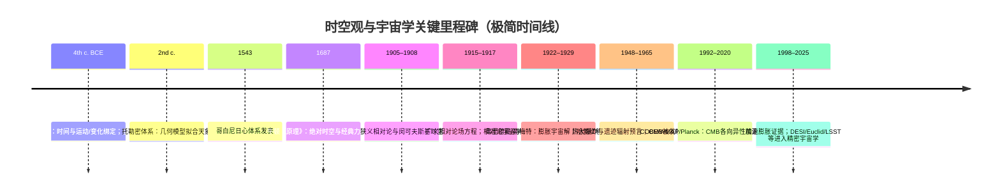

<!-- 每篇结构：1. 简单描述 2. 相关图 3. 分类:解读+表格 4. 详细专业论述  5. 实例:解读+表格 -->

<strong>全文目录</strong> (点击查看)

<!-- The 
 is for kramdown, which only partially supports HTML5-->

- [**一 宇宙学框架 Cosmological Framework**](#一-宇宙学框架-cosmological-framework)
  - [**宇宙 Universe**：包含所有时空、物质、能量及其相互作用的整体](#宇宙-universe包含所有时空物质能量及其相互作用的整体)
  - [**可观测宇宙 Observable universe**：在光速和宇宙年龄限制下，人类目前理论上可观测到的宇宙区域](#可观测宇宙-observable-universe在光速和宇宙年龄限制下人类目前理论上可观测到的宇宙区域)
  - [**时空 Spacetime**：将时间与空间统一描述的物理结构，是广义相对论的基本框架](#时空-spacetime将时间与空间统一描述的物理结构是广义相对论的基本框架)
  - [**宇宙学原理 Cosmological Principle**：宇宙空间分布是均匀且各向同性的基本假定](#宇宙学原理-cosmological-principle宇宙空间分布是均匀且各向同性的基本假定)
  - [**FLRW 度规 FLRW Metric**：描述满足宇宙学原理且随时间动态膨胀或收缩的齐次各向同性时空几何](#flrw-度规-flrw-metric描述满足宇宙学原理且随时间动态膨胀或收缩的齐次各向同性时空几何)
  - [**哈勃定律 Hubble–Lemaître law**：宇宙均匀膨胀，遥远星系的退行速度与距离成正比](#哈勃定律-hubblelemaître-law宇宙均匀膨胀遥远星系的退行速度与距离成正比)
  - [**临界密度 Critical Density**：使膨胀宇宙的空间几何恰好保持欧几里得平直状态所需的总能量密度阈值](#临界密度-critical-density使膨胀宇宙的空间几何恰好保持欧几里得平直状态所需的总能量密度阈值)
  - [**宇宙曲率 Spatial Curvature**：描述空间整体几何形状为封闭、平直或开放的拓扑属性](#宇宙曲率-spatial-curvature描述空间整体几何形状为封闭平直或开放的拓扑属性)
  - [**宇宙视界 Cosmological Horizons**：观测者在物理上能够接收信号或建立因果联系的时空边界](#宇宙视界-cosmological-horizons观测者在物理上能够接收信号或建立因果联系的时空边界)
    - [**粒子视界 particle horizon**：宇宙开始至今，光子在膨胀时空中所能传播的最大共动距离](#粒子视界-particle-horizon宇宙开始至今光子在膨胀时空中所能传播的最大共动距离)
    - [**事件视界 event horizon**：光信号能够到达观测者的最大时空界限](#事件视界-event-horizon光信号能够到达观测者的最大时空界限)
  - [**真空能 Vacuum Energy**：真空状态下仍然存在的最低能量](#真空能-vacuum-energy真空状态下仍然存在的最低能量)
  - [**宇宙学常数 Cosmological Constant**：驱动宇宙加速膨胀的“暗能量”来源](#宇宙学常数-cosmological-constant驱动宇宙加速膨胀的暗能量来源)
  - [**ΛCDM 模型的未解之谜**：当下观测与理论的差异](#λcdm-模型的未解之谜当下观测与理论的差异)
- [**宇宙热史 Cosmic History**](#宇宙热史-cosmic-history)
    - [**大爆炸模型 Big Bang Model**：描述宇宙起源及早期演化的宇宙学模型](#大爆炸模型-big-bang-model描述宇宙起源及早期演化的宇宙学模型)
    - [**普朗克时期 Planck Epoch**](#普朗克时期-planck-epoch)
    - [**大统一时期 Grand Unification Epoch**：强相互作用与电弱相互作用统一为同一规范相互作用的假想阶段（理论）](#大统一时期-grand-unification-epoch强相互作用与电弱相互作用统一为同一规范相互作用的假想阶段理论)
    - [**大暴胀 Cosmic Inflation**：早期宇宙经历的极短暂指数膨胀阶段](#大暴胀-cosmic-inflation早期宇宙经历的极短暂指数膨胀阶段)
    - [**夸克/轻子时期**](#夸克轻子时期)
    - [重子生成 Baryogenesis](#重子生成-baryogenesis)
    - [原初核合成 BBN](#原初核合成-bbn)
    - [复合 Recombination:](#复合-recombination)
    - [CMB 形成 Photon Decoupling / Last Scattering](#cmb-形成-photon-decoupling--last-scattering)
    - [**黑暗时代 Cosmic Dark Ages**：复合到第一批天体点亮之前](#黑暗时代-cosmic-dark-ages复合到第一批天体点亮之前)
    - [**再电离 Epoch of Reionization**](#再电离-epoch-of-reionization)
    - [**第一代恒星 Population III stars**](#第一代恒星-population-iii-stars)
    - [**暗能量主导期**](#暗能量主导期)
    - [**宇宙终极命运 Ultimate Fate of the Universe**：关于宇宙长期演化结局的理论描述](#宇宙终极命运-ultimate-fate-of-the-universe关于宇宙长期演化结局的理论描述)
- [**宇宙大尺度结构 LSS**](#宇宙大尺度结构-lss)
  - [**宇宙网 Cosmic Web**：暗物质主导形成的丝状与节点状分布网络](#宇宙网-cosmic-web暗物质主导形成的丝状与节点状分布网络)
    - [**丝状体 Cosmic Filaments**：连接星系团和超星系团的高密度物质带](#丝状体-cosmic-filaments连接星系团和超星系团的高密度物质带)
    - [墙/片层 Walls/Sheets](#墙片层-wallssheets)
    - [**空洞 Cosmic Voids**：星系密度极低的巨大空间区域](#空洞-cosmic-voids星系密度极低的巨大空间区域)
    - [**节点 node**](#节点-node)
  - [**超星系团 Superclusters**：由多个星系团、星系群及丝状体构成的大尺度结构](#超星系团-superclusters由多个星系团星系群及丝状体构成的大尺度结构)
  - [**星系团 Galaxy Clusters**：在引力束缚下聚集的大量星系系统](#星系团-galaxy-clusters在引力束缚下聚集的大量星系系统)
  - [**星系群 Galaxy Groups**：规模小于星系团的星系集合体](#星系群-galaxy-groups规模小于星系团的星系集合体)
  - [**巨引源 Great Attractor**：宇宙结构运动流线汇聚的重力焦点](#巨引源-great-attractor宇宙结构运动流线汇聚的重力焦点)
- [**星系系统 Galactic Systems**](#星系系统-galactic-systems)
  - [**星系 Galaxies**：由恒星、气体、尘埃、暗物质组成并受引力约束的系统](#星系-galaxies由恒星气体尘埃暗物质组成并受引力约束的系统)
    - [**椭圆星系 Elliptical Galaxies**：恒星分布平滑、气体含量低、恒星形成活动弱的星系类型](#椭圆星系-elliptical-galaxies恒星分布平滑气体含量低恒星形成活动弱的星系类型)
    - [**螺旋星系 Spiral Galaxies**：具有旋转盘面和旋臂结构的星系](#螺旋星系-spiral-galaxies具有旋转盘面和旋臂结构的星系)
    - [**棒旋星系 Barred Spiral Galaxies**：中心具有棒状恒星结构的螺旋星系](#棒旋星系-barred-spiral-galaxies中心具有棒状恒星结构的螺旋星系)
    - [透镜状星系 Lenticulars](#透镜状星系-lenticulars)
    - [**不规则星系 Irregular Galaxies**：缺乏明显几何对称结构的星系](#不规则星系-irregular-galaxies缺乏明显几何对称结构的星系)
    - [**矮星系 Dwarf Galaxies**：质量和体积显著小于典型星系的星系类型](#矮星系-dwarf-galaxies质量和体积显著小于典型星系的星系类型)
  - [**活动星系核 AGN**：](#活动星系核-agn)
    - [**类星体 Quasars**：中心黑洞吸积物质并释放极高能量的遥远活动星系核](#类星体-quasars中心黑洞吸积物质并释放极高能量的遥远活动星系核)
    - [**塞弗特星系 Seyfert Galaxies**：中心核区高能辐射明显但整体亮度较低的星系](#塞弗特星系-seyfert-galaxies中心核区高能辐射明显但整体亮度较低的星系)
    - [**耀变体 Blazar**](#耀变体-blazar)
  - [**射电星系 Radio Galaxies**：在射电波段辐射强烈的活动星系](#射电星系-radio-galaxies在射电波段辐射强烈的活动星系)
  - [霍格天体](#霍格天体)
  - [Cloud-9 (RELHIC)](#cloud-9-relhic)
  - [**星系际介质 IGM**：存在于星系之间的稀薄物质](#星系际介质-igm存在于星系之间的稀薄物质)
  - [环星系介质 CGM](#环星系介质-cgm)
  - [星系团内介质 ICM](#星系团内介质-icm)
- [**次级星系结构 Sub-galactic Structures**：星系的内部结构，在物理属性与演化中扮演重要角色](#次级星系结构-sub-galactic-structures星系的内部结构在物理属性与演化中扮演重要角色)
  - [星系中心 Galactic Center](#星系中心-galactic-center)
  - [**核球 Bulge**：星系中心的高恒星密度区域，通常包含 SMBH 及被其引力支配的核星团](#核球-bulge星系中心的高恒星密度区域通常包含-smbh-及被其引力支配的核星团)
  - [**星系盘 Galactic Disk**： 旋涡星系的主要部分，包含大部分年轻恒星、气体和尘埃](#星系盘-galactic-disk-旋涡星系的主要部分包含大部分年轻恒星气体和尘埃)
  - [**旋臂 Spiral Arms**：盘内的高密度波，是恒星形成的活跃区](#旋臂-spiral-arms盘内的高密度波是恒星形成的活跃区)
  - [**星系棒 Bar**： 部分星系中心存在的贯穿核球的棒状恒星聚集结构，负责向中心输送气体](#星系棒-bar-部分星系中心存在的贯穿核球的棒状恒星聚集结构负责向中心输送气体)
  - [**星系晕 Galactic Halo**：包裹整个星系的球状区域，密度极低，分布着古老的球状星团和暗物质](#星系晕-galactic-halo包裹整个星系的球状区域密度极低分布着古老的球状星团和暗物质)
  - [**星团 Star Clusters**：星系中的恒星集群](#星团-star-clusters星系中的恒星集群)
    - [疏散星团 Open Clusters](#疏散星团-open-clusters)
    - [球状星团 Globular Clusters](#球状星团-globular-clusters)
  - [**星际介质 ISM**：存在于恒星之间的气体和尘埃](#星际介质-ism存在于恒星之间的气体和尘埃)
    - [**星际气体 Interstellar Gas**：以氢和氦为主的稀薄气体成分](#星际气体-interstellar-gas以氢和氦为主的稀薄气体成分)
    - [**星际尘埃 Interstellar Dust**：由微小固体颗粒组成的物质成分](#星际尘埃-interstellar-dust由微小固体颗粒组成的物质成分)
  - [**星际云 Interstellar Clouds**：比周围致密、云状气体与尘埃集合体](#星际云-interstellar-clouds比周围致密云状气体与尘埃集合体)
    - [**H I 云（H I cloud）**: 以中性原子氢为主的星际介质团块](#h-i-云h-i-cloud-以中性原子氢为主的星际介质团块)
    - [**分子云 Molecular Clouds**：恒星形成的主要场所](#分子云-molecular-clouds恒星形成的主要场所)
    - [**恒星形成区/H II 区 Star-forming Regions**：正在发生或即将发生恒星形成的区域](#恒星形成区h-ii-区-star-forming-regions正在发生或即将发生恒星形成的区域)
- [**恒星 Stars**](#恒星-stars)
  - [原恒星 Protostars](#原恒星-protostars)
  - [前主序星 PMS stars](#前主序星-pms-stars)
  - [T Tauri 星 T Tauri stars](#t-tauri-星-t-tauri-stars)
  - [棕矮星 Brown Dwarfs](#棕矮星-brown-dwarfs)
  - [**主序星 Main Sequence Stars**：处于稳定氢聚变阶段的恒星](#主序星-main-sequence-stars处于稳定氢聚变阶段的恒星)
  - [**红矮星 Red Dwarfs**：质量低、温度低、寿命极长的恒星](#红矮星-red-dwarfs质量低温度低寿命极长的恒星)
  - [**红巨星 Red Giants**：核心氢耗尽后体积显著膨胀的恒星](#红巨星-red-giants核心氢耗尽后体积显著膨胀的恒星)
  - [**蓝巨星 Blue Giants**：质量大、温度高、光度强的恒星](#蓝巨星-blue-giants质量大温度高光度强的恒星)
  - [**超巨星 Supergiants**：质量和体积极大的晚期演化恒星](#超巨星-supergiants质量和体积极大的晚期演化恒星)
  - [**沃尔夫-拉叶星 Wolf-Rayet stars**：大质量、强恒星风、外层剥离显著的演化阶段恒星](#沃尔夫-拉叶星-wolf-rayet-stars大质量强恒星风外层剥离显著的演化阶段恒星)
  - [**变星 Variable Stars**：从地球上观察其亮度有起伏变化的恒星](#变星-variable-stars从地球上观察其亮度有起伏变化的恒星)
  - [双星与多星系统 Binary and Multiple Systems](#双星与多星系统-binary-and-multiple-systems)
- [**高能与瞬变天体 High-energy and Transient Objects**](#高能与瞬变天体-high-energy-and-transient-objects)
  - [**行星状星云 Planetary Nebulae (PNe)**：恒星晚期抛射气体形成的发光结构](#行星状星云-planetary-nebulae-pne恒星晚期抛射气体形成的发光结构)
  - [**超新星 Supernovae**：恒星在演化末期发生的剧烈爆发现象](#超新星-supernovae恒星在演化末期发生的剧烈爆发现象)
  - [**超新星遗迹 Supernova Remnants (SNRs)**：超新星爆发后膨胀的气体与能量结构](#超新星遗迹-supernova-remnants-snrs超新星爆发后膨胀的气体与能量结构)
  - [**千新星 Kilonovae**：双中子星或中子星与黑洞并合产生的瞬变天文现象](#千新星-kilonovae双中子星或中子星与黑洞并合产生的瞬变天文现象)
  - [**伽马射线暴 Gamma-ray Bursts (GRBs)**：短时间内释放极高能量的宇宙事件](#伽马射线暴-gamma-ray-bursts-grbs短时间内释放极高能量的宇宙事件)
  - [**快速射电暴 Fast Radio Bursts (FRBs)**：持续毫秒级的高亮度射电脉冲](#快速射电暴-fast-radio-bursts-frbs持续毫秒级的高亮度射电脉冲)
  - [相对论喷流 Relativistic Jets](#相对论喷流-relativistic-jets)
  - [潮汐瓦解事件 Tidal Disruption Events, TDEs](#潮汐瓦解事件-tidal-disruption-events-tdes)
- [**恒星残骸 Stellar Remnants**：恒星生命结束后留下的核心](#恒星残骸-stellar-remnants恒星生命结束后留下的核心)
  - [**白矮星 White Dwarfs**：低至中等质量恒星演化终点形成的致密天体](#白矮星-white-dwarfs低至中等质量恒星演化终点形成的致密天体)
    - [**黑矮星 Black Dwarfs**：冷却的白矮星（理论）](#黑矮星-black-dwarfs冷却的白矮星理论)
  - [**中子星 Neutron Stars**：由超新星爆发后形成的超高密度恒星残骸](#中子星-neutron-stars由超新星爆发后形成的超高密度恒星残骸)
    - [**脉冲星 Pulsars**：高速自转并发射周期性电磁辐射的中子星](#脉冲星-pulsars高速自转并发射周期性电磁辐射的中子星)
    - [**磁星 Magnetars**：具有极强磁场的中子星类型](#磁星-magnetars具有极强磁场的中子星类型)
  - [**黑洞 Black Holes**：时空曲率大到光都无法从其事件视界逃脱的致密天体](#黑洞-black-holes时空曲率大到光都无法从其事件视界逃脱的致密天体)
    - [**恒星级黑洞 Stellar-mass Black Holes**：由大质量恒星坍缩形成的黑洞](#恒星级黑洞-stellar-mass-black-holes由大质量恒星坍缩形成的黑洞)
    - [**中等质量黑洞 Intermediate-Mass Black Holes （IMBHs）**：质量介于恒星级与超大质量之间的黑洞](#中等质量黑洞-intermediate-mass-black-holes-imbhs质量介于恒星级与超大质量之间的黑洞)
    - [**超大质量黑洞 Supermassive Black Holes, SMBHs**：位于星系中心、质量极大的黑洞](#超大质量黑洞-supermassive-black-holes-smbhs位于星系中心质量极大的黑洞)
    - [**原初黑洞 Primordial Black Hole**：早期宇宙中直接形成的黑洞（理论）](#原初黑洞-primordial-black-hole早期宇宙中直接形成的黑洞理论)
  - [**夸克星/奇异星 Quark Star/Strange Star**：去禁闭的夸克物质态天体（理论）](#夸克星奇异星-quark-starstrange-star去禁闭的夸克物质态天体理论)
  - [**预子星 Preon Star**：比夸克更基本的物质态天体（理论）](#预子星-preon-star比夸克更基本的物质态天体理论)
  - [**Thorne–Żytkow Object**：中子星核包裹在一个红超巨星内部（理论）](#thorneżytkow-object中子星核包裹在一个红超巨星内部理论)
  - [**暗能量星 Dark-energy Star**：充满负压真空能的致密球体（理论）](#暗能量星-dark-energy-star充满负压真空能的致密球体理论)
- [**行星系统 Planetary Systems**](#行星系统-planetary-systems)
  - [原行星盘 Protoplanetary Disks](#原行星盘-protoplanetary-disks)
  - [**行星 Planets**：绕恒星运行且自身不发生核聚变的天体](#行星-planets绕恒星运行且自身不发生核聚变的天体)
    - [**类地行星 Terrestrial Planets**：以岩石和金属为主要成分的行星](#类地行星-terrestrial-planets以岩石和金属为主要成分的行星)
    - [**气态巨行星 Gas Giants**：主要由氢氦构成、体积巨大的行星](#气态巨行星-gas-giants主要由氢氦构成体积巨大的行星)
    - [**冰巨行星 Ice Giants**：富含挥发性冰物质的巨行星](#冰巨行星-ice-giants富含挥发性冰物质的巨行星)
    - [太阳系的行星与矮行星](#太阳系的行星与矮行星)
  - [**系外行星 Exoplanets**：位于太阳系之外、绕其他恒星运行的行星](#系外行星-exoplanets位于太阳系之外绕其他恒星运行的行星)
    - [**碳行星**：以碳化物与碳相为主的行星](#碳行星以碳化物与碳相为主的行星)
    - [**烟灰行星 Soot Planets**：表面被厚重有机雾霾笼罩的系外行星](#烟灰行星-soot-planets表面被厚重有机雾霾笼罩的系外行星)
  - [矮行星 Dwarf Planets](#矮行星-dwarf-planets)
  - [**（天然）卫星 Natural Satellites (Moons):**：绕行星运行的天体](#天然卫星-natural-satellites-moons绕行星运行的天体)
  - [**行星环 Planetary Rings**：由大量小颗粒组成并绕行星分布的结构](#行星环-planetary-rings由大量小颗粒组成并绕行星分布的结构)
  - [**小行星 Asteroids**：主要分布于行星轨道之间的岩石天体](#小行星-asteroids主要分布于行星轨道之间的岩石天体)
  - [**小行星带 Asteroid Belt**：太阳系的残余建造工地](#小行星带-asteroid-belt太阳系的残余建造工地)
  - [**柯伊伯带 Kuiper Belt**：太阳系外侧的冰质小天体仓库](#柯伊伯带-kuiper-belt太阳系外侧的冰质小天体仓库)
  - [**彗星 Comets**：含挥发性物质并在接近恒星时产生彗发的天体](#彗星-comets含挥发性物质并在接近恒星时产生彗发的天体)
  - [海王星外天体 TNOs](#海王星外天体-tnos)
  - [奥尔特云](#奥尔特云)
  - [**流星体 流星体、流星、陨石 Meteoroids**：在行星际空间运动的小型固体天体](#流星体-流星体流星陨石-meteoroids在行星际空间运动的小型固体天体)
- [观测宇宙的证据与方法 Observational Probes](#观测宇宙的证据与方法-observational-probes)
  - [**宇宙微波背景辐射 CMB**：宇宙辐射底噪与宇宙史记忆](#宇宙微波背景辐射-cmb宇宙辐射底噪与宇宙史记忆)
  - [**重子声学振荡 BAO**：从早期声学到晚期几何的“标准尺”](#重子声学振荡-bao从早期声学到晚期几何的标准尺)
  - [红移 Redshift](#红移-redshift)
  - [光谱学 Spectroscopy](#光谱学-spectroscopy)
  - [距离阶梯 Cosmic Distance Ladder](#距离阶梯-cosmic-distance-ladder)
  - [Ia 型超新星 Type Ia Supernovae](#ia-型超新星-type-ia-supernovae)
  - [引力透镜 Gravitational Lensing](#引力透镜-gravitational-lensing)
  - [星系巡天 Galaxy Surveys](#星系巡天-galaxy-surveys)
  - [引力波](#引力波)
    - [引力波标准警报器 Standard Sirens](#引力波标准警报器-standard-sirens)
  - [**X 射线源 X-ray Sources**：主要在 X 射线波段辐射的天体](#x-射线源-x-ray-sources主要在-x-射线波段辐射的天体)
  - [宇宙线 Cosmic Rays](#宇宙线-cosmic-rays)
  - [中微子天文学 Neutrino Astronomy](#中微子天文学-neutrino-astronomy)
  - [多信使天文学 Multi-messenger Astronomy](#多信使天文学-multi-messenger-astronomy)
- [**基本物质形态**](#基本物质形态)
  - [**普通物质（重子物质）Normal Matter (Baryonic Matter)**：由质子和中子组成的可直接观测物质](#普通物质重子物质normal-matter-baryonic-matter由质子和中子组成的可直接观测物质)
    - [**原子 Atoms**：由原子核和电子构成的基本化学单位](#原子-atoms由原子核和电子构成的基本化学单位)
    - [**离子 Ions**：失去或获得电子而带电的原子或分子](#离子-ions失去或获得电子而带电的原子或分子)
    - [**分子 Molecules**：由多个原子通过化学键结合形成的结构](#分子-molecules由多个原子通过化学键结合形成的结构)
    - [**等离子体 Plasma**：高度电离、整体呈现集体行为的物质状态](#等离子体-plasma高度电离整体呈现集体行为的物质状态)
  - [**暗物质 Dark Matter**：不参与电磁相互作用但具有引力效应的物质成分](#暗物质-dark-matter不参与电磁相互作用但具有引力效应的物质成分)
  - [**暗能量 Dark Energy**：驱动宇宙加速膨胀的未知能量成分](#暗能量-dark-energy驱动宇宙加速膨胀的未知能量成分)
- [**基本粒子与场**](#基本粒子与场)
  - [**基本粒子 Elementary Particles**：不可再分的物质与力的基本构成单元](#基本粒子-elementary-particles不可再分的物质与力的基本构成单元)
    - [**夸克 Quarks**：构成强子并参与强相互作用的基本粒子](#夸克-quarks构成强子并参与强相互作用的基本粒子)
    - [**轻子 Leptons**：不参与强相互作用的一类基本粒子](#轻子-leptons不参与强相互作用的一类基本粒子)
    - [强子 Hadrons](#强子-hadrons)
    - [重子 Baryons](#重子-baryons)
    - [介子 Mesons](#介子-mesons)
    - [光子 Photon](#光子-photon)
    - [中微子 Neutrinos](#中微子-neutrinos)
    - [**玻色子 Bosons**：自旋为整数的粒子，包括规范玻色子与希格斯玻色子](#玻色子-bosons自旋为整数的粒子包括规范玻色子与希格斯玻色子)
    - [希格斯玻色子 Higgs boson](#希格斯玻色子-higgs-boson)
  - [**相互作用 Fundamental Interactions**](#相互作用-fundamental-interactions)
    - [**引力 Gravity**：描述质量与能量导致时空曲率的基本相互作用](#引力-gravity描述质量与能量导致时空曲率的基本相互作用)
    - [**电磁力 Electromagnetism**：作用于带电粒子的相互作用](#电磁力-electromagnetism作用于带电粒子的相互作用)
    - [**强相互作用 Strong Interaction**：束缚夸克形成强子的作用](#强相互作用-strong-interaction束缚夸克形成强子的作用)
    - [**弱相互作用 Weak Interaction**：导致粒子衰变的相互作用](#弱相互作用-weak-interaction导致粒子衰变的相互作用)
  - [**量子场 Quantum Fields**：在量子理论中描述粒子存在与相互作用的基本实体](#量子场-quantum-fields在量子理论中描述粒子存在与相互作用的基本实体)
- [**理论与假设实体**](#理论与假设实体)
  - [**奇点 Singularity**：物理量在理论中趋于无穷大的时空点](#奇点-singularity物理量在理论中趋于无穷大的时空点)
  - [**视界 Event Horizon**：信息无法从其内部传递到外部的边界](#视界-event-horizon信息无法从其内部传递到外部的边界)
  - [**虚粒子 Virtual Particles**：量子场论中用于描述相互作用的计算实体](#虚粒子-virtual-particles量子场论中用于描述相互作用的计算实体)
  - [**拓扑缺陷 Topological Defects**](#拓扑缺陷-topological-defects)
    - [**宇宙弦 Cosmic Strings**：早期宇宙相变可能产生的线状结构](#宇宙弦-cosmic-strings早期宇宙相变可能产生的线状结构)
    - [**磁单极子 Magnetic Monopoles**：假设存在的单极磁荷粒子](#磁单极子-magnetic-monopoles假设存在的单极磁荷粒子)
    - [**畴壁 Domain Walls**：不同真空态区域之间的界面结构](#畴壁-domain-walls不同真空态区域之间的界面结构)

 

# **一 宇宙学框架 Cosmological Framework**

宇宙学的理论核心在于通过`时空`这一广义相对论基本框架，系统性地描述包含所有物质与能量相互作用的`宇宙`整体。在`宇宙学原理`关于空间均匀性与各向同性的基本假定下，物理学家利用`FLRW 度规`构建了动态演化的齐次各向同性时空几何，并结合`哈勃定律`所揭示的退行速度与距离的线性比例关系，确立了宇宙均匀膨胀的动力学图像。通过对比宇宙实际总能量密度与临界密度的阈值，我们可以推导出决定宇宙拓扑形状与终极命运的`宇宙曲率`，并在此基础上界定了受光速与宇宙年龄严格限制的`可观测宇宙`范围。

学习宇宙学的深远意义在于，它通过对`宇宙视界`的严谨刻画——包括限定过去信息传播范围的`粒子视界`，以及锁定未来因果联系上限的`事件视界`——为人类设定了理性的认知终极边界，使我们得以在因果律的宏大结构中，既能追溯万物的物理起源，亦能预判时空结构在演化终局中的逻辑走向。

## **宇宙 Universe**：包含所有时空、物质、能量及其相互作用的整体

当前已知显著天体分布的可观测宇宙对数缩放图
: 天体自左向右按其与地球的距离依次排列。左侧边缘描绘了地球及其近地天体；右侧边缘描绘了目前观测到最遥远的天体，包括伽马射线暴（GRBs）、类星体、星系超群以及宇宙微波背景辐射。图中天体的大小经夸张放大处理，以便于观察其形态。

宇宙，作为一切存在的总体，是物理学与哲学交汇处最深刻的研究对象。从直觉上理解，宇宙是空间、时间、物质与能量的总和，是已知与未知现象的终极容器。然而，在现代物理学框架下，"宇宙"这一概念本身就蕴含着多层次的精确内涵与认识论边界：我们所能观测的宇宙（可观测宇宙，Observable Universe）由光速与宇宙年龄共同划定，其边界是一个与我们相距约46.5亿秒差距（约460亿光年）的共动视界球面，这一数字之所以远超宇宙年龄（约138亿年）乘以光速，正是由于宇宙的持续膨胀；而"整个宇宙"（the Universe at large）则可能在可观测边界之外无限延伸，其空间曲率、拓扑结构以及是否存在其他"宇宙域"，至今仍是物理学最深刻的开放问题之一。

宇宙的组成在现代宇宙学的精密观测下呈现出令人惊叹的陌生面貌。我们日常生活所熟悉的一切——行星、恒星、气体云、重子物质——仅占宇宙总能量密度的约4.9%；其余由约26.8%的暗物质和约68.3%的暗能量（以宇宙学常数形式存在）构成，两者都不与电磁辐射发生相互作用，只能通过引力效应间接探测。这一图景并非凭空臆造，而是从独立的多个观测渠道——CMB各向异性、大尺度结构功率谱、Ia型超新星距离-红移关系、宇宙年龄约束、宇宙轻元素丰度与大爆炸核合成的预言比对——共同汇聚而成。

宇宙有一个起点，或者更准确地说，有一个我们所知物理规律能够描述的最早时刻。大爆炸（Big Bang）理论并非描述一次爆炸，而是描述宇宙从极高温、极高密度的初始状态开始膨胀冷却的整个演化历程。在这一图景下，时间本身与空间一道在大爆炸时刻诞生，询问"大爆炸之前发生了什么"在经典广义相对论框架内是无意义的，因为时间坐标本身在奇点处失效。宇宙的演化是一部宏大的冷却史：从普朗克时代（$t \sim 10^{-43}$ s，$T \sim 10^{32}$ K，能量尺度约 $10^{19}$ GeV）所有已知物理规律失效的极端状态，经过依次出现的大统一相变、电弱相变、夸克-强子相变、大爆炸核合成（BBN，$t \sim 180$ s—$20$ min）、物质-辐射等密（$z \sim 3400$，$t \sim 47000$ 年）、光子退耦与再组合（$z \sim 1100$，$t \sim 380000$ 年），到恒星与星系的逐步形成（宇宙黎明，$z \sim 15$—$30$），直至今日的低温低密度宇宙（$T_{CMB} = 2.72548 \pm 0.00057$ K，Fixsen 2009）。

在这一宏大演化的背后，宇宙膨胀的数学框架由弗里德曼-勒梅特-罗伯逊-沃克（FLRW）度规精确描述。FLRW度规是在宇宙学原理（大尺度均匀性与各向同性）下广义相对论场方程的最一般对称解，其线元形式为：

$$ds^2 = -c^2 dt^2 + a(t)^2\left[\frac{dr^2}{1-kr^2} + r^2 d\Omega^2\right]$$

其中 $a(t)$ 是无量纲的宇宙标度因子（scale factor），$k \in \{-1, 0, +1\}$ 分别对应开放、平坦、闭合的空间曲率，$d\Omega^2 = d\theta^2 + \sin^2\theta\, d\phi^2$ 是单位球面上的面积元。将爱因斯坦场方程 $G_{\mu\nu} + \Lambda g_{\mu\nu} = 8\pi G T_{\mu\nu}/c^4$ 应用于FLRW度规，得到描述宇宙整体动力学的弗里德曼方程：

$$H^2 \equiv \left(\frac{\dot{a}}{a}\right)^2 = \frac{8\pi G}{3}\rho - \frac{kc^2}{a^2} + \frac{\Lambda}{3}$$

以及加速度方程（Raychaudhuri方程）：

$$\frac{\ddot{a}}{a} = -\frac{4\pi G}{3}\left(\rho + \frac{3p}{c^2}\right) + \frac{\Lambda}{3}$$

这两个方程加上物质的连续性方程（即能量守恒）$\dot{\rho} + 3H(\rho + p/c^2) = 0$，构成描述宇宙整体演化的完备方程组。每一种物质成分 $i$ 具有状态方程 $p_i = w_i \rho_i c^2$，其中非相对论性物质（冷暗物质和重子）$w = 0$，辐射（光子和相对论性粒子）$w = 1/3$，宇宙学常数/暗能量 $w = -1$。从连续性方程可以推出每种成分的密度随标度因子的演化：$\rho_i \propto a^{-3(1+w_i)}$，因此物质密度 $\propto a^{-3}$（稀释），辐射密度 $\propto a^{-4}$（稀释加红移），宇宙学常数密度 $\propto a^0$（不变）。这一简洁的幂律关系决定了宇宙演化的各阶段主导成分：早期宇宙为辐射主导（$a \propto t^{1/2}$），中期为物质主导（$a \propto t^{2/3}$），今日起宇宙学常数主导（$a \propto e^{Ht}$，指数膨胀）。

宇宙的年龄是弗里德曼方程的直接输出，通过对哈勃参数的红移积分得到：

$$t_0 = \int_0^1 \frac{da}{aH(a)} = \frac{1}{H_0}\int_0^\infty \frac{dz}{(1+z)E(z)}$$

其中 $E(z) = H(z)/H_0 = \sqrt{\Omega_r(1+z)^4 + \Omega_m(1+z)^3 + \Omega_k(1+z)^2 + \Omega_\Lambda}$ 是无量纲哈勃函数。代入Planck 2018最佳拟合参数，宇宙年龄为 $t_0 = 13.787 \pm 0.020$ 亿年（Planck Collaboration 2020），这一数值与来自完全不同途径的独立约束——最古老球状星团的测光年龄（$\sim 12$—$13.5$ Gyr）、放射性铀/钍核时钟（cosmochronometry）——在误差范围内高度吻合，构成ΛCDM模型内部一致性的有力佐证。

宇宙的早期演化中，暴胀（Inflation）理论是解决视界问题（horizon problem）、平坦性问题（flatness problem）和磁单极子问题（monopole problem）的标准框架，同时为宇宙大尺度结构的形成提供初始密度扰动的量子起源机制。视界问题的核心困惑在于：CMB在全天范围内表现出极高的温度均匀性（相对涨落约 $10^{-5}$），但在标准大爆炸框架下，CMB的不同方向区域之间的因果视界（comoving Hubble radius $c/(aH)$）在再组合时期仅约 $\sim 1°$，即相隔超过约2°的天空区域在大爆炸标准理论下没有因果联系，无法解释它们为何拥有近乎相同的温度。暴胀通过在极早期（$t \sim 10^{-36}$—$10^{-32}$ s）引入一段超指数膨胀（$a \propto e^{Ht}$，$H$ 近似恒定）来解决这一问题：在暴胀之前，整个可观测宇宙曾处于因果联系的极小体积内，暴胀将其拉伸了至少60个e折叠（$e$-folds，即 $a$ 增大至少 $e^{60}$ 倍），使得今天可观测宇宙的所有部分都来自同一个热力学平衡的初始区域。平坦性问题的解决同理：标准大爆炸中，$|\Omega_\mathrm{total} - 1|$ 随时间增大（物质主导时 $\propto t^{2/3}$，辐射主导时 $\propto t$），若今天宇宙接近平坦则需要在普朗克时刻 $|\Omega - 1| < 10^{-60}$，是极不自然的微调；暴胀使宇宙曲率半径指数增大，将任意初始曲率在暴胀后稀释至接近零。

暴胀的微观实现通常引入一个缓慢滚动（slow-roll）的标量场——暴胀子（inflaton）$\phi$——其势能 $V(\phi)$ 在暴胀期间主导宇宙能量密度，其场方程为 $\ddot{\phi} + 3H\dot{\phi} + V'(\phi) = 0$（Klein-Gordon方程在FLRW背景下的形式），满足慢滚条件 $\epsilon \equiv -\dot{H}/H^2 \ll 1$ 和 $\eta \equiv \dot{\epsilon}/(H\epsilon) \ll 1$。在慢滚近似下，暴胀子的量子涨落在视界穿越时刻（horizon crossing，$k = aH$，其中 $k$ 是扰动的共动波数）"冻结"成经典的绝热密度扰动，其功率谱为近标度不变的形式：

$$\mathcal{P}_\mathcal{R}(k) = A_s\left(\frac{k}{k_*}\right)^{n_s - 1}$$

其中 $A_s$ 是在基准波数 $k_* = 0.05\ \mathrm{Mpc^{-1}}$ 处的功率谱振幅（Planck 2018: $\ln(10^{10}A_s) = 3.044 \pm 0.014$），$n_s$ 是标量谱指数（Planck 2018: $n_s = 0.9649 \pm 0.0042$，即接近但略小于1的"红谱"）。暴胀还产生原初引力波（原初张量扰动），其功率谱振幅与标量谱振幅之比定义为张量-标量比 $r = \mathcal{P}_T/\mathcal{P}_\mathcal{R}$，目前CMB B模偏振的上限给出 $r < 0.036$（95% CI，BICEP/Keck 2021），对众多暴胀模型（如 $R^2$ 暴胀即Starobinsky模型预言 $r \approx 0.004$，仍未被排除；单场单项式暴胀 $V \propto \phi^2$ 预言 $r \approx 0.13$，已被排除）提供了重要区分度。这些原初扰动是宇宙大尺度结构一切复杂性的种子，它们在引力不稳定性（Jeans不稳定性的宇宙学版本）的驱动下，经历约140亿年的增长，演化为今天所见的宇宙网络（Cosmic Web）。

宇宙大尺度结构的形成是一个从线性扰动演化到非线性引力坍缩的多尺度物理过程。在线性阶段，物质密度对比 $\delta(\mathbf{x},t) \equiv [\rho(\mathbf{x},t) - \bar\rho(t)]/\bar\rho(t)$ 满足线性增长方程：

$$\ddot\delta + 2H\dot\delta - \frac{4\pi G\bar\rho}{a^3}\delta = 0$$

在物质主导宇宙中，增长因子 $D_+(a) \propto a$（即 $\delta \propto a \propto (1+z)^{-1}$），而在宇宙学常数主导的加速膨胀宇宙中，增长受到宇宙膨胀的阻尼，增长因子的增长速率 $f \equiv d\ln D_+/d\ln a < 1$。这种增长的阻尼在宇宙学中被称为"增长率的宇宙学常数压制"，是通过红移空间畸变（Redshift Space Distortions，RSD）观测 $f\sigma_8$ 来探测暗能量和修改引力的核心可观测量之一。当密度对比 $\delta \sim 1$ 时，线性近似失效，扰动进入非线性坍缩阶段。球形顶帽坍缩（spherical top-hat collapse）的分析解给出，一个初始过密度为 $\delta_i$ 的球形区域在线性外推的过密度达到临界值 $\delta_c \approx 1.686$ 时发生维里化（virialization），形成稳定的暗物质晕（dark matter halo）。维里化后的晕遵循维里定理 $2K + U = 0$（$K$ 为动能，$U$ 为势能），其特征半径（维里半径 $r_\mathrm{vir}$）对应于晕的平均密度约为宇宙临界密度的200倍（所谓的 $r_{200}$）。

已维里化的暗物质晕的密度轮廓（density profile）在N体数值模拟中呈现为近似普适的NFW（Navarro-Frenk-White）形式：

$$\rho(r) = \frac{\rho_s}{(r/r_s)(1+r/r_s)^2}$$

其中 $r_s$ 是特征尺度半径，$\rho_s$ 是特征密度，两者通过浓度参数 $c = r_{200}/r_s$ 相互关联。NFW轮廓在中心处（$r \to 0$）呈现 $\rho \propto r^{-1}$ 的内尖刺（cusp），在外部（$r \gg r_s$）呈 $\rho \propto r^{-3}$，过渡处近似 $\propto r^{-2}$（对应对数斜率 $d\ln\rho/d\ln r = -2$ 处的等温球行为）。浓度参数 $c$ 对晕质量有依赖性（更大质量的晕浓度参数更低，约为 $c \sim 3$—$5$ 对于星系团，$c \sim 10$—$20$ 对于银河系量级的晕），这反映了大质量晕在宇宙演化中相对晚近形成、因此有更短时间进行中心质量聚集的历史。对NFW轮廓的中心陡度（cusp-core problem）以及矮星系中暗物质子结构数量（missing satellites problem）的观测挑战，构成ΛCDM在小尺度上的若干已知内部张力，正在通过暗物质自相互作用（SIDM）、重子物理反馈（超新星驱动的中心密度软化）等机制探索解决路径。

宇宙网络（Cosmic Web）是暗物质和重子物质在重力演化下形成的宏观结构，由节点（nodes，即星系团/超星系团）、纤维（filaments）、片状结构（sheets/walls）和巨大空洞（voids）构成分形状的网状拓扑。这一结构的形成可以追溯至Zel'dovich近似（Zel'dovich 1970）：在线性扰动增长到接近非线性之前，物质首先沿最小特征轴方向坍缩形成二维片（泛称"煎饼"，pancakes），随后在第二轴方向坍缩形成一维纤维，最终在三轴方向坍缩形成零维节点（星系团）。Zel'dovich近似给出的轨迹方程 $\mathbf{x}(t) = \mathbf{q} - D_+(t)\nabla\psi(\mathbf{q})$（其中 $\mathbf{q}$ 为拉格朗日坐标，$\psi$ 为引力势，$D_+$ 为线性增长因子），在壳交叉（shell crossing）之前精确，超过此后需要数值方法处理。现代大规模N体模拟（如Millennium Simulation，IllustrisTNG，Euclid Flagship）在数十亿粒子的尺度上追踪暗物质动力学，辅以流体动力学代码处理重子物理过程，复现了从小尺度（~kpc，单个星系分辨率）到大尺度（~Gpc，宇宙学体积）的多尺度结构，其与真实宇宙星系巡天（SDSS、2dFGRS、BOSS、DESI）的大尺度结构观测高度吻合。

宇宙学功率谱 $P(k)$ 是描述宇宙大尺度结构统计特性的核心工具，定义为密度对比在傅里叶空间中的方差：$\langle\tilde\delta(\mathbf{k})\tilde\delta^*(\mathbf{k}')\rangle = (2\pi)^3P(k)\delta^{(3)}(\mathbf{k}-\mathbf{k}')$。在 $\Lambda$CDM中，物质功率谱由暴胀给出的原初谱经过转移函数 $T(k)$ 修正得到：$P(k) \propto k^{n_s}T^2(k)D_+^2$。转移函数在大尺度（$k \ll k_{eq}$，$k_{eq} \sim 0.01\ \mathrm{Mpc}^{-1}$ 为物质-辐射等密波数）处近似为1，在小尺度（$k \gg k_{eq}$）处因辐射主导时期的声学振荡和Silk阻尼（photon diffusion damping）而产生压制，BBKS形式给出 $T(k) \sim [\ln(1+0.171q)/0.171q][1+0.284q+(1.18q)^2+(0.399q)^3+(0.490q)^4]^{-1/4}$ 其中 $q = k/\Gamma h$，$\Gamma$ 为形状参数。这一功率谱的精确形态——包括BAO振荡的峰谷位置、转移函数的截断尺度以及谱指数的精确值——已被现代大规模星系巡天（SDSS/BOSS DR12覆盖约140万个星系，eBOSS DR16添加类星体至 $z \sim 2.4$，正在运行的DESI预期覆盖超过4000万个目标）以亚百分位精度测量，成为约束宇宙学参数的最强大工具集之一。

暗物质的存在证据积累自多个独立观测层次，构成现代物理学中证据最为充分的基础推断之一。在星系尺度，Vera Rubin等人在1970年代确立的旋转曲线平坦化现象（rotation curve flatness）提供了最早、最直观的证据：理论上若星系质量集中于可见的恒星盘区域，则遵循开普勒第三定律，轨道速度 $v(r) \propto r^{-1/2}$（对于 $r$ 超过大部分质量所在位置）；然而观测表明旋转速度在 $r \sim 10$—$20$ kpc以外趋于平坦甚至略微上升，直接暗示 $M(r) \propto r$，即质量随半径线性增长，暗示存在延伸至可见盘之外的不可见质量晕（dark matter halo）。在星系团尺度，Fritz Zwicky于1933年通过对后发座星系团（Coma Cluster）中星系运动速度弥散的维里定理分析，首次发现引力质量超出可见质量约400倍（后经现代修正约为8倍超出），这是暗物质存在的历史最早推断。在宇宙学尺度，弱引力透镜（weak gravitational lensing）通过测量背景星系形状在前景质量分布引力场下的系统性扭曲（cosmic shear，宇宙剪切），直接重建物质（包括暗物质）的二维投影质量分布，无需任何关于物质动力学状态的假设。子弹星系团（Bullet Cluster，1E 0657-558）提供了迄今最具说服力的暗物质直接证据：两个子星系团正面碰撞后，X射线观测（Chandra）显示热气体（占重子质量约85%）因流体动力学阻力而减速留在碰撞中心，而引力透镜重建的总质量中心却超前于气体、与星系（碰撞截面小，几乎无碰撞地穿越）位置吻合，清楚地表明大部分质量与气体分离，不可能是简单地修改引力理论的效应（因修改引力将跟随势阱，而势阱由透镜直接示踪，已超前于气体）。

暗物质的微观性质至今仍是粒子物理学和宇宙学交叉的最大谜题。在理论候选粒子方面，弱相互作用大质量粒子（WIMPs）曾是最受青睐的候选：若暗物质粒子的质量在 $\sim 10\ \mathrm{GeV}$—$\sim 10\ \mathrm{TeV}$范围内，其弱相互作用截面恰好给出正确的热遗迹丰度（"WIMP奇迹"，WIMP miracle），即从早期热宇宙中通过冻出（freeze-out）机制产生恰好与观测一致的暗物质密度 $\Omega_c h^2 \approx 0.12$。冻出机制的核心方程是Boltzmann方程对暗物质数密度 $n_\chi$ 的积分形式：

$$\frac{dn_\chi}{dt} + 3Hn_\chi = -\langle\sigma v\rangle(n_\chi^2 - n_{\chi,\mathrm{eq}}^2)$$

其中 $\langle\sigma v\rangle$ 是热平均湮灭截面速度乘积，$n_{\chi,\mathrm{eq}}$ 是热平衡时的数密度。当 $\langle\sigma v\rangle n_\chi \lesssim H$ 时，湮灭率低于膨胀率，暗物质"冻结"（freeze out），其遗迹丰度正比于 $1/\langle\sigma v\rangle$。典型弱相互作用截面 $\langle\sigma v\rangle \sim 3 \times 10^{-26}\ \mathrm{cm^3\,s^{-1}}$ 给出 $\Omega_\chi h^2 \approx 0.1$，与观测惊人吻合。然而，尽管LHC（大型强子对撞机）在 $\sqrt{s} = 13\ \mathrm{TeV}$ 质心能量的质子-质子碰撞中已穷举了大量超对称（SUSY）参数空间，ATLAS和CMS实验均未发现TeV量级超对称粒子的信号；直接探测实验（LUX-ZEPLIN即LZ、XENONnT、PandaX-4T）以液氙技术将WIMP-核子自旋无关散射截面上限压至 $\sim 10^{-47}\ \mathrm{cm^2}$（对于50 GeV WIMP，LZ 2022）的前所未有低值；间接探测（Fermi-LAT伽马射线，AMS-02正电子/反质子）同样未发现来自WIMP湮灭的明确超出信号。这一系列"空手而归"的结果使WIMP候选正经历前所未有的参数空间压缩，但并未完全排除（较轻或较重质量区间仍有大量开放空间），同时促使理论社群更积极探索轴子（Axion，质量 $\sim 10^{-6}$—$10^{-3}$ eV，候选解决QCD强CP问题的Peccei-Quinn对称破缺所产生的伪南部-戈德斯通玻色子）、惰性中微子（sterile neutrino）、引力微粒（gravitino）、原初黑洞等替代候选者。

暗能量是宇宙学中最深刻的理论困境之一，它与粒子物理学中的真空能（vacuum energy）存在令人难堪的关联。量子场论中，真空能量密度（来自零点涨落的贡献）的自然估算尺度为 $\rho_\mathrm{vac}^{QFT} \sim M_P^4 \sim (10^{18}\ \mathrm{GeV})^4$（普朗克尺度截断）或至少 $\sim (10^2\ \mathrm{GeV})^4$（电弱对称破缺尺度截断），而观测到的暗能量密度约为 $\rho_\Lambda \sim (10^{-3}\ \mathrm{eV})^4$，两者相差约 $10^{120}$ 到 $10^{60}$ 个数量级——这被称为"宇宙学常数问题"（Cosmological Constant Problem），是理论物理学中最严重的理论-观测差距，Weinberg（1989）将其形容为"理论物理学中最严重的理论失败"。目前没有任何基于第一原理的理论解释为何真空能恰好为如此小的非零值。超对称理论原则上可以消除玻色子和费米子零点能的贡献（两者符号相反），但超对称显然是破缺的（否则超对称伴子质量应与已知粒子相同），破缺尺度引入的真空能贡献仍远超观测值。人择原理（Anthropic Principle）——尤其是在弦景观（String Landscape）框架内——提供了一种非传统的解释路径：若宇宙学常数在多宇宙（multiverse）的不同"泡泡"（bubble universes）中取随机值，则只有在宇宙学常数不过大（以允许星系和恒星形成）的宇宙中才会有观察者存在（Weinberg 1987的著名预言在超新星宇宙学发现宇宙加速膨胀前约十年提出，并已被其后的观测验证），但这一论证在认识论上引发了广泛的哲学争议，因为它本质上是一种关于观察者选择效应的统计推断，无法被传统科学方法证伪。

宇宙热历史中的大爆炸核合成（Big Bang Nucleosynthesis，BBN）是宇宙学中理论预言最精确的领域之一，也是我们能够可靠延伸的最早可观测时期。BBN发生在宇宙温度从约10 MeV降至约0.1 MeV（约 $t \sim 0.01$—$20$ min）的时间窗口内。在 $T \gtrsim 1\ \mathrm{MeV}$，弱相互作用（$n + \nu_e \leftrightarrow p + e^-$，$n + e^+ \leftrightarrow p + \bar\nu_e$）维持中子-质子数密度比在热平衡值 $n/p = e^{-(m_n - m_p)c^2/k_BT}$（其中 $m_n - m_p \approx 1.293\ \mathrm{MeV}$）。在 $T \approx 0.8\ \mathrm{MeV}$ 时弱相互作用冻结，$n/p \approx 1/6$；随后中子通过 $\beta$ 衰变（半衰期 $\tau_n \approx 878.4\ \mathrm{s}$，精确测量本身是粒子物理和宇宙学的精密界面）使比例降至 $n/p \approx 1/7$（在氘堡垒被突破，氦核合成开始时约为 $t \approx 200$ s）。最终约75%的重子以氢（$^1$H）形式存在，约25%以氦-4（$^4$He）形式存在（质量比），以及痕量的氘（D，$D/H \approx 2.5 \times 10^{-5}$）、氦-3（$^3$He）和锂-7（$^7$Li，$^7\mathrm{Li}/H \approx 1.6 \times 10^{-10}$，理论预测）。这些丰度比例仅依赖于一个参数——重子与光子的数密度比 $\eta_b = n_b/n_\gamma \approx 6.1 \times 10^{-10}$（对应 $\Omega_b h^2 \approx 0.022$）——以及中微子代数 $N_\nu$。观测到的原初氦丰度（通过低金属丰度HII区的氦复合线：$Y_p = 0.2449 \pm 0.0040$，Aver et al. 2015）和原初氘丰度（通过高红移类星体吸收系统，$D/H = (2.527 \pm 0.030) \times 10^{-5}$，Cooke et al. 2018）与BBN理论预言在亚百分位精度上高度一致，同时与Planck CMB对 $\Omega_b h^2$ 的独立测量相符合——这一跨越约10个数量级时间尺度（BBN在宇宙年龄约20分钟时，CMB在约380000年时）的一致性是大爆炸标准模型最深刻的内部自洽性证明之一。值得一提的是著名的"锂-7问题"（Lithium Problem）：观测到的原初 $^7$Li丰度（从贫金属晕族星的Spite Plateau: $^7\mathrm{Li}/H \approx (1.6 \pm 0.3) \times 10^{-10}$）比标准BBN预言低约3倍，这一长达30年的不符至今未有定论，可能来自恒星物理（元素弥散、原子扩散导致的表面Li消耗）、非标准BBN物理（额外的重子物理或中微子物理）或核反应截面的测量误差，是宇宙学-核物理-恒星物理交叉领域的持久谜题。

宇宙中微子背景（Cosmic Neutrino Background，CνB）是仅次于CMB的第二重要宇宙学热遗迹，但迄今尚未被直接探测。中微子在约 $T \approx 2$—$3\ \mathrm{MeV}$（$t \sim 1$ s）时与光子热浴退耦，形成各向同性、均匀分布的中微子背景，其当前温度为 $T_\nu = (4/11)^{1/3}T_\gamma \approx 1.945$ K（由于正负电子湮灭加热光子而非中微子），对应每种味道约 $56\ \mathrm{cm^{-3}}$ 的数密度（三味共约 $336\ \mathrm{cm^{-3}}$）。中微子质量上限由宇宙学给出最严格约束：大质量中微子会抑制小尺度结构形成（因为中微子的自由流动（free streaming）熨平了小于自由流动长度的密度扰动），CMB+BAO+LSS的联合约束给出三代中微子质量之和 $\sum m_\nu < 0.12$ eV（Planck 2018，95% CI）。中微子振荡实验（Super-Kamiokande、SNO、KamLAND等）已确认中微子具有非零质量，质量分裂（mass splittings）给出 $\sqrt{\Delta m^2_{21}} \approx 8.6 \times 10^{-3}$ eV 和 $\sqrt{\Delta m^2_{31}} \approx 50 \times 10^{-3}$ eV，但绝对质量标度尚未测定，正质量（normal hierarchy，$m_1 < m_2 \ll m_3$）或倒质量（inverted hierarchy，$m_3 \ll m_1 < m_2$）顺序仍有待确认，这将是未来宇宙学观测（DESI、欧几里得卫星、Rubin LSST）的重要科学目标。PTOLEMY实验正尝试通过测量氚 $\beta$ 衰变终端电子能谱中CνB对中微子的捕获信号来直接探测宇宙中微子背景，这将是人类首次直接探测到该背景辐射。

宇宙物质-反物质不对称性（baryon asymmetry，重子不对称）是宇宙学中另一个深层谜题，其参数化为 $\eta_b \approx 6 \times 10^{-10}$，意味着在早期宇宙中，每 $10^{10}$ 对正反质子湮灭后剩余约1个质子。Sakharov（1967）提出了产生这一不对称所需的三个条件：重子数不守恒（B violation）、C和CP对称性破缺（C and CP violation）、以及热力学非平衡（departure from thermal equilibrium）。标准模型在原则上满足这三个条件（电弱相变期间存在弱相互作用对B+L的破缺、CKM矩阵包含CP破缺相）但实际量化给出的不对称比观测值小约10个数量级，因此重子成因（Baryogenesis）仍是开放问题。候选机制包括电弱重子成因（Electroweak Baryogenesis，需要比标准模型预言更强的一阶相变）、轻子成因（Leptogenesis，通过大质量右手中微子的CP破缺衰变产生轻子不对称，再由泡子（sphaleron）过程转化为重子不对称）、以及GUT（大统一理论）量级的重子成因。这些机制的检验最终将依赖于对CP破缺（包括轻子区中微子振荡中的Dirac CP相 $\delta_{CP}$ 的精确测量，这是T2K、NO$\nu$A、未来的DUNE和Hyper-Kamiokande实验的核心目标）以及可能存在的质子衰变（proton decay，GUT预言质子寿命约 $10^{34}$—$10^{36}$ 年，Hyper-K和JUNO等实验正在探索）的精密测量。

恒星是宇宙物质与能量循环的核心节点，也是宇宙化学演化（cosmic chemical evolution）的引擎。恒星的生命从分子云的引力坍缩开始，经历主序（main sequence，氢燃烧）、红巨星（红超巨星）、以及依质量不同而分叉的末态：低质量恒星（$M \lesssim 8\ M_\odot$）经行星状星云（planetary nebula）阶段留下白矮星（white dwarf，由电子简并压支撑，质量上限即Chandrasekhar极限 $M_{Ch} = 5.83 Y_e^2 M_\odot \approx 1.44\ M_\odot$，$Y_e$ 为电子数分子量）；大质量恒星（$M \gtrsim 8\ M_\odot$）在铁核（iron core）形成后因无法继续核燃烧而发生引力坍缩，触发核心坍缩型超新星（core-collapse supernova，CCSN），留下中子星（neutron star，由中子简并压和强相互作用支撑，质量上限即Tolman-Oppenheimer-Volkoff极限 $M_\mathrm{TOV} \approx 2$—$3\ M_\odot$，精确值取决于核物质状态方程）或黑洞（black hole）。中子星状态方程是当代核物理学最前沿问题之一：对中子星最大质量的观测约束（最大质量已知中子星为PSR J0952-0607，$M = 2.35 \pm 0.17\ M_\odot$，Romani et al. 2022）以及NICER（Neutron star Interior Composition Explorer）对中子星半径的X射线脉冲轮廓测量（PSR J0030+0451的半径约 $12$—$13$ km，Miller et al. 2019；PSR J0740+6620的半径约 $12.4 \pm 1.3$ km，Riley et al. 2021），在密度超过核饱和密度（$\rho_0 \approx 2.7 \times 10^{17}\ \mathrm{kg\,m^{-3}}$）约2—8倍的极端条件下约束核物质的压力-密度关系，对于区分纯中子流体、含超子（hyperon）、或夸克-胶子等离子体（quark matter）核心等不同物理图景至关重要，同时对引力波双中子星并合事件的潮汐形变率（tidal deformability $\Lambda$，由GW170817波形分析约束 $\tilde\Lambda \lesssim 800$，Abbott et al. 2018）提供互补约束。

黑洞是广义相对论预言的极端时空弯曲结构，其存在已从多个独立观测角度得到确认。史瓦西黑洞（Schwarzschild black hole，不旋转、不带电）的度规：

$$ds^2 = -\left(1-\frac{r_s}{r}\right)c^2 dt^2 + \left(1-\frac{r_s}{r}\right)^{-1}dr^2 + r^2 d\Omega^2$$

其中 $r_s = 2GM/c^2$ 是史瓦西半径（事件视界，event horizon）。在事件视界处，$g_{tt} = 0$，即时间对于无穷远处的观察者无限减慢（引力红移无穷大），而对于自由落体的观察者，视界的穿越在有限的固有时间内完成且无奇异性（等效原理的局部有效性）。克尔黑洞（Kerr black hole，旋转）的解由Boyer-Lindquist坐标描述，并产生参考系拖曳效应（frame dragging，或Lense-Thirring效应），在事件视界之外存在所谓的"能量层"（ergosphere），其中不可能存在相对于无穷远静止的观测者。Penrose过程（Penrose process）允许从旋转黑洞的能量层提取旋转能量，这一机制的磁流体动力学版本（Blandford-Znajek机制，BZ process）被认为是活动星系核（AGN）相对论性喷流的主要能源机制。

关于黑洞的现代观测里程碑，事件视界望远镜（Event Horizon Telescope，EHT）于2019年发布了对M87星系中心黑洞（$M \approx 6.5 \times 10^9\ M_\odot$，距离约16.8 Mpc）的第一张"黑洞照片"：一个环形亮结构包围着中心暗影（shadow），与广义相对论对光子轨道（光子球，photon sphere，$r = 1.5 r_s$ 对于史瓦西黑洞）的预言精确吻合（EHT Collaboration 2019）。2022年EHT进一步发布了对银河系中心黑洞人马座A*（Sgr A*，$M \approx 4 \times 10^6\ M_\odot$，距离约8 kpc）的成像，由于Sgr A*的流量变化时标短（反映质量小，约数分钟），成像技术面临额外挑战（EHT Collaboration 2022）。Sgr A*的质量和距离也通过对银河系中心恒星轨道（S星，尤其是S2/S0-2）的多年精密追踪得到独立确认，Ghez et al.（2008）和Gillessen et al.（2009）从S2的完整17年轨道（$a = 1030\ \mathrm{AU}$，$P = 15.9$ 年，$e = 0.88$ 的高椭圆轨道）确定 $M \approx 4.1 \times 10^6\ M_\odot$，GRAVITY合作组（2018，2019）更以微角秒精度追踪了S2在近星点附近的运动，探测到广义相对论预言的轨道进动（Schwarzschild precession，$\Delta\phi \approx 0.2°$ per orbit）和引力红移（$z_\mathrm{grav} \approx 2 \times 10^{-4}$ at periapsis），是迄今在强场引力区域对广义相对论最精确的检验之一。

引力波天文学的开启是21世纪物理学最重大的实验突破之一。LIGO（激光干涉引力波天文台）于2015年9月14日首次探测到引力波（GW150914），来自两个黑洞的并合（$m_1 \approx 36\ M_\odot$，$m_2 \approx 29\ M_\odot$，合并后黑洞质量约 $62\ M_\odot$，辐射约 $3\ M_\odot c^2$ 的引力波能量，峰值光度约 $3.6 \times 10^{49}$ W，即宇宙所有可见天体电磁辐射总功率的约 $50$ 倍）。引力波应变（strain）$h = \Delta L/L$（L为臂长），对于GW150914约为 $h \sim 10^{-21}$，对应4 km臂长的 $\Delta L \sim 4 \times 10^{-18}$ m（约质子半径的1/1000）。LIGO-Virgo-KAGRA合作组在O1、O2、O3运行期探测到近百个引力波事件（GWTC-3目录），包括双黑洞（BBH）、双中子星（BNS）、以及黑洞-中子星（NSBH）并合，构建起致密天体并合的统计样本，对双星演化、黑洞质量谱（尤其是"质量间隙"，mass gap，$\sim 2.5$—$5\ M_\odot$ 处的缺口是否真实存在）以及中子星方程状态提供了前所未有的约束。

引力波的产生机制在弱场慢速近似（post-Newtonian approximation）下可用四极辐射公式描述：

$$\frac{dE}{dt} = -\frac{G}{5c^5}\langle\dddot{Q}_{ij}\dddot{Q}^{ij}\rangle$$

其中 $Q_{ij} = \int \rho\left(x_i x_j - \frac{1}{3}\delta_{ij}r^2\right)dV$ 是质量四极矩张量的无迹部分。对于双星系统，能量损失率驱动轨道收缩（啁啾，chirp），在并合前的inspiral阶段，波形频率 $f_{GW}$ 以 $\dot{f}_{GW} \propto f_{GW}^{11/3}\mathcal{M}^{5/3}$ 的速率增大（其中 $\mathcal{M} = \mu^{3/5}M^{2/5}$ 是啁啾质量），使得啁啾质量可以从引力波频率演化率精确读出，这是引力波数据中信息量最丰富的可观测量之一。双脉冲星系统PSR B1913+16（Hulse & Taylor，1975年发现，1993年诺贝尔物理学奖）因引力波辐射导致的轨道衰减（公转周期每年缩短约 $75.8\ \mu$s）与广义相对论预言的一致程度优于0.2%（经过40年观测，Weisberg & Taylor 2005），是引力波存在的间接证明，也是辐射阻尼（radiation backreaction）理论的精密检验。

宇宙物理学中的热力学视角提供了一个关于宇宙演化方向的深层视野。热力学第二定律——孤立系统的熵（entropy）不减——在宇宙学语境中提出了深刻问题：若宇宙总熵在增加，则宇宙初始状态必然处于极低熵（高度有序）的特殊状态。Roger Penrose通过魏尔曲率假设（Weyl Curvature Hypothesis）论证，宇宙的低熵起源与引力自由度的特殊初始条件（平滑、各向同性的初始宇宙，对应极低的引力熵）密切相关——在引力存在的情况下，均匀分布并非最大熵状态（与非引力系统相反），因为引力允许物质通过聚集形成黑洞来大幅增加熵。Bekenstein-Hawking熵公式 $S_{BH} = k_B A/(4l_P^2)$（其中 $A$ 是黑洞事件视界面积，$l_P = \sqrt{\hbar G/c^3} \approx 1.616 \times 10^{-35}$ m是普朗克长度）表明，一个史瓦西黑洞的熵 $S \propto M^2$，这意味着若今天可观测宇宙中所有物质都坍缩成一个黑洞，其熵约为 $10^{123}\ k_B$，而当前宇宙总熵约为 $10^{104}\ k_B$（主要来自CMB光子的热辐射熵），两者差距约 $10^{19}$ 倍，表明宇宙距离最大熵（热寂，heat death）仍极为遥远，引力聚集仍有巨大的熵增潜力空间——而这正是星系、恒星、行星、生命能够存在的热力学基础。

Hawking辐射（Hawking radiation）是量子力学与广义相对论结合的最深刻预言之一，尽管至今尚未被直接观测。其物理起源在于量子真空涨落在黑洞事件视界附近产生虚粒子对：一个粒子落入视界，另一个逃逸至无穷远，从外部观察者角度表现为黑洞发射热辐射，温度为：

$$T_H = \frac{\hbar c^3}{8\pi G M k_B} \approx 6.2 \times 10^{-8}\left(\frac{M_\odot}{M}\right)\ \mathrm{K}$$

对于太阳质量量级的黑洞，$T_H \sim 10^{-8}$ K，远低于CMB温度 $2.73$ K，因此任何宏观天体物理黑洞都在净吸收CMB光子而非蒸发。Hawking辐射对质量极轻（$M \lesssim 10^{15}$ g，约小行星质量）的原初黑洞（Primordial Black Holes）才在宇宙年龄内具有可观的蒸发效应，质量约 $5 \times 10^{14}$ g的PBH正在今天蒸发，其信号（$\gamma$射线暴发）是探测PBH的可能方式。Hawking辐射更深刻的意义在于"黑洞信息悖论"（Black Hole Information Paradox）：若Hawking辐射是完全热的（无序随机的），则落入黑洞的量子态信息在黑洞蒸发后将永久丢失，违反量子力学的幺正性（unitarity）。这一悖论历经Hawking、Penrose、Susskind等人数十年争论，近年来通过对"Page曲线"（Page curve，描述纠缠熵随黑洞蒸发的演化应在"Page时间"后转而减小以维持幺正性）的岛公式（Island Formula）推导（Penington 2019，Almheiri et al. 2019），以及全息纠缠熵（holographic entanglement entropy，Ryu-Takayanagi公式）的语言，在理论上得到重要进展，表明幺正性可能被保持，但信息逃逸的物理机制（通过极晚期Hawking辐射的微妙量子相关性）在半经典近似下极为隐蔽。这是量子引力理论尚未完全建立的核心难题之一。

宇宙的空间拓扑（cosmic topology）超越了局部曲率的描述，涉及宇宙整体的全局连通性。即便在局部平坦（$k = 0$）或略微弯曲的宇宙中，全局拓扑仍可以是多连通的（multiply-connected），如3-环面（3-torus，$T^3$）、波乔德空间（Poincaré dodecahedral space）等，使宇宙在某些方向上"绕回"自身。若宇宙尺度足够小（共动尺度小于或可比于哈勃视界 $c/H_0$），则CMB温度涨落的角功率谱在最低多极矩（$\ell = 2$，四极矩；$\ell = 3$，八极矩）处将表现出功率压制和特定的统计各向异性特征，与简单连通的无限宇宙预期不同。Luminet et al.（2003）曾声称Poincaré空间可以解释Planck/WMAP观测到的低四极矩功率，但后续更精确的Planck数据对这一特定模型的支持程度有限。对多连通拓扑最直接的检验是寻找CMB全天温度图中的"匹配圆"（matched circles in the sky）：若宇宙在某个方向绕回，则CMB球面上存在两个大圆，其上的温度模式近乎相同（因为两个圆代表视界球面与同一基本域墙面的两次相交）。目前CMB数据对这一特征的搜索尚未给出阳性结果，约束宇宙基本域的长度尺度大于约 $0.98 c/H_0$（Cornish et al. 2004，Planck Collaboration 2016），但整个拓扑参数空间远未被穷举。

宇宙的命运（ultimate fate of the universe）是宇宙学的最终问题之一，其答案依赖于暗能量的本质。在宇宙学常数（$w = -1$）主导的宇宙中，膨胀以指数加速方式永续，温度趋近绝对零度，恒星熄灭（$\sim 10^{14}$ 年后），黑洞主导（$\sim 10^{40}$ 年后质子衰变将消除所有重子物质，若存在质子衰变的话），最终Hawking辐射蒸发最后的超大质量黑洞（约 $10^{100}$ 年量级），宇宙达到由稀疏光子和引力子组成的近真空高熵平衡态——Boltzmann脑（Boltzmann Brains）作为统计涨落自发出现的时间尺度远超任何结构时标——宇宙进入"热寂"（heat death/Big Freeze）。若暗能量方程状态 $w < -1$（幻影暗能量），则宇宙膨胀加速率本身随时间增大，最终在有限时间内（$t_{rip} \approx \frac{2}{3|1+w|H_0\sqrt{1-\Omega_m}}$ 对于常数 $w$）撕裂所有结构：星系团（$\sim t_{rip} - 60$ Myr前），银河系（$\sim - 20$ Myr），太阳系（$\sim -$ 数月），地球（$\sim -$ 最后30 min），原子（$\sim$ 最后 $10^{-19}$ s），空间本身的度规发散——即"大撕裂"（Big Rip）。若暗能量是动力学的（quintessence，满足 $w > -1$ 但随时间演变），或若暗能量最终衰变为物质状态，宇宙命运的预言将更为复杂，可能包括大反弹（Big Bounce，在量子宇宙学框架下）、循环宇宙（cyclic universe，如Penrose的共形周期宇宙学CCC，或Steinhardt-Turok的火劫宇宙学ekpyrotic model）等替代图景。

量子宇宙学（quantum cosmology）是对宇宙作为一个整体应用量子力学的尝试，其中心方程是Wheeler-DeWitt方程（WdW方程），可视为广义相对论的"薛定谔方程"：

$$\hat{H}\Psi[\gamma_{ij}, \phi] = 0$$

其中 $\hat{H}$ 是超哈密顿约束算符（superHamiltonian constraint），$\Psi[\gamma_{ij}, \phi]$ 是宇宙波函数（wave function of the universe），定义在三维黎曼度规 $\gamma_{ij}$ 和物质场 $\phi$ 构成的"超空间"（superspace）上。WdW方程的解给出宇宙在不同几何和场构型上的量子振幅，理论上包含关于宇宙初始状态（"无边界条件"，Hartle-Hawking波函数；或"隧穿条件"，Vilenkin波函数）的所有信息。然而，WdW方程存在严重的技术困难（超空间的无限维性、算符排序问题、时间问题——宇宙波函数不显式依赖时间，时间的出现需要通过近似（Born-Oppenheimer类比）从度规自由度中提取）。这些困难反映了量子力学与广义相对论在宇宙学尺度上的深层不兼容，是量子引力理论（弦理论、圈量子引力）最终需要解决的核心问题。圈量子宇宙学（Loop Quantum Cosmology，LQC）在圈量子引力框架内处理FLRW背景，预言当宇宙密度接近普朗克密度时排斥效应阻止经典奇点，替代以大爆炸前宇宙的量子反弹（Big Bounce），将宇宙历史在大爆炸前后连通，但这些预言目前仍难以直接观测检验。

多宇宙（multiverse）概念在现代宇宙学中以多种不同物理机制出现，彼此独立，认识论地位差异显著。永恒暴胀（eternal inflation）框架中，暴胀子场的量子涨落使得不同时空区域以不同速率终止暴胀，产生无限多个"泡泡宇宙"（bubble universes），每个泡泡在自身内部实现不同的暴胀后物理（可能对应弦景观中不同的真空），彼此之间被永续暴胀区域（de Sitter space）隔离，在因果上不可访问；弦景观（string landscape）预言约 $10^{500}$ 个不同的有效场论真空，每个真空具有不同的低能物理常数，使得宇宙常数的多样性（与人择原理的结合）成为理解其小但非零值的可能框架；量子力学的多世界诠释（Many-Worlds Interpretation，Everett 1957）将测量中的波函数坍缩替换为波函数分支（每次量子测量后宇宙分裂为包含所有可能结果的并行支），在这一意义上，宇宙学意义上的量子初始条件决定了我们所在分支的历史。这些多宇宙框架的共同困境在于可检验性（falsifiability）：泡泡宇宙之间的碰撞可能在CMB上留下圆形印记（bubble collision signatures），已通过Planck数据搜索但未发现阳性证据；弦景观的统计预测需要明确的先验测度（measure）才能给出可验证的概率分布，而测度问题（measure problem in eternal inflation）至今没有共识解法，使得弦景观在严格意义上尚不能给出确定性的可证伪预言。

宇宙的可观测性边界值得从信息论（information theory）的角度审视。粒子视界（particle horizon）定义了从大爆炸至今我们所能与之有过因果联系的宇宙最远区域，其共动距离为 $\chi_p = c\int_0^{t_0} dt'/a(t')$，在ΛCDM参数下约为46.5 Gpc；事件视界（event horizon）则定义了我们今后永远能与之发生因果联系的区域，$\chi_e = c\int_{t_0}^{\infty} dt'/a(t')$，在加速膨胀宇宙中为有限值约5 Gpc（即今天我们之外约16 Gly处的区域将永远在我们的宇宙学视野之外）。这意味着加速膨胀在宇宙的信息获取能力上施加了永久性的限制：当前宇宙学事件视界之外的星系正在加速远离，其发出的光将永远无法到达我们；未来的文明面对宇宙学常数主导的宇宙，将逐渐失去对越来越多宇宙区域的观测能力，直至宇宙在局部视界内看起来越来越空旷，最终留下的可观测宇宙将仅包含本星系群（Local Group，约 $3 \times 10^{12}\ M_\odot$，最终可能在约 $4$—$5$ Gyr后与仙女座星系并合形成"Milkomeda"）的引力束缚成员，而其他一切将永久性地退出因果联系的视野。

精密宇宙学（precision cosmology）的当代成就在于，通过综合CMB全天功率谱（温度、偏振、透镜）、大尺度结构BAO测量、SNe Ia宇宙距离阶梯、弱引力透镜宇宙剪切、星系团丰度计数（cluster abundance）以及中性氢Ly$\alpha$森林功率谱等多路径、多探针的独立测量，将ΛCDM的6个基础参数（$\Omega_b h^2$，$\Omega_c h^2$，$\theta_*$，$\tau$，$A_s$，$n_s$）约束至亚百分位精度，并由此推算出覆盖宇宙年龄、空间几何（$|\Omega_k| < 0.0007$，约束宇宙平坦至0.07%，Planck 2018+BAO）、暗能量方程状态（$w = -1.03 \pm 0.03$，与宇宙学常数在3%精度内吻合）等宇宙学参数全貌。这一综合图景是20世纪和21世纪上半叶人类智识探索的历史性成就，它将宇宙学从定性的哲学思辨转变为定量精密科学，并在此基础上开拓出新的疆域：暗物质粒子性质的直接探测、暗能量动力学性质的厘米精度测量、宇宙暴胀的张量-标量比约束、宇宙再电离历史的重建——这些问题的回答将不仅改变我们对宇宙的认识，更可能深刻变革基础物理学的理论结构。

除了主流的 ΛCDM 模型，还有为了解决某些悬而未决的问题而生其他宇宙假说：

`共形循环宇宙`（CCC）：庞罗斯的无限螺旋：诺贝尔奖得主罗杰·庞罗斯（Roger Penrose）提出，大爆炸并非万物的起点，而仅仅是一个无限循环系列中的一个节点。根据共形循环宇宙理论，在一个永世（Aeon）的末期，当所有物质衰变为辐射，宇宙尺度失去了几何参考意义，其无限膨胀的末端可以通过共形映射与下一个永世的大爆炸奇点平滑连接。庞罗斯甚至主张在 CMB 辐射中存在“霍金点”——即上一个永世中黑洞蒸发留下的残留热量，这一观点虽具争议，但却为循环论提供了观测路径。

`膜宇宙学`：高维散体中的孤岛：在弦理论和 M 理论的框架下，我们的三维宇宙（加上时间为四维）可能仅仅是一个嵌入在更高维空间（称为散体，Bulk）中的“膜”（Brane）。兰德尔-桑德拉姆模型（Randall-Sundrum）提出，由于引力可以自由进入额外维度，而电磁力等相互作用被限制在膜内，这解释了为何引力在微观尺度上如此微弱。在膜宇宙学中，大爆炸可能是两个膜在散体中发生碰撞而产生的能量释放过程。

`模拟假设`与`全息原理`：现实的信息本质：全息原理认为，一个空间体积内的所有信息都可以编码在其边界上。这种理论不仅用于解决黑洞信息悖论，也启发了关于宇宙本质是“投影”或“模拟”的思考。然而，2025 年的新研究对“模拟假设”提出了严峻挑战。  

根据 2025 年 4 月发表在《物理前沿》的研究，模拟一个包含量子效应的宏观宇宙所需的计算能耗是惊人的。研究者通过兰德尔原理和贝肯斯坦上限计算得出，即便只模拟地球的原子级细节，所需的能量也将超过银河系质能的数倍。此外，2025 年 11 月不列颠哥伦比亚大学（UBC）的研究利用哥德尔不完备定理证明，现实中存在大量不可算法化的非算法过程，这意味着没有任何经典或量子计算机能够完整模拟出这个宇宙的全部物理属性。

多重宇宙与`人择原理`：在永恒暴胀模型中，暴胀在不同区域停止，形成了无数个具有不同物理定律的“泡泡宇宙”。这为解决物理定律的“精细调节问题”提供了解释：如果存在无限个宇宙，那么必然有一个宇宙（即我们的宇宙）拥有适合生命存在的常数。虽然多重宇宙目前难以直接观测，但 CMB 中的某些异常斑块（如“冷斑”）被一些物理学家怀疑是另一个宇宙在碰撞中留下的伤痕。

`宇宙的部分参数`

| 物理解释                                                   | 物理量（符号）                           |                                                              典型值 | 主要观测/推断途径                                 | 说明                                                                                             |
| ---------------------------------------------------------- | ---------------------------------------- | ------------------------------------------------------------------: | ------------------------------------------------- | ------------------------------------------------------------------------------------------------ |
| 现今宇宙平均膨胀率（决定距离–红移关系的“归一化”）          | $$H_0$$                                  |                         $$67.4\pm0.5\ \mathrm{km,s^{-1},Mpc^{-1}}$$ | CMB 各向异性 +（常与）BAO 联合拟合                | “张力”讨论常围绕不同测量链得到的 $$H_0$$ 是否一致展开；此处为 CMB 推断值。                       |
| 无量纲化膨胀率（便于写成简洁的密度参数）                   | $$h\equiv H_0/100$$                      |                                                   $$h\approx0.674$$ | 由 $$H_0$$ 定义                                   | 许多参数以 $$\Omega_i h^2$$ 形式给出，减少与 $$H_0$$ 的简并。                                    |
| 宇宙年龄（在给定模型下从膨胀史积分得到）                   | $$t_0$$                                  |                                    $$13.787\pm0.020\ \mathrm{Gyr}$$ | CMB（+外部数据）在 $$\Lambda$$CDM 下推断          | 严格为“模型依赖量”：换模型（如 $$w\neq-1$$）数值会变。                                           |
| 用于定义所有 $$\Omega$$ 的密度标尺（“几何临界”对应的密度） | $$\rho_{c,0}=\dfrac{3H_0^2}{8\pi G}$$    | 约 $$8.53\times10^{-27}\ \mathrm{kg,m^{-3}}$$（代入上面的 $$H_0$$） | 由 $$H_0$$ 与常数 $$G$$ 推导                      | 这是“规范化常数”，不是独立观测量；用于把各种成分写成 $$\Omega_i=\rho_i/\rho_{c,0}$$。            |
| 现今总物质（重子+冷暗物质）占临界密度比例                  | $$\Omega_m$$                             |                                                   $$0.315\pm0.007$$ | CMB（峰结构、透镜）+ BAO                          | 粗略理解：决定“引力骨架”的强度与晚期结构增长的总体尺度。                                         |
| 现今暗能量（在 $$\Lambda$$CDM 中近似常数）占比             | $$\Omega_\Lambda$$                       |      约 $$0.685$$（与 $$\Omega_k\approx0$$、$$\Omega_m$$ 一起确定） | CMB/BAO 在近平直假设下推断                        | 仅在 $$\Lambda$$CDM 中可直接等同“宇宙常数项”；若允许 $$w(a)$$ 演化，解释会改变。                 |
| 空间曲率的等效密度参数（描述几何是否平直）                 | $$\Omega_k$$                             |                                               与 0 一致（近乎平直） | CMB 声学角尺度 + BAO 几何标尺                     | 通过角直径距离与声学标尺耦合被强约束；小的偏离也会显著影响距离关系。                             |
| “物理重子密度”（对早期声学与轻元素丰度都关键）             | $$\Omega_b h^2$$                         |                                                 $$0.0224\pm0.0001$$ | CMB（奇偶峰相对高度等）+ BBN 交叉检验             | 这是“真正进入早期微物理”的密度量，比单独 $$\Omega_b$$ 更基础。                                   |
| “物理冷暗物质密度”（决定引力势井与峰结构）                 | $$\Omega_c h^2$$                         |                                                   $$0.120\pm0.001$$ | CMB（峰高度/位置、透镜）+ LSS/BAO                 | 冷暗物质越多，早期引力势井越深，晚期结构增长更强。                                               |
| CMB 的热学基准：宇宙背景辐射温度（黑体谱温度）             | $$T_0$$                                  |                                   $$2.72548\pm0.00057\ \mathrm{K}$$ | COBE / FIRAS 绝对谱测量                           | 黑体谱精度极高，强支持“早期热平衡+膨胀冷却”的热大爆炸热史框架。                                  |
| 早期宇宙“声学角尺度”（CMB 峰位置的核心量）                 | $$100\theta_*$$                          |                                                 $$1.0411\pm0.0003$$ | CMB 温度/偏振功率谱峰位置                         | $$\theta_*$$ 近似为“复合时声学视界/到最后散射面的角直径距离”。                                   |
| BAO “标准尺”：拖曳纪元声学视界（常写 $$r_d$$）             | $$r_d$$                                  |                              约 $$147.1\ \mathrm{Mpc}$$（量级稳定） | BAO（星系相关函数特征尺度）+ CMB 早期物理         | 把“早期声学物理”投影到晚期星系分布，是连接早期与晚期宇宙的几何桥梁。                             |
| 原初标量扰动的谱指数（刻画“近尺度不变”的偏离）             | $$n_s$$                                  |                                                   $$0.965\pm0.004$$ | CMB 温度/偏振谱形状                               | $$n_s=1$$ 对应严格尺度不变；偏离提供早期宇宙机制（如暴涨）的判别信息。                           |
| 原初曲率扰动振幅（决定结构“种子”的强弱）                   | $$A_s$$（常以 $$\ln(10^{10}A_s)$$ 给出） |                                   $$\ln(10^{10}A_s)=3.044\pm0.014$$ | CMB 各向异性整体振幅（并与 $$\tau$$ 有简并）      | 物理上是“初始条件”的统计幅度；影响后续星系/星团形成的整体水平。                                  |
| 再电离对 CMB 的“二次散射强度”刻画                          | $$\tau$$                                 |                                                   $$0.054\pm0.007$$ | CMB 大尺度偏振（最敏感）                          | $$\tau$$ 越大，原初温度各向异性被“擦除”越明显，同时增强大尺度偏振信号。                          |
| 结构增长幅度的常用标尺（线性理论下的 RMS）                 | $$\sigma_8$$                             |                                                   $$0.811\pm0.006$$ | CMB 透镜重建、星系团簇、弱引力透镜、星系聚类联合  | 定义为半径 $$8h^{-1}\mathrm{Mpc}$$ 球内密度涨落的均方根；常与 $$\Omega_m$$ 组合成 $$S_8$$ 讨论。 |
| 早期辐射能量密度的“等效自由度”（检验暗辐射/新轻粒子）      | $$N_{\rm eff}$$                          |                                                     $$2.99\pm0.17$$ | CMB 阻尼尾 + BAO（打破几何简并）                  | 标准模型（含中微子微小修正）预期接近 3；显著偏离会指向新轻自由度。                               |
| 中微子总质量（影响小尺度结构增长与透镜）                   | $$\sum m_\nu$$                           |                                      $$<0.12\ \mathrm{eV}$$（上限） | CMB + BAO（对功率谱与距离的联合约束）             | 质量越大，对小尺度功率抑制越强；该约束随数据组合与模型空间而变。                                 |
| 早期热史的“重子数/光子数”比（BBN 的核心控制参量）          | $$\eta_b\equiv n_b/n_\gamma$$            |                                              约 $$6\times10^{-10}$$ | BBN（氘、氦等）+ CMB 对 $$\Omega_b h^2$$ 的一致性 | $$\eta_b$$ 也可视为“每个重子对应的熵含量”的逆量级；把早期微物理与今天的密度联系起来。            |

## **可观测宇宙 Observable universe**：在光速和宇宙年龄限制下，人类目前理论上可观测到的宇宙区域 

可观测宇宙——这个词组中每一个字都承载着精密的物理内涵。"可观测"并非指技术上的限制，而是一个由光速与宇宙年龄共同划定的基本物理边界；"宇宙"则是一切存在的总体，而其可观测部分仅仅是这个整体的一个有限采样。站在今天的认知高度，可观测宇宙是一个直径约930亿光年的球形区域，其中包含约两万亿个星系，约$10^{24}$颗恒星，约$10^{80}$个原子，以及数以千亿计的星系团、超星系团、巨型纤维与宇宙空洞所构成的宏观网络。这一数字规模令人目眩，但同样令人印象深刻的是，我们对这片广袤时空的认知已经精确到了足以在1%精度内描述其整体几何、组成与演化历史的程度。

从直觉感知的角度入门：当我们在晴朗的夜晚仰望星空，肉眼所见的几千颗恒星全部属于银河系，与可观测宇宙的全貌相比犹如太平洋中的一滴水。即便是最强大的望远镜在同一天空方向所能见到的最遥远光子，其出发地是宇宙大爆炸后仅约38万年的等离子体——那是宇宙微波背景辐射（CMB）光子最后一次与物质相互作用的表面，被称为"最后散射面"（Last Scattering Surface）。在这一视界之内，时间的积累与光速的有限性共同编织出一张宏大的观测之网：我们越看越远，实质上是在越看越早，每一架望远镜都是一台时间机器，而可观测宇宙的边界正是时间本身的极限——大爆炸时刻。

理解可观测宇宙的几何结构，必须首先厘清若干容易混淆的距离概念。共动距离（comoving distance）$\chi$ 是在扣除宇宙膨胀效应后定义的静止坐标距离，反映天体在当前宇宙膨胀框架下的"真实"空间位置；光行距离（lookback distance，或更准确地称为光行时间 $t_{lb}$）是光从源出发至今所用时间对应的尺度，对于 $z=1$ 的星系约为77.8亿年；固有距离（proper distance）$d_p(t) = a(t)\chi$ 是在某一宇宙学时刻 $t$ 上测量的物理间距，随标度因子增长而增大；光度距离（luminosity distance）$d_L = (1+z)\chi$ 用于将观测流量转换为内禀光度；角直径距离（angular diameter distance）$d_A = \chi/(1+z)$ 用于将观测角尺度转换为物理线尺度。这四种距离在低红移（$z \ll 1$）时趋于一致，但在宇宙学红移下产生显著差异，不同的观测目的需要使用不同的距离定义，混用会导致系统性错误。

可观测宇宙的粒子视界共动半径，通过以下积分精确给出：

$$\chi_p = c\int_0^{t_0}\frac{dt'}{a(t')} = \frac{c}{H_0}\int_0^{\infty}\frac{dz}{E(z)}$$

代入 Planck 2018 的最佳拟合参数（$H_0 = 67.36\ \mathrm{km\,s^{-1}\,Mpc^{-1}}$，$\Omega_m = 0.315$，$\Omega_\Lambda = 0.685$，$\Omega_r \approx 9.2 \times 10^{-5}$），数值积分给出 $\chi_p \approx 46.5$ Gpc $\approx 14.26$ Gpc/$H_0^{-1}$，即约 $14200$ Mpc 或 $46.3$ 十亿光年。这一数字常被误解：人们有时将其与宇宙年龄 $t_0 \approx 13.8$ Gyr 对应的"光行距离" $c t_0 \approx 13.8$ 十亿光年相混淆，认为可观测宇宙应为这个尺度。然而，两者差异（46.5 vs 13.8 Gly）完全来自宇宙膨胀：早期宇宙中，光子在出发后经历了宇宙的膨胀，其发源地在此后的时间内被宇宙膨胀携带到了远比光速传播所能到达更远的位置。更直观的理解是，共动粒子视界等于对光子行进路径积分 $d\chi = c\,dt/a(t)$ 的结果，而 $a(t)$ 在早期宇宙极小（物质主导时 $a \propto t^{2/3}$，辐射主导时 $a \propto t^{1/2}$），分母极小，使被积函数在早期宇宙极大，对总积分贡献显著。

CMB最后散射面的角直径距离约为 $d_A(z_{*}) \approx 13.9$ Mpc，对应共动距离 $\chi_{*} \approx d_A \times (1+z_*) \approx 13.9 \times 1091 \approx 15160$ Mpc，与粒子视界仅相差约 $1000$ Mpc，这说明CMB几乎已经是我们能够利用光子探测的宇宙边界——最后散射面与粒子视界之间的区域（对应 $z \gtrsim 1100$ 即大爆炸后前38万年的等离子体）对光子完全不透明，无法用电磁方式探测（但理论上可以通过引力波或中微子背景探测，参见后文）。这一几何事实决定了电磁观测宇宙学的根本局限：对宇宙的绝大多数演化历史（从大爆炸至再组合的$99.997\%$的宇宙年龄之前），我们只能通过CMB的一张"快照"加以研究，而无法进行任何直接的"逐层"深度探测。

可观测宇宙的质能清单（cosmic inventory）是现代宇宙学最重要的成就之一。按照 Planck 2018 参数，总能量密度由宇宙学临界密度 $\rho_c = 3H_0^2/(8\pi G) \approx 8.62 \times 10^{-27}\ \mathrm{kg\,m^{-3}}$（对应约5.4个质子$/\mathrm{m^3}$）精确给出，其中各成分的贡献如下：重子（原子）物质 $\Omega_b = 0.0493$，冷暗物质 $\Omega_c = 0.265$，暗能量 $\Omega_\Lambda = 0.685$，光子 $\Omega_\gamma \approx 5.4 \times 10^{-5}$，中微子 $\Omega_\nu h^2 \approx 0.0006$（对应 $\sum m_\nu \approx 0.06$ eV，取正质量顺序最小值）。在重子物质内部，进一步细分：约$10\%$的重子物质以恒星（可见光可探测）形式存在（$\Omega_* \approx 0.0024$，Fukugita \& Peebles 2004）；约$5\%$以致密天体（白矮星、中子星、黑洞）形式存在；其余约$85\%$以弥散气体形式分布——其中星系际介质（IGM）中的"温热星系际介质"（WHIM，温度约 $10^5$—$10^7$ K，通过氧和碳的紫外/X射线吸收线可探测）约占总重子质量的 $30$—$40\%$，是现代天文学中重要的"缺失重子"（missing baryon problem）研究对象；星系内的星际介质（ISM，分子云、HI气体、HII区等）约占 $5$—$10\%$；热星系团气体（ICM，通过X射线热辐射探测）约占 $4\%$。

关于重子物质的空间分布，宇宙网络（Cosmic Web）在观测层面有其精确的统计描述。宇宙空洞（cosmic voids）占据可观测宇宙体积的约$62\%$（Cautun et al. 2014），平均直径约20—30 Mpc，其内部物质密度约为宇宙平均的20—30\%；片状结构（sheets/walls）包围空洞，占体积约$28\%$；纤维（filaments）约占$10\%$的体积但包含约约$38\%$的质量；星系团和组（groups）节点仅占约$0.3\%$的体积但包含约$10\%$的质量。这一分布反映了暗物质在引力作用下的层级聚集历史，同时构成了宇宙尺度上最宏大的"建筑"。迄今已知的最大结构包括：赫尔克里斯-北冕座长城（Hercules-Corona Borealis Great Wall，$z \approx 2$，线度约$10$ Gpc，Horváth et al. 2014，但争议较大）、史隆长城（Sloan Great Wall，$z \approx 0.07$，线度约$420$ Mpc，Gott et al. 2005）、武仙-北冕长城（如上所述）、以及拉尼亚凯亚超星系团（Laniakea Supercluster，线度约520 Mpc，包含约10万个星系，总质量约$10^{17}\ M_\odot$，Tully et al. 2014），银河系位于其边缘的"本地泡"（Local Bubble）内。这些超大结构的定义依赖于速度场的流域划分（watershed in the peculiar velocity field），其边界处引力作用相互抵消，物质整体处于向不同超星系团流动的分水岭。

银河系（Milky Way）作为我们所在的星系，其详细研究是理解宇宙的起点与参照。银河系是一个棒旋星系（barred spiral galaxy，Hubble分类SBbc），总质量约 $1.0$—$1.5 \times 10^{12}\ M_\odot$（包含暗物质晕，Watkins et al. 2019），其中恒星质量约 $5 \times 10^{10}\ M_\odot$，冷气体（HI+H$_2$）约 $10^{10}\ M_\odot$。银盘直径约 $50$—$60$ kpc（包括外延的薄盘，López-Corredoira et al. 2018的翘曲盘测量），太阳位于距离银心约 $8.122 \pm 0.031$ kpc 处（GRAVITY Collaboration 2018，通过Sgr A*轨道恒星测量），距银道面约 $25 \pm 5$ pc。银盘的厚度存在两个组成成分：薄盘（thin disk，标高约 $300$ pc，$\alpha$元素贫乏，较年轻，$\tau \lesssim 8$ Gyr）和厚盘（thick disk，标高约 $900$ pc，$\alpha$元素丰富，较古老，$\tau \sim 8$—$12$ Gyr），其相对质量比约为 $5:1$。银晕（halo）包含球状星团（globular clusters，约150个已知，多为古老低金属丰度的星族II恒星）和场星（field stars），以及大量暗物质。银河系的中心棒（Galactic bar）长度约 $4$—$5$ kpc，旋转角速度（模式速度，pattern speed）约 $35$—$45\ \mathrm{km\,s^{-1}\,Mpc^{-1}}$，近年通过对内盘星流（stellar streams）动力学分析（Clarke et al. 2019等）精确限制。太阳围绕银心的轨道速度（本地标准静止系，Local Standard of Rest，LSR）为 $v_\mathrm{LSR} = 232.8 \pm 3.0\ \mathrm{km\,s^{-1}}$（Reid \& Brunthaler 2020，VLBI精密测量），轨道周期约 $226$ Myr（所谓"银河年"）。

从银河系向外，本星系群（Local Group）是由银河系与仙女座星系（M31/Andromeda）共同主导的引力束缚系统，直径约 $3$—$4$ Mpc，总质量约 $2$—$3 \times 10^{12}\ M_\odot$，已发现成员约80个以上（大部分为矮星系，分布于两大主星系的卫星系统中）。M31与银河系的距离约 $785$ kpc（通过Cepheids、RR Lyrae、TRGB及食双星多方法综合，McConnachie 2012），其视向速度为 $-110\ \mathrm{km\,s^{-1}}$（向银河系靠近），横向速度约 $17\ \mathrm{km\,s^{-1}}$（van der Marel et al. 2012，利用HST精密自行测量），预计约 $4.5$ Gyr后银河系与M31发生正面并合，形成"Milkomeda"——一个椭圆星系（Cox \& Loeb 2008）。本星系群之外，本超星系团延伸至室女座星系团（Virgo Cluster，距离约 $16.5$ Mpc，成员超过1300个星系，总质量约 $10^{15}\ M_\odot$，是本超星系团的引力中心），银河系正以约 $200$—$250\ \mathrm{km\,s^{-1}}$ 的特殊速度向室女座星系团的方向运动（"室女座引力"，Virgocentric infall）。

星系的形态学分类是可观测宇宙内容研究的基础框架。哈勃序列（Hubble sequence，"音叉图"）将星系分为椭圆星系（E0—E7，按扁率分类）、透镜星系（S0/SA0）、旋涡星系（SA、SAB、SB，按棒的强度和旋臂的紧密程度分 a/b/c）和不规则星系（Irr）。现代研究已将这一经典形态分类与内在物理参数（恒星年龄、金属丰度、颜色、比角动量、块径/有效半径、Sersic指数）相联系，揭示出形态的本质是星系生长史与环境的综合投影。Sersic轮廓是描述星系面亮度分布的普适经验公式：

$$I(r) = I_e \exp\left\{-b_n\left[\left(\frac{r}{r_e}\right)^{1/n} - 1\right]\right\}$$

其中 $r_e$ 是有效半径（包含总光度一半的等亮面椭圆半径），$n$ 是Sersic指数（$n=1$ 为指数盘，$n=4$ 即de Vaucouleurs 轮廓描述椭圆星系），$b_n \approx 2n - 0.324$（近似）。典型旋涡星系盘 $n \approx 1$，椭圆星系 $n \approx 4$—$6$，矮椭球星系 $n \approx 0.5$—$2$。双分量拟合（bulge $+$ disk）将星系的核球（bulge，Sersic $n > 2$）与盘（disk，$n \approx 1$）分开处理，其质量比（bulge-to-total ratio，B/T）与核球-黑洞质量关系（$M_\mathrm{BH}$-$\sigma$ 关系，Ferrarese \& Merritt 2000；$M_\mathrm{BH}$-$M_\mathrm{bulge}$ 关系）以及星系演化模式密切相关。

星系光度函数（galaxy luminosity function，GLF）是描述单位共动体积内不同光度星系数密度的统计工具，标准参数化为Schechter（1976）函数：

$$\Phi(L) dL = \Phi^*\left(\frac{L}{L^*}\right)^\alpha \exp\left(-\frac{L}{L^*}\right)\frac{dL}{L^*}$$

其中 $\Phi^*$ 是正规化数密度（$\approx 10^{-2}$ Mpc$^{-3}$ mag$^{-1}$），$L^*$（对应 $M^*_r \approx -21.5$ AB星等，$r$ 波段，SDSS）是特征"转折"光度，$\alpha \approx -1.1$ 是幂律端（faint-end slope）指数。Schechter函数的亮端指数截断反映了AGN反馈（quenching）对最大质量星系星系形成的压制，低光度端的幂律斜率描述矮星系的丰富程度（且幂律斜率在矮星系端可能比ΛCDM原始暗物质晕质量函数更浅，构成"矮星系问题"的观测基础）。利用SDSS的约100万个星系红移巡天样本，低红移（$z < 0.3$）的GLF已被精确测定；高红移GLF（涵盖 $z \sim 3$—$10$，通过 Lyman-break 技术选源）已在前文JWST部分详细讨论，此处不赘。

星系数量问题本身是可观测宇宙研究的一个里程碑。Conselice et al.（2016）通过对多个深场（HFF、CANDELS、GOODS）的星系计数，结合演化修正，得出可观测宇宙中星系总数约为 $2 \times 10^{12}$（两万亿个），这比哈勃深场时代基于简单外推所得到的 $\sim 10^{11}$（一千亿）高出约20倍。差异的来源是高红移低光度星系：大量小质量、低表面亮度的早期宇宙星系前身体在HST深场中因角分辨率和灵敏度限制未被完整计数，考虑演化效应后数量显著上修。这一结果的另一面向是"费米悖论"（Fermi Paradox）讨论中"星系数量"参数的更新：若可观测宇宙中有两万亿个星系，而每个星系平均含有约 $10^{11}$ 颗恒星，则可观测宇宙中约有 $2 \times 10^{23}$ 颗恒星，这一数字超过地球上沙粒的总数约$10^{4}$ 倍，是人类迄今已确认规模最大的数字之一。

活动星系核（Active Galactic Nuclei，AGN）作为可观测宇宙中最极端的持续能量释放现象，是可观测宇宙研究的核心主题之一。AGN的中心引擎是超大质量黑洞（Supermassive Black Hole，SMBH，质量范围 $\sim 10^6$—$10^{10}\ M_\odot$）的吸积盘，通过将引力势能转化为辐射（辐射效率 $\eta = L/(\dot{M}c^2)$，标准薄盘 $\eta \approx 0.06$—$0.42$，取决于黑洞自旋；对比核燃烧效率约 $0.7\%$，吸积的能量转化效率约高一个数量级）。AGN的统一模型（Antonucci 1993，Urry \& Padovani 1995）将观测上形态各异的AGN类型——Seyfert 1型、Seyfert 2型、类星体（quasar/QSO）、低电离核发射线区星系（LINER）、BL Lac天体、平谱射电类星体（FSRQ）、射电星系（radio galaxy）——统一为同一物理结构（中心SMBH + 吸积盘 + 宽线区BLR + 窄线区NLR + 尘埃环面 torus）在不同观测方向和吸积率下的不同视角投影，辅以相对论性喷流（relativistic jet）的存在与否作为额外分支维度。类星体在红移约 $z \sim 2$—$3$ 处达到活动峰（quasar epoch），其共动数密度比今天高约1000倍；这一活动峰与宇宙恒星形成率峰（cosmic star formation rate density peak，约 $z \sim 2$—$3$，对应宇宙年龄约 $2$—$4$ Gyr）在时间上高度吻合，暗示AGN活动与宿主星系恒星形成的共演化（AGN-star formation coevolution）以及AGN反馈在抑制大质量星系恒星形成中的核心作用。

宇宙中已知光度最高的天体类别是类星体，其峰值光度可达 $\sim 10^{14}\ L_\odot$（约 $4 \times 10^{47}$ erg/s），比典型的大质量星系亮约$10^3$倍，在数十亿光年外仍可探测。迄今发现的最高红移类星体为ULAS J1342+0928（$z = 7.085$，Bañados et al. 2018，对应宇宙年龄仅约690 Myr，中心黑洞质量约$8 \times 10^8\ M_\odot$），以及J0313-1806（$z = 7.642$，Wang et al. 2021，宇宙年龄约670 Myr，黑洞质量约$1.6 \times 10^9\ M_\odot$）。这些高红移超大质量黑洞的存在本身就是理论挑战：在宇宙年龄不足$10^9$年的情况下，若从一个$\sim 100\ M_\odot$的PopIII恒星残余黑洞种子出发，即便以爱丁顿极限（Eddington limit）连续吸积（$L = L_\mathrm{Edd} = 4\pi G M m_p c/\sigma_T$，即辐射压恰好等于引力，对应 $\dot{M}_\mathrm{Edd} = 4\pi G M m_p/(\eta c \sigma_T)$，$e$折叠时间 $t_\mathrm{Edd} = \eta \sigma_T c/(4\pi G m_p) \approx 45$ Myr），达到$10^9\ M_\odot$ 需要约$10^9/(100 \times 2^{1/45\,\mathrm{Myr}}) \sim$ 连续约$\sim 20$ 个爱丁顿时间（即约$900$ Myr），而宇宙当时年龄仅约$670$ Myr，时间上极为紧张。这一"早期SMBH种子问题"（early SMBH seeding problem）已成为与JWST早期星系问题并列的高红移宇宙学挑战，候选的更重初始种子机制包括直接坍缩黑洞（DCBH，$\sim 10^4$—$10^6\ M_\odot$ 量级）、密集恒星团（nuclear star cluster）的失控并合（runaway merger）以及超爱丁顿吸积（super-Eddington accretion）阶段。

宇宙尘埃（cosmic dust）虽然仅占重子质量的约$1\%$，却在宇宙观测和物理过程中扮演着远超其质量份额的角色。宇宙尘埃颗粒的尺寸范围约为$0.01$—$1\ \mu$m，成分主要包括碳质颗粒（石墨、PAH——多环芳烃）和硅酸盐颗粒（olivine、pyroxene），由恒星演化晚期（AGB星的质量损失风、超新星爆炸等）的重元素凝聚形成。尘埃的主要可观测效应是消光（extinction）——对紫外/可见光的吸收和散射（$A_V \propto 1/\lambda$ 近似，即波长越短消光越强，称为消光律 $A(\lambda)/A(V)$，标准Cardelli et al. 1989或Fitzpatrick 1999消光律在银河系内有约$R_V = 3.1$ 的典型值）——以及重新辐射（reemission）——被吸收的能量在远红外（FIR，$\lambda \sim 60$—$1000\ \mu$m，峰值约$100\ \mu$m）以热辐射形式重新发出。在全宇宙的辐射背景中，宇宙红外背景（Cosmic Infrared Background，CIB）的能量密度与宇宙光学背景（Cosmic Optical Background，COB）相当（各约 $\sim 25$—$30\ \mathrm{nW\,m^{-2}\,sr^{-1}}$，Dole et al. 2006），表明宇宙中约一半的恒星光已被尘埃再处理，说明不考虑远红外/亚毫米观测将遗漏约一半的宇宙恒星形成历史——这是SCUBA/SCUBA-2（JCMT亚毫米波相机）、Herschel（ESA远红外卫星）、以及ALMA在揭示尘埃遮蔽星暴星系（DSFG）方面具有不可替代性的根本原因。

宇宙射线（cosmic rays）是可观测宇宙的另一重要非热成分，由高能带电粒子（主要是质子，约$85\%$；$\alpha$粒子约$12\%$；重核约$1\%$；电子约$2\%$）和少量反粒子（正电子、反质子）组成。其能谱覆盖从约$10^9$ eV（MeV量级，太阳风调制，在日球层内与相对论性太阳风成分相互作用）到约$10^{20}$ eV（10^20 eV即约$10^{11}$ GeV，超越任何人造粒子加速器的约$100$ TeV）的约11个数量级能量范围，其功率谱近似幂律形式 $dN/dE \propto E^{-\gamma}$，谱指数在约$3 \times 10^{15}$ eV（"knee"膝点）以下约 $\gamma \approx 2.7$，在膝点以上约 $\gamma \approx 3.1$（第一膝），约$3 \times 10^{17}$ eV处存在"第二膝"，约$10^{18}$ eV（"ankle"踝点）处谱变硬至约$\gamma \approx 2.7$——反映成分从银河系源变为河外源（extragalactic origin）的过渡。在约$6 \times 10^{19}$ eV处，GZK截断（Greisen-Zatsepin-Kuzmin 截断，GZK 1966）预言：超过此能量的质子与CMB光子的逆康普顿散射/光致介子（photo-pion）生成反应 $p + \gamma_\mathrm{CMB} \to \Delta^+ \to n + \pi^+$（阈值能量 $E_{th} = 4\epsilon_\gamma m_\Delta^2 c^4/(4\epsilon_\gamma^2) \approx 3 \times 10^{20}$ eV，对应CMB光子能量 $\epsilon_\gamma \approx 6 \times 10^{-4}$ eV）使宇宙射线的传播距离受限于约$\sim 50$—$100$ Mpc，来自更远处的超高能宇宙射线（UHECR，$E > 10^{20}$ eV）应在到达地球前被显著衰减。Auger天文台（Pierre Auger Observatory，阿根廷，覆盖$3000\ \mathrm{km}^2$）和Telescope Array（犹他州）的观测已证实约$10^{20}$ eV附近能谱的明显压制，与GZK截断预言定性一致，同时发现UHECR的到达方向与某些活动星系核（特别是Centaurus A方向）存在约$3\sigma$的关联，暗示AGN可能是UHECR源（但尚未达到确认水平）。

可观测宇宙的多波段面貌是多信使天文学（multi-messenger astronomy）的物质基础。宇宙在每个电磁频段呈现出截然不同的物理过程主导的图景：无线电波段（$\sim 10$ MHz—$\sim 100$ GHz）揭示同步辐射（来自相对论性电子在磁场中的螺旋运动，主导在射电星系、脉冲星、超新星遗迹中）、中性氢21厘米线（HI，反映宇宙气体的分布和运动学）、CMB（热辐射的峰值虽在微波段约160 GHz，但实际CMB探测主要在微波段进行）；微波段（$\sim 1$—$\sim 100$ GHz）主要探测CMB和SZ效应（下详）；近/中/远红外（$\sim 1\ \mu$m—$\sim 1$ mm）探测恒星的热辐射（近红外）、星际尘埃的热辐射（中/远红外）、以及高红移星系被红移至近红外的光学辐射；光学（$\sim 400$—$\sim 900$ nm）是历史上最主要的观测波段，探测恒星和星云的热/发射线辐射；紫外（$\sim 10$—$\sim 400$ nm）探测热的年轻恒星（OB星）、AGN吸积盘的黑体辐射峰、以及星系际介质的莱曼系列吸收（Lyman-$\alpha$森林）；X射线（$\sim 0.1$—$\sim 100$ keV）探测热等离子体（星系团ICM的韧致辐射，温度约$10^7$—$10^8$ K）、吸积天体（X射线双星、AGN）的非热辐射、以及超新星遗迹激波加热气体；$\gamma$射线（$> 100$ keV）探测宇宙射线的 $\pi^0$ 衰变辐射（$\pi^0 \to 2\gamma$）、伽马射线暴（GRB）、以及极端相对论性过程（Blazars喷流的反康普顿散射辐射）。

苏尼亚耶夫-泽尔多维奇效应（Sunyaev-Zel'dovich effect，SZ效应，1972）是可观测宇宙研究中一个精巧的多波段工具，其物理机制是CMB光子在穿越热星系团气体（ICM，温度$\sim 10^7$—$10^8$ K）时发生逆康普顿散射（inverse Compton scattering），光子平均能量增加，CMB频谱在低频端（$\nu < 217$ GHz）出现亮度降低，在高频端（$\nu > 217$ GHz）出现亮度升高，转折点恰在 $217$ GHz 处（此处谱畸变为零）。热SZ效应（thermal SZ，tSZ）的谱畸变振幅与ICM的Compton $y$ 参数成正比：

$$y = \int \frac{k_BT_e}{m_ec^2} n_e \sigma_T dl$$

即沿视线方向对ICM压力的积分（$\sigma_T$ 是汤姆逊散射截面），与星系团距离无关（只依赖于角直径距离方向的积分）。这使得SZ效应成为探测星系团的"不偏"方法（不受红移影响），与X射线团（$S_X \propto n_e^2 T^{1/2} D_A^{-2}$，受距离平方衰减）互补。动力学SZ效应（kinematic SZ，kSZ）来自具有视线方向整体速度（bulk peculiar velocity）的星系团，产生与 $y$ 参数成正比但正负取决于速度方向的谱畸变，是探测宇宙大尺度速度场的独特工具。SPT（South Pole Telescope）和ACT已通过SZ效应普查发现数千个星系团，延伸至 $z > 1.5$，对宇宙学参数（尤其是 $\sigma_8$ 和 $\Omega_m$ 通过团丰度计数）提供强有力的约束。CMB-S4（下一代地面CMB实验，计划$\sim 2030$年代运行）预期将SZ探测团的数量推至约 $75000$ 个，将星系团宇宙学的统计精度提升至前所未有的水平。

可观测宇宙的恒星形成历史（cosmic star formation history，CSFH）是描述物质从气体转化为恒星的宏观演化曲线。Madau \& Dickinson（2014）综合了紫外、红外、射电等多波段测量，给出以下标准参数化形式：

$$\dot{\rho}_*(z) = 0.015\frac{(1+z)^{2.7}}{1+[(1+z)/2.9]^{5.6}}\ M_\odot\ \mathrm{yr^{-1}\ Mpc^{-3}}$$

该曲线的特征是：从高红移（$z \sim 10$）单调增长，在约$z \sim 2$—$3$（宇宙年龄约$2$—$4$ Gyr）达到峰值约$0.1\ M_\odot\ \mathrm{yr^{-1}\ Mpc^{-3}}$（约比今天高约10倍），随后单调下降至今天的约$0.015\ M_\odot\ \mathrm{yr^{-1}\ Mpc^{-3}}$（所谓"下午的宇宙"，宇宙恒星形成的"黄昏"）。将CSFH对时间积分，可得到宇宙恒星质量密度随时间的演化，其今日值约 $\rho_{*,0} \approx 3 \times 10^8\ M_\odot\ \mathrm{Mpc^{-3}}$（对应 $\Omega_* \approx 0.0025$），与直接的星系质量函数积分所得结果在约$20\%$精度内吻合。值得注意的是，CSFH在尘埃修正（将观测到的UV光度修正为内禀UV光度，再换算为SFR）方面存在约$0.2$—$0.4$ dex的系统不确定性，而高红移（$z > 3$）的约束主要依赖于Lyman break星系（LBG）样本，在尘埃遮蔽系统的完备性上存在已知的系统偏差，如前文所述。

宇宙的化学演化（cosmic chemical evolution）将元素的起源追溯至三个主要途径：大爆炸核合成（BBN，产生H、D、$^3$He、$^4$He、$^7$Li），恒星内部核反应（stellar nucleosynthesis，产生从碳到铁的元素，以及$s$过程核合成产生的重元素如Sr、Ba），以及超新星爆炸和中子星并合（$r$过程核合成产生铁以上直至铀的重元素）。关于$r$过程（rapid neutron capture process）的天文物理场所，长期存在两类候选——核坍缩型超新星（特别是磁旋转驱动的极超新星）和双中子星并合（kilonova）——GW170817/AT2017gfo的多信使观测提供了强力支持后者的证据：AT2017gfo的光学和近红外光变曲线（在 $r$、$i$、$z$、$J$、$H$、$K_s$ 等波段的快速演化）与包含$r$过程重元素（特别是Lanthanide系元素，如Ce、Nd、Eu等，其高不透明度$\kappa \sim 10$—$100\ \mathrm{cm^2\,g^{-1}}$使kilonova呈现为偏红的慢速成分"红千新星"）的千新星模型相符，直接确认了千新星为宇宙中$r$过程重元素的主要生产地。对锶（Sr）在AT2017gfo光谱中的识别（Watson et al. 2019，Nature）是迄今最直接的$r$过程元素天文学探测，该单次事件估计产生了约$(1.5$—$5)\times 10^{-2}\ M_\odot$的锶，对宇宙中锶丰度的历史积累贡献可观。

可观测宇宙中的光子总数是一个可以精确估算的宏观量。CMB光子的数密度为 $n_\gamma^\mathrm{CMB} = \frac{2\zeta(3)}{\pi^2}\left(\frac{k_BT_\gamma}{\hbar c}\right)^3 \approx 411\ \mathrm{cm^{-3}}$（$\zeta(3) \approx 1.202$，黎曼ζ函数值），这是宇宙中数密度最高的稳定粒子（除中微子外）。可观测宇宙的共动体积约为 $V_{obs} = \frac{4}{3}\pi\chi_p^3 \approx \frac{4}{3}\pi(14200\ \mathrm{Mpc})^3 \approx 4.1 \times 10^4\ \mathrm{Gpc^3}$，换算为 $\sim 4.1 \times 10^{13}\ \mathrm{Mpc^3}$，即约 $\sim 1.4 \times 10^{80}\ \mathrm{m^3}$，则CMB光子总数约为 $N_\gamma^\mathrm{CMB} \approx 411\ \mathrm{cm^{-3}} \times 1.4 \times 10^{86}\ \mathrm{cm^3} \approx 5.7 \times 10^{88}$。相比之下，重子数 $N_b \approx n_b V \approx \eta_b n_\gamma^\mathrm{CMB} V \approx 6 \times 10^{-10} \times 5.7 \times 10^{88} \approx 3.4 \times 10^{79}$，即可观测宇宙中的重子数约为$10^{80}$量级（与"宇宙中原子数约$10^{80}$"的常见说法一致）。光子数远超重子数，比例约$1.7 \times 10^9$，精确反映了 $\eta_b^{-1}$ 的宇宙学重子丰度参数。

可观测宇宙的磁场（cosmological magnetic fields）是一个至今认识不完整但观测手段日益丰富的领域。星系际磁场（Intergalactic Magnetic Field，IGMF）的存在通过多种途径被探测和约束：法拉第旋转（Faraday rotation，偏振位置角 $\Delta\psi = \mathrm{RM} \cdot \lambda^2$，旋转测度 $\mathrm{RM} = 0.81\int n_e B_{||} dl$ rad m$^{-2}$）对视线方向磁场强度与电子密度的乘积敏感；高能$\gamma$射线从遥远Blazar到达地球过程中，TeV光子与EBL（Extragalactic Background Light，河外背景光）相互作用产生电子-正电子对，后者在IGMF中发生回旋运动并逆康普顿散射CMB光子升级为GeV光子，导致TeV信号的"GeV晕"（GeV cascade）；宇宙射线的各向异性也对IGMF有敏感性。目前约束IGMF的下限约为 $B \gtrsim 10^{-16}$—$10^{-15}$ G（如果TeV来源是各向同性的，Neronov \& Vovk 2010，Fermi-LAT数据），上限约 $B \lesssim 10^{-9}$ G（来自CMB谱的约束，避免磁场能量超过辐射能量密度）。IGMF的起源是宇宙磁场问题的核心：候选产生机制包括宇宙相变（电弱相变或QCD相变期间，湍流产生磁场）、暴胀期间的磁场产生（破坏共形不变性的机制需要引入非最小耦合）、以及后期天体物理反馈（AGN喷流、超新星爆炸向IGM注入磁化等离子体）。"宇宙原初磁场"（Primordial Magnetic Fields，PMF）的探测将是ΛCDM框架中关于宇宙早期相变物理的独立窗口。

SKA（Square Kilometre Array，平方千米阵）作为21世纪最重要的射电天文基础设施，其科学驱动之一正是通过对数亿个河外射电源的法拉第旋转测度（RM Grid）系统性地映射宇宙磁场的三维分布，预期将IGMF约束提高几个数量级。SKA同时将在中性氢21厘米线宇宙学（HI cosmology）方面革命性地推进可观测宇宙的研究：SKA-Low（频率$50$—$350$ MHz，对应 $z \approx 3$—$27$ 的HI信号）将直接探测宇宙再电离时代的中性氢分布，重建宇宙"黎明"和再电离的三维图景；SKA-Mid（频率$350$ MHz—$15.4$ GHz）将通过HI强度映射（HI intensity mapping）以亿量级的有效分辨率覆盖宇宙学体积，实现BAO测量和增长率测量的突破性精度。

宇宙的"透明性"（cosmic transparency）是一个涉及可观测宇宙能量来源结构的基本问题。宇宙对各波段辐射的不透明度随光子能量和宇宙学时代而异：在今天的低红移宇宙，光学/近红外辐射几乎自由传播（仅在穿过气体/尘埃浓厚区域时受阻），而TeV $\gamma$射线在传播约 $\sim 100$ Mpc后因与河外背景光（EBL）湮灭（$\gamma + \gamma_\mathrm{EBL} \to e^+ + e^-$，阈值条件 $E_1 E_2 \gtrsim (m_e c^2)^2$，对TeV光子对应EBL波长约$1\ \mu$m）受到明显压制，EBL的精确谱形因此可以通过测量远距Blazar在不同能量的TeV吸收特征来约束（Fermi-LAT + MAGIC/HESS/VERITAS联合分析，Ackermann et al. 2012，Biteau \& Williams 2015）。在高红移，宇宙对Lyman系列辐射（$\lambda < 1216$ Å）的"莱曼不透明度"（Lyman opacity）在 $z \gtrsim 6$ 急剧增大（中性氢的 $\tau_\mathrm{GP} \propto (1+z)^{3/2}$ 在 $z \sim 6$ 约为 $10^5$），是宇宙再电离历史研究的核心可观测量——高红移类星体光谱的Gunn-Peterson槽（Gunn-Peterson trough，$1965$年预言，$2002$年Becker et al.首次在 $z = 6.28$ 的类星体光谱中观测到）标志着视线方向中性氢的大量存在，是宇宙再电离研究的关键证据。

引力透镜（gravitational lensing）作为可观测宇宙研究的工具，其物理基础是广义相对论中光线在引力场中的偏折。强引力透镜（strong lensing）产生可见的多像、弧（arcs）或爱因斯坦环（Einstein ring）——爱因斯坦半径 $\theta_E = \sqrt{4GM D_{ls}/(c^2 D_l D_s)}$（其中 $D_l$、$D_s$、$D_{ls}$ 分别为透镜、源和透镜-源的角直径距离），当背景天体、透镜和观测者精确对准时形成完整的环形像，半径约为$1$—$3$ arcsec量级（典型星系透镜，$z_l \sim 0.3$—$0.8$）。截至2023年，已知强透镜系统超过$10000$个（通过SDSS、CFHTLS、DES、Hyper Suprime-Cam等宽场巡天，以及JWST的深场发现），用于宇宙距离测量（时延宇宙学，如前文）、探测高红移星系（通过透镜放大效应观测本不可见的高红移天体，如Hubble Frontier Fields对$z > 6$星系的开创性工作）、以及约束暗物质子结构（通过透镜磁通比异常，flux ratio anomalies，探测 $M \sim 10^7$—$10^9\ M_\odot$ 暗物质子晕）。弱引力透镜（weak lensing）虽然只使背景星系形状产生约$1\%$的系统性扭曲，但通过对数万至数百万个背景星系形状的统计平均，可以精确重建前景物质分布，无需任何关于物质动力学状态的假设，是测量暗物质分布和宇宙剪切功率谱（cosmic shear power spectrum $C_\ell^{\kappa\kappa}$）的最纯洁宇宙学探针之一。Euclid卫星（2023年发射，$2024$年开始科学观测）预期在$15000\ \mathrm{deg^2}$天区内对约$15$亿个星系进行高精度形状测量，将弱引力透镜约束的系统误差推至$<0.5\%$量级，其对 $S_8 = \sigma_8\sqrt{\Omega_m/0.3}$ 和宇宙增长率 $f\sigma_8$ 的测量将成为未来十年宇宙学精密测量的基石。

可观测宇宙的极深场观测（ultra-deep field surveys）是人类以技术克服物理极限的最典型案例之一。哈勃深场（Hubble Deep Field North，HDF-N，1995年，$5.3\ \mathrm{arcmin^2}$，曝光约$140$ ks，发现约$3000$个星系）和后续的哈勃超深场（HUDF，2003—2004年，$11\ \mathrm{arcmin^2}$，累计曝光约$1$ Ms，发现约$10000$个星系至 $AB \sim 30$ mag）将人类的视野直接推至$z \sim 7$—$8$。在这些深场中，每一个光子级别的探测极限所对应的宇宙物理尺度，都代表着对宇宙演化历史的时间切片——HUDF中最暗的天体（$AB \approx 30$ mag）相当于接收到约每分钟$1$个光子的极弱信号，是哈勃在当时技术极限下的最深凝视。JWST的HDF类后继深场（如JADES、PRIMER、COSMOS-Web等）在相同或更大天区将深度推至$AB \sim 30$—$31$ mag的近红外，其意义在于前文已详述的高红移星系的大量发现。未来的Nancy Grace Roman Space Telescope（视场约$0.28\ \mathrm{deg^2}$，约哈勃WFC3视场的约200倍）将把"哈勃深场级别"的深度推广至$\sim 1\%$全天，在保持深度的同时极大地拓展视场，解决深场固有的宇宙方差问题。

恒星物理学在可观测宇宙的内容描述中处于连接微观核物理与宏观宇宙结构的枢纽位置。赫罗图（Hertzsprung-Russell diagram，HR图）将恒星按表面温度（或光谱型）和绝对亮度（或光度）排列，呈现出以主序（main sequence，即氢燃烧阶段）为主轴、辅以红巨星支（Red Giant Branch，RGB）、水平支（Horizontal Branch，HB，氦燃烧）、渐近巨星支（Asymptotic Giant Branch，AGB）以及白矮星冷却序（white dwarf cooling sequence）的复杂结构。恒星演化的理论依据是恒星内部结构的四个基本方程：质量守恒（$dM_r/dr = 4\pi r^2\rho$）、流体静力学平衡（$dP/dr = -G M_r \rho/r^2$）、能量传输方程（辐射传导: $dT/dr = -3\kappa\rho L/(64\pi\sigma r^2 T^3)$，对流时用绝热梯度）和能量产生（$dL_r/dr = 4\pi r^2\rho\epsilon$，$\epsilon$ 为单位质量核能产生率）。质子-质子链（pp chain，主导低质量恒星如太阳）和CNO循环（CNO cycle，主导质量 $\gtrsim 1.3\ M_\odot$ 的恒星）是氢燃烧的两条路径，其对温度的不同依赖性（pp链 $\epsilon \propto T^4$，CNO循环 $\epsilon \propto T^{16.5}$—$T^{20}$）导致大质量恒星对流核（convective core）的形成，使得恒星质量-光度关系在高质量端陡峭（$L \propto M^{3.5}$ 近似，更精确的关系对太阳质量量级约为 $L \propto M^{4}$，对更大质量约为 $L \propto M^{2}$）。恒星演化的时标主要由主序寿命决定：$t_\mathrm{MS} \approx t_\odot (M/M_\odot)^{-2.5} \approx 10\ \mathrm{Gyr} \times (M/M_\odot)^{-2.5}$，对于 $10\ M_\odot$ 的恒星约为$30$ Myr，对于 $100\ M_\odot$ 的恒星仅约$3$ Myr。这一强烈质量依赖性使得大质量恒星寿命短暂，在宇宙早期即完成恒星演化循环（核合成、爆炸、重元素返回ISM），在宇宙化学演化的"快速"道上发挥关键作用。

星际介质（Interstellar Medium，ISM）是可观测宇宙中连接恒星形成与演化的复杂多相流体系统，在星系的质量和能量循环中处于核心位置。ISM按温度和密度分为若干相：冷中性介质（CNM，Cold Neutral Medium，$T \sim 50$—$100$ K，$n \sim 20$—$50\ \mathrm{cm^{-3}}$，以HI自吸收或CO等分子线可探测），暖中性介质（WNM，Warm Neutral Medium，$T \sim 8000$ K，$n \sim 0.3\ \mathrm{cm^{-3}}$，热压力平衡态），暖电离介质（WIM，$T \sim 8000$ K，$n_e \sim 0.03\ \mathrm{cm^{-3}}$，由漏出星云电离辐射维持），热电离介质（HIM，Hot Ionized Medium，$T \sim 10^6$ K，$n \sim 3 \times 10^{-3}\ \mathrm{cm^{-3}}$，由超新星爆炸加热，通过软X射线发射可探测），以及分子云（$T \sim 10$—$30$ K，$n \sim 10^2$—$10^6\ \mathrm{cm^{-3}}$，以CO、NH$_3$、HCN等分子谱线可探测，是恒星形成的直接前体）。这些相之间通过热交换、辐射冷却、超新星加热和光致电离动态共存，McKee \& Ostriker（1977）的三相ISM模型是描述此系统的经典框架。

脉冲星（pulsar）是可观测宇宙的精密时钟，也是检验极端物理的天然实验室。脉冲星是快速旋转的磁化中子星，其强磁场（$B \sim 10^8$—$10^{15}$ G）导致的偶极辐射（magnetic dipole radiation）使自转速率以极精确的速率减慢（$\dot{P}$），由此可推算其特征年龄 $\tau_c = P/(2\dot{P})$ 和表面磁场 $B = 3.2 \times 10^{19}\ \mathrm{G}\sqrt{P\dot{P}}$。毫秒脉冲星（Millisecond Pulsars，MSP，$P < 30$ ms，由双星系统中中子星吸积角动量"再加速"产生）因其极低的 $\dot{P}$（约$10^{-20}$）而具有极高的计时稳定性，某些MSP在10年基线内的计时残差（timing residual）小于$100$ ns，媲美甚至超越原子钟精度，成为引力波的低频探测器（"脉冲星计时阵列"，Pulsar Timing Array，PTA）：多个MSP的到达时间的地球关联残差包含了频率约$\sim$nHz（即周期约数年至数十年）引力波的信号，主要来源是超大质量双黑洞（SMBH binary）的旋进辐射。2023年，NANOGrav、PPTA、EPTA、InPTA等多个PTA合作组几乎同时宣布探测到纳赫兹引力波随机背景（GW background）的证据（显著性约$\sim 3$—$4\sigma$），其特征与超大质量双黑洞并合形成的随机背景的理论预言相符，这是继LIGO/Virgo对$\sim 100$ Hz引力波的探测之后，人类探测到的第二个引力波频段，开启了毫赫兹-纳赫兹引力波天文学的新时代。

快速射电暴（Fast Radio Bursts，FRB）是近年来最神秘且迅速崛起的宇宙学探针之一。FRB是持续时间约毫秒、亮度极高（峰值流量约Jy量级）的射电脉冲，其频率色散（即不同频率到达时间差，$\Delta t \propto \mathrm{DM}/\nu^2$，DM为色散量DM $= \int n_e dl$）远超银河系ISM的预期贡献，证明其来源于星系际距离（$z \sim 0.1$—$1$ 甚至更高）。迄今已探测到数百个FRB（CHIME/FRB目录，Amiri et al. 2021，包含约600个事件），其中约$20$个已被精确定位到宿主星系并测定光谱红移。FRB作为宇宙学探针的核心价值在于利用"色散量-红移"关系（Macquart relation，Macquart et al. 2020，通过8个已定位FRB的统计拟合）直接探测宇宙重子密度的路径积分——通过 $\mathrm{DM_{IGM}} \approx \frac{3cH_0\Omega_b}{8\pi Gm_p}\int_0^z \frac{(1+z')f_{IGM}(z')dz'}{E(z')}$（其中 $f_{IGM}$ 是IGM中重子的比例），可以约束宇宙中弥散重子（diffuse baryons）的总量，直接解决"缺失重子问题"：Macquart等人发现 $\mathrm{DM_{IGM}}$ 与已定位FRB红移的统计关系与宇宙重子密度 $\Omega_b$ 与Planck CMB推断值一致，为"缺失重子"（missing baryons，主要存在于WHIM中）提供了宇宙学规模的统计探测。未来利用SKA探测的 $\sim 10^4$—$10^5$ 个定位FRB，将把宇宙重子密度测量的精度推至$1\%$量级，与CMB对 $\Omega_b h^2$ 的精度相当，同时提供对IGM湍流、磁场和再电离历史的新约束。

系外行星（exoplanets）的发现与统计，是可观测宇宙内容研究从"宏观"延伸至"细节"的最生动体现。1992年（Wolszczan \& Frail，围绕脉冲星PSR B1257+12的行星）和1995年（Mayor \& Queloz，围绕主序星51 Pegasi的第一颗热木星）的发现开启了系外行星时代。截至2024年初，已确认系外行星超过5600颗，其中NASA外行星档案库（NASA Exoplanet Archive）的统计数字持续快速增长，主要来自Kepler/K2（凌日法，transit photometry，通过行星遮挡恒星造成的光度周期性下降探测，发现约$2800$颗）和TESS（同样凌日法，覆盖全天约$75\%$，专注于近邻亮星）。发生率（occurrence rate）统计——即每颗恒星平均拥有的行星数——对于类地球大小（$R_p = 1$—$2\ R_\oplus$）的行星约为$0.5$—$1$ 颗/每颗FGK矮星，意味着仅银河系中便有约 $\sim 10$—$40$ 亿颗潜在的"类地球"行星处于其宿主恒星的"宜居带"（habitable zone，即允许液态水存在的轨道距离范围）内。这一数字，乘以可观测宇宙中约 $2 \times 10^{23}$ 颗恒星（大部分可能拥有行星系统），给出令人难以想象的数量级。然而，费米悖论的深层挑战在于：尽管可观测宇宙的规模如此宏大，恒星与行星数量如此庞大，我们仍未获得任何关于地球外文明存在的直接证据——无论是SETI（Search for Extraterrestrial Intelligence）的无线电搜索（已覆盖数千个近邻恒星方向，Allen Telescope Array，Breakthrough Listen等项目），还是对"奥陌陌"（'Oumuamua，2017年发现的第一颗已知星际天体，$1I/2017 U1$）等星际访客的分析，均未发现可证实的非自然起源信号。

可观测宇宙的照明历史（cosmic illumination history）可以从宇宙光学/红外背景的角度加以描述。宇宙光学背景（COB）的能量密度通过整合所有星系贡献的光子来衡量，而其直接测量面临严重的前景困难（黄道光即太阳系内尘埃散射的日光是COB测量的主要前景污染，比COB本身亮约$\sim 100$ 倍）。New Horizons探测器（已远离日球层至$\sim 50$ AU）于2021年利用其位置优势首次直接测量到几乎不含黄道光的COB，结果（约$16.37 \pm 1.47$ nW m$^{-2}$ sr$^{-1}$，Lauer et al. 2021）与星系计数外推值（约$8$—$10$ nW m$^{-2}$ sr$^{-1}$）存在约$2\sigma$的超出，引发了关于是否存在来自未解析弥散辐射来源（如暗恒星、"逃逸光"等）的讨论，但这一偏差尚未被广泛接受为确凿的系统性超出。

从哲学与认识论维度收束全文，可观测宇宙的概念本身暗含着一个深刻的认知限制：我们所建立的关于宇宙的一切知识，都来自穿越时间抵达我们的光（以及引力波、宇宙射线、中微子等少量其他信使）。光行时间的存在意味着我们所见是过去而非现在，而不同时刻发出的光到达我们的时间不同，使得"可观测宇宙"实际上是一个时空四维锥截面（过去光锥，past light cone）的投影，而非某一时刻的三维快照。在这一框架下，CMB是这个四维锥的最大底面（最后散射面），而我们每天所见的星空是这个锥上不同深度的时间切片叠加。Olbers悖论（1823年，"为何夜空是黑暗的"）在这一框架下有了完整的现代解答：夜空是黑暗的，不仅因为宇宙年龄有限（可观测体积有限，恒星数量有限），更因为宇宙在膨胀（遥远天体的光被红移，能量密度下降），以及恒星的寿命有限（早于可观测宇宙时间深度的辐射来自温度更高但非恒星的CMB背景）。在约 $15$ 亿 K 以上的极早期，宇宙不透明，光子被束缚；CMB热辐射是宇宙对整个电磁频段开放后的第一道光；一切其后的光，都是宇宙复杂性涌现——核聚变、化学键、生命、意识——的结果，而这些涌现本身正是可观测宇宙得以被"观测"的前提条件。

整个可观测宇宙的模拟视图
: 直径约 930 亿光年（或 285 亿秒差距）。尺度上细粒代表大量超星系团的集合。银河系的所在地处女座超星系团在中心被标记，但体积太小，无法在图像中看到。

要直观地理解可观测宇宙有多大，可以做一个简单的类比，假设直径 10 万光年的银河系，是成年人的一大步远，也就是 1 米，那么：
采用同一个“比例尺模型”来表示从最大到最小的结构：
* 可观测宇宙（直径约 930 亿光年）相当于 930 km，也就是北京到上海、芝加哥到纽约。
* 典型“巨墙/超结构”（长度约 10–15 亿光年量级）相当于 10–15 km，也就是一场半程马拉松或一座大城市的东西跨度。
* 拉尼亚凯亚级超星系团（尺度约 5.2 亿光年）相当于 5.2 km，也就是5 km 跑步路线。
* 室女超星系团级（尺度约 1.1 亿光年）相当于 1.1 km，也就是两个公交车站之间的距离。
* 典型宇宙丝状体（长度约 3 亿光年，“粗细/直径”约 1500 万光年量级）相当于 3 km/150m，三个哈里发塔首尾相接。
* 大型星系团（直径约 5 Mpc ≈ 1600 万光年）相当于 160 m，也就是一个大型体育场。
* 本星系群（直径约 1000 万光年）相当于 100 m，也就是一座标准运动场的长度。
* 银河系到仙女座的距离（约 250 万光年）相当于 25 m，一个标准泳池的长度。
* 银河系（盘直径，定义为 1 m）→ 模型里 1 m，也就是一根米尺/一张桌子的长度。
* 银河系薄盘厚度（约 1000 光年）相当于 1 cm，也就是指甲的厚度或硬币的厚度。
* 太阳到银心距离（约 2.6 万光年）相当于 26 cm，也就是一把直尺的长度。
* 太阳到最近恒星（半人马座 α，约 4.37 光年）相当于 44 μm，也就是一根头发的直径量级。
* 奥尔特云外半径（约 1.6 光年）相当于 16 μm，也就是细粉尘颗粒或两三个红细胞并排的尺度。
* 日球层/日球顶半径（约 120 AU）相当于 19 nm，也就是纳米颗粒（比多数病毒还小一个量级）。
* 海王星轨道直径（约 60 AU）相当于 9.5 nm，也就是蛋白质分子尺度（几纳米到十纳米）。
* 地球公转轨道直径（2 AU）相当于 0.316 nm，也就是小分子/原子键长度的几倍（原子尺度）。
* 太阳直径（约 139 万 km）相当于 1.5 pm，也就是远小于原子直径（原子直径约 0.1 nm），大致是“原子尺度的约七十分之一”。
* 地月距离（约 38.4 万 km）相当于 0.406 pm，也就是仍在“皮米—核尺度”之间，非常微小。
* 地球直径（约 1.27 万 km）相当于 13.5 fm，也就是一个重原子核的直径量级（核尺度，飞米）。

数量级则是：
1. **可观测宇宙**：包含约 $$10^{11}\text{–}10^{12}$$ 个星系、$$10^{22}\text{–}10^{24}$$ 颗恒星，总物质质量约 $$5\times10^{23}M_\odot$$，重子数约 $$10^{80}$$、CMB 光子数约 $$10^{89}$$。
2. **典型“巨墙/超结构”**：通常由约 $$10\text{–}50$$ 个超星系团拼接，包含约 $$10^{5}\text{–}10^{6}$$ 个星系、$$10^{16}\text{–}10^{18}$$ 颗恒星，总物质质量约 $$10^{17}\text{–}10^{18}M_\odot$$。
3. **拉尼亚凯亚级超星系团**：包含约 $$10^{2}$$ 个大型星系团、约 $$10^{5}$$ 个星系与约 $$10^{16}$$ 颗恒星，总物质质量约 $$10^{17}M_\odot$$。
4. **室女超星系团级**：包含约 $$\gtrsim 5\times10^{4}$$ 个星系与约 $$10^{15}\text{–}10^{16}$$ 颗恒星，总物质质量约 $$10^{16}\text{–}10^{17}M_\odot$$。
5. **典型宇宙丝状体**：通常连接 $$0\text{–}2$$ 个端点星系团，包含约 $$10^{2}\text{–}10^{4}$$ 个星系与 $$10^{13}\text{–}10^{15}$$ 颗恒星，总物质质量约 $$10^{14}\text{–}10^{16}M_\odot$$。
6. **大型星系团**：包含约 $$10^{2}\text{–}10^{3}$$ 个星系与 $$10^{13}\text{–}10^{14}$$ 颗恒星，总物质质量约 $$10^{15}M_\odot$$（重子主要在热气体里）。
7. **本星系群**：包含约百级星系（绝大多数为矮星系），恒星总数约 $$10^{12}$$（两大星系主导），总物质质量约几 $$\times10^{12}M_\odot$$。
8. **银河系**：包含约 $$10^{11}\text{–}4\times10^{11}$$ 颗恒星与同阶数量的行星系统，总质量约 $$10^{12}M_\odot$$、重子（恒星+气体）质量约 $$10^{11}M_\odot$$。
9.  **典型恒星（以太阳量级）**：包含一个行星系统（0–10 颗大行星外加大量小天体），重子数约 $$10^{57}$$。
10. **典型行星（以地球量级）**：由分子/矿物等微观结构组成，重子数约 $$10^{51}$$。

地球在宇宙中的位置
  : 1. 可观测宇宙，其中局部超星系团在中心区域隐约可见。2. 室女座超星系团（Virgo Supercluster）在宇宙中邻近超星系团群中的位置。 3. 本星系群在室女座超星系团中的位置，该超星系团是更宏大的拉尼亚凯亚超星系团（Laniakea Supercluster）的一部分。4. 银河系在本星系群（Local Group）中的位置，及其最邻近的主要星系和矮星系。5. 邻近恒星群位于银河系猎户臂的具体位置。6. 太阳系在银河系中邻近恒星群中的位置。7. 地球在太阳系中的位置，及其与外太阳系和各行星体的相对关系。8. 地球。

单位换算：$$1 \text{ ly} \approx 9.461 \times 10^{12} \text{ km} \approx 63,241 \text{ au} \approx 0.3066 \text{ pc}$$

|       特征      |                   直径                   |                       | 备注                                                                                                                    |
| :-----------: | :------------------------------------: | :-------------------: | :-------------------------------------------------------------------------------------------------------------------- |
|       地球      |            12,756.2 km（赤道直径）           |       1.28×10^4       | 此测量仅包括地球的固体部分；地球大气层没有公认的上边界。地冕（geocorona）是由发出紫外辐射的氢原子构成的一层，可延伸至 100,000 km。卡门线（Kármán line）通常被定义为航天学上的太空边界，位于 100 km。 |
|      月球轨道     |              768,210 km             |       7.68×10^5       | 月球绕地球轨道的平均直径。                                                                                                         |
|      地球空间     | 6,363,000–12,663,000 km（110–210 个地球半径） |  6.36×10^6–1.27×10^7  | 由地球磁场及其在太阳风作用下形成的磁尾所主导的空间区域。                                                                                          |
|      地球轨道     |          2.992 亿 km；2 AU        |       2.99×10^8       | 地球绕太阳轨道的平均直径。该范围包含太阳、水星和金星。                                                                                           |
|    太阳系内侧区域    |                ~6.54 AU                |       9.78×10^8       | 包含太阳、内行星（水星、金星、地球、火星）以及小行星带。所引距离为与木星的 2:1 共振位置，通常视为小行星带的外缘。                                                           |
|    太阳系外侧区域    |                60.14 AU                |       9.00×10^9       | 包含外行星（木星、土星、天王星、海王星）。所引距离为海王星轨道的直径。                                                                                   |
|      柯伊伯带     |                 ~96 AU                 |       1.44×10^10      | 围绕太阳系外侧的冰质天体带。包含矮行星冥王星、妊神星和鸟神星。所引距离为与海王星的 2:1 共振位置，通常被视为主柯伊伯带的外缘。                                                     |
|      日球层      |                 160 AU                 |       2.39×10^10      | 太阳风及行星际介质所能达到的最大范围。                                                                                                   |
|      散射盘      |                195.3 AU                |       2.92×10^10      | 围绕柯伊伯带、由稀疏分布的冰质天体构成的区域。包含矮行星阋神星。所引距离通过将阋神星的远日点加倍得到；阋神星是目前已知最远的散射盘天体。因此，阋神星的远日点目前标示了散射盘已知的最远边界。                        |
|      奥尔特云     |    100,000–200,000 AU；0.613–1.23 pc    | 1.89×10^13–3.80×10^13 | 由超过一万亿（10^12）颗彗星构成的球壳结构。目前仍属假说，但可由长周期彗星的轨道推断其存在。                                                                      |
|      太阳系      |                 1.23 pc                |       3.80×10^13      | 指太阳及其行星系统。所引直径为太阳希尔球（Hill sphere）的直径，即其引力影响范围。                                                                        |
|     本地星际云     |                 9.2 pc                 |       2.84×10^14      | 太阳及若干其他恒星目前正在穿行其中的一团星际气体云。                                                                                            |
|      本地泡      |               2.82–250 pc              | 8.70×10^13–7.71×10^15 | 太阳及若干其他恒星目前正在穿行的星际介质空腔，由过去的一次超新星爆发造成。                                                                                 |
|     拉德克利夫波    |                2,700 pc                |       8.33×10^16      | 一种与银河系旋臂大致平行延展的气体结构，包含若干恒星形成区域，并与古尔德带（Gould Belt）重叠。                                                                  |
|      猎户臂      |              6,100 pc（长度）              |       1.88×10^17      | 银河系中的一条旋臂，太阳目前正沿其运行。                                                                                                  |
|    太阳系的银河轨道   |                17,200 pc               |       5.31×10^17      | 太阳系绕银河中心轨道的平均直径。太阳的轨道半径约为 8,600 秒差距，略多于通向银河边缘距离的一半。太阳系绕银河中心一周的公转周期约为 2.25 亿至 2.5 亿年。                                  |
|      银河系      |                30,000 pc               |       9.26×10^17      | 地球所在的星系，由约 2000 亿至 4000 亿颗恒星构成，并充满星际介质。                                                                               |
|     银河系子群     |               840,500 pc               |       2.59×10^19      | 由银河系及其在引力上受其束缚的矮卫星星系构成。例子包括人马座矮星系、小熊座矮星系和大犬座矮星系。所引距离为狮子座 T 矮星系轨道的直径；它是银河系子群中最遥远的星系。目前该子群包含 59 个卫星星系。                  |
|      本星系群     |                  3 Mpc                 |       9.26×10^19      | 银河系所属的星系群，至少包含 80 个星系。其主要成员为仙女座星系（最大）、银河系和三角座星系，其余大多为矮星系。                                                             |
|      本星系片     |                  7 Mpc                 |       2.16×10^20      | 包含本星系群在内的一组星系，它们以相同的相对速度朝向室女座星系团运动，并远离本地空洞。                                                                           |
|     室女超星系团    |                 30 Mpc                 |       9.26×10^20      | 本星系群所属的超星系团，约由 100 个星系群和星系团组成，以室女座星系团为中心。本星系群位于室女超星系团的外缘。                                                             |
|   拉尼亚凯亚超星系团   |                 160 Mpc                |       4.94×10^21      | 本星系群所属的一组彼此相连的超星系团。约包含 300 至 500 个星系群和星系团，以长蛇—半人马超星系团中的巨引源为中心。                                                        |
| 双鱼—鲸鱼座超星系团复合体 |                 330 Mpc                |        1×10^22        | 一条星系丝状结构，包含双鱼—鲸鱼座超星系团、英仙—双鱼座超星系团、玉夫座超星系团及相关较小的丝状链。                                                                    |
|     可观测宇宙     |               28,500 Mpc               |       8.79×10^23      | 可观测宇宙中至少包含 2 万亿个星系，它们排列成数百万个超星系团、星系丝和空洞，构成一种泡沫状的超大尺度结构。                                                               |
|       宇宙      |            ≫28,500 Mpc（可能无限）           |      ≫8.79×10^23      | 可观测宇宙之外是那些光尚未来得及到达地球的不可观测区域。由于光是信息传播速度最快的媒介，因此目前没有相关直接信息。不过，均变论（uniformitarianism）认为，宇宙很可能仍包含更多以类似泡沫状超结构组织起来的星系。      |

## **时空 Spacetime**：将时间与空间统一描述的物理结构，是广义相对论的基本框架

人类对“空间与时间”的理解史，可以被看作一条从“宇宙秩序的舞台”走向“可被方程塑形的对象”、再走向“可能由信息与量子关联涌现的结构”的概念迁移链。古代宇宙论往往把空间当作容纳天体的等级秩序，把时间当作运动与变化的尺度；近代科学革命把“测量—几何—动力学”打包为一套可检验的框架，使空间与时间成为可用坐标、仪器与数学结构共同刻画的公共语言；相对论进一步将二者合并为四维时空，并在广义相对论中把时空几何提升为受物质能量驱动、反过来支配运动的动力学实体（从“容器”到“参与者”）。

当代宇宙学的主干图景通常以广义相对论为时空理论、以宇宙学原理刻画大尺度均匀各向同性，并以 $$\Lambda\mathrm{CDM}$$ 作为最简参数化模型来解释宇宙的膨胀史、微波背景辐射各向异性、以及大尺度结构的形成。该框架在高精度观测下表现出强一致性：例如最终任务数据的宇宙微波背景（CMB）参数推断与 $$\Lambda\mathrm{CDM}$$ 拟合良好，并给出一套“六参数”宇宙学基准数值（如 $$H_0$$、$$\Omega_m$$、$$n_s$$ 等）。与此同时，关键张力也清晰浮现：暗物质与暗能量在引力上“必要”，却在微观本体上“未知”；局地距离梯与早期宇宙（CMB）推断间的 $$H_0$$ “哈勃张力”仍未被共识性解决，且在 JWST 对距离梯系统误差的检验后更具方法论意味。

在古典传统中，空间—时间—运动往往被同时思考：空间不是抽象“容器”，而更像“事物所处之处（place）”与宇宙等级秩序的表达；时间则与变化紧密绑定，作为对运动的度量而获得意义（亚里士多德式传统中这种“时间不独立于事件”的倾向，是后来“相对/关系时间”立场的重要源头之一）。这种图景的认识论底色，是把宇宙当作一个具有内在目的论与自然位置的整体，测量更多是对秩序的“读出”，而不是对可疑假设的“压力测试”。

天文学的数学化（如托勒密体系）强化了“以几何构造拟合天象”的方法论：行星的周转、退行等通过本轮—均轮等几何装置被编码为可计算模型。其成就与局限恰好提示一个长期主题：同一套观测现象可以被不同几何机制解释，模型的“可计算有效性”与“本体真实性”并不自动等同。

近代科学革命把上述张力系统化。哥白尼的日心方案（1543）并非立刻给出“更高精度”，但它改变了“何为自然参照”的哲学前提：把地球从宇宙中心移出，等价于把“坐标系的特权”变成可疑对象，从而为后续以观测与力学统一天上地下奠定了概念背景。

真正把时空变成“力学方程的先验舞台”的，是经典力学传统中关于绝对空间与绝对时间的建制化：绝对时间被设想为独立流逝的尺度，绝对空间被设想为运动的终极背景；相应的哲学反对面则是关系主义（relationism），认为空间与时间不过是物与事件之间关系的结构性表达。牛顿—莱布尼茨式论争并非历史花絮，而是现代时空哲学的母题：它预演了后来广义相对论中的“坐标冗余”“规范结构”与“何种数学差异对应物理差异”的问题。

19 世纪末的电磁学与“以太”争论，将时空问题推入一个新的认识论形态：如果光是电磁波，它是否需要介质？如果存在优选静止系，“绝对空间”是否可通过光速测量显影？迈克耳孙—莫雷实验以极高精度寻找“以太风”效应而得到零结果，使“优选静止系”的经验基础遭受重击，并迫使理论家重新思考把“测量规程”与“时空结构”绑定的方式。

狭义相对论的革命性，不仅在于给出洛伦兹变换的物理解释，更在于把“不变结构”从欧氏空间距离转移到闵可夫斯基时空间隔：经验上同等地位的惯性系之间，空间与时间分量可以混合，但某种四维几何量保持不变。闵可夫斯基在 1908 年明确提出“空间与时间各自退为影子，唯有二者的统一保持独立实在”的宣言，标志着时空观从“两个独立实体”转向“一个带度量结构的四维整体”。

广义相对论（1915）进一步将这一几何化推进到动力学层面：引力不再被视为在固定空间中传播的力，而是时空度量的曲率效应；物质能量通过场方程决定几何，几何再通过测地线与因果结构约束物质运动。一个高度概念性的转折点在于：时空不再是“背景”，而是“场”。这一点在 1919 年对引力致光线偏折的日食观测检验中获得公众性的经验确认（尽管从后见之明看，测量与统计争议也提醒人们：观测并非直接给出“理论真理”，而是通过复杂的数据管道与方法选择参与理论评价）。

相对论宇宙学的诞生来自一个看似技术、实则哲学的问题：如果把广义相对论应用到“宇宙整体”，是否允许时空自行演化？爱因斯坦在 1917 年提出静态宇宙模型并引入宇宙常数以抵消引力收缩倾向，随后弗里德曼（1922）与勒梅特（1927）展示了均匀各向同性条件下的非静态解：宇宙尺度因子可以随时间膨胀或振荡。哈勃（1929）则以星系红移与距离的近似线性关系提供了强烈的经验线索，使“宇宙膨胀”从数学可能性转为可观测推断。与此同时，罗伯逊（1935）以“操作方法论”（只允许观测者使用钟、经纬仪与光信号来建构时空图）强调：宇宙学的几何并非纯粹形而上学设定，而是对可操作测量程序的抽象总结，这一点为后来的哲学宇宙学讨论埋下伏笔。

当代宇宙学对“时空”的工作性理解，通常以广义相对论的数学对象为起点：时空是四维可微流形 $$\mathcal{M}$$，在其上给定洛伦兹符号的度量张量 $$g_{\mu\nu}$$，从而定义线元 $$ds^2=g_{\mu\nu}dx^\mu dx^\nu$$；度量决定测地线（自由落体）、因果锥（光锥）与曲率。物质的能量动量张量 $$T_{\mu\nu}$$ 与几何的爱因斯坦张量 $$G_{\mu\nu}$$ 通过场方程耦合：$$G_{\mu\nu}+\Lambda g_{\mu\nu}=8\pi G\,T_{\mu\nu}$$。对于宇宙学而言，关键不在于记住符号，而在于理解其逻辑：左边是“时空如何弯曲”，右边是“物质能量如何分布”，二者互为约束而不是单向因果。

在“大尺度近似均匀各向同性”（宇宙学原理的几何化表达）下，时空度量可写为 Robertson–Walker 形式，其动力学由弗里德曼方程给出。常用表达是：$$ds^2=-dt^2+a^2(t)\left(\frac{dr^2}{1-kr^2}+r^2 d\Omega^2\right)$$，其中 $$a(t)$$ 是尺度因子，$$k$$ 表示空间曲率符号，哈勃参数定义为 $$H(t)=\dot a/a$$。相应的第一弗里德曼方程可写为 $$H^2=\frac{8\pi G}{3}\rho-\frac{k}{a^2}+\frac{\Lambda}{3}$$，其物理含义是：膨胀率由总能量密度、空间曲率与宇宙常数共同决定；而不同组分随膨胀的稀释规律由状态方程 $$w=p/\rho$$ 控制（例如非相对论物质近似 $$w\approx0$$，辐射 $$w=1/3$$，宇宙常数对应 $$w=-1$$）。

把上述方程与观测连接起来，需要一套“从时空到光锥”的推断语言。红移的核心关系是 $$1+z=a_0/a(t_{\rm em})$$：不是（仅仅）“星系在空间中穿行导致多普勒效应”，而是“宇宙尺度因子变化导致光波长被拉伸”。由此定义出的各种距离（光度距离、角径距离、共动距离）都是把“几何+动力学”压缩成可与观测量匹配的函数。正因如此，在宇宙学中“模型”不是装饰，而是把不同观测通道统一到同一套几何量上的必要翻译器。

在这一框架内，标准模型 $$\Lambda\mathrm{CDM}$$ 把宇宙的主要能量组分分解为：重子物质、冷暗物质（CDM）、辐射与暗能量（以 $$\Lambda$$ 或近似 $$w=-1$$ 的形态进入）。其“成功”通常指这样一种事实：CMB 功率谱、BAO 标尺、超新星距离—红移关系、以及大尺度结构增长等多条证据链，在一个相对低维参数空间中实现了高度自洽的联合拟合。以 Planck 2018 的最终任务参数推断为例，在平直六参数 $$\Lambda\mathrm{CDM}$$ 下可得到 $$H_0\approx67.4\pm0.5\,\mathrm{km\,s^{-1}\,Mpc^{-1}}$$、$$\Omega_m\approx0.315\pm0.007$$、以及标量谱指数 $$n_s\approx0.965\pm0.004$$ 等基准数值（并对中微子有效自由度与总质量给出紧约束）。这些结果的重要性不仅在数值本身，更在于它们把“时空的整体演化史”压缩成可被反复检验的统一参数化语言。

当代宇宙学的证据结构是一套“互补而彼此制衡”的网络：一条证据链通常不足以锁定全部参数，但多条链路交叉后，时空模型的自由度会被显著挤压；同时，任何单一路径的系统误差也更容易在交叉一致性检验中暴露。对“宇宙加速膨胀”的发现就是典型案例：高红移 Ia 型超新星的距离—红移关系显示它们比无宇宙常数的低密度宇宙预期更“暗”（即光度距离更大），从而提示宇宙在晚期经历加速阶段。这一结论在 1998–1999 年由两支团队分别给出，并迅速成为暗能量问题的经验起点。

随后十余年里，宇宙学进入“精密测绘”阶段。CMB 的发现（1965）提供了热大爆炸最具决定性的证据之一：Penzias–Wilson 测到各向同性微波背景后，Dicke–Peebles–Roll–Wilkinson 立即指出其可解释为早期高温宇宙的遗迹辐射；更早在 1948 年，Alpher–Herman 就已在热大爆炸框架中讨论了遗迹辐射温度量级。之后 COBE 首次测得大尺度各向异性结构，WMAP 与 Planck 将温度与极化功率谱推入高精度时代，使原初扰动的统计性质（近高斯、近尺度不变、以绝热线性扰动为主）成为可被量化检验的事实。

BAO 与弱引力透镜则把“几何距离”与“结构增长”两类信息引入同一舞台。BAO 的思想是：早期宇宙等离子体中的声波在复合时代冻结，留下一个共动尺度的标准标尺；在星系相关函数中观测到这一峰的位置即可约束距离—红移关系，从而直接钉住 $$H(z)$$ 与角向距离。Eisenstein 等在 SDSS 的相关函数中检测到 BAO 峰，为这一方法奠定了现代实践基础；DESI 随后将 BAO 推向更大样本与更高红移，并在其第一年数据的多示踪体分析中给出新的宇宙学约束。与之互补，弱透镜通过测量星系形状的微弱统计剪切来重建引力势与暗物质分布，是“时空曲率（或引力势）如何塑造光锥”的直接观测窗口。

“暗物质存在”的证据链同样体现了多通道一致性：从星系旋转曲线（Rubin–Ford 及后续工作）提示可见物质不足以提供所需引力，到星系团动力学的“缺失质量”（Zwicky 1933 的先驱性讨论），再到子弹星系团碰撞中透镜质量峰与 X 射线气体峰的空间分离，被视为对“引力源主要非重子、且近似无碰撞”的强证据之一。这里的哲学要点是：暗物质作为“理论实体”的可信度，并非来自单一现象的拟合优雅，而来自跨尺度、跨系统、跨观测方法的一致解释力。

近年来，“哈勃张力”把精密宇宙学推回到认识论前线：CMB（以 Planck 为代表）在 $$\Lambda\mathrm{CDM}$$ 框架下推断的 $$H_0$$ 与本地距离梯（以 Cepheid–SN Ia 校准为代表）的 $$H_0$$ 存在多西格玛差异。距离梯给出 $$H_0\approx73.04\pm1.04\,\mathrm{km\,s^{-1}\,Mpc^{-1}}$$ 的代表性结果；而 Planck 基准值约为 $$67.4$$。更关键的是，JWST 对 Cepheid 拥挤度等系统误差的高分辨率检验显示：未识别的拥挤偏差难以作为张力来源（在作者给出的统计说法中可达更高显著性排除）。于是问题转向：是早期宇宙物理需被修正（例如额外辐射、早期暗能量等），还是晚期宇宙/天体物理的系统误差仍潜伏，抑或 $$\Lambda\mathrm{CDM}$$ 的最简闭包确实需要扩展？这正体现了宇宙学的独特方法论处境：证据网络愈精密，欠定性并不必然消失，反而可能被“更细的裂缝”呈现出来。

在结构形成理论层面，现代宇宙学把“时空演化”与“扰动增长”并置：背景由弗里德曼方程控制，线性扰动由爱因斯坦—玻尔兹曼—流体方程组控制。关键技术点在于“规范（gauge）/坐标选择”与“物理变量”的区分：同一个物理扰动可在不同坐标条件下呈现不同数学形式，需构造规范不变变量才能获得清晰物理解释（这是广义相对论背景下“数学冗余”的具体体现）。Bardeen 的规范不变框架与 Ma–Bertschinger 的系统处理成为现代线性扰动计算（如 CMBFast/CAMB/CLASS 的理论传统）的经典基础。

如果说 $$\Lambda\mathrm{CDM}$$ 给予我们一幅“可计算的宇宙史”，那么时空概念最尖锐的压力测试集中在三个地方：奇点（大爆炸、黑洞内部）、地平线（宇宙学视界与黑洞视界的因果边界）、以及普朗克尺度附近的量子引力区。广义相对论的奇点定理（Penrose 1965；Hawking–Penrose 1970）表明，在相当一般的能量条件与因果结构假设下，时空几何会不可避免地产生测地线不完备性，从而出现“经典理论自我指向的失效边界”：不是说“宇宙从数学点爆炸出来”被证明了，而是说在这些条件下，经典几何描述无法延伸为处处良好的时空流形。哲学上，这把“奇点”从具体情景的怪异点，提升为“理论适用域的标志”。

在地平线附近，时空与热力学、信息概念发生深度耦合。Bekenstein 提出黑洞熵与视界面积成正比的思想，Hawking 用量子场论指出黑洞会辐射，从而把温度赋予黑洞；Jacobson 更进一步展示：若要求局域 Rindler 地平线满足热力学关系 $$\delta Q=T\,dS$$，可在一定意义上反推出爱因斯坦方程像“状态方程”。这些成果共同提示一个强烈的当代直觉：时空几何可能并非最底层实体，而是某种统计/信息论意义上的有效描述。

把量子场放在弯曲时空中（“曲率背景上的量子场论”）是连接经典几何与量子理论的中间层：它在不量子化几何本身的条件下，研究粒子产生、真空态依赖性与地平线效应，并为早期宇宙与黑洞辐射等现象提供可控近似。它既展示了量子效应如何“感知”时空曲率，也暴露了半经典近似的局限：当反作用变强、或当时空本身的量子涨落不可忽略时，必须进入量子引力区。

量子引力的主要候选方案可以被理解为对同一问题的不同“概念押注”：是要保持背景独立性，还是接受在固定背景上做微扰；是把基本对象设为几何变量，还是设为更高维的弦/膜或离散因果结构；是把时空视为基本，还是视为涌现。以下以“认识论地位 + 优势/困难”的方式做凝练比较（并非穷尽）：

其一，弦论路径把引力嵌入更大的量子一致性结构（弦的世界面共形对称性与高维一致性约束），并在 AdS/CFT 这样的全息对偶中提供“用无引力的量子场论描述含引力的体相时空”的强形式证据。Maldacena 的对偶猜想与后续系统综述奠定了这一图景的理论中心地位；同时，经验检验仍是核心挑战：对偶最成熟的版本多在理想化的负曲率边界条件下成立，而我们可观测宇宙的近似 de Sitter 加速背景使“把全息工具直接落地到宇宙学”成为活跃但困难的前沿。

其二，环量子引力（及其宇宙学化版本）强调背景独立与几何量子化：把广义相对论写成类似规范理论的形式，尝试得到面积、体积等几何算符的离散谱。Ashtekar–Lewandowski 的综述代表了这一方向的“状态报告”式总结：其优势在于对几何的非微扰量子化与数学严密性追求；困难在于与低能极限的可检验联系、以及如何自然统一物质与相互作用。

其三，因果集与因果动力三角剖分等离散方案把“因果结构”作为更基本的数据：Bombelli 等提出以局部有限的偏序集作为最微观的时空结构，主张连续流形是粗粒化近似；Ambjørn–Jurkiewicz–Loll 等的因果动力三角剖分则以路径积分/求和历史的离散正则化为手段，试图在数值模拟中“长出”经典时空。其优势在于与因果结构的基础地位相契合且具数值可行性；困难在于从离散到连续、以及与标准粒子物理的耦合与可观测预言的清晰化。

其四，渐近安全（asymptotic safety）把量子引力视为在重整化群意义下存在非平庸紫外不动点的量子场论，从而实现无需额外自由参数爆炸的 UV 完备。Reuter–Saueressig 的入门性综述呈现了该计划的核心逻辑与证据链。其优势在于紧贴 QFT 的方法论并追求可控连续极限；困难在于截断近似的可靠性评估、以及如何将“存在不动点”转化为明确的可观测预言。

其五，全息/信息论与涌现引力路线（包括对全息原理的多种实现）把“自由度计数”与“纠缠结构”视为时空几何的深层来源：’t Hooft 的“维数约化”论证与 Bousso 的全息综述系统化了“边界/面积控制体相信息”的思想；Ryu–Takayanagi 将纠缠熵与极小曲面面积联系起来，Van Raamsdonk 更直接提出“纠缠编织时空连通性”的图景。这些成果的强点是把广义相对论、黑洞热力学与量子信息联系为统一语言；弱点在于：对现实宇宙学时空（近 de Sitter）的完整适用性与可实验区分性仍在形成中，而部分“涌现引力”提案在暗物质/暗能量层面的经验相容性仍存在争议。

早期宇宙的“暴胀”理论则是把时空动力学与量子涨落紧密耦合的另一条主线：Guth 的原始暴胀提案与 Linde 的新暴胀方案旨在解决视界、平坦性等问题，而 Starobinsky 的模型展示了量子修正可导致类 de Sitter 阶段。暴胀最强的经验支撑来自原初扰动的近尺度不变谱与 CMB 数据对 $$n_s$$、非高斯性、以及张量—标量比 $$r$$ 的约束；Planck 的通胀约束论文与后续结合 B 模数据的分析持续收紧 $$r$$ 的上限，并对暴胀势形状给出偏好区间。这里的认识论要点是：暴胀的“正确性”并不等于某个具体势函数被证实，而更像一套生成初始条件与扰动统计的有效机制族；而“测度问题”“永恒暴胀与多重宇宙”等议题，则把宇宙学推向关于可检验性边界的哲学讨论中心。

最后，“宇宙常数问题”提供了一个极具象征性的交汇点：在量子场论中真空能对引力的贡献预期巨大，但天文学所需的有效 $$\Lambda$$ 却极小；Weinberg 的经典综述系统阐明了这一巨大差异的理论困境，而 Carroll 的综述把它与观测宇宙学框架连接起来。它之所以重要，并非因为它只是“数值不对”，而因为它触及“时空如何响应量子真空”的基础机制，改变了人们对“把 QFT 与 GR 直接拼接”的信心。

从哲学视角看，“时空是什么”至少有三层可分离的问题：本体论（它是实体、关系，还是涌现结构？）、表征论（理论中的数学对象哪些是物理、哪些是冗余？）、认识论（证据能在多大程度上锁定理论？）。在本体论上，经典的实体论/关系论争在广义相对论中被“洞论证（hole argument）”与规范冗余问题重新表述：坐标变换导致的数学差异是否对应物理差异？如果不对应，那么理论表达中存在“多余结构”，而识别多余结构并非纯数学问题，必须诉诸物理解释原则。

在认识论上，宇宙学是欠定性最尖锐的科学之一：我们不能做“对照实验的宇宙”，只能在一条过去光锥上读取信息；因此数据与模型之间的关系更依赖于“多探针交叉一致性”“系统误差建模”“可识别参数化”的制度化实践。Smeenk 与 Ellis 在 SEP“哲学宇宙学”条目中强调的一个核心点是：宇宙学的解释范围与方法论（例如对初始条件、对不可观测整体结构的推断）具有独特性，必须认真对待其证据结构与推断边界。这里，科学实在论与工具主义的分歧会以宇宙学特有的形式出现：对暗物质、暗能量、暴胀场、多重宇宙等不可观测实体，究竟是采取“最优解释推断”的实在论承诺，还是采取更谨慎的“模型即工具”的态度？答案往往并非非此即彼，而是随证据网络成熟度而动态变化。

在方法论上，当代宇宙学的一个成熟标志，是把“时空理论”与“观测程序”更紧密地缝合：罗伯逊早在 1935 年就强调以操作定义来建构宇宙学几何；今天，这种精神体现在从 CMB 前景分离、到 BAO 重建算法、到透镜系统学与超新星标定链条的严格化之中。更进一步，随着引力波天文学兴起，时空本身的动力学波动成为可直接观测的对象：LIGO/Virgo 的首次直接探测不仅验证了强场时空动力学，也为“标准警报器（standard siren）”式的独立宇宙学测距打开新通道，预示未来对膨胀史与引力理论检验将出现新的证据组合方式。

**几种关键时空模型/候选图景**

| 模型/图景                                                | 本体论取向                                  | 度量/几何结构                             | 动力学定律（核心方程）                                             | 观测地位                                                                        |
| -------------------------------------------------------- | ------------------------------------------- | ----------------------------------------- | ------------------------------------------------------------------ | ------------------------------------------------------------------------------- |
| 经典力学的绝对时空                                       | 倾向实体论：时间与空间为独立背景            | 欧氏空间 + 绝对时间参数                   | 牛顿运动定律（背景固定）                                           | 日常尺度与弱场近似有效；被相对论推广/取代为更深层理论（历史与哲学分析可见 SEP） |
| 闵可夫斯基时空                                           | 结构实在论色彩强：不变间隔优先              | 平直洛伦兹度量                            | 洛伦兹对称的动力学（无引力或弱引力）                               | 粒子物理与高精度相对论效应的基础框架；由 1908 的几何化表述定型                  |
| 广义相对论的 FLRW 宇宙                                   | 更接近关系论/动力学几何：时空与物质互构     | 曲率可变的洛伦兹度量；大尺度均匀各向同性  | $$G_{\mu\nu}+\Lambda g_{\mu\nu}=8\pi G T_{\mu\nu}$$ 与弗里德曼方程 | 现代宇宙学主框架；与 CMB/BAO/SN 等多探针高度一致                                |
| de Sitter 时空（真空加速背景的典型）                     | 作为“几何+常数项”的模型实体；亦可作有效背景 | 常曲率、存在宇宙学视界                    | 真空且 $$\Lambda>0$$ 的解                                          | 作为晚期加速与暴胀近似的核心参照；其物理解释史本身体现理论—哲学互动             |
| 量子时空候选（弦论/环量子/因果离散/渐近安全/全息涌现等） | 多为涌现论或结构实在论：时空未必基本        | 可能是高维弦/离散偏序/重整化流/纠缠几何等 | 取决于方案：对偶、量子几何、离散求和历史、不动点等                 | 理论证据强但直接实验可检验性仍有限；黑洞热力学与全息等提供关键线索              |

## **宇宙学原理 Cosmological Principle**：宇宙空间分布是均匀且各向同性的基本假定
宇宙学原理是现代宇宙学整个理论大厦的基础性假设，其地位之于宇宙学，如同欧几里得公理之于平面几何——不仅是推演的逻辑起点，更是一种深刻的认识论立场，规定了我们以何种方式向宇宙提问，以何种语言描述宇宙。然而，与几何公理不同的是，宇宙学原理并非一个纯粹的逻辑构造，而是一个关于物理实在的声明，是观测与理论之间持续协商的产物。理解这一原理，不仅仅是理解某个方程或某种对称性，而是要理解人类在面对宇宙这一终极对象时所采取的认识论策略，以及这种策略在多大程度上是自洽的、有据可查的，乃至在何种程度上它本身已成为一个需要被解释的现象。

宇宙学原理的核心陈述相当简洁：在足够大的空间尺度上，宇宙是均匀且各向同性的。均匀性（homogeneity）意味着宇宙在空间上没有特殊的位置，任意两个被分隔足够远的观测者所看到的宇宙在统计意义上是相同的；各向同性（isotropy）则意味着从任意给定位置向外看，宇宙在各个方向上呈现出相同的面貌。这两个概念在数学上并不等价，但它们之间存在着紧密的逻辑关联。仅有各向同性而没有均匀性，在理论上是可能的，例如一个以我们所在位置为中心的球对称宇宙，可以在任何方向上看起来相同，却并不均匀。反过来，均匀性本身也并不直接蕴含各向同性。但如果假设从每一个空间点出发宇宙都是各向同性的，那么均匀性便可以被逻辑地推导出来——这是一个相对简洁的论证：若宇宙对所有点都各向同性，那么任意两点之间便不存在可区分的内禀差异，均匀性随即成立。这个推论虽然需要一定的技术细节加以严格化，但其逻辑骨架是清晰的。

宇宙学原理的历史根源可以追溯到哥白尼革命所开启的"去中心化"思想传统。哥白尼提出地球并非宇宙的中心，这一立场后来被逐步推广：太阳不是银河系的中心，银河系不是宇宙的中心，我们所在的任何位置都不拥有宇宙学意义上的特权。这种"平庸原理"（Copernican principle）是宇宙学原理的思想前身，也是它最直接的哲学辩护：若我们所在的位置不具有任何特殊性，而宇宙又对每个观测者都呈现各向同性，则均匀性必然成立。但必须承认，这一辩护本质上是归纳性的，甚至带有某种形而上学的色彩，它无法被纯粹从逻辑上演绎出来，只能通过不断积累的观测证据来加以支撑或检验。

在数学层面，宇宙学原理为时空几何施加了极为强烈的约束。若空间是均匀且各向同性的，则其曲率在各处必须相同，且在各方向上没有差异，由此空间的几何只能属于三种类型之一：正曲率的球面几何（$k = +1$）、零曲率的欧氏几何（$k = 0$）以及负曲率的双曲几何（$k = -1$）。这一结论是纯粹的数学定理，源于对最大对称黎曼空间的分类。将上述约束代入广义相对论的爱因斯坦方程，并引入随时间演化的尺度因子 $a(t)$ 以描述宇宙的膨胀或收缩，便自然导出了弗里德曼-勒梅特-罗伯逊-沃克度规（FLRW metric）：

$$ds^2 = -c^2 dt^2 + a^2(t)\left[\frac{dr^2}{1 - kr^2} + r^2 d\theta^2 + r^2\sin^2\theta\, d\phi^2\right]$$

这个度规是宇宙学原理在广义相对论框架内的唯一自洽实现，其推导不依赖任何关于物质成分或引力场方程的具体假设，纯粹是对称性约束的产物。它告诉我们，一旦我们接受宇宙学原理，宇宙的整体几何结构便被完全参数化为三个量：曲率参数 $k$、尺度因子 $a(t)$ 及其时间演化。Ryden 在《宇宙学导论》中将这一度规的推导放在全书最靠前的位置，正是因为它构成了整个现代宇宙学理论框架的几何骨架——一切关于宇宙膨胀史、距离测量、视界结构的讨论，都建立在这个度规之上。

将 FLRW 度规代入爱因斯坦方程，并假设宇宙物质内容可被理想化为完全流体，便得到弗里德曼方程组。第一弗里德曼方程描述了 $a(t)$ 的演化：

$$H^2 \equiv \left(\frac{\dot{a}}{a}\right)^2 = \frac{8\pi G}{3}\rho - \frac{kc^2}{a^2} + \frac{\Lambda c^2}{3}$$

其中 $H$ 为哈勃参数，$\rho$ 为总能量密度，$\Lambda$ 为宇宙学常数。加速度方程则为：

$$\frac{\ddot{a}}{a} = -\frac{4\pi G}{3}\left(\rho + \frac{3p}{c^2}\right) + \frac{\Lambda c^2}{3}$$

这两个方程的全部结构来自于宇宙学原理所规定的对称性。可以说，宇宙学原理将一个无限维的广义相对论问题——在任意复杂时空几何中求解爱因斯坦方程——归约为一个关于单变量 $a(t)$ 的常微分方程问题。这是理论上极为深刻的简化：宇宙的整个动力学历史，理论上可以用一条曲线来描述。但这种简化的前提，正是宇宙学原理的有效性，一旦该原理被动摇，整个框架便需要根本性地重建。

宇宙学原理究竟在多大尺度上成立，以及它是否仅仅是一种近似，是这一领域中最核心的经验问题。宇宙在小尺度上显然是极度非均匀的：行星、恒星、星系、星系团，都是物质高度聚集的区域，远非均匀分布。真正的问题在于，这些结构随着尺度的增大是否会趋于某种统计上的均匀。观测天文学为此提供了大量证据，尤其是宇宙大尺度结构（Large-Scale Structure，LSS）的观测。从斯隆数字天空巡天（SDSS）等项目积累的星系红移巡天数据中，我们看到宇宙物质分布在小于约 $100 \, h^{-1}$ Mpc 的尺度上呈现出丝状、墙状和空洞相互交织的"宇宙网"（cosmic web）结构，这些结构的存在本身并不违反宇宙学原理，因为该原理陈述的是统计均匀性，而非逐点的精确均匀性。在超过约 $300 \, h^{-1}$ Mpc 的尺度上，物质的功率谱趋于平坦，意味着涨落幅度趋于常数，这与均匀性的统计图像相符。然而，这一"均匀性尺度"的确定本身并非无争议，观测上对超大尺度结构的探测，例如尺度超过 $1$ Gpc 的星系超星系团或类星体聚集体，仍然持续地向这一图像提出挑战。

宇宙微波背景辐射（Cosmic Microwave Background，CMB）提供了宇宙学原理最强有力的观测支持，也同时是其最精细的检验场所。CMB 是宇宙在重组时期（redshift $z \approx 1100$）留下的热辐射遗迹，它的温度在天空各方向上的均匀程度达到 $\delta T / T \sim 10^{-5}$ 的量级，而扣除由地球运动产生的偶极各向异性之后，其涨落模式的功率谱在统计意义上是各向同性的。这是已知最接近精确各向同性的物理系统。Mukhanov 在《宇宙学的物理基础》中特别强调，CMB 的这种惊人光滑性本身就构成了一个需要解释的理论问题，标准大爆炸模型在没有宇宙暴胀的情况下无法解释为什么宇宙视界之外、在因果上本无联系的区域会表现出如此高度的热平衡。这一"视界问题"（horizon problem）恰恰是暴胀宇宙学（inflationary cosmology）得以被提出的最重要动机之一。

视界问题与宇宙学原理之间存在着一种深刻的张力，值得在此作较为详细的阐述。在标准 FLRW 宇宙学框架内，宇宙在不同方向上物理上彼此隔离的区域——即在粒子视界（particle horizon）之外的区域——在因果意义上本不应当能够达到热平衡，因为光信号根本没有足够的时间从一个区域传播到另一个区域。然而，CMB 的观测告诉我们，在天球上角距离超过约 $2°$ 的两个点，在最后散射面上的物理间距已超过当时的视界大小，但它们的温度几乎相同，差异仅在十万分之一量级。若不借助暴胀机制，这一现象便只能被归结为不可思议的初始条件的巧合。暴胀理论通过假设早期宇宙曾经历过一段指数加速膨胀，使得当前可观测宇宙中在物理上看似没有因果关联的区域实际上起源于同一个极小的因果连通区域，从而自然地解释了宇宙的大尺度均匀性。换言之，暴胀不仅解决了视界问题，更在某种意义上"生成"了宇宙学原理：它提供了一个动力学机制，使均匀性成为一种物理上可以理解的结果，而非必须被预设的初始条件。

这里有一个颇为微妙的认识论要点。宇宙学原理在传统意义上被视为一个关于宇宙当前状态的假设，但暴胀理论将其转化为一个关于早期宇宙动力学的命题——均匀性是被"推平"的，是一个物理过程的产物。这种从假设到解释的转变，标志着宇宙学理论的重要深化：原本被视为先验公理的东西，现在被内嵌进了一个更大的物理叙事之中。但这同时也引发了新的问题：暴胀本身究竟在多大程度上是可观测的、可证伪的？暴胀模型的参数空间极为庞大，不同的暴胀势函数可以产生差别显著的预言，如何从中筛选出与观测一致的模型，仍然是现代宇宙学的前沿课题。Dodelson、Scott 等人在《现代宇宙学》第二版中，以功率谱的计算为中心线索，详细展示了如何从量子涨落出发，通过暴胀时期的参数放大，最终产生与 CMB 各向异性和大尺度结构相符的初始扰动谱，这一推导链条清晰地揭示了宇宙学原理作为零阶近似的地位，以及扰动理论如何在其基础上系统地引入对这一近似的修正。

从宇宙学原理出发建立的均匀各向同性背景宇宙，其密度场在任意位置可以被写成均匀背景值与一个小扰动之和：$\rho(\mathbf{x}, t) = \bar{\rho}(t)[1 + \delta(\mathbf{x}, t)]$，其中 $\delta$ 为密度对比度（density contrast）。当 $|\delta| \ll 1$ 时，扰动理论（perturbation theory）在线性近似下成立。密度场在傅里叶空间中的统计性质由功率谱 $P(k)$ 描述，定义为 $\langle \delta(\mathbf{k})\delta^*(\mathbf{k}')\rangle = (2\pi)^3 P(k)\delta^{(3)}(\mathbf{k} - \mathbf{k}')$，其中角括号代表系综平均，各向同性保证了 $P$ 只依赖于波数的大小 $k$ 而非方向。暴胀预言的初始扰动谱接近于哈里森-泽尔多维奇（Harrison-Zel'dovich）谱，即 $P(k) \propto k^{n_s}$，其中谱指数 $n_s \approx 0.96$，与精确的尺度不变谱（$n_s = 1$）略有偏离，这一偏离的大小直接与暴胀势的慢滚参数（slow-roll parameters）相关，是检验暴胀模型的关键观测量。Planck 卫星等实验的数据与此预言的惊人吻合，是目前宇宙学标准模型最重要的成功之一。

宇宙学原理的另一个深刻数学含义体现在宇宙学常数 $\Lambda$ 的诠释上。在 FLRW 框架内，宇宙学常数等价于一种具有状态方程 $w = p/\rho c^2 = -1$ 的完全流体，这种流体的能量密度在空间上完全均匀，不存在任何梯度，从而其自身就自洽地满足宇宙学原理。这使得宇宙学常数，或者更一般地，具有接近 $-1$ 的状态方程的暗能量，在理论上与宇宙学原理具有内在的亲和性。然而，当我们将宇宙学常数诠释为真空能量密度时，场论的计算给出的值比观测值大约 $10^{120}$ 倍，这一令人窒息的不符构成了理论物理最严重的问题之一，通常被称为"宇宙学常数问题"（cosmological constant problem）。这个问题的存在提醒我们，FLRW 框架虽然在观测上极为成功，但作为一个建立在宇宙学原理基础上的经典广义相对论框架，它对量子引力效应是盲目的。宇宙学原理在某种意义上是一个宏观的、热力学意义上的陈述，它所描述的是对微观自由度进行某种粗粒化（coarse-graining）后的有效图像。

均匀性与各向同性的对称性在宇宙学中不仅仅是几何上的方便，它们还具有深刻的热力学含义。在一个精确均匀各向同性的宇宙中，空间中不存在压强梯度所驱动的大规模物质流动，即不存在热流或粘滞力，这使得完全流体（perfect fluid）的近似在宇宙学背景水平上是精确成立的。而宇宙的演化——从辐射主导时期到物质主导时期，再到暗能量主导的加速膨胀时期——完全由各成分的能量密度及其状态方程决定，不受任何空间结构的影响，这正是宇宙学原理所赋予弗里德曼方程的简洁力量。然而，一旦我们考虑扰动，热力学图像便变得复杂：重子声学振荡（Baryon Acoustic Oscillations，BAO）的存在表明，在重组之前，光子-重子等离子体中的声波在物质功率谱上留下了特征尺度 $r_s \approx 150$ Mpc，这个尺度在今天的宇宙中可以作为标准尺（standard ruler），被用于独立测量宇宙的膨胀历史。BAO 的分析本身就是一种利用宇宙学原理所保证的统计均匀性的方法——它依赖于功率谱在角向和径向上的各向同性来提取宇宙距离信息。

在更深的层次上，宇宙学原理与爱因斯坦方程的结合导致了一个在哲学上颇为深刻的结论：宇宙必然在膨胀或收缩，而不能处于静态。爱因斯坦本人最初为了使宇宙学方程容许静态解而引入宇宙学常数，但勒梅特和弗里德曼的独立工作表明，这个静态解是不稳定的，而哈勃 1929 年关于星系退行速度与距离之间线性关系的发现，更是直接揭示了宇宙的膨胀事实。哈勃定律 $v = H_0 d$ 中的哈勃常数 $H_0$ 的精确测定至今仍是宇宙学中最具张力的前沿问题。由 CMB 数据（Planck）推断的 $H_0 \approx 67.4 \, \mathrm{km/s/Mpc}$ 与由超新星和造父变星等低红移探针（如 SH0ES 项目）测定的 $H_0 \approx 73 \, \mathrm{km/s/Mpc}$ 之间存在约 $5\sigma$ 的显著差异，即著名的"哈勃张力"（Hubble tension）。这一张力的存在本身可能暗示着标准 $\Lambda$CDM 模型的某种系统性不足，无论是早期暗能量、早期暗物质、额外辐射成分，还是对弗里德曼方程的某种修正，都被提议作为潜在的解决方案。哈勃张力所挑战的，恰恰是宇宙学原理与 $\Lambda$CDM 模型相结合所构成的标准框架的自洽性。

宇宙学原理在观测层面受到的另一类重要挑战来自对大尺度宇宙各向异性的探索。CMB 功率谱的低多极矩区（尤其是四极矩 $\ell = 2$ 和八极矩 $\ell = 3$）展示出一种奇特的排列结构，被一些研究者称为"轴"或"平面"，暗示可能存在某种内禀的各向异性方向，有时与"黄道面对准"（ecliptic alignment）联系在一起，有时被称为"邪恶轴"（axis of evil）。这些异常的统计显著性以及其物理根源，至今仍有争议，Weinberg 在其《宇宙学》中对这些低多极矩异常持较为审慎的态度，认为其统计显著性尚不足以构成对宇宙学原理的强有力反驳，部分原因在于宇宙方差（cosmic variance）的限制——对于最低的多极矩，我们只有一个天球可以观测，样本方差不可消除。此外，偶极各向异性的本地运动校正是否完全准确，高纬度银河系前景的扣除是否精确，都可能对低多极矩的形态产生影响。尽管如此，对于 CMB 各向异性统计性质的更精细检验，例如利用 Planck 数据进行的各种统计量的分析，已经成为检验宇宙学原理的重要工具。

值得深思的是，在宇宙学原理被广泛接受的同时，"人择原理"（anthropic principle）代表了一种截然不同的认识论策略，其在当代宇宙学中的影响日益增大，尤其是在与多宇宙（multiverse）理论的关联中。若宇宙是均匀各向同性的，那么宇宙学中的任何观测结果都不应依赖于观测者的位置，这正是宇宙学原理的精髓。然而，若宇宙作为整体是高度非均匀的，而我们所观测到的区域之所以如此是因为只有这样的区域才能产生观测者，那么选择效应便成为解释宇宙大尺度性质的不可或缺的因素。这种思路挑战了宇宙学原理的普世性，将观测者的存在内嵌进了宇宙学解释之中，但也引发了关于科学解释的边界与可证伪性的深刻哲学问题。弦理论景观（string landscape）所暗示的巨大参数空间，与暴胀多宇宙的结合，使这一张力在当代理论物理中变得格外尖锐。从某种意义上说，宇宙学原理所代表的平庸性（mediocrity）立场，与人择论所代表的特殊性（exceptionality）立场，是关于宇宙学解释策略的两种根本性分歧。

宇宙学原理还有一个常被忽视但在技术层面十分重要的面向，即它在宇宙学中的"适用尺度"问题，本质上是一个关于粗粒化的问题。在广义相对论框架内，如果时空存在真实的不均匀性，那么对时空度规进行平均操作（averaging）本身就是非平凡的：对爱因斯坦方程两边分别取平均，由于方程的非线性性，结果并不等于将平均后的度规代入方程所得的结果。这就是所谓的"巴克尔-皮拉尼问题"（Buchert-Pirani averaging problem）或更一般的"宇宙学回波问题"（backreaction problem）。Mukhanov 在其书中对这一问题有所涉及，指出真实宇宙的不均匀性通过非线性引力效应可能对 Hubble 参数的有效值产生修正，尽管大多数学者认为这种修正的量级远不足以解释宇宙加速膨胀，但这一问题的存在本身表明，宇宙学原理不仅仅是一个关于观测事实的陈述，也是一个关于如何对广义相对论宇宙学进行合法简化的方法论选择。

从更宏观的角度来看，宇宙学原理与宇宙学中的时间箭头问题也存在深刻的联系。热力学第二定律要求封闭系统的熵随时间增加，但在一个均匀各向同性的宇宙中，宇宙在大爆炸时刻处于极低熵的状态，而这个低熵状态本身是宇宙学原理的另一面：一个处于热平衡的均匀宇宙在热力学意义上具有最大熵，但宇宙的均匀性并非热力学意义上的均匀——它是在引力自由度尚未被激发时的一种特殊低熵状态，因为引力的作用是驱动物质聚集，而聚集程度越高，引力熵越大。换言之，早期宇宙之所以熵低，正是因为引力自由度几乎完全没有被激发：物质分布的高度均匀性，在引力意义上对应于一种引力宏观态的简并度极低的状态。Penrose 将这种引力自由度的初始冻结归因于一个他称为"外尔曲率假说"（Weyl curvature hypothesis）的条件：宇宙在初始奇点处的外尔张量为零，即初始奇点在引力意义上是高度有序的，而热力学大奇点（big crunch，若存在）则相反。宇宙学原理在这个图像中不仅是一个几何假设，更是一个深刻的热力学-引力边界条件，它规定了宇宙的初始引力状态。

综合以上的分析，我们可以看到宇宙学原理具有多个相互嵌套的层次：它首先是一个关于观测实在的经验概括，其次是驱动 FLRW 度规和弗里德曼方程的数学对称性公理，再次是宇宙扰动理论得以建立的零阶背景，然后是暴胀理论需要解释的动力学结果，最后是宇宙学中关于观测者、选择效应和宇宙解释策略的认识论立场的核心争议所在。在所有这些层次上，宇宙学原理既是已知最有力的宇宙学工具，也是一个需要持续被检验、被质疑和被深化的活的科学命题。它的成立有赖于多个独立的观测支柱——CMB 的高度各向同性、宇宙大尺度结构的统计均匀性、哈勃流的普遍性、BAO 峰的检测——而任何一个方向上显著的异常，都将迫使我们重新审视整个理论框架的基础。

正是这种脆弱而坚韧的特质，使宇宙学原理在所有科学假设中具有独特的知识论地位。它足够强大，以至于单凭对称性论证便能约束宇宙时空几何于三种可能之一，并将宇宙的全部动力学历史压缩进一个实数函数 $a(t)$；它又足够开放，以至于每一代更精确的观测仪器，无论是 Planck、BOSS、DESI 还是未来的 Euclid 和 SKA，都在对它进行愈来愈精细的审查。宇宙学原理是人类理智在面对宇宙这一无可比拟的对象时所能采取的最经济而最深刻的认识论姿态，它的存在提醒我们，最有力的科学原理往往不是关于某种特定现象的精确定律，而是关于自然具有何种对称性、宇宙是否允许被从某个视角理性地把握的深层信念。在这个意义上，宇宙学原理不仅仅是宇宙学的基础，它也是人类关于可理解性（intelligibility）之本质的最大胆的假说之一。

## **FLRW 度规 FLRW Metric**：描述满足宇宙学原理且随时间动态膨胀或收缩的齐次各向同性时空几何

宇宙学中存在若干数学对象，其优雅程度与物理深度之间的比例达到了几乎令人难以置信的高度，弗里德曼-勒梅特-罗伯逊-沃克度规便是其中最杰出的代表。这个度规以极为简洁的形式，将宇宙的整体几何与动力学压缩进了两个核心量之中：一个描述空间曲率类型的离散参数 $k$，以及一个描述宇宙膨胀历史的时间函数 $a(t)$。理解 FLRW 度规，不仅意味着理解一个微分几何的特定解，更意味着理解为什么宇宙的对称性恰好允许如此深刻的简化，理解这个简化在何处是严格的、在何处是近似的，以及在它所界定的几何框架之内，物理学家如何建立起关于宇宙膨胀、距离测量、光的传播和结构形成的整个概念体系。

FLRW 度规的推导出发点，是上一篇文章所讨论的宇宙学原理：在足够大的尺度上，宇宙是空间均匀且各向同性的。这一物理假设对时空几何施加了极为强烈的约束，约束的力量来自黎曼几何中关于最大对称空间的分类定理。一个 $n$ 维黎曼流形在每一点上的等距群（isometry group）最多拥有 $n(n+1)/2$ 个生成元；若某流形恰好实现了这一最大值，则称其为最大对称空间（maximally symmetric space）。对于三维空间而言，最大对称性要求存在六个独立的 Killing 矢量场——三个对应于空间平移，三个对应于空间转动。正是这六个 Killing 矢量场的存在，完全固定了三维空间度规的形式，使其只能属于三种等价类之一，分别对应于正曲率、零曲率和负曲率的三维常曲率流形。这个结论是纯粹的数学定理，其证明不依赖任何物理输入，只需要微分几何的标准工具。

在实践上，可以用以下方式来直觉地理解为什么最大对称性如此强烈地约束了几何。均匀性要求度规在空间平移下不变，这意味着在任意坐标系中度规张量的分量不能显式依赖于空间坐标（在适当选取的坐标下）。各向同性则要求度规在任意一点的空间转动下不变，这意味着在该点的切空间中不存在任何优选方向。将两者结合，空间度规在任意点的邻域内必须与其他任意点的邻域在几何上无法区分，且在每一点上不存在优选方向，这实际上是说曲率张量必须具有极为特殊的形式。对于最大对称空间，黎曼曲率张量满足 $R_{\mu\nu\rho\sigma} = K(g_{\mu\rho}g_{\nu\sigma} - g_{\mu\sigma}g_{\nu\rho})$，其中 $K$ 是一个全局常数，即曲率在各处相同。这就是"常曲率"条件。

在球坐标系 $(r, \theta, \phi)$ 下，满足最大对称性的三维空间度规可以被写为：

$$d\ell^2 = \frac{dr^2}{1 - kr^2} + r^2 d\Omega^2$$

其中 $d\Omega^2 = d\theta^2 + \sin^2\theta\, d\phi^2$ 是单位二球面上的标准度规，$k$ 为曲率参数。当 $k = +1$ 时，空间具有正曲率，几何上等价于三维球面 $S^3$，嵌入四维欧氏空间后满足 $X_1^2 + X_2^2 + X_3^2 + X_4^2 = R^2$；当 $k = 0$ 时，空间是平坦的欧氏空间；当 $k = -1$ 时，空间具有负曲率，几何上等价于三维双曲面。这三种几何在局部都满足最大对称性条件，它们的区别仅在于全局曲率符号。需要指出的是，$k$ 的取值可以被规范化为 $\{-1, 0, +1\}$，因为任意非零的曲率值都可以通过重新定义坐标尺度吸收进 $a(t)$ 之中。这个规范化选择是标准的，但值得注意的是，$k$ 只刻画了宇宙的局部曲率类型，并未完全确定宇宙的全局拓扑结构——平坦宇宙（$k=0$）可以是无界的欧氏空间，也可以是三维环面 $T^3$ 或其他具有有限体积的平坦流形。

然而，上述三维空间度规仅描述了某一时刻的宇宙几何，完整的时空度规还需要描述宇宙随时间的演化。宇宙学原理在时间方向上同样施加了约束：均匀各向同性要求存在一族优选的"共动观测者"（comoving observers），这些观测者以相同的方式感受到宇宙的演化，其固有时间（proper time）构成了一个全局意义上良好定义的宇宙时（cosmic time）$t$。将宇宙时与随时间变化的尺度因子 $a(t)$ 结合，完整的四维时空度规取得以下形式：

$$ds^2 = -c^2 dt^2 + a^2(t)\left[\frac{dr^2}{1 - kr^2} + r^2 d\theta^2 + r^2\sin^2\theta\, d\phi^2\right]$$

这就是 FLRW 度规的标准形式。度规中的坐标 $(r, \theta, \phi)$ 是共动坐标（comoving coordinates），随宇宙膨胀而"随波逐流"：一个在宇宙膨胀中不受任何非引力力作用的粒子，其共动坐标保持不变，而其物理距离则随 $a(t)$ 的增大而增大。尺度因子 $a(t)$ 是这个度规的核心动力学变量，它完全编码了宇宙的膨胀历史，通常被规范化为今天的值 $a(t_0) = 1$。

FLRW 度规的推导过程揭示了一个重要的方法论原则：对称性约束是宇宙学理论简化的根本来源。在没有任何对称性约束的情况下，广义相对论的爱因斯坦方程是一组高度非线性的偏微分方程，其通解至今未知，也可能根本不存在解析表达。但在宇宙学原理所施加的最大对称性条件下，这组方程退化为关于单变量 $a(t)$ 的两个常微分方程，即弗里德曼方程。这种降维的壮观程度，在物理学的整个历史中几乎找不到第二个类似的例子。它意味着，若宇宙学原理成立，我们只需要确定一个时间函数便能完整描述宇宙的整体几何动力学——这是一种令人叹为观止的认识论压缩。

在进入度规的具体物理内容之前，有必要对 FLRW 度规中坐标系的选择作一说明，因为不同坐标系的使用在宇宙学文献中常常引起混乱。除了上述以宇宙时 $t$ 为时间坐标的标准形式之外，另一种极为常用的参数化是共形时间（conformal time）$\eta$，定义为 $d\eta = dt/a(t)$。在共形时间坐标下，FLRW 度规取形式：

$$ds^2 = a^2(\eta)\left[-c^2 d\eta^2 + \frac{dr^2}{1-kr^2} + r^2 d\Omega^2\right]$$

即度规等于平坦时空（或常曲率空间中的对应度规）乘以一个纯时间函数的共形因子。共形时间的优越性在于：在共形时间框架下，光的传播方程——零测地线方程——在形式上与平坦时空中的形式相同，光锥结构因此变得极为直观，这对于计算粒子视界、因果结构以及 CMB 各向异性的传播均十分方便。Mukhanov 在《宇宙学的物理基础》中大量使用共形时间，正是因为在处理宇宙扰动的量子理论时，共形时间极大地简化了莫德方程（mode equations）的形式，使得 Bunch-Davies 真空的定义和量子化程序更为自然。

宇宙膨胀的物理后果在 FLRW 度规中有着直接而精确的数学表达，其中最基本的是宇宙学红移（cosmological redshift）的推导。考虑一个位于共动坐标 $r_e$ 处的光源在宇宙时 $t_e$ 发出频率为 $\nu_e$ 的光子，该光子沿径向传播，经宇宙时 $t_0$ 被位于原点的观测者接收，测得频率 $\nu_0$。由于光子沿零测地线传播，$ds^2 = 0$，且在径向传播时 $d\theta = d\phi = 0$，由 FLRW 度规得：

$$\int_{t_e}^{t_0} \frac{c\, dt}{a(t)} = \int_0^{r_e} \frac{dr}{\sqrt{1-kr^2}} \equiv f(r_e)$$

对于连续发出的两个光波峰，第一个波峰在 $t_e$ 发出，第二个在 $t_e + \delta t_e$ 发出，由于右侧的共动距离 $f(r_e)$ 不随时间变化，可得：

$$\frac{\delta t_0}{a(t_0)} = \frac{\delta t_e}{a(t_e)}$$

即 $\nu_0/\nu_e = a(t_e)/a(t_0)$。定义红移参数 $z = (\nu_e - \nu_0)/\nu_0$，则：

$$1 + z = \frac{a(t_0)}{a(t_e)} = \frac{1}{a(t_e)}$$

其中最后一步使用了 $a(t_0) = 1$ 的规范化。这个关系是宇宙学红移的精确定义，它将光子的频率变化直接与发射和接收时刻之间尺度因子的比值联系起来，完全不依赖于 $a(t)$ 具体的时间形式。宇宙学红移与多普勒红移在物理本质上有所不同：多普勒效应是粒子在既定时空背景中运动的结果，而宇宙学红移是时空度规本身随时间变化的结果——光子波长随着宇宙的膨胀而被拉伸，这是一种完全不同的机制。然而，在低红移极限下，哈勃定律 $v = H_0 d$ 将两者在形式上统一起来，其中哈勃参数 $H_0 = \dot{a}(t_0)/a(t_0)$ 正是今日尺度因子的变化率。

距离测量是 FLRW 宇宙学中技术上最为微妙的部分之一，原因在于在一个时空弯曲且随时间演化的宇宙中，"距离"并非一个唯一定义的概念，不同的操作定义给出不同的数值，理解它们之间的关系对于正确解读观测数据至关重要。在宇宙学中使用最广泛的距离概念有三种：共动距离（comoving distance）、角直径距离（angular diameter distance）和光度距离（luminosity distance）。

共动距离 $\chi$ 定义为沿零测地线传播的光在共动坐标空间中走过的坐标距离：

$$\chi = \int_{t_e}^{t_0} \frac{c\, dt}{a(t)} = \int_0^z \frac{c\, dz'}{H(z')}$$

其中 $H(z) = H_0 E(z)$，$E(z)$ 为无量纲的哈勃函数，编码了宇宙的物质-能量成分信息。共动距离在宇宙膨胀中保持不变，是最方便进行理论计算的距离量。

角直径距离 $d_A$ 定义为一个已知物理尺寸 $D$ 的天体与观测者之间的等效距离，使得天体的张角 $\theta = D/d_A$。在 FLRW 度规中，对于曲率为 $k$ 的宇宙，$d_A$ 与共动距离的关系为：

$$d_A = \frac{a(t_e)}{1} \cdot f_k(\chi) = \frac{f_k(\chi)}{1+z}$$

其中 $f_k(\chi)$ 是曲率修正的共动横向距离：

$$f_k(\chi) = \begin{cases} K^{-1/2}\sin(K^{1/2}\chi) & k = +1 \\ \chi & k = 0 \\ |K|^{-1/2}\sinh(|K|^{1/2}\chi) & k = -1 \end{cases}$$

光度距离 $d_L$ 定义为使得观测到的辐射流量 $F$ 与光源光度 $L$ 之间满足平方反比律 $F = L/(4\pi d_L^2)$ 的等效距离。在 FLRW 宇宙中，光子的能量因红移而降低一个因子 $(1+z)$，光子到达率也因时间膨胀而降低一个因子 $(1+z)$，因此 $d_L = (1+z)^2 d_A$。这个被称为"距离对偶关系"（distance duality relation，或 Etherington relation）的等式 $d_L = (1+z)^2 d_A$ 在任何满足测地线光学定律的度规理论中都成立，不依赖于爱因斯坦方程的具体形式，因而是对 FLRW 几何框架的强力观测检验。任何对这一关系的偏离，都将指向光子的非守恒、额外维度的存在或其他深层的新物理。

在理解 FLRW 度规的几何结构时，视界（horizon）的概念具有核心意义。宇宙学中有两种基本类型的视界，它们在物理上截然不同但在数学上都来源于 FLRW 度规中的因果结构。粒子视界（particle horizon）是由宇宙的有限年龄决定的：从大爆炸时刻 $t = 0$ 到今天 $t = t_0$，光所能传播的最大共动距离为：

$$\chi_{ph} = \int_0^{t_0} \frac{c\, dt}{a(t)}$$

物理上，粒子视界定义了今天可以与我们发生因果联系的最远区域——这个区域之外的物质与我们在宇宙有限的历史中从未有过因果接触。粒子视界的大小取决于 $a(t)$ 在接近 $t = 0$ 时的行为：若 $a(t) \propto t^\alpha$ 且 $\alpha < 1$（如辐射主导时期 $\alpha = 1/2$ 或物质主导时期 $\alpha = 2/3$），则上述积分收敛，粒子视界有限；若 $\alpha > 1$（如暴胀时期），则积分发散，这正是暴胀解决视界问题的数学根源。

事件视界（event horizon）则由宇宙未来的演化决定：

$$\chi_{eh} = \int_{t_0}^{t_{max}} \frac{c\, dt}{a(t)}$$

其中 $t_{max}$ 是宇宙演化的最终时刻（若宇宙永远膨胀则 $t_{max} = \infty$）。事件视界定义了我们今天发出的信号最终能够到达的最远共动距离——这之外的区域永远无法接收到我们今天的任何信息。在暗能量主导的加速膨胀宇宙中，$a(t)$ 增长得足够快以至于上述积分收敛，宇宙因而存在事件视界，这对于宇宙学信息论和黑洞热力学与宇宙学之间的类比有深刻的含义。

Ryden 的《宇宙学导论》在处理这两种视界时有一段特别值得关注的分析，她指出在标准 $\Lambda$CDM 宇宙中，今天的粒子视界约为 $46.5$ Gpc（物理距离），而我们的事件视界约为 $16.5$ Gpc，这意味着我们目前所看到的宇宙中的绝大部分区域，我们永远无法向其发出信号。这两个数字之间的巨大差异，深刻地揭示了在一个正在加速膨胀的宇宙中，信息的传播能力是如何受到根本性限制的。

FLRW 度规中的另一个重要几何量是共形 Hubble 参数 $\mathcal{H} = aH = \dot{a}$（其中点号表示对共形时间 $\eta$ 的导数），它在扰动宇宙学中扮演着极为核心的角色。在共形时间坐标下，哈勃半径（Hubble radius）$c/\mathcal{H}$ 定义了一个当前因果连通的特征尺度——在哈勃半径内的区域，在一个哈勃时间内可以进行因果信息交换。在暴胀时期，$\mathcal{H}$ 近似为常数，哈勃半径近似不变，而共动波长 $\lambda/a$ 则随 $a$ 的指数增长而指数增大，因此长波扰动模式会"退出视界"（exit the horizon），即其波长超过哈勃半径，扰动被冻结。这正是暴胀产生几乎尺度不变的初始扰动谱的几何机制。在后暴胀的热大爆炸时期，$\mathcal{H}$ 随时间减小，共动哈勃半径增大，原本冻结在视界之外的扰动模式先后"重新进入视界"（re-enter the horizon），开始参与宇宙的引力塌缩与结构形成。这种模式退出与进入视界的图像，在 Dodelson 等人的《现代宇宙学》中被作为统贯全书的核心线索加以阐释，它从根本上说是 FLRW 度规的因果结构与尺度因子时间演化之间相互作用的产物。

FLRW 度规的曲率张量计算是广义相对论的一个标准练习，但其结果在物理上具有深刻的意义。在 FLRW 时空中，克里斯托费尔符号（Christoffel symbols）与黎曼曲率张量均可以解析计算。里奇张量 $R_{\mu\nu}$ 的非零分量为：

$$R_{00} = -3\frac{\ddot{a}}{a}$$

$$R_{ij} = \left[\frac{\ddot{a}}{a} + 2\left(\frac{\dot{a}}{a}\right)^2 + \frac{2kc^2}{a^2}\right]g_{ij}$$

里奇标量为：

$$R = 6\left[\frac{\ddot{a}}{a} + \left(\frac{\dot{a}}{a}\right)^2 + \frac{kc^2}{a^2}\right]$$

将这些结果代入爱因斯坦方程 $G_{\mu\nu} + \Lambda g_{\mu\nu} = 8\pi G T_{\mu\nu}/c^4$，并假设物质-能量内容由完全流体描述，$T_{\mu\nu} = (\rho + p/c^2)u_\mu u_\nu + (p/c^2) g_{\mu\nu}$，便得到弗里德曼方程组：

$$H^2 = \left(\frac{\dot{a}}{a}\right)^2 = \frac{8\pi G}{3}\rho - \frac{kc^2}{a^2} + \frac{\Lambda c^2}{3}$$

$$\frac{\ddot{a}}{a} = -\frac{4\pi G}{3}\left(\rho + \frac{3p}{c^2}\right) + \frac{\Lambda c^2}{3}$$

此外，由 $T^{\mu\nu}{}_{;\nu} = 0$（能量-动量守恒）得连续性方程（流体方程）：

$$\dot{\rho} + 3H\left(\rho + \frac{p}{c^2}\right) = 0$$

这三个方程中只有两个是独立的，第三个可由其他两个导出。弗里德曼方程组完全描述了宇宙的整体动力学，其中的每一项都有明确的物理诠释：第一弗里德曼方程是宇宙学意义上的能量守恒（其形式类似于牛顿力学中的质点在势场中运动的能量守恒），第二方程反映了不同类型物质对宇宙加速度的贡献——普通物质（$\rho > 0$，$p > 0$）总是使膨胀减速，而宇宙学常数（或更一般地，满足 $\rho + 3p/c^2 < 0$ 的暗能量）则使膨胀加速。

值得特别关注的是流体方程的物理含义。对于状态方程 $p = w\rho c^2$ 的物质，流体方程的解给出 $\rho \propto a^{-3(1+w)}$。对于非相对论性物质（尘埃，$w = 0$），$\rho_m \propto a^{-3}$，这正是固定数量的质量被稀释在随 $a^3$ 增大的体积中的结果；对于辐射（$w = 1/3$），$\rho_r \propto a^{-4}$，额外的一个 $a^{-1}$ 因子来自单个光子因宇宙膨胀而发生的红移（能量 $\propto a^{-1}$）；对于宇宙学常数（$w = -1$），$\rho_\Lambda = \mathrm{const}$，其能量密度不随宇宙膨胀而稀释，这是真空能量的特征行为，也是为什么在物质密度随膨胀而下降之后，宇宙学常数最终在能量预算中占据主导的根本原因。

对不同的物质主导时期，FLRW 度规中的尺度因子有解析解：辐射主导时 $a \propto t^{1/2}$，物质主导时 $a \propto t^{2/3}$，宇宙学常数主导时 $a \propto e^{Ht}$（德西特膨胀）。宇宙的实际演化经历了从辐射主导到物质主导、再到暗能量主导的三个阶段，其历史完全编码在 $a(t)$ 的时间轮廓中。临界密度 $\rho_c = 3H^2/(8\pi G)$ 是使空间曲率为零（$k = 0$）所需的物质-能量密度，当前值约为 $\rho_{c,0} \approx 9.47 \times 10^{-27}$ kg/m$^3$，这是一个极其稀薄的密度，约等于在一立方米空间内有五个氢原子的质量。各成分的密度参数 $\Omega_i = \rho_i/\rho_c$ 是描述宇宙成分比例的无量纲标准量，Planck 卫星的最新结果给出 $\Omega_m \approx 0.315$，$\Omega_\Lambda \approx 0.685$，$\Omega_r \approx 9 \times 10^{-5}$，且总密度参数 $\Omega_{total} = 1$ 在精度约 $0.4\%$ 的水平上成立，表明宇宙空间在我们的观测尺度内是高度平坦的（$k \approx 0$）。

FLRW 度规在宇宙学中的应用并不仅限于背景宇宙学，它还是宇宙扰动理论的脚手架。在扰动理论的框架内，实际宇宙的度规被分解为 FLRW 背景度规与小扰动之和：

$$g_{\mu\nu} = g_{\mu\nu}^{(0)} + \delta g_{\mu\nu}$$

其中 $g_{\mu\nu}^{(0)}$ 是均匀各向同性的 FLRW 度规，$|\delta g_{\mu\nu}| \ll |g_{\mu\nu}^{(0)}|$。度规扰动在三维空间旋转群的表示下可以分解为标量（scalar）、矢量（vector）和张量（tensor）扰动，三种类型在线性阶解耦，可以独立处理，这就是宇宙学扰动的 SVT 分解。标量扰动对应于密度涨落，是大尺度结构形成的种子；矢量扰动对应于涡旋模式，在没有持续源的情况下会衰减；张量扰动对应于引力波，是暴胀最干净的可观测信号之一，在 CMB B 模偏振中留有特征印记。

在纵向规范（longitudinal gauge，又称 Newtonian gauge）下，标量扰动对 FLRW 度规的修正取形式：

$$ds^2 = -(1+2\Phi)c^2 dt^2 + a^2(t)(1-2\Psi)\gamma_{ij}dx^i dx^j$$

其中 $\Phi$ 和 $\Psi$ 分别是广义意义上的引力势，在没有各向应力（anisotropic stress）的情况下 $\Phi = \Psi$。这两个势满足扰动的爱因斯坦方程，在亚视界尺度上退化为泊松方程 $\nabla^2 \Phi = 4\pi G a^2 \bar{\rho} \delta$，与牛顿引力的标准形式一致。这展示了 FLRW 扰动理论如何自然地在小尺度上过渡到牛顿宇宙学，同时在视界尺度上包含了完整的相对论效应。Dodelson 等在《现代宇宙学》中对这一规范的计算有极为详尽的展示，并特别强调了规范选择（gauge choice）的物理意义以及如何通过构造规范不变量来提取物理可观测量，因为在 FLRW 背景下进行的坐标变换会混合时间和空间分量，使得某些看似物理的扰动量实际上是纯粹的坐标赝象。

FLRW 度规与热力学之间还有一个值得深入探讨的联系，涉及绝热膨胀与宇宙温度的关系。在辐射主导时期，宇宙中充满热辐射，光子气体的温度随宇宙膨胀而冷却，关系为 $T \propto a^{-1}$。这是热辐射在绝热膨胀过程中的标准结果，可以直接从 FLRW 度规中光子频率随 $a^{-1}$ 缩放的关系导出。宇宙微波背景的当前温度 $T_0 = 2.7255$ K，结合红移关系，意味着在红移 $z \approx 1100$ 的重组时期，宇宙温度约为 $T_{rec} \approx 3000$ K，在大爆炸核合成时期（$z \sim 10^9$）温度约为 $10^{10}$ K，而在更早期宇宙温度可以达到大统一（GUT）尺度乃至普朗克尺度。宇宙的热历史——从极端高温的早期宇宙演化至今天的冷宇宙——是 FLRW 框架与热力学相结合所给出的最具代表性的物理图像，而这一切都被 $a(t)$ 的时间演化所完全参数化。

从纯数学的角度来看，FLRW 度规是一类特殊的沃伯顿乘积空间（warped product space）：$M = \mathbb{R} \times_f \Sigma_k$，其中 $\mathbb{R}$ 对应时间方向，$\Sigma_k$ 是常曲率三维空间，$f = a(t)$ 是翘曲函数。在这个数学结构中，时间方向与空间方向的耦合完全通过翘曲因子 $a(t)$ 进行，空间截面的内禀几何由 $k$ 决定，而空间截面的嵌入几何（即时间方向看到的空间的外曲率）则由 $\dot{a}$ 和 $\ddot{a}$ 决定。爱因斯坦方程恰好给出了 $a(t)$ 所需满足的方程——这个圆满的自洽性是广义相对论与宇宙学原理之间深刻相容性的体现。

Weinberg 在其《宇宙学》中特别强调了 FLRW 度规的一个常被低估的性质：即使在宇宙曲率 $k \neq 0$ 的情况下，宇宙的空间截面仍然是均匀的，不存在特殊的"中心"。球面宇宙（$k = +1$）有时被形象地类比为球面二维宇宙：球面上没有任何一点是球面的中心，球面的"中心"在嵌入的高维空间中，而非球面本身的流形上。在 $k = +1$ 的三维宇宙中，宇宙是一个三维球面，其"中心"在假想的四维空间中，在三维宇宙自身的流形上不存在任何特殊点。这是宇宙学原理的几何体现，也是理解 FLRW 度规时必须克服的最主要的直觉误区之一——许多初学者误以为球面宇宙在空间上有一个中心，这混淆了流形的内禀几何与其外部嵌入。

FLRW 度规的某些看似基础的特征，实际上蕴含着深刻的物理与哲学含义。例如，度规中宇宙时 $t$ 的存在依赖于共动观测者的存在，而共动观测者的定义又依赖于宇宙的均匀各向同性——因为只有在均匀各向同性的宇宙中，才能通过局部观测（如 CMB 偶极各向异性是否为零）来唯一地定义一个"与宇宙一起运动"的参考系。宇宙时的全局定义因而与宇宙学原理是不可分割的：一个打破均匀各向同性的宇宙，将不再有一个自然的全局时间坐标，宇宙时的概念便失去了其物理基础。这个观察提醒我们，FLRW 度规中宇宙时的存在并非一个纯粹的约定，而是宇宙物理对称性的直接反映。

另一个值得深思的细节是 FLRW 度规与超光速退行（superluminal recession）之间的关系。在 FLRW 宇宙中，两个相距共动距离 $\chi$ 的星系的退行速度为 $v = H \chi$，当 $\chi > c/H$ 时，退行速度超过光速。这在初学者中常常引起混乱，似乎与狭义相对论的光速限制相矛盾。但实际上，$v = H\chi$ 所描述的是两点之间的"宇宙学退行速度"，这不是任何物体相对于局部惯性系的速度，而是空间本身的膨胀所产生的坐标效应。在广义相对论中，只有局部惯性系内的速度受到光速限制，不存在全局意义上的速度上限。超光速退行的星系可以发出光子，这些光子的共动距离随时间的变化可以为正（远离我们）或为负（接近我们），取决于宇宙膨胀速率与光子在共动空间中的传播速率之间的竞争；在加速膨胀宇宙中，来自事件视界以外的光子永远无法到达我们，这正是事件视界存在的物理含义。Ryden 对这一点有清晰的阐述，她通过计算光子共动距离随时间的导数，清楚地区分了正在退行的星系仍然可以被观测到的情形与真正无法被观测到的情形，这是理解 FLRW 宇宙中观测限制时不可或缺的概念辨析。

FLRW 度规作为一个宇宙学模型框架，其适用性已经经受了大量高精度观测的检验。宇宙年龄的确定（$t_0 \approx 13.8$ Gyr，通过对弗里德曼方程积分 $t_0 = \int_0^1 da/(aH(a))$ 计算）、Ia 型超新星的标准烛光测量（首次揭示宇宙加速膨胀，1998 年 Perlmutter、Riess、Schmidt 等）、CMB 的声学峰结构（对 $\Omega_{total}$、$\Omega_b$、$\Omega_c$ 等参数的精确约束）以及重子声学振荡的检测，共同构成了对 $\Lambda$CDM 模型（即 FLRW 框架加上特定的物质成分假设）的独立验证。这些检验相互一致的程度令人叹为观止，但并非没有张力——哈勃张力与 $S_8$ 张力（低红移弱引力透镜测定的物质涨落幅度与 CMB 预测之间的差异）等问题的存在，提示着 FLRW 框架在某些方面可能需要延伸或修正。

归根结底，FLRW 度规是人类在理解宇宙整体结构问题上所取得的最深刻的智识成就之一。它将广义相对论的深刻对称结构与关于宇宙均匀性的物理假设相结合，产生了一个在数学上极为简洁、在物理上又极为丰富的框架。它既是宇宙学的基础语言，也是宇宙学所有重大问题——从宇宙的起源与年龄，到暗物质与暗能量的本质，到宇宙初始扰动的来源——的共同表达场所。无论未来的观测如何修正我们对宇宙成分和演化历史的理解，FLRW 度规所代表的对称性框架以及它所揭示的宇宙学简化之可能性，将永久地刻印在我们对宇宙的认知史中。

## **哈勃定律 Hubble–Lemaître law**：宇宙均匀膨胀，遥远星系的退行速度与距离成正比

在宇宙学的历史叙事中，极少有哪个实验发现能够在如此短暂的时间内、以如此彻底的方式重塑人类对宇宙的整体图像。1929年，埃德温·哈勃在威尔逊山天文台发表了一篇篇幅不长却意义深远的论文，展示了一组关于星系退行速度与距离之间关系的数据，从中归纳出了一条至今仍是宇宙学核心支柱的经验规律：星系的退行速度与其距离成正比。这一关系以其发现者的名字命名为哈勃定律，尽管在国际天文学联合会2018年的决议之后，为了纪念比利时神父、天体物理学家乔治·勒梅特更早的独立推导，它被正式更名为哈勃-勒梅特定律。这个名称上的调整，不仅仅是历史公正的问题，更折射出这条定律在理论上的来源与其观测确立之间长达数年的微妙张力，以及科学发现的优先权问题在宇宙学史中的复杂性。

然而，若仅仅将哈勃-勒梅特定律理解为一条关于星系运动的经验规律，便大大低估了它的物理深度。这条定律的真正伟大之处，在于它是宇宙膨胀这一深层物理事实的直接运动学表现，而宇宙膨胀本身是广义相对论与宇宙学原理相结合的必然结论——一个从理论上早在观测之前便已被暗示的结论。哈勃的数据，与其说是发现了一个意外的新现象，不如说是为一个理论上早已准备好的框架提供了决定性的经验支撑。理解这条定律，意味着理解宇宙膨胀的运动学本质、红移与距离的关系、哈勃常数的测量策略及其深刻的宇宙学含义，以及围绕哈勃常数的当代"哈勃张力"所揭示的标准模型可能面临的挑战。

在进入定律的具体内容之前，有必要先厘清其历史背景，因为历史本身在这里揭示了一个关于理论与观测之间关系的深刻教训。在哈勃1929年论文发表之前，宇宙学已经在爱因斯坦广义相对论的框架内经历了一场重要的理论发展。爱因斯坦本人在1917年首次将广义相对论用于宇宙学时，在方程中引入了宇宙学常数 $\Lambda$，目的是为了得到一个静态宇宙的解——这反映了当时科学界普遍持有的静态宇宙信念。但这个静态解随即被证明是不稳定的：Alexander Friedmann在1922年与1924年通过对爱因斯坦方程的分析证明，一个均匀各向同性的宇宙必然处于膨胀或收缩之中，静态宇宙只是边界情形且不稳定。勒梅特在1927年独立地推导出了类似的结果，并在理论框架内明确预言了星系退行速度与距离之间的线性关系，甚至从当时已有的观测数据（Slipher的星系视向速度测量与Hubble等人的距离估算）中估算出了"哈勃常数"的数值。然而，勒梅特的工作最初发表于法国的一份相对冷僻的期刊，未能在国际宇宙学界引起足够的注意，直到1931年其论文被翻译成英文后才广为人知。

1929年，哈勃在积累了24个星系的视向速度数据（主要来自Slipher多年的光谱观测积累）和他本人利用造父变星等方法测定的距离数据之后，将两者作图，发现了清晰的线性相关，并给出了比例关系：

$$v = H_0 d$$

其中 $v$ 为星系的退行速度，$d$ 为星系到我们的距离，$H_0$ 为比例常数，即今天所称的哈勃常数。哈勃从其1929年的数据估算出 $H_0 \approx 500$ km/s/Mpc，这个数值比现代测量值高出约七倍，其主要原因是当时距离测量的系统误差——造父变星光变曲线周光关系的零点校准存在偏差，以及将不同类型的变星混淆所导致的错误。但尽管数值严重偏高，线性关系本身的揭示已经足以引发范式转变。

哈勃-勒梅特定律的物理基础在于宇宙的均匀膨胀，而均匀膨胀本身是 FLRW 度规中尺度因子 $a(t)$ 的时间演化在运动学上的必然后果。考虑两个共动坐标分别为 $\mathbf{x}_1$ 和 $\mathbf{x}_2$ 的星系，它们之间的物理距离为 $\mathbf{d} = a(t)(\mathbf{x}_2 - \mathbf{x}_1)$。对时间求导，得到两星系之间的相对退行速度：

$$\mathbf{v} = \dot{a}(t)(\mathbf{x}_2 - \mathbf{x}_1) = \frac{\dot{a}}{a} \cdot a(\mathbf{x}_2 - \mathbf{x}_1) = H(t)\mathbf{d}$$

其中哈勃参数 $H(t) = \dot{a}(t)/a(t)$，在当前时刻取值 $H_0 = H(t_0)$，即哈勃常数。这个推导极为简洁，但蕴含着深刻的物理：线性速度-距离关系不是对某种特殊初始条件的巧合，而是均匀膨胀的必然结果。只有在均匀膨胀（即 $H$ 不依赖于空间位置）的情况下，速度-距离关系才是严格线性的；而均匀性恰好正是宇宙学原理所保证的。任何破坏宇宙均匀性的因素——例如局部引力结构所产生的"奇特速度"（peculiar velocity）——都会使线性关系出现偏差，这正是在实际观测中需要仔细处理的系统效应。

从更深的层次来看，哈勃-勒梅特定律的线性形式还有一个重要的含义：它表明宇宙膨胀没有中心。无论我们处于宇宙中的哪个位置，向任意方向看，远处的星系都以与距离成正比的速度退行。这是宇宙学原理在运动学层面的直接体现，也是为什么哈勃-勒梅特定律并不意味着我们处于宇宙的中心。在一个均匀膨胀的宇宙中，每一个观测者都会看到周围的星系以 $v = H_0 d$ 的规律退行，这与三维球面上的每一点都"自认为"是球面的中心的直觉是一样的。

宇宙学红移与哈勃定律之间的关系在低红移极限下呈现为特别简单的形式，但在高红移时需要仔细区分不同的距离定义和红移机制。对于低红移 $z \ll 1$，利用 $a(t) \approx 1 - H_0(t_0 - t)$ 的线性近似，可以导出 $z \approx H_0 d/c$，从而哈勃定律在低红移极限下等价于：

$$cz \approx H_0 d$$

这与通过多普勒公式 $v/c \approx z$（在 $v \ll c$ 时成立）所得到的结果在形式上一致，但物理机制不同。对于高红移 $z \sim 1$ 乃至更高，哈勃定律的简单线性形式不再适用，必须使用完整的 FLRW 宇宙学框架计算共动距离与红移的关系：

$$d_C(z) = \frac{c}{H_0}\int_0^z \frac{dz'}{E(z')}$$

其中无量纲哈勃函数 $E(z) = H(z)/H_0$ 依赖于宇宙的物质成分：

$$E(z) = \sqrt{\Omega_r(1+z)^4 + \Omega_m(1+z)^3 + \Omega_k(1+z)^2 + \Omega_\Lambda}$$

这里 $\Omega_k = 1 - \Omega_m - \Omega_r - \Omega_\Lambda$ 是曲率密度参数。在 $z \ll 1$ 的极限下，$d_C \approx cz/H_0$，恢复哈勃定律的线性形式。在高红移，不同的物质成分对 $E(z)$ 的贡献不同，距离-红移关系因而携带了关于宇宙成分的完整信息。这正是高红移Ia型超新星作为"标准烛光"能够用来约束暗能量性质的原因——通过测量不同红移处超新星的光度距离，可以重建 $E(z)$ 的形状，从而区分不同的宇宙学模型。

哈勃常数的测量在历史上经历了漫长而充满争议的过程，这一历史本身是科学方法论的一个精彩案例。在哈勃最初估算出 $H_0 \approx 500$ km/s/Mpc 之后的数十年间，随着距离阶梯（distance ladder）的逐步修正，这一数值不断下调。1950年代，Walter Baade发现造父变星存在两个不同族群，利用这一发现修正了距离零点，使 $H_0$ 下调至约200 km/s/Mpc。随后，Allan Sandage经过多年工作，在1970年代将 $H_0$ 的估值压低至约50 km/s/Mpc，而Gerard de Vaucouleurs则坚持认为 $H_0 \approx 100$ km/s/Mpc。这种关于 $H_0$ 是50还是100的争论持续了约二十年，两个阵营各持己见，而他们之间约两倍的差异主要来自于对"标准烛光"的系统校准分歧。这段历史提醒我们，距离测量在天文学中是极端困难的，因为我们无法直接测量宇宙距离，只能通过一系列相互依赖的间接方法逐步向外延伸，每一步的误差都会向上传播，系统误差的积累往往比统计误差更难控制。

哈勃常数测量的方法论核心是"宇宙距离阶梯"（cosmic distance ladder）的概念——这是一套将不同精度和不同适用范围的距离测量方法层层叠加、逐步延伸到宇宙学距离的系统框架。距离阶梯的最底层是三角视差（trigonometric parallax），这是唯一完全基于欧氏几何的直接距离测量方法，通过测量近距恒星随地球公转产生的视差角来确定距离，精度极高但只适用于约1 kpc以内的恒星。依巴谷（Hipparcos）卫星和近年来的盖亚（Gaia）卫星大幅扩展了视差测量的精度与范围，后者能够以微角秒（microarcsecond）量级的精度测量数kpc内恒星的视差，为整个距离阶梯的零点校准提供了前所未有的坚实基础。

第二级是造父变星（Cepheid variables），即周期-光度关系（Leavitt law）的应用。造父变星是一类光变周期与绝对光度之间存在稳定关联的脉动变星，其周期可以由光变曲线的时间序列精确测定，由此可以推断其绝对光度，再结合观测到的表观亮度便可计算距离。Henrietta Leavitt于1908年在大麦哲伦云中发现了这一关系，是现代宇宙距离测量的奠基性工作之一。造父变星可以在哈勃空间望远镜的分辨率下在约30 Mpc以内的星系中被个别分辨和测量，哈勃关键项目（Hubble Key Project）利用这一方法于2001年给出 $H_0 = 72 \pm 8$ km/s/Mpc，这是当时迄今为止精度最高的测量结果。

第三级是Ia型超新星（Type Ia supernovae），作为"标准化烛光"（standardizable candle）延伸到数千Mpc的宇宙学距离。Ia型超新星是白矮星在双星系统中积累质量至钱德拉塞卡极限（Chandrasekhar limit $\approx 1.4 M_\odot$）后发生的热核爆炸，由于爆炸机制在物理上相似，其峰值光度具有较小的内禀弥散，通过Phillips关系（峰值后15天内的光变曲线下降幅度 $\Delta m_{15}$ 与峰值绝对星等之间的相关）进行标准化之后，可以作为精度约5%的标准烛光使用。1998年，Perlmutter领导的超新星宇宙学项目（SCP）和Riess、Schmidt领导的高红移超新星搜寻组（HZT）分别独立宣布，通过比较高红移（$z \sim 0.5-1$）与低红移超新星的光度距离，发现宇宙膨胀正在加速而非减速，意味着宇宙能量预算中存在一种具有负压力的成分——暗能量（dark energy），三位领导人因此荣获2011年诺贝尔物理学奖。这是哈勃-勒梅特定律框架在当代宇宙学中最戏剧性的应用。

近年来，距离阶梯方法得到了来自SH0ES（Supernovae $H_0$ for the Equation of State）项目的大幅改进。SH0ES以Gaia视差校准近邻造父变星，再用造父变星标定包含Ia型超新星的宿主星系的距离，最终通过哈勃流中的大量超新星提取 $H_0$。2022年，Riess等人利用这一距离阶梯方法给出的最精确测量值为 $H_0 = 73.04 \pm 1.04$ km/s/Mpc，不确定度已压缩至约1.4%，这是距离阶梯方法的历史最高精度。

与此同时，一条完全独立于距离阶梯的、基于早期宇宙物理的间接测量路径给出了截然不同的结果。Planck卫星对宇宙微波背景辐射角功率谱的精密测量，结合 $\Lambda$CDM 模型对声学峰位置、相对高度和阻尼尾形状的拟合，给出 $H_0 = 67.4 \pm 0.5$ km/s/Mpc。这两条独立路径给出的 $H_0$ 值之间的差异约为 $4$-$5\sigma$，在统计意义上已超过了"偶然性涨落"的范畴，构成了当代宇宙学最重要的未解谜题，即著名的"哈勃张力"（Hubble tension）。

理解哈勃张力的深刻性需要认识到这两类测量的完全不同的物理基础。距离阶梯方法是一种纯粹的低红移、近域宇宙（late-universe）测量，它依赖于局部天体物理标准烛光的校准，所涉及的物理主要是恒星结构与演化；CMB方法则是一种对早期宇宙（$z \approx 1100$）状态的高精度快照，其对 $H_0$ 的推断依赖于将 $\Lambda$CDM 模型外推到今天。若两者的差异是真实的、而非系统误差所致，则意味着 $\Lambda$CDM 模型本身存在某种不足——即现有的宇宙成分与状态方程假设无法同时拟合早期宇宙与晚期宇宙的观测。

已经被提出的解决哈勃张力的物理机制可以大致分为两类。第一类是"早期宇宙"解决方案：在重组之前引入某种额外的能量成分，改变早期宇宙的膨胀速率，从而在保持声学视界角直径不变的同时（因为这由CMB峰位置直接测量）改变物理声学视界的大小，进而改变推断出的 $H_0$。最受关注的候选方案是"早期暗能量"（early dark energy，EDE），它在重组之前短暂贡献约10%的能量密度，然后快速衰减。然而，EDE模型在解决哈勃张力的同时往往会加剧 $S_8$ 张力（物质涨落幅度的测量差异），两者的同时解决至今未有令人满意的方案。第二类是"晚期宇宙"解决方案：在低红移引入对暗能量或暗物质性质的修改，或修改引力理论，使晚期宇宙的膨胀历史发生改变。然而，任何晚期修改都必须在不破坏超新星、BAO和其他低红移观测的前提下使 $H_0$ 升高，这在理论上被证明是极为困难的约束。

与此同时，也有相当一部分学者认为哈勃张力的根源可能仍然是系统误差，而非新物理。距离阶梯方法的每一级都存在潜在的系统偏差：造父变星的周光关系对金属丰度的依赖是否被正确处理？银河系消光的校正是否精确？Ia型超新星的标准化关系是否在所有宿主星系类型中普适？这些问题都是当前活跃研究的前沿。特别值得关注的是，与造父变星完全独立的另一种近邻距离测量方法——利用渐近巨星分支（TRGB，Tip of the Red Giant Branch）的光度跳变作为距离指示器——由CCHP项目测定的 $H_0 \approx 69.8 \pm 1.7$ km/s/Mpc，介于CMB值与SH0ES值之间，暗示可能存在与造父变星相关的系统偏差，但也不能完全排除TRGB方法本身的系统误差。随着詹姆斯·韦布空间望远镜（JWST）的投入运行，对造父变星和TRGB在更遥远星系中的测量正在以更高的分辨率和灵敏度进行，初步结果在一定程度上支持了SH0ES的数值，但争论仍在继续。

除了距离阶梯和CMB之外，还有若干完全独立的 $H_0$ 测量方法正在提供新的约束，其中一些具有特别重要的潜在意义。引力波标准汽笛（gravitational wave standard sirens）是近年来最受期待的独立方法。双中子星并合事件不仅产生引力波信号，还伴随有电磁对应体（kilonova），引力波信号的振幅直接给出光度距离（无需任何距离阶梯），而电磁对应体允许确定宿主星系从而测定红移，两者结合可以直接测定 $H_0$。2017年的事件GW170817由LIGO/Virgo联合观测，得到 $H_0 = 70^{+12}_{-8}$ km/s/Mpc，不确定度较大，但这是利用引力波直接测量哈勃常数的历史性首次。随着更多双中子星并合事件的探测，统计不确定度将随之降低，这一方法有望在未来十年以约1%的精度独立约束 $H_0$。强引力透镜时间延迟（time-delay strong lensing）是另一种独立方法，H0LiCOW等合作组利用被星系透镜放大的类星体在不同像之间的光变时间延迟，测定角直径距离从而约束 $H_0$，最新结果约为 $H_0 = 73 \pm 2$ km/s/Mpc，与SH0ES结果相符。梅格马色尔（megamaser）距离测量方法利用围绕活动星系核的水脉泽系统，通过开普勒运动的几何学直接测定距离，MCP项目的结果约为 $H_0 = 73.9 \pm 3.0$ km/s/Mpc。这些独立方法的汇聚，虽然各有较大的不确定度，但总体倾向于支持比CMB值更高的 $H_0$，这使得哈勃张力越来越难以被单纯归结为距离阶梯的系统误差。

哈勃-勒梅特定律在宇宙学中的另一个深刻应用是宇宙年龄的估算。若宇宙在整个历史中以恒定速率膨胀（即 $\dot{a} = \text{const}$），则哈勃时间 $t_H = H_0^{-1}$ 给出宇宙的特征年龄尺度。对于 $H_0 = 70$ km/s/Mpc，$t_H \approx 14.0$ Gyr。但宇宙的实际年龄 $t_0 = \int_0^1 da/(aH(a))$ 依赖于完整的膨胀历史；在 $\Lambda$CDM 模型参数下，$t_0 \approx 13.8$ Gyr，恰好略小于哈勃时间，这一数值与最古老球状星团的恒星年龄（约12-13 Gyr）以及放射性同位素宇宙学的独立估算相符，是标准宇宙学模型内在一致性的重要体现。在哈勃1929年估算 $H_0 \approx 500$ km/s/Mpc 时，哈勃时间仅约2 Gyr，远小于当时已知的地球年龄（约45亿年），这一"时间悖论"（宇宙比地球还年轻）曾经是大爆炸宇宙学面临的重大困难，直到距离测量的逐步修正才得以解除。

哈勃-勒梅特定律的另一个重要面向是所谓的"奇特速度"（peculiar velocities）问题，这是在实际观测中应用这一定律时不可回避的复杂性。真实宇宙中的星系并非精确地随宇宙膨胀运动，它们还受到周围质量分布（星系团、超星系团、大尺度结构）的引力作用，从而具有相对于哈勃流的附加速度分量，即奇特速度。典型的星系奇特速度为几百 km/s，在某些星系团中可达上千 km/s。在低红移（$z \lesssim 0.03$，对应距离约100 Mpc）时，奇特速度对退行速度的贡献不可忽视，会显著污染哈勃定律的线性关系，使从小样本低红移星系推断 $H_0$ 变得困难。在高红移时，哈勃流速度远大于奇特速度，后者的影响可以忽略，这正是为什么 $H_0$ 的精确测量需要尽量利用较高红移的样本（如 $z > 0.02$），以确保哈勃流本身主导星系的退行速度。

在这里有一个概念上重要的区分需要阐明：宇宙学中常用的"红移空间"（redshift space）与"实空间"（real space）之间的区别。由于我们无法直接测量星系的三维位置，只能通过其红移和角位置来定位它们，而红移包含了哈勃流与奇特速度两种贡献，因此红移空间中的星系分布（红移空间功率谱）与实空间中的分布（实空间功率谱）存在系统性的差异，这种差异被称为"红移空间畸变"（Redshift Space Distortions，RSD）。在视线方向上，奇特速度将使质量密度峰附近的星系在红移空间中呈现出沿视线方向的拉伸（对应于密度峰内部随机运动主导的"手指效应"，Fingers of God）和挤压（对应于大尺度相干内流产生的Kaiser效应）。有趣的是，RSD本身包含了关于引力强度和物质成分的信息，是独立于膨胀历史约束引力增长率 $f\sigma_8$ 的重要工具，其中 $f = d\ln\delta/d\ln a$ 是线性增长率，$\sigma_8$ 是8 $h^{-1}$ Mpc尺度上的物质密度涨落均方根。

哈勃-勒梅特定律在哲学层面也蕴含着极为深刻的含义，尽管这些含义常常被技术讨论所掩盖。最根本的问题是：宇宙膨胀意味着什么？宇宙是在"向某处"膨胀吗？是否存在一个宇宙之外的空间，宇宙正在扩张进入其中？这些问题在物理上的正确回答是：宇宙的膨胀是空间本身度规的变化，而非物质在既定空间中的运动。在 FLRW 框架内，并不存在一个"宇宙之外的空间"——宇宙是全部的时空，宇宙的膨胀是时空度规的演化，不需要也不存在外部的参照空间。哈勃-勒梅特定律中的退行速度，严格来说不是速度而是一种距离随时间的变化率，是 FLRW 度规中尺度因子变化的运动学表现。这种语义上的精确区分在物理上是必要的：只有理解了宇宙膨胀的本质是度规膨胀而非运动，才能正确理解为什么退行速度可以超过光速而不违反相对论，以及为什么宇宙学红移与多普勒红移是不同的物理机制。

宇宙膨胀是否意味着星系之间的物理间距总是在增大？严格地说，哈勃-勒梅特定律描述的是整体宇宙学流中共动星系之间物理距离的增长，而引力束缚系统内部的物体不会参与宇宙膨胀。银河系与仙女座星系（M31）之间实际上以约110 km/s的速度相互靠近，预计在约45亿年后将发生并合，这并不违反宇宙膨胀——因为两者所处的局域引力势阱远强于宇宙学膨胀的效应。太阳系、地球乃至人体内的原子间距都不随宇宙膨胀而增大，因为这些系统内部的非引力力（电磁力、核力）远强于宇宙膨胀所产生的等效"力"，后者只在引力束缚系统之间的空旷宇宙学尺度上才能主导。Weinberg 在其《宇宙学》中对这一点有细致的讨论，他指出宇宙膨胀对引力束缚系统的影响实际上极为微小，可以通过计算在 FLRW 背景下引力束缚系统的运动方程来精确评估，结论是对于密度远超宇宙平均密度的系统，膨胀效应完全可以忽略。

就哈勃-勒梅特定律与宇宙大爆炸理论之间的逻辑关系而言，存在一个在科普语境中常被混淆的问题：哈勃定律是否"证明"了宇宙起源于一个奇点？逻辑上，哈勃定律直接证明的只是宇宙目前处于膨胀状态；若将膨胀在时间上向过去外推，则宇宙在有限的过去应当处于极度致密的状态，这就是大爆炸的图像。然而，这一外推在极端密度和温度下是否严格有效，依赖于广义相对论和已知物理定律在那些极端条件下的适用性，而这正是量子引力所要探索的领域。Penrose-Hawking奇性定理证明，在相当一般的条件下，时空过去必然存在奇性，这为大爆炸的存在提供了理论支撑，但奇性定理并不告诉我们奇性的物理本质是什么，它只是广义相对论框架内的数学结论，而在普朗克尺度附近广义相对论本身已经失效。

在宇宙学数据分析的语境中，哈勃-勒梅特定律在其看似简单的形式之下，隐含着若干技术上极为精细的问题。其中之一是如何在统计上处理具有红移误差和距离误差的样本——由于红移通常测量精度极高（光谱红移的误差约 $\delta z \sim 10^{-4}$），而距离误差往往较大（对于造父变星约5-7%，对于标准化超新星约5%），简单的最小二乘拟合会受到方向性偏差（Malmquist bias）等统计效应的影响，需要采用专门的统计框架加以校正。另一个问题是低红移宇宙中物质分布的整体"流场"（bulk flow）——大尺度引力场在宇宙学尺度上产生的系统性奇特速度场——是否被正确地纳入了分析。已有观测表明，我们所在的本星系群（Local Group）以约627 km/s的速度向大引力子（Great Attractor）方向运动，而更大尺度上可能存在百 Mpc量级的整体流场，这些系统性运动在测量 $H_0$ 时需要被精确地扣除。

归根结底，哈勃-勒梅特定律在宇宙学中的地位是多层次的。在最基本的层面，它是关于宇宙膨胀的运动学陈述，是 FLRW 度规下均匀各向同性膨胀的必然推论，其线性形式是宇宙学原理的直接运动学体现。在观测层面，它是宇宙学距离测量的基础框架，通过将红移与距离联系起来，使整个宇宙学观测程序得以建立。在历史层面，它是大爆炸宇宙学范式确立的关键观测触发器，将宇宙学从爱因斯坦静态宇宙的迷途中解放出来，开启了以膨胀、演化、热历史为核心概念的现代宇宙学时代。在当代宇宙学前沿，哈勃常数的精确测量与哈勃张力的解决，是检验 $\Lambda$CDM 标准模型自洽性、寻找超越标准模型的新物理的最重要战场之一。一个诞生于1929年、从24个星系的粗糙数据中归纳出的线性关系，在近一个世纪后仍然是宇宙学研究的核心舞台，这或许正是自然界最深刻的规律所应有的命运：愈是简单，愈是经久不衰，愈是在每一代更精密的仪器与更深刻的理论面前展现出新的深度。

## **临界密度 Critical Density**：使膨胀宇宙的空间几何恰好保持欧几里得平直状态所需的总能量密度阈值

在所有宇宙学中定义的特征量之中，临界密度以一种几乎令人惊讶的方式将几何、动力学与命运三个维度统一于一个单一的数值之中。它不是一个从观测直接读出的量，而是一个从理论框架内部生长出来的概念——一个精确界定宇宙几何临界点的理论构造，而这个临界点恰好对应于宇宙空间曲率为零的状态。理解临界密度，意味着理解为什么宇宙的物质-能量总量能够决定时空的整体几何，理解这种决定关系的数学结构与物理机制，以及理解为什么当代观测以令人叹为观止的精度告诉我们，我们所居住的宇宙处于临界密度附近这一极为特殊的状态——这种特殊性本身便构成了需要理论解释的深刻问题。

临界密度的概念根植于弗里德曼方程，它是宇宙学原理与广义相对论相结合的产物，而非任何独立的物理假设。第一弗里德曼方程在其最基本的形式中写为：

$$H^2 = \frac{8\pi G}{3}\rho - \frac{kc^2}{a^2} + \frac{\Lambda c^2}{3}$$

若暂时忽略宇宙学常数项（稍后将回头处理这一点），方程变为：

$$H^2 = \frac{8\pi G}{3}\rho - \frac{kc^2}{a^2}$$

此处存在一个显而易见却深刻的问题：给定哈勃参数 $H$，宇宙空间的曲率 $k$ 的符号由什么决定？答案直接来自方程的代数结构：若能量密度 $\rho$ 恰好满足 $8\pi G\rho/3 = H^2$，则曲率项消失，$k = 0$；若 $\rho$ 超过这一临界值，则 $k > 0$（正曲率球面宇宙）；若 $\rho$ 低于临界值，则 $k < 0$（负曲率双曲宇宙）。这个临界值便定义为临界密度：

$$\rho_c \equiv \frac{3H^2}{8\pi G}$$

这个定义在形式上极为简洁，但其物理含义极为丰富。首先，临界密度不是一个固定的常数，而是随时间演化的——它依赖于哈勃参数 $H(t)$，后者本身随宇宙膨胀而变化。我们通常所说的"临界密度"是指今天时刻的值，以 $\rho_{c,0}$ 表示，代入今日哈勃常数 $H_0$：

$$\rho_{c,0} = \frac{3H_0^2}{8\pi G}$$

取 $H_0 = 67.4$ km/s/Mpc（Planck 2018结果），计算得：

$$\rho_{c,0} \approx 8.53 \times 10^{-27} \, \mathrm{kg/m^3} \approx 9.47 \times 10^{-27} \, \mathrm{kg/m^3}$$

这是一个极其稀薄的密度，约相当于在一立方米空间内平均分布5至6个氢原子的质量。与之对比，地球的平均密度约为 $5500$ kg/m$^3$，太阳约为 $1400$ kg/m$^3$，即便是星系际介质（intergalactic medium）的密度也约为 $10^{-28}$ kg/m$^3$ 至 $10^{-26}$ kg/m$^3$，与临界密度同量级。这个数值的微小性，是宇宙在极大尺度上极度稀薄这一基本事实的反映，也是为什么宇宙的平均密度在直觉上难以把握——我们生活在宇宙中密度远超平均值的局部结构（太阳系、银河系）之中，从日常经验出发对宇宙密度的直觉完全失效。

临界密度的定义引出了宇宙学中最重要的无量纲参数族：密度参数（density parameter），通常以 $\Omega$ 表示，定义为某种物质-能量成分的实际密度与临界密度的比值：

$$\Omega_i \equiv \frac{\rho_i}{\rho_c}$$

总密度参数 $\Omega_{total} = \sum_i \Omega_i$ 包含了宇宙中所有形式的能量贡献。弗里德曼方程可以被整洁地改写为：

$$\Omega_{total} - 1 = \frac{kc^2}{a^2 H^2}$$

这个关系揭示了临界密度概念的核心意义：$\Omega_{total}$ 与1的偏差直接对应于宇宙空间曲率的符号与大小。$\Omega_{total} = 1$ 意味着空间平坦；$\Omega_{total} > 1$ 意味着正曲率；$\Omega_{total} < 1$ 意味着负曲率。临界密度于是成为了联结宇宙物质-能量内容与时空几何之间的枢纽，是这两个表面上迥异的物理量之间的翻译词典。

在标准宇宙学模型（$\Lambda$CDM）中，能量密度的来源被分解为若干成分，每一种成分都有自己的密度参数。当代Planck卫星的精密测量给出：重子物质密度参数 $\Omega_b \approx 0.049$，冷暗物质密度参数 $\Omega_c \approx 0.265$，因此总物质密度参数 $\Omega_m = \Omega_b + \Omega_c \approx 0.315$；辐射（光子加上相对论性中微子）的密度参数在今天约为 $\Omega_r \approx 9 \times 10^{-5}$，极其微小，因为辐射能量密度随 $a^{-4}$ 稀释，在今天的宇宙中已经可以忽略不计；暗能量密度参数 $\Omega_\Lambda \approx 0.685$。将所有成分求和：$\Omega_{total} = \Omega_m + \Omega_r + \Omega_\Lambda \approx 1.000$，与1的偏差在测量精度约0.4%的水平上为零，这意味着宇宙空间在我们观测尺度内是高度平坦的。

这里有一个需要细心处理的概念问题：宇宙学常数在临界密度框架内的地位。在弗里德曼方程中，$\Lambda$ 项的贡献等价于一种具有能量密度 $\rho_\Lambda = \Lambda c^2/(8\pi G)$ 和压力 $p_\Lambda = -\rho_\Lambda c^2$ 的完全流体。因此，宇宙学常数可以被纳入 $\Omega$ 框架，定义 $\Omega_\Lambda = \rho_\Lambda/\rho_c = \Lambda c^2/(3H^2)$。在这种处理方式下，弗里德曼方程被整理为：

$$\frac{kc^2}{a^2H^2} = \Omega_m + \Omega_r + \Omega_\Lambda - 1$$

总密度参数 $\Omega_{total}$ 现在包含了宇宙学常数的贡献。这种参数化方式在现代宇宙学文献中已成为标准，但需要注意的是，$\Omega_\Lambda$ 的物理性质与物质或辐射成分截然不同：它不随宇宙膨胀而稀释（$\rho_\Lambda = \mathrm{const}$），对应状态方程 $w = -1$，这意味着随着宇宙膨胀，$\rho_m$ 和 $\rho_r$ 不断下降，而 $\rho_\Lambda$ 保持不变，临界密度 $\rho_c = 3H^2/(8\pi G)$ 也随宇宙膨胀而下降（因为 $H$ 随时间减小），最终宇宙进入暗能量主导的德西特（de Sitter）相，$H \to H_\infty = \sqrt{\Lambda c^2/3} = \mathrm{const}$，临界密度趋近于一个固定值 $\rho_{c,\infty} = \Lambda c^2/(8\pi G)$，而此时 $\Omega_\Lambda \to 1$。

临界密度与宇宙的"命运"之间的关系，是宇宙学早期历史中最令人着迷的思想实验之一。在没有宇宙学常数的简化模型（即 $\Lambda = 0$ 的爱因斯坦-德西特模型及其推广）中，临界密度的意义尤为直观。考虑一个物质主导、$\Lambda = 0$ 的宇宙，弗里德曼方程化为：

$$H^2 = \frac{8\pi G}{3}\rho_m - \frac{kc^2}{a^2}$$

当 $k = +1$（$\Omega_m > 1$，密度超过临界值）时，随着宇宙膨胀，$\rho_m \propto a^{-3}$ 下降，而曲率项 $\propto a^{-2}$ 下降得更慢，最终曲率项将主导并使 $H^2 \to 0$，膨胀停止后宇宙开始收缩，最终走向"大挤压"（Big Crunch）；当 $k = 0$（$\Omega_m = 1$，恰好等于临界密度）时，膨胀速率渐近趋零但永不停止，宇宙以恰好逃逸的方式永远膨胀，称为爱因斯坦-德西特宇宙；当 $k = -1$（$\Omega_m < 1$，密度低于临界值）时，曲率项为正，宇宙永远以有限速率膨胀。

这个物理图像与牛顿力学中的逃逸速度问题有着令人愉悦的类比，尽管这种类比本身需要谨慎对待。考虑一个质量为 $m$ 的粒子从质量为 $M$ 的球体表面出发，若粒子的初速度恰好等于逃逸速度 $v_{esc} = \sqrt{2GM/R}$，则其动能与势能之和为零，粒子刚好能逃到无穷远处而速度趋零——这对应于 $k = 0$ 的平坦宇宙。若初速度小于逃逸速度，粒子最终被引力拉回——对应 $k = +1$；若大于逃逸速度，粒子以有限速度逃逸到无穷远——对应 $k = -1$。这个牛顿类比并非偶然：弗里德曼方程的第一方程在形式上完全等价于牛顿力学中的能量守恒方程，其中 $k$ 项扮演了总能量的角色（在 $k < 0$ 时总能量为正，$k > 0$ 时总能量为负，$k = 0$ 时总能量为零）。这个等价性来源于宇宙学中的一个精妙结论——Birkhoff定理：球对称质量分布外部的引力场完全由总质量决定，内部的分布不影响外部的动力学。因此，在一个均匀宇宙中，从任意点出发的一个球形区域内的质量决定了该区域边界的膨胀动力学，而宇宙学原理保证了这个论证在全局上自洽。

然而，必须立即指出，这个牛顿类比有其固有的局限性。它在严格意义上只在 $k = 0$ 且忽略宇宙学常数时有效，对于 $\Lambda \neq 0$ 的情形，牛顿框架中没有对应的类比，宇宙的"命运"与密度参数之间的简单对应关系也不再成立。加入宇宙学常数后，一个 $\Omega_m < 1$ 的宇宙可能在某个时刻开始加速膨胀（若 $\Omega_\Lambda > 0$ 足够大），而一个 $\Omega_m > 1$ 的宇宙若同时有足够强的 $\Omega_\Lambda$，也可能避免大挤压而永远膨胀。当代宇宙——以 $\Omega_m \approx 0.315$、$\Omega_\Lambda \approx 0.685$、总 $\Omega \approx 1$ 为特征——虽然空间接近平坦，但其命运是永远加速膨胀，而非像 $\Lambda = 0$ 的爱因斯坦-德西特宇宙那样以趋零的速率永远膨胀。这揭示了临界密度概念在 $\Lambda \neq 0$ 时的微妙性：它仍然是空间曲率为零的条件，但宇宙的动力学命运（膨胀还是收缩，加速还是减速）不再由密度是否等于临界值单独决定，而是由总密度参数与各成分状态方程的组合共同决定。

宇宙当前处于如此接近临界密度的状态，并非观测上理所当然的事实，它构成了宇宙学中被称为"平坦性问题"（flatness problem）的深刻理论困境。这个问题可以通过对弗里德曼方程的仔细分析来看出其尖锐程度。将弗里德曼方程改写为：

$$\Omega_{total}(t) - 1 = \frac{kc^2}{a^2H^2}$$

对于物质主导宇宙，$a \propto t^{2/3}$，故 $H = \dot{a}/a = 2/(3t)$，$aH \propto t^{2/3} \cdot t^{-1} = t^{-1/3}$，因此 $(aH)^{-2} \propto t^{2/3}$，即 $|\Omega - 1| \propto t^{2/3}$，随时间增大。对于辐射主导宇宙，$a \propto t^{1/2}$，$aH \propto t^{-1/2}$，故 $|\Omega - 1| \propto t$，同样随时间增大。这意味着 $\Omega = 1$ 是一个不稳定的不动点（unstable fixed point）：若宇宙在某个早期时刻偏离临界密度哪怕一点点，这种偏离会随时间被放大。若今天 $|\Omega - 1| \lesssim 0.01$，则在大爆炸核合成时期（$t \sim 1$ 秒，$T \sim 10^{10}$ K），这要求 $|\Omega - 1| \lesssim 10^{-16}$；而在普朗克时期（$t \sim 10^{-43}$ 秒），这要求 $|\Omega - 1| \lesssim 10^{-62}$。这种对初始条件的极端精细调节，在没有额外物理机制的情况下，在科学上是无法令人满意的，它不是一个解释，而是一个需要被解释的谜题。

暴胀宇宙学（inflationary cosmology）提供了对平坦性问题的标准解答，其机制在几何上极为清晰。在暴胀期间，宇宙经历指数加速膨胀，$a \propto e^{Ht}$，$H$ 近似为常数，故 $(aH)^{-1} \propto e^{-Ht}$，即 $|\Omega - 1| \propto e^{-2Ht}$ 指数衰减。这意味着无论暴胀之前 $\Omega$ 偏离1多少，经过足够多的e-fold（尺度因子增大一个自然对数底 $e$ 的倍数称为一个e-fold），$|\Omega - 1|$ 都可以被指数地压缩到任意接近零的水平。物理上，可以将这个过程理解为：一个弯曲的球面若被放大足够多倍，其局部区域看起来便趋于平坦——正曲率宇宙的球面被暴胀"吹平"了。暴胀产生的最小e-fold数约为60，足以将任何合理量级的初始曲率压缩到今天观测精度下无法探测的程度。这是暴胀理论最重要的理论动机之一，与视界问题的解决一起构成了暴胀理论被广泛接受的核心理由。从这个角度看，今天 $\Omega \approx 1$ 的观测事实，与其说是对宇宙初始条件的精细调节，不如说是暴胀动力学将宇宙驱向临界密度状态的必然结果——临界密度不是一个需要事先给定的精确初始条件，而是暴胀的动力学吸引子。

Ryden 的《宇宙学导论》在处理临界密度与平坦性问题时采用了一个特别值得借鉴的视角：她通过计算在不同成分主导时期 $|\Omega - 1|$ 的时间演化，清晰地展示了平坦性问题的定量尖锐程度，然后引入暴胀作为解决方案，并指出暴胀预言的 $\Omega$ 极度接近1这一事实不仅有理论动机，更有了来自CMB数据的强有力观测确认，两者相辅相成，使平坦宇宙的图像成为现代宇宙学的核心结论。

现在让我们更仔细地考察观测上如何确定宇宙的总密度参数，以及这与临界密度的测量如何相互关联。$\Omega_{total}$ 的测量主要来自三个独立方向。第一个来源是CMB功率谱的声学峰位置。重子声学振荡在最后散射面上留下的特征角尺度（第一声学峰的角位置 $\ell_1 \approx 220$）对应于重组时期的声学视界角直径，其角位置对宇宙的空间曲率极为敏感：正曲率宇宙会将这个特征尺度"放大"（使峰向较小的多极矩移动），负曲率宇宙则"缩小"之。Boomerang、MAXIMA、DASI等气球实验及随后的WMAP、Planck卫星精确测定了第一声学峰的位置在 $\ell \approx 220$ 处，与平坦宇宙的预测高度吻合。将CMB峰位置与对 $\Omega_m$ 和 $H_0$ 的独立约束相结合，Planck给出 $\Omega_k = 1 - \Omega_{total} = 0.001 \pm 0.002$，即总密度参数在0.4%的精度下等于1，宇宙空间曲率的绝对值 $|k|/(a^2H^2) \lesssim 0.002$。

第二个来源是重子声学振荡在星系分布中的检测。BAO峰的物理尺度（$r_s \approx 150$ Mpc）作为标准尺，通过星系巡天测量其在不同红移处的角直径和视线方向尺度，可以独立约束角直径距离与哈勃参数的组合，从而对宇宙的几何提供约束。SDSS、BOSS、eBOSS以及近年来的DESI等大型巡天项目，通过测量不同红移区间的BAO信号，提供了对宇宙膨胀历史的精密重建，其结果与平坦 $\Lambda$CDM 模型高度一致。第三个来源是弱引力透镜（weak gravitational lensing）对物质分布的直接测量，以及宇宙学超新星（Ia型超新星）的光度距离-红移关系，两者结合对 $\Omega_m$ 提供约束，从而间接约束 $\Omega_\Lambda = 1 - \Omega_m$（在平坦宇宙假设下）。

临界密度在宇宙学中还有一个极为重要的应用，即对暗物质存在的间接论证。我们可以通过多种独立方式估算宇宙中重子物质（即已知的质子、中子等普通物质）的密度。大爆炸核合成理论（Big Bang Nucleosynthesis，BBN）给出了对重子密度的精确预言：轻元素（$^4$He、$^2$H、$^3$He、$^7$Li）的原始丰度依赖于宇宙在核合成时期（$T \sim 10^{10}$ K，$t \sim 1-200$ 秒）的重子-光子比 $\eta = n_b/n_\gamma$。通过比较观测到的轻元素丰度（尤其是氘的原始丰度，对 $\eta$ 最为敏感）与BBN预言，可以推断 $\Omega_b h^2 \approx 0.0224$（其中 $h = H_0/100$ km/s/Mpc），从而 $\Omega_b \approx 0.049$。CMB功率谱对声学峰相对高度的分析同样独立地给出 $\Omega_b \approx 0.049$，两者高度吻合，是标准宇宙学模型内在一致性的重要验证。

然而，$\Omega_b \approx 0.049$ 远小于总物质密度参数 $\Omega_m \approx 0.315$，差异约为一个因子6。这意味着宇宙中大约85%的物质是非重子的暗物质——一种不与光子发生电磁相互作用、因而不被直接观测到的神秘成分。如果没有暗物质，宇宙的总密度将仅为 $\Omega_{total} \approx \Omega_b + \Omega_\Lambda \approx 0.049 + 0.685 = 0.734$，显著低于临界密度，宇宙将是空间负曲率的。暗物质的存在，是使总密度参数接近1（即宇宙接近临界密度）的关键组成部分。从这个角度看，临界密度的概念通过其与 $\Omega = 1$ 的精确关联，成为了推断暗物质存在与丰度的重要工具之一。

暗能量的发现与临界密度概念之间的关系同样深刻。1998年超新星宇宙学项目的加速膨胀发现，意味着宇宙中存在一种使膨胀加速的成分——这要求该成分的状态方程满足 $w < -1/3$（即压力足够负以克服引力的减速效应）。暗能量的密度参数 $\Omega_\Lambda \approx 0.685$，意味着当今宇宙的能量预算中约有68.5%是暗能量。若宇宙总密度参数等于1，则暗能量的能量密度约为 $0.685 \times \rho_{c,0} \approx 5.8 \times 10^{-27}$ kg/m$^3$，对应能量密度约为 $5.2 \times 10^{-10}$ J/m$^3$，或约 $3.3 \times 10^{-3}$ eV/cm$^3$。若将这个能量密度解释为真空能量，则根据量子场论的估算，真空能量密度应当约为普朗克密度 $\rho_{Pl} \sim m_{Pl}^4 c^3/\hbar^3 \sim 10^{96}$ kg/m$^3$，与观测值之比约为 $10^{123}$——这是物理学中已知最大的"精细调节"问题，宇宙学常数问题（cosmological constant problem）之严重程度由此可见一斑。临界密度在这里成为了量子引力与经典宇宙学之间鸿沟的一个具体体现：量子场论预言的真空能量密度与使宇宙总密度等于临界密度所需的暗能量密度之间，相差123个数量级。

Mukhanov 在《宇宙学的物理基础》中对临界密度与宇宙学常数问题有一段入木三分的分析，他指出宇宙学常数问题的本质是一个关于不同物理尺度之间的精细消去（fine cancellation）问题：量子场论给出巨大的真空能量贡献，而观测到的有效宇宙学常数极小，这意味着存在某种精妙的消去机制使得净结果仅保留极小的剩余值，而目前没有任何已知的对称性原理能够自然地解释这种消去。超对称（supersymmetry）虽然可以将真空能量的量级降低，但超对称破缺使净真空能量仍然远大于观测值。这个问题目前没有令人满意的解决方案，是理论物理最深刻的未解问题之一，而临界密度的精确测量恰好使这一问题的严重程度变得无可回避。

值得深入探讨的还有临界密度概念在宇宙学扰动理论框架内的推广意义。在均匀各向同性的背景宇宙中，临界密度是一个只依赖于时间的量。但在扰动理论中，局部密度涨落 $\delta\rho$ 与临界密度的比较决定了局部引力塌缩的命运——密度超过某个临界值的区域将经历引力塌缩，形成非线性结构（星系、星系团）。这个局部临界密度与宇宙学临界密度 $\rho_c$ 既相关又不同：局部球形坍缩模型（spherical collapse model）给出，在物质主导时期，一个经历引力塌缩、最终"维里化"（virialize）的密度峰，其峰值时刻的平均密度约为宇宙背景密度的约 $\delta_c \approx 1.686$ 倍（线性外推的密度对比度临界值），而维里化后的密度约为背景密度的 $18\pi^2 \approx 178$ 倍。星系团的质量函数（mass function）——单位体积内星系团数密度随质量的分布——通过Press-Schechter理论与这一临界密度概念直接相关，是宇宙学参数（尤其是 $\sigma_8$，即8 $h^{-1}$ Mpc尺度上密度涨落的均方根）的敏感探针。

$\sigma_8$ 与临界密度概念之间的联系揭示了宇宙学参数体系的内在相关性：$\sigma_8$ 的测量依赖于对物质密度参数 $\Omega_m$ 的知识（因为物质密度影响结构形成的效率），而 $\Omega_m$ 的定义本身就是实际密度与临界密度的比值。因此，弱引力透镜测量的 $S_8 \equiv \sigma_8\sqrt{\Omega_m/0.3}$ 这一组合量（对 $\Omega_m$ 的依赖被部分消除）提供了对物质分布统计性质的独立约束，而CMB推断的 $S_8$ 值与弱引力透镜直接测量值之间约2-3$\sigma$的差异——$S_8$ 张力——是当代宇宙学标准模型面临的另一个重要张力，与哈勃张力一道构成了对 $\Lambda$CDM 模型精度边界的系统性挑战。

在探讨临界密度的认识论地位时，有一个深层问题值得提出：为什么宇宙的密度参数如此接近1？这个问题有两个截然不同的层次的回答。在动力学层面，暴胀理论提供了令人信服的回答——暴胀将 $\Omega$ 驱向1，使得平坦性成为暴胀动力学的普遍结果，而非对初始条件的特殊要求。但在更深的层次上，有人会问：如果不进行暴胀，是否存在一种宇宙学的"选择效应"使 $\Omega$ 接近1的宇宙更可能产生观测者？在人择原理（anthropic principle）的框架内，空间曲率 $|k|$ 过大的宇宙（正曲率过大则宇宙过早坍缩，负曲率过大则宇宙膨胀过快以至于结构无法形成）将无法产生足够复杂的结构来容纳观测者，因此我们观测到 $\Omega \approx 1$ 可能部分反映了观测者存在的选择约束。然而，这种人择论证在科学方法论上极具争议——它在何种程度上是一种真正的物理解释，在何种程度上是一种无法证伪的后验辩护，是宇宙学哲学中尚无定论的深层问题。

Weinberg 在其《宇宙学》中以一贯的严谨风格对这个问题给出了平衡而深刻的讨论，他指出临界密度概念的精确性来自弗里德曼方程的数学结构，而 $\Omega \approx 1$ 的观测事实则是宇宙学近年来最重要的定量发现之一，它将宇宙学从"确定宇宙学参数量级"的粗糙阶段推进到了"精确宇宙学"（precision cosmology）的时代，使得 $\Omega_m$、$\Omega_\Lambda$、$H_0$、$\sigma_8$、$n_s$ 等参数能够以百分之几乃至千分之几的精度被同时约束，这种精确性的实现本身就是人类认识宇宙能力的一次历史性飞跃。

临界密度还与宇宙热力学和信息论有着深层联系。在暗能量主导、宇宙以德西特（de Sitter）模式指数膨胀的渐近未来，宇宙存在一个事件视界，其面积为 $A = 4\pi(c/H_\infty)^2$，其中 $H_\infty = \sqrt{\Lambda c^2/3}$。与黑洞类比，可以为德西特视界赋予吉本斯-霍金（Gibbons-Hawking）温度 $T_{dS} = \hbar H_\infty/(2\pi k_B c)$ 和贝肯斯坦-霍金熵 $S_{dS} = k_B A c^3/(4G\hbar)$。在今天的宇宙中，$H_\infty \approx H_0\sqrt{\Omega_\Lambda} \approx 56$ km/s/Mpc，对应的德西特温度极低——约 $10^{-30}$ K，远不可观测——但这种宇宙热力学的存在本身，意味着临界密度通过 $\Omega_\Lambda$ 的大小，间接决定了宇宙未来的热力学状态和信息容量上限。宇宙的最终信息论容量由其事件视界面积决定（全息原理），而视界面积又通过 $H_\infty \propto \sqrt{\rho_\Lambda}$ 与暗能量密度直接相关，后者又与今天的临界密度通过 $\rho_\Lambda = \Omega_\Lambda \rho_{c,0}$ 联系。从这个角度看，临界密度不仅决定了宇宙的几何，也从根本上界定了宇宙的信息论边界。

最后，临界密度的意义可以被这样综合把握：它是一个技术性定义，却指向了宇宙学中最根本的问题。定义本身$\rho_c = 3H^2/(8\pi G)$——从弗里德曼方程中代数地析出，纯粹是理论构造——但其背后牵连的物理问题跨越了宇宙的几何命运、物质成分的精确测量、暗物质与暗能量的存在与本质、暴胀理论的动力学、量子场论与宇宙学的深刻张力，以及宇宙学哲学中关于初始条件、选择效应和理论解释边界的根本争论。今日宇宙密度参数 $\Omega_{total} \approx 1$ 的精确观测事实，是精确宇宙学时代最重要的定量遗产之一，它以毋庸置疑的精度告诉我们：宇宙的总能量密度，以一种令人惊叹的精确性，处于将时空几何置于正曲率与负曲率之间临界平坦状态的特殊数值附近。解释这种精确性，是宇宙学理论的核心使命之一；测量这种精确性，是当代宇宙学观测的核心成就之一。

## **宇宙曲率 Spatial Curvature**：描述空间整体几何形状为封闭、平直或开放的拓扑属性

在所有宇宙学的核心概念中，空间曲率占据着一个独特而微妙的位置：它既是最抽象的几何概念之一，又是最具有直接物理后果的宇宙学参数之一；它既是广义相对论框架内的一个纯粹几何量，又是联结物质-能量内容与时空结构的动力学纽带；它既在观测上被测定为极度接近零的量，又在理论上是一个需要被解释、而非被简单接受的深刻谜题。空间曲率的故事，是几何学、物理学与认识论三者在宇宙学这一终极舞台上最深刻的交汇之一，理解它需要同时把握微分几何的精确语言、广义相对论的物理框架、宇宙学观测的技术细节，以及关于宇宙整体几何性质的哲学问题。

任何关于宇宙空间曲率的讨论，都必须从一个根本性的概念区分开始：曲率是内禀的（intrinsic），还是外在的（extrinsic）？在日常经验中，当我们说一个球面是弯曲的，我们通常是在将球面与它所嵌入的三维欧氏空间相比较。但黎曼几何最深刻的洞见之一——由高斯的著名定理（Theorema Egregium）所奠定，由黎曼在其就职演讲中系统推广——是曲率是流形的内禀属性，可以完全由流形自身的度规决定，无需参照任何外部嵌入空间。一个生活在球面上的二维存在，通过在球面内进行平行移动的实验（观察矢量平行移动一周后的转动角度），或者通过测量三角形内角之和是否等于180度，便能感知到曲率的存在，而无需"看到"球面所嵌入的三维空间。这个内禀曲率的概念，是宇宙学中讨论空间曲率时的正确框架：我们所讨论的宇宙空间曲率，是三维空间流形的内禀曲率，不依赖于宇宙是否嵌入某个更高维的空间（尽管嵌入图像有时作为直觉辅助是有用的）。

描述内禀曲率的数学核心工具是黎曼曲率张量 $R^\rho{}_{\sigma\mu\nu}$，它通过以下方式编码了空间弯曲的信息：将一个矢量沿闭合路径平行移动一圈，其方向的改变量正比于路径所围面积和曲率张量在该区域的值。对于一个 $n$ 维黎曼流形，黎曼张量有 $n^2(n^2-1)/12$ 个独立分量，对于三维空间有6个，对于四维时空有20个。宇宙学所关心的是经过宇宙学原理约束之后的高度对称情形：若空间是最大对称的（均匀且各向同性），则曲率张量必须满足 $R_{ijkl} = K(g_{ik}g_{jl} - g_{il}g_{jk})$，其中 $K$ 是一个全局常数，称为截面曲率（sectional curvature）或高斯曲率。这一条件将所有可能的三维弯曲空间几何归约为由单一参数 $K$ 标记的三类，分别对应 $K > 0$（球面几何）、$K = 0$（欧氏几何）和 $K < 0$（双曲几何）。习惯上通过重新定义坐标，将 $K$ 的绝对值吸收进尺度因子，从而将曲率参数规范化为 $k \in \{+1, 0, -1\}$，而将曲率的实际量级编码进今日哈勃半径 $c/H_0$。

三种空间几何的数学性质在宏观上有着清晰而相互区分的特征，这些特征虽然在宇宙学尺度上极难直接观测（因为曲率效应在当前观测精度下极小），但在原则上都是可测的。在正曲率的球面几何（$k = +1$）中，测地线（即三维空间中的"直线"，即两点之间最短路径）最终会相互收敛并在"对跖点"处相交，类比于球面上的大圆；三角形的内角和大于180度；平行于某一直线的直线最终相交；球面上以半径 $r$ 为界的球体，其体积小于欧氏空间中的对应值 $4\pi r^3/3$，实际体积为 $4\pi K^{-3/2}[\sin(\sqrt{K}r/2) - (\sqrt{K}r/2)\cos(\sqrt{K}r/2)] \cdot (2/\sqrt{K})$。正曲率宇宙在空间上是有限且无边的——类比于球面，其总体积是有限的 $2\pi^2/K^{3/2}$，但没有任何空间边界，走足够远的路可以回到出发点。在负曲率的双曲几何（$k = -1$）中，情形完全相反：测地线相互发散，三角形内角和小于180度，以半径 $r$ 为界的球体体积大于欧氏值，且随 $r$ 呈指数增长；负曲率宇宙在空间上是无限延伸的（至少在最简单的拓扑假设下）。平坦几何（$k = 0$）则恢复了我们最熟悉的欧氏空间的所有性质。

然而，必须立即强调宇宙学中一个极为重要且常被忽视的区别：曲率参数 $k$ 刻画的是宇宙空间的局部曲率类型，而非其全局拓扑结构。局部几何与全局拓扑是两个独立的层次。一个平坦空间（$k = 0$）在局部具有欧氏几何，但其全局拓扑可以是无界的欧氏空间 $\mathbb{R}^3$，也可以是各种有限体积的紧致流形，例如三维环面 $T^3 = \mathbb{R}^3/\mathbb{Z}^3$（三个方向均周期性认同），或者其他更复杂的商空间。类似地，负曲率空间也可以通过适当的拓扑认同构造出有限体积的紧致双曲流形。正曲率空间则因为球面的有限性，自然具有有限体积，但即便如此，$S^3/\Gamma$（其中 $\Gamma$ 是某个有限群的等距作用）也给出了不同的正曲率拓扑。宇宙拓扑学（cosmic topology）是宇宙学的一个独立分支，专门研究宇宙的全局拓扑结构，通过寻找CMB上的"拓扑印记"（例如，一个有限拓扑宇宙在天球上的多个方向可能看到相同的温度斑点，因为光线可以绕宇宙一圈后到达我们）来约束可能的拓扑类型。目前的观测约束表明，若宇宙存在拓扑认同，其最小特征尺度必须大于当前的粒子视界（约28 Gpc），使得拓扑效应在实践中极难探测。

在广义相对论的框架内，空间曲率的物理意义通过爱因斯坦方程得以充分体现。在FLRW时空中，第一弗里德曼方程：

$$H^2 = \frac{8\pi G}{3}\rho - \frac{kc^2}{a^2} + \frac{\Lambda c^2}{3}$$

将空间曲率项 $-kc^2/a^2$ 作为能量密度与哈勃参数之间关系的一个附加修正。曲率项随尺度因子的演化为 $\rho_k \propto a^{-2}$，其衰减速度介于物质（$\rho_m \propto a^{-3}$）和曲率效应（$\propto a^{-2}$）之间，快于暗能量（$\rho_\Lambda = \mathrm{const}$）但慢于物质。这个比较意味着，即便宇宙今天的曲率极小，在宇宙的早期历史（$a \ll 1$时）曲率项相对于物质和辐射密度的比值更小，因为 $\rho_m/\rho_k \propto a^{-3}/a^{-2} = a^{-1} \to 0$ 当 $a \to 0$，即在极早期宇宙中曲率项相对于物质是可以忽略的。反过来，在宇宙的遥远未来，若宇宙以暗能量主导膨胀，则 $\rho_\Lambda/\rho_k \propto \mathrm{const}/a^{-2} = a^2 \to \infty$，曲率项相对于暗能量也趋于可以忽略。因此，曲率项在宇宙的演化历史中，既不主导早期，也不主导晚期，只在特定的中间时期才可能有显著影响——具体来说，是在物质密度下降到与曲率项相当的时期。

若宇宙有一个可测的空间曲率 $\Omega_k = -kc^2/(a^2H^2)$，那么弗里德曼方程可以被写为等价于一个在附加势能 $V_k \propto -k/a^2$ 中运动的质点的能量守恒方程。将曲率参数化为等效密度参数 $\Omega_k \equiv 1 - \Omega_{total}$，则 $\Omega_k > 0$（即 $k < 0$，负曲率）对应开放宇宙，$\Omega_k < 0$（即 $k > 0$，正曲率）对应闭合宇宙，$\Omega_k = 0$ 对应平坦宇宙。需要特别注意这里的符号约定：$\Omega_k$ 的符号与 $k$ 的符号相反，这在文献中有时引起混乱。

现在让我们从纯粹几何的抽象讨论转向最深刻的物理问题：宇宙的空间曲率从何而来？在广义相对论的框架内，爱因斯坦方程 $G_{\mu\nu} + \Lambda g_{\mu\nu} = 8\pi G T_{\mu\nu}/c^4$ 联结了时空几何（左侧）与物质-能量内容（右侧）。对于FLRW宇宙学，这种联结通过弗里德曼方程体现：给定宇宙的物质成分（即给定 $\rho$ 和 $p$ 作为时间的函数），爱因斯坦方程便确定了 $a(t)$ 的演化，而 $a(t)$ 与 $\rho$ 之间的关系又通过曲率参数 $k$ 进入方程。在这个框架内，$k$ 是一个积分常数，不是由方程决定的，而是作为初始条件的一部分被给定。从这个意义上说，宇宙的空间曲率是宇宙初始条件的一个遗留：它反映了在某个给定时刻，宇宙的膨胀动能与引力势能之间的相对大小，这种相对大小的失配若存在，便表现为非零的曲率。

这里有一个来自量子宇宙学的深层洞察值得提及。在霍金-哈特尔（Hartle-Hawking）"无边界"提案或林德（Linde）等人的暴胀量子宇宙学框架内，宇宙的初始状态可能是通过某种量子宇宙学过程"创生"的，而不同的曲率值对应于不同的量子振幅。在这些框架中，$k = 0$ 的平坦宇宙和 $k = \pm 1$ 的弯曲宇宙都有非零的量子创生概率，而"自然"创生的宇宙可能偏向于某种曲率值。然而，这类量子宇宙学的预言目前缺乏成熟的数学基础（它依赖于尚未建立的量子引力理论），且难以在观测上检验，因此主要停留在思辨层面。

从经典动力学的角度来看，宇宙曲率的演化行为揭示了为什么平坦性问题如此尖锐。考虑密度参数的时间导数，利用弗里德曼方程和流体方程，可以推导出：

$$\frac{d(\Omega - 1)}{d\ln a} = (\Omega - 1)(1 + 3w)\Omega$$

其中 $w = p/(\rho c^2)$ 是物质的状态方程参数，$\Omega$ 是总密度参数。在物质主导（$w = 0$）或辐射主导（$w = 1/3$）时期，$1 + 3w > 0$，因此若 $\Omega > 1$ 则 $\Omega$ 随尺度因子增大而进一步偏离1（向更大值偏移），若 $\Omega < 1$ 则进一步减小——这就是 $\Omega = 1$ 作为不稳定不动点的数学表现。只有当 $1 + 3w < 0$（即 $w < -1/3$，暗能量类物质）时，$\Omega$ 才会被驱向1；在暴胀期间 $w \approx -1$，$1 + 3w \approx -2$，从而 $\Omega = 1$ 变成了稳定吸引子，这正是暴胀解决平坦性问题的动力学机制的精确数学表达。

等价地，将曲率密度参数的演化写成：

$$\frac{d\Omega_k}{dN} = \Omega_k(1 + 3w)$$

其中 $N = \ln a$ 是e-fold数。在暴胀期间 $w \approx -1$，故 $d\Omega_k/dN \approx -2\Omega_k$，这是一个衰减方程，解为 $\Omega_k \propto e^{-2N}$，即曲率密度参数在每个e-fold中指数衰减。经过约60个e-fold的暴胀，初始 $|\Omega_k| \sim 1$ 被压缩至约 $e^{-120} \sim 10^{-52}$，比当前观测精度（$|\Omega_k| \lesssim 10^{-3}$）小了约50个量级，彻底解决了平坦性问题。从这个角度看，暴胀的一个核心可观测预言便是：宇宙空间在我们的观测尺度内应当高度平坦，且 $|\Omega_k|$ 的预期值比当前观测能力所能探测的还要小许多量级。若未来的观测发现 $|\Omega_k|$ 显著不为零，这将对大多数暴胀模型构成严峻挑战。

然而，这里存在一个微妙的逻辑关系需要厘清。暴胀预言 $|\Omega_k| \ll 1$ 在我们的可观测宇宙内成立，但这并不意味着整个宇宙是平坦的——在暴胀生成的宇宙中，可观测宇宙只是整个宇宙的一个极小片段，其尺度远小于暴胀所产生的总体宇宙尺度。在这个更大的宇宙中，曲率可能在不同区域有不同的表现。此外，某些暴胀模型——特别是"开放暴胀"（open inflation）模型，在其中我们的可观测宇宙起源于一次量子隧穿事件，在更大的暴胀宇宙中形成一个负曲率的"泡泡"——预言了显著但仍然较小的负曲率，$\Omega_k \sim 10^{-5}$ 至 $10^{-2}$，原则上可以被未来精密测量所探测。因此，对 $\Omega_k$ 的精密测量不仅仅是检验平坦性，更是区分不同暴胀机制的重要工具。

宇宙空间曲率的观测测量是现代精密宇宙学最引人入胜的成就之一，其技术手段的多样性与结果的高度一致性共同构成了当代宇宙学标准模型的一个核心支柱。最直接的曲率测量来自宇宙微波背景辐射的角功率谱，特别是声学峰的角位置。在重组时期，光子-重子等离子体中的声波传播留下了特征尺度——声学视界（sound horizon）$r_s$，即从大爆炸到重组时刻声波能传播的最大共动距离：

$$r_s = \int_0^{t_{rec}} \frac{c_s\, dt}{a(t)} = \int_{z_{rec}}^\infty \frac{c_s\, dz}{H(z)}$$

其中声速 $c_s = c/\sqrt{3(1 + 3\rho_b/(4\rho_\gamma))}$ 在重组前的辐射主导等离子体中接近 $c/\sqrt{3}$。$r_s$ 的精确值约为 $\approx 147$ Mpc（物理距离）或 $\approx 145$ Mpc（共动距离），可以从CMB数据本身和BBN理论约束精确推算。这个特征尺度对应于CMB温度各向异性功率谱上第一声学峰的角尺度：

$$\theta_s = \frac{r_s}{D_A(z_{rec})}$$

其中 $D_A(z_{rec})$ 是到最后散射面的角直径距离：

$$D_A(z_{rec}) = \frac{1}{1+z_{rec}} f_k\left(\int_0^{z_{rec}} \frac{c\, dz'}{H(z')}\right)$$

这里 $f_k$ 是曲率修正函数，在 $k = 0$ 时 $f_k(\chi) = \chi$，$k = +1$ 时 $f_k(\chi) = \sin(\chi/R_k)/R_k^{-1}$，$k = -1$ 时 $f_k(\chi) = \sinh(\chi/|R_k|)/|R_k|^{-1}$，其中 $R_k = c/(H_0\sqrt{|\Omega_k|})$ 是曲率半径。观测到的第一声学峰位于多极矩 $\ell_1 \approx 220$，对应 $\theta_s \approx 1/220 \approx 0.26°$。在其他宇宙学参数固定的情况下，正曲率（$k = +1$，$\Omega_k < 0$）会使 $D_A$ 增大，从而使 $\theta_s$ 减小，声学峰向更低的 $\ell$ 值移动；负曲率（$k = -1$，$\Omega_k > 0$）则相反，使峰向更高的 $\ell$ 值移动。这种对曲率的几何灵敏度，使CMB声学峰位置成为迄今为止最精确的宇宙曲率探针。

Planck卫星的精密测量——结合温度功率谱、温度-偏振交叉谱和偏振功率谱的全面分析——在允许 $\Omega_k$ 自由变化的广义 $\Lambda$CDM 模型框架内，给出 $\Omega_k = 0.0007 \pm 0.0019$（Planck 2018，TT,TE,EE+lowE），与零值在约$0.4\sigma$ 处相符，置信水平极高地支持空间平坦性。值得注意的是，这一约束是在 $\Omega_k$、$\Omega_m$、$\Omega_\Lambda$、$H_0$ 等参数联合拟合的框架内得到的，存在参数简并（parameter degeneracy）：特别是 $\Omega_k$ 与 $H_0$ 之间存在相关性，因为增大 $H_0$ 减小角直径距离的效果可以被适当的 $\Omega_k$ 部分补偿。这种简并在仅使用CMB数据时最为明显，加入BAO等外部约束后可以有效打破。

加入来自星系巡天的重子声学振荡数据后，曲率约束显著改善。BAO测量提供了对 $D_A(z)/r_s$ 和 $H(z)r_s$ 的直接约束（前者来自横向BAO，后者来自径向BAO），这些约束与CMB对 $r_s$ 的约束结合，在本质上独立于CMB曲率约束而提供了对宇宙膨胀历史的重建。Planck联合BAO（来自BOSS/eBOSS等巡天）的约束给出 $\Omega_k = 0.0004 \pm 0.0018$，进一步压缩了曲率的允许范围，且结果稳健地指向平坦性。若考虑更晚期的Ia型超新星光度距离约束，以及弱引力透镜对物质功率谱的约束，这些来自完全不同物理机制的测量彼此高度一致地支持 $|\Omega_k| \lesssim 10^{-3}$ 的结论，使空间平坦性成为精密宇宙学中确立最为坚实的结论之一。

然而，在这幅看似完美的图像中，有一处值得重点讨论的暗流。2019年，Aghanim等人（即Planck合作组的部分成员）注意到，若仅使用Planck TT功率谱（包括最低的多极矩，$\ell \lesssim 800$）而不加外部约束，CMB数据有一个约 $2.5\sigma$ 的倾向支持正曲率宇宙（$\Omega_k < 0$，$\Omega_{total} > 1$），最佳拟合值约为 $\Omega_k \approx -0.04$。这一倾向主要来源于CMB功率谱低多极矩端（$\ell \lesssim 30$）的反常增强——相对于最佳拟合平坦 $\Lambda$CDM 模型，低多极矩功率有轻微过剩——以及高多极矩端（$\ell \gtrsim 800$）的"引力透镜振幅"（lensing amplitude $A_L$）偏高。CMB光子在传播到我们途中会受到沿途物质分布的引力透镜效应，使功率谱高多极矩端的振荡对比度被平滑，这一平滑效果的振幅由 $A_L$ 参数化，在标准模型中应有 $A_L = 1$。但Planck数据倾向于 $A_L \approx 1.18 \pm 0.07$，比理论预期偏高约 $2.8\sigma$，这一偏高与偏向正曲率的 $\Omega_k$ 在物理上是相关的——正曲率宇宙的物质分布会产生更强的引力透镜效应，从而使 $A_L$ 偏高。

这一被部分研究者称为"Planck曲率异常"或"透镜振幅异常"的现象，在宇宙学界引发了广泛讨论。一种解释是统计涨落——在宇宙方差的限制下，低多极矩仅有非常有限的样本数，约 $2.5\sigma$ 的偏差并不超出统计偶然性的范围。另一种解释是某种系统误差，可能与Planck数据的前景扣除、波束（beam）校准或噪声模型有关。第三种解释则认为这是真实的物理信号，暗示宇宙可能真的存在微小的正曲率，或者更一般地，暗示在CMB多极矩中存在超出 $\Lambda$CDM 预期的功率。值得注意的是，加入BAO数据后，正曲率偏好消失并恢复到与平坦宇宙相符的结果，这可能意味着 $\Omega_k$ 的偏好是与BAO数据不兼容的系统性偏差，也可能意味着BAO数据本身包含了某种约束曲率方向的信息而使两组数据产生了张力。目前学界主流倾向于认为这是统计效应或轻微的系统误差，但并未完全排除新物理的可能性。这一插曲提醒我们，即便是当前宇宙学中确立最为坚实的结论，其确立过程也充满了微妙的统计学争议，精密宇宙学的精度边界并非总是清晰的。

从更深的物理层面探讨空间曲率，需要理解它与宇宙学中不同物理尺度之间的关系。定义共动曲率半径（comoving curvature radius）$R_k = c/(H_0\sqrt{|\Omega_k|})$，它是空间曲率开始对几何产生显著影响的特征长度尺度。在当前约束 $|\Omega_k| \lesssim 10^{-3}$ 下，$R_k \gtrsim c/H_0/\sqrt{10^{-3}} \approx 4.2$ Gpc $\times 31 \approx 130$ Gpc，这远大于当前可观测宇宙的视界尺度（约14 Gpc物理距离，约46 Gpc共动距离）。这意味着即便宇宙有微小的曲率，其曲率半径也远超我们的视界，在可观测宇宙的尺度内，时空几何极度接近平坦，曲率效应极难被直接感知——这在物理上解释了为什么生活在宇宙中的我们通常感受不到宇宙弯曲。

空间曲率与宇宙结构形成的关系，是另一个值得深入探讨的物理面向。在线性扰动理论中，宇宙的背景曲率影响了物质密度扰动的增长方程。在曲率主导时期（若曲率显著不为零），扰动的增长会受到抑制，因为引力势的演化与平坦宇宙不同。具体地说，在开放宇宙（$k = -1$）中，曲率主导之后 $a(t) \propto t$（而非物质主导时的 $a \propto t^{2/3}$），增长因子 $D(a)$ 趋于常数，结构形成被冻结；在闭合宇宙（$k = +1$）中，宇宙最终会收缩，结构形成问题则变为宇宙坍缩的问题。但在实际的 $\Lambda$CDM 宇宙中，曲率效应可以忽略（$|\Omega_k| \ll 1$），在宇宙从物质主导过渡到暗能量主导之前，结构形成已经在近似平坦的背景下充分发展。曲率对结构形成的约束主要体现在功率谱的角分辨率（即将三维功率谱投影到二维天球时的几何变换），以及通过影响膨胀历史间接影响距离测量和增长率测量。

在理论物理更宏观的框架内，宇宙空间曲率的符号与大小与宇宙学中的若干基本问题存在深刻关联，其中之一是"宇宙弦"（cosmic strings）和其他拓扑缺陷的宇宙学效应。若宇宙在极早期经历了相变并产生了拓扑缺陷（如宇宙弦、磁单极子、畴壁），这些缺陷本身不会改变背景曲率参数 $k$，但它们可以在CMB和大尺度结构上留下特征印记，并对有效的引力势产生贡献。更重要的理论背景是弦理论景观（string landscape）与宇宙曲率的关系：在弦论的景观图像中，不同的真空对应于不同的低能有效场论，包括不同的宇宙学常数值；在暴胀多宇宙的图像中，不同的"泡泡宇宙"（pocket universes）可以具有不同的物理定律和不同的曲率值。若我们的可观测宇宙是从某个更大宇宙中的量子隧穿（bubble nucleation）产生的，其内部空间几何自然具有负曲率（开放几何），因为隧穿产生的泡泡宇宙内部的几何由双曲面描述。这是"开放暴胀"模型的理论基础，其预言的 $\Omega_k$ 范围取决于隧穿率和泡泡形成后的局部暴胀e-fold数，原则上可以给出从极小到数量级约 $10^{-2}$ 的负曲率值，这是当前和未来观测可能探测到的范围。

宇宙曲率的测量还与基础物理中的量子引力问题有深刻联系。在圈量子宇宙学（Loop Quantum Cosmology，LQC）的框架内，量子几何效应在宇宙密度接近普朗克密度时变得显著，经典的大爆炸奇性被一个"量子弹跳"（quantum bounce）所代替，宇宙从一个收缩相平滑过渡到膨胀相而无需经历奇点。在LQC中，宇宙曲率的演化方程受到量子修正，弗里德曼方程变为：

$$H^2 = \frac{8\pi G}{3}\rho\left(1 - \frac{\rho}{\rho_{Pl}}\right) - \frac{kc^2}{a^2}$$

其中 $\rho_{Pl}$ 是普朗克密度量级的临界密度，量子修正项在 $\rho \to \rho_{Pl}$ 时使 $H^2 \to 0$，触发弹跳。在这个框架内，空间曲率 $k$ 的角色与经典宇宙学中相同，但其在极端条件下的效应被量子修正项主导。LQC对宇宙空间曲率的预言目前尚无可观测的独特信号，但这个框架提供了一个无需初始奇性便能定义宇宙"初始条件"的自洽方式，其中宇宙曲率的初始值（在弹跳时刻）成为理论预测的一部分，而非外部输入的参数。

空间曲率在宇宙学中的另一个深刻面向，是它与宇宙微波背景辐射的各向异性图样之间的关系，超越了单纯的声学峰位置。引力透镜效应（gravitational lensing）使CMB光子在传播途中受到沿途物质的引力偏折，将小尺度温度各向异性从其"原始"位置移动，产生一种特殊的四点函数统计信号，即CMB透镜功率谱。透镜效应的振幅依赖于沿光子路径上的物质分布，而这一路径的几何——特别是角直径距离与共动距离的关系——对空间曲率高度敏感。通过精确测量CMB的透镜功率谱，可以独立于声学峰位置对宇宙曲率提供约束，这也是Planck观测到的 $A_L > 1$ 异常的来源之一。未来的CMB实验如CMB-S4和Simons Observatory，将以前所未有的精度测量CMB透镜功率谱，预期将宇宙曲率的约束改善至 $\sigma(\Omega_k) \sim 10^{-3}$ 至 $10^{-4}$，接近暴胀理论预言的信号水平下限。

21厘米氢线宇宙学（21 cm cosmology）代表了未来宇宙曲率测量的另一个极具潜力的前沿。中性氢的21厘米超精细跃迁提供了一种在大范围红移（从宇宙黎明 $z \sim 30$ 到再电离时期 $z \sim 6$，乃至后再电离时期）追踪宇宙中性气体分布的手段。21厘米功率谱包含BAO峰的信号，其在不同红移处的角位置和径向位置对宇宙的膨胀历史及曲率高度敏感。由于21厘米巡天能够覆盖比当前光学星系巡天大得多的宇宙体积，其对曲率的约束潜力极为可观——理论估计表明，未来的SKA（Square Kilometre Array）望远镜阵列利用21厘米宇宙学，有望将 $\Omega_k$ 的约束压缩至 $\sim 10^{-4}$ 量级，这将是区分各种暴胀模型和检验开放暴胀预言的关键精度门槛。

宇宙曲率的哲学含义也值得在这里加以讨论，因为它触及了科学认识论的某些基本问题。空间曲率——作为宇宙整体几何属性——是一个在原则上只能间接推断而无法"直接感受"的量，因为我们生活在宇宙之内，而非从外部观察宇宙。我们所有的曲率测量，都是通过在宇宙内部测量光的传播、物质的运动和辐射的温度来间接推断时空几何，这与在一个流形上通过内禀量（曲率张量、测地线曲率）来推断其几何的数学程序完全对应。这种"内禀"认识论——通过内部测量重建全局几何——是黎曼几何最深刻的认识论遗产在物理学中的体现，也是广义相对论的根本精神：物理规律应当以与坐标选择无关的内禀几何语言来表述。

在这里有一个认识论上的重要限制需要明确指出：即便我们能以任意高的精度测量到 $\Omega_k = 0$，这也不能证明宇宙空间是精确平坦的，而只能表明在我们的可观测宇宙尺度内，空间几何与平坦几何的偏差小于测量精度。若曲率半径 $R_k$ 远大于我们的视界，我们在原则上无法区分精确平坦宇宙与曲率极小的弯曲宇宙。从这个意义上说，"宇宙是平坦的"这一陈述，精确地说应当是"在我们的观测精度和视界范围内，宇宙空间与平坦几何的偏差不可测"——这是物理陈述（而非数学定理），且依赖于观测精度的持续改进而可以被逐步精炼。这种认识论谦逊，是精密宇宙学应当保持的基本态度。

Weinberg 在其《宇宙学》中以一贯的物理直觉，将宇宙曲率的讨论置于更宽广的理论物理背景中：他指出 $k$ 的不可预测性（在经典宇宙学框架内，它是初始条件的一部分而非方程的输出）是经典宇宙学理论框架的一个局限，而暴胀理论通过将 $|\Omega_k|$ 驱向极小值，在某种意义上"预测"了这个参数的量级（即它对我们来说应当不可测），从而使宇宙曲率从一个需要观测约束的自由参数，转变为一个在暴胀框架内理论上可以理解其大小的量——尽管其精确值仍然依赖于暴胀的具体模型和e-fold数。

从宇宙曲率的视角来审视整个宇宙学，可以看到它处于多条物理线索的交汇点：它是FLRW度规中唯一的离散拓扑参数，将几何的类型而非量级固定下来；它是弗里德曼方程中的一个积分常数，反映了宇宙初始条件的一个本质面；它是平坦性问题的核心量，其接近零的事实要求理论解释；它是暴胀理论最干净的（尽管也是最难探测的）可观测预言之一；它是宇宙学参数空间中与其他参数存在简并的量，使其精密测量需要多种独立观测手段的配合；它是量子宇宙学和弦理论景观中关于宇宙"选择"问题的一个具体表现。在所有这些层面上，空间曲率都扮演着一个核心角色，它的精确零值（或极度接近零）是现代精密宇宙学最重要的定量发现之一，而对其更精确测量的持续追求，是未来宇宙学探索最重要的科学驱动力之一。

最终，宇宙空间曲率的概念在物理学思想史上具有深远意义，远超其作为宇宙学参数的技术价值。它是欧几里得几何之普世性假说被彻底颠覆的物理实现——高斯、黎曼、罗巴切夫斯基和鲍耶的非欧几何，在爱因斯坦广义相对论中从数学猜想变为了物理现实，而在宇宙学尺度上，空间曲率的可观测性将非欧几何从抽象数学带入了可以被卫星和望远镜检验的实证科学领域。我们今天以千分之几的精度知道宇宙空间接近平坦，这本身是人类智识史上的一个奇异时刻：通过遥远星系的光谱、卫星对微波辐射的精密测量，以及引力透镜对物质分布的统计分析，我们已经能够开始回答一个曾经纯粹属于形而上学领域的问题——宇宙的空间，是弯曲的还是平直的？现有答案是：在我们能看到的范围内，以令人叹为观止的精度，它是平直的——而理解这种平直性，又将我们引向了关于宇宙极早期动力学的最深刻问题。

## **宇宙视界 Cosmological Horizons**：观测者在物理上能够接收信号或建立因果联系的时空边界

在宇宙学的概念体系中，视界是那种表面上看似简单、却在愈深入的追问中愈发展现出惊人复杂性的基础概念。它的表面定义几乎可以用一句话完成：视界是因果联系的边界。但这个简短的定义之内，隐藏着关于时空结构、信息传播、因果律在弯曲动态时空中的有效性、热力学与量子场论在引力背景下的深刻修正，以及宇宙整体演化命运等一系列相互嵌套的问题。宇宙学视界不仅仅是一条几何上的分界线，它是宇宙学认识论边界的物理化身——它规定了我们能够知道什么，不能够知道什么，以及在一个有限生命史的膨胀宇宙中，观测与理论之间的鸿沟在何处变得不可逾越。

理解视界的第一步，是理解它存在的根本原因，而这个根本原因并非仅仅是光速有限这一简单事实，而是光速有限与宇宙有限历史、以及时空度规随时间演化这两个因素共同作用的结果。在静态闵可夫斯基时空中，虽然光速有限，但给定足够长的时间，光原则上可以从宇宙中任意远处到达观测者，因此不存在真正意义上的因果视界。视界的出现，依赖于时间的有限性（宇宙有一个有限的过去，即大爆炸）或者空间膨胀速率的特殊行为（使得光在某些情况下永远无法追上退行的物体）。正是这两种机制，分别对应于宇宙学中两种本质上不同的视界：粒子视界（particle horizon）与事件视界（event horizon）。除此之外，还有哈勃视界（Hubble horizon）这一经常被使用但在概念上需要仔细区分的特征尺度，以及在宇宙扰动理论中扮演核心角色的声学视界（sound horizon）。每一种视界都有其精确的数学定义、独特的物理含义，以及对应的观测后果与理论意义。

粒子视界的定义来自一个最简单的因果问题：今天的观测者，能够接收到来自宇宙中多远处的光信号？由于宇宙有一个开始时刻——大爆炸奇性（或在量子宇宙学框架内，某种等价的极早期状态），从那个时刻到今天只有有限的时间，因此光所能传播的最大共动距离是有限的，这个距离便定义了粒子视界。在FLRW宇宙学的框架内，沿零测地线传播的光满足 $ds^2 = 0$，对于径向传播有 $c\, dt = a(t)\, dr$（在 $k=0$ 的平坦宇宙中），因此从宇宙开始（$t = 0$，对应共形时间 $\eta = 0$）到今天（$t = t_0$，对应 $\eta = \eta_0$）光所能传播的最大共动距离为：

$$\chi_{ph}(t_0) = \int_0^{t_0} \frac{c\, dt}{a(t)} = \int_0^{\eta_0} c\, d\eta = c\eta_0$$

在共形时间坐标下，这个表达式呈现出极为简洁的形式：粒子视界的共动大小恰好等于共形时间乘以光速，即光在共形时空中走过的坐标距离。这种简洁性是共形时间框架最深刻的优越性之一：在共形坐标下，光的传播完全等价于闵可夫斯基时空中的情形，光锥结构因而变得透明直观，因果关系的分析在形式上退化为平坦时空的标准问题。Mukhanov在《宇宙学的物理基础》中正是基于这一优越性，将共形时间作为贯穿全书宇宙扰动理论计算的基本时间坐标，尤其是在处理视界穿越与模式冻结问题时，共形时间使整个计算框架变得数学上最为自然。

粒子视界所对应的物理距离（即今天观测者能够看到的最远区域的物理距离）为 $d_{ph} = a(t_0)\chi_{ph} = \chi_{ph}$（在 $a(t_0) = 1$ 的规范化下）。对于标准 $\Lambda$CDM 宇宙学，数值计算给出今日粒子视界约为共动距离 $\approx 46.5$ Gpc，这便是通常所说的"可观测宇宙"的半径。这个数值远大于哈勃半径 $c/H_0 \approx 4.4$ Gpc，原因在于宇宙在其漫长历史的大部分时间内以较慢的速率膨胀（辐射主导和物质主导时期），使得光有足够的时间传播很远的共动距离。粒子视界是一个以我们为中心的球面，其内部区域便是"可观测宇宙"——所有我们在原则上能够观测到任何信息的区域。这个边界是随时间增大的：随着宇宙年龄增长，光有更多时间传播，粒子视界不断向外延伸，可观测宇宙的范围也持续扩大，尽管在加速膨胀的宇宙中这种扩大速率会逐渐减慢。

粒子视界积分收敛还是发散，取决于尺度因子在 $t \to 0$ 极限下的行为，这是一个技术上重要但物理含义深刻的问题。若 $a(t) \propto t^\alpha$（幂律膨胀），则 $\int_0 dt/a(t) \propto \int_0 t^{-\alpha} dt$，当 $\alpha < 1$ 时积分收敛（粒子视界有限），当 $\alpha \geq 1$ 时积分发散（粒子视界无限大，不存在粒子视界）。在标准大爆炸宇宙学的辐射主导时期，$\alpha = 1/2 < 1$，粒子视界有限；在物质主导时期，$\alpha = 2/3 < 1$，同样有限。但在暴胀时期，$\alpha \gg 1$（实际上 $a \propto e^{Ht}$，指数增长），积分发散，粒子视界无限大。这正是暴胀解决视界问题的数学本质：在暴胀时期，因果联系可以在任意远处建立，因此今天观测到的宇宙中所有看似没有因果联系的区域，在暴胀期间曾经处于同一粒子视界之内，其热平衡因此得以建立。

视界问题（horizon problem）的定量表述进一步揭示了标准大爆炸宇宙学面临的困境之深刻。在最后散射面（$z \approx 1100$）上，光子-重子等离子体经历了热平衡并随后释放出CMB光子。这个最后散射面在当时的粒子视界半径——即从大爆炸到重组时刻 $t_{rec}$ 光所能传播的最大共动距离——约为：

$$\chi_{ph}(t_{rec}) = \int_0^{t_{rec}} \frac{c\, dt}{a(t)} \approx 2c/H(t_{rec}) \approx 290 \text{ Mpc（共动）}$$

而最后散射面到我们的共动距离约为 $\chi_{rec} \approx 14$ Gpc。最后散射面上两个因果上不相关的点（即相互距离大于当时粒子视界的两点），在我们的天球上所张的角度约为：

$$\theta_H \approx \frac{\chi_{ph}(t_{rec})}{\chi_{rec}} \approx \frac{290\text{ Mpc}}{14000\text{ Mpc}} \approx 1.2° \approx 2°$$

这意味着，在CMB天图上，角距离超过约2°的任意两点，在最后散射时刻在因果上是彼此隔离的——它们之间从未有过光信号的交流。然而，CMB的温度各向异性幅度为 $\delta T/T \sim 10^{-5}$，意味着这些因果上从未接触过的区域温度相同到十万分之一的精度。没有暴胀的标准大爆炸模型必须将这种惊人的热均匀性归结为宇宙的特殊初始条件，但这种解释在科学上是不令人满意的——它将需要解释的现象的复杂性转移到了初始条件的精细调节上，而非提供一个动力学理解。

暴胀通过一种深刻而优雅的机制解决视界问题。在暴胀期间，共动哈勃半径 $(aH)^{-1}$ 随时间减小（因为 $\dot{a}/a \approx H \approx \mathrm{const}$，而 $a$ 指数增长，故 $(aH)^{-1} \propto a^{-1}$ 指数减小），而共动粒子视界 $\chi_{ph}$ 指数增大。这意味着今天可观测宇宙中所有不同区域，在暴胀开始之前的早期宇宙中曾经处于同一个因果联系区域内，热平衡可以在那时建立；随后暴胀将这个区域急剧放大，使得在暴胀结束后的标准热大爆炸时期，这些区域看起来彼此超出粒子视界，但它们携带着暴胀之前已经建立的热平衡的"记忆"。从这个角度看，视界问题不是被"解决"了，而是被"倒转"了：CMB的均匀性不再需要初始条件的精细调节，而是暴胀动力学将任意初始条件驱向均匀性的自然结果。

事件视界（event horizon）的物理意义与粒子视界截然不同，尽管两者的数学定义在形式上有着引人注目的对偶关系。粒子视界是向过去的因果边界——它界定了哪些过去事件的信息能够到达今天的观测者；事件视界则是向未来的因果边界——它界定了今天发出的信号能够到达未来的哪些观测者，或等价地，哪些未来事件的信息能够到达未来仍然存在的观测者。宇宙学事件视界的共动半径定义为：

$$\chi_{eh}(t) = \int_t^{t_{max}} \frac{c\, dt'}{a(t')} = c\int_\eta^{\eta_{max}} d\eta'$$

其中 $t_{max}$ 是宇宙演化的最终时刻（若宇宙永远膨胀则令 $t_{max} \to \infty$）。若这个积分收敛，则事件视界存在；若发散，则不存在事件视界，今天发出的光原则上可以最终到达无限远处的任何观测者。

事件视界是否存在，取决于宇宙未来膨胀的行为。对于 $a(t) \propto t^\alpha$ 的幂律膨胀，$\int_t^\infty dt'/a(t') \propto \int_t^\infty t'^{-\alpha} dt'$，当 $\alpha > 1$ 时收敛（存在事件视界），当 $\alpha \leq 1$ 时发散（不存在事件视界）。在物质主导时期 $\alpha = 2/3 < 1$，不存在事件视界；在辐射主导时期 $\alpha = 1/2 < 1$，同样不存在。但在宇宙学常数主导的德西特（de Sitter）膨胀中，$a \propto e^{Ht}$，$\int_t^\infty dt'/e^{Ht'} = 1/(He^{Ht})$ 收敛，事件视界存在，其共动半径为 $c/\dot{a} = c/(aH)$，对应的物理半径恰好等于哈勃半径 $c/H$。这是一个深刻的结论：在宇宙学常数主导的渐近德西特宇宙中，事件视界与哈勃视界趋于重合，且在渐近极限下保持不变（因为 $H \to H_\infty = \mathrm{const}$）。

当代宇宙——由 $\Omega_\Lambda \approx 0.685$ 的暗能量主导，正在经历加速膨胀——便处于这样一个存在宇宙学事件视界的状态。今天的宇宙事件视界约为共动距离 $\chi_{eh,0} \approx 16.5$ Gpc，对应物理距离约 $16.5$ Gpc。这意味着，今天我们发出的光信号，最终只能到达共动距离小于约 $16.5$ Gpc 的星系；超出这一范围的星系，将永远接收不到我们今天发出的任何信息。更引人深思的是，可观测宇宙（粒子视界内）大约 $\approx 46.5$ Gpc，远大于事件视界 $\approx 16.5$ Gpc，这意味着我们虽然能够看到那些遥远的星系（因为它们过去发出的光已经到达了我们），但我们今天发出的光永远无法到达它们，在信息传播的意义上，我们与它们已经永久隔离。这是宇宙加速膨胀对宇宙学信息论的最深刻后果之一：随着宇宙继续加速膨胀，越来越多的星系将退出我们的因果可及范围，最终遥远的宇宙结构将逐渐从我们的天空消失——其光因红移而变得极度暗淡，最终完全无法探测。在远未来，一个生活在今天银河系所在位置的观测者，将看到一个比今天贫瘠得多的天空，只有本星系群（Local Group）内通过引力束缚而未被宇宙膨胀分离的星系仍然可见，其他一切都将退入事件视界之外的不可见区域。

事件视界存在与否，与宇宙的热力学性质之间存在深刻而令人惊叹的联系，这一联系由霍金辐射（Hawking radiation）的宇宙学推广——即吉本斯-霍金（Gibbons-Hawking）效应——所揭示。霍金在1974年证明，黑洞视界导致量子场论在弯曲时空背景下预言一种热辐射，温度为 $T_H = \hbar c^3/(8\pi G M k_B)$（对于质量 $M$ 的史瓦西黑洞）。这一结论的根本来源是：视界将时空分割为因果上彼此隔离的区域，量子场的真空涨落在视界附近产生虚粒子-反粒子对，其中一个粒子穿越视界进入黑洞，另一个逃逸至无穷远，被外部观测者探测为热辐射。1977年，吉本斯和霍金将这一论证推广至宇宙学背景：在德西特时空中，宇宙学事件视界同样具有热力学性质，处于宇宙学视界内部的观测者将感受到温度为：

$$T_{dS} = \frac{\hbar H}{2\pi k_B c}$$

的热辐射，其中 $H$ 是德西特空间的哈勃参数。对于当前宇宙，$H_0 \approx 67$ km/s/Mpc，对应的吉本斯-霍金温度约为 $T_{dS} \approx 2.3 \times 10^{-30}$ K——比宇宙微波背景温度（$2.725$ K）低约30个量级，在任何可预见的将来都完全无法探测。然而，这个温度的理论存在本身具有深刻意义：它意味着宇宙学事件视界是一个热力学对象，具有与黑洞完全类比的熵，即贝肯斯坦-霍金熵：

$$S_{dS} = \frac{k_B c^3 A_{dS}}{4G\hbar} = \frac{k_B c^3}{4G\hbar} \cdot 4\pi\left(\frac{c}{H}\right)^2 = \frac{\pi k_B c^5}{G\hbar H^2}$$

其中 $A_{dS} = 4\pi(c/H)^2$ 是宇宙学视界的面积。对于当前宇宙，$S_{dS} \approx 10^{122} k_B$，这是宇宙中最大的已知熵——远超过宇宙中所有物质熵（约 $10^{88} k_B$）和超大质量黑洞的熵（约 $10^{90} k_B$）的总和。这个视界熵的巨大量级，以及它对宇宙学视界面积的依赖，是全息原理（holographic principle）在宇宙学中最直接的体现：宇宙中可以编码的最大信息量，由视界面积（而非体积）决定，具体为视界面积以普朗克面积 $\ell_{Pl}^2 = G\hbar/c^3$ 为单位的量值的四分之一。贝肯斯坦-霍金熵公式以及它所揭示的全息本质，被广泛认为是通向量子引力理论最重要的线索之一，而宇宙学视界——作为一个热力学对象——是这一线索最宏观的物理实现。

这里有一个需要仔细辨析的概念问题：宇宙学视界的热辐射对称性。在黑洞情形中，外部观测者处于视界之外，感受到从视界发出的霍金辐射，而视界之内（黑洞内部）的"观测者"则处于一个与外部因果隔离的区域，无法向外传递信息。宇宙学视界的情形有一个重要的不同：我们（观测者）处于宇宙学视界的内部，视界是我们向外能够发送信息的边界，而不是我们无法进入的区域的边界。在德西特时空中，吉本斯-霍金辐射是处于视界内部的观测者在其加速膨胀的参考系中感受到的热浴，这与Unruh效应（匀加速观测者感受到的热辐射）有着深刻的类比：在德西特时空中，每个共动观测者都以恒定的加速度远离视界（在等效的Rindler坐标意义上），从而感受到温度为 $T_{dS}$ 的热辐射。这种观测者依赖性——不同参考系的观测者对真空量子态有不同的解读——是弯曲时空量子场论最深刻的特征之一，在概念上挑战了真空态的绝对性，表明"粒子"和"真空"在弯曲时空中并非客观给定的概念，而是依赖于参考系的相对概念。

哈勃视界（Hubble horizon）是宇宙学中经常被提及、但在概念上与粒子视界和事件视界有本质区别的特征尺度，需要特别谨慎地加以处理。哈勃半径定义为：

$$d_H = \frac{c}{H} = \frac{c}{\dot{a}/a}$$

共动哈勃半径则为 $(aH)^{-1} = c/\dot{a}$。哈勃半径的物理意义是：退行速度恰好等于光速的共动距离，即"视界速度等于光速"的距离。在哈勃半径以内，宇宙的退行速度小于光速，光子能够对抗膨胀向我们传播；在哈勃半径以外，宇宙的膨胀速度超过光速，光子在向我们传播的同时被膨胀携带着远离我们。然而，"退行速度超过光速"并不意味着这些区域的光子永远无法到达我们——在一个减速膨胀的宇宙中，哈勃半径随时间增大，越来越多的超哈勃区域进入哈勃半径之内，其光子最终可以到达我们，这正是为什么今天的粒子视界（$\approx 46.5$ Gpc）远大于哈勃半径（$\approx 4.4$ Gpc）。在减速膨胀的宇宙中，哈勃视界与粒子视界是本质上不同的概念，哈勃视界不是一个真正的因果边界。

只有在精确的德西特膨胀（$a \propto e^{Ht}$，$H = \mathrm{const}$）中，共动哈勃半径恒为常数，且粒子视界发散而事件视界收敛至恰好等于哈勃半径 $c/H$，三者才在某种意义上趋于统一。在当代宇宙（暗能量主导，但尚未达到精确德西特状态）中，事件视界 $\approx 16.5$ Gpc 与哈勃半径 $\approx 4.4$ Gpc 仍然有显著差异，这表明我们处于德西特吸引子的过渡阶段而非精确的德西特相。

在宇宙扰动理论和暴胀宇宙学中，哈勃视界（或更精确地说，共动哈勃半径 $(aH)^{-1}$）扮演着与粒子视界和事件视界不同但同样核心的角色。在暴胀期间，$(aH)^{-1} \propto e^{-Ht}$ 指数减小，而扰动模式的共动波长 $\lambda/a \propto e^{-Ht+Ht} = \mathrm{const}$（等等，让我更仔细地表达）——实际上，对于固定的共动波数 $k$，共动波长 $\propto 1/k$ 是恒定的，而共动哈勃半径在减小，因此模式的"视界穿越"发生在 $k = aH$ 时刻，即当模式的物理波长 $\lambda_{phys} = a/k$ 等于哈勃半径 $c/H$ 时。在暴胀期间，随着 $(aH)^{-1}$ 减小，所有模式先后穿越哈勃视界"退出"：短波模式（大 $k$）最后退出，长波模式（小 $k$）最先退出。退出视界后，模式的量子涨落被冻结——更精确地说，超哈勃模式的曲率扰动（comoving curvature perturbation）$\mathcal{R}$ 在哈勃视界外是常数，不随时间演化（在慢滚近似下严格成立）。这个冻结性质是暴胀产生尺度不变初始扰动谱的关键机制。

曲率扰动在超哈勃尺度上的守恒，可以从扰动的运动方程理解。在共形时间框架下，莫德方程（Mukhanov-Sasaki equation）为：

$$v_k'' + \left(k^2 - \frac{z''}{z}\right)v_k = 0$$

其中 $v_k$ 是穆哈诺夫变量（与曲率扰动相关），$z = a\dot{\phi}/H$（$\phi$ 为暴胀子场），$z''/z$ 在慢滚暴胀中近似等于 $2/\eta^2$（这里 $\eta$ 是共形时间）。在 $k \gg |z''/z|^{1/2}$ 的次哈勃极限（即模式在哈勃视界以内），方程约化为 $v_k'' + k^2 v_k = 0$，标准简谐振子方程，对应平坦时空中的量子场振荡；在 $k \ll |z''/z|^{1/2}$ 的超哈勃极限（模式退出视界后），方程约化为 $v_k'' - (z''/z)v_k = 0$，其一个解为 $v_k \propto z$，对应曲率扰动 $\mathcal{R}_k = v_k/z = \mathrm{const}$——这正是超哈勃模式冻结的精确数学表达。在视界穿越时刻（$k = aH$），模式从振荡行为过渡到冻结行为，量子涨落的振幅被"刻录"为经典的密度扰动，这个过程被形象地称为量子涨落的"经典化"（classicalization），是宇宙学扰动从量子起源到经典结构之间的关键桥梁，也是在实际计算中确定初始扰动功率谱时最重要的技术步骤。

在暴胀结束、热大爆炸开始后，$(aH)^{-1}$ 随宇宙减速膨胀而增大，超哈勃尺度上冻结的扰动模式先后重新进入哈勃视界——这个"视界再进入"（horizon re-entry）时刻对于每个模式来说取决于其波长：短波模式（相当于小尺度结构）在辐射主导时期早期进入视界，长波模式（大尺度结构）在物质主导时期进入视界，而今天仍在哈勃视界外的超长波模式则对应于CMB功率谱最低多极矩的扰动（如CMB二极矩、四极矩等大角度涨落）。模式进入视界的时机决定了宇宙学原初功率谱如何被转移函数（transfer function）修饰，从而产生我们在CMB和大尺度结构中观测到的物质功率谱的特征形状，尤其是在物质-辐射等价时期（matter-radiation equality）附近的峰值及其两侧的幂律行为。

声学视界（sound horizon）是宇宙学中另一个在技术上极为重要的特征尺度，它在物理性质上与上述视界有所不同——它不是光信号的因果边界，而是声波传播的最大距离，是等离子体中扰动传播的特征尺度。在重组之前，宇宙中充满了光子-重子等离子体，扰动以声速 $c_s = c/\sqrt{3(1 + 3\rho_b/4\rho_\gamma)}$ 传播。从大爆炸到重组时刻，声波所能传播的最大共动距离便是声学视界（或声学视界半径）：

$$r_s = \int_0^{t_{rec}} \frac{c_s\, dt}{a(t)} \approx 147 \text{ Mpc（共动）}$$

这一特征尺度在CMB功率谱中留下了系列声学峰（声学振荡的痕迹），在大尺度结构中留下了重子声学振荡（BAO）特征峰，是宇宙学中最重要的"标准尺"之一。声学视界虽不是真正的因果视界，但它在重组时刻充当了物理信息传播的有效边界：尺度远小于 $r_s$ 的扰动经历了多个振荡周期，尺度远大于 $r_s$ 的扰动则几乎未经振荡，这种尺度依赖性是CMB功率谱声学峰结构的根本来源。

宇宙视界的概念在宇宙学中还有一个经常被讨论但需要仔细处理的应用，即"宇宙视界互补性"（cosmological horizon complementarity）。这一概念源于黑洞互补性（black hole complementarity）的宇宙学推广，后者最初由萨斯坎德（Susskind）、索纳（Thorlacius）和阿格瓦（Uglum）于1993年提出，旨在协调黑洞信息悖论：对于外部观测者，黑洞蒸发似乎保存了信息（信息以霍金辐射的形式返回）；对于穿越视界的观测者，信息似乎正常地进入了黑洞内部。互补性原则认为，这两种描述虽然看似矛盾，但由于黑洞视界的存在，没有任何单一观测者可以同时验证两者，因此在操作层面上不存在矛盾。在宇宙学背景下，类似的互补性可以在宇宙学事件视界处被表述：视界内的观测者和视界外（若存在）的观测者有彼此互补的、相互因果隔离的描述，两者共同构成了对量子宇宙学信息的完整图像，尽管任何单一观测者只能访问其中的一半。这种互补性思想在具体的宇宙学量子引力计算中的精确实现，仍然是前沿理论物理的开放问题，但它提供了一个思考视界信息论含义的重要概念框架。

从观测角度来看，宇宙视界概念的一个重要实际后果是对"宇宙方差"（cosmic variance）的理解，这是宇宙学统计分析中不可消除的基本限制。CMB温度各向异性的功率谱 $C_\ell$（每个多极矩 $\ell$ 的功率）在理论上由宇宙的初始条件和转移函数决定，其测量值是对天球上所有方向的平均：$\hat{C}_\ell = (2\ell+1)^{-1}\sum_{m=-\ell}^\ell |a_{\ell m}|^2$。但我们只有一个宇宙，因此只有 $2\ell + 1$ 个独立的 $a_{\ell m}$ 测量值可以用来估计每个 $C_\ell$，其统计不确定度为：

$$\frac{\Delta C_\ell}{C_\ell} = \sqrt{\frac{2}{2\ell+1}}$$

这就是宇宙方差：在最低的多极矩（$\ell = 2, 3, 4, \ldots$），统计不确定度为 $\sim 50\%$（$\ell = 2$），$\sim 40\%$（$\ell = 3$）等，无论测量仪器有多精密都无法避免。宇宙方差的根本来源正是粒子视界的有限性：我们只有一个可观测宇宙，最大尺度的涨落模式只有极少数的实现，样本方差因而不可约化地大。这是宇宙学与粒子物理实验之间的一个根本区别：粒子物理实验可以通过重复实验来降低统计误差，宇宙学则面对一个只有一次实现的样本。宇宙方差在低多极矩处的主导性，直接影响了我们对CMB低多极矩异常（如四极矩和八极矩的反常取向）的统计解读，使得这些异常的显著性始终受到宇宙方差的限制而难以达到决定性的水平。

粒子视界的有限性还引发了关于宇宙学"可测试性"的深层哲学问题。宇宙学原理所描述的均匀各向同性，是一个关于整个宇宙（包括我们粒子视界之外的区域）的陈述，但我们只能直接观测视界之内的宇宙。视界之外是否存在与我们不同的宇宙区域——例如，在暴胀多宇宙（inflationary multiverse）中其他物理参数取不同值的"泡泡宇宙"——在原则上是一个不可直接验证的命题。这使宇宙学在某种意义上处于科学哲学的边界地带：宇宙学原理是一个关于我们视界之外的超观测断言，其确立依赖于间接论证（如暴胀的均匀化机制）而非直接观测。Ryden 在《宇宙学导论》中对这一认识论问题有一段简洁而深刻的表述，她指出粒子视界的存在从根本上限制了宇宙学的可证伪性范围——它定义了"宇宙学实验"可以做的最大范围，而关于视界之外的任何命题只能通过理论推断而非直接观测来检验。这不是宇宙学的弱点，而是宇宙作为研究对象的本质特征：宇宙是唯一的，我们在其中，且只能看到其有限的一部分。

将所有这些视界概念统一在一个共同数学框架下，共形时空图（conformal spacetime diagram，即彭罗斯图Penrose diagram）提供了最为直观而精确的工具。在彭罗斯图中，通过适当的坐标变换将无穷远处压缩到有限的图表边界，使因果结构——即光锥的整体布局——得以完整呈现。对于FLRW宇宙学，彭罗斯图揭示了粒子视界对应于从大爆炸时刻（图的底边）沿45°角光锥向未来延伸到今天（某一时刻的水平线）的边界；事件视界对应于从今天沿45°角光锥向未来延伸到宇宙结束（图的顶边或右边界）的边界。在德西特时空的彭罗斯图中，未来类光无穷远（$\mathscr{I}^+$）是一条水平线，而不是类光的斜线（如在平坦闵可夫斯基时空中），这反映了德西特时空指数加速膨胀导致类光信号无法到达无穷远的因果结构特征，事件视界的存在在图中表现为过去类光无穷远（$\mathscr{I}^-$）与未来类光无穷远之间的空间隔离。不同的宇宙学模型（物质主导、辐射主导、德西特、$\Lambda$CDM等）在彭罗斯图中有着清晰可辨的不同因果结构，通过比较这些图，可以直观地把握不同模型在视界结构上的本质差异。

在FLRW宇宙学的彭罗斯图框架内，一个常常引发混乱的问题是：既然粒子视界之外的区域与我们在因果上从未联系过，我们如何能够观测到CMB——而CMB本身来自最后散射面，其角关联尺度超过了当时的粒子视界？答案在于粒子视界是动态演化的：重组时刻的粒子视界（约290 Mpc共动）小于最后散射面上CMB关联的空间尺度（通过暴胀建立的关联，可以跨越更大尺度），但我们今天的粒子视界（约46.5 Gpc）远大于到最后散射面的共动距离（约14 Gpc），因此最后散射面整体处于我们今天的粒子视界之内，我们能够看到整个CMB天球。CMB的超视界关联（即大角度温度关联），在没有暴胀的宇宙中无法解释，而有了暴胀，这种关联是在暴胀期间那个巨大粒子视界内部建立的，随后被放大到超哈勃尺度并冻结，在重组时期以CMB温度关联的形式显现。彭罗斯图在这里提供了最清晰的视觉化工具，可以将暴胀时期的因果结构与后暴胀时期的因果结构叠加展示，使视界问题的解决方式在几何上一目了然。

视界概念在宇宙学中还有一个不容忽视的认识论维度，涉及到可观测宇宙与"整个宇宙"之间的关系。在科学意义上，"整个宇宙"究竟意味着什么，是一个语义与认识论交织的深层问题。若我们将"宇宙"定义为在原则上可以影响我们的一切，那么"宇宙"便等同于我们的过去光锥所覆盖的区域，而粒子视界便是其空间边界；若我们将"宇宙"定义为完整的时空流形，那么它可能（在不同的宇宙学模型下）远大于可观测宇宙，甚至无限大。这两种定义之间的选择，在哲学上与科学实在论（scientific realism）的基本问题相关：一个原则上永远无法被观测的区域，在科学意义上是否"存在"？Weinberg在《宇宙学》中以审慎的实在论立场对待这一问题，倾向于将宇宙学模型的预测范围限定在可观测宇宙之内，同时保留对超视界结构进行理论外推的权利，但明确区分了这种外推与其在视界内的可检验部分。这种科学态度在面对暴胀多宇宙的宏大图像时尤为重要：暴胀预言了超越我们视界的宇宙区域（乃至无数个其他"泡泡宇宙"），这些预言在原则上无法被直接检验，但它们来自一个在视界内部有强大预言力的理论，其本身的自洽性与理论的整体可信度相关联。

在宇宙视界概念的最后，有必要将这一话题与当代理论物理中的另一个深刻思想流派——反德西特/共形场论对应（AdS/CFT correspondence）及其宇宙学推广——联系起来。在AdS/CFT框架内，反德西特时空（AdS space，具有负宇宙学常数）中的量子引力与其边界上的共形场论存在精确的对应关系，时空的"体"（bulk）物理可以完全编码在其"边界"（boundary）的场论中。这一全息对应已经在弦理论的严格框架内得到了大量支持，构成了当代理论物理最重要的洞见之一。然而，AdS空间与我们所居住的德西特宇宙在结构上截然不同：AdS空间具有全局边界（类似于无穷远处的时间类边界），而德西特空间没有此类边界，其"边界"是未来类光无穷远 $\mathscr{I}^+$，且每个观测者都有一个事件视界。在德西特空间建立类似AdS/CFT的全息对应（dS/CFT对应），是理论宇宙学最具挑战性的前沿问题之一：若成功建立，将为量子宇宙学提供一个严格的计算框架，使宇宙学视界的热力学性质在微观量子理论层面得到精确的诠释。目前，dS/CFT对应的数学基础仍然相当不完整，但其核心思想——宇宙学事件视界作为宇宙信息内容的全息编码屏——已经成为指引量子宇宙学发展方向的重要概念灯塔。

宇宙视界的整个概念体系，从粒子视界的因果约束，到事件视界的热力学性质，从哈勃视界在扰动理论中的动力学角色，到声学视界在观测宇宙学中的标准尺地位，构成了现代宇宙学中一张层次丰富、相互联结的概念网络。在这张网络的核心，是一个始终如一的物理主题：在一个有限年龄且度规随时间演化的宇宙中，因果联系是有限的，信息的传播有其边界，而这些边界不是消极的认识论限制，而是时空结构最深刻物理性质的积极体现。视界的存在告诉我们，宇宙是一个有历史的、有结构的、在因果上并非完全连通的时空，而我们——作为这个时空内部的有限观测者——所能知道的，永远是整体的一个有限投影。这种有限性不是遗憾，而是宇宙学作为一门科学的最独特的认识论特征，它规定了宇宙学可以问的问题的范围，也以最深刻的方式提醒着我们，我们的认识始终是从某个特定的时空位置、在某段特定的宇宙历史中展开的，视界之内便是我们的全部宇宙，视界之外是我们永远只能以理论的眼光加以想象的存在。

### **粒子视界 particle horizon**：宇宙开始至今，光子在膨胀时空中所能传播的最大共动距离

粒子视界是宇宙学中所有视界概念里在物理直觉上最为基础、在数学上最为简洁、却在认识论含义上最为深邃的一个。它的定义可以用一句话表达：粒子视界是今天的观测者能够接收到任何信息的最远区域的边界。但这句话的每一个词背后，都隐藏着需要细心展开的物理内容——"今天"意味着什么，"能够接收"意味着什么，"最远"以何种距离度量，以及为什么这个边界存在而非每一个方向都开放到无穷——这些问题的回答，将我们引向宇宙学时空结构的最核心之处。与此同时，粒子视界在整个现代宇宙学中的地位远不止于一个技术性定义，它是宇宙学中最重要的未解谜题之一——视界问题——的核心，是暴胀宇宙学理论最重要的动机之一，是CMB物理中大角度关联结构的几何根源，也是宇宙学认识论边界最直接的物理体现。

粒子视界存在的根本原因，需要从时空因果结构的最基本层面加以理解，而不能仅仅归结为"光速有限"这一直觉上看似充分的理由。在静态闵可夫斯基时空中，光速虽然有限，但给定任意长的时间，光原则上可以从任意远处传播到达观测者，因此不存在粒子视界。粒子视界的出现，需要两个条件同时满足：其一，宇宙具有有限的过去，即存在一个时间上的"开始"（大爆炸奇性，或在量子宇宙学框架内等价的某种起始状态）；其二，从这个起始时刻到今天，光所能传播的最大共动距离是有限的，而非无限大。第二个条件并非自动满足——它取决于早期宇宙膨胀的具体行为，特别是尺度因子 $a(t)$ 在趋近 $t = 0$ 时的行为。若早期膨胀足够慢，光在有限的宇宙历史内只能传播有限的共动距离，粒子视界便是有限的；若早期膨胀足够快，共动光行距离的积分发散，粒子视界便不存在或等同于整个宇宙。这两种情形对应于宇宙学中性质迥异的不同时期，其分界线在宇宙扰动理论和暴胀宇宙学中具有核心意义。

在FLRW宇宙学的数学框架内，粒子视界的精确定义来自对沿径向传播的零测地线（即光子的世界线）进行积分。对于具有度规：

$$ds^2 = -c^2dt^2 + a^2(t)\left[\frac{dr^2}{1-kr^2} + r^2d\Omega^2\right]$$

的FLRW时空，沿径向传播的光子满足 $ds^2 = 0$，在忽略角向成分时给出 $c\,dt = a(t)\,dr/\sqrt{1-kr^2}$。从宇宙诞生时刻 $t_i$（在无暴胀的标准大爆炸宇宙学中，$t_i = 0$）到今天 $t_0$，光所能传播的最大共动径向距离为：

$$\chi_{ph}(t_0) = \int_{t_i}^{t_0} \frac{c\,dt}{a(t)}$$

这个积分就是今日粒子视界的共动半径。它给出了一个球面的共动坐标半径，以我们为中心，视界之内的所有区域都与我们至少存在过因果联系——即它们过去某时刻发出的光信号已经到达了我们，或者将来某时刻可以到达我们。视界之外的区域，从大爆炸到今天，其发出的任何信号都无法到达我们，在因果意义上与我们完全隔绝。

引入共形时间 $\eta$，定义为 $d\eta = dt/a(t)$，即 $\eta = \int_0^t dt'/a(t')$，则粒子视界的共动半径取得极为简洁的形式：

$$\chi_{ph} = c(\eta_0 - \eta_i) = c\eta_0$$

其中最后一步利用了 $\eta_i = 0$（对应 $t_i = 0$ 的大爆炸奇性）。这个表达式揭示了共形时间框架的深刻优越性：在共形时间坐标下，FLRW度规在空间平坦（$k=0$）情形变为：

$$ds^2 = a^2(\eta)\left(-c^2d\eta^2 + dr^2 + r^2d\Omega^2\right)$$

即原始闵可夫斯基度规乘以一个纯时间依赖的共形因子 $a^2(\eta)$。共形因子不影响零测地线方程（因为光子的 $ds^2 = 0$ 在乘以任何正函数后仍然成立），因此光子在共形坐标 $(\eta, r)$ 中的传播轨迹与平坦闵可夫斯基时空中完全相同：光锥是45°角的直线，粒子视界是共形时间的线性函数 $c\eta_0$，因果结构在共形坐标中变得完全透明。这正是为什么共形时间在宇宙学的几乎所有需要处理因果结构的问题中都是首选坐标。

粒子视界积分的收敛性是一个技术上重要、物理上深刻的问题，值得进行细致的分析。对于幂律膨胀 $a(t) \propto t^\alpha$，积分变为：

$$\chi_{ph} \propto \int_0^{t_0} t^{-\alpha}dt$$

当 $\alpha < 1$ 时，被积函数在 $t \to 0$ 处的发散是可积的，积分收敛，粒子视界有限；当 $\alpha = 1$ 时，积分对数发散；当 $\alpha > 1$ 时，积分幂次发散，粒子视界无限大——即不存在粒子视界。在标准大爆炸宇宙学中，辐射主导时期 $a \propto t^{1/2}$（$\alpha = 1/2$），物质主导时期 $a \propto t^{2/3}$（$\alpha = 2/3$），两者都满足 $\alpha < 1$，粒子视界有限。在暴胀时期，$a \propto e^{Ht}$，$\alpha$ 实际上趋于无穷大（因为指数增长比任何幂次增长都快），积分发散，粒子视界变得无限大——这是暴胀解决视界问题的数学根源。

等价地，在共形时间框架下，问题变为：$d\eta = dt/a(t)$，从 $t = 0$ 到 $t = t_0$ 的共形时间积分是否有界。对于辐射主导宇宙，$a \propto t^{1/2}$，故 $d\eta = dt/t^{1/2} \propto t^{1/2}$，$\eta \propto t^{1/2}$ 从零到有限值，共形时间是有界的，粒子视界有限。对于暴胀宇宙，$a \propto e^{Ht}$，$d\eta = e^{-Ht}dt$，$\eta = -e^{-Ht}/H$，从 $t_i \to -\infty$（暴胀开始于无穷远的过去）到 $t_f$（暴胀结束），$\eta$ 的变化量为 $(e^{-Ht_i} - e^{-Ht_f})/H \to \infty$（若 $t_i \to -\infty$），共形时间范围无限大，粒子视界发散。这在彭罗斯图（Penrose diagram）上有直观的几何表现：在暴胀时期，"大爆炸"奇性（如果暴胀开始于某个有限时间）在彭罗斯图中被推到了远离我们当前位置的地方，使得在可观测宇宙范围内不存在真正的因果边界。

粒子视界的数值计算在 $\Lambda$CDM 宇宙学中需要对完整的哈勃函数 $H(z)$ 进行积分。利用变量替换 $dt = -dz/[(1+z)H(z)]$，粒子视界可以写为：

$$\chi_{ph} = c\int_0^\infty \frac{dz}{H(z)} = \frac{c}{H_0}\int_0^\infty \frac{dz}{E(z)}$$

其中 $E(z) = H(z)/H_0 = \sqrt{\Omega_r(1+z)^4 + \Omega_m(1+z)^3 + \Omega_\Lambda}$（在平坦宇宙中）。积分从 $z = 0$（今天）到 $z = \infty$（大爆炸奇性），下限对应于"今天"，上限对应于"宇宙开始"。代入Planck 2018参数（$\Omega_m \approx 0.315$，$\Omega_\Lambda \approx 0.685$，$H_0 \approx 67.4$ km/s/Mpc），数值积分给出：

$$\chi_{ph} \approx 3.24 \times H_0^{-1} \approx 14.26 \text{ Gpc}$$

这里 $3.24 \times c/H_0$ 是共动距离。对应的今日物理距离为 $d_{ph} = a(t_0)\chi_{ph} = \chi_{ph} \approx 46.5$ Gpc，这便是通常所说的可观测宇宙半径——大约140亿秒差距，或约450亿光年。这个数值远大于哈勃半径 $c/H_0 \approx 4.4$ Gpc，差了约一个量级，体现了宇宙膨胀的历史对光行距离的复杂影响：宇宙膨胀使得远处天体退行，光需要走更长的时间才能到达我们，使得可观测宇宙的"大小"超过了哈勃时间内光本可以走过的距离（约140亿光年）。换言之，我们今天能够观测到的最远天体，其"宇宙年龄"时刻距我们实际只有约140亿光年（光行距离），但由于宇宙的膨胀，该天体今天已经距我们约460亿光年。

粒子视界与宇宙年龄之间的关系是宇宙学中最常见的混淆来源之一，值得在这里作精确的澄清。光行距离（light-travel distance，也称"回溯时间距离"）定义为 $c \times t_{lookback}$，其中 $t_{lookback} = t_0 - t_e$ 是从发射时刻到今天的时间差。对于最大回溯时间（即从宇宙开始到今天），光行距离约为 $c \times t_0 \approx c \times 13.8 \text{ Gyr} \approx 13.8 \times 10^9 \text{ ly} \approx 4.2$ Gpc。这个数值与哈勃半径相近，但与粒子视界的共动距离 $\chi_{ph} \approx 14$ Gpc 差了约三倍。两者不同的原因在于，光行距离计算的是光子旅行时间乘以光速，而粒子视界共动距离计算的是光子在共动坐标中的总位移，后者等于 $\int c\,dt/a(t)$，由于在早期宇宙 $a(t) \ll 1$，分母 $a(t)$ 使被积函数放大，共动距离远大于光行距离。物理距离（即今天对光子总共动位移乘以当今尺度因子）则约为 $46.5$ Gpc，这是通常所说的"可观测宇宙半径"。在科普语境中，"宇宙年龄约138亿年因此宇宙半径约138亿光年"的说法是不正确的——它将光行距离与粒子视界物理半径混为一谈，忽略了宇宙膨胀对距离概念的根本影响。

粒子视界的时间演化是一个动态过程，而非固定的常数。由于积分上限 $t_0$ 随时间增大，粒子视界共动半径 $\chi_{ph}(t)$ 随宇宙年龄单调增大——宇宙越老，光有更多时间传播，我们能够观测到的区域越大。粒子视界的增长率为：

$$\frac{d\chi_{ph}}{dt} = \frac{c}{a(t)}$$

即粒子视界共动半径的增长速率等于当时的共动光速 $c/a(t)$。在减速膨胀宇宙中，$a(t)$ 增大意味着这一速率减小，但粒子视界始终在增大（因为增长率始终为正）。在加速膨胀宇宙中，$a(t)$ 增大得更快，共动光速 $c/a$ 减小得更快，粒子视界增长速率也减小，但仍然为正——粒子视界仍然单调增大，只是增大的速率越来越慢。这与事件视界（其共动半径在加速膨胀宇宙中随时间减小，因为未来可联系的共动体积收缩）形成了鲜明对比。

等价地，在共形时间框架下，粒子视界共动半径就是当前共形时间 $c\eta_0$ 的线性函数，随着 $\eta$ 增大而线性增大。在彭罗斯图上，今日观测者的粒子视界是从大爆炸奇性（图的过去边界）出发的45°角光锥与今日时刻（某条类空曲线）的交点，随着"今日"时刻向未来移动，这个交点也向外移动，粒子视界增大。这个几何图像在Ryden的《宇宙学导论》中有非常清晰的展示，她通过在共形坐标中绘制光锥和时间切片，将粒子视界的动态演化直观化，使抽象的积分表达式获得了具体的几何诠释。

粒子视界在物理上最深刻的含义，体现在它为宇宙学中最著名的未解谜题之一——视界问题（horizon problem）——提供了精确的定量表述。视界问题的本质是：宇宙微波背景辐射（CMB）在天球各个方向上表现出高度的热均匀性，温度涨落幅度仅为 $\delta T/T \sim 10^{-5}$，但标准大爆炸宇宙学（即没有暴胀的FLRW宇宙学）告诉我们，CMB天球上大部分区域在重组时刻彼此处于各自的粒子视界之外，因果上从未有过联系，其热平衡无法被任何已知的物理机制解释。

让我们将这个问题定量化到其最精确的形式。在重组时刻 $z_{rec} \approx 1100$，$t_{rec} \approx 380,000$ 年，当时的粒子视界共动半径为：

$$\chi_{ph}(t_{rec}) = \int_0^{t_{rec}} \frac{c\,dt}{a(t)}$$

在辐射主导时期（$z \gg z_{eq} \approx 3400$，物质-辐射等价红移），$a \propto t^{1/2}$，$\chi_{ph} \approx 2c/H(t_{rec}) \approx 2ct_{rec}$（辐射主导时的粒子视界等于两倍的哈勃半径）。在物质主导时期（$z_{rec} < z < z_{eq}$）的修正使这个估算稍有复杂，但数值结果约为 $\chi_{ph}(t_{rec}) \approx 290$ Mpc（共动）。

从最后散射面到我们的共动距离（即到 $z = 1100$ 处的共动距离）约为：

$$\chi_{rec} = \int_0^{z_{rec}} \frac{c\,dz}{H(z)} \approx 14,000 \text{ Mpc（共动）}$$

因此，最后散射面上一个区域的粒子视界（当时约290 Mpc共动），对应于我们天球上的角尺度约为：

$$\theta_{ph} \approx \frac{\chi_{ph}(t_{rec})}{\chi_{rec}} \approx \frac{290}{14000} \approx 0.021 \text{ rad} \approx 1.2°$$

这意味着，在CMB天图上，角间距超过约 $1°$-$2°$ 的任意两点，在重组时刻分别处于各自粒子视界之外，彼此从未有过因果联系。然而，CMB的温度在全天球上（超过 $4\pi$ 球面度）保持均匀到 $10^{-5}$ 量级。整个CMB天球可以被划分为 $(4\pi / \theta_{ph}^2) \approx (4\pi / 0.021^2) \approx 28,000$ 个因果上彼此独立的区域，这些区域的温度却如此精确地相同。在没有额外物理机制的情况下，这只能被理解为初始条件的极端精细调节，这在科学上是不可接受的解释——它将需要解释的事实的复杂性完全转移到了初始条件的假设中，而非提供任何真正的理解。

Mukhanov在《宇宙学的物理基础》中对视界问题有一个精妙的比喻：这就好比你在全球不同地点同时测量海水温度，发现每个地方的温度在误差范围内完全相同，却没有任何热传导机制将它们联系起来。这种均匀性唯一合理的解释，是这些区域曾经处于热接触状态，随后被某种机制分离开来。宇宙学的任务，便是找到将这些区域在过去联系起来的物理机制，而粒子视界的计算精确地告诉我们，在标准大爆炸框架内，这种热接触是不可能的。

暴胀理论（inflation）通过对粒子视界的精妙重构，提供了对视界问题的标准解答，其机制在共形时间的语言中表达得最为清晰。暴胀在共形时间框架下将问题"倒转"：暴胀时期的共形时间从 $\eta_i = -\infty$（对于精确的德西特暴胀）延伸到 $\eta_f \approx 0$（暴胀结束），而后暴胀的热大爆炸时期从 $\eta = 0$ 延伸到今天的 $\eta_0$。在共形时间的彭罗斯图中，今天某个点的过去光锥向后延伸，不仅覆盖了从 $\eta = 0$ 到 $\eta_0$ 的热大爆炸时期，还通过暴胀向更早的 $\eta < 0$ 延伸。由于暴胀时期的共形时间范围（$-\infty$ 到 $0$）是无限的，观测者的过去光锥在暴胀时期可以任意向外延伸，因此整个可观测宇宙在暴胀时期早期曾经处于单一的因果联系区域内，热均匀性在那时被建立，随后暴胀的指数膨胀将这个小区域放大到了今天可观测宇宙的尺度。

更精确地说，暴胀需要的最小e-fold数 $N_{min}$ 可以从以下要求确定：可观测宇宙中今天哈勃半径尺度的模式，在暴胀开始时必须已经处于哈勃半径之内（即在因果联系区域内）。设暴胀开始时刻为 $t_i$，结束时刻为 $t_f$，暴胀期间的哈勃参数为 $H_{inf}$（近似常数），则：

$$e^{N} = \frac{a(t_f)}{a(t_i)} = \frac{a_0 H_0}{a(t_f) H_{inf}} \cdot \frac{a(t_f) H_{inf}}{a(t_i) H_0} \cdot \frac{a(t_i)}{a(t_i)}$$

利用热大爆炸阶段的标准演化，并要求今天哈勃半径对应的共动尺度 $(a_0 H_0)^{-1}$ 在暴胀开始时处于哈勃半径以内（即 $< (a_i H_i)^{-1}$），可以推导出：

$$N_{min} \approx 60 + \ln\left(\frac{H_{inf}}{10^{14} \text{ GeV}}\right) + \frac{1}{3}\ln\left(\frac{T_{reh}}{H_{inf}}\right)$$

其中 $T_{reh}$ 是再加热（reheating）温度。对于典型的暴胀能量尺度（$H_{inf} \sim 10^{13}$ GeV）和再加热温度（$T_{reh} \sim 10^{15}$ GeV），$N_{min} \approx 60$。这个数字60个e-fold的要求，是暴胀宇宙学的基本约束之一，它连接了宇宙学（视界问题）、粒子物理（暴胀能量尺度）和热力学（再加热过程）三个不同的物理层面，是暴胀理论作为宇宙学"宏观定律"与粒子物理"微观模型"之间桥梁的最清晰体现。

粒子视界在宇宙扰动理论中的角色，超越了视界问题本身，延伸到了结构形成的全部细节之中。在线性扰动理论框架内，密度扰动的傅里叶模式 $\delta_k(t)$（波数 $k$ 的模式）的演化行为在进入与退出粒子视界时发生质性改变。当一个模式的物理波长 $\lambda_{phys} = a/k$ 远大于粒子视界时（超视界模式），该模式的密度扰动在宇宙背景下处于"冻结"状态，其演化主要由宇宙的整体膨胀决定，引力不稳定性无法在这一尺度上有效工作。当模式进入粒子视界（即 $\lambda_{phys} \lesssim d_{ph}$）之后，引力与压力的竞争开始主导扰动的演化，振荡和增长的行为取决于物质成分的性质（辐射、冷暗物质、重子）。

然而，这里需要格外小心地区分粒子视界与哈勃视界在扰动理论中的角色，因为两者在宇宙学文献中经常被混淆，有时甚至被互换使用。在实践中，扰动理论中所说的"视界进入"（horizon entry）通常指的是模式的物理波长等于哈勃半径 $c/H$ 的时刻，即 $k = aH$，而非严格意义上的粒子视界穿越。这是因为哈勃半径是扰动方程的自然特征尺度：在次哈勃尺度（$k \gg aH$），莫德方程的时间变化项（包含宇宙膨胀效应）相对于空间梯度项（包含引力和压力）可以忽略，方程退化为平坦时空中的标准振荡方程；在超哈勃尺度（$k \ll aH$），情况相反，膨胀效应主导，扰动行为定性地不同。在减速膨胀的标准大爆炸时期，哈勃半径与粒子视界在量级上相近（通常 $d_{ph} \sim 2c/H$，即粒子视界约为哈勃半径的两倍），两者的区别在多数计算中不影响定性结论，因此"视界进入"等同于哈勃半径穿越的近似在文献中被普遍接受。但在精确计算中，以及在涉及暴胀时期（两者行为截然不同）时，这种区分是不可忽视的。

在辐射主导时期，物质功率谱的特征形状可以通过粒子视界（或等价的哈勃半径）在不同时刻的大小来理解。在辐射主导时期，哈勃半径为 $c/H \approx 2ct$（辐射主导时的精确结果），进入视界的模式随即开始振荡（因为辐射压力阻止引力塌缩），而尚未进入视界的超视界模式则保持冻结。在物质-辐射等价时刻 $t_{eq}$（$z_{eq} \approx 3400$），哈勃半径的共动大小约为 $d_{eq} \approx 100$ Mpc，这个尺度在物质功率谱上留下了一个特征转折点（turnover）：在 $k > k_{eq} \sim 1/d_{eq}$ 的模式（在等价时刻之前就进入了视界，在辐射主导时期经历了辐射压力抑制的振荡）上，功率谱相对于原初谱被压制了 $(k/k_{eq})^{-4}$ 的因子（在辐射主导时期，亚视界的物质扰动几乎不增长，而宇宙继续膨胀，导致相对于等价时刻后进入视界的模式的增长落后了约 $\ln(k/k_{eq})^2$ 的因子，更精确地说通过梅斯纳-扎帕特(Meszaros)效应）；在 $k < k_{eq}$ 的模式（在物质主导时期才进入视界）上，功率谱基本保持原初谱形（经过增长因子的修正）。这一转折在今天观测到的星系功率谱中清晰可见，其位置约在 $k \approx 0.02$ $h$/Mpc 处，是对宇宙物质-辐射等价时刻（从而对 $\Omega_m h^2$）的灵敏探针，而物质-辐射等价时刻又直接对应于那个时刻的粒子视界大小。

粒子视界与CMB温度各向异性功率谱之间的关系，在观测宇宙学中具有特别重要的地位。CMB功率谱 $C_\ell$ 在不同多极矩 $\ell$ 处的行为，可以大致分为三个区域，每个区域对应于不同的物理机制，而粒子视界在区分这些区域中起着核心作用。在大角度（小 $\ell$，约 $\ell < 30$）的区域，对应于今天哈勃视界尺度到视界以外的涨落，这些模式在重组时刻仍处于粒子视界之外，其功率谱反映了几乎未经修饰的原初扰动谱（通过萨克斯-沃尔夫效应，Sachs-Wolfe effect，引力势的扰动直接导致CMB温度涨落 $\delta T/T \approx \Phi/3$，其中 $\Phi$ 是引力势扰动），谱形与暴胀预言的接近尺度不变谱高度吻合。在中等角度（$30 \lesssim \ell \lesssim 1000$）的区域，声学峰结构主导，这些模式在重组时刻处于粒子视界之内，经历了光子-重子等离子体中的声学振荡，在CMB上留下了系列峰谷结构。在小角度（$\ell \gtrsim 1000$）的区域，扩散阻尼（丝状阻尼，Silk damping）使功率谱指数衰减，这是由于光子的有限扩散长度导致小尺度扰动被洗刷。

萨克斯-沃尔夫高原（Sachs-Wolfe plateau）的物理来源与粒子视界的关系特别值得深入探讨。在重组时刻处于粒子视界之外（即超视界）的扰动模式，其量子起源可以追溯到暴胀时期，它们在退出哈勃视界时被冻结，然后在整个热大爆炸历史中以固定的振幅保持不变（在慢滚暴胀下，超视界曲率扰动 $\mathcal{R}_k$ 守恒），直到重组时刻仍然未进入粒子视界。这些模式在CMB上主要通过引力势的扰动（萨克斯-沃尔夫效应）贡献温度涨落，其功率谱约为 $\ell(\ell+1)C_\ell \approx \mathrm{const}$（若原初谱精确尺度不变），这就是功率谱在 $\ell \lesssim 30$ 处表现为近似平坦高原的原因。实测的萨克斯-沃尔夫高原与尺度不变谱的轻微偏离（即谱指数 $n_s \approx 0.965 < 1$，高原轻微向大角度倾斜），是检验具体暴胀模型的关键观测量之一。

在低多极矩区域，有一个观测上引人注目的异常值得在这里讨论。CMB四极矩（$\ell = 2$）的观测功率比最佳拟合 $\Lambda$CDM 模型的预言低约20-30%，八极矩（$\ell = 3$）也存在类似的轻微异常，且这两个最低多极矩的主轴方向存在奇特的对齐（接近黄道面方向），这一现象有时被称为"邪恶轴"（axis of evil）。这些低多极矩异常是否是真实的宇宙学信号，抑或是前景污染（银河系尘埃和同步辐射）、统计涨落（宇宙方差），或者CMB数据处理的系统效应，至今没有定论。在物理上，若这些异常是真实的，它们将暗示在最大可观测尺度（接近今日粒子视界的尺度）上存在某种超出 $\Lambda$CDM 模型的结构或各向异性，可能来源于暴胀的非标准特征（如暴胀势的非平凡特征）、拓扑效应（有限尺度宇宙），或者更深层的新物理。这些可能性的关键特征是它们都涉及与粒子视界尺度相当的物理效应，正是因为粒子视界定义了我们所能观测的最大因果尺度，任何宇宙学信号若出现在这一尺度上，都具有特别深刻的含义。

粒子视界还与宇宙学中一个微妙但重要的概念——"过去光锥"（past light cone）——密切相关但需要仔细区分。观测者的过去光锥是时空中所有在原则上能够向观测者发送信号的点的集合，它是四维时空中的一个曲面，而粒子视界则是这个曲面与某一特定时刻（如最后散射面，或宇宙开始时刻）的交集。粒子视界是观测者过去光锥在宇宙开始时刻的截面，它界定了"哪些区域曾经与观测者有过因果联系"。这个区分在处理CMB时特别重要：我们在CMB上看到的信息，来自过去光锥与最后散射面的交集（即一个球面，对应于约 $z = 1100$ 处），而不是来自粒子视界边界（对应于约 $z \to \infty$ 处的大爆炸奇性）。粒子视界是一个关于全部宇宙历史的因果边界，而我们实际观测到的是过去光锥的特定截面上的信息。

在宇宙学中还有一个与粒子视界相关的重要概念，即"观测者视界"与"共动视界"之间的关系，这在涉及不同共动观测者时需要特别注意。对于两个今天处于不同共动位置的观测者A和B，若它们之间的共动距离小于粒子视界 $\chi_{ph}(t_0)$，则它们各自的过去光锥在大爆炸奇性处有重叠，两者在宇宙历史中曾经有过因果联系；若距离超过 $2\chi_{ph}(t_0)$，则两者的过去光锥完全不重叠，彼此从未有过任何因果联系。在暴胀宇宙学的多宇宙（multiverse）框架中，不同"泡泡宇宙"（pocket universes）之间的共动距离极大，远超任何粒子视界，它们之间永远不会有因果联系——它们从宇宙学意义上来说是真正独立的宇宙，粒子视界在这里成为了定义"一个宇宙"与"多个宇宙"之间边界的概念工具。

粒子视界的概念在宇宙学信息论中有着深刻的应用。贝肯斯坦（Bekenstein）的信息论宇宙学边界告诉我们，某一区域中可以编码的最大信息量受到该区域表面积（而非体积）的限制——这就是全息原理（holographic principle）的核心命题。若将这一原理应用于粒子视界所界定的可观测宇宙，则可观测宇宙中可以编码的最大信息量约为：

$$I_{max} \sim \frac{A_{ph}}{4\ell_{Pl}^2} \sim \frac{\pi \chi_{ph}^2}{\ell_{Pl}^2} \sim 10^{123} \text{ bits}$$

其中 $\ell_{Pl} = \sqrt{G\hbar/c^3} \approx 1.6 \times 10^{-35}$ m 是普朗克长度，$\chi_{ph} \approx 14$ Gpc。这个天文数字的信息量，比任何局域量子场论在同样体积内预言的自由度数量都要小得多，正是全息边界的实质。粒子视界在这里扮演着全息屏（holographic screen）的角色：可观测宇宙中所有物理过程的完整信息，原则上都可以被编码在粒子视界球面上，而非需要整个三维体积。这个论点在当代量子引力研究中具有深远影响，尽管其精确的理论实现（在宇宙学背景下，与黑洞情形不同，粒子视界是类光的而非类时的，全息对应的具体数学形式仍然不完整）仍然是前沿理论物理的开放问题。

在有限可观测宇宙的哲学含义上，粒子视界触及了科学认识论的某些最基本问题。它告诉我们，无论我们的观测技术多么先进，总有一部分宇宙是我们在原则上永远无法看到的——不是因为技术限制，而是因为因果律本身的结构。这是一种本体论意义上的不可知性，区别于普通的认识论不确定性。视界之外的区域不仅仅是我们"还没有"观测到的，而是在基础物理意义上与我们永远隔绝的。宇宙学理论对视界之外所作的任何预言（如暴胀产生的多宇宙），都是理论的"形而上学延伸"——它们来自在视界之内具有预言力的理论的数学外推，但本身是不可被直接验证的。

Weinberg 在《宇宙学》中对这种认识论困境采取了一种务实而深刻的立场：他认为，一个在视界之内高度成功的理论对视界之外的预言，虽然无法被直接验证，但仍然具有科学价值，因为它的可信度来源于理论在可验证区域内的成功。这种立场——将理论的解释力与其超出可观测边界的推断联系起来——是现代宇宙学理论所面对的最深刻的科学哲学挑战之一，而粒子视界是这个挑战最清晰的物理体现。它不仅仅是一条数字上可以计算的积分，更是人类认识能力在宇宙学这一终极领域中的自然边界——一条不是由技术限制划定的、而是由自然界最基本的因果律永久镌刻在时空几何之中的界线。

### **事件视界 event horizon**：光信号能够到达观测者的最大时空界限

在宇宙学视界的概念体系中，事件视界与粒子视界构成了一对深刻的对偶：粒子视界是向过去的因果边界，界定了哪些历史事件的信息能够到达今天的观测者；事件视界则是向未来的因果边界，界定了今天的观测者发出的信号能够最终到达的最远区域。这种对偶在数学形式上几乎是镜像的，但在物理意义上却有着根本性的差异，这种差异的深度远比表面上的形式对称所暗示的要大得多。粒子视界是一个关于过去的陈述，其大小随宇宙年龄单调增长，完全由宇宙的历史决定；事件视界则是一个关于未来的陈述，其存在与否取决于宇宙膨胀在无穷远未来的渐近行为，而其物理后果——包括与量子场论、热力学和信息论的深刻联系——在深度上远超粒子视界所能触及的范围。事件视界是宇宙学中少数几个同时属于经典广义相对论、量子场论、热力学和量子引力这四个物理层次的概念之一，理解它意味着在这四个层次之间建立一幅统一而相互自洽的物理图像。

宇宙学事件视界的定义来自一个关于未来的因果问题，其表述方式可以有若干等价但在直觉上各有侧重的形式。第一种表述：今天位于共动坐标原点的观测者，在其整个未来历史中能够向其发送光信号的最远共动区域的边界是什么？超过这个边界的区域，无论等待多长时间，都永远无法接收到观测者今天发出的任何信号。第二种等价表述：今天的观测者能够在未来某时刻接收到来自哪些区域的光信号？超过某个距离的区域，即便其现在发出光信号，由于宇宙膨胀的速度最终超过光的传播速度，光永远无法追上退行的空间，永远无法到达观测者。第三种最为数学化的表述：宇宙学事件视界是今天的观测者的未来光锥（future light cone）在时间趋于无穷时的渐近边界。这三种表述在FLRW宇宙学的精确数学框架内是完全等价的，但它们各自强调了事件视界不同的物理侧面。

在FLRW度规的数学框架内，事件视界的共动半径定义为：

$$\chi_{eh}(t_0) = \int_{t_0}^{t_{max}} \frac{c\,dt}{a(t)} = c\int_{\eta_0}^{\eta_{max}} d\eta = c(\eta_{max} - \eta_0)$$

其中 $t_{max}$ 是宇宙演化的最终时刻（若宇宙永远膨胀，则令 $t_{max} \to \infty$），$\eta_{max}$ 是对应的最大共形时间。这个积分给出了从今天到宇宙结束，光所能传播的最大共动距离，即今天发出的光信号最终能够到达的最远区域。与粒子视界的积分从过去到现在不同，事件视界的积分从现在延伸到未来，因此其是否存在（即积分是否收敛）完全取决于宇宙未来的膨胀行为，而非过去的历史。

事件视界存在与否的判据，是积分 $\int_{t_0}^\infty c\,dt/a(t)$ 的收敛性。对于幂律膨胀 $a(t) \propto t^\alpha$，被积函数为 $\propto t^{-\alpha}$，积分在 $t \to \infty$ 处收敛当且仅当 $\alpha > 1$。在标准大爆炸宇宙学中，辐射主导时期 $\alpha = 1/2$、物质主导时期 $\alpha = 2/3$，两者均满足 $\alpha < 1$，积分发散，不存在事件视界。这在物理上意味着：在一个减速膨胀的宇宙中，哈勃半径随时间增大，越来越多的超哈勃区域进入因果联系范围，今天发出的光信号最终可以到达任意远处的观测者，宇宙的因果联系能力随时间增强。在宇宙学常数主导的德西特膨胀中，$a(t) \propto e^{Ht}$，$\int_{t_0}^\infty e^{-Ht}dt = e^{-Ht_0}/H$ 收敛，事件视界存在，其共动半径恰好等于当时的共动哈勃半径 $c/(aH) = c\,e^{-Ht}/H$，物理半径为 $c/H$，即哈勃半径本身。当代 $\Lambda$CDM 宇宙正在向这个德西特吸引子渐近演化，已经拥有宇宙学事件视界，其今日共动半径约为：

$$\chi_{eh}(t_0) = c\int_0^\infty \frac{dz}{H(z)(1+z)} \approx \frac{c}{H_0}\int_0^\infty \frac{dz}{(1+z)E(z)}$$

代入标准 $\Lambda$CDM 参数，数值积分给出 $\chi_{eh}(t_0) \approx 5.0 \,c/H_0 \approx 16.5$ Gpc，这便是今日宇宙学事件视界的共动半径。对应的物理半径与共动半径相等（因为 $a(t_0) = 1$），约为 $16.5$ Gpc。

将这个数字与粒子视界（$\approx 46.5$ Gpc）和哈勃半径（$c/H_0 \approx 4.4$ Gpc）相比较，得到一幅关于当代宇宙因果结构的完整图像。可观测宇宙的半径（粒子视界，约46.5 Gpc）远大于事件视界（约16.5 Gpc），这意味着我们今天能够观测到（接收其历史信息）的许多星系，我们永远无法向其发送信号——我们看得到它们，但无法与之交流。事件视界内（约16.5 Gpc）的星系，是我们今后仍然能够建立单向信息联系的区域；事件视界外、粒子视界内（16.5到46.5 Gpc之间）的星系，我们虽然能够接收其历史发出的光，但今后发出的任何信号永远无法到达它们。在这个意义上，宇宙加速膨胀不仅仅是一个关于天文距离的陈述，更是一个关于宇宙学信息论的深刻事实：宇宙正在以不可逆的方式将越来越大的部分隔离在我们的因果可及范围之外。

这种信息隔离的过程在时间上是单调进行的，其速率在当前的加速膨胀宇宙中不断加快。今天处于我们事件视界内的星系，若干亿年后将退出视界——不是因为它们本身在移动，而是因为宇宙膨胀将它们之间的物理距离以超过光速的速率拉大，使得任何新发出的光信号都无法追及退行的空间。从受影响的星系的角度来看，它们不会感受到任何局部的物理变化，引力仍然束缚着星系内部的恒星和气体，局部物理定律毫无改变；但从宇宙学的整体视角来看，它们正在永久地从我们的信息视野中消失。Ryden在《宇宙学导论》中描述的这个"宇宙的孤独化"图景，在远未来将变得尤为鲜明：若暗能量真的是宇宙学常数（而非某种随时间衰减的暗能量），则宇宙最终趋于德西特状态，只有本星系群（Local Group）内通过引力束缚在一起的星系仍然可见，其余的宇宙将以指数速率消失在事件视界之外，宇宙从我们的角度将变得愈发空旷和寂静。

宇宙学事件视界与哈勃视界之间的关系，在不同的宇宙学时期呈现出质性不同的特征，理解这种差异对于把握事件视界的物理本质至关重要。在纯粹的德西特时空中（精确的宇宙学常数主导，$H = \mathrm{const}$），事件视界的物理半径恰好等于哈勃半径 $c/H$，两者完全重合。这是因为在德西特时空中，任何物理距离大于 $c/H$ 的共动点，其退行速度已超过光速，今天发出的光永远无法追上退行的空间。然而，在真实的 $\Lambda$CDM 宇宙中，$H$ 随时间减小（虽然在暗能量主导的晚期宇宙中减小越来越慢），事件视界的物理半径（$c\int_t^\infty e^{-Ht'}/a(t')dt'$之类的积分值）与哈勃半径 $c/H(t)$ 之间存在差异。今天事件视界物理半径约为16.5 Gpc，哈勃半径约为4.4 Gpc，差了将近四倍——这反映了宇宙尚未到达真正的德西特极限，$H$ 尚在继续减小。在无限远未来，$H \to H_\infty = c\sqrt{\Lambda/3}$，事件视界物理半径趋近哈勃半径 $c/H_\infty$，两者渐近重合，宇宙进入真正的德西特相。

宇宙学事件视界最深刻的物理意义，来自其与量子场论之间的关联，这一关联由霍金（Hawking）关于黑洞辐射的发现和吉本斯-霍金（Gibbons-Hawking）对宇宙学背景的推广所揭示，是二十世纪理论物理最深刻的洞见之一。理解这一联系需要从量子场论在弯曲时空中的基本框架开始。在经典广义相对论中，时空度规是一个固定的背景场，量子场在这个背景上传播。量子场的真空态（vacuum state）是场的最低能量态，但关键在于：真空态的定义依赖于时间演化算符的本征态分解，而在弯曲时空中，不同的观测者（处于不同运动状态或不同时空区域的观测者）对时间流逝有不同的定义，从而对"真空"有不同的诠释。这种真空态的观测者依赖性，是弯曲时空量子场论最深刻且最令人不安的特征之一。

在平坦时空中，洛伦兹对称性保证了所有惯性观测者对真空态的诠释完全一致——没有任何观测者会在真空中"看到"粒子。但对于加速运动的观测者，情形截然不同。1976年，威廉·安鲁（William Unruh）证明了一个令人惊叹的结论：在平坦时空中以恒定加速度 $a$ 做直线运动的观测者，会探测到温度为 $T_U = \hbar a/(2\pi k_B c)$ 的热辐射，即使惯性观测者认为场处于真空态。这个安鲁效应（Unruh effect）的根本来源，是加速观测者的Rindler视界：对于匀加速观测者，其过去的因果历史中有一部分区域——位于Rindler视界另一侧——永远无法向观测者发送信号，量子场的真空涨落在这个视界附近产生了粒子对，其中一个粒子穿越视界进入因果隔离区，另一个以热辐射的形式被加速观测者探测到。视界的存在——将时空分割为因果上相互隔离的区域——直接导致了量子场论层面的热效应，这是视界物理最深刻的普遍规律之一。

霍金在1974年将类似的推理应用于黑洞时空，证明了黑洞视界（事件视界）同样会产生热辐射，温度为 $T_H = \hbar c^3/(8\pi G M k_B)$（史瓦西黑洞，质量 $M$）。霍金辐射的推导涉及对黑洞形成过程中量子场的Bogoliubov变换（Bogoliubov transformation）：将量子场分解为黑洞形成之前（远过去）的正频模式和黑洞形成之后（远未来）的正频模式，由于这两组模式之间的混合（Bogoliubov系数的非对角元素不为零），远过去的真空态在远未来的观测者看来不再是真空态，而是一个温度为 $T_H$ 的热态——这就是霍金辐射。其物理图像与安鲁效应完全类比：黑洞视界将时空分割为外部区域（观测者可及）和内部区域（黑洞内部，与外部因果隔离），虚粒子对在视界附近的量子涨落中产生，一个粒子落入黑洞，另一个逃逸至无穷远，被远处观测者探测为热辐射。

1977年，吉本斯和霍金将这一推理推广至德西特时空，证明了宇宙学事件视界同样具有热力学性质：处于德西特时空中的共动观测者会探测到温度为：

$$T_{dS} = \frac{\hbar H}{2\pi k_B c}$$

的热辐射，其中 $H$ 是德西特空间的哈勃参数。这个吉本斯-霍金效应（Gibbons-Hawking effect）的推导遵循完全类比于霍金辐射的路径：在德西特时空中，共动观测者被其宇宙学事件视界所包围，视界将时空分割为观测者可及的内部区域（视界以内）和永久因果隔离的外部区域（视界以外），量子场在视界附近的涨落产生粒子对，导致观测者探测到温度为 $T_{dS}$ 的热辐射。对于当前宇宙的哈勃参数 $H_0 \approx 67.4$ km/s/Mpc $\approx 2.18 \times 10^{-18}$ s$^{-1}$，对应的吉本斯-霍金温度为：

$$T_{dS,0} = \frac{\hbar H_0}{2\pi k_B c} \approx \frac{(1.055 \times 10^{-34})(2.18 \times 10^{-18})}{2\pi (1.38 \times 10^{-23})} \approx 2.6 \times 10^{-30} \text{ K}$$

这个温度比宇宙微波背景温度（$T_{CMB} \approx 2.725$ K）低约30个量级，比氦的液化温度（约4 K）低约30个量级，在任何可预见的技术条件下都完全无法探测。然而，它的理论存在本身具有深远意义：它意味着宇宙学事件视界不是一个中性的几何边界，而是一个热力学意义上的活跃对象，具有温度、熵和热容，以量子场论层面真实存在的方式与其内部的量子场相互作用。

与霍金辐射在黑洞热力学中所处的地位完全类比，吉本斯-霍金效应在宇宙学热力学中具有奠基性意义。黑洞热力学的四条定律将黑洞的表面引力（surface gravity）、质量、面积和电荷联系起来，与热力学的四条定律形成精确的对应：第零定律（黑洞视界表面引力为常数）对应热力学第零定律（热平衡态温度为常数）；第一定律（$dM = \kappa dA/(8\pi G) + \Omega dJ + \Phi dQ$）对应热力学第一定律（能量守恒）；第二定律（面积不减定理，即 $dA \geq 0$）对应热力学第二定律（熵不减）；第三定律（表面引力不能通过有限操作降为零）对应热力学第三定律（绝对零度不可达）。在宇宙学背景下，类比的热力学定律同样成立，以宇宙学视界面积代替黑洞面积，以 $H$ 代替黑洞的表面引力（两者在德西特时空中具有精确的对应 $\kappa = Hc$）。

宇宙学事件视界的贝肯斯坦-霍金熵（Bekenstein-Hawking entropy）定义为视界面积除以四倍的普朗克面积：

$$S_{eh} = \frac{k_B c^3 A_{eh}}{4G\hbar} = \frac{k_B c^3}{4G\hbar} \cdot 4\pi r_{eh}^2 = \frac{\pi k_B c^3 r_{eh}^2}{G\hbar}$$

其中 $r_{eh} = c/H$（在德西特极限中）是视界的物理半径。对于当前宇宙，$r_{eh,0} \approx c/H_\infty \approx c/\sqrt{\Lambda c^2/3}$（利用渐近德西特极限），代入计算：

$$S_{eh} \approx \frac{\pi k_B c^3}{G\hbar} \cdot \left(\frac{c}{H_\infty}\right)^2 = \frac{3\pi k_B c^5}{G\hbar \Lambda c^2} = \frac{3\pi k_B}{\ell_{Pl}^2 \Lambda}$$

对于 $\Lambda \approx 1.1 \times 10^{-52}$ m$^{-2}$ 和 $\ell_{Pl}^2 = G\hbar/c^3 \approx 2.6 \times 10^{-70}$ m$^2$，得到 $S_{eh} \approx \pi k_B/(1.1 \times 10^{-52} \times 2.6 \times 10^{-70}) \approx 10^{122} k_B$。这个数字——约 $10^{122}$ 个玻尔兹曼常数——是宇宙中迄今已知最大的熵，远超宇宙中所有光子的熵（约 $10^{88} k_B$）、所有重子物质的熵（约 $10^{80} k_B$），以及已观测到的最大黑洞（质量约 $10^{10} M_\odot$，熵约 $10^{95} k_B$）的熵。宇宙学事件视界熵的压倒性优势，意味着在宇宙的热力学预算中，几何（视界面积）而非物质（粒子数和黑洞）主导着熵。

这个结论在信息论和全息原理（holographic principle）的框架内有着根本性的含义。全息原理——由萨斯坎德（Susskind）和特霍夫特（'t Hooft）在1990年代基于黑洞热力学和弦理论的洞见提出——断言，任何空间区域所能编码的最大信息量，不由该区域的体积决定，而由其边界面积以普朗克面积为单位的大小决定，具体地，$I_{max} = A/(4\ell_{Pl}^2)$ 比特（其中每个普朗克面积对应约一比特的信息）。若将这一原理应用于宇宙学事件视界所界定的可观测宇宙：我们所在的宇宙区域中所有物理自由度的完整信息，原则上可以被编码在视界面积上，而无需整个三维体积。这是一个极为深刻的非直觉结论：宇宙是三维的，但其信息内容是二维的。全息原理在宇宙学中的精确实现，是量子引力理论的核心未解问题之一，而宇宙学事件视界——作为宇宙信息编码的"屏幕"——是这个问题最宏观的物理实现。

全息原理在弦理论中最精确的实现，是反德西特/共形场论对应（AdS/CFT correspondence），由马尔达塞纳（Maldacena）于1997年发现。在AdS/CFT框架内，$(d+1)$维AdS时空（具有负宇宙学常数）中的量子引力理论，与其 $d$ 维边界上的共形场论完全等价，"体"（bulk）中的引力自由度被完全编码在"边界"（boundary）的场论中。这是全息原理迄今最精确的数学实现，并已被用来计算强耦合量子场论的诸多性质（如夸克-胶子等离子体的粘度），其中黑洞视界的热力学与边界场论的热力学完全匹配，霍金辐射对应于边界场论的热涨落。然而，将AdS/CFT推广至宇宙学背景——即德西特空间（dS/CFT对应）——面临根本性的困难：德西特时空的"边界"是未来类光无穷远（$\mathscr{I}^+$），其几何性质与AdS空间的时间类边界截然不同，且德西特空间中每个观测者都被宇宙学事件视界所包围，视界的存在使得"整体"描述与"局部"描述之间的关系变得复杂。dS/CFT对应目前仍然是弦理论宇宙学中最重要的开放问题之一，其解决将为宇宙学事件视界的量子力学本质提供前所未有的理论基础。

宇宙学事件视界与黑洞事件视界之间，既存在深刻的类比，也存在根本性的差异，这种差异在概念上值得细心辨析。最重要的差异在于观测者相对于视界的位置：黑洞的外部观测者处于视界之外，视界是其可观测区域的边界，黑洞内部区域对外部观测者永久隐藏；而在宇宙学情形中，观测者处于宇宙学事件视界的内部，视界之外的区域（即宇宙学视界以外的广大宇宙）是永久隔离的，不是观测者所"在"的地方，而是观测者信号无法到达的远处。这种位置关系的倒转，导致了热力学第二定律在两种情形中的不同表现：黑洞的视界面积（从而熵）随物质吸积而增大，熵增对应于外部观测者对黑洞内部信息的损失；宇宙学视界的面积在德西特宇宙中保持不变（德西特视界面积不变），在趋向德西特的 $\Lambda$CDM 宇宙中渐近不变，视界熵作为宇宙总熵的最大成分代表着宇宙可编码信息的上限。

另一个深刻的差异是视界的动态性质。黑洞视界的大小随质量变化，霍金辐射使黑洞逐渐失去质量、视界面积减小，最终蒸发——这是黑洞热力学最戏剧性的动力学后果。宇宙学德西特视界则在精确德西特时空中静止不变（面积恒定），在 $\Lambda$CDM 宇宙中缓慢趋近于德西特极限值，并无"蒸发"的对应过程。若宇宙学常数真的是常数，德西特宇宙的最终状态是一个热力学上接近平衡的状态：吉本斯-霍金辐射充满视界内部，温度为 $T_{dS}$，熵达到最大值 $S_{max} \approx 3\pi k_B/(\ell_{Pl}^2 \Lambda)$，宇宙进入一种类似于热力学热寂（heat death）的状态，尽管这个"热寂"的温度极低（约 $10^{-30}$ K），而非我们通常所想象的高温热平衡。这个极低温的宇宙学热平衡态，是宇宙加速膨胀与宇宙学事件视界热力学共同决定的宇宙终极命运的图像，在哲学和物理上都是极为深刻而令人深思的。

信息悖论（information paradox）在宇宙学背景下呈现出与黑洞情形既相似又独特的形式，是理论物理当前最活跃的前沿问题之一。黑洞信息悖论的核心是：若信息真的在黑洞蒸发过程中丢失（霍金辐射在最简单的半经典计算中是精确热辐射，不携带关于初态的任何量子信息），则量子力学的幺正演化（unitary evolution）被破坏，这与量子力学的基本原则相矛盾。若信息被保留，则它以某种方式被编码在霍金辐射的量子关联中，这要求对半经典计算进行超越阶数的量子修正，其机制至今仍是理论物理中激烈讨论的问题。近年来，Penington、Almheiri等人利用"岛公式"（island formula）和量子极端曲面（quantum extremal surfaces）的概念，在AdS/CFT框架内对黑洞信息悖论取得了重要进展，证明了在合并引力效应后，黑洞蒸发的冯·诺依曼熵（von Neumann entropy，量子信息论中的广义熵）遵循佩吉曲线（Page curve）而非单调增大，与幺正演化相符。这些进展依赖于视界几何——特别是岛（island）的出现，即在黑洞内部某个区域的引力贡献使冯·诺依曼熵的计算规则改变——对视界热力学的理解有根本性的修正。

将这些进展推广至宇宙学背景是当前理论物理最重要的方向之一。在宇宙学情形中，信息悖论的形式是：若宇宙学事件视界以吉本斯-霍金温度向视界内的观测者辐射热粒子，这些辐射在最简单的计算中同样是精确的热辐射，不携带任何关于视界外部状态的量子信息。若视界外的宇宙区域通过加速膨胀永久进入视界之外，它们携带的信息是否真的永久丢失？若是，则同样面临量子力学幺正性的问题；若否，则同样需要某种量子引力机制来恢复信息。岛公式在宇宙学背景下的应用目前正在积极探索之中，其结论对于理解宇宙学事件视界的量子力学本质至关重要，但尚无完整的答案。这一问题的解决，可能需要真正的量子引力理论——无论是弦理论、圈量子引力，还是某种目前尚未想象的框架。

宇宙学事件视界在更宏观的宇宙学框架内还有一个重要的热力学应用，即宇宙热力学第二定律的推广形式——广义第二定律（generalized second law，GSL）。经典热力学第二定律要求物理系统的熵不减；量子场论在弯曲时空中的应用告诉我们，物质熵（由冯·诺依曼熵描述）可以在某些过程中局部减小（例如，辐射越过视界进入黑洞或宇宙学视界之外）；广义第二定律则断言，物质熵与视界熵之和（即贝肯斯坦-霍金熵）在任何物理过程中不减：

$$\frac{d}{dt}\left(S_{matter} + \frac{k_B c^3 A_{eh}}{4G\hbar}\right) \geq 0$$

在宇宙学背景下，若物质穿越宇宙学事件视界进入视界之外的隔离区域（即宇宙膨胀将其带出视界），观测者内部的物质熵减小（因为某些自由度永久从观测者的视野中消失），但宇宙学视界的面积（在趋向德西特的过程中）相应增大，净结果是总熵不减。广义第二定律的宇宙学版本，是将引力视界视为热力学对象这一思想的最直接验证，其成立（在各种宇宙学背景计算中已被多次验证）表明宇宙学事件视界不是一个被动的几何概念，而是热力学意义上的活跃参与者，将引力自由度与量子场论自由度以广义熵的语言统一在一个框架之中。

Mukhanov在《宇宙学的物理基础》中对宇宙学事件视界的热力学含义有一段极为深刻的讨论，他指出宇宙学视界的存在从根本上改变了我们对"宇宙中可以存在什么"的认识：一个具有宇宙学常数的宇宙，不是一个具有固定物理内容的容器，而是一个其可访问信息量被视界面积永久限制的热力学系统，任何超出视界容量的信息都会以吉本斯-霍金辐射的形式被"蒸发"到视界外，宇宙的信息论容量是一个由 $\Lambda$ 决定的绝对上限。这个洞见将宇宙学常数问题（为什么 $\Lambda$ 如此之小）与宇宙学信息论容量联系起来：$\Lambda$ 越小，视界越大，可访问信息越多；若 $\Lambda$ 由某种量子引力机制所决定，则宇宙的信息容量也是一个被基本理论固定的有限量，而非可以任意大的。

在彭罗斯图（Penrose diagram）的几何框架中，宇宙学事件视界的因果结构可以得到最直观的表示。对于 $\Lambda$CDM 宇宙，彭罗斯图呈现为一个梯形（或三角形，取决于曲率），其底边对应大爆炸奇性（$t = 0$，$\eta = 0$），顶边（或顶点）对应未来类光无穷远（$\mathscr{I}^+$，在德西特渐近极限中对应一条类空曲线），左边对应原点（对称轴），右边对应粒子视界。处于图中某点（对应今天的共动观测者）的未来光锥，是从该点向上延伸的45°角区域；这个光锥与 $\mathscr{I}^+$ 的交点，便是事件视界在共形坐标中的位置。所有位于这个光锥外部（即超出事件视界）的 $\mathscr{I}^+$ 上的点，永远无法接收到今天的光信号；所有位于光锥内部（即视界之内）的点，则在未来某时刻可以接收到信号。在精确的德西特彭罗斯图中，$\mathscr{I}^+$ 是一条水平直线（类空），观测者的未来光锥在 $\mathscr{I}^+$ 上只能到达有限的一段，这有限的一段的共动大小恰好对应宇宙学事件视界的共动半径——几何图像与解析计算完全吻合。

在共形彭罗斯图中，粒子视界和事件视界构成了因果结构的完整描述。观测者的过去光锥在大爆炸面上的截面是粒子视界；观测者的未来光锥在 $\mathscr{I}^+$ 上的截面是事件视界。这两个边界——一个来自过去，一个投向未来——在图中将时空划分为四个在不同程度上与观测者因果联系的区域：既位于过去光锥内、又位于未来光锥可达范围内的区域（双向可联系，即今天完全因果连通的区域）；仅位于过去光锥内但超出未来视界的区域（单向可接收信号，但无法向其发送）；超出粒子视界但将来会进入视界的区域（今天尚无信号联系，但将来可能建立）；以及既超出粒子视界又超出事件视界的区域（永久因果隔离）。这四个区域的几何关系，构成了对当代 $\Lambda$CDM 宇宙因果结构的完整地图。

宇宙学事件视界还在暗能量的宇宙学探针中扮演着重要但常被忽视的角色。暗能量的状态方程 $w = p/(\rho c^2)$ 直接决定了宇宙膨胀的加速程度，从而决定了宇宙学事件视界是否存在以及其大小。若 $w > -1/3$，宇宙膨胀减速，事件视界不存在；若 $-1 < w < -1/3$，宇宙加速膨胀，事件视界存在但其大小取决于 $w$ 的具体值；若 $w = -1$（宇宙学常数），事件视界趋近于德西特视界 $c/H_\infty$；若 $w < -1$（幻影暗能量，phantom dark energy），宇宙膨胀超指数加速，最终导致"大撕裂"（Big Rip），在有限时间内所有结构——星系、行星、原子乃至质子——都被宇宙膨胀撕碎，事件视界在大撕裂之前趋于零。幻影暗能量的预言——虽然目前的观测尚不能排除 $w < -1$ 的可能性——将使宇宙学事件视界成为宇宙生命的终结时钟，其收缩代表着宇宙中所有结构被不可逆地瓦解。这个极端情形在物理上和哲学上都令人惊骇：宇宙的终局不是热寂（$w = -1$）或大挤压（$k = +1$，$\Omega_m > 1$），而是一种大撕裂（$w < -1$）——物质被越来越快加速的膨胀从内部撕毁，事件视界以超光速收缩，最终在有限时间内塌缩为零尺度，宇宙在物理意义上彻底解体。目前Planck卫星和其他观测联合约束给出 $w = -1.03 \pm 0.03$，与 $w = -1$ 高度一致，幻影暗能量在约 $1\sigma$ 水平上受到约束，但仍然无法排除。

宇宙学事件视界的热力学性质，还引出了一个关于宇宙学第二定律的深层问题，这个问题将宇宙学视界与彭罗斯（Penrose）的引力熵和外尔曲率假说（Weyl curvature hypothesis）联系起来。彭罗斯注意到，热力学第二定律要求宇宙在大爆炸时刻处于极低熵状态，这种低熵性质的根源在于引力自由度——由外尔曲率张量（Weyl tensor）描述的引力波和潮汐力自由度——在早期宇宙中几乎完全被压制：FLRW度规中的外尔张量恒为零，表明早期均匀各向同性宇宙的引力自由度处于最低可能的激发水平。彭罗斯将这种初始条件的特殊性归结为一个基本的宇宙学假设——外尔曲率假说：宇宙的初始奇性在引力意义上是"规则"的，即外尔曲率为零；而终结奇性（若存在）则是"混乱"的，外尔曲率发散。在这个框架中，宇宙的热力学演化是引力自由度从初始的零激发状态逐渐被激发的过程：早期均匀宇宙的低引力熵，通过引力不稳定性驱动物质聚集成星系和黑洞，最终演化为充满超大质量黑洞的高引力熵状态。宇宙学事件视界的熵（$\sim 10^{122} k_B$）在这个图像中代表着引力熵的当前主导成分，而随着宇宙继续演化、更多物质进入视界外的隔离区域、视界趋于德西特极限，引力熵最终趋于最大值 $S_{max} = 3\pi k_B/(\ell_{Pl}^2\Lambda)$，宇宙达到引力热平衡——但这个"平衡"状态在标准意义上极为特殊，因为引力的长程性质使得真正的热力学平衡与普通统计力学中的情形有根本性的差异。

在最深的层面上，宇宙学事件视界的存在提出了一个关于科学认识论本身的问题，其严峻程度甚至超过粒子视界所揭示的认识论限制。粒子视界限制的是我们能够观测的历史信息；事件视界限制的是我们能够影响的未来范围。在一个存在事件视界的宇宙中，宇宙学实验的意义受到了根本性的约束：任何今天的物理实验或天文观测，其结果所能传播和影响的范围，永久地被限制在事件视界之内。宇宙学视界之外不仅仅是我们"看不到"的地方，更是我们的任何行动在原则上都无法影响的地方——这是一种比认识论限制更为根本的能动性限制（agential limitation）。若将这种能动性限制推广到宇宙学的整体框架，则意味着宇宙学实验的"信息视野"（informational horizon）是有限的，任何关于视界之外宇宙状态的理论预言，都只能来自外推，而永远无法被验证或证伪。这将宇宙学的部分内容置于科学哲学中"形而上学"与"物理学"之间的边界地带——这不是批评，而是宇宙学作为一门独特科学的本质特征，它揭示了当我们将科学认知的边界推向宇宙的终极尺度时，自然界本身为我们划定的不可逾越的界限。

宇宙学事件视界，作为一个将经典几何、量子场论、热力学、信息论和量子引力四个层次的物理联结于一身的概念，在现代理论物理的版图中占据着一个独一无二的位置。它是宇宙加速膨胀这一观测事实最深刻的因果后果，是吉本斯-霍金效应和宇宙学热力学的几何基础，是全息原理在宇宙学中的具体实现，也是dS/CFT对应这一量子引力前沿问题的核心对象。它的物理半径（约16.5 Gpc今天）是一个可以计算的数字，但它所蕴含的物理深度远超这个数字所能表达的范围：它是宇宙学常数的几何化身，是暗能量物理性质的因果尺度，是宇宙信息论容量的上限，是宇宙热力学状态的熵主导成分，以及理论物理中关于量子引力、全息性和信息守恒最深刻的未解问题的实验室。理解宇宙学事件视界，不仅仅是理解一条几何边界，而是理解在一个有限的、加速膨胀的宇宙中，物理学的认识边界究竟在哪里，以及在那条边界之内，自然界以何种方式将几何、热力学与量子信息编织成一个最终尚未被完全破译的统一图像。

## **真空能 Vacuum Energy**：真空状态下仍然存在的最低能量

真空能是现代物理学中最深刻、最令人困惑、同时也最具实际宇宙学后果的概念之一。它的存在是量子场论最基本原理的直接推论，它的大小是理论物理迄今已知最严重的预测失败的来源，它的宇宙学效应是20世纪末最惊人的观测发现的理论背景，而它与引力的关系，是连接量子力学与广义相对论这一理论物理核心未竟事业最尖锐的接触点。理解真空能，不是理解某个边缘性的技术问题，而是理解为什么我们当前最成功的两套物理理论在面对同一个物理量时，给出了相差约120个数量级的答案，以及为什么这种失败可能指向超越已知框架的新物理。

真空的现代物理概念，与日常语言中"真空即虚无"的直觉相去甚远。在经典物理学框架内，真空确实可以被理解为不含任何物质和辐射的空无空间，其能量为零，具有完美的对称性和均匀性。但量子力学的出现彻底颠覆了这一图像。海森堡不确定性原理（Heisenberg uncertainty principle）要求，一对共轭物理量（如位置与动量，或能量与时间）的测量精度不能同时任意提高，它们的乘积满足 $\Delta x \Delta p \geq \hbar/2$ 或 $\Delta E \Delta t \geq \hbar/2$。这一原理的深刻推论是：一个量子系统不能同时具有精确为零的位移和精确为零的动量，也不能在任意短的时间间隔内具有精确为零的能量。对于量子场论中的每一个模式，这意味着即便在无任何实粒子激发的"真空"状态下，场的振幅也不能精确为零，而必须存在称为零点涨落（zero-point fluctuations）的量子涨落，对应一个非零的最低能量——零点能（zero-point energy）。

量子谐振子是理解零点能最简洁的切入点。一维谐振子的能量本征值为 $E_n = \hbar\omega(n + 1/2)$（$n = 0, 1, 2, \ldots$），基态（$n = 0$）能量为 $E_0 = \hbar\omega/2$，即著名的零点能。这个 $1/2$ 来自于量子化的代数结构：产生算符 $\hat{a}^\dagger$ 和湮灭算符 $\hat{a}$ 的对易关系 $[\hat{a}, \hat{a}^\dagger] = 1$，使得哈密顿量在写成 $\hat{H} = \hbar\omega(\hat{a}^\dagger\hat{a} + 1/2)$ 时必然包含那个 $1/2$。零点能不是近似，不是数学技巧，而是量子力学正则对易关系的直接代数后果，是量子力学最基本结构的必然产物。

在量子场论中，场被分解为无穷多个独立的谐振子模式（傅里叶模式），每个模式 $k$ 对应角频率 $\omega_k = c\sqrt{k^2 + m^2c^2/\hbar^2}$（对于质量为 $m$ 的标量场），其零点能为 $\hbar\omega_k/2$。对所有模式求和，场的真空能密度为：

$$\rho_{vac} = \frac{1}{2}\int \frac{d^3k}{(2\pi)^3} \hbar\omega_k = \frac{1}{2}\int \frac{d^3k}{(2\pi)^3}\hbar c\sqrt{k^2 + m^2c^2/\hbar^2}$$

这个积分在紫外方向（高波数 $k \to \infty$）是四次发散的——被积函数在大 $k$ 极限下约为 $\hbar ck/2$，积分 $\int_0^\infty k^3 dk$ 发散。这种发散在量子场论中通过正则化（regularization）和重整化（renormalization）来处理，通过引入紫外截断 $\Lambda_{UV}$——即假设场论在某个高能尺度以上不再有效——积分给出：

$$\rho_{vac} \sim \frac{\hbar \Lambda_{UV}^4}{c^3}$$

不同的物理论据给出不同的紫外截断选择。若认为已知物理在电弱尺度（$\Lambda_{EW} \sim 100$ GeV）以上仍然适用但超出未知，则 $\rho_{vac} \sim (100 \text{ GeV})^4/(\hbar^3 c^3) \approx 10^{47}$ kg/m$^3$；若认为量子场论在大统一尺度（$\Lambda_{GUT} \sim 10^{15}$ GeV）以上失效，则 $\rho_{vac} \sim 10^{77}$ kg/m$^3$；若认为适用到普朗克尺度（$\Lambda_{Pl} \sim 10^{19}$ GeV），则 $\rho_{vac} \sim 10^{97}$ kg/m$^3$。宇宙学观测确定的暗能量密度约为 $\rho_\Lambda \approx 10^{-27}$ kg/m$^3$，若将其诠释为量子真空能量密度，则理论预言（取普朗克截断）与观测之间的比值约为 $10^{124}$——这是物理学中已知最大的数量级差距，没有任何已知的其他物理量的理论预言与观测有如此巨大的偏离。

真空能的可观测性问题，是理解宇宙学常数问题必须首先澄清的概念问题，因为常见的一种误解是"真空能不可观测，因为所有测量只测能量差"。这一论点在忽略引力的情况下是成立的：在非相对论性量子力学和量子场论中，物理可观测量（散射振幅、跃迁速率、能量差等）对真空能的绝对值不敏感，因为系统的哈密顿量可以被任意整体常数平移而不改变任何物理预言。这是为什么在粒子物理实验室中，量子场论可以在忽略真空能绝对值的情况下给出精确的预言——在粒子物理的能量尺度上，引力效应可以完全忽略，真空能的绝对值因而是物理上不相关的。

但广义相对论从根本上打破了这一豁免。爱因斯坦方程 $G_{\mu\nu} + \Lambda g_{\mu\nu} = 8\pi G T_{\mu\nu}/c^4$ 的右侧是能量-动量张量，而能量-动量张量的绝对值（而非相对值）耦合到引力，决定时空的弯曲。量子场论的真空态具有非零的期望能量-动量张量 $\langle T_{\mu\nu}\rangle_{vac}$，其洛伦兹不变性要求它必须取形式 $\langle T_{\mu\nu}\rangle_{vac} = -\rho_{vac} g_{\mu\nu}$（唯一满足洛伦兹不变的二阶张量形式），即真空能密度为 $\rho_{vac}$，压力为 $p_{vac} = -\rho_{vac} c^2$，这正好是宇宙学常数 $\Lambda = 8\pi G\rho_{vac}/c^2$ 的形式。因此，量子场论的真空能通过其对爱因斯坦方程的贡献，直接影响时空曲率和宇宙的膨胀历史，在有引力的世界中是完全物理可观测的。这个事实揭示了宇宙学常数问题的根本性质：它不是量子场论内部的问题（在粒子物理层面它甚至不存在），而是量子场论与广义相对论相结合时产生的冲突，是我们当前物理理论框架在面对引力与量子力学共同起作用的领域时的根本局限。

卡西米尔效应（Casimir effect）是真空涨落物理实在性最直接的实验验证，尽管它验证的是真空能的变化而非其绝对值。1948年，亨德里克·卡西米尔（Hendrik Casimir）预言，两块平行导体板之间由于真空电磁场涨落的边界条件约束，允许存在的振动模式比自由空间更少，导致板间真空能密度低于板外，从而产生将两板相互吸引的净力。这个力每单位面积为：

$$\frac{F}{A} = -\frac{\pi^2\hbar c}{240 d^4}$$

其中 $d$ 是板间距离，负号表示吸引力。对于间距 $d = 1$ 微米的两板，卡西米尔力约为 $1.3 \times 10^{-3}$ N/m$^2$，相当于约 $10$ mPa 的压强，已经远超越实验精度可以忽略的量级。1997年，Lamoreaux 利用精密扭摆实验对卡西米尔力进行了首次精确测量，与理论预言符合约5\%，此后多个实验组（Decca等，2003；Munday等，2009）将验证精度提升到约1\%水平，不同几何构型（平行板、球-板、圆柱-板）的测量均与理论一致。值得强调的是，卡西米尔效应所验证的不是真空能的绝对值，而是边界条件改变所导致的真空能差——这正类比于宇宙学中"重整化后的有效宇宙学常数"：我们直接观测到的是真空能在不同背景（有无导体板，或有无宇宙学常数）下的差异，而非其绝对量。

在量子场论的标准重整化框架内，真空能的发散通过添加反项（counterterms）来消除，将发散吸收进裸宇宙学常数 $\Lambda_0$，留下有限的重整化宇宙学常数：

$$\Lambda_{ren} = \Lambda_0 + \frac{8\pi G}{\hbar c^3}\delta\rho_{vac}^{quantum}$$

其中 $\delta\rho_{vac}^{quantum}$ 包含了所有量子修正的有限部分。这个重整化程序在数学上是自洽的——它消除了发散，给出有限的可观测量——但它留下了一个深层的物理问题：重整化后的 $\Lambda_{ren}$ 是一个自由参数，其值必须由实验确定，而观测告诉我们 $\Lambda_{ren} \approx 10^{-52}$ m$^{-2}$。若这个值完全由 $\Lambda_0$ 和 $\delta\rho_{vac}^{quantum}$ 之间的精确抵消所确定，则这两项之间必须以约120位有效数字的精度相互消去，这种精细调节（fine-tuning）没有任何已知的对称性保护，在量子场论中极度不自然。

超对称（supersymmetry）提供了迄今理论上最优雅的真空能消去机制。在精确超对称的理论中，每个玻色子场有一个对应的费米子场作为超对称伴侣，两者质量相同但自旋相差 $1/2$。玻色子场的零点能为 $+\hbar\omega/2$，费米子场的零点能为 $-\hbar\omega/2$（费米子量子化中产生-湮灭算符的反对易关系给出负的零点能贡献），两者精确抵消，使总真空能为零。这是超对称在宇宙学常数问题上的核心贡献：玻色-费米超对称性是唯一已知的能够将真空能精确驱向零的连续对称性。然而，我们观测到的宇宙不是超对称的——超对称若成立，则每个已知粒子都应有一个等质量的超对称伴粒子，而实验（特别是LHC）表明这样的等质量伴粒子不存在，超对称必须是自发破缺的，且破缺尺度至少在约1 TeV量级（LHC对超对称伴粒子质量的下限约1-2 TeV）。超对称破缺意味着玻色子与其费米子超对称伴侣质量不同，零点能的抵消不再精确，留下约 $\Delta\rho_{vac} \sim M_{SUSY}^4/(\hbar^3 c^3)$ 的残余，对于 $M_{SUSY} \sim 1$ TeV，约为 $10^{57}$ kg/m$^3$，比普朗克尺度截断的预言小60个数量级，但仍比观测值大约56个数量级。超对称在技术上将真空能问题的严重程度从124个数量级减少到约56个，但并未解决问题，只是移动了问题的位置。

相变真空能（phase transition vacuum energy）是宇宙学常数问题的另一个面向，使问题更为复杂。宇宙在其热历史中经历了多次相变——电弱相变（$T \sim 100$ GeV）和QCD相变（$T \sim 150$ MeV）——每次相变都伴随着希格斯场或QCD凝聚（chiral condensate）真空期望值的改变，产生约 $\Delta\rho_{vac} \sim T_{phase}^4$ 量级的真空能变化。电弱相变对真空能的贡献约 $(100 \text{ GeV})^4/(\hbar^3 c^3) \sim 10^{47}$ kg/m$^3$，QCD相变贡献约 $(0.15 \text{ GeV})^4 \sim 10^{35}$ kg/m$^3$，两者都远大于观测的暗能量密度 $\sim 10^{-27}$ kg/m$^3$。这意味着，即便某种神奇的机制使普朗克尺度的真空能精确为零，每次相变仍然会在宇宙学常数上留下巨大的印记，需要被独立地精确消去。宇宙学常数问题因而不是单一的精细调节，而是至少三个（普朗克截断、电弱相变、QCD相变）相互独立的精细调节的叠加，每一个都需要分别解释。这种多重精细调节的要求，是问题深度的最清晰体现。

维曼（Weinberg）在1987年基于弦理论景观的人择论证，是迄今关于真空能小值最具影响力的理论讨论。维曼注意到，若宇宙学常数 $\Lambda$ 远大于今日观测值，则宇宙在达到足够密度形成引力束缚结构（星系和恒星）之前就会进入指数加速膨胀，没有恒星、没有行星、没有生命，也没有观测者。由此可以推断，观测者的存在本身就给宇宙学常数施加了一个上限：$\rho_\Lambda \lesssim$ 几倍 $\times \rho_m(z_{galaxy\, form})$，即暗能量密度不能超过星系形成时期的物质密度的若干倍。这个上限约为 $\rho_\Lambda \lesssim 10^2 \rho_{m,0} \approx 10^{-25}$ kg/m$^3$，而观测给出 $\rho_\Lambda \approx 2.3\rho_{m,0} \approx 2.3 \times 10^{-27}$ kg/m$^3$，确实在此上限之内。维曼的预测在弦理论景观被发现之前完成，被视为人择推理在宇宙学中少有的定量成功案例之一。弦理论景观（约 $10^{500}$ 个真空，每个有不同的有效宇宙学常数）与永恒暴胀（不同真空在不同泡泡宇宙中被实现）的结合，为人择选择提供了多宇宙"样本空间"，使维曼的论证获得了（争议性的）微观物理基础。然而，人择论证的科学地位在理论物理学界高度争议——批评者认为它是不可证伪的，将物理问题转化为统计问题而回避了对机制的真正解释；支持者认为在给定景观假设下它是原则上可以统计检验的（通过对观测者在景观中的典型性假设），且在没有更好替代方案的情况下，它是迄今对宇宙学常数观测值量级最有解释力的框架。这场争论本质上是关于物理学解释的本质、可证伪性标准、以及理论美学在科学评价中角色的深层方法论分歧，不存在简单的裁决。

在弦理论的具体框架内，真空能问题有若干技术性的处理途径，但都面临尚未解决的困难。KKLT构建（Kachru、Kallosh、Linde、Trivedi，2003）是迄今最系统性地尝试在弦理论中实现正值宇宙学常数的框架：通过通量压实（flux compactification）使额外维度的形状模场（moduli fields）稳定化，然后添加反D-膜（anti-D-branes）作为上提（uplift）机制，将负能量的反德西特真空（AdS vacuum）提升到正能量的德西特真空（dS vacuum）。KKLT及其推广（LARGE Volume Scenario，de Sitter Swampland等）的核心技术挑战，是模场稳定化的非微扰效应（D-膜实例子、盖诺-马伏动力学超对称破缺）是否可以在弦论中被精确建立，以及上提后的德西特真空是否真正稳定（免于量子隧穿回到更低能量真空的问题）。近年来，"沼泽地猜想"（Swampland conjecture，Obied等，2018；Ooguri等，2019）提出，de Sitter空间可能不存在于弦理论的一致性框架内（"沼泽地"，即不能被弦理论实现的有效场论的区域），若此猜想成立，则弦理论景观中不存在稳定的正宇宙学常数真空，今日宇宙的加速膨胀必须由某种动力学暗能量（而非稳定的宇宙学常数）来描述，这是一个将弦理论内部一致性约束直接与宇宙学观测对接的极具挑战性的推论。目前弦理论界对Swampland de Sitter猜想的有效性存在相当大的争议，KKLT的支持者认为现有构建足以回避猜想，而猜想的提出者坚持认为精确的de Sitter真空在弦理论中不可能存在。

量子引力的非微扰方法——圈量子引力（LQG）——对真空能问题提供了一种截然不同的视角。在LQG中，空间几何本身是离散化的量子结构，面积算符和体积算符有离散谱，最小面积量子约为普朗克面积 $\ell_{Pl}^2$。在这个离散几何框架内，"真空"的概念需要从根本上重新定义——LQG中的基态（Ashtekar真空或Kodama态）不是普通量子场论中建立在连续时空背景上的真空，其零点能的计算方式也根本不同。LQG目前尚未给出对真空能量密度的精确计算（部分原因是LQG的半经典极限和连续时空的涌现机制尚未被完整建立），但它提供了一种可能的概念框架：若时空在普朗克尺度的离散性使得有效场论的紫外截断本身就被修改，则量子场论中基于连续时空计算的 $\Lambda_{UV}^4$ 型发散可能被离散几何效应所抑制。圈量子宇宙学（LQC）对弗里德曼方程的量子修正，虽然主要在大爆炸附近的极高密度条件下显著，但原则上也包含对宇宙学常数有效值的量子修正，尽管这些修正的量级估算目前仍高度不确定。

塞贝尔格-维滕理论（Seiberg-Witten theory）和AdS/CFT对应是量子场论中少有的能够对真空能进行精确非微扰计算的框架。在 $\mathcal{N} = 2$ 超对称Yang-Mills理论（塞贝尔格-维滕理论）中，超对称保护定理使真空能（前因超对称精确守恒而为零）的计算在强耦合情形下仍然可以被精确完成，揭示了超对称真空结构的丰富性（真空模空间，vacuum moduli space）。在AdS/CFT框架内，强耦合CFT的真空能通过引力侧（Anti-de Sitter时空中的引力理论）来计算，边界CFT的Casimir能量（在弯曲背景上的量子场论真空能）与体引力中的 AdS 宇宙学常数精确对应，这种对偶关系为理解真空能在引力背景下的精确含义提供了新的工具，尽管目前这些计算仅在高度对称的特殊理论中实现，离现实宇宙的 $\Lambda$CDM 框架仍相当遥远。

哈特尔-霍金无边界提案（Hartle-Hawking no-boundary proposal）和维连金的量子宇宙学隧穿提案，从宇宙的量子创生角度对真空能提供了另一视角。在这些框架中，宇宙的初始波函数由路径积分确定，不同宇宙学常数值的宇宙以不同的权重被赋予。哈特尔-霍金提案给出的宇宙波函数对较大宇宙学常数有较大权重（这在某些诠释下被认为与观测矛盾），而维连金的隧穿提案给出的权重峰值在 $\Lambda > 0$ 的某个特定值处（取决于势函数的细节），理论上为宇宙学常数的观测值提供了预言框架，但这些量子宇宙学计算严重依赖于对量子宇宙学路径积分的定义（特别是如何处理引力路径积分的符号问题和实鞍点与复鞍点的贡献权重），其数学基础至今仍有争议，不能被视为宇宙学常数的可靠预言。

真空能与暗能量之间的关系，在概念上需要仔细区分。宇宙学常数 $\Lambda$ 是爱因斯坦方程在数学上允许的最一般形式中的一个参数，它可以被解释为两种不同的物理来源的叠加：纯几何的宇宙学常数（爱因斯坦原始意义上的，作为度规张量的系数）和量子真空能量密度（通过 $\langle T_{\mu\nu}\rangle_{vac} = -\rho_{vac}g_{\mu\nu}$ 对引力的贡献）。在实际中，这两者在爱因斯坦方程中具有完全相同的形式，无法被单独的引力观测所区分——我们只能测量两者之和 $\Lambda_{eff} = \Lambda_{geom} + 8\pi G\rho_{vac}/c^2$。宇宙学常数问题的深刻性，正在于我们无法在观测上独立确定 $\Lambda_{geom}$ 和 $\rho_{vac}$，只知道它们的总和极小，需要两者之间的精确消去，而这种消去没有任何已知的物理机制来保证。暗能量（dark energy）是一个更宽泛的概念，泛指任何能够驱动宇宙加速膨胀、具有足够负压力（$w < -1/3$）的能量成分——宇宙学常数是其特例（$w = -1$），但动力学暗能量（精质场等）是另一种可能，后者不要求 $\rho_{vac}$ 精确抵消 $\Lambda_{geom}$，而是通过场动力学的演化给出有效的 $w \approx -1$，将精细调节问题转化为对势函数形状的约束（虽然这并未根本上减轻调节要求，只是将其转移到势函数参数上）。

真空能在宇宙早期的角色，与今日宇宙的作用有着完全不同的物理图像。暴胀时期的加速膨胀，其驱动力正是暴胀子场在缓慢滚动阶段近似恒定的势能 $V(\phi)$，等效于一个大的（临时性的）宇宙学常数 $\Lambda_{inf} \approx 8\pi G V(\phi)/c^4$。暴胀能量密度约为 $V(\phi)^{1/4} \sim 10^{16}$ GeV，对应的宇宙学常数约 $\Lambda_{inf} \sim 10^{70}$ m$^{-2}$，比今日宇宙学常数大约 $10^{122}$ 倍——这与今日宇宙学常数之间的巨大差异，正是为什么暴胀结束（暴胀子滚向势能最小值）必须对应于 $\Lambda_{eff}$ 的急剧减小，即"再加热"过程中暴胀子势能转化为标准模型粒子的热能，$\Lambda_{eff}$ 从暴胀值跌落至与今日值接近的量级。这一"跌落"的精确机制，以及为什么跌落后的 $\Lambda_{eff}$ 如此精确地接近于零（而非停在电弱尺度或QCD尺度），正是宇宙学常数问题在暴胀宇宙学背景下的具体表现——暴胀的成功（解决视界、平坦性等问题）在某种意义上以宇宙学常数问题的尖锐化为代价。

宇宙学常数的时间稳定性，是超出标准模型物理的重要约束。若宇宙学常数随时间演化（如动力学暗能量情形），则其时间变化率 $\dot{\Lambda}$ 受到若干宇宙学观测的约束。对大尺度结构的精密分析、CMB功率谱的形状、以及Ia型超新星的光度-红移关系，联合给出 $|dw/dz|_{z=0} \lesssim$ 几，即暗能量状态方程在今日的变化率受到约束。若暗能量演化与普通物质（如重子或暗物质）存在耦合，则这种耦合会产生额外的观测效应（等效引力常数的时间变化、等效原理的破缺、第五力效应），受到精密实验（Eöt-Wash扭摆实验、LLR月球激光测距、Cassini探测器对弱等效原理的约束）的严格限制。这些约束将任何暗能量-物质耦合的强度限制在极小的范围内，使得若暗能量不是精确的宇宙学常数，则其动力学行为必须极度接近 $w = -1$ 且近乎无耦合，这对精质场模型的参数空间施加了严格约束。

真空能与量子信息理论的交叉，是近年来极为活跃的理论前沿，特别是通过纠缠熵（entanglement entropy）与宇宙学常数的关系。在量子场论中，真空态是一个高度纠缠的多体量子态，空间中两个区域的量子自由度之间存在强烈的纠缠相关。这种纠缠的量化——约化密度矩阵的冯·诺依曼纠缠熵 $S = -\text{Tr}(\rho_A \ln \rho_A)$——对于一个 $d$ 维量子场论在连续极限下以"面积律"（area law）形式发散：$S \propto (\text{边界面积}/a^{d-1})$，其中 $a$ 是格点间距（紫外截断）。这个发散与贝肯斯坦-霍金熵（面积律）以及真空能（也以 $\Lambda_{UV}^{d+1}$ 形式发散）有着深刻的平行关系，暗示三者可能有共同的微观来源。一个引人注目的猜想是：引力本身（包括爱因斯坦方程和宇宙学常数）可能从量子纠缠的热力学涌现（emerge）出来，真空能量密度与真空纠缠熵密度通过某种基本关系相联系，宇宙学常数的小值对应于某种纠缠的临界或最优状态。雅各布森（Jacobson，1995）从热力学第一定律和视界熵面积律出发导出爱因斯坦方程的工作，以及范·拉姆斯东克（Van Raamsdonk，2010）关于时空连通性来源于量子纠缠的思想实验，都是这一方向的重要先导工作，尽管完整的理论框架至今尚未建立。

真空能还与宇宙学中的"暗能量追踪行为"（tracking behavior）这一重要理论概念密切相关。在某些精质模型中，势函数 $V(\phi)$ 被设计为使精质场的能量密度在早期宇宙中自动追踪辐射或物质能量密度（即 $\rho_\phi/\rho_{total} \approx$ const），随后在晚期宇宙中逐渐偏离追踪态并最终主导宇宙动力学——这种"追踪器"（tracker）行为的吸引子特性意味着，无论精质场的初始条件如何（在很大的范围内），最终的演化轨迹都会收敛到相同的追踪解，从而不需要精细调节初始条件。Steinhardt、Wang、Zlatev等人（1999）提出的追踪精质模型，是迄今在减轻初始条件精细调节方面最成功的尝试，但它们仍然需要对势函数的形状（如反幂律 $V \propto \phi^{-\alpha}$ 或指数势）作出特殊假设，且不能解决为什么今日暗能量密度与临界密度同量级的巧合问题（追踪行为可以解释密度参数 $\Omega_\phi$ 在宽广的红移范围内约为常数，但不能解释其今日值约0.68的具体数值）。这类模型在当前精密宇宙学数据的约束下，其参数空间被压缩至与宇宙学常数难以区分的范围，使得它们目前更多是理论研究的重要参考框架，而非有明显超越 $\Lambda$CDM 的可观测预言的替代模型。

从更宏观的视角来看，真空能问题之所以如此根本，是因为它处于物理学已知最成功的两个理论框架——量子场论和广义相对论——的交汇处，而这两个理论在这里的预言完全矛盾。量子场论说：真空不空，充满零点涨落，真空能密度约 $10^{97}$ kg/m$^3$（普朗克截断）。广义相对论（结合宇宙学观测）说：等效的宇宙学常数约对应 $10^{-27}$ kg/m$^3$。这120个数量级的差距，不是计算误差，不是实验精度问题，而是两个极为成功的理论框架在面对同一个物理量时的根本冲突，其严重程度在物理学历史上没有先例。解决这一冲突，可能需要对量子场论的紫外结构（新物理在普朗克尺度的出现）、广义相对论对真空能的响应方式（引力是否真的以我们理解的方式与真空能耦合），或者两者的结合作出根本性的修正，这种修正可能构成物理学下一次范式转变的核心内容。

在这个意义上，真空能是物理学一张最诚实的"无知地图"——它精确地标定了我们已知框架的失效边界，以一种令人无法回避的方式，用一个简单的数字（约120个数量级的差距）宣告了量子场论与引力之间在最基本层面上的深层不相容性。每一个试图解决宇宙学常数问题的方案，无论是超对称、弦理论景观、人择选择、动力学暗能量还是修正引力，都在触碰这个不相容性的某个侧面，试图提供一个将量子力学与引力统一的新框架的局部预演。在这些方案最终接受观测裁决之前，真空能继续以其令人谦卑的120个数量级，提醒着我们：宇宙最基本的组成部分——空无的空间——在其最深层的物理性质上，仍然是我们尚未理解的谜。

##  **宇宙学常数 Cosmological Constant**：驱动宇宙加速膨胀的“暗能量”来源

在整个理论物理的历史中，很少有哪个数学符号承载过如此丰富而曲折的命运：它被引入，被抛弃，被重新发现，被精确测量，被命名为"最大的错误"，又被承认为宇宙能量预算的最大成分。宇宙学常数 $\Lambda$，这个爱因斯坦在1917年几乎是出于权宜之计添加进广义相对论场方程的项，在一个世纪后成为了物理学中最深刻、最令人困惑、且至今悬而未决的问题的核心。它的数值极小——约 $10^{-52}$ m$^{-2}$——却主导着宇宙的整体动力学；它在理论上极难解释——量子场论给出的预测值与观测值相差约120个数量级——却在观测上被多种独立手段以惊人的精度确认。宇宙学常数是一个让最优秀的物理学家感到谦卑的问题，因为它处于我们最成功的两个物理理论——广义相对论与量子场论——之间的交界地带，而这两个理论在这个交界地带的预言，以一种令人尴尬的彻底性相互矛盾。理解宇宙学常数，意味着同时理解它在数学上的精确含义、在观测上的确立过程、在理论上的深刻困境，以及在当代理论物理中围绕它展开的种种解决尝试——这些尝试至今均未令人完全满意，但每一种都揭示了物理学前沿的某个重要面向。

爱因斯坦在1917年引入宇宙学常数的动机，与当时物理学界和哲学界普遍持有的静态宇宙观念密切相关。在完成广义相对论的场方程 $G_{\mu\nu} = 8\pi G T_{\mu\nu}/c^4$ 之后，爱因斯坦立即意识到，这组方程不容许一个静态且均匀各向同性的宇宙解——物质的引力会使宇宙坍缩，任何静态配置都是不稳定的。为了"修补"这个在当时看来不合理的结论，爱因斯坦在方程中引入了一个额外的项，将场方程修改为：

$$G_{\mu\nu} + \Lambda g_{\mu\nu} = \frac{8\pi G}{c^4} T_{\mu\nu}$$

其中 $\Lambda$ 是一个新的普适常数，即宇宙学常数，$g_{\mu\nu}$ 是度规张量。这一修改在数学上是完全合法的：从微分几何的角度，$\Lambda g_{\mu\nu}$ 项满足场方程左侧所需的所有对称性和协变性要求，它是协变常张量中最一般的形式之一；从变分原理的角度，这一项对应于在爱因斯坦-希尔伯特作用量（Einstein-Hilbert action）中添加一个正比于度规行列式的宇宙学项：

$$S = \int d^4x \sqrt{-g}\left[\frac{c^4}{16\pi G}(R - 2\Lambda) + \mathcal{L}_{matter}\right]$$

其中 $R$ 是里奇标量，$\mathcal{L}_{matter}$ 是物质场的拉格朗日密度。爱因斯坦选取适当的 $\Lambda > 0$ 值，使引力的吸引效应与 $\Lambda$ 项的排斥效应恰好平衡，从而构造出一个静态宇宙解。然而，列梅特和弗里德曼随即指出，这个静态解是不稳定的：任何微小的扰动都会使宇宙走向膨胀或收缩，而非回到静态平衡。哈勃在1929年宣布发现星系退行速度与距离的线性关系后，爱因斯坦放弃了宇宙学常数，据传将其称为自己"最大的错误"（尽管这句话是否确实出自爱因斯坦本人，在历史文献上仍有争议）。此后近七十年，宇宙学常数在大多数理论宇宙学研究中被默认为零，偶有讨论也主要停留在思辨层面。

1998年，宇宙学常数以一种出乎所有人意料的方式强势回归。两个独立的超新星研究小组——由索尔·帕尔马特（Saul Perlmutter）领导的超新星宇宙学项目（SCP）和由布莱恩·施密特（Brian Schmidt）与亚当·里斯（Adam Riess）领导的高红移超新星搜寻队（HZT）——通过观测约50至100颗高红移Ia型超新星（$z \sim 0.4$-$0.9$），发现这些超新星比在一个仅含物质的平坦宇宙模型中预期的更暗，意味着它们比预期更远，从而意味着宇宙的膨胀历史在较近的宇宙学时期发生了加速。这一发现——宇宙正在加速膨胀——是对在此之前占主导地位的减速膨胀图像的彻底颠覆，其意义之重大使三位领导人荣获2011年诺贝尔物理学奖。加速膨胀要求宇宙能量预算中存在一种具有负压力的成分：在FLRW框架的加速度方程 $\ddot{a}/a = -4\pi G(\rho + 3p/c^2)/3 + \Lambda c^2/3$ 中，宇宙加速膨胀（$\ddot{a} > 0$）要求 $\rho + 3p/c^2 < 0$ 或 $\Lambda > 0$，即物质的状态方程参数 $w = p/(\rho c^2) < -1/3$，而宇宙学常数提供的贡献恰好对应 $w = -1$ 的极端情形。

宇宙学常数在爱因斯坦方程中的效应，等价于一种均匀充满整个时空、密度和压力满足 $p_\Lambda = -\rho_\Lambda c^2$ 的完全流体，其能量密度为：

$$\rho_\Lambda = \frac{\Lambda c^2}{8\pi G}$$

这种状态方程 $w = -1$ 的奇特流体，具有与一切已知普通物质根本不同的性质：其能量密度不随宇宙膨胀而稀释，在任何时刻、任何地点均保持恒定；其压力为负，且其负压力的大小等于能量密度（乘以 $c^2$），正是这种负压力驱动了宇宙的加速膨胀。在流体连续性方程 $\dot{\rho} + 3H(\rho + p/c^2) = 0$ 中，代入 $p = -\rho c^2$ 给出 $\dot{\rho}_\Lambda = 0$，即 $\rho_\Lambda$ 与时间无关，与宇宙学常数的恒定性完全自洽。在FLRW宇宙学的弗里德曼方程中，宇宙学常数的贡献明确地出现为一个正的常数项，对哈勃参数的平方贡献 $+\Lambda c^2/3$，对加速度贡献 $+\Lambda c^2/3$，两者均为正，分别对应能量密度为正（使宇宙膨胀）和加速度为正（使膨胀加速）的效应。

在标准 $\Lambda$CDM 模型的参数框架内，宇宙学常数的密度参数为 $\Omega_\Lambda = \rho_\Lambda/\rho_c = \Lambda c^2/(3H_0^2)$。Planck 2018卫星数据给出 $\Omega_\Lambda \approx 0.6847 \pm 0.0073$，意味着宇宙今日能量预算约68.5%由宇宙学常数贡献，约31.5%由物质（重子物质+暗物质）贡献，辐射的贡献在今天约为 $10^{-4}$ 量级可以忽略。由此推算的宇宙学常数数值为：

$$\Lambda = \frac{3\Omega_\Lambda H_0^2}{c^2} \approx \frac{3 \times 0.685 \times (67.4 \text{ km/s/Mpc})^2}{c^2} \approx 1.11 \times 10^{-52} \text{ m}^{-2}$$

对应的能量密度约为：

$$\rho_\Lambda c^2 = \frac{\Lambda c^4}{8\pi G} \approx 6.0 \times 10^{-10} \text{ J/m}^3 \approx 3.7 \times 10^{-3} \text{ eV/cm}^3$$

这是一个极小的能量密度——约相当于在一立方厘米空间内放置约三分之一个电子的静止质量能量所对应的能量密度。这个数值微小到令人难以置信，但恰好是当今宇宙加速膨胀的观测约束所要求的量级。

多条独立的观测证据汇聚支持这一宇宙学常数数值，其相互一致性是精密宇宙学的最重要成就之一。除了Ia型超新星的光度距离-红移关系之外，宇宙微波背景辐射的精密测量通过声学峰位置（对总密度参数 $\Omega_{total}$ 的约束）和高多极矩功率谱形状（对 $\Omega_m h^2$ 等参数的约束），间接要求存在暗能量成分以使 $\Omega_{total} \approx 1$：若 $\Omega_m \approx 0.315$ 而宇宙空间平坦，则暗能量密度参数 $\Omega_\Lambda \approx 0.685$ 是必然要求。重子声学振荡（BAO）作为独立的标准尺，通过比较不同红移处星系分布的特征尺度与声学视界的理论预测，直接约束宇宙膨胀历史，其结果与宇宙学常数主导的宇宙学模型高度一致。星系团的数密度随时间的演化（星系团计数）、引力弱透镜的物质分布测量、以及宇宙学哈勃常数的测量，所有这些来自完全不同物理机制的独立测量，汇聚于同一幅宇宙图像：约68.5%的宇宙能量是某种形式的暗能量，其行为与宇宙学常数在精度约1-2%的水平上完全吻合。

然而，宇宙学常数最令人深感不安的特征，不在于它的存在，而在于它的大小。这就是所谓的"宇宙学常数问题"（cosmological constant problem），被威滕（Witten）、霍金（Hawking）等人普遍认为是理论物理中最严重的未解问题，甚至可能是科学史上最尖锐的理论-观测矛盾。问题的根源在于，现代量子场论为宇宙学常数（或等价地，为真空能量密度）提供了一个明确而巨大的理论预测，而这个预测与观测值之间的差距约为120个数量级。

量子场论的基本原则要求，每一个量子场都有一个基态（真空态），其能量并非零，而是所谓的零点能（zero-point energy）。对于频率为 $\omega_k$ 的谐振子模式，零点能为 $\hbar\omega_k/2$；对于量子场，对所有动量模式 $k$ 的零点能求和给出：

$$\rho_{vac} = \frac{1}{2}\int \frac{d^3k}{(2\pi)^3} \sqrt{k^2c^2 + m^2c^4/\hbar^2}$$

这个积分在紫外（高动量）方向发散，需要通过某种截断（cutoff）来正则化。若假设量子场论在普朗克尺度 $E_{Pl} = \sqrt{\hbar c^5/G} \approx 1.22 \times 10^{19}$ GeV 以上不再有效（这是几乎所有人都会同意的），则真空能量密度的自然估算为：

$$\rho_{vac} \sim \frac{E_{Pl}^4}{\hbar^3 c^3} \approx 10^{97} \text{ kg/m}^3$$

而观测到的宇宙学常数对应的等效真空能量密度约为：

$$\rho_\Lambda \approx \frac{\Lambda c^2}{8\pi G} \approx 10^{-27} \text{ kg/m}^3$$

两者之比约为 $10^{124}$，即观测值比理论预测小约124个数量级（若使用电弱尺度作为截断，比值约为 $10^{56}$；若使用大统一理论尺度，约为 $10^{112}$）。这是物理学历史上已知最大的数量级差距，远超任何其他理论-观测不符的情形。问题的本质不仅仅是数值的差异，更在于这种差异的性质：为什么量子场论给出的巨大真空能量密度，在其对宇宙学的贡献上被精确地消去到只剩下如此微小的剩余？是否存在某种至今未知的物理机制，使得量子真空的引力效应被精确地抵消到小数点后120位？

Weinberg在其《宇宙学》中对宇宙学常数问题的表述极为清晰而深刻，他指出这个问题的核心是两个独立的方面：其一是为什么 $\Lambda$ 如此之小（"老问题"），其二是为什么 $\Lambda$ 在今天恰好与物质密度同量级（"新问题"，即巧合问题），后者在1998年加速膨胀被发现后才变得尖锐。他的分析揭示了问题的深层结构：宇宙学常数问题本质上是量子场论与广义相对论之间矛盾的一个具体表现，它要求我们对这两个理论之一（或两者）进行根本性的修正或补充，而目前没有任何令人完全满意的解决方案。

理论物理学家在解决宇宙学常数问题上所做的尝试，可以大致分为若干范畴，每一种都揭示了一个重要的理论方向，但都有其深刻的局限性。第一类尝试是利用对称性原理。超对称（supersymmetry，SUSY）是玻色子与费米子之间的对称性，若超对称精确成立，则每个玻色子模式的正零点能与对应费米子模式的负零点能（费米子场的零点能为 $-\hbar\omega/2$）精确抵消，真空能量密度恰好为零。这是迄今为止最优雅的消去机制，但现实世界中超对称是破缺的——LHC和其他实验至今未发现超对称伴粒子，超对称伴粒子的质量下限已被推到TeV量级以上，这意味着超对称破缺的能量尺度至少在TeV量级（$\sim 10^3$ GeV）。超对称破缺在真空能量密度中留下剩余约 $M_{SUSY}^4/(\hbar^3c^3) \sim (10^3 \text{ GeV})^4/(\hbar^3c^3) \approx 10^{57} \text{ kg/m}^3$，比观测值仍然大约56个数量级，超对称将问题的严重程度减轻了约60个数量级，却远未解决问题。更基本的困难是：即便超对称能够使零点能精确为零，它无法解释为什么量子相变（electroweak phase transition, QCD phase transition等）在宇宙演化过程中所产生的真空能量贡献被精确消去，因为这些贡献与超对称的存在无关。

第二类尝试涉及调节（tuning）机制：假设某种未知的物理过程使得不同来源的真空能量贡献以极高精度相互抵消，只留下极小的净结果。但这种解释实质上是将问题推迟而非解决：为什么抵消是如此精确？在基本物理常数没有特殊对称性的情况下，要求120个数量级的精细抵消，在物理上是令人极度不满意的，被大多数物理学家认为是一种"自然性"（naturalness）的严重失败。

第三类尝试来自弦理论和景观（landscape）图像，这是斯坦福德·萨斯坎德（Susskind）、拉斐尔·布索（Raphael Bousso）等人在2000年代发展的框架。弦理论有一个巨大的真空空间（"弦理论景观"，string theory landscape），估计包含 $10^{500}$ 个或更多的离散真空，每个真空对应不同的低能有效物理定律，包括不同的宇宙学常数值。在暴胀多宇宙（inflationary multiverse）框架中，这些不同的真空在宇宙历史中通过量子隧穿和泡泡核化（bubble nucleation）被实现，产生了大量彼此因果隔离的"泡泡宇宙"，每个泡泡有自己的 $\Lambda$ 值。在这幅图像中，观测到某个特定 $\Lambda$ 值并非理论预测的结果，而是人择选择（anthropic selection）的结果：在 $\Lambda$ 过大的泡泡宇宙中，宇宙在星系形成之前便加速膨胀至稀薄状态，引力结构无法形成，观测者不可能存在；在 $\Lambda$ 为大负值的泡泡宇宙中，宇宙在星系形成之前便收缩坍缩，同样不存在观测者；只有在 $\Lambda$ 足够小（正值或负值绝对值足够小）的泡泡宇宙中，才能形成足够的引力结构，从而产生恒星、行星和观测者。Weinberg在1987年基于这个人择论证，在弦理论景观被发现之前，就预测了宇宙学常数的量级——他论证道，若 $\Lambda$ 的值由人择选择决定，则其上限约为 $\rho_\Lambda \lesssim 10^2 \rho_m$（即比物质密度大约两个数量级，否则星系无法形成），而观测值约为 $\rho_\Lambda \approx 2.3\rho_m$，恰好在人择允许的范围内。这一"预测"被视为人择原理在宇宙学中少有的几个定量成功之一。

然而，弦理论景观与人择原理的解释框架在科学方法论上引发了深刻争议。批评者认为，这个框架在原则上不可证伪——若存在 $10^{500}$ 个真空，几乎任何观测结果都可以在某个真空中"找到"，这使该框架丧失了标准意义上的科学可证伪性。支持者则认为，科学在面对宇宙这一唯一实例时必然需要依赖统计推断，人择论证提供了一种在多宇宙背景下进行统计推断的框架，其本质与我们在宇宙学中的其他"为什么是这个值"的问题（如为什么宇宙的物质-反物质不对称性取这个值）的处理方式并无本质区别。这场争论触及了关于物理解释的本质、理论的可证伪性、以及物理学与形而上学之间边界的深层哲学问题，目前没有定论，但已经成为理论物理哲学中最活跃的讨论领域之一。

宇宙学常数问题的第二个层面——所谓的"巧合问题"（coincidence problem）——在哲学上同样引人深思，尽管其严重程度在学界评价不一。问题在于：为什么今天宇宙学常数的能量密度 $\rho_\Lambda$ 与物质能量密度 $\rho_m$ 处于同一量级（比值约为 $\rho_\Lambda/\rho_m \approx 2.3$），而在宇宙历史的绝大多数时期，这两者相差悬殊？由于 $\rho_m \propto a^{-3}$ 而 $\rho_\Lambda = \mathrm{const}$，在物质主导时期早期（$z \gg 1$）$\rho_m \gg \rho_\Lambda$，在遥远未来（$a \gg 1$）$\rho_m \ll \rho_\Lambda$，只有在一个极短的（以宇宙学时间尺度衡量）过渡时期，两者才同量级。我们恰好生活在这个过渡时期，似乎是一种惊人的巧合。若用对数时间（e-fold数 $N = \ln a$）来表示，物质主导时期从 $N \approx -50$（再加热后）延续到 $N \approx 0$（今天），而暗能量主导从 $N \approx 0$ 开始，持续到宇宙的无限未来。我们恰好生活在 $N = 0$ 附近这一"短暂"时期，概率似乎极小。巧合问题的人择解答再次出现：若没有物质主导时期产生的星系、恒星和行星，观测者无法存在，因此观测者必然存在于物质主导时期的末尾——这是观测者存在的必要条件对我们所处宇宙学时期的选择效应。然而，这种人择解释是否充分，取决于对"多宇宙中不同时期"的统计意义的理解，存在深刻的争议。

在对宇宙学常数的理论处理中，有一个数学上极为精妙的问题需要在此详细讨论，即宇宙学常数重整化（renormalization）的微妙性。在量子场论中，所有物理量都需要通过重整化来消除紫外发散，宇宙学常数（或等价的真空能量密度）也不例外。在标准的重整化程序中，将计算得到的真空能量中的发散部分吸收进裸参数（bare cosmological constant $\Lambda_0$），留下有限的重整化后的 $\Lambda_{ren}$：

$$\Lambda_{ren} = \Lambda_0 + \delta\Lambda_{quantum}$$

其中 $\delta\Lambda_{quantum}$ 包含了所有量子修正的有限部分（在维数正则化等方案中）。问题在于，$\Lambda_0$ 是一个完全自由的参数，需要通过实验来确定，而任何量级的 $\Lambda_0$ 在数学上都是允许的。真正的问题是：若我们选择 $\Lambda_0$ 使得 $\Lambda_{ren}$ 符合观测，这需要 $\Lambda_0$ 与 $\delta\Lambda_{quantum}$ 之间以120位有效数字精度相互抵消。这种精细调节（fine-tuning）在数学上是可能的，但物理上极为不自然——任何对基本物理参数的微小修改（如改变电子的质量或强耦合常数），都会打破这种精细抵消，使宇宙学常数偏离观测值许多量级。这种对参数调节的极端敏感性，是自然性问题（naturalness problem）在宇宙学常数情形中的最极端体现。

广义相对论中还有一个深刻的技术细节，涉及宇宙学常数与量子场论真空能量之间的关系。在经典广义相对论中，$\Lambda$ 是一个纯几何常数，出现在作用量的引力部分，完全与物质无关；在量子场论中，量子场的真空期望值可以贡献等效的宇宙学常数，两者在广义相对论的框架内以完全相同的方式进入爱因斯坦方程的右侧（作为均匀的能量密度）。因此，物理上可观测的宇宙学常数是几何常数 $\Lambda_{geom}$ 与量子真空贡献 $\Lambda_{quantum} = 8\pi G\rho_{vac}/c^2$ 之和：

$$\Lambda_{eff} = \Lambda_{geom} + \Lambda_{quantum}$$

若 $\Lambda_{quantum} \sim 10^{70}$ m$^{-2}$（使用普朗克截断），而 $\Lambda_{eff} \sim 10^{-52}$ m$^{-2}$，则 $\Lambda_{geom}$ 必须以122位有效数字精度等于 $-\Lambda_{quantum}$ 的大部分，只留下极小的差值。这种精细消去的要求，没有任何已知的对称性原理来保证，是宇宙学常数问题的核心所在。一种被称为"序参量机制"（order parameter mechanism）的思路试图通过某种动力学过程（如某个场的真空期望值调节）来自动地将 $\Lambda_{eff}$ 驱向零，但目前已经被证明的调节机制（如Weinberg等人讨论的各种机制）要么不可行，要么引入了新的等价问题。

在观测上，区分宇宙学常数（$w = -1$，恒定）与动力学暗能量（$w \neq -1$，或 $w$ 随时间变化）是当代宇宙学最重要的实验目标之一。若暗能量不是宇宙学常数而是某种动力学场，则其状态方程 $w(z)$ 随时间（或等价地，随红移）变化，这种变化在原则上可以被高精度的距离-红移关系测量所探测。Chevallier-Polarski-Linder（CPL）参数化是最常用的动力学暗能量参数化框架：$w(a) = w_0 + w_a(1-a)$，其中 $w_0$ 是今天的状态方程值，$w_a$ 描述了其随尺度因子的变化率。当前来自超新星、BAO和CMB联合分析的约束给出 $w_0 = -1.03 \pm 0.03$，$w_a = 0.0 \pm 0.3$（Planck 2018+外部约束），与 $w_0 = -1$、$w_a = 0$（即宇宙学常数）在约1-2$\sigma$水平完全相符，尚无动力学暗能量的统计显著性证据。

然而，2024年DESI（Dark Energy Spectroscopic Instrument）巡天的初步结果引发了理论界的广泛关注。DESI利用超过600万个星系和类星体的红移测量，重建了宇宙膨胀历史，其BAO测量结合超新星和CMB数据的联合分析，在CPL参数化下给出偏离宇宙学常数（$w_0 = -1$，$w_a = 0$）约2-3$\sigma$ 的迹象，倾向于 $w_0 > -1$（今天的暗能量方程比宇宙学常数"软"），$w_a < 0$（暗能量密度在过去比今天更大）。这一结果若被未来更多数据所证实，将是对宇宙学常数图像的首次系统性挑战，可能指向真正的动力学暗能量。但在结论性地宣布发现之前，还需要对系统误差（超新星的光变曲线标准化、BAO的重建算法、宇宙学参数的先验选择等）进行更为细致的分析，且DESI全样本的完整分析尚待完成。科学界对这一结果持谨慎但高度关注的态度，这代表了观测宇宙学与宇宙学常数物理性质之间正在进行的最重要对话之一。

动力学暗能量的最简单理论实现是"精质"（quintessence）模型，由一个缓慢滚动的标量场 $\phi$ 提供。其拉格朗日密度为：

$$\mathcal{L}_\phi = \frac{1}{2}\partial_\mu\phi\partial^\mu\phi - V(\phi)$$

对应的能量密度和压力为 $\rho_\phi = \dot{\phi}^2/2 + V(\phi)$，$p_\phi = \dot{\phi}^2/2 - V(\phi)$，状态方程为：

$$w_\phi = \frac{\dot{\phi}^2/2 - V(\phi)}{\dot{\phi}^2/2 + V(\phi)}$$

在缓慢滚动极限（$\dot{\phi}^2 \ll V(\phi)$）下，$w_\phi \approx -1$，与宇宙学常数近似等价；若 $\dot{\phi}^2 \sim V(\phi)$，则 $w_\phi > -1$；特殊的幻影场（phantom field，动能项符号相反）可以给出 $w_\phi < -1$。精质模型虽然在数学上灵活，可以通过设计势函数 $V(\phi)$ 来拟合几乎任何暗能量行为，但它并未真正解决宇宙学常数问题——暗能量的小能量密度问题被转化为精质场的质量和耦合常数的精细调节问题，问题的本质并未改变。此外，若精质场与物质或辐射有非最小耦合，则违反等效原理（equivalence principle），与引力实验的强约束相矛盾，这进一步限制了精质模型的参数空间。

引力修正理论（modified gravity theories）代表了另一类试图绕过宇宙学常数问题的理论框架，其核心思路是修改大尺度（宇宙学尺度）上的引力方程，使得宇宙加速膨胀可以在没有暗能量的情况下实现。$f(R)$ 引力（将爱因斯坦-希尔伯特作用量中的 $R$ 替换为 $R$ 的一般函数）是最简单的修正引力理论之一，通过选择合适的 $f(R)$ 形式，可以产生在宇宙学尺度上等效于正宇宙学常数的加速效应，同时在太阳系尺度上通过一种被称为"变色龙机制"（chameleon mechanism）的非线性效应恢复与广义相对论的一致性。然而，满足所有观测约束（太阳系、宇宙学、中子星等）的 $f(R)$ 模型在参数上同样需要精细调节，且其与宇宙学常数的可观测区分至今未能实现。

引力的张量-标量理论（tensor-scalar theories，如Brans-Dicke理论及其推广）、德高斯-博内引力（Gauss-Bonnet gravity）、以及DGP模型（Dvali-Gabadadze-Porrati model，将宇宙理解为嵌入更高维空间的膜，高维引力效应导致四维宇宙学尺度上的加速膨胀）都代表了不同类型的引力修正尝试。这些模型都面临共同的挑战：它们在某些方面能够解释宇宙加速膨胀，却在其他方面（如引力波速度、宇宙结构形成、等效原理测试等）与观测产生新的矛盾，且通常引入与宇宙学常数问题等价或更严重的精细调节需求。2017年引力波事件GW170817伴随的电磁对应体测量，证明引力波与光速之差不超过约 $10^{-15}$ 的相对精度，这一约束几乎在一夜之间排除了大量修正引力模型（特别是那些导致引力波速度偏离光速的模型），显著压缩了修正引力理论的参数空间。

从量子引力的角度来看，宇宙学常数问题可能最终需要一个超越量子场论在固定时空背景下的框架的解决方案。在弦理论中，除了景观图像之外，还有若干其他的处理思路。一种思路是利用弦理论中的对偶性（duality）——特别是AdS/CFT对应——来对宇宙学常数进行非微扰的计算，但这需要将AdS/CFT推广至德西特背景（dS/CFT），而这一推广面临前述的根本性困难。另一种思路涉及非临界弦理论（non-critical string theory）或弦理论中的矩阵模型，试图从第一性原理直接计算真空能量，但目前的技术能力尚不足以进行精确计算。圈量子引力（loop quantum gravity，LQG）在宇宙学常数问题上的处理方式完全不同：LQG的基本变量是离散的量子几何自由度（自旋网络，spin networks），在LQG的框架内，连续时空本身是一种涌现（emergent）现象，真空能量的概念需要在这个离散几何的背景下重新定义，其计算目前仍然面临巨大的技术挑战。

圈量子宇宙学（loop quantum cosmology，LQC）——即LQG在宇宙学对称性限制下的应用——对宇宙学常数有一个有趣的处理：在LQC中，弗里德曼方程获得量子修正，在普朗克密度附近大爆炸奇性被量子弹跳所代替，宇宙学常数在这个修正框架内的角色略有不同，但宇宙学常数的微小性问题并未在LQC中得到真正的解答。Mukhanov在《宇宙学的物理基础》中对量子引力与宇宙学常数的关系有一段精辟的评论：他指出，任何试图从第一性原理计算宇宙学常数的理论，都必须同时是量子引力的完整理论，因为宇宙学常数问题本质上是量子场论与引力之间的矛盾，在没有量子引力的情况下不可能真正解决。这一观点被广泛认同，使得宇宙学常数问题成为量子引力理论最重要的检验标准之一。

在此有必要讨论一个常被提及但需要细心辨析的概念：零点能量的可观测性问题。有人认为，量子场论中的零点能量是不可观测的，因为所有的测量只测量能量差，而不测量绝对能量值；Casimir效应（两个平行导体板之间由于量子真空涨落产生的微小吸引力）虽然测量了真空涨落的效应，但严格来说测量的是两种几何配置（有板和无板）的能量差，而非绝对真空能量。然而，这个论证在引力存在的情况下失效：广义相对论中，引力与能量-动量张量（能量、动量和压力）耦合，而非仅与能量差耦合，因此绝对真空能量（而非能量差）在原则上影响时空几何，从而是可观测的。宇宙学常数问题的存在，正是这种在引力存在下绝对真空能量的可观测性的直接后果。这与量子力学中电子轨道能量的不可观测性（只有能级差可观测）的情形根本不同：后者在没有引力时是精确的，但引力的存在使绝对能量变得物理相关。

宇宙学常数与宇宙学时空的热力学之间的关系，是这一主题最深刻的理论面向之一，它将 $\Lambda$ 从一个动力学参数提升为一个热力学状态变量。在黑洞热力学的类比框架内，Jacobson（1995）提出了一个深刻的论证：爱因斯坦方程本身可能不是基本的动力学方程，而是某种底层量子引力理论的热力学状态方程，类似于气体的状态方程 $pV = nRT$ 是底层统计力学的热力学涌现（thermodynamic emergence）结果。在这个框架中，黑洞热力学第一定律 $TdS = dE + pdV$，结合 $S = A/(4G)$ 和 $T = \hbar\kappa/(2\pi)$（$\kappa$ 为表面引力），可以导出爱因斯坦方程作为热力学方程的成立条件。宇宙学常数在这个热力学图像中，对应于某种热力学系统的平衡参数，其微小性可能反映了宇宙作为一个热力学系统趋于某种特殊平衡态的结果。这一洞见虽然尚未发展为完整的理论，但它为理解宇宙学常数的本质提供了一个全新的视角：$\Lambda$ 也许不是一个需要从第一性原理推导的基本常数，而是一个需要从统计力学角度理解的热力学参数。

宇宙学常数对宇宙大尺度结构的形成有深刻的影响，这些影响通过物质功率谱和增长率的测量成为约束 $\Lambda$ 的重要工具，也揭示了 $\Lambda$ 在宇宙结构演化中的动力学角色。在物质主导时期，物质密度扰动以线性增长率 $D(a) \propto a$（爱因斯坦-德西特宇宙）增长，引力不稳定性驱动结构形成；在宇宙学常数开始主导之后（$z \lesssim 0.3$，大约近40亿年前），宇宙膨胀加速，物质密度扰动的增长被抑制，增长率偏离 $D \propto a$ 的幂律行为，线性增长率 $f = d\ln D/d\ln a$ 从近似等于1（物质主导时）降低到今天约0.46（$f \approx \Omega_m^\gamma$，其中 $\gamma \approx 0.55$ 是 $\Lambda$CDM 宇宙学的特征增长指数）。这种增长率的抑制，可以通过红移空间畸变（RSD）测量加以探测，从而提供对宇宙学常数的独立约束。

Dodelson等人在《现代宇宙学》第二版中，将宇宙学常数对物质功率谱的影响作为理解暗能量观测效应的核心内容加以详细计算，展示了 $\Lambda$ 如何通过改变宇宙的膨胀历史（从而改变角直径距离和哈勃参数的红移依赖），以及通过改变线性增长因子（从而改变物质扰动的振幅演化），同时在CMB功率谱的大角度端（晚期积分Sachs-Wolfe效应，ISW effect）留下可观测印记。ISW效应是宇宙学常数存在的一个直接观测信号：在宇宙学常数主导的宇宙中，引力势阱（对应于大尺度密度结构）随时间衰减（因为宇宙加速膨胀使结构增长停滞），穿越这些势阱的CMB光子在进入和离开时势深不同，净获得能量增益，在CMB温度场和大尺度结构的星系分布之间产生正的交叉关联。这种CMB-LSS交叉关联（cross-correlation）已被多个巡天项目（SDSS、2dF、NVSS等）统计探测，是对暗能量宇宙学最为直接的观测支持之一，尽管其统计显著性（约4-5$\sigma$）尚不及超新星或BAO的证据链。

宇宙学常数在宇宙的热历史中还有一个极为重要但常被忽视的面向：物质-宇宙学常数等价红移（matter-lambda equality redshift）$z_\Lambda$，即物质密度与宇宙学常数能量密度相等的时刻。在此之前，物质主导，结构形成蓬勃进行；在此之后，宇宙学常数主导，加速膨胀开始，结构形成被抑制。$z_\Lambda$ 可以由 $\Omega_m(1+z_\Lambda)^3 = \Omega_\Lambda$ 解出：

$$1 + z_\Lambda = \left(\frac{\Omega_\Lambda}{\Omega_m}\right)^{1/3} = \left(\frac{0.685}{0.315}\right)^{1/3} \approx 1.33$$

即 $z_\Lambda \approx 0.33$，对应宇宙年龄约99亿年（今天约138亿年），约40亿年前。这意味着宇宙大约在40亿年前开始加速膨胀，而我们今天生活在宇宙从物质主导向宇宙学常数主导的过渡时期。这个过渡时期的"当下性"正是巧合问题的核心：为什么人类文明恰好出现在宇宙学常数刚开始主导的过渡时期，而非宇宙历史更早或更晚的阶段？

从深刻的物理哲学角度审视宇宙学常数，它揭示了物理学面对"为什么这个数值"问题时的认识论困境。在物理学的历史中，成功的理论通常能够从更基本的原理推导出特定的数值，或者解释为什么某个量接近某个特殊值（如零或某个对称量）。宇宙学常数的测量值既不接近零（它非零且对宇宙动力学有主导贡献），也不接近任何已知的粒子物理能量尺度的自然值（它比普朗克能量尺度小120个数量级），这使它在已知的所有基本物理常数中处于一种独特的认识论处境：没有任何已知的对称性保护它为零，没有任何已知的动力学机制使它取观测值，没有任何已知的理论框架能够自然地解释它的大小。这种处境迫使物理学家面对一个根本性的问题：宇宙学常数是否根本不是一个"可以被推导"的量，而是宇宙的一个纯粹的、不需要更深解释的初始条件？或者是否存在一个比目前已知的任何物理理论都更深刻的框架，能够从第一性原理解释这个数值？

这两种立场代表了物理学家在面对宇宙学常数时的两种根本性认识论选择，而目前的物理学无法在两者之间作出裁决。第一种立场——承认宇宙学常数是无法进一步解释的初始条件，可能通过人择选择在多宇宙的背景下被解释其量级——是一种务实而令人不满足的立场，它终止了对"为什么"的追问，将解释转移到多宇宙这一不可直接验证的框架。第二种立场——坚持存在某种未知的深层物理机制能够从第一性原理解释宇宙学常数——是一种乐观而面临巨大困难的立场，它期待着物理学范式的下一次革命。在这两种立场之间，宇宙学常数作为一个悬而未决的问题，矗立在理论物理学的前沿，以其惊人的简单性和同样惊人的深度，标记着我们当前理解的边界，同时也标记着下一场物理学革命最可能的出发点之一。

宇宙学常数——从爱因斯坦出于权宜引入的一个修正项，到被抛弃的"最大错误"，到宇宙加速膨胀的观测揭示其不可忽视的物理存在，到被精确测量为宇宙能量预算中最大的单一成分，到成为物理学最深刻的未解谜题的核心——这段历史本身就是科学认识论最生动的案例之一：一个数学符号的命运，如何随着观测能力和理论框架的演进而发生根本性的转变；一个出于错误动机引入的项，如何在半个世纪后被证明是对宇宙最重要的物理事实的精确描述；一个数值极小的物理量，如何同时成为宇宙动力学的主导力量和理论物理最严峻的智识挑战。在这个意义上，宇宙学常数不仅仅是宇宙学中的一个参数，它是物理学在21世纪所面临的认识论处境的最清晰的象征：我们测量得越精确，有时反而越难以解释；我们越接近宇宙的真实面貌，有时反而越深切地感受到我们理解的局限。

## **ΛCDM 模型的未解之谜**：当下观测与理论的差异

标准宇宙学模型——以宇宙学常数 $\Lambda$ 和冷暗物质（Cold Dark Matter，CDM）为核心要素的 $\Lambda$CDM 模型——是人类智识史上最成功的物理理论之一。它以六个自由参数描述了宇宙从大爆炸后数秒到今天近140亿年的演化历史，其预言与来自宇宙微波背景辐射、大尺度结构、重子声学振荡、Ia型超新星和大爆炸核合成的独立观测在百分之几的精度上高度一致，构成了当代精密宇宙学的理论骨架。然而，正是这种前所未有的精度，使得若干无法被简单归结为系统误差的张力与异常在数据中浮现出来，并随着观测仪器的持续改进而愈发清晰、愈发难以回避。这些问题不是模型在某个边缘细节上的小修小补，而是触及了 $\Lambda$CDM 模型最核心的假设——宇宙学原理的普适性、暗能量的物理本质、暗物质的粒子属性、初始条件的理论来源，以及量子场论与广义相对论之间深层矛盾——的根本性挑战。理解这些未解之谜，不仅意味着理解宇宙学的当前困境，更意味着理解下一场物理学革命最可能的出发点。

哈勃张力（Hubble tension）是当代精密宇宙学中最具紧迫性的危机，其统计显著性已经达到约5$\sigma$的量级，远超越了系统误差在常规意义下所能合理解释的范围。问题的表述极为简洁：两类物理上完全独立、测量原理截然不同的 $H_0$ 测量，给出了相互不兼容的数值。以Planck卫星为代表的CMB分析路径，在 $\Lambda$CDM 模型框架内对功率谱进行全参数拟合，给出 $H_0 = 67.4 \pm 0.5$ km/s/Mpc；而以SH0ES项目为代表的宇宙距离阶梯路径，通过造父变星标定Ia型超新星光度、再由超新星建立哈勃流，给出 $H_0 = 73.04 \pm 1.04$ km/s/Mpc（Riess等，2022）。两者之差约5.8 km/s/Mpc，差异的统计显著性约 $5\sigma$，在现代物理学的标准中已经足以宣布发现新物理。

哈勃张力的深层意义在于它所揭示的两类测量之间的原则性差异。CMB路径是一种"早期宇宙"测量：它探测的是宇宙在 $z \approx 1100$ 时刻留下的辐射快照，对 $H_0$ 的推断依赖于将 $\Lambda$CDM 模型从重组时期外推至今天，其结果对模型假设高度敏感。距离阶梯路径是一种"晚期宇宙"测量：它完全基于低红移（$z \lesssim 0.15$）的局域天体物理观测，不依赖于任何关于宇宙学模型的先验假设，只要求牛顿力学和基本天体物理在距离指示器上的适用性。若这两类测量都是正确的，则 $\Lambda$CDM 模型在某个层次上是不完整的——它无法自洽地描述早期宇宙的CMB特征与晚期宇宙的膨胀历史。这是一个关于模型自洽性的根本性问题，而非仅仅是测量精度的争议。

距离阶梯测量的系统误差是最保守的解释方向，但随着Gaia卫星提供的银河系造父变星高精度视差数据、詹姆斯·韦布空间望远镜（JWST）对更远星系中造父变星的高分辨率观测，以及TRGB（渐近巨星分支尖端）等独立距离指示器的精度提升，SH0ES数值的系统误差来源正在被逐一检验。JWST对宿主星系造父变星的早期测量结果（Riess等，2023）不支持人群混淆（crowding bias）假设作为高 $H_0$ 值的来源，初步确认了地基观测的结果。与此同时，采用与造父变星完全独立的TRGB方法的CCHP项目给出 $H_0 \approx 69.8 \pm 1.7$ km/s/Mpc，介于两者之间，引发了关于TRGB零点校准的进一步争论。引力波标准汽笛（GW170817给出 $H_0 = 70^{+12}_{-8}$ km/s/Mpc）、强引力透镜时间延迟（H0LiCOW/TDCOSMO给出 $H_0 \approx 73 \pm 2$ km/s/Mpc）和水脉泽距离（MCP给出约73.9 km/s/Mpc）等完全独立的方法，其数值总体上倾向于与SH0ES一致的高值，使得将张力归因于距离阶梯系统误差的解释越来越难以为继。

在理论解释层面，解决哈勃张力的方案可以分为早期宇宙修正和晚期宇宙修正两大类，但两类方案都面临严峻的自洽性约束。早期暗能量（Early Dark Energy，EDE）是最受关注的早期修正方案：假设在重组之前存在一种额外的暗能量成分，短暂贡献约10%的宇宙能量密度，随后迅速衰减，这会增大重组时期的哈勃参数，从而在固定CMB声学峰角位置的同时缩小物理声学视界，使CMB推断的 $H_0$ 向较高值移动。然而，EDE模型在解决哈勃张力的同时，系统性地加剧了 $S_8$ 张力（物质涨落幅度的测量矛盾），且需要对场论势函数进行精细调节，其自然性问题并未优于宇宙学常数本身。晚期宇宙修正方案（如相互作用暗能量、动力学暗能量、修正引力）面临的困难是：任何能够使晚期哈勃参数有效增大的机制，必须在不破坏BAO、超新星等低红移观测约束的前提下实现，这在理论上被证明极为困难。数学上可以证明，纯粹的晚期修正在数学上无法在保持其他低红移观测量不变的情况下单独提高 $H_0$，因此若张力是真实的，其解决方案几乎必然涉及早期宇宙物理的修正。哈勃张力的最终解决——无论是通过系统误差的消除、早期宇宙新物理的发现、还是对 $\Lambda$CDM 模型更深层的修正——将是21世纪宇宙学最重要的里程碑之一。

詹姆斯·韦布空间望远镜带来的早期星系异常（JWST Early Galaxy Anomalies），是2022年JWST投入运行以来宇宙学界最令人惊讶的发现之一，其含义正在被理论界积极争论。在JWST运行的最初几个月内，多个研究团队报告在极高红移（$z \sim 10$-$17$）发现了大量候选星系，其中部分星系的质量（约 $10^{10}$-$10^{11} M_\odot$）和光度，远超标准 $\Lambda$CDM 模型中宇宙早期结构形成的理论预测。Labbé等（2023）在Nature上报告了六个红移 $z > 7.4$ 的候选星系，其恒星质量之大，若得到证实，将意味着宇宙在大爆炸后约7亿年内便产生了数量极为丰富的大质量星系，这在标准的冷暗物质结构形成框架下极难解释。

$\Lambda$CDM 模型对早期宇宙结构形成的预言，基于暴胀产生的接近尺度不变的初始扰动谱（谱指数 $n_s \approx 0.965$）和冷暗物质主导的引力塌缩过程。在这个框架内，暗物质晕（dark matter halos）从小到大分级形成（层级结构形成，hierarchical structure formation），大质量晕需要经过足够长的时间积累质量，因此在极早期宇宙（$z > 10$）大质量晕的数密度应当极低。标准模型预言，宇宙星系物质密度在 $z \approx 7$-$10$ 的红移范围应远小于JWST观测到的数值，部分候选天体的观测恒星质量密度超过理论预测约2个数量级。若这些JWST发现得到光谱确认（早期多数报告基于测光红移，存在一定的不确定性），则将对宇宙早期结构形成理论构成根本性挑战。

理论界对JWST早期星系异常的解释，形成了若干方向的讨论。保守解释认为，测光红移的不确定性可能导致低红移尘埃星系被误认为高红移源，且部分天体的光度可能由活动星系核（AGN）而非普通恒星贡献，从而高估了恒星质量；此外，早期宇宙中恒星的初始质量函数（IMF）可能与今天不同，更倾向于产生大质量星，使得相同质量的恒星产生更高的光度。更激进的解释则指向 $\Lambda$CDM 模型的修正：或者初始扰动谱在小尺度上相比哈里森-泽尔多维奇谱有额外的增强（蓝色增强，running spectral index），或者早期宇宙的星系形成效率比标准模型高得多（接近100%而非标准模型假设的10-20%），或者暗物质的性质使得结构在早期形成更快（如温暗物质到冷暗物质的过渡、模糊暗物质的特殊成团性质）。Boylan-Kolchin（2023）对JWST早期结果进行了细致的理论分析，指出在最极端的情形下，若部分大质量星系的测光质量被证实，其对 $\Lambda$CDM 框架的挑战可能是严峻的，因为在物质功率谱的给定形式下，即便假设星系形成效率为100%（所有进入星系的重子都转化为恒星），预测的大质量星系数密度仍然可能低于JWST观测。随着JWST光谱数据的持续积累，这一问题的轮廓将在未来数年内变得更加清晰，目前已有若干最极端的候选天体通过光谱确认了其高红移性，使早期星系异常成为一个越来越难以忽视的观测事实。

$S_8$ 张力（S8 tension）是 $\Lambda$CDM 模型面临的另一个重要定量矛盾，其物理内容是：宇宙微波背景辐射对宇宙大尺度物质涨落幅度的推断，与低红移直接测量物质分布的观测之间存在系统性差异。$S_8$ 参数定义为 $S_8 = \sigma_8\sqrt{\Omega_m/0.3}$，其中 $\sigma_8$ 是今天8 $h^{-1}$ Mpc尺度上物质密度涨落的均方根，$\Omega_m$ 是总物质密度参数。这一组合量被设计为弱引力透镜测量对 $\sigma_8$ 和 $\Omega_m$ 的联合约束方向最灵敏的方向，是现代宇宙学参数测量中的关键可观测量之一。

Planck CMB分析给出 $S_8 = 0.832 \pm 0.013$，而来自弱引力透镜巡天的系列测量——包括KiDS（Kilo-Degree Survey）、DES（Dark Energy Survey）和HSC（Hyper Suprime-Cam）——以及星系团计数方法，系统性地给出较低的 $S_8$ 值，约为 $0.76$-$0.79$，差异约为 $2$-$3\sigma$。这种差异的方向性非常一致：低红移测量系统性地倾向于比CMB推断更低的物质涨落幅度，暗示宇宙学结构在今天比 $\Lambda$CDM 在CMB约束下的预言更为"光滑"，即物质的成团程度比标准模型预期的低。

$S_8$ 张力在物理解释上比哈勃张力更为微妙，因为两者有可能相关但也可能源于完全不同的物理机制。弱引力透镜测量本身面临若干潜在的系统误差来源：源星系的形状测量误差（剪切偏差，shear bias）、测光红移的不确定性（照片红移误差），以及内禀对齐（intrinsic alignments，即星系因局部引力潮汐场而产生的内禀椭率关联）的模型误差。这些系统误差的控制是弱引力透镜宇宙学的核心技术挑战，不同巡天项目的系统误差处理方式不同，但 $S_8$ 张力在多个独立巡天之间的一致性，使得单纯的系统误差解释变得不令人信服。在理论层面，解决 $S_8$ 张力需要降低今天的物质涨落振幅，可能的机制包括：暗物质与暗能量之间的相互作用（使暗物质密度扰动的增长受到抑制）、质量有限的中微子（中微子的自由流动抑制小尺度结构的形成）、修正引力（在宇宙学尺度上减弱引力，降低结构形成效率），以及早期宇宙新物理改变线性增长率的历史。令人不安的是，许多缓解 $S_8$ 张力的方案（如早期暗能量）会加剧哈勃张力，使得同时解决两个张力的自洽模型极难构造，这暗示 $\Lambda$CDM 模型可能在多个层次上同时需要修正。

宇宙学锂丰度问题（Cosmological Lithium Problem）是大爆炸核合成理论（BBN）面临的一个悬而未决的困境，尽管它有时在宇宙学问题的讨论中被低估，其理论意义却不容小觑，因为它触及了我们对极早期宇宙（大爆炸后1到1000秒）热核反应过程的理解。BBN是标准宇宙学模型最精确、可检验程度最高的预言之一：在宇宙温度从约 $10^{10}$ K降至约 $3 \times 10^8$ K的过程中，质子和中子通过一系列核反应形成了氢、氘、氦-3、氦-4和锂-7等轻元素，其原始丰度被精确预言为重子-光子比 $\eta = n_b/n_\gamma$ 的函数。

BBN对氘的原始丰度预言（$\mathrm{D/H} \approx 2.5 \times 10^{-5}$）与天文观测（通过高红移类星体吸收线系统中的原始氘丰度测量，$\mathrm{D/H} = (2.527 \pm 0.030) \times 10^{-5}$）在1%精度上完美吻合，对氦-4的预言（$Y_p \approx 0.247$）与观测（$Y_p \approx 0.245 \pm 0.003$）同样高度一致。然而，BBN对锂-7的预言却与观测存在严重矛盾：利用CMB确定的 $\eta$ 值（$\eta \approx 6.1 \times 10^{-10}$），BBN预言的原始锂-7丰度约为 $\mathrm{^7Li/H} \approx (5.5-4.7) \times 10^{-10}$，而在银河系晕星（金属丰度极低的古老恒星，保留了最接近原始的锂丰度）中观测到的锂-7丰度约为 $\mathrm{^7Li/H} \approx (1.1-1.7) \times 10^{-10}$（Sbordone等，2010及后续工作）——观测值比BBN预言低约2.5至4倍，这一差异被称为"斯皮特-博格曼坪"（Spite plateau）偏差，其统计显著性超过4-5$\sigma$。

锂丰度问题的解释方向大致分为三类。第一类是天体物理解释：恒星内部的混合过程（convective mixing，旋转驱动的混合）可能使锂-7在恒星演化过程中逐渐向内部沉降、被高温破坏，从而在恒星光球层观测到低于原始值的锂丰度。但精确的恒星物理模拟表明，在金属丰度极低的晕星中，这种混合过程不足以将锂丰度降低2.5倍以上，且多个独立恒星群的观测都给出一致的锂坪值，暗示这是一个普遍现象而非个别恒星的特殊过程。第二类是核物理解释：BBN网络中涉及锂-7产生和破坏的某些核反应截面（特别是 $^3\mathrm{He}(\alpha,\gamma)^7\mathrm{Be}$ 和 $^7\mathrm{Be}(p,\gamma)^8\mathrm{B}$ 等反应）可能存在测量误差，但大量精密核物理实验已经独立测量了这些截面，其不确定度不足以解释如此大的因子差异。第三类是新物理解释：在BBN时期存在超出标准模型的物理过程，例如暗物质粒子在BBN时期的湮灭或衰变可能通过额外的热中子来改变核合成网络，或者某种带电重粒子（如带负电的长寿命粒子）通过形成核束缚态来催化超常核反应，从而降低锂-7的最终丰度。这类"催化BBN"（catalytic BBN）机制在超对称理论中有自然的动机（如长寿命的超对称伴粒子），但其精确实现需要对粒子物理标准模型进行扩展。锂丰度问题在 $\Lambda$CDM 框架内至今没有自洽的解决方案，是轻元素宇宙学的一个长期悬案。

CMB异常与宇宙偶极矩（CMB Anomalies and Cosmic Dipole）代表了一类对宇宙学原理本身的潜在挑战——若这些异常具有宇宙学起源，则均匀各向同性的基本假设在最大可观测尺度上可能不成立，其含义将是深远而根本的。CMB的角功率谱在统计意义上与均匀各向同性相符，这已被Planck卫星以前所未有的精度所确认。然而，在若干特定的统计量上，CMB展现出与 $\Lambda$CDM 预言不一致的异常特征，这些异常大多集中在最低的多极矩（最大的角尺度），其统计显著性通常在2-3$\sigma$量级，处于"引人注目但尚无定论"的区间。

四极矩（$\ell = 2$）和八极矩（$\ell = 3$）的功率低于 $\Lambda$CDM 预言，且两者的主轴方向以异常的精度相互对齐，并与黄道面方向近似一致——这就是所谓的"邪恶轴"（axis of evil）。四极矩和八极矩同时功率偏低的概率，在标准 $\Lambda$CDM 模型下约为0.1%至1%，取决于统计量的具体选取。CMB温度场的半球不对称性（hemispherical asymmetry）是另一个引人注目的异常：天球被分成两个半球时，其中一个半球的功率系统性地大于另一个，差异约6-7%，其显著性约3$\sigma$。冷斑（Cold Spot）是CMB天图上一个位于南天、尺度约10°的异常冷区域，其温度比周围低约70 $\mu$K，出现概率在 $\Lambda$CDM 下约1%，可能的解释包括超大尺度空洞（supervoid）的ISW效应，但已知空洞产生的效应量级不足以完全解释其深度。

这些CMB异常是否具有宇宙学起源，还是银河系前景残留、数据处理伪迹、或者纯粹的统计偶然性，是一个至今悬而未决的问题。宇宙方差的限制——对于最低多极矩，我们只有一个天球的样本，统计涨落不可约化地大——使得基于这些异常宣布发现新物理极为困难。但异常的持续性（跨越WMAP和Planck两代卫星的一致性）和多种异常在相似方向上的对齐，使得纯粹的统计解释越来越难以令人完全放心。

宇宙偶极矩的问题以一种更为尖锐的方式挑战了宇宙学原理。宇宙运动学偶极矩（kinematic dipole）——即由于地球相对于CMB静止参考系的运动在CMB温度图上产生的约3.37 mK的温度不对称——是 $\Lambda$CDM 框架的标准预言，且已被精确测量。标准宇宙学假设认为，在扣除这个运动学偶极矩之后，宇宙在各方向上应当是统计各向同性的。然而，多项研究（基于射电星系巡天、类星体巡天和X射线星系团的数密度偶极矩分析）发现，宇宙中射电源分布的偶极矩比从CMB运动学偶极矩推算的预期值大约1.5至2倍，且方向与CMB偶极矩一致但振幅偏高（Secrest等，2021，利用CatWISE巡天的超过100万个类星体，给出约4.9$\sigma$的显著性）。若这一差异是真实的，则意味着局域宇宙中存在超出标准 $\Lambda$CDM 预言的大尺度各向异性，可能来源于局域超大尺度结构的系统性影响（如大引力子方向的大尺度密度梯度），或者指向宇宙学原理在超视界尺度上的某种破缺。这一问题正在通过欧拉卫星（Euclid）、SKAO（Square Kilometre Array Observatory）等未来设施的更大样本观测来加以检验。

真空灾难（Vacuum Catastrophe），即宇宙学常数问题的核心部分，代表了理论物理迄今最严重的定量矛盾，其深度已在前文宇宙学常数的讨论中有所涉及，但在未解之谜的整体语境下值得从不同角度再次审视。问题的本质是量子场论与广义相对论之间的根本性张力在宇宙学观测层面的具体体现：量子场论的基本框架要求每个量子场在其真空态下具有非零的零点能量，各类量子场零点能量的自然估算值（以普朗克截断）约为 $\rho_{vac} \sim \rho_{Pl} \approx 10^{97}$ kg/m$^3$，而观测到的宇宙学常数对应的等效真空能量密度约为 $\rho_\Lambda \approx 10^{-27}$ kg/m$^3$，两者相差约124个数量级。

真空灾难的难解之处，在于它不是单纯的数值差异，而是体制上的差距：不存在任何已知的对称性原理，在不破坏量子场论或广义相对论基本结构的前提下，自然地强制真空能量密度为零或极小。超对称在精确成立时可以使玻色子和费米子的零点能相互抵消，但超对称破缺（必须存在，因为我们观测到的宇宙不是超对称的）在约 $M_{SUSY}^4$ 量级留下残余贡献，仍然比观测值大许多量级。保形对称（conformal symmetry）可以在特殊情况下消去真空能量，但保形对称的破缺（同样必须存在，以产生物质的质量）同样留下大量残余。更深层的问题是，即便某种机制使得量子场零点能在某个时刻被消去，宇宙演化过程中的各类相变（电弱相变在约100 GeV，QCD相变在约200 MeV）会在真空能量上产生跳跃，这些跳跃的量级也远大于观测值，同样需要被精细调节地消去。

从认识论角度来看，真空灾难挑战了物理学中"自然性"（naturalness）这一深层方法论原则——一个理论中无量纲参数的量级应当由理论的基本物理尺度决定，不需要相差许多量级的不同项之间进行精细消去。宇宙学常数是已知最严重的自然性问题，其精细调节的程度（约120位有效数字）无论如何都难以被视为"合理"的理论结构。弦理论景观与人择原理的框架试图在概念上绕过这个问题，但以牺牲传统意义上的科学可证伪性为代价。真空灾难在某种意义上是物理学最诚实地承认自身局限的地方：我们不知道为什么 $\Lambda$ 如此之小，我们拥有的任何理论框架都无法令人满意地解释这一事实，而这一无知本身，是指引物理学走向量子引力和超越标准模型物理的最重要路标之一。

暗能量（Dark Energy）的本质问题，是宇宙学和理论物理中最宏大的开放问题之一，其涵盖范围远超宇宙学常数是否恒定这一具体问题，而延伸至对真空能量的物理本质、时空结构的宏观行为、以及引力理论在宇宙学尺度上的有效性的根本追问。"暗能量"这一术语本身并非一个物理实体的名称，而是一个占位符，代表着对宇宙加速膨胀原因的某种未知解释的总称；将观测到的加速膨胀归因于"暗能量"，与将19世纪天文学家无法解释的行星轨道异常归因于"某个未知的影响"在认识论结构上是类似的——它命名了一个现象，但并未解释它。

宇宙学常数（$w = -1$）是暗能量最简单的模型，其优越性在于它与所有现有观测以百分之几的精度一致，且在广义相对论的框架内具有清晰的几何诠释。但如前所述，若将宇宙学常数诠释为量子真空能量，则面临124个数量级的理论-观测矛盾。动力学暗能量模型（精质、k-essence、幻影场等）通过引入随时间演化的标量场来驱动加速膨胀，在某些参数范围内可以给出与宇宙学常数几乎无法区分的观测预言，但通常同样面临为何场的能量密度恰好在今天与物质密度同量级（巧合问题）的理论困境。更根本的是，精质场的质量必须约为 $m_\phi \sim H_0 \sim 10^{-33}$ eV——比电子质量轻约38个数量级——这样轻的标量场在量子场论中极难避免与标准模型粒子的相互作用（否则它们会违反等效原理的检验），而避免这种相互作用的机制（移位对称，shift symmetry；保形耦合等）需要精细调节，并未从根本上改善自然性困境。

2024年DESI一年数据给出的约 $2$-$3\sigma$ 偏离宇宙学常数的迹象（在CPL参数化下倾向于 $w_0 > -1$，$w_a < 0$），若在DESI全样本数据和其他巡天的独立确认下统计显著性提升至5$\sigma$，将是宇宙学自1998年超新星发现加速膨胀以来最重大的观测突破。它将意味着暗能量不是宇宙学常数，而是某种随时间演化的动力学成分，这会将真空灾难问题与暗能量的动力学问题解耦：宇宙学常数（几何的 $\Lambda$）也许确实为零（或由某种未知机制被压制），而加速膨胀由某个动力学场驱动。然而，将DESI结果诠释为暗能量的确定性探测，目前还为时过早：超新星样本的系统误差（不同型Ia超新星标准化的精度、主星系依赖性效应）、CMB数据分析的先验选择，以及BAO重建方法的假设，都可能影响最终结论。欧拉卫星和罗曼空间望远镜（Roman Space Telescope）将在未来十年提供更精密的暗能量约束，其结果将是判断暗能量本质的决定性输入。

暗物质（Dark Matter）的本质问题，是粒子物理与宇宙学交界处最重大的未解之谜，它同时具有来自宇宙学尺度（大尺度结构、CMB、BBN）和天文学尺度（星系旋转曲线、星系群引力透镜、子弹星系团）的压倒性间接证据，却在粒子物理实验室中三十年来一无所获，形成了物理学中最显著的"存在证据充分但本质完全不清"的实体。暗物质的宇宙学案例是无可辩驳的：CMB功率谱的声学峰结构要求存在一种在重组时期不与光子发生相互作用的非重子物质成分（$\Omega_c \approx 0.265$），它驱动了重组之后的结构形成；BBN对重子密度的约束（$\Omega_b \approx 0.049$）远小于总物质密度，差额必须由非重子暗物质填补；子弹星系团（1E 0657-56）中星系团碰撞时可见物质（热气体，通过X射线观测）与引力质量（通过弱引力透镜）的空间分离，以直接可视化的方式展示了暗物质的存在，且排除了许多修正引力理论作为替代解释的可能。

星系旋转曲线异常（galactic rotation curve anomaly）是暗物质存在最经典、最直观的证据，也是其理论性质的第一个探针。薇拉·鲁宾（Vera Rubin）和肯特·福特（Kent Ford）在1970年代系统测量了螺旋星系的旋转速度曲线——即恒星和气体云绕星系中心公转速度随轨道半径的关系。牛顿力学预言，在星系可见质量（恒星和气体）集中于中心区域之外，旋转速度应随半径增大而降低（开普勒衰减，$v \propto r^{-1/2}$）。然而，观测结果显示旋转曲线在超过可见物质分布范围之后几乎保持平坦，甚至在某些星系中略有上升，延伸到数十千秒差距的距离。平坦的旋转曲线意味着在可见质量范围之外，物质密度仍然以 $\rho \propto r^{-2}$ 的形式分布（因为平坦旋转曲线 $v \approx \mathrm{const}$ 要求 $M(r) \propto r$，从而体积密度 $\rho \propto r^{-2}$），这种延伸到远超可见物质范围的质量分布，正是暗物质晕（dark matter halo）的观测表现。

冷暗物质（CDM）的N体数值模拟（如 Navarro-Frenk-White 对暗物质晕密度剖面的研究）给出了暗物质晕的标准密度剖面（NFW profile）：$\rho(r) = \rho_s/[(r/r_s)(1+r/r_s)^2]$，其中 $\rho_s$ 是特征密度，$r_s$ 是尺度半径。NFW剖面在小半径（$r \ll r_s$）处表现为 $\rho \propto r^{-1}$，即密度在中心以幂律方式上升，称为"尖峰"（cusp）。然而，对矮星系（dwarf galaxies）和低表面亮度星系（LSB galaxies）的详细旋转曲线测量，系统性地倾向于支持中心密度随半径缓慢增大或趋于常数的"核"（core）剖面，而非CDM数值模拟预言的尖峰剖面。这就是所谓的"尖峰-核"问题（cusp-core problem），是CDM模型在小尺度上最显著的困难之一。

暗物质在小尺度上的矛盾（small-scale structure problems）是 $\Lambda$CDM 模型面临的一类系统性挑战，统称为"小尺度危机"（small-scale crisis），主要包括三个密切相关的问题。除尖峰-核问题外，"丢失的卫星星系问题"（missing satellites problem）是指CDM N体模拟预言银河系周围应当存在数百至数千个卫星暗物质晕，而观测到的银河系卫星星系数量（约50个已确认，未来深度巡天可能发现更多）远少于预言，两者差距约一到两个数量级。"大到失败问题"（too-big-to-fail problem，TBTF）则指出，CDM模拟中质量最大的若干卫星晕（质量足够大，应当无论如何都能形成恒星从而成为可观测星系，"大到不会失败"），其中心密度比观测到的银河系最明亮卫星星系（大麦哲伦云、小麦哲伦云、Sgr矮星系等）的观测运动学所允许的高出约一个因子，产生密度与观测不符的矛盾。

小尺度矛盾的解释方案形成了两个主要方向。第一个方向是重子物理反馈机制（baryonic feedback）：超新星爆炸、恒星风和活动星系核的能量反馈，可以从星系中心将气体驱逐，降低中心引力势，进而通过引力响应使暗物质晕的中心密度降低（core forming），同时抑制小质量晕中的恒星形成（降低卫星星系的可见光度）。高分辨率的流体动力学模拟（如FIRE、EAGLE、Illustris-TNG系列）在一定程度上支持这种解释：在考虑恒星反馈的情况下，部分小尺度矛盾的严重程度有所缓解。然而，这类解释依赖于对恒星和AGN反馈的次网格物理（subgrid physics）模型，这些模型存在相当大的参数不确定性，且在极端低质量系统（超暗矮星系，ultra-faint dwarfs，$M_* \lesssim 10^4 M_\odot$）中反馈机制的效果存疑——因为这些系统的恒星数量太少，反馈能量太弱，难以显著改变暗物质晕结构。

第二个方向是修正暗物质粒子属性，即超越冷暗物质框架。温暗物质（Warm Dark Matter，WDM），如质量约 $1$-$10$ keV 的惰性中微子，在结构形成早期因热运动自由流动（free-streaming），能够抹去小于自由流动长度（约0.1-1 Mpc）的密度扰动，从而天然压制小质量晕的数量和中心密度，缓解小尺度矛盾。然而，高精度的Lyman-$\alpha$ 森林（Lyman-alpha forest）功率谱测量将WDM粒子的质量下限推到约 $3$-$5$ keV，在这个质量以上WDM与CDM在大多数可观测量上难以区分，而小尺度矛盾的缓解效果也大幅减弱。模糊暗物质（Fuzzy Dark Matter，FDM，或超轻轴子暗物质，Ultra-Light Axion，ULA），粒子质量约 $10^{-22}$ eV，以其量子力学德布罗意波长（约1 kpc）抑制千秒差距以下的结构形成，并预言暗物质晕中心形成量子压力支撑的平坦核（soliton core）而非CDM预言的尖峰，这与矮星系旋转曲线的观测趋势一致。但Lyman-$\alpha$ 森林对FDM的约束同样严格，约束质量 $m_{FDM} \gtrsim 2 \times 10^{-21}$ eV，恰好在FDM解决小尺度矛盾所需的质量范围的边界，两者之间存在相当的张力。自相互作用暗物质（Self-Interacting Dark Matter，SIDM）假设暗物质粒子之间存在较强的自相互作用（散射截面 $\sigma/m \sim 0.1$-$10$ cm$^2$/g），这会使暗物质晕中心因弹性散射而热化，将尖峰结构转变为等温核，同时在强自相互作用的"蒸发"机制下减少小卫星晕的数量。子弹星系团的X射线和透镜观测对SIDM截面的上限约束（$\sigma/m \lesssim 1$ cm$^2$/g）与缓解小尺度矛盾所需的截面范围接近，使SIDM成为目前理论上最受关注的CDM替代模型之一，且已有若干星系和星系团的观测暗示 $\sigma/m \sim 1$-$3$ cm$^2$/g 的信号。

暗物质粒子候选体的粒子物理探测，是理解暗物质本质的最直接途径，但三十余年来的实验结果令人困惑：没有任何粒子物理实验（直接探测、间接探测、对撞机产生）发现了标准弱相互作用大质量粒子（Weakly Interacting Massive Particles，WIMPs）的确定性信号，尽管该参数空间已经被大幅探索。直接探测实验（LUX、PandaX、XENON1T/XENONnT）将WIMP-核子散射截面的上限推到约 $10^{-47}$ cm$^2$（质量约50 GeV的WIMP），已经深入"中微子底"（neutrino floor）的边界区域——中微子与探测器核子的弹性散射（相干弹性中微子-核散射，CE$\nu$NS）成为不可避免的背景，限制了进一步提升的灵敏度。大型强子对撞机（LHC）在各类SUSY粒子搜索中未发现任何超标准模型信号，将最轻超对称中性子（neutralino）作为WIMP候选体的质量下限推至数百GeV，显著压缩了WIMP的参数空间。间接探测（费米伽马射线望远镜对矮星系伽马射线的搜索、宇宙射线反质子谱、银河系中心伽马射线超出的解释争议）同样未给出无可争辩的WIMP湮灭信号。WIMP奇迹（WIMP miracle）——即正确的热遗留丰度自然出现在弱相互作用能量尺度上——在理论上依然优雅，但实验上的持续零结果使得部分研究者开始严肃考虑轴子（axion）、惰性中微子（sterile neutrino）、原初黑洞（primordial black holes）等替代暗物质候选体。轴子作为解决强CP问题而引入的伪戈德斯通玻色子，其质量范围跨越许多量级（从 $10^{-22}$ eV的FDM到 $10^{-5}$ eV的传统QCD轴子），是理论上最为自然的暗物质候选体之一，ADMX、HAYSTAC、ABRACADABRA等实验正在系统性地扫描轴子参数空间，但尚未发现信号。

面对这一切——哈勃张力对宇宙膨胀历史的挑战，JWST早期星系对结构形成时序的挑战，$S_8$ 张力对物质成团程度的挑战，锂丰度问题对BBN精确性的挑战，CMB大尺度异常对宇宙学原理的潜在挑战，真空灾难对量子场论与引力相容性的根本性挑战，暗能量对真空物理本质的深层追问，以及暗物质小尺度矛盾对CDM粒子属性的压力——$\Lambda$CDM 模型处于一种深刻的认识论张力之中：它是迄今对宇宙最成功的定量描述，同时面临着来自多个独立方向的、统计显著性不断增长的挑战。

这些挑战之间并非孤立，它们之间存在若干令人思考的关联。哈勃张力与 $S_8$ 张力可能都指向早期宇宙物理的修正，但当前提出的解决方案往往在缓解一个张力的同时加剧另一个。暗物质小尺度矛盾可能与早期宇宙的初始扰动谱的非幂律特征相关联，而JWST早期星系异常可能与此有相同的根源。真空灾难与暗能量的本质可能是同一个更深层问题（量子真空的引力效应）的两个面向，解决前者可能自动提供后者的解释。这种内在关联性暗示，这些问题或许并非彼此独立的"补丁"，而是指向同一个更深层的理论框架的缺失——一个能够统一量子力学与引力、解释初始条件的来源、给出暗物质和暗能量的粒子物理基础的框架，这正是理论物理学寻求已久、至今仍未实现的"万有理论"的宇宙学维度。

$\Lambda$CDM 模型的这些未解之谜，与其说是该模型的失败，不如说是精密宇宙学时代最重要的科学礼物：它们以前所未有的定量精度，标记出了我们的理解在何处终结、何处必须被超越。每一个百分之几的测量精度，每一个以$\sigma$量化的张力，都是自然界向我们提出的精确问题，而提出问题的清晰程度，往往决定了解答的可能性。在这个意义上，$\Lambda$CDM 模型的未解之谜不是宇宙学的困境，而是宇宙学正在进入下一个认识论层次的最清晰信号——在那个层次上，暗能量将获得物理解释，暗物质将被粒子物理实验所捕获，宇宙的大尺度均匀性将得到比暴胀更基本的理解，而量子引力与宇宙学的深层统一将使真空灾难成为历史。我们身处这场认识论转型的临界点，而这批未解之谜，正是这场转型最精确的坐标。

# **宇宙热史 Cosmic History**

宇宙演化年表
: 该图展现了宇宙跨越 137.7 亿年的演化历程。最左侧描绘了人类目前所能探测到的最早时刻，即“大暴胀”时期引发的宇宙指数级扩张。（在本示意图中，网格的垂直跨度代表宇宙的尺度。）在随后的数十亿年间，受物质自身引力的相互吸引作用，宇宙的膨胀速度逐渐放缓。而在较近的宇宙时期，随着暗能量的斥力效应占据主导地位，宇宙的膨胀再次开始加速。

宇宙热史是对宇宙从极早期的高温高密状态演化至今日低温稀薄状态的整体叙述，其核心逻辑极为简洁：宇宙在膨胀，膨胀使温度降低，而温度的每一次跨越特定阈值都触发一次相变或一类物理过程的冻结，留下可观测的宇宙学遗迹。整个热历史因而是一部由温度阈值串联起来的事件编年史，每一个节点都对应着某种基本相互作用从平衡态退出耦合的时刻，而这些退耦事件的遗迹——轻元素丰度、CMB光子、中微子背景、暗物质丰度——构成了我们今天用以约束宇宙学模型的主要观测支柱。

在弗里德曼方程的辐射主导极限下，温度与宇宙时之间存在一个简洁的关系。辐射主导时期，$a \propto t^{1/2}$，能量密度 $\rho_r \propto T^4 \propto a^{-4}$，由此可以推导出温度与时间的标度关系：

$$T \approx \left(\frac{45c^5\hbar^3}{16\pi^3 G g_*}\right)^{1/4} t^{-1/2} \approx \frac{1.5 \times 10^{10} \text{ K}}{\sqrt{t/\text{s}}} \cdot g_*^{-1/4}$$

其中 $g_*(T)$ 是有效相对论性自由度数，随温度升高而增大，在极高温时 $g_* \approx 106.75$（标准模型全部粒子均相对论性），在核合成时期降至约 $10.75$。这一温度-时间关系是整个热历史的骨架：知道温度，便知道时间；知道温度对应的粒子物理过程，便知道那个时刻宇宙中发生了什么。

宇宙热历史的起点——若"起点"在严格意义上有物理含义的话——是普朗克时期，温度约 $10^{32}$ K，时间约 $10^{-43}$ 秒，对应能量尺度约 $10^{19}$ GeV。在此尺度以上，引力的量子效应与其他基本相互作用同量级，广义相对论失效，需要量子引力理论的描述，而后者至今尚未建立。普朗克时期之后，暴胀可能在约 $10^{-36}$ 至 $10^{-32}$ 秒之间发生，尺度约 $10^{15}$-$10^{16}$ GeV，通过约60个e-fold的指数膨胀解决了视界问题和平坦性问题，并以量子涨落的形式播种了宇宙大尺度结构的初始密度扰动谱。暴胀结束后，暴胀子场的能量通过再加热（reheating）过程转化为标准模型粒子的热浴，宇宙重新进入热大爆炸的轨道，此后的热历史进入相对坚实的物理基础之上。

大统一相变（若大统一理论成立）可能发生在约 $10^{15}$ GeV，此后强相互作用从电弱相互作用中分离，磁单极子等拓扑缺陷可能在此时产生（暴胀的功能之一便是稀释这些缺陷）。重子生成（baryogenesis）必须在某个早期时刻发生，使得重子-反重子对称性被破坏，留下约 $10^{-9}$ 的重子数超出，这个微小的不对称性是今天宇宙中所有可见物质的来源。萨哈罗夫（Sakharov）条件——重子数不守恒、C和CP对称性破缺、热力学不平衡——规定了重子生成机制的必要条件，但其具体的微观机制（电弱重子生成、轻子生成通过轻子不对称再转化为重子不对称，或其他机制）至今未被实验确认，是粒子物理与宇宙学交界最重要的未解问题之一。

电弱相变发生在约 $T \sim 100$ GeV（$t \sim 10^{-11}$ 秒），希格斯场获得真空期望值，W和Z玻色子以及费米子获得质量。若电弱相变是一阶相变（标准模型中实际上是弱一阶或光滑过渡，但在某些超标准模型中可以是强一阶），则气泡核化和气泡壁碰撞可以产生引力波背景，其频率约在毫赫兹量级，将来可能被空间引力波探测器（LISA）探测。QCD相变（夸克-胶子等离子体转变为强子物质）发生在约 $T \sim 200$ MeV（$t \sim 10^{-5}$ 秒），在此之前夸克和胶子自由弛豫，之后被禁闭在强子（质子、中子、介子等）之中，$g_*$ 在相变前后发生显著变化。重子的质量（主要来自QCD色禁闭和手征对称性破缺贡献，而非希格斯机制）在此阶段确立，宇宙从此以强子流体的形式演化。

中微子退耦发生在约 $T \sim 2$-$3$ MeV（$t \sim 0.1$ 秒），弱相互作用速率（$\Gamma_\nu \propto G_F^2 T^5$）降低到低于哈勃膨胀率（$H \propto T^2$），中微子从热浴中退耦，自由流动至今形成宇宙中微子背景（C$\nu$B），理论预言温度约为 $T_\nu = (4/11)^{1/3} T_{CMB} \approx 1.95$ K。中微子退耦后不久，正负电子对湮灭（在约 $T \sim 0.5$ MeV，即电子质量尺度）将其熵转移给光子而非中微子，使光子温度相对中微子温度升高一个因子 $(11/4)^{1/3}$，这正是中微子温度与光子温度之比 $(4/11)^{1/3}$ 的来源，是热力学绝热过程与退耦时序相互作用的精确结果。

大爆炸核合成（Big Bang Nucleosynthesis，BBN）是宇宙热历史中可观测性最强的环节之一，发生在约 $T \sim 10^{10}$-$3 \times 10^8$ K（$t \sim 1$-$200$ 秒）。在中微子退耦时，中子-质子比由弱相互作用（$n + \nu_e \leftrightarrow p + e^-$ 等）维持在热平衡值，约 $n/p \approx \exp(-\Delta m_{np} c^2/k_B T)$，其中 $\Delta m_{np} \approx 1.293$ MeV。退耦后，中子数通过自由衰变（半衰期约878秒）逐渐减少，直到温度降至约 $80$ keV时核合成开始：氘首先形成，随后迅速被进一步融合成氦-4。最终，约99%以上的中子被锁入氦-4核（$^4$He），质量丰度约 $Y_p \approx 0.247$；约 $10^{-5}$ 的氘核（$^2$H）、少量氦-3（$^3$He）和锂-7（$^7$Li）作为核合成的残余留存。BBN的输出几乎完全由一个参数——重子-光子比 $\eta$——决定，这使得轻元素丰度成为对 $\eta$ 的精确测量工具，从而约束重子密度 $\Omega_b h^2$，与CMB的独立约束高度一致，是标准宇宙学模型自洽性的最重要验证之一。

物质-辐射等价（matter-radiation equality）发生在约 $z_{eq} \approx 3400$（$t \approx 5 \times 10^4$ 年，$T \approx 9000$ K），此前宇宙由辐射主导，此后由物质（主要是暗物质）主导。这个时刻在宇宙大尺度结构上留下了重要印记：在等价时刻之前进入哈勃视界的扰动模式，在辐射主导时期经历了辐射压力的抑制（梅泽拉斯效应，Meszaros effect），其增长被阻滞；在等价时刻之后进入视界的大尺度模式则自由增长。这一差异在物质功率谱上产生了约在 $k_{eq} \sim 0.02$ $h$/Mpc 处的特征转折，是对 $\Omega_m h^2$ 的灵敏探针。

重组（recombination）发生在约 $z_{rec} \approx 1100$（$t \approx 380,000$ 年，$T \approx 3000$ K），自由电子与质子复合形成中性氢原子，光子的汤姆孙散射截面急剧下降，宇宙从光学厚变为光学薄，光子从物质中退耦，自由传播至今成为我们观测到的宇宙微波背景辐射。宇宙的"最后散射面"（last scattering surface）就是这层光学深度等于1的球面，CMB携带了这个时刻宇宙状态的精确快照——温度、密度扰动、速度场和引力势的印记，编码在CMB的温度和偏振各向异性功率谱中，是精密宇宙学参数估计的主要数据来源。重组之后，宇宙进入"黑暗时代"（dark ages），在第一代恒星和星系（在约 $z \sim 20$-$30$ 形成）点亮宇宙之前，宇宙中除了冷却的CMB光子和在结构中慢慢成团的中性氢之外，没有任何辐射源。

再电离（reionization）发生在约 $z \sim 6$-$12$（$t \sim 0.5$-$1$ Gyr），第一代恒星和星系产生的紫外光子将星系际介质中的中性氢重新电离，宇宙从"黑暗"再度变为透明（这次对紫外光子透明，对微波仍然透明）。再电离的历史——何时开始、持续多长时间、由恒星还是类星体主导——是当代天文学的重要研究前沿，21厘米宇宙学（通过中性氢的自旋翻转辐射追踪再电离过程）是探测这一时期最有潜力的手段。此后，宇宙进入我们今天所熟悉的结构演化时代：星系持续形成、星系团增长、暗能量在约 $z \sim 0.33$ 开始主导宇宙动力学并驱动加速膨胀，宇宙向德西特吸引子渐近演化，直到今天约138亿年的现在。

宇宙热历史的整体图像，是热力学与粒子物理在宇宙学时空中的宏大展开：从极高温时所有已知相互作用统一的早期宇宙，经过一系列对称性破缺和退耦事件，演化为今天由四种基本相互作用在不同尺度上分别主导的低温宇宙。每一次退耦事件都在宇宙中留下了一种"化石"遗迹，中微子背景、CMB光子、轻元素丰度、暗物质丰度，这些遗迹是不同物理时期的信使，携带着各自时代的宇宙学信息，使今天的观测者能够通过分析这些化石，重建宇宙几乎全部的热历史。这种通过遗迹进行的"宇宙考古学"，是宇宙学作为一门科学的最独特方法论特征，也是使宇宙热历史从理论叙述成为可检验物理学的根本保证。

| 阶段名            | 时间跨度 (以 $$t=0$$ 计)       | 主要物理现象                         | 核心特征                                       |
| ----------------- | ------------------------------ | ------------------------------------ | ---------------------------------------------- |
| **普朗克时期**    | $$0$$ 至 $$10^{-43}$$ s        | 四种基本作用力高度统一               | 现行物理定律失效，量子引力主导                 |
| **大暴胀时期**    | $$10^{-36}$$ 至 $$10^{-32}$$ s | 空间尺度的指数级扩张 ($$10^{26}$$倍) | 解决平直性与视界问题，量子涨落被拉伸为结构种子 |
| **夸克/轻子时期** | $$10^{-32}$$ s 至 $$1$$ s      | 电弱对称性破缺，希格斯机制产生质量   | 宇宙充斥着夸克-胶子等离子体，正反物质湮灭      |
| **太初核合成**    | $$10$$ s 至 $$20$$ min         | 质子与中子结合，形成轻元素原子核     | 确立宇宙丰度（约 $$75\%$$ 氢, $$25\%$$ 氦）    |
| **辐射主导期**    | 结束于约 $$7$$ 万年            | 光子能量密度高于物质能量密度         | 物质由于受辐射压力影响，无法进行大规模引力坍缩 |
| **复合时期**      | 约 $$37.5$$ 万至 $$38$$ 万年   | 电子与质子结合成中性原子             | **宇宙变得透明**，释放宇宙微波背景辐射 (CMB)   |
| **黑暗时代**      | $$38$$ 万至约 $$1.5$$ 亿年     | 中性氢云在引力下缓慢聚集             | 没有发光恒星，宇宙是一片漆黑的气体云           |
| **再电离时期**    | $$1.5$$ 亿至 $$10$$ 亿年       | 第一代恒星 (Pop III) 与星系诞生      | 高能紫外线将中性氢重新电离，宇宙“点亮”         |
| **暗能量主导期**  | 约 $$50$$ 亿年前至今           | 宇宙膨胀速率由减速转为加速           | 暗能量排斥力克服引力，星系间距离加速拉开       |
| **远未来 (热寂)** | 约 $$10^{100}$$ 年以后         | 恒星燃尽、黑洞蒸发、粒子衰变         | 熵达到极大值，温度趋于绝对零度，宇宙归于死寂   |

### **大爆炸模型 Big Bang Model**：描述宇宙起源及早期演化的宇宙学模型

大爆炸模型是人类关于宇宙起源与演化的最成功的科学理论，也是现代物理学中最令人叹为观止的智识成就之一。它将宇宙的整个可观测历史——从极早期的高温高密状态到今天约138亿年后的低温稀薄宇宙——纳入一个数学上自洽、物理上丰富、观测上得到多重独立验证的统一框架。然而，"大爆炸"这个名字本身就是一个危险的隐喻，它在日常语言中唤起的图像——某种发生在空间中某处的爆炸——在物理上是根本错误的。大爆炸不是发生在已有时空之中的事件，而是时空本身的起始；它没有发生在某个特定的位置，因为在大爆炸那个时刻，空间的每一点都是"大爆炸发生的地方"；它也不是向外爆炸进入某个预先存在的虚空，因为没有"之外"——空间本身在大爆炸时刻开始膨胀，而不是物质在既存空间中向外扩散。理解大爆炸模型，首先意味着理解这些概念上的根本转变，意味着放弃日常经验赋予我们的空间和时间直觉，转而以广义相对论和量子场论提供的更深刻的语言来把握宇宙的本质。

大爆炸模型的理论基础是广义相对论与宇宙学原理的结合，这一结合在数学上导出了弗里德曼-勒梅特-罗伯逊-沃克度规和弗里德曼方程组，已在前文有详细的阐述。在这里，重要的是强调大爆炸模型作为一个整体框架的认识论结构：它是一个后溯性的理论，通过将今天观测到的宇宙状态（膨胀、温度、组成成分）在弗里德曼方程的控制下向过去外推，重建宇宙的历史。这种外推在大多数时间段内建立在坚实的物理基础上，但在趋近于所谓的"大爆炸奇性"——即尺度因子 $a(t) \to 0$ 的数学极限——时，外推本身失去物理意义，因为在那个极限下物质密度和温度趋于无穷大，广义相对论和已知的量子场论均告失效。在这个意义上，大爆炸模型描述的是"大爆炸之后"——从普朗克时期（约 $10^{-43}$ 秒）之后到今天——的宇宙演化，而对于普朗克时期之前（若"之前"这个词在没有时间的情况下有意义的话）发生了什么，当前的物理理论保持诚实的沉默，将这个问题留给尚待建立的量子引力理论。

在大爆炸模型的历史发展中，有一个反复出现的叙事模式值得在一开始就点明：几乎每一个大爆炸模型的核心预言，在被提出时都遭遇了严重的怀疑甚至明确的反对，随后又被观测以有时令人叹为观止的精度所证实，这种理论超前于观测、观测随后追上理论的模式，在科学史上是相当罕见的，也是大爆炸模型理论力量最有力的证明之一。弗里德曼在1922年从爱因斯坦方程推导出膨胀宇宙解时，爱因斯坦本人起初认为这是数学错误。勒梅特在1927年提出宇宙从一个"原始原子"开始膨胀的思想时，被爱丁顿称为"令人厌恶的"。伽莫夫（Gamow）、阿尔弗（Alpher）和赫尔曼（Herman）在1948年预言宇宙中应当存在温度约几开尔文的热辐射遗迹时，这一预言在很大程度上被忽视，直到1965年彭齐亚斯（Penzias）和威尔逊（Wilson）意外发现宇宙微波背景辐射，才以最直接的方式证实了这一预言。同年，皮布尔斯（Peebles）独立地从理论上重新推导出CMB的存在及其大约温度。这段历史提醒我们，大爆炸模型不是一个被观测"发现"后才被理论家接受的描述，而是一个在观测确立之前已经被理论内在逻辑所驱使的预言系统，这赋予了它比单纯的数据拟合更深刻的认识论地位。

大爆炸模型有四个主要的观测支柱，每一个都从完全不同的物理机制出发，彼此独立地指向同一幅宇宙图像，它们的相互一致性是大爆炸模型被科学界广泛接受的根本原因。第一个支柱是哈勃-勒梅特定律揭示的宇宙膨胀，这是最直接的证据：星系以与距离成正比的速度退行，意味着宇宙正在膨胀，将这种膨胀向过去外推必然导致早期宇宙处于更高密度和更高温度的状态。第二个支柱是宇宙微波背景辐射，其存在及其高度精确的黑体谱（$T = 2.7255 \pm 0.0006$ K），是早期宇宙曾经处于热平衡高温状态的直接化石证据。第三个支柱是大爆炸核合成对轻元素丰度的成功预言，其精度在某些情况下达到了1%量级，将宇宙学与核物理紧密联系在一起。第四个支柱是宇宙大尺度结构的观测，星系、星系团和超星系团的分布统计，与从早期宇宙微小密度涨落通过引力不稳定性演化而来的理论预言高度吻合，这要求早期宇宙必须具有特定振幅和谱形的初始扰动。这四个支柱的相互支撑，构成了大爆炸模型在观测层面的坚实性。

宇宙微波背景辐射的发现与物理解释，是大爆炸模型历史上最重要的事件，值得在此更为详细地展开。1965年，在新泽西州贝尔实验室，阿诺·彭齐亚斯和罗伯特·威尔逊在调试一台7.35厘米波长的微波接收机时，发现了一个无论天线指向何处都持续存在、无法被消除的各向同性噪声背景，对应温度约3.5 K。他们起初以为是设备故障或鸽粪污染了天线，在排除所有已知干扰源之后，才意识到这个信号来自宇宙本身。同时，在几十英里之外的普林斯顿大学，迪克（Dicke）、皮布尔斯、罗尔（Roll）和威尔金森（Wilkinson）的团队正在建造一台专门探测这种热辐射遗迹的微波辐射计——他们在理论上预测了大爆炸遗留辐射的存在，并打算成为发现者，却被彭齐亚斯和威尔逊无意间抢先。1978年，彭齐亚斯和威尔逊因这一发现获得诺贝尔物理学奖。

CMB的物理本质是：在重组时期（$z \approx 1100$，$t \approx 380,000$ 年，$T \approx 3000$ K），宇宙中的自由电子与质子结合形成中性氢原子，光子的汤姆孙散射截面急剧下降，宇宙对光子变得透明，光子从此自由传播。这些光子携带着重组时刻等离子体状态的信息，随着宇宙膨胀其温度以 $T \propto a^{-1}$ 冷却，从最后散射面的约3000 K降低到今天的2.7255 K，波长被红移到微波频段。最重要的是，由于最后散射面的光子-重子等离子体处于极好的热平衡，退耦后的光子谱是一个精度极高的黑体谱（普朗克谱），其谱形与黑体辐射的偏差被COBE卫星限定在约0.005%以内，这是已知最精确的自然黑体谱，是早期宇宙热平衡状态最直接的证明。

CMB不仅仅是一个温度均匀的背景，它在约 $10^{-5}$ 的量级上存在温度各向异性，这些微小的温度涨落是今日宇宙大尺度结构的种子——早期宇宙中微小的密度不均匀性，通过引力不稳定性在宇宙演化中逐渐放大，最终形成了星系、星系团和宇宙网。COBE卫星在1992年首次探测到CMB温度各向异性（获得2006年诺贝尔物理学奖），WMAP卫星（2001-2010）和Planck卫星（2009-2013）随后以递进的精度绘制出全天CMB温度和偏振图，从中提取出角功率谱。CMB角功率谱的精确形状——特别是一系列声学峰的位置、高度和宽度——对宇宙学参数（$\Omega_b$、$\Omega_c$、$\Omega_\Lambda$、$H_0$、$n_s$、$\tau$等）有极为敏感的依赖，使得CMB数据分析成为精密宇宙学参数估计的主要工具，其约束精度达到了百分之一甚至千分之一的量级。CMB的温度功率谱 $C_\ell^{TT}$ 中的声学峰结构，来源于重组之前光子-重子等离子体中的声学振荡：密度过剩区域中的辐射压力阻止引力塌缩，驱动等离子体振荡，在不同相位的振荡在最后散射面被"冻结"，在天球上不同角尺度产生温度极值，形成系列峰谷。第一声学峰的位置（$\ell \approx 220$，对应约1°角尺度）对宇宙的空间曲率最为敏感，其精确位置确认了宇宙空间的高度平坦性；相邻奇偶峰的相对高度对重子密度敏感；声学峰的整体振幅对暗物质密度敏感；阻尼尾（$\ell \gtrsim 1000$）的形状对光子扩散长度（丝状阻尼，Silk damping）敏感。

大爆炸核合成（BBN）的理论框架是大爆炸模型最精确的定量成就之一，其成功程度在物理学中极为罕见。BBN发生在宇宙诞生后约1至200秒，温度从约 $10^{10}$ K降至约 $3 \times 10^8$ K的过程中。在这个时间窗口内，宇宙处于热平衡高温等离子体状态，质子和中子通过弱相互作用维持动态平衡，随着温度降低弱相互作用速率低于哈勃膨胀率，中子-质子比在约 $T \sim 0.8$ MeV处冻结为约 $n/p \approx 1/7$。随后在约 $T \sim 80$ keV时，氘的光解离率降低到允许氘核稳定存在，核合成序列迅速启动：$p + n \to d + \gamma$，$d + d \to {}^3\mathrm{He} + n$，$d + d \to t + p$，${}^3\mathrm{He} + n \to t + p$，$t + d \to {}^4\mathrm{He} + n$，最终约25%的重子质量以氦-4形式存在，约 $2.5 \times 10^{-5}$ 以氘的形式存在，少量 ${}^3$He 和 ${}^7$Li。整个核合成网络的精确计算只需要核反应截面（从实验室测量）和一个宇宙学输入参数——重子-光子比 $\eta = n_b/n_\gamma$，由此给出的轻元素丰度预言与观测（通过极低金属丰度天体中的原始丰度测量）的一致程度，在氦-4约1%、氘约3%的精度上成立，是大爆炸模型独立于CMB的强有力确认，也是约束重子密度 $\Omega_b$ 的最直接手段之一。

大爆炸模型的奇性问题是其最深刻的理论局限，也是最诚实地界定其适用范围的地方。彭罗斯-霍金奇性定理（Penrose-Hawking singularity theorems）证明，在相当一般的条件下（能量条件成立、时空因果结构正常），广义相对论预言宇宙的历史在有限的过去时间内必然终止于奇性——即曲率和密度发散的时空点。对于宇宙学，这意味着将弗里德曼方程的解向 $t \to 0$ 外推，必然遇到 $a \to 0$、$\rho \to \infty$、$T \to \infty$ 的奇性。这个奇性在物理上意味着广义相对论在那个极限下失效：在普朗克尺度（长度 $\ell_{Pl} \approx 1.6 \times 10^{-35}$ m，时间 $t_{Pl} \approx 5.4 \times 10^{-44}$ s，温度 $T_{Pl} \approx 1.4 \times 10^{32}$ K，能量 $E_{Pl} \approx 1.22 \times 10^{19}$ GeV），引力的量子效应与其他相互作用同等重要，广义相对论不再是引力的有效描述，需要量子引力理论接管。因此，大爆炸模型在技术上只能描述 $t > t_{Pl}$ 之后的宇宙，而对于奇性本身——"宇宙诞生于何处"——保持原则上的沉默。

这里有一个在哲学上极为微妙但在物理上极为重要的区别：大爆炸奇性意味着时间本身（在广义相对论的意义上）在那个点上开始，因此追问"大爆炸之前发生了什么"在广义相对论框架内是一个无意义的问题——不是因为我们不知道答案，而是因为"之前"这个词在时间开始之前没有指称对象，正如追问"北极以北是什么地方"一样。这是霍金在其与哈特尔（Hartle）合作的"无边界提案"（Hartle-Hawking no-boundary proposal）中明确表达的立场：若宇宙的量子态由一个无边界的欧几里得路径积分描述，则时间方向在宇宙极早期从实数变为纯虚数（即时间方向变为一个额外的空间方向），使得宇宙没有时间意义上的"开始"，消除了古典奇性。无边界提案是量子宇宙学中最著名的方案，但它依赖于尚未建立的量子引力理论，其物理含义和数学自洽性至今仍有争议。

暴胀宇宙学（inflationary cosmology）是大爆炸模型最重要的扩展，它在保留标准热大爆炸框架的同时，通过假设极早期宇宙经历了一段指数加速膨胀，解决了标准大爆炸模型无法解释的三个主要问题：视界问题（为什么CMB在因果上从未联系的区域有相同的温度）、平坦性问题（为什么宇宙今天如此接近临界密度）和磁单极子问题（为什么大统一相变产生的拓扑缺陷未被观测到）。暴胀由古斯（Guth）在1981年首次提出，随后由林德（Linde）、阿尔布雷希特（Albrecht）和斯坦哈特（Steinhardt）等人改进为"新暴胀"和"混沌暴胀"等更完善的模型。暴胀的物理机制通常由一个缓慢滚动的标量场（暴胀子，inflaton）提供，其势能主导了能量密度，等效于一个正的宇宙学常数，驱动指数加速膨胀。暴胀结束后，暴胀子的振荡能量通过再加热过程转化为标准模型粒子，重新点燃热大爆炸。

暴胀最重要的可观测预言，是通过量子涨落产生的近尺度不变的原初密度扰动谱，这是大尺度结构和CMB各向异性的种子。在暴胀期间，标量场的量子涨落（以及引力的张量模式涨落）在哈勃视界穿越时被"拉伸"到宏观尺度，其振幅被冻结，谱形接近（但不完全等于）尺度不变谱，谱指数 $n_s \approx 1 - 2\epsilon - \delta$（其中 $\epsilon$ 和 $\delta$ 是暴胀势的慢滚参数，量级约 $10^{-2}$）。Planck卫星对CMB温度和偏振功率谱的精密测量给出 $n_s = 0.9649 \pm 0.0042$，与1完美偏离约 $8\sigma$，这个精确的偏离与简单慢滚暴胀的预言完美一致，是支持暴胀宇宙学的最强观测证据之一。暴胀还预言存在原初引力波背景（张量模式），在CMB偏振中产生B模式（B-mode polarization）信号，其振幅由张量-标量比 $r$ 描述。目前对 $r$ 的最强约束为 $r < 0.036$（BICEP/Keck，95%置信水平），尚未探测到确定性的引力波信号，但这已经排除了许多简单的暴胀模型（如 $V \propto \phi^2$，$V \propto \phi^4$ 等大场暴胀模型），留下如 Starobinsky $R^2$ 模型和自然暴胀等少数模型与观测兼容。

大爆炸模型在面对"宇宙起源"这一终极问题时，必须在以下几种不同层次的问题之间进行区分，否则容易产生混淆。第一层是宇宙学意义上的起源问题：宇宙在约138亿年前处于极高温高密状态，这是有观测支持的科学陈述；在普朗克时间之前，物理规律未知，大爆炸模型保持沉默。第二层是量子宇宙学层面的起源问题：宇宙的量子态如何被确定，宇宙的初始条件是否有理论解释，霍金-哈特尔的无边界提案和维连金（Vilenkin）的"从虚无隧穿"提案代表了两种不同的量子宇宙学方案，两者都面临技术和概念上的困难。第三层是形而上学层面的问题：为什么存在某物而非虚无？这是一个超越物理学范围的哲学问题，物理学不声称提供答案，尽管某些理论家试图在弦理论景观和人择原理的框架内为其提供科学化的讨论。这三个层次的问题在科普语境中常被混淆，但在严格的科学讨论中必须加以明确区分。

大爆炸模型与稳恒态模型（Steady State model）之间在20世纪中期的历史对抗，是科学史上最生动的案例之一，值得在此简要提及，因为它揭示了大爆炸模型是如何在与替代理论的竞争中逐步确立其地位的。1948年，霍伊尔（Fred Hoyle）、邦迪（Hermann Bondi）和戈尔德（Thomas Gold）提出了稳恒态模型：宇宙在膨胀，但随着星系退行，新物质在星系之间的空间中自发产生，使宇宙的整体密度和外观保持不变，不需要一个"开始时刻"。稳恒态模型有其理论上的吸引力——它避免了奇性问题，保持了在时间上的完美对称——但它预言宇宙在各个方向和各个红移处的星系密度应当相同，且不存在CMB。当彭齐亚斯和威尔逊发现CMB之后，稳恒态模型被决定性地排除；此前射电星系计数显示远处（高红移）射电源密度高于近处的观测，已经暗示宇宙随时间演化而非处于稳恒态，CMB的发现只是最后的判决。有趣的是，"大爆炸"这个名字恰恰是霍伊尔在一次1949年的BBC广播节目中，为了嘲弄勒梅特和伽莫夫的模型而发明的，却意外地被广泛采用并沿用至今。霍伊尔本人是一位才华横溢的天体物理学家，他的恒星核合成理论（B²FH论文，1957年，解释了宇宙中比氦重的元素如何在恒星内部通过核聚变产生）是宇宙学的里程碑成就之一，然而他对大爆炸模型的抵制贯穿了他整个职业生涯。

大爆炸核合成成功预言的轻元素丰度与稳恒态模型的不兼容性，是早在CMB发现之前就开始动摇稳恒态模型的因素之一。在稳恒态模型中，宇宙没有高温早期阶段，轻元素必须在恒星内部产生，但恒星核合成无法解释氦-4的高丰度（约25%），因为即便宇宙中所有恒星都将氢完全燃烧为氦，贡献也远小于此值。大爆炸核合成自然地解释了这25%：它来自宇宙温度在约 $10^{10}$-$10^9$ K之间时的宇宙学核反应，与恒星无关，是早期宇宙高温状态的直接遗产。

在大爆炸模型的标准框架之外，若干理论扩展试图解决模型自身无法回答的问题，这些扩展代表了宇宙学理论的前沿，同时也是宇宙学中最具哲学争议的领域。永恒暴胀（eternal inflation）是最具代表性的例子：在许多暴胀模型中，暴胀子场由于量子涨落的随机性，在全局意义上永远不会完全结束暴胀——在某些区域暴胀子滚下势阱使暴胀结束、触发热大爆炸，但在其他区域（实际上是大多数区域）暴胀继续进行。这导致了一个"永恒暴胀"的图像，其中宇宙在全局尺度上永远处于暴胀状态，不断产生新的"泡泡宇宙"（bubble universes），每个泡泡内部经历自己的热大爆炸和此后的演化，而不同泡泡可能拥有不同的物理常数（若弦理论景观提供了不同真空的实现）。我们所在的宇宙便是这无数泡泡中的一个，我们的可观测宇宙是这个泡泡中的有限区域。这幅图像如果正确，将使大爆炸从宇宙的"绝对起点"变为一个局域事件——我们泡泡内部热大爆炸的起点，而非所有存在的开始。永恒暴胀和多宇宙的图像在物理上有着来自暴胀理论内部逻辑的强烈动机，但其预言在可观测宇宙内是否留有可检验的印记（如泡泡碰撞在CMB上的签名），是当前宇宙学观测的前沿探索领域，目前没有确定性的信号被发现。

圈量子宇宙学（Loop Quantum Cosmology，LQC）对大爆炸模型提供了另一种理论扩展的视角。在LQC框架内，空间几何被量子化为离散的基本面积单元（面积量子的最小值约为普朗克面积），当宇宙密度趋近于普朗克密度时，量子几何效应产生一种等效的排斥力，使弗里德曼方程获得量子修正项 $-\rho^2/\rho_{Pl}$（其中 $\rho_{Pl}$ 是普朗克密度量级的临界值），当 $\rho = \rho_{Pl}$ 时修正项恰好抵消标准引力项，哈勃参数 $H \to 0$，宇宙膨胀暂停并转为收缩（若从前一个收缩宇宙来）或反弹（bounce），将经典的大爆炸奇性替换为一个有限密度的"量子弹跳"。在LQC图像中，我们的宇宙诞生于一个前一个宇宙的坍缩——宇宙在达到普朗克密度之前由量子几何效应触发反弹，从坍缩转为膨胀，形成我们今天的宇宙。这一"大弹跳"（Big Bounce）图像消除了古典奇性，同时在原则上为"大爆炸之前"的问题提供了物理上有意义的答案，但LQC本身仍然是一个尚待完善的量子引力框架，其与完整的圈量子引力理论之间的关系，以及其可观测预言（如原初引力波谱的LQC修正），是活跃研究的前沿。

弦理论为大爆炸的起源提供了又一种完全不同的视角，即"碰撞宇宙学"（ekpyrotic cosmology）或"火劫宇宙学"，由斯坦哈特和图罗克（Turok）以及霍拉瓦（Horava）和林德（Witten）等人提出。在这个框架中，我们的宇宙是一个高维时空中的三维膜（D3-brane），另一个平行的膜在高维空间中与我们的膜周期性地碰撞，每次碰撞触发一次类似大爆炸的高能事件，宇宙经历周期性的碰撞-膨胀-冷却-收缩-再碰撞循环，没有绝对的起点。大爆炸在这个图像中是一次膜碰撞，"火劫"（ekpyrosis，来自希腊语的宇宙周期性更新）描述了这种循环过程。火劫宇宙学是暴胀宇宙学在解释宇宙均匀性和扰动谱方面的竞争理论，两者在某些可观测量（如原初引力波振幅和非高斯性）上有不同的预言，但目前的观测精度尚不足以在两者之间作出裁决。

大爆炸模型的宇宙年龄问题，在历史上曾经是一个严重的内部矛盾，今天的解决方式揭示了理论与观测之间精妙的相互调节。宇宙年龄 $t_0 = \int_0^1 da/[aH(a)]$ 取决于宇宙学参数的具体值，在哈勃常数的早期估算（$H_0 \approx 500$ km/s/Mpc，对应哈勃时间约20亿年）下，推算的宇宙年龄远小于地球的已知年龄（约45亿年）和球状星团中最古老恒星的年龄估算（约120至130亿年），这一"时间悖论"曾经是反对大爆炸模型的最有力论据之一。随着距离测量的逐步修正，$H_0$ 数值不断下调，同时暗能量的发现（$\Omega_\Lambda \approx 0.685$）为宇宙提供了额外的膨胀驱动，使相同 $H_0$ 值下的宇宙年龄增大（因为宇宙学常数使宇宙在近期加速，但在历史上大部分时间减速，总积分时间增大）。今天的标准 $\Lambda$CDM 宇宙年龄约为 $13.787 \pm 0.020$ Gyr（Planck 2018），与球状星团最古老恒星的年龄约 $13.2 \pm 0.5$ Gyr（利用赫-罗图主序转折点校准）在误差范围内相容，时间悖论得到了令人满意的消解。

在宇宙的物质成分方面，大爆炸模型面临的根本性谜题是宇宙能量预算的组成：约5%的重子物质（我们直接熟悉的质子、中子等组成的可见物质），约27%的暗物质（只参与引力和可能的弱相互作用，不发光），约68%的暗能量（驱动宇宙加速膨胀的未知成分）。这意味着我们直接理解的物质只占宇宙能量的约5%，宇宙95%的内容在本质上是未知的——这是一个令人不安的知识状况，也是大爆炸模型最诚实地承认自身局限的地方。大爆炸模型描述了宇宙如何在这些成分的相互作用下演化，但对这些成分本身的本质（特别是暗物质的粒子属性和暗能量的物理起源）几乎没有给出解释，这成为 $\Lambda$CDM 模型当前最重要的理论缺口。

重子不对称（baryon asymmetry）问题是大爆炸模型另一个深刻的内部困境：若大爆炸在初始状态下是完全对称的（产生等量的物质和反物质），则物质-反物质对应当在早期宇宙中完全湮灭，留下只含光子和中微子的宇宙，而非我们今天观测到的充满物质的宇宙。观测到的重子-光子比约为 $\eta \approx 6 \times 10^{-10}$，即每 $10^{10}$ 个光子对应约1个净重子，这个微小的不对称性是今天宇宙中所有可见物质的来源。萨哈罗夫在1967年提出了重子生成必须满足的三个条件：重子数不守恒（某些基本过程必须改变重子数）、C对称性和CP对称性必须破缺（否则物质和反物质的产生率完全相同）、系统必须偏离热平衡（否则CPT不变性保证无净重子数产生）。这三个条件在标准模型中原则上都可以满足：B数不守恒通过电弱速子（sphaleron）过程在高温时实现，CP破缺在CKM矩阵中存在，电弱相变提供非平衡环境。然而，标准模型中的CP破缺程度和电弱相变的强度，均不足以解释观测到的重子-光子比，需要标准模型之外的物理（如超出标准模型的CP破缺源、强一阶电弱相变，或者轻子生成加轻子-重子转化机制）。重子生成是联结粒子物理与宇宙学最深刻的问题之一，其解决将直接揭示为何宇宙由物质而非反物质组成这一终极问题的答案。

在大爆炸模型的哲学地位上，有几点值得从认识论角度加以阐明。大爆炸模型不是一个关于"无中生有"的理论，尽管这是科普语境中最常见的误解之一。大爆炸模型是一个关于宇宙从某个初始高温高密状态演化至今的理论，它对这个初始状态的起源保持沉默（这一沉默是诚实的，因为我们没有能够描述那个极限的物理理论），而非声称宇宙"从虚无中产生"。"从虚无中产生"是某些量子宇宙学方案（如维连金的隧穿提案）的非正式表述，而非大爆炸模型本身的内容，且即便在量子宇宙学框架内，"虚无"也不是绝对的空无，而是一种量子力学意义上的无几何状态，其中量子涨落是可能的。

大爆炸模型的成功有时被夸大为对宇宙"起源"的完整解释，有时又被不公正地批评为缺乏对终极问题的解答。正确的认识论立场是：大爆炸模型是一个关于宇宙演化的历史理论，它在其适用范围内（从普朗克时期之后到今天）以前所未有的定量精度描述了宇宙，这是一项巨大的智识成就；同时，它明确承认在其适用范围的边界（普朗克时期）处理解失效，需要量子引力理论的接替，这是一种科学的诚实。一个理论知道自己的局限性，往往比一个声称无所不解的理论更值得信任。大爆炸模型对宇宙起源问题的诚实沉默，与它对宇宙演化历史的惊人成功，共同构成了这个理论的认识论特征。

大爆炸模型代表了人类认识自身宇宙地位的历史性转变。从神话宇宙学到哥白尼日心说，从牛顿万有引力到爱因斯坦广义相对论，从哈勃宇宙膨胀到CMB的发现，每一次转变都彻底重塑了人类对自身在宇宙中位置的认知。大爆炸模型告诉我们，宇宙有一个有限的年龄，我们能够看到的宇宙有一个有限的大小，我们熟悉的物质只占宇宙能量的5%，宇宙的大尺度演化遵循着一套可以被数学精确描述的物理规律。这幅图像既令人谦卑——人类在宇宙的时空尺度上微不足道——又令人振奋：理性的力量使我们能够从地球上的实验室和望远镜出发，重建138亿年前宇宙起源后数秒钟内发生的物理过程，预言轻元素的丰度，计算宇宙背景辐射的温度，描述宇宙在时间尺度上远超人类文明历史的演化。大爆炸模型不仅仅是一个物理理论，它是人类理性在面对宇宙这一终极对象时所能取得的最宏大的认识成就，同时也是对我们无知的最清晰的测绘——正因如此，它在继续指引着宇宙学迈向下一个未知的领域。

### **普朗克时期 Planck Epoch**

普朗克时期是宇宙演化史上最短暂却最根本性的一段时间，从宇宙诞生的奇性时刻延伸到约 $t \sim 5.4 \times 10^{-44}$ 秒——即普朗克时间 $t_{Pl} = \sqrt{\hbar G/c^5}$。在这段时间内，宇宙的温度超过普朗克温度 $T_{Pl} = \sqrt{\hbar c^5/(G k_B^2)} \approx 1.4 \times 10^{32}$ K，能量密度超过普朗克密度 $\rho_{Pl} = c^5/(\hbar G^2) \approx 5.2 \times 10^{96}$ kg/m$^3$，时空曲率的特征尺度达到普朗克长度 $\ell_{Pl} = \sqrt{\hbar G/c^3} \approx 1.6 \times 10^{-35}$ m。普朗克时期的根本特征，是引力的量子效应与其他三种基本相互作用的量子效应处于同一量级，广义相对论与量子场论两套框架都同时失效，现有物理学对这一时期没有任何自洽的描述能力。

普朗克单位制的意义值得在此澄清，因为它不仅仅是一套方便的计量单位，而是揭示了物理学基本尺度的深层结构。普朗克质量 $m_{Pl} = \sqrt{\hbar c/G} \approx 2.18 \times 10^{-8}$ kg，对应能量约 $1.22 \times 10^{19}$ GeV，是量子引力效应开始主导的能量尺度——在此尺度以上，一个质量为 $m_{Pl}$ 的粒子的康普顿波长（量子力学特征长度）与其史瓦西半径（引力特征长度）相当，即 $\hbar/(m_{Pl}c) \sim Gm_{Pl}/c^2 \sim \ell_{Pl}$，意味着量子效应与引力效应不可分离。在普朗克能量以下，可以将时空视为固定的连续背景，在其上讨论量子场论；而在普朗克能量以上，时空本身的量子涨落变得剧烈，"光滑连续时空"的概念本身可能不再成立，空间可能呈现出"量子泡沫"（quantum foam，Wheeler的术语）的离散或泡沫状结构，但这仅仅是直觉性的描述，并无严格的理论支撑。

广义相对论与量子力学的不相容性，是普朗克时期物理学无从描述的根本原因，也是理论物理最核心的未解问题。广义相对论是一个经典场论，将引力描述为时空几何的弯曲，其基本变量是光滑的时空度规 $g_{\mu\nu}$；量子力学（及其场论推广）要求对系统的自由度进行量子化，引入叠加态、不确定性原理和路径积分等根本性的量子特征。将两者结合的尝试——即量子引力——面临着技术和概念两个层面的根本困难。技术上，将广义相对论按照处理电弱和强相互作用的微扰场论方式直接量子化，会得到一个不可重整化的理论：计算引力子散射的高阶修正时，紫外发散无法通过有限个反项（counterterms）加以消除，需要无穷多个自由参数，理论丧失预言能力。概念上，量子力学预设了一个外在的、固定的时空背景（用于定义"时间演化"和"空间分离"），而广义相对论恰恰告诉我们时空本身是动态的、由物质决定的，两者的基本预设存在根本矛盾。

在可重整化引力散射的低能有效场论框架内，广义相对论在普朗克能量以下可以被视为一个有效量子场论，计算引力的低能量子修正是可行的，例如牛顿势在量子修正下变为：

$$V(r) = -\frac{Gm_1 m_2}{r}\left[1 + \frac{3G(m_1+m_2)}{c^2 r} + \frac{41G\hbar}{10\pi c^3 r^2} + \cdots\right]$$

其中第二项是后牛顿修正，第三项是量子引力的最低阶贡献（Donoghue，1994），不依赖于未知的紫外完备理论。这表明在普朗克尺度以下，量子引力的低能效应原则上是可计算的。但普朗克时期本身处于这个有效场论的适用边界之外，是真正需要紫外完备量子引力理论的领域。

目前有几条寻求量子引力理论的主要研究路线，均处于高度发展但远未完成的阶段。弦理论（string theory）将基本粒子替换为一维的振动弦，在此框架内引力子自然地作为弦的无质量振动模式出现，理论在高能处是有限的（紫外有限），并预言了额外的空间维度（通常是六个紧化维）和超对称，其最成功的具体实现——反德西特/共形场论对应（AdS/CFT）——为强耦合量子场论提供了强大的计算工具，并对黑洞热力学给出了弦论层面的微观解释。然而，弦理论至今缺乏对我们宇宙（德西特时空背景）的完整描述，且在普朗克时期宇宙学方面的具体预言极为有限。圈量子引力（loop quantum gravity，LQG）采用完全不同的路径，将广义相对论的阿什泰卡（Ashtekar）变量直接量子化，得到以自旋网络（spin networks）描述的离散空间几何，面积和体积等几何量具有离散的量子化谱，最小面积量子约为 $\sim \ell_{Pl}^2$。LQG对普朗克时期的直接应用——圈量子宇宙学（LQC）——如前文所述，将大爆炸奇性替换为量子弹跳。这些路线各有其洞见，但均未达到完整、自洽、可与实验比较的程度，普朗克时期的物理在严格意义上仍然是物理学的未探索领域。

普朗克时期在宇宙学叙事中的地位，需要从认识论上加以准确定位。大爆炸模型在技术上是对 $t > t_{Pl}$ 之后宇宙的描述，普朗克时期之前（或更准确地说，在普朗克密度以上的状态）是模型外推能力的终止点。彭罗斯-霍金奇性定理保证了在广义相对论和标准能量条件下，时空必然在有限的过去时间内终止于奇性，但奇性定理本身依赖于广义相对论的成立，而广义相对论在普朗克尺度失效，定理的适用性也因而受到限制。若量子引力效应（如LQC的量子弹跳或弦论中的奇性分辨机制）使得经典奇性被某种平滑的量子几何状态所替代，则"宇宙的起点"这一概念本身需要在量子引力的语言中重新定义，而非在经典时空的框架内讨论。

普朗克时期对于当代物理学的意义，最终不在于我们能够描述它（我们目前不能），而在于它的存在本身定义了物理学理论必须面对的最深刻挑战：在那个极端条件下，自然界的基本规律是什么？时空是否仍然是描述物理实在的正确概念？量子力学的线性叠加原理是否在那个尺度上成立？信息是否守恒？这些问题的答案，将决定未来物理学理论的形态，而普朗克时期——以其短暂却无可回避的存在——是这些问题最集中、最尖锐的呈现。在这个意义上，普朗克时期不是宇宙历史的一个可以翻过的页面，而是物理学认识论边界最精确的坐标，它标记着人类已知与未知之间那条最根本的分界线。

### **大统一时期 Grand Unification Epoch**：强相互作用与电弱相互作用统一为同一规范相互作用的假想阶段（理论）

大统一时期在宇宙热历史的编年中占据着一个极为特殊的位置：它紧随普朗克时期之后，跨越从约 $10^{-43}$ 秒到约 $10^{-36}$ 秒的极短时间窗口，对应温度从约 $10^{32}$ K降至约 $10^{29}$ K，能量尺度约在 $10^{15}$-$10^{16}$ GeV。在这个时期，宇宙的能量密度虽然已经低于普朗克密度（引力可以在某种近似下被视为弱于其他相互作用），但仍然高到足以使强相互作用、弱相互作用和电磁相互作用表现为单一统一的相互作用——这至少是大统一理论所作出的核心预言。与普朗克时期的完全未知不同，大统一时期有着丰富的理论框架可以讨论，尽管这些框架至今尚未获得直接的实验确认，处于物理学"有充分理论动机但缺乏决定性证据"的特殊认识论地带。

理解大统一时期，必须从粒子物理标准模型的对称性结构出发，因为大统一假说本质上是对标准模型规范群结构的一种深层推广。标准模型的规范群为 $SU(3)_c \times SU(2)_L \times U(1)_Y$，分别对应强相互作用（色动力学，QCD）、弱同位旋和超荷，三种相互作用各自有独立的耦合常数 $g_s$、$g$ 和 $g'$。在低能下，这三个耦合常数取值差异显著，强耦合常数 $\alpha_s \approx 0.12$（在 $Z$ 玻色子质量尺度 $M_Z \approx 91.2$ GeV）远大于精细结构常数 $\alpha \approx 1/128$（在同一尺度）。然而，量子场论的重整化群方程告诉我们，耦合常数并非真正的常数，而是随着探测能量尺度（或等价地，随着距离）而运行（running）：强耦合常数随能量升高而减小（渐近自由，asymptotic freedom，格罗斯-威尔切克-波利策发现，1973年诺贝尔物理学奖），而弱耦合和电磁耦合则随能量升高而增大。这种相向而行的运行行为，在原则上可以使三个耦合常数在某个高能尺度相遇，汇聚于同一个值——这便是大统一尺度（GUT scale）的概念基础，而三条耦合常数曲线的交汇点，便是大统一发生的能量尺度。

耦合常数的运行由重整化群方程（Renormalization Group Equations，RGE）精确描述。对于 $SU(N)$ 规范理论，在单圈近似下，运行耦合常数满足：

$$\mu \frac{dg_i}{d\mu} = \beta_i g_i^3$$

其中 $\mu$ 是能量尺度，$\beta_i$ 系数由理论的粒子内容（费米子代数、标量场、规范玻色子）决定。将标准模型的三个耦合常数从电弱尺度（$\sim 100$ GeV）利用实验测量值向上外推，在标准模型（无超对称）的框架内，三条运行曲线在约 $10^{15}$ GeV的尺度附近相互接近，但并不精确汇聚于单一一点，三线之间存在约数个百分点的偏差，在实验误差之外。然而，在最小超对称标准模型（MSSM）框架内，由于超对称伴粒子（在约 $1$-$10$ TeV量级）对 $\beta$ 系数的修正，三条耦合常数曲线以令人印象深刻的精度在约 $2 \times 10^{16}$ GeV处精确相交于一点，这被视为支持超对称大统一理论的最重要间接证据之一。这种数值上的"巧合"——三条独立的耦合常数在如此高的能量尺度上精确汇聚——很难被视为偶然，尽管在没有超对称的情况下汇聚的失败，以及LHC至今未发现超对称伴粒子的事实，使得这幅图像充满了张力。

大统一理论（Grand Unified Theory，GUT）的数学框架，是将标准模型的规范群嵌入一个单一的更大规范群 $G_{GUT}$，使得三种相互作用成为同一个规范相互作用在不同子群方向上的分量。历史上最早、最简单的GUT模型是由乔治（Georgi）和格拉肖（Glashow）在1974年提出的 $SU(5)$ 模型：标准模型的规范群 $SU(3)_c \times SU(2)_L \times U(1)_Y$ 被嵌入 $SU(5)$，而费米子的一代（15个左手费米子）自然地填充 $SU(5)$ 的 $\bar{5}$ 和 $10$ 表示，这种自然的费米子填充是 $SU(5)$ 最优美的特征之一——在标准模型中看似独立的夸克和轻子，在 $SU(5)$ 的视角下属于同一个多重态，其电荷量子化（为什么夸克电荷是电子电荷的三分之一）也在此框架中得到自然解释。$SO(10)$ 是另一个重要的GUT规范群，其优越性在于一代费米子（包括右手中微子在内，共16个左手态）恰好填充 $SO(10)$ 的一个不可约的旋量表示 $\mathbf{16}$，提供了最紧凑的费米子统一，并自然地给出了大-小跷跷板机制（seesaw mechanism）为中微子提供小质量的框架。

大统一理论最重要的可检验预言是质子衰变（proton decay）。在大统一框架内，夸克和轻子处于同一个多重态，存在将夸克转变为轻子的规范玻色子（X和Y玻色子），其质量约为GUT尺度 $M_X \sim 10^{15}$-$10^{16}$ GeV。通过交换这些超重规范玻色子，质子可以衰变为介子和轻子，例如 $p \to e^+ + \pi^0$（最小 $SU(5)$ 的主要衰变模式）或 $p \to \bar{\nu} + K^+$（在超对称GUT中由维度五算符主导的模式）。质子的预期寿命可以从费米有效理论的类比估算：

$$\tau_p \sim \frac{M_X^4}{\alpha_{GUT}^2 m_p^5}$$

最小 $SU(5)$ 给出 $\tau(p \to e^+\pi^0) \sim 10^{29}$-$10^{31}$ 年，超对称 $SU(5)$ 给出 $\tau(p \to \bar{\nu}K^+) \sim 10^{32}$-$10^{34}$ 年（取决于超对称粒子的质量谱）。质子寿命的实验测量是当代粒子物理最重要的探索方向之一，日本的超级神冈探测器（Super-Kamiokande）利用约50,000吨超纯水和光电倍增管阵列，对质子衰变进行了迄今最灵敏的搜索。目前的实验下限为 $\tau(p \to e^+\pi^0) > 1.6 \times 10^{34}$ 年（90%置信水平，Super-K，2020年），$\tau(p \to \bar{\nu}K^+) > 5.9 \times 10^{33}$ 年。最小 $SU(5)$ 对 $p \to e^+\pi^0$ 模式的预言（$\sim 10^{29}$-$10^{31}$ 年）已经被实验确定性地排除，这是对最简单GUT方案的决定性打击。然而，超对称GUT模型的参数空间尚未被完全排除，其主要衰变模式（$\bar{\nu}K^+$）的寿命预言仍然与当前实验上限接近，处于"即将被探测或排除"的关键区域。下一代探测器——超级神冈的后续项目超级神冈探测器（Hyper-Kamiokande，预计2027年开始运行，约260,000吨水）和深部地下中微子实验（DUNE，美国）——将把敏感度提升约一个量级，足以检验大多数超对称GUT模型的主要预言，未来十年将是质子衰变实验的决定性时期。

磁单极子（magnetic monopoles）是大统一时期最重要的宇宙学遗迹预言，也是大统一相变与暴胀宇宙学之间最直接联系的桥梁。狄拉克（Dirac）在1931年从量子力学的一致性（电荷量子化条件）出发证明，若磁单极子存在，则其磁荷必须满足 $eg = n\hbar c/2$（$n$ 为整数），将电荷量子化从理论上加以解释。然而，在标准模型中磁单极子是可选的；而在大统一理论中，磁单极子是拓扑必然的——霍夫特（'t Hooft）和波利亚科夫（Polyakov）在1974年证明，任何将 $U(1)_{em}$ 嵌入半单紧致规范群（如 $SU(5)$、$SO(10)$ 等）的大统一理论，必然预言存在稳定的拓扑磁单极子作为规范对称性自发破缺时形成的拓扑缺陷。其质量约为 $M_{mon} \sim M_X/\alpha_{GUT} \sim 10^{16}$-$10^{17}$ GeV，即约 $10^{-8}$-$10^{-9}$ 克——一个宏观上可测量的质量，远超任何已知基本粒子。

在GUT相变（约 $T \sim 10^{15}$ GeV，$t \sim 10^{-36}$ 秒）中，磁单极子的产生遵循齐布拉（Kibble）机制：当宇宙温度降低穿过GUT相变温度时，Higgs场从无序的对称相进入有序的对称破缺相，如同铁磁材料冷却过程中形成随机取向的磁畴，不同因果联系区域（即不同粒子视界内的区域）独立选择了对称破缺的方向，相邻区域之间的不对齐导致拓扑缺陷——磁单极子——在因果视界边界处不可避免地产生，每个因果体积（约一个视界体积）产生约一个磁单极子。这个估算给出磁单极子在GUT相变时刻的数密度约与光子数密度同量级：$n_{mon}/n_\gamma \sim 1$，磁单极子质量密度将远远超过临界密度，宇宙将在远早于今天便因磁单极子的引力压倒性主导而坍缩。这就是著名的"磁单极子问题"（monopole problem）：标准大爆炸模型 + 大统一理论的结合，给出了与观测灾难性矛盾的磁单极子丰度预言。

宇宙暴胀（inflation）优雅地解决了磁单极子问题，这是暴胀理论被古斯（Guth）在1981年最初提出的直接动机之一。若暴胀发生在GUT相变之后（即暴胀能量尺度低于GUT尺度），则相变中产生的磁单极子被暴胀的指数膨胀稀释到极低的数密度——其数密度与熵密度之比约以 $e^{-3N}$ 被压制，其中 $N$ 是e-fold数，60个e-fold将磁单极子密度压制约 $e^{-180}$ 个数量级，使今天单位体积内的磁单极子数量接近于零，与观测上从未发现磁单极子（最严格的实验上限来自宇宙射线搜索和MACRO等地下探测器，磁单极子流量 $< 10^{-15}$ cm$^{-2}$s$^{-1}$sr$^{-1}$）完全一致。磁单极子问题的存在和暴胀对其的解决，是大统一时期物理学与宇宙学暴胀理论之间最直接的动力学联系：前者提出了问题，后者提供了答案，而两者合在一起构成了当代宇宙学标准图像中最优雅的理论联结之一。

重子数不守恒（baryon number violation）是大统一理论的另一个核心特征，其宇宙学含义同样深远，直接关联到宇宙物质-反物质不对称性的起源。在标准模型中，重子数 $B$ 和轻子数 $L$ 分别守恒（忽略非微扰的电弱速子过程），但在大统一框架内，夸克-轻子统一使得 $B$ 不守恒成为规范相互作用的固有特征。超重X和Y玻色子（质量 $\sim 10^{15}$ GeV）介导的反应——例如 $X \to u + u$ 和 $X \to \bar{d} + \bar{e}$——可以改变重子数，而若X玻色子的衰变存在CP破缺（即X和 $\bar{X}$ 的衰变分支比不同），则在宇宙冷却穿过GUT尺度时可以产生净重子数——这就是大统一重子生成（GUT baryogenesis）机制。萨哈罗夫的三个条件（重子数不守恒、CP破缺、热力学非平衡）在GUT框架内可以自然满足：重子数不守恒来自X玻色子交换，CP破缺来自GUT理论中的复相位，非平衡来自宇宙膨胀使重子生成速率脱离热平衡。然而，GUT重子生成机制面临一个关键困难：若暴胀发生在GUT相变之后且再加热温度低于GUT尺度，则暴胀后的热浴温度不足以重新产生超重X玻色子，GUT重子生成机制被压制。这将问题转移到再加热温度和暴胀能量尺度的具体数值，以及轻子生成（leptogenesis）等替代机制——通过重的右手中微子的CP破缺衰变产生轻子数不对称，再由电弱速子过程转化为重子数不对称——在当代宇宙学中受到更多的理论青睐。

大统一时期与宇宙学的另一个联系，来自GUT相变本身可能产生的宇宙学后果。若GUT相变是一阶相变（即通过气泡核化完成，而非连续的二阶相变），则气泡碰撞和湍流可以产生引力波背景，其峰值频率取决于相变温度：在GUT尺度（$\sim 10^{15}$ GeV，$\sim 10^{-36}$ 秒），产生的引力波今天的频率约在 $10^{8}$-$10^{9}$ Hz量级，远超任何现有或规划中的引力波探测器的频率范围（LIGO在 $10$-$10^3$ Hz，LISA在 $10^{-4}$-$10^{-1}$ Hz），因此GUT相变的引力波遗迹在可预见的未来不可直接探测。GUT相变也可能产生其他拓扑缺陷，除磁单极子外还包括宇宙弦（cosmic strings，一维拓扑缺陷）和畴壁（domain walls，二维），这取决于GUT规范群破缺的具体路径和剩余对称群的拓扑结构。宇宙弦若存在，其引力效应可以在CMB各向异性和脉冲星计时阵（PTA）引力波背景中留下特征信号，但目前的观测约束表明，宇宙弦的张力上限约为 $G\mu/c^2 \lesssim 10^{-7}$（$\mu$ 为弦的线密度）。

大统一时期的物理在认识论上处于一种特殊的位置：它建立在粒子物理标准模型的坚实基础上（规范对称性、重整化群方程、自发对称破缺），有着内在的理论一致性和优雅性（规范统一、电荷量子化、费米子多重态统一），具备明确的可检验预言（质子衰变、磁单极子），但这些预言至今均未被实验直接证实——最简单的 $SU(5)$ 已被排除，超对称GUT尚在被探测的过程中，磁单极子从未被发现。这种状况——有充分的理论动机、优美的数学结构、明确的实验检验途径，但尚无正面确认——使大统一理论成为物理学中"最可能正确的未经证实的理论框架"之一的典型代表。

从宇宙学的视角来看，大统一时期在整个宇宙热历史中的意义，超越了其对粒子物理统一的意义。它是重子数不守恒在宇宙学层面产生后果的时代，是磁单极子等拓扑缺陷可能大量产生的时代，是与暴胀之间存在最直接动力学联系的时代，也是宇宙从四种基本相互作用统一向三种相互作用分离的对称性破缺的历史转折点。尽管我们对这一时期缺乏直接观测证据，对其具体的物理机制缺乏确认，但它所代表的物理图像——自然界的基本相互作用在极高能量下统一为一——是驱动理论物理向前探索的最重要的智识动机之一，是从标准模型通往更深层统一理论的必经之路上最清晰可见的路标。

### **大暴胀 Cosmic Inflation**：早期宇宙经历的极短暂指数膨胀阶段

宇宙暴胀是二十世纪理论宇宙学最重要的思想贡献之一，其地位在于它不仅解决了标准大爆炸模型无法自洽解释的若干深层困境，更从根本上改变了我们对宇宙初始条件的理解方式——将若干原本必须作为先验假设的宇宙学事实，转变为可以从动力学原理推导的物理结果。暴胀是一个关于宇宙极早期的理论，其核心内容是：在宇宙诞生后极短的时间内（约 $10^{-36}$ 至 $10^{-32}$ 秒），宇宙经历了一段以指数加速膨胀为特征的阶段，尺度因子在极短时间内增大了至少约 $e^{60}$ 倍，即超过 $10^{26}$ 倍。这个看似简单的假设，在物理上产生了极为丰富的后果：它解决了视界问题、平坦性问题和磁单极子问题，生成了宇宙大尺度结构的初始扰动谱，并对CMB的温度各向异性和偏振模式作出了可被精密测量检验的定量预言。暴胀理论是当代宇宙学标准图像的核心组成部分，也是宇宙学与粒子物理之间最深刻的理论桥梁。

理解暴胀为何被提出，需要首先理解标准大爆炸模型在没有暴胀时所面临的三个根本性困境，因为这三个困境的性质直接揭示了暴胀作为解决方案的逻辑必然性。视界问题（horizon problem）是最为直观的：CMB温度在天球全方向上的均匀性（$\delta T/T \sim 10^{-5}$）意味着最后散射面上的不同区域在重组时刻处于精确的热平衡，但在标准大爆炸（辐射主导）的粒子视界计算中，最后散射面上任意两个角间距超过约 $1°$-$2°$ 的点，在重组时刻各自的粒子视界从未有过交叠，它们在因果上从未联系，无法通过任何信号传播达到热平衡。整个CMB天球可以被划分为约 $10^4$ 个因果上彼此独立的区域，它们的温度却以十万分之一的精度相同，这在没有共同起源的情况下是无法理解的巧合。平坦性问题（flatness problem）更为尖锐地揭示了标准模型对初始条件的极端敏感：弗里德曼方程中 $|\Omega - 1| = kc^2/(a^2H^2)$ 在辐射或物质主导时期随时间增大，是一个不稳定系统，$\Omega = 1$ 是不稳定不动点。若今天 $|\Omega - 1| \lesssim 10^{-2}$，则大爆炸核合成时期（$t \sim 1$ s）要求 $|\Omega - 1| \lesssim 10^{-16}$，在普朗克时期要求 $|\Omega - 1| \lesssim 10^{-62}$。这种对初始条件的极端精细调节，没有任何动力学理由，是一种深层的不自然性。磁单极子问题已在大统一时期的讨论中详述：GUT相变预言大量产生的磁单极子将主导宇宙能量密度，与观测完全矛盾。

古斯（Alan Guth）在1981年的关键洞见是：上述三个问题的共同根源，是标准大爆炸宇宙学中共动哈勃半径 $(aH)^{-1}$ 随时间单调增大的行为，而这一行为本身来源于减速膨胀（$\ddot{a} < 0$）的假设。若在宇宙极早期存在一段加速膨胀（$\ddot{a} > 0$）的时期，共动哈勃半径 $(aH)^{-1} = c/\dot{a}$ 将随时间减小——因为加速膨胀意味着 $\dot{a}$ 增大，共动哈勃半径的倒数 $aH$ 增大，视界收缩。这种共动视界的"收缩"（在共形坐标意义上），恰好将三个问题一并消解：今天可观测宇宙中所有区域在暴胀之前曾经处于同一个极小的因果联系区域（视界问题被解决），$\Omega = 1$ 成为加速膨胀的稳定吸引子（平坦性问题被解决），磁单极子被指数膨胀稀释至不可观测的密度（磁单极子问题被解决）。三个看似独立的问题拥有同一个动力学解，这种统一性是暴胀理论令人信服的重要原因之一。

在FLRW宇宙学的框架内，加速膨胀的条件来自加速度方程：

$$\frac{\ddot{a}}{a} = -\frac{4\pi G}{3}\left(\rho + \frac{3p}{c^2}\right) + \frac{\Lambda c^2}{3}$$

加速膨胀要求右侧为正，即 $\rho + 3p/c^2 < 0$，对应状态方程参数 $w = p/(\rho c^2) < -1/3$。宇宙学常数（$w = -1$）满足此条件，是最简单的加速膨胀驱动源，但若宇宙学常数驱动暴胀，膨胀将永远继续，无法自然结束，需要某种机制触发暴胀的终止。标准的解决方案是引入一个缓慢滚动的标量场（暴胀子，inflaton field）$\phi$，其势能 $V(\phi)$ 在场值较大时主导能量密度并满足 $w \approx -1$，随着场值缓慢演化滚向势阱底部，最终场的动能增大、势能降低，$w$ 从 $-1$ 升高超过 $-1/3$，暴胀结束。

暴胀子的能量密度和压力分别为：

$$\rho_\phi = \frac{\dot{\phi}^2}{2c^2} + V(\phi), \quad p_\phi = \frac{\dot{\phi}^2}{2c^2} - V(\phi)$$

状态方程为 $w_\phi = (\dot{\phi}^2/2 - V)/(\dot{\phi}^2/2 + V)$。在缓慢滚动近似（slow-roll approximation）下，$\dot{\phi}^2 \ll V(\phi)$，即场的动能远小于势能，此时 $w_\phi \approx -1$，宇宙以近似恒定的哈勃参数 $H_{inf} \approx \sqrt{8\pi G V/(3c^2)}$ 进行近似德西特膨胀。缓慢滚动条件的定量表达通过两个慢滚参数来描述：

$$\epsilon = \frac{c^2}{16\pi G}\left(\frac{V'}{V}\right)^2, \quad \eta = \frac{c^2}{8\pi G}\frac{V''}{V}$$

其中 $V' = dV/d\phi$，$V'' = d^2V/d\phi^2$。缓慢滚动条件要求 $\epsilon \ll 1$（势函数足够平坦，场的演化足够缓慢）和 $|\eta| \ll 1$（势函数的曲率足够小，场不会快速加速）。暴胀持续到 $\epsilon \approx 1$ 时结束，此时势的斜率足够陡峭使场开始快速滚动，$w$ 显著偏离 $-1$。在缓慢滚动近似下，暴胀子的运动方程为：

$$3H\dot{\phi} + c^2 V'(\phi) \approx 0$$

即哈勃摩擦（Hubble friction）$3H\dot{\phi}$ 与势力 $c^2 V'$ 平衡，场以近似匀速滚动，这是暴胀子"缓慢"滚动的动力学机制。e-fold数定义为：

$$N = \ln\frac{a_{end}}{a} = \int_\phi^{\phi_{end}} \frac{H}{\dot{\phi}}d\phi \approx \frac{8\pi G}{c^2}\int_{\phi_{end}}^\phi \frac{V}{V'}d\phi$$

其中积分从今天可观测尺度穿越视界的时刻（场值 $\phi$）到暴胀结束时刻（场值 $\phi_{end}$），通常要求 $N \approx 50$-$60$ 以解决视界和平坦性问题，这对暴胀势函数的形状施加了约束。

暴胀最深刻也最具革命性的物理内容，是它将宇宙大尺度结构的初始密度扰动归因于量子力学的零点涨落。在暴胀期间，每一个量子场（包括暴胀子本身的量子涨落 $\delta\phi$ 和引力的张量模式）都在其量子真空态下存在零点涨落。对于一个共动波数为 $k$ 的模式，当其物理波长 $\lambda_{phys} = a/k$ 小于哈勃半径 $c/H$ 时（次哈勃模式），该模式处于量子振荡态，表现为标准量子简谐振子的行为；当物理波长随宇宙暴胀膨胀超过哈勃半径（超哈勃模式）时，模式"穿越视界"（horizon crossing，发生在 $k = aH$ 时），其量子涨落振幅被"冻结"（freeze out），转变为经典的随机场涨落，不再振荡而维持恒定振幅。这种量子涨落到经典扰动的转化过程——通常被称为"经典化"（classicalization）或"量子到经典的转变"——是暴胀宇宙学中最深刻的物理过程之一，是宇宙大尺度结构的量子起源的核心机制。

在共形时间框架下，暴胀子涨落 $\delta\phi$ 满足的莫德方程（Mukhanov-Sasaki equation）最为清晰地揭示这一物理。引入莫德函数 $v_k = a\delta\phi_k$（穆哈诺夫变量），其满足：

$$v_k'' + \left(k^2 - \frac{a''}{a}\right)v_k = 0$$

其中 $' = d/d\eta$（共形时间导数），$a''/a = (aH)^2(2 - \epsilon)$ 在近似德西特时空中约为 $2/\eta^2$（利用德西特时空中 $a \propto -1/H\eta$，$\eta < 0$）。在次哈勃极限 $k \gg |a''/ a|^{1/2}$，方程变为标准谐振子 $v_k'' + k^2v_k = 0$，解为 $v_k \propto e^{\pm ik\eta}$，对应平面波振荡。在此极限下，选取Bunch-Davies（班奇-戴维斯）真空作为初始条件：

$$v_k \to \frac{1}{\sqrt{2k}}e^{-ik\eta}, \quad k|\eta| \gg 1$$

这是在平坦时空中最自然的真空选择（正频模式），在大多数暴胀模型中是标准的初始条件选取。在超哈勃极限 $k \ll |a''/a|^{1/2}$，方程变为 $v_k'' - (a''/a)v_k \approx 0$，其增长解为 $v_k \propto a$，对应曲率扰动 $\mathcal{R}_k = v_k/z$（$z = a\dot{\phi}/H$）趋于常数——即超哈勃模式在缓慢滚动暴胀下的冻结性质在莫德方程层面的精确数学表达。

暴胀后的扰动功率谱，定义为曲率扰动的功率谱 $\mathcal{P}_\mathcal{R}(k)$，在视界穿越时刻 $k = aH$ 处求值：

$$\mathcal{P}_\mathcal{R}(k) = \frac{k^3}{2\pi^2}|\mathcal{R}_k|^2 = \left.\frac{H^2}{8\pi^2 c^2 \epsilon M_{Pl}^2}\right|_{k=aH}$$

其中 $M_{Pl} = \sqrt{\hbar c/(8\pi G)}$ 是约化普朗克质量。由于在缓慢滚动近似下 $H$ 和 $\epsilon$ 随时间缓慢变化，不同 $k$ 值的模式在不同时刻穿越视界，对应 $H$ 和 $\epsilon$ 的不同值，因此功率谱随 $k$ 有轻微的变化。将功率谱写为幂律形式：

$$\mathcal{P}_\mathcal{R}(k) = A_s\left(\frac{k}{k_*}\right)^{n_s - 1}$$

其中 $k_*$ 是参考尺度（Planck选取 $k_* = 0.05$ Mpc$^{-1}$），$A_s$ 是功率谱振幅（在CMB尺度约为 $A_s \approx 2.1 \times 10^{-9}$），谱指数（spectral index，也称标量谱指数）为：

$$n_s - 1 = \frac{d\ln\mathcal{P}_\mathcal{R}}{d\ln k} = -2\epsilon - \delta_H \approx -6\epsilon + 2\eta$$

在一阶慢滚近似下（其中 $\delta_H = \dot{H}/H^2 \approx -\epsilon$ 是另一种慢滚参数的表达）。$n_s = 1$ 对应完全尺度不变的哈里森-泽尔多维奇谱（Harrison-Zel'dovich spectrum），$n_s < 1$（红谱，red spectrum）意味着大尺度（小 $k$）功率稍高，$n_s > 1$（蓝谱，blue spectrum）意味着小尺度功率稍高。由于暴胀期间 $\epsilon > 0$（势有非零斜率），$|\eta|$ 通常也不为零，$n_s$ 必然偏离1，具体偏离量取决于势函数的形状。Planck 2018精确测量给出 $n_s = 0.9649 \pm 0.0042$，偏离尺度不变谱约 $8\sigma$，与慢滚暴胀（$n_s < 1$）的预言完全一致，是支持暴胀理论最重要的定量观测证据之一。

除了标量（密度）扰动，暴胀还产生引力波（张量扰动），对应时空度规的张量模式涨落 $h_{\mu\nu}$。引力波的功率谱以类似的方式计算：

$$\mathcal{P}_t(k) = \frac{2H^2}{\pi^2 c^2 M_{Pl}^2}\bigg|_{k=aH}$$

张量-标量比（tensor-to-scalar ratio）定义为：

$$r = \frac{\mathcal{P}_t}{\mathcal{P}_\mathcal{R}} = 16\epsilon$$

这是慢滚暴胀的重要预言：引力波振幅与标量扰动振幅之比直接等于慢滚参数 $\epsilon$ 的16倍，从而 $r$ 的测量直接约束了暴胀期间势函数的平坦程度（$\epsilon$ 的量级）和暴胀能量尺度。利用功率谱振幅 $A_s = H^2/(8\pi^2 M_{Pl}^2\epsilon)$ 和 $r = 16\epsilon$，暴胀能量尺度可以表达为：

$$V^{1/4} = \left(\frac{3\pi^2 r A_s}{2}\right)^{1/4} M_{Pl} c^2 \approx 1.04 \times 10^{16}\left(\frac{r}{0.01}\right)^{1/4} \text{ GeV}$$

对于 $r \sim 0.01$，暴胀能量尺度约为 $10^{16}$ GeV，接近大统一能量尺度，提示了暴胀物理与大统一物理之间可能的联系。引力波在CMB中留下的B模偏振（B-mode polarization）信号是当代CMB实验最重要的科学目标之一。电场型偏振（E-mode）由标量和张量扰动均可产生，而磁场型偏振（B-mode）在线性宇宙学扰动理论的层次上，原初成分只能由引力波（张量扰动）产生，是原初引力波的特征信号。目前最强的 $r$ 上限来自BICEP/Keck合作组（BICEP2/Keck Array实验）：$r < 0.036$（95%置信水平，2021年结果），Planck+BICEP/Keck联合给出 $r < 0.032$。这一约束已经排除了若干简单的大场暴胀模型（large-field inflation，即 $\phi > M_{Pl}$ 的模型，如 $V \propto \phi^2$ 给出 $r \approx 0.13$，$V \propto \phi^4$ 给出 $r \approx 0.26$），而留下如斯塔罗宾斯基（Starobinsky）$R^2$ 模型（$r \approx 12/N^2 \approx 0.003$ 对于 $N = 60$）和希格斯暴胀（Higgs inflation，在非最小耦合框架下与斯塔罗宾斯基模型在观测上等价）等"吸引子类"模型与当前约束高度一致。

斯塔罗宾斯基模型是目前与CMB观测最为吻合的暴胀模型之一，其独特之处在于它不需要引入任何超出广义相对论的新物质场，而是通过修正引力作用量本身来驱动暴胀。作用量取形式：

$$S = \frac{c^4}{16\pi G}\int d^4x\sqrt{-g}\left(R + \frac{R^2}{6M^2}\right)$$

其中 $M$ 是一个质量参数，约束为 $M \approx 1.3 \times 10^{-5} M_{Pl}$。通过适当的共形变换，这个 $f(R) = R + R^2/(6M^2)$ 引力理论等价于带有特定势函数的标量场-爱因斯坦引力：

$$V(\phi) = \frac{3M^2 M_{Pl}^2}{4}\left(1 - e^{-\sqrt{2/3}\phi/M_{Pl}}\right)^2$$

这个势函数在 $\phi \gg M_{Pl}$ 时趋于平坦常数，完美满足缓慢滚动条件，给出的预言 $n_s = 1 - 2/N$（$\approx 0.967$ 对于 $N = 60$）和 $r = 12/N^2$（$\approx 0.003$ 对于 $N = 60$）与Planck和BICEP/Keck的观测高度一致，位于允许参数空间的最中心区域。斯塔罗宾斯基模型的观测成功，以及其与超引力（supergravity）框架的自然嵌入，使其成为当代暴胀理论研究的核心焦点之一。

暴胀结束后，宇宙处于一种寒冷的低熵状态——几乎所有能量都被锁定在暴胀子场的相干振荡中，宇宙中几乎没有任何其他粒子。要进入热大爆炸的高温辐射主导时期，暴胀子的能量必须通过某种机制转移给标准模型粒子，这一过程称为再加热（reheating）。最简单的再加热机制是微扰性衰变（perturbative decay）：暴胀子场通过与其他场的耦合（如 $g\phi\bar{\psi}\psi$ 型Yukawa耦合或 $\lambda\phi^2\chi^2$ 型耦合）缓慢衰变为标准模型粒子，衰变速率 $\Gamma \propto g^2 m_\phi/(8\pi)$，当衰变速率与哈勃参数相当（$\Gamma \sim H$）时再加热完成，宇宙进入辐射主导的热浴，再加热温度约为 $T_{reh} \sim \sqrt{\Gamma M_{Pl}}$。然而，若暴胀子场与标准模型粒子的耦合较强，再加热可以以更高效的方式进行——参数共振（parametric resonance）机制，即预热（preheating）：暴胀子场的相干振荡通过参数共振（Floquet机制）将能量爆炸性地转移给特定的Bose场模式，产生远离热平衡的非热分布，随后通过粒子散射热化。预热和再加热的详细物理直接影响再加热温度 $T_{reh}$，后者又决定了暴胀结束后哪些物理过程（如重子生成、暗物质产生）能够发生，以及CMB观测所约束的e-fold数 $N$ 与哈勃半径穿越时刻之间的精确关系。

在暴胀理论的观测检验方面，除 $n_s$ 和 $r$ 之外，另一个重要的可观测量是原初非高斯性（primordial non-Gaussianity）。单场慢滚暴胀在最低阶预言密度扰动具有近似高斯分布，非高斯偏差由双谱（bispectrum）参数 $f_{NL}$ 描述：

$$\langle\mathcal{R}(\mathbf{k}_1)\mathcal{R}(\mathbf{k}_2)\mathcal{R}(\mathbf{k}_3)\rangle = (2\pi)^3\delta^{(3)}(\sum \mathbf{k}_i)\frac{6}{5}f_{NL}\left[P(k_1)P(k_2) + \text{cyc.}\right]$$

马尔达塞纳（Maldacena）在2003年证明，在最一般的单场慢滚暴胀中，$f_{NL}^{local} = (5/12)(n_s - 1)$，即约为 $-0.02$，是极小的量。任何对单场慢滚暴胀的偏离——如多场暴胀（curvaton场、助理暴胀等）、非标准动能项（DBI暴胀、k-暴胀）、暴胀-曲率项的非最小耦合——都会产生显著大于单场预言的非高斯性。Planck对CMB双谱的分析给出 $f_{NL}^{local} = -0.9 \pm 5.1$（Planck 2018，$1\sigma$），与单场暴胀预言一致，对多场模型和非标准动能模型的参数空间施加了重要约束。未来的大尺度结构巡天（DESI、Euclid、SKA）通过星系功率谱的尺度依赖偏袒效应（scale-dependent bias），有望将 $f_{NL}^{local}$ 的约束改善到 $\sigma(f_{NL}) \sim 1$ 的精度，届时将有能力区分单场与多场暴胀模型，甚至探测到单场暴胀预言的极小非高斯性。

暴胀理论的内部结构还涉及若干深层的理论问题，其中"自然性"（naturalness）和"精细调节"（fine-tuning）问题最为突出。大多数暴胀模型要求势函数在场值约 $M_{Pl}$ 的量级上极为平坦，即 $V'' \ll H^2$（等价于 $|\eta| \ll 1$），但在量子场论中，标量场的质量会受到量子修正：$m_\phi^2 \sim \lambda M^2 + \delta m^2_{rad}$，其中 $M$ 是某个高能截断尺度。若截断为普朗克尺度，则量子修正约为 $\delta m^2_{rad} \sim H_{inf}^2 M_{Pl}^2/M_{Pl}^2 = H_{inf}^2$，而慢滚条件要求 $m_\phi^2 \ll 3H_{inf}^2$，这看起来是自洽的，但若存在超普朗克能量的新物理（如弦理论），可能产生更大的量子修正，破坏慢滚条件——这被称为"$\eta$问题"（$\eta$ problem），是许多暴胀模型构建需要面对的理论困难。解决 $\eta$ 问题的策略包括利用对称性（如移位对称 $\phi \to \phi + c$ 保护势函数的平坦性）、超引力框架（通过特殊的Kähler势构造）或将暴胀子认同为某种赝戈德斯通玻色子（如自然暴胀，natural inflation，$V = \Lambda^4[1 - \cos(\phi/f)]$，由 $U(1)$ 轴向对称性的破缺产生）。

"暴胀子是什么粒子"这一问题，是暴胀理论与粒子物理标准模型（及其扩展）联系的核心问题。标准模型本身包含一个标量场——希格斯玻色子——它能否充当暴胀子？最直接的尝试是将标准模型希格斯场与曲率进行非最小耦合（$\xi R H^\dagger H$，其中 $\xi \gg 1$），即希格斯暴胀（Higgs inflation，由Bezrukov和Shaposhnikov在2008年提出）：通过适当选取 $\xi \sim 10^4$，希格斯场在大场值下等价于一个势函数极为平坦的有效暴胀子，其观测预言（$n_s$ 和 $r$）与斯塔罗宾斯基模型完全一致，且在强紫外截断（cutoff $\sim M_{Pl}/\xi$）以下是有效场论意义上自洽的。希格斯暴胀的吸引力在于它不需要引入任何超越标准模型的新粒子，但 $\xi \sim 10^4$ 的非最小耦合是否是自然的，以及有效场论的适用范围，仍有争议。在超对称和弦理论框架内，暴胀子的候选体更为丰富：模场（moduli fields）、轴子（axions）、D-膜位置（D-brane position moduli）等都曾被提议作为暴胀子，但这些框架的预言通常依赖于对超对称破缺和模场稳定化的具体实现，参数不确定性较大。

永恒暴胀（eternal inflation）是暴胀理论最具哲学争议性的推论，它来自量子涨落与经典场演化之间的竞争。在慢滚暴胀期间，暴胀子在经典层面以确定的速率 $\dot{\phi} = -c^2V'/(3H)$ 向势阱底部滚动；但在量子层面，暴胀子存在量子涨落 $\delta\phi \sim H/(2\pi)$（每哈勃时间 $H^{-1}$ 内的典型量子跳跃）。若量子跳跃的幅度超过经典滚动速度（即每哈勃时间内 $|\delta\phi_{quantum}| = H/(2\pi) > |\dot{\phi}|H^{-1} = c^2|V'|/(3H^2)$），则场在某些哈勃体积内会"向上跳"（远离势阱底部），使那些区域继续暴胀而不是结束，同时其他哈勃体积中场向下滚动触发再加热。这种随机游走（stochastic inflation）使得暴胀在全局意义上永远不会完全终止——虽然每个给定区域的暴胀都会在有限时间内结束，但整个暴胀"超宇宙"（metauniverse）中总有新的区域不断开始暴胀，宇宙的整体体积以指数速率增大，产生无穷多个相互因果隔离的"泡泡宇宙"，构成暴胀多宇宙（inflationary multiverse）。永恒暴胀在满足 $H^3 > c^2|V'|M_{Pl}^{-1}$ 的条件（等价于 $\epsilon < (H/2\pi M_{Pl})^2 \cdot (M_{Pl}/H)^2 = 1$，但对量子跳跃的要求更严格）的势能区间内自然发生，许多流行的暴胀势在某个参数范围内满足永恒暴胀条件。永恒暴胀与弦理论景观的结合产生了多宇宙的宏大图像，其哲学与科学方法论含义已在宇宙学常数问题的讨论中有所涉及，这里不再展开，仅指出它是暴胀理论内部逻辑自然延伸的一个方向，而非对已有物理的额外添加。

随机暴胀（stochastic inflation）的形式体系提供了处理暴胀子量子涨落的系统方法。斯塔罗宾斯基（Starobinsky）在1982年提出了随机暴胀的朗之万（Langevin）方程：

$$\dot{\phi} = -\frac{c^2 V'}{3H} + \frac{H^{3/2}}{2\pi}\xi(t)$$

其中 $\xi(t)$ 是白噪声随机力（高斯随机变量，$\langle\xi(t)\xi(t')\rangle = \delta(t-t')$），表示从次哈勃尺度连续"进入"超哈勃尺度的量子模式对长波场的随机驱动。这个方程等价于Fokker-Planck方程，描述暴胀子场在高维配置空间中的概率分布演化，其稳定分布给出了不同宇宙学区域中暴胀子场值的概率密度，是分析永恒暴胀条件和多宇宙分布的理论工具。

宇宙暴胀理论面临的理论挑战，除了前述的 $\eta$ 问题和自然性问题之外，还包括所谓的"超普朗克问题"（trans-Planckian problem）。原初功率谱的最大可观测尺度（今天哈勃半径附近的尺度，$k \sim H_0$）在暴胀开始约60个e-fold前穿越哈勃视界，其对应的物理尺度在暴胀开始时约为 $\lambda_{phys} \sim H_0^{-1} e^{-60} \sim 10^{-37}$ m，远小于普朗克长度 $\ell_{Pl} \sim 10^{-35}$ m。这意味着CMB中我们观测到的密度扰动，其"种子"量子涨落在暴胀初期可能处于比普朗克长度更小的尺度，此时标准量子场论（在固定FLRW背景上）是否适用是一个开放问题——若初始条件依赖于不知道的普朗克尺度物理，暴胀的预言可能受到未知的超普朗克物理的修正。在大多数简单模型中，超普朗克效应对功率谱的修正量级约为 $(H/M_{Pl})^2 \sim 10^{-10}$，远低于当前和预期未来的观测精度，但这一问题提醒我们暴胀理论对量子引力的完整理论存在原则上的依赖。

在当代宇宙学的整体图像中，暴胀的地位可以这样概括：它是连接普朗克时期的未知物理与热大爆炸可观测宇宙学之间的理论桥梁，是宇宙大尺度结构量子起源的物理机制，是CMB各向异性统计性质（功率谱形状、B模偏振、非高斯性）的理论预言框架，也是若干宇宙学初始条件问题（平坦性、均匀性、各向同性）的动力学解释。CMB功率谱谱指数 $n_s = 0.9649 \pm 0.0042$ 与慢滚暴胀预言的精确吻合，是暴胀理论迄今最强的定量支持；引力波张量模式的B模偏振信号（$r$）尚待发现，是下一代CMB实验（CMB-S4、LiteBIRD）的核心科学目标；大尺度结构非高斯性的精密测量，将在未来十年对多场暴胀模型提供决定性的检验。

暴胀理论在认识论上具有一个值得强调的特殊性质：它是一个解释性理论而非描述性理论的典范。它不仅拟合了已有观测（CMB谱指数等），更在观测确立之前预言了这些观测的性质，并提供了一个从第一性原理推导初始条件的动力学框架。然而，它的核心动力学变量——暴胀子场——至今尚未与粒子物理标准模型的已知粒子建立确认的对应，暴胀的能量尺度（约 $10^{16}$ GeV）远超任何现有加速器的可达范围，暴胀子势函数的具体形式在模型层面存在极大的不唯一性（已有数百个暴胀模型被提出，许多与当前观测兼容）。因此，暴胀理论目前的状态是：其核心动力学机制（量子涨落生成近尺度不变的扰动谱）有强观测支持，但其微观粒子物理实现、势函数具体形状和与标准模型的联系，仍然是待解的重要问题。随着原初引力波探测精度的提升、非高斯性测量的改善和质子衰变实验的推进，未来十年将是暴胀宇宙学从"理论框架"向"精密物理"跨越的关键时期，其最终的理论实现，将是宇宙学与粒子物理深层统一最重要的成就之一。

### **夸克/轻子时期**

夸克时期与轻子时期在宇宙热历史的编年中构成了从极早期高能宇宙向热大爆炸标准演化阶段过渡的关键区间。夸克时期从电弱相变结束后约 $10^{-12}$ 秒延伸至约 $10^{-6}$ 秒，温度从约 $10^{15}$ K降至约 $10^{12}$ K，对应能量尺度从约100 GeV降至约150 MeV；轻子时期随后接续，从约 $10^{-6}$ 秒延伸至约1秒，温度从约 $10^{12}$ K降至约 $10^{10}$ K。在这两个时期，宇宙的物质内容从自由夸克-胶子等离子体经历QCD禁闭相变转变为强子物质，随后进入以轻子和反轻子为主导能量成分的阶段，并以中微子退耦和正负电子对湮灭作为轻子时期终结的标志。这两个时期涵盖了强相互作用的相变、重子数不对称性的锁定、轻子物理的宇宙学效应，以及宇宙热力学自由度的关键演化，是连接极早期宇宙高能物理与核合成时期低能宇宙学的不可缺少的中间环节。

电弱相变（约 $T \sim 100$ GeV，$t \sim 10^{-11}$ 秒）是夸克时期的逻辑起点。在电弱相变之前，$SU(2)_L \times U(1)_Y$ 规范对称性完整，W和Z玻色子以及费米子均无质量，四种基本相互作用中的弱力和电磁力表现为统一的电弱相互作用。随着宇宙温度降至约100 GeV，希格斯场从对称相（$\langle\phi\rangle = 0$）进入对称破缺相（$\langle\phi\rangle = v \approx 246$ GeV），电弱对称性自发破缺为 $U(1)_{em}$，W玻色子获得质量 $m_W = gv/2 \approx 80.4$ GeV，Z玻色子获得 $m_Z = m_W/\cos\theta_W \approx 91.2$ GeV，费米子通过汤川耦合（Yukawa coupling）$y_f v/\sqrt{2}$ 获得质量。在标准模型中，电弱相变不是严格意义上的一阶或二阶相变，而是一个光滑的过渡（crossover），这一结论来自格点场论（lattice field theory）的精确数值计算：在标准模型中希格斯质量 $m_H \approx 125$ GeV，远大于使相变成为一阶所需的约70 GeV的临界值，因此相变是连续的，没有气泡核化和潜热的释放，也不产生显著的引力波背景或明显的热力学非平衡。

电弱相变之后的宇宙，处于一种被称为夸克-胶子等离子体（Quark-Gluon Plasma，QGP）的物质状态。在温度远高于QCD特征尺度 $\Lambda_{QCD} \approx 200$ MeV 的条件下，强相互作用的耦合常数 $\alpha_s$ 因渐近自由（asymptotic freedom）而较小——夸克和胶子之间的相互作用足够弱，使它们可以在强子尺度之外自由游荡，不被禁闭在质子、中子等强子之内。这一特性由格罗斯（Gross）、波利策（Politzer）和威尔切克（Wilczek）在1973年发现，是量子色动力学（QCD）最重要的性质之一，也是理解夸克时期宇宙物质状态的物理基础。在 $T \gg \Lambda_{QCD}$ 的极限下，有效相互作用强度按 $\alpha_s(T) \approx 2\pi/[b_0\ln(T/\Lambda_{QCD})]$（其中 $b_0 = 11 - 2n_f/3$，$n_f$ 为有效夸克味数）对数衰减，热力学量在此极限下可以通过微扰QCD展开系统计算，有效相对论性自由度 $g_*$ 在高于顶夸克质量（$m_t \approx 173$ GeV）的温度下为标准模型全部粒子贡献的 $g_* = 106.75$，随温度降低随着各重粒子依次非相对论化而逐步减小。

夸克-胶子等离子体的实验室实现，是现代高能物理的重要成就，为理解夸克时期宇宙提供了直接的实验基础。在相对论重离子对撞机（RHIC，布鲁克海文国家实验室）和大型强子对撞机（LHC，CERN）的重离子碰撞（Au-Au、Pb-Pb）实验中，在短暂的时间内（约 $10^{-23}$ 秒）和极小的空间体积内（约几飞米的核尺度）重建了 $T \sim$ 几百MeV的QGP状态。令人惊讶的是，实验发现QGP不是一种自由气体，而是一种强耦合的、近似完美的液体（strongly coupled QGP，sQGP），其剪切粘度与熵密度之比 $\eta/s$ 极小，接近AdS/CFT对应预言的量子力学下限 $\hbar/(4\pi k_B)$——这是已知物质中最小的 $\eta/s$ 值之一，意味着QGP的集体流动行为极为强烈（强椭圆流，large elliptic flow），完全不同于微扰QCD预期的弱耦合气体。这种强耦合特性源于在 $T$ 接近 $\Lambda_{QCD}$ 时 $\alpha_s$ 不再小，微扰展开失效，需要非微扰方法（格点QCD、AdS/CFT等）处理。早期宇宙在QCD相变附近同样处于强耦合的QGP状态，因此实验室QGP物理为宇宙QCD相变提供了珍贵的直接类比。

QCD相变（约 $T \sim 150$-$170$ MeV，$t \sim 10^{-5}$ 秒）是夸克时期的核心事件，标志着宇宙从自由夸克-胶子等离子体相转变为强子物质相，是宇宙热历史中继电弱相变之后最重要的相变。QCD相变实际上涉及两个密切相关但在理论上独立的物理转变：色禁闭（color confinement）的发生——夸克和胶子从此被永久禁锢在强子内部，自由颜色荷不再存在于宏观尺度——以及手征对称性自发破缺（spontaneous chiral symmetry breaking）。手征对称性破缺是指轻夸克（u、d、s夸克，其流质量 $m_u \approx 2$ MeV，$m_d \approx 5$ MeV，$m_s \approx 95$ MeV 均远小于 $\Lambda_{QCD}$）的左右手分量之间的分离对称性 $SU(3)_L \times SU(3)_R$ 在低温下被自发破缺为矢量同位旋对称性 $SU(3)_V$，产生八个戈德斯通玻色子——三个 $\pi$ 介子（$\pi^+$、$\pi^-$、$\pi^0$，其相对较小的质量约140 MeV 是手征对称性的近似戈德斯通玻色子）、四个 K 介子和一个 $\eta$ 介子。手征凝聚（chiral condensate）$\langle\bar{q}q\rangle$ 在高温对称相中为零，在低温破缺相中取非零值（约 $-(250 \text{ MeV})^3$），是手征对称性破缺的序参量。

在格点QCD（Lattice QCD）——即将QCD场论离散化到欧氏时空格点上进行数值蒙特卡洛模拟——的精确计算（Aoki等，2006；Bazavov等，2019及后续工作）中，在物理夸克质量下的QCD相变是一个光滑的过渡（crossover）而非严格的热力学相变：色禁闭和手征对称性恢复在同一温度区间内发生，但没有奇异性（热力学量及其导数均连续），伪临界温度约为 $T_c \approx 156$-$160$ MeV。这与早期的预期（强一阶相变）不同，意味着QCD相变不产生大量潜热的释放和显著的引力波背景，不产生气泡碰撞。格点QCD还揭示了一个重要的物理事实：QCD热力学在 $T \sim T_c$ 附近偏离Stefan-Boltzmann自由气体极限（$p_{SB} = g_*\pi^2T^4/90$）约30%，表明相变附近的强相互作用效应（即便在"解禁闭"相中）不可忽视，是强耦合物理的直接体现。在质量更重的夸克极限（无限重夸克质量）下，格点计算发现QCD存在一阶相变（对应于纯规范 $SU(3)$ 的去禁闭相变），而在无质量夸克极限（精确手征极限）下，根据有效场论分析，三味轻夸克的QCD可能有一阶相变；物理夸克质量下的光滑过渡处于这两个极限的参数空间"内部"，说明现实QCD刚好落在允许连续相变的区域。

QCD相变在宇宙学上的后果，主要体现在有效相对论性自由度 $g_*$ 的急剧变化和对中微子退耦时序的影响。在 $T > T_c$ 的QGP相中，$g_*$ 包含所有相对论性夸克（按味数和颜色数计，三代轻夸克各贡献 $7/8 \times 2 \times N_c = 7/8 \times 6 = 21/4$ 个有效玻色子自由度）和胶子（8个胶子各贡献2个极化，即16个玻色子自由度），加上轻子和光子，总计约 $g_* \approx 51.25$（在 $T_c$ 以上但低于奇夸克质量以下的适当温度区间）。在 $T < T_c$ 的强子相中，强子内部自由度被禁闭，只有相对轻的强子（主要是 $\pi$ 介子，质量约140 MeV，在 $T \lesssim 100$ MeV时也变为非相对论性）对 $g_*$ 有贡献，$g_*$ 急剧降至约17.25（包含光子、三味中微子及其反粒子和 $e^\pm$）。这种 $g_*$ 的急剧变化在温度-时间关系 $t \approx 0.301 g_*^{-1/2}(T/\text{MeV})^{-2}$ s 中留下印记，使得QCD相变附近的时间-温度对应关系偏离简单幂律，对精确计算中微子退耦时序有细微但可计算的影响。此外，$g_{*S}$（熵相对论性自由度）在QCD相变时的变化意味着熵的重新分配——QGP相的熵密度 $s = 2\pi^2 g_{*S}T^3/45$ 随 $g_{*S}$ 的减小而"集中"到更低 $g_{*S}$ 的熵中，温度因此在相变附近不是单纯随时间单调降低，而是有轻微的停滞，使相变附近的时间-温度曲线更为平缓。

重子不对称性（baryon asymmetry）在夸克时期的角色，是这一时期宇宙学含义最深远的方面之一。宇宙中重子与反重子数量之差——即净重子数——在整个夸克时期作为守恒量（假设重子生成已在更早时期完成）维持着极小但非零的值：重子-光子比 $\eta = (n_b - n_{\bar{b}})/n_\gamma \approx 6 \times 10^{-10}$。在夸克时期的高温下，宇宙中夸克与反夸克的数量几乎完全相等，仅有约十亿分之一的超出：对每 $10^9$ 个反夸克，存在约 $10^9 + 1$ 个夸克。这个微小的不对称性在QCD相变时发挥了决定性的作用：当夸克-胶子等离子体转变为强子物质时，几乎所有的夸克-反夸克对通过强相互作用湮灭形成介子（主要是 $\pi$ 介子），随后这些介子也相继湮灭为光子和轻子，而那约十亿分之一的净重子超出则以质子和中子的形式留存下来——这正是今天宇宙中所有可见物质（恒星、行星、气体）的来源。从这个角度看，宇宙中所有可见的重子物质，都是夸克时期那个极小的数字"1"在 $10^9 + 1$ 与 $10^9$ 之差中幸存下来的部分，其余 $2 \times 10^9$ 份物质-反物质对全部转化为辐射和中微子。重子丰度的最终锁定（即净重子数不再被已知物理过程改变）实际上发生在QCD相变之后、核合成之前，在此阶段重子数守恒是好的近似，净重子数作为"遗迹"（relic）被冻结下来。

QCD相变还在宇宙学上产生了另一个重要效应，即重子数密度涨落（baryon isocurvature perturbations）的可能产生，这与QCD相变的具体性质密切相关。若QCD相变是一阶相变（如在某些扩展标准模型或有限重子化学势的情形下），则气泡核化会在不同区域产生不同的重子分布，形成重子密度的空间不均匀性，可能对大爆炸核合成产生局部影响。然而如前所述，在物理夸克质量下QCD相变是光滑过渡，这一机制在标准宇宙学中被抑制，不产生显著的重子不均匀性。关于QCD相变与原初黑洞（primordial black holes，PBH）产生的联系，有些理论认为在QCD相变期间 $g_*$ 的降低使引力Jeans不稳定性的阈值降低，可能增强原初黑洞的产生率，但这一效应的量级和天体物理后果仍有争议，不在标准宇宙学的核心内容之列。

轻子时期（约 $10^{-6}$ 秒至1秒，$T \sim 10^{12}$-$10^{10}$ K）在QCD相变完成、强子物质形成之后开始，以一种更为"平静"的热力学演化为主要特征。在这一时期，宇宙的能量密度由辐射（光子）和相对论性轻子（电子、正电子 $e^\pm$，$\mu$ 子、反 $\mu$ 子 $\mu^\pm$，以及三代中微子及其反粒子 $\nu_e$、$\bar{\nu}_e$、$\nu_\mu$、$\bar{\nu}_\mu$、$\nu_\tau$、$\bar{\nu}_\tau$）共同主导。$\mu$ 子的静止质量约 $m_\mu \approx 105.7$ MeV，在 $T \gtrsim 100$ MeV 时仍为相对论性，但随温度下降至 $T \lesssim m_\mu/3 \approx 35$ MeV 时变为非相对论性并通过 $\mu^+ + \mu^- \to \gamma + \gamma$（或通过弱相互作用道）湮灭，其熵转移给光子和（部分转移给）中微子，使 $g_*$ 从约17.25（含 $\mu^\pm$）降至10.75（不含 $\mu^\pm$），温度相应略有升高。在 $T \lesssim 10$ MeV 时，$\mu^\pm$ 已完全湮灭，宇宙处于由 $e^\pm$、光子和三代中微子（及其反粒子）构成的轻子时期主体阶段。

中微子退耦（neutrino decoupling）是轻子时期最重要的物理事件，发生在约 $T \sim 2$-$3$ MeV（$t \sim 0.1$-$1$ 秒）。在 $T \gtrsim$ 几MeV时，中微子通过弱相互作用（荷电流和中性流）与光子-$e^\pm$ 等离子体维持热平衡，反应如 $\nu_e + \bar{\nu}_e \leftrightarrow e^+ + e^-$、$\nu + e^\pm \rightleftharpoons \nu + e^\pm$（弹性散射）、$\nu + \bar{\nu} \rightleftharpoons \gamma + \gamma$ 等在热平衡下正逆方向均高速进行。弱相互作用速率约为 $\Gamma_\nu \sim G_F^2 T^5$（其中 $G_F \approx 1.166 \times 10^{-5}$ GeV$^{-2}$ 是费米耦合常数），而哈勃膨胀率为 $H \sim T^2/M_{Pl}$，两者之比为：

$$\frac{\Gamma_\nu}{H} \sim \frac{G_F^2 T^5}{T^2/M_{Pl}} = G_F^2 T^3 M_{Pl} \propto T^3$$

当温度降低至退耦温度 $T_{\nu,dec}$ 时，$\Gamma_\nu = H$，给出：

$$T_{\nu,dec} \sim \left(\frac{1}{G_F^2 M_{Pl}}\right)^{1/3} \approx \left(\frac{1}{(1.166 \times 10^{-5} \text{ GeV}^{-2})^2 \times 1.22 \times 10^{19} \text{ GeV}}\right)^{1/3} \approx 2\text{-}3 \text{ MeV}$$

精确的退耦温度因中微子味别（$\nu_e$ 比 $\nu_\mu$、$\nu_\tau$ 稍晚退耦，因为 $\nu_e$ 通过荷电流过程 $\nu_e + n \rightleftharpoons p + e^-$ 有额外的耦合）和考虑有限温度的QED修正而略有差异，但量级均在2-3 MeV。中微子退耦后，中微子以自由流动的方式传播，其分布函数冻结为退耦时刻的费米-狄拉克分布，温度随宇宙膨胀以 $T_\nu \propto a^{-1}$ 冷却，与后续的光子温度演化脱钩。

中微子退耦之后不久，在约 $T \sim m_e \approx 0.511$ MeV（$t \sim$ 几秒）时，正负电子对通过 $e^+ + e^- \to \gamma + \gamma$ 湮灭，将其熵完全转移给光子，而已退耦的中微子不参与这一过程，不接收来自 $e^\pm$ 湮灭的熵。这导致光子温度相对于中微子温度升高了一个因子，可以通过熵守恒精确计算：在 $e^\pm$ 湮灭前，光子和 $e^\pm$ 共享熵，有效玻色子自由度为 $2 + 7/8 \times 4 = 11/2$（光子2个自旋态 + 正负电子各2个自旋态）；湮灭后所有熵转给光子，有效自由度为2。由于熵密度 $s \propto g_{*S} T^3$ 守恒：

$$\frac{11}{2}T_{\gamma,before}^3 = 2 \cdot T_{\gamma,after}^3$$

$$\frac{T_{\gamma,after}}{T_{\gamma,before}} = \left(\frac{11}{4}\right)^{1/3}$$

由于中微子在 $e^\pm$ 湮灭前已退耦，其温度在整个过程中按 $T_\nu \propto a^{-1}$ 冷却（与 $e^\pm$ 湮灭前的光子温度相同），因此 $e^\pm$ 湮灭后：

$$\frac{T_\nu}{T_\gamma} = \left(\frac{4}{11}\right)^{1/3}$$

这个比值——光子温度与中微子温度之间的精确关系——是热力学绝热过程的一个经典结论，在精度约0.01%的水平上受到QED有限温度修正（来自光子和 $e^\pm$ 之间的电磁相互作用对有效自由度的修正），精确计算给出 $N_{eff} = 3.044$（有效中微子数，标准模型预言），而非理想情形的 $N_{eff} = 3$，其中约0.044的修正来源于中微子退耦的非瞬时性（部分 $e^\pm$ 湮灭熵转移给了尚未完全退耦的中微子）和QED热修正。$N_{eff}$ 的精确值是宇宙学的重要参数，Planck CMB测量给出 $N_{eff} = 2.99 \pm 0.17$，与标准模型预言3.044在约 $0.3\sigma$ 水平一致，任何超出标准模型的额外轻质相对论性粒子（如轻的暗辐射、额外的轻中微子态）都会使 $N_{eff}$ 偏高，目前的约束对此类模型施加了重要限制。

今日宇宙中微子背景（Cosmic Neutrino Background，C$\nu$B）是轻子时期中微子退耦留下的宇宙学化石，其温度为 $T_\nu = (4/11)^{1/3} T_{CMB} \approx 1.945$ K，数密度约为每种中微子味 $n_\nu = 3\zeta(3)T_\nu^3/(4\pi^2) \approx 56$ cm$^{-3}$（包含粒子和反粒子共112 cm$^{-3}$每味），三代共约336 cm$^{-3}$，与CMB光子数密度（约411 cm$^{-3}$）同量级。C$\nu$B 的宇宙学影响是确实存在且可测量的：中微子质量（若非零）使其在低温下成为非相对论性的"热暗物质"成分，抑制小尺度结构的形成（自由流动效应），CMB功率谱和大尺度结构的联合分析对中微子质量之和施加约束 $\sum m_\nu < 0.12$ eV（Planck 2018，95%置信水平）。中微子对CMB功率谱的直接影响体现在两个方面：一是通过对辐射-物质等价时刻的影响（中微子是辐射能量的约41%）影响声学峰的整体形状；二是中微子的自由流动抹平了小尺度的引力势涨落，减弱了CMB的引力透镜效应。C$\nu$B 的直接探测是宇宙学实验的重大挑战——由于中微子质量极小、交叉截面极低，探测宇宙中微子背景需要极为新颖的实验手段，PTOLEMY实验提议利用氚的 $\beta$ 衰变谱末端对C$\nu$B 中微子的捕获效应（$\nu_e + {}^3\mathrm{H} \to {}^3\mathrm{He} + e^-$）来探测，但技术挑战极为严峻，目前尚未实现。

在宇宙学参数描述中，有效中微子数 $N_{eff}$ 是将中微子时期物理与CMB和BBN观测联系起来的关键参数。宇宙的辐射能量密度可以写为：

$$\rho_r = \rho_\gamma\left[1 + \frac{7}{8}\left(\frac{4}{11}\right)^{4/3}N_{eff}\right]$$

其中方括号中的第二项是中微子对辐射能量密度的贡献（费米-狄拉克分布相对于玻色-爱因斯坦分布的因子7/8，加上温度比值 $(4/11)^{4/3}$，再乘以有效中微子数 $N_{eff}$）。$N_{eff}$ 不仅影响宇宙的膨胀率（通过 $H^2 \propto \rho_r$），还影响物质-辐射等价时刻（$a_{eq} \propto \Omega_r/\Omega_m \propto N_{eff}$），从而对CMB功率谱的声学峰相位和阻尼尾形状产生影响。额外的 $\Delta N_{eff} = N_{eff} - 3.044$ 在CMB中的效应可以通过对声学峰位置和阻尼尾斜率的精确拟合来约束，未来的CMB-S4实验（计划2030年代初运行）预期将 $N_{eff}$ 的约束精度改善至 $\sigma(N_{eff}) \approx 0.03$，接近标准模型预言值3.044本身与理想值3之间的差异0.044，即有望测量QED热修正和非瞬时中微子退耦效应对 $N_{eff}$ 的贡献，这将是标准模型的精密验证，同时对各类超出标准模型的额外轻粒子施加极为严格的约束。

轻子味不对称性（lepton flavor asymmetry）是轻子时期的另一个理论上有趣但观测上尚未被直接确认的方面。若宇宙中存在轻子数不对称性（即某一代中微子比其反中微子多，或反之），则会在中微子的化学势 $\mu_\nu \neq 0$ 中体现，影响弱平衡时的中子-质子比，从而影响BBN的轻元素丰度。对轻子不对称性 $\xi_\nu = \mu_\nu/T$ 的约束主要来自氦丰度和氘丰度的观测，一般要求 $|\xi_\nu| \lesssim$ 几，远宽松于对重子不对称性的约束（$\eta \approx 6 \times 10^{-10}$ 意味着重子化学势 $\mu_B/T \sim 10^{-9}$）。这与轻子生成（leptogenesis）框架中轻子不对称可能比重子不对称大许多量级的理论预期并不矛盾，但若 $|\xi_\nu|$ 过大，BBN约束便会显著收紧。在标准 $\Lambda$CDM 框架内，假定轻子不对称性与重子不对称性同量级（即极小），是标准的简化假设，但严格地讲这是一个假设而非推导。

在整个夸克-轻子时期的物理图景中，有一个贯穿始终的主题值得在结束时加以强调：这是宇宙从"粒子物理主导"的状态（各种基本粒子和相互作用均活跃参与宇宙动力学）向"热大爆炸标准宇宙学主导"的状态（宇宙内容可以被简单地参数化为辐射、物质、中微子的流体）过渡的阶段。在 $T \gtrsim $ GeV的夸克时期，理解宇宙需要完整的标准模型粒子物理知识：夸克、胶子、弱玻色子、希格斯场均在宇宙动力学中扮演角色；在 $T \lesssim $ MeV的中微子退耦后，宇宙的描述简化为三种成分（光子、中微子、重子）的流体力学，只需要几个热力学参数便可精确描述宇宙状态。夸克和轻子时期是这种简化得以成立的"因果链"——正是在这一阶段，各种粒子依次从热平衡中退耦、湮灭或被禁闭，留下精确可以计算的宇宙学遗迹（$g_*$ 的精确演化、中微子温度与光子温度的精确比值、净重子丰度），而这些遗迹的精确值，是今天精密宇宙学中大爆炸核合成计算、CMB参数推断和宇宙物质成分测量的底层输入参数。在这个意义上，夸克和轻子时期虽然短暂，却是连接极早期宇宙高能物理与可观测宇宙学之间最不可或缺的枢纽。

### 重子生成 Baryogenesis

宇宙中存在物质而非反物质，是自然界最深刻的不对称性之一，也是人类存在的终极前提。若宇宙在大爆炸时刻以完全对称的方式产生等量的物质与反物质，则两者将在极早期宇宙的高温环境中通过湮灭过程相互消灭，留下一个充满光子和中微子、却几乎不含任何重子的宇宙——没有质子，没有中子，没有原子，没有恒星，没有行星，没有任何复杂结构。然而观测告诉我们，今天的宇宙中重子（质子和中子）的数密度约为光子数密度的 $6 \times 10^{-10}$，这个极小而非零的比值——重子-光子比 $\eta \approx 6 \times 10^{-10}$——是今天宇宙中所有可见物质的来源，是恒星与星系存在的根本前提，也是物理学中最需要理论解释的数字之一。重子生成（baryogenesis）正是试图理解这个数字的物理起源的理论框架：在宇宙演化的某个时期，通过某种物理机制，从一个初始上对称或近似对称的状态，动力学地产生了净重子数超出，留下了我们今天所见的物质主导宇宙。

重子生成问题在认识论上具有独特的地位。它是宇宙学与粒子物理之间最深刻的接口之一：宇宙学提供了需要解释的观测事实（$\eta \approx 6 \times 10^{-10}$）和宇宙演化的热力学背景（膨胀速率、温度-时间关系），粒子物理则提供了可能产生重子不对称的微观机制（重子数不守恒过程、CP破缺源、非平衡条件）。这个问题的答案，将直接揭示超出标准模型的新物理的性质——因为标准模型本身虽然在原则上满足重子生成的必要条件，但其参数取值使得它无法产生足够大的重子不对称性，任何成功的重子生成机制都需要超出标准模型的物理扩展。在这个意义上，宇宙中物质的存在本身，是超出标准模型新物理存在的最有力的宇宙学证据之一。

萨哈罗夫（Andrei Sakharov）在1967年提出了重子生成必须满足的三个必要条件，这三个条件以其深刻的物理洞察和惊人的简洁性，成为整个重子生成理论框架的基础，至今仍然是分析任何具体重子生成机制的出发点。第一个条件是重子数（baryon number，$B$）不守恒：显然，若重子数是一个精确守恒的量，则任何从 $B = 0$ 的初始状态（若宇宙以对称状态开始）出发的演化都不可能产生净重子数，净重子数将永远为零。因此，必须存在某种物理过程能够改变重子数，即存在违反重子数守恒的相互作用。第二个条件是C（粒子-反粒子）对称性和CP（电荷共轭-宇称联合）对称性的破缺：若C对称性精确成立，则任何产生重子的过程，其镜像过程（产生反重子）的速率完全相同，净重子数产生为零；若CP对称性精确成立（即C破缺后再结合P变换仍对称），则粒子和反粒子的产生率仍然相同（在CPT定理保证T破缺的情形下），净重子数仍为零。因此，必须存在C和CP对称性的破缺，使得产生重子的过程与产生反重子的过程速率不同。第三个条件是热力学非平衡：若系统处于完全的热力学平衡，则CPT定理（在局域洛伦兹不变的量子场论中严格成立）保证正反粒子的数密度相等——在热平衡下，任何正向过程与逆向过程的速率相等，系统的状态由最大熵决定，而最大熵状态必然具有相等的物质和反物质密度（假设初始净重子数为零）。因此，必须存在某种使系统偏离热平衡的机制，为重子生成提供热力学驱动力。

这三个条件的逻辑关系值得细细品味。它们是必要条件而非充分条件——满足这三个条件的理论并不自动保证能够产生正确量级的重子不对称性，具体的预言依赖于相关耦合常数的大小、相变的性质、非平衡的程度等细节。更深刻的是，三个条件之间存在内在的张力：CP破缺通常意味着某种小参数（CP破缺参数），而有效的重子生成要求足够强的CP破缺；非平衡条件通常来自相变或粒子的退耦，其提供的非平衡程度有定量的约束。实际上，标准模型原则上满足萨哈罗夫的所有三个条件：重子数不守恒通过电弱速子（sphaleron）过程实现，CP破缺通过CKM矩阵的复相位体现，非平衡通过电弱相变提供。但标准模型中CP破缺的程度（由Jarlskog不变量 $J_{CP} \approx 3 \times 10^{-5}$量化，在重子生成相关计算中被进一步压制）和电弱相变的强度（如前所述，在物理希格斯质量下为光滑过渡而非一阶相变），都不足以产生观测到的 $\eta \approx 6 \times 10^{-10}$，这是超出标准模型物理在宇宙学中最直接的动机之一。

标准模型中的重子数不守恒并非来自任何经典的相互作用顶点，而是一种深刻的量子场论效应——拓扑真空转变（topological vacuum transitions），通过电弱速子过程实现。在经典层面，标准模型的重子数 $B$ 和轻子数 $L$ 分别守恒（忽略质子衰变等GUT效应），其守恒来自全局 $U(1)_B$ 和 $U(1)_L$ 对称性。然而在量子层面，存在所谓的量子反常（quantum anomaly，或ABJ反常，Adler-Bell-Jackiw anomaly）：$U(1)_B$ 和 $U(1)_L$ 流都与 $SU(2)_L$ 规范场存在三角图反常，使得 $B$ 和 $L$ 流的散度不为零：

$$\partial_\mu j_B^\mu = \partial_\mu j_L^\mu = \frac{n_g}{32\pi^2}\left(-g^2 W_{\mu\nu}^a\tilde{W}^{a\mu\nu} + g'^2 B_{\mu\nu}\tilde{B}^{\mu\nu}\right)$$

其中 $n_g = 3$ 是费米子代数，$W_{\mu\nu}^a$ 是 $SU(2)_L$ 场强，$\tilde{W}^{a\mu\nu}$ 是其对偶张量，$g$ 和 $g'$ 分别是 $SU(2)_L$ 和 $U(1)_Y$ 耦合常数。右侧的 $W\tilde{W}$ 项是拓扑密度，其在四维时空体积上的积分给出整数——陈-西蒙数（Chern-Simons number）$N_{CS}$ 的变化量。重要的是，$B - L$（重子数减轻子数）是异常自由的——$B - L$ 流没有反常——因此 $B - L$ 是精确守恒的（在忽略GUT效应的标准模型框架内）；而 $B + L$ 则有反常，每次陈-西蒙数变化 $\Delta N_{CS} = 1$ 对应 $\Delta(B + L) = 2n_g = 6$（即三代夸克和三代轻子各自改变一个单位）。

陈-西蒙数的改变对应于 $SU(2)_L$ 规范场从一个拓扑真空态跳跃到另一个拓扑真空态。在零温下，这种跳跃需要穿越能量势垒 $E_{sph} \approx 4\pi v/(g) \approx 10$ TeV（其中 $v \approx 246$ GeV 是希格斯真空期望值），只能通过量子隧穿（瞬子，instanton）实现，速率被指数压制 $\propto e^{-4\pi/\alpha_W} \approx e^{-180}$，在宇宙学和实验室尺度上完全可以忽略。然而在高温 $T \gg E_{sph}$ 的条件下，热涨落可以使规范场经典地越过势垒，这种热力学过程就是"电弱速子"（electroweak sphaleron，来自希腊语"sphalerós"，意为"不稳定的"）。速子是 $SU(2)_L$ 规范场和希格斯场的一个鞍点（unstable static classical solution），代表势垒顶点的场构型，其能量正是势垒高度 $E_{sph}$。速子过程的速率（每单位体积每单位时间）在高温下约为：

$$\Gamma_{sph} \sim \alpha_W^4 T^4 \cdot \kappa \sim (10^{-6}\text{-}10^{-4})T^4$$

其中 $\kappa$ 是一个数值因子，来自速子构型附近的量子涨落积分。在电弱相变温度 $T \sim 100$ GeV以上，速子速率远大于哈勃膨胀率，$B + L$ 破坏过程处于热平衡，这意味着在早期宇宙的高温时期（直到电弱相变），速子过程不断将任何已产生的 $B + L$ 不对称性洗刷掉，同时守恒 $B - L$。这个事实有一个极为重要的宇宙学推论：任何在电弱相变之前产生的重子不对称性，若同时有非零的 $B - L$，则速子过程会将其再分配（但不消除）；但若重子生成机制产生的不对称性满足 $B - L = 0$（即 $B = L$），速子过程会将其完全洗刷掉。因此，任何成功的重子生成机制，要么在电弱相变之后工作（此时速子速率已被冻结），要么在电弱相变之前产生非零的 $B - L$ 不对称性（速子过程会保留 $B - L$，将其部分转化为 $B$ 的不对称性）。这个"速子洗刷"的约束，是筛选重子生成理论方案最重要的宇宙学约束之一。

在电弱相变温度以下，希格斯场获得真空期望值 $v \neq 0$，速子的能量变为 $E_{sph}(T) \approx 4\pi v(T)/g$，速子过程的速率被玻尔兹曼压制 $\propto e^{-E_{sph}(T)/T}$，随温度降低而指数衰减，速子过程迅速冻结，$B + L$ 不对称性被"锁定"下来，不再被洗刷。电弱重子生成（electroweak baryogenesis）正是利用这一机制：在一阶电弱相变期间，气泡核化产生强烈的非平衡条件，CP破缺过程在气泡壁附近产生 $B + L$ 不对称性，这些不对称性随即被气泡扩张后的速子过程锁定在对称破缺相中，最终在相变完成后保留为宇宙的净重子数。然而如前所述，标准模型中电弱相变是光滑过渡而非一阶相变（对于物理希格斯质量），使得电弱重子生成在标准模型框架内不可行，需要超出标准模型的物理（如额外的标量场、超对称等）使相变重新成为一阶。

大统一理论重子生成（GUT baryogenesis）是历史上最早被系统研究的重子生成机制，由Yoshimura（1978）、Toussaint等（1979）和Weinberg（1979）等人发展。在GUT框架内（如 $SU(5)$ 或 $SO(10)$），存在超重的X和Y玻色子（质量 $\sim 10^{15}$ GeV），它们的衰变过程违反重子数守恒（将夸克变为轻子或反夸克），若X玻色子的衰变存在CP破缺（即 $X \to q + q$ 和 $\bar{X} \to \bar{q} + \bar{q}$ 的分支比不同），则在宇宙冷却穿过 $T \sim M_X/20$ 时，X玻色子的衰变从热平衡状态退出，以非平衡的方式产生净重子数。三个萨哈罗夫条件在此框架内都自然满足：X玻色子交换违反 $B$，GUT理论包含CP破缺相位，宇宙膨胀使X玻色子衰变从热平衡退出。然而，如前文大统一时期的讨论中所指出的，GUT重子生成面临一个关键困难：若暴胀在GUT相变之后发生，再加热温度 $T_{reh}$ 可能低于GUT尺度，超重X玻色子无法在热浴中被重新产生，GUT重子生成机制被关闭。对于许多暴胀模型，再加热温度约在 $10^9$-$10^{14}$ GeV量级，低于 $M_X \sim 10^{15}$ GeV，使得GUT重子生成难以实现。此外，即便再加热温度足够高，最小 $SU(5)$ 的质子寿命预言已被实验排除，对GUT重子生成的具体实现施加了严格约束。

轻子生成（leptogenesis）是目前理论上最受青睐的重子生成机制，由福柳曾（Fukugita）和柳田（Yanagida）在1986年提出。其基本思路是：首先在轻子扇区产生净轻子数不对称性，然后通过高温下活跃的电弱速子过程将部分轻子数不对称转化为重子数不对称，利用速子对 $B - L$ 的守恒性：在速子平衡条件下，最终重子不对称性约为：

$$B = -\frac{28}{79}(B - L)$$

（在标准模型中，精确系数取决于轻子与重子自由度数），因此若最初产生了非零的 $B - L$（轻子生成产生 $L \neq 0$ 但 $B = 0$，故 $B - L = -L \neq 0$），则速子过程会自动将其转化为非零的 $B$。

轻子生成的微观机制依赖于重的右手中微子（right-handed neutrinos，$N_R$，也称"seesaw中微子"）的CP破缺衰变。跷跷板机制（seesaw mechanism）在解释轻中微子的微小质量时，引入了质量约在 $10^9$-$10^{14}$ GeV量级的重的右手马约拉纳（Majorana）中微子 $N_i$，其质量矩阵为 $M_R$。标准模型中微子质量矩阵通过跷跷板机制给出：

$$m_\nu \approx -m_D M_R^{-1} m_D^T$$

其中 $m_D$ 是中微子的狄拉克质量矩阵（由汤川耦合 $y_\nu \langle H \rangle$ 决定）。右手中微子 $N_i$ 可以通过 $N_i \to \ell + H$ 和 $N_i \to \bar{\ell} + \bar{H}$ 衰变（其中 $\ell$ 是标准模型轻子，$H$ 是希格斯场），若存在CP破缺（来自汤川耦合矩阵 $y_\nu$ 中的复相位），则这两个过程的速率不同，产生净轻子数 $L$。CP不对称参数 $\varepsilon_i$ 定义为：

$$\varepsilon_i = \frac{\Gamma(N_i \to \ell H) - \Gamma(N_i \to \bar{\ell}\bar{H})}{\Gamma(N_i \to \ell H) + \Gamma(N_i \to \bar{\ell}\bar{H})}$$

在最简单的情形（最轻的右手中微子 $N_1$ 主导的轻子生成），$\varepsilon_1$ 由树图和单圈图（含自能修正和顶点修正）的干涉给出：

$$\varepsilon_1 = \frac{1}{8\pi v^2}\frac{1}{(y_\nu^\dagger y_\nu)_{11}}\sum_{j \neq 1}\mathrm{Im}\left[(y_\nu^\dagger y_\nu)_{1j}^2\right]f\left(\frac{M_j^2}{M_1^2}\right)$$

其中 $f(x) = \sqrt{x}[1 - (1+x)\ln(1+1/x)]$（自能贡献）加上类似的顶点修正项。这个参数的最大值（Davidson-Ibarra上限，2002年）为：

$$|\varepsilon_1| \leq \frac{3}{16\pi}\frac{M_1(m_{\nu_3} - m_{\nu_1})}{v^2} \approx \frac{3}{16\pi}\frac{M_1 m_{\nu_3}}{v^2}$$

其中 $m_{\nu_3}$ 是最重的轻中微子质量（约 $\lesssim 0.1$ eV）。要产生足够的重子不对称性 $\eta \approx 6 \times 10^{-10}$，需要足够大的 $|\varepsilon_1|$，结合对效率因子（washout factor）$\kappa$（描述轻子不对称产生后被逆反应部分洗刷的效率）的估算，轻子生成的成功要求最轻右手中微子的质量满足 $M_1 \gtrsim 10^9$ GeV（Davidson-Ibarra下限），与许多暴胀模型允许的再加热温度范围相容。

轻子生成的深刻优越性在于它与中微子物理的天然联系：右手中微子的存在是跷跷板机制解释轻中微子微小质量的必要成分，而同一个右手中微子既解释了中微子质量，又通过轻子生成机制解释了宇宙的重子不对称性。这种"一石二鸟"的特性，加上轻子生成对 $B - L$ 守恒（从而不受速子洗刷的影响）的利用，以及对超出标准模型最小扩展（仅需添加右手中微子）的依赖，使其成为当代粒子宇宙学中最受广泛研究的重子生成框架。然而，轻子生成的可检验性是其重要的理论局限：右手中微子质量 $\sim 10^9$-$10^{14}$ GeV 远超任何可预见加速器的能量范围，轻子生成机制本身无法在实验室中直接重现。轻子生成的间接测试依赖于轻中微子的CP破缺相（若狄拉克CP相 $\delta_{CP}$ 在中微子振荡实验中被测量，且与轻子生成所需的CP破缺相关），但从低能中微子CP破缺到高能轻子生成CP破缺的重建，需要对右手中微子质量谱和混合矩阵作出额外假设（即Casas-Ibarra参数化中的额外复正交矩阵 $R$），使得关系并不唯一。目前T2K和NOvA实验对中微子振荡CP相 $\delta_{CP} \approx -\pi/2$ 的指示性测量，以及未来DUNE实验将要达到的约3$\sigma$精度，是探索轻子CP破缺的前沿，但其与轻子生成的连接不可避免地依赖于模型假设。

电弱重子生成（electroweak baryogenesis，EWBG）是另一类重要的重子生成机制，其优越性在于它发生在电弱尺度（$\sim 100$ GeV），其所需的新物理原则上处于LHC可达的能量范围，因而具有较强的实验可检验性。EWBG依赖于一阶电弱相变：在相变时，代表对称破缺相的气泡从热浴中核化并膨胀，气泡壁附近的等离子体处于强烈的非平衡状态。标准模型中电弱相变是光滑过渡（对于 $m_H \approx 125$ GeV），因此标准EWBG不可行，需要新物理使相变恢复一阶。最小超对称标准模型（MSSM）中轻的右手停夸克（right-handed stop squark）可以在某些参数范围内使电弱相变成为足够强的一阶相变；在无超对称的框架中，添加一个额外的标量场（如复标量单态，singlet extension）或额外的希格斯多重态，可以通过与希格斯场的相互作用产生一阶相变所需的势垒。EWBG的CP破缺来源通常是新物理中的复相位，例如MSSM中的复 $\mu$ 参数或复Atri项，这些相位在气泡壁附近驱动CP破缺粒子流，为速子过程提供偏压，产生净重子数。

EWBG在LHC时代面临的最大挑战是：2012年希格斯玻色子被发现且质量约125 GeV，这排除了大部分允许一阶电弱相变的MSSM参数空间（MSSM中EWBG要求停夸克质量 $m_{\tilde{t}} \lesssim m_t$，但LHC的停夸克搜寻已将其质量下限推至约1 TeV），且迄今未发现任何超对称伴粒子。然而，在更一般的超出标准模型框架中（如Next-to-Minimal Supersymmetric Standard Model，NMSSM；或含额外标量的非超对称扩展）EWBG仍然存在可行的参数空间。EWBG的关键可观测签名包括：一阶相变产生的随机引力波背景（其频率恰好在LISA探测器的灵敏频率范围 $\sim 10^{-3}$-$10^{-1}$ Hz 附近，对于电弱尺度相变），以及新物理中的CP破缺在电子电偶极矩（electron electric dipole moment，eEDM）测量中的信号。ACME合作组对电子eEDM的精密测量（$|d_e| < 1.1 \times 10^{-29}$ e·cm，2018年结果）已经排除了许多EWBG模型中参数空间的大部分，但对某些模型（如具有特殊CP破缺结构的模型）仍有可行窗口。LISA的引力波测量和下一代eEDM实验（如ACME III的进一步改进）将在未来十年对EWBG的参数空间提供决定性检验。

Affleck-Dine（AD）机制（Affleck和Dine，1985年）是在超对称理论框架内特别自然的重子生成机制，它利用了超对称场论中沿着"平坦方向"（flat directions）的标量场的宇宙学演化。在超对称标准模型（MSSM等）中，标量势在某些场构型方向上在经典水平上恰好为零（平坦方向），这些方向由同时携带重子数或轻子数的标量场（夸克和轻子的超对称伴粒子，即标量夸克和标量轻子）组成。在暴胀期间，这些标量场可以被激发到大的场值（$\sim M_{Pl}$），存储大量的重子数或轻子数在相干振荡中。暴胀结束后，这些场在 $B$ 或 $L$ 不守恒的超对称破缺项（来自SUSY破缺和非微扰项）的作用下演化，相干振荡衰减后将储存的重子/轻子数转化为净不对称性。AD机制可以自然地产生大的重子不对称性，且不受再加热温度的严格约束（因为它不依赖于热平衡过程），但其具体预言高度依赖于超对称模型的细节（平坦方向的具体形式、SUSY破缺的机制和参数），使其理论预言具有一定的不确定性。AD机制还有一个有趣的副产品：平坦方向标量场的碎裂（fragmentation）可以产生大的非均匀重子分布，甚至形成"重子球"（Q-balls），这些Q-balls是超对称标量场的稳定孤子（soliton）解，在某些参数下可以是稳定或长寿命的，作为暗物质或对重子不对称性的贡献，是超对称宇宙学的一个特色预言。

低再加热温度重子生成（low-scale baryogenesis）代表了一类试图在较低能量尺度（GeV到TeV量级）实现重子生成的机制，其动机是LHC未发现新物理的实验困境。这类机制通常涉及在低能处具有重子数破坏相互作用的新粒子的非平衡衰变或振荡。介子振荡重子生成（Mesogenesis）是近年提出的一个有趣方案：若存在一种未知粒子 $X$（质量约1-10 GeV），通过与B介子的相互作用在B介子系统的CP破缺振荡过程中产生净重子数，同时暗物质也在此过程中产生，使暗物质丰度与重子不对称性在同一机制下得到解释（重子物质与暗物质的"共生成"，cogenesis）。这类低能重子生成机制的优势在于其可检验性：Belle II等B介子实验可以通过精密测量B介子衰变的重子不对称性来检验相关参数空间。

宇宙中重子-反重子不对称的局域性问题，即是否存在宇宙中某些区域由反物质主导，也是重子生成理论需要回答的问题。若重子生成机制产生的不对称性是均匀的（如大多数热重子生成机制），则宇宙中不应存在大规模的反物质区域，与普通物质区域之间的湮灭边界会产生可观测的伽马射线信号。PAMELA和AMS-02等反物质宇宙射线探测实验对反氦核的严格上限，以及宇宙学约束（来自CMB各向异性的等曲率扰动限制），均支持均匀重子不对称性的图像，与大尺度反物质区域的存在不相容。然而，某些早期宇宙的相变或场论机制可以原则上产生空间上非均匀的重子不对称性，但这些区域的尺度和量级受到严格的宇宙学约束。

原初黑洞（Primordial Black Holes，PBH）与重子生成的交叉是近年来引起关注的新方向。若PBH在早期宇宙中大量形成，则通过霍金辐射（Hawking radiation）的蒸发过程，可以将其质量转化为各类粒子，若霍金蒸发过程本身违反重子数守恒并具有CP破缺（例如通过GUT相互作用的贡献），则PBH蒸发可能产生净重子数。这一机制（PBH baryogenesis）不依赖于热力学平衡或相变，其所需的非平衡条件天然地由PBH蒸发的过程提供，但其具体预言高度依赖于PBH的质量谱、形成机制，以及在PBH蒸发温度下有效的重子数不守恒相互作用的性质，目前尚无成熟的定量框架。

在重子生成的定量计算框架方面，玻尔兹曼方程（Boltzmann equations）是标准工具。对于轻子生成，相关粒子数密度（$N_1$ 的数密度 $Y_{N_1}$ 和轻子不对称性 $Y_L$）的演化方程为：

$$\frac{dY_{N_1}}{dz} = -\frac{z}{sH(M_1)}\left[(D + S)(Y_{N_1} - Y_{N_1}^{eq})\right]$$

$$\frac{dY_L}{dz} = -\frac{z}{sH(M_1)}\left[\varepsilon_1 D(Y_{N_1} - Y_{N_1}^{eq}) - WY_L\right]$$

其中 $z = M_1/T$，$s$ 是熵密度，$H(M_1)$ 是 $T = M_1$ 时的哈勃参数，$D$ 和 $S$ 分别是衰变和散射对 $Y_{N_1}$ 的贡献（相对于平衡值），$W$ 是轻子不对称性的洗刷因子（washout factor，来自反向衰变和轻子数改变散射过程）。这些方程的求解给出最终轻子不对称性 $Y_L^{final}$，再通过速子转化关系给出重子不对称性 $Y_B = -(28/79)Y_{B-L} = (28/79) Y_L^{final}$。洗刷因子 $W$ 的大小决定了轻子生成工作在"弱洗刷"（weak washout，$K \lesssim 1$，其中 $K = \tilde{\Gamma}_{N_1}/H|_{T=M_1}$ 是衰变参数）还是"强洗刷"（strong washout，$K \gg 1$）机制下，两种情形的最终不对称性对初始条件（$N_1$ 的初始丰度）的敏感度显著不同：在强洗刷情形下，最终不对称性对初始条件不敏感（是"吸引子解"），而在弱洗刷情形下，初始条件对最终结果有显著影响。

重子生成问题在实验上的终极检验，部分依赖于对中微子质量和混合参数的精密测量，特别是轻子部分的CP破缺。现代中微子物理实验——T2K、NOvA、以及未来的DUNE和Hyper-Kamiokande——通过测量中微子振荡中的CP破缺相 $\delta_{CP}$，以及通过中微子无质量双 $\beta$ 衰变（neutrinoless double beta decay，$0\nu\beta\beta$）实验寻找轻子数破坏和马约拉纳中微子质量，构成了检验轻子生成框架的间接实验证据体系。$0\nu\beta\beta$ 衰变的发现将确认中微子是马约拉纳费米子（其粒子与反粒子相同），这是跷跷板机制中右手中微子为马约拉纳费米子的低能推论（尽管 $0\nu\beta\beta$ 的发现并不唯一确认轻子生成，因为马约拉纳中微子质量也可以来自其他机制）。KamLAND-Zen（利用136 Xe）、GERDA（76 Ge）、CUORE（130 Te）等实验已经将 $0\nu\beta\beta$ 的半衰期下限推至约 $10^{26}$-$10^{27}$ 年，对马约拉纳有效质量施加约束 $|m_{\beta\beta}| \lesssim 0.1$-$0.2$ eV，未来的吨级实验（nEXO、LEGEND-1000等）将进一步深入正常质量序列（normal hierarchy）中预期的信号范围。

重子生成是宇宙学中少数几个将基本粒子物理（CP破缺、重子数守恒破坏、相变物理）与宇宙学演化（宇宙膨胀、热力学非平衡、速子过程）深刻交织在一起的问题。它的解决——无论最终答案是轻子生成、电弱重子生成、AD机制还是某种目前尚未想到的机制——将不仅解释宇宙中物质存在这一最基本的事实，更将揭示超出标准模型的基本粒子物理的性质。在这个意义上，$\eta \approx 6 \times 10^{-10}$ 这个小小的数字，承载着宇宙学与基本物理之间最深刻的问题——为什么存在物质世界，而非虚无——的答案，而人类对这个答案的追寻，正通过中微子实验、引力波观测、电偶极矩测量和对撞机实验在多个前沿同步进行，构成了当代物理学最具活力的研究领域之一。

### 原初核合成 BBN

在宇宙热历史的全部章节中，大爆炸核合成（Big Bang Nucleosynthesis，BBN）占据着一个极为独特的认识论位置：它是标准宇宙学模型中可观测性最强、理论预言精度最高、与独立观测符合程度最令人叹服的环节之一，同时也是连接粒子物理标准模型与宇宙学观测之间最精密的定量桥梁。BBN发生在宇宙诞生后约1秒至约200秒之间，温度从约 $10^{10}$ K降至约 $3 \times 10^8$ K，在这极短的时间窗口内，宇宙完成了从自由质子和中子到轻元素核的转变，生成了今天宇宙中几乎全部的氦-4、大部分的氘和氦-3、以及微量的锂-7。这些轻元素的原始丰度是宇宙最早可观测的化学遗迹，携带着宇宙在诞生后第一分钟内的物理状态信息，是检验标准宇宙学模型最直接的工具，也是约束粒子物理新理论最重要的宇宙学探针之一。

BBN的物理基础建立在三个相互独立却紧密耦合的层次之上：热力学（宇宙在核合成期间的热平衡与退耦条件）、核物理（轻核之间的反应截面网络）、以及宇宙学（膨胀速率对各种过程时序的控制）。这三个层次的精妙协调，是BBN理论预言如此精确的根本原因——宇宙在恰当的时刻以恰当的速率冷却，使得核反应网络在一个极窄的温度窗口内完成了轻元素的合成，随后迅速冻结，将合成结果作为宇宙化学遗迹保留至今。

要理解BBN的物理，必须从更早一些的时期开始，即弱相互作用维持中子-质子平衡的时期。在温度 $T \gtrsim$ 几MeV时，中子和质子通过弱相互作用过程相互转化：

$$n + \nu_e \rightleftharpoons p + e^-, \quad n + e^+ \rightleftharpoons p + \bar{\nu}_e, \quad n \rightleftharpoons p + e^- + \bar{\nu}_e$$

这些反应在高温下进行得足够快，使得中子与质子的数密度比维持在热平衡值，由玻尔兹曼因子决定：

$$\left(\frac{n}{p}\right)_{eq} = \exp\left(-\frac{\Delta m_{np} c^2}{k_B T}\right)$$

其中 $\Delta m_{np} = m_n - m_p \approx 1.293$ MeV 是中子与质子的质量差。在温度远高于 $\Delta m_{np}$ 时，$n/p \to 1$（中子和质子等量）；随着温度降低，质子能量较低的有利性使平衡值向质子一侧倾斜，$n/p$ 减小。弱相互作用速率约为 $\Gamma_W \sim G_F^2 T^5$，其中 $G_F$ 是费米耦合常数，而哈勃膨胀率 $H \sim T^2/M_{Pl}$（在辐射主导时期）。两者之比 $\Gamma_W/H \propto T^3$，随温度降低而减小，当温度降至弱相互作用退耦温度 $T_f$（冻结温度）时，$\Gamma_W \approx H$，弱相互作用无法再维持 $n/p$ 比在热平衡值，$n/p$ 比在那个时刻"冻结"（freeze out）。

弱相互作用退耦温度的计算是BBN精密计算的起点。在辐射主导宇宙中，哈勃参数为 $H = \sqrt{8\pi G\rho_r/3}$，辐射能量密度为 $\rho_r = g_*(T)\pi^2 T^4/(30 c^3\hbar^3)$，其中 $g_*(T)$ 是有效相对论性自由度数。在冻结温度附近，宇宙中包含光子（$g = 2$）、正负电子对（$g_{e^\pm} = 7/4 \times 2 = 7/2$）和三代中微子及反中微子（$g_\nu = 7/8 \times 2 \times 6 = 21/2$），总计 $g_* = 2 + 7/2 + 21/2 = 43/4 = 10.75$。弱相互作用速率与哈勃率相等的条件给出退耦温度（在最低阶估算下）：

$$T_f \approx \left(\frac{4\pi^3 g_*}{45}\right)^{1/6} \left(\frac{G_F^2}{\sqrt{G}} \cdot \frac{c^{7/2}}{\hbar^3 k_B}\right)^{-1/3} \approx 0.8\text{-}1 \text{ MeV}$$

代入数值，更精确的计算给出 $T_f \approx 0.7$-$0.8$ MeV，对应冻结时的中子-质子比：

$$\left(\frac{n}{p}\right)_{T_f} \approx \exp\left(-\frac{1.293}{0.7\text{-}0.8}\right) \approx \frac{1}{6}\text{-}\frac{1}{7}$$

通常取近似值 $n/p \approx 1/7$，即每7个质子对应1个中子，这是BBN最终产物丰度的直接决定因素。

然而，$n/p$ 的冻结值并非核合成开始时刻的值，因为从冻结时刻到核合成开始时刻（约1-2分钟），中子会通过自由衰变逐渐减少：

$$n \to p + e^- + \bar{\nu}_e, \quad \tau_n = 878.4 \pm 0.5 \text{ s}$$

中子的自由衰变将冻结时的 $n/p \approx 1/7$ 进一步降低。从冻结时刻（约 $t_f \approx 1$ s）到核合成开始时刻（约 $t_{nuc} \approx 100\text{-}200$ s，当氘核开始稳定存在时），中子数密度按 $e^{-t/\tau_n}$ 衰减，使 $n/p$ 从约1/7进一步降至核合成开始时的约1/7到1/6之间（精确值依赖于核合成开始时刻的确定）。取近似值，在核合成开始时 $n/p \approx 1/7$，则最终核合成产物中氦-4的质量丰度约为：

$$Y_p = \frac{4 n_{^4He}}{n_b} \approx \frac{4 \times (n_n/2)}{n_n + n_p} = \frac{2n_n}{n_n + n_p} = \frac{2(n/p)}{1 + (n/p)} \approx \frac{2 \times 1/7}{1 + 1/7} = \frac{2/7}{8/7} = \frac{1}{4} \approx 0.25$$

这个简单估算——宇宙中约25%的重子质量以氦-4形式存在——是大爆炸核合成最重要的定量预言，与观测高度吻合，且在这个粗糙的估算层次上几乎不依赖于宇宙学参数（只依赖于中子-质子质量差、中子寿命和弱相互作用退耦温度，均来自粒子物理），这种对宇宙学参数的相对不敏感性，正是氦-4作为BBN最稳健预言的根本原因。

然而，核合成并非一步完成——在 $n/p$ 比冻结之后，核合成并不立即开始，存在一个延迟，即所谓的"氘瓶颈"（deuterium bottleneck），是BBN时间序列最关键的控制因素。氘（deuterium，$d$ 或 $^2$H）是所有更重轻核合成的必经中间产物：

$$p + n \to d + \gamma$$

若氘能够在形成后立即稳定存在，核合成将在中子冻结不久后便开始，但实际情况是，氘的结合能仅为约2.22 MeV，在核合成开始之前宇宙中光子数密度远大于重子数密度（重子-光子比 $\eta \approx 6 \times 10^{-10}$），即每个重子对应约 $1.6 \times 10^9$ 个光子。这意味着即便在温度低于氘结合能时，高能光子的尾端（玻尔兹曼分布的高能端）仍然足以高效地光解离（photodissociation）任何形成的氘核：

$$d + \gamma \to p + n$$

氘核的稳定存在要求光解离速率低于氘的形成速率，即要求宇宙中能量超过氘结合能的光子数密度与重子数密度之比足够小。这个条件给出核合成开始的温度约为 $T_{nuc} \approx 0.07\text{-}0.08$ MeV（$\approx 8 \times 10^8$ K），对应时间约 $t_{nuc} \approx 100\text{-}200$ s。在此之前，虽然中子和质子已经存在，但几乎所有形成的氘核立即被光子再次打碎，净重核合成速率极低。这个"等待"期——宇宙在 $T_f \approx 0.8$ MeV 和 $T_{nuc} \approx 0.07$ MeV 之间的冷却过程——正是大量中子通过自由衰变消失的时期，对最终氦-4丰度有直接影响。氘瓶颈的存在使得BBN产物对重子密度（通过 $\eta$）敏感：$\eta$ 越大，形成的氘越早能够稳定（因为高密度使复合速率更高），核合成越早开始，中子自由衰变损失越少，最终氦-4丰度越高；$\eta$ 越小，氘瓶颈越晚打破，中子损失越多，氦-4丰度越低，同时残余氘丰度越高（因为核合成来不及完全将氘转化为氦-4）。

核合成一旦开始，便以极高的效率迅速进行。氘核形成后立即通过多步核反应被进一步合成为氦-3和氚，最终合并为氦-4：

$$d + d \to {}^3\text{He} + n, \quad d + d \to t + p$$
$$d + t \to {}^4\text{He} + n, \quad d + {}^3\text{He} \to {}^4\text{He} + p$$

这些反应的截面在BBN温度（约0.1 MeV的质心能量）下均较大，使得从氘到氦-4的转化极为迅速，核合成在约200秒内基本完成。几乎所有的中子最终都被锁入氦-4核中，因为 $^4\text{He}$ 是这个质量区间内结合能最大的稳定核（结合能约7.07 MeV/核子），是热力学上最稳定的最终产物。质量数5（$^5\text{He}$、$^5\text{Li}$）和质量数8（$^8\text{Be}$）的核不存在稳定同位素，形成后立即衰变，这个"质量间隙"（mass gap at $A = 5$ and $A = 8$）阻止了核合成链向更重元素延伸，使BBN基本上在质量数4处停止。只有通过三体反应 $^4\text{He} + ^4\text{He} + n \to ^9\text{Be}^* \to {}^6\text{He} + 2\alpha$（以及类似的三体通道）能够越过质量间隙，但在BBN的密度和温度条件下，三体过程的速率极低，使得更重元素（碳以上）的产量可以忽略不计，宇宙中碳及以上元素的存在完全依赖于后来的恒星核合成。

锂-7（$^7\text{Li}$）的产生通过两条主要渠道进行。第一条是直接合成：

$${}^4\text{He} + t \to {}^7\text{Li} + \gamma$$

第二条是先合成铍-7再经电子俘获衰变：

$${}^4\text{He} + {}^3\text{He} \to {}^7\text{Be} + \gamma, \quad {}^7\text{Be} + e^- \to {}^7\text{Li} + \nu_e$$

其中铍-7的电子俘获在核合成结束后一段时间内（在宇宙冷却过程中）发生，因此在讨论原始核合成时，$^7\text{Li}$ 的有效产量是这两条渠道的总和。锂-7的总产量对重子密度的依赖呈现出一个V形曲线：在低 $\eta$ 端，$^7\text{Li}$ 直接合成主导，产量随 $\eta$ 增大；在高 $\eta$ 端（$\eta \gtrsim 3 \times 10^{-10}$），$^7\text{Be}$ 渠道主导，且 $^7\text{Be}$ 的产量随 $\eta$ 增大，使总的 $^7\text{Li}$ 产量在 $\eta \approx (3\text{-}4) \times 10^{-10}$ 处有一个极小值，随后在标准BBN参数（$\eta \approx 6 \times 10^{-10}$）处约为 $^7\text{Li}/\text{H} \approx (4\text{-}5) \times 10^{-10}$。

BBN理论预言的精确计算，需要一套包含约十余个反应的核反应网络，对玻尔兹曼方程（描述各核素数密度的时间演化）进行数值积分。关键核反应的列表和所使用的截面数据是BBN计算的核心输入，其中最重要的反应包括：$p + n \to d + \gamma$（氘形成）、$d + d \to {}^3\text{He} + n$、$d + d \to t + p$、$d + p \to {}^3\text{He} + \gamma$、$t + d \to {}^4\text{He} + n$、${}^3\text{He} + n \to t + p$、${}^3\text{He} + d \to {}^4\text{He} + p$、${}^4\text{He} + {}^3\text{He} \to {}^7\text{Be} + \gamma$、${}^4\text{He} + t \to {}^7\text{Li} + \gamma$，以及 $^7\text{Be}$ 和 $^7\text{Li}$ 的破坏反应（${}^7\text{Be} + n \to {}^4\text{He} + {}^4\text{He}$、${}^7\text{Li} + p \to {}^4\text{He} + {}^4\text{He}$）。这些反应截面的精度直接影响BBN预言的精度，是核物理实验室测量的重要目标。NACRE（Nuclear Astrophysics Compilation of REaction rates）和LUNA（Laboratory for Underground Nuclear Astrophysics）等项目专门提供低能核反应截面的精密测量，其中LUNA利用格兰萨索地下实验室的低宇宙射线背景，直接在BBN感兴趣的低能区（~100 keV质心能量）测量关键反应截面，将某些反应截面的不确定度压缩至约3-5%。

在BBN的数值计算中，通常使用的标准代码（如PArthENoPE、AlterBBN、PRIMAT等）通过求解包含轻核数密度和温度演化的耦合微分方程组来给出精确预言。以PRIMAT（PRIMordial Abundances Tables）为例，它包含了约100个核反应，精确处理了有限温度QED修正（对光子和 $e^\pm$ 的热力学性质的修正，约影响 $Y_p$ 约0.1%量级）、中微子非瞬时退耦效应（通过 $N_{eff} = 3.044$ 而非3，影响 $Y_p$ 约0.1%量级）、弱相互作用速率的辐射修正（约1%效应），以及中子寿命的不确定性。这些高阶修正的精确处理，使得BBN的理论预言精度达到了约0.1%（对 $Y_p$）、约1%（对氘）和约10%（对锂-7，主要受限于 ${}^4\text{He} + {}^3\text{He} \to {}^7\text{Be} + \gamma$ 截面的不确定性）的水平，这在理论宇宙学中是罕见的高精度。

BBN预言对宇宙学参数的依赖性，是其作为宇宙学探针的核心价值所在。在标准BBN框架（三代中微子、无新物理）下，BBN输出仅依赖于单一宇宙学参数——重子-光子比 $\eta = n_b/n_\gamma$（或等价地，重子密度参数 $\Omega_b h^2 = \eta \times 3.65 \times 10^7/T_{CMB}^3$）。各轻元素丰度对 $\eta$ 的依赖关系不同：氦-4质量丰度 $Y_p$ 随 $\eta$ 单调增大，但对 $\eta$ 不敏感（在 $\eta$ 的一个数量级变化范围内 $Y_p$ 仅变化约5%），对数斜率约 $dY_p/d\ln\eta \approx 0.02$；氘丰度 $\text{D/H}$ 随 $\eta$ 单调减小，且对 $\eta$ 极为敏感（对数斜率约 $-1.6$），是测量 $\eta$ 的最精密工具；氦-3丰度随 $\eta$ 减小，但不如氘敏感；锂-7丰度如前所述在 $\eta \approx 3 \times 10^{-10}$ 处有最小值，在标准 $\eta \approx 6 \times 10^{-10}$ 处随 $\eta$ 增大。这种不同元素对 $\eta$ 的不同敏感性，使得联合使用多种轻元素丰度的观测，可以在BBN理论框架内同时确定 $\eta$ 并检验框架本身的自洽性。

轻元素原始丰度的观测测量，是宇宙学中技术上最具挑战性的工作之一，因为需要在各种化学和天体物理演化过程（恒星内部核合成、宇宙射线散裂、从内部或外部的混合等）已经改变了原始丰度之后，仍然能够重建宇宙大爆炸时的原始值。

原始氦-4丰度（$Y_p$）的测量，通过观测金属丰度极低的矮不规则星系（极贫金属星系，extremely metal-poor galaxies）中HII区（电离氢区）的氦丰度来实现，并利用氦丰度-金属丰度关系外推至零金属丰度（即原始值）。金属（比氦重的元素）丰度是恒星核合成程度的代理量，在金属丰度为零时，氦来自纯粹的BBN，不含任何恒星贡献。主要系统误差来源包括电子密度和温度的测量误差（影响氦复合线的强度改正）、HII区中氦的尘埃消光、碰撞激发对氦复合线的贡献（"隐藏"氦），以及样本选择效应。Izotov、Thuan等人（2014年及后续）以及Aver、Olive、Skillman等人（2015年及后续）的测量结果约为 $Y_p = 0.245$-$0.247$，其中Peimbert等人（2016）给出 $Y_p = 0.2551 \pm 0.0022$，Aver等人（2021）给出 $Y_p = 0.2436^{+0.0039}_{-0.0039}$，不同组的结果在 $2\sigma$ 水平上存在一定的系统差异，主要来自对氦线强度的不同处理方式。精确的 $Y_p$ 测量与BBN预言的比较，是检验标准模型（特别是中微子代数和宇宙膨胀速率）的灵敏工具。

原始氘丰度的测量，利用高红移类星体吸收线系统（Damped Lyman-$\alpha$ systems，DLA，或Lyman Limit Systems）中极贫金属气体对类星体背景光的吸收。氘在氢的莱曼系列吸收线旁边（由于同位素位移，氘的莱曼 $\alpha$ 线相对于氢偏移约82 km/s，对应约0.33 Å的波长差）产生可辨认的吸收特征，通过测量氘与氢的吸收柱密度之比，可以直接得到D/H比值。这些高红移（$z \sim 2$-$4$）吸收系统的金属丰度极低（通常低于太阳的1/100），确保其原始成分几乎未被恒星核合成污染。主要系统误差来源包括视线方向上可能存在的多个速度成分造成的混淆、氢柱密度测量的不确定性，以及模型拟合时速度结构的假设。Cooke、Pettini、Steidel等人积累了约十余个精密D/H系统的测量，2018年综合最精密结果给出：

$$10^5 \times (\text{D/H})_p = 2.527 \pm 0.030$$

这是目前精度最高的原始氘丰度测量，相对不确定度约为1.2%，是BBN宇宙学中精度最高的观测约束之一。将此值代入BBN预言，可以精确确定 $\eta = (5.8\text{-}6.5) \times 10^{-10}$，与CMB功率谱分析给出的 $\eta = (6.09 \pm 0.06) \times 10^{-10}$（Planck 2018）在 $1\sigma$ 以内一致，这种跨越宇宙130亿年历史、通过完全不同物理过程的独立测量的一致性，是大爆炸模型最有力的验证之一。

原始氦-3丰度的直接测量极为困难，因为氦-3同时存在于恒星内部（作为核合成中间产物）和星际介质中，且在恒星演化过程中经历了复杂的化学演化。目前最可靠的原始氦-3约束来自银河系HII区中 $^3$He$^+$ 的21 cm超精细跃迁线（频率约8.67 GHz）观测，但这些测量的原始丰度解释需要银河系化学演化模型，使其作为BBN约束的价值不如氦-4和氘直接。通常在BBN分析中，氦-3作为弱约束（$^3\text{He}/\text{H} \lesssim$ 几 $\times 10^{-5}$）或完全不用作独立约束，其作用主要在于提供一个一致性检验。

锂-7丰度问题是BBN理论与观测之间最显著的矛盾，已在 $\Lambda$CDM 未解之谜的讨论中有所涉及，在此作更为详细的技术性阐述。银河系贫金属晕星（metal-poor halo stars，金属丰度 $[\text{Fe/H}] \lesssim -1.5$，对应宇宙金属增丰极少的早期阶段）的锂丰度在一个宽广的金属丰度范围内几乎保持恒定，形成著名的"斯皮特坪"（Spite plateau，由François和Monique Spite在1982年发现）：$\log\epsilon(\text{Li}) \equiv \log(n_\text{Li}/n_\text{H}) + 12 \approx 2.1$-$2.2$，对应 $^7\text{Li/H} \approx (1.1\text{-}1.6) \times 10^{-10}$。这个坪值的稳定性强烈暗示其反映了某种原始值，而非各种天体物理过程的偶然结果——若锂受到了大量的恒星污染，其丰度应当随金属丰度变化，而非保持恒定。

然而，BBN在标准参数（$\eta \approx 6 \times 10^{-10}$）下的预言给出原始 $^7\text{Li/H} \approx (4.7\text{-}5.3) \times 10^{-10}$，比观测到的斯皮特坪值高出约2.5-4倍，这就是"宇宙学锂丰度问题"（lithium problem）或"锂危机"（lithium crisis），其统计显著性约4-5$\sigma$。

这一矛盾在技术上的三种可能解释已在前文提及，在此可以从更深的物理角度加以阐发。恒星物理解释的核心挑战在于：标准恒星模型预测，在极贫金属晕星的大气层中，锂的扩散（diffusion）和引力沉降（gravitational settling）过程可以使锂向内迁移而降低光球层（观测到的外层大气）的锂丰度，但精确的扩散模型（Michaud等人的工作）预测在弱金属丰度端（$[\text{Fe/H}] < -2.5$）的低质量（$0.65 M_\odot$ 附近）晕星中，沉降可以使表面锂丰度降低约0.2-0.5 dex，这使得原始值可能比观测到的坪值高约0.2-0.5 dex，但仍不足以弥合整个约0.4-0.6 dex（即2.5-4倍）的差距。更精细的考虑是"带有混合"的模型（mixing models），其中旋转驱动的角动量输运（rotationally-induced mixing）将锂从热内部混合到观测层，但精确的混合效率高度依赖于对恒星旋转历史的假设，参数化的不确定性较大。

核物理解释集中在 ${}^7\text{Be}$ 的生成和破坏反应的截面上。${}^4\text{He}({}^3\text{He},\gamma){}^7\text{Be}$ 反应的截面直接决定了 $^7\text{Be}$（进而 $^7\text{Li}$）的产量，其在BBN相关能量（~100-300 keV 质心能量）的精确值是关键。LUNA实验组对此反应进行了迄今最精密的直接测量（Bordeanu等，2013；Takács等，2021），将截面不确定度降至约4%，BBN预言的锂丰度相应不确定度约6%，远不足以消除约2.5倍的差距。另一个研究方向是寻找消除 $^7\text{Be}$ 的额外反应通道：若存在能量约适当的 $^7\text{Be}$ 的共振态，可通过 $^7\text{Be}(d,p)2\alpha$ 或 $^7\text{Be}(d,\alpha){}^5\text{Li}$ 等反应大幅降低 $^7\text{Be}$ 产量，这类"共振解"需要在 $^7\text{Be}$ 的核能级中存在一个目前尚未被测量确认的特定激发态，TRIUMF、CERN/ISOLDE等实验室已经对此进行了实验搜寻，目前尚未找到能够解决锂问题所需强度的共振。

超出标准模型的新物理是最根本性的解释方向，包括：早期宇宙中暗物质粒子（如带负电荷的重粒子 $X^-$，如超对称中的长寿命带负电荷的粒子）在BBN期间形成 $({}^7\text{Be}, X^-)$ 束缚态，通过内部转换反应降低 $^7\text{Be}$ 产量（这就是"催化BBN"，CBBN，由Pospelov等人2007年提出）；暗物质粒子的湮灭或衰变注入额外的非热中子，通过 $^7\text{Be}+n \to {}^4\text{He}+{}^4\text{He}$ 破坏 $^7\text{Be}$；超对称暗物质凝聚在BBN时期的末态相互作用改变某些核反应速率；以及对哈勃膨胀速率的修正（例如通过额外的辐射成分增大 $H$，使核合成时温度更高、$^7$Be产量相对更低）。这些方案各自面临与 $Y_p$、D/H等其他BBN观测量的相容性约束，且参数化假设的不唯一性限制了其可信度。锂丰度问题至今没有令人完全满意的解决方案，是BBN精密宇宙学中最重要的悬而未决问题，也是超出标准模型物理在宇宙学中存在的一个可能信号。

BBN作为粒子物理探针的强大能力，体现在它对多种超出标准模型物理的灵敏约束上。有效中微子数 $N_{eff}$ 通过改变宇宙膨胀速率（$H \propto \sqrt{g_*} \propto \sqrt{N_{eff}}$）影响中子-质子冻结温度和核合成速率，从而影响 $Y_p$：$N_{eff}$ 增大使宇宙膨胀更快，弱相互作用在更高温度退耦，$n/p$ 比冻结值更大，最终 $Y_p$ 更高，近似关系为 $\Delta Y_p \approx 0.013 \Delta N_{eff}$（每增加一个有效中微子）。BBN对 $N_{eff}$ 的约束主要来自 $Y_p$ 的测量：$N_{eff} = 2.88 \pm 0.27$（来自 $Y_p$ 和D/H联合，Cooke等，2018），与标准模型预言3.044在约 $0.6\sigma$ 一致，对额外的轻质相对论性粒子施加约束 $\Delta N_{eff} < 0.3$（1$\sigma$）。这是对额外中微子态、轻的准相对论性粒子（如轴子、暗光子等）和其他贡献辐射能量密度的粒子的重要约束。

中子寿命（$\tau_n$）对 $Y_p$ 的影响同样精确可量化：$\tau_n$ 越长，中子在核合成开始前通过自由衰变损失越多，$Y_p$ 越低，近似关系 $\delta Y_p/Y_p \approx \delta\tau_n/(2\tau_n)$，即中子寿命不确定度直接影响 $Y_p$ 预言。目前中子寿命存在一个著名的"中子寿命谜题"（neutron lifetime puzzle）：利用磁阱约束中子（测量幸存中子的"瓶法"，bottle method）给出 $\tau_n = 877.75 \pm 0.34$ s（PDG 2022的综合值），而通过测量中子束衰变产生的质子（"束法"，beam method）给出 $\tau_n = 888.0 \pm 2.0$ s，两者相差约9.5秒，不一致性约 $3.9\sigma$。这个差异若来自系统误差之外的物理（如中子衰变存在一个额外的"暗"衰变通道 $n \to \text{dark matter}+\gamma$），则会影响BBN的 $Y_p$ 预言。但在BBN精密计算中，通常采用束法与瓶法的某种综合值，且 $Y_p$ 对中子寿命的灵敏度（$\delta Y_p \approx 3.5 \times 10^{-4} \times \delta\tau_n/$s）意味着9秒的差异产生约 $3 \times 10^{-3}$ 的 $Y_p$ 不确定度，在当前观测精度（约 $2\text{-}3 \times 10^{-3}$）范围内。中子寿命问题的解决（可能来自PENeLOPE等新一代实验），将进一步提升BBN预言的精度。

重子密度约束是BBN最重要的宇宙学输出之一，也是标准宇宙学模型一致性最著名的验证。BBN（主要通过D/H的精密测量）独立于CMB给出的重子密度约束为 $\Omega_b h^2 = 0.0222 \pm 0.0005$（Cooke等，2018），与Planck CMB给出的 $\Omega_b h^2 = 0.02237 \pm 0.00015$（Planck 2018）在 $0.3\sigma$ 水平上精确一致。这两种测量的物理机制完全不同（BBN通过核反应网络在宇宙年龄约200秒时测量重子密度，CMB通过声学峰的相对高度在宇宙年龄约380,000年时测量重子密度），其一致性跨越了约12个数量级的时间尺度，是标准宇宙学模型自洽性最有力的定量验证之一。若这两个值存在显著差异，则意味着重子数在BBN与CMB之间的时期发生了变化（例如通过某种重子数不守恒过程，或某种注入额外重子的机制），而两者的一致性给出了此类新物理的严格上限。

BBN在暗物质约束方面也扮演着重要角色。若暗物质粒子在BBN时期发生湮灭或衰变，注入额外的电磁能量或强子能量进入热浴，会通过光解离或强子注入改变轻元素丰度。例如，若某种长寿命粒子（寿命 $\tau \sim 10^2$-$10^6$ s）在BBN结束后衰变，注入高能光子，可以通过光解离重新打碎已合成的 $^4\text{He}$，产生额外的氘和 $^3\text{He}$，从而改变元素丰度比值。这类约束对超出标准模型粒子的质量和寿命施加了严格的宇宙学约束，被称为"BBN宇宙学约束"（cosmological BBN constraints），是排除某些超对称粒子（如引力微子，gravitino）参数空间的重要工具。类似地，若原初黑洞（PBH）在BBN时期蒸发，通过霍金辐射注入额外粒子，也会留下BBN观测量的特征改变，对PBH的质量和数密度施加约束。

BBN还与中微子振荡的宇宙学验证有深刻联系。若三代中微子中存在轻子数不对称性（化学势 $\mu_\nu \neq 0$），则会改变中子-质子冻结时的弱平衡，影响 $n/p$ 比，进而改变 $Y_p$。在标准模型中，通过电弱速子过程，三代中微子的化学势在高温下（$T \gtrsim$ 几MeV）相互平衡，使得即便某一代有大的轻子不对称性，到BBN时刻三代的化学势也已经均衡。但若中微子振荡的参数使得三代化学势在BBN之前无法完全均衡，则会产生可测量的效应。Mangano等人（2011）的精确计算表明，考虑完整的中微子振荡参数，三代化学势在约 $T \sim 10$ MeV时通过振荡达到平衡，比BBN开始早得多，因此这种效应在标准中微子物理框架内可以忽略。

从更宏观的视角审视BBN在宇宙学认识论中的地位，它是一个将实验室物理（核反应截面、中子寿命）、天体物理观测（金属贫星系的氦丰度、高红移类星体吸收系统的氘丰度）、以及宇宙学理论（膨胀速率、热力学统计、弱相互作用冻结）三者以极高精度整合在一起的范例。BBN是宇宙学中"预言精确、可检验性强、对多种参数灵敏"的罕见组合——大多数宇宙学理论在某种程度上是"软"的，可以通过调节参数拟合各种观测；而BBN在给定单一参数 $\eta$ 后，同时预言四种元素的丰度，在四条独立的观测约束下只有一个自由参数，其过定约束（over-constrained）性质使其成为标准宇宙学模型最严格的一致性检验。锂丰度问题正是这种严格性的体现：整个BBN框架在氦-4、氘、氦-3的预言上取得了卓越成功，而在锂-7上出现的偏差，恰恰说明BBN作为探针的高灵敏度——它足够精确，以至于某种尚不理解的物理（无论是天体物理、核物理还是新物理）在锂-7通道上的效应已经以统计显著的方式暴露出来。

原初核合成是宇宙热历史中一场精妙的核物理"舞蹈"，在宇宙诞生后第一分钟内完成，将热力学平衡时锻造的中子和质子，在宇宙膨胀冷却的精确时序中，通过一系列核反应编织成今日宇宙化学组成的基础。它的成功——精确地预言了宇宙中约25%的质量以氦-4存在、约0.0025%以氘存在——是大爆炸模型最有说服力的观测支柱之一，也是人类理性从实验室测量的基本物理常数出发、重建宇宙诞生后一分钟内物理过程的最壮观成就之一。

### 复合 Recombination:

在宇宙热历史的长河中，复合时期（recombination）以一种独特而深刻的方式标志着宇宙从一种根本性的物理状态向另一种状态的跨越。在复合之前，**宇宙是一个光子与带电粒子紧密耦合的等离子体，光子无法自由传播，宇宙对电磁辐射是不透明的，光子形成的辐射压强烈阻碍重子小尺度上聚集**；在复合之后，自由电子与质子结合形成中性氢原子，光子的汤姆孙散射截面急剧下降，宇宙突然对光子变得透明，光子从此自由传播，形成我们今天观测到的宇宙微波背景辐射。从信息论的角度来看，复合时期是宇宙历史上最重要的"相变"之一——不是物质相态的变化，而是信息传播方式的根本转变：在复合之前，光子携带的信息被频繁散射不断抹去，无法被今天的观测者接收；而在复合时刻，光子从等离子体中"解放"出来，将那个时刻宇宙状态的精确快照永久地烙印在自身的温度和偏振分布中，穿越138亿年的时空到达我们的探测器，成为精密宇宙学最重要的信息来源。

理解复合，必须首先理解它发生的物理条件，以及为什么它发生在宇宙年龄约38万年、温度约3000 K的特定时刻——而非更早或更晚。乍看之下，氢原子的电离能为13.6 eV，对应温度约 $1.6 \times 10^5$ K，人们可能天真地期待复合发生在宇宙温度降至约 $10^5$ K时。然而，实际的复合温度约为3000 K，比电离能对应温度低了约50倍，这个巨大的差异正是BBN中"氘瓶颈"的精确类比：重子-光子比 $\eta \approx 6 \times 10^{-10}$ 意味着每个重子对应约 $1.6 \times 10^9$ 个光子，光子数的压倒性优势使得即便在温度远低于13.6 eV/$k_B$ 时，光子分布的高能尾端（玻尔兹曼分布的指数衰减尾）仍然包含足够数量的电离光子，维持氢的电离状态。只有当温度降至约3000 K时，能量超过13.6 eV的光子数才真正降至不足以维持电离平衡的水平，氢原子的中性化才能有效进行。

复合的精确物理过程，远比简单的"电子与质子结合"的描述复杂得多，其中涉及统计力学、量子力学、辐射转移和动力学方程的精妙交织。在热平衡近似下，自由电子数密度 $n_e$、质子数密度 $n_p$ 和中性氢数密度 $n_H$ 之间的关系由萨哈方程（Saha equation）描述，这是量子统计力学在这一问题上的基础工具：

$$\frac{n_e n_p}{n_H} = \left(\frac{m_e k_B T}{2\pi\hbar^2}\right)^{3/2} \exp\left(-\frac{B_1}{k_B T}\right)$$

其中 $B_1 = 13.6$ eV 是氢原子基态的结合能，$m_e$ 是电子质量。引入电离分数 $x_e = n_e/(n_e + n_H) = n_p/(n_p + n_H)$（即自由电子数与总氢核数之比），并利用重子数密度 $n_b = n_e + n_H$，萨哈方程可以改写为：

$$\frac{x_e^2}{1 - x_e} = \frac{1}{n_b}\left(\frac{m_e k_B T}{2\pi\hbar^2}\right)^{3/2} \exp\left(-\frac{B_1}{k_B T}\right)$$

代入宇宙学参数（$\Omega_b h^2 \approx 0.022$，$T = T_0(1+z) \approx 2.725(1+z)$ K），可以计算 $x_e$ 随红移的演化。萨哈方程的解给出：复合主要发生在红移 $z \approx 1100$-$1400$ 的区间内，在此区间内 $x_e$ 从约1（完全电离）迅速下降至约 $10^{-3}$（高度中性化）。这种急剧变化的物理原因，是玻尔兹曼因子 $e^{-B_1/k_BT}$ 对温度的极端敏感性：当温度从 $3500$ K降至 $2500$ K，玻尔兹曼因子约变化 $e^{13.6\text{eV}(1/0.22 - 1/0.31)} \sim e^{20}$，量级变化超过 $10^8$，驱动 $x_e$ 在极短的红移区间内下降数个量级。

然而，萨哈方程是一个平衡态方程，它假设复合过程处于完全的热力学平衡，而实际的复合动力学由于宇宙膨胀的非平衡性和光子辐射场的特殊性质，与纯平衡描述存在重要偏差。复合的精确动力学需要通过玻尔兹曼方程（Boltzmann equation）对电离分数的时间演化进行追踪，这涉及到一个被称为"普尔科夫斯基方程"（Peebles equation，由皮布尔斯在1968年首先推导，随后由琴-韦斯特豪弗（Zahn-Wüstenhagen）和其他人改进）的有效方程，它描述了在实际辐射场中氢原子复合与再电离的竞争过程。

理解普尔科夫斯基方程的物理基础，需要认识到复合过程中一个微妙但关键的事实：氢原子通过直接复合到基态（$n=1$）的过程，会立即释放一个能量超过13.6 eV的电离光子，这个光子会立即再次电离周围的另一个中性氢原子，净效果是零——直接复合到基态是无效的，无法增加宇宙中中性氢原子的净数量。有效的复合只能通过两条途径进行：第一，复合到激发态（$n \geq 2$），随后通过辐射跃迁级联（cascading）到基态，在此过程中通过两光子衰变（two-photon decay，$2s \to 1s + 2\gamma$）从基态退激，避免产生可以再电离的单个高能光子；第二，通过莱曼 $\alpha$ 光子的红移逃逸——从 $2p \to 1s$ 的跃迁产生的莱曼 $\alpha$ 光子（波长121.6 nm，能量10.2 eV）在稠密的光子场中可以被重新吸收（激发 $1s \to 2p$），但由于宇宙膨胀，莱曼 $\alpha$ 光子在被重新吸收之前可能因为红移而脱离莱曼 $\alpha$ 线的共振频率，从而逃逸出辐射场，使得 $2p \to 1s$ 跃迁得以有效完成。

在这两条途径中，两光子衰变（$2s \to 1s + 2\gamma$）的速率约为 $\Lambda_{2s} = 8.22$ s$^{-1}$，而莱曼 $\alpha$ 光子的逃逸主要由宇宙膨胀速率决定。皮布尔斯的关键洞见是：有效复合速率由两光子衰变速率和莱曼 $\alpha$ 逃逸速率中较快者决定，而在大部分复合时期，这两者相互竞争，使得复合速率比纯平衡描述慢了约1-2个数量级。这种"延迟复合"（delayed recombination）使得实际电离分数在宇宙萨哈方程预言复合发生之后仍然维持在较高水平，随后在约 $z \approx 800$-$1000$ 时由于两光子衰变的有效性逐渐"冻结"在约 $x_e \approx 10^{-3}$-$10^{-4}$（远高于热平衡值 $\ll 10^{-10}$），形成"复合残余"（recombination freeze-out）。这个残余的自由电子，虽然数密度极低，但在后来的再电离研究和宇宙学扰动理论中有重要作用。

普尔科夫斯基方程的形式为：

$$\frac{dx_e}{dt} = \left[\beta(1 - x_e) - \alpha^{(2)} n_H x_e^2\right] C_r$$

其中 $\beta = \alpha^{(2)}(m_e k_B T/2\pi\hbar^2)^{3/2}e^{-B_1/k_BT}$ 是电离率（由萨哈平衡关系确定），$\alpha^{(2)}$ 是复合到 $n \geq 2$ 态的有效复合系数（case-B复合系数），$n_H$ 是氢核总数密度，以及皮布尔斯的关键修正因子：

$$C_r = \frac{\Lambda_{2s} + \Lambda_\alpha}{\Lambda_{2s} + \Lambda_\alpha + \beta^{(2)}}$$

其中 $\Lambda_\alpha = H(8\pi/\lambda_\alpha^3)/(n_{1s})$ 是莱曼 $\alpha$ 光子的逃逸速率（与哈勃参数 $H$、莱曼 $\alpha$ 波长 $\lambda_\alpha$ 和基态氢密度 $n_{1s}$ 相关），$\beta^{(2)} = \beta e^{(B_1 - B_2)/k_BT}$ 是从 $n=2$ 态的电离率，$\Lambda_{2s}$ 是两光子衰变率。因子 $C_r$ 代表一次复合到激发态的事件最终导致中性氢原子数目净增加的概率，其值通常在约0.1到0.5之间（远小于1），正是这个因子体现了实际复合比平衡预言慢得多的物理。

现代高精度复合计算（如RECFAST、HyRec、CosmoRec等代码）对皮布尔斯方程进行了大量改进，这些改进对于CMB精密宇宙学至关重要。重要的修正包括：多级氢原子能级的精确处理（高 $n$ 级的复合和辐射跃迁，皮布尔斯方程仅考虑了两级近似）、氦复合的处理（氦-4在约 $z \approx 1800$-$2000$ 时首先完成 He$^{2+} \to$ He$^+$ 的复合，随后在约 $z \approx 1600$-$1800$ 完成 He$^+$ He$^0$ 的复合，两者均先于氢复合，并将少量额外自由电子贡献给等离子体直到氢复合），以及辐射转移的精确处理（莱曼序列光子的详细辐射转移，超出简单逃逸概率近似）。Seager、Sasselov和Scott（1999,2000）发展了精细的多级氢原子复合代码（RECFAST），包含约300个氢能级，使复合历史的计算精度提升到约0.1%量级。随后，Rubiño-Martín、Chluba等人（2006-2010）进一步发展了包含精确辐射转移、双光子辐射过程和氦复合的代码（HyRec、CosmoRec），将精度提升到约0.01%（即约0.1%对CMB功率谱的影响），这对于Planck级别的CMB分析是必要的。

复合历史的核心可观测量，是光子的可见度函数（visibility function）$g(\eta)$，它描述了今天观测到的CMB光子最后一次散射发生在共形时间 $\eta$ 处的概率密度：

$$g(\eta) = \dot{\tau}e^{-\tau(\eta, \eta_0)}$$

其中 $\tau(\eta, \eta_0) = \int_\eta^{\eta_0} n_e \sigma_T a\, d\eta'$ 是光子从共形时间 $\eta$ 传播到今天 $\eta_0$ 的汤姆孙散射光学深度，$\sigma_T \approx 6.65 \times 10^{-29}$ m$^2$ 是汤姆孙散射截面，$\dot{\tau} = n_e \sigma_T a$ 是散射速率（对共形时间的导数）。可见度函数在光学深度为1的曲面处取得最大值，形成一个峰，其峰值位置对应于"最后散射面"（last scattering surface）的位置，其宽度反映了复合过程的持续时间。

在标准 $\Lambda$CDM 宇宙学参数下，可见度函数的峰值位于红移约 $z_{rec} \approx 1089$（标准值取决于精确的宇宙学参数），对应宇宙年龄约 $t_{rec} \approx 377,000$ 年，温度约 $T_{rec} \approx 2970$ K。可见度函数的半高宽对应约 $\Delta z \approx 195$，即复合主要发生在 $\Delta z \approx 195$ 的红移区间内，对应宇宙时间约 $\Delta t \approx 118,000$ 年。这个宽度是有限的——复合并非瞬间完成，而是经历了约10万年的过渡期——这一有限宽度在CMB角功率谱中留下了可观测的印记：它导致了小角度（高多极矩）CMB温度各向异性的阻尼，即所谓的"扩散阻尼"（diffusion damping）或"丝状阻尼"（Silk damping）的部分贡献。可见度函数的精确形状，是将CMB各向异性功率谱的理论预言精确计算到Planck数据分析所需精度的关键输入。

最后散射面（last scattering surface，LSS）是宇宙学中最重要的基准曲面之一，它并非一个严格的几何曲面，而是由可见度函数峰值所界定的一个近似球面，以我们为中心，半径约等于到红移 $z_{rec} \approx 1089$ 处的共动距离 $\chi_{rec} \approx 14,000$ Mpc。在实际应用中，最后散射面被视为一个厚度约 $\Delta\chi \approx \Delta z \cdot (d\chi/dz)|_{z_{rec}} \approx 195 \times 13.7 \text{ Mpc}/\text{unit z} \approx 270$ Mpc（共动）的球壳，其有限厚度对观测到的CMB信号具有视线方向上的平均效应（即在每条视线方向上，不同散射距离的光子被混合在一起），这使得沿视线方向的小尺度扰动被平均掉，不贡献到CMB各向异性，是CMB角功率谱在高 $\ell$ 处阻尼的来源之一。

CMB的温度各向异性，是复合时刻宇宙密度场、速度场和引力势涨落在光子温度分布上的直接投影。在复合时刻，宇宙中的密度扰动 $\delta(\mathbf{x}, t_{rec})$ 在不同位置产生了不同的局部物理条件，通过三种主要效应在CMB温度场上留下印记。第一是固有温度涨落（intrinsic temperature fluctuations）：密度过剩区域的光子-重子等离子体温度略高（辐射被压缩），密度不足区域温度略低，对CMB温度直接贡献 $\delta T/T \sim \delta/4$（辐射压缩加热）。第二是萨克斯-沃尔夫效应（Sachs-Wolfe effect）：光子从引力势阱中爬出（或掉入）时损失（或获得）能量，贡献 $\delta T/T \approx \Phi/c^2$（其中 $\Phi$ 是牛顿引力势），在大角度（超哈勃尺度，$\ell \lesssim 100$）主导CMB温度涨落，其量级约 $\Phi/c^2 \sim \delta_H \sim 10^{-5}$，正是观测到的CMB温度涨落幅度的来源。第三是多普勒效应（Doppler effect）：等离子体在复合时刻的速度场（声学振荡的速度分量）使光子频率产生多普勒位移，贡献 $\delta T/T \sim v/c$，在声学峰的"谷"（反节点）处最为显著，与密度扰动的相位相差四分之一周期，产生声学峰谷结构的偶奇不对称性。

声学振荡（acoustic oscillations）是复合时期宇宙学中最精妙的物理现象，也是CMB功率谱中声学峰结构的直接来源，在重子声学振荡（BAO）作为大尺度结构标准尺中同样扮演核心角色。在复合之前，光子-重子等离子体受到两种力的竞争：引力（趋向于使物质聚集在密度过剩处）和辐射压力（趋向于驱散聚集，因为光子压力远大于重子热压力）。这两种力的竞争产生了等离子体中的声波，其传播速度（声速）为：

$$c_s = \frac{c}{\sqrt{3(1 + R)}}, \quad R = \frac{3\rho_b}{4\rho_\gamma} = \frac{3\Omega_b}{4\Omega_\gamma(1+z)}$$

其中 $R$ 是重子-光子动量密度比，在重组之前通常 $R \ll 1$（辐射主导），声速约为 $c/\sqrt{3}$；在重组时刻（$z \approx 1089$，$R \approx 0.6$），声速降至约 $c/\sqrt{3 \times 1.6} \approx 0.45c/\sqrt{3}$。这些声波从宇宙"诞生"时（暴胀产生初始扰动后的热大爆炸时期）开始传播，在复合时刻突然被"冻结"——光子退耦后不再施加辐射压力，声波停止传播。从大爆炸到复合，声波传播的最大共动距离——声学视界（sound horizon）——为：

$$r_s = \int_0^{t_{rec}} \frac{c_s dt}{a(t)} = \int_{z_{rec}}^\infty \frac{c_s dz}{H(z)} \approx 147 \text{ Mpc（共动）}$$

这个特征尺度在CMB温度功率谱中留下了深刻的印记：对应于声学视界的角尺度 $\theta_s = r_s/D_A(z_{rec})$（其中 $D_A(z_{rec})$ 是到最后散射面的角直径距离）恰好对应于第一声学峰的角位置，约为 $\ell_1 \approx 220$（第一声学峰），对应约 $1°$ 的角尺度。在半波声学视界处（即一个完整振荡周期内完成半周的模式），密度扰动在复合时刻恰好处于压缩或稀疏的极端，产生温度极值，形成系列声学峰（$\ell_1$，$\ell_2$，$\ell_3$，…）和谷（$\ell_{1/2}$，$\ell_{3/2}$，…）的交替结构。

声学峰的位置和相对高度携带了丰富的宇宙学参数信息。第一峰位置（$\ell_1 \approx 220$）主要依赖于声学视界的角直径 $\theta_s = r_s/D_A(z_{rec})$，对宇宙的空间曲率极为敏感——正曲率宇宙使 $D_A$ 增大、$\theta_s$ 减小、峰向小 $\ell$ 移动，负曲率宇宙相反。Planck对第一峰位置的精密测量（$\ell_1 = 220.0 \pm 0.5$），结合对 $r_s$ 的独立约束，给出宇宙空间曲率 $|\Omega_k| < 0.001$，是确认宇宙空间高度平坦的最直接证据。奇数峰（第一、第三、第五…）对应于等离子体处于压缩极端，偶数峰（第二、第四…）对应于稀疏极端；由于重子物质（主要是质子和氘核）的存在使压缩相的辐射压力更大、温度升高量更多，奇数峰的高度相对偶数峰增高，相邻奇偶峰的高度差（即峰的不对称性）是重子密度 $\Omega_b h^2$ 的直接探针，与BBN给出的约束高度一致。声学峰的整体包络（从第一峰到高峰的振幅衰减）对物质-辐射等价时刻（$z_{eq}$，从而对 $\Omega_m h^2$）敏感；多极矩峰的总体高度对原初扰动的振幅 $A_s$ 和光学深度 $\tau$（再电离时期的汤姆孙散射光学深度）敏感；峰的相位依赖于声学视界与宇宙学参数的精确关系。

阻尼尾（damping tail）是CMB功率谱在高多极矩（$\ell \gtrsim 1000$）处的指数衰减特征，其物理根源是两种效应的叠加：有限厚度的最后散射面导致的平均效应（在每条视线方向，来自不同深度的光子被混合，小尺度起伏被平均），以及扩散阻尼（丝状阻尼，Silk damping）——光子在等离子体中有有限的扩散长度（丝状扩散长度，Silk length，$\lambda_S$），在尺度小于 $\lambda_S$ 的区域，光子从高温流向低温，抹平温度梯度，使小尺度密度涨落被阻尼。丝状扩散长度约为：

$$\lambda_S \approx \sqrt{\frac{c \cdot \lambda_{mfp} \cdot t_{rec}}{6}} \approx \frac{c}{H(z_{rec})}\sqrt{\frac{z_{rec}}{6 n_e \sigma_T (1+z)^{-1}|_{z_{rec}}}}$$

在标准参数下约为 $\lambda_S \approx 8$-$9$ Mpc（共动），对应角尺度约 $\theta_S \approx \lambda_S/\chi_{rec} \approx 0.001$ rad，即多极矩 $\ell_S \approx 1000$。功率谱在 $\ell \gtrsim 1000$ 处以约 $e^{-(\ell/\ell_S)^2}$ 的形式衰减，衰减速率对 $n_e \sigma_T$（从而对重子密度和复合历史的精确时序）敏感。Planck的高精度测量对阻尼尾形状的拟合，提供了对 $\Omega_b h^2$、$\Omega_c h^2$ 和 $n_s$ 的独立约束，与声学峰的约束相互补充。

CMB偏振（CMB polarization）是复合时期另一个极为丰富的信息来源，其产生机制与温度各向异性直接相关，但提供了独立的宇宙学信息。汤姆孙散射具有偏振效应：若入射光子场具有四极矩各向异性（即在散射点处，光子从不同方向到达的强度有四极方向的不均匀性），则散射后的光子将被线偏振化。在复合时期，光子自由程有限，散射点处的光子场由于声学振荡而具有非零的四极矩各向异性（其大小约为温度各向异性的 $1/10$），这个四极矩经过汤姆孙散射产生了CMB的线偏振。CMB偏振场可以分解为梯度型（E模，curl-free）和旋度型（B模，divergence-free）两种成分，这两种成分分别携带不同的物理信息。标量（密度）扰动只产生E模偏振，张量扰动（引力波）既产生E模也产生B模，而引力透镜效应可以将E模转化为B模。CMB的E模偏振功率谱（$C_\ell^{EE}$）与温度功率谱高度相关，其声学峰结构与温度峰的相位相差90°（即E模峰出现在温度谷处，因为E模偏振主要来自速度场，而速度场与密度场相差四分之一振荡周期），这种相位关系是声学振荡图像的直接确认，被WMAP和Planck实验精确测量验证。温度-偏振交叉谱（$C_\ell^{TE}$）的测量给出了额外的约束，特别是对大角度（低 $\ell$）的E模偏振（由再电离产生的散射贡献，见下文），提供了对再电离光学深度 $\tau$ 的重要约束。

再电离光学深度 $\tau$ 是复合与再电离之间的宇宙学"桥梁"，在CMB功率谱分析中起着重要的参数化作用。在复合完成（约 $z \approx 1000$）之后，宇宙进入"黑暗时代"（dark ages），中性氢气体不发光，宇宙对可见光不透明。直到第一代恒星和星系在约 $z \sim 20$-$30$ 形成，其紫外辐射将周围的氢重新电离，再电离时期开始，宇宙再次变得对紫外光子透明。再电离产生了一层新的自由电子，CMB光子在穿过这层新等离子体时再次发生汤姆孙散射，其光学深度约为：

$$\tau = \int_{z_{reion}}^0 n_e(z) \sigma_T \frac{c\,dz}{H(z)(1+z)} \approx 0.054 \pm 0.007 \text{（Planck 2018）}$$

再电离散射使大角度（$\ell \lesssim 20$）的CMB温度功率谱幂次以 $e^{-2\tau}$ 被压制（各向异性被额外的散射平均），同时在大角度产生E模偏振信号（因为再电离时的光子场在宇宙大尺度上具有四极矩各向异性，来自有限大小的再电离光子视界）——这个大角度E模偏振"隆起"（reionization bump，在 $\ell \lesssim 10$ 处）是约束 $\tau$ 最重要的观测量。Planck对 $\tau = 0.054 \pm 0.007$ 的测量，加上对 $z_{reion}$ 的推断约为 $z_{reion} \approx 8$，与高红移类星体（$z \sim 6$）的Gunn-Peterson槽（完全中性氢的莱曼 $\alpha$ 吸收）指示再电离在 $z \lesssim 6$ 时完成的观测一致，提供了再电离历史的综合约束图像。

复合时期在宇宙学历史上的认识论地位，值得在技术讨论之外作一番深层审视。最后散射面是我们用电磁望远镜（包括微波、射电、光学）能够"看到"的最远处，它定义了电磁可观测宇宙的时间深度边界——在最后散射面之前，宇宙对电磁辐射是不透明的，任何光子信息在到达我们之前都已经被反复散射所摧毁。从这个角度看，复合时期创造了一面"宇宙之墙"，将宇宙历史分隔为"可见"（$z \lesssim 1089$，其中光子可以自由传播）和"不可见"（$z \gtrsim 1089$，光子不能自由传播）两个时期，对于电磁观测而言，这是原则上的、不可克服的视野边界。这并不意味着更早的宇宙在任何物理意义上都不可探知——中微子（在约 $z \sim 10^{10}$ 退耦）、引力波（在暴胀时期产生，从未被散射）和宇宙学中微子背景都原则上携带着最后散射面之前宇宙的信息，但这些信使的探测技术目前远不能与光子观测相媲美。

在观测技术的维度上，CMB实验的精密化历程是精密宇宙学发展最重要的驱动力之一。COBE卫星（1989-1993年运行）首次以约7°的角分辨率探测到CMB温度各向异性（$\delta T/T \sim 10^{-5}$），确认了大角度功率谱的近似尺度不变性，其主要领导者斯穆特（Smoot）和马瑟（Mather）因此获得2006年诺贝尔物理学奖。WMAP卫星（2001-2010年）以约0.2°的分辨率绘制了全天CMB图，精密测量了前七个声学峰，确立了 $\Lambda$CDM 模型的基本参数框架，给出了宇宙学参数的约1-2%精度约束，其系列科学论文是精密宇宙学时代最重要的文献之一。Planck卫星（2009-2013年观测，成果持续发布至2020年）以约0.07°的角分辨率（在最高频率通道）和9个频率通道（从30 GHz到857 GHz），以前所未有的灵敏度绘制了全天CMB温度和偏振图，精密测量了约六个声学峰和阻尼尾，将宇宙学参数精度推进到约0.1-1%量级，其2018年最终数据发布确立了当代精密宇宙学的参数基准。地面CMB实验（南极望远镜SPT、阿塔卡马宇宙学望远镜ACT、POLARBEAR等）则专注于小角度（高 $\ell \sim 3000$-$10000$）的CMB测量，精密探测引力透镜对CMB的弱透镜信号和次级各向异性（热Sunyaev-Zel'dovich效应，kSZ效应等），为物质分布和大尺度结构提供约束。下一代CMB实验CMB-S4（规划中的地面实验网络）和LiteBIRD（JAXA/ESA的空间任务）将专注于CMB偏振的精密测量，寻找原初引力波的B模信号，并将 $N_{eff}$ 的约束精度提升至约0.03，对宇宙学参数的精度作进一步系数为2-3的改进。

复合时期在理论宇宙学中的另一个深刻面向，是它与重子声学振荡（BAO）作为低红移宇宙学标准尺之间的联系。声学视界 $r_s \approx 147$ Mpc 在复合时刻被"冻结"为物质功率谱的特征尺度，这个尺度在宇宙演化过程中随着宇宙膨胀成比例地增长（在线性扰动理论框架内），作为共动尺度保持不变。在今天的宇宙中，星系分布的功率谱（和两点相关函数）在 $r \approx 150$ Mpc 的尺度上显示出一个特征峰（BAO峰），正是这个声学视界的遗迹。通过在不同红移处测量BAO峰的角直径和视线延伸，可以精密测量宇宙的角直径距离 $D_A(z)$ 和哈勃参数 $H(z)$，从而重建宇宙的膨胀历史，这是独立于超新星测量的另一条精密测量暗能量性质的路径。SDSS、BOSS、eBOSS、DESI等大型星系巡天项目正是利用BAO技术，将复合时期的声学物理与今日宇宙的暗能量约束联系起来，体现了复合物理在当代宇宙学中的持续核心地位。

在所有宇宙学历史事件中，复合时期以一种特别直接的方式与今日的宇宙学观测相连：它不仅仅是一个可以被间接推断的过去事件，而是通过宇宙微波背景辐射的存在，以光子信使的方式将那个时刻的物理快照直接传递到我们的探测器。每当宇宙学家打开CMB数据，看到温度各向异性图谱上的声学峰、阻尼尾和偏振模式，他们实际上是在直接"阅读"宇宙在38万年前留下的信件——那个时刻宇宙的温度分布、密度涨落、速度场和引力势，被永久地编码在一批古老的光子中，穿越了约140亿年的宇宙时空，成为我们理解整个宇宙历史最重要的单一数据集。从这个角度看，复合不仅仅是宇宙热历史中的一个物理事件，它是宇宙向其未来的观测者发出的第一封可读信息——在此之前，宇宙对一切电磁探询保持沉默；在复合时刻，宇宙突然打开了这扇通向可观测性的大门，使整个宇宙学科学成为可能。

### CMB 形成 Photon Decoupling / Last Scattering

宇宙微波背景辐射的形成，是宇宙热历史中一个在物理上极为精妙、在认识论上极为深刻的事件：它不是某种新物质的产生，也不是某种对称性的破缺，而是信息传播方式的根本转变——光子从被持续散射的"囚徒"状态突然转变为自由传播的"信使"，将那个时刻宇宙状态的精确快照永久封存，穿越138亿年的时空直抵今日的探测器。在所有宇宙学观测中，CMB是信息量最丰富、测量精度最高、理论理解最深入的单一数据集，而理解它的形成机制，意味着理解宇宙学信息如何被物理过程编码、保存和传递的整个链条。

光子退耦（photon decoupling）的物理根源，是汤姆孙散射（Thomson scattering）速率与宇宙膨胀速率之间竞争关系的逆转。在复合之前，宇宙等离子体中大量自由电子对光子进行频繁的汤姆孙散射，散射速率约为：

$$\Gamma_\gamma = n_e \sigma_T c$$

其中 $n_e$ 是自由电子数密度，$\sigma_T \approx 6.65 \times 10^{-29}$ m$^2$ 是汤姆孙截面。在高温完全电离阶段（$z \gg 1100$），$n_e \approx n_b \propto (1+z)^3$，散射速率 $\Gamma_\gamma \propto (1+z)^3$，而哈勃膨胀率 $H \propto (1+z)^2$（物质主导时期），因此 $\Gamma_\gamma/H \propto (1+z)$——散射速率随红移升高而增大，光子与等离子体的耦合在高红移时极强。随着宇宙冷却，复合时期电离分数 $x_e$ 急剧下降，自由电子数密度在约 $z \sim 1100$ 的窄窗口内迅速降低几个数量级，使 $\Gamma_\gamma$ 以远超 $H$ 的速率衰减，在约 $z \approx 1100$ 时 $\Gamma_\gamma \approx H$，光子退耦发生，此后光子自由传播。

光子退耦与氢复合在时间上高度重叠但并非完全一致，这一微妙的区别在精密宇宙学中具有可观测的后果。复合描述的是氢原子的形成（中性化过程），退耦描述的是光子与物质的热接触断开（散射冻结），两者均在约 $z \approx 1100$ 处发生，但各自对应的物理量（中性氢分数 $x_{HI}$ 与光学深度 $\tau$）在精确的红移依赖上有所不同。从光子的视角，退耦时刻更自然地由可见度函数（visibility function）的峰值位置来定义，而非中性分数达到某个阈值的时刻。从今日观测者的视角，"最后散射面"（last scattering surface，LSS）是我们所接收的CMB光子在其最后一次散射发生的空间-时间曲面，即可见度函数 $g(\eta) = \dot{\tau}e^{-\tau}$ 峰值所在的超曲面，其精确红移约 $z_{LSS} \approx 1090$，宇宙年龄约 $t_{LSS} \approx 377,000$ 年，CMB温度约 $T_{LSS} \approx 2970$ K。

可见度函数的物理意义，是今日观测者接收到的CMB光子在共形时间 $\eta$ 处发生最后一次散射的概率密度，其归一化满足 $\int_0^{\eta_0} g(\eta)\,d\eta = 1$。可见度函数的形状刻画了最后散射面的厚度：在标准 $\Lambda$CDM 参数下，其半高宽对应约 $\Delta z \approx 195$，即复合主要发生在 $\Delta z \approx 195$ 的红移区间，对应宇宙时约 $\Delta t \approx 115,000$ 年。这一有限厚度——最后散射面是一个"球壳"而非精确的"球面"——在CMB功率谱的高多极矩处产生可观测的阻尼效应：来自最后散射面有限厚度内不同深度的光子，携带着相互稍有偏移的温度信息，在视线方向上叠加时相互平均，抹去了沿视线方向尺度小于球壳厚度的涨落模式，是CMB高 $\ell$ 端功率谱衰减的来源之一。

CMB的热谱（thermal spectrum）是其最基本也最具理论深度的性质，它直接反映了最后散射面上光子-重子等离子体的热平衡状态。在光子与等离子体紧密耦合的时期，频繁的散射使光子能量分布迅速弛豫到玻尔兹曼分布，宇宙等离子体对光子而言是一个完美的黑体，其谱形为普朗克分布：

$$B_\nu(T) = \frac{2h\nu^3}{c^2}\frac{1}{e^{h\nu/k_BT} - 1}$$

光子退耦之后，光子在自由传播中经历宇宙学红移：频率 $\nu \propto a^{-1}$，但普朗克谱在红移下保持其函数形式——若将红移后的频率和温度代入，红移后的谱仍然是普朗克谱，只是有效温度降低为 $T = T_{LSS}/(1+z)$。这是一个精确的热力学结论：均匀各向同性膨胀保持普朗克谱的函数形式，仅改变有效温度，因此今日CMB的完美黑体谱直接来自最后散射时刻的热平衡，138亿年的自由传播既未破坏谱形，也未引入任何新的谱畸变（在没有能量注入的情况下）。

COBE卫星的FIRAS（Far-InfraRed Absolute Spectrophotometer）仪器在1990年对CMB频谱进行了迄今最精确的绝对谱测量，频率范围覆盖2至21 cm$^{-1}$（60-630 GHz）。FIRAS的测量结果——CMB频谱与普朗克黑体谱的偏差小于 $|\Delta I_\nu/I_\nu| < 10^{-4}$（在任何频率处，$1\sigma$ 上限）——是已知最精确的自然黑体谱，其完美程度在物理实验的历史上罕见。Fixsen等（1996）给出的CMB温度精确值为 $T_0 = 2.725 \pm 0.002$ K，最新的精确值为 $T_0 = 2.7255 \pm 0.0006$ K（Fixsen，2009）。这种与完美黑体谱的极度吻合，是早期宇宙热平衡状态的最直接证明，也是大爆炸模型最有力的支柱之一——任何不经历高温热平衡阶段的宇宙起源模型（如稳恒态模型）都无法产生如此完美的黑体谱。

CMB温度在今日约 $2.7255$ K 的精确数值，与大爆炸核合成和重子声学振荡的独立测量相结合，给出了一系列宇宙学的关键参数。光子数密度为 $n_\gamma = 2\zeta(3)T^3/(\pi^2\hbar^3 c^3) \approx 411$ cm$^{-3}$（其中 $\zeta(3) \approx 1.202$ 是黎曼 $\zeta$ 函数值），光子能量密度 $\rho_\gamma = 2\pi^2 k_B^4 T^4/(30\hbar^3 c^3) \approx 4.64 \times 10^{-34}$ g/cm$^3$，对应 $\Omega_\gamma h^2 \approx 2.47 \times 10^{-5}$。重子-光子比 $\eta = n_b/n_\gamma \approx 6 \times 10^{-10}$ 可以从CMB温度和重子密度 $\Omega_b h^2 \approx 0.0224$ 直接计算，与BBN独立给出的值高度一致，是大爆炸宇宙学最重要的内部一致性检验之一。

CMB温度各向异性是光子退耦时刻宇宙状态的精确编码，其物理来源涉及三种主要机制的叠加。在理解各向异性的物理之前，需要明确"各向异性"的含义：CMB温度场 $T(\hat{n})$（其中 $\hat{n}$ 是观测方向）在全天球上并非严格均匀，而是在约 $10^{-5}$ 的相对幅度上存在起伏，即 $\delta T(\hat{n}) = T(\hat{n}) - \bar{T}$，其中 $\bar{T} \approx 2.7255$ K 是全天球平均温度。这些起伏反映了最后散射面上不同位置的物理条件差异，是宇宙初始密度扰动（暴胀量子涨落的遗迹）经过复合时期之前的演化在光子温度场上的投影。

第一种机制是萨克斯-沃尔夫效应（Sachs-Wolfe effect，SW），主导大角度（$\ell \lesssim 100$，对应角尺度 $\theta \gtrsim 2°$，即今日哈勃视界投影到最后散射面的角尺度）的温度涨落。在大尺度上，扰动在复合时期仍处于"超视界"状态（物理波长超过哈勃半径），声学振荡尚未有时间进行，扰动振幅近似冻结在其初始值。这些大尺度密度涨落通过两个途径贡献CMB温度：一是固有温度效应（intrinsic temperature fluctuation），密度过剩区域中光子-重子等离子体压缩加热，温度升高约 $\delta T/T \approx \delta/4$（辐射的状态方程 $w_r = 1/3$ 意味着密度涨落对应温度涨落1/4）；二是引力红移效应，光子从引力势阱中爬出时失去能量，温度降低约 $\delta T/T \approx \Phi/c^2$（其中 $\Phi$ 为牛顿引力势，为负值对应密度过剩）。在超视界尺度上，这两种效应之间满足一个精确的关系（来自绝热初始条件），使得总的萨克斯-沃尔夫效应净结果为：

$$\left.\frac{\delta T}{T}\right|_{SW} = \frac{\Phi}{3c^2}$$

即密度过剩区域对应 $\Phi < 0$（较深的势阱），该区域的光子虽然被压缩加热，但爬出势阱时的引力红移效应更强，净结果是这些方向的CMB温度比平均低（即密度峰对应CMB冷斑，密度谷对应CMB热斑），这个"反直觉"的结果是超视界标量扰动的特征。在平坦宇宙的物质主导极限下，萨克斯-沃尔夫效应给出的功率谱为 $\ell(\ell+1)C_\ell \approx$ const（尺度不变的"萨克斯-沃尔夫高原"），对应于暴胀预言的接近尺度不变的哈里森-泽尔多维奇原初功率谱，这是CMB低多极矩功率谱的主要特征，是检验暴胀理论最重要的观测之一。

第二种机制是声学振荡（acoustic oscillations），主导中等角度（$30 \lesssim \ell \lesssim 1000$，对应约 $0.2°$-$6°$）的CMB功率谱，产生一系列特征性的峰谷结构。在复合之前的光子-重子等离子体中，辐射压力与引力的竞争产生声波，声速约为 $c_s \approx c/\sqrt{3(1+R)}$（其中 $R = 3\rho_b/(4\rho_\gamma)$ 是重子-光子动量密度比）。考虑一个特定共动波数 $k$ 的扰动模式，在复合之前它经历声学振荡，振荡频率为 $\omega = kc_s$。从暴胀产生初始扰动（约在宇宙诞生后 $10^{-36}$-$10^{-32}$ 秒）到复合（约 $3.77 \times 10^5$ 年），声波传播的最大共动距离即声学视界：

$$r_s = \int_0^{t_{rec}}\frac{c_s\,dt}{a(t)} \approx 147 \text{ Mpc（共动）}$$

在最后散射时刻，对应于 $kr_s = n\pi$（$n$ 为正整数）的模式处于声学振荡的波腹（compression/rarefaction extrema），对CMB温度贡献最大（正负交替），形成CMB功率谱上的系列峰（$n = 1, 2, 3, \ldots$ 对应第一、第二、第三…声学峰）；对应于 $kr_s = (n-1/2)\pi$ 的模式处于振荡的节点，几乎不贡献密度涨落但有最大的速度涨落（多普勒效应贡献），对应功率谱的谷。奇数峰（$n = 1, 3, 5, \ldots$）对应等离子体压缩到极大密度的时刻（引力势阱中的压缩波峰），偶数峰（$n = 2, 4, 6, \ldots$）对应等离子体稀释到极小密度的时刻（势阱中的膨胀波谷），这种奇偶不对称性——奇数峰高于偶数峰——是重子物质存在的直接证据：重子的额外引力使压缩相（奇数峰）比稀疏相（偶数峰）更加极端，峰高之差与重子密度 $\Omega_b h^2$ 精确相关。

第三种机制是多普勒效应（Doppler effect），来自最后散射时刻等离子体速度场对光子频率的影响。声学振荡中，密度场和速度场相差约四分之一振荡周期，在密度波节处（功率谱的谷）速度最大。多普勒效应对CMB温度的贡献约为 $\delta T/T \approx \mathbf{v}\cdot\hat{n}/c$，其中 $\mathbf{v}$ 是等离子体的局域速度。由于多普勒效应的方向依赖性（只有视线方向分量有效）以及对速度功率谱（而非密度功率谱）的依赖，它填充了密度声学振荡产生的谷，使功率谱的谷不降为零，贡献了谷部分的功率。

在CMB温度功率谱 $C_\ell^{TT}$ 的形态上，这三种机制共同产生了今日观测到的特征结构。在大角度（小 $\ell$）端，萨克斯-沃尔夫高原主导，功率谱呈近似水平形态，其精确斜率（$n_s - 1 \approx -0.035$）反映了暴胀的慢滚参数。在中等角度（$\ell \approx 200$-$2500$），系列声学峰是功率谱最显著的特征：第一声学峰位于 $\ell_1 \approx 220$（对应约 $1°$ 角尺度），对应声学视界的角直径 $\theta_s = r_s/D_A(z_{LSS}) \approx 0.594°$；第二峰约 $\ell_2 \approx 537$；第三峰约 $\ell_3 \approx 810$；更高的峰依次出现，高度因阻尼而逐渐降低。在小角度（$\ell \gtrsim 1000$），功率谱以"阻尼尾"形式指数衰减，来源于两种互补的物理过程。

阻尼尾的物理来源，值得作细致的分析，因为它包含了关于复合过程本身的精密物理信息。第一个来源是丝状扩散阻尼（Silk damping），也称丝状阻尼（Silk 1968），来自光子在等离子体中的有限自由程导致的热扩散：在复合之前光子虽然频繁散射，但每次散射之间有有限的自由程 $\lambda_{mfp} = 1/(n_e\sigma_T)$，光子通过随机游走（random walk）在物质密度的不同区域之间扩散，抹平尺度小于扩散长度 $\lambda_S$ 的温度梯度。丝状扩散长度约为：

$$\lambda_S \approx \sqrt{N_{scatter}} \times \lambda_{mfp} \approx \sqrt{t_{rec}/(\tau\lambda_{mfp})} \times \lambda_{mfp}$$

在数量级上约 $8$-$9$ Mpc（共动），对应角尺度约 $\theta_S \approx \lambda_S/\chi_{rec} \approx 3$-$4'$，即多极矩 $\ell_S \approx 1000$-$1500$。精确的丝状阻尼功率谱衰减约为 $e^{-k^2/k_D^2}$（高斯型），其中 $k_D \propto (\Omega_b h^2)^{1/2}$（近似），使得丝状阻尼尾的指数衰减斜率对重子密度和光子扩散物理高度敏感。第二个来源是最后散射面有限厚度导致的视线方向平均效应：由于可见度函数有约 $\Delta z \approx 195$ 的有限宽度，沿每条视线方向积分时，来自不同深度（不同红移）的光子被叠加，尺度小于球壳厚度（约 $\sim 50$ Mpc 共动）的沿视线方向扰动被平均，进一步压制了小角度功率。两种阻尼机制共同作用，使CMB功率谱在 $\ell \gtrsim 3000$ 处几乎降至噪声水平，限制了从CMB温度功率谱中可以提取的宇宙学信息的角分辨率。

CMB偏振（CMB polarization）是光子退耦过程的另一个精妙的物理遗迹，其产生机制直接来自汤姆孙散射的偏振特性。汤姆孙散射是各向异性的：散射截面对入射方向和极化方向有依赖性，使得非各向同性的入射光子场在散射后产生线偏振。具体地，若在某散射点处入射光子的强度分布具有四极矩各向异性（即在该点，不同方向到达的光子强度在 $\ell = 2$ 的球谐函数 $Y_2^m$ 上有非零投影），则散射后的光子将被线偏振化。在复合之前的紧密耦合极限下，光子自由程极短，光子场在任意一点都被频繁散射迅速各向同性化，四极矩涨落被压制至约 $v_b/(c k\tau')$（其中 $\tau'$ 是散射速率），偏振信号极弱。随着复合进行、光子自由程增长，局域四极矩涨落才能有效建立，偏振信号在复合晚期迅速增强，在退耦时刻达到最大，然后随着散射的停止而被"冻结"——退耦之后没有新的散射来修改已有的偏振状态，偏振信号被保存下来自由传播。

CMB线偏振场可以分解为E模（E-mode，无旋度成分，梯度场）和B模（B-mode，无散度成分，旋度场）两种不可约成分，这种分解在数学上与电磁学中的电场-磁场分解类比，且具有在奇偶变换（parity transformation）下不同的变换性质（E模偶宇称，B模奇宇称）。这一分解在宇宙学中具有深刻的物理含义：线性宇宙学标量扰动（密度涨落）在汤姆孙散射通过四极矩各向异性只产生E模偏振；线性宇宙学张量扰动（引力波，即原初引力波）既产生E模也产生B模；而宇宙学矢量扰动（旋度速度场，在绝热初始条件下衰减极快）贡献可以忽略。这意味着原初B模偏振是原初引力波存在的特征信号，是检验暴胀的"圣杯"——通过测量CMB B模偏振功率谱的振幅，可以直接约束暴胀能量尺度（通过张量-标量比 $r$）。除原初B模之外，已知的另一个B模来源是引力透镜效应：CMB光子在传播至今途中经过宇宙大尺度结构时，路径发生偏折，将部分E模偏振转化为B模偏振（这是一种非线性效应），产生的透镜B模功率谱（lensing B-mode）在当前已被精确探测（Hanson等，SPT，2013；Ade等，BICEP2，2014等），其振幅包含了关于沿视线方向物质分布的宇宙学信息，已被用来约束神经质量和物质涨落振幅。

CMB偏振的E模功率谱（$C_\ell^{EE}$）在中等角度（$\ell \sim 100$-$1000$）上展示了与温度功率谱互补的声学峰结构：E模偏振峰出现在温度功率谱谷的位置，反映了声学振荡中速度场（产生四极矩的主要来源）与密度场的四分之一周期相位差。温度-偏振交叉功率谱（$C_\ell^{TE}$）在声学峰处为负或正（取决于 $\ell$），其正负交替模式是声学振荡相位关系的直接验证，在WMAP（2003年首次精确探测到TE相关，Kogut等）和Planck（2015，2018）数据中被精确确认，是声学振荡物理图像最直接的观测证明之一。

在大角度（$\ell \lesssim 20$）的E模偏振，主要来自再电离时期的额外散射：CMB光子在约 $z \sim 8$ 的再电离时期再次经历少量汤姆孙散射（总光学深度 $\tau \approx 0.054$），在大角度尺度（对应再电离时期的视界尺度）产生额外的E模偏振功率——即"再电离隆起"（reionization bump），在 $\ell \lesssim 10$ 处的E模功率谱上形成可观测的超出。这一特征在Planck的偏振数据中被精确测量，是约束再电离光学深度 $\tau$ 最直接的观测量，对限制再电离历史时序有决定性的意义。

CMB的角功率谱，无论是温度 $C_\ell^{TT}$ 还是偏振 $C_\ell^{EE}$ 和 $C_\ell^{TE}$，都假设CMB各向异性场是统计各向同性的（statistical isotropy），即功率谱 $C_\ell$ 只依赖于多极矩 $\ell$ 而不依赖于 $m$（方位取向）。这一假设来源于宇宙学原理（宇宙在足够大尺度上均匀各向同性）和暴胀产生的高斯随机初始条件，其检验本身是对宇宙学原理和暴胀图像的重要约束。Planck数据的系列统计检验表明，在中到小角度（$\ell \gtrsim 30$），CMB各向异性场与统计各向同性的假设在约1-2\%的精度上相符；但在大角度（$\ell \lesssim 30$），已知若干统计异常——如四极矩功率低、八极矩与四极矩的轴对齐、半球功率不对称等——在约 $2$-$3\sigma$ 水平上偏离了统计各向同性的预言，尽管这些异常的宇宙学起源至今没有定论（可能是统计偶然、系统误差或真实的宇宙学各向异性信号）。

CMB次级各向异性（secondary anisotropies）是光子退耦之后、光子在传播至今途中经历的各种物理过程在CMB温度和偏振场上叠加的额外效应，其研究是近年来CMB宇宙学最活跃的前沿之一。苏尼耶夫-泽尔多维奇效应（Sunyaev-Zel'dovich effect，SZ效应）是其中最重要的次级各向异性机制：高温（$\sim 10^7$-$10^8$ K）的星系团内热电子气体通过逆康普顿散射（inverse Compton scattering）将CMB光子散射至更高能量，在CMB谱中产生特征性的谱畸变——在低频（$\nu < 217$ GHz）处CMB温度降低，在高频（$\nu > 217$ GHz）处升高，精确的零点在 $217$ GHz，与宇宙学参数无关，是SZ效应的独特鉴别特征。热SZ效应（thermal SZ，tSZ）的强度与星系团的热电子压力积分（Compton $y$ 参数）成正比，不受距离影响（因为CMB本身也随红移降温），使得tSZ效应成为探测宇宙各红移处星系团的高效工具，已被用于大样本星系团的宇宙学研究（通过星系团数密度的红移演化约束 $\Omega_m$ 和 $\sigma_8$）。动力学SZ效应（kinematic SZ，kSZ）来自具有视线方向本动速度的热气体：运动的电子云通过多普勒效应在CMB上产生温度涨落，正比于视线方向的动量密度 $\int n_e v_\parallel d\ell$，不改变CMB频谱形状，只产生温度变化，因而无法通过谱测量与原初CMB各向异性区分，需要通过统计方法（交叉相关等）来提取。kSZ效应携带了关于宇宙中电子（重子）速度场的信息，是约束重子丰度分布（解决"缺失重子"问题）和测量大尺度速度场（检验广义相对论在宇宙学尺度的预言）的重要工具。晚期积分萨克斯-沃尔夫效应（late-time ISW）已在前文暗能量主导期讨论中详述，其大角度正交叉相关是暗能量宇宙学加速膨胀的独立确认，此处不再重复。引力透镜效应（gravitational lensing of CMB）使CMB光子路径发生偏折，在CMB温度和偏振场上产生非高斯特征，其功率谱已被精确测量（Planck、SPT、ACT等），包含关于沿视线方向物质分布的积分信息，被用来约束 $\sigma_8\Omega_m^{0.25}$，并通过"去透镜"（delensing）技术从观测的B模中去除透镜贡献，以提高原初引力波B模的探测灵敏度。

在CMB谱畸变（CMB spectral distortions）方面，完美黑体谱在某些早期宇宙过程后可能产生偏离，其形态和量级编码了宇宙早期历史（约 $z \sim 5 \times 10^4$-$2 \times 10^6$）的物理。$\mu$-型畸变来自约 $z \sim 5 \times 10^4$-$2 \times 10^6$ 时期能量注入后的化学势不平衡（光子数守恒但能量增加，使化学势 $\mu \neq 0$），$y$-型畸变（即tSZ效应积分）来自 $z \lesssim 5 \times 10^4$ 的能量注入（康普顿散射不能完全热化），以及两者之间的中间态（$r$-型畸变）。COBE/FIRAS对 $|\mu| < 9 \times 10^{-5}$ 和 $|y| < 1.5 \times 10^{-5}$（$95\%$置信水平，Fixsen等1996）的上限，为各类早期能量注入过程（如原初黑洞蒸发、暗物质湮灭、原初磁场耗散、小尺度原初扰动的丝状阻尼等）施加了宇宙学约束。提议中的PIXIE（Primordial Inflation Explorer）或PRISM等下一代谱测量任务，可以将谱畸变约束提升约三到四个数量级，达到 $\Delta\mu \sim 10^{-8}$ 的灵敏度，将系统性地探测标准 $\Lambda$CDM 预言的必然谱畸变（如瑞利散射贡献、小尺度扰动的丝状阻尼加热等），以及可能的超出标准模型物理信号，是未来CMB宇宙学最重要的方向之一。

CMB作为宇宙学观测工具的信息理论限制，是一个深层的认识论问题。从最后散射面接收到的CMB光子，携带了约 $\Delta\ell_{max} \approx 3000$ 以内的温度多极矩（受限于丝状阻尼和实验噪声），以及约相同量级的偏振多极矩，总信息约 $\ell_{max}^2 \approx 10^7$ 个独立的宇宙学模式，每个模式对应一个独立测量的傅里叶系数 $a_{\ell m}$。这个 $10^7$ 个模式的信息容量，已被Planck卫星在实验噪声和系统误差的限制下接近充分地提取，意味着Planck已经接近从CMB温度各向异性中可以提取的宇宙学信息的理论极限。未来改进温度CMB测量的主要收益，将来自偏振（特别是B模）的更精密测量（尚有约 $\ell_{max}^2 \approx 10^7$ 个偏振模式等待充分提取）和次级各向异性（如高分辨率SZ图的宇宙学应用），而非温度功率谱的进一步改进。

在历史维度上，CMB的发现是20世纪物理学最重要的实验事件之一，其意义超越了单纯的宇宙学数据。彭齐亚斯和威尔逊1965年的意外发现（以及同年Dicke-Peebles-Roll-Wilkinson团队的理论预测和实验设计）将宇宙学从一门主要依赖于星系红移的宏观天文学，转变为一门可以直接探测宇宙早期热状态的实验科学，标志着"精密宇宙学"（precision cosmology）时代的到来——在此之前，宇宙学参数的不确定度通常以"数量级"计；在CMB高精度测量（特别是WMAP和Planck）之后，主要宇宙学参数的测量精度达到了百分之几乃至千分之几的水平，宇宙学从定性描述走向了定量精密科学。

CMB形成的最终意义，可以这样来把握：在约 $z \approx 1100$ 的那个时刻，宇宙学原理（均匀各向同性）、量子场论（暴胀期间的零点涨落产生初始扰动）、等离子体物理（声学振荡）、原子物理（氢的复合）和统计力学（热平衡与退耦）在一个极度精巧的相互作用中汇聚在一起，将宇宙诞生约38万年后那个时刻的物理状态，以光子温度和偏振分布的形式永久封存。这个封存是完整的（光子自由传播，不再被散射修改）、精确的（黑体谱保持完美，只有次级效应留下细微的印记）、可读的（用微波望远镜可以直接探测），使得CMB成为宇宙送给未来观测者的一封以光速传递的精密信件，其内容编码着宇宙从量子涨落到宏观结构的全部演化历史。每一次翻开Planck的全天CMB温度图，看到那些约在 $10^{-5}$ 振幅上起伏的冷热斑点，便是直接看到了宇宙在38万岁时的脸，那是人类借助物理学的力量所能回溯的宇宙童年最清晰的影像，也是精密科学在最宏大尺度上最令人惊叹的成就之一。

### **黑暗时代 Cosmic Dark Ages**：复合到第一批天体点亮之前

黑暗时代是宇宙历史上最漫长的沉默——从复合时期（$z \approx 1100$，$t \approx 380,000$ 年）延伸至第一批恒星点亮宇宙（$z \approx 20$-$30$，$t \approx 100$-$200$ 百万年）的约一到两亿年间，宇宙中没有任何辐射源，没有任何可见光，只有在引力的缓慢牵引下逐渐成团的中性氢气体、已经退耦自由传播的CMB光子、以及在暗物质晕中悄然积累的引力势阱。这个时期在名字上的"黑暗"是双重含义的：字面上，宇宙中不存在任何发光天体；认识论上，这是宇宙学观测最难触及的时期之一——CMB给出了它开始时的快照，而第一批星系的观测给出了它结束时的图景，但对其内部演化过程的直接观测，至今仍是天文学最重要的未开拓领域。

黑暗时代开始时的宇宙，是一个极度简单却孕育着一切复杂性的状态。复合完成后，宇宙中的重子物质几乎完全以中性氢（约75%）和中性氦（约25%）的形式存在，自由电子数密度降至约 $x_e \approx 10^{-4}$ 的残余值。宇宙对电磁辐射变得透明，CMB光子自由传播，其温度按 $T_{CMB} \propto (1+z)$ 冷却。中性气体的温度在复合之后的一段时间内通过康普顿散射（Compton scattering）与CMB光子保持热接触：自由电子（虽然数量极少）仍然可以通过 $e + \gamma \to e + \gamma$ 的康普顿散射与光子交换能量，将光子的热量传递给气体。这个耦合一直持续到约 $z \approx 150$-$200$，此后气体温度与CMB光子温度脱耦，气体开始绝热冷却（$T_{gas} \propto (1+z)^2$），而CMB继续以 $T_{CMB} \propto (1+z)$ 冷却，气体温度因此比CMB温度冷却得更快。在约 $z \approx 20$（黑暗时代即将结束时），CMB温度约为 $T_{CMB} \approx 54$ K，而气体温度已冷却至约几开尔文，宇宙进入了有史以来最寒冷的状态之一，在第一批恒星的紫外辐射重新加热气体之前，宇宙气体温度持续降低。

在黑暗时代的黑暗与沉默之中，引力是唯一活跃的物理驱动力，而它的工作是缓慢而坚定的结构形成。宇宙微波背景辐射在最后散射面上印下的密度涨落——幅度约 $\delta\rho/\rho \sim 10^{-5}$——是所有宇宙大尺度结构的种子。在复合之后，光子压力对重子物质的支撑消失，重子物质可以自由地响应引力，落入暗物质引力势阱，密度涨落开始在引力不稳定性的驱动下增长。在线性扰动理论框架内，密度涨落在物质主导时期按增长因子 $D(a) \propto a$（在爱因斯坦-德西特宇宙中）增长——即共动密度涨落振幅随尺度因子线性增大。从复合（$a_{rec} \approx 9 \times 10^{-4}$）到第一批恒星形成（$a \approx 0.04$，$z \approx 25$），尺度因子增大了约45倍，对应密度涨落振幅约增大45倍，从 $\sim 10^{-5}$ 增长至 $\sim 5 \times 10^{-4}$。这个幅度仍然远小于1，意味着在黑暗时代的大部分时间里，宇宙的整体密度场仍然处于线性演化阶段，结构形成的非线性坍缩（即最终形成暗物质晕和星系的过程）尚未大规模发生。

暗物质在黑暗时代的结构形成中扮演着主导角色，而重子物质在很大程度上只是"跟随者"。冷暗物质（CDM）在复合之前已经开始进入非线性坍缩（因为暗物质不受光子压力影响，在物质-辐射等价时期之后便开始自由增长），而重子物质在复合后才能开始落入暗物质的引力势阱。在黑暗时代，质量约 $10^5$-$10^8 M_\odot$ 的"最小暗物质晕"（minimum halo）是最先形成的引力束缚结构，它们是所谓"第一代天体"（Population III stars，Pop III）形成的摇篮。暗物质晕形成的特征质量尺度由金斯质量（Jeans mass）$M_J$ 决定，金斯质量是气体在自引力与热压力竞争下能够发生引力坍缩的最小质量：

$$M_J \approx \frac{\pi}{6}\bar{\rho}\left(\frac{\pi c_s^2}{G\bar{\rho}}\right)^{3/2}$$

其中 $c_s = \sqrt{\gamma k_B T_{gas}/(\mu m_H)}$ 是声速（$\mu$ 是平均分子量），$\bar{\rho}$ 是平均物质密度。在黑暗时代的气体温度极低（约几到几十开尔文）的条件下，金斯质量约为 $10^4$-$10^6 M_\odot$（取决于具体的气体温度和密度），对应黑暗时代早期（$z \sim 100$）到晚期（$z \sim 20$）的演化区间。只有质量超过金斯质量的气体云才能在自引力作用下坍缩，这个条件在黑暗时代晚期随着暗物质晕的增长而逐渐被满足。

氢分子（$\mathrm{H}_2$）在黑暗时代的形成是第一批恒星前奏最重要的化学物理过程，因为它是高红移宇宙中气体冷却的主要手段。原子氢（$\mathrm{H}$）在宇宙学条件下没有有效的低温冷却机制——氢的最低跃迁（莱曼 $\alpha$，10.2 eV）能量远高于黑暗时代气体的热能（$k_BT \sim$ 几meV），无法被热激发。但氢分子 $\mathrm{H}_2$ 具有转动和振动能级，其最低跃迁能量约0.04 eV，可以在几百开尔文的温度下被热激发，通过辐射冷却将气体热能带走。$\mathrm{H}_2$ 在黑暗时代早期宇宙中的形成，主要通过两条路径：一是通过残余自由电子作为催化剂的 $\mathrm{H}^-$ 路径：$\mathrm{H} + e^- \to \mathrm{H}^- + \gamma$，随后 $\mathrm{H}^- + \mathrm{H} \to \mathrm{H}_2 + e^-$；二是通过残余自由质子的 $\mathrm{H}_2^+$ 路径：$\mathrm{H} + \mathrm{H}^+ \to \mathrm{H}_2^+ + \gamma$，随后 $\mathrm{H}_2^+ + \mathrm{H} \to \mathrm{H}_2 + \mathrm{H}^+$。在黑暗时代，$\mathrm{H}_2$ 的分子分数约为 $x_{\mathrm{H}_2} \approx 10^{-6}$-$10^{-3}$，数量极少但足以在暗物质晕中气体坍缩时提供有效冷却，使气体温度降至约200 K，成为第一代恒星形成的必要条件。

21厘米氢线（21 cm hydrogen line）是探测黑暗时代最重要的观测手段，其物理基础是中性氢原子基态的超精细跃迁：氢原子在基态（$1s$）的质子自旋与电子自旋可以平行（三重态，$F=1$）或反平行（单重态，$F=0$），两者之间的能量差对应波长21.1 cm（频率1420 MHz）的微波辐射。这个超精细跃迁的自发辐射速率极低（$A_{10} \approx 2.9 \times 10^{-15}$ s$^{-1}$，对应辐射寿命约1100万年），但宇宙中中性氢的巨大数量使其成为可观测信号。21厘米信号通常以相对于CMB背景的亮温度差（brightness temperature difference）来描述：

$$\delta T_b \approx 27 x_{HI}(1 + \delta)\left(\frac{T_s - T_{CMB}}{T_s}\right)\left(\frac{1+z}{10}\right)^{1/2} \text{ mK}$$

其中 $x_{HI}$ 是中性氢分数，$\delta$ 是局部密度对比度，$T_s$ 是自旋温度（spin temperature，描述两个超精细态之间粒子数分布的有效温度），$T_{CMB}$ 是CMB温度。信号的符号和幅度取决于自旋温度 $T_s$ 与 CMB 温度的相对大小：若 $T_s > T_{CMB}$，氢气体以发射的形式出现在CMB背景之上（$\delta T_b > 0$）；若 $T_s < T_{CMB}$，氢气体以吸收的形式出现（$\delta T_b < 0$）。

自旋温度的演化贯穿整个黑暗时代，经历了三个物理上截然不同的阶段。在黑暗时代早期（复合后至约 $z \approx 150$），气体通过康普顿散射与CMB耦合，$T_{gas} \approx T_{CMB}$，自旋温度通过碰撞耦合（collisional coupling）也被拉向气体温度，故 $T_s \approx T_{gas} \approx T_{CMB}$，21厘米信号为零，宇宙对21厘米辐射透明。在黑暗时代中期（约 $z \approx 150$-$30$），气体与CMB热脱耦，$T_{gas}$ 绝热冷却至低于 $T_{CMB}$，若碰撞耦合仍有效（在较高密度区域），则 $T_s \approx T_{gas} < T_{CMB}$，21厘米信号为负（吸收），这是黑暗时代中期的特征信号。在宇宙黎明（cosmic dawn，约 $z \approx 30$-$6$），第一批恒星产生莱曼 $\alpha$ 光子，通过Wouthuysen-Field效应（维甄-菲尔德效应，$\alpha$ 光子的反复散射将自旋温度与气体运动学温度耦合）将 $T_s$ 与 $T_{gas}$ 耦合，同时X射线背景开始加热气体，最终 $T_s > T_{CMB}$，信号转为发射，随后再电离将中性氢电离，信号消失。

Wouthuysen-Field效应的物理机制值得稍作阐述：来自第一批恒星的莱曼 $\alpha$ 光子（能量10.2 eV）在中性氢气体中被反复共振散射，在散射过程中通过间接途径将氢原子在两个超精细态之间混合（先激发至 $2p$ 态，再以不同的超精细态退激发），使自旋温度向气体动力学温度耦合。这一效应的发生标志着宇宙黎明的开始，是黑暗时代向再电离时期转变的第一个可观测信号。21厘米全局信号（sky-averaged signal，即全天平均的21厘米亮温度）理论上随红移呈现特征的起伏结构：一个在宇宙黎明早期的吸收谷（约 $z \sim 15$-$20$），随后转为发射，再随再电离进行而消失。

2018年，EDGES（Experiment to Detect the Global Epoch of Reionization Signature）实验报告在约78 MHz（对应 $z \approx 17$）处探测到一个深度约500 mK的吸收特征，这大约是标准宇宙学模型预言（约200 mK）的两倍深。这一出乎意料的深度若被证实，可能意味着黑暗时代的气体温度比标准预言更低（需要某种额外的气体冷却机制，如重子-暗物质相互作用），或者CMB温度在该时期局部偏高。然而，EDGES的结果至今仍有争议——多个独立分析认为前景剔除（银河系同步辐射、自由-自由辐射等的减除）的系统误差可能导致虚假信号，而其他21厘米实验（SARAS 3、PRIZM等）的独立搜寻尚未确认这一信号。黑暗时代21厘米信号的可靠探测，将是射电宇宙学最重大的成就之一，但也面临极端困难的前景剔除挑战和射频干扰（RFI）问题——地球电离层对低频射电（$\nu \lesssim 100$ MHz，对应 $z \gtrsim 13$）几乎完全不透明，限制了地基观测的深度，使月球背面成为放置21厘米天线阵的理想位置，若干概念性任务（如LuSEE-Night、中国嫦娥系列的相关载荷）已在此方向进行探索。

大尺度21厘米功率谱（不同于全局信号的角功率谱和径向功率谱）携带着黑暗时代密度场的三维信息，是宇宙学中信息量最为丰富的潜在数据集之一。理论上，在 $z \sim 30$-$200$ 的黑暗时代，21厘米功率谱可以提供约 $10^{16}$-$10^{18}$ 个独立的傅里叶模式（相比CMB的约 $10^7$ 个模式），这意味着若能成功测量，其对宇宙学参数（特别是原初扰动谱的谱指数、跑动和非高斯性）、中微子质量以及暗物质性质的约束能力，将远超过CMB和星系巡天。然而，实现这一潜力面临的技术挑战是极端的：观测频率在约10-200 MHz，对应前景（银河系弥散辐射、河外射电源）比21厘米信号强约5-6个数量级，需要极其精确的前景剔除技术；地球电离层的折射和散射效应在低频严重影响角分辨率；大型天线阵（如SKA、HERA、MWA、LOFAR）的灵敏度和系统性控制是关键瓶颈。这使得黑暗时代21厘米宇宙学在中短期内仍主要是一个理论预言充分但观测基础极为有限的领域。

在黑暗时代的物理图景之外，有一个常被忽视但在理论上极为重要的面向：黑暗时代提供了对宇宙学原初扰动谱最小尺度端的约束窗口。在CMB和星系巡天（$k \lesssim 0.1$ Mpc$^{-1}$）以及Lyman-$\alpha$ 森林（$k \lesssim 10$ Mpc$^{-1}$）的基础上，黑暗时代21厘米信号理论上可以探测到约 $k \sim 10^3$ Mpc$^{-1}$ 的小尺度扰动，这一极端小尺度上的信息对于区分不同暗物质模型（CDM、WDM、FDM、SIDM之间的差异在此尺度上表现最为显著）、约束原初扰动谱的精确形状以及探测可能的超出标准模型的粒子物理信号（如轻的暗物质粒子通过Silk damping类比的效应）具有无可替代的价值。这一潜力，是当代理论宇宙学最关注黑暗时代物理的重要原因之一。

关于第一批天体（Population III恒星，Pop III）形成的具体过程，即黑暗时代的终结，理论上的主要图像已经相对确立，但许多细节仍不清楚。在约 $z \sim 20$-$30$，质量约 $10^5$-$10^6 M_\odot$ 的最小暗物质晕（"微型晕"，minihalos）开始以足够的频率形成，其中落入的重子气体通过 $\mathrm{H}_2$ 冷却降温至约200 K，金斯质量降至约 $10^3 M_\odot$ 量级，气体云开始坍缩形成第一批恒星。Pop III恒星与今天宇宙中的恒星在物理性质上有根本差异：由于形成于金属完全缺乏（零金属丰度）的原始气体中，其冷却机制仅依赖 $\mathrm{H}_2$，导致气体无法冷却至很低温度（相比今天含金属气体的约10 K），使得形成的恒星趋向于质量极大（典型质量估计约 $100$-$1000 M_\odot$，比典型今日恒星大约两到三个量级），寿命极短（约 $300$ 万年），发出大量紫外和X射线辐射，是宇宙黎明和再电离的主要驱动力之一。但Pop III恒星的精确质量函数（初始质量函数，IMF）、形成效率和形成率，至今是数值模拟的前沿挑战，结果高度依赖于模拟的分辨率和对辐射反馈、磁场等物理过程的处理，存在相当大的不确定性。

宇宙黑暗时代作为一个整体，在宇宙学的认识论版图中占据着一个独特的位置：它是宇宙历史上信息最为稀缺却最具科学价值的时期。稀缺，是因为黑暗时代没有任何辐射源，CMB只给出其开始时的快照，而电磁天文观测至今无法穿透它；具有科学价值，是因为它包含了宇宙从极度均匀向高度结构化演化的最重要过渡，是暗物质物理、原初扰动谱小尺度行为、第一代化学演化和第一批天体形成的综合信息库。JWST已经将第一批星系的观测推进到 $z \sim 12$-$16$，触及了宇宙黎明的最初阶段；而对真正的黑暗时代（$z \gtrsim 30$）的直接探测，将是21世纪天文学最具挑战性和最具回报潜力的目标之一，其实现将把宇宙学的直接观测边界从CMB的38万年向前推进，使我们能够"看见"宇宙在点亮之前的那段漫长而黑暗的青年期。

### **再电离 Epoch of Reionization**

再电离时期（Epoch of Reionization，EoR）是宇宙从黑暗时代过渡到今日透明宇宙的关键历史阶段，跨越大约红移 $z \approx 6$-$20$（对应宇宙年龄约2亿至10亿年），标志着宇宙中弥漫的中性氢气体被第一批发光天体产生的紫外辐射逐渐电离的过程。从宏观物理图景来看，再电离是宇宙相变历史上的第三次大规模状态转变——第一次是电弱相变（夸克和轻子获得质量），第二次是复合（等离子体转变为中性气体），第三次便是再电离（中性气体重新转变为电离等离子体）——但与前两次相变由宇宙整体冷却驱动不同，再电离是由局域辐射源驱动的、空间上高度不均匀的外部加热与电离过程，其复杂性、涉及物理尺度的跨越程度（从单个恒星的紫外辐射到宇宙学尺度的电离泡结构），以及对后续宇宙结构演化的深远影响，使其成为当代观测宇宙学和数值宇宙学最具挑战性的前沿领域之一。

再电离的物理图景，在最简化的层次上可以描述为一个光子电离氢原子的竞争：第一批发光天体（第三星族恒星、早期星系、以及可能的活动星系核）产生大量能量超过13.6 eV的电离光子，这些光子从辐射源向外传播，将周围的中性氢电离，形成不断扩大的电离氢区（HII region，电离泡）；同时，已电离的氢气体中的自由电子与质子通过辐射复合（radiative recombination）不断重新形成中性氢，与电离过程相抗衡。随着电离泡不断扩大、相邻泡泡相互融合，宇宙的整体中性氢分数逐渐从接近1（完全中性）下降至约 $10^{-5}$（今日的高度电离星系际介质），这一过程在约10亿年的宇宙时间尺度上完成。然而，在这个简单图景背后，隐藏着极为丰富的物理细节：谁是主要的电离源？电离光子从辐射源逃逸进入星系际介质的效率是多少？气体密度的不均匀性如何影响电离进程？再电离是从高密度区域（星系集中处）还是从低密度空洞向外进行的？这些问题至今仍有部分尚待确定的答案，是再电离研究的核心科学问题。

在理论框架上，再电离的整体进度可以用电离光子的收支平衡来描述。宇宙整体的电离率必须超过复合率，才能使中性氢分数净减小。这一条件可以写为：

$$\frac{dQ_{HII}}{dt} = \frac{\dot{n}_{ion}}{n_H} - \frac{Q_{HII}}{t_{rec}}$$

其中 $Q_{HII}$ 是体积填充因子（volume filling fraction）——宇宙中电离区域的体积比例，$\dot{n}_{ion}$ 是单位时间单位共动体积内产生并逃逸进入星系际介质的电离光子数密度，$n_H$ 是氢的共动数密度，$t_{rec}$ 是体积平均的复合时标。复合时标约为：

$$t_{rec} = \frac{1}{\alpha_B \langle n_e \rangle C}$$

其中 $\alpha_B \approx 2.6 \times 10^{-13} (T/10^4 \text{ K})^{-0.7}$ cm$^3$s$^{-1}$ 是 case-B 复合系数（不计入基态复合，因为基态复合立即产生新的电离光子），$\langle n_e \rangle$ 是平均自由电子数密度，$C = \langle n_e^2 \rangle/\langle n_e \rangle^2 \geq 1$ 是气体密度的克伦平因子（clumping factor），反映了气体密度不均匀性对复合率的增强效应。克伦平因子的取值是再电离理论计算中最重要的不确定参数之一：在均匀气体中 $C = 1$，而在真实宇宙中，气体分布高度不均匀，致密团块和丝状结构中的局部电子密度远高于平均值，使得这些区域的复合率极高，克伦平因子可达 $C \sim 3$-$10$ 甚至更高（取决于所考虑的空间分辨率和气体密度阈值）。高克伦平因子意味着已电离的气体会迅速复合，要维持持续电离的状态需要持续不断地补充电离光子，这对再电离辐射源的光子产率要求更为严苛。

再电离进程对于电离光子总预算的约束，是宇宙学中著名的"光子预算问题"（photon budget problem）的核心。完成再电离所需的电离光子总数，约等于宇宙中氢原子总数乘以在整个再电离时期内每个氢原子平均复合的次数：

$$N_{ion} \approx N_H \times (1 + \bar{N}_{rec}) \approx N_H \times (1 + f_c)$$

其中 $\bar{N}_{rec}$ 是平均复合次数，约等于克伦平因子的某种积分。结合对电离源性质的估算——特别是星系的恒星质量光子产率（每单位恒星质量产生的电离光子数）、逃逸分数（电离光子从星系内部逃逸进入星系际介质的比例 $f_{esc}$），以及在高红移处星系光度函数的积分——可以检验已知天体是否有足够的光子完成再电离。这个检验的结果对逃逸分数极为敏感：若 $f_{esc} \sim 5$-$20\%$，来自高红移星系的电离光子基本上刚好能够完成再电离（"光子够用"的情形）；若 $f_{esc}$ 更低（许多低红移观测测量的 $f_{esc}$ 仅约1-3%），则可能需要活动星系核（AGN）、X射线双星或其他辐射源的额外贡献。逃逸分数的测量和理论预测是再电离研究中最重要的开放问题之一，其不确定性直接制约了对再电离物理过程的定量理解。

再电离源的性质，是再电离研究中争议最持久的核心问题。目前的主流观点认为，高红移小质量星系（星系质量 $M_* \sim 10^7$-$10^9 M_\odot$，远小于今日银河系）是驱动再电离的主要光源，其依据有几个层次。第一，观测到的高红移（$z \sim 6$-$10$）UV光度函数在暗端（低光度端）极为陡峭，暗星系的数量远多于亮星系，若其电离光子逃逸分数与亮星系相当甚至更高，它们的总光子贡献可以主导再电离光子预算。第二，数值模拟表明，小质量暗物质晕（$M_{halo} \sim 10^8$-$10^{10} M_\odot$）中的星系，由于超新星反馈的强烈效应（恒星风和超新星爆炸将气体从星系中心向外驱逐，在星系际介质中打开低密度通道），可能有较高的逃逸分数（$f_{esc} \sim 10$-$50\%$），与亮星系形成对比（亮星系气体密度高、覆盖度大，逃逸分数可能更低）。第三，再电离结束时的时序（约 $z \approx 6$）与高红移星系光度函数的演化历史在数量级上是一致的，尽管需要对逃逸分数作一定假设。

活动星系核（AGN，特别是高红移类星体）在再电离中的角色，长期以来是理论争议的焦点。AGN能够产生大量能量超过13.6 eV的紫外光子，且其辐射不受宿主星系中性气体的显著吸收（因为高能光子的截面较小），逃逸分数可能接近1。然而，高红移（$z > 3$）类星体的共动数密度随红移的增加而急剧下降，至 $z \sim 6$ 时其贡献的电离光子通量比星系低约一到两个量级。这一困难使大多数研究者认为，在 $z \gtrsim 6$ 的再电离主体阶段，AGN的贡献是次要的，尽管在 $z \sim 3$-$5$ 的后再电离时期维持星系际介质电离状态时，AGN的贡献变得更为重要。近年来，软X射线背景（软X射线光子能量约100-1000 eV，均自由程极长，可以穿越宇宙学距离）通过对中性氢气体的加热（X射线电离的二次电子将能量沉积为气体热能）在再电离前期发挥着重要作用，X射线双星（HMXBs，高质量X射线双星）在第一批恒星的超新星遗迹中可能大量存在，是黑暗时代晚期气体加热的重要来源。

莱曼极限系统（Lyman Limit Systems，LLS）和阻尼莱曼$\alpha$系统（Damped Lyman-$\alpha$ Systems，DLA）是再电离时期氢中性柱密度极高的气体云，对电离光子起到"吸收屏"的作用，限制了电离光子的自由程并对电离进度产生重要影响。在再电离进行过程中，宇宙中存在大量"光学厚"的中性气体云，每次电离光子试图穿越时被吸收，使得单个电离泡的扩展速率受到气体密度不均匀性的强烈调制。这种效应在数值模拟中表现为再电离进程的"内部前沿"（ionization front）结构：电离泡从辐射源向外扩展，在致密气体团块（对应DLA和LLS）处暂时停滞，形成复杂的电离几何拓扑。理解莱曼极限系统的统计分布和柱密度函数，是精确建模再电离进度的必要条件，也是高红移吸收线巡天最重要的科学目标之一。

再电离的空间不均匀性——电离泡的形成、增长和融合——是其最显著的物理特征，也是将其与均匀相变（如复合）区别开来的根本特征。在宇宙黎明的最早阶段（约 $z \sim 20$-$15$），第一批星系周围形成孤立的电离泡，尺寸约几兆秒差距，随着更多辐射源的形成，泡泡数量增加、尺寸扩大，在约 $z \sim 8$-$10$ 时（中间阶段），不同辐射源的电离泡开始相互重叠融合，宇宙中电离区域和中性区域并存，形成类似于"奶酪"的拓扑结构；在约 $z \sim 6$（再电离末期），电离泡几乎充满整个宇宙，只有最致密的中性氢气体云（DLA等）和宇宙"最后的中性氢"的残余存在，再电离基本完成。这种拓扑演化在原则上可以通过21厘米功率谱（特别是气泡尺寸功率谱）的测量来重建，是MWA、HERA、LOFAR、SKA等射电望远镜阵列的核心科学目标之一。

对再电离历史的观测约束，来自若干不同的物理探针，它们对再电离的不同阶段和不同物理量有各自的灵敏度，相互补充构成了我们当前对再电离时序的综合图像。最重要的单一约束来自CMB的汤姆孙散射光学深度 $\tau$，它对再电离产生的自由电子总柱密度积分：

$$\tau = \int_0^{z_{reion}} n_e(z)\sigma_T \frac{c\,dz}{H(z)(1+z)}$$

Planck 2018给出 $\tau = 0.054 \pm 0.007$，对应的即时再电离（instantaneous reionization）等效红移约 $z_{reion} \approx 7.7$，但实际再电离是一个延续过程，这个"等效"红移只是描述 $\tau$ 积分的某种平均特征。$\tau$ 的约束主要来自大角度CMB偏振（$\ell \lesssim 20$）的E模功率，再电离散射产生的偶极矩加热了这个尺度上的偏振信号，形成所谓的"再电离隆起"（reionization bump）。$\tau$ 约束的精度受限于大角度CMB偏振测量的宇宙方差，WMAP曾给出偏高的 $\tau \approx 0.17$（早期数据，后修正），Planck的最终值 $\tau = 0.054$ 比WMAP早期值低了约三倍，相应地将再电离等效时刻向更低红移推移，对高红移星系形成率的约束有重要影响。

高红移类星体光谱中的冈-彼得森槽（Gunn-Peterson trough）是再电离末期最直接的探针。宇宙中弥漫的中性氢对莱曼$\alpha$光子（波长121.6 nm）有极强的共振吸收，光子路径上的中性氢将产生连续的吸收，使类星体在波长短于观测者红移到莱曼$\alpha$处的光谱显示为零通量——这就是冈-彼得森槽。2001年，范等人（Fan et al.）利用SDSS对 $z > 6$ 类星体光谱的系统分析，发现在 $z \approx 6.1$ 时莱曼$\alpha$森林的有效光深急剧增大，表明在约 $z \approx 6$ 时宇宙中中性氢比例迅速升高（从高度电离的后再电离状态向部分中性状态转变），这是再电离在约 $z \approx 6$ 结束的最直接证据。后续的类星体光谱（包括红移更高的 $z \sim 7$-$7.5$ 的类星体）的莱曼$\alpha$和莱曼$\beta$吸收的系统研究（Becker等，McGreer等）给出了再电离末期（$5.5 \lesssim z \lesssim 6.5$）中性氢分数约从约10-50%下降至约 $10^{-4}$-$10^{-3}$ 的定量图像。值得注意的是，冈-彼得森槽对中性氢分数极为敏感（即便只有约 $10^{-4}$ 的中性氢比例也足以产生完全的吸收），因此它主要约束再电离的末期（最后约10%的中性氢被电离的阶段），而不敏感于再电离进程的中间阶段（$x_{HI} \sim 0.1$-$0.9$）。

莱曼$\alpha$发射星系（Lyman Alpha Emitters，LAE）的统计演化，是约束再电离中期（$z \sim 6$-$8$）最重要的工具之一。LAE是一类在莱曼$\alpha$发射线（121.6 nm）上有强烈发射的高红移星系，其莱曼$\alpha$光子的可见性对沿视线方向的中性氢分数极为敏感——即便少量残余中性氢（如 $x_{HI} \sim$ 几十\%）也足以将莱曼$\alpha$光子完全共振吸收，使LAE在中性宇宙中"消失"。通过比较不同红移处（$z \sim 5.7$、$6.5$、$7.0$、$7.3$ 等）LAE光度函数、等值宽度分布和成团性的演化，可以反演宇宙在这些红移处的中性氢分数。多个研究组（Ouchi等，Clément等，Matthee等）的观测结果表明，LAE的莱曼$\alpha$发射强度从 $z \approx 6$ 到 $z \approx 7$ 有显著下降（约50-80%的抑制），在 $z \approx 7.3$ 处进一步下降，与中性氢分数在 $z \sim 7$-$8$ 约为 $x_{HI} \sim 20$-$50\%$ 的图像一致。LAE方法的主要系统不确定性来自莱曼$\alpha$光子从星系内部的传输（星系的中性氢自身吸收）以及宇宙大尺度速度场对莱曼$\alpha$线轮廓的影响，这些效应需要详细的辐射转移模拟来建模。

星系早期JWST深场（deep field）观测为再电离时期的星系种群提供了前所未有的直接图像，是2022年以来再电离研究最重要的观测突破。JWST的近红外相机（NIRCam）和近红外光谱仪（NIRSpec），以超越哈勃空间望远镜约一个量级的灵敏度，在1-5微米波段（对应 $z \sim 4$-$14$ 的莱曼中断和连续体辐射）直接探测高红移星系。JWST的第一批深场数据（JADES、CEERS、GLASS等项目）已经在 $z > 10$ 处发现了大量星系候选体，其中若干已获光谱确认（如 $z = 13.2$ 的GS-z13-0，Curtain等，2022；以及 $z = 12.5$ 的 GHZ2，Castellano等，2022），将直接观测边界推进到宇宙黎明最初约3亿年的时期。JWST还首次系统地测量了 $z \sim 6$-$10$ 星系的莱曼$\alpha$发射线和UV连续体斜率（描述星系的恒星年龄、金属丰度和尘埃消光），以及对逃逸分数有约束力的镁II（MgII）发射和莱曼连续体辐射的统计性质，为再电离光子预算的精确计算提供了关键输入。如前文所述，JWST在极高红移（$z > 10$）发现的大量候选大质量星系（超出 $\Lambda$CDM 结构形成预言），若得到最终确认，将对宇宙黎明时期的恒星形成率和再电离时序产生重要影响。

21厘米射电观测是探测再电离空间不均匀性最直接的手段，其理论上的功率谱信号携带了再电离泡结构的统计信息。在再电离的中间阶段（电离体积填充因子 $Q_{HII} \sim 0.5$），21厘米功率谱在特征角尺度上达到最大值，该尺度对应于典型电离泡的大小（约10-100 Mpc），在数十MHz的频率通道间距上有显著的频率（即红移）依赖性。MWA（Murchison Widefield Array，澳大利亚），LOFAR（Low Frequency Array，荷兰），HERA（Hydrogen Epoch of Reionization Array，南非）等低频射电望远镜阵列，均以再电离21厘米功率谱的探测为首要科学目标。目前，这些实验已将21厘米功率谱的上限压低至约（数十mK）$^2$ 量级（在约 $z \sim 8$-$10$ 的敏感频段），开始进入理论预言的信号空间，但尚未达到确定性探测的灵敏度水平。HERA合作组（2022年）在约 $z \approx 7.9$ 和 $z \approx 10.4$ 处给出了迄今最严格的21厘米功率谱上限，开始排除某些极端的再电离模型（如完全由AGN驱动的极早期再电离，或气体温度极低的冷再电离情形），但标准模型的信号仍在当前灵敏度之下。SKA（Square Kilometre Array）的阶段一（SKA1-Low，预计2027年以后开始全科学运行），其有效集光面积约比HERA大约一个量级，有望首次实现对再电离21厘米功率谱的高信噪比探测，甚至进行三维断层成像（tomographic imaging），直接"看到"电离泡的空间分布和演化，这将是宇宙学观测史上一个里程碑式的成就。

夜空X射线背景（Cosmic X-ray Background，CXB）的分析，也为再电离时期的高能辐射源提供了约束。在软X射线段（0.5-2 keV），CXB的未分解成分中有一部分来自高红移的X射线双星和低光度AGN，其贡献与再电离时期气体加热的物理直接相关。通过对CXB的功率谱分析（特别是CXB与高红移星系分布的交叉相关），可以约束再电离时期X射线辐射的总背景强度，间接限制X射线加热对21厘米信号的影响。钱德拉（Chandra）和XMM-牛顿（XMM-Newton）的深场数据分析，以及未来的ATHENA和Lynx等X射线任务，将进一步深化对这一成分的理解。

再电离对宇宙后续演化的影响，远不只是氢的电离状态本身，而是通过辐射反馈（radiative feedback）对整个宇宙结构形成历史产生深远影响。再电离将宇宙的气体加热至约 $10^4$ K（电离光子的多余能量以热能形式沉积在气体中），这种加热的热力学后果极为深刻：加热后的气体的金斯质量急剧升高，约为：

$$M_J \sim 10^9 M_\odot \left(\frac{T}{10^4 \text{ K}}\right)^{3/2}\left(\frac{1+z}{10}\right)^{-3/2}$$

再电离后气体加热将金斯质量从再电离前的约 $10^4 M_\odot$ 提升至约 $10^9 M_\odot$，这意味着小质量暗物质晕（$M_{halo} \lesssim 10^9 M_\odot$）中的气体，由于热压力超过引力束缚能，无法继续冷却坍缩形成恒星，其恒星形成被完全抑制——这就是"光电离抑制"（photoionization suppression，也称为Jeans mass filtering）。这一效应是理解"丢失卫星问题"的天体物理解释方向之一：银河系周围预期存在的大量小质量卫星晕（CDM预言数量约100-1000个），其中许多可能由于再电离后气体被剥离而成为"空洞晕"（dark halos），仅含暗物质而无可见恒星，因此在观测上不显现为星系，而非真正"丢失"。

再电离还通过改变宇宙的热压力场，对莱曼$\alpha$森林（Lyman-$\alpha$ forest）——类星体光谱中由宇宙纤维结构中不同密度气体产生的吸收线系——的热宽度（thermal broadening）和功率谱产生持续的影响。后再电离期间（$z \sim 2$-$5$）的宇宙气体温度，继承了再电离加热的热历史，其中温度-密度关系（$T = T_0(1+\delta)^{\gamma-1}$）的参数 $T_0$（平均温度）和 $\gamma$（斜率）反映了再电离的热残留。通过精密测量莱曼$\alpha$森林功率谱对热宽度的约束，可以反演 $T_0$ 和 $\gamma$ 的红移演化，间接约束再电离的热历史（特别是氦再电离——$\text{He}^+ \to \text{He}^{2+}$ 的再电离，发生在约 $z \approx 3$，主要由类星体的极紫外辐射驱动，在温度-密度关系中留下可测量的加热印记）。HIRES、UVES、X-Shooter等高分辨率光谱仪对大量类星体光谱的系统分析，构成了后再电离宇宙热历史最重要的数据集，也是通过莱曼$\alpha$森林功率谱约束中微子质量（自由流动效应在小尺度上抑制功率）和暖暗物质（WDM）模型的主要手段。

氦再电离（Helium Reionization）是再电离历史中一个常被忽视但物理上同样丰富的章节。氦-4的第一次电离（$\text{He}^0 \to \text{He}^+$）发生在约与氢再电离相同的时期（因为 $\text{He}^0$ 的电离能约24.6 eV，高于氢的13.6 eV，但还在热星的紫外光子范围内），而氦-4的第二次电离（$\text{He}^+ \to \text{He}^{2+}$，需要54.4 eV以上的光子）推迟到约 $z \approx 3$，此时宇宙中类星体（活动星系核）的数密度和亮度达到峰值，其硬紫外和极紫外辐射足以将剩余的 $\text{He}^+$ 完全电离。氦再电离将约 $4 \times (1 - 1/4) \times Y_{He}/4 \approx 3.4$ eV 的额外热能（$\text{He}^+$ 的电离能减去 $\text{He}^0$ 的电离能）沉积在星系际介质中，产生一次显著的温度升高（约15,000-20,000 K），在莱曼$\alpha$森林的热历史中以约 $z \approx 3$ 处温度"隆起"的形式可观测。这一隆起已被若干研究通过莱曼$\alpha$功率谱的热截止约束所探测，是独立于氢再电离的另一个宇宙电磁历史章节。

在数值模拟方面，再电离的建模面临多尺度物理的极端挑战：驱动再电离的是个别恒星和星系（尺度 $\sim$ 几秒差距），而其结果影响到宇宙学尺度（$\sim$ 几百兆秒差距）的气体分布，这一尺度跨越超过8个数量级。全宇宙学尺度的再电离模拟（semi-numerical codes，如21cmFAST、SIMFAST21、thesan等）通常采用"半数值"（semi-numerical）或"半解析"（semi-analytic）方法，在共动约 $100$-$400$ Mpc 的盒子中以较低分辨率（约1-2 Mpc）追踪宇宙密度场和电离场的联合演化，能够高效地探索参数空间，但对小尺度气体物理（超新星反馈、分子云动力学、电离前沿的精细结构）只能通过亚网格模型近似处理。高分辨率的辐射流体力学模拟（radiation hydrodynamics，RHD，如AREPO-RT、RAMSES-RT、ENZO-E、THESAN等）则在较小盒子（约10-100 Mpc）中以更高分辨率（约0.01-0.1 Mpc）自洽地处理气体动力学、辐射传输和电离物理，能够精确建模电离前沿结构、莱曼$\alpha$辐射转移和气体热结构，但计算代价极高，难以同时覆盖宇宙学尺度。THESAN模拟（Kannan等，2022）是近年来最大规模的RHD宇宙学再电离模拟之一，在约100 Mpc的盒子中以约30万个太阳质量的质量分辨率追踪了再电离的全程，展示了电离泡的复杂三维拓扑结构和高红移星系属性与再电离进程之间的统计相关性，为JWST和SKA的联合解读提供了理论框架。

再电离时期的结束标志——冈-彼得森光深从"完全吸收"降至"高度透明"的过渡——并非在全天空同时发生，而是在不同视线方向上存在显著的弥散（scatter），这反映了宇宙在约 $z \approx 6$ 时中性氢分布的显著不均匀性。类星体光谱的系统分析（Becker等，2021；Keating等，2020）表明，在约 $z \approx 5.5$-$6.5$ 的宇宙中，不同视线方向的莱曼$\alpha$有效光深弥散极大，某些视线方向有极长的完全吸收区段（长达约 $100$ Mpc 共动），而其他方向已经高度透明——这种"不均匀光深"（inhomogeneous opacity）难以单纯用气体密度的不均匀性解释，更可能反映了在再电离末期仍有尺度为约 $30$-$100$ Mpc 的大型中性氢岛（neutral hydrogen islands）残存，这些中性岛的存在与再电离的"晚期且快速"（late and rapid）完成的图像一致，挑战了"早期且平缓"（early and gradual）再电离的某些理论模型。对这些视线方向光深弥散的精确建模，是当前高红移宇宙学模拟的重要约束目标。

再电离时期在整个宇宙学叙事中的意义，超越了其作为一个单一物理相变的技术含义。它是宇宙从黑暗走向光明的历史转折点，是第一批天体的诞生对宇宙大环境产生的第一次深刻改变，是宇宙的化学演化（从原始氢氦到重元素的起点）开始在星系际尺度上产生影响的时代。在再电离之前，宇宙的物质状态主要由原初核合成和引力动力学决定，与任何天体物理过程独立；而再电离标志着"天体物理反馈"（astrophysical feedback）第一次在宇宙学尺度上发挥了主导作用——辐射源的特性（光谱、逃逸分数、空间分布）通过改变大尺度气体的电离和热状态，对后续星系形成和宇宙结构演化产生了不可逆的影响。

从观测宇宙学的长远视角来看，对再电离时期的完整理解，需要多种探针的系统整合：CMB光学深度给出积分约束，高红移类星体光谱给出再电离末期的时序，LAE统计演化给出中间阶段的中性氢分数，JWST深场给出辐射源的星系种群，21厘米功率谱给出电离结构的空间信息，以及莱曼$\alpha$森林给出后再电离热历史的遗迹。这多条证据链的相互印证与相互制约，将在未来十年——随着SKA的开始运行、JWST数据的持续积累、下一代地面光学/红外望远镜（ELT、GMT、TMT）对高红移光谱的精密测量，以及新一代CMB实验对 $\tau$ 的更精密约束——逐渐汇聚成对再电离物理过程的完整定量图像。再电离研究代表了现代天文学与宇宙学的一个独特交汇点：它既需要宇宙学尺度的统计分析，又需要对单个星系甚至单个恒星的天体物理过程有深入理解；它既触及宇宙最早的发光天体形成这一深刻问题，又与暗物质的小尺度性质、暗能量的宇宙学影响、以及宇宙学常数的精确测定密切相关。在可预见的未来，宇宙再电离时期将从今日理论宇宙学与观测宇宙学之间的最大知识缺口，逐步转变为精密宇宙学最重要的新战场。

### **第一代恒星 Population III stars**

第三星族恒星（Population III stars，Pop III）是宇宙历史上第一批点亮黑暗的发光天体，它们在宇宙诞生后约一到两亿年内，在原始的纯氢氦气体中诞生，以极端的物理性质在极短的生命中完成了改变宇宙化学组成、触发再电离、以及播种第一批黑洞的多重历史使命。在宇宙热史的叙事逻辑中，Pop III恒星处于黑暗时代与宇宙黎明的交界处，是宇宙从"初始条件主导"向"天体物理反馈主导"转变的第一批行动者，其物理性质、形成机制和命运，与今日宇宙中所有恒星族群有着根本性的差异，这些差异的来源和含义，构成了当代恒星物理与宇宙学交叉研究最深刻的问题之一。

理解Pop III恒星为何与今日恒星如此不同，必须从其诞生环境的根本特殊性出发。今日宇宙中的恒星形成于富含重元素（天文学意义上，碳、氧、铁等氢氦以外的元素统称"金属"）的分子云，这些金属元素通过精细的辐射冷却机制——碳和氧的精细结构线辐射、CO分子转动跃迁、尘埃颗粒的热辐射——使气体冷却至约10 K，金斯质量（Jeans mass）降低至约 $1 M_\odot$ 量级，从而形成质量分布集中在约 $0.1$-$100 M_\odot$ 的今日初始质量函数（IMF）。但在宇宙黎明的第一批暗物质晕中，气体的金属丰度为零——宇宙中所有的"金属"都是由恒星核合成产生的，而Pop III恒星正是第一代恒星，此前没有任何恒星存在过，因此没有任何金属污染。零金属丰度的原始气体没有精细结构冷却机制，唯一有效的冷却剂是微量的分子氢（$\mathrm{H}_2$）和氘化氢（HD），而它们的冷却效率远低于金属线冷却，只能将气体冷却至约200 K（$\mathrm{H}_2$冷却极限，由于 $\mathrm{H}_2$ 的最低转动跃迁能量对应约512 K，在约200 K时热激发效率显著下降），而非今日分子云的10 K。这个约20倍的温度差异，通过金斯质量的 $T^{3/2}$ 依赖关系，使得Pop III恒星形成的特征质量比今日恒星高约 $(200/10)^{3/2} \approx 90$ 倍，理论上Pop III恒星的典型质量在约 $10 M_\odot$ 到超过 $1000 M_\odot$ 的范围内，与今日 $1 M_\odot$ 的典型恒星质量相差一到三个量级。

Pop III恒星形成的具体场所是所谓的"微型晕"（minihalos），这是宇宙最早形成的引力束缚暗物质结构，质量约 $10^5$-$10^8 M_\odot$，在约 $z \sim 20$-$30$ 时首批出现。在微型晕中，重子气体在引力作用下落入暗物质势阱，在向心汇聚过程中被绝热加热至约 $10^3$ K，随后通过 $\mathrm{H}_2$ 的转动-振动辐射冷却，在约 $10^2$-$10^3$ 年的时间尺度内缓慢降至约200-300 K。分子氢在此过程中通过残余自由电子催化的 $\mathrm{H}^-$ 路径形成，分子氢分数约 $x_{\mathrm{H}_2} \sim 10^{-3}$，虽然极少，但在低温下已足以驱动气体的持续冷却与坍缩。当气体云的质量超过局部金斯质量时，引力坍缩开始。数值模拟（Bromm、Yoshida、Abel等人在2000年代的奠基性工作）揭示了这一过程的关键特征：坍缩并非均匀进行，而是在气体云的中心首先形成一个密度极高的致密核，其质量约 $10^3 M_\odot$，随后通过吸积过程（accretion）继续增大。在早期宇宙的低温低金属条件下，原恒星的吸积速率 $\dot{M} \sim c_s^3/G \propto T^{3/2}$（其中 $c_s$ 为声速）约为 $10^{-3}$-$10^{-2} M_\odot$/yr，比今日典型原恒星的吸积率高约1-2个量级，使得在辐射反馈开始阻止吸积之前，原恒星可以积累相当大的质量。

HD（氘化氢）冷却在某些特殊情形下可以使气体冷却至远低于 $\mathrm{H}_2$ 极限的温度，约达到CMB温度（在 $z \sim 20$ 时约54 K），这是因为HD的偶极矩转动跃迁（D与H的质量不对称打破了 $\mathrm{H}_2$ 的四极跃迁限制）提供了更高效的冷却渠道。HD冷却在何种条件下有效，取决于宇宙射线背景、莱曼-Werner辐射场（可以光解离 $\mathrm{H}_2$ 和HD的UV辐射）以及局部气体的密度和温度历史。在特别致密的气体区域和高密度峰的后坍缩气体中，HD冷却可能产生相对较"冷"（约50-100 K）的气体团块，形成质量相对较小（约 $10$-$100 M_\odot$）的Pop III恒星，而这部分恒星的质量仍然远大于今日太阳质量恒星，只是比最极端的情形（仅 $\mathrm{H}_2$ 冷却）形成的恒星稍轻。

Pop III恒星的内部结构和演化，与今日大质量恒星在定性上相似但在定量上有重要差异。其主序（零龄主序，ZAMS）的基本结构由氢燃烧（CNO循环和质子-质子链）维持，但对于零金属丰度的原始恒星，CNO循环在主序开始时无法运作（因为没有碳、氮、氧作为催化剂），恒星必须首先在中心收缩使温度达到约 $10^8$ K，此时三氦过程（triple-alpha process，$3\alpha \to {}^{12}\text{C}$）开始运作，产生微量碳，随后CNO循环才能起动。这使得Pop III恒星主序前期有一个特殊的"原始核燃烧"（primordial nuclear burning）阶段，其中心温度和光度比等质量的金属贫星略高，半径较小。在主序上，Pop III恒星的有效温度极高（约 $T_{eff} \sim 10^5$ K，比今日最热的O型星约40,000 K还高约2.5倍），辐射场极蓝，光谱峰值在远紫外至极紫外波段，电离光子产率（每单位质量每单位时间产生的能量超过13.6 eV的光子数）比今日大质量星高约3-10倍，这正是Pop III恒星被认为是再电离重要驱动力的物理根据。

Pop III恒星的主序寿命极短。对于质量 $M \sim 100 M_\odot$ 的恒星，主序寿命约 $\tau_{MS} \approx 3$-$5 \times 10^6$ 年（约三百万年），与今日 $100 M_\odot$ 的O型星（约 $3 \times 10^6$ 年）相近，因为恒星寿命主要由核燃料总量与光度之比决定，而高光度正好抵消了高燃料储量的效应。然而，对于可能极大质量（$M \sim 10^3 M_\odot$）的Pop III恒星，寿命可能更短，约 $2$-$3$ 百万年。如此短暂的寿命意味着在宇宙黎明时期，每当一批Pop III恒星在微型晕中形成，约300-500万年后它们便以剧烈的超新星爆发结束生命，将重元素注入周围的星系际介质，同时产生强烈的冲击波和辐射反馈，从根本上改变了宿主晕和邻近晕的气体状态，影响下一代恒星的形成。

Pop III恒星的命运与其质量密切相关，在质量-命运图谱上形成了若干截然不同的结局类别，每一类都对宇宙的化学演化和黑洞种子形成有不同的后果。对于质量约 $8$-$25 M_\odot$ 的Pop III恒星，在核燃烧耗尽后，铁核坍缩导致标准的核塌缩超新星（core-collapse supernova，CCSN），抛出的物质（约 $0.1$-$10 M_\odot$）含有 $\alpha$ 元素（氧、镁、硅、钙等）和铁族元素，但金属产率与今日超新星类似。对于质量约 $25$-$40 M_\odot$ 的恒星，坍缩可能形成黑洞（失败超新星），金属抛射较少。对于质量约 $40$-$140 M_\odot$ 的恒星，在中心形成相对较大的黑洞，可能伴随弱的超新星或完全塌缩（collapsar），金属产量取决于具体的黑洞形成动力学。最引人注目的是质量约 $140$-$260 M_\odot$ 的极大质量恒星，其核燃烧末期会经历电子偶对不稳定性（pair instability，PI）：在核中心温度超过约 $7 \times 10^8$ K 后，高能光子通过 $\gamma \to e^+ + e^-$ 产生电子-正电子对，消耗了辐射压支撑恒星的热光子，导致动力学不稳定。若PI强度足够（质量约 $140$-$260 M_\odot$），会导致热核失控爆炸，完全摧毁恒星而不留下任何紧致残骸，这就是电对不稳定超新星（Pair Instability Supernovae，PISN），其抛出的重元素质量约数十至 $>100 M_\odot$，是宇宙原始化学增丰的最重要事件之一。PISN的元素产率具有独特的化学印记：由于核燃烧达到了最终的热核平衡态，各 $\alpha$ 元素的产率几乎相等，形成"偶数元素增丰"的特征模式（ [Mg/Ca]、[Si/Ca]、[S/Ca] 等比率接近零，与奇数元素铁相比形成特殊的奇偶差异模式），若在超贫金属晕星（extremely metal-poor stars，EMP stars）的化学丰度中找到这种印记，将是PISN存在的直接证据。对于质量超过约 $260 M_\odot$ 的超大质量Pop III恒星，PI不稳定导致的振荡脉冲（Pulsational Pair Instability，PPISN）可能在最终坍缩前抛出若干个脉冲，然后留下一个较大的黑洞（质量约 $50$-$130 M_\odot$，这个质量范围内的黑洞在今日LIGO/Virgo探测到的黑洞并合事件的质量分布中出现，与PPISN的理论预言有趣地重叠）；而对于质量超过约 $260$-$300 M_\odot$ 的恒星，直接坍缩形成超大质量黑洞（very massive black holes，VMBH），不产生超新星，不进行化学增丰，直接为后续大质量黑洞的增长提供种子。

Pop III恒星的化学遗迹——其超新星喷出物对宇宙原始化学组成的初次增丰——在今日宇宙中留有可追溯的印记，这正是宇宙考古学（galactic archaeology）最激动人心的科学目标之一。若某颗极早期的Pop III超新星将重元素注入原始气体，这些气体随后参与下一代（第二星族，Pop II）恒星的形成，则Pop II恒星的化学丰度模式（即各重元素相对于铁的丰度比 $[\text{X/Fe}]$）将携带Pop III超新星产率的直接印记。通过对银河系晕中超贫金属星（$[\text{Fe/H}] < -3$，即铁丰度不到太阳值的千分之一）的高分辨率光谱观测，可以重建早期宇宙中的化学增丰历史。SDSS、BOSS、LAMOST等巡天项目发现了大量 $[\text{Fe/H}] < -3$ 的超贫金属星，其中若干颗被认为是Pop III后代的候选体（"次贫金属星"，hyper metal-poor stars，$[\text{Fe/H}] < -5$）。2002年发现的HE 0107-5240（$[\text{Fe/H}] = -5.3$，Christlieb等）和2004年发现的HE 1327-2326（$[\text{Fe/H}] = -5.4$，Frebel等），其化学丰度模式中碳、氮极度过剩（$[\text{C/Fe}] > 3$），被认为可能来自单颗Pop III超新星（能量约 $10^{52}$ erg，小范围喷射物混入大量氢气稀释铁丰度，但轻元素比值保持特殊印记）的增丰；近年发现的SMSS J031300.36-670839.3（Keller等，2014，$[\text{Fe/H}] < -7.1$，即铁丰度不到太阳值的千万分之一）的极低铁丰度和高碳增丰，被部分研究者诠释为单颗低能量Pop III超新星（约 $10^{51.5}$ erg）的直接化学遗迹。这些"恒星考古"发现虽然充满争议（各种化学丰度模式都可能对应多种超新星类型，单颗超新星遗迹的诠释需要许多假设），但它们代表了目前唯一在观测上接近直接探测Pop III恒星后代的途径，是国际大型望远镜项目（包括ELT、TMT等下一代30米级望远镜）超贫金属星系统搜寻的重要科学驱动力。

对Pop III恒星存在的直接观测，是宇宙学观测中最艰巨的挑战之一，因为这些恒星形成于约 $z \sim 20$-$30$（对应宇宙年龄约1-2亿年），其辐射被宇宙学红移拉伸至近红外波段（原始UV辐射被红移至约3-30微米），且形成于极小质量的微型晕中（宿主晕质量约 $10^5$-$10^7 M_\odot$），对应极低的星系UV光度。单颗Pop III恒星（即便是 $1000 M_\odot$ 的极亮恒星）在 $z \sim 20$ 处的表观星等约为 $m_{AB} \sim 35$-$38$，远暗于JWST的极限（约 $m_{AB} \sim 31$-$32$，在长时曝光下），因此单颗Pop III恒星的直接探测在现有技术下不可行。然而，若干特殊情形可能使Pop III恒星在极端放大条件下可见。引力微透镜效应（gravitational microlensing）可以在短暂的事件持续时间（约小时至天的时标）内将单颗Pop III恒星的亮度放大约 $10^3$-$10^4$ 倍，若这样的微透镜事件发生在被大质量星系团强引力透镜（magnification $\mu \sim 10^2$-$10^3$）放大的弧（arc）上，则总的等效放大倍数可达约 $10^5$-$10^6$，理论上使单颗Pop III恒星进入JWST的探测范围。2022年，Welch等人报告了在哈勃深场通过强引力透镜放大的弧中发现了一个红移 $z = 6.2$ 的单颗恒星候选体（"Earendel"，WHL0137-LS），其等效放大倍数约4000倍，表观星等约28，推断物理光度约百万太阳光度——这仍不是Pop III恒星（其金属丰度约为太阳的1/1000-1/100，可能是极贫金属的Pop II恒星），但这一发现证明了通过强引力透镜探测高红移单颗恒星的技术可行性，为未来寻找真正的Pop III恒星候选体提供了方法论基础。若能在更高红移（$z > 10$）的类似引力透镜放大弧中找到类似的单颗点源，同时其蓝色UV斜率（极高的有效温度）和高氦Lyman-$\alpha$线与氢莱曼$\alpha$线的特殊比率与零金属丰度恒星的理论预言一致，则将构成Pop III恒星的可信探测。JWST的极深多色成像配合强引力透镜场（如MACS J0717、Abell 2744等已知的高放大倍数星系团场），是当前最有希望的Pop III直接探测战略。

Pop III恒星的集体辐射效应，可能在若干宇宙学可观测量中留下统计性的印记，这是对单颗恒星的直接探测的补充路径。宇宙近红外背景辐射（Cosmic Near-Infrared Background，CIB）是所有天体辐射红移叠加后的弥漫背景，其中 $z > 7$ 的天体贡献主要集中在约 $1$-$3$ 微米波段，Pop III恒星的集体贡献原则上会在CIB的涨落功率谱中留下特征（由于Pop III星系的空间成团方式与低红移星系不同），尽管与前景（低红移星系的远红外和中红外贡献）的分离极为困难。斯皮策和哈勃的早期测量（Kashlinsky等，2000年代）报告了CIB在约1-2微米处的超出涨落，被部分作者归因于Pop III恒星的贡献，但这一诠释存在争议，宇宙X射线背景的交叉相关分析（Cappelluti等，2013）给出了若干支持证据，但后续AKARI和Spitzer更精确的测量的诠释仍不统一。JWST的深场多色测光，原则上可以通过统计方法在"已解析"源（可分辨星系）与"未解析"背景之间的涨落中寻找高红移（$z > 10$）成分的贡献，这是探测Pop III恒星集体效应的一个潜在路径。

Pop III恒星对再电离的实际贡献，是一个至今争议持续的定量问题。Pop III恒星的电离光子产率极高（每秒约 $10^{49}$-$10^{50}$ 个电离光子，对于 $100 M_\odot$ 的恒星），但其宿主晕（微型晕，$M_{halo} \sim 10^6 M_\odot$）的总重子质量极小，能够形成的Pop III恒星总质量也因辐射反馈的自我抑制而有限。更重要的是，Pop III恒星产生的大量电离光子首先必须从宿主晕（高密度气体云）中逃逸进入星系际介质，才能对宇宙整体再电离有效贡献。在致密的微型晕中，气体的复合速率极高，大量电离光子在能够逃逸前已经被再吸收，有效逃逸分数可能相当低（约10-50\%，取决于模拟分辨率和反馈模型）。综合Pop III恒星的形成率密度（约 $10^{-5}$-$10^{-4} M_\odot$/yr/Mpc$^3$，数值模拟结果有一个数量级的不确定性）、电离光子产率和逃逸分数，大多数半数值分析认为Pop III恒星对总再电离光子的贡献约10-30\%，即便作为早期再电离的"点火者"，其主导作用也在约 $z \sim 10$ 时被质量更大、形成率更高的Pop II星系所取代。Pop III恒星的主要宇宙学遗产，可能更多地体现在化学增丰（金属元素的"第一批播种"，将宇宙从零金属丰度提升至约 $10^{-4} Z_\odot$ 的"临界金属丰度"，从而触发Pop II恒星形成模式的转变）和黑洞种子的产生（通过直接坍缩或PISN后遗留黑洞，为后续超大质量黑洞的增长提供起点）上，而非在再电离光子预算上。

Pop III恒星向Pop II恒星形成模式的转变，是宇宙恒星演化史上最重要的相变之一，由所谓的"临界金属丰度"（critical metallicity，$Z_{crit}$）控制。当Pop III超新星将重金属注入周围气体之后，若金属丰度超过 $Z_{crit}$，则金属冷却（碳、氧的精细结构线辐射）开始主导气体冷却，使气体可以冷却至更低温度（约10-100 K），金斯质量大幅降低，恒星形成模式从"少数大质量星"（Pop III）转变为"大量小质量星"（Pop II，类似今日IMF）。$Z_{crit}$ 的精确值依赖于冷却机制的相对贡献：若主要冷却剂是碳和氧的精细结构线（与宇宙射线加热平衡），则 $Z_{crit} \sim 10^{-3.5} Z_\odot$；若尘埃冷却是主要机制（Pop III超新星产生的少量尘埃），则 $Z_{crit}$ 可低至约 $10^{-6} Z_\odot$。不同的 $Z_{crit}$ 值对应不同的Pop III-Pop II转变时序和Pop III恒星的总累积数量，是Pop III恒星理论中最重要的不确定参数之一。一个Pop III超新星喷出约 $10$-$100 M_\odot$ 的金属，弥散到约 $10$-$100$ kpc 的空间（超新星遗迹的最大范围），对应约 $10^7$-$10^9 M_\odot$ 的气体被增丰至约 $Z_{crit}$，这个"增丰泡"的尺度与微型晕的典型间距相当，意味着在约 $z \sim 10$-$20$ 时，每颗Pop III超新星可以影响约 $1$-$10$ 个邻近微型晕的后续恒星形成，宇宙的初始化学增丰因此是一个高度不均匀的散斑式过程（patchy enrichment），不同区域的金属丰度在广泛的范围内变化，而非均匀地增丰。

数值模拟对Pop III恒星物理的研究在过去二十年取得了巨大进展，但若干核心不确定性至今仍未解决，主要集中在以下方面。Pop III的IMF（初始质量函数）——即Pop III恒星在何种质量范围内形成，质量函数的斜率如何——至今仍是最重要的开放问题。早期简单的模拟（Abel等，2002；Bromm等，2002）给出单颗极大质量（$\sim 100$-$1000 M_\odot$）恒星每个微型晕形成的图像；随后引入角动量（旋转）效应的模拟（Clark等，2011；Greif等，2012）显示，气体盘在形成原恒星后可以通过引力不稳定性碎裂（disk fragmentation）为多个子团块，产生多颗质量范围约 $1$-$100 M_\odot$ 的恒星，形成小群星。辐射反馈（原恒星的紫外辐射加热对吸积流的阻断，Hirano等，2014）的精确建模显示，辐射反馈可以在约 $10^5$-$10^6$ 年的时标内停止吸积，将典型Pop III恒星的终态质量限制在约 $10$-$1000 M_\odot$（取决于详细的角动量和辐射场条件）。最近的磁场效应（原始宇宙的弱种子磁场通过小尺度动力学被放大，影响气体盘的碎裂）模拟表明，磁压可以部分抑制盘碎裂，使IMF再次偏向更大质量。综合来看，目前理论界的"共识"（尽管不确定性仍然很大）倾向于Pop III恒星的IMF覆盖约 $10$-$1000 M_\odot$，典型质量约 $30$-$300 M_\odot$，远大于今日典型恒星，但并不极端地集中于 $>1000 M_\odot$ 的超大质量端。这一质量范围的确定，对于评估PISN在早期化学增丰中的贡献、Pop III黑洞种子的质量分布、以及Pop III恒星对再电离的贡献效率，都有决定性的影响。

莱曼-维尔纳辐射场（Lyman-Werner radiation，LW背景，能量约11.2-13.6 eV，能够光解离 $\mathrm{H}_2$ 和HD但不足以直接电离氢）是Pop III恒星形成的重要自我负反馈机制。一旦第一批Pop III恒星形成，其紫外辐射（能量低于13.6 eV的部分可以自由穿透周围中性气体，在更大范围内传播）形成弥漫的LW光子背景，光解离微型晕中用于冷却的 $\mathrm{H}_2$ 分子，从而抑制邻近微型晕中下一代Pop III恒星的形成，需要更大质量的暗物质晕（$M_{halo} \gtrsim 10^7$-$10^8 M_\odot$，原子冷却晕，atomic cooling halos）才能通过原子氢的莱曼$\alpha$跃迁冷却替代 $\mathrm{H}_2$ 冷却，维持有效的恒星形成。LW背景的建立将Pop III恒星形成的"最小晕"质量从微型晕（$10^5$-$10^6 M_\odot$）提升至约 $10^7$-$10^8 M_\odot$，使Pop III形成率密度在第一批Pop III出现后的约 $10^7$-$10^8$ 年内受到显著压制，直到原子冷却晕开始大量形成才重新活跃。LW背景强度随时间的演化，与Pop III和Pop II恒星的共同形成率密度的演化相互耦合，形成一个复杂的非线性反馈系统，是半解析再电离模型和数值模拟必须精确建模的重要物理过程。

关于Pop III恒星的自旋与角动量，理论研究近年来揭示了一个有趣的预言：Pop III恒星由于在低金属丰度环境中形成，缺乏磁制动和质量损失（金属线驱动的恒星风对于零金属丰度恒星极弱，质量损失率约为零），其自旋角动量在整个主序演化中几乎完全保留，使Pop III恒星成为快速自旋的极度旋转恒星（nearly critically rotating stars）。这种高自旋状态对其内部混合、核合成和命运有深刻影响：快速旋转驱动的内部旋转混合（rotational mixing）可以使燃烧区的物质与包层充分交换，使Pop III恒星以近均匀化的方式演化（chemically homogeneous evolution），避免或延迟碳-氧核的形成，改变最终坍缩时的核质量，甚至在某些情形下形成gamma射线暴（GRB）——Pop III"合并型"（collapsar）极超新星，即在直接坍缩形成黑洞的同时产生相对论性喷流，其等各向同性能量约 $10^{54}$-$10^{55}$ erg，是已知最亮的宇宙爆发现象之一。若高红移Pop III星系中存在GRB，其余辉（afterglow）可以在约 $z \sim 10$-$20$ 处以极高光度被JWST乃至地面望远镜探测，是对Pop III恒星进行间接观测的一个极具吸引力的路径。Swift卫星已经探测到约 $z > 6$ 的若干GRB，最高红移达 $z = 9.4$（GRB 140515A），将来若发现 $z > 10$ 的GRB并通过余辉光谱确认其宿主星系的零金属丰度，将为Pop III恒星的存在提供强有力的间接证据。

Pop III恒星在宇宙学叙事中的终极意义，不仅在于其作为"第一批恒星"的历史地位，更在于它们的存在将宇宙的初始条件（纯氢氦成分、均匀的原始气体）与今日宇宙的复杂化学多样性（碳基生命、固态行星、重元素驱动的化学演化）之间的鸿沟，通过物理可理解的核合成过程加以弥合。没有Pop III超新星播种的第一批碳、氧、铁，不会有Pop II恒星的形成（或者Pop II恒星形成的IMF会完全不同）；没有Pop II恒星，不会有银河系；没有银河系，不会有太阳；没有太阳，不会有地球上的碳基生命。在这个意义上，每一颗Pop III超新星的爆炸，都是宇宙从"简单"走向"复杂"这一漫长旅程上不可缺少的一步，而理解这些最早的恒星的物理性质，是理解宇宙化学演化历史的终极起点。第三星族恒星不是宇宙热史中的一个次要注脚，而是将宇宙学初始条件与宇宙的生物学（乃至认识论）潜力相互连接的关键链环，是大爆炸宇宙学与生命科学之间那条漫长的因果链上最早、最不为人知、却最不可缺少的一环。

### **暗能量主导期**

暗能量主导期是宇宙热历史最晚近的章节，也是我们今天所处的宇宙学时代。它从物质-暗能量等价红移（$z_\Lambda \approx 0.33$，对应宇宙年龄约99亿年，即约40亿年前）延伸至无限远的未来，以宇宙膨胀从减速向加速的转变为开端，以宇宙向德西特（de Sitter）吸引子的渐近演化为长期命运。在这个时期，宇宙的动力学不再由物质的引力主导，而是被一种具有负压力、能量密度不随膨胀稀释的神秘成分——暗能量——所控制，其观测发现于1998年，是过去一个世纪物理学最出乎意料的重大发现之一，至今仍是理论物理最深刻的未解谜题的核心。

暗能量主导期在弗里德曼方程框架内有精确的定义。当宇宙学常数的等效能量密度 $\rho_\Lambda = \Lambda c^2/(8\pi G)$ 超过物质能量密度 $\rho_m \propto a^{-3}$ 时，宇宙进入暗能量主导时代。由于 $\rho_m/\rho_\Lambda = (\Omega_m/\Omega_\Lambda)(a_0/a)^3$，等价红移由 $\Omega_m(1+z_\Lambda)^3 = \Omega_\Lambda$ 确定，代入Planck参数给出 $z_\Lambda \approx 0.33$。加速膨胀的开始（$\ddot{a} = 0$ 的时刻）早于暗能量主导的开始，由加速度方程 $\ddot{a}/a = -4\pi G(\rho + 3p/c^2)/3 + \Lambda c^2/3 = 0$ 给出，对应红移约 $z_{acc} \approx 0.67$（宇宙年龄约70亿年），此后宇宙膨胀持续加速至今并将永远加速下去。

在暗能量主导期，尺度因子的时间演化从物质主导时期的幂律行为（$a \propto t^{2/3}$）逐渐过渡到宇宙学常数主导的指数增长。在精确德西特极限（$\Omega_\Lambda = 1$，忽略物质贡献）下，$a(t) \propto e^{H_\infty t}$，其中 $H_\infty = \sqrt{\Lambda c^2/3}$。在真实的 $\Lambda$CDM 宇宙中，哈勃参数 $H(t)$ 从今天的 $H_0 \approx 67.4$ km/s/Mpc 渐近趋向 $H_\infty = H_0\sqrt{\Omega_\Lambda} \approx 55.8$ km/s/Mpc，两者相差约19\%，意味着今日宇宙已经深入暗能量主导阶段但尚未达到德西特极限——从物质-暗能量等价到德西特渐近态的过渡，将在宇宙未来数十亿至数百亿年内缓慢完成。

暗能量主导期最深刻的物理后果，是宇宙学事件视界的建立与收缩。在物质主导时期，共动哈勃半径 $(aH)^{-1}$ 随时间增大，宇宙的因果联系能力持续增强，不存在真正的事件视界；而在暗能量主导的加速膨胀宇宙中，$(aH)^{-1} = c/\dot{a} \propto e^{-H_\infty t}$ 指数减小，宇宙学事件视界收缩并趋向固定的物理半径 $c/H_\infty \approx 16.5$ Gpc。今天位于共动距离超过约16.5 Gpc 处的天体，我们今天发出的任何信号永远无法到达它们；更重要的是，随着宇宙继续加速膨胀，今日事件视界内的许多星系将在未来数十亿至数百亿年内越过视界，永久进入因果隔离的区域，从我们的天空中以指数衰减的方式消失——其光被宇宙学红移拉伸至无限长的波长，亮度以 $\propto e^{-2H_\infty t}$ 衰减趋零。在遥远的未来，若暗能量确实是宇宙学常数，则本星系群（Local Group）的引力束缚将足以对抗宇宙膨胀，银河系与仙女座星系（M31）将在约45亿年后并合，形成"银仙星系"（Milkomeda），而所有其他星系将最终从可见宇宙中消失，留下一个极度孤立、极度冷却的单一大椭圆星系漂浮在德西特空旷宇宙中。

在暗能量主导期，宇宙大尺度结构的增长受到显著抑制。在物质主导时期，密度扰动的线性增长因子 $D(a) \propto a$，结构形成持续进行；进入暗能量主导时期后，加速膨胀使哈勃摩擦增强，密度扰动的增长被有效冻结。线性增长率 $f \equiv d\ln D/d\ln a$ 从物质主导极限的 $f \approx \Omega_m(a)^{0.55}$（Linder近似，其中 $0.55$ 是 $\Lambda$CDM 宇宙学的特征增长指数）在约 $z \approx 0$ 时降至约 $f \approx 0.46$，意味着今天密度扰动的增长速率仅为宇宙物质主导时期的约一半。这种增长抑制的宇宙学后果是：宇宙网（cosmic web）的进化在暗能量开始主导之后明显放缓，星系团的质量函数（mass function）随红移的演化因而携带了关于暗能量状态方程的信息。红移空间畸变（Redshift Space Distortions，RSD）测量的 $f\sigma_8$（增长率与物质涨落振幅的乘积）随红移的演化，是独立于几何测量的另一条约束暗能量的观测路径，也是检验修正引力理论的关键工具——不同的引力理论（如 $f(R)$ 引力、DGP模型）预言了与 $\Lambda$CDM 不同的增长指数 $\gamma$（$\gamma \approx 0.55$ 对于 $\Lambda$CDM，约0.68对于DGP模型），使 $f\sigma_8$ 成为区分暗能量与修正引力的关键可观测量。

暗能量主导期的热力学含义，通过德西特宇宙的吉本斯-霍金效应得到最深刻的体现。在渐近德西特宇宙中，宇宙学事件视界具有与黑洞视界完全类比的热力学性质：温度 $T_{dS} = \hbar H_\infty/(2\pi k_B c) \approx 2.3 \times 10^{-30}$ K，熵 $S_{dS} = \pi k_B c^3/(G\hbar H_\infty^2) \approx 10^{122} k_B$。宇宙的熵在趋向德西特态的过程中单调增大，视界熵主导着宇宙总熵预算。广义第二定律（广义熵不减定理，包括物质熵与视界熵之和）在暗能量主导期成立：随着物质越过视界消失，视界面积增大，物质熵的减少被视界熵的增加所补偿。这个宇宙学的"热寂"是极低温的——约 $10^{-30}$ K 的德西特温度，与宇宙微波背景当前温度（2.7255 K）相比低了约30个数量级，在任何可预见的宇宙时间内都不会产生任何可观测的热效应，但它的理论存在本身，是量子场论与引力相互作用在宇宙学尺度上留下的最深刻印记之一，也是全息原理和量子引力理论面临的核心理论约束。

暗能量主导期是否真的由精确的宇宙学常数（$w = -1$，恒定能量密度）驱动，是当代宇宙学最重要的开放问题之一。2024年，暗能量光谱仪（DESI）的第一年巡天数据在联合超新星、CMB约束后，在 CPL 参数化（$w(a) = w_0 + w_a(1-a)$）下给出约 $2$-$3\sigma$ 偏离宇宙学常数的迹象，倾向于 $w_0 > -1$（今日暗能量比宇宙学常数"软"）和 $w_a < 0$（暗能量密度随时间减小）。若这一信号随DESI全样本数据和Euclid巡天的独立确认而统计显著性升至 $5\sigma$，则将意味着我们所处的时代不是趋向德西特吸引子的渐近演化，而是某种动力学暗能量——精质场（quintessence）、幻影场（phantom field）、或其他尚不知晓的物理——主导的阶段，其宇宙终极命运将与宇宙学常数图像根本不同。若状态方程 $w < -1$（幻影暗能量），则暗能量密度随宇宙膨胀而增大，将在有限时间内产生"大撕裂"（Big Rip），使宇宙中所有结构——星系、恒星、行星、原子——在约几百亿至几千亿年后被宇宙膨胀从内部撕碎；若 $w > -1$（精质），宇宙则趋向一个比德西特宇宙演化更慢的渐近态，结构形成的长期命运与 $\Lambda$CDM 有定量差异。区分这些可能性，是欧拉卫星（Euclid，2023年发射）、罗曼空间望远镜（Nancy Grace Roman Space Telescope）、鲁宾天文台（LSST）以及 DESI 未来数年数据的核心科学使命。

在暗能量主导期的宇宙学图景中，还有一个常被忽视但在理论上极为深刻的结构形成效应，即宇宙学常数通过积分萨克斯-沃尔夫效应（Integrated Sachs-Wolfe effect，ISW）在CMB上留下的晚期印记。在物质主导时期，引力势阱（对应于大尺度密度超出的区域）在线性扰动理论下保持恒定——密度增长恰好抵消宇宙膨胀稀释，使势阱深度不变。但在暗能量主导时期，结构增长被抑制，引力势阱随时间衰减；CMB光子穿越衰减的势阱时，在进入和离开势阱的过程中所经历的引力蓝移和红移不再对称，净效果是光子获得少量额外的能量（温度升高），在大角度（$\ell \lesssim 20$）处产生额外的CMB温度各向异性，即晚期ISW效应。这一效应通过CMB温度场与大尺度结构（星系分布）的正交叉相关来探测——在暗能量主导期，高密度区域上方的CMB温度应系统性地高于平均值（因为势阱衰减给穿越光子带来净的温度升高），这一正相关已被SDSS、2dF、NVSS等多个巡天与CMB数据的交叉相关分析在约 $4$-$5\sigma$ 的置信水平上探测到，是宇宙加速膨胀（暗能量存在）在CMB上的独立确认，也是暗能量影响宇宙结构演化的最直接观测信号之一。

从更宏观的宇宙演化视角来看，暗能量主导期在宇宙热历史中是一个高度反常的阶段——在宇宙漫长历史的大部分时间（辐射主导和物质主导共约99亿年），宇宙以减速膨胀为主导，结构形成持续进行；而在约 $z \approx 0.67$ 之后，宇宙突然转入加速膨胀，结构形成开始被系统性地抑制，因果联系范围开始收缩。我们恰好生活在这个转变刚刚发生后不久的宇宙时代——暗能量在约40亿年前开始主导宇宙动力学，而人类文明的历史仅约一万年，这种时间上的"巧合"构成了宇宙学巧合问题（coincidence problem）的核心：为什么在宇宙138亿年的历史中，人类恰好出现在暗能量刚开始主导的时代？这个问题在人择原理的框架内有一种解答——若宇宙学常数远大于今日观测值，宇宙将在星系形成之前便进入暗能量主导的空旷状态，不会有恒星、行星和生命；若宇宙学常数更早主导，同样无法形成复杂结构。但这种人择论证的科学意义，以及它是否真正"解释"了巧合，至今仍是宇宙学哲学最深刻的争议之一。

暗能量主导期是宇宙热历史的现在进行时，也是它的可预见的最终归宿。宇宙从大爆炸奇性的极高温、极高密状态出发，历经普朗克时期的量子混沌、暴胀的指数膨胀、热大爆炸的冷却与相变、核合成的轻元素锻造、复合的光子解放、黑暗时代的引力酝酿、第一批恒星的点亮、再电离的彻底转变、以及数十亿年物质主导的结构繁荣，最终在约40亿年前进入由暗能量驱动的加速膨胀时代，宇宙的演化从"建构"逐渐走向"分离"——结构不再形成，星系相互隔离，恒星逐渐消亡，宇宙趋向一个寒冷、空旷、永恒膨胀的德西特状态。这是一幅关于宇宙命运的完整图像，深刻而令人谦卑，它告诉我们，我们生活在宇宙复杂性的顶峰时刻——在这个时代，结构既已足够丰富以容纳生命与意识，又尚未被宇宙加速膨胀彻底撕裂分离。而这个顶峰之所以存在，正是因为某种量级约 $10^{-52}$ m$^{-2}$ 的宇宙学常数，在138亿年的演化历程中，以一种至今无法从理论第一性原理推导的精确数值，将宇宙的膨胀历史调节到了今日这一独特的状态。

| 宇宙主要质能成分分析 | 占比   | 物理性质                     | 核心作用               |
| -------------------- | ------ | ---------------------------- | ---------------------- |
| 暗能量 (Dark Energy) | 68.3%  | 负压、空间均匀分布           | 驱动宇宙加速膨胀       |
| 暗物质 (Dark Matter) | 26.8%  | 仅具引力效应、不与光相互作用 | 星系形成的引力支架     |
| 普通重子物质         | 4.9%   | 由已知基本粒子构成           | 构成恒星、行星及生命   |
| 辐射 (光子 & 中微子) | < 0.1% | 相对论性运动、高动能         | 早期宇宙动力学的主导者 |

### **宇宙终极命运 Ultimate Fate of the Universe**：关于宇宙长期演化结局的理论描述

宇宙的终极命运是科学与哲学的交汇点，是人类理性将自身投射到最远时间尺度上的终极尝试。与宇宙热历史的其他章节不同，宇宙命运的讨论在很大程度上是一种理论外推——将已经确立的物理定律延伸到远远超出任何观测可能触及的时间尺度，其结论的可信度随时间的延伸而递减，最终在某个边界处溶解为纯粹的推测。因此，讨论宇宙的终极命运，必须始终保持对物理知识边界的清醒意识：哪些结论来自坚实的理论框架，哪些依赖于尚未得到实验确认的假设，哪些只是基于已知规律的合理外推。在这个前提下，宇宙命运的图景仍然极为丰富而深刻，它将热力学、量子场论、引力物理和宇宙学的深层结构以一种在日常时间尺度上完全不可见的方式呈现出来。

宇宙的命运首先取决于暗能量的物理本质，这一依赖性使得关于宇宙终极命运的任何确定性结论，都不可避免地包含对暗能量性质的假设。在当前最成功的标准 $\Lambda$CDM 模型中，暗能量是宇宙学常数，状态方程精确为 $w = -1$，能量密度永恒不变。在这个假设下，宇宙的渐近未来趋向精确的德西特时空，膨胀以恒定的哈勃参数 $H_\infty = \sqrt{\Lambda c^2/3} \approx 55.8$ km/s/Mpc 指数进行，宇宙在热力学上趋向一种极低温的准平衡态。若暗能量是状态方程 $w > -1$ 的动力学精质场，则膨胀最终减速，宇宙在极远未来进入物质-暗能量的新平衡；若 $w < -1$（幻影暗能量），则能量密度随膨胀增大，最终在有限时间内导致"大撕裂"。2024年DESI一年数据的约 $2$-$3\sigma$ 偏离 $w = -1$ 的暗示，若被后续观测证实，将从根本上改变宇宙命运的图景，但目前学界仍将宇宙学常数作为最可能的情形对待。以下的讨论主要以 $\Lambda$CDM 框架为基础，并在适当处指出其他情形下的差异。

在 $\Lambda$CDM 宇宙中，宇宙命运的演化可以大致按照几个特征时间尺度加以描述，每个尺度对应于某一类物理过程的终结。这些时间尺度跨越从当前宇宙年龄（约 $10^{10}$ 年）到超乎想象的遥远未来（约 $10^{100}$ 年乃至更长），在这段漫长的演化中，宇宙从今日相对活跃的结构阶段，经过恒星消亡期、黑洞主导期，最终趋向一个寒冷、黑暗、近乎空无的准永恒德西特状态，其中仅有极低温的量子涨落和引力波背景作为宇宙存在过的极微弱遗迹。

在约 $10^{12}$-$10^{14}$ 年的时间尺度上，宇宙进入"恒星消亡期"（Degenerate Era）。今日宇宙中的恒星形成，依赖于星系中的分子气体云在引力不稳定性下坍缩，而随着宇宙加速膨胀持续将更多气体稀释于不断扩大的体积中，以及星系中可用于恒星形成的冷分子气体被逐渐耗尽（通过恒星形成本身、超新星反馈和活动星系核反馈），星系的恒星形成率将持续下降。在约 $10^{12}$ 年（约100倍当前宇宙年龄）的时间尺度上，绝大多数星系的恒星形成活动将已停止，最后一批恒星在极低金属丰度的气体中诞生。最后一批能够在主序上长期稳定燃烧的恒星是红矮星（M型主序星），其质量约 $0.08$-$0.3 M_\odot$，核燃烧时标约 $10^{12}$-$10^{14}$ 年。在约 $10^{14}$ 年时，最后一颗红矮星也将耗尽其氢核燃料，演化为白矮星，宇宙中不再有任何主序恒星存在，进入黑暗的"简并星时代"（白矮星、中子星和黑洞主导的宇宙）。

在约 $10^{15}$-$10^{23}$ 年的时间尺度上，各类天体物理过程继续将宇宙推向更简单的状态。白矮星通过缓慢的辐射冷却，在约 $10^{15}$-$10^{20}$ 年的时间尺度内冷却为接近绝对零度的"黑矮星"（black dwarfs）——虽然标准的白矮星冷却理论给出这个时标，但宇宙目前年龄（$\sim 1.4 \times 10^{10}$ 年）远短于此，意味着今日宇宙中不存在任何真正意义上的黑矮星，它们只会在极远未来出现。星系中的恒星轨道在约 $10^{19}$-$10^{20}$ 年的时间尺度上，通过双星引力弹弓散射（two-body gravitational scattering）缓慢驱逐，使大多数恒星遗迹被甩出星系进入星系间空间，而星系核中心的黑洞通过吸积最终剩余的致密遗迹而缓慢增长。

若质子不衰变（即重子数精确守恒），则白矮星和中子星在约 $10^{23}$ 年的时间尺度上，理论上可以通过量子隧穿（quantum tunneling）经由虚过程将内部的原子核和核子转化为铁-56（热力学上最稳定的核素），使星体内部物质趋向最低能态，这一极为缓慢的过程最终将白矮星的组成转化为一个铁球。然而，若质子寿命有限（大统一理论预言质子寿命约 $10^{34}$-$10^{36}$ 年），则这一隧穿过程将被质子衰变所取代，重子物质将在约 $10^{34}$-$10^{40}$ 年（取决于质子寿命的具体值）内通过 $p \to e^+ + \pi^0$ 等衰变道完全衰变，所有白矮星、中子星和行星将在这个时间尺度内通过质子衰变而蒸发消失，留下仅含轻子、光子和黑洞的宇宙。目前实验下限约 $\tau_p > 1.6 \times 10^{34}$ 年（Super-K），未来Hyper-K实验将进一步约束质子寿命，其结果直接决定了宇宙在 $10^{34}$-$10^{40}$ 年时间尺度上的物理面貌。

黑洞的长期命运，是宇宙远未来最重要的物理问题，其答案取决于霍金辐射是否真实存在。霍金在1974年的理论推导表明，黑洞通过辐射热谱而蒸发，史瓦西黑洞（质量 $M$）的霍金温度为 $T_H = \hbar c^3/(8\pi G M k_B)$，蒸发时标约为：

$$\tau_{evap} \approx \frac{5120\pi G^2 M^3}{\hbar c^4} \approx 2 \times 10^{67}\left(\frac{M}{M_\odot}\right)^3 \text{ 年}$$

对于一个太阳质量的黑洞，蒸发时标约 $2 \times 10^{67}$ 年；对于今日宇宙中最大的超大质量黑洞（质量约 $10^{10} M_\odot$，如Ton 618），蒸发时标约 $2 \times 10^{97}$ 年。霍金辐射的温度与黑洞质量成反比，因此黑洞在蒸发晚期（质量降至极小时）温度急剧升高，最终以爆炸性的方式完成蒸发——在最后约 $10^{-23}$ 秒内以约普朗克能量的辐射释放约 $5 \times 10^6$ J 的能量，这是一个量级上接近大型炸弹但在宇宙背景中极为微弱的事件。值得强调的是，霍金辐射至今从未被直接观测到（其温度对于任何已知黑洞都远低于CMB温度），其存在是半经典量子引力计算的理论预言，尽管来自不同理论框架（热场论、路径积分、Bogoliubov变换）的独立推导高度一致，但在量子引力完整理论建立之前，霍金辐射的精确物理图像（特别是信息悖论的解决）仍然是开放问题。

在约 $10^{97}$-$10^{100}$ 年后，若霍金辐射成立，宇宙中最后的超大质量黑洞也将完成蒸发，宇宙进入一个仅含光子、引力波、中微子（若无质量的中微子存在，否则非相对论性中微子将成为冷暗物质残留）以及极其稀疏的轻子（正负电子对，若质子已衰变）的状态，所有局域物理结构均已消亡。在德西特宇宙的背景下，这些粒子以宇宙学哈勃流被指数稀释，任意两个粒子之间的因果联系被事件视界永久切断，宇宙趋向一个几乎完美的德西特真空态，其中唯一剩余的物理过程是量子场在德西特背景下的涨落——即吉本斯-霍金辐射，以 $T_{dS} \approx 2.3 \times 10^{-30}$ K 的极低温度持续存在，直到宇宙学常数本身（若不是真正的常数而是某种准稳定真空态）可能在无限长的时间后通过量子隧穿而衰变。

真空衰变（vacuum decay）是宇宙命运中最为戏剧性也最具推测性的可能情形，值得在此简要介绍。若宇宙目前所处的量子场论真空（希格斯场的真空期望值 $v \approx 246$ GeV 对应的势能极小值）不是全局最低能量态（绝对稳定真空），而只是一个局域极小值（亚稳态，或"假真空"），则通过量子隧穿，宇宙的某个区域可能会突然跃迁到更低能量的"真真空"，触发一个以光速向外膨胀的真空泡（bubble）——在泡泡内部，物理定律（特别是基本粒子的质量和相互作用）将与今日宇宙根本不同，所有现有的物质结构（原子、分子、生命）在泡泡壁到达时将在瞬间被摧毁，而泡泡外的宇宙在泡泡到达之前对此毫无察觉（因为泡泡以光速传播，任何预警信号也无法超前到达）。LHC对希格斯玻色子质量（$m_H \approx 125.09$ GeV）和顶夸克质量（$m_t \approx 172.69$ GeV）的精确测量，使得对标准模型希格斯势的稳定性分析成为可能。当前的计算表明，标准模型的希格斯真空处于亚稳态（"亚稳定"或"不稳定"边界附近），亚稳真空的隧穿时标约为 $10^{400}$-$10^{600}$ 年，远远超过黑洞蒸发时标，在实际意义上与永久稳定无异。然而，高能物理中可能存在的超出标准模型的新物理（如超对称伴粒子），可能改变这一稳定性分析的结论，且真空稳定性的计算本身对顶夸克质量的输入高度敏感（顶夸克质量误差约1 GeV对应稳定性结论的定性改变），使得这一判断带有相当的不确定性。

"大收缩"（Big Crunch）是宇宙命运的另一种经典可能性，在物质密度超过临界密度（$\Omega_{total} > 1$，正曲率宇宙）且无宇宙学常数的情形下，宇宙将在引力主导下最终停止膨胀并开始收缩，最终坍缩回一个密度无限大的奇性。然而，当前Planck数据给出 $\Omega_{total} \approx 1.000 \pm 0.002$，宇宙高度平坦；同时 $\Omega_\Lambda \approx 0.685 > 0$，宇宙学常数的正值排除了在可预见的未来发生大收缩的可能性。只有在极远未来（若暗能量密度因某种动力学原因下降至负值，或宇宙曲率积累了可测量的效应）才可能重新开启大收缩的可能性，但这在标准 $\Lambda$CDM 框架内没有动力学根据。某些循环宇宙学（cyclic cosmology）模型（如Steinhardt-Turok的火劫模型）确实预言了宇宙的周期性大收缩与大爆炸，但这些模型目前缺乏观测支持，属于高度推测性的理论框架，在此不作详细展开。

"大冻结"（Big Freeze）或"热寂"（Heat Death）是 $\Lambda$CDM 框架内宇宙最可能的最终命运：在约 $10^{100}$ 年之后，最后的黑洞蒸发完毕，宇宙进入一个几乎完美的德西特真空态，温度趋近（但永不达到）绝对零度（以德西特温度 $\approx 2.3 \times 10^{-30}$ K 为下限），熵趋近最大值，所有热力学梯度消失，任何做功过程均不可能，宇宙达到最大熵的量子德西特平衡态。这与19世纪热力学家提出的"热寂"概念在精神上相同，但在机制上有所不同：经典热寂要求宇宙趋向均匀温度的热平衡，而德西特宇宙通过事件视界将不同区域永久隔离，每个因果区域独立趋向其局域的德西特平衡，总熵在全局意义上被视界面积所限制。在这个极远未来的状态中，"时间"的物理意义变得模糊——德西特时空在共形时间上是有限的，但在宇宙时上是无限的，两种时间坐标对于宇宙命运的描述给出不同的图像，这一微妙性涉及量子宇宙学的深层问题，在经典宇宙学框架内没有完整的解答。

庞加莱复现（Poincaré recurrence）是统计力学的一个定理，在有限相空间的有限系统中，任何初始状态都将在有限时间后以任意精度重复出现。若将这一定理应用于有限体积的德西特宇宙（视界内体积有限，且视界熵有限意味着系统自由度有限），则理论上宇宙将在约 $e^{S_{dS}} \approx e^{10^{122}}$ 年（即一个无法用数字写出的天文数字）后"复现"到某个任意的初始状态，包括偶然重新出现类似今日宇宙的状态。这一"庞加莱复现时"是所有物理时间尺度中最大的，比黑洞蒸发时标大出约 $10^{120}$ 个数量级的指数幂次。然而，在量子引力框架内，这一推论是否有意义，德西特空间是否真的是热力学意义上的有限封闭系统，本身就是高度争议的问题，不应将庞加莱复现视为确立的宇宙命运预言。

"博尔兹曼脑"（Boltzmann Brain）是庞加莱复现概念的一个令人不安的推论，首先由路德维希·博尔兹曼（Ludwig Boltzmann）在19世纪末在不同语境下隐含地提出，近年来在德西特宇宙学的背景下被广泛讨论。在一个持续存在的德西特宇宙中，以吉本斯-霍金温度涨落为驱动，真空量子涨落可以在极低概率下产生任意复杂的局域低熵涨落，包括自发产生一个拥有完整记忆（包括对"正常宇宙"的虚假记忆）的孤立"大脑"——博尔兹曼脑。若宇宙存在无限（或极长）的时间，且德西特真空持续稳定，则博尔兹曼脑的产生次数将远多于"正常观测者"（在热大爆炸宇宙中通过标准演化产生的观测者）的数量，这在宇宙学的"观测者测量问题"（measure problem）中产生了一个深刻的悖论：若大多数"观测者"都是博尔兹曼脑，为什么我们观测到的宇宙表现出有序的低熵演化历史而非随机涨落？博尔兹曼脑问题目前没有令人满意的解决方案，它所揭示的困难是永恒德西特宇宙作为最终命运在哲学上的深层张力，也是某些宇宙学家（如Penrose、Carroll等）提出替代性宇宙命运方案的动机之一。

在对宇宙终极命运的认识论评估中，必须诚实地指出：我们对宇宙远未来的所有"预言"，实质上都是基于今日已知物理定律的外推，其可靠性随时间延伸而系统性地下降。从今天到约 $10^{14}$ 年（最后一颗红矮星死亡），外推建立在相对坚实的恒星物理和宇宙学基础上，可信度较高。从约 $10^{14}$ 年到约 $10^{40}$ 年（质子衰变时标），预言取决于大统一理论的有效性，而大统一理论至今未获实验确认。从约 $10^{40}$ 年到约 $10^{100}$ 年（黑洞蒸发时标），预言依赖于霍金辐射的真实性，而霍金辐射本身虽有充分的理论支持但从未被直接观测。超过约 $10^{100}$ 年之后，我们已经进入了量子引力效应主导的领域，现有物理框架的适用性已无从保证，所有关于宇宙命运的"预言"都具有高度推测性的性质。

宇宙终极命运的探讨，在超越其严格的科学内容之外，具有一种深刻的哲学和认识论意义。它迫使我们面对这样一个事实：无论宇宙的起源多么令人惊叹，无论今日宇宙的复杂性和美丽多么令人振奋，从热力学第二定律的视角来看，宇宙从大爆炸初始低熵态出发的演化，最终趋向最大熵的平衡态，是一个不可逆的过程。恒星将燃尽，黑洞将蒸发，结构将消解，宇宙将趋向寒冷而空旷的德西特永恒。这幅图景被某些人视为悲观的虚无主义，但物理学本身对此保持价值中立——热力学的时间箭头是一个物理事实，而其哲学解读属于人类意义建构的领域，超出了自然科学的管辖范围。

更重要的是，宇宙命运的研究揭示了物理学知识结构的一个深层特征：我们对宇宙过去的认识（通过观测化石——CMB、轻元素丰度、星系分布）远比对宇宙未来的预言更为可靠，因为过去已经发生，留有可观测的遗迹，而未来的外推依赖于假设物理定律的稳定性、不存在根本性的新物理，以及宇宙在无限时间内的行为可以由今日已知的方程描述。宇宙的终极命运，是人类理性在时间维度上能够延伸到的最远处，而在那最远处，它承认了自身的局限：我们不知道量子引力在普朗克密度下的宇宙行为，我们不知道暗能量是否真的是常数，我们不知道希格斯真空是否最终稳定，我们不知道信息是否在黑洞蒸发中真正守恒。宇宙命运的图景因而是一幅关于已知与未知之间边界的精确地图，而绘制这幅地图，本身便是人类理性最壮观的成就之一。

# **宇宙大尺度结构 LSS**

宇宙大尺度结构是宇宙学中连接初始条件与终极观测之间最宏大、最精妙的物理章节。它所描述的，是宇宙在超过数百万秒差距的尺度上物质分布的整体几何形态——那张由星系、星系团、超星系团、丝状结构、墙状结构和空洞共同编织的"宇宙网"（cosmic web）——以及这种形态如何从大爆炸留下的极小密度涨落（幅度约 $10^{-5}$）通过近140亿年的引力演化生长而来。大尺度结构不仅仅是宇宙的外貌，它是宇宙整个历史的积分：初始功率谱的形状、暗物质的冷热属性、重子物质与辐射的声学耦合历史、暗能量对结构增长的抑制效应，以及广义相对论在宇宙学尺度的具体预言，全都以特定的统计特征编码在今日星系分布的三维图案之中。对大尺度结构的精密测量，是当代宇宙学参数估计最重要的工具之一，也是区分不同宇宙学模型、检验引力理论、探测中微子质量和暗能量状态方程的核心实验手段。

大尺度结构研究的历史起点，可以追溯到哈勃系统研究星系分布的20世纪初，但其作为一门精密科学的真正奠基，来自两个方向上几乎同期的理论与观测突破。理论方面，兹威基（Zwicky，1933）和随后鲁宾（Rubin，1970年代）发现的暗物质证据，以及泽尔多维奇（Zel'dovich，1970）对宇宙密度场在引力作用下非线性演化的"煎饼"（pancake）理论，奠定了大尺度结构形成理论的早期框架。观测方面，格雷戈里和汤普森（Gregory and Thompson，1978）对英仙座超星系团的精细研究，以及德·拉帕朗（de Lapparent）、盖勒（Geller）和赫克拉（Huchra）于1986年通过CfA红移巡天发现的"宇宙泡泡"结构（galaxies arranged on bubble-like surfaces surrounding large voids），第一次直观地揭示了宇宙物质分布的非均匀性远超此前想象，宇宙在数十至数百兆秒差距的尺度上呈现出网状的有序几何，而非随机分布。

宇宙网的基本物理机制，可以从引力不稳定性（gravitational instability）的线性与非线性演化两个阶段来理解。在宇宙早期（密度涨落幅度 $|\delta| \ll 1$），线性扰动理论精确描述了密度场的演化。将密度场写为背景密度与扰动之和 $\rho(\mathbf{x}, t) = \bar{\rho}(t)[1 + \delta(\mathbf{x}, t)]$，在物质主导时期的线性阶，密度对比度满足增长方程：

$$\ddot{\delta} + 2H\dot{\delta} - 4\pi G\bar{\rho}\delta = 0$$

方程左侧三项分别对应密度涨落的惯性项、宇宙膨胀的哈勃摩擦项（阻碍引力塌缩）和引力源项（驱动塌缩）。在爱因斯坦-德西特宇宙（$\Omega_m = 1$，$\Lambda = 0$）中，增长因子 $D(a) \propto a$，即密度涨落振幅与尺度因子线性正比增长；在真实的 $\Lambda$CDM 宇宙中，暗能量主导后增长被抑制，增长率 $f \equiv d\ln D/d\ln a \approx \Omega_m(a)^{0.55}$ 随时间下降（Linder，2005）。线性增长方程的解是尺度独立的——不同波数 $k$ 的模式以相同的速率增长——这意味着在线性阶，密度场的形状（功率谱）保持不变，只是整体振幅随时间增长。这一尺度独立性在非线性发展之前是精确的，是线性宇宙学扰动理论最重要的简化特征，也是为什么初始功率谱的形状可以在原则上从今日大尺度结构的统计性质中被重建的物理基础。

密度场的统计性质在傅里叶空间中通过功率谱来描述。将密度场在共动坐标空间中进行傅里叶变换，$\tilde{\delta}(\mathbf{k}) = \int \delta(\mathbf{x})e^{-i\mathbf{k}\cdot\mathbf{x}}d^3x$，假设密度场是统计均匀各向同性的（即宇宙学原理在统计意义上成立），则功率谱 $P(k)$ 定义为：

$$\langle\tilde{\delta}(\mathbf{k})\tilde{\delta}^*(\mathbf{k}')\rangle = (2\pi)^3 P(k)\delta^{(3)}(\mathbf{k} - \mathbf{k}')$$

其中角括号代表系综平均，$\delta^{(3)}$ 是三维狄拉克函数，各向同性保证 $P$ 只依赖波数大小 $k = |\mathbf{k}|$ 而非方向。暴胀预言的原初功率谱近似为幂律形式 $P_{prim}(k) \propto k^{n_s}$，其中 $n_s \approx 0.965$ 是标量谱指数（Planck 2018）。这个原初谱在宇宙演化过程中被"转移函数"（transfer function）$T(k)$ 所修饰，今日的物质功率谱为：

$$P(k, z) = P_{prim}(k) \cdot T^2(k) \cdot D^2(z)$$

转移函数编码了从大爆炸核合成到物质-辐射等价时期这段历史中各种物理过程对不同尺度扰动的影响，是连接初始条件与可观测大尺度结构功率谱的核心函数。在小尺度（大 $k$，即进入视界较早的模式），辐射主导时期的梅泽拉斯压制（Mészáros effect）——在辐射主导时期重子-暗物质系统的密度涨落增长被有效压制，因为辐射的引力势振荡而非稳定增长——使转移函数在 $k > k_{eq}$（等价红移对应的波数，$k_{eq} \approx 0.02\, h$/Mpc）处以约 $T(k) \propto k^{-2}\ln(k/k_{eq})$ 的形式衰减，在物质功率谱上产生约在 $k \approx 0.02\, h$/Mpc 处的特征转折（turnover）。在最小的尺度，重子声学振荡留下了间距约 $k_{BAO} \approx 2\pi/r_s$ 的弱振荡特征，而中微子的自由流动（free-streaming）在 $k > k_{FS}$（自由流动波数）以上额外压制功率谱。这些不同物理过程在功率谱形状上的叠加印记，使得精密测量物质功率谱可以同时约束多个宇宙学参数。

泽尔多维奇近似（Zel'dovich approximation，1970）是描述宇宙结构形成从线性到非线性过渡最优雅的半解析工具，它将粒子从其初始拉格朗日坐标 $\mathbf{q}$ 到欧拉坐标 $\mathbf{x}$ 的映射写为：

$$\mathbf{x}(\mathbf{q}, t) = \mathbf{q} - D(t)\nabla_\mathbf{q}\Phi(\mathbf{q})$$

其中 $\Phi(\mathbf{q})$ 是与初始密度场相关的势函数，$D(t)$ 是线性增长因子。泽尔多维奇近似的惊人之处在于它以极简单的形式捕捉了宇宙结构形成的基本几何学：初始均匀的粒子分布，在引力势梯度的驱动下，沿着各向异性的"位移场"运动，首先在最弱的主曲率方向上坍缩形成片状结构（"煎饼"），随后在第二方向坍缩形成丝状结构，最终在三个方向均坍缩形成节点处的星系团。这个坍缩的时间序列——片状→丝状→节点——正是今日观测到的宇宙网几何的理论解释：丝状结构和墙状结构（sheets/filaments）对应引力坍缩的中间阶段，而它们交汇处的节点对应已经完成多轴坍缩的团状结构。泽尔多维奇近似在密度涨落进入高度非线性状态（$|\delta| \gg 1$）之前是精确的，在涨落刚刚进入非线性的"弱非线性"阶段仍然是很好的近似，但对于完全维里化（virialized）的结构（如星系和星系团）则完全失效，需要N体数值模拟来精确追踪。

宇宙网的精细结构——丝状结构的宽度、空洞的尺寸分布、节点处星系团的质量函数——对暗物质的性质高度敏感，这正是大尺度结构作为暗物质属性探针的物理基础。冷暗物质（CDM）在宇宙演化早期以非相对论速度运动，自由流动长度（free-streaming length）极短（约 $10^{-6}$ Mpc 量级，对于质量约100 GeV的WIMP），因此CDM在所有宇宙学相关尺度上都形成结构，产生层级式从小到大的结构形成（bottom-up hierarchical structure formation）图像。与之对比，温暗物质（WDM）在早期宇宙以相对论性速度运动，自由流动长度约 $0.1$-$1$ Mpc，抹平了小于这一尺度的初始密度扰动，导致小尺度功率谱被抑制，预言的卫星星系数量和小质量晕的数密度比CDM少。模糊暗物质（FDM，超轻轴子，质量约 $10^{-22}$ eV）的量子压力（量子力学的不确定性原理对宏观波函数的排斥效应）在约1 kpc的尺度上显著，产生暗物质晕的中心量子压力支撑的"孤子核"（soliton core）而非CDM的NFW尖峰，以及小于德布罗意波长尺度上的干涉条纹结构。这些不同暗物质模型在大尺度结构中的具体预言差异，通过莱曼 $\alpha$ 森林功率谱（探测约 $0.5$-$40$ Mpc尺度的物质功率谱）、卫星星系统计、以及未来的21厘米功率谱加以检验。目前的莱曼 $\alpha$ 森林约束（Iršič等，2017；Villasenor等，2022）将WDM粒子质量下限压低至约 $3$-$5$ keV，FDM质量下限约 $2 \times 10^{-21}$ eV，使得这两类替代暗物质模型在小尺度结构上的预言已进入与CDM难以区分的参数范围，对其可观测效应的探测越来越依赖于比当前SDSS/eBOSS更高分辨率的莱曼 $\alpha$ 森林观测和未来SKA的高红移21厘米巡天。

N体数值模拟（N-body simulations）是研究非线性宇宙结构形成的核心工具，其发展历史与计算能力的提升高度同步。从Davis等人1985年的1024粒子模拟，到2000年代初的千年模拟（Millennium Simulation，Springel等，2005，约 $10^{10}$ 粒子，约 $500$ Mpc盒子，质量分辨率约 $10^9 M_\odot$），再到2019年的TNG300（IllustrisTNG项目，300 Mpc盒子，全流体动力学）和2021年的BelleRoute（500 Mpc重力模拟，约 $10^{12}$ 粒子），N体模拟在分辨率、盒子尺度和物理完整性上持续提升。N体模拟的核心算法是树算法（Barnes-Hut tree）和粒子-粒子-粒子-格点（P$^3$M）算法，用于在计算代价 $O(N\log N)$（而非暴力 $O(N^2)$）的前提下精确计算引力相互作用。纯引力模拟在几百 Mpc 的盒子中精确再现了宇宙网的整体几何、暗物质晕的质量函数和密度剖面，与观测结果（如2dFGRS和SDSS的星系功率谱，以及X射线和SZ星系团巡天的团数统计）高度一致，是 $\Lambda$CDM 模型预言能力的集中体现。

流体动力学模拟（hydrodynamical simulations），在N体引力模拟的基础上加入重子物质的流体力学、辐射冷却、恒星形成和反馈（超新星反馈、AGN反馈）等过程，是理解星系形成物理、预言星系属性（质量、大小、颜色、形态）与宇宙学参数（重子密度、暗物质性质）之间关系的必要工具。IllustrisTNG（Springel等，2018）、EAGLE（Schaye等，2015）、SIMBA（Davé等，2019）等现代流体动力学模拟在约 $100$ Mpc 盒子中以约 $10^6$-$10^7 M_\odot$ 的质量分辨率追踪重子物质演化，其预言的星系恒星质量函数、尺度-质量关系、颜色双峰分布（红星系与蓝星系的双峰）等统计量与SDSS观测达到了约10-30\%量级的吻合，这是大量次网格物理（subgrid physics）参数调节的产物，但同时也反映了宇宙学框架（暗物质晕统计）与星系物理（重子反馈）之间相对独立性的一个有趣特性：宇宙学框架（暗物质晕的质量函数和成团性）主要由宇宙学参数决定，而给定暗物质晕，星系的重子物理属性主要由天体物理过程（恒星形成效率、反馈强度）决定。这种两层结构是现代星系宇宙学的基础，也是"宇宙学模拟+半解析模型"（SAM）方法论的物理依据。

暗物质晕的统计描述，通过质量函数（halo mass function，HMF）和晕-晕相关函数（halo-halo correlation function）来量化。HMF $dn/dM$（单位共动体积、单位质量区间内的暗物质晕数密度）是星系宇宙学中最基本的可观测量之一，其理论预言来自Press-Schechter（PS）形式主义（Press和Schechter，1974）及其推广（Sheth-Tormen，2002；Jenkins等，2001）。Press-Schechter理论的核心思想是：一个共动半径 $R$（对应质量 $M = 4\pi\bar{\rho}R^3/3$）内的密度涨落，若超过球形坍缩的临界密度对比 $\delta_c \approx 1.686$（在爱因斯坦-德西特宇宙的线性外推值），则该区域将坍缩形成质量为 $M$ 的暗物质晕。利用密度场的高斯统计（在线性阶，初始密度场是高斯随机场），PS理论给出：

$$\frac{dn}{d\ln M} = \sqrt{\frac{2}{\pi}}\frac{\bar{\rho}}{M}\frac{|\delta_c|}{\sigma(M)}\left|\frac{d\ln\sigma}{d\ln M}\right|\exp\left(-\frac{\delta_c^2}{2\sigma^2(M)}\right)$$

其中 $\sigma(M)$ 是在质量尺度 $M$ 上平滑后的密度场均方根涨落。PS形式主义在定性上正确地给出了HMF的指数截断（大质量端）和幂律下降（小质量端），但在量化上与N体模拟（被视为"真实"HMF的基准）在高质量端有约20-30\%的偏差，Sheth-Tormen（2002）通过引入椭球坍缩的修正将这一偏差压缩至约10\%。精确的N体模拟拟合公式（如Tinker等，2008；Crocce等，2010）在约5\%精度上再现N体HMF，已达到当代星系团宇宙学分析所需的精度要求。HMF对宇宙学参数的灵敏度极高，特别是对 $\sigma_8$（$8h^{-1}$ Mpc尺度上的物质涨落振幅）和 $\Omega_m$（物质密度参数）的联合乘积约 $\sigma_8\Omega_m^{0.3} \sim$ const 的方向，是星系团计数宇宙学（cluster cosmology）约束宇宙学参数的物理基础。

重子声学振荡（Baryon Acoustic Oscillations，BAO）是大尺度结构中最重要的宇宙学"标准尺"，其物理起源和观测方法代表了精密宇宙学方法论的精华。在复合之前的光子-重子等离子体中，初始密度扰动驱动的声波从大爆炸开始向外传播，声速约为 $c_s \approx c/\sqrt{3(1+R)}$。复合时刻（$z_{rec} \approx 1100$），随着光子退耦，声波被"冻结"，波前到达的最大共动距离即声学视界 $r_s \approx 147$ Mpc。这个声波传播的最远距离，在密度场的两点相关函数中留下了一个特征间距的增强——在物理间隔约 $r_s \approx 147$ Mpc 处，星系对的数目比随机分布稍多，这就是BAO特征峰（BAO bump）。在傅里叶空间（功率谱）中，这表现为约在 $k_n \approx n\pi/r_s$（$n = 1, 2, 3, \ldots$）处的弱振荡，间距约 $\Delta k \approx \pi/r_s \approx 0.021\, h$/Mpc。BAO作为标准尺的优越性，在于声学视界 $r_s$ 可以从CMB数据（通过声学峰位置精确确定）以约0.2\%的精度独立标定，使得BAO峰在不同红移处的角直径 $\theta_{BAO} = r_s/D_A(z)$ 和沿视线方向的延伸 $\Delta z_{BAO} = r_s H(z)/c$，分别给出角直径距离 $D_A(z)$ 和哈勃参数 $H(z)$ 的直接测量，从而重建宇宙的膨胀历史并约束暗能量状态方程。

BAO的观测发现史，是精密宇宙学最重要的里程碑之一。艾森斯坦（Eisenstein）等人（2005）在SDSS的发光红星系（Luminous Red Galaxies，LRG）样本（约47,000个红移 $0.16 < z < 0.47$ 的星系）的角功率谱中，以约3.4$\sigma$ 的显著性首次探测到BAO特征，测量了约 $z = 0.35$ 处的角直径距离距离 $D_V(0.35) \approx 1356 \pm 27$ Mpc。科尔（Cole）等人（2dFGRS，2005）几乎同时在2dF星系红移巡天中独立报告了类似的BAO信号。此后，SDSS-III BOSS（巡天面积约 $10,000$ 平方度，约100万个LRG，$z \sim 0.2$-$0.75$），SDSS-IV eBOSS（类星体作为示踪子，延伸至 $z \sim 3.5$），以及2024年DESI第一年数据（约700万个星系和类星体，$0.1 < z < 4.2$），系统性地在约十个不同红移处精确测量了BAO距离，将膨胀历史的重建精度提升到约1-2\%水平，是目前约束暗能量状态方程演化（以及产生哈勃张力相关讨论）最强有力的数据集之一。

弱引力透镜（weak gravitational lensing）是大尺度结构研究的另一个核心工具，其原理是宇宙学中大尺度物质分布（暗物质晕、超星系团等）对背景星系光线的弯折效应，产生统计意义上的星系形状（椭率）相关，即"宇宙剪切"（cosmic shear）信号。弱引力透镜直接探测的是有效收敛场（convergence field）$\kappa$，即沿视线方向物质密度的投影积分：

$$\kappa(\hat{\theta}) = \frac{3\Omega_m H_0^2}{2c^2}\int_0^{\chi_s}\frac{\chi(\chi_s - \chi)}{\chi_s a(\chi)}\delta(\chi\hat{\theta}, \chi)\, d\chi$$

其中 $\chi$ 是共动距离，$\chi_s$ 是源星系的共动距离，$a(\chi)$ 是对应的尺度因子。收敛场的功率谱（剪切功率谱）在非线性尺度对 $S_8 = \sigma_8(\Omega_m/0.3)^{0.5}$ 的联合约束极为灵敏，是目前 $S_8$ 张力的主要来源之一。KiDS（Kilo-Degree Survey，Hildebrandt等，2020；Asgari等，2021）、DES（Dark Energy Survey Year 1 and Year 3，Abbott等，2022）、HSC（Hyper Suprime-Cam，Hamana等，2020；Li等，2023）等地面弱引力透镜巡天，在约1000-3000平方度的天区内对数百万至数千万个星系的形状进行精密测量，给出 $S_8 \approx 0.76$-$0.79$ 的测量结果，系统性地低于Planck CMB给出的 $S_8 \approx 0.832$，这就是 $S_8$ 张力的现状。弱引力透镜测量的主要系统误差来源包括：星系形状测量偏差（PSF（点扩散函数）建模误差、噪声偏差等），测光红移误差（photometric redshift uncertainty，$z_{photo}$ 误差导致源星系的红移分布不确定），以及内禀对齐（intrinsic alignments，IA，相邻星系因局部引力潮汐而产生的椭率相关，对剪切信号的污染）。其中IA的建模是当前最大的系统误差来源之一，主要模型（NLA，TATT等）的精度限制了弱引力透镜宇宙学约束的最终精度。欧拉卫星（Euclid，2023年发射）和鲁宾天文台（LSST/VRO，即将开始全面巡天）将在约15,000平方度天区对约十亿个星系进行弱引力透镜测量，使宇宙剪切的统计误差降低约一个量级，届时系统误差的控制将成为决定性因素。

星系群和星系团（galaxy groups and clusters）是宇宙中质量最大的引力束缚结构，其形成率和空间分布是宇宙学参数（特别是 $\Omega_m$ 和 $\sigma_8$）最灵敏的探针之一。星系团的典型质量约 $10^{14}$-$10^{15} M_\odot$，维里半径（virial radius）约1-2 Mpc，重子分数约15\%（与宇宙平均重子分数 $f_b = \Omega_b/\Omega_m \approx 0.156$ 一致，是对 $\Omega_b/\Omega_m$ 的直接测量）。星系团可以通过多种方式被识别和质量标定：X射线成像（高温团内热气体 ICM 的轫致辐射，温度约 $10^7$-$10^8$ K，光度约 $10^{43}$-$10^{45}$ erg/s）、热SZ效应（通过 Compton $y$ 参数积分），以及光学/近红外成像中星系的空间成团（光学里奇内斯，optical richness）。质量标定（mass calibration）——即如何从观测的可观测量（X射线温度、SZ信号、光学里奇内斯）推断真实质量——是星系团宇宙学最关键的系统挑战，通常通过弱引力透镜（对透镜信号进行堆叠）对大样本星系团进行统计质量标定，其精度约10-20\%，是目前星系团宇宙学 $\Omega_m$-$\sigma_8$ 约束精度的主要限制。

eROSITA卫星（2019年发射，已完成全天X射线巡天）将发现约10万个星系团（比此前所有X射线巡天的总和多约一个量级），是X射线星系团宇宙学的历史性突破。eROSITA西德组（eRASS1，Bulbul等，2024；Ghirardini等，2024）的初步结果给出了约 $12,000$ 个宇宙学候选团的样本，在 $0 < z < 0.8$ 的红移范围内约束了 $S_8 = 0.86 \pm 0.01$，与Planck CMB较为一致，与KiDS等弱引力透镜测量之间的张力（约 $2$-$3\sigma$）仍然存在但量级不同，为 $S_8$ 张力的解读增添了新的维度。结合宇宙微波背景偏振实验（SPT、ACT）对SZ星系团样本的精密研究，以及欧拉卫星弱引力透镜质量标定，未来十年的星系团宇宙学将在约1\%精度水平上约束 $\Omega_m$ 和 $\sigma_8$，对 $S_8$ 张力的解决（或证实）具有决定性意义。

红移空间畸变（Redshift Space Distortions，RSD）是大尺度结构观测中一个微妙但包含丰富宇宙学信息的效应。在星系红移巡天中，我们通过测量星系的红移来推断其视线方向距离，但星系的观测红移不仅包含哈勃膨胀（宇宙学红移），还包含其相对于哈勃流的本动速度（peculiar velocity）沿视线方向的多普勒贡献。这种本动速度的贡献使得在红移空间中重建的三维星系分布，相对于真实空间的分布产生系统性的"畸变"：在小尺度，维里化的星系团内部的随机速度（速度弥散 $\sim 500$-$1000$ km/s）使星系团在视线方向被"拉伸"，形成所谓的"手指指向上帝"（Fingers of God，FoG）效应；在大尺度，相干的质量内流（物质从空洞向暗物质晕汇聚的线性速度场）在视线方向产生"挤压"效应（Kaiser效应，Kaiser 1987），使功率谱在视线方向相对横向方向有约 $10$-$30\%$ 的增强，增强幅度约为 $(1 + \beta\mu^2)^2$，其中 $\mu$ 是波矢 $\mathbf{k}$ 与视线方向之间的余弦，$\beta = f/b$（$f$ 是增长率，$b$ 是线性偏袒因子）。RSD测量的直接可观测量是 $f\sigma_8$——增长率与物质涨落振幅的乘积——对于广义相对论（GR）在 $\Lambda$CDM 框架内，$f\sigma_8$ 随红移的演化有精确预言：$f\sigma_8(z) = \sigma_8(z)\Omega_m(z)^{0.55}$。任何与GR预言的偏离，将指向修正引力理论或超出标准模型的新物理。目前BOSS、eBOSS、DESI等巡天在约10个红移箱内测量了 $f\sigma_8$，总体结果与GR的 $\Lambda$CDM 预言在约5\%精度上一致，暂未发现显著的引力修正信号，但部分测量点（特别是某些低红移点）与GR预言有约 $2$-$3\sigma$ 的轻微偏差，需要更大样本来澄清。

星系偏袒（galaxy bias）是大尺度结构观测与理论之间最重要的中间层，它描述了可观测的星系分布与理论预言的物质分布之间的关系。在最简单的线性偏袒模型中，星系数密度扰动 $\delta_g$ 与物质密度扰动 $\delta_m$ 成正比：$\delta_g = b\delta_m$，其中 $b$ 是线性偏袒因子。偏袒的物理起源，在峰背景分割（peak-background split）框架内有自然的理解：星系形成于物质密度超过某阈值的高密度峰，因此在密度波动的大尺度背景上，高密度区域的星系数密度相对于物质密度被放大，偏袒因子约为 $b \approx 1 + \delta_c/\sigma^2(M)$（PS理论的预言），高质量晕（更罕见的密度峰）有更大的偏袒因子。然而，真实的星系偏袒超出了简单线性模型，包括尺度依赖偏袒（scale-dependent bias，在 $k \gtrsim 0.1\, h$/Mpc 处偏袒因子开始依赖尺度）、非线性偏袒（$\delta_g = b_1\delta_m + b_2\delta_m^2/2 + \ldots$）、速度偏袒（星系的速度场与物质速度场之间的差异）等复杂效应。精确建模星系偏袒是利用大尺度结构数据进行宇宙学分析的最重要的系统挑战，目前通过有效场论方法（Effective Field Theory of Large Scale Structure，EFTofLSS，Baumann等，2012；Carroll等，2014）在约 $k \lesssim 0.25\, h$/Mpc 的准线性尺度上实现了约1-2\%精度的理论预言，正在成为精密宇宙学的标准分析框架。

大尺度结构的非线性统计——超越两点功率谱的高阶统计量——携带了两点统计所无法捕捉的宇宙学信息，是当前大尺度结构研究最活跃的前沿之一。双谱（bispectrum） $B(k_1, k_2, k_3)$ 是密度场三点相关函数的傅里叶变换，在高斯随机场中 $B = 0$，其非零值来源于非线性引力演化（引力将初始高斯密度场演化为非高斯场）和原初非高斯性（暴胀期间如果存在非标准动力学）。双谱分析在原则上可以使宇宙学参数约束比仅用功率谱改善约30-50\%，并独立约束偏袒参数，是DESI、欧拉卫星和LSST数据分析的重要目标。Marked power spectrum（加权功率谱）、Minkowski functionals（闵可夫斯基泛函，描述密度场的拓扑性质）、wavelet statistics（小波统计）以及机器学习方法（特别是通过模拟辅助推断，simulation-based inference，SBI）等新型统计工具，近年来被系统性地应用于从大尺度结构数据中提取超出两点统计的宇宙学信息，这一方向正在从方法论探索走向实际宇宙学约束的应用阶段。

模拟辅助推断（SBI）或称似然自由推断（likelihood-free inference），是大尺度结构宇宙学中一个重要的方法论进展，试图绕过高度非线性大尺度结构的精确解析似然函数（在非线性尺度上难以写出封闭形式）而直接从模拟数据中训练神经网络或其他机器学习模型来进行参数估计。其核心思路是：给定一组宇宙学参数 $\theta$，通过数值模拟产生足够多的"合成观测"，训练一个神经网络从观测数据到后验分布 $p(\theta|\text{data})$ 的直接映射，而无需显式写出似然函数 $\mathcal{L}(\text{data}|\theta)$。CAMELS（Cosmology and Astrophysics with Machine Learning Simulations，Villaescusa-Navarro等，2021）和MTNG（MillenniumTNG，Springel等，2023）等项目，通过在大量宇宙学和天体物理参数组合下运行流体力学模拟，为SBI方法提供了训练集，初步显示了从非线性星系场中提取宇宙学信息（超出功率谱）的潜力。然而，SBI的核心挑战是其预言对模拟中次网格天体物理模型（超新星反馈、AGN反馈参数等）的依赖性，如何在不依赖于特定模拟代码的情况下保证参数推断的稳健性，是这一方向目前最重要的方法论问题。

中微子质量的宇宙学测量，是大尺度结构研究与粒子物理之间最重要的联结之一。中微子振荡实验（Super-K、K2K、KamLAND、T2K、NOvA等）证明中微子有质量，但只能测量质量平方差：$\Delta m_{21}^2 \approx 7.5 \times 10^{-5}$ eV$^2$，$|\Delta m_{31}^2| \approx 2.5 \times 10^{-3}$ eV$^2$，给出中微子质量之和的下限约 $\sum m_\nu \gtrsim 0.058$ eV（正常质量序列）或 $\gtrsim 0.1$ eV（倒序质量序列），但不能确定绝对质量尺度。宇宙学上，中微子质量通过自由流动效应对大尺度结构产生可测量的影响：质量约 $0.05$-$0.1$ eV 的中微子在宇宙学相关尺度上以相对论性速度运动到约 $z \sim 0.5$（此后成为非相对论性），在此之前的自由流动抹去了自由流动波数 $k_{FS} \approx 0.03(\sum m_\nu/0.1 \text{ eV})^{1/2}(1+z) h/\text{Mpc}$ 以下的密度扰动，使物质功率谱在 $k > k_{FS}$ 处相对于无质量中微子宇宙的抑制约为 $\Delta P/P \approx -8\Omega_\nu/\Omega_m \approx -0.056\sum m_\nu/0.1$ eV（在 $k \sim 0.1$-$1\, h$/Mpc 量级）。Planck CMB（通过引力透镜B模提取的物质功率谱）与大尺度结构BAO、RSD联合给出 $\sum m_\nu < 0.12$ eV（$95\%$置信水平，Planck 2018），这是目前宇宙学对中微子质量最强的上限约束，已经开始进入神经振荡实验给出的物理相关质量范围，未来欧拉卫星预期将灵敏度提升至约 $\sigma(\sum m_\nu) \approx 0.01$-$0.02$ eV，有望在约 $3$-$5\sigma$ 的置信水平上"探测"正常质量序列中微子的最小总质量（$\sum m_\nu \approx 0.06$ eV），这将是宇宙学与粒子物理之间最深刻的相互验证之一。

大尺度结构的拓扑性质——宇宙网的整体几何形态——可以通过持续同调（persistent homology）等拓扑数据分析工具来量化，提取超出两点统计的几何信息。闵可夫斯基泛函（Minkowski functionals）是密度场的四个整体拓扑量（体积、面积、曲率积分和欧拉示性数），其对宇宙学参数的灵敏度与功率谱互补，对非高斯性尤为灵敏。持续同调追踪密度场在不同阈值下连通分量（$H_0$，对应空洞边界上的点）、循环（$H_1$，对应丝状结构的环状拓扑）和空洞（$H_2$，对应封闭曲面）的诞生和消亡，以"持续图"（persistence diagram）的形式编码密度场的多尺度拓扑特征。近年来，持续同调分析已被应用于SDSS和IllustrisTNG数据（Pranav等，2017；Wilding等，2021），显示了其约束宇宙学参数（特别是 $\Omega_m$ 和 $\sigma_8$）的能力超出功率谱约 $10$-$30\%$，正在成为大尺度结构分析的新兴标准工具。

从认识论的角度来审视宇宙大尺度结构研究，它展示了宇宙学作为一门科学的独特方法论特征：我们无法在实验室中重现宇宙，但通过精密统计分析超过数百万个星系的空间分布，可以在统计意义上"重现"宇宙的初始条件和演化历史。大尺度结构是宇宙演化的积分——它以今日物质分布的形式保存了从暴胀量子涨落到非线性引力演化的全部历史——而精密巡天的使命，是从这个积分中解卷积（deconvolve）出各个历史阶段的物理贡献。这个解卷积需要精确的理论（线性扰动理论、转移函数、N体模拟、流体动力学模拟、偏袒理论），精密的观测（测光精度、光谱精度、天区覆盖、星系样本统计），以及精密的系统误差控制（前景消除、光纤目标选择效应、测光校准等），三者缺一不可。随着DESI、欧拉卫星、鲁宾天文台、罗曼空间望远镜等下一代巡天项目在未来十年系统性地绘制宇宙三维结构图，大尺度结构将从约束宇宙学参数的辅助工具，提升为与CMB精度相当乃至超越的主要宇宙学信息来源，标志着宇宙学观测从"发现"阶段到"精密测量"阶段的历史性跃迁。

宇宙大尺度结构，从某种意义上来说，是宇宙对自身历史最完整的记录——比CMB更接近今日，因而包含了更多关于结构演化、暗能量和引力的信息；比单颗星系的观测更大尺度，因而对宇宙学原理（统计均匀性）的依赖更直接可验证。它是联结暴胀早期宇宙与今日天文学观测的最主要的物理桥梁，是检验标准宇宙学模型在最大空间尺度上有效性的最重要战场，也是在即将到来的十年中有望解决哈勃张力、$S_8$ 张力、中微子质量测量等当代宇宙学核心悬案的最重要实验平台。宇宙网——那张由引力在138亿年间精心编织、跨越数十亿光年的物质纹理——不仅仅是美丽的图像，它是自然界关于自身初始条件和演化规律最完整、最精密的物理档案，而我们理解它的能力，是人类理性在最大尺度上的终极检验。

银河系之外的星系分布情况
: 这幅全景图展示了整个近红外天空。该图像源自 2MASS（二微米全天巡天）的“扩展源星表”（XSC）——包含超过 150 万个星系，以及“点源星表”（PSC）——包含近 5 亿颗银河系内的恒星。图中星系根据红移值 $z$（见括号内数值）进行颜色编码，这些红移数据获取自 UGC、CfA、Tully NBGC、LCRS、2dF、6dFGS 和 SDSS 等巡天项目（以及由 NASA 银河系外数据库汇编的各项观测数据），或是根据 K 波段（2.2 $\mu$m）测光数据推演而得。蓝色/紫色代表最近的天体（$z < 0.01$）；绿色代表中等距离天体（$0.01 < z < 0.04$）；红色则代表 2MASS 所能分辨的最远天体（$0.04 < z < 0.1$）。本地图采用银道坐标系（银河系位于中心）下的等面积艾托夫（Aitoff）投影。

## **宇宙网 Cosmic Web**：暗物质主导形成的丝状与节点状分布网络

宇宙网是人类已知最大的物理结构，也是引力在宇宙时间尺度上最壮观的杰作。它由丝状结构、墙状结构、星系团节点和巨大空洞共同编织而成，在数百兆秒差距的尺度上将宇宙中几乎全部的重子物质和暗物质组织成一张相互连接、层次分明的立体网络。宇宙网不是一个静止的背景，而是一个仍在演化的动态结构，其生长历史从大爆炸后极小的密度涨落开始，经历了近140亿年的引力塑造，将今日的面貌定格为暴胀、暗物质、重子物理和暗能量共同作用的最直接可见记录。理解宇宙网，不仅意味着理解宇宙中可见物质的分布方式，更意味着理解这种分布背后的因果链条——从量子尺度的零点涨落到宇宙学尺度的几何形态，从初始功率谱的形状到今日星系际介质的密度场，从暗物质晕的并合历史到星系在不同环境中的演化命运。

宇宙网的基本几何单元，是四种结构类型的有机组合，每一种对应于局域密度场的不同坍缩状态。在泽尔多维奇近似（Zel'dovich approximation）的语言中，密度场在任意一点的局域几何由形变张量（deformation tensor）$\Psi_{ij} = \partial^2\Phi/\partial q_i\partial q_j$ 的三个本征值 $\lambda_1 \geq \lambda_2 \geq \lambda_3$ 决定，其中 $\Phi$ 是与初始密度场相关的势函数，$\mathbf{q}$ 是拉格朗日坐标。本征值的符号决定了该区域在各方向上是否发生坍缩：若三个本征值均为正（$\lambda_1, \lambda_2, \lambda_3 > 0$），则三个方向均坍缩，对应节点（nodes，即星系团）；若两个为正、一个为负，则两方向坍缩而一方向膨胀，对应丝状结构（filaments）；若一个为正、两个为负，则一方向坍缩而两方向膨胀，对应墙状结构或片状结构（walls/sheets）；若三个均为负，则三方向均膨胀，对应空洞（voids）。这四种结构类型在物理上对应了局域引力场各向异性的四种基本模式，是宇宙网几何拓扑的数学基础。

宇宙网的四种基本几何单元
：宇宙网可以看作由引力驱动形成的层级结构：$$ \text{空洞} \rightarrow \text{墙/片层} \rightarrow \text{丝状体} \rightarrow \text{节点} $$ 其中，物质一般从低密度区域向高密度区域迁移，最终汇聚到节点。若从几何维数理解，也可概括为：$$ \text{void} \sim 3D,\quad \text{sheet} \sim 2D,\quad \text{filament} \sim 1D,\quad \text{node} \sim 0D $$ 这四类单元共同构成了宇宙大尺度结构（large-scale structure）的基本图景。

| 几何单元 | 英文           | 维度特征      | 典型形态        | 物质密度  | 在宇宙网中的作用                  | 常见天体分布                 |
| ---- | ------------ | --------- | ----------- | ----- | ------------------------- | ---------------------- |
| 空洞   | void         | 近似三维低密度区域 | 大片“空”的泡状区域  | 最低    | 构成宇宙大尺度结构中的稀疏背景，包围其他高密度结构 | 星系极少，暗物质和气体都较稀薄        |
| 墙/片层 | wall / sheet | 近似二维结构    | 像薄片、幕墙或壳层   | 较低到中等 | 连接空洞与丝状体，是物质塌缩过程中的中间层级    | 星系比空洞多，但不如丝状体和节点密集     |
| 丝状体  | filament     | 近似一维延展结构  | 细长“丝线”或“桥梁” | 中等到高  | 是宇宙网的骨架，输运物质到节点           | 大量星系沿丝状体排列，气体和暗物质也较集中  |
| 节点   | node         | 近似零维交汇核心  | 丝状体交叉的致密团块  | 最高    | 是引力汇聚中心，宇宙网中最致密区域         | 常见星系团、超大质量晕、热气体和高密度暗物质 |

在泽尔多维奇框架的基础上，黏性近似（adhesion approximation，Gurbatov等，1989）进一步改进了对宇宙网的描述。泽尔多维奇近似在粒子轨道交叉（shell crossing）后失效——粒子穿越坍缩结构继续运动，而非停留，导致密度场出现多值性（multi-stream regions）。黏性近似通过在运动方程中添加人工粘滞项 $\nu\nabla^2\mathbf{v}$（$\nu \to 0^+$），使粒子在结构交叉处"粘合"在一起，模拟引力束缚形成后的维里化过程。在零粘滞极限下，黏性近似的解等价于汉密尔顿-雅可比方程的解（Burgers方程），其密度场由初始势函数的凸包络（convex hull）构造，精确再现了宇宙网的薄壁几何和丝状结构的锐边，是解析描述宇宙网几何的最优雅数学工具之一。黏性近似的惊人之处，在于它不仅给出了与N体模拟高度吻合的宇宙网形态，还揭示了宇宙网的几何结构与沃罗诺伊镶嵌（Voronoi tessellation）——将空间按照最近种子点划分的镶嵌——之间的深刻数学联系：丝状结构对应沃罗诺伊单元的边，墙状结构对应单元的面，节点对应单元的顶点，空洞对应单元的内部，这种几何对应在物理上反映了密度峰作为"引力吸引子"将周围物质归并的过程。

宇宙丝状结构（cosmic filaments）是宇宙网中信息最丰富的组成部分，其物理和统计属性反映了宇宙演化历史的多个层次。在大尺度N体模拟中，丝状结构的物理密度约为宇宙平均密度的约 $5$-$50$ 倍（远低于星系团中心的约 $10^2$-$10^4$ 倍过密度），共动宽度约 $1$-$10$ Mpc（物理宽度取决于具体的识别算法和密度阈值），长度约 $10$-$100$ Mpc。丝状结构通过将物质从空洞边界持续输送向节点处的星系团，驱动着宇宙结构的层级并合：从暗物质子晕沿丝状结构向主晕的并合（即所谓的"冷吸积"，cold accretion），到气体沿丝状结构流向形成中心星系的冷流（cold streams），丝状结构是今日星系质量积累的主要通道。高红移数值模拟（Dekel等，2009；Kereš等，2005）揭示了质量约 $M < 10^{12} M_\odot$ 的低质量晕主要通过沿丝状结构的冷流（温度约 $10^4$-$10^5$ K）积累气体，而质量更大的晕则通过激波加热（shock heating）使气体在维里温度（约 $10^6$-$10^8$ K）下积累——这种"冷流"与"热模式吸积"的双模式，是星系质量聚集历史的重要物理图像，对理解"蓝色星系-红色星系"双峰分布的形成有直接关联。

宇宙丝状结构中的星系际介质（Inter-Galactic Medium，IGM），通称"温热星系际介质"（Warm-Hot Intergalactic Medium，WHIM），是宇宙重子物质分布中最难观测却最重要的成分之一。宇宙学数值模拟（Cen和Ostriker，1999；Davé等，2001）预言，在今日宇宙中约30-50\%的重子物质以温度约 $10^5$-$10^7$ K、密度约 $10$-$200$ 倍平均重子密度的WHIM形式存在于宇宙丝状结构中，而非集中于星系和星系团内部。这部分重子是著名的"缺失重子问题"（missing baryon problem）的核心：BBN和CMB确定宇宙重子密度 $\Omega_b h^2 \approx 0.0224$，但低红移宇宙中直接可观测到的重子（星系中的恒星和气体、星系团中的ICM热气体）仅约占宇宙学预言总量的约50-60\%，其余的重子被认为隐藏在WHIM中。WHIM的直接探测极为困难：在远紫外和软X射线波段，WHIM产生氧（O VI、O VII、O VIII）的吸收线和发射线，但其信号微弱（等值宽度约 $10$-$50$ mÅ），需要极高灵敏度的X射线光谱仪（如XMM-Newton的RGS光栅）对背景类星体的吸收线进行统计堆叠分析。近年来，通过对类星体光谱中O VII和O VIII吸收线的统计分析（Nicastro等，2018；Kovács等，2019），以及动力学SZ效应与星系分布的交叉相关（kSZ tomography，de Bernardis等，2017），WHIM的存在已经在约3-5$\sigma$ 水平上得到确认，基本解决了缺失重子问题，但对WHIM温度、密度结构和金属丰度分布的精密测量仍然是未来X射线天文学（特别是ATHENA卫星）的重要科学目标。

宇宙空洞（cosmic voids）是宇宙网中被最严重低估的结构，其物理意义远超其字面含义——空洞不是"空无"，而是一种具有精确可预言密度剖面、动力学特征和宇宙学敏感性的物理结构。在 $\Lambda$CDM 宇宙中，空洞占据宇宙总体积的约60-80\%，但其物质密度仅为宇宙平均的约 $10$-$30\%$，是物质密度最稀薄的区域。空洞的动力学极为简单：在线性近似下，空洞内部密度不足导致引力向外，使物质从空洞中心向边界流动（outflow），产生相干的大尺度速度场。这种外流动力学使空洞成为测量引力增长率的清洁探针——通过比较空洞的真实空间形状（球形）与红移空间形状（因视线方向本动速度产生畸变），可以提取增长率 $f$，方法与常规RSD类似但系统误差不同，提供独立的约束。更重要的是，空洞的密度剖面（void density profile）对暗能量的状态方程高度敏感：不同 $w$ 值的暗能量模型预言的空洞尺寸函数（void size function，即单位体积内半径为 $R$ 的空洞数密度）有可区分的差异，是约束暗能量最有潜力的新兴探针之一。Clampitt和Jain（2015）、Hamaus等（2016）以及Sánchez等（2023）利用SDSS和DES数据进行的空洞宇宙学分析，已经给出了与超新星和BAO相当但独立的 $\Omega_m$-$w$ 约束，显示了空洞宇宙学在未来精密宇宙学中的重要潜力。

空洞的引力透镜信号（void lensing）是近年来的重要观测突破。由于空洞内部密度低于宇宙平均，穿越空洞的光线经历负的收敛（negative convergence，$\kappa < 0$），产生辐散（diverging）的引力透镜效应，使穿越空洞视线方向上的背景星系的统计形状偏向于沿切向方向拉伸（tangential shear为负）。Clampitt和Jain（2015）在SDSS数据中首次统计探测到空洞的弱引力透镜信号，Cai等（2017）和Granett等（2015）将其与积分萨克斯-沃尔夫效应联合分析，给出了暗能量存在的独立约束。空洞引力透镜的特别价值在于其对尘埃消光和测光系统误差的不敏感性（与星系团引力透镜相比），以及对修正引力理论的独特灵敏性——在 $f(R)$ 引力等修正引力模型中，空洞内部的引力强度相对于广义相对论有约10-30\%的偏差，弱引力透镜可以精确测量这种偏差。

宇宙网中超级空洞（supervoids）的发现，是近年来大尺度结构研究最引人注目的成果之一，也是检验标准宇宙学最有价值的探针。2015年，Szapudi等（2015）报告了在南天CMB冷斑（"WMAP冷斑"，约 $-70\, \mu$K 的温度降低，对应约 $15°$ 角尺度）方向上，发现了一个中心红移约 $z \approx 0.22$、共动半径约 $220$ Mpc 的超级空洞，是已知最大的宇宙学结构之一。这个超级空洞通过积分萨克斯-沃尔夫效应对CMB产生约 $-20\, \mu$K 的温度降低，与观测到的冷斑温度（扣除其他效应后的残余）基本一致，暗示CMB冷斑可能（至少部分）由这个超级空洞的ISW效应解释。然而，标准 $\Lambda$CDM 模型预言，在宇宙学中存在如此大的超级空洞（Mpc尺度过密度约 $-0.14$）同时在CMB上产生如此大的ISW温度降低，其联合概率约为 $1\%$-$5\%$，处于统计偶然的边界——不是压倒性的矛盾，但也是一个有趣的张力，指向可能的宇宙学模型修正（如更高的暗能量密度、修正引力、或更高的初始扰动振幅），或者统计偶然加上系统效应的叠加。超级空洞是大尺度宇宙结构中对宇宙学原理（均匀性）挑战的一类代表性例子，目前已通过SDSS、2MPZ等多个巡天数据得到独立确认其存在，但其与CMB冷斑的精确联系、以及对标准模型的冲击程度，仍在持续的观测和理论研究中。

宇宙网的自相似性（self-similarity）是其最引人入胜的数学特征之一，它反映了宇宙结构在不同尺度上重复出现的层级几何。在N体模拟中可以观察到，星系团节点周围环绕着丝状结构，丝状结构连接着子节点（子群、子团），子节点周围又有更细的子丝，这种层级嵌套结构在约 $0.1$-$100$ Mpc 的尺度范围内呈现出约分形（fractal）的统计自相似性。密度场的两点相关函数 $\xi(r)$ 在约 $r \sim 5$-$50\, h^{-1}$ Mpc 的范围内近似以幂律 $\xi(r) \approx (r/r_0)^{-\gamma}$（其中 $r_0 \approx 5\, h^{-1}$ Mpc，$\gamma \approx 1.8$）的形式描述，这个幂律行为是引力不稳定性将初始近似高斯随机场演化为非线性密度场的拓扑自相似性的统计反映。然而，宇宙密度场严格来说并非分形：在约 $100$-$150$ Mpc 的尺度以上，两点相关函数趋于零（密度场趋于均匀），这正是宇宙学原理成立的尺度，也是精密宇宙学测量均匀性尺度的核心依据。

宇宙网识别方法（cosmic web identification methods）是将连续的密度场或离散的星系（粒子）目录分类为节点、丝状结构、墙状结构和空洞的算法体系，其技术多样性和各自的物理适用范围是这一领域的重要研究内容。主要的识别方法可以大致分为几类。基于密度场梯度和Hessian矩阵的方法，如NEXUS（Cautun等，2013）和V-web（Hoffman等，2012），通过计算密度场（或速度场散度、引力势等）在每个空间点的多尺度Hessian矩阵本征值的符号来分类结构类型，这类方法与泽尔多维奇形变张量的物理图像直接对应，理论基础清晰。基于相空间的方法，如ORIGAMI（Falck等，2012）和MUSCLE（Sousbie，2011），通过追踪粒子在相空间（位置加速度六维空间）中的流形折叠次数来判断坍缩状态，在理论上最为严格，但计算代价较高。基于图论和骨架提取的方法，如DisPerSE（Sousbie，2011）和SpineWeb，通过计算密度场的莫尔斯复合体（Morse complex，即密度极大值、极小值和鞍点之间连接的梯度流线）来提取宇宙网的"骨架"（skeleton），这种方法对观测数据（星系目录）特别适用，已被广泛应用于SDSS和DES数据的宇宙网分析。滤波方法（如T-web、spinweb）通过在特定尺度上平滑速度散度场或密度场，然后利用平滑场的Hessian矩阵进行分类，在大尺度巡天数据分析中计算高效。不同方法对相同的密度场给出不同的宇宙网分类结果，特别是在"墙"与"丝"的边界以及低密度过渡区域，差异可达约20-50\%，这使得宇宙网的定量统计（如各类型区域中的物质分数、星系分数等）对方法选择有一定的依赖性，是这一研究领域的方法论挑战。

星系的形态-密度关系（morphology-density relation）是宇宙网对星系演化影响最直接的观测证据，也是"环境对星系演化的影响"这一课题的核心观测基础。奥姆勒（Oemler，1974）和德雷斯勒（Dressler，1980）系统研究了星系形态随局域环境密度的变化：在高密度的星系团核心区域，椭圆星系（早型，红色，无星形成）占主导（约70-80\%）；在低密度的场环境，旋涡星系（晚型，蓝色，有星形成）占主导（约60-70\%）；而透镜状星系（S0）在中间密度环境的比例最高。在宇宙网的层级上，这种形态-密度关系延伸到更大尺度：沿丝状结构两端向节点运动的星系，其颜色（$g-r$ 色指数）、恒星形成率（SFR）和形态在约 $10$-$30$ Mpc 的距离上表现出统计上的梯度变化，节点附近的星系更趋向于红色、早型、低恒星形成率。这种大尺度环境对星系属性的影响，被称为"宇宙网预处理"（cosmic web pre-processing），即星系在并入星系团之前，在丝状结构和星系群环境中已经开始经历星形成抑制（quenching）和形态转变，使得星系在最终抵达团核之前就已经在一定程度上演化为"红色和死亡"（red and dead）的状态。

星系自旋对齐（galaxy spin alignment）与宇宙网几何之间的关系，是近年来大尺度结构与星系形成交叉研究最活跃的前沿之一。角动量的起源是星系形成理论的经典问题：潮汐力矩理论（tidal torque theory，TTT，Hoyle 1951；Peebles 1969；White 1984）预言，原始原星系（proto-galactic）气体云通过潮汐场对其惯量张量的力矩作用获得角动量，角动量的方向与宇宙学潮汐场的本征向量相关联，从而与宇宙网的几何（丝状结构方向、墙状结构法线方向）存在统计相关。N体模拟（Aragón-Calvo等，2007；Hahn等，2007；Forero-Romero等，2014）表明，低质量暗物质晕（$M \lesssim 10^{12} M_\odot$）的自旋轴倾向于平行于宿主丝状结构的长轴，而高质量晕（$M \gtrsim 10^{12} M_\odot$）的自旋轴倾向于垂直于丝状结构（即沿墙状结构面的法线方向）。这种质量依赖的过渡反映了大质量晕通过沿丝状结构的各向异性物质并合而获得轨道角动量，使自旋轴逐渐转变为垂直于丝状结构方向。观测上，这种自旋-丝状结构相关已经在SDSS和COSMOS数据中以约 $2$-$4\sigma$ 的统计显著性被探测到（Tempel和Libeskind，2013；Trujillo等，2006），尽管信号幅度较弱（仅约5-10\%的角相关超出随机），需要大样本统计方能从随机噪声中提取。星系内禀对齐（intrinsic alignments，IA）——星系椭率与宇宙潮汐场的相关——是弱引力透镜测量中最重要的系统污染之一，也与星系自旋对齐物理密切相关，精确建模IA效应需要对星系自旋-宇宙网相关的定量理解，使这一问题具有直接的精密宇宙学意义。

宇宙网中的星系际磁场（inter-galactic magnetic field，IGMF）是宇宙网物理中最不确定但极为重要的成分。理论上，星系际磁场的起源可能来自星系和AGN通过外流将磁化气体喷出到星系际空间，也可能来自更早期宇宙（如再电离时期或甚至暴胀时期）产生的原初磁场。丝状结构中的磁场强度估计约 $1$-$100$ nG（纳高斯），约比星系团内（约 $1$-$10\, \mu$G）低约3-4个量级，比宇宙大空洞中（约 $0.01$-$1$ nG）稍高。探测星系际磁场的主要手段是法拉第旋转测量（Faraday Rotation Measure，RM）：线偏振射电源（如遥远的类星体或射电星系）的偏振角随射电波长平方线性旋转，旋转量正比于视线路径积分 $\text{RM} = 0.81\int n_e B_\parallel dl$（rad/m$^2$），其中 $n_e$ 是自由电子密度，$B_\parallel$ 是磁场视线分量。通过大量遥远射电源RM的统计分析，结合已知的星系际电子密度（来自DMB重子模型），可以反演磁场强度。近年来，SKA先驱设施（LOFAR、MeerKAT、ASKAP）提供的大样本RM目录（如VLASS、LoTSS巡天），以及与宇宙网结构（特别是与已知的丝状结构和超级空洞）的交叉相关分析，正在开始探测星系际磁场的统计信号（Carretti等，2023）。宇宙网中磁场的精确测量，对于理解宇宙磁场的起源（原初还是天体物理）、宇宙射线在星系际空间的传播（与高能天体物理密切相关）以及WHIM的热力学状态，都有重要意义。

宇宙网的重子-暗物质共演化，在现代模拟中呈现出超越纯引力图像的丰富物理。在纯引力N体模拟中，宇宙网的几何完全由暗物质决定，重子物质只是被动地追随暗物质的引力势阱。但在真实宇宙中，重子物理（特别是恒星反馈和AGN反馈）对中等和小尺度（$k \gtrsim 0.1\, h$/Mpc）的物质功率谱有显著影响：超新星风将重子从小质量晕中驱逐，AGN喷流将气体从大质量晕中加热并驱散到周边的丝状结构和空洞，使得在约 $k \sim 0.5$-$10\, h$/Mpc 的中间尺度，重子物质的功率谱相对于纯暗物质模拟偏低约 $10$-$30\%$。这种"重子效应"（baryonic effects）对弱引力透镜宇宙学约束是一个重要的系统误差来源，因为弱引力透镜探测的是物质（重子+暗物质）的总功率谱，而在约 $\ell \sim 1000$-$10000$ 的角尺度上，重子效应的修正与宇宙学参数（特别是 $\sigma_8$ 和中微子质量）对功率谱的影响的量级相当，需要精确建模。"重子化因子"（baryonification factor）方法（Schneider和Teyssier，2015；Aricò等，2021）试图通过简化参数模型描述重子对功率谱的修正，使弱引力透镜分析对具体的流体动力学模拟选择更为鲁棒，是当前精密宇宙学系统误差控制的重要技术进展。

宇宙网的演化时序，通过模拟和观测的联合分析，揭示了一幅层次分明的结构形成图景。在高红移（$z \sim 5$-$10$），宇宙网处于"原始"阶段：暗物质已经开始成团，但丝状结构还相对稀薄而细长，节点处的暗物质晕质量约 $10^{10}$-$10^{11} M_\odot$，星系际介质大部分仍为中性（或者刚刚开始被再电离）。在中间红移（$z \sim 1$-$3$，宇宙黎明结束后的"宇宙正午"），宇宙网进入最活跃的演化时期：丝状结构快速增粗并向节点输送物质，星系团质量以约 $e$-fold/Gyr 的速率增长，恒星形成率在宇宙整体上达到峰值（约 $z \approx 2$），星系沿丝状结构的预处理开始显现。在约 $z \sim 0.3$（暗能量开始主导），宇宙网的增长开始减速：线性增长因子 $f \approx \Omega_m(z)^{0.55}$ 下降，丝状结构向节点的物质输送减弱，空洞的内部密度进一步稀薄，宇宙网整体趋向更加稳定的准平衡状态。在遥远未来，宇宙加速膨胀将逐渐"拉长"丝状结构并最终切断不同区域之间的物质连接，宇宙网将逐渐从连通的网络碎裂为孤立的引力束缚岛。

宇宙网的观测研究，在2020年代进入了一个全新的精密阶段，这得益于多个大型巡天项目的接连投入运行。SDSS/BOSS/eBOSS巡天通过约300万个星系和类星体的红移测量，完成了对 $z \lesssim 3$ 宇宙网在约1/4天空上的三维统计图谱，是迄今最全面的宇宙网观测数据集。DESI（Dark Energy Spectroscopic Instrument）在2021年开始运行，计划在约14,000平方度天区内获取约4000万个星系和类星体的光谱，将在约 $0.1 < z < 3.5$ 的红移范围内以约三倍于eBOSS的精度测量BAO和RSD信号，同时为宇宙网的统计分析提供前所未有的大样本。欧拉卫星（Euclid）在可见光和近红外（0.55-2 $\mu$m）波段对约 $1.5 \times 10^9$ 个星系进行测光，并对约 $5 \times 10^7$ 个星系进行无缝光谱，覆盖约 $0.9 < z < 1.8$ 的红移范围和约15,000平方度天区，将提供最精密的弱引力透镜和BAO联合约束，同时绘制有史以来最详细的中高红移宇宙网三维图谱。鲁宾天文台（Vera C. Rubin Observatory/LSST）将在约18,000平方度天区对约 $2 \times 10^{10}$ 个星系进行10年的多色测光，提供最大样本的宇宙剪切测量和光度红移样本，对约 $0.3 < z < 3$ 的宇宙网演化进行精密追踪。这些巡天项目的联合分析，特别是通过"多探针"（multi-probe）方法将弱引力透镜、BAO、RSD、星系团计数和CMB透镜等不同宇宙学探针联合约束（并打破它们各自的参数简并），将在约2030年前后把宇宙学参数（特别是暗能量状态方程 $w_0$、$w_a$ 和 $\sigma_8$）的约束精度提升至约0.1-0.5\%，从根本上改变我们对暗能量物理本质的认识。

射电连续谱对宇宙网的追踪，是最近几年出现的一个新兴方向，其物理基础是宇宙网中的丝状结构可以通过同步辐射（高能相对论性电子在磁场中加速运动）在射电波段发光。LOFAR低频射电阵列在约150 MHz的频率上提供了迄今最灵敏的弥散射电辐射图像，在若干星系团之间（"桥接辐射"，radio bridges）探测到了约10 Mpc尺度的射电发射（Govoni等，2019；de Gasperin等，2022），以及在更大尺度的宇宙丝状结构方向上的微弱弥散辐射候选（Vacca等，2016；Vernstrom等，2021）。2021年，Vernstrom等（2021）通过对约30,000对星系之间射电发射的统计堆叠分析，在约 $3\sigma$ 水平上探测到了宇宙丝状结构中的统计性射电信号，这是宇宙网射电发射的首次统计性探测。若这种丝状结构射电辐射被未来更灵敏的设施（如SKA，预计灵敏度比LOFAR高约10-100倍）所证实并精确测量，将直接提供对丝状结构磁场强度和高能宇宙射线电子分布的约束，是补充X射线和SZ宇宙网研究的重要多波段观测维度。

宇宙网在认识论上的独特地位，来自它与物理学多个分支的深层联系。从数学角度，宇宙网是引力不稳定性将近似高斯随机场演化为高度非高斯结构的最直接视觉化——从CMB图像上几乎均匀分布的 $10^{-5}$ 量级涨落，到今日宇宙网中密度对比达到 $10^3$-$10^6$ 的非线性结构，这一演化包含了完整的引力多体问题的信息，是广义相对论在宇宙学近牛顿极限下的宏观表现。从热力学角度，宇宙网是宇宙从初始低熵（均匀）状态向高熵（成团）状态演化的引力熵增过程——与通常热力学中"混合增加熵"的图像相反，引力导致物质聚集，使密度场变得更不均匀，引力熵（由外尔曲率张量量化）随时间增大，这正是彭罗斯（Penrose）引力熵假说在宇宙学大尺度结构中的具体体现。从信息论角度，宇宙网的密度场包含了宇宙初始条件（原初功率谱）的全部信息（在线性阶），但非线性演化使一部分信息从可直接提取的两点统计转移到高阶统计中，测量宇宙网的统计性质相当于从一个被引力"编码"（加密）的信号中解码原始信息，这是精密宇宙学"信息提取"这一核心方法论问题的物理本质。

宇宙网是宇宙最真实的自画像——它不是宇宙的某个局部特征，而是宇宙整体物质内容在引力作用下近140亿年演化的综合结果，将暗物质的统计性质、重子的热历史、暗能量的动力学效应以及广义相对论在宇宙学尺度的精确预言，全部编码在那张跨越数十亿光年的物质纹理之中。每一根丝状结构都是物质沿引力势梯度流动的路径；每一个空洞都是膨胀战胜引力的区域；每一个星系团节点都是亿年尺度引力并合的终点；每一个星系都是在这张网络的特定位置、受特定环境影响的局域结果。读懂宇宙网，就是读懂宇宙从混沌初开到层次有序的整部演化史，而这正是宇宙学作为一门科学的最终使命——不仅仅是测量参数，而是理解宇宙如何在物理规律的驱动下，从极端的简单性出发，生长出今日令人叹为观止的复杂与美丽。

### **丝状体 Cosmic Filaments**：连接星系团和超星系团的高密度物质带

宇宙丝状结构是宇宙网四种基本几何单元中物理上最复杂、信息上最丰富、天体物理上最活跃的成员。节点（星系团）和空洞在几何上相对简单——前者是引力坍缩的终态，后者是膨胀的极限——而丝状结构则处于两者之间的动力学过渡区域，它既是物质从空洞向节点输送的通道，又是引力坍缩在两个方向上完成但第三方向尚未坍缩的中间状态，这种"未完成性"赋予了它极为丰富的内部物理结构和演化动力学。在宇宙学尺度上，丝状结构是宇宙中最长的连续引力束缚结构，其长度可达数十至数百兆秒差距；在天体物理尺度上，它是星系群和星系团的前体物质聚集区域，是高红移宇宙冷吸积流的主要载体；在观测宇宙学上，它是约束宇宙学参数、测量星系际重子、探测宇宙磁场和追踪暗物质分布的多功能探针。丝状结构的多尺度物理，从微观的气体热力学到宏观的宇宙学几何，构成了当代大尺度结构研究中最具挑战性也最具回报潜力的前沿领域之一。

丝状结构的形成物理，在泽尔多维奇近似（Zel'dovich approximation）的框架内有最清晰的解析描述。考虑一个质量元素，其初始位置由拉格朗日坐标 $\mathbf{q}$ 描述，其在引力作用下的运动由局域形变张量 $\Psi_{ij} = \partial^2\Phi/\partial q_i \partial q_j$ 决定。形变张量的三个本征值 $\lambda_1 \geq \lambda_2 \geq \lambda_3$ 决定了该质量元素在三个主轴方向上的压缩或拉伸程度。在引力坍缩的时间序列中，最大本征值方向上的坍缩最先完成：当 $\lambda_1 D(t) = 1$（其中 $D(t)$ 是线性增长因子）时，该方向发生"泽尔多维奇煎饼"坍缩，形成片状结构（wall）。若随后 $\lambda_2 D(t) = 1$，第二方向坍缩完成，片状结构进一步坍缩为一维的线状结构——这正是宇宙丝状结构的形成时刻。在这个阶段，物质在两个主轴方向上已经完成坍缩并形成细长的线状积聚，而第三方向（$\lambda_3 < 0$，即对应膨胀方向）的物质仍在沿丝状轴向内汇聚或向外流散。这种不完全坍缩的动力学状态，正是丝状结构内部仍然存在大尺度流动（matter streaming）而非完全维里化（virialized）的物理原因，也是丝状结构作为物质输送通道而非最终聚集态的根本区别于星系团的动力学特征。

在黏性近似（adhesion approximation）的框架内，丝状结构的几何更为精确。Burgers方程（无散度极限）的解在速度场发生激波（shock）的地方形成密度不连续面，这些激波在三维空间中以曲面形式出现，对应于沃罗诺伊镶嵌（Voronoi tessellation）的边界面（墙状结构）和棱边（丝状结构）。丝状结构在黏性近似中对应于相邻三个或更多初始密度峰的"势能山脊"（saddle points of the potential），物质从势能极大值（初始密度极大值，对应节点处未来的星系团）流向势能极小值（空洞中心），在流动过程中沿山脊汇聚，在丝状结构处积聚。这个几何图像精确地预言了丝状结构的拓扑特征：每根丝状结构连接两个节点（星系团），其沿轴向的密度剖面从中部向两端的节点单调升高，横截面密度剖面从轴心向外单调降低，在横截面上约以 $\rho \propto r^{-2}$ 的幂律形式下降（在内部近似维里化区域以外）。

宇宙丝状结构的横截面密度剖面，是其最重要的可观测物理量之一，也是对暗物质模型最灵敏的约束手段之一。在CDM框架的N体模拟中，丝状结构的横截面密度剖面通常被参数化为截断幂律形式：$\rho(r) = \rho_s/[1 + (r/r_s)^\alpha]^{\beta/\alpha}$，其中 $r_s$ 是特征半径（约0.5-2 Mpc），$\alpha$ 和 $\beta$ 描述内外斜率。Colberg等（2005）、Aragón-Calvo等（2010）以及更近期的NEXUS+分析（Cautun等，2014）给出：在约 $0.5$-$5\, h^{-1}$ Mpc 的半径范围内，丝状结构的密度剖面约以 $\rho \propto r^{-1}$ 到 $r^{-2}$ 的幂律下降，轴心密度约为宇宙平均密度的约 $10$-$100$ 倍，显著低于星系团的核心密度（约 $10^3$-$10^6$ 倍平均密度）但远高于空洞（约 $0.1$-$0.3$ 倍平均密度）。这种密度剖面的形状对暗物质的自由流动长度（从而对WDM和FDM的粒子质量）高度敏感：WDM和FDM因自由流动效应使小尺度功率谱被压制，导致丝状结构的横截面密度剖面相比CDM更平坦（中心密度更低，外围密度梯度更缓），其轴心密度可比CDM低约20-50\%（对于WDM质量约1-3 keV或FDM质量约 $10^{-22}$ eV），是区分不同暗物质模型最灵敏的大尺度结构探针之一。

宇宙丝状结构的多体动力学，超出了纯引力图像的范畴，涉及到气体的热力学过程和辐射物理。在重子物理引入之后，丝状结构的结构形成图景变得更为复杂而丰富。沿丝状结构轴向汇聚的气体，在进入引力势阱的过程中被绝热压缩加热，同时被激波加热（在气体从低密度区域进入高密度丝状结构时发生的斜激波）。这些加热过程使丝状结构中的气体温度约在 $10^4$-$10^7$ K 的范围内——低温端（约 $10^4$-$10^5$ K）对应原子冷却区域（氢和氦的辐射冷却有效），高温端（约 $10^6$-$10^7$ K）对应较高密度区域的激波加热（Cen和Ostriker，1999；Davé等，2001）。这种温度约在 $10^5$-$10^7$ K 之间的弥漫气体，被称为温热星系际介质（WHIM），是宇宙丝状结构的主要重子成分，存储了约30-50\%的宇宙重子物质。WHIM的辐射冷却时标（约 $t_{cool} \sim \rho k_B T / n^2 \Lambda(T)$，其中 $\Lambda(T)$ 是冷却函数）通常远长于哈勃时间，意味着WHIM是热力学上准平衡但非冷却的准静态气体，在哈勃时间内不会自发坍缩形成新的结构，而是保持弥漫状态填充着丝状结构的外围区域，形成宇宙丝状结构的"气体晕"。

冷流（cold streams）是高红移宇宙丝状结构中最重要的气体动力学现象，也是理解高红移大质量星系快速质量积累的关键物理机制。Dekel等（2009）和Kereš等（2009）利用高分辨率流体动力学模拟指出，在红移 $z \gtrsim 2$ 的宇宙中，质量约 $M_{halo} \lesssim 10^{12} M_\odot$ 的暗物质晕内，沿丝状结构汇聚的气体以温度约 $10^4$-$3\times 10^5$ K 的"冷流"（cold streams）形式直接穿透热气体晕（hot gaseous halo）到达中心星系，而无需经历激波加热至维里温度的过程。这种冷吸积（cold accretion）的重要性在于它的效率：冷流中的气体密度高、温度低，可以直接用于恒星形成，其质量吸积率（约 $10$-$100\, M_\odot$/yr）与高红移大质量星系（约 $z \sim 2$-$4$）的恒星形成率相当，是解释"宇宙正午"（cosmic noon，$z \sim 2$-$3$）大质量星系强烈星形成活动的自然机制。相比之下，在质量约 $M_{halo} \gtrsim 10^{12} M_\odot$ 的大质量晕中，热气体晕对冷流有抑制作用（热气体晕的热压力阻止冷流穿透），气体以热模式（hot mode）吸积，吸积效率低，对应今日大质量早型星系低星形成率的环境。冷流的存在和性质对模拟分辨率极为敏感，高分辨率模拟（空间分辨率约 $\lesssim 1$ kpc）可以分辨丝状结构内部气体的精细流动结构，而低分辨率模拟可能对冷流的存在和流量有系统性的低估，这是理解星系形成数值模拟中冷流物理的核心技术挑战。

WHIM探测的观测进展，代表了近年来宇宙丝状结构研究最重要的成果之一。由于WHIM的温度约 $10^5$-$10^7$ K 和密度约 $10$-$200$ 倍平均重子密度，其主要辐射和吸收特征集中在远紫外（FUV，约 $O$ VI吸收线，1032 Å 和 1038 Å）和软X射线（O VII和O VIII吸收/发射线，约 $21.6$ Å 和 $18.97$ Å）波段。对背景类星体光谱的O VI吸收线统计分析（Danforth和Shull，2008；Tilton等，2012），利用哈勃空间望远镜的宇宙起源光谱仪（COS），在约 $z < 0.5$ 的宇宙中系统探测了O VI吸收体系统，发现其线密度（每单位红移路径的吸收系统数）与模拟预言的WHIM O VI信号基本一致，提供了对 $T \sim 10^5$-$10^6$ K 温度范围WHIM的间接证据，但受限于O VI电离分数对温度的非单调依赖（O VI峰值电离分数仅出现在约 $10^{5.5}$ K 处），无法覆盖更高温度的WHIM组分。软X射线O VII（温度约 $10^6$-$10^7$ K）的探测技术上更为困难，需要高分辨率X射线光谱仪。Nicastro等（2018）利用XMM-Newton对明亮类星体Mrk 421的长时间曝光（约1.7兆秒）观测，报告在其光谱中探测到两个O VII吸收系统（显著性约 $3.5\sigma$ 和 $4.5\sigma$），对应红移约 $z \approx 0.011$ 和 $z \approx 0.027$ 处的WHIM，并根据这两个系统的柱密度估算WHIM的重子密度约为宇宙重子总量的约40-45\%，声称基本解决了缺失重子问题。Kovács等（2019）随后通过将这两个O VII系统与SDSS星系目录中的丝状结构位置进行空间匹配，发现两者均与已知的大尺度丝状结构方向空间重合，进一步支持了WHIM位于宇宙丝状结构中的图像。这些结果虽然信噪比相对有限，但代表了直接探测宇宙丝状结构WHIM最重要的观测里程碑，预示着下一代X射线天文台——特别是ESA的ATHENA任务（预计2030年代中期发射），其X-IFU光谱仪将提供比XMM-Newton高约100倍的灵敏度——将能够对大量类星体视线方向的WHIM O VII和O VIII吸收线进行系统的统计测量，实现对宇宙丝状结构热气体的定量宇宙学研究。

苏尼耶夫-泽尔多维奇效应（SZ效应）对宇宙丝状结构的探测，是与X射线互补的另一条重要路径。热SZ效应的Compton $y$ 参数正比于电子压力沿视线的积分 $y = (\sigma_T/m_e c^2)\int n_e k_B T_e dl$，对温度约 $10^6$-$10^8$ K 的热电子气体最为灵敏，正好覆盖WHIM的高温端和星系团气体的温度范围。通过对CMB天图中两个相邻星系团之间的"桥接"区域进行高分辨率SZ成像，可以探测连接两团的丝状结构中的热气体。普朗克（Planck）卫星于2013年首次在两个相邻的Abell星系团（Abell 399和Abell 401，红移约 $z \approx 0.07$，角间距约 $3°$）之间探测到SZ桥接信号（Planck Collaboration，2013），对应两团之间约3 Mpc跨度的热气体桥，温度约 $8 \times 10^6$ K，重子密度约0.3倍宇宙平均，是首次通过SZ效应探测到两个大质量星系团之间的大尺度连接气体。此后，高分辨率地面CMB实验（ACT、SPT）在若干相邻星系团对之间探测到类似的SZ桥接（Hincks等，2022；Bonjean等，2018），而Bonjean等（2018）通过对大量星系对的SZ信号进行统计堆叠，将对丝状热气体的统计探测延伸到了更典型的丝状结构参数范围（丝状结构质量约 $10^{13}$-$10^{14} M_\odot$，温度约 $10^6$-$10^7$ K），首次提供了对"普通"（非团-团桥接）宇宙丝状结构热气体的统计性SZ探测。未来的下一代CMB实验——CMB-S4（灵敏度约比ACT高10倍，角分辨率约 $1'$）和Simons Observatory——将能够对大量丝状结构-星系群系统的SZ信号进行精密测量，与DESI和Euclid的星系三维位置目录联合分析，系统性地测量丝状结构热气体的质量、温度和压力分布，完成对宇宙重子预算的精密盘点。

射电波段对宇宙丝状结构的直接成像，是最近几年出现的令人兴奋的新突破，其物理来源是相对论性电子在丝状结构磁场中的同步辐射。LOFAR（Low-Frequency Array，荷兰）在约150 MHz的低频射电波段，以约 $5''$ 的角分辨率和约 $100$ μJy/beam 的灵敏度对天空进行大面积成像，在2019年提供了对连接Abell 1758N和Abell 1758S两个子团之间约2 Mpc尺度射电弥散发射的图像（Botteon等，2020），以及对若干星系团外围（$r > r_{500}$）延伸射电发射的探测，这些发射被解释为丝状结构内部或星系团外围的激波加速粒子的同步辐射。更为引人注目的是，Vernstrom等（2021）通过对约30,000个接近的星系对（间距约15-100 Mpc，NVSS巡天数据）进行射电信号堆叠，在约 $4\sigma$ 水平上探测到了来自星系对之间宇宙丝状结构方向的统计性射电信号，功率约 $10^{22}$-$10^{23}$ W/Hz，对应丝状结构磁场强度约 $30$-$60$ nG（若由粒子密度与CMB光子的逆康普顿散射模型来解释则需更低磁场）。这是首次在个别星系团桥接之外，对"普通"宇宙丝状结构射电发射进行统计探测，标志着射电宇宙学正在成为宇宙丝状结构研究的新前沿。2022年，Carretti等（2022，MeerKAT观测）对Abell 3391/3395星系团系统（Reiprich等，2021年eROSITA发现的这一X射线丝状结构桥接系统，长度约15 Mpc，是已知X射线观测到的最大单一丝状结构桥接）进行了射电成像，清晰地看到连接两个星系团的约10 Mpc尺度的射电发射，其形态与eROSITA X射线图像高度对应，是多波段宇宙丝状结构观测的里程碑成果之一。

Abell 3391/3395系统（也称"超弦"系统）值得在此较详细地介绍，因为它是迄今最壮观也最完整的宇宙丝状结构多波段观测案例之一。这个系统由两个正在相互并合的星系团（Abell 3391 在北，红移 $z \approx 0.053$；Abell 3395 在南，红移 $z \approx 0.050$）以及若干较小的星系群和星系组成，整个系统跨越约15 Mpc（物理距离）的线性尺度，由德国航天局eROSITA卫星的全天X射线巡天首轮数据（Reiprich等，2021）以前所未有的清晰度成像，揭示了一个包含两个主团、若干子团和连接它们的X射线丝状结构的完整超大尺度结构系统。eROSITA的X射线图像显示，连接两个主团的丝状热气体温度约 $2$-$3\, \text{keV}$（约 $2$-$3 \times 10^7$ K），重子密度约 $10^{-4}$ cm$^{-3}$（约宇宙平均的约200倍），在约10 Mpc的尺度上连续可见——这是X射线望远镜直接成像的宇宙丝状结构最壮观的单一案例。随后，MeerKAT（Carretti等，2022）、Atacama Cosmology Telescope（ACT）和Planck（Bonjean等，2022）的SZ成像，以及哈勃空间望远镜和VLT的光学巡天，共同从射电、SZ、X射线和光学等多个波段对这一系统进行了综合研究，为理解星系团前体环境、丝状结构气体属性和星系团形成过程提供了迄今最丰富的多波段数据集。Abell 3391/3395系统是下一代X射线（ATHENA）、射电（SKA）和CMB实验（CMB-S4）未来精密观测宇宙丝状结构的理想靶场，也是数值模拟中"丝状结构观测特征"理论预言与观测对比的重要基准。

宇宙丝状结构的引力透镜（gravitational lensing）探测是另一条独立于热气体观测的多波段观测路径，它直接测量丝状结构的总质量（暗物质+重子），而非单独的气体成分。弱引力透镜效应使穿越丝状结构视线方向的背景星系产生微弱的统计性形状扭曲（剪切），其信号振幅与沿视线方向总质量密度的投影积分成正比。由于单根典型丝状结构的弱引力透镜信号（Compton $y$ 约 $10^{-4}$-$10^{-3}$，对应表面质量密度约 $\Sigma \sim 10$-$100\, M_\odot$/pc$^2$）远低于星系团（$\Sigma \sim 10^3$-$10^4\, M_\odot$/pc$^2$）和个别大质量星系（$\Sigma \sim 10^2$-$10^3\, M_\odot$/pc$^2$），对单根丝状结构的弱引力透镜直接探测在现有巡天精度下极为困难。然而，通过对大量丝状结构（由星系红移巡天识别）进行统计堆叠，可以将信噪比提升约 $\sqrt{N_{fil}}$ 倍（$N_{fil}$ 为叠加丝状结构数目）。Dietrich等（2012）利用CFHTLenS数据对两个相邻星系团之间的丝状结构进行了引力透镜研究，在约 $2$-$3\sigma$ 水平上探测到两团之间的质量连接信号，是首次通过引力透镜探测到星系团桥接丝状结构。Epps和Hudson（2017）通过堆叠约 $20,000$ 对来自SDSS的相邻发光红星系（LRGs）之间区域的CFHT弱引力透镜信号，在约 $5\sigma$ 水平上探测到了这些星系对之间的统计性弱引力透镜超出，对应平均线质量密度约 $1.6 \times 10^{12}\, M_\odot$/Mpc，与N体模拟对丝状结构质量的预言量级一致。未来的欧拉卫星（Euclid）和鲁宾天文台（LSST）的大样本弱引力透镜数据，将对数百万条丝状结构进行引力透镜堆叠分析，有望将弱引力透镜对丝状结构质量的约束精度提升至约5-10\%，为约束暗物质分布与重子分布的比例（从而独立约束 $\Omega_b/\Omega_m$）提供新的手段。

法拉第旋转测量（Faraday Rotation Measure，RM）是探测丝状结构磁场最直接的工具，其原理已在前文宇宙网讨论中介绍。对于宇宙丝状结构而言，视线方向通过丝状结构气体的RM信号约为：

$$\text{RM} \approx 0.81 \int n_e B_\parallel dl \approx 0.81 \langle n_e B_\parallel \rangle L_{fil} \text{ rad/m}^2$$

取典型丝状结构参数 $n_e \approx 10^{-5}$ cm$^{-3}$（WHIM密度），$B_\parallel \approx 10$-$100$ nG，$L_{fil} \approx 10$ Mpc，得到 RM 约 $0.1$-$1$ rad/m$^2$，远小于银河系前景RM贡献（约 $10$-$100$ rad/m$^2$）和星系际介质对明亮射电源（类星体）的RM的统计弥散（约 $\sim 10$ rad/m$^2$）。这使得从单个视线方向上提取丝状结构RM信号几乎不可能，只能通过大量统计（将丝状结构方向的RM样本与随机背景方向比较，或与已知丝状结构位置交叉相关）来提取统计信号。Vernstrom等（2019）对约40,000个来自NVSS的偏振类星体的RM进行统计分析，与SDSS星系目录中丝状结构位置交叉相关，发现在丝状结构方向上RM的绝对值统计性升高，约 $2$-$3\sigma$ 的信号对应磁场强度约 $30$ nG（若磁场相关长度约1 Mpc），这是宇宙丝状结构磁场的首次统计性RM探测。SKA（Square Kilometre Array）将提供来自约 $10^7$ 个偏振射电源的RM目录（SKA-Mid，2$\mu$Jy灵敏度），RM网格密度约 $10^4$/deg$^2$，比现有最佳数据集密集约100-1000倍，将使对宇宙丝状结构磁场的逐条丝状结构分辨的RM分析成为可能，提供约1 nG精度的磁场强度约束，从而深刻改变我们对宇宙磁场起源（原初磁场还是天体物理起源）的理解。

宇宙丝状结构中的星系演化，是宇宙网"环境效应"研究的核心内容，其基本物理问题是：沿丝状结构运动的星系，在抵达星系团之前是否已经经历了显著的恒星形成抑制（pre-processing）或形态转变？这个问题在观测上表现为：丝状结构中的星系是否在统计上比"场"（void）中的星系更红（更低星形成率）、更倾向于椭圆形态、拥有更低的气体分数，以及这些差异是否随距最近节点（星系团）的距离而系统性地变化？大量基于SDSS数据的统计分析（Tempel等，2015；Kuutma等，2017；Martínez等，2016；Malavasi等，2017）表明，在统计意义上，丝状结构中的星系确实比同等密度的场环境中的星系有更高的红色（passive）星系比例（约10-30\%的增强，取决于具体的分析框架和丝状结构识别算法），更高的形态早型比例，以及更低的比恒星形成率（specific star formation rate，sSFR），这种差异在靠近丝状结构轴心（约 $\lesssim 1$-$2$ Mpc）的星系中最为显著，并随着距丝状结构的横向距离增大而减弱。这些观测表明，宇宙丝状结构确实对星系演化有统计上可测量的影响，但其物理机制尚有争议：是潮汐剥离（tidal stripping，丝状结构的潮汐场从卫星星系中剥离气体）、冲压剥离（ram pressure stripping，星系以相对速度约 $100$-$500$ km/s 穿过丝状结构中的WHIM气体时所受到的压力剥离）、还是恒星反馈（相邻星系的AGN喷流或超新星风加热丝状结构中的气体从而抑制新星形成），是丝状结构预处理效应的主导机制，不同研究给出了不一致的结论，反映了丝状结构物理的复杂性和当前数据分辨率的局限性。

宇宙丝状结构与星系自旋的统计相关，已经成为宇宙学与星系形成理论的重要交叉前沿。角动量守恒（或其缓慢演化）意味着星系今日的旋转方向保留了其原始气体云获得角动量时的方向信息，而这个方向与初始潮汐场（从而与宇宙网几何）密切相关。如前文宇宙网讨论中所述，N体模拟预言低质量晕（$M \lesssim 10^{12} M_\odot$）的自旋轴倾向于平行于宿主丝状结构，而高质量晕倾向于垂直于丝状结构。在观测上，Tempel和Libeskind（2013）利用SDSS中约88,000个旋涡星系（低质量样本）的光谱数据，通过测量星系斜率方向（倾斜轴）与DisPerSE识别的丝状结构方向之间的相对角，在约 $3\sigma$ 水平上探测到了旋涡星系自旋轴倾向于平行于丝状结构的统计信号，与模拟预言的方向一致，信号幅度约 $3$-$5\%$ 的角相关超出。Trujillo等（2006）利用SDSS中约4,000个旋涡星系（在已知的超星系团墙状结构附近），报告了星系自旋轴倾向于平行于墙状结构面（即垂直于墙的法线），与模拟对"墙中星系"的预言一致。这些统计相关虽然在单次测量的统计显著性上还不高，但多个独立研究和数据集的一致性使得星系自旋-宇宙网几何相关的物理实在性越来越得到认可，它是角动量宇宙学（angular momentum cosmology）中理解宇宙潮汐场如何在星系尺度上留下印记的直接证据，也为大规模弱引力透镜分析中内禀对齐效应的精确建模提供了观测约束。

从宇宙丝状结构观测到宇宙学参数约束的定量联系，在近年来通过若干新颖的分析方法得到了深化。丝状结构的长度函数（filament length function）——单位共动体积内不同长度范围的丝状结构的数密度——是对初始功率谱形状和宇宙学参数（特别是 $\sigma_8$ 和 $n_s$）的统计探针：更高的 $\sigma_8$ 使大振幅的密度涨落更丰富，产生更多和更粗的丝状结构，丝状结构的长度函数在长端（$\gtrsim 50$ Mpc）的截断对 $\sigma_8$ 的约束类似于星系团质量函数对 $\sigma_8$ 的约束。González和Padilla（2010）以及Tempel等（2015）的初步分析显示，丝状结构的统计（长度、宽度、质量）对 $\sigma_8$ 的灵敏度与BAO对 $H_0$ 的灵敏度量级相当（约 $5$-$10\%$ 的约束），且与常规探针的参数简并方向不同，提供互补的宇宙学约束。当然，丝状结构统计宇宙学面临的最大挑战是识别算法的依赖性——不同丝状结构识别方法给出不同的"丝状结构目录"，使得约束结果对方法选择有较强的系统依赖，需要发展对方法选择鲁棒的统计量（如拓扑不变量）来绕过这一困难。

在精密宇宙学的语境中，宇宙丝状结构最重要的定量宇宙学应用，可能是对重子声学振荡（BAO）的贡献测量。丝状结构及其连接的节点（星系团）构成了宇宙网骨架（cosmic skeleton），沿丝状结构方向的星系分布在约 $r_s \approx 147$ Mpc 处有BAO特征增强，这与普通星系样本的BAO测量提供完全相同的宇宙学距离信息，但丝状结构样本（通过识别算法提取）中的BAO信号可能有更高的信噪比，因为丝状结构追踪了宇宙网最大的引力束缚结构，对密度场的偏袒因子 $b$ 更高（BAO信噪比 $\propto b^2 P(k)/P_{shot}$，其中 $P_{shot} = 1/\bar{n}$ 是散粒噪声功率），在给定星系数密度的条件下可以给出比随机星系样本更高精度的BAO约束。Malavasi等（2020）和Doogah等（2022）等研究表明，利用丝状结构节点（星系团）作为BAO示踪子，其有效偏袒因子比普通LRG（$b \approx 2$-$3$）高约一倍（$b \approx 4$-$6$），理论上可以在等效有效体积下使BAO精度改善约 $\sqrt{b_{fil}^2/b_{LRG}^2} \approx 2$ 倍。这一潜力正在被DESI和Euclid等巡天的高密度星系目录中系统地探索，是未来BAO宇宙学最有潜力的新方向之一。

宇宙丝状结构的数值模拟研究，在近年来随着计算能力的提升和模拟技术的进步，进入了一个分辨率和物理完整性前所未有的新阶段。Illustris-TNG（The Next Generation，Springel等，2018）、EAGLE（Schaye等，2015）和SIMBA（Davé等，2019）等大型流体动力学模拟，在约100-300 Mpc的宇宙学盒子中以约 $10^6$-$10^7 M_\odot$ 的质量分辨率同时追踪暗物质和重子物质，精确再现了丝状结构的气体温度、密度、金属丰度分布以及星系在丝状结构中的分布统计。TNG300模拟（盒子约300 Mpc，物质分辨率约 $8 \times 10^7 M_\odot$）提供的丝状结构中重子分布显示：WHIM（$10^5 < T < 10^7$ K）占宇宙总重子的约46\%，与解析估计高度吻合，其中约1/3的WHIM集中在密度最高的丝状结构核心区域（过密度 $\delta > 100$），约2/3分布在丝状结构外围（$\delta \sim 10$-$100$）。TNG模拟还揭示了AGN反馈对丝状结构气体属性的显著影响：高质量晕（$M > 10^{12} M_\odot$）的AGN喷流将高温（$T > 10^7$ K）金属富集的气体注入到丝状结构外围，使丝状结构的金属丰度比"无AGN"模拟高约 $3$-$10$ 倍，这对解释观测到的宇宙丝状结构O VI吸收线强度分布有重要意义，是"AGN反馈化学增丰丝状结构"图像的直接定量预言。

从更宏观的认识论角度来审视宇宙丝状结构，它在宇宙学中的地位有一个深刻而常被忽视的特征：丝状结构是唯一一种同时跨越"线性"（linear）和"非线性"（nonlinear）扰动理论适用范围的宇宙学结构。在其大尺度统计性质（长度函数、取向相关、BAO信号）上，丝状结构处于线性到准线性的演化状态，线性扰动理论和有效场论（EFTofLSS）提供了定量预言框架；而在其内部物理（横截面密度剖面、内部湍流、气体热力学、星系-丝状结构相互作用）上，丝状结构处于高度非线性状态，需要全精度的流体动力学模拟。这种"跨越两个物理体制"的特性，使丝状结构成为检验宇宙学理论（需要线性扰动理论）与天体物理模拟（需要非线性流体力学）在同一物理对象上协调一致的理想试验台，是未来精密宇宙学分析中"宇宙学推断与天体物理系统误差"这一核心张力最集中的体现场所。

宇宙丝状结构，在其所有的物理复杂性之中，归根结底是引力在宇宙时间尺度上将量子涨落的遗迹组织成宏观几何形态的最直接可见的产物。每一根跨越数十兆秒差距的丝状结构，都是两个相邻密度峰之间的引力"桥梁"，是物质从空洞向节点迁移的路径，是高红移星系冷吸积流的载体，是宇宙重子物质的主要存储库，也是宇宙磁场、相对论性粒子和重元素在星系际空间传播的通道。观测它，需要从射电到X射线的全谱段能力；理解它，需要从量子涨落到流体动力学的跨尺度物理；测量它，需要从百兆秒差距的统计巡天到千秒差距的高分辨率光谱的多尺度技术。正因如此，宇宙丝状结构是宇宙学这门科学在方法论上最富挑战、在物理上最富层次的研究对象之一，而对它的精密测量和完整理解，是21世纪精密宇宙学最重要的目标之一，也将是人类理性对自然界最大尺度秩序的最深刻认识之一。

**已经被命名的宇宙丝状体/长城**

| 名称（常用专名）                                         | 类型                                | 主要示踪/数据集（典型）                      | 典型红移/距离（口径）                                  | 主要尺度（常见口径，约）                                                                      | 性质与说明（要点与注意事项）                                                                                         |
| -------------------------------------------------------- | ----------------------------------- | -------------------------------------------- | ------------------------------------------------------ | --------------------------------------------------------------------------------------------- | -------------------------------------------------------------------------------------------------------------------- |
| CfA2 Great Wall（CfA2 长城）                             | 墙/片状超结构                       | 近邻红移巡天（CfA 系列）星系                 | 近邻宇宙（$$z\lesssim 0.05$$ 量级）                    | $$\sim 200,h^{-1},\mathrm{Mpc}$$ 量级（“长度”依定义浮动）                                     | 典型“墙”案例，展示星系倾向于分布在片状边界上；“墙”并非刚体束缚结构，更多是过密区的连通集合。                         |
| Sloan Great Wall（SDSS 长城）                            | 墙/片状超结构集合                   | Sloan Digital Sky Survey（SDSS）星系         | 低红移（常被描述为 $$z\sim 0.07\text{–}0.1$$）         | $$\sim 400\text{–}450,\mathrm{Mpc}$$（不同定义下常见如 $$\sim 433,\mathrm{Mpc}$$）            | 更像多个超星系团/丝状体拼接的墙状系统；“最大尺度”高度依赖识别算法与阈值。                                            |
| BOSS Great Wall（BGW）                                   | 墙/超星系团系统                     | BOSS 星系样本、光度密度场/连通性识别         | $$z\approx 0.47$$（常见口径）                          | 两个主要“墙”直径约 $$186$$ 与 $$173,h^{-1},\mathrm{Mpc}$$                                     | 通常被描述为由两堵墙构成的系统；报告中也给出成员星系数、总质量量级等；边界由密度阈值定义，结构“分块方式”方法依赖强。 |
| South Pole Wall（南极墙）                                | 墙/丝-墙复合连续结构                | Cosmicflows 距离–速度数据、速度场/密度场重建 | 近邻宇宙，特征速度约 $$\sim 12000,\mathrm{km,s^{-1}}$$ | 延伸尺度以 $$c$$ 的分数表述（例如 $$\sim 0.11c$$ 的量级口径）                                 | 价值在于用速度流重建补足银河遮挡带附近信息；“墙”的几何来自重建场而非纯红移点云，需注意重建先验与平滑尺度。           |
| Quipu superstructure（Quipu 超结构）                     | 超长丝/墙状复合体（以团簇为骨架）   | CLASSIX/ROSAT 团簇样本、连通结构识别         | 距离壳层约 $$130\text{–}250,\mathrm{Mpc}$$             | 报告“长度”约 $$428,\mathrm{Mpc}$$（定义依论文方法）                                           | 以团簇作为高纯度示踪子，强调局域超结构对速度流、ISW 等观测的潜在系统性影响；“最大”是方法与距离窗下的最大。           |
| Sculptor Wall（Sculptor 墙）                             | 墙（近邻）                          | 近邻星系制图/红移空间结构                    | 近邻（常以红移空间速度范围描述）                       | 汇总口径常见 $$8000/5000/1000,\mathrm{km,s^{-1}}$$（长/宽/深）                                | 用 $$\mathrm{km,s^{-1}}$$ 给出的多为红移空间几何；不宜直接当作共动“长度”。                                           |
| Fornax Wall（Fornax 墙）                                 | 墙（近邻）                          | 近邻星系制图/红移空间结构                    | 近邻                                                   | （不同制图口径差异较大）                                                                      | 常与周边墙/丝一起讨论其几何取向与连通性；更像“局域泡沫/壁”体系的一部分。                                             |
| Grus Wall（Grus 墙）                                     | 墙（近邻）                          | 近邻星系制图/红移空间结构                    | 近邻                                                   | （不同制图口径差异较大）                                                                      | 与 Sculptor/Fornax 等在宇宙学制图里常成组出现；边界与厚度对算法敏感。                                                |
| Perseus–Pisces Supercluster（英仙–双鱼超星系团链）       | 典型主丝/墙边界脊                   | 星系/团簇（多波段制图反复出现）              | 近邻（低红移）                                         | 常见描述为 $$\sim 40\text{–}100+,\mathrm{Mpc}$$ 量级的延展（依截取范围）                      | 教科书级“连通主丝”；更稳健的特征是其跨示踪子的一致连通性，而非单一“长度数值”。                                       |
| Coma Filament（后发座丝）                                | 丝状体                              | 星系/团簇（与 Coma 区域相关）                | 近邻                                                   | （常随“墙”的拆分方式改变）                                                                    | 常被用来说明：墙往往由多根丝与团块拼接，丝与墙是尺度与截面形态的不同侧写。                                           |
| Perseus–Pegasus Filament（英仙–飞马丝）                  | 丝状体                              | 星系制图                                     | 低红移                                                 | （多为示意性/制图口径）                                                                       | 多出现在“局域宇宙网”制图列表中；适合作为“丝如何连接超星系团”的例子。                                                 |
| Lynx–Ursa Major Filament（天猫–大熊丝，LUM）             | 丝状体                              | 星系制图                                     | 近邻                                                   | 常见红移空间口径：$$2000\text{–}8000,\mathrm{km,s^{-1}}$$ 覆盖                                | 典型“以速度范围标注”的丝；若用于几何比较，需要统一把 $$cz$$ 映射为距离并处理本动速度。                               |
| Ursa Major Filament（大熊丝）                            | 丝状体                              | 星系制图                                     | 近邻                                                   | （依制图方法）                                                                                | 常作为局域丝网络的一段被提及；“长度/厚度”没有统一标准值。                                                            |
| “Spinning filament”（旋转丝状体个例）                    | 丝状体（带动力学特征：旋转/角动量） | 射电 HI/速度场分析（个例研究）               | 近邻（取决于具体系统）                                 | 报告尺度约 $$\sim 15,\mathrm{Mpc}$$ 量级                                                      | 关注点不在“最大结构”，而在“丝可能携带可测角动量/涡度”；需要警惕投影、样本选择与速度场系统。                          |
| Huge-LQG（巨大类星体群）                                 | “超大结构”候选（类星体示踪）        | 类星体点集连通性                             | 平均 $$z\approx 1.27$$                                 | 特征尺度常报 $$\sim 500,\mathrm{Mpc}$$；最长维度报到 $$\sim 1240,\mathrm{Mpc}$$（口径依论文） | 争议焦点通常在稀疏示踪子、选择函数与后验搜寻导致的显著性评估；更适合作为统计方法学案例。                             |
| Giant Arc（MgII 吸收体“巨弧”）                           | 超大结构候选（吸收体示踪）          | MgII 吸收体（视线统计）                      | $$z\sim 0.8$$                                          | 跨度常报 $$\sim 1,\mathrm{Gpc}$$（口径依论文）                                                | 优点是示踪 IGM/吸收体分布；关键风险在系统不均匀、天空覆盖与后验定义对显著性的影响。                                  |
| Big Ring（MgII 吸收体“巨环”）                            | 超大结构候选（环状）                | MgII 吸收体                                  | $$z\sim 0.8$$                                          | 环直径常报 $$\sim 400,\mathrm{Mpc}$$（口径依论文）                                            | 典型“形态异常”候选；需要独立数据与严格的盲搜/多重检验控制来稳固结论。                                                |
| Hercules–Corona Borealis Great Wall（武仙–北冕长城候选） | 超大结构候选（GRB 示踪）            | 伽马暴（GRB）角聚集 + 红移壳层               | $$1.6<z<2.1$$（常见口径）                              | 推断尺度常报 $$\sim 2000\text{–}3000,\mathrm{Mpc}$$                                           | GRB 样本稀疏且选择效应复杂；“结构尺度”与“显著性”对样本更新敏感，通常不被视为已定论“墙”。                             |
| Giant GRB Ring（巨大 GRB 环候选）                        | 超大结构候选（环状）                | GRB 点集                                     | $$0.78<z<0.86$$（常见口径）                            | 报告直径 $$\sim 1720,\mathrm{Mpc}$$                                                           | 同属稀疏示踪子后验结构搜寻问题；适合作为“如何做稳健显著性评估”的案例。   
                                            |
                                         
### 墙/片层 Walls/Sheets

宇宙墙状结构（cosmic walls，又称片层结构，sheets）是宇宙网四种基本几何单元中形态上最为平坦、动力学上最接近初始状态的成员，在宇宙大尺度结构的层级体系中扮演着一个独特而常被低估的角色。若说宇宙丝状结构是宇宙网的"骨架"，星系团节点是其"关节"，空洞是其"肺腔"，那么墙状结构便是其"皮肤"——覆盖在空洞表面的薄层物质积聚，是空洞边界的几何实体化，是丝状结构诞生之前的引力坍缩中间状态，也是宇宙在最大可观测尺度上物质分布的第一层非均匀性表现。尽管墙状结构在视觉上不如丝状结构引人注目，在物理上不如星系团研究成熟，但它蕴含着关于宇宙初始条件、引力各向异性演化和大尺度结构拓扑的独特信息，是宇宙学完整图像不可或缺的组成部分。

墙状结构的形成物理，在泽尔多维奇近似的框架内是三种宇宙网结构中最早发生的。形变张量 $\Psi_{ij} = \partial^2\Phi/\partial q_i\partial q_j$ 的三个本征值 $\lambda_1 \geq \lambda_2 \geq \lambda_3$ 描述了初始密度场在三个主轴方向上的压缩程度，坍缩时序严格遵循本征值大小排列：最大本征值 $\lambda_1$ 方向的坍缩最先完成，当 $\lambda_1 D(t) = 1$（$D(t)$ 为线性增长因子）时，物质在该方向上形成密度奇点，即泽尔多维奇"煎饼"（pancake）——这正是宇宙墙状结构的原型。在这个阶段，物质在一个方向上完成了引力坍缩，但另外两个方向（$\lambda_2$ 和 $\lambda_3$ 对应的方向，后者若为负值则对应膨胀）尚未坍缩，使得坍缩的结果是一个近似平面的薄层，其厚度远小于横向延伸，形成宇宙网中最为平坦的物质积聚形态。随后，若 $\lambda_2 D(t)$ 也达到1，则该墙状结构进一步沿第二方向坍缩，演变为丝状结构；若三个本征值均正且相近（即初始密度场在三个方向上压缩程度相当），则墙状结构的寿命极短，几乎同时在三个方向坍缩形成星系团节点。因此，在真实宇宙中持续存在的墙状结构，对应于初始形变张量中 $\lambda_1$ 显著大于 $\lambda_2$ 的区域——这些区域的密度场有强烈的各向异性，使得一个方向的坍缩比其他方向早完成了宇宙学意义上的相当长时间。

泽尔多维奇对墙状结构（煎饼）的物理描述揭示了一个深刻的几何事实：墙状结构是宇宙密度场的一阶结构，而丝状结构是二阶结构，节点是三阶结构，这里的"阶"指的是引力坍缩在几个空间维度上完成的数目。这种层级关系在拓扑上对应于莫尔斯理论（Morse theory）中势函数的临界点分类：势函数的极大值对应节点（三维坍缩），1-鞍点（一个负本征值）对应丝状结构（二维坍缩），2-鞍点（两个负本征值）对应墙状结构（一维坍缩），极小值对应空洞（零维坍缩，即三方向均膨胀）。宇宙网的拓扑结构——节点由丝状结构连接，丝状结构由墙状结构围绕，墙状结构包裹着空洞——精确地对应于莫尔斯复合体（Morse complex）的几何，这是宇宙网几何与纯数学中微分拓扑之间的深刻联系，为DisPerSE等基于莫尔斯理论的宇宙网识别算法提供了数学基础。

在宇宙学观测中，墙状结构最早的直接识别来自对特定超大尺度结构的发现，这些发现揭示了宇宙在超过数十甚至数百兆秒差距尺度上的非均匀性。CfA长城（CfA Great Wall，de Lapparent等，1986；Geller和Huchra，1989）是最早被认识到的宇宙墙状结构之一，它是一个跨越约170 Mpc（$h^{-1}$）的薄层状星系积聚，深度约 $5$ $h^{-1}$ Mpc，宽度约 $60$ $h^{-1}$ Mpc，涵盖了英仙座-双鱼座超星系团等著名的大质量星系系统。CfA长城的发现，在1980年代末使天文学界第一次清晰地认识到宇宙中存在比超星系团更大的结构——跨越约数百兆秒差距的平坦物质片层，其内部包含着多个相互连接的星系团和超星系团，以一种网状的薄层几何形态将空洞包围。斯隆长城（Sloan Great Wall，Gott等，2005），从SDSS红移巡天中被识别，长度约420 Mpc（$h^{-1}$，约1.37亿光年），是已知最大的单一宇宙结构之一（在SDSS时代），涵盖约在红移 $z \approx 0.08$ 处的一个壮观的星系积聚区域，其长度约为CfA长城的约2.5倍，使其在发现时成为已知最大的宇宙结构候选体。BOSS巨大弧（BOSS Great Arc）和超大类星体聚集体（Large Quasar Groups）等后来发现的超大结构，进一步挑战了宇宙学原理所预期的"均匀性尺度"，这些结构是否真正超出了 $\Lambda$CDM 预言的最大非均匀性尺度（约 $300$ $h^{-1}$ Mpc），至今仍是活跃的争议领域。

墙状结构的密度剖面，是其内部物理结构最重要的描述量。与丝状结构（横截面密度约以 $\rho \propto r^{-1}$-$r^{-2}$ 下降）相比，墙状结构的密度剖面在垂直于墙面的方向上更为平坦。在N体模拟中，典型墙状结构的法向密度剖面约以高斯型或幂律型从轴心（密度极大值处）向外下降，轴心密度约为宇宙平均的约 $3$-$10$ 倍（显著低于丝状结构的约 $10$-$100$ 倍和星系团的约 $10^3$-$10^6$ 倍），厚度约 $5$-$20$ Mpc（由具体的识别算法和密度阈值定义），远小于其横向延伸（约 $50$-$200$ Mpc）。这种密度上的相对稀薄性，使得墙状结构的重子物质主要以温热星系际介质（WHIM，$T \sim 10^4$-$10^6$ K）的形式存在，而非完全电离的高温热等离子体（后者更集中于丝状结构核心和星系团中心），也使得墙状结构的X射线亮度极低（约 $10^{-14}$-$10^{-13}$ erg/s/cm$^2$/deg$^2$），远低于当前X射线望远镜对弥散源的探测能力，是宇宙重子物质探测中技术挑战最严峻的环境之一。

墙状结构与周围空洞之间的动力学关系，揭示了宇宙网演化最基本的物理图景。墙状结构是空洞表面的"壳"，在引力作用下空洞持续膨胀，其内部物质向边界（即墙状结构所在处）汇聚，使墙状结构随时间逐渐增厚和致密化。这种从空洞内部向外的物质流动，在宇宙学上产生了可观测的速度场特征——空洞内部的星系以相干的"外流"（outflow）速度场从空洞中心向外运动，在到达墙状结构处速度减小并在激波（shock）处堆积。这种空洞-墙状结构边界处的激波，是宇宙大尺度结构中的"吸积激波"（accretion shocks）的一种形式，其温度约 $T \sim v_{infall}^2 m_H / k_B \sim 10^5$-$10^6$ K（取典型流入速度约 $200$-$500$ km/s），在远紫外和软X射线波段有微弱的辐射特征。在红移空间（redshift space）中，墙状结构两侧的星系向内的本动速度（peculiar velocity）产生特征性的RSD信号——在墙状结构法向方向上，墙状结构的"Kaiser压缩"（Kaiser squishing，大尺度相干内流导致的功率谱各向异性）叠加在其固有的密度超出信号上，使墙状结构在红移空间中看起来比真实空间中更厚、更致密，这是识别墙状结构并测量其动力学性质的重要观测特征。

宇宙墙状结构中的星系分布与演化，与丝状结构类似地表现出环境效应，但具有其独特的特征。在统计意义上，墙状结构中的星系颜色和恒星形成率介于空洞星系（最蓝、最高星形成率）和丝状结构星系（较红、较低星形成率）之间，符合从空洞（最低密度、最活跃星形成）经墙状结构（中等密度）到丝状结构（较高密度）再到节点（最高密度、最低星形成率）的密度-星系演化梯度。然而，墙状结构中的星系有一个独特的特征：其潮汐场（tidal field）具有强烈的各向异性——沿墙面方向的潮汐力较弱（对应已完成坍缩的方向），而垂直于墙面方向的潮汐力较强（对应尚未坍缩或正在坍缩的方向）。这种各向异性潮汐场对星系自旋的影响，与丝状结构有本质区别：墙状结构中的星系角动量方向倾向于平行于墙面（即自旋轴落在墙面内），而非像丝状结构中那样平行于丝状结构的长轴。这一预言来自潮汐力矩理论（tidal torque theory）的直接推导：角动量 $\mathbf{L} \propto \mathbf{I} \times \mathbf{T}$（其中 $\mathbf{I}$ 是惯量张量，$\mathbf{T}$ 是潮汐张量），在墙状结构的各向异性潮汐场中，叉积自然使角动量方向落在垂直于墙面法向的平面内，即平行于墙面。Trujillo等（2006）利用SDSS数据在若干已知的超星系团墙状结构附近探测到了这一统计相关（约 $2$-$3\sigma$），为潮汐力矩理论在宇宙学尺度上的适用性提供了观测支持，也为弱引力透镜分析中内禀对齐效应的建模提供了直接的观测约束。

从宇宙学观测的实用角度，墙状结构的识别和统计是大尺度结构研究中一个技术挑战较大的领域，主要困难来自墙状结构的低对比度（密度超出仅约3-10倍）、大横向延伸（难以被有限的巡天体积完整覆盖）以及较弱的信号特征（与丝状结构相比）。在方法论上，专门针对平面状结构识别的算法——如NEXUS系列中基于Hessian矩阵本征值的墙状结构判据（即在一个本征值显著正、另两个为负或小的区域识别墙状结构）、以及基于密度场的二阶矩分析——给出了宇宙网中墙状结构的统计分类。然而，与丝状结构（在高密度中心线处有显著峰值）不同，墙状结构缺乏明确的一维"轴"，其几何边界更为模糊，识别结果对平滑尺度和密度阈值的选择更为敏感，这是墙状结构统计研究发展相对滞后于丝状结构和节点的主要技术原因。

在宇宙学理论的精密检验中，超大尺度墙状结构对宇宙学原理本身构成了一种特殊的挑战，值得在此仔细讨论。宇宙学原理要求在约 $300$ $h^{-1}$ Mpc 以上的尺度，宇宙在统计意义上趋向均匀，密度涨落的功率谱趋于平坦。若存在尺度超过 $300$ $h^{-1}$ Mpc 的宇宙学结构（如超大宇宙长城或超大类星体聚集体），且其密度对比度超出 $\Lambda$CDM 预言的统计范围，则将对宇宙学原理和标准初始功率谱构成挑战。2013年，Clowes等发现的"雨果-大类星体群"（Huge-Large Quasar Group，Huge-LQG），报告跨越约1.24 Gpc的类星体聚集体，声称超出了均匀性尺度，引发了广泛关注；但随后的统计分析（Nadathur，2013；Einasto等，2014）指出这些大型结构在统计上与 $\Lambda$CDM 的预言并不矛盾，因为它们是低对比度的偶然积聚（密度超出仅约 $\delta \sim 0.1$-$0.3$），在大体积内的出现概率并不被标准模型所排除。这一争议揭示了超大尺度结构研究中的核心方法论问题：如何正确地统计评估一个结构的"异常性"——它不仅依赖于结构的尺寸，还依赖于其密度对比度、选择效应（observer bias）、以及所用的统计量的具体定义，稳健的统计框架是评判超大尺度结构是否挑战标准宇宙学的关键前提。

将墙状结构与宇宙学信息联系起来的另一个路径，是通过其弱引力透镜信号对宇宙学参数的约束。与丝状结构类似，单个墙状结构的弱引力透镜信号极弱（表面质量密度约 $\Sigma \sim 1$-$10\, M_\odot$/pc$^2$，约比星系团低约2-3个数量级），远低于当前巡天的单源测量精度，只能通过对大量已知墙状结构的信号进行统计堆叠来提取。目前这方面的观测探索尚处于起步阶段，受限于墙状结构识别算法的成熟度和大面积弱引力透镜巡天（KiDS、DES）与深度红移巡天（BOSS）的联合覆盖面积，但欧拉卫星和鲁宾天文台的大样本数据有望在未来十年使墙状结构的统计弱引力透镜测量成为可行。

在宇宙学参数约束方面，墙状结构的独特贡献可能来自其对于小尺度原初功率谱的敏感性。理论上，相比丝状结构（在约 $1$-$10$ Mpc 尺度上成团）和星系团（在约 $1$ Mpc 以下尺度上维里化），墙状结构保留了更多关于约 $10$-$50$ Mpc 尺度初始密度场的记忆，其厚度和密度对比度与该尺度的原初功率谱振幅直接相关。通过统计大量墙状结构的厚度分布（thickness function）和密度对比分布，原则上可以约束原初功率谱在约 $k \sim 0.05$-$0.5\, h$/Mpc 的形状，这是BAO测量尺度（约 $k \sim 0.02\, h$/Mpc）与丝状结构约束尺度（约 $k \sim 0.1$-$1\, h$/Mpc）之间的补充范围，对于约束宇宙学参数的联合分析（特别是 $n_s$、$\sigma_8$ 和中微子质量）有潜在价值，尽管方法论上的挑战（算法依赖性、偏袒因子建模）使其实际应用还有待发展。

在整个宇宙网的层级中，墙状结构有一种哲学上令人深思的地位：它是宇宙引力演化尚未走完全程的中间站，是宇宙密度场在空间上的"第一道皱纹"——在一个方向上完成了从均匀到成团的转变，在另外两个方向上还保持着接近初始状态的大尺度延伸。这种"半成品"的性质，使它同时携带着宇宙初始条件的更多记忆（因为非线性演化程度较低）和宇宙演化动力学的信息（因为坍缩已经完成了关键的第一步）。与节点（引力演化的终态，已经充分维里化）和空洞（引力演化的"反面"，物质被驱散）相比，墙状结构处于引力演化这一宏大过程的"现场"——坍缩正在进行中，物质正在积聚但尚未完成，宇宙的自组织还在展开而非已经完成。这种中间状态，赋予了墙状结构在宇宙大尺度结构研究中一种特殊的认识论价值：它是宇宙学初始条件与引力演化之间最直接的接口，是追溯宇宙结构形成因果链条最清晰的窗口之一，也是精密宇宙学从"测量已有结构"向"理解结构如何形成"转变过程中最不可缺少的中间环节。

### **空洞 Cosmic Voids**：星系密度极低的巨大空间区域

宇宙空洞是宇宙网中体积最庞大却物质最稀疏的结构单元，它们占据着宇宙总体积的约60-80\%，却仅包含宇宙总物质的约10-20\%。从表面上看，空洞是宇宙的"空处"——物质引力坍缩后留下的虚空——但这种直觉性理解严重低估了空洞的物理丰富性和宇宙学价值。空洞不是被动的背景，而是宇宙演化动力学最清晰的体现之一：它们的膨胀驱动着物质向边界迁移，其内部速度场是宇宙最纯净的引力运动，其形态对暗能量和修正引力极为敏感，其统计分布追踪着初始密度场的负端涨落。在某种意义上，空洞与星系团是宇宙密度场的两极——星系团是密度极大值处引力坍缩的产物，空洞是密度极小值处引力膨胀的产物，两者共同构成了宇宙密度场统计学完整图像不可分割的两半。理解空洞，意味着理解宇宙在其大部分体积中的物理状态，以及引力如何在这些几乎为空的区域驱动宇宙网的整体演化。

空洞的形成物理，在泽尔多维奇近似的框架内对应于形变张量三个本征值均为负（$\lambda_1, \lambda_2, \lambda_3 < 0$）的区域——即三个方向均呈膨胀趋势的初始密度凹处。在线性演化阶段，这些密度低于宇宙平均值的区域随时间持续稀释：密度对比度 $\delta = \rho/\bar{\rho} - 1$（初始为负，$\delta_0 < 0$）随增长因子 $D(t)$ 按 $\delta(t) = D(t)\delta_0$ 演化，使密度偏差持续增大。然而，空洞的非线性演化比星系团的非线性演化更为复杂，因为负密度对比度有一个天然的下界——密度不能为负，即 $\delta \geq -1$（对应完全空无的区域）。当线性理论预言 $\delta(t) \to -1$ 时，真实的密度演化因为空洞内部物质近乎耗尽而偏离线性外推，这种非线性效应使空洞的演化呈现出被称为"壳交叉"（shell crossing）的拓扑转变：空洞边界处的物质壳在向外膨胀过程中最终相互重叠，形成复杂的内部结构。空洞的演化历史因此分为两个阶段：线性阶段（$\delta \gg -1$），密度对比度简单线性增长；非线性阶段（$\delta \to -1$），空洞扩展减速并形成内部的密度涨落结构。

球形空洞模型（spherical void model）是理解空洞动力学最重要的解析框架，其核心结论被称为"空洞的内部欧拉定理"（Euler theorem for voids）：在均匀各向同性宇宙中，一个球形空洞的内部演化仅由其边界条件决定，与外部宇宙的细节无关（类比于引力比尔科夫定理的内部版本）。考虑一个初始（共动）半径为 $R_i$ 的球形空洞区域，其内部平均密度为 $\bar{\rho}_{void} = \bar{\rho}(1 + \delta_i)$，其中 $\delta_i < 0$。通过将弗里德曼方程应用于这个欠密区域，可以导出空洞内部的等效哈勃参数 $H_{void}$ 大于宇宙背景哈勃参数 $H$，即空洞内部的膨胀比外部宇宙更快。这种超膨胀（super-Hubble expansion）使空洞内部的物质以相对于背景宇宙向外流动的速度场逃离，在空洞边界处积聚，形成空洞的"壳"（void wall），即前文讨论的墙状结构。球形空洞在欠密区域的超膨胀与球形坍缩模型在过密区域的子膨胀（sub-Hubble expansion）构成了对偶关系，两者共同描述了宇宙密度场从均匀向宇宙网演化的完整动力学图像。

球形空洞的密度剖面，是其最重要的可观测量，也是理论预言与观测比较的核心接触点。在N体模拟中，大量独立空洞的平均堆叠密度剖面（stacked void density profile）表现出一种高度普适的形态：从空洞中心向外，密度从约 $\delta \approx -0.8$ 到 $\delta \approx -0.9$（中心几乎完全空无）向外单调上升，在约 $r/r_v \approx 0.9$（$r_v$ 为空洞有效半径）处穿越宇宙平均密度（$\delta = 0$），在约 $r/r_v \approx 1$ 至 $r/r_v \approx 1.2$ 处形成密度补偿壳（compensation shell，密度略超过宇宙平均的壳层，$\delta \approx 0.1$-$0.3$），随后在更大半径处趋向宇宙平均密度（$\delta \to 0$）。这种"中心深谷+边界补偿壳"的密度剖面形态，具有一个深刻的物理含义：质量守恒要求空洞内部的质量亏缺（相对于均匀宇宙）被周围的质量超出精确补偿，即空洞是"质量守恒"的结构，其内部和外部的密度扰动积分为零。这个补偿条件对空洞的引力透镜信号有独特的影响，使得足够大尺度上对空洞进行平均的引力透镜信号理论上精确为零（因为总质量亏缺被补偿壳中的质量超出补偿），而实际上小于零（因为观测积分在有限半径内，未能完全覆盖补偿壳）——这是空洞引力透镜的"空洞透镜悖论"，需要在分析时精确处理。

空洞密度剖面的参数化，有若干常用的解析形式。Hamaus等（2014）提出的经验拟合公式是使用最广泛的之一：

$$\frac{\rho(r)}{\bar{\rho}} = 1 + \delta_c \frac{1 - (r/r_s)^\alpha}{1 + (r/r_v)^\beta}$$

其中 $\delta_c < 0$ 是中心密度对比度，$r_s$ 是内部特征半径，$r_v$ 是空洞有效半径，$\alpha$ 和 $\beta$ 描述中心平坦程度和外壳斜率。这个四参数公式在约1\%精度上拟合N体模拟中的空洞密度剖面，其参数与空洞大小有系统性关系：大空洞（$r_v \gtrsim 20$ $h^{-1}$ Mpc）的中心密度更低（$\delta_c \to -1$）且补偿壳更明显，小空洞（$r_v \lesssim 10$ $h^{-1}$ Mpc）的中心密度较高（$\delta_c \approx -0.3$-$-0.6$）且轮廓更缓。这种空洞大小依赖性，在宇宙学文献中被区分为"S型空洞"（shell void，大空洞，有明显补偿壳）和"R型空洞"（rising void，小空洞，密度从中心向外单调上升至补偿）两类，两类空洞的形成机制和宇宙学用途有所不同，在实际分析中需要分别处理。

空洞的尺寸函数（void size function，VSF）是空洞宇宙学中类比于星系团质量函数的核心统计量，描述单位共动体积内不同有效半径 $r_v$ 的空洞数密度 $dn/dr_v$。类比于Press-Schechter理论（对星系团质量函数的半解析描述），Sheth和van de Weygaert（2004）发展了空洞的"激励-障碍"（excursion set）理论框架。其核心思想是：在平滑到半径 $R$ 的密度场中，若一个随机游走轨迹首次下穿线性坍缩阈值 $\delta_c = -2.81$（对应于球形模型中空洞边界处的线性密度对比度），则认为形成了一个有效半径约为 $R$ 的空洞。VSF的理论预言为：

$$\frac{dn}{d\ln r_v} = \frac{\bar{n}_{void}}{V_{void}}\left|\frac{d\ln\sigma^{-1}}{d\ln r_v}\right| f(\sigma)$$

其中 $\sigma(r_v)$ 是在尺度 $r_v$ 上平滑后的密度场均方根涨落，$f(\sigma)$ 是空洞多重度函数（multiplicity function），类比于哈洛质量函数中的 $f(\sigma)$。VSF对宇宙学参数（特别是 $\sigma_8$ 和 $\Omega_m$）的灵敏度与星系团质量函数互补：在大半径端（$r_v \gtrsim 30$ $h^{-1}$ Mpc），VSF的截断指数对 $\sigma_8$ 极为敏感，较高的 $\sigma_8$ 产生更多的大空洞（因为初始密度涨落更大，空洞扩展更快）；在小半径端，VSF的幂律斜率对 $n_s$（初始功率谱谱指数）敏感，因为小尺度功率谱的形状决定了小空洞的数量。在暗能量约束方面，VSF的红移演化（即不同红移处空洞数密度的变化）对暗能量状态方程 $w(z)$ 极为灵敏：暗能量通过抑制线性增长率（$f(z) \approx \Omega_m(z)^{0.55}$）影响空洞的扩展速率，不同 $w$ 值的暗能量模型预言了不同的空洞数密度演化历史，是从结构形成角度约束暗能量的重要独立手段。

空洞的动力学，特别是其内部速度场，是宇宙学中引力增长率 $f\sigma_8$ 测量的重要工具，在某些方面甚至优于传统的RSD分析。空洞内部的速度场在线性近似下由扰动理论严格预言：在球对称近似下，空洞内部在半径 $r$ 处的平均径向速度为：

$$v_r(r) = -\frac{1}{3}H f \bar{\delta}(r) r$$

其中 $\bar{\delta}(r)$ 是空洞内部半径 $r$ 以内的平均密度对比度，$f$ 是线性增长率。这个速度场在红移空间中产生了对空洞形状的各向异性畸变——沿视线方向的本动速度使空洞在红移空间中的形状相对真实空间变形：从真实空间的球形，变为红移空间中沿视线方向"压扁"的椭球形（对于膨胀型空洞，内流对应正的本动速度，使沿视线方向的深度在红移空间中比真实空间小）。通过测量空洞在红移空间中椭率（偏离球形对称性的程度）随视线方向与投影方向夹角 $\mu$ 的变化，可以提取 $\beta = f/b$（其中 $b$ 是线性偏袒因子），进而得到 $f\sigma_8$。与传统RSD分析（利用星系两点功率谱的各向异性）相比，基于空洞形状各向异性的RSD分析有若干优势：空洞内部的密度环境更接近线性（避免了非线性速度弥散的"手指效应"），偏袒参数的建模更为简单（空洞示踪子的偏袒性质已被较好理解），且空洞与星系样本的系统误差来源不同（提供独立的系统误差检查）。Hamaus等（2017）对SDSS数据中约1000个大空洞的堆叠RSD分析给出了 $f\sigma_8 = 0.50 \pm 0.09$，与Planck $\Lambda$CDM 预言（约0.46）在误差范围内一致，并对某些修正引力模型产生了约束，显示了空洞RSD作为独立宇宙学探针的可行性。

空洞的引力透镜（void lensing），是空洞宇宙学最重要的观测工具之一，直接测量空洞的投影质量剖面，对宇宙学参数提供独立于气体物理的约束。由于空洞内部密度低于宇宙平均，穿越空洞的光线经历负的引力汇聚（negative convergence $\kappa < 0$），产生辐散（diverging）效应：空洞背后的背景星系在统计上呈现圆形化（tangential shear $\gamma_T < 0$，即星系的形状被拉伸到径向方向而非切向方向），这与星系团透镜（正的 $\kappa$，切向剪切 $\gamma_T > 0$）的效应相反。空洞引力透镜的信号幅度约为 $\gamma_T \sim 10^{-3}$-$10^{-2}$（远小于星系团透镜的约 $10^{-2}$-$10^{-1}$），需要对大量空洞进行堆叠才能以高信噪比提取。Clampitt和Jain（2015）首次在SDSS数据中对约约8,000个空洞（来自SDSS光谱巡天星系目录）进行弱引力透镜堆叠，以约9$\sigma$ 的统计显著性探测到了空洞引力透镜信号，其径向剪切剖面与理论预言高度一致，成为空洞弱引力透镜的历史性首次探测。此后，Sanchez等（2017）、Cai等（2017）和DES合作组（Gruen等，2016；Brouwer等，2018；Jeffrey等，2021）利用更大的弱引力透镜数据集（KiDS、DES）和更精确的空洞目录，系统性地测量了空洞引力透镜信号，获得了约 $10$-$20\sigma$ 的统计显著性，并将空洞透镜信号与模拟预言比较，对 $S_8 = \sigma_8\sqrt{\Omega_m/0.3}$ 提供了约束，精度约15-20\%，与弱引力透镜的宇宙剪切分析相比精度低但系统误差来源不同，提供了独立的交叉检验。

空洞-星系交叉相关（void-galaxy cross-correlation）是空洞宇宙学最常用的观测统计量，结合了空洞密度剖面和RSD效应，在同一框架内约束空洞结构参数和增长率。在真实空间中，空洞-星系交叉相关函数 $\xi_{vg}(r)$ 精确等于空洞密度剖面（因为星系密度追踪物质密度）；在红移空间中，由于星系的本动速度（内外方向的空洞速度场加上星系自身的随机速度弥散），交叉相关函数 $\xi_{vg}^s(\sigma, \pi)$（其中 $\sigma$ 和 $\pi$ 分别是横向和视线方向分离）变得各向异性，其四极矩（quadrupole）包含了增长率 $f$ 的信息，而单极矩（monopole）给出密度剖面。这种在单一统计量中同时编码密度结构和动力学信息的特性，使空洞-星系交叉相关成为宇宙学"全形状"（full-shape）分析的重要新方向。Nadathur等（2019，2020）将空洞-星系交叉相关与星系-星系自相关（RSD）联合分析，证明了联合约束的参数约束显著优于单独使用任一种，在BOSS CMASS样本中给出了迄今最精密的空洞宇宙学结果。

积分萨克斯-沃尔夫（ISW）效应是空洞宇宙学另一个重要的宇宙学信号，其物理来源已在前文讨论：在暗能量主导的加速膨胀宇宙中，引力势随时间衰减，CMB光子穿越衰减的势阱（空洞对应势阱较浅，星系团对应势阱较深）时，进入和离开势阱的能量变化不对称，净效果是穿越空洞方向的CMB温度偏低（因为势阱在光子穿越期间加深——等等，需要更仔细：穿越空洞时势阱变浅，光子进入时获得的势能小于离开时失去的，净效果是穿越空洞的CMB光子温度偏低？让我重新考虑。在暗能量主导的宇宙中，引力势随时间衰减。穿越过密区域（星系团）时：光子进入较深势阱，在其衰减的同时穿越，离开时势阱已变浅，净获得能量（温度升高）。穿越欠密区域（空洞）时：光子进入较浅势阱，但势阱在其穿越期间进一步变浅（空洞膨胀使势阱更浅），离开时净损失能量（温度降低）。因此，CMB-空洞交叉相关应为负：空洞方向CMB温度偏低）。

实际上CMB-空洞交叉相关符号的分析需要注意：ISW效应使CMB与大尺度结构的密度场交叉相关为正（密度过剩方向CMB温度偏高，空洞方向偏低），这已被多项研究确认。Granett等（2008）首次对SDSS LRG样本中的约100个超级空洞和超级团（superclusters）进行CMB叠加，报告了约 $4\sigma$ 的ISW信号，在空洞方向CMB温度约偏低 $-11$ μK，在超星系团方向温度偏高约 $+8$ μK。Cai等（2014，2017）和Kovacs等（2019）利用更大的样本和更高质量的空洞目录重复这项分析，普遍证实了ISW信号的存在，但信号幅度（特别是空洞方向的温度偏低幅度）在某些情形下超出了 $\Lambda$CDM 预言约 $2$-$3\sigma$——即观测到的ISW信号比标准宇宙学预言更强，这是所谓的"ISW-空洞张力"，是大尺度结构宇宙学中一个持续的、未解决的轻微异常。这一张力的可能解释包括：系统误差（空洞识别算法的偏差、光度红移不确定性）、统计涨落（小样本效应）、或真实的物理信号（修正引力、额外的暗能量耦合、或空洞-CMB相关中某种未被建模的非线性效应）。ISW-空洞张力与CMB大角度异常、$S_8$ 张力等其他大尺度宇宙学张力一起，构成了对 $\Lambda$CDM 标准模型在最大尺度上精确性的系统性挑战，尽管每个单独的张力统计显著性尚不足以宣告新物理的发现。

宇宙空洞在对暗能量状态方程的约束中具有独特的灵敏度。暗能量通过两个独立的机制影响空洞统计：第一，几何效应——暗能量改变角直径距离 $D_A(z)$ 和哈勃参数 $H(z)$，从而改变从红移坐标重建真实空间时空洞的投影形状（"空洞-艾尔科克-帕克琴斯基"效应，void-Alcock-Paczyński effect，vAP）；第二，动力学效应——暗能量改变线性增长率 $f(z)$，从而改变空洞内部速度场（RSD效应）。这两种效应的灵敏方向在参数空间中不同（几何效应对 $D_A H$ 的乘积灵敏，动力学效应对 $f\sigma_8$ 灵敏），因此联合测量可以打破单独使用任一效应的参数简并，提供比单一探针更强的约束。Pisani等（2015）、Hamaus等（2016，2020）、Contarini等（2021，2023）等系列工作，利用SDSS BOSS数据中的空洞样本（数百至数千个空洞），联合使用vAP效应和RSD效应，给出了与超新星和BAO量级相当（约10-15\%精度）的暗能量约束，包括对 $w_0$ 的约束 $w_0 = -0.8$-$-1.1$ 和对 $\Omega_\Lambda$ 的约束约15\%，并发现结果与 $\Lambda$CDM 一致。更重要的是，这些约束与超新星和BAO的参数简并方向不同，当联合使用时可以显著改善总体约束精度，是多探针宇宙学分析"协同增效"的典型范例。

宇宙空洞对广义相对论偏离的探测，是其宇宙学应用中最具独特性的方向之一。在 $f(R)$ 引力等修正引力理论中，引力在低密度环境（空洞内部）表现出与广义相对论不同的行为：变色龙机制（chameleon mechanism）使 $f(R)$ 引力的"第五力"（fifth force）在高密度环境（星系、星系团）被筛选（screened）而恢复广义相对论行为，但在低密度的空洞内部第五力未被筛选，引力有效增强，使得空洞内部的膨胀速率比广义相对论预言更快。这种修正引力效应在空洞上的可观测签名包括：空洞密度剖面的形状变化（中心密度更低，补偿壳更薄且密度更高），空洞尺寸函数的变化（大空洞数量增多，小空洞数量减少），以及空洞内部速度场振幅的增强（空洞RSD信号更强）。Cai等（2015）、Barreira等（2015）、Cautun等（2018）等理论研究量化了这些效应的量级，发现对于修正引力强度参数 $f_{R0} \sim 10^{-5}$-$10^{-4}$（处于目前太阳系和引力波约束边界附近），空洞统计量（VSF、密度剖面）的修正约为10-30\%，处于未来大型巡天（欧拉卫星、DESI）的可检验精度范围之内。Cautun等（2018）利用SDSS数据对空洞密度剖面和VSF进行了 $f(R)$ 引力检验，给出 $|f_{R0}| < 5 \times 10^{-5}$（$1\sigma$，与 $f(R) = 0$ 一致），是从空洞得到的目前最强的宇宙学尺度修正引力约束之一。

宇宙空洞还是测量中微子质量的独立宇宙学工具，且相比功率谱分析有独特的互补性。中微子质量通过自由流动效应在约 $k \gtrsim k_{FS}$ 的尺度上压制物质功率谱，从而减少这些尺度上的密度涨落，使形成的结构（包括空洞）在统计上有所变化：更高的中微子总质量使线性增长率降低，空洞膨胀速率减小，VSF的大尺度截断向小半径移动（大空洞数量减少）。Massara等（2015）和Kreisch等（2019）的模拟研究定量表明，中微子质量 $\sum m_\nu = 0.1$ eV 使大空洞（$r_v \gtrsim 25$ $h^{-1}$ Mpc）的数密度减少约10-15\%，这种效应在欧拉卫星级别的巡天中理论上可以以约 $2$-$3\sigma$ 的显著性区分 $\sum m_\nu = 0$ eV 和 $\sum m_\nu = 0.1$ eV，与功率谱分析对中微子质量的约束能力相当，且系统误差来源（偏袒因子建模、非线性演化）与功率谱分析不同，提供独立的约束路径。未来将空洞宇宙学（VSF + 引力透镜 + RSD）与功率谱分析和CMB透镜联合，有望在约 $3$-$5\sigma$ 水平上探测或约束 $\sum m_\nu \approx 0.06$ eV（正常质量序列的最小值），这是下一代宇宙学巡天最重要的粒子物理科学目标之一。

宇宙空洞的识别方法是空洞宇宙学的核心技术问题，其多样性和各自的优缺点直接影响宇宙学分析结果的鲁棒性。主要的空洞识别算法可以分为若干类型。基于泰森多边形/沃罗诺伊细分的算法（如ZOBOV，Neyrinck，2008），通过计算给定点的泰森多边形（每个多边形包含距该点比任何其他点更近的所有空间点），将低密度区域（泰森多边形体积大的地方，即局部密度低的地方）识别为空洞种子，随后通过"泡泡分水岭"（watershed）算法将相邻的低密度区域合并为完整的空洞区域。ZOBOV的优点是不假设任何特定的空洞形状（可以识别非球形空洞），且直接应用于点过程（星系目录），无需密度场插值；缺点是对示踪子（星系）的稀疏性敏感，在低密度示踪子样本中识别结果噪声较大。基于球形增长的算法（如VIDE，Sutter等，2015；Lavaux-Wandelt找最大无星系球，2012），从每个密度极小值出发，将球形区域向外扩大直到平均密度达到某个阈值（如 $\bar{\delta} \leq -0.8$ 或 $\bar{\delta} \leq -0.2$），给出球形或近球形的空洞目录。这类算法的空洞定义明确（球形近似使理论模型最为简单），适合宇宙学分析，但在识别非球形或重叠空洞时有局限。基于网格密度场的算法（如SpDen，VOIDFINDER，El-Ad和Piran，1997）先将星系目录插值到密度网格，再在网格上搜索低密度区域，对噪声具有较强的抑制，适合低密度示踪子样本，但对网格分辨率和平滑尺度有依赖性。

不同识别算法给出的空洞目录在细节上有显著差异，特别是在空洞边界的精确定义、小空洞的处理和空洞内部分层次结构（空洞中的空洞，subvoids within voids）方面。Colberg等（2008）对当时七种空洞识别算法在同一N体模拟上的比较研究发现，不同算法给出的空洞数密度相差约一倍，平均半径相差约20-30\%，但在大尺度统计量（功率谱、两点相关函数的宇宙学信号）上各算法给出定性一致的结论，差异主要在定量细节。这种算法依赖性是空洞宇宙学最重要的系统不确定性来源，目前通过以下策略加以缓解：采用对算法选择鲁棒的统计量（如堆叠密度剖面的相对形状而非绝对幅度）、利用模拟中相同算法产生的空洞目录进行分析（确保模拟与观测的算法一致性）、以及开发"算法独立"的空洞统计量（如基于拓扑不变量的空洞描述）。

宇宙空洞的层级结构（hierarchical void structure）是宇宙密度场在多尺度上自相似性的体现。在初始密度场中，大尺度的负密度涨落（大空洞的前体）内部包含着小尺度的正负涨落，使得在大空洞形成后，其内部仍然存在小尺度的密度不均匀性：某些区域（对应小尺度正涨落）形成小的子结构（子晕、子星系群），而另一些区域（对应小尺度负涨落）进一步形成嵌套在大空洞中的小空洞（子空洞，subvoids）。这种"空洞中的空洞"（voids-in-voids）层级结构，在泡泡形成理论（void-in-void problem）中对应于大尺度密度场的云状分层（cloud-in-cloud problem 的空洞版本），其数学处理需要将Press-Schechter类型的激励-障碍理论扩展到负密度阈值的情形，精确处理大尺度与小尺度涨落的统计关联。在观测上，这种层级结构表现为：在大型超级空洞（supervoids，$r_v \gtrsim 100$ $h^{-1}$ Mpc）的内部，分布着若干个中等尺度的次级空洞（$r_v \sim 20$-$50$ $h^{-1}$ Mpc），而这些次级空洞内部又可能包含更小的空洞，直到个别星系周围的"局部空洞"（local void）尺度（$\sim 1$-$5$ $h^{-1}$ Mpc）。我们银河系本身就位于一个相对空旷的局部宇宙区域——本地空洞（Local Void，Tully等，2008），中心约位于银河系以外约20-30 Mpc，其存在通过本星系群相对于CMB静止参考系的本动速度约 $627$ km/s（朝向武仙座/北银极方向）的偏移得到印证。

超级空洞（supervoids）是宇宙学中特别重要的极大尺度空洞，其共动有效半径约 $r_v \gtrsim 100$ $h^{-1}$ Mpc，包括若干已知最大的宇宙结构候选体。Szapudi等（2015）发现的赫克拉超级空洞（Eridanus Supervoid，也被认为与CMB"冷斑"相关）中心红移约 $z \approx 0.22$，共动半径约 $200$ Mpc，是已知最大的单一欠密区域候选体之一，其内部平均密度约低于宇宙平均的约14\%（$\bar{\delta} \approx -0.14$）。正如前文讨论，这个超级空洞通过ISW效应对CMB产生约 $-20$ μK 的温度降低，与WMAP/Planck天图上著名的"CMB冷斑"（尺度约 $10°$，温度约 $-70$ μK）的方向一致，两者之间的关联是当代宇宙学最引人关注的结构-CMB相关案例之一。DES合作组（Kovács等，2022）利用DES Y3数据（约3亿个星系）对若干已知超级空洞（包括赫克拉超级空洞和若干DES新发现的超级空洞）进行了ISW效应分析，发现叠加信号约比标准 $\Lambda$CDM 预言强约 $3.5\sigma$，是ISW-空洞张力迄今最显著的报告，进一步加深了对这一潜在系统效应或新物理信号的关注。

宇宙空洞的内部星系属性，是理解环境对星系演化影响的理想实验场所。空洞提供了宇宙中密度最低的环境，几乎排除了高密度环境特有的星系-星系相互作用（并合、碰撞）和密集介质效应（冲压剥离、潮汐剥离），因此空洞中的星系代表了在引力"隔离"条件下星系演化的基准。多项SDSS研究（Rojas等，2004，2005；Croton等，2005；Kreckel等，2011，2012；Pan等，2012）系统比较了空洞星系（位于空洞深处的星系）与场星系（位于平均密度区域的星系）的属性，发现空洞星系统计上更蓝（$(g-r)$ 色指数约低0.1-0.2 mag），更活跃（恒星形成率约高约10-30\%），形态更倾向于晚型（旋涡星系比例约高约20-30\%），以及具有更高的气体分数（HI气体丰富星系比例更高）。这些差异不是单纯的密度效应（即并非仅仅因为空洞中的平均密度低而导致更低的并合率），而是包含了引力潮汐场各向异性（空洞中的潮汐场较弱且较为各向同性）和宇宙学演化历史（空洞中的星系形成较晚，经历的质量积累历史不同）的综合贡献。Kreckel等（2011）对一批详细成像的空洞星系进行了多目标光谱研究，发现空洞中的孤立旋涡星系的恒星形成率和气体含量与场环境中的孤立旋涡星系相比没有统计上显著的差异，暗示"空洞环境效应"的主要来源可能是群/团前期预处理效应的缺失（而非空洞本身的特殊物理影响），这与宇宙网预处理（cosmic web pre-processing）的图像一致。

从更宏观的宇宙学认识论视角，宇宙空洞在精密宇宙学的参数估计中的独特价值，来自其与其他宇宙学探针的互补性和独立性。CMB探测早期宇宙的线性密度场，星系团追踪密度场的最高峰值，BAO测量特定尺度的两点相关，弱引力透镜积分视线方向的总物质，而空洞探测的是密度场的负端——在统计学上，联合利用密度场的正负两端（星系团+空洞）可以显著减少参数简并，提高宇宙学参数约束的精度。特别地，在约束 $w_0$-$w_a$（暗能量状态方程随时间演化）和 $\Omega_m$-$\sigma_8$ 参数平面时，空洞统计量（VSF + 密度剖面 + 引力透镜）的参数简并方向与超新星（几何测量，约束 $D_L(z)$）和弱引力透镜宇宙剪切（约束 $S_8 = \sigma_8\sqrt{\Omega_m/0.3}$）显著不同，三者的联合分析比任何单一或双重组合强约 $2$-$3$ 倍，是精密暗能量宇宙学最有价值的多探针协同分析之一。Pisani等（2019）和Hamaus等（2022）在欧拉卫星预期精度的预测研究中显示，将空洞宇宙学纳入欧拉卫星的联合分析，对 $w_0$ 的约束精度可以从约6\%（仅用弱引力透镜+BAO）改善到约4\%，对 $w_a$ 的约束从约25\%改善到约18\%，虽然改善幅度适中，但在未来精密宇宙学的精度要求下，这种互补性对于最终区分宇宙学常数与动力学暗能量具有重要意义。

宇宙空洞是大自然馈赠给宇宙学家的一种特殊礼物：在宇宙最空旷的地方，物理最简单，线性理论最精确，系统误差最少，引力增长率最清晰——正是在这些表面上"什么都没有"的区域，宇宙密度场最深层的引力动力学以最干净、最原始的形式运作，等待着足够灵敏的观测者去测量它的轮廓、追踪它的演化、并从中读出暗能量的性质和引力的本质。空洞宇宙学不是宇宙学的边缘领域，而是精密宇宙学工具箱中独一无二的清洁探针，其科学回报将随着未来十年大型巡天数据（DESI、欧拉卫星、鲁宾天文台）的积累而以超乎比例的方式增长，成为解决哈勃张力、$S_8$ 张力和暗能量之谜的重要新战场。

**代表性空洞/超空洞（supervoid）**

| 空洞（专名/样本）        | 类型                                                                                                            | 位置/距离（常用表述）                                                                                                                                | 尺寸（典型口径）                                                                                                                                                           | 欠密程度（典型口径）                                                                                                           | 主要数据来源与要点                                                                                                                                |
| ------------------------ | --------------------------------------------------------------------------------------------------------------- | ---------------------------------------------------------------------------------------------------------------------------------------------------- | -------------------------------------------------------------------------------------------------------------------------------------------------------------------------- | ------------------------------------------------------------------------------------------------------------------------------ | ------------------------------------------------------------------------------------------------------------------------------------------------- |
| Boötes Void              | 经典“命名超空洞”                                                                                                | 以红移空缺（速度间隙）表征；中心速度约 $$v\sim 1.55\times 10^4,\mathrm{km,s^{-1}}$$                                                                  | 近似球形，半径约 $$R\approx 62,\mathrm{Mpc}$$（对应直径 $$\sim124,\mathrm{Mpc}$$）                                                                                         | HI/光学样本给出其内部星系数密度显著低于平均（有工作估计约为平均的 $$\sim(1/3)\text{ 到 }(1/6)$$ 量级）                         | 1981 年工作提出并以红移巡天确证这一“百万立方 $$\mathrm{Mpc}$$ 级”空洞；后续巡天进一步确认其大尺度空缺结构。                                       |
| Local Void               | 近邻空洞（局域动力学重要）                                                                                      | 紧邻本星系群的欠密区（“本地宇宙”结构的一部分）                                                                                                       | 动力学下限估计半径至少 $$\gtrsim 16,\mathrm{Mpc}$$，但不能排除直径 $$>45,\mathrm{Mpc}$$ 甚至更大尺度的有效空缺                                                             | 以“显著少于期望的星系数密度/质量密度”定义；精确深度依样本与算法而变                                                            | 对本星系群的特殊速度（peculiar velocity）贡献可达 $$\sim 200\text{–}250,\mathrm{km,s^{-1}}$$ 量级，体现“空洞也会推”（引力势梯度导致的有效排斥）。 |
| Northern Local Supervoid | 局域“超空洞”分区                                                                                                | 局域大尺度平面结构一侧                                                                                                                               | 典型直径约 $$\sim 100,\mathrm{Mpc}$$（文献用“local supervoid”口径）                                                                                                        | 以团簇/星系分布的相对缺失定义（深度随定义变化）                                                                                | 更接近“超结构分区”的概念：用来描述局域宇宙里超星系平面两侧的欠密域。                                                                              |
| Southern Local Supervoid | 局域“超空洞”分区                                                                                                | 同上（另一侧）                                                                                                                                       | 典型直径约 $$\sim 100,\mathrm{Mpc}$$                                                                                                                                       |                                                                                                                                |                                                                                                                                                   |
|                          | 同上                                                                                                            | 与北侧对应，反映“墙—丝—团—空洞”网络在近邻宇宙中的分层结构。                                                                                          |                                                                                                                                                                            |                                                                                                                                |                                                                                                                                                   |
| KBC Void (Local Hole)    | “局域欠密”（是否为真正“空洞”仍在争论）                                                                          | 以本星系群为中心附近的相对欠密壳层                                                                                                                   | 常被描述为尺度到 $$\sim 300,\mathrm{Mpc}$$ 量级的“局域欠密”                                                                                                                | 一种常见定义为 $$\delta\equiv 1-\rho/\rho_0$$，在 $$40\text{–}300,\mathrm{Mpc}$$ 范围给出 $$\delta=0.46\pm0.06$$（即相对欠密） | 与 $$H_0$$ 张力等问题常被放在同一讨论框架里，但其“幅度/尺度/统计显著性”高度依赖样本选择与系统误差处理，属于活跃争议主题。                         |
| Eridanus supervoid       | 与 CMB 冷斑方向相关的“超空洞”                                                                                   | 模型化中心红移常取 $$z_0\approx 0.14$$                                                                                                               | 一类拟合给出横向尺度 $$r_0^{\perp}\approx 195,h^{-1}\mathrm{Mpc}$$、视线向可拉长到 $$r_0^{\parallel}\approx 500,h^{-1}\mathrm{Mpc}$$，中心欠密约 $$\delta_0\approx -0.25$$ |                                                                                                                                |                                                                                                                                                   |
|                          | 作为前景大尺度欠密，其线性 ISW 效应在标准 $$\Lambda$$CDM 下通常只能解释冷斑温度下降的约 $$10%\text{–}20%$$ 量级 | 关键价值在于：把“超空洞（引力势）—光子沿途能量变化（ISW/RS）—CMB 异常”这条链条放到可检验框架里；但目前共识更偏向“单一超空洞不足以解释全部冷斑幅度”。 |                                                                                                                                                                            |                                                                                                                                |                                                                                                                                                   |
| Draco supervoid          | 另一处与 CMB 低温区对齐的“超空洞”                                                                               | 银河坐标附近 $$\ell\approx 101^\circ,\ b\approx 46^\circ$$                                                                                           | 在一组球对称补偿空洞模型拟合下得到 $$z_0\approx 0.15$$、$$r_0\approx 190,h^{-1}\mathrm{Mpc}$$（并给出误差条）                                                              | 同一拟合给出欠密幅度参数约 $$\delta_0\approx 0.37^{+0.22}_{-0.12}$$（符号/定义依作者记号；要点是“显著欠密”）                   | 论文结论倾向于：该方向的 ISW+RS 可以更好地解释对应的 CMB 温度轻度下降，相比冷斑方向更“好解释”。                                                   |
| Coma/A1367 void          | 早期红移巡天中首先“看见”的典型空洞之一                                                                          | 出现在连接两个富团（Coma 与 A1367）区域的楔形图/锥形图前景                                                                                           | 早期综述/回顾常把其尺度描述为直径约 $$\sim 20,h^{-1}\mathrm{Mpc}$$ 量级（口径较粗）                                                                                        | —                                                                                                                              | 重要性主要是历史性的：它让“空洞—墙—团”的网络在观测上首次以直观方式显现，并促成后续“宇宙网”范式。命名与讨论见综述材料。                            |
| Hercules/A2199 void      | 同上（另一处经典空洞）                                                                                          | 与 Hercules/A2199 富团区域相关的楔形图结构                                                                                                           | 同样常被归入直径 $$\sim 20,h^{-1}\mathrm{Mpc}$$ 量级的“早期典型空洞”                                                                                                       | —                                                                                                                              | 与 Coma/A1367 空洞一道，经常作为“观测上首次成体系识别空洞”的例子出现。                                                                            |

### **节点 node**

宇宙网中的节点是宇宙大尺度结构层级体系的顶点，是引力在宇宙时间尺度上最彻底的建设性杰作，也是已知宇宙中质量最大的引力束缚结构的所在地。在宇宙网的几何体系中，节点处于丝状结构的交汇点、墙状结构的角隅、空洞的顶角，集中了从四面八方汇聚而来的物质流，是密度场局域极大值处三维引力坍缩完成后的终态结构。若说空洞是宇宙网的"肺腔"，墙状结构是其"皮肤"，丝状结构是其"骨架"，那么节点便是其"心脏"——物质在此积聚、维里化、并以星系团和超星系团的形式完成宇宙网中最壮观的引力凝聚过程。理解宇宙网中的节点，意味着理解引力坍缩如何在三维空间中同时完成、暗物质晕如何通过层级并合增长质量、星系际热气体如何在数千万摄氏度的温度中充满引力势阱、以及星系如何在这个极端密度环境中经历与孤立场环境截然不同的演化历史。节点宇宙学——主要通过星系群和星系团的观测与理论研究来实现——是当代精密宇宙学最成熟、最重要的子领域之一，其科学产出从宇宙学参数约束到引力理论检验，从暗物质性质探测到重子反馈物理，横跨了天体物理与基础物理的广泛边疆。

节点的形成物理，在泽尔多维奇近似的框架内对应于形变张量三个本征值均显著为正（$\lambda_1, \lambda_2, \lambda_3 > 0$，且三者量级相当）的初始密度极大值区域。当三个方向的坍缩依次完成（$\lambda_1 D(t) = 1$，$\lambda_2 D(t) = 1$，$\lambda_3 D(t) = 1$ 顺次实现）后，物质在三个主轴方向上均已积聚，形成的结构不再具有丝状或片状的优势方向，而是近似球形的三维密度极大值——这就是节点的几何原型。然而，与泽尔多维奇近似的线性图像不同，真实宇宙中节点的形成是高度非线性的过程：随着密度对比度 $\delta \gg 1$ 进入完全非线性区域，线性外推失效，粒子轨道交叉（shell crossing）发生，气体激波加热，暗物质维里化，最终形成一个处于动力学准平衡态（virial equilibrium）的引力束缚系统——暗物质晕（dark matter halo）。维里定理（virial theorem）描述了这个准平衡态的能量关系：$2K + W = 0$（其中 $K$ 是系统的总动能，$W$ 是引力势能），即系统的平均动能约等于引力势能绝对值的一半，这是暗物质晕在统计平均意义上的基本热力学状态，是一切基于维里质量（virial mass）的星系团质量估算的物理基础。

球形坍缩模型（spherical collapse model）是描述节点形成最重要的解析框架，它将复杂的三维引力坍缩简化为一个球对称的单壳（thin shell）动力学问题，并导出了一系列在宇宙学中被广泛应用的参数化结果。考虑一个初始密度对比度为 $\delta_i > 0$、与背景宇宙同步膨胀的均匀球形区域，其演化方程在忽略压力的情形下与弗里德曼方程完全类似，只是哈勃参数被替换为该球形区域的等效哈勃参数。随着时间演化，该球形区域的膨胀速率低于背景宇宙（因为内部引力更强），最终在某个"周转"（turnaround）时刻停止膨胀并开始收缩。线性理论预言，当线性外推的密度对比度达到临界值 $\delta_c \approx 1.686$（在爱因斯坦-德西特宇宙，物质主导时期）时，球形区域发生坍缩（形式上密度发散），而实际上在 $\delta_c$ 以下（约 $\delta \approx 1.06$ 时，球形区域周转后坍缩至约为周转半径一半时）维里化完成，维里化时球形区域的平均密度约为背景宇宙密度的 $18\pi^2 \approx 178$ 倍，这就是著名的"临界过密度" $\Delta_c = 18\pi^2 \approx 178$（在 $\Omega_m = 1$ 的爱因斯坦-德西特宇宙）。在真实的 $\Lambda$CDM 宇宙中，$\Delta_c$ 对宇宙学参数有依赖，通常近似为 $\Delta_c \approx 18\pi^2(1 + 0.4093(1/\Omega_m(z) - 1)^{0.9052})$（Bryan和Norman，1998），在 $z = 0$ 约为 $\Delta_c \approx 95$ 至 $360$（取决于参考密度是否为临界密度或物质密度）。基于这个维里化密度对比度，星系团的维里半径（virial radius）$r_{vir}$ 定义为内部平均密度等于 $\Delta_c \bar{\rho}$ 的球形半径，维里质量 $M_{vir}$ 则是这个球内的总质量，是星系团质量标定的标准定义框架。实际文献中常用的质量定义还包括 $M_{200c}$（内部平均密度为 $200\rho_c$ 的球内质量）、$M_{500c}$（内部平均密度为 $500\rho_c$ 的球内质量）等，这些不同的质量定义对应不同的特征半径（$r_{200}$、$r_{500}$ 等），选择哪种定义取决于具体的观测手段和理论需求：X射线和SZ观测通常更精确地测量 $r_{500}$ 以内的区域，而弱引力透镜可以延伸至 $r_{200}$ 甚至更大范围，N体模拟通常报告维里质量。这种质量定义的多样性，以及不同定义之间的换算关系（需要关于暗物质晕密度剖面形状的假设），是星系团宇宙学实践中一个重要的技术细节，在不同数据集和方法之间进行比较时必须仔细处理。

暗物质晕的密度剖面，是节点内部物质分布的理论描述核心，其标准形式——NFW（Navarro-Frenk-White）剖面——来自于大量N体数值模拟的系统性总结。Navarro、Frenk和White（1996，1997）发现，在宽广的质量范围（从矮星系晕到超星系团）内，CDM的暗物质晕密度剖面均近似遵循同一个双幂律形式：

$$\rho(r) = \frac{\rho_s}{(r/r_s)(1 + r/r_s)^2}$$

其中 $\rho_s$ 是特征密度，$r_s$ 是尺度半径，两者之比 $c = r_{vir}/r_s$ 被称为浓度参数（concentration parameter）。NFW剖面在小半径（$r \ll r_s$）处以 $\rho \propto r^{-1}$ 的内部"尖峰"（cusp）发散，在大半径（$r \gg r_s$）处以 $\rho \propto r^{-3}$ 的幂律衰减。浓度参数 $c$ 随晕质量单调减小（大质量晕更为扩展，$c$ 较小，约 $c \sim 4$-$5$ 对于 $10^{15} M_\odot$ 的超星系团晕；$c \sim 10$-$20$ 对于 $10^{12} M_\odot$ 的银河系质量晕），这种质量-浓度关系反映了较早形成（较高红移处）的晕在形成时宇宙密度更高，因而具有更高的特征密度和更大的浓度参数。NFW剖面的发现，揭示了CDM结构形成的一个深刻普适性：尽管暗物质晕在质量、形成时间和并合历史上有巨大差异，其密度剖面的归一化形状几乎由单一参数（浓度参数 $c$，或等价地，晕质量 $M$）完全描述，这种自相似性（self-similarity）是CDM结构形成中无量纲引力物理支配的直接体现。然而，NFW剖面的内部"尖峰"（$\rho \propto r^{-1}$）在观测上受到来自矮星系旋转曲线（倾向于平坦核而非尖峰）的系统性挑战，这正是小尺度矛盾（尖峰-核问题）的核心，如前文暗物质讨论中所详述，可能指向重子物理反馈（超新星驱动的气体运动改变暗物质分布）或替代暗物质模型（SIDM、FDM等）。

节点的多波段观测图景，是其物理丰富性最直观的体现。在光学/近红外波段，节点表现为星系团——大量椭圆星系和S0星系（早型星系）在约1-2 Mpc范围内的密集积聚，其中最亮的星系（brightest cluster galaxy，BCG）通常位于团的引力势阱最深处（接近X射线亮度峰值位置），具有极高的光度（约 $10^{12}$-$10^{13} L_\odot$）、延伸的椭圆形态（常有"cD"形态，即具有延伸的弥散包层），以及几乎为零的恒星形成率——BCG是宇宙中研究最成熟的"死星系"样本之一，其极低的恒星形成率反映了星系团密集环境对星形成的强烈抑制，以及AGN反馈对冷却气体的持续加热。在X射线波段，节点表现为弥漫的高温热气体（团内介质，Intra-Cluster Medium，ICM）辐射——温度约 $10^7$-$10^8$ K（对应 $kT \approx 1$-$15$ keV），发射机制主要是自由-自由辐射（轫致辐射，bremsstrahlung），光度约 $10^{43}$-$10^{45}$ erg/s，这使得星系团是X射线天空中最亮的延伸辐射源之一。ICM的温度、密度和金属丰度（通过X射线光谱中铁等重元素发射线测量）分布，携带着星系团的热力学状态、并合历史和重子物理反馈的丰富信息。在射电波段，部分星系团中可见来自中心BCG的射电喷流（AGN射电活动）和弥漫的射电辐射结构——射电晕（radio halos，位于团中心，来源于并合激波加速的相对论性电子在团际磁场中的同步辐射）和射电遗迹（radio relics，位于团外围，标记大规模并合激波的位置）。在毫米/亚毫米波段，热SZ效应通过星系团ICM对CMB光子的逆康普顿散射，在CMB天图上产生独特的温度降低（低于217 GHz）和升高（高于217 GHz）信号，其Compton $y$ 参数与ICM电子压力沿视线积分成正比，对团的总热能（从而对团的质量）高度敏感，是现代大面积CMB巡天（Planck、SPT、ACT）探测和质量标定星系团最重要的观测工具之一。

节点的多波段观测之所以特别重要，是因为节点（星系团）是宇宙学参数最灵敏的探针之一，其利用路径来自统计宇宙学的基本逻辑：节点的数密度（即单位共动体积内不同质量范围星系团的数目，即哈洛质量函数HMF）对宇宙学参数——特别是 $\sigma_8$（物质密度涨落振幅）和 $\Omega_m$（物质密度参数）——极为敏感。这种灵敏度的物理根源，来自Press-Schechter理论的指数截断：HMF在大质量端约以 $dn/dM \propto \exp(-M^2/(2\sigma^2 M_*^2))$ 指数衰减（其中 $\sigma$ 是密度场的均方根涨落，$M_*$ 是特征质量），因此即使 $\sigma_8$ 的微小变化也会导致大质量端团数密度的显著改变——$\sigma_8$ 增大10\%使质量约 $10^{15} M_\odot$ 的超星系团数密度增大约一到两个数量级。这种"杠杆效应"使得通过统计大型星系团样本来约束 $\sigma_8$ 的方法，在精度上具有独特的优势，同时也意味着星系团质量的系统误差对宇宙学约束有放大效应——质量估算的系统偏差直接转化为 $\sigma_8$ 和 $\Omega_m$ 约束的系统偏差，使得精确的质量标定（mass calibration）成为节点宇宙学的核心技术挑战。

星系团的质量标定，是精密宇宙学中一个极为重要而技术复杂的问题，其重要性在于几乎所有基于星系团的宇宙学推断，都依赖于能够将可观测量（X射线温度/光度、SZ信号、光学丰度richness）可靠地转换为质量的标定关系（scaling relations）。理想的质量测量方法是弱引力透镜，因为它直接测量视线方向的总质量投影（暗物质+重子），不依赖于气体的热力学状态假设，是最少系统误差的质量估算手段（尽管存在射影效应、结构共线性等统计不确定性）。实践中，弱引力透镜质量标定通过对大样本星系团（按可观测量分箱）进行堆叠弱引力透镜分析，统计地确定可观测量与质量之间的平均关系（scaling relation），再将这个关系应用于整个星系团样本进行宇宙学分析。目前最重要的星系团宇宙学工作——包括Planck SZ团宇宙学（Planck Collaboration，2016，2020）、SPT宇宙学（de Haan等，2016；Bocquet等，2019）、ACT宇宙学（Hasselfield等，2013；Hilton等，2021）、eROSITA宇宙学（Bulbul等，2024；Ghirardini等，2024）以及DES光学团（Abbott等，2020；Myles等，2021）——均将弱引力透镜质量标定作为核心系统不确定性的主要来源，其精度约10-20\%（因质量范围和巡天面积不同而异），是目前星系团宇宙学约束 $\Omega_m$ 和 $\sigma_8$ 精度的主要瓶颈。欧拉卫星将对约数万个星系团进行高精度弱引力透镜质量标定，有望将质量标定精度提升至约3-5\%，使星系团宇宙学在 $\sigma_8$ 约束精度上与CMB竞争。

节点处的重子物理，特别是AGN反馈（Active Galactic Nucleus feedback）的宇宙学意义，是现代星系群/团研究中最重要的跨学科课题之一。在质量约 $M > 10^{13} M_\odot$ 的星系群和星系团中，中心BCG通常宿主一个超大质量黑洞（$M_{BH} \sim 10^9$-$10^{10} M_\odot$），其周期性的吸积活动产生射电喷流，将能量（以机械和热的形式）注入团中心的热气体（ICM），阻止ICM冷却坍缩（所谓的"冷却流"，cooling flow，问题）。这个"AGN机械反馈"（mechanical AGN feedback，或"维护模式"反馈，maintenance mode feedback）是近年来天体物理研究最深刻的进展之一：Chandra X射线天文台对若干明亮星系团（如Perseus、Virgo、Cygnus A）的深度成像，发现中心ICM中存在X射线"气泡"——被AGN喷流膨胀推开的ICM空洞，其规模约几kpc到数百kpc，所携带的机械能约 $10^{44}$-$10^{46}$ erg/s，与ICM的辐射冷却率（约 $10^{43}$-$10^{45}$ erg/s）量级相当，表明AGN机械反馈正是维持ICM热平衡、防止大量恒星形成（cooling catastrophe）的主要物理机制。这种"AGN加热-ICM冷却"的自调节反馈循环，将BCG的黑洞物理与星系团尺度的热气体热力学深刻地联系在一起，是宇宙网节点处最重要的"星系-环境"耦合物理过程，也是为什么今日宇宙中大质量早型星系（特别是BCG）几乎完全缺乏恒星形成活动的直接原因。

节点处的并合（mergers）动力学，是宇宙大尺度结构演化中能量最高的过程之一，其宇宙学和天体物理后果极为丰富。星系团并合——两个质量相当的子团在引力作用下相互汇聚——释放的引力势能约为 $E_{merger} \sim GM_{tot}^2/r_{vir} \sim 10^{63}$-$10^{65}$ erg，相当于约 $10^4$-$10^6$ 颗超新星能量的总和，是已知宇宙中（除大爆炸外）能量最高的单一事件。这些能量主要通过ICM气体的激波加热和湍流来耗散，产生：激波（在并合子团的碰撞前缘形成，温度可达约 $10^8$ K，是星系团ICM中能量最高的区域）、湍流（并合过程中气体的相互穿插和剪切运动产生的ICM湍流，为宇宙射线加速提供能量）、以及射电晕和射电遗迹（并合激波加速的相对论性电子在团际磁场中产生的同步辐射）。并合过程还通过潮汐剥离（tidal stripping）、冲压剥离（ram-pressure stripping）和骚扰（harassment）等机制深刻影响成员星系的演化：成员星系在穿越高密度ICM时，其星际气体被ICM的气体压力从外向内剥离，剩余的气体耗尽后恒星形成被迅速截断，星系演化为"贫气体"的早型星系，这正是星系团中高比例早型星系（形态-密度关系）的主要成因机制之一。

子弹星系团（Bullet Cluster，1E 0657-56，Clowe等，2006）是最著名的宇宙网节点并合案例，其重要性不仅在于天文学，更在于它提供了迄今对暗物质存在最直接、最令人信服的观测证据。子弹星系团系统由两个已经完成穿越（post-collision）的子团组成，穿越速度约 $4700$ km/s，形成于约 $1$-$2$ 亿年前。Chandra X射线观测显示，两个子团的ICM热气体在碰撞过程中由于电磁相互作用（主要是热压力）而被显著减速和偏转，最终停留在系统中心附近，形成一个呈"子弹"形状的高温气体云（以"子弹"的X射线弓形激波命名）。与此同时，弱引力透镜重建的总质量分布显示，引力质量的峰值位于两个光学星系团（成员星系）峰值的位置，与X射线气体峰值明显分离——这意味着引力质量（暗物质+重子总质量）跟随着几乎无碰撞的星系和暗物质移动，而重子（热气体，占总重子质量约90\%）则因电磁相互作用而滞后。暗物质和星系之间的"跟随一致"（comovement），正是暗物质以几乎无碰撞的方式（散射截面极小）穿越对方的直接证据，对修正引力理论（无暗物质版本，如MOND）提供了强有力的反驳——若宇宙中无暗物质，引力质量应与重子质量（热气体）共同分布，而非分离。子弹星系团对自相互作用暗物质（SIDM）也给出了约束：两个子团的暗物质晕在穿越期间如果有显著的SIDM散射，其穿越后的质量中心应该滞后于无相互作用情形（类似于ICM气体的滞后），但观测到的偏移（约束为 $\Delta x < 28$ kpc，$68\%$置信水平，Randall等，2008）对SIDM截面给出了 $\sigma/m < 1.25$ cm$^2$/g 的上限，是宇宙学尺度上对SIDM最重要的约束之一。

潘多拉星系团（Abell 2744，"Pandora's Box"）是另一个极为复杂的多体并合星系团系统，包含至少四个正在并合的子结构，其Chandra X射线和Hubble弱引力透镜图像展示了一幅错综复杂的暗物质和热气体分离图景，比子弹星系团更为壮观。对于SIDM的约束，Harvey等（2015）通过分析约72个并合星系团系统（结合X射线气体和弱引力透镜质量）进行统计分析，给出了 $\sigma/m < 0.47$ cm$^2$/g 的统计约束，这是迄今宇宙学尺度上对SIDM最严格的约束之一（尽管随后的重分析结论有所放宽）。节点处的并合事件，因而成为检验暗物质粒子属性的独特宇宙学实验室，将粒子物理的截面约束与宇宙学尺度的结构演化深刻联系。

节点的宇宙学分布——其在宇宙三维空间中的位置、成团性（clustering）和环境相关——携带着关于初始密度场的统计信息，远超单个团的物理属性所能提供的。团-团两点相关函数（cluster-cluster correlation function） $\xi_{cc}(r)$ 是追踪宇宙密度场功率谱（特别是BAO信号）的重要工具：由于星系团具有较高的线性偏袒因子（$b \approx 2$-$6$，取决于团质量），其两点相关函数的BAO峰信噪比高于等数密度的普通星系样本，理论上可以提供比普通星系BAO更高效的距离测量。然而，由于星系团数密度远低于普通星系，实际的BAO测量精度取决于巡天体积和样本数量之间的平衡——大体积的X射线和SZ巡天（如Planck，约1000个高质量团；eROSITA，约数万个团）在原则上提供了进行团BAO测量的样本，但统计样本尚不足以达到与BOSS相当的BAO精度。未来的eROSITA全天X射线巡天（预期约10万个星系团，覆盖半天球）和欧拉卫星的光学/SZ联合团样本，将使节点的BAO测量成为精密宇宙学的新前沿。

节点与周围丝状结构的连接几何，即节点的"连接数"（connectivity，节点连接的丝状结构数目）和"连接角度"（opening angles between connected filaments），是近年来宇宙网几何研究的重要新方向。Codis等（2018）和Sarron等（2019）通过N体模拟和SDSS数据分析发现，质量越大的节点（超星系团）倾向于连接更多的丝状结构（连接数更高，约4-6，而低质量星系群的连接数约2-3），且连接丝状结构之间的角度分布（约均匀分布在约 $60°$-$120°$）反映了初始密度场在极大值处的各向异性程度。节点的连接数还与宇宙学参数（特别是 $\sigma_8$）有关：较高的 $\sigma_8$ 使密度场有更多的高峰，节点的平均连接数略低（因为每条丝状结构分享了更多的高密度节点），而较低的 $\sigma_8$ 使大质量节点更为罕见且倾向于连接更多的丝状结构。这种拓扑统计量（连接数函数，connectivity function）作为宇宙学约束工具的潜力，正在被欧拉卫星和DESI的数据分析所探索，代表了超越传统两点统计、利用宇宙网高阶拓扑信息的新方向。

节点处的超大质量黑洞（supermassive black holes，SMBH）是宇宙网节点物理中最具戏剧性的居民，也是当代天文学最令人困惑的谜题之一。类星体（quasars）和活动星系核（AGN）是SMBH在质量吸积时的高光度表现，其峰值活动发生在约 $z \sim 2$-$3$（宇宙正午），与宇宙的恒星形成率峰值高度重合，暗示SMBH增长与宿主星系演化之间存在深刻的共生关系（co-evolution）。这种共生关系在节点环境中表现得最为明显：BCG的黑洞质量 $M_{BH}$ 与宿主星系的恒星速度弥散 $\sigma_*$ 之间存在著名的 $M_{BH}$-$\sigma_*$ 关系（Gebhardt等，2000；Ferrarese和Merritt，2000），精度约0.3 dex，暗示黑洞的增长与宿主椭圆星系的形成历史（特别是并合和随之而来的气体吸积）深度耦合。在节点环境中，BCG由于频繁并合而积累了极大的黑洞质量（约 $10^9$-$10^{10} M_\odot$，是已知最大的黑洞之一），其AGN反馈（前述的维护模式射电AGN）在维持星系团热平衡中起核心作用，形成了一个从黑洞尺度（$\sim$ pc）到星系团尺度（$\sim$ Mpc）跨越约九个数量级的多尺度反馈回路——这是宇宙网节点中尺度跨越最惊人的物理联系，是宇宙学模拟中次网格物理建模最重要、最不确定的环节。

节点中的星系种群演化，在多个时间维度上呈现出与场环境的系统性差异，构成了宇宙网环境效应研究中最成熟的观测基础。从宇宙学时间尺度来看，节点中早型（椭圆和S0）星系的比例随宇宙时间增大：在约 $z \sim 1$ 的星系团中，早型星系比例约50-60\%（Dressler等，1997），而在 $z \sim 0$ 的今日星系团中约70-80\%，这反映了在约70亿年的时间内，原本蓝色旋涡星系在星系团环境中被逐渐"淬灭"（quenched）为红色早型星系的过程持续进行。从质量函数来看，节点中星系的恒星质量函数相比场环境在高质量端（$M_* > 10^{11} M_\odot$）有显著超出，反映了BCG和大质量早型星系通过并合积累了远高于场环境中典型星系的恒星质量。"星系团中的星系究竟是如何被"淬灭"的"这一问题，在星系形成物理中被称为"淬灭机制"（quenching mechanisms）研究，其主要候选机制包括：冲压剥离（ram-pressure stripping，星系穿越ICM时气体被剥离）、扼流（strangulation，星系进入节点时外部气体供应被切断，现有气体耗尽后星形成停止）、并合引发的AGN反馈（merger-triggered AGN feedback，并合驱动气体吸积触发AGN，AGN反馈驱逐残余气体），以及骚扰和潮汐剥离（harassment and tidal stripping，高速星系-星系相互作用和团的潮汐场改变星系的内部结构）。目前观测上的证据倾向于认为，"扼流"和"冲压剥离"在解释大多数普通质量星系（$M_* \sim 10^9$-$10^{11} M_\odot$）在团环境中的淬灭上有主导作用，而AGN反馈在大质量星系（$M_* > 10^{11} M_\odot$）的淬灭中更为重要，但各机制的相对贡献仍有争议，是当代星系物理研究的重要前沿。

节点的宇宙学演化（红移演化），通过对不同红移处星系团样本的多波段观测研究，提供了对宇宙从减速到加速膨胀历史最直接的天体物理观测窗口之一。在约 $z \sim 1$-$2$ 的"原星系团"（proto-clusters，即尚未完成完全维里化的高红移节点前体），JWST等新一代设施正在直接观测宇宙最早的大质量星系积聚区域——在约 $z \sim 2$ 处发现的"过热"（overdense）区域，其中星系的恒星形成率比场环境高约5-10倍（"protocluster boost"），大量高恒星形成率的星爆星系（starburst galaxies）在此积聚，代表了今日超大质量BCG的前身。这些高红移过热区域的发现，通过与低红移星系团的对比研究，提供了对宇宙演化最直接的"考古"路径，将今日宇宙网节点与其宇宙正午时期的活跃前体连接起来，是宇宙考古学（galactic archaeology）在宇宙学尺度上最壮观的应用。

在宇宙学参数约束的精度前沿，节点宇宙学正在经历一场由eROSITA等新一代巡天设施驱动的历史性跨越。eROSITA全天X射线巡天（SRG/eROSITA，2019年发射）在约4年内完成了八次全天X射线扫描，在约 $0.5$-$2$ keV 波段以约28秒弧角分辨率和约0.3 cm$^2$ 有效面积探测X射线源。eROSITA第一天巡天（eRASS1，覆盖西德半球，面积约20,626平方度）的初步星系团宇宙学结果（Bulbul等，2024；Ghirardini等，2024）基于约 $12,000$ 个 $0 < z < 0.8$ 的宇宙学质量星系团（阈值约 $M_{500} > 2 \times 10^{13} M_\odot$），通过联合X射线计数方法（利用X射线光度-质量标定关系）和弱引力透镜质量标定（利用KiDS和DES数据），给出了迄今统计精度最高的星系团宇宙学约束：$\Omega_m = 0.29 \pm 0.01$，$\sigma_8 = 0.88 \pm 0.02$，$S_8 = \sigma_8\sqrt{\Omega_m/0.3} = 0.86 \pm 0.01$。这些结果与Planck CMB约束（$\Omega_m \approx 0.315$，$\sigma_8 \approx 0.811$，$S_8 \approx 0.832$）之间存在约 $2.5$-$3\sigma$ 的轻微张力（特别是在 $\sigma_8$ 方向），与KiDS等弱引力透镜巡天给出的 $S_8 \approx 0.76$-$0.79$ 相比则偏高，eROSITA星系团宇宙学的结果处于CMB（高值）与弱引力透镜（低值）之间，进一步复杂化了 $S_8$ 张力问题的解读，但同时也为独立三角验证提供了重要数据。eROSITA全天巡天完成后预期将发现约 $10^5$ 个星系团，其宇宙学约束精度将进一步提升约3-5倍，有望在 $S_8$ 张力问题上提供决定性的新观测输入。

宇宙网中的节点，在其所有的物理复杂性与观测丰富性之中，体现了宇宙引力演化最深刻的一条原则：引力是宇宙最终极的建筑师，在足够长的时间里，它将宇宙中弥漫的物质凝聚成越来越紧密、越来越有序的结构层级，从最初的 $10^{-5}$ 密度涨落出发，经历数十亿年的层级并合与质量积累，最终在宇宙网的十字路口打造出质量超过 $10^{15}$ 太阳质量、包含数千颗星系、温度高达数千万摄氏度的壮观引力堡垒。每一个星系团节点都是宇宙演化历史的一个三维档案馆：其暗物质晕的密度剖面记录了层级并合的历史，其ICM气体的温度和金属丰度分布记录了恒星形成和AGN反馈的历史，其成员星系的颜色和形态分布记录了环境效应对星系演化的累积影响，而其在宇宙空间中的数密度分布则记录了宇宙初始条件和暗能量物理。阅读这些档案，是宇宙学这门科学的核心使命之一；而以越来越高的精度、越来越全面的多波段观测、以及越来越精确的理论建模来解读节点的物理，正是精密宇宙学在21世纪最重要的集体事业之一。

## **超星系团 Superclusters**：由多个星系团、星系群及丝状体构成的大尺度结构

地球附近的超星系団和空洞。

超星系团是宇宙网层级结构中规模最宏大、物理状态最为流动、概念定义最富争议的尺度层级，处于已精确建模的维里化节点（星系团）与统计均匀的宇宙学背景之间的动力学过渡带。其典型尺度约100-300 Mpc，总质量约 $10^{15}$-$10^{16} M_\odot$，内部平均密度超出宇宙平均约2-10倍。超星系团研究的核心挑战，在于它们并非今日宇宙的引力束缚系统——暗能量的加速膨胀效应正在持续瓦解它们的外围区域——而是未来某些子结构将会维里化坍缩、其余部分将被永久分离的过渡态结构。理解超星系团，因而意味着同时理解宇宙大尺度引力动力学的现状与未来命运，以及在暗能量存在的宇宙中引力建构作用的最终边疆。

超星系团概念的历史演变，从单纯的密度统计定义到物理上更为严格的流场拓扑定义，经历了一次深刻的范式转变。传统定义将超星系团理解为若干相邻星系团通过某个密度阈值或友邻关系算法连接而成的聚集体，这一定义在技术上依赖主观参数选择，缺乏物理第一性原理的支撑。2014年，塔利（R. Brent Tully）、科尔托瓦（Hélène Courtois）、霍夫曼（Yehuda Hoffman）和波马尔（Daniel Pomarède）提出了基于宇宙学速度场分水岭的新定义：超星系团是宇宙流场中所有向同一引力吸引子汇聚的物质所构成的"流域"（basin of attraction），其边界是速度场散度 $\nabla\cdot\mathbf{v} = 0$ 的超曲面，即物质流向由一个吸引子转向另一个吸引子的分水岭面。这个定义的优越性在于其物理客观性：流域边界由引力场的拓扑结构唯一决定，不依赖任何密度阈值的主观选择，使超星系团成为具有精确物理意义的宇宙学结构——宇宙引力场的一个拓扑单元。

这一新定义直接导出了"拉尼亚凯亚超星系团"（Laniakea Supercluster）的识别，是超星系团研究史上最重要的发现之一。利用CosmicFlows-2巡天（约8,000个星系的本动速度测量）重建的本地宇宙三维速度场，拉尼亚凯亚被识别为一个横跨约500 Mpc、总质量约 $5 \times 10^{17} M_\odot$ 的巨大引力流域，囊括了此前分别命名的处女座超星系团、长蛇-半人马超星系团、孔雀-印第安超星系团和南十字超星系团，将约100,000个星系统一在同一流域之中。银河系位于拉尼亚凯亚的外围，距其引力中心（对应著名的"巨引子"，Great Attractor，即Norma星系团/Abell 3627附近的质量积聚区域）约150 Mpc，以约631 km/s的速度向巨引子方向运动，这一本动速度由哈勃膨胀以外的引力驱动贡献。"拉尼亚凯亚"名称来自夏威夷语，意为"无边的天堂"，其命名的象征意义在于：超星系团的边界不是物质的终点，而是引力影响域的边缘，反映了宇宙结构在概念上固有的开放性。

超星系团物理状态的核心问题，是其引力束缚条件的精确分析。在宇宙学常数存在的情形下，两个质量分别为 $M_1$ 和 $M_2$、相距 $r$ 的物质系统的引力束缚条件为引力势能超过暗能量等效排斥能：

$$\frac{GM_1 M_2}{r} > \frac{1}{2}\Lambda c^2 M_1 r^2$$

等价地，要求系统内部平均密度超过宇宙平均密度约 $2\Omega_\Lambda/\Omega_m \approx 4.3$ 倍（取 $\Omega_\Lambda \approx 0.685$，$\Omega_m \approx 0.315$）。对于典型超星系团，其核心区域（致密节点积聚处）的密度超出通常达到约5-10倍以上，满足引力束缚条件，将在约数百亿年后维里化坍缩为质量约 $10^{14}$-$10^{15} M_\odot$ 的超大质量星系团；而外围区域（包括银河系所处的处女座超星系团周围区域）密度超出仅约2-3倍，已不满足引力束缚条件，正在被宇宙加速膨胀逐渐拉散。超星系团因而不是引力束缚系统，而是"正在解体中的结构"——我们今日观测到它处于其历史上最大空间延伸的最后时刻，此后引力束缚部分（核心）与非束缚部分（外围）将永久分离。拉尼亚凯亚包括银河系在内的大部分区域，将随宇宙加速膨胀与其核心吸引子断开引力联系，成为宇宙中永久隔离的引力孤岛。

超星系团的速度场重建技术，是其研究的核心工具，也是当前最重要的技术限制所在。宇宙流场（cosmic velocity field）在线性扰动理论中与密度场通过 $\nabla\cdot\mathbf{v} = -Hf\delta$ 精确关联（其中 $f \approx \Omega_m^{0.55}$ 是线性增长率），使得速度场的精密测量直接反映密度场的分布，包括光学巡天无法直接探测的"银河系掩蔽区域"（Zone of Avoidance，ZOA）中的质量。本动速度的测量依赖于距离指示器（Tully-Fisher关系、基本面、Ia型超新星等）提供的距离与红移之差，通过维纳滤波（Wiener filter）重建三维速度场。CosmicFlows系列巡天（CF-1,2,3,4，塔利等）从几百个星系系统地扩展到CosmicFlows-4（Tully等，2023）的约56,000个星系，将速度场重建精度持续提升，拉尼亚凯亚边界的定位精度目前约10-20 Mpc，主要受限于距离指示器约20\%的内禀散射和ZOA覆盖不完整。未来CosmicFlows-5和-6将借助SKAO的HI 21厘米巡天（提供数百万个旋涡星系的Tully-Fisher距离）和欧拉卫星基本面距离测量，将速度场重建深度扩展至约500 Mpc，精度提升约一个量级，使超星系团的完整三维流域图谱在约 $z \lesssim 0.15$ 的宇宙体积内成为可能。

已知的显著超星系团构成了本地宇宙大尺度结构的主要地标。英仙-双鱼超星系团（Perseus-Pisces Supercluster）横跨约140 Mpc，是拉尼亚凯亚"对面"方向（银河系正同时受到来自两侧的引力牵引）最重要的大质量结构，其核心英仙座星系团（Abell 426，距我们约73 Mpc）是X射线天空中最亮的星系团之一。沙普利超星系团（Shapley Supercluster，约200 Mpc距离）是本地宇宙中已知密度最高的超星系团，质量约 $10^{16} M_\odot$，包含约25个Abell星系团，其引力对银河系本动速度的贡献约180 km/s，是巨引子方向本动速度中仅次于巨引子本身的最大单一贡献来源；其核心复合体Abell 3558-3562是数个正在并合的星系团组成的极度活跃环境，是研究超星系团内部天体物理过程最成熟的实验室。在更高红移（$z \sim 2$-$3$）的"原超星系团"（proto-superclusters）研究中，Cucciati等（2018）发现的Hyperion结构（约 $z \approx 2.45$，跨度约60 Mpc）是已知最早的超星系团前体候选体，质量约 $5 \times 10^{15} M_\odot$，其内部正在形成的致密星系群和高星形成率星系，是今日超星系团核心区域在宇宙正午时期的直接前身，揭示了超星系团从高红移活跃积累到低红移静态维里化的演化轨迹。

超星系团的重子物质分布，涵盖了宇宙中最难观测的温热星系际介质（WHIM，$T \sim 10^5$-$10^7$ K，$n_e \sim 10^{-5}$-$10^{-4}$ cm$^{-3}$），其探测是当代多波段天文学最重要的挑战之一。超星系团内各成员星系团的ICM热气体（$T > 10^7$ K）在X射线波段清晰可见，而连接成员节点的更弥漫的超星系团尺度热气体辐射亮度（约 $10^{-14}$-$10^{-13}$ erg/s/cm$^2$/deg$^2$）低于当前X射线望远镜的探测极限。eROSITA全天X射线巡天已经在较小尺度上取得了突破：其对Abell 3391/3395系统（Reiprich等，2021，跨度约15 Mpc）的X射线成像，以史无前例的清晰度展示了两个大质量星系团之间连续的热气体桥接，温度约 $2$-$3$ keV，是超星系团尺度重子分布多波段研究的里程碑。在毫米波段，ACT和Planck的热SZ效应已在若干成员星系团对之间探测到热气体桥接（Bonjean等，2018；Hincks等，2022），通过对大量星系对的统计堆叠将探测延伸到更典型的超星系团内部条件。真正超星系团尺度（50-200 Mpc）弥漫WHIM的系统探测，需要下一代高灵敏度软X射线光谱仪（ATHENA，预计2030年代中期发射，X-IFU光谱仪灵敏度约比XMM-Newton高100倍）和SKAO的多探针协同，是精确完成宇宙重子盘点的最后重要一步。

超星系团对星系演化的"预处理"（pre-processing）效应，是宇宙网环境影响研究的重要议题。核心问题是：星系在并入维里化星系团之前，在超星系团环境中是否已经经历了可测量的恒星形成抑制和形态转变？对沙普利超星系团（Haines等，2018）和本地宇宙其他超星系团中星系属性的统计分析表明，超星系团环境（即使在维里化星系团之外的弥散区域）的星系，其被动（红色、无恒星形成）比例比同等密度场环境高约10-25\%，恒星形成率系统性偏低，气体分数趋于降低。这种预处理效应的物理机制包括超星系团内弥散热气体对星系气体的低压力冲压剥离（ram-pressure stripping at low ICM pressure）、超星系团潮汐场对卫星星系的潮汐剥离，以及高红移时期超星系团环境中更频繁的星系-星系碰撞。预处理效应虽然远弱于星系团内部的剧烈处理，但由于宇宙中大多数星系经历超星系团环境的时间远长于它们在致密团核中度过的时间，其对整个星系种群演化历史的累积贡献不可忽视，是星系形成模型中需要精确建模的重要效应。

超星系团在精密宇宙学中的定量约束能力，目前仍远不如BAO、弱引力透镜和星系团计数，主要局限来自其识别算法的主观性和低数密度带来的统计精度不足。然而，若干新兴的超星系团统计宇宙学方向具有独特的互补价值。超星系团尺度的速度场功率谱，对约 $k \sim 0.01$-$0.05\, h$/Mpc 的物质功率谱形状（控制 $\Omega_m h$ 和 $n_s$）极为灵敏，是目前其他宇宙学探针覆盖相对薄弱的尺度范围；超星系团连接数（connectivity，每个超星系团核连接的丝状结构数量）作为宇宙密度场高阶统计量，携带初始密度场非高斯信息（Codis等，2018），对 $\sigma_8$ 提供与功率谱互补的约束；以及超星系团的ISW效应贡献（最大尺度的密度过剩产生最强的ISW温度信号），在约 $\ell \sim 2$-$10$ 的CMB大角度多极矩处理论上给出最大的贡献，与CMB大角度异常的可能关联值得系统研究。

超星系团还在宇宙学原理检验方面扮演着微妙的角色。宇宙学原理预言在约300 Mpc以上尺度统计均匀，而超星系团处于这一均匀性尺度的下边界。若存在密度对比度显著（$\delta \gtrsim 0.5$）且尺度超过300 Mpc的超大结构，则将挑战宇宙学原理。目前已报告的超大结构候选体（如斯隆长城约420 Mpc，雨果大类星体群声称约1.24 Gpc）在统计分析上均未被证明超出 $\Lambda$CDM 模型的 $2$-$3\sigma$ 范围，主要因为其密度对比度极低（$\delta \sim 0.1$-$0.3$），在宇宙学标准场的统计波动中有非可忽略的概率出现，但随着巡天精度的提升，这些结构的统计显著性评估将成为约束初始扰动谱和宇宙学原理的新工具。

从宇宙学哲学的深层视角来看，超星系团代表着宇宙结构层级中一种独特的认识论边界。它是我们能够精确测量其完整三维速度场的最大宇宙结构，是引力在宇宙演化中主动建构（而非被动保持）的最终尺度前沿，也是暗能量加速膨胀效应从"可忽略"转变为"主导"的特征尺度。拉尼亚凯亚的发现，不仅重新定义了银河系在宇宙中的"地址"（从处女座超星系团的一个角落升级为拉尼亚凯亚的一个外围成员），更深刻地改变了我们理解"宇宙邻域"的方式：宇宙的引力版图不是由可见星系的空间分布直接读出的，而是由不可见的引力流场的拓扑结构所揭示的，这种流场不止记录着过去的引力历史，更预言着未来的分离命运。超星系团是宇宙大尺度结构在引力意义上最后一层完整的层级单元——比它小的结构将在暗能量宇宙的遥远未来继续存在，而超星系团本身正在悄然走向解体，将其构成部分逐渐释放为永久隔离的引力孤岛，漂浮在不断加速扩张的宇宙虚空之中。

重要超星系团/超星系团复合体/墙状超结构
: 名称、红移、尺度、富集度

| 名称                                      | 层级/类型（口径印象）             | 典型红移/距离（量级）                                                   | 典型尺度（量级）                                                          | 富集度/成员（量级）                                        | 说明（性质与要点）                                                                           |
| ----------------------------------------- | --------------------------------- | ----------------------------------------------------------------------- | ------------------------------------------------------------------------- | ---------------------------------------------------------- | -------------------------------------------------------------------------------------------- |
| Quipu 超结构                              | 墙状超结构（团簇结点连通体）      | 近邻宇宙，$$z\sim 0.04$$                                                | 长度 $$\sim 4\times10^2,\mathrm{Mpc}$$                                    | 星系团结点数十个；质量量级可到 $$\sim 10^{17}M_\odot$$     | 代表“以团簇作骨架”得到的超长连通结构；“最大”强依赖连通阈值与样本选择。                       |
| Shapley 超星系团（Shapley Concentration） | 致密超星系团核心（富集团簇区）    | 近邻宇宙，$$z\sim 0.05$$                                                | 线性延展 $$\sim 10^2,\mathrm{Mpc}$$                                       | 团簇/群密集；质量常被认为达到 $$10^{16}!-!10^{17}M_\odot$$ | 典型“超结构核心”：不是特别“长”，但非常“密、富”，常被用作环境效应与并合组装的近邻实验室。     |
| Serpens–Corona Borealis 超结构            | 墙/带状超结构                     | 近邻宇宙，$$z\sim 0.05\text{–}0.06$$                                    | 长度 $$\sim 2\times10^2,\mathrm{Mpc}$$                                    | 团簇结点数十个；质量量级 $$\sim 10^{17}M_\odot$$           | 更像“带状/墙状”的连通过密区；边界切法不同会分裂/合并成不同命名结构。                         |
| Sculptor–Pegasus 超结构                   | 墙状/链状超结构                   | 近邻宇宙，$$z\sim 0.05$$                                                | 长度 $$\sim 2\times10^2,\mathrm{Mpc}$$                                    | 团簇结点数十个                                             | 赤经跨度大、形态偏“长带”；用来强调“超结构的几何往往跨越很大天区”。                           |
| Hercules 超结构                           | 较松散的超结构段落                | 近邻宇宙，$$z\sim 0.03$$                                                | 长度 $$\sim 1.5\times10^2,\mathrm{Mpc}$$                                  | 团簇结点几十个量级                                         | 常作为“并非极致致密”的对照样本：连通可很长，但平均过密度未必极高。                           |
| Laniakea 超星系团                         | **速度场流域**（吸引盆地口径）    | 本地宇宙（以流线定义，不以单一 $$z$$ 为核心）                           | 直径 $$\sim 1.6\times10^2,\mathrm{Mpc}$$（约 5.2 亿光年）                 | 质量量级常给 $$\sim 10^{17}M_\odot$$                       | 代表“动力学定义”：边界是速度流线分界面；与“密度阈值/FoF”口径不直接可比，但物理直觉非常清晰。 |
| Virgo 超星系团（Local Supercluster）      | 传统本地超星系团（密度/制图口径） | 极近邻（含本星系群）                                                    | 直径常见 $$\sim 35\text{–}45,\mathrm{Mpc}$$                               | 以室女团为核心，多群团组成                                 | 历史上最常用的“本地参照系”；在“Laniakea”框架下常被视为其内部的一部分/一瓣。                  |
| Perseus–Pisces 超星系团                   | 典型丝/墙链（教科书级）           | 近邻宇宙，距离量级 $$\sim 10^2,\mathrm{Mpc}$$                           | 延展可达 $$\sim 3\times10^2,\mathrm{Mpc}$$（口径依切割）                  | 多个富团串联                                               | 常被当作“长链结构”的范例：用来理解丝—团—空洞边界的几何关系。                                 |
| Horologium–Reticulum 超星系团             | 富集超星系团（南天重要目标）      | $$z\sim 0.06$$                                                          | 天区跨度大；线性尺度量级 $$\sim 10^2,\mathrm{Mpc}$$                       | 团簇丰富，多组分                                           | 经典难点是“视线方向叠加”：红移空间里可能表现为多峰结构，需要把投影与真实连通区分开。         |
| Saraswati 超星系团                        | 中等红移大型超星系团              | $$z\sim 0.28$$                                                          | 尺度量级 $$\sim 2\times10^2,\mathrm{Mpc}$$                                | 团簇数量几十量级；质量可到 $$\sim 10^{16}M_\odot$$ 量级    | 用来强调：在更高红移仍会出现很大的连通过密复合体；但“是否稀有到产生张力”取决于统计口径。     |
| Vela 超星系团                             | 遮蔽带附近的大型超结构            | $$z\sim 0.06$$（常以 $$cz\sim 1.8\times10^4,\mathrm{km,s^{-1}}$$ 表述） | 尺度量级 $$\sim \text{数}\times 10^2,\mathrm{Mpc}$$                       | 富集团簇区（量级）                                         | 典型示例：银河遮蔽带会让结构长期“断裂/被低估”，补齐观测后才显露其连通性与动力学影响。        |
| Sloan Great Wall（SGW）                   | 墙状超结构复合体                  | 低红移宇宙                                                              | 延展量级 $$\sim 3\text{–}5\times10^2,\mathrm{Mpc}$$                       | 由多个超星系团/高密核拼接                                  | 更像“多核心的墙状集合”，不是单个动力学系统；“最长尺度”对阈值非常敏感。                       |
| BOSS Great Wall（BGW）                    | 更高红移墙状超结构                | $$z\sim 0.47$$                                                          | 两个主要“墙”直径量级 $$\sim 1.7\text{–}1.9\times10^2,h^{-1}\mathrm{Mpc}$$ | 总质量量级可到 $$\sim 10^{17}h^{-1}M_\odot$$               | 常被用来说明：大体积巡天会系统发现更长的连通结构；但“墙由几块组成”取决于算法。               |
| Pisces–Cetus 超星系团复合体               | 超星系团复合体（多墙/多链拼装）   | 低红移                                                                  | 延展量级 $$\sim 3\times10^2,\mathrm{Mpc}$$（可更大，口径依拼接）          | 多条链与多个结点系统                                       | 适合作为“复合体”概念例子：不是单个对象，而是一组在某阈值下贯通的结构拼装。                   |
| Coma 超星系团（Coma–Leo 区域）            | 超星系团链/墙的核心段落           | $$z\sim 0.02\text{–}0.03$$                                              | 尺度量级 $$\sim 10^2,\mathrm{Mpc}$$（依切割）                             | 以 Coma 等富团为核心                                       | 常与“早期红移楔形图中最直观的墙—空洞结构”联系在一起，是宇宙网制图史上的经典区域。            |
| A2142 超星系团                            | “可能有塌缩核心”的超星系团        | 低到中等红移（量级）                                                    | 主干长度量级 $$\sim 50,h^{-1}\mathrm{Mpc}$$                               | 总质量量级 $$\sim \text{几}\times 10^{15}M_\odot$$         | 常被用来强调：超星系团整体未必束缚，但其高密核心可能先达到 turn-around 并开始塌缩。          |
| Ophiuchus 超星系团                        | 近邻富团主导的超星系团环境        | $$z\sim 0.03$$                                                          | 尺度口径依定义（量级 $$\sim 10^2,\mathrm{Mpc}$$）                         | 以蛇夫座富团及周边群团为骨架                               | 另一类“观测选择效应教材”：靠近银心方向时，消光与源混叠会显著影响编目完整性与结构连通性。     |

## **星系团 Galaxy Clusters**：在引力束缚下聚集的大量星系系统

星系团是宇宙网中规模最大的引力束缚结构，是宇宙学、天体物理学与粒子物理学在同一物理对象上交汇最深刻的场所，也是精密宇宙学中信息最丰富、研究最成熟的单一类别天体。一个典型的星系团包含数十至数千个星系，总质量约 $10^{14}$-$10^{15} M_\odot$，维里半径约1-2 Mpc，其能量预算由三个成分主导：约80-85\%是暗物质（以NFW型密度剖面分布），约12-15\%是弥漫的高温团内介质（Intra-Cluster Medium，ICM，温度约 $10^7$-$10^8$ K），约2-5\%是成员星系中的恒星和气体。这三种成分在同一引力势阱中共存的事实，使星系团成为一个独一无二的宇宙学实验室：暗物质的存在与分布可以通过引力透镜重建，ICM的热力学状态可以通过X射线和SZ效应精密测量，成员星系的光谱和形态携带着环境演化的历史印记，而这一切的组合给出了宇宙学参数——特别是 $\Omega_m$ 和 $\sigma_8$——对结构形成历史最灵敏的宏观约束。理解星系团，不仅意味着理解一类天体的物理，更意味着理解宇宙如何通过引力将弥漫物质组织成有序结构的整个过程，以及这个过程如何被我们目前最成功的宇宙学模型所描述和检验。

星系团的形成物理，根植于冷暗物质（CDM）结构形成理论的层级并合（hierarchical merging）图像。在宇宙早期，初始密度场中的局域极大值处，物质在引力不稳定性的驱动下率先坍缩形成最小的暗物质晕（约 $10^6$-$10^8 M_\odot$，首先在宇宙黎明时期形成），随后通过不断的并合与吸积，这些初始小晕逐步增长为更大质量的结构，最终在数十亿年的时间尺度上形成今日星系团。这种"自下而上"的层级结构形成模式，是CDM模型最重要的宇宙学预言之一，与观测上高红移星系团（$z > 1$）比低红移星系团更不成熟、更具活动性的事实高度吻合。星系团的形成速率——即单位时间单位体积内质量超过某阈值的新星系团的形成数目——对宇宙学参数极为灵敏：较高的 $\sigma_8$ 使密度场涨落振幅更大，使大质量晕更早、更频繁地形成，而较低的 $\Omega_m$ 则减慢结构增长的速率，两者的联合效应体现在哈洛质量函数（halo mass function，HMF）的形态上，特别是其在大质量端的指数截断的精确位置。这个指数截断的极端灵敏性——$\sigma_8$ 变化10\%可使质量约 $10^{15} M_\odot$ 的超大质量团数密度变化一到两个量级——正是星系团作为宇宙学探针的核心力量所在，也是为什么在精密宇宙学时代，每一项基于大型星系团样本的统计分析都能产生对宇宙学参数有竞争力约束的根本原因。

球形坍缩模型（spherical collapse model）为定量理解星系团的形成提供了基础性框架，其核心输出是一系列在宇宙学分析中被广泛应用的特征参数。在 $\Lambda$CDM 宇宙中，一个初始过密度为 $\delta_i$（线性外推至当今的值 $\delta_c \approx 1.686$）的球形区域，在引力主导下周转（turnaround）后坍缩并最终维里化，维里化时的内部平均密度约为背景宇宙密度的 $\Delta_{vir} \approx 178$ 倍（在爱因斯坦-德西特宇宙中的解析值），在真实 $\Lambda$CDM 宇宙中修正为约 $\Delta_c \approx 95$-$360$（依参考密度和红移而定）。这个维里化密度对比度定义了星系团的维里半径 $r_{vir}$——内部平均密度等于 $\Delta_{vir}\bar{\rho}$ 的球形半径——以及维里质量 $M_{vir}$。宇宙学文献中广泛使用的 $M_{200c}$（内部平均密度为 $200\rho_c$ 的球内质量）、$M_{500c}$ 等质量定义，对应不同的特征半径（$r_{200}$、$r_{500}$），在实践中的选取取决于具体的观测手段：X射线和SZ效应通常最精确地约束 $r_{500}$ 以内的区域，弱引力透镜可延伸至 $r_{200}$ 乃至更大半径，不同定义之间的换算需要对暗物质晕密度剖面形状的假设，是不同数据集比较时必须仔细处理的技术细节。

暗物质晕的密度剖面，是星系团内部结构理论描述的核心，其标准参数化——NFW（Navarro-Frenk-White）剖面——来自大量N体模拟的系统总结，反映了CDM结构形成的深刻普适性。NFW剖面（Navarro、Frenk和White，1996，1997）形式为：

$$\rho(r) = \frac{\rho_s}{(r/r_s)(1 + r/r_s)^2}$$

在小半径（$r \ll r_s$，内部尖峰区）以 $\rho \propto r^{-1}$ 发散，在大半径（$r \gg r_s$）以 $\rho \propto r^{-3}$ 衰减，两者通过尺度半径 $r_s$ 过渡。浓度参数 $c = r_{200}/r_s$ 描述了晕的"集中程度"，通过质量-浓度关系（mass-concentration relation，$c \propto M^{-0.1}(1+z)^{-0.7}$，数值结果来自Duffy等，2008；Bhatt等，2013等模拟研究）系统性地随晕质量增大而减小：质量约 $10^{15} M_\odot$ 的超星系团晕浓度约 $c \approx 4$-$5$，质量约 $10^{12} M_\odot$ 的银河系质量晕约 $c \approx 10$-$15$。这种质量依赖的浓度，反映了较早形成的较低质量晕在形成时宇宙背景密度更高，因而具有更高的特征密度和更大的浓度参数——浓度参数本质上是晕形成时宇宙密度的"记忆"，是宇宙结构形成时序信息的编码。NFW剖面的发现揭示了CDM结构形成中的深刻自相似性：尽管暗物质晕在质量、形成时间和并合历史上有巨大差异，其密度剖面的形状几乎由单一参数（质量或浓度参数）完全描述，这种自相似性是无量纲引力物理在宇宙学尺度上主导的直接体现，也是建立星系团质量标定关系的物理基础。

然而，NFW剖面的内部 $r^{-1}$ 尖峰在小尺度观测（特别是矮星系旋转曲线和近邻星系团强引力透镜分析）面临系统性的观测挑战，倾向于支持更平坦的"核"（core）结构而非尖锐的"尖峰"（cusp）。对于星系团尺度，重子物理过程（特别是AGN反馈产生的气体运动和引力势涨落）可以将CDM的内部尖峰"晕化"（core-forming），使暗物质密度剖面在中心约几十kpc范围内比纯CDM模拟更平坦，这是流体动力学宇宙学模拟（如TNG、EAGLE）相对于纯N体模拟的重要物理改进之一。此外，一小部分星系团的强引力透镜分析揭示了质量投影中心出现多个密度峰（例如著名的"环形-弧形"系统Abell 2218的复杂质量分布），反映了这些星系团仍处于活跃的并合演化阶段，其内部结构偏离球形对称和NFW参数化，需要更复杂的自由形式（free-form）质量重建。

星系团在多波段天文学中的完整观测图景，是其物理丰富性最直观的体现，也是多探针宇宙学分析的实践基础。在光学和近红外波段，星系团表现为空间上集中的星系超密区，其成员星系的红移（识别团的视线方向范围和距离）、形态（早型星系比例、形态-密度关系）、颜色（红序列，red sequence，即星系团中椭圆星系在色-星等图中排列的紧密线性结构）和光度函数，构成了光学/近红外星系团探测和表征的核心可观测量。红序列的存在是星系团最可靠的光学识别特征之一：大部分星系团成员椭圆星系在色-星等平面上排列成一条极窄的线性序列（弥散约0.05 mag），其斜率和零点随红移的演化反映了成员早型星系的恒星演化历史（老星族的被动演化），是高红移星系团光度红移识别（photometric redshift identification）的精密工具，也是宇宙学时间尺度上星系演化的直接证据。最亮团星系（Brightest Cluster Galaxy，BCG）通常位于团的引力势阱最深处（接近X射线亮度峰值位置），以其极高光度（约 $10^{12}$-$10^{13} L_\odot$）、延伸的cD形态（具有弥散恒星包层，延伸至数百kpc），以及几乎为零的恒星形成率，标志着星系团中星系演化的极端终态。BCG的质量积累历史被认为主要通过"恒星吸积"（stellar stripping）——将伴星系的外围星族剥离并积累到BCG的弥散包层——来实现，其与宿主晕的整体质量增长有深刻的统计联系，被广泛用作宇宙学质量代理（mass proxy）。

X射线波段是星系团观测最信息量丰富的波段之一，ICM的高温（$T \sim 2$-$15$ keV，约 $2$-$15 \times 10^7$ K）和高密度（$n_e \sim 10^{-3}$-$10^{-4}$ cm$^{-3}$，比星系际介质高约3-4个量级）使其产生亮度约 $10^{43}$-$10^{46}$ erg/s 的X射线轫致辐射（bremsstrahlung，或自由-自由辐射），以及铁和其他重元素的K $\alpha$ 和L线系发射。X射线轫致辐射的谱密度约为：

$$\epsilon_{ff} \propto n_e^2 T^{1/2} e^{-h\nu/k_BT} g_{ff}$$

其中 $g_{ff}$ 是费米-冈特因子（Gaunt factor），谱形的高能截断位置对 $T$ 极为灵敏（温度每增加一倍，截断能量增加约两倍），这是通过X射线光谱测量ICM温度（从而质量）的物理基础。X射线观测揭示的ICM密度剖面和温度剖面，通过流体静力学平衡假设（hydrostatic equilibrium，HSE）可以推算团的总质量：

$$M_{HSE}(<r) = -\frac{k_BT(r)r}{G\mu m_H}\left(\frac{d\ln n_e}{d\ln r} + \frac{d\ln T}{d\ln r}\right)$$

其中 $\mu \approx 0.59$ 是平均原子量，$m_H$ 是氢的质量。流体静力学质量估算是目前X射线宇宙学的标准质量估算方法，但其依赖"ICM处于流体静力学平衡"的假设，在活跃并合系统中可能失效，导致约5-30\%的"流体静力学偏差"（hydrostatic bias，$b_{HSE}$）。精确标定 $b_{HSE}$ 是X射线宇宙学的核心系统不确定性，目前通过弱引力透镜质量标定（对其他质量估算偏差不敏感的"黄金标准"）进行约束，Planck SZ合作组与弱引力透镜的交叉比较（Planck Collaboration，2016；von der Linden等，2014；Hoekstra等，2015）给出 $b_{HSE} \approx 15$-$30\%$，是星系团宇宙学最重要的系统不确定性来源之一。

ICM的金属丰度（metallicity）是恒星反馈物理的直接化石记录，携带着宇宙重元素富集历史的信息。X射线光谱中铁的 K$\alpha$ 发射线（能量约6.7-7.0 keV，在 $z = 0$ 的星系团谱中最为突出）是ICM金属丰度测量的主要手段，其他元素（Si、S、Ar、Ca、Ni等）的发射线提供了对超新星类型（Ia型 vs. 核坍缩型）的区分信息。铁的丰度约为太阳值的约0.3-0.5倍，在团中心（冷却流区域）可达约0.7-1倍太阳，向外逐渐降低至约0.2-0.3倍太阳，这种从中心到外围的金属丰度梯度，反映了中心BCG积累的大量老年恒星（通过Ia型超新星持续富集铁族元素）对ICM的长期化学富集。Ia型超新星（主要贡献铁族元素：Fe、Ni）和核坍缩超新星（主要贡献 $\alpha$ 元素：O、Mg、Si、Ca）对ICM富集的相对贡献，可以通过比较多种元素丰度来定量，其结果（约1:3的Ia型:核坍缩型比率，de Plaa等，2007）与宇宙化学演化的独立约束基本一致，是X射线宇宙学中最令人信服的内部一致性检验之一。

苏尼耶夫-泽尔多维奇效应（Sunyaev-Zel'dovich effect，SZ效应）是继X射线之后最重要的星系团探测手段，其物理机制是ICM热电子对CMB光子的逆康普顿散射（inverse Compton scattering）。CMB光子（典型能量约 $k_B T_{CMB} \approx 2.35 \times 10^{-4}$ eV）在穿越ICM时，与温度约 $kT_e \approx 2$-$15$ keV 的热电子碰撞，从电子中获得约 $4k_B T_e/(m_e c^2) \approx 2$-$10\%$ 的能量，频率从低频端迁移到高频端，产生特征性的谱畸变：在低于约217 GHz的频率处CMB温度降低（Compton $y$ 效应，$y < 0$），在高于约217 GHz处升高（$y > 0$），精确零点在 $\nu_0 \approx 217$ GHz（与宇宙学参数无关）。Compton $y$ 参数定义为：

$$y = \frac{\sigma_T}{m_e c^2}\int n_e k_B T_e dl$$

正比于ICM热压力沿视线的积分。热SZ效应（thermal SZ，tSZ）的最大优点是其对距离的不敏感性：$y$ 参数不随红移降低（因为CMB温度本身随 $(1+z)^{-1}$ 下降，与ICM温度随 $(1+z)^{-1}$ 的宇宙学红移共同导致 $y$ 参数不随 $z$ 变化），这使得SZ选择的星系团样本在所有红移上有均匀的质量选择函数，是SZ巡天相对于光学和X射线巡天的核心优势——在约 $z > 0.5$ 处，SZ探测能力反而优于X射线（因为X射线亮度随 $(1+z)^4$ 的表面亮度降低而迅速减弱）。动力学SZ效应（kinematic SZ，kSZ）来自具有视线方向本动速度 $v_{pec,\parallel}$ 的ICM气体的多普勒散射，贡献温度改变 $\Delta T_{kSZ}/T_{CMB} = -\tau_e v_{pec,\parallel}/c$（其中 $\tau_e$ 是Thomson光学深度），不改变CMB频谱形状，提供了约束ICM气体动力学（包括并合速度、湍流、大规模气体运动）的手段。

现代大面积CMB实验——Planck卫星（全天，约1000个高信噪比SZ团）、南极望远镜（SPT，约$100\deg^2$深场，约数百个团，de Haan等，2016；Bleem等，2020）、阿塔卡马宇宙学望远镜（ACT，约18,000平方度，约4,000个团，Hilton等，2021）——通过SZ效应发现了大量高红移（$z > 0.5$）星系团，系统性地将星系团样本扩展到宇宙加速膨胀之前的时期，是目前研究结构形成红移演化最重要的观测数据集。ACT DR5（Hilton等，2021）包含约4,195个SZ候选团（在约17,000平方度天区），其中约一半具有光学/近红外对应体确认，是迄今最大的SZ宇宙学样本之一。Planck合作组利用约1,000个SZ团的数密度约束（Planck Collaboration，2016，2020）给出 $\Omega_m = 0.30 \pm 0.02$，$\sigma_8 = 0.79 \pm 0.02$，与Planck CMB功率谱约束（$\Omega_m \approx 0.315$，$\sigma_8 \approx 0.811$）在约 $2\sigma$ 水平一致，两者之间的轻微张力（特别是在 $\sigma_8$ 方向偏低约5\%）是 $S_8$ 张力问题的星系团层面体现，其主要来源被认为是流体静力学偏差的不确定性，在Planck SZ团分析中取 $b_{HSE} = 0.2$ 时约束与CMB完全吻合，暗示流体静力学偏差是调和两类测量的主要调节参数。

弱引力透镜（weak gravitational lensing）是星系团质量测量的"黄金标准"，其核心优势在于直接测量视线方向的总质量投影（暗物质+重子），不依赖于ICM的热力学状态假设（不需要流体静力学平衡、不受非热压力效应影响），是目前对星系团质量精度最高的独立方法。背景星系在通过星系团附近时，光线受引力偏折，产生系统性的形状畸变（shear）：对于位于角距离 $\theta$ 处的背景星系，其切向剪切（tangential shear）$\gamma_T(\theta)$ 与星系团质量密度剖面的关系为：

$$\gamma_T(\theta) = \bar{\kappa}(<\theta) - \kappa(\theta)$$

其中 $\kappa = \Sigma/\Sigma_{cr}$ 是收敛（convergence），$\Sigma$ 是投影质量密度，$\Sigma_{cr} = c^2/(4\pi G) \cdot D_s/(D_l D_{ls})$ 是临界表面质量密度（$D_s$、$D_l$、$D_{ls}$ 分别是源、透镜和源-透镜角直径距离），$\bar{\kappa}(<\theta)$ 是 $\theta$ 以内的平均收敛。通过测量环绕星系团不同角半径处背景星系的平均切向椭率（即 $\langle\epsilon_T\rangle \approx \gamma_T$），可以重建星系团的质量剖面。对单个星系团的弱引力透镜质量测量精度约15-25\%（受限于源星系形状的内禀椭率弥散，即"形状噪声"，$\sigma_e \approx 0.25$），但通过对大样本相同质量、相同红移的星系团进行堆叠分析，可以将统计精度提升至约1-3\%，是为数十到数百个星系团进行精密质量标定的标准方法。

Weighing the Giants（WtG，von der Linden等，2014），Cluster Lensing and Supernova Survey with Hubble（CLASH，Umetsu等，2014；Merten等，2015），和Local Cluster Substructure Survey（LoCuSS，Okabe和Smith，2016）等哈勃空间望远镜引力透镜巡天，在高分辨率光学成像的基础上，对数十个大质量（$M > 3 \times 10^{14} M_\odot$）星系团的弱和强引力透镜进行了精密分析，给出了迄今质量精度最高的星系团质量测量，并系统性地标定了X射线/SZ质量偏差，为Planck SZ宇宙学和其他星系团宇宙学分析提供了关键的系统误差校正。地面弱引力透镜巡天（KiDS、DES、HSC）通过大面积（数千至数万平方度）的星系弱引力透镜测量，覆盖了数千至数十万个星系团的质量标定，使质量-可观测量标定关系从"校准单个明亮系统"发展到"统计标定大样本"的阶段，是现代精密宇宙学分析不可或缺的核心输入。

冷却流（cooling flow）与AGN反馈的相互作用，是星系团物理中最重要的天体物理问题之一，也是宇宙网节点中最重要的"负反馈"物理机制。冷却流是指星系团中心ICM（密度约 $10^{-2}$-$10^{-1}$ cm$^{-3}$）的辐射冷却时标（$t_{cool} = (3/2)nkT/(n^2\Lambda(T)) \sim 10^8$-$10^9$ yr）短于宇宙年龄，按照"冷却流"模型（Fabian，1994），这些气体应当以约 $100$-$1000 M_\odot$/yr 的速率冷却坍缩形成恒星和冷气体，在约 $10^{10}$ 年内积累约 $10^{12}$-$10^{13} M_\odot$ 的新恒星。然而，X射线光谱观测（特别是XMM-Newton的反射光栅光谱仪RGS和Chandra的高分辨率X射线光谱）揭示了真实情况与纯冷却流预言的严重矛盾：温度低于约1-2 keV的X射线发射线（对应 $T \lesssim 10^7$ K 的气体）远比预期弱，表明ICM并没有大量冷却至极低温，而是在某个中间温度被加热。这个"冷却流问题"（cooling flow problem）的解决方案，在现代宇宙学中普遍认为是中心BCG宿主的超大质量黑洞的AGN机械反馈（mechanical AGN feedback）：AGN通过射电喷流将机械能（约 $10^{44}$-$10^{46}$ erg/s）注入ICM，在团中心产生可见的X射线"气泡"（X-ray cavities），并通过声波、激波和对流将能量传播到更大尺度，精确地补偿了ICM的辐射冷却率，使团中心达到一个动态准平衡的"弱冷却流"（weak cooling flow，净流入率约 $1$-$50 M_\odot$/yr）状态。

Chandra X射线天文台对若干最亮星系团中心的深度成像，提供了AGN反馈物理最直接的视觉证据。在Perseus星系团（Abell 426，最亮的X射线星系团，距离约77 Mpc）的Chandra图像（Fabian等，2003；Graham等，2008）中，围绕中心BCG NGC 1275可以清晰看到多个尺寸约10-30 kpc的X射线空腔（对应于AGN喷流膨胀推开的ICM气泡），以及从中心向外传播的同心X射线亮度涟漪（对应于AGN活动产生的声波），其传播速度约为局域声速（约1000 km/s），携带的能量约 $3 \times 10^{42}$ erg/s，约等于Perseus团中心ICM的辐射冷却率，完美地展示了AGN反馈维持ICM热平衡的动力学机制。在Virgo星系团（M87/NGC 4486，最近的大质量星系团，距离约16.5 Mpc）中，VLBI射电观测甚至分辨出了起源于M87中心约 $6.5 \times 10^9 M_\odot$ 黑洞（著名的事件视界望远镜EHT成像黑洞，Event Horizon Telescope Collaboration，2019）的相对论性喷流，其延伸约2.5 kpc后与ICM相互作用，形成X射线亮度的复杂不规则结构，是将黑洞物理（亚pc尺度）与星系团宇宙学（Mpc尺度）直接视觉联系在一起的最直观案例。

星系团的并合动力学，是宇宙大尺度结构演化中能量最为壮观的过程，其天体物理后果覆盖从高能粒子加速到宇宙磁场放大的广泛尺度范围。两个质量相当的子团在引力作用下碰撞，相互穿越后在约2-3 Gyr的时间尺度内最终维里化为单一系统，其释放的引力势能约 $E_{merger} \sim GM^2/r_{vir} \sim 10^{63}$-$10^{65}$ erg，以激波加热、湍流耗散和相对论性粒子加速等方式注入ICM。并合激波（merger shocks）在两个子团碰撞前缘形成，马赫数（Mach number）约 $\mathcal{M} \approx 2$-$4$，使ICM温度在激波后跳跃至约 $\mathcal{M}^2$ 倍激波前值，在X射线图像中表现为亮度的急剧跳变（X射线边缘，X-ray edges），在射电波段表现为射电遗迹（radio relics）——由激波加速的相对论性电子在团磁场中产生的兆秒差距尺度弥漫射电辐射，通常位于并合系统的外围（$r > r_{500}$），形态弧状，偏振度约20-40\%，谱指数约 $-1.3$ 到 $-1.0$，是宇宙最大规模的粒子加速实验室之一。射电晕（radio halos）则位于并合团的中心区域，由湍流加速（turbulence re-acceleration，Brunetti-Lazarian机制）或宇宙射线-热电子散射注入的相对论性电子产生，光度约 $10^{22}$-$10^{26}$ W/Hz（150 MHz），已在约100个大质量并合团中被LOFAR、VLA和GMRT探测。射电晕的存在与否与团的并合状态（用X射线形态不规则度和"中心熵"量化）存在双峰式相关性（bimodal correlation）：几乎所有显著的射电晕都位于活跃并合团（X射线形态扰动大、中心熵高的"扰动团"），而弛豫团（cool-core clusters，X射线形态规则、中心熵低的系统）几乎从不显示射电晕，这种双峰相关性被称为"弛豫团/并合团双峰分布"，是湍流加速模型对射电晕形成的核心预言的观测证实（Cassano等，2010，2013）。

子弹星系团（1E 0657-56，Bullet Cluster，Clowe等，2006）是宇宙网节点并合物理学中具有特殊历史地位的案例，其对暗物质存在的直接观测证明，是现代天文学中最具说服力的单一证据之一，其物理逻辑无需任何关于暗物质性质的先验假设，仅依赖于引力透镜（测量总质量）和X射线（测量重子物质）的对比。子弹星系团系统由两个已完成穿越的子团组成，较小的"子弹"子团以约 $4700$ km/s 的高速（约为典型并合速度 $1000$-$2000$ km/s 的约3倍）穿越了较大主团，形成了约67亿年前（$z \approx 0.296$）的高能并合事件。Chandra X射线图像显示，较小子团的ICM热气体在穿越主团ICM时，因电磁相互作用（热压力）而被显著减速，形成了"子弹"形状的弓形激波（马赫数约 $\mathcal{M} \approx 3$，是已知最强的星系团激波之一），子弹气体的最终位置落在子团星系（成员星系通过几乎无碰撞的重力相互作用维持速度）之后约720 kpc（物理距离）。与此同时，Hubble和Magellan望远镜的弱引力透镜重建（利用约 $10^5$ 个背景星系的统计形状）揭示的总质量（引力质量）分布的两个峰，与两个子团的成员星系位置精确对应，而非与X射线气体（主要重子成分，约占重子质量的约85\%）峰值对应。这种引力质量与气体的空间分离，直接表明大部分质量（约85\%）以几乎无碰撞（collisionless）的方式运动——这正是非重子暗物质的特征行为——而不是通过电磁相互作用被减速的重子物质行为。子弹星系团对自相互作用暗物质（SIDM）的截面约束（$\sigma/m < 1.25$ cm$^2$/g，Randall等，2008）是迄今最重要的宇宙学尺度暗物质自相互作用约束之一，对于区分CDM、WDM和SIDM等暗物质候选模型有直接的判别意义。

星系团环境对成员星系演化的深刻影响，是宇宙网环境效应研究中数据最丰富、理论最成熟的领域，其观测基础横跨从近邻（$z \sim 0$）到高红移（$z \sim 2$）的宇宙时间尺度。形态-密度关系（Dressler，1980）揭示了星系形态（椭圆vs.旋涡）与局域星系密度的系统关联：在高密度团核区域，椭圆和S0早型星系比例约70-80\%；而在低密度场环境，晚型旋涡星系比例约60\%。这种关联在约 $z \sim 1$ 处仍然存在但强度较弱（早型比例约50\%，Dressler等，1997；Smith等，2005），其红移演化证明了星系团环境对星系形态转变的持续主动影响，而非仅仅反映形成时的初始条件差异。星系颜色与密度的关联（颜色-密度关系，color-density relation）同样极为显著：团核中红色（无恒星形成）星系比例约70-80\%，而团外围和场环境中蓝色（有恒星形成）星系比例约60\%，这一颜色双峰性（bimodality）随红移的演化（在约 $z \sim 1$ 时颜色双峰更不明显，红色比例更低）揭示了星系在被并入星系团后经历"淬灭"（quenching）的宇宙学时间尺度约为2-5 Gyr。

淬灭机制的物理起源，在现代星系形成理论中仍是活跃的研究前沿，主要候选机制的相对贡献根据星系质量和红移而异。冲压剥离（ram-pressure stripping，RPS），由Gunn和Gott（1972）首先系统提出，是星系穿越ICM时其星际气体受到的ICM压力 $P_{ram} = \rho_{ICM} v^2$ 超过星系自身引力对气体的束缚力 $F_{grav} \sim G\Sigma_*\Sigma_{gas}$ 时发生的气体剥离，其效果随星系速度（$v \sim 1000$ km/s）和ICM密度（在团核约 $10^{-2}$ cm$^{-3}$）增大而增强，对低质量（$M_* \lesssim 10^{10} M_\odot$）星系特别有效，可以在约 $0.5$-$1$ Gyr 内完全剥除星系的盘面气体，导致急剧而彻底的星形成淬灭。近年来，MUSE和GALEX等光学/UV巡天发现了大量"水母星系"（jellyfish galaxies）——具有长达数十kpc的气体尾迹、向团后方拖拽的视觉效果，是RPS正在进行中的直接观测证据——在近邻富星系团（如室女座、发状座）中随处可见，是RPS物理最直观的确认。扼流（strangulation，或称"饥饿"，starvation，Larson等，1980）是指星系进入星系团后，其热气体晕（hot gas halo，气体储库）被潮汐力或ICM热压力剥离，导致冷气体的后续补给被切断，星系只能消耗已有的冷气体维持恒星形成，在约 $1$-$3$ Gyr 后气体耗尽而缓慢淬灭。扼流比RPS作用更缓慢，是低密度外围区域（$r > r_{500}$，ICM密度低、RPS不足以直接剥离盘面气体）星系淬灭的主要机制，与红序列在星系团外围（$r \sim r_{200}$-$r_{500}$）仍然存在的观测相符。并合引发的AGN反馈（merger-triggered AGN feedback），在高质量星系（$M_* > 10^{11} M_\odot$）的淬灭中更为重要：质量足够高的星系通过并合触发中心黑洞的大量气体吸积，激活高光度AGN，其强烈的辐射和喷流将宿主星系内的冷气体加热驱散，产生快速而彻底的淬灭，称为"猛烈模式"（quasar mode）或"高光度模式"AGN反馈，与BCG进入团核后通过"维护模式"（maintenance mode）射电AGN持续阻止ICM冷却形成互补的多尺度反馈图景。

星系团宇宙学的精密应用，要求将观测到的可观测量（X射线温度、X射线光度、SZ Compton $y$ 参数、光学丰度richness、BCG光度等）与理论模型中的质量精确联系起来，即所谓的标定关系（scaling relations）。这些关系的基本形式来自引力自相似性（self-similarity）论证：若星系团形成过程仅由引力决定（无非热压力、无重子反馈），则所有星系团是同一个"自相似"解的尺度缩放版本，质量与各可观测量之间应满足幂律关系，如 $L_X \propto M^{4/3}$（X射线光度-质量关系），$T_X \propto M^{2/3}$（温度-质量关系），$Y_{SZ} \propto M^{5/3}$（SZ体积积分 $Y$-质量关系）。实际观测（Kaiser，1986；Ettori等，2004；Kravtsov等，2006；Nagai等，2007）表明：SZ的 $Y_{SZ}$-$M$ 关系最接近自相似预言（斜率约 $1.76 \pm 0.08$，理论预言 $5/3 \approx 1.67$），是质量代理中散射最小（内禀散射约15-20\%）的可观测量；而 $L_X$-$M$ 关系偏离自相似（观测斜率约 $1.6$-$1.8$，理论预言 $4/3 \approx 1.33$），因为ICM的辐射冷却（在团中心）和重子反馈（AGN和超新星加热）打破了自相似性，在低质量端（星系群，$M < 5 \times 10^{13} M_\odot$）更为显著。标定关系的精度和系统误差，直接影响星系团宇宙学分析的精度，是当前星系团宇宙学最重要的研究热点。

eROSITA卫星的全天X射线巡天，代表了星系团宇宙学在2020年代进入新精度阶段的历史性里程碑。德国航天局的SRG/eROSITA卫星于2019年7月发射，在约 $2 \times 10^{12}$ 秒的总曝光时间内完成了八次全天扫描，在约 $0.2$-$10$ keV 波段以约28角秒的PSF和约0.3 cm$^2$ 的有效面积探测X射线源，预期在全天发现约 $10^5$ 个星系团（约为此前所有X射线巡天总数的约10-20倍）。eROSITA第一天巡天（eRASS1，覆盖西德半球，2020年6月）的初步宇宙学结果（Bulbul等，2024；Ghirardini等，2024；Clerc等，2024）基于约 $12,000$ 个 $0 < z < 0.8$ 的宇宙学质量星系团（质量阈值约 $M_{500} > 2 \times 10^{13} M_\odot$），联合X射线光子计数统计和来自KiDS-1000和DES-Y1的弱引力透镜质量标定，给出了迄今精度最高的星系团宇宙学约束：$\Omega_m = 0.29 \pm 0.01$，$\sigma_8 = 0.88 \pm 0.02$，$S_8 = 0.86 \pm 0.01$。eROSITA的 $\Omega_m$ 约束与Planck CMB约束（$\Omega_m \approx 0.315$）在约 $2\sigma$ 水平一致，但 $\sigma_8$ 约束（$0.88 \pm 0.02$）高于Planck CMB值（$0.811 \pm 0.006$）约3$\sigma$，与KiDS弱引力透镜（$S_8 \approx 0.76$-$0.79$）相比则偏高，将eROSITA结果置于CMB（高 $\sigma_8$）和弱引力透镜（低 $S_8$）之间，进一步复杂化了 $S_8$ 张力问题的解读，但同时也为独立三角检验提供了重要约束。eROSITA完整全天巡天完成后（预期约 $10^5$ 个团的最终样本），其宇宙学约束精度将进一步提升约3-5倍，有望在 $S_8$ 张力的解决（或证实）和暗能量状态方程约束（通过团数密度红移演化测量 $w(z)$）方面提供决定性的新观测输入，标志着X射线星系团宇宙学从"数百个团"精度水平进入"数万至数十万个团"的统计精密宇宙学时代。

在认识论和方法论的最深层，星系团宇宙学面临一个贯穿始终的根本挑战：如何在一个既是宇宙学实验室（提供宇宙学参数约束）又是天体物理实验室（蕴含丰富重子物理）的对象中，将宇宙学信号与天体物理"污染"精确分离。星系团的可观测量（X射线光度、SZ信号、成员星系性质）既对宇宙学参数（通过质量函数）灵敏，又对重子物理（ICM动力学、AGN反馈、星系演化）灵敏，两者的简并（degeneracy）是精密宇宙学分析必须系统性处理的核心挑战。多探针联合分析（combining X-ray + SZ + optical + weak lensing + CMB lensing），在打破参数简并的同时相互校验系统误差，是当代星系团宇宙学的标准范式；而高精度流体动力学宇宙学模拟（TNG、EAGLE、FLAMINGO等），通过精确再现ICM热力学、AGN反馈和星系演化的物理，为多探针联合分析提供理论解释框架，是将观测结果转化为宇宙学约束的不可缺少的理论支柱。

星系团在宇宙的整体图景中，是引力在宇宙时间尺度上建构性作用的最终产物，是宇宙网在其所有尺度层级中最终完成维里化的结构形态。它将暗物质的宇宙学分布、重子物质的热力学历史、星系演化的环境效应、以及宇宙学参数的统计约束，全都编码在同一个多兆秒差距的引力系统中，以X射线、射电、光学、紫外和毫米波段的多色面貌呈现给观测者，等待被越来越精密的仪器和越来越深刻的理论加以解读。每一个星系团，从某种意义上说，都是一部宇宙演化的小型百科全书——其中的暗物质晕记录了宇宙初始条件的统计性质，其中的ICM记录了恒星形成与反馈的化学历史，其中的成员星系记录了密度环境对生命历程的深刻塑造，而其在宇宙中的数量与分布则记录了暗能量在近期宇宙演化中对结构增长的抑制效应。解读这部百科全书，是当代精密宇宙学最重要的集体科学事业之一，也将是21世纪天文学给出关于宇宙本质问题——暗物质是什么、暗能量来自哪里、引力在极端尺度上是否遵循广义相对论——最深刻答案的主要来源之一。

一次星系团之间的剧烈碰撞
: 这场星系团之战为暗物质的存在提供了有力证据，并让人们对其属性有了深入了解。对这一名为 MACS J0025.4-1222 星系团的观测表明，一场巨大的碰撞将暗物质与普通物质分离开来，这独立证实了此前在“子弹星系团”（Bullet Cluster）中探测到的类似效应。这些新结果证明，子弹星系团并非孤例。MACS J0025 是由两个大型星系团发生极高能碰撞后形成的。研究团队利用哈勃的可见光图像，通过引力透镜技术推断出了总质量（包括暗物质和普通物质）的分布，并将暗物质标注为蓝色；而钱德拉的数据则让天文学家能够精确映射出普通物质的位置（主要是放射出 X 射线的炽热气体），并标注为粉红色。当形成 MACS J0025 的两个星系团（每个质量都高达太阳的一千万亿倍）以每小时数百万英里的速度合并时，两个星系团中的热气体发生碰撞并减速，但暗物质却直接穿过了这场撞击。因此，粉红色和蓝色物质的分离为暗物质提供了观测证据，并支持了这样一种观点：除了引力作用外，暗物质粒子之间的相互作用非常微弱，甚至完全没有。这项研究由加州大学圣巴巴拉分校的马鲁莎·布拉达克以及斯坦福大学卡夫利粒子天体物理和宇宙学研究所的史蒂夫·艾伦领导，其研究结果将发表在即将出版的《天体物理学杂志》上。

**星系团**
: 天文观测中典型的星系団。

| 星系团（常用名/代号）                        | 红移 $$z$$ |                            质量（量级） |                   ICM 温度（量级） | 典型科学“标签”           | 说明（为何重要/该看什么）                                                                                            |
| -------------------------------------------- | ---------: | --------------------------------------: | ---------------------------------: | ------------------------ | -------------------------------------------------------------------------------------------------------------------- |
| Coma Cluster（后发座团，Abell 1656）         |      0.023 |                 $$\sim 10^{15}M_\odot$$ |   $$\sim 8\text{–}9,\mathrm{keV}$$ | “经典富团”/团动力学      | 最典型的近邻富团之一：成员星系速度弥散高、ICM 明亮；团质量标定、团内环境效应的教科书对象。                           |
| Virgo Cluster（室女座团）                    |     0.0036 |  $$\sim 10^{14}\text{–}10^{15}M_\odot$$ |   $$\sim 2\text{–}3,\mathrm{keV}$$ | “最近的大团”/环境物理    | 离本地宇宙最近的大型团：可解析到单个成员与 ICM 细节；非常适合研究动压剥离、群落入、亚结构。                          |
| Perseus Cluster（英仙座团，Abell 426）       |      0.018 |                 $$\sim 10^{15}M_\odot$$ |   $$\sim 6\text{–}7,\mathrm{keV}$$ | 冷核 + AGN 反馈标杆      | 团中心冷核极著名：气泡、声波/弱激波等反馈迹象清晰，是“冷却流问题 → AGN 自调节”最经典的实物样本。                     |
| Fornax Cluster（天炉座团）                   |     0.0046 |                 $$\sim 10^{14}M_\odot$$ |   $$\sim 1\text{–}2,\mathrm{keV}$$ | 低质量团/近邻精细结构    | 近邻、质量较低但结构清晰：用于研究从群到团的过渡、团内星系演化与 ICM 金属丰度。                                      |
| Centaurus Cluster（半人马座团，Abell 3526）  |      0.011 |  $$\sim 10^{14}\text{–}10^{15}M_\odot$$ |   $$\sim 3\text{–}4,\mathrm{keV}$$ | 冷核/多相气体            | 冷核与金属丰度梯度显著；常用于研究 ICM 混合、导热、湍流与反馈耦合。                                                  |
| Hydra A（九头蛇座团，Abell 780）             |      0.055 |  $$\sim 10^{14}\text{–}10^{15}M_\odot$$ |   $$\sim 3\text{–}4,\mathrm{keV}$$ | 射电 AGN 与 ICM 相互作用 | 强射电源驱动的大尺度气泡与冲击结构清晰，常作为“喷流如何加热团气体”的代表。                                           |
| Ophiuchus Cluster（蛇夫座团）                |      0.028 |                 $$\sim 10^{15}M_\odot$$ |  $$\sim 9\text{–}10,\mathrm{keV}$$ | 近邻高温团/遮蔽带附近    | 银心附近观测条件更难（消光/前景），但它本身很热、很亮，是研究高温 ICM 与非热成分的典型对象。                         |
| Abell 2029                                   |      0.077 |                 $$\sim 10^{15}M_\odot$$ |   $$\sim 8\text{–}9,\mathrm{keV}$$ | “平滑、近松弛”的大团     | 常被当作“相对松弛”的质量标定对象之一：对比并合团，可研究静水平衡偏差与系统误差。                                     |
| Abell 2142                                   |      0.091 |                 $$\sim 10^{15}M_\odot$$ |   $$\sim 8\text{–}9,\mathrm{keV}$$ | 冷前（cold fronts）标杆  | 最著名的“冷前”案例之一：显示并合扰动与气体剥离/接触不连续面，是 ICM 流体力学与磁场抑制热传导的教材。                 |
| Abell 2163                                   |      0.203 | $$\sim 2\times 10^{15}M_\odot$$（量级） | $$\sim 12\text{–}15,\mathrm{keV}$$ | 极端高温/强并合          | 常被作为“最热、最剧烈并合之一”讨论：并合激波、湍流与非热辐射研究都很典型。                                           |
| Bullet Cluster（子弹团，1E 0657−56）         |      0.296 |                 $$\sim 10^{15}M_\odot$$ | $$\sim 10\text{–}15,\mathrm{keV}$$ | 暗物质“分离”标志         | 并合中气体被碰撞拖滞、透镜质量峰更贴近无碰撞成分：是“质量—气体分离”最著名案例之一。                                  |
| Abell 520（“火车残骸团”）                    |      0.201 |                 $$\sim 10^{15}M_\odot$$ |  $$\sim 8\text{–}10,\mathrm{keV}$$ | 复杂并合/透镜结构争议    | 由于透镜质量分布与气体结构的细节更复杂，长期用于检验弱透镜系统学与并合几何解释。                                     |
| Abell 1689                                   |      0.183 |                 $$\sim 10^{15}M_\odot$$ |            $$\sim 9,\mathrm{keV}$$ | 强透镜“冠军”之一         | 产生大量强透镜弧与多重像，是质量分布、浓度参数、以及背景高红移星系放大研究的核心工具团。                             |
| Abell 2744（潘多拉团）                       |      0.308 |                 $$\sim 10^{15}M_\odot$$ |  $$\sim 9\text{–}10,\mathrm{keV}$$ | 多体并合 + 强透镜        | 多子团并合、质量峰多、透镜极强：常作为“复杂并合 + 透镜重建”与深场（HFF）放大镜。                                     |
| MACS J0717.5+3745                            |      0.545 |                 $$\sim 10^{15}M_\odot$$ | $$\sim 10\text{–}15,\mathrm{keV}$$ | 极端复杂并合/强透镜      | 多合并核心、强激波与大尺度丝输入特征明显，是“宇宙网喂入团”与并合流体力学的标杆对象之一。                             |
| MACS J1149.5+2223                            |      0.544 |                 $$\sim 10^{15}M_\odot$$ |  $$\sim 8\text{–}10,\mathrm{keV}$$ | 强透镜 + 时延            | 强透镜几何非常适合做透镜模型与时延（用于宇宙学距离标尺）的练兵场；也常作为深场放大镜。                               |
| Abell 370                                    |      0.375 |                 $$\sim 10^{15}M_\odot$$ |   $$\sim 7\text{–}9,\mathrm{keV}$$ | 经典强透镜团             | 历史上最早一批“透镜弧”名团之一，至今仍是透镜质量重建与高红移星系研究的常用样本。                                     |
| Phoenix Cluster（SPT-CL J2344−4243）         |      0.596 |                 $$\sim 10^{15}M_\odot$$ | $$\sim 10\text{–}15,\mathrm{keV}$$ | 极端冷核/高恒星形成      | “冷却—反馈”链条的极端例子：在很强 AGN 的同时仍表现出异常高的冷却与恒星形成迹象，用来约束反馈自调节的上限与失效条件。 |
| El Gordo（ACT-CL J0102−4915）                |       0.87 | $$\sim 2\times 10^{15}M_\odot$$（量级） | $$\sim 10\text{–}15,\mathrm{keV}$$ | 高红移巨质量并合         | 在高红移仍极其巨大、且并合强烈：常用于极值统计（“高红移这么大的团有多稀有？”）与并合动力学。                         |
| SPT-CL J2106−5844                            |       1.13 |         $$\sim 10^{15}M_\odot$$（量级） |   $$\sim 10,\mathrm{keV}$$（量级） | 高红移大质量团标杆       | 早期被认为是最重的 $$z>1$$ 团之一，常用于校准高红移团的 SZ/X 射线标度关系与选择函数。                                |
| CL J1449+0856（常被称“原始团/正在形成的团”） |        2.0 |  $$\sim 10^{13}\text{–}10^{14}M_\odot$$ |                  （ICM 弱/不典型） | 原初团环境               | 更接近“正在长成团”的阶段：强调团的形成不是瞬间完成，而是从原初过密区（proto-cluster）逐步热化与维里化。              |
| MS 0735.6+7421                               |      0.216 |                 $$\sim 10^{15}M_\odot$$ |   $$\sim 4\text{–}6,\mathrm{keV}$$ | 最强 AGN 爆发之一        | 团中心出现极巨大的 X 射线空腔与反馈能量注入，是研究“反馈能量预算上限”的代表。                                        |
| Abell 1835                                   |      0.253 |                 $$\sim 10^{15}M_\odot$$ |   $$\sim 8\text{–}9,\mathrm{keV}$$ | 典型强冷核               | 常被用作冷核团的标准样本：用于研究冷却时间、金属丰度梯度、以及与透镜质量的交叉标定。                                 |
| CL 0024+17                                   |      0.395 |  $$\sim 10^{14}\text{–}10^{15}M_\odot$$ |   $$\sim 3\text{–}5,\mathrm{keV}$$ | 透镜质量结构/并合历史    | 因透镜质量重建与动力学结构曾引发广泛讨论，常被用作“质量重建系统学 + 并合几何”的训练对象。                            |

## **星系群 Galaxy Groups**：规模小于星系团的星系集合体

星系群是宇宙网层级结构中质量介于孤立星系晕与星系团之间的引力束缚系统，其典型质量范围约 $10^{12.5}$-$10^{14} M_\odot$，成员星系数目从数个到数十个不等，维里半径约0.3-1 Mpc。在宇宙学的能量预算中，星系群占据了一个不成比例的重要地位：按照哈洛质量函数（HMF）的统计，宇宙中约50-70\%的星系——包括银河系在内——居住在星系群环境中，而非在孤立场中或大质量星系团中，这使星系群成为宇宙中星系演化的"典型"环境，而非某种极端情形。然而，正是这种"中间性"——在质量上居于星系与星系团之间，在物理状态上处于引力束缚结构的发展过渡阶段——赋予了星系群极为丰富而独特的物理内容：其热气体（群内介质，Intra-Group Medium，IGrM）的加热机制不由引力坍缩主导而是被非引力能量输入（超新星反馈、AGN反馈）显著修改，其成员星系的演化历史既受到密集环境的预处理，又尚未经历大质量星系团内部的剧烈处理，其暗物质晕的内部结构处于"重子物理反馈效应最显著"的质量区间，而其对宇宙重子预算的贡献是所有宇宙学尺度上最难精确测量的。星系群是连接星系物理与宇宙学之间最重要的中间尺度，其精密研究是理解宇宙重子循环、星系演化环境依赖和宇宙大尺度结构形成物理的不可缺少的环节。

星系群的定义在天文学文献中存在相当的多样性，反映了"群"这一概念本身的多维性。最早的系统性星系群目录来自特纳和戈特（Turner and Gott，1976）以及赫克拉和胡克拉（Huchra and Geller，1982）基于友邻关系算法（Friends-of-Friends，FoF）对CfA红移巡天的应用，将空间上相互邻近（在位置空间和速度空间上均相邻）的星系联接为"群"。现代定义通常将质量 $M_{200c} \lesssim 10^{14} M_\odot$ 或速度弥散 $\sigma_v \lesssim 500$ km/s（远小于大质量星系团的约 $800$-$1200$ km/s）、成员星系数目少于约50个的引力束缚系统称为星系群。本星系群（Local Group，LG）是我们所居住的星系群，包含银河系、仙女座星系（M31）和约50个已知的卫星星系，总质量约 $3 \times 10^{12} M_\odot$（基于银河系-M31相对运动的定时论证），维里半径约1.0-1.2 Mpc，是研究星系群物理最近且最详细的实验室，同时也是星系演化环境效应研究中"近邻宇宙"的基准参照系。

星系群与星系团之间的物理差异，不仅仅是质量和星系数目的定量区别，更重要的是若干关键物理过程在这一质量尺度上发生的定性转变，使星系群成为一个物理上独立而特殊的类别。最重要的转变体现在热气体（IGrM）的热力学性质上。维里定理要求，质量为 $M$ 的暗物质晕的特征温度（维里温度）约为：

$$k_B T_{vir} \approx \frac{1}{2}\frac{\mu m_H G M}{r_{vir}} \approx 1 \text{ keV}\left(\frac{M}{3 \times 10^{13} M_\odot}\right)^{2/3}\left(\frac{1+z}{1}\right)$$

对于典型星系群（$M \sim 10^{13}$-$10^{14} M_\odot$），维里温度约为 $0.5$-$3$ keV（约 $6 \times 10^6$-$3.5 \times 10^7$ K），而对于大质量星系团（$M \sim 10^{14}$-$10^{15} M_\odot$），维里温度约为 $3$-$15$ keV。这个温度差异在物理上具有根本性的后果：在约1 keV以下的温度，铁和其他重元素的L壳层发射线（Fe XVII至Fe XXIV系列，约0.7-1.5 keV）对X射线谱有主导贡献，使得星系群的X射线光谱特征与大质量星系团（主要是K壳层铁线，约6.7-7.0 keV）有系统性的不同，需要完全不同的光谱模型。更重要的是，在约1 keV的温度下，IGrM的辐射冷却效率（冷却函数 $\Lambda(T)$）达到峰值，是约 $10^8$ K（星系团温度）时的约10倍，这意味着星系群中的热气体辐射冷却极为有效，其冷却时标通常短于宇宙年龄，暗示若无持续的加热机制，大量热气体应当冷却坍缩并在中心形成大量恒星——这正是冷却流问题在星系群尺度上的最极端表现，也是为什么AGN反馈（而非引力加热）在星系群中对维持热气体热平衡有决定性重要性的物理根本原因。

星系群热气体的标定关系（scaling relations）偏离自相似（self-similar）预言的程度，比星系团更为显著，是研究重子反馈效应最灵敏的工具之一。在引力自相似的框架内，X射线光度-质量关系预言 $L_X \propto M^{4/3}$，X射线温度-质量关系预言 $T_X \propto M^{2/3}$。然而，在星系群质量区间（$kT \lesssim 3$ keV），实际观测（Ponman等，1999；Osmond和Ponman，2004；Sun等，2009）系统性地显示：星系群的X射线光度相对于其温度（或质量）的自相似预言被显著"压低"（suppressed），使得 $L_X$-$T$ 关系的斜率在低温端明显陡于自相似预言。Ponman等（1996）最早系统描述了这种"X射线光度超出"的反面——X射线光度不足（X-ray underluminosity）——并将其归因为星系群中"超出熵"（excess entropy）的存在：相比引力加热预言，星系群的热气体具有更高的比熵（specific entropy，$K = kT/n_e^{2/3}$，单位约 keV cm$^2$），热气体被"预热"到高于引力加热预测的温度，从而膨胀到更大体积、密度更低，使X射线亮度（正比于 $n_e^2 \Lambda(T)$）被抑制。这个"超出熵"（entropy excess）的物理来源，是超新星反馈（将能量注入原星系群气体，使其在坍缩前已被加热）和/或AGN反馈（将能量注入已坍缩但尚未完全维里化的气体）的直接证据，是重子物理在宇宙大尺度结构形成中留下的最清晰热力学印记之一。

星系群中心区域的"冷却核"（cool core，CC）结构是大部分弛豫（relaxed）星系群的重要特征，其物理与星系团中的冷却核类似但在某些方面更为极端。在弛豫星系群中，中心X射线亮度峰值区域（约几十kpc内）的热气体冷却时标（$t_{cool} \sim 10^8$-$10^9$ yr）远短于宇宙年龄，按照纯热传导模型，应当发展出强烈的净内流（约 $10$-$100 M_\odot$/yr），但实际观测（XMM-Newton高分辨率光谱，特别是RGS光谱）发现真实的净冷却率仅约 $1$-$10 M_\odot$/yr，即冷却流被强烈压制。这种冷却流的压制，在星系群中与中心最亮群星系（Brightest Group Galaxy，BGG）宿主的射电AGN反馈直接相关：Giacintucci等（2011）、O'Sullivan等（2011）等对近邻星系群的X射线和射电联合研究，普遍发现中心BGG的射电喷流在群内介质中产生X射线气泡（尺寸约几kpc），其机械功率（约 $10^{41}$-$10^{44}$ erg/s）与群中心IGrM的辐射冷却率（约 $10^{41}$-$10^{43}$ erg/s）相匹配，证明星系群中AGN维护模式反馈同样是维持热平衡的主要加热机制，与大质量星系团的情形定性相同但在量级上约小1-2个数量级。值得注意的是，在相同质量（或温度）下，具有强烈冷却核的星系群倾向于有更显著的X射线光度（冷却核增亮效应，cool core boost），这种"冷却核偏差"（cool-core bias）在基于X射线光度选择的星系群/团样本中产生系统偏差，是X射线宇宙学中需要精确建模的重要系统效应。

重子分数（baryon fraction，$f_b = M_b/M_{tot}$）随星系群/团质量的变化，是宇宙学与天体物理交叉研究中最重要的可观测量之一。在大质量星系团（$M > 3 \times 10^{14} M_\odot$）中，重子分数接近宇宙学预言的宇宙平均值 $f_b = \Omega_b/\Omega_m \approx 0.156$，表明引力势阱足够深以将几乎全部宇宙学比例的重子物质保留在其中。然而，在星系群质量区间（$M \sim 10^{13}$-$10^{14} M_\odot$），X射线气体分数（$f_{gas} = M_{gas}/M_{tot}$）系统性地低于宇宙学预言，差异约30-50\%（Lin等，2003；Sun等，2009；Gonzalez等，2013），即星系群中约30-50\%的宇宙学预期重子物质"缺失"。这种"缺失重子"现象在星系群质量尺度最为显著，有两种互补的解释：第一，超新星驱动的星系尺度外流（galactic-scale winds）在宇宙早期将重子物质驱逐出浅层引力势阱（星系群），这在大质量星系团（引力势阱深）中不显著但在星系群中有效；第二，部分缺失的重子以低温（$T < 10^6$ K）气体的形式存在于群的外围（$r > r_{500}$），在X射线波段探测不到（因为在此温度范围辐射主要在远紫外而非X射线），但可能通过远紫外/软X射线吸收线（如O VI，O VII）探测到。无论哪种解释，缺失重子在星系群尺度最显著的观测事实，证明了非引力能量输入（重子反馈）在中等质量引力系统中对重子分布有定量显著的宇宙学级别影响，是宇宙学模拟中"重子效应"对物质功率谱修正最重要的物理根源之一。

星系群中的金属丰度分布，为星系演化与宇宙化学富集过程之间的联系提供了最直接的约束。在大质量星系团中，X射线光谱测量的铁丰度（$Z_{Fe}$）呈现从中心（约 $Z_{Fe} \sim 0.7 Z_\odot$）到外围（约 $0.2 Z_\odot$）的梯度分布；而在星系群中，铁丰度的中心值通常更高（约 $0.8$-$1.0 Z_\odot$），而外围的丰度也相对较高（约 $0.3$-$0.5 Z_\odot$），这反映了群中较少量的热气体更容易被相对数量较多的超新星（Ia型和核坍缩型）富集到更高的金属丰度。镁与铁的丰度比（Mg/Fe）是区分Ia型超新星（主要产Fe）和核坍缩超新星（主要产Mg等 $\alpha$ 元素）相对贡献的最敏感探针：若Mg/Fe比约为太阳值（约0.3按质量比），表明两类超新星贡献相当；若Mg/Fe明显高于太阳值，表明核坍缩超新星（早期）贡献更大。XMM-Newton和Chandra对若干近邻星系群（如NGC 5044、NGC 5813、HCG 62等）的精密光谱分析（de Plaa等，2007；Mernier等，2016，2017），通过多元素丰度测量（Fe、O、Mg、Si、S、Ar、Ca、Ni等），给出了迄今最精确的群内热气体化学组成，显示铁丰度分布在约 $r_{500}$ 以外趋向"宇宙铁丰度"（cosmic iron abundance），暗示大规模重元素富集发生在星系群和星系团的原星系（proto-group/cluster）阶段，与当前原星系的中心AGN活动相关的外流将重元素输送到今日群/团尺度。

星系群中最亮群星系（BGG）的物理性质，是理解大质量星系形成历史的独特窗口。BGG与BCG（最亮团星系）在物理上相似但在量级上更小，是其宿主晕历史上通过星系并合积累的最大质量星系，通常位于群的引力势阱最深处（与X射线亮度峰值一致），具有椭圆星系的形态和极低的恒星形成率（$\text{sSFR} < 10^{-12}$ yr$^{-1}$）。BGG的恒星质量约 $3 \times 10^{10}$-$3 \times 10^{11} M_\odot$，是其宿主晕（约 $5 \times 10^{12}$-$5 \times 10^{13} M_\odot$）重子质量的约10-30\%（作为恒星），远高于场环境中典型星系的约1-3\%，反映了群环境对中心星系质量积累（通过星系并合）的促进效应。BGG的大小（有效半径 $R_e$）显著大于同等恒星质量的孤立椭圆星系，约大约30-50\%（Hyde等，2009；Bernardi等，2011），这种"过大"的尺度被理解为BGG通过重复的"干并合"（dry mergers，无气体的椭圆-椭圆并合）在保持恒星质量基本不变的同时，通过次要并合（minor mergers）积累了延伸的弥散恒星包层（stellar envelope），使有效半径系统性偏大。BGG与宿主晕质量之间的相关性（$M_*^{BGG}$-$M_{halo}$ 关系），通过弱引力透镜和卫星运动学测量精确建立（Klypin等，2011；Yang等，2009；Moster等，2013），其在星系群质量区间（$M_{halo} \sim 10^{13}$-$10^{14} M_\odot$）的幂律斜率约为 $0.3$-$0.4$（即晕质量增加一个量级，中心星系质量仅增加约3倍），体现了反馈效应（特别是AGN反馈）对大质量星系形成效率的强烈抑制，这一压制效率的最大值恰好出现在星系群质量区间（$M_{halo} \sim 10^{12}$-$10^{13} M_\odot$），是"恒星质量-晕质量关系"（stellar mass-halo mass relation，SMHM relation）峰值效率处与星系群质量尺度对应的重要宇宙学事实。

紧致星系群（Compact Galaxy Groups，CGs）是星系群中最极端的子类，是研究星系-星系相互作用和AGN触发机制的理想实验室。赫克拉紧致群（Hickson Compact Groups，HCGs，Hickson，1982）是最著名的紧致群目录，包含100个由约4-10个星系组成、相互距离约几十到几百kpc（物理间距）、投影密度极高的系统。HCG系统中的星系速度弥散约100-200 km/s，远低于典型星系团（$\sim 1000$ km/s），意味着HCG中星系-星系相互作用（并合）的时标仅约 $1$-$3$ Gyr，是宇宙中星系并合速率最高的环境之一。紧致群中的星系形态演化极为剧烈：与同等质量的场星系相比，HCG成员星系的早型比例约高50\%，恒星形成率系统性偏低，气体分数（HI 21厘米测量）约低约一个数量级（Verdes-Montenegro等，2001；Jones等，2023），反映了密集相互作用和气体剥离（潮汐剥离加冲压剥离）的综合效果。HCG系统也是研究群内弥漫光（Intra-Group Light，IGL）——通过星系并合和潮汐剥离从成员星系中剥离、自由漂浮在群内的恒星——最理想的实验室，IGL的恒星质量可达群总恒星质量的约10-40\%（Da Rocha等，2008；Aguerri等，2021），其颜色和金属丰度剖面携带着群历史上并合事件的热力学遗迹，是近年来低表面亮度天文学（low surface brightness astronomy）最重要的研究对象之一。

本星系群（Local Group）作为最近的星系群，其详细研究是星系群物理的最终基准。LG由约两个大质量成员（银河系，$M_{vir} \approx 1.0$-$1.5 \times 10^{12} M_\odot$；M31，$M_{vir} \approx 1.0$-$2.0 \times 10^{12} M_\odot$）和约50个已知卫星星系（大麦哲伦云、小麦哲伦云、人马矮星系等）组成，总维里质量约 $3$-$5 \times 10^{12} M_\odot$。LG的质量估算通要通过若干独立方法：银河系和M31相对运动的定时论证（timing argument，约 $3$-$5 \times 10^{12} M_\odot$，Kahn和Woltjer，1959；van der Marel等，2012），利用盖亚（Gaia）数据约束的卫星星系运动学（约 $1$-$2 \times 10^{12} M_\odot$ 对银河系，Posti和Helmi，2019；Deason等，2019），以及N体模拟中LG类似体的统计约束（Gonzalez等，2014）。LG热气体（温度约 $10^6$ K 的暖-热晕气体，WHIM的延伸）的直接测量极为困难：Gupta等（2012）和Henley等（2013）利用X射线背景软X射线光谱分析，推断银河系晕（$r \lesssim 250$ kpc）中温度约 $1.5$-$2 \times 10^6$ K 的热气体质量约 $10^{10}$-$10^{11} M_\odot$，但更大尺度（LG级别，约1 Mpc）热气体的存在与总量，仍然是LG研究中重要的未解问题，其探测需要ATHENA等下一代软X射线光谱仪的高灵敏度吸收线测量。LG的研究的特殊价值还在于其提供了对"近邻宇宙定时问题"（Local Group timing problem）的独特检验：广义相对论的宇宙学预言（包括宇宙学常数）与LG的当前运动学状态之间的精确比较，是对 $\Lambda$CDM 模型在最小宇宙学尺度上的直接验证，目前的盖亚精密天体测量（测量M31相对银河系的切向速度约 $57$ km/s，van der Marel等，2019）与 $\Lambda$CDM 预言在约 $1\sigma$ 水平内一致。

卫星星系（satellite galaxies）的统计性质，是星系群物理学与宇宙学小尺度矛盾（small-scale crisis）之间最重要的连接点。在理论上，CDM预言宇宙中每个类银河系（Milky Way-like）宿主晕周围应当存在数百至数千个卫星暗物质晕（Klypin等，1999；Moore等，1999），而观测到的银河系已确认卫星星系仅约50个（包括通过SDSS、DES等深度巡天新发现的超暗矮星系，ultra-faint dwarfs）——这就是著名的"丢失卫星问题"（missing satellites problem）。现代理论解释认为，大多数预言的小质量晕（$M_{halo} \lesssim 10^9 M_\odot$）由于质量太小、星形成效率极低（受再电离时期光电离抑制和内部超新星反馈），几乎不形成恒星，因而成为"暗卫星晕"（dark satellites），而非真正消失。然而，"大到失败问题"（Too Big to Fail，TBTF，Boylan-Kolchin等，2011）提供了一个更深刻的挑战：CDM模拟预言银河系周围应当存在若干质量足够大（暗物质晕峰值速度约 $25$-$40$ km/s）以至于"大到不会失败形成星系"的卫星晕，但这些晕的预言内部密度高于已观测的最明亮卫星星系（大麦哲伦云、小麦哲伦云、Fornax等矮椭圆星系）的实测动力学质量，两者存在约因子2-5的密度超出。TBTF问题被认为指向CDM在亚星系群尺度（$M_{halo} \lesssim 10^{10} M_\odot$）上的内部密度预言可能需要修正，可能的解决途径包括：重子物理反馈（超新星驱动的气体流动使暗物质晕中心密度降低，产生核而非尖峰的密度剖面）、暗物质自相互作用（SIDM通过弹性散射使暗物质晕核形成低密度核），或者暗物质粒子性质的修改（WDM、FDM）。盖亚卫星精密运动学数据与高分辨率CDM+重子物理模拟（如FIRE模拟，Hopkins等，2014；Wheeler等，2019）的详细比较，是目前约束这些机制相对贡献最直接的方法，代表了星系群物理研究与暗物质粒子物理之间最深刻的科学联结。

星系群的引力透镜研究，在方法论上介于对单个星系的弱引力透镜（galaxy-galaxy lensing）和对大质量星系团的弱引力透镜之间，需要针对群尺度系统的专门分析框架。由于单个星系群的弱引力透镜信号约为 $\gamma_T \sim 10^{-2}$-$10^{-1}$（比星系团约小1个量级），对单个星系群进行精密弱引力透镜质量测量需要约数百到数千个背景星系，在只有几平方角分有效面积的群视场中极为困难，通常只有最大质量的"星系团-群边界"系统（$M > 5 \times 10^{13} M_\odot$）才能以约 $3$-$5\sigma$ 的显著性单独探测到弱引力透镜信号（Hoekstra等，2001；Mandelbaum等，2006）。更有效的策略是堆叠分析（stacked lensing analysis）：将大样本（数百至数千个）按质量、红移或可观测量分类的星系群进行弱引力透镜信号统计叠加，以约 $10$-$30\sigma$ 的高信噪比测量平均质量剖面和质量标定关系。Yang等（2006，2007）构建的SDSS星系群目录（利用基于光度的友邻关系算法识别的约30万个群），结合SDSS弱引力透镜数据（Mandelbaum等，2006，2008），系统性地建立了从约 $10^{12} M_\odot$ 到约 $10^{14.5} M_\odot$ 的整个星系群质量区间的质量-可观测量标定关系，是星系群宇宙学中最重要的基础性工作之一。这类堆叠引力透镜分析揭示了暗物质晕质量剖面在星系群尺度上严格遵循NFW形式（浓度参数约 $c \approx 6$-$10$，与模拟预言一致），以及晕内部（$r < r_{200}$）与"两晕项"（two-halo term，来自邻近晕的贡献，主导 $r > r_{200}$ 的信号）之间的分离，是约束"晕的线性偏袒因子-质量关系"最精密的直接观测。

X射线发现的宇宙学意义延伸到星系群方面，随着eROSITA全天巡天的数据处理推进，星系群的宇宙学潜力开始被系统性地开发。eROSITA预期在全天发现约 $10^5$ 个宇宙学质量星系团和星系群（质量下限约 $10^{13} M_\odot$，来自其软X射线灵敏度），其中约一半将处于 $M < 10^{14} M_\odot$ 的星系群质量区间。对于宇宙学应用，星系群的X射线宇宙学面临额外的复杂性：由于重子反馈效应在群尺度更显著，流体静力学质量偏差（hydrostatic bias）不再是一个约10-30\%的固定修正，而是随质量、集中程度和动力学状态系统变化（低质量群有更大的流体静力学偏差，约20-50\%），需要精确建模。这要求将eROSITA星系群样本的宇宙学分析与同时覆盖的弱引力透镜巡天（KiDS、DES、Euclid）结合，进行精密的群质量标定，是未来十年精密宇宙学最重要的实测前沿之一。理论上，若能以约10-20\%精度标定星系群（$M \sim 10^{13}$-$10^{14} M_\odot$）的质量，其对 $\sigma_8$ 和 $\Omega_m$ 的约束精度将与大质量星系团相当，同时由于群的数密度远高于团，有效样本量增大约10倍，统计精度理论上可改善约3倍，但系统误差（重子效应、流体静力学偏差的质量依赖性）的精确控制将是决定实际精度的关键。

在宇宙热历史的整体图景中，星系群是连接"宇宙正午"（cosmic noon，$z \sim 2$-$3$，恒星形成率峰值时期）与今日宇宙的关键结构节点。在约 $z \sim 1$-$3$，星系群前体（proto-groups，原星系群）是宇宙中最活跃的恒星形成和黑洞增长环境之一：其成员的前身星系正在进行大规模的冷气体吸积、剧烈的恒星形成（比今日高约10-100倍），以及频繁的星系并合（促进黑洞并合和AGN活动），高红移原星系群环境是理解星系演化双模性（蓝云vs.红序列）如何在宇宙时间中建立的关键物理场所。从 $z \sim 2$ 到今日的约100亿年演化，原星系群通过层级并合增长为今日观测到的星系群（某些并合为更大质量的星系团），其成员星系经历了从活跃星形成到被动演化的系统转变，其中心BGG通过干并合持续积累了延伸的弥散恒星包层，其群内热气体通过超新星和AGN的持续注能维持了准平衡的热力学状态。理解这整个演化轨迹，需要从高红移（JWST和Euclid对原星系群的发现和表征）到低红移（eROSITA、KiDS、DESI对今日星系群的精密多波段研究）的系统性跨越，以及高精度流体动力学宇宙学模拟（FLAMINGO，Schaye等，2023，$1$ Gpc盒子，$10^8 M_\odot$ 质量分辨率）对整个演化链条的精确建模。

星系群在认识论上的独特地位，来自其在宇宙结构层级中作为"最典型"（most representative）环境的双重身份：它既是宇宙中大多数星系经历或将经历的引力环境，又是重子物理反馈在宇宙学尺度上效应最显著的质量区间。理解星系群，意味着同时理解两件事：作为宇宙学探针，它携带着初始功率谱小尺度形状、$\sigma_8$-$\Omega_m$ 平面的精密约束信息；作为天体物理实验室，它是超新星反馈、AGN反馈、星系并合和气体剥离等一切形塑今日星系种群的物理机制在其典型活动质量尺度上的综合表现场所。这种"宇宙学和天体物理的双重敏感性"，使星系群成为精密宇宙学进入下一精度层级时最重要而最复杂的前沿领域：它同时要求对宇宙学信号（HMF、标定关系）和天体物理污染（重子反馈效应、流体静力学偏差、ICM非热压力）达到同等精度水平的精确理解，两者缺一不可，而任何一方面的进步都将直接推动另一方面的边界。在这个意义上，星系群不仅仅是宇宙网的一个结构层级，它是宇宙学精密科学在21世纪面临的核心挑战与机遇的最集中体现，是宇宙从微观量子涨落演化至宏观引力结构这一漫长旅程中，人类理性理解能力在中间尺度上的最终前沿。

**重要星系群（galaxy groups）**
: 量级参考：星系群典型母晕质量 $$M\sim10^{13}\text{–}10^{14}M_\odot$$，速度弥散 $$\sigma_v\sim150\text{–}500,\mathrm{km,s^{-1}}$$；X 射线亮群的热气体温度常在 $$T\sim0.3\text{–}2,\mathrm{keV}$$。

| 星系群（常用名/代号）                         | 类型/定位                       |                         距离或红移（量级） |                              质量（量级） |                             速度弥散（量级） | 热气体（IGM）特征                                | 代表性成员/结构                  | 说明（为何重要/该看什么）                                                           |
| --------------------------------------------- | ------------------------------- | -----------------------------------------: | ----------------------------------------: | -------------------------------------------: | ------------------------------------------------ | -------------------------------- | ----------------------------------------------------------------------------------- |
| 本星系群（Local Group）                       | 近邻贫群/动力学标尺             |                               0–1 Mpc 近域 |  $$\sim(2\text{–}5)\times10^{12}M_\odot$$ |    $$\sim 50\text{–}100,\mathrm{km,s^{-1}}$$ | 无典型“明亮”热群介质；以稀薄温热介质为主         | 银河系、仙女座、M33 + 大量矮星系 | 最适合把“群”的概念落地到轨道、潮汐、卫星分布与暗物质小尺度问题。                    |
| M81 星系群                                    | 近邻贫群/相互作用显著           |                  $$\sim 3.6,\mathrm{Mpc}$$ |  $$\sim 10^{12.5}\text{–}10^{13}M_\odot$$ |                      $$\sim 100\text{–}200$$ | 热气体较弱/局部                                  | M81、M82、NGC 3077               | 著名潮汐 HI 桥与星暴触发：群尺度相互作用与气体搬运的经典现场。                      |
| 半人马座A–M83 复合群（Cen A/M83）             | 近邻较富的群复合体              |         $$\sim 3.7\text{–}4,\mathrm{Mpc}$$ |                   $$\sim 10^{13}M_\odot$$ |                      $$\sim 150\text{–}250$$ | 可见较多热介质迹象（但不如典型 X 射线亮群）      | Cen A、M83 + 多矮星系            | 兼具射电AGN反馈（Cen A）与近邻卫星系统：适合研究“群势阱 + 反馈 + 卫星演化”。        |
| 雕刻者星系群（Sculptor Group / NGC 253 方向） | 近邻松散群/丝上结点             |           $$\sim 3\text{–}4,\mathrm{Mpc}$$ |  $$\sim 10^{12}\text{–}10^{12.8}M_\odot$$ |                       $$\sim 70\text{–}150$$ | 热介质弱                                         | NGC 253 等                       | “松散群”的代表：展示群并不一定是高密紧凑系统，也可是一段丝上的弱束缚集合。          |
| IC 342–Maffei 群（含遮蔽带成员）              | 近邻但受银河遮挡                |           $$\sim 3\text{–}4,\mathrm{Mpc}$$ |           $$\sim 10^{13}M_\odot$$（量级） |                      $$\sim 150\text{–}250$$ | 介质特征受观测限制                               | IC 342、Maffei 1/2 等            | “选择效应教材”：银河遮蔽带会显著影响群成员编目、质量估计与连通性判断。              |
| M101 群（松散群）                             | 近邻松散群                      |           $$\sim 6\text{–}7,\mathrm{Mpc}$$ |  $$\sim 10^{12.5}\text{–}10^{13}M_\odot$$ |                      $$\sim 100\text{–}200$$ | 热介质弱                                         | M101 + 伴星系                    | 常被用作“低密环境群”的对照：群环境效应比团/致密群更温和。                           |
| 狮子座 I 群（Leo I / M96 群）                 | 近邻典型群                      |         $$\sim 10\text{–}11,\mathrm{Mpc}$$ |                   $$\sim 10^{13}M_\odot$$ |                                 $$\sim 200$$ | 一般较弱                                         | M96、M105 等                     | 经典“中等质量群”：成员选择与速度弥散质量估计常用练习对象。                          |
| NGC 1023 群                                   | 近邻群/卫星系统丰富             |         $$\sim 10\text{–}12,\mathrm{Mpc}$$ |                   $$\sim 10^{13}M_\odot$$ |                      $$\sim 150\text{–}250$$ | 介质弱–中等                                      | NGC 1023 + 多矮星系              | 适合研究卫星分布、潮汐扰动与“群内预处理”。                                          |
| Eridanus 群（含 NGC 1407 子群/Eridanus A）    | 较富群/向团过渡                 |         $$\sim 25\text{–}30,\mathrm{Mpc}$$ |    $$\sim \text{几}\times10^{13}M_\odot$$ |                      $$\sim 250\text{–}400$$ | IGM 可达 $$\sim 1,\mathrm{keV}$$ 量级            | NGC 1407 等                      | 常用于研究“从群到团”的过渡：动力学亚结构与热介质开始变得显著。                      |
| NGC 5846 群                                   | X 射线亮椭圆主导群              |                   $$\sim 24,\mathrm{Mpc}$$ |    $$\sim \text{几}\times10^{13}M_\odot$$ |                      $$\sim 300\text{–}400$$ | 明显热 IGM（$$\sim 0.6\text{–}1,\mathrm{keV}$$） | NGC 5846（中心大椭圆）           | “椭圆主导 + 热介质”的典型：适合研究金属丰度、反馈与静水平衡偏差。                   |
| NGC 5044 群                                   | **最经典的 X 射线亮群之一**     |         $$\sim 35\text{–}40,\mathrm{Mpc}$$ | $$\sim (3\text{–}8)\times10^{13}M_\odot$$ |                      $$\sim 400\text{–}500$$ | 热 IGM 很明亮（$$\sim 1,\mathrm{keV}$$）         | NGC 5044（中心）                 | 群尺度“冷却—反馈”与空腔/扰动研究的标杆；也是质量代理与散布研究常用样本。            |
| NGC 2563 群                                   | X 射线群/重子分布差异案例       | $$\sim 60\text{–}70,\mathrm{Mpc}$$（量级） |    $$\sim \text{几}\times10^{13}M_\odot$$ |                      $$\sim 300\text{–}500$$ | 热 IGM 可测，但对反馈很敏感                      | NGC 2563（中心）                 | 常被用于对比“相近质量群”的气体分数差异，凸显反馈对群尺度的强影响。                  |
| NGC 1550 群                                   | X 射线亮群/中心富集             |           $$\sim 50,\mathrm{Mpc}$$（量级） |                 $$\sim 10^{13.5}M_\odot$$ |                      $$\sim 300\text{–}450$$ | $$\sim 1,\mathrm{keV}$$ 量级热 IGM               | NGC 1550                         | 适合研究金属丰度梯度、冷却时间与群尺度静水平衡质量。                                |
| Stephan’s Quintet（HCG 92）                   | 紧凑群（Hickson Compact Group） |                     $$z\sim 0.02$$（量级） |           $$\sim 10^{13}M_\odot$$（量级） | $$\sim 200\text{–}500$$（投影/成员选择敏感） | 强相互作用冲击加热；多相介质                     | 多星系高速相互作用系统           | “相互作用物理教科书”：冲击、潮汐、气体剥离与星形成触发的近距离实验室。              |
| HCG 16                                        | 紧凑群                          |                 $$z\sim 0.01\text{–}0.02$$ |  $$\sim 10^{12.5}\text{–}10^{13}M_\odot$$ |                      $$\sim 150\text{–}300$$ | 常见多相介质与反馈                               | 多成员近距相互作用               | 典型“群内预处理”：并合/扰动/耗气与淬火在小尺度内同时发生。                          |
| HCG 31                                        | 紧凑群/并合进行时               |                     $$z\sim 0.01$$（量级） |  $$\sim 10^{12.5}\text{–}10^{13}M_\odot$$ |                      $$\sim 100\text{–}250$$ | 气体受潮汐强重塑                                 | 正在并合的多星系系统             | 常被用来研究潮汐触发星暴、潮汐矮星系形成与气体循环。                                |
| HCG 44                                        | 紧凑群/HI 尾                    |                    $$z\sim 0.004$$（量级） |  $$\sim 10^{12.5}\text{–}10^{13}M_\odot$$ |                      $$\sim 100\text{–}250$$ | 热 IGM 弱；HI 特征更显著                         | 近邻成员                         | 典型“气体被剥离后留下长 HI 尾”的案例，适合研究群内气体搬运。                        |
| NGC 6482（化石群）                            | 化石群（fossil group）          |                 $$z\sim 0.01\text{–}0.02$$ |    $$\sim 10^{13}\text{–}10^{14}M_\odot$$ |                      $$\sim 300\text{–}500$$ | X 射线亮、较集中                                 | 中心超亮椭圆 + 亮度间隙大        | “早形成/早并合”候选：亮星系被中心吞并后留下巨大亮度间隙，用于检验形成史。           |
| NGC 1132（化石群候选）                        | 化石群                          |                     $$z\sim 0.02$$（量级） |    $$\sim 10^{13}\text{–}10^{14}M_\odot$$ |                      $$\sim 300\text{–}600$$ | X 射线扩展辐射可见                               | 单一主导椭圆明显                 | 化石群经典对象：用于讨论“亮度间隙”是否必然对应早形成或只是统计涨落。                |
| RX J1340.6+4018（化石群）                     | 化石群                          |                     $$z\sim 0.17$$（量级） |           $$\sim 10^{14}M_\odot$$（量级） |              $$\sim 500\text{–}700$$（量级） | X 射线亮                                         | 光学上亮度间隙显著               | 化石群在更远距离的代表：用于研究化石群的普适性与选择效应。                          |
| CL J1449+0856（原初群/原始团环境）            | 高红移“原初群/原始团”           |                                $$z\sim 2$$ |    $$\sim 10^{13}\text{–}10^{14}M_\odot$$ |                         （成员动力学不易定） | 热 IGM 不一定成熟                                | 高红移过密区                     | 关键意义在于展示“群/团并非一开始就有成熟热介质”，而是从原初过密区逐步热化、维里化。 |

## **巨引源 Great Attractor**：宇宙结构运动流线汇聚的重力焦点

巨引源（Great Attractor）是宇宙大尺度结构研究史上最引人入胜的概念之一，它的发现历程本身就是一部关于科学认识如何在错误、修正和深化中前进的精彩叙事。它不是一个单一的天体，而是一个弥漫在约150 Mpc范围内的大质量密度超出区域，是驱动包括银河系在内的约十万个星系以数百公里每秒的速度朝向同一方向运动的引力源。巨引源的存在最初从本动速度场的统计分析中被推断，其精确的物理性质在随后数十年的观测中被逐步揭示，至今仍在被更精密的多波段巡天所深化理解。它处于银河系掩蔽区域（Zone of Avoidance）的中心方向，宛如一个被银河系尘埃和气体半遮蔽的宇宙学谜题，其"神秘感"驱动了整整一代宇宙学家开发新的观测技术和理论工具来穿透这道障碍。在宇宙学的概念地图上，巨引源是拉尼亚凯亚超星系团的引力中心，是本地宇宙最重要的单一引力吸引子，也是理解宇宙大尺度流场、超星系团动力学和宇宙学原理检验中不可绕过的核心节点。

巨引源的发现故事，起源于1970年代至1980年代对星系本动速度（peculiar velocities）的系统测量。在哈勃定律的框架内，星系的退行速度应当严格正比于距离（$v = H_0 d$），但观测发现大量星系的实际红移与纯哈勃流预言存在系统性偏差，这些偏差正是本动速度的体现——星系在宇宙膨胀的整体背景上叠加了由局域密度不均匀性驱动的引力运动。1977年，亚拉尼斯-坎恩（Yahil、Tammann和Sandage）和鲁宾（Rubin等）的工作已经暗示本地宇宙中存在大规模的整体性内流，但明确识别"巨引源"作为一个独立概念，来自七武士（Seven Samurai，1988）——由戴维斯-沃登、法伯、伯斯坦、戴维斯、林登-贝尔、特雷利、维格曼组成的研究团队——对约400个椭圆星系的系统本动速度测量。他们利用"基本面"（Fundamental Plane）关系作为距离指示器，发现本地宇宙中的椭圆星系（包括银河系所在区域）整体上以约600 km/s的速度朝向豺狼座-半人马座方向（距我们约65-70 Mpc）流动，而这一大规模内流不能被当时已知的处女座超星系团或任何单一已知星系团完全解释，暗示在更远处（约150 Mpc）存在一个质量约 $5 \times 10^{16} M_\odot$ 的巨大引力源——他们将其命名为"大引力子"（Great Attractor，中文也译为"巨引源"或"巨引子"）。

七武士的发现在当时引起了广泛关注和争议，其核心技术挑战在于本动速度测量本身的不确定性。任何基于距离指示器的本动速度测量，都需要先独立确定距离（从而知道"若无本动速度时的预期红移"），再从观测红移中减去，得到本动速度。距离指示器的内禀散射（椭圆星系基本面关系约有约20\%的距离误差）直接传播为本动速度的不确定性（约 $H_0 \times 0.2 d \approx 1200$ km/s 对于100 Mpc的星系），使单个星系的本动速度测量精度远低于信号本身（约600 km/s）。七武士通过统计平均大量星系来提升信噪比，但这要求样本在各方向均匀覆盖，而银河系掩蔽区域（$|b| < 15°$-$20°$）恰好位于巨引源方向附近，导致巨引源方向的覆盖缺失正是统计分析最不确定的区域。这种"掩蔽区域中心"的困境，是随后二十年巨引源研究最重要的技术挑战，并直接推动了若干穿透掩蔽区域的新巡天技术（HI 21厘米射电巡天、近红外巡天）的发展。

在物理图像上，巨引源并非一个单一的点状质量，而是由若干大质量结构共同构成的引力超出区域。其中最重要的已确认成分是Norma星系团（Abell 3627），位于约65 Mpc（$z \approx 0.016$），是已知最大质量、X射线最亮的星系团之一（X射线温度约 $kT \approx 5.8$ keV，$M_{500} \approx 7 \times 10^{14} M_\odot$）。Norma星系团在1996年由克拉安-科尔特维赫（Renée Kraan-Korteweg）等人通过专门针对银河系掩蔽区域的光学和HI射电巡天发现，被认为是巨引源密度超出的最重要单一贡献来源。然而，更详细的研究表明，Norma星系团（约65 Mpc）只是巨引源整体结构的冰山一角：在其背后约160-200 Mpc（$z \approx 0.04$-$0.05$）处存在更大的质量积聚——沙普利超星系团（Shapley Concentration），其质量约 $10^{16} M_\odot$，引力影响与Norma星系团相叠加，共同构成了朝向豺狼座-半人马座方向的整体引力场。因此，"巨引源"在今日宇宙学文献中被理解为一个跨越约65 Mpc（Norma主核）至约200 Mpc（沙普利超星系团）的延伸引力超出区域，而非单一点源，其边界由宇宙流场的分水岭拓扑定义。

巨引源在拉尼亚凯亚超星系团框架内的重新定位，是2014年塔利等人工作最重要的宇宙学贡献之一。在流场分水岭定义下，拉尼亚凯亚的引力吸引子（即流域内所有物质流动的最终汇聚区域）正好对应于Norma星系团及其周围的质量积聚，即传统意义上的巨引源核心。换言之，巨引源是拉尼亚凯亚超星系团的引力中心，银河系距离这个中心约150 Mpc，以约631 km/s（包括哈勃膨胀贡献后的净本动速度）朝其运动。这一认识重新定义了银河系的宇宙学"地址"：我们不仅仅是处女座超星系团的一个外围成员，而是拉尼亚凯亚这一横跨500 Mpc的宇宙流域的一个外围居民，而拉尼亚凯亚的"引力之心"——巨引源——位于约150 Mpc之外的豺狼座-半人马座方向，隐藏在银河系盘面的部分遮蔽之后。

银河系的本动速度场分解，是理解巨引源引力影响定量贡献的核心问题。银河系相对于CMB静止参考系（即宇宙学意义上的"静止"参考系）的运动速度约为 $627 \pm 22$ km/s（朝向赤经 $l = 276°$、$b = 30°$，即狮子座/处女座方向，COBE卫星测量），这一运动被称为银河系的"本动速度"或"CMB偶极矩对应的本动速度"。这个本动速度的引力来源，可以通过对本地宇宙密度场的积分来分解为不同距离结构的贡献。现代CosmicFlows系列分析（Carrick等，2015；Lilow和Nusser，2021；Courtois等，2023）的结果表明：约50\%的本动速度来自拉尼亚凯亚以内（$r < 200$ Mpc）的结构，其中Norma星系团和巨引源核心区域（$r \sim 50$-$80$ Mpc）贡献约150-200 km/s，处女座星系团贡献约220 km/s（朝向处女座方向，与巨引源方向不同，两者的矢量叠加产生最终的运动方向）；约50\%来自更远处（$r > 200$ Mpc）的结构，其中沙普利超星系团（$r \sim 200$ Mpc）贡献约180 km/s，其余来自更遥远的超大尺度结构。这种本动速度的多尺度分解，清晰地揭示了巨引源并非一个孤立吸引子，而是整个宇宙大尺度密度场在银河系位置产生的累积引力场的局域体现。

巨引源方向的观测挑战，推动了若干具有深远方法论意义的天文技术发展。银河系掩蔽区域（ZOA）是由银河系盘面的气体和尘埃在光学和紫外波段产生的遮蔽效应形成的，在银经 $l \approx 325°$（指向Norma星系团方向）附近，银纬约 $|b| < 15°$-$20°$ 的区域几乎完全被银河系消光（$A_V > 5$-$20$ mag）遮蔽，使得标准的光学星系巡天完全无法探测这一方向的遥远星系。穿透ZOA的主要技术路线包括：近红外（NIR）巡天（消光比光学小约5-10倍，2MASS、WISE等），HI 21厘米射电巡天（中性氢辐射完全不受尘埃消光影响，HIPASS、HI-ZOA巡天），X射线巡天（X射线光子在低能段虽然受到银河系中性氢的吸收，但在 $E > 2$ keV 的硬X射线波段穿透能力较强），以及偶极散射（dipole scattering）技术（利用射电连续谱源的散射偏振）。克拉安-科尔特维赫等人的光学深场ZOA巡天（1990年代，利用低消光的"银河窗口"区域）和ZOA红移巡天系列工作，以及HIZOA（HI Zone of Avoidance Survey，Staveley-Smith等）的系统性HI巡天，逐步揭示了ZOA内部的星系分布，确认了Norma星系团的位置和质量，并发现了若干新的大质量星系团和超星系团结构。

ROSAT全天X射线巡天（RASS）和随后的XMM-Newton、Chandra深度指向观测，对巨引源区域（特别是Norma星系团附近）提供了重要的额外约束。Böhringer等（1996，2000）利用RASS数据识别了Norma星系团（Abell 3627）的X射线延伸辐射，确认其温度约5.8 keV和高X射线光度（$L_X \approx 5 \times 10^{44}$ erg/s，在0.1-2.4 keV波段），将其归类为"Perseus或Coma类"的最大质量星系团之一，证实了巨引源核心包含一个极大质量的引力结构。Venas和Böhringer（2006）对Norma星系团的Chandra深度成像，揭示了其内部X射线形态的复杂性——中心亮度峰值、X射线弧和温度不均匀性——表明这是一个正在经历亚结构并合的活跃系统，与其作为宇宙大尺度流场吸引子的角色（大量物质正在向其汇聚）完全一致。eROSITA全天X射线巡天（2019年后）提供了迄今最灵敏的ZOA方向X射线图像，其对Norma星系团及其周围（巨引源核心区域）的精密X射线成像和光谱分析，正在提供对这一区域质量分布和IGM热气体性质最完整的约束，是深化我们对巨引源物理性质理解的最新前沿。

巨引源对宇宙学参数约束的直接贡献，体现在其作为本动速度场的引力驱动来源上。通过精密测量本地宇宙中大量星系的本动速度（CosmicFlows系列巡天），可以重建驱动这些速度的密度场，并将重建的密度场与光度密度场（来自星系巡天，如2MRS，2MASS Redshift Survey）进行比较，约束线性偏袒因子 $\beta = f/b = \Omega_m^{0.55}/b$（其中 $b$ 是星系线性偏袒因子）。这种"速度-密度比较"（velocity-density comparison）方法，通过将巨引源方向（密度场的局域极大值）与其他方向的流场同时拟合，给出对 $\sigma_8\Omega_m^{0.55}$ 的约束（约束精度约10-15\%），是独立于CMB功率谱和BAO的本地宇宙学参数约束方法之一。Carrick等（2015）利用2MRS密度场和CosmicFlows-2本动速度，得到 $\beta = 0.43 \pm 0.021$（对应 $b \approx 1.38$，$\Omega_m \approx 0.3$），与Planck CMB约束在 $1\sigma$ 以内一致。Lilow和Nusser（2021）利用CosmicFlows-3数据给出了更精密的约束（精度约8\%），与 $\Lambda$CDM 预言高度吻合，同时证实巨引源（Norma星系团+沙普利区域）是本地宇宙速度场最重要的单一引力结构。

巨引源区域的星系分布，在银河系掩蔽区域之外的可观测部分，展现出一个连接若干超星系团和星系团的复杂大尺度网络。Norma超星系团（Norma Supercluster，也称Abell 3627超星系团）是由Norma星系团为核心、周围约$15$-$20$ Mpc范围内的星系群和丝状结构共同组成的松散超星系团，是巨引源的最密集可见成分。与其毗邻的长蛇-半人马超星系团（Hydra-Centaurus Supercluster，约40-60 Mpc距离）是已知的另一个大质量超星系团，包含长蛇座星系团（Abell 1060）和半人马座星系团（Abell 3526，距我们约43 Mpc），这两个明亮的X射线星系团在本动速度场中产生了约50-100 km/s的局域内流，叠加于更大尺度的巨引源整体流场之上。这种多层次引力结构——从单个星系团（几Mpc）到超星系团（几十Mpc）到巨引源整体（100-200 Mpc）——使得巨引源方向的本动速度场分析需要精细的多尺度建模，而非单一吸引子的简化图像。

宇宙流场中的"推力"（push）与"拉力"（pull）之间的竞争，是近年来宇宙学流场研究最重要的概念进展之一，与巨引源的物理直接相关。长期以来，宇宙学流场被理解为密度过剩区域的"引力拉动"：致密区域（如巨引源）引力吸引周围物质内流，而稀薄区域（空洞）物质向外膨胀。然而，凯尔（Keenan）等（2013）和霍夫曼（Hoffman）等（2017）的工作指出，"空洞的推力"（void push，即低密度区域相对于背景宇宙的局域缺乏引力使物质"被推离"）与"超星系团的拉力"（supercluster pull）对于解释银河系本动速度的相对贡献，在定量上可能各占约50\%。特别是，本星系群所处区域背后（与巨引源相反方向）的一个大型本地超级空洞——本地空洞（Local Void，中心约位于20-30 Mpc之外的牧夫座方向）——通过其低密度引起的相对外推，可能贡献了约160 km/s的推离速度（朝向远离本地空洞方向，即朝向巨引源方向），与巨引源的约200-300 km/s拉力相叠加，共同产生了观测到的约600 km/s本动速度。这一"拉力+推力"的双重机制图像，使巨引源的讨论不再仅仅是一个孤立吸引子的问题，而是本地宇宙整体密度场各向异性（空洞+超星系团）对银河系运动的综合效应，是宇宙流场研究近年来最重要的概念深化。

巨引源研究在宇宙学认识论上的特殊地位，来自其处于观测可及与观测困难边界上的独特位置。它足够近（约150 Mpc），使得各种距离指示器（Tully-Fisher、基本面、超新星）可以精密测量其影响范围内星系的本动速度，提供对本地宇宙大尺度结构的直接动力学约束；但它又恰好处于银河系掩蔽区域的核心方向，使得光学星系巡天无法直接观测其中心区域，要求特殊的多波段穿透技术。这种"隐约可见"的状态，正是巨引源在宇宙学史上长期保持神秘色彩的原因，也是推动一系列创新观测技术（NIR巡天、ZOA射电巡天、硬X射线巡天）发展的重要动力。在更深的方法论层面，巨引源是宇宙学中"通过间接证据（动力学）推断不可直接观测的结构（ZOA内部物质分布）"这一认识论策略最典型的案例之一，体现了宇宙学作为一门科学如何在直接观测受限的条件下，通过精密的物理推理和多探针协同来扩展知识边界。

在遥远的未来，巨引源将以一种宇宙学宿命的方式影响银河系所在区域的命运。在 $\Lambda$CDM 宇宙中，暗能量的加速膨胀正在以约 $H_0\Omega_\Lambda^{1/3} \approx 46$ km/s/Mpc 的速率（当前哈勃参数的暗能量修正项）稀释引力与膨胀之间的竞争：距离超过约引力束缚半径（约300-500 Mpc）的结构，其膨胀速率超过引力速度，将永久分离。在约50亿年后，Norma星系团和巨引源核心将成为拉尼亚凯亚中少数几个完成维里化坍缩的结构之一；而包含银河系的本地区域（处女座超星系团及其周围约30-50 Mpc范围），其密度超出约3-5倍宇宙平均，处于引力束缚阈值（约4.3倍）边界附近，未来命运取决于暗能量密度参数的精确值——若 $\Omega_\Lambda$ 稍大，则本地区域在约500亿年后将分裂，银河系所在的本星系群成为孤立的引力岛屿，永远失去与巨引源的因果联系；若 $\Omega_\Lambda$ 稍小，则本地区域最终并合为一个超大质量结构。这个遥远的未来命运，深刻地揭示了巨引源作为宇宙大尺度流场引力吸引子的物理本质：它不仅是今日宇宙结构的中心，更是宇宙引力竞争命运的裁决者，其是否能最终将银河系所在区域纳入其引力范围，取决于暗能量这一量级仅约 $10^{-52}$ m$^{-2}$ 的宇宙学常数的精确数值——这是物理学已知最微小的宇宙学参数，却决定着宇宙中已知最宏大的结构演化的最终归宿。

巨引源因而在宇宙学中占据着一个独特而深刻的认识论位置：它是我们通过运动感知到但无法直接看见的引力实体，是宇宙学动力学推理能力的最极端展现，是本地宇宙大尺度结构中最重要而最难直接测量的物理节点，也是连接我们作为宇宙观测者的局域位置与宇宙整体结构演化命运之间的引力纽带。从七武士1988年对"某个在ZOA背后大质量结构"的第一次推断，到Norma星系团的光学发现，到eROSITA的精密X射线成像，到CosmicFlows对整个拉尼亚凯亚流域的重建，人类对巨引源的认识经历了从推断到确认、从局部到整体、从静态密度图像到动力学流场的逐步深化，这一过程本身是精密宇宙学在过去半个世纪中理解本地宇宙大尺度结构之旅最生动的缩影。

值得注意的巨引源
: **对本星系群/CMB 偶极相关速度场解释占关键地位，或最新的流域宇宙学分区里被识别为显著盆地**

| 结构（常用中文名 / 英文名）                                           | 类型（动力学意义）                        | 天区方位（量级）                         | 距离/红移尺度（量级）                                                                                 | 关联“骨架”（团簇/墙/超星系团）                                                   | 典型规模（质量/体积量级）                                                                                 | 速度场角色（“为何重要”）                                                                                                | 关键分析与不确定性（你该怎么读它）                                                                                                                                    |
| --------------------------------------------------------------------- | ----------------------------------------- | ---------------------------------------- | ----------------------------------------------------------------------------------------------------- | -------------------------------------------------------------------------------- | --------------------------------------------------------------------------------------------------------- | ----------------------------------------------------------------------------------------------------------------------- | --------------------------------------------------------------------------------------------------------------------------------------------------------------------- |
| 巨引源 / Great Attractor                                              | 过密吸引区（有效吸引子）                  | 近银道面、回避带后方；常以诺玛团方向刻画 | $$d\sim 50\text{–}80,\mathrm{Mpc}$$；$$cz\sim(4.5\text{–}5.0)\times10^3,\mathrm{km,s^{-1}}$$          | 诺玛墙、九头蛇–半人马复合结构；核心参照常用诺玛团                                | 区域总质量常被引用为 $$\sim10^{16}M_\odot$$ 量级；“核心团簇”自身可达 $$\sim10^{15}M_\odot$$               | 解释本地速度场“中尺度汇聚”（从室女到更远处过渡）的传统核心概念                                                          | 不是单体天体而是分布式过密区；回避带不完备与距离指标系统误差会显著影响“等效吸引子”位置与质量估计；在现代图景里常被视为更大尺度流域的一部分而非终点。                  |
| 诺玛星系团 / Norma Cluster (Abell 3627)                               | 团簇级势阱（巨引源区最强结点之一）        | $$l\approx325^\circ,\ b\approx-7^\circ$$ | $$d\approx 68,\mathrm{Mpc}$$；$$cz\approx 4.8\times10^3,\mathrm{km,s^{-1}}$$                          | 回避带后的 X 射线亮富团；嵌在诺玛墙上                                            | 团簇动力学质量（Abell 半径内）$$\sim 10^{15}M_\odot$$                                                     | 为“巨引源区确有深势阱”提供直接天体物证（X 射线/成员速度弥散）                                                           | “它在巨引源区”不等于“它就是巨引源”；巨引源是更大尺度的势场汇聚区，诺玛团只是最突出的结点之一。                                                                        |
| 夏普利吸引子 / Shapley Supercluster（Shapley Concentration）          | 大尺度过密吸引子/盆地候选                 | 半人马座方向（与本地 CMB 偶极方向接近）  | $$z\approx 0.046$$（$$cz\sim 1.4\times10^4,\mathrm{km,s^{-1}}$$）；$$d\sim 200,\mathrm{Mpc}$$         | 多富团复合体（如 A3558 复合体等），为“本地宇宙最大物质集中之一”                  | 文献对其核心区与扩展结构给出 $$\sim10^{16}\text{–}10^{17}M_\odot$$ 量级的质量估计（取决于偏置与体积定义） | 现代常见结论：本地速度矢量不能只靠“巨引源”解释，更远处的夏普利等过密结构与潮汐场贡献显著                                | “它到底贡献多少速度”高度依赖：采用的密度—速度关系、样本深度、以及是否把更大尺度潮汐项并入；一些分析甚至指出“单一结构不应支配速度预算”，而是多尺度汇聚随平滑尺度迁移。 |
| 拉尼亚凯亚吸引域 / Laniakea Supercluster（Laniakea basin）            | 流域式超星系团（watershed）及其中央吸引子 | 包含本地宇宙邻域的大尺度流域             | 近邻宇宙 $$z\lesssim 0.1$$ 框架中的一个主要流域                                                       | 以速度流线分水岭定义，而非单纯密度阈值；历史上常把“巨引源区”当作其中心吸引点附近 | 体积量级在文献中给到 $$\sim 2\times 10^6,(h^{-1}\mathrm{Mpc})^3$$                                         | 把“我们属于哪片超结构”从形态学变成动力学：同一流域内的流线更倾向汇聚到同一势阱区                                        | 最新 CF4 相关工作提示：拉尼亚凯亚是否独立成盆地、或在统计上更倾向属于更大的夏普利盆地，仍有“概率偏好”层面的更新空间（不是教科书定论）。                               |
| 室女吸引子 / Virgo Cluster（Virgo-centric component）                 | 中尺度吸引（本地速度分解中的一项）        | 室女座方向（高银纬）                     | $$d\approx 16.5\text{–}17,\mathrm{Mpc}$$                                                              | 室女星系团及其周边“室女超星系团”环境                                             | 团簇质量可到 $$\sim 10^{14}\text{–}10^{15}M_\odot$$（取半径定义）                                         | 在一些经典分解里：本地速度可拆成“远离本地方空洞 + 指向室女 + 更大尺度指向半人马方向”的多分量；室女对应其中的“中尺度项”  | 不能把室女团当作孤立球对称吸引子；其亚结构与周边丝/墙会改变简单的“径向落入”估计。                                                                                     |
| 英仙–双鱼吸引域 / Perseus–Pisces Supercluster（Perseus–Pisces basin） | 流域式超星系团吸引子之一                  | 北天冬季星座区（英仙/双鱼）              | $$d\approx 75\text{–}80,\mathrm{Mpc}$$（量级）                                                        | 由多个团簇链状连接（如 A426 等），与相邻空洞相伴                                 | 作为“近邻主要过密链”之一，常被视为与本地流场相竞争的吸引域                                                | 在流域划分里常作为与“拉尼亚凯亚/夏普利”并列的主要动力学域之一                                                           | 它对“我们”的贡献通常不是主导项，但对“近邻宇宙整体分区”非常关键：它提供了另一条大尺度流线收敛的“出口/汇”。                                                             |
| 斯隆巨墙吸引盆地 / Sloan Great Wall（Sloan Great Wall BoA）           | CF4 重建下的最大盆地之一（势阱域）        | 远于传统“近邻”结构的更大尺度域           | 在 CF4 重建范围内到 $$cz\sim 3\times10^4,\mathrm{km,s^{-1}}$$ 的框架里识别                            | 与著名的大尺度墙状结构相关                                                       | CF4 盆地体积在样本内可达 $$\sim 1.55\times10^7,(h^{-1}\mathrm{Mpc})^3$$（论文给出的“样本内体积”）         | 用来说明：当把视野推到更大尺度，速度场的“主盆地”不一定是直觉中的近邻巨引源/夏普利，而可能由更远的墙状结构在统计上占优势 | 这不是在说“它在拉我们”，而是说在给定重建体积内，它对应最大的势阱域；对本地 CMB 偶极的直接贡献需要另行做“源项分解”，不能从“盆地最大”直接推出。                         |
| 偶极排斥子 / Dipole Repeller（对照项）                                | 欠密“有效排斥中心”（并非反引力）          | 近似在 CMB 偶极反向（anti-apex）附近     | 文献给出距离量级 $$\sim 220,\mathrm{Mpc}$$；也常以 $$\sim 1.6\times10^4,\mathrm{km,s^{-1}}$$ 量级表述 | 大空洞/欠密区                                                                    | 以“欠密导致相对少拉力”形成有效推离的速度场解释                                                            | 现代速度场解释强调“拉 + 推”共同塑形：过密吸引子（如夏普利/巨引源区）与欠密排斥子一起决定偶极主方向                      | 虽非“巨引源”，但如果只列吸引子会系统性误读速度场；排斥子是理解“为何单一过密结构不够”的关键补件。                                                                      |

# **星系系统 Galactic Systems**

| 天体/结构                             |                                                                 典型半径 $$R$$ |                                                典型质量 $$M$$ | 光谱/谱型（主导机制）                    |                    典型亮度 $$L$$ | 产生/形成机制                               | 典型寿命                                          | 简介                               |
| ------------------------------------- | -----------------------------------------------------------------------------: | ------------------------------------------------------------: | ---------------------------------------- | --------------------------------: | ------------------------------------------- | ------------------------------------------------- | ---------------------------------- |
| 疏散星团 open cluster                 |                                                    $$1\text{–}10,\mathrm{pc}$$ |                               $$10^{2}\text{–}10^{4}M_\odot$$ | 总体由成员星决定；年轻者偏蓝             |   $$10^{2}\text{–}10^{5}L_\odot$$ | GMC 中的成团成星                            | $$10^{8}\text{–}10^{9},\mathrm{yr}$$              | 松散束缚；校准恒星演化的重要样本   |
| 球状星团 globular cluster             |                                                   $$10\text{–}50,\mathrm{pc}$$ |                               $$10^{5}\text{–}10^{6}M_\odot$$ | 老年、低金属丰度；SED 偏红/近红外        |   $$10^{5}\text{–}10^{6}L_\odot$$ | 早期宇宙/早期星系高密度成星（细节仍有争议） | $$\gtrsim10^{10},\mathrm{yr}$$                    | 古老致密系统；动力学实验室         |
| 矮星系 dwarf galaxy                   |                                                  $$0.5\text{–}5,\mathrm{kpc}$$ | 恒星 $$10^{7}\text{–}10^{9}M_\odot$$；总质量常更大（DM 主导） | 成星者偏蓝且线强；被淬火者偏红           |   $$10^{7}\text{–}10^{9}L_\odot$$ | 层级结构形成；强受反馈与环境影响            | 系统 $$\gtrsim10^{10},\mathrm{yr}$$（成星可爆发） | 数量最多；暗物质与反馈约束关键对象 |
| 旋涡星系 spiral galaxy                |    盘 $$10\text{–}30,\mathrm{kpc}$$；晕 virial $$100\text{–}300,\mathrm{kpc}$$ |                      总质量 $$10^{11}\text{–}10^{12}M_\odot$$ | 恒星连续谱 + H II 发射线；尘致 IR        |  $$10^{9}\text{–}10^{11}L_\odot$$ | 气体在 DM 晕中冷却并成盘；持续吸积/并合     | $$\gtrsim10^{10},\mathrm{yr}$$                    | 旋转支撑盘结构，常持续成星         |
| 椭圆星系 elliptical galaxy            |                                          有效半径 $$1\text{–}10,\mathrm{kpc}$$ |                      总质量 $$10^{11}\text{–}10^{13}M_\odot$$ | 老年恒星主导；线弱；大者常有热 X 气晕    | $$10^{10}\text{–}10^{11}L_\odot$$ | 大并合 + 耗散过程 + 反馈淬火                | $$\gtrsim10^{10},\mathrm{yr}$$                    | 压力支撑系统；并合与淬火的终态之一 |
| 活动星系核/类星体（AGN/quasar，状态） | 引擎 $$10^{-4}\text{–}10^{-2},\mathrm{pc}$$；BLR $$0.01\text{–}1,\mathrm{pc}$$ |                        SMBH：$$10^{6}\text{–}10^{10}M_\odot$$ | 幂律连续谱（UV/X）+ 宽/窄发射线；尘环 IR | $$10^{10}\text{–}10^{14}L_\odot$$ | 气体流入触发吸积（并合、棒旋、不稳定等）    | 明亮期 $$10^{6}\text{–}10^{8},\mathrm{yr}$$       | 可短时压倒宿主亮度；反馈模型核心   |

哈勃超深空（Hubble Ultra-Deep Field, HUDF）
: 这是一张“深场”（deep field）成像：哈勃对天空中极小的一块区域长时间曝光，画面里几乎每一个“非恒星点”都是一个星系。HUDF常被用来直观解释两个宇宙学事实：其一，星系在宇宙时间早期更不规则、更富恒星形成；其二，越暗越红的小斑点往往对应更远、更早期的星系。

## **星系 Galaxies**：由恒星、气体、尘埃、暗物质组成并受引力约束的系统

把“星系系统”当作宇宙学对象来学习，要先把直觉从“看起来像什么”转到“在什么势阱里、靠什么维持、又被什么调控”。在 $$\Lambda\mathrm{CDM}$$ 框架下，星系的第一层骨架是暗物质晕（dark matter halo）：可见的恒星、尘埃与气体只是晕里重子（baryons）那部分在冷却、成星与反馈（feedback）的长期博弈中凝结出来的“可见相”。矮星系是这套博弈在低质量端的极限情形，许多过程不再是“温和调参”，而是会把系统推到“要么活、要么死”的临界线；活动星系（active galaxies, AGN）则把同一体系里中心超大质量黑洞（SMBH）引入为一个能量与动量的强源，使星系的气体循环与恒星形成被迫与黑洞吸积历史同步。抓住这一条主线之后，“形成机制—常见困惑—观测事实”会自然串成一条连续的因果链：宇宙网供给气体，暗晕提供势阱，角动量决定盘或球，反馈决定效率与终态，环境与并合改写形态，而中心黑洞则在某个质量尺度之后成为主导性的调控器。

沿着形成机制继续往下推，首先需要把“暗晕如何变成有星系的暗晕”说清楚。线性扰动增长把密度对比 $$\delta(\mathbf{x},t)=(\rho-\bar\rho)/\bar\rho$$ 从微小涨落放大到非线性塌缩，形成晕的质量函数与并合树（merger tree）；但真正决定你看到什么星系的，是重子进入晕之后的热史与角动量史。气体落入势阱时会被激波加热到接近维里温度 $$kT_{\rm vir}\sim \mu m_p V_c^2$$（$$V_c$$ 为圆速度），若冷却时间 $$t_{\rm cool}\sim \frac{\frac{3}{2}nkT}{n_en_i\Lambda(T,Z)}$$ 小于动力学时间，气体就能在有限时间内失去能量并沉到中心形成冷盘；若冷却不及，气体会形成热晕并以更慢的方式向内供给。于是“冷模吸积（cold mode accretion）”与“热模吸积（hot mode accretion）”在不同质量与红移区间占比不同，这件事直接塑造了星系从高红移到低红移的供气方式差异：早期宇宙密度高、冷却更容易，细丝可以把冷气体直接送进中心；而在更大质量晕与更低红移环境里，稳定的热晕更常见，供给更慢、更受反馈影响。

气体能形成盘，还需要角动量。一个常用的无量纲刻画是自旋参数（spin parameter） $$\lambda\sim \frac{J\|E\|^{1/2}}{GM^{5/2}}$$，它把晕的角动量 $$J$$、能量 $$E$$ 与质量 $$M$$ 组合成对盘尺度很敏感的量；粗略地说，$$\lambda$$ 大、角动量保留得好，盘更大更薄；角动量在并合、潮汐扭矩（tidal torques）与气体损耗中被耗散得多，就更容易形成更紧致的结构。于是“为什么很多星系是盘，而不是一团球？”这类问题的要害并不在“盘更稳定/更好看”，而在于气体是可耗散流体：它能通过辐射把能量丢掉但保留相当一部分角动量，于是自然沉降成旋转支撑的薄盘；与之对照，恒星基本无耗散，更多以随机轨道填充相空间，容易形成速度弥散支撑的球状分布。因此，当并合把恒星轨道随机化、又把气体驱向中心触发星暴并消耗气体时，你更容易得到类椭圆的系统；当并合较少、气体持续温和补给且盘能在引力不稳定下自我调节，你更容易得到类旋涡的系统。

说到盘的“自我调节”，就会遇到一个最常见也最核心的问答：星系的恒星形成为什么不是把气体一下子烧光，而是能持续几十亿年？一个简洁答案是：盘处在引力不稳定与反馈稳定之间的临界附近。盘的局部轴对称不稳定常用 Toomre 参数刻画：$$Q\equiv \frac{\kappa\sigma}{\pi G\Sigma}$$，其中 $$\kappa$$ 是星系的振荡频率、$$\sigma$$ 是速度弥散、$$\Sigma$$ 是面密度；当 $$Q\lesssim 1$$ 时更易塌缩形成分子云并成星，而成星后的超新星、辐射压与恒星风又会把湍动与热压“打回去”，把 $$Q$$ 推回到临界附近。与这一图景相配套的是经验标度：Kennicutt–Schmidt 关系 $$\Sigma_{\rm SFR}\propto \Sigma_{\rm gas}^n$$（$$n$$ 常接近 1–1.5）把“气体堆得更密→成星更快”的趋势定量化，但其背后并非单一微观机制，而是“重力聚集速度 + 分子相形成 + 反馈摧毁云团”的宏观平均结果。于是星系不是一个“耗尽燃料的爆竹”，更像一个“在供给与反馈之间自稳的反应器”。

当这个反应器工作了足够久，化学演化（chemical evolution）就会把历史写进恒星谱线里。这里又常见一个问题：为什么大质量星系金属丰度更高、矮星系更贫金属？一个广义的答案是质量—金属丰度关系（mass–metallicity relation）：更深的势阱更能留住超新星注入的金属与气体，不容易把富金属气体吹出；矮星系势阱浅，反馈更容易把金属与气体一并驱逐或加热，导致金属保留效率低。若再加上“气体吸积会稀释金属丰度、外流会带走金属、成星会把金属锁进恒星”，就可以用一个一阶的“箱体模型”直觉理解为什么不同质量系统在金属丰度—气体分数—恒星质量三者之间形成稳定的统计关系。这类关系的重要性在于：它把宇宙学的并合树与气体供给，投影成可观测的化学指纹，从而让“形成史”可以被反推。

但是一旦把形成史说到“并合”，形态学（morphology）的转换就不可避免。盘星系在相对温和的并合史中长成，重大并合（major merger）更容易破坏有序旋转并形成类椭圆结构；而在更细的层面，所谓“哈勃序列（Hubble sequence）”并不是一条静态分类学，而是一条动力学历史的投影：并合率、气体分数、角动量守恒程度与环境密度共同决定你落在哪个形态族。于是“为什么宇宙中有这么多红色椭圆星系？”这个问题的回答，不能只说“它们老了”，而要把气体关闭（quenching）机制说清楚：有的来自环境（进入群团后被断供或剥离），有的来自内部（气体耗尽与反馈抑制），而一旦大尺度供气被切断，星系光谱会在几 Gyr 的尺度上从“蓝云（blue cloud）”漂移到“红序列（red sequence）”，中间经过“绿谷（green valley）”，这就是观测上极其稳定的颜色—星等双峰结构的物理含义。

在此基础上再谈矮星系，就会发现许多在大星系里“可以平均掉”的过程，在矮星系里会变成决定生死的开关。矮星系之所以在宇宙学里地位特殊，首先是因为它们暗物质占比高：恒星质量小、可见物质少，但速度弥散与结构尺寸仍指向显著的引力势阱，因此矮椭球（dSph）与超暗矮星系（ultra-faint dwarfs）常被视为最“干净”的暗物质实验室之一。紧接着最常见的问题就会出现：为什么矮星系这么容易“没气”“不成星”？答案通常是两把剪刀叠加。一把是宇宙再电离（reionization）：当宇宙在高红移被紫外背景加热电离后，低质量晕里的气体更难冷却与沉降，形成“再电离抑制”的质量阈值；另一把是反馈：在浅势阱里，少量超新星就能显著加热并驱逐气体，导致成星呈强烈的爆发性与间歇性。于是矮星系的星形成史高度离散，个体差异很大，这也是为什么“用矮星系做宇宙学”必须非常重视样本选择与前景/距离测量。

矮星系同时把几个著名“常见困惑”推到台前。其一是“缺失卫星（missing satellites）”：纯暗物质模拟会产出大量小晕，但我们观测到的明亮卫星远少；在现代理解里，这更像是“发光效率问题”而非“晕真的不存在”，因为再电离与反馈会让大多数小晕保持无星或几乎无星，使它们难以被传统光学方法发现。其二是“太大而不能失败（too-big-to-fail）”：一些模拟中最致密的子晕似乎没有对应的明亮卫星；这迫使人们更认真地把重子反馈、潮汐剥离与观测不完备纳入比较，并在必要时把暗物质微观性质（如自相互作用暗物质等）作为待检验选项。其三是“核尖—核芯（cusp–core）”争论：在某些矮星系中，中心密度剖面是否更接近平坦核（core）而非尖峰（cusp）？这里的要点不在于站队，而在于理解机制：快速变化的重子势（由爆发性成星与外流驱动）可能通过引力加热把暗物质相空间“搅松”，从而形成核；但要做到这一点需要足够的反馈能量与合适的时间尺度，因此它对星形成史与晕质量高度敏感。矮星系之所以重要，正因为它们把“宇宙学初始条件”与“重子天体物理细节”在同一对象里紧紧绑在一起，让许多问题变成可观测、可模拟、可反驳的交叉检验。

从矮星系转向活动星系，叙事看似跳到了高能天体物理，但其实仍在同一条“供气—反馈—调控”主线上：只不过这一次，调控器不再是超新星集体，而是中心黑洞的吸积盘与喷流。活动星系核（AGN）的基本物理可以用爱丁顿极限（Eddington limit）给出一条硬约束：当辐射压平衡引力时，最大稳态光度近似为 $$L_{\rm Edd}=\frac{4\pi G M_{\rm BH} m_p c}{\sigma_T}$$，由此也能写出吸积率与增长时间尺度；若以辐射效率 $$\epsilon$$ 表示单位质量释放的辐射能量，黑洞质量的指数增长有一个萨尔皮特时间（Salpeter time）量级 $$t_S\sim \frac{\epsilon}{1-\epsilon}\frac{c\sigma_T}{4\pi G m_p}\approx 4.5\times10^7,\mathrm{yr}\times\frac{\epsilon}{0.1}$$。这两条式子看似“黑洞物理”，但它们直接回答了一个宇宙学常见疑问：为什么高红移就能出现极其明亮的类星体（quasar）？因为只要有连续接近爱丁顿的吸积，几十 Myr 的 e 折叠时间足够把种子黑洞放大多个数量级；真正困难并不是“理论上能不能长到那么大”，而是“早期宇宙能否提供足够连续的低角动量气体供给并避免过强的自反馈中断”。

接下来最关键的问题就变成：AGN 为什么会影响宿主星系的命运？这在观测上体现为一组极其稳定的相关关系，例如 $$M_{\rm BH}$$ 与核球速度弥散 $$\sigma$$ 的关联（常写作 $$M_{\rm BH}\propto \sigma^\alpha$$，$$\alpha$$ 约 4–5 的量级），以及 $$M_{\rm BH}$$ 与核球质量/光度的相关。这些关系不应被理解成“黑洞决定一切”或“星系决定一切”，更合理的理解是共同调控：当星系增长到一定质量尺度，黑洞吸积释放的能量与动量足以显著加热或驱逐中心气体，从而抑制进一步的快速成星；而气体的供给与角动量输运又决定黑洞何时能进入高吸积态。于是红序列上那些巨大的椭圆星系，很可能在早期经历过强烈的气体富并合与类星体阶段，随后被 AGN 的“辐射模（radiative/quasar mode）”与“喷流模（kinetic/radio mode）”在不同阶段维持在低成星率状态：前者更像一次强烈的清场，后者更像长期的维护，把热晕气体的冷却流压住，使星系不再被新冷气体持续喂养。

从这里回望“观测事实”，就会发现星系、矮星系与 AGN 的三条线并不是平行叙事，而是可以在同一批宏观观测上同时被验证。大规模巡天给出星系的光度函数，常用 Schechter 形式近似 $$\phi(L)dL=\phi_\ast\left(\frac{L}{L_\ast}\right)^\alpha \exp\left(-\frac{L}{L_\ast}\right)\frac{dL}{L_\ast}$$，其中低端斜率 $$\alpha$$ 与矮星系丰度密切相关，而指数截断与大质量端形成效率/并合史/反馈共同相关；星系的两点相关函数与弱透镜则把“星系如何占据暗晕”的问题推到可统计推断的层面（halo occupation / abundance matching），从而把星系系统整体嵌入宇宙网；而从时间维度看，宇宙的恒星形成率密度随红移的演化呈现“先升后降”的峰形，这通常被解读为“早期供给强、并合活跃、成星高效；晚期气体供给衰减、反馈与环境更容易切断冷气体路径”。与之相伴的是类星体活动在高红移的峰值，这并非巧合，而是“气体供给最充沛的时代同时喂大恒星与黑洞”的自然结果。

把这些事实再收束成几个最常见的问答，脉络就会更清楚。问：星系旋转曲线为何平坦？答：在可见盘之外仍有显著质量分布，暗晕主导引力势，使 $$V_c(r)$$ 不按开普勒下降，这是暗物质的核心观测证据之一。问：为什么同样质量的星系，有的还在成星、有的已经沉寂？答：关键在冷气体供给是否持续，以及供给是否被环境（群团断供/剥离）或内部（AGN 维护热晕、稳定盘）切断；颜色双峰就是这一二元状态的统计映射。问：矮星系为什么如此“暗”？答：再电离与反馈把发光效率压得很低，许多小晕几乎不成星，从而在光学上“缺席”，但在引力上仍可能存在。问：AGN 是“星系的发动机”还是“刹车”？答：两者都是：早期富气体阶段，AGN 与星暴可以同时旺盛；当系统增长到某阈值，AGN 的能量与动量反馈更像刹车与维护系统，使大质量星系难以再回到持续高成星的状态。

如果把整段知识压成一句学术但不晦涩的结论，星系系统可以被看作一个跨尺度的耦合问题：暗物质晕提供边界条件与引力井，宇宙网提供随时间演化的气体通量，气体的冷却与角动量决定结构形态，恒星与黑洞的反馈决定形成效率与终态，群团环境改写轨道与供给，而矮星系与 AGN 分别在低质量端与高能端把同一套物理推到极限、暴露出最敏感的可检验信号。

NGC 4414 
: 宇宙中典型的絮状旋涡星系（Flocculent Spiral Galaxy）。它不像“宏观设计”旋涡星系（如 M51）那样具有清晰、连贯的旋臂，而是由无数断续、零碎的恒星形成区构成的螺旋结构。它是天文学中研究恒星形成演化及暗物质分布的理想实验室。

JWST 发布的19个正向旋涡星系的近红外与中红外肖像
: 这组精细的图像以前所未有的分辨率，揭示了河外星系中最小尺度的恒星、气体及尘埃结构。多支研究团队正致力于分析这些图像，以探究这些复杂结构的起源。学界的集体研究成果最终将为理论学家的数值模拟提供约束，并深化我们对恒星形成及旋涡星系演化的认知。

触角星系 Antennae galaxies，NGC 4038 和 NGC 4039
: 这张由美国宇航局（NASA）哈勃太空望远镜拍摄的）图像，是这对正在合并的星系迄今为止最清晰的影像。在这场星系大碰撞的过程中，数以十亿计的新恒星将会诞生，其中最明亮、最紧凑的恒星诞生区被称为“超星团”。这对螺旋星系在大约几亿年前开始相互作用，使触角星系成为已知距离最近且最年轻的碰撞星系样本之一。在图像中，近一半的微弱天体都是包含数万颗恒星的年轻星团。位于图像中心左右两侧的橙色团块是原星系的两个核心，主要由老龄恒星组成，并被棕色的尘埃丝线交错覆盖。此外，两个星系中还点缀着灿烂的蓝色恒星形成区，它们被发光的粉色氢气云团所环绕。

### **椭圆星系 Elliptical Galaxies**：恒星分布平滑、气体含量低、恒星形成活动弱的星系类型

椭圆星系最容易被误读成“只是没有旋臂的星系”，但在宇宙学语言里它的定义更接近一种动力学状态：它主要由随机运动支撑（pressure/dispersion-supported），冷气体与持续成星都很弱，光谱上以老年恒星为主，颜色落在红序列（red sequence）一侧。把椭圆星系当作“最终态”，核心问题就从“外形为何椭圆”变成“哪些演化路径会把一个系统从旋转支撑的冷盘推到随机支撑的热体系，并且把气体循环锁进‘难以再次变冷’的相态”。

最稳定的主线来自层级结构形成（hierarchical formation）：暗物质晕通过并合树长大，星系也随之并合。椭圆星系的形成往往与重大并合（major merger）强相关：两个质量相近的星系相互作用时，潮汐力把角动量搬运到外侧，把气体驱向中心；恒星的轨道在强时变势场中经历暴力松弛（violent relaxation），由较有序的旋转轨道转为各向更接近各向同性的随机轨道分布；如果并合是富气体的（gas-rich），中心会发生强烈星暴（starburst），在短时间内消耗大量气体并快速提高金属丰度；如果并合是贫气体的（dry merger），则更多是“把恒星堆进去而不再点火”，于是星系的尺度增大、质量上升，但成星率不明显回升。这就导向一个如今非常常用的概括：椭圆星系的增长常呈“二相”（two-phase）——早期高红移快速形成致密核心（in-situ），晚期通过干并合在外侧堆砌恒星晕（ex-situ），从而让有效半径随时间显著增大，而中心结构与恒星年龄却相对稳定。

这种二相图景之所以成立，不仅因为并合史，还因为气体供给方式发生了宇宙学尺度的转折：当晕质量足够大，落入的气体更容易在激波加热后形成稳定热晕，维里温度可用 $$kT_{\rm vir}\sim \mu m_p V_c^2$$ 估算；如果热晕的冷却时间 $$t_{\rm cool}\sim \frac{\frac{3}{2}nkT}{n_en_i\Lambda(T,Z)}$$ 大于哈勃时间或被反馈持续补热，冷气体就难以再大量沉降成盘。于是大质量椭圆星系在“供给端”就被动地偏向热模吸积（hot mode），而不再持续被冷丝喂养。这里就出现一个常见问答：椭圆星系为什么普遍“没油”（缺冷气体）？答案不是单一机制，而是三条链条叠加：重大并合带来集中成星与气体耗尽；热晕稳定使后续冷气体供给变慢；AGN 反馈把任何试图冷却的气体重新加热或驱离，从而形成长期的“维护模式”（maintenance mode）。

AGN 在椭圆星系里之所以格外关键，是因为它提供了一个能量尺度远大于超新星的调控器。若中心黑洞质量为 $$M_{\rm BH}$$，其可释放能量近似 $$E\sim \epsilon M_{\rm BH}c^2$$（$$\epsilon$$ 为辐射效率），即便只有极小部分与气体耦合，也足以与星系的气体束缚能竞争。观测上，$$M_{\rm BH}$$ 与核球速度弥散 $$\sigma$$ 的紧相关（$$M_{\rm BH}\propto \sigma^\alpha$$，$$\alpha\sim4\text{–}5$$ 量级）通常被理解为“共同调控”的产物：核球增长需要气体，气体供给也喂养黑洞；当系统增长到一定规模，黑洞反馈足以阻止进一步的快速冷却与成星，于是星系沿红序列稳定下来。椭圆星系群体的“老、红、金属高”并不意味着它们从来不经历能量输入，恰恰相反，它们常通过射电喷流与空腔（cavities）把能量注入热晕，维持一个“冷却被抑制、但并非零”的准稳态。

把椭圆星系放回环境（environment）里，形态—密度关系（morphology–density relation）就变得自然：在群团高密环境里，并合与潮汐相互作用更频繁、气体断供（strangulation）与剥离更有效，因而红序列与椭圆/透镜星系比例更高。但同样重要的是，很多椭圆星系并不是“进团才变椭圆”，而是在进入团之前就已经在星系群（group）阶段发生了预处理（pre-processing）：并合在群里更高效，盘更容易被扰动与球化。于是椭圆星系并不等于“团产物”，而是“并合史 + 供气史 + 反馈史”在不同环境下的综合结果。

如果把椭圆星系的关键观测事实浓缩成几条，可作为学习支架：第一，椭圆星系的恒星族群年龄与金属丰度随质量系统变化（更大质量更老、更富金属），支持“早形成 + 晚干并合”图景；第二，许多椭圆星系存在显著的表面亮度结构与核球分类（core vs cusp），反映不同并合与黑洞双体演化路径；第三，X 射线热晕与群团介质的耦合使得椭圆星系成为“热重子 + AGN 反馈”的标志宿主；第四，弱透镜与动力学测量显示其暗晕质量巨大，椭圆星系是“暗物质—重子反馈”共同塑形的典型产物。

IC 1101
: a class S0 supergiant (cD) lenticular galaxy at the center of the Abell 2029 galaxy cluster.

| 星系（昵称）                |             距离（量级） | 类型/环境                    | 关键数据点说明                                                  | 说明                                                                                     |
| --------------------------- | -----------------------: | ---------------------------- | --------------------------------------------------------------- | ---------------------------------------------------------------------------------------- |
| M87（Virgo A）              |             约 54–55 Mly | 巨椭圆/室女团主导成员        | $$M_{\rm BH}\approx6.5\times10^9M_\odot$$                       | 人类首次黑洞“阴影”成像所在宿主；相对论喷流与团际热气体反馈的标杆                         |
| M49（NGC 4472）             |             约 56–60 Mly | 巨椭圆/室女团                | 直径约 157,000 ly（量级）                                       | 室女团最亮/最早发现成员之一；适合做椭圆星系恒星族群与外晕结构的“标准样本”                |
| M60（NGC 4649）             |                约 50 Mly | 巨椭圆/室女团                | $$M_{\rm BH}\sim4.5\times10^9M_\odot$$（NASA给出的量级）        | “大质量端黑洞—核球共演化”的直观案例；与伴星系近邻也常用于研究潮汐扰动                    |
| NGC 4889（Coma BCG）        |           约 300–340 Mly | 极大椭圆/后发座团中心星系    | $$M_{\rm BH}$$ 可到 $$\sim2.1\times10^{10}M_\odot$$（最佳拟合） | “十亿到百亿太阳质量黑洞”极端端点；团中心巨椭圆的干并合增长（外包络堆叠）标杆             |
| NGC 1600                    |  约 64 Mpc（约 210 Mly） | 相对“宇宙空旷区”的群中心椭圆 | $$M_{\rm BH}\approx1.7\times10^{10}M_\odot$$                    | 证明“超巨黑洞不只出现在最富团中心”，对黑洞增长/并合史提出约束                            |
| NGC 1275（Perseus A）       |               约 230 Mly | cD/英仙座团中心活动星系      | 多波段丝状体与冷核环境                                          | “冷却流—AGN反馈—冷前/空腔”物理的经典现场：团中心气体为何不灾难性冷却                     |
| NGC 5128（Centaurus A）     |               约 3.8 Mpc | 近邻射电星系/尘埃带明显      | 最近的射电星系之一                                              | 并合残骸（尘埃带）+ 强喷流的“近邻实验室”；EHT 也对其喷流起源开展成像研究                 |
| NGC 1399                    | 约 20.2 Mpc（约 66 Mly） | 福纳克斯团中心椭圆           | “超丰富球状星团系统”典型                                        | 适合研究球状星团系统、团中心外晕与暗晕质量分布（重子与暗物质耦合）                       |
| NGC 1316（Fornax A）        |             约 60–75 Mly | 早型/强射电源/并合遗迹       | 多重尘带、壳层与涟漪结构                                        | “椭圆在形成中”的经典并合残骸：如何从并合走向红死早型；射电活动与并合供气关联             |
| IC 1101（Abell 2029 BCG）   |               约 354 Mpc | 超巨 cD/团中心               | $$D_{25}$$ 直径约 124 kpc（口径）                               | “极大核心/外包络”常用于讨论：干并合把外晕堆到多大、核心缺星（core scouring）能到何种程度 |
| M32（NGC 221）              |               约 2.5 Mly | 紧致椭圆/仙女座伴星系        | 尺度仅数千光年量级                                              | 经典紧致椭圆（cE）：潮汐剥离与“被剥掉外壳的核球”形成通道的样本                           |
| M105（NGC 3379）            |             约 30–32 Mly | 椭圆/狮子座 I 群             | 外围发现大量金属贫“自由漂浮恒星”证据                            | 群环境下椭圆形成的“化石记录”：持续并合与剥离如何在外晕留下痕迹                           |
| NGC 4261（3C 270）          |               约 100 Mly | 射电椭圆/喷流                | HST 见到约 800 ly 尺度尘埃盘                                    | “黑洞吸积盘—尘埃盘—喷流”几何最清楚的近邻样本之一（用来讲清 AGN 供气与喷流准直）          |
| NGC 1052                    |                约 60 Mly | 椭圆/活动核（LINER）         | EHT/喷流物理常用目标之一                                        | 用于研究“低光度吸积 + 双喷流”与紧致射电结构（不同于类星体的高吸积态）                    |
| NGC 7252（Atoms-for-Peace） |               约 220 Mly | 并合残骸（将演化成类椭圆）   | 深长潮汐尾 + 中心残余盘                                         | “两盘并合→未来椭圆”的原型；潮汐尾、年轻星团与间歇 AGN 活动证据都在一个对象里             |

### **螺旋星系 Spiral Galaxies**：具有旋转盘面和旋臂结构的星系

螺旋星系在大众语境里常等同于“有旋臂的盘星系”，但在宇宙学里更应把它理解为一种长期维持冷气体盘与有序旋转的系统：它不仅需要形成盘，更需要在几十亿年尺度上不被重大并合摧毁、不被反馈完全吹干，也不被环境切断冷气体供给。于是螺旋星系的形成机制核心是“角动量保留 + 温和并合史 + 持续供气 + 盘的自调节”。

在暗晕中形成盘的最朴素图景是：气体落入势阱后通过辐射冷却耗散能量，同时大体保留比能量更“顽固”的角动量，因而沉降到一个旋转支撑的结构中。盘的尺度与晕的自旋参数 $$\lambda$$ 以及气体角动量分布相关；这也解释了为什么即便在相似质量的晕里，盘尺度仍有显著散布：并合史会改变角动量预算，外部丝状体输入的方向随时间会变化，甚至一次偏心并合就能把盘变厚、增大速度弥散并触发形态转变。螺旋星系之所以常见，恰恰说明在宇宙学并合树中“完全毁盘的重大并合”并不是每个晕都必然经历的终局，而许多晕能在较温和的并合史下存活出长期的盘结构。

盘一旦形成，就会进入一个“介于要塌缩与要稳定之间”的临界态。Toomre 稳定性参数 $$Q=\frac{\kappa\sigma}{\pi G\Sigma}$$ 给出一个非常有用的直觉：$$Q\lesssim 1$$ 时盘更容易局部塌缩形成分子云并成星；成星产生的超新星与恒星风再把能量与动量反馈回气体，使速度弥散 $$\sigma$$ 上升、局部面密度结构被扰动、从而把系统拉回 $$Q\sim 1$$ 附近。于是螺旋盘的恒星形成在统计上呈现自调节（self-regulation）：它既不会无限制爆发到把气体瞬间烧光，也不会完全熄灭到变成红死盘，除非供气端被切断或反馈端被大幅增强。

这种自调节在观测上最直观的投影是成星主序（star-forming main sequence）：在相当宽的红移范围内，成星星系的成星率与恒星质量有相对紧的相关，散布不大，暗示大多数盘星系并非处在短暂星暴状态，而是在“供气—成星—外流”近稳态上演化。与此同时，Kennicutt–Schmidt 关系 $$\Sigma_{\rm SFR}\propto \Sigma_{\rm gas}^n$$（$$n\sim1\text{–}1.5$$）把盘内成星与气体表面密度联系起来，提供了一条从宏观盘动力学到微观分子云统计的桥梁。螺旋旋臂则在这套框架里更像“组织成星的结构”：旋臂处气体被压缩，分子云形成更高效，年轻恒星与 HII 区沿臂分布，从而让旋臂在蓝光与 Hα 中更明亮。

螺旋星系的另一个标志性观测事实是平坦旋转曲线，它把暗物质晕引入为不可回避的背景：若仅靠可见盘，圆速度应在外侧下降，但实际在很大半径上保持近常数，提示暗晕在外侧主导引力势。这个事实不仅是暗物质证据，也是盘稳定性的条件之一：暗晕提供额外势阱与角动量库，使盘不必靠自身重力就能维持旋转支撑；同时暗晕与盘的相对质量分布决定了盘对非轴对称不稳定（棒、螺旋模）的易感性。于是“为什么某些盘更容易长棒、更容易形成强旋臂？”在第一近似上可归因于盘自引力相对暗晕贡献的比例、盘的冷暖（速度弥散）状态，以及气体分数。

常见问答中最核心的一个是：螺旋星系为什么最终也会变成红的？这里必须区分“盘是否还在”与“盘是否还在成星”。盘可以仍存在，但冷气体供给被切断后，成星会逐步衰减，形成所谓被动盘或 S0（透镜星系）类对象。切断机制可能来自环境（进入群团后断供与剥离），也可能来自内部（热晕稳定 + AGN 维护），也可能来自并合史改变了角动量与气体分布。因此螺旋星系不是“永远蓝”，它们只是“在供气持续的条件下长期蓝”。从宇宙学角度看，这把形态学与大尺度结构连接起来：丝状体供气与群团环境决定了盘星系能否保持在成星主序上。

Squid Galaxy，M77，NGC 1068
: a barred spiral galaxy in the constellation Cetus

| 星系（昵称）                            |             距离（量级） | 类型                                              | 关键数据点说明                                    | 说明                                                                                       |
| --------------------------------------- | -----------------------: | ------------------------------------------------- | ------------------------------------------------- | ------------------------------------------------------------------------------------------ |
| M51（Whirlpool）                        |                   31 Mly | 典型“grand design”相互作用螺旋                    | 与 NGC 5195 相互作用                              | 历史上最早被明确归类为螺旋的星系之一；潮汐触发旋臂与成星的教科书对象                       |
| M74                                     |                约 32 Mly | 近乎正面“纯螺旋”                                  | 低表面亮度、但旋臂结构清晰                        | 用来讲清“旋臂密度波/盘不稳定”与为何有些正面盘很难被小望远镜看到                            |
| M81                                     |                 11.6 Mly | 近邻大螺旋                                        | 与 M82/NGC 3077 的气体潮汐丝显著                  | “群环境潮汐—气体再分配—星暴触发”的经典系统；近邻可高分辨率测盘结构                         |
| M101（Pinwheel）                        |             约 22–25 Mly | 大盘螺旋（含大量 HII 区）                         | 强成星与巨大 HII 区族群                           | 用来讲“外盘增长/金属丰度梯度/强电离氢区”；也是多次超新星出现的近邻盘样本                   |
| M33（三角座）                           |               2.73–3 Mly | 低质量盘螺旋                                      | 近邻、相对“少并合痕迹”                            | 低质量端“盘如何在温和并合史下生长”的标杆；与本地群动力学也相关                             |
| M104（Sombrero）                        |             约 28–29 Mly | 早型螺旋/“核球极强”                               | 宽尘带 + 巨核球                                   | 用来讲“核球—盘分解”“球状星团系统”“边缘视角下的尘埃与恒星族群”                              |
| NGC 4258（M106）                        | 7.576 Mpc（约 24.7 Mly） | 盘星系（弱棒/螺旋）                               | 水脉泽几何距离锚点                                | 宇宙距离尺度“黄金锚”：把几何测距接到造父变星与 $$H_0$$ 距离梯子                            |
| NGC 6946（Fireworks）                   |                约 22 Mly | 面向我们的大盘螺旋                                | 近百年观测到 8 次超新星爆发                       | 超新星与高能残骸的“工厂”，非常适合讲“恒星末期统计如何受星系成星率控制”                     |
| M64（Black Eye）                        |                   17 Mly | 近邻盘星系                                        | 核区尘带/“黑眼”结构                               | 经典案例：盘星系的尘埃带如何塑造可见形态；也常被用来讨论气体动力学异常（如反向气体）       |
| NGC 5907（Knife Edge）                  |                约 50 Mly | 边缘视角薄盘螺旋                                  | 巨大恒星流（被吞并矮星系遗迹）                    | “吞并并不总是剧烈”的直观证据：低表面亮度恒星流把并合史刻在外晕里                           |
| NGC 253（Sculptor）                     |                约 13 Mly | 近邻强成星盘星系                                  | 强星暴（starburst）                               | 讲“盘内气体流动—中心星暴—外流”的绝佳近邻对象；也是距离标尺与恒星族群研究常用靶标           |
| UGC 2885（Rubin’s / Godzilla）          |                  232 Mly | 巨型盘螺旋                                        | 盘宽约为银河系 2.5 倍、恒星数约 10 倍（NASA叙述） | “极端大盘”用来检验：在低并合史下盘如何靠长期吸积生长；也致敬 Vera Rubin 的暗物质证据链     |
| NGC 6822（Barnard’s Galaxy）            |             0.5 Mpc 量级 | 矮不规则/盘系统边界（更偏矮端，但常作盘气体样本） | HI 盘与离散成星区                                 | 常被用来讲“盘在低质量端如何破碎成团块化成星”；（若你希望“严格螺旋”，这一行可换成其它大盘） |
| M81 组潮汐气体丝（以 M81 为中心的系统） |           11–12 Mly 量级 | 盘星系+伴星系系统                                 | 组内 HI 丝状体                                    | 用一个“系统”讲清：盘形态不只由内部决定，群环境的潮汐能重塑气体与成星史                     |

### **棒旋星系 Barred Spiral Galaxies**：中心具有棒状恒星结构的螺旋星系

棒旋星系如果只看外观，会被当成螺旋星系的一个亚型，但在动力学上它更像一种可逆的、强非轴对称状态：棒是盘的 $$m=2$$ 模式不稳定的产物，是角动量与物质重新分配的高效通道，因此它在“盘的内部演化”（secular evolution）中地位非常核心。现代观测显示棒在盘星系中非常常见（尤其在近邻宇宙），这本身就告诉我们：棒不是罕见异常，而是盘系统在某些参数区间里极稳健的自发态。

棒形成的最直接条件是盘足够自引力主导且足够动力学冷。若盘的速度弥散较低、旋转支撑强，自引力就更容易放大非轴对称扰动，形成延展的大尺度棒。形成后，棒会通过共振把角动量从内区输运到外区与暗晕：这件事对气体尤其重要，因为气体是耗散的，会在棒势场中产生激波与力矩，失去角动量并向中心流入。于是棒旋星系常伴随中心气体浓集、核环与增强的中心成星；在更极端情形下，中心供气甚至可能触发 AGN 或增强核球增长。这就是为什么棒常被描述为“把盘慢慢变厚、把中心慢慢堆大”的机器——它让盘不需要重大并合也能在数十亿年尺度上显著改变自身结构。

围绕棒的常见问题之一是：棒会不会“毁掉”盘？答案通常是否定的，至少在绝大多数情况下棒是盘内自洽的长期结构，但它确实可能改变盘的相态。棒驱动的气体流入会增加中心质量集中，而中心质量集中又可能通过改变轨道族与共振结构削弱棒；同时气体过多会增加耗散与不稳定，也可能使棒经历形成—减弱—再形成的周期。于是棒可以是长期稳定的，也可以是演化的、阶段性的，这取决于气体分数、暗晕—盘耦合、以及外部吸积与小并合扰动的历史。

另一个常见问答是：棒为什么与核球（bulge）相关？这里要区分经典核球（classical bulge）与伪核球（pseudo-bulge）。重大并合更容易形成经典核球；而棒驱动的慢演化更容易形成伪核球：它更扁平、更旋转支撑、更像盘的延伸。观测上，许多棒旋星系的中心结构确实更接近伪核球特征，这提供了一个形态学证据链：星系的中心并不一定需要重大并合才能长大，盘内的角动量输运也能在宇宙学时间尺度上塑造中心。

对棒旋星系而言，“值得留意的观测事实”主要落在三件事上。第一，棒的频率随红移、质量与气体分数变化：高红移气体分数高、盘更湍动，棒的出现与持续可能更复杂；低红移盘更冷，棒更常见。第二，棒与气体流动的联系可以通过 CO/HI 的速度场、中心气体浓度与核环结构得到直接证据支持。第三，棒的模式速度（pattern speed）与共振半径在不同星系中不同，这与暗晕分布与摩擦（dynamical friction）有关，因此棒的动力学也是暗晕内部性质的一种间接探针。换句话说，棒不仅是盘的“装饰”，也是暗晕—盘相互作用的可观测标记。

NGC 1300
: A prototypical barred spiral galaxy.

| 星系（昵称）                          |     距离/红移（量级） | 类型                           | 棒相关关键结构                  | 说明                                                                               |
| ------------------------------------- | --------------------: | ------------------------------ | ------------------------------- | ---------------------------------------------------------------------------------- |
| 银河系                                |             —（本地） | 大型棒旋                       | 棒+核球复合体                   | 棒旋的“内部视角”唯一案例：可把共振、核环、中心分子区与恒星族群做到最细             |
| M31（仙女座）                         |               2.5 Mly | 棒旋（子类）                   | 棒/核球强                       | 最重要的外部“类银河”对照；盘外晕并合遗迹与卫星系统非常丰富                         |
| M83（Southern Pinwheel）              |                15 Mly | 近邻棒旋                       | 核区结构复杂（含核活动线索）    | 近邻明亮棒旋、超新星频繁：适合讲“棒驱动内流→核环成星/核活动”                       |
| NGC 1300                              |             约 69 Mly | 经典强棒                       | 巨大棒+两主旋臂                 | “教科书级强棒形态”：用来讲棒的轨道族与共振区（尤其与核环/内外共振的关系）          |
| NGC 1365（Great Barred Spiral）       |                56 Mly | 双棒旋                         | 双棒结构                        | 强棒+双棒的标杆：观测上可直接讨论“多尺度棒如何协同输运角动量与气体”                |
| NGC 1097                              |                45 Mly | 棒旋/含 Seyfert                | 约 5000 ly 核环成星             | “棒→核环→中心供气”的经典：核环明亮，适合讲内流触发的环状爆发成星                   |
| NGC 4314                              |     约 53 Mly（量级） | 棒旋                           | 著名核星暴环                    | 用来讲“核环是短时标结构”：几 Myr–几十 Myr 的成星会显著改变中心外观                 |
| NGC 1530                              | 19.9 Mpc（约 65 Mly） | 强棒旋                         | “异常强/大”的棒（bar class 高） | 棒动力学与非圆运动的测试台：用来校验从速度场反演棒势与气体流动的方法               |
| NGC 1672                              |                49 Mly | 棒旋                           | 多波段强成星臂+核区             | 典型“多波段灯光秀”：同一对象里讲清恒星、电离氢区、尘埃与棒的协同形态               |
| NGC 1512                              | 约 30 Mly（NASA口径） | 棒旋                           | 双环结构（核环+内环）           | “环+棒”的组合能把共振图像化：环往往对应共振半径附近的气体堆积与成星                |
| NGC 2903                              |                30 Mly | 棒旋                           | 中心棒区细结构                  | 早期 HST 专门给过“棒区”高分辨率影像：适合讲棒内部尘带与气体冲击前沿                |
| M61（NGC 4303）                       |             约 55 Mly | 棒旋                           | 棒+活跃成星盘                   | 既是经典 Hubble 条目，也因 Rubin/低表面亮度成像揭示恒星流而变得更“现代”            |
| NGC 6872（Condor）                    |               212 Mly | 超巨棒旋                       | 臂端到臂端约 522,000 ly         | “最大已知螺旋（按臂展口径）”标杆；与伴星系相互作用如何把盘拉到极端尺度             |
| Malin 1                               |               366 Mpc | 巨型低表面亮度盘（含棒，SB0a） | 超大、超暗盘；气体盘巨大        | 低表面亮度宇宙学的原型之一；“如何在高角动量下长出超大盘而不被并合毁掉”是其核心谜题 |
| COSMOS-74706（JWST 高红移棒旋里程碑） |  “大爆炸后约 20 亿年” | 高红移棒旋（谱证确认）         | 早期宇宙就出现棒结构            | 用来约束：棒这种“成熟盘不稳定”到底能在宇宙多早出现（对盘形成时间表很敏感）         |
| J0107a（早期宇宙超大质量棒旋）        |       “约 111 亿年前” | 高红移棒旋（JWST/ALMA）        | 棒长可到 50,000 ly 量级         | 形态像银河但更极端：高质量、高成星率却缺乏明显并合迹象，挑战“早期盘必然混乱”的直觉 |

### 透镜状星系 Lenticulars

### **不规则星系 Irregular Galaxies**：缺乏明显几何对称结构的星系

不规则星系（irregular galaxies, Irr）在形态分类里像“剩余类”，但在宇宙学语境里它们更像一组有明确物理共性的系统：**低质量、气体分数高、动力学秩序较弱、受反馈与外部扰动更敏感**，因此不规则并不等于“随机”，而常常是“在给定质量与环境下，盘的有序结构难以长期维持”的结果。把它们放回暗物质晕—气体循环—反馈的主线中，不规则星系反而是理解矮星系端星系形成的关键样本。

形成机制最核心的起点仍是暗物质晕质量尺度。对于很多典型不规则星系（尤其矮不规则 dIrr），母晕质量大致在 $$M\sim10^9\text{–}10^{11}M_\odot$$ 区间（量级），对应浅势阱与低圆速度。浅势阱意味着两件事：第一，气体更难被稳定地压成薄盘，盘更“厚”、速度弥散相对更高；第二，恒星反馈（超新星、恒星风、辐射压）注入的能量与动量相对束缚能更“有分量”，更容易把气体打成多相湍动、驱动外流与壳层结构，从而破坏长期的对称性。结果是在许多不规则星系里，尽管整体仍有旋转成分，但**旋转支撑与压力支撑并存**，并且局部结构（HII 区、气泡、壳层、超壳）会主导外观，使其看起来“不规则”。

从“为什么没有漂亮旋臂”这个常见疑问切入，会发现答案并不神秘：旋臂需要一个相对冷、薄、差分旋转明显且自引力足够的盘，才能持续放大 $$m=2$$ 等模态并产生清晰的臂结构；而在低质量、高湍动、高气体分数、且反馈频繁把盘“搅热”的条件下，Toomre 参数 $$Q=\frac{\kappa\sigma}{\pi G\Sigma}$$ 往往更偏向“要么局部塌缩成团块、要么整体较稳定而不形成大尺度密度波”的状态，旋臂难以像大旋涡星系那样长期维持。于是很多不规则星系呈现的不是“臂”，而是**团块化（clumpy）**、不对称的成星区与气体结构；这在高红移的气体富盘里甚至更常见，说明“不规则/团块化”在宇宙学早期并不是例外，而可能是盘形成的常见阶段之一。

另一个高频问题是：不规则星系是不是“未成熟的星系”，以后都会变成螺旋或椭圆？更准确的回答是：它们的命运强依赖环境与并合史。若处在低密环境并持续获得气体供给，部分 dIrr 可能缓慢增长、形成更清晰的盘并向晚型螺旋过渡；但若进入群团环境，它们更可能经历动压剥离与断供（strangulation），失去气体后成星停止、形态变得更平滑，最终转为矮椭球/矮球状（dSph/dE）。因此在局域宇宙里常见的经验事实是：**富气的不规则矮星系更常见于低密环境与大星系外缘，而贫气的矮椭球更常见于大星系近邻或群团内部**，这不是“形态本质不同”，而是“气体循环是否被环境切断”的结果。

不规则星系之所以在宇宙学里特别值得留意，还有一个原因是它们提供了对“反馈如何重塑暗物质中心结构”的敏感测试。在浅势阱里，爆发性成星（bursty star formation）会驱动气体在中心进出，使引力势快速变化；这种快速势变化可能对暗物质产生有效的“引力加热”，把中心密度剖面从尖峰（cusp）推向更平坦的核（core）。这条机制在理论上最容易在矮不规则和矮盘系统中发生，因为它们既有足够气体发生多次爆发，又足够浅使势变化显著；因此“不规则星系的旋转曲线与气体动力学”经常被用来讨论 cusp–core 问题、反馈效率、以及系统误差（如非圆运动、气体湍动、倾角估计）对中心密度反演的影响。

从观测事实角度，不规则星系的一组稳定特征也很清晰。它们通常**气体分数高**，HI 盘往往比恒星盘大得多，且形态更扭曲；金属丰度偏低但散布大，反映外流与不完全混合；成星呈现明显的时空不均匀性，常在某些区域爆发而非全盘均匀；并且在与大星系相互作用的系统中（例如某些近邻对）会出现潮汐桥、潮汐尾与被剥离的气体流，使“不规则”直接对应外部扰动历史。更进一步，许多“经典不规则”的真实结构往往是“弱棒 + 无明显臂的盘”或“偏心盘 + 大尺度气体不对称”，这提醒形态学分类是二维投影与表面亮度限制下的经验标签，不应与三维动力学状态简单等同。

不规则星系不是“没规律”，而是**在低质量、高气体、强反馈与/或强外部扰动条件下，盘的有序结构被持续打断、形态由局部成星与气体动力学主导的自然结果**；因此它们既是矮星系物理的主战场，也是理解早期宇宙气体富盘如何从团块化走向有序螺旋结构的桥梁。

NCG 1427A
: 5200 万光年外的不规则星系。

ESO 338-4
: 蓝致密矮星系

IC 4710
: 位于南天星座天燕座，距离地球约 2500 万光年。

IC 559
: 被分类为 Sm 型（麦哲伦型旋涡）星系。

| 星系                         | 距离（量级） | 子类/标签                            | 主要数据（数量级）                     | 关键性质与“为何重要”                                                                                                                        |
| ---------------------------- | -----------: | ------------------------------------ | -------------------------------------- | ------------------------------------------------------------------------------------------------------------------------------------------- |
| 大麦哲伦云 LMC               |       50 kpc | Magellanic irregular（近邻矮不规则） | $$M_\star\sim10^9M_\odot$$             | 近邻最强成星区之一（30 Dor）；潮汐相互作用塑造“麦哲伦系统”；近期还有研究提出其中心可能存在 $$\sim10^6M_\odot$$ 级黑洞迹象（仍需持续检验）。 |
| 小麦哲伦云 SMC               |       60 kpc | dIrr                                 | $$M_\star\sim10^8\text{–}10^9M_\odot$$ | 低金属、气体富；与 LMC/MW 三体相互作用导致气体桥/尾，是“潮汐+反馈”联合塑形的标准样本。                                                      |
| NGC 6822（Barnard’s Galaxy） |      0.5 Mpc | 棒状不规则（barred Irr）             | $$M_\star\sim10^8M_\odot$$             | 近邻且相对孤立，适合把“内部演化”与“环境效应”分开讲清；可分辨恒星族群、金属丰度与HI盘结构。                                                  |
| IC 1613                      |  0.7–0.8 Mpc | dIrr（安静成星）                     | $$M_\star\sim10^8M_\odot$$             | 低尘、成星温和，常作为“低系统误差的近邻矮不规则模板”用于恒星形成与化学演化。                                                                |
| WLM                          |  0.9–1.0 Mpc | dIrr（孤立）                         | $$M_\star\sim10^7\text{–}10^8M_\odot$$ | 极其适合做“孤立矮星系对照”：环境影响弱，气体循环更能反映内部反馈。                                                                          |
| SagDIG（Sagittarius dIrr）   |     ~1.1 Mpc | 极贫金属 dIrr                        | $$M_\star\sim10^6\text{–}10^7M_\odot$$ | 低金属但并不等于“年轻星系”；用来讲“贫金属 ≠ 初生”，而是长期低效率成星+金属丢失。                                                            |
| Leo P                        |      1.6 Mpc | 低质量、气体富 dIrr                  | $$M_\star\sim10^5\text{–}10^6M_\odot$$ | 低质量端“仍能保气并成星”的关键样本：对再电离门槛、反馈外流效率非常敏感。                                                                    |
| IC 10                        |  0.7–0.8 Mpc | Local Group 星暴 dIrr/BCD            | $$M_\star\sim10^8M_\odot$$             | 强星暴、WR星丰富；把“低质量系统也能爆发性成星”与反馈/金属增丰联系起来的近邻标杆。                                                           |
| NGC 1569                     |  3.3–3.4 Mpc | 星暴不规则                           | $$M_\star\sim10^8M_\odot$$             | “超星团”与强外流著名：星暴→外流→金属丢失/再循环的经典实验室。                                                                               |
| NGC 1705                     |       ~5 Mpc | 星暴矮星系（常归入不规则/BCD谱系）   | $$M_\star\sim10^8M_\odot$$             | 强中心星团与外流；常用于估算反馈能量预算与气体逃逸条件。                                                                                    |
| NGC 4449                     |  3.8–4.0 Mpc | Magellanic-type starburst Irr        | $$M_\star\sim10^9M_\odot$$             | 发现清晰的恒星流/吞并证据：矮星系也会“吃小弟”，并合史会刻在外晕低表面亮度结构里。                                                           |
| NGC 5253                     |    3.5–4 Mpc | BCD（蓝致密矮星系）                  | $$M_\star\sim10^8\text{–}10^9M_\odot$$ | 多超星团、局部化学富集显著；常作为高红移极端成星系统的近邻类比。                                                                            |
| He 2-10                      |       ~9 Mpc | BCD/星暴 +（可能）AGN迹象            | $$M_\star\sim10^9M_\odot$$             | “矮星系里也可能出现黑洞吸积活动”的代表讨论对象之一；适合讲“星暴与黑洞供气能否共存”。                                                        |
| I Zw 18                      |      ~18 Mpc | XMP（极端贫金属）BCD                 | 氧丰度极低（约几％太阳量级）           | 近邻宇宙最著名的“极端贫金属成星系统”之一：用来模拟早期宇宙低金属成星与化学演化。                                                            |
| SBS 0335–052W                |     ~50+ Mpc | XMP BCD                              | 氧丰度极低（与 I Zw 18 同级甚至更低）  | “极端贫金属 + 强星暴 + 致密尘/气体环境”的极端样本，常用于检验低金属下尘埃与分子气体形成。                                                   |
| DDO 68                       |   ~12–13 Mpc | XMP + 形态强扰动                     | $$M_\star\sim10^8M_\odot$$             | 极端贫金属且处在大尺度空洞附近、形态又像并合/扰动：把“环境 + 并合 + 低金属”三者绑在一起。                                                   |
| Holmberg II                  |     ~3.4 Mpc | dIrr（HI洞/壳极丰富）                | $$M_\star\sim10^8M_\odot$$             | HI盘上大量“洞与壳”（feedback bubbles/shells）：把超新星/星风如何重塑ISM讲得最直观。                                                         |
| IC 2574                      |     ~4.0 Mpc | dIrr（M81组）                        | $$M_\star\sim10^8\text{–}10^9M_\odot$$ | 著名“超巨壳”与大量HI洞：反馈与触发成星的能量闭环教材级对象。                                                                                |
| DDO 154                      |     ~3–4 Mpc | LSB dIrr（暗物质占优）               | 旋转曲线非常“干净”                     | 暗物质密度剖面（cusp/core）与盘质量分解的经典样本：系统误差相对容易控制。                                                                   |

### **矮星系 Dwarf Galaxies**：质量和体积显著小于典型星系的星系类型

矮星系是所有这些机制的“极限测试场”。在质量较小的暗晕里（典型母晕质量 $$M\sim10^9\text{–}10^{11}M_\odot$$ 的区间，视你关注的矮星系类型而定），再电离、冷却门槛与反馈能量的相对重要性被大幅放大：同样一个超新星爆发，在大星系里可能只是局部扰动，在矮星系里却可能改变全局气体含量；同样一个外部紫外背景，在大星系里只是增加一层电离皮，在小晕里却可能让气体根本沉降不下去。于是矮星系的形成机制首先是“能否抓住气体”的机制，然后才是“抓住后如何成星”的机制。

在早期宇宙，背景辐射把星系际介质再电离并加热到 $$\sim10^4,\mathrm{K}$$ 量级，导致低质量晕的气体难以冷却沉降，形成一种“再电离抑制”的质量阈值。更直观地说，气体要落入势阱，需要势阱足够深以克服热压支撑；这给出一个与圆速度或维里温度相关的门槛。当晕低于某个尺度时，气体供给被显著削弱，矮星系要么极早期短暂成星后就沉寂，要么几乎不成星而成为“暗晕”。这立刻解释了经典的“缺失卫星”叙事：在纯暗物质模拟中小晕很多，但发光的矮星系远少，不一定说明小晕不存在，而更可能说明大多数小晕的发光效率极低。现代深巡天确实发现了大量超暗矮星系，使“缺失卫星”从“数量差异”转向“选择函数与发光效率”的问题。

矮星系的第二个关键机制是反馈。浅势阱意味着超新星与恒星风更容易把气体吹出或加热，导致成星呈间歇性（bursty）与强随机性。对矮星系的化学演化而言，这会造成更大的散布：质量—金属丰度关系在矮星系端更陡、更离散，反映出金属更容易随外流流失。对暗物质分布而言，爆发性成星与气体外流会导致中心引力势随时间快速变化，可能通过“引力加热”把暗物质中心密度从尖峰（cusp）推向更平坦的核（core）；这就是著名的 cusp–core 争论的一个物理解法。关键点在于它不是万能：要形成显著核，需要足够的反馈能量与合适的时序，因此并不是每个矮星系都应当有核；这也是为什么观测上不同矮星系对中心密度剖面的推断会出现分歧，并且强依赖速度各向异性、取样半径与系统误差。

矮星系还把环境效应推到极端。围绕大星系的矮卫星在潮汐场与热晕介质中会经历潮汐剥离、潮汐加热与动压剥离，易从富气的矮不规则（dIrr）变成贫气的矮椭球/矮球状（dSph）。于是“为什么很多矮星系是红的、没气的？”答案常常是“它们不是一开始就那样，而是在成为卫星后被环境处理了”。这里的可观测证据来自：卫星矮星系的气体含量与成星率随距离主星系的变化、以及潮汐流与恒星流的存在（例如某些矮星系在被剥离过程中产生可见的恒星流）。在宇宙学上，这些现象的意义是：矮星系不仅测试暗物质微观性质，也测试我们是否正确建模了卫星动力学与环境物理。

大麦哲伦星系 Large Magellanic Cloud (LMC)
: 银河系的卫星星系。距离约为50,000秒差距（～160,000光年），直径大约是银河系的1/20，恒星数量约为1/10（大约是100亿颗恒星）。虽然比大多数星系为大，但在讨论银河系的时候也会被当做矮星系。大麦哲伦星系的形态类似不规则星系，但似乎有一些螺旋结构的痕迹。有些推测认为大麦哲伦星系以前是棒旋星系，受到银河系的重力扰动才成为不规则星系，因此在中央仍保有短棒的结构。大麦哲伦星系是本星系群中第四大的星系，其余三个为第三大的三角座星系（M33）、第二大的银河系及第一大的仙女座星系（M31）。

小麦哲伦星系 Nubecula Minor、Small Magellanic Cloud (SMC)
: 银河系的卫星星系。它被归类为矮不规则星系，其D25等热线直径约为5.78千秒差距（18,900光年），并包含数十亿颗恒星。 它的总质量约为70亿太阳质量。小麦哲伦星系的距离约20万光年，是银河系最近的星系邻居之一，也是肉眼可见的最遥远的天体之一。

| 星系                                      |         距离（量级） | 类型                      | 主要数据（数量级）                         | 关键性质与“为何重要”                                                              |
| ----------------------------------------- | -------------------: | ------------------------- | ------------------------------------------ | --------------------------------------------------------------------------------- |
| 本星系群的两大矮星系：LMC / SMC           |            50–60 kpc | dIrr                      | $$M_\star\sim10^8\text{–}10^9M_\odot$$     | 最重要的“卫星并合/气体剥离/潮汐流”标杆；把卫星轨道、潮汐与成星直接连起来。        |
| Sagittarius dSph（人马座矮球状）          |              ~25 kpc | dSph（潮汐瓦解中）        | 巨大恒星流                                 | “银河正在吞并卫星”的实时案例；恒星流成为MW势场与暗晕形状的探针。                  |
| Fornax dSph（福纳克斯）                   |             ~140 kpc | dSph                      | $$M_\star\sim10^7M_\odot$$；有多颗球状星团 | 既是暗物质实验室，又因“球状星团长期不沉降”引出动力摩擦与暗物质核/尖问题。         |
| Sculptor dSph（雕刻者）                   |              ~90 kpc | dSph                      | 古老恒星为主、化学分层清晰                 | 经典动力学与化学宇宙学样本：适合做“多族群速度场→势阱”反演。                       |
| Draco dSph（天龙座）                      |              ~76 kpc | dSph                      | 极高质光比                                 | 暗物质占优的代表靶标：常用于间接暗物质探测的“J因子”估计练兵。                     |
| Ursa Minor dSph（小熊座）                 |              ~60 kpc | dSph                      | 古老、几乎无气体                           | 环境淬火与“卫星为何变红变干”的标杆对照。                                          |
| Carina dSph（船底座）                     |             ~105 kpc | dSph                      | 间歇性多次成星史                           | 把“矮星系成星不是单峰”讲得最清楚之一：对再电离+反馈+环境耦合极敏感。              |
| Sextans dSph（六分仪座）                  |              ~86 kpc | dSph                      | 低表面亮度、速度弥散小                     | 动力学系统误差（成员选择、双星污染、各向异性）讨论的常用样本。                    |
| Leo I / Leo II（狮子座I/II）              |      ~250 / ~230 kpc | dSph                      | 远距离卫星                                 | 约束MW总质量与卫星轨道分布非常关键：远卫星对势场更敏感。                          |
| Tucana dSph / Cetus dSph                  |         ~0.8–0.9 Mpc | 孤立 dSph                 | 远离两大主星系但已被淬火                   | “孤立却没气”的悖论样本：用于检验 backsplash（曾近掠后甩出）或早期内部耗尽情景。   |
| Phoenix dwarf（凤凰座）                   |             ~0.4 Mpc | 过渡型（dIrr→dSph）       | 少量年轻恒星+古老族群共存                  | 形态转变的活教材：把“从气体富到气体贫”的中间态摆在眼前。                          |
| Leo T                                     |             ~0.4 Mpc | 超低质量但仍有气体        | 同时有HI与年轻恒星                         | 再电离门槛附近“还活着”的关键点：为什么有的极小系统还能保气继续成星。              |
| Segue 1                                   |              ~23 kpc | UFD（超暗矮星系）         | $$M_\star\sim10^3M_\odot$$；极高质光比     | 超暗端代表：暗物质间接探测、极端成员选择与速度弥散统计问题的标杆。                |
| Reticulum II                              |              ~30 kpc | UFD                       | r-过程元素极强增强                         | “整座矮星系被一次稀有事件富集”的里程碑：把r过程起源与化学宇宙学连接起来。         |
| Boötes I / Ursa Major II / Coma Berenices |            40–70 kpc | UFD                       | $$M_\star\sim10^3\text{–}10^4M_\odot$$     | SDSS/DES时代发现的典型UFD：用于统计“卫星数量/选择函数/发光效率”。                 |
| Antlia 2                                  |             ~130 kpc | UDG-like 超低表面亮度卫星 | 半光半径~kpc级但极暗                       | “幽灵矮星系”标杆：对潮汐剥离、暗物质核以及低密度晕提出强约束。                    |
| Crater II                                 |             ~120 kpc | 超弥散 dSph               | 半光半径~kpc级、速度弥散异常低             | 结构参数空间的极端值：常用于检验CDM子晕密度与潮汐效应。                           |
| M32（紧致椭圆 cE）                        |             0.78 Mpc | cE（矮椭圆极端）          | $$R_e$$ 百pc量级                           | “潮汐剥离后的核球残留”经典：展示矮星系也可走向极致紧致态。                        |
| M60-UCD1（超致密矮星系/UCD）              |              ~16 Mpc | UCD（超致密）             | 半光半径几十pc；可含大比例黑洞             | 讲“UCD可能是被剥离星系核”最有说服力的一类对象：把剥离、核球与黑洞联系起来。       |
| Dragonfly 44（DF44）                      | ~100 Mpc（后发座团） | UDG（超弥散）             | 半光半径~kpc级、表面亮度极低               | “超弥散但可能很有暗物质”的标志对象之一：引发关于UDG形成通道与系统误差的广泛讨论。 |
| NGC 147 / NGC 185（M31卫星）              |         ~0.6–0.8 Mpc | dE/dSph                   | 外晕可延展到极低表面亮度                   | 用作“近似同环境不同演化”的对照：轨道/气体史差异如何导致不同成星与结构。           |

## **活动星系核 AGN**：

钱德拉深空南天区 Chandra Deep Field South (CDF-S)
: 它展示的是“X射线宇宙”：以活动星系核（AGN）与高能过程为主，能在宇宙学距离上追踪黑洞吸积与热气体。

### **类星体 Quasars**：中心黑洞吸积物质并释放极高能量的遥远活动星系核

类星体（quasar）之所以在科普里总显得“像一类独立天体”，是因为它在望远镜里最直观的身份并不是“一个星系”，而是一个点源般明亮、却带着强烈红移谱线的核。把观测量拆开看会更清楚：给定红移 $$z$$，谱线位置整体按 $$\lambda_{\rm obs}=(1+z)\lambda_{\rm em}$$ 平移，而其视亮度又常常高到必须对应一个巨大的本征光度 $$L$$，由 $$F=\frac{L}{4\pi D_L^2}$$ 连接到观测通量 $$F$$；在标准宇宙学里 $$D_L(z)=(1+z)\frac{c}{H_0}\int_0^z\frac{dz'}{E(z')}$$，其中 $$E(z)=\sqrt{\Omega_m(1+z)^3+\Omega_\Lambda+\Omega_k(1+z)^2+\Omega_r(1+z)^4}$$。一旦把“它很远且很亮”这两件事同时接受，类星体就不再神秘：它不是一种新型恒星，而是一个正常星系里“超大质量黑洞（SMBH）+吸积流（accretion flow）”在高吸积率阶段的极端发光表现，极端到盖过了整个宿主星系的恒星光。

从形成机制切入，关键链条其实很短：必须先有一个足够大的黑洞种子（seed），再在宇宙早期用足够快的方式把质量堆上去。种子来源常被分成两类思路，一类是恒星遗迹路径：金属丰度极低的早期大质量恒星塌缩成 $$10^1!-!10^2,M_\odot$$ 级黑洞，再靠吸积与并合长大；另一类是“直接坍缩（direct collapse）”路径：在抑制碎裂的条件下让气体云整体坍缩，直接给出 $$10^4!-!10^6,M_\odot$$ 级种子。无论从哪条路出发，增长速度通常由爱丁顿极限（Eddington limit）标尺约束：当辐射压力平衡重力时，球对称电离气体的极限光度为 $$L_E=\frac{4\pi G M m_p c}{\sigma_T}$$，并引出一个极有用的“增长时间”尺度——萨尔彼得时间（Salpeter time）。用 $$L=\eta\dot M c^2$$（$$\eta$$ 为辐射效率）与 $$\lambda_E=L/L_E$$（爱丁顿比）写出指数增长的 e-folding 时间 $$t_S=\frac{\eta}{1-\eta}\frac{c\sigma_T}{4\pi G m_p}\frac{1}{\lambda_E}$$，取 $$\eta\approx0.1,\ \lambda_E\approx1$$ 时就是约 $$4.5\times10^7{\rm yr}$$ 量级。于是“高红移类星体为何这么早就有 $$10^9,M_\odot$$ 黑洞”这个著名难题，就被压缩为一组可检验的选项：要么种子更重（偏直接坍缩），要么早期阶段存在超爱丁顿吸积（$$\lambda_E>1$$）且辐射被困在流体里，要么黑洞并合贡献更大，或者这些因素并存。

把“为什么它能这么亮”讲透，需要把吸积盘的基本物理摆上台面。对多数类星体，标准的薄盘（Shakura–Sunyaev disk）近似相当有效：角动量通过湍动粘滞（用 $$\alpha$$ 参量化）向外输运，重力势能在盘内耗散并以近似热谱辐射。连续谱从紫外到光学常表现出“蓝色上升”，而电离辐射激发出宽线区（BLR）和窄线区（NLR）的发射线。宽线的速度展宽给出核区深势阱的直接证据：如果把 BLR 视为在黑洞引力势中近似维里化（virialized），则可用回响测量（reverberation mapping）得到的延迟半径 $$R_{\rm BLR}\approx c,\tau$$ 与线宽 $$\Delta V$$ 估算 $$M_{\rm BH}\approx f\frac{R_{\rm BLR}\Delta V^2}{G}$$（$$f$$ 为几何与动力学因子）。这不是“模型自由发挥”，而是与多种独立质量标尺在统计上相当一致的观测事实之一，也让“类星体是由黑洞供能”的结论变得几乎不可回避。

接着自然会问：既然黑洞本身不发光，能量从哪来？答案是广义相对论允许把吸积物质的引力束缚能转化为辐射，效率可达百分之几到几十（取决于自旋与盘内边界）。更进一步，类星体常见的 X 射线幂律谱与反射特征提示在盘上方存在高温日冕（corona），把软光子康普顿上散射；而部分源还会出现宽而偏红的铁 K$$\alpha$$ 线轮廓，反映强引力与相对论多普勒效应共同塑形。把这些波段拼在一起，类星体的“谱能量分布（SED）”从射电到伽马都可能有贡献，这不是“什么都发”，而是吸积盘—日冕—尘环—喷流这套结构在不同视角与物理参数下的叠加。

常见问题往往集中在三点。第一，“类星体是不是恒星爆发或超新星的集合？”如果只看光度，恒星过程确实难以排除，但一旦看时间尺度就会出局：类星体可在天到月尺度显著变光，按因果性约束其发光区尺度 $$R\lesssim c,\Delta t$$，远小于能容纳足够超新星的体积；再加上宽线速度场与回响测量的几何证据，恒星集合模型很难同时解释。第二，“为什么有的类星体有强射电喷流，有的几乎没有？”这指向射电响亮度（radio loudness）的分化机制，主流理解把它与黑洞自旋、盘—磁场耦合以及是否进入磁通量饱和的 MAD（magnetically arrested disk）状态联系起来；喷流的能量提取常用 Blandford–Znajek 机制表述为 $$P_{\rm jet}\sim \kappa \Phi_{\rm BH}^2\Omega_{\rm H}^2/c$$，其中 $$\Phi_{\rm BH}$$ 是穿过黑洞的磁通量，$$\Omega_{\rm H}$$ 与自旋相关。第三，“类星体在宇宙学里有什么用？”答案有两层：它们是早期宇宙最亮的灯塔，照亮了重子物质的吸收结构（例如莱曼-$$\alpha$$ 森林用于追踪大尺度结构与电离史）；同时它们的整体能量密度与黑洞质量密度之间存在著名的“索尔坦论证（Soltan argument）”，即把类星体光度函数随红移积分得到的辐射能量密度与今天 SMBH 的质量密度相匹配，从而约束平均辐射效率 $$\eta$$。值得留意的观测事实也因此非常具体：类星体数密度在宇宙时间上呈“先升后降”，在 $$z\sim2$$ 左右达到峰值；高红移（$$z\gtrsim6$$）已发现明亮类星体，意味着在不到十亿年的宇宙年龄里必须完成快速增长；而类星体吸收谱中的金属线又显示宿主环境已被显著金属富集，提示恒星形成与黑洞增长在早期强烈耦合。

ULAS J1120+0641 艺术家想像图
: 人类发现的最古老且最遥远的类星体之一。它存在于大爆炸后仅 7.7 亿年的时期，其高达 20 亿倍太阳质量的黑洞挑战了现有的超大质量黑洞演化模型，暗示了早期宇宙中可能存在超越“爱丁顿极限”的吸积率或大质量黑洞种子的直接坍缩。

PKS 1127-145 的 X 射线喷流
: 宇宙中最壮观的能量输运现象之一。其长达 100 万光年的尺度（远超其宿主星系本身的直径）证明了核心超大质量黑洞释放的能量足以影响到星系团尺度的空间环境。这一观测结果是研究早期宇宙中黑洞反馈（Feedback）机制的关键证据。

| 名称                                          | 细分/标签                  |    $$z$$ |                      $$M_{\rm BH}$$（典型估计） | 主要性质                                        | 说明                                              |
| --------------------------------------------- | -------------------------- | -------: | ----------------------------------------------: | ----------------------------------------------- | ------------------------------------------------- |
| 3C 273                                        | 近邻明亮类星体；射电响亮   |    0.158 |                        $$\approx 10^9,M_\odot$$ | 明亮核+可见喷流；多波段“标准烛光”式样本         | 历史与物理都极关键：把“点源核=远处超亮”这件事钉死 |
| 3C 48                                         | 早期射电类星体             |    0.367 |                        $$\sim10^{8-9},M_\odot$$ | 强射电、早期确认对象；宿主可分辨                | 观测史上“类星体时代”的开端样本之一                |
| PG  quasars（代表：PG 1211+143）              | 光学选出的“典型亮核”       | 0.08–0.3 |                        $$\sim10^{7-9},M_\odot$$ | 易做RM、X射线风、SED                            | 用于建立“BLR 半径—光度”“质量标定”等基础标尺       |
| SDSS J1148+5251                               | 高红移、富尘/富金属        |     6.42 |                            $$\sim10^9,M_\odot$$ | 强 [CII]、尘与分子气；宿主星形成旺盛            | 早期宇宙里“黑洞增长与快速金属富集”并行的证据链    |
| ULAS J1120+0641                               | 再电离时代类星体           |     7.09 |                     $$\sim2\times10^9,M_\odot$$ | 处于中性氢更高的时期；用于IGM吸收约束           | 高红移端的“增长时间不够用”典型个案                |
| ULAS J1342+0928                               | 极高红移类星体             |     7.54 |                            $$\sim10^9,M_\odot$$ | 早期曾是最远/最早时期代表                       | 直接推动“重种子/超爱丁顿”讨论走向可检验模型       |
| J0313−1806                                    | 极高红移类星体             |     7.64 |                   $$\sim1.6\times10^9,M_\odot$$ | 系统红移精测；宿主气体/尘可用毫米波约束         | 对“种子质量+增长史”约束极硬                       |
| “Pōniuā‘ena” J1007+2115                       | 极高红移类星体             |     7.52 |                            $$\sim10^9,M_\odot$$ | 极亮；宿主气体与动力学质量可测                  | 再电离时代端“亮端族群”的代表                      |
| SDSS J0100+2802                               | 超亮/超大质量高红移类星体  |     6.30 |                         $$\sim10^{10},M_\odot$$ | 极端光度与质量；对盘自引力/增长上限敏感         | 把“早期就有超大黑洞”推到极端                      |
| TON 618                                       | 极端质量/光度类星体        |     2.22 | $$\sim {\rm few}\times10^{10},M_\odot$$（争议） | 常被列作“最大 SMBH”候选                         | 用于讨论质量测量系统误差与“最大可长到多大”        |
| S5 0014+813                                   | 超亮类星体                 |     3.37 |                         $$\sim10^{10},M_\odot$$ | 极端盘光度；参数对盘模型敏感                    | 典型“超亮端”用于检验盘模型与辐射效率              |
| APM 08279+5255                                | 透镜放大BAL类星体          |     3.91 |                                    透镜模型敏感 | 强透镜+吸收外流；X射线风常被讨论                | 既是“极端外流”候选，也提醒“透镜放大偏置”          |
| Q0957+561                                     | 首个广为人知的“透镜类星体” |     1.41 |                                               — | 双像+时间延迟                                   | 直接把类星体送进“引力透镜宇宙学/时延测距”体系     |
| Q2237+0305（Einstein Cross）                  | 前景盘星系强透镜           |     1.70 |                                               — | 微透镜极强，连续谱/BLR 尺度可被“透镜当显微镜”测 | 极适合用微透镜解剖盘与BLR结构尺度                 |
| H1413+117（Cloverleaf）                       | 四像透镜BAL类星体          |     2.56 |                                               — | 透镜+吸收；多波段高信噪                         | 透镜放大让“本来太暗的细节”变得可测                |
| “双峰/双核候选”（代表：SDSS J0927+2943 一类） | 动力学特殊谱线             | 0.5 左右 |                                               — | 多组窄线/宽线速度偏移                           | 用于检验：双黑洞、回冲黑洞、盘发射等多种解释竞争  |

### **塞弗特星系 Seyfert Galaxies**：中心核区高能辐射明显但整体亮度较低的星系

从更“日常的活动核”过渡到“更接近银河系邻居”的样本，赛福特星系（Seyfert galaxy）就显得像一座桥。它们通常位于相对低红移，宿主多为旋涡星系或透镜星系，核的玻尔辐射功率远低于典型类星体，却在光谱与多波段上保留了活动核的关键签名：强窄线、可能存在的宽线、非恒星的连续谱、显著 X 射线辐射以及跨时标的变光。把它们理解为“低—中等光度 AGN 的本地版本”会非常顺畅，也能自然解释为什么赛福特研究在机制上格外细致——距离近意味着空间分辨率高，能把核区的气体流动、恒星形成与遮蔽结构观察得更清楚。

赛福特的核心分类是 1 型与 2 型：1 型有明显宽巴尔末线等宽发射线（来自 BLR），2 型仅见窄线（NLR）。若把这看成“本质不同”，会立刻遇到观测上的反例：一些 2 型在偏振光里能看到被散射出来的宽线成分，说明 BLR 并非不存在，而是被遮蔽。于是统一模型在这里给出几乎教科书式的解释：黑洞与吸积盘外包裹一圈尘气环状结构（常称“托勒斯/环面”，torus），当视线穿过高柱密度遮蔽物时，BLR 与紫外连续谱被挡住，只剩较大尺度的 NLR 窄线；当视线较清朗，便呈现 1 型。这个框架还有一个强可检验后果：遮蔽吸收会在 X 射线上留下列密度 $$N_H$$ 的印记，形成从轻度吸收到康普顿厚（Compton-thick, $$N_H\gtrsim10^{24},{\rm cm^{-2}}$$）的谱形差异；同时尘埃把吸收的紫外光再辐射为中红外，使红外谱能量分布与角分辨干涉观测（例如把尘环分辨成温度梯度结构）成为统一模型的重要支柱。

赛福特的形成机制讨论通常更偏向“如何把气体送进中心几十秒差距乃至更小尺度”。大尺度上，棒结构（bar）、潮汐扰动、次级并合（minor merger）与盘不稳定都可能提供角动量输运，使气体内流到核环；但要跨越“最后一百秒差距”仍需多级过程，例如核盘的引力不稳定、云—云碰撞、辐射压力与超新星反馈共同作用下的粘滞演化。赛福特研究里一个常被误解的问题是“为什么很多赛福特宿主看起来并不在剧烈并合？”答案是：对中等光度 AGN，并合不是必要条件，内部的世俗演化（secular evolution）足以维持间歇性的供料；而对最高光度的类星体阶段，大质量气体在短时间内的集中往往更容易由大并合触发，于是“触发机制随光度/质量尺度而变”比“单一机制统治一切”更贴近数据。

赛福特相关的常见问答也很集中。其一，“2 型是不是只是 1 型被挡住？”在很多对象上是，但并非全是：低爱丁顿比或低供料的核可能本身就缺乏稳定 BLR，从而出现“真 2 型（true type 2）”候选；因此除了视向，吸积态（accretion state）也可能决定是否形成 BLR。其二，“如何从星形成的发射线里挑出 AGN 的贡献？”经典方法是用发射线比值诊断图（BPT diagram）：例如 $$[{\rm O,III}]/H\beta$$ 与 $$[{\rm N,II}]/H\alpha$$ 的组合能区分硬电离谱（AGN）与电离氢区（恒星形成），因为 AGN 的电离连续谱更硬，导致高激发线更强。其三，“赛福特与类星体到底差在哪？”最本质的是玻尔光度与供料状态，若以爱丁顿比 $$\lambda_E$$ 和黑洞质量 $$M_{\rm BH}$$ 描述，则类星体多处在较高 $$\lambda_E$$ 或更大 $$M_{\rm BH}$$ 的区域，赛福特则覆盖更低—中等范围；把它们放进同一平面上看，差异往往连续而非断裂。

圆规座星系
: 距离地球最近（约 1300 万光年）的赛弗特星系之一。它是研究**活动星系核反馈（AGN Feedback）与星暴（Starburst）**共生关系的理想实验室。其核心被厚重的分子云尘埃环遮蔽，表现出显著的各向异性辐射特征。

| 名称            | Sy 类型/标签           | $$z$$ 或距离            |     $$M_{\rm BH}$$（典型估计） | 主要性质                              | 说明                                 |
| --------------- | ---------------------- | ----------------------- | -----------------------------: | ------------------------------------- | ------------------------------------ |
| NGC 1068（M77） | Sy2；康普顿厚          | $$D\approx14$$ Mpc      |           $$\sim10^7,M_\odot$$ | 强遮蔽+强窄线；尘环/外流可分辨        | 统一模型的“遮蔽样板间”               |
| NGC 4151        | Sy1 原型               | $$D\approx15!-!20$$ Mpc | $$\approx4\times10^7,M_\odot$$ | 变光强；吸收变化明显；RM 标杆         | 赛福特物理（RM、吸收、日冕）综合教材 |
| NGC 5548        | Sy1；RM 标杆           | $$z\approx0.017$$       | $$\approx5\times10^7,M_\odot$$ | RM 资料极丰富；BLR 尺度关系关键       | “质量标定/BLR 结构”最常用对象之一    |
| NGC 3783        | Sy1                    | $$z\approx0.010$$       | $$\approx2\times10^7,M_\odot$$ | 暖吸收体/外流很典型；RM 完整          | 连接 X 射线吸收与 BLR/内流结构       |
| NGC 4051        | NLS1                   | $$z\approx0.0023$$      |           $$\sim10^6,M_\odot$$ | X 射线极快变光；高 $$\lambda_E$$ 候选 | 用于检验“时间尺度—质量—吸积态”标度律 |
| Mrk 335         | NLS1                   | 0.026                   |         $$\sim10^{7},M_\odot$$ | 出现极低X态/遮蔽事件                  | 研究“内区几何突变/遮蔽云”很典型      |
| Ark 120         | Sy1；“bare AGN”        | 0.033                   |           $$\sim10^8,M_\odot$$ | 视线吸收较少，反射/盘谱更干净         | 适合做“强引力反射+盘连续谱”精细检验  |
| MCG−6−30−15     | Sy1.2                  | 0.0078                  |           $$\sim10^6,M_\odot$$ | 相对论铁线/反射最著名样本             | 强引力谱学与自旋推断的经典战场       |
| NGC 1365        | Sy1.8/2；changing-look | $$D\approx18$$ Mpc      |       $$\sim10^{6-7},M_\odot$$ | X 射线列密度快速变化；遮蔽云穿越      | “遮蔽几何是动态的”最直观证据之一     |
| Mrk 590         | changing-look          | 0.026                   |       $$\sim10^{7-8},M_\odot$$ | 宽线出现/消失；吸积态转变             | 用于区分“视角遮蔽”与“吸积态改变”     |
| NGC 3227        | Sy1.5                  | 0.0039                  |           $$\sim10^7,M_\odot$$ | 吸收变化、宿主气体流入明显            | 适合研究“供料—遮蔽—外流”的耦合       |
| NGC 3516        | Sy1                    | 0.0088                  |       $$\sim10^{7-8},M_\odot$$ | 吸收线变化与外流候选                  | 经典“暖吸收/外流”样本                |
| NGC 7469        | Sy1；核星形成环        | 0.016                   |           $$\sim10^7,M_\odot$$ | 核区恒星形成与AGN并存；RM 常用        | 研究“星形成—AGN共存/竞争”很方便      |
| IC 4329A        | Sy1                    | 0.016                   |       $$\sim10^{7-8},M_\odot$$ | X 射线高信噪；反射/截止能常被测       | 日冕物理与硬X谱形状标杆              |
| NGC 4395        | 低光度 Sy1（矮星系核） | $$D\approx4$$ Mpc       |       $$\sim10^{4-5},M_\odot$$ | 极轻核黑洞候选；变光快                | 连接“轻种子/矮星系核活动”的关键对象  |

### **耀变体 Blazar**

哈勃空间望远镜观测到的类星体 3C 273
: 在明亮的类星体左侧可见 3C 273 的相对论性喷流；从中心波源向外延伸的四条直线是由望远镜光学系统产生的衍射分光（Diffraction Spikes）。3C 273 在天文学史上具有里程碑意义，它是人类发现的第一个类星体（1963年由马滕·施密特辨认）。

活跃的 M87 星系中喷射出一条长达 5000 光年的喷流
: M87 的喷流是人类观测到的最著名的天体物理喷流之一。其显著的蓝色源于相对论性电子在强磁场中绕转产生的同步辐射，这种辐射的非热性质与宿主星系由千万颗恒星组成的、呈黄色的热辐射（黑体辐射近似）形成了鲜明的物理对比。这不仅是黑洞存在的直接视觉证据，也是能量从微观史瓦西半径尺度向宏观星系尺度输运的范例。

| 名称                                               | AGN 子类               | $$z$$ 或距离        |           $$M_{\rm BH}$$（典型估计） | 主要性质                               | 说明                                     |
| -------------------------------------------------- | ---------------------- | ------------------- | -----------------------------------: | -------------------------------------- | ---------------------------------------- |
| Sagittarius A*                                     | LLAGN（银河系中心）    | 8.2 kpc             |       $$\approx4\times10^6,M_\odot$$ | 极低吸积率；强引力近场实验室           | “最近的 SMBH”，吸积微物理的基准          |
| M81*（NGC 3031）                                   | LLAGN/LINER            | $$D\approx3.6$$ Mpc |          $$\sim7\times10^7,M_\odot$$ | 低光度核、喷流迹象                     | 低吸积态（RIAF）与喷流耦合常用样本       |
| NGC 4258（M106）                                   | 脉泽盘 AGN             | $$D\approx7.6$$ Mpc |       $$\approx4\times10^7,M_\odot$$ | H$$_2$$O 脉泽给出几何盘与精确质量/距离 | 把“距离标尺”和“黑洞质量”做成几何测量     |
| OJ 287                                             | 耀变体；双黑洞候选     | 0.306               |  $$\sim10^{10},M_\odot$$（模型依赖） | 准周期爆发；用于双黑洞动力学检验       | PTA/纳赫兹引力波背景语境下常被引用       |
| BL Lacertae                                        | BL Lac 原型            | 0.069               |             $$\sim10^{8-9},M_\odot$$ | 谱线极弱，喷流主导；变光强             | 统一模型里“喷流指向我们”的原型           |
| 3C 279                                             | FSRQ 耀变体            | 0.536               |                 $$\sim10^9,M_\odot$$ | 强伽马暴发、超光速结构                 | 用于研究喷流最内区辐射与多普勒增亮极限   |
| PKS 2155−304                                       | BL Lac                 | 0.116               |             $$\sim10^{8-9},M_\odot$$ | TeV 极端快变（分钟级事件曾引发讨论）   | 把“发射区尺度/因果性”推到极限的源        |
| CTA 102                                            | FSRQ 耀变体            | 1.037               |             $$\sim10^{8-9},M_\odot$$ | 极端爆发与长时标演化                   | 用于检验喷流内部结构（激波/磁重联）      |
| NGC 6240                                           | 并合星系中的双AGN      | 0.024               | 两个核各 $$\sim10^{8},M_\odot$$ 量级 | 双核X源；并合驱动的供料/反馈           | “并合—双黑洞—最终并合”的近邻样板         |
| Mrk 231                                            | ULIRG+AGN              | 0.042               |                 $$\sim10^8,M_\odot$$ | 强分子外流、尘致遮蔽                   | 把“反馈是否能吹掉气体”变成可量化观测     |
| NGC 1052                                           | LINER/射电核           | 0.005               |                 $$\sim10^8,M_\odot$$ | 双喷流+吸收结构；低光度但结构清楚      | RIAF、喷流、吸收的耦合样本               |
| NGC 1277（常被讨论）                               | 紧致星系核             | 0.017               | 文献中曾给出“偏大”的质量估计（争议） | 极端核/动力学测量系统差异明显          | 用来提醒“黑洞质量估计的系统误差”有多要命 |
| ESO 243-49 HLX-1（边界例）                         | 超亮X源/中等质量BH候选 | 0.023（宿主）       |     $$\sim10^{4-5},M_\odot$$（候选） | 介于XRB与AGN之间的候选                 | 连接“IMBH—SMBH 种子”的桥梁式对象         |
| “Changing-look AGN”族群（代表：NGC 1365、Mrk 590） | 状态转变               | 本地宇宙            |             $$\sim10^{6-8},M_\odot$$ | 宽线与连续谱在年尺度开关               | 用来区分“视角遮蔽”与“吸积态变化”的主战场 |

## **射电星系 Radio Galaxies**：在射电波段辐射强烈的活动星系

把视线从“极端明亮的核”移到“极端明亮的射电结构”，射电星系（radio galaxy）就顺势出现了。它最核心的观测特征不是一条谱线或一个点源，而是从核伸向数十千秒差距甚至更大尺度的双极喷流（jet）与射电叶（lobe），在射电图上常呈现对称或近对称的形态。其辐射机制以同步辐射（synchrotron）为主：相对论电子在磁场中螺旋运动产生幂律谱 $$S_\nu\propto \nu^{-\alpha}$$，同时常伴随显著线偏振；在更高能段，叶区电子还能通过逆康普顿散射（inverse Compton）把宇宙微波背景（CMB）或本地光场抬升到 X 射线，这一点在高红移尤其重要，因为 $$u_{\rm CMB}\propto(1+z)^4$$，导致叶区的 IC/CMB 辐射随红移增强，从而改变“同一物理结构在不同红移上最容易被哪个波段看见”的选择效应。

射电星系的形成机制可以更“工程化”地理解：在 SMBH 附近形成了足够有序且强的磁场结构，把旋转能与吸积能以准稳态的方式转成定向的动能与坡印廷通量，喷流再把能量沉积到星系际介质与团际介质里，吹出空泡（cavity）并在端部形成热点（hotspot）。形态分类上，Fanaroff–Riley 的 FR I/FR II 分界仍然非常实用：FR I 喷流在靠近核处就开始变得弥散、亮度向内集中，多见于较低射电功率与致密环境；FR II 则有明亮的终端热点与边缘增亮的叶，多见于更高功率、喷流保持准直到更大尺度。把它放回统一模型（unified model）里会更顺滑：当喷流指向观测者视线附近时，就会出现多普勒增亮与视向压缩，从而在光学上可能被称作耀变体（blazar），在强线与弱线族群里又细分为 FSRQ/BL Lac 等；当视角更偏离喷流轴，便以“射电星系”或“射电类星体”的面貌出现，于是“同一台发动机，不同的朝向和功率”就能解释相当大一部分观测多样性。

常见疑问在这里通常是：“喷流里到底是什么物质，为什么看起来能超光速？”前者目前仍是开放问题的一部分：喷流可能是电子–质子为主，也可能在某些段落富含电子–正电子对；但无论成分如何，喷流的能量输运常表现为高度相对论性。后者则是经典的视向效应：如果喷流以速度 $$v=\beta c$$、洛伦兹因子 $$\Gamma=1/\sqrt{1-\beta^2}$$ 近光速运动，并与视线夹角 $$\theta$$ 较小，横向角速度对应的“表观速度”可达 $$\beta_{\rm app}=\frac{\beta\sin\theta}{1-\beta\cos\theta}$$，其值可以大于 1 而不违反狭义相对论，因为那不是物质实际超光速，而是到达时间差导致的几何效应。另一个高频问题是“射电叶能活多久、会不会留下‘化石’？”这牵涉到谱老化（spectral aging）：高能电子更快损失能量，使同步谱在高频出现弯折，结合磁场估计可反推注入历史；同时在团环境里，叶区与 X 射线热气体的空泡对应关系相当直接，是 AGN 反馈（feedback）最具几何说服力的观测之一——许多星系团中心可以看到“射电泡—X 射线空腔—激波/声波”一体化结构，说明喷流把能量有效耦合进热晕，抑制冷却流（cooling flow）并调节恒星形成。

Alcyoneus
: 目前观测到的物理尺度最大的星系结构，巨无线电星系 (Giant Radio Galaxy, GRG)。其 5 Mpc 的跨度意味着它已经超越了单个星系甚至是星系团的常规尺度，直接触及了宇宙大尺度结构中的“纤维状结构”（Filaments）。它的存在挑战了我们对星系中心黑洞喷流动力学及其与星系际介质（IGM）相互作用的理解。

| 名称                           | FR/标签              | $$z$$ 或距离         |          $$M_{\rm BH}$$（典型估计） | 主要性质                                    | 说明                                            |
| ------------------------------ | -------------------- | -------------------- | ----------------------------------: | ------------------------------------------- | ----------------------------------------------- |
| M87（Virgo A）                 | FR I；近邻喷流       | $$D\approx16.7$$ Mpc |    $$\approx6.5\times10^9,M_\odot$$ | 喷流从事件视界尺度到kpc贯通；强引力成像标杆 | “喷流从哪来”与“强引力”在同一对象里闭环          |
| Cygnus A（3C 405）             | FR II 原型           | 0.056                |     $$\sim2!-!3\times10^9,M_\odot$$ | 终端热点/双叶极清晰；强环境相互作用         | FR II 物理与“热点加速”最直观的实验室            |
| Centaurus A（NGC 5128）        | 近邻射电响亮AGN      | 0.0018               |         $$\sim5\times10^7,M_\odot$$ | 最近的射电响亮发动机之一；巨型射电叶        | 近距离让“喷流细结构+宿主并合史”都可追           |
| NGC 1275（Perseus A/3C 84）    | 团中心射电源         | 0.0176               |            $$\sim10^{8-9},M_\odot$$ | 冷却流环境；射电泡与X射线空腔对应           | AGN 反馈“几何证据”最典型系统之一                |
| 3C 31                          | FR I 经典            | 0.017                |                $$\sim10^8,M_\odot$$ | 喷流从准直到湍散的过渡很清楚                | FR I 喷流“减速/掺混”机制的标杆                  |
| 3C 66B                         | FR I；邻近对照       | 0.0215               |                $$\sim10^9,M_\odot$$ | 喷流可做精细 VLBI                           | 适合研究喷流准直与磁场结构                      |
| 3C 390.3                       | 宽线射电星系（BLRG） | 0.056                | $$\sim{\rm few}\times10^8,M_\odot$$ | 宽线+强射电；可兼做“统一模型”桥梁           | 把“射电星系”与“类星体/赛福特核”的谱线世界连起来 |
| Pictor A                       | FR II；亮热点        | 0.035                |            $$\sim10^{8-9},M_\odot$$ | 亮终端热点、喷流 X 射线常见                 | 热点粒子加速与喷流能量沉积的代表源              |
| Fornax A（NGC 1316）           | 强低频叶             | 0.006                |                $$\sim10^8,M_\odot$$ | 巨型叶+谱老化；IC/CMB 诊断常用              | “化石叶”与能量预算（粒子/磁场）典型             |
| Hercules A（3C 348）           | 强功率、形态怪异     | 0.154                |                $$\sim10^9,M_\odot$$ | 环状/褶皱射电结构                           | 喷流不稳定性与环境作用的“非教科书形态”          |
| 3C 236                         | 巨型射电星系（GRG）  | 0.10                 |                $$\sim10^9,M_\odot$$ | 尺度达数Mpc；“重启喷流”迹象常被讨论         | 用于研究“喷流占空比/间歇活动史”                 |
| J1420−0545（代表一类超巨 GRG） | 超巨射电星系候选     | 0.3–0.7              |                                   — | 尺度可达数Mpc级                             | 把“喷流能走多远”推到极限，反推环境密度          |
| 3C 295                         | 高红移强射电源       | 0.46                 |                                   — | 强环境/可能在团环境                         | 用于研究射电源与致密环境的耦合、演化选择效应    |
| NGC 4261（3C 270）             | FR I；盘与喷流清晰   | 0.0075               |         $$\sim5\times10^8,M_\odot$$ | 核尘盘与双喷流几何清晰                      | 适合把“供料几何”与“喷流轴”对齐问题做透          |

## 霍格天体

## Cloud-9 (RELHIC)

## **星系际介质 IGM**：存在于星系之间的稀薄物质

星系际介质（Intergalactic Medium）是星系与星系之间的稀薄重子物质，主要由电离氢与氦构成，并沿宇宙网（cosmic web）的丝状结构分布。它不是星系演化的“外部背景”，而是星系获得气体原料、并把反馈产物（热量、动量、金属）输出到更大尺度的主要通道。若从宇宙学角度看，IGM承载了相当比例的重子质量；星系的形成与恒星形成史在很大程度上取决于：IGM如何在引力塌缩下进入暗物质晕，如何在紫外背景与冲击加热下改变热状态，如何被星系外流金属富集，以及这些过程如何共同决定吸积的相态与效率。

IGM的热史与电离史是其物理理解的骨架。宇宙早期在“再电离”（reionization）之后，广域紫外背景使得低密度IGM维持在电离状态，典型温度在$$\sim 10^4,{\rm K}$$附近，这一温度由光致加热与辐射冷却平衡决定。随着结构生长，气体落入更深的引力势并在大尺度流动与并合中产生激波，部分IGM被冲击加热到更高温度，形成温热—热相（warm-hot intergalactic medium, WHIM）等成分；这些成分被认为与“缺失重子”（missing baryons）问题相关：即在局部宇宙中观测到的星系与冷气体重子量不足以匹配宇宙学推断的总重子量，因而大量重子可能存在于稀薄、难以直接探测的热相IGM/CGM中。由此，IGM不是单一相态，而是一个随密度、环境与时间变化的连续分布：从低密度的光致电离介质到丝状结构与群/团周边的更热更密区域。

动力学上，IGM与暗物质大尺度势紧密耦合。宇宙网的丝状结构为气体提供了“定向输运通道”，把物质导向晕与星系。进入晕的气体吸积模式通常按热状态区分为“冷模吸积”（cold mode accretion）与“热模吸积”（hot mode accretion）：前者在较低晕质量与高红移环境中更常见，气体可沿丝流保持较低温度进入内区；后者在更高质量晕中更常见，入射气体在晕内形成激波并被加热到接近晕的维里温度，随后再通过冷却沉降供给星系。尽管具体边界依赖数值模拟细节与物理过程实现，但核心思想是：IGM的密度、温度与流速结构决定了星系可获得的燃料相态，而星系的反馈又会反过来改变局部IGM/CGM的热与化学状态，使吸积发生“预处理”。

化学与金属富集提供了IGM与星系直接耦合的证据。IGM本身在大爆炸核合成后几乎没有重元素；观测到的金属吸收线（如C、O、Si等离子）意味着星系必须通过外流把金属运送到盘外乃至更大尺度。外流可以由恒星反馈驱动，也可以由AGN驱动；其传播与混合取决于风的动量与能量载荷、介质密度结构以及磁场与湍流混合效率。IGM中的金属不仅是“污染记录”，还会改变局部冷却性质，从而影响气体能否在未来回落或被吸积利用。于是，IGM的金属丰度分布与离子态分布可以被看作星系形成与反馈模型的检验场：不同反馈强度与风模型会在IGM/CGM中留下不同的离子列密度统计与空间相关信号。

观测上，IGM的核心探针是吸收谱线而非发射成像。原因简单：IGM太稀薄，发射信号弱，而背景类星体或明亮星系提供了穿透IGM的“探针光束”。Lyman-α森林通过大量窄吸收线统计地映射低密度IGM的密度涨落；更强的Lyman极限系统与阻尼Lyman-α系统对应更高柱密度气体，并与星系周边环境相关。金属吸收线则提供温度、密度、金属丰度与电离参数的约束，需要与电离平衡模型联合推断。对更热的成分（如WHIM），常依赖紫外或X射线吸收线（例如高电离态氧）与微弱弥散发射的间接证据。于是，IGM研究天然更偏向统计与反演：从大量视线的吸收线分布，结合宇宙学模拟与电离模型，重建三维结构与物理状态。

把IGM放入“星系生态系统”时，最关键的概念是重子循环与环境效应。星系并非孤立演化，其恒星形成率、颜色与形态会随环境密度改变：在星系群/团环境中，外部介质压力与相对运动可剥离星系的气体（如剥离其CGM或盘气体），抑制后续恒星形成；而在较低密度环境，丝状结构持续供给冷气体，可能维持长期盘内恒星形成。IGM不仅“供给”，也“施压”与“接收”：它影响星系风的终端冲击半径与金属扩散范围，并把星系的反馈能量转化为更大尺度的热史痕迹。因此，IGM是把小尺度星系物理接入大尺度宇宙学结构增长的必要桥梁。

IGM与ISM有何区别：第一，位置与归属不同：IGM是星系之间的介质，原则上不被单个星系的引力完全束缚（尽管局部会进入晕并成为CGM）；ISM则是星系内部被束缚并参与恒星形成循环的介质。第二，密度与辐射条件不同：IGM密度低、主要受宇宙紫外背景与大尺度激波控制，电离态普遍；ISM密度跨度更大，局部辐射场由恒星与尘埃遮蔽主导，分子与中性相普遍存在。第三，主导物理过程不同：IGM强调宇宙学流体动力学（引力塌缩、丝状输运、激波加热）、电离平衡与金属富集历史；ISM强调分子化学、尘埃与辐射传输、多相热不稳定、湍流与反馈自调节，以及引力碎裂导致的恒星形成。第四，典型观测方法不同：IGM以吸收线统计重建为主，发射观测困难；ISM大量通过发射线与连续谱直接成像与空间解析。第五，时间尺度与结构形态不同：IGM的结构随宇宙学时间增长并随环境渐变，局部“相态”更多是连续分布；ISM的结构可在短时间内被反馈重塑，呈现强烈的间歇性与离散结构（云、壳、泡、电离氢区、SNR等）。最后，二者之间还隔着一层关键过渡：环星系介质（CGM）既承接ISM外流，又从IGM接收吸积，很多“到底是IGM还是ISM的延伸”的争论实际上发生在CGM这一中间层；把CGM明确为过渡区，往往能澄清概念边界与观测解释。

## 环星系介质 CGM

## 星系团内介质 ICM

# **次级星系结构 Sub-galactic Structures**：星系的内部结构，在物理属性与演化中扮演重要角色

| 次级结构                                  | 含义（它是什么）                                         | 典型大小（数量级）                                                                    | 构成                             | 包含的恒星数量（数量级）                        | 常见于哪些星系类型                                                                          |
| ----------------------------------------- | -------------------------------------------------------- | ------------------------------------------------------------------------------------- | -------------------------------- | ----------------------------------------------- | ------------------------------------------------------------------------------------------- |
| 核星团 / Nuclear Star Cluster (NSC)       | 动力学中心处极致密的恒星团                               | 有效半径 $$\sim 2\text{–}10,\mathrm{pc}$$                                             | 恒星（多年龄族群，常含气体尘埃） | $$\sim 10^6\text{–}10^8$$                       | 螺旋、棒旋：常见；椭圆：部分（小/中质量更常见）；不规则：部分（矮不规则中可见）             |
| 超大质量黑洞 / SMBH                       | 星系中心黑洞（“结构”更常用影响半径描述）                 | 影响半径 $$r_{\rm infl}\sim 1\text{–}100,\mathrm{pc}$$（视质量而定）                  | 黑洞                             | 0                                               | 螺旋、棒旋：常见；椭圆：常见（更普遍更大质量）；不规则：部分/不确定（矮星系比例更低、难测） |
| 核盘 / Circumnuclear Disk                 | 中心几十 pc 到数百 pc 的旋转气体/尘埃盘                  | 半径 $$\sim 10\text{–}200,\mathrm{pc}$$                                               | 分子气体+尘埃+少量恒星形成       | 不稳定（用气体质量/恒星形成率更合适）           | 螺旋、棒旋：常见；椭圆：部分（若有冷气体）；不规则：部分                                    |
| 核环 / Nuclear Ring                       | 中心 kpc 内的环状气体与恒星形成带（常与共振相关）        | 半径 $$\sim 0.2\text{–}1,\mathrm{kpc}$$                                               | 气体+尘埃+年轻恒星团/团簇        | 不好统一（随恒星形成史变化大）                  | 螺旋：常见；棒旋：更常见；椭圆：罕见；不规则：罕见                                          |
| 中央分子区 / Central Molecular Zone (CMZ) | 核区富含分子气体的复合体（银河系典型）                   | 尺度 $$\sim 100\text{–}500,\mathrm{pc}$$                                              | 分子气体+尘埃+强湍流与恒星形成   | 不以恒星数定义（气体结构）                      | 螺旋、棒旋：常见（中心富气体时）；椭圆：罕见；不规则：部分（但形态不一定“CMZ”式）           |
| 棒 / Bar                                  | 盘内非轴对称的棒状恒星分布（也强烈驱动气体输运）         | 长度 $$\sim 1\text{–}10,\mathrm{kpc}$$                                                | 主要为恒星，伴气体尘埃通道       | 可达 $$\sim 10^9\text{–}10^{10}$$（视星系质量） | 棒旋：定义即常见；螺旋：部分（有棒则为棒旋）；椭圆：无；不规则：通常无                      |
| 箱形/花生形核球 / Boxy–Peanut Bulge (B/P) | 棒在垂直方向增厚后的三维内核结构                         | 尺度 kpc 量级                                                                         | 恒星为主                         | $$\gtrsim 10^9$$（依星系而变）                  | 棒旋：常见；螺旋：有棒者常见；椭圆：无（概念不适用）；不规则：无                            |
| 经典核球 / Classical Bulge                | 中心近球对称的核球成分（并合/耗散塌缩相关）              | 半径 $$\sim 0.5\text{–}5,\mathrm{kpc}$$                                               | 恒星为主                         | $$\sim 10^9\text{–}10^{11}$$（依星系）          | 螺旋、棒旋：部分；椭圆：椭圆整体可视作“核球型”系统（但术语层级不同）；不规则：通常无        |
| 旋臂 / Spiral Arms                        | 盘内螺旋形过密区（可理解为密度波/物质臂的组合描述）      | 臂宽 $$\sim 0.1\text{–}0.5,\mathrm{kpc}$$；长度为多 kpc                               | 恒星+气体+尘埃（恒星形成更集中） | 不适合定义固定数（恒星不断进出臂区）            | 螺旋：常见；棒旋：常见；椭圆：无；不规则：无（或极弱、不规则碎片状）                        |
| 内环/外环 / Inner–Outer Rings             | 盘内环状结构（常与棒共振相关）                           | 内环 $$\sim 1\text{–}5,\mathrm{kpc}$$；外环 $$\sim 5\text{–}15,\mathrm{kpc}$$         | 恒星+气体（常伴恒星形成）        | 不好统一（随恒星形成史）                        | 螺旋：常见；棒旋：更常见；椭圆：罕见；不规则：罕见                                          |
| 薄盘 / Thin Disk                          | 盘的薄层恒星+气体成分（更年轻、更冷的动力学）            | 尺度高度 $$\sim 0.2\text{–}0.5,\mathrm{kpc}$$                                         | 恒星+气体+尘埃                   | 大（常占盘恒星主份额）                          | 螺旋、棒旋：常见；椭圆：无；不规则：部分（但未必呈规则薄盘）                                |
| 厚盘 / Thick Disk                         | 更厚、更老、速度弥散更大的盘成分                         | 尺度高度 $$\sim 0.8\text{–}1.5,\mathrm{kpc}$$                                         | 主要恒星                         | 大（但质量分数通常小于薄盘）                    | 螺旋、棒旋：常见；椭圆：无；不规则：部分/争议（矮不规则常不做此分解）                       |
| 翘曲/外展 / Warp–Flare                    | 外盘弯折与变厚的几何形变                                 | 外盘半径 $$\gtrsim 10,\mathrm{kpc}$$ 起更明显；振幅可达 kpc 量级                      | 恒星盘+气体盘（气体更显著）      | 不适合定义（几何形变）                          | 螺旋、棒旋：常见；椭圆：不适用；不规则：形态本就不规则，通常不称翘曲                        |
| 恒星晕 / Stellar Halo                     | 包围盘/核球的稀疏恒星分布（装配史“化石”）                | 延展 $$\sim 10\text{–}200,\mathrm{kpc}$$（依星系）                                    | 老年恒星为主，含并合遗迹         | 变化极大（更常用总质量/光度分数）               | 螺旋、棒旋：常见；椭圆：整体可视作晕主导（但术语层级不同）；不规则：部分（矮星系晕弱）      |
| 球状星团 / Globular Cluster (GC)          | 老年、致密、近球形的恒星团                               | 单个半光半径 $$\sim 2\text{–}10,\mathrm{pc}$$；系统分布可达 $$\sim 100,\mathrm{kpc}$$ | 老年恒星                         | 单个 $$\sim 10^5\text{–}10^6$$                  | 螺旋、棒旋：常见；椭圆：常见（数量往往更多）；不规则：部分（矮星系较少）                    |
| 疏散星团 / Open Cluster                   | 盘内较松散、通常年轻的恒星团                             | 半径 $$\sim 1\text{–}10,\mathrm{pc}$$                                                 | 年轻恒星为主                     | $$\sim 10^2\text{–}10^4$$                       | 螺旋、棒旋：常见；椭圆：罕见（缺乏持续形成）；不规则：常见（若有恒星形成）                  |
| 星协 / Stellar Association                | 更松散、常不束缚的年轻恒星集合（如 OB 星协）             | 尺度 $$\sim 50\text{–}500,\mathrm{pc}$$                                               | 年轻恒星（常含 O/B 星）          | $$\sim 10^2\text{–}10^4$$（可更少或更多）       | 螺旋、棒旋：常见；椭圆：罕见；不规则：常见（恒星形成活跃时）                                |
| 巨型恒星形成复合体 / Star-forming Complex | 多个分子云、H II 区、星团/星协组成的复合区域             | 尺度 $$\sim 0.1\text{–}2,\mathrm{kpc}$$                                               | 气体+尘埃+大量年轻恒星结构       | 不好统一（通常用总恒星形成率/总气体质量）       | 螺旋、棒旋：常见；椭圆：罕见；不规则：常见（但形态更零散）                                  |
| 恒星潮汐流 / Stellar Tidal Stream         | 并合/潮汐剥离形成的细长恒星结构                          | 长度 $$\sim 5\text{–}100,\mathrm{kpc}$$；宽度 $$\sim 0.05\text{–}5,\mathrm{kpc}$$     | 恒星（来自球状团或矮星系）       | $$\sim 10^3\text{–}10^8$$（差异巨大）           | 螺旋、棒旋：常见；椭圆：常见；不规则：较少（或更难识别）                                    |
| 壳层/波纹 / Shells–Ripples                | 并合后在椭圆/透镜体中出现的同心弧状恒星结构              | 半径 $$\sim 5\text{–}100,\mathrm{kpc}$$                                               | 恒星                             | 不适合定义（是宿主晕的一部分）                  | 椭圆：常见；螺旋/棒旋：较少；不规则：罕见                                                   |
| 极环 / Polar Ring                         | 与主盘近垂直的环状结构（并合/俘获形成）                  | 半径 $$\sim \mathrm{few}\text{–}10,\mathrm{kpc}$$                                     | 恒星+气体+尘埃                   | 变化大                                          | 椭圆/透镜体：较典型；螺旋/棒旋：较少；不规则：罕见                                          |
| 卫星矮星系 / Satellite Dwarf Galaxies     | 主星系晕势中绕行的小星系（严格说是“子星系”，常算子结构） | 尺度 $$\sim 0.1\text{–}5,\mathrm{kpc}$$                                               | 恒星+暗物质（部分含气体）        | $$\sim 10^3\text{–}10^9$$                       | 螺旋、棒旋、椭圆：常见（有卫星系统）；不规则：也可有，但总体更少/更难定义      
             |
## 星系中心 Galactic Center

## **核球 Bulge**：星系中心的高恒星密度区域，通常包含 SMBH 及被其引力支配的核星团

在星系结构里，“银核”通常指银河系的**银心/核区**（Galactic nucleus）：以动力学中心为定义的最内层区域，尺度从中心几秒差距到几十—几百秒差距不等，包含超大质量黑洞人马座 A*（Sgr A*，质量约 $$4.3\times10^6,M_\odot$$）及其周围的恒星与气体环境。 从天文学角度看，银核的关键特征不是“像不像球”，而是“物理过程是否极端”：强引力势阱、致密恒星场、强潮汐、强磁场与高能辐射背景共同决定了这里的恒星动力学、气体轨道与吸积活动。银核周围还存在富含分子气体的中央分子带（Central Molecular Zone, CMZ），其典型尺度到 $$R\lesssim 200,\mathrm{pc}$$，是研究核区气体循环与核区恒星形成的核心对象。

“银球”在这一语境里通常指银河系的**核球/银心凸起**（Galactic bulge）：位于盘面中心的更大尺度恒星成分，尺度是千秒差距量级，主要由大量恒星构成（相对银核更“宏观”、更接近结构成分的概念）。从天文学角度，银球关注的是恒星族群与整体形状/运动学：银河系的银球并非完美球对称，观测与理论普遍认为其很大一部分呈“箱形/花生形”（boxy/peanut, b/p）并与棒结构（bar）密切相关，即内棒在垂直方向增厚后表现出的核球外观。 简单说，银核更像“中心发动机与近场介质”，银球更像“中心的结构性恒星成分”。

从宇宙学角度（即把它们放进星系形成与演化的叙事中），银核与银球是两类不同层级的“形成史记录器”。银球（bulge）常被用来反推一个盘星系经历过多少次并合与不稳定过程：早期快速并合与耗散塌缩更容易形成“经典核球”（classical bulge），而长期的盘内世俗演化（secular evolution）会通过棒的不稳定、弯折增厚等过程形成“伪核球/箱形花生核球”（pseudo-bulge / b/p bulge）。 因此在宇宙学模拟与观测统计中，核球性质（形状、旋转、年龄金属丰度分布）常被当作约束星系装配史的关键量。

银核（nucleus）在宇宙学语境下更像“中心致密结构与黑洞增长”的接口：超大质量黑洞与核星团（nuclear star cluster）如何共同生长、核区气体如何被棒和盘内扭矩输运到中心、以及核区反馈如何影响更大尺度的盘，这些问题把“亚秒差距—秒差距”的吸积物理连接到“千秒差距”的星系演化。尤其是黑洞质量与宿主核球/速度弥散之间的标度关系（常被用作黑洞—核球共演化的经验线索）使得银核问题自然嵌入宇宙学的星系演化框架中；而在银河系，因为太阳到银心距离约 $$8.2,\mathrm{kpc}$$，对银核与银球的精细观测可以反过来校准外星系研究与宇宙学模型中的“中心区”处理方式。

把两者关系再压缩成一句物理上更精确的对照：**银核**是以“动力学中心 + 极端近场过程（黑洞、核星团、核分子气体与吸积/反馈）”为主的中央区域；**银球**是以“中心恒星结构成分（往往与棒的三维形态耦合）”为主的千秒差距尺度部件。前者更像“中心环境与引擎”，后者更像“中心结构与形成史”。

银心黑洞 人马座 A” Sagittarius A star
: 在一项长达 16 年的研究中，一个德国天文学家团队利用欧洲南方天文台（ESO）的多台旗舰级望远镜，绘制出了银河系中心——那个潜伏着的“怪兽”超大质量黑洞——周围环境迄今最详尽的视图。通过追踪近 30 颗恒星的轨道（这一数字是此前研究的五倍），该研究揭开了这一动荡区域隐藏的秘密，其中一颗恒星现已完成了绕黑洞的一周完整公转。天文学家们凭借惊人的耐心和精准度，观察了 28 颗在银河系最核心区域运行的恒星运动，从而得以研究潜伏在那里的超大质量黑洞。这项新研究标志着人类首次精确计算出如此多核心恒星的轨道，揭示了关于这些恒星神秘形成过程以及它们所束缚的黑洞的信息。慕尼黑附近加兴的马克斯·普朗克地外物理研究所团队领导人莱因哈德·根泽尔（Reinhard Genzel）解释道：“银河系中心是一个独特的实验室。在这里，我们可以研究强引力、恒星动力学和恒星形成的基本过程，这些过程与所有其他星系核都高度相关。其细节程度是银河系之外永远无法企及的。”由于充斥在星系间的星际尘埃遮挡了我们在可见光下直视银河系中心的视线，天文学家使用了能够穿透尘埃的红外波段进行探测。虽然这在技术上是一项挑战，但非常值得。研究的第一作者斯特凡·吉勒森（Stefan Gillessen）认为：“银河系中心拥有已知距离我们最近的超大质量黑洞，因此它是近距离研究黑洞的最佳地点。”该团队将这些核心恒星作为“测试粒子”，观察它们围绕人马座 A* 的运动。正如卷入寒风的落叶能勾勒出复杂的空气流网，追踪这些核心恒星也展示了银河系中心相互作用的力量网络。这些观测结果随后被用来推断黑洞本身的重要属性，如质量和距离。新研究还表明，恒星感应到的质量中至少有 95% 必须集中在黑洞内，这为其他暗物质留下的空间微乎其微。根泽尔表示：“毫无疑问，我们这项长期研究中最引人瞩目的方面是，它提供了目前被认为证明超大质量黑洞确实存在的最有力的实证。银河系中心的恒星轨道表明，那里的中心质量浓度达到 400 万倍太阳质量，这毫无疑问一定是个黑洞。”观测还允许天文学家精确测定我们距离银河系中心的距离，目前测量值为 27,000 光年。为了构建这幅无与伦比的银河心脏图像并计算单颗恒星的轨道，团队必须对该区域进行多年的研究。这些最新的开创性成果代表了 16 年的专注工作：始于 1992 年利用智利拉西拉天文台 ESO 3.5 米新技术望远镜（NTT）上的 SHARP 相机进行的观测，随后自 2002 年起，利用 ESO 8.2 米甚大望远镜（VLT）上的两台仪器进行了更多观测。在 16 年间，团队总共使用了大约 50 个观测夜的 ESO 望远镜时间来完成这一系列令人难以置信的观测。与之前的研究相比，这项新工作将天文学家测量恒星位置的精度提高了六倍。最终精度达到了 300 微角秒，相当于从大约 10,000 公里外看到一枚 1 欧元的硬币。这也是已知恒星轨道的数量首次多到足以寻找它们的共同特征。吉勒森说：“最内层的恒星轨道是随机的，就像一群蜜蜂。然而在稍远的地方，28 颗恒星中有 6 颗在一个圆盘内绕黑洞运行。在这方面，新研究还明确证实了早先发现圆盘的研究，但此前仅具有统计学意义。在中心‘光月’范围之外是由于有序运动，内部则是随机定向的轨道——这就是对银河系中心年轻恒星动力学的最佳描述。”其中一颗名为 S2 的特殊恒星绕银河系中心运行的速度非常快，以至于在 16 年的研究期内完成了一次完整的公转。观察 S2 的完整轨道对达到如此高的精度以及理解该区域起到了至关重要的作用。然而，这些年轻恒星如何进入目前的轨道仍然是一个谜：它们太年轻了，不可能从远处迁徙而来，但在目前黑洞潮汐力作用的轨道上就地形成似乎更不可能。令人兴奋的是，目前已经在计划未来的观测，以测试几种试图解开这一谜团的理论模型。“ESO 依然有很多值得期待的地方，”根泽尔说，“为了在黑洞紧邻区域进行未来的研究，我们需要比目前更高的角分辨率。”下一代仪器 GRAVITY 的首席研究员弗兰克·艾森豪尔（Frank Eisenhauer）表示，ESO 很快就能获得急需的分辨率。他指出：“下一个重大进展将是结合四个 8.2 米 VLT 单元望远镜的光束——这种技术被称为干涉测量法。这将使观测精度在目前基础上提高 10 到 100 倍。这种组合有潜力在目前尚未探索的黑洞近邻区域，直接测试爱因斯坦的广义相对论。”大多数星系（尤其类椭圆星系和螺旋星系）中心存在超大质量黑洞（SMBH）或密集恒星核团。观测（如水分子射电观察、中心恒星运动）表明银河系中心的黑洞质量约为 $$ 4×10^6 M_\odot$$。星系核区通常具有极强引力势井，会形成星系核球与核星团（核球是体积几至十几秒差距小的致密恒星簇）。这些区域往往蕴含大量高能现象，如活动星系核（AGN）和射电喷流。这些结构的形成机制包括星系吸积和并合：双星系碰撞时大量气体因损失角动量流入中心，诱发黑洞快速增长和集中恒星形成。核星团常因多次并合驱动恒星流入或星团迁移形成，其质量可与宿主星系关系紧密（例如质量比例1:1000）。核区的演化影响整个星系；强烈的中心射流可加热或驱散周围气体（反馈效应），调控全星系星形成。

## **星系盘 Galactic Disk**： 旋涡星系的主要部分，包含大部分年轻恒星、气体和尘埃

盘面结构主要在螺旋星系和透镜星系中见到。圆盘由恒星和气体组成，并绕中心按近圆轨道旋转，其旋转曲线常见平坦化特征，即远离中心速度几乎常数，暗示暗物质晕的存在（经典公式$$v_c^2=GM(r)/r$$）。盘面厚度仅数百秒差距，而半径则可达数万秒差距。螺旋臂是盘面上密度波特征，表现为恒星与气体的密集带（如银河系的猎户臂、室女臂等）。螺旋臂的持续存在可由密度波理论解释（Lin & Shu 1964）或银河差速旋转诱发的涡状结构（模拟揭示自发不稳定产生）。观测上，螺旋臂在可见光、红外和射电（HI、CO线）均有明显迹象，是恒星形成的活跃区域。盘面动态学受星际介质分子云的扰动和星团形成反馈影响，产生竖直振荡和径向迁移（管涌效应）。

## **旋臂 Spiral Arms**：盘内的高密度波，是恒星形成的活跃区

盘内最显眼的次级结构是旋臂（spiral arms, spiral structure）。直觉上它们像“恒星的涡旋”，但更准确地说，旋臂常是盘内密度与势扰动的表现：可能是准稳态密度波（density wave）在差分旋转下维持的图样，也可能是短寿命、反复生成的瞬态臂（transient arms），由摆动放大（swing amplification）、剪切与自引力共同驱动。无论哪种图景，旋臂之所以重要，是因为它们能压缩气体、触发分子云形成、提升恒星形成率，并在角动量输运中扮演角色。学习旋臂时，一个很实用的“物理开关”是盘的轴对称稳定性指标，例如Toomre参数 $$Q \equiv \frac{\sigma_R \kappa}{3.36,G\Sigma}$$（符号含义：径向速度弥散$$\sigma_R$$、本征频率/回旋频率$$\kappa$$、面密度$$\Sigma$$），粗略地说 $$Q\lesssim 1$$ 的区域更容易发生自引力不稳定，形成强结构与团块；$$Q$$较高则盘更平滑、结构更弱。旋臂并非只“画出美丽图案”，它把盘的动力学、气体相变与星形成耦合到一起：臂内往往出现电离氢区、巨分子云与年轻星团，臂间则相对贫气体、恒星更老，这种空间分离正是“密度波/瞬态扰动+气体响应”的可观测印记。

## **星系棒 Bar**： 部分星系中心存在的贯穿核球的棒状恒星聚集结构，负责向中心输送气体

与旋臂常共生的结构是星系棒（galactic bar）。棒是盘在非轴对称不稳定下形成的长条状恒星分布，它能极有效地把角动量向外输运、把气体向内驱动，从而改变中心几千秒差距内的结构与星形成。棒的存在往往意味着星系进入了显著的“长期演化”阶段：棒驱动气体流入会在中心形成环（nuclear ring）与增强的核区恒星形成，也可能为中心黑洞活动提供燃料。与此同时，棒还能通过垂直不稳定产生“箱形/花生形”（boxy/peanut）形态的内核球，这提示核球并不都来自早期猛烈并合；有一类核球更像盘内部自发“堆积”与“加热”的产物，被称为伪核球（pseudobulge）。因此，核球（bulge）的剖析最好从形成机制入手，而不是只从形态命名：经典核球（classical bulge）更接近小尺度椭球体，常由早期并合与快速耗散坍缩形成，恒星轨道更随机、速度弥散更高、老年恒星占比大；伪核球则保留盘的“记忆”，表现出更强的旋转支持、盘状结构与持续的中心恒星形成。观测上，核球的Sérsic指数、旋转—弥散支持比、恒星年龄与丰度分布、以及是否呈箱形/花生形，都是区分其物理本性的关键证据。

## **星系晕 Galactic Halo**：包裹整个星系的球状区域，密度极低，分布着古老的球状星团和暗物质

星系晕不是单一成分，而是同一空间区域内多种成分的叠加，包括暗物质晕（dark matter halo）、恒星晕（stellar halo），以及环星系介质（circumgalactic medium, CGM）的气体晕。之所以宇宙学里把它作为核心对象，是因为在标准的$$\Lambda$$CDM框架中，层级并合（hierarchical merging）先在暗物质里形成引力势阱，随后重子在势阱中冷却、获得或丢失角动量，决定星系最终是盘主导还是核球主导。对暗晕的一个最基本近似是“维里化（virialization）”：当塌缩结构达到准平衡，满足维里定理 $$2K+U\simeq 0$$，于是可以用一个特征半径（例如$$R_{200}$$，使平均密度为临界密度的200倍）和特征质量（$$M_{200}$$）来刻画；相应的维里温度常写成 $$T_{\rm vir}\sim \frac{\mu m_p}{2k_B}V_c^2$$，它直接告诉你“晕里掉进来的气体更倾向于被加热到什么温度”，从而决定冷模吸积还是热模吸积更重要。进一步的密度分布常用NFW类剖面表达 $$\rho(r)=\frac{\rho_s}{(r/r_s)(1+r/r_s)^2}$$，其“浓度参数”把形成时间与内部结构联系起来：更早形成的晕通常更“集中”。这些公式本身并不难，但常见误区是把它们当成“晕的真实照片”；更准确地说，它们是对统计平均结构的参数化拟合，真正的晕在数值模拟与观测上都充满亚结构（substructure）与非平衡特征。

一旦承认“晕不是平滑球”，形成机制就清楚了：晕的内部子结构主要来自两件事——（i）并合与潮汐剥离留下的“残骸动力学”；（ii）重子反馈把能量、动量与金属送进晕里，改变气体的相态与密度分布。恒星晕在这里扮演“考古层”：它的恒星轨道往往更各向同性或高度偏心，金属丰度更低，且存在大量潮汐流（tidal streams）与壳层（shells）。一个非常具体、值得记住的观测事实是：银河系局部恒星晕中存在一次早期大并合的显著迹象，常被称为Gaia–Enceladus（或Gaia–Sausage），其证据来自Gaia测得的恒星运动学与化学丰度分群，显示大量晕星可能来自同一个被吞并的大矮星系残骸。 这类事实的重要性不在于记住名字，而在于它给出了一条可操作的方法论：用“化学丰度空间 + 6D相空间”的聚类去重建并合树（merger tree），从而把宇宙学层级组装从理论叙述变成可量化的历史重建。

说到气体晕（CGM），宇宙学意义更直接：它很可能容纳了星系“缺失的重子”（missing baryons）的相当一部分，并决定星系的持续供气与“熄火”（quenching）机制。由于CGM太稀薄，最有效的观测手段是背景源吸收线：用类星体光谱穿过星系周围，统计如O VI等高电离金属线的覆盖率、柱密度与随冲击参数（impact parameter）的变化。COS-Halos等巡天表明，许多星系周围普遍存在可观的金属富集、主要为电离态的CGM，并能在统计意义上显著贡献重子库。 这里最容易混淆的点是“CGM”和“IGM”的边界：从物理上看它们并非由某个半径一刀切，而是以“是否被单个星系引力束缚/是否处于其势阱主导之下”作为更合理的判据；在观测上，则经常以$$R_{200}$$附近作为经验边界，但那只是方便，不是自然常数。

谈晕就不可避免地会遇到一个常见问题：星系晕是否等同于暗物质晕？答：不等同。暗晕提供主引力势，但“星系晕”在语用上还包括恒星晕与气体晕；并且在很多关键现象上，恰恰是重子成分决定了可观测信号与演化：例如晕中的热气体在X射线发射、紫外吸收线里可见；晕中的恒星亚结构在Gaia的相空间里可见；暗物质本身则主要通过旋转曲线、卫星星系动力学与引力透镜间接推断。另一个常见问题是：晕是否“静态”？答：通常不是。晕处在持续吸积与外流交替的非平衡状态，尤其在核区反馈强时，会在晕尺度产生大结构。一个典型例子是银河系的费米泡（Fermi bubbles）：Fermi伽马射线望远镜发现银河系中心上方和下方存在巨大的伽马射线泡状结构，总尺度可达约五万光年量级，常被解释为中心黑洞活动或核区星暴的遗迹。 这类结构提醒我们：晕不仅记录“外来并合”，也记录“内生反馈”。

## **星团 Star Clusters**：星系中的恒星集群

### 疏散星团 Open Clusters

### 球状星团 Globular Clusters

| 分类标准       | 星团类别                | 成员数量        | 典型半径 (pc) | 年龄 (Gyr)           | 金属丰度 ($$[Fe/H]$$) | 核心特征与科学观察                                                           |
| -------------- | ----------------------- | --------------- | ------------- | -------------------- | --------------------- | ---------------------------------------------------------------------------- |
| **形态与分布** | **疏散星团 (Open)**     | $$10^2 - 10^3$$ | $$2 - 10$$    | $$< 1$$ (多为几 Myr) | 较高 (类太阳)         | 位于银盘；引力束缚弱，易受分子云潮汐力瓦解；包含大量主序星。                 |
|                | **球状星团 (Globular)** | $$10^4 - 10^6$$ | $$10 - 50$$   | $$10 - 13$$          | 较低 (贫金属)         | 呈高度球对称；位于星系晕；引力束缚极强；含有大量蓝离散星 (Blue Stragglers)。 |
| **能量与规模** | **超星团 (SSC)**        | $$> 10^5$$      | $$< 5$$       | $$< 0.01$$           | 多样                  | 恒星形成剧烈区域的产物（如触须星系）；被视为球状星团的“雏形”。               |
|                | **星协 (Association)**  | $$10 - 10^2$$   | $$30 - 100$$  | $$< 0.1$$            | 高                    | 引力不束缚；成员星具有共同运动矢量（如OB星协、T星协）。                      |
| **中间形态**   | **超致密矮星系 (UCD)**  | $$10^7 - 10^8$$ | $$10 - 100$$  | 极老                 | 变数大                | 介于大质量球状星团与矮椭圆星系之间；可能含有超大质量黑洞。                   |

已知“星团（star cluster）”的数量大到不可在一张表里“穷尽罗列”：仅银河系的球状星团（globular cluster）在 Harris 的目录里就列出 157 个对象，疏散星团（open cluster）则至少超过千级并仍在被 Gaia 等巡天持续补充。下面的表格改用“代表性样本”的方式：按类型选取在观测史、理论建模与教学上最常用的一组星团，给出核心数据、性质与为什么值得看。

| 星团（常用编号）                             | 类型                         | 宿主星系/环境            | 距离（从太阳）                          | 年龄                          | 质量/成员数（量级）                                 | 金属丰度                     | 观测与物理要点                                                                                                                              |
| -------------------------------------------- | ---------------------------- | ------------------------ | --------------------------------------- | ----------------------------- | --------------------------------------------------- | ---------------------------- | ------------------------------------------------------------------------------------------------------------------------------------------- |
| 昴星团 Pleiades（M45）                       | 疏散星团                     | 银河系盘面               | 444 ly                                  | 75–150 Myr                    | $$\sim 800,M_\odot$$                                | —                            | 经典近邻样本：成员自行/视差测距、棕矮星搜寻、反射星云与尘埃相互作用（很多尘埃并非“形成遗留物”而更像穿越的星际尘云）。                       |
| 毕宿星团 Hyades                              | 疏散星团                     | 银河系盘面               | 153 ly                                  | 625 Myr                       | $$\sim 400,M_\odot$$                                | —                            | 距离标尺与恒星演化教科书：近到可用高精度视差标定主序带；典型“逐渐蒸发/潮汐剥离”的开放星团命运。                                             |
| 蜂巢星团 Praesepe（M44）                     | 疏散星团                     | 银河系盘面               | 610 ly                                  | 600–700 Myr                   | $$\sim 500\text{–}600,M_\odot$$，$$\sim 10^3$$ 成员 | —                            | 与 Hyades 年龄接近，常用于“同龄不同环境”的比较；质量分离（mass segregation）与潮汐半径讨论很典型。                                          |
| 双星团 Double Cluster（NGC 869/884）         | 疏散星团对                   | 英仙座旋臂附近           | $$\sim 7.5$$ kly                        | $$\sim 14$$ Myr               | $${\sim}10^4$$ 级成员（两团合计量级）               | —                            | “年轻—大质量—仍嵌在形成环境附近”的代表，适合讲解 OB 星、H II 区反馈对星团存活的影响。                                                       |
| 猎户座梯形星团 Trapezium（$$\theta^1$$ Ori） | 极年轻疏散星团核             | 猎户座大星云核心         | $$1344\pm 20$$ ly                       | $$3\times10^5$$ yr            | （核心少数亮星+大量前主序）                         | —                            | 近距离“恒星形成正在发生”的窗口：前主序、盘、双星与动力学相互作用都在同一场景里可见。                                                        |
| Westerlund 1（Wd 1）                         | 年轻大质量星团（YMC/SSC 级） | 银河系内，强消光方向     | $$\sim 3.8$$ kpc（范围约 2.6–4.23 kpc） | $$\sim 3.5$$ Myr              | $$\sim 6.3\times10^4,M_\odot$$                      | —                            | 银河系最重的年轻星团之一：富含 WR、红/黄超巨星，强约束“大质量恒星演化时标”和“超新星频率”。                                                  |
| Arches Cluster                               | 极年轻致密星团               | 银河系核附近             | 25 kly                                  | 2.5 Myr                       | $$\sim 10^3$$ 级可见亮星（总成员更高）              | —                            | 强潮汐场+强消光：常用于讨论初始质量函数（IMF）与消光定律不确定性如何影响“最大恒星质量上限”推断。                                            |
| Quintuplet Cluster                           | 年轻致密星团                 | 银河系核附近             | 26 kly                                  | 4.8 Myr（亦有更低龄解释）     | $$\sim 10^4,M_\odot$$                               | —                            | 与 Arches 同属“核区双雄”：含极端大质量成员与罕见变星/LBV，适合讲“核区环境对恒星反馈与寿命”的改写。                                          |
| NGC 3603 中央星团（HD 97950）                | 超年轻致密星团               | 银河系盘内强形成区       | （区域距太阳约 20 kly）                 | $$\lesssim 1\text{–}2.5$$ Myr | $$\sim 10^4$$ 成员量级                              | —                            | “银河系版 30 Dor”的常用类比：极高密度、极年轻，使动力学时间与恒星演化时间强耦合。                                                           |
| R136（30 Dor 核）                            | 超星团（SSC）核心            | 大麦哲伦云 LMC           | 157 kly                                 | $$<2$$ Myr                    | $$\sim 9\times10^4,M_\odot$$（核心）                | —                            | 大质量恒星“极限”与星暴环境的标杆：O/WR 极端富集、强辐射与风塑造周围电离气体。                                                               |
| $$\omega$$ Cen（Omega Centauri，NGC 5139）   | 球状星团/疑似矮星系核残骸    | 银河系晕                 | 17,090 ly                               | 11.52 Gyr                     | $$\sim 4\times10^6,M_\odot$$，$$\sim 10^7$$ 星      | $$[{\rm Fe/H}]\approx-1.35$$ | 银河系最重球状星团：多金属丰度/多族群现象显著，常被用作“并合吸积的化石”。亦有研究报告其中心可能存在中等质量黑洞的动力学证据（仍在争论中）。 |
| 47 Tuc（NGC 104）                            | 球状星团                     | 银河系晕                 | $$\sim 4.45$$ kpc（约 14–15 kly）       | 13.06 Gyr                     | （高质量、亮度高）                                  | $$[{\rm Fe/H}]\approx-0.78$$ | 南天最重要球状星团之一：高密度导致丰富的双星/致密天体与 X 射线源（动力学“加工”效应的样板）。                                                |
| M4（NGC 6121）                               | 球状星团                     | 银河系晕（近邻）         | 6.033 kly                               | $$12.2\pm0.2$$ Gyr            | $$8.4\times10^4,M_\odot$$                           | $$[{\rm Fe/H}]\approx-1.07$$ | 最近的球状星团：已解析到白矮星冷却序列等；也被用于讨论“中心暗质量/中等质量黑洞”可能性（同样是竞争性解释）。                                 |
| NGC 6397                                     | 球状星团（核心坍缩型典型）   | 银河系晕                 | 7.8 kly                                 | $$13.4\pm0.8$$ Gyr            | $$\sim 4\times10^5$$ 星                             | $$[{\rm Fe/H}]\approx-1.76$$ | “两体弛豫→质量分离→核心坍缩”的经典样本之一，适合讲弛豫时标与双星“燃烧”支撑核心。                                                            |
| NGC 6752                                     | 球状星团                     | 银河系晕                 | 13.0 kly                                | 11.78 Gyr                     | （中等质量球状）                                    | $$[{\rm Fe/H}]\approx-1.24$$ | 多族群与动力学演化研究常用对象；也是脉冲星/双星统计的重要实验场。                                                                           |
| Terzan 5                                     | “球状星团样”核球系统         | 银河系核球/银心方向      | $$18.8\pm1.6$$ kly                      | 12 Gyr                        | $$\sim 2\times10^6,M_\odot$$                        | $$[{\rm Fe/H}]\approx-0.21$$ | 极高金属丰度、强消光；含多代恒星的证据使其常被解释为“被破坏矮星系核/核球化石碎片”。                                                         |
| M54（NGC 6715）                              | 球状星团/外来系统核          | 人马座矮球状星系中心附近 | 87.4 kly                                | $$\sim 13$$ Gyr               | （高亮度球状）                                      | —                            | “球状星团属于被吞并矮星系”的里程碑案例：被认为与 Sgr dSph 强关联，常用于讲吸积与核化过程。                                                  |
| NGC 2419（Caldwell 25）                      | 外晕远距球状星团             | 银河系外晕               | 275 kly                                 | 12.3 Gyr                      | $$\sim 9\times10^5,M_\odot$$                        | $$[{\rm Fe/H}]\approx-2.14$$ | “星系际流浪者”绰号来自其超远距离：对银河系引力势、外晕形成史与多族群化学异常很敏感。                                                        |
| Palomar 5                                    | 潮汐剥离中的球状星团         | 银河系晕                 | 76 kly                                  | （Gyr 量级）                  | （低密度、易被剥离）                                | —                            | 最著名的潮汐尾样本之一：星流长度可达 30,000 ly，直接把银河系潮汐场“画”在天空上。                                                            |
| Mayall II（G1，M31）                         | 河外球状星团（超大质量级）   | 仙女座星系 M31 晕        | $$2.52\pm0.14$$ Mly                     | $$\sim 12$$ Gyr               | 质量被认为约为 $$\omega$$ Cen 的 $$\sim 2$$ 倍      | —                            | 本星系群最亮/最重球状星团候选之一：常被用来讨论“球状星团—矮星系核”的连续谱与中心黑洞可能性。                                                |

星团研究几乎覆盖了从恒星形成到星系组装的整条物理链条。所谓星团（star cluster），在动力学上最核心的判据是“是否自引力束缚、是否近似达到维里平衡”：当系统经过若干个穿越时间 $$t_{\rm cr}\sim R/\sigma$$ 后，如果整体满足 $$2T+U\approx 0$$，就可以把它当成一个可用少量宏观量描述的多体系统；反过来，如果形成初期的气体被反馈迅速吹散，使有效束缚能突然下降，那么许多“看起来像星团”的恒星集合会在短时间内解体成松散的星协（association），这也是疏散星团为何在年龄分布上明显偏年轻的根本原因之一——它们更容易经历“婴儿死亡（infant mortality）”。与之相对，球状星团之所以能存活到 $$\sim 10^{10}$$ 年尺度，除了初始质量更大、形成时的气体转星效率更高以外，还因为它们在更早的宇宙阶段形成于更高压、更湍动的气体环境，使得形成后的束缚更深、对后续盘面扰动更“抗打”。

把视角从“判据”推进到“形成机制”，最简洁的一条因果链是：巨分子云（GMC）在自引力与湍流的竞争中出现高密度核，局部区域以自由落体时间 $$t_{\rm ff}=\sqrt{\frac{3\pi}{32G\rho}}$$ 坍缩并形成恒星；与此同时，大质量恒星的紫外辐射、电离前沿、恒星风与后续超新星把剩余气体加热/驱散，决定了最终有多少恒星能在共同势阱里“留下来”。像梯形星团这样的系统（只有 $$\sim 3\times 10^5$$ 年）几乎就是在展示这段过程的“现场版本”：前主序恒星、盘、双星、气体与尘埃的再分布同时存在，使得任何“静态的星团图景”都必须加上反馈与气体动力学这一层。 再往上一个尺度，双星团、昴星团、蜂巢/毕宿这样的典型疏散星团则更像“形成后的余晖”：气体基本散去，成员可以用视差与自行做干净的动力学与年龄标定，于是它们成为校准恒星演化与距离梯（distance ladder）的首选实验室。

当环境压力与表面密度进一步抬升，星团会进入“年轻大质量星团（YMC）/超星团（SSC）”的谱系：Westerlund 1、Arches、Quintuplet、NGC 3603 的中央星团、以及 LMC 的 R136 都属于这条线上的关键节点。 它们让一个在入门阶段很常见的疑问变得具体：为什么在银心附近或星暴区会出现“异常致密、异常大质量、异常多的极端恒星”？答案并不神秘——主要是外界压力高、云的马赫数高、形成区的面密度高，使得形成阶段的束缚更深，从而在反馈开始“拆房子”之前就已经把相当一部分质量锁进恒星与紧致的势阱中。与此同时，这些系统的动力学时间很短，弛豫与三体相互作用、质量分离会在很年轻时就显著发生：因此在解释它们的质量函数、最大恒星质量、以及是否存在“并合产物/回春（rejuvenation）恒星”时，必须把恒星演化与动力学演化放到同一个时间轴上。Quintuplet 的年龄估计之所以出现“与其所含极端恒星寿命不相称”的张力，正是这类耦合问题在观测端的具体表现：它要么暗示成星并非瞬时爆发而是有时间展宽，要么暗示双星相互作用把一部分恒星“做旧/做新”了。

从这里自然过渡到球状星团（globular cluster），会发现它们更像是“星系形成史的化石记录仪”。传统上球状星团被视为单一年龄、单一金属丰度的简单系统，但大量观测已经把这种图景改写为“多族群（multiple populations）”乃至“多阶段化学演化”的复杂系统：在一些球状星团里，轻元素丰度的反相关、主序/次巨支的分裂、以及水平支形态异常都提示至少存在不止一代的恒星形成或等效的化学加工过程。把这个事实和星系组装联系起来，最直观的桥梁就是 $$\omega$$ Cen 与 M54 这样的对象：它们“过于大、过于复杂”，以至于更像被银河系吞并的矮星系核残骸（nuclear remnant），而不是“普通球状星团”。 当讨论进一步精细化，像 Terzan 5 这样位于核球方向、金属丰度偏高且呈多代特征的系统又把问题推向“核球自身的早期碎片化/并合史”：它究竟是一个特例球状星团，还是核球形成过程中幸存的一块原初积木？

而一旦把“星团是多体系统”这条主线放回前台，许多看似零散的观测事实会突然变得统一。两体弛豫时间的一个常用近似写法是 $$t_{\rm rh}\approx \frac{0.138,N}{\ln\Lambda},t_{\rm cr}$$，其中 $$N$$ 是成员数、$$\ln\Lambda$$ 是库仑对数（对星团常取几十量级的有效值）。当 $$t_{\rm rh}$$ 足够短时，系统会发生质量分离：大质量星下沉、低质量星外迁；进一步在能量输运下，核心可能进入“核心坍缩（core collapse）”，这时双星的形成与硬化会像“能量源”一样为核心提供热量，抑制无限坍缩。NGC 6397 被频繁当作这一链条的观测样板，就是因为它把这些阶段的特征表现得相对清晰。 与之互补的另一端则是“外力场如何雕刻星团”：在银河系引力势中，星团存在潮汐半径（tidal radius）的概念，粗略可写成 $$r_t \approx R\left(\frac{M_{\rm cl}}{3M_{\rm gal}(R)}\right)^{1/3}$$，其中 $$R$$ 是星团到银河心的距离，$$M_{\rm gal}(R)$$ 是该半径内的星系包络质量。只要轨道把星团反复带入强潮汐区，外层恒星就会被剥离并沿轨道形成星流（stellar stream）。Palomar 5 的“长星流”之所以重要，是因为它几乎把 $$\nabla\Phi_{\rm MW}$$（银河系引力势的梯度与扰动）变成了可直接拟合的数据：流的厚度、分叉、密度空洞都能反过来约束银河系晕的次结构与暗物质微团块的扰动可能性。

最常见的三个问题往往也在这些样本里各自有“落点”。其一，“星团里会不会有暗物质？”对典型球状星团而言，内部速度弥散与光度/质量关系通常支持“以恒星质量为主”，与矮星系那种显著暗物质主导的动力学不同；也正因如此，$$\omega$$ Cen、M54、Mayall II 这类“可能更接近矮星系核”的对象才格外关键——它们处在从星团到星系核的连续谱上。 其二，“星团中心是否存在中等质量黑洞（intermediate-mass black hole）？”目前常见证据来自中心速度弥散剖面的异常、中心暗质量的动力学拟合与高能源；但这些信号也可能被致密残骸（白矮/中子星/恒星级黑洞）分布所替代解释，所以结论经常是概率性的。M4 与 $$\omega$$ Cen 都有“存在可能”的研究报道，同时也都存在竞争性模型，因此在科普表述里更稳妥的做法是把它当作“正在被检验的假说”，并强调需要更高精度的中心天体测量与多波段约束。 其三，“为什么疏散星团多年轻、球状星团多古老？”把前面两条线索合起来就很清楚：疏散星团普遍质量较低、位于盘面并频繁遭遇分子云/旋臂潮汐扰动与盘面震荡，蒸发和剥离更快；球状星团更重、轨道更多在晕区、形成更早且束缚更深，于是存活概率大幅提高。

## **星际介质 ISM**：存在于恒星之间的气体和尘埃

星际介质指星系内部、恒星之间的气体与尘埃及其伴随的磁场与宇宙线等组分的总和。它不是“背景填充物”，而是恒星形成与星系演化的工作介质：恒星从中诞生，又把能量、动量与金属回注其中，使其维持多相结构与湍流状态。若把星系看作一个能量与质量流动的开放系统，ISM是连接“重子供给—恒星形成—反馈—再循环”各环节的最直接耦合层；任何关于盘内结构（旋臂、棒驱动内流、核环）与恒星形成效率的解释最终都必须落实为“ISM在给定引力势与辐射场下如何相变、压缩、碎裂与被反馈重塑”。

从物质组成看，ISM的主要质量在氢与氦，但其微量金属与尘埃决定了冷却、遮蔽与分子形成等关键过程。氢的形态从分子氢（H₂）到中性氢（HI）再到电离氢（HII）并存；尘埃通过吸收紫外与可见光、再以红外辐射释放能量，影响热平衡，并为H₂在其表面形成提供催化位点。磁场与宇宙线提供额外的非热压强与能量输运通道，在盘内支撑、分子云碎裂尺度、以及星系风（galactic wind）的形成中都可能成为不可忽略的项。于是，ISM更恰当地应被视为“多组分、多相、强耦合”的介质，而不是单一流体。

理解ISM的核心是多相结构与相间交换。经典上常讨论冷致密相（分子云与冷中性介质）、暖中性/暖电离相、以及由超新星爆炸和强烈加热维持的热电离相；这些“相”并非严格离散，而是在冷却曲线、加热机制与湍流混合下形成的统计分布。局部加热主要来自恒星紫外光导致的光电加热、电离氢区电离加热、以及超新星冲击与湍流耗散；冷却则主要来自原子/离子线辐射与分子线辐射，并强烈依赖金属丰度与密度。相结构可被看作热不稳定、冲击压缩与重力坍缩在给定外部压力与辐射场下的共同结果：当冷却足够有效，气体可进入低温高密度支系并形成分子云；当反馈注入能量与动量，气体可被加热稀释进入暖/热相，并在盘外形成喷泉流与外流。

恒星形成发生在ISM最冷、最致密的部分，尤其是巨分子云（giant molecular clouds, GMCs）的高密度子结构中。把恒星形成写成一个可计算的近似框架，常用的语言是“自由落体时间与效率”：在密度$$\rho$$的区域，自由落体时间$$t_{\rm ff}\sim\sqrt{3\pi/(32G\rho)}$$，恒星形成率可粗略写为$$\dot{\rho}*\star \approx \epsilon*{\rm ff}\rho/t_{\rm ff}$$，其中$$\epsilon_{\rm ff}$$是每个自由落体时间把气体转为恒星的效率（经验上通常远小于1）。关键问题变成：是什么把$$\epsilon_{\rm ff}$$压低？答案通常涉及湍流支撑、磁场支撑、剪切与潮汐、以及反馈的自调节（self-regulation）。这也是为什么盘的动力学稳定性指标（如Toomre $$Q$$）、气体表面密度、分子分数与局部压力会与恒星形成率表现出统计关联：它们共同决定了“形成可坍缩结构”的概率与生命周期。

反馈把ISM变成一个闭环调控系统。大质量恒星通过辐射压与电离前沿破坏分子云，恒星风与超新星将动量与能量注入周围介质，驱动湍流并形成热泡与超壳（superbubbles）；这些结构可合并贯穿盘厚度，形成“烟囱”并把气体与金属送入环星系介质（CGM）。于是，ISM既是恒星形成的燃料库，也是反馈的受体与传播介质。化学演化层面，恒星产生的金属通过行星状星云、超新星等途径回到ISM，进一步提高冷却效率并促进尘埃生长，从而影响下一代恒星形成与行星形成条件。观测上，ISM的多相性可通过21cm HI、CO及其他分子线、Hα与自由—自由辐射、红外尘埃辐射、X射线热气体发射等多波段联合建立起结构图谱。

为了避免把ISM理解成“局部物理的集合”，需要把它放回星系尺度的角动量与引力势中。旋臂与棒状势扰动会压缩气体、触发分子形成并引导气体径向流动；核区势阱更深，气体更易堆积形成核环并点燃星暴；差分旋转与剪切决定了云的寿命与碎裂尺度。换言之，ISM的相结构与恒星形成不是“只由微观冷却决定”，也不是“只由大尺度动力学决定”，而是两者的强耦合：动力学把气体推到高密度与高压状态，微观冷却与化学过程决定它是否能有效坍缩，而反馈再把它推回更热更稀薄的状态。

ISM与IGM有何区别：首先在空间位置与引力环境上，ISM位于星系内部（尤其是盘与核区），处在相对深的重力势中，受星系旋转、剪切、旋臂/棒等非轴对称结构强烈调制；IGM位于星系之外的宇宙网环境，主要受暗物质大尺度势与引力塌缩支配。其次在典型密度与温度上，ISM跨越极端范围：从分子云的冷致密到超新星加热的热稀薄相，变化可达多个数量级；IGM总体更稀薄，温度从光致电离维持的$$\sim 10^4,{\rm K}$$到冲击加热的更高温相（如WHIM）为主，冷致密分子相并不常见。第三在主要物理过程上，ISM的主线是“相变—坍缩—恒星形成—反馈自调节”，其中尘埃、分子化学、辐射传输与磁湍流高度关键；IGM的主线是“宇宙学引力塌缩—再电离背景辐射下的电离平衡—冲击加热与金属富集—吸积与外流的交换”，其中宇宙紫外背景、引力势与大尺度流体动力学更关键。第四在观测探针上，ISM多通过发射线与连续谱（HI 21cm、CO、Hα、红外尘埃、X射线热气体）直接成像与制图；IGM更常通过背景光源的吸收线（Lyman-α森林、金属吸收线）统计重建其密度与温度结构。最后在“时间尺度与可逆性”上，ISM的循环时间可短到盘内动力学尺度与云寿命尺度，反馈使其快速更新；IGM的演化更多与宇宙学时间尺度同阶，局地扰动通常以吸积/外流的形式体现而非快速闭环。

### **星际气体 Interstellar Gas**：以氢和氦为主的稀薄气体成分

星际气体是星际介质（ISM）的主体质量成分，主要由氢与氦构成并含有少量金属元素，关键之处在于它并非单一温度或密度的“均匀稀薄气体”，而是一个被冷却曲线、辐射场、湍流与反馈共同组织起来的多相系统：同一团重子可以在冷中性、暖中性/暖电离与热电离相之间往返循环。把星际气体讲清楚，核心不是背相名，而是理解“相态是热—化学—动力学平衡的结果，并且不断被扰动打破再恢复”。

形成与维持多相结构的基本机制是加热与冷却的竞赛。冷却主要来自原子/离子谱线与分子谱线，强烈依赖金属丰度与密度；加热来自恒星紫外光引发的光电加热、宇宙线加热、以及超新星冲击和湍流耗散。热平衡常用“每体积加热率$$\Gamma$$与冷却率$$n^2\Lambda(T)$$”来组织直觉：在近似稳态下 $$\Gamma \approx n^2\Lambda(T)$$，于是密度越高越容易有效冷却并进入更低温相；而强反馈会把气体推入高温低密相，并通过压力平衡与湍流混合与其他相共存。常见误解是“温度决定相态”，更准确的是“相态由加热—冷却—动力学驱动共同决定”，尤其在强湍流环境里，气体往往处于持续非平衡。

星际气体与星系动力学紧耦合，这一点是宇宙学学习中最容易被低估的。差分旋转与剪切决定了气体结构的拉伸与撕裂，旋臂与棒势扰动提供大尺度压缩与汇聚，盘的自引力不稳定把气体推向更高密度并触发分子化与恒星形成。于是，星际气体的空间分布并非“哪里冷却快就在哪里”，而是“哪里被动力学堆积并能在给定辐射场下保持遮蔽与冷却，哪里就能形成冷致密结构”。

观测上，星际气体是最典型的“多信使”对象：HI 21cm追踪中性原子氢，Hα与自由—自由辐射追踪电离气体，CO与尘埃连续谱追踪分子相，X射线追踪热相。这也引出一个常见问题：为什么不同波段给出的“气体地图”看起来像不同宇宙？答案是它们确实在看不同相态与不同能量注入通道；只有把它们放进同一个相态循环模型里，才能得到一致的物理解释。

#### **原子气体 H I Atomic Gas (Neutral Hydrogen)**：未形成分子的中性或电离气体

原子气体在星系盘中通常以中性氢（HI）为主要可观测载体，是连接弥散介质与分子云的关键中间态。把HI理解为“分子形成前的原材料”是对的，但不够完整；更完整的说法是：HI既是分子云外围的“包层”，也是盘内大量体积填充的中性相，它的分布由光致解离、遮蔽、压力平衡与大尺度动力学共同塑造，因此既能指示气体供给与盘结构，也能反映恒星形成对环境的反向影响。

HI最核心的形成/维持机制是电离—复合与分子化学的平衡。紫外光子可以把$$\mathrm{H_2}$$解离回HI，也可以把HI电离成HII；而尘埃遮蔽与自遮蔽（self-shielding）会显著削弱紫外，允许$$\mathrm{H_2}$$在高柱密度区域积累。于是在很多星系里可以看到一个经验现象：HI表面密度在盘内常出现“饱和”趋势，而更高的气体表面密度增量主要转入分子相；这反映了遮蔽阈值与相变条件，而不是“HI不能更多”的物理上限。

HI的观测优势是21cm超精细结构线，它既给出柱密度也给出速度信息，因此HI速度场是研究星系旋转曲线、盘扭曲（warp）、气体吸积与潮汐扰动的主力数据。常见问题是“21cm亮度是否线性对应HI质量”：在光学薄近似下可近似线性，但在高柱密度区域会出现自吸收与光学深效应，导致低估；此外，温度与非热展宽会影响线型解释，因此从21cm反演到真实三维密度场需要谨慎。

HI与宇宙学的连接点在于：它对“气体如何进入并维持星系盘”极敏感。盘外的HI云、潮汐尾、以及极外盘HI延伸可以指示近期并合、与IGM/CGM的相互作用及再循环；同时HI缺失（尤其在致密环境如星系团中）常指向剥离机制（如ram-pressure stripping）对星系演化与淬火的作用。

#### **分子气体 H₂ Molecular Hydrogen Gas**：恒星形成燃料的主要储库

作为星际气体的一部分，分子气体指的是以分子形态存在的气体成分，其中最重要的是分子氢 $$\mathrm{H_2}$$。在质量预算上，银河系与许多盘星系的冷气体里，$$\mathrm{H_2}$$ 往往集中在分子云（尤其是巨分子云）内部，是恒星形成最直接的“燃料库”。不过，“分子气体”并不等同于“所有冷气体”：它通常意味着气体已经足够冷、足够致密，并且在尘埃遮蔽下能抵抗紫外光的解离，从而让氢以分子形式稳定存在。

分子气体 $$\mathrm{H_2}$$ 在星际介质中的角色可以概括为：它是冷气体在足够遮蔽与压强条件下的化学形态，通常聚集成分子云并承载恒星形成；它的存在与分布由尘埃催化、紫外解离、遮蔽效应、宇宙线与湍流共同决定；而在观测上，它常通过 CO 与尘埃等“代理量”被追踪，并通过这些代理与星系尺度的恒星形成律、气体循环与反馈过程建立联系。

#### **电离气体 H II Ionized Gas / Plasma**：原子失去电子形成的等离子态气体

电离气体指电子从原子中被剥离后形成的等离子体状态，在星系里它既出现在典型的电离氢区（由年轻大质量恒星电离形成），也出现在弥散的暖电离介质（warm ionized medium），还出现在更高温的热电离相（由超新星与冲击加热形成并可发X射线）。电离气体之所以在学习上“性价比很高”，是因为它把能量注入源（恒星、超新星、AGN）与介质响应（电离结构、激波、外流）用一组可观测的谱线系统性地连接起来。

在电离氢区里，最常用的一级近似是Strömgren平衡：电离光子产生率$$Q_{\rm H}$$与复合平衡决定电离区尺度 $$R_S=\left(\frac{3Q_{\rm H}}{4\pi \alpha_B n_e^2}\right)^{1/3}$$。这一公式不仅解释“为何高密区域电离区更小”，也解释“为何同一电离源在低密介质中能电离出巨大空泡”。但真实电离氢区几乎总在膨胀：电离加热把气体温度推到$$\sim 10^4,\mathrm{K}$$，压力上升导致电离前沿向外推进，形成壳层并可能触发边界处的二次坍缩；这就是“反馈既能抑制也能触发”的具体机制之一。常见误解是把电离反馈等同于“只会吹散云”，更准确的说法是：它改变压强与密度分布，使部分区域被清空、部分区域被压缩，净效应取决于几何、外压、云的束缚程度与多反馈通道叠加。

弥散电离气体与热电离气体更直接对应星系尺度反馈。暖电离介质可通过Hα弥散发射、脉冲星色散量等间接示踪；热相则通过X射线发射与高电离吸收线示踪，是星系风与喷泉循环的重要组成。一个常见问题是“电离气体是否总意味着附近有年轻恒星”：在电离氢区是，但在热相与部分弥散电离介质中，冲击、电导、湍流混合层与宇宙线等也能提供电离与加热；因此判断电离源需要结合谱线比、线宽、空间形态与多波段信息，而不能只凭“有Hα”。

### **星际尘埃 Interstellar Dust**：由微小固体颗粒组成的物质成分

星际尘埃是由微小固体颗粒组成的组分，质量上只占ISM的很小比例，但在物理效应上常是“杠杆”：它决定紫外/可见光的消光与散射、把恒星辐射转为红外辐射、提供分子形成表面（尤其$$\mathrm{H_2}$$）、并通过电荷与磁场耦合影响气体动力学。要把尘埃讲清楚，关键是把它看作一个“随环境演化的颗粒群体”，其粒径分布、成分（硅酸盐、碳质颗粒、PAHs等）与电荷状态决定了观测与微观过程。

尘埃的来源与演化可以用“生成—破坏—增长”三步闭环描述。生成端包括晚期恒星（如AGB星）的尘埃凝结与超新星喷射物中的尘埃形成；破坏端包括超新星冲击对尘埃的溅射与粉碎；增长端则发生在致密冷云中，气相金属在尘粒表面吸附并形成包覆层，使尘埃质量增加。常见误解是“尘埃主要由超新星生产所以越老越少”，但在很多环境里，致密云中的增长可能对总尘量贡献很大；因此尘埃丰度与金属丰度之间的关系不是简单线性，而要看气体相态分布与冲击历史。

尘埃最直接的观测效应是消光与红化：短波更易被吸收/散射，使背景天体变暗变红；于是天文学里广泛使用消光曲线与颜色超量来推断尘埃粒径分布与总柱密度。另一个核心观测通道是红外—亚毫米热辐射：尘埃吸收光后在$$\sim 10\text{–}50,\mathrm{K}$$等温度范围辐射，成为估计总气体质量的重要替代（在CO不可靠或不可用时尤其关键）。此外，尘埃与磁场取向相关的偏振信号提供了磁场几何的重要窗口。

尘埃与宇宙学的连接主要体现在两方面：其一，它改变对遥远星系的观测选择效应（消光导致光学样本偏向“低尘”视线），从而影响对恒星形成史与星系质量函数的推断；其二，在早期宇宙与低金属环境里，尘埃含量决定分子形成效率与冷却路径，进而影响最早一代恒星形成的模式。常见问题是“尘埃是否只是观测麻烦”：答案是否定的，它既是系统误差来源，也是关键物理变量；正确做法不是把它“扣掉”，而是把尘埃当作可测的状态量，纳入星际介质模型与星系演化推断链中。

## **星际云 Interstellar Clouds**：比周围致密、云状气体与尘埃集合体

`星际云（Interstellar Clouds）`指的是`星际介质（interstellar medium, ISM）`中那些相对于周围环境更致密、在空间上呈现出“云状”结构的气体与尘埃集合体。它们不是一类单一成分的天体，而是星系内部气体与尘埃在引力、湍流、辐射与磁场共同作用下形成的密度增强区。很多星际云在可见光下并不明亮，甚至表现为遮挡背景的暗带；但在射电、红外、亚毫米等波段往往非常清晰，因此“云”更多是物理与结构概念，而不是“肉眼看起来像云”的意思。

从物理组成与电离状态出发，星际云常粗分为原子云、分子云与电离气体结构。原子云以中性氢 H I 为主，典型通过 21 cm 线的发射或吸收来识别；它们可以是较冷的冷中性介质结构，也可以嵌在更温暖、更弥散的中性背景中。分子云以分子氢 H₂ 与尘埃为主，是恒星形成的主要场所；因为 H₂ 本身不易在冷云中直接辐射，实际观测常借助 CO 等分子谱线、远红外/亚毫米尘埃热辐射以及近红外消光制图来描绘其分布与质量。电离气体结构则是气体被紫外光或激波电离后的形态，典型例子是由大质量恒星紫外光照亮的电离氢区（H II region），其光学复合线（如 Hα）与射电热自由–自由辐射常很显著。

刻画星际云最常用的一组物理量包括温度 $$T$$、数密度 $$n$$、柱密度 $$N$$、质量 $$M$$、尺度 $$R$$、速度弥散（线宽）$$\sigma_v$$ 以及磁场强度 $$B$$。其中 $$N$$ 直接决定消光强弱与自遮蔽程度，因此决定了云在可见光里更像“暗带”还是“透明背景”；$$\sigma_v$$ 反映湍流与内部动力学；而 $$M$$、$$R$$ 与 $$\sigma_v$$ 常被用来讨论云是否接近引力束缚（例如用维里参数 $$\alpha_{\rm vir}\approx \frac{5\sigma_v^2 R}{GM}$$ 作粗判）。对电离气体结构，还常用发射量度 $$\mathrm{EM}=\int n_e^2,dl$$ 来连接密度与观测到的谱线/连续辐射强度。

从观测表现上看，同一片星际云在不同波段可能呈现完全不同的“外观”：在可见光下可能是一条黑暗的尘埃带；在远红外与亚毫米波段会因尘埃热辐射而变亮；在射电 21 cm 地图上显示为原子氢结构；在 CO 地图上则显现为分子云的云团与丝状体。也正因为这种强烈的波段依赖性，星际云既是恒星形成研究的基本单元，也是连接“观测外观（发射/反射/暗）”与“物理成因（分子云、H II 区、反馈壳层等）”之间最常见、最核心的对象类别之一。

`星云（nebula）`在现代天文学里指的是由气体和/或尘埃构成的扩展结构（也就是不像恒星那样点状）。对这类对象常见的分类有两套，它们回答的问题不同：（1）观测/现象分类：描述它在某个波段里“看起来怎样”；（2）物理/成因分类：描述它“怎么形成、主要靠什么供能发光”。

观测分类用“发射星云、反射星云、暗星云”等词。发射星云的定义是气体本身在发光（往往以谱线为主）；反射星云的定义是尘埃把附近恒星光散射出来；暗星云的定义是尘埃消光遮挡背景光，形成黑影。“弥散星云”主要是形态学描述（范围大、表面亮度低），本身并不唯一对应某一种物理机制。

物理/成因分类用“H II 区、行星状星云（PN）、超新星遗迹（SNR）”等词。H II 区是大质量恒星周围的电离氢区，主要由恒星紫外辐射的光致电离供能；PN 是低/中质量恒星晚期抛出的气体壳层，主要由中心高温核的光致电离供能；SNR 是超新星爆发后的遗迹，主要由抛射物与环境介质相互作用产生的激波（并常伴随粒子加速）供能。这些都属于星系内部天体物理/星际介质对象的分类，不属于“宇宙学（cosmology）”范畴。

星云（nebula）是以**观测对象**为中心的词：指在某些波段上呈现为可辨识、扩展的气体/尘埃结构（可能通过发射、散射或消光被“看见”），因此它强调的是“在天空中看起来是一团雾状结构”；而星际云（interstellar cloud）是以**星际介质物理结构**为中心的词：指星际介质中密度/柱密度相对更高的气体尘埃团块或丝状体，是恒星形成与ISM分相的基本单元，未必在可见光下显著，但可通过 21 cm、分子线、红外尘辐射或吸收线识别。**两者大量重叠**（许多星际云在合适波段就是“星云”），但不等同：并非每个星际云都会以“星云”形式被命名为一个可见对象，星云也不一定是星际云（例如行星状星云和超新星遗迹含有大量环星/爆炸抛射物）。

观测类星云
: 按外观/辐射呈现来分

| 观测类（中 / 英）                             | 这类“分的是什么”                       | 判定标准（在某波段看到的现象）          | 主要可观测量                                                       | 常用观测示踪                                            | 必要说明                                                         |
| --------------------------------------------- | -------------------------------------- | --------------------------------------- | ------------------------------------------------------------------ | ------------------------------------------------------- | ---------------------------------------------------------------- |
| 发射星云（Emission nebula）                   | “看起来自己在发光”的扩展气体           | 以发射线/热连续谱为主，亮度来自介质本身 | 表面亮度 $$I_\lambda$$；电离气体常用 $$\mathrm{EM}=\int n_e^2,dl$$ | 光学发射线（Hα、[O III] 等）；射电热连续；部分有 X 射线 | 不等同于 H II：PN、SNR、风泡边界、HH 等也可属于发射星云          |
| 反射星云（Reflection nebula）                 | “看起来在反光”的尘埃云                 | 连续谱为主，光来自附近恒星的散射        | 偏振度 $$p$$；颜色/光谱形状与照明星相关                            | 光学/近红外连续谱；线偏振；散射光晕                     | 常与发射区、暗带共存；单独看图像易与“蓝色发射线假色”混淆         |
| 暗星云 / 吸收星云（Dark / Absorption nebula） | “看起来把背景遮黑”的尘埃云             | 通过消光形成剪影/暗带                   | 光学深度 $$\tau_\lambda$$；消光 $$A_\lambda$$                      | 可见光遮挡；近红外消光制图；远红外/亚毫米尘埃热辐射     | “暗”是可见光现象；在远红外/毫米波往往很亮                        |
| 弥散星云（Diffuse nebula）                    | 形态学：范围大、低表面亮度、边界不锐利 | “大而散”的外观，不绑定单一机制          | 角尺度、表面亮度分布、对比度                                       | 宽场光学/IR/射电图                                      | 不是物理成因类；常是复合体（电离区+PDR+分子云+尘埃）             |
| 致密/紧致星云（Compact nebula）               | 形态学：角尺度小、表面亮度高           | 看起来小而亮（相对弥散）                | 尺度、核心表面亮度、浓度指标                                       | 高分辨成像（光学/射电/IR）                              | 可能对应超致密 H II、年轻 PN、紧致 SNR/喷流结等多种物理类        |
| 壳层/环状（Shell / Ring）                     | 形态学：壳、环、边缘增亮               | 壳状边缘亮、内部相对暗                  | 壳厚度、椭圆率、边缘增亮程度                                       | 光学窄带；射电/IR 壳                                    | 典型见于 PN、SNR、风泡；形态本身不能决定成因                     |
| 双极/多极（Bipolar / Multipolar）             | 形态学：两叶或多叶结构                 | 明显对称叶瓣/喷流形态                   | 轴比、开角、对称性                                                 | 光学/IR；分子线速度场                                   | 常见于 PN/PPN、部分风泡与喷流体系；需要动力学信息区分            |
| 丝状/纤维状（Filamentary）                    | 形态学：细丝、弧、网状结构             | 线状细丝占主导                          | 细丝宽度、分形/连通性                                              | 光学窄带；射电                                          | 常见于激波结构（SNR）或受剪切/湍流影响的壳层                     |
| 彗形/头尾（Cometary）                         | 形态学：亮头+暗尾/尾迹                 | 受定向辐射场或风压形成“头尾”            | 头尾方向与辐射源/运动方向相关                                      | 光学/IR；有时分子线                                     | 常见于被强 UV 照射的致密小云（globule）或弓形激波附近            |
| 泡状/气泡（Bubble）                           | 形态学：近圆形泡/弧                    | 泡壁亮、内部稀薄                        | 泡半径、壁厚、破碎度                                               | Hα、IR 尘、射电                                         | 常见于恒星风/超泡/SNR；需要多波段判别“谁在驱动”                  |
| 多波段命名类（Radio/IR/X-ray nebula）         | 观测语境：在某波段显著可见             | 在该波段成像对比度高                    | 该波段特征量（谱指数、温度等）                                     | 射电谱指数；IR SED；X 射线温度/硬度                     | 多是“在某波段的显著外观”，不等同物理成因（同名可对应不同物理类） |

物理类星云
: 物理成因与供能分类

| 物理类（中 / 英）                                  | 这类“分的是什么”                         | 主导供能/形成机制                   | 关键物理量（最常用）                                   | 典型物理状态（经验范围）                                                           | 常用示踪                         | 必要说明                                          |
| -------------------------------------------------- | ---------------------------------------- | ----------------------------------- | ------------------------------------------------------ | ---------------------------------------------------------------------------------- | -------------------------------- | ------------------------------------------------- |
| H II 区（H II region）                             | 大质量恒星周围电离氢区                   | 紫外光光致电离                      | 电离光子率 $$Q_{\mathrm H}$$；$$n_e$$；$$\mathrm{EM}$$ | $$T\sim10^4,\mathrm K$$；密度跨越大（弥散到超致密）                                | Hα、[O III]；射电热自由–自由     | 是“物理类”；在观测类上通常表现为发射星云          |
| 弥散电离气体（WIM/DIG）                            | 星系盘/晕中的低密度电离介质              | 大尺度光致电离+泄漏辐射等           | $$n_e$$；$$\mathrm{EM}$$；$$\mathrm{DM}=\int n_e,dl$$  | $$T\sim10^4,\mathrm K$$；低密度                                                    | 弥散 Hα；脉冲星 DM               | 常不以“某某星云”命名，但物理上属于电离星云体系    |
| 行星状星云（PN; Planetary nebula）                 | 低中质量恒星晚期抛壳后的电离壳层         | 中心热核光致电离；风–风相互作用整形 | 中心星温度、壳层 $$n_e$$、速度场 $$v$$                 | 电离壳 $$T\sim10^4,\mathrm K$$；外壳 $$v\sim10\text{–}40,\mathrm{km,s^{-1}}$$ 常见 | 强发射线；部分有软 X 射线热泡    | “PN”是物理类；观测上通常也是发射星云              |
| 前行星状星云（PPN; Protoplanetary nebula）         | PN 之前的过渡阶段                        | 尘埃散射+红外辐射；逐步走向电离     | 尘埃温度/质量；外流速度                                | 常尘埃主导（IR 强）                                                                | 反射光、IR SED、分子线           | 常在观测分类中更像反射/IR 星云                    |
| 超新星遗迹（SNR; Supernova remnant）               | 超新星爆发后抛射物+激波系统              | 激波加热/激发；常伴粒子加速         | 爆炸能量 $$E$$；激波速度 $$v_s$$；环境密度 $$\rho$$    | 可有 $$T\sim10^6\text{–}10^8,\mathrm K$$ 热等离子体；早期高速膨胀                  | X 射线；射电非热同步；光学激波线 | 观测上常是“发射星云”，但机制是激波而非纯光致电离  |
| 脉冲星风星云（PWN; Pulsar wind nebula）            | 脉冲星相对论风充填的非热星云             | 粒子风+磁场的同步辐射               | 自转能损失率、磁场、谱断裂                             | 非热为主                                                                           | 射电/ X 射线非热连续             | 常嵌在 SNR 内（复合系统）                         |
| 赫比格–哈罗与喷流（HH / jets & outflows）          | 年轻恒星喷流与介质碰撞区                 | 激波主导                            | 激波速度、密度、喷流动量通量                           | 局部高激发                                                                         | 光学/IR 激波线；结状结构         | 常是局部小尺度“发射星云”                          |
| 恒星风泡/壳（Wind-blown bubble）                   | 恒星风吹出的泡与壳                       | 风注入机械能；壳层可电离/激波       | 质量损失率 $$\dot M$$；风速 $$v_w$$；泡半径            | 内热、外壳冷/电离混合                                                              | Hα 壳；IR 尘；部分软 X           | 常与 H II/PDR/分子云边界构成复合体                |
| WR / LBV 环星云（WR/LBV nebulae）                  | 大质量恒星强风/喷发抛射物形成的壳        | 风/喷发 + 光致电离/激波混合         | $$\dot M, v_w$$；壳质量；年龄                          | 壳层结构明显                                                                       | 发射线 + IR 尘                   | 物质主要是环星来源（非普通星际云）                |
| 超泡（Superbubble）                                | 星团反馈（多风+多次SN）形成的大尺度泡    | 集体机械反馈；热腔体+壳层           | 能量注入率、环境密度                                   | 内部热等离子体（X 射线）                                                           | X 射线；Hα/IR 壳                 | 尺度更大；常与星形成区相关                        |
| 分子云（Molecular cloud; GMC）                     | 冷分子气体与尘埃主导的云                 | 引力+湍流+化学+辐射平衡             | 柱密度 $$N$$；温度 $$T$$；密度 $$n$$                   | $$T\sim10\text{–}30,\mathrm K$$ 常见；密度跨越大                                   | CO 等分子线；尘埃远红外/亚毫米   | 观测上常是暗星云（可见光）或 IR/毫米亮云          |
| 致密核/波克球状体（Dense cores / Bok globules）    | 分子云内部高密度子结构                   | 引力主导（恒星形成前后）            | $$n$$、自由落体时间等                                  | 更冷更致密                                                                         | 次级分子线；尘埃连续；消光       | 常呈“暗”但是真正物质最浓                          |
| 原子氢云（H I clouds; CNM/WNM）                    | 中性原子氢结构                           | 热压/湍流结构化                     | $$N(\mathrm{H I})$$；温度、速度场                      | CNM 冷、WNM 暖                                                                     | 21 cm 发射/吸收                  | 可见光不一定显著；多在射电图里成“云”              |
| 高速云/中速云（HVC/IVC）                           | 具有异常径向速度的 H I 结构              | 盘-晕循环/外来气体等（情形多样）    | 速度、金属丰度、距离                                   | 多为中性为主                                                                       | 21 cm；UV 吸收线                 | 成因谱系复杂，但仍属“物理类云结构”                |
| PDR（Photodissociation region）                    | H II 与分子云之间的过渡层                | 远紫外加热+解离；化学分层           | 辐射场强度、密度、温度                                 | $$T\sim10^2\text{–}10^3,\mathrm K$$ 常见                                           | IR PAH；远红外细结构线；热尘     | 观测上常呈“亮边+暗带”的组合，不是单一观测类       |
| 新星壳/共生星云（Nova shells / Symbiotic nebulae） | 双星爆发/相互作用的抛射壳与电离区        | 爆发抛射+光致电离/激波混合          | 抛射质量、速度、中心辐射                               | 多为混合机制                                                                       | 发射线；有时射电                 | 常与 PN/SNR 在外观上可混淆，需中心源与动力学判别  |
| 弓形激波（Bow shocks）                             | 运动恒星或风与介质相对运动形成的激波前缘 | 激波+尘埃加热                       | 相对速度、密度                                         | 前缘薄壳                                                                           | IR 尘弧；部分光学线              | 观测形态“弧/头尾”很典型，但成因可多样（风或运动） |

“物理类 → 观测类”的对应关系
: 典型为 ✓✓，常见为 ✓，条件性或局部为 △。

| 物理类         | 发射星云 | 反射星云 | 暗星云 | 弥散外观 | 快速区分要点                                                       |
| -------------- | -------: | -------: | -----: | -------: | ------------------------------------------------------------------ |
| H II 区        |       ✓✓ |        △ |      ✓ |       ✓✓ | 有 OB 星电离源；典型光致电离谱线；射电多为热自由–自由              |
| PN             |       ✓✓ |        △ |      △ |        ✓ | 中心为高温前白矮星或白矮星；壳层强线；尺度与速度场常较“温和”       |
| SNR            |       ✓✓ |        △ |      △ |        ✓ | 激波主导；常见非热射电与 X 射线；光学多丝状壳层与更大线宽          |
| 分子云         |        △ |        ✓ |     ✓✓ |        ✓ | 可见光遮挡明显；远红外与亚毫米冷尘发射；CO 等分子线强              |
| PDR            |        ✓ |        ✓ |      ✓ |       ✓✓ | 位于 H II 与分子云之间；红外 PAH 与热尘突出；边缘“亮带+暗带”       |
| 风泡与环星壳层 |       ✓✓ |        △ |      △ |        ✓ | 由 $$\dot{M}$$ 与 $$v_w$$ 驱动；壳层几何明显；可混合电离与激波特征 |
| HH 与喷流激波  |       ✓✓ |        △ |      △ |        △ | 局部结状或弓形激波；强激波线与显著速度结构                         |

### **H I 云（H I cloud）**: 以中性原子氢为主的星际介质团块

也叫`中性氢云`，通常指：以**中性原子氢 H I** 为主、相对周围更高密度/柱密度、在 21 cm 谱线（发射或吸收）中呈现出“可分割结构”的星际介质团块。它们对应的典型物理环境是冷中性介质（CNM）中的云状结构（大致 $$T\sim 50\text{–}100,\mathrm{K}$$、$$n\sim 10\text{–}50,\mathrm{cm^{-3}}$$），也可以是更弥散的暖中性介质（WNM）里较高柱密度的片状/壳状结构（$$T\sim 6000\text{–}10000,\mathrm{K}$$）。观测上主要靠 **21 cm H I 发射/吸收**、H I self-absorption（HISA）等手段来识别；在银河系里常见的高速云/中速云（HVC/IVC）本质上也多是 H I 主导的云状结构。

银河系里大量原子气体是**弥散背景**，不一定被切分成一个个边界清楚的“云”；“cloud”这个词在不同论文里有时指“任何可识别的团块”，有时只指“密度增强、近似自成一体”的结构。

### **分子云 Molecular Clouds**：恒星形成的主要场所

分子云是星际云中最关键的一类，因为恒星形成的“可操作条件”几乎总要先把气体推入低温、高密、强遮蔽（shielding）的状态，而这正是分子云的物理定义所对应的相态。它们的形成通常不是“气体自己慢慢变成分子”这么温和的过程，而更像星系盘内多尺度汇聚的结果：差分旋转与剪切提供背景流，旋臂势扰动、棒驱动径向内流、壳层碰撞（由超新星/恒星风吹出的泡壳相遇）以及云—云碰撞把原子气体压缩到足够高的柱密度；当尘埃遮蔽使紫外光致解离（photodissociation）大幅减弱时，$$\mathrm{H_2}$$在尘埃表面快速生成并积累，于是气体从“以HI为主的弥散相”跨入“以$$\mathrm{H_2}$$为主的冷致密相”。一个值得牢记的观测—理论对应是：分子云的“分子性”更多是高柱密度冷气体的标志，而非唯一成因；换言之，动力学先把气体堆到可遮蔽的柱密度，化学再把它“锁定”为分子相，这一顺序常比“先分子化再成云”更符合盘内气体的实际路径。

进入分子云后，决定其命运的是自引力、湍流、磁场与外压之间的竞争。最基本的坍缩尺度可用Jeans判据组织直觉：在密度$$\rho$$、有效声速$$c_{\rm eff}$$（把湍流速度弥散并入）下，Jeans质量量级为 $$M_J \sim \frac{\pi^{5/2}}{6}\frac{c_{\rm eff}^3}{G^{3/2}\rho^{1/2}}$$，它解释了为什么高密区更容易碎裂成致密核；但现实中“是否整体束缚”更常用维里参数（virial parameter）来判断： $$\alpha_{\rm vir}\equiv \frac{5\sigma^2 R}{G M}$$，其中$$\sigma$$是速度弥散、$$R$$是尺度、$$M$$是质量，$$\alpha_{\rm vir}\lesssim 2$$通常意味着云整体接近束缚或可塌缩，而$$\alpha_{\rm vir}$$较大则暗示云更像被湍流/外压支撑的瞬态结构。常见误解是“只要分子云就必然高效成星”，而观测事实恰恰相反：绝大多数分子云的单位自由落体时间成星效率$$\epsilon_{\rm ff}$$显著小于1，说明反馈（电离、辐射压、恒星风、超新星）与湍流支撑使成星变成一种被强烈自调节（self-regulation）的过程。

分子云的“可见性”也带来典型问题：冷$$\mathrm{H_2}$$几乎不直接辐射，常用CO线作为示踪，并通过$$X_{\rm CO}$$把CO亮度换算为$$\mathrm{H_2}$$柱密度；但在低金属丰度或强辐射场环境里，CO更易被解离而$$\mathrm{H_2}$$仍可在自遮蔽下存活，于是出现“CO暗的$$\mathrm{H_2}$$”，这会系统性低估分子气体质量。相应的应对策略是并用尘埃连续谱（远红外/亚毫米）或[CII]等线来补全气体账本。由此也可回答一个常见问答：分子云是否“静态巨团”？更合理的答案是“多为动力学寿命有限的结构”，其寿命由汇聚速度、内流/剪切、以及反馈清除时间共同决定；分子云并非永恒容器，而是盘内重子循环中反复生成—被破坏—再生成的相态节点。

马头星云 Horsehead Nebula，Barnard 33
: 位于猎户座，在发射星云IC 434之内，是一个暗星云。这个星云就在猎户腰带最东边的参宿一（Alnitak）南方，并且是非常巨大的猎户座分子云团的一部分。马头星云距离地球大约1,500光年，是最容易识别的星云之一，因为从地球看过去，黑暗的尘埃和旋转的气体构成的形状有如马头。这个星云的形状在1888年第一次被注意到，哈佛大学天文台的威廉敏娜·弗莱明在拍摄的B2312号干版中发现了这个暗星云。增长的红光主要来自星云后面的氢气，它们是被邻近的亮星猎户座σ电离产生的。黑暗的马头星云主要是由浓厚的尘埃造成，而马头的颈部下方在左边造成了阴影。离开星云的气体因为强大的磁场而形成漏斗状，马头星云基部的亮点都是正在形成过程的年轻恒星

变色龙座云 Chamaeleon Cloud，IC 2631
: 一团明亮的反射星云，位于南天星座变色龙座（Chamaeleon）内。该星云由一颗名为 HD 97300 的大质量前主序星（pre-main sequence star）照亮，距离约为 $$630$$ 光年。它位于银河系银道面上方约 $$14.9^\circ$$ 的位置。IC 2631 在南半球一年中大部分时间都较容易观测到。利用斯皮策（Spitzer）与赫歇尔（Herschel）空间望远镜的红外观测发现，HD 97300 周围存在一个气泡状结构（bubble）。它属于恒星形成区域中的一个局部可见结构，本质上是变色龙分子云复合体的一部分的反射星云：它被年轻的前主序星 HD 97300 照亮，同时在红外看到其周围的“气泡/空腔”结构，说明它仍处在年轻恒星与周围尘气相互作用的环境里。

VdB 1，Van den Bergh 1
: 一团很小、很淡的反射星云，位于仙后座。它也常被标记为 LBN 578 或 Magakian 3，距离约 1600 光年（约 490 pc），在天空上位于亮星 β Cassiopeiae（Caph，仙后座β）附近，因此观测时容易被这颗亮星的眩光影响而显得“难拍难看见”。从物理上说，VdB 1 的亮主要来自尘埃对附近恒星光的散射（所以呈典型的蓝色反射星云外观），并不以强烈的电离发射为主。它附近还有暗云 LDN 1265，整体环境属于一个含尘气结构的区域；一些资料也提到视野中相邻区域可见与年轻恒星活动相关的结构线索。 

巴纳德 E 星云 Barnard’s E Nebula Barnard 142 与 143
: 在天鹰座（Aquila）内相邻的一对暗星云，属于星际分子云的高柱密度尘埃结构，主要通过尘埃消光遮挡银河背景，它在银河系背景上呈现出轮廓清晰的黑暗区域，背后是数量极其庞大、亮度各不相同的恒星。由于其外形酷似拉丁字母表中的字母 E，因此得名。其角尺度大约相当于满月大小，约 0.5度。到地球的距离估计约为 2000 光年。

巴纳德 68（Barnard 68）
: 一团分子云，也可称为暗吸收星云或博克球状体，位于南天蛇夫座方向，处在银河系内部，距离地球约 $$125,\mathrm{pc}$$（约 $$407$$ 光年）。它既近又致密，以至于其后方的恒星从地球上无法被看到。美国天文学家爱德华·埃默森·巴纳德（Edward Emerson Barnard）于 1919 年将其收录入自己的暗星云目录；该目录于 1927 年出版，当时包含约 $$350$$ 个天体。由于其对可见光高度不透明，其内部极其寒冷，温度约为 $$16,\mathrm{K}$$（$$-257^\circ\mathrm{C}$$ / $$-431^\circ\mathrm{F}$$）。其质量约为太阳的两倍，尺度约半光年。尽管在可见光波段呈不透明状态，使用帕拉纳尔塞罗·帕拉纳尔的甚大望远镜（VLT）仍揭示了其后方约 $$3700$$ 颗被遮蔽的银河系背景恒星，其中约 $$1000$$ 颗仅在红外波段可见。对遮蔽程度的精细测量，使得云内部尘埃分布得以被高精度、细采样地绘制出来。赫歇尔空间天文台（Herschel）的观测进一步约束了尘埃成分的空间分布及其温度。由于这团暗云位于太阳邻域附近，观测与测量相对更容易。如果不受外部扰动，尘埃云的稳定性取决于一种微妙的平衡：一方面是由云内部热或压力造成的向外支撑，另一方面是由同一团物质产生的向内引力（参见 Jeans 不稳定性与 Bonnor–Ebert 质量）。这种平衡会使云体像被晃动的大型肥皂泡或装水气球那样出现“摆动/振荡”。要让云体形成恒星，引力必须在足够长时间内占据上风，使云坍缩到足以维持核聚变所需的温度与密度。一旦核聚变开始，恒星包层尺度大幅缩小，标志着在更强引力与辐射压之间建立新的平衡。该云的质量约为太阳的两倍，尺度约半光年。巴纳德 68 清晰的边缘等特征表明，它可能处于接近引力坍缩的临界状态，并可能在未来约 $$200{,}000$$ 年内坍缩形成恒星。巴纳德 68 常被误认为与牧夫座空洞（Boötes Void）有关，但两者毫无关联；巴纳德 68 的照片也常被错误地用于配图说明牧夫座空洞的文章。

LDN 1641，Lynds 1641
: 位于猎户座（Orion）方向的一团暗云。它覆盖了猎户座分子云复合体（Orion molecular cloud complex）中猎户座 A 分子云（Orion A molecular cloud）的很大一部分；该复合体常被认为是离地球最近的巨分子云体系之一。LDN 1641 的北端与猎户座大星云（Orion Nebula）区域相连，南端则与暗云 LDN 1647 相接。LDN 1641 内含有超过一千个年轻恒星体（YSOs）。LDN 1641 是一个相对低密度、以低质量恒星形成为主的恒星形成区：其中没有会强烈扰动环境的 O/B 型大质量恒星，因此缺少强紫外辐射对气体和尘埃的“清空/电离”效应。正因如此，它为研究与猎户座大星云（那种受强辐射反馈主导的环境）截然不同的恒星形成模式提供了对照样本。研究认为，Lynds 1641 的恒星形成大约在 $$2\text{–}3$$ 百万年前开始。在该区域的年轻恒星体中，约 $$50%$$ 具有环星盘（circumstellar disks），其中许多盘已经被 ALMA 直接成像。该区域还包含相当高比例（约 $$21%$$）的“过渡盘（transitional disks）”，即盘内存在间隙（gap）的盘结构。与一些新闻中常见的、距离更近的恒星形成区（例如天蝎—半人马星协）相比，由于 LDN 1641 距离更远，ALMA 图像里这些盘的角尺度会显得更小。LDN 1641 还表现出明显的距离梯度：根据 VLBA 的测量，云的南部距离约 $$428\pm10,\mathrm{pc}$$，而猎户座大星云区域约 $$388\pm5,\mathrm{pc}$$。Gaia 数据显示猎户座 A 的恒星在暗云北端更接近：用 Gaia 测得 LDN 1641 南端距离约 $$453,\mathrm{pc}$$，北端约 $$383,\mathrm{pc}$$。此外，与 Lynds 1641 投影重叠并在物理上相关联的对象还包括 NGC 1999、IC 427/428、IC 429/430、HH34 以及 HH 1/2 等。

#### **巨分子云 GMCs**：星系盘内最主要的恒星形成“原料库”

巨分子云（giant molecular cloud, GMC）是分子云中的“最大一档”，通常指那些在银河系中主导分子气体质量预算、能够形成星团的巨大云复合体，典型特征是质量大、体积大、内部高度非均匀且以分子氢$$\mathrm{H_2}$$为主，但它们之所以成为宇宙学与星系演化里不可绕开的对象，不是因为“分子氢多”这一句，而是因为它们把三个尺度耦合在一起：盘的重力与剪切把气体汇聚成云，云内的湍流—磁场—自引力竞争决定是否碎裂成致密核并形成星团，而恒星反馈又会在云的寿命尺度内把它撕开、加热、金属富集并把气体重新送回星际介质。换言之，GMC是“重子循环”在星系内部最关键的相态节点。

GMC的形成机制通常从两条路径理解更清楚。第一条是大尺度汇聚：在旋臂密度波、棒驱动内流或壳层碰撞（由超新星与恒星风驱动的超壳）中，原子气体被压缩、柱密度上升、尘埃遮蔽增强，紫外光致解离减弱，从而触发$$\mathrm{H_2}$$快速增长并形成分子主导的云。第二条是局地引力不稳定与湍流压缩：盘内气体在剪切与自引力下产生片状/丝状结构，湍流造成的间歇性高密区在合适的外压与冷却条件下转为分子并进一步坍缩。常见误解是“先有分子才有云”，更贴近事实的表述是：在多数环境里，云的动力学汇聚与遮蔽条件先出现，随后分子化学在足够遮蔽的区域迅速跟上，分子相更像是高柱密度冷气体的标志而非唯一成因。

云内是否能形成恒星，最基础的量级由引力坍缩判据提供。对密度$$\rho$$、有效声速（含湍流贡献）$$c_{\rm eff}$$的区域，Jeans质量可写作 $$M_J \sim \frac{\pi^{5/2}}{6}\frac{c_{\rm eff}^3}{G^{3/2}\rho^{1/2}}$$，它说明高密度、低温（或低湍流）更利于碎裂；但现实GMC里决定结局的往往是“支撑源的谱结构”：湍流在大尺度上支撑、在小尺度上压缩；磁场提供各向异性支撑并改变碎裂形态；外部压力与云—云碰撞改变致密核生成率。观测上，一个实用的经验事实是：虽然GMC质量巨大，但每自由落体时间转化为恒星的效率$$\epsilon_{\rm ff}$$通常远小于1，意味着反馈与支撑把恒星形成强烈抑制在“缓慢燃烧”的状态。由此也能回答“为什么宇宙不会把所有分子气体迅速变成恒星”：因为一旦大质量恒星形成，电离、风与超新星在短时间内注入动量与能量，破坏云的束缚结构并终止进一步坍缩。

GMC并不能直接用$$\mathrm{H_2}$$的辐射线轻易看见，因为冷分子氢几乎不辐射；最常用的间接示踪是CO及其同位素（配合一个转换因子$$X_{\rm CO}$$把CO亮度转成$$\mathrm{H_2}$$柱密度），再辅以尘埃红外/亚毫米连续谱推断总气体。这里最常见的问题是“CO是不是等同于$$\mathrm{H_2}$$”：答案是否定的，低金属丰度或强辐射场下会出现“CO暗的$$\mathrm{H_2}$$”（CO被解离但$$\mathrm{H_2}$$仍在遮蔽下存活），因此在矮星系或早期宇宙环境里，单用CO会系统性低估分子气体质量；尘埃或[CII]等线常需要并用。

### **恒星形成区/H II 区 Star-forming Regions**：正在发生或即将发生恒星形成的区域

恒星形成区与“分子云”的关系类似“工厂车间”与“原料仓库”：分子云提供大部分冷气体质量，而恒星形成区指向那些已经出现致密核（dense cores）、原恒星（protostars）、外流（outflows）、电离区（HII regions）与强烈红外辐射的局部区域，因而是把“从气体到恒星”的物理链条直接显影出来的地方。形成机制上，恒星形成区通常对应分子云内部层级结构里密度最高、引力势最深的片段：湍流在大尺度支撑云、同时在小尺度产生间歇性压缩峰；在这些峰中若冷却足够快、磁扩散与中性—离子耦合允许物质沿磁力线汇聚，就会形成可塌缩的致密核。核的自由落体时间 $$t_{\rm ff}\sim \sqrt{\frac{3\pi}{32G\rho}}$$ 给出最直接的时间标尺：密度越高，塌缩越快，因此恒星形成区的“活跃程度”往往比整个分子云更接近“局地密度场”的统计结果，而不是“云总质量”的简单函数。

从点状原恒星到成团恒星形成，恒星形成区的核心难题是效率与质量分布。效率问题常用一个近似表达：$$\dot{\rho}*\star \approx \epsilon*{\rm ff}\rho/t_{\rm ff}$$，其中$$\epsilon_{\rm ff}$$仍然远小于1，原因在于反馈会在很短时间内改变局地压力与密度分布。质量分布问题则指向初始质量函数（IMF）：为何不同环境下IMF在统计上相对稳定、但在极端环境（高压星暴区、低金属早期宇宙）可能发生偏移？现代理解通常把IMF的“特征质量”与碎裂尺度、温度、湍流马赫数与辐射反馈联系起来，但依然是开放问题之一。

恒星形成区最具教学价值的物理结构是电离氢区与电离前沿，因为它把“恒星辐射输出”与“气体结构尺度”直接连起来。Strömgren半径给出一阶量级： $$R_S=\left(\frac{3Q_{\rm H}}{4\pi \alpha_B n_e^2}\right)^{1/3}$$，说明高密介质中电离区更小、强电离源电离区更大；而真实情况下电离氢区会在加热导致的超压下膨胀并驱动壳层。于是常见问答就变得可计算：反馈到底抑制还是触发恒星形成？在电离前沿附近，气体既可能被蒸发清空，也可能在壳层压缩下诱发二次坍缩；净效应取决于云的束缚程度、外压、几何与多反馈通道叠加。观测上，恒星形成区是典型的多波段对象：毫米/亚毫米分子线与尘埃连续谱追踪致密核，近红外追踪嵌入式原恒星，Hα与禁线追踪电离气体与激波，射电连续谱追踪自由—自由辐射与磁场相关非热辐射。把这些示踪统一到同一条因果链（密度结构→坍缩→原恒星→外流/电离→云破坏）上，通常比孤立看某一张漂亮图更能建立稳定的物理直觉。

| 组成部分                                      | 定义                                                         | 冷热                                        | 早晚                        | 重要物理量                                                                                                                     | 典型观测波段/示踪                                                         | 说明                                                                                                 |
| --------------------------------------------- | ------------------------------------------------------------ | ------------------------------------------- | --------------------------- | ------------------------------------------------------------------------------------------------------------------------------ | ------------------------------------------------------------------------- | ---------------------------------------------------------------------------------------------------- |
| 分子云（molecular cloud / GMC）               | 恒星形成母体：以 $$\mathrm{H_2}$$ + 尘埃为主的大尺度云       | 冷（$$T\sim 10\text{–}30,\mathrm{K}$$）     | 最早（环境/起点）           | $$T,\ n,\ N,\ M,\ R,\ \sigma_v,\ B$$                                                                                           | 毫米/射电：CO、$$^{13}\mathrm{CO}$$；FIR/submm：尘埃连续谱；NIR：消光制图 | 可见光常暗或无明显；多波段才“显形”                                                                   |
| 云团/团块（clump）                            | 分子云内较高密度、可形成星团的子结构                         | 冷                                          | 早                          | $$n,\ N,\ M,\ R,\ \alpha_{\mathrm{vir}}$$                                                                                      | CO 高密度示踪（如 $$HCO^+$$ 等，视数据而定）；submm 尘连续谱              | 常作为“形成星团的容器”                                                                               |
| 致密核/预恒星核（dense/prestellar core）      | 即将或正在塌缩的高密度核                                     | 更冷（$$T\sim 10\text{–}20,\mathrm{K}$$）   | 早（塌缩前/初期）           | $$n,\ N,\ M,\ R,\ t_{\mathrm{ff}},\ B,\ \Omega$$                                                                               | submm/mm 尘连续谱；分子线（$$NH_3$$、$$N_2H^+$$ 等）；NIR 消光            | “最暗处往往最密”                                                                                     |
| 原恒星 + 包层（protostar + envelope）         | 已有中心凝聚体并吸积，外有包层                               | 冷到温（内热外冷）                          | Class 0/I                   | $$\dot M_{\mathrm{acc}},\ L_{\mathrm{bol}},\ M_*,\ M_{\mathrm{env}}$$                                                          | MIR/FIR：SED 上升；submm：包层尘；分子外流线翼                            | IR 亮是关键特征之一                                                                                  |
| 原行星盘（protoplanetary disk）               | 围绕年轻恒星的旋转盘（气+尘）                                | 冷到温                                      | Class II（到早期 III）      | $$M_{\mathrm{disk}},\ R_{\mathrm{disk}},\ \Sigma(r),\ \dot M_{\mathrm{acc}},\ H/R$$                                            | MIR：内盘热尘；mm：冷尘连续谱；分子线（CO 等）                            | 在强 UV 场可能被光蒸发（见 proplyd）                                                                 |
| 喷流/外流（jets/outflows）                    | 年轻恒星释放动量与能量的喷流/分子外流                        | 动力学“热”                                  | Class 0/I 最强              | $$v_{\mathrm{jet}},\ \dot M_{\mathrm{out}},\ \dot P,\ \dot E$$                                                                 | 光学/NIR：激波线；mm：CO 线翼；窄带成像看弓激波                           | 与吸积强相关，是“正在形成”的强证据                                                                   |
| HH 对象（Herbig–Haro）                        | 喷流撞击介质形成的发光激波结/弓形结构                        | 局部热（激波）                              | Class 0/I 常见              | $$v_s,\ n,\ \Delta v$$（线宽）                                                                                                 | 光学窄带（Hα、[S II]）；NIR（$$H_2$$、[Fe II]）                           | 常呈“结状/弓形”，可追踪喷流历史                                                                      |
| PDR（光致解离区）                             | $$\mathrm{H,II}$$ 与分子云的过渡层（FUV 加热+解离+化学分层） | 温（$$T\sim 10^2\text{–}10^3,\mathrm{K}$$） | 有强 UV 后（与 H II 同期）  | $$G_0,\ n,\ T$$，$$C^+$$/C/CO 丰度                                                                                             | MIR：PAH；FIR：细结构线（如 [C II]）；FIR/submm：热尘                     | 常表现为“亮边+暗带”的界面结构                                                                        |
| 电离前沿（ionization front）                  | 电离区向中性/分子气推进的边界                                | 冷→热跃迁                                   | 有 OB 星后（H II 扩展阶段） | $$v_{\mathrm{IF}},\ n,\ P,\ \Phi$$（光子通量）                                                                                 | 光学窄带（Hα 边缘亮带）；MIR/FIR 尘边界；射电自由–自由                    | 与“触发/侵蚀恒星形成”密切相关                                                                        |
| 电离氢区（H II region）                       | OB 星紫外光把周围氢气电离形成的电离区                        | 温热（典型 $$T\sim 10^4,\mathrm{K}$$）      | 中晚（形成大质量恒星后）    | 电离光子率 $$Q_{\mathrm H}$$，电子密度 $$n_e$$，发射量度 $$\mathrm{EM}=\int n_e^2,dl$$，半径 $$R$$，膨胀速度 $$v$$，压力 $$P$$ | 光学窄带：Hα、[O III]；射电：热自由–自由；IR：与 PDR/尘壳共存             | 是“恒星形成区”的典型组成，但只在形成了足够热的 OB 星时才显著；常与 PDR、暗带、风泡壳层一起构成复合体 |
| 尘埃反射区/暗带（reflection + dark lanes）    | 尘埃散射与消光造成的外观成分                                 | 尘冷，但呈现取决于辐射传输                  | 贯穿全程                    | $$A_\lambda,\ \tau_\lambda,\ p,\ T_d,\ M_d$$                                                                                   | 光学/NIR：反射光+偏振；NIR：消光；FIR/submm：尘热辐射                     | 这是“观测现象成分”，不是独立成因类                                                                   |
| 反馈壳层/气泡/风泡（feedback shells/bubbles） | 辐射压/恒星风/超新星将介质压成壳或吹出空腔                   | 内热、壳冷/温混合                           | 晚（形成大量年轻恒星后）    | $$\dot M,\ v_w,\ \dot E,\ R,\ v,\ t\approx R/v$$                                                                               | 光学：壳层发射线；IR：尘壳；射电：自由–自由/壳；X：热泡（若存在）         | 可能“触发”压缩成新一代，也可能“清空”抑制                                                             |

恒星形成区的组成结构与观测—物理量对照表
: 恒星形成区不是单一对象，而是一整套相互嵌套的气体—尘埃—年轻恒星结构。在最早阶段，主角是冷的分子云及其内部更致密的云团与致密核。它们的关键物理量是密度、柱密度、质量、尺度、速度弥散与磁场；观测上主要依赖 CO 等分子线、远红外/亚毫米尘埃辐射以及近红外消光制图。可见光下经常“很暗”，但并不代表空，而是物质最集中的地方。进入形成进行时，出现原恒星与包层、原行星盘，以及与吸积紧密耦合的喷流/外流和 HH 激波结。这一段的核心物理量转向吸积率、总光度、包层/盘质量、喷流速度与动量/能量注入率；观测上则从红外（SED、热尘）延伸到毫米波（尘连续谱、分子线翼）与光学/近红外窄带（激波发射线），用来识别“正在形成”的动力学活动。当区域内形成了足够大质量的恒星后，强紫外辐射会在云的表面建立过渡结构：PDR 与电离前沿，并最终发展出更大尺度的反馈壳层/气泡/风泡。此时刻画系统的物理量变成辐射场强度、前沿推进速度、压力与风的能量注入率等；观测上常见“亮边+暗带”的界面形态（红外 PAH/热尘与光学发射线同时重要），以及在更晚阶段出现的壳层结构、红外尘壳和可能的软 X 射线热泡。表中还单列了“尘埃反射区/暗带”这一类贯穿全程的外观成分，用来强调：许多你在图像里看到的“亮/暗”来自散射与消光的辐射传输效应，它不是独立的成因类，而是几乎所有恒星形成环境都会叠加出现的观测现象。

电离氢区，H II 区
: 恒星形成区里最容易被看见、最典型的一个阶段/组成部分”，但恒星形成区并不等于 H II 区。H II 区的直接成因是，在分子云里形成了足够大质量的恒星（O/B 型），它们发出强紫外光，把周围氢气电离，于是出现 $$T\sim 10^4,\mathrm{K}$$ 的电离气体并产生强发射线（如 Hα）。所以，**H II 区通常意味着那里已经形成了大质量恒星**，它是“恒星形成正在发生或刚发生不久”的强证据。但“恒星形成区”是更宽的概念：它包含从冷分子云与致密核（还没点亮）、原恒星与盘、喷流与外流（HH 对象）、到被紫外照亮的电离区与光致解离区（PDR）、以及更晚期被反馈吹散的壳层/气泡的整套环境。只有当形成了足够多/足够热的 OB 星时，才会出现显著的 H II 区；如果只形成了低质量恒星，可能几乎看不到 H II 区，但仍然是恒星形成区。

茧星云 Cocoon Nebula，IC 5146，Caldwell 19，Sh 2-125
: 位于天鹅座的一个兼具反射与发射特征的星云，属于分子云/暗云复合体中的恒星形成区。NGC 目录将其描述为一个包含 9.5 等恒星、并嵌入明暗交织云气中的星团。这个星团也被称为 Collinder 470。茧星云的视觉亮度约为 +7.2 至 +10.0 等。它位于肉眼可见的腾蛇四（Pi Cygni）以及疏散星团 M39 附近。该星团距离我们约 4,000 光年，其中心的动力源恒星在大约 10 万年前形成。星云的视直径约为 12 角分，实际跨度约为 15 光年。茧星云之所以色彩丰富，是因为它结合了两种不同的发光机制：红色区域（发射）由中心大质量恒星发出的紫外线使氢气电离产生。蓝色区域（反射）位于星云边缘的尘埃反射了星团中年轻恒星的蓝光。在观测 IC 5146 时，暗星云巴纳德 168（B168）是不可或缺的一部分。它表现为一条环绕星团并向西延伸的漆黑尘埃带，在视觉上如同茧星云身后拖着的一条长长的暗影轨迹，使其看起来像是一颗在宇宙中飞行的“彗星”。

船底座大星云 Carina Nebula，海山二星云 Eta Carinae Nebula，NGC 3372
: 银河系船底座-人马座臂内一片巨大且复杂的弥漫发射星云，包围着数个疏散星团恒星，属于巨型恒星形成复合体/巨大电离区（H II 区复合体）。海山二（船底座η）和HD 93129A，这两颗我们银河系内质量最大和最明亮的恒星，都属于这个星云。这个星云位于船底座，与地球的距离估计大约8,500光年，星云内包含数颗O-型恒星。星云内部包含了规模宏大的 船底座 OB1 协星团 以及多个相关的疏散星团。这里是众多 O 型星和多颗沃尔夫-拉叶星的家园。Trumpler 14 是已知最年轻的星团之一（仅约 50 万年），拥有像 HD 93129A 这样的 O2 型超巨星。Trumpler 16 容纳了许多极端高光的恒星，包括著名的 WR 25 以及神秘而狂暴的 海山二（Eta Carinae） 恒星系统。该区域还包括 NGC 3324 和 NGC 3293 等星团。其中 NGC 3293 最为古老且距离中心较远，这表明该区域存在序列化且持续进行的恒星形成活动。这个星云是我们的天空中最大的弥漫星云之一，它比最著名的猎户座星云大四倍且更为明亮，但因为它位于南半球，因此没有那么的为人所知。

战争与和平星云 War and Peace Nebula，龙虾星云 Lobster Nebula，NGC 6357
: 在天蝎座邻近NGC 6334的一个弥漫发射星云。这个星云包含许多有黑暗的盘面遮蔽的原恒星，和被仍在扩张的茧包覆着的年轻恒星。这个星云包含一个疏散星团Pismis 24，是几颗大质量恒星的家。在这个星团中最亮的恒星是，Pismis 24-1，直到被发现是每颗质量都超过100太阳质量的联星之前，曾被认为质量大约是300太阳质量，可能是记录中质量最大的恒星之一。

火鸟星云 Firebird Nebula，阿拉斗龙 The Fighting Dragons of Ara，NGC 6188
: 活跃的恒星形成区，壮丽且巨大的发射星云，目前正处于南半球入夜后的正上方。其壮丽的轮廓是由该区域内新形成的年轻大质量恒星“雕刻”而成的，其中一些恒星的年龄仅有几百万年。肉眼可见的明亮疏散星团 NGC 6193 位于其附近，它不仅为星云提供了能量，还负责形成了星云内部的一片反射星云区域。这一轮恒星形成的爆发，很可能是由上一批恒星发生超新星爆发时产生的激波所触发的。这种“恒星接力”不断压缩周围的气体，催生出新的恒星。一个昨晚我利用窄波段摄影捕捉到了它的身影：其中氧元素呈现为蓝色，氢元素则表现为绿色。漫长而垂下的尘埃与气体纤维延伸、盘旋，汇聚成孕育璀璨新星的核心地带。在那里，每一颗诞生的恒星都将拥有属于它们自己的星系、行星和卫星。这幅画面不禁让我想起米开朗基罗的名画《创造亚当》中指尖相触的经典瞬间，只不过在这里，“上帝”与“亚当”幻化成了蜥蜴般的类人生物。

猎户座大星云 Orion Nebula，M42，NGC 1976
: 一个位于银河系的弥漫发射星云，在天空中坐落在猎户座的猎户腰带位置，作为猎户之剑的中心。猎户座大星云是亮度最高的星云之一，在夜空中裸眼可见，视星等为4.0。星云距离地球1,344正负20光年（412.1正负6.1秒差距），是最接近地球的一个恒星形成区。星云宽度约24光年，因此从地球观察其宽度约为1度。它的质量约为太阳的2,000倍。由哈勃望远镜拍摄于 2006 年。

鹰星云 Eagle Nebula，星之皇后星云 Star Queen Nebula，M16 和创生之柱 Pillars of Creation
: 瑞士的天文学家夏西·亚科斯在1745-1746年间在巨蛇座尾端发现的一个年轻疏散星团；法国天文学家梅西耶发现星团周围的发射星云，形状如一只展翅的老鹰，编入其目录中成为编号第16的梅西耶天体。它包含几个活跃的恒星形成区、气体和尘埃区。该星云最著名的区域是哈勃空间望远镜拍摄的“创生之柱”。老鹰星云位于银河系的人马臂内，包含多个活跃的恒星形成区。IC 4703是老鹰星云所属的弥散发射星云（H II 区）的编号，距离地球约 5,700 光年。气体塔（The Spire）在星云东北部有一处向外延伸的气体塔，长度约为 9.5 光年（约 90 万亿公里）。与星云关联的星团包含约 8,100 颗恒星，主要集中在“创造之柱”西北侧分子云的一个空隙中。最亮恒星 HD 168076 视星等为 +8.24，通过高倍双筒望远镜清晰可见。它实际上是一个联星系统，由一颗 O3.5V 型星和一颗 O7.5V 型星组成。主星的质量约为太阳的 80 倍，亮度高达太阳的 100 万倍。星团年龄估计约为 100 万至 200 万年。

礁湖星云 Lagoon Nebula，M8，NGC 6523，Sharpless 25，RCW 146，Gum 72
: 位于人马座的一个巨大星际云，被归类为发射星云和氢离子区。它是北半球中纬度地区肉眼隐约可见的仅有的两个恒星形成区之一（另一个是著名的猎户座大星云）。距离地球约 4,000 至 6,000 光年。星云的实际跨度约为 110 x 50 光年。在地球的天空中，它的视面积非常大（90' x 40'），几乎是满月直径的三倍。礁湖星云不仅仅是气体和尘埃，它还包含一个非常年轻的疏散星团 NGC 6530。这些恒星是从星云本身的物质中诞生的，它们发出的强烈紫外线反过来电离了周围的气体，使星云发光。

火焰星云 Flame Nebula，NGC 2024，Sh2-277
: 猎户座的一个发射星云，距离地球大约在900-1,500光年。猎户腰带最东边的参宿一（猎户座ζ），以高能的紫外光照射到旁边巨大的氢气云，将留驻在云气中的氢电离。当电子和电离氢重新结合时，会产生大量的辉光。位于星云明亮部分前面，额外的暗气体和尘埃是导致发光气体中心出现暗网络的原因。火焰星云，包括著名的马头星云，是猎户座分子云复合体的一部分，这是一个恒星形成区域。火焰星云的中心是由新形成的恒星组成的星团，其中的成员86%都有星周盘。钱德拉X射线天文台的 X射线观测显示有数百颗的年轻恒星，估计数量已有800余颗。X射线和红外影像表明，最年轻的恒星集中在星团中心附近。

走鸡星云 Running Chicken Nebula，半人马座 λ 星云 Lambda Centauri Nebula，IC 2944
: 一个位于半人马座、靠近半人马座 λ 星的疏散星团及其关联的发射星云。它的显著特征是含有大量的博克球状体（Bok globules），这类结构通常是活跃的恒星形成区；然而，在 IC 2944 的这些球状体中尚未发现恒星形成的证据。IC 2944 的其他编号还包括 RCW 62、G40 和 G42。欧洲南方天文台（ESO）甚大望远镜（VLT）拍摄的特写影像展示了天文学家 A. 大卫·萨克雷（A. David Thackeray）于 1950 年在 IC 2944 中发现的一组博克球状体。这些球状体现在被称为“萨克雷球状体”。在 2MASS（两微米全天巡天）的红外影像中，可以在最大的球状体内部清晰看到 6 颗恒星。现代影像中可见的星云区域实际上涵盖了 IC 2944 和 IC 2948，以及附近较暗的 IC 2872。IC 2948： 是位于东南方向最明亮的发射与反射星云。IC 2944： 指的是向半人马座 λ 星延伸的星团及其周围的云气。之所以被称为“走鸡星云”，是因为其中有一组恒星的排列形状酷似一只正在奔跑的鸡。半人马座 λ 星恰好位于 IC 2944 的边缘之外。该星云距离地球约 6,500 光年。

骷髅星云 Skull and Crossbones Nebula，NGC 2467，Cr 164，Gum 9，Sh 2-311，ESO 493-25
: 发射星云、恒星形成区，其外观偶尔也被形容为一只色彩斑斓的山魈。该区域包含大片氢气云，是孕育新恒星的温床。长期以来，NGC 2467 一直被视为船尾座 I 协星团（Puppis I association）的核心。然而，NGC 2467 并不代表一个独立的疏散星团；相反，它是沿同一视线方向叠加在一起的几个恒星群。这些星群的距离和径向速度明显不同：其中一个星群年轻且极其遥远，位于船尾座 OB2 之后；而另一个较近、由晚型恒星组成的星群，其距离与船尾座 OB1 相似。该区域受控于一颗光谱类型为 O6 的巨大年轻恒星 HD 64315。该区域还存在两个星团：Haffner 19（H19）和 Haffner 18（H18）。H19 是一个紧凑星团，包含一个由炽热 B0 V 型恒星电离而成的斯特龙根球（Strömgren sphere）。H18 则包含一颗非常年轻的恒星 FM3060a，它刚刚诞生，仍被包裹在气体的“诞生茧”中。H19 的年龄估计为 200 万年，而 H18 的年龄尚存争议，有人认为它只有 100 万年。该区域还包含其他早型恒星，如 HD 64568，它们与星团的关系尚不明确。NGC 2467 的电离氢区一直是多项研究的目标，旨在阐明恒星形成的机制。尚未解决的问题包括：在这些区域已经形成的恒星（特别是巨大的 O 型或 B 型恒星）在多大程度上会影响未来恒星的形成——即这些既有恒星是否会“触发”其他恒星的诞生？其中一项利用斯皮策空间望远镜进行的研究，在其“冷使命”期间（即液氦耗尽前）于该区域发现了 45 个年轻恒星体（YSO）或称原恒星。这些 YSO 大多分布在电离氢区的边缘。这些天体在空间分布上与电离前沿紧密相关，为触发恒星形成提供了证据：新形成的原恒星集中在受电离前沿驱动的激波前沿压缩分子气体的区域。据估计，H19、H18 以及 S311 星云（HD 64315 所在地）的距离分别约为 6.4 千秒差距（2.1 万光年）、5.9 千秒差距（1.9 万光年）和 6.3 千秒差距（2.1 万光年），均位于银河系的英仙臂中。尽管这些结构的动力学距离估算与光度距离估算之间存在显著差异，但 H19 和 H18 仍可被视为一对“双星团”。

Westerhout 40，W40，Sh2-64，RCW 174
: 一个位于银河系巨蛇座方向的恒星形成区、弥散发射星云。在这片区域中，弥散星云包围着一个由数百颗新生恒星组成的星团。W40 距离地球约 1,420 光年（436 秒差距），是距离我们最近的大质量 O 型和 B 型恒星形成地之一。大质量 OB 星发出的电离辐射在周围星际介质中雕刻出了一个电离氢区。这个电离区呈现出独特的沙漏状形态，这是由于新生的大质量恒星在致密的分子云内部向外吹开气体所致。在天空中，W40 靠近其他几个著名的恒星形成区，包括名为巨蛇南（Serpens South）的红外暗云以及巨蛇主星团（Serpens Main Cluster）。这些区域的距离相近，表明它们共同构成了更大规模的巨蛇座分子云（Serpens Molecular Cloud）的一部分。

λ 猎户座环 Lambda Orionis Ring，Sharpless 264
: 一个位于猎户座内、猎户座分子云团 (OMCC) 北部的分子云与电离氢区，发射星云。猎户座分子云团是已知最著名的恒星形成区之一，也是银河系中距离太阳系最近的大质量恒星诞生地。该星云以其主星 λ 猎户座 (λ Orionis) 命名，这颗蓝巨星负责电离周围的物质。由于其浅色区域（粉红色至桃红色）形似神仙鱼，因此有时也被称为神仙鱼星云 (Angelfish Nebula)。而在红外波段下，显现的则是其被电离的边界结构。λ 猎户座（亦称 Meissa 或 Heka）距离地球约 1,100 光年，是代表猎户“头部”的恒星，位于由参宿四 (Betelgeuse)、参宿五 (Bellatrix)、参宿七 (Rigel) 和参宿六 (Saiph) 组成的四边形北侧。该恒星位于疏散星团 Collinder 69 的中心，该星团由肉眼可见的四等和五等年轻高温恒星组成，使用双筒望远镜即可观测。星团的其余部分及其关联星云跨度达数百光年，中心距离约为 1,400 光年。

蜘蛛星云 Tarantula Nebula 核心地带的剑鱼座 30 30 Doradus
: 位于大麦哲伦星系（LMC）中的一个电离氢区、巨型发射星云。从地球的角度看，它构成了该星系的东南角。在这张由美国宇航局（NASA）哈勃太空望远镜拍摄的图像中，数百万颗年轻恒星正试图夺取人们的目光。这里是一片嘈杂喧闹的恒星育婴室。早期的天文学家叫它蜘蛛星云，是因为星云中发光的丝状结构酷似蜘蛛的腿。剑鱼座30是邻近星系中可见的最明亮的恒星形成区，也是迄今为止发现的最重恒星的家园。它位于 17 万光年之外的大麦哲伦星系（银河系的一个小型卫星星系）中。在我们的银河系内，还没有任何已知的恒星形成区在规模或产星效率上能与剑鱼座30相媲美。这张合成图像是哈勃摄影史上组装过的最大的马赛克图之一，包含了哈勃三代广域照相机（WFC3）和高级巡天照相机（ACS）的观测数据，并结合了智利拉西拉欧洲南方天文台 2.2 米望远镜拍摄的地面数据。NASA 与太空望远镜科学研究所发布此图，旨在庆祝哈勃发射 22 周年。图像中这些恒星的总质量达到了太阳的数百万倍。整个画面跨度约为 650 光年，包含了一些“性格狂野”的恒星，从旋转速度最快的恒星到速度最快、质量最大的逃逸恒星。由于该星云距离地球足够近，哈勃可以分辨出单颗恒星，为天文学家提供了关于恒星诞生与演化的重要信息。虽然许多小型星系拥有更壮观的星暴现象，但大麦哲伦星系的剑鱼座30是唯一一个能让天文学家进行如此细致研究的河外恒星形成区。这里疯狂的造星运动，部分原因可能是受到了其近邻——小麦哲伦星系的引力影响。图像揭示了恒星诞生的各个阶段：从包裹在黑暗气体茧中、仅有几千年历史的胚胎恒星，到在超新星爆炸中早逝的巨兽。剑鱼座30就像一座恒星工厂，在数百万年间以惊人的速度产出恒星。哈勃展示了不同年龄的星团，从约 200 万年到 2500 万年不等。该区域闪耀的核心是一个名为 NGC 2070 的巨大年轻星团（位于中心左侧），其历史仅有 200 万年，拥有约 50 万颗恒星。它是年轻大质量恒星的温床，其被称为 R136 的致密核心挤满了邻近宇宙中最重的一些恒星，它们的质量超过太阳的 100 倍。这些大质量恒星释放出排山倒海般的紫外线，在周围物质中刻蚀出深深的空洞，并不断剥离它们出生时包裹着的氢气云。图像展现了一幅由支柱、山脊和山谷组成的梦幻景观。除了塑造气体地形外，这些璀璨的恒星还可能触发下一代星宝宝的诞生：当辐射撞击致密的气体墙时会产生冲击波，从而可能引发新一轮的造星浪潮。图像中的颜色代表了占据该区域的主导热气体：红色代表氢气，蓝色代表氧气。哈勃在 2011 年 10 月进行了这些观测，当时两台照相机同时作业，共拍摄了 30 个独立的视野区域。

三叶星云 Trifid Nebula，M20，NGC 6514
: 位于人马座的一个电离氢区，复合外观：发射 + 反射 + 暗星云。它是夏尔·梅西耶在1764年6月5日发现的，它的名称意义为“分为三片”。这个天体是恒星的疏散星团与发射星云（下方，红色部分）、反射星云（上方，蓝色部分）和暗星云（在发射星云中造成三叉的黑暗缝隙）的异常组合；这个暗星云也称为巴纳德85。通过小望远镜观赏，三叶星云是一个明亮且异常的天体，因此经常是业余天学家的最爱。三叶星云在银河系的盾牌臂中，是一个恒星形成区。在这一区中质量最大的恒星是HD 164492A，其质量在20倍太阳质量以上，光谱为O7.5III。这颗恒星在拥有3,100颗年轻恒星的星团之中。

玫瑰星云 Rosette Nebula，Caldwell49
: 在麒麟座的一个大的球形电离氢区，外观呈现圆形的发射星云，是银河系内的一个巨大分子云接近末端的部分。 疏散星团NGC 2244（Caldwell50）内的恒星是由这个星云的物质形成的，因此与这个星云紧密的结合。这个星团和星云距离地球约5,000光年，测量得到的直径大约是130光年。来自年轻恒星的辐射激发星云中的原子，使得这个星云成为我们看见的发射星云。估计星云的质量大约是10,000太阳质量。钱德拉X射线天文台对这个星云的调查显示，在玫瑰星云内有许多新诞生的光学恒星镶嵌在稠密的分子云中。总共有大约2,500颗恒星存在于这个恒星形成的复合体内，包括大质量的O型星 HD 46223和HD 46150，主要负责吹出电离的气泡。大部分正在进行的恒星形成活动都发生在致密的分子云中朝向东南的气泡。

吃豆人星云 Pacman Nebula，NGC 281，IC 11，Sh2-184
: 在北天仙后座的一个亮发射星云和电离氢区的一部分，也是银河系英仙臂的一部分。这个 20 X 30 角分大小的星云也与有数个包克球和聚星B1的疏散星团IC 1590相关联。它们共同组成Sh2-184，跨越40角分的大面积。在2014年，使用来自水迈射在22GHz的无线电视差，估计它距离我们大约2,820±200秒差距（9,000光年）。因为它看似电动游戏的吃豆人，通俗的说法也称NGC 281为吃豆人星云。

侏儒星云 Homunculus Nebula
: 环绕着海山二 (船底座η) 的发射星云，这个星云被嵌在更为巨大的电离氢区船底座星云内。侏儒星云被认为是从地球上观察到的海山二这颗恒星在1841年喷发出来的，当时地球上观察到了增光的现象。此一事件，使海山二成为当时的全天第二亮星，仅次于天狼星；但是喷出来的尘埃与气体也遮蔽了许多的光亮。这巨大质量－仅次于超新星爆炸－的喷发在两极产生瓣状和赤道上巨大的薄盘，并且全都以670公里/秒 (1,500,000 mph) 向外移动，而且未来仍有再爆发的可能性。虽然海山二的距离有7,500光年，它的发光范围也只有小小的100亿英里的直径－大约是太阳系的大小－能够被观测到。尘埃小径、细小的凝块、还有奇特的径向条纹呈现前所未见的高清晰度。喷发出来的瓣比中央的恒星暗淡许多 (大约差了10万倍)。超量的紫光从赤道的盘面和两极的瓣之间逃逸，显然在侏儒的瓣和靠近恒星的区域之前还有较小的尘埃碎屑，因此蓝光也可以散逸出来。另一方面，瓣包含了大量的尘埃，导致大量的蓝光被吸收，造成瓣的颜色呈现淡红色。

NGC 604
: 位于三角座星系内的一个电离氢区，巨型弥漫发射星云（强 Hα 等发射线，经典“发射星云”外观），它是威廉·赫歇尔在1784年9月11日发现的。它是本星系团最大的电离氢区之一，距离地球约270万光年，最长处的直径约1,500光年（460秒差距），可见部分的大小是猎户座大星云的40倍，亮度则是6,300倍。如果在相同的距离上，它会如同金星般的明亮。像所有的发射星云一样，它的气体被群聚在中心的大质量恒星电离。这些恒星大约有200颗是O型星和沃尔夫–拉叶星，质量是105太阳质量，而年龄大约350万岁。不同于大麦哲伦星系蜘蛛星云中心的星团（R136），NGC 604是一个更紧凑，更类似于巨大星协，原型的鳞状排列星协。

绿环星云，GUM 58，RCW 120
: 位于南天的银河系内，距离地球4,300光年的一个电离氢区的发射星云，也称为Sh 2-3和Gum 58，它位于坐标348.25°，0.49°。Veta S. Avedisova认为RCW 120的状态是被光谱分类O8V的 CD -38 11636（页面存档备份，存于互联网档案馆）和B2V的 VDBH 84B（页面存档备份，存于互联网档案馆）的恒星电离， 有着SFR 348.26+0.47（页面存档备份，存于互联网档案馆）等3个迈射和电离氢区辐射源CH87 347.386+0.266，并位于恒星形成区的星云。赫歇尔红外线望远镜的影像显示有一颗尚未引发核聚变的胚胎期恒星，在数十万年后可能成为银河系内最亮的恒星之一。它现在的质量已经是太阳的数十倍，并且还在吸积周围的气体和尘埃增长中。即使已经发现质量是太阳120倍的恒星，但目前的理论还不能解释质量大于太阳10倍左右的恒星是如何形成的。

鹈鹕星云 Pelican Nebula，IC 5070，IC 5067
: 在天鹅座与北美洲星云结合在一起的一个电离氢区。这个发射星云的型状与鹈鹕相似，因此得到这个名称。鹈鹕星云是在天鹅座靠近天津四，占有很大面积的一个巨大发射星云，并且被一个充满暗尘埃的分子云，与相邻的更亮与更大的北美洲星云分隔开来。因为具有特别活跃的恒星形成和气体演化的混合，因此对鹈鹕星云有很多的研究。来自年轻恒星充满活力的光，使冷的气体慢慢转化变热，并导致电离的波前逐渐向外推进，但特别浓密的丝状冷气体依然存在。从现在起的数百万年后，这个星云将不再是现在所认识的鹈鹕星云，恒星和气体的平衡将展现出与现在完全不同的外观。

气泡星云 Bubble Nebula，NGC 7635，Sharpless 162，Caldwell 11
: 在仙后座内，靠近疏散星团M52的一个电离氢区发射星云。这个"气泡"是由一颗视星等+8.7的年轻高温恒星SAO 20575 (BD+60 2522)创造的，它的质量大约是15± 5M☉。这个气泡靠近巨大的分子云，当它本身被中心的恒星激发时，包含了这个膨胀的气泡星云，并造成了它的成长。这个星云是 在1787年被威廉·赫歇尔发现的，恒星SAO 20575或BD+602522的质量估计是44倍太阳质量。

海鸥星云 Seagull Nebula，IC 2177，Gum 1，Sh2-292
: 一个位于麒麟座与大犬座交界处的星云区域，以发射星云为主（Hα 等发射线显著），同时常与周边的尘埃暗带/少量反射成分一起被“海鸥星云”这个俗名打包描述。它是一个以 Be 型恒星 HD 53367 为中心的、大致呈圆形的电离氢区。该星云由威尔士业余天文学家艾萨克·罗伯茨（Isaac Roberts）发现，并被他描述为“相当明亮、极度巨大、不规则的圆形、非常弥散”。业余天文学家有时将“”这一名称应用于这一发射区域，尽管更确切地说，该名称还包括邻近的星团、尘埃云和反射星云区域。后一区域包括疏散星团 NGC 2335 和 NGC 2343。IC 2177 因其在海鸥星云中占据较大比例，也被称为“海鸥之头”。而 Gum 2 星云（也被称为 Sh 2-296）则构成了“海鸥的翅膀”。

欧米加星云 Omega Nebula，天鹅星云 Swan Nebula，核对符号星云 Checkmark nebula，马蹄星云，M17，NGC 6618
: 坐落在银河系中，位于人马座的一个电离氢区，弥散发射星云（典型 Hα 发射；大尺度弥散发射区）。它是菲力浦·洛伊斯·德·切索在1745年发现的，查尔斯·梅西耶在1764年将它收录于目录中。欧米茄星云距离地球约5,000至6,000光年之间，直径约15光年。在这个星云的星际物质是质量大约是30,000太阳质量，直径大约40光年星云的一部分。估计欧米茄星云的总质量约为800太阳质量。它被认为是我们银河系中最亮、最大规模的恒星形成区域之一。它所在位置的几何体与猎户座大星云相似，只不过它是以边缘，而不是正面对着。疏散星团NGC 6618嵌入在星云中，由于来自这些年轻恒星的热辐射，导致星云的气体发光；然而，星云中的恒星数量实际上高得多，估计有800、1,000 颗光谱类型比早期的B9和O9更早的恒星，加上其外部形成区中的1,000颗以上的恒星。它也是已知最年轻的星团之一，年龄恰恰只有100万岁。高光度蓝变星HD 168607位于欧米茄星云的东南部，一般假定与它相关的近邻，HD 168625可能也是。这幅照片由业余天文学家查克·阿尤布（Chuck Ayoub）以窄带拍摄。

RCW 7，Sh 2-302，Gum 6
: 一个位于船尾座、距离太阳系约 5,300 光年的电离氢区，发射星云（电离气体发射）。该星云内部包含一颗名为 IRAS 07299-1651 的巨型联星原恒星。

.jpg)

天上的雪天使 Celestial Snow Angel，Sh 2-106
: 一个位于天鹅座的发射星云和恒星形成区。它是一个电离氢区，估计距离地球约 2,000 光年（600 秒差距），位于银河系中一个相对孤立的区域。星云中心是一颗年轻的大质量恒星，它从两极喷射出炽热的气体喷流，形成了这种双极结构。恒星周围的尘埃也被其电离。该星云跨度约为 2 光年。中心恒星中心恒星是一个红外辐射源，通常被称为 S106 IR 或 S106 IRS 4。这是一颗大质量恒星，质量约为 15 个太阳质量。从其两极流出的两道物质喷流将周围物质加热到约 10,000°C。未被恒星喷流电离的尘埃则反射来自恒星的光线。由于其表面温度估计高达 37,000 K，它被归类为 O8 型恒星。它通过恒星风每年损失约 $$10^{-6}\ M_{\odot}$$（太阳质量）的物质，喷射速度约为 100 km/s。对图像的研究揭示，该恒星形成区还产生了数百颗低质量的褐矮星和原恒星。

飞蝠星云 Flying Bat Nebula 和乌贼星云 Squid Nebula
: 飞蝠星云 Sh 2-129 是一个位于仙王座的大型发射星云和电离氢区。它是仙王座分子云复合体的一部分，隶属于仙王座 OB2 协星团。在 Sh 2-129 附近还可以观测到反射星云 vdB 140。在 Sh 2-129 内部嵌套着一个名为 Ou 4（也被称为“乌贼星云”）的双极流出星云。Ou4 的中心恒星被认为是一个名为 HD 202214（光谱分类为 O9.5IV）的大质量三合星系统。

海因德变光星云 Hind's Variable Nebula，NGC 1555，Sh2-238，HH 155
: 一个跨度为 4 光年的变光星云，反射星云为主。它位于金牛座，由金牛座 T（T Tauri）恒星照亮。这里“变光”不是说星云自己像恒星那样内禀脉动，而是它的亮度与形态会随时间变化。NASA 的资料明确把它描述为 T Tauri 西侧的复杂反射星云，并指出这种变化与恒星附近的遮蔽物质有关。它处在恒星形成区；同时它又与 Herbig–Haro 现象相关，所以在某些数据库中也会被归到 Herbig–Haro object 一类。该星云距离地球约 400 光年，其（B）波段星等为 9.98。它也被收入第二版《夏普勒斯亮星云表》，编号为 238。此外，它还是一个赫比格-哈罗天体（Herbig–Haro object）。该星云由天文学家约翰·罗素·海因德（John Russell Hind）于 1852 年 10 月 11 日发现。

巫师星云 Wizard Nebula，NGC 7380
: 一个发射星云（电离气体发射；与星团一起构成复合体）H II 区（Sh2-142）+ 年轻疏散星团（NGC 7380） 的恒星形成复合体。由广域红外线巡天探测卫星拍摄的拼接影像，范围是满月的 5 倍大。NGC 7380 位于仙王座，距离地球约 7000 光年。本星团是位在一个星云中，范围可达到 110 光年。NGC 7380 内自五百万年前至今持续形成恒星，形成相对年轻的星团。

Sh2-279
: 一个电离氢区，拥有发射、反射的复合外观（整体为 H II 区，内部嵌有著名反射星云“奔跑者”），还包含几个在猎户座的反射星云。它在被称为猎户之剑星群的最北方，在猎户座大星云北方0.6°。嵌入其中的反射星云被称为跑者星云。Sh2-279包括被较暗的模糊区域分隔的三个NGC星云："NGC 1973"，"NGC 1975"，和"NGC 1977"。其中最亮的星云是威廉·赫歇尔于1786年发现的，后来被列为NGC 1977；包括旁边的疏散星团NGC 1981，也是他发现的。他将其编目为"H V 30"并描述为"！！猎户座42和星云"。另两个较小的反射星云首先被德国天文学家罗雷尔·路德威·德亚瑞司特注意到：NGC 1973在1862年，NGC 1975在1864年。这三个星云都在1888年被列入NGC天体表。NGC 1977这个名称在各种来源中用于猎户座42（反射星云的东南部），整个反射星云（包括NGC 1973和NGC 1975）或整个星云复合体。

加利福尼亚星云 California Nebula，NGC 1499
: 位于英仙座的发射星云，属于电离氢区，距离地球约1,000光年，最初在1884年由美国天文学家巴纳德发现。它的名称来自它酷似美国加利福尼亚州的轮廓。加利福尼亚星云的视直径可达2.5°，但由于从望远镜观测得的表面亮度非常低（约14等左右），所以很难以裸眼进行目视观测，宜使用广视野望远镜，配合Hβ滤镜（波长486奈米），在低光害的夜空环境下拍摄。星云之所以能发出光芒，完全归功于附近的一颗极其活跃的 O7 型恒星——卷舌四（又称 Menkib）。这颗恒星释放出巨大的能量，激发了星云中的氢原子。这种发光现象主要源于恒星辐射对星云中 Hβ 线（波长 486 nm）的激发作用，使其产生特征性的荧光。在红外波段下，可以清晰地观察到卷舌四与星云之间的相互作用，表现为气体和尘埃中一道红色的激波。

北美洲星云 North America Nebula，NGC 7000，Caldwell 20
: 一个位于天鹅座的发射星云，属于电离氢区，在夜空中紧邻天鹅座最亮的恒星——天津四（Deneb）。它因形状酷似北美洲大陆而得名。1786 年 10 月 24 日，威廉·赫歇尔（William Herschel）在英国斯劳观测时，记录到了这片“散布在空间中的微弱乳白色星云”。他的儿子约翰·赫歇尔于 1829 年目录化了其中最显著的区域。在《新总表》（NGC）中，它被描述为“微弱、极其巨大且弥散的云气”。1890 年，德国天体摄影先驱马克斯·沃夫（Max Wolf）在长曝光照片中注意到了它独特的形状，并将其命名为“北美洲星云”。天文学家研究发现，北美洲星云与邻近的鹈鹕星云（Pelican Nebula）实际上属于同一个由电离氢构成的星际云（H II 区），它们只是被一条暗尘埃带隔开了。

心脏星云 Heart Nebula，IC 1805，Sh2-190 和魂状星云 Soul nebula
: 一个距离地球约7500光年，位于银河系英仙臂的发射星云，属于电离氢区，在天球上位于仙后座。这个发射星云内有炽热的气体和黑暗的尘埃带。该星云是由氢离子和自由电子为主的等离子组成。心脏星云最明亮的部分（右方区域）另外编号为 NGC 896，因为该区域是心脏星云最早被观测到的部分。心脏星云的艳红色和它的形状是由星云中心附近一小群恒星发射出的辐射而形成。这个被称为 Melotte 15 的疏散星团包含了数颗质量接近太阳50倍的高光度恒星，而大多较暗恒星质量则低于太阳。该星团曾经有一个微类星体，但在100万年前离开了该区域。

IC 1396 和象鼻星云 Elephant's Trunk Nebula，IC 1396A
: IC 1396 是一个巨大的发射星云，即一片电离氢区，位于仙王座，距离地球约 2,400 光年。IC 1396 的中心坐落着一颗极其明亮的大质量多合星 HD 206267。除了那些能通过自身密度抵御强烈紫外线辐射的致密团块外，整个星云都被这颗恒星照亮并电离。这个层级式的三合星系统包含两个成员，它们构成了一对周期为 3.7 天的光谱联星；而第三个成员位于较远的位置，目前尚不确定其是否受该联星系统的引力束缚。该系统正释放出极其强烈的恒星风，速度高达 3,225 km/s，是同类恒星中测量到的最高速度之一。从星云边缘凸起的部分被称为 IC 1396A，通称为象鼻星云。它是一个黑暗、致密的团块，拥有一个明亮且弯曲的边缘，正受到 HD 206267 的强烈照射。著名的红超巨星——造父四（Mu Cephei，又称赫歇尔的石榴石星）位于星云的边缘。它是已知体积最大的恒星之一。

NGC 6820 和 NGC 6823
: 在狐狸座内包围着疏散星团 NGC 6823 是一个发射星云，属于 H II 区/恒星形成区复合体的一部分，它的位置靠近M 27，也就是哑铃星云。这个星云也称为Sh2-86。最显著的特征是在星云的东侧，靠近疏散星团NGC 6823西边，突起像是树干支柱的尘埃和气体。疏散星团的中心主要是许多年轻、明亮，年龄大约200万岁的蓝色恒星。星团的外侧贴近发射星云 NGC 6820 的支柱，包含星团中更为年轻的恒星。 NGC 6820 是恒星形成区中的年轻星团。巨大的支柱可能是周围的气体和尘埃，受到邻近恒星的辐射推挤和侵蚀而堆砌成的。在星云中也可以看见气体和尘埃聚集成显著的暗球，数量多如巨蛇座的鹰星云和人马座的礁湖星云。

猴头星云 Monkey Head Nebula，NGC 2174
: 一个位于猎户座的 H II 发射星云，与疏散星团 NGC 2175 相关联，属于电离氢区/恒星形成区。该星云由法国天文学家爱德华·斯特凡（Édouard Stephan）于 1877 年 2 月 6 日发现。据推测，它距离地球约 6,400 光年。该星云可能通过分级坍缩（Hierarchical Collapse）过程形成。关于 NGC 2174 和 NGC 2175 这两个编号的使用存在一些歧义。它们可能指代整个星云、星云中最亮的光结，或者是其中包含的星团。《伯纳姆天体手册》（Burnham's Celestial Handbook）将整个星云列为 2174/2175，且未提及星团。而“NGC 项目”（根据原始描述注释）将 NGC 2174 指向特定的明亮光结，将 NGC 2175 指向整个星云及延伸出的星团。SIMBAD 天文数据库则习惯用 NGC 2174 代表星云，用 NGC 2175 代表星团。在猴头星云内部，发光的气体和黑暗的尘埃难以长久维持现状。星云中心附近的年轻恒星会产生强烈的恒星风和高能辐射，导致星云物质移动并演变成复杂的形状。该星云主要由氢组成，在辐射的作用下，这些氢元素在红外波段发出耀眼的光芒。

NGC 2313
: 一个发射星云，属于局部光致电离星云（小型 H II/电离气体云）。明亮的恒星 V565 被四个显著的衍射星芒所环绕，它照亮了一层银色、扇形的气体与尘埃“面纱”；而图像的右半部分则被厚重的尘埃云所遮蔽。这类具有相似形状——即一颗恒星伴随着扇形明亮云气——的星云曾被统称为“彗状星云”（cometary nebulae），尽管这一名称现已不再使用。

LHA 120-N 55，N55
: 一个位于大麦哲伦星系（LMC）内的发射星云，属于电离氢区/恒星形成区。N55 坐落在一个被称为 LMC 4 的超级气泡（Superbubble）内部。它是一团发光的气体和尘埃，其光能输出源于内部氢原子脱离电子（即电离过程）后的辐射。该天体于 1956 年在一份关于大麦哲伦星系 H-alpha 发射线天体的目录中被正式命名。目前已在该区域探测到多个致密的分子团块，其中至少有 15 个包含年轻恒星体（YSO）。

M78，NGC 2068
: 位于猎户座的一个反射星云，是分子云（Orion B）中的恒星形成区局部。在由 NGC 2064、NGC 2067 和 NGC 2071 组成的星云群中，它是最明亮的弥散反射星云，这些天体均属于猎户座 B 分子云复合体的一部分。M78 距离地球约 1,350 光年，通过小型望远镜观测时，它呈现为一个模糊的光斑，由两颗 10 等和 11 等的 B 型恒星（HD 38563 A 和 HD 38563 B）照亮。它是业余天文学家喜爱的观测目标，并被形象地称为“小鬼卡斯伯星云”（Casper the Friendly Ghost Nebula）。M78 由皮埃尔·梅尚（Pierre Méchain）于 1780 年发现，并在同年被收录进查尔斯·梅西叶的类彗星天体目录中。星云中的尘埃云反射了其中心两颗恒星的光芒，从而变得肉眼可见。红外线观测揭示了其中嵌入的一个星团，以及一系列质量跨度从 0.3 $$M_\odot$$ 到 5 $$M_\odot$$ 的分级气体团块。M78 内部孕育着：45 颗金牛座 T 型星：仍处于形成阶段的年轻恒星体。17 个赫比格-哈罗天体：由新生恒星喷射出的高能喷流。

鸢尾花星云 Iris Nebula，NGC 7023，Caldwell 4
: 一个位于仙王座的明亮反射星云、光致解离区（PDR）复合体。需要注意的是，NGC 7023 这个编号实际上指的是位于更大的反射星云（编号为 LBN 487）内部的一个疏散星团。该星云的光度为 +6.8 等，由一颗编号为 HD 200775、光度为 +7.4 等的恒星照亮。它靠近米拉型变星仙王座 T，以及明亮的 +3.23 等变星上卫二（仙王座 β / Alfirk）。鸢尾花星云距离地球约 1,300 光年，其跨度约为 6 光年。

狐狸皮星云 Fox Fur Nebula，Sharpless 273
: 一个位于麒麟座（Monoceros）的发射星云，电离氢区/恒星形成复合体的一部分，坐落在猎户座右臂不远处，并被包含在 NGC 2264 区域内。这张图像是一个更大复合体的局部特写，该复合体通常被称为圣诞树星团（Christmas Tree cluster）。锥状星云（Cone Nebula）也是这片同一云团的一部分。该星云中的红色区域是由氢气产生的，这些氢气受到来自星团中炽热蓝色恒星的大量紫外线辐射刺激，从而发出自身的光芒。蓝色区域则通过不同的过程发光：它们主要是反射相同恒星蓝光的尘埃云。它的通俗名称源于该星云看起来像是由红狐狸皮毛制成的披肩头部。

哈勃变光星云 Hubble’s Variable Nebula，NGC 2261，Caldwell 46
: 是一团变光反射星云，位于麒麟座（Monoceros）。该星云由恒星麒麟座 R（R Monocerotis，简称 R Mon）照亮，但这颗恒星本身并不能被直接看到。它位于恒星形成环境中，且照明源 R Mon 是非常年轻、仍处于形成与吸积阶段的前主序（Herbig Ae/Be）恒星系统，因此 NGC 2261 通常被视为与恒星形成直接相关的星云现象。

NGC 6729，Caldwell 68
: 位于南冕座（Corona Australis）星座、南冕座分子云（Corona Australis Molecular Cloud）中的一团变光反射/发射复合星云。它由约翰·弗里德里希·尤利乌斯·施密特（Johann Friedrich Julius Schmidt）于 1861 年发现。这团星云呈扇形结构，从恒星南冕座 R（R Coronae Australis，简称 R CrA）向东南方向张开，指向南冕座 T（T CrA）。R CrA 是南冕座分子云复合体中的一颗前主序星（pre-main-sequence star）；该分子云复合体是银河系中距离较近的恒星形成区之一，距离约为 $$130,\mathrm{pc}$$。NGC 6729 还是一团变光星云（variable nebula），其亮度与形状会出现不规则的变化。

# **恒星 Stars**

恒星通常诞生于分子云：在引力扰动（如云—云碰撞、超新星冲击波或旋臂密度波）触发下，云中致密区塌缩并碎裂成原恒星核，坍缩释放的引力能在中心加热并形成吸积盘与喷流；当中心温度与密度升至可点燃氢聚变（主序点火）时，辐射与气体压强（以及部分情况下的辐射压）与引力达到长期近似平衡，恒星进入主序并以核聚变提供光度；之后的结局主要由初始质量与（次要地）金属丰度、旋转与双星相互作用决定：低质量恒星可燃烧极久并最终变成白矮星缓慢冷却；中等质量恒星在红巨星/AGB阶段抛壳形成行星状星云后留下白矮星；更高质量恒星经历多阶段壳层聚变直至形成铁核，铁核一旦失去压强支撑便发生核心坍缩超新星，遗留中子星或（若核心更重或继续塌缩）黑洞，而在紧密双星中吸积、并合与质量剥离还会把这些结局在“白矮—中子星—黑洞—超新星/伽马暴”等通道之间重新分配。

恒星分类标准
: **有效温度** $$T_{\rm eff}$$：用黑体等效表征光球层温度；光谱型本质上主要按 $$T_{\rm eff}$$ 与电离/分子带强度排序。**光度** $$L$$、**半径** $$R$$、**表面重力** $$g$$：光度级（I–V 等）主要区分“同温度但不同 $$L,R,g$$”的恒星。**金属丰度**（metallicity，常写 $$[Z/H]$$ 或 $$[Fe/H]$$）：用于恒星族群（Population I/II/III）分类。

| 分类轴（标准）             | 典型类别                                        | 关键数据字段（常用）                                       | 主要观测依据                       | 关键事实/科学意义                                                          |
| -------------------------- | ----------------------------------------------- | ---------------------------------------------------------- | ---------------------------------- | -------------------------------------------------------------------------- |
| 光谱型（温度序列）         | OBAFGKM；扩展到 L/T/Y                           | $$T_{\rm eff}$$、颜色指数、谱线/分子带（H、He、TiO、CH₄…） | 光谱（可见/近红外）                | 温度主导电离态与分子化学，决定谱线；L/T/Y 体现更冷大气化学（甲烷/氨/水）。 |
| 光度级（Luminosity Class） | Ia–V、VI、D                                     | $$L,R,\log g$$（谱线宽度反映大气密度/重力）                | 高分辨率光谱                       | 区分“同温度不同半径/光度”的矮星、巨星、超巨星与白矮星。                    |
| 演化阶段（物理阶段）       | 前主序、主序、RGB/HB/AGB、超巨星、白矮/中子星等 | 核燃烧阶段、质量损失、化学异常                             | HR 图位置 + 光谱 + 星震 + 变星行为 | HR 图可由位置推断结构与阶段；主序阶段约占寿命的 90%（核心氢聚变）。        |
| 化学/族群（星系考古）      | Pop I/II/III                                    | $$[Z/H]$$、运动学（盘/晕/球状团）                          | 高精度光谱（元素丰度）+ 动力学     | 金属丰度与年龄相关：Pop I 金属更富、Pop II 更贫、Pop III 极端贫金属。      |
| 变星类型（时间域）         | 造父、RR Lyrae、Mira 等                         | 周期、振幅、光变曲线形状、谱型变化                         | 高精度测光 + 光谱                  | 造父与 RR Lyrae 的周期–光度关系使其成为距离标尺（宇宙距离梯）。            |
| 极端谱型（大质量末期）     | Wolf–Rayet（WN/WC/WO）                          | 强而宽的发射线、质量损失率                                 | 光谱（发射线、P Cygni 轮廓）       | 强风导致宽发射线；按 N/C/O 主导线分 WN/WC/WO。                             |

光谱型分类表（MK 温度序列 + L/T/Y 扩展）
: 温度范围以 Britannica 的汇总为主（并含 L/T/Y 的特征）。

| 光谱型          | 典型 $$T_{\rm eff}$$（K） | 典型颜色/光谱特征（观测）      | 典型物理图景（核心特征）                                  |
| --------------- | ------------------------: | ------------------------------ | --------------------------------------------------------- |
| O               |             25,000–50,000 | 电离 He 线明显                 | 极高温，辐射场强；常与大质量恒星、强恒星风相关            |
| B               |             10,000–25,000 | 中性 He 线                     | 高温蓝白星；常见于年轻星协/OB 星团                        |
| A               |              7,400–10,000 | 氢线最显著                     | 白色恒星；巴耳末线强                                      |
| F               |               6,000–7,400 | 金属线增多                     | 黄白；谱线更复杂                                          |
| G               |               5,000–6,000 | 太阳为 G 星；金属线明显        | 类太阳恒星；太阳约 5700 K，分类 G2（加光度级为 G2V）      |
| K               |               3,500–5,000 | 金属线与分子带增强             | 橙色；常见于盘星族群                                      |
| M               |          ~3,000（及更低） | TiO 分子带显著                 | 红星；低温分子化学主导光谱                                |
| L（多为棕矮星） |               1,500–2,500 | 碱金属线、金属氢化物；TiO 消失 | 大气形成尘埃/凝结；需质量信息区分“极低质量恒星 vs 棕矮星” |
| T（多为棕矮星） |                 800–1,500 | 甲烷 CH₄ 吸收显著              | 更冷的大气化学，光主要在红外                              |
| Y（超冷棕矮星） |                      <800 | 氨/水特征更显著                | 代表超冷“类星体”；与巨行星大气谱学相互借鉴                |

把恒星的光用光栅“拆开”，就像把白光拆成一条带有细纹的彩带：连续谱给出温度与半径的线索，吸收线与分子带则记录了外层大气的电离状态、化学组成与表面重力。所谓 OBAFGKMLTY 光谱型序列，本质上是一套以“光球层有效温度”作为主轴的分类语言：从最热、最蓝、最强紫外辐射的 O 型，一路走向越来越冷、越来越红，最后延伸到不再稳定进行氢核聚变的褐矮星（L/T/Y 型）。在现代的 Morgan–Keenan（MK）体系中，这套字母序列与“亮度级（V 主序、III 巨星、I 超巨星等）”结合，才构成恒星的“完整身份标识”。例如“G2V”意味着“温度落在 G 型范围、并且处在主序阶段”的太阳式恒星。OBAFGKM 的温度刻度与分型规则在教学与观测实践中高度稳定，而 L/T/Y 的延伸则来自近红外巡天与褐矮星光谱学的成熟。

理解这套序列的最简物理图像，是把恒星近似成一个带有吸收线的热辐射体。热辐射的峰值波长大致遵循维恩位移定律 $$\lambda_{\max}T \approx 2.9\times 10^{-3}\ \text{m·K}$$：温度越高，辐射峰越靠近紫外；温度越低，峰值移向红外。恒星总光度由斯特藩–玻尔兹曼定律给出 $$L = 4\pi R^2\sigma T^4$$，所以同样温度下半径越大越亮；同样半径下温度越高越亮。这就是为什么“光谱型”主要追踪温度，而“亮度级”补充了表面重力（间接对应半径与演化阶段）：同为 G 型，主序星、巨星与超巨星在谱线压强展宽与某些线比上会明显不同。只要把这两个维度同时放进赫罗图（Hertzsprung–Russell diagram），恒星族群的结构与演化几乎一目了然。

从宇宙学视角看，光谱型分类远不止“给恒星贴标签”。它直接服务于三类关键问题：第一，宇宙的化学演化——重元素（天文学里“金属”）几乎全部源自恒星内部核合成与终末爆炸；第二，宇宙的光与热——最早期的高温大质量恒星如何点亮宇宙、推动电离；第三，宇宙的尺度——通过恒星标准烛光（如造父变星）建立距离阶梯并测量哈勃常数。换言之，O 到 Y 的序列不仅是一张“恒星温度尺”，也是一条从“能量生产”通向“元素起源”与“宇宙测距”的主线。

要真正把每一型“讲清”，需要把它们放进恒星结构的一条基本比例关系里：主序星的核心燃料主要是氢，能量产率随质量迅速上升，经验上常用 $$L\propto M^{3\text{–}4}$$ 作为粗略近似；而可用燃料总量近似随质量 $$M$$ 线性增长，所以主序寿命大致随 $$t \sim M/L$$ 缩短，得到 $$t_{\rm MS}\sim 10^{10}\ \text{yr}\times (M/M_\odot)/(L/L_\odot)$$。这就是“越大越短命”的根本原因：O 型星光度极大但寿命只有百万到千万年量级，而 M 型红矮星虽然暗淡，却可能活得比当前宇宙年龄还长。下面沿着温度从高到低走一遍序列，每一型都用“典型物理状态—光谱特征—天体物理/宇宙学意义—代表性对象”串起来。

从最热的 O 型开始。O 型恒星有效温度通常在 $$\gtrsim 3\times 10^4\ \text{K}$$，质量可达几十个太阳质量甚至更高，发出强烈的紫外连续谱；光谱上，氢巴耳末线并不一定最强，反而常见高电离态的氦线（He II）以及某些高激发金属线，这是因为在这种温度下氢容易电离到看不见巴耳末吸收最强的那一档。 这类恒星在星系里并不多，却决定了星际介质的“生态”：它们的紫外辐射把周围氢气电离成电离氢区，恒星风与后续的核心坍缩超新星把动量与重元素注入星际介质，触发或抑制下一代恒星形成。宇宙学里讨论早期再电离（reionization）时，人们关心的正是这种“高温大质量、强紫外”的恒星族群在早期宇宙的可能丰度与辐射逃逸率。典型代表在观测上常见于年轻星团与发射星云环境，比如猎户座星形成区中某些炽热成员，或如 ζ Puppis 这类明亮热星。

紧随其后的是 B 型星，温度大致落在 $$10^4\text{–}3\times 10^4\ \text{K}$$。 B 型仍然很亮，寿命通常是几千万到上亿年量级；光谱里中性氦（He I）更突出，氢线逐渐增强。天体物理上，B 型星常与大质量星形成、旋转、磁场与盘风相关；某些快速自转的 Be 星会表现出明显的发射线与盘结构，是理解角动量输运的天然实验室。宇宙学意义上，B 型星仍属于“短寿命示踪剂”：在外星系中，蓝色光与紫外光的强度直接指向近期的恒星形成率。常被大众熟知的代表如参宿七 Rigel（严格说是一颗光谱型在 B 附近的超巨星），它提醒我们：光谱型讲温度，亮度级讲体型与阶段，二者缺一不可。

再往下是 A 型星，温度约 $$7.5\times 10^3\text{–}10^4\ \text{K}$$。 A 型的经典光谱标志是氢巴耳末吸收线最强，这是因为此温度区间既有足够的激发让氢原子落在产生巴耳末吸收的能级分布上，又不至于电离得过于彻底。天体物理上，A 型主序星常被用于研究恒星自转、对流区浅薄导致的化学分层（例如某些金属线异常的 Am/Ap 星），以及行星系统早期演化；许多著名的碎屑盘（debris disk）也围绕 A 型星被发现，因为它们亮且易于在红外中看出“盘的额外辐射”。典型代表包括天狼星 Sirius A 与织女星 Vega，它们在大众语境里常被当作“白色恒星”的原型。

温度继续下降到 F 型（约 $$6.0\times 10^3\text{–}7.5\times 10^3\ \text{K}$$）与 G 型（约 $$5.3\times 10^3\text{–}6.0\times 10^3\ \text{K}$$）。 这一区间是“类太阳恒星”的核心地带：外层对流开始更显著，磁活动、星斑、耀斑与恒星风成为行星宜居性讨论中绕不开的背景噪声。太阳是 G2V 的代表，而许多“太阳孪生星”也落在 G 型附近。对宇宙学而言，F/G 型的重要性更多体现在“可校准、可长期稳定观测”的测距与星族研究工具上。造父变星就是一个关键例子：它们常被描述为 F 到 K 的超巨星在脉动周期中来回摆动的光谱外观，并且具有周期–光度关系，是距离阶梯的支柱之一；从银河系到近邻星系再到更远距离，造父变星的标定支撑了对哈勃常数的测量框架。 在更“考古学”的意义上，F/G 矮星因为寿命长、数量多、光谱线丰富，是银河系化学丰度测量和恒星年代学的主力对象：通过金属丰度与运动学，可以重建银河系盘与晕的形成历史。

接下来是 K 型（约 $$3.9\times 10^3\text{–}5.3\times 10^3\ \text{K}$$）与 M 型（约 $$2.3\times 10^3\text{–}3.9\times 10^3\ \text{K}$$）。 这是“红色恒星”的天下：K 型橙星与 M 型红矮星在银河系中占据数量优势，尤其 M 型主序星可能构成恒星人口的多数。它们的外层对流强，磁活动可以很旺盛；同时因为光度低，所谓宜居带离恒星更近，行星更容易潮汐锁定并暴露在耀斑与高能粒子环境下，这使“红矮星宜居性”成为系外行星研究的核心议题之一。M 型的光谱中分子带（如 TiO、VO）非常显著，这既是分类依据，也让精细丰度测量更具挑战。代表性对象方面，离太阳最近的恒星——比邻星 Proxima Centauri——就是一颗 M 型红矮星；而参宿四 Betelgeuse 则提示我们另一件事：很多巨星/超巨星在温度上也属于 K/M，但它们的半径巨大、演化阶段截然不同，在宇宙学里更直接关联的是“晚期质量损失、尘与分子形成、以及核心坍缩前的物质回馈”。

从这里开始，序列进入 L、T、Y：它们通常被称为“褐矮星光谱型”，严格说并非稳定进行氢核聚变的恒星，但因为它们同样有可观测的光谱并且覆盖了从“接近恒星下限”到“接近巨行星温度”的连续物理区间，于是被自然地纳入扩展光谱分类。L 型的确立来自对“比 M 更冷”的天体光谱特征的系统整理：当温度降低到 L 区间，M 型中强烈的 TiO/VO 分子带逐渐消失，碱金属线与尘云/凝结物对光谱形状的影响变得关键，因此需要新的字母类来描述这一族群。 在科普层面可以把 L 型理解为“既不像恒星那样简单，也不像行星那样可直接类比”的过渡：大气化学、云层、非平衡过程共同塑造近红外谱形。温度范围的常见描述大致在 $$\sim 2400\text{–}1300\ \text{K}$$ 左右（不同子型与模型会有差别）。

T 型更冷，甲烷（CH$$_4$$）吸收带成为标志性特征，常用温度范围大致在 $$\sim 1300\text{–}700\ \text{K}$$ 的量级。 在历史上，Gliese 229B 常被视作“第一批被明确确认为 T 型褐矮星”的象征对象之一；而更有意思的是，随着观测能力提升，它近期被重新解释为一对紧密双褐矮星（Gliese 229Ba/Bb），这提醒我们：在“恒星—褐矮星—行星”的边界地带，分类是稳定的，但对象的物理真相会随着分辨率与模型迭代不断被修正。

Y 型则把温度推到更极端的低温端，常被描述为 $$\lesssim 500\ \text{K}$$，并以氨（NH$$_3$$）等吸收特征作为 T–Y 过渡的线索之一。 这一区域之所以对宇宙学和行星科学都重要，是因为它们在大气物理上开始与“冷巨行星”强烈接轨：云凝结、水云、非平衡化学与辐射传输的复杂性，在 Y 型对象上可以作为“无母星照明的行星大气实验室”。最著名的极冷样本之一是 WISE J085510.83−071442.5（常简称 WISE 0855），其发现与后续建模给出的有效温度在 $$\sim 225\text{–}285\ \text{K}$$ 的量级，已经接近地球室温；它既被归入 Y 型褐矮星，也常被讨论为“自由漂浮的行星质量对象”，恰好处在我们对“形成机制”与“定义边界”的灰区。

把这一路从 O 到 Y 连起来，会看到一个非常统一的叙事：光谱型按温度排序，温度背后是质量、内部结构与能量产生方式；质量再决定寿命与终末命运；终末命运决定元素回馈与宇宙化学演化；而在观测上，温度与光谱又决定“这类天体在宇宙中更像什么示踪剂”。O/B 型是“短寿命、强反馈、示踪近期恒星形成与再电离潜力”的灯塔；A/F/G 是“可精密测参、可做距离标定、可做星族考古”的中坚；K/M 是“银河系人口学与系外行星统计的主战场”；L/T/Y 则把恒星物理自然延伸到行星大气与形成理论最敏感的边界。

最后回到“宇宙学研究的意义”这个问题：为什么看似只是在谈恒星分类，却能触及宇宙尺度？原因在于宇宙学并不只关心“宇宙整体如何膨胀”，也关心“宇宙里可见物质如何从简单到复杂”。恒星是把原初氢氦转化为碳氮氧铁等重元素的工厂，是把引力势能与核能转化为可观测光子的引擎，也是把星系演化与再电离、尘埃生成、化学丰度梯度联系在一起的枢纽。更具体地说，一张由欧洲空间局的Gaia绘制的高精度赫罗图，把恒星的亮度与颜色（温度）在统计意义上“铺开”，使得不同星族（薄盘、厚盘、晕、星团）的年龄与金属丰度结构得以被反演；而由美国国家航空航天局主导、联合哈勃空间望远镜与詹姆斯·韦布空间望远镜等设施的距离阶梯工作，则把“恒星的周期–光度关系、颜色–光度关系、以及星族校正”一步步外推到星系与宇宙学参数上。

光度级分类表
: 同温度不同光度/半径的核心刻画

| MK 光度级      | 名称                                   | 典型解释（核心特征）                             | 关键观测判据                                    |
| -------------- | -------------------------------------- | ------------------------------------------------ | ----------------------------------------------- |
| Ia-O / Ia / Ib | （极）亮超巨星 / 亮超巨星 / 较暗超巨星 | 半径巨大、光度极高；常为大质量演化晚期阶段       | 同温度下谱线更窄（低 $$\log g$$）、绝对星等更亮 |
| II             | 亮巨星                                 | 介于超巨与普通巨星                               | 光谱线宽度与绝对星等中间态                      |
| III            | 巨星                                   | 典型“红巨/蓝巨”区域                              | 低重力特征明显                                  |
| IV             | 亚巨星                                 | 离开主序后过渡相（赫罗图“赫兹普龙间隙”附近常见） | 光谱线宽度介于 V 与 III                         |
| V              | 主序（矮星）                           | 核心氢聚变阶段；HR 图主序带                      | 约占寿命 90%：核心氢→氦                         |
| VI / sd        | 次矮星                                 | 通常金属贫、光度低于同温度主序                   | 金属线弱、动力学常属晕族群                      |
| D              | 白矮星                                 | 低/中质量恒星终态；地球尺度但质量可观            | 小半径→低光度但可高温；常以简并压支撑           |

恒星族群（金属丰度/年龄）分类表

| 族群                    | 典型金属丰度特征                                       | 常见空间分布/运动学              | 关键科学用途               |
| ----------------------- | ------------------------------------------------------ | -------------------------------- | -------------------------- |
| Population I（I族）     | 金属较富：约从太阳的 1/10 到 3 倍（以 $$[Z/H]$$ 表示） | 星系盘、旋臂；通常较年轻         | 追踪近期化学演化与恒星形成 |
| Population II（II族）   | 金属贫、较老（概念性定义）                             | 星系晕、球状星团                 | 星系早期形成史与核合成     |
| Population III（III族） | 极端贫金属（第一代恒星，概念性定义）                   | 早期宇宙（直接观测仍是前沿问题） | 宇宙最初核合成与再电离背景 |

本质上是一种用**金属丰度（metallicity）作为代理变量来指示恒星形成时代与形成环境**的粗分类：宇宙从大爆炸后的“几乎只有氢氦”出发，靠恒星核合成与超新星把重元素逐代注入星际介质，越晚形成的恒星通常越“富金属”。这一框架最有价值的地方在于它把“恒星光谱里可测的化学丰度”直接连接到“星系化学演化与宇宙早期结构形成”的物理史。要把这个分类讲清楚，先把金属丰度的观测口径固定下来。天文学里“金属（metals）”指一切比氦更重的元素；常用对数指标写作 $$[Z/H]$$ 或 $$[Fe/H]$$。其中 $$[Fe/H]$$ 的定义是
$$[Fe/H]=\log_{10}\left(\frac{N_{Fe}}{N_H}\right)*\star-\log*{10}\left(\frac{N_{Fe}}{N_H}\right)_\odot,$$
它告诉你“铁相对氢的丰度相对太阳差了多少个 dex”。例如“太阳的 1/10 金属丰度”对应 $$[Z/H]\approx -1$$（数量级概念，具体取决于你用 $$Z$$ 还是单元素）。Swinburne COSMOS 直接把 Pop I/II 的定义建立在 $$[Z/H]$$ 上，并给出典型范围：Pop I 大致 $$[Z/H]=-1.0\text{ 到 }+0.5$$，Pop II 大致 $$[Z/H]=-3.0\text{ 到 }-1.0$$。

在这个共同语言之上，三族恒星可以按“宇宙化学时间箭头”顺序来理解。

**Population III（III族，第一代、原初恒星）**是逻辑起点：它们形成于几乎未被任何前代恒星“回收（recycled）”过的原初气体中，成分上几乎只有氢、氦与痕量锂（以及极少量的轻元素），因此被定义为“金属自由（metal-free）”的第一代恒星。 形成机制上，关键差异在于“没有金属与尘”的气体冷却效率很低，早期结构形成主要在小质量暗物质晕内进行，气体冷却主要靠分子氢 $$H_2$$；现代综述把 Pop III 的起始形成推到高红移 $$z\sim 30$$，并指出其主要在质量为“几百万太阳质量量级”的小暗晕中形成，且冷却在各尺度上由 $$H_2$$ 主导。 这套物理图景天然倾向于较“偏大质量”的初始质量函数：恒星更大、更热、更亮、寿命更短，反馈（紫外电离、恒星风与超新星）在极短时间内重塑周围介质。NASA 对“第一批恒星为何影响宇宙再电离”的叙述很典型：第一代恒星的紫外辐射启动再电离（reionization），并且由于我们至今没有观测到真正金属自由的恒星，反过来说明如果 Pop III 存在大量“太阳那样的低质量长寿成员”，它们本该在今天仍可见；缺失本身就是对 Pop III 质量分布的重要约束。 因此，Pop III 的科学价值往往不是“把它们一颗颗数出来”（这非常难），而是通过它们留下的**间接化石证据**来反演：早期超新星产额模式、最早金属污染的方式、早期星系的辐射场与再电离进程等。Glover & Klessen 的综述也强调“直接探测困难”，更现实的路径是“恒星考古（stellar archaeology）”与对 Pop III 超新星/反馈的间接约束。

**Population II（II族，早期、金属贫、老年族群）**可以视为“已被 Pop III（以及极早期大质量恒星）轻度污染后形成的第二代与早期多代恒星”。它们仍然金属贫：Swinburne COSMOS 给出的典型范围是太阳的 $$1/1000$$ 到 $$1/10$$，即 $$[Z/H]\approx -3.0\text{ 到 }-1.0$$。 更关键的是它们的“元素比值指纹”。Pop II 常呈现“轻元素（尤其 $$\alpha$$ 元素，如 O、Mg、Si、Ca 等）相对铁更占优”的丰度模式，原因来自不同核合成源的时间尺度：核心坍缩超新星（Type II，来自高质量恒星）在形成后很短时间内就爆炸，把大量 $$\alpha$$ 元素与一部分铁峰元素回注；而 Ia 型超新星需要白矮星双星演化，典型贡献发生在更长的 Gyr 时间尺度上。 这就是为什么“高 $$[\alpha/Fe]$$”通常被解释为“快速早期成星、在 Ia 型超新星显著贡献铁之前就完成了恒星形成”的证据链。空间分布上，Swinburne COSMOS 也把 Pop II 明确放在星系的**核球与晕**为主，这与它们的“早形成、动力学加热、轨道更各向异性”的总体印象一致。 科学用途上，Pop II 是“星系考古学”的主力材料：你用它们的金属丰度分布函数（MDF）、$$[\alpha/Fe]$$–$$[Fe/H]$$ 关系、以及在不同结构成分（晕/核球/厚盘）中的空间–运动学分布，就能反推银河系早期并合史、气体吸积史与化学演化时间尺度；与此同时，球状星团中大量 Pop II 恒星提供了近乎同龄样本，是校准恒星演化（等时线）与测定星团年龄的关键实验室。

**Population I（I族，金属富、相对年轻、盘为主）**则代表“经过多代恒星循环充分回收后的化学成熟星际介质”所形成的恒星。Swinburne COSMOS 给出 Pop I 的典型金属丰度范围约为太阳的 $$1/10$$ 到 3 倍，即 $$[Z/H]\approx -1.0\text{ 到 }+0.5$$，并强调这意味着形成它们的气体已经被前代恒星反复回收多次，因此 Pop I 相对更年轻；在星系结构上，多数薄盘恒星属于 Pop I。 更细的化学信息还能区分“更早形成的核球 Pop I”与“更晚形成的盘 Pop I”：Swinburne 指出核球 Pop I 往往显示由 II 型超新星主导的轻元素丰度特征，而盘 Pop I 还显著包含 Ia 型超新星贡献的更重元素信号，从而把盘 Pop I 的形成推到“星系成星开始至少约十亿年之后”的时间尺度。 这类恒星的科学用途一方面在于它们提供了“化学演化后期”的高信噪比样本，可用于精细刻画薄盘的径向金属丰度梯度、迁移（radial migration）与盘的分段成星史；另一方面，在系外行星研究里，Pop I 的较高金属含量与尘含量意味着更丰富的固体材料库，使其成为研究“行星形成效率、行星类型与宿主星化学”的天然舞台（虽然具体相关性要分行星大小与类型讨论，而不是一句“金属越高越容易有行星”就结束）。

把三族恒星连成一条因果链，你会发现“形成机制”其实是一套统一的化学与动力学演化：**Pop III** 在原初气体与暗晕里由 $$H_2$$ 冷却触发塌缩，快速用超新星把第一批金属注入介质；**Pop II** 在“少次回收、II 型超新星主导富集”的早期星系环境中形成，留下高 $$[\alpha/Fe]$$ 与金属贫的指纹并主要栖居晕/核球；**Pop I** 则在 Ia 型超新星、AGB 风与多代成星共同作用下的“化学成熟盘气体”中持续形成，主导薄盘并承载星系后期的精细结构信息。

最后需要点明一个经常被忽略但对研究很重要的限制：Pop I/II/III 是“历史上非常有用但刻意粗糙”的分类。现代银河系研究往往会用薄盘、厚盘、核球、晕这些动力学–化学联合定义来替代单纯的 Pop I/II；Swinburne 也明确说更精细的分类已存在，但 Pop I/II 仍作为粗分类沿用。 这意味着在真实数据中你会看到交叠：有金属较高但 $$[\alpha/Fe]$$ 也高的厚盘星，有金属较低但因为外盘形成与迁移而进入太阳邻域的盘星；因此“年龄—金属丰度”是统计相关而非一一对应。真正高效的用法，是把族群分类当作进入问题的第一层索引，然后用化学空间（多元素丰度）、运动学与空间分布把故事讲完整。

演化阶段分类
: 如表

| 阶段/类别                        | 能量来源（物理）               | HR 图典型位置                      | 关键观测标记（科学观察）                          | 重要事实                                                                                               |
| -------------------------------- | ------------------------------ | ---------------------------------- | ------------------------------------------------- | ------------------------------------------------------------------------------------------------------ |
| 前主序：T Tauri（低质量）        | 引力收缩 + 吸积                | 主序右侧（更冷更亮）               | 强色球层线、光变、盘引起红外超额；年龄 < 约千万年 | 行星形成环境的原型对象（吸积盘/喷流/强磁活动）                                                         |
| 前主序：Herbig Ae/Be（中等质量） | 引力收缩 + 吸积                | 主序右侧（A/B 型前主序）           | A/B 谱型的前主序星；常伴尘气包层与盘              | 连接 T Tauri 与更大质量恒星的形成序列                                                                  |
| 主序（V）                        | 核心氢聚变                     | 主序带                             | 光谱型从 O 到 M；位置决定寿命/结构                | HR 图主序是最主要人群，恒星约 90% 时间在此阶段                                                         |
| 红巨支（RGB）                    | 壳层氢聚变（惰性 He 核）       | 主序上方偏冷高亮                   | 半径增大、表面温度降低、光度上升                  | 典型“巨星分支”区域                                                                                     |
| 水平支/红团（HB/RC）             | 核心 He 聚变                   | RGB 之上特定带                     | 颜色–星等图出现“水平支/红团”结构                  | 星团测年、族群研究关键                                                                                 |
| AGB（渐近巨支）                  | He 壳 + H 壳双壳层燃烧；热脉冲 | 巨星区（冷而亮）                   | 大幅质量损失、尘壳、化学异常（第三次挖掘）        | AGB 定义与内部结构（C/O 惰性核 + 双壳层燃烧）                                                          |
| 白矮星（D）                      | 无核燃烧，靠余热冷却           | HR 图左下（热但暗）                | 地球尺度；典型由 C/O 核组成；密度极高             | 白矮星最大稳定质量约为 $$1.4,M_\odot$$（钱德拉塞卡极限）                                               |
| Wolf–Rayet（WN/WC/WO）           | 大质量晚期：强风剥离外层       | 高温高亮（常在主序左上方延伸区域） | 强而宽的 He/N/C/O 发射线；高质量损失              | 按主导线分 WN/WC/WO；宽发射线源于强风                                                                  |
| 中子星/脉冲星（遗迹）            | 无核燃烧，简并态 + 自转/磁场能 | 不在传统 HR 图“恒星光球”序列       | X 射线源、脉冲；半径~20 km量级描述常见            | 大质量恒星坍缩产物；质量区间与形成阈值在科普与研究中常给出范围（约 8–20 $$M_\odot$$ 的母星形成中子星） |

人类观测到的代表性恒星
: 如表

| 标签               | 恒星/系统                            | 所在星系/区域               | 距离/红移                  | 类型（光谱/类别）         | 关键“极值/特征”参数                        | 研究价值                                        |
| ------------------ | ------------------------------------ | --------------------------- | -------------------------- | ------------------------- | ------------------------------------------ | ----------------------------------------------- |
| 基准               | 太阳                                 | 银河系                      | 1 AU                       | G2V                       | 作为标尺定义 L☉、M☉ 等                     | 恒星结构/演化与磁活动的基准参照                 |
| 近邻               | 比邻星 Proxima Centauri              | 银河系                      | ~4.24 ly                   | M 矮星/耀斑星             | 最近恒星；有系外行星候选                   | 近距离可分辨：恒星活动—宜居性耦合、行星大气侵蚀 |
| 近邻               | 半人马座α A                          | 银河系                      | ~4.37 ly                   | G2V                       | 最近类太阳恒星之一                         | 类太阳物理、双星动力学、行星搜寻基准            |
| 近邻               | 半人马座α B                          | 银河系                      | ~4.37 ly                   | K1V                       | 与αA构成近邻双星系统                       | 恒星参数高精度标定、潮汐与活动                  |
| 近邻               | 巴纳德星 Barnard’s Star              | 银河系                      | ~5.96 ly                   | M 矮星                    | 高自行（典型高速度近邻星）                 | 近邻低质量恒星的磁活动与行星搜寻                |
| 近邻               | 沃尔夫359 Wolf 359                   | 银河系                      | ~7.86 ly                   | M 矮星                    | 近邻低光度恒星代表                         | 低质量恒星结构与耀斑统计                        |
| 亮星/双星          | 天狼星 Sirius A                      | 银河系                      | ~8.6 ly                    | A1V                       | 夜空最亮恒星之一                           | 恒星定标、双星质量测量、白矮星演化对照          |
| 致密星/遗迹        | 天狼星 Sirius B                      | 银河系                      | ~8.6 ly                    | 白矮星                    | 经典白矮星；最早被确认的白矮星之一         | 白矮星质量—半径关系、简并物质方程状态           |
| 亮星/双星          | 南河三 Procyon A                     | 银河系                      | ~11.5 ly                   | F5IV–V                    | 近邻亮星                                   | 亚巨星阶段物理、双星参数定标                    |
| 致密星/遗迹        | 南河三 Procyon B                     | 银河系                      | ~11.5 ly                   | 白矮星                    | 近邻白矮星对照样本                         | 白矮星冷却序列、年龄测定                        |
| 系外行星母星       | TRAPPIST-1                           | 银河系                      | ~39–40 ly                  | 超冷 M 矮星（~M8）        | 多颗近地大小行星系统                       | 行星形成/潮汐锁定/大气与辐射环境                |
| 系外行星母星       | 51 Pegasi                            | 银河系                      | ~50 ly                     | G 型主序                  | 首批“热木星”母星（51 Peg b）               | 行星形成理论转折点、径向速度方法里程碑          |
| 系外行星母星       | Kepler-452                           | 银河系                      | ~1400 ly                   | 类太阳恒星                | “类地候选”行星母星（Kepler-452b）          | 统计系外行星人口、宜居带定义与偏差              |
| 标准烛光           | 北极星 Polaris                       | 银河系                      | ~445 ly                    | 造父变星（Cepheid）       | 距离梯与标定关键对象                       | 哈勃常数距离梯：周期–光度关系标定               |
| 标准烛光           | 仙王座δ Delta Cephei                 | 银河系                      | ~880–890 ly                | 造父变星（原型）          | 造父变星原型                               | 距离尺度与星系测距核心标尺                      |
| 原行星盘           | HL Tauri                             | 银河系（牛头/金牛成星区）   | ~450 ly 量级               | 年轻 T Tauri 星           | ALMA 成像环缝结构                          | 行星形成早期盘结构、尘埃聚集与迁移              |
| 原行星盘           | TW Hydrae                            | 银河系                      | ~190–200 ly                | 年轻 T Tauri 星           | 近邻可分辨盘结构                           | 盘气体/尘埃演化与行星形成时间尺度               |
| 异常光变           | KIC 8462852（Tabby’s Star）          | 银河系                      | ~1470 ly 量级              | F 型主序                  | 非规则深度消光（可达~20%级）               | 尘埃/彗核群/盘碎屑等非典型遮挡机制              |
| 演化末期候选       | 参宿四 Betelgeuse                    | 银河系                      | ~数百 ly 量级              | 红超巨星                  | 近邻红超巨星、爆发/消光事件                | 超新星前身、对流与质量损失机制                  |
| 演化末期候选       | 参宿七 Rigel                         | 银河系                      | ~800–900 ly 量级           | 蓝超巨星                  | 大质量演化阶段样本                         | 大质量恒星风、核燃烧阶段约束                    |
| 极端大质量/不稳定  | η Carinae（船底座η）                 | 银河系                      | ~7500 ly 量级              | 大质量不稳定系统/LBV 候选 | “大爆发”与巨量抛射（Homunculus）           | 大质量恒星不稳定性、前超新星质量损失            |
| 极端大质量         | Pistol Star（手枪星）                | 银河系（银心附近）          | ~25,000 ly                 | 极端高光度大质量星/LBV    | 距离、质量与高光度给出量级约束             | 大质量恒星形成上限、金属丰度与风驱动质量损失    |
| 极端大质量         | R136a1                               | 大麦哲伦云 LMC（R136 星团） | ~160–170k ly               | 极端大质量（WNh/WR 类）   | 当前质量约~265 M☉量级；初始可达~300 M☉量级 | 恒星质量上限、星团反馈、早期宇宙类比            |
| 极端大质量/食双星  | NGC 3603-A1                          | 银河系（NGC 3603 星团）     | （星团距离为 kpc 量级）    | WN6ha 食双星              | 组件质量约 116 M☉ 与 89 M☉量级             | 大质量恒星“称重”金标准：食双星动力学            |
| LBV 原型           | S Doradus（S Dor）                   | 大麦哲伦云 LMC              | ~160–170k ly               | LBV（S Dor 型变星原型）   | 亮度与光谱态随“爆发/静默”切换              | LBV 物理与大质量演化关键阶段                    |
| 超高温             | WR 102                               | 银河系                      | （kpc 量级）               | WO2（沃尔夫–瑞叶星）      | 有效温度可达 ~200,000 K 量级               | 极端恒星风、核燃烧产物外翻、超新星前夜          |
| 超高温/快自转      | WR 142                               | 银河系                      | （kpc 量级）               | WO2                       | 温度 ~200,000 K；自转很快（模型相关）      | 极端风+自转耦合、长伽马暴前身候选通道           |
| 快自转/扁率        | Achernar                             | 银河系                      | ~139 ly                    | B 型主序（快转）          | 干涉测量揭示强扁率（快速自转）             | 角动量输运、引力变暗、盘形成                    |  |
| 快自转             | VFTS 102                             | 大麦哲伦云 LMC（30 Dor）    | ~160k ly                   | 大质量主序星（快转）      | 旋转速度接近极限（~600 km/s量级）          | 快自转混合、双星相互作用与逃逸星机制            |
| “最老”附近星       | HD 140283（Methuselah 星）           | 银河系（晕族）              | 190.1 ly                   | 贫金属老年恒星            | 哈勃精确视差；年龄约接近宇宙年龄           | 早期恒星形成史、核宇宙计时与系统误差            |
| 极端贫铁           | SMSS J031300.36−670839.3             | 银河系（晕族）              | （远距晕族星）             | 极端贫金属恒星            | 铁丰度上限可达 [Fe/H] < −7.1 量级          | 第一代超新星产额、早期化学演化                  |
| 极端贫金属         | HE 1327−2326                         | 银河系（晕族）              | （远距晕族星）             | 超贫金属恒星              | [Fe/H] ~ −5.6 量级（文献口径）             | 第一批恒星“污染”与早期元素合成线索              |
| 极端贫金属         | SDSS J102915+172927（Caffau’s star） | 银河系（晕族）              | （晕族）                   | 极低金属丰度              | 极低金属丰度且“低碳”特征引人关注           | 低金属环境下低质量恒星形成阈值                  |
| 超高速             | S5-HVS1                              | 银河系（晕）                | ~9 kpc 量级                | A 型主序                  | 银河系参考系速度 ~1755 km/s 量级           | 银心动力学、超大质量黑洞散射机制                |
| 超高速             | US 708                               | 银河系（晕）                | （晕）                     | 氦次矮星 sdO              | 速度 ~1200 km/s 量级                       | 双星/超新星弹射通道、Ia 前身约束                |
| 强场引力实验室     | PSR J0737−3039A/B（双脉冲星）        | 银河系                      | （kpc 量级）               | 双中子星/双脉冲星         | 两个脉冲星同系统；强场检验 GR              | 引力理论强场检验、并合率与引力波源              |
| 极端自转（致密星） | PSR J1748−2446ad                     | 银河系（Terzan 5）          | ~18,000 ly                 | 毫秒脉冲星                | 自转 716 Hz（已知最快之一）                | 中子星方程状态/自转极限/吸积演化                |
| 引力波先驱证据     | PSR B1913+16（Hulse–Taylor）         | 银河系                      | （kpc 量级）               | 双中子星脉冲星            | 轨道衰减符合 GR 的引力波辐射               | 引力波间接证据里程碑（诺奖）                    |
| 宇宙学（透镜恒星） | Icarus（MACS J1149 LS1）             | 遥远星系（透镜放大）        | （高红移；以回望时标计）   | 蓝超巨星候选              | 首批超远距离单星观测里程碑                 | 透镜“临界线”放大；早期宇宙恒星物理              |
| 宇宙学（透镜恒星） | Earendel（WHL0137-LS）               | 遥远星系（透镜放大）        | z≈6.2；回望 ~12.9 Gly 量级 | 可能为大质量恒星/多星系统 | 目前最远单星级探测之一                     | 宇宙黎明期恒星、族 III 候选约束                 |

宇宙学表面上研究的是“整个宇宙”的几何与演化，但绝大多数可观测信息最终都落在“光子如何产生、如何传播、如何被物质改写”上。恒星恰好同时扮演三种角色：
  1. **光源（luminaire）**：把核聚变的能量以可见光/红外/紫外/射线形式释放出来，给我们提供“可测的量”。
  2. **物理实验室**：在极端温度、密度、辐射压、自转、磁场条件下运行，暴露出微观物理（不透明度、输运、核反应率、尘埃凝结等）的宏观结果。
  3. **化学与动力学的“历史记录器”（archive）**：恒星大气保存形成时的元素丰度指纹；恒星的运动轨道保存了银河系势场与银心黑洞的动力学信息。

在宇宙学里，距离并不是直接用尺子量出来的，而是靠一系列相互标定的“标准烛光/标准尺”。`造父变星（Cepheid）`处在这条链的底座：它们用**周期–光度关系（Leavitt law）**把“可观测的周期”映射到“本征光度”，进而得到距离。造父变星是宇宙学里少数能把“天体物理的可重复规律”直接嵌入“宇宙尺度测量”的对象——因此它们的研究既是恒星物理（脉动机制、对流、金属丰度效应），也是宇宙学（距离梯系统误差预算）。

核心公式在写法上通常是：
$$M = a\log_{10}P + b,$$
其中 $$P$$ 是脉动周期，$$M$$ 是绝对星等。观测到视星等 $$m$$ 后用距离模数：
$$m - M = 5\log_{10}(d/10\ \mathrm{pc})$$
即可解出距离 $$d$$。

这条路径的关键在于：**必须把零点 $$b$$ 标定得足够牢**。而像`北极星 Polaris`、`仙王座δ`（`Delta Cephei`，造父变星原型）这样“足够近、可多手段精测”的对象，价值就在于它们把零点标定的系统误差压到最小，从而影响更远处星系距离以及哈勃常数的测量链条。北极星作为造父变星、并作为“宇宙距离标定器”的地位，在哈佛–Leavitt 工作与后续距离梯框架里反复出现。

`比邻星 Proxima Centauri` 距离约 4.25 光年，是太阳系之外最近的恒星。它的研究价值不只在“近”，更在“近使得很多本来只能统计的量变成可逐项核对”：恒星活动（耀斑、紫外/X 射线）、风与行星大气逃逸、磁场结构、以及对系外行星宜居性的辐射环境约束。对 M 矮星而言，恒星活动与行星宜居性之间的耦合强得多：这让比邻星成为“把恒星物理直接接到行星气候模型”的典型试验台。

1995 年 Mayor 与 Queloz 用径向速度（Doppler wobble）方法在 `51 Pegasi` 周围推断出一颗类木行星伴星，这篇 Nature 论文通常被视为现代“主序星系外行星”时代的起点之一。
它的重要性在于：它迫使`行星形成理论`正视“热木星迁移”等此前并不主流的通道，而观测上则奠定了“高精度径向速度测量”的方法学范式。

`TRAPPIST-1` 则把故事推进到另一端：至少七颗地球大小行星围绕一颗超冷矮星运行，使得凌日几何与母星小半径共同放大了大气透射光谱的可测性。这一点在 Nature 2017 的系统论文中被明确强调：这种构型使对行星大气的深入研究成为可能。因此它的研究价值是“系外行星天体物理 + 恒星活动 + 大气化学”的交汇：同一系统里，可以同时检验潮汐锁定、共振链稳定性、光化学与逃逸、以及母星耀斑频率对宜居带行星长期演化的影响。

恒星形成不是一个“点事件”，而是一段盘（disc）演化史。`HL Tauri` 的 ALMA 高分辨率图像之所以成为里程碑，是因为它把原行星盘里此前只能在理论里讨论的“环状子结构、暗缝”直接拍出来，并强烈暗示“行星形成可能比传统时间尺度更早发生”。ESO 对这张 2014 年图像的说明就指出：盘内子结构前所未见，暗区可能对应行星形成位置。这类对象的研究价值在于：它们把“盘–行星形成”的问题从“反演最终结果”变成“直接观测过程”，使得尘埃增长、径向漂移、压力陷阱、以及盘不稳定等机制可以用空间分辨数据逐项检验。

大质量恒星决定了星系的能量与化学反馈：紫外辐射、电离前沿、超新星、以及风驱动的动量注入都主要由它们贡献。它们也是最难建模的恒星，因为辐射压、强风、对流与自转往往同阶耦合。`参宿四`在 2019 年末到 2020 年初经历“**Great Dimming**”。Nature 2021 的高角分辨观测与建模支持这样一条链：光球局部冷却 → 近恒星环境尘埃团形成 → 尘埃造成可见光遮蔽；并且观测到了南半球在可见光下显著变暗。它的研究价值在于：尘埃是星际介质、行星形成、甚至生命化学的起点之一，但尘埃如何在红超巨星近旁凝结一直是难题；参宿四提供了“在时间域里捕捉尘埃生成事件”的罕见窗口。

`η Carinae` 的“大爆发”（19 世纪中叶）是研究大质量恒星不稳定性与前超新星质量损失的经典样本。NASA 对该事件的综述指出：在 1840 年代“大爆发”中，系统抛射了约 10–45 个太阳质量的物质，形成了著名的 Homunculus 星云。这类对象的研究价值并不在“它很亮”，而在于：恒星演化模型往往需要更强的质量损失才能解释 WR 星数量、核心坍缩超新星类型比例等统计量；η Carinae 提供了一个“质量损失可以直接由抛射物与回波约束”的极端校准点。

`R136a1（大麦哲伦云 R136 星团）`常被用来讨论恒星可达到的质量上限。ESO 的发布指出其当前质量约 265 个太阳质量量级、初始质量可达约 320 个太阳质量量级。大质量恒星的形成通道（并合、吸积上限、辐射反馈）直接决定星系早期的光度函数、再电离时期的紫外光子预算、以及化学富集速度。换句话说，质量上限不是“恒星物理的小细节”，而是会渗透到宇宙学里“第一批星系如何点亮宇宙”的大问题。

**宇宙从几乎纯氢氦走到今天的元素丰富，靠的是一代代恒星的核合成与抛射**。要重建早期历史，最有效的做法之一是寻找“极端贫金属/贫铁”的古老恒星：它们的外层化学组成在很大程度上保留了早期少数次超新星的产额指纹。NASA 的 Hubble 发布强调：对 `HD 140283` 的精确距离测量显著缩小了其年龄估计的不确定度，使其成为太阳邻域“极老恒星”的关键样本。这类对象的价值在于：恒星年龄测定（基于等时线）会把核反应率、扩散、元素丰度等微观物理的系统误差放大；当它的年龄逼近宇宙学推断的宇宙年龄时，它就成了“天体物理—宇宙学交叉验算”的敏感探针：任何一端的系统误差都会被放到台面上。

Nature 2014 的 Keller 等工作报告了 `SMSS J031300.36−670839.3` 的光谱：没有铁的证据，其铁丰度上限约为太阳的 $$10^{-7.1}$$；并据丰度型式推断其“播种源”可来自一次低能、贫铁的超新星。这类恒星的研究价值在于：我们几乎不可能直接观测到第一代（Population III）恒星本身，但我们可以通过“第二代/早期低金属恒星”的化学指纹反演第一代超新星的质量、爆发能量、以及回落形成黑洞的倾向。也就是说，贫金属恒星把“不可见的第一代恒星”转换成了“可观测的化学数据”。从再电离以前/早期的恒星形成史与核合成史，推回到“宇宙最初几十亿年内的反馈与富集”。

如果说贫金属恒星记录“化学时间”，超高速恒星记录的就是“引力势场与银心动力学”。`S5-HVS1` 的三维银河系参考系速度约 $$1755\pm 50\ \mathrm{km,s^{-1}}$$，距离太阳约 9 kpc，是主序超高速星的极端案例。如此高的速度通常指向“银心超大质量黑洞散射/双星撕裂”（Hills 机制）之类的起源通道。它的研究价值在于：一旦能回溯其轨迹并与银心动力学关联，就可以反过来约束银河系引力势（暗物质晕形状、太阳系运动参数等），把“银河系结构”从统计模型推向“由单个极端轨道校准”。

恒星演化的终点（白矮星、中子星、黑洞）是物理定律在天体尺度上的应力测试区。其中，中子星/脉冲星系统对广义相对论与引力波尤其关键。Kramer 等在 Science 2006 强调了双脉冲星系统的独特性：两颗中子星都可作为射电脉冲源被计时，提供了对广义相对论的一系列高精度检验通道。计时数据把轨道的后牛顿参数（periastron advance、Shapiro delay、轨道衰减等）变成可直接拟合的观测量；而强引力场、相对论高速与紧密轨道使效应显著、系统误差可控。

`Hulse–Taylor` 双星脉冲星在 1974 年被发现，1993 年诺奖表彰其开启了“用双脉冲星检验引力理论”的新可能性。其轨道衰减与广义相对论的引力波能量损失预言高度一致，是引力波天文学在 LIGO 之前的重要奠基。

`PSR J1748−2446ad` 自转频率约 716 Hz，被报道为已知最快自转脉冲星之一；Science 2006 的 Hessels 等论文与后续介绍都将其视为“自转极限”探针。如此快的自转会对中子星物态方程施加约束——如果半径过大或内部结构过“软”，就更难在离心力下保持稳定；因此“最快自转”并不是猎奇数字，而是把微观核物质性质推向可观测约束的一条路径。

在常规观测下，宇宙学距离上能看到的通常是星系整体、类星体或超新星。要看到“单颗恒星”，必须借助强引力透镜在临界线附近产生的巨大放大，并常由微透镜进一步增强。Kelly 等在 Nature Astronomy 2018 报告了红移 $$z=1.49$$ 的单颗恒星像，被放大超过 2000 倍，开启了用透镜观测早期宇宙单星的技术路线。透镜单星把“星系平均光”拆成“单星物理”，使得早期宇宙大质量恒星的光度、温度、金属丰度、以及恒星风等性质有机会被直接约束。

Welch 等在 Nature 2022 报告了一个红移 $$z=6.2\pm 0.1$$ 的持续高放大恒星候选，对应大爆炸后约 9 亿年左右；NASA 的 Hubble 发布也强调其光行时约 12.9 十亿年。这把恒星研究直接推到“再电离时期附近”，其宇宙学含义可以用红移与尺度因子关系给出：
$$
1+z=\frac{a_0}{a_e}
$$
当 $$z$$ 很大时，你看到的是宇宙尺度因子更小、更年轻的阶段；因此 Earendel 之类对象不仅是“最远恒星”，更是“早期恒星形成与反馈”的直接观测入口：它们关系到早期星系如何提供电离光子、如何富集金属、以及第一代大质量恒星的初始质量函数可能是什么样子。

## 原恒星 Protostars

## 前主序星 PMS stars

## T Tauri 星 T Tauri stars
##  棕矮星 Brown Dwarfs

## **主序星 Main Sequence Stars**：处于稳定氢聚变阶段的恒星

恒星演化可以被理解为一条由“重力收缩—核聚变点火—燃料耗尽后的结构重排—最终遗迹冷却或坍缩爆炸”串起来的连续链条。不同质量的恒星走向不同的分支，但每一段都由同一个基本约束控制：恒星必须在任一时刻找到一种能量来源与压力支撑，使向内的引力与向外的压强梯度维持近似静水平衡；一旦主导能量来源改变（例如核心燃料耗尽、简并压接管、或新的燃烧层被点燃），恒星在 HR 图上的位置与可观测外观就会系统性迁移。

从“出生”到“点火”的阶段，能量主要来自重力势能释放。分子云在自引力下坍缩，形成原恒星与吸积盘；原恒星在继续吸积的同时依靠开尔文–亥姆霍兹收缩把引力势能转为热，使核心温度逐步升高。观测上这一时期常以红外辐射、强磁活动与喷流/外流表现出来（例如 T Tauri、Herbig Ae/Be 等前主序对象），科学用途在于：它们直接提供了恒星形成与原行星盘演化的“现场”，帮助我们把恒星的初始角动量、盘耗散时间尺度与行星形成环境联系起来。

当核心温度与密度跨过阈值，恒星进入主序：核心开始稳定进行氢聚变，恒星大部分“可见寿命”由此决定。HR 图上那条最显著的主序带对应“核心氢燃烧”的恒星群体；红巨支、水平支、渐近巨支等后续分支也可在 HR 图上被清晰识别为“壳层氢燃烧/核心氦燃烧/双壳层燃烧”等不同能量来源的阶段。 主序阶段的核心特征是：结构与演化一阶由质量控制——质量越大，核心温度越高，能量产生率越强，但燃料消耗也越快，因此主序寿命越短。一个常用的数量级关系是 $$t_{\rm MS}\sim 10^{10},{\rm yr},(M/M_\odot)^{-2.5}$$，它抓住了“寿命大体随质量快速下降”的事实。 主序阶段的科学用途非常集中：星团主序转折点提供稳健的年龄标尺；而主序的质量—光度标定又是把光谱参数翻译成质量、半径、年龄的基础“刻度尺”。

当核心氢耗尽后，恒星不会立刻“熄灭”，而是改变能量产生的几何位置：低到中等质量恒星（大致从太阳质量量级直到约 8 个太阳质量以下）通常进入次巨与红巨支阶段——氢聚变转移到包围惰性氦核的壳层，壳层燃烧的高功率把外层“顶”得更膨胀、更冷，于是恒星表面变红而光度上升，外包层对流加深并引发“挖掘”（dredge-up），把内部核合成与混合过的物质带到表面，改变表面元素丰度与光谱特征。随后，低质量红巨星的氦核往往在电子简并压支撑下继续增温，直到三α反应被点燃并发生“氦闪”（helium flash）式的热失控点火；氦闪并不把恒星炸开，而是迅速解除核心简并并把恒星推入一个较稳定的“核心氦燃烧”阶段（常与 HR 图上的水平支/红团对应）。 这一段的科学用途在于：它把“简并物态、核反应温度敏感性、对流混合与表面化学”这些微观物理与可观测光谱联系起来，是恒星内部物理（对流、超调、混合长度等）的高灵敏检验区。

在核心氦燃烧结束后，低—中质量恒星进一步走向渐近巨支（AGB）。这一阶段的能量来源变成“氦壳层燃烧 + 氢壳层燃烧”的双壳层结构：中心是基本惰性的 C/O 核（或在更高质量端形成 ONe 核），外面依次是 He 燃烧壳与 H 燃烧壳，再外层是巨大的对流包层；观测上它们是非常明亮、非常红的巨星，光度可达太阳的数千倍量级。 AGB 的关键机制是“热脉冲（thermal pulses）+ 强质量损失”：壳层燃烧在不稳定条件下周期性爆发，使恒星半径、光度与脉动行为显著变化（Mira 等长周期变星往往对应这一物理背景），同时对流挖掘把核合成产物带到表面，恒星风在尘形成与辐射压作用下变得极强。更重要的是，AGB 的 He 壳层/夹层区域是慢中子俘获过程（s-process）重元素合成的重要场所，典型中子源反应如 $$^{13}{\rm C}(\alpha,n)^{16}{\rm O}$$ 与 $$^{22}{\rm Ne}(\alpha,n)^{25}{\rm Mg}$$ 在模型与观测解释中反复出现。 因此，AGB 阶段既是“银河系尘与重元素回注”的关键发动机，也是把恒星演化与星系化学演化打通的桥梁。

当 AGB 恒星把外层抛射得足够彻底，中心的高温核暴露出来并电离周围抛射物，形成行星状星云；而留下的核心则成为白矮星。 白矮星的能量来源不再是核聚变，而是“储存的热”在漫长时间里缓慢辐射；其结构由电子简并压支撑，因此存在著名的质量上限——钱德拉塞卡极限约为 $$1.4,M_\odot$$，超过这一质量电子简并压不足以抵抗引力坍缩。 白矮星冷却序列的科学用途非常直接：白矮星会随时间变暗变冷，冷却曲线叠加前身恒星演化时间可给出星团与银河盘的独立年龄标尺，因此“白矮星年代学（white dwarf chronometers）”是星团定年与恒星演化模型检验的重要工具。

高质量恒星（初始质量大约超过 8 个太阳质量）则在主序后进入另一条更剧烈的路径：它们会依次点燃更重元素的核心燃烧与壳层燃烧，形成“洋葱式”层状结构：从外到内是越来越重元素的燃烧壳层，中心最终积累铁核；因为铁附近的核结合能已接近峰值，继续“融合”不再释放能量，能量产生在此阶段根本性失败，核心转而在电子俘获与光致蜕变等过程的推动下迅速坍缩，并在毫秒—秒量级释放巨大引力能量（主要以中微子形式）。关于“多大质量会走到核心坍缩超新星”，直接前身观测与综述给出的经典阈值是 $$8\pm1,M_\odot$$ 左右；NASA 与百科全书类权威科普也常用“至少约 8 倍太阳质量”作为 Type II（核心坍缩）超新星前身的下限表述。 其科学用途横跨多个尺度：核心坍缩超新星是星系重元素（尤其铁峰与部分更重元素）与动能反馈的重要来源，决定恒星形成环境的再加热与再电离历史；而超新星遗迹、脉冲星与黑洞系统则把高密度物态与强引力效应带入可观测天体物理。就“重要事实”而言，核心坍缩的结局强依赖坍缩后核心质量：若核心质量低于若干太阳质量量级可形成中子星，更高则可能进一步形成黑洞；这类“结局阈值”在综述与权威条目中常以“约几倍太阳质量”的尺度出现。

贯穿以上所有阶段，还有一个现实但决定性的“旁路”：双星与多星相互作用会重写演化。质量转移、公共包层、并合会把恒星提前剥离外层、改变核燃烧史、甚至触发完全不同的爆发现象（例如白矮星吸积触发的热核超新星或新星）。因此，当你把某个观测对象放入某一“标准演化阶段”时，最可靠的做法往往不是只看一个指标，而是把它在 HR 图的位置、表面化学丰度、变光与振荡（星震学）、风与质量损失迹象，以及（若可得）双星轨道信息联合起来，才能把“它现在在哪里”与“它是怎么走到这里的”连成同一条因果链。

按质量分段的主序星
: 光谱温度序列（OBAFGKM）的典型温度范围参考谱型图谱说明：O 型 $$>25000,{\rm K}$$，B 型 $$10000\text{–}25000,{\rm K}$$，A 型 $$7500\text{–}10000,{\rm K}$$，F 型 $$6000\text{–}7500,{\rm K}$$，G 型 $$5000\text{–}6000,{\rm K}$$，K 型 $$3500\text{–}5000,{\rm K}$$，M 型 $$<3500,{\rm K}$$。主序寿命用常用近似 $$t_{\rm MS}\sim 10^{10}\ {\rm yr},(M/M_\odot)^{-2.5}$$ 做数量级估算，并对极端大质量段注明该近似的局限。

| 质量段 $$M/M_\odot$$                         | 典型主序谱型（V）与 $$T_{\rm eff}$$                                          | 光度标度 $$L(M)$$（主序经验）                                                                           | 半径标度 $$R(M)$$（经验）           | 核反应主导                                          | 典型内部结构（输运/混合）                                         | 典型主序寿命 $$t_{\rm MS}$$                                                                                           | 重要事实、科学观察、核心特征                                                                                                                                                                                                        |
| -------------------------------------------- | ---------------------------------------------------------------------------- | ------------------------------------------------------------------------------------------------------- | ----------------------------------- | --------------------------------------------------- |
| $$0.075\text{–}0.10$$（氢燃烧下限附近）      | 极晚 M（超冷红矮星）；$$T_{\rm eff}\sim 2400\text{–}3000,{\rm K}$$（数量级） | 极低光度；低质量段常用 $$L\approx 0.23,M^{2.3}$$（$$M<0.43$$）                                          | 近似 $$R\propto M^{0.8}$$（数量级） | pp 链（低温下）                                     | 近全对流（混合强）                                                | **万亿年量级**（远超宇宙年龄；估算即可）                                                                              | **氢燃烧最小质量**（HBMM）现代估计约 $$0.075,M_\odot$$。 这类星“慢燃料、强混合”，主序寿命极长。                                                                                                                                     |
| $$0.10\text{–}0.35$$（低质量红矮星）         | M 型为主；红矮星温度典型 $$2400\text{–}3900,{\rm K}$$                        | $$L\approx 0.23,M^{2.3}$$（低质量段经验）                                                               | $$R\propto M^{0.8}$$                | pp 链主导                                           | **全对流**（$$M\lesssim 0.35$$ 的经典阈值）                       | $$\sim 10^{11}\text{–}10^{12}\ {\rm yr}$$；例如 $$0.2,M_\odot$$ 可达 **$$\sim 5.6\times 10^{11},{\rm yr}$$** 量级     | 观测上红矮星是“最常见的氢聚变恒星”类别之一（但单体很暗，不易远距离观测）。                                                                                                                                                          |
| $$0.35\text{–}0.80$$（K/M 矮星到早 M/晚 K）  | 早 M–K；$$T_{\rm eff}\sim 3500\text{–}5200,{\rm K}$$                         | 过渡到更陡的 $$L(M)$$；低端仍近 $$M^{2.3}$$，高端接近 $$M^{4}$$（$$0.43<M<2$$）                         | $$R\propto M^{0.8}$$（数量级）      | pp 链主导                                           | **辐射核 + 对流包层**开始出现（相对全对流，混合效率下降）         | $$\sim 2\times 10^{10}\text{–}1\times 10^{11}\ {\rm yr}$$；例如 $$0.5,M_\odot$$ 约 **$$5.7\times 10^{10},{\rm yr}$$** | 低质量端常见强磁活动/耀斑与自转演化问题；宜居带更靠近恒星（行星受潮汐与活动性影响更强，属于系外行星研究重点背景事实）。                                                                                                             |
| $$0.80\text{–}1.10$$（太阳质量附近）         | G–晚 F；$$T_{\rm eff}\sim 5200\text{–}7500,{\rm K}$$                         | $$L\approx M^{4}$$（$$0.43<M<2$$ 的常用近似）                                                           | $$R\propto M^{0.8}$$（数量级）      | pp 链主导                                           | **辐射核 + 对流包层**；包层对流 + 磁发电机 → 色球层/冠层活动      | $$\sim 8\text{–}18\ {\rm Gyr}$$（太阳主序寿命标度 $$\sim 10^{10},{\rm yr}$$）                                         | 这是“光谱与恒星参数最易精测”的主力区间（大量校准样本来自双星、星震与 Gaia）。                                                                                                                                                       |
| $$1.10\text{–}1.30$$（对流核“出现”的过渡段） | 早 F；$$T_{\rm eff}\sim 6500\text{–}7500,{\rm K}$$                           | 仍可用 $$L\approx M^{4}$$ 粗略                                                                          | $$R\propto M^{0.8}$$（数量级）      | pp → CNO 竞争区（向高端过渡）                       | **主序质量高于约 $$1.1,M_\odot$$ 往往具有对流核**（核心混合增强） | $$\sim 5\text{–}8\ {\rm Gyr}$$（估算）                                                                                | 这段的“对流核大小/超调（overshoot）”会显著影响年龄推断，是星震与等时线拟合的敏感区。                                                                                                                                                |
| $$1.30\text{–}2.0$$（典型中等质量主序）      | F–A；$$T_{\rm eff}\sim 7000\text{–}10000,{\rm K}$$                           | $$L\approx M^{4}$$ 仍常用；更高端逐步接近 $$L\propto M^{3.5}$$（$$2<M<55$$）                            | $$R\propto M^{0.8}$$（数量级）      | **CNO 循环开始主导**（常用阈值约 $$>1.3,M_\odot$$） | **对流核 + 辐射包层**（外包层对流弱，磁活动相对更弱）             | $$\sim 2\text{–}5\ {\rm Gyr}$$（估算）                                                                                | 观测上往往自转更快、谱线展宽更显著；核心混合对寿命与化学梯度影响更强。                                                                                                                                                              |
| $$2\text{–}8$$（A–B 型主序）                 | A–晚 B；$$T_{\rm eff}\sim 8000\text{–}25000,{\rm K}$$                        | $$L\approx 1.4,M^{3.5}$$（经验段）                                                                      | $$R\propto M^{0.8}$$（数量级）      | CNO 主导                                            | 大对流核、辐射包层；更易出现强辐射驱动效应                        | $$\sim 5\times 10^{7}\text{–}2\times 10^{9}\ {\rm yr}$$（估算；跨度大）                                               | 这段开始对星际介质反馈更显著（紫外辐射、恒星风），且对星团年龄（主序转折点）很敏感。                                                                                                                                                |
| $$8\text{–}20$$（大质量 B–早 O 主序）        | 早 B–O；$$T_{\rm eff}\sim 20000\text{–}40000,{\rm K}$$（数量级）             | 仍近 $$L\propto M^{3.5}$$（到几十 $$M_\odot$$）                                                         | 半径增长接近线性（数量级）          | CNO 强主导                                          | 极大对流核、强质量损失；辐射压重要                                | **数百万到数千万年**；例如 $$20,M_\odot$$ 约 **$$6\times 10^{6},{\rm yr}$$**（示例）                                  | 观测上是 HII 区电离与反馈的主力；演化终点通常走向核心坍缩超新星（主序寿命短）。                                                                                                                                                     |
| $$>20$$（极大质量 O 型主序；上限仍有争论）   | O 型；$$T_{\rm eff}\gtrsim 30000,{\rm K}$$                                   | 质量–光度关系在极高质量时趋于变平：经验上 $$M>55$$ 有近似 $$L\propto M$$ 的段落（但具体系数与模型相关） | 半径随质量增长但受辐射压/风强烈影响 | CNO 强主导                                          | 强风、强辐射压；内部可接近全对流（极端条件）                      | **约百万年量级**；例如 $$40,M_\odot$$ 可到 **$$\sim 10^{6},{\rm yr}$$** 量级                                          | “最大质量”观测上存在持续讨论：早期工作提出约 $$150,M_\odot$$ 的上限 ，但后续对 R136 等区域的观测报道了出生质量超过 $$150,M_\odot$$ 的个例 ；因此更稳妥的表述是“**上限在 $$\sim 150,M_\odot$$ 量级附近且与环境/质量损失建模有关**”。 |

## **红矮星 Red Dwarfs**：质量低、温度低、寿命极长的恒星

**红矮星（Red dwarfs, M dwarfs）**本质是低质量主序星，典型质量$$M\lesssim 0.5,M_\odot$$、有效温度大致$$T_{\rm eff}\sim 2400\text{–}3800,{\rm K}$$，光度很低但数量极多。它们寿命极长的核心原因可以用核燃料时标写成一句话：$$t_{\rm nuc}\sim \frac{0.007,fMc^2}{L}$$，而低质量星的质量—光度关系近似$$L\propto M^{3\text{–}4}$$（分段更精细），于是$$t_{\rm nuc}$$随质量下降迅速变长；再加上许多红矮星是（近）全对流，能把氢“搅拌得更彻底”，有效燃料分数$$f$$更大，所以更耐烧。一个关键观测事实是：**宇宙年龄只有$$\sim 1.38\times 10^{10},{\rm yr}$$，因此理论上“最小质量的红矮星几乎不可能已经离开主序”，今天看不到“红矮星变红巨星”的直接样本**。常见误区是把红矮星当作“安静的”；实际上许多红矮星磁活动强、耀斑频繁（强X射线/紫外），这对系外行星宜居性很关键。

## **红巨星 Red Giants**：核心氢耗尽后体积显著膨胀的恒星

**红巨星（Red giants）**红巨星不是“红矮星变大”，而是通常指质量在$$\sim 0.8\text{–}8,M_\odot$$的恒星在**核心氢耗尽后**进入的膨胀阶段：核心收缩升温，氢燃烧转移到壳层（shell H-burning），外层因能量输运与不透明度机制而显著膨胀冷却，于是$$T_{\rm eff}$$下降变红，半径可达$$R\sim 10\text{–}100,R_\odot$$甚至更大，光度上升到$$L\sim 10^2\text{–}10^3,L_\odot$$量级。这里要抓住一个“反直觉但非常稳定”的点：红巨星往往**质量并不大**，它“巨”主要体现在半径与亮度，而非初始质量。进一步演化上，低质量红巨星会经历氦点火（低质量者可能发生氦闪），之后进入水平支/红团簇，再到AGB强失质量，最终成为白矮星并产生行星状星云。常见问题是“为什么会膨胀这么多”：一句话版本是**核心更紧更热→壳层燃烧更强→外层必须膨胀才能把能量以较低$$T_{\rm eff}$$的方式辐射掉**。

## **蓝巨星 Blue Giants**：质量大、温度高、光度强的恒星

**蓝巨星（Blue giants）**“蓝巨星”常指高温高光度、位于HR图左上方的恒星（多为B型或早O型的“巨星”光度级），典型$$T_{\rm eff}\sim 10^4\text{–}3\times 10^4,{\rm K}$$，质量通常在多倍到十几倍太阳质量量级。它们亮度大，一方面因为质量大导致核心温度高、核反应率极强；另一方面辐射压（radiation pressure）在能量输运与结构中更重要。一个可以反复使用的直觉是：大质量星的主序寿命短，粗略$$t_{\rm MS}\propto M/L$$，而$$L$$随$$M$$增长很快，因此蓝巨星/更高质量星常只有$$10^6\text{–}10^7,{\rm yr}$$量级寿命。观测上，蓝巨星常伴随强恒星风与谱线轮廓特征（质量损失率、风速度可观测），这会显著改写其后续是否变成红超巨星、是否进入WR阶段、以及最终超新星型别。

## **超巨星 Supergiants**：质量和体积极大的晚期演化恒星

海山二（Eta Carinae）周围的气体云
: 这张由美国宇航局（NASA）哈勃太空望远镜拍摄的壮观图像，捕捉到了超大质量恒星**海山二（Eta Carinae）**周围一对巨大且翻腾的气体与尘埃云。哈勃于1995年9月利用**第二代广域和行星照相机（WFPC2）**对海山二进行了观测。这张彩色图像是由通过红色和近紫外滤镜拍摄的影像合成而来的。为了覆盖该天体极大的动态范围，研究人员共进行了八次序列曝光，因为其外围喷射出的团块亮度比中心灿烂的恒星要暗淡10万倍。海山二在大约160年前经历了一次巨大的爆发，当时它一跃成为南半球天空最亮的恒星之一。虽然那次爆发释放出的可见光足以媲美一场超新星爆炸，但该恒星在爆发中幸存了下来。这次爆炸产生了两个瓣状结构和一个巨大的薄赤道盘，所有这些物质正以每小时约100万公里的速度向外扩张。

**超巨星（Supergiants）**“超巨星”主要是光度级（luminosity class I）的概念：极高光度、极大半径、极低表面重力的晚期演化大质量恒星。它既包括**红超巨星（red supergiant, RSG；如Betelgeuse）**也包括**蓝超巨星（blue supergiant, BSG；如Rigel）**。典型质量多在$$\gtrsim 8,M_\odot$$，半径可达$$10^2\text{–}10^3,R_\odot$$，光度可到$$10^5,L_\odot$$以上。它们之所以“超”，是因为内部已经进入多层壳燃烧（C/Ne/O/Si等阶段），结构高度分层且不稳定，脉动与失质量极强；最终结局通常是核心塌缩超新星（Type II或剥离包层的Ib/c等），留下中子星或黑洞。这里最常见的误区是把“蓝/红”当作单向年龄序：大质量恒星可能经历**蓝↔红**的往返（受质量损失、金属丰度、自转、混合影响），因此“颜色”并不等价于“更老/更年轻”的单调函数。

## **沃尔夫-拉叶星 Wolf-Rayet stars**：大质量、强恒星风、外层剥离显著的演化阶段恒星

沃尔夫–拉叶星（Wolf–Rayet stars, WR）在现代天文学里首先是一个“光谱定义”的类别：它们的光谱不是以清晰的吸收线为主，而是以非常强、非常宽的发射线为主，最典型的是氦（He）以及氮（N）、碳（C）、氧（O）等元素的发射线。这种宽发射线并不是来自静态恒星大气层，而是在恒星周围一个极其致密、强烈外流的恒星风中形成的；因此，WR 星的“表面”在观测意义上更像是风的光球面。常用的子类 WN/WC/WO 也对应了风中显著的元素与核燃烧产物：WN 常与氮/氦特征相关，WC 与碳/氦更相关，WO 更高激发且更稀有，往往被视为更“后期、更热”的谱型端点之一。

从恒星物理与星系内天体物理（astronomy/astrophysics）的角度，WR 星是大质量恒星演化末期“包层被剥离”的重要表现：恒星的氢包层被移除后，内部更深层的核燃烧产物得以在风中“被看见”。这件事可以通过两条主要通道实现。单星通道依赖强烈的辐射驱动恒星风把包层逐步剥离；双星通道则依赖质量转移或共同包层等相互作用把氢包层直接剥离，使得即便在风较弱的环境里也能产生“WR 样”的剥离星。无论通道如何，WR 星最关键的物理量之一都是质量损失率和风速，因为它们决定了恒星如何失去外层、如何暴露核心结构，也决定了周围介质如何被注入动量与能量并被“雕刻”成壳层与气泡。

WR 星与恒星终点爆发的联系也是天文学里最重要的动机之一。由于 WR 阶段往往意味着氢层（甚至部分情况下氦层）已被剥离，它们长期被视为 Ibc 型核心坍缩超新星的重要前身候选；但这并不是简单的一一对应，因为双星剥离产生的更低质量氦星也可能贡献相当比例的 Ibc 前身，而且并非所有 WR 星都一定以“典型可见超新星”的方式终结（部分情形可能发生更弱或更隐蔽的爆发，甚至直接坍缩的可能性也常被讨论）。此外，若把快速自转、剥离结构与低金属环境等条件纳入，更高能的长伽马暴等通道也会把 WR/剥离星族群推到讨论中心，但这部分更依赖具体模型假设。

从宇宙学（cosmology）关心的“星系尺度与宇宙时间演化”视角看，WR 星的重要性在于它们把恒星内部核合成直接、快速地连接到星际介质与星系演化：强风会把 He/N/C/O 等元素注入星际介质，推动化学富集，并在某些体系中促进尘埃形成，从而影响后续的冷却、分子形成与恒星形成效率。更宏观地说，WR 星与 OB 星、超新星一起构成恒星反馈链条的一环：它们的辐射与机械能注入改变星际介质的相结构与压力平衡，塑造 H II 区、PDR、风泡与超泡，从而在星系尺度上调制恒星形成。对于高红移星系的观测而言，WR 相关的宽 He II 等特征还常被当作“极年轻（几 Myr 量级）的大质量星族群存在”的线索，并对金属丰度、初始质量函数以及双星人口学十分敏感；也正因如此，WR 特征在宇宙学语境里经常被用作把“恒星物理细节”反推到“早期星系性质”的诊断工具。

最后需要强调一个概念边界：WR 是按光谱特征定义的阶段，而不是一个固定质量或固定年龄的集合；同样，看到某条 He II 发射并不能自动等同“存在 WR 星”，因为硬辐射还可能来自其他来源（例如激波、高能双星等），必须结合线宽、伴随线系与多波段证据来判断。用这条思路串起来，WR 星在天文学里是研究大质量恒星末期结构与质量损失的关键样本，在宇宙学里则是连接恒星族群、反馈与化学演化、并用于高红移星系光谱诊断的重要桥梁。

## **变星 Variable Stars**：从地球上观察其亮度有起伏变化的恒星

变星是从地球上观察其亮度（视星等）有起伏变化的恒星。这种变化可能是由于发射的光量变化（内因变星），或某些部分被阻挡而引起的（外因变星）。

| 变星类型                                         | 典型周期/振幅（观测事实）                                                                                                                     | 物理机制（形成机制）                                                                                                                                          | 关键用途（为什么重要）                                                                                                                    |
| ------------------------------------------------ | --------------------------------------------------------------------------------------------------------------------------------------------- | ------------------------------------------------------------------------------------------------------------------------------------------------------------- | ----------------------------------------------------------------------------------------------------------------------------------------- |
| 造父变星（Cepheids，经典造父）                   | 周期：约 1–100 天（常见为几天到几十天）；振幅：约 0.1–2 等（光学，随波段与个体而变）                                                          | κ 机制（不透明度机制）驱动的**径向脉动**：He 部分电离区充当“热阀门”，压缩升温→不透明度升高→能量滞留推动膨胀；膨胀降温→不透明度降低→辐射泄出回落，形成自激振荡 | 宇宙距离梯核心标准烛光：周期–光度关系（Leavitt law）用于测距与标定哈勃常数链路；同时作为中等质量恒星结构与演化约束样本                    |
| RR Lyrae 变星                                    | 周期：约 0.2–1 天；振幅：约 0.3–1.2 等（光学；RRab 通常更大、更非对称）                                                                       | κ 机制驱动的**径向脉动**（多位于水平支演化阶段）；不同脉动模态（基模/泛音）对应不同光变形态                                                                   | 古老恒星族群的距离尺与结构探针：球状星团、银河晕与矮星系的测距与族群研究；也用于金属丰度/演化阶段诊断                                     |
| δ Scuti 变星                                     | 周期：约 0.5–8 小时（约 0.02–0.3 天）；振幅：从毫等（mmag）到 ~0.1 等，少数高振幅 δ Scuti（HADS）可达 ~0.3–0.9 等                             | 主要为 κ 机制驱动的**多模态脉动**（常见非径向 p 模）；自转导致频率分裂与模式耦合，使光变呈多频叠加                                                            | 星震学关键样本：通过多频振荡反演内部结构（对流核大小、超调、密度剖面、内部自转等），并改进行星宿主星参数测定                              |
| Mira（米拉型）与长周期红变星（LPVs）             | 周期：约 80–1000+ 天；振幅：光学通常 >2.5 等（Mira 的经验定义之一），红外振幅更小但更稳定                                                     | AGB 晚期恒星的**大振幅径向脉动**（与强对流耦合）；脉动冲击抬升外层→冷却区形成分子与尘→尘的辐射压驱动强恒星风，导致显著质量损失                                | 晚期恒星演化与质量损失/尘形成的主力实验室；在近红外可建立较紧的周期–光度关系用于测距；连接银河化学演化（尘与重元素回注）                  |
| 食变双星（Eclipsing binaries）                   | 周期：从数小时到数年（取决于轨道）；振幅：从几分等到数等（由倾角、半径比、温度比、偏心率决定）                                                | **几何遮掩**导致的周期性变光：互相遮挡产生主食/次食；可叠加潮汐形变引起的椭球变光与反照效应                                                                   | 恒星“计量学”基准：结合径向速度可直接求质量、半径、密度与距离（近模型无关），用于校准恒星演化、质量–光度关系、星团年龄与系外行星宿主星参数 |
| 激变变星（Cataclysmic variables：矮新星/新星等） | 轨道周期：典型 ~80 分钟到 ~10 小时；爆发时间尺度：矮新星爆发持续天到周、复发间隔天到年；振幅：矮新星常 ~2–6 等，新星爆发可达 ~8–15 等（光学） | 白矮星 + 供质伴星的紧密双星：矮新星多由**吸积盘热–黏滞不稳定**触发吸积率骤增；经典新星由白矮表面累积氢触发**失控热核燃烧**并抛射物质                          | 吸积物理与盘不稳定的天然实验室；紧密双星演化与角动量损失研究；对 Ia 型超新星前身通道提供约束（取决于系统参数与长期质量增长条件）          |

经典`造父变星`是“径向脉动”变星：整颗恒星像呼吸一样膨胀—收缩。它们的变光机制核心是 κ 机制（opacity mechanism，不透明度机制），可以形象地理解为“电离层充当热阀门”。在恒星外层某一温度区间，氦（尤其是 He II 的部分电离区）会使不透明度对温度的响应变得很强：当恒星外层被压缩加热时，不透明度上升，辐射更难逃逸，能量被“闷”在里面导致压强进一步增大，推动外层向外膨胀；膨胀后温度下降，不透明度降低，辐射更容易泄出，外层失去支撑开始回落，于是形成自激振荡。这种机制把热力学与流体力学锁在一起，使脉动能持续。观测上，造父变星最鲜明的特征是：周期从几天到几十天（有的更长），光变曲线常呈现“上升快、下降慢”的非对称形状，同时伴随颜色变化与谱线视向速度的周期性变化（因为光球在运动）。更关键的是，造父变星遵循紧致的 周期–光度关系（Leavitt law）：周期越长，平均绝对光度越高。这个关系来自脉动周期与平均密度的耦合（粗略地说，周期与恒星整体自由落体时间尺度相关），再叠加恒星结构随质量/演化阶段的系统性变化。正因为周期–光度关系稳定且可标定，造父变星构成宇宙距离梯中从银河系到近邻星系的核心“标准烛光”之一。

如果说造父变星常见于相对年轻或中年恒星族群，那么 `RR Lyrae` 更像“古老恒星族群的灯塔”。它们同样是 κ 机制驱动的径向脉动，但典型出现在水平支（horizontal branch）附近，是较老、低金属丰度族群中很常见的变星类型，因此在球状星团、银河晕结构研究中地位极高。RR Lyrae 的典型周期比造父短得多（常见在数小时到一天量级），振幅常达 0.3–1 等甚至更高，并且根据脉动模式与光变形态可细分（例如 RRab 常为基模脉动、曲线更非对称；RRc 常为第一泛音，曲线更接近正弦）。与造父相比，RR Lyrae 的绝对光度对周期的依赖更弱，但在某些波段（尤其近红外）仍可构建有用的周期–光度关系；更普遍的用法是把它们当作“近似定标的标准烛光”，用于测距与描绘古老恒星成分的空间分布。它们的物理价值在于：脉动对质量、金属丰度与氦丰度敏感，因此 RR Lyrae 不只是距离指标，也是一类“族群与演化”的诊断工具。

`δ Scuti` 变星位于主序或次巨阶段的交界附近（大致 A–F 光谱型、温度较高），典型特征是 周期很短（几十分钟到数小时）且往往呈现 多周期叠加：你会在同一颗星的光变曲线里看到多个稳定或准稳定频率峰，这是因为它们可以同时激发多个径向/非径向振荡模态。驱动机制仍以 κ 机制为主（通常与 He 的部分电离区有关），但由于恒星结构与自转更复杂，非径向模态、旋转分裂、模式耦合等效应都可能显著。从观测角度，δ Scuti 的振幅可以很小（毫等量级，需要高精度测光才能稳定识别），也可以较大；其频谱结构往往比造父和 RR Lyrae 丰富得多。科学上，这类星是“星震学”（asteroseismology）的重要对象：通过振荡频率模式可以反演恒星内部的密度分布、对流核大小、超调（overshoot）、以及自转剖面等参数。简单说，造父与 RR Lyrae 更像“单一强模式的脉动钟”，而 δ Scuti 更像“带多条音叉的共振盒”，能提供更细粒度的内部结构信息。

`Mira 变星`属于长周期脉动变星，通常是渐近巨支（AGB）阶段的冷巨星。它们的周期从数十天到上千天不等，振幅很大（可见光振幅可达数个星等），并且常伴随强烈的红外辐射增强。这类变星的“变”不只是简单的半径变化：AGB 恒星外层对流极强，脉动与对流耦合，同时外层温度低、化学丰富，容易形成分子与尘埃。脉动在外层产生冲击波，把物质抬升到更冷的区域，促成尘形成；尘对辐射的吸收与再辐射又为恒星风提供辐射压驱动，从而带来显著的 质量损失。观测上，Mira 的光变曲线往往不如造父那样规则“干净”，会出现周期与振幅的长期演化，颜色变化非常显著，谱线中可见分子带（如 TiO 等）强烈变化，且常在中红外看到尘壳。科学意义上，Mira 与半规则红变星是理解“低中质量恒星如何把元素与尘注入星际介质”的关键环节：它们是银河化学演化中重要的尘与核合成产物来源之一。

`食变双星`的变光机制与前面几类完全不同：它不需要恒星本身“内在亮度变”，而是由于双星轨道倾角接近视线方向，导致互相遮掩，从而产生周期性光度下降。它们的光变曲线通常表现为一个或两个明显的“食”（主食、次食），形态受轨道倾角、两星半径比、温度比、轨道偏心率与潮汐形变影响。由于遮掩是几何事件，周期非常稳定，曲线结构常高度可预测。这类变星在天体物理中的价值极其“硬核”：一旦结合径向速度曲线（光谱测得），就能直接解出两星的质量与半径，给出几乎不依赖模型的基本参数标定。许多恒星演化模型、质量–光度关系、以及星团年龄标定的关键校准，都依赖优质的食变双星样本。换言之，食变双星不只是“变星类型之一”，更是恒星物理的“计量学标准件”。

`激变变星`通常是一个紧密双星系统：白矮星从伴星（常为低质量主序星）吸积物质，形成吸积盘。它们的变光机制常由 吸积盘的热–黏滞不稳定触发：在某些表面密度与温度条件下，盘从“低温低黏滞态”跃迁到“高温高黏滞态”，导致吸积率瞬间升高、光度急剧增加，形成 **矮新星（dwarf nova）**的周期性或准周期性爆发，典型爆发持续数天到数周、幅度数等，之后缓慢回落并等待下一次不稳定。若白矮星表面积累了足够的氢并发生失控热核燃烧，就会出现 经典新星（classical nova）：爆发更剧烈、增亮幅度更大（可达十等量级），并抛射外层物质形成膨胀壳层。观测上，激变变星常表现出快速闪烁（flickering）、爆发周期、以及强发射线（来自高温盘与喷流/风）。科学上，它们是研究吸积物理、盘不稳定、紧致双星演化、以及核燃烧触发条件的天然实验室；同时也是理解某些超新星前身系统的重要拼图。

## 双星与多星系统 Binary and Multiple Systems

# **高能与瞬变天体 High-energy and Transient Objects**

## **行星状星云 Planetary Nebulae (PNe)**：恒星晚期抛射气体形成的发光结构

行星状星云之所以在天文学里“名不副实”：它与行星无关。`行星状星云（Planetary nebula）`是恒星演化至老年的红巨星末期，气体壳层向外膨胀并被电离，形成扩大中的发射星云，经常以英文的缩写“PN”或复数的“PNe”来表示。“行星状星云”这个名称源自1780年代的天文学家威廉·赫歇尔，但并不是个适当的名字，只因为当他通过望远镜观察时，这些天体呈现类似于行星的圆盘状，但又是雾濛濛的云气。因此，他结合“行星”与“星云”，创造了这个新名词。赫歇尔的命名虽然不适当，但仍被普遍的采用，并未被替换。相较于恒星长达数十亿年岁月的一生，行星状星云只能存在数万年，只是很短暂的现象。

大多数行星状星云形成的机制被认为是这样：在恒星结束生命的末期，也就是红巨星的阶段，恒星外层的气体壳被强劲的恒星风吹送进太空。红巨星在大部分的气体被驱散后，来自高温的行星状星云核心（PNN，planetary nebula nucleus）辐射的紫外线会将被驱散的恒星外层气体电离。吸收紫外线的高能气体壳层围绕着中央的恒星发出朦胧的萤光，使其成为一个色彩鲜艳的行星状星云。

行星状星云在银河系演化的化学上扮演关键性的角色，将恒星创造的元素扩散成为银河系星际物质中的元素。在遥远的星系内也观察到行星状星云，收集它们的资讯有助于了解化学元素的丰度。

近年来，哈勃空间望远镜的影像显示许多行星状星云有着极其复杂和各种各样的形状。大约只有五分之一呈现球形，而且其中大多数都不是球对称。产生各种各样形状的功能和机制仍都不十分清楚，但是中央的联星、恒星风和磁场都可能发挥作用。

大于8倍太阳质量（M⊙）的恒星会以超新星结束其生命，而质量介于0.08 M⊙至8.0 M⊙的中与低质量恒星只会以行星状星云结束其生命。形成行星状星云的祖恒星，在其一生的绝大部分时间都耗费在核心以大约1,500万K的温度将氢融合成氦。这种在核心进行的核聚变反应产生向外的压力，平衡了恒星引力向内要压碎裂恒星的压力。也就是说，所有中低质量的恒星在主序带上的时间，都持续了数千万年至数十亿年。

当核心的氢来源减少时，重力会压缩核心，导致温度上升至大约1亿K。如此高的核心温度会使恒星外围温度较低的气体壳层膨胀，创造出非常巨大的红巨星。这个最后的阶段虽然会使表面的温度下降，但是因为恒星表面积的增加，反而造成恒星的亮度急遽地上升。在恒星演化的期间，正在经历这种光度增加的恒星，就是所谓的渐近巨星分支星（AGB）。

若祖恒星的质量超过3M⊙，这些质量较大的恒星形成的渐近巨星分支星，它们的核心会继续缩小。当温度达到大约1亿k，氦核会继续融合生成碳和氧，使得恒星会继续向外辐射能量，而暂时停止核心的收缩。新的氦燃烧阶段（氦原子核聚变）会在核心产生不断增长的碳和氧的核心，在它们的外面被薄薄的氦燃烧壳层包围着，再往外还有氢燃烧层。然而，这新的阶段最多只能持续20,000年左右，相较于恒星整个生命期只是很短的一段时间。

无论是何种情节，向外发散的气体是有增无减的进入太空，而当曝露的核心表面温度达到或超过30,000K时，它会辐射出足够多的紫外线光子使被抛出的大气层电离，导致气体发光成为一颗行星状星云。

经过渐近巨星分支（AGB）阶段之后，恒星演化开始短暂的行星状星云阶段，气体会以每秒数公里的速度被中央恒星吹离。中央恒星是前身为在AGB的阶段失去了大部分质量的氢外壳之后，留下的电子简并碳-氧核心残骸。当气体膨胀时，中央的恒星会经历两阶段的演变。首先，它因为核心的继续收缩以及核心周围的氢壳层继续进行核聚变反应使温度持续升高。然后，当氢壳的融合耗尽燃料和经由质量的损失，温度会缓慢的降低。在第二个阶段，当中央恒星的质量不足以维持氦融合成碳-氧所需要的温度时，核聚变会终止，使得能量不再往外辐射。在第一阶段，中央恒星保持恒定的光度，同时它变得更热，最终表面的温度可以达到约100,000K。在第二阶段，它持续的冷却，以致不足以产生足够的紫外线辐射，让日渐远离的气体继续因被电离而发光。这颗恒星演化成为白矮星，而膨胀的气体变成我们看不见的云气，结束了行星状星云的阶段。对一个典型的行星状星云而言，从它的形成到再回复成为恒星的期间大约是10,000年。

`原行星云`或`前行星云（Protoplanetary nebula, PPN）`是在恒星演化的过程中，介于渐近巨星分支晚期（LAGB）和随后的行星状星云（PN）之间，生命周期很短的一种天体。一个原行星云会发射出强烈的红外线辐射，因而是一种反射星云。在中等质量恒星（1-8M☉）的生命周期中，它是演化阶段中倒数第二亮的(Kastner 2005)。将之称为原行星云（protoplanetary nebular）是一个错误的选择，因为经常会和毫无关联性的另一个项目原行星盘混淆。命名为原行星云是更早期已经有行星状星云的后果，因为早先的天文学家透过望远镜发现这类天体与气体巨星的天王星和海王星在外观上相似，因此将之命名为行星状星云。为了避免混淆，Sahai, Sánchez Contreras & Morris 2005建议使用与其他项目不会重叠的前行星云；虽然AGB的类别中也包含不会将抛出的物质电离的恒星，但是它们也曾经被认为是位于AGB的天体。

在渐近巨星分支的晚期，一颗核心质量为0.60 M☉的恒星，氢壳流失的质量大约还剩10−2 M☉时，这颗恒星将开始朝向赫罗图的蓝色一侧演化。当氢的气壳只剩下10−3 M☉时，外壳已经被摧毁掉，因此被认为不可能再损失更多的质量。在这个阶段，恒星的有效温度（T*）大约在5,000 K，被定义为LAGB的结束和PPN开始(Davis et al. 2005)。

在接下来的原行星云阶段，包层的氢燃烧的结果是在中心恒星的有效温度会继续上升。在这个阶段，中心恒星的温度仍然太低，还不足以使早先在AGB阶段被抛出去，缓慢移动的拱星包层电离。然而，受中心恒星驱使的恒星风看似以高速撞击这些包层，并且使得缓慢移动的AGB抛出物受到牵引而产生高速的分子风。在1998年至2001年间，对高解析影像的研究和观察，显示出在原行星云迅速演变的最后阶段塑造出随后的行星状星云的形状。在这个阶段或是就在渐近巨星分支的包层分离之后，包层的形状从球对称改变为轴对称。最后的型态是双极、多节的喷流和赫比格-哈罗-像是“弓形激震波”，这些形状在PPN还很年轻时就成形了(Davis et al. 2005)。

原行星云阶段会持续至中心恒星的温度达到约30,000K，并且热到足以（产生足够的紫外线辐射）使拱星云电离而成为被称为行星状星云的一种发射星云。这种转变耗费的时间大约少于10,000年，或是拱星包层的密度低于行星状星云的门槛，大约每立方公分100个分子，就没有行星状星云能产生。像这样的状况有时指的是'懒散行星状星云'. (Volk & Kwok 1989)。

环状星云 Ring Nebula，M 57，NGC 6720
: 位于北半球天琴座的一个行星状星云。这种天体是红巨星在成为白矮星之前的演化过程中的最后阶段，将气体壳驱逐到周围并电离所形成的天体。这个星云是法国天文学家查尔斯·梅西耶在1779年1月下旬搜寻彗星时发现的。两周后，关于梅西耶独立发现波德彗星（C/1779 A1）的报告传到了法国天文学家安托万·达奎尔·德·佩莱波瓦的手中，随后，他在追迹彗星的过程中独立地重新发现了这个星云。达尔基耶后来报导说，它“......和木星一样大，就像一颗正在消失的行星”（这可能是长久以来使用“行星状星云”这个术语的原因）。M57距离地球0.7 kpc（2,300光年），它的视星等8.8，摄影星等9.7。由过去50年拍摄的照片显示星云的膨胀速率大约是每世纪1角秒，相当于每秒20-30公里。M57是由视星等15.75的中心白矮星或行星状星云核照亮，它的质量大约是1.2 太阳质量。这个星云的内部全体泛著蓝绿色调，这是双电离氧的495.7和500.7奈米 发射谱线造成的。这些观察到所谓的禁线只发生在每立方厘米只有几个原子的极低密度条件。在环的外面区域，红色部分是属于氢的来曼系 656.3奈米的发射谱线。电离氮或[N II]在654.8和658.3奈米的禁线也有助于红色的呈现。

.png)

南环星云 Southern Ring Nebula，八裂星云 Eight-Burst Nebula，NGC 3132，Caldwell 74
: 一个位于船帆座、明亮且被广泛研究的行星状星云。它距离地球估计约为 2,000 光年（613 秒差距）。从地球上看，它呈现出强烈的椭圆形状；但通过三维建模发现，它实际上是一个双极星云，其主轴相对于视线倾斜了约 20 度。星云中心是一个低密度空腔，周围环绕着多层环状结构。由于其科学研究价值和视觉震撼力，南环星云被选为詹姆斯·韦布空间天文台于 2022 年 7 月 12 日发布的首批五张官方科学图像的天体之一。在星云内部，影像揭示了两颗紧挨着的恒星：一颗亮度为 10 等，另一颗为 16 等，两者相距约 1.7″。白矮星是这两颗恒星中较暗的那一颗，却是星云真正的“创造者”。这颗灼热的中心星温度高达 140,000 K，它抛射出了自己的外层大气，并正通过强烈的紫外线辐射使星云激发出明亮的荧光。伴星（HD 87892）是一颗 A 型主序星（A2V 型），视星等为 10 等。它与白矮星的距离至少有 1277 个天文单位（AU）。该系统可能是一个四重星系统。此外，形成该行星状星云的前身恒星（祖恒星）最初的质量大约是太阳的 2.7 倍。

.jpg)

螺旋星云 Helix Nebula，上帝之眼 Eye of God，索伦之眼 Eye of Sauron，NGC 7293，Caldwell 63
: 一个位于宝瓶座的行星状星云，根据盖亚任务的测量，估计距地球约655±13 光年。它是最接近地球的行星状星云之一，于1824年被卡尔·路德维希·哈丁发现。螺旋星云曾经被称为上帝之眼，而在2003年的电影魔戒三部曲风靡全球之后，在网络上就被称为索伦之眼。螺旋星云直径大约是5.1光年。

PN Hb 12，Hubble 12
: 位于仙后座的双极行星状星云。该星云拥有令人惊叹的外形，酷似一只蝴蝶或一个沙漏。这种形状是一颗类日恒星在接近生命终点时，将其外层物质喷射到周围空间中形成的。对于双极星云而言，这些物质被漏斗状地引向这颗步入晚年的恒星的两极，从而创造出这种独特的双叶结构。通过 NASA/ESA 哈勃空间望远镜和新技术望远镜（NTT）的观测发现，位于银河系中心隆起（核球）地带的双极行星状星云在天空中似乎呈现出一种奇特的排列一致性。考虑到这些星云形成过程的多样性和混沌性，这一结果令人感到意外。需要说明的是，PN Hb 12 并不在上述这项新研究的观测范围之内。

闵可夫斯基蝴蝶 Minkowski's Butterfly，双喷流星云 Twin Jet Nebula，蝴蝶之翼星云 Wings of a Butterfly Nebula，Minkowski 2-9 M2-9
: 由鲁道夫·闵可夫斯基（Rudolph Minkowski）于 1947 年发现的一个行星状星云。它位于蛇夫座方向，距离地球约 2,100 光年。这种双极星云呈现出从中心恒星射出的对称双叶状物质流。由于天文学家认为这种叶片形状是由喷流造成的，因此将其命名为“双喷流星云”。其外形也极像蝴蝶的翅膀。哈勃空间望远镜曾于 20 世纪 90 年代对其进行了成像。中心联星系统的主星是一颗已经走完主序星生命周期、抛射了大部分外层大气并演化为红巨星的恒星核心，目前正收缩成为一颗白矮星。据信，它在生命早期曾是一颗类日恒星。联星中的第二颗较小的伴星轨道距离非常近，甚至可能曾被另一颗恒星膨胀的大气层所吞没，这种相互作用创造了如今的星云。天文学家推测，其中一颗恒星的引力从另一颗恒星表面拉扯气体，并将其甩向空间，形成了一个薄而致密的盘状结构。随着中心联星以大约 86 到 120 年的周期公转，联星发出的恒星风也会随之改变方向。由于快速恒星风的吹拂，星云剧烈膨胀，并吹向周围的盘状结构，从而在垂直于盘面的方向上吹出了巨大的、如薄纱般的沙漏状翅膀。当这些翅膀投影在视线中时，便形成了蝴蝶的外观。据估计，该星云的外壳年龄约为 1,200 年。

哑铃星云 Dumbbell Nebula，苹果核星云 Apple Core Nebula，M27，NGC 6853
: 位于星座狐狸座的行星状星云（围绕白矮星的星云），距离约1360光年。这是查理斯·梅西耶（Charles Messier）在1764年发现的第一个这样的星云。1992年，莫雷诺-科拉尔（Moreno-Corral）等人计算出，从我们的距离来看，它的角度膨胀率不超过每世纪2.3 弧秒（"）。由此，可以确定其年龄上限为14,600岁。1970年，博赫斯基（Bohuski）、史密斯（Smith）和魏德曼（Weedman）发现膨胀速度为31 km/s， 给定其半短轴半径为1.01 ly，这意味着星云的运动年龄是9,800年。中心恒星是一颗白矮星的前身，估计其半径为0.055±0.02 R☉ （0.13光秒）， 这使得它的大小比大多数其它已知的白矮星大。纳皮沃茨基（Napiwotzki）在1999年估计它的质量为0.56±0.01 M☉。

猫眼星云 Cat's Eye Nebula，NGC 6543，Caldwell 6
: 位于天龙座的一个行星状星云。它是已知的星云中结构最复杂的之一，哈勃太空望远镜的高分辨率观测图像揭示出其中独特的扭结、喷柱、气泡以及纤维状的弧形结构。它的中心是一颗明亮、炽热的恒星，约1000年前这颗恒星失去了它的外层结构，从而产生了猫眼星云。猫眼星云于1786年2月15日由威廉·赫歇尔首先发现。1864年，英国业余天文学家威廉·赫金斯对猫眼星云作了光谱分析，使之成为首个通过光谱分析技术进行研究的行星状星云。根据观测结果，星云主体的密度约为每立方厘米有5000颗粒子，温度约为8000K，外层星云晕的温度更高，达15,000 K，而密度方面则比内部更低。星云中央拥有一颗O型（蓝色）恒星，其温度约为80000 K，光度约为太阳的10000倍，半径为太阳的0.65倍。据光谱学分析，由于受恒星风的影响，中央恒星的质量每秒流失约20兆吨，相等于每年3.2×10−7太阳质量，恒星风的风速为每秒1900公里。根据计算结果，中央恒星的质量与太阳差不多，约为一个太阳质量，演化前的恒星质量估计约为太阳的五倍。

爱斯基摩星云 Eskimo Nebula，阿尼脸星云 Clown Face Nebula，狮子星云 Lion Nebula，NGC 2392
: 位于双子座的一个行星状星云，距离地球约2,900光年远，由英国天文学家威廉·赫歇尔在1787年发现的；使用小型望远镜就可以看见。星云前身是一颗类似太阳质量的恒星，约在10,000年前，气体才在它的外围开始笼罩。其内部的细丝是由中心恒星吹出的星风中的微粒组成的，外壳中有异常的长达一光年的橙色丝线。

蚂蚁星云 Ant Nebula，Menzel 3
: 一个位于矩尺座的年轻双极行星状星云（PN）。它由一个明亮的核心和四个截然不同的高速流出物组成，这些流出物分别被命名为：瓣（lobes）、柱（columns）、射线（rays）和环（chakram）。这些星云结构的具体形态描述如下：两个球形双极瓣；两个外侧巨大的纤维状沙漏形柱；两个锥形射线；以及一个平面径向扩张的椭圆形环（chakram）。Mz 3 是一个由三对嵌套的双极瓣和一个赤道椭圆组成的复杂系统。其所有瓣部共用同一个对称轴，但每一部分都具有迥异的形态和开口角度。Mz 3 的特殊之处在于，一些研究人员认为它的中心包含一个共生联星系统。一项研究指出，其中心密集的星云气体可能与延伸瓣部的来源不同。目前的解释模型假设该星云由一颗产生中心密集气体区的巨伴星，以及一颗为星云提供电离光子的白矮星共同组成。由于其外形酷似普通花园蚂蚁的头部和胸部，Mz 3 常被称为“蚂蚁星云”。特征Mz 3 正以约 50 km/s 的速度径向扩张，其极轴与天空平面呈约 30° 角。它常被拿来与研究更透彻的“蝴蝶星云”（M 2-9）进行比较，两者很可能拥有相似的演化史：它们都拥有点状明亮核心，都是细腰状的双极星云，并且具有惊人相似的空间相关光谱。鉴于它们的相似性，其差异性便更值得关注。它们最大的区别可能在于近红外发射。Mz 3 没有任何分子氢（$$H_2$$）发射的痕迹，而 M 2-9 在近红外波段拥有显著的 $$H_2$$ 发射线。考虑到 $$H_2$$ 发射与双极结构星云之间存在强相关性，Mz 3 缺乏此类发射显得十分罕见。此外，与 M 2-9 相比，Mz 3 的极瓣更加斑驳且圆润。最后，Mz 3 的极瓣尚未发现像 M 2-9 那样的随时间变化的迹象。特别值得一提的是，赫歇尔空间天文台已在该星云中探测到了激光线发射——具体来说，是氢复合线激光发射。

沙漏星云 Engraved Hourglass Nebula，MyCn18
: 一个年轻的行星状星云，位于南天的苍蝇座，距离地球8,000光年远，是天文学家安妮·坎农和玛格丽特·梅耶尔在扩编HD星表时发现的，当时只简单的标示是一个行星状星云。直到望远镜和影像处理的技术获得改进之后，美国宇航局喷气推进实验室的Raghvendra Sahai和John Trauger才在1995年7月30日发现它的形状像一个沙漏。猜想MyCn18的会成为沙漏形状的原因是在低速膨胀的云气之内有高速膨胀的星风，而云气在赤道的密度又比两极高。要注意，在明亮的礁湖星云中也有一个像沙漏的星云，不要将两者混淆了。

臭虫星云 Bug Nebula，蝴蝶星云 Butterfly Nebula，NGC 6302，Caldwell 69
: 在天蝎座的一个双极的行星状星云，距离地球约4000光年。它是结构复杂的行星状星云，NGC 6302的光谱显示它的中心恒星是银河系内最热的天体之一，表面的温度高达200,000K，暗示形成它的恒星一定也很大。这颗中心星被密集的气体和尘埃构成的赤道盘面环绕着，因此并未曾被直接观测到。这个密集的盘面被认为是由恒星流出，形成双极的结构，像是一个沙漏。这个双极性的结构在行星状星云中显示出许多有趣的结构，像是离子墙、节点和瓣状的边缘形状。NGC 6302有着复杂的型态，看起来似乎有着双极性的两个主瓣，有证据显示在上一阶段的质量流失中形成了第二对的瓣。 一道黑色的暗线在外面贯穿丰厚的腰部遮蔽了中央恒星所有光的波长。对NGC 6302的观测建议它有个正交的裙摆(或战轮)，与在蚂蚁星云中找到的相似。。这个星云与天空平面的夹角是12.8度。这个行星状星云在西北方有一个突出的瓣，延展到距离中心恒星3.0'的地方，估计在1900年的喷发事件中就已经存在了。它还有一个精确的遵循哈伯型式流出的圆墙部分 (流出的速率和中心源头的距离成比例)，与中心恒星的角距离是1,71’，瓣中气流的速度是263Km/s。在瓣的最边缘，外流的速度高达600km/s。在瓣的西缘显示出的特征，暗示与早先喷发出来的滴状气体发生了碰撞.改变了这个区域。

木星状星云，木魂星云 Ghost of Jupiter，眼星云 Eye Nebula，Caldwell 59，NGC 3242
: 位于长蛇座的一个行星状星云。威廉·赫歇尔在1785年2月7日发现这个星云，并且编目为H IV.27。约翰·赫歇尔于1830年代在南非好望角观察这个星云，并且将它命名为h 3248，而且将它列入1864年的一般目录中的GC 2102；在1888年，约翰·路易·埃米尔·德雷耳的星云和星团新总表中它成为NGC 3242。

NGC 6326 
: 一个位于天坛座（Ara）、结构复杂且不规则的行星状星云。它由苏格兰天文学家詹姆斯·丹洛普（James Dunlop）于 1826 年 8 月 26 日发现。NGC 6326 是由中心的一颗联星（双星）系统在生命末期喷射出的物质形成的。图像中呈现的蓝色和红色源于恒星释放的大量辐射，这些辐射激发了周围的气体，使其发出光芒。该星云距离地球大约 11,000 光年。

NGC 6826，Caldwell 15
: 一个位于天鹅座的行星状星云。它通常被称为“眨眼行星状星云”，尽管许多其他星云也会表现出这种“眨眼”现象。当通过小型望远镜观察时，如果直接注视，中心恒星的亮度会使眼睛感到眩目，从而遮盖住周围暗淡的星云。然而，如果使用侧视法（Averted Vision），即不直接盯着中心看，随着观测者视线的游移，星云就会在视野中忽隐忽现，看起来就像在“眨眼”一样。该星云的一个显著特征是其两侧各有一个明亮的斑块，被称为“快速低电离发射区”（Fast Low-Ionization Emission Regions，简称 FLIERS）。它们看起来相对年轻，正以超音速向外扩张。HD 186924 是该行星状星云的中心恒星。它是一颗 O 型星，光谱类型为 O6fp。

蓝雪球星云 Blue Snowball Nebula，NGC 7662，Caldwell 22
: 一个位于北天仙女座的行星状星云。该星云由出生于德国的英国天文学家威廉·赫歇尔于 1784 年 10 月 6 日发现。在《星云星团新总表》（NGC）中，它被描述为“壮丽的行星状或环状星云，极亮，角直径相当小，圆呈蓝色，核心具有变化性”。该天体的视星等为 8.3，角直径跨度为 32″ × 28″。根据视差测量，其距离估计约为 5,730 ± 340 光年。对于普通观测者来说，NGC 7662 是一个广受欢迎的行星状星云。通过小型望远镜可以看到一个带有轻微云雾感的类星天体；使用 6 英寸望远镜并配合约 100 倍的放大倍率，可以观察到一个微蓝色的圆盘；而口径至少 16 英寸的望远镜则能揭示其内部微妙的颜色和亮度变化。该星云呈椭圆形，具有三层壳层结构。主壳层是最明亮的部分，跨度为 12″ × 18″。外壳层环绕在主壳层周围，较暗且呈椭圆形。这两个壳层可以被模拟为长球体（Prolate spheroids），其中内壳层更为扁长，主轴相对于视线倾斜 50°，壳厚约为 2.5″。一个极其暗淡的圆形光晕包裹着上述两个壳层，直径约为 134″。星云中可见数个光结和喷流状结构，它们表现出低电离度的发射线。根据扩张速度推算，该星云的估计年龄为 3,080 年。星云的中心恒星是一颗光谱类型为 sdO 的O型亚矮星。该恒星的最佳拟合模型显示，其有效温度高达 100,000 K，光度是太阳的 5,250 倍，质量约为太阳的 60.5%。该星云释放出的 X射线 是由中心恒星产生的恒星风撞击此前喷射出的物质而产生的。

土星星云 Saturn Nebula，NGC 7009，Caldwell 55
: 位于宝瓶座的一个行星状星云。在小型业余望远镜中，它呈现出迷人的黄绿色调。该星云由威廉·赫歇尔（William Herschel）于 1782 年 9 月 7 日在英国达切特的自家花园里发现，这是他在巡天观测中的早期发现之一。星云的前身是一颗低质量恒星，它通过向太空抛射外层物质形成了如今的景观。其中心恒星现在是一颗视星等为 11.5 的明亮白矮星。19 世纪 40 年代，随着望远镜分辨率的提升，罗斯勋爵（Lord Rosse）发现其外形酷似带有近乎侧向光环的土星，遂将其命名为“土星星云”。威廉·亨利·史密斯（William Henry Smyth）曾提到，土星星云是斯特鲁维（Struve）所列出的九大“稀有天体”之一。土星星云是一个结构极其复杂的行星状星云，在三维空间上包含多个形态和动力学子系统。其组成部分包括：光晕（Halo）： 包裹在最外层的结构。喷流状流束（Jet-like streams）： 从中心向外喷射的气流。多重壳层（Multiple shells）： 层次分明的气体外壳。耳状结构（Ansae）： 也就是所谓的“把手”，这些结构正在偏离中心恒星的径向方向扩张。虽然这种结构在土星星云中最显著，但在 NGC 3242、NGC 6543 和 NGC 2371-2 等星云中也可见到。土星星云的准确距离尚无定论。2004 年的一项研究估计其距离约为 5,200 光年；而 1963 年的估计值为 3,900 光年（若依此计算，其整体直径约为 0.5 光年）。中心恒星是一颗极其炽热的蓝色矮星，表面温度高达 55,000 K。其绝对星等为 +1.5，光度约为太阳的 20 倍。来自中心恒星的强紫外线辐射使星云中的双电离氧激发出特征性的荧光绿色调。该天体的整体视星等为 8，正以每秒 28 英里的速度向地球方向移动。
土星星云位于羽林军二十六（Nu Aquarii）以西 1 度处。其中心部分尺寸为 25″ × 17″，而外壳层延伸至 41″ × 35″。由于其独特的形态，它被列入了许多“最佳观测天体”清单中。

项链星云 Necklace Nebula，PN G054.2-03.4
: 位于天箭座，距离大约15,000光年的一个行星状星云。它是在2005年从艾塞克牛顿望远镜Hα光电巡天 (IPHAS)，一个在地面基地使用Hα研究北银河平面的行星状星云的计划时发现的。项链星云是与类似太阳的伴星太接近的巨星爆炸之后产生的。这两颗恒星彼此在相对较小的轨道上运行，因而造就出项链星云。它们的互绕周期是1.2天，而相隔的距离只是太阳半径的5倍。其中的一颗恒星大约在10,000年前老化，膨胀到将伴星吞噬的点。这颗较小的伴星在其较大同伴的内部继续运行，并使巨星自转的速率增加。这颗臃肿的伴星旋转的如此之快，以至于气体的外壳有很大的一部分扩散到太空中。由于离心力，多数的气体沿着赤道逃逸，产生了一枚戒指，嵌进在其中的明亮结点是稠密的气体团块。

柠檬片星云 Lemon Slice Nebula，IC 3568
: 距离地球约1,300秒差距（4,500光年）的行星状星云。它位于鹿豹座，距离北极星只有7.5度。它是个相对年轻的星云，核心的直径仅约0.4光年。柠檬片星云是已知星云中结构最简单的，在型态上几乎是完美的球形。它看起来非常类似柠檬，因而得名。这个星云的核心大多数是电离的氦，并且没有明显可见的结构。中心的恒星非常热和明亮，是渐近的红巨星，在业余的望远镜下可以看出橘红色的色调。有个淡淡的星际尘埃晕围绕着星云。

Abell 31，Sh2-290，PK 219+31.1
: 一个位于巨蟹座的古老行星状星云。据估计，它距离地球约 2,000 光年。其中心的白矮星光谱类型为 DAO。Abell 31 主要由氢气和氧气组成。蓝色的氧气占据了中心区域并构成了星云的主体，而红色的氢气在星云边缘形成了一个环。该天体非常古老，因此它的体积非常巨大且十分暗淡（具体而言，它具有极低的表面亮度），其气体正在消散到星际介质中。

美杜莎星云 Medusa Nebula，Abell 21，Sharpless 2-274
: 一个位于双子座的行星状星云。该星云最初由加州大学洛杉矶分校（UCLA）的天文学家乔治·阿贝尔（George O. Abell）于 1955 年发现，并将其归类为古老的行星状星云。1971 年，苏联天文学家通过计算其膨胀速度和射电辐射的热特性，断定它极大概率是一个行星状星云。由于该星云的体量非常庞大，其表面亮度极低，据报道其表面星等在 +15.99 到 +25 之间。该行星状星云的中心恒星是一颗 PG 1159 型恒星。

红蜘蛛星云 Red Spider Nebula，NGC 6537
: 一个位于银河系中心附近、人马座西北部的行星状星云。它由爱德华·查尔斯·皮克林于 1882 年 7 月 15 日发现。该星云具有显著的双叶形状，这可能是由于联星伴星或磁场的作用，并且其叶片具有 S 型对称性——彼此相对的叶片看起来非常相似。这被认为归因于中心白矮星存在一颗伴星。然而，这两个叶状结构的内部气墙一点也不平滑，而是以一种复杂的方式呈现出波纹状。中心白矮星是原恒星残留的致密核心，它产生了强大且炽热（约 10,000 K）的恒星风，风速达每秒 300 公里，由此产生了高达 1000 亿公里的波浪。这些波浪是由局部气体在快速扩张的叶片前缘被压缩和加热时形成的超音速激波所产生的。被卷入激波的原子会辐射出可见光。正是这些恒星风赋予了该星云独特的“蜘蛛”形状，同时也促使了星云的扩张。红蜘蛛星云中心的恒星被一层尘埃壳包围，使其确切属性难以确定。其表面温度可能在 150,000–250,000 K 之间，尽管不排除 340,000 K 甚至 500,000 K 的温度，这使其跻身已知最热的白矮星之列。通过哈勃和 JWST NIRCam 的观测显示，中心恒星周围存在炽热（约 1000 K）的环星尘埃。研究人员提出，前身恒星与近距离伴星之间的相互作用造就了 NGC 6537 的许多特征。中心的联星系统可能被一个环联星盘所包围。X 射线探测的缺失表明其伴星的质量小于太阳。其距离的估算各不相同，有 1,900 光年，或者更有可能的 3,000–8,000 光年。星云的核心被证明与一个半径为 5 角秒（0.04 秒差距）的高度不对称环或不规则螺旋一致。核心周围环绕着一个赤道分子托勒斯（环面），其去投影半径约为 0.13 秒差距，倾角为 38°。该托勒斯的流出速度为 13 km/s，年龄约为 10,000 年。氢分子成像展示了极向叶片的全部范围，显示它们是闭合的泡状结构，跨度约为 100 角秒（去投影后约为 0.9 秒差距）。这些叶片的流出速度约为 300 km/s，动力学年龄约为 3700 年。在铁 [Fe II] 成像中，叶片呈现出 S 型，这在 NGC 6302 中也能看到。这很可能追踪到了活跃的、准直恒星风与形成极向叶片边缘的较慢运动物质发生碰撞时产生的快速激波

肥皂泡星云 Soap Bubble Nebula，Ju 1，PN G075.5+01.7
: 位于天鹅座的一个行星状星云，它靠近蛾眉月星云（NGC 6888）。该星云得名于其对称的球形形状，看起来非常像一个肥皂泡。

南枭星云 Southern Owl Nebula，PLN 283+25.1，ESO 378-1
: 一个位于长蛇座的行星状星云。该星云距离地球约 2,030 光年。它因酷似大熊座中的枭星云（Owl Nebula）而得名。该星云以其显著的对称性和圆润的外形著称，直径大约为 4 光年。

枭星云 Owl Nebula，M97，NGC 3587
: 一个位于大熊座的行星状星云，距离地球约 2,030 光年。据估计，该星云的年龄约为 8,000 年，其横截面大致呈圆形，内部结构暗淡。它是由中心恒星沿渐近巨星支演化时，由恒星风喷射出的物质流形成的。该星云由三个同心壳层组成，最外层比内层大约 20% 到 30%。星云呈现出类似猫头鹰的面部外观，是因为其内壳并非圆周对称，而是形成了一个与视线成 45° 角对齐的桶状结构。该星云包含约 0.13 太阳质量 ($$M_{\odot}$$) 的物质，包括氢、氦、氮、氧和硫；所有这些物质的密度均低于每立方厘米 100 个粒子。它的外半径约为 0.91 光年（0.28 秒差距），正以 27–39 km/s 的速度向周围的星际介质扩张。这颗 14 等的中心恒星已经度过了其演化的转折点，目前正在凝缩形成一颗白矮星。它的质量为太阳的 55%–60%，光度是太阳的 41 到 148 倍 ($$L_{\odot}$$)，有效温度高达 123,000 K。斯皮策空间望远镜已成功将该恒星解析为一个点源，且未显示出环星盘所特有的红外过量特征。

刺貂星云 Stingray Nebula，Hen 3-1357
: 已知最年轻的行星状星云，于 20 世纪 80 年代才正式出现。该星云位于南天的天坛座方向，距离地球约 18,000 光年（5,600 秒差距）。尽管它的大小约为太阳系的 130 倍，但其体积仅为大多数已知行星状星云的十分之一左右。该星云的中心恒星是快速演化的 SAO 244567。直到 20 世纪 70 年代初，地球上观测到的它还是一颗原行星状星云，其中的气体尚未变得炽热并电离。1995 年，中心行星状星云核被观测为一颗 DA 型白矮星，其亮度在 1987 年至 1995 年间似乎衰减了三倍。这颗白矮星的估计质量为 0.6 $$M_{\odot}$$，光度为 3,000 $$L_{\odot}$$，并观测到一颗相距 0.3 角秒的伴星。星云的质量估计为 0.015 $$M_{\odot}$$。1998 年，博布罗夫斯基等人描述了哈勃空间望远镜的观测如何揭示了刺貂星云 15 等中心恒星旁一颗 17 等的伴星。中心恒星的非同寻常之处在于，它在 20 年的时间里经历了先变亮后变暗的过程，其温度上升了 40,000°C。对此的一种解释是它经历了一次氦闪。

.jpg)

耳朵星云 Ear Nebula，IPHASX J205013.6+465515
: 一个位于天鹅座的暗淡双极行星状星云。它是在 2005 年的 INT Hα 光度巡天（IPHAS）期间被发现的，被归类为具有低表面亮度的相对演化天体，这使得在没有专业设备的情况下很难对其进行观测。它被一个暗淡且不规则的壳层所包围，这可能代表了渐近巨星支（AGB）阶段的残留物，而中心恒星可能是一颗白矮星或早期的多层壳结构。这个壳层表明主星云受到的扭曲极小，因此它被归类为 WZO1 型行星状星云与星际介质（PN-ISM）相互作用的候选天体。在这种情况下，中心结构基本上保持不受影响，可能在远处存在一个弓形激波。

Sh2-216
: 一个位于英仙座的古老行星状星云。它因是距离地球最近的行星状星云而闻名，距离仅约 129 秒差距（约 420 光年）。Sh2-216 是已知最古老的行星状星云之一，估计年龄约为 600,000 年。相比之下，大多数行星状星云在几万年内就会消散。由于其高龄，星云已经极度扩张且变得非常暗淡。它的视直径约为 100 角分，相当于满月宽度的三倍以上，这使得它在夜空中占据了巨大的空间，但也极难被捕捉到。Sh2-216 目前正在与星际介质（ISM）发生强烈的相互作用。随着星云在空间中穿行，其东侧边缘由于受到周围气体的阻力而发生压缩。这种压缩导致东侧边缘在深曝光图像中显得更为明亮，形成了一个显著的弓形激波（Bow-shock）结构。由于其中心恒星已经显著偏离了星云的几何中心，它也是研究行星状星云如何最终“融入”银河系背景气体的绝佳案例。

燃烧骷髅星云，Flaming Skull Nebula，Sh 2-68
: 一个位于巨蛇座的行星状星云。它是一颗中低质量恒星抛弃其外层后留下的残骸，由其中心的白矮星照亮并使电离气体壳层发出光芒。据估计，该星云的年龄在 30,000 到 45,000 年之间。Sh 2-68 以其与周围星际介质（ISM）的相互作用而闻名，这种作用阻碍了星云的扩张，并形成了一个延伸的尾部结构，使其呈现出独特的非对称外观。该天体的自行（Proper Motion）高达 $53.2 \pm 5.5$ mas/yr，是迄今为止发现的自行速度最快的行星状星云。中心恒星Sh 2-68 的中心恒星是一颗炽热的白矮星，编号为 WD 1822+008。其光谱类型为 DAOZ.6，表明在其炽热的大气中存在强烈的氢和氦吸收线。在影像中，这颗恒星表现为一个偏离星云中心的蓝色点光源，嵌入在富含氧的内核中。

Sh 2-71 
: 一个位于天鹰座的行星状星云。它以其高度不规则且复杂的形态而闻名，这种形态通常被归因于联星系统内的相互作用；然而，目前的观点认为，该星云的形状和结构部分是由一个三合星系统形成的，该系统随后弹出了其第三个成员。该星云展现出一个宽大且不对称的环状结构，并带有双极瓣和延伸的发射区域。这一特征挑战了传统的行星状星云形成模型（即仅由单星或联星驱动的演化模型）。Sh 2-71 是研究多恒星动力学对恒星演化晚期影响的基准天体。通过观察它，天文学家可以更好地理解多合星系统如何通过引力相互作用和物质交换，塑造出如此复杂的宇宙景观。

斯布鲁克星云 Westbrook Nebula，CRL 618
: 一个双极原行星状星云，位于距离地球约 3600 光年的御夫座。它由一颗已经度过红巨星阶段、核心核聚变已经停止的恒星所形成。这颗恒星隐藏在星云中心，正以高达 200 km/s 的速度向外喷射气体和尘埃。该星云以威廉·E·威斯布鲁克（William E. Westbrook）的名字命名，他于 1975 年逝世。图中展示了威斯布鲁克星云中一氧化碳（CO）的两种光谱成分：黄色成分源自恒星处于 AGB 阶段（渐近巨星支）时产生的慢速恒星风。红色成分源自恒星离开 AGB 阶段后喷发出的更快速的恒星风。该星云大约在 200 年前开始形成，主要由分子气体组成。星云的外层部分是快速的双极流出物与恒星在 AGB 阶段抛出的气体相互作用的结果。其两翼（叶片）相对于视线倾斜约 24°。星云辐射的能量主要由以下部分组成：中心恒星发出的散射光；环绕恒星的致密电离氢区释放的光线；两翼中受激波激发的气体所产生的能量。

红矩形星云 Red Rectangle Nebula，HD 44179
: 邻近麒麟座的一个原行星云，因为它是红色，形状又是矩形，因此得到这个名字。它在可见光和红外线的衍射极限散斑图像中呈现出高度的对性，有着X形的钉状，暗示是有着环状分布星周物质的致密双极星云，中心的联星系完全被遮蔽，没有直接提供光线。对称性的可能解释是中心的恒星－实际上是靠近的一对恒星－被很厚的尘埃环环绕着，流出的气流使球形延展变成锥形。因为我们是从侧面看见这个环，因此锥状的边界呈现出X的形状，不同的阶梯被认为对应着不同气流的发生和过程。在麒麟座距离约2,300光年远的红矩形星云在未来的数千年，核心低温的恒星变成高温的白矮星时，应该会转变成为行星状星云。

蛋星云 the Egg Nebula，RAFGL 2688，CRL 2688
: 一个双极的原行星云，距离地球大约3,000光年远。这个星云是NASA位于加州巴塞迪纳喷射推进实验室发现的，而在1996年1月16日以RAFGL 2688 的名称发布新闻稿。蛋星云的特征是以一系列明亮的弧和圈子围绕着中心的恒星，浓密的气体和尘埃层层的包裹着中心恒星，阻挡了直接朝向我们的星光。但是，来自中心恒星的光辉还是穿透了灰尘较稀薄的地区，照亮外面数层的气体，创造出被看见的弧光和灿烂的图像。围绕着中心恒星的多灰尘的包层非常可能是圆盘状的。在影像中的双极流出物显示系统有角动量，这与吸积盘的孳生非常相似。另一方面，圆盘的几何形状允许光沿着圆盘的轴心逃脱，说明了外面数层包层厚度的变化，但依然阻止了我们直接沿着圆盘边缘观测的意图。虽然，已经在一些位于渐近巨星分支的天体星周围证实有多灰尘的圆盘，仍需要证实有圆盘环绕着蛋星云。

回力棒星云 Boomerang Nebula，领结星云，PGC 3074547
: 在半人马座的方向上，距离地球5,000光年的一个原行星云。这个星云的温度经测量为1K（−272.15°C; −457.87°F），是自然界中已知温度最低之处。回力棒星云是由从一颗恒星的核心逸流出的气体形成的，气体向外流出的速度是164公里/秒，并且在进入太空之后很快速的膨胀。这种膨胀是造成它温度下降的主要原因（绝热膨胀）。在1995年，使用位于智利的15米瑞典ESO次微米波望远镜观测，天文学家发现这是目前在宇宙中发现到的最冷的区域，温度是−272 °C，只比绝对零度（温度的最低极限温度）温暖了1K的温度。即使是来自大爆炸的背景温度-270°C，都比这里更温暖。这是目前唯一找到温度比背景辐射还要低的物体。

IRAS 13208−6020
: 位于半人马座的一个原行星云（Preplanetary nebula）。这类星云由中心恒星抛出的物质构成。它最初是在 IRAS（红外天文卫星）巡天观测期间被发现并记录的。这是一种存在时间相对较短的天文现象，为天文学家提供了观察行星状星云形成初期阶段的机会，因此被称为“原行星状星云”或“前行星状星云”。IRAS 13208−6020 具有非常清晰的双极形态，表现为向相反方向喷射的两个高度对称的物质流，且恒星周围环绕着一个尘埃环。它本身并不发光，而是被中心恒星的光芒所照亮。目前，IRAS 13208−6020 尚未进入正式的行星状星云阶段，据推测它正处于其生命周期的极早期阶段。

雷神的头盔 Thor's Helmet， NGC 2359，Sh2-298，Gum 4
: 位于大犬座的一个发射星云，沃尔夫–拉叶恒星风泡。这个星云的距离大约是3,670秒差距（11,960光年），大小约30光年。在中心的是沃尔夫-拉叶星 WR7，在演化成为超新星之前的一个短暂酷热巨星阶段。它在性质上类似泡泡星云，但与附近分子云的交互作用被认为对雷神的头盔弓形激波结构和更复杂的形状有所贡献。星云整体呈现气泡状，但有复杂的丝状结构。这个星云含数百颗太阳质量的电离物质，还有更多、数千太阳质量的未电离气体。大量的星际物质事由来自中心恒星的恒星风扫过，这些富含有些来自恒星核聚变的产物，有可能是直接来自恒星的星际物质。星云不同部分的膨胀速率从10Km/s至30Km/s变化著，导致年龄的估计从78,500〜236,000年之间。在无线电和X射线波段对星云的研究，目前还不清楚在O型主序星发展的阶段，是颗红超巨星、高光度蓝变星还是沃夫-瑞叶星。

M1-67 
: 一个围绕着沃尔夫-拉叶星 WR 124 的喷发星云（ejecta nebula），距离地球约 6.4 千秒差距，位于天箭座。该星云中包含被卷入 WR 124 恒星风中的尘埃，这些尘埃吸收了恒星发出的大部分光线。它由美国天文学家保罗·W·梅里尔（Paul W. Merrill）于 1938 年发现，与其环绕的恒星同时被探测到。该星云跨度约为 6 光年，据此推测其年龄约为 20,000 年。距离与特征2010 年的一项研究专门针对 M1-67，通过对比相隔 11 年的哈勃空间望远镜照片测量了其扩张率。将此扩张率与通过星云发射线多普勒频移计算出的扩张速度进行对比，得出其几何距离为 $$d = 3.35 \pm 0.67$$ 千秒差距。NASA 证实，释放出的气体运动速度高达每小时 100,000 英里，引发了剧烈的湍流，并携带了大约 1,000 亿英里宽的发光团块，每个团块的质量约为地球的 30 倍。这次爆发发生在约 10,000 年前。对该星云的红外研究显示，它由经过轻微加工的物质组成，氮/氧（N/O）数量比为 $$1.0 \pm 0.5$$，碳/氧（C/O）数量比为 $$0.46 \pm 0.27$$。已证实星云的尘埃质量为 $$0.22\ M_{\odot}$$，电离气体的质量估计为 $$9.2\ M_{\odot}$$。结构与动力学与其他沃尔夫-拉叶星云不同，M1-67 的形态复杂且呈结节状。对星云动力学的研究表明，它已与周围的星际介质（ISM）发生相互作用，产生了一个以约 180 km/s 高速运动的弓形激波。经测定，WR 124 距离该弓形激波约 1.3 秒差距。恒星风在爆发后不久便与沿其主轴分布的弓形激波发生了碰撞，证据是地球上的望远镜观测到星云中心径向速度缺失。中心区域测得较高的径向速度，而边缘速度较低，据此估计扩张率为 150 km/s，动力学时间尺度为 8,000 至 20,000 年。然而，对于其形状还有其他不依赖于弓形激波的解释：另一种模型建议 WR 124 是一个双极星云，其轴线指向西北方向，被一个赤道环面（torus）环绕，且喷流正向东侧扩张。

南蟹状星云 Southern Crab Nebula，WRAY 16-147，Hen 2-104
: 位于半人马座的一个行星状星云样共生星云/双星塑形的双极星云。该星云距离地球数千光年，其中心恒星是一对共生米拉变星与白矮星。它因酷似北天的蟹状星云而得名。2008 年，一项关于南蟹状星云及其共生星（天文学术语）的研究发表。该研究利用了来自哈勃和 VLT（甚大望远镜）等空间及地面望远镜的成像和光谱数据。欧洲南方天文台（ESO）将共生星系统定义为：“由一颗小型热恒星（白矮星或主序星）绕着一颗红巨星运行的联星系统。这些系统通常被气体或尘埃包围；含气体的被称为 S 型，含尘埃的则被称为 D 型。”

狮子星云 Lion Nebula，Sh 2-132
: 位于仙王座的一个弥散发射星云。它隶属于仙王座 OB1 协星团，位于银河系的英仙臂内。该星云巨大的气体云气主要由两颗极其炽热的沃尔夫-拉叶星（Wolf-Rayet stars）提供能量并使其电离，它们分别是 HD 211564（光谱型为 WN3(h)-w）和 HD 211853（光谱型为 WN6o+O6I）。此外，该区域还聚集了众多的 O 型和 B 型恒星，这些大质量恒星发出的强烈紫外辐射将周围的氢气激发，使其发出特征性的红光。在明亮的发射背景中，还可以观测到多个被称为暗星云的致密尘埃云团，它们阻挡了背景光线。在 Sh 2-132 区域内命名的暗星云包括 LDN 1150、LDN 1154、LDN 1156、LDN 1161 和 LDN 1162。

蛾眉月星云 Crescent Nebula，NGC 6888，Caldwell 27，Sharpless 105
: 位于天鹅座的一个发射星云，属于沃尔夫–拉叶风泡，距离地球约 5000 光年。它由威廉·赫歇尔于 1792 年发现。该星云的形成源于沃尔夫-拉叶星 WR 136（HD 192163）释放出的高速恒星风，与该恒星在大约 25 万年前演化为红巨星时抛出的较慢风场发生了剧烈碰撞。这种碰撞产生了一个壳层和两道冲击波：一道向外扩散，另一道向内压缩。向内运动的冲击波将恒星风加热到了足以释放 X 射线的高温状态。蛾眉月星云是一个较小的天体，位于天津一（Sadr）西南约 2 度处。虽然在天文摄影标准中它算比较明亮，但肉眼视觉观测却相对暗淡。对于大多数望远镜，需要配合 UHC 或 OIII 滤镜才能看清。在理想环境下，口径小至 8 厘米的望远镜（配合滤镜）即可观察到其云气。据报道，在高倍率下，它的形状酷似欧元符号（€），因此也被戏称为“欧元符号星云”。

##  **超新星 Supernovae**：恒星在演化末期发生的剧烈爆发现象

超新星首先是重元素与能量注入星际介质的主引擎之一，其次是多信使天体物理（multimessenger astrophysics）的最佳实验场之一，最后才是距离梯（distance ladder）与膨胀史（expansion history）的测量工具。

从最直观处进入，超新星之所以“超”，并不是因为爆炸本身在宇宙里罕见，而是因为在几周到几个月的时间尺度上，它能把一个点源的光度推到足以在河外星系中仍然可测的量级。观测上最常用的基本量是距离模数（distance modulus）$$\mu=m-M=5\log_{10}!\left(\frac{d_L}{10,{\rm pc}}\right)$$，其中$$m$$是视星等、$$M$$是绝对星等、$$d_L$$是光度距离；对低红移近似还可用哈勃定律的线性极限$$cz\simeq H_0 d$$建立“红移—距离”的第一直觉。接着就会遇到第一个常见问题：既然亮到能测，为什么它能做宇宙学？答案并不是“所有超新星都一样亮”，而是“有一类超新星可以被标准化（standardization）到足够小的散布”，这类就是热核型Ia（Type Ia）。这一句听起来简单，但背后牵出了超新星分类学的真正骨架：分类不是凭外观，而是凭能量来源与爆炸通道。

分类的第一刀切在能量来源上：一大类是引力塌缩驱动的核心塌缩超新星（core-collapse supernovae，主要对应光谱分类的II、Ib、Ic），另一大类是白矮星热核失稳驱动的Ia。核心塌缩的物理起点是大质量恒星演化到铁核（iron core）或近似等效的“不可再通过放热核聚变支撑”的核结构后，核心在毫秒量级开始坍缩，形成原中子星（proto-neutron star, PNS）并发生“反弹（bounce）”与激波（shock）生成；白矮星热核爆炸的物理起点则是电子简并压力（electron degeneracy pressure）支撑的碳氧白矮星在某种双星演化通道下触发失控燃烧，使星体整体被热核爆炸解体。两条路径的“光学爆发”都能很亮，但其最深层的能量账本完全不同：核心塌缩释放的引力束缚能量量级可达$$\sim 3\times 10^{53},{\rm erg}$$，其中约 99% 由中微子携带离开，而可见光只占极小一部分，爆炸动能典型量级 $$\sim 10^{51},{\rm erg}$$（所谓“1 foe”量级直觉）。这类量级关系是核心塌缩理论的基石，并且在现代综述中仍是主线叙述的一部分。

当把镜头再推近到“核心塌缩究竟怎么炸开”时，学习的关键转折在于承认：最难的并不是坍缩本身，而是激波为何不立刻失败。最简模型里，反弹激波向外传播会把铁族重核解离成自由核子并触发电子俘获，激波能量被迅速耗散而“停滞（stalled shock）”；要让爆炸成功，需要某种机制把能量重新沉积到停滞激波之后的物质中。主流框架是中微子加热机制（neutrino-driven mechanism）：PNS向外辐射强中微子通量，部分能量在“增益区（gain region）”被吸收，配合对流（convection）与驻留吸积激波不稳定性（standing accretion shock instability, SASI）等多维流体不稳定性，使激波更容易被“复活”。这一点在经典与较新的综述中都有清晰表述：多维效应的作用可以被理解为降低了实现爆炸所需的临界中微子光度，从而把一维失败的模型推向可爆炸的参数区。 由此也能回答一个经常被问到的问题：为什么核心塌缩超新星的理论比Ia更“难算”？因为Ia在多数模型中更接近“热核燃烧前沿+辐射输运”的耦合问题，而核心塌缩在爆炸发动的关键阶段同时牵涉高密核物态方程（equation of state）、中微子输运与多维湍动流体力学的强耦合。

如果说核心塌缩把你带进“极端引力与弱相互作用”的地带，那么Ia会把你带进“核燃烧与宇宙学标准烛光”的地带。Ia之所以接近标准烛光，传统直觉来自钱德拉塞卡极限（Chandrasekhar limit）：当白矮星质量接近$$M_{\rm Ch}\sim 1.4,M_\odot$$量级时，中心密度与温度上升到能点燃碳燃烧并触发失控核反应；在这种“接近同一质量尺度”下，合成的放射性$$^{56}{\rm Ni}$$量与光度有统计上的相对一致性。钱德拉塞卡极限的物理表达可以写成依赖每电子平均分子量$$\mu_e$$的形式，强调其来源是相对论简并电子气的状态方程与自引力的竞争。 但现代研究更强调：Ia的爆炸通道并不唯一，既有单简并（single-degenerate）吸积增长路径，也有双白矮并合（double-degenerate）与亚钱德拉质量的“壳层引爆—核心双重爆轰（double detonation）”等方案，因此“为何仍能标准化得很好”本身就是需要解释的物理事实，而不是可先验假定的魔法。对Ia前身星问题的综述性梳理在近年的评述中仍在持续更新，这也提示学习时应把“标准化有效”与“前身星已定论”严格区分开来。

再沿着“光从哪来”向下追，会发现无论Ia还是大量核心塌缩超新星，它们的可见光曲线往往由放射性衰变供能主导，尤其是$$^{56}{\rm Ni}\rightarrow,^{56}{\rm Co}\rightarrow,^{56}{\rm Fe}$$链条的伽马射线沉积与热化。把这件事写成一个可用的近似公式，常用的是把瞬时加热率表示为指数衰变项的线性组合，例如$$\dot{E}(t)\propto M_{\rm Ni}!\left(\epsilon_{\rm Ni}e^{-t/\tau_{\rm Ni}}+\epsilon_{\rm Co}\left(e^{-t/\tau_{\rm Co}}-e^{-t/\tau_{\rm Ni}}\right)\right)$$，其中$$M_{\rm Ni}$$是合成的$$^{56}{\rm Ni}$$质量，$$\tau$$为衰变时间尺度，$$\epsilon$$为单位质量释放率。进一步，在简化的辐射扩散模型中，“峰值光度约等于峰值时刻的放射性加热率”这一经验法则常被称为Arnett定则（Arnett’s rule），它把观测的峰值亮度直接连到$$M_{\rm Ni}$$的量级估计上。 这一段推理同时也回答一个常见疑问：为什么有些超新星特别亮、特别慢？若扩散时间更长（更大包层质量或更高光学深度）且$$M_{\rm Ni}$$更大，光曲线自然更宽更亮；而在超亮超新星（SLSNe）中，除了大量放射性镍之外，还可能需要中心发动机（如磁陀星，magnetar）或强烈环星介质相互作用（CSM interaction）额外供能，这属于“光曲线形状反推能量注入机制”的典型案例。

一旦理解“光曲线可被参数化”，宇宙学的关键桥梁就出现了：Ia的“标准化”依赖光曲线形状与颜色校正，其中最核心的经验关系是峰值光度与衰减速率的相关性，即Phillips关系（Phillips relation）。它的历史确证来自Phillips 1993年的工作，并发展为后来广泛使用的光曲线拟合与标准化框架。 有了标准化后的Ia样本，就能把“红移—距离模数”画成哈勃图（Hubble diagram），并用宇宙学模型的光度距离表达式拟合膨胀史，例如在平直宇宙近似下$$d_L(z)=(1+z)\frac{c}{H_0}\int_0^z\frac{dz'}{E(z')}$$，其中$$E(z)=\sqrt{\Omega_m(1+z)^3+\Omega_{\rm DE}(1+z)^{3(1+w)}}$$把暗能量状态方程参数$$w$$引入拟合。正是在这一逻辑链条上，远距Ia观测在上世纪末给出了“宇宙加速膨胀”的证据，并最终以2011年诺贝尔物理学奖的形式被确认其历史地位。

然而，一旦把Ia真正当作宇宙学仪器，就必须把“系统误差”当作与统计误差同等重要的物理对象来学习，这也引出一组学习中最常见、也最容易被轻描淡写的问题。第一，Ia是否真的是“天生标准烛光”？严格说不是，它们是“可标准化的蜡烛”，标准化依赖光曲线形状、颜色与宿主环境的校正。第二，宿主星系环境会不会引入偏差？会，而且已经被明确观测到：例如所谓“宿主质量台阶（mass step）”，即标准化后在高质量宿主中的Ia仍系统性更亮的残差趋势，相关性在文献中长期被讨论并用于宇宙学拟合中的经验修正。 更进一步的工作指出，局地恒星形成环境（可用局地比恒星形成率等指标表征）与标准化后的亮度残差存在显著相关，这意味着“前身星年龄/环境”可能是更本质的隐变量之一。 第三，尘埃消光与颜色—光度关系是否会污染距离？会，这在Ia用于测量$$H_0$$（并卷入哈勃常数张力讨论）时尤其敏感，近年来也有针对宿主消光模型与选择效应的细化研究。 如果把这些点合在一起，就能理解为什么“宇宙加速”虽然是现代宇宙学的支柱结论，但关于暗能量是否严格为常数、以及Ia系统误差是否仍有残余的争论并未停止；例如有研究明确提出“前身星年龄偏差”可能改变对加速的解读，并与BAO等外部探针的联合约束一起被反复检验。 这里需要保持的方法论姿态是：把争论当作“系统学如何被量化与压制”的训练题，而不是把任何单篇论文当作结论翻盘。

从宇宙学测距再回到“形成机制的实证锚点”，最值得反复记住的观测事实之一是SN 1987A：它不仅是近代最接近的一次核心塌缩超新星之一，更重要的是它带来了中微子天文学的第一次决定性事件。多个探测器记录到了持续十几秒量级的中微子事件串，其中Kamiokande-II的分析给出约11个事件并持续约13秒这一量级事实，经常被用作“中微子携带引力束缚能量”的直接证据锚点。 与此同时，SN 1987A周围著名的三环结构提供了“爆前恒星风历史+爆后激波追赶环星物质”的几何标尺，使得人们可以在多年尺度上直接观看爆炸抛射物与环星介质的相互作用如何点亮、如何演化。 这一组事实常常还能顺手解答另一个常见问题：为什么中微子（与引力波）能比光更早到达？因为在核心塌缩中，中微子从致密核心脱耦后几乎立刻逃逸，而光学“转亮”需要冲击波打出恒星外层并让辐射在高光学深度介质中扩散出来，时间差可达小时到更长。

再把视野扩展到更极端的爆炸通道，超新星也承载着“早期宇宙大质量恒星如何终结”的信息。对极高质量恒星而言，电子–正电子对产生导致的辐射压下降会触发对不稳定（pair instability），在某些质量区间可引发整星热核爆炸并完全摧毁恒星，理论上称为对不稳定超新星（pair-instability supernova, PISN）。观测上，SN 2007bi曾被提出为可能的PISN候选，并引发了关于“真正PISN是否已被确认”的长期讨论；无论最后归类如何，这类事件的价值在于它们把“爆炸能量、镍产额、光曲线宽度与宿主低金属环境”联结成一组可检验的判据。

如果把这些机制与观测事实再收束回“宇宙学学习的主线”，可以用三条高复用的问答来完成一次自检。其一，超新星为何能塑造星系与宇宙的化学演化？因为不同通道合成并抛射不同的元素：核心塌缩更偏向合成并抛射$$\alpha$$元素（如O、Mg、Si等）以及部分铁峰元素，而Ia在较长延迟时间后显著贡献铁峰元素，从而在“$$[\alpha/{\rm Fe}]$$随$$[{\rm Fe/H}]$$演化”上留下可识别的时间结构。其二，银河系多久发生一次超新星？经验估计在“每世纪几次”的量级，文献中常见总率约$$\sim 2$$次/世纪这一数量级估计也解释了为何历史记录与遗迹统计会出现样本稀疏与选择效应并存的局面。 其三，为什么超新星遗迹（SNR）在宇宙学里仍重要？因为遗迹把一次爆炸的能量与动量如何沉积到星际介质的问题变成可直接测量的流体结构；在能量近守恒的Sedov–Taylor阶段，其半径标度律$$R(t)\propto \left(\frac{E t^2}{\rho}\right)^{1/5}$$把观测到的尺度与环境密度、爆炸能量和年龄联系起来，从而把“反馈”从概念变成可反演的参数。

最后需要点明一个学习上很容易“懂了但用不出来”的坑：超新星的知识如果只停留在“分类—故事—名词”，会在做任何推断时立刻失效；要真正把它变成宇宙学工具，必须把每类超新星都压缩成一组“可观测量→物理量→系统误差”的映射。对Ia来说，这组映射是“光曲线形状/颜色/宿主环境→标准化距离→膨胀史参数”，并且每一箭头都需要系统学修正；对核心塌缩来说，这组映射是“中微子/引力波/早期光变/光谱→爆炸机制与核心物态→元素产额与反馈效率”，其中多信使将逐步把机制从‘可行叙事’推向‘可排除模型’。把这两组映射并排掌握，超新星就不再是“爆炸天象”，而是连接恒星演化、核物理、星系反馈与宇宙学参数的一套可计算语言。

超新星的观测与物理解释主要依赖以下量：
  * 光谱：是否出现氢Balmer线、$$\mathrm{Si,II}$$（典型在 $$\sim 6150,\unicode{x212B}$$ 的吸收特征）、氦线等；谱线宽度对应喷发速度（多普勒展宽）。
  * 光变曲线：峰值亮度、衰减形状（平台/线性/快速下降）、上升时间尺度。
  * 能量与物质：喷发动能典型量级 $$E_k\sim 10^{51},\mathrm{erg}$$（核塌缩常在此量级附近），抛射质量 $$M_{\rm ej}$$ 从 $$\sim 1,M_\odot$$ 到十几 $$M_\odot$$ 不等。
  * 放射性镍：$$^{56}\mathrm{Ni}$$ 的质量 $$M_{\rm Ni}$$ 影响峰值与尾段亮度（$$^{56}\mathrm{Ni}\to^{56}\mathrm{Co}\to^{56}\mathrm{Fe}$$ 衰变供能）。
  * 周围环境：与致密环星介质（CSM）强相互作用会产生窄线与额外辐射（把动能转为光）。

按“观测（光谱/光变）标准”的经典分类

| 观测型（传统谱型）       | 关键观测判据                                                                            | 典型光变形态                                                           | 典型前身与环境                                             | 产生机制（物理原因）                                                        | 典型数据量级（常见范围）                                                                                                                                                    | 重要事实/科学观察与核心特征                                                                     |
| ------------------------ | --------------------------------------------------------------------------------------- | ---------------------------------------------------------------------- | ---------------------------------------------------------- | --------------------------------------------------------------------------- | --------------------------------------------------------------------------------------------------------------------------------------------------------------------------- | ----------------------------------------------------------------------------------------------- |
| Type Ia                  | **无氢线**；有强 $$\mathrm{Si,II}$$ 吸收（$$\sim 6150,\unicode{x212B}$$）；晚期谱富铁族 | 峰值后衰减与 $$^{56}\mathrm{Co}$$ 衰变相关；可标准化（“可校正标准烛”） | **碳氧白矮星**在双星系统中增质量或并合；环境可从贫到富金属 | **热核爆炸**：白矮星碳/氧失控燃烧，整体解体                                 | $$M_{\rm ej}\sim 1.0\text{–}1.4,M_\odot$$；$$E_k\sim 10^{51},\mathrm{erg}$$；$$v\sim 10^4,\mathrm{km,s^{-1}}$$；$$M_{\rm Ni}\sim 0.3\text{–}0.8,M_\odot$$                   | 亮度与光变形状存在相关（用于距离尺度）；不留下中子星/黑洞残骸（整体解体）                       |
| Type Ib                  | 无氢线；**有氦线**（He I）                                                              | 峰后下降相对快于II-P；尾段常由 $$^{56}\mathrm{Co}$$ 供能               | **剥离包层的大质量恒星**（常与双星剥离有关）；弱到中等CSM  | **核塌缩**：铁核形成后塌缩、反弹/中微子驱动爆炸；外层已失去大部分氢         | $$M_{\rm ej}\sim 1\text{–}5,M_\odot$$；$$E_k\sim (0.5\text{–}2)\times 10^{51},\mathrm{erg}$$；$$v\sim 10^4,\mathrm{km,s^{-1}}$$；$$M_{\rm Ni}\sim 0.05\text{–}0.2,M_\odot$$ | “剥离包层超新星”谱系之一；常见于恒星形成活跃环境                                                |
| Type Ic                  | 无氢线、**也几乎无氦线**；某些为“宽线Ic”（谱线极宽）                                    | 与Ib类似；宽线Ic更高速度、更高能量                                     | 剥离更彻底（氢、氦都少）；部分与长伽马暴相关               | 核塌缩；宽线Ic常被解释为更高爆炸能或更强喷流/非球对称                       | $$M_{\rm ej}\sim 1\text{–}5,M_\odot$$；宽线Ic可到 $$E_k\sim 10^{52},\mathrm{erg}$$、$$v\gtrsim 2\times 10^4,\mathrm{km,s^{-1}}$$                                            | 宽线Ic与相对论喷流相关性强（但非一一对应）；提示爆炸非球对称与中心发动机（磁星/黑洞吸积）可能性 |
| Type II（总类）          | **有氢Balmer线**                                                                        | 多样                                                                   | 前身多为红超巨星或其演化分支；环境常见氢丰富外包层         | **核塌缩**，外层仍保留氢包层                                                | $$E_k$$ 多在 $$10^{51},\mathrm{erg}$$ 附近；$$M_{\rm ej}$$ 常为数到十余 $$M_\odot$$                                                                                         | 氢包层的质量与结构决定亚型光变差异                                                              |
| Type II-P                | 有氢线；“P”=平台（plateau）                                                             | 峰后出现 $$\sim 80\text{–}120,\mathrm{d}$$ 平台                        | **红超巨星**（氢包层厚）                                   | 核塌缩；平台来自氢包层复合释放与光学深度演化                                | $$M_{\rm ej}\sim 5\text{–}15,M_\odot$$；$$E_k\sim 0.5\text{–}2\times 10^{51},\mathrm{erg}$$；$$M_{\rm Ni}\sim 0.01\text{–}0.1,M_\odot$$                                     | 平台长度与氢包层质量、半径相关；是连接前身质量与爆炸物理的经典样本                              |
| Type II-L                | 有氢线；“L”=线性（linear）                                                              | 平台不明显，峰后近似线性下降                                           | 氢包层较薄/结构不同                                        | 核塌缩；因包层薄，复合平台效应弱                                            | 参数量级与II-P相近但离散大                                                                                                                                                  | 现代观测显示II-P与II-L更像连续谱而非截然两类（分类边界在变）                                    |
| Type IIb                 | 早期有氢线，随后氢特征减弱、呈Ib样                                                      | 早期可见“氢冷却”成分，后期类似Ib                                       | 仅剩**很薄氢层**；多与双星剥离有关                         | 核塌缩；氢层质量介于II与Ib之间                                              | $$M_{\rm ej}$$ 常为几 $$M_\odot$$；$$M_{\rm Ni}\sim 0.05\text{–}0.15,M_\odot$$                                                                                              | 直接体现“包层剥离连续谱”：II → IIb → Ib → Ic                                                    |
| Type IIn                 | “n”=窄线（narrow）：窄氢发射线叠加在宽成分上                                            | 亮度可异常高或持久                                                     | 前身在爆炸前发生强质量损失，形成**致密CSM**                | 核塌缩后抛射物与CSM强相互作用，动能高效转光                                 | 光度可远高于典型核塌缩；谱线显示强相互作用                                                                                                                                  | 关键在“相互作用供能”：亮度不一定由 $$^{56}\mathrm{Ni}$$ 主导，而由激波-介质相互作用主导         |
| SLSN（超高亮超新星）I/II | 峰值绝对星等可达 $$\lesssim -21$$；I为无氢，II为有氢/相互作用                           | 上升更慢、峰更亮、持续更久                                             | 多见于低金属丰度、强恒星形成星系（统计趋势）               | 供能机制多案并存：**磁星注入**、**对不稳定（PISN）**、或**强CSM相互作用**等 | 总辐射能可达 $$10^{51},\mathrm{erg}$$ 量级；光变时间尺度常更长                                                                                                              | 是研究极端恒星演化、爆炸发动机与早期宇宙恒星族群的重要窗口                                      |

按“物理机制（起源原因）标准”的分类

| 物理机制类                               | 核心物理原因                                                                                        | 常见对应观测型                                    | 典型前身（质量/结构）                                          | 残骸结局                       | 典型观测“抓手”                                                 | 备注与重要事实                                                                                 |
| ---------------------------------------- | --------------------------------------------------------------------------------------------------- | ------------------------------------------------- | -------------------------------------------------------------- | ------------------------------ | -------------------------------------------------------------- | ---------------------------------------------------------------------------------------------- |
| 热核超新星（Thermonuclear）              | 白矮星在电子简并支撑下被加热到碳/氧失控燃烧，爆燃/爆轰使其解体                                      | Type Ia（含若干亚类）                             | 碳氧白矮星（双星增质量或并合）                                 | 通常**无致密残骸**（整体解体） | $$\mathrm{Si,II}$$ 特征、铁族晚期谱、光变可标准化              | Ia是宇宙学距离尺度关键（但其前身通道仍在争论：单简并/双简并、近Chandrasekhar/次Chandrasekhar） |
| 铁核塌缩（Iron-core collapse）           | 大质量恒星核燃烧到铁族后失去热压支撑，核心塌缩形成中子星/黑洞，释放巨量引力能（中微子主导）驱动爆炸 | 多数 Type II、Ib、Ic                              | 初始质量 $$\gtrsim 8,M_\odot$$（细节依金属丰度与双星剥离而变） | **中子星或黑洞**               | 中微子驱动爆炸的间接证据、核合成产物、前身识别（邻近超新星）   | 结构形成的“常规主力”；包层（氢/氦）是否存在决定观测谱型                                        |
| 电子俘获塌缩（Electron-capture SN）      | O-Ne-Mg 核在高密度下电子俘获降低压力，引发塌缩（爆炸能较低）                                        | 部分 II-P 的低能事件、特定窄线/低亮度族群（候选） | 超AGB前身，初始质量约 $$8\text{–}10,M_\odot$$（依模型）        | 中子星（可能是低质量NS）       | 低爆炸能、低 $$M_{\rm Ni}$$、特征核合成（仍在研究）            | 属于“边界通道”，对初末质量关系与核反应率敏感                                                   |
| 对不稳定超新星（Pair-instability, PISN） | 极高温使光子产生 $$e^\pm$$ 对，降低辐射压导致核心失稳并发生爆炸性氧/硅燃烧，可完全解体              | 部分 SLSN（尤其慢演化者，候选）                   | 极大质量恒星（He核质量达临界）                                 | **无残骸**（完全解体）         | 极长光变时间尺度、可能的大量 $$^{56}\mathrm{Ni}$$ 与核合成指纹 | 在金属丰度低的环境更可能出现；是否为多数SLSN来源仍不确定                                       |
| 脉动对不稳定（Pulsational PISN）         | 接近对不稳定阈值时发生多次爆发抛壳，最终可能仍以核塌缩结束                                          | 一些强相互作用 IIn/SLSN-II 候选                   | 极大质量恒星                                                   | 最终多为黑洞                   | 多壳层相互作用、复杂光变多峰结构                               | 解释“多次壳层+强相互作用”的自然机制之一                                                        |
| 强CSM相互作用供能                        | 抛射物激波与致密环星介质碰撞，把动能高效转为辐射                                                    | IIn、部分 SLSN-II、以及其他“交互型”事件           | 爆炸前有剧烈质量损失（原因可多样：LBV样爆发、PPISN等）         | 取决于核心：可为NS或BH         | 窄线+宽线复合、持续高亮、X射线/电波增强                        | 亮度不必对应高 $$^{56}\mathrm{Ni}$$，而是“激波热化”主导                                        |
| 中心发动机供能（磁星/吸积）              | 新生强磁中子星自旋能或黑洞吸积向抛射物持续注入能量                                                  | 部分 SLSN-I、部分宽线Ic                           | 可能来自大质量核塌缩或并合产物                                 | NS（磁星）或BH                 | 光变宽且亮、晚期能量注入迹象                                   | 机制可与低金属丰度、快速自转前身相关（统计趋势）                                               |

**历史中的超新星爆发**

| 年代 | 现代名称                | 史料原文节选                                     | 史料信息要点                                        | 现代遗迹（SNR/星云）                                                                               | 关联置信度 | 备注                                                                                                                              |
| ---: | ----------------------- | ------------------------------------------------ | --------------------------------------------------- | -------------------------------------------------------------------------------------------------- | ---------- | --------------------------------------------------------------------------------------------------------------------------------- |
|  185 | SN 185                  | “中平二年十月癸亥，客星出南门中，大如半筵。”     | 以“客星”入史；位置指向“南门”（古星官）              | RCW 86（G315.4–2.3），圆规座一带；RA 14h45m02.30s，Dec −62°20′32″。                                | 高         | 常被视为“最早可较可靠对应遗迹”的历史超新星之一；距离常取约 2.5 kpc 量级。                                                         |
|  386 | SN 386                  | “太元十一年春三月，客星在南斗，至六月乃没。”     | 只给出星官（南斗）与可见时长（约 3 个月），未记亮度 | 候选：SNR G7.7−3.7（1814−24），RA 18h14m20s，Dec −24°05′（由射电图定中心）。                       | 中-低      | 关联近年更倾向“可能”，但不如 1054/1572/1604 稳；关键困难在于：史料太短、天区太大、消光不明。                                      |
|  393 | SN 393                  | “太元十八年春二月客星在尾中，至九月乃灭。”       | 可见约 8 个月；位置在“尾”（天蝎尾部古星官）         | 候选：RX J1713.7−3946（G347.3−0.5），RA 17h13m33s，Dec −39°45′36″。                                | 中         | 该对应关系存在争论：有工作认为以其距离与消光估算应更亮、更久，从而质疑“393=RX J1713”的简单对应；也有膨胀测量/动力学分析给出支持。 |
| 1006 | SN 1006                 | “景德三年四月戊寅，周伯星见，出氐南……”           | 多文明记录；史上传统认为极亮（甚至可“鉴物”）        | SN 1006 遗迹（G327.6+14.6），豺狼座；RA 15h04m10.01s，Dec −41°53′44.88″。                          | 高         | 物理类型常被认为偏 Ia；高银纬、低消光使其成为“史料—遗迹—物理”三者最容易闭环的样本之一。                                           |
| 1054 | SN 1054                 | “至和元年五月己丑，（客星）出天关东南……”         | 明确方位（天关附近），并有可见期记载版本            | 蟹状星云 M1（G184.6−5.8），金牛座；RA 05:34:31.94，Dec +22:00:52.2。                               | 极高       | 史上最经典“有脉冲星遗迹”的对应：爆发→遗迹（PWN）→中心脉冲星；也构成宇宙线加速与磁场放大研究的标志对象之一。                       |
| 1181 | SN 1181                 | “大定六年八月……客星见于传舍……凡见一百八十五日。” | 可见约 185 天；位置在“传舍”星官                     | 现代更强的对应：Pa 30 / IRAS 00500+6713（WD J005311），仙后座；RA 00h53m11.21s，Dec +67°30′02.4″。 | 中-高      | 传统旧对应常提 3C58，但近年多波段证据推动 Pa 30 对应；同时暗示可能是罕见的 Iax 或双白矮并合通道。                                 |
| 1572 | SN 1572（第谷新星）     | “万历元年十月……客星见于阁道。”（节选）           | 多地独立记录；肉眼可见，持续月级                    | 第谷超新星遗迹（G120.1+1.4），仙后座；RA 00h25m17s，Dec +64°08′37″。                               | 极高       | 对科学史意义巨大：第谷·布拉赫用“无视差”论证其在月球之外，冲击“天界不变”旧形而上学框架。                                           |
| 1604 | SN 1604（开普勒超新星） | “万历三十二年九月乙丑，尾分有星如弹丸……”         | 位置与颜色等较具体，持续较久                        | 开普勒超新星遗迹（G4.5+6.8），蛇夫座；RA 17h30m40.80s，Dec −21°29′11.00″。                         | 极高       | 仍是近代以前最后一次银河系肉眼超新星；现代多波段遗迹研究非常丰富。                                                                |

## **超新星遗迹 Supernova Remnants (SNRs)**：超新星爆发后膨胀的气体与能量结构

超新星遗迹是星系能量与化学演化中最具决定性的结构之一，因为一次超新星把约$$10^{51},\mathrm{erg}$$量级的能量、以及大量新合成元素注入星际介质，并通过激波把动量传给周围气体，从而驱动湍流、加热热相、触发或抑制局地成星，并为宇宙线加速提供主要场所。SNR的形成机制本质上是“爆炸—激波—相互作用”的时间序列，理解它最有效的方式是按动力学阶段建立统一直觉：最初是自由膨胀阶段（喷射物质量尚主导）；随后进入Sedov–Taylor阶段（能量近似守恒、扫掠质量主导），此时激波半径满足相似解 $$R(t)\propto \left(\frac{E,t^2}{\rho}\right)^{1/5}$$，它直接告诉你遗迹大小与能量$$E$$、环境密度$$\rho$$、时间$$t$$之间的尺度律；再往后当辐射冷却显著时进入辐射阶段，形成更薄的冷壳并有效把动量沉积到ISM；最终遗迹与背景湍流混合、失去清晰边界。

超新星遗迹与行星状星云的对比
: SNR 是超新星爆炸的遗迹，核心坍缩或 Ia 型热核爆炸，可能留下中子星/脉冲星或黑洞；Ia 型通常不留致密核。PN成因是恒星晚期质量损失；中心必为前白矮星/白矮星。二者在能量尺度、动力学与辐射机制上差异显著，但在外观上可能相似，导致观测上存在混淆。SNR 由激波（shock）主导、能量高、速度快、X 射线与非热射电常强；PN 由光致电离（photoionization）主导、能量低、速度慢、光学复合线与禁线典型、射电多为热辐射。

| 维度                    | 超新星遗迹（SNR, supernova remnant）                                                                           | 行星状星云（PN, planetary nebula）                                                       |
| ----------------------- | -------------------------------------------------------------------------------------------------------------- | ---------------------------------------------------------------------------------------- |
| 本质定义                | 超新星爆炸后的抛射物与星际/环星介质相互作用形成的激波系统与壳层                                                | 低—中质量恒星晚期抛射外包层，随后被中心高温核光致电离形成的电离壳                        |
| 成因/前身星             | 超新星：核心坍缩（大质量恒星）或 Ia 型热核爆炸（白矮星爆炸）                                                   | 初始质量典型 $$\sim 1\text{–}8,M_\odot$$ 的恒星（AGB 后期→前白矮星/白矮星）              |
| 主要“驱动”机制          | 激波（shock）主导：前向/反向激波、介质压缩加热、粒子加速                                                       | 光致电离（photoionization）主导：中心紫外辐射电离外壳；可叠加双风相互作用/喷流局部激波   |
| 能量尺度                | 爆发能量典型 $$E\sim 10^{51}\ \mathrm{erg}$$（极高）                                                           | 外壳动能远低于 SNR（整体能量尺度小得多）                                                 |
| 典型膨胀速度            | 早期常 $$v\sim 10^3\text{–}10^4\ \mathrm{km,s^{-1}}$$；随年龄减速                                              | 外壳常 $$v\sim 10\text{–}40\ \mathrm{km,s^{-1}}$$；喷流/快风可更高但质量小               |
| 典型气体温度            | 激波加热：$$T\sim 10^6\text{–}10^8\ \mathrm{K}$$（X 射线等离子体常见）                                         | 电离区：$$T\sim 10^4\ \mathrm{K}$$；少数有“热泡”软 X 射线但总体较弱                      |
| 多波段辐射特征          | 射电常为非热同步辐射；X 射线常强；光学常见激波激发禁线与细丝壳层                                               | 光学发射线（复合线+禁线）强；射电多为热自由—自由辐射；X 射线通常弱或缺失（个别存在软 X） |
| 中心遗留天体            | 核坍缩型可能有中子星/脉冲星/黑洞；Ia 型一般无致密核遗留                                                        | 中心星为前白矮星/白矮星（CSPN）                                                          |
| 常用谱线诊断（经验）    | 激波区常使 $$[\mathrm{S,II}]/\mathrm{H}\alpha$$ 偏高（常用 $$\gtrsim 0.4$$ 作初筛），并伴 [O I]、[N II] 等增强 | 常见强 [O III]、He I/He II 等光致电离特征；但局部激波可扰动线比值                        |
| 典型演化/尺度律（概念） | Sedov–Taylor 阶段近似 $$R(t)\propto (E t^2/\rho)^{1/5}$$                                                       | 一阶近似 $$R(t)\approx v t$$（真实受密度结构、双星整形等影响）                           |
| 典型可见寿命（量级）    | $$\sim 10^4\text{–}10^5$$ 年（随环境/能量而变）                                                                | $$\sim 10^4\text{–}10^5$$ 年（亮度与可见性随电离源与稀释变化）                           |
| 形态学常见外观          | 壳层/细丝/复合型；可含 PWN；常与激波前沿对应                                                                   | 壳层/环/双极/点对称等；常受双星、磁场、风与密度分布整形                                  |
| 最常见混淆原因          | 老年 SNR 可能变“温和”、X 射线减弱；仅凭光学照片易误判                                                          | PN 可有喷流激波与复杂形态；局部激波使其在某些线比值上“像 SNR”                            |
| 最稳妥判别组合          | 非热射电 + 强/热 X 射线 + 高速度场/线宽 + 激波线比值                                                           | 可确认中心白矮星样电离源 + 热射电（free–free）+ 低速膨胀 + 典型光致电离谱线              |

SN 1006 超新星残骸
: 地球上的人们在公元1006年普遍记录到的一颗超新星；与地球的距离是7,200光年。它是历史上记录到的最明亮的恒星事件，估计视星等达到-7.5等最早的纪录是在1006年4月30日与5月1日之间出现在豺狼座。在中国、埃及、伊拉克、日本、瑞士都有这颗“客星”的观测纪录，甚至北美洲可能也有。根据《宋史》卷56和卷461记载，这颗恒星在1006年5月6日（四月戊寅）出现在氐宿西侧（豺狼座西侧，即半人马座东边1度）的地方。爆炸时的视大小超过弦月，亮到在晚上可以照射出物体的影子。在12月，它再次出现在氐宿。当时没有人能够辨认出这到底是什么星，有人说是“国皇妖星”，它的出现是“兵凶之兆”。占星家周克明出使岭南回到开封之后，在5月30日（农历五月初一，壬寅）向宋真宗说明这颗黄色且灿烂的亮星是一颗吉祥的星，它出现的状态会带来国家的兴盛。这颗超新星早期的演化出现了两个阶段。在第一阶段的三个月是他最亮的周期；在此之后它开始减弱，然后返回周期约为18个月。大多数的占星家解释这个事件是战争和饥荒的预兆。在亚利桑纳州白坦克山地区公园的霍霍卡岩画已被解释为北美洲对这颗超新星的第一笔记录。

SN 1572，第谷之星ycho's Star，第谷新星 Tycho's Nova，第谷超新星 Tycho's Supernova，B Cassiopeiae (B Cas)
: 位于仙后座的一颗 Ia 型超新星。它是历史上记载的八颗肉眼可见的超新星之一，于 1572 年 11 月上旬出现，并被许多人独立发现。其超新星遗迹已在可见光波段被观测到，但最初是在射电波段被探测到的。它常被称为 3C 10（一个射电源编号），不过现在越来越多地被称为第谷超新星遗迹。

_(noao-wr157).jpg)

SN 2002ic 超新星，Sh 2-157
: 这颗超新星是中心明亮的光点，位于两个背景星系的交汇处。其宿主星系极其暗淡，肉眼不可见。在对该超新星进行的地面光谱观测中探测到了强烈的氢信号，这促使来自智利和美国的联合天文学家团队得出结论：这颗 Ia 型超新星的源头是一颗白矮星。这颗白矮星在吸收了其引力伴星——一颗质量为太阳三到七倍的普通渐近巨星支（AGB）恒星——吹出的氢气后突然发生爆炸。这是人类首次对 Ia 型超新星的前身星进行的明确探测。

船帆座超新星遗迹 Vela supernova remnant
: 位于南天船帆座的一个超新星遗迹。其源头是一颗II 型超新星，大约爆发于 11,000 年前（当时距离地球约 900 光年）。1968 年，悉尼大学的天文学家发现了船帆座超新星遗迹与船帆座脉冲星（Vela Pulsar）之间的联系。这一发现与蟹状星云脉冲星一起，成为了超新星爆发产生中子星的最早直接观测证据。包含天体：该遗迹包含了著名的 NGC 2736（即铅笔星云）。从地球上看，船帆座遗迹与船尾座 A（Puppis A）超新星遗迹重叠，但后者实际上要远四倍。船尾座 A 和船帆座遗迹都是 X 射线天空中最庞大且最明亮的特征。它是距离地球最近的已知超新星遗迹之一（约 800 光年）。虽然 Geminga 脉冲星（同样源自超新星）距离更近，但 1998 年在船帆座遗迹的东南部又发现了一个新的近地超新星遗迹 RX J0852.0-4622。此前这个遗迹未被发现，是因为在大多数观测波段下，它都消融在庞大的船帆座遗迹背景中。

超新星遗迹 HBH 3
: 影像中膨松的白色特征则是恒星形成区 W3、W4 与 W5 的一部分。在该伪色图中，3.6 微米的红外波段被映射为蓝色，4.5 微米波段映射为红色。恒星形成区的白色是这两个波段叠加的结果，而 HBH 3 的丝状结构则仅在较长的 4.5 微米波段下发出辐射。HBH 3 的红色丝状结构最早于 1966 年通过射电望远镜观测发现，其部分轨迹也会辐射出可见光。这些发光的物质分支极有可能是被超新星爆发产生的激波 (Shockwave) 剧烈冲击的分子气体。爆炸释放的能量激发了这些分子，使其发出红外光。HBH 3 的直径约为 150 光年，位列银河系已知最大的超新星遗迹之一。它与相邻的白色恒星形成区距离地球均约为 6,400 光年。天文学家估计，原始的超新星爆发可能发生于 8 万至 100 万年前，这使其成为最古老的超新星遗迹候选者之一。2016 年，费米伽马射线空间望远镜 (Fermi Gamma-Ray Telescope) 在 HBH 3 附近区域探测到了高能伽马射线。此类辐射可能源自邻近恒星形成区中的气体，这些气体受到超新星爆发释放的强力粒子激发而产生。

意大利面星云 Spaghetti Nebula，Simeis 147，Sh2-240
: 一个跨越金牛座和御夫座的超新星遗迹。由于其极低的亮度而很难被观察到，1952年在克里米亚天文台使用一个25英寸的施密特-卡塞格林望远镜发现了它。这个超新星遗迹非常大，视尺度大概为3度，距离地球大约为3000(±350)光年，大小为41.9秒差距（等于137(±25)光年）。据估计Simeis 147约有40,000年的历史。

仙后座A Cassiopeia A
: 仙后座的超新星遗迹、最亮的太阳系外无线电波源，它在天空中的频率高于1GHz。这颗超新星在银河系内，距离地球大约11,000光年（3.4千秒差距）。来自超新星残存下来的物质膨胀形成的云气，从地球的位置观察，现在的大小约为10光年（3秒差距）。膨胀壳的温度大约是3,000万℃（3,000万℉），并以每秒4000−6000公里的速度膨胀。估计这颗恒星爆炸产生的光，大约在300年前首度抵达地球，但是没有任何关于超新星的历史记录记载了这个残骸的存在。在2013年，天文学家在仙后座A发现了磷，证实了这种元素是经由超新星核合成在超新星中产生的。在超新星残骸中测得从磷到铁的丰度一般比银河系高出100倍。

面纱星云 Veil Nebula
: 在天鹅座中一团高温与电离的气体和尘埃云，构成天鹅圈可见的部分。这个超新星残骸中的许多部分已经获得自己个别的名称和可供识别的目录编号。超新星的前身是颗质量比太阳大20倍的恒星，大约在8,000年前爆炸。之后，这些残骸向外扩散，已经覆盖了直径3度的天空区域（大约是月球直径的6倍，或面积的36倍）。图像的某些部分显示为绳索状细丝。标准的解释是冲激波非常的薄，小于半径的50,000分之一，在完全只有看见边缘的外壳时，才看见外壳具有灯丝状的外观。在给定距离是1,470光年时，这个星云的半径是38.5光年（总宽度为77光年）。半径的1/50,000，也就是这些细丝的厚度大约是60亿公里，或大约是太阳至冥王星的距离。外壳表面的起伏导致图像有多个丝状，这些丝状结构好像交织在一起。

蟹状星云 Crab Nebula，中国古称天关客星，M1，NGC 1952
: 位于金牛座ζ星（天关）东北面的一个超新星残骸和脉冲风星云，是银河系英仙臂的一部分，距地球约6,500光年（2,000秒差距），直径达11光年（3.4秒差距，并以每秒约1,500公里的速度膨胀。该星云由约翰·贝维斯于1731年发现，对应中国、阿拉伯和日本天文学家于公元1054年记录的一次超新星爆发（编号SN 1054，中国称天关客星）。1969年天文学家发现星云的中心是一颗脉冲星，直径约28–30公里，每秒自转30.2次，并发射出从γ射线到无线电波的宽频率范围电磁波。它也是首颗被确认为历史上超新星爆发遗迹的天体。蟹状星云的X射线和γ射线辐射能量超过30 keV，最高可达450 TeV，而且非常稳定，因此天文学家将蟹状星云看成是宇宙中最稳定的高能辐射源之一，并将其作为一种标准来测量宇宙其他辐射源的能量。蟹状星云产生于公元1054年一次明亮的超新星爆发：SN 1054。当时中国、印度、阿拉伯和日本天文学家都记录了这一天文现象。而该星云则是由约翰·贝维斯于1731年首次观测到的。《续资治通鉴长编》“己丑，客星出天关之东南可数寸。嘉祐元年三月乃没。”《宋史·天文志》：“宋至和元年五月己丑，客星出天关东南可数寸，岁余稍末。” 《宋史·仁宗本纪》：“嘉祐元年三月辛未，司天监言：自至和元年五月，客星晨出东方，守天关，至是没。”《宋会要》：“嘉佑元年三月，司天监言：‘客星没，客去之兆也’。初，至和元年五月，晨出东方，守天关。昼如太白，芒角四出，色赤白，凡见二十三日。”藤原定家《明月记》：“后冷泉院天喜二年四月中旬以降，丑时客星觜参度见东方，孛天关星，大如岁星。”因该星星突然出现在天关星（金牛座ζ）附近，中国古称天关客星。

巴纳德环 Barnard's Loop，Sh2-276
: 位于猎户座的一个发射星云。它是包含了马头星云和明亮的猎户座大星云的猎户座分子云复合体的一部分。巴纳德环是一个巨大的弧型结构，并且中心点大致位于猎户座大星云。猎户座大星云中的恒星可能与气体被电离形成巴纳德环的机制相关联。从地球看，巴纳德环延伸超过600角分，几乎覆盖了整个猎户座。但其亮度极低，无法以肉眼看见，必须透过长时间曝光摄影方能清楚地看到这个星云。1895年，美国天文学家爱德华·爱默生·巴纳德从经过长时间曝光的底片上发现了这个星云。目前的研究认为巴纳德环距离地球为159秒差距（518光年）或440 秒差距（1434光年），这取决于其直径为100或300光年而定。巴纳德环被认为可能源于约200万年前的一次超新星爆炸。该次超新星也可能产生了数颗速逃星，包含御夫座AE、天鸽座μ、白羊座53。一般认为前述恒星和巴纳德环的前身恒星曾经是多合星系统的一部分，其中一颗恒星爆炸成为超新星。

巴西星云 Brasil Nebula，LMC N49，PKS 0525-66，PKS B0525-661，PKS J0525-6604，SNR J052559-660453
: 位于大麦哲伦星云 (LMC) 内的一个超新星遗迹。1979 年 3 月 5 日，金星 11 号 (Venera 11)、12 号以及其他 7 颗航天器在大麦哲伦星云 N49 方向探测到了大规模的伽马射线与 X 射线辐射。随后，首个 X 射线天文望远镜——爱因斯坦卫星 (Einstein Observatory) 证实了该辐射信号异常强烈。

G299.2-2.9
: 位于银河系内的一个超新星遗迹，距离地球约 16,000 光年。它是 Ia 型超新星爆发后的残骸。根据观测到的遗迹壳层半径推算，其扩张时间约为 4,500 年，这使其成为已知观测到的最古老的 Ia 型超新星遗迹之一。

水母星云 Jellyfish Nebula，IC 443，Sharpless 248
: 一个位于银河系中的超新星遗迹，在天球上位于双子座，在双子座η附近，距离地球约5000光年。水母星云可能是因为3000到30000年前的超新星而形成，该次超新星产生了中子星 CXOU J061705.3+222127。水母星云是超新星遗迹和周围分子云交互作用的最佳研究例子。水母星云的角直径是50角分（相较之下，满月角直径是30角分），和地球的距离预测是5000光年或1500秒差距，因此它的实际宽度大约是70光年或20秒差距。水母星云的可见光和无线电波影像都显示它的形状是壳层状（壳层状超新星遗迹原型是 SN 1006），并且包含两个不同中心和半径的子壳层互相连接组成。第三个较大的子壳层原本被认为和水母星云相关，现在被认定属于另一个10万年形成的更古老超新星遗迹 G189.6+3.3。值得一提的是，水母星云在X射线影像下的形态是中心有一个高峰，并且隐约可见软X射线的壳层。和 和蟹状星云这类脉冲风星云不同的是，星云内部的X射线主要辐射源并不是星云中心，而是有热辐射来源。水母星云在外观上非常类似混合形态的超新星遗迹。可见光和X射线辐射都被位于前景自西北方贯穿至东南方的巨大的分子云大量吸收。水母星云的年龄至今仍未确定，部分科学家认为它的前身星成为超新星的时间是3千到3万年前。

女巫星云，巫头星云 Witch Head Nebula，IC 2118
: 极为微弱的反射星云，相信是古代的超新星残骸或排出的气体被附近的超巨星，猎户座的参宿七所照亮。它的位置在波江座，距离地球大约900光年。天然的尘埃微粒反射蓝光的能力比红光强，这是女巫星云呈现蓝色的原因。对IC 2118的电波观测显示在这个星云中的分子云与恒星形成的部分有实质一氧化碳排放的指标。事实上，在这个星云的内部深处已经发现一些主序前星和一些经典的金牛T星。IC 2118的分子云可能与猎户-波江气泡的外缘并列著。这是由猎户座 OB1星协的大质量恒星产生吹出的一个巨大的氢分子云超级壳。由于这个超级壳扩展进入星际物质，产生了有利于恒星形成的条件，而IC 2118就座落在这样的环境内。恒星风的吹拂使这个亮星云呈现彗星状的外貌，强烈的支持与猎户座OB1星协中明亮的大质量恒星的关联性。IC 2118星云像彗星状的头指向东北方星协的事实，是对这种关联性最有力的支撑。

G292.0+01.8
: 位于半人马座（Centaurus）的一处超新星遗迹。它最初因强射电源而受到关注，随后更深的成像在同一位置揭示出一团高温的光学星云。该遗迹距离地球约 $$15{,}000$$ 光年。该遗迹的光谱显示：没有探测到氢和氦的谱线，只出现氧与氖的谱线。通常的推断是：一颗大质量恒星先耗尽并燃烧了其氢，从而生成氧与氖；在尚未进一步合成更重元素之前就发生爆炸。爆发应当发生在相对较近的过去，因为这些氧与氖尚未与周围星际介质中的氢充分混合。有研究提出其年龄上限约为 $$1500$$ 年；但它也至少应有数百年历史，因为自欧洲人进入南半球以来，并无历史记录提及该位置出现过一颗可见的超新星。

南门客星，SN 185
: 公元 185 年被观测到的一次短暂天象事件，很可能是一颗超新星。该瞬变出现在半人马座 α 星（Alpha Centauri）方向附近，位于圆规座（Circinus）与半人马座（Centaurus）之间，中心坐标约为赤经 $$14^{\mathrm h}43^{\mathrm m}$$、赤纬 $$-62^\circ 30'$$（在圆规座内）。这颗“客星”被中国天文学家记载于《后汉书》，也可能在罗马文献中有所记录。它在夜空中可见持续了八个月。一般认为，这是现存文字记录中最早的一次超新星候选事件。气体壳层 RCW 86 很可能就是这次事件留下的超新星遗迹，其角直径约为 $$45'$$，大于满月的视直径（满月约 $$29'\text{–}34'$$）。RCW 86 的距离估计约为 $$2800,\mathrm{pc}$$（约 $$9100$$ 光年）。近期的 X 射线研究显示，其年龄与“公元 185 年爆发”的预期匹配得较好。来自 NASA 斯皮策（Spitzer）与 WISE 的红外观测进一步揭示：爆发可能发生在一个被“掏空”的空腔中，使得抛射物能够比在均匀介质中传播得更快、更远。不过，由于对中国古记录的不同解读，关于该事件的物理机制在现代有较大分歧：从核心坍缩型超新星到遥远、移动缓慢的彗星都有人提出，因此推算出的视星等范围也很宽（约 $$-8$$ 到 $$+4$$）。较新的钱德拉（Chandra）结果倾向认为它更可能是一颗 Ia 型超新星（这种类型绝对星等较一致），因此可能与第谷超新星（SN 1572）相似；后者在相近距离下的视星等约为 $$-4$$。《后汉书·卷十二·天文下》：“中平二年十月癸亥，客星出南门中，大如半筵，五色喜怒稍小，至后年六月消。占曰：‘为兵。’至六年，司隶校尉袁绍诛灭中官，大将军部曲将吴匡攻杀车骑将军何苗，死者数千人。”[5]

W49B，SNR G043.3−00.2，3C 398）
: 位于韦斯特霍特 49（Westerhout 49，简称 W49）区域中的一团星云。本体属于超新星遗迹，很可能来自约 $$1000$$ 年前一次 Ib 或 Ic 型超新星爆发。有人提出它可能与一次伽马射线暴有关，并推测爆发后留下了一个黑洞遗迹。W49B 距离地球约 $$33{,}000$$ 光年。射电观测显示其外壳直径约 $$4'$$。红外观测可见若干“环”（直径约 $$25$$ 光年）组成桶状（barrel）结构；同时沿其轴向可见强烈的 X 射线辐射，主要来自镍与铁的禁线发射，呈“轴向条带”分布。W49B 还是银河系在伽马射线波段最明亮的超新星遗迹之一。它在光学波段不可见（主要因为严重消光与环境稀薄导致可见光辐射弱且被尘埃遮挡）。W49B 还表现出一些不寻常的性质：它的 X 射线谱中出现铬与锰的发射，这种现象在超新星遗迹中极为少见（仅在另一处遗迹中也见到过）。此外，星云中的铁主要集中在西半部，而其他元素在整个遗迹中分布更广，这显示出明显的化学与形态不对称。核心坍缩超新星的遗留天体可能是中子星或黑洞。W49B 内没有探测到中子星（按常规预期若存在应较易探测），结合能够最好复现其观测性质的模型，研究者据此推断遗留天体更可能是黑洞。

开普勒超新星 Kepler’s Supernova，开普勒新星 Kepler’s Nova，开普勒星 Kepler’s Star，SN 1604
: 一颗发生在银河系蛇夫座方向的 Ia 型超新星。它在 1604 年出现，是迄今为止银河系内最后一次被肉眼无可争议观测到的超新星事件；其位置距离地球不超过 $$20{,}000$$ 光年。在现代超新星命名体系采用之前，它以德国天文学家约翰内斯·开普勒（Johannes Kepler）的名字命名；开普勒曾在《De Stella Nova》中描述该事件。SN 1604 的超新星遗迹（也称“开普勒星”）于 1941 年在威尔逊山天文台被发现，当时呈现为一团亮度约 $$19$$ 等的微弱星云。该遗迹在可见光下主要只能看到丝状结构，但它是强射电与 X 射线源。其角直径约为 $$4'$$。距离估计介于 $$3$$ 到大于 $$7,\mathrm{kpc}$$（约 $$10{,}000$$ 至 $$23{,}000$$ 光年）之间；截至 2021 年，较一致的共识值为 $$5\pm 1,\mathrm{kpc}$$。现有证据支持该遗迹来源于 Ia 型超新星，其物理图景是：一颗碳氧白矮星与伴星相互作用并触发爆发。其积分 X 射线谱与第谷超新星遗迹（Tycho’s SNR，亦为 Ia 型）相似。遗迹中氧相对于铁的丰度大致为太阳比例，而若为核心坍缩型（core-collapse）超新星则应产生显著更高的氧丰度。此外，尚未识别到任何存活的中心致密源，这也与 Ia 型事件相一致；历史记载的亮度演化同样与 Ia 型超新星的预期相符。不过，有证据显示超新星抛射物与前身系统的环星物质（circumstellar matter）发生了相互作用——这对典型 Ia 型而言并不常见，但在部分 Ia 事件中确实曾被观测到。在该系统北侧可见一个弓形激波（bow shock），被认为来自爆发前的质量损失过程。

## **千新星 Kilonovae**：双中子星或中子星与黑洞并合产生的瞬变天文现象

“千新星”（kilonova，也常称 macronova）指的是中子星—中子星（NS–NS）或中子星—黑洞（NS–BH）并合后，由并合抛射物中合成的富中子重元素（r-process nuclei）放射性衰变加热、再经辐射扩散释放出来的一类“准各向同性、热的、持续数天到数周”的暂现源；它在时间尺度上明显快于典型超新星（SN），在物理上直接把“致密天体并合—r 过程核合成—辐射输运”三件事锁成一条可观测链条。 之所以叫“kilo-”，是历史上强调其峰值亮度大致介于新星与超新星之间（数量级上更接近“新星的千倍级”这一科普直觉），但真正可用的判断标准是：它的光变快、颜色演化快，并且在近红外段往往更“顽强”，这是由抛射物的高速度、低质量与高不透明度共同决定的。

把形成机制讲清楚，关键是把“抛射物从哪来、成分是什么、为什么会变红”分开。并合会产生至少两大类抛射：一类是动力学抛射（dynamical ejecta），来自潮汐尾与碰撞界面，速度高、时间早；另一类是并合后吸积盘的风（disk winds），更接近各向同性且与中心残骸的中微子辐照、磁场驱动强相关。 这两类抛射物的关键“状态变量”不是温度，而是电子丰度 $$Y_e$$：当 $$Y_e\lesssim 0.25$$ 时更容易走到第三峰并产生镧系/锕系（lanthanides/actinides），它们具有极复杂的束缚—束缚跃迁谱线森林，从而把有效不透明度 $$\kappa$$ 推高一个数量级；反之当 $$Y_e\gtrsim 0.3$$，镧系贫乏，不透明度较低，更容易在光学波段形成“蓝分量”。 这就给出一个非常可迁移的读图法：看到“早期蓝、随后快速转红”，通常意味着至少存在“低 $$\kappa$$ 的镧系贫乏外层”与“高 $$\kappa$$ 的镧系富集内层/赤道层”的叠加，且视向（viewing angle）会决定你更先看到哪一层。

从辐射输运角度，千新星最核心的尺度律是“扩散时间与膨胀时间相等时达峰”。若抛射物质量为 $$M$$、速度标度为 $$v$$、半径近似 $$R\approx vt$$，则光学深度的量级可写成 $$\tau \sim \frac{3M\kappa}{4\pi R^2}$$，扩散时间随膨胀下降，直到满足 $$t_{\rm diff}=t$$ 决定光变峰值时间。 由此得到常用的峰值尺度估计 $$t_{\rm peak}\sim \left(\frac{\kappa M}{4\pi v c}\right)^{1/2}$$：质量越大、越不透明就越“慢而红”；速度越快就越“快而蓝”。这一条式子几乎解释了千新星相对超新星“为什么这么快”：千新星的 $$M$$ 小得多、$$v$$ 大得多。

能量来源方面，r 过程衰变提供的比加热率在日尺度上近似幂律衰减，常用拟合为 $$\dot e_r \approx 2\times 10^{10},\epsilon_{\rm th}\left(\frac{t}{1,{\rm day}}\right)^{-1.3},{\rm erg,s^{-1},g^{-1}}$$，其中 $$\epsilon_{\rm th}$$ 表示热化效率。 把它与上面的 $$t_{\rm peak}$$ 组合，峰值光度的量级可写成一个非常实用的标度律：$$L_{\rm peak}\sim 10^{41},{\rm erg,s^{-1}}\left(\frac{M}{10^{-2}M_\odot}\right)^{0.35}\left(\frac{v}{0.1c}\right)^{0.65}\left(\frac{\kappa}{1,{\rm cm^2,g^{-1}}}\right)^{-0.65}$$，并且在合理参数范围 $$M\sim10^{-3}\text{–}0.1,M_\odot$$、$$v\sim0.1\text{–}0.3c$$、$$\kappa\sim0.5\text{–}30,{\rm cm^2,g^{-1}}$$ 内，$$L_{\rm peak}$$ 可覆盖 $$10^{39}\text{–}10^{42},{\rm erg,s^{-1}}$$。 这也顺带回答一个常见疑问：为什么千新星“不是标准烛光”？因为它对 $$M,v,\kappa$$ 太敏感，而这三者又受并合质量比、自旋、是否形成长寿命中子星残骸等因素强烈影响。

把这些理论锚到观测上，最硬的一号样本仍是 GW170817 的电磁对应体 AT2017gfo：近红外光谱序列显示在最初阶段由“高速、镧系贫乏”的蓝分量主导，随后几天迅速转为与“镧系富集、高不透明度”模型相符的特征（例如在 $$\sim 1.07,\mu{\rm m}$$ 与 $$\sim 1.55,\mu{\rm m}$$ 处的谱峰），并且可由诸如 $$M\sim0.04,M_\odot$$、$$v\sim0.1c$$ 等量级模型较好描述其前期演化。 这套“先蓝后红”的谱证据非常关键，因为它不是仅靠测光颜色，而是把“成分导致不透明度差异”直接投影成了随时间演化的谱形变化。

第二个把“重元素生产”推到更直接证据的样本，是与 GRB 230307A 相关的千新星 AT2023vfi：在爆发后约 11 天，红外观测显示从早期较蓝的谱斜率向更红的转变，且其衰减速率与 AT2017gfo 在光学与红外都非常相似；随后 JWST 在 $$+28.4$$ 天与 $$+61.5$$ 天获取的近红外/中红外数据进一步强化了“千新星而非余辉”的解释，并在 $$\sim 2.1,\mu{\rm m}$$ 等处显示出与 AT2017gfo 相近的发射样特征。 对应的 JWST 光谱分析工作指出，截至 2025 年当时，真正有“光谱级”观测的千新星只有 AT2017gfo 与 AT2023vfi 两例，并且对若干 r 过程元素（例如 Te 等）给出了候选线识别与原子数据不足的限制。

在“现有观测事实值得特别留意”的层面，有三条经常被低估。第一，千新星物理里最脆弱的环节其实是不透明度：镧系/锕系的原子能级与线强度实验数据缺乏，使得从微观线表到有效灰不透明度 $$\kappa$$ 的映射存在系统不确定；这也是为什么同一事件的参数反演会对辐射输运模型假设非常敏感。 而且更近期的工作甚至提出“镧系并不总是平均意义上的主导不透明度来源”，提示未来需要更细粒度的原子物理与更一致的辐射输运框架来稳固“蓝/红二分”的定量解释。 第二，千新星候选体的确认很容易被“相似的光学行为”误导：例如 2025 年 8 月 18 日的次阈值引力波候选 S250818k 的跟随中发现 AT2025ulz，其早期快速衰减与强颜色演化一度看似符合千新星，但后续多波段约束与光谱分析把它更稳健地归类为一例剥离包层的 IIb 型超新星，并明确指出其再增亮并非离轴余辉起始所致。 与此同时，也有团队从“超新星先爆、核心裂变成双中子星并在小时尺度内再并合”的角度提出“superkilonova”候选解释，使得它成为一个很好的方法论案例：在多信使证据不足时，‘像千新星’不等于‘就是千新星’，必须把宿主环境、光谱线型与射电/X 射线余辉限制一起纳入判别。 第三，引力波目录在持续扩张，但“带有清晰电磁对应体的并合”仍然稀少：例如 GWTC-3 汇编了大量紧致并合候选事件，却并不意味着每一个都能得到可用的千新星对应体（受制于定位误差、消光、观测窗口、以及本征参数分布）。

为何千新星一定与 r 过程联系？因为它的供能机制就是富中子核素的放射性衰变，而这些核素的产生需要高丰度中子与快速捕获通道；因此观测到的“日尺度快速光变 + 强近红外 + 成分敏感谱特征”共同构成了 r 过程在并合抛射物中发生的强证据链。 为何颜色会由蓝转红？因为随着外层低不透明度物质先透明并释光，随后更高不透明度的镧系富集层主导；同时喷流轴向附近更可能见到蓝分量，赤道视向更可能被红分量“遮蔽”，这把“几何+成分”同时写进了观测。 它与短伽马暴（sGRB）是什么关系？并合可以产生准直喷流并给出 GRB 与余辉，但千新星更接近各向同性热辐射，因此即便喷流不指向我们（离轴），也可能仍通过千新星被捕获——这也是多信使时代把引力波定位与宽场光学/红外巡天结合的核心动机。

## **伽马射线暴 Gamma-ray Bursts (GRBs)**：短时间内释放极高能量的宇宙事件

伽马射线暴（Gamma-ray bursts, GRBs）可以被理解为“相对论喷流（relativistic jet）短暂对准观测者视线时，喷流内部与外部耗散把能量以高能光子的形式释放出来”的现象族群。入门阶段最容易误解的一点，是把观测到的亮度当成“各向同性真实辐射功率”；更严谨的做法是先区分各向同性等效能量 $$E_{\rm iso}$$ 与真实喷流能量 $$E_{\rm true}$$。若喷流半开角为 $$\theta_j$$，束缚修正近似为 $$E_{\rm true}\approx E_{\rm iso}(1-\cos\theta_j)\simeq \frac{1}{2}E_{\rm iso}\theta_j^2$$，于是“看上去极端”的能量往往在束缚修正后回落到更可理解的量级，而“为何会极亮”主要来自极高洛伦兹因子 $$\Gamma$$ 的相对论束束效应与窄喷流几何。喷流的相对论性还直接解释了“短时标变化”：若辐射区半径为 $$R$$，最短变化时标受曲率与因果约束，量级为 $$\delta t\sim \frac{R}{2c\Gamma^2}$$，这使得远离中心引擎的辐射仍可表现出毫秒到秒级的快速结构。

在观测分类上，GRB 的第一次“结构化理解”通常从持续时间分布开始。BATSE 数据显示一个明显的双峰：以 $$T_{90}\approx 2,{\rm s}$$ 左右作为经验分界，可以把 GRB 分成短暴与长暴两群，这一结果在经典工作中被系统确立，并成为后续物理归因的入口。 但把它当作“物理定律”会出错：$$T_{90}$$ 是观测量，受能段、红移时间膨胀与探测阈值影响；因此更可靠的理解是“短暴与长暴对应两类主导爆炸通道，但存在交叠与例外”，而不是“2 秒是一条天经地义的墙”。

当从分类转向形成机制，长暴（long GRBs）最主流的框架是塌缩星（collapsar）路径：快速自转的大质量恒星在核心塌缩后形成黑洞与吸积盘，盘—喷流系统在几秒到数百秒内持续供能，产生长时标的 prompt 伽马辐射，并常伴随高能量的宽谱余辉与（在合适条件下）伴随超新星信号。塌缩星模型的核心直觉是“角动量 + 吸积盘 + 喷流”，并且允许把 GRB 与某些强爆发型核塌缩超新星放在同一物理谱系里讨论。 相比之下，短暴（short GRBs）更常与致密双星并合（NS–NS 或 NS–BH）关联：中心引擎活动时标更短，喷流更可能呈结构化（structured jet），而且当喷流偏轴（off-axis）时，prompt 伽马可能较弱但仍可通过后续多波段余辉与千新星来“补全证据链”。GW170817 与 GRB 170817A 的近乎同时探测，是这一关联的里程碑：短暴与双中子星并合之间第一次在引力波与电磁辐射层面被直接连上。

把“prompt 发射从哪里来”讲清楚，需要再做一次概念转场：prompt 阶段多被视为喷流内部耗散（internal dissipation），包括内部激波、磁重联或光球（photosphere）附近的耗散；余辉（afterglow）阶段则更稳健地落在外激波（external shock）框架中，即喷流与外部介质相互作用形成前向激波，电子在磁场中作同步辐射（synchrotron），产生从 X 射线到射电的幂律谱与幂律衰减光变。Sari、Piran、Narayan 的经典模型给出了外激波同步辐射谱与光变的标准形态，是把余辉“从叙事变为可拟合方程”的关键一步。 在这个框架下，常用的微物理参数是 $$\epsilon_e,\epsilon_B,p$$（分别表征能量分配到电子、磁场的比例与电子能谱指数），而“折点频率”与“自吸收”共同决定多波段形状；你在数据里看到的“某个波段幂律指数突然改变”，往往对应折点频率穿越该波段或动力学阶段切换。

有了外激波模型，喷流几何就不再是抽象词，而变成可观测的结构：所谓“喷流折断（jet break）”是指当 $$1/\Gamma$$ 增大到与喷流角尺度可比、观测者开始“看见喷流边缘”时，余辉光变出现近似无色的折断。喷流折断反推典型开角与束缚修正是 GRB 能量学的核心工具之一，现代统计工作也在持续更新“折断到底有多常见、开角分布多宽”的结论。 这也直接回答一个高频疑问：为什么两次 GRB 看起来能量差几个数量级？很大一部分差异来自束缚几何与视向，而不是中心引擎本征能量差到不可思议。

在“值得留意的观测事实”层面，至少有三类事实会持续改变直觉。第一类是“极端亮度与极高能光子”的事件，典型如 GRB 221009A（BOAT）：它极亮到让多台空间伽马仪器饱和，并在极高能段（TeV）也留下了强信号，使得“喷流结构、辐射机制、极端环境”成为可直接检验的对象，而不是只停留在模型想象。 第二类是“超长/异常长持续时间”的事件：例如 GRB 250702B 的 multi-hour prompt 发射，把传统“塌缩星或并合”的时标直觉推向边界，并促使新的解释框架（如更复杂的引擎供能、潮汐破坏类通道等）被严肃对待与区分检验。 第三类是“统计层面的系统学”：Swift 官方任务介绍给出 BAT 年探测率约 $$\sim 100$$ 个 GRB，这种稳定的巡天能力使得“总体分布、宿主环境、红移演化”从零散样本进入系统统计时代。

常见问题与回答如果要写得“可迁移”，最好围绕可观测量组织。为什么长短暴的宿主星系类型常不同？因为长暴更偏向与大质量恒星寿命相关的“年轻成星环境”，短暴则允许更长延迟时间（delay time），因此可出现在更广泛的宿主环境。为什么有“暗 GRB”（光学余辉弱）？常见原因是宿主尘埃消光、或高红移使得光学落入 Lyman 截断区、或余辉本征弱；判别时通常要并用 X 射线与近红外。为什么会看到“结构化喷流”？因为并合喷流在钻出抛射物时会自然形成角向能量分布，偏轴观测下 prompt 变弱而后续余辉随时间“变亮/变硬”的行为会更突出，GW170817/GRB170817A 就是这一类几何效应的典型展示。

## **快速射电暴 Fast Radio Bursts (FRBs)**：持续毫秒级的高亮度射电脉冲

快速射电暴（Fast Radio Bursts, FRBs）则把你带到几乎相反的时间域：毫秒级持续时间、射电频段、但亮到在宇宙学距离仍然可测，并且常表现出强色散（dispersion）与复杂的频谱-时间结构。入门阶段的关键直觉是：FRB 不是“短促的无线电闪光”这么简单，而是一束相干辐射（coherent emission），其亮度温度 $$T_b$$ 可高到远超任何热辐射机制允许的范围，因此发射机制必须属于等离子体相干过程或强磁环境下的相干辐射。你不需要先选定某个模型，但需要先接受“相干辐射 + 极端磁层/激波环境”是不可回避的物理约束。

FRB 的观测语言几乎都围绕色散量（dispersion measure, DM）展开：$$\mathrm{DM}=\int n_e,dl$$，它是视线方向自由电子柱密度；在冷等离子体近似下，群速度导致的频率相关到达时间延迟满足 $$\Delta t \propto \mathrm{DM},\nu^{-2}$$，因此“扫频（chirp）”不是源本身在变频，而是传播效应的几何投影。FRB 作为宇宙学探针的潜力也由此而来：如果把 $$\mathrm{DM}$$ 分解为 $$\mathrm{DM}*{\rm MW}+\mathrm{DM}*{\rm halo}+\mathrm{DM}*{\rm IGM}+\mathrm{DM}*{\rm host}+\mathrm{DM}*{\rm local}$$，并能通过定位与多波段信息约束其中若干项，就能用 $$\mathrm{DM}*{\rm IGM}$$ 统计测量大尺度结构中的电离重子分布。 这条路线的难点不在公式，而在每一项的系统误差：宿主与近源环境（local）可能在个体事件上主导 DM，从而掩盖宇宙学项；因此必须依赖大样本统计与选择函数控制。

FRB 的形成机制讨论，最有效的切入点是“重复（repeating）与不重复（apparently non-repeating）是否同源”。重复源的存在本身就排除了“每个 FRB 都是一次性灾变”的强命题；FRB 121102 的精确定位与宿主识别，是重复源研究进入物理阶段的关键节点：它把 FRB 从“天空随机闪光”变成“可关联到具体星系与局部环境”的天体物理对象。 进一步的决定性事实是：在银河系内，磁星 SGR 1935+2154 产生过 FRB-like 的射电脉冲并伴随 X 射线爆发，这为“至少一部分 FRB 与磁星活动相关”提供了直接的同类证据。 但这并不等于“所有 FRB 都是磁星”，因为不同 FRB 的重复性、偏振、旋转量（RM）、散射尾与频谱结构分布极广；更谨慎的结论是：磁星通道是已被实证打通的一条路，其余通道是否存在、占比多少，需要用定位样本与环境统计来约束。

在“值得留意的现有观测事实”方面，FRB 的进展高度依赖系统巡天与目录化。CHIME 的第二版 FRB 目录报告了 2018–2023 期间 4539 个 FRB、对应 3641 个独立源，并明确给出重复源样本数量级，这为“重复率、能量函数、天空分布、选择效应”提供了可量化的基座。 近年的另一个代表性事实是极端亮的近邻单发事件 FRB 20250316A（媒体与机构常用“RBFLOAT”作昵称）：其极高信噪使得干涉定位与宿主环境研究更容易推进，显示“亮度极端值”本身也能成为突破定位瓶颈的机会。 在方法论上，这类事件提醒一个要点：FRB 研究并不总是“越远越好”，近邻、亮、可定位的样本对发射机制与环境约束的价值往往更高。

把 FRB 的常见问题写成可复用的问答，通常绕不开三条。第一，为什么毫秒尺度意味着“源区极小”？因为因果约束给出 $$R\lesssim c\Delta t$$（忽略相对论与几何修正时），毫秒对应的尺度接近地月系统量级以下，而观测到的能量却可与宇宙学距离相容，这直接迫使发射机制是相干的，并且环境必须支持极端等离子体条件。第二，DM 大是否必然意味着“很远”？不必然：近源等离子体（例如磁星风泡、超新星遗迹内部、致密电离氢区）可以贡献很大的 $$\mathrm{DM}_{\rm local}$$；要把 DM 变成距离，需要定位到宿主并统计剥离本地项。第三，重复源与单发源是否一定不同类？目前更稳健的说法是“至少存在多类环境与活动形态”，因为重复性可能受观测窗口与灵敏度影响而被低估；因此分类应尽量建立在“能量分布、活动周期、RM/偏振、散射与宿主环境”的多维空间，而不是只用“是否重复”一维切分。

如果把 GRB 与 FRB 放回宇宙学的共同语境，它们提供的是两种互补的“极端探针”：GRB 通过喷流把致密中心引擎的能量以高能辐射与余辉的形式投射到宇宙学距离，适合测膨胀史、喷流物理与高红移成星环境；FRB 通过传播效应把视线方向的电离重子积分写进色散与散射，适合做“宇宙电离气体的断层扫描”。真正的学习闭环在于：对 GRB，要能从 $$T_{90}$$、谱峰、余辉折断与多波段拟合反推出喷流几何与介质密度；对 FRB，要能从 $$\mathrm{DM}$$、RM、散射时标、偏振与宿主定位反推出近源环境与 IGM 统计项。

## 相对论喷流 Relativistic Jets
## 潮汐瓦解事件 Tidal Disruption Events, TDEs

# **恒星残骸 Stellar Remnants**：恒星生命结束后留下的核心

恒星残骸（stellar remnants）指的是恒星在生命末期耗尽可持续核聚变燃料后，留下的“最终核心”。恒星之所以能在漫长岁月里稳定存在，是因为内部核聚变产生的向外压力与引力向内的压缩达成了平衡。当燃料用尽，核反应无法再提供足够压力，恒星就不得不“改用”更根本的物理支撑机制：要么靠量子力学的简并压撑住核心，要么就继续坍缩直到形成黑洞。于是，白矮星（white dwarf）、中子星（neutron star）和黑洞（black hole）构成了恒星残骸的三大主类，它们分别对应不同的质量范围和终末路径。

最常见的恒星结局是白矮星。像太阳这样的低—中质量恒星在晚年会膨胀成红巨星/渐近巨星，外层变得松散并逐步被抛出，形成发光的行星状星云（planetary nebula）外壳；真正留下来的“核”是白矮星。白矮星的稳定并不是靠持续核聚变，而是靠电子简并压：在极高密度下，电子被挤压到量子态“塞满”，继续压缩需要让更多电子进入更高能级，从而产生一种与温度无关的抗压效应。白矮星的质量通常接近太阳质量的一个分数，半径却只有地球量级，密度极高。它不会像普通恒星那样继续发光“燃烧”，而是靠把过去积累的热量缓慢辐射出去，漫长地冷却变暗。

当恒星更重、核心最终超过白矮星简并压所能支撑的上限时，结局会更激烈：核心坍缩超新星（core-collapse supernova）。在大质量恒星内部，核聚变会一路生成更重的元素，直到形成铁核。铁核的聚变不再释放能量，反而消耗能量，等于把恒星的“能量引擎”关掉。于是核心在引力作用下迅速坍缩，密度飙升到原子核尺度，电子与质子结合为中子并释放中微子，最终可能“反弹”并把外层炸出，形成壮观的超新星爆发。爆发后的残骸若质量合适，会成为中子星：一个半径只有十几公里的天体，却可能拥有比太阳更大的质量，物质处在极端致密、以中子为主的状态。中子星常常高速自转并具有强磁场，磁轴与自转轴不一致时，会产生扫过天空的辐射束，地球上观测到的就是脉冲星（pulsar）那种极其稳定的“宇宙灯塔”。

如果坍缩后的核心更重，连中子简并压也支撑不住，坍缩就不会停在中子星阶段，而会继续进行，形成黑洞。黑洞最直观的特征是事件视界：在视界之内，逃逸速度超过光速，任何物质与光都无法逃出。黑洞本身不“发光”，但它并非不可见：当周围气体落入黑洞之前，往往会在吸积盘中被加热到极高温度，辐射出强烈的 X 射线甚至更高能的辐射；若形成相对论喷流，还会在射电到伽马射线波段表现得非常耀眼。因此，许多黑洞的“可见性”其实来自它们对周围物质的强引力驱动，而不是黑洞本体像恒星那样发光。

恒星残骸之所以重要，不只是因为它们“奇特”，更因为它们把微观量子力学、核物理与宏观天体演化连接在一起。白矮星涉及电子简并压与热演化；中子星直接把我们带到强相对论、强磁场与未知的致密物质状态方程；黑洞则是广义相对论的极端舞台。同时，它们也是宇宙“元素工厂链条”的关键环节：大质量恒星的超新星不仅留下中子星或黑洞，还把大量重元素抛洒到星际介质中，参与下一代恒星与行星的形成；双中子星并合还能产生更重的 r 过程元素，并伴随引力波与电磁辐射，是现代多信使天文学的标志性事件。

从观测上，恒星残骸也形成了一套清晰的“识别逻辑”。白矮星常在光学/紫外呈现高温、低亮度的谱型特征，且在致密双星系统中可通过新星爆发或 Ia 型超新星（白矮星失稳爆炸）显示其存在。中子星的脉冲信号可以在射电、X 射线乃至伽马射线被捕获；其自转周期与减速率还能反推出磁场强度与能量损失机制。黑洞则常通过吸积产生的高能辐射、伴星轨道动力学（测出不可见天体的质量）、以及引力波事件确认。换句话说：残骸的本体往往“看不见”，但它们对周围物质与时空的影响极易留下可测的指纹。

## **白矮星 White Dwarfs**：低至中等质量恒星演化终点形成的致密天体

白矮星通常由初始质量不太高的恒星演化而来：恒星在主序阶段以氢聚变为能量源，氢耗尽后核心收缩、外层膨胀成红巨星并点燃氦（及其后壳层燃烧），到渐近巨星支（AGB）时外层变得松散并被强烈恒星风与脉动逐步吹散，抛出的气体形成行星状星云，而遗留下来的致密核心因电子简并压支撑而停止进一步塌缩，成为白矮星（典型为碳氧核，表面包一层很薄的氢或氦大气）；此后它不再稳定核燃烧，主要靠向外辐射热量缓慢冷却、逐步变暗并可能发生核心结晶，最终在足够长时间尺度上趋近极冷的“黑矮星”（在宇宙当前年龄内基本还不可能自然形成）；但在双星系统中，白矮星还可能通过吸积或与另一白矮并合而增长质量，若接近钱德拉塞卡极限（约 $$1.4,M_\odot$$）可触发热核失控并以Ia型超新星爆发而被摧毁，或在某些通道下并合成更重的白矮/演化为其他致密天体。

* **白矮星**：由电子简并压支撑的致密恒星残骸，典型质量 $$M\sim 0.6,M_\odot$$、半径 $$R\sim 0.01,R_\odot\approx R_\oplus$$。
* 常用可观测参数：有效温度 $$T_{\rm eff}$$、表面重力 $$\log g$$（cgs）、光谱线型（H/He/金属/碳分子带）、偏振/塞曼分裂（磁场）、光变周期（脉动）。
* 三个最关键的物理事实：
  1. **质量—半径反相关**（越重半径越小，源于简并态方程）；
  2. **钱德拉塞卡极限** $$M_{\rm Ch}\approx 1.44,M_\odot$$（相对论简并极限附近不稳定）；
  3. **重力沉降（gravitational settling）**极强：轻元素（H/He）容易“浮”在最上层，使光谱看到的是“极薄大气层”的成分，而非整体成分。

| 分类标准                  | 主要类别/标签                                         | 典型观测判据（你在数据里看到什么）                                                          | 物理含义/核心特征                                                 |
| ------------------------- | ----------------------------------------------------- | ------------------------------------------------------------------------------------------- | ----------------------------------------------------------------- |
| 光谱型（大气主成分）      | DA / DB / DO / DC / DQ / DZ（及组合：DAZ、DAH、DAB…） | 光谱线：Balmer（H）、He I、He II、碳分子带/原子线、Ca/Fe/Mg等金属线、或近似无特征连续谱     | 表层大气由H或He主导；碳/金属通常意味着混合、对流拖拽或外来吸积    |
| 温度（热状态）            | 热/温/冷/超冷                                         | 颜色指数、SED、光谱线强度随 $$T_{\rm eff}$$ 变化；超冷可见H₂碰撞诱导吸收（CIA）导致红外异常 | 冷却序列（cooling sequence）阶段标记；决定对流结构与谱型演化      |
| 质量/半径（结构尺度）     | ELM/低质量/典型/高质量/超高质量                       | 由 $$T_{\rm eff}+\log g$$（光谱拟合）或半径（视差+测光）推回质量；高质量更高 $$\log g$$     | 关联形成通道：极低质量多为双星剥离；高质量可能ONe核，接近并合产物 |
| 核心组成（内禀演化）      | He核 / CO核 / ONe核                                   | 直接不可见，靠质量范围、冷却模型、星震与并合证据间接推断                                    | 对应前身主序质量与是否经历晚期壳层燃烧；决定结晶与冷却行为        |
| 磁场（磁白矮）            | 弱/中/强磁；标签常见：H/P（如DAH）                    | 线的塞曼分裂、谱线展宽/位移、圆偏振；强磁可使谱线异常难辨                                   | 磁场影响大气结构、对流、吸积几何；与双星相互作用/并合历史有关     |
| 变星/星震（时域）         | DAV(ZZ Ceti) / DBV(V777 Her) / GW Vir(DOV) / Hot DQ等 | 光变周期（分钟到小时）、多模态；通常在特定 $$T_{\rm eff}$$ 不稳定带出现                     | 允许反演层状结构、包层厚度、结晶比例、旋转与磁效应                |
| 污染/吸积（行星残骸线索） | DAZ / DZ / DBZ 等                                     | 大气中出现Ca II K等金属线；常伴红外超额（尘盘）或气体盘发射线                               | 重元素在强重力下应快速沉降，故其存在通常指向“近期/持续补给”       |

白矮星“物理量基准表”
: 如表

| 量                    | 典型范围（数量级）                                                  | 如何得到（观测→推断）                                                     | 说明/重要事实                                                        |
| --------------------- | ------------------------------------------------------------------- | ------------------------------------------------------------------------- | -------------------------------------------------------------------- |
| 质量 $$M$$            | $$0.3\text{–}1.3,M_\odot$$（峰值约 $$0.6,M_\odot$$）                | 光谱拟合得 $$\log g$$ + 质量—半径关系；或视差测半径后与 $$g=GM/R^2$$ 联立 | 质量决定半径、中心密度、核心组成概率；接近 $$M_{\rm Ch}$$ 结构趋极端 |
| 半径 $$R$$            | $$\sim (0.008\text{–}0.02),R_\odot\approx (0.8\text{–}2),R_\oplus$$ | 视差（绝对光度）+测光/SED 拟合得 $$R$$；或间接由模型                      | 与普通恒星相反：质量越大半径越小（简并物质性质）                     |
| 表面重力 $$\log g$$   | $$\sim 7.0\text{–}9.2$$（cgs）                                      | 光谱线型（压力展宽）拟合                                                  | 白矮星“致密”的直接表征；谱线宽是关键指纹                             |
| $$T_{\rm eff}$$       | $$\sim 4{,}000\text{–}200{,}000,{\rm K}$$                           | 颜色+SED 或光谱拟合                                                       | 冷却序列参数；决定谱线可见性与对流结构                               |
| 光度 $$L$$            | $$\sim 10^{-4}\text{–}10^{-1},L_\odot$$（随冷却下降）               | 视差得绝对星等→玻尔ometric校正→$$L$$                                      | 白矮星主要在“冷却”，无持续核燃烧                                     |
| 平均密度 $$\bar\rho$$ | $$\sim 10^{5}\text{–}10^{7},{\rm g,cm^{-3}}$$                       | 由 $$\bar\rho=3M/(4\pi R^3)$$                                             | 远高于普通物质；电子简并主导压强                                     |
| 磁场 $$B$$            | $$\sim 10^{3}\text{–}10^{9},{\rm G}$$（从弱到强磁）                 | 塞曼分裂、偏振                                                            | 强磁会重塑谱线与吸积结构，导致分类更“观测驱动”                       |
| 冷却年龄              | $$\sim 10^{8}\text{–}10^{10},{\rm yr}$$                             | $$T_{\rm eff}$$ 与冷却模型                                                | 可作银河考古“时钟”；低温段受结晶/潜热等影响显著                      |

光谱分类
: **DAZ**：氢大气 + 金属线（污染/吸积信号） **DAH**：氢大气 + 磁场导致的谱线异常/塞曼分裂 **DAV**（ZZ Ceti）：氢大气脉动白矮（在特定不稳定带） **DAB/DBA**：H与He线同时可见（混合大气/演化过渡态）

| 光谱型   | 大气主导成分（表观）          | 关键光谱特征（观测）                                  | 常见 $$T_{\rm eff}$$ 范围（粗略）         | 物理解释要点                                                |
| -------- | ----------------------------- | ----------------------------------------------------- | ----------------------------------------- | ----------------------------------------------------------- |
| DA       | 氢（H）                       | 强 Balmer 系列（Hα、Hβ…）压力展宽明显                 | $$\sim 5{,}000\text{–}100{,}000,{\rm K}$$ | 形成最常见；H层即使很薄也可“遮蔽”下方He                     |
| DB       | 氦（He I）                    | He I 吸收线（如4471 Å等）                             | $$\sim 12{,}000\text{–}30{,}000,{\rm K}$$ | He主导大气；温度更低时He线变弱→可能转入DC外观               |
| DO       | 氦（He II）                   | He II 线（更高电离）                                  | $$\gtrsim 45{,}000,{\rm K}$$              | 非常热；与后AGB/前白矮阶段联系更紧                          |
| DC       | 无明显线（continuum）         | 近似无吸收线，仅连续谱                                | 多见于 $$\lesssim 12{,}000,{\rm K}$$      | 可能是H或He大气，但线太弱/被碰撞展宽抹平；需靠SED与模型判别 |
| DQ       | 碳（C）特征显著               | 碳原子线或C₂ Swan带（分子带）                         | 多见于冷/中温段                           | 常解释为He对流层把深处碳“拖拽”上来；部分为“热DQ”较特殊      |
| DZ       | 金属（Z）线显著               | Ca、Mg、Fe等金属线（常见Ca II K）                     | 多见于冷/中温段                           | 重元素应沉降，故多指向外来吸积（行星残骸）或特殊混合        |
| 组合后缀 | 例如 DAZ、DAH、DAB、DBZ、DAV… | Z=金属污染；H/P=磁；B/A混合表示同时见到He/H线；V=变星 | —                                         | 组合标签把“成分/磁/变星/污染”叠加编码，实用性很强           |

质量分段
: 如表

| 质量段          | 典型 $$M$$                  | 常见推断                                | 典型形成故事                                                 |
| --------------- | --------------------------- | --------------------------------------- | ------------------------------------------------------------ |
| ELM（极低质量） | $$\lesssim 0.3,M_\odot$$    | 半径偏大、$$\log g$$ 较低；常见双星迹象 | 单星在宇宙年龄内难形成，多为**双星剥离**产物（提早暴露核心） |
| 低质量          | $$0.3\text{–}0.45,M_\odot$$ | 可能He核                                | 常与双星相互作用相关                                         |
| 典型            | $$0.45\text{–}0.8,M_\odot$$ | 多为CO核                                | 最常见的单星演化终点                                         |
| 高质量          | $$0.8\text{–}1.1,M_\odot$$  | 半径更小、$$\log g$$ 更高               | 可能来自较大前身质量或并合                                   |
| 超高质量        | $$\gtrsim 1.1,M_\odot$$     | 倾向ONe核；可能更强磁/并合证据          | 与并合、稀有通道、或接近极限的致密结构相关                   |

核心组成
: 如表

| 核心组成 | 典型质量范围（经验）                 | 为什么重要                           | 可观测“线索”（间接）                              |
| -------- | ------------------------------------ | ------------------------------------ | ------------------------------------------------- |
| He核     | 多见于 $$\lesssim 0.45,M_\odot$$     | 指向双星剥离通道；冷却与包层结构不同 | ELM双星、星震反演包层厚度                         |
| CO核     | $$\sim 0.5\text{–}1.05,M_\odot$$     | 最常见；决定结晶起点与冷却曲线       | 冷却序列统计、星团白矮序列拟合                    |
| ONe核    | $$\gtrsim 1.05,M_\odot$$（概率更高） | 中心密度更高；与并合/大前身质量相关  | 超高 $$\log g$$、质量分布尾部、部分系统的并合迹象 |

变星分类 DAV/DBV/GW Vir
: 如表

| 变星型                   | 常见光谱型         | 典型 $$T_{\rm eff}$$（不稳定带）                          | 观测特征             | 物理机制（学习抓手）             |
| ------------------------ | ------------------ | --------------------------------------------------------- | -------------------- | -------------------------------- |
| DAV（ZZ Ceti）           | DA                 | $$\sim 10{,}500\text{–}12{,}500,{\rm K}$$（依质量有偏移） | 多周期、分钟量级光变 | H部分电离区驱动；对流—脉动耦合强 |
| DBV（V777 Her）          | DB                 | $$\sim 22{,}000\text{–}29{,}000,{\rm K}$$                 | 分钟级多模态         | He部分电离区驱动                 |
| GW Vir（DOV/PG1159相关） | 热端He/C/O相关大气 | $$\gtrsim 75{,}000,{\rm K}$$（很热）                      | 周期更短/多模态      | 与更热阶段的包层组成与电离区有关 |
| Hot DQ变星（较少见）     | DQ（热DQ）         | 特定热窗口                                                | 光变+碳特征          | 罕见通道；对磁与包层结构敏感     |

污染/吸积分类
: 如表

| 标签           | 你会看到什么                     | 为什么是“重要事实”                                                        | 常见解释路径                                                        |
| -------------- | -------------------------------- | ------------------------------------------------------------------------- | ------------------------------------------------------------------- |
| DAZ / DBZ / DZ | Ca、Mg、Fe等金属线出现在白矮大气 | 在强重力下重元素应快速沉降，**所以观测到金属=近期补给**（除非有特殊混合） | 行星碎屑吸积（尘盘/气体盘）；或外部介质吸积（较少用来解释主流样本） |
| 红外超额（盘） | 红外SED高于纯光球模型            | 提供“物质库”证据，与污染互相印证                                          | 潮汐破坏的小天体形成碎屑盘                                          |
| 气体盘发射线   | 某些金属发射线                   | 指示正在进行的气体吸积                                                    | 高温气体环/盘                                                       |

高研究价值白矮星/系统
: 如表

| 对象（常用名/主编号）                         | 代表类别标签                        | 关键可测量数据（举例）                                                                                          | 重要观测事实（浓缩）                                                 | 为何研究价值高（与“宇宙学相关”的切口）                                                                                                                   | 关键来源 |
| --------------------------------------------- | ----------------------------------- | --------------------------------------------------------------------------------------------------------------- | -------------------------------------------------------------------- | -------------------------------------------------------------------------------------------------------------------------------------------------------- | -------- |
| Sirius B（天狼星B）                           | 基准：质量-半径；引力红移           | 引力红移测得质量约$$1.017,M_\odot$$（结合半径）；典型DA白矮星                                                   | 经典“强引力场恒星实验室”：引力红移直接检验广义相对论与致密天体结构   | 用于校准白矮星质量-半径关系、退化物质方程状态；也是“相对论效应在恒星尺度”的教学与基准案例                                                                |          |
| Procyon B（南河三B）                          | 基准：质量-半径；稀有光谱           | $$T_{\rm eff}\approx 7740,{\rm K}$$；半径$$\approx0.01234,R_\odot$$；DQZ（碳+金属）                             | 视觉双星白矮星中极关键的“退化物质约束源”；光谱含碳Swan带与金属线     | 通过动力学轨道+光谱半径，强约束质量-半径与核成分（C/O核、He主导大气）；连接初末质量关系（IFMR）与星族年龄推断                                            |          |
| 40 Eridani B（40波江B）                       | 基准：动力学质量；三体系统          | 动力学质量$$0.573\pm0.018,M_\odot$$                                                                             | 质量长期“谜题”被新轨道解开，是近邻DA白矮星标杆                       | 作为“近邻、可精确测轨道”的质量基准点，推动质量-半径关系与演化模型校准；间接影响用白矮星冷却定年（星系考古）                                              |          |
| LAWD 37                                       | 引力微透镜称重                      | 通过天体测量微透镜“直接称重”（孤立白矮星）                                                                      | 首批实现“孤立白矮星直接质量测量”的案例之一                           | 把“几何引力透镜”变成恒星残骸的质量标尺：对质量-半径关系与内部方程状态的独立检验（绕开双星轨道依赖）                                                      |          |
| Stein 2051 B                                  | 微透镜称重（先例）                  | 质量$$0.675\pm0.051,M_\odot$$（微透镜）                                                                         | 2017年里程碑：恒星级微透镜偏折用于白矮星质量                         | 与LAWD 37一起构成“相对论偏折—质量标定”的方法学基准；对致密天体物理与星族统计都关键                                                                       |          |
| G117-B15A                                     | 脉动白矮星“精密时钟”                | 脉动周期漂移率极小（长期监测）                                                                                  | 被称为最稳定的光学“时钟”级脉动源之一                                 | 通过星震学（asteroseismology）反演内部分层、核成分与冷却过程；其“时钟稳定性”可用于约束额外冷却通道（如轴子等新物理的典型思路）                           |          |
| GD 356                                        | 强磁白矮星；反常发射线              | 磁场$$B\sim 13,{\rm MG}$$；Hα/Hβ Zeeman发射                                                                     | 极罕见：在强磁白矮星上看到分裂的Balmer发射线                         | 用于研究强磁场下大气辐射转移、磁层能量沉积、可能的电流/行星相互作用；拓展“白矮星磁活动”边界条件                                                          |          |
| RE J0317-853                                  | 极端磁场+快速自转                   | 发现为“高度磁化白矮星”；与并合通道相关                                                                          | 常被视为“并合产物/极端磁化”候选的代表                                | 用于研究“白矮星并合—强磁场—快速自转”的形成链条；与Ia型超新星/吸积诱发坍缩等通道的边界相关                                                                |          |
| ZTF J190132.9+145808.7（ZTF J1901+1458）      | 超大质量+强磁+快转（并合/坍缩边界） | 自转周期$$6.94,{\rm min}$$；磁场$$600\text{–}900,{\rm MG}$$；半径约$$2140,{\rm km}$$；质量接近Chandrasekhar极限 | “月球尺度”的极端白矮星：提示白矮星并合可产出接近极限质量残骸         | 直接触及“白矮星稳定性边界”：并合后的终态（稳定超大质量WD、Ia型超新星、或吸积诱发坍缩成中子星）会反过来影响Ia超新星的人口统计与宇宙学距离尺度系统误差讨论 |          |
| G29-38                                        | 行星系统遗迹：尘盘+金属污染         | 最早期红外超额代表；尘盘模型                                                                                    | 经典“尘盘白矮星/污染白矮星”原型之一                                  | 把白矮星变成“系外岩石组成化学探针”：大气重元素丰度≈被吞噬小天体的体成分；用于重建行星地球化学与演化史                                                    |          |
| SDSS J1228+1040                               | 行星遗迹：气态碎屑盘                | Ca II三重线发射；多年谱线形状演化                                                                               | 白矮星气态盘的代表系统之一，盘结构随时间变化可追踪                   | 直接观测“潮汐破坏→碎屑盘→吸积污染”的动力学与盘物理；连接“行星系统后主序演化”的统计结论                                                                   |          |
| WD 1145+017                                   | 行星遗迹：正在解体的小天体凌日      | 凌日深度可达数十%；周期约数小时                                                                                 | 首个清晰捕捉到“正在解体的小天体/彗核样尾迹”围绕白矮星的系统          | 把“污染白矮星假说”从统计推断推进到实时过程观测；用于约束潮汐破坏、尘埃尾辐射压/升华、盘补给                                                              |          |
| WD J0914+1914                                 | 行星遗迹：巨行星大气被剥离并吸积    | 吸积率量级$$\sim 3.3\times10^9,{\rm g,s^{-1}}$$；气态盘成分接近“冰巨星”                                         | 证据指向：一颗巨行星（或类海王星）在紧邻轨道上被剥离大气并供给气态盘 | 把“白矮星行星学”从岩质小天体扩展到冰巨星/气体成分；对太阳系远未来的类比很直接                                                                            |          |
| WD 1856+534（含WD 1856+534 b）                | 白矮星行星：完整巨行星凌日          | 轨道周期$$1.4,{\rm d}$$；“木星大小”天体凌日                                                                     | Ia型并无直接关系，但证明“完整行星能进入极近白矮星轨道并存活”         | 约束后主序行星动力学（散射、Kozai-Lidov、潮汐圆化等）；为“行星在恒星死亡后如何重排”提供强观测锚点                                                        |          |
| H1504+65                                      | 极端高温；裸露核成分                | $$T_{\rm eff}\approx 200{,}000,{\rm K}$$；大气以C/O为主且缺H/He                                                 | 被视为“几乎裸露的C-O核”级对象，成因仍有未解之谜                      | 对“后AGB—PG1159—白矮星”序列、核燃烧壳层剥离、与罕见光谱演化通道提供边界条件；也关联热核反应产物在大气中的可见性                                          |          |
| M4（球状星团Messier 4）白矮星冷却序列（总体） | 宇宙学相关：白矮星宇宙钟/定年       | 用同一套冷却模型拟合：盘族约$$7.3\pm1.5,{\rm Gyr}$$、M4约$$12.7\pm0.7,{\rm Gyr}$$（示例结果）                   | 深曝光得到冷却序列末端“堆积/截断”，可直接读出星团年龄                | 白矮星冷却是“与距离尺相对独立”的定年工具：用于银河系盘/晕、球状星团年龄与形成史（星系考古→宇宙学时间轴）                                                 |          |
| G191-B2B、GD 71、GD 153、HZ 43                | 标准烛/标准谱：通量标定             | HST/CALSPEC以这些DA白矮星为基准通量尺度                                                                         | 它们构成现代空间望远镜绝对通量标定的底座之一                         | 宇宙学距离尺度与精确测光依赖“绝对通量标定链条”：白矮星大气模型误差会传播到超新星、弱透镜等精密宇宙学                                                     |          |
| SDSS J065133.338+284423.37（J0651）           | 紧致双白矮：引力波验证源            | 轨道周期$$12.75,{\rm min}$$；观测到轨道衰减                                                                     | 轨道衰减与引力波辐射一致，是毫赫兹波段“清洁”目标之一                 | 为LISA等空间引力波探测提供“验证源”；把致密天体演化与引力波天文学接到一起（属于宇宙学观测窗口的一环）                                                     |          |
| ZTF J153932.16+502738.8（ZTF J1539+5027）     | 超短周期双白矮：强引力波源          | 轨道周期$$6.91,{\rm min}$$；轨道衰减与GR一致；LISA敏感峰附近                                                    | 已知最短周期食双白矮之一，且可在光学跟踪                             | 用于检验GR、潮汐/质量转移与并合结局；并合事件率与Ia型超新星、以及银河系引力波前景噪声相关                                                                |          |
| AR Scorpii（AR Sco）                          | “白矮星脉冲星”型系统                | 脉冲尺度约分钟级；跨波段强相干变化                                                                              | 首批确证的“白矮星脉冲星”范例之一                                     | 展示白矮星也可驱动强非热辐射与磁层电动力学；拓宽“致密天体能量抽取机制”比较框架（中子星—白矮星对照）                                                      |          |
| 污染白矮星总体（统计）                        | 行星遗迹统计                        | 大气重元素污染比例可达$$\sim25%\text{–}50%$$（文献汇总范围）                                                    | 重元素应快速沉降，因而污染意味着“近期/持续吸积”                      | 把“系外行星地球化学”变成可统计学研究的问题；对行星系统在后主序阶段的普遍性给出强约束                                                                     |          |
| 超冷白矮星代表：WD 0346+246                   | 宇宙学相关：晕族/古老星族冷却端     | $$T_{\rm eff}\approx 3700,{\rm K}$$（示例）                                                                     | 属于最冷/最暗的白矮星之一，用于讨论晕族成员与星族年龄                | 白矮星冷却末端是“银河系晕族形成史”的观测边界条件：冷却年龄+前身寿命→总年龄                                                                               |          |

白矮星是绝大多数恒星（初始质量低到中等的恒星）的终态：核聚变燃料耗尽后，不再有持续的能量源抵抗引力塌缩，最终由电子简并压（electron degeneracy pressure）支撑而达到静力平衡。它们的半径接近地球量级，却装下接近太阳量级的质量，因此具有极高平均密度与强引力势。也正因为“几何尺度小、引力强、可精确测量质量/半径/温度/光谱”，白矮星成了：

  * 量子统计物理在天体尺度的直接体现（简并物质方程状态）；
  * 恒星演化“初末质量关系”（Initial–Final Mass Relation, IFMR）的关键终点观测；
  * 星系考古与宇宙学时间轴上的“冷却钟”（cooling clock）；
  * 现代精密测光的“通量标定基准”（flux standards），其不确定度会传播到宇宙学的精确测距与参数估计。

白矮星内部可近似视为被强压缩的离子晶格+电子费米气体。关键点在于：当电子的热运动不再主导压力时，压力来自泡利不相容原理导致的“占据到费米能级”的动量分布。其标度关系（仅作物理直觉）是：

  * 非相对论简并：$$P_e \propto n_e^{5/3}$$
  * 相对论简并：$$P_e \propto n_e^{4/3}$$
    当质量增加、中心密度上升，电子更相对论化，导致支撑能力对密度的增长变弱，最终出现最大稳定质量（Chandrasekhar limit，典型量级$$\sim1.4,M_\odot$$）。这直接解释了“越重越小”的反直觉质量-半径趋势：$$R \downarrow \text{ 当 } M \uparrow$$。
    因此，像Sirius B、40 Eridani B、Procyon B这类能独立测出质量与半径的对象，是“退化物质方程状态”与演化模型的硬校准点。

典型通道是：主序（氢燃烧）→红巨星/渐近巨星支（AGB，壳层燃烧、强质量损失）→行星状星云阶段（喷出外包层）→裸露的简并核成为白矮星。因为外包层被剥离，白矮星表面只剩极薄的大气层；而在强引力下，元素会分层（重元素沉降）。这导致白矮星光谱型（spectral type）高度信息化：

  * DA：氢主导大气；DB/DO：氦主导；
  * DQ：碳特征（如Procyon B的DQZ）；DZ：金属线（“污染”）；DC：几乎无明显谱线；
  * 极端个例：H1504+65几乎缺H/He、表面呈C/O主导，被视为“裸露核”式边界案例。

从“宇宙学相关”的角度，大气谱型并不只是分类：它决定了冷却速率、光度-颜色演化、以及把观测量（颜色、光度）映射为年龄时的系统误差来源。换言之，“白矮星宇宙钟”是否可靠，取决于大气组成、包层厚度、核心成分（He核、C/O核、O/Ne核）、以及结晶等微观过程是否建模得当。

白矮星不再持续核燃烧，主要靠储存在离子中的热能辐射散热。最粗略的Mestel型直觉是冷却功率随时间下降，亮度大致呈幂律衰减（具体指数依模型而变）。更真实的冷却曲线必须包含：

  * 高温阶段的中微子冷却；
  * 包层（H/He）厚度对热绝缘的影响；
  * 核的结晶（crystallization）与相分离释放潜热，造成冷却减缓与光度函数“堆积”；
  * 超冷阶段的分子不透明度与碰撞诱导吸收（CIA）等大气效应（超冷白矮星）。

这些物理最终投射成可观测的“白矮星光度函数”与星团冷却序列末端截断。M4球状星团的深度HST观测利用白矮星冷却序列给出约$$12.7\pm0.7,{\rm Gyr}$$的年龄示例，展示了白矮星定年作为“几乎独立于传统主序转折点定年”的强工具。
这就是白矮星与宇宙学最直接的接口之一：它们提供“银河系与星团形成时间轴”的观测锚点，进而约束早期恒星形成史与化学演化（属于“局域宇宙学/星系考古”）。

白矮星大气中出现重元素，本应在强重力下迅速沉降，因此“污染”几乎必然意味着近期或持续吸积。统计上有相当比例白矮星呈现污染特征（文献综述常见范围$$\sim25%\text{–}50%$$），并且已知有一批携带尘盘/气盘的系统。
这里的宇宙学/广义天体物理价值在于：

  * 白矮星把“系外行星地球化学”变成可测问题：吸积到大气里的Mg/Si/Fe/Ca等丰度比，能反推出被吞噬小天体的体成分；
  * 盘结构与时间变化（如SDSS J1228+1040的气态盘谱线演化）把潮汐破坏后的盘动力学从静态推断推进到可追踪过程；
  * WD 1145+017直接把“正在解体的小天体凌日”展示出来，使“污染—盘—吸积”的因果链条几乎可以被逐段观测。

进一步，WD J0914+1914与WD 1856+534把问题从“小天体”扩展到“行星级天体”：前者指向巨行星大气被剥离并供给气态盘，后者展示木星大小天体能在$$1.4,{\rm d}$$的超近轨道凌日白矮星。
这类系统对“太阳系远未来的动力学命运”建模也构成强类比：行星散射、共振、潮汐耗散如何把外侧天体送入近白矮星轨道，是可以被直接用数据逼近的。

白矮星磁场跨越很大范围，从几千高斯到上百兆高斯甚至更高。强磁场会带来：谱线Zeeman分裂、偏振、以及大气结构与辐射转移的强非微扰改变。GD 356之所以关键，是因为它在强磁场下出现罕见的Balmer发射线Zeeman三重态，提示存在不寻常的能量沉积/电流体系。
更极端的是ZTF J1901+1458：自转$$6.94,{\rm min}$$、磁场$$600\text{–}900,{\rm MG}$$、半径约$$2140,{\rm km}$$，质量逼近Chandrasekhar极限。
这类对象通常被视为“白矮星并合”强候选终态：并合提供角动量→快速自转；差分旋转与磁流体过程→强磁场。其结局对宇宙学并非“直接给出参数”，但会影响两类关键量：

  * Ia型超新星（Type Ia SN）前身的并合/爆炸通道占比（关系到作为标准烛的系统学）；
  * 吸积诱发坍缩（AIC）/中子星形成通道的人口统计（影响致密天体形成率与引力波前景）。

双白矮在毫赫兹引力波波段是主力天体。J0651（$$12.75,{\rm min}$$）观测到轨道衰减并与引力波辐射一致，是经典验证源；
ZTF J1539（$$6.91,{\rm min}$$）更把轨道压到“整个系统可塞进土星直径”的尺度，且观测到快速轨道衰减，与广义相对论预期一致。
这类系统的价值在于：

  * 为未来空间引力波探测器提供“先验已知位置/频率”的天体校准；
  * 作为强场相对论与潮汐/质量转移物理的试验台；
  * 与白矮星并合事件率、Ia型超新星率、以及银河系引力波背景（混杂前景）联系紧密（属于“宇宙学观测窗口”的基础设施）。

Sirius B的引力红移测量，是把$$\Delta\lambda/\lambda \sim GM/(Rc^2)$$这类效应落到可观测谱线位移上的经典案例，既检验GR也约束$$M/R$$。
微透镜称重（Stein 2051 B、LAWD 37）则属于“几何法”测质量：观测背景星像位置偏折，直接反演透镜质量，形成一条与双星动力学不同的独立标尺。

另一个常被低估但对宇宙学极敏感的接口，是通量标定：HST/CALSPEC以若干DA白矮星（G191-B2B、GD 71、GD 153等）的大气模型为绝对通量尺度的底座。
精确宇宙学（超新星测距、弱引力透镜的精密测光/颜色校正、星系SED拟合）会把这些底层标定的不确定度向上传播。因此，“白矮星大气模型做到什么程度”并非纯恒星物理内循环问题，而是“宇宙学系统误差预算”的一部分。

### **黑矮星 Black Dwarfs**：冷却的白矮星（理论）

黑矮星是白矮星冷却到几乎不再辐射的终态。由于冷却时间尺度远超当前宇宙年龄，标准宇宙学下“现今应不存在”本身就是理论预言，因此当然也不可能被观测确定；它是一个典型的“物理上可定义、但宇宙时间预算不允许出现”的天体类。

## **中子星 Neutron Stars**：由超新星爆发后形成的超高密度恒星残骸

**中子星（neutron star）**是大质量恒星核心塌缩后留下的**自引力束缚、以中子简并与强相互作用压力支撑**的紧致天体；它把“核物质在超核密度下的状态方程（equation of state, EOS）”直接变成可观测的质量、半径、自旋、潮汐形变与辐射特征。

结论上，中子星的**形成**（核心塌缩/并合）决定它的初始质量、自旋与磁场；**内部支撑**（EOS）决定它能否在给定质量下稳定存在、半径多大、最大质量上限在哪里；**观测通道**（射电/ X 射线/引力波）把这些内部量“投影”为可测信号。

定义与设置需要两组量。第一组是紧致度：$$C \equiv \frac{GM}{Rc^2}$$，中子星典型$$C\sim 0.1\text{–}0.3$$，因此强场广义相对论效应显著。第二组是“质量–半径–EOS”关系：静态球对称中子星满足**TOV方程（Tolman–Oppenheimer–Volkoff）**
$$\frac{dP}{dr}=-\frac{G\big(\epsilon+P/c^2\big)\big(m+4\pi r^3 P/c^2\big)}{r^2\left(1-2Gm/(rc^2)\right)},,\qquad \frac{dm}{dr}=4\pi r^2\epsilon/c^2$$
其中$$P$$为压强、$$\epsilon$$为能量密度。给定EOS（即$$P(\epsilon)$$），就能解出一条质量–半径曲线，并自动出现一个“最大稳定质量”$$M_{\rm TOV}$$：超过它就无法静态支撑，会进一步塌缩为黑洞。

形成机制上，主通道有两条。其一是**核心塌缩超新星（core-collapse SN）**：初始质量大致$$\gtrsim 8M_\odot$$的恒星演化到铁核后失去核能支撑，核心在毫秒尺度坍缩成原中子星，外层在中微子加热与多维流体不稳定等机制帮助下被抛射（是否成功爆炸与细节有关）。其二是**致密双星并合（BNS/NSBH）**：两颗中子星（或中子星–黑洞）在引力波辐射下螺旋并合，可能暂时形成超大质量中子星或直接坍缩成黑洞，并伴随千新星与短伽马暴等电磁对应体。

“值得留意的现有观测事实”主要围绕EOS约束。最直接的是**高精度大质量中子星**把EOS“硬度”下限钉住：PSR J0740+6620的质量由射电Shapiro延迟等方法给到$$2.08\pm0.07,M_\odot$$，而基于更新NICER数据的半径拟合给出赤道周长半径$$R\simeq 12.92^{+2.09}*{-1.13},{\rm km}$$（68%可信区间）。 其次，更“极端”的质量测量正在把最大质量下限继续推高：对PSR J0952−0607的新分析给出$$M*{\rm NS}=2.35\pm0.11,M_\odot$$，并据此给出$$M_{\rm TOV}>2.27,M_\odot$$（1σ）这类下限表述。 这些数字的物理意义是：任何EOS若在$$\sim2.3M_\odot$$附近就“软到撑不住”，就会被排除或强烈受限。

另一条硬约束来自**引力波潮汐形变**。在双中子星并合事件GW170817中，波形对潮汐形变参数（常记为$$\Lambda$$或组合$$\tilde\Lambda$$）敏感，而$$\Lambda$$与紧致度强相关（典型缩放$$\Lambda \propto k_2/C^5$$，$$k_2$$为Love数），因此GW170817对$$\Lambda$$的限制会转化为半径范围与EOS软硬区间的限制。 直觉上：潮汐形变越小→星越紧致→半径偏小→EOS偏软；反之亦然。

观测上，中子星并不是单一“长相”，而是一组可识别的现象类：

* **脉冲星（pulsar）**：旋转磁偶极辐射与束流几何导致周期性脉冲，是测质量（双星轨道）、测自旋（毫秒脉冲星）、测磁场与制动指数的核心样本。
* **磁星（magnetar）**：极强磁场（量级常写$$10^{14}\text{–}10^{15},{\rm G}$$）驱动爆发现象，连接到FRB样脉冲与X/γ爆发。
* **X射线双星与热核暴发**：吸积把引力势能转为X射线，且在表面可发生I型X射线暴（热核失控），这是区分“有表面”的中子星与“无表面”的黑洞候选体的重要线索。
* **并合余波**：千新星、短GRB、以及并合后可能短暂存在的超大质量中子星信号，都与EOS和角动量输运强耦合。

常见问题：

1. **“中子星为什么不继续塌成黑洞？”**
   因为EOS在超核密度下提供足够压强梯度，使TOV方程存在稳定解；但稳定性只到$$M_{\rm TOV}$$为止，超过就必须塌缩。
2. **“中子星密度到底有多高？”**
   平均密度量级可用$$\bar\rho\sim 3M/(4\pi R^3)$$估算；以$$M\sim 1.4M_\odot$$、$$R\sim 12,{\rm km}$$代入会得到远超原子核密度的量级直觉（核心可更高）。
3. **“半径为什么这么难测？”**
   因为半径通常不是几何量直接成像，而是通过X射线脉冲轮廓拟合、爆发表面辐射建模、或潮汐形变反演得到，系统误差往往来自辐射传输、几何与背景建模（NICER就是在做这件事）。

### **脉冲星 Pulsars**：高速自转并发射周期性电磁辐射的中子星

脉冲星的最小模型是一台转动的磁偶极子：自转轴与磁轴不重合时，磁极附近的辐射束会像灯塔一样扫过天球，若束流扫过地球视线就看到周期性脉冲。真正的“发光机制”不是简单的真空偶极辐射，而是磁层（magnetosphere）里带电粒子被电场加速、产生电子–正电子对瀑布（pair cascade），并在开磁力线区域形成相干射电辐射以及高能辐射（曲率辐射、同步辐射、逆康普顿等）；几何上最关键的尺度是光柱半径$$R_{\rm LC}=c/\Omega$$，它定义了磁力线是否能与自转共转，进而决定了“开磁通量”的大小。由此就能理解为什么脉冲星常表现为“射电脉冲 +（某些源）X/γ射线脉冲”：射电相干辐射往往来自较低高度的磁层区域，而高能辐射常来自更外层的加速区（例如外隙/槽隙等模型语言），但无论模型细节如何，观测上都要记住一个结构性事实：脉冲星辐射高度各向异性很强，是否“可见”受束流几何强烈选择，因此“没看到脉冲”不等于“没有脉冲星”。

脉冲星最核心的可计算部分是自转损耗（spin-down）。在近似的磁偶极制动模型中，转动能$$E_{\rm rot}=\frac{1}{2}I\Omega^2$$随时间下降，功率$$\dot E_{\rm rot}=I\Omega\dot\Omega$$为负；若用真空磁偶极辐射的标度律表达，可写成$$\dot\Omega\propto -B^2 R^6 \Omega^3/(I c^3)$$，因此观测到的周期$$P=2\pi/\Omega$$与其导数$$\dot P$$就成为“反推磁场与年龄”的入口。最常用的两个派生量是特征年龄$$\tau_c\equiv P/(2\dot P)$$与表面偶极磁场估计$$B\simeq 3.2\times10^{19}\sqrt{P\dot P}\ {\rm G}$$（默认惯性矩、半径与倾角采用典型值）。这两条公式的学习价值在于：它们把“计时学（timing）”直接连到物理量级，解释了为什么脉冲星被称为“宇宙中最稳定的天然时钟”之一；但也要同时记住它们的局限——真实磁层扭矩、倾角演化、风扭矩与等离子体负载都会让简单偶极近似产生系统偏差，因此它们更适合做量级与族群统计，而不是把单个对象的$$B$$当作“已知真值”。

一旦掌握$$P$$–$$\dot P$$语言，就能把脉冲星在族群上“看成一张相图”：普通脉冲星大多出生于核心塌缩超新星后，初始$$P$$在几十毫秒到数百毫秒量级、磁场在$$10^{11}\text{–}10^{13}\ {\rm G}$$量级，然后随时间沿着制动轨迹向更长周期、更低自转能流动；而毫秒脉冲星（millisecond pulsars, MSPs）则显示出另一条“回春轨迹”，其主流形成通道是回收（recycling）：在低质量X射线双星中长期吸积把角动量灌入中子星，使$$P$$被自旋上卷到毫秒量级，并伴随表观偶极场减弱到$$10^{8}\text{–}10^{9}\ {\rm G}$$量级。这个回收图景不仅解释了MSP为何常见于双星与球状星团环境，还解释了为何它们计时稳定性极高（磁场弱、制动小、转动更“干净”），从而成为引力波脉冲星计时阵列与基本物理检验的重要工具。数量上，人类已编目脉冲星的规模已达“几千”级别，例如ATNF脉冲星目录在2025-08-19的版本记录为4303个条目量级。

在“自转能极限”这一点上，最值得记住的硬事实是目前已知最快自转中子星的频率仍停在$$716\ {\rm Hz}$$这一量级：PSR J1748−2446ad在球状星团Terzan 5中被发现并报告为$$716\ {\rm Hz}$$自转的回收毫秒脉冲星，且该数值被后续文献反复引用为目前观测到的最快值。 这件事的重要性不只是“纪录”，而是它把一组理论制约摆上台面：若中子星EOS太软导致破裂（mass-shedding）极限频率偏低，就无法允许如此高的自转；反过来，为什么迟迟没有发现亚毫秒脉冲星，可能与选择效应（食现、散射、加速搜索困难）有关，也可能与物理机制（r模不稳定、引力波耗散、磁层扭矩上限）有关——这里没有单一结论，但它是一个非常高性价比的“观测锚点”。

### **磁星 Magnetars**：具有极强磁场的中子星类型

从“稳定计时源”过渡到“爆发现象”，磁星就自然出现了。磁星的核心定义不是“会爆”，而是“磁场能量储备足以主导其高能辐射与爆发”。当偶极场达到$$10^{14}\text{–}10^{15}\ {\rm G}$$量级时，磁场能量的量级可估为$$E_B\sim B^2 R^3/6$$，对$$R\sim 10\ {\rm km}$$的中子星，这个储备足以支撑长期的X射线光度与间歇性爆发，而不必主要依赖自转能损耗。磁星的观测表现传统上分为软伽马重复暴（SGR）与反常X射线脉冲星（AXP）两类，但物理上通常统一为磁星框架：磁场扭结、磁层重联（reconnection）与地壳应力积累导致星震（starquake）会触发从毫秒到秒的短暴、到更罕见但极端能量的巨耀发（giant flare）。2004-12-27来自SGR 1806−20的巨耀发是这一类事件的标杆之一，其各向同性等效能量被报告在$$\sim 2\times 10^{46}\ {\rm erg}$$量级。 这类事件之所以对宇宙学也重要，是因为在更远距离上它们可在观测上“伪装”为短伽马射线暴的一个子类；也因此，近年关于外星系磁星巨耀发的确认与统计，会直接影响对短GRB族群的混合解释。关于“最远已知巨耀发”的新闻级结果中，曾报告在M82（约1200万光年）检测到一次巨耀发，并强调这类事件极为罕见、历史上确认个数很少。

磁星在近几年最改变直觉的一条观测事实，是它与快速射电暴（FRBs）的直接连接：2020年4月，银河系磁星SGR 1935+2154的高能爆发与一次极亮射电脉冲（FRB 200428）在时间上相关联，使得“至少有一部分FRB可以由磁星爆发产生”从推测变成了同源证据链。 这并不等价于“所有FRB都是磁星”，但它把磁星物理的重要性提升到了宇宙学传播探针层面：FRB携带的色散量$$\mathrm{DM}=\int n_e,dl$$与偏振/旋转量对宿主与近源环境高度敏感，而磁星恰好能提供高密度、高磁化的局地等离子体环境；因此，磁星通道把“源端等离子体物理”与“宇宙学视线积分”紧密耦合，是理解FRB系统误差与宇宙学应用边界的关键。

把脉冲星与磁星放回同一个连续谱里，常见困惑就能更干净地回答。为什么“磁星也叫脉冲星”但行为差这么多？因为“脉冲”只是几何与束流的观测结果，而能量学主导项可以不同：对多数射电脉冲星，辐射与粒子风的功率预算往往与自转能损耗$$\dot E$$同量级；对磁星，静态或扭结磁场的耗散可以远超$$\dot E$$，因此会出现“转得不快但X射线很亮”的反常现象。为什么用$$B\simeq 3.2\times10^{19}\sqrt{P\dot P}$$算出来的磁场有时不可信？因为它隐含“偶极、真空、倾角固定”的假设，而磁星磁层往往高度扭结、风扭矩强，等效扭矩并不等价于真空偶极辐射。为什么脉冲星会突然跳速（glitch）？这通常被解释为超流涡旋（superfluid vortices）钉扎–解钉扎与地壳应力释放的角动量交换；在磁星里，星震与磁层重排也会与计时噪声强耦合，因此“glitch + 爆发”常一起被讨论。为什么有的源在射电里沉默？束流可能没扫过我们；更重要的是磁层对产生相干射电辐射的等离子体条件有“死亡线”（death line）限制，当电势差不足以维持对产生时，射电辐射可能终止，但高能辐射仍可能存在。

脉冲星与磁星不仅是“高能天体”，它们还是结构形成与多信使的关键节点。它们把大质量恒星的终点与星系中的能量反馈联结起来；磁星可能在某些超亮超新星与长GRB模型中作为“中心发动机”出现，其转动能量注入可以用$$E_{\rm rot}=\frac{1}{2}I\Omega^2$$与自旋制动时标$$t_{\rm sd}\sim 3c^3 I/(B^2R^6\Omega^2)$$做一阶量级估算；而高速自转中子星的不对称形变还可能作为连续引力波源，其应变幅量级常写为$$h_0\sim \frac{4\pi^2 G I \epsilon f^2}{c^4 d}$$（$$\epsilon$$为椭率，$$f$$为自转频率），把“地壳/磁场支撑的山”直接变成引力波可检验对象。于是，从脉冲星计时到磁星爆发，从X射线谱线到引力波波形，这一类紧致天体把微观核物质、强磁等离子体与宇宙学人群统计连接成了一张网。

## **黑洞 Black Holes**：时空曲率大到光都无法从其事件视界逃脱的致密天体

M87 黑洞图像
: 这是 2017 年 4 月 11 日由事件视界望远镜拍摄的图像作为 2017 年合作组采集图像的代表性示例。图像是三种不同成像模式相互包裹，采用圆润的高斯核以获得相同的分辨率。图像以亮度温度为单位表示。

黑洞是一个时空区域，使得在该区域内任何未来指向的因果曲线都无法到达无穷远处；边界叫`事件视界（event horizon）`。这样定义的好处是，它不依赖“把东西吸进去”的直觉，而直接落在广义相对论的因果结构上。

在最简单的静态无电荷情形（Schwarzschild 黑洞）里，黑洞的唯一尺度是史瓦西半径 $$r_s=\frac{2GM}{c^2}$$，它把“质量”转成“几何尺寸”。你可以把它当作第一性刻度：质量越大，视界半径按比例增大；而“平均密度”反而随质量变大而降低，这也是为什么超大质量黑洞并不需要“超高密度物质球”来直观想象。更一般地，真实天体黑洞几乎总是旋转的（Kerr 黑洞），这时由质量 $$M$$ 和角动量（常用无量纲自旋参数 $$a_* \in [0,1]$$）刻画，其物理后果非常具体：内外视界、能层（ergosphere）、以及更高的吸积效率和可能的喷流能量抽取（如 Penrose/Blandford–Znajek 思路）。

从“黑洞怎么来”过渡到天体物理，主通道通常是大质量恒星核心塌缩后的黑洞形成、以及致密双星并合后形成的并合黑洞；在星系尺度上，几乎每个大星系中心都存在超大质量黑洞，其质量增长由吸积与并合共同决定。吸积盘是黑洞最常见的“发光方式”：黑洞本身不发光，但盘把引力势能转成辐射，典型功率预算可写作 $$L\simeq \eta \dot M c^2$$，其中效率 $$\eta$$ 取决于内稳定圆轨道（ISCO）位置，因此对自旋高度敏感。进一步，爱丁顿极限 $$L_{\rm Edd}=\frac{4\pi GMc}{\kappa}$$ 给出辐射压与引力平衡的标尺，它既解释“为何亮度有典型上限”，也解释“为何超爱丁顿吸积需要盘风与几何准直”等非理想效应。

从“怎么观测到黑洞”再过渡回时空几何，现代证据链主要靠三类：一类是轨道动力学（比如恒星绕银河系中心的轨道给出中心质量浓缩且体积极小的暗质量），一类是吸积辐射的光谱与时变（X射线谱线、QPO、喷流等），一类是强场引力的直接探针——事件视界望远镜（EHT）成像的“黑洞阴影”和LIGO/Virgo/KAGRA观测的并合引力波波形。它们共同指向同一件事：存在一种满足强引力场预测、且在极小尺度内集中巨大质量的天体，其外部时空非常接近Kerr解。

常见误区也可以用一句话澄清：事件视界不是“物质表面”，而是因果边界；黑洞“吸一切”并不意味着远处物体会被强行拉走，远处依然是普通引力；“奇点”更多是经典理论失效的信号而非可直接观测物体。最后再往深处走，黑洞还天然带出量子与信息议题：霍金辐射与黑洞温度 $$T_H=\frac{\hbar c^3}{8\pi G M k_B}$$ 使黑洞具有热力学（熵、温度、蒸发），并把“信息是否守恒”变成一个严肃问题。

黑洞需要分三条线索同时掌握：一条线把它当作广义相对论（GR）的几何对象（“什么叫视界、光与粒子怎么走、阴影为什么出现”），一条线把它当作天体物理的能量转换器（“吸积盘如何把引力势能变成辐射与喷流、如何反馈改写星系”），第三条线把它当作多信使与量子问题的交汇点（“引力波如何测质量自旋与强场、霍金辐射与信息悖论到底卡在哪里”）。

黑洞的本体不是“物质球”，而是时空中的一个区域，其最干净的定义是因果性的——存在一个事件视界（event horizon），它把“能逃到无穷远的事件”与“永远逃不出去的事件”分开。外部观测者能看到的永远是视界之外的物理：吸积盘、喷流、引力透镜、引力波波形；黑洞本身的“几何参数”在经典GR里主要是质量$$M$$与角动量$$J$$（以及电荷$$Q$$，但天体黑洞一般近似$$Q\approx 0$$）。在这一层面，后面三条线其实是同一件事的三种投影：几何决定轨道与光路，轨道与光路决定吸积与辐射的“舞台”，而多信使测量则把舞台的参数反演出来，并把量子一致性问题逼到前台。

几何线提供“视界/测地线/阴影”这套语言的统一解释。以最简单的Schwarzschild黑洞为例，唯一长度标尺是史瓦西半径$$r_s=\frac{2GM}{c^2}$$。它不是“物体表面”，而是坐标无关的因果边界：视界处的径向出射光线在几何意义上变成“刚好不再能向外增长的光前沿”。这里最容易混淆的是“坐标效应”：在某些坐标里，外部观测者看到下落物体在视界附近“越来越慢、越来越红移”，但这是外部时间坐标与光传播共同造成的；对自由落体本身而言，在有限固有时间内就能穿过视界。要避免直觉错位，可以把“能否逃逸”转成“光锥倾斜”：越靠近黑洞，未来光锥越向内倾，过了视界后，所有未来指向的时间样曲线都朝向更小$r$，这就是“逃不出去”的几何本质。

接着进入测地线（geodesics），会立刻看到“阴影为何必然存在”。对Schwarzschild黑洞，光线有一个不稳定的圆形轨道半径（光子球，photon sphere）在$$r=\frac{3GM}{c^2}=\frac{3}{2}r_s$$。这是阴影的几何骨架：从远处看，若某条视线对应的入射光线在光子球附近被强烈弯折并最终掉入视界，那么这条视线方向上就缺少来自远处的背景光，形成“暗的核心区域”；而临界视线对应的光线会在光子球附近绕行多圈后再逃出，于是形成亮环与多重像。将其量化时常用“临界冲量参数”$$b_c=\frac{L}{E}=\frac{3\sqrt{3},GM}{c^2}$$（对Schwarzschild），从而远处观测到的阴影角半径满足$$\theta_{\rm sh}\sim b_c/D$$（$D$为距离，严格表达还需考虑几何与散射屏）。这一点非常关键：阴影大小主要由$$GM/c^2$$控制，不依赖吸积盘“发不发光”，吸积盘只决定你用什么光把它“背照出来”。

真实天体黑洞几乎总是旋转的，于是Kerr几何把“视界/测地线/阴影”都改成更丰富的版本。旋转用无量纲自旋参数$$a_*=\frac{cJ}{GM^2}$$刻画，满足$$0\le a_*<1$$（经典Kerr极限）。旋转带来的两个关键几何效应是：一是视界半径与光子区、ISCO（内稳定圆轨道）都取决于自旋并且对顺/逆行轨道不对称；二是出现能层（ergosphere），在其中“静止不可能”，任何物体都被拖曳随黑洞共转（frame dragging）。ISCO尤其重要，因为它是“稳定圆轨道能走到哪里”的几何极限：薄盘吸积在理想近似下会把内边界贴在ISCO附近，因此ISCO的位置把辐射效率与谱形强烈锁定。对Schwarzschild，ISCO在$$r=6GM/c^2$$；对高速自旋的顺行轨道，ISCO可逼近$$GM/c^2$$量级，意味着相同质量下，盘能更深地挖掘引力势能。由此你会得到一个贯穿三条线的连接点：几何（ISCO、光子区、拖曳）不仅决定阴影轮廓的非对称性，也决定吸积盘的温度分布与辐射效率，还决定引力波并合后ringdown的准正常模频率。

把阴影这件事说得更“观测友好”，需要再补一个层：EHT看到的不是“视界边界的照片”，而是毫米波下、光学深度较低时，来自吸积流的辐射在强引力透镜下形成的“亮环 + 中央暗区”。暗区的边界接近“临界光线集合”的投影（与几何阴影高度相关），但亮环的亮度分布取决于辐射机制、速度多普勒增亮（Doppler boosting）与吸收。于是一个常见误区可以一刀切掉：阴影不是“黑洞本体”，而是“强引力透镜把可见辐射排布成某种形态”。同一几何可以在不同辐射模型下呈现不同明暗细节，但“暗区尺度由$$GM/c^2$$定标”这一点相对稳健。

从几何自然过渡到天体物理，关键转折是：黑洞之所以“可见”，几乎都因为吸积（accretion）。黑洞本身不辐射，吸积盘/吸积流把引力势能转为热与非热辐射，粗略功率预算是$$L\simeq \eta \dot M c^2$$，其中$$\eta$$是辐射效率。$$\eta$$不是拍脑袋常数，它由几何决定：在薄盘近似中，$$\eta$$与ISCO处的比能量相关，自旋越大、ISCO越内，$$\eta$$越高（量级上从Schwarzschild的$\sim 0.06$到高速自旋顺行的$$\gtrsim 0.3$$区间）。这就是“几何—辐射”第一条硬连接。

吸积流的形态并非只有一种，最关键的控制参数是吸积率相对于爱丁顿标尺的大小。爱丁顿光度$$L_{\rm Edd}=\frac{4\pi GMc}{\kappa}$$来自辐射压与引力的平衡（$\kappa$常取电子散射不透明度），对应爱丁顿吸积率$$\dot M_{\rm Edd}\sim L_{\rm Edd}/(\eta c^2)$$。当$$\dot M\ll \dot M_{\rm Edd}$$时，常出现辐射效率低的热稀薄流（RIAF/ADAF类），能量更多被平流带入黑洞或驱动外流，谱更硬、毫米到X射线的辐射更强调非热粒子与同步/康普顿过程；当$$\dot M\sim \dot M_{\rm Edd}$$时，Shakura–Sunyaev薄盘近似更适用，盘有效温度随半径近似满足$$\sigma T_{\rm eff}^4\simeq \frac{3GM\dot M}{8\pi r^3}\left(1-\sqrt{\frac{r_{\rm in}}{r}}\right)$$，其中$r_{\rm in}$常与ISCO关联；当$$\dot M\gg \dot M_{\rm Edd}$$时，超爱丁顿吸积通常伴随厚盘、辐射被困（photon trapping）与强盘风，观测上可能出现超亮X射线源（ULXs）或类准星的强外流谱特征。这一套分区能解释大量“黑洞为什么有谱态转换”的现象：吸积率与几何厚薄改变了发射区的温度、光学深度与粒子加速条件。

喷流（jet）是天体物理线的第二个核心：为何有些黑洞把能量做成窄束相对论外流？最常用的“原则性解释”是磁场与旋转：吸积盘把大尺度磁通拖入内区，若磁通足够强，系统可进入磁通主导（MAD）态，磁场不仅能从盘中抽取角动量，也能从黑洞自旋中抽取能量。Blandford–Znajek机制给出喷流功率的标度直觉：$$P_{\rm jet}\propto \Phi_B^2 \Omega_H^2/c$$，其中$\Phi_B$是穿过视界的磁通，$\Omega_H$是视界角速度（随$a_*$增大而增大）。这说明喷流强不强不只看吸积率，还看“有没有把足够的磁通送到内区”和“黑洞自旋够不够大”。因此观测上会看到：同样质量、同样X射线亮度的源，射电喷流可以差很多；这不是矛盾，而是参数空间本来就是二维甚至多维的（$\dot M$、$a_*$、$\Phi_B$、盘厚度、辐射冷却效率等）。

反馈（feedback）是天体物理线把黑洞与宇宙学连接起来的关键：超大质量黑洞的吸积与喷流把能量与动量注入星系际/团际介质，抑制过度冷却、调控恒星形成，并在统计上形成黑洞质量与核球性质的相关性。直觉上可以分两种工作模式：高吸积率时的辐射/风主导（“类星体模式”）更擅长把冷气体吹出或加热；低吸积率但喷流强的“射电模式”更擅长在星系团气体中打出空泡、维持热平衡，阻止冷却流。这里容易犯的错是把反馈当成“细节现象”；实际上，大尺度结构形成模拟里若没有AGN反馈，往往会得到过多的冷气体与过亮的星系中心，因此反馈在现代星系形成理论里属于“不可选项”。

从这里自然转到多信使与量子信息线：引力波让黑洞第一次真正“以几何本体的方式被测量”。对双黑洞并合，波形通常分为inspiral–merger–ringdown三段；在inspiral阶段，频率演化（啁啾）给出啁啾质量$$\mathcal M_c$$：$$\dot f=\frac{96}{5}\pi^{8/3}\left(\frac{G\mathcal M_c}{c^3}\right)^{5/3}f^{11/3}$$。这条式子之所以重要，是因为它几乎不依赖天体物理细节——它来自GR下双体辐射反作用的普适结构。merger与ringdown则把你带进强场：ringdown可用准正常模（QNM）描述，其频率与阻尼时间只由最终黑洞的$$M_f,a_{*,f}$$决定，这是“无毛定理”在观测上的可检验出口之一：如果从波形反演出的多个模不一致，就意味着偏离Kerr几何或存在环境/新物理。现阶段的主要结果是：观测到的大多数并合与Kerr波形相容，并持续用于约束偏离GR的参数化模型；同时，引力波还提供“标准警报器”测距：波形振幅随光度距离$$d_L$$衰减，若能获得红移（例如双中子星并合的电磁对应体），就能直接约束膨胀史。

黑洞的电磁对应体在多信使里也很关键，但需要现实主义：双黑洞并合通常没有强对应体（缺少可预期的气体环境），双中子星/中子星—黑洞并合更可能有短伽马暴与千新星；超大质量黑洞双体在致密气体盘中可能产生周期性电磁信号（这是LISA时代最受期待的联动之一）。因此“多信使”不是说每个事件都有全套信号，而是说同一类天体在不同条件下会以不同信使显影，统计样本与个例都会变成物理约束。

量子信息线的入口是霍金辐射：量子场论在黑洞背景时空上预测黑洞具有温度$$T_H=\frac{\hbar c^3}{8\pi GMk_B}$$，并对应熵$$S_{\rm BH}=\frac{k_B c^3 A}{4G\hbar}$$（$A$为视界面积）。这两条式子的分量级意义非常直观：黑洞越大越冷、越慢蒸发；天体黑洞的霍金温度极低，因此霍金辐射对天体观测几乎不可见，但对一致性问题极关键。信息悖论的“硬核矛盾”可以用一句话概括：若霍金辐射严格热且与内部状态无关，那么纯态坍缩形成黑洞并蒸发后会变成混态，违反量子力学幺正性；但如果坚持幺正性，就必须改变“辐射完全热”的结论或改变对视界附近量子态的理解。现代的主流态度更偏向“幺正性应被保留”，并在AdS/CFT与路径积分方法中出现了支持Page曲线的计算框架（常用“岛屿公式/量子极值面”语言），其意义是：在半经典近似之外，辐射与黑洞内部的纠缠结构会以非平凡方式重组，使得辐射携带的信息在足够长时间后逐步可恢复。不过这并不等于所有细节都解决了：悖论的“局域机制”如何在真实天体黑洞中实现、与等效场论的界面如何一致、是否需要防火墙或互补性等概念，仍是开放讨论点。学习时最稳妥的姿势是把它当作三层结构：一层是已非常牢固的黑洞热力学（$T_H,S_{\rm BH}$），一层是半经典霍金辐射的局部计算，第三层是全量子引力如何保证幺正与因果一致。

把三条线最终合流，会得到一个很实用的“总图”：几何给出尺度$$GM/c^2$$与关键轨道（光子区、ISCO、拖曳），从而规定了阴影与吸积的舞台；吸积与磁场把舞台上的势能与自旋能转成可观测辐射与喷流，并通过反馈改写星系与星系团；引力波把舞台参数以最少天体物理假设直接反演出来，同时量子问题迫使我们正视“视界、热力学与信息”三者必须同时成立的深层一致性。只要沿着这张总图学习，你会发现“看似三门课”其实是一门课的三种坐标系。

### **恒星级黑洞 Stellar-mass Black Holes**：由大质量恒星坍缩形成的黑洞

恒星级黑洞的核心定义是质量量级在几到几十（乃至上百）个太阳质量的黑洞，主通道来自大质量恒星末期的核心塌缩。把形成机制讲清楚，关键不是“恒星很大就会变黑洞”，而是“塌缩后是否能通过爆炸把外层抛掉、以及残余核心质量是否超过中子星能承受的上限”。在大质量恒星燃烧到铁核后，核心失去核能支撑并迅速坍缩，若爆炸不足以把大量物质抛出，则会发生“回落（fallback）”使致密残骸质量持续增长，最终跨过中子星的最大稳定质量而形成黑洞；在更极端情况下，爆炸可能几乎失败，形成更直接的黑洞（有时被称为“失败超新星”情景）。这一形成路径对环境金属丰度非常敏感，因为金属丰度决定恒星风强度与质量损失：高金属丰度通常更强风、更容易在末期前失去质量，从而抑制形成超大质量恒星级黑洞；低金属丰度则更易保留质量，因而更容易形成更重的黑洞，这也是为何引力波目录中的大质量双黑洞并合常被解释为来自低金属丰度形成通道或动力学通道的原因之一。

观测上，恒星级黑洞最“传统”的证据来自X射线双星：黑洞本体不发光，但吸积盘把引力势能转为X射线，功率尺度近似$$L\simeq \eta\dot Mc^2$$，并且在接近$$L_{\rm Edd}$$时出现强烈盘风与谱态转换。区分“黑洞候选体”和“中子星”常依赖几条硬线索：是否出现表面现象（例如I型X射线暴、持续脉冲等提示有固体表面/磁极束流），以及最关键的动力学质量函数；当测得紧致天体质量显著超过$$\sim 2.2\text{–}2.3,M_\odot$$的中子星可行上限区间时，就强烈支持黑洞解释。更现代、更直接的证据来自引力波：双黑洞并合波形在螺旋—并合—振铃阶段高度吻合Kerr黑洞预言，且给出一套几乎与电磁无关的质量与自旋测量；这使恒星级黑洞从“候选体集合”变成了“已被强场引力直接测量的人口统计对象”。学习时最常犯的误区是把“恒星级黑洞都差不多”当成默认：事实上其质量谱、自旋分布、并合率与宿主环境（场双星、疏散星团、球状星团、核星团）密切相关，而这些统计量反过来在约束恒星演化、风质量损失、共同包层（common envelope）效率等关键天体物理参数。

在宇宙学层面，恒星级黑洞最重要的角色有两点。第一，它们通过双星并合成为引力波天文学的“主产量源”，从而把恒星形成史与金属丰度演化编码进并合率随红移的演化。第二，它们在星系尺度反馈中不是主能量源（那是超大质量黑洞的领域），但在局地高能天体物理中是能量与动量的强注入点：X射线双星、微类星体（microquasar）喷流会影响局部星际介质的加热与电离，尤其在低金属贫环境的早期星系中，X射线背景可能对早期加热与再电离历史产生贡献。

### **中等质量黑洞 Intermediate-Mass Black Holes （IMBHs）**：质量介于恒星级与超大质量之间的黑洞

中等质量黑洞通常指质量介于恒星级与超大质量之间的黑洞，粗略量级可取$$10^2\text{–}10^5,M_\odot$$（不同作者边界略有差异）。它之所以在宇宙学与黑洞物理里占据“高关注但难定论”的位置，是因为它可能是超大质量黑洞的种子（seed）之一，但其观测确认比恒星级与超大质量黑洞都困难：质量太大，不像恒星级那样常见于可做动力学测量的X射线双星；又太小，不像超大质量黑洞那样在星系中心拥有明确的恒星轨道与气体动力学“指纹”。

形成机制通常讨论三条主路径。第一条是“星团内动力学塌缩与并合”：在致密年轻星团或核星团中，大质量恒星通过质量分离下沉到中心，发生失控碰撞并形成极大质量恒星，随后塌缩成IMBH；或者通过致密天体（黑洞/中子星）层级并合逐步长成更大质量。第二条是“直接塌缩黑洞（direct collapse）”的低端延伸：在早期宇宙特定条件下（抑制分子氢冷却、保持高温高吸积率），气体云可能不经普通恒星阶段而直接形成大质量种子，典型种子质量可落在IMBH或更高；不过这条路的关键是环境条件是否现实、发生率多大。第三条是“极端恒星演化（如对不稳定超新星相关质量窗的旁路）”与低金属丰度下的大质量残骸通道，可能在一定程度上贡献高端恒星级到低端IMBH的连接谱系。

观测证据方面，IMBH最常见的“候选线索”来自三类：其一是超亮X射线源（ULXs）与极端ULX（HLX）——它们的亮度若以各向同性解释且明显超过某一质量的$$L_{\rm Edd}$$，会诱发“需要更大质量黑洞”的推断；但这里必须非常谨慎，因为超爱丁顿吸积与几何准直可以让恒星级黑洞也表现为ULX，因此ULX并不自动等于IMBH。其二是球状星团或核星团中心的速度弥散与质量分布：若中心存在额外暗质量，会抬升中心速度弥散；但同样信号也可能由致密残骸（白矮/中子星/恒星级黑洞）集群造成，因此动力学上常存在简并。其三是潮汐瓦解事件（TDE）的低质量端与某些特殊的窄线AGN候选：若发现某些核活动的时间尺度与光度暗示中心黑洞质量在$$10^4\text{–}10^6,M_\odot$$，就可能触及IMBH到低端SMBH的过渡。真正“最干净”的确认手段将来自未来的引力波频段覆盖：LISA对$$10^3\text{–}10^7,M_\odot$$量级并合的敏感性有望把IMBH并合从候选推到确定，但这属于“即将到来”的观测时代。

常见误区主要有两个。第一，把“缺证据”当成“没有IMBH”：更准确的说法是IMBH处在一个观测不友好的质量窗口，电磁与动力学方法都容易产生系统简并。第二，把“IMBH=SMBH种子”当成唯一叙事：即便IMBH存在且能作为种子，也可能与“更大质量的直接塌缩种子”并存，真实宇宙很可能是多通道并行而非单线起源。宇宙学意义上，IMBH的关键价值就在于：它决定SMBH能否在高红移迅速长成（尤其当你面对早期就出现的高质量类星体时），并把“黑洞增长史”与“早期星系形成环境”紧密相连。

### **超大质量黑洞 Supermassive Black Holes, SMBHs**：位于星系中心、质量极大的黑洞

超大质量黑洞位于星系中心，质量从$$\sim 10^6,M_\odot$$到$$\gtrsim 10^{10},M_\odot$$，是星系演化与宇宙能量预算中最具杠杆效应的对象之一。它们的存在几乎不再是“是否存在”的问题，而是“如何形成种子、如何快速增长、如何反馈调控宿主”的问题。最直接的几何尺度仍然由$$r_s=2GM/c^2$$给出：即便质量巨大，其视界角尺度仍然非常小，因此我们通常不是“看见黑洞”，而是看见它对周围气体、恒星与光路的影响。

形成机制在现代宇宙学里往往被拆为“种子 + 增长”两段。种子可能来自大质量恒星遗留（低质量种子，$\sim 10^2,M_\odot$）、来自星团/IMBH路径（中等种子），或来自早期宇宙直接塌缩（高质量种子，$\sim 10^4\text{–}10^6,M_\odot$）。增长则由吸积与并合共同贡献，其中吸积在能量学上受限于辐射效率与爱丁顿标尺：若以爱丁顿比$$\lambda\equiv L/L_{\rm Edd}$$与效率$$\eta$$表征，黑洞质量增长呈指数形式$$M(t)=M_0\exp(t/t_S)$$，其中Salpeter时间$$t_S\sim \frac{\eta}{(1-\eta)}\frac{c\kappa}{4\pi G}\frac{1}{\lambda}$$（量级约数千万年，具体随$\eta,\lambda$变化）。这条公式解释了一个重要宇宙学张力：高红移（早期宇宙）就出现的超大质量类星体，要求种子足够大、或存在接近/超过爱丁顿的持续吸积阶段、或并合与气体供给极高效。

观测上，SMBH的证据链是多通道且极为坚固。动力学方面，银河系中心Sgr A*周围恒星轨道给出了中心质量浓缩且体积极小的强证据；吸积辐射方面，活动星系核（AGN）与类星体在从射电到X射线的宽谱上展示了吸积盘、热电子冕区、盘风与喷流；强场方面，EHT对M87*与Sgr A*的成像给出“阴影尺度与Kerr几何相容”的直接检验。宇宙学上更重要的是统计关系：SMBH质量与核球速度弥散、核球质量等量之间存在相关性（经验关系），这提示SMBH增长与宿主星系的气体供给与动力学演化存在长期耦合。

天体物理线里最关键的是反馈。SMBH吸积释放的能量可写作$$E\simeq \eta M_{\rm acc}c^2$$，即使只有很小一部分耦合到星系气体，也足以显著加热或吹出冷气体，抑制恒星形成并塑造星系的颜色与形态分布。反馈常被分为“类星体模式”（高吸积率，辐射与风主导）与“射电模式”（低吸积率，但喷流强，主要在星系团环境通过充气泡与激波加热维持热平衡），两者共同解决了“为何大质量星系不持续形成过多恒星”的能量预算问题。与此同时，SMBH并合也是未来引力波天文学（LISA与PTA）的核心源类：它将把星系并合树与黑洞增长史变成直接可测的频谱与事件率，从而把“黑洞如何长大”从模型推演推向观测约束。

常见误区有两条。第一，把SMBH看作“天生就在那儿”：更准确的是它们必须在宇宙时间内长到那样大，增长路径（种子、吸积、并合）本身是宇宙学问题。第二，把黑洞反馈理解成“把星系吹空”：真实情形更像调节阀，既可能抑制也可能在特定条件下触发（压缩壳层、引发局地塌缩），关键在耦合效率、气体相态与几何。

### **原初黑洞 Primordial Black Hole**：早期宇宙中直接形成的黑洞（理论）

`原初黑洞（primordial black hole, PBH）`指的是在恒星形成之前、早期宇宙中由高密度涨落或相变等过程直接产生的黑洞，而非由恒星坍缩产生的“天体物理黑洞”。它的本质吸引力在于：一旦形成，黑洞几乎只通过引力与外界相互作用（外加霍金辐射等量子效应），因此 PBH 可以把“早期宇宙的微观初始条件”固化为一个可在晚期仍可观测的遗迹；也因此它们被反复讨论为暗物质候选、超大质量黑洞种子、以及引力波源。近年的一条主线是：PBH 的可行丰度在不同质量区间被多探针强约束，但仍可能在某些质量窗口贡献一部分暗物质或解释部分并合事件率。

从物理学角度，PBH 的形成通常被表述为“视界再进入时的过密区坍缩”。在辐射主导早期宇宙，某一尺度的曲率/密度涨落在再进入哈勃视界后，若过密度超过临界值 $$\delta>\delta_c$$（临界值与方程状态和涨落形状有关，数量级常在 $$\sim 0.4$$ 左右），压力来不及通过声波把过密区抹平，区域就会在自引力下坍缩成黑洞。形成质量与该时刻“视界质量”同阶，粗略关系可写成 $$M_{\rm PBH}\sim \gamma M_H$$，而视界质量随宇宙时间增长大致满足 $$M_H\sim c^3 t/G$$；因此 PBH 的质量谱天然反映“哪一个时代、哪一种机制”增强了涨落。更精细的理论还包含“临界塌缩”标度律：当 $$\delta$$ 仅略大于 $$\delta_c$$ 时，PBH 质量可呈现 $$M\propto (\delta-\delta_c)^\gamma$$ 的幂律标度（这里的 $$\gamma$$ 是临界指数），使质量函数在某些机制下具有长尾。另一些机制则来自相变或缺陷：例如相变产生的泡壁碰撞、宇宙弦环坍缩等都可能在特定质量尺度上增强 PBH 产额；这些机制的共同点是把“早期宇宙的特征尺度”映射为“PBH 质量尺度”。

PBH 的另一个核心物理点是霍金辐射。半经典量子场论预言黑洞具有温度与寿命：质量越小温度越高、蒸发越快。寿命对质量的标度是 $$\tau\propto M^3$$，因此存在一个数量级阈值：足够小的 PBH 会在宇宙年龄内蒸发殆尽，而更大的 PBH 可以存活到今天，并通过引力与并合留下信号。对宇宙学而言，这种“质量—存活性”关系把 PBH 质量谱直接变成观测窗口：小质量端受蒸发产生的高能粒子/光子/中微子背景约束，中质量端受微引力透镜事件率约束，大质量端受动力学加热、结构形成与吸积对 CMB 的影响约束；而恒星质量附近还会受到引力波并合率约束。PBH 约束的整体“拼图式”格局与未来展望在近年的综合评述中已有系统总结。

从宇宙学角度，PBH 讨论往往围绕三个问题。第一，PBH 能否构成暗物质？最常用表述是 PBH 在暗物质中的分数 $$f_{\rm PBH}$$ 随质量的上限。现状不是“PBH 被完全排除”，而是“若要占据全部暗物质，需要满足严格的质量窗口与质量函数形状条件”；而即使不能占满，作为少量分量仍可能在引力波或透镜中可见。第二，PBH 是否解释了部分引力波并合？PBH 双星可以在早期宇宙或后期晕结构中形成；LIGO–Virgo–KAGRA 的观测可把并合率转化为 $$f_{\rm PBH}$$ 的上限，并且这一上限取决于质量函数与双星形成模型。以 O3 数据为基础的更新约束工作给出了这一路径的定量更新。 第三，PBH 是否能作为超大质量黑洞种子？如果在很早时代就形成了较大质量 PBH，它们可能提供“提前的质量起点”，缓解高红移类星体在短时间内长成 $$10^9 M_\odot$$ 的张力；但这需要同时满足多项约束并与星系形成史兼容。

在方法论上，PBH 研究的“硬核”不在于写下一个形成机制，而在于把它和多探针一致性锁死：同一质量函数必须同时通过蒸发背景、透镜、并合、动力学、CMB 吸积等多类约束，并在未来在多频段引力波背景或时间域透镜事件率上给出可检验预言。PBH 因此是一个典型的“微观机制—宇宙学数据”闭环问题：它既可能在某个窗口成为暗物质的一部分，也可能最终被压缩到极小的允许区间；两者都将给早期宇宙涨落与相变提供强信息。

## **夸克星/奇异星 Quark Star/Strange Star**：去禁闭的夸克物质态天体（理论）

“夸克星/奇异星”属于紧致天体物理中的“核物质极限问题”：在中子星中心那种超核密度条件下，强相互作用的相结构可能从“核子态”转变为“去禁闭的夸克物质态”。在这一谱系里有三种常见用语：**混合星（hybrid star）**指“外层仍是核子物质、核心出现夸克物质”的中子星；**夸克星（quark star）**更偏“整体由夸克物质主导（或至少在大体积中去禁闭）”的自引力束缚天体；**奇异星（strange star）**则更具体，依赖 Bodmer–Witten 假说：含 $$u,d,s$$ 三味夸克的“奇异夸克物质（strange quark matter）”可能是强相互作用在零压下的真正基态，从而形成一种“自束缚（self-bound）”的紧致星，哪怕没有引力也可由强相互作用把它束缚在有限体积内。对这些对象的系统讨论与模型谱系可参考近年的“strange matter/strange stars”综述。

从物理学角度，决定夸克星/奇异星能否存在的关键是**状态方程（equation of state, EoS）**与相变性质。中子星观测已经强制给出两个硬条件：一是最大质量必须能达到观测到的 $$\sim 2 M_\odot$$ 等级，二是在并合引力波（潮汐可变形度）与 NICER 的质量—半径测量约束下，半径与压缩性不能太“软”。这意味着任何夸克物质模型若要成立，必须在高密度给出足够刚性（否则撑不起大质量），同时又要在中等密度不与观测冲突。理论上，夸克物质可能呈现颜色超导（color superconductivity）等配对相；在“奇异星”情形，星表面可能是裸露夸克面或覆盖极薄电荷中和层，辐射与粒子发射机制会不同于普通中子星大气。更微观的一点是：奇异物质若为基态，那么普通核子物质可能在适当触发条件下通过“奇异核种子（strangelet seed）”转化为奇异物质，这会引出转化前沿传播、能量释放与瞬态信号等一系列动力学问题。

从宇宙学与天体物理交叉的角度，夸克星/奇异星的意义在于它们提供了“强相互作用相图”的天文实验室：地面重离子碰撞探测的是高温、较低重子化学势区域，而中子星探测的是低温、超高重子化学势区域，两者互补。观测上，真正困难的是“退化”：许多质量—半径曲线可以被不同的核子 EoS 与夸克 EoS 拟合，因此需要更具判别力的信号，例如并合后的后主峰频率、潮汐加热与相变触发导致的波形特征、冷却曲线、表面辐射谱、以及脉冲星转动不规则（glitch）统计等。近期也有工作尝试把 NICER 的特定脉冲星测量解释为“奇异夸克星候选”的证据链之一，但这仍属于模型比较而非定论：它更像是在告诉我们“夸克/奇异物质不能被轻易排除，且应在数据分析中纳入族群假设”，而非宣布“已经发现奇异星”。

在更宏观的宇宙学层面，夸克星/奇异星不太可能在宇宙平均密度意义上担当暗物质主成分，但它们可能影响紧致天体族群统计与引力波天文学：如果存在一部分奇异星，那么双星并合的潮汐可变形度、并合后残骸稳定性、以及电磁对应体（kilonova）中重元素产额与盘风性质都可能系统性偏移。换句话说，它们的“宇宙学意义”主要通过“并合事件的人口学与多信使对应体”体现：当事件样本足够多、波形建模足够精细时，夸克相变与奇异物质的存在与否可能被统计学地分离出来。现阶段最诚实的状态是：观测已足够强到逼迫核物质 EoS 很难随意发挥，但仍未强到可以唯一锁定“是否存在奇异星”；因此它是一个典型的“强约束下的多模型竞争”问题。

## **预子星 Preon Star**：比夸克更基本的物质态天体（理论）

预子星（preon star）属于比夸克星更激进的一层假设：假如夸克与轻子并非基本粒子，而是由更深层的“预子（preons）”组成，那么在超高密度下，物质可能进入“预子相”，从而在中子星与黑洞之间插入一种全新的稳定紧致星分支。其逻辑非常直接：白矮星由电子简并压支撑，中子星由核子（或夸克）简并压支撑；若再往上密度处出现新的更轻/更基本费米自由度，简并压机制可能再次提供稳定支撑，形成“预子星”。这类对象在文献中被作为一种可能的“新型紧致天体”提出，并给出用简化的预子物质状态方程求解 TOV（Oppenheimer–Volkoff）方程的初步质量—半径估计。

从物理学角度，预子星的关键在于“预子物质的状态方程几乎未知”。已有的代表性工作采取了一个可计算的最小模型：把预子视作相互作用的费米简并气体，并用类似“袋常数（bag constant）”的参数化来吸收强相互作用/束缚相互作用对能量密度的贡献，从而得到可用于 TOV 方程的 $$p(\epsilon)$$ 关系。结果显示：如果这种预子相存在，确实可能出现稳定解，其中心密度可远超中子星与夸克星。 更反直觉的是，预子星在该模型下会非常“小而轻”：在用“电子的复合尺度”去估计袋常数的量级后，文献给出的数量级结论是最大质量可接近地球质量量级，而半径可小到米量级。 这种“天体质量 + 工程尺度半径”的组合本质上来自：一旦支撑粒子的特征尺度进入 TeV 能标，物质可达到极端压缩，稳定半径急剧缩小。

从宇宙学角度，预子星的讨论常被推到“原初形成与暗物质”的方向：如果预子物质在早期宇宙某一时期可形成稳定“预子团块（preon nuggets）”，那么它们作为非标准的冷暗成分可能逃过某些与普通重子相关的约束，并在动力学上充当暗物质候选；并且由于它们不会像小质量原初黑洞那样通过霍金辐射蒸发，理论上可长期存活。 但必须强调：这条思路的前提非常强——不仅需要预子存在，还需要在早期宇宙具备合适的相变与凝聚机制来生成足够丰度的团块，同时还要与粒子物理实验对“夸克/轻子复合尺度”的下限约束相容。换句话说，预子星的“宇宙学想象空间”很大，但它的理论不确定性也比 PBH 与夸克星更高一个层级。

观测与检验方面，预子星的“可见性”主要来自引力：若它们质量在行星到小天体尺度、体积却极小，那么最直接的检验路线是微引力透镜（gravitational microlensing）与对小尺度暗物质团块的动力学约束。 另外，预子星若形成于恒星坍缩的特殊通道，还可能伴随高频振荡或特征性瞬态，但这些属于高度不确定的模型细节。总体上，预子星目前应被看作一种“若粒子层级更深，则紧致天体谱系可能更丰富”的理论占位符：它提醒我们，紧致天体的分支结构在逻辑上取决于“基本自由度在高密度下是否更新”；而是否真的需要引入预子层级，则必须由粒子物理与天体/宇宙学多探针共同决定。

## **Thorne–Żytkow Object**：中子星核包裹在一个红超巨星内部（理论）

Thorne–Żytkow 天体（Thorne–Żytkow object, TŻO）是一类非常具体的恒星演化混合体：一个**中子星核**被包裹在一个**红超巨星（或类红超巨星）外包层**内部，整体外观像一颗冷而巨大的红色超巨星，但其中心不是普通的简并核，而是已坍缩成中子星的致密核心。这个设想最初的物理动机是双星演化：如果一颗中子星在共同包层（common envelope）阶段螺旋内落并与伴星核心合并，它可能最终停留在伴星包层内并被吞没；在某些参数区间，系统不会立刻形成黑洞，而是形成“中子星—包层共存”的准稳态结构。TŻO 因此不是“新基本相互作用”的产物，而是恒星物理里最极端的“并合 + 包层结构重建”结果。

从物理学角度，TŻO 的判别点在于：它应该产生与普通红超巨星、以及超 AGB 星（super-AGB）不同的表面化学丰度图谱。原因是中子星核附近的高温与强重力环境会驱动非常规的核反应链，并通过对流把产物带到表面。经典预测强调某些“异常增强”的元素组合（常被提到的包括 Li 与部分重元素的异常，以及与特殊快速质子过程相关的核合成通道），而这些异常在普通恒星结构里较难同时出现。与此同时，TŻO 的稳定性与寿命也是关键：包层的对流、核反应能量释放、以及中子星与周围物质的相互作用可能导致强烈质量损失，使 TŻO 阶段相对短命，从而天体数量非常稀少。近年来对 TŻO 的族群合成（population synthesis）工作正是在量化“在双星演化统计下，TŻO 形成率与可见寿命是否足以解释我们是否该看到它们”。

从观测与宇宙学（更准确说：星系化学演化与恒星族群统计）的角度，TŻO 的意义在于它们可能是某些稀有核素/丰度异常的来源，并提供共同包层物理的强约束：共同包层是恒星演化里最不确定、但对紧致双星与引力波源形成最关键的阶段之一；如果 TŻO 的存在（或缺席）可以被明确化，就等于对共同包层的能量预算、角动量输运、以及并合终局给出直接信息。观测上，最著名的候选曾包括小麦哲伦云中的 HV 2112，但其身份长期存在争议：它既被提出为 TŻO 候选，也被提出为其他类型（例如超 AGB 或前景富 s 过程元素的特殊恒星）——换言之，单个候选往往落在“丰度解释的退化区”，需要更全面的光谱诊断、距离与运动学、环境年龄约束共同确认。  更近年的系统性样本研究把 HV 2112 等对象放入“冷、亮、强变”的整体族群中比较，倾向于认为：即便存在 TŻO，可确认对象也会非常少，且必须依赖多指标联合判别。

对 TŻO 的常见误解是把它当作“介于中子星与黑洞之间的新致密天体类别”。实际上它的“新”不在核心致密物理（核心就是中子星），而在“中子星核被巨型包层包裹”这一结构组合；它更像一个极端的恒星并合终态，而不是新基本粒子或新相态。若未来能够在多个对象上同时确认其特征丰度组合与演化环境，TŻO 将成为共同包层与核合成理论的强校验点；若始终找不到可靠样本，则反过来会把共同包层并合终局更强地推向“迅速形成黑洞/迅速剥离包层”的路径，从而同样提供重要信息。

## **暗能量星 Dark-energy Star**：充满负压真空能的致密球体（理论）

Gravastar（gravitational vacuum condensate star）与“dark-energy star”都属于“黑洞替代物（black-hole mimickers）”谱系：它们的共同目标是用一种**无奇点、（通常）无事件视界**的紧致天体，去再现黑洞在远场引力与吸积天体物理上的大部分表现，同时在深强场处用新的物质状态或量子效应“截断”经典广义相对论的终点。Gravastar 最经典的构造来自 Mazur–Mottola：内部近似 de Sitter 真空（等效于真空能/宇宙学常数，满足 $$p\simeq -\rho$$），外部是近似 Schwarzschild 的真空解，中间以一层很薄的壳（常用刚性物质或各向异性应力参数化）把两侧拼接，从而避免形成曲率奇点，并把“黑洞半径附近”的极端区域替换为“真空能核 + 薄壳”的结构。该方向的系统综述与一般化模型（薄壳、各向异性、不同背景几何、乃至原初/柱状等推广）已经形成较完整的文献谱系。  “Dark-energy star”在不同作者那里含义更松：有的用它指“内部由 $$w\approx -1$$ 的暗能量样流体支撑的致密星”，有的用它指 Chapline 等提出的“黑洞附近出现量子临界层/相变，内部更像暗能量相”的图景；但无论用语如何变化，核心仍是：以负压或有效真空能结构替代经典坍缩到视界—奇点的路径。

从物理学角度看，这类对象是否“可行”，关键不在于能否写出静态解（写出匹配解并不难），而在于三件事：形成机制、动力学稳定性、以及与观测不可区分性的边界。形成机制问题要求回答：真实恒星坍缩如何在有限时间内把物质转入“真空能核 + 薄壳”的态，并且避免形成视界；目前多数模型仍停留在“存在性构造”而非“可实现的演化通道”。稳定性问题则问：在径向与非径向扰动下，这种薄壳结构是否会塌缩成黑洞或爆裂成外抛壳层；这一点需要完整扰动谱与耗散过程的分析，而不是仅靠热力学直觉。可观测性边界则更苛刻：如果薄壳位置与经典史瓦西半径的差距极小，那么绝大多数电磁观测与引力观测都会与黑洞高度退化；真正的差异往往体现在“极晚时刻/极高阶”的波动与散射特征，例如准正常模（QNM）、回波（echoes）、潮汐 Love 数（黑洞在经典 GR 中 Love 数为零，而许多黑洞替代物可非零）、以及并合后振铃阶段的精细结构。关于“黑洞谱学、回波与微小几何修正如何影响 QNM/振铃”的近年综述与进展，正是把这类替代物推向可检验化的核心动力之一。

从宇宙学角度，这类对象的讨论有两条线索。第一条是“黑洞族群解释”的替代可能：如果某些天体物理黑洞候选其实是 gravastar/dark-energy star，那么黑洞质量函数、并合率、以及并合后残骸的能量释放机制需要重写；但目前 LIGO–Virgo–KAGRA 的总体结果仍与“克尔黑洞振铃 + 广义相对论强场”相当一致，使这类替代物必须非常接近黑洞才不被排除（也就更难被区分）。第二条是“早期宇宙遗迹”的设想：在相变或真空结构剧烈变化的时代，是否可能形成某种“真空能核”的紧致遗迹并长久存活；这类想法存在，但目前约束通常会把它们推回到“参数空间很窄、模型依赖很强”的位置。总体上，gravastar/dark-energy stars 更像一个“用强场观测去逼近量子引力/高密物质未知区”的探针问题：它们未必是自然界真实存在的天体，但迫使人们明确回答“黑洞候选究竟被观测到了哪些不可替代的特征”。

要点误区也需要明确：把它们说成“已证实的黑洞替代品”是不对的；它们目前仍主要是理论构造与参数化模型。反过来，把它们说成“纯粹幻想、无法检验”也不准确：强场引力波谱学、EHT 级别的强透镜成像、以及未来更精密的并合后信号，都在把“是否存在非视界的紧致边界”转化为可约束的问题。

# **行星系统 Planetary Systems**

| 天体/结构                   |                                           典型半径 $$R$$ |                                                    典型质量 $$M$$ | 光谱/谱型（主导机制）                               | 典型亮度 $$L$$                                    | 产生/形成机制                      | 典型寿命                                                             | 简介                                   |
| --------------------------- | -------------------------------------------------------: | ----------------------------------------------------------------: | --------------------------------------------------- | ------------------------------------------------- | ---------------------------------- | -------------------------------------------------------------------- | -------------------------------------- |
| 矮行星 dwarf planet         |                          $$500\text{–}1500,\mathrm{km}$$ |                            $$10^{21}\text{–}10^{23},\mathrm{kg}$$ | 反射；近红外冰吸收带（N$$_2$$、CH$$_4$$、H$$_2$$O） | 反射 + 弱热 IR                                    | 微行星体吸积但未长成行星           | $$\gtrsim 10^{9},\mathrm{yr}$$                                       | 介于小天体与行星之间                   |
| 类地行星 terrestrial planet |               $$3\times10^{6}\text{–}10^{7},\mathrm{m}$$ |                            $$10^{23}\text{–}10^{25},\mathrm{kg}$$ | 反射光学 + 热 IR；有大气时出现吸收特征              | 反射为主；约 $$200\text{–}300,\mathrm{K}$$ 热辐射 | 雪线内核心吸积；分异与巨碰撞       | $$\gtrsim 10^{9},\mathrm{yr}$$                                       | 岩石金属主导，地质与大气可强烈影响观测 |
| 类木巨行星 gas giant        | $$ (7\text{–}11)\times10^{7},\mathrm{m}$$（约 $$1R_J$$） | $$10^{26}\text{–}10^{28},\mathrm{kg}$$（约 $$0.3\text{–}10M_J$$） | 分子带（CH$$_4$$、H$$_2$$O、NH$$_3$$）+ 热 IR       | 反射 + 内禀冷却（年轻时 IR 更亮）                 | 核心吸积并气体失控捕获；或盘不稳定 | $$\gtrsim 10^{9},\mathrm{yr}$$                                       | 厚大气流体系统，化学与动力学复杂       |
| 褐矮星 brown dwarf          |             约 $$1R_J \approx 7\times10^{7},\mathrm{m}$$ |             $$13\text{–}75M_J \approx 0.012\text{–}0.072M_\odot$$ | **L/T/Y** 光谱级（冷大气；T 型甲烷明显）            | $$10^{-6}\text{–}10^{-3}L_\odot$$（随冷却下降）   | 类恒星引力坍缩，但不足以长期氢聚变 | 本体 $$\gg 10^{10},\mathrm{yr}$$；可观测亮度随 $$\mathrm{Gyr}$$ 衰减 | 连接恒星与行星的大气物理试验场         |

## 原行星盘 Protoplanetary Disks

## **行星 Planets**：绕恒星运行且自身不发生核聚变的天体

行星通常在年轻恒星周围的原行星盘中形成：分子云塌缩后残余的气体与尘埃在角动量守恒下铺展成盘，微米级尘粒先通过黏附与凝聚长大为毫米—厘米级“卵石”，再经流体不稳定与引力聚集（如卵石聚集/流体拖曳造成的局部增密）迅速形成公里级微行星（planetesimals），随后通过碰撞并合与卵石吸积长成行星胚胎；在“雪线”内固体以岩石金属为主形成类地行星，而在雪线外冰的加入提高固体供给，较大的核可在盘气体尚未消散前进入失控吸积而形成气体巨行星，或在气体变少时形成冰巨行星；成形后的体系会经历轨道迁移、共振捕获、散射与晚期巨大撞击来重塑结构。其后结局取决于质量与环境：轨道可长期稳定，也可能因动力学不稳定而被抛射成流浪行星、或向内迁移并被恒星吞没；近恒星行星可能遭潮汐作用与大气逃逸而“剥离”成裸露岩核，强辐射与潮汐加热可改变地质与气候演化；在恒星演化到红巨星阶段，内侧行星常被吞没或轨道显著改变，外侧行星与小天体带则可能幸存并在白矮阶段产生碎屑盘与“金属污染”信号，最终在极长时间尺度上要么随体系稳定存在、要么在并合、散射与外界潮汐扰动下被逐步耗散或抛散。

* 行星本体：质量 $$M$$、半径 $$R$$、平均密度 $$\rho = \frac{M}{(4/3)\pi R^3}$$、表面重力 $$g$$。
* 轨道环境：周期 $$P$$、半长轴 $$a$$、偏心率 $$e$$、入射辐照 $$S$$（相对地球常写 $$S/S_\oplus$$）、平衡温度 $$T_{\rm eq}$$。

常用近似：
  $$T_{\rm eq} = T_* \left(\frac{R_*}{2a}\right)^{1/2}(1-A)^{1/4}$$
  $$\frac{S}{S_\oplus} = \frac{L_*}{L_\odot}\frac{1}{a^2}$$
* 恒星与系统：恒星有效温度/光度/金属丰度、是否双星、同系统多行星结构与共振关系。
* 大气与成分：大气平均分子量、关键谱线（H$$_2$$O/CO/CO$$_2$$/CH$$_4$$/Na/K 等）、云雾（haze）与逃逸指标。

分类标准：

| 分类轴                 | 典型类别（例）                         | 主要数据字段                             | 主要观测手段（最能约束哪些量）                        | 核心科学意义/重要事实                                                                                                  |
| ---------------------- | -------------------------------------- | ---------------------------------------- | ----------------------------------------------------- | ---------------------------------------------------------------------------------------------------------------------- |
| 质量/半径/密度（结构） | 岩质、亚海王星、气态巨行星等           | $$M,R,\rho,g$$                           | 凌日→$$R$$；视向速度→$$M\sin i$$；TTV/天体测量→$$M$$  | 直接决定内部组成与包层厚度；“半径谷”（约 1.5–2 $$R_\oplus$$ 的缺口）常被用于区分“裸露岩质核”与“保留 H/He 包层”的族群。 |
| 成分与大气             | H/He 主导、二次大气、富水/高均分子量   | 光谱特征、平均分子量、云雾指标           | 透射/发射光谱（JWST 等）                              | 决定可居住性、温室效应与化学演化；大气逃逸会把“低质量近轨道行星”推向“裸核”。                                           |
| 辐照与温度（轨道环境） | 热木星、温热海王星、温带岩质等         | $$a,P,S,T_{\rm eq},e$$                   | 凌日+RV；二次凌日/相位曲线                            | 决定大气动力学与化学；热木星通常近轨道、周期很短（常见量级约数天），便于探测与大气研究。                               |
| 系统架构（动力学）     | 多行星紧凑系统、共振链、环双星行星     | 多行星轨道、共振角、互倾角               | TTV、凌日序列、天体测量                               | 约束迁移与形成史；共振链常暗示早期盘迁移与后期不稳定。                                                                 |
| 形成与演化通道         | 核吸积、盘不稳定；迁移/原位；剥离核    | 统计相关（与恒星金属丰度、盘质量、辐照） | 种群统计（Kepler/TESS 等）                            | 将“类型”与“起源”联系起来：例如亚海王星的普遍性对传统太阳系类比提出挑战。                                               |
| 观测驱动（可测性）     | 直摄行星、微引力透镜行星、自由漂浮行星 | 角距、亮度、质量、年龄                   | 直摄→温度/光谱；微透镜→质量函数；自由漂浮→微透镜/红外 | “自由漂浮行星”不绕恒星，是系外行星谱系的一部分；NASA也将其作为系外行星类别描述。                                       |

**按 $$M/R/\rho$$ 的行星类型谱系**

> 注：边界为天文学界常用经验范围，不是唯一标准；“半径谷”是观测到的族群结构特征。

| 类型（按 $$M/R/\rho$$）                                                      | 典型范围（经验）                                                                       | 典型密度/结构指示                                                                      | 形成与演化的关键机制（“为什么会落在这段 $$\rho$$”）                                                                                  | 主要科学用途与重要事实                                                                                                 |
| ---------------------------------------------------------------------------- | -------------------------------------------------------------------------------------- | -------------------------------------------------------------------------------------- | ------------------------------------------------------------------------------------------------------------------------------------ | ---------------------------------------------------------------------------------------------------------------------- |
| 类水星/类火星到类地岩质 Sub-Earth / Earth-size rocky                         | $$R\lesssim 1.5,R_\oplus$$（常用统计分界）                                             | $$\rho$$ 随 $$R$$ 上升而上升，整体与“岩铁为主”一致                                     | 核心为岩铁；气体包层要么从未显著获得，要么被剥离                                                                                     | 小行星级别到类地内部结构标定；为“可居住岩质行星”提供密度筛选基线；对 $$R<1.5,R_\oplus$$ 的“岩质一致性”有明确统计证据。 |
| 超地球 Super-Earth，尺寸/质量标签                                            | NASA 常用：大小介于地球与海王星之间，质量可达 $$\sim 10,M_\oplus$$                     | $$\rho$$ 跨度大：可为高密度岩质，也可为“岩核+薄包层”                                   | 关键在“是否保留挥发分/氢氦包层”；与后述“半径谷”强相关                                                                                | 太阳系无同类，是系外最常见研究对象之一；“名称不等于成分”，必须用 $$M,R,\rho$$ 断言结构。                               |
| 亚海王星/迷你海王星 Sub-Neptune / Mini-Neptune                               | 经验上多见 $$R\sim 2\text{–}4,R_\oplus$$（也常写 $$1.7\text{–}3.9,R_\oplus$$）         | $$\rho$$ 显著偏低，通常需要少量质量分数的 H/He 包层即可把半径“撑大”                    | “在气体盘消散前”获得有限包层；之后受光蒸发与核心冷却驱动的质量损失塑形                                                               | 解释 Kepler 族群结构的核心类型；其成分散布大，是“形成与逃逸共同作用”的直接证据。                                       |
| 半径谷 Radius valley分割带                                                   | $$R\approx 1.5\text{–}2.0,R_\oplus$$ 处出现显著缺口                                    | 不是“没有行星”，而是“发生率明显降低”                                                   | 两条主机制都能自然产生：高能辐射光蒸发；或“核心冷却能量驱动”的包层流失（core-powered mass loss）                                     | 这是把“形成后是否保留包层”变成可检验统计预测的关键观测事实；CKS 在 $$1.5\text{–}2.0,R_\oplus$$ 发现 $$\ge 2$$ 倍缺口。 |
| 冰巨星/海王星类 Neptunian / ice giant                                        | 约 $$R\sim 4,R_\oplus,\ M\sim 10\text{–}30,M_\oplus$$（海王星为 $$\sim 17,M_\oplus$$） | 介于岩质与气体巨行星之间：有岩/冰内部与 H/He 大气                                      | 形成上可能经历“未触发完全失控吸积”的核吸积；演化上包层逃逸更敏感                                                                     | 连接“固体主导”与“气体主导”的关键过渡；NASA 描述其通常具 H/He 主导大气且内部混合复杂，并存在更小的迷你海王星。          |
| 气体巨行星 Jovian                                                            | $$M\sim 0.1\text{–}13,M_J,\ R\sim 9\text{–}15,R_\oplus$$                               | 平均 $$\rho$$ 可从“超级蓬胀”到“高密度压缩”跨度很大；在巨行星段 $$R$$ 对 $$M$$ 依赖很弱 | 核吸积触发失控气体吸积（runaway）；或在外盘发生盘不稳定（gravitational instability）；近轨热木星还会出现半径膨胀（与入射通量强相关） | 巨行星段的 $$M!-!R$$ 关系近似“半径几乎不随质量变”：统计上可写作 $$R\propto M^{-0.06}$$（巨行星段）。                   |
| 极端子类：热木星膨胀、热海王星荒漠、超蓬松 super-puff、剥离核 chthonian/lava | 由 $$P,S,T_{\rm eq}$$ 与 $$M,R$$ 共同刻画                                              | 可出现极低 $$\rho$$（超蓬松）或极高 $$\rho$$（剥离核）                                 | 强辐照导致逃逸与结构膨胀；近轨海王星稀缺反映“难以保留包层”的选择效应                                                                 | “热海王星/次木星荒漠”可用入射通量与逃逸塑形重新刻画。                                                                  |

为什么 $$M/R/\rho$$ 会自然分段？
  1. 行星形成的主线是：原行星盘中的固体先聚成核（从尘到“卵石/pebbles”、再到微行星与行星胚胎），然后在盘气体仍存在的时间窗口里决定是否抓住 H/He 包层，以及抓到多少。核吸积框架下，一个核心一旦长到“若干到十个地球质量”的量级，包层就可能从缓慢吸积进入“失控气体吸积”，从而跨越到气体巨行星分支；教材与综述常以“临界核质量约 $$\sim 10,M_\oplus$$”来概括这一门槛。 卵石吸积之所以重要，是因为它能在盘寿命（数 Myr 量级）内把核心长得足够快，从而解决“只靠大微行星碰撞生长太慢”的时间尺度张力。
  2. 一旦盘气体消散，体系进入“演化塑形”阶段：靠近恒星的行星会被 XUV 辐射与恒星风强烈加热上层大气，导致光蒸发；即使高能辐射不极端，行星核心冷却释放的能量也可能驱动包层持续流失。正是“形成时获得多少包层”与“形成后丢掉多少包层”的竞赛，把小行星族群雕刻成今天最著名的统计结构之一——半径谷：在 $$R\approx 1.5\text{–}2.0,R_\oplus$$ 处出现显著缺口，并把族群分成“更小的岩质核主导”与“更大的亚海王星/迷你海王星”两支。
  3. 在更大质量端，巨行星又进入另一种物理统治：自引力压缩、电子简并效应与大气不透明度使得半径对质量的依赖变得很弱，因此你会看到“从土星到数倍木星质量”的行星，半径差别并不大；近期对巨行星 $$M!-!R$$ 的统计拟合也明确呈现出巨行星段 $$R$$ 随 $$M$$ 的幂律指数极小（例如 $$R\propto M^{-0.06}$$）。 而当巨行星被放到极强辐照的近轨道环境时，半径又会被“额外加热/减缓冷却”的机制显著抬升，热木星“半径异常”与入射通量的相关性是这一领域最核心的观测约束之一。

岩质行星：$$R\lesssim 1.5,R_\oplus$$ 的“高密度一致性”与其意义：在小半径端，一个非常实用的经验结论是：当 $$R<1.5,R_\oplus$$ 时，行星平均密度随半径增大而增加，并与“以岩石/铁为主”的成分序列相容；Weiss & Marcy 对 $$R<4,R_\oplus$$ 的样本分析给出了清晰的分段：在 $$R<1.5,R_\oplus$$ 端密度上升，而在更大半径端密度反而随半径快速下降，指向挥发分/包层的出现。 形成上，这些行星主要由固体并合长成，关键分歧在于它们是否在盘仍存在时获得过少量 H/He；即便获得过，在近轨辐照下也更容易被剥离到“裸露核”状态。它们的科学用途集中在两点：一是作为内部结构模型（岩/铁比例、分异程度）的可检验样本；二是作为潜在可居住行星候选的第一道“密度筛选门槛”，因为若 $$\rho$$ 明显过低，往往意味着厚包层与高压环境，不再是“地表类地”的物理情景。

超地球与半径谷：同名不同物，关键在“包层命运”：“超地球”在公众语境里常被误解为“更大的地球”，但 NASA 明确强调它只是尺寸/质量标签：比地球大、比海王星小，并不预设表面条件或成分；且这类行星在系外行星中非常常见，而太阳系没有对应物。 统计学上真正决定“它像不像地球”的，是它落在半径谷的哪一侧。Fulton 等用 CKS 的高精度半径测量发现：在 $$1.5\text{–}2.0,R_\oplus$$ 存在至少 $$2$$ 倍的发生率缺口，并将近轨小行星分成 $$R<1.5,R_\oplus$$ 与 $$R\sim 2.0\text{–}3.0,R_\oplus$$ 两支。
半径谷的物理解释之所以强，是因为不止一种机制都能自然给出类似的“二分”：
  * 高能辐射光蒸发：恒星 XUV 把上层大气加热到可逃逸，薄包层最容易被剥离。
  * 核心冷却驱动的质量损失：即使没有极端 XUV，行星核心的冷却光度也能在 Gyr 时间尺度上推动包层流失，Gupta（2019）与 Ginzburg（2018）等工作展示了这种机制对半径分布的再现实力。

亚海王星/迷你海王星：少量包层即可“半径暴涨”的过渡世界：在 $$R\sim 2\text{–}4,R_\oplus$$ 的区间，密度快速降低并表现出巨大的成分散布：同样的半径可以对应不同的核质量与包层质量分数，Weiss & Marcy 在 $$1.5\text{–}4,R_\oplus$$ 区间就强调了质量–半径散布很大，暗示成分多样而不是单一序列。 形成上，最常见的叙事是：它们在盘消散前捕获了“只有几个质量百分比”的 H/He，但这已经足以显著增大半径；随后逃逸与热演化继续把它们向半径谷两侧推开。这个族群在科学上的价值非常直接：它们是检验“盘寿命、核心生长速率、包层冷却收缩、逃逸效率”这些机制耦合的最佳实验场，也是 JWST 等大气光谱观测的重要目标池（尽管云雾/高均分子量大气会让谱更难读）。

海王星类：冰—岩内部与 H/He 大气的中间态：NASA 对海王星类的概括抓住了要害：它们在尺寸上接近天王星/海王星（海王星半径约为地球的 $$\sim 4$$ 倍、质量约 $$\sim 17,M_\oplus$$），通常有 H/He 主导大气，但内部结构可能多样且核心更富岩石与重元素，并且我们也确实发现了更小的“迷你海王星”。 物理上，这类行星常被理解为“没有走到完全失控吸积的核吸积产物”，或在形成后经历了部分剥离；它们在近轨强辐照区域显著稀缺，进而引出“热海王星荒漠/次木星荒漠”的统计结构：在强入射通量下，海王星尺度包层难以长期维持。

木星类巨行星：失控吸积、迁移与半径膨胀把族群做成“多态”：巨行星形成的两条主通道是核吸积与盘不稳定。核吸积路径下，一个足够大的核心（经典量级常概括为 $$\sim 10,M_\oplus$$）会从缓慢包层吸积转入失控阶段，迅速获得厚 H/He 包层并打开通往木星类的通道。 盘不稳定路径则强调外盘在特定条件下可发生引力碎裂，直接形成气体团块并收缩为巨行星，这一思路在 Boss（1997）等经典工作中被系统论证。进入巨行星段后，结构物理让 $$M!-!R$$ 关系变得“反直觉”：半径对质量很钝，近期对质量–半径关系的再分析甚至给出巨行星段 $$R\propto M^{-0.06}$$ 这样的弱依赖。但若把巨行星搬到近轨强辐照环境，半径又会被显著抬升；热木星“半径异常”与入射通量的相关性，是对所有膨胀机制（潮汐耗散、欧姆加热、深层/浅层能量沉积、抑制冷却等）最强的整体约束。

**按辐照与轨道环境的“热—温—冷”行星类型谱系**

| 类别                                    | 典型判据（经验）                                                | 关键字段                           | 典型现象/观测特征                                              |
| --------------------------------------- | --------------------------------------------------------------- | ---------------------------------- | -------------------------------------------------------------- |
| 超短周期岩质 Ultra-short-period rocky   | $$P \lesssim 1\text{天}$$                                       | $$P,a,S,T_{\rm eq}$$               | 可能熔岩海、强逃逸；凌日深度小但周期短易叠加信号               |
| 热木星 Hot Jupiter                      | 常用：气态巨行星且 $$P \lesssim 10\text{天}$$；典型周期量级数天 | $$P,a,T_{\rm eq}$$                 | 半径膨胀、强大气环流；大气透射/发射光谱样本最丰富之一          |
| 温热木星 Warm Jupiter                   | $$P\sim 10!-!100\text{天}$$（常用）                             | $$P,e,S$$                          | 迁移史与系统架构关系更强，潮汐效应较弱                         |
| 冷巨行星 Cold giant                     | 类木星外轨道、低辐照                                            | $$a,S$$                            | 直摄更有优势（角距大）；形成机制对盘条件敏感                   |
| 温带类地/潜在宜居 Temperate terrestrial | $$S \sim 0.2!-!2S_\oplus$$（口径依模型）                        | $$S,T_{\rm eq},\text{atmosphere}$$ | “温带”不等于“可居住”：需大气、磁场、挥发分与地质循环等附加条件 |
| 自由漂浮行星 Rogue/Free-floating        | 不绑定恒星                                                      | 质量、年龄、红外亮度               | 通过微引力透镜或红外直接热辐射发现；用于约束行星散射与形成效率 |

### **类地行星 Terrestrial Planets**：以岩石和金属为主要成分的行星

类地行星的“类地”不是指一定像地球有海洋与生命，而是指其主体由岩石（silicates）与金属（iron-nickel）构成、平均密度高、半径相对小、没有厚重的氢氦包层。最常见的形成框架是核吸积（core accretion）的“固体端”：在原行星盘（protoplanetary disk）内侧高温区域，挥发物难以凝结，固体主要是耐火的硅酸盐与金属；尘埃→毫米/厘米“卵石”（pebbles）→公里级微行星（planetesimals）→月球/火星级胚胎（embryos）逐级长大，最后通过巨撞（giant impacts）完成合并与轨道清空。决定类地行星“做成什么样”的关键变量有三组：一是固体面密度与盘寿命，决定最终能长到多大；二是温度结构与雪线（snow line）位置，决定水与挥发物能否以固相进入内侧；三是动力学搅动与迁移（Type I migration、共振链破坏），决定最后的轨道架构与撞击史。
类地行星的内部结构高度可预期：早期强烈加热（短寿命放射性核素、重力分异、撞击能量）使其发生分化（differentiation），形成金属核与硅酸盐地幔/地壳；其可观测的一阶“分类量”是平均密度$$\bar\rho=\frac{3M}{4\pi R^3}$$，它在系外行星中常与质量—半径关系一起用来反演“是否有显著挥发物层/气体包层”。常见问题是：为什么很多“超级地球（super-Earth）”看起来密度并不都像岩石？因为“半径接近”并不等于“成分接近”，少量氢氦包层就能显著抬高半径，或相当比例的水/高压冰层也会降低密度；因此类地行星的判定需要同时看质量、半径、恒星辐照与（若有）大气谱。另一个常见问题是：类地行星为何有无大气差异巨大？关键在于逃逸与补给的竞争：逃逸可用逃逸速度与热速作量级比较，补给来自火山逸气、撞击输运与后期挥发物释放；辐照更强或质量更小更容易丢失轻大气，这也解释了“近恒星小行星往往更难保留厚包层”。最后值得强调的“体系级事实”是：类地行星的最终可居住性很少由“是否类地成分”决定，而更多由水与挥发物收支、长期碳硅循环是否可能、以及磁场与板块构造是否能维持稳定气候窗口决定——这些是地球科学与行星形成耦合处的硬问题。

### **气态巨行星 Gas Giants**：主要由氢氦构成、体积巨大的行星

气态巨行星以氢氦为主要质量成分，典型代表是木星与土星；它们的核心差异不在“有没有固体核”（很多模型允许有较大核或核被侵蚀、重元素分布更连续），而在于它们在盘气体尚未消散时完成了“失控吸气”（runaway gas accretion）。在核吸积框架下，形成机制可压缩为三步：先在雪线外固体凝结效率高、固体面密度更大，核心更容易长到临界质量；当核心质量达到临界核质量（critical core mass，量级常在$$\sim 5\text{–}20,M_\oplus$$，依赖不透明度与吸积热）后，包层无法再通过辐射冷却维持准静态，进入Kelvin–Helmholtz收缩并触发快速气体吸积；最后在开盘隙（gap opening）与盘演化作用下，气体供给终止，行星质量定型。这个过程中一个非常有用的量级是Hill半径$$R_H=a\left(\frac{M_p}{3M_*}\right)^{1/3}$$，它决定行星对周围盘物质的引力“控制域”，并与开隙条件、迁移模式（Type II）紧密相关。
观测上，气态巨行星的“存在性证据”往往比“内部结构证据”更容易：径向速度（RV）与凌星（transit）能给出质量与半径，从而给出极低平均密度；而大气透射谱/发射谱（尤其近红外）能直接看到分子吸收并估计金属丰度（metallicity）与云层性质。系外样本带来两条非常关键的“统计事实”：其一，热木星（hot Jupiters）说明大质量行星可以通过盘迁移或高偏心迁移进入极近轨道；其二，巨行星出现率与宿主恒星金属丰度正相关，这是核吸积模型的强支持信号（固体越多越容易先做出足够大的核）。常见问题是：气态巨行星为什么能“膨胀得很大”（半径异常偏大）？在强辐照下，行星内外能量收支可被改写：大气吸收、深层热沉积、潮汐耗散等机制可使半径在给定质量下偏大；可用平衡温度$$T_{\rm eq}\approx T_*\sqrt{\frac{R_*}{2a}}(1-A)^{1/4}$$（$A$为反照率）做第一步辐照量级判断，但真正的半径异常通常要求“额外内能注入或降低冷却效率”。另一个常见误区是把气态巨行星当作“主要由气体决定、固体无关”：事实上其重元素含量（核+混合重元素）对形成路径与盘环境极敏感，并影响大气金属度与云层结构，是连接形成理论与观测反演的关键接口。

### **冰巨行星 Ice Giants**：富含挥发性冰物质的巨行星

冰巨行星（天王星、海王星型）在成分上介于类地与气态巨行星之间：它们质量更低、氢氦包层相对薄，而内部富含“挥发性冰”（在行星科学语境中“ice”常泛指水、氨、甲烷等在高压下的挥发性组分，而不一定是低温固态冰）。它们的形成机制长期被视为“更难”的一类，因为在经典核吸积图景里，若核心长到临界核质量就应触发失控吸气变成气态巨行星；而冰巨行星似乎在“接近但未跨过”这条门槛处停住了。主流解释通常从三条路径组合：一是盘气体消散时间限制——它们的核心可能长得较慢，在进入失控吸气前盘已被光致蒸发/黏滞演化清空；二是形成区更外侧固体密度低导致增长更慢，但卵石吸积（pebble accretion）在某些参数区间能加速核心生长，同时通过卵石隔离质量（pebble isolation mass）提前改变盘结构，抑制进一步固体通量；三是迁移与散射——它们可能在更内侧更易生长的区域形成后迁移/散射到外侧，或在动力学演化中错过了持续供气窗口。
观测与可检验特征方面，冰巨行星最直观的是密度与半径：它们的$$\bar\rho$$显著高于典型气态巨行星而低于纯岩石行星，暗示较大比例的重元素与较薄的氢氦包层；系外行星中更常见的是“迷你海王星（mini-Neptunes）”，它们与“超级地球”一起构成一个连续谱，并出现著名的“半径谷（radius valley）”：在强辐照下，部分行星的氢氦包层被光蒸发（photoevaporation）或由核心驱动质量损失（core-powered mass loss）剥离，留下更致密的“裸核”超级地球；而包层保留下来的就更像迷你海王星/冰巨行星。这类事实使冰巨行星成为行星演化（不仅是形成）理论的核心战场。另一个经常被问到的点是：为什么天王星/海王星磁场呈现强多极与倾斜？这提示其内部导电流体层（可能是离子水/“热冰”混合层）的对流与几何不同于木星式的深层金属氢发电机，从而在磁流体发电（dynamo）层厚度与位置上形成截然不同的解。总体而言，冰巨行星把“盘气体消散、吸气临界、外侧形成速度”这三者的竞争以最敏感的方式表现出来，因此它们在系外统计中的丰度与性质分布，往往比气态巨行星更能筛选形成模型的细节。

### 太阳系的行星与矮行星

| 天体 | 类型 | R km | M kg | ρ g/cm³ | G m/s² | $$v_{esc}$$ km/s | $$p_{rot}$$  d | $$p_{orb}$$ y | 几何反照率 | 主要组成/内部结构 | 大气/外逸层 （主要成分） | 卫星与环 | 重要事实 | 宇宙学/比较行星学 |
| ---- | ---- | ---- | ---: | ------: | -----: | ---------------: | -------------: | ------------: | ---------: | ----------------: | ------------------------ | -------- | -------- | ----------------- ||
| Mercury 水星    | 岩石           | 2439.4    |  3.30103E23 |  5.4289 |   3.70 |             4.25 |        58.6462 |     0.2408467 |      0.106 |                    岩石-金属分异；高密度指向大铁核 | 极稀薄外逸层：以氧、钠、氢、氦、钾等为主 | 0；无环         | “几乎无大气但有外逸层”，受太阳风与微陨石持续补给                                     | 内盘高温端的“金属富集/挥发份亏损”样本；校准岩石系外行星的核心比例与挥发份演化                         |
| Venus 金星      | 岩石           | 6051.8    |  4.86731E24 |   5.243 |   8.87 |            10.36 |       -243.018 |    0.61519726 |       0.65 |                 岩石行星；与地球尺寸相近但演化分叉 | 大气以二氧化碳为主，云层含硫酸           | 0；无环         | 极端温室效应与高压环境；“类地但不可居住”的典型                                       | 行星气候的“稳定分支/失控温室”边界；对系外类地行星可居住带判据的反例约束                               |
| Earth 地球      | 岩石           | 6371.0084 |  5.97217E24 |  5.5134 |   9.80 |            11.19 |     0.99726968 |     1.0000174 |      0.367 |                   岩石行星；含液态水与活跃地质循环 | 干空气以氮、氧为主（约 78%/21%）         | 1；无环         | 板块构造—碳循环—生命共同演化的基准点                                                 | 宇宙生命与可居住性研究的“唯一已知正例”；遥感生物标志与气候反馈的校准样本                              |
| Mars 火星       | 岩石           | 3389.50   |  6.41691E23 |  3.9340 |   3.71 |             5.03 |     1.02595676 |     1.8808476 |      0.150 |                   岩石行星；更小质量导致保气能力弱 | 大气很薄，几乎全为二氧化碳               | 2；无环         | 低压弱温室使表面寒冷；长期寻找水活动与宜居性证据                                     | “类地行星失气/干涸化”的自然实验；约束早期太阳系水与大气逃逸模型                                       |
| Jupiter 木星    | 气体巨         | 69911     | 1.898125E27 |  1.3262 |  24.79 |            60.20 |        0.41354 |     11.862615 |       0.52 |                             以氢氦为主的气体巨行星 | 厚大气；以氢、氦为主                     | 95；环较暗淡    | 大红斑等长期大气动力结构；强磁层与辐射环境                                           | 巨行星形成与盘—行星相互作用的关键约束；其引力结构影响小天体通量与内行星撞击史                         |
| Saturn 土星     | 气体巨         | 58232     |  5.68317E26 |  0.6871 |  10.44 |            36.09 |        0.44401 |     29.447498 |       0.47 |                             以氢氦为主的气体巨行星 | 以氢、氦为主                             | 83；环极显著    | 环系统的动力学“实验场”；土卫二喷流/土卫六复杂大气提升系统价值                        | 行星环与卫星系统的形成/演化模板；“海洋卫星”与前生物化学的外推支点                                     |
| Uranus 天王星   | 冰巨           | 25362     |  8.68099E25 |   1.270 |   8.87 |            21.38 |       -0.71833 |     84.016846 |       0.51 |     冰巨行星：水/氨/甲烷等“冰”与岩石核；外层有氢氦 | 大气以氢、氦为主，含少量甲烷及微量水/氨  | 27；有环        | 甲烷致蓝色；（另有）极端自转轴倾角暗示历史大碰撞或动力学激发                         | 冰巨行星在系外行星中更“常见”的对照物；约束非偶极磁场与深层物质相态（离子水层等）                      |
| Neptune 海王星  | 冰巨           | 24622     | 1.024092E26 |   1.638 |  11.15 |            23.56 |        0.67125 |     164.79132 |       0.41 |         冰巨行星：与 Uranus 相近；具有显著内热输出 | 大气以氢、氦为主，含少量甲烷             | 14；有环        | 强风与天气系统；与捕获卫星（如 Triton）相关的动力学故事                              | 外太阳系迁移与捕获过程的关键节点；用于理解“外盘结构—柯伊伯带塑形—海王星迁移”                          |
| Ceres 谷神星    | 主带矮行星     | 469.7     |  9.38416E20 |   2.162 |   0.27 |             0.51 |     0.37809042 |          4.61 |      0.090 | 可能有固体核与水冰地幔；岩石尘埃地壳，盐类沉积显著 | 极薄大气；有证据含水汽                   | 0；无环         | 唯一位于内太阳系的矮行星；Dawn 2015 到访；被称为“胚胎行星”，并占小行星带总质量约 25% | 连接“行星胚胎—小行星带残余”的缺失环节；水与盐（可能卤水）提示早期太阳系含水物质分布与内部活动         |
| Pluto 冥王星    | 冥王星类矮行星 | 1188.3    |  1.30246E22 |   1.853 |   0.62 |             1.21 |        -6.3872 |     247.92065 |       0.30 |        岩石核+水冰地幔；表面富含氮/甲烷/一氧化碳冰 | 大气以氮为主，含甲烷与一氧化碳           | 5；无环         | New Horizons 2015 揭示复杂地质与挥发份循环；“双星式”冥卫系统                         | 柯伊伯带大天体的地质活跃性与挥发份迁移；卫星形成与系统角动量分配的关键案例                            |
| Haumea 妊神星   | 冥王星类矮行星 | 715       |    4.006E21 |     2.6 |   0.35 |             0.78 |         0.1631 |        284.81 |       0.72 |               岩石为主并覆冰；高速自转导致强非球形 | 大气信息贫乏                             | 2；有环（2017） | 极快自转（约 4 小时量级）与“碰撞—家族—环/卫星”叙事强相关                             | 外太阳系大碰撞与碎片家族的“可观测遗迹”；约束 KBO 的强度、角动量与碰撞演化                             |
| Makemake 鸟神星 | 冥王星类矮行星 | 714       |      3.1E21 |     2.1 |   0.40 |             0.76 |          0.937 |        307.54 |       0.81 |             结构了解有限；表面检测到冻结甲烷与乙烷 | 近日点附近可能出现极薄、以氮为主的大气   | 1（MK2）；无环  | 其发现与 Eris 一起促使 IAU 重新定义“行星”并设立矮行星类                              | “挥发份保留阈值”样本：尺寸/温度决定是否保有氮/甲烷等；连接柯伊伯带族群与系外冰质小行星类比            |
| Eris 阋神星     | 冥王星类矮行星 | 1200      |     1.66E22 |     2.3 |   0.77 |             1.36 |          1.079 |        557.56 |       0.84 |     结构了解有限；表面可能类似 Pluto 的岩石/冰混合 | 远日点时大气会冻结坍塌、近近日点再解冻   | 1；无环         | Eris 的发现直接触发 2006 IAU 行星定义澄清；卫星用于测质量                            | 代表“散射盘/外盘动力学”端元；为外太阳系质量谱与分类边界提供约束（Pluto 的地位问题即由此被迫精确定义） |

水星是一颗把“近太阳辐照、缺乏稳定大气、以及金属核占比异常高”三件事捆在一起的端元行星。它绕太阳公转一周只需约 88 个地球日，但自转很慢，使得从水星地表看太阳从一次中天到下一次中天的“太阳日”长达约 176 个地球日，这意味着同一片地表会经历极长的连续白昼与黑夜。也正因为几乎没有能够储热与输运的浓厚大气，水星的温度响应几乎是“裸露岩石对辐照的直接响应”：白昼极热、夜晚极冷的强烈对比，是它最直观的物理表征。更重要的是，水星并不具备地球意义上的大气层；它只有极稀薄的外逸层，成分以氧、钠、氢、氦、钾等为主，主要来源不是“稳定的气候循环”，而是太阳风溅射、微陨击出与表面物质的释放—再沉积过程。这使水星成为研究“无大气或弱大气天体如何在太阳风与微陨环境中被持续风化”的天然实验场：外逸层的时变、成分分布与表面反照率的空间差异，直接反映了空间风化、表面矿物与外来粒子通量之间的耦合。水星的另一条主线是内部结构的异常：它的平均密度接近地球，但体积远小于地球，这通常被解释为其金属铁核占比极大、相对地幔较薄。无论这种结构来自原始盘条件下的“金属富集”，还是来自早期巨大碰撞对硅酸盐外层的剥蚀，水星都提供了一个强约束：在内太阳系高温端，行星可以在体量不大的情况下形成或保留异常大的金属核，并在缺乏厚大气与活跃水循环的条件下长期保存其表面与近空间环境的“辐照化学指纹”。从比较行星学与系外行星的视角，水星的价值在于它把“岩石行星的组成端元”“挥发分长期损失”“太阳风—表面相互作用”三条问题线压缩到同一个对象上，为解释近恒星岩质系外行星的密度、表面状态与大气缺失提供可验证的参照。

金星之所以在行星科学里具有近乎“教科书级”的地位，并不是因为它离地球很远或很陌生，而是因为它在尺寸与质量上与地球最接近，却走向了截然相反的气候与表面命运。它绕太阳一周约 225 个地球日，但自转极慢且为逆行：一天约 243 个地球日，甚至比它的一年更长。这种古怪的自转与公转关系并不是金星最致命的差异，真正决定分叉的是它的大气与辐射收支。金星拥有以二氧化碳为主的极厚大气层，并伴随硫酸云层，形成强烈的温室封装，使金星表面成为太阳系中最热的行星表面环境。地球与金星都处在太阳系内侧，接受更高的辐照，但地球通过水循环、凝结降水与长期碳循环形成了强负反馈，而金星的大气演化则把体系推向了强正反馈：一旦水蒸气与二氧化碳等温室气体累积到足够水平，升温会进一步增强温室与大气保温能力，使系统很难回到“温和稳定”的分支。金星还缺乏地球那样的内禀行星磁场，其上层大气更多通过电离层与太阳风相互作用形成诱导磁场，这改变了能量与粒子注入路径，也影响了大气逃逸与化学演化的长期历史。金星没有卫星、也没有环系统，这使得其角动量、潮汐演化与早期撞击史的解释空间与地球不同。对系外行星研究而言，金星的意义几乎可以概括为一句话：在讨论“类地大小行星是否宜居”时，大小与轨道距离远远不够，必须把温室反馈、挥发分库存、云与大气化学、内部热与可能的构造循环，以及磁环境共同纳入。金星不是地球的失败版本，而是同一初始类别在不同反馈路径上的另一种稳定态——它迫使我们把“可居住带”从一个几何概念提升为一个包含地质—化学—辐射耦合的动力系统问题。

地球在八大行星中最独特之处不只是“有生命”，而是它把多个原本可以彼此独立的子系统锁定成了一个长期自洽的耦合态：液态水长期存在，水循环与岩石圈—地幔的物质交换提供了调节温室气体的路径，适度而稳定的辐射收支维持了可持续的气候窗口，而由行星内部发电机产生的磁层又在一定程度上屏蔽了太阳风与高能粒子对大气的剥蚀。天文学层面，地球一年约 365.25 天，自转约 23.9 小时，轴倾约 23.4°带来稳定而可预测的季节性；这些看似平常的参数构成了“稳定气候—可预测季节—生态系统适应”的外部节律。大气组成上，近地表以氮和氧为主，这既是生物地球化学长期演化的结果，也反过来塑造了辐射传输与臭氧层屏蔽高能紫外的能力。月球作为地球唯一的大卫星，进一步在系统层面提供了独特的长期稳定性：它影响潮汐、并在长期尺度上稳定地轴倾角的变化范围，从而削弱了气候的极端漂移风险。对现代行星科学而言，地球的科学用途体现在它是所有“可居住性”与“生物标志”讨论的唯一校准样本：当我们在系外行星上寻找大气光谱特征、推断地表温度与水相态、或者讨论“氧是否可能非生物产生”时，地球提供了把观测量（光谱、反照率、时变信号）映射到机制（循环、反馈、源汇）的唯一可验证参照。地球因此既是研究对象，也是方法论基准：它告诉我们行星不是静态球体，而是多圈层相互耦合的非线性系统。

火星可以被视为“类地行星演化的中间体”：它足够大，曾经拥有显著的内部热与地质活动，能够在早期支撑更厚的大气与液态水活动；但它又足够小，以至于长期尺度上更容易失去大气与磁场保护，内部冷却更快，最终走向寒冷、干燥、稀薄大气的结局。火星的自转周期约 24.6 小时与地球相近，这使得日夜节律并非其气候极端的主因；真正关键的是它更远的轨道位置与更薄的大气。火星一年约 687 地球日，轴倾约 25°，因此季节性明显，但大气压很低且以二氧化碳为主，温室效应有限，导致表面平均环境难以维持稳定液态水。火星的气候与环境又被尘埃深度介入：全球性尘暴能显著改变大气的辐射传输与温度结构，成为火星“天气”的核心现象。更深层的科学叙事来自地质与矿物证据：河谷、三角洲、含水矿物与沉积构造提示火星早期存在更活跃的水循环与地表—地下水系统，这把“火星曾更暖更湿”从假说推向证据链。由此引出的关键问题是：这些水与大气去了哪里？解释路径通常把大气逃逸、太阳风剥蚀、化学固碳与地下封存结合起来，而火星上缺乏全球性的强磁层保护，使其成为研究大气逃逸与空间环境耦合的核心样本之一。系统层面，火星有两颗小卫星火卫一与火卫二，形状不规则且动力学与成因仍有讨论空间；尤其值得注意的是火卫一正在逐渐螺旋内落，未来可能碎裂形成尘环，这为“环系统可以在行星生命史后期生成”提供了清晰的力学案例。对比较行星学与系外行星而言，火星的意义在于：它提供了一个与地球同属岩石行星、但在体量与磁—气候演化上处于更脆弱区间的对照，从而让“体量门槛”“磁层门槛”“挥发分门槛”这些概念变得可量化、可检验。

木星是太阳系的“结构塑形者”和“深层物理实验室”在同一个天体上的叠加。作为气体巨行星，它几乎没有可定义的固体表面，外观所见是由氢氦主导大气中的云层与风场。快速自转使科里奥利效应极强，从而组织出明显的带状环流与长期稳定的大尺度涡旋结构，其中最著名者是大红斑。木星的内部结构与形成史仍是前沿议题：传统图景中常假定有一个清晰的重元素核，但重力场与相关建模提示其核心可能呈“稀释/模糊核”状态，即重元素在深层氢氦流体中部分混合而非形成锐利边界。这种结构直接关系到巨行星的核吸积形成路径、早期热历史与对流效率，也关系到我们如何将系外巨行星的质量—半径—年龄观测翻译成内部组成。木星的空间环境同样极端：强磁层把太阳风与等离子体过程扩展成一个巨大的“行星磁层系统”，其中由卫星供给的物质（例如火山卫星向磁层注入的物质）在磁场中形成等离子环与辐射带，塑造出高能辐射环境。这种磁层—卫星耦合把木星系统变成“缩微行星系”：大量卫星在引力与潮汐作用下形成复杂的轨道共振网络，潮汐耗散驱动的内部加热可在某些卫星上产生强烈的地质与潜在海洋环境。木星还有环系统但相对暗弱，强调“环并非只属于土星”。在更宏观的太阳系演化叙事中，木星的质量与早期迁移会显著影响小天体的输运与内太阳系撞击史，从而间接影响内行星挥发分供给与生物演化环境。对系外行星学而言，木星把两条主线结合：一方面它是“巨行星如何形成、内部如何分层与混合”的基准；另一方面它提醒我们行星的意义不止于单体参数，还在于它对整个行星系统架构的动力学与物质分布所施加的长期统治。

土星把气体巨行星的“行星物理”与“系统动力学”以一种极具可观测性的方式统一起来：其宏观天体参数告诉你它是一个氢氦主导的低密度巨行星，而其环系统又把微观颗粒动力学、潮汐作用与共振结构在可见尺度上摊开给你看。土星自转很快，一天约十小时量级，一年约 29.4 个地球年；轴倾约 26.7°带来明显的季节变化，使土星大气与环的受光几何随时间缓慢改变。土星大气同样呈带状结构并能产生大型风暴，其北极的六边形急流是行星尺度波动与喷流相互作用的经典案例。相比木星，土星的核心科学光环来自环：环主要由冰与岩质碎块构成，粒径跨越多个数量级，环的来源与年龄仍是持续研究主题——它可能来自被潮汐撕裂的小天体或碎裂卫星，也可能需要持续补给与再加工才能解释其亮度与结构。更重要的是，环并不是孤立盘面，而是与卫星系统紧密耦合：卫星在环中激发密度波与间隙，环又通过潮汐力矩反过来影响卫星轨道演化，这使土星系统成为研究“盘—卫星共同演化”的最清晰实验台。与此同时，土星拥有大量卫星，其中若干卫星因潮汐加热与内部海洋而成为天体生物学的重要候选环境，这把土星从“漂亮的环行星”提升为“研究可居住性化学条件的系统平台”。从系外行星视角，土星提醒我们：巨行星的密度与半径不仅由组成决定，还高度依赖内部热状态与可压缩性；而环—卫星系统则提供了一种可能的、可被间接探测的“系统级信号”，有助于我们思考在系外行星数据中如何识别环、共振与潮汐演化的痕迹。

天王星经常被称为最“被低估”的行星，因为它在太阳系内看似平静，却在比较行星学与系外行星背景中极其关键：冰巨行星尺度的天体在银河系里很常见，但我们对天王星的内部结构、能量收支与磁场几何反而缺乏足够的探测约束。天王星的大气以氢和氦为主，含少量甲烷，甲烷对红光的吸收让它呈现蓝绿色外观；它还拥有太阳系中最冷的行星级大气温度下限之一，这提示其内部热输出相对较弱或存在特殊的能量输运结构。天王星最引人注目的宏观事实是极端轴倾：它几乎“侧躺”在轨道面上自转，使得一个半球会在其漫长的一季里持续面对太阳、另一个半球则长期背对太阳，形成极端的季节性几何条件。这种几何强迫为研究行星大气在极端受光条件下的响应提供了独特样本。更具诊断意义的是天王星的磁场：它不是像地球那样近似对齐的偶极，而是倾斜、偏心且多极成分显著的复杂磁场，这暗示其发电机区域可能不在中心、而是在导电流体层的某个壳层中工作。内部物理上，“冰巨行星”的“冰”并不是低温固体，而是水、氨、甲烷等挥发性分子在高压高温下形成的流体/离子相；这些相态的分层、混合与电导率直接决定磁场与热输运。天王星拥有卫星与环系统，环系虽不如土星醒目但动力学同样丰富，卫星系统则提供了对形成与早期碰撞历史的线索。对系外行星研究而言，天王星的核心意义在于：它可能比木星更接近“银河系里最常见的中等质量行星”的物理模板，理解它就等于为大量“海王星尺度系外行星”的内部结构与磁环境提供更可靠的先验。

海王星把“远离太阳、低辐照”与“高度活跃的大气动力学”同时展示出来，因此它是理解行星内部热与外层大气如何耦合的关键端元。它的大气同样以氢和氦为主、含少量甲烷，呈现蓝色外观；但与“远日应更平静”的直觉相反，海王星具有太阳系最强的行星风场之一，说明其内部热流与大气环流之间存在强耦合，能够在低太阳输入条件下仍驱动剧烈天气系统。海王星的磁场也高度倾斜并显著偏离中心，这与天王星一起构成“冰巨行星磁场异常几何”的双样本，迫使我们重新思考发电机区域的几何与导电层的物理性质。系统层面，海王星拥有卫星与环系统：它的环包括主环与环弧，环弧的长期存在需要卫星引力效应提供稳定机制，这是行星环动力学中的重要事实；而其最大卫星海卫一的存在与轨道性质则与外太阳系动力学、捕获过程与迁移历史相关联。海王星在科学史上的地位还来自其“由数学预测而发现”的经典故事：通过轨道摄动推断未知行星的位置并最终观测确认，确立了天体力学在行星发现与质量分布推断中的能力。对当代比较行星学与系外行星学而言，海王星的意义在于：它让我们看到“冰巨行星并非温和的中间态”，而可能拥有强风、复杂磁层与精细的环—卫星耦合结构；因此在解释系外海王星尺度行星的大气谱与逃逸行为时，必须同时考虑内部热、磁环境与外部辐照的共同作用，而不能只用“距离与温度”作一维解释。

## **系外行星 Exoplanets**：位于太阳系之外、绕其他恒星运行的行星

| 行星（系统）                         |  距离（约） | 发现/确认（年）与方法           | 类型（粗分）          | 轨道周期 | 代表性“显著特征/研究价值”                                                                                 |
| ------------------------------------ | ----------: | ------------------------------- | --------------------- | -------: | --------------------------------------------------------------------------------------------------------- |
| **51 Pegasi b（Dimidium）**          |      ~50 ly | 1995，径向速度                  | 热木星                |   ~4.2 d | **首个绕类太阳主序星的系外行星**；奠定RV时代与“热木星”范式                                                |
| **HD 209458 b（Osiris）**            |     ~150 ly | 1999，RV/凌日                   | 热木星                |   ~3.5 d | 早期“凌日样本”标杆；**HST对其大气钠与逃逸证据**成为大气表征里程碑                                         |
| **WASP-96 b**                        |           — | 凌日（已知多年；JWST 2022表征） | 热气巨行星            |        — | **JWST首批高精度透射谱**：水汽、云/雾霾证据，展示JWST对大气的“能力上限”                                   |
| **WASP-39 b**                        |           — | 凌日                            | 热土星/热木星         |        — | **JWST揭示前所未有细节的大气化学**（包括光化学相关信号），成为“系外行星化学实验室”                        |
| **K2-18 b**                          | ~120–124 ly | 2015后确认，凌日/RV             | 亚海王星/可能“Hycean” |    ~33 d | 位于可居住带；**JWST检测到甲烷与二氧化碳**，并在后续研究中引发关于潜在生物信号（如DMS/DMDS）的高强度讨论  |
| **TRAPPIST-1 e（及TRAPPIST-1系统）** |      ~39 ly | 2016–2017，凌日                 | 岩质（多颗）          |   ~6.1 d | **7颗近地大小岩质行星的共振链**；可居住带候选（e/f/g）；JWST持续做大气边界条件测试                        |
| **Proxima Centauri b**               |     4.24 ly | 2016，径向速度                  | 超级地球              |  ~11.2 d | **距离最近的潜在岩质候选**；也是“恒星活动/耀斑环境下可居住性”最关键天然实验场之一                         |
| **TOI-700 e**                        |     ~100 ly | 2023，凌日（TESS）              | 近地大小（可能岩质）  |        — | M矮星可居住带内的近地大小世界；与同系统的TOI-700 d共同构成“可居住带对照组”                                |
| **TOI-270 d**                        |      ~70 ly | 凌日（TESS）                    | 超级地球/小海王星     |        — | JWST大气结果引出“水世界/超临界流体”之争；是理解“富氢包层+水相态”的关键样本                                |
| **KELT-9 b**                         |     ~650 ly | 2017，凌日                      | 超热木星              |   ~1.5 d | **已知最极端高温行星之一**（平衡温度量级可达~4000 K）；用于检验高温化学、解离/电离、风场与逃逸            |
| **HD 189733 b**                      |    ~64.5 ly | 2005，凌日                      | 热木星                |   ~2.2 d | 经典“大气天气学”样本：**强风与“可能的玻璃侧向降雨”**的公众化表述源自NASA科普；也是相位曲线/温度图先驱案例 |
| **TrES-2 b（Kepler-1b）**            |     ~750 ly | 2006/确认，凌日                 | 热木星                |        — | **极低反照率（“最黑”之一）**：反照率测量推动云/吸收剂模型与能量收支讨论                                   |
| **WASP-76 b**                        |     ~390 ly | 凌日                            | 超热木星              |        — | 高分辨率光谱与昼夜侧差异的经典：**“铁雨”**叙事来自对凝结/输运的推断与观测约束                             |
| **WASP-12 b**                        |    ~1400 ly | 凌日                            | 超热木星              |   ~1.1 d | **潮汐形变与质量损失/轨道衰减**：把“行星死亡”从理论推到可观测层面                                         |
| **HR 8799 b/c/d/e（系统）**          |     ~129 ly | 2008起，直接成像                | 年轻巨行星            |        — | **多行星直接成像标杆系统**：用于检验巨行星冷/热启动、云与谱线反演、长期动力学稳定性                       |
| **PDS 70 b/c（系统）**               |     ~370 ly | 2018起，直接成像                | 原行星（形成中）      |        — | **行星形成现场**：缝隙内原行星、吸积证据与（疑似）环行星盘，连接“盘—行星—卫星”链条                        |

系外行星科学最重要的一条主线，是从“有没有”走向“是什么”。`51 Pegasi b`的意义不在于它是热木星（我们后来见过很多），而在于它用径向速度（RV）把“绕类太阳恒星的行星”从哲学猜想变成统计学对象：一旦RV能稳定检出周期为数天、质量为木星量级的伴星，天文学家立刻意识到行星系统的结构可能与太阳系截然不同——“迁移”（migration）不再是边缘理论，而成了解释热木星的核心机制。NASA对RV方法的回顾也明确把1995年那次发现视为关键拐点：热木星对恒星的“拉扯”足够大，从而让RV在当时的仪器条件下成为突破口。

紧接着，`HD 209458 b`把“几何凌日”变成可重复、可扩展的观测通道：凌日不仅给半径，还把大气变成可以通过透射谱读取的对象。早期HST对其大气钠以及后续对高层大气逃逸的证据，被ESA/Hubble的时间线式总结明确列为该系统的标志性成果。 这一步的范式转变是：我们不再只问$$M,R,P$$，而开始问“成分、云、光化学、能量收支、逃逸速率”。换句话说，**系外行星开始进入“行星科学”而不仅是“天体测量学”**。

JWST把这条线推到新的分辨率与信噪比。以`WASP-96 b`为例，NASA把它明确描述为JWST首批透射谱中展示水汽与云霾证据的代表，并强调其波段覆盖与精度使之成为能力展示。 而`WASP-39 b`则更像“化学与光化学的实验台”：当你能在更宽波段、更高精度下解析谱结构，讨论就从“是否有水”推进到“金属丰度、C/O比、光化学生成物、垂直混合与温度结构的耦合”。

公众语境常把“可居住带”简化成“能有液态水”。在研究语境里，它更接近一个受限集合：在给定恒星谱型与行星大气的假设下，存在使表面（或某层）满足液态水稳定的辐照条件区间。问题在于：**对M矮星，恒星活动（耀斑、紫外/粒子流）、潮汐锁定、早期高亮阶段导致的水损失**等因素，会系统性改变“可居住带”的有效含义。

`Proxima Centauri b`之所以是近十年最重要的“近邻候选”之一，是因为它把这些困难集中到一个我们最近、最可能开展后续多波段监测的目标上：NASA目录页给出其基本轨道与质量尺度（约11.2天周期、质量约地球量级的量纲），这足以触发一整套关于潮汐演化、磁层防护、恒星风剥蚀与光化学的研究议程。

与“单颗近邻”并行的是“多颗对照组”。`TRAPPIST-1`系统的科学价值并不只在于“有几颗位于可居住带附近”，而在于它提供了一个极罕见的实验设计：同一恒星、相近成分背景、不同辐照与潮汐条件下的一串近地大小岩质行星，且它们处在共振链结构中，方便用TTV（凌日计时变差）等方法对质量与内结构施加约束。NASA的TRAPPIST-1概览页把它作为系统级对象给出并引导到参考文献链条。 更重要的是，JWST在这一系统上的策略已经从“幻想直接找地球2.0”转为“建立大气存在性的边界条件”：NASA在2025年的进展页明确表示，目前对其若干内侧行星尚未得到决定性的大气证据。 这其实是健康的科学过程：对于强辐照、强潮汐与可能的高能辐射环境，**“没有检测到大气”本身就是对形成与演化模型的强约束**，因为它把“保留大气的阈值条件”钉在了观测上。

`TOI-700 e`代表了TESS时代的另一条路线：从统计意义上更常见、观测上更可控的近邻M矮星可居住带小行星。JPL的发布强调它是可居住带内的地球尺寸世界，并且与同系统的另一颗地球尺寸行星构成非常适合做比较行星学的组合。 这类目标未来的关键，不是“立即证明宜居”，而是以透射谱/相位曲线/恒星高能谱监测，逐步回答：它们更像“裸岩石”、还是“薄大气岩质”、还是“被厚挥发物包裹的小海王星”。

`K2-18 b`处在舆论与学术都高度聚焦的位置：一方面，它在可居住带内，且对大气透射谱相对友好；另一方面，它的尺度更接近“亚海王星/富挥发物世界”，未必有类地表面。NASA在2023年的JWST结果中强调，已在其大气中检测到甲烷与二氧化碳，并将其放在“后续进一步理解宜居性与组成”的语境里。

2025年路透社报道把讨论推到“潜在生物信号”层面：JWST观测提示DMS/DMDS等分子信号，被描述为迄今最强的潜在生命证据之一，但报道同时强调需要重复观测与排除非生物来源。 这里最重要的研究框架是把“分子检测”拆成三层命题，分别评估证据强度：
  1. **检出层（Detection）**：谱线/谱形在统计上是否稳健？不同仪器/不同数据处理是否一致？
  2. **归因层（Attribution）**：该分子在给定大气组成、温度结构、紫外通量下，非生物路径能否生成到观测丰度？（这通常需要光化学网络与行星环境边界条件。）
  3. **环境层（Context）**：即便分子来自生物过程，该行星是否存在支持类似生物圈的相态与界面（例如海洋—大气界面）？对于可能的“Hycean”情景，这一步涉及内部结构与包层厚度，远比“在可居住带”更苛刻。

换句话说，K2-18 b的真正高价值在于：它逼迫我们把“生物信号”从口号变成一套可证伪的推理链条。它也提醒我们：**最值得研究的并不等于最容易下结论的**。

很多“奇葩天气”的行星（黑得像煤、下铁雨、玻璃雨、被潮汐撕裂）在严肃研究里有共同用途：它们把某个物理过程的驱动力推到极端，使得信号更强、模型更容易被否证。极端行星的意义不是“离地球越远越好玩”，而是它们提供了大自然的“实验极限”，帮助我们在更短的观测时间里更强地约束模型。

`TrES-2 b`的极低反照率把“云/雾霾/吸收剂”问题尖锐化：当行星几乎不反光，任何关于气溶胶粒径分布、温度反演层、强吸收分子的解释都必须同时满足能量收支与相位曲线等约束。NASA把它称为“the planet of eternal night”，并以“比煤更不反光”作为其标识性特征。 NatGeo对2011年Kepler测得极微弱反射信号的报道，也从观测难度侧面说明了该类测量为何能强力约束大气模型。

`WASP-76 b`的“铁雨”之所以重要，不在于文学性，而在于它把`三维环流 + 凝结云微物理 + 昼夜侧化学`耦合成可观测差异：UNIGE/PlanetS相关解读把它明确置于昼夜侧温差导致的凝结与输运图景中。 这类行星是检验GCM（全球环流模型）与高分辨率光谱反演能否一致的理想对象。

`HD 189733 b`的“玻璃侧雨”来自高温下可能形成的硅酸盐颗粒与强风场的组合。NASA的科普图文虽然是面向公众，但其核心价值是把“风速数量级（超音速）+ 颗粒云”作为可表征目标的直观入口。 在研究端，它长期是相位曲线、温度分布反演与云参数化的基准样本之一。

`WASP-12 b`把“潮汐相互作用”与“质量损失”推到可观测：2010年的Nature论文（及其arXiv版本）在摘要层面就明确讨论其被潮汐形变、并发生向母星的质量转移/损失的图景。 这类系统的重要性在于，它让“行星轨道衰减、潮汐Q、行星结构耗散”从不可验证的长期演化，变成可通过凌日计时与长期监测触及的参数问题。

`KELT-9 b`则是“超热木星”的极端端点：当平衡温度达到几千开，分子会解离、原子/离子谱线主导，传统的“类木星分子化学”需要整体重写。A&A论文把它称为已知最热的系外行星并给出量级温度指标，说明它在超热大气物理中的基准地位。

如果说凌日与RV让我们擅长测“现在是什么”，那么**直接成像**与**原行星盘中的原行星**更接近在回答“它们怎么来的”。`HR 8799`系统是多行星直接成像的里程碑：Science 2008的工作通过高对比成像直接看到多颗巨行星，之后又补全为四行星系统。 NASA的解读强调它在直接成像方法学与轨道动力学上的标杆意义。 这类系统用于检验：年轻巨行星的初始熵（热启动/冷启动）、云层导致的谱形退化、以及多行星在宽轨道下的长期稳定性。

而`PDS 70 b/c`把时间再往前推到“正在形成”：ApJ Letters 2021的摘要就指出该系统在盘的空隙中存在两颗原行星，并且通过Hα等证据指向仍在吸积、可能伴随环行星盘。 ALMA在2025年的新闻稿进一步强调其作为“行星增长的射电签名/环行星盘”研究对象的地位。 这条证据链的意义在于：它把“盘内开隙—吸积—可能的卫星形成环境”连成一个可观测序列，让行星形成不再只是统计回归与数值模拟。

### **碳行星**：以碳化物与碳相为主的行星

碳行星讨论的是当一个原行星盘在元素计账上进入 $$\mathrm{C/O}>1$$ 的化学区间时，凝结序列与矿物学会被整体改写，以至于“地球式硅酸盐世界”不再是默认答案。最早把这一点系统化推到系外行星尺度的，是 Kuchner 与 Seager 提出的“extrasolar carbon planets”框架：只要盘局部的 $$\mathrm{C/O}$$ 相对太阳值提高到约两倍量级，就可能形成以碳化物与碳相为主的行星，并预言其大气会显著缺水。典型例子为巨蟹座55e，其质量为地球的8倍，表面温度达3900℉，表层覆盖石墨与钻石层，下方存在硅基矿物质层及熔铁核心。该行星三分之一的物质可能由钻石组成，总钻石质量相当于三个地球。其碳元素含量远超地球，导致热力演化与板块运动机制显著不同

要理解为什么 $$\mathrm{C/O}$$ 这个比值能“支配矿物学”，可以从一个几乎粗暴但很管用的近似开始：在高温气体里，碳与氧优先结合成一氧化碳 CO，因为 CO 的键能极高、在热化学平衡里非常“抢占配额”。如果用元素个数（或摩尔数）记账，定义 $$\mathrm{C/O}=\frac{n_\mathrm{C}}{n_\mathrm{O}}$$，那么最先生成的 CO 数量近似是 $$n_{\mathrm{CO}}=\min(n_\mathrm{C},n_\mathrm{O})$$，剩余配额分别是 $$n_\mathrm{O}^{\mathrm{left}}=n_\mathrm{O}-n_{\mathrm{CO}},\quad n_\mathrm{C}^{\mathrm{left}}=n_\mathrm{C}-n_{\mathrm{CO}}.$$ 当 $$\mathrm{C/O}<1$$，氧有剩余，硅会优先进入氧化物与硅酸盐（如橄榄石、辉石等），水也有条件在更冷处以 H2O 的形式出现；当 $$\mathrm{C/O}>1$$，氧被 CO “吃光”，硅酸盐体系被抽空，硅与钛等更可能以碳化物（SiC、TiC 等）凝结，过量碳则以石墨/金刚石等碳相进入固体库存，于是行星内部结构会从“铁核—硅酸盐幔”滑向“铁核—碳化物幔—碳相层”的谱系。

从宇宙学视角看，这个分界并不是凭空出现的“化学开关”，而是被更大尺度的元素起源与银河化学演化（galactic chemical evolution）所塑形：氧主要由大质量恒星的后期演化与超新星贡献，碳则既来自大质量恒星也显著来自 AGB 星的核合成回馈；随着星族代际累积与环境差异，不同星形成区的 CNO 丰度轨迹并不完全一致，因此“某个盘初始 $$\mathrm{C/O}$$ 比太阳高”在原理上完全合理，只是发生频率要由观测决定。对近邻 FGK 恒星的高分辨光谱统计普遍指向：太阳邻域里极高 $$\mathrm{C/O}$$ 的恒星并不常见，很多样本的 $$\mathrm{C/O}$$ 更集中在大约 0.3–0.8 区间，从而把“碳行星应当普遍存在”的直觉压了下去。 这也解释了为什么碳行星在科普语境里声量很大、但在专业语境里经常伴随一句谨慎的限定：它更像一种“可行但可能稀有”的端元类别。

不过，碳行星并不一定要求宿主恒星整体 $$\mathrm{C/O}$$ 就超过 1；更现实、也更贴近行星形成动力学的路径，是“盘内局部增强”。Kuchner–Seager 模型强调：只要盘中某个区域出现相对太阳值约两倍的局部 $$\mathrm{C/O}$$ 提升，就可能走向碳行星式的凝结与组装，而这种提升可以由颗粒漂移与堆积造成，例如富碳尘粒在某些升华/凝结前沿（snowline、CO snowline 等）附近发生通量不对称，或者水冰在冷阱处被高效锁定、使内侧氧被抽走，从而等效地把 $$\mathrm{C/O}$$ 推高。 这类机制的关键点在于：行星形成看的是“局部固体库存”而非“恒星光球平均丰度”，因此“恒星不极端富碳，但盘中某个环带暂时富碳”在物理上并不矛盾。与之相对照的是太阳系的“内盘缺碳（carbon deficit）”问题：地球与内太阳系固体碳含量远低于按宇宙丰度直接外推的值，提示内盘可能经历过高温氧化、热加工或其他使碳颗粒被破坏/气相化的过程；这恰好反过来说明，要把碳保留下来并做成行星，需要满足某些特定的盘热史与输运条件。

当形成路径被摆在桌面上，关于碳行星最常见的疑问也就能逐一“落地”。比如经常会问：既然 $$\mathrm{C/O}>1$$ 会抑制水，那碳行星是不是一定“没有水”？更精确的回答是：在主吸积阶段，水作为主要挥发分确实更难以成为大宗库存，因为氧配额不足；但行星形成是多阶段的，晚期撞击与彗星/小行星输运仍可能带来含氧/含水物质，只是这些输入会立刻进入强烈的氧化还原化学：氧优先去补齐 CO/CO2 与氧化物缺口，而不是稳定地留在大规模海洋里。也会有人问：碳行星会不会就是“钻石行星”？这里需要区分“形成时的主要凝结相”与“内部高压相变的终态”：如果幔部以 SiC 等碳化物为主，深部碳相在高压下确实可能转为金刚石并形成独立层；但这取决于压力—温度路径与混合状态方程，不能从科普层面的“含碳很多”直接跳到“整颗星球都是钻石”。对 SiC 等关键相在 TPa 压力下的结构与密度，近年的高压研究正在把材料物理的不确定性逐步收敛，但在把它们转译为可观测的质量—半径判据时，仍需保留误差条。

接着就会触及另一个几乎绕不开的核心困难：仅靠 $$\bar\rho=\frac{3M}{4\pi R^3}$$ 并不能把碳行星从“硅酸盐行星 + 水”或“硅酸盐行星 + 轻气体包层”中唯一识别出来，因为多相结构在质量—半径平面上高度简并。于是观测策略不得不把“体结构”与“大气化学”绑在一起：碳行星（尤其是氢主导包层的碳富巨行星/海王星质量行星）在热化学平衡下往往会表现为水汽贫化、而 CO、CH4 及某些含氮碳分子（如 HCN）相对增强；在高温端 CO 更占优，在较冷端 CH4 更容易成为主要碳载体，而 $$\mathrm{CO}+3\mathrm{H}_2 \rightleftharpoons \mathrm{CH}_4+\mathrm{H}_2\mathrm{O}$$ 这类反应式直观地展示了“水越少，往往越不利于把碳推到甲烷端”的耦合关系。历史上最著名的“碳富大气”候选是热木星 WASP-12b：早期分析声称其日面大气 $$\mathrm{C/O}\gtrsim 1$$ 并据此讨论“碳富行星族群”，但随后更一致的联合反演显示观测与分子列表、系统参数（例如伴星光污染）强相关，使得“是否真正碳富”长期存在争议；更现实的结论是：WASP-12b 展示了大气反演在 $$\mathrm{C/O}$$ 问题上的典型退化——分子不齐、云雾不透明度、以及光度测量系统误差都能把答案推来推去。

也正因为如此，近年来更值得盯紧的观测事实，往往不是“某一颗行星被宣布为碳行星”，而是 JWST 级别的数据开始把“碳化学在不同温度与动力学条件下如何出现”变成可重复的统计对象。一个方向是超热木星与热木星的发射谱：例如对 WASP-121b 的 JWST 观测给出了 H2O、CO、SiO 等多种分子的探测，并推断大气的元素比值（包括 $$\mathrm{C/O}$$）可能呈现相对宿主星的增强，从而把“卵石与微行星体共同供给”这类形成图景与观测化学联系了起来；这类结果并不等价于“碳行星”，但它把“元素比值可被测、且可偏离恒星”的事实钉得更牢。 另一个方向是岩质行星的碳载挥发分：55 Cancri e（Janssen）曾因宿主星被认为偏高的 $$\mathrm{C/O}$$ 与其质量—半径而被流行媒体称作“钻石行星”，但更关键的新进展是 JWST 的热发射谱开始指向它可能拥有以 CO 或 CO2 为主的挥发性大气，而不是仅有“岩石蒸汽薄层”或完全无大气；同时，多次掩食/凌日相关观测显示其日面亮温存在显著变异，暗示大气—表面（可能是岩浆海）之间存在快速耦合过程。 这类事实的意义在于：即便最终证明 55 Cnc e 并非“碳行星端元”，它也把“碳氧分子主导的岩质行星大气”从猜想推进到了可检验的光谱层面，从而为将来在更温和的岩质行星上寻找相似化学提供了方法学模板。

如果希望从更“硬核、但更接近证据链”的角度评估碳行星的发生率，一个经常被忽略却非常有力的观测窗口来自白矮星污染（polluted white dwarfs）：当白矮星大气中出现重元素时，往往意味着其吸积了行星小天体残骸，于是可以反推这些“系外小行星”的元素配比。针对多颗白矮星的统计工作提出过一个直接而尖锐的结论：在样本中几乎看不到 $$\mathrm{C/O}>0.8$$ 的残骸，这与“广泛存在碳富固体母体”的预期并不相符，从而把碳行星端元的普遍性进一步压低。 与此同时，也必须承认这是一个仍在扩样与系统误差评估中的领域：碳的测量在白矮星光谱里并不总是容易，选择效应与吸积分馏也可能影响结论，因此更稳妥的态度是把它视为“目前对碳行星稀有性的支持证据之一”，而非终局裁决。

关于碳行星最关键的问题并不是“它到底像不像一颗巨钻”，而是三个更本质的判断：第一，形成机制上，真正需要的是在行星组装的关键环带里实现足够高的有效 $$\mathrm{C/O}$$（可以是恒星初始、也可以是盘内局部增强），并在热史与输运上避免像太阳系内盘那样把固体碳大规模清除；第二，观测上，单点的“缺水/富甲烷”永远不够，需要在多分子、多波段、可重复的数据中同时约束云雾与温度结构，否则 $$\mathrm{C/O}$$ 很容易被退化关系“挟持”；第三，在证据层级上，今天最可靠的“富碳事实”更多体现为“多类行星大气里碳载分子被稳健探测、且元素比值可偏离恒星”，而不是“已经发现了板上钉钉的碳行星族群”。把这三点作为骨架，再回看碳行星概念，就会发现它在科普里最有价值的地方，恰恰是逼迫人们把“行星是什么”从地球经验转回宇宙化学：在一个由恒星核合成、银河演化、盘内热史与输运共同决定的元素配比空间里，硅酸盐世界只是其中一个局部稳定点，而不是宇宙的默认配置。

### **烟灰行星 Soot Planets**：表面被厚重有机雾霾笼罩的系外行星

当人们用质量—半径与平均密度去给系外行星做“体检”时，最容易被忽略的一点是：低密度并不自动等价于“水很多”。亚海王星（sub-Neptune）之所以让人着迷，正因为它们在半径上介于地球与海王星之间，却在密度上往往偏低，于是“水世界（water world）”一度成为顺手的解释框架：在原行星盘的雪线（snow line）之外富含水冰，行星胚胎长成后自然会把大量水带进体内。问题在于，这个叙事默认了一个“二元混合”：岩石 + 水；而太阳系里最直接的对照对象——彗星与碳质小天体——提醒人们：在含冰区域里，除了水冰之外，还存在一个巨大的、在高温下仍能保持固态的碳库，即所谓“烟灰”（refractory organic carbon，常以 CHON：碳/氢/氧/氮富集的难熔有机物来概括），它的热稳定性远高于水冰，因此只要行星在雪线外形成，几乎不可能只“吃进水”而不“吃进烟灰”。正是沿着这个朴素但尖锐的反问，近年的模型把“烟灰行星”作为“水世界”的强竞争者提了出来：许多被密度解释成“富水”的行星，可能其实是“富烟灰（富难熔有机碳）”，或者是“烟灰—水混合世界”，而不是传统意义上以水为主的水世界。

要让“烟灰行星”不只是一个文学化的比喻，第一步是把“烟灰”这两个字从生活语境里抽离出来。在该领域的用法里，烟灰不是燃烧后的无机灰烬，而是指原行星盘中一类在高温下仍不易挥发/分解的有机碳固相集合体，载体可以是类似陨石不溶有机质（IOM）的高分子芳香族/类芳香族网络，也可以是彗星尘埃中的复杂有机物，统计上常用“CHON 固体”来做化学记账。该类固相的关键物理属性有两条：其一，它能稳定到大约 500 K 量级，而水冰的“稳定线”在 150–160 K 左右，因此在盘内存在一个“烟灰线（soot line，也称 tar line）”与“雪线”之间的广阔温度窗口，在那里水冰难以长期存在，但烟灰仍可作为固体颗粒参与聚集与吸积；其二，彗星与外太阳系物质显示，在相关区域里烟灰的固体质量分数可以高到“可与水竞争”的程度，甚至可达固体总质量的约 40% 量级，从而把“雪线外必然形成 50% 水的水世界”这一直觉直接推翻。

一旦接受“盘里有两条线：烟灰线与雪线”，形成机制的骨架就很自然：在烟灰线以内，固体碳相会因热驱动反应被摧毁或分解，内盘主要是金属与硅酸盐固体；在烟灰线与雪线之间，能留下来的主要挥发性固体是烟灰而非水冰，于是最容易长出“岩石 + 烟灰”的行星；在雪线之外，水冰重新加入固体库存，行星便会在“岩石 + 烟灰 + 水”的三元配方里生长。 这一分类听起来像“把化学分区硬套进动力学”，但它与原行星盘的热结构实际上是同构的：盘中温度随半径递减，而半径上哪一点对应哪一种固相能存活，本质上由能量收支决定。最简化的辐照主导盘可以写成一个标度关系：若恒星光度为 $$L_*$$、盘对恒星辐照的几何拦截因子为 $$\phi$$，则中面温度数量级可由 $$T(r)\approx \left(\frac{\phi L_*}{8\pi\sigma r^2}\right)^{1/4}$$ 来把握；若在内盘黏滞加热占优，还会出现 $$T(r)\approx \left(\frac{3GM_*\dot M}{8\pi\sigma r^3}\right)^{1/4}$$ 这类随 $$r^{-3/4}$$ 更陡的标度。把“烟灰线温度约 500 K”“雪线温度约 150–160 K”代入，就会得到两条线在典型盘参数下相差一个不小的半径因子，换句话说，“能形成烟灰行星的环带”不是一条很窄的缝，而可能是一个覆盖若干 AU 的化学窗口；同时也正因为盘的加热机制随时间演化（吸积率 $$\dot M$$ 下降、盘变薄、辐照占比上升），两条线会随时间迁移，所以“行星现在在哪儿”与“它当初在哪儿长大”并非一回事，迁移把烟灰行星送到更靠内的轨道、把烟灰—水世界送进更高辐照区，都会改变我们今天的观测印象。

把热结构讲清之后，更深的关键其实在“碳为何能在 CO 雪线以内以固相存在”。经典的平衡凝结序列会说：在 CO 雪线（几十 AU）以内，碳以 CO 等气相为主，难以形成大量固体碳；但陨石、Ryugu/Bennu 等样品与彗星尘埃告诉人们，早期太阳系的固体碳并没有被彻底“气相化”，相当一部分以难熔有机碳的形态保留下来，而在盘内其分布更像由“不可逆热分解/升华”控制：跨过某一温度阈值后，宏观有机固体裂解成更简单的挥发性碳氢化合物并进入气相，但不会像水那样在稍外侧又高效再凝结成同一种固体，从而让“烟灰线”呈现出一种“单向阀”式的物质输运特征：内侧被烧掉，外侧得以保留，中间再叠加颗粒的径向漂移与湍扩散，就会自然形成富碳固体向某些半径的堆积与补给。 这一步对行星形成尤其重要，因为卵石吸积（pebble accretion）与流体不稳定（streaming instability）都对“固体表面密度与粒径分布”异常敏感：只要某条升华/分解前沿导致固体通量在局部被“截留”或“重分配”，行星胚胎的增长速度就会被成倍放大。于是，烟灰线与雪线不仅是化学分界，也可能是动力学“增产线”。

当胚胎在烟灰线与雪线之间长大时，“典型配方”在现有端元模型里可以被写得很具体：所谓“烟灰行星”可近似视为“约四分之三岩石、约四分之一烟灰”的混合体，而所谓“烟灰—水世界”则在端元情况下分别接近“岩石/烟灰/水 = 55/20/25（干端元）”或“36/14/50（湿端元）”这样的质量分配。 这些数字并不是拍脑袋，而是把原始太阳系的元素丰度约束、陨石 IOM 的组成、以及彗星尘—冰质量比（例如在 67P 等对象上推断的尘/冰比可在 1 到 3 量级摆动）合并进一个“能落到可计算质量—半径关系”的化学记账系统里得到的。 一旦把“烟灰必须随水一起被吸积”纳入，传统“50% 水”的水世界在质量守恒上就会被挤压：同样的低密度，你可以用大量水解释，也可以用相当比例的低密度有机碳解释，甚至两者混合解释，而仅靠 $$\bar\rho=\frac{3M}{4\pi R^3}$$ 并不能告诉你哪一种才是真的。

更进一步，烟灰行星的“深层物理”很大一部分来自碳相的高压相变与热输运性质。人们常问“烟灰行星是不是就是‘钻石行星’”，这里需要把概念拆开：烟灰（CHON 难熔有机物）是形成时的“供给形态”，而钻石、石墨、碳化物等是进入行星内部高压高温环境后可能出现的“结果形态”。现阶段的困难在于：在几十到几百 GPa、上千 K 的行星内部条件下，复杂有机固体会如何分解、与硅酸盐/铁发生何种化学反应、最终落在哪些碳相上，仍缺少足够完备的实验与状态方程数据，因此模型通常用“端元包络”来处理——把烟灰当成一种虚拟相，其可压缩性在“像水冰那样可压”与“像金刚石那样不可压”之间取界，从而得到在同一质量下半径的可行区间。 这并非偷懒，而是诚实地把材料物理的不确定性留在误差条里。与此同时，有两点是相对稳健的：第一，金属核能容纳的碳是有限的，铁核里碳的可溶量不足以“吞掉”行星吸积来的全部烟灰，因此相当一部分碳必然留在地幔/壳层或以独立层的形式存在；第二，若行星内部形成大量硬且导热的碳相（例如钻石占优的固相网络），地幔黏度与热导率可能显著上升，从而抑制对流与挥发分循环，这会反过来影响磁场、火山脱气与长期气候稳定性。

从“内部还原性”推到“大气可观测性”，烟灰行星的特征开始变得直观。由于烟灰本质上富含碳氢键，且在与含氧铁硅酸盐接触时可发生强烈的氧化还原耦合，行星内部会更“还原（reduced）”，更容易把挥发分以甲烷等碳氢化合物的形式释放出来，而不是把碳锁死在 CO2 为主的强氧化端元里。模型甚至可以写出示意性的反应式来说明“烟灰如何消耗氧化铁并生成水/还原铁”，从而改变挥发分形态；这些化学路径的细节仍在研究，但“富烟灰 → 更偏甲烷的大气倾向”是目前讨论烟灰行星时最常被反复强调的可检验预言之一。 进一步，甲烷与更复杂的碳氢化合物在紫外辐照下容易触发光化学聚合，形成类似土卫六（Titan）那样的有机雾霾（tholins/haze）。而一旦高空出现足够厚的气溶胶层，透射光谱会被“抹平”：本来应当出现的分子吸收特征被连续不透明度覆盖，观测上就会出现“近红外几乎无特征”的平坦谱，这恰好是许多亚海王星已经呈现出的现象之一。 这并不能单独证明“烟灰行星存在”，但它提供了一个把“难以解释的平坦谱”与“富有机碳的成因”串起来的机制通道。

说到这里，最常见的误解也该顺势澄清：烟灰行星并不是说行星表面铺着一层可见的黑灰粉末，也不是说它一定没有水，更不是说它一定在宜居带。它更像是一种“形成区间与固体库存决定的体组成类”，而非表面地貌描述。真正困难的问题反而是：如何把这种“体组成类”从观测上分离出来。质量—半径关系的不可辨识性是第一个大坑：相同的 $$M,R$$ 可以由“岩石+水”“岩石+烟灰”“岩石+烟灰+水”甚至“岩石核+氢氦包层”的不同组合实现，所以把某颗行星直接贴成“水世界”或“烟灰行星”都属于过度解读。 第二个大坑是“大气不等于整体”：即便在大气里看到了 CH4 或 CO2，也不能立刻推出行星整体富碳，因为光化学与深部—上部交换会重塑大气；但反过来，如果大气呈现出“相对偏高的 C/O”或“在富氢背景下仍维持可观的碳库参与循环”，则会对“整体几乎不含碳”的模型构成压力。

因此，当前最值得留意的观测事实，集中在 JWST 等高精度光谱开始给亚海王星大气做“成分剖面”的这几年。就“烟灰行星叙事”而言，一个经常被引用的例子是 K2-18 b：JWST 的透射谱报告了甲烷与二氧化碳的显著信号，并在解释上引出了关于“Hycean（富氢大气下的海洋世界）”与“迷你海王星”之间的争论；无论最终栖居模型如何，至少可以确认“碳承载分子在该类行星大气中已被直接测到”，从而使“低密度 ≠ 只有水”变成了观测层面的事实而不只是理论挑衅。 另一个更贴近“典型亚海王星”的例子是 TOI-270 d：JWST 光谱同样给出 CH4 与 CO2 的证据，并且在不同团队的解释框架中对水（H2O）与其他分子的约束存在差异，这种“同一数据、不同深层结构假设→不同结论”的分歧本身就是行星大气反演问题的常态，也提醒人们必须把“烟灰—水—岩石的多解性”当作默认背景。 与此同时，也有研究直接把 TOI-270 d 的大气成分与潜在的 C/O 值联系起来，指出若在富氢包层下仍呈现接近太阳值的 C/O，则可能暗示行星整体存在较大的碳储库，而不仅仅是“硅酸盐+水”所能自然外逸出来的那点碳。

接下来人们真正想要的，是把“烟灰行星”从一个解释低密度的可行选项，推到可被证伪或证实的物理类别。最直接的策略仍然是组合诊断：一方面用高精度质量（径向速度/凌日计时变分）与半径把内部结构的自由度压缩到尽可能小，另一方面用宽波段的透射谱、发射谱与相位曲线去约束大气的平均分子量、金属丰度、C/O、以及雾霾/云的不透明度结构；如果在一个统计样本中系统性地看到“位于（推断的）雪线内形成却具有持续富碳指纹”“或在温度不利于水冰吸积的区间仍呈现低密度且富甲烷/雾霾”，那么“烟灰线—雪线窗口形成的富烟灰行星”就会从概念走向族群。 反过来，如果未来样本显示低密度亚海王星的成分更接近“氢氦包层 + 岩石核”的统一模型，或水真的在多数对象中占压倒性比例且烟灰信号缺席，那么烟灰行星就会退回到“小概率端元”。

还有一个常被问到、也最容易混淆的点是：烟灰行星与更早文献里讨论的“碳行星（carbon planet）”是否同一物。二者有交集但不等价。经典“碳行星”讨论往往强调恒星/盘的整体 C/O 偏高（甚至 $$\mathrm{C/O}>1$$）导致凝结序列改写，碳化硅、石墨等主导固体组成；而烟灰行星框架更强调“即便在接近太阳的整体成分下，盘中仍有大量难熔有机碳以固相存在，并在烟灰线之外参与吸积”，它不需要宿主系统整体 C/O 极端偏高。事实上，对已知行星宿主星的 C/O 统计显示多数系统的 C/O 接近太阳值并落在大约 0.3–0.8 的区间内，这恰好支持“不要把富碳行星的存在完全押注在 $$\mathrm{C/O}>1$$ 这种少数条件上”。

至于“适居性”这一类问题，烟灰行星并不给出单向的乐观或悲观结论，而是把适居性的关键瓶颈换了位置：如果行星在烟灰线与雪线之间形成，那么它先天可能缺水，后续需要迁移与晚期撞击才能补水；但它也可能天然富含甲烷与复杂有机物，为前生物化学提供原料库。另一方面，若碳相显著抑制深部对流与挥发分循环，则可能削弱长期气候调节与磁场屏蔽，从而增加大气逃逸与辐射环境压力。 换句话说，烟灰行星把“生命所需的水”与“生命所需的有机碳”这两类资源从同一形成机制中拆开，让它们在不同半径窗口里以不同方式获得，这会让“宜居带内行星=潜在海洋世界”的直觉变得更不可靠，也更需要具体的成分诊断。

如果把视角再拉远一点，烟灰行星之所以可以被称为带有“宇宙学味道”的行星类型，并不是因为它牵涉宇宙学参数，而是因为它把从元素合成到尘埃化学再到行星族群统计的一条链条连得更紧：宇宙早期只提供氢氦，碳氧由恒星核合成与超新星/恒星风回馈到星际介质；星际尘埃与冰面化学在分子云阶段就能孕育复杂有机物；这些固体进入原行星盘后又经历热加工与不可逆裂解，最终在烟灰线与雪线这样的“化学—动力学耦合前沿”上决定了行星胚胎能吃到哪些原料。烟灰行星并不需要宇宙在某个参数上“微调”，它需要的只是承认：碳不是只以 CO 气体的形式存在，难熔有机碳是行星形成的一级库存。

最后，把“值得留意的事实”落到可操作的观察清单上，未来几年最关键的信号大概会来自三处：其一，在更多温和（非极端高温）亚海王星上重复测得 CH4、CO2、H2O 与可能的硫/氮化学，并在统一的反演框架下比较 C/O 与金属丰度的族群分布；其二，统计上检验“平坦透射谱（雾霾）”是否与某些轨道半径/辐照/质量区间显著相关，从而支持“富烟灰→富甲烷→强雾霾”的链条；其三，把盘化学模型（烟灰线迁移、不可逆裂解、外扩散）与行星形成动力学（卵石通量、迁移、包层获取）在同一参数化中闭环，让“烟灰行星的发生率”不再只是口号，而能与 Kepler/JWST 的实际样本量对齐。

## 矮行星 Dwarf Planets
## **（天然）卫星 Natural Satellites (Moons):**：绕行星运行的天体

天然卫星（natural satellites，moons）是围绕行星（或矮行星、小行星）在引力束缚下公转的天体，是行星系统里“第二层级”的结构。它们的尺度跨度极大：从几十米到数千公里都有，成分也从纯岩质、富冰、到混合结构不等。最直观的例子是地月系统，但在太阳系中，巨行星的卫星系统更像“小型行星系”：木星的伽利略四卫是典型的“近行星盘式”家族，而土星、天王星、海王星则各自拥有数量众多、轨道结构复杂的卫星群。

天然卫星的来源主要有三条经典通道。第一条是“在行星周围的气体盘/碎片盘中原位形成”，这解释了许多行星的规则卫星（regular satellites）：它们通常在行星赤道附近、近圆轨道、同向公转，轨道面与行星自转一致，像是行星的“自带配件”。第二条是“引力俘获（capture）”，常见于轨道倾角大、离心率高、甚至逆行的非规则卫星（irregular satellites）；俘获往往需要能量耗散机制（如三体相互作用、气体阻尼）来让本来飞掠的天体变成长期束缚。第三条是“大碰撞（giant impact）”，地月系统就是代表性范式：一次或多次巨撞在行星周围生成碎片盘，碎片再凝聚成一颗或多颗卫星。现实中，这三类机制并非互斥，一个行星可以同时拥有“规则卫星 + 俘获卫星 + 碰撞产物”的混合卫星系统。

从动力学和地球物理角度看，天然卫星远不只是“绕着转的石头”。潮汐作用（tides）会在行星与卫星之间交换角动量并耗散能量，导致轨道半径、转速和自转状态随时间演化：一些卫星会逐渐远离母行星，另一些则可能缓慢内迁最终解体。潮汐耗散还能在卫星内部产生热量，使富冰卫星出现地下海洋与持续地质活动；因此，在寻找潜在宜居环境时，“富冰卫星 + 潮汐加热 + 地下海”是一个非常重要的组合。观测上，人类对天然卫星的认识来自多种手段：从早期的望远镜测光与轨道拟合，到航天器近距成像、引力场测量、磁场与等离子体探测，再到掩星与凌星的高精度时序观测。天然卫星最终把行星系统的形成史、动力学演化与内部结构学（从冰壳到岩核）连接成一个整体，是理解“行星如何成为今天这样”的关键证据链。

太阳系主要卫星
: 表中数值取自 JPL Solar System Dynamics 的卫星物理参数表与卫星平均轨道根数表。

| 母行星           | 卫星             | 平均半径 (km) | 质量 (kg) | 平均密度 (g/cm³) | 平均轨道距离 (km) | 公转周期 (days) | 要点                                                                                                     |
| ---------------- | ---------------- | ------------: | --------: | ---------------: | ----------------: | --------------: | -------------------------------------------------------------------------------------------------------- |
| 地球             | 月球 Moon        |        1737.4 |  7.346e22 |            3.344 |            384400 |          27.322 | 行星—卫星相互作用与潮汐演化的基准系统；保留了早期太阳系撞击史的记录（大型撞击盆地、熔岩平原等）。        |
| 火星             | 火卫一 Phobos    |         11.08 |  1.062e16 |            1.872 |              9375 |          0.3187 | 轨道极近，受潮汐影响持续内迁并出现结构破坏迹象；被认为在未来会逐步解体或形成环。                         |
| 火星             | 火卫二 Deimos    |           6.2 |  1.441e15 |            1.471 |             23457 |          1.2625 | 更外侧、更小、更“静态”的火星小卫星；通常被当作研究火星卫星起源与小天体性质的对照样本。                   |
| 木星             | 木卫一 Io        |       1821.49 |   8.93e22 |            3.528 |            421800 |          1.7627 | 太阳系火山活动最强的天体，潮汐加热主导其内部能量预算，是“引力潮汐—地质活动”范例。                        |
| 木星             | 木卫二 Europa    |        1560.8 |  4.799e22 |            3.013 |            671100 |          3.5255 | 冰壳之下可能存在全球性盐水海洋，是行星科学与天体生物学的重点目标之一。                                   |
| 木星             | 木卫三 Ganymede  |        2631.2 |  1.481e23 |            1.942 |           1070400 |          7.1556 | 太阳系最大卫星，且是已知唯一拥有自身内禀磁场的卫星；对磁层相互作用与深部结构约束很关键。                 |
| 木星             | 木卫四 Callisto  |        2410.3 |  1.076e23 |            1.834 |           1882700 |         16.6904 | 高度陨击坑化、整体演化相对“冻结”的大冰卫星；常被用作对比“强潮汐改造”（如 Io/Europa）与“弱改造”的端元。   |
| 土星             | 土卫一 Mimas     |         198.2 |  3.751e19 |            1.150 |            186000 |          0.9424 | 小而亮的冰卫星，代表“环—卫星—共振”体系中的典型内部卫星成员（常用于讨论共振与结构响应）。                 |
| 土星             | 土卫二 Enceladus |         252.1 |   1.08e20 |            1.610 |            238400 |          1.3702 | 南极裂缝喷发（plumes）与地下盐水海洋强相关，并向土星 E 环补给冰粒；是近邻“可居住性”讨论核心目标。        |
| 土星             | 土卫三 Tethys    |         531.1 |  6.175e20 |            0.984 |            295000 |          1.8878 | 低密度冰质为主；地貌上存在巨型断裂/峡谷，常被用于研究冰壳构造与潮汐应力历史。                            |
| 土星             | 土卫四 Dione     |         561.4 |  1.095e21 |            1.478 |            377700 |          2.7369 | 具有“明亮条纹/构造地形”的冰卫星；用于比较不同冰卫星的内热与构造活动强弱。                                |
| 土星             | 土卫五 Rhea      |         763.5 |  2.306e21 |            1.237 |            527200 |          4.5175 | 土星系统中较大的冰卫星之一；常作为“中等尺度冰卫星”的结构与演化对照对象。                                 |
| 土星             | 土卫六 Titan     |       2574.76 |  1.345e23 |            1.881 |           1221900 |         15.9454 | 太阳系唯一拥有浓厚大气层的卫星之一；大气以氮为主并含甲烷，具“类地液体循环”意义。                         |
| 土星             | 土卫八 Iapetus   |         734.3 |  1.806e21 |            1.089 |           3561700 |         79.3310 | 极端“两色面”反照率二分性是其标志性特征；用于研究外源尘埃沉积与自转同步相关过程。                         |
| 天王星           | 天卫五 Miranda   |         235.8 |  6.443e19 |            1.178 |            129846 |          1.4135 | 尺度不大但地形“拼贴感”强，是理解潮汐加热/重塑与撞击改造如何叠加的经典案例。                              |
| 天王星           | 天卫一 Ariel     |         578.9 |  1.251e21 |            1.539 |            190929 |          2.5204 | 相对更“年轻”的表面与构造地形，常被讨论为可能经历过更显著的内部活动。                                     |
| 天王星           | 天卫二 Umbriel   |         584.7 |  1.275e21 |            1.523 |            265986 |          4.1442 | 表面更暗更古老、陨击坑密集；常用作与 Ariel 的“活动—不活动”对照。                                         |
| 天王星           | 天卫三 Titania   |         788.9 |    3.4e21 |            1.653 |            436298 |          8.7059 | 天王星最大卫星；用于约束天王星系统的热史与卫星内部结构分层。                                             |
| 天王星           | 天卫四 Oberon    |         761.4 |  3.076e21 |            1.664 |            583511 |         13.4632 | 与 Titania 同为大型冰岩混合卫星；用于比较不同轨道位置下的撞击与构造演化差异。                            |
| 海王星           | 海卫一 Triton    |        1352.6 |   2.14e22 |            2.065 |            354800 |          5.8770 | 唯一大型逆行卫星，通常解释为海王星捕获的柯伊伯带天体；对“捕获动力学+潮汐演化”非常关键。                  |
| 冥王星（矮行星） | 冥卫一 Charon    |         606.0 |   1.59e21 |            1.853 |             19600 |          6.3872 | 与冥王星互为潮汐锁定、质比相对较大，常被视作“类双星（双矮行星）系统”的代表，用于研究巨撞与双体潮汐演化。 |

## **行星环 Planetary Rings**：由大量小颗粒组成并绕行星分布的结构

行星环（planetary rings）是由大量微小颗粒构成、围绕行星分布的薄盘状结构。它们最著名的代表是土星环，但木星、天王星、海王星也都有环，只是更暗、更稀薄。环粒子的尺度可以从微米级尘埃到米级甚至更大的冰/岩块，成分随行星与环境而变：土星环以富冰颗粒为主，而木星环更偏尘埃特征。几何上，环通常极薄（相对半径而言），并呈现清晰的“环带—环缝—细环”层次，显示出强烈的动力学组织结构。

环的形成来源常被归为三类：其一是卫星或彗体/小行星在行星附近被潮汐撕裂，尤其当天体进入洛希极限（Roche limit）附近时更容易碎裂成碎片盘；其二是卫星之间或卫星与外来小天体碰撞产生碎屑并在轨道上铺开；其三是持续的尘埃供给过程，例如微流星体轰击小卫星表面扬起尘埃、或冰火山喷发把颗粒注入环区。无论来源如何，要让环长期保持“环状”而不是重新聚成卫星，需要一个关键条件：在足够近的行星引力梯度下，颗粒之间的自引力难以克服潮汐剪切，或者不断的碰撞与扰动把聚集过程打散。于是，环与“近行星轨道的潮汐环境”高度绑定，这也是为什么行星环通常位于行星很近的区域。

环的结构细节几乎就是一部“应用引力动力学教材”。环粒子之间频繁碰撞使系统表现为一种“颗粒流体”，会出现密度波、螺旋波、边缘锐化与间隙开辟等现象；这些现象常由“牧羊卫星（shepherd moons）”与共振（resonances）驱动：小卫星通过引力扰动把环粒子“推挤”到特定半径，形成窄环、波纹与清晰的环缝。环的演化还受非引力过程影响，例如辐射压、等离子体拖曳、以及颗粒电荷效应，尤其在尘埃环中更重要。正因为环对各种微弱力都很敏感，它们成了研究行星周围引力场、卫星—环相互作用、以及颗粒系统统计物理的天然实验室。

从更宏观的角度看，行星环还是行星系统演化的“短寿命指示器”之一：对某些环系统而言，颗粒会因碰撞磨蚀、暗化与向内漂移而逐渐耗散，因此环可能需要持续补给，或本身就是相对年轻的结构（不同星系与不同环系统对此结论的强弱不一）。观测上，环的研究既依赖高分辨成像（航天器、空间望远镜、地基自适应光学），也依赖掩星测量（当恒星或无线电信号穿过环时，透射曲线能反推出颗粒分布与光学深度）。在这些方法支持下，行星环不仅是一道“美丽的天体风景”，更是理解潮汐破碎、共振动力学和颗粒介质演化的核心窗口。

## **小行星 Asteroids**：主要分布于行星轨道之间的岩石天体

小行星本质上是行星形成过程里“没长成行星的剩余建筑材料”：在原行星盘中，尘埃先凝聚成长到卵石尺度，局部增密后形成公里级微行星，随后在雪线内以岩石/金属为主的微行星群通过碰撞、并合与碎裂共同演化；在某些区域（典型如未来的小行星带位置）由于邻近巨大行星的引力扰动与共振使相对碰撞速度升高、并合效率下降，物质难以汇聚成单一行星而长期保留为大量小天体，同时经历早期放射性加热导致的部分熔融与分异（形成不同类型陨石母体）以及后期持续的碰撞级联，逐步塑造出今天多样的尺寸、成分与轨道分布。其后结局包括：在碰撞中被进一步粉碎成碎屑并补给尘埃带；在引力扰动、共振与非引力效应（如Yarkovsky效应）作用下轨道缓慢漂移并被注入近地空间，成为近地小行星甚至与行星（包括地球）相撞；被行星或太阳捕获/吞噬；或被散射到外太阳系乃至抛射成星际小天体；在宿主恒星演化到红巨星—白矮阶段，幸存的小行星也可能被潮汐破坏形成碎屑盘，进而造成白矮星大气“金属污染”。

* 最常用、最有解释力的分类轴是：轨道动力学位置、近地分组、尺寸与质量尺度、光谱与成分、物理结构与自转状态、起源与族群、危险性与监测等级。
* “轨道类”决定它来自哪里、如何被输运到近地；“光谱类”与矿物学决定反照率与热性质；“结构类”决定是否易碎裂、是否能形成双星、是否受自转加速影响。
* 很多“主要数据”不是直接测得，而是由模型推断（尤其直径、密度、结构），因此必须把“观测手段”与“不确定性来源”一起写进说明。
* 轨道六根数或等价要素：半长轴 a、偏心率 e、倾角 i、近日点距 q、远日点距 Q、升交点经度、近地点幅角、平近点角。
* 绝对星等 H、几何反照率 $$p_V$$、直径 D、自转周期 P、自转轴指向、光谱型、热惯量、密度与孔隙率、是否双星或接触双体、是否有活动。

直径、反照率与 H 的典型换算关系：
$$D\ (\mathrm{km})=\frac{1329}{\sqrt{p_V}}10^{-H/5}$$

近地小行星 NEO 的常用定义是近日点距满足：
$$q < 1.3\ \mathrm{AU}$$

按轨道动力学与空间位置分类
: 如表

| 类别                          | 典型轨道范围与判据                             | 关键数据字段                     | 重要事实与科学观察要点                                                         | 代表例子              |
| ----------------------------- | ---------------------------------------------- | -------------------------------- | ------------------------------------------------------------------------------ | --------------------- |
| 主带小行星 Main-belt asteroid | $$a \approx 2.1\text{–}3.3\ \mathrm{AU}$$ 为主 | a,e,i；族群归属；光谱型；反照率  | 数量最多；碰撞演化显著；与陨石来源强相关；共振缝隙与族群结构清晰               | Vesta、Ceres、Hygiea  |
| 近地小行星 NEO                | $$q < 1.3\ \mathrm{AU}$$                       | a,e,i,q,Q；MOID；H；雷达测距     | 多由主带经共振与 Yarkovsky 输运进入；雷达与精密测光可快速缩小轨道不确定性      | Bennu、Ryugu、Itokawa |
| 火星穿越者 Mars-crosser       | 与火星轨道相交或逼近                           | a,e,i；长期稳定性                | 常被视为从主带向近地的“过渡库”之一                                             | 多数为小天体群体      |
| 特洛伊小行星 Trojan           | 与行星共轨，围绕 L4/L5 拉格朗日点              | 共振参数；倾角分布；光谱与反照率 | 以木星特洛伊最著名；多为低反照率、红色光谱（D 型常见），可能保留早期太阳系信息 | 木星特洛伊群体        |
| 半人马 Centaur                | 轨道介于木星与海王星之间、受巨行星强扰动       | a,e,i；不稳定寿命                | 动力学寿命较短，常向彗星态演化；成分多样，可能出现活动                         | Chiron 等             |
| 共振族 Resonant populations   | 与行星满足平均运动共振                         | 共振角；a 的锁定范围             | 共振可“保护”或“驱赶”天体；主带的 Kirkwood 缝隙是经典共振清扫结果               | Hilda 族等            |

近地小行星的细分轨道组
: 如表

| NEO 子类        | 判据要点                                           | 典型风险与观测重点                         | 常用关键字段         |
| --------------- | -------------------------------------------------- | ------------------------------------------ | -------------------- |
| 阿莫尔型 Amor   | 近日点在地球轨道外侧附近，不与地球轨道相交但可接近 | 可能被摄动演化为相交型；长期监测轨道演化   | q、MOID、轨道协方差  |
| 阿波罗型 Apollo | 半长轴大于地球且与地球轨道相交                     | 数量多、相交频繁；雷达测距与视差测量价值高 | a,e,i,q、MOID、H     |
| 阿登型 Aten     | 半长轴小于地球且与地球轨道相交                     | 观测几何更苛刻，常靠黄昏与黎明时段发现     | 观测窗口、相位角分布 |
| 阿提拉型 Atira  | 远日点在地球轨道以内                               | 发现难度最大之一；强选择效应               | Q、热红外测量        |

按尺寸与重力地质学尺度分类
: 尺寸控制了是否能形成球形、是否保留风化层、是否可能是“碎石堆”，以及撞击能量尺度。

| 尺寸尺度               |                                                     典型直径 D | 主要物理意义                               | 常见观测与可得信息                                            |
| ---------------------- | -------------------------------------------------------------: | ------------------------------------------ | ------------------------------------------------------------- |
| 米级到十米级           |                            $$D \lesssim 10^{-2}\ \mathrm{km}$$ | 常为近地碎片；大气进入事件与流星体直接相关 | 主要靠流星观测与少数雷达；轨道数据稀缺                        |
| 百米级                 |                                  $$0.1\text{–}1\ \mathrm{km}$$ | 行星防御重点区间；很多为碎石堆或接触双体   | 光变曲线定自转与形状；雷达可得形状模型；热红外推 D 与 $$p_V$$ |
| 公里级到几十公里       |                                   $$1\text{–}50\ \mathrm{km}$$ | 碰撞族的主体；表面地质与撞击坑统计有意义   | 光谱分类稳定；热惯量、粗糙度可约束                            |
| 百公里级               |                                 $$50\text{–}300\ \mathrm{km}$$ | 自身重力开始显著塑形；可能保留内部差异     | 可能通过掩星与引力扰动估密度                                  |
| 巨型小行星与矮行星边界 | $$D \gtrsim 400\text{–}600\ \mathrm{km}$$ 常见为近球形阈值量级 | 可发生分异，内部结构更接近原行星胚         | 航天器测绘与引力场反演最有力                                  |

按光谱分类与成分矿物学分类
: 这是把“表面反射光谱特征”映射到“矿物组合与陨石对应”的分类轴。常见体系有 Tholen、SMASS、Bus–DeMeo；下表用“族群语义”概括，便于对照。

| 光谱大类           | 典型反照率与颜色倾向 | 核心成分与光谱特征                         | 陨石类比与科学意义                                   |
| ------------------ | -------------------- | ------------------------------------------ | ---------------------------------------------------- |
| C 复合类 C-complex | 低 $$p_V$$，较暗     | 富碳、常见含水矿物与黏土；部分有水合吸收带 | 与碳质球粒陨石相关；含挥发分与早期水历史线索         |
| S 复合类 S-complex | 中等 $$p_V$$         | 富硅酸盐，常见橄榄石与辉石吸收带           | 与普通球粒陨石相关；主带内侧常见，向近地输运贡献大   |
| M 类与金属倾向     | 中等到较高 $$p_V$$   | 金属铁镍或金属含量高的混合体；光谱较平坦   | 可能代表分异母体的核或深部物质暴露                   |
| D/P 类与红色暗弱类 | 低 $$p_V$$，光谱偏红 | 有机物与可能的挥发分；常见于外主带与特洛伊 | 可能更“原始”，与外太阳系物质谱系相关                 |
| V 类与玄武质       | 中等 $$p_V$$         | 玄武岩质，强辉石吸收                       | 与 Vesta 分异壳层及 HED 陨石对应，证明小天体也能分异 |

按物理结构与自转状态分类
: 这类分类决定：撞击响应、着陆采样风险、是否易产生卫星、是否会因热力矩发生自转演化。

| 结构与状态                 | 核心特征               | 关键可观测量                       | 重要事实                                                                               |
| -------------------------- | ---------------------- | ---------------------------------- | -------------------------------------------------------------------------------------- |
| 单体岩块 monolith          | 强度高、内部孔隙低     | 高密度迹象；雷达反照；高自转可稳定 | 小尺寸更可能；撞击碎裂行为更“脆断”                                                     |
| 碎石堆 rubble pile         | 由重力松散聚集，孔隙高 | 自转“速率上限”与形状；双星率更高   | 经验上自转周期常见下限量级 $$P \gtrsim 2.2\ \mathrm{h}$$；超快自转者多需内聚力或为单体 |
| 接触双体 contact binary    | 两个组分贴合           | 光变双峰强；雷达形状               | 很常见于近地与彗核样天体；与潮汐与自转演化相关                                         |
| 双星与多体系统             | 主体与卫星             | 互掩光变；雷达成像                 | 可直接测质量与密度，是校准内部结构的关键途径                                           |
| 活动小行星 active asteroid | 出现尘埃尾或喷发       | 多波段成像与光度演化               | 机制可为升华、撞击抛射或自转剥落；连接小行星与彗星的谱系问题                           |

按起源与族群分类
: 这里的“族”强调共同起源与碰撞家族。

| 类别                        | 判据与方法                 | 主要数据字段                     | 科学意义                                           |
| --------------------------- | -------------------------- | -------------------------------- | -------------------------------------------------- |
| 碰撞家族 collisional family | 轨道要素聚类与长期稳定要素 | 适当要素空间聚类；成员光谱一致性 | 可追溯母体碰撞史；为陨石来源与表面年龄提供约束     |
| 背景群 background           | 不属于已知家族             | 广泛分布                         | 提供主带“底噪”分布，用于统计演化模型               |
| 分异母体碎片                | 光谱或密度暗示曾分层       | V 类、金属类等                   | 证明小天体早期受放射性加热可分异，连接行星形成过程 |

## **小行星带 Asteroid Belt**：太阳系的残余建造工地

小行星带（Asteroid Belt）是太阳系里最典型的“残余建造工地”：它位于火星与木星轨道之间，充满了从尘粒到数百公里级的岩石—金属天体，是行星形成过程中未能并入行星的物质与后期碰撞碎片的集合。历史上它曾被误想成“某颗爆炸行星的遗骸”，但现代行星形成理论更支持另一幅图景：小行星带最初确实有形成更大行星胚胎的潜力，但在木星强引力扰动与太阳系早期动力学迁移的共同作用下，物质的相对速度被持续“搅热”，频繁碰撞更偏向破碎而非粘合，同时共振结构不断清空或重分配轨道，使得这里难以稳定长大成一颗真正的行星。换句话说，小行星带不是“炸出来的”，更像是“长不成”的。

从结构上看，小行星带不是一条均匀的环，而是被木星的轨道共振刻出明显“空隙”的带状区，这些空隙称为柯克伍德空隙（Kirkwood gaps）：当小行星的公转周期与木星构成简单整数比（如 3:1、5:2 等）时，周期性引力扰动会显著泵升离心率，使轨道变得不稳定，从而把该区域逐渐“清空”。除共振空隙外，小行星带还具有明显的族群结构：一些小行星在轨道参数空间里聚成“家族（families）”，被认为是过去某次母体天体灾难性碰撞后的碎片群；而在更大尺度上，小行星带常被粗略分成内带、中带、外带，并呈现随日距变化的成分梯度——越靠近太阳通常岩质（S 型）比例更高，越靠外常见更暗、更富碳或挥发物的类型（C 型及相关谱型），并在最外缘过渡到更富原始挥发物的族群。

小行星带的重要性不止在于“数量多”，而在于它保存了太阳系早期的材料学与热史信息。不同谱型与陨石类型对应不同程度的加热与分异：有的母体在早期短寿命放射性核素（如铝-26）加热下发生熔融分异，形成金属核与岩石幔，从而在碰撞后提供铁陨石与石铁陨石的来源；有的母体保持更原始的碳质组成，含有富水矿物与有机分子，是研究地球挥发物来源与生命前化学环境的重要线索。今天落到地球的大部分陨石，其母体轨道演化往往可以追溯到小行星带的特定共振“输送通道”：碎片先在碰撞中产生，再通过雅可夫斯基效应等非引力微扰缓慢漂移到共振区，随后被共振迅速泵升离心率，进入近地轨道成为近地小行星并可能与地球相遇。也因此，小行星带与行星防御（撞击风险评估）并非远亲，而是近因。

在观测与探测上，小行星带也是现代行星科学的“实验场”。地基与空间望远镜提供光变曲线、光谱、热红外测量，从而反推出自转、形状、密度、热惯量与表面风化状态；而航天器则把这些推断变成可验证的地质细节：从早期对灶神星（Vesta）和谷神星（Ceres）的测绘，到对金属小行星与原始碳质天体的近距探测，小行星带的多样性越来越像一套“行星形成样品库”。它提醒我们：太阳系并不是从一锅均匀物质里长出来的，而是在温度梯度、相变、迁移与碰撞的共同塑形下形成了丰富的物质谱系；而小行星带正是这一谱系在今天仍可直接取样、直接测量、并能反推早期历史的最关键窗口之一。

* **主小行星带总质量**常用动力学估计约为 $$M_{\text{belt}}\approx 4.008\times 10^{-4},M_\oplus\approx 2.39\times 10^{21}\text{ kg}$$。用当代常用质量值估算，**Ceres + Vesta + Pallas + Hygiea 合计约占 ~62%**（不同总质量估计会使百分比变化）。
* 同样大小下，**C/S/M（或 X 族）**从“含水碳质—硅酸盐—金属富集”大致对应密度升高，但孔隙率（“碎石堆”结构）可显著拉低密度。
* 采用 Pitjeva & Pitjev 给出的主带总质量估计：$$M_{\rm belt}=(4.008\pm0.029)\times 10^{-4} M_\oplus$$，并用 JPL 给出的地球质量换算得 $$M_{\rm belt}\approx 2.39\times 10^{21}\ \text{kg}$$。

| 天体                        | 等效半径 R (km) | 平均密度 ρ (g/cm³) |   估计质量 M (kg) |    占主带总质量 (%) | 主要构成 / 重要事实（含数据源）                                                                               |
| --------------------------- | --------------: | -----------------: | ----------------: | ------------------: | ------------------------------------------------------------------------------------------------------------- |
| 1 Ceres 谷神星              |           469.7 |               2.16 |         9.380e+20 |              39.187 | 碳质/水合矿物 + 水冰（文献据 Dawn 测量推断约四分之一质量为水冰）；主带最大、矮行星；Dawn 给出尺寸/质量/密度。 |
| 4 Vesta 灶神星              |           262.7 |              3.456 |         2.590e+20 |              10.821 | V 型：分异岩质体（玄武质壳、硅酸盐），与 HED 陨石强关联；Dawn 约束质量/密度。                                 |
| 2 Pallas 智神星             |           256.0 |               2.89 |         2.040e+20 |               8.523 | B 型：常被描述为类似碳质球粒陨石但水合程度低于 Ceres；质量/密度见物理参数表。                                 |
| 10 Hygiea 海吉亚            |           216.5 |               1.94 |         8.670e+19 |               3.622 | C 型：暗、碳质；近球形外观常被解释为大碰撞后再聚集体；Hygiea 族母体。                                         |
| 704 Interamnia 因特拉米尼亚 |           165.0 |               1.98 |         3.700e+19 |               1.546 | F 型（暗、碳质倾向）；外主带大型体，非 Top4 中质量较高者之一。                                                |
| 511 Davida 戴维达           |           144.5 |               2.25 |         2.950e+19 |               1.232 | C 型：碳质；典型“大而不规则”的主带天体。                                                                      |
| 52 Europa 欧罗巴小行星      |           157.5 |                1.5 |         2.380e+19 |               0.994 | C 型：碳质；主带大型体之一。                                                                                  |
| 16 Psyche 普绪克            |           111.0 |              3.977 |         2.287e+19 |               0.955 | 高密度（约 4 g/cm³）支持“金属富集（Fe–Ni）候选体”的常见解释；金属小行星研究代表对象。                         |
| 87 Sylvia 林神星            |           136.3 |              1.378 |         1.476e+19 |               0.617 | X 型；两颗卫星使质量/密度可由动力学约束；低密度与高孔隙度一致，文献模型给出岩/冰/空隙的体积分数推断。         |
| 7 Iris 虹神星               |           107.0 |                2.7 |         1.375e+19 |               0.574 | 密度约 2.7 g/cm³，常归入岩石质（硅酸盐）类群；密度区间反映不同反演/观测方法差异。                             |
| 21 Lutetia 卢特蒂亚         |            50.0 |                3.4 |         1.700e+18 |               0.071 | Rosetta 飞掠目标；较高密度提示金属–硅酸盐混合（常见 M/X 型解释）。                                            |
| 253 Mathilde 马西尔德       |            26.4 |                1.3 |         1.033e+17 |           4.316e-03 | 原始 C 型；低密度与高孔隙度一致；NEAR 飞掠提供引力质量约束。                                                  |
| 243 Ida 艾达                |            15.7 |                2.6 |         4.200e+16 |           1.755e-03 | S 型；有卫星 Dactyl；Galileo 飞掠，质量可由卫星轨道反演。                                                     |
| 951 Gaspra 加斯普拉         |             6.1 |               ~2.7 | 2.00e+15–3.00e+15 | 8.355e-05–1.253e-04 | S 型；橄榄石/辉石；Galileo 飞掠；质量与密度为估计范围，系统误差较大。                                         |

## **柯伊伯带 Kuiper Belt**：太阳系外侧的冰质小天体仓库

柯伊伯带（Kuiper Belt）是太阳系外侧一片广阔的“冰质小天体仓库”，大致位于海王星轨道之外，从约 30 AU（天文单位，地日距离为 1 AU）延伸到约 50 AU 左右。它与小行星带的关系有点像“外太阳系版本”：都属于行星形成后留下的残余碎片，但柯伊伯带的材料更原始、更富挥发物（冰、甲烷、氨、含碳物质），并且在动力学上更深受海王星的共振与早期迁移史影响。今天人们把柯伊伯带视为研究“太阳系如何长成现在这样”的关键化石层，同时也是许多短周期彗星的重要来源之一。

柯伊伯带的发现史本身就反映了理论与观测的互动。早在 20 世纪中后期，天文学家就提出海王星外可能存在大量小天体来解释某些彗星族群；1992 年观测到第一批“海王星外天体”（Trans-Neptunian Objects, TNOs）后，柯伊伯带作为一个真实的太阳系结构迅速确立。随后，冥王星不再被看作孤立的“第九行星”，而更像柯伊伯带中较大的成员之一；随着越来越多与冥王星大小相近的天体被发现（如阋神星 Eris 等），国际天文学联合会在 2006 年引入“矮行星”分类，冥王星因此被重新归类为矮行星。柯伊伯带不仅改变了我们对冥王星的地位判断，也改变了对“行星/小天体/彗星”边界的理解。

从物理与化学成分看，柯伊伯带天体（KBOs）大多是冰—岩混合体，表面常覆盖被宇宙线与太阳风长期轰击后形成的复杂有机“辐照残余”（有时称 tholins），使许多 KBO 呈现深红或暗色。它们的密度、反照率与光谱差异巨大：有的更“冰”，有的更“岩”，有的表面富甲烷、氮冰或一氧化碳冰，暗示其内部与表面演化史并不一致。较大的 KBO（尤其矮行星）可能经历过早期放射性加热与分异，内部形成岩核与冰幔，甚至可能保有地下液态层；而小的 KBO 更像“冷冻保存”的原始微行星，记录着原行星盘外侧的组成与颗粒成长过程。

柯伊伯带最核心的知识其实在动力学结构：它不是均匀的环，而是由多种轨道族群拼成的。最基本的一类是“经典柯伊伯带（classical belt）”对象，轨道半长轴在约 42–48 AU，离心率和倾角相对温和；其中又常分“冷经典（cold classical）”与“热经典（hot classical）”：冷经典倾角小、轨道更圆，被认为更接近原地形成、受扰动较少的“原生族群”；热经典倾角更大、离心率更高，更像经历过强扰动或迁移混合的族群。另一大类是“共振天体（resonant objects）”，它们与海王星处在轨道共振中，最著名的是 3:2 共振的“冥族（Plutinos）”，冥王星就是典型成员；共振能在长期尺度上稳定天体轨道，既可以“保护”它们不与海王星近距离相遇，也能记录海王星迁移时对轨道分布的“扫掠与捕获”。再往外是一类“散射盘（scattered disk）”对象，它们离心率很高、近日点常靠近海王星，说明轨道曾被强烈散射；其中一部分还被称为“离散（detached）”或“塞德娜型（Sedna-like）”对象，近日点非常远，难以仅用海王星散射解释，常被拿来讨论早期太阳系是否受过恒星近掠或是否存在更远的大质量扰动体（例如“第九行星”假说）。

这些轨道族群之所以重要，是因为它们是太阳系早期演化的“指纹”。主流行星形成与演化理论认为，巨行星在形成后经历过轨道迁移，特别是海王星向外迁移，会通过共振捕获与散射重塑外太阳系的天体分布；冷经典带较“干净”的轨道可能意味着那一带相对保留原生结构，而热经典与散射盘则携带更强的动力学搅动记录。柯伊伯带因此不仅是“在哪里”，更是“曾经发生过什么”的证据库：只要把轨道统计、共振占比、倾角分布与大小分布结合起来，就能对迁移速度、迁移距离、甚至早期不稳定事件（如“尼斯模型”类的巨行星动力学重排）施加强约束。

在大小分布上，柯伊伯带同样具有信息量。它的总体质量远小于“如果那里按原行星盘密度顺利长大”时应有的质量，这被称为“柯伊伯带质量亏损问题”：要么早期那里就没有那么多质量，要么有大量质量在迁移与散射中被带走，或被抛入更远处形成奥尔特云，或被送入内太阳系。大小分布还呈现出某种“折点”：大天体数量下降较慢，小天体数量下降较快，暗示碰撞演化与形成机制并非单一尺度无关过程。双星在柯伊伯带也很常见，尤其是冷经典族群中宽分离双星比例较高，这被用来推断那一带形成环境速度弥散较小、相对温和；而在更受扰动的族群中，宽双星更容易被拆散，因此双星统计成为“动力学温度计”。

柯伊伯带与彗星的关系常被误解。严格说，许多短周期彗星（尤其木星族彗星）被认为主要来自柯伊伯带/散射盘：天体先在外太阳系被海王星散射进更内侧的轨道，再被木星进一步改造为短周期彗星。彗星的喷发与彗发不是“柯伊伯带本身在发光”，而是这些冰质小天体来到更靠近太阳的地方后，挥发物升华带走尘埃形成彗发与彗尾。柯伊伯带因此是许多彗星的“源库”，但彗星现象主要在内太阳系发生。

观测与探测方面，柯伊伯带的研究高度依赖大规模巡天与深空探测。地基巡天（宽场望远镜与长期跟踪）负责发现与测轨，给出轨道族群统计；多波段测光与光谱提供表面组成、反照率与颜色分布；热红外与亚毫米观测辅助估计天体大小与热性质。深空探测中最关键的里程碑是“新视野号（New Horizons）”：它飞掠冥王星系统后又探访了冷经典带天体 Arrokoth，提供了近距离地质与形状证据，让人们直接看到冷经典带小天体可能是“温和并合、保持原始接触双体形态”的产物，这对“外太阳系微行星如何成长”给出了极具约束力的样本。

* **柯伊伯带/跨海王星天体（TNO）总质量**的动力学估计可到 $$M_{\text{TNO}}\approx (1.97\pm 0.30)\times 10^{-2},M_\oplus$$，且“最大的一批（例如若干十颗）”可贡献显著份额（文献给出约 40% 量级）。
* 柯伊伯带 >700 km 的大型 TNO 密度统计均值/中位数约 **1.68/1.70 g·cm⁻³**；<700 km 的平均更低（孔隙率与冰含量更高）。

跨海王星天体的密度**只有一部分**能通过“卫星轨道给出质量 + 尺寸测量给出体积”而可靠确定；其余很多对象只能用统计或模型范围表示，对**无可靠质量测定**的天体，用球体近似 $$M \approx \frac{4}{3}\pi R^3\rho$$（$$R$$ 取体积等效半径；$$\rho$$ 用测量值或按尺寸分组的经验平均密度）来给出“估计质量”。

| 天体                                  | 类别                               | R (km) | ρ (g/cm³) | 密度/质量说明                                 |    M (kg) | 占柯伊伯带(%) | 主要构成(概括)                     | 备注(重要事实)                                                                                      |
| ------------------------------------- | ---------------------------------- | -----: | --------: | --------------------------------------------- | --------: | ------------: | ---------------------------------- | --------------------------------------------------------------------------------------------------- |
| Pluto 冥王星                          | 3:2共振（冥王星族 Plutino）        | 1188.3 |      1.85 | 测量(体密度)                                  | 1.302e+22 |       11.0705 | 岩石+水冰；表面挥发性冰；稀薄大气  | New Horizons(2015)近距离成像；挥发物循环与地质活动                                                  |
| Eris 阋神星                           | 散射盘/离散TNO（不在经典柯伊伯带） | 1200.0 |      2.30 | 测量(体密度)                                  | 1.660e+22 |       14.1094 | 岩石+水冰；表面甲烷霜              | 质量略大于冥王星；有卫星Dysnomia                                                                    |
| Haumea 妊神星                         | 海王星外天体；妊神星族/共振相关    |  715.0 |      2.60 | 测量(体密度)                                  | 4.006e+21 |        3.4050 | 岩石比例高；表面富水冰             | 极快自转；有环与两颗卫星；碰撞族证据                                                                |
| Makemake 鸟神星                       | 经典柯伊伯带（冷经典附近）         |  714.0 |      2.10 | 测量(体密度)                                  | 3.100e+21 |        2.6349 | 岩石+水冰；表面挥发性霜            | 高反照率甲烷天体；有卫星MK2                                                                         |
| (225088) Gonggong 共工，2007 OR10     | 散射盘/共振外天体（常归入TNO）     |  640.0 |      1.74 | 测量/模型(范围较大)；质量由卫星轨道给出       | 1.750e+21 |        1.4874 | 冰+岩石；红色有机物/挥发性霜迹象   | 有卫星Xiangliu；密度对轨道倾角/形状敏感                                                             |
| (50000) Quaoar 夸奥瓦尔               | 经典柯伊伯带（热经典）             |  543.0 |      1.72 | 估计（文献给出约1.67–1.77范围）               | 1.153e+21 |        0.9804 | 冰+岩石；表面水冰/挥发物痕迹       | 发现环系（且环位置挑战经典 Roche 极限直觉）                                                         |
| (90377) Sedna 塞德娜                  | 离散天体/内奥尔特云候选            |  497.5 |      1.68 | 缺测；按>700 km平均密度假设                   | 8.665e+20 |        0.7365 | 冰+岩石；远日点极远                | 常用于讨论外太阳系早期扰动/“第九行星”背景                                                           |
| (90482) Orcus 奥库斯                  | 2:3共振（Plutino）                 |  455.0 |      1.50 | 估计（双星/热测约束）                         | 5.919e+20 |        0.5031 | 冰+岩石；水冰信号常被报道          | 有卫星Vanth；“类冥王星族”的关键成员                                                                 |
| (120347) Salacia 萨拉西娅             | 经典柯伊伯带（热经典）             |  433.0 |      1.26 | 估计（不同热物理模型给出不同值）              | 4.285e+20 |        0.3642 | 冰+岩石；低反照率（暗/有机物覆盖） | 与卫星Actaea构成双星系统                                                                            |
| (55565) 2002 AW197                    | 经典柯伊伯带（热经典）             |  443.0 |      1.68 | 缺测；按>700 km平均密度假设                   | 6.118e+20 |        0.5200 | 冰+岩石；红色谱型（有机物）        | “下一梯队”候选矮行星常客                                                                            |
| (307261) 2002 MS4                     | 散射盘/共振外天体（常归入TNO）     |  398.0 |      1.68 | 缺测；按>700 km平均密度假设                   | 4.437e+20 |        0.3771 | 冰+岩石；参数不确定性较大          | 大型散射盘候选矮行星                                                                                |
| (208996) 2003 AZ84                    | 共振/散射边界（常归入TNO）         |  386.0 |      0.87 | 估计（掩星/热测给出）                         | 2.096e+20 |         8.756 | 0.1781                             | 冰+岩石；水冰信号被报道；多次掩星使尺寸约束更强                                                     |
| (174567) Varda 瓦尔达                 | 经典柯伊伯带（热经典）             |  370.0 |      1.50 | 估计（双星约束）                              | 3.183e+20 |        0.2705 | 冰+岩石；低反照率/红色有机物       | 与卫星Ilmarë；密度范围仍较宽                                                                        |
| (20000) Varuna 瓦鲁纳                 | 经典柯伊伯带（热经典）             |  334.0 |      0.99 | 估计（自转/形状约束）                         | 1.548e+20 |        0.1316 | 冰+岩石；快速自转导致细长          | “旋转—密度”经典案例                                                                                 |
| (55637) 2002 UX25                     | 经典柯伊伯带（冷/热边界附近）      |  346.0 |      0.82 | 估计（偏低密度，常被讨论）                    | 1.423e+20 |        0.1209 | 冰占比高且可能高孔隙率             | 低密度大型TNO代表，对内部结构模型约束强                                                             |
| (28978) Ixion 伊克西翁                | 3:2共振（Plutino）                 |  308.5 |      1.07 | 缺测；按<700 km平均密度假设                   | 1.316e+20 |        0.1119 | 冰+岩石；红色有机物                | 冥王星族中较大者之一                                                                                |
| (486958) Arrokoth 阿罗科斯，2014 MU69 | 冷经典柯伊伯带（New Horizons飞掠） |   9.55 |      0.50 | 密度/质量缺乏直接测量；此处取“彗核级”量级假设 | 1.824e+15 |           N/A | N/A                                | 原始富冰小天体；红色有机物；接触双体；New Horizons(2019)飞掠；尺寸约35×20×10 km（体积等效半径如表） |

## **彗星 Comets**：含挥发性物质并在接近恒星时产生彗发的天体

彗星可视为“富冰的小天体”，起源于原行星盘外侧低温区域：在雪线以外，水、CO/CO₂、CH₄、NH₃等挥发物能凝结成冰，与尘埃一起通过卵石聚集与微行星形成过程长成公里级冰质核；随后在巨大行星形成与迁移、以及早期外太阳系动力学重排中，许多冰质微行星被散射并长期储存在两大“水库”——海王星外侧的柯伊伯带/散射盘（较多供给短周期彗星）和更远的奥尔特云（主要供给长周期彗星），平时处于极冷且远离太阳的轨道。其后当引力扰动（行星散射、恒星近掠、银河潮汐）把它们送入内太阳系时，彗核表层受热升华喷发，携带尘埃形成彗发与彗尾，并在每次近日点通过时持续失质量；长期结局通常是：逐步挥发耗尽而碎裂消散，或转化为“休眠/熄灭彗星”外观上更像小行星；在潮汐力或热应力下被撕裂成彗星碎片与流星体群；被行星或太阳捕获/撞击；或在重力散射中被抛射出太阳系成为星际彗星。

彗星之所以在“宇宙学视野”下仍然关键，并不在于它们直接告诉人类宇宙的大尺度结构，而在于它们是“原始太阳星云（solar nebula）与星际分子云（molecular cloud）化学”在太阳系尺度的可采样遗存：它们把从星际尘埃、原行星盘到行星建成这一整条链条中最脆弱、最容易被行星热演化抹去的部分——挥发份（volatiles：H₂O、CO₂、CO、NH₃ 等）、有机物与低温凝结的矿物相——以相对“未完全重置”的形式保存在核内。当彗星靠近太阳，热驱动使其释放气体与尘埃，形成彗发（coma）与彗尾（tail），于是研究者获得了一个罕见窗口：无需钻探，就能用光谱学把“内部材料”端上桌面；若再叠加近距离探测或样品返回，则可把遥感反演变成可校准的物理化学测量。

**彗星核（nucleus）**是冰+尘的低反照率小天体；接近太阳时挥发物升华，形成**彗发（coma）**与**彗尾（tail）**。
  * 关键轨道量：周期 $$P$$、半长轴 $$a$$、偏心率 $$e$$、倾角 $$i$$、近日点距离 $$q$$。
  * 常用动力学判据：**木星提塞朗参数** $$T_J$$（近似不变量，衡量与木星动力学耦合强度），据此把短周期彗星细分为“木星族”等（见下表）。在很多研究中，木星族彗星常用筛选为 $$P<20,\text{yr}$$ 且 $$T_J>2$$。

| 物理量                 | 典型范围（数量级）                                                | 如何测量                                           | 重要事实/特征                                     |
| ---------------------- | ----------------------------------------------------------------- | -------------------------------------------------- | ------------------------------------------------- |
| 核反照率（几何反照率） | 常取 $$p_V\sim 0.04$$（经验基准）                                 | 可见光测光 + 热红外联合反演                        | 彗核极暗，表面多为尘覆盖；低反照率是常识化先验    |
| 核密度                 | 明显小于 $$1,\text{g/cm}^3$$（多孔）                              | 航天器引力场/轨道扰动、形状模型与质量反演          | 指向高孔隙率、低压实度；解释易碎裂与喷发空腔      |
| 核尺度（半径/直径）    | 亚公里到几十公里（族群分布很宽）                                  | 远日测光（尽量无彗发）、热红外、雷达、航天器成像   | 尺寸分布与形成/碰撞史相关；小核更易被热处理“耗尽” |
| 自转周期               | 数小时到数天（个体差异大）                                        | 光变曲线、喷流形态随时间变化                       | 自转与喷流耦合，可能出现自转加速/减速与进动       |
| 尘气比                 | 从小于1到远大于1，彗星间差异显著（如67P的尘气比被报告为数倍量级） | 气体产额（光谱/射电）+ 尘质量通量（成像/粒子探测） | 决定亮度、尾形、质量损失效率与寿命                |
| 非引力效应             | 在精密定轨中可显著                                                | 轨道残差拟合                                       | 喷流反冲导致轨道偏移，是“活动强度的动力学指纹”    |

**“轨道/动力学”分类**

| 类别（常用名）                                  | 定量/判据（典型）                                                     | 典型轨道与来源库                                              | 关键观测特征                                     | 核心物理含义                                                                                                                         |
| ----------------------------------------------- | --------------------------------------------------------------------- | ------------------------------------------------------------- | ------------------------------------------------ | ------------------------------------------------------------------------------------------------------------------------------------ |
| **木星族彗星**（Jupiter-family comets, JFC）    | 常用：$$P<20,\text{yr}$$ 且 $$T_J>2$$                                 |                                                               |                                                  |                                                                                                                                      |
|                                                 | 多与**柯伊伯带/散射盘**相关、经巨行星散射进入内太阳系                 | 反复回归、活动受“热处理”与喷发通道演化影响；易转入“衰竭/休眠” | 与木星强耦合；是研究“彗星衰老与表面演化”的主样本 |                                                                                                                                      |
| **哈雷型彗星**（Halley-type comets, HTC）       | 常见：$$P\sim 20\text{–}200,\text{yr}$$，且 $$T_J<2$$（口径略有差异） | 多与**奥尔特云**相关，倾角分布更各向同性                      | 可呈高倾角/逆行；一次回归可持续多年观测窗口      | 与木星耦合弱于JFC，更接近“长周期族”的动力学性质                                                                                      |
| **长周期彗星**（Long-period comets, LPC）       | $$P\gtrsim 200,\text{yr}$$（或 $$a$$ 极大）；很多为“近抛物线”         | **奥尔特云**主导，轨道取向近各向同性                          | 常在首次/少次进入内太阳系时活动强；碎裂率可高    | 是“早期太阳系冻结样品”的重要候选                                                                                                     |
| **动力学新彗星**（dynamically new）             | “原始”$$a$$ 极大、第一次显著进入行星区（需用原始/重心轨道元素判别）   | 外奥尔特云注入                                                | 彗发更“富挥发物”、喷发更剧烈但也更不稳定         | 反映远日区保存的挥发物组成与结构强度                                                                                                 |
| **半人马体/过渡天体**（Centaur / transitional） | 轨道介于巨行星间，常不稳定                                            | 由柯伊伯带/散射盘向内输运                                     | 可能远日也活动（CO/CO₂驱动）                     | 是“库→内太阳系”输运链条的中间态                                                                                                      |
| **星际彗星**（interstellar comet）              | 明显超双曲、无法由行星近遇获得该能量；IAU会给“I/”序号                 | 来自太阳系外恒星系统                                          | 轨道速度高、一次性穿越；活动提供系外挥发物线索   | 直接提供“系外小天体化学/结构”的样本；已确认的例子包括 **2I/Borisov**（首个确认的星际彗星） 与 **3I/ATLAS**（NASA与MPC均有页面/通告） |

**“IAU/MPC命名与观测状态”分类**

| 标记   | 含义（简述）             | 触发条件/证据        | 典型说明                                        |
| ------ | ------------------------ | -------------------- | ----------------------------------------------- |
| **P/** | 周期彗星                 | 已确认回归/周期性    | 反复出现、轨道确定性高                          |
| **C/** | 非周期彗星（常含长周期） | 未确认周期回归       | 很多LPC以 C/ 开头                               |
| **D/** | “失效/消失”彗星          | 后续找不到或已瓦解   | 常见于强碎裂/喷发后不可恢复                     |
| **X/** | 轨道不确定或证据不足     | 历史记录/数据不足    | 多见于古彗星/早期观测                           |
| **I/** | 星际天体（含星际彗星）   | 轨道确认非太阳系束缚 | 例如 2I、3I；MPC的观测格式中也列出“I”为星际类别 |

**“活动驱动与热物理”分类**

| 类别                | 主要驱动挥发物         | 典型发生距离（经验）       | 观测指标                                     | 物理要点                                                     |
| ------------------- | ---------------------- | -------------------------- | -------------------------------------------- | ------------------------------------------------------------ |
| 水驱动彗星          | $$\mathrm{H_2O}$$      | 多在几AU以内最显著         | OH（光解产物）与水相关谱线；尘尾增强         | 内太阳系的“主流活动机制”，决定多数近地可见彗星的亮度演化     |
| CO₂驱动/混合驱动    | $$\mathrm{CO_2}$$ + 尘 | 可在更远日距出现明显活动   | 红外CO₂、喷流形态随自转调制                  | 解释远日仍活跃与季节效应（局部地形/热惯量）                  |
| CO/超挥发物驱动     | $$\mathrm{CO}$$ 等     | 远日（可达十几AU甚至更远） | 射电/毫米谱线、远日彗发                      | 更“原始”的挥发物库信号；与奥尔特云新彗星、半人马体活动相关   |
| 喷流主导/非引力显著 | 多种挥发物+局部喷口    | 常在近太阳段最强           | 轨道拟合出现非引力加速度；彗发结构随转动变化 | 喷流产生反冲，导致轨道可测偏移，是精密定轨与质量估计的关键项 |

**彗发化学“典型 vs 碳链贫化”**

彗星在可见光分子带中常用 **C₂、C₃ 相对 CN、OH** 的丰度比做经验分类：一部分彗星表现为**碳链贫化（carbon-chain depleted）**，在统计上形成明显的化学二分结构。

| 化学类               | 判据（经验）                 | 常见关联（统计趋势）      | 观测手段      | 含义                                     |
| -------------------- | ---------------------------- | ------------------------- | ------------- | ---------------------------------------- |
| 典型（typical）      | C₂、C₃ 相对 CN/OH 比例“正常” | 覆盖多动力学族群          | 窄带测光/光谱 | 代表常见的彗发分子产额模式               |
| 碳链贫化（depleted） | C₂、C₃ 相对偏低              | 常被讨论与形成区/热史相关 | 同上          | 可能反映形成环境、后期处理或母体组成差异 |

**按尘气比分类**

| 类别              | 典型表现               | 观测指标                                  | 物理含义                                             |
| ----------------- | ---------------------- | ----------------------------------------- | ---------------------------------------------------- |
| 尘富（dust-rich） | 尘尾显著、散射连续谱强 | 反照连续谱、尘参数（如 $$Af\rho$$）、偏振 | 表层尘壳/喷发携尘效率高；也更易出现碎裂与尘爆发      |
| 气富（gas-rich）  | 分子/原子发射占比高    | 分子带强度、射电线                        | 挥发物释放效率高，常见于更“新鲜”的表层或更低尘壳阻挡 |

彗星分类通常至少有三条互补坐标轴。第一条是动力学来源：木星族彗星（JFC）通常被认为主要来自柯伊伯带/散射盘，在木星扰动下进入内太阳系；长周期彗星（LPC）多与奥尔特云相关；哈雷型（HTC）介于两者之间，周期几十到百年，轨道倾角与离心率更“激烈”；而星际彗星（2I、3I 等）直接来自太阳系外。第二条是“活动物理”：传统“脏雪球”（dirty snowball）图景把活动主要归因于水冰升华，但 29P 这类远日仍强烈活动的对象提示 CO/CO₂ 或非晶冰结晶释放可以主导；Phaethon 这类“岩石彗星”甚至可能以热裂解/脱水矿物的尘埃释放为主。第三条是“结构与演化阶段”：有的彗核可能更接近疏松多孔的“瓦砾堆”，易碎裂（73P、LINEAR、ISON），有的则在长期回归中形成厚覆盖层而趋于“驯化”（Encke 一类）。将这些轴放在一起，研究对象就不再是“某颗漂亮的彗星”，而是“在参数空间中占据特殊位置的实验点”。

常用的动力学判别量之一是相对木星的 Tisserand 参数（Tisserand parameter）：
$$T_J=\frac{a_J}{a}+2\sqrt{\frac{a}{a_J}(1-e^2)}\cos i,$$
其中 $$a,e,i$$ 为小天体轨道半长轴、离心率与倾角，$$a_J$$ 为木星半长轴。它把“轨道几何”压缩成一个能粗分 JFC/HTC 等族群的指标；再结合非引力效应（喷气导致的加速度）就能解释为什么某些彗星轨道会在多次近日点后系统漂移，这也是把 1I/‘Oumuamua 等“非引力异常”纳入统一动力学语言的入口。

在“彗星是否为地球带来水和有机物”的长期问题上，证据必须分层：同位素（尤其 D/H）、惰性气体与有机分子丰度比，决定了“来源可行性”；而运送机制与撞击/捕获效率决定了“数量学上的可行性”。在这一点上，近距离与样品返回任务使若干彗星成为基准物。81P/Wild 2 的样品返回在彗尘中检出甘氨酸等关键分子，使“彗星携带前生物有机物”的叙事不再完全依赖遥感推断，而有了可重复分析的固体样品证据。 67P 这类长期伴飞目标，则用原位仪器把挥发份、同位素与喷发时序直接绑定到具体地貌与季节变化上，形成“彗核地球化学（geochemistry）+地貌学（geomorphology）”的综合学科。

值得强调的是：彗星化学并非“越原始越简单”。恰恰相反，彗星常同时携带低温凝结物与经历过高温加工的矿物，提示原行星盘内存在显著的径向混合与物质输运（radial mixing、turbulent diffusion、盘风等）。因此，像 Hale–Bopp 这种极亮 LPC 的价值在于：它允许在非常宽的波段上、很长的时间基线上做高信噪化学清单，把“盘化学的复杂性”用统计方式呈现出来。

彗尾通常至少分为`尘尾`（dust tail）与`离子尾`（ion tail）。尘尾由太阳辐射压与轨道动力学共同塑形，粒径分布与喷发历史会把尾巴拉成“时间积分”的结构；离子尾则更像太阳风与彗发等离子体相互作用的可视化，磁场结构、重联与电荷交换都能留下痕迹。Hyakutake 的 X 射线发现极具方法论意义：它把彗星从“被动天体”变成“太阳风探针”，X 射线来自太阳风高电荷态离子与彗发中性分子的电荷交换（charge exchange），因此观测彗星 X 射线等于在做“远距离太阳风成分反演”。 这类物理在 21P 的 ICE 飞掠数据中同样具有“原位校准”的价值。

爆发与碎裂则把彗星内部结构“逼”到台前。17P/Holmes 的百万倍增亮事件意味着：短时间内释放的散射截面（等效尘埃总面积）暴增，单靠表面温和升华难以解释，必须引入内部压力释放、相变（如非晶冰结晶）或表层封盖破裂等机制；因此它是反演热扩散、孔隙连通与材料强度的天然约束。 73P 与 LINEAR 这类碎裂对象则提供“终局样本”：当一个彗核被证明可以分裂成大量碎片并在短时间内瓦解，关于“彗核是否为疏松集合体、内部是否分层、结构强度有多低”的争论就能被显著收敛。 ISON 的失败与 Lovejoy 的幸存构成一对对照：同为近太阳极端加热环境，一个崩解一个存活，说明“近日点距离”并不是唯一控制量，核大小、自转状态、裂隙网络与挥发层配置同样关键。

Shoemaker–Levy 9 的意义在于它把彗星研究与行星大气、冲击波、化学注入（exogenic delivery）紧密耦合：木星潮汐把彗星拉成碎片链，随后多次撞击在木星大气中沉积能量并触发可观测的化学与热结构扰动，这等于提供了一个可观测、可建模、可验证的“超高速撞击实验”。 其方法论外溢效应很大：今天讨论地球撞击风险、行星际尘埃环境、甚至系外行星大气的外源污染时，都会借用这类“已发生且被观测”的事件作为标定。

类似地，Siding Spring 掠过火星轨道附近触发多任务协同观测，提供了彗尘环境如何影响行星周围空间天气与航天器风险的真实案例，也让“彗星—行星相遇”从历史偶然变成可系统规划的观测策略。

传统叙事常把彗星与外太阳系绑定，把水与有机物的主要库存放在柯伊伯带与奥尔特云；主带彗星（MBC）改变的是这个“地理直觉”。133P 作为原型对象提示：在小行星带的动力学轨道上也能出现彗尾活动，意味着至少局部存在可升华的挥发份库。 更关键的是，238P/Read 的 JWST 水汽光谱检出把“主带彗星活动=真实升华”从合理推断推进到光谱确认：这对“早期雪线位置如何迁移”“内太阳系含水物质如何保存与再分配”是硬约束。 在宇宙成因学语境里，这类对象把问题从“水来自外太阳系还是内太阳系”细化为“不同半径、不同时间、不同动力学通道的混合比例”，使讨论从二选一变成可参数化的反演问题。

2I/Borisov 的 CO 富集结果表明：至少某些系外彗星的挥发份配比与太阳系彗星显著不同，这不是“某一颗特殊彗星”的八卦，而是提示——原行星盘的温度结构、紫外辐照、母恒星类型（例如红矮星周盘）都可能把化学指纹刻进小天体。 3I/ATLAS 作为第三个确认的星际来客，其最大价值在于“样本量”：从 1I 的动力学异常、2I 的化学异常，到 3I 的更多观测维度，研究将逐步从个案解释转向族群统计，从而真正进入“比较行星系统化学（comparative planetesimal chemistry）”。

把 Phaethon 放进同一张表，是为了强调一个现代行星科学的基本结论：小天体更像连续谱而非二元分类。Phaethon 作为双子座流星雨母体，近太阳增亮并释放尘埃，但水冰升华并非合理主因，因其近太阳极端加热更可能触发热裂解、脱水矿物分解与辐射压扫尘。这种“岩石彗星”机制迫使人类重新审视“流星体流母体=彗星”的简单对应，也提醒在系外系统中观测到的“尘埃释放事件”未必等价于“有大量冰”。

| 对象                       | 类别/源区                              | 周期/轨道（定性） | 尺度（核/本体）           | 显著特征（事实）                                             | 典型研究切口（为何高价值）                                                    |
| -------------------------- | -------------------------------------- | ----------------- | ------------------------- | ------------------------------------------------------------ | ----------------------------------------------------------------------------- |
| 3I/ATLAS                   | 星际                                   | 双曲/逃逸         | 未定（持续测定中）        | 第三颗被确认进入太阳系的星际天体之一；不会接近地球到危险距离 | “别的行星系样品”：与 2I、1I做统计对比，约束系外小天体族群与形成环境           |
| 2I/Borisov                 | 星际                                   | 双曲/逃逸         | 核小（公里级）            | 观测显示其一氧化碳相对丰度异常高（相对同距离太阳系彗星）     | 系外挥发份配比、盘化学差异与红矮星周盘推断；跨系统比较化学演化                |
| 1I/‘Oumuamua               | 星际（性质争议：彗/小行星样）          | 双曲/逃逸         | 百米级量级                | 轨道存在非引力加速度；“无明显彗发”但可由类彗喷气等解释       | 非引力效应、表面热物理与“暗彗星”谱系；提升对系外小体探测策略                  |
| 67P/丘留莫夫-格拉西缅科    | JFC（柯伊伯带/散射盘来源）             | 短周期            | 核 ~公里级、双叶形        | 近距离长期伴飞+着陆器任务带来“地面真值”级数据                | 核结构（孔隙/强度）、挥发份与同位素、喷发地貌演化；把“彗核”从点源变成地质体   |
| 81P/Wild 2                 | JFC                                    | 短周期            | 核 ~公里级                | 样品返回任务在彗尘中检出甘氨酸等，强化“早期有机化学”证据链   | 彗星向行星供给有机物/水的可行性；尘埃矿物学与径向混合（盘内外物质交换）       |
| 9P/Tempel 1                | JFC                                    | 短周期            | 核 ~公里级                | “撞击挖掘”实验+后续再访，直接约束表层-浅层结构与挥发份埋藏   | 从“被动观测”到“受控扰动”：把活动机制、孔隙与表层覆盖层（mantle）物理量化      |
| 103P/Hartley 2             | JFC                                    | 短周期            | 核 ~公里级、花生形        | 近距离探测显示 CO₂驱动喷流可显著携尘、塑形核体               | 不同挥发份（H₂O/CO₂/CO）分工：谁在驱动活动？如何影响自转、形状与寿命          |
| 19P/Borrelly               | JFC                                    | 短周期            | 核 ~公里级                | 近距离飞掠获得高分辨率核表面与喷流几何                       | 喷流-自转轴-地形耦合：把“活动区”定位到具体地貌单元（崖壁/坑/裂隙）            |
| 21P/Giacobini–Zinner       | JFC                                    | 短周期            | 核 ~公里级                | 首个被航天器近距飞掠的彗星目标（ICE）                        | 彗尾等离子体相互作用“原位物理”；把太阳风-彗星相互作用从推断变成测量           |
| 1P/哈雷                    | HTC                                    | ~76 年级          | 核 ~10 km 量级            | 历史观测最完整的周期彗星之一，多任务近访（1986回归）         | 长时间基线：活动衰减、喷气扭矩导致自转演化；HTC 与 JFC 的谱系比较             |
| 2P/Encke                   | JFC（Encke-type）                      | 超短周期（~数年） | 核 ~公里级                | 极短周期+长期热处理，代表“高度演化彗星”                      | 挥发份枯竭与表层覆盖层形成；非引力效应长期累积如何改轨、改自转                |
| 55P/Tempel–Tuttle          | HTC                                    | ~33 年级          | 核直径约 3.6 km           | 狮子座流星雨母体；周期与核尺寸较明确                         | 把“流星体流”与“母体挥发/碎裂”关联：流星暴的形成条件与时间结构                 |
| 109P/Swift–Tuttle          | HTC/LPC 边缘（常归为周期长的周期彗星） | ~百年级           | 核 ~数十 km 量级          | 英仙座流星雨母体；大核体、动力学重要                         | 大质量彗星对流星体流供给、撞击风险统计与动力学扩散                            |
| C/1995 O1 Hale–Bopp        | LPC（奥尔特云）                        | 近抛物线          | 核可能“数十 km”级（估计） | 极亮、可长期光谱监测，成为“化学模板彗星”之一                 | 高信噪全波段化学清单：挥发份谱系、同位素、尘埃散射/偏振 → 原始盘化学          |
| C/1996 B2 Hyakutake        | LPC（奥尔特云）                        | 近抛物线          | 核公里级量级              | 首批清晰展示彗星 X 射线（太阳风电荷交换机制）                | “彗星作为等离子体实验室”：反演太阳风离子组成与局地磁流体结构                  |
| C/2020 F3 NEOWISE          | LPC（奥尔特云）                        | 近抛物线          | 核直径估计 ≤4.8 km        | 近几十年最亮彗星之一；哈勃对核尺度给出上限估计               | 亮彗的“公众窗口”背后是可系统采样的尘气比、喷流结构与自转调制                  |
| C/2006 P1 McNaught         | LPC                                    | 近抛物线          | 未定（估计公里级）        | 2007“世纪大彗星”之一，尘尾结构极丰富                         | 大尺度尘埃动力学、粒径分布与辐射压分选；尘尾作为太阳辐射与太阳风的示踪剂      |
| C/2011 W3 Lovejoy          | 掠日（Kreutz 群）                      | 近抛物线          | 核小（易热破坏）          | 深度掠日后仍“幸存”并恢复活动                                 | 极端热-潮汐-喷发耦合：小核强度、裂解阈值与挥发层结构的硬约束                  |
| C/1965 S1 Ikeya–Seki       | 掠日（Kreutz 群）                      | LPC               | 近日点极小                | 1965 大彗星；典型 Kreutz 掠日体                              | 掠日群的共同祖先与碎裂层级；把“族谱”与太阳近旁物理联系起来                    |
| C/2012 S1 ISON             | 掠日/近太阳                            | 近抛物线          | 核小                      | 近日点前后碎裂消散，提供“失败案例”的全流程观测               | 结构脆弱度、热应力与挥发压力导致的灾变碎裂；改进彗星存活概率模型              |
| C/2013 A1 Siding Spring    | LPC                                    | 近抛物线          | 核公里级                  | 2014 年掠过火星轨道附近，引发多任务协同观测                  | 彗尘环境对行星大气/航天器风险；“彗星—行星相遇”的自然实验                      |
| D/1993 F2 Shoemaker–Levy 9 | 已解体彗星                             | 木星俘获后碎裂    | 多碎片链                  | 1994 撞击木星，留下可观测“伤痕”                              | 撞击物理、外大气化学与能量沉积；校准“行星防护/撞击率”与木星“清道夫”角色       |
| 73P/Schwassmann–Wachmann 3 | JFC                                    | 短周期            | 多碎片                    | 2006 前后快速碎裂，哈勃解析出大量碎块                        | 彗核“瓦砾堆/分层体”结构证据；碎裂如何改变尘气释放与寿命                       |
| C/1999 S4 LINEAR           | LPC                                    | 近抛物线/高偏心   | 核小（~公里级）           | 2000 年夏季完全解体，成为碎裂研究标杆                        | 解体前兆（亮度、偏振、气体产额）→ 预测模型；“脆弱彗星”的统计学样本            |
| 17P/Holmes                 | JFC                                    | 短周期            | 核小（公里级）            | 2007 年 24 小时内增亮近百万倍                                | 突发喷发=内部压力释放/相变？用于反推热扩散、孔隙连通与表层封盖强度            |
| 29P/Schwassmann–Wachmann 1 | 远日彗星/半人马（Centaur）             | 远离太阳仍活跃    | 核较大（多公里）          | 持续 CO 驱动活动与频繁爆发（远日仍显著）                     | 从“水冰升华”之外理解活动：CO/CO₂/非晶冰结晶释放的能量与气体动力学             |
| 133P/Elst–Pizarro          | MBC（主带彗星）                        | 小行星带轨道      | 本体公里级                | 主带内出现彗尾活动，改变“彗星只来自外太阳系”的直觉           | 直接关联“主带水/挥发份库存”与地球水来源讨论；约束雪线迁移与早期盘动力学       |
| 238P/Read                  | MBC                                    | 主带轨道          | 本体亚公里—公里级         | JWST 首次对主带彗星挥发升华给出光谱级水汽证据                | 把“主带彗星=真升华”从形态学推断变成光谱确认；重建内太阳系含水演化史           |
| 96P/Machholz               | 短周期（高度偏心、极近近日点）         | ~数年级           | 核小（公里级）            | 规则短周期彗星中近日点距离极小、轨道性质异常                 | 极端热处理下的化学/动力学演化；与 SOHO 小掠日体族群的谱系关系                 |
| (3200) Phaethon（类彗）    | 活跃小行星/“岩石彗星”                  | 小行星轨道        | 直径 ~数公里              | 双子座流星雨母体；近太阳增亮与尘埃释放并非水冰升华主导       | 彗星—小行星连续谱：热裂解/矿物脱水释放尘埃；重写“流星体流母体=彗星”的单一图景 |
## 海王星外天体 TNOs

##  奥尔特云

## **流星体 流星体、流星、陨石 Meteoroids**：在行星际空间运动的小型固体天体

流星体（meteoroids）是太阳系中体积很小的固体碎片，大小从微米级尘埃到几米甚至更大的块体都有；当它们仍在太空中绕太阳运行时称为流星体，进入地球大气并因高速摩擦与压缩加热产生发光现象时称为流星（meteor），若有残余落到地面则称为陨石（meteorite）。多数流星体来源于两条“碎片供应链”：一是彗星在近日点附近受热挥发，喷出的尘粒沿彗星轨道铺成“流星体带”；二是小行星在碰撞或潮汐破碎后产生的碎屑家族，逐渐在行星引力与非引力效应（如雅可夫斯基效应）作用下扩散到接近地球的轨道。当地球穿过某条碎片带时，就会出现流星雨：流星看似从天空某一点“辐射”开来（辐射点），其实是因为许多流星体具有相近的空间速度方向，而透视效应把平行轨迹投影成放射状；流星雨的周期性与母体彗星/小行星的轨道周期密切相关。典型流星体进入大气的速度可达 $$11\text{–}72,\mathrm{km,s^{-1}}$$，绝大多数在高空（约 70–120 km）就因烧蚀与碎裂而消失；只有更大、更坚固、入射角合适的个体才可能留下陨石。科学上，流星体是连接“行星形成残余物”和“地球附近空间环境”的关键样本：通过观测流星的光谱、轨道与落地陨石的矿物学与同位素，人们可以追溯其母体、理解太阳系早期物质组成与演化，并评估近地小天体对地球的潜在风险与资源价值。

# 观测宇宙的证据与方法 Observational Probes

## **宇宙微波背景辐射 CMB**：宇宙辐射底噪与宇宙史记忆

宇宙微波背景辐射（Cosmic Microwave Background）是宇宙在约38万年龄时留下的光子化石，是人类迄今接收到的来自宇宙最深处、时间最早的电磁信号，也是精密宇宙学得以成立的核心数据来源。要真正理解CMB的科学价值，需要从多个维度同时把握它：它既是热力学意义上最完美的黑体辐射之一，又是承载着宇宙初始扰动信息的量子遗迹；它既是宇宙学参数约束的精密仪器，又是物理学基础定律在极端条件下的检验场；它既是已知宇宙中光子数密度最高的辐射场，又是宇宙暗时代（Dark Ages）前夕最后的电磁"叫喊"。理解CMB，在某种意义上，就是理解宇宙如何从一个高度均匀的炽热等离子体演变为今天充满结构与复杂性的宇宙。

在人类认识CMB的历史脉络中，理论与观测的交汇颇为戏剧性。1948年，George Gamow、Ralph Alpher与Robert Herman在讨论大爆炸核合成的热宇宙框架时，首次明确预言宇宙中应存在一个残余热辐射背景，Herman估算其当前温度约为5 K。然而这一预言在随后十五年间几乎湮没无闻，部分原因是当时射电技术尚不成熟，部分原因是宇宙学界对稳态宇宙模型与大爆炸模型的争论尚未定论。1964年，普林斯顿大学的Robert Dicke领导的小组独立重新推导出宇宙残余辐射的预言，并开始建造探测设备。就在此时，同在新泽西州贝尔实验室工作的Arno Penzias与Robert Wilson，正在为改进通信卫星接收器而努力消除一个顽固的"天线噪声"——约3.5 K的各向同性微波超出信号，无论他们如何清除设备上的鸽粪、改变天线指向或季节，这个信号都持续存在。当Dicke接到Penzias的电话时，他放下听筒对同事们说："我们被人抢先了。"1978年，Penzias与Wilson因这一偶然发现荣获诺贝尔物理学奖——科学史上最著名的意外发现之一，成为宇宙学从推测科学走向精密科学的转折节点。

CMB的本质是一个近乎完美的黑体辐射谱。COBE卫星（Cosmic Background Explorer，1989—1993年）搭载的FIRAS（Far Infrared Absolute Spectrophotometer）仪器，通过对CMB频谱的精密测量，确认其频谱与黑体辐射的一致程度优于0.005%（Fixsen et al. 1996），这是自然界中已知最精确的黑体辐射，比实验室能制造的人工黑体更为完美。CMB的当前温度为 $T_\mathrm{CMB} = 2.72548 \pm 0.00057$ K（Fixsen 2009），对应的普朗克谱峰值频率约为 $\nu_\mathrm{peak} \approx 160.2$ GHz（波长约 $1.87$ mm），能量密度约为 $\rho_\gamma = \frac{\pi^2}{15}\frac{(k_BT)^4}{(\hbar c)^3} \approx 4.17 \times 10^{-14}\ \mathrm{J\,m^{-3}}$，光子数密度约为 $n_\gamma \approx 411\ \mathrm{cm^{-3}}$。这一精确黑体谱的存在本身就是对早期宇宙热力学平衡的直接证明，也是大爆炸标准模型最基础的预言之一。

理解CMB的起源需要深入理解再组合（recombination）时期的物理过程。在再组合之前，宇宙是一个完全电离的光子-重子等离子体（photon-baryon plasma），自由电子密度极高，光子与电子之间通过汤姆逊散射（Thomson scattering）频繁相互作用，平均自由程极短。汤姆逊散射的截面为 $\sigma_T = 8\pi r_e^2/3 = 6.6524 \times 10^{-29}\ \mathrm{m^2}$（其中 $r_e = e^2/(4\pi\epsilon_0 m_e c^2) \approx 2.82 \times 10^{-15}$ m 是经典电子半径），在再组合前光子-电子相互作用速率远超哈勃膨胀率（$n_e\sigma_T c \gg H$），系统处于热平衡。当宇宙温度降至约 $T \approx 3000$ K（$z \approx 1100$，$t \approx 380000$ 年），氢原子的热电离平衡（由Saha方程描述，下详）使自由电子密度急剧下降，光子平均自由程迅速增大至超过哈勃视界，光子与重子解耦，自由流传播至今成为CMB。

Saha方程（Saha 1920，最初用于恒星大气）在宇宙学背景下描述氢的电离平衡：

$$\frac{n_e n_p}{n_H} = \left(\frac{m_e k_B T}{2\pi\hbar^2}\right)^{3/2} \exp\left(-\frac{B_H}{k_BT}\right)$$

其中 $n_e$、$n_p$、$n_H$ 分别为电子、质子和中性氢的数密度，$B_H = 13.6$ eV是氢的基态电离能。定义电离分数 $x_e = n_e/(n_e + n_H) = n_e/n_b$（利用电荷中性 $n_e = n_p$），则Saha方程给出：

$$\frac{x_e^2}{1-x_e} = \frac{1}{n_b}\left(\frac{m_e k_B T}{2\pi\hbar^2}\right)^{3/2}\exp\left(-\frac{B_H}{k_BT}\right)$$

值得注意的是，再组合实际发生在 $T \approx 3000$ K而非单纯由Boltzmann因子 $\exp(-B_H/k_BT)$ 所暗示的更高温度（$k_BT = 13.6$ eV对应约$1.6 \times 10^5$ K）——这一"推迟"源于重子-光子比 $\eta_b \approx 6 \times 10^{-10}$ 极小，即光子数远超重子数，使得即便在 $k_BT \sim 0.3$ eV 时，高能光子尾巴中仍有足够多的光子维持相当程度的电离。这与恒星大气的情况类比：稀薄气体中电离发生在比密集气体更低的温度。

然而，严格意义上Saha方程对再组合过程的描述是不完整的，因为它假设热平衡，而实际再组合过程是一个非平衡过程，必须用完整的动力学速率方程（rate equations）处理，核心是Peebles（1968）和Zel'dovich、Kurt、Sunyaev（1969）几乎同时独立给出的方程。其关键物理在于：直接向氢基态（Lyman系列光子，能量$> 13.6$ eV）的复合会立即被周围介质中的光子再电离，净复合效率极低；有效复合必须经由两个间接路径——双光子 $2s \to 1s$ 跃迁（发射两个频率不等的光子，其总能量等于Lyman-$\alpha$能量 $10.2$ eV，单个光子能量均低于Lyman极限，无法再电离）以及Lyman-$\alpha$ 光子在宇宙膨胀红移下逃出共振线——这两个机制使再组合时间尺度远长于简单热平衡预期。精确计算使用RECFAST（Seager, Sasselov \& Scott 1999）或更现代的CosmoRec（Chluba \& Thomas 2011）代码，在纳入氢的多能级结构、氦的再组合（先于氢，约在 $z \approx 2000$ 完成HeIII→HeII，$z \approx 1800$ 完成HeII→HeI）以及双光子和Lyman-$\alpha$ 逃逸的精确处理后，给出电离分数随红移的精确演化曲线。

再组合过程的快慢由可见度函数（visibility function）$g(\tau)$ 精确描述：

$$g(\tau) = -\frac{d\mathcal{T}}{d\tau} = \dot\kappa e^{-\tau}$$

其中 $\tau(\eta) = \int_\eta^{\eta_0} \dot\kappa d\eta'$ 是从共形时间 $\eta$ 到今天的光学深度（$\dot\kappa = an_e\sigma_T$ 是散射率），$\mathcal{T} = e^{-\tau}$ 是透射率。可见度函数 $g(\tau)$ 给出了一个光子最后被散射的概率密度分布，其峰值定义了"最后散射面"（Last Scattering Surface，LSS），其宽度（约 $\Delta z \approx 80$，Planck 2018）反映了再组合不是瞬间完成而是持续了约 $80000$ 年的有限时间过程。这一有限厚度对CMB各向异性有重要效应：它对小角尺度（大 $\ell$）的温度涨落起抑制作用（扩散阻尼/Silk阻尼，下详），因为在再组合期间，热扩散和光子自由流动会平滑掉小于光子扩散长度的温度涨落。

CMB各向异性（anisotropy）的发现是继CMB本身发现之后最重要的里程碑。从理论上早已预言的这些涨落（Sachs \& Wolfe 1967，Silk 1968，Peebles \& Yu 1970，Sunyaev \& Zel'dovich 1970等），在COBE的DMR（Differential Microwave Radiometer）仪器于1992年公布结果之前，经历了整整二十年以上的艰难搜索。COBE DMR以 $7°$ 的角分辨率首次探测到CMB温度涨落，振幅约 $\Delta T/T \sim 10^{-5}$（Smoot et al. 1992），这一量级与大尺度结构形成所需的初始密度扰动幅度高度一致，证实了引力不稳定性是结构形成的主要机制，Smoot与Mather因此获得2006年诺贝尔物理学奖。此后，WMAP（2001—2010年）和Planck（2009—2013年）以不断提升的角分辨率和灵敏度，将CMB各向异性的测量推向精密科学。

CMB温度场在全天球面上的展开采用球谐函数（spherical harmonics）分解：

$$\frac{\Delta T(\hat{n})}{T_0} = \sum_{\ell=0}^{\infty}\sum_{m=-\ell}^{\ell} a_{\ell m} Y_\ell^m(\hat{n})$$

其中 $\hat{n}$ 是天球方向单位矢量，$Y_\ell^m$ 是球谐函数，$a_{\ell m}$ 是展开系数，多极矩数 $\ell$ 对应角尺度 $\theta \approx 180°/\ell$。角功率谱（angular power spectrum）定义为：

$$C_\ell^{TT} = \frac{1}{2\ell+1}\sum_{m=-\ell}^{\ell}\langle|a_{\ell m}|^2\rangle$$

其中角括号表示对可能实现的系综平均（在实践中通过全天观测的不同 $m$ 模的平均来近似，这是"宇宙方差"局限的来源——对于给定 $\ell$，仅有 $2\ell+1$ 个独立测量值，在小 $\ell$ 端带来不可约的统计误差：$(\Delta C_\ell/C_\ell)_\mathrm{cosmic variance} = \sqrt{2/(2\ell+1)}$）。通常展示为"功率谱"的形式 $\mathcal{D}_\ell^{TT} = \ell(\ell+1)C_\ell^{TT}/(2\pi)$，在哈里森-泽尔多维奇谱（scale-invariant spectrum）下近似为常数，反映各尺度上密度扰动的大致等权重贡献。

CMB多极矩的物理解读需要逐层分析。$\ell = 0$（单极矩，monopole）代表全天平均温度，即 $T_0 = 2.72548$ K，在各向同性框架下携带无方向信息；$\ell = 1$（偶极矩，dipole）的振幅为 $3.3645 \pm 0.0020$ mK，方向指向（$l, b$）$\approx$ （$264°$，$48°$）（银道坐标），主要来自太阳系相对CMB参考系的运动（特殊速度约 $369.82 \pm 0.11\ \mathrm{km\,s^{-1}}$，Planck 2018），是多普勒效应导致前方天空温度偏高、后方偏低的结果；更精确地，银河系相对CMB的速度（本动速度校正后）约为 $627 \pm 22\ \mathrm{km\,s^{-1}}$，指向长蛇-半人马座引力中心（Great Attractor），反映了本超星系团尺度的大尺度速度场。CMB偶极矩是定义CMB静止参考系（宇宙学意义上的"以太"，即热大爆炸遗迹定义的优先参考系）的基准，所有宇宙学计算通常在此参考系下进行。

$\ell \geq 2$ 的内禀各向异性（intrinsic anisotropy）才是宇宙学信息的宝库。内禀CMB温度涨落的成因可分解为以下几个主要贡献：萨克斯-沃尔夫效应（Sachs-Wolfe effect，SW）、本征温度涨落（intrinsic temperature fluctuation at decoupling）、多普勒效应（Doppler effect from baryon velocity at decoupling）、以及积分萨克斯-沃尔夫效应（Integrated Sachs-Wolfe effect，ISW）。

萨克斯-沃尔夫效应（Sachs \& Wolfe 1967）描述光子在最后散射面攀爬引力势阱（或从势阱坠落）时的能量变化：处于引力势阱 $\Phi < 0$ 中（密度偏高区域）的光子在爬出势阱时丧失能量，对应温度偏低（Sachs-Wolfe红移），而势阱中同时有内禀温度升高（压缩加热）；两者相互部分抵消，在大角度（$\ell \lesssim 100$，即 $\theta \gtrsim 2°$，超出声学视界的尺度）的净效应为：

$$\left(\frac{\Delta T}{T}\right)_\mathrm{SW} = \frac{\Phi}{3}$$

这一"$1/3$"因子的来源是：在物质主导期的大尺度绝热扰动中，内禀温度涨落 $\Delta T_\mathrm{intrinsic} = -\frac{2}{3}\Phi$（因为 $\rho \propto T^3$，密度更高处温度更高，对应 $\Delta T \propto \Phi/3$），加上引力红移贡献 $\Phi$（正号，因爬出势阱失能），净效应为 $\Delta T/T = -\frac{2}{3}\Phi + \Phi = \frac{1}{3}\Phi$。在绝热初始条件下，大角度功率谱（Sachs-Wolfe plateau）近似为 $\mathcal{D}_\ell \approx \mathrm{const}$，与观测的近似平坦功率谱在 $\ell \lesssim 30$ 处吻合。

原初谱的谱指数偏离1（$n_s \approx 0.965$）导致Sachs-Wolfe plateau在小$\ell$端略微倾斜，这是暴胀留下的直接印记，也是区分不同暴胀模型的关键可观测量之一。在 $\ell \lesssim 10$ 的超大角度端，CMB还受到再电离期间的"再散射"影响（下详），以及本文稍后讨论的所谓"低多极矩异常"。

声学峰（acoustic peaks）是CMB温度功率谱中最精华的特征，对应于光子-重子等离子体在再组合时刻被"冻结"的声波振动模式。在中性氢尚未形成的早期宇宙，光子和重子紧耦合（tight coupling，散射率远大于膨胀率），作为一个统一的流体运动，其有效声速为前文已给出的 $c_s = c/\sqrt{3(1+R)}$。在暗物质提供的引力势阱中，这一光子-重子流体经历受迫振荡：密度过高处流体被压缩加热，辐射压将其向外推，形成声波在介质中传播。关键在于，不同波长的声波具有不同的相位：在再组合时刻（$t_* \approx 380000$ 年），恰好完成了整数个半振荡周期（即压缩或膨胀到最大值）的模式，其功率谱振幅最大，形成功率谱上的峰；恰好完成了半整数周期（即流过中性点）的模式，其振幅最小，形成谷。这等价于说，第 $n$ 个峰对应于恰在再组合时刻完成 $n/2$ 个振荡周期的声波，其共动波数 $k_n \approx n\pi/r_s$（其中 $r_s$ 为再组合时刻的声学视界），对应的角多极矩 $\ell_n \approx k_n D_A(z_*)$。

声学峰的精确位置编码了多个宇宙学参数的信息，其中最重要的是声学视界的角尺度 $\theta_* = r_s/D_A$：第一峰位于 $\ell_1 \approx 220$（Planck实测：$\ell_1 = 220.0 \pm 0.5$），对应角尺度约 $1°$，精确对应于声学视界（约 $147$ Mpc，当前物理尺度）在再组合时期角直径距离（约 $13.9$ Mpc）处的张角。这一角尺度对宇宙的空间曲率极为敏感：若宇宙是正弯曲的（$\Omega_k < 0$，$k=+1$），则角直径距离比平坦宇宙小，$\theta_*$ 更大，第一峰将向小 $\ell$（大角度）移动；若宇宙是负弯曲的（$\Omega_k > 0$，$k=-1$），则相反。WMAP和Planck对第一峰位置的精确测量是确认宇宙空间平坦性的最主要依据之一，结合BAO约束给出 $|\Omega_k| < 0.001$（Planck 2018+BAO）。

声学峰的相对振幅（odd-to-even peak ratio）对重子密度 $\Omega_b h^2$ 敏感：奇数峰（第1、3、5...峰）对应压缩相（density enhancement），偶数峰（第2、4...峰）对应膨胀相（density rarefaction）；增加重子密度增大了流体惯性（$R$ 增大，声速降低），使压缩相相对于膨胀相更强，奇偶峰高度比增大。这是CMB对 $\Omega_b h^2$ 的直接几何约束，与BBN对重子密度的独立核物理约束一致，是模型自洽性的重要验证。功率谱整体的谐波结构（第 $n$ 峰的位置序列）对物质-辐射比（即 $\Omega_m h^2$，它决定了物质-辐射等密时刻，从而影响在该时刻之前进入视界的扰动模式的演化）敏感：较高的 $\Omega_m h^2$ 使等密时刻较早，更多的扰动模式在物质主导期进化，谱峰序列相对前移，同时使阻尼尾的截断尺度发生变化。

Silk阻尼（Silk damping，Silk 1968，也称扩散阻尼，diffusion damping）是对CMB小角度（$\ell \gtrsim 1000$，即 $\theta \lesssim 0.2°$）功率谱的指数压制效应。其物理起源是：再组合并非瞬间完成，在有限厚度的最后散射层内，光子可以从密度较高处扩散至较低处，将密度涨落"抹平"。光子的扩散长度（Silk尺度）$r_D$ 通过以下积分估算：

$$r_D^2 \approx \int_0^{t_*}\frac{c^2 dt}{6(1+R)n_e\sigma_T a}$$

即光子在再组合前经历的随机游走路径长度。在角功率谱上，Silk阻尼导致功率谱在 $\ell \gtrsim \ell_D = D_A/r_D \approx 1500$—$1800$ 处以 $\exp(-(\ell/\ell_D)^2)$ 的形式指数衰减。Silk阻尼尺度 $r_D$ 对早期宇宙的热力学历史（特别是光子-重子流体中的剪切粘性和热传导，即偏离完全流体近似的效应）敏感，因此CMB功率谱阻尼尾的精确形状提供了对 $N_\mathrm{eff}$（有效中微子代数，因为额外辐射自由度改变辐射密度，进而改变Silk尺度）和早期宇宙中子-质子比（通过其对辐射压的影响）的精细约束。Planck对 $\ell \sim 2000$—$2500$ 阻尼尾的精确测量将 $N_\mathrm{eff}$ 约束至 $3.046 \pm 0.33$（Planck 2018），与标准模型预言的 $N_\mathrm{eff} = 3.046$（三代标准中微子加上非瞬时退耦的量子修正）高度一致。

积分萨克斯-沃尔夫效应（Integrated Sachs-Wolfe effect，ISW）是光子在从最后散射面传播至今的途中，穿越时变引力势的过程中获得的温度涨落。其形式为：

$$\left(\frac{\Delta T}{T}\right)_\mathrm{ISW} = -\frac{2}{c^2}\int_0^{\chi_*}\dot\Phi\, d\chi$$

其中 $\dot\Phi$ 是引力势随共形时间的变化率。在物质主导宇宙中，线性扰动的引力势是常数（$\dot\Phi = 0$），因此ISW效应为零；在辐射主导（早期ISW）或宇宙学常数主导（晚期ISW，$\Lambda$ISW）阶段，引力势随时间衰减（$\dot\Phi < 0$），导致光子穿越势阱时净获得能量（超致密区对应温度偏高）。晚期ISW效应由宇宙学常数引起，在 $\ell \lesssim 100$ 的大角度处贡献正相关性，并通过CMB与大尺度结构（星系分布）的互相关（cross-correlation）被观测探测——这是暗能量效应在CMB上的直接印记，已被多个团队以约3—4$\sigma$显著性探测到（Crittenden \& Turok 1996预言，Boughn \& Crittenden 2004利用WMAP与NVSS/2MASS首次报告）。早期ISW（在辐射主导时期，$z \gtrsim 3400$）对 $\ell \sim 100$—$500$ 的功率谱有贡献，导致第一峰附近相对于纯物质主导期功率的轻微增强，对 $\Omega_m h^2$（即物质-辐射等密时刻）敏感。

Rees-Sciama效应（Rees \& Sciama 1968）是非线性版本的ISW效应：当光子穿越一个正在引力坍缩（非线性增长，势阱加深）的质量集中区域时，其爬入势阱时的能量损失大于离开时的能量获得，产生净温度偏低（而不是线性ISW中正在衰减的宇宙学常数势阱导致的温度偏高）。Rees-Sciama效应在角尺度约 $1'$—$10'$（对应于星系团和超星系团的尺度）处贡献非零的次级各向异性，但其幅度（$\Delta T/T \sim 10^{-7}$—$10^{-6}$）远小于主要各向异性，在当前精度的Planck数据中不可分辨，但在下一代高角分辨率CMB实验（如CMB-S4，角分辨率约$1'$）中将成为需要建模的系统效应。

CMB偏振（polarization）携带与温度各向异性完全互补且更丰富的宇宙学信息，是现代CMB研究的核心前沿。CMB偏振的起源是：在再组合时期，具有四极矩温度各向异性的光子场通过汤姆逊散射在自由电子处产生线偏振——汤姆逊散射将入射光强的 $d\sigma/d\Omega \propto \cos^2\theta$ 角分布（$\theta$ 为入射方向与散射方向的夹角）转化为散射光的线偏振，偏振方向垂直于入射光方向与散射光方向构成的平面。仅当入射辐射场在电子处具有四极矩各向异性（$\ell = 2$ 分量）时，散射后的偏振才不会相消，产生净线偏振信号。

CMB偏振场在全天球面上的标准分解采用E模（E-mode，旋度为零，curl-free）和B模（B-mode，散度为零，divergence-free）：类比于矢量场分解为梯度部分和旋度部分，偏振张量场也可分解为两个标量分量（参量化为天球面上的Stokes参量 $Q$ 和 $U$）的无旋和有旋部分。这一分解的物理意义深刻：标量（密度）扰动仅在线性阶产生E模偏振，不产生B模；张量扰动（原初引力波）同时产生E模和B模，而且B模信号与E模信号的功率之比直接关联于张量-标量比 $r$。这使得B模偏振成为探测原初引力波（从而约束暴胀能量尺度）的"圣杯"。此外，引力透镜效应（gravitational lensing of CMB）将E模转化为B模，产生所谓的"透镜B模"（lensing B-modes），其功率谱峰值在 $\ell \sim 1000$ 处，幅度约 $5\ \mu$K$^2$，已被多个实验（SPTpol 2013，BICEP2 2014，Polarbear 2014等）以高显著性探测到。

由引力波产生的原初B模的功率谱形状是独特的：在 $\ell \sim 80$—$100$（重电离峰，reionization bump）处有一个峰，来自再电离时期对原初引力波的散射重建偏振；在 $\ell \sim 2$—$10$（宇宙方差极限的超大角度）处有一个宽隆起（由于再电离在大角度贡献E模和B模）；以及在 $\ell \sim 100$ 处的声学峰（再组合产生的B模）。这一特征形状与透镜B模的光滑功率谱在形态上可区分，尽管在幅度上对小 $r$ 值仍面临严峻的分离挑战。BICEP/Keck实验通过在90/150/220/270 GHz的多频段偏振测量以及与Planck数据的联合分析，实现了对前景尘埃偏振（主要是银河系热尘埃的排列偏振，在约150 GHz与原始B模量级接近）的精细扣除，目前最强约束给出 $r < 0.036$（95% CI，BICEP/Keck 2021），对应暴胀能量尺度上限约 $E_\mathrm{inf} < 1.4 \times 10^{16}$ GeV（接近GUT尺度）。未来的LiteBIRD（JAXA，预计2030年代发射，全天偏振卫星）目标是将 $r$ 的探测灵敏度推至 $\delta r \lesssim 0.001$，CMB-S4（地面阵列，约$500000$个探测器像素）目标 $\delta r \lesssim 0.003$，届时Starobinsky模型（预言 $r \approx 0.004$）将进入可检验区间。

EE功率谱（E模自相关）在CMB数据分析中提供了与TT独立的宇宙学参数约束，其声学峰结构（与TT谱峰位置相关但相位不同：EE峰出现在TT谷的位置，因为最大温度梯度对应最大偶极矩，即最大偏振）已被Planck精确测量至 $\ell \sim 1500$。TE功率谱（温度-E模互相关）对正负号敏感（在压缩区 $TE > 0$，在膨胀区 $TE < 0$），是对声学振荡相位的独立检验。Planck对TE和EE谱的精确测量与TT谱联合，将宇宙学参数约束的精度比单独使用TT谱提升约30—50%，同时显著改善了对再电离光学深度 $\tau$ 的约束（EE在大角度处对 $\tau$ 极为敏感，因为再电离对线偏振有独特贡献）。Planck 2018给出 $\tau = 0.054 \pm 0.007$（主要来自大角度EE），对应再电离中点红移约 $z_\mathrm{reion} \approx 7.7 \pm 0.7$，约束宇宙再电离历史的积分约束。

CMB引力透镜（CMB lensing）是宇宙学上一个独立而强大的探针。CMB光子在从最后散射面传播至今的过程中，路径被沿途物质分布的引力场偏折（弱引力透镜），使CMB观测图像相当于被低红移宇宙的质量分布映射后的"失真"版本。透镜偏折角 $\boldsymbol{\alpha} = \nabla\phi_\mathrm{lens}$，其中透镜势为沿视线的投影引力势积分：

$$\phi_\mathrm{lens}(\hat{n}) = -\frac{2}{c^2}\int_0^{\chi_*}\frac{\chi_* - \chi}{\chi_*\chi}\Phi(\chi\hat{n},\eta_0-\chi)d\chi$$

透镜效应的一阶影响是将CMB温度和偏振场在各点重新映射（remapping）：$T^\mathrm{obs}(\hat{n}) = T^\mathrm{unl}(\hat{n} + \boldsymbol{\alpha})$，产生以下效应：将功率从峰位转移至谷位，使小角度处的功率谱"抹平"（smearing out）声学峰；在EE→BB的转化中产生前述透镜B模；以及在TT和EE谱的高$\ell$端产生非高斯性特征（四点关联函数中的"连通"分量，connected trispectrum）。通过重建（reconstruction）这一非高斯性，可以反推透镜势 $\phi_\mathrm{lens}$，从而绘制出宇宙中大尺度物质分布（主要贡献来自 $z \sim 0.5$—$3$）的"质量地图"（mass map）。Planck基于TT、TE、EE四点相关的透镜重建给出了迄今最精确的全天CMB透镜功率谱，其对 $\sigma_8\Omega_m^{0.25}$ 的约束为 $0.589 \pm 0.020$（Planck 2018），与Planck CMB一次各向异性（TT+TE+EE）对 $\sigma_8$ 的推断高度一致但独立，在 $S_8$ 张力的讨论中提供了独立的中高红移宇宙物质分布约束。

CMB谱畸变（spectral distortions）是宇宙学CMB研究中尚待充分开发的方向，代表对CMB完美黑体谱的微小偏离，携带了早期宇宙（$z \sim 10^5$—$2 \times 10^6$）中能量注入事件的信息。根据能量注入的时机不同，谱畸变分为两类主要形式：$\mu$畸变（化学势畸变，$\mu$-distortion）和 $y$畸变（Compton $y$-distortion）。在 $z > 2 \times 10^6$ 时期，双康普顿散射（double Compton scattering，$e + \gamma \to e + 2\gamma$）和轫致辐射（bremsstrahlung）效率极高，任何注入的能量均可被热化为新的黑体谱，不留下谱畸变。在 $5 \times 10^4 < z < 2 \times 10^6$ 时期，康普顿散射（Compton scattering，频率空间的重新分配）效率仍高，但光子数调节机制失效，能量注入导致光子的化学势 $\mu \neq 0$，形成Bose-Einstein分布形态的 $\mu$畸变（频谱相对于黑体在低频端出现赤字、高频端出现超出）；在 $z < 5 \times 10^4$ 时期，即便康普顿散射也不够充分热化，能量注入导致频谱中高频端的超出以 $y$ 参数描述的 Compton $y$-畸变（即SZ效应的弥散版本，$y = \int (k_BT_e/m_ec^2) n_e \sigma_T c\, dt$，对整个宇宙的电子气压积分）。标准ΛCDM中预期的谱畸变来源包括：巴维-金斯坦-瑟尼亚耶夫（Bavi-Ginstein-Sunyaev）过程产生的小 $\mu$-畸变（$\mu \sim 2 \times 10^{-8}$，来自光子扩散阻尼在 $z \sim 10^4$—$2 \times 10^6$ 期间将声波能量转化为热量）、宇宙再电离时期产生的 $y$-畸变（$y \sim 2 \times 10^{-7}$，来自热IGM与CMB的逆康普顿散射），以及可能的非标准新物理贡献（粒子衰变、湮灭等）。PIXIE（Primordial Inflation Explorer）和PRISM等下一代全天CMB谱仪提案，预期将谱畸变测量灵敏度比COBE/FIRAS提高约1000倍，达到 $\mu \sim 10^{-8}$ 量级，从而直接探测标准ΛCDM的Silk阻尼注热信号，并对非标准过程给出强有力约束。

CMB前景辐射（foregrounds）的精确建模与分离是CMB精密测量面临的最核心技术挑战。在微波频段，主要前景来源包括：（1）银河系同步辐射（synchrotron radiation）：相对论性电子在银河磁场中螺旋运动产生，谱形约为 $S_\nu \propto \nu^{-0.7}$ 至 $\nu^{-1.1}$，在低频（$<60$ GHz）主导，在银道面附近最强，在高银纬区域减弱，但即便在最清洁的天区亦不可忽视，幸运的是其谱形预期平滑，便于与CMB黑体谱区分；（2）银河系自由-自由辐射（free-free/bremsstrahlung）：电子-离子相互作用产生，谱形约 $S_\nu \propto \nu^{-0.14}$（自由-自由发射），主要集中于银道面的HII区，幅度相对同步辐射和尘埃更小；（3）银河系热尘埃辐射（thermal dust emission）：在高频（$>100$ GHz）主导，谱形约 $S_\nu \propto \nu^{1.5}B_\nu(T_d)$（修正黑体），尘埃温度约 $T_d \sim 18$—$20$ K，在偏振上是B模前景的主要来源（前述BICEP2实验2014年初报的原初引力波发现，因低估了尘埃偏振而被后续Planck+BICEP联合分析推翻）；（4）点源（extragalactic point sources）：射电星系（主要在低频）和尘埃星系/AGN（主要在高频），通过其在小角度功率谱的白噪声状贡献影响高$\ell$测量；（5）银河系旋臂的AME（Anomalous Microwave Emission，反常微波发射）：来自快速旋转的小尘埃颗粒（PAH）的偶极辐射（spinning dust），主要在$\sim 10$—$60$ GHz，谱形有特征峰形，是中频段的重要前景成分。

Planck等CMB实验采用的多频前景分离方法主要包括：ILC（Internal Linear Combination，内线性组合）——通过各频率图的线性组合在消除前景的同时保留CMB成分（最小化输出方差，约束CMB谱权重之和为1）；成分分离（component separation）——基于贝叶斯或频谱参数化方法（如Commander、NILC、SEVEM、SMICA等，Planck使用所有四种方法并交叉验证）独立提取CMB和各前景成分图；以及交叉谱（cross-spectrum）方法——利用不同频率图的互功率谱估计CMB信号功率（前景在不同频率相关，CMB在不同频率也相关但谱形不同）。这些方法在当前数据质量下将前景残余对CMB参数测量的偏差控制在统计误差以下，但随着灵敏度进一步提升，前景模型本身的不完整性（特别是尘埃偏振的精细角功率谱形状和空间变化）将成为下一代实验的系统误差瓶颈。

CMB异常（CMB anomalies）是指在CMB全天温度图中，某些统计特征与ΛCDM/各向同性高斯随机场预言存在约2—3$\sigma$偏差的现象，这些特征在WMAP和Planck数据中均持续出现，引发了关于其物理意义的持续争议。主要的CMB异常包括以下几类：

低多极矩功率压制（low-multipole power suppression）：$\ell = 2$（四极矩）和 $\ell = 3$（八极矩）的功率相对于ΛCDM最佳拟合谱的预期值显著偏低，其统计概率（在给定宇宙学模型下）约为$0.3\%$—$1\%$（视不同估计而定，Planck 2013发现约$3\sigma$偏低，Planck 2018确认），但鉴于在大角度端存在宇宙方差的不可避免限制（仅约5—10个独立模式），其统计显著性的解读存在"事后检验"（a posteriori）的方法论问题——若不事先明确预期在哪个多极矩检验什么，则在多次检验中出现约$2\sigma$偏差的概率并不那么小。理论上，低四极矩可能来自拓扑结构（多连通宇宙）、暴胀前宇宙的量子态特殊初始条件（primordial power cutoff）、或统计意义上的宇宙方差偶然实现。

四极矩-八极矩对齐（quadrupole-octupole alignment）：$\ell = 2$ 和 $\ell = 3$ 的各向异性主轴方向呈现出不寻常的对齐（两者的最小功率轴指向非常接近），且这一对齐方向近似与黄道面（ecliptic plane）、CMB偶极轴、以及某些大尺度结构（如Shapley超星系团方向）相关。若这一对齐是真实的宇宙学信号，则暗示存在破坏旋转不变性的大尺度结构（各向异性宇宙），但也可能来自未被完全减除的黄道前景（黄道光的对称性与黄道面相关），Planck团队的系统误差分析认为约30%—50%的对齐程度可由系统效应解释，但并不能完全消除信号。

宇宙半球不对称性（hemispherical asymmetry）：CMB温度功率在天球北半球（银河坐标下约 $(l, b) \approx (227°, -15°)$ 方向）相对于南半球存在约$6\%$—$7\%$ 的功率不对称，即北半球功率偏低而南半球偏高（或反之，取决于方向定义），这一不对称在 $\ell \sim 2$—$600$ 范围内均成立（Eriksen et al. 2004，Planck 2013确认，Planck 2018在 $\ell < 64$ 端约 $3.3\sigma$ 显著）。若真实，这将暗示宇宙学原理（大尺度均匀各向同性）的某种违背，或来自一个宇宙学尺度的超视界模式（super-horizon mode），或来自暴胀期间标量场涨落的统计各向异性（见Ackerman et al. 2007等提出的向量场暴胀模型）。然而系统效应（特别是在低$\ell$端的扫描策略相关噪声和前景减除差异）至今仍是争议焦点。

冷斑（Cold Spot）：在南天球（$b \approx -57°$，$l \approx 209°$，银道坐标）存在一个约 $10°$ 尺度的圆形温度偏低区域，其温度约比周围低约$-150\ \mu$K，在WMAP和Planck中均重复出现，其所有统计性质（温度偏低幅度、空间尺度、内部形态）联合考虑的概率约为$0.3\%$。候选解释包括：沿视线方向的巨型超空洞（Supervoid，若在 $z \sim 0.2$—$0.3$ 处存在约 $200$ Mpc直径的超空洞，其晚期ISW效应可产生约$-20\ \mu$K的偏冷信号，但仍不足以解释全部幅度）、原初非高斯性的统计极端实现、以及量子宇宙学中的"泡泡碰撞"（bubble collision，若可观测宇宙曾在暴胀期间与相邻泡泡宇宙碰撞，可在CMB上产生圆形特征，但其预言形状与观测不完全吻合）。Mackenzie et al.（2017）声称在冷斑方向发现了WISE-2MASS超空洞证据，但其统计显著性有争议（Naidoo et al. 2016等独立分析认为不足以解释全部冷斑幅度）。

CMB历史观测实验的技术演进值得详细梳理，因为仪器技术的每一次突破都直接推动了科学认识的飞跃。COBE卫星（1989年发射，NASA）配备三台仪器：DIRBE（远红外绝对光谱测光计，用于宇宙红外背景测量）、FIRAS（前述黑体谱精密测量）、DMR（差分微波辐射计，$7°$ 分辨率，3频段：31.5/53/90 GHz，探测首批各向异性）；其技术局限在于角分辨率仅 $7°$（远低于声学峰分辨所需的约 $0.3°$）。WMAP（Wilkinson Microwave Anisotropy Probe，2001年发射，NASA）将分辨率提升至 $0.3°$，采用5个频率（23/33/41/61/94 GHz）的差分天线，在L2轨道全天扫描，9年数据（WMAP 9-year，Bennett et al. 2013）精确测定了TT谱至 $\ell \sim 800$，确认了三个声学峰结构，给出前7个宇宙学参数至约$1\%$精度，并首次精确测量再电离光学深度 $\tau$（通过大角度EE偏振），排除了大批竞争宇宙学模型。Planck卫星（2009年发射，ESA）代表了迄今最精密的CMB全天测量：9个频率（30—857 GHz，覆盖从同步辐射到热尘埃的所有主要前景），角分辨率达$5'$（在143 GHz），两类探测器——低频段（LFI，30/44/70 GHz，GaAs HEMT放大器，工作于 $20$ K）和高频段（HFI，100—857 GHz，蜘蛛网型辐射热计，工作于 $0.1$ K的冲释制冷机制冷的超低温）——在灵敏度上相较WMAP提升约10倍，将TT功率谱精确测量至 $\ell \sim 2500$，偏振至 $\ell \sim 2000$，以及迄今最精确的CMB透镜重建全天图。Planck于2015年、2018年先后发布的最终数据集（Planck 2018 results，系列论文共发表于A\&A，总计约20篇主要论文）代表了CMB科学的当代顶点。

WMAP和Planck之间以及地面实验（BICEP系列、SPT、ACT、Polarbear/Simons Array）在技术路线上的根本差异，体现了空间与地面观测各自的独特优势。空间卫星可以实现全天扫描（覆盖全天球球谐模式，包括最重要的低$\ell$大角度模式）、稳定的系统误差环境（远离大气、地球辐射、温度波动）和宽频段覆盖；地面实验可以实现更大面积探测器阵列（因而更高总灵敏度）、更高频率和角分辨率（在特定天空区域）以及快速技术迭代。CMB-S4计划部署约500000个超导转变边缘（Transition-Edge Sensor，TES）型辐射热计（bolometer），工作于约 $0.1$ K，在南极（South Pole）和阿塔卡马（Atacama）部署大型阵列，在7个频率（20—270 GHz）覆盖约$60\%$天区，目标是将B模偏振测量灵敏度提高约一个数量级，同时对CMB透镜重建给出目前Planck精度约10倍以上的改善，并对约75000个新星系团进行SZ探测。Simons Observatory（SO，2024年开始科学运行）是CMB-S4的前身实验，已开始在智利阿塔卡马沙漠部署约60000个探测器。

中微子质量在CMB上的印记除了前述的 $\sum m_\nu$ 上限约束外，还体现在物质功率谱的精细尺度依赖上：中微子自由流长度 $\lambda_{fs} \approx \frac{8\pi}{3}\frac{v_\nu}{H}$ 在中微子变为非相对论性（$z_{nr} \approx 1900(m_\nu/0.1\ \mathrm{eV})$）之前，将小于此尺度的密度扰动压制，导致物质功率谱在 $k > k_{fs}$ 处的轻微压制（$\Delta P/P \approx -8\Omega_\nu/\Omega_m$ 在线性近似下），其中 $\Omega_\nu h^2 \approx \sum m_\nu/(94.07\ \mathrm{eV})$。CMB对中微子质量的约束主要来自透镜功率谱（直接测量低红移物质分布），而Euclid、DESI等巡天将通过BAO和RSD联合约束将 $\sum m_\nu$ 的测量精度压至约 $0.02$ eV——接近中微子振荡实验给出的质量差下限（正质量顺序下 $\sum m_\nu > 0.059$ eV），有望实现首次正测量。

原初磁场（Primordial Magnetic Fields，PMF）在CMB上也留下独特印记。若大爆炸核合成之前宇宙中已存在共动强度约 $B_0 \sim \mathrm{nG}$ 量级的原初磁场，其效应包括：改变电子-离子的扩散系数，修改Silk阻尼长度；在各向异性压力（magnetic pressure anisotropy）中产生CMB温度和偏振的矢量和张量模式（这些模式在标准情况下几乎为零，因为初始条件仅有标量和张量模式，且矢量模式衰减极快）；以及在BBN时期改变中子-质子平衡（通过磁场能量密度对膨胀率的贡献）。Planck 2015/2018的分析将PMF的有效光滑强度约束至 $B_{1\,\mathrm{Mpc}} < 4.4$ nG（95% CI），来自PMF的CMB各向异性贡献不超过总各向异性的约$1\%$。

CMB的多层次科学价值或许最好用以下一个思想实验来总结其深远意义：若宇宙学家被剥夺了除CMB（包括其温度谱、偏振谱和透镜信号）之外的所有天文观测数据，他们仍然能够以约1%的精度重建宇宙今天的几何结构、物质组成、哈勃常数（在ΛCDM假设下）、暴胀期间的初始功率谱振幅与谱指数、再电离历史的积分约束、宇宙年龄、以及原初元素丰度的一致性检验。这种信息密度，来自对宇宙在38万年龄时一张温度精度约$\pm 1\ \mu$K的全天快照的解读，是精密物理学迄今最令人叹为观止的成就之一——在一张看似平滑、几乎均匀的微波图像的微小皱纹中，隐藏着从暴胀量子涨落到暗物质本质，从重子声学振荡到宇宙空间几何，从中微子质量到宇宙再电离历史的全部秘密，等待着更精密的仪器和更深刻的理论来逐层揭开。

普朗克CMB全天图（Planck cosmic microwave background map）
: 宇宙学的核心图之一：它不是“星云/星系的照片”，而是把宇宙微波背景（CMB）温度起伏映射到全天（通常用Mollweide投影），颜色编码的是微开尔文量级的温度涨落，记录了宇宙在复合/退耦后不久的原初密度扰动种子。

## **重子声学振荡 BAO**：从早期声学到晚期几何的“标准尺”

重子声学振荡（Baryon Acoustic Oscillations，BAO）是宇宙学中最优雅的现象之一：一段发生在宇宙年龄仅38万年时的声学历史，在此后137亿年的演化中以一个固定的特征长度尺度印刻于宇宙大尺度结构之中，成为横跨宇宙学时间的"标准尺"。理解BAO，需要同时把握物理学中最精微的量子起源与最宏观的宇宙演化，需要在高温等离子体声学、引力不稳定性增长、统计宇宙学与精密测量技术之间穿梭自如。它既是宇宙微波背景辐射故事的延续——声学视界在再组合时刻留下的空间印记——又是独立于CMB的低红移宇宙学探针，通过星系巡天中的相关函数特征峰或功率谱的振荡结构加以测量。在宇宙学的精密测量体系中，BAO与CMB、超新星距离-红移关系、弱引力透镜等共同构成约束暗能量状态方程的多支柱框架，而它在众多探针中具有最为清晰的物理图像和最小的系统不确定性，因此被誉为"宇宙学最干净的标准尺"（the cleanest standard ruler in cosmology）。

从直觉上理解BAO的物理图像，可以想象向平静的水面投入一枚石子所激起的圆形涟漪。在宇宙最初约38万年内，整个宇宙是一个炽热的光子-重子等离子体，其中密度过高的区域（来自暴胀期间产生的原初扰动，一个小小的"石子"）向外推送压力波——由光子的辐射压驱动的声波。这个球形声波以光速的约60%向外传播，携带着过密度区域的重子物质（质子和中性氦核）一同向外运动。当宇宙冷却至约3000 K、光子与重子脱耦时，声波突然"冻结"：辐射压消失，声波停止传播，重子物质被遗留在一个特定半径的球壳上，而光子继续自由传播成为CMB。这个冻结半径就是声学视界，约147 Mpc（共动坐标）。此后的宇宙演化中，引力使这个球壳处的重子过密度逐渐增长，同时原始中心处（初始扰动位置）的过密度也在增长，最终在今天的星系分布中留下一个特征性的印记：在约150 Mpc的间距上，星系对（galaxy pairs）出现轻微但统计显著的过度聚集，在两点相关函数中表现为一个宽峰，在功率谱中表现为一系列振荡。

BAO的历史与理论渊源与CMB各向异性的物理紧密相连，但其作为独立可观测量的地位在相当长时间内没有得到充分重视。Sunyaev \& Zel'dovich（1970）以及Peebles \& Yu（1970）在研究光子-重子流体声学振荡时，实际上已经包含了对低红移物质功率谱中BAO特征的理论预言，但这些先驱工作主要集中于CMB语境下的声学峰，而将相同机制在低红移星系分布中的可观测表现作为独立宇宙学探针加以系统讨论，则主要由Eisenstein \& Hu（1998）和Meiksin、White \& Peacock（1999）等完成。Eisenstein等人在1998年的奠基性论文中，通过详细计算物质转移函数并分析声学振荡在功率谱中的表现，明确预言在星系巡天的角功率谱和相关函数中可探测到BAO特征，并估算了所需的巡天规模——这一估算直接推动了随后SDSS（斯隆数字天空巡天）大尺度光谱巡天的科学目标设计。

BAO的第一次明确观测性探测发生在2005年：Eisenstein et al.（2005）利用SDSS早期数据发布（DR3）中约47000个光度红巨星（Luminous Red Galaxies，LRG）的样本（覆盖约3816平方度，红移范围 $0.16 < z < 0.47$，有效体积约 $0.38\ h^{-3}\mathrm{Gpc}^3$），在两点相关函数 $\xi(r)$ 中，在 $r \approx 100\ h^{-1}$ Mpc（约150 Mpc）处发现了约 $3.4\sigma$ 显著性的宽峰——这正是声学振荡冻结半径的预期位置。几乎同时，Cole et al.（2005）利用2dFGRS（2度视场星系红移巡天）的约220000个星系样本，在功率谱中发现了与BAO预言一致的振荡特征，尽管统计显著性略低（约 $2\sigma$）。这两篇几乎同期发表于MNRAS的论文，标志着BAO宇宙学进入观测时代，此后成为宇宙学巡天最重要的科学目标之一。

在进入精密学术分析之前，有必要厘清BAO与CMB声学峰之间的物理关联与区别。两者同根同源——均来自早期宇宙光子-重子等离子体中的声学振荡——但所探测的是同一物理过程的不同侧面：CMB测量的是声学振荡在光子退耦时刻在"天空平面上"（投影于球面）的快照，体现为温度功率谱中等间隔的多极矩峰；BAO测量的是声学振荡在物质分布中留下的三维空间印记，通过低红移星系的统计分布加以探测。CMB对应于 $z \approx 1100$ 的宇宙，其声学视界的角尺度约 $\theta_* \approx 0.01$ rad（约$0.6°$），通过角直径距离 $D_A(z_*)$ 与 $H_0$ 相关联；BAO则在 $z \sim 0.1$—$3$ 的宇宙中测量相同的物理尺度 $r_s$（以不同角度和径向速度尺度表现），提供对不同宇宙学时代膨胀率 $H(z)$ 和角直径距离 $D_A(z)$ 的独立约束。这一互补性使BAO与CMB共同构成约束宇宙膨胀历史的最强大联合工具。

声学视界的精确理论计算是整个BAO宇宙学的基础，其精度直接决定了BAO作为"标准尺"的绝对精度。声学视界的共动尺度为：

$$r_s = \int_0^{t_*}\frac{c_s\, dt}{a(t)} = \int_{z_*}^{\infty}\frac{c_s(z)}{H(z)}\,dz$$

其中 $c_s(z) = c/\sqrt{3[1+R(z)]}$ 是光子-重子流体的声速，$R(z) = 3\rho_b/(4\rho_\gamma) = (3\Omega_b/4\Omega_\gamma)(1+z)^{-1}$ 是重子-光子动量密度比。在精确计算中，还需要考虑中微子的辐射贡献对 $H(z)$ 的修正（通过 $N_\mathrm{eff}$ 参数调整辐射密度），以及氦的再组合对声速的影响（氦在 $z \sim 6000$ 和 $z \sim 2000$ 的再组合减少了自由电子数，改变了光子平均自由程）。在基准ΛCDM参数（Planck 2018）下，数值积分给出 $r_s \approx 147.09 \pm 0.26$ Mpc（共动坐标）。这一数字的精度（约$0.2\%$）来自BBN对 $\Omega_b h^2$ 的精确约束以及CMB对 $\Omega_m h^2$（决定物质-辐射等密时刻）的精确约束——值得强调的是，$r_s$ 的计算主要依赖于有充分理论理解的物理过程（热力学、原子物理、粒子物理），而不依赖于低红移宇宙学模型，这正是BAO作为"标准尺"物理干净性的根源。

在BAO分析中，通常还使用另一个相关尺度——声学拖曳视界（sound drag horizon）$r_d$，定义为重子被"拖出"声波（从声波解耦）时的声学视界，对应于重子散射率降至哈勃率以下的时刻（即"重子拖出"时期，$z_d \approx 1060$，略低于光子退耦 $z_* \approx 1090$），在精确计算中需要区分 $r_s$（光子退耦时的声学视界）与 $r_d$（重子拖出时的声学视界），两者相差约 $0.7\%$（$r_d \approx 147.78$ Mpc vs $r_s \approx 147.09$ Mpc，Planck 2018），现代BAO分析通常使用 $r_d$ 作为参考标准尺（尤其在功率谱分析中），而早期文献中有时不加区分地使用 $r_s$，需要在定量比较时注意这一精细差异。Eisenstein \& Hu（1998）给出了声学拖出时期的近似解析公式，Hu \& Sugiyama（1996）给出了转移函数的完整形式，两者合称"EH98拟合"，在精度约$1\%$内被现代精确数值计算（如CAMB、CLASS代码）所替代，但仍在概念性分析中广泛使用。

BAO特征在物质功率谱 $P(k)$ 中的表现是一系列间隔为 $\Delta k \approx \pi/r_d$ 的振荡（源于再组合时刻声学振荡的谐波结构），其振荡幅度约为$1\%$—$3\%$（相对于功率谱的总幅度，振荡幅度较小是因为宇宙中约$84\%$的物质是不与光子耦合的冷暗物质，后者的功率谱不含振荡，与重子振荡叠加后被"稀释"）。更精确地，在物质主导宇宙中，BAO振荡振幅正比于重子-物质比 $\Omega_b/\Omega_m$：若所有物质均为重子，则振荡振幅最大（约$10\%$—$15\%$）；随着暗物质占比增加，振荡被稀释，在标准宇宙学参数下（$\Omega_b/\Omega_m \approx 0.156$）约为前述的$1\%$—$3\%$。这一"振荡稀释"本身也是暗物质存在的一个统计证据——若宇宙没有暗物质，则功率谱中BAO振荡的相对振幅应约为现在的6—8倍，与观测明显不符。

在两点相关函数 $\xi(r)$ 中，BAO表现为在 $r \approx r_d \approx 150$ Mpc处的宽峰，其形状是再组合时刻密度扰动（中心的δ函数峰加上球壳状声波）在后续引力演化中非线性弥散（broadening）的结果。对于绝热初始条件（adiabatic initial conditions，即暗物质、重子、光子、中微子的密度扰动具有相同的相位——这是暴胀单场模型的预言），球壳增强在相关函数中形成一个平滑的高斯型峰，宽度约 $\sim 20$—$30$ Mpc（主要来自非线性弥散和有限积分核宽度），振幅在 $\xi(r \approx 150\ \mathrm{Mpc}) \approx 0.004$ 左右（约为总相关函数在该尺度处平均值的约$1\%$—$3\%$ 增强），远小于小尺度处 $\xi(r \sim 10\ \mathrm{Mpc}) \sim 0.1$—$1$ 的相关函数强度。对于等曲率初始条件（isocurvature initial conditions，如某些非标准暴胀模型所预言，各成分的密度扰动相位不同），声学特征的形状和位置将发生改变，甚至可能表现为相关函数的"坑"而非"峰"，这使得BAO特征的形状成为约束原初扰动性质的探针——然而现有WMAP和Planck CMB数据已强烈约束绝热模式的主导地位（等曲率成分占比 $< 3\%$，$2\sigma$），从而确认了标准单场暴胀的预言。

BAO两点相关函数在有限巡天体积和有限星系样本下的估计，通常采用Landy-Szalay估计量（Landy \& Szalay 1993），这是目前公认精度最高、对巡天窗函数最不敏感的相关函数估计器：

$$\hat\xi(s) = \frac{DD(s) - 2DR(s) + RR(s)}{RR(s)}$$

其中 $DD(s)$ 是数据-数据对数（在间距 $s$ 附近的归一化计数），$DR(s)$ 是数据-随机对数，$RR(s)$ 是随机-随机对数，"随机目录"（random catalog）是在同一巡天几何（脚印、红移分布、选择函数）下生成的无聚集均匀分布样本，通常包含约20—50倍于真实数据量的随机点以压缩泊松噪声。Landy-Szalay估计量的优点是对巡天几何的线性响应（一阶精确），且在大分离处无偏差（unbiased at large separations），但仍存在由于有限巡天体积引起的"积分约束"（integral constraint）——由于真实宇宙平均密度未知（用巡天内的平均密度代替），导致 $\xi(r)$ 在巡天尺度上的积分为零，即大尺度相关函数被轻微低估，需要在BAO位置之前（$r \lesssim 40$ Mpc）的拟合中加以修正。

声学峰位置的精确测量在实际分析中通过模板拟合（template fitting）实现，而非直接测量相关函数峰位。这是因为原始理论预言的相关函数（或功率谱）形状受到多种系统效应的修改，直接读取峰位存在系统偏差：非线性引力演化（Silk阻尼之外，小尺度非线性势阱的增长会将功率从大尺度转移至小尺度，称为"模式耦合"，mode coupling）、星系偏袒（galaxy bias，恒星形成于密度高于平均的区域，星系不是物质分布的无偏示踪子）、以及红移空间畸变（Redshift Space Distortions，RSD，由特殊速度在红移测量中造成的距离估算误差）。这些效应改变了相关函数的总体形状，但（在一定程度上）不改变BAO峰的位置——这正是BAO鲁棒性（robustness）的来源：声学峰位置是物理的，而非依赖于恒星物理或天体物理的星系形成细节。

标准BAO分析框架中，观测的相关函数（或功率谱）通过引入一个"位移参数"$\alpha$（displacement parameter）来测量BAO的等效距离：

$$\xi^\mathrm{obs}(s) = b^2\xi^\mathrm{template}(s/\alpha) + A(s)$$

其中 $b$ 是线性星系偏袒参数（对总振幅的重新缩放），$A(s) = a_1/s^2 + a_2/s + a_3$ 是自由多项式项（用于边缘化掉相关函数在大尺度处的宽带形状，以只保留BAO峰位信息），$\alpha$ 是感兴趣的参数，定义为：

$$\alpha = \frac{D_V(z)/r_d}{[D_V(z)/r_d]_\mathrm{fid}}$$

其中 $D_V(z) = [cz D_M^2(z)/H(z)]^{1/3}$ 是"球形平均距离"（spherically averaged distance），$D_M = (1+z)D_A$ 是共动角直径距离，这个组合来自对相关函数在视线方向与垂直方向的球形平均——早期BAO分析由于统计样本较小，无法分别约束径向和横向BAO，只能测量球形平均距离。若巡天有足够高的信噪比分别测量两个方向，则可以分别提取 $\alpha_\perp = D_M(z)/[r_d(D_M/r_d)_\mathrm{fid}]$ 和 $\alpha_{||} = H_\mathrm{fid}(z)r_d/[H(z)r_d]$，分别约束横向（角直径距离）和径向（哈勃参数）BAO。这两个方向分别对应：

$$D_M(z) = (1+z)D_A(z) = \int_0^z \frac{c\,dz'}{H(z')} \cdot r_d/r_d^\mathrm{fid}\ \ \longrightarrow\ \ \alpha_\perp$$

$$H(z) = H_0 E(z) \cdot r_d^\mathrm{fid}/r_d\ \ \longrightarrow\ \ \alpha_{||}$$

横向BAO测量了宇宙学"今视界"（comoving distance to redshift $z$）的积分，对整个宇宙演化历史（从今天到 $z$）的综合敏感；径向BAO直接测量特定红移处的哈勃参数 $H(z)$，对该红移附近的暗能量状态方程最为敏感——后者是BAO最为珍贵的宇宙学探针能力，因为它能直接测量而非积分平滑地追踪暗能量对膨胀率的影响。

非线性效应对BAO测量的影响远比直觉更为微妙，需要系统性地处理。在线性理论中，物质功率谱中的BAO振荡振幅和位置由原初谱加转移函数完全决定；在非线性演化（当 $\delta \gtrsim 0.1$，即当前宇宙中约 $k > 0.1\ h\,\mathrm{Mpc}^{-1}$）之后，引力的模式耦合将功率从大尺度（BAO尺度）转移至小尺度，导致BAO振荡幅度的降低（"非线性阻尼"，nonlinear damping）和峰位的轻微偏移（"非线性位移"，nonlinear shift）。非线性阻尼的近似公式为：

$$P^\mathrm{nl}(k) = P^\mathrm{lin}(k) e^{-k^2\Sigma^2/2} + P^\mathrm{nw}(k)(1 - e^{-k^2\Sigma^2/2})$$

其中 $\Sigma^2 = \frac{1}{6\pi^2}\int P^\mathrm{lin}(k')dk'$ 是粒子位移场的均方根（线性位移场的方差），在典型宇宙学参数下约 $\Sigma \approx 7$—$10\ h^{-1}$ Mpc（取决于红移和宇宙学模型），$P^\mathrm{nw}(k)$ 是剥去BAO振荡的"无BAO"平滑功率谱（"dewiggled"），该公式意味着BAO振荡的高$k$分量被指数压制，导致相关函数中BAO峰的弥散（宽度增加约$\Sigma$量级）。非线性位移效应（peak shift）约为 $\Delta r \sim 0.3$—$0.5$ Mpc，即约$0.2\%$—$0.3\%$ 的系统偏差，对于约1%精度的BAO测量已经不可忽视，需要通过精确的N体模拟或微扰理论计算加以修正。

BAO重建（BAO reconstruction）技术的发展是现代BAO分析中最重要的方法论进步之一。Eisenstein et al.（2007）提出，可以通过以下步骤部分撤销（"undo"）非线性演化对BAO信号的模糊：首先从观测的星系密度场估计引力势，通过求解位移场（Zel'dovich近似：$\boldsymbol{\Psi} = -\nabla\phi/H_0f$，其中 $f = d\ln D_+/d\ln a$ 是增长率）；随后将星系和随机目录分别按 $\boldsymbol{\Psi}$ 反向移动（将非线性运动部分"退回"），使密度场更接近线性状态；最后用重建后的密度场重新计算相关函数或功率谱。重建的效果是显著的：在实际巡天数据中，重建将BAO峰的统计显著性提升约50%—70%（相当于有效巡天体积增加约2—3倍），并将非线性阻尼参数 $\Sigma$ 从约$8\ h^{-1}$ Mpc压缩至约$3$—$4\ h^{-1}$ Mpc，同时将非线性位移引入的系统偏差（$0.2\%$—$0.3\%$）减小约一个数量级至$< 0.05\%$，从而使BAO测量精度与精确度（accuracy和precision）均得到大幅提升。现代BAO分析（BOSS、eBOSS、DESI）均默认执行BAO重建，使其成为标准分析流程的核心步骤。

BAO重建的精度依赖于准确估计位移场，而位移场估计受到观测噪声（有限数密度导致的离散采样噪声）和红移空间畸变（特殊速度导致径向位移场估计偏差）的影响。精确重建的最优星系数密度需满足 $n\bar P \gtrsim 1$（其中 $\bar P$ 是在BAO尺度处的典型功率谱值），这决定了巡天目标密度的设计要求——这是BOSS选择 $0.6\ h^3\,\mathrm{Mpc}^{-3}$ 的有效数密度目标、eBOSS在高红移端添加类星体（QSO）样本的主要动机之一。在下一代巡天（如Euclid、DESI-II）中，更高的目标密度以及更精确的重建算法（如迭代重建、Wiener滤波重建、泰勒展开的非线性重建）将进一步把BAO测量精度推向$0.1\%$量级。

星系偏袒（galaxy bias）是BAO分析中的核心系统效应。星系形成于暗物质晕密度高于平均的区域，其数密度 $n_g(\mathbf{x})$ 与底层物质密度场 $\rho_m(\mathbf{x})$ 的关系（在线性和大尺度近似下）为：

$$\delta_g(\mathbf{x}) = b_1\delta_m(\mathbf{x}) + \frac{b_2}{2}\delta_m^2(\mathbf{x}) + \frac{b_{s^2}}{2}s^2(\mathbf{x}) + \cdots$$

其中 $b_1$ 是线性偏袒参数（对于LRGs约$2$，对于发射线星系ELGs约$1.2$，对于类星体约$3$—$4$），$b_2$ 和 $b_{s^2}$ 是非线性和潮汐偏袒参数，$s^2(\mathbf{x})$ 是潮汐张量的迹（tidal tensor trace）。标量偏袒使功率谱总幅度增大（$P_g(k) = b_1^2 P_m(k) + \ldots$），在BAO分析中通过"宽带边缘化"（broadband marginalization，即拟合时将宽带功率谱形状作为自由参数处理）来消除偏袒对BAO峰位的影响——这是BAO方法鲁棒性的关键：BAO峰在偏袒场中的位置与底层物质场中的位置相同（在一定近似下），因为偏袒是一个局域变换，不改变大尺度相关函数的特征尺度。然而，非线性和非局域偏袒（尤其是潮汐偏袒 $b_{s^2}$）可能在BAO尺度附近引入$0.05\%$—$0.2\%$量级的峰位偏移，是下一代高精度BAO分析需要精细建模的系统效应。

红移空间畸变（Redshift Space Distortions，RSD）对BAO测量的影响是复杂的，需要同时考虑Kaiser效应（线性RSD）和手指-of-God效应（非线性RSD）。在线性Kaiser效应（Kaiser 1987）框架下，观测的红移空间功率谱为：

$$P^s(\mathbf{k}) = (b_1 + f\mu^2)^2 P_m(k)$$

其中 $\mu = \hat{k}\cdot\hat{z}$ 是波矢与视线方向的余弦（$\mu = 0$ 对应横向模式，$\mu = 1$ 对应径向模式），$f = d\ln D_+/d\ln a \approx \Omega_m(z)^{0.55}$（近似公式，Linder 2005）是增长率。Kaiser效应各向异性地增强径向功率谱（$\mu \to 1$ 时增强因子最大，约$(b_1+f)^2/b_1^2$），在BAO分析中需要被精确建模——若忽略这一各向异性，将径向和横向功率谱混合为球形平均，则BAO峰位将出现约$0.1\%$—$0.5\%$的系统偏差。手指-of-God效应（FoG，来自星系团内部星系运动的视向速度弥散）导致密集环境中的星系在红移空间沿视线方向伸长，压低小尺度径向功率谱，通常通过引入指数或洛伦兹阻尼因子 $D_\mathrm{FoG}(k,\mu) = \exp[-(k\mu\sigma_v)^2/2]$ 来参数化（$\sigma_v \sim 300$—$500\ \mathrm{km\,s^{-1}}$ 是单体速度弥散），在BAO尺度（约$k \sim 0.04$—$0.1\ h\,\mathrm{Mpc}^{-1}$）处FoG的影响通常可忽略，但在BAO拟合时仍需包含以避免系统误差传播。

有效场论方法（Effective Field Theory of Large Scale Structure，EFTofLSS）是近年来在BAO和功率谱建模中取得重大进展的理论框架。EFTofLSS（Baumann et al. 2012，Carrasco et al. 2012，Perko et al. 2016等）将宇宙大尺度结构视为对小尺度（"UV"自由度）进行积分平均（integrate out）后的有效理论，小尺度的集体效应通过一系列低能算符（EFT算符）来描述，其系数（"反项"，counterterms）通过对N体模拟或观测数据的校准来确定。在功率谱的单圈（one-loop）近似下，EFTofLSS给出：

$$P_{1-\mathrm{loop}}(k) = P_{11}(k) + P_{22}(k) + 2P_{13}(k) + P_\mathrm{CT}(k)$$

其中 $P_{11}$ 是线性功率谱，$P_{22}$ 和 $P_{13}$ 是标准微扰理论（SPT）的单圈贡献，$P_\mathrm{CT}(k) = -2(2\pi)c_s^2 k^2 P_{11}(k)$ 是EFT反项（$c_s$ 是有效声速参数）。EFTofLSS的主要优点是将微扰理论的有效性范围（相对于SPT）扩展至较高的 $k$，同时提供系统的不确定性量化框架（通过EFT算符的数量和量级估算理论误差）。在BAO峰位测量中，EFTofLSS与重建技术的结合使理论建模的系统误差降至$0.05\%$以下，满足下一代巡天的精度要求。

主要BAO巡天的历史演进代表了人类系统性地将BAO精度从$4\%$推向$0.5\%$的集体努力。SDSS-II（2000—2008年，覆盖约8000平方度，约 $10^6$ 个星系，$0.02 < z < 0.5$），其LRG样本的BAO检测Eisenstein et al.（2005）已在前文提及，提供约 $3.5\%$ 的 $D_V$ 精度。BOSS（Baryon Oscillation Spectroscopic Survey，SDSS-III的BAO子项目，2009—2014年）是第一个专门为BAO设计的大规模光谱巡天，覆盖约10000平方度，收集约 $1.5 \times 10^6$ 个星系（CMASS样本：$0.43 < z < 0.7$，有效红移 $z_\mathrm{eff} = 0.57$；LOWZ样本：$0.15 < z < 0.43$，$z_\mathrm{eff} = 0.32$），DR12终版（Anderson et al. 2014，Alam et al. 2017）给出了横向和径向BAO的分离测量：在 $z_\mathrm{eff} = 0.57$ 处，$D_M/r_d = 14.945 \pm 0.210$（$1.4\%$ 精度）和 $H(z_\mathrm{eff})r_d/c = 0.09595 \pm 0.00138$（$1.4\%$ 精度）。eBOSS（Extended BOSS，2014—2020年）将BAO测量范围延伸至更高红移，利用发射线星系（ELG，$0.6 < z < 1.1$，$z_\mathrm{eff} = 0.85$）、类星体（QSO，$0.8 < z < 2.2$，$z_\mathrm{eff} = 1.48$）以及类星体Lyman-$\alpha$森林（Ly$\alpha$ forest，$2.0 < z < 3.5$，$z_\mathrm{eff} = 2.33$）作为密度场示踪子，eBOSS DR16终版（Alam et al. 2021）汇集了5种独立示踪子样本的BAO测量，覆盖 $0.07 < z < 3.5$ 的红移范围，对整个宇宙膨胀历史形成了多点约束。

Lyman-$\alpha$森林BAO（Ly$\alpha$ BAO）是BAO宇宙学在高红移端的特殊实现，值得详细讨论。Lyman-$\alpha$ 森林是遥远类星体光谱中，由视线方向上不同红移处的中性氢（HI）对Ly$\alpha$ 光子（波长1216 Å）的吸收所形成的密集吸收线系统，其密度涨落直接示踪宇宙约 $z \sim 2$—$4$ 处的中性氢分布，进而示踪底层物质密度场（通过气体的压力和重力平衡：$\rho_\mathrm{gas} \propto \rho_m^\gamma$，$\gamma \approx 1.6$，即"FGPA"模型，Fluctuating Gunn-Peterson Approximation）。Ly$\alpha$ 森林的三维功率谱可以通过对大量类星体（$\sim 10000$—$150000$）的一维谱的横向和径向相关来构建，在BAO尺度上的振荡被称为Ly$\alpha$ BAO。BOSS首次在Ly$\alpha$ 森林中探测到BAO（Busca et al. 2013，Slosar et al. 2013），随后eBOSS扩展至约100000个Ly$\alpha$类星体（$z > 2.1$，对应的BAO特征尺度处于稀薄IGM的准线性区域），DR16 Ly$\alpha$ BAO（du Mas des Bourboux et al. 2020）在 $z_\mathrm{eff} = 2.33$ 处给出横向和径向约$2\%$精度的测量，使BAO约束链延伸至宇宙年龄约30亿年时（$z \sim 2.3$，接近宇宙恒星形成率峰值时代）。Ly$\alpha$ BAO的系统效应与星系BAO有所不同，主要包括：非线性气体动力学（潮汐力对气体分布的影响，通过模拟校准）、AGN反馈对IGM热状态的影响（改变气体的温度-密度关系）、以及UV背景的各向异性（类星体的辐射使周围IGM的电离状态不均匀）。

DESI（Dark Energy Spectroscopic Instrument）是2023—2028年运行的新一代BAO专用光谱巡天，代表了BAO宇宙学的当代前沿。DESI安装于美国亚利桑那州Kitt Peak的4米Mayall望远镜上，配备5000根光纤机器人（robotically positioned fibers），可以在每个曝光中同时获取5000个天体的光谱，波长覆盖360—980 nm，分辨率 $R \sim 2000$—$5500$。DESI目标样本包括：明星系（BGS，Bright Galaxy Sample，$z < 0.4$，约$10^7$ 个目标）、LRG（$0.4 < z < 1.1$，约 $8 \times 10^6$），ELG（$0.6 < z < 1.6$，约 $1.7 \times 10^7$，主要通过[OII]双线的光谱红移确认），QSO（$0.8 < z < 3.5$，约 $3 \times 10^6$），以及Ly$\alpha$ 类星体（$z > 2.1$，约 $8 \times 10^5$）。DESI在5年运行期预期覆盖约14000平方度，获取约$3.5 \times 10^7$ 个光谱，其BAO测量精度预期在约10个红移层各达$0.3\%$—$0.5\%$（横向和径向分别），总体约束力将超过所有此前BAO测量的总和。

DESI DR1（2024年4月发布，DESI Collaboration 2024，Nature及arXiv系列论文）基于2021年5月—2022年6月的第一年运行数据，已涵盖约600万个星系和类星体，在6个有效红移层（$z_\mathrm{eff} = 0.295, 0.51, 0.706, 0.93, 1.317, 2.33$）给出了迄今精度最高的BAO测量集。在 $w_0 w_a$CDM框架下（暗能量方程状态参数 $w = w_0 + w_a z/(1+z)$），DESI DR1联合CMB和超新星数据显示约 $2$—$3\sigma$ 的偏好于 $w_0 > -1$（类quintessence，当前暗能量密度低于宇宙学常数）和 $w_a < 0$（暗能量随时间演化，未来趋向phantom），与简单宇宙学常数（$w_0 = -1, w_a = 0$）的ΛCDM存在约$2.5\sigma$ 差异（依赖于所使用的超新星样本：与Pantheon+约$2.5\sigma$，与Union3约$3.5\sigma$，与DESY5约$2.5\sigma$）。这一结果引发了宇宙学界的广泛讨论，但由于统计显著性尚未达到$5\sigma$，目前被解读为"值得关注的提示"而非确凿发现，需要DESI后续年份数据（DR3预计2026年，DR5预计2029年）的验证。

除DESI外，当前运行或近期规划的下一代BAO实验形成了互补的观测矩阵。Euclid（ESA，2023年7月发射）是欧洲空间总署的暗能量太空望远镜，1.2 m主镜，配备宽视场可见光相机（VIS，$0.55$—$0.9\ \mu$m，主要用于弱引力透镜的星系形状测量）和近红外光谱仪/成像仪（NISP，$0.9$—$2.0\ \mu$m，光谱分辨率 $R \sim 380$，主要用于H$\alpha$ 发射线星系的红移确认）。Euclid计划在约15000平方度覆盖约 $2 \times 10^8$ 个银河系（$0.9 < z < 1.8$），主要通过H$\alpha$ 发射线（在$0.9$—$1.8\ \mu$m对应 $0.37 < z < 1.74$）和[OIII]线（对更高红移）的无缝光谱红移测量，其BAO测量精度预期将 $z \sim 1$ 处的横向BAO精度推至约$0.3\%$，径向约$0.5\%$，对暗能量方程状态参数 $w_0$ 的约束 $\sigma(w_0) \sim 0.04$（单独欧几里得，联合Planck和外部数据约 $0.02$）。Rubin LSST（Legacy Survey of Space and Time，计划从2024年起运行，智利，8.4 m主镜）虽然主要设计目标是弱引力透镜和超新星巡天，但其约 $2 \times 10^9$ 个光度红移星系的样本将提供BAO的测光学测量（photometric BAO），在测光红移精度 $\sigma_z/(1+z) \sim 0.02$—$0.05$ 的条件下主要约束横向BAO，弥补了谱学巡天在深度和覆盖面积上的局限。

测光BAO（photometric BAO）相对于光谱BAO的本质差异在于径向信息的压缩：测光红移不确定性约 $\sigma_z \sim 0.02$—$0.05$，对应径向的位置误差约 $60$—$150\ h^{-1}$ Mpc——这接近或超过BAO特征尺度本身（约$150$ Mpc），因此径向BAO信号在测光情况下被完全"抹平"，只剩横向（投影）BAO信息。测光BAO分析通常采用角功率谱 $C_\ell$（天球二维投影）或角两点相关函数 $w(\theta)$（而非三维 $\xi(r)$），在每个测光红移层内投影（tomographic analysis，层析分析），通过多层的角BAO测量约束宇宙学参数。DES（Dark Energy Survey，2013—2022年，4m Blanco望远镜，约5000平方度）和KiDS（Kilo-Degree Survey，2013—2019年，2.6m VST，约1350平方度）均已在测光BAO分析中给出与光谱BAO一致的结果，尽管精度（约$2\%$—$4\%$）不及光谱巡天，但证明了测光BAO方法的可行性，并为Rubin LSST铺垫了方法论基础。

在弦论和修改引力框架下，BAO特征尺度的宇宙学演化可能存在偏离标准ΛCDM的效应，使得BAO成为新物理的敏感探针。若声学视界本身在不同宇宙学历史中发生变化（如早期暗能量EDE改变了声学视界的大小），则BAO在不同红移处的有效标准尺长度可能与ΛCDM预期不同，表现为"漂移的声学尺"（drifting sound horizon）——这种效应在多红移BAO测量数据集中可以通过红移演化检验（BAO consistency check）来检测。Bernal et al.（2020）等的分析表明，若将 $r_d$ 作为自由参数而非固定于BBN+CMB预测值，则DESI/BOSS/eBOSS数据自身可以约束 $r_d$，并检验其与Planck CMB推断值的一致性。在当前数据精度下，这一自洽性检验在约$1\sigma$内成立，为早期宇宙物理提供了独立于CMB的约束。

非高斯初始条件（non-Gaussian initial conditions，PNG）在BAO尺度处的印记是一个正在兴起的研究方向。在单场慢滚暴胀中，原初密度扰动的非高斯性极小（$f_\mathrm{NL} \sim 0.01$），但在多场暴胀、DBI暴胀等非标准模型中，$f_\mathrm{NL}$ 可以是$\mathcal{O}(1)$—$\mathcal{O}(100)$ 量级。PNG的效应之一是在大尺度（超BAO尺度，$k \lesssim 0.01\ h\,\mathrm{Mpc}^{-1}$）处改变星系偏袒的尺度依赖性：对于局域型PNG（local-type $f_\mathrm{NL}$），星系偏袒在大尺度处获得一个附加项 $\Delta b = 2(b_1 - p)f_\mathrm{NL}\delta_c/[D_+(z)\alpha(k,z)]$，其中 $\alpha(k,z) \propto k^2$，导致功率谱在 $k \to 0$ 处的 $k^{-2}$ 型超出（"scale-dependent bias"，尺度依赖偏袒）。DESI预期将 $f_\mathrm{NL}$ 约束至 $\sigma(f_\mathrm{NL}) \sim 1$—$2$（来自超大尺度功率谱测量），达到与CMB双谱（bispectrum，Planck 2018: $f_\mathrm{NL}^\mathrm{local} = -0.9 \pm 5.1$）相当的精度，这将是暴胀物理多场模型检验的关键。

BAO功率谱的奇数多极矩（odd multipoles）——即偶极矩（dipole，$\ell = 1$）和八极矩（octupole，$\ell = 3$）——理论上在完美的广义相对论下应为零（Gal-Yam坐标系中的对称性），但广义相对论中存在若干微小的不对称效应，包括：引力红移（gravitational redshift，密度峰值处的物质有更负的引力势，光子离开时失去能量，导致密度峰值附近的星系红移偏高）、光行效应（aberration）、以及横向多普勒效应（transverse Doppler effect）。这些效应在星系对的两端——更近的星系和更远的星系——产生不对称，导致功率谱偶极矩约为 $D_1 \sim H(z)/cHr$（即$\sim 10^{-4}$量级）的非零信号。偶极矩的测量是广义相对论的宇宙学尺度检验之一，预期DESI将在约$3\sigma$ 首次检测到此信号，未来的MegaMapper、MeerKLASS等超大规模巡天可能将其显著性推至约$10\sigma$，提供对修改引力理论（如Galileon、Horndeski理论）的精确检验。

BAO与弱引力透镜（BAO + WL）的联合分析代表了Stage-IV宇宙学实验（即Euclid、LSST、Roman Space Telescope等下一代实验）的核心科学范式。两者的互补性来自以下几点：BAO主要约束几何（距离-红移关系 $D_M(z)$ 和 $H(z)$），对物质扰动的增长率敏感性较低；WL（特别是宇宙剪切，cosmic shear）直接测量物质功率谱的投影（弱引力透镜剪切功率谱 $C_\ell^{\kappa\kappa}$，主要敏感于 $\sigma_8\Omega_m^{0.5}$），对几何的直接约束相对较弱；两者联合则可以打破几何-增长的参数简并，分别精确测量暗能量的状态方程（通过几何）和宇宙结构增长历史（通过增长率），从而在同一框架内检验暗能量-修改引力-质量中微子三者的联合效应。Euclid的"Gold Sample"科学目标（$\sigma(w_0) \approx 0.05$，$\sigma(w_a) \approx 0.10$，$\sigma(\sum m_\nu) \approx 0.03$ eV，联合Planck）完全依赖于BAO+WL的互补约束，体现了当代精密宇宙学多探针整合的战略思想。

在方法论层面，BAO分析中的协方差矩阵（covariance matrix）估计是精密测量的技术瓶颈之一。相关函数（或功率谱）在不同分离（或波数）处的涨落并非独立，其协方差矩阵 $\mathbf{C}_{ij} = \langle(\xi(r_i) - \bar\xi(r_i))(\xi(r_j) - \bar\xi(r_j))\rangle$ 包含对角（高斯贡献，来自测量噪声）和非对角（非高斯贡献，来自模式耦合和大尺度涨落）两部分。准确估计协方差矩阵需要大量的独立模拟（通常约2000—5000个），否则估计的协方差矩阵本身有统计噪声，导致参数约束被低估或高估（"Hartlap修正"，Hartlap et al. 2007：反矩阵需要用因子 $(n_\mathrm{sim} - n_\mathrm{bins} - 2)/(n_\mathrm{sim} - 1)$ 修正）。现代BAO分析使用快速模拟方法（如PATCHY、EZmock、Lognormal等）或解析协方差矩阵（基于高斯随机场近似加非高斯修正）来高效估计协方差，DESI等实验使用约5000个快速模拟，并通过与精确N体模拟的交叉验证来评估快速模拟的系统误差。

BAO在21世纪宇宙学格局中的战略地位，不仅来自其测量精度，更来自其在宇宙学参数约束体系中不可替代的互补位置。若将CMB约束投影至 $H_0$—$\Omega_m$ 平面，则CMB在该平面上给出一条"细带"（由于 $H_0\theta_* \approx$常数，两参数高度相关），而BAO直接测量$D_M(z)/r_d$ 和 $H(z)r_d$，在这个平面上提供与CMB细带正交的约束（BAO对 $\Omega_m h^2$ 和 $H_0 r_d$ 的约束）——两者的交叉给出精确的 $H_0$ 和 $\Omega_m$ 测定，这正是我们在哈勃张力讨论中强调的"早期宇宙低$H_0$阵营"的核心证据之一。在暗能量约束上，BAO在 $w_0$—$w_a$ 平面上约束的方向与超新星（SNe Ia）约束的方向也存在互补：BAO主要约束 $w_0 + w_a/3$（对中间红移处暗能量效应最敏感），而超新星主要约束 $w_0$（对低红移敏感）和 $w_0 + 3w_a/4$（对高红移敏感），BAO+SNe Ia联合约束大幅收紧暗能量参数空间，是当前DESI DR1动力学暗能量信号发现的两根支柱之一。

从信息论角度审视，BAO数据中所包含的宇宙学信息远不止于BAO峰本身。现代"全形状分析"（full-shape analysis，FS analysis）将整个功率谱形状（而非仅BAO峰位）用于宇宙学参数约束，利用EFTofLSS精确建模功率谱在 $k \sim 0.01$—$0.2\ h\,\mathrm{Mpc^{-1}}$ 范围内的形状，同时提取BAO振荡位置、增长率 $f\sigma_8$、物质-辐射比 $\Omega_m h^2$ 以及可能的PNG信号。全形状分析相比纯BAO分析（仅提取峰位）约束参数精度提升约$2$—$3$ 倍（Ivanov et al. 2020，d'Amico et al. 2020，Philcox \& Ivanov 2022等），代价是更强的模型依赖性（需要EFTofLSS建模的EFT参数）和更复杂的前向模型（forward model）验证。DESI DR1的全形状分析（已发布）对 $\Omega_m$、$\sigma_8$、$H_0$（在参数化框架下）的约束进一步拓展了BAO的科学产出。在未来的 $\mu$Hz引力波背景探测与BAO的联合分析中，原初引力波信号本身的声学视界等效标记（若存在）将提供对早期宇宙相变的独立探测——这是BAO宇宙学与引力波宇宙学的潜在交汇点，尽管目前尚处于理论探索阶段。

最后，一个值得从认识论角度深思的事实是：BAO标准尺的整个分析链中，将"声学视界"尺度 $r_d$ 认定为已知固定值的做法，完全依赖于BBN（重子密度 $\Omega_b h^2$ 的核物理约束）和CMB（物质密度 $\Omega_m h^2$ 的声学峰位约束）对早期宇宙物理的精确理解，以及标准模型粒子物理（$N_\mathrm{eff}$、中微子退耦等）在MeV至eV能量尺度上的有效性。任何一个环节的系统性偏差——例如若存在未知的早期宇宙额外辐射分量，或若标准模型粒子物理在宇宙学时代存在偏离——都会系统性地改变推断的 $r_d$，进而偏移所有BAO约束的宇宙学结论。这并非对BAO分析框架的否定，而是指出，BAO宇宙学的终极可靠性建立在对多个宇宙学时代（暴胀、辐射主导、再组合）物理的系统性理解之上，而每一个时代都可能隐藏着已知物理框架尚未预见的新物理。正是这种将精密测量与深层物理理解相互编织的特性，使得BAO在现代宇宙学中不仅是一把精密的"量天尺"，更是检验宇宙学知识体系自洽性与完整性的独特镜子。

球对称加权平均星系相关函数
: 根据 SDSS（斯隆数字巡天）数据测量得到，其在 $\sim 100\ h^{-1}\ \text{Mpc}$ 处清晰地显示出一个对应于 BAO（重子声学震荡）尺度的峰值。在现代宇宙的星系巡天（如 SDSS）照片中，BAO 并不是一眼就能看出的“圆圈”，而是隐藏在海量星系位置分布中的统计规律。直观表现为，这种渲染图通常展示在大尺度纤维网结构中，如果你**随机选一个星系为中心，在距离它约 150 Mpc 的地方，会发现星系出现的概率比其他距离略高**。在“两点相关函数”图表中，你会看到在 150 Mpc 处有一个明显的“鼓包”（The Bump），这就是 BAO 留下的物理证据。

## 红移 Redshift
## 光谱学 Spectroscopy
## 距离阶梯 Cosmic Distance Ladder
## Ia 型超新星 Type Ia Supernovae
## 引力透镜 Gravitational Lensing
## 星系巡天 Galaxy Surveys
## 引力波
### 引力波标准警报器 Standard Sirens

## **X 射线源 X-ray Sources**：主要在 X 射线波段辐射的天体

**X 射线源（X-ray Sources）**可以先被当作一句话来理解：凡是把大量能量“塞进”极高温等离子体（$$kT\sim{\rm keV}$$）或极强引力势井（紧致天体吸积）或极强磁场（磁星）里的天体，往往就会在 X 射线波段显著发亮。之所以 X 射线在天体物理里格外“信息密度高”，是因为它常对应**深引力势、强激波、强磁与高温稀薄等离子体**，而这些条件正是许多宇宙学关键过程（黑洞增长、星系团重子热史、反馈外流、宇宙线加速）的共同交汇处。把机制讲清楚，最常用的分法不是按“长得像什么”，而是按辐射物理：热辐射里最基础的是自由–自由辐射（bremsstrahlung），其谱形在量级上满足 $$\epsilon_\nu \propto n_e n_i,T^{-1/2}\exp!\left(-\frac{h\nu}{kT}\right)$$，所以星系团那种$$T\sim10^7\text{–}10^8,{\rm K}$$的稀薄介质会在软X射线显著发光；而线辐射（如铁的K线复合/激发）又把金属丰度与温度结构编码进高分辨率能谱。非热辐射里最常见的是同步辐射与逆康普顿（IC），尤其在喷流（AGN jets）、脉冲星风云、以及超新星遗迹的高能电子群体中出现。

从“源类”角度，最容易建立直觉的入口是吸积（accretion）。对黑洞或中子星的吸积盘，辐射功率可写为 $$L\simeq \eta \dot M c^2$$，其中$$\eta$$是辐射效率；当吸积逼近或超过爱丁顿极限 $$L_{\rm Edd}=\frac{4\pi GMc}{\kappa}$$ 时，辐射压、盘风与外流会显著改写谱形与时变。也正因此，X射线双星（XRBs）与活动星系核（AGN）是两大“常青”X射线源：前者让你在“人类可观测时间”内看到吸积态转换与准周期振荡（QPO），后者则把同一套物理放大到星系尺度，连接到黑洞增长与反馈。这里一个常见问题是“为什么 X 射线变化这么快？”关键在于变化时标跟尺度近似成正比：紧致天体附近的动力学时间 $$t_{\rm dyn}\sim (r^3/GM)^{1/2}$$ 极短，因此毫秒到秒级的高频时变并不罕见。

把视角从个体源推向宇宙学，X射线最重要的“承载体”之一是星系团与团际介质（ICM）。ICM几乎完全是高温等离子体，其X射线连续谱与线谱允许同时测温度、密度、金属丰度与（在静力平衡假设下）引力势，从而成为测量宇宙重子份额、结构形成与反馈加热史的核心探针。另一个宇宙学关键事实是“宇宙 X 射线背景（CXB）”：它在很大程度上由大量遥远的AGN叠加贡献，意味着黑洞增长在宇宙史上是普遍现象而非特例。

近年来值得特别留意的观测进展，一条线是“高分辨率 X 射线光谱学”的回归。XRISM 的微量热计（Resolve）在地面与在轨表现上强调了数 eV 级的能谱分辨率（约 5 eV 量级），使得“用谱线速度场测等离子体动力学”再次成为现实工具。 这类能力直接推动对吸积盘风、喷流底部、以及星系团湍动的定量测量；例如 XRISM 以 Resolve 观测中子星系统 GX13+1 的盘风时，报告了“比预期更致密但更慢”的风，挑战了既有风驱动模型对动量与能量耦合的设定。 另一条线是 X 射线偏振：IXPE 已在多类X射线源上测到显著线偏振，意味着“几何与磁场结构”不再只能靠谱形间接猜测，而可被直接约束。 甚至连银河系中心分子云对过去 Sgr A* 硬X射线耀发的“回声”也能用偏振角与偏振度做几何检验（例如报告过约 31% 的偏振度量级结果）。

常见疑问其一，“X 射线源是不是都很‘热’？”并不等价；很多X射线来自非热高能粒子（同步/IC）而不是热平衡温度。其二，“怎么分清是黑洞还是中子星？”通常靠多证据拼接：是否存在表面现象（热核爆发）、是否有脉冲、谱态转换的细节、以及质量函数等动力学测量，而不是只靠“亮不亮”。

## 宇宙线 Cosmic Rays
## 中微子天文学 Neutrino Astronomy
## 多信使天文学 Multi-messenger Astronomy

# **基本物质形态**

## **普通物质（重子物质）Normal Matter (Baryonic Matter)**：由质子和中子组成的可直接观测物质

当我们仰望星空，目力所及的一切闪耀星系、弥散云团，乃至我们指尖触碰的尘埃，在宇宙学的宏大账目中其实都只是一层极薄的“杂质”。这些由质子和中子组成、能够与电磁波直接发生相互作用的物质，在学术上被称为**普通物质**，或更准确地称之为**重子物质（Baryonic Matter）**。在宇宙诞生的最初几分钟内，即所谓的**太初核合成（Big Bang Nucleosynthesis, BBN）**阶段，极高的温度与压力驱动了质子与中子的结合，确立了宇宙中轻元素的丰度比例。然而，尽管这些物质构成了我们认知的现实世界，现代宇宙学观测（如普朗克卫星对微波背景辐射的测量）却揭示了一个令人谦卑的事实：重子物质仅占宇宙总能量密度的约 **5%**，剩余的绝大部分则由神秘的暗物质（~27%）和暗能量（~68%）所统治。

这种物质之所以被冠以“重子”之名，是因为在粒子物理的标准模型中，质子和中子都是由三个夸克构成的复合粒子，属于重子家族。它们不仅拥有静态质量，更关键的特征在于它们携带电荷或磁矩，能够通过吸收、发射或散射光子来“发声”。这种与辐射的强烈耦合，使得早期宇宙呈现出一种不透明的等离子体态，重子与光子像一种稠密的流体般锁定在一起。这种耦合关系由重子光子比（Baryon-to-photon ratio）$$\eta$$ 所刻画：

$$\eta = \frac{n_b}{n_\gamma} \approx 6 \times 10^{-10}$$

这一极其微小的数值意味着，即便在今天，宇宙中的光子数量也远超重子。正是这种重子物质在引力势阱中的聚集，才打破了早期宇宙近乎完美的均匀性，通过吸积暗物质留下的引力“种子”，最终坍缩成了我们今天所见的恒星与星系结构。

从微观物理学的视角来看，这种物质的本质是强相互作用的产物。尽管我们习惯将原子视为物质的基础，但重子物质的核心秘密隐藏在原子核内，由质子和中子（统称为重子）主宰。根据粒子物理的标准模型，重子并非基本粒子，而是由三个夸克通过交换胶子而紧密结合的复合结构。有趣的是，如果你试图通过累加夸克的静止质量来计算质子的重量，你会发现结果仅占总质量的百分之几。事实上，质子绝大部分的质量来自于夸克之间的动能以及胶子场的结合能，这正是爱因斯坦质能方程 

$$E=mc^2$$

 最生动的体现：质量在很大程度上是能量的另一种表现形式。

这种微观上的紧凑性与稳定性，决定了我们在宏观世界中看到的物质形态，然而一旦我们将视野切换到广袤的宇宙学尺度，重子物质的地位却显得有些“边缘化”。在宇宙演化的极早期，即大爆炸后的前几分钟，宇宙经历了一个被称为**大爆炸核合成（BBN）**的关键阶段。在这个阶段，极高的温度和密度允许质子和中子发生聚变，形成了最初的轻元素丰度（主要是氢和氦）。宇宙学家通过观测原始气体的比例，并结合宇宙微观背景辐射（CMB）的精确测量，得出了一个令人清醒的事实：重子密度参数 

$$\Omega_b$$

 仅占宇宙总能量密度的 **4.9%** 左右。这意味着，包括你在内，以及所有闪烁的星系、尘埃和行星，在整个宇宙的账本上只是一笔“小额支出”，剩下的约 **95%** 则由神秘的暗物质和暗能量占据。

尽管在量级上不占优势，重子物质却是天文学观测中唯一能“发声”的成员，因为它是目前已知唯一能与电磁力发生显著相互作用的物质。从恒星内部核聚变释放的光子，到星际介质吸收特定频率产生的谱线，天文学家正是通过重子物质与光的这种互动，才得以绘制出宇宙的宏观结构。然而，即便是在这不到 **5%** 的份额中，依然存在着一个长久的谜题——“失踪的重子问题”。长期以来，我们通过恒星和冷气体观测到的重子总量，远低于大爆炸模型预测的理论值。直到近年来，通过对远方类星体光谱的细致分析，科学家才发现大部分“失踪”的重子其实以极其稀薄、高温的状态存在于星系之间的细丝结构中，即**温热星际介质（WHIM）**。这些透明的重子长河构成了宇宙的骨架，虽然难以捕捉，却维系着星系的生长。

这种从夸克束缚到星系细丝的跨度，构成了重子物质完整的生命图景。

### **原子 Atoms**：由原子核和电子构成的基本化学单位

随着膨胀的持续，宇宙的能量密度不断稀释，温度从最初的亿万度逐渐降至足以让带电粒子“冷静”下来的临界点。在这个演化节点上，重子物质迎来了其物理形态的第二次飞跃：从混乱的离子海转变为高度有序的结构单元——**原子（Atoms）**。这一转变发生在宇宙诞生后约 38 万年，学术界称之为**复合时期（Recombination）**。当温度降至约 $$3000\text{ K}$$ 时，环境的热能（约 $$k_B T$$）终于低于了氢原子的电离能（$$13.6\text{ eV}$$），自由电子开始被质子俘获，落入预设好的量子能级中。

原子的形成标志着宇宙从“等离子体时代”跨入了“中性原子时代”。每一个原子都是一个精密的电动力学系统：核心是带正电的**原子核**，周围则是服从薛定谔方程波函数分布的**电子云**。由于电磁引力的束缚，电子只能存在于离散的能级之上，这赋予了原子独特的“指纹”——**光谱线**。当电子在不同能级间跃迁时，会吸收或释放特定频率的光子。正是由于原子的这种本征属性，天文学家才能在亿万光年之外，通过分析遥远星系光谱中的吸收线和发射线，准确推断出宇宙深处的化学成分、温度以及因空间膨胀产生的红移 $$z$$。

从宇宙学的尺度来看，原子的出现不仅让宇宙变得“透明”，允许光子在几乎不受阻碍的情况下飞行至今（即我们探测到的 CMB），更在微观层面为复杂的化学反应提供了可能。原子的内部结构决定了物质的化学性质，使得重子物质能够通过共价键或离子键进一步结合成分子。这些原子在引力的作用下，在星际介质（ISM）中不断冷却、坍缩，形成高密度的分子云，并最终在核心处点燃核聚变，诞生出第一代恒星。这一过程不仅是物理相变的终点，更是宇宙从纯粹的物理定律演化向复杂化学与生命现象的起点。

从纯粹物理学的微观构型来看，原子的存在本身就是一种精妙的平衡：一个极小的、带正电且集中了几乎所有质量的原子核，被一群由电磁力束缚的电子云所环绕。根据量子力学的描述，电子并非像行星绕日般沿着固定轨道运行，而是以概率波的形式存在。氢原子的能量量子化规律可以通过里德堡公式简洁地表达：

$$E_n = -\frac{13.6 \text{ eV}}{n^2}$$

，这种离散的能级结构不仅保证了原子的稳定性，防止了电子因辐射能量而坠入原子核，更赋予了每种原子独一无二的“指纹”。

然而，这种精巧的结构在宇宙早期的剧烈动荡中是无法存在的。在宇宙诞生的最初38万年里，环境极端炽热且稠密，高能光子不断地撞击自由电子，使得质子无法捕获电子形成中性原子。直到宇宙膨胀降温至约 3000 K 时，一个被称为**复合（Recombination）**的关键时刻才真正到来。此时，光子的能量终于降到足以让电子安稳地待在能级轨道上，第一批氢原子和氦原子才得以大规模形成。这一过程直接导致了宇宙从“大雾弥漫”的等离子体态转变为透明状态，那些逃逸出的光子形成了我们今天观测到的**宇宙微波背景辐射（CMB）**，它本质上就是原子诞生时的第一声啼哭。

原子结构的形成不仅让宇宙变得透明，更通过光与能级的互动，为现代天文学开启了名为“光谱学”的上帝视角。由于电子在不同能级间跃迁时会吸收或释放特定频率的光子，我们才得以通过恒星发出的连续谱中那些细碎的暗线——**弗劳恩霍夫线**，精确辨别出亿万光年外星系的大气成分。这种基于原子物理的观测手段告诉我们，虽然宇宙初期只有轻元素，但恒星内部的核聚变以及超新星爆发的极端压力，通过一系列核反应合成出碳、氧、铁等重原子。这些“重金属”原子通过范德华力和共价键相互连接，最终在重力塌缩中形成了行星，甚至演化出了能够思考原子本身规律的生命。

### **离子 Ions**：失去或获得电子而带电的原子或分子

在微观物理的尺度上，一个中性原子是否会转化为离子，本质上是一场关于能量的“拉锯战”。当原子从外界获得足够的能量（无论是通过高能光子的撞击还是剧烈的热碰撞），其外层电子就有可能克服原子核的库仑引力束缚，彻底脱离轨道，这个过程被称为**电离（Ionization）**。对于最简单的氢原子而言，将其从基态电离所需的能量正是 13.6 eV，这一数值不仅是原子物理中的基本常数，更是决定星际空间透明度的关键门槛。这种由于失去或获得电子而产生的净电荷，使得离子不再像中性原子那样“安分守己”，而是能对电磁场做出剧烈响应，从而将物质的演变从单纯的化学碰撞提升到了复杂的电磁动力学层面。

这种从个体到集体的转变，直接导致了宇宙中一种普遍物质形态的诞生——**等离子体（Plasma）**。尽管在地球的低温环境下，等离子体似乎并不常见，但在宇宙的宏大视野中，超过 99% 的可见物质其实都以离子的形式存在。在恒星内部，极端的高温使得原子核与电子彻底“分家”，形成了一种带电粒子流。由于离子具有电荷，它们的运动会产生磁场，而磁场反过来又约束着离子的流向，这种相互作用在恒星表面形成了壮丽的日珥和耀斑。天文学家用**磁流体力学（MHD）**来描述这种复杂的舞蹈，正是离子的电磁特性，赋予了星系核喷流和超新星遗迹那种跨越数千光年的剧烈扩张能力。

然而，离子的影响力绝不仅限于恒星附近的局部区域，它曾改写了整个宇宙的历史。在“复合时期”之后，宇宙曾充满了中性氢原子，进入了漫长的“黑暗时代”。直到第一代恒星和类星体点亮，它们释放出高能紫外辐射，重新夺走了中性原子的电子，这一宏伟的演化阶段被称为**再电离时代（Epoch of Reionization）**。通过观测遥远类星体光谱中由于电离氢形成的“耿-皮特森槽”效应，宇宙学家能够追溯宇宙是如何从混沌的中性状态重新变为透明的离子态。可以说，我们今天之所以能看到深空的星光，正是因为宇宙空间中的大部分重子物质已经被电离成了极其稀薄的离子海洋。

在现代天文学观测中，离子更是成为了我们探测极高能物理环境的“探针”。例如，星云中被激发的电离氧（[O III]）会发出特征性的绿色谱线，而流向地球的太阳风则由高能质子（氢离子）和阿尔法粒子（氦离子）组成，它们与地球磁场的碰撞勾勒出了绚丽的极光。这种从微观能级跃迁到星系尺度电离场的过程，将电磁力与引力完美地结合在了一起。

如果你对离子在极端引力场（如黑洞吸积盘）中的加速机制感兴趣，或者想了解科学家如何通过捕获太阳风离子来研究太阳系的演化过程，我可以为你进一步展开。

### **分子 Molecules**：由多个原子通过化学键结合形成的结构

如果说原子是宇宙演化中精巧的单兵，那么**分子（Molecules）**便是这种演化迈向复杂性的第一座里程碑，标志着物质从单纯的物理堆砌转向了化学结构的自我构建。

这种结构的诞生，本质上是量子力学在多体系统中的一次能量优化过程。当环境的热动能低于原子间成键的结合能时，原子不再保持孤立，而是通过共享电子对或静电引力形成共价键或离子键。在物理描述上，我们通常引入**波恩-奥本海默近似（Born-Oppenheimer Approximation）**，将质量巨大的原子核视为相对静止，而专注于电子云如何在新形成的势阱中重新分布。分子不仅仅是原子的加和，它引入了更为丰富的能级结构：除了电子能级，还新增了**振动（Vibrational）**和**转动（Rotational）**能级。以双原子分子为例，其转动能级可以近似表示为 $$E_J = B J(J+1)$$，其中 $$B$$ 是与分子转动惯量相关的常数，这种多层级的能量表达赋予了分子在不同频段吸收和释放光子的能力，使其成为宇宙中最灵敏的“热量调节器”。

这种能量调节能力在天文学的宏大背景下显得至关重要，因为分子的出现直接调控了恒星的诞生。在星系中极度寒冷的**巨分子云（GMCs）**内，中性氢原子聚集成氢分子（$$H_2$$）。由于分子拥有比单原子多得多的转动和振动模式，它们能够通过辐射红外或亚毫米波段的光子，极高效率地带走云团塌缩产生的热能。这种“冷却机制”是引力坍缩持续进行的先决条件——如果没有分子的冷却，气体会因为压力升高而停止坍缩，恒星也就无从点亮。然而，由于 $$H_2$$ 在低温下缺乏永久电偶极矩，其转动跃迁极难被探测，天文学家转而寻找其“伴侣”：**一氧化碳（CO）**。通过观测 CO 分子在毫米波段的谱线，我们才得以在这片看似空无一物的深空中，勾勒出孕育星系的暗冷骨架。

随着宇宙环境的进一步稳定，分子结构的演化不仅停留在简单的双原子层面，更在星际尘埃的表面开始了复杂的“炼金术”。尘埃颗粒充当了化学反应的催化剂，使得更复杂的有机分子（COMs）甚至氨基酸前体得以在真空冰层中合成。这些分子通过陨石和彗星的撞击，被运送到处于宜居带的行星表面。从物理学的视角看，这正是熵减过程在局部区域的胜利：从最简单的氢分子到复杂的生物大分子，物质通过电磁力的精确引导，在无序的宇宙中编织出了秩序的经纬。

这种从微观能级跃迁到宏观恒星演化、再到生命起源前化学的跨越，将分子的角色从简单的化学单位提升到了宇宙信息载体的高度。。

### **等离子体 Plasma**：高度电离、整体呈现集体行为的物质状态

如果说分子是宇宙在冷却中构建的稳定架构，那么**等离子体（Plasma）**则是重子物质在能量充盈时展现出的另一种极端面貌——一种超越了固体、液体和气体的“第四态”。

在物理学定义中，等离子体不仅是高度电离的气体，它本质上是一群由自由电子和正离子组成的电中性“流体”，其核心特征在于**集体行为（Collective Behavior）**。不同于普通气体中粒子间短促的碰撞，等离子体中的带电粒子通过长程库仑力相互耦合，使得局部的扰动能以波的形式迅速传遍整个系统。为了量化这种特性，物理学家引入了**德拜长度（Debye Length）**的概念：

$$\lambda_D = \sqrt{\frac{\epsilon_0 k_B T_e}{n_e e^2}}$$

。在这个尺度之内，带电粒子的电场会被周围相反电荷的粒子云所屏蔽。只有当系统的物理尺度远大于德拜长度时，物质才真正展现出等离子体的特性，这种准中性的电磁流体成为了宇宙中绝大多数可见物质的真实生存状态。

这种从个体独立到集体响应的转变，让等离子体在天文尺度上展现出惊人的动力学特征，而支撑这些现象的理论支柱便是**磁流体力学（MHD）**。在恒星及其周围的极端环境中，等离子体的导电性极高，以至于产生了一种被称为“磁冻结效应”的物理奇观：磁场线仿佛被“冻结”在了流体中，随着等离子体的运动而拉伸或扭曲。太阳表面的黑子、耀斑以及喷涌而出的日珥，本质上都是这种磁能与热能剧烈转化的产物。当这些高能等离子体束缚在磁笼中无法逃脱时，它们构成了恒星的大气；而当它们突破引力束缚席卷行星际空间时，便化作了时速数百万公里的太阳风，重塑着整个太阳系的电磁环境。

然而，等离子体对宇宙的影响远不止于恒星表面的喧嚣，它曾是宇宙诞生的“唯一底色”。回到我们在原子话题中提到的“复合时期”之前，整个宇宙由于温度极高，本质上就是一个处于热平衡状态的致密等离子体球。在那段时期，光子与自由电子频繁发生汤姆孙散射，使得光子无法长距离传播，宇宙就像一团不透明的灼热浓雾。直到温度降至电子被原子核捕获，这种集体性的等离子体状态才逐渐瓦解。可以说，我们今天研究受控核聚变中的等离子体约束，实际上是在实验室中复现那段狂暴的宇宙黎明。

这种从微观粒子运动到宏观磁场演化的统一性，使得等离子体物理成为了连接实验室能源与深空天文现象的桥梁。

## **暗物质 Dark Matter**：不参与电磁相互作用但具有引力效应的物质成分

如果我们把重子物质比作宇宙中闪烁的霓虹，那么**暗物质（Dark Matter）**便是承载这一切的隐形舞台，它占据了宇宙物质总量的绝大部分，却始终拒绝与光共舞。

这种神秘组分的发现始于天文学家对星系动力学的质疑。根据牛顿万有引力定律和向心力公式，星系外围恒星的轨道速度应随着离心距离 $$r$$ 的增加而下降，即遵循 $$v(r) = \sqrt{GM(r)/r}$$ 的规律。然而，维拉·鲁宾（Vera Rubin）等学者的观测表明，大部分星系的旋转曲线在远郊依然保持平坦，这意味着在发光的恒星和气体之外，必然存在着一种不发光但具有巨大引力效应的物质。这种物质不发出、不吸收也不反射任何电磁波，导致我们无法通过传统的天文望远镜直接窥见其真容，只能通过其对可见天体的引力拉拽来推断其存在。

随着观测手段从星系尺度扩展到星系团，暗物质的引力证据变得愈发无可争辩，特别是通过**引力透镜效应**得到的直接地图。根据广义相对论，质量会弯曲周围的时空，当背景星系的光线穿过暗物质富集的区域时，其路径会发生偏折，形成扭曲的弧线或重复的图像。著名的**子弹星系团（Bullet Cluster）**观测结果提供了决定性的证据：在两个星系团碰撞的过程中，发光的重子气体因为电磁相互作用而相互碰撞减速并滞留在中心，而暗物质则像幽灵一样穿透彼此，继续沿原轨道运行。这种物质与能量的分离，直接否定了仅仅通过修改引力定律（如 MOND）来解释质量缺失的可能性。

然而，暗物质不仅是星系结构的维持者，更是宇宙大尺度结构形成的“引力种子”。在宇宙演化的早期阶段，暗物质由于不受光子压力的阻碍，率先在微小的密度波动中坍缩形成引力势阱。重子物质随后被吸引到这些势阱中，才最终诞生了恒星和星系。通过对**宇宙微波背景辐射（CMB）**中功率谱的精确测量，物理学家得出了暗物质密度参数 $$\Omega_{dm}$$ 约为 **26.8%** 的结论。这个数字远远超过了重子物质，决定了宇宙从均匀气体向复杂纤维状结构演化的节奏。

尽管我们在宏观尺度上对其了如指掌，但在微观物理层面，暗物质究竟由什么组成依然是当代物理学的“乌云”。目前的主流理论倾向于**弱相互作用有质量粒子（WIMPs）**或**轴子（Axions）**。这类粒子只参与引力和弱相互作用，这解释了为什么它们能轻易穿透地球甚至是我们的身体而不留下任何痕迹。科学家正试图通过地下的高灵敏度液氙探测器（如 PandaX 或 LZ）捕捉其罕见的碰撞信号，或者利用大型强子对撞机（LHC）尝试人工创造它们。这种从宇宙尺度到亚原子尺度的跨时空寻觅，构成了现代物理学最迷人的前沿。

这种“看不见”的物质，实际上是宇宙结构的脊梁，没有它，星系将分崩离析，生命也无处栖身。

## **暗能量 Dark Energy**：驱动宇宙加速膨胀的未知能量成分

如果说暗物质是宇宙结构的“胶水”，那么**暗能量（Dark Energy）**则是宇宙尺度上最强悍的“斥力”，它不仅维持着空间的广袤，更在百亿年的演化中反客为主，决定了万物的终极命运。

这种神秘力量的发现源于20世纪末的一场观测革命。1998年，两个独立的研究小组通过观测遥远的**Ia型超新星**（这种超新星由于物理机制恒定，被誉为“标准烛光”）发现，这些恒星的亮度比在恒速膨胀宇宙中预期的要暗得多。这意味着宇宙不仅在膨胀，而且膨胀的速度正在变得越来越快。根据广义相对论的场方程 

$$R_{\mu\nu} - \frac{1}{2}Rg_{\mu\nu} + \Lambda g_{\mu\nu} = \frac{8\pi G}{c^4}T_{\mu\nu}$$

，这种加速效应可以通过引入一个非零的**宇宙学常数（$$\Lambda$$）**来解释。在这个框架下，暗能量表现为一种弥漫在空间中、具有负压力的真空能量，它随着空间的膨胀而扩张，却不会像物质那样被稀释。

这种“负压力”的物理本质是暗能量最令人费解也最迷人的地方。在常规物质中，压力贡献引力，但在暗能量的量子场论模型中，其压力 $$P$$ 与能量密度 $$\rho$$ 的关系满足状态方程 $$w = P/\rho$$。观测数据表明，$$w$$ 非常接近 $$-1$$，这意味着暗能量具有极其强大的斥力效应，足以抵消星系间巨大的引力拉拽。这种能量在宇宙诞生初期几乎可以忽略不计，但随着宇宙体积的增加，重子物质和暗物质的密度不断下降，而暗能量的密度却保持恒定。在大约60亿年前，宇宙经历了一个关键的转折点：暗能量的斥力正式超越了物质的引力，宇宙从此进入了由暗能量主导的**加速膨胀阶段**。

通过对宇宙微波背景辐射（CMB）图谱中各向异性波峰的精密拟合，普朗克卫星得出了宇宙能量账本的最终比例：暗能量占据了惊人的 **68.3%**。这意味着它才是宇宙真正的“大股东”，左右着时空的几何形状。目前物理学界对暗能量的微观解释存在巨大的分歧，最主流的观点是将其视为**真空零点能**。然而，当物理学家试图通过量子场论计算真空能量值时，得出的理论值竟然比天文观测值大了 $$10^{120}$$ 倍。这个被戏称为“物理学史上最糟糕的预测”的鸿沟，预示着我们对引力和量子力学结合部的理解还存在深刻的缺陷。

暗能量的存在彻底重写了宇宙的未来。如果暗能量的密度在未来保持恒定，宇宙将走向“大冻结（Big Freeze）”：星系间的距离将增加到光速都无法跨越的程度，未来的文明抬头仰望，将只能看到一片漆黑。而如果暗能量的强度随时间增加（即所谓的“幽灵能量”），它最终甚至会撕裂原子核，导致宇宙走向“大撕裂（Big Rip）”。这种从宇宙学常数延伸到时空终结的推演，使得暗能量成为了现代物理学皇冠上最沉重也最闪耀的宝石。

这种决定宇宙生死存亡的无形力量，至今仍是理论物理探测的盲区。

# **基本粒子与场**

## **基本粒子 Elementary Particles**：不可再分的物质与力的基本构成单元

在现代物理学里，“基本粒子”并不是指“体积最小的球”，而是指在当前实验能量尺度下**没有内部结构证据**、其相互作用可由一套简洁的量子场论描述的自由度。最成功的框架是标准模型（Standard Model, SM），其核心思想是：宇宙中“物质是什么”与“力如何作用”都由对称性（symmetry）决定。标准模型把基本粒子分为两大类：**费米子（fermions）**是“物质粒子”（夸克与轻子），自旋为半整数；**玻色子（bosons）**是“相互作用的媒介与场的量子激发”（规范玻色子与希格斯），自旋为整数。它们共同受控于规范对称群 $$SU(3)_c\times SU(2)_L\times U(1)_Y$$：强作用来自色荷的 $$SU(3)_c$$，电弱作用来自 $$SU(2)_L\times U(1)_Y$$，而电荷 $$Q$$ 由电弱荷组合给出（常写为 $$Q=T_3+Y/2$$）。在这个框架中，“粒子”更像是场（field）的最小激发：电子是电子场的一份量子激发，光子是电磁场的一份量子激发；所谓“粒子数守恒”并非基本原则，量子场论允许产生与湮灭，只要满足能量动量与相应量子数守恒。

从物理学角度，基本粒子的关键问题不是“列名单”，而是三条结构性线索：第一，**自旋—统计**：半整数自旋 obey 费米–狄拉克统计并服从泡利不相容原理，直接决定了原子壳层、化学、白矮星简并压等宏观现象；整数自旋 obey 玻色–爱因斯坦统计，允许相同量子态的宏观占据，解释激光、超流、超导等。第二，**相互作用由对称性强制**：规范对称性要求引入规范场并决定耦合形式，给出强/电弱作用的普适结构。第三，**质量的来源**：在标准模型中，基本粒子的惯性质量来自希格斯场的真空期望值与 Yukawa 耦合；这不是“粒子里装了多少物质”，而是“粒子与真空背景场的耦合强弱”这一更深层的场论事实。

从宇宙学角度，基本粒子是早期宇宙热历史的“活跃成分表”。大爆炸早期温度极高，所有粒子在热平衡中频繁产生湮灭，宇宙的能量密度、膨胀速率与“什么粒子还在平衡”紧密耦合。随着宇宙膨胀冷却，各种粒子在不同温度下“退耦”（decouple）并留下可观测遗产：例如中微子在早期退耦，形成宇宙中微子背景并影响有效自由度 $$N_{\rm eff}$$；轻元素丰度由核合成阶段的粒子反应网络决定；暗物质若是某种新粒子，其“冻结出”（freeze-out）或“冻结入”（freeze-in）过程将把微观相互作用截面映射到今天的丰度。换言之，粒子物理不仅解释实验室散射截面，也在解释“宇宙为什么有今天的成分比例与结构”。

标准模型非常成功，但它并不完备：中微子质量、暗物质、引力的量子描述、以及宇宙物质—反物质不对称（baryon asymmetry）的起源都指向超出标准模型的物理。宇宙学在这里成为“高能加速器的替代品”：早期宇宙曾经历远超人造对撞机的能量密度，许多新粒子与新相变若曾存在，可能通过宇宙微波背景、结构形成、引力波背景或元素丰度留下痕迹。

###  **夸克 Quarks**：构成强子并参与强相互作用的基本粒子

夸克是标准模型中携带强相互作用“色荷”的基本费米子，自旋为 $$1/2$$，分为六种味（flavor）：上、下、奇、粲、底、顶（$$u,d,s,c,b,t$$）。夸克最反直觉的性质是：**永远不能以孤立自由粒子被观测到**。这不是实验技术问题，而是强相互作用的基本机制——量子色动力学（QCD）在低能区表现出**禁闭（confinement）**：试图把一个夸克从强子中拉出来，会在色通量管（flux tube）中积累能量，能量足够大时更倾向于产生新的夸克–反夸克对，从而形成新的强子而不是放出单个夸克。与禁闭相对应的另一面是**渐近自由（asymptotic freedom）**：在极高能、极短距离下，强耦合变弱，夸克与胶子近似“准自由”，这使得高能散射与喷注（jets）现象可被精确计算。

从物理学角度，夸克的世界由三件事统治：第一是 QCD 的非阿贝尔结构（non-Abelian）——胶子自己携带色荷，因此“力的媒介粒子也会互相作用”，带来强耦合随能标跑动、禁闭、强子谱等丰富现象。第二是强子结构：夸克并不单独出现，而是以三夸克的重子（如质子 $$uud$$、中子 $$udd$$）或夸克–反夸克的介子（如 $$u\bar d$$ 等）形式出现；强子质量大部分并非来自裸夸克质量，而来自束缚能与 QCD 真空结构——这解释了“质子质量为何远大于三个轻夸克质量之和”。第三是味物理与 CP 破坏：夸克的弱相互作用会混合味态（CKM 矩阵），并在特定过程里产生 CP 破坏，这与宇宙的物质—反物质不对称问题存在概念关联（尽管标准模型的 CP 破坏量通常不足以解释宇宙的重子不对称）。

从宇宙学角度，夸克决定了“可见物质”的几乎全部：我们看到的恒星、行星与生命的化学基础来自原子核，而原子核来自夸克构成的质子与中子。早期宇宙在高温下经历过**夸克–胶子等离子体（QGP）**阶段，随后在 QCD 相变附近强子化（hadronization），把自由夸克胶子转变为强子。这个转变影响早期宇宙的热容量与声速，并间接影响后续的核合成初始条件。更重要的是，大爆炸核合成（BBN）对中子/质子比例极敏感，而这一比例又由弱相互作用冻结时的条件决定；弱相互作用速率、温度演化、以及 QCD 物理共同决定了轻元素丰度。夸克物理还与“宇宙为什么几乎全是物质而非反物质”这类问题相连：要产生净重子数，需要满足 Sakharov 条件（重子数破坏、C/CP 破坏、非平衡过程）。许多超出标准模型的机制（电弱重子生成、强子相变相关机制、超对称/大统一相关机制）都必须在夸克与强相互作用的背景下成立并与观测兼容。

###  **轻子 Leptons**：不参与强相互作用的一类基本粒子

轻子是标准模型中不携带强相互作用色荷的基本费米子，自旋为 $$1/2$$。它们分为三代：带电轻子（电子 $$e$$、缪子 $$\mu$$、陶子 $$\tau$$）及其对应的中微子（$$\nu_e,\nu_\mu,\nu_\tau$$）。带电轻子参与电磁与弱相互作用；中微子只参与弱相互作用（以及引力），因此极难探测但又无处不在。轻子物理最关键的当代事实是：**中微子会振荡（oscillate）**，意味着它们具有非零质量且味态与质量本征态不一致；这直接表明标准模型需要扩展（最小标准模型中中微子无质量）。中微子质量的起源可能来自狄拉克质量项，也可能来自马约拉纳（Majorana）性质与 seesaw 机制；后者还可能与宇宙重子不对称的起源（leptogenesis）建立深联系。

从物理学角度，轻子提供了“干净”的精密检验平台。因为轻子不受强相互作用禁闭与强子结构复杂性的干扰，许多精密测量（例如电子、缪子的磁矩，电弱精细结构，弱衰变谱形）可以把理论与实验对到极高精度，从而对新物理施加强约束。尤其是缪子和陶子作为更重的带电轻子，常被用来放大某些新相互作用的效应；而中微子则把我们带到“极弱耦合的隐藏扇区”：它们的混合角、质量平方差、是否为 Majorana 粒子、是否存在额外“惰性中微子”（sterile neutrino）等，都是粒子物理前沿问题。

从宇宙学角度，轻子尤其是中微子，几乎直接参与了宇宙的热史。早期宇宙中，中微子与电子、正电子、光子在热平衡中，随后在某个温度范围内退耦，形成**宇宙中微子背景**。中微子的存在改变辐射能量密度，从而改变膨胀速率，进而影响大爆炸核合成与宇宙微波背景各向异性的精细结构；这常被压缩进一个有效参数 $$N_{\rm eff}$$。此外，中微子质量虽小，但在宇宙尺度上并不“可忽略”：它们在早期作为相对论粒子自由流动，会抑制小尺度结构增长，因此大尺度结构观测可对中微子质量和总质量和给出约束。更深一层的联系是：若存在 leptogenesis，早期宇宙先生成轻子数不对称，再通过电弱过程把一部分转换为重子数不对称，从而解释“为什么宇宙有这么多物质”。这使得轻子（尤其是中微子）成为连接“实验室低能精密物理”与“宇宙最初条件”的关键桥梁。

### 强子 Hadrons
### 重子 Baryons
### 介子 Mesons
### 光子 Photon
### 中微子 Neutrinos

###  **玻色子 Bosons**：自旋为整数的粒子，包括规范玻色子与希格斯玻色子

玻色子是自旋为整数、服从玻色–爱因斯坦统计的粒子家族。在标准模型中，玻色子分为两类：**规范玻色子（gauge bosons）**负责传递相互作用（光子 $$\gamma$$、胶子 $$g$$、弱玻色子 $$W^\pm,Z^0$$），以及 **希格斯玻色子（Higgs boson）**对应希格斯场的量子激发，负责电弱对称性自发破缺并赋予 $$W/Z$$ 质量，同时通过 Yukawa 耦合为费米子提供质量来源。玻色子之所以在理论上居于“骨架”地位，是因为它们直接体现了对称性：给定规范群结构，规范玻色子的存在与耦合形式几乎被强制确定；而希格斯机制解释了为何弱相互作用载体有质量、而电磁载体光子无质量。

从物理学角度，玻色子揭示了两件非常“结构性”的事实。第一，非阿贝尔规范场（如 QCD 的胶子场、弱相互作用的 $$W/Z$$）具有自相互作用，这带来耦合常数随能标跑动、强相互作用的禁闭与渐近自由、电弱过程的高能行为等一整套现象。第二，真空并非“空无一物”：希格斯场的非零真空期望值意味着真空态携带结构，粒子的质量与真空性质相关。玻色子还在凝聚态和量子技术中以“统计机制”的方式体现：玻色子允许大量粒子占据同一量子态，是激光、玻色–爱因斯坦凝聚、超流等宏观量子现象的理论根基（尽管这些系统的有效玻色子往往是准粒子而非标准模型基本玻色子）。

从宇宙学角度，玻色子与宇宙早期相变和能量传递直接相关。电弱相变与希格斯势的形状决定了早期宇宙在电弱尺度附近的动力学与可能的拓扑缺陷/相变引力波信号；强相互作用对应的 QCD 相变影响夸克–胶子等离子体向强子转变的过程。光子作为电磁规范玻色子则构成了宇宙微波背景（CMB）的载体；CMB 的精细各向异性记录了早期光子–重子流体的声学振荡，是现代精密宇宙学的核心数据源。再往外延伸，虽然引力子的量子理论尚未完成，但“引力波”作为广义相对论中引力场的波动，已经成为观测宇宙的新窗口；许多早期宇宙模型把“标量场”（在形式上是玻色场）作为驱动机制（例如暴胀的 inflaton），这提醒我们：在宇宙学里，玻色场不仅传递力，还可能决定时空的宏观演化轨迹。

把玻色子的物理与宇宙学视角合在一起，可以得到一个统一的认识：玻色子是“对称性如何在自然界实现”的直接体现——规范玻色子把对称性变成相互作用，希格斯玻色子把对称性破缺变成质量谱，而宇宙早期的相变与退耦过程则把这些微观结构写入了今天可观测的背景辐射、元素丰度与大尺度结构之中。
### 希格斯玻色子 Higgs boson

## **相互作用 Fundamental Interactions**

“相互作用”是对自然规律最简洁的抽象：它规定了哪些量守恒、哪些对称性成立，以及“物质场”如何耦合到“力场”。现代语言里，相互作用最好用量子场论与规范对称性来表达：费米子场携带各种“荷”（电荷、色荷、弱同位旋/超荷等），规范场以玻色子形式出现并强制实现局域对称性。于是“力”不再是牛顿式的远距拉扯，而是场之间的耦合项与交换过程的宏观表现。四种基本相互作用——引力、电磁、强、弱——在能标、作用范围与可观测后果上截然不同，但它们并列为“基本”不是因为同等重要，而是因为目前没有更深层的统一理论被实验确证为更基本的共同来源。

从宇宙学角度，四种相互作用更像一套“热历史脚本”。早期宇宙是高温等离子体，粒子反应率与宇宙膨胀率的竞争决定了何时热平衡维持、何时退耦冻结；对称性在高温下可能恢复，在降温时自发破缺并发生相变。强相互作用决定夸克—胶子等离子体如何强子化；弱相互作用决定中子/质子比如何冻结从而锁定轻元素丰度；电磁相互作用决定复合与光子退耦从而留下宇宙微波背景；引力则把密度微扰放大成星系与宇宙网，并把全部成分的能量密度写进膨胀方程。换句话说，宇宙学把四种相互作用放进同一条时间轴上：宇宙从高能标一路“扫到”低能标，四种相互作用在不同阶段轮流主导可观测宇宙的关键节点。

###  **引力 Gravity**：描述质量与能量导致时空曲率的基本相互作用

引力在现代最深刻的表述是广义相对论：引力不是一种在固定空间中传播的力，而是时空几何本身的动力学。物质与能量通过能量—动量张量 $$T_{\mu\nu}$$ 成为“源”，时空曲率通过爱因斯坦张量 $$G_{\mu\nu}$$ 响应这种源，二者由场方程连接 $$G_{\mu\nu}=\frac{8\pi G}{c^4}T_{\mu\nu}$$。这一点立即解释了引力的普适性：所有能量形式都引力耦合，包括压力、辐射、场能与动量流。它也解释了许多经典现象为何必须超越牛顿势能：水星近日点进动、光线偏折、引力红移与时间膨胀，都来自几何而非“额外力”。

引力的独特难题来自量子化。电磁、强、弱都可在量子场论内作为规范相互作用自洽量子化；引力若按同样思路把度规涨落当作量子场，会在高能出现不可重整化的发散，暗示广义相对论应被视为低能有效理论。于是，引力在物理学前沿的角色常常是“边界条件提供者”：一方面在天体尺度极其精确，另一方面在普朗克尺度附近可能必须由量子引力替代。黑洞热力学、霍金辐射与信息问题把这种张力推到尖端：经典引力给出事件视界与因果结构，量子效应给出辐射与熵，而二者如何共同满足量子力学的一致性仍是开放问题。

从宇宙学角度，引力既是舞台也是演员。宇宙的整体膨胀由 Friedmann 方程控制，最常用的形式是 $$H^2=\left(\frac{\dot a}{a}\right)^2=\frac{8\pi G}{3}\rho-\frac{k}{a^2}+\frac{\Lambda}{3}$$，其中 $$\rho$$ 汇总一切成分的能量密度（辐射、普通物质、暗物质、暗能量等），$$\Lambda$$ 可视作真空能/暗能量的一种等效描述。更关键的是结构形成：在早期很小的密度涨落之上，引力不稳定性会使过密区逐渐增长并最终形成星系、星团与宇宙网。暗物质在这里成为引力的“载体”：它几乎不参与电磁相互作用，因此在早期就能开始塌缩并为普通物质提供势阱；普通物质则受电磁过程影响（辐射压、冷却、反馈）而在更晚阶段落入势阱形成恒星与星系。引力还通过引力透镜把不可见的质量分布映射为可见的像畸变；通过引力波把并合事件与可能的早期宇宙相变转换为直接可测的时空扰动。对宇宙学而言，引力提供了把“看得见的光”与“看不见的质量”连接起来的基本方程组。

###  **电磁力 Electromagnetism**：作用于带电粒子的相互作用

电磁力的经典结构由麦克斯韦方程组给出，量子结构由量子电动力学（QED）给出。电磁相互作用的“荷”是电荷，媒介粒子是无质量的光子，因此作用范围无限。QED 是迄今精密度最高的量子场论之一：它的可计算性来自微扰展开与重整化体系，而其成功来自对称性与测量的一致性。电磁作用在微观层面决定了原子束缚、分子结构与化学键，本质上也决定了宏观“接触力”：固体不互相穿透来自电子波函数的反对称性与电磁排斥的叠加。电磁相互作用的强度常用精细结构常数刻画 $$\alpha\approx 1/137$$，且它随能标缓慢跑动，体现了真空极化与量子涨落对有效耦合的修正。

电磁相互作用也支配了物质的辐射与传输：电荷加速就会辐射，等离子体中的集体振荡、同步辐射、逆康普顿散射等一系列过程，几乎构成了高能天体物理的观测字典。与此同时，电磁也决定不透明度与冷却：恒星内部的能量如何从核区传到表面，星际介质如何通过谱线与尘埃辐射散热，这些都受电磁过程控制。也正因为如此，电磁相互作用在实验室里提供精密检验，在宇宙中提供信息载体：我们“看见宇宙”几乎完全靠电磁辐射。

从宇宙学角度，电磁相互作用最核心的事件是“光子退耦”。早期宇宙温度很高，普通物质处在电离态，光子与自由电子通过汤姆孙散射频繁耦合，使光子—重子流体表现为紧耦合介质并支持声学振荡。随着膨胀冷却，电子与原子核结合发生复合，自由电子丰度骤降，光子平均自由程突然变大，光子从物质中“解放”出来并自由传播，形成今天观测到的宇宙微波背景（CMB）。CMB 的角功率谱本质上是电磁散射史与引力势阱共同作用的印记：声峰位置与高度记录了宇宙成分比例、膨胀史以及扰动初始条件。更晚期，电磁过程决定气体能否冷却形成恒星与星系：谱线冷却与尘埃冷却的效率受金属丰度影响，因而把核合成与星系形成连接在一起。可以说，电磁相互作用是宇宙学的“读出通道”：它把早期宇宙的动力学状态编码成可观测的光谱与背景辐射。

###  **强相互作用 Strong Interaction**：束缚夸克形成强子的作用

强相互作用由量子色动力学（QCD）描述，其规范群是 $$SU(3)_c$$，荷是色荷，媒介粒子是胶子。QCD 的决定性特征是非阿贝尔性：胶子自己携带色荷，因此胶子之间也相互作用。这一结构导致耦合常数随能标显著跑动：在高能短距离下出现渐近自由，使夸克胶子近似自由；在低能长距离下出现禁闭，使夸克永远束缚在强子中。强相互作用因此既有“可计算的高能喷注物理”，也有“非微扰的低能强子谱与真空结构”，后者常需晶格 QCD 或有效理论处理。

强相互作用对“质量”这一概念提出反直觉事实：质子与中子质量的主要部分不是来自轻夸克的裸质量，而来自 QCD 束缚能与真空凝聚的贡献。换句话说，普通物质的重量主要来自强相互作用在强子内部储存的能量。与此同时，原子核中的核力可以理解为强相互作用在强子层面的残余效应：它在飞米尺度上把核子束缚在一起，决定核的稳定性、能级结构与反应截面。强相互作用也决定了极端致密物质的边界：中子星核心的状态方程、是否出现夸克物质或超子成分，都是 QCD 在高密区的延伸问题。

从宇宙学角度，强相互作用在早期宇宙塑造了“强子化”与“轻元素丰度的前置条件”。当温度足够高时，物质处在夸克—胶子等离子体相；随冷却跨过 QCD 过渡，夸克胶子束缚成强子，使自由度数目与热力学性质发生改变。这一阶段影响早期宇宙的有效自由度与声速，进而影响某些遗迹信号的背景条件。随后发生的大爆炸核合成（BBN）对中子/质子比与核反应网络极端敏感，而核反应网络的微观输入（束缚能、截面、共振态）由强相互作用决定。再往后，强相互作用通过恒星核聚变与超新星爆发决定重元素的生成与分布，使星系的金属丰度随时间演化；这些金属又反过来通过电磁不透明度与冷却效率影响后续恒星形成。强相互作用因此并非只关乎“原子核”，而是把宇宙从热历史推向化学历史的关键发动机。

###  **弱相互作用 Weak Interaction**：导致粒子衰变的相互作用

弱相互作用与电磁共同构成电弱理论，其规范结构为 $$SU(2)_L\times U(1)_Y$$。弱作用的媒介玻色子 $$W^\pm,Z^0$$ 具有质量，因此弱作用在低能下是短程的。弱相互作用的最醒目特征是最大宇称破坏：它只对左手费米子与右手反费米子以简单方式耦合，这使“手性”成为基本物理量而非几何细节。弱作用还允许味变：夸克在弱作用下按 CKM 矩阵混合，轻子（中微子）按 PMNS 矩阵混合，从而产生衰变、振荡与 CP 破坏等现象。电弱对称性自发破缺通过希格斯机制赋予 $$W/Z$$ 质量，并把电磁与弱在低能下区分开来；这一点把“相互作用强度与作用范围”直接连接到真空结构。

弱相互作用在实验室里最直观的表现是各种衰变：例如中子 $$\beta$$ 衰变把一个下夸克变为上夸克并放出电子与反中微子，从而把中子转为质子。弱衰变寿命覆盖极宽的尺度，既可用于精密检验（如核与介子衰变参数），也可用于寻找新物理（稀有衰变、轻子味破坏过程、额外中微子态等）。弱相互作用还通过中微子把“几乎不可探测的粒子”带入中心舞台：中微子质量与混合直接要求超出最小标准模型的结构，其起源可能牵涉高能尺度的 seesaw 机制或新的轻粒子扇区。

从宇宙学角度，弱相互作用是早期宇宙的“闸门”，最典型体现在 BBN 的中子/质子比冻结。高温下 $$n\leftrightarrow p$$ 转换由弱过程维持近似平衡；当宇宙膨胀使反应率低于膨胀率，弱过程冻结，中子/质子比被定格，随后中子衰变与核反应把这一比值转化为氦与其他轻元素的最终丰度。轻元素丰度因此成为弱相互作用与早期膨胀史的精密探针。弱相互作用还决定中微子何时退耦，从而影响辐射能量密度与有效自由度 $$N_{\rm eff}$$，并通过中微子自由流动抑制小尺度结构增长，对 CMB 与大尺度结构形成施加可观测影响。更深一层，宇宙的物质—反物质不对称需要满足 Sakharov 条件，其中 CP 破坏与非平衡过程是关键环节；弱相互作用天然携带 CP 结构，许多重子生成/轻子生成机制正是在“电弱相变与弱相互作用扩展”的语境下展开。于是弱相互作用把微观衰变过程与宏观宇宙成分连接成一条同构链条：从实验室的衰变谱线与振荡参数，一直延伸到宇宙的元素丰度与结构谱。

## **量子场 Quantum Fields**：在量子理论中描述粒子存在与相互作用的基本实体

从物理学角度，量子场是对“粒子是什么”的最彻底改写：基本对象不是在空间里飞来飞去的点粒子，而是定义在时空上的场 $$\phi(x)$$（或自旋场、规范场等），而“粒子”只是这些场的量子化激发态。最小的直觉模型是谐振子：经典场可以分解为无穷多个模态，每个模态量子化后都像一个量子谐振子；对每个模态引入产生与湮灭算符，所谓“一粒子态”就是某个模态被激发一次。相互作用不是“粒子之间拉扯”，而是场在拉氏量/作用量里以耦合项的形式彼此耦合，例如 $$\lambda \phi^4$$ 或规范耦合 $$\bar\psi\gamma^\mu A_\mu \psi$$。这一视角自然容纳“粒子数不守恒”：在相对论量子理论中，能量足够时产生与湮灭是常态，粒子概念只在合适的能标与背景（例如近似平直时空、近似稳定真空）下才近似清晰。

量子场论的核心技术结构来自两点。第一点是“对称性决定相互作用”：给定规范对称群与场的表示，允许的耦合项几乎被对称性强制固定。第二点是“有效场论（effective field theory, EFT）”观点：在能标 $$E$$ 远低于某个截止 $$\Lambda$$ 时，可以用包含所有对称性允许项的展开来描述物理，且高维算符按 $$\left(E/\Lambda\right)^n$$ 抑制。这不仅解释了为何标准模型在可达能标上如此成功，也解释了为何“更深层新物理”可以在更高能标存在而暂时不显现。与 EFT 配套的是重整化群（renormalization group, RG）：耦合常数随能标“跑动”，把微观理论与宏观可观测量连接起来。量子场因此既是“本体论”（世界由场构成）的语言，也是“尺度论”（不同尺度上出现不同有效自由度）的语言。

从宇宙学角度，量子场是早期宇宙的默认语法。早期宇宙极热且迅速膨胀，几乎所有成分都应以量子场的方式处理：热场论决定粒子在高温下的有效质量与相变行为；规范场与费米子场的退耦决定宇宙微波背景与大爆炸核合成的前置条件；标量场（无论是否最终被证明为“暴胀场”）提供了一种把负压能量密度写进时空动力学的最简方式。在结构形成方面，现代宇宙学的关键命题之一是：宇宙大尺度结构的“种子”来自早期量子涨落被膨胀拉伸到天文尺度并冻结为经典密度微扰。其形式化表达通常写为真空涨落的两点函数在膨胀背景下被放大，并在再进入视界后驱动引力不稳定增长。也就是说，量子场不仅解释粒子物理实验室数据，也解释“为什么宇宙在最大尺度上并非完全均匀”。

# **理论与假设实体**

“理论与假设实体”不是一类具体对象，而是科学推理中的一类地位：一些实体并不以“直接肉眼可见”的方式出现，而是作为理论结构中不可或缺的组成、并通过可检验后果获得现实性资格。区分它们通常需要三个层次。第一层是“操作定义强”的实体：可以通过明确实验过程被识别并反复测量（例如电子、光子）。第二层是“间接但可约束”的实体：不能直接“看见”，但其效应在多类独立观测中一致出现并可量化（例如中微子在直接探测前已被能量守恒缺口强迫引入；引力波在直接探测前已被脉冲星双星轨道衰减所约束）。第三层是“模型依赖更强”的实体：用于解释某一组现象，但存在多个竞争机制或参数退化，需要更丰富的观测才能定型（例如某些暗物质候选、某些早期宇宙标量场假设）。

## **奇点 Singularity**：物理量在理论中趋于无穷大的时空点

从物理学角度，“奇点”在现代广义相对论中并不等同于“空间中某个点无限大”，更严谨的定义是**时空的测地线不完备（geodesic incompleteness）**：存在自由落体观测者的世界线在有限固有时间内无法延拓，而不一定要求某个坐标量发散。这个定义避免了坐标奇点的误导（例如史瓦西坐标在事件视界处的发散是坐标选择问题，不是物理奇点），把“奇点”与可观测不变量（如曲率标量）联系起来。彭罗斯—霍金奇点定理给出了一类结构性结论：在满足合理能量条件与因果结构条件时，广义相对论会不可避免地产生测地线不完备的区域，例如黑洞塌缩与（在某些条件下的）宇宙学初始态。这说明：奇点并非某个特殊解的怪癖，而是 GR 在某些物理条件下的普遍预测。

但这一结论更深的含义是：奇点通常被理解为“理论适用性的边界”，而不是“自然界确有一个无限密度点”。原因在于：奇点附近曲率可达普朗克尺度，量子效应不可忽略，必须用量子引力或更基本理论替代经典时空描述。于是“奇点是否被解析（resolved）”变成一个机制问题：不同量子引力设想可能给出不同的内部结构（例如以反弹替代大爆炸初始奇点、以非经典几何或延展结构替代黑洞内部的经典终点）。与此同时，奇点还牵涉信息与可观测性：黑洞事件视界使内部对外界不可见，许多“内部解析”的差异难以通过直接观测判别，这迫使理论依赖一致性、半经典近似、以及可见的外部后果（例如霍金辐射、量子修正对准正常模的影响等）来建立证据链。

从宇宙学角度，奇点问题以两种形式出现。第一是“大爆炸奇点”：在标准的回溯解中，尺度因子在有限过去时间趋向零，意味着经典方程在某个时刻失效。现代宇宙学的实践往往把这视为“初始条件问题”：在暴胀或其他早期机制之前，必须给出一个量子态或边界条件来启动可计算的演化。第二是“黑洞奇点与宇宙结构”的联系：宇宙中大量黑洞意味着塌缩奇点（或其量子解析）并非边缘现象，而是宇宙常态演化的产物。宇宙学因此关心的不仅是“奇点是否存在”，更是“在不超出可观测的前提下，奇点附近的物理如何影响可观测宇宙”：例如早期高曲率阶段可能留下特征性引力波背景或原初谱形偏离；黑洞内部的量子结构是否对蒸发末态与信息回收产生可检验影响。总结而言，宇宙学把奇点从“数学病态”提升为“连接宏观引力与微观量子结构的关节点”：奇点的出现说明经典理论不闭合，而其可能的解析方式则是未来理论与观测共同约束的目标。

## **视界 Event Horizon**：信息无法从其内部传递到外部的边界

包括事件视界、粒子视界、宇宙学视界。

视界在广义相对论中是一个严格的因果结构概念：对给定的时空几何，事件视界是“从某个区域出发，**永远无法把信号送到未来无穷远处**”的边界。更形式化地说，如果把未来无穷远记作 $$\mathscr{I}^+$$，那么事件视界是其因果过去 $$J^-(\mathscr{I}^+)$$ 的边界 $$\partial J^-(\mathscr{I}^+)$$。这一定义有两个重要含义：第一，事件视界是一个全局（global）对象，必须知道整个时空的未来延拓才能确定，因此带有“远期信息”依赖；第二，它本质上是一个**零测地线生成的空面（null hypersurface）**，它不是“物质表面”，而是时空中一条因果分界线。对最简单的史瓦西黑洞，事件视界半径就是史瓦西半径 $$r_s=2GM/c^2$$；对旋转的克尔黑洞，视界位置由质量与角动量共同决定，且出现外视界与内视界的区分。

从物理学角度，事件视界之所以关键，不是因为它“很神秘”，而是因为它把三套结构绑在一起：经典因果性、热力学、量子效应。经典层面上，视界与“不可逃逸”有关，但更深的是“不可通信”：任何未来指向的类光或类时曲线若起点在视界内，就不可能到达 $$\mathscr{I}^+$$。热力学层面上，黑洞视界满足一套与热力学极其相似的定律：面积定理（在满足能量条件的经典演化中，事件视界面积 $$A$$ 不减）、表面引力 $$\kappa$$ 对应温度、视界面积对应熵。半经典量子场论进一步给出霍金辐射：黑洞具有霍金温度 $$T_H=\hbar \kappa/(2\pi k_B c)$$，对史瓦西黑洞 $$\kappa=c^4/(4GM)$$，因此 $$T_H\propto 1/M$$；对应的贝肯斯坦–霍金熵为 $$S_{BH}=k_B A/(4\ell_P^2)$$，其中 $$\ell_P=\sqrt{\hbar G/c^3}$$。这迫使一个本来纯几何的边界，获得了热统计意义，并直接引出信息悖论：若辐射近似热的，坍缩态的信息如何在单位ary演化下被保留。

从宇宙学角度，视界的概念会出现“家族化”：黑洞事件视界只是其中一类；在膨胀宇宙中还会出现粒子视界、事件视界（宇宙学意义的）、以及表观视界等。粒子视界描述“从大爆炸以来能因果影响到某点的最大距离”，事件视界描述“从某点出发将来能影响到的最大距离”，两者取决于尺度因子 $$a(t)$$ 的积分结构。暴胀宇宙的关键点在于：早期近指数膨胀使得某些尺度在一段时间内处于“超视界”状态（严格说是超哈勃半径），从而解释了宇宙微波背景的大尺度一致性与密度涨落的起源。在观测上，人类并不“直接看见事件视界”，因为视界本身不发光；可以看到的是其周围的吸积辐射、引力透镜效应、以及由光线在强场几何中产生的“黑洞阴影”（如 EHT 观测到的阴影），以及引力波并合后振铃（ringdown）对克尔几何的检验。宇宙学上，未来加速膨胀（若由近似常数暗能量驱动）意味着存在宇宙学事件视界，这会影响可观测体积、信息容量与极远未来的结构演化。

常见误区主要有四个。第一，把事件视界当作“物质表面”：错误，它是因果边界。第二，把任何“看起来很黑的边界”都当作事件视界：很多情形只是表观视界或光学厚度边界。第三，忽略事件视界的全局性：在数值相对论或动态坍缩中，局部可用的是表观视界（由光线会聚性定义），事件视界往往要事后重建。第四，把“视界=信息永远消失”当作结论：这属于量子引力未完成问题的推断，不是定义本身。若假设改变（例如允许量子引力效应、允许长期蒸发、允许非平凡的时空延拓），事件视界是否永久存在、是否被“软化”成准视界或是否出现反弹，都可能改变，但这些属于具体理论模型的差异，而不是视界概念本身的矛盾。

## **虚粒子 Virtual Particles**：量子场论中用于描述相互作用的计算实体

虚粒子是量子场论计算中的概念，不是“实验室里可以抓到的粒子”。在微扰量子场论里，散射振幅用费曼图展开：外线（external legs）对应入射/出射的真实粒子态，内线（internal lines）对应传播子（propagator），而内线携带的四动量一般不满足壳条件 $$p^2=m^2c^2$$，因此称为“离壳（off-shell）”。“虚粒子”这句话的严格含义就是：这些内线是对传播子贡献的可视化记账方式。它们并不对应可观测的粒子轨迹，且在不同规范（gauge）或不同重排方式下，单个图的“虚粒子内容”会变化，只有把所有图按规范不变方式求和后的物理量（截面、衰变率、可观测相关函数）才有客观意义。

从物理学角度，虚粒子概念最容易被误用，但它确实对应一类真实的可检验效应：量子涨落导致的环图修正会改变能级、耦合与有效势。例如 Lamb 位移、电子/缪子的反常磁矩、耦合常数的跑动（真空极化）都可在图像语言里说成“虚粒子云的影响”，但更严谨的说法是：相互作用的量子修正改变了传播子与顶角函数。卡西米尔效应也常被解释为“真空虚粒子压力差”，而更稳健的表述是：边界条件改变了场的零点能谱，导致可观测的能量差与力。关键点在于：虚粒子不是独立实体，而是把传播子与环积分的数学结构拟人化。

从宇宙学角度，虚粒子语言在弯曲时空里更容易滑向误导。早期宇宙与黑洞附近常讨论“真空涨落”“粒子产生”，例如霍金辐射与暴胀扰动。这里必须区分两件事：其一，“虚粒子对”在很多科普中被当作霍金辐射的机制图像，但严格计算来自量子场在有视界或时变背景下的模态混合（Bogoliubov 变换）与非平凡真空选择；其二，暴胀产生的标量与张量扰动源于量子真空涨落被拉伸并冻结为经典相关函数，同样不需要把“虚粒子飞出来”当作字面过程。宇宙学真正需要的是相关函数与功率谱：例如标量曲率扰动的两点函数、非高斯性、张量模的功率谱等。虚粒子在这里的“正确位置”是：它们对应环修正（loop corrections）与有效作用量中的量子修正，可能在高精度观测下留下微小偏离，但必须用规范不变的有效理论语言表达。

常见误区包括：把虚粒子当作“短暂存在的真实粒子”、把它们当作可被直接探测的对象、或把任何量子效应都归结为“虚粒子在做事”。更严谨的替代句式是：某效应来自传播子修正、顶角修正、有效势修正、或某个相关函数的环贡献。若改用不同近似（非微扰、格点、重求和、Schwinger–Keldysh in-in 形式主义等），虚粒子的“图像”可能改变甚至消失，但可观测后果不变；这正说明虚粒子是计算表述而非本体论陈述。

## **拓扑缺陷 Topological Defects**

拓扑缺陷是场论在自发对称性破缺后出现的“不可连续消除的结构”。当一个对称性 $$G$$ 自发破缺到子群 $$H$$，真空流形（vacuum manifold）为 $$\mathcal{M}=G/H$$。如果 $$\mathcal{M}$$ 的同伦群非平凡，就会存在稳定的缺陷：域墙对应 $$\pi_0(\mathcal{M})\neq 0$$，宇宙弦对应 $$\pi_1(\mathcal{M})\neq 0$$，单极子对应 $$\pi_2(\mathcal{M})\neq 0$$，纹理对应 $$\pi_3(\mathcal{M})\neq 0$$。这一定义强调：缺陷不是“额外加进去的东西”，而是场在空间中取值必须连续时，与真空流形拓扑不兼容所必然产生的结构。它们的能量集中在低维子流形上：域墙是二维面状，弦是一维线状，单极子是点状。

从物理学角度，拓扑缺陷提供了一个把“对称性—真空结构—宏观对象”贯通的清晰链条。在凝聚态里，涡旋、位错、畴壁等就是拓扑缺陷的日常版本；在粒子物理里，规范理论的缺陷（如 ’t Hooft–Polyakov 单极子、局域弦）有严格场论解。缺陷的关键物理量通常是“张力/面能密度/质量尺度”：宇宙弦用张力 $$\mu$$ 表征，其引力效应常用无量纲量 $$G\mu/c^2$$；域墙用面能密度 $$\sigma$$；单极子有质量标度与数密度。缺陷的动力学涉及相互作用、互相湮灭、辐射能量（标量辐射、规范辐射或引力辐射），并在宇宙学中形成网络演化问题：缺陷密度是否会达到“尺度不变（scaling）”解，从而不致统治宇宙能量密度。

从宇宙学角度，拓扑缺陷既是“可能的遗迹信号”，也是“强约束来源”。Kibble 机制指出：在相变后，不同视界补丁内的场选择不同真空，拼接时不可避免地产生缺陷；相变越早、尺度越高，潜在缺陷越重。域墙的能量密度随尺度因子衰减很慢（相对于物质与辐射），容易过度主导宇宙，因此若产生稳定域墙通常会与观测冲突，这迫使模型要么避免 $$\pi_0$$ 缺陷、要么让域墙不稳定。单极子问题在大统一相变中尤其突出：若产生大量稳定磁单极子，会严重违背观测；这正是暴胀被认为“必要”的经典动机之一——暴胀把缺陷稀释到几乎不可见。宇宙弦则处在更微妙的位置：它们可能在不过度主导的前提下留下可观测痕迹，例如引力透镜造成的特定像双重、CMB 的非高斯特征、以及最重要的——弦环振荡产生的随机引力波背景。当前与未来的脉冲星计时阵列、地基/空间引力波探测器可持续压缩 $$G\mu$$ 的可行区间，使“弦是否存在”成为可被数据逼近的问题。对某些暗物质模型（如轴子），还会出现“轴子弦 + 域墙”的组合网络，其演化直接决定轴子丰度，属于粒子宇宙学中最典型的“拓扑缺陷决定暗物质”的例子。

常见误区是把拓扑缺陷当作“天体物体”而忽略其场论本质，或把任何丝状结构都叫宇宙弦。真正的判别依赖于：缺陷是否满足相应的同伦稳定性、其能量—动量张量是否符合场论解、以及其观测信号是否具有缺陷特有的几何/谱形指纹。若改变假设（例如相变不是二阶而是交叉、或暴胀发生在相变之后、或对称性破缺发生在隐藏扇区），缺陷的产生率与可观测性会大幅改变：有的模型缺陷被完全稀释，有的模型缺陷成为主要信号来源。拓扑缺陷因此在宇宙学里兼具“危险”（过度主导）与“机会”（提供可检验遗迹）的双重地位。

###  **宇宙弦 Cosmic Strings**：早期宇宙相变可能产生的线状结构

宇宙弦是早期宇宙相变后可能形成的一类一维拓扑缺陷：在自发对称性破缺 $$G\to H$$ 中，若真空流形 $$\mathcal M=G/H$$ 的基本群非平凡（$$\pi_1(\mathcal M)\neq 0$$），就存在拓扑稳定的“线状”缺陷。物理上它是一段能量高度集中在细小横截面内的场构型：在核心区域，场偏离真空、能量密度很高；远离核心，场回到真空，只留下绕弦的拓扑“绕行数”。宇宙弦既可以是“局域弦”（local strings，源于规范对称性破缺，长程场被屏蔽），也可以是“全局弦”（global strings，源于全局对称性破缺，伴随长程 Goldstone 场并以标量辐射强烈耗能）。在弦理论语境下还存在“基本弦/ D-弦”的宇宙学版本（cosmic superstrings），但从观测角度更重要的是它们在大尺度上作为“线状高张力能量源”的普适效应。

从物理学角度，宇宙弦的第一特征量是张力 $$\mu$$（单位能量/单位长度，亦近似等于线密度 $$\mu/c^2$$）。其引力效应常用无量纲组合 $$G\mu/c^2$$ 来刻画，因为这直接控制弦对时空几何的扰动强度。经典直觉是：一条无限长直弦在弱场近似下并不产生牛顿式的径向引力势，而是使横截面时空呈现“锥形”缺口（conical spacetime），缺口角约为 $$\delta \approx 8\pi G\mu/c^2$$。这意味着弦的典型引力信号不是“把物体吸过去”，而是产生几何透镜效应：背景天体可能出现一对无像差的重复像（几何复制），且两像之间的角分离与 $$G\mu$$ 成正比。动力学上，宇宙弦网络会经历交叉重联（intercommutation）并不断产生闭合弦环；弦环在振荡中会通过引力辐射、以及（对某些模型）标量或规范辐射损失能量。弦上的 cusp（尖点）与 kink（折点）是高曲率局部结构，可能增强高频辐射与引力波爆发现象，因此成为信号建模的关键。

从宇宙学角度，宇宙弦是“相变遗迹”与“可检验新物理”的典型桥梁。Kibble 机制指出：相变后不同视界补丁内场取不同真空支路，拼接时不可避免地产生缺陷；因此弦是否存在取决于宇宙是否经历过产生 $$\pi_1$$ 缺陷的对称性破缺。弦网络的能量密度若能进入尺度不变（scaling）解，就不会统治宇宙能量密度，而会以近似固定的分数持续存在，成为长期的宇宙学源项。可观测后果集中在三类：其一是 CMB 各向异性与非高斯性（弦会持续产生线状不连续或特征性温度阶跃），其二是引力透镜的双像/线状透镜事件，其三也是目前最敏感的通道——弦环产生的随机引力波背景（SGWB）与偶发爆发。脉冲星计时阵列（PTA）、地基干涉仪与未来空间干涉仪对不同频段的 SGWB 给出互补约束，使 $$G\mu$$ 的可行区间不断收缩。若未来在多频段同时测得符合“弦网络谱形”的背景并与 CMB/透镜信号一致，宇宙弦将成为早期相变与高能对称性破缺的直接证据；若持续未见，则对早期宇宙相变模型形成强排除。

###  **磁单极子 Magnetic Monopoles**：假设存在的单极磁荷粒子

磁单极子是“只有北极或只有南极”的磁荷粒子，是把电磁学对称性推向极致的对象。在经典麦克斯韦方程中，磁荷密度为零（$$\nabla\cdot \mathbf B=0$$），因此不存在孤立磁单极子；但从更深层的规范理论与量子一致性出发，磁单极子不仅“可以存在”，甚至在许多理论里是“不可避免的”。最著名的两条理由是：其一，狄拉克量子化条件表明如果存在磁荷 $$g$$，则电荷 $$e$$ 必须量子化并满足 $$eg = n\hbar/2$$（单位制略有差异）；其二，在大统一理论（GUT）等规范对称性破缺中，若真空流形满足 $$\pi_2(G/H)\neq 0$$，则存在经典稳定的 ’t Hooft–Polyakov 单极子解，它们是有限能量的场构型而非狄拉克“细线奇点”的理想化对象。也就是说，磁单极子在现代视角下是“规范场与希格斯场共同形成的拓扑孤子（soliton）”。

从物理学角度，磁单极子的关键特征是质量尺度与相互作用强度。GUT 单极子质量往往与破缺尺度同阶，可能极其巨大；其磁荷与电荷通过量子化条件相关，意味着它对电磁场的耦合极强（从经典角度可理解为“磁荷很大”）。这带来两个重要后果：第一，单极子在磁场中会被强烈加速，沿途可产生极显著的电离与辐射信号，因此实验上常用“穿过探测器产生的异常高电离轨迹”或“超导线圈的量子磁通变化”作为搜索策略；第二，单极子与等离子体、磁场结构的相互作用会影响天体磁场的演化，因此天体物理也能提供间接约束（例如对银河磁场长期存在的限制，会约束单极子通量，形成所谓 Parker bound 的思想）。不过，这些约束依赖于模型细节（单极子质量、速度分布、是否被俘获等）。

从宇宙学角度，磁单极子最经典的角色是“单极子问题”：在许多大统一相变中，Kibble 机制会产生大量单极子（点缺陷的产生效率往往很高），而单极子的能量密度随膨胀衰减较慢，极易在早期就统治宇宙并与观测冲突。暴胀的一个历史动机就是解决这一问题：若暴胀发生在单极子产生之后，它会把单极子数密度指数稀释到几乎为零，从而避免过度丰度。这使得“未观测到单极子”既可以被解释为“自然界没有产生单极子的相变”，也可以被解释为“产生了但被暴胀稀释”。因此，单极子的宇宙学意义不仅是“有没有这种粒子”，更是对早期相变与暴胀时序的约束：相变发生在暴胀前后、再加热温度是否足够高以重新产生单极子，都直接决定今天是否可能残存可探测通量。若未来探测到磁单极子，将强烈指向高能对称性破缺与早期宇宙热史的具体信息，成为粒子宇宙学的“化石粒子”级证据。

###  **畴壁 Domain Walls**：不同真空态区域之间的界面结构

畴壁是自发对称性破缺后可能形成的二维拓扑缺陷：当真空不再唯一，而是存在离散退化真空（例如 $$Z_2$$ 对称性破缺产生两种等能真空），且真空流形存在不连通分支（$$\pi_0(\mathcal M)\neq 0$$），空间中不同区域会选择不同真空，区域之间的过渡层就是畴壁。它是一张“能量面”——场在畴壁内部从一个真空插值到另一个真空，梯度能与势能共同导致有限厚度与有限面能密度 $$\sigma$$。畴壁的存在意味着宇宙中出现宏观的“相结构分域”，类似凝聚态里铁磁体的磁畴与畴壁，只是宇宙畴壁发生在基本场的真空结构层面。

从物理学角度，畴壁的动力学由面张力与外部扰动共同决定。面能密度 $$\sigma$$ 给出畴壁的张力与惯性，决定其弯曲与运动代价；畴壁与周围等离子体或辐射的耦合会产生摩擦与耗散；畴壁之间的相遇可以导致湮灭或重联，释放能量为标量辐射、粒子或引力波。畴壁还可能在特定模型中携带局域化模式（例如费米子零模）或产生特征性 CP 结构，使其成为生成不对称性或产生宇宙磁场的潜在舞台。但这些都是高度模型依赖的细节，最普遍、最“硬”的事实是：畴壁作为二维缺陷，其能量密度随尺度因子衰减非常慢，因而在宇宙学上极具侵略性。

从宇宙学角度，畴壁的核心结论几乎是“强排除”：若畴壁稳定且在早期产生，其能量密度随宇宙膨胀的衰减比物质与辐射更慢，容易在相对较早的时代就主导宇宙能量预算，从而严重破坏 CMB 与大尺度结构观测。这就是著名的“畴壁问题”。因此，任何会产生稳定畴壁的基本对称性破缺模型通常必须满足至少一种逃逸机制：要么相变发生在暴胀之前并被稀释；要么离散对称性并非严格对称，而是被微弱显式破缺，使不同真空之间出现能量差，从而畴壁在压力差驱动下快速坍塌并消失；要么畴壁在形成后很快因不稳定性而湮灭。反过来，畴壁也提供了潜在的信号窗口：若畴壁在宇宙早期短暂存在并在某一时期崩塌，它可能产生随机引力波背景或非热粒子注入，从而在未来的引力波或高能宇宙学观测中留下可检验痕迹。尤其在某些轴子模型中，弦—畴壁复合网络的演化直接决定暗物质丰度；这类模型必须精细处理畴壁数目与稳定性，否则会面临宇宙学灾难。

