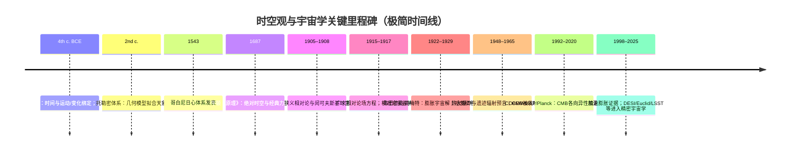

<!-- 每篇结构：1. 简单描述 2. 相关图 3. 分类:解读+表格 4. 详细专业论述  5. 实例:解读+表格 -->

<strong>全文目录</strong> (点击查看)

<!-- The 
 is for kramdown, which only partially supports HTML5-->

- [**一 宇宙学框架 Cosmological Framework**](#一-宇宙学框架-cosmological-framework)
  - [**宇宙 Universe**：包含所有时空、物质、能量及其相互作用的整体](#宇宙-universe包含所有时空物质能量及其相互作用的整体)
  - [**可观测宇宙 Observable universe**：在光速和宇宙年龄限制下，人类目前理论上可观测到的宇宙区域](#可观测宇宙-observable-universe在光速和宇宙年龄限制下人类目前理论上可观测到的宇宙区域)
    - [**宇宙微波背景辐射 Cosmic Microwave Background (CMB)**：宇宙辐射底噪与宇宙史记忆](#宇宙微波背景辐射-cosmic-microwave-background-cmb宇宙辐射底噪与宇宙史记忆)
    - [**重子声学振荡 Baryon Acoustic Oscillations (BAO)**：从早期声学到晚期几何的“标准尺”](#重子声学振荡-baryon-acoustic-oscillations-bao从早期声学到晚期几何的标准尺)
  - [**时空 Spacetime**：将时间与空间统一描述的物理结构，是广义相对论的基本框架](#时空-spacetime将时间与空间统一描述的物理结构是广义相对论的基本框架)
  - [**宇宙学原理 Cosmological Principle**：宇宙空间分布是均匀且各向同性的基本假定](#宇宙学原理-cosmological-principle宇宙空间分布是均匀且各向同性的基本假定)
  - [**FLRW 度规 FLRW Metric**：描述满足宇宙学原理且随时间动态膨胀或收缩的齐次各向同性时空几何](#flrw-度规-flrw-metric描述满足宇宙学原理且随时间动态膨胀或收缩的齐次各向同性时空几何)
  - [**哈勃定律 Hubble–Lemaître law**：宇宙均匀膨胀，遥远星系的退行速度与距离成正比](#哈勃定律-hubblelemaître-law宇宙均匀膨胀遥远星系的退行速度与距离成正比)
  - [**临界密度 Critical Density**：使膨胀宇宙的空间几何恰好保持欧几里得平直状态所需的总能量密度阈值](#临界密度-critical-density使膨胀宇宙的空间几何恰好保持欧几里得平直状态所需的总能量密度阈值)
  - [**宇宙曲率 Spatial Curvature**：描述空间整体几何形状为封闭、平直或开放的拓扑属性](#宇宙曲率-spatial-curvature描述空间整体几何形状为封闭平直或开放的拓扑属性)
  - [**宇宙视界 Cosmological Horizons**：观测者在物理上能够接收信号或建立因果联系的时空边界](#宇宙视界-cosmological-horizons观测者在物理上能够接收信号或建立因果联系的时空边界)
    - [**粒子视界 particle horizon**：宇宙开始至今，光子在膨胀时空中所能传播的最大共动距离](#粒子视界-particle-horizon宇宙开始至今光子在膨胀时空中所能传播的最大共动距离)
    - [**事件视界 event horizon**：光信号能够到达观测者的最大时空界限](#事件视界-event-horizon光信号能够到达观测者的最大时空界限)
  - [**宇宙学常数 Cosmological Constant**：驱动宇宙加速膨胀的“暗能量”来源](#宇宙学常数-cosmological-constant驱动宇宙加速膨胀的暗能量来源)
  - [**ΛCDM 模型的未解之谜**：当下观测与理论的差异](#λcdm-模型的未解之谜当下观测与理论的差异)
    - [**哈勃张力 Hubble Tension**：局部宇宙测量的哈勃常数与早期宇宙外推的差距](#哈勃张力-hubble-tension局部宇宙测量的哈勃常数与早期宇宙外推的差距)
    - [**JWST 早期星系异常 JWST Early Galaxy Anomalies**：极高红移下观测到了比标准模型预测规模更大、更成熟的星系](#jwst-早期星系异常-jwst-early-galaxy-anomalies极高红移下观测到了比标准模型预测规模更大更成熟的星系)
    - [**S8​ 张力 S8 Tension**：宇宙中物质结构的演化比预期更慢、更“平滑”。](#s8-张力-s8-tension宇宙中物质结构的演化比预期更慢更平滑)
    - [**锂丰度问题 Cosmological Lithium Problem**：大爆炸核合成理论预测的锂-7丰度比在古老恒星中观测到的高 3 倍](#锂丰度问题-cosmological-lithium-problem大爆炸核合成理论预测的锂-7丰度比在古老恒星中观测到的高-3-倍)
    - [**CMB 异常与宇宙偶极矩 CMB Anomalies and Cosmic Dipole**：宇宙学原理可能在极高尺度上失效](#cmb-异常与宇宙偶极矩-cmb-anomalies-and-cosmic-dipole宇宙学原理可能在极高尺度上失效)
    - [**真空灾难 Vacuum Catastrophe**：量子场论预测的真空能量密度比天文观测到的暗能量高出 120 个数量级](#真空灾难-vacuum-catastrophe量子场论预测的真空能量密度比天文观测到的暗能量高出-120-个数量级)
    - [**暗能量 Dark Energy**：物理本质究竞是真空常数、某种动态标量场，还是广义相对论的修正](#暗能量-dark-energy物理本质究竞是真空常数某种动态标量场还是广义相对论的修正)
    - [**暗物质 Dark Matter**：暗物质候选者至今未被直接探测证实。](#暗物质-dark-matter暗物质候选者至今未被直接探测证实)
    - [**星系旋转曲线异常 Galaxy Rotation Curves**：星系外围恒星的轨道速度不随距离增加而下降](#星系旋转曲线异常-galaxy-rotation-curves星系外围恒星的轨道速度不随距离增加而下降)
    - [**暗物质小尺度矛盾 Dark Matter Small-scale Contradictions**：冷暗物质模型在星系尺度上的模拟与观测不符](#暗物质小尺度矛盾-dark-matter-small-scale-contradictions冷暗物质模型在星系尺度上的模拟与观测不符)
- [**宇宙热史 Cosmic History**](#宇宙热史-cosmic-history)
    - [**大爆炸模型 Big Bang Model**：描述宇宙起源及早期演化的宇宙学模型](#大爆炸模型-big-bang-model描述宇宙起源及早期演化的宇宙学模型)
    - [**普朗克时期 Planck Epoch**](#普朗克时期-planck-epoch)
    - [**大统一时期 Grand Unification Epoch**：强相互作用与电弱相互作用统一为同一规范相互作用的假想阶段（理论）](#大统一时期-grand-unification-epoch强相互作用与电弱相互作用统一为同一规范相互作用的假想阶段理论)
    - [**大暴胀 Cosmic Inflation**：早期宇宙经历的极短暂指数膨胀阶段](#大暴胀-cosmic-inflation早期宇宙经历的极短暂指数膨胀阶段)
    - [**夸克/轻子时期**](#夸克轻子时期)
    - [重子生成 Baryogenesis](#重子生成-baryogenesis)
    - [原初核合成 BBN](#原初核合成-bbn)
    - [复合 Recombination](#复合-recombination)
    - [**黑暗时代 Cosmic Dark Ages**](#黑暗时代-cosmic-dark-ages)
    - [**再电离 Epoch of Reionization**](#再电离-epoch-of-reionization)
    - [**第一代恒星 Population III stars**](#第一代恒星-population-iii-stars)
    - [**暗能量主导期**](#暗能量主导期)
    - [**宇宙终极命运 Ultimate Fate of the Universe**：关于宇宙长期演化结局的理论描述](#宇宙终极命运-ultimate-fate-of-the-universe关于宇宙长期演化结局的理论描述)
- [**宇宙大尺度结构 Large-scale Structure (LSS)**](#宇宙大尺度结构-large-scale-structure-lss)
  - [**宇宙网 Cosmic Web**：暗物质主导形成的丝状与节点状分布网络](#宇宙网-cosmic-web暗物质主导形成的丝状与节点状分布网络)
  - [**丝状体 Cosmic Filaments**：连接星系团和超星系团的高密度物质带](#丝状体-cosmic-filaments连接星系团和超星系团的高密度物质带)
  - [**空洞 Cosmic Voids**：星系密度极低的巨大空间区域](#空洞-cosmic-voids星系密度极低的巨大空间区域)
  - [**超星系团 Superclusters**：由多个星系团、星系群及丝状体构成的大尺度结构](#超星系团-superclusters由多个星系团星系群及丝状体构成的大尺度结构)
  - [**星系团 Galaxy Clusters**：在引力束缚下聚集的大量星系系统](#星系团-galaxy-clusters在引力束缚下聚集的大量星系系统)
  - [**星系群 Galaxy Groups**：规模小于星系团的星系集合体](#星系群-galaxy-groups规模小于星系团的星系集合体)
  - [**巨引源 Great Attractor**：宇宙结构运动流线汇聚的重力焦点](#巨引源-great-attractor宇宙结构运动流线汇聚的重力焦点)
- [**星系系统 Galactic Systems**](#星系系统-galactic-systems)
  - [**星系 Galaxies**：由恒星、气体、尘埃、暗物质组成并受引力约束的系统](#星系-galaxies由恒星气体尘埃暗物质组成并受引力约束的系统)
    - [**椭圆星系 Elliptical Galaxies**：恒星分布平滑、气体含量低、恒星形成活动弱的星系类型](#椭圆星系-elliptical-galaxies恒星分布平滑气体含量低恒星形成活动弱的星系类型)
    - [**螺旋星系 Spiral Galaxies**：具有旋转盘面和旋臂结构的星系](#螺旋星系-spiral-galaxies具有旋转盘面和旋臂结构的星系)
    - [**棒旋星系 Barred Spiral Galaxies**：中心具有棒状恒星结构的螺旋星系](#棒旋星系-barred-spiral-galaxies中心具有棒状恒星结构的螺旋星系)
    - [**不规则星系 Irregular Galaxies**：缺乏明显几何对称结构的星系](#不规则星系-irregular-galaxies缺乏明显几何对称结构的星系)
    - [**矮星系 Dwarf Galaxies**：质量和体积显著小于典型星系的星系类型](#矮星系-dwarf-galaxies质量和体积显著小于典型星系的星系类型)
  - [**活动星系 Active Galaxy**：核区有显著的非恒星辐射的星系](#活动星系-active-galaxy核区有显著的非恒星辐射的星系)
    - [**类星体 Quasars**：中心黑洞吸积物质并释放极高能量的遥远活动星系核](#类星体-quasars中心黑洞吸积物质并释放极高能量的遥远活动星系核)
    - [**射电星系 Radio Galaxies**：在射电波段辐射强烈的活动星系](#射电星系-radio-galaxies在射电波段辐射强烈的活动星系)
    - [**塞弗特星系 Seyfert Galaxies**：中心核区高能辐射明显但整体亮度较低的星系](#塞弗特星系-seyfert-galaxies中心核区高能辐射明显但整体亮度较低的星系)
    - [**活动星系核 Active Galactic Nuclei (AGN)**：由超大质量黑洞及其吸积盘构成的高能天体区域](#活动星系核-active-galactic-nuclei-agn由超大质量黑洞及其吸积盘构成的高能天体区域)
  - [**星系际介质 Intergalactic Medium (IGM)**：存在于星系之间的稀薄物质](#星系际介质-intergalactic-medium-igm存在于星系之间的稀薄物质)
- [**次级星系结构 Sub-galactic Structures**：星系的内部结构，在物理属性与演化中扮演重要角色](#次级星系结构-sub-galactic-structures星系的内部结构在物理属性与演化中扮演重要角色)
  - [**星系核与核球 Galactic Center \& Bulge**：星系中心的高恒星密度区域，通常包含 SMBH 及被其引力支配的核星团](#星系核与核球-galactic-center--bulge星系中心的高恒星密度区域通常包含-smbh-及被其引力支配的核星团)
  - [**星系盘 Galactic Disk**： 旋涡星系的主要部分，包含大部分年轻恒星、气体和尘埃](#星系盘-galactic-disk-旋涡星系的主要部分包含大部分年轻恒星气体和尘埃)
  - [**旋臂 Spiral Arms**：盘内的高密度波，是恒星形成的活跃区](#旋臂-spiral-arms盘内的高密度波是恒星形成的活跃区)
  - [**星系棒 Bar**： 部分星系中心存在的贯穿核球的棒状恒星聚集结构，负责向中心输送气体](#星系棒-bar-部分星系中心存在的贯穿核球的棒状恒星聚集结构负责向中心输送气体)
  - [**星系晕 Galactic Halo**：包裹整个星系的球状区域，密度极低，分布着古老的球状星团和暗物质](#星系晕-galactic-halo包裹整个星系的球状区域密度极低分布着古老的球状星团和暗物质)
  - [**星团 Star Clusters**：星系中的恒星集群](#星团-star-clusters星系中的恒星集群)
  - [**星际介质 Interstellar Medium (ISM)**：存在于恒星之间的气体和尘埃](#星际介质-interstellar-medium-ism存在于恒星之间的气体和尘埃)
    - [**星际气体 Interstellar Gas**：以氢和氦为主的稀薄气体成分](#星际气体-interstellar-gas以氢和氦为主的稀薄气体成分)
    - [**星际尘埃 Interstellar Dust**：由微小固体颗粒组成的物质成分](#星际尘埃-interstellar-dust由微小固体颗粒组成的物质成分)
  - [**星际云 Interstellar Clouds**：比周围致密、云状气体与尘埃集合体](#星际云-interstellar-clouds比周围致密云状气体与尘埃集合体)
    - [**H I 云（H I cloud）**: 以中性原子氢为主的星际介质团块](#h-i-云h-i-cloud-以中性原子氢为主的星际介质团块)
    - [**分子云 Molecular Clouds**：恒星形成的主要场所](#分子云-molecular-clouds恒星形成的主要场所)
    - [**恒星形成区 Star-forming Regions**：正在发生或即将发生恒星形成的区域](#恒星形成区-star-forming-regions正在发生或即将发生恒星形成的区域)
  - [**行星状星云 Planetary Nebulae (PNe)**：恒星晚期抛射气体形成的发光结构](#行星状星云-planetary-nebulae-pne恒星晚期抛射气体形成的发光结构)
  - [**超新星遗迹 Supernova Remnants (SNRs)**：超新星爆发后膨胀的气体与能量结构](#超新星遗迹-supernova-remnants-snrs超新星爆发后膨胀的气体与能量结构)
- [**高能与瞬变天体 High-energy and Transient Objects**](#高能与瞬变天体-high-energy-and-transient-objects)
  - [**超新星 Supernovae**：恒星在演化末期发生的剧烈爆发现象](#超新星-supernovae恒星在演化末期发生的剧烈爆发现象)
  - [**千新星 Kilonovae**：双中子星或中子星与黑洞并合产生的瞬变天文现象](#千新星-kilonovae双中子星或中子星与黑洞并合产生的瞬变天文现象)
  - [**伽马射线暴 Gamma-ray Bursts (GRBs)**：短时间内释放极高能量的宇宙事件](#伽马射线暴-gamma-ray-bursts-grbs短时间内释放极高能量的宇宙事件)
  - [**快速射电暴 Fast Radio Bursts (FRBs)**：持续毫秒级的高亮度射电脉冲](#快速射电暴-fast-radio-bursts-frbs持续毫秒级的高亮度射电脉冲)
  - [**X 射线源 X-ray Sources**：主要在 X 射线波段辐射的天体](#x-射线源-x-ray-sources主要在-x-射线波段辐射的天体)
  - [**引力波源 Gravitational Wave Sources**：产生可探测时空扰动的天体系统](#引力波源-gravitational-wave-sources产生可探测时空扰动的天体系统)
- [**恒星与恒星演化产物 Stars and Stellar Evolution**](#恒星与恒星演化产物-stars-and-stellar-evolution)
  - [**恒星 Stars**：通过核聚变产生能量并维持自身结构的自发光天体](#恒星-stars通过核聚变产生能量并维持自身结构的自发光天体)
    - [**主序星 Main Sequence Stars**：处于稳定氢聚变阶段的恒星](#主序星-main-sequence-stars处于稳定氢聚变阶段的恒星)
    - [**红矮星 Red Dwarfs**：质量低、温度低、寿命极长的恒星](#红矮星-red-dwarfs质量低温度低寿命极长的恒星)
    - [**红巨星 Red Giants**：核心氢耗尽后体积显著膨胀的恒星](#红巨星-red-giants核心氢耗尽后体积显著膨胀的恒星)
    - [**蓝巨星 Blue Giants**：质量大、温度高、光度强的恒星](#蓝巨星-blue-giants质量大温度高光度强的恒星)
    - [**超巨星 Supergiants**：质量和体积极大的晚期演化恒星](#超巨星-supergiants质量和体积极大的晚期演化恒星)
    - [**变星 Variable Stars**：从地球上观察其亮度有起伏变化的恒星](#变星-variable-stars从地球上观察其亮度有起伏变化的恒星)
  - [**沃尔夫-拉叶星 Wolf-Rayet stars**：大质量、强恒星风、外层剥离显著的演化阶段恒星](#沃尔夫-拉叶星-wolf-rayet-stars大质量强恒星风外层剥离显著的演化阶段恒星)
- [**恒星残骸 Stellar Remnants**：恒星生命结束后留下的核心](#恒星残骸-stellar-remnants恒星生命结束后留下的核心)
  - [**白矮星 White Dwarfs**：低至中等质量恒星演化终点形成的致密天体](#白矮星-white-dwarfs低至中等质量恒星演化终点形成的致密天体)
  - [**黑矮星 Black Dwarfs**：冷却的白矮星（理论）](#黑矮星-black-dwarfs冷却的白矮星理论)
  - [**中子星 Neutron Stars**：由超新星爆发后形成的超高密度恒星残骸](#中子星-neutron-stars由超新星爆发后形成的超高密度恒星残骸)
    - [**脉冲星 Pulsars**：高速自转并发射周期性电磁辐射的中子星](#脉冲星-pulsars高速自转并发射周期性电磁辐射的中子星)
    - [**磁星 Magnetars**：具有极强磁场的中子星类型](#磁星-magnetars具有极强磁场的中子星类型)
  - [**黑洞 Black Holes**：时空曲率大到光都无法从其事件视界逃脱的致密天体](#黑洞-black-holes时空曲率大到光都无法从其事件视界逃脱的致密天体)
    - [**恒星级黑洞 Stellar-mass Black Holes**：由大质量恒星坍缩形成的黑洞](#恒星级黑洞-stellar-mass-black-holes由大质量恒星坍缩形成的黑洞)
    - [**中等质量黑洞 Intermediate-Mass Black Holes （IMBHs）**：质量介于恒星级与超大质量之间的黑洞](#中等质量黑洞-intermediate-mass-black-holes-imbhs质量介于恒星级与超大质量之间的黑洞)
    - [**超大质量黑洞 Supermassive Black Holes, SMBHs**：位于星系中心、质量极大的黑洞](#超大质量黑洞-supermassive-black-holes-smbhs位于星系中心质量极大的黑洞)
    - [**原初黑洞 Primordial Black Hole**：早期宇宙中直接形成的黑洞（理论）](#原初黑洞-primordial-black-hole早期宇宙中直接形成的黑洞理论)
  - [**夸克星/奇异星 Quark Star/Strange Star**：去禁闭的夸克物质态天体（理论）](#夸克星奇异星-quark-starstrange-star去禁闭的夸克物质态天体理论)
  - [**预子星 Preon Star**：比夸克更基本的物质态天体（理论）](#预子星-preon-star比夸克更基本的物质态天体理论)
  - [**Thorne–Żytkow Object**：中子星核包裹在一个红超巨星内部（理论）](#thorneżytkow-object中子星核包裹在一个红超巨星内部理论)
  - [**暗能量星 Dark-energy Star**：充满负压真空能的致密球体（理论）](#暗能量星-dark-energy-star充满负压真空能的致密球体理论)
- [**行星系统 Planetary Systems**](#行星系统-planetary-systems)
  - [**行星 Planets**：绕恒星运行且自身不发生核聚变的天体](#行星-planets绕恒星运行且自身不发生核聚变的天体)
    - [**类地行星 Terrestrial Planets**：以岩石和金属为主要成分的行星](#类地行星-terrestrial-planets以岩石和金属为主要成分的行星)
    - [**气态巨行星 Gas Giants**：主要由氢氦构成、体积巨大的行星](#气态巨行星-gas-giants主要由氢氦构成体积巨大的行星)
    - [**冰巨行星 Ice Giants**：富含挥发性冰物质的巨行星](#冰巨行星-ice-giants富含挥发性冰物质的巨行星)
    - [**碳行星**：以碳化物与碳相为主的行星](#碳行星以碳化物与碳相为主的行星)
    - [**烟灰行星 Soot Planets**：表面被厚重有机雾霾笼罩的系外行星](#烟灰行星-soot-planets表面被厚重有机雾霾笼罩的系外行星)
    - [太阳系的行星与矮行星](#太阳系的行星与矮行星)
    - [**系外行星 Exoplanets**：位于太阳系之外、绕其他恒星运行的行星](#系外行星-exoplanets位于太阳系之外绕其他恒星运行的行星)
  - [**（天然）卫星 Natural Satellites (Moons):**：绕行星运行的天体](#天然卫星-natural-satellites-moons绕行星运行的天体)
  - [**行星环 Planetary Rings**：由大量小颗粒组成并绕行星分布的结构](#行星环-planetary-rings由大量小颗粒组成并绕行星分布的结构)
  - [**小行星 Asteroids**：主要分布于行星轨道之间的岩石天体](#小行星-asteroids主要分布于行星轨道之间的岩石天体)
  - [**小行星带 Asteroid Belt**：太阳系的残余建造工地](#小行星带-asteroid-belt太阳系的残余建造工地)
  - [**柯伊伯带 Kuiper Belt**：太阳系外侧的冰质小天体仓库](#柯伊伯带-kuiper-belt太阳系外侧的冰质小天体仓库)
  - [**彗星 Comets**：含挥发性物质并在接近恒星时产生彗发的天体](#彗星-comets含挥发性物质并在接近恒星时产生彗发的天体)
  - [**流星体 Meteoroids**：在行星际空间运动的小型固体天体](#流星体-meteoroids在行星际空间运动的小型固体天体)
- [**基本物质形态**](#基本物质形态)
  - [**普通物质（重子物质）Normal Matter (Baryonic Matter)**：由质子和中子组成的可直接观测物质](#普通物质重子物质normal-matter-baryonic-matter由质子和中子组成的可直接观测物质)
    - [**原子 Atoms**：由原子核和电子构成的基本化学单位](#原子-atoms由原子核和电子构成的基本化学单位)
    - [**离子 Ions**：失去或获得电子而带电的原子或分子](#离子-ions失去或获得电子而带电的原子或分子)
    - [**分子 Molecules**：由多个原子通过化学键结合形成的结构](#分子-molecules由多个原子通过化学键结合形成的结构)
    - [**等离子体 Plasma**：高度电离、整体呈现集体行为的物质状态](#等离子体-plasma高度电离整体呈现集体行为的物质状态)
  - [**暗物质 Dark Matter**：不参与电磁相互作用但具有引力效应的物质成分](#暗物质-dark-matter不参与电磁相互作用但具有引力效应的物质成分)
  - [**暗能量 Dark Energy**：驱动宇宙加速膨胀的未知能量成分](#暗能量-dark-energy驱动宇宙加速膨胀的未知能量成分)
- [**基本粒子与场**](#基本粒子与场)
  - [**基本粒子 Elementary Particles**：不可再分的物质与力的基本构成单元](#基本粒子-elementary-particles不可再分的物质与力的基本构成单元)
    - [**夸克 Quarks**：构成强子并参与强相互作用的基本粒子](#夸克-quarks构成强子并参与强相互作用的基本粒子)
    - [**轻子 Leptons**：不参与强相互作用的一类基本粒子](#轻子-leptons不参与强相互作用的一类基本粒子)
    - [**玻色子 Bosons**：自旋为整数的粒子，包括规范玻色子与希格斯玻色子](#玻色子-bosons自旋为整数的粒子包括规范玻色子与希格斯玻色子)
  - [**相互作用 Fundamental Interactions**](#相互作用-fundamental-interactions)
    - [**引力 Gravity**：描述质量与能量导致时空曲率的基本相互作用](#引力-gravity描述质量与能量导致时空曲率的基本相互作用)
    - [**电磁力 Electromagnetism**：作用于带电粒子的相互作用](#电磁力-electromagnetism作用于带电粒子的相互作用)
    - [**强相互作用 Strong Interaction**：束缚夸克形成强子的作用](#强相互作用-strong-interaction束缚夸克形成强子的作用)
    - [**弱相互作用 Weak Interaction**：导致粒子衰变的相互作用](#弱相互作用-weak-interaction导致粒子衰变的相互作用)
  - [**量子场 Quantum Fields**：在量子理论中描述粒子存在与相互作用的基本实体](#量子场-quantum-fields在量子理论中描述粒子存在与相互作用的基本实体)
  - [**真空能 Vacuum Energy**：真空状态下仍然存在的最低能量](#真空能-vacuum-energy真空状态下仍然存在的最低能量)
- [**理论与假设实体**](#理论与假设实体)
  - [**奇点 Singularity**：物理量在理论中趋于无穷大的时空点](#奇点-singularity物理量在理论中趋于无穷大的时空点)
  - [**视界 Event Horizon**：信息无法从其内部传递到外部的边界](#视界-event-horizon信息无法从其内部传递到外部的边界)
  - [**虚粒子 Virtual Particles**：量子场论中用于描述相互作用的计算实体](#虚粒子-virtual-particles量子场论中用于描述相互作用的计算实体)
  - [**拓扑缺陷 Topological Defects**](#拓扑缺陷-topological-defects)
    - [**宇宙弦 Cosmic Strings**：早期宇宙相变可能产生的线状结构](#宇宙弦-cosmic-strings早期宇宙相变可能产生的线状结构)
    - [**磁单极子 Magnetic Monopoles**：假设存在的单极磁荷粒子](#磁单极子-magnetic-monopoles假设存在的单极磁荷粒子)
    - [**畴壁 Domain Walls**：不同真空态区域之间的界面结构](#畴壁-domain-walls不同真空态区域之间的界面结构)

 

# **一 宇宙学框架 Cosmological Framework**

宇宙学的理论核心在于通过`时空`这一广义相对论基本框架，系统性地描述包含所有物质与能量相互作用的`宇宙`整体。在`宇宙学原理`关于空间均匀性与各向同性的基本假定下，物理学家利用`FLRW 度规`构建了动态演化的齐次各向同性时空几何，并结合`哈勃定律`所揭示的退行速度与距离的线性比例关系，确立了宇宙均匀膨胀的动力学图像。通过对比宇宙实际总能量密度与临界密度的阈值，我们可以推导出决定宇宙拓扑形状与终极命运的`宇宙曲率`，并在此基础上界定了受光速与宇宙年龄严格限制的`可观测宇宙`范围。

学习宇宙学的深远意义在于，它通过对`宇宙视界`的严谨刻画——包括限定过去信息传播范围的`粒子视界`，以及锁定未来因果联系上限的`事件视界`——为人类设定了理性的认知终极边界，使我们得以在因果律的宏大结构中，既能追溯万物的物理起源，亦能预判时空结构在演化终局中的逻辑走向。

## **宇宙 Universe**：包含所有时空、物质、能量及其相互作用的整体

当前已知显著天体分布的可观测宇宙对数缩放图
: 天体自左向右按其与地球的距离依次排列。左侧边缘描绘了地球及其近地天体；右侧边缘描绘了目前观测到最遥远的天体，包括伽马射线暴（GRBs）、类星体、星系超群以及宇宙微波背景辐射。图中天体的大小经夸张放大处理，以便于观察其形态。

宇宙，作为一切存在的总体，是物理学与哲学交汇处最深刻的研究对象。从直觉上理解，宇宙是空间、时间、物质与能量的总和，是已知与未知现象的终极容器。然而，在现代物理学框架下，"宇宙"这一概念本身就蕴含着多层次的精确内涵与认识论边界：我们所能观测的宇宙（可观测宇宙，Observable Universe）由光速与宇宙年龄共同划定，其边界是一个与我们相距约46.5亿秒差距（约460亿光年）的共动视界球面，这一数字之所以远超宇宙年龄（约138亿年）乘以光速，正是由于宇宙的持续膨胀；而"整个宇宙"（the Universe at large）则可能在可观测边界之外无限延伸，其空间曲率、拓扑结构以及是否存在其他"宇宙域"，至今仍是物理学最深刻的开放问题之一。

宇宙的组成在现代宇宙学的精密观测下呈现出令人惊叹的陌生面貌。我们日常生活所熟悉的一切——行星、恒星、气体云、重子物质——仅占宇宙总能量密度的约4.9%；其余由约26.8%的暗物质和约68.3%的暗能量（以宇宙学常数形式存在）构成，两者都不与电磁辐射发生相互作用，只能通过引力效应间接探测。这一图景并非凭空臆造，而是从独立的多个观测渠道——CMB各向异性、大尺度结构功率谱、Ia型超新星距离-红移关系、宇宙年龄约束、宇宙轻元素丰度与大爆炸核合成的预言比对——共同汇聚而成。

宇宙有一个起点，或者更准确地说，有一个我们所知物理规律能够描述的最早时刻。大爆炸（Big Bang）理论并非描述一次爆炸，而是描述宇宙从极高温、极高密度的初始状态开始膨胀冷却的整个演化历程。在这一图景下，时间本身与空间一道在大爆炸时刻诞生，询问"大爆炸之前发生了什么"在经典广义相对论框架内是无意义的，因为时间坐标本身在奇点处失效。宇宙的演化是一部宏大的冷却史：从普朗克时代（$t \sim 10^{-43}$ s，$T \sim 10^{32}$ K，能量尺度约 $10^{19}$ GeV）所有已知物理规律失效的极端状态，经过依次出现的大统一相变、电弱相变、夸克-强子相变、大爆炸核合成（BBN，$t \sim 180$ s—$20$ min）、物质-辐射等密（$z \sim 3400$，$t \sim 47000$ 年）、光子退耦与再组合（$z \sim 1100$，$t \sim 380000$ 年），到恒星与星系的逐步形成（宇宙黎明，$z \sim 15$—$30$），直至今日的低温低密度宇宙（$T_{CMB} = 2.72548 \pm 0.00057$ K，Fixsen 2009）。

在这一宏大演化的背后，宇宙膨胀的数学框架由弗里德曼-勒梅特-罗伯逊-沃克（FLRW）度规精确描述。FLRW度规是在宇宙学原理（大尺度均匀性与各向同性）下广义相对论场方程的最一般对称解，其线元形式为：

$$ds^2 = -c^2 dt^2 + a(t)^2\left[\frac{dr^2}{1-kr^2} + r^2 d\Omega^2\right]$$

其中 $a(t)$ 是无量纲的宇宙标度因子（scale factor），$k \in \{-1, 0, +1\}$ 分别对应开放、平坦、闭合的空间曲率，$d\Omega^2 = d\theta^2 + \sin^2\theta\, d\phi^2$ 是单位球面上的面积元。将爱因斯坦场方程 $G_{\mu\nu} + \Lambda g_{\mu\nu} = 8\pi G T_{\mu\nu}/c^4$ 应用于FLRW度规，得到描述宇宙整体动力学的弗里德曼方程：

$$H^2 \equiv \left(\frac{\dot{a}}{a}\right)^2 = \frac{8\pi G}{3}\rho - \frac{kc^2}{a^2} + \frac{\Lambda}{3}$$

以及加速度方程（Raychaudhuri方程）：

$$\frac{\ddot{a}}{a} = -\frac{4\pi G}{3}\left(\rho + \frac{3p}{c^2}\right) + \frac{\Lambda}{3}$$

这两个方程加上物质的连续性方程（即能量守恒）$\dot{\rho} + 3H(\rho + p/c^2) = 0$，构成描述宇宙整体演化的完备方程组。每一种物质成分 $i$ 具有状态方程 $p_i = w_i \rho_i c^2$，其中非相对论性物质（冷暗物质和重子）$w = 0$，辐射（光子和相对论性粒子）$w = 1/3$，宇宙学常数/暗能量 $w = -1$。从连续性方程可以推出每种成分的密度随标度因子的演化：$\rho_i \propto a^{-3(1+w_i)}$，因此物质密度 $\propto a^{-3}$（稀释），辐射密度 $\propto a^{-4}$（稀释加红移），宇宙学常数密度 $\propto a^0$（不变）。这一简洁的幂律关系决定了宇宙演化的各阶段主导成分：早期宇宙为辐射主导（$a \propto t^{1/2}$），中期为物质主导（$a \propto t^{2/3}$），今日起宇宙学常数主导（$a \propto e^{Ht}$，指数膨胀）。

宇宙的年龄是弗里德曼方程的直接输出，通过对哈勃参数的红移积分得到：

$$t_0 = \int_0^1 \frac{da}{aH(a)} = \frac{1}{H_0}\int_0^\infty \frac{dz}{(1+z)E(z)}$$

其中 $E(z) = H(z)/H_0 = \sqrt{\Omega_r(1+z)^4 + \Omega_m(1+z)^3 + \Omega_k(1+z)^2 + \Omega_\Lambda}$ 是无量纲哈勃函数。代入Planck 2018最佳拟合参数，宇宙年龄为 $t_0 = 13.787 \pm 0.020$ 亿年（Planck Collaboration 2020），这一数值与来自完全不同途径的独立约束——最古老球状星团的测光年龄（$\sim 12$—$13.5$ Gyr）、放射性铀/钍核时钟（cosmochronometry）——在误差范围内高度吻合，构成ΛCDM模型内部一致性的有力佐证。

宇宙的早期演化中，暴胀（Inflation）理论是解决视界问题（horizon problem）、平坦性问题（flatness problem）和磁单极子问题（monopole problem）的标准框架，同时为宇宙大尺度结构的形成提供初始密度扰动的量子起源机制。视界问题的核心困惑在于：CMB在全天范围内表现出极高的温度均匀性（相对涨落约 $10^{-5}$），但在标准大爆炸框架下，CMB的不同方向区域之间的因果视界（comoving Hubble radius $c/(aH)$）在再组合时期仅约 $\sim 1°$，即相隔超过约2°的天空区域在大爆炸标准理论下没有因果联系，无法解释它们为何拥有近乎相同的温度。暴胀通过在极早期（$t \sim 10^{-36}$—$10^{-32}$ s）引入一段超指数膨胀（$a \propto e^{Ht}$，$H$ 近似恒定）来解决这一问题：在暴胀之前，整个可观测宇宙曾处于因果联系的极小体积内，暴胀将其拉伸了至少60个e折叠（$e$-folds，即 $a$ 增大至少 $e^{60}$ 倍），使得今天可观测宇宙的所有部分都来自同一个热力学平衡的初始区域。平坦性问题的解决同理：标准大爆炸中，$|\Omega_\mathrm{total} - 1|$ 随时间增大（物质主导时 $\propto t^{2/3}$，辐射主导时 $\propto t$），若今天宇宙接近平坦则需要在普朗克时刻 $|\Omega - 1| < 10^{-60}$，是极不自然的微调；暴胀使宇宙曲率半径指数增大，将任意初始曲率在暴胀后稀释至接近零。

暴胀的微观实现通常引入一个缓慢滚动（slow-roll）的标量场——暴胀子（inflaton）$\phi$——其势能 $V(\phi)$ 在暴胀期间主导宇宙能量密度，其场方程为 $\ddot{\phi} + 3H\dot{\phi} + V'(\phi) = 0$（Klein-Gordon方程在FLRW背景下的形式），满足慢滚条件 $\epsilon \equiv -\dot{H}/H^2 \ll 1$ 和 $\eta \equiv \dot{\epsilon}/(H\epsilon) \ll 1$。在慢滚近似下，暴胀子的量子涨落在视界穿越时刻（horizon crossing，$k = aH$，其中 $k$ 是扰动的共动波数）"冻结"成经典的绝热密度扰动，其功率谱为近标度不变的形式：

$$\mathcal{P}_\mathcal{R}(k) = A_s\left(\frac{k}{k_*}\right)^{n_s - 1}$$

其中 $A_s$ 是在基准波数 $k_* = 0.05\ \mathrm{Mpc^{-1}}$ 处的功率谱振幅（Planck 2018: $\ln(10^{10}A_s) = 3.044 \pm 0.014$），$n_s$ 是标量谱指数（Planck 2018: $n_s = 0.9649 \pm 0.0042$，即接近但略小于1的"红谱"）。暴胀还产生原初引力波（原初张量扰动），其功率谱振幅与标量谱振幅之比定义为张量-标量比 $r = \mathcal{P}_T/\mathcal{P}_\mathcal{R}$，目前CMB B模偏振的上限给出 $r < 0.036$（95% CI，BICEP/Keck 2021），对众多暴胀模型（如 $R^2$ 暴胀即Starobinsky模型预言 $r \approx 0.004$，仍未被排除；单场单项式暴胀 $V \propto \phi^2$ 预言 $r \approx 0.13$，已被排除）提供了重要区分度。这些原初扰动是宇宙大尺度结构一切复杂性的种子，它们在引力不稳定性（Jeans不稳定性的宇宙学版本）的驱动下，经历约140亿年的增长，演化为今天所见的宇宙网络（Cosmic Web）。

宇宙大尺度结构的形成是一个从线性扰动演化到非线性引力坍缩的多尺度物理过程。在线性阶段，物质密度对比 $\delta(\mathbf{x},t) \equiv [\rho(\mathbf{x},t) - \bar\rho(t)]/\bar\rho(t)$ 满足线性增长方程：

$$\ddot\delta + 2H\dot\delta - \frac{4\pi G\bar\rho}{a^3}\delta = 0$$

在物质主导宇宙中，增长因子 $D_+(a) \propto a$（即 $\delta \propto a \propto (1+z)^{-1}$），而在宇宙学常数主导的加速膨胀宇宙中，增长受到宇宙膨胀的阻尼，增长因子的增长速率 $f \equiv d\ln D_+/d\ln a < 1$。这种增长的阻尼在宇宙学中被称为"增长率的宇宙学常数压制"，是通过红移空间畸变（Redshift Space Distortions，RSD）观测 $f\sigma_8$ 来探测暗能量和修改引力的核心可观测量之一。当密度对比 $\delta \sim 1$ 时，线性近似失效，扰动进入非线性坍缩阶段。球形顶帽坍缩（spherical top-hat collapse）的分析解给出，一个初始过密度为 $\delta_i$ 的球形区域在线性外推的过密度达到临界值 $\delta_c \approx 1.686$ 时发生维里化（virialization），形成稳定的暗物质晕（dark matter halo）。维里化后的晕遵循维里定理 $2K + U = 0$（$K$ 为动能，$U$ 为势能），其特征半径（维里半径 $r_\mathrm{vir}$）对应于晕的平均密度约为宇宙临界密度的200倍（所谓的 $r_{200}$）。

已维里化的暗物质晕的密度轮廓（density profile）在N体数值模拟中呈现为近似普适的NFW（Navarro-Frenk-White）形式：

$$\rho(r) = \frac{\rho_s}{(r/r_s)(1+r/r_s)^2}$$

其中 $r_s$ 是特征尺度半径，$\rho_s$ 是特征密度，两者通过浓度参数 $c = r_{200}/r_s$ 相互关联。NFW轮廓在中心处（$r \to 0$）呈现 $\rho \propto r^{-1}$ 的内尖刺（cusp），在外部（$r \gg r_s$）呈 $\rho \propto r^{-3}$，过渡处近似 $\propto r^{-2}$（对应对数斜率 $d\ln\rho/d\ln r = -2$ 处的等温球行为）。浓度参数 $c$ 对晕质量有依赖性（更大质量的晕浓度参数更低，约为 $c \sim 3$—$5$ 对于星系团，$c \sim 10$—$20$ 对于银河系量级的晕），这反映了大质量晕在宇宙演化中相对晚近形成、因此有更短时间进行中心质量聚集的历史。对NFW轮廓的中心陡度（cusp-core problem）以及矮星系中暗物质子结构数量（missing satellites problem）的观测挑战，构成ΛCDM在小尺度上的若干已知内部张力，正在通过暗物质自相互作用（SIDM）、重子物理反馈（超新星驱动的中心密度软化）等机制探索解决路径。

宇宙网络（Cosmic Web）是暗物质和重子物质在重力演化下形成的宏观结构，由节点（nodes，即星系团/超星系团）、纤维（filaments）、片状结构（sheets/walls）和巨大空洞（voids）构成分形状的网状拓扑。这一结构的形成可以追溯至Zel'dovich近似（Zel'dovich 1970）：在线性扰动增长到接近非线性之前，物质首先沿最小特征轴方向坍缩形成二维片（泛称"煎饼"，pancakes），随后在第二轴方向坍缩形成一维纤维，最终在三轴方向坍缩形成零维节点（星系团）。Zel'dovich近似给出的轨迹方程 $\mathbf{x}(t) = \mathbf{q} - D_+(t)\nabla\psi(\mathbf{q})$（其中 $\mathbf{q}$ 为拉格朗日坐标，$\psi$ 为引力势，$D_+$ 为线性增长因子），在壳交叉（shell crossing）之前精确，超过此后需要数值方法处理。现代大规模N体模拟（如Millennium Simulation，IllustrisTNG，Euclid Flagship）在数十亿粒子的尺度上追踪暗物质动力学，辅以流体动力学代码处理重子物理过程，复现了从小尺度（~kpc，单个星系分辨率）到大尺度（~Gpc，宇宙学体积）的多尺度结构，其与真实宇宙星系巡天（SDSS、2dFGRS、BOSS、DESI）的大尺度结构观测高度吻合。

宇宙学功率谱 $P(k)$ 是描述宇宙大尺度结构统计特性的核心工具，定义为密度对比在傅里叶空间中的方差：$\langle\tilde\delta(\mathbf{k})\tilde\delta^*(\mathbf{k}')\rangle = (2\pi)^3P(k)\delta^{(3)}(\mathbf{k}-\mathbf{k}')$。在 $\Lambda$CDM中，物质功率谱由暴胀给出的原初谱经过转移函数 $T(k)$ 修正得到：$P(k) \propto k^{n_s}T^2(k)D_+^2$。转移函数在大尺度（$k \ll k_{eq}$，$k_{eq} \sim 0.01\ \mathrm{Mpc}^{-1}$ 为物质-辐射等密波数）处近似为1，在小尺度（$k \gg k_{eq}$）处因辐射主导时期的声学振荡和Silk阻尼（photon diffusion damping）而产生压制，BBKS形式给出 $T(k) \sim [\ln(1+0.171q)/0.171q][1+0.284q+(1.18q)^2+(0.399q)^3+(0.490q)^4]^{-1/4}$ 其中 $q = k/\Gamma h$，$\Gamma$ 为形状参数。这一功率谱的精确形态——包括BAO振荡的峰谷位置、转移函数的截断尺度以及谱指数的精确值——已被现代大规模星系巡天（SDSS/BOSS DR12覆盖约140万个星系，eBOSS DR16添加类星体至 $z \sim 2.4$，正在运行的DESI预期覆盖超过4000万个目标）以亚百分位精度测量，成为约束宇宙学参数的最强大工具集之一。

暗物质的存在证据积累自多个独立观测层次，构成现代物理学中证据最为充分的基础推断之一。在星系尺度，Vera Rubin等人在1970年代确立的旋转曲线平坦化现象（rotation curve flatness）提供了最早、最直观的证据：理论上若星系质量集中于可见的恒星盘区域，则遵循开普勒第三定律，轨道速度 $v(r) \propto r^{-1/2}$（对于 $r$ 超过大部分质量所在位置）；然而观测表明旋转速度在 $r \sim 10$—$20$ kpc以外趋于平坦甚至略微上升，直接暗示 $M(r) \propto r$，即质量随半径线性增长，暗示存在延伸至可见盘之外的不可见质量晕（dark matter halo）。在星系团尺度，Fritz Zwicky于1933年通过对后发座星系团（Coma Cluster）中星系运动速度弥散的维里定理分析，首次发现引力质量超出可见质量约400倍（后经现代修正约为8倍超出），这是暗物质存在的历史最早推断。在宇宙学尺度，弱引力透镜（weak gravitational lensing）通过测量背景星系形状在前景质量分布引力场下的系统性扭曲（cosmic shear，宇宙剪切），直接重建物质（包括暗物质）的二维投影质量分布，无需任何关于物质动力学状态的假设。子弹星系团（Bullet Cluster，1E 0657-558）提供了迄今最具说服力的暗物质直接证据：两个子星系团正面碰撞后，X射线观测（Chandra）显示热气体（占重子质量约85%）因流体动力学阻力而减速留在碰撞中心，而引力透镜重建的总质量中心却超前于气体、与星系（碰撞截面小，几乎无碰撞地穿越）位置吻合，清楚地表明大部分质量与气体分离，不可能是简单地修改引力理论的效应（因修改引力将跟随势阱，而势阱由透镜直接示踪，已超前于气体）。

暗物质的微观性质至今仍是粒子物理学和宇宙学交叉的最大谜题。在理论候选粒子方面，弱相互作用大质量粒子（WIMPs）曾是最受青睐的候选：若暗物质粒子的质量在 $\sim 10\ \mathrm{GeV}$—$\sim 10\ \mathrm{TeV}$范围内，其弱相互作用截面恰好给出正确的热遗迹丰度（"WIMP奇迹"，WIMP miracle），即从早期热宇宙中通过冻出（freeze-out）机制产生恰好与观测一致的暗物质密度 $\Omega_c h^2 \approx 0.12$。冻出机制的核心方程是Boltzmann方程对暗物质数密度 $n_\chi$ 的积分形式：

$$\frac{dn_\chi}{dt} + 3Hn_\chi = -\langle\sigma v\rangle(n_\chi^2 - n_{\chi,\mathrm{eq}}^2)$$

其中 $\langle\sigma v\rangle$ 是热平均湮灭截面速度乘积，$n_{\chi,\mathrm{eq}}$ 是热平衡时的数密度。当 $\langle\sigma v\rangle n_\chi \lesssim H$ 时，湮灭率低于膨胀率，暗物质"冻结"（freeze out），其遗迹丰度正比于 $1/\langle\sigma v\rangle$。典型弱相互作用截面 $\langle\sigma v\rangle \sim 3 \times 10^{-26}\ \mathrm{cm^3\,s^{-1}}$ 给出 $\Omega_\chi h^2 \approx 0.1$，与观测惊人吻合。然而，尽管LHC（大型强子对撞机）在 $\sqrt{s} = 13\ \mathrm{TeV}$ 质心能量的质子-质子碰撞中已穷举了大量超对称（SUSY）参数空间，ATLAS和CMS实验均未发现TeV量级超对称粒子的信号；直接探测实验（LUX-ZEPLIN即LZ、XENONnT、PandaX-4T）以液氙技术将WIMP-核子自旋无关散射截面上限压至 $\sim 10^{-47}\ \mathrm{cm^2}$（对于50 GeV WIMP，LZ 2022）的前所未有低值；间接探测（Fermi-LAT伽马射线，AMS-02正电子/反质子）同样未发现来自WIMP湮灭的明确超出信号。这一系列"空手而归"的结果使WIMP候选正经历前所未有的参数空间压缩，但并未完全排除（较轻或较重质量区间仍有大量开放空间），同时促使理论社群更积极探索轴子（Axion，质量 $\sim 10^{-6}$—$10^{-3}$ eV，候选解决QCD强CP问题的Peccei-Quinn对称破缺所产生的伪南部-戈德斯通玻色子）、惰性中微子（sterile neutrino）、引力微粒（gravitino）、原初黑洞等替代候选者。

暗能量是宇宙学中最深刻的理论困境之一，它与粒子物理学中的真空能（vacuum energy）存在令人难堪的关联。量子场论中，真空能量密度（来自零点涨落的贡献）的自然估算尺度为 $\rho_\mathrm{vac}^{QFT} \sim M_P^4 \sim (10^{18}\ \mathrm{GeV})^4$（普朗克尺度截断）或至少 $\sim (10^2\ \mathrm{GeV})^4$（电弱对称破缺尺度截断），而观测到的暗能量密度约为 $\rho_\Lambda \sim (10^{-3}\ \mathrm{eV})^4$，两者相差约 $10^{120}$ 到 $10^{60}$ 个数量级——这被称为"宇宙学常数问题"（Cosmological Constant Problem），是理论物理学中最严重的理论-观测差距，Weinberg（1989）将其形容为"理论物理学中最严重的理论失败"。目前没有任何基于第一原理的理论解释为何真空能恰好为如此小的非零值。超对称理论原则上可以消除玻色子和费米子零点能的贡献（两者符号相反），但超对称显然是破缺的（否则超对称伴子质量应与已知粒子相同），破缺尺度引入的真空能贡献仍远超观测值。人择原理（Anthropic Principle）——尤其是在弦景观（String Landscape）框架内——提供了一种非传统的解释路径：若宇宙学常数在多宇宙（multiverse）的不同"泡泡"（bubble universes）中取随机值，则只有在宇宙学常数不过大（以允许星系和恒星形成）的宇宙中才会有观察者存在（Weinberg 1987的著名预言在超新星宇宙学发现宇宙加速膨胀前约十年提出，并已被其后的观测验证），但这一论证在认识论上引发了广泛的哲学争议，因为它本质上是一种关于观察者选择效应的统计推断，无法被传统科学方法证伪。

宇宙热历史中的大爆炸核合成（Big Bang Nucleosynthesis，BBN）是宇宙学中理论预言最精确的领域之一，也是我们能够可靠延伸的最早可观测时期。BBN发生在宇宙温度从约10 MeV降至约0.1 MeV（约 $t \sim 0.01$—$20$ min）的时间窗口内。在 $T \gtrsim 1\ \mathrm{MeV}$，弱相互作用（$n + \nu_e \leftrightarrow p + e^-$，$n + e^+ \leftrightarrow p + \bar\nu_e$）维持中子-质子数密度比在热平衡值 $n/p = e^{-(m_n - m_p)c^2/k_BT}$（其中 $m_n - m_p \approx 1.293\ \mathrm{MeV}$）。在 $T \approx 0.8\ \mathrm{MeV}$ 时弱相互作用冻结，$n/p \approx 1/6$；随后中子通过 $\beta$ 衰变（半衰期 $\tau_n \approx 878.4\ \mathrm{s}$，精确测量本身是粒子物理和宇宙学的精密界面）使比例降至 $n/p \approx 1/7$（在氘堡垒被突破，氦核合成开始时约为 $t \approx 200$ s）。最终约75%的重子以氢（$^1$H）形式存在，约25%以氦-4（$^4$He）形式存在（质量比），以及痕量的氘（D，$D/H \approx 2.5 \times 10^{-5}$）、氦-3（$^3$He）和锂-7（$^7$Li，$^7\mathrm{Li}/H \approx 1.6 \times 10^{-10}$，理论预测）。这些丰度比例仅依赖于一个参数——重子与光子的数密度比 $\eta_b = n_b/n_\gamma \approx 6.1 \times 10^{-10}$（对应 $\Omega_b h^2 \approx 0.022$）——以及中微子代数 $N_\nu$。观测到的原初氦丰度（通过低金属丰度HII区的氦复合线：$Y_p = 0.2449 \pm 0.0040$，Aver et al. 2015）和原初氘丰度（通过高红移类星体吸收系统，$D/H = (2.527 \pm 0.030) \times 10^{-5}$，Cooke et al. 2018）与BBN理论预言在亚百分位精度上高度一致，同时与Planck CMB对 $\Omega_b h^2$ 的独立测量相符合——这一跨越约10个数量级时间尺度（BBN在宇宙年龄约20分钟时，CMB在约380000年时）的一致性是大爆炸标准模型最深刻的内部自洽性证明之一。值得一提的是著名的"锂-7问题"（Lithium Problem）：观测到的原初 $^7$Li丰度（从贫金属晕族星的Spite Plateau: $^7\mathrm{Li}/H \approx (1.6 \pm 0.3) \times 10^{-10}$）比标准BBN预言低约3倍，这一长达30年的不符至今未有定论，可能来自恒星物理（元素弥散、原子扩散导致的表面Li消耗）、非标准BBN物理（额外的重子物理或中微子物理）或核反应截面的测量误差，是宇宙学-核物理-恒星物理交叉领域的持久谜题。

宇宙中微子背景（Cosmic Neutrino Background，CνB）是仅次于CMB的第二重要宇宙学热遗迹，但迄今尚未被直接探测。中微子在约 $T \approx 2$—$3\ \mathrm{MeV}$（$t \sim 1$ s）时与光子热浴退耦，形成各向同性、均匀分布的中微子背景，其当前温度为 $T_\nu = (4/11)^{1/3}T_\gamma \approx 1.945$ K（由于正负电子湮灭加热光子而非中微子），对应每种味道约 $56\ \mathrm{cm^{-3}}$ 的数密度（三味共约 $336\ \mathrm{cm^{-3}}$）。中微子质量上限由宇宙学给出最严格约束：大质量中微子会抑制小尺度结构形成（因为中微子的自由流动（free streaming）熨平了小于自由流动长度的密度扰动），CMB+BAO+LSS的联合约束给出三代中微子质量之和 $\sum m_\nu < 0.12$ eV（Planck 2018，95% CI）。中微子振荡实验（Super-Kamiokande、SNO、KamLAND等）已确认中微子具有非零质量，质量分裂（mass splittings）给出 $\sqrt{\Delta m^2_{21}} \approx 8.6 \times 10^{-3}$ eV 和 $\sqrt{\Delta m^2_{31}} \approx 50 \times 10^{-3}$ eV，但绝对质量标度尚未测定，正质量（normal hierarchy，$m_1 < m_2 \ll m_3$）或倒质量（inverted hierarchy，$m_3 \ll m_1 < m_2$）顺序仍有待确认，这将是未来宇宙学观测（DESI、欧几里得卫星、Rubin LSST）的重要科学目标。PTOLEMY实验正尝试通过测量氚 $\beta$ 衰变终端电子能谱中CνB对中微子的捕获信号来直接探测宇宙中微子背景，这将是人类首次直接探测到该背景辐射。

宇宙物质-反物质不对称性（baryon asymmetry，重子不对称）是宇宙学中另一个深层谜题，其参数化为 $\eta_b \approx 6 \times 10^{-10}$，意味着在早期宇宙中，每 $10^{10}$ 对正反质子湮灭后剩余约1个质子。Sakharov（1967）提出了产生这一不对称所需的三个条件：重子数不守恒（B violation）、C和CP对称性破缺（C and CP violation）、以及热力学非平衡（departure from thermal equilibrium）。标准模型在原则上满足这三个条件（电弱相变期间存在弱相互作用对B+L的破缺、CKM矩阵包含CP破缺相）但实际量化给出的不对称比观测值小约10个数量级，因此重子成因（Baryogenesis）仍是开放问题。候选机制包括电弱重子成因（Electroweak Baryogenesis，需要比标准模型预言更强的一阶相变）、轻子成因（Leptogenesis，通过大质量右手中微子的CP破缺衰变产生轻子不对称，再由泡子（sphaleron）过程转化为重子不对称）、以及GUT（大统一理论）量级的重子成因。这些机制的检验最终将依赖于对CP破缺（包括轻子区中微子振荡中的Dirac CP相 $\delta_{CP}$ 的精确测量，这是T2K、NO$\nu$A、未来的DUNE和Hyper-Kamiokande实验的核心目标）以及可能存在的质子衰变（proton decay，GUT预言质子寿命约 $10^{34}$—$10^{36}$ 年，Hyper-K和JUNO等实验正在探索）的精密测量。

恒星是宇宙物质与能量循环的核心节点，也是宇宙化学演化（cosmic chemical evolution）的引擎。恒星的生命从分子云的引力坍缩开始，经历主序（main sequence，氢燃烧）、红巨星（红超巨星）、以及依质量不同而分叉的末态：低质量恒星（$M \lesssim 8\ M_\odot$）经行星状星云（planetary nebula）阶段留下白矮星（white dwarf，由电子简并压支撑，质量上限即Chandrasekhar极限 $M_{Ch} = 5.83 Y_e^2 M_\odot \approx 1.44\ M_\odot$，$Y_e$ 为电子数分子量）；大质量恒星（$M \gtrsim 8\ M_\odot$）在铁核（iron core）形成后因无法继续核燃烧而发生引力坍缩，触发核心坍缩型超新星（core-collapse supernova，CCSN），留下中子星（neutron star，由中子简并压和强相互作用支撑，质量上限即Tolman-Oppenheimer-Volkoff极限 $M_\mathrm{TOV} \approx 2$—$3\ M_\odot$，精确值取决于核物质状态方程）或黑洞（black hole）。中子星状态方程是当代核物理学最前沿问题之一：对中子星最大质量的观测约束（最大质量已知中子星为PSR J0952-0607，$M = 2.35 \pm 0.17\ M_\odot$，Romani et al. 2022）以及NICER（Neutron star Interior Composition Explorer）对中子星半径的X射线脉冲轮廓测量（PSR J0030+0451的半径约 $12$—$13$ km，Miller et al. 2019；PSR J0740+6620的半径约 $12.4 \pm 1.3$ km，Riley et al. 2021），在密度超过核饱和密度（$\rho_0 \approx 2.7 \times 10^{17}\ \mathrm{kg\,m^{-3}}$）约2—8倍的极端条件下约束核物质的压力-密度关系，对于区分纯中子流体、含超子（hyperon）、或夸克-胶子等离子体（quark matter）核心等不同物理图景至关重要，同时对引力波双中子星并合事件的潮汐形变率（tidal deformability $\Lambda$，由GW170817波形分析约束 $\tilde\Lambda \lesssim 800$，Abbott et al. 2018）提供互补约束。

黑洞是广义相对论预言的极端时空弯曲结构，其存在已从多个独立观测角度得到确认。史瓦西黑洞（Schwarzschild black hole，不旋转、不带电）的度规：

$$ds^2 = -\left(1-\frac{r_s}{r}\right)c^2 dt^2 + \left(1-\frac{r_s}{r}\right)^{-1}dr^2 + r^2 d\Omega^2$$

其中 $r_s = 2GM/c^2$ 是史瓦西半径（事件视界，event horizon）。在事件视界处，$g_{tt} = 0$，即时间对于无穷远处的观察者无限减慢（引力红移无穷大），而对于自由落体的观察者，视界的穿越在有限的固有时间内完成且无奇异性（等效原理的局部有效性）。克尔黑洞（Kerr black hole，旋转）的解由Boyer-Lindquist坐标描述，并产生参考系拖曳效应（frame dragging，或Lense-Thirring效应），在事件视界之外存在所谓的"能量层"（ergosphere），其中不可能存在相对于无穷远静止的观测者。Penrose过程（Penrose process）允许从旋转黑洞的能量层提取旋转能量，这一机制的磁流体动力学版本（Blandford-Znajek机制，BZ process）被认为是活动星系核（AGN）相对论性喷流的主要能源机制。

关于黑洞的现代观测里程碑，事件视界望远镜（Event Horizon Telescope，EHT）于2019年发布了对M87星系中心黑洞（$M \approx 6.5 \times 10^9\ M_\odot$，距离约16.8 Mpc）的第一张"黑洞照片"：一个环形亮结构包围着中心暗影（shadow），与广义相对论对光子轨道（光子球，photon sphere，$r = 1.5 r_s$ 对于史瓦西黑洞）的预言精确吻合（EHT Collaboration 2019）。2022年EHT进一步发布了对银河系中心黑洞人马座A*（Sgr A*，$M \approx 4 \times 10^6\ M_\odot$，距离约8 kpc）的成像，由于Sgr A*的流量变化时标短（反映质量小，约数分钟），成像技术面临额外挑战（EHT Collaboration 2022）。Sgr A*的质量和距离也通过对银河系中心恒星轨道（S星，尤其是S2/S0-2）的多年精密追踪得到独立确认，Ghez et al.（2008）和Gillessen et al.（2009）从S2的完整17年轨道（$a = 1030\ \mathrm{AU}$，$P = 15.9$ 年，$e = 0.88$ 的高椭圆轨道）确定 $M \approx 4.1 \times 10^6\ M_\odot$，GRAVITY合作组（2018，2019）更以微角秒精度追踪了S2在近星点附近的运动，探测到广义相对论预言的轨道进动（Schwarzschild precession，$\Delta\phi \approx 0.2°$ per orbit）和引力红移（$z_\mathrm{grav} \approx 2 \times 10^{-4}$ at periapsis），是迄今在强场引力区域对广义相对论最精确的检验之一。

引力波天文学的开启是21世纪物理学最重大的实验突破之一。LIGO（激光干涉引力波天文台）于2015年9月14日首次探测到引力波（GW150914），来自两个黑洞的并合（$m_1 \approx 36\ M_\odot$，$m_2 \approx 29\ M_\odot$，合并后黑洞质量约 $62\ M_\odot$，辐射约 $3\ M_\odot c^2$ 的引力波能量，峰值光度约 $3.6 \times 10^{49}$ W，即宇宙所有可见天体电磁辐射总功率的约 $50$ 倍）。引力波应变（strain）$h = \Delta L/L$（L为臂长），对于GW150914约为 $h \sim 10^{-21}$，对应4 km臂长的 $\Delta L \sim 4 \times 10^{-18}$ m（约质子半径的1/1000）。LIGO-Virgo-KAGRA合作组在O1、O2、O3运行期探测到近百个引力波事件（GWTC-3目录），包括双黑洞（BBH）、双中子星（BNS）、以及黑洞-中子星（NSBH）并合，构建起致密天体并合的统计样本，对双星演化、黑洞质量谱（尤其是"质量间隙"，mass gap，$\sim 2.5$—$5\ M_\odot$ 处的缺口是否真实存在）以及中子星方程状态提供了前所未有的约束。

引力波的产生机制在弱场慢速近似（post-Newtonian approximation）下可用四极辐射公式描述：

$$\frac{dE}{dt} = -\frac{G}{5c^5}\langle\dddot{Q}_{ij}\dddot{Q}^{ij}\rangle$$

其中 $Q_{ij} = \int \rho\left(x_i x_j - \frac{1}{3}\delta_{ij}r^2\right)dV$ 是质量四极矩张量的无迹部分。对于双星系统，能量损失率驱动轨道收缩（啁啾，chirp），在并合前的inspiral阶段，波形频率 $f_{GW}$ 以 $\dot{f}_{GW} \propto f_{GW}^{11/3}\mathcal{M}^{5/3}$ 的速率增大（其中 $\mathcal{M} = \mu^{3/5}M^{2/5}$ 是啁啾质量），使得啁啾质量可以从引力波频率演化率精确读出，这是引力波数据中信息量最丰富的可观测量之一。双脉冲星系统PSR B1913+16（Hulse & Taylor，1975年发现，1993年诺贝尔物理学奖）因引力波辐射导致的轨道衰减（公转周期每年缩短约 $75.8\ \mu$s）与广义相对论预言的一致程度优于0.2%（经过40年观测，Weisberg & Taylor 2005），是引力波存在的间接证明，也是辐射阻尼（radiation backreaction）理论的精密检验。

宇宙物理学中的热力学视角提供了一个关于宇宙演化方向的深层视野。热力学第二定律——孤立系统的熵（entropy）不减——在宇宙学语境中提出了深刻问题：若宇宙总熵在增加，则宇宙初始状态必然处于极低熵（高度有序）的特殊状态。Roger Penrose通过魏尔曲率假设（Weyl Curvature Hypothesis）论证，宇宙的低熵起源与引力自由度的特殊初始条件（平滑、各向同性的初始宇宙，对应极低的引力熵）密切相关——在引力存在的情况下，均匀分布并非最大熵状态（与非引力系统相反），因为引力允许物质通过聚集形成黑洞来大幅增加熵。Bekenstein-Hawking熵公式 $S_{BH} = k_B A/(4l_P^2)$（其中 $A$ 是黑洞事件视界面积，$l_P = \sqrt{\hbar G/c^3} \approx 1.616 \times 10^{-35}$ m是普朗克长度）表明，一个史瓦西黑洞的熵 $S \propto M^2$，这意味着若今天可观测宇宙中所有物质都坍缩成一个黑洞，其熵约为 $10^{123}\ k_B$，而当前宇宙总熵约为 $10^{104}\ k_B$（主要来自CMB光子的热辐射熵），两者差距约 $10^{19}$ 倍，表明宇宙距离最大熵（热寂，heat death）仍极为遥远，引力聚集仍有巨大的熵增潜力空间——而这正是星系、恒星、行星、生命能够存在的热力学基础。

Hawking辐射（Hawking radiation）是量子力学与广义相对论结合的最深刻预言之一，尽管至今尚未被直接观测。其物理起源在于量子真空涨落在黑洞事件视界附近产生虚粒子对：一个粒子落入视界，另一个逃逸至无穷远，从外部观察者角度表现为黑洞发射热辐射，温度为：

$$T_H = \frac{\hbar c^3}{8\pi G M k_B} \approx 6.2 \times 10^{-8}\left(\frac{M_\odot}{M}\right)\ \mathrm{K}$$

对于太阳质量量级的黑洞，$T_H \sim 10^{-8}$ K，远低于CMB温度 $2.73$ K，因此任何宏观天体物理黑洞都在净吸收CMB光子而非蒸发。Hawking辐射对质量极轻（$M \lesssim 10^{15}$ g，约小行星质量）的原初黑洞（Primordial Black Holes）才在宇宙年龄内具有可观的蒸发效应，质量约 $5 \times 10^{14}$ g的PBH正在今天蒸发，其信号（$\gamma$射线暴发）是探测PBH的可能方式。Hawking辐射更深刻的意义在于"黑洞信息悖论"（Black Hole Information Paradox）：若Hawking辐射是完全热的（无序随机的），则落入黑洞的量子态信息在黑洞蒸发后将永久丢失，违反量子力学的幺正性（unitarity）。这一悖论历经Hawking、Penrose、Susskind等人数十年争论，近年来通过对"Page曲线"（Page curve，描述纠缠熵随黑洞蒸发的演化应在"Page时间"后转而减小以维持幺正性）的岛公式（Island Formula）推导（Penington 2019，Almheiri et al. 2019），以及全息纠缠熵（holographic entanglement entropy，Ryu-Takayanagi公式）的语言，在理论上得到重要进展，表明幺正性可能被保持，但信息逃逸的物理机制（通过极晚期Hawking辐射的微妙量子相关性）在半经典近似下极为隐蔽。这是量子引力理论尚未完全建立的核心难题之一。

宇宙的空间拓扑（cosmic topology）超越了局部曲率的描述，涉及宇宙整体的全局连通性。即便在局部平坦（$k = 0$）或略微弯曲的宇宙中，全局拓扑仍可以是多连通的（multiply-connected），如3-环面（3-torus，$T^3$）、波乔德空间（Poincaré dodecahedral space）等，使宇宙在某些方向上"绕回"自身。若宇宙尺度足够小（共动尺度小于或可比于哈勃视界 $c/H_0$），则CMB温度涨落的角功率谱在最低多极矩（$\ell = 2$，四极矩；$\ell = 3$，八极矩）处将表现出功率压制和特定的统计各向异性特征，与简单连通的无限宇宙预期不同。Luminet et al.（2003）曾声称Poincaré空间可以解释Planck/WMAP观测到的低四极矩功率，但后续更精确的Planck数据对这一特定模型的支持程度有限。对多连通拓扑最直接的检验是寻找CMB全天温度图中的"匹配圆"（matched circles in the sky）：若宇宙在某个方向绕回，则CMB球面上存在两个大圆，其上的温度模式近乎相同（因为两个圆代表视界球面与同一基本域墙面的两次相交）。目前CMB数据对这一特征的搜索尚未给出阳性结果，约束宇宙基本域的长度尺度大于约 $0.98 c/H_0$（Cornish et al. 2004，Planck Collaboration 2016），但整个拓扑参数空间远未被穷举。

宇宙的命运（ultimate fate of the universe）是宇宙学的最终问题之一，其答案依赖于暗能量的本质。在宇宙学常数（$w = -1$）主导的宇宙中，膨胀以指数加速方式永续，温度趋近绝对零度，恒星熄灭（$\sim 10^{14}$ 年后），黑洞主导（$\sim 10^{40}$ 年后质子衰变将消除所有重子物质，若存在质子衰变的话），最终Hawking辐射蒸发最后的超大质量黑洞（约 $10^{100}$ 年量级），宇宙达到由稀疏光子和引力子组成的近真空高熵平衡态——Boltzmann脑（Boltzmann Brains）作为统计涨落自发出现的时间尺度远超任何结构时标——宇宙进入"热寂"（heat death/Big Freeze）。若暗能量方程状态 $w < -1$（幻影暗能量），则宇宙膨胀加速率本身随时间增大，最终在有限时间内（$t_{rip} \approx \frac{2}{3|1+w|H_0\sqrt{1-\Omega_m}}$ 对于常数 $w$）撕裂所有结构：星系团（$\sim t_{rip} - 60$ Myr前），银河系（$\sim - 20$ Myr），太阳系（$\sim -$ 数月），地球（$\sim -$ 最后30 min），原子（$\sim$ 最后 $10^{-19}$ s），空间本身的度规发散——即"大撕裂"（Big Rip）。若暗能量是动力学的（quintessence，满足 $w > -1$ 但随时间演变），或若暗能量最终衰变为物质状态，宇宙命运的预言将更为复杂，可能包括大反弹（Big Bounce，在量子宇宙学框架下）、循环宇宙（cyclic universe，如Penrose的共形周期宇宙学CCC，或Steinhardt-Turok的火劫宇宙学ekpyrotic model）等替代图景。

量子宇宙学（quantum cosmology）是对宇宙作为一个整体应用量子力学的尝试，其中心方程是Wheeler-DeWitt方程（WdW方程），可视为广义相对论的"薛定谔方程"：

$$\hat{H}\Psi[\gamma_{ij}, \phi] = 0$$

其中 $\hat{H}$ 是超哈密顿约束算符（superHamiltonian constraint），$\Psi[\gamma_{ij}, \phi]$ 是宇宙波函数（wave function of the universe），定义在三维黎曼度规 $\gamma_{ij}$ 和物质场 $\phi$ 构成的"超空间"（superspace）上。WdW方程的解给出宇宙在不同几何和场构型上的量子振幅，理论上包含关于宇宙初始状态（"无边界条件"，Hartle-Hawking波函数；或"隧穿条件"，Vilenkin波函数）的所有信息。然而，WdW方程存在严重的技术困难（超空间的无限维性、算符排序问题、时间问题——宇宙波函数不显式依赖时间，时间的出现需要通过近似（Born-Oppenheimer类比）从度规自由度中提取）。这些困难反映了量子力学与广义相对论在宇宙学尺度上的深层不兼容，是量子引力理论（弦理论、圈量子引力）最终需要解决的核心问题。圈量子宇宙学（Loop Quantum Cosmology，LQC）在圈量子引力框架内处理FLRW背景，预言当宇宙密度接近普朗克密度时排斥效应阻止经典奇点，替代以大爆炸前宇宙的量子反弹（Big Bounce），将宇宙历史在大爆炸前后连通，但这些预言目前仍难以直接观测检验。

多宇宙（multiverse）概念在现代宇宙学中以多种不同物理机制出现，彼此独立，认识论地位差异显著。永恒暴胀（eternal inflation）框架中，暴胀子场的量子涨落使得不同时空区域以不同速率终止暴胀，产生无限多个"泡泡宇宙"（bubble universes），每个泡泡在自身内部实现不同的暴胀后物理（可能对应弦景观中不同的真空），彼此之间被永续暴胀区域（de Sitter space）隔离，在因果上不可访问；弦景观（string landscape）预言约 $10^{500}$ 个不同的有效场论真空，每个真空具有不同的低能物理常数，使得宇宙常数的多样性（与人择原理的结合）成为理解其小但非零值的可能框架；量子力学的多世界诠释（Many-Worlds Interpretation，Everett 1957）将测量中的波函数坍缩替换为波函数分支（每次量子测量后宇宙分裂为包含所有可能结果的并行支），在这一意义上，宇宙学意义上的量子初始条件决定了我们所在分支的历史。这些多宇宙框架的共同困境在于可检验性（falsifiability）：泡泡宇宙之间的碰撞可能在CMB上留下圆形印记（bubble collision signatures），已通过Planck数据搜索但未发现阳性证据；弦景观的统计预测需要明确的先验测度（measure）才能给出可验证的概率分布，而测度问题（measure problem in eternal inflation）至今没有共识解法，使得弦景观在严格意义上尚不能给出确定性的可证伪预言。

宇宙的可观测性边界值得从信息论（information theory）的角度审视。粒子视界（particle horizon）定义了从大爆炸至今我们所能与之有过因果联系的宇宙最远区域，其共动距离为 $\chi_p = c\int_0^{t_0} dt'/a(t')$，在ΛCDM参数下约为46.5 Gpc；事件视界（event horizon）则定义了我们今后永远能与之发生因果联系的区域，$\chi_e = c\int_{t_0}^{\infty} dt'/a(t')$，在加速膨胀宇宙中为有限值约5 Gpc（即今天我们之外约16 Gly处的区域将永远在我们的宇宙学视野之外）。这意味着加速膨胀在宇宙的信息获取能力上施加了永久性的限制：当前宇宙学事件视界之外的星系正在加速远离，其发出的光将永远无法到达我们；未来的文明面对宇宙学常数主导的宇宙，将逐渐失去对越来越多宇宙区域的观测能力，直至宇宙在局部视界内看起来越来越空旷，最终留下的可观测宇宙将仅包含本星系群（Local Group，约 $3 \times 10^{12}\ M_\odot$，最终可能在约 $4$—$5$ Gyr后与仙女座星系并合形成"Milkomeda"）的引力束缚成员，而其他一切将永久性地退出因果联系的视野。

精密宇宙学（precision cosmology）的当代成就在于，通过综合CMB全天功率谱（温度、偏振、透镜）、大尺度结构BAO测量、SNe Ia宇宙距离阶梯、弱引力透镜宇宙剪切、星系团丰度计数（cluster abundance）以及中性氢Ly$\alpha$森林功率谱等多路径、多探针的独立测量，将ΛCDM的6个基础参数（$\Omega_b h^2$，$\Omega_c h^2$，$\theta_*$，$\tau$，$A_s$，$n_s$）约束至亚百分位精度，并由此推算出覆盖宇宙年龄、空间几何（$|\Omega_k| < 0.0007$，约束宇宙平坦至0.07%，Planck 2018+BAO）、暗能量方程状态（$w = -1.03 \pm 0.03$，与宇宙学常数在3%精度内吻合）等宇宙学参数全貌。这一综合图景是20世纪和21世纪上半叶人类智识探索的历史性成就，它将宇宙学从定性的哲学思辨转变为定量精密科学，并在此基础上开拓出新的疆域：暗物质粒子性质的直接探测、暗能量动力学性质的厘米精度测量、宇宙暴胀的张量-标量比约束、宇宙再电离历史的重建——这些问题的回答将不仅改变我们对宇宙的认识，更可能深刻变革基础物理学的理论结构。

除了主流的 ΛCDM 模型，还有为了解决某些悬而未决的问题而生其他宇宙假说：

`共形循环宇宙`（CCC）：庞罗斯的无限螺旋：诺贝尔奖得主罗杰·庞罗斯（Roger Penrose）提出，大爆炸并非万物的起点，而仅仅是一个无限循环系列中的一个节点。根据共形循环宇宙理论，在一个永世（Aeon）的末期，当所有物质衰变为辐射，宇宙尺度失去了几何参考意义，其无限膨胀的末端可以通过共形映射与下一个永世的大爆炸奇点平滑连接。庞罗斯甚至主张在 CMB 辐射中存在“霍金点”——即上一个永世中黑洞蒸发留下的残留热量，这一观点虽具争议，但却为循环论提供了观测路径。

`膜宇宙学`：高维散体中的孤岛：在弦理论和 M 理论的框架下，我们的三维宇宙（加上时间为四维）可能仅仅是一个嵌入在更高维空间（称为散体，Bulk）中的“膜”（Brane）。兰德尔-桑德拉姆模型（Randall-Sundrum）提出，由于引力可以自由进入额外维度，而电磁力等相互作用被限制在膜内，这解释了为何引力在微观尺度上如此微弱。在膜宇宙学中，大爆炸可能是两个膜在散体中发生碰撞而产生的能量释放过程。

`模拟假设`与`全息原理`：现实的信息本质：全息原理认为，一个空间体积内的所有信息都可以编码在其边界上。这种理论不仅用于解决黑洞信息悖论，也启发了关于宇宙本质是“投影”或“模拟”的思考。然而，2025 年的新研究对“模拟假设”提出了严峻挑战。  

根据 2025 年 4 月发表在《物理前沿》的研究，模拟一个包含量子效应的宏观宇宙所需的计算能耗是惊人的。研究者通过兰德尔原理和贝肯斯坦上限计算得出，即便只模拟地球的原子级细节，所需的能量也将超过银河系质能的数倍。此外，2025 年 11 月不列颠哥伦比亚大学（UBC）的研究利用哥德尔不完备定理证明，现实中存在大量不可算法化的非算法过程，这意味着没有任何经典或量子计算机能够完整模拟出这个宇宙的全部物理属性。

多重宇宙与`人择原理`：在永恒暴胀模型中，暴胀在不同区域停止，形成了无数个具有不同物理定律的“泡泡宇宙”。这为解决物理定律的“精细调节问题”提供了解释：如果存在无限个宇宙，那么必然有一个宇宙（即我们的宇宙）拥有适合生命存在的常数。虽然多重宇宙目前难以直接观测，但 CMB 中的某些异常斑块（如“冷斑”）被一些物理学家怀疑是另一个宇宙在碰撞中留下的伤痕。

`宇宙的部分参数`

| 物理解释                                                   | 物理量（符号）                           |                                                              典型值 | 主要观测/推断途径                                 | 说明                                                                                             |
| ---------------------------------------------------------- | ---------------------------------------- | ------------------------------------------------------------------: | ------------------------------------------------- | ------------------------------------------------------------------------------------------------ |
| 现今宇宙平均膨胀率（决定距离–红移关系的“归一化”）          | $$H_0$$                                  |                         $$67.4\pm0.5\ \mathrm{km,s^{-1},Mpc^{-1}}$$ | CMB 各向异性 +（常与）BAO 联合拟合                | “张力”讨论常围绕不同测量链得到的 $$H_0$$ 是否一致展开；此处为 CMB 推断值。                       |
| 无量纲化膨胀率（便于写成简洁的密度参数）                   | $$h\equiv H_0/100$$                      |                                                   $$h\approx0.674$$ | 由 $$H_0$$ 定义                                   | 许多参数以 $$\Omega_i h^2$$ 形式给出，减少与 $$H_0$$ 的简并。                                    |
| 宇宙年龄（在给定模型下从膨胀史积分得到）                   | $$t_0$$                                  |                                    $$13.787\pm0.020\ \mathrm{Gyr}$$ | CMB（+外部数据）在 $$\Lambda$$CDM 下推断          | 严格为“模型依赖量”：换模型（如 $$w\neq-1$$）数值会变。                                           |
| 用于定义所有 $$\Omega$$ 的密度标尺（“几何临界”对应的密度） | $$\rho_{c,0}=\dfrac{3H_0^2}{8\pi G}$$    | 约 $$8.53\times10^{-27}\ \mathrm{kg,m^{-3}}$$（代入上面的 $$H_0$$） | 由 $$H_0$$ 与常数 $$G$$ 推导                      | 这是“规范化常数”，不是独立观测量；用于把各种成分写成 $$\Omega_i=\rho_i/\rho_{c,0}$$。            |
| 现今总物质（重子+冷暗物质）占临界密度比例                  | $$\Omega_m$$                             |                                                   $$0.315\pm0.007$$ | CMB（峰结构、透镜）+ BAO                          | 粗略理解：决定“引力骨架”的强度与晚期结构增长的总体尺度。                                         |
| 现今暗能量（在 $$\Lambda$$CDM 中近似常数）占比             | $$\Omega_\Lambda$$                       |      约 $$0.685$$（与 $$\Omega_k\approx0$$、$$\Omega_m$$ 一起确定） | CMB/BAO 在近平直假设下推断                        | 仅在 $$\Lambda$$CDM 中可直接等同“宇宙常数项”；若允许 $$w(a)$$ 演化，解释会改变。                 |
| 空间曲率的等效密度参数（描述几何是否平直）                 | $$\Omega_k$$                             |                                               与 0 一致（近乎平直） | CMB 声学角尺度 + BAO 几何标尺                     | 通过角直径距离与声学标尺耦合被强约束；小的偏离也会显著影响距离关系。                             |
| “物理重子密度”（对早期声学与轻元素丰度都关键）             | $$\Omega_b h^2$$                         |                                                 $$0.0224\pm0.0001$$ | CMB（奇偶峰相对高度等）+ BBN 交叉检验             | 这是“真正进入早期微物理”的密度量，比单独 $$\Omega_b$$ 更基础。                                   |
| “物理冷暗物质密度”（决定引力势井与峰结构）                 | $$\Omega_c h^2$$                         |                                                   $$0.120\pm0.001$$ | CMB（峰高度/位置、透镜）+ LSS/BAO                 | 冷暗物质越多，早期引力势井越深，晚期结构增长更强。                                               |
| CMB 的热学基准：宇宙背景辐射温度（黑体谱温度）             | $$T_0$$                                  |                                   $$2.72548\pm0.00057\ \mathrm{K}$$ | COBE / FIRAS 绝对谱测量                           | 黑体谱精度极高，强支持“早期热平衡+膨胀冷却”的热大爆炸热史框架。                                  |
| 早期宇宙“声学角尺度”（CMB 峰位置的核心量）                 | $$100\theta_*$$                          |                                                 $$1.0411\pm0.0003$$ | CMB 温度/偏振功率谱峰位置                         | $$\theta_*$$ 近似为“复合时声学视界/到最后散射面的角直径距离”。                                   |
| BAO “标准尺”：拖曳纪元声学视界（常写 $$r_d$$）             | $$r_d$$                                  |                              约 $$147.1\ \mathrm{Mpc}$$（量级稳定） | BAO（星系相关函数特征尺度）+ CMB 早期物理         | 把“早期声学物理”投影到晚期星系分布，是连接早期与晚期宇宙的几何桥梁。                             |
| 原初标量扰动的谱指数（刻画“近尺度不变”的偏离）             | $$n_s$$                                  |                                                   $$0.965\pm0.004$$ | CMB 温度/偏振谱形状                               | $$n_s=1$$ 对应严格尺度不变；偏离提供早期宇宙机制（如暴涨）的判别信息。                           |
| 原初曲率扰动振幅（决定结构“种子”的强弱）                   | $$A_s$$（常以 $$\ln(10^{10}A_s)$$ 给出） |                                   $$\ln(10^{10}A_s)=3.044\pm0.014$$ | CMB 各向异性整体振幅（并与 $$\tau$$ 有简并）      | 物理上是“初始条件”的统计幅度；影响后续星系/星团形成的整体水平。                                  |
| 再电离对 CMB 的“二次散射强度”刻画                          | $$\tau$$                                 |                                                   $$0.054\pm0.007$$ | CMB 大尺度偏振（最敏感）                          | $$\tau$$ 越大，原初温度各向异性被“擦除”越明显，同时增强大尺度偏振信号。                          |
| 结构增长幅度的常用标尺（线性理论下的 RMS）                 | $$\sigma_8$$                             |                                                   $$0.811\pm0.006$$ | CMB 透镜重建、星系团簇、弱引力透镜、星系聚类联合  | 定义为半径 $$8h^{-1}\mathrm{Mpc}$$ 球内密度涨落的均方根；常与 $$\Omega_m$$ 组合成 $$S_8$$ 讨论。 |
| 早期辐射能量密度的“等效自由度”（检验暗辐射/新轻粒子）      | $$N_{\rm eff}$$                          |                                                     $$2.99\pm0.17$$ | CMB 阻尼尾 + BAO（打破几何简并）                  | 标准模型（含中微子微小修正）预期接近 3；显著偏离会指向新轻自由度。                               |
| 中微子总质量（影响小尺度结构增长与透镜）                   | $$\sum m_\nu$$                           |                                      $$<0.12\ \mathrm{eV}$$（上限） | CMB + BAO（对功率谱与距离的联合约束）             | 质量越大，对小尺度功率抑制越强；该约束随数据组合与模型空间而变。                                 |
| 早期热史的“重子数/光子数”比（BBN 的核心控制参量）          | $$\eta_b\equiv n_b/n_\gamma$$            |                                              约 $$6\times10^{-10}$$ | BBN（氘、氦等）+ CMB 对 $$\Omega_b h^2$$ 的一致性 | $$\eta_b$$ 也可视为“每个重子对应的熵含量”的逆量级；把早期微物理与今天的密度联系起来。            |

## **可观测宇宙 Observable universe**：在光速和宇宙年龄限制下，人类目前理论上可观测到的宇宙区域 
可观测宇宙——这个词组中每一个字都承载着精密的物理内涵。"可观测"并非指技术上的限制，而是一个由光速与宇宙年龄共同划定的基本物理边界；"宇宙"则是一切存在的总体，而其可观测部分仅仅是这个整体的一个有限采样。站在今天的认知高度，可观测宇宙是一个直径约930亿光年的球形区域，其中包含约两万亿个星系，约$10^{24}$颗恒星，约$10^{80}$个原子，以及数以千亿计的星系团、超星系团、巨型纤维与宇宙空洞所构成的宏观网络。这一数字规模令人目眩，但同样令人印象深刻的是，我们对这片广袤时空的认知已经精确到了足以在1%精度内描述其整体几何、组成与演化历史的程度。

从直觉感知的角度入门：当我们在晴朗的夜晚仰望星空，肉眼所见的几千颗恒星全部属于银河系，与可观测宇宙的全貌相比犹如太平洋中的一滴水。即便是最强大的望远镜在同一天空方向所能见到的最遥远光子，其出发地是宇宙大爆炸后仅约38万年的等离子体——那是宇宙微波背景辐射（CMB）光子最后一次与物质相互作用的表面，被称为"最后散射面"（Last Scattering Surface）。在这一视界之内，时间的积累与光速的有限性共同编织出一张宏大的观测之网：我们越看越远，实质上是在越看越早，每一架望远镜都是一台时间机器，而可观测宇宙的边界正是时间本身的极限——大爆炸时刻。

理解可观测宇宙的几何结构，必须首先厘清若干容易混淆的距离概念。共动距离（comoving distance）$\chi$ 是在扣除宇宙膨胀效应后定义的静止坐标距离，反映天体在当前宇宙膨胀框架下的"真实"空间位置；光行距离（lookback distance，或更准确地称为光行时间 $t_{lb}$）是光从源出发至今所用时间对应的尺度，对于 $z=1$ 的星系约为77.8亿年；固有距离（proper distance）$d_p(t) = a(t)\chi$ 是在某一宇宙学时刻 $t$ 上测量的物理间距，随标度因子增长而增大；光度距离（luminosity distance）$d_L = (1+z)\chi$ 用于将观测流量转换为内禀光度；角直径距离（angular diameter distance）$d_A = \chi/(1+z)$ 用于将观测角尺度转换为物理线尺度。这四种距离在低红移（$z \ll 1$）时趋于一致，但在宇宙学红移下产生显著差异，不同的观测目的需要使用不同的距离定义，混用会导致系统性错误。

可观测宇宙的粒子视界共动半径，通过以下积分精确给出：

$$\chi_p = c\int_0^{t_0}\frac{dt'}{a(t')} = \frac{c}{H_0}\int_0^{\infty}\frac{dz}{E(z)}$$

代入 Planck 2018 的最佳拟合参数（$H_0 = 67.36\ \mathrm{km\,s^{-1}\,Mpc^{-1}}$，$\Omega_m = 0.315$，$\Omega_\Lambda = 0.685$，$\Omega_r \approx 9.2 \times 10^{-5}$），数值积分给出 $\chi_p \approx 46.5$ Gpc $\approx 14.26$ Gpc/$H_0^{-1}$，即约 $14200$ Mpc 或 $46.3$ 十亿光年。这一数字常被误解：人们有时将其与宇宙年龄 $t_0 \approx 13.8$ Gyr 对应的"光行距离" $c t_0 \approx 13.8$ 十亿光年相混淆，认为可观测宇宙应为这个尺度。然而，两者差异（46.5 vs 13.8 Gly）完全来自宇宙膨胀：早期宇宙中，光子在出发后经历了宇宙的膨胀，其发源地在此后的时间内被宇宙膨胀携带到了远比光速传播所能到达更远的位置。更直观的理解是，共动粒子视界等于对光子行进路径积分 $d\chi = c\,dt/a(t)$ 的结果，而 $a(t)$ 在早期宇宙极小（物质主导时 $a \propto t^{2/3}$，辐射主导时 $a \propto t^{1/2}$），分母极小，使被积函数在早期宇宙极大，对总积分贡献显著。

CMB最后散射面的角直径距离约为 $d_A(z_{*}) \approx 13.9$ Mpc，对应共动距离 $\chi_{*} \approx d_A \times (1+z_*) \approx 13.9 \times 1091 \approx 15160$ Mpc，与粒子视界仅相差约 $1000$ Mpc，这说明CMB几乎已经是我们能够利用光子探测的宇宙边界——最后散射面与粒子视界之间的区域（对应 $z \gtrsim 1100$ 即大爆炸后前38万年的等离子体）对光子完全不透明，无法用电磁方式探测（但理论上可以通过引力波或中微子背景探测，参见后文）。这一几何事实决定了电磁观测宇宙学的根本局限：对宇宙的绝大多数演化历史（从大爆炸至再组合的$99.997\%$的宇宙年龄之前），我们只能通过CMB的一张"快照"加以研究，而无法进行任何直接的"逐层"深度探测。

可观测宇宙的质能清单（cosmic inventory）是现代宇宙学最重要的成就之一。按照 Planck 2018 参数，总能量密度由宇宙学临界密度 $\rho_c = 3H_0^2/(8\pi G) \approx 8.62 \times 10^{-27}\ \mathrm{kg\,m^{-3}}$（对应约5.4个质子$/\mathrm{m^3}$）精确给出，其中各成分的贡献如下：重子（原子）物质 $\Omega_b = 0.0493$，冷暗物质 $\Omega_c = 0.265$，暗能量 $\Omega_\Lambda = 0.685$，光子 $\Omega_\gamma \approx 5.4 \times 10^{-5}$，中微子 $\Omega_\nu h^2 \approx 0.0006$（对应 $\sum m_\nu \approx 0.06$ eV，取正质量顺序最小值）。在重子物质内部，进一步细分：约$10\%$的重子物质以恒星（可见光可探测）形式存在（$\Omega_* \approx 0.0024$，Fukugita \& Peebles 2004）；约$5\%$以致密天体（白矮星、中子星、黑洞）形式存在；其余约$85\%$以弥散气体形式分布——其中星系际介质（IGM）中的"温热星系际介质"（WHIM，温度约 $10^5$—$10^7$ K，通过氧和碳的紫外/X射线吸收线可探测）约占总重子质量的 $30$—$40\%$，是现代天文学中重要的"缺失重子"（missing baryon problem）研究对象；星系内的星际介质（ISM，分子云、HI气体、HII区等）约占 $5$—$10\%$；热星系团气体（ICM，通过X射线热辐射探测）约占 $4\%$。

关于重子物质的空间分布，宇宙网络（Cosmic Web）在观测层面有其精确的统计描述。宇宙空洞（cosmic voids）占据可观测宇宙体积的约$62\%$（Cautun et al. 2014），平均直径约20—30 Mpc，其内部物质密度约为宇宙平均的20—30\%；片状结构（sheets/walls）包围空洞，占体积约$28\%$；纤维（filaments）约占$10\%$的体积但包含约约$38\%$的质量；星系团和组（groups）节点仅占约$0.3\%$的体积但包含约$10\%$的质量。这一分布反映了暗物质在引力作用下的层级聚集历史，同时构成了宇宙尺度上最宏大的"建筑"。迄今已知的最大结构包括：赫尔克里斯-北冕座长城（Hercules-Corona Borealis Great Wall，$z \approx 2$，线度约$10$ Gpc，Horváth et al. 2014，但争议较大）、史隆长城（Sloan Great Wall，$z \approx 0.07$，线度约$420$ Mpc，Gott et al. 2005）、武仙-北冕长城（如上所述）、以及拉尼亚凯亚超星系团（Laniakea Supercluster，线度约520 Mpc，包含约10万个星系，总质量约$10^{17}\ M_\odot$，Tully et al. 2014），银河系位于其边缘的"本地泡"（Local Bubble）内。这些超大结构的定义依赖于速度场的流域划分（watershed in the peculiar velocity field），其边界处引力作用相互抵消，物质整体处于向不同超星系团流动的分水岭。

银河系（Milky Way）作为我们所在的星系，其详细研究是理解宇宙的起点与参照。银河系是一个棒旋星系（barred spiral galaxy，Hubble分类SBbc），总质量约 $1.0$—$1.5 \times 10^{12}\ M_\odot$（包含暗物质晕，Watkins et al. 2019），其中恒星质量约 $5 \times 10^{10}\ M_\odot$，冷气体（HI+H$_2$）约 $10^{10}\ M_\odot$。银盘直径约 $50$—$60$ kpc（包括外延的薄盘，López-Corredoira et al. 2018的翘曲盘测量），太阳位于距离银心约 $8.122 \pm 0.031$ kpc 处（GRAVITY Collaboration 2018，通过Sgr A*轨道恒星测量），距银道面约 $25 \pm 5$ pc。银盘的厚度存在两个组成成分：薄盘（thin disk，标高约 $300$ pc，$\alpha$元素贫乏，较年轻，$\tau \lesssim 8$ Gyr）和厚盘（thick disk，标高约 $900$ pc，$\alpha$元素丰富，较古老，$\tau \sim 8$—$12$ Gyr），其相对质量比约为 $5:1$。银晕（halo）包含球状星团（globular clusters，约150个已知，多为古老低金属丰度的星族II恒星）和场星（field stars），以及大量暗物质。银河系的中心棒（Galactic bar）长度约 $4$—$5$ kpc，旋转角速度（模式速度，pattern speed）约 $35$—$45\ \mathrm{km\,s^{-1}\,Mpc^{-1}}$，近年通过对内盘星流（stellar streams）动力学分析（Clarke et al. 2019等）精确限制。太阳围绕银心的轨道速度（本地标准静止系，Local Standard of Rest，LSR）为 $v_\mathrm{LSR} = 232.8 \pm 3.0\ \mathrm{km\,s^{-1}}$（Reid \& Brunthaler 2020，VLBI精密测量），轨道周期约 $226$ Myr（所谓"银河年"）。

从银河系向外，本星系群（Local Group）是由银河系与仙女座星系（M31/Andromeda）共同主导的引力束缚系统，直径约 $3$—$4$ Mpc，总质量约 $2$—$3 \times 10^{12}\ M_\odot$，已发现成员约80个以上（大部分为矮星系，分布于两大主星系的卫星系统中）。M31与银河系的距离约 $785$ kpc（通过Cepheids、RR Lyrae、TRGB及食双星多方法综合，McConnachie 2012），其视向速度为 $-110\ \mathrm{km\,s^{-1}}$（向银河系靠近），横向速度约 $17\ \mathrm{km\,s^{-1}}$（van der Marel et al. 2012，利用HST精密自行测量），预计约 $4.5$ Gyr后银河系与M31发生正面并合，形成"Milkomeda"——一个椭圆星系（Cox \& Loeb 2008）。本星系群之外，本超星系团延伸至室女座星系团（Virgo Cluster，距离约 $16.5$ Mpc，成员超过1300个星系，总质量约 $10^{15}\ M_\odot$，是本超星系团的引力中心），银河系正以约 $200$—$250\ \mathrm{km\,s^{-1}}$ 的特殊速度向室女座星系团的方向运动（"室女座引力"，Virgocentric infall）。

星系的形态学分类是可观测宇宙内容研究的基础框架。哈勃序列（Hubble sequence，"音叉图"）将星系分为椭圆星系（E0—E7，按扁率分类）、透镜星系（S0/SA0）、旋涡星系（SA、SAB、SB，按棒的强度和旋臂的紧密程度分 a/b/c）和不规则星系（Irr）。现代研究已将这一经典形态分类与内在物理参数（恒星年龄、金属丰度、颜色、比角动量、块径/有效半径、Sersic指数）相联系，揭示出形态的本质是星系生长史与环境的综合投影。Sersic轮廓是描述星系面亮度分布的普适经验公式：

$$I(r) = I_e \exp\left\{-b_n\left[\left(\frac{r}{r_e}\right)^{1/n} - 1\right]\right\}$$

其中 $r_e$ 是有效半径（包含总光度一半的等亮面椭圆半径），$n$ 是Sersic指数（$n=1$ 为指数盘，$n=4$ 即de Vaucouleurs 轮廓描述椭圆星系），$b_n \approx 2n - 0.324$（近似）。典型旋涡星系盘 $n \approx 1$，椭圆星系 $n \approx 4$—$6$，矮椭球星系 $n \approx 0.5$—$2$。双分量拟合（bulge $+$ disk）将星系的核球（bulge，Sersic $n > 2$）与盘（disk，$n \approx 1$）分开处理，其质量比（bulge-to-total ratio，B/T）与核球-黑洞质量关系（$M_\mathrm{BH}$-$\sigma$ 关系，Ferrarese \& Merritt 2000；$M_\mathrm{BH}$-$M_\mathrm{bulge}$ 关系）以及星系演化模式密切相关。

星系光度函数（galaxy luminosity function，GLF）是描述单位共动体积内不同光度星系数密度的统计工具，标准参数化为Schechter（1976）函数：

$$\Phi(L) dL = \Phi^*\left(\frac{L}{L^*}\right)^\alpha \exp\left(-\frac{L}{L^*}\right)\frac{dL}{L^*}$$

其中 $\Phi^*$ 是正规化数密度（$\approx 10^{-2}$ Mpc$^{-3}$ mag$^{-1}$），$L^*$（对应 $M^*_r \approx -21.5$ AB星等，$r$ 波段，SDSS）是特征"转折"光度，$\alpha \approx -1.1$ 是幂律端（faint-end slope）指数。Schechter函数的亮端指数截断反映了AGN反馈（quenching）对最大质量星系星系形成的压制，低光度端的幂律斜率描述矮星系的丰富程度（且幂律斜率在矮星系端可能比ΛCDM原始暗物质晕质量函数更浅，构成"矮星系问题"的观测基础）。利用SDSS的约100万个星系红移巡天样本，低红移（$z < 0.3$）的GLF已被精确测定；高红移GLF（涵盖 $z \sim 3$—$10$，通过 Lyman-break 技术选源）已在前文JWST部分详细讨论，此处不赘。

星系数量问题本身是可观测宇宙研究的一个里程碑。Conselice et al.（2016）通过对多个深场（HFF、CANDELS、GOODS）的星系计数，结合演化修正，得出可观测宇宙中星系总数约为 $2 \times 10^{12}$（两万亿个），这比哈勃深场时代基于简单外推所得到的 $\sim 10^{11}$（一千亿）高出约20倍。差异的来源是高红移低光度星系：大量小质量、低表面亮度的早期宇宙星系前身体在HST深场中因角分辨率和灵敏度限制未被完整计数，考虑演化效应后数量显著上修。这一结果的另一面向是"费米悖论"（Fermi Paradox）讨论中"星系数量"参数的更新：若可观测宇宙中有两万亿个星系，而每个星系平均含有约 $10^{11}$ 颗恒星，则可观测宇宙中约有 $2 \times 10^{23}$ 颗恒星，这一数字超过地球上沙粒的总数约$10^{4}$ 倍，是人类迄今已确认规模最大的数字之一。

活动星系核（Active Galactic Nuclei，AGN）作为可观测宇宙中最极端的持续能量释放现象，是可观测宇宙研究的核心主题之一。AGN的中心引擎是超大质量黑洞（Supermassive Black Hole，SMBH，质量范围 $\sim 10^6$—$10^{10}\ M_\odot$）的吸积盘，通过将引力势能转化为辐射（辐射效率 $\eta = L/(\dot{M}c^2)$，标准薄盘 $\eta \approx 0.06$—$0.42$，取决于黑洞自旋；对比核燃烧效率约 $0.7\%$，吸积的能量转化效率约高一个数量级）。AGN的统一模型（Antonucci 1993，Urry \& Padovani 1995）将观测上形态各异的AGN类型——Seyfert 1型、Seyfert 2型、类星体（quasar/QSO）、低电离核发射线区星系（LINER）、BL Lac天体、平谱射电类星体（FSRQ）、射电星系（radio galaxy）——统一为同一物理结构（中心SMBH + 吸积盘 + 宽线区BLR + 窄线区NLR + 尘埃环面 torus）在不同观测方向和吸积率下的不同视角投影，辅以相对论性喷流（relativistic jet）的存在与否作为额外分支维度。类星体在红移约 $z \sim 2$—$3$ 处达到活动峰（quasar epoch），其共动数密度比今天高约1000倍；这一活动峰与宇宙恒星形成率峰（cosmic star formation rate density peak，约 $z \sim 2$—$3$，对应宇宙年龄约 $2$—$4$ Gyr）在时间上高度吻合，暗示AGN活动与宿主星系恒星形成的共演化（AGN-star formation coevolution）以及AGN反馈在抑制大质量星系恒星形成中的核心作用。

宇宙中已知光度最高的天体类别是类星体，其峰值光度可达 $\sim 10^{14}\ L_\odot$（约 $4 \times 10^{47}$ erg/s），比典型的大质量星系亮约$10^3$倍，在数十亿光年外仍可探测。迄今发现的最高红移类星体为ULAS J1342+0928（$z = 7.085$，Bañados et al. 2018，对应宇宙年龄仅约690 Myr，中心黑洞质量约$8 \times 10^8\ M_\odot$），以及J0313-1806（$z = 7.642$，Wang et al. 2021，宇宙年龄约670 Myr，黑洞质量约$1.6 \times 10^9\ M_\odot$）。这些高红移超大质量黑洞的存在本身就是理论挑战：在宇宙年龄不足$10^9$年的情况下，若从一个$\sim 100\ M_\odot$的PopIII恒星残余黑洞种子出发，即便以爱丁顿极限（Eddington limit）连续吸积（$L = L_\mathrm{Edd} = 4\pi G M m_p c/\sigma_T$，即辐射压恰好等于引力，对应 $\dot{M}_\mathrm{Edd} = 4\pi G M m_p/(\eta c \sigma_T)$，$e$折叠时间 $t_\mathrm{Edd} = \eta \sigma_T c/(4\pi G m_p) \approx 45$ Myr），达到$10^9\ M_\odot$ 需要约$10^9/(100 \times 2^{1/45\,\mathrm{Myr}}) \sim$ 连续约$\sim 20$ 个爱丁顿时间（即约$900$ Myr），而宇宙当时年龄仅约$670$ Myr，时间上极为紧张。这一"早期SMBH种子问题"（early SMBH seeding problem）已成为与JWST早期星系问题并列的高红移宇宙学挑战，候选的更重初始种子机制包括直接坍缩黑洞（DCBH，$\sim 10^4$—$10^6\ M_\odot$ 量级）、密集恒星团（nuclear star cluster）的失控并合（runaway merger）以及超爱丁顿吸积（super-Eddington accretion）阶段。

宇宙尘埃（cosmic dust）虽然仅占重子质量的约$1\%$，却在宇宙观测和物理过程中扮演着远超其质量份额的角色。宇宙尘埃颗粒的尺寸范围约为$0.01$—$1\ \mu$m，成分主要包括碳质颗粒（石墨、PAH——多环芳烃）和硅酸盐颗粒（olivine、pyroxene），由恒星演化晚期（AGB星的质量损失风、超新星爆炸等）的重元素凝聚形成。尘埃的主要可观测效应是消光（extinction）——对紫外/可见光的吸收和散射（$A_V \propto 1/\lambda$ 近似，即波长越短消光越强，称为消光律 $A(\lambda)/A(V)$，标准Cardelli et al. 1989或Fitzpatrick 1999消光律在银河系内有约$R_V = 3.1$ 的典型值）——以及重新辐射（reemission）——被吸收的能量在远红外（FIR，$\lambda \sim 60$—$1000\ \mu$m，峰值约$100\ \mu$m）以热辐射形式重新发出。在全宇宙的辐射背景中，宇宙红外背景（Cosmic Infrared Background，CIB）的能量密度与宇宙光学背景（Cosmic Optical Background，COB）相当（各约 $\sim 25$—$30\ \mathrm{nW\,m^{-2}\,sr^{-1}}$，Dole et al. 2006），表明宇宙中约一半的恒星光已被尘埃再处理，说明不考虑远红外/亚毫米观测将遗漏约一半的宇宙恒星形成历史——这是SCUBA/SCUBA-2（JCMT亚毫米波相机）、Herschel（ESA远红外卫星）、以及ALMA在揭示尘埃遮蔽星暴星系（DSFG）方面具有不可替代性的根本原因。

宇宙射线（cosmic rays）是可观测宇宙的另一重要非热成分，由高能带电粒子（主要是质子，约$85\%$；$\alpha$粒子约$12\%$；重核约$1\%$；电子约$2\%$）和少量反粒子（正电子、反质子）组成。其能谱覆盖从约$10^9$ eV（MeV量级，太阳风调制，在日球层内与相对论性太阳风成分相互作用）到约$10^{20}$ eV（10^20 eV即约$10^{11}$ GeV，超越任何人造粒子加速器的约$100$ TeV）的约11个数量级能量范围，其功率谱近似幂律形式 $dN/dE \propto E^{-\gamma}$，谱指数在约$3 \times 10^{15}$ eV（"knee"膝点）以下约 $\gamma \approx 2.7$，在膝点以上约 $\gamma \approx 3.1$（第一膝），约$3 \times 10^{17}$ eV处存在"第二膝"，约$10^{18}$ eV（"ankle"踝点）处谱变硬至约$\gamma \approx 2.7$——反映成分从银河系源变为河外源（extragalactic origin）的过渡。在约$6 \times 10^{19}$ eV处，GZK截断（Greisen-Zatsepin-Kuzmin 截断，GZK 1966）预言：超过此能量的质子与CMB光子的逆康普顿散射/光致介子（photo-pion）生成反应 $p + \gamma_\mathrm{CMB} \to \Delta^+ \to n + \pi^+$（阈值能量 $E_{th} = 4\epsilon_\gamma m_\Delta^2 c^4/(4\epsilon_\gamma^2) \approx 3 \times 10^{20}$ eV，对应CMB光子能量 $\epsilon_\gamma \approx 6 \times 10^{-4}$ eV）使宇宙射线的传播距离受限于约$\sim 50$—$100$ Mpc，来自更远处的超高能宇宙射线（UHECR，$E > 10^{20}$ eV）应在到达地球前被显著衰减。Auger天文台（Pierre Auger Observatory，阿根廷，覆盖$3000\ \mathrm{km}^2$）和Telescope Array（犹他州）的观测已证实约$10^{20}$ eV附近能谱的明显压制，与GZK截断预言定性一致，同时发现UHECR的到达方向与某些活动星系核（特别是Centaurus A方向）存在约$3\sigma$的关联，暗示AGN可能是UHECR源（但尚未达到确认水平）。

可观测宇宙的多波段面貌是多信使天文学（multi-messenger astronomy）的物质基础。宇宙在每个电磁频段呈现出截然不同的物理过程主导的图景：无线电波段（$\sim 10$ MHz—$\sim 100$ GHz）揭示同步辐射（来自相对论性电子在磁场中的螺旋运动，主导在射电星系、脉冲星、超新星遗迹中）、中性氢21厘米线（HI，反映宇宙气体的分布和运动学）、CMB（热辐射的峰值虽在微波段约160 GHz，但实际CMB探测主要在微波段进行）；微波段（$\sim 1$—$\sim 100$ GHz）主要探测CMB和SZ效应（下详）；近/中/远红外（$\sim 1\ \mu$m—$\sim 1$ mm）探测恒星的热辐射（近红外）、星际尘埃的热辐射（中/远红外）、以及高红移星系被红移至近红外的光学辐射；光学（$\sim 400$—$\sim 900$ nm）是历史上最主要的观测波段，探测恒星和星云的热/发射线辐射；紫外（$\sim 10$—$\sim 400$ nm）探测热的年轻恒星（OB星）、AGN吸积盘的黑体辐射峰、以及星系际介质的莱曼系列吸收（Lyman-$\alpha$森林）；X射线（$\sim 0.1$—$\sim 100$ keV）探测热等离子体（星系团ICM的韧致辐射，温度约$10^7$—$10^8$ K）、吸积天体（X射线双星、AGN）的非热辐射、以及超新星遗迹激波加热气体；$\gamma$射线（$> 100$ keV）探测宇宙射线的 $\pi^0$ 衰变辐射（$\pi^0 \to 2\gamma$）、伽马射线暴（GRB）、以及极端相对论性过程（Blazars喷流的反康普顿散射辐射）。

苏尼亚耶夫-泽尔多维奇效应（Sunyaev-Zel'dovich effect，SZ效应，1972）是可观测宇宙研究中一个精巧的多波段工具，其物理机制是CMB光子在穿越热星系团气体（ICM，温度$\sim 10^7$—$10^8$ K）时发生逆康普顿散射（inverse Compton scattering），光子平均能量增加，CMB频谱在低频端（$\nu < 217$ GHz）出现亮度降低，在高频端（$\nu > 217$ GHz）出现亮度升高，转折点恰在 $217$ GHz 处（此处谱畸变为零）。热SZ效应（thermal SZ，tSZ）的谱畸变振幅与ICM的Compton $y$ 参数成正比：

$$y = \int \frac{k_BT_e}{m_ec^2} n_e \sigma_T dl$$

即沿视线方向对ICM压力的积分（$\sigma_T$ 是汤姆逊散射截面），与星系团距离无关（只依赖于角直径距离方向的积分）。这使得SZ效应成为探测星系团的"不偏"方法（不受红移影响），与X射线团（$S_X \propto n_e^2 T^{1/2} D_A^{-2}$，受距离平方衰减）互补。动力学SZ效应（kinematic SZ，kSZ）来自具有视线方向整体速度（bulk peculiar velocity）的星系团，产生与 $y$ 参数成正比但正负取决于速度方向的谱畸变，是探测宇宙大尺度速度场的独特工具。SPT（South Pole Telescope）和ACT已通过SZ效应普查发现数千个星系团，延伸至 $z > 1.5$，对宇宙学参数（尤其是 $\sigma_8$ 和 $\Omega_m$ 通过团丰度计数）提供强有力的约束。CMB-S4（下一代地面CMB实验，计划$\sim 2030$年代运行）预期将SZ探测团的数量推至约 $75000$ 个，将星系团宇宙学的统计精度提升至前所未有的水平。

可观测宇宙的恒星形成历史（cosmic star formation history，CSFH）是描述物质从气体转化为恒星的宏观演化曲线。Madau \& Dickinson（2014）综合了紫外、红外、射电等多波段测量，给出以下标准参数化形式：

$$\dot{\rho}_*(z) = 0.015\frac{(1+z)^{2.7}}{1+[(1+z)/2.9]^{5.6}}\ M_\odot\ \mathrm{yr^{-1}\ Mpc^{-3}}$$

该曲线的特征是：从高红移（$z \sim 10$）单调增长，在约$z \sim 2$—$3$（宇宙年龄约$2$—$4$ Gyr）达到峰值约$0.1\ M_\odot\ \mathrm{yr^{-1}\ Mpc^{-3}}$（约比今天高约10倍），随后单调下降至今天的约$0.015\ M_\odot\ \mathrm{yr^{-1}\ Mpc^{-3}}$（所谓"下午的宇宙"，宇宙恒星形成的"黄昏"）。将CSFH对时间积分，可得到宇宙恒星质量密度随时间的演化，其今日值约 $\rho_{*,0} \approx 3 \times 10^8\ M_\odot\ \mathrm{Mpc^{-3}}$（对应 $\Omega_* \approx 0.0025$），与直接的星系质量函数积分所得结果在约$20\%$精度内吻合。值得注意的是，CSFH在尘埃修正（将观测到的UV光度修正为内禀UV光度，再换算为SFR）方面存在约$0.2$—$0.4$ dex的系统不确定性，而高红移（$z > 3$）的约束主要依赖于Lyman break星系（LBG）样本，在尘埃遮蔽系统的完备性上存在已知的系统偏差，如前文所述。

宇宙的化学演化（cosmic chemical evolution）将元素的起源追溯至三个主要途径：大爆炸核合成（BBN，产生H、D、$^3$He、$^4$He、$^7$Li），恒星内部核反应（stellar nucleosynthesis，产生从碳到铁的元素，以及$s$过程核合成产生的重元素如Sr、Ba），以及超新星爆炸和中子星并合（$r$过程核合成产生铁以上直至铀的重元素）。关于$r$过程（rapid neutron capture process）的天文物理场所，长期存在两类候选——核坍缩型超新星（特别是磁旋转驱动的极超新星）和双中子星并合（kilonova）——GW170817/AT2017gfo的多信使观测提供了强力支持后者的证据：AT2017gfo的光学和近红外光变曲线（在 $r$、$i$、$z$、$J$、$H$、$K_s$ 等波段的快速演化）与包含$r$过程重元素（特别是Lanthanide系元素，如Ce、Nd、Eu等，其高不透明度$\kappa \sim 10$—$100\ \mathrm{cm^2\,g^{-1}}$使kilonova呈现为偏红的慢速成分"红千新星"）的千新星模型相符，直接确认了千新星为宇宙中$r$过程重元素的主要生产地。对锶（Sr）在AT2017gfo光谱中的识别（Watson et al. 2019，Nature）是迄今最直接的$r$过程元素天文学探测，该单次事件估计产生了约$(1.5$—$5)\times 10^{-2}\ M_\odot$的锶，对宇宙中锶丰度的历史积累贡献可观。

可观测宇宙中的光子总数是一个可以精确估算的宏观量。CMB光子的数密度为 $n_\gamma^\mathrm{CMB} = \frac{2\zeta(3)}{\pi^2}\left(\frac{k_BT_\gamma}{\hbar c}\right)^3 \approx 411\ \mathrm{cm^{-3}}$（$\zeta(3) \approx 1.202$，黎曼ζ函数值），这是宇宙中数密度最高的稳定粒子（除中微子外）。可观测宇宙的共动体积约为 $V_{obs} = \frac{4}{3}\pi\chi_p^3 \approx \frac{4}{3}\pi(14200\ \mathrm{Mpc})^3 \approx 4.1 \times 10^4\ \mathrm{Gpc^3}$，换算为 $\sim 4.1 \times 10^{13}\ \mathrm{Mpc^3}$，即约 $\sim 1.4 \times 10^{80}\ \mathrm{m^3}$，则CMB光子总数约为 $N_\gamma^\mathrm{CMB} \approx 411\ \mathrm{cm^{-3}} \times 1.4 \times 10^{86}\ \mathrm{cm^3} \approx 5.7 \times 10^{88}$。相比之下，重子数 $N_b \approx n_b V \approx \eta_b n_\gamma^\mathrm{CMB} V \approx 6 \times 10^{-10} \times 5.7 \times 10^{88} \approx 3.4 \times 10^{79}$，即可观测宇宙中的重子数约为$10^{80}$量级（与"宇宙中原子数约$10^{80}$"的常见说法一致）。光子数远超重子数，比例约$1.7 \times 10^9$，精确反映了 $\eta_b^{-1}$ 的宇宙学重子丰度参数。

可观测宇宙的磁场（cosmological magnetic fields）是一个至今认识不完整但观测手段日益丰富的领域。星系际磁场（Intergalactic Magnetic Field，IGMF）的存在通过多种途径被探测和约束：法拉第旋转（Faraday rotation，偏振位置角 $\Delta\psi = \mathrm{RM} \cdot \lambda^2$，旋转测度 $\mathrm{RM} = 0.81\int n_e B_{||} dl$ rad m$^{-2}$）对视线方向磁场强度与电子密度的乘积敏感；高能$\gamma$射线从遥远Blazar到达地球过程中，TeV光子与EBL（Extragalactic Background Light，河外背景光）相互作用产生电子-正电子对，后者在IGMF中发生回旋运动并逆康普顿散射CMB光子升级为GeV光子，导致TeV信号的"GeV晕"（GeV cascade）；宇宙射线的各向异性也对IGMF有敏感性。目前约束IGMF的下限约为 $B \gtrsim 10^{-16}$—$10^{-15}$ G（如果TeV来源是各向同性的，Neronov \& Vovk 2010，Fermi-LAT数据），上限约 $B \lesssim 10^{-9}$ G（来自CMB谱的约束，避免磁场能量超过辐射能量密度）。IGMF的起源是宇宙磁场问题的核心：候选产生机制包括宇宙相变（电弱相变或QCD相变期间，湍流产生磁场）、暴胀期间的磁场产生（破坏共形不变性的机制需要引入非最小耦合）、以及后期天体物理反馈（AGN喷流、超新星爆炸向IGM注入磁化等离子体）。"宇宙原初磁场"（Primordial Magnetic Fields，PMF）的探测将是ΛCDM框架中关于宇宙早期相变物理的独立窗口。

SKA（Square Kilometre Array，平方千米阵）作为21世纪最重要的射电天文基础设施，其科学驱动之一正是通过对数亿个河外射电源的法拉第旋转测度（RM Grid）系统性地映射宇宙磁场的三维分布，预期将IGMF约束提高几个数量级。SKA同时将在中性氢21厘米线宇宙学（HI cosmology）方面革命性地推进可观测宇宙的研究：SKA-Low（频率$50$—$350$ MHz，对应 $z \approx 3$—$27$ 的HI信号）将直接探测宇宙再电离时代的中性氢分布，重建宇宙"黎明"和再电离的三维图景；SKA-Mid（频率$350$ MHz—$15.4$ GHz）将通过HI强度映射（HI intensity mapping）以亿量级的有效分辨率覆盖宇宙学体积，实现BAO测量和增长率测量的突破性精度。

宇宙的"透明性"（cosmic transparency）是一个涉及可观测宇宙能量来源结构的基本问题。宇宙对各波段辐射的不透明度随光子能量和宇宙学时代而异：在今天的低红移宇宙，光学/近红外辐射几乎自由传播（仅在穿过气体/尘埃浓厚区域时受阻），而TeV $\gamma$射线在传播约 $\sim 100$ Mpc后因与河外背景光（EBL）湮灭（$\gamma + \gamma_\mathrm{EBL} \to e^+ + e^-$，阈值条件 $E_1 E_2 \gtrsim (m_e c^2)^2$，对TeV光子对应EBL波长约$1\ \mu$m）受到明显压制，EBL的精确谱形因此可以通过测量远距Blazar在不同能量的TeV吸收特征来约束（Fermi-LAT + MAGIC/HESS/VERITAS联合分析，Ackermann et al. 2012，Biteau \& Williams 2015）。在高红移，宇宙对Lyman系列辐射（$\lambda < 1216$ Å）的"莱曼不透明度"（Lyman opacity）在 $z \gtrsim 6$ 急剧增大（中性氢的 $\tau_\mathrm{GP} \propto (1+z)^{3/2}$ 在 $z \sim 6$ 约为 $10^5$），是宇宙再电离历史研究的核心可观测量——高红移类星体光谱的Gunn-Peterson槽（Gunn-Peterson trough，$1965$年预言，$2002$年Becker et al.首次在 $z = 6.28$ 的类星体光谱中观测到）标志着视线方向中性氢的大量存在，是宇宙再电离研究的关键证据。

引力透镜（gravitational lensing）作为可观测宇宙研究的工具，其物理基础是广义相对论中光线在引力场中的偏折。强引力透镜（strong lensing）产生可见的多像、弧（arcs）或爱因斯坦环（Einstein ring）——爱因斯坦半径 $\theta_E = \sqrt{4GM D_{ls}/(c^2 D_l D_s)}$（其中 $D_l$、$D_s$、$D_{ls}$ 分别为透镜、源和透镜-源的角直径距离），当背景天体、透镜和观测者精确对准时形成完整的环形像，半径约为$1$—$3$ arcsec量级（典型星系透镜，$z_l \sim 0.3$—$0.8$）。截至2023年，已知强透镜系统超过$10000$个（通过SDSS、CFHTLS、DES、Hyper Suprime-Cam等宽场巡天，以及JWST的深场发现），用于宇宙距离测量（时延宇宙学，如前文）、探测高红移星系（通过透镜放大效应观测本不可见的高红移天体，如Hubble Frontier Fields对$z > 6$星系的开创性工作）、以及约束暗物质子结构（通过透镜磁通比异常，flux ratio anomalies，探测 $M \sim 10^7$—$10^9\ M_\odot$ 暗物质子晕）。弱引力透镜（weak lensing）虽然只使背景星系形状产生约$1\%$的系统性扭曲，但通过对数万至数百万个背景星系形状的统计平均，可以精确重建前景物质分布，无需任何关于物质动力学状态的假设，是测量暗物质分布和宇宙剪切功率谱（cosmic shear power spectrum $C_\ell^{\kappa\kappa}$）的最纯洁宇宙学探针之一。Euclid卫星（2023年发射，$2024$年开始科学观测）预期在$15000\ \mathrm{deg^2}$天区内对约$15$亿个星系进行高精度形状测量，将弱引力透镜约束的系统误差推至$<0.5\%$量级，其对 $S_8 = \sigma_8\sqrt{\Omega_m/0.3}$ 和宇宙增长率 $f\sigma_8$ 的测量将成为未来十年宇宙学精密测量的基石。

可观测宇宙的极深场观测（ultra-deep field surveys）是人类以技术克服物理极限的最典型案例之一。哈勃深场（Hubble Deep Field North，HDF-N，1995年，$5.3\ \mathrm{arcmin^2}$，曝光约$140$ ks，发现约$3000$个星系）和后续的哈勃超深场（HUDF，2003—2004年，$11\ \mathrm{arcmin^2}$，累计曝光约$1$ Ms，发现约$10000$个星系至 $AB \sim 30$ mag）将人类的视野直接推至$z \sim 7$—$8$。在这些深场中，每一个光子级别的探测极限所对应的宇宙物理尺度，都代表着对宇宙演化历史的时间切片——HUDF中最暗的天体（$AB \approx 30$ mag）相当于接收到约每分钟$1$个光子的极弱信号，是哈勃在当时技术极限下的最深凝视。JWST的HDF类后继深场（如JADES、PRIMER、COSMOS-Web等）在相同或更大天区将深度推至$AB \sim 30$—$31$ mag的近红外，其意义在于前文已详述的高红移星系的大量发现。未来的Nancy Grace Roman Space Telescope（视场约$0.28\ \mathrm{deg^2}$，约哈勃WFC3视场的约200倍）将把"哈勃深场级别"的深度推广至$\sim 1\%$全天，在保持深度的同时极大地拓展视场，解决深场固有的宇宙方差问题。

恒星物理学在可观测宇宙的内容描述中处于连接微观核物理与宏观宇宙结构的枢纽位置。赫罗图（Hertzsprung-Russell diagram，HR图）将恒星按表面温度（或光谱型）和绝对亮度（或光度）排列，呈现出以主序（main sequence，即氢燃烧阶段）为主轴、辅以红巨星支（Red Giant Branch，RGB）、水平支（Horizontal Branch，HB，氦燃烧）、渐近巨星支（Asymptotic Giant Branch，AGB）以及白矮星冷却序（white dwarf cooling sequence）的复杂结构。恒星演化的理论依据是恒星内部结构的四个基本方程：质量守恒（$dM_r/dr = 4\pi r^2\rho$）、流体静力学平衡（$dP/dr = -G M_r \rho/r^2$）、能量传输方程（辐射传导: $dT/dr = -3\kappa\rho L/(64\pi\sigma r^2 T^3)$，对流时用绝热梯度）和能量产生（$dL_r/dr = 4\pi r^2\rho\epsilon$，$\epsilon$ 为单位质量核能产生率）。质子-质子链（pp chain，主导低质量恒星如太阳）和CNO循环（CNO cycle，主导质量 $\gtrsim 1.3\ M_\odot$ 的恒星）是氢燃烧的两条路径，其对温度的不同依赖性（pp链 $\epsilon \propto T^4$，CNO循环 $\epsilon \propto T^{16.5}$—$T^{20}$）导致大质量恒星对流核（convective core）的形成，使得恒星质量-光度关系在高质量端陡峭（$L \propto M^{3.5}$ 近似，更精确的关系对太阳质量量级约为 $L \propto M^{4}$，对更大质量约为 $L \propto M^{2}$）。恒星演化的时标主要由主序寿命决定：$t_\mathrm{MS} \approx t_\odot (M/M_\odot)^{-2.5} \approx 10\ \mathrm{Gyr} \times (M/M_\odot)^{-2.5}$，对于 $10\ M_\odot$ 的恒星约为$30$ Myr，对于 $100\ M_\odot$ 的恒星仅约$3$ Myr。这一强烈质量依赖性使得大质量恒星寿命短暂，在宇宙早期即完成恒星演化循环（核合成、爆炸、重元素返回ISM），在宇宙化学演化的"快速"道上发挥关键作用。

星际介质（Interstellar Medium，ISM）是可观测宇宙中连接恒星形成与演化的复杂多相流体系统，在星系的质量和能量循环中处于核心位置。ISM按温度和密度分为若干相：冷中性介质（CNM，Cold Neutral Medium，$T \sim 50$—$100$ K，$n \sim 20$—$50\ \mathrm{cm^{-3}}$，以HI自吸收或CO等分子线可探测），暖中性介质（WNM，Warm Neutral Medium，$T \sim 8000$ K，$n \sim 0.3\ \mathrm{cm^{-3}}$，热压力平衡态），暖电离介质（WIM，$T \sim 8000$ K，$n_e \sim 0.03\ \mathrm{cm^{-3}}$，由漏出星云电离辐射维持），热电离介质（HIM，Hot Ionized Medium，$T \sim 10^6$ K，$n \sim 3 \times 10^{-3}\ \mathrm{cm^{-3}}$，由超新星爆炸加热，通过软X射线发射可探测），以及分子云（$T \sim 10$—$30$ K，$n \sim 10^2$—$10^6\ \mathrm{cm^{-3}}$，以CO、NH$_3$、HCN等分子谱线可探测，是恒星形成的直接前体）。这些相之间通过热交换、辐射冷却、超新星加热和光致电离动态共存，McKee \& Ostriker（1977）的三相ISM模型是描述此系统的经典框架。

脉冲星（pulsar）是可观测宇宙的精密时钟，也是检验极端物理的天然实验室。脉冲星是快速旋转的磁化中子星，其强磁场（$B \sim 10^8$—$10^{15}$ G）导致的偶极辐射（magnetic dipole radiation）使自转速率以极精确的速率减慢（$\dot{P}$），由此可推算其特征年龄 $\tau_c = P/(2\dot{P})$ 和表面磁场 $B = 3.2 \times 10^{19}\ \mathrm{G}\sqrt{P\dot{P}}$。毫秒脉冲星（Millisecond Pulsars，MSP，$P < 30$ ms，由双星系统中中子星吸积角动量"再加速"产生）因其极低的 $\dot{P}$（约$10^{-20}$）而具有极高的计时稳定性，某些MSP在10年基线内的计时残差（timing residual）小于$100$ ns，媲美甚至超越原子钟精度，成为引力波的低频探测器（"脉冲星计时阵列"，Pulsar Timing Array，PTA）：多个MSP的到达时间的地球关联残差包含了频率约$\sim$nHz（即周期约数年至数十年）引力波的信号，主要来源是超大质量双黑洞（SMBH binary）的旋进辐射。2023年，NANOGrav、PPTA、EPTA、InPTA等多个PTA合作组几乎同时宣布探测到纳赫兹引力波随机背景（GW background）的证据（显著性约$\sim 3$—$4\sigma$），其特征与超大质量双黑洞并合形成的随机背景的理论预言相符，这是继LIGO/Virgo对$\sim 100$ Hz引力波的探测之后，人类探测到的第二个引力波频段，开启了毫赫兹-纳赫兹引力波天文学的新时代。

快速射电暴（Fast Radio Bursts，FRB）是近年来最神秘且迅速崛起的宇宙学探针之一。FRB是持续时间约毫秒、亮度极高（峰值流量约Jy量级）的射电脉冲，其频率色散（即不同频率到达时间差，$\Delta t \propto \mathrm{DM}/\nu^2$，DM为色散量DM $= \int n_e dl$）远超银河系ISM的预期贡献，证明其来源于星系际距离（$z \sim 0.1$—$1$ 甚至更高）。迄今已探测到数百个FRB（CHIME/FRB目录，Amiri et al. 2021，包含约600个事件），其中约$20$个已被精确定位到宿主星系并测定光谱红移。FRB作为宇宙学探针的核心价值在于利用"色散量-红移"关系（Macquart relation，Macquart et al. 2020，通过8个已定位FRB的统计拟合）直接探测宇宙重子密度的路径积分——通过 $\mathrm{DM_{IGM}} \approx \frac{3cH_0\Omega_b}{8\pi Gm_p}\int_0^z \frac{(1+z')f_{IGM}(z')dz'}{E(z')}$（其中 $f_{IGM}$ 是IGM中重子的比例），可以约束宇宙中弥散重子（diffuse baryons）的总量，直接解决"缺失重子问题"：Macquart等人发现 $\mathrm{DM_{IGM}}$ 与已定位FRB红移的统计关系与宇宙重子密度 $\Omega_b$ 与Planck CMB推断值一致，为"缺失重子"（missing baryons，主要存在于WHIM中）提供了宇宙学规模的统计探测。未来利用SKA探测的 $\sim 10^4$—$10^5$ 个定位FRB，将把宇宙重子密度测量的精度推至$1\%$量级，与CMB对 $\Omega_b h^2$ 的精度相当，同时提供对IGM湍流、磁场和再电离历史的新约束。

系外行星（exoplanets）的发现与统计，是可观测宇宙内容研究从"宏观"延伸至"细节"的最生动体现。1992年（Wolszczan \& Frail，围绕脉冲星PSR B1257+12的行星）和1995年（Mayor \& Queloz，围绕主序星51 Pegasi的第一颗热木星）的发现开启了系外行星时代。截至2024年初，已确认系外行星超过5600颗，其中NASA外行星档案库（NASA Exoplanet Archive）的统计数字持续快速增长，主要来自Kepler/K2（凌日法，transit photometry，通过行星遮挡恒星造成的光度周期性下降探测，发现约$2800$颗）和TESS（同样凌日法，覆盖全天约$75\%$，专注于近邻亮星）。发生率（occurrence rate）统计——即每颗恒星平均拥有的行星数——对于类地球大小（$R_p = 1$—$2\ R_\oplus$）的行星约为$0.5$—$1$ 颗/每颗FGK矮星，意味着仅银河系中便有约 $\sim 10$—$40$ 亿颗潜在的"类地球"行星处于其宿主恒星的"宜居带"（habitable zone，即允许液态水存在的轨道距离范围）内。这一数字，乘以可观测宇宙中约 $2 \times 10^{23}$ 颗恒星（大部分可能拥有行星系统），给出令人难以想象的数量级。然而，费米悖论的深层挑战在于：尽管可观测宇宙的规模如此宏大，恒星与行星数量如此庞大，我们仍未获得任何关于地球外文明存在的直接证据——无论是SETI（Search for Extraterrestrial Intelligence）的无线电搜索（已覆盖数千个近邻恒星方向，Allen Telescope Array，Breakthrough Listen等项目），还是对"奥陌陌"（'Oumuamua，2017年发现的第一颗已知星际天体，$1I/2017 U1$）等星际访客的分析，均未发现可证实的非自然起源信号。

可观测宇宙的照明历史（cosmic illumination history）可以从宇宙光学/红外背景的角度加以描述。宇宙光学背景（COB）的能量密度通过整合所有星系贡献的光子来衡量，而其直接测量面临严重的前景困难（黄道光即太阳系内尘埃散射的日光是COB测量的主要前景污染，比COB本身亮约$\sim 100$ 倍）。New Horizons探测器（已远离日球层至$\sim 50$ AU）于2021年利用其位置优势首次直接测量到几乎不含黄道光的COB，结果（约$16.37 \pm 1.47$ nW m$^{-2}$ sr$^{-1}$，Lauer et al. 2021）与星系计数外推值（约$8$—$10$ nW m$^{-2}$ sr$^{-1}$）存在约$2\sigma$的超出，引发了关于是否存在来自未解析弥散辐射来源（如暗恒星、"逃逸光"等）的讨论，但这一偏差尚未被广泛接受为确凿的系统性超出。

从哲学与认识论维度收束全文，可观测宇宙的概念本身暗含着一个深刻的认知限制：我们所建立的关于宇宙的一切知识，都来自穿越时间抵达我们的光（以及引力波、宇宙射线、中微子等少量其他信使）。光行时间的存在意味着我们所见是过去而非现在，而不同时刻发出的光到达我们的时间不同，使得"可观测宇宙"实际上是一个时空四维锥截面（过去光锥，past light cone）的投影，而非某一时刻的三维快照。在这一框架下，CMB是这个四维锥的最大底面（最后散射面），而我们每天所见的星空是这个锥上不同深度的时间切片叠加。Olbers悖论（1823年，"为何夜空是黑暗的"）在这一框架下有了完整的现代解答：夜空是黑暗的，不仅因为宇宙年龄有限（可观测体积有限，恒星数量有限），更因为宇宙在膨胀（遥远天体的光被红移，能量密度下降），以及恒星的寿命有限（早于可观测宇宙时间深度的辐射来自温度更高但非恒星的CMB背景）。在约 $15$ 亿 K 以上的极早期，宇宙不透明，光子被束缚；CMB热辐射是宇宙对整个电磁频段开放后的第一道光；一切其后的光，都是宇宙复杂性涌现——核聚变、化学键、生命、意识——的结果，而这些涌现本身正是可观测宇宙得以被"观测"的前提条件。

: 整个可观测宇宙的模拟视图，直径约 930 亿光年（或 285 亿秒差距）。尺度上细粒代表大量超星系团的集合。银河系的所在地处女座超星系团在中心被标记，但体积太小，无法在图像中看到。

要直观地理解可观测宇宙有多大，可以做一个简单的类比，假设直径 10 万光年的银河系，是成年人的一大步远，也就是 1 米，那么：
采用同一个“比例尺模型”来表示从最大到最小的结构：
* 可观测宇宙（直径约 930 亿光年）相当于 930 km，也就是北京到上海、芝加哥到纽约。
* 典型“巨墙/超结构”（长度约 10–15 亿光年量级）相当于 10–15 km，也就是一场半程马拉松或一座大城市的东西跨度。
* 拉尼亚凯亚级超星系团（尺度约 5.2 亿光年）相当于 5.2 km，也就是5 km 跑步路线。
* 室女超星系团级（尺度约 1.1 亿光年）相当于 1.1 km，也就是两个公交车站之间的距离。
* 典型宇宙丝状体（长度约 3 亿光年，“粗细/直径”约 1500 万光年量级）相当于 3 km/150m，三个哈里发塔首尾相接。
* 大型星系团（直径约 5 Mpc ≈ 1600 万光年）相当于 160 m，也就是一个大型体育场。
* 本星系群（直径约 1000 万光年）相当于 100 m，也就是一座标准运动场的长度。
* 银河系到仙女座的距离（约 250 万光年）相当于 25 m，一个标准泳池的长度。
* 银河系（盘直径，定义为 1 m）→ 模型里 1 m，也就是一根米尺/一张桌子的长度。
* 银河系薄盘厚度（约 1000 光年）相当于 1 cm，也就是指甲的厚度或硬币的厚度。
* 太阳到银心距离（约 2.6 万光年）相当于 26 cm，也就是一把直尺的长度。
* 太阳到最近恒星（半人马座 α，约 4.37 光年）相当于 44 μm，也就是一根头发的直径量级。
* 奥尔特云外半径（约 1.6 光年）相当于 16 μm，也就是细粉尘颗粒或两三个红细胞并排的尺度。
* 日球层/日球顶半径（约 120 AU）相当于 19 nm，也就是纳米颗粒（比多数病毒还小一个量级）。
* 海王星轨道直径（约 60 AU）相当于 9.5 nm，也就是蛋白质分子尺度（几纳米到十纳米）。
* 地球公转轨道直径（2 AU）相当于 0.316 nm，也就是小分子/原子键长度的几倍（原子尺度）。
* 太阳直径（约 139 万 km）相当于 1.5 pm，也就是远小于原子直径（原子直径约 0.1 nm），大致是“原子尺度的约七十分之一”。
* 地月距离（约 38.4 万 km）相当于 0.406 pm，也就是仍在“皮米—核尺度”之间，非常微小。
* 地球直径（约 1.27 万 km）相当于 13.5 fm，也就是一个重原子核的直径量级（核尺度，飞米）。

数量级则是：
1. **可观测宇宙**：包含约 $$10^{11}\text{–}10^{12}$$ 个星系、$$10^{22}\text{–}10^{24}$$ 颗恒星，总物质质量约 $$5\times10^{23}M_\odot$$，重子数约 $$10^{80}$$、CMB 光子数约 $$10^{89}$$。
2. **典型“巨墙/超结构”**：通常由约 $$10\text{–}50$$ 个超星系团拼接，包含约 $$10^{5}\text{–}10^{6}$$ 个星系、$$10^{16}\text{–}10^{18}$$ 颗恒星，总物质质量约 $$10^{17}\text{–}10^{18}M_\odot$$。
3. **拉尼亚凯亚级超星系团**：包含约 $$10^{2}$$ 个大型星系团、约 $$10^{5}$$ 个星系与约 $$10^{16}$$ 颗恒星，总物质质量约 $$10^{17}M_\odot$$。
4. **室女超星系团级**：包含约 $$\gtrsim 5\times10^{4}$$ 个星系与约 $$10^{15}\text{–}10^{16}$$ 颗恒星，总物质质量约 $$10^{16}\text{–}10^{17}M_\odot$$。
5. **典型宇宙丝状体**：通常连接 $$0\text{–}2$$ 个端点星系团，包含约 $$10^{2}\text{–}10^{4}$$ 个星系与 $$10^{13}\text{–}10^{15}$$ 颗恒星，总物质质量约 $$10^{14}\text{–}10^{16}M_\odot$$。
6. **大型星系团**：包含约 $$10^{2}\text{–}10^{3}$$ 个星系与 $$10^{13}\text{–}10^{14}$$ 颗恒星，总物质质量约 $$10^{15}M_\odot$$（重子主要在热气体里）。
7. **本星系群**：包含约百级星系（绝大多数为矮星系），恒星总数约 $$10^{12}$$（两大星系主导），总物质质量约几 $$\times10^{12}M_\odot$$。
8. **银河系**：包含约 $$10^{11}\text{–}4\times10^{11}$$ 颗恒星与同阶数量的行星系统，总质量约 $$10^{12}M_\odot$$、重子（恒星+气体）质量约 $$10^{11}M_\odot$$。
9.  **典型恒星（以太阳量级）**：包含一个行星系统（0–10 颗大行星外加大量小天体），重子数约 $$10^{57}$$。
10. **典型行星（以地球量级）**：由分子/矿物等微观结构组成，重子数约 $$10^{51}$$。

地球在宇宙中的位置
  : 1. 可观测宇宙，其中局部超星系团在中心区域隐约可见。2. 室女座超星系团（Virgo Supercluster）在宇宙中邻近超星系团群中的位置。 3. 本星系群在室女座超星系团中的位置，该超星系团是更宏大的拉尼亚凯亚超星系团（Laniakea Supercluster）的一部分。4. 银河系在本星系群（Local Group）中的位置，及其最邻近的主要星系和矮星系。5. 邻近恒星群位于银河系猎户臂的具体位置。6. 太阳系在银河系中邻近恒星群中的位置。7. 地球在太阳系中的位置，及其与外太阳系和各行星体的相对关系。8. 地球。

单位换算：$$1 \text{ ly} \approx 9.461 \times 10^{12} \text{ km} \approx 63,241 \text{ au} \approx 0.3066 \text{ pc}$$

|       特征      |                   直径                   |                       | 备注                                                                                                                    |
| :-----------: | :------------------------------------: | :-------------------: | :-------------------------------------------------------------------------------------------------------------------- |
|       地球      |            12,756.2 km（赤道直径）           |       1.28×10^4       | 此测量仅包括地球的固体部分；地球大气层没有公认的上边界。地冕（geocorona）是由发出紫外辐射的氢原子构成的一层，可延伸至 100,000 km。卡门线（Kármán line）通常被定义为航天学上的太空边界，位于 100 km。 |
|      月球轨道     |              768,210 km             |       7.68×10^5       | 月球绕地球轨道的平均直径。                                                                                                         |
|      地球空间     | 6,363,000–12,663,000 km（110–210 个地球半径） |  6.36×10^6–1.27×10^7  | 由地球磁场及其在太阳风作用下形成的磁尾所主导的空间区域。                                                                                          |
|      地球轨道     |          2.992 亿 km；2 AU        |       2.99×10^8       | 地球绕太阳轨道的平均直径。该范围包含太阳、水星和金星。                                                                                           |
|    太阳系内侧区域    |                ~6.54 AU                |       9.78×10^8       | 包含太阳、内行星（水星、金星、地球、火星）以及小行星带。所引距离为与木星的 2:1 共振位置，通常视为小行星带的外缘。                                                           |
|    太阳系外侧区域    |                60.14 AU                |       9.00×10^9       | 包含外行星（木星、土星、天王星、海王星）。所引距离为海王星轨道的直径。                                                                                   |
|      柯伊伯带     |                 ~96 AU                 |       1.44×10^10      | 围绕太阳系外侧的冰质天体带。包含矮行星冥王星、妊神星和鸟神星。所引距离为与海王星的 2:1 共振位置，通常被视为主柯伊伯带的外缘。                                                     |
|      日球层      |                 160 AU                 |       2.39×10^10      | 太阳风及行星际介质所能达到的最大范围。                                                                                                   |
|      散射盘      |                195.3 AU                |       2.92×10^10      | 围绕柯伊伯带、由稀疏分布的冰质天体构成的区域。包含矮行星阋神星。所引距离通过将阋神星的远日点加倍得到；阋神星是目前已知最远的散射盘天体。因此，阋神星的远日点目前标示了散射盘已知的最远边界。                        |
|      奥尔特云     |    100,000–200,000 AU；0.613–1.23 pc    | 1.89×10^13–3.80×10^13 | 由超过一万亿（10^12）颗彗星构成的球壳结构。目前仍属假说，但可由长周期彗星的轨道推断其存在。                                                                      |
|      太阳系      |                 1.23 pc                |       3.80×10^13      | 指太阳及其行星系统。所引直径为太阳希尔球（Hill sphere）的直径，即其引力影响范围。                                                                        |
|     本地星际云     |                 9.2 pc                 |       2.84×10^14      | 太阳及若干其他恒星目前正在穿行其中的一团星际气体云。                                                                                            |
|      本地泡      |               2.82–250 pc              | 8.70×10^13–7.71×10^15 | 太阳及若干其他恒星目前正在穿行的星际介质空腔，由过去的一次超新星爆发造成。                                                                                 |
|     拉德克利夫波    |                2,700 pc                |       8.33×10^16      | 一种与银河系旋臂大致平行延展的气体结构，包含若干恒星形成区域，并与古尔德带（Gould Belt）重叠。                                                                  |
|      猎户臂      |              6,100 pc（长度）              |       1.88×10^17      | 银河系中的一条旋臂，太阳目前正沿其运行。                                                                                                  |
|    太阳系的银河轨道   |                17,200 pc               |       5.31×10^17      | 太阳系绕银河中心轨道的平均直径。太阳的轨道半径约为 8,600 秒差距，略多于通向银河边缘距离的一半。太阳系绕银河中心一周的公转周期约为 2.25 亿至 2.5 亿年。                                  |
|      银河系      |                30,000 pc               |       9.26×10^17      | 地球所在的星系，由约 2000 亿至 4000 亿颗恒星构成，并充满星际介质。                                                                               |
|     银河系子群     |               840,500 pc               |       2.59×10^19      | 由银河系及其在引力上受其束缚的矮卫星星系构成。例子包括人马座矮星系、小熊座矮星系和大犬座矮星系。所引距离为狮子座 T 矮星系轨道的直径；它是银河系子群中最遥远的星系。目前该子群包含 59 个卫星星系。                  |
|      本星系群     |                  3 Mpc                 |       9.26×10^19      | 银河系所属的星系群，至少包含 80 个星系。其主要成员为仙女座星系（最大）、银河系和三角座星系，其余大多为矮星系。                                                             |
|      本星系片     |                  7 Mpc                 |       2.16×10^20      | 包含本星系群在内的一组星系，它们以相同的相对速度朝向室女座星系团运动，并远离本地空洞。                                                                           |
|     室女超星系团    |                 30 Mpc                 |       9.26×10^20      | 本星系群所属的超星系团，约由 100 个星系群和星系团组成，以室女座星系团为中心。本星系群位于室女超星系团的外缘。                                                             |
|   拉尼亚凯亚超星系团   |                 160 Mpc                |       4.94×10^21      | 本星系群所属的一组彼此相连的超星系团。约包含 300 至 500 个星系群和星系团，以长蛇—半人马超星系团中的巨引源为中心。                                                        |
| 双鱼—鲸鱼座超星系团复合体 |                 330 Mpc                |        1×10^22        | 一条星系丝状结构，包含双鱼—鲸鱼座超星系团、英仙—双鱼座超星系团、玉夫座超星系团及相关较小的丝状链。                                                                    |
|     可观测宇宙     |               28,500 Mpc               |       8.79×10^23      | 可观测宇宙中至少包含 2 万亿个星系，它们排列成数百万个超星系团、星系丝和空洞，构成一种泡沫状的超大尺度结构。                                                               |
|       宇宙      |            ≫28,500 Mpc（可能无限）           |      ≫8.79×10^23      | 可观测宇宙之外是那些光尚未来得及到达地球的不可观测区域。由于光是信息传播速度最快的媒介，因此目前没有相关直接信息。不过，均变论（uniformitarianism）认为，宇宙很可能仍包含更多以类似泡沫状超结构组织起来的星系。      |

### **宇宙微波背景辐射 Cosmic Microwave Background (CMB)**：宇宙辐射底噪与宇宙史记忆

宇宙微波背景辐射是宇宙在约38万年龄时留下的光子化石，是人类迄今接收到的来自宇宙最深处、时间最早的电磁信号，也是精密宇宙学得以成立的核心数据来源。要真正理解CMB的科学价值，需要从多个维度同时把握它：它既是热力学意义上最完美的黑体辐射之一，又是承载着宇宙初始扰动信息的量子遗迹；它既是宇宙学参数约束的精密仪器，又是物理学基础定律在极端条件下的检验场；它既是已知宇宙中光子数密度最高的辐射场，又是宇宙暗时代（Dark Ages）前夕最后的电磁"叫喊"。理解CMB，在某种意义上，就是理解宇宙如何从一个高度均匀的炽热等离子体演变为今天充满结构与复杂性的宇宙。

在人类认识CMB的历史脉络中，理论与观测的交汇颇为戏剧性。1948年，George Gamow、Ralph Alpher与Robert Herman在讨论大爆炸核合成的热宇宙框架时，首次明确预言宇宙中应存在一个残余热辐射背景，Herman估算其当前温度约为5 K。然而这一预言在随后十五年间几乎湮没无闻，部分原因是当时射电技术尚不成熟，部分原因是宇宙学界对稳态宇宙模型与大爆炸模型的争论尚未定论。1964年，普林斯顿大学的Robert Dicke领导的小组独立重新推导出宇宙残余辐射的预言，并开始建造探测设备。就在此时，同在新泽西州贝尔实验室工作的Arno Penzias与Robert Wilson，正在为改进通信卫星接收器而努力消除一个顽固的"天线噪声"——约3.5 K的各向同性微波超出信号，无论他们如何清除设备上的鸽粪、改变天线指向或季节，这个信号都持续存在。当Dicke接到Penzias的电话时，他放下听筒对同事们说："我们被人抢先了。"1978年，Penzias与Wilson因这一偶然发现荣获诺贝尔物理学奖——科学史上最著名的意外发现之一，成为宇宙学从推测科学走向精密科学的转折节点。

CMB的本质是一个近乎完美的黑体辐射谱。COBE卫星（Cosmic Background Explorer，1989—1993年）搭载的FIRAS（Far Infrared Absolute Spectrophotometer）仪器，通过对CMB频谱的精密测量，确认其频谱与黑体辐射的一致程度优于0.005%（Fixsen et al. 1996），这是自然界中已知最精确的黑体辐射，比实验室能制造的人工黑体更为完美。CMB的当前温度为 $T_\mathrm{CMB} = 2.72548 \pm 0.00057$ K（Fixsen 2009），对应的普朗克谱峰值频率约为 $\nu_\mathrm{peak} \approx 160.2$ GHz（波长约 $1.87$ mm），能量密度约为 $\rho_\gamma = \frac{\pi^2}{15}\frac{(k_BT)^4}{(\hbar c)^3} \approx 4.17 \times 10^{-14}\ \mathrm{J\,m^{-3}}$，光子数密度约为 $n_\gamma \approx 411\ \mathrm{cm^{-3}}$。这一精确黑体谱的存在本身就是对早期宇宙热力学平衡的直接证明，也是大爆炸标准模型最基础的预言之一。

理解CMB的起源需要深入理解再组合（recombination）时期的物理过程。在再组合之前，宇宙是一个完全电离的光子-重子等离子体（photon-baryon plasma），自由电子密度极高，光子与电子之间通过汤姆逊散射（Thomson scattering）频繁相互作用，平均自由程极短。汤姆逊散射的截面为 $\sigma_T = 8\pi r_e^2/3 = 6.6524 \times 10^{-29}\ \mathrm{m^2}$（其中 $r_e = e^2/(4\pi\epsilon_0 m_e c^2) \approx 2.82 \times 10^{-15}$ m 是经典电子半径），在再组合前光子-电子相互作用速率远超哈勃膨胀率（$n_e\sigma_T c \gg H$），系统处于热平衡。当宇宙温度降至约 $T \approx 3000$ K（$z \approx 1100$，$t \approx 380000$ 年），氢原子的热电离平衡（由Saha方程描述，下详）使自由电子密度急剧下降，光子平均自由程迅速增大至超过哈勃视界，光子与重子解耦，自由流传播至今成为CMB。

Saha方程（Saha 1920，最初用于恒星大气）在宇宙学背景下描述氢的电离平衡：

$$\frac{n_e n_p}{n_H} = \left(\frac{m_e k_B T}{2\pi\hbar^2}\right)^{3/2} \exp\left(-\frac{B_H}{k_BT}\right)$$

其中 $n_e$、$n_p$、$n_H$ 分别为电子、质子和中性氢的数密度，$B_H = 13.6$ eV是氢的基态电离能。定义电离分数 $x_e = n_e/(n_e + n_H) = n_e/n_b$（利用电荷中性 $n_e = n_p$），则Saha方程给出：

$$\frac{x_e^2}{1-x_e} = \frac{1}{n_b}\left(\frac{m_e k_B T}{2\pi\hbar^2}\right)^{3/2}\exp\left(-\frac{B_H}{k_BT}\right)$$

值得注意的是，再组合实际发生在 $T \approx 3000$ K而非单纯由Boltzmann因子 $\exp(-B_H/k_BT)$ 所暗示的更高温度（$k_BT = 13.6$ eV对应约$1.6 \times 10^5$ K）——这一"推迟"源于重子-光子比 $\eta_b \approx 6 \times 10^{-10}$ 极小，即光子数远超重子数，使得即便在 $k_BT \sim 0.3$ eV 时，高能光子尾巴中仍有足够多的光子维持相当程度的电离。这与恒星大气的情况类比：稀薄气体中电离发生在比密集气体更低的温度。

然而，严格意义上Saha方程对再组合过程的描述是不完整的，因为它假设热平衡，而实际再组合过程是一个非平衡过程，必须用完整的动力学速率方程（rate equations）处理，核心是Peebles（1968）和Zel'dovich、Kurt、Sunyaev（1969）几乎同时独立给出的方程。其关键物理在于：直接向氢基态（Lyman系列光子，能量$> 13.6$ eV）的复合会立即被周围介质中的光子再电离，净复合效率极低；有效复合必须经由两个间接路径——双光子 $2s \to 1s$ 跃迁（发射两个频率不等的光子，其总能量等于Lyman-$\alpha$能量 $10.2$ eV，单个光子能量均低于Lyman极限，无法再电离）以及Lyman-$\alpha$ 光子在宇宙膨胀红移下逃出共振线——这两个机制使再组合时间尺度远长于简单热平衡预期。精确计算使用RECFAST（Seager, Sasselov \& Scott 1999）或更现代的CosmoRec（Chluba \& Thomas 2011）代码，在纳入氢的多能级结构、氦的再组合（先于氢，约在 $z \approx 2000$ 完成HeIII→HeII，$z \approx 1800$ 完成HeII→HeI）以及双光子和Lyman-$\alpha$ 逃逸的精确处理后，给出电离分数随红移的精确演化曲线。

再组合过程的快慢由可见度函数（visibility function）$g(\tau)$ 精确描述：

$$g(\tau) = -\frac{d\mathcal{T}}{d\tau} = \dot\kappa e^{-\tau}$$

其中 $\tau(\eta) = \int_\eta^{\eta_0} \dot\kappa d\eta'$ 是从共形时间 $\eta$ 到今天的光学深度（$\dot\kappa = an_e\sigma_T$ 是散射率），$\mathcal{T} = e^{-\tau}$ 是透射率。可见度函数 $g(\tau)$ 给出了一个光子最后被散射的概率密度分布，其峰值定义了"最后散射面"（Last Scattering Surface，LSS），其宽度（约 $\Delta z \approx 80$，Planck 2018）反映了再组合不是瞬间完成而是持续了约 $80000$ 年的有限时间过程。这一有限厚度对CMB各向异性有重要效应：它对小角尺度（大 $\ell$）的温度涨落起抑制作用（扩散阻尼/Silk阻尼，下详），因为在再组合期间，热扩散和光子自由流动会平滑掉小于光子扩散长度的温度涨落。

CMB各向异性（anisotropy）的发现是继CMB本身发现之后最重要的里程碑。从理论上早已预言的这些涨落（Sachs \& Wolfe 1967，Silk 1968，Peebles \& Yu 1970，Sunyaev \& Zel'dovich 1970等），在COBE的DMR（Differential Microwave Radiometer）仪器于1992年公布结果之前，经历了整整二十年以上的艰难搜索。COBE DMR以 $7°$ 的角分辨率首次探测到CMB温度涨落，振幅约 $\Delta T/T \sim 10^{-5}$（Smoot et al. 1992），这一量级与大尺度结构形成所需的初始密度扰动幅度高度一致，证实了引力不稳定性是结构形成的主要机制，Smoot与Mather因此获得2006年诺贝尔物理学奖。此后，WMAP（2001—2010年）和Planck（2009—2013年）以不断提升的角分辨率和灵敏度，将CMB各向异性的测量推向精密科学。

CMB温度场在全天球面上的展开采用球谐函数（spherical harmonics）分解：

$$\frac{\Delta T(\hat{n})}{T_0} = \sum_{\ell=0}^{\infty}\sum_{m=-\ell}^{\ell} a_{\ell m} Y_\ell^m(\hat{n})$$

其中 $\hat{n}$ 是天球方向单位矢量，$Y_\ell^m$ 是球谐函数，$a_{\ell m}$ 是展开系数，多极矩数 $\ell$ 对应角尺度 $\theta \approx 180°/\ell$。角功率谱（angular power spectrum）定义为：

$$C_\ell^{TT} = \frac{1}{2\ell+1}\sum_{m=-\ell}^{\ell}\langle|a_{\ell m}|^2\rangle$$

其中角括号表示对可能实现的系综平均（在实践中通过全天观测的不同 $m$ 模的平均来近似，这是"宇宙方差"局限的来源——对于给定 $\ell$，仅有 $2\ell+1$ 个独立测量值，在小 $\ell$ 端带来不可约的统计误差：$(\Delta C_\ell/C_\ell)_\mathrm{cosmic variance} = \sqrt{2/(2\ell+1)}$）。通常展示为"功率谱"的形式 $\mathcal{D}_\ell^{TT} = \ell(\ell+1)C_\ell^{TT}/(2\pi)$，在哈里森-泽尔多维奇谱（scale-invariant spectrum）下近似为常数，反映各尺度上密度扰动的大致等权重贡献。

CMB多极矩的物理解读需要逐层分析。$\ell = 0$（单极矩，monopole）代表全天平均温度，即 $T_0 = 2.72548$ K，在各向同性框架下携带无方向信息；$\ell = 1$（偶极矩，dipole）的振幅为 $3.3645 \pm 0.0020$ mK，方向指向（$l, b$）$\approx$ （$264°$，$48°$）（银道坐标），主要来自太阳系相对CMB参考系的运动（特殊速度约 $369.82 \pm 0.11\ \mathrm{km\,s^{-1}}$，Planck 2018），是多普勒效应导致前方天空温度偏高、后方偏低的结果；更精确地，银河系相对CMB的速度（本动速度校正后）约为 $627 \pm 22\ \mathrm{km\,s^{-1}}$，指向长蛇-半人马座引力中心（Great Attractor），反映了本超星系团尺度的大尺度速度场。CMB偶极矩是定义CMB静止参考系（宇宙学意义上的"以太"，即热大爆炸遗迹定义的优先参考系）的基准，所有宇宙学计算通常在此参考系下进行。

$\ell \geq 2$ 的内禀各向异性（intrinsic anisotropy）才是宇宙学信息的宝库。内禀CMB温度涨落的成因可分解为以下几个主要贡献：萨克斯-沃尔夫效应（Sachs-Wolfe effect，SW）、本征温度涨落（intrinsic temperature fluctuation at decoupling）、多普勒效应（Doppler effect from baryon velocity at decoupling）、以及积分萨克斯-沃尔夫效应（Integrated Sachs-Wolfe effect，ISW）。

萨克斯-沃尔夫效应（Sachs \& Wolfe 1967）描述光子在最后散射面攀爬引力势阱（或从势阱坠落）时的能量变化：处于引力势阱 $\Phi < 0$ 中（密度偏高区域）的光子在爬出势阱时丧失能量，对应温度偏低（Sachs-Wolfe红移），而势阱中同时有内禀温度升高（压缩加热）；两者相互部分抵消，在大角度（$\ell \lesssim 100$，即 $\theta \gtrsim 2°$，超出声学视界的尺度）的净效应为：

$$\left(\frac{\Delta T}{T}\right)_\mathrm{SW} = \frac{\Phi}{3}$$

这一"$1/3$"因子的来源是：在物质主导期的大尺度绝热扰动中，内禀温度涨落 $\Delta T_\mathrm{intrinsic} = -\frac{2}{3}\Phi$（因为 $\rho \propto T^3$，密度更高处温度更高，对应 $\Delta T \propto \Phi/3$），加上引力红移贡献 $\Phi$（正号，因爬出势阱失能），净效应为 $\Delta T/T = -\frac{2}{3}\Phi + \Phi = \frac{1}{3}\Phi$。在绝热初始条件下，大角度功率谱（Sachs-Wolfe plateau）近似为 $\mathcal{D}_\ell \approx \mathrm{const}$，与观测的近似平坦功率谱在 $\ell \lesssim 30$ 处吻合。

原初谱的谱指数偏离1（$n_s \approx 0.965$）导致Sachs-Wolfe plateau在小$\ell$端略微倾斜，这是暴胀留下的直接印记，也是区分不同暴胀模型的关键可观测量之一。在 $\ell \lesssim 10$ 的超大角度端，CMB还受到再电离期间的"再散射"影响（下详），以及本文稍后讨论的所谓"低多极矩异常"。

声学峰（acoustic peaks）是CMB温度功率谱中最精华的特征，对应于光子-重子等离子体在再组合时刻被"冻结"的声波振动模式。在中性氢尚未形成的早期宇宙，光子和重子紧耦合（tight coupling，散射率远大于膨胀率），作为一个统一的流体运动，其有效声速为前文已给出的 $c_s = c/\sqrt{3(1+R)}$。在暗物质提供的引力势阱中，这一光子-重子流体经历受迫振荡：密度过高处流体被压缩加热，辐射压将其向外推，形成声波在介质中传播。关键在于，不同波长的声波具有不同的相位：在再组合时刻（$t_* \approx 380000$ 年），恰好完成了整数个半振荡周期（即压缩或膨胀到最大值）的模式，其功率谱振幅最大，形成功率谱上的峰；恰好完成了半整数周期（即流过中性点）的模式，其振幅最小，形成谷。这等价于说，第 $n$ 个峰对应于恰在再组合时刻完成 $n/2$ 个振荡周期的声波，其共动波数 $k_n \approx n\pi/r_s$（其中 $r_s$ 为再组合时刻的声学视界），对应的角多极矩 $\ell_n \approx k_n D_A(z_*)$。

声学峰的精确位置编码了多个宇宙学参数的信息，其中最重要的是声学视界的角尺度 $\theta_* = r_s/D_A$：第一峰位于 $\ell_1 \approx 220$（Planck实测：$\ell_1 = 220.0 \pm 0.5$），对应角尺度约 $1°$，精确对应于声学视界（约 $147$ Mpc，当前物理尺度）在再组合时期角直径距离（约 $13.9$ Mpc）处的张角。这一角尺度对宇宙的空间曲率极为敏感：若宇宙是正弯曲的（$\Omega_k < 0$，$k=+1$），则角直径距离比平坦宇宙小，$\theta_*$ 更大，第一峰将向小 $\ell$（大角度）移动；若宇宙是负弯曲的（$\Omega_k > 0$，$k=-1$），则相反。WMAP和Planck对第一峰位置的精确测量是确认宇宙空间平坦性的最主要依据之一，结合BAO约束给出 $|\Omega_k| < 0.001$（Planck 2018+BAO）。

声学峰的相对振幅（odd-to-even peak ratio）对重子密度 $\Omega_b h^2$ 敏感：奇数峰（第1、3、5...峰）对应压缩相（density enhancement），偶数峰（第2、4...峰）对应膨胀相（density rarefaction）；增加重子密度增大了流体惯性（$R$ 增大，声速降低），使压缩相相对于膨胀相更强，奇偶峰高度比增大。这是CMB对 $\Omega_b h^2$ 的直接几何约束，与BBN对重子密度的独立核物理约束一致，是模型自洽性的重要验证。功率谱整体的谐波结构（第 $n$ 峰的位置序列）对物质-辐射比（即 $\Omega_m h^2$，它决定了物质-辐射等密时刻，从而影响在该时刻之前进入视界的扰动模式的演化）敏感：较高的 $\Omega_m h^2$ 使等密时刻较早，更多的扰动模式在物质主导期进化，谱峰序列相对前移，同时使阻尼尾的截断尺度发生变化。

Silk阻尼（Silk damping，Silk 1968，也称扩散阻尼，diffusion damping）是对CMB小角度（$\ell \gtrsim 1000$，即 $\theta \lesssim 0.2°$）功率谱的指数压制效应。其物理起源是：再组合并非瞬间完成，在有限厚度的最后散射层内，光子可以从密度较高处扩散至较低处，将密度涨落"抹平"。光子的扩散长度（Silk尺度）$r_D$ 通过以下积分估算：

$$r_D^2 \approx \int_0^{t_*}\frac{c^2 dt}{6(1+R)n_e\sigma_T a}$$

即光子在再组合前经历的随机游走路径长度。在角功率谱上，Silk阻尼导致功率谱在 $\ell \gtrsim \ell_D = D_A/r_D \approx 1500$—$1800$ 处以 $\exp(-(\ell/\ell_D)^2)$ 的形式指数衰减。Silk阻尼尺度 $r_D$ 对早期宇宙的热力学历史（特别是光子-重子流体中的剪切粘性和热传导，即偏离完全流体近似的效应）敏感，因此CMB功率谱阻尼尾的精确形状提供了对 $N_\mathrm{eff}$（有效中微子代数，因为额外辐射自由度改变辐射密度，进而改变Silk尺度）和早期宇宙中子-质子比（通过其对辐射压的影响）的精细约束。Planck对 $\ell \sim 2000$—$2500$ 阻尼尾的精确测量将 $N_\mathrm{eff}$ 约束至 $3.046 \pm 0.33$（Planck 2018），与标准模型预言的 $N_\mathrm{eff} = 3.046$（三代标准中微子加上非瞬时退耦的量子修正）高度一致。

积分萨克斯-沃尔夫效应（Integrated Sachs-Wolfe effect，ISW）是光子在从最后散射面传播至今的途中，穿越时变引力势的过程中获得的温度涨落。其形式为：

$$\left(\frac{\Delta T}{T}\right)_\mathrm{ISW} = -\frac{2}{c^2}\int_0^{\chi_*}\dot\Phi\, d\chi$$

其中 $\dot\Phi$ 是引力势随共形时间的变化率。在物质主导宇宙中，线性扰动的引力势是常数（$\dot\Phi = 0$），因此ISW效应为零；在辐射主导（早期ISW）或宇宙学常数主导（晚期ISW，$\Lambda$ISW）阶段，引力势随时间衰减（$\dot\Phi < 0$），导致光子穿越势阱时净获得能量（超致密区对应温度偏高）。晚期ISW效应由宇宙学常数引起，在 $\ell \lesssim 100$ 的大角度处贡献正相关性，并通过CMB与大尺度结构（星系分布）的互相关（cross-correlation）被观测探测——这是暗能量效应在CMB上的直接印记，已被多个团队以约3—4$\sigma$显著性探测到（Crittenden \& Turok 1996预言，Boughn \& Crittenden 2004利用WMAP与NVSS/2MASS首次报告）。早期ISW（在辐射主导时期，$z \gtrsim 3400$）对 $\ell \sim 100$—$500$ 的功率谱有贡献，导致第一峰附近相对于纯物质主导期功率的轻微增强，对 $\Omega_m h^2$（即物质-辐射等密时刻）敏感。

Rees-Sciama效应（Rees \& Sciama 1968）是非线性版本的ISW效应：当光子穿越一个正在引力坍缩（非线性增长，势阱加深）的质量集中区域时，其爬入势阱时的能量损失大于离开时的能量获得，产生净温度偏低（而不是线性ISW中正在衰减的宇宙学常数势阱导致的温度偏高）。Rees-Sciama效应在角尺度约 $1'$—$10'$（对应于星系团和超星系团的尺度）处贡献非零的次级各向异性，但其幅度（$\Delta T/T \sim 10^{-7}$—$10^{-6}$）远小于主要各向异性，在当前精度的Planck数据中不可分辨，但在下一代高角分辨率CMB实验（如CMB-S4，角分辨率约$1'$）中将成为需要建模的系统效应。

CMB偏振（polarization）携带与温度各向异性完全互补且更丰富的宇宙学信息，是现代CMB研究的核心前沿。CMB偏振的起源是：在再组合时期，具有四极矩温度各向异性的光子场通过汤姆逊散射在自由电子处产生线偏振——汤姆逊散射将入射光强的 $d\sigma/d\Omega \propto \cos^2\theta$ 角分布（$\theta$ 为入射方向与散射方向的夹角）转化为散射光的线偏振，偏振方向垂直于入射光方向与散射光方向构成的平面。仅当入射辐射场在电子处具有四极矩各向异性（$\ell = 2$ 分量）时，散射后的偏振才不会相消，产生净线偏振信号。

CMB偏振场在全天球面上的标准分解采用E模（E-mode，旋度为零，curl-free）和B模（B-mode，散度为零，divergence-free）：类比于矢量场分解为梯度部分和旋度部分，偏振张量场也可分解为两个标量分量（参量化为天球面上的Stokes参量 $Q$ 和 $U$）的无旋和有旋部分。这一分解的物理意义深刻：标量（密度）扰动仅在线性阶产生E模偏振，不产生B模；张量扰动（原初引力波）同时产生E模和B模，而且B模信号与E模信号的功率之比直接关联于张量-标量比 $r$。这使得B模偏振成为探测原初引力波（从而约束暴胀能量尺度）的"圣杯"。此外，引力透镜效应（gravitational lensing of CMB）将E模转化为B模，产生所谓的"透镜B模"（lensing B-modes），其功率谱峰值在 $\ell \sim 1000$ 处，幅度约 $5\ \mu$K$^2$，已被多个实验（SPTpol 2013，BICEP2 2014，Polarbear 2014等）以高显著性探测到。

由引力波产生的原初B模的功率谱形状是独特的：在 $\ell \sim 80$—$100$（重电离峰，reionization bump）处有一个峰，来自再电离时期对原初引力波的散射重建偏振；在 $\ell \sim 2$—$10$（宇宙方差极限的超大角度）处有一个宽隆起（由于再电离在大角度贡献E模和B模）；以及在 $\ell \sim 100$ 处的声学峰（再组合产生的B模）。这一特征形状与透镜B模的光滑功率谱在形态上可区分，尽管在幅度上对小 $r$ 值仍面临严峻的分离挑战。BICEP/Keck实验通过在90/150/220/270 GHz的多频段偏振测量以及与Planck数据的联合分析，实现了对前景尘埃偏振（主要是银河系热尘埃的排列偏振，在约150 GHz与原始B模量级接近）的精细扣除，目前最强约束给出 $r < 0.036$（95% CI，BICEP/Keck 2021），对应暴胀能量尺度上限约 $E_\mathrm{inf} < 1.4 \times 10^{16}$ GeV（接近GUT尺度）。未来的LiteBIRD（JAXA，预计2030年代发射，全天偏振卫星）目标是将 $r$ 的探测灵敏度推至 $\delta r \lesssim 0.001$，CMB-S4（地面阵列，约$500000$个探测器像素）目标 $\delta r \lesssim 0.003$，届时Starobinsky模型（预言 $r \approx 0.004$）将进入可检验区间。

EE功率谱（E模自相关）在CMB数据分析中提供了与TT独立的宇宙学参数约束，其声学峰结构（与TT谱峰位置相关但相位不同：EE峰出现在TT谷的位置，因为最大温度梯度对应最大偶极矩，即最大偏振）已被Planck精确测量至 $\ell \sim 1500$。TE功率谱（温度-E模互相关）对正负号敏感（在压缩区 $TE > 0$，在膨胀区 $TE < 0$），是对声学振荡相位的独立检验。Planck对TE和EE谱的精确测量与TT谱联合，将宇宙学参数约束的精度比单独使用TT谱提升约30—50%，同时显著改善了对再电离光学深度 $\tau$ 的约束（EE在大角度处对 $\tau$ 极为敏感，因为再电离对线偏振有独特贡献）。Planck 2018给出 $\tau = 0.054 \pm 0.007$（主要来自大角度EE），对应再电离中点红移约 $z_\mathrm{reion} \approx 7.7 \pm 0.7$，约束宇宙再电离历史的积分约束。

CMB引力透镜（CMB lensing）是宇宙学上一个独立而强大的探针。CMB光子在从最后散射面传播至今的过程中，路径被沿途物质分布的引力场偏折（弱引力透镜），使CMB观测图像相当于被低红移宇宙的质量分布映射后的"失真"版本。透镜偏折角 $\boldsymbol{\alpha} = \nabla\phi_\mathrm{lens}$，其中透镜势为沿视线的投影引力势积分：

$$\phi_\mathrm{lens}(\hat{n}) = -\frac{2}{c^2}\int_0^{\chi_*}\frac{\chi_* - \chi}{\chi_*\chi}\Phi(\chi\hat{n},\eta_0-\chi)d\chi$$

透镜效应的一阶影响是将CMB温度和偏振场在各点重新映射（remapping）：$T^\mathrm{obs}(\hat{n}) = T^\mathrm{unl}(\hat{n} + \boldsymbol{\alpha})$，产生以下效应：将功率从峰位转移至谷位，使小角度处的功率谱"抹平"（smearing out）声学峰；在EE→BB的转化中产生前述透镜B模；以及在TT和EE谱的高$\ell$端产生非高斯性特征（四点关联函数中的"连通"分量，connected trispectrum）。通过重建（reconstruction）这一非高斯性，可以反推透镜势 $\phi_\mathrm{lens}$，从而绘制出宇宙中大尺度物质分布（主要贡献来自 $z \sim 0.5$—$3$）的"质量地图"（mass map）。Planck基于TT、TE、EE四点相关的透镜重建给出了迄今最精确的全天CMB透镜功率谱，其对 $\sigma_8\Omega_m^{0.25}$ 的约束为 $0.589 \pm 0.020$（Planck 2018），与Planck CMB一次各向异性（TT+TE+EE）对 $\sigma_8$ 的推断高度一致但独立，在 $S_8$ 张力的讨论中提供了独立的中高红移宇宙物质分布约束。

CMB谱畸变（spectral distortions）是宇宙学CMB研究中尚待充分开发的方向，代表对CMB完美黑体谱的微小偏离，携带了早期宇宙（$z \sim 10^5$—$2 \times 10^6$）中能量注入事件的信息。根据能量注入的时机不同，谱畸变分为两类主要形式：$\mu$畸变（化学势畸变，$\mu$-distortion）和 $y$畸变（Compton $y$-distortion）。在 $z > 2 \times 10^6$ 时期，双康普顿散射（double Compton scattering，$e + \gamma \to e + 2\gamma$）和轫致辐射（bremsstrahlung）效率极高，任何注入的能量均可被热化为新的黑体谱，不留下谱畸变。在 $5 \times 10^4 < z < 2 \times 10^6$ 时期，康普顿散射（Compton scattering，频率空间的重新分配）效率仍高，但光子数调节机制失效，能量注入导致光子的化学势 $\mu \neq 0$，形成Bose-Einstein分布形态的 $\mu$畸变（频谱相对于黑体在低频端出现赤字、高频端出现超出）；在 $z < 5 \times 10^4$ 时期，即便康普顿散射也不够充分热化，能量注入导致频谱中高频端的超出以 $y$ 参数描述的 Compton $y$-畸变（即SZ效应的弥散版本，$y = \int (k_BT_e/m_ec^2) n_e \sigma_T c\, dt$，对整个宇宙的电子气压积分）。标准ΛCDM中预期的谱畸变来源包括：巴维-金斯坦-瑟尼亚耶夫（Bavi-Ginstein-Sunyaev）过程产生的小 $\mu$-畸变（$\mu \sim 2 \times 10^{-8}$，来自光子扩散阻尼在 $z \sim 10^4$—$2 \times 10^6$ 期间将声波能量转化为热量）、宇宙再电离时期产生的 $y$-畸变（$y \sim 2 \times 10^{-7}$，来自热IGM与CMB的逆康普顿散射），以及可能的非标准新物理贡献（粒子衰变、湮灭等）。PIXIE（Primordial Inflation Explorer）和PRISM等下一代全天CMB谱仪提案，预期将谱畸变测量灵敏度比COBE/FIRAS提高约1000倍，达到 $\mu \sim 10^{-8}$ 量级，从而直接探测标准ΛCDM的Silk阻尼注热信号，并对非标准过程给出强有力约束。

CMB前景辐射（foregrounds）的精确建模与分离是CMB精密测量面临的最核心技术挑战。在微波频段，主要前景来源包括：（1）银河系同步辐射（synchrotron radiation）：相对论性电子在银河磁场中螺旋运动产生，谱形约为 $S_\nu \propto \nu^{-0.7}$ 至 $\nu^{-1.1}$，在低频（$<60$ GHz）主导，在银道面附近最强，在高银纬区域减弱，但即便在最清洁的天区亦不可忽视，幸运的是其谱形预期平滑，便于与CMB黑体谱区分；（2）银河系自由-自由辐射（free-free/bremsstrahlung）：电子-离子相互作用产生，谱形约 $S_\nu \propto \nu^{-0.14}$（自由-自由发射），主要集中于银道面的HII区，幅度相对同步辐射和尘埃更小；（3）银河系热尘埃辐射（thermal dust emission）：在高频（$>100$ GHz）主导，谱形约 $S_\nu \propto \nu^{1.5}B_\nu(T_d)$（修正黑体），尘埃温度约 $T_d \sim 18$—$20$ K，在偏振上是B模前景的主要来源（前述BICEP2实验2014年初报的原初引力波发现，因低估了尘埃偏振而被后续Planck+BICEP联合分析推翻）；（4）点源（extragalactic point sources）：射电星系（主要在低频）和尘埃星系/AGN（主要在高频），通过其在小角度功率谱的白噪声状贡献影响高$\ell$测量；（5）银河系旋臂的AME（Anomalous Microwave Emission，反常微波发射）：来自快速旋转的小尘埃颗粒（PAH）的偶极辐射（spinning dust），主要在$\sim 10$—$60$ GHz，谱形有特征峰形，是中频段的重要前景成分。

Planck等CMB实验采用的多频前景分离方法主要包括：ILC（Internal Linear Combination，内线性组合）——通过各频率图的线性组合在消除前景的同时保留CMB成分（最小化输出方差，约束CMB谱权重之和为1）；成分分离（component separation）——基于贝叶斯或频谱参数化方法（如Commander、NILC、SEVEM、SMICA等，Planck使用所有四种方法并交叉验证）独立提取CMB和各前景成分图；以及交叉谱（cross-spectrum）方法——利用不同频率图的互功率谱估计CMB信号功率（前景在不同频率相关，CMB在不同频率也相关但谱形不同）。这些方法在当前数据质量下将前景残余对CMB参数测量的偏差控制在统计误差以下，但随着灵敏度进一步提升，前景模型本身的不完整性（特别是尘埃偏振的精细角功率谱形状和空间变化）将成为下一代实验的系统误差瓶颈。

CMB异常（CMB anomalies）是指在CMB全天温度图中，某些统计特征与ΛCDM/各向同性高斯随机场预言存在约2—3$\sigma$偏差的现象，这些特征在WMAP和Planck数据中均持续出现，引发了关于其物理意义的持续争议。主要的CMB异常包括以下几类：

低多极矩功率压制（low-multipole power suppression）：$\ell = 2$（四极矩）和 $\ell = 3$（八极矩）的功率相对于ΛCDM最佳拟合谱的预期值显著偏低，其统计概率（在给定宇宙学模型下）约为$0.3\%$—$1\%$（视不同估计而定，Planck 2013发现约$3\sigma$偏低，Planck 2018确认），但鉴于在大角度端存在宇宙方差的不可避免限制（仅约5—10个独立模式），其统计显著性的解读存在"事后检验"（a posteriori）的方法论问题——若不事先明确预期在哪个多极矩检验什么，则在多次检验中出现约$2\sigma$偏差的概率并不那么小。理论上，低四极矩可能来自拓扑结构（多连通宇宙）、暴胀前宇宙的量子态特殊初始条件（primordial power cutoff）、或统计意义上的宇宙方差偶然实现。

四极矩-八极矩对齐（quadrupole-octupole alignment）：$\ell = 2$ 和 $\ell = 3$ 的各向异性主轴方向呈现出不寻常的对齐（两者的最小功率轴指向非常接近），且这一对齐方向近似与黄道面（ecliptic plane）、CMB偶极轴、以及某些大尺度结构（如Shapley超星系团方向）相关。若这一对齐是真实的宇宙学信号，则暗示存在破坏旋转不变性的大尺度结构（各向异性宇宙），但也可能来自未被完全减除的黄道前景（黄道光的对称性与黄道面相关），Planck团队的系统误差分析认为约30%—50%的对齐程度可由系统效应解释，但并不能完全消除信号。

宇宙半球不对称性（hemispherical asymmetry）：CMB温度功率在天球北半球（银河坐标下约 $(l, b) \approx (227°, -15°)$ 方向）相对于南半球存在约$6\%$—$7\%$ 的功率不对称，即北半球功率偏低而南半球偏高（或反之，取决于方向定义），这一不对称在 $\ell \sim 2$—$600$ 范围内均成立（Eriksen et al. 2004，Planck 2013确认，Planck 2018在 $\ell < 64$ 端约 $3.3\sigma$ 显著）。若真实，这将暗示宇宙学原理（大尺度均匀各向同性）的某种违背，或来自一个宇宙学尺度的超视界模式（super-horizon mode），或来自暴胀期间标量场涨落的统计各向异性（见Ackerman et al. 2007等提出的向量场暴胀模型）。然而系统效应（特别是在低$\ell$端的扫描策略相关噪声和前景减除差异）至今仍是争议焦点。

冷斑（Cold Spot）：在南天球（$b \approx -57°$，$l \approx 209°$，银道坐标）存在一个约 $10°$ 尺度的圆形温度偏低区域，其温度约比周围低约$-150\ \mu$K，在WMAP和Planck中均重复出现，其所有统计性质（温度偏低幅度、空间尺度、内部形态）联合考虑的概率约为$0.3\%$。候选解释包括：沿视线方向的巨型超空洞（Supervoid，若在 $z \sim 0.2$—$0.3$ 处存在约 $200$ Mpc直径的超空洞，其晚期ISW效应可产生约$-20\ \mu$K的偏冷信号，但仍不足以解释全部幅度）、原初非高斯性的统计极端实现、以及量子宇宙学中的"泡泡碰撞"（bubble collision，若可观测宇宙曾在暴胀期间与相邻泡泡宇宙碰撞，可在CMB上产生圆形特征，但其预言形状与观测不完全吻合）。Mackenzie et al.（2017）声称在冷斑方向发现了WISE-2MASS超空洞证据，但其统计显著性有争议（Naidoo et al. 2016等独立分析认为不足以解释全部冷斑幅度）。

CMB历史观测实验的技术演进值得详细梳理，因为仪器技术的每一次突破都直接推动了科学认识的飞跃。COBE卫星（1989年发射，NASA）配备三台仪器：DIRBE（远红外绝对光谱测光计，用于宇宙红外背景测量）、FIRAS（前述黑体谱精密测量）、DMR（差分微波辐射计，$7°$ 分辨率，3频段：31.5/53/90 GHz，探测首批各向异性）；其技术局限在于角分辨率仅 $7°$（远低于声学峰分辨所需的约 $0.3°$）。WMAP（Wilkinson Microwave Anisotropy Probe，2001年发射，NASA）将分辨率提升至 $0.3°$，采用5个频率（23/33/41/61/94 GHz）的差分天线，在L2轨道全天扫描，9年数据（WMAP 9-year，Bennett et al. 2013）精确测定了TT谱至 $\ell \sim 800$，确认了三个声学峰结构，给出前7个宇宙学参数至约$1\%$精度，并首次精确测量再电离光学深度 $\tau$（通过大角度EE偏振），排除了大批竞争宇宙学模型。Planck卫星（2009年发射，ESA）代表了迄今最精密的CMB全天测量：9个频率（30—857 GHz，覆盖从同步辐射到热尘埃的所有主要前景），角分辨率达$5'$（在143 GHz），两类探测器——低频段（LFI，30/44/70 GHz，GaAs HEMT放大器，工作于 $20$ K）和高频段（HFI，100—857 GHz，蜘蛛网型辐射热计，工作于 $0.1$ K的冲释制冷机制冷的超低温）——在灵敏度上相较WMAP提升约10倍，将TT功率谱精确测量至 $\ell \sim 2500$，偏振至 $\ell \sim 2000$，以及迄今最精确的CMB透镜重建全天图。Planck于2015年、2018年先后发布的最终数据集（Planck 2018 results，系列论文共发表于A\&A，总计约20篇主要论文）代表了CMB科学的当代顶点。

WMAP和Planck之间以及地面实验（BICEP系列、SPT、ACT、Polarbear/Simons Array）在技术路线上的根本差异，体现了空间与地面观测各自的独特优势。空间卫星可以实现全天扫描（覆盖全天球球谐模式，包括最重要的低$\ell$大角度模式）、稳定的系统误差环境（远离大气、地球辐射、温度波动）和宽频段覆盖；地面实验可以实现更大面积探测器阵列（因而更高总灵敏度）、更高频率和角分辨率（在特定天空区域）以及快速技术迭代。CMB-S4计划部署约500000个超导转变边缘（Transition-Edge Sensor，TES）型辐射热计（bolometer），工作于约 $0.1$ K，在南极（South Pole）和阿塔卡马（Atacama）部署大型阵列，在7个频率（20—270 GHz）覆盖约$60\%$天区，目标是将B模偏振测量灵敏度提高约一个数量级，同时对CMB透镜重建给出目前Planck精度约10倍以上的改善，并对约75000个新星系团进行SZ探测。Simons Observatory（SO，2024年开始科学运行）是CMB-S4的前身实验，已开始在智利阿塔卡马沙漠部署约60000个探测器。

中微子质量在CMB上的印记除了前述的 $\sum m_\nu$ 上限约束外，还体现在物质功率谱的精细尺度依赖上：中微子自由流长度 $\lambda_{fs} \approx \frac{8\pi}{3}\frac{v_\nu}{H}$ 在中微子变为非相对论性（$z_{nr} \approx 1900(m_\nu/0.1\ \mathrm{eV})$）之前，将小于此尺度的密度扰动压制，导致物质功率谱在 $k > k_{fs}$ 处的轻微压制（$\Delta P/P \approx -8\Omega_\nu/\Omega_m$ 在线性近似下），其中 $\Omega_\nu h^2 \approx \sum m_\nu/(94.07\ \mathrm{eV})$。CMB对中微子质量的约束主要来自透镜功率谱（直接测量低红移物质分布），而Euclid、DESI等巡天将通过BAO和RSD联合约束将 $\sum m_\nu$ 的测量精度压至约 $0.02$ eV——接近中微子振荡实验给出的质量差下限（正质量顺序下 $\sum m_\nu > 0.059$ eV），有望实现首次正测量。

原初磁场（Primordial Magnetic Fields，PMF）在CMB上也留下独特印记。若大爆炸核合成之前宇宙中已存在共动强度约 $B_0 \sim \mathrm{nG}$ 量级的原初磁场，其效应包括：改变电子-离子的扩散系数，修改Silk阻尼长度；在各向异性压力（magnetic pressure anisotropy）中产生CMB温度和偏振的矢量和张量模式（这些模式在标准情况下几乎为零，因为初始条件仅有标量和张量模式，且矢量模式衰减极快）；以及在BBN时期改变中子-质子平衡（通过磁场能量密度对膨胀率的贡献）。Planck 2015/2018的分析将PMF的有效光滑强度约束至 $B_{1\,\mathrm{Mpc}} < 4.4$ nG（95% CI），来自PMF的CMB各向异性贡献不超过总各向异性的约$1\%$。

CMB的多层次科学价值或许最好用以下一个思想实验来总结其深远意义：若宇宙学家被剥夺了除CMB（包括其温度谱、偏振谱和透镜信号）之外的所有天文观测数据，他们仍然能够以约1%的精度重建宇宙今天的几何结构、物质组成、哈勃常数（在ΛCDM假设下）、暴胀期间的初始功率谱振幅与谱指数、再电离历史的积分约束、宇宙年龄、以及原初元素丰度的一致性检验。这种信息密度，来自对宇宙在38万年龄时一张温度精度约$\pm 1\ \mu$K的全天快照的解读，是精密物理学迄今最令人叹为观止的成就之一——在一张看似平滑、几乎均匀的微波图像的微小皱纹中，隐藏着从暴胀量子涨落到暗物质本质，从重子声学振荡到宇宙空间几何，从中微子质量到宇宙再电离历史的全部秘密，等待着更精密的仪器和更深刻的理论来逐层揭开。

: 普朗克CMB全天图（Planck cosmic microwave background map）是宇宙学的核心图之一：它不是“星云/星系的照片”，而是把宇宙微波背景（CMB）温度起伏映射到全天（通常用Mollweide投影），颜色编码的是微开尔文量级的温度涨落，记录了宇宙在复合/退耦后不久的原初密度扰动种子。

### **重子声学振荡 Baryon Acoustic Oscillations (BAO)**：从早期声学到晚期几何的“标准尺”

重子声学振荡（Baryon Acoustic Oscillations，BAO）是宇宙学中最优雅的现象之一：一段发生在宇宙年龄仅38万年时的声学历史，在此后137亿年的演化中以一个固定的特征长度尺度印刻于宇宙大尺度结构之中，成为横跨宇宙学时间的"标准尺"。理解BAO，需要同时把握物理学中最精微的量子起源与最宏观的宇宙演化，需要在高温等离子体声学、引力不稳定性增长、统计宇宙学与精密测量技术之间穿梭自如。它既是宇宙微波背景辐射故事的延续——声学视界在再组合时刻留下的空间印记——又是独立于CMB的低红移宇宙学探针，通过星系巡天中的相关函数特征峰或功率谱的振荡结构加以测量。在宇宙学的精密测量体系中，BAO与CMB、超新星距离-红移关系、弱引力透镜等共同构成约束暗能量状态方程的多支柱框架，而它在众多探针中具有最为清晰的物理图像和最小的系统不确定性，因此被誉为"宇宙学最干净的标准尺"（the cleanest standard ruler in cosmology）。

从直觉上理解BAO的物理图像，可以想象向平静的水面投入一枚石子所激起的圆形涟漪。在宇宙最初约38万年内，整个宇宙是一个炽热的光子-重子等离子体，其中密度过高的区域（来自暴胀期间产生的原初扰动，一个小小的"石子"）向外推送压力波——由光子的辐射压驱动的声波。这个球形声波以光速的约60%向外传播，携带着过密度区域的重子物质（质子和中性氦核）一同向外运动。当宇宙冷却至约3000 K、光子与重子脱耦时，声波突然"冻结"：辐射压消失，声波停止传播，重子物质被遗留在一个特定半径的球壳上，而光子继续自由传播成为CMB。这个冻结半径就是声学视界，约147 Mpc（共动坐标）。此后的宇宙演化中，引力使这个球壳处的重子过密度逐渐增长，同时原始中心处（初始扰动位置）的过密度也在增长，最终在今天的星系分布中留下一个特征性的印记：在约150 Mpc的间距上，星系对（galaxy pairs）出现轻微但统计显著的过度聚集，在两点相关函数中表现为一个宽峰，在功率谱中表现为一系列振荡。

BAO的历史与理论渊源与CMB各向异性的物理紧密相连，但其作为独立可观测量的地位在相当长时间内没有得到充分重视。Sunyaev \& Zel'dovich（1970）以及Peebles \& Yu（1970）在研究光子-重子流体声学振荡时，实际上已经包含了对低红移物质功率谱中BAO特征的理论预言，但这些先驱工作主要集中于CMB语境下的声学峰，而将相同机制在低红移星系分布中的可观测表现作为独立宇宙学探针加以系统讨论，则主要由Eisenstein \& Hu（1998）和Meiksin、White \& Peacock（1999）等完成。Eisenstein等人在1998年的奠基性论文中，通过详细计算物质转移函数并分析声学振荡在功率谱中的表现，明确预言在星系巡天的角功率谱和相关函数中可探测到BAO特征，并估算了所需的巡天规模——这一估算直接推动了随后SDSS（斯隆数字天空巡天）大尺度光谱巡天的科学目标设计。

BAO的第一次明确观测性探测发生在2005年：Eisenstein et al.（2005）利用SDSS早期数据发布（DR3）中约47000个光度红巨星（Luminous Red Galaxies，LRG）的样本（覆盖约3816平方度，红移范围 $0.16 < z < 0.47$，有效体积约 $0.38\ h^{-3}\mathrm{Gpc}^3$），在两点相关函数 $\xi(r)$ 中，在 $r \approx 100\ h^{-1}$ Mpc（约150 Mpc）处发现了约 $3.4\sigma$ 显著性的宽峰——这正是声学振荡冻结半径的预期位置。几乎同时，Cole et al.（2005）利用2dFGRS（2度视场星系红移巡天）的约220000个星系样本，在功率谱中发现了与BAO预言一致的振荡特征，尽管统计显著性略低（约 $2\sigma$）。这两篇几乎同期发表于MNRAS的论文，标志着BAO宇宙学进入观测时代，此后成为宇宙学巡天最重要的科学目标之一。

在进入精密学术分析之前，有必要厘清BAO与CMB声学峰之间的物理关联与区别。两者同根同源——均来自早期宇宙光子-重子等离子体中的声学振荡——但所探测的是同一物理过程的不同侧面：CMB测量的是声学振荡在光子退耦时刻在"天空平面上"（投影于球面）的快照，体现为温度功率谱中等间隔的多极矩峰；BAO测量的是声学振荡在物质分布中留下的三维空间印记，通过低红移星系的统计分布加以探测。CMB对应于 $z \approx 1100$ 的宇宙，其声学视界的角尺度约 $\theta_* \approx 0.01$ rad（约$0.6°$），通过角直径距离 $D_A(z_*)$ 与 $H_0$ 相关联；BAO则在 $z \sim 0.1$—$3$ 的宇宙中测量相同的物理尺度 $r_s$（以不同角度和径向速度尺度表现），提供对不同宇宙学时代膨胀率 $H(z)$ 和角直径距离 $D_A(z)$ 的独立约束。这一互补性使BAO与CMB共同构成约束宇宙膨胀历史的最强大联合工具。

声学视界的精确理论计算是整个BAO宇宙学的基础，其精度直接决定了BAO作为"标准尺"的绝对精度。声学视界的共动尺度为：

$$r_s = \int_0^{t_*}\frac{c_s\, dt}{a(t)} = \int_{z_*}^{\infty}\frac{c_s(z)}{H(z)}\,dz$$

其中 $c_s(z) = c/\sqrt{3[1+R(z)]}$ 是光子-重子流体的声速，$R(z) = 3\rho_b/(4\rho_\gamma) = (3\Omega_b/4\Omega_\gamma)(1+z)^{-1}$ 是重子-光子动量密度比。在精确计算中，还需要考虑中微子的辐射贡献对 $H(z)$ 的修正（通过 $N_\mathrm{eff}$ 参数调整辐射密度），以及氦的再组合对声速的影响（氦在 $z \sim 6000$ 和 $z \sim 2000$ 的再组合减少了自由电子数，改变了光子平均自由程）。在基准ΛCDM参数（Planck 2018）下，数值积分给出 $r_s \approx 147.09 \pm 0.26$ Mpc（共动坐标）。这一数字的精度（约$0.2\%$）来自BBN对 $\Omega_b h^2$ 的精确约束以及CMB对 $\Omega_m h^2$（决定物质-辐射等密时刻）的精确约束——值得强调的是，$r_s$ 的计算主要依赖于有充分理论理解的物理过程（热力学、原子物理、粒子物理），而不依赖于低红移宇宙学模型，这正是BAO作为"标准尺"物理干净性的根源。

在BAO分析中，通常还使用另一个相关尺度——声学拖曳视界（sound drag horizon）$r_d$，定义为重子被"拖出"声波（从声波解耦）时的声学视界，对应于重子散射率降至哈勃率以下的时刻（即"重子拖出"时期，$z_d \approx 1060$，略低于光子退耦 $z_* \approx 1090$），在精确计算中需要区分 $r_s$（光子退耦时的声学视界）与 $r_d$（重子拖出时的声学视界），两者相差约 $0.7\%$（$r_d \approx 147.78$ Mpc vs $r_s \approx 147.09$ Mpc，Planck 2018），现代BAO分析通常使用 $r_d$ 作为参考标准尺（尤其在功率谱分析中），而早期文献中有时不加区分地使用 $r_s$，需要在定量比较时注意这一精细差异。Eisenstein \& Hu（1998）给出了声学拖出时期的近似解析公式，Hu \& Sugiyama（1996）给出了转移函数的完整形式，两者合称"EH98拟合"，在精度约$1\%$内被现代精确数值计算（如CAMB、CLASS代码）所替代，但仍在概念性分析中广泛使用。

BAO特征在物质功率谱 $P(k)$ 中的表现是一系列间隔为 $\Delta k \approx \pi/r_d$ 的振荡（源于再组合时刻声学振荡的谐波结构），其振荡幅度约为$1\%$—$3\%$（相对于功率谱的总幅度，振荡幅度较小是因为宇宙中约$84\%$的物质是不与光子耦合的冷暗物质，后者的功率谱不含振荡，与重子振荡叠加后被"稀释"）。更精确地，在物质主导宇宙中，BAO振荡振幅正比于重子-物质比 $\Omega_b/\Omega_m$：若所有物质均为重子，则振荡振幅最大（约$10\%$—$15\%$）；随着暗物质占比增加，振荡被稀释，在标准宇宙学参数下（$\Omega_b/\Omega_m \approx 0.156$）约为前述的$1\%$—$3\%$。这一"振荡稀释"本身也是暗物质存在的一个统计证据——若宇宙没有暗物质，则功率谱中BAO振荡的相对振幅应约为现在的6—8倍，与观测明显不符。

在两点相关函数 $\xi(r)$ 中，BAO表现为在 $r \approx r_d \approx 150$ Mpc处的宽峰，其形状是再组合时刻密度扰动（中心的δ函数峰加上球壳状声波）在后续引力演化中非线性弥散（broadening）的结果。对于绝热初始条件（adiabatic initial conditions，即暗物质、重子、光子、中微子的密度扰动具有相同的相位——这是暴胀单场模型的预言），球壳增强在相关函数中形成一个平滑的高斯型峰，宽度约 $\sim 20$—$30$ Mpc（主要来自非线性弥散和有限积分核宽度），振幅在 $\xi(r \approx 150\ \mathrm{Mpc}) \approx 0.004$ 左右（约为总相关函数在该尺度处平均值的约$1\%$—$3\%$ 增强），远小于小尺度处 $\xi(r \sim 10\ \mathrm{Mpc}) \sim 0.1$—$1$ 的相关函数强度。对于等曲率初始条件（isocurvature initial conditions，如某些非标准暴胀模型所预言，各成分的密度扰动相位不同），声学特征的形状和位置将发生改变，甚至可能表现为相关函数的"坑"而非"峰"，这使得BAO特征的形状成为约束原初扰动性质的探针——然而现有WMAP和Planck CMB数据已强烈约束绝热模式的主导地位（等曲率成分占比 $< 3\%$，$2\sigma$），从而确认了标准单场暴胀的预言。

BAO两点相关函数在有限巡天体积和有限星系样本下的估计，通常采用Landy-Szalay估计量（Landy \& Szalay 1993），这是目前公认精度最高、对巡天窗函数最不敏感的相关函数估计器：

$$\hat\xi(s) = \frac{DD(s) - 2DR(s) + RR(s)}{RR(s)}$$

其中 $DD(s)$ 是数据-数据对数（在间距 $s$ 附近的归一化计数），$DR(s)$ 是数据-随机对数，$RR(s)$ 是随机-随机对数，"随机目录"（random catalog）是在同一巡天几何（脚印、红移分布、选择函数）下生成的无聚集均匀分布样本，通常包含约20—50倍于真实数据量的随机点以压缩泊松噪声。Landy-Szalay估计量的优点是对巡天几何的线性响应（一阶精确），且在大分离处无偏差（unbiased at large separations），但仍存在由于有限巡天体积引起的"积分约束"（integral constraint）——由于真实宇宙平均密度未知（用巡天内的平均密度代替），导致 $\xi(r)$ 在巡天尺度上的积分为零，即大尺度相关函数被轻微低估，需要在BAO位置之前（$r \lesssim 40$ Mpc）的拟合中加以修正。

声学峰位置的精确测量在实际分析中通过模板拟合（template fitting）实现，而非直接测量相关函数峰位。这是因为原始理论预言的相关函数（或功率谱）形状受到多种系统效应的修改，直接读取峰位存在系统偏差：非线性引力演化（Silk阻尼之外，小尺度非线性势阱的增长会将功率从大尺度转移至小尺度，称为"模式耦合"，mode coupling）、星系偏袒（galaxy bias，恒星形成于密度高于平均的区域，星系不是物质分布的无偏示踪子）、以及红移空间畸变（Redshift Space Distortions，RSD，由特殊速度在红移测量中造成的距离估算误差）。这些效应改变了相关函数的总体形状，但（在一定程度上）不改变BAO峰的位置——这正是BAO鲁棒性（robustness）的来源：声学峰位置是物理的，而非依赖于恒星物理或天体物理的星系形成细节。

标准BAO分析框架中，观测的相关函数（或功率谱）通过引入一个"位移参数"$\alpha$（displacement parameter）来测量BAO的等效距离：

$$\xi^\mathrm{obs}(s) = b^2\xi^\mathrm{template}(s/\alpha) + A(s)$$

其中 $b$ 是线性星系偏袒参数（对总振幅的重新缩放），$A(s) = a_1/s^2 + a_2/s + a_3$ 是自由多项式项（用于边缘化掉相关函数在大尺度处的宽带形状，以只保留BAO峰位信息），$\alpha$ 是感兴趣的参数，定义为：

$$\alpha = \frac{D_V(z)/r_d}{[D_V(z)/r_d]_\mathrm{fid}}$$

其中 $D_V(z) = [cz D_M^2(z)/H(z)]^{1/3}$ 是"球形平均距离"（spherically averaged distance），$D_M = (1+z)D_A$ 是共动角直径距离，这个组合来自对相关函数在视线方向与垂直方向的球形平均——早期BAO分析由于统计样本较小，无法分别约束径向和横向BAO，只能测量球形平均距离。若巡天有足够高的信噪比分别测量两个方向，则可以分别提取 $\alpha_\perp = D_M(z)/[r_d(D_M/r_d)_\mathrm{fid}]$ 和 $\alpha_{||} = H_\mathrm{fid}(z)r_d/[H(z)r_d]$，分别约束横向（角直径距离）和径向（哈勃参数）BAO。这两个方向分别对应：

$$D_M(z) = (1+z)D_A(z) = \int_0^z \frac{c\,dz'}{H(z')} \cdot r_d/r_d^\mathrm{fid}\ \ \longrightarrow\ \ \alpha_\perp$$

$$H(z) = H_0 E(z) \cdot r_d^\mathrm{fid}/r_d\ \ \longrightarrow\ \ \alpha_{||}$$

横向BAO测量了宇宙学"今视界"（comoving distance to redshift $z$）的积分，对整个宇宙演化历史（从今天到 $z$）的综合敏感；径向BAO直接测量特定红移处的哈勃参数 $H(z)$，对该红移附近的暗能量状态方程最为敏感——后者是BAO最为珍贵的宇宙学探针能力，因为它能直接测量而非积分平滑地追踪暗能量对膨胀率的影响。

非线性效应对BAO测量的影响远比直觉更为微妙，需要系统性地处理。在线性理论中，物质功率谱中的BAO振荡振幅和位置由原初谱加转移函数完全决定；在非线性演化（当 $\delta \gtrsim 0.1$，即当前宇宙中约 $k > 0.1\ h\,\mathrm{Mpc}^{-1}$）之后，引力的模式耦合将功率从大尺度（BAO尺度）转移至小尺度，导致BAO振荡幅度的降低（"非线性阻尼"，nonlinear damping）和峰位的轻微偏移（"非线性位移"，nonlinear shift）。非线性阻尼的近似公式为：

$$P^\mathrm{nl}(k) = P^\mathrm{lin}(k) e^{-k^2\Sigma^2/2} + P^\mathrm{nw}(k)(1 - e^{-k^2\Sigma^2/2})$$

其中 $\Sigma^2 = \frac{1}{6\pi^2}\int P^\mathrm{lin}(k')dk'$ 是粒子位移场的均方根（线性位移场的方差），在典型宇宙学参数下约 $\Sigma \approx 7$—$10\ h^{-1}$ Mpc（取决于红移和宇宙学模型），$P^\mathrm{nw}(k)$ 是剥去BAO振荡的"无BAO"平滑功率谱（"dewiggled"），该公式意味着BAO振荡的高$k$分量被指数压制，导致相关函数中BAO峰的弥散（宽度增加约$\Sigma$量级）。非线性位移效应（peak shift）约为 $\Delta r \sim 0.3$—$0.5$ Mpc，即约$0.2\%$—$0.3\%$ 的系统偏差，对于约1%精度的BAO测量已经不可忽视，需要通过精确的N体模拟或微扰理论计算加以修正。

BAO重建（BAO reconstruction）技术的发展是现代BAO分析中最重要的方法论进步之一。Eisenstein et al.（2007）提出，可以通过以下步骤部分撤销（"undo"）非线性演化对BAO信号的模糊：首先从观测的星系密度场估计引力势，通过求解位移场（Zel'dovich近似：$\boldsymbol{\Psi} = -\nabla\phi/H_0f$，其中 $f = d\ln D_+/d\ln a$ 是增长率）；随后将星系和随机目录分别按 $\boldsymbol{\Psi}$ 反向移动（将非线性运动部分"退回"），使密度场更接近线性状态；最后用重建后的密度场重新计算相关函数或功率谱。重建的效果是显著的：在实际巡天数据中，重建将BAO峰的统计显著性提升约50%—70%（相当于有效巡天体积增加约2—3倍），并将非线性阻尼参数 $\Sigma$ 从约$8\ h^{-1}$ Mpc压缩至约$3$—$4\ h^{-1}$ Mpc，同时将非线性位移引入的系统偏差（$0.2\%$—$0.3\%$）减小约一个数量级至$< 0.05\%$，从而使BAO测量精度与精确度（accuracy和precision）均得到大幅提升。现代BAO分析（BOSS、eBOSS、DESI）均默认执行BAO重建，使其成为标准分析流程的核心步骤。

BAO重建的精度依赖于准确估计位移场，而位移场估计受到观测噪声（有限数密度导致的离散采样噪声）和红移空间畸变（特殊速度导致径向位移场估计偏差）的影响。精确重建的最优星系数密度需满足 $n\bar P \gtrsim 1$（其中 $\bar P$ 是在BAO尺度处的典型功率谱值），这决定了巡天目标密度的设计要求——这是BOSS选择 $0.6\ h^3\,\mathrm{Mpc}^{-3}$ 的有效数密度目标、eBOSS在高红移端添加类星体（QSO）样本的主要动机之一。在下一代巡天（如Euclid、DESI-II）中，更高的目标密度以及更精确的重建算法（如迭代重建、Wiener滤波重建、泰勒展开的非线性重建）将进一步把BAO测量精度推向$0.1\%$量级。

星系偏袒（galaxy bias）是BAO分析中的核心系统效应。星系形成于暗物质晕密度高于平均的区域，其数密度 $n_g(\mathbf{x})$ 与底层物质密度场 $\rho_m(\mathbf{x})$ 的关系（在线性和大尺度近似下）为：

$$\delta_g(\mathbf{x}) = b_1\delta_m(\mathbf{x}) + \frac{b_2}{2}\delta_m^2(\mathbf{x}) + \frac{b_{s^2}}{2}s^2(\mathbf{x}) + \cdots$$

其中 $b_1$ 是线性偏袒参数（对于LRGs约$2$，对于发射线星系ELGs约$1.2$，对于类星体约$3$—$4$），$b_2$ 和 $b_{s^2}$ 是非线性和潮汐偏袒参数，$s^2(\mathbf{x})$ 是潮汐张量的迹（tidal tensor trace）。标量偏袒使功率谱总幅度增大（$P_g(k) = b_1^2 P_m(k) + \ldots$），在BAO分析中通过"宽带边缘化"（broadband marginalization，即拟合时将宽带功率谱形状作为自由参数处理）来消除偏袒对BAO峰位的影响——这是BAO方法鲁棒性的关键：BAO峰在偏袒场中的位置与底层物质场中的位置相同（在一定近似下），因为偏袒是一个局域变换，不改变大尺度相关函数的特征尺度。然而，非线性和非局域偏袒（尤其是潮汐偏袒 $b_{s^2}$）可能在BAO尺度附近引入$0.05\%$—$0.2\%$量级的峰位偏移，是下一代高精度BAO分析需要精细建模的系统效应。

红移空间畸变（Redshift Space Distortions，RSD）对BAO测量的影响是复杂的，需要同时考虑Kaiser效应（线性RSD）和手指-of-God效应（非线性RSD）。在线性Kaiser效应（Kaiser 1987）框架下，观测的红移空间功率谱为：

$$P^s(\mathbf{k}) = (b_1 + f\mu^2)^2 P_m(k)$$

其中 $\mu = \hat{k}\cdot\hat{z}$ 是波矢与视线方向的余弦（$\mu = 0$ 对应横向模式，$\mu = 1$ 对应径向模式），$f = d\ln D_+/d\ln a \approx \Omega_m(z)^{0.55}$（近似公式，Linder 2005）是增长率。Kaiser效应各向异性地增强径向功率谱（$\mu \to 1$ 时增强因子最大，约$(b_1+f)^2/b_1^2$），在BAO分析中需要被精确建模——若忽略这一各向异性，将径向和横向功率谱混合为球形平均，则BAO峰位将出现约$0.1\%$—$0.5\%$的系统偏差。手指-of-God效应（FoG，来自星系团内部星系运动的视向速度弥散）导致密集环境中的星系在红移空间沿视线方向伸长，压低小尺度径向功率谱，通常通过引入指数或洛伦兹阻尼因子 $D_\mathrm{FoG}(k,\mu) = \exp[-(k\mu\sigma_v)^2/2]$ 来参数化（$\sigma_v \sim 300$—$500\ \mathrm{km\,s^{-1}}$ 是单体速度弥散），在BAO尺度（约$k \sim 0.04$—$0.1\ h\,\mathrm{Mpc}^{-1}$）处FoG的影响通常可忽略，但在BAO拟合时仍需包含以避免系统误差传播。

有效场论方法（Effective Field Theory of Large Scale Structure，EFTofLSS）是近年来在BAO和功率谱建模中取得重大进展的理论框架。EFTofLSS（Baumann et al. 2012，Carrasco et al. 2012，Perko et al. 2016等）将宇宙大尺度结构视为对小尺度（"UV"自由度）进行积分平均（integrate out）后的有效理论，小尺度的集体效应通过一系列低能算符（EFT算符）来描述，其系数（"反项"，counterterms）通过对N体模拟或观测数据的校准来确定。在功率谱的单圈（one-loop）近似下，EFTofLSS给出：

$$P_{1-\mathrm{loop}}(k) = P_{11}(k) + P_{22}(k) + 2P_{13}(k) + P_\mathrm{CT}(k)$$

其中 $P_{11}$ 是线性功率谱，$P_{22}$ 和 $P_{13}$ 是标准微扰理论（SPT）的单圈贡献，$P_\mathrm{CT}(k) = -2(2\pi)c_s^2 k^2 P_{11}(k)$ 是EFT反项（$c_s$ 是有效声速参数）。EFTofLSS的主要优点是将微扰理论的有效性范围（相对于SPT）扩展至较高的 $k$，同时提供系统的不确定性量化框架（通过EFT算符的数量和量级估算理论误差）。在BAO峰位测量中，EFTofLSS与重建技术的结合使理论建模的系统误差降至$0.05\%$以下，满足下一代巡天的精度要求。

主要BAO巡天的历史演进代表了人类系统性地将BAO精度从$4\%$推向$0.5\%$的集体努力。SDSS-II（2000—2008年，覆盖约8000平方度，约 $10^6$ 个星系，$0.02 < z < 0.5$），其LRG样本的BAO检测Eisenstein et al.（2005）已在前文提及，提供约 $3.5\%$ 的 $D_V$ 精度。BOSS（Baryon Oscillation Spectroscopic Survey，SDSS-III的BAO子项目，2009—2014年）是第一个专门为BAO设计的大规模光谱巡天，覆盖约10000平方度，收集约 $1.5 \times 10^6$ 个星系（CMASS样本：$0.43 < z < 0.7$，有效红移 $z_\mathrm{eff} = 0.57$；LOWZ样本：$0.15 < z < 0.43$，$z_\mathrm{eff} = 0.32$），DR12终版（Anderson et al. 2014，Alam et al. 2017）给出了横向和径向BAO的分离测量：在 $z_\mathrm{eff} = 0.57$ 处，$D_M/r_d = 14.945 \pm 0.210$（$1.4\%$ 精度）和 $H(z_\mathrm{eff})r_d/c = 0.09595 \pm 0.00138$（$1.4\%$ 精度）。eBOSS（Extended BOSS，2014—2020年）将BAO测量范围延伸至更高红移，利用发射线星系（ELG，$0.6 < z < 1.1$，$z_\mathrm{eff} = 0.85$）、类星体（QSO，$0.8 < z < 2.2$，$z_\mathrm{eff} = 1.48$）以及类星体Lyman-$\alpha$森林（Ly$\alpha$ forest，$2.0 < z < 3.5$，$z_\mathrm{eff} = 2.33$）作为密度场示踪子，eBOSS DR16终版（Alam et al. 2021）汇集了5种独立示踪子样本的BAO测量，覆盖 $0.07 < z < 3.5$ 的红移范围，对整个宇宙膨胀历史形成了多点约束。

Lyman-$\alpha$森林BAO（Ly$\alpha$ BAO）是BAO宇宙学在高红移端的特殊实现，值得详细讨论。Lyman-$\alpha$ 森林是遥远类星体光谱中，由视线方向上不同红移处的中性氢（HI）对Ly$\alpha$ 光子（波长1216 Å）的吸收所形成的密集吸收线系统，其密度涨落直接示踪宇宙约 $z \sim 2$—$4$ 处的中性氢分布，进而示踪底层物质密度场（通过气体的压力和重力平衡：$\rho_\mathrm{gas} \propto \rho_m^\gamma$，$\gamma \approx 1.6$，即"FGPA"模型，Fluctuating Gunn-Peterson Approximation）。Ly$\alpha$ 森林的三维功率谱可以通过对大量类星体（$\sim 10000$—$150000$）的一维谱的横向和径向相关来构建，在BAO尺度上的振荡被称为Ly$\alpha$ BAO。BOSS首次在Ly$\alpha$ 森林中探测到BAO（Busca et al. 2013，Slosar et al. 2013），随后eBOSS扩展至约100000个Ly$\alpha$类星体（$z > 2.1$，对应的BAO特征尺度处于稀薄IGM的准线性区域），DR16 Ly$\alpha$ BAO（du Mas des Bourboux et al. 2020）在 $z_\mathrm{eff} = 2.33$ 处给出横向和径向约$2\%$精度的测量，使BAO约束链延伸至宇宙年龄约30亿年时（$z \sim 2.3$，接近宇宙恒星形成率峰值时代）。Ly$\alpha$ BAO的系统效应与星系BAO有所不同，主要包括：非线性气体动力学（潮汐力对气体分布的影响，通过模拟校准）、AGN反馈对IGM热状态的影响（改变气体的温度-密度关系）、以及UV背景的各向异性（类星体的辐射使周围IGM的电离状态不均匀）。

DESI（Dark Energy Spectroscopic Instrument）是2023—2028年运行的新一代BAO专用光谱巡天，代表了BAO宇宙学的当代前沿。DESI安装于美国亚利桑那州Kitt Peak的4米Mayall望远镜上，配备5000根光纤机器人（robotically positioned fibers），可以在每个曝光中同时获取5000个天体的光谱，波长覆盖360—980 nm，分辨率 $R \sim 2000$—$5500$。DESI目标样本包括：明星系（BGS，Bright Galaxy Sample，$z < 0.4$，约$10^7$ 个目标）、LRG（$0.4 < z < 1.1$，约 $8 \times 10^6$），ELG（$0.6 < z < 1.6$，约 $1.7 \times 10^7$，主要通过[OII]双线的光谱红移确认），QSO（$0.8 < z < 3.5$，约 $3 \times 10^6$），以及Ly$\alpha$ 类星体（$z > 2.1$，约 $8 \times 10^5$）。DESI在5年运行期预期覆盖约14000平方度，获取约$3.5 \times 10^7$ 个光谱，其BAO测量精度预期在约10个红移层各达$0.3\%$—$0.5\%$（横向和径向分别），总体约束力将超过所有此前BAO测量的总和。

DESI DR1（2024年4月发布，DESI Collaboration 2024，Nature及arXiv系列论文）基于2021年5月—2022年6月的第一年运行数据，已涵盖约600万个星系和类星体，在6个有效红移层（$z_\mathrm{eff} = 0.295, 0.51, 0.706, 0.93, 1.317, 2.33$）给出了迄今精度最高的BAO测量集。在 $w_0 w_a$CDM框架下（暗能量方程状态参数 $w = w_0 + w_a z/(1+z)$），DESI DR1联合CMB和超新星数据显示约 $2$—$3\sigma$ 的偏好于 $w_0 > -1$（类quintessence，当前暗能量密度低于宇宙学常数）和 $w_a < 0$（暗能量随时间演化，未来趋向phantom），与简单宇宙学常数（$w_0 = -1, w_a = 0$）的ΛCDM存在约$2.5\sigma$ 差异（依赖于所使用的超新星样本：与Pantheon+约$2.5\sigma$，与Union3约$3.5\sigma$，与DESY5约$2.5\sigma$）。这一结果引发了宇宙学界的广泛讨论，但由于统计显著性尚未达到$5\sigma$，目前被解读为"值得关注的提示"而非确凿发现，需要DESI后续年份数据（DR3预计2026年，DR5预计2029年）的验证。

除DESI外，当前运行或近期规划的下一代BAO实验形成了互补的观测矩阵。Euclid（ESA，2023年7月发射）是欧洲空间总署的暗能量太空望远镜，1.2 m主镜，配备宽视场可见光相机（VIS，$0.55$—$0.9\ \mu$m，主要用于弱引力透镜的星系形状测量）和近红外光谱仪/成像仪（NISP，$0.9$—$2.0\ \mu$m，光谱分辨率 $R \sim 380$，主要用于H$\alpha$ 发射线星系的红移确认）。Euclid计划在约15000平方度覆盖约 $2 \times 10^8$ 个银河系（$0.9 < z < 1.8$），主要通过H$\alpha$ 发射线（在$0.9$—$1.8\ \mu$m对应 $0.37 < z < 1.74$）和[OIII]线（对更高红移）的无缝光谱红移测量，其BAO测量精度预期将 $z \sim 1$ 处的横向BAO精度推至约$0.3\%$，径向约$0.5\%$，对暗能量方程状态参数 $w_0$ 的约束 $\sigma(w_0) \sim 0.04$（单独欧几里得，联合Planck和外部数据约 $0.02$）。Rubin LSST（Legacy Survey of Space and Time，计划从2024年起运行，智利，8.4 m主镜）虽然主要设计目标是弱引力透镜和超新星巡天，但其约 $2 \times 10^9$ 个光度红移星系的样本将提供BAO的测光学测量（photometric BAO），在测光红移精度 $\sigma_z/(1+z) \sim 0.02$—$0.05$ 的条件下主要约束横向BAO，弥补了谱学巡天在深度和覆盖面积上的局限。

测光BAO（photometric BAO）相对于光谱BAO的本质差异在于径向信息的压缩：测光红移不确定性约 $\sigma_z \sim 0.02$—$0.05$，对应径向的位置误差约 $60$—$150\ h^{-1}$ Mpc——这接近或超过BAO特征尺度本身（约$150$ Mpc），因此径向BAO信号在测光情况下被完全"抹平"，只剩横向（投影）BAO信息。测光BAO分析通常采用角功率谱 $C_\ell$（天球二维投影）或角两点相关函数 $w(\theta)$（而非三维 $\xi(r)$），在每个测光红移层内投影（tomographic analysis，层析分析），通过多层的角BAO测量约束宇宙学参数。DES（Dark Energy Survey，2013—2022年，4m Blanco望远镜，约5000平方度）和KiDS（Kilo-Degree Survey，2013—2019年，2.6m VST，约1350平方度）均已在测光BAO分析中给出与光谱BAO一致的结果，尽管精度（约$2\%$—$4\%$）不及光谱巡天，但证明了测光BAO方法的可行性，并为Rubin LSST铺垫了方法论基础。

在弦论和修改引力框架下，BAO特征尺度的宇宙学演化可能存在偏离标准ΛCDM的效应，使得BAO成为新物理的敏感探针。若声学视界本身在不同宇宙学历史中发生变化（如早期暗能量EDE改变了声学视界的大小），则BAO在不同红移处的有效标准尺长度可能与ΛCDM预期不同，表现为"漂移的声学尺"（drifting sound horizon）——这种效应在多红移BAO测量数据集中可以通过红移演化检验（BAO consistency check）来检测。Bernal et al.（2020）等的分析表明，若将 $r_d$ 作为自由参数而非固定于BBN+CMB预测值，则DESI/BOSS/eBOSS数据自身可以约束 $r_d$，并检验其与Planck CMB推断值的一致性。在当前数据精度下，这一自洽性检验在约$1\sigma$内成立，为早期宇宙物理提供了独立于CMB的约束。

非高斯初始条件（non-Gaussian initial conditions，PNG）在BAO尺度处的印记是一个正在兴起的研究方向。在单场慢滚暴胀中，原初密度扰动的非高斯性极小（$f_\mathrm{NL} \sim 0.01$），但在多场暴胀、DBI暴胀等非标准模型中，$f_\mathrm{NL}$ 可以是$\mathcal{O}(1)$—$\mathcal{O}(100)$ 量级。PNG的效应之一是在大尺度（超BAO尺度，$k \lesssim 0.01\ h\,\mathrm{Mpc}^{-1}$）处改变星系偏袒的尺度依赖性：对于局域型PNG（local-type $f_\mathrm{NL}$），星系偏袒在大尺度处获得一个附加项 $\Delta b = 2(b_1 - p)f_\mathrm{NL}\delta_c/[D_+(z)\alpha(k,z)]$，其中 $\alpha(k,z) \propto k^2$，导致功率谱在 $k \to 0$ 处的 $k^{-2}$ 型超出（"scale-dependent bias"，尺度依赖偏袒）。DESI预期将 $f_\mathrm{NL}$ 约束至 $\sigma(f_\mathrm{NL}) \sim 1$—$2$（来自超大尺度功率谱测量），达到与CMB双谱（bispectrum，Planck 2018: $f_\mathrm{NL}^\mathrm{local} = -0.9 \pm 5.1$）相当的精度，这将是暴胀物理多场模型检验的关键。

BAO功率谱的奇数多极矩（odd multipoles）——即偶极矩（dipole，$\ell = 1$）和八极矩（octupole，$\ell = 3$）——理论上在完美的广义相对论下应为零（Gal-Yam坐标系中的对称性），但广义相对论中存在若干微小的不对称效应，包括：引力红移（gravitational redshift，密度峰值处的物质有更负的引力势，光子离开时失去能量，导致密度峰值附近的星系红移偏高）、光行效应（aberration）、以及横向多普勒效应（transverse Doppler effect）。这些效应在星系对的两端——更近的星系和更远的星系——产生不对称，导致功率谱偶极矩约为 $D_1 \sim H(z)/cHr$（即$\sim 10^{-4}$量级）的非零信号。偶极矩的测量是广义相对论的宇宙学尺度检验之一，预期DESI将在约$3\sigma$ 首次检测到此信号，未来的MegaMapper、MeerKLASS等超大规模巡天可能将其显著性推至约$10\sigma$，提供对修改引力理论（如Galileon、Horndeski理论）的精确检验。

BAO与弱引力透镜（BAO + WL）的联合分析代表了Stage-IV宇宙学实验（即Euclid、LSST、Roman Space Telescope等下一代实验）的核心科学范式。两者的互补性来自以下几点：BAO主要约束几何（距离-红移关系 $D_M(z)$ 和 $H(z)$），对物质扰动的增长率敏感性较低；WL（特别是宇宙剪切，cosmic shear）直接测量物质功率谱的投影（弱引力透镜剪切功率谱 $C_\ell^{\kappa\kappa}$，主要敏感于 $\sigma_8\Omega_m^{0.5}$），对几何的直接约束相对较弱；两者联合则可以打破几何-增长的参数简并，分别精确测量暗能量的状态方程（通过几何）和宇宙结构增长历史（通过增长率），从而在同一框架内检验暗能量-修改引力-质量中微子三者的联合效应。Euclid的"Gold Sample"科学目标（$\sigma(w_0) \approx 0.05$，$\sigma(w_a) \approx 0.10$，$\sigma(\sum m_\nu) \approx 0.03$ eV，联合Planck）完全依赖于BAO+WL的互补约束，体现了当代精密宇宙学多探针整合的战略思想。

在方法论层面，BAO分析中的协方差矩阵（covariance matrix）估计是精密测量的技术瓶颈之一。相关函数（或功率谱）在不同分离（或波数）处的涨落并非独立，其协方差矩阵 $\mathbf{C}_{ij} = \langle(\xi(r_i) - \bar\xi(r_i))(\xi(r_j) - \bar\xi(r_j))\rangle$ 包含对角（高斯贡献，来自测量噪声）和非对角（非高斯贡献，来自模式耦合和大尺度涨落）两部分。准确估计协方差矩阵需要大量的独立模拟（通常约2000—5000个），否则估计的协方差矩阵本身有统计噪声，导致参数约束被低估或高估（"Hartlap修正"，Hartlap et al. 2007：反矩阵需要用因子 $(n_\mathrm{sim} - n_\mathrm{bins} - 2)/(n_\mathrm{sim} - 1)$ 修正）。现代BAO分析使用快速模拟方法（如PATCHY、EZmock、Lognormal等）或解析协方差矩阵（基于高斯随机场近似加非高斯修正）来高效估计协方差，DESI等实验使用约5000个快速模拟，并通过与精确N体模拟的交叉验证来评估快速模拟的系统误差。

BAO在21世纪宇宙学格局中的战略地位，不仅来自其测量精度，更来自其在宇宙学参数约束体系中不可替代的互补位置。若将CMB约束投影至 $H_0$—$\Omega_m$ 平面，则CMB在该平面上给出一条"细带"（由于 $H_0\theta_* \approx$常数，两参数高度相关），而BAO直接测量$D_M(z)/r_d$ 和 $H(z)r_d$，在这个平面上提供与CMB细带正交的约束（BAO对 $\Omega_m h^2$ 和 $H_0 r_d$ 的约束）——两者的交叉给出精确的 $H_0$ 和 $\Omega_m$ 测定，这正是我们在哈勃张力讨论中强调的"早期宇宙低$H_0$阵营"的核心证据之一。在暗能量约束上，BAO在 $w_0$—$w_a$ 平面上约束的方向与超新星（SNe Ia）约束的方向也存在互补：BAO主要约束 $w_0 + w_a/3$（对中间红移处暗能量效应最敏感），而超新星主要约束 $w_0$（对低红移敏感）和 $w_0 + 3w_a/4$（对高红移敏感），BAO+SNe Ia联合约束大幅收紧暗能量参数空间，是当前DESI DR1动力学暗能量信号发现的两根支柱之一。

从信息论角度审视，BAO数据中所包含的宇宙学信息远不止于BAO峰本身。现代"全形状分析"（full-shape analysis，FS analysis）将整个功率谱形状（而非仅BAO峰位）用于宇宙学参数约束，利用EFTofLSS精确建模功率谱在 $k \sim 0.01$—$0.2\ h\,\mathrm{Mpc^{-1}}$ 范围内的形状，同时提取BAO振荡位置、增长率 $f\sigma_8$、物质-辐射比 $\Omega_m h^2$ 以及可能的PNG信号。全形状分析相比纯BAO分析（仅提取峰位）约束参数精度提升约$2$—$3$ 倍（Ivanov et al. 2020，d'Amico et al. 2020，Philcox \& Ivanov 2022等），代价是更强的模型依赖性（需要EFTofLSS建模的EFT参数）和更复杂的前向模型（forward model）验证。DESI DR1的全形状分析（已发布）对 $\Omega_m$、$\sigma_8$、$H_0$（在参数化框架下）的约束进一步拓展了BAO的科学产出。在未来的 $\mu$Hz引力波背景探测与BAO的联合分析中，原初引力波信号本身的声学视界等效标记（若存在）将提供对早期宇宙相变的独立探测——这是BAO宇宙学与引力波宇宙学的潜在交汇点，尽管目前尚处于理论探索阶段。

最后，一个值得从认识论角度深思的事实是：BAO标准尺的整个分析链中，将"声学视界"尺度 $r_d$ 认定为已知固定值的做法，完全依赖于BBN（重子密度 $\Omega_b h^2$ 的核物理约束）和CMB（物质密度 $\Omega_m h^2$ 的声学峰位约束）对早期宇宙物理的精确理解，以及标准模型粒子物理（$N_\mathrm{eff}$、中微子退耦等）在MeV至eV能量尺度上的有效性。任何一个环节的系统性偏差——例如若存在未知的早期宇宙额外辐射分量，或若标准模型粒子物理在宇宙学时代存在偏离——都会系统性地改变推断的 $r_d$，进而偏移所有BAO约束的宇宙学结论。这并非对BAO分析框架的否定，而是指出，BAO宇宙学的终极可靠性建立在对多个宇宙学时代（暴胀、辐射主导、再组合）物理的系统性理解之上，而每一个时代都可能隐藏着已知物理框架尚未预见的新物理。正是这种将精密测量与深层物理理解相互编织的特性，使得BAO在现代宇宙学中不仅是一把精密的"量天尺"，更是检验宇宙学知识体系自洽性与完整性的独特镜子。

球对称加权平均星系相关函数
: 根据 SDSS（斯隆数字巡天）数据测量得到，其在 $\sim 100\ h^{-1}\ \text{Mpc}$ 处清晰地显示出一个对应于 BAO（重子声学震荡）尺度的峰值。在现代宇宙的星系巡天（如 SDSS）照片中，BAO 并不是一眼就能看出的“圆圈”，而是隐藏在海量星系位置分布中的统计规律。直观表现为，这种渲染图通常展示在大尺度纤维网结构中，如果你**随机选一个星系为中心，在距离它约 150 Mpc 的地方，会发现星系出现的概率比其他距离略高**。在“两点相关函数”图表中，你会看到在 150 Mpc 处有一个明显的“鼓包”（The Bump），这就是 BAO 留下的物理证据。

## **时空 Spacetime**：将时间与空间统一描述的物理结构，是广义相对论的基本框架

人类对“空间与时间”的理解史，可以被看作一条从“宇宙秩序的舞台”走向“可被方程塑形的对象”、再走向“可能由信息与量子关联涌现的结构”的概念迁移链。古代宇宙论往往把空间当作容纳天体的等级秩序，把时间当作运动与变化的尺度；近代科学革命把“测量—几何—动力学”打包为一套可检验的框架，使空间与时间成为可用坐标、仪器与数学结构共同刻画的公共语言；相对论进一步将二者合并为四维时空，并在广义相对论中把时空几何提升为受物质能量驱动、反过来支配运动的动力学实体（从“容器”到“参与者”）。

当代宇宙学的主干图景通常以广义相对论为时空理论、以宇宙学原理刻画大尺度均匀各向同性，并以 $$\Lambda\mathrm{CDM}$$ 作为最简参数化模型来解释宇宙的膨胀史、微波背景辐射各向异性、以及大尺度结构的形成。该框架在高精度观测下表现出强一致性：例如最终任务数据的宇宙微波背景（CMB）参数推断与 $$\Lambda\mathrm{CDM}$$ 拟合良好，并给出一套“六参数”宇宙学基准数值（如 $$H_0$$、$$\Omega_m$$、$$n_s$$ 等）。与此同时，关键张力也清晰浮现：暗物质与暗能量在引力上“必要”，却在微观本体上“未知”；局地距离梯与早期宇宙（CMB）推断间的 $$H_0$$ “哈勃张力”仍未被共识性解决，且在 JWST 对距离梯系统误差的检验后更具方法论意味。

在古典传统中，空间—时间—运动往往被同时思考：空间不是抽象“容器”，而更像“事物所处之处（place）”与宇宙等级秩序的表达；时间则与变化紧密绑定，作为对运动的度量而获得意义（亚里士多德式传统中这种“时间不独立于事件”的倾向，是后来“相对/关系时间”立场的重要源头之一）。这种图景的认识论底色，是把宇宙当作一个具有内在目的论与自然位置的整体，测量更多是对秩序的“读出”，而不是对可疑假设的“压力测试”。

天文学的数学化（如托勒密体系）强化了“以几何构造拟合天象”的方法论：行星的周转、退行等通过本轮—均轮等几何装置被编码为可计算模型。其成就与局限恰好提示一个长期主题：同一套观测现象可以被不同几何机制解释，模型的“可计算有效性”与“本体真实性”并不自动等同。

近代科学革命把上述张力系统化。哥白尼的日心方案（1543）并非立刻给出“更高精度”，但它改变了“何为自然参照”的哲学前提：把地球从宇宙中心移出，等价于把“坐标系的特权”变成可疑对象，从而为后续以观测与力学统一天上地下奠定了概念背景。

真正把时空变成“力学方程的先验舞台”的，是经典力学传统中关于绝对空间与绝对时间的建制化：绝对时间被设想为独立流逝的尺度，绝对空间被设想为运动的终极背景；相应的哲学反对面则是关系主义（relationism），认为空间与时间不过是物与事件之间关系的结构性表达。牛顿—莱布尼茨式论争并非历史花絮，而是现代时空哲学的母题：它预演了后来广义相对论中的“坐标冗余”“规范结构”与“何种数学差异对应物理差异”的问题。

19 世纪末的电磁学与“以太”争论，将时空问题推入一个新的认识论形态：如果光是电磁波，它是否需要介质？如果存在优选静止系，“绝对空间”是否可通过光速测量显影？迈克耳孙—莫雷实验以极高精度寻找“以太风”效应而得到零结果，使“优选静止系”的经验基础遭受重击，并迫使理论家重新思考把“测量规程”与“时空结构”绑定的方式。

狭义相对论的革命性，不仅在于给出洛伦兹变换的物理解释，更在于把“不变结构”从欧氏空间距离转移到闵可夫斯基时空间隔：经验上同等地位的惯性系之间，空间与时间分量可以混合，但某种四维几何量保持不变。闵可夫斯基在 1908 年明确提出“空间与时间各自退为影子，唯有二者的统一保持独立实在”的宣言，标志着时空观从“两个独立实体”转向“一个带度量结构的四维整体”。

广义相对论（1915）进一步将这一几何化推进到动力学层面：引力不再被视为在固定空间中传播的力，而是时空度量的曲率效应；物质能量通过场方程决定几何，几何再通过测地线与因果结构约束物质运动。一个高度概念性的转折点在于：时空不再是“背景”，而是“场”。这一点在 1919 年对引力致光线偏折的日食观测检验中获得公众性的经验确认（尽管从后见之明看，测量与统计争议也提醒人们：观测并非直接给出“理论真理”，而是通过复杂的数据管道与方法选择参与理论评价）。

相对论宇宙学的诞生来自一个看似技术、实则哲学的问题：如果把广义相对论应用到“宇宙整体”，是否允许时空自行演化？爱因斯坦在 1917 年提出静态宇宙模型并引入宇宙常数以抵消引力收缩倾向，随后弗里德曼（1922）与勒梅特（1927）展示了均匀各向同性条件下的非静态解：宇宙尺度因子可以随时间膨胀或振荡。哈勃（1929）则以星系红移与距离的近似线性关系提供了强烈的经验线索，使“宇宙膨胀”从数学可能性转为可观测推断。与此同时，罗伯逊（1935）以“操作方法论”（只允许观测者使用钟、经纬仪与光信号来建构时空图）强调：宇宙学的几何并非纯粹形而上学设定，而是对可操作测量程序的抽象总结，这一点为后来的哲学宇宙学讨论埋下伏笔。

当代宇宙学对“时空”的工作性理解，通常以广义相对论的数学对象为起点：时空是四维可微流形 $$\mathcal{M}$$，在其上给定洛伦兹符号的度量张量 $$g_{\mu\nu}$$，从而定义线元 $$ds^2=g_{\mu\nu}dx^\mu dx^\nu$$；度量决定测地线（自由落体）、因果锥（光锥）与曲率。物质的能量动量张量 $$T_{\mu\nu}$$ 与几何的爱因斯坦张量 $$G_{\mu\nu}$$ 通过场方程耦合：$$G_{\mu\nu}+\Lambda g_{\mu\nu}=8\pi G\,T_{\mu\nu}$$。对于宇宙学而言，关键不在于记住符号，而在于理解其逻辑：左边是“时空如何弯曲”，右边是“物质能量如何分布”，二者互为约束而不是单向因果。

在“大尺度近似均匀各向同性”（宇宙学原理的几何化表达）下，时空度量可写为 Robertson–Walker 形式，其动力学由弗里德曼方程给出。常用表达是：$$ds^2=-dt^2+a^2(t)\left(\frac{dr^2}{1-kr^2}+r^2 d\Omega^2\right)$$，其中 $$a(t)$$ 是尺度因子，$$k$$ 表示空间曲率符号，哈勃参数定义为 $$H(t)=\dot a/a$$。相应的第一弗里德曼方程可写为 $$H^2=\frac{8\pi G}{3}\rho-\frac{k}{a^2}+\frac{\Lambda}{3}$$，其物理含义是：膨胀率由总能量密度、空间曲率与宇宙常数共同决定；而不同组分随膨胀的稀释规律由状态方程 $$w=p/\rho$$ 控制（例如非相对论物质近似 $$w\approx0$$，辐射 $$w=1/3$$，宇宙常数对应 $$w=-1$$）。

把上述方程与观测连接起来，需要一套“从时空到光锥”的推断语言。红移的核心关系是 $$1+z=a_0/a(t_{\rm em})$$：不是（仅仅）“星系在空间中穿行导致多普勒效应”，而是“宇宙尺度因子变化导致光波长被拉伸”。由此定义出的各种距离（光度距离、角径距离、共动距离）都是把“几何+动力学”压缩成可与观测量匹配的函数。正因如此，在宇宙学中“模型”不是装饰，而是把不同观测通道统一到同一套几何量上的必要翻译器。

在这一框架内，标准模型 $$\Lambda\mathrm{CDM}$$ 把宇宙的主要能量组分分解为：重子物质、冷暗物质（CDM）、辐射与暗能量（以 $$\Lambda$$ 或近似 $$w=-1$$ 的形态进入）。其“成功”通常指这样一种事实：CMB 功率谱、BAO 标尺、超新星距离—红移关系、以及大尺度结构增长等多条证据链，在一个相对低维参数空间中实现了高度自洽的联合拟合。以 Planck 2018 的最终任务参数推断为例，在平直六参数 $$\Lambda\mathrm{CDM}$$ 下可得到 $$H_0\approx67.4\pm0.5\,\mathrm{km\,s^{-1}\,Mpc^{-1}}$$、$$\Omega_m\approx0.315\pm0.007$$、以及标量谱指数 $$n_s\approx0.965\pm0.004$$ 等基准数值（并对中微子有效自由度与总质量给出紧约束）。这些结果的重要性不仅在数值本身，更在于它们把“时空的整体演化史”压缩成可被反复检验的统一参数化语言。

当代宇宙学的证据结构是一套“互补而彼此制衡”的网络：一条证据链通常不足以锁定全部参数，但多条链路交叉后，时空模型的自由度会被显著挤压；同时，任何单一路径的系统误差也更容易在交叉一致性检验中暴露。对“宇宙加速膨胀”的发现就是典型案例：高红移 Ia 型超新星的距离—红移关系显示它们比无宇宙常数的低密度宇宙预期更“暗”（即光度距离更大），从而提示宇宙在晚期经历加速阶段。这一结论在 1998–1999 年由两支团队分别给出，并迅速成为暗能量问题的经验起点。

随后十余年里，宇宙学进入“精密测绘”阶段。CMB 的发现（1965）提供了热大爆炸最具决定性的证据之一：Penzias–Wilson 测到各向同性微波背景后，Dicke–Peebles–Roll–Wilkinson 立即指出其可解释为早期高温宇宙的遗迹辐射；更早在 1948 年，Alpher–Herman 就已在热大爆炸框架中讨论了遗迹辐射温度量级。之后 COBE 首次测得大尺度各向异性结构，WMAP 与 Planck 将温度与极化功率谱推入高精度时代，使原初扰动的统计性质（近高斯、近尺度不变、以绝热线性扰动为主）成为可被量化检验的事实。

BAO 与弱引力透镜则把“几何距离”与“结构增长”两类信息引入同一舞台。BAO 的思想是：早期宇宙等离子体中的声波在复合时代冻结，留下一个共动尺度的标准标尺；在星系相关函数中观测到这一峰的位置即可约束距离—红移关系，从而直接钉住 $$H(z)$$ 与角向距离。Eisenstein 等在 SDSS 的相关函数中检测到 BAO 峰，为这一方法奠定了现代实践基础；DESI 随后将 BAO 推向更大样本与更高红移，并在其第一年数据的多示踪体分析中给出新的宇宙学约束。与之互补，弱透镜通过测量星系形状的微弱统计剪切来重建引力势与暗物质分布，是“时空曲率（或引力势）如何塑造光锥”的直接观测窗口。

“暗物质存在”的证据链同样体现了多通道一致性：从星系旋转曲线（Rubin–Ford 及后续工作）提示可见物质不足以提供所需引力，到星系团动力学的“缺失质量”（Zwicky 1933 的先驱性讨论），再到子弹星系团碰撞中透镜质量峰与 X 射线气体峰的空间分离，被视为对“引力源主要非重子、且近似无碰撞”的强证据之一。这里的哲学要点是：暗物质作为“理论实体”的可信度，并非来自单一现象的拟合优雅，而来自跨尺度、跨系统、跨观测方法的一致解释力。

近年来，“哈勃张力”把精密宇宙学推回到认识论前线：CMB（以 Planck 为代表）在 $$\Lambda\mathrm{CDM}$$ 框架下推断的 $$H_0$$ 与本地距离梯（以 Cepheid–SN Ia 校准为代表）的 $$H_0$$ 存在多西格玛差异。距离梯给出 $$H_0\approx73.04\pm1.04\,\mathrm{km\,s^{-1}\,Mpc^{-1}}$$ 的代表性结果；而 Planck 基准值约为 $$67.4$$。更关键的是，JWST 对 Cepheid 拥挤度等系统误差的高分辨率检验显示：未识别的拥挤偏差难以作为张力来源（在作者给出的统计说法中可达更高显著性排除）。于是问题转向：是早期宇宙物理需被修正（例如额外辐射、早期暗能量等），还是晚期宇宙/天体物理的系统误差仍潜伏，抑或 $$\Lambda\mathrm{CDM}$$ 的最简闭包确实需要扩展？这正体现了宇宙学的独特方法论处境：证据网络愈精密，欠定性并不必然消失，反而可能被“更细的裂缝”呈现出来。

在结构形成理论层面，现代宇宙学把“时空演化”与“扰动增长”并置：背景由弗里德曼方程控制，线性扰动由爱因斯坦—玻尔兹曼—流体方程组控制。关键技术点在于“规范（gauge）/坐标选择”与“物理变量”的区分：同一个物理扰动可在不同坐标条件下呈现不同数学形式，需构造规范不变变量才能获得清晰物理解释（这是广义相对论背景下“数学冗余”的具体体现）。Bardeen 的规范不变框架与 Ma–Bertschinger 的系统处理成为现代线性扰动计算（如 CMBFast/CAMB/CLASS 的理论传统）的经典基础。

如果说 $$\Lambda\mathrm{CDM}$$ 给予我们一幅“可计算的宇宙史”，那么时空概念最尖锐的压力测试集中在三个地方：奇点（大爆炸、黑洞内部）、地平线（宇宙学视界与黑洞视界的因果边界）、以及普朗克尺度附近的量子引力区。广义相对论的奇点定理（Penrose 1965；Hawking–Penrose 1970）表明，在相当一般的能量条件与因果结构假设下，时空几何会不可避免地产生测地线不完备性，从而出现“经典理论自我指向的失效边界”：不是说“宇宙从数学点爆炸出来”被证明了，而是说在这些条件下，经典几何描述无法延伸为处处良好的时空流形。哲学上，这把“奇点”从具体情景的怪异点，提升为“理论适用域的标志”。

在地平线附近，时空与热力学、信息概念发生深度耦合。Bekenstein 提出黑洞熵与视界面积成正比的思想，Hawking 用量子场论指出黑洞会辐射，从而把温度赋予黑洞；Jacobson 更进一步展示：若要求局域 Rindler 地平线满足热力学关系 $$\delta Q=T\,dS$$，可在一定意义上反推出爱因斯坦方程像“状态方程”。这些成果共同提示一个强烈的当代直觉：时空几何可能并非最底层实体，而是某种统计/信息论意义上的有效描述。

把量子场放在弯曲时空中（“曲率背景上的量子场论”）是连接经典几何与量子理论的中间层：它在不量子化几何本身的条件下，研究粒子产生、真空态依赖性与地平线效应，并为早期宇宙与黑洞辐射等现象提供可控近似。它既展示了量子效应如何“感知”时空曲率，也暴露了半经典近似的局限：当反作用变强、或当时空本身的量子涨落不可忽略时，必须进入量子引力区。

量子引力的主要候选方案可以被理解为对同一问题的不同“概念押注”：是要保持背景独立性，还是接受在固定背景上做微扰；是把基本对象设为几何变量，还是设为更高维的弦/膜或离散因果结构；是把时空视为基本，还是视为涌现。以下以“认识论地位 + 优势/困难”的方式做凝练比较（并非穷尽）：

其一，弦论路径把引力嵌入更大的量子一致性结构（弦的世界面共形对称性与高维一致性约束），并在 AdS/CFT 这样的全息对偶中提供“用无引力的量子场论描述含引力的体相时空”的强形式证据。Maldacena 的对偶猜想与后续系统综述奠定了这一图景的理论中心地位；同时，经验检验仍是核心挑战：对偶最成熟的版本多在理想化的负曲率边界条件下成立，而我们可观测宇宙的近似 de Sitter 加速背景使“把全息工具直接落地到宇宙学”成为活跃但困难的前沿。

其二，环量子引力（及其宇宙学化版本）强调背景独立与几何量子化：把广义相对论写成类似规范理论的形式，尝试得到面积、体积等几何算符的离散谱。Ashtekar–Lewandowski 的综述代表了这一方向的“状态报告”式总结：其优势在于对几何的非微扰量子化与数学严密性追求；困难在于与低能极限的可检验联系、以及如何自然统一物质与相互作用。

其三，因果集与因果动力三角剖分等离散方案把“因果结构”作为更基本的数据：Bombelli 等提出以局部有限的偏序集作为最微观的时空结构，主张连续流形是粗粒化近似；Ambjørn–Jurkiewicz–Loll 等的因果动力三角剖分则以路径积分/求和历史的离散正则化为手段，试图在数值模拟中“长出”经典时空。其优势在于与因果结构的基础地位相契合且具数值可行性；困难在于从离散到连续、以及与标准粒子物理的耦合与可观测预言的清晰化。

其四，渐近安全（asymptotic safety）把量子引力视为在重整化群意义下存在非平庸紫外不动点的量子场论，从而实现无需额外自由参数爆炸的 UV 完备。Reuter–Saueressig 的入门性综述呈现了该计划的核心逻辑与证据链。其优势在于紧贴 QFT 的方法论并追求可控连续极限；困难在于截断近似的可靠性评估、以及如何将“存在不动点”转化为明确的可观测预言。

其五，全息/信息论与涌现引力路线（包括对全息原理的多种实现）把“自由度计数”与“纠缠结构”视为时空几何的深层来源：’t Hooft 的“维数约化”论证与 Bousso 的全息综述系统化了“边界/面积控制体相信息”的思想；Ryu–Takayanagi 将纠缠熵与极小曲面面积联系起来，Van Raamsdonk 更直接提出“纠缠编织时空连通性”的图景。这些成果的强点是把广义相对论、黑洞热力学与量子信息联系为统一语言；弱点在于：对现实宇宙学时空（近 de Sitter）的完整适用性与可实验区分性仍在形成中，而部分“涌现引力”提案在暗物质/暗能量层面的经验相容性仍存在争议。

早期宇宙的“暴胀”理论则是把时空动力学与量子涨落紧密耦合的另一条主线：Guth 的原始暴胀提案与 Linde 的新暴胀方案旨在解决视界、平坦性等问题，而 Starobinsky 的模型展示了量子修正可导致类 de Sitter 阶段。暴胀最强的经验支撑来自原初扰动的近尺度不变谱与 CMB 数据对 $$n_s$$、非高斯性、以及张量—标量比 $$r$$ 的约束；Planck 的通胀约束论文与后续结合 B 模数据的分析持续收紧 $$r$$ 的上限，并对暴胀势形状给出偏好区间。这里的认识论要点是：暴胀的“正确性”并不等于某个具体势函数被证实，而更像一套生成初始条件与扰动统计的有效机制族；而“测度问题”“永恒暴胀与多重宇宙”等议题，则把宇宙学推向关于可检验性边界的哲学讨论中心。

最后，“宇宙常数问题”提供了一个极具象征性的交汇点：在量子场论中真空能对引力的贡献预期巨大，但天文学所需的有效 $$\Lambda$$ 却极小；Weinberg 的经典综述系统阐明了这一巨大差异的理论困境，而 Carroll 的综述把它与观测宇宙学框架连接起来。它之所以重要，并非因为它只是“数值不对”，而因为它触及“时空如何响应量子真空”的基础机制，改变了人们对“把 QFT 与 GR 直接拼接”的信心。

从哲学视角看，“时空是什么”至少有三层可分离的问题：本体论（它是实体、关系，还是涌现结构？）、表征论（理论中的数学对象哪些是物理、哪些是冗余？）、认识论（证据能在多大程度上锁定理论？）。在本体论上，经典的实体论/关系论争在广义相对论中被“洞论证（hole argument）”与规范冗余问题重新表述：坐标变换导致的数学差异是否对应物理差异？如果不对应，那么理论表达中存在“多余结构”，而识别多余结构并非纯数学问题，必须诉诸物理解释原则。

在认识论上，宇宙学是欠定性最尖锐的科学之一：我们不能做“对照实验的宇宙”，只能在一条过去光锥上读取信息；因此数据与模型之间的关系更依赖于“多探针交叉一致性”“系统误差建模”“可识别参数化”的制度化实践。Smeenk 与 Ellis 在 SEP“哲学宇宙学”条目中强调的一个核心点是：宇宙学的解释范围与方法论（例如对初始条件、对不可观测整体结构的推断）具有独特性，必须认真对待其证据结构与推断边界。这里，科学实在论与工具主义的分歧会以宇宙学特有的形式出现：对暗物质、暗能量、暴胀场、多重宇宙等不可观测实体，究竟是采取“最优解释推断”的实在论承诺，还是采取更谨慎的“模型即工具”的态度？答案往往并非非此即彼，而是随证据网络成熟度而动态变化。

在方法论上，当代宇宙学的一个成熟标志，是把“时空理论”与“观测程序”更紧密地缝合：罗伯逊早在 1935 年就强调以操作定义来建构宇宙学几何；今天，这种精神体现在从 CMB 前景分离、到 BAO 重建算法、到透镜系统学与超新星标定链条的严格化之中。更进一步，随着引力波天文学兴起，时空本身的动力学波动成为可直接观测的对象：LIGO/Virgo 的首次直接探测不仅验证了强场时空动力学，也为“标准警报器（standard siren）”式的独立宇宙学测距打开新通道，预示未来对膨胀史与引力理论检验将出现新的证据组合方式。

**几种关键时空模型/候选图景**

| 模型/图景                                                | 本体论取向                                  | 度量/几何结构                             | 动力学定律（核心方程）                                             | 观测地位                                                                        |
| -------------------------------------------------------- | ------------------------------------------- | ----------------------------------------- | ------------------------------------------------------------------ | ------------------------------------------------------------------------------- |
| 经典力学的绝对时空                                       | 倾向实体论：时间与空间为独立背景            | 欧氏空间 + 绝对时间参数                   | 牛顿运动定律（背景固定）                                           | 日常尺度与弱场近似有效；被相对论推广/取代为更深层理论（历史与哲学分析可见 SEP） |
| 闵可夫斯基时空                                           | 结构实在论色彩强：不变间隔优先              | 平直洛伦兹度量                            | 洛伦兹对称的动力学（无引力或弱引力）                               | 粒子物理与高精度相对论效应的基础框架；由 1908 的几何化表述定型                  |
| 广义相对论的 FLRW 宇宙                                   | 更接近关系论/动力学几何：时空与物质互构     | 曲率可变的洛伦兹度量；大尺度均匀各向同性  | $$G_{\mu\nu}+\Lambda g_{\mu\nu}=8\pi G T_{\mu\nu}$$ 与弗里德曼方程 | 现代宇宙学主框架；与 CMB/BAO/SN 等多探针高度一致                                |
| de Sitter 时空（真空加速背景的典型）                     | 作为“几何+常数项”的模型实体；亦可作有效背景 | 常曲率、存在宇宙学视界                    | 真空且 $$\Lambda>0$$ 的解                                          | 作为晚期加速与暴胀近似的核心参照；其物理解释史本身体现理论—哲学互动             |
| 量子时空候选（弦论/环量子/因果离散/渐近安全/全息涌现等） | 多为涌现论或结构实在论：时空未必基本        | 可能是高维弦/离散偏序/重整化流/纠缠几何等 | 取决于方案：对偶、量子几何、离散求和历史、不动点等                 | 理论证据强但直接实验可检验性仍有限；黑洞热力学与全息等提供关键线索              |

## **宇宙学原理 Cosmological Principle**：宇宙空间分布是均匀且各向同性的基本假定

宇宙学与通常的实验物理不同。它研究的不是可重复操控的局域系统，而是整体的宇宙。观测者只能位于宇宙中的一个时空位置，只能接收到落在过去光锥上的信息，而且可观测体积还受限于光速和宇宙年龄。因此，宇宙学从一开始就面临一个根本困难：如何从局部、有限、单次实现的观测，推及整体宇宙的性质。

宇宙学原理正是在这一背景下提出的。它并不是一条由逻辑必然推出的定理，而是一条大尺度建模假设：在足够大的尺度上，宇宙是均匀的（homogeneous）并且各向同性的（isotropic）。用更规范的话说，它宣称宇宙在大尺度上不存在特选位置，也不存在特选方向。该原则不是微观层面的陈述，而是关于统计意义上的宏观时空分布的陈述。

这一原理的思想根源通常追溯到`哥白尼原则 Copernican Principle`。哥白尼原则只要求地球、太阳系、银河系乃至本地观测者不处于宇宙中的特殊位置；宇宙学原理则更强，它进一步要求在足够大的尺度上，任何共动观测者看到的宇宙都具有同样的统计性质。

这一定义中“足够大”十分关键。宇宙在小尺度上显然既不均匀，也不各向同性：存在恒星、星系、星系团、丝状体和空洞。宇宙学原理从来不意味着宇宙处处平滑，而是意味着在把尺度平均到足够大之后，这些不规则结构被“粗粒化”掉，剩下的平均宇宙可由少数全局量描述。

均匀性和各向同性常被并提，但它们并不等价。均匀性是指，在某一给定宇宙时刻的空间切片上，不同位置的物理性质相同。更形式化地说，空间中的任意两点之间存在一个等距变换，使得几何和物质分布保持不变。若能做到这一点，空间在平移意义下没有特选点。各向同性是指，在某一点上，从任意方向看出去，统计性质相同。若在某点各向同性，则该点没有特选方向。两者的逻辑关系是细致的。单点各向同性并不推出整体均匀性；但若宇宙关于每一点都各向同性，则通常可以推出整体均匀性。更重要的是，在宇宙学中常使用如下结论：若宇宙对所有基本观测者都是各向同性的，并结合哥白尼原则，则宇宙可被建模为均匀且各向同性。FLRW 度规正是这种结论的几何表达。在统计宇宙学中，这两个概念还要区分为“精确的”和“统计的”。现实宇宙并不是严格均匀的，而是在两点相关函数、功率谱等统计量的意义上趋于均匀。所谓统计均匀性，是指足够大尺度上的平均密度趋于一个稳定值；统计各向同性，则是指统计量不依赖方向。

宇宙学原理并不是先验真理，但它也不是任意猜想。其经验支撑主要来自以下几个方面。首先，宇宙微波背景 Cosmic Microwave Background, CMB 的高度各向同性极具说服力。CMB 的温度在全天范围内只存在极小涨落，数量级约为 $$10^{-5}$$。这表明在复合时代的宇宙，在大尺度上已经接近均匀与各向同性。虽然这只是关于过去光锥上一张特定“最后散射面”的信息，但与哥白尼原则结合后，它强烈支持平均宇宙的近似对称性。其次，大尺度星系巡天表明，当尺度上升到约 $$100 \text{ Mpc}$$ 及以上时，物质分布的粗粒化统计趋于平滑。星系团、超星系团、宇宙网固然存在，但在更大体积平均后，数密度场逐渐接近各向同性与均匀性。再次，哈勃—勒梅特定律 Hubble–Lemaître law 的各向近似一致性也支持一种全局平均膨胀背景。不同方向上的星系退行关系，在大尺度上可由同一个哈勃参数 $$H(t)$$ 描述。不过，必须强调：宇宙学原理至今仍是一条工作假设，而不是严格经验证明的命题。观测者只能看到可观测宇宙，而不能直接比较整个宇宙的各个位置。更强的说法，如“宇宙在整体上必然均匀”，超出了观测所能直接验证的范围。因此，在哲学层面，宇宙学原理兼具经验支持与方法论必要性。

物理学中，对称性最重要的作用之一，是把复杂动力学问题压缩为少数自由度问题。对宇宙学而言，均匀性与各向同性意味着空间切片必须是“常曲率空间” constant-curvature space。三维常曲率空间只有三类：

$$k = +1,; 0,; -1$$

分别对应正曲率、零曲率与负曲率的空间几何。于是，空间的几何自由度被极大压缩，只剩下一个随时间变化的总体尺度因子 $$a(t)$$ 和一个曲率符号 $$k$$。这就是宇宙学原理的真正威力：它把宇宙复杂的时空与物质分布，压缩成“一个尺度因子的动力学”。换言之，宇宙学不再首先求解一个一般不对称、非线性的爱因斯坦方程组，而是求解一个关于 $$a(t)$$ 的常微分方程系统。这种降维是现代标准宇宙学 Standard Cosmology 得以成立的根本原因。

若时空在大尺度上均匀且各向同性，则物质内容也不能随意写。一个在任意共动点都各向同性的应力—能量张量只能取“完美流体” perfect fluid 形式：

$$T_{\mu\nu} = (\rho + p)u_\mu u_\nu + p g_{\mu\nu}$$

其中 $$\rho$$ 是能量密度，$$p$$ 是压强，$$u^\mu$$ 是流体四速度，$$g_{\mu\nu}$$ 是时空度规。这不是任意选择，而是对称性约束的结果。若存在大尺度各向异性的应力、剪切、热流或优选方向，那么宇宙学原理就会被破坏。因此，在平均背景层面，辐射、冷暗物质、重子流体、真空能或暗能量都被看作某种等效完美流体。进一步，能量动量守恒 $$\nabla_\mu T^{\mu\nu}=0$$ 给出连续性方程：$$\dot{\rho} + 3H(\rho + p) = 0$$ 其中 $$H \equiv \frac{\dot{a}}{a}$$ 是哈勃参数。若再引入状态方程 $$p = w\rho$$ 则可得 $$\rho \propto a^{-3(1+w)}$$ 于是，不同宇宙成分的演化规律被统一起来：

* 非相对论物质 $$w=0$$，故 $$\rho_m \propto a^{-3}$$
* 辐射 $$w=\frac13$$，故 $$\rho_r \propto a^{-4}$$
* 宇宙学常数 $$w=-1$$，故 $$\rho_\Lambda = \text{const.}$$

这一结果奠定了宇宙热史和晚期加速膨胀的基本语言。

严格说，宇宙学原理并不描述全部宇宙，而只描述“背景宇宙” background universe，即把真实宇宙写成平均背景加微扰：

$$g_{\mu\nu} = \bar{g}*{\mu\nu} + \delta g*{\mu\nu}$$

$$T_{\mu\nu} = \bar{T}*{\mu\nu} + \delta T*{\mu\nu}$$

其中带横线的量满足宇宙学原理，对应 FLRW 背景；而 $$\delta g_{\mu\nu}$$ 与 $$\delta T_{\mu\nu}$$ 则描述密度涨落、速度场、引力势以及后续形成的宇宙网、星系和星系团。这一点非常重要。宇宙学原理并不是说“宇宙没有结构”，恰恰相反，现代宇宙学的基本图景是：宇宙在背景上满足均匀与各向同性，在微扰层面存在小但非零的原初涨落，后者通过引力不稳定性放大，形成现实中丰富的层级结构。于是，“宇宙学原理”与“宇宙有复杂结构”并不矛盾，它们只是作用于不同层级。

虽然该原理是标准模型的基础，但它并非不可挑战。真正严肃的问题包括以下几类。第一，是否存在超大尺度各向异性。若在超过典型巡天尺度上出现统计显著的方向依赖，则宇宙学原理将被削弱。第二，CMB 异常是否意味着背景宇宙不是严格 FLRW。诸如低多极矩异常、四极矩—八极矩对齐、冷斑等，都曾引发关于大尺度统计各向同性是否成立的讨论。第三，局域非均匀性是否会在平均化后反馈到背景动力学。这是“回馈” backreaction 问题。由于爱因斯坦方程非线性，先平均再演化未必等于先演化再平均。是否可能存在非均匀性的平均效应，进而在某种程度上模拟暗能量，是长期讨论的话题。第四，宇宙学原理的观测检验是否与哥白尼原则纠缠。因为观测者只能站在自身世界线附近看宇宙，某些“在我们这里各向同性”的事实，也可能被特殊位置模型模仿。故检验宇宙学原理，本质上往往也在检验哥白尼原则。目前主流结论仍是：在现有精度下，宇宙学原理作为背景描述是高度成功的，但它不是无条件封闭的教条，而是不断接受更高精度检验的工作框架。

宇宙学原理的思想意义很深。它首先延续了近代科学一条重要线索：去中心化。地球不是中心，太阳不是中心，银河系不是中心，观测者也不是宇宙几何与物质分布的特权点。宇宙学原理把这种去中心化制度化为一条建模原则。其次，它体现了现代物理学对“整体秩序”的处理方式。宇宙并非因局部复杂而不可描述；相反，复杂性之上可以存在某种大尺度规律。正因如此，宇宙整体才可能进入定量物理学，而不只是形而上思辨。最后，它提醒人们：宇宙学模型总是建立在“有限观测 + 对称性假设 + 动力学方程”的三重结构上。宇宙学原理正是其中的对称性假设部分。没有它，宇宙学难以起步；对它过度绝对化，宇宙学又会失去自我修正能力。其合理地位应当是：一种被观测广泛支持、但原则上可检验和可修正的背景假设。

## **FLRW 度规 FLRW Metric**：描述满足宇宙学原理且随时间动态膨胀或收缩的齐次各向同性时空几何

若接受宇宙在大尺度上均匀且各向同性，那么广义相对论中的时空度规就不再是任意的。它必须服从极强的对称性约束。满足这一条件的时空几何称为 Friedmann–Lemaître–Robertson–Walker 度规，简称 FLRW 度规。它是现代宇宙学的基本背景时空。FLRW 度规不是任意经验拟合，而是宇宙学原理与广义相对论相结合的直接产物。它把“平均宇宙”的几何形式写成最一般的常曲率空间随宇宙时间膨胀或收缩的表达。最常见的写法是宇宙时坐标下的形式：

$$ds^2 = -c^2dt^2 + a^2(t)\left[\frac{dr^2}{1-kr^2} + r^2(d\theta^2 + \sin^2\theta, d\phi^2)\right]$$

其中：

* $$t$$ 是宇宙时 cosmic time，即与共动观测者自身时一致的时间坐标
* $$a(t)$$ 是尺度因子 scale factor
* $$r,\theta,\phi$$ 是共动坐标 comoving coordinates
* $$k = +1,0,-1$$ 表示三维空间切片的常曲率类型
* $$c$$ 是光速

这一定义的含义并不只是“给宇宙一个坐标”，而是给出了宇宙整体时空结构的几何骨架。FLRW 度规最容易引起误解的地方，是“膨胀”究竟意味着什么。答案是：在该模型中膨胀的不是某种外部背景中的“物体运动”，而是空间切片自身的尺度结构通过 $$a(t)$$ 变化。共动坐标 $$r,\theta,\phi$$ 设计得恰好使得随平均宇宙流体一起运动的观测者坐标保持不变。也就是说，若一个星系只参与哈勃流而无额外本动速度，那么它的共动坐标是常数。真正变化的是它与其他共动星系之间的固有距离 proper distance。

若定义某一时刻的固有径向距离为 $$D(t) = a(t)\chi$$ 其中 $$\chi$$ 是适当定义的共动径向坐标，则对时间求导得到 $$\dot{D}(t) = \dot{a}(t)\chi = \frac{\dot{a}}{a} D = H(t)D$$ 这就是哈勃定律的几何来源：$$v = H D$$

因此，哈勃流不是普通意义上“星系在静态空间中穿行”，而是 FLRW 背景下共动点之间的距离随尺度因子拉伸。FLRW 度规中的 $$k$$ 决定空间切片的几何类型，但它不等于“四维时空曲率”的全部信息。它只描述每个固定宇宙时刻上的三维空间几何。当 $$k=0$$ 时，空间切片是欧几里得平直的，三维几何满足通常熟悉的平面直观推广。当 $$k=+1$$ 时，空间切片为正曲率，对应三维球面几何的类比。其总体积可有限。当 $$k=-1$$ 时，空间切片为负曲率，对应双曲几何。

需要注意两点。第一，空间曲率与宇宙整体命运并非在含暗能量情形下简单一一对应；第二，“平直宇宙”并不意味着时空完全平直，因为只要 $$a(t)$$ 随时间变化，时空仍具有非平凡曲率。为了更直接地连接观测，常引入曲率密度参数 $$\Omega_k = -\frac{kc^2}{a^2H^2}$$ 并把总能量预算写成 $$\Omega_m + \Omega_r + \Omega_\Lambda + \Omega_k = 1$$ 这一表达把空间几何与宇宙物质组成联系起来，是标准宇宙学参数化的核心部分。 除了宇宙时 $$t$$，FLRW 时空中还常引入共形时间 conformal time $$\eta$$，定义为 $$d\eta = \frac{dt}{a(t)}$$ 用它改写度规，可得

$$ds^2 = a^2(\eta)\left[-c^2 d\eta^2 + \frac{dr^2}{1-kr^2} + r^2(d\theta^2 + \sin^2\theta, d\phi^2)\right]$$

这一形式非常重要。它表明 FLRW 度规在形式上等于一个共形因子 $$a^2(\eta)$$ 乘以某个静态常曲率时空。对于光线这样的零测地线，由于 $$ds^2=0$$，其因果结构可在共形图中被显著简化。视界问题、粒子视界、事件视界以及 CMB 因果性分析，都高度依赖这一表示。例如，径向光线满足 $$0 = -c^2dt^2 + a^2(t)\frac{dr^2}{1-kr^2}$$ 在平直情形 $$k=0$$ 下，简化为 $$cdr = \frac{c,dt}{a(t)} = c,d\eta$$ 因此，光在共形时间—共动坐标图中像在平直闵可夫斯基图中那样以 $$45^\circ$$ 传播。这使因果边界的讨论变得非常清楚。

FLRW 几何最直接的可观测后果之一就是宇宙学红移。设某个共动星系在时刻 $$t_e$$ 发出波长为 $$\lambda_e$$ 的光，到今天 $$t_0$$ 被观测为 $$\lambda_0$$，则 FLRW 模型给出 $$1+z = \frac{\lambda_0}{\lambda_e} = \frac{a(t_0)}{a(t_e)}$$ 若标准归一化取 $$a(t_0)=1$$，则 $$a(t_e) = \frac{1}{1+z}$$ 这一公式是现代宇宙学最重要的关系之一。它把观测到的光谱红移直接转化为宇宙历史位置。于是，红移不再只是“多普勒效应”的简单翻版，而是 FLRW 时空中光传播几何的结果。更准确地说，在一般相对论框架下，它是沿膨胀背景传播时波长随尺度因子伸长的表现。

同时，辐射能量也按 $$E \propto \frac{1}{a}$$ 衰减，光子数密度按 $$a^{-3}$$ 稀释，所以辐射总能量密度按 $$a^{-4}$$ 缩放。这正是上一文中连续性方程结果的几何体现。 

FLRW 度规的真正力量，在于把爱因斯坦场方程

$$G_{\mu\nu} + \Lambda g_{\mu\nu} = \frac{8\pi G}{c^4}T_{\mu\nu}$$

化简为少数标量方程。对 FLRW 度规和完美流体代入后，可得第一 Friedmann 方程：

$$H^2 = \left(\frac{\dot{a}}{a}\right)^2 = \frac{8\pi G}{3}\rho - \frac{kc^2}{a^2} + \frac{\Lambda c^2}{3}$$

以及第二 Friedmann 方程：

$$\frac{\ddot{a}}{a} = -\frac{4\pi G}{3}\left(\rho + \frac{3p}{c^2}\right) + \frac{\Lambda c^2}{3}$$

这两式几乎可以视作整个标准宇宙学的动力学核心。

第一式是“能量约束式”，决定宇宙膨胀速率与总能量密度、曲率和宇宙学常数之间的关系。第二式是“加速度方程”，揭示宇宙膨胀是加速还是减速，不仅取决于能量密度 $$\rho$$，也取决于压强 $$p$$。这一点是广义相对论区别于牛顿宇宙学的关键：压强也参与引力源。由第二式立刻可见，若要实现加速膨胀 $$\ddot a >0$$，需要

$$\rho + \frac{3p}{c^2} < 0$$

即要求足够负的压强。宇宙学常数和更一般的暗能量模型正是由此进入宇宙学动力学。一旦给定成分与状态方程，FLRW 动力学就能推出不同宇宙时期的尺度因子演化。在平直、辐射主导宇宙中，$$\rho_r \propto a^{-4}$$，由 Friedmann 方程可得 $$a(t) \propto t^{1/2}$$ 在平直、物质主导宇宙中，$$\rho_m \propto a^{-3}$$，可得 $$a(t) \propto t^{2/3}$$ 在宇宙学常数主导阶段，可得指数膨胀近似 $$a(t) \propto e^{Ht}$$

这些结果并非只是数学形式，而是与宇宙热史直接对应：辐射主导、物质主导、暗能量主导三大时代，分别支配早期宇宙、结构形成时代和当前晚期宇宙。在 FLRW 时空里，“距离”不是单一概念，而要依赖定义方式。常用者至少包括：
  * 共动距离 comoving distance
  * 固有距离 proper distance
  * 角径距离 angular diameter distance
  * 光度距离 luminosity distance

它们之所以不同，是因为宇宙在膨胀，光沿过去光锥传播，且观测量往往是角大小与辐射通量，而不是直接用尺子测量长度。例如，在平直宇宙中，从红移 $$z$$ 到共动距离的一般关系为 $$\chi(z) = c\int_0^z \frac{dz'}{H(z')}$$ 角径距离与光度距离满足著名的 Etherington 对偶关系： $$D_L = (1+z)^2 D_A$$ 这类公式是观测宇宙学的基本接口。超新星、BAO、弱透镜、标准警报器等观测，最终都在测量某种距离—红移关系，而其理论基础正是 FLRW 几何。

FLRW 度规极其成功，但必须明确其适用层级。它描述的是平均背景，而不是局域复杂结构。太阳系、黑洞附近、星系内部、并合致密天体附近都不该直接用 FLRW 度规单独描述。那些系统要用史瓦西度规 Schwarzschild metric、Kerr 度规或数值相对论时空。更深一层的限制在于，真实宇宙并不精确均匀各向同性，因此真正的宇宙时空应写成“FLRW 背景 + 微扰”。宇宙结构形成理论、CMB 各向异性、引力透镜、速度场、引力波传播等，都是在这一框架上展开。换言之，FLRW 不是“全部宇宙”，而是现代宇宙学的零阶近似。还要注意，FLRW 度规隐含了一族优选观测者：共动观测者。所谓宇宙时 $$t$$，就是这些观测者共同拥有的自然时间参数。对一般时空而言，不一定存在这样全局自然的同步切片；FLRW 的高对称性恰恰保证了这一点。

标准宇宙学模型通常写作 $$\Lambda\text{CDM}$$。其中的“背景部分”几乎完全由 FLRW 度规加完美流体成分构成。其内容可以概括为：在 FLRW 几何中，宇宙由冷暗物质 Cold Dark Matter、重子、辐射和宇宙学常数构成；这些成分决定 $$H(z)$$ 与 $$a(t)$$ 的演化，而初始微扰在这一背景上增长，形成后来的结构。于是，FLRW 度规成为整个现代宇宙学推理链条的中介层：

观测红移与角尺度
$$\downarrow$$
距离—红移关系
$$\downarrow$$
哈勃参数与 Friedmann 方程
$$\downarrow$$
宇宙成分与热史
$$\downarrow$$
结构形成与参数估计

可以说，没有 FLRW 度规，就没有现代宇宙学意义上的“精确宇宙学” precision cosmology。

FLRW 度规最值得注意的地方，不只是它形式简单，而是它把“宇宙整体”成功纳入了可计算的几何动力学。它做的事情是把宇宙学原理具体化：将宇宙建模为一族等时空间切片，这些切片具有最大对称性，而其全部历史由一个尺度因子和少数物质参数控制。从认识论角度看，它是“在有限观测条件下，通过全局对称性重建宇宙背景”的范例。从物理角度看，它把广义相对论最抽象的时空几何，与最直接的观测量——红移、亮度、角尺度、背景辐射——接了起来。它也提醒人们，宇宙学从来不只是“把方程解出来”。FLRW 时空的成功意味着，对称性选择、观测者定义、平均化方式、坐标解释和物理测量概念，都是宇宙学理论结构不可分割的部分。

## **哈勃定律 Hubble–Lemaître law**：宇宙均匀膨胀，遥远星系的退行速度与距离成正比

哈勃—勒梅特定律不是一条孤立的经验关系，而是现代宇宙学中“宇宙整体处于膨胀背景之中”这一命题的最直接表述之一。若只从观测史看，它最初表现为一个经验事实：远处星系的谱线普遍红移，而且距离越远，红移通常越大。若只从理论史看，它又是广义相对论与均匀各向同性宇宙模型结合后的自然结果。它之所以重要，不仅因为它告诉人们“宇宙在膨胀”，更因为它把局部观测到的退行现象、时空几何中的尺度因子、以及宇宙学参数估计联系成了一个统一结构。今天更准确的表述通常写为哈勃—勒梅特定律 Hubble–Lemaître law，以承认勒梅特对膨胀宇宙解释的关键贡献。

在最常见的低红移近似下，这一定律写成

$$v = H_0 d$$

其中 $$v$$ 是退行速度，$$d$$ 是距离，$$H_0$$ 是当代宇宙的哈勃常数。这个公式看起来像普通动力学中的线性速度场，但它在宇宙学中的含义完全不同。这里的“速度”并不首先是星系穿过一个静态空间的运动速度，而是共动天体之间的固有距离随宇宙时间增长的速率。真正支撑这一定律的，是 FLRW 背景时空中的尺度因子 $$a(t)$$。设两个随哈勃流运动的共动点具有固定共动间隔 $$\chi$$，则它们在时刻 $$t$$ 的固有距离为

$$D(t)=a(t)\chi$$

对时间求导得到

$$\dot D(t)=\dot a(t)\chi=\frac{\dot a}{a}D(t)$$

于是定义哈勃参数

$$H(t)=\frac{\dot a(t)}{a(t)}$$

便立即有

$$\dot D(t)=H(t)D(t)$$

这就是哈勃定律在几何上的根源。换言之，哈勃定律不是从“星系自己在飞离我们”出发，而是从“宇宙的度量尺度在演化”出发。正因为如此，它不是关于某一个特殊观测者的私人现象，而是均匀膨胀背景的整体性质。在宇宙学原理成立的前提下，任何共动观测者都会在大尺度上看到同样形式的关系；这也解释了为何这一定律并不意味着“我们在宇宙中心”。

必须进一步区分哈勃参数 $$H(t)$$ 与哈勃常数 $$H_0$$。前者是时间的函数，反映宇宙在任一时代的瞬时膨胀率；后者是它在当前宇宙时刻 $$t_0$$ 的取值，即

$$H_0 = H(t_0)$$

因此，名称里的“常数”只表示对固定时代而言是一个参数，并不表示宇宙整个历史中它不变。事实上，在辐射主导、物质主导和暗能量主导的不同时代，$$H(t)$$ 的行为都不同。若宇宙由总能量密度 $$\rho$$ 与压强 $$p$$ 决定，则它的演化满足 Friedmann 方程；哈勃参数正是这些动力学方程最核心的可观测量之一。于是，测量 $$H_0$$ 并不只是给宇宙膨胀“打一个速度标签”，而是在测量整个宇宙学模型的归一化尺度。

从观测角度看，哈勃—勒梅特定律最早通过星系红移与距离的比较建立。红移定义为

$$1+z=\frac{\lambda_{\mathrm{obs}}}{\lambda_{\mathrm{em}}}$$

在低红移极限下，宇宙学红移与退行速度近似满足

$$v \approx cz$$

于是哈勃定律常被写成

$$cz \approx H_0 d$$

但这一近似只在 $$z\ll 1$$ 时成立。随着红移升高，不能再把宇宙学红移简单理解为狭义相对论中的普通多普勒效应，因为光是在动态时空中传播，其波长随尺度因子被拉伸。更一般地，

$$1+z=\frac{a(t_0)}{a(t_{\mathrm{em}})}$$

若取今天 $$a(t_0)=1$$，便有

$$a(t_{\mathrm{em}})=\frac{1}{1+z}$$

这表明红移首先是宇宙历史位置的标记，而不是简单的“速度读数”。在高红移宇宙学中，谈论“速度”本身会变得微妙，真正基本的量是红移、距离定义以及背后的时空模型。因此，哈勃—勒梅特定律在严格意义上应被看作“膨胀背景下距离随时间的线性标度关系”，而不是“所有星系都像弹丸一样飞散”的牛顿图景。

这一定律之所以显得线性，与宇宙均匀膨胀的几何性质有关。若把宇宙想象为具有某一瞬时尺度因子 $$a(t)$$ 的均匀介质，则任一长度元都按同一比例增长，因此越长的距离，其绝对增长率自然越大。数学上，这正是比例微分方程

$$\frac{\dot D}{D}=H(t)$$

的内容。物理上，这意味着哈勃流是一种“无中心的线性流场”。类似地，在一个不断均匀拉伸的橡皮膜上，任意两点都彼此远离，而且距离越远，退离得越快，但没有哪一点是全局几何的真正中心。这个比喻当然不是宇宙本体论图像，因为宇宙并不是嵌入某个更高维静态背景中的膜；不过它足以帮助把握“距离线性增长”这一几何本质。

哈勃—勒梅特定律还直接联系到宇宙年龄与尺度。若极粗略地把膨胀率视为历史上大致恒定，则会得到一个自然时间尺度

$$t_H = \frac{1}{H_0}$$

称为哈勃时间。它给出宇宙年龄的量级估计。类似地，还可定义哈勃长度

$$D_H = \frac{c}{H_0}$$

它是宇宙学中的基本尺度之一。虽然真实宇宙的年龄不严格等于 $$1/H_0$$，因为 $$H(t)$$ 随时代变化，且宇宙经历过不同成分主导阶段，但 $$t_H$$ 仍然为判断宇宙学模型是否合理提供了重要尺度检验。历史上，哈勃常数估计偏大曾带来“宇宙年龄小于最老恒星年龄”的危机；后来距离标定与宇宙学模型修正后，这一张力才得到缓解。

需要特别澄清几个常见误解。第一，哈勃定律不适用于所有尺度。它是大尺度平均背景的关系，而不是局域引力束缚系统的规律。银河系与仙女座星系之间就并不服从简单的线性退行关系，因为局域引力相互作用可以压过背景膨胀。太阳系、银河系内部、甚至许多星系群尺度上，哈勃流都不是主导效应。第二，哈勃定律中的“退行速度”可以在足够大距离上超过 $$c$$，这并不违反相对论，因为这里超光速的是动态时空中固有距离的增长率，而不是局域惯性系中物体穿越空间的速度。相对论禁止的是局域可测的信号或物体以超过光速通过邻域，而不禁止大尺度几何间隔的增长率超过 $$c$$。第三，哈勃常数不是任意实验常数，它与宇宙内容、空间曲率、暗能量模型、早期物理和距离标定体系都有深刻联系。

当代宇宙学中，哈勃—勒梅特定律还处在一场高度重要的测量张力之中。不同方法测得的 $$H_0$$ 出现系统性差异：一类方法通过宇宙距离阶梯，从造父变星、Ia 型超新星等局域或低红移指标推算 $$H_0$$；另一类方法通过宇宙微波背景结合 $$\Lambda\mathrm{CDM}$$ 模型外推今天的 $$H_0$$。二者之间的差距就是所谓哈勃张力 Hubble tension。它之所以重要，恰恰因为哈勃定律并非一条封闭的经验线，而是连接局域宇宙与整体宇宙模型的接口。若这条接口两端无法一致，就意味着要么观测存在未理解的系统误差，要么标准宇宙学模型的某一部分需要修正。因此，哈勃—勒梅特定律在理论上是膨胀宇宙的基本表达，在观测上则是当代宇宙学最敏感的检验通道之一。

可以把哈勃—勒梅特定律概括为这样一个命题：在大尺度、平均意义下，宇宙中的共动天体彼此之间的固有距离按统一的相对速率增长，而这一速率由哈勃参数给出。其最简单的线性形式

$$v = H_0 d$$

只是这一更深几何事实在当前宇宙、低红移极限下的可观测投影。它之所以成为现代宇宙学的门槛概念，是因为一旦理解了它，就同时触及了宇宙膨胀、尺度因子、红移、距离、宇宙年龄以及精确宇宙学参数估计的共同核心。

## **临界密度 Critical Density**：使膨胀宇宙的空间几何恰好保持欧几里得平直状态所需的总能量密度阈值

临界密度这一概念的意义，在于它把“宇宙中有多少东西”与“宇宙空间几何是什么样子”通过一个极其紧凑的公式联系起来。它不是单纯的某种密度单位，也不是某个普通物理系统中的阈值参数，而是 Friedmann 宇宙学中判断空间曲率、度量宇宙成分以及组织宇宙学参数语言的基准量。若哈勃—勒梅特定律告诉人们宇宙正在膨胀，那么临界密度则回答：在给定膨胀率的条件下，究竟需要多大的总能量密度，才能使宇宙空间在大尺度上恰好平直。

这一概念直接来自第一 Friedmann 方程。在忽略各向异性并采用 FLRW 背景时，宇宙的膨胀满足

$$H^2 = \frac{8\pi G}{3}\rho - \frac{kc^2}{a^2} + \frac{\Lambda c^2}{3}$$

若把宇宙学常数 $$\Lambda$$ 视为等效能量密度的一部分，或者更一般地把所有物质、辐射、暗能量成分都并入总能量密度 $$\rho_{\mathrm{tot}}$$，则可把方程写成

$$H^2 = \frac{8\pi G}{3}\rho_{\mathrm{tot}} - \frac{kc^2}{a^2}$$

现在考虑这样一个问题：在某一给定宇宙时刻，若空间曲率项恰好为零，即 $$k=0$$，那么对应的总能量密度应是多少。把 $$k=0$$ 代入上式，便得到定义临界密度的公式

$$\rho_c(t)=\frac{3H^2(t)}{8\pi G}$$

在当前宇宙时刻，这一定义变为

$$\rho_{c,0}=\frac{3H_0^2}{8\pi G}$$

这就是临界密度 Critical Density。它的名称并不意味着存在某种戏剧性的相变边界，而是说：对于给定的膨胀率 $$H$$，这正是使空间切片达到平直几何所需的那一个参考密度。于是，临界密度天然承担了“宇宙学归一化基准”的角色。很多本来量纲不统一、数量级悬殊的宇宙学成分，一旦除以 $$\rho_c$$，便能写成简洁的无量纲参数。

因此定义密度参数

$$\Omega_i = \frac{\rho_i}{\rho_c}$$

总密度参数则为

$$\Omega_{\mathrm{tot}} = \frac{\rho_{\mathrm{tot}}}{\rho_c}$$

由 Friedmann 方程立刻得到

$$\Omega_{\mathrm{tot}} - 1 = \frac{kc^2}{a^2H^2}$$

这个式子是临界密度概念的核心。它表明，总密度与临界密度之比偏离 $$1$$ 的程度，正是空间曲率的无量纲度量。若 $$\Omega_{\mathrm{tot}}=1$$，则 $$k=0$$，空间平直；若 $$\Omega_{\mathrm{tot}}>1$$，则 $$k=+1$$，对应正曲率；若 $$\Omega_{\mathrm{tot}}<1$$，则 $$k=-1$$，对应负曲率。也就是说，临界密度把看似抽象的几何命题转化成了一个可观测、可参数化的物理量比较。

从这个意义上说，临界密度不是“宇宙里某种特殊物质的密度”，而是“当前膨胀率下平直宇宙所要求的总密度”。这里的“总密度”必须理解为广义相对论意义上的总能量密度，它包括普通物质、暗物质、辐射以及可等效写为能量密度的暗能量。若忘记这一点，便会产生常见误解：有人以为临界密度专指普通物质密度，于是看到宇宙中重子密度远低于 $$\rho_c$$ 就断言宇宙必然负曲率；但实际上，宇宙中的冷暗物质与暗能量同样贡献于总能量预算。因此，在现代参数语言中，更自然的写法是

$$\Omega_m + \Omega_r + \Omega_\Lambda + \Omega_k = 1$$

其中曲率参数常定义为

$$\Omega_k = -\frac{kc^2}{a^2H^2}$$

于是平直宇宙对应 $$\Omega_k=0$$。这一写法之所以普遍，是因为它把宇宙学模型压缩为一组无量纲份额：物质占多少，辐射占多少，暗能量占多少，剩下的几何偏差是多少。

临界密度还揭示了一个很深的事实：对于一个给定时代的宇宙，空间几何并不是与动力学分离的纯几何标签，而是由膨胀率与能量内容共同决定的。牛顿直觉里，人们倾向于把“几何”当作固定容器，把“物质”当作其中内容；而在 Friedmann 宇宙学里，几何和内容通过 Einstein 方程耦合。临界密度正是这一耦合关系中最简洁的数量表达。它告诉人们，问“宇宙是否平直”时，实际上也在问“宇宙总密度相对于 $$3H^2/(8\pi G)$$ 是大于、等于还是小于”。空间不再只是背景，而是动力学变量的一部分。

若取当前典型数值，临界密度的数量级非常小。以 $$H_0$$ 约为每秒每兆秒差距若干十千米计，得到

$$\rho_{c,0}\sim 10^{-26}\text{ kg m}^{-3}$$

更直观地说，大约是每立方米几个氢原子质量的量级。这个数值之小极易让初学者感到困惑：如此稀薄的平均密度，为什么能主宰宇宙整体几何？答案在于，宇宙学讨论的是极其巨大的空间尺度和平均行为。即使局域上物质高度凝聚成恒星和星系，在更大尺度平均后，总体能量密度依然非常低。临界密度因此不是“高密度阈值”，而是“宏观几何阈值”。它小，不表示它不重要；恰恰相反，在宇宙学的长度尺度上，这样的稀薄背景已经足以决定整个时空的曲率与演化。

历史上，临界密度曾与宇宙命运问题紧密相连。若在一个只含普通物质、没有暗能量的简化模型中讨论，则 $$\rho > \rho_c$$ 往往意味着宇宙最终停止膨胀并回缩，$$\rho < \rho_c$$ 则意味着无限膨胀，$$\rho = \rho_c$$ 对应临界情形。这个说法在早期教材中十分常见，但在现代宇宙学中必须谨慎使用。因为一旦存在宇宙学常数或更一般的暗能量成分，空间曲率与最终命运便不再简单一一对应。一个空间平直的宇宙完全可以永远加速膨胀；一个正曲率宇宙在某些参数下也不一定回缩。因此，临界密度在当代更准确的意义是“几何判据的密度尺度”，而非“宇宙终局的单一分界线”。

临界密度也是理解平坦性问题 flatness problem 的关键。将 Friedmann 方程写成无量纲形式后可以看出，若今天 $$\Omega_{\mathrm{tot}}$$ 非常接近 $$1$$，那么在早期宇宙这一偏差必须更小，否则随着宇宙演化，曲率项通常会快速放大其相对效应。换言之，若没有某种机制将宇宙极度驱近平直，今天观测到的近乎平直就显得非常不自然。暴胀宇宙学正是通过一个短暂的指数膨胀阶段，把任何初始曲率迅速压低，从而自然解释为什么今天 $$\rho_{\mathrm{tot}}$$ 与 $$\rho_c$$ 如此接近。由此可见，临界密度不仅是一个定义，更是连接早期宇宙理论与现代精确观测的中介量。

在观测上，临界密度本身通常不是直接测量的对象，真正被测的是 $$H_0$$ 以及各成分的密度参数。例如重子密度常写作 $$\Omega_b$$，冷暗物质密度写作 $$\Omega_c$$，暗能量密度写作 $$\Omega_\Lambda$$。宇宙微波背景、重子声学振荡、超新星、弱引力透镜、星系巡天等多种观测共同约束这些参数。观测结果表明，当前宇宙总密度非常接近临界密度，也即 $$\Omega_{\mathrm{tot}} \approx 1$$，从而支持空间大尺度近乎平直。这一结论并不意味着局域空间处处是欧几里得的——黑洞附近、星系附近的局域时空曲率当然显著——而是说在宇宙学平均背景上，空间切片的整体曲率接近零。

临界密度还有一个方法论价值：它把复杂的宇宙组成转化为比例问题。若不引入 $$\rho_c$$，单独陈述暗物质、重子、辐射和暗能量的绝对密度，往往既不直观，也不利于比较。引入临界密度后，可以直接说某一成分占“平直宇宙所需总量”的多少份额。于是，“宇宙中物质不足以闭合空间”“暗能量占主导”“辐射在今天几乎可忽略”等说法才变得精确可量化。从语言结构上看，临界密度就像一把归一化尺子，使宇宙学从“若干绝对值的堆积”变成“若干份额的组合”。

最值得避免的误解有三类。第一，临界密度不是一个时间不变常数，因为 $$H(t)$$ 随宇宙演化而改变，所以

$$\rho_c(t)=\frac{3H^2(t)}{8\pi G}$$

本身也是时代依赖量。第二，临界密度不是普通物质单独需要达到的数值，而是总能量密度的参考标准。第三，临界密度并不自动决定宇宙最终是否坍缩或永恒膨胀；在含暗能量的宇宙里，几何与命运的关系已被解耦。真正不变的，是它作为“平直几何基准密度”的定义地位。

可以将临界密度概括为这样一句话：它是由当前或某一时代的膨胀率所确定的、使 FLRW 宇宙空间切片恰好平直的总能量密度尺度。它将宇宙膨胀、空间曲率与能量预算统一到公式

$$\rho_c=\frac{3H^2}{8\pi G}$$

之中，又通过

$$\Omega_i=\frac{\rho_i}{\rho_c}$$

把宇宙学模型转写为一组可比较、可观测、可拟合的无量纲参数。若哈勃—勒梅特定律是宇宙学中关于“变化”的基本语言，那么临界密度就是关于“尺度与几何”的基本语言；两者合在一起，才构成现代 Friedmann 宇宙学最核心的动力学框架。

## **宇宙曲率 Spatial Curvature**：描述空间整体几何形状为封闭、平直或开放的拓扑属性

宇宙曲率这个概念在宇宙学中常被直观地理解为“宇宙是平的、开的还是闭的”，但这种说法只有在经过严格限定之后才成立。严格地说，宇宙曲率讨论的首先不是整个四维时空的全部曲率结构，而是在 FLRW 背景下、固定宇宙时刻的三维空间切片所具有的平均内禀几何。换言之，它所回答的问题不是“宇宙时空有没有弯曲”——只要引力存在、尺度因子随时间演化，时空一般就并不平直——而是“在宇宙学原理允许的最大对称背景中，宇宙的空间几何属于哪一种常曲率类型”。这一区分极其重要，因为很多大众表述把“空间平直”误听成“宇宙没有引力曲率”或“广义相对论在宇宙学中退化成欧几里得几何”，这都不对。一个空间平直的宇宙完全可以处在非平凡膨胀之中，其四维时空依然具有 Ricci 曲率；所谓平直，仅仅意味着在宇宙时 $$t=\text{const.}$$ 的切片上，三维空间的平均曲率为零。

在均匀且各向同性的宇宙中，空间切片必须是常曲率空间，因此 FLRW 度规可以写为

$$
ds^2=-c^2dt^2+a^2(t)\left[\frac{dr^2}{1-kr^2}+r^2(d\theta^2+\sin^2\theta,d\phi^2)\right].
$$

这里的 $$a(t)$$ 是尺度因子，刻画宇宙整体膨胀；而 $$k$$ 是归一化曲率符号，只取 $$+1,0,-1$$ 三种值，分别对应正曲率、零曲率与负曲率的空间几何。它本身不是曲率标量的数值，而是一个类型标签。真正具有量纲的三维空间曲率由 $$a(t)$$ 与 $$k$$ 共同决定。例如，FLRW 空间切片的三维 Ricci 标量可写为

$$
{}^{(3)}R=\frac{6k}{a^2(t)}.
$$

这说明即使 $$k$$ 只取离散值，实际空间曲率的大小仍随宇宙膨胀而衰减；随着 $$a(t)$$ 增大，同一种拓扑类型的空间会变得越来越“近似平直”。这也是为什么“局部看来近似欧氏”与“整体曲率非零”可以同时成立。宇宙曲率本质上是大尺度平均几何的概念，只有在足够大尺度上讨论体积、测地线偏离、三角形内角和等性质时，它才具有物理内容。

若从几何直觉出发，正曲率空间可类比为三维球面几何，其测地线会最终重新汇聚，足够大的三角形内角和大于 $$\pi$$；负曲率空间则类似双曲几何，测地线发散得比欧氏空间更快，三角形内角和小于 $$\pi$$；零曲率空间就是欧氏几何，三角形内角和等于 $$\pi$$。不过这些图像必须谨慎使用，因为宇宙学中的曲率讨论的是三维空间本身的内禀几何，而不是一个嵌入到更高维欧氏空间中的“表面弯曲”。球面可以嵌入三维欧氏空间帮助直观，但 FLRW 宇宙的三维空间并不需要真的“弯进”某个外部空间；其曲率是内禀的，由空间内部的距离关系即可定义。

宇宙曲率与宇宙动力学的联系来自第一 Friedmann 方程。将 FLRW 度规代入爱因斯坦方程后得到

$$
H^2=\left(\frac{\dot a}{a}\right)^2=\frac{8\pi G}{3}\rho-\frac{kc^2}{a^2}+\frac{\Lambda c^2}{3}.
$$

若将宇宙学常数 $$\Lambda$$ 吸收到总能量密度中，则常把曲率项单独写出来，以显示它与物质内容的竞争关系。定义临界密度

$$
\rho_c=\frac{3H^2}{8\pi G},
$$

再引入曲率密度参数

$$
\Omega_k=-\frac{kc^2}{a^2H^2},
$$

就有

$$
\Omega_m+\Omega_r+\Omega_\Lambda+\Omega_k=1.
$$

由此可见，宇宙曲率并不是一个与物质分离的纯几何标签，而是整个宇宙能量预算的剩余量。若总密度参数 $$\Omega_{\text{tot}}=\Omega_m+\Omega_r+\Omega_\Lambda$$ 恰等于 $$1$$，则 $$\Omega_k=0$$，空间平直；若 $$\Omega_{\text{tot}}>1$$，则对应正曲率；若 $$\Omega_{\text{tot}}<1$$，则对应负曲率。这一关系正是临界密度概念的几何解释：临界密度就是在给定膨胀率下使空间平均曲率为零的那一总密度尺度。

历史上，曲率曾被过于简单地与宇宙命运绑定。传统说法是：正曲率宇宙最终回缩，负曲率或平直宇宙无限膨胀。这在无暗能量、仅含物质的简化模型中有一定启发性，但在现代宇宙学中已不普遍成立。一旦引入宇宙学常数或更一般的暗能量，空间曲率与终极命运之间不再一一对应。一个平直宇宙可以因暗能量而永远加速膨胀，一个正曲率宇宙也不必然坍缩。因此，宇宙曲率在当代主要是关于空间几何的陈述，而非宇宙命运的单一判据。

理解宇宙曲率还必须区分“局域曲率”和“背景曲率”。在银河系附近、黑洞邻域、星系团势阱中，时空曲率可能极强，但这与 FLRW 背景中的空间曲率不是同一层级的概念。宇宙学说“宇宙近乎平直”，指的是在百兆秒差距以上平均后，宇宙空间切片的整体曲率接近零；它不意味着局部引力场可被忽略，也不意味着时空在所有地方都近似闵可夫斯基。正因为有这一层级区分，宇宙学才能同时容纳“背景近乎平直”和“局域强引力现象丰富”这两件事。

宇宙曲率的观测不是直接用尺子去量三角形，而是通过距离—红移关系与标准尺度的几何投影来约束。最重要的观测探针之一是宇宙微波背景中的声学峰位置。早期宇宙中的声学视界提供了一个标准尺，其在最后散射面上的角尺度取决于从我们到最后散射面的角径距离，而该距离对整体曲率高度敏感。正曲率会使相同物理尺度张角变大，负曲率会使其张角变小。除 CMB 外，重子声学振荡、Ia 型超新星、弱引力透镜、星系巡天等也都通过不同组合的距离量来约束 $$\Omega_k$$。现代观测表明，宇宙在大尺度上非常接近平直，即 $$\Omega_k$$ 接近零；不过“接近零”不是逻辑上的“严格等于零”，因此关于宇宙是否精确平直，严格说仍是参数估计问题，而非先验定理。

宇宙曲率还与暴胀理论有深刻联系。平坦性问题问的是：为什么今天观测到的 $$\Omega_{\text{tot}}$$ 如此接近 $$1$$。若宇宙在早期没有某种机制把曲率压平，那么在普通 Friedmann 演化下，初始偏离通常会被放大，今天看到如此接近临界值就需要极端精细的初始条件。暴胀通过指数膨胀使得

$$
|\Omega_k| \propto \frac{1}{a^2H^2}
$$

在暴胀期间被迅速压低，从而自然解释了为何今天宇宙近乎平直。这里“平直”不是暴胀必须产生的绝对结果，而是在足够长的暴胀之后的高度自然结果。这也是为什么宇宙曲率不仅是几何问题，更是早期宇宙物理的重要检验点。

再进一步，宇宙曲率并不等于宇宙拓扑。空间局部几何可以平直，但整体拓扑未必是无限的普通 $$\mathbb{R}^3$$；也可能存在平直但多连通的拓扑结构，例如三维环面。同样，正曲率常与有限体积联系，但负曲率空间也可在适当商空间意义下具有复杂拓扑。因此，“曲率决定宇宙是不是有限”这种说法并不严格。曲率决定的是局部与平均几何性质，而总体拓扑还涉及全局识别与边界条件，这是更细的层次。现代宇宙学观测主要约束的是曲率，而对宇宙拓扑只能给出较弱限制。

可以把宇宙曲率概括为这样一个命题：在 FLRW 背景中，它刻画的是宇宙同一宇宙时切片的平均三维内禀几何，其符号由 $$k$$ 标识，其大小由 $$k/a^2$$ 决定，并通过 Friedmann 方程与总能量密度及膨胀率相联系。它不是全部时空曲率，不是局域引力曲率，不是拓扑本身，也不再是宇宙命运的简单代号。它的真正意义在于把宇宙几何纳入可观测参数化框架：通过 $$\Omega_k$$，空间的整体形状不再只是哲学想象，而成为精确宇宙学可以估计和检验的对象。

## **宇宙视界 Cosmological Horizons**：观测者在物理上能够接收信号或建立因果联系的时空边界

宇宙视界这一概念比宇宙曲率更容易引发混淆，因为“视界”一词在日常语言中似乎只意味着“看得见与看不见的边界”，但在宇宙学中，它首先是一个因果结构概念。它不单由望远镜的性能决定，也不单由光速有限决定，而是由有限宇宙年龄、时空膨胀历史以及光在 FLRW 背景中的传播规律共同决定。简单说，宇宙视界讨论的是：在一个有历史、有膨胀、且光沿零测地线传播的宇宙中，哪些区域已经能够与我们发生因果联系，哪些区域永远无法联系，哪些区域此刻虽然可见但其今天发出的信号未来不再能到达我们。视界因此不是一个单一对象，而是一组不同定义下的边界；其中最重要的是粒子视界 particle horizon 与事件视界 event horizon，而哈勃半径 Hubble radius 虽常被误称为视界，却在严格意义上是另一类尺度。

要理解这些概念，必须先从 FLRW 度规中的光传播写起。对径向光线，令 $$ds^2=0$$，在平直情形 $$k=0$$ 下有

$$
0=-c^2dt^2+a^2(t),dr^2,
$$

于是

$$
dr=\frac{c,dt}{a(t)}.
$$

这提示引入共形时间 $$\eta$$：

$$
d\eta=\frac{dt}{a(t)}.
$$

用它改写度规后，光线在 $$(\eta,r)$$ 图中的传播形式与平直时空更相似，径向零测地线满足

$$
dr=\pm c,d\eta.
$$

因此，宇宙中因果边界的本质取决于一个积分是否收敛，即某段宇宙历史是否允许有限或无限的共形时间积累。也正是在这里，视界成为一个严格的几何—因果概念，而不是单纯的“看不远”。

粒子视界回答的是过去方向上的问题：从宇宙起点或某个早期初始时刻开始，到今天为止，最远有多远的共动区域来得及把光信号送到我们这里。它给出今天可观测宇宙的最大共动半径。在平直宇宙中，其共动尺度可写为

$$
\chi_{\mathrm{p}}(t_0)=c\int_{t_{\mathrm{ini}}}^{t_0}\frac{dt}{a(t)}.
$$

相应的今天固有距离为

$$
D_{\mathrm{p}}(t_0)=a(t_0)\chi_{\mathrm{p}}(t_0).
$$

若该积分有限，则粒子视界存在；若发散，则理论上今天可以接收到来自任意远共动区域的信号。粒子视界因此并不只是“宇宙边缘”，而是“截至当前宇宙年龄，可与我们有过因果联系的最远边界”。它依赖整个过去膨胀史，而不只依赖当前的 $$H_0$$。所谓可观测宇宙，通常就是由粒子视界界定的过去光锥截面，因此其半径不是简单的 $$ct_0$$，因为光在传播过程中宇宙本身也在膨胀。

与之相对，事件视界回答的是未来方向上的问题：从现在这一时刻发出的光信号，未来无穷远处最多还能影响到多远的共动区域；等价地，从某个远处事件在现在之后发出的信号，是否最终还有机会到达我们。其共动半径定义为

$$
\chi_{\mathrm{e}}(t_0)=c\int_{t_0}^{\infty}\frac{dt}{a(t)}.
$$

若该积分有限，则存在宇宙事件视界：意味着有一些当前尚在我们粒子视界之内的区域，虽然我们能看到它们过去发出的光，却永远收不到它们从某个更晚时刻发出的信号。换言之，事件视界是“未来可因果接触范围”的边界。它是否存在，不取决于宇宙已有多老，而取决于宇宙未来是否膨胀得足够快。若宇宙在晚期进入持续加速膨胀，尤其接近 de Sitter 型指数膨胀，则事件视界通常存在；若宇宙膨胀在未来减速得足够慢，事件视界则可不存在。由此可见，粒子视界与事件视界一前一后，分别编码宇宙过去的有限性与未来的可达性，二者绝不可混同。

哈勃半径

$$
R_H=\frac{c}{H(t)}
$$

常被通俗地称为“哈勃视界”，但严格说它不是一般意义上的因果视界，而是一个局域膨胀率定义出的长度尺度。若某共动点在固有距离 $$D$$ 处，则其哈勃流退离速率满足 $$\dot D = H D$$；令 $$\dot D=c$$，得到的就是 $$R_H$$。这意味着哈勃半径只是“当前背景膨胀下退离速率等于光速的距离尺度”，并不自动意味着光无法跨越该处。事实上，在许多宇宙学情形中，光子完全可以从一开始位于哈勃半径之外的区域最终传播到我们，因为 $$R_H$$ 本身随时间演化，而光线在共形图中的行为由整个积分历史决定，而不是瞬时局域值决定。尽管如此，哈勃半径在早期宇宙微扰理论中仍极其重要，因为微扰模式“进入视界”“离开视界”常常在实际计算中近似指其物理波长与 $$R_H$$ 相比的变化；但这里的“视界”更多是一种动力学近似语言，而非严格的粒子或事件视界。

宇宙视界最著名的理论角色体现在视界问题 horizon problem。宇宙微波背景在天空上显示出极高的温度均匀性，但若在无暴胀的标准热大爆炸模型中回推，最后散射面上相距很远的两个区域在复合前似乎没有足够时间彼此交换信息，也就是说它们当时彼此处于不同粒子视界内。问题便是：为什么这些彼此因果断开的区域会表现出几乎相同的温度？暴胀给出的解答是，在暴胀前它们原本处于同一个小而因果连通的区域中，随后经历指数膨胀被迅速拉开到今天横跨天空的大尺度。用共形时间语言说，暴胀改变了光锥结构与共动哈勃尺度，使得今天看似分离的区域曾在过去共享因果历史。由此，视界不只是一个定义问题，而是早期宇宙理论的核心诊断工具。

宇宙视界还与黑洞视界形成有趣对照。黑洞事件视界是局域强场时空中的因果边界，定义为“未来无穷远处观察者无法收到其内部信号的边界”；宇宙事件视界则是在整体膨胀背景中，由未来加速膨胀导致的全局因果边界。二者数学上都与零测地线结构有关，但物理来源不同：黑洞视界源于局域曲率塌缩，宇宙视界源于整体时空膨胀历史。粒子视界则甚至没有黑洞类比，它是过去方向的有限通信边界。把这些不同“视界”混为一谈，会遮蔽宇宙学因果结构的真正层次。

从观测角度看，粒子视界直接关联可观测宇宙的尺度，但并不等于“我们今天能实用地观测到的一切”。天体物理过程、光源演化、再电离吸收、暗时代不透明性以及探测技术都可能使实际观测范围远小于纯几何极限。相反，粒子视界是一个原则性上限：哪些区域自宇宙开始以来有机会把信息传给我们。事件视界则更偏理论性，因为它关涉未来无穷远的时空结构，需要模型外推才能判断。现代宇宙学中，由暗能量主导的加速膨胀意味着宇宙很可能存在事件视界，这对散射矩阵定义、全局信息论以及量子引力中的某些形式化工具都提出了深刻问题，因为在具有宇宙事件视界的时空中，传统意义上的全局无穷远区不再像平直时空那样可达。

还需指出，视界是否存在是一个积分收敛问题，而不是“宇宙是否无限大”的问题。一个空间无限大的宇宙完全可以有粒子视界，因为宇宙年龄有限；一个空间有限的宇宙也仍然可能有事件视界，因为未来加速膨胀使得某些区域永远无法再次通信。因此，视界概念关涉的是时空的因果可达性，而非空间体积本身。空间大小、拓扑结构、曲率类型与视界存在性彼此有关，但并不互相等价。

从理论结构上看，宇宙视界揭示了宇宙学中一个根本事实：在动态时空里，“存在于宇宙中”与“可因果接触”不是同一件事。宇宙学研究的不只是物质分布，还研究信息可传播的范围。粒子视界限定了我们关于过去的经验范围，事件视界限定了未来的因果可达性，哈勃半径则提供了一个局域膨胀尺度，帮助分析模式演化和信号传播。把这些概念统一起来看，宇宙视界并不是宇宙边界，而是宇宙中因果结构的几何表达。它们之所以重要，不仅因为决定“我们能看到多远”，更因为它们决定了哪些初始条件能被热平衡处理、哪些涨落能被冻结成经典扰动、哪些未来信息原则上永远不可得。在这个意义上，宇宙视界是连接广义相对论、宇宙学、热史、暴胀理论与信息论的一个枢纽概念。

### **粒子视界 particle horizon**：宇宙开始至今，光子在膨胀时空中所能传播的最大共动距离

粒子视界与事件视界之所以常被混淆，不是因为它们定义相近，而是因为二者都来自同一件事：在 FLRW 宇宙中，光沿零测地线传播，而可达性取决于 $$\int dt/a(t)$$ 这一积分是否在过去端或未来端收敛。更精确地说，粒子视界回答的是“到时刻 $$t$$ 为止，哪些区域曾有机会把信息传到观察者这里”；事件视界回答的是“从时刻 $$t$$ 起，哪些区域仍有可能在未来某个时刻把信息传到观察者这里”。这两个概念都不是“物质边界”，而是时空中的零曲面；它们的差别不在空间位置，而在时间取向：一个向过去积分，一个向未来积分。David Hogg 的距离测度综述给出了 FLRW 中共动距离与光传播的标准积分表达，而 Davis 与 Lineweaver 专门强调了粒子视界、事件视界与可观测性的严格区分。

若写成最紧凑的形式，并把观察者放在共动原点，则两者的共动半径分别是
$$
\chi_{\mathrm p}(t)=c\int_{t_{\mathrm i}}^{t}\frac{dt'}{a(t')},
\qquad
\chi_{\mathrm e}(t)=c\int_{t}^{t_{\mathrm end}}\frac{dt'}{a(t')},
$$
相应的固有距离是
$$
D_{\mathrm p}(t)=a(t)\chi_{\mathrm p}(t),\qquad
D_{\mathrm e}(t)=a(t)\chi_{\mathrm e}(t).
$$
这里 $$t_{\mathrm i}$$ 是模型的初始边界，通常取热大爆炸解的起点；$$t_{\mathrm end}$$ 在永恒膨胀宇宙中取 $$\infty$$，在再塌缩宇宙中则是大坍缩时刻。若再引入共形时间
$$
\eta(t)=\int^{t}\frac{dt'}{a(t')},
$$
那么二者几乎一眼可辨：
$$
\chi_{\mathrm p}(t)=c,[\eta(t)-\eta_{\mathrm i}],\qquad
\chi_{\mathrm e}(t)=c,[\eta_{\mathrm end}-\eta(t)].
$$
所以，粒子视界存在当且仅当宇宙从初始时刻到现在的总共形年龄有限；事件视界存在当且仅当从现在到未来终点的剩余共形时间有限。这个表述比任何口头定义都更本质，因为它直接把“有没有视界”还原成了共形时间区间是否有限的问题。

粒子视界的物理意义并不是“今天最远能看见的一个球壳”，而是“到当前时刻为止，能够对观察者发生过因果影响的最大共动范围”。因此，它所刻画的是已经建立过的因果接触总量，而不是某种未来可通信范围。若宇宙在早期具有有限的共形年龄，那么总会有一部分更远区域尚未来得及与观察者交换任何信号，它们就在粒子视界之外。Davis 与 Lineweaver 明确指出，粒子视界才是可观测宇宙大小的正确几何标记，而不是常被误认成“宇宙边界”的哈勃半径；他们在标准平直 $$\Omega_M\approx0.3,\Omega_\Lambda\approx0.7$$ 模型中给出的数量级是：当前粒子视界对应的距离约为 $$46$$ 十亿光年，而不是简单的 $$ct_0$$。

### **事件视界 event horizon**：光信号能够到达观测者的最大时空界限

粒子视界与事件视界之所以常被混淆，不是因为它们定义相近，而是因为二者都来自同一件事：在 FLRW 宇宙中，光沿零测地线传播，而可达性取决于 $$\int dt/a(t)$$ 这一积分是否在过去端或未来端收敛。更精确地说，粒子视界回答的是“到时刻 $$t$$ 为止，哪些区域曾有机会把信息传到观察者这里”；事件视界回答的是“从时刻 $$t$$ 起，哪些区域仍有可能在未来某个时刻把信息传到观察者这里”。这两个概念都不是“物质边界”，而是时空中的零曲面；它们的差别不在空间位置，而在时间取向：一个向过去积分，一个向未来积分。David Hogg 的距离测度综述给出了 FLRW 中共动距离与光传播的标准积分表达，而 Davis 与 Lineweaver 专门强调了粒子视界、事件视界与可观测性的严格区分。

若写成最紧凑的形式，并把观察者放在共动原点，则两者的共动半径分别是
$$
\chi_{\mathrm p}(t)=c\int_{t_{\mathrm i}}^{t}\frac{dt'}{a(t')},
\qquad
\chi_{\mathrm e}(t)=c\int_{t}^{t_{\mathrm end}}\frac{dt'}{a(t')},
$$
相应的固有距离是
$$
D_{\mathrm p}(t)=a(t)\chi_{\mathrm p}(t),\qquad
D_{\mathrm e}(t)=a(t)\chi_{\mathrm e}(t).
$$
这里 $$t_{\mathrm i}$$ 是模型的初始边界，通常取热大爆炸解的起点；$$t_{\mathrm end}$$ 在永恒膨胀宇宙中取 $$\infty$$，在再塌缩宇宙中则是大坍缩时刻。若再引入共形时间
$$
\eta(t)=\int^{t}\frac{dt'}{a(t')},
$$
那么二者几乎一眼可辨：
$$
\chi_{\mathrm p}(t)=c,[\eta(t)-\eta_{\mathrm i}],\qquad
\chi_{\mathrm e}(t)=c,[\eta_{\mathrm end}-\eta(t)].
$$
所以，粒子视界存在当且仅当宇宙从初始时刻到现在的总共形年龄有限；事件视界存在当且仅当从现在到未来终点的剩余共形时间有限。这个表述比任何口头定义都更本质，因为它直接把“有没有视界”还原成了共形时间区间是否有限的问题。

粒子视界的物理意义并不是“今天最远能看见的一个球壳”，而是“到当前时刻为止，能够对观察者发生过因果影响的最大共动范围”。因此，它所刻画的是已经建立过的因果接触总量，而不是某种未来可通信范围。若宇宙在早期具有有限的共形年龄，那么总会有一部分更远区域尚未来得及与观察者交换任何信号，它们就在粒子视界之外。Davis 与 Lineweaver 明确指出，粒子视界才是可观测宇宙大小的正确几何标记，而不是常被误认成“宇宙边界”的哈勃半径；他们在标准平直 $$\Omega_M\approx0.3,\Omega_\Lambda\approx0.7$$ 模型中给出的数量级是：当前粒子视界对应的距离约为 $$46$$ 十亿光年，而不是简单的 $$ct_0$$。

事件视界则完全不同。它不是“我们现在看不见的地方”，而是“即便给未来无限长时间，我们也永远收不到其晚近信号的区域边界”。因此，事件视界是一个严格的全局、未来定向概念：只有在知道宇宙未来如何膨胀时，事件视界才有定义。若未来膨胀足够快，使得
$$
\int_t^{\infty}\frac{dt'}{a(t')}
$$
收敛，那么存在事件视界；若该积分发散，则不存在。Davis 与 Lineweaver强调，在有事件视界的宇宙里，很多天体可以“今天仍然看得见”，却已经位于“从今天起再也无法把新信息送达我们”的区域之外；这正是粒子视界可以大于事件视界的原因。换句话说，粒子视界统计的是“至今已经来得及发生的因果接触”，事件视界统计的是“从现在起仍然可能发生的因果接触”，前者向过去累计，后者向未来截断。

把这两个定义代入简单幂律宇宙可以看得更清楚。设
$$
a(t)\propto t^n,\qquad t>0.
$$
则粒子视界对应
$$
D_{\mathrm p}(t)=a(t)c\int_0^t\frac{dt'}{a(t')}
\propto t^n\int_0^t t'^{-n}dt'.
$$
当且仅当 $$n<1$$ 时该积分在下限收敛，此时
$$
D_{\mathrm p}(t)=\frac{ct}{1-n}.
$$
这正覆盖了标准热大爆炸中的减速膨胀阶段：辐射主导 $$n=\tfrac12$$，物质主导 $$n=\tfrac23$$，二者都存在粒子视界。反过来，事件视界是
$$
D_{\mathrm e}(t)=a(t)c\int_t^\infty\frac{dt'}{a(t')}
\propto t^n\int_t^\infty t'^{-n}dt',
$$
它当且仅当 $$n>1$$ 时收敛，并给出
$$
D_{\mathrm e}(t)=\frac{ct}{n-1}.
$$
这表明：减速宇宙天然有粒子视界而无事件视界；足够强的加速宇宙则天然有事件视界。数学上，两者几乎是同一积分在不同端点的命运；物理上，它们分别对应“过去因果年龄有限”与“未来因果寿命有限”。

纯 de Sitter 宇宙提供了另一个重要极限。若
$$
a(t)=e^{Ht},
$$
则未来事件视界的固有距离为
$$
D_{\mathrm e}(t)=a(t)c\int_t^\infty e^{-Ht'}dt'=\frac{c}{H},
$$
是一个常数。这说明在指数膨胀背景中，事件视界不是不断扩大的“可通信半径”，而是被固定在一个有限尺度上；超过这个尺度，今天发出的任何光信号都永远无法抵达观察者。现代平直 $$\Lambda\mathrm{CDM}$$ 宇宙不会在整个历史中都严格 de Sitter，但在晚期会渐近趋向这一极限，因此未来事件视界会趋近于
$$
\frac{c}{H_\Lambda},\qquad H_\Lambda=H_0\sqrt{\Omega_\Lambda}.
$$
采用 Planck 2018 的基准参数 $$H_0=(67.4\pm0.5),\mathrm{km,s^{-1},Mpc^{-1}}$$、$$\Omega_m=0.315\pm0.007$$，相应的平直基线模型给出 $$\Omega_\Lambda\approx0.685$$；据此，渐近 de Sitter 事件视界尺度约为 $$17.5$$ 十亿光年。

在同一组 Planck 2018 基准参数下，按上述 FLRW 视界积分直接计算，今天的粒子视界固有半径约为 $$46.1$$ 十亿光年，而今天的宇宙事件视界固有半径约为 $$16.7$$ 十亿光年；前者给出当前可观测宇宙的数量级，后者给出“从今天起仍可能把新信号送达我们”的最大当前距离。也就是说，当前可观测宇宙中有大量区域其实已经位于我们今天的事件视界之外：我们之所以还能“看见”它们，只是因为那些光子在更早时刻、当源与我们之间的因果关系尚未被未来加速膨胀切断时就已经出发了。用同样的参数做距离—红移积分，可得当前正跨越这一事件视界的共动源大约对应 $$z\approx1.87$$；这与 Davis 与 Lineweaver 在 $$\Omega_M=0.3,\Omega_\Lambda=0.7$$ 模型下得到“约 $$z\sim1.8$$”的数量级是一致的。

这也解释了一个经常被误解的事实：粒子视界可以比事件视界大得多，而且这并不矛盾。设想一个遥远星系，它早期发出的光早已进入我们的过去光锥，因此它位于粒子视界之内；但如果它今天离得太远，那么它此刻发出的光在未来会被加速膨胀“拖住”，永远到不了我们，于是它又位于当前事件视界之外。于是，“可见过”与“还能继续通信”并不是同一件事。前者由粒子视界控制，后者由事件视界控制。Davis 与 Lineweaver用一句很精确的话概括了这一点：粒子视界标记的是“在任一给定时刻我们能看到的最远距离”，而事件视界标记的是“我们最终能接收到其当下信息的最远距离”。

在物理解释上，粒子视界更接近“过去光锥的年龄效应”，事件视界更接近“未来膨胀的封锁效应”。前者之所以重要，是因为它决定热平衡、因果生成机制以及早期宇宙中哪些区域本来有机会互相协调；后者之所以重要，是因为它决定晚期宇宙中哪些结构最终会被红移出通信网络，哪些信息原则上再也无法传回。前者是热大爆炸和早期宇宙动力学的关键限制，后者则与加速膨胀、de Sitter 极限以及宇宙学中的热力学和信息论问题密切相关。PCW Davies 早就指出，宇宙学事件视界与黑洞事件视界一样，都是全局因果结构的产物，因此也会引出与熵、温度和量子场真空有关的深层问题。

再进一步说，二者都不应被理解成“局域可测的墙”。一个局部实验者并不能在某一点通过有限次局域测量直接判断“我是否站在宇宙事件视界上”，因为事件视界的定义依赖整个未来时空；粒子视界虽然指向过去，也同样依赖整体历史，而不是某个局部不变量突然发散。它们都是全球时空结构中的零曲面。正因为如此，视界概念在宇宙学里始终兼具几何与认识论意味：它们不是告诉人们“宇宙在那里结束”，而是在告诉人们“因果可达性在那里发生了全局限制”。这也是为什么两个积分
$$
\int_{t_{\mathrm i}}^{t}\frac{dt'}{a(t')},\qquad
\int_t^{t_{\mathrm end}}\frac{dt'}{a(t')}
$$
会在宇宙学中具有如此不同的概念重量：前者定义了我们已经从宇宙那里得到多少信息，后者定义了宇宙未来还愿意向我们保留多少信息。

##  **宇宙学常数 Cosmological Constant**：驱动宇宙加速膨胀的“暗能量”来源

宇宙学常数 $$\Lambda$$ 在现代宇宙学中的地位十分特殊：它既是广义相对论中最简单、最“合法”的附加项，也是整个基础物理里最顽固的自然性难题之一。若从方程结构出发，它并不是后来为了迁就观测而勉强添上的经验修补，而是与爱因斯坦张量同样允许出现于场方程左侧的协变项。最通常的写法是
$$
G_{\mu\nu}+\Lambda g_{\mu\nu}=\frac{8\pi G}{c^4}T_{\mu\nu}.
$$
从历史上看，爱因斯坦最初引入这一项，是为了构造静态、均匀且闭合的宇宙模型；但在动态宇宙模型建立、宇宙膨胀被接受之后，$$\Lambda$$ 一度被认为是多余的。直到二十世纪九十年代末，超新星观测显示宇宙膨胀正在加速，宇宙学常数才重新回到理论中心，而且以极高精度进入了当前标准模型的背景方程之中。PDG 2024 的综述明确指出：晚期宇宙加速已由多条独立观测链条建立，且“宇宙学常数 + 冷暗物质”的平直 $$\Lambda\mathrm{CDM}$$ 模型仍是经验上最成功的基线框架。

把 $$\Lambda$$ 从方程左边移到右边，可以把它解释成一种等效应力—能量张量：
$$
T^{(\Lambda)}*{\mu\nu}=-\frac{\Lambda c^4}{8\pi G},g*{\mu\nu}.
$$
这一步非常关键，因为它显示 $$\Lambda$$ 既可以被看成“几何项”，也可以被看成“真空项”。在 $$c=1$$ 的自然单位中，它对应的能量密度与压强满足
$$
\rho_\Lambda=\frac{\Lambda}{8\pi G},\qquad p_\Lambda=-\rho_\Lambda,
$$
于是其状态方程参数就是
$$
w\equiv \frac{p}{\rho}=-1.
$$
这并不是偶然的参数选择，而是洛伦兹不变真空的必然结果：真空若不挑选任何优先方向或优先参考系，则其应力—能量张量只能与度规成正比，而这恰好就是 $$p=-\rho$$ 的形式。也因此，宇宙学常数并不是“一种普通流体”，而是在时空中处处相同、对膨胀不发生稀释的背景能量。PDG 对暗能量的标准记法也正是以 $$w=-1$$ 作为宇宙学常数的定义点，并把一切偏离 $$w=-1$$ 的模型视为更一般的动力学暗能量。

一旦把 $$\Lambda$$ 代入 Friedmann 方程，它的物理作用就立刻变得清楚。背景宇宙的膨胀率满足
$$
H^2=\left(\frac{\dot a}{a}\right)^2=\frac{8\pi G}{3}\rho-\frac{k c^2}{a^2}+\frac{\Lambda c^2}{3},
$$
而加速度方程是
$$
\frac{\ddot a}{a}=-\frac{4\pi G}{3}\left(\rho+\frac{3p}{c^2}\right)+\frac{\Lambda c^2}{3}.
$$
若 $$\Lambda>0$$ 且其贡献在晚期占主导，则 $$\ddot a>0$$，宇宙进入加速膨胀阶段；在纯宇宙学常数支配的极限中，解趋向 de Sitter 形式
$$
a(t)\propto e^{H_\Lambda t},\qquad H_\Lambda=\sqrt{\frac{\Lambda c^2}{3}}.
$$
这说明宇宙学常数并不是简单地“推动星系分开”，而是改变了时空尺度因子的整体动力学。若退回到弱场、低速的局域近似，它还对应一个修正的引力势
$$
\Phi(r)=-\frac{GM}{r}-\frac{\Lambda c^2}{6}r^2,
$$
从而给出径向加速度
$$
\ddot r=-\frac{GM}{r^2}+\frac{\Lambda c^2}{3}r.
$$
这个表达式在概念上很有启发性：$$\Lambda$$ 的效应在小尺度几乎完全可忽略，但在足够大的尺度上，它表现为与距离成正比的“排斥型”背景项。

若把这一项写成今天宇宙学参数的形式，它的量级就会显得既微小又决定性。Planck 2018 在基准平直 $$\Lambda\mathrm{CDM}$$ 模型下给出
$$
H_0=(67.4\pm0.5),\mathrm{km,s^{-1},Mpc^{-1}},\qquad \Omega_m=0.315\pm0.007,
$$
因此
$$
\Omega_\Lambda \approx 1-\Omega_m \approx 0.685.
$$
由临界密度
$$
\rho_{c0}=\frac{3H_0^2}{8\pi G}
$$
可得
$$
\rho_{c0}\approx 8.53\times10^{-27},\mathrm{kg,m^{-3}},
$$
从而
$$
\rho_{\Lambda 0}=\Omega_\Lambda \rho_{c0}\approx 5.85\times10^{-27},\mathrm{kg,m^{-3}}.
$$
若换成能量密度，
$$
u_{\Lambda 0}=\rho_{\Lambda 0}c^2\approx 5.25\times10^{-10},\mathrm{J,m^{-3}},
$$
等价的特征能标约为
$$
u_{\Lambda 0}^{1/4}\approx 2.24,\mathrm{meV},
$$
而相应的宇宙学常数本身约是
$$
\Lambda \approx 1.09\times10^{-52},\mathrm{m^{-2}}.
$$
这些数字的重要性不在于“它很大”或“它很小”，而在于：一个极端稀薄的背景能量，却在宇宙晚期成为整体膨胀史的主导项。Planck 还指出，基准六参数平直 $$\Lambda\mathrm{CDM}$$ 模型与其最终 CMB 数据保持良好一致，且“没有令人信服的扩展模型证据”。

宇宙学常数之所以重新获得物理地位，不是因为理论家偏爱最简单的函数，而是因为观测一步步把宇宙逼回到这个最简单的选项。PDG 2024 回顾指出，二十世纪九十年代末，两支超新星团队给出了宇宙加速膨胀的直接证据；随后，CMB 对近乎平直宇宙的支持排除了“低密度、无 $$\Lambda$$ 的自由膨胀宇宙”这一替代图景，BAO、弱透镜和大尺度结构测量又不断加固了加速宇宙的经验网络。Planck 2018 的最终参数分析继续支持平直 $$\Lambda\mathrm{CDM}$$；而 DESI DR2 在三年运行基础上利用超过 1400 万个星系与类星体的 BAO 数据，进一步提高了对距离—红移关系和宇宙学参数的检验精度，并指出其 BAO 距离—红移关系与近期超新星汇编在相同红移区间内相互匹配。到目前为止，宇宙学常数并未被数据排除；更准确地说，它仍是描述加速宇宙的“零假设”。

正因为它在观测上如此成功，宇宙学常数才会在理论上显得如此刺目。若仅把 $$\Lambda$$ 当作广义相对论中的一个裸参数，那么数学上几乎没有问题；问题出在量子场论会自然地把真空解释为具有零点能的量子态，而这些零点能、相变凝聚以及重整化后的有限残余都应当对真空能密度作出贡献。只要真空能真的耦合到引力，它的最一般形式就会在低能有效理论中表现为一个宇宙学常数项。于是，问题不再是“为什么可以有 $$\Lambda$$”，而是“为什么它不是巨大的”。Burgess 对这一点的概括非常直接：困难不在于真空能被发现，而在于人们相信真空能原则上可计算，而合理的微观估计却应当远大于观测值。Weinberg 的经典综述则早已把这一点表述为：天文观测所允许的宇宙学常数，比粒子物理中自然出现的量级小得惊人。

这就是所谓“旧宇宙学常数问题” old cosmological constant problem。最常见的通俗说法，是若把零点能用普朗克尺度作为截断，则理论估计与观测值之间会出现大约 $$10^{120}$$ 数量级的落差；Carroll 的综述把这称为“著名的 120 个数量级差异”。更温和的有效场论估计也仍然会给出远高于观测值的真空能。例如，仅从电弱对称性破缺、QCD 手征凝聚等已知低能物理过程出发，所诱导的真空能标度就已经远超当前宇宙学常数所允许的值。这一点的深层困难不只是“数太大”，而是“辐射不稳定性”：即使某种机制在树图层次把真空能调到很小，量子修正仍会把它重新推高，因此必须进行极端精细的逐阶抵消。也正因为如此，宇宙学常数问题通常不被视为普通参数拟合困难，而被视为自然性原则最尖锐的失败样本之一。

这里需要一个理论上的细化。严格说，宇宙学常数问题并不等于“把所有零点能简单相加得到无穷大”。现代量子场论会通过重整化把真空能与引力中的裸常数一起吸收到有效参数中，因此“发散本身”不是最终物理困难。真正困难在于：一旦把物质场与重力视作低能有效理论的一部分，真空能项就会被所有重质量尺度反复修正；而观测上所需的净结果却小到惊人，且没有已知对称性能在现实粒子谱中稳定地强制其接近零。Burgess 的评述正是沿着这一思路展开：问题的核心是技术自然性与有效场论的兼容性，而不是一句“零点能发散”所能打发。换言之，宇宙学常数是一个极低能、极红外的量，但它对高能微观结构异常敏感，这与通常的解耦直觉形成了强烈张力。

与旧问题并列的，是“新宇宙学常数问题”或更常见的“巧合问题” coincidence problem。若 $$\Lambda$$ 真是严格常数，而物质密度随膨胀按
$$
\rho_m\propto a^{-3}
$$
衰减，那么二者的相对权重会在宇宙历史中剧烈变化。以 Planck 2018 的基准参数为例，物质—宇宙学常数相等的大致条件是
$$
\rho_m(z)=\rho_\Lambda,
$$
即
$$
\Omega_m(1+z)^3=\Omega_\Lambda,
$$
从而得到
$$
1+z_{\mathrm{eq},\Lambda}=\left(\frac{\Omega_\Lambda}{\Omega_m}\right)^{1/3}\approx 1.296,
$$
亦即
$$
z_{\mathrm{eq},\Lambda}\approx 0.30.
$$
这意味着宇宙学常数成为主导项，是相当“晚近”的宇宙学事件。从动力学角度看，这本身并无逻辑矛盾；但从解释论角度看，它提出了一个不舒服的问题：为何观察者恰好生活在物质与真空能同阶、宇宙刚刚转入加速的时代，而不是更早或更晚许多个数量级之后。这个问题与旧问题不同：旧问题问“为什么真空能几乎为零”，巧合问题问“为什么它虽然极小，却恰在当前时代变得重要”。

正因如此，大量替代理论都不是从“如何拟合当下数据”出发，而是从“如何逃离一个极不自然的常数”出发。最常见的路线是用一个缓慢滚动的标量场代替严格的 $$\Lambda$$；在这种 quintessence 型图景中，暗能量密度不再常数不变，而由势能 $$V(\phi)$$ 和动力学决定。PDG 把这类模型统一写成一般的状态方程函数 $$w(z)$$，其能量密度演化为
$$
\rho_{\mathrm{de}}(z)=\rho_{\mathrm{de},0}\exp!\left[3\int_0^z\frac{1+w(z')}{1+z'},dz'\right].
$$
当 $$w=-1$$ 时，就精确退化回宇宙学常数；当 $$w$$ 随时间变化时，则属于动力学暗能量。另一大路线是改引力而不是加能量成分，例如 $$f(R)$$ 理论、DGP 分支、galileon 或 massive gravity 一类模型。PDG 的态度很清楚：到目前为止，还没有一个“完全实现且经验上可行”的修正引力理论，能够在不引入额外暗能量成分的前提下成功解释已观测到的加速宇宙，而大量先前有吸引力的模型已被高精度宇宙学和引力波约束显著压缩甚至排除。

就当前数据而言，宇宙学常数的经验地位依然相当稳固，但不再像十年前那样毫无波澜。Planck 2018 本身没有发现令人信服的扩展模型证据；而 DESI DR2 的 BAO 结果一方面与 DESI DR1、SDSS 以及近期超新星的距离—红移关系保持一致，另一方面也显著提高了对动力学暗能量参数空间的检验能力。更谨慎的表述不是“$$\Lambda$$ 已被推翻”，而是“新数据正在把 $$w(z)=-1$$ 这个零假设逼到更高精度的交叉审查之下”。从方法论上看，这是宇宙学常数最有意思的处境：它既是最简单、参数最少、拟合最稳的模型，又是几乎所有理论家最不愿视为终局答案的模型。于是，观测越成功，理论上的不适感反而越强。

因此，宇宙学常数在当代基础物理中的角色近乎悖论。若只看现象学，它极其优雅：一个常数项就足以在 Friedmann 方程中产生晚期加速，并与 CMB、BAO、超新星和大尺度结构形成一套高度自洽的背景图景。若看微观理论，它又极其难堪：真空能为何几乎被完全抵消、却又残留一个非零而可观的微小正值，至今没有公认答案。Carroll 在早期综述中已经把它称作基础物理最重大的未决问题之一；Burgess 后来的评述则更强调，这个问题不是边角料，而是关于低能世界为何对高能量子真空如此“异常敏感”的核心症候。只要宇宙学观测继续把 $$w=-1$$ 压到更紧，而粒子物理又拿不出一个稳定、自然的微观机制，宇宙学常数就会继续处在这样一种独特位置：它既是现代宇宙学最有效的常数，也是现代基础理论最刺眼的裂缝。

## **ΛCDM 模型的未解之谜**：当下观测与理论的差异

### **哈勃张力 Hubble Tension**：局部宇宙测量的哈勃常数与早期宇宙外推的差距

哈勃常数 $H_0$ 是现代宇宙学中最基本的物理量之一，它以埃德温·哈勃之名命名，描述了当前宇宙膨胀的速率：在均匀且各向同性的宇宙中，遥远星系的退行速度 $v$ 与其距离 $d$ 之间满足 $v = H_0 d$，即哈勃定律。这一关系最初由哈勃于1929年通过对造父变星（Cepheid variables）和旋涡星云的系统观测所确立，当时估算的 $H_0 \approx 500\ \mathrm{km\,s^{-1}\,Mpc^{-1}}$ 因距离阶梯校准的严重错误而远高于真实值，此后数十年间围绕这一数字的争论贯穿了整个宇宙学史。进入21世纪，随着哈勃空间望远镜（HST）关键项目（HST Key Project）于2001年将 $H_0$ 测定至 $72 \pm 8\ \mathrm{km\,s^{-1}\,Mpc^{-1}}$，以及随后CMB实验和重子声学振荡（BAO）观测的崛起，宇宙学界曾一度乐观地认为 $H_0$ 的测量将在精度不断提升中收敛于一致的数值。然而，现实的发展与这一乐观预期相悖：随着测量精度进入百分之一量级，两类截然不同的测量路径给出了系统性分歧的结果，其显著程度已超越统计涨落所能解释的范畴，构成了当代宇宙学中最深刻、最持久的基础性张力之一。

从科普层面理解哈勃张力，可以用一个直观的类比来帮助入门：想象宇宙是一个正在膨胀的气球，而我们试图通过两种截然不同的方法来测量气球膨胀的速率。第一种方法是直接站在气球表面，用尺子量出相邻圆点之间的距离如何随时间变化，这对应于局域宇宙的直接距离-速度测量；第二种方法是利用气球最初充气时留下的微波印记（类比于宇宙微波背景辐射），通过对这些早期印记的精细分析，在已知的物理理论框架下推算出气球当前膨胀的速率。两种方法给出的答案理应一致——若确实存在系统性差异，则意味着我们对气球物理（即宇宙物理）的理解存在某种根本性缺口。哈勃张力的本质正在于此：局域（低红移）测量得到 $H_0 \approx 73\ \mathrm{km\,s^{-1}\,Mpc^{-1}}$，而基于CMB和ΛCDM框架的早期宇宙推断给出 $H_0 \approx 67\ \mathrm{km\,s^{-1}\,Mpc^{-1}}$，两者之间约6—7 $\mathrm{km\,s^{-1}\,Mpc^{-1}}$ 的差值，在各自统计误差的比较下构成约4—6个标准差的不符合。

进入学术语境的精确陈述需要从测量两端分别展开。在早期宇宙一侧，Planck卫星（2009—2013年运行）通过对CMB温度和偏振各向异性的全天精密测量，于2018年发布了迄今最为权威的CMB功率谱数据集，在 $\ell \sim 2$ 至 $\ell \sim 2500$ 的多极矩范围内以百分之一以下的精度确定了TT、TE、EE功率谱。通过对这些功率谱的ΛCDM模型拟合（参数空间包括：重子密度 $\Omega_b h^2$、冷暗物质密度 $\Omega_c h^2$、声学视界角 $\theta_*$、重子声学振荡阻尼 $\tau$、原初功率谱振幅 $A_s$ 及谱指数 $n_s$，共6个基础参数），Planck 2018给出 $H_0 = 67.36 \pm 0.54\ \mathrm{km\,s^{-1}\,Mpc^{-1}}$（TT,TE,EE+lowE+lensing，Planck Collaboration 2020）。这一结果的精度达到约0.8%，令人印象深刻。值得注意的是，这一 $H_0$ 值并非直接测量，而是通过ΛCDM的参数间依赖关系间接推断的：CMB功率谱最直接测量的是声学视界的角尺度 $\theta_* = r_s(z_*)/D_A(z_*)$，其中 $r_s(z_*)$ 是再组合时期的声学视界物理尺度，$D_A(z_*)$ 是到再组合时期的角直径距离；在给定 $\Omega_b h^2$ 和 $\Omega_c h^2$ 后，$r_s$ 被精确确定，而 $D_A$ 依赖于整个宇宙膨胀历史，从而隐含地约束 $H_0$。正是这一间接性使得早期宇宙的 $H_0$ 推断具有强烈的模型依赖性——它成立的前提是ΛCDM对从再组合到今天的宇宙膨胀历史的描述是正确的。

声学视界的物理计算值得详细展开，因为它是理解哈勃张力深层物理的关键。声学视界 $r_s$ 定义为在再组合时期（$z_* \approx 1090$）之前，光子-重子等离子体中的声速 $c_s$ 所能传播的最大共动距离：

$$r_s(z_*) = \int_{z_*}^{\infty} \frac{c_s(z)}{H(z)} dz$$

其中光子-重子等离子体中的声速为 $c_s = c/\sqrt{3(1+R)}$，$R = 3\rho_b/(4\rho_\gamma) = 3\Omega_b/(4\Omega_\gamma)(1+z)^{-1}$ 是重子与光子的动量密度比（在再组合前约为0.6，表明声速约为 $c/\sqrt{5}$，即光速的约45%）。在再组合期间，光子-重子等离子体解耦，声波在重子中"冻结"，留下特征尺度 $r_s \approx 147\ \mathrm{Mpc}$（共动坐标）的过密度印记，即重子声学振荡（BAO）特征尺度。这一尺度在当今宇宙的星系相关函数和功率谱中作为"标准尺"可被探测到，在CMB温度功率谱中表现为等间隔的声学峰（acoustic peaks）。

BAO测量本质上是在低红移宇宙中测量 $r_s$ 所对应的角尺度或径向速度尺度，从而约束 $D_A(z)/r_s$（横向BAO）或 $H(z) \cdot r_s$（径向BAO）。与CMB方法的关键差异在于：BAO测量的是中间红移（$z \sim 0.1$—$2$）的宇宙，其约束并非直接对 $H_0$ 敏感，而是对 $H_0 \cdot r_s$ 或者说声学视界的表观尺度敏感。若独立地确定了 $r_s$（依赖于早期宇宙物理，主要由 $\Omega_b h^2$ 和 $\Omega_m h^2$ 决定），则BAO约束可转化为对 $H_0$ 的约束，且这一推断与Planck的一致（因为两者共用相同的早期宇宙物理），指向 $H_0 \approx 67$—$68\ \mathrm{km\,s^{-1}\,Mpc^{-1}}$。BOSS DR12（Alam et al. 2017）、eBOSS DR16（Alam et al. 2021）以及最新的DESI DR1（DESI Collaboration 2024）的BAO测量都与Planck CMB对 $H_0$ 的推断高度一致，构成了"早期宇宙低 $H_0$"阵营的坚实支柱。

局域宇宙测量的代表性结果来自SH0ES（Supernovae and $H_0$ for the Equation of State of dark energy）团队。SH0ES采用三阶梯的距离阶梯（distance ladder）方法：第一阶梯使用几何方法（VLBI测距、视差、等等）校准银河系内造父变星的周光关系（Leavitt Law）；第二阶梯利用造父变星测量邻近有超新星（Ia型，SNe Ia）爆发的星系的距离；第三阶梯利用Ia型超新星作为标准化烛光（standardizable candles）将距离阶梯延伸至 $z \sim 0.15$ 的哈勃流（Hubble flow），在此处本地大尺度结构的特殊速度（peculiar velocities）对 $H_0$ 测量的影响已经足够小。Riess et al.（2022）利用HST数据，通过测量Milky Way内42颗造父变星的三角视差（from Gaia EDR3和HST空间扫描）以及附近有SNe Ia宿主星系中Cepheids来校准距离阶梯，最终报告 $H_0 = 73.04 \pm 1.04\ \mathrm{km\,s^{-1}\,Mpc^{-1}}$，精度达到约1.4%，与Planck值的差异为 $5.0\sigma$。这一结果随后被Riess et al.（2022，ApJ Letters）进一步巩固，使SH0ES成为局域 $H_0$ 测量中统计显著性最高的结果。

造父变星的周光关系（Leavitt Law）是整个距离阶梯的基础，其形式为：

$$M = \alpha \log P + \beta + \gamma [\mathrm{Fe/H}]$$

其中 $M$ 是造父变星的绝对星等（通常在$H$波段以减少消光影响），$P$ 是脉动周期（天），$[\mathrm{Fe/H}]$ 是金属丰度修正项，$\alpha$（斜率）、$\beta$（零点）和 $\gamma$（金属丰度依赖性）是需要校准的参数。传统上，零点 $\beta$ 的校准是最大的不确定性来源：早期使用麦哲伦云（SMC/LMC）的几何距离（通过食双星轨道动力学）来锚定零点，Pietrzyński et al.（2019）通过对LMC中20个食双星系统的精密分析，确定了LMC的距离模数 $\mu = 18.477 \pm 0.026$ mag（1.2%精度），这是局域阶梯的关键锚点之一。Gaia卫星的三角视差测量为校准银河系内造父变星提供了直接几何方法，Gaia DR3及EDR3数据中包含数百颗造父变星的视差，但其中已知的系统视差偏差（parallax zero-point offset）需要精心修正——Lindegren et al.（2021）等提供的修正方案本身即成为了讨论 $H_0$ 系统误差时的重要话题。

Ia型超新星的标准化烛光性质来自其光变曲线（light curve）的统计规律化：Phillips（1993）发现，峰值亮度与光变曲线宽度（decline rate）之间存在相关性（即"Phillips relation"或"$\Delta m_{15}$ relation"），这一关系允许将峰值绝对星等的固有弥散（$\sigma \sim 0.3$ mag）压缩至 $\sim 0.1$ mag，使得SNe Ia成为测量宇宙距离的有力工具。现代超新星分析采用的光变曲线标准化算法（如MLCS2k2、SiFTO、SALT2等）在 $x_1$（stretch）、$c$（color）和绝对星等 $M_B$ 的三参数空间中对SNe Ia进行标准化：

$$\mu = m_B - M_B + \alpha x_1 - \beta c$$

其中 $\alpha \approx 0.14$，$\beta \approx 3.1$ 是经验标准化参数，$m_B$ 是观测到的B波段峰值视星等。$M_B$ 的校准依赖于第二阶梯（有SNe Ia的星系中的Cepheids距离），因此是距离阶梯系统误差最终传播至 $H_0$ 的关键节点。值得注意的是，Brout et al.（2022）的Pantheon+分析在引入更多主机星系质量偏差（host galaxy mass step）的统计建模后，将SNe Ia样本扩展至1701颗，配合SH0ES的Cepheid校准，得到 $H_0 = 73.04 \pm 1.04\ \mathrm{km\,s^{-1}\,Mpc^{-1}}$，与Riess等人的结果高度吻合。

哈勃张力的严峻性在很大程度上来自两端测量各自内部的高度一致性。在"低 $H_0$"阵营，除Planck外，CMB方面的ACT（Atacama Cosmology Telescope）DR4数据（Aiola et al. 2020）给出 $H_0 = 67.9 \pm 1.5\ \mathrm{km\,s^{-1}\,Mpc^{-1}}$，SPT-3G（South Pole Telescope）2018年数据（Balkenhol et al. 2022）给出 $H_0 = 68.3 \pm 1.5\ \mathrm{km\,s^{-1}\,Mpc^{-1}}$，均与Planck相符。来自地面的CMB数据与空间卫星在不同角尺度、不同频段、不同系统误差上的独立测量彼此吻合，极大地增强了CMB一侧的可信度。在"高 $H_0$"阵营，除SH0ES外，H0LiCOW（$H_0$ Lenses in COSMOS-Web）团队利用强引力透镜时延（strong lensing time delays）测量 $H_0 = 73.3^{+1.7}_{-1.8}\ \mathrm{km\,s^{-1}\,Mpc^{-1}}$（Wong et al. 2020），TDCOSMO（Time-Delay COSMOgraphy）的最新分析（Millon et al. 2020）得到 $H_0 = 74.2^{+2.7}_{-3.0}\ \mathrm{km\,s^{-1}\,Mpc^{-1}}$；Freedman et al.（2019，2021）利用与SH0ES独立的距离阶梯（以TRGB即红巨星支顶端为第二阶梯标准烛光，而非造父变星）给出 $H_0 \approx 69.6$—$70.5\ \mathrm{km\,s^{-1}\,Mpc^{-1}}$，处于两端之间，但其与SH0ES结果约1—2$\sigma$ 的差异本身也引发了关于系统误差的讨论；水脉泽系统（Megamaser Cosmology Project，MCP）通过对NGC 4258等系统中H$_2$O脉泽的VLBI几何距离测量，绕开Cepheid，给出 $H_0 = 73.9 \pm 3.0\ \mathrm{km\,s^{-1}\,Mpc^{-1}}$（Pesce et al. 2020）。

这种两端各自内部高度一致、相互之间系统性偏离的格局，使得简单地将张力归咎于某一实验组的统计偶然误差变得不可信，迫使研究者认真对待以下三类可能的根源：观测或分析中的系统误差、标准ΛCDM模型在某一红移区间的失效、或其他未知天文物理效应的干扰。

系统误差假说是最保守但也最难以彻底排除的解释。在SH0ES距离阶梯的各个环节，已被反复检验的潜在系统误差来源包括：Cepheid周光关系的金属丰度依赖性（metallicity dependence）——若高红移宿主星系中的Cepheids具有与校准星系不同的金属丰度，而金属丰度修正 $\gamma$ 未被精确建模，则会引入系统偏差；Cepheid样本的拥挤场（crowding）效应——在密集恒星场中，相邻恒星的光混入使造父变星显得比真实亮，导致距离被低估（即 $H_0$ 被高估），这是HST像素分辨率有限的固有缺陷；Ia型超新星的主机星系质量阶梯（host galaxy mass step）——超新星的峰值亮度在大质量主机星系和小质量主机星系中存在系统差异（$\Delta M_B \sim 0.06$ mag），其物理起因（可能与星际尘埃性质、Ia型超新星的前身星年龄分布或双星演化路径相关）尚未完全厘清，现有的修正依赖于经验拟合而非第一原理物理建模。

JWST的出现为上述系统误差的独立检验提供了重要机会。JWST/NIRCam在 $1$—$5\ \mu\mathrm{m}$ 的近红外波段相比HST/WFC3具有更高的角分辨率（0.031"/pixel vs HST的0.13"/pixel）和更低的近红外背景，使得在拥挤场中分辨造父变星变得更为精确，从而直接检验拥挤场偏差是否是SH0ES高 $H_0$ 的来源。Riess et al.（2023，ApJ Letters）使用JWST对 NGC 4258（水脉泽距离已知）和7个有SNe Ia记录的宿主星系中的造父变星进行了比HST分辨率更高的近红外测光，结果表明拥挤场修正确实存在，但修正后的效应幅度不足以弥合哈勃张力——校正后 $H_0$ 的修正量约为 $-0.3\ \mathrm{km\,s^{-1}\,Mpc^{-1}}$，不足以将SH0ES结果从73降至67。这是迄今为止对距离阶梯系统误差最直接的实验性排查之一，其结论使"纯系统误差"解释更为困难。

TRGB（Tip of the Red Giant Branch，红巨星支顶端）方法作为与Cepheid独立的第二阶梯距离指示器值得详细讨论，因为它对理解系统误差来源具有特殊价值。TRGB的理论基础是恒星演化物理：低质量恒星（$M \lesssim 1.5\ M_\odot$）在红巨星演化末期发生氦闪（helium flash），此时核心质量约为 $0.5\ M_\odot$，由电子简并压（electron degeneracy pressure）主导。量子力学决定了简并电子气的方程与金属丰度几乎无关，使得氦闪发生时的核心质量（以及由此决定的TRGB峰值光度）对低金属丰度的红巨星（如晕族恒星）具有近似普适性：在I波段 $M_I(\mathrm{TRGB}) = -4.05 \pm 0.02$ mag，弥散仅约 $\pm 0.1$ mag。Freedman et al.（2021）利用芝加哥TRGB距离阶梯给出 $H_0 = 69.8 \pm 0.8\ \mathrm{(stat)} \pm 1.7\ \mathrm{(sys)}\ \mathrm{km\,s^{-1}\,Mpc^{-1}}$，处于SH0ES与Planck之间约中点位置，而Anand et al.（2022）利用不同样本和校准策略的TRGB分析则得到 $H_0 = 71.5 \pm 1.8\ \mathrm{km\,s^{-1}\,Mpc^{-1}}$，偏高于Freedman结果。TRGB各组之间约 $1$—$2\ \mathrm{km\,s^{-1}\,Mpc^{-1}}$ 的差异揭示了TRGB方法内部仍存在未完全解决的系统误差（主要来自LMC中TRGB的颜色选择、前景尘埃消光的精确建模以及ACS/WFC仪器的分光响应曲线校准），这在一定程度上削弱了TRGB作为独立"仲裁者"的角色，但总体上，TRGB结果支持局域 $H_0$ 高于CMB推断值的结论。

强引力透镜时延宇宙学（Time-Delay Cosmography）是完全独立于传统距离阶梯的 $H_0$ 测量方法，其物理原理基于Refsdal（1964）的经典预言：当一个背景类星体（quasar）被前景透镜星系（elliptical galaxy）产生多像时，来自类星体的光在不同像路径之间存在时间延迟 $\Delta t$，由透镜系统几何和 $H_0$ 共同决定：

$$\Delta t_{AB} = \frac{D_{\Delta t}}{c}\left[\frac{(\boldsymbol{\theta}_A - \boldsymbol{\beta})^2}{2} - \psi(\boldsymbol{\theta}_A) - \frac{(\boldsymbol{\theta}_B - \boldsymbol{\beta})^2}{2} + \psi(\boldsymbol{\theta}_B)\right]$$

其中 $D_{\Delta t} = (1+z_d)\frac{D_d D_s}{D_{ds}}$ 是"时延距离"（time-delay distance），$z_d$ 是透镜星系红移，$D_d$、$D_s$、$D_{ds}$ 分别是透镜星系、源天体和两者之间的角直径距离；$\boldsymbol{\theta}_{A,B}$ 是两个像的位置，$\boldsymbol{\beta}$ 是源位置，$\psi$ 是透镜势（lensing potential）的投影。时延距离 $D_{\Delta t} \propto H_0^{-1}$，因此精确测量 $\Delta t_{AB}$（通过对类星体光变曲线的长期监测）配合精确的透镜模型，原则上可直接给出 $H_0$。H0LiCOW/TDCOSMO对6个四像透镜类星体系统（如B1608+656、RXJ1131-1231、HE0435-1223等）的综合分析给出 $H_0 \sim 73$—$74\ \mathrm{km\,s^{-1}\,Mpc^{-1}}$，这一结果的主要系统误差来自"质量-片度简并"（mass-sheet degeneracy，MSD）：若在透镜星系视线方向存在额外的均匀质量片（mass sheet，来自群/团环境或线结构），则其效应可与透镜本身的质量分布相混淆，系统性地影响 $D_{\Delta t}$ 的推断。Birrer et al.（2020）利用透镜星系的内部运动学（stellar velocity dispersion）来约束MSD，更新后的TDCOSMO分析在允许MSD自由度的情况下给出 $H_0 = 74.5^{+5.6}_{-6.1}\ \mathrm{km\,s^{-1}\,Mpc^{-1}}$（更大误差），或在引入外部透镜群统计信息辅助约束后给出 $H_0 = 73.3^{+1.7}_{-1.8}\ \mathrm{km\,s^{-1}\,Mpc^{-1}}$。无论如何，强透镜时延给出的结果系统性地偏向高 $H_0$ 端，与SH0ES一致。

引力波作为"标准汽笛"（standard sirens）的 $H_0$ 测量方法代表了独立于电磁观测的全新思路，由Schutz（1986）最初提出。双中子星（BNS）并合产生的引力波信号由于来自已知轨道力学的系统，其波源光度距离 $D_L$ 可直接从引力波应变（strain）振幅推断，无需经过任何距离阶梯校准：

$$h(t) \sim \frac{4G\mathcal{M}}{c^2 D_L}\left(\pi f\right)^{2/3}$$

其中 $\mathcal{M} = (m_1 m_2)^{3/5}/(m_1+m_2)^{1/5}$ 是啁啾质量（chirp mass），$f$ 是引力波频率，$D_L$ 可从观测到的波形振幅中精确读出。配合对同一事件电磁对应体的红移测量（来自宿主星系或kilonova光谱），即可给出 $H_0 = v_r/D_L$（校正特殊速度后）。2017年8月的GW170817事件（双中子星并合，伴随AT2017gfo千新星和GRB170817A短伽马射线暴）提供了第一个此类测量，Abbott et al.（2017）给出 $H_0 = 70^{+12}_{-8}\ \mathrm{km\,s^{-1}\,Mpc^{-1}}$（68% CI），由于宿主星系NGC 4993（$cz \approx 3017\ \mathrm{km\,s^{-1}}$）的特殊速度改正不确定性以及引力波振幅推断中视线方向（inclination）的角度简并，精度约为15%。随后的Chen et al.（2018）、Hotokezaka et al.（2019）等通过引入超光速射电喷流（superluminal jet）的VLBI测量约束倾角，改善后的估算为 $H_0 = 70.3^{+5.3}_{-5.0}\ \mathrm{km\,s^{-1}\,Mpc^{-1}}$，仍处于两端之间。目前引力波方法的最大局限是事件数量（单事件精度约15%，需要数十至数百个类似事件才能压制至1%精度），预期在LIGO-Virgo-KAGRA O4及O5运行期以及未来的爱因斯坦望远镜（ET）/宇宙探测器（Cosmic Explorer）时代实现。

在排查系统误差的过程中，一个重要的理论分析框架是所谓的"逆绳梯"（inverse rope ladder）或"距离阶梯内部一致性检验"。Efstathiou（2021）和Mortsell et al.（2022）等通过对距离阶梯内部各阶段数据的独立重新分析，指出若将SH0ES数据中的几何锚点（LMC、NGC 4258、Milky Way Cepheids）分别单独使用或组合使用，得到的 $H_0$ 在统计上彼此一致，且均指向高值，表明系统误差不太可能在多个独立锚点中以相同方向出现。然而，Yuan et al.（2019）等的"独立重新分析"报告了在某些造父变星样本的选择标准上存在微小差异，导致 $H_0$ 出现约0.3—0.5 $\mathrm{km\,s^{-1}\,Mpc^{-1}}$ 的变化，但这个量级远不足以解释整个张力。

将视野转向理论修正方向，哈勃张力的物理解释尝试大体可分为"早期宇宙修正"（early-time solutions）和"晚期宇宙修正"（late-time solutions）两大类，两者的核心区别在于在哪个宇宙演化阶段引入新物理。

早期修正方案的物理逻辑直接针对CMB对 $H_0$ 推断的核心——声学视界尺度 $r_s$。若在再组合前（$z > 1000$）引入额外的能量组分，使早期膨胀率（early-time Hubble rate $H(z)$）有所提升，则 $r_s \propto \int c_s/H\, dz$ 将减小（因分母 $H$ 变大）。在CMB功率谱的角尺度固定（$\theta_* = r_s/D_A$ 是CMB最精确测量的量之一，精度约0.03%）的条件下，若 $r_s$ 减小，则角直径距离 $D_A$ 也必须相应减小，这意味着低红移宇宙的膨胀率（即 $H_0$）必须增大，从而将CMB推断的 $H_0$ 向高值推进。这是早期暗能量（Early Dark Energy，EDE）方案的基本运作逻辑（此处仅就其宇宙学背景作扼要说明，因为EDE与JWST异常的联系已在前文有所触及）。EDE的参数化通常采用一个在某临界红移 $z_c \sim 3000$—$5000$ 处贡献约5%—12%额外能量密度的标量场（scalar field $\phi$），其势能形式如 $V(\phi) = V_0[1-\cos(\phi/f)]^n$（轴子势），在临界红移前后分别表现为暗能量和辐射/物质行为。EDE方案确实在模型层面能够将CMB推断的 $H_0$ 提升至约 $70$—$71\ \mathrm{km\,s^{-1}\,Mpc^{-1}}$，但Fit质量（即CMB功率谱的 $\chi^2$）通常略有下降（因为EDE引入了额外参数，且在某些多极矩上产生与观测的轻微偏离），同时对物质功率谱的 $\sigma_8$（密度涨落振幅）有影响，可能加剧另一个已知的"$S_8$ 张力"（$S_8 = \sigma_8\sqrt{\Omega_m/0.3}$，弱引力透镜和星系集团观测与CMB/ΛCDM之间存在约 $2$—$3\sigma$ 的 $S_8$ 不符）。Poulin et al.（2018，2019），Kamionkowski & Riess（2023）等是EDE方案的主要倡导者，而Hill et al.（2020），Ivanov et al.（2020）等则通过对CMB+BAO+SNe Ia+LSS的联合分析，指出在引入全部数据约束后，EDE对 $H_0$ 的提升被压缩至不显著水平，且在Planck数据的某些多极矩上产生不理想的残差，对EDE方案的支持程度明显减弱。

另一类早期修正方案是额外有效中微子自由度（$\Delta N_\mathrm{eff}$）的引入。在标准模型中，宇宙中的辐射能量密度由光子和三代中微子（在中微子退耦后仍贡献等效于 $N_\mathrm{eff} = 3.044$ 个有效辐射自由度）组成，总辐射密度 $\rho_r = \rho_\gamma\left[1 + \frac{7}{8}\left(\frac{4}{11}\right)^{4/3}N_\mathrm{eff}\right]$。若存在额外的轻粒子（暗辐射、消隐中微子等），则 $N_\mathrm{eff}$ 将超出标准值3.044。额外辐射（$\Delta N_\mathrm{eff} > 0$）同样加快早期膨胀率，从而减小 $r_s$，引发类似于EDE的 $H_0$ 提升效应。然而，额外辐射同时影响CMB功率谱中的声学峰位置、阻尼尾（Silk damping tail）以及Silk damping尺度 $r_d$（与 $r_s$ 一起确定峰的位置和高度对比），在当前Planck精度下给出约 $3\sigma$ 的约束 $N_\mathrm{eff} = 2.99 \pm 0.17$，因此纯 $\Delta N_\mathrm{eff}$ 方案在有效地提升 $H_0$ 的同时也产生可被检验的可观测特征，目前数据对这一方案并不支持。

非标准重子-光子相互作用（non-standard baryon-photon interactions）、质量可变暗物质（decaying dark matter）、相互作用暗能量（interacting dark energy）等方案均尝试通过修改早期宇宙能量成分的演化来缩小 $r_s$，进而提升 $H_0$ 推断值，但每一种方案都面临来自CMB精细功率谱、轻元素大爆炸核合成（BBN）丰度约束或大尺度结构功率谱的独立检验，目前尚无任一早期修正方案能在完全不产生其他观测不符合的条件下将 $H_0$ 推至73以上。Knox & Millea（2020）通过系统性分析证明，任何早期修正方案要想完全解决5$\sigma$量级的哈勃张力，都必须同时精确满足 $\theta_*$ 的高精度约束，这对早期修正方案的参数空间施加了极为苛刻的限制。

晚期修正方案的物理逻辑不同：它不修改早期宇宙物理（从而保持 $r_s$ 不变，规避CMB约束），而是试图通过改变低红移宇宙的膨胀历史来使局域测量与CMB推断在不同的宇宙学参数下达成一致。若宇宙在 $z \lesssim 1$ 膨胀得比ΛCDM快，则在 $r_s$ 不变的情况下，BAO标准尺的角尺度将改变，对低红移宇宙学参数（包括 $H_0$）的推断产生影响。动力学暗能量（dynamical dark energy，$w(z) \neq -1$）是最直接的晚期修正方案，参数化形式通常采用Chevallier-Polarski-Linder（CPL）形式：$w(z) = w_0 + w_a z/(1+z)$，其中 $w_0$ 和 $w_a$ 描述暗能量方程状态参数的当前值及其演化率。在标准ΛCDM中 $w = -1$（宇宙学常数），若 $w < -1$（幻影暗能量，phantom dark energy），则宇宙膨胀在低红移时比ΛCDM更快，从而在给定BAO角尺度下允许更高的 $H_0$。然而，Knox & Millea（2020）的"三角不等式"分析表明，晚期修正方案在根本上面临一个严峻的几何约束：CMB精确确定了 $\theta_* = r_s/D_A(z_*)$，若 $r_s$ 不变而 $H_0$ 要增大，则必须同时增大 $D_A(z_*)$（到再组合时期的整段距离），而这需要在整个 $0 < z < z_*$ 区间降低膨胀率，与低红移时提高 $H_0$ 的需求相矛盾，导致晚期修正方案在减小CMB与局域测量差异方面存在根本局限。具体地，增大局域 $H_0$ 意味着从今天看宇宙膨胀更快，但同时固定角直径距离要求整段从今到 $z_*$ 的路程不变，这两个需求只能通过在中间某个红移处压低膨胀率来补偿，而这种"跷跷板"式的补偿被BAO数据严格约束，无法在不产生与BAO矛盾的前提下充分解决哈勃张力。

2024年初，DESI（Dark Energy Spectroscopic Instrument）发布了基于第一年数据（DR1）的BAO测量结果（DESI Collaboration 2024），引发了新一轮的宇宙学讨论。DESI DR1覆盖0.1—4.2的红移范围，在六个红移层中精确测量了BAO的横向和径向尺度。在 $w_0 w_a$CDM框架下的联合分析（DESI+CMB+SNe Ia）显示，数据对 $w_0 > -1$，$w_a < 0$ 的参数区间存在约2—3$\sigma$ 的偏好，即暗能量方程状态参数在过去比-1大（"quintessence-like"行为）而在未来趋向于比-1小（"phantom-like"行为），这与简单的宇宙学常数（$w = -1$，$w_a = 0$）有所偏离。若DESI结果最终得到确认，则宇宙学常数假设可能需要修正，暗能量的动力学性质将进入科学语言。然而，对DESI结果与哈勃张力的关联需要审慎：DESI DR1的动力学暗能量信号在统计显著性上仍低于5$\sigma$，且在不同SNe Ia数据集（Pantheon+、Union3、DESY5）之间的结论稳定性尚待进一步验证，贸然将其解读为哈勃张力的"晚期解决"还为时过早。

从更宏观的统计分析视角，哈勃张力的另一个值得关注的维度是"大量模型比较"（model comparison）的贝叶斯先验选择问题。当研究者提出一个新物理模型（如EDE、WDM、修改引力等）来解释哈勃张力，并在贝叶斯框架下与标准ΛCDM进行比较时，模型的贝叶斯因子（Bayes factor）$B_{01} = P(d|M_0)/P(d|M_1)$ 往往因奥卡姆剃刀惩罚（模型复杂度增加）而不支持替代模型，即便后者在最大似然意义上拟合得更好。这一贝叶斯悖论使得哈勃张力的解决方案评估存在内在的方法论张力：统计学上的"最优拟合"与"奥卡姆经济原则"之间的博弈，是高维参数空间模型选择问题的普遍困境，不应将贝叶斯模型选择的负面结果单独理解为对替代模型的强力否决。

与此同时，局域宇宙大尺度结构（Local Large-Scale Structure）对 $H_0$ 测量的影响是一个至今存在争议的话题。若银河系所在的局域宇宙（约数百Mpc范围内）处于一个宇宙平均意义上的低密度区域（"本地空洞"，Local Void），则由于大尺度物质分布的非均匀性，这一区域内的哈勃流（Hubble flow）可能相对于宇宙学平均值有所偏高（因为低密度区域内的膨胀率因引力作用弱而略高），导致局域测量的 $H_0$ 系统偏高。Keenan et al.（2013）以及后续的多个研究声称在 $r \lesssim 300$ Mpc范围内探测到约20%的物质密度不足（即"KBC Void"），若这一空洞效应是真实的，则其对 $H_0$ 的贡献可达约2—3 $\mathrm{km\,s^{-1}\,Mpc^{-1}}$。然而，Kenworthy et al.（2019）等利用更宽红移范围的SNe Ia数据，对 $H_0$ 随宇宙筒体积增大是否收敛至稳定值进行了检验，结果表明局域测量的 $H_0$ 在红移范围从 $z \lesssim 0.05$ 扩大至 $z \lesssim 0.15$ 时未表现出显著变化，暗示本地空洞对 $H_0$ 的影响可能没有某些模型所预期的那么大。这一争议至今尚未定论，因为精确量化局域密度场需要对大范围（$\gtrsim 200$ Mpc）的星系红移巡天进行精密的功率谱分析，而现有巡天的完备性在这一尺度上仍有局限。

修改引力理论（Modified Gravity，MG）是哈勃张力解决方案中另一个概念上引人深思的方向。若广义相对论（GR）在宇宙学尺度上存在偏差，则宇宙膨胀的动力学（由Friedmann方程描述）将被修改：

$$H^2 = \frac{8\pi G}{3}\rho_\mathrm{tot} - \frac{k}{a^2} + \Lambda/3$$

在广义相对论（GR）下，有效引力常数 $G_\mathrm{eff} = G_N$（牛顿引力常数）且方程右端只包含物质、辐射、曲率和宇宙学常数。在Brans-Dicke理论、$f(R)$引力、DGP（Dvali-Gabadadze-Porrati）暴胀膜宇宙论或Galileon场论中，$G_\mathrm{eff}$ 可能随时间或尺度变化，Friedmann方程中可能出现额外的修正项，从而在不引入新的暗能量组分的情况下改变宇宙膨胀历史。然而，来自引力波传播（GW170817中引力波与光子的时延约束 $|c_T/c - 1| < 10^{-15}$，对张量-矢量-标量形式的MG严格约束了引力波传播速度与光速的比值）、CMB各向异性、星系团的动力学质量一致性以及弱引力透镜对物质功率谱的约束，都对修改引力理论的参数空间施加了极为严格的限制，使得能够同时满足所有现有约束且能显著缓解哈勃张力的MG方案极为罕见。

一个引发持续理论关注的深层问题是：哈勃张力与 $S_8$ 张力是否具有共同的物理根源。$S_8 = \sigma_8\sqrt{\Omega_m/0.3}$ 是弱引力透镜和星系聚类（galaxy clustering）测量对物质密度涨落振幅的敏感组合参数。KiDS-1000（Heymans et al. 2021）给出 $S_8 = 0.759^{+0.024}_{-0.021}$，HSC-Y3（Li et al. 2023）给出 $S_8 = 0.769^{+0.031}_{-0.033}$，DES Y3（Amon et al. 2022）给出 $S_8 = 0.776 \pm 0.017$，均低于Planck/ΛCDM推断的 $S_8 \approx 0.830$，差异约2—3$\sigma$。这两个张力的并存具有深刻的物理含义：哈勃张力意味着局域宇宙膨胀得比CMB预测快（高 $H_0$），而 $S_8$ 张力则意味着局域宇宙的结构比CMB预测的"光滑"（低 $S_8$，即涨落振幅偏小）。在ΛCDM框架内，$H_0$ 的增大通常伴随着 $\Omega_m$ 的减小（以维持对CMB功率谱总物质密度 $\Omega_m h^2$ 的约束），这会导致 $S_8$ 减小，因此两个张力在某种程度上可以同方向被某些模型同时部分缓解。然而，大多数早期修正方案（如EDE）在提升 $H_0$ 的同时会增大 $\sigma_8$，即朝着恶化 $S_8$ 张力的方向发展，使得两个张力难以被同一机制同时解决，这是目前理论界面临的最棘手的组合约束挑战之一。

从天文测量学（astrometry）和精密物理的角度，Gaia卫星在哈勃张力故事中扮演了核心角色，值得专门讨论。Gaia是ESA（欧洲航天局）于2013年发射的天体测量卫星，其核心任务是建立包含约20亿颗恒星的全天天体测量目录，提供微角秒（microarcsecond，$\mu$as）精度的恒星视差（parallax）和自行（proper motion）测量。Gaia DR3（2022年）发布的数据已用于校准银河系内造父变星的绝对星等，理论上可提供完全独立于LMC几何距离的造父变星零点校准。然而，Gaia的系统视差偏差（parallax zero-point bias，$\varpi_\mathrm{ZP}$）是限制其宇宙学应用的核心问题：Gaia视差的系统零点并非绝对意义上的零，而是存在依赖于星等、颜色、天球位置和曝光时间的复杂系统偏差，Lindegren et al.（2021）给出了基于类星体视差（类星体真实视差应为零）的系统修正方案，修正后的残余偏差约 $\pm 10$—$20\ \mu$as。由于造父变星（$V \sim 6$—$15$ mag）与校准参考天体（类星体，$V \sim 18$—$21$ mag）之间存在显著的星等差异，Gaia的色差-星等相关的系统误差难以被完美消除，导致造父变星视差的系统偏差估算存在约$\pm 5$—$15\ \mu$as的不确定性，对于典型的距离1 kpc的造父变星（视差约1 mas），这一系统偏差约为0.5%—1.5%，传播至 $H_0$ 约为0.35—1.1 $\mathrm{km\,s^{-1}\,Mpc^{-1}}$——远小于当前5$\sigma$张力，但仍是需要认真对待的系统效应。

在更大的宇宙学问题框架内，哈勃常数的测量历史本身是一部关于精密测量与系统误差的科学史叙事。从哈勃1929年的 $\sim 500\ \mathrm{km\,s^{-1}\,Mpc^{-1}}$，到1956年Baade对仙女座星系距离的重新校准将其降至约250，到1975年前后Sandage阵营（$H_0 \sim 50$）与de Vaucouleurs阵营（$H_0 \sim 100$）之间长达二十年的"宇宙学战争"（Hubble wars），到2001年HST关键项目的 $72 \pm 8$ 实现初步汇聚，再到今天以亚百分位精度运行的多种独立测量出现系统性分歧——这一历程揭示了精密科学的内在逻辑：精度的提升不必然带来共识的汇聚，因为精度提升的同时也将系统误差和物理假设从"可忽略"的背景噪音中凸显出来。哈勃张力或许正是这一过程中的必然阶段，它标志着宇宙学从"精度竞争"时代进入"系统误差治理"时代的转折点，同时也可能是真实新物理信号浮出水面的前奏。

探索哈勃张力解决方案的另一个新兴方向是利用未来的中性氢（HI）21厘米线巡天作为宇宙学探针。21厘米信号来自氢原子超精细结构跃迁，在宇宙学上可作为BAO标准尺的三维映射工具（"intensity mapping"），规避个别星系的红移确认需求，通过统计性地探测大尺度密度场中BAO特征的角-径向功率谱来约束 $H(z)$ 和 $D_A(z)$，进而给出 $H_0$ 约束。MeerKAT、CHIME、HIRAX以及规划中的SKA（Square Kilometre Array）的HI强度映射（IM）项目预期将在 $z \sim 0.3$—$3$ 实现比当前光学BAO更高精度的宇宙膨胀率测量，且在系统误差来源上与现有方法完全正交（主要的系统误差是前景辐射——尤其是银河系同步辐射和自由-自由辐射——的精确减除，这是一个信号处理而非天文学测量的系统误差）。当 $H_0$ 测量的独立路径在未来数年内增加至十余种，且每种方法的系统误差被充分理解，张力的解决或确认将具有前所未有的证据力度。

宇宙各向同性（cosmic isotropy）假设的检验也与哈勃张力存在微妙的关联。标准宇宙学的宇宙学原理（Cosmological Principle）假设宇宙在足够大尺度上是均匀且各向同性的，即 $H_0$ 是一个方向无关的普适常数。然而，若宇宙在 $\sim$Gpc尺度上存在各向异性膨胀（"Hubble anisotropy"），则不同天区测量到的 $H_0$ 可能存在系统性方向依赖，而不同观测方法碰巧覆盖不同天区时，这种各向异性可以伪装成两种测量之间的系统偏差。Migkas et al.（2021）通过对X射线星系团（利用 $L_X$-$T$ 关系作为标准化）的各向异性分析，声称探测到约4—5$\sigma$量级的 $H_0$ 各向异性信号，但这一结论在独立分析中尚未得到确认，且X射线星系团的标准化本身依赖多重天文物理假设，系统误差难以全面量化。

数学上，有必要提及当哈勃张力被量化为"$n\sigma$"时的精确含义及其局限。若两个测量值分别为 $\mu_1 \pm \sigma_1$ 和 $\mu_2 \pm \sigma_2$，则它们的差异 $\Delta = \mu_1 - \mu_2$ 具有方差 $\sigma_\Delta^2 = \sigma_1^2 + \sigma_2^2$（假设相互独立），统计显著性为 $S = |\Delta|/\sigma_\Delta$。对于SH0ES的 $73.04 \pm 1.04$ 和Planck的 $67.36 \pm 0.54$，$\sigma_\Delta = \sqrt{1.04^2 + 0.54^2} \approx 1.17$，$S \approx 5.68/1.17 \approx 4.85\sigma$，若采用高斯近似，这对应于随机涨落的概率约为 $5.9 \times 10^{-7}$，即在近百万次独立实验中才会有一次偶然出现如此大的差异。然而，这一高斯假设本身存在局限：若测量误差是非高斯的（如存在系统误差的长尾分布），则$\sigma$的换算可能高估真实统计显著性。正确理解这一数字需要认识到：它描述的是在两者各自误差均正确的假设下，ΛCDM宇宙学（作为联系两者的共同框架）所受到的压力程度，而非对某一测量值的单方面否定。

在实际天文学计算中，不同方法对 $H_0$ 的推断还涉及对宇宙特殊速度场（peculiar velocity field）的精确建模。在低红移（$z \lesssim 0.1$）处，单个星系的观测退行速度 $cz$ 是宇宙学哈勃退行速度 $v_H = H_0 d$ 与特殊速度 $v_p$ 之和：$cz = H_0 d + v_p$。典型的特殊速度幅度约为 $200$—$400\ \mathrm{km\,s^{-1}}$（来自大尺度结构的引力作用），对于 $cz \sim 3000\ \mathrm{km\,s^{-1}}$（即距离约40 Mpc）的系统，特殊速度贡献约10%的不确定性，需要精确的特殊速度场模型（如基于2MRS或CosmicFlows数据的线性扰动理论模型）进行修正。在SH0ES和其他局域 $H_0$ 测量中，通常通过将SNe Ia数据集限制在足够高的红移（$z > 0.02$，即哈勃流占主导）以及对特殊速度进行统计建模来处理这一问题，但特殊速度修正本身的不完整性对 $H_0$ 的贡献在约0.5—1 $\mathrm{km\,s^{-1}\,Mpc^{-1}}$ 量级，需要被纳入系统误差预算。

从仪器天文学的视角，Roman空间望远镜（Nancy Grace Roman Space Telescope，预计2027年发射）将对哈勃张力的解决做出重要贡献。Roman的视场（0.28平方度）约为HST WFC3 IR视场的200倍，其2.4米主镜在近红外（0.5—2.3 μm）的分辨率与HST相近，组合高效率红外探测器和大视场，将使造父变星的统计样本比SH0ES扩大约20倍，大幅压缩测量的统计误差，同时在多个独立星系中对系统误差（拥挤场、金属丰度依赖性）进行前所未有的精细检验。Roman还将开展大规模的SNe Ia宇宙学巡天，在 $z < 0.2$ 的近邻宇宙中发现并测量数万颗Ia型超新星，将Pantheon+的样本量提升至 $10^4$ 量级，从而达到对 $H_0$ 的0.3%测量精度——若届时不同距离阶梯方法之间的张力依然存在，则统计误差将不再是限制因素，关注点将完全转移至系统误差的精确理解。

从理论层面的深层反思来看，哈勃张力在宇宙学基础研究中的地位堪比历史上某些经典的"18分钟差异"或"42个氩原子"——那些在当时看起来微小但最终导向了重大物理发现的数字差异。当然，我们也应保持理性的警惕：科学史上同样存在许多曾被认为显著但最终被解释为系统误差的"张力"，例如超光速中微子事件（OPERA实验，2011年）在仔细排查后被追溯至松动的光纤连接器。对哈勃张力持怀疑态度的人士会指出，距离阶梯的多个环节涉及不同团队对同一数据集的独立分析时已发现细微但不可忽视的差异，暗示系统误差尚未被充分映射。对此持开放态度的人士则强调，来自完全不同物理原理和观测技术的方法（时延透镜、脉泽、引力波标准汽笛）均指向高 $H_0$ 端的结论，其系统误差之间的关联性微乎其微，使得单纯系统误差解释在概率上越来越捉襟见肘。

最终，哈勃张力的意义超越了一个天文常数的精确测定，它触及了宇宙学作为一门自然科学的认识论核心：我们用于理解宇宙的物理模型（ΛCDM）是否足够完整？我们所做的关于宇宙学原理、暗能量方程状态、暗物质微观性质和初始条件的假设是否在观测数据日益精细的检验下经受得住？在这个意义上，哈勃张力不仅是一个悬而未决的数字问题，更是精密宇宙学时代对基础物理假设的系统性压力测试，其最终的解决——无论是通过技术性的系统误差识别还是真实新物理的发现——都将标志着宇宙学认知史上的一个重要转折节点。

进入 2025 年，哈勃张力的讨论不仅没有停歇，反而因 JWST 的新数据而变得更加复杂。芝加哥大学的 Wendy Freedman 教授领导的 CCHP 团队利用 JWST 对红巨星支尖（TRGB）和碳星（J-AGB）进行了更高精度的观测，旨在重新评估距离梯的底层校准。他们在 2025 年 5 月发表的最新结果显示，H0​\=70.4±2.1 km s−1Mpc−1。虽然这一数值位于普朗克结果与 SH0ES 结果之间，缩小了表面上的统计缺口，但 Freedman 认为这可能暗示了造父变星测量中存在未被完全理解的系统误差，例如恒星拥挤效应导致的亮度高估。  

然而，SH0ES 团队及其支持者认为 JWST 的数据实际上加强了测量结果的可靠性。新的研究指出，即便考虑到 JWST 带来的校准修正，局部测量的 H0​ 依然显著高于早期宇宙的预测值。此外，对后发座星系团（Coma Cluster）的最新距离锚定研究进一步推高了局部测量的置信度，使一些学者宣称“哈勃张力”已演变为“哈勃危机”。  

| 测量方法/团队        | 物理基础          | 宇宙时期      | H0​ 数值 (km s−1Mpc−1) | 统计误差 |
| -------------------- | ----------------- | ------------- | ---------------------- | -------- |
| Planck (2018)        | CMB 各向异性      | 早期 (z∼1100) | 67.4                   | ±0.5     |
| SH0ES (Riess et al.) | 造父变星+Ia超新星 | 局部 (z<0.15) | 73.04                  | ±1.04    |
| CCHP (Freedman 2025) | TRGB (JWST校准)   | 局部          | 70.4                   | ±2.1     |
| DESI (2025)          | BAO + BBN         | 晚期 (z<1.0)  | 68.53                  | ±0.80    |
| Coma Cluster         | 超新星锚定        | 局部          | 76.0                   | ±5.0     |

哈勃张力的深层物理内涵在于，如果观测误差不是主因，那么标准模型必须在早期或晚期宇宙阶段进行修改。一种备受关注的理论是“早期暗能量”（Early Dark Energy, EDE），即在复合时代之前存在一种短暂发挥作用的能量组分，它通过改变声速水平线（Sound Horizon）的大小来协调 CMB 观测与局部膨胀率。此外，DESI 在 2025 年公布的首年数据初步显示，暗能量的状态方程 w 可能随时间演化，而非恒定的 −1，这一“动力学暗能量”迹象虽然尚未达到确证水平，但为解决张力提供了新的唯象学路径。  

### **JWST 早期星系异常 JWST Early Galaxy Anomalies**：极高红移下观测到了比标准模型预测规模更大、更成熟的星系

宇宙学的标准框架——ΛCDM模型（Lambda冷暗物质模型）——在过去数十年间以惊人的精确度描述了宇宙从大爆炸后的演化历程。该模型的核心预言之一是结构形成的层级性（hierarchical structure formation）：宇宙中最早出现的天体应为小质量的暗物质晕（dark matter halos），星系通过并合与吸积逐步从小到大组装（bottom-up assembly）。在这一图景下，极高红移处——即宇宙诞生后最初几亿年内——应仅存在质量较小、化学成分原始、形态不规则且恒星形成活跃度尚处于早期阶段的原初星系胚芽。然而，詹姆斯·韦布空间望远镜（JWST）自2022年发布首批科学数据以来所揭示的观测图景，在若干关键维度上与上述预言构成了系统性张力，迫使理论界对星系形成的基础假设展开再审视。

理解这一张力的前提，是掌握宇宙学背景下"时间"与"距离"的测量语言。宇宙学红移 $z$ 定义为观测波长与发射波长之比减一，即 $z = \lambda_{\mathrm{obs}}/\lambda_{\mathrm{em}} - 1$，它与宇宙标度因子 $a$ 的关系为 $a = 1/(1+z)$。在平坦ΛCDM宇宙学框架（$H_0 \approx 67.4\ \mathrm{km\,s^{-1}\,Mpc^{-1}}$，$\Omega_m \approx 0.315$，$\Omega_\Lambda \approx 0.685$）中，$z \sim 10$ 对应宇宙年龄约4.7亿年，$z \sim 12$ 约为3.7亿年，$z \sim 16$ 约为2.4亿年。观测一个红移为 $z$ 的天体，意味着我们接收到的光子在宇宙仅约 $t(z) = \int_z^\infty \frac{dz'}{(1+z')H(z')}$ 年龄时发出，其中哈勃参数 $H(z) = H_0\sqrt{\Omega_m(1+z)^3 + \Omega_\Lambda}$。在 $z > 10$ 的宇宙中，物质密度项主导，辐射项虽不可完全忽视但相对次要，此时宇宙膨胀近似于物质主导的爱因斯坦-德西特（EdS）宇宙，时间-红移关系近似为 $t \approx \frac{2}{3H_0\Omega_m^{1/2}}(1+z)^{-3/2}$，这给出了一个简明但有用的估算基准。

在这样的宇宙学时钟下，JWST所揭示的异常首先表现在星系的紫外光度函数（UV luminosity function，UVLF）上。光度函数 $\Phi(M_\mathrm{UV})$——即单位体积内在紫外绝对星等 $M_\mathrm{UV}$ 处单位星等间隔内的星系数密度——是检验星系形成理论的最直接统计工具之一。哈勃深场（HFF）及其后继项目CANDELS、HUDF等已在 $z \lesssim 10$ 范围内对UVLF建立了相对完整的实测约束，其亮端（bright end）的快速截断通常被归因于超新星反馈、AGN（活动星系核）反馈以及维里尔化暗物质晕中冷气体供给的受限。然而，在JWST发布的首批 $z > 10$ 样本（Finkelstein et al. 2022，Naidu et al. 2022，Castellano et al. 2022，Donnan et al. 2022等）中，观测到的亮端UVLF系统性地超出了几乎所有基于流体动力学模拟（如IllustrisTNG、EAGLE、FIRE-2、FLARES）以及半解析模型（如GALFORM、Santa Cruz SAM）所给出的预测，超出幅度在某些星等段（$M_\mathrm{UV} \lesssim -20$，$z \sim 10$—$12$）高达约10—100倍的数密度差异。

具体数据层面，Harikane et al.（2022，2023）利用JWST/NIRCam的多波段测光数据（F090W、F115W、F150W、F200W、F277W、F356W、F444W等波段），通过Lyman break技术（莱曼断裂选源）以及光谱能量分布（SED）拟合，在约100平方角分的有效面积内识别出了一批光谱红移（或高置信度测光红移）候选体，其中包括数个 $z_\mathrm{phot} > 12$ 的候选星系。这些天体在静止系紫外波段的绝对星等达到 $M_\mathrm{UV} \sim -20$ 至 $-21$，对应于恒星质量（stellar mass）$M_* \gtrsim 10^9\ M_\odot$ 的估算（依赖于所采用的恒星种族合成模型及初始质量函数，通常采用Chabrier或Kroupa IMF，以及BC03或FSPS等SPS代码）。值得注意的是，2023年经NIRSpec光谱确认的几个关键系统——包括 JADES-GS-z13-0（$z_\mathrm{spec} = 13.20$）、JADES-GS-z12-0（$z_\mathrm{spec} = 12.63$）——为这批超预期的高红移星系存在性提供了无可争议的光谱确认（Curtis-Lake et al. 2023）。

理解为何这些天体令理论家困惑，需要回顾冷暗物质层级结构形成框架中星系形成的核心约束。在Press-Schechter形式主义（以及其后续的Extended Press-Schechter理论）框架下，给定红移时刻质量 $M$ 的暗物质晕的共动数密度 $n(M,z)$ 由以下形式给出：

$$\frac{dn}{dM} = -\sqrt{\frac{2}{\pi}}\frac{\bar{\rho}}{M}\frac{\delta_c}{\sigma^2(M)}\frac{d\sigma}{dM}\exp\left(-\frac{\delta_c^2}{2\sigma^2(M)}\right)$$

其中 $\bar{\rho}$ 为宇宙平均物质密度，$\delta_c \approx 1.686$ 为球形坍缩的临界线性过密度，$\sigma(M)$ 为在质量尺度 $M$ 上平滑的线性物质功率谱的均方根涨落。在 $\Lambda$CDM功率谱的Harrison-Zel'dovich初始谱（谱指数 $n_s \approx 0.965$）基础上，经过转移函数修正（BBKS或EH形式），可以得到 $\sigma(M)$ 随红移的演化。这一框架预言，在 $z \sim 10$—$12$，质量超过 $\sim 10^{11}\ M_\odot$ 的暗物质晕应极为罕见，其数密度受到指数截断的抑制。而即便存在如此大质量的暗物质晕，将其重子物质（baryon）转化为恒星的效率（star formation efficiency，SFE）也受到多重物理机制的严格限制：宇宙平均重子比例为 $f_b = \Omega_b/\Omega_m \approx 0.157$，而观测上低红移星系的恒星-晕质量关系（SHMR）显示，实际恒星形成效率峰值（在 $M_h \sim 10^{12}\ M_\odot$ 处）仅约20%，高质量端因AGN反馈急剧下降，低质量端因超新星反馈同样显著降低。

Boylan-Kolchin（2023）将这一张力明确量化为所谓"宇宙重子预算"（cosmic baryon budget）问题：若某些JWST候选体的测光红移与恒星质量估算属实，则将这些天体放入ΛCDM框架所对应的暗物质晕中，所需的重子-恒星转化效率将接近甚至超过宇宙重子比例本身，即 $\epsilon_* = M_*/f_b M_h \gtrsim 1$，这在物理上是不可能实现的——宇宙中根本没有足够的重子供早期宇宙以如此高效率转化为恒星。Boylan-Kolchin估算，要使观测到的最亮JWST高红移候选体与ΛCDM相容，需要在极短时间窗口内以接近100%效率将重子转化为恒星，这要求不存在任何反馈过程，与低红移观测所建立的物理图景完全矛盾。当然，随后的研究对这一极端估算有所修正，部分候选体的测光红移被光谱观测下修，或恒星质量估算因尘埃（dust）模型和年龄假设的修改而降低，但系统性超出的问题并未因此消解。

与数量超预期问题密切相关但独立存在的第二类异常，是观测到的高红移星系的形态与结构成熟度。JWST的NIRCam在 $1$—$5\ \mu\mathrm{m}$ 的近红外波段具有0.031角秒/像素的空间分辨率，对应于 $z \sim 10$ 处约170 pc/像素的物理尺度。早期的哈勃观测受限于红外探测器的分辨率和灵敏度，在高红移宇宙中仅能分辨形态不规则的小尺度系统。然而JWST图像揭示了多个 $z > 6$ 的天体已显示出早期盘状结构（proto-disk morphology）的迹象，甚至有若干 $z \sim 4$—$6$ 的大质量宁静星系（massive quiescent galaxies）候选体，意味着这些系统在宇宙年龄不足15亿年时便已完成恒星形成并进入quenching阶段。Labbe et al.（2023）在Nature上发表的一项研究引发了广泛讨论：他们在JWST CEERS和PRIMER等巡天数据中识别出一批具有 $M_* \sim 10^{10}$—$10^{11}\ M_\odot$ 的 $z > 7$ 候选体，若恒星质量确认属实，将意味着宇宙年龄不到8亿年时，"宇宙学意义上的成年星系"便已存在。

对于这批大质量早期星系的恒星质量估算，核心工具是SED拟合，其不确定性来源值得深入审视。SED拟合通过最小化观测测光与模型预测光谱的 $\chi^2$（或在贝叶斯框架下最大化后验概率）来约束星系的物理参数，模型参数空间包括：恒星年龄（age）、恒星形成历史（SFH，如instantaneous burst、exponentially declining、log-normal、non-parametric等形式）、金属丰度（metallicity $Z$）、尘埃消光（dust attenuation，通常采用Calzetti或Charlot & Fall衰减律）、内禀尘埃发射（dust emission，如MBB或DL07模板）、以及星云发射线贡献（nebular emission，对高电离线如[OIII]$\lambda$4959,5007的处理尤为关键）。在极高红移天体中，强星云发射线（尤其是静止光学波段的H$\alpha$、[OIII]等）可以污染NIRCam宽带测光，若未被正确建模，会系统性地高估恒星质量（因为发射线增亮了宽带流量，使拟合倾向于给出更多老年恒星种族以解释宽带excess）。Steinhardt et al.以及多个后续研究警告，JWST早期数据的SED分析普遍存在对老年恒星种族与强发射线之间简并（degeneracy）处理不足的问题，这可能导致恒星质量被高估达0.3—1.0 dex之多，即2—10倍的系统误差。

此外，尘埃遮蔽的处理在高红移星系中尤为棘手。存在一类所谓"尘埃遮蔽星暴星系"（dusty star-forming galaxies，DSFGs），其紫外光被尘埃大量吸收并在远红外/亚毫米波段重新辐射，导致在光学/近红外波段极度暗弱甚至不可探测（Hubble dark但ALMA bright）。JWST本身主要工作在近红外，对于 $z \sim 4$—$8$ 的大质量尘埃系统同样可能存在选择性遗漏，而现有的UVLF超出主要反映的是紫外明亮的（UV-bright）子类，未必能代表真实星系数密度的全貌。Rodighiero et al.等人的研究已从ALMA子毫米波观测角度揭示，高红移的大质量尘埃遮蔽星系比基于JWST/HST的紫外选源样本更为丰富，而这本身就意味着我们的高红移星系普查可能存在系统性偏差。

测光红移的不确定性是另一个核心方法论问题。Lyman break技术依赖于中性氢对912 Å短于莱曼极限辐射的完全吸收以及916—1216 Å Lyman系列辐射的强吸收，在测光数据中表现为短波段的"断落"（dropout）。然而，极红的尘埃衰减SEDs可以在较低红移（$z \sim 3$—$5$）处模拟高红移系统的多波段dropout特征，产生所谓的"低红移污染子"（low-$z$ interlopers）。在JWST早期数据分析中，由于光谱确认样本的不完整性，测光红移的失误率估计在10—30%之间（依赖于红移范围和样本选择），某些最极端的 $z > 16$ 候选体（如Donnan et al.和Naidu et al.最初报道的候选体）在后续光谱随访中被降至 $z \sim 4$—$5$。这一教训提醒我们，在将测光样本用于宇宙学推断之前必须对低红移污染子的贡献做出统计建模。

与此同时，不能忽视的是部分张力来自于模拟方法论本身的局限。现代流体动力学宇宙学模拟（hydrodynamic simulations）受限于可解析的最小物理尺度（即分辨率），必须以"子网格模型"（subgrid models）参数化处理恒星形成（通常采用Schmidt-Kennicutt关系的局部版本：$\dot{\rho}_* \propto \rho_g^{1.5}/t_\mathrm{ff}$，其中 $t_\mathrm{ff}$ 为自由落体时标）、超新星反馈（能量注入、动量驱动风）、AGN反馈（热模式和机械模式）以及金属增丰（metal enrichment）等关键物理过程。这些子网格参数通常通过拟合低红移（$z \lesssim 2$—$3$）的观测约束（如恒星质量函数、星系大小-质量关系、黑洞-bulge质量关系等）来校准，而将这些参数外推至 $z > 10$ 的极端环境——那里的重子密度更高、动力学时标更短、金属丰度接近原初——本质上是一种未经验证的理论外推。Sun & Furlanetto（2016）以及后续的多项分析表明，若允许恒星形成效率随红移演化（即高红移处的SFE本征地高于低红移），则部分JWST所揭示的超丰度可以在修改最小的框架内得到解释。

这一认识引出了关于反馈机制的深层讨论。在低红移宇宙中，星系的恒星形成被多种反馈机制有效压制：超新星驱动的星系风将气体从潜在井中驱逐；AGN（尤其是喷流模式的射电AGN）加热热气体晕，阻止冷却流；光致电离（photoionization）加热星际介质（ISM）降低气体的冷却效率；以及再电离光子本身对矮星系气体贮库的剥离（photoevaporation）。然而，在宇宙再电离（cosmic reionization，$z \sim 6$—$10$）完成之前，星系际介质（IGM）主体处于中性状态，宇宙射线背景（cosmic ray background）和紫外背景（UV background）尚未充分建立，小质量星系所受到的外部光致电离加热效应较弱。更关键的是，若早期宇宙的气体供给路径（通过冷流/cold streams沿暗物质晕的纤维状结构内流）比标准模型预期更为高效——这与Dekel et al.提出的冷流主导供给模型相符——则高红移星系的恒星形成率（SFR）可能在短暂的"超爆发"（starburst）阶段显著超出基于时间平均SFE的预期值。

这一思路延伸至关于恒星形成变率（burstiness）的讨论。Mason et al.（2022）和Sun et al.（2023）等研究指出，若高红移星系的SFH表现出强烈的随机时变性（stochasticity），即在短时间尺度（$\sim 10$—$100$ Myr）内SFR大幅波动，则在任意给定时刻，处于"高峰期"（peak burst）的星系将显著超出其平均值，使观测UVLF的亮端超出预测。这一机制在数学上等价于在光度函数的Schechter参数中引入一个有效散度项：若单个星系的UV光度具有对数正态分布，均值为 $\bar{L}$，散度为 $\sigma_{\ln L}$，则观测到的等效光度为 $L_\mathrm{eff} = \bar{L}\exp(\sigma_{\ln L}^2/2)$，在 $\sigma_{\ln L} \sim 1$ 时可给出约1.6倍的光度增强，在SFR-$M_*$关系的高端可产生更显著效果，从而在亮端有效"上翘"（upturn）UVLF而无需修改底层暗物质晕质量函数。Mirocha & Furlanetto（2023）的模型计算显示，在合理的变率参数范围内，JWST所观测到的 $z \sim 10$—$12$ 的UVLF超丰度基本可以在标准ΛCDM框架内通过引入SFH变率得到解释，这是目前理论社群中最为保守但也最受青睐的解释路径之一。

与此同时，另一类解释聚焦于星系的尘埃性质在极高红移的可能差异。低红移星系的SED拟合通常假设紫外光变逸散（UV escape fraction $f_\mathrm{esc,UV}$）受制于尘埃消光，大质量星系的尘埃消光量（$A_V$）与其恒星质量和SFR正相关。然而，若 $z > 10$ 的星系普遍具有极低的金属丰度（这在物理上是合理的，因为尘埃主要由金属构成，而极早期宇宙的金属丰度极低，$Z \lesssim 0.01 Z_\odot$），则这些星系的实际SFR可能远高于其UV光度所示（即大量UV光子未被尘埃吸收而得以逃逸），导致UV光度成为SFR的更直接示踪物。在这一情景下，较高的UV光度不一定意味着极高的恒星质量，而可能仅反映了更高的UV光子逸散效率——一个在极端环境下的物理自洽的解释，与极高红移系统理应是贫金属的先验预期相符。

但最为引人深思的解释方向涉及对ΛCDM模型底层物理的潜在修正。已有数篇高影响力论文探讨了以下几类修正可能性：其一，早期暗能量（Early Dark Energy，EDE）模型，旨在通过在再组合时期（recombination，$z \sim 1100$）前引入一个额外的暗能量组分来缓解哈勃张力（$H_0$ tension），这会改变声学视界（sound horizon）的大小，进而影响物质功率谱的振幅（$\sigma_8$）和小尺度结构的形成速率。某些EDE模型预言更高的 $\sigma_8$，即宇宙在小尺度上的密度涨落振幅更大，从而增加高红移大质量晕的形成速率，有助于解释JWST的超丰度；其二，暖暗物质（Warm Dark Matter，WDM）模型虽然通常预言压制小尺度结构，与JWST的超丰度方向相反，但特定的混合暗物质（mixed dark matter）或相互作用暗物质（interacting dark matter）模型可能在某些质量尺度上增强结构形成；其三，原初黑洞（Primordial Black Holes，PBHs）作为暗物质的部分组分，理论上可以通过引入额外的核化中心（nucleation seeds）加速早期结构形成，促进高质量晕更早出现——但这一机制受到多重独立约束（如CMB温度各向异性的Silk damping尺度、Lyman-$\alpha$森林的功率谱等）的严格限制；其四，非高斯性原初密度涨落（non-Gaussianity，$f_\mathrm{NL}$）的引入，可在标准暴胀预测的基础上修改大质量端的晕质量函数，使稀有、大质量晕的数密度相对标准Gaussian情形显著增加，若 $f_\mathrm{NL}$ 为正且量值足够大（$f_\mathrm{NL} \sim 30$—$100$），则可在维持CMB功率谱约束的同时增加 $z \sim 10$ 的大质量晕丰度。

从观测物理学的角度，必须特别关注JWST高红移搜索中几个技术层面的系统效应。第一，宇宙方差（cosmic variance）：对于 $z > 10$ 的稀有大质量星系，其空间分布本身就高度成团（clustered），不同天区的数密度可能由于大尺度密度场的波动而偏离宇宙平均值达数倍甚至数十倍。JWST早期深场观测（如CEERS、GLASS-JWST、PRIMER等）的有效面积在几十至几百平方角分量级，对应于 $z \sim 10$ 处几十Mpc的共动尺度，宇宙方差效应不可忽视。第二，选源偏差（selection bias）：高红移巡天本质上是亮度限制的，仅能探测到紫外光度超过某一门限的天体，这导致低光度端严重的选择缺失，并使完备性修正（completeness correction）在高红移端充满不确定性。第三，污染控制（contamination control）：如前所述，在没有光谱确认的情况下，低红移污染子的存在会系统性地高估高红移候选体的数密度；JWST早期报道的若干最极端候选体（如初报 $z_\mathrm{phot} > 17$ 的系统）在深入分析后被重新归入 $z \sim 5$—$6$，其F090W波段的dropout特征被解释为源内强的Balmer break而非Lyman break。第四，Eddington偏差（Eddington bias）：由于光度函数在亮端急剧下降，测光误差会系统性地将更多偏暗的天体"散射"至亮端，而非反之，导致在亮端统计计数时固有的向上偏差，量化这一效应需要对测光噪声和光度函数斜率的联合蒙特卡罗模拟。

一个尤为引人关注的具体观测案例是所谓的"大质量红色候选体"（"Massive Red Candidates"）。Labbe et al.（2023）报道了一批具有极红SED的 $z \sim 7$—$9$ 候选星系，其静止光学-近红外颜色指示存在大量老年恒星种族，拟合恒星质量达 $\sim 10^{10}$—$10^{11}\ M_\odot$。若确认，这些系统需要在 $z > 12$ 便已建立起如此可观的恒星质量储量，对ΛCDM的层级形成图景构成严峻挑战。然而，这批候选体中的极红颜色也可被解释为：（1）强烈的尘埃消光（$A_V > 3$），将内禀蓝色的年轻星系SED染红；（2）低红移（$z \sim 2$—$3$）的尘埃遮蔽DSFG，其Balmer/4000 Å break被误认为高红移Lyman break；（3）富含尘埃的AGN宿主星系，其SED被AGN连续谱和环形尘埃（torus）热辐射污染。后续来自ALMA的毫米波和亚毫米波观测对其中若干候选体的跟踪尝试尚未给出定论，而JWST/NIRSpec和MIRI的光谱随访正在积累中，未来数年内这一争议有望得到实质性推进。

从更宏观的理论视角审视，JWST早期星系异常将我们引向一个核心问题：星系形成在宇宙"黎明时代"（Cosmic Dawn，$z > 15$）和"再电离时代"（Epoch of Reionization，$6 \lesssim z \lesssim 15$）的物理过程是否存在我们尚未理解的机制？第一代恒星（Population III stars，PopIII）的性质对这一问题至关重要。理论预言PopIII恒星在极低金属丰度下（$Z < Z_\mathrm{crit} \sim 10^{-5}\ Z_\odot$，即临界金属丰度，低于此值气体冷却主要依靠H$_2$而非金属线）可能具有极高的质量（$M \sim 10$—$1000\ M_\odot$），其内禀高效的热核燃烧（主要通过CNO循环）、极高的光度和极短的寿命，使其成为宇宙中最有效的紫外光子产生者和重元素合成者。若早期宇宙中PopIII恒星的质量谱（IMF）显著偏向高质量端（top-heavy IMF），则单位恒星质量所产生的UV光度（即UV质量光度比 $\kappa_\mathrm{UV} = L_\mathrm{UV}/M_*$）将显著高于低红移观测中所校准的值，导致用标准 $\kappa_\mathrm{UV}$ 从UV光度反推恒星质量时系统性高估。换言之，JWST所见的高UV亮度未必等价于高恒星质量，而可能反映的是极端的恒星初始质量函数。

与此平行的讨论涉及宇宙再电离的进程。JWST在多个前景透镜团星系背后的放大视场中以及专用深场中大量探测到 $z \sim 6$—$13$ 的星系，这些天体正是再电离时代的关键辐射源。宇宙再电离是指宇宙从中性氢（HI）主导的暗时代（Dark Ages）过渡到被电离的高温等离子体状态的过程，其能量来源尚存争议：主流观点认为是星系（尤其是低光度星系）的极紫外（LyC，$\lambda < 912$ Å）光子逃逸（LyC escape fraction $f_\mathrm{esc,LyC}$）主导了再电离，但也有观点认为AGN在早期再电离中扮演了更重要的角色。JWST已经开始直接探测到 $z \sim 6$—$7$ 处的Ly$\alpha$发射线星系（LAE）的统计特性，通过Ly$\alpha$透射率（Ly$\alpha$ transmission）随红移的演化来约束再电离的进程。若早期宇宙存在比标准模型预期更多的UV光子产生者（即JWST超丰度星系），则宇宙再电离可能更早完成（$z_\mathrm{reion} > 10$ 而非标准的 $z \approx 7$—$8$），这一推断需要与CMB光学深度（$\tau_e \approx 0.054 \pm 0.007$，来自Planck 2018）相互检验——CMB光学深度提供了对整个再电离历史的积分约束，其值与再电离进程的时间和持续时长密切相关。

在这一宏观图景中，一个极具意义但讨论相对较少的子问题是星系际介质（IGM）的金属增丰（IGM metal enrichment）历史。若大质量早期星系已在 $z \sim 10$—$15$ 存在并以高效率形成恒星，其超新星爆发和星系风必然向星系际介质注入大量金属，使IGM的金属丰度（traced through OVI、CIV等吸收线森林的Lyman-$\alpha$吸收系统）在高红移端显著高于ΛCDM模型中基于延迟星系形成历史所预测的值。Simcoe et al.等人通过对JWST/NIRSpec数据中背景类星体（quasar）Ly$\alpha$森林的分析，以及早期宇宙C、O、Mg等金属吸收线系统的探测，提供了约束早期金属增丰历史的可能路径，这将成为未来与超丰度JWST星系共同构建自洽宇宙化学演化图景的关键约束。

暗物质的微观性质与早期星系形成的联系构成另一个深刻的理论节点。冷暗物质（CDM）的自由流长度（free-streaming length）极短（远小于恒星或行星尺度），因此原则上在任意小尺度都能形成暗物质晕，这导致结构形成从小到大（bottom-up）的层级图像。然而，若暗物质存在自相互作用（Self-Interacting Dark Matter，SIDM，截面 $\sigma/m \sim 1$—$10\ \mathrm{cm^2/g}$），其中心密度轮廓（density profile）将从NFW形式的中心尖刺（cusp，$\rho \propto r^{-1}$）软化为近似等密度的核（core），影响早期大质量晕的角动量分布和气体坍缩历史，进而影响星系形成速率。更激进地，若暗物质是"模糊暗物质"（Fuzzy Dark Matter，FDM，粒子质量 $m_\psi \sim 10^{-22}\ \mathrm{eV}$），则量子压力（quantum pressure，来自海森堡不确定性原理）在小于德布罗意尺度（$\lambda_\mathrm{dB} \sim \mathrm{kpc}$量级）处压制结构形成，导致矮星系尺度的数密度下降。这与JWST在高红移巡天中探测到的大量亮星系并不直接矛盾（因为这些星系的宿主晕质量通常远大于FDM的Jeans质量），但FDM在某些参数区间内可能改变小质量晕的合并历史和冷气体供给路径，产生不易直接量化的间接效应。

值得特别指出的是，当前围绕JWST早期星系异常的讨论存在一个方法论层面的元问题：在缺乏足够统计显著性的光谱确认样本的情况下，基于测光数据得出的"张力"究竟有多可信？Harikane et al.（2023）的系统性光谱跟踪计划，Curtis-Lake et al.（2023）的JADES光谱确认，以及正在进行的多个JWST GO/GTO项目，正在逐步将测光候选体目录转化为光谱确认目录。在现有已确认的 $z > 10$ 光谱样本（截至2024年约数十个系统）中，UVLF超丰度的趋势在统计上仍然成立，尽管幅度有所收敛（相对于最初的"百倍超出"，现在约为5—10倍超出）。Harikane et al.（2024）更新的UVLF测量显示，在 $z \sim 12$ 处，观测到的数密度在最亮的几个星等（$M_\mathrm{UV} \lesssim -20$）仍超出IllustrisTNG等最先进模拟的预测约10倍，而在 $M_\mathrm{UV} \sim -19$ 至 $-18$ 的较暗端，模拟与观测的吻合程度明显改善。这一星等依赖性提示，超丰度可能主要是在亮端的效应，与SFH变率（burstiness）以及罕见的"幸运"方向（特别低的尘埃消光轴向）的组合效应相符，而非普遍意义上的ΛCDM破坏。

必须承认，科学史上宇宙学模型面对观测数据的修正与调适并不陌生。ΛCDM本身经历了从标准CDM到引入宇宙学常数（暗能量）的范式转换，其动因正是1998年两组超新星巡天团队对宇宙加速膨胀的观测发现（Riess et al. 1998，Perlmutter et al. 1999，诺贝尔物理学奖2011）。更近期的哈勃张力（$H_0$ tension）——即CMB推断的 $H_0 \approx 67.4\ \mathrm{km\,s^{-1}\,Mpc^{-1}}$（Planck 2018）与局域梯形法（distance ladder）测量的 $H_0 \approx 73.0\ \mathrm{km\,s^{-1}\,Mpc^{-1}}$（SH0ES，Riess et al. 2022）之间的约5$\sigma$差异——与JWST早期星系异常并非孤立问题，两者在某些修正模型（如EDE）中存在内在关联，因为 $H_0$ 的局域测量依赖于低红移距离阶梯而CMB推断依赖于高红移物理，而任何改变高红移物理的新物理成分都同时影响两者的推断。因此，JWST星系异常与哈勃张力在理论层面存在深刻的共同性：两者都在逼问ΛCDM是否在某个能量/时间尺度上存在内部不自洽，亦或者它们的来源是彼此独立的天文物理效应叠加。

从更广的认知论角度思考这一现象，JWST早期星系异常提醒我们关注一个普适的科学议题：当理论预测与高精度新观测产生系统性偏差时，应如何在三类可能性之间做出判断——（1）观测或分析方法存在尚未被识别的系统误差；（2）理论模型的天文物理参数（如SFE、反馈强度、UV质光比）需要在现有框架内重新校准；（3）底层理论（宇宙学模型或暗物质性质）存在根本性缺陷，需要范式更新。目前，综合来看，证据的分量倾向于支持前两类解释的某种组合：部分超出可归因于测光系统误差和SED拟合简并（尤其对最极端候选体），另一部分则可能反映了我们对早期宇宙星系形成天文物理过程的真实认知缺口——包括SFH变率、PopIII对UV质光比的影响、高红移环境中的尘埃特性，以及可能存在的反馈效率对红移依赖性。第三类可能性，即真正的ΛCDM破坏，目前所需的统计显著性尚未达到物理学界通常要求的5$\sigma$阈值，但其威胁性已足以驱动大量理论工作的投入和持续的光谱随访观测。

从仪器与数据分析的技术前沿看，NIRSpec的MSA（微快门阵列）多目标光谱观测模式和PRISM/清楚（CLEAR）色散元件（覆盖0.6—5.3 μm，分辨率 $R \sim 100$ in PRISM模式）使得每次曝光可同时对数百个目标进行低分辨率光谱观测，高效积累 $z > 10$ 的光谱确认样本。JWST/MIRI（中红外仪器，覆盖5—28 μm）虽然灵敏度和视场相对NIRCam逊色，但其对 $z \sim 3$—$6$ 天体的静止光学-近红外波段探测，为高红移星系的恒星质量估算提供了最长波段的SED约束，从而改善对老年恒星种族和尘埃的解简并。同时，JWST/NIRCam的WFSS（宽场无缝光谱）模式允许在宽视场内对所有天体同时进行低分辨率（$R \sim 1500$）光谱观测，对于批量探测 $z > 6$ 天体的H$\alpha$、[OIII]等发射线具有独特优势。

在与JWST互补的多信使/多波长框架内，ALMA的毫米波和亚毫米波干涉测量为高红移星系的尘埃连续谱（thermal dust emission，通常近似为修正黑体$S_\nu \propto \nu^\beta B_\nu(T_d)$，$\beta \sim 1.5$—$2$，$T_d \sim 30$—$60$ K）和精细结构发射线（尤其是[CII] 158 μm、[OIII] 88 μm）提供了直接的光谱红移确认和气体物理条件诊断。[CII]发射线作为 $z > 6$ 星系最强的发射线之一，已被广泛用于确认JWST候选体的光谱红移；而[OIII] 88 μm由于其高电离势（35.1 eV）在低金属丰度的早期星系中可能比[CII]更亮（因为金属贫乏的ISM中电离参数更高，[CII]的产率相对较低），已成为ALMA在 $z > 7$ 精细结构线巡天的首选目标之一。Roman-Oliveira et al.等团队的ALMA深度观测正在为JWST选源的高红移候选体构建多波长数据集，这种NIRCam+NIRSpec+ALMA的联合分析路径是未来几年内将JWST早期星系异常推进至定量科学结论的主要手段。

与此同时，下一代地基天文台的贡献也不可忽视。极大望远镜（ELT，口径39 m）、三十米望远镜（TMT）和巨麦哲伦望远镜（GMT）的高分辨率光谱仪（如ELT的HARMONI、MOSAIC、ANDES）将提供比JWST/NIRSpec高约一个数量级的光谱分辨率（$R \sim 10000$—$100000$），从而能够分辨 $z > 10$ 星系的IGM吸收细节（Ly$\alpha$阻尼翼轮廓、DLA系统）、直接测量ISM金属丰度（通过强发射线比值，如R23=$([OII]+[OIII])/H\beta$，O3N2=$[OIII]/H\beta \times H\alpha/[NII]$等标准定标方法）以及星系运动学（通过发射线的速度梯度分析盘的旋转与气体湍流）。这些数据将把我们对早期宇宙星系的理解从"是否存在"推进到"如何运作"的层面。

从纯理论粒子物理的维度审视，当前围绕JWST异常兴起的超越ΛCDM讨论提供了一个值得关注的认识论案例：宇宙学观测正在成为超越标准模型物理（Beyond Standard Model，BSM physics）的有效探针，与粒子对撞机和直接探测实验形成互补。暗物质的微观性质——无论是WIMPs（弱相互作用大质量粒子）、轴子（axions）、隐光子（dark photons），还是FDM——通过其在宇宙大尺度结构形成中的集体效应，在天文学观测中留下印记。JWST通过观测首批星系的形成，实质上是在以整个早期宇宙为实验室，对暗物质性质、暴胀初始条件和宇宙相变进行探测。这种思路的科学回报是巨大的，但也要求我们以极为严格的方法论批判性审视每一项观测声称，区分系统误差来源、天文物理不确定性与真正新物理信号之间的贡献。

JWST的工程设计决策——尤其是其工作在 $0.6$—$28\ \mu\mathrm{m}$ 的宽波段覆盖、直径6.5 m的金铍主镜带来的超过哈勃 $\sim 6$ 倍的集光面积、以及其在日-地L2拉格朗日点的深冷轨道（使中红外探测器可冷却至 $\sim 7$ K）——使其成为探测宇宙第一代星系的理想工具。具体地，在 $z \sim 15$ 时，静止紫外波段（$\sim 1500$ Å）被红移至 $\sim 2.4\ \mu\mathrm{m}$，恰好落入NIRCam的F277W波段；而Lyman断裂（912 Å）则红移至 $\sim 1.5\ \mu\mathrm{m}$，利用F115W和F150W波段的dropout识别 $z \sim 15$ 候选体成为可能。在 $z \sim 20$ 时，Lyman断裂红移至 $\sim 1.9\ \mu\mathrm{m}$，静止UV红移至 $\sim 3.2\ \mu\mathrm{m}$，仍在NIRCam的有效探测范围内（尽管灵敏度有所下降），这意味着理论上JWST能够一窥 $z \sim 20$ 的宇宙图景，即大爆炸后仅约1.8亿年的宇宙婴儿期。是否在这一极端红移处存在任何星系，本身就是对宇宙结构形成时间线的重要检验。

综合以上讨论可以看出，JWST早期星系异常是一个多层次、多维度的科学议题，其解释不可能简单归结为单一原因。它折射出宇宙学、星系形成物理学、粒子物理和仪器天文学在极端边界条件下的深层交叉，要求研究者同时具备对观测系统效应的敏锐识别能力、对理论参数空间的批判性探索精神，以及对潜在新物理可能性的开放而审慎的科学态度。随着JWST光谱确认样本的持续积累、ALMA深度随访的推进，以及理论模拟在考虑更完整物理过程（高分辨率、考虑磁场、宇宙射线、辐射流体力学等）方面的进步，这一领域在未来五至十年内将进入一个前所未有的精量化阶段，届时我们或许能够给出更清晰的裁决：早期宇宙中的星系是在标准物理框架的许可范围内以前所未知的极端效率形成的，抑或宇宙的演化历史在其最初的几亿年间包含了尚待发现的根本性新物理。

| 星系名称 | 光谱红移 (z) | 大爆炸后时间 (Myr) | 紫外绝对星等 (MUV​) | 关键特征/异常                  |
| -------- | ------------ | ------------------ | ------------------- | ------------------------------ |
| MoM-z14  | 14.44        | 280                | −20.2               | \[N/C\] 高于太阳，极度致密     |
| GS-z14-0 | 14.18        | 290                | −20.8               | 空间已解析，排除强 AGN 贡献    |
| GHZ2     | 12.34        | 330                | −20.5               | 氮增强，疑似早期活跃星系核     |
| GN-z11   | 10.60        | 420                | −21.5               | 高金属丰度迹象，早期大质量系统 |
| GHZ9     | 10.145       | 450                | −20.1               | X射线探测到，早期超大质量黑洞  |

### **S8​ 张力 S8 Tension**：宇宙中物质结构的演化比预期更慢、更“平滑”。

如果说哈勃张力是关于宇宙“膨胀”的冲突，那么 S8​ 张力就是关于宇宙“物质分布”的矛盾。S8​ 参数定义为物质波动振幅 σ8​ 与物质密度 Ωm​ 的特定组合，反映了宇宙物质聚集成团的程度。  

基于 CMB（早期宇宙）的测算，普朗克卫星给出的 S8​ 预估值通常在 0.83 左右；然而，利用晚期宇宙的弱引力透镜（Weak Lensing）效应，如暗能量巡天（DES）、基洛度巡天（KiDS）和 Hyper Suprime-Cam（HSC）观测到的数值通常分布在 0.76 至 0.79 之间。这意味着，在 ΛCDM 模型预测的引力演化框架下，宇宙在晚期似乎没有预想的那么“拥挤”或“颠簸”，物质结构的生长受到了某种抑制。  

有趣的是，2025 年 4 月公布的 KiDS-Legacy（第五期最终数据）分析结果显示出了一种回归迹象。通过改进数据处理流水线、更精确地处理星系内禀排列（Intrinsic Alignments）以及减少统计不确定性，新测得的 S8​ 数值与普朗克 CMB 的预测值在 1σ 范围内趋于一致。这一进展暗示，所谓的 S8​ 张力可能并非来自新物理，而是源于对非线性尺度下物质功率谱抑制效应（如重子反馈）建模不完善，或者是早先观测中未被察觉的系统偏差。  

尽管如此，DES 和 HSC 的部分早期数据依然保持着与 CMB 约 2−3σ 的偏差。如果这一张力在未来的 Euclid 巡天中被证实依然存在，那么可能需要引入如中微子质量修正、暗物质与辐射之间的非引力相互作用，或者是修改引力理论来解释结构生长的滞后。  

### **锂丰度问题 Cosmological Lithium Problem**：大爆炸核合成理论预测的锂-7丰度比在古老恒星中观测到的高 3 倍

锂丰度问题（Cosmological Lithium Problem）是宇宙学中历史最悠久、最令人头疼的异常之一。在大爆炸发生后的前几分钟（BBN 时期），质子和中子结合形成了轻元素。标准 BBN 理论成功预测了氘（D）和氦-4（4He）的丰度，其结果与观测高度吻合。  

然而，在锂元素上，理论与观测发生了巨大的断裂。根据 Planck 给出的重子密度 Ωb​h2 进行计算，理论预测的原初锂-7 丰度为 (7Li/H)≈4.94×10−10；但通过对银河系晕中极贫金属星（Spite Plateau）的观测，实际测得的丰度仅为 (1.6±0.3)×10−10。理论值是观测值的 3 到 4 倍，且这一差异已通过多次独立观测得到确认。  

目前学术界提出了三种主要的解释方向。第一种是恒星演化方案，认为恒星内部的湍流混合、原子扩散或旋转导致了表面锂元素的消耗。虽然 2024 年的一些恒星演化模型显示金属贫乏星确实会发生显著的锂消耗，但这很难解释为何所有这些恒星的消耗程度如此一致，从而形成那个平坦的“平台”。  

第二种方案是核物理参数修正。由于 7Li 的形成主要通过 7Be 的电子俘获衰变，天文学家曾怀疑相关的核反应截面测量有误。但随着实验室能量范围内反应数据的更新，这一可能性正变得越来越小。  

第三种方案则涉及超越标准模型的新物理。例如，在 BBN 之后可能存在某些奇异粒子（如衰变的暗物质粒子）释放出的能量流破坏了部分锂核；或者精细结构常数 α 在宇宙早期与现在有微小的偏差（约 2-20 ppm），从而改变了核反应速率。锂丰度问题的解决可能最终揭示早期宇宙中未知的基本力特征。  

### **CMB 异常与宇宙偶极矩 CMB Anomalies and Cosmic Dipole**：宇宙学原理可能在极高尺度上失效

也就是`大尺度各向异性（Large-scale Anisotropy）` 问题。

标准宇宙学假设宇宙在大尺度上各向同性。然而多项观测指标与此假设出现偏离。最显著的是所谓“宇宙偶极子异常”：宇宙微波背景（CMB）的温度偶极振幅与从极远天体（射电星系、红外源等）观测到的物质分布偶极振幅不匹配。具体来说，CMB 和天体物质分布的偶极方向基本一致，但**振幅却相差很大**。Secrest等（2025年RMP综述）指出，宇宙在“埃利斯–鲍德温测试”中未通过，即实际观测到物质分布的各向异性与ΛCDM期望严重不符。这一“宇宙各向异性”问题直接挑战了标准模型和宇宙学原理（FLRW度规），目前尚无公认解释。

CMB 的大角度观测揭示了一些令人不安的“非随机”特征：  

1. **半球功率不对称性 (Hemispherical Power Asymmetry)**：观测发现，CMB 的波动功率在天空的一侧比另一侧强约 7%，这指向了一个特定的优势轴线。  
    
2. **冷斑 (The Cold Spot)**：在波江座方向存在一个巨大的、跨度约 10 度的异常寒冷区域，其统计显著性挑战了随机高斯波动的假设。  
    
3. **邪恶轴心 (Axis of Evil)**：CMB 的四极矩和八极矩轨道出现了不寻常的排列，且这些对齐轴似乎与太阳系的黄道面存在某种关联，引发了关于观测干扰或宇宙整体旋转的讨论。  
    
在 2025 年，对宇宙学原理最具杀伤力的挑战来自所谓的“宇宙偶极矩异常”。传统上，CMB 呈现出的温差偶极矩被解释为地球相对于 CMB 静止系的运动（约 370 km/s）。根据广义相对论，如果这种运动是真实存在的，那么我们在观测远处星系和类星体的数量分布时，也应该看到相应的由于相对论多普勒增益和像差导致的偶极分布。  

然而，对 CatWISE2020 巡天中数百万类星体以及 NVSS、RACS 等放射源目录的分析显示，物质分布的偶极矩振幅比 CMB 预测的要大 2 到 4 倍。这一偏差的统计显著性已经超过了 5σ。  

这一结果意味着什么？最保守的观点认为这是由于系统性的观测偏差（如不同天区的曝光深度不一），但随着多个独立波段数据的对齐，这种解释正变得无力。更深刻的含义是：辐射静止系（CMB）与物质静止系（星系）竟然不是重合的。这不仅违反了 ΛCDM 的基本前提，甚至暗示宇宙在大尺度上可能存在内禀的方向性，或者是我们正处于一个延伸数亿秒差距的巨大整体运动（Bulk Flow）之中。  

: **物质偶极矩测量值比较**

| 数据来源      | 天体类型   | 偶极矩振幅 (相对于 CMB 预测) | 统计显著性 | 结论/含义        |
| ------------- | ---------- | ---------------------------- | ---------- | ---------------- |
| NVSS (无线电) | 遥远星系   | ∼4.0×                        | 高显著性   | 首次大规模冲突   |
| CatWISE2020   | 类星体     | ∼2.0×                        | 4.9−5.1σ   | 关键的高红移验证 |
| RACS + NVSS   | 综合放射源 | ∼3.7×                        | 5.4σ       | 排除单一频率干扰 |
| 理论预测      | 理想 FLRW  | 1.0×                         | N/A        | 各向同性基准     |

### **真空灾难 Vacuum Catastrophe**：量子场论预测的真空能量密度比天文观测到的暗能量高出 120 个数量级

最后，我们必须直面 ΛCDM 模型最深层的理论危机——宇宙学常数问题。根据量子场论（QFT），真空并不是空的，而是充满了零点能涨落。如果我们将普朗克尺度作为能量截止点，真空能量密度应该是 1093 g/cm3；然而，为了解释宇宙的加速膨胀，观测到的有效暗能量密度仅为 10−29 g/cm3。  

这两者之间的误差达到了 10120，被称为“物理学史上最糟糕的理论预测”。在标准模型中，我们必须通过极度的精细调节（Fine-tuning）来抵消这笔巨大的账目，这使得 Λ 作为一个“常数”在理论上显得极其不自然。2025 年末的最新学术讨论认为，真空可能才是理解自然界全貌的关键，目前的这种矛盾预示着广义相对论与量子力学在宇宙学尺度上的融合存在根本性障碍。

### **暗能量 Dark Energy**：物理本质究竞是真空常数、某种动态标量场，还是广义相对论的修正

暗能量自1998年被发现以来一直是宇宙学最大谜团。它占宇宙总能量密度约70％，驱动宇宙加速膨胀，但其物理本质仍无定论。在ΛCDM中，暗能量被当作恒定的宇宙学常数，但最新观测已有动摇迹象：暗能量光谱仪（DESI）测量提示暗能量密度可能随时间**减弱**，而非完全恒定；若这一发现成立，将颠覆现行模型对暗能量的假设。总之，暗能量为什么存在、为何值为当前观察值，以及其是否有演化，都是现代宇宙学亟需解决的深层问题。

### **暗物质 Dark Matter**：暗物质候选者至今未被直接探测证实。

天文学家通过多种间接观测推断暗物质存在：星系旋转曲线扁平、引力透镜质量超出可见物质等。然而至今未有暗物质粒子直接探测。最近的新观测对暗物质分布提出了挑战：Mistele等（2024）利用弱引力透镜分析发现，即使考虑常规ΛCDM暗物质晕模型，在距星系中心**百万光年**的尺度上恒星旋转速度仍然远高于预期。这暗示可能需要比目前设想更多的隐形质量，或者重审重力理论（参见下节）。目前，暗物质的具体性质（冷暗物质？热暗物质？自相互作用暗物质？）和成分依然未知，是ΛCDM模型的基本悬案。

### **星系旋转曲线异常 Galaxy Rotation Curves**：星系外围恒星的轨道速度不随距离增加而下降

星系旋转曲线异常长期是暗物质证据之一：按牛顿万有引力，星系边缘恒星转速应随半径下降，但观测却呈现**平坦**速度曲线。这通常归因于暗物质晕提供额外引力。然而也有替代理论存在，例如**修改牛顿动力学（MOND）**。最近Mistele等的研究发现，使用引力透镜推算出的星系外围质量分布下，恒星转速吻合MOND预言，而对ΛCDM却造成张力。也就是说，这些观测在某种程度上符合纯引力修正（无需暗物质）模型。类似地，星系尺度上其他问题（如“核–晕”矛盾、“子星系缺失”等）也提示暗物质图景可能不够完整。总之，银河系及其它星系的动力学行为在细节上与传统理论略有偏离，暗示可能需要修正引力定律或重新认识暗物质性质。

### **暗物质小尺度矛盾 Dark Matter Small-scale Contradictions**：冷暗物质模型在星系尺度上的模拟与观测不符

在百万秒差距（Mpc）以上的大尺度上，CDM 模型表现完美，但在星系内部的小尺度上，它却面临着所谓的“小尺度四难” ：  

1. **尖点-核心问题 (Cusp-Core Problem)**：N-体模拟预测暗物质晕中心应该是极高密度的“尖点”，但对矮星系转动曲线的观测显示，中心往往是密度平坦的“核心”。  
    
2. **多样性问题 (Diversity Problem)**：在相同的暗物质晕质量下，观测到的星系转动曲线形状展示出巨大的差异，这在自相似的 CDM 模拟中很难复现。  
    
3. **大而无当问题 (Too Big to Fail)**：模拟预测银河系周围应该有多个非常大、引力极强的暗物质子晕，但观测到的卫星星系质量却普遍偏小。  
    
4. **卫星星系缺失与过剩 (Missing/Too Many Satellites)**：早先认为银河系卫星星系太少，但随着 2024 年 Subaru 望远镜等设备的发现，目前的预测认为卫星星系可能多达 500 个，这又引发了“太多的卫星星系”新难题。  
    
解决这些问题的传统方法是引入“重子反馈”，即恒星形成和超新星爆发产生的能量将暗物质从中心“推开”，从而化尖点为核心。2025 年的一项研究指出，通过引入活动星系核（AGN）反馈和宇宙射线建模，可以在模拟中产生极具多样性的转动曲线。  

然而，如果重子反馈被证明不足以解释这些差异，物理学家将不得不重新审视暗物质的本质。例如，自相互作用暗物质（SIDM）可以通过粒子间的碰撞抹平中心尖点；而“毛茸茸暗物质”（Fuzzy Dark Matter, 超轻轴子）则利用其量子波动在中心形成孤子核心。  

# **宇宙热史 Cosmic History**

: 宇宙演化年表：该图展现了宇宙跨越 137.7 亿年的演化历程。最左侧描绘了人类目前所能探测到的最早时刻，即“大暴胀”时期引发的宇宙指数级扩张。（在本示意图中，网格的垂直跨度代表宇宙的尺度。）在随后的数十亿年间，受物质自身引力的相互吸引作用，宇宙的膨胀速度逐渐放缓。而在较近的宇宙时期，随着暗能量的斥力效应占据主导地位，宇宙的膨胀再次开始加速。

| 阶段名            | 时间跨度 (以 $$t=0$$ 计)       | 主要物理现象                         | 核心特征                                       |
| ----------------- | ------------------------------ | ------------------------------------ | ---------------------------------------------- |
| **普朗克时期**    | $$0$$ 至 $$10^{-43}$$ s        | 四种基本作用力高度统一               | 现行物理定律失效，量子引力主导                 |
| **大暴胀时期**    | $$10^{-36}$$ 至 $$10^{-32}$$ s | 空间尺度的指数级扩张 ($$10^{26}$$倍) | 解决平直性与视界问题，量子涨落被拉伸为结构种子 |
| **夸克/轻子时期** | $$10^{-32}$$ s 至 $$1$$ s      | 电弱对称性破缺，希格斯机制产生质量   | 宇宙充斥着夸克-胶子等离子体，正反物质湮灭      |
| **太初核合成**    | $$10$$ s 至 $$20$$ min         | 质子与中子结合，形成轻元素原子核     | 确立宇宙丰度（约 $$75\%$$ 氢, $$25\%$$ 氦）    |
| **辐射主导期**    | 结束于约 $$7$$ 万年            | 光子能量密度高于物质能量密度         | 物质由于受辐射压力影响，无法进行大规模引力坍缩 |
| **复合时期**      | 约 $$37.5$$ 万至 $$38$$ 万年   | 电子与质子结合成中性原子             | **宇宙变得透明**，释放宇宙微波背景辐射 (CMB)   |
| **黑暗时代**      | $$38$$ 万至约 $$1.5$$ 亿年     | 中性氢云在引力下缓慢聚集             | 没有发光恒星，宇宙是一片漆黑的气体云           |
| **再电离时期**    | $$1.5$$ 亿至 $$10$$ 亿年       | 第一代恒星 (Pop III) 与星系诞生      | 高能紫外线将中性氢重新电离，宇宙“点亮”         |
| **暗能量主导期**  | 约 $$50$$ 亿年前至今           | 宇宙膨胀速率由减速转为加速           | 暗能量排斥力克服引力，星系间距离加速拉开       |
| **远未来 (热寂)** | 约 $$10^{100}$$ 年以后         | 恒星燃尽、黑洞蒸发、粒子衰变         | 熵达到极大值，温度趋于绝对零度，宇宙归于死寂   |

### **大爆炸模型 Big Bang Model**：描述宇宙起源及早期演化的宇宙学模型

宇宙物理历史的起点被设定为约138.2亿年前的一个**极端奇异状态**。根据目前的理论推演，宇宙学能够触及的最早边界是`普朗克时期（Planck Epoch）`，即从`时间零点`到 $$ 10^{−43}s $$ 秒的短暂瞬间。在这个阶段，宇宙的温度超过 1032 K，能量密度极其巨大，以至于时空本身的曲率在量子尺度上发生剧烈波动。在普朗克时期，自然界的四种基本相互作用——引力、强核力、弱核力和电磁力——被认为统一在一种单一的、尚未被完整描述的“超力”之下。

`时间零点与初始奇点（Initial Singularity）`
: 时间零点在经典广义相对论中被定义为初始奇点（Initial Singularity），即广义相对论预言的宇宙演化起点，表现为一个时空曲率、物质密度和热力学温度均趋于无穷大的数学点；它是时空流形的几何边缘，标志着经典物理定律在 $$t \to 0$$ 时的彻底失效，通常被视为量子引力效应介入的明确信号。在极早期，当温度与能标高到一定程度时，已知粒子物理与经典广义相对论的外推会进入失控区间，尤其在普朗克尺度附近，量子引力效应预期不可忽略。所谓`初始奇点`在严格意义上并不是一个被观测确认的物理事件，而是提示：**经典理论在回溯到某个阶段后不再适用**。经典物理学预测奇点的密度和温度为无穷大，但在量子语境下，这更可能意味着时空本身是一种涌现属性，其底层逻辑由弦理论或圈量子引力等框架描述。这一时期的任何物理过程都处于高度理论化阶段，物理学家通过对撞机实验和微波背景辐射的极化分析，试图寻找该时期留下的原初引力波证据。因此，在“宇宙最初如何开始”的问题上，科学态度不是用想象填补空白，而是承认这是一段尚未被决定性理论与观测闭合的区域，并在可检验的层面提出候选机制。

“大爆炸模型”在严格的现代宇宙学语境中，首先不是“某个点在空无中爆炸”的图像，也不等于对 $$t=0$$ 那一瞬的最终理论说明；它更准确地指向一套关于宇宙整体热历史与动力学的模型族，其核心命题是：宇宙曾处于一个更热、更密、近乎热平衡的早期状态，并在广义相对论支配下持续膨胀与冷却，留下今天仍可观测的多重遗迹。Particle Data Group 对标准大爆炸宇宙学的表述很清楚：单独的哈勃膨胀并不足以构成“热大爆炸”证据，真正把该模型确立为主导框架的是两类后来出现的事实——遗迹辐射与轻元素丰度；同时，经典热大爆炸本身又在初始条件上面临严重困难，而通行的现代解法是把暴胀视为其早期延拓。因此，“大爆炸模型”最稳妥的理解并不是“宇宙起源的一句口号”，而是“热、密、膨胀、冷却的宇宙学框架”，其外延在今天通常已经与“暴胀 + 热大爆炸 + 暗物质 + 暗能量”的标准宇宙学基线相互嵌套。

这一模型之所以可计算，不在于它穷尽了全部微观细节，而在于它把宇宙的平均背景压缩成少数动力学自由度。若把大尺度宇宙视为均匀、各向同性的完美流体，则其背景演化服从 Robertson–Walker 几何与 Friedmann 方程：
$$
1+z=\frac{a(t_0)}{a(t_{\rm em})},
$$
$$
H^2=\left(\frac{\dot a}{a}\right)^2=\frac{8\pi G}{3}\rho-\frac{k}{R^2}+\frac{\Lambda}{3},
$$
$$
\frac{\ddot a}{a}=\frac{\Lambda}{3}-\frac{4\pi G}{3}(\rho+3p),
$$
$$
\dot\rho=-3H(\rho+p).
$$
这些式子把几何、红移、能量密度与压强统一到同一系统之中。它们的物理意义是：宇宙不是在静态容器中的物体扩散，而是尺度因子 $$a(t)$$ 自身在演化；光的红移是这一几何膨胀的直接结果；不同成分通过不同的状态方程决定宇宙在各个时代的主导行为。Planck 最终参数分析表明，CMB 温度、极化与透镜数据与平直六参数 $$\Lambda\mathrm{CDM}$$ 模型保持良好一致，给出 $$H_0=(67.4\pm0.5),\mathrm{km,s^{-1},Mpc^{-1}}$$、$$\Omega_m=0.315\pm0.007$$，并未发现必须偏离该基线模型的令人信服证据。

但大爆炸模型真正有内容的地方，不在“宇宙会膨胀”这一条，而在“膨胀中的宇宙是一部热史”。在辐射主导时代，宇宙学方程与热平衡统计可以结合成一个极简而有力的标度关系。PDG 2025 给出的标准结果是
$$
t,T_{\rm MeV}^2=2.4,[N(T)]^{-1/2},
$$
其中 $$t$$ 以秒计，$$T_{\rm MeV}$$ 是以 MeV 为单位的温度，$$N(T)$$ 是当时参与热浴的有效相对论自由度数。这个关系告诉人们，宇宙在早期是一个由温度直接标记年龄的系统：越早，越热；越热，可参与平衡的粒子种类越多。与此同时，某种粒子是否还能维持热平衡，取决于其相互作用率是否快于膨胀率，即
$$
\Gamma_i>H.
$$
一旦某个相互作用变慢到不足以追上宇宙膨胀，对应的粒子种类便会“退耦”，从热浴中留下一个冻结的遗迹分布。于是，大爆炸模型并不是若干离散事件的拼贴，而是一条由膨胀率与反应率竞争所组织起来的连续热动力学叙事。

如果只问“什么观测最不可替代地支持热大爆炸”，答案首先不是星系红移，而是宇宙微波背景的黑体谱。PDG 2025 直接指出，天空之所以不是一个明亮的热等离子体背景，而表现为今天约 $$2.73,\mathrm{K}$$ 的微波背景，正是因为宇宙膨胀把早期热辐射冷却到了毫米波段；更关键的是，CMB 的频谱与普朗克黑体函数极度吻合。其当前温度的标准数值为
$$
T_0=(2.7255\pm0.0006),\mathrm{K},
$$
而 COBE/FIRAS 的结果则把平均温度测为 $$2.728\pm0.004,\mathrm{K}$$；更早的 FIRAS 频谱分析还把偏离理想黑体的均方根上限压到峰值的 50 ppm 以下。PDG 特别强调，这种几乎完美的黑体谱极难用任何“不经过热阶段的膨胀宇宙”来解释，因为任意由尘埃或恒星光再处理得到的辐射，都会不可避免地产生多温度叠加，而不是一个全天空统一的单温黑体。真正需要解释的不是“有微波背景”，而是“为何它如此接近单一温度并满足 $$T\propto 1/R$$ 的缩放律”。

这也解释了为何“CMB 来自复合”这句话只能算一种近似口语。更准确地说，今天看到的 CMB 光子并不是在复合那一刻“被创造”出来的，而是更早热平衡光子群在“最后散射面”之后开始自由传播。PDG 2025 给出的标准数值是：最后散射发生在大致 $$z\approx1100$$，宇宙年龄约为 $$3.7\times10^5$$ 年，而这些光子的热化历史则可以追溯到约 $$z\sim10^7$$ 的更早阶段。于是，大爆炸模型中最著名的一条观测链条其实包含三层结构：早期热平衡把辐射压到黑体，复合—退耦把这些光子释放出来，后续膨胀把其温度降到今天的 $$2.7,\mathrm K$$ 左右。这三层少一层都不够。

热大爆炸的第二个决定性支柱是原初核合成。其逻辑远比“大爆炸制造了轻元素”更紧：在温度约为 $$1,\mathrm{MeV}$$ 的窗口里，宇宙膨胀已经把核反应推进到一个恰好既能合成轻核、又来不及一路烧到铁峰元素的区间。PDG 2024 概述道，标准 BBN 预测的主要产物是 $$^4\mathrm{He}$$，其原初质量分数约为 $$25%$$；同时还产生数量级约为 $$10^{-5}$$ 的氘和 $$^3\mathrm{He}$$，以及约为 $$10^{-10}$$ 的 $$^7\mathrm{Li}$$，这些都是相对于氢的数目丰度。更重要的是，这一整套丰度主要受一个参数控制，即重子—光子比 $$\eta$$。PDG 给出的约束范围是
$$
5.8\times10^{-10}<\eta<6.3\times10^{-10},
$$
并给出关系式
$$
10^{10}\eta=274,\Omega_b h^2.
$$
用 Planck 的 $$\Omega_b h^2=0.0224\pm0.0001$$ 代入，可得
$$
\eta\simeq(6.12\pm0.04)\times10^{-10}.
$$
这意味着大爆炸模型不是只会“定性地说早期很热”，而是能把今天天空中的氘、氦、锂丰度与十亿分之一级别的重子—光子比联系起来。PDG 还指出，尤其是近年的 D/H 测量，与 CMB 推出的重子密度保持了出色一致；这正是“热大爆炸 + CMB + BBN”三者相互锁定的典型例子。

如果说 CMB 给出的是“宇宙曾经热过”的证据，BBN 给出的是“宇宙曾经热到恰好能够合成轻核”的证据，那么大尺度结构与各向异性谱则给出“这套热历史的微扰版本如何长成今天宇宙”的证据。Planck 的最终结果显示，基线 $$\Lambda\mathrm{CDM}$$ 模型不仅在背景参数上与数据一致，而且对初始扰动谱给出高精度约束：标量谱指数
$$
n_s=0.965\pm0.004,
$$
表明原初涨落接近但并不等于严格尺度不变；光学深度
$$
\tau=0.054\pm0.007,
$$
而角声学尺度
$$
100\theta_\ast=1.0411\pm0.0003
$$
被测到约 $$0.03%$$ 的精度。再结合 BAO，Planck 还得到
$$
N_{\rm eff}=2.99\pm0.17,
$$
与标准宇宙学中的三种轻中微子背景高度一致。这些结果的重要性在于：大爆炸模型今天不再只是“单调背景膨胀”的模型，而是“含有可精确测量微扰谱的热宇宙模型”。换言之，现代宇宙学并不是只验证宇宙是否热过，而是在验证这个热宇宙中的声学、涨落、退耦和引力增长是否能被同一组参数同时描述。([arXiv][1])

在这种框架下，许多经典时代划分都获得了更清晰的动力学意义。辐射主导阶段并不只是“很早的阶段”，而是 $$\rho_r\propto a^{-4}$$ 主导 Friedmann 方程的阶段；物质主导阶段则对应 $$\rho_m\propto a^{-3}$$ 主导，使引力势阱能有效放大密度微扰。PDG 2025 给出物质—辐射相等的标准公式
$$
1+z_{\rm eq}=2.4\times10^4,\Omega_m h^2.
$$
将 Planck 的 $$\Omega_m=0.315$$ 与 $$h=0.674$$ 代入，可得
$$
z_{\rm eq}\approx3.4\times10^3.
$$
这意味着从极早热浴到再组合之间，宇宙并不是“单调地变冷”而已，而是在不同主导成分之间多次更换动力学支配权。正是这些阶段转换，决定了声学振荡在哪里冻结、微扰在什么时候开始高效增长、以及为什么可见结构形成的时间尺度恰与观测到的星系史相容。

但如果把“大爆炸模型”与“现代标准宇宙学”完全等同，也会遮蔽一些重要区分。热大爆炸最坚实的经验内容，是“宇宙经历过高温高密热平衡阶段，并在膨胀中冷却”；而暗物质、暗能量、暴胀、重子不对称机制，则是建立在这一热宇宙框架之上的进一步理论层。PDG 2024 明言，经典 relativistic cosmological models 在初始条件上存在严重问题，现代最优解是暴胀；PDG 2024 与 2025 也都把暗能量描述为当前模型中“最激进”的成分之一。于是，严格说来，今天常说的“大爆炸模型”其实已经包含两层：一层是几乎不可动摇的热史核——膨胀、冷却、CMB、BBN；另一层是为了把这套热史延伸到更早或更晚时代而加上的机制——暴胀、冷暗物质、宇宙学常数。前者是模型的经验硬核，后者是标准框架的最佳现有延拓。

也正因为如此，大爆炸模型的边界并不模糊，反而相当清楚。它并不告诉人们“为什么存在一个宇宙”或“在普朗克尺度上时空究竟是什么”，也还不能从第一性原理推出重子不对称、暗物质粒子种类和真空能的微观数值。PDG 2024 在讨论暗能量时直言，这一成分的存在是当前宇宙学模型提出的最大谜题；而在大爆炸综述中又反复强调，热大爆炸的成功并不自动解决初始条件问题。甚至在最成功的 BBN 部分，$$^7\mathrm{Li}$$ 丰度仍长期表现出与简单理论预期不完全一致的“锂问题”；在晚期宇宙部分，不同方法测得的膨胀率也持续构成张力。大爆炸模型因此不是一座封闭完工的大厦，而更像一套高度成功的骨架：它已经把宇宙的平均历史、热遗迹和轻元素化学锁定到惊人的精度，却仍在最深的起点、最暗的成分和最微妙的参数张力处保持开放。

如果从科学方法论上看，大爆炸模型最值得注意的地方，恰恰不在“它讲了一个宏大故事”，而在“它把互不相同的观测事实压入同一动力学叙事”。一个几乎完美的 $$2.7255,\mathrm K$$ 黑体背景、一组可计算的轻元素丰度、一个由声学峰和引力透镜共同约束的各向异性谱、一个能由 $$H(z)$$ 与参数预算统一描述的膨胀历史，这些并不是彼此孤立的天文学巧合，而是被同一热膨胀宇宙框架串联起来的。正因如此，热大爆炸模型在现代宇宙学中的地位并不只是“最流行的理论”，而是“多重本来异质的数据被迫汇入的最小共同结构”。它的未来命运大概率不会是被整体推翻，而更可能是在其最早期边界、微观成分和引力延拓上被进一步改写。

### **普朗克时期 Planck Epoch**

### **大统一时期 Grand Unification Epoch**：强相互作用与电弱相互作用统一为同一规范相互作用的假想阶段（理论）

“大统一时期”（Grand Unification Epoch, GUT epoch）指的是宇宙极早期、温度高到把强相互作用与电弱相互作用可能统一为同一规范相互作用的那一段“假想阶段”。它通常被放在**普朗克时期之后、暴胀（若存在）之前**的时间线上，粗略时间尺度常写作 $$t\sim 10^{-43}\text{–}10^{-36}\ {\rm s}$$，对应的能标约 $$E_{\rm GUT}\sim 10^{15}\text{–}10^{16}\ {\rm GeV}$$（也即 $$k_BT$$ 同量级）。之所以说“假想”，不是因为它随便编出来，而是因为这段能标远超现有加速器能力，必须靠“低能可检验后果”去间接约束。

引力首先从其它三种力中分离出来，这种现象被称为`自发对称性破缺`。这一时期的核心特征是强核力与弱电相互作用仍处于统一状态，由大统一理论（GUTs）进行数学表述。物理学家推测，这一阶段的相变可能产生了极大量的能量，为后续的指数级膨胀奠定了能量基础。在此期间，最初的基本粒子和反粒子对开始通过高能碰撞产生，但物质与反物质的微弱不对称性（重子生成）尚未完成，这决定了后来宇宙中物质的主导地位。

`对称性逐级自发破缺（spontaneous symmetry breaking, SSB）`
: 在高温高能时，理论上可由一个更大的规范群 $$G_{\rm GUT}$$（如 $$SU(5),,SO(10)$$ 等）描述，所有规范玻色子在对称相里都“平等”；随着温度降到某个临界能标附近，某个标量场的有效势从“最低点在原点”变为“墨西哥帽”形状，真空期望值（VEV）选择了场空间中的一个方向，导致 $$G_{\rm GUT}\to SU(3)_C\times SU(2)_L\times U(1)_Y$$：这一步把**强相互作用**的 $$SU(3)_C$$ 与电弱的 $$SU(2)_L\times U(1)*Y$$ 在低能表现上区分开，并使与破缺生成元对应的重规范玻色子获得大质量而在低能中“消失”。随后在更晚的电弱相变（$$T\sim 100,{\rm GeV}$$ 量级），希格斯场满足典型势能 $$V(\Phi)=-\mu^2\|\Phi\|^2+\lambda\|\Phi\|^4$$ 并取得 $$v=\mu/\sqrt{\lambda}$$ 的VEV，使 $$SU(2)*L\times U(1)*Y\to U(1)*{\rm EM}$$：电荷算符由 $$Q=T_3+\frac{Y}{2}$$ 给出，光子对应未破缺的 $$U(1)*{\rm EM}$$ 因而保持无质量，而 $$W^\pm,Z^0$$ 通过希格斯机制获得质量 $$m_W=\frac{gv}{2},\quad m_Z=\frac{v}{2}\sqrt{g^2+g'^2}$$（“自发”体现在拉氏量仍保持对称，但真空态不保持；规范情形下本应出现的Goldstone模被规范场“吃掉”成为纵向极化）。最后，强相互作用的“日常面貌”还要等到更低温的QCD尺度（$$\Lambda*{\rm QCD}\sim 200,{\rm MeV}$$）才通过色禁闭（confinement）与手征对称性破缺表现为强子世界：它不是把 $$SU(3)_C$$ 再破缺掉，而是同一规范对称在强耦合相里以不同的红外动力学方式显现。

把它放进热大爆炸的动力学框架里，可以用辐射主导时期的温度—时间关系做一个量级桥接：在自然单位制下，近似有
$$t \approx 0.3,g_*^{-1/2},\frac{M_{\rm Pl}}{T^2}$$
其中 $$g_*$$ 是当时有效自由度，$$M_{\rm Pl}$$ 是普朗克质量。把 $$T\sim 10^{16}\ {\rm GeV}$$ 代入，会落在 $$10^{-38}\text{–}10^{-36}\ {\rm s}$$ 的量级范围（取决于 $$g_*$$ 等细节），这就是“为什么把GUT时期放在这么早”的物理来源：温度越高，宇宙越早；而要让耦合可能“看起来统一”，需要很高的重整化群能标。

从粒子物理角度，“大统一”指存在一个更大的规范群 $$G_{\rm GUT}$$，在高能下未破缺，低能下自发破缺为标准模型的 $$SU(3)_C\times SU(2)_L\times U(1)*Y$$。常见候选包括 $$SU(5)$$、$$SO(10)$$、$$E_6$$ 等；其典型后果是出现把夸克与轻子放在同一表示里的“统一结构”，以及导致重的新规范玻色子（常记为 $$X,Y$$）使**重子数不再严格守恒**，从而出现**质子衰变**等低能可检验信号。宇宙学上更关键的是：当 $$G*{\rm GUT}$$ 在冷却中发生相变并破缺时，真空流形的拓扑可能产生**拓扑缺陷**（topological defects），尤其是磁单极子（monopoles）。这立即触发一个经典“常见问题”：如果GUT相变自然产生大量单极子，为什么今天没看到？这就是“单极子问题”，也是暴胀被认为具有吸引力的动机之一：若在GUT相变之后发生足够的指数膨胀，单极子密度会被指数稀释到几乎不可见。

再往深处，GUT时期常被讨论的“机制性议题”主要有三类。第一类是**相变动力学**：若相变是一阶（first-order），可能产生泡核化、碰撞与湍流，从而在今天留下随机引力波背景的可能信号；若是交叉过渡（crossover）或二阶，信号形态会不同。第二类是**重子不对称的起源**：要生成 $$n_B\neq n_{\bar B}$$，需要满足 Sakharov 条件（重子数破坏、C/CP破坏、离开热平衡）。GUT理论天然提供重子数破坏与新的CP相位，且相变/衰变过程可离开平衡，因此GUT重子生成（GUT baryogenesis）是重要方案之一；但如果后续存在电弱球状子（sphaleron）过程，会重新处理 $$B+L$$，使得“先产生什么量”变得更细致（通常更稳定的是先产生 $$B-L$$）。第三类是**与暴胀的相对位置**：若暴胀发生在GUT相变之后，它会稀释单极子但也会稀释此前产生的重子不对称，需要再加热后再生成；若暴胀发生在之前，则GUT相变可能在再加热后重新发生，其后果又不同。

质子衰变的实验下限持续把最简单的GUT模型逼到更窄空间；宇宙中未见磁单极子也对“无暴胀+典型GUT相变”的组合施压；同时，精密测得的规范耦合常数随能标演化在引入超对称等新物理时会表现出更好的“耦合汇合”趋势，使得“统一能标在 $$10^{16}\ {\rm GeV}$$ 附近”这一想法更有组织性，而不是纯猜测。换句话说，GUT时期目前更像一个被多条低能事实“围住”的理论节点：你不能直接看到它，但你可以通过它对今天可测量世界的投影来削减它的可能形态。

### **大暴胀 Cosmic Inflation**：早期宇宙经历的极短暂指数膨胀阶段

约在$$ 10^{−36} - 10^{−32} s $$ 之间，宇宙经历了一次极短但却极其剧烈的扩张过程，即宇宙暴胀（Inflation）。这一概念由阿兰·古斯（Alan Guth）于 1980 年提出，旨在解释为何宇宙在大尺度上表现得如此均匀和平坦，并自然产生近似高斯、近尺度不变的原初标量扰动谱并自然产生近似高斯、近尺度不变的原初标量扰动谱。在暴胀期间，宇宙的尺度在极短时间内增加了至少 1026 倍，这种扩张速度远超光速，因为它是空间本身的延展而非物质在空间中的运动。

暴胀最核心的物理含义不是“在既有空间里炸开”，而是**时空度规本身的快速演化**把一个原本很小、可以热化的因果区域拉伸成今天可观测宇宙的胚胎，并把量子涨落放大为密度扰动的种子。最常见的误解是把暴胀当作热大爆炸的同义词；更准确的关系是：暴胀若存在，通常发生在“热大爆炸火球阶段”之前，暴胀结束后通过再加热（reheating）把能量注入辐射等离子体，随后才进入我们熟悉的辐射主导、核合成、复合、结构形成等热史。

更重要的是，暴涨提供了一个把“微观量子涨落”转写为“宏观密度涨落”的清晰桥梁：量子涨落在加速膨胀中被拉伸到`超视界尺度`，随后在辐射与物质主导时代重新进入视界，成为结构形成的种子。暴涨并未被“以唯一模型形式”证实，它更像一个被数据强支撑的有效范式：原初扰动谱的形状与高斯性与其高度相容，但对原初张量模（原初引力波）与某些非高斯特征的决定性探测仍在进行中；这意味着暴涨很可能抓住了关键结构，但其微观实现方式仍存在广阔模型空间。

`超视界尺度 Super-horizon Scales`
: 某个扰动或结构的特征尺度（更严格说是其共动波长）大于当时的因果视界，因此在该时刻“光速信号来不及在整个尺度上传递”，不同位置之间不能通过因果过程彼此协调。在标准热大爆炸的辐射/物质主导阶段，因果过程无法在超视界尺度上生成协同的相干结构，因此如果在诸如宇宙微波背景（CMB）的大角尺度上看到相干涨落，更自然的解释是它们来自更早的初始条件；在暴涨框架中，量子涨落被拉伸到超视界，随后在更晚时期“再入视界”，从而为大尺度结构与CMB各向异性提供近乎尺度不变的初始谱。

为什么需要暴胀？最经济的回答是：它把几个看似互不相关的“初始条件难题”用同一个几何量解决掉。第一是**视界问题**：标准热大爆炸外推下，复合时彼此相隔很远的两片天空在那之前并未充分因果接触，却有几乎相同的CMB温度；暴胀的几何核心是让**共动哈勃半径** $$\frac{1}{aH}$$在暴胀期下降，从而把今天分离的区域追溯到暴胀前的同一因果域。第二是**平坦性问题**：曲率项对应的$$\Omega_k\propto \frac{k}{a^2H^2}$$会在指数膨胀下被指数压小，所以今天观测到的近乎平直不再需要对初始曲率做极端精调。第三是**遗迹问题（如GUT磁单极子）**：若早期相变产生大量重遗迹，暴胀会把它们的数密度稀释到几乎不可见。更重要的是,它解释了宇宙大尺度结构的起源：暴胀过程将微小的量子涨落迅速放大为宏观的密度扰动，这些密度差异后来成为了星系团和空洞的种子。2024 年和 2025 年的最新研究通过分析 CMB 中的 B 模极化，试图进一步验证暴胀发生的能级，这对于理解高能物理具有深远意义。

`磁单极子 Magnetic Monopole`
: 携带孤立磁荷的粒子或拓扑缺陷，若存在，将把电磁学从“只有电荷源”扩展为“电荷与磁荷对偶”，并可自然解释电荷量子化。理论上它既可以以Paul Dirac式“点状单极子”出现，也可以在非阿贝尔规范理论中以Gerard 't Hooft–Alexander Polyakov型“光滑拓扑孤子”出现。宇宙学上，大统一相变可通过 Kibble 机制产生超重单极子，但标准早期宇宙会严重过量产生，需借助暴胀等机制稀释。观测上迄今未确认发现。

要把暴胀的“机制”讲清楚，可以从弗里德曼动力学的压强项入手。对于FLRW宇宙，标量场$$\phi$$的能量密度与压强为$$\rho_\phi=\frac{1}{2}\dot\phi^2+V(\phi)$$、$$p_\phi=\frac{1}{2}\dot\phi^2-V(\phi)$$，当势能主导$$\dot\phi^2\ll V(\phi)$$时就有$$p\simeq-\rho$$，于是$$\rho+\frac{3p}{c^2}<0$$成立，从而触发$$\ddot a>0$$的加速膨胀。这一段的直觉可以压缩成一句话：**让宇宙加速膨胀的关键不是“能量很大”，而是“有效压强足够负”**。在慢滚（slow-roll）近似下，哈勃率近似常数$$H^2\simeq \frac{8\pi G}{3}V(\phi)$$，尺度因子近似指数增长$$a(t)\propto e^{Ht}$$；为了量化“长了多久”，引入e-fold数$$N\equiv\ln\frac{a_{\rm end}}{a}=\int H,dt$$，典型需要$$N\sim 50\text{–}60$$量级才能把后面要说的几件事同时解决得干净。

观测上，CMB各向异性与大尺度结构告诉我们：原初标量扰动功率谱近似幂律$$\mathcal P_{\mathcal R}(k)=A_s\left(\frac{k}{k_*}\right)^{n_s-1}$$，且$$n_s<1$$（红倾）但接近1。Planck对标量谱倾角的典型结果是$$n_s=0.9649\pm0.0042$$（68% CL），并且未见明显跑动（running）的强证据，这非常符合“近尺度不变、弱慢滚”的预期。 更近期的高分辨率CMB结果也在独立检验“跑动接近零”这一点，例如ACT DR6给出$$d n_s/d\ln k = 0.0062\pm0.0052$$的量级约束（与零相容）。 这些数字之所以关键，是因为它们把“势能有多平、慢滚有多慢”变成了可量化约束：在单场慢滚里，定义慢滚参数$$\epsilon\equiv-\frac{\dot H}{H^2}$$与$$\eta$$（可用势能导数表达），有近似关系$$n_s\simeq 1-6\epsilon+2\eta$$，因此$$n_s<1$$要求$$\epsilon,\eta$$的组合是小但不为零。

更锋利的检验来自张量模（原初引力波）在CMB偏振B模上的印记，其强度通常用张量—标量比$$r$$表征。单场慢滚的“金标准”关系是$$r\simeq 16\epsilon$$以及一致性关系$$n_t\simeq -\frac{r}{8}$$；因此，一旦测到$$r$$，不仅能推断暴胀的能标，还能直接筛模型。现阶段最关键的观测事实是：原初B模尚未被探测，BICEP/Keck对$$r$$给出目前最灵敏的上限之一（以$$k_*=0.05,{\rm Mpc}^{-1}$$为枢轴时）$$r_{0.05}<0.036$$（95% CL），并给出$$\sigma(r)\approx 0.009$$的量级灵敏度描述。 这条上限的威力在于：它系统性排除了许多“凸形（convex）大场”势能的简单版本，而把偏好推向“平台型/凹形（concave）”势（如$$R^2$$/Starobinsky类、许多$$\alpha$$-attractor类）。

从这里可以做一个非常有用的推理闭环：把观测上限转成能标上限。在慢滚下$$A_s\simeq \frac{H_*^2}{8\pi^2\epsilon_* M_{\rm Pl}^2}$$，而$$r=16\epsilon_*$$，消去$$\epsilon_*$$得到$$H_*^2\simeq \frac{\pi^2}{2}A_s,r,M_{\rm Pl}^2$$，进而$$V_* \simeq 3M_{\rm Pl}^2 H_*^2$$给出$$V_*^{1/4} \propto r^{1/4}$$。这解释了一个常见疑问：为什么哪怕$$r$$只下降一个数量级，能标上限也只是下降$$r^{1/4}$$那样“慢”？因为能标与功率谱幅度之间本来就是四次根关系。与此同时，若未来BICEP Array等把灵敏度推进到$$\sigma(r)\lesssim 0.003$$量级（其路线图常这么表述），它将把“能标”与“场程”推断推进到更尖锐的区间。

到这里，暴胀的知识结构已经具备“可计算骨架”，接下来要把它补全成“完整宇宙学图景”，关键转折是再加热与可观测尺度的对应关系。我们今天在CMB上测到的是某个枢轴尺度$$k_*$$在暴胀期间“退出视界”（$$k=aH$$）的那一刻的扰动；但从那一刻到暴胀结束，中间还剩多少e-fold数$$N_*$$，取决于再加热的持续时间与有效状态方程$$w_{\rm re}$$。因此，同一个势能模型对$$n_s,r$$的精确预测往往不是一个点，而是一条随$$N_*\in[50,60]$$滑动的轨迹，这也是为什么现代模型比较经常把“再加热”作为暴胀模型的组成部分而不是事后附注。ACT DR6之类的分析之所以在摘要里强调“近尺度不变与绝热性成立”，某种意义上就是在告诉你：把这些不确定性纳入后，最简的幂律原初谱仍然很好地工作。

当你进一步追问“暴胀到底是什么场、什么势能”，就进入模型空间而非单一理论。最粗的分类是：大场（large-field）模型往往给更大的$$r$$并因此更受当前上限挤压；小场/平台型模型往往给更小$$r$$并更符合现状。一个在讨论中非常高频、也很能避免空谈的工具是Lyth界：$$\Delta\phi \approx M_{\rm Pl}\int \sqrt{\frac{r(N)}{8}},dN$$，粗略说明若$$r$$在可观测e-fold范围内不太小，则场的总位移可能达到或超过$$M_{\rm Pl}$$量级，从而牵涉“有效场论在超普朗克场程下是否仍自洽”的问题。反过来，若未来把$$r$$压到更低，很多“需要大场程”的模型会更难成立，而平台型/小场程模型会更自然。

同样重要的是：暴胀并不必然是单场、也不必然是标准动能项。多场暴胀允许等熵（isocurvature）扰动与曲率扰动之间的转化，可能产生更丰富的非高斯性与特征谱形；非标准动能（如$$P(X,\phi)$$或DBI类）会改变声速$$c_s$$并增强某些形状的双谱（bispectrum）。因此，另一个把“可观测量”与“机制”连接起来的桥梁是非高斯性参数（如$$f_{\rm NL}$$及其形状依赖）：Planck对非高斯性的严格限制总体支持“近高斯”的原初扰动，从而压制了很多会产生大非高斯性的简单版本多场或小声速模型。

把这些技术点收束成几条常见问答，可以帮助把理解从“记忆”推进到“能解释”。为什么暴胀不等于“超光速运动”？因为所谓超光速退行来自空间尺度因子$$a(t)$$的增长，不是物体在局域惯性系里以$$v>c$$穿越空间，因果结构依然由光锥决定。为什么暴胀能解释“既均匀又有结构”？因为它一方面把可观测区域置于同一早期因果域并在膨胀中抹平曲率与各向异性，另一方面把量子涨落在视界退出时冻结成经典随机场，随后在辐射/物质时期再进入视界并在引力下长大。为什么“原初B模尚未发现”不会立刻否定暴胀？因为很多暴胀模型本来就预测很小的$$r$$；当前事实更像是在系统性排除“大$$r$$”模型并把偏好推向平台/凹势。

最后，若把暴胀当作完整研究对象，还需要正视它的“概念边界”。第一，暴胀的起始条件问题：什么使某一片区域进入势能主导并开始慢滚，这涉及初始条件与测度（measure）议题。第二，永恒暴胀与多宇宙推论：在某些势形与量子涨落下，确实可能出现局部继续暴胀、局部结束并再加热的图景，但其可检验性与统计推断极具争议，应与“可直接约束的$$n_s,r,f_{\rm NL}$$”严格区分。第三，再加热微观机制的不确定性：它把模型预测从“尖点”扩展为“带宽”，也是未来用观测反推粒子物理的关键接口。换句话说，暴胀在现阶段最稳固的科学内容，是一组可观测的、被数据强烈支持的输出：近尺度不变、近高斯、绝热、空间近乎平直，以及$$r$$很小的事实；而“是什么场、如何耦合、是否永恒”则仍处在被逐步筛选的空间里。

与暴涨并行的未经证实方案包括`反弹宇宙`与`循环宇宙`等，它们尝试用“先收缩—再反弹”的动力学替代“从奇点开始”的叙事，**以期在量子引力或高能有效理论中规避初始奇点**。此类模型的科学价值在于它们迫使人们更精确地定义：哪些观测事实（例如近尺度不变谱、相位关系、非高斯形态）能区分“早期加速膨胀”与“先收缩后反弹”的起源机制；它们的**困难则在于要同时满足微波背景、轻元素丰度以及晚期加速等一整套精密约束，并避免引入在低能尺度与局域引力检验中不被允许的副作用**。更远一步的猜想包括`多重宇宙`与`人择原理`：如果暴涨在某些理论中导致自再生与泡泡宇宙，或者高能理论允许大量真空态，那么“我们观测到的常数为何取此值”可能被解释为选择效应。然而此类思想的可检验性较弱，更多属于“由物理约束的形而上学”，在学术语境中通常作为边界讨论而非可确证结论。

### **夸克/轻子时期**

一旦跨过最早期未知区域，宇宙学叙事会迅速变得“可计算”。暴涨若成立，其结束伴随**再热过程**：近真空主导的能量被转化为高温粒子与辐射，宇宙进入高温等离子体阶段，并在很长一段时间内保持近似热平衡。

在**夸克/轻子时期**，温度冷却至约 1 万亿度，这使得夸克能够结合形成强子，如质子和中子。宇宙基本是一锅几乎均匀的高温等离子体，粒子之间频繁散射，绝大多数组分处于热平衡，温度随尺度因子近似满足$$T\propto 1/a$$。这一时期往往用“主导自由度”和“对称性是否恢复”来描述：在足够高温下，电弱对称性处于恢复相，许多粒子在有效意义上近似无质量；随着冷却到电弱能标附近，希格斯场取得真空期望值，电弱对称性破缺使$$W^\pm,Z^0$$以及费米子获得质量，这一步的宇宙学意义主要是改变了有效自由度$$g_*(T)$$与反应速率标度，从而影响后续冻出过程。紧接着在更低温处出现QCD过渡，夸克-胶子等离子体逐步转为强子气体；再往后，当弱相互作用反应率追不上膨胀率时，中微子退耦，随后电子—正电子大量湮灭把熵主要注入光子，于是留下一个非常干净的“冻结遗迹”：今天中微子背景温度低于光子背景温度，满足$$T_\nu/T_\gamma=(4/11)^{1/3}$$。同时你在这一段常会听到“正反物质湮灭”，它的要点不是“湮灭不完全”，而是“宇宙存在极小的重子不对称”，用重子—光子比$$\eta\equiv n_b/n_\gamma$$表征；对称部分几乎被清空，只剩这点不对称作为后续所有原子的原料。

### 重子生成 Baryogenesis

随着宇宙进一步冷却，正反粒子发生大规模湮灭，释放出巨量的光子，而那极微小的“物质余额”最终构成了今天我们所见的所有星系、恒星和生命。

在此时，宇宙经历了一个极其关键的物理过程：`重子生成`（Baryogenesis）。根据`对称性理论`，宇宙诞生初期物质与反物质的数量应当是相等的，但在高能物理过程中，产生了`重子不对称`这一谜题：**在一个最朴素的高温对称宇宙里，物质与反物质应大量湮灭而无法留下今天的物质世界**。要产生净重子数，需要满足重子数破坏、C与CP破坏以及热非平衡这三类条件；候选机制包括电弱重子生成与轻子生成等，但迄今缺乏决定性证据锁定具体路径。这一点对科学宇宙观极重要：宇宙之所以能形成星系、恒星、行星与复杂化学，很大程度上取决于早期宇宙在极高能尺度上发生过怎样的“微观偏置”。

在大爆炸后的数分钟内，宇宙充当了一个巨大的天然对撞机。在`核合成时期`（BBN），温度降至约 10 亿开尔文，在大约秒到分钟量级的时间窗里，质子与中子通过一系列反应形成氘、氦-3、氦-4以及微量锂-7。决定结局的两道闸门很关键：其一是弱反应冻出后中子/质子比如何随中子衰变下降；其二是“氘瓶颈”，即在温度还太高时高能光子会光致裂解氘核，使更重核无法累积，直到温度更低、氘能稳定存在，反应链才迅速把可用中子锁进氦-4。于是得到你熟悉的丰度格局：按质量计原初大约$$\sim75%$$氢、$$\sim25%$$氦-4，其余轻元素极少；其中氘丰度对$$\eta$$极敏感，因此是重子密度的精密探针，而锂问题则提醒这一段的理论—观测接口仍存在长期张力，需要把恒星系统误差与可能的新物理分开检验。BBN结束时，宇宙已经把“轻元素丰度”这一组信息冻结为可观测遗迹。

### 原初核合成 BBN

由于宇宙膨胀导致的快速降温，重元素的合成在此时中止，这意味着所有比锂重的元素（如碳、氧、铁）必须等到数亿年后第一代恒星的形成与爆发才能诞生。*BBN 的理论预测与目前观测到的原初元素丰度高度契合，是大爆炸理论最强有力的证据之一*。  

核合成之后，宇宙在相当长一段时间里处于**辐射主导期**：能量密度以$$\rho_r\propto a^{-4}$$稀释，而物质以$$\rho_m\propto a^{-3}$$稀释，所以辐射先占优势、物质后占优势。此时最重要的结构性事实是：在复合之前，重子与光子通过汤姆孙散射紧耦合形成“重子-光子流体”，辐射压强支撑声波并抑制重子小尺度引力坍缩；相反，不与辐射耦合的暗物质涨落可以更早在引力下增长，先搭起势阱骨架。你若想用一句公式抓住这段的“抑制与增长”，可以记住线性增长方程的结构$$\ddot\delta+2H\dot\delta-4\pi G\rho_m\delta=0$$：膨胀项$$2H\dot\delta$$像摩擦，引力项$$4\pi G\rho_m\delta$$促增长，而在辐射主导与紧耦合条件下，重子增长被声速与耦合效应强烈压制。与此同时，声学振荡把一个标准尺度写进等离子体，并在复合后以CMB声学峰与后来的重子声学振荡（BAO）形式留下两份“同源的标尺遗迹”。

### 复合 Recombination

诞生后的 38 万年内进入复合时期，宇宙主要是**高温、致密、近乎完全电离的等离子体**：光子 + 自由电子 + 质子/氦核，整体对电磁辐射高度不透明，光子平均自由程极短。**自由电子阻止光子无法远距离传播，光子形成的辐射压强烈阻碍重子小尺度上聚集**。光子不停地和自由电子散射，电子又拖着质子一起动，于是重子（普通物质）和光子几乎绑成同一种流体。这个流体温度高、压力大，而且对光极不透明：光子在里面像随机游走一样被反复散射，无法直线穿透。更重要的是，光子携带的动量会表现成“辐射压”，它会抵抗引力把重子往一起拉的趋势，于是重子不会像冷暗物质那样轻易塌缩成小结构，而更倾向于在势阱里振荡成声波（后来的 CMB 声学峰和 BAO 就是这段历史的化石）。

直到宇宙温度因膨胀而降至约 3000 K，光子与物质的`辐射耦合（radiative coupling）`失效：当自由电子数密度骤降后，光子不再频繁通过`汤姆孙散射Thomson scattering`与电子相互作用，于是电子被质子捕获形成中性氢原子并可稳定结合，等离子体变为中性气体，光子的散射显著减少并开始自由传播，宇宙对辐射变得近似透明。直到此刻光子才终于在空间中自由穿行，这一刻被称为`脱耦 Decoupling`。这是理论上人类用无限远的望远镜能看到的最远边界，被称为`最后散射面 Surface of Last Scattering`（光子脱耦时的放射源接收到光子的来源点在空间中的集合，CMB 的来源）。理论上要看到在这之前的宇宙，还有在大爆炸之后 2s 出现的中微子背景辐射和大暴涨时期高密度区域的量子涨落催生出的大量的低频引力波，但他们都无法被现今的观测手段捕捉。这不是瞬时完成的化学事件，而是从Saha平衡过渡到非平衡冻出的过程，但宏观后果非常干净：光子从最后一次有效散射后几乎自由传播，形成今天的宇宙微波背景（CMB），其各向异性幅度约$$10^{-5}$$记录了当时的原初扰动与声学振荡相位。

这些初次释放的光子随着宇宙的膨胀，波长被拉长至微波段，形成了今天布满全天的宇宙微波背景辐射（CMB）。CMB 被视为宇宙最古老的遗迹，它不仅是“温度约 $$2.7,\mathrm{K}$$ 的黑体辐射”，更是一张携带动力学信息的“原初扰动快照”，揭示了早期宇宙的密度不均匀性，为后来大尺度结构的形成提供了蓝图：角功率谱中的声学峰反映了复合前光子—重子流体在暗物质引力势阱中的振荡，峰的位置、相对高度与阻尼尾共同把宇宙的几何、成分与初始扰动统计性质编码为可反演的参数集合。

### **黑暗时代 Cosmic Dark Ages**

当宇宙变透明之后，就进入``：从复合到第一批天体点亮之前，宇宙主要由中性氢、氦与暗物质构成，结构在引力作用下持续长大，但缺少强紫外源，所以几乎没有广泛的可见光发光天体。这个阶段的关键进程其实很“工程化”：重子在暗物质小晕中下落，依赖分子氢等冷却通道把气体温度降下来，才能形成第一代恒星；因此黑暗时代既是“没有光”，也是“冷却与塌缩在缓慢积累”的时期。它的最佳理论观测入口是中性氢的$$21,{\rm cm}$$信号：通过$$\mathrm{DM}$$那种积分不同，$$21,{\rm cm}$$更像直接测量中性氢相对CMB的自旋温度与电离分数演化，但实验上需要压制极强的前景与系统误差，所以它仍处在“最有潜力但最难”的窗口。

### **再电离 Epoch of Reionization**

随后第一代恒星、星系与早期黑洞形成，释放紫外光并逐步再电离星际介质，故事滑入`再电离时期`：大约从宇宙年龄$$\sim 10^8,{\rm yr}$$到$$\sim 10^9,{\rm yr}$$量级，早期恒星族群与黑洞吸积源发出强紫外光，在周围吹出电离泡；随着源数量增长与泡的合并，星系际介质（IGM）的中性氢分数逐步下降，宇宙从“中性为主”走向“电离为主”。这一段的物理核心是光子预算：电离光子产额必须在整体上压过复合，且复合率与电子密度平方相关，因此介质的团簇性会显著提高“点亮成本”。观测上最硬的两类锚点是：高红移类星体谱线的Gunn–Peterson吸收显示在$$z\gtrsim 6$$附近中性分数仍不可忽略；CMB偏振测得的再电离光学深度$$\tau$$则提供一个对再电离“整体积分历史”的约束。它们共同说明再电离不是瞬间完成，而是一个具有空间不均匀性的渐进过程。这个阶段标志着**宇宙从“可由线性微扰理论高度控制”的早期，过渡到“天体物理反馈”主导的不完美世界**：气体冷却、恒星形成、超新星爆发、活动星系核的喷流与辐射会回馈周围介质，改变后续结构生长的细节.

与此同时，大尺度结构的整体图景仍相当清晰：原初微小密度起伏在引力不稳定下增长，冷暗物质先坍缩形成晕结构，重子气体在晕内冷却并形成恒星与星系，最终形成具有丝状、片状与空洞的“宇宙网”。重子声学振荡提供了一把把早期声学物理投影到晚期星系分布的几何标尺，使“早期宇宙的可控尺度”能被用于测量晚期膨胀史，这是标准宇宙学能够形成自洽推断链的关键桥梁之一。

### **第一代恒星 Population III stars**

### **暗能量主导期**

在再电离基本完成、结构形成进入星系与星系团主导之后，宇宙在相当长时间里处于物质主导的减速膨胀与快速结构增长阶段，直到最后``。暗能量主导的定义是能量密度预算中满足$$\rho_\Lambda \gtrsim \rho_m$$，由于$$\rho_m\propto a^{-3}$$而$$\rho_\Lambda\approx \text{常数}$$，因此在足够晚的时代必然发生交叉；在标准$$\Lambda$$CDM中这一交叉大约对应红移$$z\sim 0.7$$量级，此后宇宙进入加速膨胀，满足$$\ddot a>0$$，等价于总状态方程使$$\rho+3p/c^2<0$$。此时最重要的后果不是“星系会被拉碎”这种直观想象，而是“结构增长被抑制”：同一条线性方程$$\ddot\delta+2H\dot\delta-4\pi G\rho_m\delta=0$$里，随着$$H$$相对变大且有效引力增长源项相对变小，密度涨落的增长率下降，宇宙网在大尺度上逐渐“冻住”。观测上，暗能量主导期的直接证据链来自Ia超新星的光度距离—红移关系（哈勃图的弯曲）、BAO的标准尺、以及弱透镜与红移空间畸变对增长史的测量；这三类探针共同把“晚期加速”从单一数据现象变成多通道一致结论。

现代天体物理学最令人震撼的结论之一是：人类所能看见的一切——从恒星到星系——仅占宇宙总质能的 5% 左右。剩下的 95% 由两种完全不可见的实体组成：暗物质（Dark Matter）和暗能量（Dark Energy）。
  1. **重子物质（~5%）**：由质子、中子和电子构成的普通物质，包括所有的化学元素。
  2. **暗物质（~27%）**：一种不发出、不反射也不吸收电磁波的物质形态。其存在主要通过引力效应被推断出来，例如星系旋转曲线的异常以及引力透镜效应。暗物质被认为是宇宙大尺度结构的“引力脚手架”，它在早期宇宙中首先坍缩，吸引普通物质聚集。目前的候选粒子包括弱相互作用有质量粒子（WIMPs）和极轻的轴子（Axions）。
  3. **暗能量（~68%）**：一种均匀充满空间的负压能量，其主要物理效应是驱动宇宙的加速膨胀。与普通能量不同，暗能量的密度在宇宙膨胀过程中似乎保持恒定，这意味着随着空间增大，暗能量的总量也在增加，从而在宇宙演化后期占据主导地位。

| 宇宙主要质能成分分析 | 占比   | 物理性质                     | 核心作用               |
| -------------------- | ------ | ---------------------------- | ---------------------- |
| 暗能量 (Dark Energy) | 68.3%  | 负压、空间均匀分布           | 驱动宇宙加速膨胀       |
| 暗物质 (Dark Matter) | 26.8%  | 仅具引力效应、不与光相互作用 | 星系形成的引力支架     |
| 普通重子物质         | 4.9%   | 由已知基本粒子构成           | 构成恒星、行星及生命   |
| 辐射 (光子 & 中微子) | < 0.1% | 相对论性运动、高动能         | 早期宇宙动力学的主导者 |

1998年通过Ia型超新星的观测，天文学家震惊地发现宇宙并非在减速膨胀，而是在加速。这一发现引入了宇宙学常数 Λ 的概念。然而，衡量膨胀速率的哈勃常数（H0​）正引发一场波及整个理论物理界的危机，即“哈勃张力”（Hubble Tension）。

目前，科学家通过两种截然不同的路径测量 H0​：
  * **“早期宇宙”路径**：通过分析普朗克卫星观测到的 CMB 数据，并基于 ΛCDM 模型进行反推，得出的数值约为 67.4 km/s/Mpc。
  * **“晚期宇宙”路径**：通过对邻近造父变星和 Ia 型超新星的直接观测（宇宙距离阶梯法），测得的数值约为 73−74 km/s/Mpc。

2024年和2025年的最新数据，包括来自 JWST 的高精度恒星校准和基于引力透镜时间延迟的测量，进一步确认了这种差异并非系统误差，而是暗示 ΛCDM 模型可能遗漏了某种关键的早期物理机制，例如早期暗能量（Early Dark Energy）或具有动力学特征的暗能量演化。

詹姆斯·韦伯空间望远镜（JWST）在 2024 年和 2025 年的一系列发现正在动摇标准的恒星演化理论。天文学家原本预计，在宇宙大爆炸后的前 5 亿年内，星系应当是*规模微小且缺乏重元素的*。然而，JWST 确认了红移高达 14.44 的星系 MoM-z14，该星系在宇宙仅 2.8 亿岁时就已经**极为明亮**。

不仅如此，MoM-z14 光谱中显示出了显著的**氮元素富集**。按照目前的理解，氮元素需要经过数代恒星的核聚变循环才能大量产生，但在 2.8 亿年的窗口内实现这种丰度几乎是不可能的任务。这暗示了早期宇宙可能存在一种不为人知的快速化学富集机制，或者第一代恒星的质量分布远比想象的更极端。此外，JWST 还观测到了早期宇宙中的复杂多星系合并现象，如“韦伯五重奏”，这表明大尺度结构的组装速度远超理论预期。

长期以来，暗能量被视为爱因斯坦方程中的一个常数（Λ）。然而，2025 年暗能量光谱仪（DESI）发布的 Data Release 2 (DR2) 结果为宇宙学界带来了重磅炸弹：通过分析超过 1500 万个星系和类星体的分布，DESI 发现了暗能量可能随时间演化的初步证据。

研究显示，暗能量的密度在过去 110 亿年间似乎有所减弱，这种“动力学暗能量”模型在统计学上比经典的恒定暗能量模型更能契合最新的观测数据。如果暗能量确实会“衰变”或发生变化，那么宇宙的终极命运将变得难以捉摸：它可能不会永远加速膨胀，而是可能在极遥远的未来转向收缩，或者进入另一种新的平稳态。

| 关键观测任务与宇宙学贡献 (2024-2025) | 任务名称              | 核心发现                            | 对理论的影响                |
| ------------------------------------ | --------------------- | ----------------------------------- | --------------------------- |
| JWST                                 | 詹姆斯·韦伯空间望远镜 | 红移 14.4 的明亮星系 & 早期氮富集   | 挑战星系形成与化学演化模型  |
| Euclid                               | 欧几里得空间望远镜    | 首个 3D 暗物质图谱 & 500 个引力透镜 | 提供高精度暗物质/暗能量约束 |
| DESI                                 | 暗能量光谱仪          | 暗能量演化的 3.9$$\\sigma$$ 迹象    | 暗能量可能非宇宙学常数      |
| TDCOSMO                              | 引力透镜时间延迟计划  | 确认 H0​≈73 km/s/Mpc                | 深化哈勃张力，暗示新物理    |

### **宇宙终极命运 Ultimate Fate of the Universe**：关于宇宙长期演化结局的理论描述

宇宙的可能结局取决于晚期动力学，尤其取决于暗能量的物理本性与有效状态方程 $$w=p/\rho$$ 在未来是否保持接近 $$-1$$。如果暗能量等效为宇宙常数，宇宙将持续加速膨胀，可观测宇宙的事件视界会使远处结构逐渐因红移与因果隔离而“淡出”，恒星形成终将因气体耗尽而衰退，宇宙趋向低温稀薄与最大熵状态附近的“热寂/大冻结”。如果 $$w<-1$$ 并在未来长期成立（所谓“幻能量”情景），暗能量密度随膨胀反而增大，可能在有限未来时间内引发“宇宙大撕裂”，使从星系到恒星系统乃至更小尺度的束缚结构依次被膨胀撕开；这一结局在理论上戏剧性强，但需要观测与理论稳定性同时支持，目前更应视为低证据等级的猜想分支。相反，如果暗能量是动力学场并可能衰减甚至转为负值，或者若宇宙总体有效吸引成分在远未来占优，则宇宙可能停止膨胀并转向回缩，产生“大坍缩”，并在某些量子引力设想中进一步接续为反弹，形成周期性或准周期性的宇宙序列。除此之外，还有一个在高能理论中经常被讨论但极难验证的终局：真空衰变。如果当前真空只是亚稳态，则在极长时间尺度上可能通过量子隧穿产生新真空泡，并以近光速扩张改变其中的有效物理常数与相结构；它不依赖于日常意义上的膨胀加速细节，而依赖于更深层的真空结构与高能物理。

把“诞生—性质—结局”连成一条科学宇宙观的主线，可以这样理解：可观测宇宙从一个更热更密的早期态出发，其最早期的起源机制尚处在量子引力与初始条件问题的理论边界，但从大爆炸核合成与微波背景开始，宇宙的热史与几何演化进入高度可检验区间；原初扰动在暗物质主导的引力势中增长，形成宇宙网与星系；晚期出现加速膨胀，使宇宙未来走向热寂、撕裂、坍缩/反弹或真空衰变等分岔。一个“科学的宇宙观”并不要求把所有未知填满，而要求在叙事中始终保持证据等级的清晰边界：哪些是由多探针互锁确认的经验骨架，哪些是最简有效模型对骨架的统一解释，哪些是为解决张力与深层问题而提出的可检验扩展，哪些则仍处于启发性猜想阶段。正是在这种边界感之上，宇宙学既能保持对已知结论的严密性，也能为真正的新物理留下可检验的空间。

宇宙的未来取决于两个关键参数的博弈：暗能量的排斥力与物质（含暗物质）的吸引力。物理学家目前构思了四种主要的演化场景。

1. `大冻结`与`热寂`（Big Freeze and Heat Death）：如果暗能量是一个恒定的常数（w\=−1），大冻结是最广为接受的结局。随着空间的不断延展，星系间的距离将变得比光速逃逸的速度还快，每个星系都将成为观测上的孤岛。在约 1014 年后，恒星形成的原材料将耗尽，最后一批恒星熄灭。宇宙将充斥着冷却的白矮星、中子星和黑洞。在极长的尺度（约 10100 年）下，黑洞将通过霍金辐射蒸发殆尽，宇宙最终达到最大熵状态，温度降至绝对零度之上极其微小的程度，再无任何可用的自由能支撑信息处理或生命过程。

2. `大撕裂`（Big Rip）：这是一种更为激进且灾难性的剧本。如果暗能量的排斥力随时间不断增强（幽灵暗能量，w<−1），宇宙的膨胀速度将在未来某个有限时刻达到无穷大。在最后的一小时到一分钟内，这种排斥力将超过电磁力和强核力，不仅星系会被撕碎，甚至原子、原子核和时空纤维本身也将彻底崩塌。根据部分模型的推演，这种情形可能在约 220 亿至 500 亿年后发生。

3. `大挤压`与`大反弹`（Big Crunch and Big Bounce）：如果暗能量的性质在未来发生反转，或者物质密度足以逆转膨胀，宇宙将进入收缩阶段。星系将发生蓝移，宇宙微波背景辐射的温度将升高，最终宇宙坍缩回一个高温高密度的奇点，这被称为“大挤压”。一些循环理论（如周期性宇宙模型）认为，大挤压可能紧接着另一次大爆炸，即“大反弹”，从而构成一个永恒循环的宇宙序列。

4. `真空衰变`（Vacuum Decay）：这是一种基于量子场论的突发性结局。如果当前的希格斯场处于一种“伪真空”状态（非能量最低点），由于量子隧穿效应，宇宙的某个角落可能突然产生一个“真真空”气泡。这个气泡将以光速扩张，彻底摧毁其经过的一切物理结构并改写物理常数。由于扩张速度等于光速，受害者甚至在感知到气泡到来的瞬间就已经消失。

# **宇宙大尺度结构 Large-scale Structure (LSS)**

| 天体/结构                                           |                 典型尺度（半径/宽度） |                                典型质量 $$M$$ | 光谱/谱型（主导机制）                                       | 典型亮度 $$L$$                                                                                  | 产生/形成机制                             | 典型寿命/演化时标                          | 简介                                             |
| --------------------------------------------------- | ------------------------------------: | --------------------------------------------: | ----------------------------------------------------------- | ----------------------------------------------------------------------------------------------- | ----------------------------------------- | ------------------------------------------ | ------------------------------------------------ |
| 星系群 galaxy group                                 |         $$0.5\text{–}2,\mathrm{Mpc}$$ |             $$10^{13}\text{–}10^{14}M_\odot$$ | 成员星系综合；可见温热气体软 X                              | 由成员星系贡献（约 $$10^{11}\text{–}10^{12}L_\odot$$ 量级）                                     | DM 过密区引力装配                         | $$\gtrsim10^{10},\mathrm{yr}$$（并合持续） | 中等环境，强影响卫星星系演化                     |
| 星系团 galaxy cluster                               | $$1\text{–}3,\mathrm{Mpc}$$（virial） |             $$10^{14}\text{–}10^{15}M_\odot$$ | ICM 热制动辐射（X-ray bremsstrahlung）+ SZ；成员星系光学/IR | X-ray：$$10^{43}\text{–}10^{45},\mathrm{erg/s}$$（约 $$10^{9}\text{–}10^{11}L_\odot$$）+ 星系光 | 群并合增长；激波加热 ICM                  | $$\gtrsim10^{10},\mathrm{yr}$$             | 最大维里化结构之一；精密宇宙学探针               |
| 宇宙丝状体/超星系团尺度 filament/supercluster-scale |        $$10\text{–}100,\mathrm{Mpc}$$ | $$10^{15}\text{–}10^{17}M_\odot$$（区域相关） | 非单一辐射体；由星系分布、弱透镜、WHIM（UV/X）示踪          | 不适合作为单体定义；主要由其中星系主导                                                          | ΛCDM 背景下原初涨落在膨胀宇宙中的引力增长 | 哈勃时标约 $$10^{10},\mathrm{yr}$$         | “宇宙网（cosmic web）”骨架，向节点输运物质与星系 |

谈“宇宙大尺度结构”（large-scale structure, LSS），最有效的切入点往往不是先想象星系团、丝状体和空洞的宏伟图景，而是先接受一个更“冷”的定义：把宇宙视为一个随时间演化的随机场，在足够大尺度上满足统计均匀与各向同性；而大尺度结构就是这个随机场在几十到上百共动Mpc尺度上的统计形态与其演化规律。于是所谓“宇宙网”（cosmic web）并不只是视觉上的网状纹理，而是密度涨落场在引力不稳定性作用下，从近高斯、近线性的初始条件，演化到高度非线性的多尺度分层结构的必然结果。用一句学术化但非常关键的话说：LSS研究的是 $$\delta(\mathbf{x},t)\equiv\frac{\rho(\mathbf{x},t)-\bar\rho(t)}{\bar\rho(t)}$$ 的统计、动力学与观测反演。

为了把这句话变成直觉，可以从“为什么宇宙会长出结构”开始。若大尺度背景用FLRW近似，宇宙平均上在膨胀，但一旦存在微小的密度不均匀，重力就会让高密度区域更容易吸引物质、继续增密；与此同时，宇宙膨胀会稀释物质并抑制塌缩。结构形成本质上是“引力增长”与“膨胀摩擦”之间的竞赛。在线性阶段（$$\|\delta\|\ll 1$$）最常用的近似是：每个傅里叶模 $$\delta(\mathbf{k},t)$$ 独立演化，并可写成时间与空间的可分形式 $$\delta(\mathbf{k},t)=D(t),\delta(\mathbf{k},t_{\rm ini})$$，其中增长因子 $$D(t)$$ 满足类似
$$\ddot D+2H\dot D-4\pi G\bar\rho_m D=0,$$
这里 $$H\equiv\dot a/a$$ 是哈勃参数，$$\bar\rho_m$$ 是平均物质密度。这个方程看似朴素，却把大尺度结构与宇宙学参数锁在一起：同样的初始种子，若 $$H(t)$$ 更大（膨胀更强）或暗能量更早主导，增长就更难；若物质含量更高，增长更快。也正因此，LSS不仅“描绘宇宙长什么样”，更是在用结构增长史来测量 $$H(z)$$ 与引力规律。

不过仅有增长因子还不够，因为初始涨落在进入视界、经历辐射主导与重子—光子耦合等早期微物理过程时，会被“雕刻”出特定尺度依赖。把这些早期效应打包，最常见的谱学表达是
$$P_m(k,z)=P_{\rm prim}(k),T^2(k),D^2(z),$$
其中 $$P_m(k,z)\equiv\langle\|\delta(\mathbf{k},z)\|^2\rangle$$ 是物质功率谱，$$P_{\rm prim}(k)$$ 是原初谱（通常近幂律），$$T(k)$$ 是传递函数，编码了辐射压力、物质—辐射相等等导致的尺度依赖抑制。直观上，大尺度模（小 $$k$$）更“忠实”地保留原初信息；小尺度模（大 $$k$$）更容易被早期物理抑制或改形，从而在今天的 $$P(k)$$ 上形成拐折与特征结构。于是你在星系分布里看到的并不仅是“后期重力把一切拉成团”，而是早期宇宙的热史通过 $$T(k)$$ 在统计形状上留下了可解码的指纹。

当把“指纹”说到这一步，一个过渡就很自然：如果只看连续的 $$P(k)$$，宇宙网的“尺度记忆”似乎是平滑的；但事实上还有一个异常重要的例外——重子声学振荡（BAO）。在退耦前，光子与重子形成紧耦合流体，压力支撑使得密度扰动以声波形式传播；声波能传播的最大距离在某个时代“冻结”，留下一个近固定的共动标尺（声学视界）。这个标尺在两点相关函数 $$\xi(r)$$ 中表现为一个弱峰，在功率谱中表现为一串振荡纹理。这里的两点相关函数与功率谱互为傅里叶变换：
$$\xi(r)=\int\frac{k^2dk}{2\pi^2}P(k)\frac{\sin kr}{kr}.$$
于是，宇宙学从“结构统计”中得到了一把几何标尺：测得BAO在不同红移下的角向与径向尺度，就能分别约束 $$D_A(z)$$ 与 $$H(z)$$ 的组合，进而反推膨胀史。这也是为什么LSS与宇宙微波背景在现代宇宙学中形成了互补闭环：早期物理刻下标尺，晚期结构把标尺带到我们面前。

但当把统计从“物质场”转向“星系目录”时，另一个不可回避的过渡出现了：我们观测到的不是暗物质密度场，而是星系、类星体、气体云等示踪物。示踪物与底层物质场之间存在偏差与随机性，这被统称为偏置（bias）。在最粗略、最大尺度的线性近似里，常用
$$\delta_g=b,\delta_m,$$
于是星系功率谱 $$P_g(k)=b^2P_m(k)$$。看似只是乘了一个 $$b^2$$，但它提醒了一个方法论事实：LSS推断必须在“宇宙学参数”和“星系形成天体物理”之间做分离与边缘化（marginalization）。这也是大尺度结构分析为何常把注意力放在足够大的尺度、尽量线性或弱非线性区间，因为在那里偏置模型更可控、可参数化；而当进入小尺度，反馈（AGN、超新星）、气体冷却、恒星形成等重子过程会显著改变物质分布，若不建模就会把天体物理系统误差误当成宇宙学信号。

继续沿着“观测如何改变理论对象”的线索往前，最重要的下一步是：星系红移巡天并不是在真实三维空间里直接测距离，而是通过红移把目标放到“红移空间”（redshift space）。红移不仅包含宇宙学红移，还叠加了星系的视向本动速度（peculiar velocity），这会让结构在视向方向出现各向异性畸变：大尺度上是Kaiser增强，小尺度上是团簇内部速度弥散导致的“手指效应”（fingers-of-god）。在线性大尺度近似下，红移空间功率谱可写成
$$P_s(k,\mu)=\left(b+f\mu^2\right)^2P_m(k),$$
其中 $$\mu$$ 是波矢与视线夹角余弦，增长率 $$f\equiv d\ln D/d\ln a$$。这一公式把“速度场”变成可测对象：通过各向异性分解，可以直接测到 $$f\sigma_8$$ 一类组合，从而检验结构增长是否符合广义相对论下的ΛCDM预言。也正是在这里，大尺度结构成为“引力理论试金石”：不同的改引力模型往往在膨胀史 $$H(z)$$ 可以拟合得相近，但在增长率 $$f(z)$$ 上留下可区分偏离。

然而，把线性理论一路推到宇宙网显然不够，因为我们肉眼看到的丝状体与空洞、星系团的高度集中，都属于非线性结构。于是一个自然的转折是：线性理论提供“谱形与增长”的骨架，而非线性演化决定“骨架如何长成肌肉”。非线性阶段最常用的物理语言是暗物质晕（halo）。在冷暗物质主导的宇宙里，结构自下而上并级合并：小晕先形成，逐步合并成大晕；星系在晕中形成并随之演化。用统计模型表述，这导致了晕质量函数、晕偏置、晕占据（HOD）与晕模型（halo model）等一整套桥梁，把“暗物质场”与“星系样本”连接起来。比如晕质量函数的一个经典近似写成
$$\frac{dn}{dM}=\frac{\bar\rho}{M}f(\nu)\frac{d\nu}{dM},\qquad \nu\equiv\frac{\delta_c}{\sigma(M)},$$
其中 $$\sigma(M)$$ 是把功率谱平滑到质量尺度后的方差，$$\delta_c$$ 是塌缩阈值。你不必把这套公式当成必须背诵的细节，但其结构透露了一个关键：团簇丰度对 $$\sigma_8$$ 与 $$\Omega_m$$ 极敏感，因为它在尾部分布上是指数级的；因此星系团计数与弱透镜质量标定结合，可对宇宙学给出强约束，同时也对系统误差（质量–可观测量标定）极其敏感。

一旦提到弱透镜，叙事就从“星系作为示踪物”转向“光路作为探针”。弱引力透镜（cosmic shear）测量的是大尺度引力势沿视线的投影效应，它几乎绕开了星系偏置问题，直接对物质分布敏感。统计上常用角功率谱 $$C_\ell$$ 表示，并在Limber近似下写成对三维功率谱的投影积分：
$$C_\ell^{ij}\approx \int d\chi,\frac{W_i(\chi)W_j(\chi)}{\chi^2}P_m!\left(k=\frac{\ell+1/2}{\chi},z(\chi)\right),$$
其中 $$\chi$$ 是共动径向距离，$$W_i(\chi)$$ 是源星系分箱的透镜核。这个公式把“宇宙网”投影成天球上的剪切场，并把几何（距离—红移关系）与增长（$$P_m$$ 的时间演化）揉在同一个观测量里。于是透镜与星系聚类联合分析成为现代LSS的主力之一：一个更接近“直接看物质”，一个提供“高信噪的大样本统计”，二者联合能更稳健地拆解宇宙学参数与天体物理系统误差。

到这里已经出现了一条清晰的链条：原初涨落决定初始谱形，早期微物理通过 $$T(k)$$ 雕刻尺度依赖，晚期通过 $$D(z)$$ 增长并进入非线性形成晕与宇宙网；而观测端又通过偏置、红移空间畸变与投影效应把理论对象映射到可测统计量。顺着这条链条再推进一步，就会自然触及“分析方法为何越来越像有效场论”。因为在非线性过渡区间（弱非线性）既不想完全依赖昂贵的数值模拟，又不能只用线性理论，于是出现了大尺度结构有效场论（EFT of LSS）等体系：它的思想与许多物理分支相同——对可解析的长波模写出受对称性约束的动力学，并用一组“有效参数”吸收短尺度未知物理的影响。你可以把它理解为：承认小尺度的复杂非线性不可被完全显式求解，但其对大尺度的反馈在统计上可以被有限个系数重整化地刻画。这样一来，LSS分析在方法论上与量子场论的有效理论范式发生了深层呼应：可观测尺度决定可建模自由度的“截断”，并通过数据拟合有效参数。

把方法论讲到这一步，一个更前沿、也更“宇宙学本体论”的转折就顺势出现：不同暗成分与早期物理会怎样在宇宙网里留下独特印记？例如中微子质量并不仅是粒子物理问题，它会通过自由流抑制小尺度功率谱，使得 $$P(k)$$ 在一定 $$k$$ 区间被压低；这种抑制具有特征性的尺度与红移依赖，因此可以用大尺度结构在宇宙学尺度上测中微子质量和。再比如原初非高斯性（primordial non-Gaussianity）会在极大尺度上诱导“尺度依赖偏置”，典型地让偏置出现 $$\propto 1/k^2$$ 的增强，从而使超大尺度星系聚类成为早期宇宙模型的检验场。又比如若暗能量不是常数、或引力在大尺度上被改写，那么最先、最稳健的偏离往往出现在“增长史”而非“膨胀史”上：同样拟合距离数据的模型，可能预测不同的 $$f(z)$$ 与透镜信号，这正是“几何—增长一致性检验”（consistency tests）在LSS中如此重要的原因。

与此同时，宇宙大尺度结构里还有一个常被低估但越来越重要的对象：空洞（voids）。空洞不是“什么都没有”，而是密度显著偏低的区域，它们对重子反馈等复杂小尺度天体物理往往更不敏感，却对引力与暗能量的某些效应更敏感；此外空洞的形状、堆叠剖面、以及空洞相关函数提供了与团簇互补的统计信息。把宇宙网视为“结点—丝—墙—洞”的整体拓扑结构，还会引出如Minkowski泛函、持久同调（persistent homology）等更几何化、更拓扑化的统计刻画方式，它们试图捕捉“形态信息”而不只是两点统计量。在两点函数几乎耗尽信息的高斯极限之外，这些高阶或形态统计在原则上能提供额外宇宙学信息，尤其在非线性结构中。

不过越深入非线性，越会遇到一个现实约束：观测与系统误差决定了可提取信息的上限。星系巡天必须处理选择函数与窗口函数（survey window），它们会把真实的 $$P(k)$$ 与观测混卷；红移测量有误差（尤其是光度红移），会在视向方向平滑结构；星系样本存在本征对齐（intrinsic alignment）会污染弱透镜剪切；恒星、尘埃与大气/仪器效应会引入角向系统；而理论端也要面对重子物理对小尺度功率谱的改写。正因如此，现代LSS分析越来越强调“端到端”的前向建模（forward modeling）：从宇宙学参数出发生成模拟或半解析预测，再通过观测效应管线映射到可比较的统计量，以此在贝叶斯框架下同时推断宇宙学参数与系统误差参数。你可以把这看作一种成熟的科学方法：与其指望先验上彻底消除系统误差，不如把它们纳入模型并用数据约束。

随着样本数量和体积越来越大，还有一个看似抽象、实际非常根本的限制必须被放到台面上：宇宙方差（cosmic variance）。我们只有一个宇宙、一个可观测体积，超大尺度模的样本数有限，因此对极小 $$k$$ 的统计估计天然有下限误差。这也是为什么“多示踪物方法”（multi-tracer）在理论上能用不同偏置的示踪物来部分抵消宇宙方差，提高对超大尺度效应（如原初非高斯性）的灵敏度。这里你会看到一种典型的宇宙学思维：既然不可避免地受限于可观测体积，就在统计策略上榨干每一个可用的自由度。

把这些线索回收起来，可以形成一个相对完整的“宇宙大尺度结构知识地图”，而不必依赖分标题的清单。大尺度结构的起点是原初随机场及其功率谱；中间是早期微物理通过传递函数刻下标尺与拐折；随后是线性增长把整体幅度抬升，并在Λ主导晚期被抑制；再之后是非线性演化把连续场组织成晕、丝、墙与空洞，形成宇宙网的形态学；观测端则以星系聚类、BAO、红移空间畸变、弱透镜、团簇计数、空洞统计等多通道把“几何—增长—成分”三件事同时钉住；方法端以模拟、晕模型、有效场论与前向建模把可解释尺度与不可解释尺度清晰分层，并用系统误差参数化维持推断的稳健性；前沿端则把这些统计工具转化为对中微子质量、原初非高斯性、暗能量动力学与改引力的灵敏探针。

: 这幅全景图展示了整个近红外天空，揭示了银河系之外的星系分布情况。该图像源自 2MASS（二微米全天巡天）的“扩展源星表”（XSC）——包含超过 150 万个星系，以及“点源星表”（PSC）——包含近 5 亿颗银河系内的恒星。图中星系根据红移值 $z$（见括号内数值）进行颜色编码，这些红移数据获取自 UGC、CfA、Tully NBGC、LCRS、2dF、6dFGS 和 SDSS 等巡天项目（以及由 NASA 银河系外数据库汇编的各项观测数据），或是根据 K 波段（2.2 $\mu$m）测光数据推演而得。蓝色/紫色代表最近的天体（$z < 0.01$）；绿色代表中等距离天体（$0.01 < z < 0.04$）；红色则代表 2MASS 所能分辨的最远天体（$0.04 < z < 0.1$）。本地图采用银道坐标系（银河系位于中心）下的等面积艾托夫（Aitoff）投影。

## **宇宙网 Cosmic Web**：暗物质主导形成的丝状与节点状分布网络

在引力与暗能量的角力下，宇宙形成了一种被称为“宇宙网”（Cosmic Web）的宏大组织。物质通过暗物质纤维体（Filaments）汇聚到星系团中，而纤维体之间则是跨度达数亿光年的宇宙空洞（Voids）。2025年 3 月欧几里得卫星（Euclid）发布的 Q1 数据显示，星系团的形态与其所在的宇宙网位置有着深刻的联系：越是位于多条纤维体交汇处的星系团，其中的椭圆星系比例越高，这表明环境的引力相互作用对星系演化具有决定性影响。

宇宙网（cosmic web）之所以值得单独拿出来讲，不是因为它“长得像网”这种视觉印象，而是因为它把一套看似分散的宇宙学信息压缩成了一个统一的结构语言：早期宇宙给出的近高斯初始条件、在膨胀背景上由引力驱动的非线性增长、暗物质主导的层级并合、重子气体在丝状体与结点中的加热与反馈、以及我们通过巡天与透镜把这一切反演出来的统计量。把这些线索穿在一起，宇宙网就不再是“星系分布的花纹”，而是一个可计算、可检验、可被多种观测交叉锁定的动力学结果。

从最干净的理论起点出发，宇宙网的“对象”可以先被抽象为密度涨落场 $$\delta(\mathbf{x},t)\equiv\frac{\rho(\mathbf{x},t)-\bar\rho(t)}{\bar\rho(t)}$$。在足够大尺度上，$$\delta$$ 的统计近似各向同性与均匀，信息主要被两点统计捕获，也就是功率谱 $$P(k,t)\equiv\langle\|\delta(\mathbf{k},t)\|^2\rangle$$ 与对应的两点相关函数 $$\xi(r,t)$$；但一旦把视野推进到几十到上百共动Mpc的“中等大尺度”，你会发现：即便在同一套 $$P(k)$$ 约束之下，真实空间中的等密度面并不会像随机噪声那样“团成一堆”，而更倾向于形成片（sheets/walls）、丝（filaments）、结点（nodes/haloes/clusters）与空洞（voids）的组合。这个形态学事实并不是额外假设，而是引力对近高斯随机场的一个高度稳定的“整形效应”：引力增长不是各向同性地把物质往中心压，而是被潮汐场（tidal field）牵引成各向异性的塌缩。

于是，讲形成机制时最关键的转折点，是从“线性增长”转向“各向异性塌缩”。在线性阶段，涨落满足（在足够大尺度、以物质为主的近似下）类似的增长方程 $$\ddot\delta+2H\dot\delta-4\pi G\bar\rho_m,\delta=0$$，从而得到增长因子 $$D(t)$$；这一层告诉你“整体幅度怎么长”，但它并不会直接告诉你“为什么会长成网”。要把“形态”说出来，最经典、也最直观的桥梁是Zel’dovich近似：用拉格朗日坐标 $$\mathbf{q}$$ 标记初始位置，则物质元在后期的位置可写为 $$\mathbf{x}(\mathbf{q},t)=\mathbf{q}+D(t),\mathbf{s}(\mathbf{q})$$，其中位移场 $$\mathbf{s}$$ 来自初始势的梯度。这里真正决定形态的，是形变张量 $$\partial s_i/\partial q_j$$ 的本征值结构：当最大的本征值方向率先达到“壳交叉”（shell crossing）条件时，物质首先沿一个方向坍缩形成“片”；随后第二个方向坍缩，片的交线强化成“丝”；最终第三个方向也坍缩，就在丝的交汇处形成高密度的“结点”（对应团簇与大晕）。这条“先片后丝再结点”的序列，本质上是潮汐剪切把原本各向同性的增长变成了各向异性的层级塌缩，因此宇宙网可以被看作“潮汐场的等值结构”在非线性阶段的几何呈现。

顺着这一点再推进一步，你会发现“宇宙网”其实是一种把动力学与几何强行绑定的概念：你可以用势场的Hessian（或速度剪切张量）的本征值符号来给每个位置分类，从而得到常见的T-web、V-web等分类框架；同一个地方被判定为丝还是片，取决于在多少个本征方向上发生了有效塌缩。这里的学术语境要点在于：宇宙网并没有唯一“定义”，它更像一个等价类——只要分类方法抓住了“各向异性塌缩由潮汐/剪切主导”这个不变量，不同算法（骨架skeleton、分水岭void finder、Hessian分类、持久同调等）往往会在统计意义上给出一致的网状骨架，而差别主要体现在边界的细节与尺度的选择上。

当“网”的几何骨架明确之后，关于宇宙网的分析就可以更具体地落在几条稳定的物理特征上。其一是连通性：结点往往不是孤立的高密度峰，而是多条丝的交汇点，因此结点的质量与其连接的丝的条数（connectivity）相关；其二是流动性：丝状体不是静态的“线”，而是物质与角动量输运的通道，速度场在统计上倾向于沿丝方向汇聚到结点，空洞则向外排空；其三是层级性：冷暗物质主导的结构形成呈自下而上的并合，导致从小尺度晕到超星系团尺度都嵌套在同一张网里；其四是“既近似尺度自由、又带有标尺”：在很宽的尺度范围内，统计结构呈现近幂律与自相似倾向，但同时早期声学物理刻下的BAO标尺会在两点统计中留下特征尺度，从而让宇宙网在“形态上像分形”与“统计上有标准尺”之间形成一种很有张力的共存。

这时再谈角动量与旋转就顺理成章了，因为潮汐场不仅塑形，也会施加扭矩。潮汐扭矩理论（tidal torque theory）给出一个简洁的框架：原始密度峰的惯性张量与周围潮汐张量的错配会在塌缩前期逐步积累角动量；而当进入非线性、壳交叉产生涡量后，旋转与剪切会进一步被放大并在丝与结点附近表现得更明显。观测上，星系自转轴与宇宙网方向的关联一直是被反复检验的主题之一；例如对“丝的自旋（filament spin）”存在观测证据的工作已在同行评议期刊中讨论过，强调丝状体可能携带可测的整体旋转或角动量结构，并与星系自旋相关。 进一步地，近期还出现了针对某些特定巨大丝状体的“整体旋转”报告，利用射电望远镜对富氢星系链进行动力学测量，提出丝本身可能以可观速度绕轴旋转；这类结果很值得留意，因为它把“宇宙网是质量通道”推进到“宇宙网也是角动量通道”，但同样需要谨慎对待样本选择、投影效应与系统误差。

把注意力从“暗物质骨架”转到“重子气体填充”，宇宙网的另一个关键特征就浮现出来：我们在星系与团簇里能直接点数的普通物质只占宇宙重子的一小部分，理论长期预测相当比例的“缺失重子”应以稀薄、被电离、温度处在 $$10^5\text{–}10^7,\mathrm{K}$$ 的暖热星际际介质（WHIM）形式分布在丝状体与晕外介质中。宇宙网因此不只是“星系的网”，更是“气体的网”，而气体的热力学状态又直接决定星系如何沿丝吸积、如何被反馈加热与驱逐。过去十多年里，丝状体气体的直接探测一直困难，但如今已经积累了几条相对坚实、值得反复咀嚼的观测事实。一个代表性路径是热Sunyaev–Zel’dovich效应（tSZ）的堆叠：把大量星系对或团簇对之间的区域叠加起来，可以在统计上检出丝中的热电子压力信号，并推断其密度与温度量级；例如基于Planck数据对星系对之间的丝状体进行堆叠并联合透镜约束，从而推断丝状体中存在与WHIM相符的热气体，是“宇宙网携带缺失重子”的重要证据链之一。

在tSZ之外，X射线为“热气体”提供了更直接但更苛刻的通道，因为辐射强度对密度更敏感，而丝状体密度极低；因此当eROSITA等提供更深、更大面积的X射线数据后，丝状体的统计X射线探测成为近期非常值得关注的进展之一。比如基于SRG/eROSITA全空数据对丝状体X射线信号进行统计检出、并报告高显著性的总信号探测，就是“宇宙网气体不再只是理论猜测”的另一条强证据线。 与此同时，运动学Sunyaev–Zel’dovich效应（kSZ）把视角从“热压力”转到“动量”：它通过散射电子的视向速度给出气体的动量信息，因而特别适合约束“气体到底分布得有多外扩、反馈把它推到了哪里”。例如利用ACT与DESI成像样本进行堆叠的kSZ分析，不仅实现了高信噪比探测，还得到“气体比暗物质分布更外扩、并强烈反对低反馈模型”的结论，这对理解丝与晕周围介质如何被反馈重塑、以及如何影响未来精密宇宙学（弱透镜小尺度等）都很关键。

如果说SZ与X射线主要回答“热电子与热气体在哪里”，那么快速射电暴（FRB）的色散量（dispersion measure, DM）提供了一个几乎正交的“柱密度尺子”：FRB信号穿过宇宙网时会被自由电子色散，DM在统计上与沿途的电子柱密度相关，因此随着可定位FRB样本变大，它开始能把缺失重子从“总量存在”推进到“在IGM与不同尺度晕中如何分配”。近期一项基于大样本可定位FRB的工作提出，能够把缺失重子分解到星系际介质、团簇以及星系晕等成分，并给出与标准宇宙学一致的重子密度测量，同时指向相当比例的重子确实处在更弥散的IGM/宇宙网中；这种“用FRB做宇宙网重子普查”的路径很可能会在未来几年迅速增长。

把“值得留意的观测事实”再往“骨架测绘”方向推进，就会回到大规模红移巡天与透镜测绘。红移巡天告诉我们星系如何把暗物质骨架“描边”，并在两点统计中测出BAO等标尺，从而把宇宙网的几何尺度与宇宙膨胀史绑定；DESI第一年结果之所以重要，正在于它提供了高精度的BAO距离测量并显著扩展了可用于结构统计的体积与样本，从而把“宇宙网的统计测绘”推向更高精度阶段。 与之互补的是高红移的Lyman-$$\alpha$$森林：它用类星体视线上的吸收谱把高红移IGM的中性氢分布当作示踪物，在 $$z\sim2\text{–}3$$ 直接测到BAO特征，因此在“宇宙网早期形态”的统计锁定上有独特价值。

而当把“描边的星系”换成“直接看暗物质”的手段时，弱引力透镜就是关键：它对总物质（含暗物质）敏感，从而能更直接地给出宇宙网的质量分布。近期用詹姆斯·韦布空间望远镜在较大天区构建更高分辨率的暗物质透镜质量图，并强调其可揭示更细尺度的暗物质团块与宇宙网骨架细节，这类结果本身可能不是“宇宙网理论的颠覆”，但它代表了观测能力的跃迁：宇宙网不再只在模拟里清晰、在数据里模糊，而是在越来越多的天区里变成可直接重建的质量场。 同样值得留意的还有Euclid的早期数据发布：它的设计目标就是以大面积高精度形状测量与红移信息，系统地追踪大尺度结构与宇宙网的演化，并在早期数据中已经展示了对星系丝与环境效应的恢复能力；这类数据的持续释放，会让“宇宙网环境与星系性质的关联”从小样本现象变成可做精密统计的学科分支。

话说到这里，一个经常被忽略、却对理解宇宙网“为何呈现这些特征”非常关键的点需要插入：宇宙网的外观并不是直接从 $$P(k)$$ “读出来”的，而是从“相位相关”（phase correlations）里长出来的。两点函数锁定的是振幅统计，但丝与片的连贯骨架更多依赖多点相关与非高斯信息；这也是为什么在数值模拟里，如果只保留同一个 $$P(k)$$ 而随机化相位，宇宙网会显著“塌”成缺乏连贯骨架的纹理。于是，当人们在方法上从 $$P(k)$$ 走向三点函数/双谱（bispectrum）、Minkowski泛函、骨架统计、持久同调等，目标其实是抓住“宇宙网的形态信息”这部分超出两点统计的内容；而这种形态信息又恰恰是非线性引力增长最擅长放大的那部分，因此在原则上能提供额外的宇宙学信息（例如原初非高斯性、改引力导致的增长差异等），只是在实践上更容易被系统误差与重子物理污染，需要更谨慎的前向建模与模拟校准。

于是最后的收束可以回到你关心的重点：形成机制、特征与观测事实如何拼成一张“可用的学习图”。形成机制上，宇宙网是“膨胀背景上的引力不稳定”在潮汐剪切主导下的各向异性非线性结果，Zel’dovich近似把“先片后丝再结点”的序列解释得非常透明；特征上，宇宙网的连通性、流动性与层级性把质量与角动量的输运路径具体化，并在统计上与BAO标尺共存；观测事实上，星系红移巡天（如DESI）与高红移Lyman-$$\alpha$$森林把网的几何与统计标尺钉住，弱透镜与深场暗物质重建把“网的骨架”从示踪物层面推进到质量层面，而tSZ/kSZ/X射线/FRB等多波段与多信使手段正在把“网里的气体”从长期的理论预言变成可分解、可定量的观测对象。

如果接下来希望把学习从“理解叙事”推进到“能计算、能读论文”，最建议盯住三条主线并让它们在脑中互相校验：一条是从 $$P(k)$$、$$\xi(r)$$ 到BAO与增长率的统计主线；一条是从Zel’dovich/潮汐场本征值到丝/片/结点分类的形态主线；一条是从SZ/X射线/FRB/透镜到“暗物质骨架—重子填充—反馈重塑”的多信使主线。宇宙网最可贵之处恰恰在于：它让这三条主线在同一个对象上闭合。

## **丝状体 Cosmic Filaments**：连接星系团和超星系团的高密度物质带

把宇宙网的镜头进一步拉近到“丝状体”（cosmic filaments），会发现它们并不是宇宙网里“可有可无的线条”，而是把大尺度引力动力学、物质与气体的多相介质（multi-phase medium）、以及星系形成的环境效应同时拴在一起的关键中尺度结构：从几何上看，丝把结点（星系团/大晕）连成连通图；从动力学上看，丝是质量与动量汇入结点的主通道；从热史上看，丝是暖热星系际介质（WHIM）最典型的栖居地之一；从统计上看，丝既携带两点统计（如BAO标尺）所能锁定的“尺度信息”，又携带相位相关与形态学统计所捕捉的“结构信息”。因此，理解丝状体，实际上是在理解“近高斯初始条件”如何在潮汐场主导的各向异性塌缩中，被重塑成一个高度非线性、但形态规律稳定的骨架系统。

如果从形成机制入手，最不该跳过的过渡就是：从“线性增长”转向“各向异性塌缩”。在线性阶段，密度涨落场 $$\delta(\mathbf{x},t)$$ 的演化可以被增长因子 $$D(t)$$ 抽象出来，许多信息都压缩进 $$P(k,t)=\langle\|\delta(\mathbf{k},t)\|^2\rangle$$ 这样的两点统计；但丝状体的出现并不是“哪里密度高就向中心塌缩”这么各向同性的故事，而是由潮汐场（tidal field）决定的方向选择。一个非常直观、同时又足够学术化的表述来自拉格朗日扰动论中的 Zel’dovich 近似：用初始坐标 $$\mathbf{q}$$ 标记物质元，后期位置写成 $$\mathbf{x}(\mathbf{q},t)=\mathbf{q}+D(t),\mathbf{s}(\mathbf{q})$$，其中位移场 $$\mathbf{s}$$ 由初始势的梯度给出。此时“先形成片、再形成丝、最后形成结点”的层级几何几乎是线性代数意义上的必然：形变张量 $$\partial s_i/\partial q_j$$ 的本征值决定不同方向上塌缩的先后顺序，最先在一个方向壳交叉就形成片（wall/sheet），当第二个方向也发生壳交叉，片的交线被强化成丝（filament），当三个方向都塌缩，就在丝的交汇处形成结点（node）。换句话说，丝不是“球对称塌缩的副产物”，而是潮汐剪切把塌缩从各向同性改写为“沿本征方向逐级发生”的主产物；这也解释了为什么丝的几何常呈现细长、连续、并在结点附近显著加粗——它是两向塌缩后的剩余延展方向所留下的高密度“脊”（ridge）。

当把这一机制再往非线性阶段推进，丝的“实体”就不再仅仅是几何分类，而是一个真正的多尺度动力系统。暗物质在丝中提供主要的引力势井与骨架，而重子气体则在落入与穿行丝的过程中被激波加热、被反馈扰动，并形成从冷到热的多相结构：靠近大晕与团簇端点处，气体更容易被加热到 $$10^6\text{–}10^7,\mathrm{K}$$ 甚至更高；在更稀薄的丝段，气体常处在 $$10^5\text{–}10^7,\mathrm{K}$$ 的WHIM区间，电离且低密度，使其辐射非常难以直接成像。丝因此是“缺失重子”（missing baryons）问题的天然舞台：宇宙学核合成与CMB告诉我们总重子丰度应当是多少，但在星系与团簇里直接点数的可见重子长期不足；理论与数值模拟则一致预测，大量重子应当以稀薄电离的形式分布在宇宙网丝与晕外介质中。丝状体因此不仅是暗物质结构的几何骨架，也是重子在晚期宇宙中最重要的“存放与运输形态”之一。

丝状体最值得牢牢记住的不是若干零散现象，而是几条高度稳定、可跨模拟与观测复现的结构性特征。首先是连通性（connectivity）：大质量结点往往连接更多丝，丝的条数、粗细与端点晕质量之间存在统计关联，这让丝成为把“局域团簇物理”与“超团簇环境”连起来的拓扑桥梁。紧接着是各向异性流（anisotropic flows）：速度场在统计上沿丝方向把物质输运到结点，空洞则向外排空，这使丝更像“宇宙尺度的河道系统”而不是静态绳索；在此基础上，丝还承载角动量输运，甚至可能在某些条件下呈现可测的整体旋转或涡度结构。再进一步是标尺与自相似并存：丝在形态上呈现跨尺度的层级嵌套（从小晕间的“细丝”到超团簇尺度的“主干丝”），但同时早期声学物理留下的BAO标尺会在统计上提供一个特征尺度，使得“看起来近似分形”的网络在两点统计里仍携带明确的标准尺信息。最后还必须强调“定义的不唯一性”：丝可以通过星系分布的骨架提取、通过势场/密度场 Hessian 的本征值符号分类、通过分水岭（watershed）或持久同调等方法识别；不同定义对边界细节敏感，但只要抓住“潮汐主导的二向塌缩脊线”这一不变量，它们在统计意义上往往指向同一套骨架结构，这也是宇宙网形态学能够成为严肃宇宙学工具的原因之一。

把这些特征与可检验的观测事实对接时，最自然的过渡是承认一个现实：丝的主要质量来自暗物质，而暗物质不发光；丝的重子气体又稀薄电离，辐射微弱；因此“看见丝”几乎总要依赖统计增强、堆叠、或间接效应。也正因此，丝的观测证据最好按“描边骨架”“称重骨架”“点亮气体”“测量动量/角动量”四条路线来理解，并在每条路线里识别哪些结果已经相对稳固、哪些仍处在争议或需更大样本验证的阶段。

沿着“描边骨架”的路线，最经典也最成熟的是大规模红移巡天用星系作为示踪物来恢复丝网络。丝在星系分布中是最显眼的中尺度连贯结构之一，这种“连贯性”本身就是对引力增长与初始条件的强约束；而随着巡天体积变大，丝的统计样本会从“看图识别”转向“可以分箱做精密统计”，例如比较不同环境下星系形态、恒星形成率、气体含量与丝方向的关联，或检验星系自旋/喷流与丝的对齐。与此同时，Euclid 在 2025 年 3 月发布的首批数据（Quick Data Release 1）已经公开展示了在其深场中恢复星系丝并研究其与星系形态/对齐关系的潜力，这类数据的价值在于：它将把丝环境效应从“局部、低红移、小样本”的统计推向“跨宇宙时间、更大体积、更统一系统误差控制”的阶段。

当从“描边”走向“称重”，弱引力透镜成为核心。丝的面密度对比度低，因此单根丝的透镜信号往往很弱，但通过挑选特定几何（例如团簇—团簇之间的桥）并做堆叠或在少数近邻系统中做深观测，可以实现对丝的透镜探测。例如利用KiDS与团簇样本等数据对丝状体弱透镜信号做检测的工作，已经在同行评议期刊中给出“可检测”的案例，这为“丝的暗物质骨架是真实存在的质量结构”提供了更直接的支撑。 更近年的工作则继续推动对“单个或少数系统中的丝”进行更直接的弱透镜探测（尽管这些结果往往仍需要仔细评估视向投影与背景形状噪声），其意义在于把丝从“统计必然”逐步推向“可在特定系统中逐条称重”的观测对象。

而当试图“点亮丝中的气体”，tSZ、X射线与FRB等多通道证据链就变得格外关键。一个里程碑式的统计结果是：用Planck 的热 Sunyaev–Zel’dovich（tSZ）数据对大量星系对之间的区域做堆叠，检出与丝状体相关的电子压强信号，从而为“丝中存在可观的热电离气体”提供统计层面的直接证据。 但tSZ对温度更敏感、对低温低密的WHIM并不最理想，于是X射线的进展就尤其值得留意：基于SRG/eROSITA 的全空巡天数据，对数千根丝做成像与光谱堆叠后，报告在 0.3–1.2 keV 能段对丝总X射线信号达到高显著性检出，并在仔细估计未遮蔽晕、AGN等污染后，仍得到对WHIM成分的统计性探测与温度/密度对比度的定量拟合；这种结果的重要性在于，它不仅说“有气体”，还开始说“气体的热力学量级是什么”。 与此同时，FRB色散量（DM）把问题改写为“沿丝的自由电子柱密度”：一项发表于 2025 年的工作利用大样本已定位FRB，将缺失重子分配到星系际介质、星系与团簇等成分，并给出晚期宇宙的重子丰度测量，同时指出相当比例的重子确实处在稀薄电离的宇宙网介质中；它的意义在于提供了一个与SZ/X射线几乎正交的约束通道，使得“丝中重子含量”不再只能依赖单一波段推断。

当气体“在哪里、多少”逐渐被锁定后，下一层更具动力学含义的问题自然出现：气体“怎么流、被反馈推到哪里”。这时运动学 Sunyaev–Zel’dovich（kSZ）效应非常有力，因为它直接与电子的视向动量相关。利用Atacama Cosmology Telescope 数据并在大量光学星系样本上堆叠的kSZ分析，报告了高信噪比的kSZ探测，并得到“气体分布比暗物质更外扩、低反馈模型被强烈反对”的结论；这类结果对丝研究的意义是双重的：一方面它支持“重子被反馈从势井中心推向更外侧、并在晕—丝的过渡区域广泛分布”的图景，另一方面它提醒精密宇宙学（尤其弱透镜小尺度）必须认真处理重子反馈对质量分布的改写，否则会把天体物理误差混入宇宙学参数。

再把动力学话题推进到更具争议也更令人着迷的一点，就是丝是否“会旋转”，以及丝如何承载角动量。理论上，潮汐场既能产生各向异性塌缩，也能施加扭矩；在非线性阶段壳交叉产生涡度后，丝周围的速度场可能出现统计意义上的旋转分量。观测上，2021 年一篇发表于Nature Astronomy 的工作提出对“丝状体自旋”的可能观测证据，强调在合适几何取向下可以检出与丝旋转一致的信号，并指出旋转信号与端点晕质量等因素相关；这类结果值得留意之处在于，它把角动量生成从“星系/晕尺度”推向“宇宙网尺度”，但同样需要持续的样本扩展与系统检验来巩固其普适性。 与此相伴的另一条更稳健、也更容易做大样本统计的观测事实，是星系形态、自旋轴、喷流方向与丝方向的对齐关系：大量研究在不同样本与方法下探索这种对齐，并尝试把它与质量、形态、红移、丝的环境密度联系起来；它们共同指向一个核心物理图景——丝不仅“输运质量”，也在统计上影响角动量的定向与累积。

到这一步，丝状体的知识框架其实已经形成一个闭环：形成机制上，丝是潮汐本征方向上的二向塌缩脊线，并在非线性阶段与晕模型、并级合并相互耦合；特征上，丝体现连通性、各向异性流、（可能的）涡度与角动量通道、以及暗物质骨架与多相重子介质的叠加；观测事实上，星系巡天描边骨架、弱透镜称重骨架、tSZ/X射线/FRB点亮并称量丝中重子、kSZ揭示气体动量分布与反馈强度，而自旋与对齐研究则把丝与星系内部动力学联系起来。把这些通道放在一起看，会得到一个非常实际的学习抓手：丝研究最难的不是“有没有信号”，而是“信号来自哪一相的气体、哪一段几何、哪一种投影与选择效应”。因此在阅读或复现论文时，最值得优先检查的往往是三件事：丝的定义与样本选择（算法与尺度）、污染与前景/背景系统（未遮蔽晕、AGN、形状噪声、红移误差）、以及从观测量到物理量的映射假设（温度/金属丰度对X射线拟合的影响，速度重建对kSZ的影响，宿主贡献与环境项对FRB DM分解的影响）。只有在这些环节都被清晰控制时，“丝的宇宙学意义”才能从定性图景稳步走向精密测量。

如果要把“下一阶段值得留意的观测事实”说得更具体一些，那么趋势很明确：首先是更大体积、更统一系统控制的巡天会让丝的形态学统计与环境效应进入精密时代，尤其在 Euclid 这类数据持续释放后，丝—星系性质关联将不再局限于低红移局域样本；其次是多波段对WHIM的联合（tSZ + X射线 + kSZ + FRB）会把丝中重子的“总量”推进到“分相、分半径、分环境”的剖面测量；最后是把丝当作引力理论与暗成分（如中微子质量、早期非高斯性、改引力增长）探针的工作会越来越多，但它们能否真正兑现信息增益，取决于对重子反馈与丝定义系统误差的建模成熟度。丝状体之所以会在未来几年持续成为热点，原因并不玄妙：它正好位于“线性宇宙学容易、星系形成天体物理太复杂”之间的关键过渡尺度，而宇宙学往往就在这种过渡尺度里获得最有价值的新信息。

**已经被命名的宇宙丝状体/长城**

| 名称（常用专名）                                         | 类型                                | 主要示踪/数据集（典型）                      | 典型红移/距离（口径）                                  | 主要尺度（常见口径，约）                                                                      | 性质与说明（要点与注意事项）                                                                                         |
| -------------------------------------------------------- | ----------------------------------- | -------------------------------------------- | ------------------------------------------------------ | --------------------------------------------------------------------------------------------- | -------------------------------------------------------------------------------------------------------------------- |
| CfA2 Great Wall（CfA2 长城）                             | 墙/片状超结构                       | 近邻红移巡天（CfA 系列）星系                 | 近邻宇宙（$$z\lesssim 0.05$$ 量级）                    | $$\sim 200,h^{-1},\mathrm{Mpc}$$ 量级（“长度”依定义浮动）                                     | 典型“墙”案例，展示星系倾向于分布在片状边界上；“墙”并非刚体束缚结构，更多是过密区的连通集合。                         |
| Sloan Great Wall（SDSS 长城）                            | 墙/片状超结构集合                   | Sloan Digital Sky Survey（SDSS）星系         | 低红移（常被描述为 $$z\sim 0.07\text{–}0.1$$）         | $$\sim 400\text{–}450,\mathrm{Mpc}$$（不同定义下常见如 $$\sim 433,\mathrm{Mpc}$$）            | 更像多个超星系团/丝状体拼接的墙状系统；“最大尺度”高度依赖识别算法与阈值。                                            |
| BOSS Great Wall（BGW）                                   | 墙/超星系团系统                     | BOSS 星系样本、光度密度场/连通性识别         | $$z\approx 0.47$$（常见口径）                          | 两个主要“墙”直径约 $$186$$ 与 $$173,h^{-1},\mathrm{Mpc}$$                                     | 通常被描述为由两堵墙构成的系统；报告中也给出成员星系数、总质量量级等；边界由密度阈值定义，结构“分块方式”方法依赖强。 |
| South Pole Wall（南极墙）                                | 墙/丝-墙复合连续结构                | Cosmicflows 距离–速度数据、速度场/密度场重建 | 近邻宇宙，特征速度约 $$\sim 12000,\mathrm{km,s^{-1}}$$ | 延伸尺度以 $$c$$ 的分数表述（例如 $$\sim 0.11c$$ 的量级口径）                                 | 价值在于用速度流重建补足银河遮挡带附近信息；“墙”的几何来自重建场而非纯红移点云，需注意重建先验与平滑尺度。           |
| Quipu superstructure（Quipu 超结构）                     | 超长丝/墙状复合体（以团簇为骨架）   | CLASSIX/ROSAT 团簇样本、连通结构识别         | 距离壳层约 $$130\text{–}250,\mathrm{Mpc}$$             | 报告“长度”约 $$428,\mathrm{Mpc}$$（定义依论文方法）                                           | 以团簇作为高纯度示踪子，强调局域超结构对速度流、ISW 等观测的潜在系统性影响；“最大”是方法与距离窗下的最大。           |
| Sculptor Wall（Sculptor 墙）                             | 墙（近邻）                          | 近邻星系制图/红移空间结构                    | 近邻（常以红移空间速度范围描述）                       | 汇总口径常见 $$8000/5000/1000,\mathrm{km,s^{-1}}$$（长/宽/深）                                | 用 $$\mathrm{km,s^{-1}}$$ 给出的多为红移空间几何；不宜直接当作共动“长度”。                                           |
| Fornax Wall（Fornax 墙）                                 | 墙（近邻）                          | 近邻星系制图/红移空间结构                    | 近邻                                                   | （不同制图口径差异较大）                                                                      | 常与周边墙/丝一起讨论其几何取向与连通性；更像“局域泡沫/壁”体系的一部分。                                             |
| Grus Wall（Grus 墙）                                     | 墙（近邻）                          | 近邻星系制图/红移空间结构                    | 近邻                                                   | （不同制图口径差异较大）                                                                      | 与 Sculptor/Fornax 等在宇宙学制图里常成组出现；边界与厚度对算法敏感。                                                |
| Perseus–Pisces Supercluster（英仙–双鱼超星系团链）       | 典型主丝/墙边界脊                   | 星系/团簇（多波段制图反复出现）              | 近邻（低红移）                                         | 常见描述为 $$\sim 40\text{–}100+,\mathrm{Mpc}$$ 量级的延展（依截取范围）                      | 教科书级“连通主丝”；更稳健的特征是其跨示踪子的一致连通性，而非单一“长度数值”。                                       |
| Coma Filament（后发座丝）                                | 丝状体                              | 星系/团簇（与 Coma 区域相关）                | 近邻                                                   | （常随“墙”的拆分方式改变）                                                                    | 常被用来说明：墙往往由多根丝与团块拼接，丝与墙是尺度与截面形态的不同侧写。                                           |
| Perseus–Pegasus Filament（英仙–飞马丝）                  | 丝状体                              | 星系制图                                     | 低红移                                                 | （多为示意性/制图口径）                                                                       | 多出现在“局域宇宙网”制图列表中；适合作为“丝如何连接超星系团”的例子。                                                 |
| Lynx–Ursa Major Filament（天猫–大熊丝，LUM）             | 丝状体                              | 星系制图                                     | 近邻                                                   | 常见红移空间口径：$$2000\text{–}8000,\mathrm{km,s^{-1}}$$ 覆盖                                | 典型“以速度范围标注”的丝；若用于几何比较，需要统一把 $$cz$$ 映射为距离并处理本动速度。                               |
| Ursa Major Filament（大熊丝）                            | 丝状体                              | 星系制图                                     | 近邻                                                   | （依制图方法）                                                                                | 常作为局域丝网络的一段被提及；“长度/厚度”没有统一标准值。                                                            |
| “Spinning filament”（旋转丝状体个例）                    | 丝状体（带动力学特征：旋转/角动量） | 射电 HI/速度场分析（个例研究）               | 近邻（取决于具体系统）                                 | 报告尺度约 $$\sim 15,\mathrm{Mpc}$$ 量级                                                      | 关注点不在“最大结构”，而在“丝可能携带可测角动量/涡度”；需要警惕投影、样本选择与速度场系统。                          |
| Huge-LQG（巨大类星体群）                                 | “超大结构”候选（类星体示踪）        | 类星体点集连通性                             | 平均 $$z\approx 1.27$$                                 | 特征尺度常报 $$\sim 500,\mathrm{Mpc}$$；最长维度报到 $$\sim 1240,\mathrm{Mpc}$$（口径依论文） | 争议焦点通常在稀疏示踪子、选择函数与后验搜寻导致的显著性评估；更适合作为统计方法学案例。                             |
| Giant Arc（MgII 吸收体“巨弧”）                           | 超大结构候选（吸收体示踪）          | MgII 吸收体（视线统计）                      | $$z\sim 0.8$$                                          | 跨度常报 $$\sim 1,\mathrm{Gpc}$$（口径依论文）                                                | 优点是示踪 IGM/吸收体分布；关键风险在系统不均匀、天空覆盖与后验定义对显著性的影响。                                  |
| Big Ring（MgII 吸收体“巨环”）                            | 超大结构候选（环状）                | MgII 吸收体                                  | $$z\sim 0.8$$                                          | 环直径常报 $$\sim 400,\mathrm{Mpc}$$（口径依论文）                                            | 典型“形态异常”候选；需要独立数据与严格的盲搜/多重检验控制来稳固结论。                                                |
| Hercules–Corona Borealis Great Wall（武仙–北冕长城候选） | 超大结构候选（GRB 示踪）            | 伽马暴（GRB）角聚集 + 红移壳层               | $$1.6<z<2.1$$（常见口径）                              | 推断尺度常报 $$\sim 2000\text{–}3000,\mathrm{Mpc}$$                                           | GRB 样本稀疏且选择效应复杂；“结构尺度”与“显著性”对样本更新敏感，通常不被视为已定论“墙”。                             |
| Giant GRB Ring（巨大 GRB 环候选）                        | 超大结构候选（环状）                | GRB 点集                                     | $$0.78<z<0.86$$（常见口径）                            | 报告直径 $$\sim 1720,\mathrm{Mpc}$$                                                           | 同属稀疏示踪子后验结构搜寻问题；适合作为“如何做稳健显著性评估”的案例。                                               |

## **空洞 Cosmic Voids**：星系密度极低的巨大空间区域

“宇宙空洞”（cosmic voids），这个名字让人很容易把它当成“宇宙里一块什么都没有的空地”。但在宇宙学里，空洞首先是密度场的一个相对概念：在给定平滑尺度与示踪子（通常是星系）之下，局部密度对比度 $$\delta(\mathbf{x},t)\equiv\frac{\rho(\mathbf{x},t)-\bar\rho(t)}{\bar\rho(t)}$$ 显著为负、并在空间上形成连通区域的地方，被称为空洞。它的哲学意味很强：空洞不是“缺失物质”，而是“缺失相对平均值的物质”；它也不是“背景上的洞”，而是宇宙网动力学把物质从某些区域抽离并堆到边界之后，必然出现的欠密区域。于是理解空洞，实际上是在理解宇宙网的另一半：如果丝和墙是物质汇聚的脊梁，空洞就是物质外流（outflow）所腾出的体积主体。

一旦把“相对欠密”作为起点，形成机制就顺理成章地从线性理论进入非线性几何。在线性阶段，一个欠密扰动并不会像过密扰动那样塌缩，而是因为引力势更浅、物质更容易向外流走，导致它的局部膨胀率比背景更快；换成语言更精确一点，就是欠密区域的速度散度更偏向正值，物质连续性方程会把这种外流转写为 $$\delta$$ 进一步变负。若采用球形顶帽（spherical tophat）近似，空洞内部可以近似保持“近均匀欠密”，其物理半径随时间增长得比背景尺度因子更快；当演化到某个阶段，外层物质壳会发生壳交叉（shell crossing），在空洞边界形成一圈相对尖锐的“补偿壳”（compensation ridge），也就是我们在宇宙网里常见的空洞边界墙/丝的雏形。这个壳交叉阈值常被用作“空洞形成的非线性标志”，它把空洞从一个“幅度小的欠密波”推进为一个“具有边界与剖面形状的非线性对象”。

不过如果只用球形模型，会遗漏空洞真正迷人的地方：它们同样受潮汐场支配，形状通常是椭球形乃至更复杂，而不是几何上完美的球。潮汐剪切会拉伸某些方向、压扁另一些方向，使得空洞更像“被拉扯开的肥皂泡”；与此同时，空洞之间并非各自独立——它们会并合、吞并隔开的薄墙，形成更大的空洞复合体。这里就出现了空洞理论里一个非常核心、也非常“宇宙网式”的二分：void-in-void 与 void-in-cloud。前者指欠密嵌在更大尺度欠密背景里，外流会持续并合、空洞会长得越来越大；后者指欠密嵌在更大尺度过密环境中，外层会被整体塌缩所挤压，空洞可能被“捏碎”或显著变形。这一二分解释了为什么空洞的统计分布并不是简单的“越大越少”：小空洞很多，但有一部分会在过密环境里被消灭，剩下的则在欠密背景中并合成长寿的大空洞。也正因为这种“并合—湮灭”的竞争，空洞的大小函数（void size function）在原则上对宇宙学（尤其是结构增长史与暗能量/改引力）敏感，但在实践上又高度依赖“你用什么示踪子、用什么算法、用什么阈值把空洞找出来”。

说到这里，常见问题就会自然冒出来，而且每一个问题背后其实都对应一个需要澄清的物理层级。比如“空洞里是不是完全没有物质？”答案是否定的：空洞只是欠密，不是空无。暗物质依旧占主导，只是密度低于平均；重子气体往往处在稀薄电离的星系际介质中；而星系也并非不存在，只是更稀疏、且类型分布会偏向低质量、晚型、较高比特星形成效率等（这些“环境效应”在细节上依赖样本与定义）。紧接着人们会问“既然欠密会外流，空洞会不会一直无限变大？”答案也是否定的：空洞的“变大”有两种含义，一种是其物理半径相对背景的额外膨胀，另一种是并合吞并导致的拓扑连通尺度变大；它们都会发生，但受到周围潮汐场、邻近过密结构、以及 void-in-cloud 情形的限制，因此空洞的演化更像“泡沫并合与剪切拉伸”的统计过程，而不是单个区域的无限制膨胀。

另一个特别常见的问题是“空洞边界为什么这么‘硬’，为什么会出现墙和丝？”这里的直观答案是：外流把物质从空洞内部搬运到边界，边界处形成补偿壳；而更精确的答案是：在非线性阶段，壳交叉会在相空间制造多流（multi-stream）结构，使得密度剖面在某个有效半径附近出现陡峭的梯度，同时潮汐场把这些边界物质进一步组织成片与丝。换句话说，空洞并不是“孤立的球形洞”，它的边界就是宇宙网的一部分，甚至可以说：宇宙网的片与丝在很大程度上就是空洞外流“堆出来的边界集合”。

顺着“边界集合”继续追问，就会碰到一个更技术、却对观测至关重要的问题：“空洞到底怎么定义、怎么找？”这并非细枝末节，因为空洞观测几乎永远是“在星系点集上找空洞”，而不是在真实物质场上找空洞；不同算法（例如基于最大空球、分水岭、拓扑骨架或密度场阈值）会对“空洞中心、有效半径、是否允许子空洞、是否做修剪（pruning）”给出不同答案。一个非常现实的结论是：空洞的“个体属性”方法依赖强，但很多“堆叠后的平均性质”相对稳健，尤其是在你对选择函数与遮罩做了严格控制之后。也正因如此，现代巡天往往会公开多个空洞目录并同时给出算法差异，以便后续做系统误差评估；例如 DESI 在其低红移样本上就构建了多套空洞目录，并明确比较了与早期样本的重叠与差异来源，强调遮罩与样本选择会显著改变“同一片天空里你找到的空洞集合”。

当“定义问题”被正视后，空洞的宇宙学价值就会显得更清晰：空洞之所以常被称为“干净的实验室”，并不是因为它们简单，而是因为在欠密环境里，许多复杂的重子反馈（强冷却、强AGN反馈导致的高度非线性气体再分布）对总引力势的扰动相对更弱，某些改引力模型（尤其带屏蔽机制的模型）反而会在欠密区域更容易显露偏离。因此空洞常被用来做三类检验，其逻辑都很“几何—动力学”导向。第一类是几何检验：把堆叠后的空洞当作“统计上各向同性的标准形状”，利用 Alcock–Paczyński（AP）效应来约束把红移与角距离转换为共动距离时的几何伸缩，从而对 $$H(z)$$ 与 $$D_A(z)$$ 的组合敏感；在 BOSS / SDSS 的最终样本上，已经有工作把AP方法系统地应用到堆叠空洞并用大量mock评估系统误差，形成“空洞AP”这一成熟分析链条。 第二类是增长检验：用空洞—星系的各向异性交叉相关函数同时捕捉几何（AP）与速度场（RSD）信息，从而测量膨胀与增长并检验一致性；例如有研究在 SDSS/BOSS/eBOSS 不同红移样本上测量空洞—星系各向异性相关并同时给出对宇宙膨胀与增长率的约束。 第三类则更偏“引力势的直接效应”：空洞作为欠密势阱（更准确说是较浅势区）会对光路与CMB产生弱透镜与集成 Sachs–Wolfe（ISW）印记，因而可以用“空洞叠加信号”去检验ΛCDM与势演化。

于是就自然过渡到“值得留意的观测事实”：哪些结论已经相对稳固，哪些仍处于张力与方法学迭代之中。最稳固的一类事实，是“空洞的引力透镜确实可测”，但需要堆叠。早在 SDSS 中就已有把数百到上千个空洞堆叠、检出弱透镜剪切在空洞半径附近呈现欠密剖面所预期的“负凹陷”的工作，这为“空洞不仅是星系点集的算法产物，而对应真实的质量欠密”提供了直接支持。 与之平行、并在近年显著推进的，是空洞与CMB透镜会聚场 $$\kappa$$ 的交叉相关：利用大面积星系样本构建空洞目录，再与 Planck 等CMB透镜图做堆叠，可以高信噪地测到空洞的“负会聚印记”，并检验其幅度是否与ΛCDM一致；近期基于 DESI Legacy Survey 大样本的分析报告了对空洞CMB透镜信号的高显著性探测，并给出与ΛCDM模板高度一致的幅度参数测量，同时强调mock与观测在稀疏度和红移误差分布匹配的重要性。 这类结果之所以值得留意，不只是“信号更显著”，而是它把空洞从“可见星系的环境结构”推进到“可在引力势层面精密比对”的对象。

另一类持续被关注、但需要更谨慎解读的事实，是“超空洞（supervoid）与CMB冷斑/ISW”的关联。逻辑上，若引力势随宇宙加速膨胀而衰减，CMB光子穿过大尺度欠密区会产生ISW温度扰动；因此用“超结构叠加”寻找ISW信号是合理的。然而在实践上，ISW的宇宙方差极大，且“挑出最极端的超空洞再去看温度”很容易引入后验偏差，所以文献中既有“典型空洞与ΛCDM期望一致”的结论，也反复出现“某些超空洞样本给出偏大的ISW振幅”的讨论。围绕CMB冷斑是否可由前景超空洞解释的研究仍在推进，近期也有工作在更严格的前景建模下重新评估“由前景结构预测的冷斑贡献”，强调需要把空洞的几何、补偿壳与周边过密结构一并纳入才能得到可靠预测。 对学习者而言，这里最重要的不是记住某个“结论”，而是看清方法学风险：ISW是“弱信号 + 大方差 + 强后验选择诱惑”的典型场景，空洞恰好把这些困难集于一身。

再把目光从“信号是否存在”转向“空洞能提供哪些独特约束”，一个正在快速壮大的事实是：空洞目录正在进入大样本时代。随着巡天体积增大，空洞不再只是“在一张楔形图里画圈圈”，而是变成可以做分红移、分环境、分类型（例如更偏 void-in-void 或 void-in-cloud）的统计样本。前面提到的 DESI 低红移空洞目录就非常典型：它不仅给出空洞数量与算法差异，还把“与旧目录的体积重叠为何不同”明确归因到样本选择与天空遮罩，这对任何想用空洞做精密宇宙学的人都是极关键的提醒。 未来在更大红移范围内，这类目录会让空洞的“大小函数演化”“形状分布演化”“空洞—星系各向异性相关随红移变化”等指标成为常规分析对象，而这些指标在原则上都同时对几何与增长敏感，因而能与BAO、超新星、弱透镜形成互补闭环。

最后回到“常见问题”中一个更偏概念性的疑问：“空洞会不会挑战宇宙学原理，暗示宇宙在大尺度并不均匀？”通常答案是：单个或少数极端空洞本身并不足以挑战宇宙学原理，因为宇宙学原理是统计陈述——它关心的是在足够大的体积平均后是否趋于统计均匀，而ΛCDM本就允许在有限体积内出现罕见的极端涨落。真正需要警惕的，是把“罕见个案”与“统计显著偏离”混为一谈：要判断是否存在张力，必须在明确选择函数、明确后验搜索代价、并使用与观测几何一致的mock下做整体统计，而不是对“最显眼的空洞”做事后解释。空洞研究在方法论上之所以成熟得快，正是因为它从一开始就被迫面对这些统计与系统问题：空洞的边界、中心与半径都依赖算法；红移空间畸变会把空洞拉伸压扁；遮罩会把空洞切碎；而这些效应如果不建模，就会直接伪造“几何信号”。

把这些线索汇总起来，空洞的知识图景可以被压缩为一条连续的叙事：早期近高斯涨落在引力与膨胀共同作用下成长，欠密区通过外流变得更欠密并在壳交叉后形成补偿壳，潮汐场把它拉伸成非球形并与邻近欠密并合、与外层过密竞争，从而在宇宙网中占据绝大部分体积；观测上，空洞必须通过示踪子与算法定义，但其堆叠透镜与CMB透镜印记已经提供了“真实质量欠密”的直接证据；方法上，空洞—星系各向异性相关与AP/RSD把它们变成可用于几何与增长的一组互补探针；前沿上，超空洞与ISW/冷斑仍是“弱信号、强系统”的敏感区，需要持续的样本与方法迭代来澄清。只要以“定义—动力学—观测映射—系统控制”这四个环节来读空洞文献，绝大多数看似分散的结果都会自动归位。

**代表性空洞/超空洞（supervoid）**

| 空洞（专名/样本）        | 类型                                                                                                            | 位置/距离（常用表述）                                                                                                                                | 尺寸（典型口径）                                                                                                                                                           | 欠密程度（典型口径）                                                                                                           | 主要数据来源与要点                                                                                                                                |
| ------------------------ | --------------------------------------------------------------------------------------------------------------- | ---------------------------------------------------------------------------------------------------------------------------------------------------- | -------------------------------------------------------------------------------------------------------------------------------------------------------------------------- | ------------------------------------------------------------------------------------------------------------------------------ | ------------------------------------------------------------------------------------------------------------------------------------------------- |
| Boötes Void              | 经典“命名超空洞”                                                                                                | 以红移空缺（速度间隙）表征；中心速度约 $$v\sim 1.55\times 10^4,\mathrm{km,s^{-1}}$$                                                                  | 近似球形，半径约 $$R\approx 62,\mathrm{Mpc}$$（对应直径 $$\sim124,\mathrm{Mpc}$$）                                                                                         | HI/光学样本给出其内部星系数密度显著低于平均（有工作估计约为平均的 $$\sim(1/3)\text{ 到 }(1/6)$$ 量级）                         | 1981 年工作提出并以红移巡天确证这一“百万立方 $$\mathrm{Mpc}$$ 级”空洞；后续巡天进一步确认其大尺度空缺结构。                                       |
| Local Void               | 近邻空洞（局域动力学重要）                                                                                      | 紧邻本星系群的欠密区（“本地宇宙”结构的一部分）                                                                                                       | 动力学下限估计半径至少 $$\gtrsim 16,\mathrm{Mpc}$$，但不能排除直径 $$>45,\mathrm{Mpc}$$ 甚至更大尺度的有效空缺                                                             | 以“显著少于期望的星系数密度/质量密度”定义；精确深度依样本与算法而变                                                            | 对本星系群的特殊速度（peculiar velocity）贡献可达 $$\sim 200\text{–}250,\mathrm{km,s^{-1}}$$ 量级，体现“空洞也会推”（引力势梯度导致的有效排斥）。 |
| Northern Local Supervoid | 局域“超空洞”分区                                                                                                | 局域大尺度平面结构一侧                                                                                                                               | 典型直径约 $$\sim 100,\mathrm{Mpc}$$（文献用“local supervoid”口径）                                                                                                        | 以团簇/星系分布的相对缺失定义（深度随定义变化）                                                                                | 更接近“超结构分区”的概念：用来描述局域宇宙里超星系平面两侧的欠密域。                                                                              |
| Southern Local Supervoid | 局域“超空洞”分区                                                                                                | 同上（另一侧）                                                                                                                                       | 典型直径约 $$\sim 100,\mathrm{Mpc}$$                                                                                                                                       |                                                                                                                                |                                                                                                                                                   |
|                          | 同上                                                                                                            | 与北侧对应，反映“墙—丝—团—空洞”网络在近邻宇宙中的分层结构。                                                                                          |                                                                                                                                                                            |                                                                                                                                |                                                                                                                                                   |
| KBC Void (Local Hole)    | “局域欠密”（是否为真正“空洞”仍在争论）                                                                          | 以本星系群为中心附近的相对欠密壳层                                                                                                                   | 常被描述为尺度到 $$\sim 300,\mathrm{Mpc}$$ 量级的“局域欠密”                                                                                                                | 一种常见定义为 $$\delta\equiv 1-\rho/\rho_0$$，在 $$40\text{–}300,\mathrm{Mpc}$$ 范围给出 $$\delta=0.46\pm0.06$$（即相对欠密） | 与 $$H_0$$ 张力等问题常被放在同一讨论框架里，但其“幅度/尺度/统计显著性”高度依赖样本选择与系统误差处理，属于活跃争议主题。                         |
| Eridanus supervoid       | 与 CMB 冷斑方向相关的“超空洞”                                                                                   | 模型化中心红移常取 $$z_0\approx 0.14$$                                                                                                               | 一类拟合给出横向尺度 $$r_0^{\perp}\approx 195,h^{-1}\mathrm{Mpc}$$、视线向可拉长到 $$r_0^{\parallel}\approx 500,h^{-1}\mathrm{Mpc}$$，中心欠密约 $$\delta_0\approx -0.25$$ |                                                                                                                                |                                                                                                                                                   |
|                          | 作为前景大尺度欠密，其线性 ISW 效应在标准 $$\Lambda$$CDM 下通常只能解释冷斑温度下降的约 $$10%\text{–}20%$$ 量级 | 关键价值在于：把“超空洞（引力势）—光子沿途能量变化（ISW/RS）—CMB 异常”这条链条放到可检验框架里；但目前共识更偏向“单一超空洞不足以解释全部冷斑幅度”。 |                                                                                                                                                                            |                                                                                                                                |                                                                                                                                                   |
| Draco supervoid          | 另一处与 CMB 低温区对齐的“超空洞”                                                                               | 银河坐标附近 $$\ell\approx 101^\circ,\ b\approx 46^\circ$$                                                                                           | 在一组球对称补偿空洞模型拟合下得到 $$z_0\approx 0.15$$、$$r_0\approx 190,h^{-1}\mathrm{Mpc}$$（并给出误差条）                                                              | 同一拟合给出欠密幅度参数约 $$\delta_0\approx 0.37^{+0.22}_{-0.12}$$（符号/定义依作者记号；要点是“显著欠密”）                   | 论文结论倾向于：该方向的 ISW+RS 可以更好地解释对应的 CMB 温度轻度下降，相比冷斑方向更“好解释”。                                                   |
| Coma/A1367 void          | 早期红移巡天中首先“看见”的典型空洞之一                                                                          | 出现在连接两个富团（Coma 与 A1367）区域的楔形图/锥形图前景                                                                                           | 早期综述/回顾常把其尺度描述为直径约 $$\sim 20,h^{-1}\mathrm{Mpc}$$ 量级（口径较粗）                                                                                        | —                                                                                                                              | 重要性主要是历史性的：它让“空洞—墙—团”的网络在观测上首次以直观方式显现，并促成后续“宇宙网”范式。命名与讨论见综述材料。                            |
| Hercules/A2199 void      | 同上（另一处经典空洞）                                                                                          | 与 Hercules/A2199 富团区域相关的楔形图结构                                                                                                           | 同样常被归入直径 $$\sim 20,h^{-1}\mathrm{Mpc}$$ 量级的“早期典型空洞”                                                                                                       | —                                                                                                                              | 与 Coma/A1367 空洞一道，经常作为“观测上首次成体系识别空洞”的例子出现。                                                                            |

## **超星系团 Superclusters**：由多个星系团、星系群及丝状体构成的大尺度结构

: 地球附近的超星系団和空洞。

把“超星系团”（supercluster）当作一个宇宙学对象来理解，第一步往往不是去背哪一个最“大”，而是先接受一个有点反直觉、但极其关键的事实：超星系团并不是像星系团那样的“定型天体系统”，它更像宇宙网在某一套平滑尺度与阈值选择下呈现出的“连通过密复合体”。也就是说，超星系团的核心信息不是“这是一坨已经松弛（virialized）的结构”，而是“在当前宇宙时间切片上，引力增长把多个结点（团簇/大晕）通过丝状体组织成一段连通的过密拓扑”。这一点会贯穿后面所有问题：为什么定义会不唯一，为什么边界会依赖算法，为什么很多超星系团并不整体引力束缚，以及为什么它们在宇宙学上既麻烦又有用。

从形成机制讲起，最精炼的理论起点仍然是早期的近高斯密度涨落场 $$\delta(\mathbf{x},t)=\frac{\rho(\mathbf{x},t)-\bar\rho(t)}{\bar\rho(t)}$$。在线性阶段，$$\delta$$ 的演化主要被增长因子 $$D(t)$$ 控制；但“超星系团”的出现并不是线性方程能直接给出的形态结果，而是非线性引力把初始相位相关（phase correlations）放大之后形成的中尺度几何。更具体地说，超星系团不是“一个峰”，它更像“多个峰在一个较大尺度背景过密（peak-background）之下被串接起来”：初始场中一块长波长的过密背景会提高局部形成团簇的概率（偏置与峰背景分裂的直觉），于是你在这块区域里更容易同时长出多个高质量结点；潮汐场再把物质流组织成丝状体通道，结果多个团簇结点通过丝相连，形成一个看上去像“更大团簇系统”的连通体，这就是超星系团最典型的生成路径。换句话说，超星系团的本体并不是“更大尺度上的单一塌缩体”，而是“在一个较大尺度过密背景里，层级并合与各向异性塌缩共同产生的连通网格”。

这种“连通而未必松弛”的动力学状态，会立刻引出学习超星系团时最常见的第一问：超星系团到底是不是引力束缚的？标准答案是：通常不整体束缚，最多只有核心子区在未来会塌缩成一个真正束缚的最终结构（future virialized structure）。在加速膨胀的 $$\Lambda$$CDM 宇宙中，结构增长在晚期会显著放缓，大尺度宇宙网的“外观连通性”在现在之后很大程度上趋于冻结（不会再大幅重排），但超星系团内部仍会持续发生“子结构落入—并合—趋向球形与高浓度”的缓慢演化；这类结论在对“边缘束缚的超星系团类对象”做长时间数值演化的研究里被明确强调：外部分布基本保持，内部逐步并合、子结构消失、形状趋向更球对称。 这也解释了一个常见误解：把“现在看起来连成一片”误当成“将来会整体坍缩”。在严格动力学意义上，“连通”与“束缚”是两件事；束缚需要满足某种近似的能量/密度阈值条件（常用球对称塌缩模型在含 $$\Lambda$$ 情形下推导出一个“束缚密度阈值”并在模拟里操作化），而连通只需要密度场在某个阈值上 percolate（贯通）。

紧接着第二个常见问题就会出现：既然超星系团不是严格“天体系统”，那它到底怎么定义、怎么测？这里反而应该把“定义的不唯一性”当作一种信息：不同定义强调的是不同物理侧面。最传统的一类定义来自红移巡天的密度场阈值：把星系光度加权后平滑成连续场，用某个密度阈值截取连通区域，将其称为超星系团；这种方法的典型实现是用B样条核（B3-spline）在 $$8,h^{-1}\mathrm{Mpc}$$ 或 $$16,h^{-1}\mathrm{Mpc}$$ 这类尺度上构建光度密度场，再以“高于阈值的连通区域”作为超星系团对象，并可用不同全局/局部阈值生成一族目录来评估系统误差。 另一类更“动力学”的定义则来自速度场：如果能通过独立距离指标测得星系距离，就能用 $$v_{\rm pec}=cz-H_0D$$ 从哈勃流中扣除平均膨胀得到本动速度（peculiar velocity），再将速度场重建为潜在的质量分布与流线结构；在这种框架下，“超星系团”可被定义为速度流的“汇水盆地”（basin of attraction / watershed），其边界是流线分界面，类似流体地形中的分水岭。 这两类定义并不互相否定：前者更像“在密度场上切一块连通的高地”，后者更像“在流场上圈出一个动力学汇聚域”；它们强调的分别是形态学连通性与动力学吸引域。

理解了定义框架，超星系团的“idea and feature”就会比较稳定地落在几条可重复的性质上。其一是多尺度层级性：超星系团内部通常包含多个星系团/团群结点、被丝状体连接，并被周围空洞边界所塑形，因此它更接近“结点—丝—片—空洞”在某一局部区域的整体拼装，而非单体。其二是未松弛与强各向异性：与星系团接近维里化的随机速度场不同，超星系团尺度上速度场仍呈现明显的相干流（coherent flows），例如沿丝的物质输运与指向更深势井的汇聚流；因此用红移空间观测时，RSD与投影会显著影响你“看见的形状”。其三是连通性与富集性：越富的超星系团往往拥有越高的团簇多重性（multiplicity），在拓扑上连接更多丝，并在统计上更像“罕见高阈值峰的空间组织”。这些性质的组合，使超星系团天然成为“环境效应”的放大器：在同一宇宙学背景下，星系演化与气体物理在超星系团环境里更容易呈现出可统计比较的差异。

说到这里，一个更偏“科普但必须讲清”的问答就该出现：超星系团是不是“宇宙里最大的结构”，会不会挑战宇宙学原理？这类问题的关键不在于态度，而在于统计措辞。宇宙学原理说的是足够大尺度上的统计均匀各向同性，而不是说“不会出现很长的连通结构”；在高斯初始条件与 $$\Lambda$$CDM 增长下，有限体积里出现极端连通结构是允许的，但要判断是否张力，必须把选择函数、算法后验（post-hoc）与多重检验代价写清楚。另一方面，所谓“最大”通常高度依赖你用的是密度阈值贯通定义还是动力学盆地定义：阈值稍微调低，连通体就会 percolate 得更长；阈值调高，结构就被切碎成多个子体。也正因此，现代超星系团研究的一个实际趋势是把“最大纪录”从中心叙事里挪开，转而强调“可重复的目录 + 明确的选择函数 + 与模拟同流程的 mock 校准”，这样结果才具有可比性。

当把这些方法论前提铺好之后，再回看“值得留意的观测事实”，就能更清楚地区分哪些是相对稳固、哪些更多是定义或样本驱动。一个已成为范式的事实是：速度场定义的超星系团确实能把“我们所在的局部结构”圈成一个动力学汇水盆地。比如 拉尼亚凯亚超星系团 就是在这种框架下被提出：研究使用本动速度目录重建流场，寻找流线分界面并以此定义边界，强调“去除平均膨胀与长程流之后，盆地内部速度指向内收”。 这一思路后来也被系统推广到更多局部超星系团盆地的动力学制图之中，例如在更近期的工作里对多个“分水岭超星系团”做了统一的动力学定义与讨论。

与之互补、同样稳固的是：基于红移巡天密度场阈值的超星系团目录已经相当成熟，并能对形态学、拓扑与环境效应做系统统计。上面提到的SDSS DR7一类目录就是典型代表：它把“平滑尺度—阈值—连通性”的选择明确写入方法，并通过生成不同阈值的目录来量化不确定性，这类做法本质上是在承认“超星系团边界不是自然常数”，但同时把这种不确定性纳入可控误差预算。

在具体个例层面，沙普利超星系团 之所以反复出现，是因为它把“超星系团是稀有高富集环境”这件事推到极端：多波段巡天把它作为近邻宇宙最巨大的质量浓集之一来研究，并用大面积连续覆盖去量化团簇组装对星系演化的影响，文献中常直接给出其红移约 $$z\sim 0.05$$ 的定位与大范围覆盖的观测方案。 这类研究的价值，不仅是“有多大”，而是它提供了一个在同一宇宙学背景下检验“丝—团簇并合—星系淬火/形态转变”的近邻实验室。

把视野再推到更高红移或更大体积，你会看到“以巡天体积换统计稳健性”的路线越来越明显。比如 萨拉斯瓦蒂超星系团 被报道为在 斯隆数字巡天 的Stripe 82区域识别出的超大尺度墙状超星系团复合体，文献中常用“在 $$z\sim 0.28$$，尺度约 $$\sim 200,\mathrm{Mpc}$$”来概括其几何量级。 这种对象的学习意义在于：它让你直观感受到“超星系团尺度上，墙/丝/空洞往往同时出现”，超星系团并不是孤立块体，而是宇宙网局部拼装的结果。

更近年的一个值得留意的观测事实，是用X射线星系团作为高纯度示踪子来做“全天区超结构评估”。比如 Quipu超结构 就是利用CLASSIX星系团样本（源自 ROSAT 全天巡天的团簇探测与确认）在距离约 $$130\text{–}250,\mathrm{Mpc}$$ 的壳层内寻找最显著的超结构连通体，并报告其长度量级（文中给出约 $$428,\mathrm{Mpc}$$ 的口径）以及与局域观测（如ISW等）相关的潜在影响。 这类结果之所以值得关注，是因为它在方法上绕开了单纯用光学星系点集时容易遇到的选择函数复杂性：团簇作为稀疏但高对比的结点示踪子，反而更适合刻画“超星系团骨架的骨架”，尤其适合做全天区拓扑连通性的基线测量。

从这些事实回过头看“常见问题”，最后还会落到一个非常实用的问答：研究超星系团到底图什么？如果目标是宇宙学参数本身，超星系团不是最干净的探针，因为它处在明显非线性、定义依赖强的尺度；但它在三个方向上具有不可替代的价值。第一，它是检验“从初始条件到非线性形态学”的桥梁：很多只在两点统计里被压缩掉的相位信息，会在超星系团形态、连通性、Minkowski泛函等指标里重新显影。第二，它是环境天体物理的放大器：在同一超星系团内部你可以同时看到团簇并合、丝状体吸积、空洞外流与边界堆积，从而把星系演化的环境依赖放在一个连贯动力学背景里理解。第三，它是局域宇宙学系统误差的来源：我们所处的局域超结构与速度流会影响对低红移距离梯度、偶极、甚至某些大角尺度统计的解释，因此“把超星系团画清楚”本身就是精密宇宙学的一部分。

因此更合适的学习闭环是：先把超星系团视为“宇宙网的连通过密复合体”，再用两条互补的观测定义（密度阈值连通体与速度场汇水盆地）去理解它为何不唯一、却仍可科学地比较；再用“束缚与否”的物理判据把“看起来连成一片”和“将来会塌缩成一体”区分开；最后用代表性个例（拉尼亚凯亚、沙普利、萨拉斯瓦蒂、Quipu）去把方法学、动力学与观测量级对齐。只要这条主线抓稳，超星系团就不会再显得像一堆“最大结构的名单”，而会变成一套关于“宇宙网如何在中尺度上组织质量、流与环境”的可计算知识体系。

**重要超星系团（supercluster）/超星系团复合体（supercluster complex）/墙状超结构（wall-like superstructure）**

| 名称                                      | 层级/类型（口径印象）             | 典型红移/距离（量级）                                                   | 典型尺度（量级）                                                          | 富集度/成员（量级）                                        | 说明（性质与要点）                                                                           |
| ----------------------------------------- | --------------------------------- | ----------------------------------------------------------------------- | ------------------------------------------------------------------------- | ---------------------------------------------------------- | -------------------------------------------------------------------------------------------- |
| Quipu 超结构                              | 墙状超结构（团簇结点连通体）      | 近邻宇宙，$$z\sim 0.04$$                                                | 长度 $$\sim 4\times10^2,\mathrm{Mpc}$$                                    | 星系团结点数十个；质量量级可到 $$\sim 10^{17}M_\odot$$     | 代表“以团簇作骨架”得到的超长连通结构；“最大”强依赖连通阈值与样本选择。                       |
| Shapley 超星系团（Shapley Concentration） | 致密超星系团核心（富集团簇区）    | 近邻宇宙，$$z\sim 0.05$$                                                | 线性延展 $$\sim 10^2,\mathrm{Mpc}$$                                       | 团簇/群密集；质量常被认为达到 $$10^{16}!-!10^{17}M_\odot$$ | 典型“超结构核心”：不是特别“长”，但非常“密、富”，常被用作环境效应与并合组装的近邻实验室。     |
| Serpens–Corona Borealis 超结构            | 墙/带状超结构                     | 近邻宇宙，$$z\sim 0.05\text{–}0.06$$                                    | 长度 $$\sim 2\times10^2,\mathrm{Mpc}$$                                    | 团簇结点数十个；质量量级 $$\sim 10^{17}M_\odot$$           | 更像“带状/墙状”的连通过密区；边界切法不同会分裂/合并成不同命名结构。                         |
| Sculptor–Pegasus 超结构                   | 墙状/链状超结构                   | 近邻宇宙，$$z\sim 0.05$$                                                | 长度 $$\sim 2\times10^2,\mathrm{Mpc}$$                                    | 团簇结点数十个                                             | 赤经跨度大、形态偏“长带”；用来强调“超结构的几何往往跨越很大天区”。                           |
| Hercules 超结构                           | 较松散的超结构段落                | 近邻宇宙，$$z\sim 0.03$$                                                | 长度 $$\sim 1.5\times10^2,\mathrm{Mpc}$$                                  | 团簇结点几十个量级                                         | 常作为“并非极致致密”的对照样本：连通可很长，但平均过密度未必极高。                           |
| Laniakea 超星系团                         | **速度场流域**（吸引盆地口径）    | 本地宇宙（以流线定义，不以单一 $$z$$ 为核心）                           | 直径 $$\sim 1.6\times10^2,\mathrm{Mpc}$$（约 5.2 亿光年）                 | 质量量级常给 $$\sim 10^{17}M_\odot$$                       | 代表“动力学定义”：边界是速度流线分界面；与“密度阈值/FoF”口径不直接可比，但物理直觉非常清晰。 |
| Virgo 超星系团（Local Supercluster）      | 传统本地超星系团（密度/制图口径） | 极近邻（含本星系群）                                                    | 直径常见 $$\sim 35\text{–}45,\mathrm{Mpc}$$                               | 以室女团为核心，多群团组成                                 | 历史上最常用的“本地参照系”；在“Laniakea”框架下常被视为其内部的一部分/一瓣。                  |
| Perseus–Pisces 超星系团                   | 典型丝/墙链（教科书级）           | 近邻宇宙，距离量级 $$\sim 10^2,\mathrm{Mpc}$$                           | 延展可达 $$\sim 3\times10^2,\mathrm{Mpc}$$（口径依切割）                  | 多个富团串联                                               | 常被当作“长链结构”的范例：用来理解丝—团—空洞边界的几何关系。                                 |
| Horologium–Reticulum 超星系团             | 富集超星系团（南天重要目标）      | $$z\sim 0.06$$                                                          | 天区跨度大；线性尺度量级 $$\sim 10^2,\mathrm{Mpc}$$                       | 团簇丰富，多组分                                           | 经典难点是“视线方向叠加”：红移空间里可能表现为多峰结构，需要把投影与真实连通区分开。         |
| Saraswati 超星系团                        | 中等红移大型超星系团              | $$z\sim 0.28$$                                                          | 尺度量级 $$\sim 2\times10^2,\mathrm{Mpc}$$                                | 团簇数量几十量级；质量可到 $$\sim 10^{16}M_\odot$$ 量级    | 用来强调：在更高红移仍会出现很大的连通过密复合体；但“是否稀有到产生张力”取决于统计口径。     |
| Vela 超星系团                             | 遮蔽带附近的大型超结构            | $$z\sim 0.06$$（常以 $$cz\sim 1.8\times10^4,\mathrm{km,s^{-1}}$$ 表述） | 尺度量级 $$\sim \text{数}\times 10^2,\mathrm{Mpc}$$                       | 富集团簇区（量级）                                         | 典型示例：银河遮蔽带会让结构长期“断裂/被低估”，补齐观测后才显露其连通性与动力学影响。        |
| Sloan Great Wall（SGW）                   | 墙状超结构复合体                  | 低红移宇宙                                                              | 延展量级 $$\sim 3\text{–}5\times10^2,\mathrm{Mpc}$$                       | 由多个超星系团/高密核拼接                                  | 更像“多核心的墙状集合”，不是单个动力学系统；“最长尺度”对阈值非常敏感。                       |
| BOSS Great Wall（BGW）                    | 更高红移墙状超结构                | $$z\sim 0.47$$                                                          | 两个主要“墙”直径量级 $$\sim 1.7\text{–}1.9\times10^2,h^{-1}\mathrm{Mpc}$$ | 总质量量级可到 $$\sim 10^{17}h^{-1}M_\odot$$               | 常被用来说明：大体积巡天会系统发现更长的连通结构；但“墙由几块组成”取决于算法。               |
| Pisces–Cetus 超星系团复合体               | 超星系团复合体（多墙/多链拼装）   | 低红移                                                                  | 延展量级 $$\sim 3\times10^2,\mathrm{Mpc}$$（可更大，口径依拼接）          | 多条链与多个结点系统                                       | 适合作为“复合体”概念例子：不是单个对象，而是一组在某阈值下贯通的结构拼装。                   |
| Coma 超星系团（Coma–Leo 区域）            | 超星系团链/墙的核心段落           | $$z\sim 0.02\text{–}0.03$$                                              | 尺度量级 $$\sim 10^2,\mathrm{Mpc}$$（依切割）                             | 以 Coma 等富团为核心                                       | 常与“早期红移楔形图中最直观的墙—空洞结构”联系在一起，是宇宙网制图史上的经典区域。            |
| A2142 超星系团                            | “可能有塌缩核心”的超星系团        | 低到中等红移（量级）                                                    | 主干长度量级 $$\sim 50,h^{-1}\mathrm{Mpc}$$                               | 总质量量级 $$\sim \text{几}\times 10^{15}M_\odot$$         | 常被用来强调：超星系团整体未必束缚，但其高密核心可能先达到 turn-around 并开始塌缩。          |
| Ophiuchus 超星系团                        | 近邻富团主导的超星系团环境        | $$z\sim 0.03$$                                                          | 尺度口径依定义（量级 $$\sim 10^2,\mathrm{Mpc}$$）                         | 以蛇夫座富团及周边群团为骨架                               | 另一类“观测选择效应教材”：靠近银心方向时，消光与源混叠会显著影响编目完整性与结构连通性。     |

## **星系团 Galaxy Clusters**：在引力束缚下聚集的大量星系系统

星系团（galaxy clusters）之所以在宇宙学里地位特殊，是因为它们几乎是“引力能把多大一团物质真正拢到一起并完成松弛（relaxation）”的尺度上限：再往上到超星系团与长城，更多是连通的过密复合体；而在星系团尺度内，暗物质主导的势阱足够深，气体被加热到 $$10^7\text{–}10^8,\mathrm{K}$$ 并发出强 X 射线，成员星系在同一势阱里经历长期的环境作用，于是“暗物质—重子气体—星系族群”三者第一次在同一对象上同时变得可测、可比、可建模。用一个结构化的定义说，星系团通常用某个球对称近似下的“特征半径”来界定，例如 $$R_{200}$$（内部平均密度为临界密度 $$\rho_c(z)$$ 的 200 倍）或 $$R_{500}$$，并对应质量 $$M_{200},,M_{500}$$；这种定义并不是说团真是球，而是说它提供了一个在观测与模拟之间可对齐的基准坐标系。

从形成机制看，星系团是层级结构形成（hierarchical structure formation）的必然结局：早期近高斯的密度涨落场 $$\delta(\mathbf{x},t)$$ 在引力不稳定下增长，较小质量的晕先塌缩、再并合成长晕，最终在宇宙网结点处堆出团簇。最简洁的动力学框架仍然是球形塌缩模型：在某个尺度上把初始过密区当作近似均匀的“顶帽”，当线性外推密度对比达到阈值 $$\delta_c\approx 1.686$$（爱因斯坦–德西特宇宙的经典值；在 $$\Lambda$$CDM 中会有轻微修正）就进入非线性塌缩，并在“维里化”后趋于一个近似稳定的半径。对应到观测，维里化的本质是动能与势能的平衡，粗略可写为维里定理 $$2K+U\simeq 0$$，从而给出速度弥散、温度与质量之间的标度关系：势阱越深，星系的速度弥散越大，热气体越热。也正因如此，星系团在宇宙学上扮演“高阈值峰”（high-peak）样本：它们的数密度对宇宙学参数极敏感，尤其对 $$\sigma_8$$ 与 $$\Omega_m$$ 的组合；直观地说，若结构增长略弱，最重的团就会显著变少。

但把星系团当成“一个球形平衡体”只是第一近似，真正的形成过程更像一条长期的吸积—并合链：物质沿丝状体被输运到结点，先形成团的“原型”，再在宇宙时间里不断吞并群与小团，产生并合激波（merger shocks）、接触不连续面（cold fronts）、湍流与涡度，并在动力学上经历从高度非平衡到逐步松弛的循环。因此“星系团是否松弛”本身就是一个可观测的物理属性，而不是默认前提：在 X 射线形态上，松弛团更圆、更中心集中的表面亮度分布，更容易出现冷核（cool core）；正在并合的团更破碎、双峰甚至多峰，温度图出现大范围的高温条带，弱透镜质量图也常显示质量峰与气体峰分离。这个区分非常关键，因为它直接决定了后面所有“用团做精密宇宙学”的系统误差预算：同一个质量，如果团更扰动，它的 X 射线温度、SZ 信号、光学 richness 与弱透镜质量之间的标度散布会更大。

把目光从暗物质势阱转向团内的重子介质（intracluster medium, ICM），就会看到星系团其实也是一个巨大的等离子体实验室。团内气体主要靠自由–自由辐射（bremsstrahlung）在 X 射线发光，其体发射率近似满足 $$\epsilon_X\propto n_e^2,\Lambda(T,Z)$$，其中 $$n_e$$ 是电子数密度，$$\Lambda$$ 是冷却函数（依赖温度与金属丰度）。这立刻解释了一个常见现象：为什么 X 射线图像总是更“中心亮”？因为亮度近似随密度平方增长，中心哪怕密度只高几倍，辐射就会高一个数量级。也正因为 $$n_e^2$$ 的敏感性，团的 X 射线观测既强大又“危险”：它对核心结构过度敏感，任何 AGN 反馈、冷核、或并合扰动都会显著改变观测量，从而影响你用它反推质量。

于是一个常见问题自然出现：既然团中心密度高、温度也高，气体为何不在短时间里冷却坍缩并形成超强恒星形成？用一个最直接的量回答就是冷却时间。粗略写作 $$t_{\rm cool}\sim \frac{\frac{3}{2}nkT}{n_e n_i\Lambda(T,Z)}$$，在许多团中心，如果没有额外加热，$$t_{\rm cool}$$ 会短到远小于哈勃时间，这就是经典的“冷却流问题”（cooling flow problem）。而我们今天相对稳固的理解是：AGN 反馈在团中心提供了自调节加热，射电喷流充气泡、驱动声波与弱激波，把能量沉积在核心区域，抵消辐射冷却，从而把“本应出现的巨量冷却流”压低到与观测相符的水平。于是冷核团并不是“没有冷却”，而是“冷却与反馈形成了一个近稳态的能量闭环”；这也意味着，星系团在重子物理上并不“干净”，它的核心是强天体物理区，任何想用团做精密宇宙学的人都必须学会把核心剪掉或显式建模。

进一步把团里“可见的星系”纳入同一幅图，会发现星系团是环境效应的放大器：在团尺度上，星系穿行于稠密的 ICM，会遭遇动压剥离（ram-pressure stripping），其条件可用 Gunn–Gott 判据写成 $$\rho_{\rm ICM} v^2 \gtrsim 2\pi G,\Sigma_\star \Sigma_g$$；当左边（动压）超过右边（星系盘自引力束缚）时，星系的冷气体被剥离，恒星形成被迅速压制。除此之外还有“勒索式”的缓慢断供（strangulation）、高频弱相互作用的“骚扰”（harassment）、以及并合历史引发的潮汐扰动。结果是团内星系族群呈现非常稳定的统计趋势：更高的早型比例、更明显的红序列（red sequence）、更低的冷气体含量，以及在团外缘到团核心的径向梯度。这些现象并不只是在讲“星系怎么变红”，它们反过来提供了团的动力学时间尺度与吸积史的信息：如果你在某个红移看到外缘仍有大量蓝星系与高气体分数，那很可能意味着该团仍在快速吸积并尚未完成环境处理。

当谈到“现有的观测事实”，星系团的独特之处在于它几乎被所有波段同时瞄准，而每个波段都测到不同的物理量。光学/近红外给 richness 与成员星系动力学；X 射线给 $$n_e$$ 与 $$T$$ 的组合，进而能在假设近似静水平衡时用 $$\nabla P = -\rho_g \nabla \Phi$$ 反推势（这就是经典的静水平衡质量，hydrostatic mass）；微波段的热 Sunyaev–Zel’dovich（tSZ）效应给康普顿参数 $$y=\frac{\sigma_T}{m_e c^2}\int n_e kT,dl$$，本质是电子压强沿视线积分，因此对红移不随距离平方衰减，是发现高红移团的利器；而引力透镜（强透镜弧、弱透镜剪切）则直接对总质量敏感，几乎绕开重子物理。正因为这些观测量“彼此不等价”，星系团研究最常见也最重要的实践路线就是交叉校准：用弱透镜把“真实质量标尺”定下来，再去标定 X 射线、SZ、richness 等质量代理，从而把团样本变成可用于宇宙学参数推断的统计数据集。

这也把我们带到近年的一个非常清晰的事实：星系团样本正在从“有限天区的精选样本”走向“全天/大天区的系统编目”，而且在不同波段都发生了类似的跃迁。比如在 X 射线端，eROSITA 的首次全天巡天（eRASS1）给出了数量级巨大的团/群样本：有一份目录报告了在约 13116 平方度天区内，作为扩展 X 射线源探测并被光学确认的 12247 个星系群与星系团，红移覆盖约 $$0.003<z<1.32$$，其中多数是此前未被编目的新发现。 这类结果的意义不只是“更多团”，而是它把团作为“热重子示踪”的统计对象推到了一个可以系统控制选择函数的规模。对应地，在 SZ 端，Atacama Cosmology Telescope 的 DR6 SZ 团簇目录报告了覆盖约 16293 平方度的 SZ 选团样本，并给出超过一万（10040）个 SZ 探测团的红移与质量估计（以特定滤波尺度与信噪阈值定义）。 这类 SZ 目录与 X 射线目录互为补充：X 射线对 $$n_e^2$$ 更敏感、对核心结构更敏感；SZ 对压强积分更敏感、红移选择更平坦。两者叠加，再用弱透镜做质量锚定，正是当代团宇宙学的“主干管线”。

与此同时，团研究也在被“更深、更高分辨率的形状测量”重新塑形。Euclid 的 Q1（Quick Data Release 1）在 2025 年 3 月发布了 63.1 平方度的早期数据，并已开始产出与团相关的透镜学资源，例如从该批数据中识别强透镜团并给出首批目录的工作。 这里值得留意的并不是“天区还不大”，而是它预示了一个趋势：未来团研究会越来越依赖统一的形状测量、统一的光度红移与统一的选择函数，从而把“团透镜质量”从少数深场的精品测量变成大样本的常规量。与此并行，South Pole Telescope 这类深场 SZ 项目也在推进更接近下一代 CMB-S4 灵敏度的团候选样本，例如 SPT-Deep 100 平方度深场给出数百（500）个 SZ 团候选的目录级结果，作为深度团统计的前哨。

但“样本多了”并不自动等于“宇宙学更准”，常见问题也恰恰集中在这里。一个高频疑问是：团质量到底怎么测，为什么不同方法会不一致？核心原因是每种方法都在测不同的物理，并且都需要某种假设。X 射线静水平衡质量假设气体压力主要是热压，忽略了湍流、宇宙线、磁场等非热压强分量；正在并合的团非热压会更大，从而使静水平衡质量系统性偏低。SZ 质量代理依赖压强剖面的“通用性”假设与投影处理。光学 richness 又依赖成员选择、投影污染与星系形成历史。弱透镜最“直接”，但也有形状噪声、投影结构（line-of-sight structures）与质量浓度退化等问题。于是现代团宇宙学的关键不在于“选一个最好方法”，而在于把这些方法放进统一的层级贝叶斯框架里：把选择函数、散布（scatter）、系统偏差（bias）显式参数化，并用多波段交叉校准把它们约束住。

另一个常见问题是：星系团为何常被当作暗物质证据？最直观的答案来自“质量预算不对”：仅用可见星系的恒星质量与热气体质量远不足以解释成员星系的速度弥散与 ICM 的温度；而用弱透镜测得的总质量又与“需要的引力势”一致。更具戏剧性的证据来自某些并合系统：气体因碰撞被拖滞，暗物质（若为弱相互作用）则近似穿透，于是透镜质量峰与 X 射线气体峰出现空间分离，这种“重子与主引力势分离”的几何事实对暗物质解释非常不友好于任何“仅靠修改引力而无额外暗成分”的极简版本。即便不点名任何个例，这种机制也足够说明：团并合是把暗物质从“动力学推断”推到“空间分离几何证据”的少数场景。

再进一步，人们会问：团能在宇宙学上提供什么独特信息？最核心的就是“数目与质量分布”。星系团的质量函数 $$\frac{dn}{dM}(M,z)$$ 对结构增长高度敏感，因此团计数与团功率谱/相关函数可以约束 $$\Omega_m$$、$$\sigma_8$$、暗能量状态方程在低红移的影响，甚至对中微子质量的抑制增长效应敏感。但这也立刻带来一个反问：既然团如此依赖重子物理与质量标定，团宇宙学是不是永远被系统误差卡住？更成熟的回答是：团宇宙学的“瓶颈”确实主要在质量标定与选择函数，但这些瓶颈并非不可穿透；随着 eROSITA 这样的 X 射线全天样本、ACT/SPT 这样的 SZ 大样本、以及 Euclid/地基弱透镜的大样本交汇，质量标定正在从“以少量深观测校准”转向“以海量交叉观测自校准”，这会把系统误差从不可控变成可传播的不确定度。

最后把讨论收束到一个更贴近“当下值得留意”的前沿：星系团的外缘与团际介质正在成为新的信息富矿。团的外缘（接近 $$R_{200}$$ 甚至更外）是吸积激波、湍流产生、气体非平衡电离、以及“回溅半径”（splashback radius，暗物质首次近地点后堆积形成的密度突变特征）最容易显形的地方；同时，这一带也是重子反馈影响相对更弱、但非热压强比例更高的区域。把团外缘测清楚，会直接改进从 SZ/X 射线推断质量的系统误差模型，也会把“宇宙网丝输入团的物质通量”从定性图景推进到可测剖面。换句话说，星系团不仅是“最大的引力束缚结构”，它还是宇宙网动力学在非线性端点的边界条件：丝把物质送进来，团把它热化、混合并回馈出去；而我们用多波段把这一切逐步量化，就等于在一个对象上同时读出了“宇宙学初始条件—引力增长—等离子体天体物理—星系演化”的整条因果链。

: 美国宇航局（NASA）的哈勃太空望远镜和钱德拉 X 射线天文台捕捉到了一次星系团之间的剧烈碰撞。这场星系团之战为暗物质的存在提供了有力证据，并让人们对其属性有了深入了解。对这一名为 MACS J0025.4-1222 星系团的观测表明，一场巨大的碰撞将暗物质与普通物质分离开来，这独立证实了此前在“子弹星系团”（Bullet Cluster）中探测到的类似效应。这些新结果证明，子弹星系团并非孤例。MACS J0025 是由两个大型星系团发生极高能碰撞后形成的。研究团队利用哈勃的可见光图像，通过引力透镜技术推断出了总质量（包括暗物质和普通物质）的分布，并将暗物质标注为蓝色；而钱德拉的数据则让天文学家能够精确映射出普通物质的位置（主要是放射出 X 射线的炽热气体），并标注为粉红色。当形成 MACS J0025 的两个星系团（每个质量都高达太阳的一千万亿倍）以每小时数百万英里的速度合并时，两个星系团中的热气体发生碰撞并减速，但暗物质却直接穿过了这场撞击。因此，粉红色和蓝色物质的分离为暗物质提供了观测证据，并支持了这样一种观点：除了引力作用外，暗物质粒子之间的相互作用非常微弱，甚至完全没有。这项研究由加州大学圣巴巴拉分校的马鲁莎·布拉达克以及斯坦福大学卡夫利粒子天体物理和宇宙学研究所的史蒂夫·艾伦领导，其研究结果将发表在即将出版的《天体物理学杂志》上。

**重要星系团**

| 星系团（常用名/代号）                        | 红移 $$z$$ |                            质量（量级） |                   ICM 温度（量级） | 典型科学“标签”           | 说明（为何重要/该看什么）                                                                                            |
| -------------------------------------------- | ---------: | --------------------------------------: | ---------------------------------: | ------------------------ | -------------------------------------------------------------------------------------------------------------------- |
| Coma Cluster（后发座团，Abell 1656）         |      0.023 |                 $$\sim 10^{15}M_\odot$$ |   $$\sim 8\text{–}9,\mathrm{keV}$$ | “经典富团”/团动力学      | 最典型的近邻富团之一：成员星系速度弥散高、ICM 明亮；团质量标定、团内环境效应的教科书对象。                           |
| Virgo Cluster（室女座团）                    |     0.0036 |  $$\sim 10^{14}\text{–}10^{15}M_\odot$$ |   $$\sim 2\text{–}3,\mathrm{keV}$$ | “最近的大团”/环境物理    | 离本地宇宙最近的大型团：可解析到单个成员与 ICM 细节；非常适合研究动压剥离、群落入、亚结构。                          |
| Perseus Cluster（英仙座团，Abell 426）       |      0.018 |                 $$\sim 10^{15}M_\odot$$ |   $$\sim 6\text{–}7,\mathrm{keV}$$ | 冷核 + AGN 反馈标杆      | 团中心冷核极著名：气泡、声波/弱激波等反馈迹象清晰，是“冷却流问题 → AGN 自调节”最经典的实物样本。                     |
| Fornax Cluster（天炉座团）                   |     0.0046 |                 $$\sim 10^{14}M_\odot$$ |   $$\sim 1\text{–}2,\mathrm{keV}$$ | 低质量团/近邻精细结构    | 近邻、质量较低但结构清晰：用于研究从群到团的过渡、团内星系演化与 ICM 金属丰度。                                      |
| Centaurus Cluster（半人马座团，Abell 3526）  |      0.011 |  $$\sim 10^{14}\text{–}10^{15}M_\odot$$ |   $$\sim 3\text{–}4,\mathrm{keV}$$ | 冷核/多相气体            | 冷核与金属丰度梯度显著；常用于研究 ICM 混合、导热、湍流与反馈耦合。                                                  |
| Hydra A（九头蛇座团，Abell 780）             |      0.055 |  $$\sim 10^{14}\text{–}10^{15}M_\odot$$ |   $$\sim 3\text{–}4,\mathrm{keV}$$ | 射电 AGN 与 ICM 相互作用 | 强射电源驱动的大尺度气泡与冲击结构清晰，常作为“喷流如何加热团气体”的代表。                                           |
| Ophiuchus Cluster（蛇夫座团）                |      0.028 |                 $$\sim 10^{15}M_\odot$$ |  $$\sim 9\text{–}10,\mathrm{keV}$$ | 近邻高温团/遮蔽带附近    | 银心附近观测条件更难（消光/前景），但它本身很热、很亮，是研究高温 ICM 与非热成分的典型对象。                         |
| Abell 2029                                   |      0.077 |                 $$\sim 10^{15}M_\odot$$ |   $$\sim 8\text{–}9,\mathrm{keV}$$ | “平滑、近松弛”的大团     | 常被当作“相对松弛”的质量标定对象之一：对比并合团，可研究静水平衡偏差与系统误差。                                     |
| Abell 2142                                   |      0.091 |                 $$\sim 10^{15}M_\odot$$ |   $$\sim 8\text{–}9,\mathrm{keV}$$ | 冷前（cold fronts）标杆  | 最著名的“冷前”案例之一：显示并合扰动与气体剥离/接触不连续面，是 ICM 流体力学与磁场抑制热传导的教材。                 |
| Abell 2163                                   |      0.203 | $$\sim 2\times 10^{15}M_\odot$$（量级） | $$\sim 12\text{–}15,\mathrm{keV}$$ | 极端高温/强并合          | 常被作为“最热、最剧烈并合之一”讨论：并合激波、湍流与非热辐射研究都很典型。                                           |
| Bullet Cluster（子弹团，1E 0657−56）         |      0.296 |                 $$\sim 10^{15}M_\odot$$ | $$\sim 10\text{–}15,\mathrm{keV}$$ | 暗物质“分离”标志         | 并合中气体被碰撞拖滞、透镜质量峰更贴近无碰撞成分：是“质量—气体分离”最著名案例之一。                                  |
| Abell 520（“火车残骸团”）                    |      0.201 |                 $$\sim 10^{15}M_\odot$$ |  $$\sim 8\text{–}10,\mathrm{keV}$$ | 复杂并合/透镜结构争议    | 由于透镜质量分布与气体结构的细节更复杂，长期用于检验弱透镜系统学与并合几何解释。                                     |
| Abell 1689                                   |      0.183 |                 $$\sim 10^{15}M_\odot$$ |            $$\sim 9,\mathrm{keV}$$ | 强透镜“冠军”之一         | 产生大量强透镜弧与多重像，是质量分布、浓度参数、以及背景高红移星系放大研究的核心工具团。                             |
| Abell 2744（潘多拉团）                       |      0.308 |                 $$\sim 10^{15}M_\odot$$ |  $$\sim 9\text{–}10,\mathrm{keV}$$ | 多体并合 + 强透镜        | 多子团并合、质量峰多、透镜极强：常作为“复杂并合 + 透镜重建”与深场（HFF）放大镜。                                     |
| MACS J0717.5+3745                            |      0.545 |                 $$\sim 10^{15}M_\odot$$ | $$\sim 10\text{–}15,\mathrm{keV}$$ | 极端复杂并合/强透镜      | 多合并核心、强激波与大尺度丝输入特征明显，是“宇宙网喂入团”与并合流体力学的标杆对象之一。                             |
| MACS J1149.5+2223                            |      0.544 |                 $$\sim 10^{15}M_\odot$$ |  $$\sim 8\text{–}10,\mathrm{keV}$$ | 强透镜 + 时延            | 强透镜几何非常适合做透镜模型与时延（用于宇宙学距离标尺）的练兵场；也常作为深场放大镜。                               |
| Abell 370                                    |      0.375 |                 $$\sim 10^{15}M_\odot$$ |   $$\sim 7\text{–}9,\mathrm{keV}$$ | 经典强透镜团             | 历史上最早一批“透镜弧”名团之一，至今仍是透镜质量重建与高红移星系研究的常用样本。                                     |
| Phoenix Cluster（SPT-CL J2344−4243）         |      0.596 |                 $$\sim 10^{15}M_\odot$$ | $$\sim 10\text{–}15,\mathrm{keV}$$ | 极端冷核/高恒星形成      | “冷却—反馈”链条的极端例子：在很强 AGN 的同时仍表现出异常高的冷却与恒星形成迹象，用来约束反馈自调节的上限与失效条件。 |
| El Gordo（ACT-CL J0102−4915）                |       0.87 | $$\sim 2\times 10^{15}M_\odot$$（量级） | $$\sim 10\text{–}15,\mathrm{keV}$$ | 高红移巨质量并合         | 在高红移仍极其巨大、且并合强烈：常用于极值统计（“高红移这么大的团有多稀有？”）与并合动力学。                         |
| SPT-CL J2106−5844                            |       1.13 |         $$\sim 10^{15}M_\odot$$（量级） |   $$\sim 10,\mathrm{keV}$$（量级） | 高红移大质量团标杆       | 早期被认为是最重的 $$z>1$$ 团之一，常用于校准高红移团的 SZ/X 射线标度关系与选择函数。                                |
| CL J1449+0856（常被称“原始团/正在形成的团”） |        2.0 |  $$\sim 10^{13}\text{–}10^{14}M_\odot$$ |                  （ICM 弱/不典型） | 原初团环境               | 更接近“正在长成团”的阶段：强调团的形成不是瞬间完成，而是从原初过密区（proto-cluster）逐步热化与维里化。              |
| MS 0735.6+7421                               |      0.216 |                 $$\sim 10^{15}M_\odot$$ |   $$\sim 4\text{–}6,\mathrm{keV}$$ | 最强 AGN 爆发之一        | 团中心出现极巨大的 X 射线空腔与反馈能量注入，是研究“反馈能量预算上限”的代表。                                        |
| Abell 1835                                   |      0.253 |                 $$\sim 10^{15}M_\odot$$ |   $$\sim 8\text{–}9,\mathrm{keV}$$ | 典型强冷核               | 常被用作冷核团的标准样本：用于研究冷却时间、金属丰度梯度、以及与透镜质量的交叉标定。                                 |
| CL 0024+17                                   |      0.395 |  $$\sim 10^{14}\text{–}10^{15}M_\odot$$ |   $$\sim 3\text{–}5,\mathrm{keV}$$ | 透镜质量结构/并合历史    | 因透镜质量重建与动力学结构曾引发广泛讨论，常被用作“质量重建系统学 + 并合几何”的训练对象。                            |

## **星系群 Galaxy Groups**：规模小于星系团的星系集合体

把星系群（galaxy groups）放到宇宙学结构谱系里，会发现它是一个“被低估的主角”：它既不像星系团那样极端（质量、温度、辐射都夸张到一眼可见），也不像单个星系那样“看起来就是一个天体”，但它恰好处在一个关键尺度上——引力已经足够把多条并合支流、多个大晕与卫星系统拢进同一个势阱里，同时重子物理（气体冷却、反馈、剥离、并合）又足够活跃，以至于**大量星系形态与星形成史的“决定性转折”更常发生在群里，而不是在团里**。换句话说，若星系团像重工业熔炉，星系群更像“社会结构”：成员之间的相互作用更频繁、更细腻，长期累积的环境效应更容易改变星系的一生；而从宇宙学角度，群又是暗物质层级结构形成在中等质量端的最典型产物，是连接“宇宙网结点的团”与“丝上的场星系”的中间环节。

要把“群”定义清楚，最稳妥的方式不是给一个模糊的成员数（比如“几十个星系”），而是回到暗物质晕（dark matter halo）的语言：星系群对应的母晕质量大致在 $$M\sim 10^{13}\text{–}10^{14},M_\odot$$ 的量级区间（不同定义、不同样本会浮动），其特征半径常用 $$R_{200}$$ 或 $$R_{500}$$ 来刻画，其中 $$R_{200}=\left(\frac{3M_{200}}{4\pi\cdot 200,\rho_c(z)}\right)^{1/3}$$，$$\rho_c(z)$$ 是临界密度。这个定义的好处在于它把“群是否引力束缚”与“边界在哪里”变成了可计算问题：只要母晕在该尺度附近进入近似维里化（virialization），群就是一个动力学意义上相对自洽的系统，哪怕它仍会不断吸积新成员并继续演化。相应地，群的典型速度弥散大致是 $$\sigma_v\sim 150\text{–}500,\mathrm{km,s^{-1}}$$ 的量级，而星系团往往更接近 $$\gtrsim 800,\mathrm{km,s^{-1}}$$；用最粗糙但直觉很强的维里质量估计，常写成 $$M\sim \frac{3\sigma_v^2 R}{G}$$，这也解释了为什么“用成员星系速度”可以反推群质量——前提是成员选择与投影污染要处理得当。

从形成机制看，星系群几乎是`层级宇宙学`（`hierarchical cosmology`）的默认产物：初始涨落在引力不稳定下增长，小晕先塌缩，大晕后形成，而在宇宙网的丝状体上，物质并不是均匀落到某一点，而是沿着丝的“输运通道”汇入更深的势阱，于是群常呈现出“结点 + 多条细丝输入”的几何。进一步地，群之所以比团更“有互动戏剧性”，来自两个很朴素的动力学事实：第一，群的速度弥散比团低，同等相对速度下引力聚焦更有效，星系—星系的近距离遭遇更容易导致显著潮汐作用；第二，群内星系数密度已经足够高，遭遇频率显著增加，但又不像团那样速度高到“相遇像擦肩而过”，因此真正的并合（mergers）与强扰动在群里发生得更高效。于是，在“星系如何变成椭圆、如何耗尽气体、如何被淬火”这些问题上，群往往是比团更关键的场景，这也引出一个在群研究里非常中心的概念：预处理（pre-processing）。所谓预处理，就是星系在落入真正的大团之前，已经在群环境里被剥离气体、被并合重塑、被淬火或被转变形态；因此当它最终进入团时，你看到的“团环境效应”有一部分其实是群阶段就写下的历史。

不过一旦承认群是“正在形成、不断吸积”的系统，就会自然遇到一个常见问题：群和团到底差在哪里，为什么不能只用一个词统称？最直接的分界不是成员数而是气体与能量学。星系团的热星系际介质（ICM）非常显著，X 射线常呈强亮度，热 Sunyaev–Zel’dovich（tSZ）效应对单个团也可直接探测；而星系群的热气体更稀薄、温度更低，通常在 $$T\sim 0.3\text{–}2,\mathrm{keV}$$ 量级（与 $$10^6\text{–}10^7,\mathrm{K}$$ 同阶），X 射线表面亮度随密度平方 $$\epsilon_X\propto n_e^2\Lambda(T,Z)$$，因此对群而言更容易“看不见”。这并不意味着群里没有气体，而是意味着它更难被直接成像，必须用更深的 X 射线观测、或用 tSZ 的堆叠（stacking）、或用吸收线（如高电离氧）去做“间接称重”。也因此，群研究常常走在“宇宙学统计样本”与“天体物理系统误差”之间：在群尺度，反馈与冷却对气体分布的影响更强，导致用气体去推质量更容易出现偏差，这一点比团更尖锐。

紧接着第二个高频问题就是：群里到底有没有“热晕”，还是气体都在星系自身？答案是：两者都有，而且它们之间的分界本身就是重要物理。群的热晕可以被视为多个星系的环介质（CGM）与更大尺度的群介质（intragroup medium）在势阱里混合的产物；它的冷却时间粗略可写为 $$t_{\rm cool}\sim \frac{\frac{3}{2}nkT}{n_en_i\Lambda(T,Z)}$$，在群尺度因为温度较低、冷却函数的谱线部分更重要，再加上 AGN 与恒星反馈能量相对势阱更“有分量”，因此热气体更容易被重新分布、被推出核心、或被加热到更弥散的相态。这就导向一个著名的“群问题”：缺失重子（missing baryons）在群尺度尤其显眼。宇宙学给出的平均重子分数 $$f_b\simeq \Omega_b/\Omega_m$$ 是一个基准，但在很多群里，把恒星质量与可见的热气体质量加起来，往往低于该基准，提示大量重子可能以更弥散、更难探测的温热–热星系际介质（WHIM）形态存在于群的外缘或丝输入区。于是“群是在哪里藏重子、藏在哪个温度相、如何被反馈搬运”成为一个持续推动观测与模拟共同前进的问题。

与此同时，群研究里最容易被误解的一点，是把“群=弱版的团”。实际上群有几类独特亚型，几乎每一类都对应不同的形成史。紧凑星系群（compact groups）就是典型：成员投影上非常接近、相互作用痕迹明显，潮汐尾与桥结构常见，它们是研究多体相互作用、并合触发、与气体耗尽的天然实验室；而“化石群”（fossil groups）则呈现出另一种极端：在给定群质量下，中心最亮星系（BCG）与第二亮星系之间的亮度差异常大，像是早期并合已经把大部分亮成员吞并进中心，留下一个“孤巨 + 卫星稀少”的结构，这往往被解读为早形成、早并合、后期吸积较少的演化路径。再把视角拉回我们自己的位置，本星系群（Local Group）本身就是一个教科书级的群：它告诉人们群并不一定需要强 X 射线热晕才能“真实存在”，也不一定要有几十个大星系才能动力学稳定——两个主星系（银河系与仙女座）加上大量矮星系卫星，就足以构成一个具有明确引力边界与潮汐结构的群环境，并且把“卫星星系问题”“潮汐剥离与潮汐矮星系”“暗物质在小尺度的分布”这些议题全部收纳其中。

再往下一个常见问答，是“群里的星系为什么更容易停止形成恒星？”在团里，人们常把动压剥离当作主角；在群里，动压仍存在，但群的 IGM 密度与星系相对速度较低，使得剥离更依赖具体轨道与气体分布。群里更普遍的机制往往是“缓慢断供”（strangulation）：星系在进入群势阱后，其外层稀薄气体晕更容易被剥离或加热，导致后续冷气体补给减少，星形成在数十亿年尺度上逐步衰减；与之叠加的是更高效的并合与潮汐扰动，它们可以把气体驱向中心触发短暂星暴，随后又因耗尽或反馈而快速淬火。这些过程合在一起，构成群环境里常见的“先促发、后耗尽/后淬火”的时间序列。若把这种演化写成一个动力学直觉，卫星在群势阱里受动力摩擦（dynamical friction）作用会逐步向中心沉降，其典型时间尺度可粗写为 $$t_{\rm df}\sim \frac{1.17}{\ln\Lambda}\frac{r^2v_c}{Gm_s}$$，其中 $$m_s$$ 是卫星质量，$$v_c$$ 是圆速度，$$\ln\Lambda$$ 是库仑对数；质量越大的卫星沉降越快，更早参与并合，从而加速中心巨星的增长，这也是“化石群”直觉的动力学底座之一。

当把这些物理机制与“观测事实”对齐时，星系群的几条稳固图景就会浮现。第一条是统计学事实：宇宙中相当大比例的星系处在群环境而非孤立环境，因此群不是少数奇观，而是星系生态的常态背景；这也是为什么现代大巡天常把群目录（group catalogs）当作基本产品，用它来做 halo occupation、环境依赖、以及透镜堆叠的系统分析。第二条是多波段互证的事实：群的总质量在弱引力透镜（尤其是星系—星系透镜、或群堆叠弱透镜）上表现得非常一致，说明群确实是暗物质主导的势阱；但群的热气体信号在 X 射线与 SZ 上更弱、更散布更大，提示重子分布对反馈更敏感，这恰好使群成为研究反馈如何改变重子相态的最佳场域之一。第三条是结构—演化关联的事实：在同一质量下，具有更显著亚结构、正在吸积的群往往有更活跃的星形成与相互作用痕迹，而更松弛、中心更占优的群更倾向呈现更强的淬火与更大的亮度间隙，这些都在“形成史决定当前可见性质”的大框架下自然解释。

当然，群研究也有它的“坑”，而常见问题几乎都指向同一个痛点：如何可靠识别成员与质量。光学上用红移把星系聚类成群，最怕投影污染与边界切割；用速度弥散反推质量，最怕少数成员带来的统计噪声与非平衡状态导致的偏差；用 X 射线或 SZ 选群，最怕把“反馈驱动的气体空腔/外推”误读为“低质量”，从而引入选择偏差。于是一个成熟的实践策略是“多代理交叉校准”：用弱透镜给出尽量模型无关的总质量锚点，再去标定 richness、X 射线亮度/温度、SZ 信号等质量代理，并把散布与选择函数显式纳入推断。这种策略在团上是“必要”，在群上几乎是“生死攸关”，因为群尺度的散布更大，系统误差更容易主导结论。

把线索收束起来，星系群可以被看作宇宙学里一条非常清晰的因果链的“中间站”：宇宙网的丝把物质输运到势阱，势阱把星系组织成群，群再通过更频繁的相互作用与更敏感的重子反馈，把星系从“自给自足的场星系”推向“环境主导的演化轨道”。因此学习群的最佳方式，是把它同时当作三个对象：作为暗物质晕，它提供可计算的层级形成与质量函数图景；作为气体容器，它揭示重子如何在反馈与势阱之间重新分配、并把缺失重子问题推到最敏感的尺度；作为星系生态系统，它把并合、潮汐、断供与淬火这些过程放在同一动力学背景里，使“星系如何变成今天这样”不再只是内部物理，而是宇宙结构生长的一部分。只要沿着这三条线索去读任何群的观测或模拟结果，细节会很多，但主逻辑会非常稳定：群不是团的缩小版，而是宇宙网把“质量增长”与“星系演化”耦合起来的关键场所。

**重要星系群（galaxy groups）**

> 量级参考：星系群典型母晕质量 $$M\sim10^{13}\text{–}10^{14}M_\odot$$，速度弥散 $$\sigma_v\sim150\text{–}500,\mathrm{km,s^{-1}}$$；X 射线亮群的热气体温度常在 $$T\sim0.3\text{–}2,\mathrm{keV}$$。

| 星系群（常用名/代号）                         | 类型/定位                       |                         距离或红移（量级） |                              质量（量级） |                             速度弥散（量级） | 热气体（IGM）特征                                | 代表性成员/结构                  | 说明（为何重要/该看什么）                                                           |
| --------------------------------------------- | ------------------------------- | -----------------------------------------: | ----------------------------------------: | -------------------------------------------: | ------------------------------------------------ | -------------------------------- | ----------------------------------------------------------------------------------- |
| 本星系群（Local Group）                       | 近邻贫群/动力学标尺             |                               0–1 Mpc 近域 |  $$\sim(2\text{–}5)\times10^{12}M_\odot$$ |    $$\sim 50\text{–}100,\mathrm{km,s^{-1}}$$ | 无典型“明亮”热群介质；以稀薄温热介质为主         | 银河系、仙女座、M33 + 大量矮星系 | 最适合把“群”的概念落地到轨道、潮汐、卫星分布与暗物质小尺度问题。                    |
| M81 星系群                                    | 近邻贫群/相互作用显著           |                  $$\sim 3.6,\mathrm{Mpc}$$ |  $$\sim 10^{12.5}\text{–}10^{13}M_\odot$$ |                      $$\sim 100\text{–}200$$ | 热气体较弱/局部                                  | M81、M82、NGC 3077               | 著名潮汐 HI 桥与星暴触发：群尺度相互作用与气体搬运的经典现场。                      |
| 半人马座A–M83 复合群（Cen A/M83）             | 近邻较富的群复合体              |         $$\sim 3.7\text{–}4,\mathrm{Mpc}$$ |                   $$\sim 10^{13}M_\odot$$ |                      $$\sim 150\text{–}250$$ | 可见较多热介质迹象（但不如典型 X 射线亮群）      | Cen A、M83 + 多矮星系            | 兼具射电AGN反馈（Cen A）与近邻卫星系统：适合研究“群势阱 + 反馈 + 卫星演化”。        |
| 雕刻者星系群（Sculptor Group / NGC 253 方向） | 近邻松散群/丝上结点             |           $$\sim 3\text{–}4,\mathrm{Mpc}$$ |  $$\sim 10^{12}\text{–}10^{12.8}M_\odot$$ |                       $$\sim 70\text{–}150$$ | 热介质弱                                         | NGC 253 等                       | “松散群”的代表：展示群并不一定是高密紧凑系统，也可是一段丝上的弱束缚集合。          |
| IC 342–Maffei 群（含遮蔽带成员）              | 近邻但受银河遮挡                |           $$\sim 3\text{–}4,\mathrm{Mpc}$$ |           $$\sim 10^{13}M_\odot$$（量级） |                      $$\sim 150\text{–}250$$ | 介质特征受观测限制                               | IC 342、Maffei 1/2 等            | “选择效应教材”：银河遮蔽带会显著影响群成员编目、质量估计与连通性判断。              |
| M101 群（松散群）                             | 近邻松散群                      |           $$\sim 6\text{–}7,\mathrm{Mpc}$$ |  $$\sim 10^{12.5}\text{–}10^{13}M_\odot$$ |                      $$\sim 100\text{–}200$$ | 热介质弱                                         | M101 + 伴星系                    | 常被用作“低密环境群”的对照：群环境效应比团/致密群更温和。                           |
| 狮子座 I 群（Leo I / M96 群）                 | 近邻典型群                      |         $$\sim 10\text{–}11,\mathrm{Mpc}$$ |                   $$\sim 10^{13}M_\odot$$ |                                 $$\sim 200$$ | 一般较弱                                         | M96、M105 等                     | 经典“中等质量群”：成员选择与速度弥散质量估计常用练习对象。                          |
| NGC 1023 群                                   | 近邻群/卫星系统丰富             |         $$\sim 10\text{–}12,\mathrm{Mpc}$$ |                   $$\sim 10^{13}M_\odot$$ |                      $$\sim 150\text{–}250$$ | 介质弱–中等                                      | NGC 1023 + 多矮星系              | 适合研究卫星分布、潮汐扰动与“群内预处理”。                                          |
| Eridanus 群（含 NGC 1407 子群/Eridanus A）    | 较富群/向团过渡                 |         $$\sim 25\text{–}30,\mathrm{Mpc}$$ |    $$\sim \text{几}\times10^{13}M_\odot$$ |                      $$\sim 250\text{–}400$$ | IGM 可达 $$\sim 1,\mathrm{keV}$$ 量级            | NGC 1407 等                      | 常用于研究“从群到团”的过渡：动力学亚结构与热介质开始变得显著。                      |
| NGC 5846 群                                   | X 射线亮椭圆主导群              |                   $$\sim 24,\mathrm{Mpc}$$ |    $$\sim \text{几}\times10^{13}M_\odot$$ |                      $$\sim 300\text{–}400$$ | 明显热 IGM（$$\sim 0.6\text{–}1,\mathrm{keV}$$） | NGC 5846（中心大椭圆）           | “椭圆主导 + 热介质”的典型：适合研究金属丰度、反馈与静水平衡偏差。                   |
| NGC 5044 群                                   | **最经典的 X 射线亮群之一**     |         $$\sim 35\text{–}40,\mathrm{Mpc}$$ | $$\sim (3\text{–}8)\times10^{13}M_\odot$$ |                      $$\sim 400\text{–}500$$ | 热 IGM 很明亮（$$\sim 1,\mathrm{keV}$$）         | NGC 5044（中心）                 | 群尺度“冷却—反馈”与空腔/扰动研究的标杆；也是质量代理与散布研究常用样本。            |
| NGC 2563 群                                   | X 射线群/重子分布差异案例       | $$\sim 60\text{–}70,\mathrm{Mpc}$$（量级） |    $$\sim \text{几}\times10^{13}M_\odot$$ |                      $$\sim 300\text{–}500$$ | 热 IGM 可测，但对反馈很敏感                      | NGC 2563（中心）                 | 常被用于对比“相近质量群”的气体分数差异，凸显反馈对群尺度的强影响。                  |
| NGC 1550 群                                   | X 射线亮群/中心富集             |           $$\sim 50,\mathrm{Mpc}$$（量级） |                 $$\sim 10^{13.5}M_\odot$$ |                      $$\sim 300\text{–}450$$ | $$\sim 1,\mathrm{keV}$$ 量级热 IGM               | NGC 1550                         | 适合研究金属丰度梯度、冷却时间与群尺度静水平衡质量。                                |
| Stephan’s Quintet（HCG 92）                   | 紧凑群（Hickson Compact Group） |                     $$z\sim 0.02$$（量级） |           $$\sim 10^{13}M_\odot$$（量级） | $$\sim 200\text{–}500$$（投影/成员选择敏感） | 强相互作用冲击加热；多相介质                     | 多星系高速相互作用系统           | “相互作用物理教科书”：冲击、潮汐、气体剥离与星形成触发的近距离实验室。              |
| HCG 16                                        | 紧凑群                          |                 $$z\sim 0.01\text{–}0.02$$ |  $$\sim 10^{12.5}\text{–}10^{13}M_\odot$$ |                      $$\sim 150\text{–}300$$ | 常见多相介质与反馈                               | 多成员近距相互作用               | 典型“群内预处理”：并合/扰动/耗气与淬火在小尺度内同时发生。                          |
| HCG 31                                        | 紧凑群/并合进行时               |                     $$z\sim 0.01$$（量级） |  $$\sim 10^{12.5}\text{–}10^{13}M_\odot$$ |                      $$\sim 100\text{–}250$$ | 气体受潮汐强重塑                                 | 正在并合的多星系系统             | 常被用来研究潮汐触发星暴、潮汐矮星系形成与气体循环。                                |
| HCG 44                                        | 紧凑群/HI 尾                    |                    $$z\sim 0.004$$（量级） |  $$\sim 10^{12.5}\text{–}10^{13}M_\odot$$ |                      $$\sim 100\text{–}250$$ | 热 IGM 弱；HI 特征更显著                         | 近邻成员                         | 典型“气体被剥离后留下长 HI 尾”的案例，适合研究群内气体搬运。                        |
| NGC 6482（化石群）                            | 化石群（fossil group）          |                 $$z\sim 0.01\text{–}0.02$$ |    $$\sim 10^{13}\text{–}10^{14}M_\odot$$ |                      $$\sim 300\text{–}500$$ | X 射线亮、较集中                                 | 中心超亮椭圆 + 亮度间隙大        | “早形成/早并合”候选：亮星系被中心吞并后留下巨大亮度间隙，用于检验形成史。           |
| NGC 1132（化石群候选）                        | 化石群                          |                     $$z\sim 0.02$$（量级） |    $$\sim 10^{13}\text{–}10^{14}M_\odot$$ |                      $$\sim 300\text{–}600$$ | X 射线扩展辐射可见                               | 单一主导椭圆明显                 | 化石群经典对象：用于讨论“亮度间隙”是否必然对应早形成或只是统计涨落。                |
| RX J1340.6+4018（化石群）                     | 化石群                          |                     $$z\sim 0.17$$（量级） |           $$\sim 10^{14}M_\odot$$（量级） |              $$\sim 500\text{–}700$$（量级） | X 射线亮                                         | 光学上亮度间隙显著               | 化石群在更远距离的代表：用于研究化石群的普适性与选择效应。                          |
| CL J1449+0856（原初群/原始团环境）            | 高红移“原初群/原始团”           |                                $$z\sim 2$$ |    $$\sim 10^{13}\text{–}10^{14}M_\odot$$ |                         （成员动力学不易定） | 热 IGM 不一定成熟                                | 高红移过密区                     | 关键意义在于展示“群/团并非一开始就有成熟热介质”，而是从原初过密区逐步热化、维里化。 |

## **巨引源 Great Attractor**：宇宙结构运动流线汇聚的重力焦点

把“巨引源”这三个字从神秘叙事里拎出来，最重要的一步是把它还原成一个严格但很朴素的观测概念：它不是某个“单一物体”，而是一片方向上由多团簇、多丝状体与墙状结构叠加出来的质量过密区，在我们的速度场重建里呈现为“流线汇聚的重力焦点”。今天更精确的说法通常会把它写成巨引源附近的“汇聚区（convergence region）”，并把它放进更大的速度场流域框架中理解。

要理解这一点，需要先把宇宙学里最常被混在一起的两种速度分开：哈勃膨胀与本动速度（peculiar velocity）。对一个星系而言，观测到的径向速度（更准确说是与红移对应的速度量）可以概念性拆成 $$v_{\rm obs}\approx H_0 d+v_{\rm pec}$$，其中 $$H_0 d$$ 是“均匀膨胀”给出的哈勃流（Hubble flow），而 $$v_{\rm pec}$$ 才是由引力扰动导致的偏离。问题的关键在于，我们自己也在动；把坐标系选到宇宙微波背景（CMB）静止系后，本星系群相对 CMB 的速度大小约为 $$631\pm 20,\mathrm{km,s^{-1}}$$，这正是“为什么要找巨引源”的原初动机：是什么在大尺度上驱动了这份速度？

当把视角从“谁在拉我”换成“速度场与密度场的关系是什么”，巨引源立刻从玄学变成流体力学式的宇宙学。在线性近似下，密度对比 $$\delta\equiv(\rho-\bar\rho)/\bar\rho$$ 与速度场 $$\mathbf{v}$$ 之间有一个非常核心的关系：速度场的散度与过密度相关，常写成 $$\nabla\cdot\mathbf{v}=-aHf,\delta$$，其中 $$a$$ 是尺度因子，$$H$$ 是哈勃参数，$$f\equiv d\ln D/d\ln a$$ 是增长率（growth rate）。这句话的物理含义很直接：过密度区域让流线收敛（负散度），空洞让流线发散（正散度）。进一步写成积分形式时，速度场可以看成密度场的“长程卷积”，例如 $$\mathbf{v}(\mathbf{r})=\frac{H_0 f}{4\pi}\int d^3r',\delta(\mathbf{r}'),\frac{\mathbf{r}'-\mathbf{r}}{\|\mathbf{r}'-\mathbf{r}\|^3}$$（表达式的具体规范化与窗口函数随推导而异），这就是为什么巨引源从一开始就不是“看见一个东西”，而是“从大量星系的距离—红移差分里反演出一个引力势的梯度模式”。

于是巨引源的“形成机制”其实就是大尺度结构形成机制本身，只是我们恰好生活在一个需要它来解释速度场的地方：早期近高斯涨落在引力不稳定下增长，物质沿宇宙网丝状体流入结点，结点处堆出团簇与墙状结构；在几十到上百 Mpc 的尺度上，系统大体仍处在“准线性（quasi-linear）”区间，因而速度场比密度场更“平滑”、更适合做动力学分区。这一点也解释了后来拉尼亚凯亚超星系团的提出：与其用“密度阈值”去切一个没有清晰边界的超结构，不如用“速度流域的分水岭（watershed）”定义一个盆地——盆地内的流线在扣除整体膨胀与远场潮汐后更倾向指向同一个吸引子。这个定义并不宣称盆地整体将来会塌缩成一个束缚体，相反，相关工作明确强调这种“流域式超星系团”未必引力束缚，会在加速膨胀背景下逐渐解体；它的价值在于把“宇宙住址”变成动力学意义上的流域归属。

把这一动力学框架落到天球上，巨引源之所以长期显得神秘，是因为它正躲在回避带后面：银河盘的尘埃消光与恒星拥挤让光学巡天在低银纬区域严重不完备，因此你在红移楔形图上“看到的空白”并不意味着那里没有结构，而可能只是观测选择效应。对回避带的现代处理通常依赖多波段互补：近红外降低尘埃影响，21cm HI 谱线能在拥挤背景中抓到富含中性氢的星系，X 射线则能直接用热气体的自由–自由辐射找星系团势阱。回避带研究文献反复强调的事实是：恒星拥挤与消光会同时影响识别与后续测量，使“真正的全天天区样本”极难获得，任何流场重建都必须把这一不完备纳入误差与偏差模型。

这就自然引出巨引源研究里最关键、也最常被误解的一点：它不是“一个点质量”，而是一个区域性的质量拼图，其中最常被当作“核心团簇”的对象是诺玛星系团（Abell 3627）。在对该团的动力学分析中，基于数百个成员星系的径向速度，文献给出其平均速度约 $$4871\pm 54,\mathrm{km,s^{-1}}$$、速度弥散约 $$925,\mathrm{km,s^{-1}}$$，这类数值把它放在“相当富、相当深的势阱”一侧，也解释了为什么 X 射线能够在回避带附近仍把它识别出来。 但即便如此，把诺玛团称为“巨引源核心”仍然是一种口径选择：巨引源更像“诺玛墙（Norma Wall）/九头蛇–半人马（Hydra–Centaurus）复合结构”里一段最显著的结点，而不是一个可被单独圈出边界的天体。

从历史脉络看，“巨引源”这个概念之所以能在 1980 年代迅速成形，是因为本动速度测量第一次在全天尺度上积累到可以看见“系统性流动”的程度。经典里程碑之一是对椭圆星系距离指标（如 $$D_n!-!\sigma$$ 或基本平面）的使用：通过把“距离（与红移无关）”与“红移速度”相减，发现在九头蛇—半人马方向存在显著的流动/落入（infall）信号，从而提出在约 $$\sim 45,h^{-1}\mathrm{Mpc}$$ 量级的距离处有一个主导本地动力学的吸引子。 但这种从距离指标出发的推断也立刻暴露出方法学风险，最典型的是马尔奎斯特偏差（Malmquist bias）等选择效应会把距离—速度关系系统性扭曲，进而把“吸引子质量”估得过大或位置估得偏移；后续工作正是在不断修正这些偏差的过程中，把巨引源从“一个巨大点质量”逐步改写成“一个更分布式的过密区 + 更远处潮汐项”的组合。

这种“组合视角”在回避带 X 射线团簇编目出现后变得更清晰。CIZA 项目（Clusters in the Zone of Avoidance）用 ROSAT 全天 X 射线数据系统搜索低银纬团簇，绕开了光学回避带的致命不完备。它的重要结论之一是：在巨引源方向并没有发现“按早期巨引源质量估计所预期的那么多富团”，反而在其后方（更远距离处）发现与更大尺度结构相联系的团簇集合，并据此支持一个观点：本星系群的运动并非主要由“巨引源单独贡献”，而是受到更远处大尺度过密区（尤其与更远的结构网络相关）和整体潮汐场的显著影响。

当把“更远处的大尺度过密区”说得具体一些，讨论就会不可避免地碰到夏普利集中区：它是本地宇宙里最显著的物质集中之一，多个速度场重建工作都指向这样一种图景：在更大尺度上，流场由一个主吸引子（常与夏普利集中区相关）和一个主“排斥子”（与大尺度空洞相关）共同塑形，而我们所在地的速度矢量既有“被拉”的成分，也有“被推”的成分。所谓“推”并不是反引力，而是空洞区域缺乏物质，周围物质更强烈地被过密区拉走，于是你在空洞边界看到的流线表现为从低密区发散、向高密区汇聚，这在速度场的分解（例如用维纳滤波 Wiener filter 从 Cosmicflows 数据重建三维速度场）里可以直接识别。 这一步非常关键，因为它把“巨引源是否足够大”这个旧问题重新表述为一个更稳健的问题：在给定观测不完备与噪声的条件下，如何把局域诱导项与远场潮汐项分离，并在统计意义上识别最主导的吸引子与排斥子。

说到这里，几个常见问题就可以用同一套框架一并回答。一个最常见的误解是“巨引源是不是一个超大黑洞”。回答是否定的：黑洞是强场、点状或紧致天体，而巨引源是几十到上百 Mpc 的分布式过密区；它对我们的作用主要体现在速度场的缓慢偏转与本动速度的累积，而不是在局域时空里产生可观测的强引力透镜或潮汐撕裂。另一个常见担忧是“我们会不会被拉过去撞上什么”。同样不会：我们与巨引源方向上的结构都在哈勃膨胀中整体远离，所谓“朝向巨引源运动”指的是在扣除哈勃流后的残差速度分量；把量级放回去看就很直观——即使 $$v_{\rm pec}\sim 600,\mathrm{km,s^{-1}}$$，在几十 Mpc 的距离尺度上，它对应的时间尺度也是数百亿年量级，而且更关键的是在更大尺度上暗能量驱动的加速膨胀会逐步削弱未来的引力束缚并让超结构难以整体塌缩，因此“落入并合”并不是对整个流域的合理未来叙事。

还有一个常被问到、但答案往往含糊的问题是“巨引源到底在哪里、离我们多远”。这里必须诚实地保留方法学的语境：巨引源不是一个有清晰边界的对象，所以“在哪里”取决于你指的是速度场汇聚点、还是密度峰、还是某个特定团簇（如诺玛团）。历史上常引用的距离量级在 $$\sim 50\text{–}80,\mathrm{Mpc}$$（约 1.5–2.5 亿光年）之间，而在一些流场分析中也常出现 $$\sim 45,\mathrm{Mpc}$$ 左右的吸引子距离刻画；这些差异一部分来自所用距离指示器、样本与偏差校正，一部分来自“把分布式过密区压缩成等效吸引子”这一建模近似本身。

在“值得留意的观测事实”层面，有三条线索尤其重要，并且它们共同指向一个结论：巨引源问题本质上是“在回避带不完备的条件下做速度场与密度场的联合反演”。第一条线索是团簇与墙状结构在回避带中的补全：X 射线编目（如 CIZA）与后续光谱确认不断把低银纬的团簇网络补齐，使“诺玛墙”这类结构从猜测变成可测的骨架。 第二条线索是更远处结构对本地流场的潮汐贡献：即使你把巨引源区域的质量估得更保守，本地流场仍显示出需要更大尺度源项来解释的部分，这与“夏普利集中区主导的大尺度吸引”以及与之相对的“排斥子（大空洞）”共同塑形的图景相容。 第三条线索则是“隐藏结构不断被发现”：例如被银河盘遮挡的船帆座超星系团在近年被系统确认与刻画，它提醒我们回避带并不是一块静态盲区，而是随着红外、射电与多目标光谱能力提升而持续被“收复”的区域；每一次补全都可能改变我们对局域质量分布、从而对流场源项的定量分解。

因此，如果要用一句“学术但不晦涩”的话总结巨引源：它是本地宇宙动力学里一个以速度流域为线索识别出的有效吸引区，位于回避带之后并与诺玛团等团簇结构密切相关，但它并不独立决定本星系群的运动；在更大尺度上，我们的运动同时受到更远的物质集中（如夏普利集中区相关的吸引）与大空洞导致的有效“排斥”共同塑形，而这一切的可证伪性取决于对回避带结构的多波段补全与对本动速度样本的偏差控制。

: **对本星系群/CMB 偶极相关速度场解释占关键地位，或最新的流域宇宙学分区里被识别为显著盆地的巨引源**

| 结构（常用中文名 / 英文名）                                           | 类型（动力学意义）                        | 天区方位（量级）                         | 距离/红移尺度（量级）                                                                                 | 关联“骨架”（团簇/墙/超星系团）                                                   | 典型规模（质量/体积量级）                                                                                 | 速度场角色（“为何重要”）                                                                                                | 关键分析与不确定性（你该怎么读它）                                                                                                                                    |
| --------------------------------------------------------------------- | ----------------------------------------- | ---------------------------------------- | ----------------------------------------------------------------------------------------------------- | -------------------------------------------------------------------------------- | --------------------------------------------------------------------------------------------------------- | ----------------------------------------------------------------------------------------------------------------------- | --------------------------------------------------------------------------------------------------------------------------------------------------------------------- |
| 巨引源 / Great Attractor                                              | 过密吸引区（有效吸引子）                  | 近银道面、回避带后方；常以诺玛团方向刻画 | $$d\sim 50\text{–}80,\mathrm{Mpc}$$；$$cz\sim(4.5\text{–}5.0)\times10^3,\mathrm{km,s^{-1}}$$          | 诺玛墙、九头蛇–半人马复合结构；核心参照常用诺玛团                                | 区域总质量常被引用为 $$\sim10^{16}M_\odot$$ 量级；“核心团簇”自身可达 $$\sim10^{15}M_\odot$$               | 解释本地速度场“中尺度汇聚”（从室女到更远处过渡）的传统核心概念                                                          | 不是单体天体而是分布式过密区；回避带不完备与距离指标系统误差会显著影响“等效吸引子”位置与质量估计；在现代图景里常被视为更大尺度流域的一部分而非终点。                  |
| 诺玛星系团 / Norma Cluster (Abell 3627)                               | 团簇级势阱（巨引源区最强结点之一）        | $$l\approx325^\circ,\ b\approx-7^\circ$$ | $$d\approx 68,\mathrm{Mpc}$$；$$cz\approx 4.8\times10^3,\mathrm{km,s^{-1}}$$                          | 回避带后的 X 射线亮富团；嵌在诺玛墙上                                            | 团簇动力学质量（Abell 半径内）$$\sim 10^{15}M_\odot$$                                                     | 为“巨引源区确有深势阱”提供直接天体物证（X 射线/成员速度弥散）                                                           | “它在巨引源区”不等于“它就是巨引源”；巨引源是更大尺度的势场汇聚区，诺玛团只是最突出的结点之一。                                                                        |
| 夏普利吸引子 / Shapley Supercluster（Shapley Concentration）          | 大尺度过密吸引子/盆地候选                 | 半人马座方向（与本地 CMB 偶极方向接近）  | $$z\approx 0.046$$（$$cz\sim 1.4\times10^4,\mathrm{km,s^{-1}}$$）；$$d\sim 200,\mathrm{Mpc}$$         | 多富团复合体（如 A3558 复合体等），为“本地宇宙最大物质集中之一”                  | 文献对其核心区与扩展结构给出 $$\sim10^{16}\text{–}10^{17}M_\odot$$ 量级的质量估计（取决于偏置与体积定义） | 现代常见结论：本地速度矢量不能只靠“巨引源”解释，更远处的夏普利等过密结构与潮汐场贡献显著                                | “它到底贡献多少速度”高度依赖：采用的密度—速度关系、样本深度、以及是否把更大尺度潮汐项并入；一些分析甚至指出“单一结构不应支配速度预算”，而是多尺度汇聚随平滑尺度迁移。 |
| 拉尼亚凯亚吸引域 / Laniakea Supercluster（Laniakea basin）            | 流域式超星系团（watershed）及其中央吸引子 | 包含本地宇宙邻域的大尺度流域             | 近邻宇宙 $$z\lesssim 0.1$$ 框架中的一个主要流域                                                       | 以速度流线分水岭定义，而非单纯密度阈值；历史上常把“巨引源区”当作其中心吸引点附近 | 体积量级在文献中给到 $$\sim 2\times 10^6,(h^{-1}\mathrm{Mpc})^3$$                                         | 把“我们属于哪片超结构”从形态学变成动力学：同一流域内的流线更倾向汇聚到同一势阱区                                        | 最新 CF4 相关工作提示：拉尼亚凯亚是否独立成盆地、或在统计上更倾向属于更大的夏普利盆地，仍有“概率偏好”层面的更新空间（不是教科书定论）。                               |
| 室女吸引子 / Virgo Cluster（Virgo-centric component）                 | 中尺度吸引（本地速度分解中的一项）        | 室女座方向（高银纬）                     | $$d\approx 16.5\text{–}17,\mathrm{Mpc}$$                                                              | 室女星系团及其周边“室女超星系团”环境                                             | 团簇质量可到 $$\sim 10^{14}\text{–}10^{15}M_\odot$$（取半径定义）                                         | 在一些经典分解里：本地速度可拆成“远离本地方空洞 + 指向室女 + 更大尺度指向半人马方向”的多分量；室女对应其中的“中尺度项”  | 不能把室女团当作孤立球对称吸引子；其亚结构与周边丝/墙会改变简单的“径向落入”估计。                                                                                     |
| 英仙–双鱼吸引域 / Perseus–Pisces Supercluster（Perseus–Pisces basin） | 流域式超星系团吸引子之一                  | 北天冬季星座区（英仙/双鱼）              | $$d\approx 75\text{–}80,\mathrm{Mpc}$$（量级）                                                        | 由多个团簇链状连接（如 A426 等），与相邻空洞相伴                                 | 作为“近邻主要过密链”之一，常被视为与本地流场相竞争的吸引域                                                | 在流域划分里常作为与“拉尼亚凯亚/夏普利”并列的主要动力学域之一                                                           | 它对“我们”的贡献通常不是主导项，但对“近邻宇宙整体分区”非常关键：它提供了另一条大尺度流线收敛的“出口/汇”。                                                             |
| 斯隆巨墙吸引盆地 / Sloan Great Wall（Sloan Great Wall BoA）           | CF4 重建下的最大盆地之一（势阱域）        | 远于传统“近邻”结构的更大尺度域           | 在 CF4 重建范围内到 $$cz\sim 3\times10^4,\mathrm{km,s^{-1}}$$ 的框架里识别                            | 与著名的大尺度墙状结构相关                                                       | CF4 盆地体积在样本内可达 $$\sim 1.55\times10^7,(h^{-1}\mathrm{Mpc})^3$$（论文给出的“样本内体积”）         | 用来说明：当把视野推到更大尺度，速度场的“主盆地”不一定是直觉中的近邻巨引源/夏普利，而可能由更远的墙状结构在统计上占优势 | 这不是在说“它在拉我们”，而是说在给定重建体积内，它对应最大的势阱域；对本地 CMB 偶极的直接贡献需要另行做“源项分解”，不能从“盆地最大”直接推出。                         |
| 偶极排斥子 / Dipole Repeller（对照项）                                | 欠密“有效排斥中心”（并非反引力）          | 近似在 CMB 偶极反向（anti-apex）附近     | 文献给出距离量级 $$\sim 220,\mathrm{Mpc}$$；也常以 $$\sim 1.6\times10^4,\mathrm{km,s^{-1}}$$ 量级表述 | 大空洞/欠密区                                                                    | 以“欠密导致相对少拉力”形成有效推离的速度场解释                                                            | 现代速度场解释强调“拉 + 推”共同塑形：过密吸引子（如夏普利/巨引源区）与欠密排斥子一起决定偶极主方向                      | 虽非“巨引源”，但如果只列吸引子会系统性误读速度场；排斥子是理解“为何单一过密结构不够”的关键补件。                                                                      |

# **星系系统 Galactic Systems**

| 天体/结构                             |                                                                 典型半径 $$R$$ |                                                典型质量 $$M$$ | 光谱/谱型（主导机制）                    |                    典型亮度 $$L$$ | 产生/形成机制                               | 典型寿命                                          | 简介                               |
| ------------------------------------- | -----------------------------------------------------------------------------: | ------------------------------------------------------------: | ---------------------------------------- | --------------------------------: | ------------------------------------------- | ------------------------------------------------- | ---------------------------------- |
| 疏散星团 open cluster                 |                                                    $$1\text{–}10,\mathrm{pc}$$ |                               $$10^{2}\text{–}10^{4}M_\odot$$ | 总体由成员星决定；年轻者偏蓝             |   $$10^{2}\text{–}10^{5}L_\odot$$ | GMC 中的成团成星                            | $$10^{8}\text{–}10^{9},\mathrm{yr}$$              | 松散束缚；校准恒星演化的重要样本   |
| 球状星团 globular cluster             |                                                   $$10\text{–}50,\mathrm{pc}$$ |                               $$10^{5}\text{–}10^{6}M_\odot$$ | 老年、低金属丰度；SED 偏红/近红外        |   $$10^{5}\text{–}10^{6}L_\odot$$ | 早期宇宙/早期星系高密度成星（细节仍有争议） | $$\gtrsim10^{10},\mathrm{yr}$$                    | 古老致密系统；动力学实验室         |
| 矮星系 dwarf galaxy                   |                                                  $$0.5\text{–}5,\mathrm{kpc}$$ | 恒星 $$10^{7}\text{–}10^{9}M_\odot$$；总质量常更大（DM 主导） | 成星者偏蓝且线强；被淬火者偏红           |   $$10^{7}\text{–}10^{9}L_\odot$$ | 层级结构形成；强受反馈与环境影响            | 系统 $$\gtrsim10^{10},\mathrm{yr}$$（成星可爆发） | 数量最多；暗物质与反馈约束关键对象 |
| 旋涡星系 spiral galaxy                |    盘 $$10\text{–}30,\mathrm{kpc}$$；晕 virial $$100\text{–}300,\mathrm{kpc}$$ |                      总质量 $$10^{11}\text{–}10^{12}M_\odot$$ | 恒星连续谱 + H II 发射线；尘致 IR        |  $$10^{9}\text{–}10^{11}L_\odot$$ | 气体在 DM 晕中冷却并成盘；持续吸积/并合     | $$\gtrsim10^{10},\mathrm{yr}$$                    | 旋转支撑盘结构，常持续成星         |
| 椭圆星系 elliptical galaxy            |                                          有效半径 $$1\text{–}10,\mathrm{kpc}$$ |                      总质量 $$10^{11}\text{–}10^{13}M_\odot$$ | 老年恒星主导；线弱；大者常有热 X 气晕    | $$10^{10}\text{–}10^{11}L_\odot$$ | 大并合 + 耗散过程 + 反馈淬火                | $$\gtrsim10^{10},\mathrm{yr}$$                    | 压力支撑系统；并合与淬火的终态之一 |
| 活动星系核/类星体（AGN/quasar，状态） | 引擎 $$10^{-4}\text{–}10^{-2},\mathrm{pc}$$；BLR $$0.01\text{–}1,\mathrm{pc}$$ |                        SMBH：$$10^{6}\text{–}10^{10}M_\odot$$ | 幂律连续谱（UV/X）+ 宽/窄发射线；尘环 IR | $$10^{10}\text{–}10^{14}L_\odot$$ | 气体流入触发吸积（并合、棒旋、不稳定等）    | 明亮期 $$10^{6}\text{–}10^{8},\mathrm{yr}$$       | 可短时压倒宿主亮度；反馈模型核心   |

: 哈勃超深空（Hubble Ultra-Deep Field, HUDF）：这是一张“深场”（deep field）成像：哈勃对天空中极小的一块区域长时间曝光，画面里几乎每一个“非恒星点”都是一个星系。HUDF常被用来直观解释两个宇宙学事实：其一，星系在宇宙时间早期更不规则、更富恒星形成；其二，越暗越红的小斑点往往对应更远、更早期的星系。

## **星系 Galaxies**：由恒星、气体、尘埃、暗物质组成并受引力约束的系统

把“星系系统”当作宇宙学对象来学习，要先把直觉从“看起来像什么”转到“在什么势阱里、靠什么维持、又被什么调控”。在 $$\Lambda\mathrm{CDM}$$ 框架下，星系的第一层骨架是暗物质晕（dark matter halo）：可见的恒星、尘埃与气体只是晕里重子（baryons）那部分在冷却、成星与反馈（feedback）的长期博弈中凝结出来的“可见相”。矮星系是这套博弈在低质量端的极限情形，许多过程不再是“温和调参”，而是会把系统推到“要么活、要么死”的临界线；活动星系（active galaxies, AGN）则把同一体系里中心超大质量黑洞（SMBH）引入为一个能量与动量的强源，使星系的气体循环与恒星形成被迫与黑洞吸积历史同步。抓住这一条主线之后，“形成机制—常见困惑—观测事实”会自然串成一条连续的因果链：宇宙网供给气体，暗晕提供势阱，角动量决定盘或球，反馈决定效率与终态，环境与并合改写形态，而中心黑洞则在某个质量尺度之后成为主导性的调控器。

沿着形成机制继续往下推，首先需要把“暗晕如何变成有星系的暗晕”说清楚。线性扰动增长把密度对比 $$\delta(\mathbf{x},t)=(\rho-\bar\rho)/\bar\rho$$ 从微小涨落放大到非线性塌缩，形成晕的质量函数与并合树（merger tree）；但真正决定你看到什么星系的，是重子进入晕之后的热史与角动量史。气体落入势阱时会被激波加热到接近维里温度 $$kT_{\rm vir}\sim \mu m_p V_c^2$$（$$V_c$$ 为圆速度），若冷却时间 $$t_{\rm cool}\sim \frac{\frac{3}{2}nkT}{n_en_i\Lambda(T,Z)}$$ 小于动力学时间，气体就能在有限时间内失去能量并沉到中心形成冷盘；若冷却不及，气体会形成热晕并以更慢的方式向内供给。于是“冷模吸积（cold mode accretion）”与“热模吸积（hot mode accretion）”在不同质量与红移区间占比不同，这件事直接塑造了星系从高红移到低红移的供气方式差异：早期宇宙密度高、冷却更容易，细丝可以把冷气体直接送进中心；而在更大质量晕与更低红移环境里，稳定的热晕更常见，供给更慢、更受反馈影响。

气体能形成盘，还需要角动量。一个常用的无量纲刻画是自旋参数（spin parameter） $$\lambda\sim \frac{J\|E\|^{1/2}}{GM^{5/2}}$$，它把晕的角动量 $$J$$、能量 $$E$$ 与质量 $$M$$ 组合成对盘尺度很敏感的量；粗略地说，$$\lambda$$ 大、角动量保留得好，盘更大更薄；角动量在并合、潮汐扭矩（tidal torques）与气体损耗中被耗散得多，就更容易形成更紧致的结构。于是“为什么很多星系是盘，而不是一团球？”这类问题的要害并不在“盘更稳定/更好看”，而在于气体是可耗散流体：它能通过辐射把能量丢掉但保留相当一部分角动量，于是自然沉降成旋转支撑的薄盘；与之对照，恒星基本无耗散，更多以随机轨道填充相空间，容易形成速度弥散支撑的球状分布。因此，当并合把恒星轨道随机化、又把气体驱向中心触发星暴并消耗气体时，你更容易得到类椭圆的系统；当并合较少、气体持续温和补给且盘能在引力不稳定下自我调节，你更容易得到类旋涡的系统。

说到盘的“自我调节”，就会遇到一个最常见也最核心的问答：星系的恒星形成为什么不是把气体一下子烧光，而是能持续几十亿年？一个简洁答案是：盘处在引力不稳定与反馈稳定之间的临界附近。盘的局部轴对称不稳定常用 Toomre 参数刻画：$$Q\equiv \frac{\kappa\sigma}{\pi G\Sigma}$$，其中 $$\kappa$$ 是星系的振荡频率、$$\sigma$$ 是速度弥散、$$\Sigma$$ 是面密度；当 $$Q\lesssim 1$$ 时更易塌缩形成分子云并成星，而成星后的超新星、辐射压与恒星风又会把湍动与热压“打回去”，把 $$Q$$ 推回到临界附近。与这一图景相配套的是经验标度：Kennicutt–Schmidt 关系 $$\Sigma_{\rm SFR}\propto \Sigma_{\rm gas}^n$$（$$n$$ 常接近 1–1.5）把“气体堆得更密→成星更快”的趋势定量化，但其背后并非单一微观机制，而是“重力聚集速度 + 分子相形成 + 反馈摧毁云团”的宏观平均结果。于是星系不是一个“耗尽燃料的爆竹”，更像一个“在供给与反馈之间自稳的反应器”。

当这个反应器工作了足够久，化学演化（chemical evolution）就会把历史写进恒星谱线里。这里又常见一个问题：为什么大质量星系金属丰度更高、矮星系更贫金属？一个广义的答案是质量—金属丰度关系（mass–metallicity relation）：更深的势阱更能留住超新星注入的金属与气体，不容易把富金属气体吹出；矮星系势阱浅，反馈更容易把金属与气体一并驱逐或加热，导致金属保留效率低。若再加上“气体吸积会稀释金属丰度、外流会带走金属、成星会把金属锁进恒星”，就可以用一个一阶的“箱体模型”直觉理解为什么不同质量系统在金属丰度—气体分数—恒星质量三者之间形成稳定的统计关系。这类关系的重要性在于：它把宇宙学的并合树与气体供给，投影成可观测的化学指纹，从而让“形成史”可以被反推。

但是一旦把形成史说到“并合”，形态学（morphology）的转换就不可避免。盘星系在相对温和的并合史中长成，重大并合（major merger）更容易破坏有序旋转并形成类椭圆结构；而在更细的层面，所谓“哈勃序列（Hubble sequence）”并不是一条静态分类学，而是一条动力学历史的投影：并合率、气体分数、角动量守恒程度与环境密度共同决定你落在哪个形态族。于是“为什么宇宙中有这么多红色椭圆星系？”这个问题的回答，不能只说“它们老了”，而要把气体关闭（quenching）机制说清楚：有的来自环境（进入群团后被断供或剥离），有的来自内部（气体耗尽与反馈抑制），而一旦大尺度供气被切断，星系光谱会在几 Gyr 的尺度上从“蓝云（blue cloud）”漂移到“红序列（red sequence）”，中间经过“绿谷（green valley）”，这就是观测上极其稳定的颜色—星等双峰结构的物理含义。

在此基础上再谈矮星系，就会发现许多在大星系里“可以平均掉”的过程，在矮星系里会变成决定生死的开关。矮星系之所以在宇宙学里地位特殊，首先是因为它们暗物质占比高：恒星质量小、可见物质少，但速度弥散与结构尺寸仍指向显著的引力势阱，因此矮椭球（dSph）与超暗矮星系（ultra-faint dwarfs）常被视为最“干净”的暗物质实验室之一。紧接着最常见的问题就会出现：为什么矮星系这么容易“没气”“不成星”？答案通常是两把剪刀叠加。一把是宇宙再电离（reionization）：当宇宙在高红移被紫外背景加热电离后，低质量晕里的气体更难冷却与沉降，形成“再电离抑制”的质量阈值；另一把是反馈：在浅势阱里，少量超新星就能显著加热并驱逐气体，导致成星呈强烈的爆发性与间歇性。于是矮星系的星形成史高度离散，个体差异很大，这也是为什么“用矮星系做宇宙学”必须非常重视样本选择与前景/距离测量。

矮星系同时把几个著名“常见困惑”推到台前。其一是“缺失卫星（missing satellites）”：纯暗物质模拟会产出大量小晕，但我们观测到的明亮卫星远少；在现代理解里，这更像是“发光效率问题”而非“晕真的不存在”，因为再电离与反馈会让大多数小晕保持无星或几乎无星，使它们难以被传统光学方法发现。其二是“太大而不能失败（too-big-to-fail）”：一些模拟中最致密的子晕似乎没有对应的明亮卫星；这迫使人们更认真地把重子反馈、潮汐剥离与观测不完备纳入比较，并在必要时把暗物质微观性质（如自相互作用暗物质等）作为待检验选项。其三是“核尖—核芯（cusp–core）”争论：在某些矮星系中，中心密度剖面是否更接近平坦核（core）而非尖峰（cusp）？这里的要点不在于站队，而在于理解机制：快速变化的重子势（由爆发性成星与外流驱动）可能通过引力加热把暗物质相空间“搅松”，从而形成核；但要做到这一点需要足够的反馈能量与合适的时间尺度，因此它对星形成史与晕质量高度敏感。矮星系之所以重要，正因为它们把“宇宙学初始条件”与“重子天体物理细节”在同一对象里紧紧绑在一起，让许多问题变成可观测、可模拟、可反驳的交叉检验。

从矮星系转向活动星系，叙事看似跳到了高能天体物理，但其实仍在同一条“供气—反馈—调控”主线上：只不过这一次，调控器不再是超新星集体，而是中心黑洞的吸积盘与喷流。活动星系核（AGN）的基本物理可以用爱丁顿极限（Eddington limit）给出一条硬约束：当辐射压平衡引力时，最大稳态光度近似为 $$L_{\rm Edd}=\frac{4\pi G M_{\rm BH} m_p c}{\sigma_T}$$，由此也能写出吸积率与增长时间尺度；若以辐射效率 $$\epsilon$$ 表示单位质量释放的辐射能量，黑洞质量的指数增长有一个萨尔皮特时间（Salpeter time）量级 $$t_S\sim \frac{\epsilon}{1-\epsilon}\frac{c\sigma_T}{4\pi G m_p}\approx 4.5\times10^7,\mathrm{yr}\times\frac{\epsilon}{0.1}$$。这两条式子看似“黑洞物理”，但它们直接回答了一个宇宙学常见疑问：为什么高红移就能出现极其明亮的类星体（quasar）？因为只要有连续接近爱丁顿的吸积，几十 Myr 的 e 折叠时间足够把种子黑洞放大多个数量级；真正困难并不是“理论上能不能长到那么大”，而是“早期宇宙能否提供足够连续的低角动量气体供给并避免过强的自反馈中断”。

接下来最关键的问题就变成：AGN 为什么会影响宿主星系的命运？这在观测上体现为一组极其稳定的相关关系，例如 $$M_{\rm BH}$$ 与核球速度弥散 $$\sigma$$ 的关联（常写作 $$M_{\rm BH}\propto \sigma^\alpha$$，$$\alpha$$ 约 4–5 的量级），以及 $$M_{\rm BH}$$ 与核球质量/光度的相关。这些关系不应被理解成“黑洞决定一切”或“星系决定一切”，更合理的理解是共同调控：当星系增长到一定质量尺度，黑洞吸积释放的能量与动量足以显著加热或驱逐中心气体，从而抑制进一步的快速成星；而气体的供给与角动量输运又决定黑洞何时能进入高吸积态。于是红序列上那些巨大的椭圆星系，很可能在早期经历过强烈的气体富并合与类星体阶段，随后被 AGN 的“辐射模（radiative/quasar mode）”与“喷流模（kinetic/radio mode）”在不同阶段维持在低成星率状态：前者更像一次强烈的清场，后者更像长期的维护，把热晕气体的冷却流压住，使星系不再被新冷气体持续喂养。

从这里回望“观测事实”，就会发现星系、矮星系与 AGN 的三条线并不是平行叙事，而是可以在同一批宏观观测上同时被验证。大规模巡天给出星系的光度函数，常用 Schechter 形式近似 $$\phi(L)dL=\phi_\ast\left(\frac{L}{L_\ast}\right)^\alpha \exp\left(-\frac{L}{L_\ast}\right)\frac{dL}{L_\ast}$$，其中低端斜率 $$\alpha$$ 与矮星系丰度密切相关，而指数截断与大质量端形成效率/并合史/反馈共同相关；星系的两点相关函数与弱透镜则把“星系如何占据暗晕”的问题推到可统计推断的层面（halo occupation / abundance matching），从而把星系系统整体嵌入宇宙网；而从时间维度看，宇宙的恒星形成率密度随红移的演化呈现“先升后降”的峰形，这通常被解读为“早期供给强、并合活跃、成星高效；晚期气体供给衰减、反馈与环境更容易切断冷气体路径”。与之相伴的是类星体活动在高红移的峰值，这并非巧合，而是“气体供给最充沛的时代同时喂大恒星与黑洞”的自然结果。

把这些事实再收束成几个最常见的问答，脉络就会更清楚。问：星系旋转曲线为何平坦？答：在可见盘之外仍有显著质量分布，暗晕主导引力势，使 $$V_c(r)$$ 不按开普勒下降，这是暗物质的核心观测证据之一。问：为什么同样质量的星系，有的还在成星、有的已经沉寂？答：关键在冷气体供给是否持续，以及供给是否被环境（群团断供/剥离）或内部（AGN 维护热晕、稳定盘）切断；颜色双峰就是这一二元状态的统计映射。问：矮星系为什么如此“暗”？答：再电离与反馈把发光效率压得很低，许多小晕几乎不成星，从而在光学上“缺席”，但在引力上仍可能存在。问：AGN 是“星系的发动机”还是“刹车”？答：两者都是：早期富气体阶段，AGN 与星暴可以同时旺盛；当系统增长到某阈值，AGN 的能量与动量反馈更像刹车与维护系统，使大质量星系难以再回到持续高成星的状态。

如果把整段知识压成一句学术但不晦涩的结论，星系系统可以被看作一个跨尺度的耦合问题：暗物质晕提供边界条件与引力井，宇宙网提供随时间演化的气体通量，气体的冷却与角动量决定结构形态，恒星与黑洞的反馈决定形成效率与终态，群团环境改写轨道与供给，而矮星系与 AGN 分别在低质量端与高能端把同一套物理推到极限、暴露出最敏感的可检验信号。

: NGC 4414 是宇宙中典型的絮状旋涡星系（Flocculent Spiral Galaxy）。它不像“宏观设计”旋涡星系（如 M51）那样具有清晰、连贯的旋臂，而是由无数断续、零碎的恒星形成区构成的螺旋结构。它是天文学中研究恒星形成演化及暗物质分布的理想实验室。

: 詹姆斯·韦布空间望远镜（JWST）发布的珍贵的影像数据，展示了19个正向旋涡星系的近红外与中红外肖像。这组精细的图像以前所未有的分辨率，揭示了河外星系中最小尺度的恒星、气体及尘埃结构。多支研究团队正致力于分析这些图像，以探究这些复杂结构的起源。学界的集体研究成果最终将为理论学家的数值模拟提供约束，并深化我们对恒星形成及旋涡星系演化的认知。

: 这张由美国宇航局（NASA）哈勃太空望远镜拍摄的触角星系（Antennae galaxies，即 NGC 4038 和 NGC 4039）图像，是这对正在合并的星系迄今为止最清晰的影像。在这场星系大碰撞的过程中，数以十亿计的新恒星将会诞生，其中最明亮、最紧凑的恒星诞生区被称为“超星团”。这对螺旋星系在大约几亿年前开始相互作用，使触角星系成为已知距离最近且最年轻的碰撞星系样本之一。在图像中，近一半的微弱天体都是包含数万颗恒星的年轻星团。位于图像中心左右两侧的橙色团块是原星系的两个核心，主要由老龄恒星组成，并被棕色的尘埃丝线交错覆盖。此外，两个星系中还点缀着灿烂的蓝色恒星形成区，它们被发光的粉色氢气云团所环绕。
### **椭圆星系 Elliptical Galaxies**：恒星分布平滑、气体含量低、恒星形成活动弱的星系类型

椭圆星系最容易被误读成“只是没有旋臂的星系”，但在宇宙学语言里它的定义更接近一种动力学状态：它主要由随机运动支撑（pressure/dispersion-supported），冷气体与持续成星都很弱，光谱上以老年恒星为主，颜色落在红序列（red sequence）一侧。把椭圆星系当作“最终态”，核心问题就从“外形为何椭圆”变成“哪些演化路径会把一个系统从旋转支撑的冷盘推到随机支撑的热体系，并且把气体循环锁进‘难以再次变冷’的相态”。

最稳定的主线来自层级结构形成（hierarchical formation）：暗物质晕通过并合树长大，星系也随之并合。椭圆星系的形成往往与重大并合（major merger）强相关：两个质量相近的星系相互作用时，潮汐力把角动量搬运到外侧，把气体驱向中心；恒星的轨道在强时变势场中经历暴力松弛（violent relaxation），由较有序的旋转轨道转为各向更接近各向同性的随机轨道分布；如果并合是富气体的（gas-rich），中心会发生强烈星暴（starburst），在短时间内消耗大量气体并快速提高金属丰度；如果并合是贫气体的（dry merger），则更多是“把恒星堆进去而不再点火”，于是星系的尺度增大、质量上升，但成星率不明显回升。这就导向一个如今非常常用的概括：椭圆星系的增长常呈“二相”（two-phase）——早期高红移快速形成致密核心（in-situ），晚期通过干并合在外侧堆砌恒星晕（ex-situ），从而让有效半径随时间显著增大，而中心结构与恒星年龄却相对稳定。

这种二相图景之所以成立，不仅因为并合史，还因为气体供给方式发生了宇宙学尺度的转折：当晕质量足够大，落入的气体更容易在激波加热后形成稳定热晕，维里温度可用 $$kT_{\rm vir}\sim \mu m_p V_c^2$$ 估算；如果热晕的冷却时间 $$t_{\rm cool}\sim \frac{\frac{3}{2}nkT}{n_en_i\Lambda(T,Z)}$$ 大于哈勃时间或被反馈持续补热，冷气体就难以再大量沉降成盘。于是大质量椭圆星系在“供给端”就被动地偏向热模吸积（hot mode），而不再持续被冷丝喂养。这里就出现一个常见问答：椭圆星系为什么普遍“没油”（缺冷气体）？答案不是单一机制，而是三条链条叠加：重大并合带来集中成星与气体耗尽；热晕稳定使后续冷气体供给变慢；AGN 反馈把任何试图冷却的气体重新加热或驱离，从而形成长期的“维护模式”（maintenance mode）。

AGN 在椭圆星系里之所以格外关键，是因为它提供了一个能量尺度远大于超新星的调控器。若中心黑洞质量为 $$M_{\rm BH}$$，其可释放能量近似 $$E\sim \epsilon M_{\rm BH}c^2$$（$$\epsilon$$ 为辐射效率），即便只有极小部分与气体耦合，也足以与星系的气体束缚能竞争。观测上，$$M_{\rm BH}$$ 与核球速度弥散 $$\sigma$$ 的紧相关（$$M_{\rm BH}\propto \sigma^\alpha$$，$$\alpha\sim4\text{–}5$$ 量级）通常被理解为“共同调控”的产物：核球增长需要气体，气体供给也喂养黑洞；当系统增长到一定规模，黑洞反馈足以阻止进一步的快速冷却与成星，于是星系沿红序列稳定下来。椭圆星系群体的“老、红、金属高”并不意味着它们从来不经历能量输入，恰恰相反，它们常通过射电喷流与空腔（cavities）把能量注入热晕，维持一个“冷却被抑制、但并非零”的准稳态。

把椭圆星系放回环境（environment）里，形态—密度关系（morphology–density relation）就变得自然：在群团高密环境里，并合与潮汐相互作用更频繁、气体断供（strangulation）与剥离更有效，因而红序列与椭圆/透镜星系比例更高。但同样重要的是，很多椭圆星系并不是“进团才变椭圆”，而是在进入团之前就已经在星系群（group）阶段发生了预处理（pre-processing）：并合在群里更高效，盘更容易被扰动与球化。于是椭圆星系并不等于“团产物”，而是“并合史 + 供气史 + 反馈史”在不同环境下的综合结果。

如果把椭圆星系的关键观测事实浓缩成几条，可作为学习支架：第一，椭圆星系的恒星族群年龄与金属丰度随质量系统变化（更大质量更老、更富金属），支持“早形成 + 晚干并合”图景；第二，许多椭圆星系存在显著的表面亮度结构与核球分类（core vs cusp），反映不同并合与黑洞双体演化路径；第三，X 射线热晕与群团介质的耦合使得椭圆星系成为“热重子 + AGN 反馈”的标志宿主；第四，弱透镜与动力学测量显示其暗晕质量巨大，椭圆星系是“暗物质—重子反馈”共同塑形的典型产物。

: IC 1101

| 星系（昵称）                |             距离（量级） | 类型/环境                    | 关键数据点说明                                                  | 说明                                                                                     |
| --------------------------- | -----------------------: | ---------------------------- | --------------------------------------------------------------- | ---------------------------------------------------------------------------------------- |
| M87（Virgo A）              |             约 54–55 Mly | 巨椭圆/室女团主导成员        | $$M_{\rm BH}\approx6.5\times10^9M_\odot$$                       | 人类首次黑洞“阴影”成像所在宿主；相对论喷流与团际热气体反馈的标杆                         |
| M49（NGC 4472）             |             约 56–60 Mly | 巨椭圆/室女团                | 直径约 157,000 ly（量级）                                       | 室女团最亮/最早发现成员之一；适合做椭圆星系恒星族群与外晕结构的“标准样本”                |
| M60（NGC 4649）             |                约 50 Mly | 巨椭圆/室女团                | $$M_{\rm BH}\sim4.5\times10^9M_\odot$$（NASA给出的量级）        | “大质量端黑洞—核球共演化”的直观案例；与伴星系近邻也常用于研究潮汐扰动                    |
| NGC 4889（Coma BCG）        |           约 300–340 Mly | 极大椭圆/后发座团中心星系    | $$M_{\rm BH}$$ 可到 $$\sim2.1\times10^{10}M_\odot$$（最佳拟合） | “十亿到百亿太阳质量黑洞”极端端点；团中心巨椭圆的干并合增长（外包络堆叠）标杆             |
| NGC 1600                    |  约 64 Mpc（约 210 Mly） | 相对“宇宙空旷区”的群中心椭圆 | $$M_{\rm BH}\approx1.7\times10^{10}M_\odot$$                    | 证明“超巨黑洞不只出现在最富团中心”，对黑洞增长/并合史提出约束                            |
| NGC 1275（Perseus A）       |               约 230 Mly | cD/英仙座团中心活动星系      | 多波段丝状体与冷核环境                                          | “冷却流—AGN反馈—冷前/空腔”物理的经典现场：团中心气体为何不灾难性冷却                     |
| NGC 5128（Centaurus A）     |               约 3.8 Mpc | 近邻射电星系/尘埃带明显      | 最近的射电星系之一                                              | 并合残骸（尘埃带）+ 强喷流的“近邻实验室”；EHT 也对其喷流起源开展成像研究                 |
| NGC 1399                    | 约 20.2 Mpc（约 66 Mly） | 福纳克斯团中心椭圆           | “超丰富球状星团系统”典型                                        | 适合研究球状星团系统、团中心外晕与暗晕质量分布（重子与暗物质耦合）                       |
| NGC 1316（Fornax A）        |             约 60–75 Mly | 早型/强射电源/并合遗迹       | 多重尘带、壳层与涟漪结构                                        | “椭圆在形成中”的经典并合残骸：如何从并合走向红死早型；射电活动与并合供气关联             |
| IC 1101（Abell 2029 BCG）   |               约 354 Mpc | 超巨 cD/团中心               | $$D_{25}$$ 直径约 124 kpc（口径）                               | “极大核心/外包络”常用于讨论：干并合把外晕堆到多大、核心缺星（core scouring）能到何种程度 |
| M32（NGC 221）              |               约 2.5 Mly | 紧致椭圆/仙女座伴星系        | 尺度仅数千光年量级                                              | 经典紧致椭圆（cE）：潮汐剥离与“被剥掉外壳的核球”形成通道的样本                           |
| M105（NGC 3379）            |             约 30–32 Mly | 椭圆/狮子座 I 群             | 外围发现大量金属贫“自由漂浮恒星”证据                            | 群环境下椭圆形成的“化石记录”：持续并合与剥离如何在外晕留下痕迹                           |
| NGC 4261（3C 270）          |               约 100 Mly | 射电椭圆/喷流                | HST 见到约 800 ly 尺度尘埃盘                                    | “黑洞吸积盘—尘埃盘—喷流”几何最清楚的近邻样本之一（用来讲清 AGN 供气与喷流准直）          |
| NGC 1052                    |                约 60 Mly | 椭圆/活动核（LINER）         | EHT/喷流物理常用目标之一                                        | 用于研究“低光度吸积 + 双喷流”与紧致射电结构（不同于类星体的高吸积态）                    |
| NGC 7252（Atoms-for-Peace） |               约 220 Mly | 并合残骸（将演化成类椭圆）   | 深长潮汐尾 + 中心残余盘                                         | “两盘并合→未来椭圆”的原型；潮汐尾、年轻星团与间歇 AGN 活动证据都在一个对象里             |

### **螺旋星系 Spiral Galaxies**：具有旋转盘面和旋臂结构的星系

螺旋星系在大众语境里常等同于“有旋臂的盘星系”，但在宇宙学里更应把它理解为一种长期维持冷气体盘与有序旋转的系统：它不仅需要形成盘，更需要在几十亿年尺度上不被重大并合摧毁、不被反馈完全吹干，也不被环境切断冷气体供给。于是螺旋星系的形成机制核心是“角动量保留 + 温和并合史 + 持续供气 + 盘的自调节”。

在暗晕中形成盘的最朴素图景是：气体落入势阱后通过辐射冷却耗散能量，同时大体保留比能量更“顽固”的角动量，因而沉降到一个旋转支撑的结构中。盘的尺度与晕的自旋参数 $$\lambda$$ 以及气体角动量分布相关；这也解释了为什么即便在相似质量的晕里，盘尺度仍有显著散布：并合史会改变角动量预算，外部丝状体输入的方向随时间会变化，甚至一次偏心并合就能把盘变厚、增大速度弥散并触发形态转变。螺旋星系之所以常见，恰恰说明在宇宙学并合树中“完全毁盘的重大并合”并不是每个晕都必然经历的终局，而许多晕能在较温和的并合史下存活出长期的盘结构。

盘一旦形成，就会进入一个“介于要塌缩与要稳定之间”的临界态。Toomre 稳定性参数 $$Q=\frac{\kappa\sigma}{\pi G\Sigma}$$ 给出一个非常有用的直觉：$$Q\lesssim 1$$ 时盘更容易局部塌缩形成分子云并成星；成星产生的超新星与恒星风再把能量与动量反馈回气体，使速度弥散 $$\sigma$$ 上升、局部面密度结构被扰动、从而把系统拉回 $$Q\sim 1$$ 附近。于是螺旋盘的恒星形成在统计上呈现自调节（self-regulation）：它既不会无限制爆发到把气体瞬间烧光，也不会完全熄灭到变成红死盘，除非供气端被切断或反馈端被大幅增强。

这种自调节在观测上最直观的投影是成星主序（star-forming main sequence）：在相当宽的红移范围内，成星星系的成星率与恒星质量有相对紧的相关，散布不大，暗示大多数盘星系并非处在短暂星暴状态，而是在“供气—成星—外流”近稳态上演化。与此同时，Kennicutt–Schmidt 关系 $$\Sigma_{\rm SFR}\propto \Sigma_{\rm gas}^n$$（$$n\sim1\text{–}1.5$$）把盘内成星与气体表面密度联系起来，提供了一条从宏观盘动力学到微观分子云统计的桥梁。螺旋旋臂则在这套框架里更像“组织成星的结构”：旋臂处气体被压缩，分子云形成更高效，年轻恒星与 HII 区沿臂分布，从而让旋臂在蓝光与 Hα 中更明亮。

螺旋星系的另一个标志性观测事实是平坦旋转曲线，它把暗物质晕引入为不可回避的背景：若仅靠可见盘，圆速度应在外侧下降，但实际在很大半径上保持近常数，提示暗晕在外侧主导引力势。这个事实不仅是暗物质证据，也是盘稳定性的条件之一：暗晕提供额外势阱与角动量库，使盘不必靠自身重力就能维持旋转支撑；同时暗晕与盘的相对质量分布决定了盘对非轴对称不稳定（棒、螺旋模）的易感性。于是“为什么某些盘更容易长棒、更容易形成强旋臂？”在第一近似上可归因于盘自引力相对暗晕贡献的比例、盘的冷暖（速度弥散）状态，以及气体分数。

常见问答中最核心的一个是：螺旋星系为什么最终也会变成红的？这里必须区分“盘是否还在”与“盘是否还在成星”。盘可以仍存在，但冷气体供给被切断后，成星会逐步衰减，形成所谓被动盘或 S0（透镜星系）类对象。切断机制可能来自环境（进入群团后断供与剥离），也可能来自内部（热晕稳定 + AGN 维护），也可能来自并合史改变了角动量与气体分布。因此螺旋星系不是“永远蓝”，它们只是“在供气持续的条件下长期蓝”。从宇宙学角度看，这把形态学与大尺度结构连接起来：丝状体供气与群团环境决定了盘星系能否保持在成星主序上。

: m77，也就是 NGC 1068

| 星系（昵称）                            |             距离（量级） | 类型                                              | 关键数据点说明                                    | 说明                                                                                       |
| --------------------------------------- | -----------------------: | ------------------------------------------------- | ------------------------------------------------- | ------------------------------------------------------------------------------------------ |
| M51（Whirlpool）                        |                   31 Mly | 典型“grand design”相互作用螺旋                    | 与 NGC 5195 相互作用                              | 历史上最早被明确归类为螺旋的星系之一；潮汐触发旋臂与成星的教科书对象                       |
| M74                                     |                约 32 Mly | 近乎正面“纯螺旋”                                  | 低表面亮度、但旋臂结构清晰                        | 用来讲清“旋臂密度波/盘不稳定”与为何有些正面盘很难被小望远镜看到                            |
| M81                                     |                 11.6 Mly | 近邻大螺旋                                        | 与 M82/NGC 3077 的气体潮汐丝显著                  | “群环境潮汐—气体再分配—星暴触发”的经典系统；近邻可高分辨率测盘结构                         |
| M101（Pinwheel）                        |             约 22–25 Mly | 大盘螺旋（含大量 HII 区）                         | 强成星与巨大 HII 区族群                           | 用来讲“外盘增长/金属丰度梯度/强电离氢区”；也是多次超新星出现的近邻盘样本                   |
| M33（三角座）                           |               2.73–3 Mly | 低质量盘螺旋                                      | 近邻、相对“少并合痕迹”                            | 低质量端“盘如何在温和并合史下生长”的标杆；与本地群动力学也相关                             |
| M104（Sombrero）                        |             约 28–29 Mly | 早型螺旋/“核球极强”                               | 宽尘带 + 巨核球                                   | 用来讲“核球—盘分解”“球状星团系统”“边缘视角下的尘埃与恒星族群”                              |
| NGC 4258（M106）                        | 7.576 Mpc（约 24.7 Mly） | 盘星系（弱棒/螺旋）                               | 水脉泽几何距离锚点                                | 宇宙距离尺度“黄金锚”：把几何测距接到造父变星与 $$H_0$$ 距离梯子                            |
| NGC 6946（Fireworks）                   |                约 22 Mly | 面向我们的大盘螺旋                                | 近百年观测到 8 次超新星爆发                       | 超新星与高能残骸的“工厂”，非常适合讲“恒星末期统计如何受星系成星率控制”                     |
| M64（Black Eye）                        |                   17 Mly | 近邻盘星系                                        | 核区尘带/“黑眼”结构                               | 经典案例：盘星系的尘埃带如何塑造可见形态；也常被用来讨论气体动力学异常（如反向气体）       |
| NGC 5907（Knife Edge）                  |                约 50 Mly | 边缘视角薄盘螺旋                                  | 巨大恒星流（被吞并矮星系遗迹）                    | “吞并并不总是剧烈”的直观证据：低表面亮度恒星流把并合史刻在外晕里                           |
| NGC 253（Sculptor）                     |                约 13 Mly | 近邻强成星盘星系                                  | 强星暴（starburst）                               | 讲“盘内气体流动—中心星暴—外流”的绝佳近邻对象；也是距离标尺与恒星族群研究常用靶标           |
| UGC 2885（Rubin’s / Godzilla）          |                  232 Mly | 巨型盘螺旋                                        | 盘宽约为银河系 2.5 倍、恒星数约 10 倍（NASA叙述） | “极端大盘”用来检验：在低并合史下盘如何靠长期吸积生长；也致敬 Vera Rubin 的暗物质证据链     |
| NGC 6822（Barnard’s Galaxy）            |             0.5 Mpc 量级 | 矮不规则/盘系统边界（更偏矮端，但常作盘气体样本） | HI 盘与离散成星区                                 | 常被用来讲“盘在低质量端如何破碎成团块化成星”；（若你希望“严格螺旋”，这一行可换成其它大盘） |
| M81 组潮汐气体丝（以 M81 为中心的系统） |           11–12 Mly 量级 | 盘星系+伴星系系统                                 | 组内 HI 丝状体                                    | 用一个“系统”讲清：盘形态不只由内部决定，群环境的潮汐能重塑气体与成星史                     |

### **棒旋星系 Barred Spiral Galaxies**：中心具有棒状恒星结构的螺旋星系

棒旋星系如果只看外观，会被当成螺旋星系的一个亚型，但在动力学上它更像一种可逆的、强非轴对称状态：棒是盘的 $$m=2$$ 模式不稳定的产物，是角动量与物质重新分配的高效通道，因此它在“盘的内部演化”（secular evolution）中地位非常核心。现代观测显示棒在盘星系中非常常见（尤其在近邻宇宙），这本身就告诉我们：棒不是罕见异常，而是盘系统在某些参数区间里极稳健的自发态。

棒形成的最直接条件是盘足够自引力主导且足够动力学冷。若盘的速度弥散较低、旋转支撑强，自引力就更容易放大非轴对称扰动，形成延展的大尺度棒。形成后，棒会通过共振把角动量从内区输运到外区与暗晕：这件事对气体尤其重要，因为气体是耗散的，会在棒势场中产生激波与力矩，失去角动量并向中心流入。于是棒旋星系常伴随中心气体浓集、核环与增强的中心成星；在更极端情形下，中心供气甚至可能触发 AGN 或增强核球增长。这就是为什么棒常被描述为“把盘慢慢变厚、把中心慢慢堆大”的机器——它让盘不需要重大并合也能在数十亿年尺度上显著改变自身结构。

围绕棒的常见问题之一是：棒会不会“毁掉”盘？答案通常是否定的，至少在绝大多数情况下棒是盘内自洽的长期结构，但它确实可能改变盘的相态。棒驱动的气体流入会增加中心质量集中，而中心质量集中又可能通过改变轨道族与共振结构削弱棒；同时气体过多会增加耗散与不稳定，也可能使棒经历形成—减弱—再形成的周期。于是棒可以是长期稳定的，也可以是演化的、阶段性的，这取决于气体分数、暗晕—盘耦合、以及外部吸积与小并合扰动的历史。

另一个常见问答是：棒为什么与核球（bulge）相关？这里要区分经典核球（classical bulge）与伪核球（pseudo-bulge）。重大并合更容易形成经典核球；而棒驱动的慢演化更容易形成伪核球：它更扁平、更旋转支撑、更像盘的延伸。观测上，许多棒旋星系的中心结构确实更接近伪核球特征，这提供了一个形态学证据链：星系的中心并不一定需要重大并合才能长大，盘内的角动量输运也能在宇宙学时间尺度上塑造中心。

对棒旋星系而言，“值得留意的观测事实”主要落在三件事上。第一，棒的频率随红移、质量与气体分数变化：高红移气体分数高、盘更湍动，棒的出现与持续可能更复杂；低红移盘更冷，棒更常见。第二，棒与气体流动的联系可以通过 CO/HI 的速度场、中心气体浓度与核环结构得到直接证据支持。第三，棒的模式速度（pattern speed）与共振半径在不同星系中不同，这与暗晕分布与摩擦（dynamical friction）有关，因此棒的动力学也是暗晕内部性质的一种间接探针。换句话说，棒不仅是盘的“装饰”，也是暗晕—盘相互作用的可观测标记。

: NGC 1300

| 星系（昵称）                          |     距离/红移（量级） | 类型                           | 棒相关关键结构                  | 说明                                                                               |
| ------------------------------------- | --------------------: | ------------------------------ | ------------------------------- | ---------------------------------------------------------------------------------- |
| 银河系                                |             —（本地） | 大型棒旋                       | 棒+核球复合体                   | 棒旋的“内部视角”唯一案例：可把共振、核环、中心分子区与恒星族群做到最细             |
| M31（仙女座）                         |               2.5 Mly | 棒旋（子类）                   | 棒/核球强                       | 最重要的外部“类银河”对照；盘外晕并合遗迹与卫星系统非常丰富                         |
| M83（Southern Pinwheel）              |                15 Mly | 近邻棒旋                       | 核区结构复杂（含核活动线索）    | 近邻明亮棒旋、超新星频繁：适合讲“棒驱动内流→核环成星/核活动”                       |
| NGC 1300                              |             约 69 Mly | 经典强棒                       | 巨大棒+两主旋臂                 | “教科书级强棒形态”：用来讲棒的轨道族与共振区（尤其与核环/内外共振的关系）          |
| NGC 1365（Great Barred Spiral）       |                56 Mly | 双棒旋                         | 双棒结构                        | 强棒+双棒的标杆：观测上可直接讨论“多尺度棒如何协同输运角动量与气体”                |
| NGC 1097                              |                45 Mly | 棒旋/含 Seyfert                | 约 5000 ly 核环成星             | “棒→核环→中心供气”的经典：核环明亮，适合讲内流触发的环状爆发成星                   |
| NGC 4314                              |     约 53 Mly（量级） | 棒旋                           | 著名核星暴环                    | 用来讲“核环是短时标结构”：几 Myr–几十 Myr 的成星会显著改变中心外观                 |
| NGC 1530                              | 19.9 Mpc（约 65 Mly） | 强棒旋                         | “异常强/大”的棒（bar class 高） | 棒动力学与非圆运动的测试台：用来校验从速度场反演棒势与气体流动的方法               |
| NGC 1672                              |                49 Mly | 棒旋                           | 多波段强成星臂+核区             | 典型“多波段灯光秀”：同一对象里讲清恒星、电离氢区、尘埃与棒的协同形态               |
| NGC 1512                              | 约 30 Mly（NASA口径） | 棒旋                           | 双环结构（核环+内环）           | “环+棒”的组合能把共振图像化：环往往对应共振半径附近的气体堆积与成星                |
| NGC 2903                              |                30 Mly | 棒旋                           | 中心棒区细结构                  | 早期 HST 专门给过“棒区”高分辨率影像：适合讲棒内部尘带与气体冲击前沿                |
| M61（NGC 4303）                       |             约 55 Mly | 棒旋                           | 棒+活跃成星盘                   | 既是经典 Hubble 条目，也因 Rubin/低表面亮度成像揭示恒星流而变得更“现代”            |
| NGC 6872（Condor）                    |               212 Mly | 超巨棒旋                       | 臂端到臂端约 522,000 ly         | “最大已知螺旋（按臂展口径）”标杆；与伴星系相互作用如何把盘拉到极端尺度             |
| Malin 1                               |               366 Mpc | 巨型低表面亮度盘（含棒，SB0a） | 超大、超暗盘；气体盘巨大        | 低表面亮度宇宙学的原型之一；“如何在高角动量下长出超大盘而不被并合毁掉”是其核心谜题 |
| COSMOS-74706（JWST 高红移棒旋里程碑） |  “大爆炸后约 20 亿年” | 高红移棒旋（谱证确认）         | 早期宇宙就出现棒结构            | 用来约束：棒这种“成熟盘不稳定”到底能在宇宙多早出现（对盘形成时间表很敏感）         |
| J0107a（早期宇宙超大质量棒旋）        |       “约 111 亿年前” | 高红移棒旋（JWST/ALMA）        | 棒长可到 50,000 ly 量级         | 形态像银河但更极端：高质量、高成星率却缺乏明显并合迹象，挑战“早期盘必然混乱”的直觉 |

### **不规则星系 Irregular Galaxies**：缺乏明显几何对称结构的星系

不规则星系（irregular galaxies, Irr）在形态分类里像“剩余类”，但在宇宙学语境里它们更像一组有明确物理共性的系统：**低质量、气体分数高、动力学秩序较弱、受反馈与外部扰动更敏感**，因此不规则并不等于“随机”，而常常是“在给定质量与环境下，盘的有序结构难以长期维持”的结果。把它们放回暗物质晕—气体循环—反馈的主线中，不规则星系反而是理解矮星系端星系形成的关键样本。

形成机制最核心的起点仍是暗物质晕质量尺度。对于很多典型不规则星系（尤其矮不规则 dIrr），母晕质量大致在 $$M\sim10^9\text{–}10^{11}M_\odot$$ 区间（量级），对应浅势阱与低圆速度。浅势阱意味着两件事：第一，气体更难被稳定地压成薄盘，盘更“厚”、速度弥散相对更高；第二，恒星反馈（超新星、恒星风、辐射压）注入的能量与动量相对束缚能更“有分量”，更容易把气体打成多相湍动、驱动外流与壳层结构，从而破坏长期的对称性。结果是在许多不规则星系里，尽管整体仍有旋转成分，但**旋转支撑与压力支撑并存**，并且局部结构（HII 区、气泡、壳层、超壳）会主导外观，使其看起来“不规则”。

从“为什么没有漂亮旋臂”这个常见疑问切入，会发现答案并不神秘：旋臂需要一个相对冷、薄、差分旋转明显且自引力足够的盘，才能持续放大 $$m=2$$ 等模态并产生清晰的臂结构；而在低质量、高湍动、高气体分数、且反馈频繁把盘“搅热”的条件下，Toomre 参数 $$Q=\frac{\kappa\sigma}{\pi G\Sigma}$$ 往往更偏向“要么局部塌缩成团块、要么整体较稳定而不形成大尺度密度波”的状态，旋臂难以像大旋涡星系那样长期维持。于是很多不规则星系呈现的不是“臂”，而是**团块化（clumpy）**、不对称的成星区与气体结构；这在高红移的气体富盘里甚至更常见，说明“不规则/团块化”在宇宙学早期并不是例外，而可能是盘形成的常见阶段之一。

另一个高频问题是：不规则星系是不是“未成熟的星系”，以后都会变成螺旋或椭圆？更准确的回答是：它们的命运强依赖环境与并合史。若处在低密环境并持续获得气体供给，部分 dIrr 可能缓慢增长、形成更清晰的盘并向晚型螺旋过渡；但若进入群团环境，它们更可能经历动压剥离与断供（strangulation），失去气体后成星停止、形态变得更平滑，最终转为矮椭球/矮球状（dSph/dE）。因此在局域宇宙里常见的经验事实是：**富气的不规则矮星系更常见于低密环境与大星系外缘，而贫气的矮椭球更常见于大星系近邻或群团内部**，这不是“形态本质不同”，而是“气体循环是否被环境切断”的结果。

不规则星系之所以在宇宙学里特别值得留意，还有一个原因是它们提供了对“反馈如何重塑暗物质中心结构”的敏感测试。在浅势阱里，爆发性成星（bursty star formation）会驱动气体在中心进出，使引力势快速变化；这种快速势变化可能对暗物质产生有效的“引力加热”，把中心密度剖面从尖峰（cusp）推向更平坦的核（core）。这条机制在理论上最容易在矮不规则和矮盘系统中发生，因为它们既有足够气体发生多次爆发，又足够浅使势变化显著；因此“不规则星系的旋转曲线与气体动力学”经常被用来讨论 cusp–core 问题、反馈效率、以及系统误差（如非圆运动、气体湍动、倾角估计）对中心密度反演的影响。

从观测事实角度，不规则星系的一组稳定特征也很清晰。它们通常**气体分数高**，HI 盘往往比恒星盘大得多，且形态更扭曲；金属丰度偏低但散布大，反映外流与不完全混合；成星呈现明显的时空不均匀性，常在某些区域爆发而非全盘均匀；并且在与大星系相互作用的系统中（例如某些近邻对）会出现潮汐桥、潮汐尾与被剥离的气体流，使“不规则”直接对应外部扰动历史。更进一步，许多“经典不规则”的真实结构往往是“弱棒 + 无明显臂的盘”或“偏心盘 + 大尺度气体不对称”，这提醒形态学分类是二维投影与表面亮度限制下的经验标签，不应与三维动力学状态简单等同。

不规则星系不是“没规律”，而是**在低质量、高气体、强反馈与/或强外部扰动条件下，盘的有序结构被持续打断、形态由局部成星与气体动力学主导的自然结果**；因此它们既是矮星系物理的主战场，也是理解早期宇宙气体富盘如何从团块化走向有序螺旋结构的桥梁。

: NCG 1427A，5200 万光年外的不规则星系。

: 蓝致密矮星系 ESO 338-4

: IC 4710 位于南天星座天燕座，距离地球约 2500 万光年。

: IC 559 被分类为 Sm 型（麦哲伦型旋涡）星系。

| 星系                         | 距离（量级） | 子类/标签                            | 主要数据（数量级）                     | 关键性质与“为何重要”                                                                                                                        |
| ---------------------------- | -----------: | ------------------------------------ | -------------------------------------- | ------------------------------------------------------------------------------------------------------------------------------------------- |
| 大麦哲伦云 LMC               |       50 kpc | Magellanic irregular（近邻矮不规则） | $$M_\star\sim10^9M_\odot$$             | 近邻最强成星区之一（30 Dor）；潮汐相互作用塑造“麦哲伦系统”；近期还有研究提出其中心可能存在 $$\sim10^6M_\odot$$ 级黑洞迹象（仍需持续检验）。 |
| 小麦哲伦云 SMC               |       60 kpc | dIrr                                 | $$M_\star\sim10^8\text{–}10^9M_\odot$$ | 低金属、气体富；与 LMC/MW 三体相互作用导致气体桥/尾，是“潮汐+反馈”联合塑形的标准样本。                                                      |
| NGC 6822（Barnard’s Galaxy） |      0.5 Mpc | 棒状不规则（barred Irr）             | $$M_\star\sim10^8M_\odot$$             | 近邻且相对孤立，适合把“内部演化”与“环境效应”分开讲清；可分辨恒星族群、金属丰度与HI盘结构。                                                  |
| IC 1613                      |  0.7–0.8 Mpc | dIrr（安静成星）                     | $$M_\star\sim10^8M_\odot$$             | 低尘、成星温和，常作为“低系统误差的近邻矮不规则模板”用于恒星形成与化学演化。                                                                |
| WLM                          |  0.9–1.0 Mpc | dIrr（孤立）                         | $$M_\star\sim10^7\text{–}10^8M_\odot$$ | 极其适合做“孤立矮星系对照”：环境影响弱，气体循环更能反映内部反馈。                                                                          |
| SagDIG（Sagittarius dIrr）   |     ~1.1 Mpc | 极贫金属 dIrr                        | $$M_\star\sim10^6\text{–}10^7M_\odot$$ | 低金属但并不等于“年轻星系”；用来讲“贫金属 ≠ 初生”，而是长期低效率成星+金属丢失。                                                            |
| Leo P                        |      1.6 Mpc | 低质量、气体富 dIrr                  | $$M_\star\sim10^5\text{–}10^6M_\odot$$ | 低质量端“仍能保气并成星”的关键样本：对再电离门槛、反馈外流效率非常敏感。                                                                    |
| IC 10                        |  0.7–0.8 Mpc | Local Group 星暴 dIrr/BCD            | $$M_\star\sim10^8M_\odot$$             | 强星暴、WR星丰富；把“低质量系统也能爆发性成星”与反馈/金属增丰联系起来的近邻标杆。                                                           |
| NGC 1569                     |  3.3–3.4 Mpc | 星暴不规则                           | $$M_\star\sim10^8M_\odot$$             | “超星团”与强外流著名：星暴→外流→金属丢失/再循环的经典实验室。                                                                               |
| NGC 1705                     |       ~5 Mpc | 星暴矮星系（常归入不规则/BCD谱系）   | $$M_\star\sim10^8M_\odot$$             | 强中心星团与外流；常用于估算反馈能量预算与气体逃逸条件。                                                                                    |
| NGC 4449                     |  3.8–4.0 Mpc | Magellanic-type starburst Irr        | $$M_\star\sim10^9M_\odot$$             | 发现清晰的恒星流/吞并证据：矮星系也会“吃小弟”，并合史会刻在外晕低表面亮度结构里。                                                           |
| NGC 5253                     |    3.5–4 Mpc | BCD（蓝致密矮星系）                  | $$M_\star\sim10^8\text{–}10^9M_\odot$$ | 多超星团、局部化学富集显著；常作为高红移极端成星系统的近邻类比。                                                                            |
| He 2-10                      |       ~9 Mpc | BCD/星暴 +（可能）AGN迹象            | $$M_\star\sim10^9M_\odot$$             | “矮星系里也可能出现黑洞吸积活动”的代表讨论对象之一；适合讲“星暴与黑洞供气能否共存”。                                                        |
| I Zw 18                      |      ~18 Mpc | XMP（极端贫金属）BCD                 | 氧丰度极低（约几％太阳量级）           | 近邻宇宙最著名的“极端贫金属成星系统”之一：用来模拟早期宇宙低金属成星与化学演化。                                                            |
| SBS 0335–052W                |     ~50+ Mpc | XMP BCD                              | 氧丰度极低（与 I Zw 18 同级甚至更低）  | “极端贫金属 + 强星暴 + 致密尘/气体环境”的极端样本，常用于检验低金属下尘埃与分子气体形成。                                                   |
| DDO 68                       |   ~12–13 Mpc | XMP + 形态强扰动                     | $$M_\star\sim10^8M_\odot$$             | 极端贫金属且处在大尺度空洞附近、形态又像并合/扰动：把“环境 + 并合 + 低金属”三者绑在一起。                                                   |
| Holmberg II                  |     ~3.4 Mpc | dIrr（HI洞/壳极丰富）                | $$M_\star\sim10^8M_\odot$$             | HI盘上大量“洞与壳”（feedback bubbles/shells）：把超新星/星风如何重塑ISM讲得最直观。                                                         |
| IC 2574                      |     ~4.0 Mpc | dIrr（M81组）                        | $$M_\star\sim10^8\text{–}10^9M_\odot$$ | 著名“超巨壳”与大量HI洞：反馈与触发成星的能量闭环教材级对象。                                                                                |
| DDO 154                      |     ~3–4 Mpc | LSB dIrr（暗物质占优）               | 旋转曲线非常“干净”                     | 暗物质密度剖面（cusp/core）与盘质量分解的经典样本：系统误差相对容易控制。                                                                   |

### **矮星系 Dwarf Galaxies**：质量和体积显著小于典型星系的星系类型

矮星系是所有这些机制的“极限测试场”。在质量较小的暗晕里（典型母晕质量 $$M\sim10^9\text{–}10^{11}M_\odot$$ 的区间，视你关注的矮星系类型而定），再电离、冷却门槛与反馈能量的相对重要性被大幅放大：同样一个超新星爆发，在大星系里可能只是局部扰动，在矮星系里却可能改变全局气体含量；同样一个外部紫外背景，在大星系里只是增加一层电离皮，在小晕里却可能让气体根本沉降不下去。于是矮星系的形成机制首先是“能否抓住气体”的机制，然后才是“抓住后如何成星”的机制。

在早期宇宙，背景辐射把星系际介质再电离并加热到 $$\sim10^4,\mathrm{K}$$ 量级，导致低质量晕的气体难以冷却沉降，形成一种“再电离抑制”的质量阈值。更直观地说，气体要落入势阱，需要势阱足够深以克服热压支撑；这给出一个与圆速度或维里温度相关的门槛。当晕低于某个尺度时，气体供给被显著削弱，矮星系要么极早期短暂成星后就沉寂，要么几乎不成星而成为“暗晕”。这立刻解释了经典的“缺失卫星”叙事：在纯暗物质模拟中小晕很多，但发光的矮星系远少，不一定说明小晕不存在，而更可能说明大多数小晕的发光效率极低。现代深巡天确实发现了大量超暗矮星系，使“缺失卫星”从“数量差异”转向“选择函数与发光效率”的问题。

矮星系的第二个关键机制是反馈。浅势阱意味着超新星与恒星风更容易把气体吹出或加热，导致成星呈间歇性（bursty）与强随机性。对矮星系的化学演化而言，这会造成更大的散布：质量—金属丰度关系在矮星系端更陡、更离散，反映出金属更容易随外流流失。对暗物质分布而言，爆发性成星与气体外流会导致中心引力势随时间快速变化，可能通过“引力加热”把暗物质中心密度从尖峰（cusp）推向更平坦的核（core）；这就是著名的 cusp–core 争论的一个物理解法。关键点在于它不是万能：要形成显著核，需要足够的反馈能量与合适的时序，因此并不是每个矮星系都应当有核；这也是为什么观测上不同矮星系对中心密度剖面的推断会出现分歧，并且强依赖速度各向异性、取样半径与系统误差。

矮星系还把环境效应推到极端。围绕大星系的矮卫星在潮汐场与热晕介质中会经历潮汐剥离、潮汐加热与动压剥离，易从富气的矮不规则（dIrr）变成贫气的矮椭球/矮球状（dSph）。于是“为什么很多矮星系是红的、没气的？”答案常常是“它们不是一开始就那样，而是在成为卫星后被环境处理了”。这里的可观测证据来自：卫星矮星系的气体含量与成星率随距离主星系的变化、以及潮汐流与恒星流的存在（例如某些矮星系在被剥离过程中产生可见的恒星流）。在宇宙学上，这些现象的意义是：矮星系不仅测试暗物质微观性质，也测试我们是否正确建模了卫星动力学与环境物理。

大麦哲伦星系 Large Magellanic Cloud (LMC)
: 银河系的卫星星系。距离约为50,000秒差距（～160,000光年），直径大约是银河系的1/20，恒星数量约为1/10（大约是100亿颗恒星）。虽然比大多数星系为大，但在讨论银河系的时候也会被当做矮星系。大麦哲伦星系的形态类似不规则星系，但似乎有一些螺旋结构的痕迹。有些推测认为大麦哲伦星系以前是棒旋星系，受到银河系的重力扰动才成为不规则星系，因此在中央仍保有短棒的结构。大麦哲伦星系是本星系群中第四大的星系，其余三个为第三大的三角座星系（M33）、第二大的银河系及第一大的仙女座星系（M31）。

小麦哲伦星系 Nubecula Minor、Small Magellanic Cloud (SMC)
: 银河系的卫星星系。它被归类为矮不规则星系，其D25等热线直径约为5.78千秒差距（18,900光年），并包含数十亿颗恒星。 它的总质量约为70亿太阳质量。小麦哲伦星系的距离约20万光年，是银河系最近的星系邻居之一，也是肉眼可见的最遥远的天体之一。

| 星系                                      |         距离（量级） | 类型                      | 主要数据（数量级）                         | 关键性质与“为何重要”                                                              |
| ----------------------------------------- | -------------------: | ------------------------- | ------------------------------------------ | --------------------------------------------------------------------------------- |
| 本星系群的两大矮星系：LMC / SMC           |            50–60 kpc | dIrr                      | $$M_\star\sim10^8\text{–}10^9M_\odot$$     | 最重要的“卫星并合/气体剥离/潮汐流”标杆；把卫星轨道、潮汐与成星直接连起来。        |
| Sagittarius dSph（人马座矮球状）          |              ~25 kpc | dSph（潮汐瓦解中）        | 巨大恒星流                                 | “银河正在吞并卫星”的实时案例；恒星流成为MW势场与暗晕形状的探针。                  |
| Fornax dSph（福纳克斯）                   |             ~140 kpc | dSph                      | $$M_\star\sim10^7M_\odot$$；有多颗球状星团 | 既是暗物质实验室，又因“球状星团长期不沉降”引出动力摩擦与暗物质核/尖问题。         |
| Sculptor dSph（雕刻者）                   |              ~90 kpc | dSph                      | 古老恒星为主、化学分层清晰                 | 经典动力学与化学宇宙学样本：适合做“多族群速度场→势阱”反演。                       |
| Draco dSph（天龙座）                      |              ~76 kpc | dSph                      | 极高质光比                                 | 暗物质占优的代表靶标：常用于间接暗物质探测的“J因子”估计练兵。                     |
| Ursa Minor dSph（小熊座）                 |              ~60 kpc | dSph                      | 古老、几乎无气体                           | 环境淬火与“卫星为何变红变干”的标杆对照。                                          |
| Carina dSph（船底座）                     |             ~105 kpc | dSph                      | 间歇性多次成星史                           | 把“矮星系成星不是单峰”讲得最清楚之一：对再电离+反馈+环境耦合极敏感。              |
| Sextans dSph（六分仪座）                  |              ~86 kpc | dSph                      | 低表面亮度、速度弥散小                     | 动力学系统误差（成员选择、双星污染、各向异性）讨论的常用样本。                    |
| Leo I / Leo II（狮子座I/II）              |      ~250 / ~230 kpc | dSph                      | 远距离卫星                                 | 约束MW总质量与卫星轨道分布非常关键：远卫星对势场更敏感。                          |
| Tucana dSph / Cetus dSph                  |         ~0.8–0.9 Mpc | 孤立 dSph                 | 远离两大主星系但已被淬火                   | “孤立却没气”的悖论样本：用于检验 backsplash（曾近掠后甩出）或早期内部耗尽情景。   |
| Phoenix dwarf（凤凰座）                   |             ~0.4 Mpc | 过渡型（dIrr→dSph）       | 少量年轻恒星+古老族群共存                  | 形态转变的活教材：把“从气体富到气体贫”的中间态摆在眼前。                          |
| Leo T                                     |             ~0.4 Mpc | 超低质量但仍有气体        | 同时有HI与年轻恒星                         | 再电离门槛附近“还活着”的关键点：为什么有的极小系统还能保气继续成星。              |
| Segue 1                                   |              ~23 kpc | UFD（超暗矮星系）         | $$M_\star\sim10^3M_\odot$$；极高质光比     | 超暗端代表：暗物质间接探测、极端成员选择与速度弥散统计问题的标杆。                |
| Reticulum II                              |              ~30 kpc | UFD                       | r-过程元素极强增强                         | “整座矮星系被一次稀有事件富集”的里程碑：把r过程起源与化学宇宙学连接起来。         |
| Boötes I / Ursa Major II / Coma Berenices |            40–70 kpc | UFD                       | $$M_\star\sim10^3\text{–}10^4M_\odot$$     | SDSS/DES时代发现的典型UFD：用于统计“卫星数量/选择函数/发光效率”。                 |
| Antlia 2                                  |             ~130 kpc | UDG-like 超低表面亮度卫星 | 半光半径~kpc级但极暗                       | “幽灵矮星系”标杆：对潮汐剥离、暗物质核以及低密度晕提出强约束。                    |
| Crater II                                 |             ~120 kpc | 超弥散 dSph               | 半光半径~kpc级、速度弥散异常低             | 结构参数空间的极端值：常用于检验CDM子晕密度与潮汐效应。                           |
| M32（紧致椭圆 cE）                        |             0.78 Mpc | cE（矮椭圆极端）          | $$R_e$$ 百pc量级                           | “潮汐剥离后的核球残留”经典：展示矮星系也可走向极致紧致态。                        |
| M60-UCD1（超致密矮星系/UCD）              |              ~16 Mpc | UCD（超致密）             | 半光半径几十pc；可含大比例黑洞             | 讲“UCD可能是被剥离星系核”最有说服力的一类对象：把剥离、核球与黑洞联系起来。       |
| Dragonfly 44（DF44）                      | ~100 Mpc（后发座团） | UDG（超弥散）             | 半光半径~kpc级、表面亮度极低               | “超弥散但可能很有暗物质”的标志对象之一：引发关于UDG形成通道与系统误差的广泛讨论。 |
| NGC 147 / NGC 185（M31卫星）              |         ~0.6–0.8 Mpc | dE/dSph                   | 外晕可延展到极低表面亮度                   | 用作“近似同环境不同演化”的对照：轨道/气体史差异如何导致不同成星与结构。           |

## **活动星系 Active Galaxy**：核区有显著的非恒星辐射的星系

如果把“活动星系（active galaxy）/活动星系核（AGN, active galactic nucleus）”放进宇宙学的叙事里，它其实是在回答一个贯穿从早期宇宙到今天的核心问题：在膨胀的时空背景与层级结构形成（hierarchical structure formation）之中，物质如何在引力势阱里汇聚、失去角动量、落入星系中心并以极高效率把引力势能转成辐射与动能，从而在很远的红移上也能“点亮”成类星体（quasar），并反过来影响星系的气体、恒星形成与团簇介质。把这条线索抓住，很多看似分散的观测事实——从宽发射线到射电喷流、从X射线背景到星系团空泡——就会变得互相咬合。

先从最直观的现象出发：活动星系之所以“活动”，并不是因为它比普通星系多了什么神秘的恒星成分，而是因为其核区出现了显著的非恒星辐射（non-stellar emission）。这类辐射往往覆盖从射电、红外、光学/紫外到X射线乃至$$\gamma$$射线的宽谱能量分布（SED, spectral energy distribution），同时伴随时间尺度从小时到年际的显著变光（variability），并常见高电离发射线、宽线与窄线共存、以及在一些源中出现超光速视运动（superluminal motion，严格说是相对论投影效应）与强偏振。这些特征共同指向一个结论：能量释放区域体积很小、引力势差巨大、并且存在相对论性等离子体流。

在现代理论框架里，这个“中央发动机（central engine）”被统一地解释为：一个超大质量黑洞（SMBH）加上围绕它的吸积流（accretion flow），外加在不同尺度上与气体、尘埃、磁场相互作用而形成的“分层结构”。最基本的能量学关系是吸积把质量流率$$\dot M$$的一部分静质量能转为辐射：$$L=\eta \dot M c^2$$其中$$\eta$$是辐射效率（radiative efficiency），与黑洞自旋和吸积盘内边界条件相关，典型数量级$$\eta\sim 0.1$$足以让AGN在单位质量上远胜核聚变恒星的能量产出。这一点直接解释了为什么类星体能在宇宙远处仍然亮得“压过整个宿主星系”：它不是靠“更多恒星”，而是靠“更高效率的引力能转换”。

从这里自然过渡到一个经常被问到的“上限”问题：既然吸积如此高效，为什么不会无限亮？答案来自爱丁顿极限（Eddington limit），它比较辐射压力与引力对电离气体（电子-质子耦合）的作用：$$L_\mathrm{Edd}=\frac{4\pi G M m_p c}{\sigma_T}$$当核区的辐射接近这个光度时，辐射对电子的推力会显著抵消引力，从而对球对称、纯汤姆孙散射情形下的稳定吸积形成反馈。于是人们常用爱丁顿比（Eddington ratio）$$\lambda_\mathrm{Edd}=\frac{L_\mathrm{bol}}{L_\mathrm{Edd}}$$来描述AGN处于“温和吸积”还是“接近饱和”。紧接着，另一个紧密相连的宇宙学量是黑洞增长时间：如果黑洞以接近爱丁顿的方式增长，其特征e折叠时间（常称Salpeter time）在$$\eta\sim 0.1$$时大约是：$$t_S \approx \frac{\eta}{1-\eta}\frac{c\sigma_T}{4\pi G m_p}\approx 4.5\times 10^7\left(\frac{\eta}{0.1}\right),\mathrm{yr}$$这条公式一旦放入高红移类星体的观测事实里，就立刻变得“有牙齿”：在宇宙不到10亿年时就已出现质量$$\sim 10^9 M_\odot$$的黑洞，这迫使人们认真讨论黑洞种子（seed）如何更早、更重，或者吸积如何在某些阶段超爱丁顿（super-Eddington）并保持一定持续占空比（duty cycle）。

说到“形成机制”，需要分清两个层次：一是“黑洞本身如何形成并长到超大质量”，二是“宿主星系的气体如何在角动量障碍下被输运到中心，从而点亮AGN”。前者牵涉早期宇宙的种子模型：较轻的种子可能来自第一代恒星（Population III）遗迹黑洞，质量$$\sim 10^2$$到$$10^3 M_\odot$$；较重的种子则可能来自低金属丰度、强紫外背景抑制分子冷却时的直接坍缩（direct collapse）形成$$\sim 10^4$$到$$10^6 M_\odot$$的黑洞胚胎；还有致密星团的奔逸合并（runaway collisions）等路径。不同种子质量与早期吸积方式，会在高红移类星体数密度、黑洞质量函数、以及未来低频引力波背景（由黑洞并合贡献）上留下可检验的差异。

但即使黑洞在那里，AGN并不会一直亮；“点亮”更像一种阶段性事件，关键是燃料供应与角动量输运。气体从千秒差距（kpc）尺度进入黑洞影响半径（sphere of influence）乃至更小尺度，需要不断失去角动量，这在动力学上并不容易。宏观上有两类经典触发路径：其一是并合与相互作用（major/minor mergers, interactions）。潮汐力能驱动大尺度气体向内流，触发核区气体堆积与星暴（starburst），并为AGN提供燃料；其二是“世俗演化（secular evolution）”，例如棒结构（bar）、螺旋密度波、盘不稳定（disk instabilities）等，通过非轴对称势把角动量从气体转移出去。更细致的图景是“级联输运”：在kpc尺度靠重力扭矩与潮汐作用，在百pc尺度可能靠核棒、环结构与湍动，在pc尺度则依赖黏滞/磁转动不稳定（MRI, magnetorotational instability）与磁场角动量输运，最终把物质送入吸积盘。

一旦物质进入黑洞附近，辐射机制的“多波段拼图”就开始显现：几何薄、光学厚的吸积盘（Shakura–Sunyaev disk）可以自然产生光学/紫外的“蓝峰（big blue bump）”；盘上方的热电子冠（corona）通过康普顿上散射把软光子推到X射线能段；在一些源里还能看到铁K$$\alpha$$线与反射谱（reflection spectrum），其展宽与偏移携带强引力与相对论效应信息；而红外往往来自更外侧尘埃结构吸收紫外/光学再辐射。与此同时，喷流（jet）与外流（wind/outflow）把一部分吸积能量以动能形式送到星系际环境，形成射电瓣、热空泡或高速吸收线系统。

这就把我们引到“统一模型（unified model）”这一套在科普里很容易被讲成“分类学小故事”、但实际上与观测可检验性强相关的框架：很多AGN类型差异并不一定意味着中央发动机不同，而可能主要来自视线方向与遮蔽几何。比如赛弗特1型（Seyfert 1）能看到宽线区（BLR, broad-line region）的多普勒展宽线，而赛弗特2型（Seyfert 2）宽线被尘埃环/托鲁斯（dusty torus）遮挡，只剩窄线区（NLR, narrow-line region）的窄线；类星体与某些赛弗特在物理机制上相近，只是光度更高；射电星系、耀变体（blazar）与BL Lac对象，则强调了喷流相对论指向效应：当喷流接近视线方向时，辐射被多普勒增强，变光变快、偏振更强、$$\gamma$$射线更显著。

这套统一图景之所以重要，是因为它直接塑造了“我们在宇宙学普查里到底漏掉了多少AGN”。遮蔽（obscuration）让大量AGN在光学上不显眼，却在硬X射线与中红外上暴露出来；而强遮蔽、康普顿厚（Compton-thick）的源甚至会在普通X射线巡天中被低估，却对宇宙X射线背景（cosmic X-ray background）的谱形贡献显著。换句话说，AGN宇宙学不仅是“看到什么”，更是“没看到什么以及如何校正选择效应（selection effects）”。

从这一点出发，一个非常值得留意的观测事实是：类星体活动在宇宙时间上呈现明显的“峰值时代”。经验上，明亮类星体的空间数密度在红移$$z\sim 2$$附近达到高峰，之后向低红移下降，这与宇宙气体供应、并合率、以及星系形成史相互交织。进一步把AGN按光度或黑洞质量分层，会看到所谓“宇宙学降尺度（cosmic downsizing）”：更高光度的AGN活动峰值往往出现在更高红移，而较低光度的活动在较低红移仍然显著。这些现象要求形成机制不能是单一按钮，而更像多过程叠加：早期宇宙高气体分数与频繁并合使得高光度活动更常见，后期则由世俗演化与低水平吸积维持较低光度的核活动。

与此同时，另一个几乎可以当作“宇宙学守恒律”来用的约束来自Soltan论证（Soltan argument）：把整个宇宙史上AGN辐射输出积分起来，就能推回“今天宇宙里黑洞总质量密度大概是多少”，因为辐射来自吸积释放的引力能。其思想核心可以写成一种能量-质量账本：$$\rho_\mathrm{BH}\sim \frac{1-\eta}{\eta c^2}\int \mathrm{d}t \int \mathrm{d}L, L,\Phi(L,t)$$其中$$\Phi(L,t)$$是光度函数（luminosity function）。当这个推回的黑洞质量密度与本地宇宙通过动力学测量得到的SMBH质量密度相一致时，等于在宏观层面支持了“绝大多数SMBH质量来自辐射有效的吸积阶段”，并把$$\eta$$与遮蔽校正限制在一个合理范围内。它之所以“值得留意”，是因为这类积分约束把微观吸积物理和宏观宇宙学普查绑在一起：你在盘上改一个效率，宇宙整体质量账就会不对。

紧接着，人们自然会问：黑洞与宿主星系之间究竟是什么关系？这里最坚硬的观测事实之一是本地宇宙的标度关系（scaling relations），尤其是$$M_\mathrm{BH}$$与核球速度弥散$$\sigma$$的$$M$$–$$\sigma$$关系，以及与核球质量、光度的相关。这些关系常被解读为“共同演化（co-evolution）”的证据：黑洞生长并非宿主之外的旁观者，而与星系的气体循环同一套物理过程纠缠在一起。更进一步的关键概念是AGN反馈（AGN feedback）：喷流与外流将能量/动量注入星系际介质，可能加热或吹出冷气体，从而调节恒星形成并解释大质量星系的“红而死（quenched）”。在观测上，这种反馈并不是一句口号，而是有相当具体的“指纹”：星系团中X射线气体的空泡与弱激波常与射电喷流同位，暗示喷流机械功在抵消冷却流；某些AGN显示高速分子外流与宽吸收线（如BAL quasars），表明动量驱动或能量驱动风在工作；一些源在不同尺度上可见电离气体外流锥（ionization cones）与射电结构的耦合。

在把这些都连起来之后，就可以把“常见问题与解答”更有系统地放进同一条逻辑链里，而不是零散问答。比如常被问到的第一类问题是：“是不是所有星系中心都有黑洞？那为什么不是都在活动？”较稳健的回答是：大量（可能是绝大多数）大质量星系中心都含有SMBH或其遗迹，但AGN活动需要“正在发生的吸积”，而吸积需要燃料与角动量输运；因此活动是一种占空比有限的相态，而不是常态恒定属性。由此又引出第二类问题：“活动星系是不是都由并合触发？”答案更接近“依赖参数”：高光度类星体与强烈核星暴的共现确实支持并合在某些族群里重要，但对许多低光度AGN，宿主可能并无明显并合形态特征，世俗过程同样能提供燃料。第三类问题往往与分类相关：“赛弗特、类星体、射电星系、耀变体到底是不是不同东西？”更精确的说法是：它们可能共享同一个发动机，但在黑洞质量、吸积率、是否强喷流、以及观测视角与遮蔽方面取值不同，从而表现为不同的光谱线型、SED与时变性质。

再往深一点，问题会转向“怎么测黑洞质量、怎么知道尺度有多小”。这里最经典、也最具有方法论意味的，是把宽线区当作引力束缚的示踪体，用近似维里定理（virial assumption）估质量：$$M_\mathrm{BH}=f\frac{R_\mathrm{BLR}\Delta V^2}{G}$$其中$$\Delta V$$由宽线线宽给出，$$R_\mathrm{BLR}$$可通过回声映射（reverberation mapping）用连续谱与线辐射的时延测得，$$f$$则吸收了几何与动力学结构的不确定性。回声映射之所以重要，是因为它把“变光”从麻烦变成了尺子：短时间尺度变光意味着小尺度区，时延意味着光行程距离，从而把AGN内部结构的层级拆得更清楚。与之互补的还有水兆激射（H$$_2$$O maser）盘的几何-动力学测量、以及近年事件视界望远镜（EHT）对极近黑洞尺度的成像尝试，它们共同推动“黑洞在星系中心”从间接推断走向更直接的证据链。

如果继续把“宇宙学”含义压得更实，就会落到观测选择、距离与光度之间的转换：当从巡天里用通量$$F$$去推光度$$L$$时，需要宇宙学光度距离$$D_L$$：$$F=\frac{L}{4\pi D_L^2}$$而$$D_L$$依赖所采用的宇宙学参数与红移。这看似技术细节，却直接影响光度函数、演化趋势与密度估计。再加上遮蔽、K校正（K-correction）、以及不同波段对不同物理分量的敏感性，AGN宇宙学很大一部分工作实际上是在建立“跨波段一致的选择函数”，否则很容易把“观测偏差”误当作“物理演化”。

也正因为如此，科普里最常见、但也最需要纠正的误区之一，是把AGN当作“某一种波段很亮的天体”。更准确的说法是：AGN是一个由吸积与外流驱动的能量释放相态，它在不同波段的表现强烈依赖遮蔽、喷流指向、吸积模态与宿主污染（host contamination）。例如只用光学选类星体会偏向无遮蔽与高光度源；只用射电选会偏向强喷流族群；X射线更接近“吸积功率”的直接示踪，但对康普顿厚源仍不完美；红外能抓住被尘埃重处理的辐射，但也要小心恒星形成导致的红外贡献。把这些误区讲清楚，实际上是在训练一种更宇宙学的思维：任何“总体统计”都必须经过观测窗口函数的纠偏。

再把目光放回“形成机制”的深处，还必须讨论吸积流的不同相态（accretion modes）。在较高$$\lambda_\mathrm{Edd}$$时，薄盘近似较好，辐射效率高；在低$$\lambda_\mathrm{Edd}$$时，可能进入辐射效率低的热厚流（如RIAF/ADAF类），此时更多能量以热与机械形式输出，喷流相对更常见或更强。这与所谓“射电模/类星体模（radio mode/quasar mode）”反馈范式相呼应：前者多见于低吸积率、以喷流加热为主的系统（例如团簇中心星系），后者多见于高吸积率、以辐射与风驱动外流为主的时期。虽然这套二分在细节上仍需更精确的量化，但它提供了把“核区微观吸积”与“巨尺度气体热力学”连接起来的结构性语言。

最后，把所有这些线索合并，会得到一种较完整的、由浅入深的宇宙学图景：在暗物质晕的层级增长中，气体冷却与并合/不稳定把部分气体送入中心；中心黑洞以多种种子路径起步，并在若干高占空比阶段快速增长；吸积盘—冠层—尘埃结构—喷流/风构成多尺度的能量转换机器；观测上因视角与遮蔽呈现为不同AGN类型；统计上其数密度随红移与光度演化，受选择效应强烈塑形；总体能量积分与本地黑洞质量密度相互约束；而反馈把黑洞生长与星系“变红变老”的宏观命运绑在一起。于是“活动星系”不再只是“中心很亮的星系”，而是宇宙结构形成史中的一个关键调节器：它把引力塌缩、角动量输运、等离子体磁流体过程与观测宇宙学统计融成同一个可检验的体系。

钱德拉深空南天区 Chandra Deep Field South (CDF-S)
: 它展示的是“X射线宇宙”：以活动星系核（AGN）与高能过程为主，能在宇宙学距离上追踪黑洞吸积与热气体。

### **类星体 Quasars**：中心黑洞吸积物质并释放极高能量的遥远活动星系核

类星体（quasar）之所以在科普里总显得“像一类独立天体”，是因为它在望远镜里最直观的身份并不是“一个星系”，而是一个点源般明亮、却带着强烈红移谱线的核。把观测量拆开看会更清楚：给定红移 $$z$$，谱线位置整体按 $$\lambda_{\rm obs}=(1+z)\lambda_{\rm em}$$ 平移，而其视亮度又常常高到必须对应一个巨大的本征光度 $$L$$，由 $$F=\frac{L}{4\pi D_L^2}$$ 连接到观测通量 $$F$$；在标准宇宙学里 $$D_L(z)=(1+z)\frac{c}{H_0}\int_0^z\frac{dz'}{E(z')}$$，其中 $$E(z)=\sqrt{\Omega_m(1+z)^3+\Omega_\Lambda+\Omega_k(1+z)^2+\Omega_r(1+z)^4}$$。一旦把“它很远且很亮”这两件事同时接受，类星体就不再神秘：它不是一种新型恒星，而是一个正常星系里“超大质量黑洞（SMBH）+吸积流（accretion flow）”在高吸积率阶段的极端发光表现，极端到盖过了整个宿主星系的恒星光。

从形成机制切入，关键链条其实很短：必须先有一个足够大的黑洞种子（seed），再在宇宙早期用足够快的方式把质量堆上去。种子来源常被分成两类思路，一类是恒星遗迹路径：金属丰度极低的早期大质量恒星塌缩成 $$10^1!-!10^2,M_\odot$$ 级黑洞，再靠吸积与并合长大；另一类是“直接坍缩（direct collapse）”路径：在抑制碎裂的条件下让气体云整体坍缩，直接给出 $$10^4!-!10^6,M_\odot$$ 级种子。无论从哪条路出发，增长速度通常由爱丁顿极限（Eddington limit）标尺约束：当辐射压力平衡重力时，球对称电离气体的极限光度为 $$L_E=\frac{4\pi G M m_p c}{\sigma_T}$$，并引出一个极有用的“增长时间”尺度——萨尔彼得时间（Salpeter time）。用 $$L=\eta\dot M c^2$$（$$\eta$$ 为辐射效率）与 $$\lambda_E=L/L_E$$（爱丁顿比）写出指数增长的 e-folding 时间 $$t_S=\frac{\eta}{1-\eta}\frac{c\sigma_T}{4\pi G m_p}\frac{1}{\lambda_E}$$，取 $$\eta\approx0.1,\ \lambda_E\approx1$$ 时就是约 $$4.5\times10^7{\rm yr}$$ 量级。于是“高红移类星体为何这么早就有 $$10^9,M_\odot$$ 黑洞”这个著名难题，就被压缩为一组可检验的选项：要么种子更重（偏直接坍缩），要么早期阶段存在超爱丁顿吸积（$$\lambda_E>1$$）且辐射被困在流体里，要么黑洞并合贡献更大，或者这些因素并存。

把“为什么它能这么亮”讲透，需要把吸积盘的基本物理摆上台面。对多数类星体，标准的薄盘（Shakura–Sunyaev disk）近似相当有效：角动量通过湍动粘滞（用 $$\alpha$$ 参量化）向外输运，重力势能在盘内耗散并以近似热谱辐射。连续谱从紫外到光学常表现出“蓝色上升”，而电离辐射激发出宽线区（BLR）和窄线区（NLR）的发射线。宽线的速度展宽给出核区深势阱的直接证据：如果把 BLR 视为在黑洞引力势中近似维里化（virialized），则可用回响测量（reverberation mapping）得到的延迟半径 $$R_{\rm BLR}\approx c,\tau$$ 与线宽 $$\Delta V$$ 估算 $$M_{\rm BH}\approx f\frac{R_{\rm BLR}\Delta V^2}{G}$$（$$f$$ 为几何与动力学因子）。这不是“模型自由发挥”，而是与多种独立质量标尺在统计上相当一致的观测事实之一，也让“类星体是由黑洞供能”的结论变得几乎不可回避。

接着自然会问：既然黑洞本身不发光，能量从哪来？答案是广义相对论允许把吸积物质的引力束缚能转化为辐射，效率可达百分之几到几十（取决于自旋与盘内边界）。更进一步，类星体常见的 X 射线幂律谱与反射特征提示在盘上方存在高温日冕（corona），把软光子康普顿上散射；而部分源还会出现宽而偏红的铁 K$$\alpha$$ 线轮廓，反映强引力与相对论多普勒效应共同塑形。把这些波段拼在一起，类星体的“谱能量分布（SED）”从射电到伽马都可能有贡献，这不是“什么都发”，而是吸积盘—日冕—尘环—喷流这套结构在不同视角与物理参数下的叠加。

常见问题往往集中在三点。第一，“类星体是不是恒星爆发或超新星的集合？”如果只看光度，恒星过程确实难以排除，但一旦看时间尺度就会出局：类星体可在天到月尺度显著变光，按因果性约束其发光区尺度 $$R\lesssim c,\Delta t$$，远小于能容纳足够超新星的体积；再加上宽线速度场与回响测量的几何证据，恒星集合模型很难同时解释。第二，“为什么有的类星体有强射电喷流，有的几乎没有？”这指向射电响亮度（radio loudness）的分化机制，主流理解把它与黑洞自旋、盘—磁场耦合以及是否进入磁通量饱和的 MAD（magnetically arrested disk）状态联系起来；喷流的能量提取常用 Blandford–Znajek 机制表述为 $$P_{\rm jet}\sim \kappa \Phi_{\rm BH}^2\Omega_{\rm H}^2/c$$，其中 $$\Phi_{\rm BH}$$ 是穿过黑洞的磁通量，$$\Omega_{\rm H}$$ 与自旋相关。第三，“类星体在宇宙学里有什么用？”答案有两层：它们是早期宇宙最亮的灯塔，照亮了重子物质的吸收结构（例如莱曼-$$\alpha$$ 森林用于追踪大尺度结构与电离史）；同时它们的整体能量密度与黑洞质量密度之间存在著名的“索尔坦论证（Soltan argument）”，即把类星体光度函数随红移积分得到的辐射能量密度与今天 SMBH 的质量密度相匹配，从而约束平均辐射效率 $$\eta$$。值得留意的观测事实也因此非常具体：类星体数密度在宇宙时间上呈“先升后降”，在 $$z\sim2$$ 左右达到峰值；高红移（$$z\gtrsim6$$）已发现明亮类星体，意味着在不到十亿年的宇宙年龄里必须完成快速增长；而类星体吸收谱中的金属线又显示宿主环境已被显著金属富集，提示恒星形成与黑洞增长在早期强烈耦合。

: 艺术家想像图。ULAS J1120+0641 是人类发现的最古老且最遥远的类星体之一。它存在于大爆炸后仅 7.7 亿年的时期，其高达 20 亿倍太阳质量的黑洞挑战了现有的超大质量黑洞演化模型，暗示了早期宇宙中可能存在超越“爱丁顿极限”的吸积率或大质量黑洞种子的直接坍缩。

: PKS 1127-145 的 X 射线喷流是宇宙中最壮观的能量输运现象之一。其长达 100 万光年的尺度（远超其宿主星系本身的直径）证明了核心超大质量黑洞释放的能量足以影响到星系团尺度的空间环境。这一观测结果是研究早期宇宙中黑洞反馈（Feedback）机制的关键证据。

| 名称                                          | 细分/标签                  |    $$z$$ |                      $$M_{\rm BH}$$（典型估计） | 主要性质                                        | 说明                                              |
| --------------------------------------------- | -------------------------- | -------: | ----------------------------------------------: | ----------------------------------------------- | ------------------------------------------------- |
| 3C 273                                        | 近邻明亮类星体；射电响亮   |    0.158 |                        $$\approx 10^9,M_\odot$$ | 明亮核+可见喷流；多波段“标准烛光”式样本         | 历史与物理都极关键：把“点源核=远处超亮”这件事钉死 |
| 3C 48                                         | 早期射电类星体             |    0.367 |                        $$\sim10^{8-9},M_\odot$$ | 强射电、早期确认对象；宿主可分辨                | 观测史上“类星体时代”的开端样本之一                |
| PG  quasars（代表：PG 1211+143）              | 光学选出的“典型亮核”       | 0.08–0.3 |                        $$\sim10^{7-9},M_\odot$$ | 易做RM、X射线风、SED                            | 用于建立“BLR 半径—光度”“质量标定”等基础标尺       |
| SDSS J1148+5251                               | 高红移、富尘/富金属        |     6.42 |                            $$\sim10^9,M_\odot$$ | 强 [CII]、尘与分子气；宿主星形成旺盛            | 早期宇宙里“黑洞增长与快速金属富集”并行的证据链    |
| ULAS J1120+0641                               | 再电离时代类星体           |     7.09 |                     $$\sim2\times10^9,M_\odot$$ | 处于中性氢更高的时期；用于IGM吸收约束           | 高红移端的“增长时间不够用”典型个案                |
| ULAS J1342+0928                               | 极高红移类星体             |     7.54 |                            $$\sim10^9,M_\odot$$ | 早期曾是最远/最早时期代表                       | 直接推动“重种子/超爱丁顿”讨论走向可检验模型       |
| J0313−1806                                    | 极高红移类星体             |     7.64 |                   $$\sim1.6\times10^9,M_\odot$$ | 系统红移精测；宿主气体/尘可用毫米波约束         | 对“种子质量+增长史”约束极硬                       |
| “Pōniuā‘ena” J1007+2115                       | 极高红移类星体             |     7.52 |                            $$\sim10^9,M_\odot$$ | 极亮；宿主气体与动力学质量可测                  | 再电离时代端“亮端族群”的代表                      |
| SDSS J0100+2802                               | 超亮/超大质量高红移类星体  |     6.30 |                         $$\sim10^{10},M_\odot$$ | 极端光度与质量；对盘自引力/增长上限敏感         | 把“早期就有超大黑洞”推到极端                      |
| TON 618                                       | 极端质量/光度类星体        |     2.22 | $$\sim {\rm few}\times10^{10},M_\odot$$（争议） | 常被列作“最大 SMBH”候选                         | 用于讨论质量测量系统误差与“最大可长到多大”        |
| S5 0014+813                                   | 超亮类星体                 |     3.37 |                         $$\sim10^{10},M_\odot$$ | 极端盘光度；参数对盘模型敏感                    | 典型“超亮端”用于检验盘模型与辐射效率              |
| APM 08279+5255                                | 透镜放大BAL类星体          |     3.91 |                                    透镜模型敏感 | 强透镜+吸收外流；X射线风常被讨论                | 既是“极端外流”候选，也提醒“透镜放大偏置”          |
| Q0957+561                                     | 首个广为人知的“透镜类星体” |     1.41 |                                               — | 双像+时间延迟                                   | 直接把类星体送进“引力透镜宇宙学/时延测距”体系     |
| Q2237+0305（Einstein Cross）                  | 前景盘星系强透镜           |     1.70 |                                               — | 微透镜极强，连续谱/BLR 尺度可被“透镜当显微镜”测 | 极适合用微透镜解剖盘与BLR结构尺度                 |
| H1413+117（Cloverleaf）                       | 四像透镜BAL类星体          |     2.56 |                                               — | 透镜+吸收；多波段高信噪                         | 透镜放大让“本来太暗的细节”变得可测                |
| “双峰/双核候选”（代表：SDSS J0927+2943 一类） | 动力学特殊谱线             | 0.5 左右 |                                               — | 多组窄线/宽线速度偏移                           | 用于检验：双黑洞、回冲黑洞、盘发射等多种解释竞争  |

### **射电星系 Radio Galaxies**：在射电波段辐射强烈的活动星系

把视线从“极端明亮的核”移到“极端明亮的射电结构”，射电星系（radio galaxy）就顺势出现了。它最核心的观测特征不是一条谱线或一个点源，而是从核伸向数十千秒差距甚至更大尺度的双极喷流（jet）与射电叶（lobe），在射电图上常呈现对称或近对称的形态。其辐射机制以同步辐射（synchrotron）为主：相对论电子在磁场中螺旋运动产生幂律谱 $$S_\nu\propto \nu^{-\alpha}$$，同时常伴随显著线偏振；在更高能段，叶区电子还能通过逆康普顿散射（inverse Compton）把宇宙微波背景（CMB）或本地光场抬升到 X 射线，这一点在高红移尤其重要，因为 $$u_{\rm CMB}\propto(1+z)^4$$，导致叶区的 IC/CMB 辐射随红移增强，从而改变“同一物理结构在不同红移上最容易被哪个波段看见”的选择效应。

射电星系的形成机制可以更“工程化”地理解：在 SMBH 附近形成了足够有序且强的磁场结构，把旋转能与吸积能以准稳态的方式转成定向的动能与坡印廷通量，喷流再把能量沉积到星系际介质与团际介质里，吹出空泡（cavity）并在端部形成热点（hotspot）。形态分类上，Fanaroff–Riley 的 FR I/FR II 分界仍然非常实用：FR I 喷流在靠近核处就开始变得弥散、亮度向内集中，多见于较低射电功率与致密环境；FR II 则有明亮的终端热点与边缘增亮的叶，多见于更高功率、喷流保持准直到更大尺度。把它放回统一模型（unified model）里会更顺滑：当喷流指向观测者视线附近时，就会出现多普勒增亮与视向压缩，从而在光学上可能被称作耀变体（blazar），在强线与弱线族群里又细分为 FSRQ/BL Lac 等；当视角更偏离喷流轴，便以“射电星系”或“射电类星体”的面貌出现，于是“同一台发动机，不同的朝向和功率”就能解释相当大一部分观测多样性。

常见疑问在这里通常是：“喷流里到底是什么物质，为什么看起来能超光速？”前者目前仍是开放问题的一部分：喷流可能是电子–质子为主，也可能在某些段落富含电子–正电子对；但无论成分如何，喷流的能量输运常表现为高度相对论性。后者则是经典的视向效应：如果喷流以速度 $$v=\beta c$$、洛伦兹因子 $$\Gamma=1/\sqrt{1-\beta^2}$$ 近光速运动，并与视线夹角 $$\theta$$ 较小，横向角速度对应的“表观速度”可达 $$\beta_{\rm app}=\frac{\beta\sin\theta}{1-\beta\cos\theta}$$，其值可以大于 1 而不违反狭义相对论，因为那不是物质实际超光速，而是到达时间差导致的几何效应。另一个高频问题是“射电叶能活多久、会不会留下‘化石’？”这牵涉到谱老化（spectral aging）：高能电子更快损失能量，使同步谱在高频出现弯折，结合磁场估计可反推注入历史；同时在团环境里，叶区与 X 射线热气体的空泡对应关系相当直接，是 AGN 反馈（feedback）最具几何说服力的观测之一——许多星系团中心可以看到“射电泡—X 射线空腔—激波/声波”一体化结构，说明喷流把能量有效耦合进热晕，抑制冷却流（cooling flow）并调节恒星形成。

: Alcyoneus 是目前观测到的物理尺度最大的星系结构，巨无线电星系 (Giant Radio Galaxy, GRG)。其 5 Mpc 的跨度意味着它已经超越了单个星系甚至是星系团的常规尺度，直接触及了宇宙大尺度结构中的“纤维状结构”（Filaments）。它的存在挑战了我们对星系中心黑洞喷流动力学及其与星系际介质（IGM）相互作用的理解。

| 名称                           | FR/标签              | $$z$$ 或距离         |          $$M_{\rm BH}$$（典型估计） | 主要性质                                    | 说明                                            |
| ------------------------------ | -------------------- | -------------------- | ----------------------------------: | ------------------------------------------- | ----------------------------------------------- |
| M87（Virgo A）                 | FR I；近邻喷流       | $$D\approx16.7$$ Mpc |    $$\approx6.5\times10^9,M_\odot$$ | 喷流从事件视界尺度到kpc贯通；强引力成像标杆 | “喷流从哪来”与“强引力”在同一对象里闭环          |
| Cygnus A（3C 405）             | FR II 原型           | 0.056                |     $$\sim2!-!3\times10^9,M_\odot$$ | 终端热点/双叶极清晰；强环境相互作用         | FR II 物理与“热点加速”最直观的实验室            |
| Centaurus A（NGC 5128）        | 近邻射电响亮AGN      | 0.0018               |         $$\sim5\times10^7,M_\odot$$ | 最近的射电响亮发动机之一；巨型射电叶        | 近距离让“喷流细结构+宿主并合史”都可追           |
| NGC 1275（Perseus A/3C 84）    | 团中心射电源         | 0.0176               |            $$\sim10^{8-9},M_\odot$$ | 冷却流环境；射电泡与X射线空腔对应           | AGN 反馈“几何证据”最典型系统之一                |
| 3C 31                          | FR I 经典            | 0.017                |                $$\sim10^8,M_\odot$$ | 喷流从准直到湍散的过渡很清楚                | FR I 喷流“减速/掺混”机制的标杆                  |
| 3C 66B                         | FR I；邻近对照       | 0.0215               |                $$\sim10^9,M_\odot$$ | 喷流可做精细 VLBI                           | 适合研究喷流准直与磁场结构                      |
| 3C 390.3                       | 宽线射电星系（BLRG） | 0.056                | $$\sim{\rm few}\times10^8,M_\odot$$ | 宽线+强射电；可兼做“统一模型”桥梁           | 把“射电星系”与“类星体/赛福特核”的谱线世界连起来 |
| Pictor A                       | FR II；亮热点        | 0.035                |            $$\sim10^{8-9},M_\odot$$ | 亮终端热点、喷流 X 射线常见                 | 热点粒子加速与喷流能量沉积的代表源              |
| Fornax A（NGC 1316）           | 强低频叶             | 0.006                |                $$\sim10^8,M_\odot$$ | 巨型叶+谱老化；IC/CMB 诊断常用              | “化石叶”与能量预算（粒子/磁场）典型             |
| Hercules A（3C 348）           | 强功率、形态怪异     | 0.154                |                $$\sim10^9,M_\odot$$ | 环状/褶皱射电结构                           | 喷流不稳定性与环境作用的“非教科书形态”          |
| 3C 236                         | 巨型射电星系（GRG）  | 0.10                 |                $$\sim10^9,M_\odot$$ | 尺度达数Mpc；“重启喷流”迹象常被讨论         | 用于研究“喷流占空比/间歇活动史”                 |
| J1420−0545（代表一类超巨 GRG） | 超巨射电星系候选     | 0.3–0.7              |                                   — | 尺度可达数Mpc级                             | 把“喷流能走多远”推到极限，反推环境密度          |
| 3C 295                         | 高红移强射电源       | 0.46                 |                                   — | 强环境/可能在团环境                         | 用于研究射电源与致密环境的耦合、演化选择效应    |
| NGC 4261（3C 270）             | FR I；盘与喷流清晰   | 0.0075               |         $$\sim5\times10^8,M_\odot$$ | 核尘盘与双喷流几何清晰                      | 适合把“供料几何”与“喷流轴”对齐问题做透          |

### **塞弗特星系 Seyfert Galaxies**：中心核区高能辐射明显但整体亮度较低的星系

从更“日常的活动核”过渡到“更接近银河系邻居”的样本，赛福特星系（Seyfert galaxy）就显得像一座桥。它们通常位于相对低红移，宿主多为旋涡星系或透镜星系，核的玻尔辐射功率远低于典型类星体，却在光谱与多波段上保留了活动核的关键签名：强窄线、可能存在的宽线、非恒星的连续谱、显著 X 射线辐射以及跨时标的变光。把它们理解为“低—中等光度 AGN 的本地版本”会非常顺畅，也能自然解释为什么赛福特研究在机制上格外细致——距离近意味着空间分辨率高，能把核区的气体流动、恒星形成与遮蔽结构观察得更清楚。

赛福特的核心分类是 1 型与 2 型：1 型有明显宽巴尔末线等宽发射线（来自 BLR），2 型仅见窄线（NLR）。若把这看成“本质不同”，会立刻遇到观测上的反例：一些 2 型在偏振光里能看到被散射出来的宽线成分，说明 BLR 并非不存在，而是被遮蔽。于是统一模型在这里给出几乎教科书式的解释：黑洞与吸积盘外包裹一圈尘气环状结构（常称“托勒斯/环面”，torus），当视线穿过高柱密度遮蔽物时，BLR 与紫外连续谱被挡住，只剩较大尺度的 NLR 窄线；当视线较清朗，便呈现 1 型。这个框架还有一个强可检验后果：遮蔽吸收会在 X 射线上留下列密度 $$N_H$$ 的印记，形成从轻度吸收到康普顿厚（Compton-thick, $$N_H\gtrsim10^{24},{\rm cm^{-2}}$$）的谱形差异；同时尘埃把吸收的紫外光再辐射为中红外，使红外谱能量分布与角分辨干涉观测（例如把尘环分辨成温度梯度结构）成为统一模型的重要支柱。

赛福特的形成机制讨论通常更偏向“如何把气体送进中心几十秒差距乃至更小尺度”。大尺度上，棒结构（bar）、潮汐扰动、次级并合（minor merger）与盘不稳定都可能提供角动量输运，使气体内流到核环；但要跨越“最后一百秒差距”仍需多级过程，例如核盘的引力不稳定、云—云碰撞、辐射压力与超新星反馈共同作用下的粘滞演化。赛福特研究里一个常被误解的问题是“为什么很多赛福特宿主看起来并不在剧烈并合？”答案是：对中等光度 AGN，并合不是必要条件，内部的世俗演化（secular evolution）足以维持间歇性的供料；而对最高光度的类星体阶段，大质量气体在短时间内的集中往往更容易由大并合触发，于是“触发机制随光度/质量尺度而变”比“单一机制统治一切”更贴近数据。

赛福特相关的常见问答也很集中。其一，“2 型是不是只是 1 型被挡住？”在很多对象上是，但并非全是：低爱丁顿比或低供料的核可能本身就缺乏稳定 BLR，从而出现“真 2 型（true type 2）”候选；因此除了视向，吸积态（accretion state）也可能决定是否形成 BLR。其二，“如何从星形成的发射线里挑出 AGN 的贡献？”经典方法是用发射线比值诊断图（BPT diagram）：例如 $$[{\rm O,III}]/H\beta$$ 与 $$[{\rm N,II}]/H\alpha$$ 的组合能区分硬电离谱（AGN）与电离氢区（恒星形成），因为 AGN 的电离连续谱更硬，导致高激发线更强。其三，“赛福特与类星体到底差在哪？”最本质的是玻尔光度与供料状态，若以爱丁顿比 $$\lambda_E$$ 和黑洞质量 $$M_{\rm BH}$$ 描述，则类星体多处在较高 $$\lambda_E$$ 或更大 $$M_{\rm BH}$$ 的区域，赛福特则覆盖更低—中等范围；把它们放进同一平面上看，差异往往连续而非断裂。

: 圆规座星系是距离地球最近（约 1300 万光年）的赛弗特星系之一。它是研究**活动星系核反馈（AGN Feedback）与星暴（Starburst）**共生关系的理想实验室。其核心被厚重的分子云尘埃环遮蔽，表现出显著的各向异性辐射特征。

| 名称            | Sy 类型/标签           | $$z$$ 或距离            |     $$M_{\rm BH}$$（典型估计） | 主要性质                              | 说明                                 |
| --------------- | ---------------------- | ----------------------- | -----------------------------: | ------------------------------------- | ------------------------------------ |
| NGC 1068（M77） | Sy2；康普顿厚          | $$D\approx14$$ Mpc      |           $$\sim10^7,M_\odot$$ | 强遮蔽+强窄线；尘环/外流可分辨        | 统一模型的“遮蔽样板间”               |
| NGC 4151        | Sy1 原型               | $$D\approx15!-!20$$ Mpc | $$\approx4\times10^7,M_\odot$$ | 变光强；吸收变化明显；RM 标杆         | 赛福特物理（RM、吸收、日冕）综合教材 |
| NGC 5548        | Sy1；RM 标杆           | $$z\approx0.017$$       | $$\approx5\times10^7,M_\odot$$ | RM 资料极丰富；BLR 尺度关系关键       | “质量标定/BLR 结构”最常用对象之一    |
| NGC 3783        | Sy1                    | $$z\approx0.010$$       | $$\approx2\times10^7,M_\odot$$ | 暖吸收体/外流很典型；RM 完整          | 连接 X 射线吸收与 BLR/内流结构       |
| NGC 4051        | NLS1                   | $$z\approx0.0023$$      |           $$\sim10^6,M_\odot$$ | X 射线极快变光；高 $$\lambda_E$$ 候选 | 用于检验“时间尺度—质量—吸积态”标度律 |
| Mrk 335         | NLS1                   | 0.026                   |         $$\sim10^{7},M_\odot$$ | 出现极低X态/遮蔽事件                  | 研究“内区几何突变/遮蔽云”很典型      |
| Ark 120         | Sy1；“bare AGN”        | 0.033                   |           $$\sim10^8,M_\odot$$ | 视线吸收较少，反射/盘谱更干净         | 适合做“强引力反射+盘连续谱”精细检验  |
| MCG−6−30−15     | Sy1.2                  | 0.0078                  |           $$\sim10^6,M_\odot$$ | 相对论铁线/反射最著名样本             | 强引力谱学与自旋推断的经典战场       |
| NGC 1365        | Sy1.8/2；changing-look | $$D\approx18$$ Mpc      |       $$\sim10^{6-7},M_\odot$$ | X 射线列密度快速变化；遮蔽云穿越      | “遮蔽几何是动态的”最直观证据之一     |
| Mrk 590         | changing-look          | 0.026                   |       $$\sim10^{7-8},M_\odot$$ | 宽线出现/消失；吸积态转变             | 用于区分“视角遮蔽”与“吸积态改变”     |
| NGC 3227        | Sy1.5                  | 0.0039                  |           $$\sim10^7,M_\odot$$ | 吸收变化、宿主气体流入明显            | 适合研究“供料—遮蔽—外流”的耦合       |
| NGC 3516        | Sy1                    | 0.0088                  |       $$\sim10^{7-8},M_\odot$$ | 吸收线变化与外流候选                  | 经典“暖吸收/外流”样本                |
| NGC 7469        | Sy1；核星形成环        | 0.016                   |           $$\sim10^7,M_\odot$$ | 核区恒星形成与AGN并存；RM 常用        | 研究“星形成—AGN共存/竞争”很方便      |
| IC 4329A        | Sy1                    | 0.016                   |       $$\sim10^{7-8},M_\odot$$ | X 射线高信噪；反射/截止能常被测       | 日冕物理与硬X谱形状标杆              |
| NGC 4395        | 低光度 Sy1（矮星系核） | $$D\approx4$$ Mpc       |       $$\sim10^{4-5},M_\odot$$ | 极轻核黑洞候选；变光快                | 连接“轻种子/矮星系核活动”的关键对象  |

### **活动星系核 Active Galactic Nuclei (AGN)**：由超大质量黑洞及其吸积盘构成的高能天体区域

当“类星体、射电星系、赛福特”这三类都在视野里时，“活动星系核（AGN, active galactic nucleus）”就不应再被理解成第四种并列对象，而应被理解成一套统一物理过程的总称：在星系中心的 SMBH 周围，气体吸积、辐射再处理、遮蔽几何与喷流/外流把重力势能转为可观测的多波段信号。把 AGN 的“宇宙学知识”讲全，最有效的是用三个轴来组织：能量产生（吸积物理）、外观差异（统一模型与选择效应）、以及随宇宙时间的演化（光度函数与反馈）。

能量产生轴上，少数几个公式贯穿几乎所有子领域：$$L=\eta\dot M c^2$$ 把供料率变成光度，$$L_E$$ 给出辐射压力的标尺，$$\lambda_E$$ 则把不同质量尺度的核放到同一物理状态坐标上；同时黑洞增长与辐射输出之间的关系让“观测到的光”直接约束“增长的质量”。外观差异轴上，统一模型给出一条主线：同一发动机在不同倾角下呈现不同光谱型（是否看到 BLR）、不同红外再辐射强度、不同 X 射线吸收列密度；在此之上再叠加内禀参数（$$\lambda_E$$、自旋、磁通量、环境密度）就能生成从无线电宁静到射电响亮、从窄线 Seyfert 到宽线类星体、从 FR I 到 FR II 的谱系。演化轴上，则是“AGN 的宇宙史”：光度函数随红移演化显示强烈的“宇宙下行（cosmic downsizing）”倾向——高光度 AGN 的峰值更早出现，低光度 AGN 的活动延续到更晚宇宙；这与冷气体供应、并合率、以及星系质量组装历史彼此纠缠，也与黑洞—宿主共演化的经验标度关系（例如 $$M_{\rm BH}$$ 与核球速度弥散 $$\sigma$$ 的 $$M!-!\sigma$$ 关系）一起构成当代星系演化理论的骨架。

在 AGN 里最值得反复咀嚼的观测事实，往往不是“又发现了一个新源”，而是那些跨样本、跨波段、跨尺度的稳健关联。其一，宇宙 X 射线背景的能谱形状与吸收型 AGN 的总体丰度高度相关，迫使模型里必须有相当比例的遮蔽与康普顿厚族群。其二，许多星系团中心的 X 射线空腔与射电泡直接同位，且空腔功率与核活动状态统计相关，这使“动能模式（kinetic mode）反馈”不再只是理论假设。其三，近年事件视界尺度成像把 M87* 与 Sgr A* 的阴影结构推到观测前沿，虽然它们不是典型明亮 AGN，却为“黑洞附近磁化吸积与喷流起源”提供了几何级别的约束，从而反哺对射电响亮 AGN 的理解。其四，AGN 的外流（包括紫外吸收线外流与分子/原子大尺度外流）在许多系统里显示出可观的动量通量与能量通量，使“反馈是否足以调节星形成”从概念走向可量化检验。

常见问题与解答在 AGN 层面也可以压缩成几条。第一，“既然黑洞什么都吞，为什么还能有强风和喷流？”因为吸积不是自由落体，角动量与磁场决定了能量与动量可以向外输运；辐射压、线驱动（line driving）与磁离心机制都能发射外流，喷流更可能直接抽取旋转能并高度准直。第二，“统一模型是否意味着一切差别都只是视角？”不意味着：视角解释的是‘看见什么’，而 $$\lambda_E$$、磁通量、自旋、环境解释的是‘产生什么’与‘产生多少’，两者共同决定观测分类。第三，“AGN 与宇宙学参数测量有什么关系？”它们既是干扰也是工具：作为背景灯塔，它们的吸收谱、透镜、以及与大尺度结构的偏置（bias）可用于宇宙学；但作为强前景辐射源，它们也会影响周围 IGM/CGM 的电离状态，产生近邻效应（proximity effect）等系统误差，因而必须在方法上显式建模。

如果把这些线索收束为一句话，那么类星体提供“最极端的辐射输出与早期增长难题”，射电星系提供“最直观的能量注入与环境耦合几何证据”，赛福特提供“最可分辨的核区结构与遮蔽/供料细节”，而活动星系核作为总概念则把它们统一在“SMBH 吸积与喷流在宇宙时间中的统计演化”之下。沿着这条统一视角继续学习时，最有效的策略通常是：每遇到一种观测分类，先问它在 $$\lambda_E$$—遮蔽几何—喷流功率—环境密度这四个变量里大致落在什么区域，再回头看它的光谱、形态与变光，就会发现“分类名词”更多是在给同一物理系统的不同投影贴标签。

: 哈勃空间望远镜观测到的类星体 3C 273。在明亮的类星体左侧可见 3C 273 的相对论性喷流；从中心波源向外延伸的四条直线是由望远镜光学系统产生的衍射分光（Diffraction Spikes）。3C 273 在天文学史上具有里程碑意义，它是人类发现的第一个类星体（1963年由马滕·施密特辨认）。

: 由哈勃空间望远镜拍摄的图像显示，从活跃的 M87 星系中喷射出一条长达 5000 光年的喷流。M87 的喷流是人类观测到的最著名的天体物理喷流之一。其显著的蓝色源于相对论性电子在强磁场中绕转产生的同步辐射，这种辐射的非热性质与宿主星系由千万颗恒星组成的、呈黄色的热辐射（黑体辐射近似）形成了鲜明的物理对比。这不仅是黑洞存在的直接视觉证据，也是能量从微观史瓦西半径尺度向宏观星系尺度输运的范例。

| 名称                                               | AGN 子类               | $$z$$ 或距离        |           $$M_{\rm BH}$$（典型估计） | 主要性质                               | 说明                                     |
| -------------------------------------------------- | ---------------------- | ------------------- | -----------------------------------: | -------------------------------------- | ---------------------------------------- |
| Sagittarius A*                                     | LLAGN（银河系中心）    | 8.2 kpc             |       $$\approx4\times10^6,M_\odot$$ | 极低吸积率；强引力近场实验室           | “最近的 SMBH”，吸积微物理的基准          |
| M81*（NGC 3031）                                   | LLAGN/LINER            | $$D\approx3.6$$ Mpc |          $$\sim7\times10^7,M_\odot$$ | 低光度核、喷流迹象                     | 低吸积态（RIAF）与喷流耦合常用样本       |
| NGC 4258（M106）                                   | 脉泽盘 AGN             | $$D\approx7.6$$ Mpc |       $$\approx4\times10^7,M_\odot$$ | H$$_2$$O 脉泽给出几何盘与精确质量/距离 | 把“距离标尺”和“黑洞质量”做成几何测量     |
| OJ 287                                             | 耀变体；双黑洞候选     | 0.306               |  $$\sim10^{10},M_\odot$$（模型依赖） | 准周期爆发；用于双黑洞动力学检验       | PTA/纳赫兹引力波背景语境下常被引用       |
| BL Lacertae                                        | BL Lac 原型            | 0.069               |             $$\sim10^{8-9},M_\odot$$ | 谱线极弱，喷流主导；变光强             | 统一模型里“喷流指向我们”的原型           |
| 3C 279                                             | FSRQ 耀变体            | 0.536               |                 $$\sim10^9,M_\odot$$ | 强伽马暴发、超光速结构                 | 用于研究喷流最内区辐射与多普勒增亮极限   |
| PKS 2155−304                                       | BL Lac                 | 0.116               |             $$\sim10^{8-9},M_\odot$$ | TeV 极端快变（分钟级事件曾引发讨论）   | 把“发射区尺度/因果性”推到极限的源        |
| CTA 102                                            | FSRQ 耀变体            | 1.037               |             $$\sim10^{8-9},M_\odot$$ | 极端爆发与长时标演化                   | 用于检验喷流内部结构（激波/磁重联）      |
| NGC 6240                                           | 并合星系中的双AGN      | 0.024               | 两个核各 $$\sim10^{8},M_\odot$$ 量级 | 双核X源；并合驱动的供料/反馈           | “并合—双黑洞—最终并合”的近邻样板         |
| Mrk 231                                            | ULIRG+AGN              | 0.042               |                 $$\sim10^8,M_\odot$$ | 强分子外流、尘致遮蔽                   | 把“反馈是否能吹掉气体”变成可量化观测     |
| NGC 1052                                           | LINER/射电核           | 0.005               |                 $$\sim10^8,M_\odot$$ | 双喷流+吸收结构；低光度但结构清楚      | RIAF、喷流、吸收的耦合样本               |
| NGC 1277（常被讨论）                               | 紧致星系核             | 0.017               | 文献中曾给出“偏大”的质量估计（争议） | 极端核/动力学测量系统差异明显          | 用来提醒“黑洞质量估计的系统误差”有多要命 |
| ESO 243-49 HLX-1（边界例）                         | 超亮X源/中等质量BH候选 | 0.023（宿主）       |     $$\sim10^{4-5},M_\odot$$（候选） | 介于XRB与AGN之间的候选                 | 连接“IMBH—SMBH 种子”的桥梁式对象         |
| “Changing-look AGN”族群（代表：NGC 1365、Mrk 590） | 状态转变               | 本地宇宙            |             $$\sim10^{6-8},M_\odot$$ | 宽线与连续谱在年尺度开关               | 用来区分“视角遮蔽”与“吸积态变化”的主战场 |

## **星系际介质 Intergalactic Medium (IGM)**：存在于星系之间的稀薄物质

星系际介质是星系与星系之间的稀薄重子物质，主要由电离氢与氦构成，并沿宇宙网（cosmic web）的丝状结构分布。它不是星系演化的“外部背景”，而是星系获得气体原料、并把反馈产物（热量、动量、金属）输出到更大尺度的主要通道。若从宇宙学角度看，IGM承载了相当比例的重子质量；星系的形成与恒星形成史在很大程度上取决于：IGM如何在引力塌缩下进入暗物质晕，如何在紫外背景与冲击加热下改变热状态，如何被星系外流金属富集，以及这些过程如何共同决定吸积的相态与效率。

IGM的热史与电离史是其物理理解的骨架。宇宙早期在“再电离”（reionization）之后，广域紫外背景使得低密度IGM维持在电离状态，典型温度在$$\sim 10^4,{\rm K}$$附近，这一温度由光致加热与辐射冷却平衡决定。随着结构生长，气体落入更深的引力势并在大尺度流动与并合中产生激波，部分IGM被冲击加热到更高温度，形成温热—热相（warm-hot intergalactic medium, WHIM）等成分；这些成分被认为与“缺失重子”（missing baryons）问题相关：即在局部宇宙中观测到的星系与冷气体重子量不足以匹配宇宙学推断的总重子量，因而大量重子可能存在于稀薄、难以直接探测的热相IGM/CGM中。由此，IGM不是单一相态，而是一个随密度、环境与时间变化的连续分布：从低密度的光致电离介质到丝状结构与群/团周边的更热更密区域。

动力学上，IGM与暗物质大尺度势紧密耦合。宇宙网的丝状结构为气体提供了“定向输运通道”，把物质导向晕与星系。进入晕的气体吸积模式通常按热状态区分为“冷模吸积”（cold mode accretion）与“热模吸积”（hot mode accretion）：前者在较低晕质量与高红移环境中更常见，气体可沿丝流保持较低温度进入内区；后者在更高质量晕中更常见，入射气体在晕内形成激波并被加热到接近晕的维里温度，随后再通过冷却沉降供给星系。尽管具体边界依赖数值模拟细节与物理过程实现，但核心思想是：IGM的密度、温度与流速结构决定了星系可获得的燃料相态，而星系的反馈又会反过来改变局部IGM/CGM的热与化学状态，使吸积发生“预处理”。

化学与金属富集提供了IGM与星系直接耦合的证据。IGM本身在大爆炸核合成后几乎没有重元素；观测到的金属吸收线（如C、O、Si等离子）意味着星系必须通过外流把金属运送到盘外乃至更大尺度。外流可以由恒星反馈驱动，也可以由AGN驱动；其传播与混合取决于风的动量与能量载荷、介质密度结构以及磁场与湍流混合效率。IGM中的金属不仅是“污染记录”，还会改变局部冷却性质，从而影响气体能否在未来回落或被吸积利用。于是，IGM的金属丰度分布与离子态分布可以被看作星系形成与反馈模型的检验场：不同反馈强度与风模型会在IGM/CGM中留下不同的离子列密度统计与空间相关信号。

观测上，IGM的核心探针是吸收谱线而非发射成像。原因简单：IGM太稀薄，发射信号弱，而背景类星体或明亮星系提供了穿透IGM的“探针光束”。Lyman-α森林通过大量窄吸收线统计地映射低密度IGM的密度涨落；更强的Lyman极限系统与阻尼Lyman-α系统对应更高柱密度气体，并与星系周边环境相关。金属吸收线则提供温度、密度、金属丰度与电离参数的约束，需要与电离平衡模型联合推断。对更热的成分（如WHIM），常依赖紫外或X射线吸收线（例如高电离态氧）与微弱弥散发射的间接证据。于是，IGM研究天然更偏向统计与反演：从大量视线的吸收线分布，结合宇宙学模拟与电离模型，重建三维结构与物理状态。

把IGM放入“星系生态系统”时，最关键的概念是重子循环与环境效应。星系并非孤立演化，其恒星形成率、颜色与形态会随环境密度改变：在星系群/团环境中，外部介质压力与相对运动可剥离星系的气体（如剥离其CGM或盘气体），抑制后续恒星形成；而在较低密度环境，丝状结构持续供给冷气体，可能维持长期盘内恒星形成。IGM不仅“供给”，也“施压”与“接收”：它影响星系风的终端冲击半径与金属扩散范围，并把星系的反馈能量转化为更大尺度的热史痕迹。因此，IGM是把小尺度星系物理接入大尺度宇宙学结构增长的必要桥梁。

IGM与ISM有何区别：第一，位置与归属不同：IGM是星系之间的介质，原则上不被单个星系的引力完全束缚（尽管局部会进入晕并成为CGM）；ISM则是星系内部被束缚并参与恒星形成循环的介质。第二，密度与辐射条件不同：IGM密度低、主要受宇宙紫外背景与大尺度激波控制，电离态普遍；ISM密度跨度更大，局部辐射场由恒星与尘埃遮蔽主导，分子与中性相普遍存在。第三，主导物理过程不同：IGM强调宇宙学流体动力学（引力塌缩、丝状输运、激波加热）、电离平衡与金属富集历史；ISM强调分子化学、尘埃与辐射传输、多相热不稳定、湍流与反馈自调节，以及引力碎裂导致的恒星形成。第四，典型观测方法不同：IGM以吸收线统计重建为主，发射观测困难；ISM大量通过发射线与连续谱直接成像与空间解析。第五，时间尺度与结构形态不同：IGM的结构随宇宙学时间增长并随环境渐变，局部“相态”更多是连续分布；ISM的结构可在短时间内被反馈重塑，呈现强烈的间歇性与离散结构（云、壳、泡、电离氢区、SNR等）。最后，二者之间还隔着一层关键过渡：环星系介质（CGM）既承接ISM外流，又从IGM接收吸积，很多“到底是IGM还是ISM的延伸”的争论实际上发生在CGM这一中间层；把CGM明确为过渡区，往往能澄清概念边界与观测解释。

# **次级星系结构 Sub-galactic Structures**：星系的内部结构，在物理属性与演化中扮演重要角色

| 次级结构                                  | 含义（它是什么）                                         | 典型大小（数量级）                                                                    | 构成                             | 包含的恒星数量（数量级）                        | 常见于哪些星系类型                                                                          |
| ----------------------------------------- | -------------------------------------------------------- | ------------------------------------------------------------------------------------- | -------------------------------- | ----------------------------------------------- | ------------------------------------------------------------------------------------------- |
| 核星团 / Nuclear Star Cluster (NSC)       | 动力学中心处极致密的恒星团                               | 有效半径 $$\sim 2\text{–}10,\mathrm{pc}$$                                             | 恒星（多年龄族群，常含气体尘埃） | $$\sim 10^6\text{–}10^8$$                       | 螺旋、棒旋：常见；椭圆：部分（小/中质量更常见）；不规则：部分（矮不规则中可见）             |
| 超大质量黑洞 / SMBH                       | 星系中心黑洞（“结构”更常用影响半径描述）                 | 影响半径 $$r_{\rm infl}\sim 1\text{–}100,\mathrm{pc}$$（视质量而定）                  | 黑洞                             | 0                                               | 螺旋、棒旋：常见；椭圆：常见（更普遍更大质量）；不规则：部分/不确定（矮星系比例更低、难测） |
| 核盘 / Circumnuclear Disk                 | 中心几十 pc 到数百 pc 的旋转气体/尘埃盘                  | 半径 $$\sim 10\text{–}200,\mathrm{pc}$$                                               | 分子气体+尘埃+少量恒星形成       | 不稳定（用气体质量/恒星形成率更合适）           | 螺旋、棒旋：常见；椭圆：部分（若有冷气体）；不规则：部分                                    |
| 核环 / Nuclear Ring                       | 中心 kpc 内的环状气体与恒星形成带（常与共振相关）        | 半径 $$\sim 0.2\text{–}1,\mathrm{kpc}$$                                               | 气体+尘埃+年轻恒星团/团簇        | 不好统一（随恒星形成史变化大）                  | 螺旋：常见；棒旋：更常见；椭圆：罕见；不规则：罕见                                          |
| 中央分子区 / Central Molecular Zone (CMZ) | 核区富含分子气体的复合体（银河系典型）                   | 尺度 $$\sim 100\text{–}500,\mathrm{pc}$$                                              | 分子气体+尘埃+强湍流与恒星形成   | 不以恒星数定义（气体结构）                      | 螺旋、棒旋：常见（中心富气体时）；椭圆：罕见；不规则：部分（但形态不一定“CMZ”式）           |
| 棒 / Bar                                  | 盘内非轴对称的棒状恒星分布（也强烈驱动气体输运）         | 长度 $$\sim 1\text{–}10,\mathrm{kpc}$$                                                | 主要为恒星，伴气体尘埃通道       | 可达 $$\sim 10^9\text{–}10^{10}$$（视星系质量） | 棒旋：定义即常见；螺旋：部分（有棒则为棒旋）；椭圆：无；不规则：通常无                      |
| 箱形/花生形核球 / Boxy–Peanut Bulge (B/P) | 棒在垂直方向增厚后的三维内核结构                         | 尺度 kpc 量级                                                                         | 恒星为主                         | $$\gtrsim 10^9$$（依星系而变）                  | 棒旋：常见；螺旋：有棒者常见；椭圆：无（概念不适用）；不规则：无                            |
| 经典核球 / Classical Bulge                | 中心近球对称的核球成分（并合/耗散塌缩相关）              | 半径 $$\sim 0.5\text{–}5,\mathrm{kpc}$$                                               | 恒星为主                         | $$\sim 10^9\text{–}10^{11}$$（依星系）          | 螺旋、棒旋：部分；椭圆：椭圆整体可视作“核球型”系统（但术语层级不同）；不规则：通常无        |
| 旋臂 / Spiral Arms                        | 盘内螺旋形过密区（可理解为密度波/物质臂的组合描述）      | 臂宽 $$\sim 0.1\text{–}0.5,\mathrm{kpc}$$；长度为多 kpc                               | 恒星+气体+尘埃（恒星形成更集中） | 不适合定义固定数（恒星不断进出臂区）            | 螺旋：常见；棒旋：常见；椭圆：无；不规则：无（或极弱、不规则碎片状）                        |
| 内环/外环 / Inner–Outer Rings             | 盘内环状结构（常与棒共振相关）                           | 内环 $$\sim 1\text{–}5,\mathrm{kpc}$$；外环 $$\sim 5\text{–}15,\mathrm{kpc}$$         | 恒星+气体（常伴恒星形成）        | 不好统一（随恒星形成史）                        | 螺旋：常见；棒旋：更常见；椭圆：罕见；不规则：罕见                                          |
| 薄盘 / Thin Disk                          | 盘的薄层恒星+气体成分（更年轻、更冷的动力学）            | 尺度高度 $$\sim 0.2\text{–}0.5,\mathrm{kpc}$$                                         | 恒星+气体+尘埃                   | 大（常占盘恒星主份额）                          | 螺旋、棒旋：常见；椭圆：无；不规则：部分（但未必呈规则薄盘）                                |
| 厚盘 / Thick Disk                         | 更厚、更老、速度弥散更大的盘成分                         | 尺度高度 $$\sim 0.8\text{–}1.5,\mathrm{kpc}$$                                         | 主要恒星                         | 大（但质量分数通常小于薄盘）                    | 螺旋、棒旋：常见；椭圆：无；不规则：部分/争议（矮不规则常不做此分解）                       |
| 翘曲/外展 / Warp–Flare                    | 外盘弯折与变厚的几何形变                                 | 外盘半径 $$\gtrsim 10,\mathrm{kpc}$$ 起更明显；振幅可达 kpc 量级                      | 恒星盘+气体盘（气体更显著）      | 不适合定义（几何形变）                          | 螺旋、棒旋：常见；椭圆：不适用；不规则：形态本就不规则，通常不称翘曲                        |
| 恒星晕 / Stellar Halo                     | 包围盘/核球的稀疏恒星分布（装配史“化石”）                | 延展 $$\sim 10\text{–}200,\mathrm{kpc}$$（依星系）                                    | 老年恒星为主，含并合遗迹         | 变化极大（更常用总质量/光度分数）               | 螺旋、棒旋：常见；椭圆：整体可视作晕主导（但术语层级不同）；不规则：部分（矮星系晕弱）      |
| 球状星团 / Globular Cluster (GC)          | 老年、致密、近球形的恒星团                               | 单个半光半径 $$\sim 2\text{–}10,\mathrm{pc}$$；系统分布可达 $$\sim 100,\mathrm{kpc}$$ | 老年恒星                         | 单个 $$\sim 10^5\text{–}10^6$$                  | 螺旋、棒旋：常见；椭圆：常见（数量往往更多）；不规则：部分（矮星系较少）                    |
| 疏散星团 / Open Cluster                   | 盘内较松散、通常年轻的恒星团                             | 半径 $$\sim 1\text{–}10,\mathrm{pc}$$                                                 | 年轻恒星为主                     | $$\sim 10^2\text{–}10^4$$                       | 螺旋、棒旋：常见；椭圆：罕见（缺乏持续形成）；不规则：常见（若有恒星形成）                  |
| 星协 / Stellar Association                | 更松散、常不束缚的年轻恒星集合（如 OB 星协）             | 尺度 $$\sim 50\text{–}500,\mathrm{pc}$$                                               | 年轻恒星（常含 O/B 星）          | $$\sim 10^2\text{–}10^4$$（可更少或更多）       | 螺旋、棒旋：常见；椭圆：罕见；不规则：常见（恒星形成活跃时）                                |
| 巨型恒星形成复合体 / Star-forming Complex | 多个分子云、H II 区、星团/星协组成的复合区域             | 尺度 $$\sim 0.1\text{–}2,\mathrm{kpc}$$                                               | 气体+尘埃+大量年轻恒星结构       | 不好统一（通常用总恒星形成率/总气体质量）       | 螺旋、棒旋：常见；椭圆：罕见；不规则：常见（但形态更零散）                                  |
| 恒星潮汐流 / Stellar Tidal Stream         | 并合/潮汐剥离形成的细长恒星结构                          | 长度 $$\sim 5\text{–}100,\mathrm{kpc}$$；宽度 $$\sim 0.05\text{–}5,\mathrm{kpc}$$     | 恒星（来自球状团或矮星系）       | $$\sim 10^3\text{–}10^8$$（差异巨大）           | 螺旋、棒旋：常见；椭圆：常见；不规则：较少（或更难识别）                                    |
| 壳层/波纹 / Shells–Ripples                | 并合后在椭圆/透镜体中出现的同心弧状恒星结构              | 半径 $$\sim 5\text{–}100,\mathrm{kpc}$$                                               | 恒星                             | 不适合定义（是宿主晕的一部分）                  | 椭圆：常见；螺旋/棒旋：较少；不规则：罕见                                                   |
| 极环 / Polar Ring                         | 与主盘近垂直的环状结构（并合/俘获形成）                  | 半径 $$\sim \mathrm{few}\text{–}10,\mathrm{kpc}$$                                     | 恒星+气体+尘埃                   | 变化大                                          | 椭圆/透镜体：较典型；螺旋/棒旋：较少；不规则：罕见                                          |
| 卫星矮星系 / Satellite Dwarf Galaxies     | 主星系晕势中绕行的小星系（严格说是“子星系”，常算子结构） | 尺度 $$\sim 0.1\text{–}5,\mathrm{kpc}$$                                               | 恒星+暗物质（部分含气体）        | $$\sim 10^3\text{–}10^9$$                       | 螺旋、棒旋、椭圆：常见（有卫星系统）；不规则：也可有，但总体更少/更难定义                   |

## **星系核与核球 Galactic Center & Bulge**：星系中心的高恒星密度区域，通常包含 SMBH 及被其引力支配的核星团

在星系结构里，“银核”通常指银河系的**银心/核区**（Galactic nucleus）：以动力学中心为定义的最内层区域，尺度从中心几秒差距到几十—几百秒差距不等，包含超大质量黑洞人马座 A*（Sgr A*，质量约 $$4.3\times10^6,M_\odot$$）及其周围的恒星与气体环境。 从天文学角度看，银核的关键特征不是“像不像球”，而是“物理过程是否极端”：强引力势阱、致密恒星场、强潮汐、强磁场与高能辐射背景共同决定了这里的恒星动力学、气体轨道与吸积活动。银核周围还存在富含分子气体的中央分子带（Central Molecular Zone, CMZ），其典型尺度到 $$R\lesssim 200,\mathrm{pc}$$，是研究核区气体循环与核区恒星形成的核心对象。

“银球”在这一语境里通常指银河系的**核球/银心凸起**（Galactic bulge）：位于盘面中心的更大尺度恒星成分，尺度是千秒差距量级，主要由大量恒星构成（相对银核更“宏观”、更接近结构成分的概念）。从天文学角度，银球关注的是恒星族群与整体形状/运动学：银河系的银球并非完美球对称，观测与理论普遍认为其很大一部分呈“箱形/花生形”（boxy/peanut, b/p）并与棒结构（bar）密切相关，即内棒在垂直方向增厚后表现出的核球外观。 简单说，银核更像“中心发动机与近场介质”，银球更像“中心的结构性恒星成分”。

从宇宙学角度（即把它们放进星系形成与演化的叙事中），银核与银球是两类不同层级的“形成史记录器”。银球（bulge）常被用来反推一个盘星系经历过多少次并合与不稳定过程：早期快速并合与耗散塌缩更容易形成“经典核球”（classical bulge），而长期的盘内世俗演化（secular evolution）会通过棒的不稳定、弯折增厚等过程形成“伪核球/箱形花生核球”（pseudo-bulge / b/p bulge）。 因此在宇宙学模拟与观测统计中，核球性质（形状、旋转、年龄金属丰度分布）常被当作约束星系装配史的关键量。

银核（nucleus）在宇宙学语境下更像“中心致密结构与黑洞增长”的接口：超大质量黑洞与核星团（nuclear star cluster）如何共同生长、核区气体如何被棒和盘内扭矩输运到中心、以及核区反馈如何影响更大尺度的盘，这些问题把“亚秒差距—秒差距”的吸积物理连接到“千秒差距”的星系演化。尤其是黑洞质量与宿主核球/速度弥散之间的标度关系（常被用作黑洞—核球共演化的经验线索）使得银核问题自然嵌入宇宙学的星系演化框架中；而在银河系，因为太阳到银心距离约 $$8.2,\mathrm{kpc}$$，对银核与银球的精细观测可以反过来校准外星系研究与宇宙学模型中的“中心区”处理方式。

把两者关系再压缩成一句物理上更精确的对照：**银核**是以“动力学中心 + 极端近场过程（黑洞、核星团、核分子气体与吸积/反馈）”为主的中央区域；**银球**是以“中心恒星结构成分（往往与棒的三维形态耦合）”为主的千秒差距尺度部件。前者更像“中心环境与引擎”，后者更像“中心结构与形成史”。

: 在一项长达 16 年的研究中，一个德国天文学家团队利用欧洲南方天文台（ESO）的多台旗舰级望远镜，绘制出了银河系中心——那个潜伏着的“怪兽”超大质量黑洞——周围环境迄今最详尽的视图。通过追踪近 30 颗恒星的轨道（这一数字是此前研究的五倍），该研究揭开了这一动荡区域隐藏的秘密，其中一颗恒星现已完成了绕黑洞的一周完整公转。天文学家们凭借惊人的耐心和精准度，观察了 28 颗在银河系最核心区域运行的恒星运动，从而得以研究潜伏在那里的超大质量黑洞。它被称为“人马座 A”（Sagittarius A star）。这项新研究标志着人类首次精确计算出如此多核心恒星的轨道，揭示了关于这些恒星神秘形成过程以及它们所束缚的黑洞的信息。慕尼黑附近加兴的马克斯·普朗克地外物理研究所团队领导人莱因哈德·根泽尔（Reinhard Genzel）解释道：“银河系中心是一个独特的实验室。在这里，我们可以研究强引力、恒星动力学和恒星形成的基本过程，这些过程与所有其他星系核都高度相关。其细节程度是银河系之外永远无法企及的。”由于充斥在星系间的星际尘埃遮挡了我们在可见光下直视银河系中心的视线，天文学家使用了能够穿透尘埃的红外波段进行探测。虽然这在技术上是一项挑战，但非常值得。研究的第一作者斯特凡·吉勒森（Stefan Gillessen）认为：“银河系中心拥有已知距离我们最近的超大质量黑洞，因此它是近距离研究黑洞的最佳地点。”该团队将这些核心恒星作为“测试粒子”，观察它们围绕人马座 A* 的运动。正如卷入寒风的落叶能勾勒出复杂的空气流网，追踪这些核心恒星也展示了银河系中心相互作用的力量网络。这些观测结果随后被用来推断黑洞本身的重要属性，如质量和距离。新研究还表明，恒星感应到的质量中至少有 95% 必须集中在黑洞内，这为其他暗物质留下的空间微乎其微。根泽尔表示：“毫无疑问，我们这项长期研究中最引人瞩目的方面是，它提供了目前被认为证明超大质量黑洞确实存在的最有力的实证。银河系中心的恒星轨道表明，那里的中心质量浓度达到 400 万倍太阳质量，这毫无疑问一定是个黑洞。”观测还允许天文学家精确测定我们距离银河系中心的距离，目前测量值为 27,000 光年。为了构建这幅无与伦比的银河心脏图像并计算单颗恒星的轨道，团队必须对该区域进行多年的研究。这些最新的开创性成果代表了 16 年的专注工作：始于 1992 年利用智利拉西拉天文台 ESO 3.5 米新技术望远镜（NTT）上的 SHARP 相机进行的观测，随后自 2002 年起，利用 ESO 8.2 米甚大望远镜（VLT）上的两台仪器进行了更多观测。在 16 年间，团队总共使用了大约 50 个观测夜的 ESO 望远镜时间来完成这一系列令人难以置信的观测。与之前的研究相比，这项新工作将天文学家测量恒星位置的精度提高了六倍。最终精度达到了 300 微角秒，相当于从大约 10,000 公里外看到一枚 1 欧元的硬币。这也是已知恒星轨道的数量首次多到足以寻找它们的共同特征。吉勒森说：“最内层的恒星轨道是随机的，就像一群蜜蜂。然而在稍远的地方，28 颗恒星中有 6 颗在一个圆盘内绕黑洞运行。在这方面，新研究还明确证实了早先发现圆盘的研究，但此前仅具有统计学意义。在中心‘光月’范围之外是由于有序运动，内部则是随机定向的轨道——这就是对银河系中心年轻恒星动力学的最佳描述。”其中一颗名为 S2 的特殊恒星绕银河系中心运行的速度非常快，以至于在 16 年的研究期内完成了一次完整的公转。观察 S2 的完整轨道对达到如此高的精度以及理解该区域起到了至关重要的作用。然而，这些年轻恒星如何进入目前的轨道仍然是一个谜：它们太年轻了，不可能从远处迁徙而来，但在目前黑洞潮汐力作用的轨道上就地形成似乎更不可能。令人兴奋的是，目前已经在计划未来的观测，以测试几种试图解开这一谜团的理论模型。“ESO 依然有很多值得期待的地方，”根泽尔说，“为了在黑洞紧邻区域进行未来的研究，我们需要比目前更高的角分辨率。”下一代仪器 GRAVITY 的首席研究员弗兰克·艾森豪尔（Frank Eisenhauer）表示，ESO 很快就能获得急需的分辨率。他指出：“下一个重大进展将是结合四个 8.2 米 VLT 单元望远镜的光束——这种技术被称为干涉测量法。这将使观测精度在目前基础上提高 10 到 100 倍。这种组合有潜力在目前尚未探索的黑洞近邻区域，直接测试爱因斯坦的广义相对论。”大多数星系（尤其类椭圆星系和螺旋星系）中心存在超大质量黑洞（SMBH）或密集恒星核团。观测（如水分子射电观察、中心恒星运动）表明银河系中心的黑洞质量约为 $$ 4×10^6 M_\odot$$。星系核区通常具有极强引力势井，会形成星系核球与核星团（核球是体积几至十几秒差距小的致密恒星簇）。这些区域往往蕴含大量高能现象，如活动星系核（AGN）和射电喷流。这些结构的形成机制包括星系吸积和并合：双星系碰撞时大量气体因损失角动量流入中心，诱发黑洞快速增长和集中恒星形成。核星团常因多次并合驱动恒星流入或星团迁移形成，其质量可与宿主星系关系紧密（例如质量比例1:1000）。核区的演化影响整个星系；强烈的中心射流可加热或驱散周围气体（反馈效应），调控全星系星形成。

## **星系盘 Galactic Disk**： 旋涡星系的主要部分，包含大部分年轻恒星、气体和尘埃

盘面结构主要在螺旋星系和透镜星系中见到。圆盘由恒星和气体组成，并绕中心按近圆轨道旋转，其旋转曲线常见平坦化特征，即远离中心速度几乎常数，暗示暗物质晕的存在（经典公式$$v_c^2=GM(r)/r$$）。盘面厚度仅数百秒差距，而半径则可达数万秒差距。螺旋臂是盘面上密度波特征，表现为恒星与气体的密集带（如银河系的猎户臂、室女臂等）。螺旋臂的持续存在可由密度波理论解释（Lin & Shu 1964）或银河差速旋转诱发的涡状结构（模拟揭示自发不稳定产生）。观测上，螺旋臂在可见光、红外和射电（HI、CO线）均有明显迹象，是恒星形成的活跃区域。盘面动态学受星际介质分子云的扰动和星团形成反馈影响，产生竖直振荡和径向迁移（管涌效应）。

## **旋臂 Spiral Arms**：盘内的高密度波，是恒星形成的活跃区

盘内最显眼的次级结构是旋臂（spiral arms, spiral structure）。直觉上它们像“恒星的涡旋”，但更准确地说，旋臂常是盘内密度与势扰动的表现：可能是准稳态密度波（density wave）在差分旋转下维持的图样，也可能是短寿命、反复生成的瞬态臂（transient arms），由摆动放大（swing amplification）、剪切与自引力共同驱动。无论哪种图景，旋臂之所以重要，是因为它们能压缩气体、触发分子云形成、提升恒星形成率，并在角动量输运中扮演角色。学习旋臂时，一个很实用的“物理开关”是盘的轴对称稳定性指标，例如Toomre参数 $$Q \equiv \frac{\sigma_R \kappa}{3.36,G\Sigma}$$（符号含义：径向速度弥散$$\sigma_R$$、本征频率/回旋频率$$\kappa$$、面密度$$\Sigma$$），粗略地说 $$Q\lesssim 1$$ 的区域更容易发生自引力不稳定，形成强结构与团块；$$Q$$较高则盘更平滑、结构更弱。旋臂并非只“画出美丽图案”，它把盘的动力学、气体相变与星形成耦合到一起：臂内往往出现电离氢区、巨分子云与年轻星团，臂间则相对贫气体、恒星更老，这种空间分离正是“密度波/瞬态扰动+气体响应”的可观测印记。

## **星系棒 Bar**： 部分星系中心存在的贯穿核球的棒状恒星聚集结构，负责向中心输送气体

与旋臂常共生的结构是星系棒（galactic bar）。棒是盘在非轴对称不稳定下形成的长条状恒星分布，它能极有效地把角动量向外输运、把气体向内驱动，从而改变中心几千秒差距内的结构与星形成。棒的存在往往意味着星系进入了显著的“长期演化”阶段：棒驱动气体流入会在中心形成环（nuclear ring）与增强的核区恒星形成，也可能为中心黑洞活动提供燃料。与此同时，棒还能通过垂直不稳定产生“箱形/花生形”（boxy/peanut）形态的内核球，这提示核球并不都来自早期猛烈并合；有一类核球更像盘内部自发“堆积”与“加热”的产物，被称为伪核球（pseudobulge）。因此，核球（bulge）的剖析最好从形成机制入手，而不是只从形态命名：经典核球（classical bulge）更接近小尺度椭球体，常由早期并合与快速耗散坍缩形成，恒星轨道更随机、速度弥散更高、老年恒星占比大；伪核球则保留盘的“记忆”，表现出更强的旋转支持、盘状结构与持续的中心恒星形成。观测上，核球的Sérsic指数、旋转—弥散支持比、恒星年龄与丰度分布、以及是否呈箱形/花生形，都是区分其物理本性的关键证据。

## **星系晕 Galactic Halo**：包裹整个星系的球状区域，密度极低，分布着古老的球状星团和暗物质

星系晕不是单一成分，而是同一空间区域内多种成分的叠加，包括暗物质晕（dark matter halo）、恒星晕（stellar halo），以及环星系介质（circumgalactic medium, CGM）的气体晕。之所以宇宙学里把它作为核心对象，是因为在标准的$$\Lambda$$CDM框架中，层级并合（hierarchical merging）先在暗物质里形成引力势阱，随后重子在势阱中冷却、获得或丢失角动量，决定星系最终是盘主导还是核球主导。对暗晕的一个最基本近似是“维里化（virialization）”：当塌缩结构达到准平衡，满足维里定理 $$2K+U\simeq 0$$，于是可以用一个特征半径（例如$$R_{200}$$，使平均密度为临界密度的200倍）和特征质量（$$M_{200}$$）来刻画；相应的维里温度常写成 $$T_{\rm vir}\sim \frac{\mu m_p}{2k_B}V_c^2$$，它直接告诉你“晕里掉进来的气体更倾向于被加热到什么温度”，从而决定冷模吸积还是热模吸积更重要。进一步的密度分布常用NFW类剖面表达 $$\rho(r)=\frac{\rho_s}{(r/r_s)(1+r/r_s)^2}$$，其“浓度参数”把形成时间与内部结构联系起来：更早形成的晕通常更“集中”。这些公式本身并不难，但常见误区是把它们当成“晕的真实照片”；更准确地说，它们是对统计平均结构的参数化拟合，真正的晕在数值模拟与观测上都充满亚结构（substructure）与非平衡特征。

一旦承认“晕不是平滑球”，形成机制就清楚了：晕的内部子结构主要来自两件事——（i）并合与潮汐剥离留下的“残骸动力学”；（ii）重子反馈把能量、动量与金属送进晕里，改变气体的相态与密度分布。恒星晕在这里扮演“考古层”：它的恒星轨道往往更各向同性或高度偏心，金属丰度更低，且存在大量潮汐流（tidal streams）与壳层（shells）。一个非常具体、值得记住的观测事实是：银河系局部恒星晕中存在一次早期大并合的显著迹象，常被称为Gaia–Enceladus（或Gaia–Sausage），其证据来自Gaia测得的恒星运动学与化学丰度分群，显示大量晕星可能来自同一个被吞并的大矮星系残骸。 这类事实的重要性不在于记住名字，而在于它给出了一条可操作的方法论：用“化学丰度空间 + 6D相空间”的聚类去重建并合树（merger tree），从而把宇宙学层级组装从理论叙述变成可量化的历史重建。

说到气体晕（CGM），宇宙学意义更直接：它很可能容纳了星系“缺失的重子”（missing baryons）的相当一部分，并决定星系的持续供气与“熄火”（quenching）机制。由于CGM太稀薄，最有效的观测手段是背景源吸收线：用类星体光谱穿过星系周围，统计如O VI等高电离金属线的覆盖率、柱密度与随冲击参数（impact parameter）的变化。COS-Halos等巡天表明，许多星系周围普遍存在可观的金属富集、主要为电离态的CGM，并能在统计意义上显著贡献重子库。 这里最容易混淆的点是“CGM”和“IGM”的边界：从物理上看它们并非由某个半径一刀切，而是以“是否被单个星系引力束缚/是否处于其势阱主导之下”作为更合理的判据；在观测上，则经常以$$R_{200}$$附近作为经验边界，但那只是方便，不是自然常数。

谈晕就不可避免地会遇到一个常见问题：星系晕是否等同于暗物质晕？答：不等同。暗晕提供主引力势，但“星系晕”在语用上还包括恒星晕与气体晕；并且在很多关键现象上，恰恰是重子成分决定了可观测信号与演化：例如晕中的热气体在X射线发射、紫外吸收线里可见；晕中的恒星亚结构在Gaia的相空间里可见；暗物质本身则主要通过旋转曲线、卫星星系动力学与引力透镜间接推断。另一个常见问题是：晕是否“静态”？答：通常不是。晕处在持续吸积与外流交替的非平衡状态，尤其在核区反馈强时，会在晕尺度产生大结构。一个典型例子是银河系的费米泡（Fermi bubbles）：Fermi伽马射线望远镜发现银河系中心上方和下方存在巨大的伽马射线泡状结构，总尺度可达约五万光年量级，常被解释为中心黑洞活动或核区星暴的遗迹。 这类结构提醒我们：晕不仅记录“外来并合”，也记录“内生反馈”。

## **星团 Star Clusters**：星系中的恒星集群

狭义上说，星团分为开放星团和球状星团。开放星团是年轻、位于银河盘内的恒星集群（几十到几千颗恒星），典型年龄<10^8年，半径数pc级。球状星团则是老年、位于晕中的紧凑团，含百万级恒星，年龄可与宇宙相当（~13 Gyr），直径几十pc。星团是研究恒星初始质量函数和演化的天然“试验室”。它们通过高精度光度、光谱观测确定距离和金属丰度。

星团的形成机制最直接：当分子云在层级碎裂中产生多个高密核，它们在很短的动力学时间内形成一群恒星；如果形成后仍然在引力上束缚，并在气体被反馈清除后还能保持束缚，就形成一个星团。这里“束缚”的成败关键在于两个时间尺度与一个效率：气体清除的时间尺度相对团的穿越时间（crossing time）是否足够慢、以及星形成效率（star formation efficiency, SFE）是否足够高。若气体被瞬间吹走，势阱骤浅，团很容易解体为疏散星协；若清除较慢或SFE较高，则更可能形成长期存活的束缚星团。由此你能理解为什么疏散星团（open clusters）多在盘内、寿命较短，而球状星团（globular clusters, GCs）往往极老、极致密、能在哈勃时间尺度上存活：它们形成时环境可能更高压、更高密、更利于高SFE与强束缚，并且其轨道分布更偏晕/核球，受到的盘冲击（disk shocking）与分子云潮汐扰动更少。

星团一旦形成，其“后续演化机制”几乎全是动力学。最基础的是两体弛豫（two-body relaxation）导致的能量再分配与质量分离（mass segregation）：大质量恒星趋向下沉、低质量恒星更易被加热到逃逸并蒸发（evaporation）。常用的半质量弛豫时间近似为 $$t_{\rm rh}\approx 0.138,\frac{N^{1/2} r_h^{3/2}}{G^{1/2} m^{1/2}\ln\Lambda}$$，其中$$N$$为成员数、$$r_h$$为半质量半径、$$m$$为平均恒星质量、$$\ln\Lambda$$为库仑对数。这个公式的直觉是：成员越多、越大，弛豫越慢；越紧凑，弛豫越快。对疏散星团而言，弛豫与外部潮汐场共同作用，使其常在数亿年到数十亿年尺度上逐步解体；对球状星团而言，弛豫虽然也在发生，但其深势阱与高密度使它们能长期保持束缚，并发展出更复杂的内部演化，如核心塌缩（core collapse）与双星加热等。

讲到球状星团，一个绕不开的“现代难题”是多重族群（multiple populations）：大量GC显示出轻元素丰度的系统性反相关（例如Na–O反相关）与可能的He增强，暗示它们并非“一次成团、同化学组成”的简单系统，而经历了复杂的气体处理与二次成星或污染过程。 常见问题是：这是否意味着GC内部曾经保留/再吸积气体？答案并不统一，不同模型在“污染源”（如大质量AGB星、快速自转大质量星、或早期双星/碰撞产物）、“气体保留条件”、以及“为何今天几乎看不到GC内的冷气体”之间存在张力；但无论偏向哪一派，观测事实本身非常硬：化学异常广泛存在，而且与团的质量、密度与动力学演化有关。这件事的宇宙学意义在于：GC不再只是“古老恒星的收纳盒”，而是早期高红移高压星形成条件的一扇窗；它们可能记录了早期星系在强反馈与快速化学演化下的极端环境。

: **星団的分类**。星团是研究恒星演化和星系动力学的“天然实验室”。主要分为**疏散星团**（年轻、松散、高金属丰度，位于星系盘）和**球状星团**（年老、致密、低金属丰度，位于星系晕）。此外，**超星团**和**类恒星对象**（如UCDs）填补了星团与星系之间的演化空白。

| 分类标准       | 星团类别                | 成员数量        | 典型半径 (pc) | 年龄 (Gyr)           | 金属丰度 ($$[Fe/H]$$) | 核心特征与科学观察                                                           |
| -------------- | ----------------------- | --------------- | ------------- | -------------------- | --------------------- | ---------------------------------------------------------------------------- |
| **形态与分布** | **疏散星团 (Open)**     | $$10^2 - 10^3$$ | $$2 - 10$$    | $$< 1$$ (多为几 Myr) | 较高 (类太阳)         | 位于银盘；引力束缚弱，易受分子云潮汐力瓦解；包含大量主序星。                 |
|                | **球状星团 (Globular)** | $$10^4 - 10^6$$ | $$10 - 50$$   | $$10 - 13$$          | 较低 (贫金属)         | 呈高度球对称；位于星系晕；引力束缚极强；含有大量蓝离散星 (Blue Stragglers)。 |
| **能量与规模** | **超星团 (SSC)**        | $$> 10^5$$      | $$< 5$$       | $$< 0.01$$           | 多样                  | 恒星形成剧烈区域的产物（如触须星系）；被视为球状星团的“雏形”。               |
|                | **星协 (Association)**  | $$10 - 10^2$$   | $$30 - 100$$  | $$< 0.1$$            | 高                    | 引力不束缚；成员星具有共同运动矢量（如OB星协、T星协）。                      |
| **中间形态**   | **超致密矮星系 (UCD)**  | $$10^7 - 10^8$$ | $$10 - 100$$  | 极老                 | 变数大                | 介于大质量球状星团与矮椭圆星系之间；可能含有超大质量黑洞。                   |

已知“星团（star cluster）”的数量大到不可在一张表里“穷尽罗列”：仅银河系的球状星团（globular cluster）在 Harris 的目录里就列出 157 个对象，疏散星团（open cluster）则至少超过千级并仍在被 Gaia 等巡天持续补充。下面的表格改用“代表性样本”的方式：按类型选取在观测史、理论建模与教学上最常用的一组星团，给出核心数据、性质与为什么值得看。

| 星团（常用编号）                             | 类型                         | 宿主星系/环境            | 距离（从太阳）                          | 年龄                          | 质量/成员数（量级）                                 | 金属丰度                     | 观测与物理要点                                                                                                                              |
| -------------------------------------------- | ---------------------------- | ------------------------ | --------------------------------------- | ----------------------------- | --------------------------------------------------- | ---------------------------- | ------------------------------------------------------------------------------------------------------------------------------------------- |
| 昴星团 Pleiades（M45）                       | 疏散星团                     | 银河系盘面               | 444 ly                                  | 75–150 Myr                    | $$\sim 800,M_\odot$$                                | —                            | 经典近邻样本：成员自行/视差测距、棕矮星搜寻、反射星云与尘埃相互作用（很多尘埃并非“形成遗留物”而更像穿越的星际尘云）。                       |
| 毕宿星团 Hyades                              | 疏散星团                     | 银河系盘面               | 153 ly                                  | 625 Myr                       | $$\sim 400,M_\odot$$                                | —                            | 距离标尺与恒星演化教科书：近到可用高精度视差标定主序带；典型“逐渐蒸发/潮汐剥离”的开放星团命运。                                             |
| 蜂巢星团 Praesepe（M44）                     | 疏散星团                     | 银河系盘面               | 610 ly                                  | 600–700 Myr                   | $$\sim 500\text{–}600,M_\odot$$，$$\sim 10^3$$ 成员 | —                            | 与 Hyades 年龄接近，常用于“同龄不同环境”的比较；质量分离（mass segregation）与潮汐半径讨论很典型。                                          |
| 双星团 Double Cluster（NGC 869/884）         | 疏散星团对                   | 英仙座旋臂附近           | $$\sim 7.5$$ kly                        | $$\sim 14$$ Myr               | $${\sim}10^4$$ 级成员（两团合计量级）               | —                            | “年轻—大质量—仍嵌在形成环境附近”的代表，适合讲解 OB 星、H II 区反馈对星团存活的影响。                                                       |
| 猎户座梯形星团 Trapezium（$$\theta^1$$ Ori） | 极年轻疏散星团核             | 猎户座大星云核心         | $$1344\pm 20$$ ly                       | $$3\times10^5$$ yr            | （核心少数亮星+大量前主序）                         | —                            | 近距离“恒星形成正在发生”的窗口：前主序、盘、双星与动力学相互作用都在同一场景里可见。                                                        |
| Westerlund 1（Wd 1）                         | 年轻大质量星团（YMC/SSC 级） | 银河系内，强消光方向     | $$\sim 3.8$$ kpc（范围约 2.6–4.23 kpc） | $$\sim 3.5$$ Myr              | $$\sim 6.3\times10^4,M_\odot$$                      | —                            | 银河系最重的年轻星团之一：富含 WR、红/黄超巨星，强约束“大质量恒星演化时标”和“超新星频率”。                                                  |
| Arches Cluster                               | 极年轻致密星团               | 银河系核附近             | 25 kly                                  | 2.5 Myr                       | $$\sim 10^3$$ 级可见亮星（总成员更高）              | —                            | 强潮汐场+强消光：常用于讨论初始质量函数（IMF）与消光定律不确定性如何影响“最大恒星质量上限”推断。                                            |
| Quintuplet Cluster                           | 年轻致密星团                 | 银河系核附近             | 26 kly                                  | 4.8 Myr（亦有更低龄解释）     | $$\sim 10^4,M_\odot$$                               | —                            | 与 Arches 同属“核区双雄”：含极端大质量成员与罕见变星/LBV，适合讲“核区环境对恒星反馈与寿命”的改写。                                          |
| NGC 3603 中央星团（HD 97950）                | 超年轻致密星团               | 银河系盘内强形成区       | （区域距太阳约 20 kly）                 | $$\lesssim 1\text{–}2.5$$ Myr | $$\sim 10^4$$ 成员量级                              | —                            | “银河系版 30 Dor”的常用类比：极高密度、极年轻，使动力学时间与恒星演化时间强耦合。                                                           |
| R136（30 Dor 核）                            | 超星团（SSC）核心            | 大麦哲伦云 LMC           | 157 kly                                 | $$<2$$ Myr                    | $$\sim 9\times10^4,M_\odot$$（核心）                | —                            | 大质量恒星“极限”与星暴环境的标杆：O/WR 极端富集、强辐射与风塑造周围电离气体。                                                               |
| $$\omega$$ Cen（Omega Centauri，NGC 5139）   | 球状星团/疑似矮星系核残骸    | 银河系晕                 | 17,090 ly                               | 11.52 Gyr                     | $$\sim 4\times10^6,M_\odot$$，$$\sim 10^7$$ 星      | $$[{\rm Fe/H}]\approx-1.35$$ | 银河系最重球状星团：多金属丰度/多族群现象显著，常被用作“并合吸积的化石”。亦有研究报告其中心可能存在中等质量黑洞的动力学证据（仍在争论中）。 |
| 47 Tuc（NGC 104）                            | 球状星团                     | 银河系晕                 | $$\sim 4.45$$ kpc（约 14–15 kly）       | 13.06 Gyr                     | （高质量、亮度高）                                  | $$[{\rm Fe/H}]\approx-0.78$$ | 南天最重要球状星团之一：高密度导致丰富的双星/致密天体与 X 射线源（动力学“加工”效应的样板）。                                                |
| M4（NGC 6121）                               | 球状星团                     | 银河系晕（近邻）         | 6.033 kly                               | $$12.2\pm0.2$$ Gyr            | $$8.4\times10^4,M_\odot$$                           | $$[{\rm Fe/H}]\approx-1.07$$ | 最近的球状星团：已解析到白矮星冷却序列等；也被用于讨论“中心暗质量/中等质量黑洞”可能性（同样是竞争性解释）。                                 |
| NGC 6397                                     | 球状星团（核心坍缩型典型）   | 银河系晕                 | 7.8 kly                                 | $$13.4\pm0.8$$ Gyr            | $$\sim 4\times10^5$$ 星                             | $$[{\rm Fe/H}]\approx-1.76$$ | “两体弛豫→质量分离→核心坍缩”的经典样本之一，适合讲弛豫时标与双星“燃烧”支撑核心。                                                            |
| NGC 6752                                     | 球状星团                     | 银河系晕                 | 13.0 kly                                | 11.78 Gyr                     | （中等质量球状）                                    | $$[{\rm Fe/H}]\approx-1.24$$ | 多族群与动力学演化研究常用对象；也是脉冲星/双星统计的重要实验场。                                                                           |
| Terzan 5                                     | “球状星团样”核球系统         | 银河系核球/银心方向      | $$18.8\pm1.6$$ kly                      | 12 Gyr                        | $$\sim 2\times10^6,M_\odot$$                        | $$[{\rm Fe/H}]\approx-0.21$$ | 极高金属丰度、强消光；含多代恒星的证据使其常被解释为“被破坏矮星系核/核球化石碎片”。                                                         |
| M54（NGC 6715）                              | 球状星团/外来系统核          | 人马座矮球状星系中心附近 | 87.4 kly                                | $$\sim 13$$ Gyr               | （高亮度球状）                                      | —                            | “球状星团属于被吞并矮星系”的里程碑案例：被认为与 Sgr dSph 强关联，常用于讲吸积与核化过程。                                                  |
| NGC 2419（Caldwell 25）                      | 外晕远距球状星团             | 银河系外晕               | 275 kly                                 | 12.3 Gyr                      | $$\sim 9\times10^5,M_\odot$$                        | $$[{\rm Fe/H}]\approx-2.14$$ | “星系际流浪者”绰号来自其超远距离：对银河系引力势、外晕形成史与多族群化学异常很敏感。                                                        |
| Palomar 5                                    | 潮汐剥离中的球状星团         | 银河系晕                 | 76 kly                                  | （Gyr 量级）                  | （低密度、易被剥离）                                | —                            | 最著名的潮汐尾样本之一：星流长度可达 30,000 ly，直接把银河系潮汐场“画”在天空上。                                                            |
| Mayall II（G1，M31）                         | 河外球状星团（超大质量级）   | 仙女座星系 M31 晕        | $$2.52\pm0.14$$ Mly                     | $$\sim 12$$ Gyr               | 质量被认为约为 $$\omega$$ Cen 的 $$\sim 2$$ 倍      | —                            | 本星系群最亮/最重球状星团候选之一：常被用来讨论“球状星团—矮星系核”的连续谱与中心黑洞可能性。                                                |

星团研究几乎覆盖了从恒星形成到星系组装的整条物理链条。所谓星团（star cluster），在动力学上最核心的判据是“是否自引力束缚、是否近似达到维里平衡”：当系统经过若干个穿越时间 $$t_{\rm cr}\sim R/\sigma$$ 后，如果整体满足 $$2T+U\approx 0$$，就可以把它当成一个可用少量宏观量描述的多体系统；反过来，如果形成初期的气体被反馈迅速吹散，使有效束缚能突然下降，那么许多“看起来像星团”的恒星集合会在短时间内解体成松散的星协（association），这也是疏散星团为何在年龄分布上明显偏年轻的根本原因之一——它们更容易经历“婴儿死亡（infant mortality）”。与之相对，球状星团之所以能存活到 $$\sim 10^{10}$$ 年尺度，除了初始质量更大、形成时的气体转星效率更高以外，还因为它们在更早的宇宙阶段形成于更高压、更湍动的气体环境，使得形成后的束缚更深、对后续盘面扰动更“抗打”。

把视角从“判据”推进到“形成机制”，最简洁的一条因果链是：巨分子云（GMC）在自引力与湍流的竞争中出现高密度核，局部区域以自由落体时间 $$t_{\rm ff}=\sqrt{\frac{3\pi}{32G\rho}}$$ 坍缩并形成恒星；与此同时，大质量恒星的紫外辐射、电离前沿、恒星风与后续超新星把剩余气体加热/驱散，决定了最终有多少恒星能在共同势阱里“留下来”。像梯形星团这样的系统（只有 $$\sim 3\times 10^5$$ 年）几乎就是在展示这段过程的“现场版本”：前主序恒星、盘、双星、气体与尘埃的再分布同时存在，使得任何“静态的星团图景”都必须加上反馈与气体动力学这一层。 再往上一个尺度，双星团、昴星团、蜂巢/毕宿这样的典型疏散星团则更像“形成后的余晖”：气体基本散去，成员可以用视差与自行做干净的动力学与年龄标定，于是它们成为校准恒星演化与距离梯（distance ladder）的首选实验室。

当环境压力与表面密度进一步抬升，星团会进入“年轻大质量星团（YMC）/超星团（SSC）”的谱系：Westerlund 1、Arches、Quintuplet、NGC 3603 的中央星团、以及 LMC 的 R136 都属于这条线上的关键节点。 它们让一个在入门阶段很常见的疑问变得具体：为什么在银心附近或星暴区会出现“异常致密、异常大质量、异常多的极端恒星”？答案并不神秘——主要是外界压力高、云的马赫数高、形成区的面密度高，使得形成阶段的束缚更深，从而在反馈开始“拆房子”之前就已经把相当一部分质量锁进恒星与紧致的势阱中。与此同时，这些系统的动力学时间很短，弛豫与三体相互作用、质量分离会在很年轻时就显著发生：因此在解释它们的质量函数、最大恒星质量、以及是否存在“并合产物/回春（rejuvenation）恒星”时，必须把恒星演化与动力学演化放到同一个时间轴上。Quintuplet 的年龄估计之所以出现“与其所含极端恒星寿命不相称”的张力，正是这类耦合问题在观测端的具体表现：它要么暗示成星并非瞬时爆发而是有时间展宽，要么暗示双星相互作用把一部分恒星“做旧/做新”了。

从这里自然过渡到球状星团（globular cluster），会发现它们更像是“星系形成史的化石记录仪”。传统上球状星团被视为单一年龄、单一金属丰度的简单系统，但大量观测已经把这种图景改写为“多族群（multiple populations）”乃至“多阶段化学演化”的复杂系统：在一些球状星团里，轻元素丰度的反相关、主序/次巨支的分裂、以及水平支形态异常都提示至少存在不止一代的恒星形成或等效的化学加工过程。把这个事实和星系组装联系起来，最直观的桥梁就是 $$\omega$$ Cen 与 M54 这样的对象：它们“过于大、过于复杂”，以至于更像被银河系吞并的矮星系核残骸（nuclear remnant），而不是“普通球状星团”。 当讨论进一步精细化，像 Terzan 5 这样位于核球方向、金属丰度偏高且呈多代特征的系统又把问题推向“核球自身的早期碎片化/并合史”：它究竟是一个特例球状星团，还是核球形成过程中幸存的一块原初积木？

而一旦把“星团是多体系统”这条主线放回前台，许多看似零散的观测事实会突然变得统一。两体弛豫时间的一个常用近似写法是 $$t_{\rm rh}\approx \frac{0.138,N}{\ln\Lambda},t_{\rm cr}$$，其中 $$N$$ 是成员数、$$\ln\Lambda$$ 是库仑对数（对星团常取几十量级的有效值）。当 $$t_{\rm rh}$$ 足够短时，系统会发生质量分离：大质量星下沉、低质量星外迁；进一步在能量输运下，核心可能进入“核心坍缩（core collapse）”，这时双星的形成与硬化会像“能量源”一样为核心提供热量，抑制无限坍缩。NGC 6397 被频繁当作这一链条的观测样板，就是因为它把这些阶段的特征表现得相对清晰。 与之互补的另一端则是“外力场如何雕刻星团”：在银河系引力势中，星团存在潮汐半径（tidal radius）的概念，粗略可写成 $$r_t \approx R\left(\frac{M_{\rm cl}}{3M_{\rm gal}(R)}\right)^{1/3}$$，其中 $$R$$ 是星团到银河心的距离，$$M_{\rm gal}(R)$$ 是该半径内的星系包络质量。只要轨道把星团反复带入强潮汐区，外层恒星就会被剥离并沿轨道形成星流（stellar stream）。Palomar 5 的“长星流”之所以重要，是因为它几乎把 $$\nabla\Phi_{\rm MW}$$（银河系引力势的梯度与扰动）变成了可直接拟合的数据：流的厚度、分叉、密度空洞都能反过来约束银河系晕的次结构与暗物质微团块的扰动可能性。

最常见的三个问题往往也在这些样本里各自有“落点”。其一，“星团里会不会有暗物质？”对典型球状星团而言，内部速度弥散与光度/质量关系通常支持“以恒星质量为主”，与矮星系那种显著暗物质主导的动力学不同；也正因如此，$$\omega$$ Cen、M54、Mayall II 这类“可能更接近矮星系核”的对象才格外关键——它们处在从星团到星系核的连续谱上。 其二，“星团中心是否存在中等质量黑洞（intermediate-mass black hole）？”目前常见证据来自中心速度弥散剖面的异常、中心暗质量的动力学拟合与高能源；但这些信号也可能被致密残骸（白矮/中子星/恒星级黑洞）分布所替代解释，所以结论经常是概率性的。M4 与 $$\omega$$ Cen 都有“存在可能”的研究报道，同时也都存在竞争性模型，因此在科普表述里更稳妥的做法是把它当作“正在被检验的假说”，并强调需要更高精度的中心天体测量与多波段约束。 其三，“为什么疏散星团多年轻、球状星团多古老？”把前面两条线索合起来就很清楚：疏散星团普遍质量较低、位于盘面并频繁遭遇分子云/旋臂潮汐扰动与盘面震荡，蒸发和剥离更快；球状星团更重、轨道更多在晕区、形成更早且束缚更深，于是存活概率大幅提高。

## **星际介质 Interstellar Medium (ISM)**：存在于恒星之间的气体和尘埃

星际介质指星系内部、恒星之间的气体与尘埃及其伴随的磁场与宇宙线等组分的总和。它不是“背景填充物”，而是恒星形成与星系演化的工作介质：恒星从中诞生，又把能量、动量与金属回注其中，使其维持多相结构与湍流状态。若把星系看作一个能量与质量流动的开放系统，ISM是连接“重子供给—恒星形成—反馈—再循环”各环节的最直接耦合层；任何关于盘内结构（旋臂、棒驱动内流、核环）与恒星形成效率的解释最终都必须落实为“ISM在给定引力势与辐射场下如何相变、压缩、碎裂与被反馈重塑”。

从物质组成看，ISM的主要质量在氢与氦，但其微量金属与尘埃决定了冷却、遮蔽与分子形成等关键过程。氢的形态从分子氢（H₂）到中性氢（HI）再到电离氢（HII）并存；尘埃通过吸收紫外与可见光、再以红外辐射释放能量，影响热平衡，并为H₂在其表面形成提供催化位点。磁场与宇宙线提供额外的非热压强与能量输运通道，在盘内支撑、分子云碎裂尺度、以及星系风（galactic wind）的形成中都可能成为不可忽略的项。于是，ISM更恰当地应被视为“多组分、多相、强耦合”的介质，而不是单一流体。

理解ISM的核心是多相结构与相间交换。经典上常讨论冷致密相（分子云与冷中性介质）、暖中性/暖电离相、以及由超新星爆炸和强烈加热维持的热电离相；这些“相”并非严格离散，而是在冷却曲线、加热机制与湍流混合下形成的统计分布。局部加热主要来自恒星紫外光导致的光电加热、电离氢区电离加热、以及超新星冲击与湍流耗散；冷却则主要来自原子/离子线辐射与分子线辐射，并强烈依赖金属丰度与密度。相结构可被看作热不稳定、冲击压缩与重力坍缩在给定外部压力与辐射场下的共同结果：当冷却足够有效，气体可进入低温高密度支系并形成分子云；当反馈注入能量与动量，气体可被加热稀释进入暖/热相，并在盘外形成喷泉流与外流。

恒星形成发生在ISM最冷、最致密的部分，尤其是巨分子云（giant molecular clouds, GMCs）的高密度子结构中。把恒星形成写成一个可计算的近似框架，常用的语言是“自由落体时间与效率”：在密度$$\rho$$的区域，自由落体时间$$t_{\rm ff}\sim\sqrt{3\pi/(32G\rho)}$$，恒星形成率可粗略写为$$\dot{\rho}*\star \approx \epsilon*{\rm ff}\rho/t_{\rm ff}$$，其中$$\epsilon_{\rm ff}$$是每个自由落体时间把气体转为恒星的效率（经验上通常远小于1）。关键问题变成：是什么把$$\epsilon_{\rm ff}$$压低？答案通常涉及湍流支撑、磁场支撑、剪切与潮汐、以及反馈的自调节（self-regulation）。这也是为什么盘的动力学稳定性指标（如Toomre $$Q$$）、气体表面密度、分子分数与局部压力会与恒星形成率表现出统计关联：它们共同决定了“形成可坍缩结构”的概率与生命周期。

反馈把ISM变成一个闭环调控系统。大质量恒星通过辐射压与电离前沿破坏分子云，恒星风与超新星将动量与能量注入周围介质，驱动湍流并形成热泡与超壳（superbubbles）；这些结构可合并贯穿盘厚度，形成“烟囱”并把气体与金属送入环星系介质（CGM）。于是，ISM既是恒星形成的燃料库，也是反馈的受体与传播介质。化学演化层面，恒星产生的金属通过行星状星云、超新星等途径回到ISM，进一步提高冷却效率并促进尘埃生长，从而影响下一代恒星形成与行星形成条件。观测上，ISM的多相性可通过21cm HI、CO及其他分子线、Hα与自由—自由辐射、红外尘埃辐射、X射线热气体发射等多波段联合建立起结构图谱。

为了避免把ISM理解成“局部物理的集合”，需要把它放回星系尺度的角动量与引力势中。旋臂与棒状势扰动会压缩气体、触发分子形成并引导气体径向流动；核区势阱更深，气体更易堆积形成核环并点燃星暴；差分旋转与剪切决定了云的寿命与碎裂尺度。换言之，ISM的相结构与恒星形成不是“只由微观冷却决定”，也不是“只由大尺度动力学决定”，而是两者的强耦合：动力学把气体推到高密度与高压状态，微观冷却与化学过程决定它是否能有效坍缩，而反馈再把它推回更热更稀薄的状态。

ISM与IGM有何区别：首先在空间位置与引力环境上，ISM位于星系内部（尤其是盘与核区），处在相对深的重力势中，受星系旋转、剪切、旋臂/棒等非轴对称结构强烈调制；IGM位于星系之外的宇宙网环境，主要受暗物质大尺度势与引力塌缩支配。其次在典型密度与温度上，ISM跨越极端范围：从分子云的冷致密到超新星加热的热稀薄相，变化可达多个数量级；IGM总体更稀薄，温度从光致电离维持的$$\sim 10^4,{\rm K}$$到冲击加热的更高温相（如WHIM）为主，冷致密分子相并不常见。第三在主要物理过程上，ISM的主线是“相变—坍缩—恒星形成—反馈自调节”，其中尘埃、分子化学、辐射传输与磁湍流高度关键；IGM的主线是“宇宙学引力塌缩—再电离背景辐射下的电离平衡—冲击加热与金属富集—吸积与外流的交换”，其中宇宙紫外背景、引力势与大尺度流体动力学更关键。第四在观测探针上，ISM多通过发射线与连续谱（HI 21cm、CO、Hα、红外尘埃、X射线热气体）直接成像与制图；IGM更常通过背景光源的吸收线（Lyman-α森林、金属吸收线）统计重建其密度与温度结构。最后在“时间尺度与可逆性”上，ISM的循环时间可短到盘内动力学尺度与云寿命尺度，反馈使其快速更新；IGM的演化更多与宇宙学时间尺度同阶，局地扰动通常以吸积/外流的形式体现而非快速闭环。

### **星际气体 Interstellar Gas**：以氢和氦为主的稀薄气体成分

星际气体是星际介质（ISM）的主体质量成分，主要由氢与氦构成并含有少量金属元素，关键之处在于它并非单一温度或密度的“均匀稀薄气体”，而是一个被冷却曲线、辐射场、湍流与反馈共同组织起来的多相系统：同一团重子可以在冷中性、暖中性/暖电离与热电离相之间往返循环。把星际气体讲清楚，核心不是背相名，而是理解“相态是热—化学—动力学平衡的结果，并且不断被扰动打破再恢复”。

形成与维持多相结构的基本机制是加热与冷却的竞赛。冷却主要来自原子/离子谱线与分子谱线，强烈依赖金属丰度与密度；加热来自恒星紫外光引发的光电加热、宇宙线加热、以及超新星冲击和湍流耗散。热平衡常用“每体积加热率$$\Gamma$$与冷却率$$n^2\Lambda(T)$$”来组织直觉：在近似稳态下 $$\Gamma \approx n^2\Lambda(T)$$，于是密度越高越容易有效冷却并进入更低温相；而强反馈会把气体推入高温低密相，并通过压力平衡与湍流混合与其他相共存。常见误解是“温度决定相态”，更准确的是“相态由加热—冷却—动力学驱动共同决定”，尤其在强湍流环境里，气体往往处于持续非平衡。

星际气体与星系动力学紧耦合，这一点是宇宙学学习中最容易被低估的。差分旋转与剪切决定了气体结构的拉伸与撕裂，旋臂与棒势扰动提供大尺度压缩与汇聚，盘的自引力不稳定把气体推向更高密度并触发分子化与恒星形成。于是，星际气体的空间分布并非“哪里冷却快就在哪里”，而是“哪里被动力学堆积并能在给定辐射场下保持遮蔽与冷却，哪里就能形成冷致密结构”。

观测上，星际气体是最典型的“多信使”对象：HI 21cm追踪中性原子氢，Hα与自由—自由辐射追踪电离气体，CO与尘埃连续谱追踪分子相，X射线追踪热相。这也引出一个常见问题：为什么不同波段给出的“气体地图”看起来像不同宇宙？答案是它们确实在看不同相态与不同能量注入通道；只有把它们放进同一个相态循环模型里，才能得到一致的物理解释。

#### **原子气体 H I Atomic Gas (Neutral Hydrogen)**：未形成分子的中性或电离气体

原子气体在星系盘中通常以中性氢（HI）为主要可观测载体，是连接弥散介质与分子云的关键中间态。把HI理解为“分子形成前的原材料”是对的，但不够完整；更完整的说法是：HI既是分子云外围的“包层”，也是盘内大量体积填充的中性相，它的分布由光致解离、遮蔽、压力平衡与大尺度动力学共同塑造，因此既能指示气体供给与盘结构，也能反映恒星形成对环境的反向影响。

HI最核心的形成/维持机制是电离—复合与分子化学的平衡。紫外光子可以把$$\mathrm{H_2}$$解离回HI，也可以把HI电离成HII；而尘埃遮蔽与自遮蔽（self-shielding）会显著削弱紫外，允许$$\mathrm{H_2}$$在高柱密度区域积累。于是在很多星系里可以看到一个经验现象：HI表面密度在盘内常出现“饱和”趋势，而更高的气体表面密度增量主要转入分子相；这反映了遮蔽阈值与相变条件，而不是“HI不能更多”的物理上限。

HI的观测优势是21cm超精细结构线，它既给出柱密度也给出速度信息，因此HI速度场是研究星系旋转曲线、盘扭曲（warp）、气体吸积与潮汐扰动的主力数据。常见问题是“21cm亮度是否线性对应HI质量”：在光学薄近似下可近似线性，但在高柱密度区域会出现自吸收与光学深效应，导致低估；此外，温度与非热展宽会影响线型解释，因此从21cm反演到真实三维密度场需要谨慎。

HI与宇宙学的连接点在于：它对“气体如何进入并维持星系盘”极敏感。盘外的HI云、潮汐尾、以及极外盘HI延伸可以指示近期并合、与IGM/CGM的相互作用及再循环；同时HI缺失（尤其在致密环境如星系团中）常指向剥离机制（如ram-pressure stripping）对星系演化与淬火的作用。

#### **分子气体 H₂ Molecular Hydrogen Gas**：恒星形成燃料的主要储库

作为星际气体的一部分，分子气体指的是以分子形态存在的气体成分，其中最重要的是分子氢 $$\mathrm{H_2}$$。在质量预算上，银河系与许多盘星系的冷气体里，$$\mathrm{H_2}$$ 往往集中在分子云（尤其是巨分子云）内部，是恒星形成最直接的“燃料库”。不过，“分子气体”并不等同于“所有冷气体”：它通常意味着气体已经足够冷、足够致密，并且在尘埃遮蔽下能抵抗紫外光的解离，从而让氢以分子形式稳定存在。

分子气体 $$\mathrm{H_2}$$ 在星际介质中的角色可以概括为：它是冷气体在足够遮蔽与压强条件下的化学形态，通常聚集成分子云并承载恒星形成；它的存在与分布由尘埃催化、紫外解离、遮蔽效应、宇宙线与湍流共同决定；而在观测上，它常通过 CO 与尘埃等“代理量”被追踪，并通过这些代理与星系尺度的恒星形成律、气体循环与反馈过程建立联系。

#### **电离气体 H II Ionized Gas / Plasma**：原子失去电子形成的等离子态气体

电离气体指电子从原子中被剥离后形成的等离子体状态，在星系里它既出现在典型的电离氢区（由年轻大质量恒星电离形成），也出现在弥散的暖电离介质（warm ionized medium），还出现在更高温的热电离相（由超新星与冲击加热形成并可发X射线）。电离气体之所以在学习上“性价比很高”，是因为它把能量注入源（恒星、超新星、AGN）与介质响应（电离结构、激波、外流）用一组可观测的谱线系统性地连接起来。

在电离氢区里，最常用的一级近似是Strömgren平衡：电离光子产生率$$Q_{\rm H}$$与复合平衡决定电离区尺度 $$R_S=\left(\frac{3Q_{\rm H}}{4\pi \alpha_B n_e^2}\right)^{1/3}$$。这一公式不仅解释“为何高密区域电离区更小”，也解释“为何同一电离源在低密介质中能电离出巨大空泡”。但真实电离氢区几乎总在膨胀：电离加热把气体温度推到$$\sim 10^4,\mathrm{K}$$，压力上升导致电离前沿向外推进，形成壳层并可能触发边界处的二次坍缩；这就是“反馈既能抑制也能触发”的具体机制之一。常见误解是把电离反馈等同于“只会吹散云”，更准确的说法是：它改变压强与密度分布，使部分区域被清空、部分区域被压缩，净效应取决于几何、外压、云的束缚程度与多反馈通道叠加。

弥散电离气体与热电离气体更直接对应星系尺度反馈。暖电离介质可通过Hα弥散发射、脉冲星色散量等间接示踪；热相则通过X射线发射与高电离吸收线示踪，是星系风与喷泉循环的重要组成。一个常见问题是“电离气体是否总意味着附近有年轻恒星”：在电离氢区是，但在热相与部分弥散电离介质中，冲击、电导、湍流混合层与宇宙线等也能提供电离与加热；因此判断电离源需要结合谱线比、线宽、空间形态与多波段信息，而不能只凭“有Hα”。

### **星际尘埃 Interstellar Dust**：由微小固体颗粒组成的物质成分

星际尘埃是由微小固体颗粒组成的组分，质量上只占ISM的很小比例，但在物理效应上常是“杠杆”：它决定紫外/可见光的消光与散射、把恒星辐射转为红外辐射、提供分子形成表面（尤其$$\mathrm{H_2}$$）、并通过电荷与磁场耦合影响气体动力学。要把尘埃讲清楚，关键是把它看作一个“随环境演化的颗粒群体”，其粒径分布、成分（硅酸盐、碳质颗粒、PAHs等）与电荷状态决定了观测与微观过程。

尘埃的来源与演化可以用“生成—破坏—增长”三步闭环描述。生成端包括晚期恒星（如AGB星）的尘埃凝结与超新星喷射物中的尘埃形成；破坏端包括超新星冲击对尘埃的溅射与粉碎；增长端则发生在致密冷云中，气相金属在尘粒表面吸附并形成包覆层，使尘埃质量增加。常见误解是“尘埃主要由超新星生产所以越老越少”，但在很多环境里，致密云中的增长可能对总尘量贡献很大；因此尘埃丰度与金属丰度之间的关系不是简单线性，而要看气体相态分布与冲击历史。

尘埃最直接的观测效应是消光与红化：短波更易被吸收/散射，使背景天体变暗变红；于是天文学里广泛使用消光曲线与颜色超量来推断尘埃粒径分布与总柱密度。另一个核心观测通道是红外—亚毫米热辐射：尘埃吸收光后在$$\sim 10\text{–}50,\mathrm{K}$$等温度范围辐射，成为估计总气体质量的重要替代（在CO不可靠或不可用时尤其关键）。此外，尘埃与磁场取向相关的偏振信号提供了磁场几何的重要窗口。

尘埃与宇宙学的连接主要体现在两方面：其一，它改变对遥远星系的观测选择效应（消光导致光学样本偏向“低尘”视线），从而影响对恒星形成史与星系质量函数的推断；其二，在早期宇宙与低金属环境里，尘埃含量决定分子形成效率与冷却路径，进而影响最早一代恒星形成的模式。常见问题是“尘埃是否只是观测麻烦”：答案是否定的，它既是系统误差来源，也是关键物理变量；正确做法不是把它“扣掉”，而是把尘埃当作可测的状态量，纳入星际介质模型与星系演化推断链中。

## **星际云 Interstellar Clouds**：比周围致密、云状气体与尘埃集合体

`星际云（Interstellar Clouds）`指的是`星际介质（interstellar medium, ISM）`中那些相对于周围环境更致密、在空间上呈现出“云状”结构的气体与尘埃集合体。它们不是一类单一成分的天体，而是星系内部气体与尘埃在引力、湍流、辐射与磁场共同作用下形成的密度增强区。很多星际云在可见光下并不明亮，甚至表现为遮挡背景的暗带；但在射电、红外、亚毫米等波段往往非常清晰，因此“云”更多是物理与结构概念，而不是“肉眼看起来像云”的意思。

从物理组成与电离状态出发，星际云常粗分为原子云、分子云与电离气体结构。原子云以中性氢 H I 为主，典型通过 21 cm 线的发射或吸收来识别；它们可以是较冷的冷中性介质结构，也可以嵌在更温暖、更弥散的中性背景中。分子云以分子氢 H₂ 与尘埃为主，是恒星形成的主要场所；因为 H₂ 本身不易在冷云中直接辐射，实际观测常借助 CO 等分子谱线、远红外/亚毫米尘埃热辐射以及近红外消光制图来描绘其分布与质量。电离气体结构则是气体被紫外光或激波电离后的形态，典型例子是由大质量恒星紫外光照亮的电离氢区（H II region），其光学复合线（如 Hα）与射电热自由–自由辐射常很显著。

刻画星际云最常用的一组物理量包括温度 $$T$$、数密度 $$n$$、柱密度 $$N$$、质量 $$M$$、尺度 $$R$$、速度弥散（线宽）$$\sigma_v$$ 以及磁场强度 $$B$$。其中 $$N$$ 直接决定消光强弱与自遮蔽程度，因此决定了云在可见光里更像“暗带”还是“透明背景”；$$\sigma_v$$ 反映湍流与内部动力学；而 $$M$$、$$R$$ 与 $$\sigma_v$$ 常被用来讨论云是否接近引力束缚（例如用维里参数 $$\alpha_{\rm vir}\approx \frac{5\sigma_v^2 R}{GM}$$ 作粗判）。对电离气体结构，还常用发射量度 $$\mathrm{EM}=\int n_e^2,dl$$ 来连接密度与观测到的谱线/连续辐射强度。

从观测表现上看，同一片星际云在不同波段可能呈现完全不同的“外观”：在可见光下可能是一条黑暗的尘埃带；在远红外与亚毫米波段会因尘埃热辐射而变亮；在射电 21 cm 地图上显示为原子氢结构；在 CO 地图上则显现为分子云的云团与丝状体。也正因为这种强烈的波段依赖性，星际云既是恒星形成研究的基本单元，也是连接“观测外观（发射/反射/暗）”与“物理成因（分子云、H II 区、反馈壳层等）”之间最常见、最核心的对象类别之一。

`星云（nebula）`在现代天文学里指的是由气体和/或尘埃构成的扩展结构（也就是不像恒星那样点状）。对这类对象常见的分类有两套，它们回答的问题不同：（1）观测/现象分类：描述它在某个波段里“看起来怎样”；（2）物理/成因分类：描述它“怎么形成、主要靠什么供能发光”。

观测分类用“发射星云、反射星云、暗星云”等词。发射星云的定义是气体本身在发光（往往以谱线为主）；反射星云的定义是尘埃把附近恒星光散射出来；暗星云的定义是尘埃消光遮挡背景光，形成黑影。“弥散星云”主要是形态学描述（范围大、表面亮度低），本身并不唯一对应某一种物理机制。

物理/成因分类用“H II 区、行星状星云（PN）、超新星遗迹（SNR）”等词。H II 区是大质量恒星周围的电离氢区，主要由恒星紫外辐射的光致电离供能；PN 是低/中质量恒星晚期抛出的气体壳层，主要由中心高温核的光致电离供能；SNR 是超新星爆发后的遗迹，主要由抛射物与环境介质相互作用产生的激波（并常伴随粒子加速）供能。这些都属于星系内部天体物理/星际介质对象的分类，不属于“宇宙学（cosmology）”范畴。

星云（nebula）是以**观测对象**为中心的词：指在某些波段上呈现为可辨识、扩展的气体/尘埃结构（可能通过发射、散射或消光被“看见”），因此它强调的是“在天空中看起来是一团雾状结构”；而星际云（interstellar cloud）是以**星际介质物理结构**为中心的词：指星际介质中密度/柱密度相对更高的气体尘埃团块或丝状体，是恒星形成与ISM分相的基本单元，未必在可见光下显著，但可通过 21 cm、分子线、红外尘辐射或吸收线识别。**两者大量重叠**（许多星际云在合适波段就是“星云”），但不等同：并非每个星际云都会以“星云”形式被命名为一个可见对象，星云也不一定是星际云（例如行星状星云和超新星遗迹含有大量环星/爆炸抛射物）。

观测类星云
: 按外观/辐射呈现来分

| 观测类（中 / 英）                             | 这类“分的是什么”                       | 判定标准（在某波段看到的现象）          | 主要可观测量                                                       | 常用观测示踪                                            | 必要说明                                                         |
| --------------------------------------------- | -------------------------------------- | --------------------------------------- | ------------------------------------------------------------------ | ------------------------------------------------------- | ---------------------------------------------------------------- |
| 发射星云（Emission nebula）                   | “看起来自己在发光”的扩展气体           | 以发射线/热连续谱为主，亮度来自介质本身 | 表面亮度 $$I_\lambda$$；电离气体常用 $$\mathrm{EM}=\int n_e^2,dl$$ | 光学发射线（Hα、[O III] 等）；射电热连续；部分有 X 射线 | 不等同于 H II：PN、SNR、风泡边界、HH 等也可属于发射星云          |
| 反射星云（Reflection nebula）                 | “看起来在反光”的尘埃云                 | 连续谱为主，光来自附近恒星的散射        | 偏振度 $$p$$；颜色/光谱形状与照明星相关                            | 光学/近红外连续谱；线偏振；散射光晕                     | 常与发射区、暗带共存；单独看图像易与“蓝色发射线假色”混淆         |
| 暗星云 / 吸收星云（Dark / Absorption nebula） | “看起来把背景遮黑”的尘埃云             | 通过消光形成剪影/暗带                   | 光学深度 $$\tau_\lambda$$；消光 $$A_\lambda$$                      | 可见光遮挡；近红外消光制图；远红外/亚毫米尘埃热辐射     | “暗”是可见光现象；在远红外/毫米波往往很亮                        |
| 弥散星云（Diffuse nebula）                    | 形态学：范围大、低表面亮度、边界不锐利 | “大而散”的外观，不绑定单一机制          | 角尺度、表面亮度分布、对比度                                       | 宽场光学/IR/射电图                                      | 不是物理成因类；常是复合体（电离区+PDR+分子云+尘埃）             |
| 致密/紧致星云（Compact nebula）               | 形态学：角尺度小、表面亮度高           | 看起来小而亮（相对弥散）                | 尺度、核心表面亮度、浓度指标                                       | 高分辨成像（光学/射电/IR）                              | 可能对应超致密 H II、年轻 PN、紧致 SNR/喷流结等多种物理类        |
| 壳层/环状（Shell / Ring）                     | 形态学：壳、环、边缘增亮               | 壳状边缘亮、内部相对暗                  | 壳厚度、椭圆率、边缘增亮程度                                       | 光学窄带；射电/IR 壳                                    | 典型见于 PN、SNR、风泡；形态本身不能决定成因                     |
| 双极/多极（Bipolar / Multipolar）             | 形态学：两叶或多叶结构                 | 明显对称叶瓣/喷流形态                   | 轴比、开角、对称性                                                 | 光学/IR；分子线速度场                                   | 常见于 PN/PPN、部分风泡与喷流体系；需要动力学信息区分            |
| 丝状/纤维状（Filamentary）                    | 形态学：细丝、弧、网状结构             | 线状细丝占主导                          | 细丝宽度、分形/连通性                                              | 光学窄带；射电                                          | 常见于激波结构（SNR）或受剪切/湍流影响的壳层                     |
| 彗形/头尾（Cometary）                         | 形态学：亮头+暗尾/尾迹                 | 受定向辐射场或风压形成“头尾”            | 头尾方向与辐射源/运动方向相关                                      | 光学/IR；有时分子线                                     | 常见于被强 UV 照射的致密小云（globule）或弓形激波附近            |
| 泡状/气泡（Bubble）                           | 形态学：近圆形泡/弧                    | 泡壁亮、内部稀薄                        | 泡半径、壁厚、破碎度                                               | Hα、IR 尘、射电                                         | 常见于恒星风/超泡/SNR；需要多波段判别“谁在驱动”                  |
| 多波段命名类（Radio/IR/X-ray nebula）         | 观测语境：在某波段显著可见             | 在该波段成像对比度高                    | 该波段特征量（谱指数、温度等）                                     | 射电谱指数；IR SED；X 射线温度/硬度                     | 多是“在某波段的显著外观”，不等同物理成因（同名可对应不同物理类） |

物理类星云
: 物理成因与供能分类

| 物理类（中 / 英）                                  | 这类“分的是什么”                         | 主导供能/形成机制                   | 关键物理量（最常用）                                   | 典型物理状态（经验范围）                                                           | 常用示踪                         | 必要说明                                          |
| -------------------------------------------------- | ---------------------------------------- | ----------------------------------- | ------------------------------------------------------ | ---------------------------------------------------------------------------------- | -------------------------------- | ------------------------------------------------- |
| H II 区（H II region）                             | 大质量恒星周围电离氢区                   | 紫外光光致电离                      | 电离光子率 $$Q_{\mathrm H}$$；$$n_e$$；$$\mathrm{EM}$$ | $$T\sim10^4,\mathrm K$$；密度跨越大（弥散到超致密）                                | Hα、[O III]；射电热自由–自由     | 是“物理类”；在观测类上通常表现为发射星云          |
| 弥散电离气体（WIM/DIG）                            | 星系盘/晕中的低密度电离介质              | 大尺度光致电离+泄漏辐射等           | $$n_e$$；$$\mathrm{EM}$$；$$\mathrm{DM}=\int n_e,dl$$  | $$T\sim10^4,\mathrm K$$；低密度                                                    | 弥散 Hα；脉冲星 DM               | 常不以“某某星云”命名，但物理上属于电离星云体系    |
| 行星状星云（PN; Planetary nebula）                 | 低中质量恒星晚期抛壳后的电离壳层         | 中心热核光致电离；风–风相互作用整形 | 中心星温度、壳层 $$n_e$$、速度场 $$v$$                 | 电离壳 $$T\sim10^4,\mathrm K$$；外壳 $$v\sim10\text{–}40,\mathrm{km,s^{-1}}$$ 常见 | 强发射线；部分有软 X 射线热泡    | “PN”是物理类；观测上通常也是发射星云              |
| 前行星状星云（PPN; Protoplanetary nebula）         | PN 之前的过渡阶段                        | 尘埃散射+红外辐射；逐步走向电离     | 尘埃温度/质量；外流速度                                | 常尘埃主导（IR 强）                                                                | 反射光、IR SED、分子线           | 常在观测分类中更像反射/IR 星云                    |
| 超新星遗迹（SNR; Supernova remnant）               | 超新星爆发后抛射物+激波系统              | 激波加热/激发；常伴粒子加速         | 爆炸能量 $$E$$；激波速度 $$v_s$$；环境密度 $$\rho$$    | 可有 $$T\sim10^6\text{–}10^8,\mathrm K$$ 热等离子体；早期高速膨胀                  | X 射线；射电非热同步；光学激波线 | 观测上常是“发射星云”，但机制是激波而非纯光致电离  |
| 脉冲星风星云（PWN; Pulsar wind nebula）            | 脉冲星相对论风充填的非热星云             | 粒子风+磁场的同步辐射               | 自转能损失率、磁场、谱断裂                             | 非热为主                                                                           | 射电/ X 射线非热连续             | 常嵌在 SNR 内（复合系统）                         |
| 赫比格–哈罗与喷流（HH / jets & outflows）          | 年轻恒星喷流与介质碰撞区                 | 激波主导                            | 激波速度、密度、喷流动量通量                           | 局部高激发                                                                         | 光学/IR 激波线；结状结构         | 常是局部小尺度“发射星云”                          |
| 恒星风泡/壳（Wind-blown bubble）                   | 恒星风吹出的泡与壳                       | 风注入机械能；壳层可电离/激波       | 质量损失率 $$\dot M$$；风速 $$v_w$$；泡半径            | 内热、外壳冷/电离混合                                                              | Hα 壳；IR 尘；部分软 X           | 常与 H II/PDR/分子云边界构成复合体                |
| WR / LBV 环星云（WR/LBV nebulae）                  | 大质量恒星强风/喷发抛射物形成的壳        | 风/喷发 + 光致电离/激波混合         | $$\dot M, v_w$$；壳质量；年龄                          | 壳层结构明显                                                                       | 发射线 + IR 尘                   | 物质主要是环星来源（非普通星际云）                |
| 超泡（Superbubble）                                | 星团反馈（多风+多次SN）形成的大尺度泡    | 集体机械反馈；热腔体+壳层           | 能量注入率、环境密度                                   | 内部热等离子体（X 射线）                                                           | X 射线；Hα/IR 壳                 | 尺度更大；常与星形成区相关                        |
| 分子云（Molecular cloud; GMC）                     | 冷分子气体与尘埃主导的云                 | 引力+湍流+化学+辐射平衡             | 柱密度 $$N$$；温度 $$T$$；密度 $$n$$                   | $$T\sim10\text{–}30,\mathrm K$$ 常见；密度跨越大                                   | CO 等分子线；尘埃远红外/亚毫米   | 观测上常是暗星云（可见光）或 IR/毫米亮云          |
| 致密核/波克球状体（Dense cores / Bok globules）    | 分子云内部高密度子结构                   | 引力主导（恒星形成前后）            | $$n$$、自由落体时间等                                  | 更冷更致密                                                                         | 次级分子线；尘埃连续；消光       | 常呈“暗”但是真正物质最浓                          |
| 原子氢云（H I clouds; CNM/WNM）                    | 中性原子氢结构                           | 热压/湍流结构化                     | $$N(\mathrm{H I})$$；温度、速度场                      | CNM 冷、WNM 暖                                                                     | 21 cm 发射/吸收                  | 可见光不一定显著；多在射电图里成“云”              |
| 高速云/中速云（HVC/IVC）                           | 具有异常径向速度的 H I 结构              | 盘-晕循环/外来气体等（情形多样）    | 速度、金属丰度、距离                                   | 多为中性为主                                                                       | 21 cm；UV 吸收线                 | 成因谱系复杂，但仍属“物理类云结构”                |
| PDR（Photodissociation region）                    | H II 与分子云之间的过渡层                | 远紫外加热+解离；化学分层           | 辐射场强度、密度、温度                                 | $$T\sim10^2\text{–}10^3,\mathrm K$$ 常见                                           | IR PAH；远红外细结构线；热尘     | 观测上常呈“亮边+暗带”的组合，不是单一观测类       |
| 新星壳/共生星云（Nova shells / Symbiotic nebulae） | 双星爆发/相互作用的抛射壳与电离区        | 爆发抛射+光致电离/激波混合          | 抛射质量、速度、中心辐射                               | 多为混合机制                                                                       | 发射线；有时射电                 | 常与 PN/SNR 在外观上可混淆，需中心源与动力学判别  |
| 弓形激波（Bow shocks）                             | 运动恒星或风与介质相对运动形成的激波前缘 | 激波+尘埃加热                       | 相对速度、密度                                         | 前缘薄壳                                                                           | IR 尘弧；部分光学线              | 观测形态“弧/头尾”很典型，但成因可多样（风或运动） |

“物理类 → 观测类”的对应关系
: 典型为 ✓✓，常见为 ✓，条件性或局部为 △。

| 物理类         | 发射星云 | 反射星云 | 暗星云 | 弥散外观 | 快速区分要点                                                       |
| -------------- | -------: | -------: | -----: | -------: | ------------------------------------------------------------------ |
| H II 区        |       ✓✓ |        △ |      ✓ |       ✓✓ | 有 OB 星电离源；典型光致电离谱线；射电多为热自由–自由              |
| PN             |       ✓✓ |        △ |      △ |        ✓ | 中心为高温前白矮星或白矮星；壳层强线；尺度与速度场常较“温和”       |
| SNR            |       ✓✓ |        △ |      △ |        ✓ | 激波主导；常见非热射电与 X 射线；光学多丝状壳层与更大线宽          |
| 分子云         |        △ |        ✓ |     ✓✓ |        ✓ | 可见光遮挡明显；远红外与亚毫米冷尘发射；CO 等分子线强              |
| PDR            |        ✓ |        ✓ |      ✓ |       ✓✓ | 位于 H II 与分子云之间；红外 PAH 与热尘突出；边缘“亮带+暗带”       |
| 风泡与环星壳层 |       ✓✓ |        △ |      △ |        ✓ | 由 $$\dot{M}$$ 与 $$v_w$$ 驱动；壳层几何明显；可混合电离与激波特征 |
| HH 与喷流激波  |       ✓✓ |        △ |      △ |        △ | 局部结状或弓形激波；强激波线与显著速度结构                         |

### **H I 云（H I cloud）**: 以中性原子氢为主的星际介质团块

也叫`中性氢云`，通常指：以**中性原子氢 H I** 为主、相对周围更高密度/柱密度、在 21 cm 谱线（发射或吸收）中呈现出“可分割结构”的星际介质团块。它们对应的典型物理环境是冷中性介质（CNM）中的云状结构（大致 $$T\sim 50\text{–}100,\mathrm{K}$$、$$n\sim 10\text{–}50,\mathrm{cm^{-3}}$$），也可以是更弥散的暖中性介质（WNM）里较高柱密度的片状/壳状结构（$$T\sim 6000\text{–}10000,\mathrm{K}$$）。观测上主要靠 **21 cm H I 发射/吸收**、H I self-absorption（HISA）等手段来识别；在银河系里常见的高速云/中速云（HVC/IVC）本质上也多是 H I 主导的云状结构。

银河系里大量原子气体是**弥散背景**，不一定被切分成一个个边界清楚的“云”；“cloud”这个词在不同论文里有时指“任何可识别的团块”，有时只指“密度增强、近似自成一体”的结构。

### **分子云 Molecular Clouds**：恒星形成的主要场所

分子云是星际云中最关键的一类，因为恒星形成的“可操作条件”几乎总要先把气体推入低温、高密、强遮蔽（shielding）的状态，而这正是分子云的物理定义所对应的相态。它们的形成通常不是“气体自己慢慢变成分子”这么温和的过程，而更像星系盘内多尺度汇聚的结果：差分旋转与剪切提供背景流，旋臂势扰动、棒驱动径向内流、壳层碰撞（由超新星/恒星风吹出的泡壳相遇）以及云—云碰撞把原子气体压缩到足够高的柱密度；当尘埃遮蔽使紫外光致解离（photodissociation）大幅减弱时，$$\mathrm{H_2}$$在尘埃表面快速生成并积累，于是气体从“以HI为主的弥散相”跨入“以$$\mathrm{H_2}$$为主的冷致密相”。一个值得牢记的观测—理论对应是：分子云的“分子性”更多是高柱密度冷气体的标志，而非唯一成因；换言之，动力学先把气体堆到可遮蔽的柱密度，化学再把它“锁定”为分子相，这一顺序常比“先分子化再成云”更符合盘内气体的实际路径。

进入分子云后，决定其命运的是自引力、湍流、磁场与外压之间的竞争。最基本的坍缩尺度可用Jeans判据组织直觉：在密度$$\rho$$、有效声速$$c_{\rm eff}$$（把湍流速度弥散并入）下，Jeans质量量级为 $$M_J \sim \frac{\pi^{5/2}}{6}\frac{c_{\rm eff}^3}{G^{3/2}\rho^{1/2}}$$，它解释了为什么高密区更容易碎裂成致密核；但现实中“是否整体束缚”更常用维里参数（virial parameter）来判断： $$\alpha_{\rm vir}\equiv \frac{5\sigma^2 R}{G M}$$，其中$$\sigma$$是速度弥散、$$R$$是尺度、$$M$$是质量，$$\alpha_{\rm vir}\lesssim 2$$通常意味着云整体接近束缚或可塌缩，而$$\alpha_{\rm vir}$$较大则暗示云更像被湍流/外压支撑的瞬态结构。常见误解是“只要分子云就必然高效成星”，而观测事实恰恰相反：绝大多数分子云的单位自由落体时间成星效率$$\epsilon_{\rm ff}$$显著小于1，说明反馈（电离、辐射压、恒星风、超新星）与湍流支撑使成星变成一种被强烈自调节（self-regulation）的过程。

分子云的“可见性”也带来典型问题：冷$$\mathrm{H_2}$$几乎不直接辐射，常用CO线作为示踪，并通过$$X_{\rm CO}$$把CO亮度换算为$$\mathrm{H_2}$$柱密度；但在低金属丰度或强辐射场环境里，CO更易被解离而$$\mathrm{H_2}$$仍可在自遮蔽下存活，于是出现“CO暗的$$\mathrm{H_2}$$”，这会系统性低估分子气体质量。相应的应对策略是并用尘埃连续谱（远红外/亚毫米）或[CII]等线来补全气体账本。由此也可回答一个常见问答：分子云是否“静态巨团”？更合理的答案是“多为动力学寿命有限的结构”，其寿命由汇聚速度、内流/剪切、以及反馈清除时间共同决定；分子云并非永恒容器，而是盘内重子循环中反复生成—被破坏—再生成的相态节点。

马头星云 Horsehead Nebula，Barnard 33
: 位于猎户座，在发射星云IC 434之内，是一个暗星云。这个星云就在猎户腰带最东边的参宿一（Alnitak）南方，并且是非常巨大的猎户座分子云团的一部分。马头星云距离地球大约1,500光年，是最容易识别的星云之一，因为从地球看过去，黑暗的尘埃和旋转的气体构成的形状有如马头。这个星云的形状在1888年第一次被注意到，哈佛大学天文台的威廉敏娜·弗莱明在拍摄的B2312号干版中发现了这个暗星云。增长的红光主要来自星云后面的氢气，它们是被邻近的亮星猎户座σ电离产生的。黑暗的马头星云主要是由浓厚的尘埃造成，而马头的颈部下方在左边造成了阴影。离开星云的气体因为强大的磁场而形成漏斗状，马头星云基部的亮点都是正在形成过程的年轻恒星

IC 2631（又称 Chamaeleon Cloud，变色龙座云）是一团明亮的反射星云，位于南天星座变色龙座（Chamaeleon）内。该星云由一颗名为 HD 97300 的大质量前主序星（pre-main sequence star）照亮，距离约为 $$630$$ 光年。它位于银河系银道面上方约 $$14.9^\circ$$ 的位置。IC 2631 在南半球一年中大部分时间都较容易观测到。利用斯皮策（Spitzer）与赫歇尔（Herschel）空间望远镜的红外观测发现，HD 97300 周围存在一个气泡状结构（bubble）。它属于恒星形成区域中的一个局部可见结构，本质上是变色龙分子云复合体的一部分的反射星云：它被年轻的前主序星 HD 97300 照亮，同时在红外看到其周围的“气泡/空腔”结构，说明它仍处在年轻恒星与周围尘气相互作用的环境里。

VdB 1，Van den Bergh 1
: 一团很小、很淡的反射星云，位于仙后座。它也常被标记为 LBN 578 或 Magakian 3，距离约 1600 光年（约 490 pc），在天空上位于亮星 β Cassiopeiae（Caph，仙后座β）附近，因此观测时容易被这颗亮星的眩光影响而显得“难拍难看见”。从物理上说，VdB 1 的亮主要来自尘埃对附近恒星光的散射（所以呈典型的蓝色反射星云外观），并不以强烈的电离发射为主。它附近还有暗云 LDN 1265，整体环境属于一个含尘气结构的区域；一些资料也提到视野中相邻区域可见与年轻恒星活动相关的结构线索。 

巴纳德 E 星云 Barnard’s E Nebula Barnard 142 与 143
: 在天鹰座（Aquila）内相邻的一对暗星云，属于星际分子云的高柱密度尘埃结构，主要通过尘埃消光遮挡银河背景，它在银河系背景上呈现出轮廓清晰的黑暗区域，背后是数量极其庞大、亮度各不相同的恒星。由于其外形酷似拉丁字母表中的字母 E，因此得名。其角尺度大约相当于满月大小，约 0.5度。到地球的距离估计约为 2000 光年。

巴纳德 68（Barnard 68）
: 一团分子云，也可称为暗吸收星云或博克球状体，位于南天蛇夫座方向，处在银河系内部，距离地球约 $$125,\mathrm{pc}$$（约 $$407$$ 光年）。它既近又致密，以至于其后方的恒星从地球上无法被看到。美国天文学家爱德华·埃默森·巴纳德（Edward Emerson Barnard）于 1919 年将其收录入自己的暗星云目录；该目录于 1927 年出版，当时包含约 $$350$$ 个天体。由于其对可见光高度不透明，其内部极其寒冷，温度约为 $$16,\mathrm{K}$$（$$-257^\circ\mathrm{C}$$ / $$-431^\circ\mathrm{F}$$）。其质量约为太阳的两倍，尺度约半光年。尽管在可见光波段呈不透明状态，使用帕拉纳尔塞罗·帕拉纳尔的甚大望远镜（VLT）仍揭示了其后方约 $$3700$$ 颗被遮蔽的银河系背景恒星，其中约 $$1000$$ 颗仅在红外波段可见。对遮蔽程度的精细测量，使得云内部尘埃分布得以被高精度、细采样地绘制出来。赫歇尔空间天文台（Herschel）的观测进一步约束了尘埃成分的空间分布及其温度。由于这团暗云位于太阳邻域附近，观测与测量相对更容易。如果不受外部扰动，尘埃云的稳定性取决于一种微妙的平衡：一方面是由云内部热或压力造成的向外支撑，另一方面是由同一团物质产生的向内引力（参见 Jeans 不稳定性与 Bonnor–Ebert 质量）。这种平衡会使云体像被晃动的大型肥皂泡或装水气球那样出现“摆动/振荡”。要让云体形成恒星，引力必须在足够长时间内占据上风，使云坍缩到足以维持核聚变所需的温度与密度。一旦核聚变开始，恒星包层尺度大幅缩小，标志着在更强引力与辐射压之间建立新的平衡。该云的质量约为太阳的两倍，尺度约半光年。巴纳德 68 清晰的边缘等特征表明，它可能处于接近引力坍缩的临界状态，并可能在未来约 $$200{,}000$$ 年内坍缩形成恒星。巴纳德 68 常被误认为与牧夫座空洞（Boötes Void）有关，但两者毫无关联；巴纳德 68 的照片也常被错误地用于配图说明牧夫座空洞的文章。

LDN 1641，Lynds 1641
: 位于猎户座（Orion）方向的一团暗云。它覆盖了猎户座分子云复合体（Orion molecular cloud complex）中猎户座 A 分子云（Orion A molecular cloud）的很大一部分；该复合体常被认为是离地球最近的巨分子云体系之一。LDN 1641 的北端与猎户座大星云（Orion Nebula）区域相连，南端则与暗云 LDN 1647 相接。LDN 1641 内含有超过一千个年轻恒星体（YSOs）。LDN 1641 是一个相对低密度、以低质量恒星形成为主的恒星形成区：其中没有会强烈扰动环境的 O/B 型大质量恒星，因此缺少强紫外辐射对气体和尘埃的“清空/电离”效应。正因如此，它为研究与猎户座大星云（那种受强辐射反馈主导的环境）截然不同的恒星形成模式提供了对照样本。研究认为，Lynds 1641 的恒星形成大约在 $$2\text{–}3$$ 百万年前开始。在该区域的年轻恒星体中，约 $$50%$$ 具有环星盘（circumstellar disks），其中许多盘已经被 ALMA 直接成像。该区域还包含相当高比例（约 $$21%$$）的“过渡盘（transitional disks）”，即盘内存在间隙（gap）的盘结构。与一些新闻中常见的、距离更近的恒星形成区（例如天蝎—半人马星协）相比，由于 LDN 1641 距离更远，ALMA 图像里这些盘的角尺度会显得更小。LDN 1641 还表现出明显的距离梯度：根据 VLBA 的测量，云的南部距离约 $$428\pm10,\mathrm{pc}$$，而猎户座大星云区域约 $$388\pm5,\mathrm{pc}$$。Gaia 数据显示猎户座 A 的恒星在暗云北端更接近：用 Gaia 测得 LDN 1641 南端距离约 $$453,\mathrm{pc}$$，北端约 $$383,\mathrm{pc}$$。此外，与 Lynds 1641 投影重叠并在物理上相关联的对象还包括 NGC 1999、IC 427/428、IC 429/430、HH34 以及 HH 1/2 等。

#### **巨分子云 Giant Molecular Clouds (GMCs)**：星系盘内最主要的恒星形成“原料库”

巨分子云（giant molecular cloud, GMC）是分子云中的“最大一档”，通常指那些在银河系中主导分子气体质量预算、能够形成星团的巨大云复合体，典型特征是质量大、体积大、内部高度非均匀且以分子氢$$\mathrm{H_2}$$为主，但它们之所以成为宇宙学与星系演化里不可绕开的对象，不是因为“分子氢多”这一句，而是因为它们把三个尺度耦合在一起：盘的重力与剪切把气体汇聚成云，云内的湍流—磁场—自引力竞争决定是否碎裂成致密核并形成星团，而恒星反馈又会在云的寿命尺度内把它撕开、加热、金属富集并把气体重新送回星际介质。换言之，GMC是“重子循环”在星系内部最关键的相态节点。

GMC的形成机制通常从两条路径理解更清楚。第一条是大尺度汇聚：在旋臂密度波、棒驱动内流或壳层碰撞（由超新星与恒星风驱动的超壳）中，原子气体被压缩、柱密度上升、尘埃遮蔽增强，紫外光致解离减弱，从而触发$$\mathrm{H_2}$$快速增长并形成分子主导的云。第二条是局地引力不稳定与湍流压缩：盘内气体在剪切与自引力下产生片状/丝状结构，湍流造成的间歇性高密区在合适的外压与冷却条件下转为分子并进一步坍缩。常见误解是“先有分子才有云”，更贴近事实的表述是：在多数环境里，云的动力学汇聚与遮蔽条件先出现，随后分子化学在足够遮蔽的区域迅速跟上，分子相更像是高柱密度冷气体的标志而非唯一成因。

云内是否能形成恒星，最基础的量级由引力坍缩判据提供。对密度$$\rho$$、有效声速（含湍流贡献）$$c_{\rm eff}$$的区域，Jeans质量可写作 $$M_J \sim \frac{\pi^{5/2}}{6}\frac{c_{\rm eff}^3}{G^{3/2}\rho^{1/2}}$$，它说明高密度、低温（或低湍流）更利于碎裂；但现实GMC里决定结局的往往是“支撑源的谱结构”：湍流在大尺度上支撑、在小尺度上压缩；磁场提供各向异性支撑并改变碎裂形态；外部压力与云—云碰撞改变致密核生成率。观测上，一个实用的经验事实是：虽然GMC质量巨大，但每自由落体时间转化为恒星的效率$$\epsilon_{\rm ff}$$通常远小于1，意味着反馈与支撑把恒星形成强烈抑制在“缓慢燃烧”的状态。由此也能回答“为什么宇宙不会把所有分子气体迅速变成恒星”：因为一旦大质量恒星形成，电离、风与超新星在短时间内注入动量与能量，破坏云的束缚结构并终止进一步坍缩。

GMC并不能直接用$$\mathrm{H_2}$$的辐射线轻易看见，因为冷分子氢几乎不辐射；最常用的间接示踪是CO及其同位素（配合一个转换因子$$X_{\rm CO}$$把CO亮度转成$$\mathrm{H_2}$$柱密度），再辅以尘埃红外/亚毫米连续谱推断总气体。这里最常见的问题是“CO是不是等同于$$\mathrm{H_2}$$”：答案是否定的，低金属丰度或强辐射场下会出现“CO暗的$$\mathrm{H_2}$$”（CO被解离但$$\mathrm{H_2}$$仍在遮蔽下存活），因此在矮星系或早期宇宙环境里，单用CO会系统性低估分子气体质量；尘埃或[CII]等线常需要并用。

### **恒星形成区 Star-forming Regions**：正在发生或即将发生恒星形成的区域

恒星形成区与“分子云”的关系类似“工厂车间”与“原料仓库”：分子云提供大部分冷气体质量，而恒星形成区指向那些已经出现致密核（dense cores）、原恒星（protostars）、外流（outflows）、电离区（HII regions）与强烈红外辐射的局部区域，因而是把“从气体到恒星”的物理链条直接显影出来的地方。形成机制上，恒星形成区通常对应分子云内部层级结构里密度最高、引力势最深的片段：湍流在大尺度支撑云、同时在小尺度产生间歇性压缩峰；在这些峰中若冷却足够快、磁扩散与中性—离子耦合允许物质沿磁力线汇聚，就会形成可塌缩的致密核。核的自由落体时间 $$t_{\rm ff}\sim \sqrt{\frac{3\pi}{32G\rho}}$$ 给出最直接的时间标尺：密度越高，塌缩越快，因此恒星形成区的“活跃程度”往往比整个分子云更接近“局地密度场”的统计结果，而不是“云总质量”的简单函数。

从点状原恒星到成团恒星形成，恒星形成区的核心难题是效率与质量分布。效率问题常用一个近似表达：$$\dot{\rho}*\star \approx \epsilon*{\rm ff}\rho/t_{\rm ff}$$，其中$$\epsilon_{\rm ff}$$仍然远小于1，原因在于反馈会在很短时间内改变局地压力与密度分布。质量分布问题则指向初始质量函数（IMF）：为何不同环境下IMF在统计上相对稳定、但在极端环境（高压星暴区、低金属早期宇宙）可能发生偏移？现代理解通常把IMF的“特征质量”与碎裂尺度、温度、湍流马赫数与辐射反馈联系起来，但依然是开放问题之一。

恒星形成区最具教学价值的物理结构是电离氢区与电离前沿，因为它把“恒星辐射输出”与“气体结构尺度”直接连起来。Strömgren半径给出一阶量级： $$R_S=\left(\frac{3Q_{\rm H}}{4\pi \alpha_B n_e^2}\right)^{1/3}$$，说明高密介质中电离区更小、强电离源电离区更大；而真实情况下电离氢区会在加热导致的超压下膨胀并驱动壳层。于是常见问答就变得可计算：反馈到底抑制还是触发恒星形成？在电离前沿附近，气体既可能被蒸发清空，也可能在壳层压缩下诱发二次坍缩；净效应取决于云的束缚程度、外压、几何与多反馈通道叠加。观测上，恒星形成区是典型的多波段对象：毫米/亚毫米分子线与尘埃连续谱追踪致密核，近红外追踪嵌入式原恒星，Hα与禁线追踪电离气体与激波，射电连续谱追踪自由—自由辐射与磁场相关非热辐射。把这些示踪统一到同一条因果链（密度结构→坍缩→原恒星→外流/电离→云破坏）上，通常比孤立看某一张漂亮图更能建立稳定的物理直觉。

| 组成部分                                      | 定义                                                         | 冷热                                        | 早晚                        | 重要物理量                                                                                                                     | 典型观测波段/示踪                                                         | 说明                                                                                                 |
| --------------------------------------------- | ------------------------------------------------------------ | ------------------------------------------- | --------------------------- | ------------------------------------------------------------------------------------------------------------------------------ | ------------------------------------------------------------------------- | ---------------------------------------------------------------------------------------------------- |
| 分子云（molecular cloud / GMC）               | 恒星形成母体：以 $$\mathrm{H_2}$$ + 尘埃为主的大尺度云       | 冷（$$T\sim 10\text{–}30,\mathrm{K}$$）     | 最早（环境/起点）           | $$T,\ n,\ N,\ M,\ R,\ \sigma_v,\ B$$                                                                                           | 毫米/射电：CO、$$^{13}\mathrm{CO}$$；FIR/submm：尘埃连续谱；NIR：消光制图 | 可见光常暗或无明显；多波段才“显形”                                                                   |
| 云团/团块（clump）                            | 分子云内较高密度、可形成星团的子结构                         | 冷                                          | 早                          | $$n,\ N,\ M,\ R,\ \alpha_{\mathrm{vir}}$$                                                                                      | CO 高密度示踪（如 $$HCO^+$$ 等，视数据而定）；submm 尘连续谱              | 常作为“形成星团的容器”                                                                               |
| 致密核/预恒星核（dense/prestellar core）      | 即将或正在塌缩的高密度核                                     | 更冷（$$T\sim 10\text{–}20,\mathrm{K}$$）   | 早（塌缩前/初期）           | $$n,\ N,\ M,\ R,\ t_{\mathrm{ff}},\ B,\ \Omega$$                                                                               | submm/mm 尘连续谱；分子线（$$NH_3$$、$$N_2H^+$$ 等）；NIR 消光            | “最暗处往往最密”                                                                                     |
| 原恒星 + 包层（protostar + envelope）         | 已有中心凝聚体并吸积，外有包层                               | 冷到温（内热外冷）                          | Class 0/I                   | $$\dot M_{\mathrm{acc}},\ L_{\mathrm{bol}},\ M_*,\ M_{\mathrm{env}}$$                                                          | MIR/FIR：SED 上升；submm：包层尘；分子外流线翼                            | IR 亮是关键特征之一                                                                                  |
| 原行星盘（protoplanetary disk）               | 围绕年轻恒星的旋转盘（气+尘）                                | 冷到温                                      | Class II（到早期 III）      | $$M_{\mathrm{disk}},\ R_{\mathrm{disk}},\ \Sigma(r),\ \dot M_{\mathrm{acc}},\ H/R$$                                            | MIR：内盘热尘；mm：冷尘连续谱；分子线（CO 等）                            | 在强 UV 场可能被光蒸发（见 proplyd）                                                                 |
| 喷流/外流（jets/outflows）                    | 年轻恒星释放动量与能量的喷流/分子外流                        | 动力学“热”                                  | Class 0/I 最强              | $$v_{\mathrm{jet}},\ \dot M_{\mathrm{out}},\ \dot P,\ \dot E$$                                                                 | 光学/NIR：激波线；mm：CO 线翼；窄带成像看弓激波                           | 与吸积强相关，是“正在形成”的强证据                                                                   |
| HH 对象（Herbig–Haro）                        | 喷流撞击介质形成的发光激波结/弓形结构                        | 局部热（激波）                              | Class 0/I 常见              | $$v_s,\ n,\ \Delta v$$（线宽）                                                                                                 | 光学窄带（Hα、[S II]）；NIR（$$H_2$$、[Fe II]）                           | 常呈“结状/弓形”，可追踪喷流历史                                                                      |
| PDR（光致解离区）                             | $$\mathrm{H,II}$$ 与分子云的过渡层（FUV 加热+解离+化学分层） | 温（$$T\sim 10^2\text{–}10^3,\mathrm{K}$$） | 有强 UV 后（与 H II 同期）  | $$G_0,\ n,\ T$$，$$C^+$$/C/CO 丰度                                                                                             | MIR：PAH；FIR：细结构线（如 [C II]）；FIR/submm：热尘                     | 常表现为“亮边+暗带”的界面结构                                                                        |
| 电离前沿（ionization front）                  | 电离区向中性/分子气推进的边界                                | 冷→热跃迁                                   | 有 OB 星后（H II 扩展阶段） | $$v_{\mathrm{IF}},\ n,\ P,\ \Phi$$（光子通量）                                                                                 | 光学窄带（Hα 边缘亮带）；MIR/FIR 尘边界；射电自由–自由                    | 与“触发/侵蚀恒星形成”密切相关                                                                        |
| 电离氢区（H II region）                       | OB 星紫外光把周围氢气电离形成的电离区                        | 温热（典型 $$T\sim 10^4,\mathrm{K}$$）      | 中晚（形成大质量恒星后）    | 电离光子率 $$Q_{\mathrm H}$$，电子密度 $$n_e$$，发射量度 $$\mathrm{EM}=\int n_e^2,dl$$，半径 $$R$$，膨胀速度 $$v$$，压力 $$P$$ | 光学窄带：Hα、[O III]；射电：热自由–自由；IR：与 PDR/尘壳共存             | 是“恒星形成区”的典型组成，但只在形成了足够热的 OB 星时才显著；常与 PDR、暗带、风泡壳层一起构成复合体 |
| 尘埃反射区/暗带（reflection + dark lanes）    | 尘埃散射与消光造成的外观成分                                 | 尘冷，但呈现取决于辐射传输                  | 贯穿全程                    | $$A_\lambda,\ \tau_\lambda,\ p,\ T_d,\ M_d$$                                                                                   | 光学/NIR：反射光+偏振；NIR：消光；FIR/submm：尘热辐射                     | 这是“观测现象成分”，不是独立成因类                                                                   |
| 反馈壳层/气泡/风泡（feedback shells/bubbles） | 辐射压/恒星风/超新星将介质压成壳或吹出空腔                   | 内热、壳冷/温混合                           | 晚（形成大量年轻恒星后）    | $$\dot M,\ v_w,\ \dot E,\ R,\ v,\ t\approx R/v$$                                                                               | 光学：壳层发射线；IR：尘壳；射电：自由–自由/壳；X：热泡（若存在）         | 可能“触发”压缩成新一代，也可能“清空”抑制                                                             |

恒星形成区的组成结构与观测—物理量对照表
: 恒星形成区不是单一对象，而是一整套相互嵌套的气体—尘埃—年轻恒星结构。在最早阶段，主角是冷的分子云及其内部更致密的云团与致密核。它们的关键物理量是密度、柱密度、质量、尺度、速度弥散与磁场；观测上主要依赖 CO 等分子线、远红外/亚毫米尘埃辐射以及近红外消光制图。可见光下经常“很暗”，但并不代表空，而是物质最集中的地方。进入形成进行时，出现原恒星与包层、原行星盘，以及与吸积紧密耦合的喷流/外流和 HH 激波结。这一段的核心物理量转向吸积率、总光度、包层/盘质量、喷流速度与动量/能量注入率；观测上则从红外（SED、热尘）延伸到毫米波（尘连续谱、分子线翼）与光学/近红外窄带（激波发射线），用来识别“正在形成”的动力学活动。当区域内形成了足够大质量的恒星后，强紫外辐射会在云的表面建立过渡结构：PDR 与电离前沿，并最终发展出更大尺度的反馈壳层/气泡/风泡。此时刻画系统的物理量变成辐射场强度、前沿推进速度、压力与风的能量注入率等；观测上常见“亮边+暗带”的界面形态（红外 PAH/热尘与光学发射线同时重要），以及在更晚阶段出现的壳层结构、红外尘壳和可能的软 X 射线热泡。表中还单列了“尘埃反射区/暗带”这一类贯穿全程的外观成分，用来强调：许多你在图像里看到的“亮/暗”来自散射与消光的辐射传输效应，它不是独立的成因类，而是几乎所有恒星形成环境都会叠加出现的观测现象。

电离氢区，H II 区
: 恒星形成区里最容易被看见、最典型的一个阶段/组成部分”，但恒星形成区并不等于 H II 区。H II 区的直接成因是，在分子云里形成了足够大质量的恒星（O/B 型），它们发出强紫外光，把周围氢气电离，于是出现 $$T\sim 10^4,\mathrm{K}$$ 的电离气体并产生强发射线（如 Hα）。所以，**H II 区通常意味着那里已经形成了大质量恒星**，它是“恒星形成正在发生或刚发生不久”的强证据。但“恒星形成区”是更宽的概念：它包含从冷分子云与致密核（还没点亮）、原恒星与盘、喷流与外流（HH 对象）、到被紫外照亮的电离区与光致解离区（PDR）、以及更晚期被反馈吹散的壳层/气泡的整套环境。只有当形成了足够多/足够热的 OB 星时，才会出现显著的 H II 区；如果只形成了低质量恒星，可能几乎看不到 H II 区，但仍然是恒星形成区。

茧星云 Cocoon Nebula，IC 5146，Caldwell 19，Sh 2-125
: 位于天鹅座的一个兼具反射与发射特征的星云，属于分子云/暗云复合体中的恒星形成区。NGC 目录将其描述为一个包含 9.5 等恒星、并嵌入明暗交织云气中的星团。这个星团也被称为 Collinder 470。茧星云的视觉亮度约为 +7.2 至 +10.0 等。它位于肉眼可见的腾蛇四（Pi Cygni）以及疏散星团 M39 附近。该星团距离我们约 4,000 光年，其中心的动力源恒星在大约 10 万年前形成。星云的视直径约为 12 角分，实际跨度约为 15 光年。茧星云之所以色彩丰富，是因为它结合了两种不同的发光机制：红色区域（发射）由中心大质量恒星发出的紫外线使氢气电离产生。蓝色区域（反射）位于星云边缘的尘埃反射了星团中年轻恒星的蓝光。在观测 IC 5146 时，暗星云巴纳德 168（B168）是不可或缺的一部分。它表现为一条环绕星团并向西延伸的漆黑尘埃带，在视觉上如同茧星云身后拖着的一条长长的暗影轨迹，使其看起来像是一颗在宇宙中飞行的“彗星”。

船底座大星云 Carina Nebula，海山二星云 Eta Carinae Nebula，NGC 3372
: 银河系船底座-人马座臂内一片巨大且复杂的弥漫发射星云，包围着数个疏散星团恒星，属于巨型恒星形成复合体/巨大电离区（H II 区复合体）。海山二（船底座η）和HD 93129A，这两颗我们银河系内质量最大和最明亮的恒星，都属于这个星云。这个星云位于船底座，与地球的距离估计大约8,500光年，星云内包含数颗O-型恒星。星云内部包含了规模宏大的 船底座 OB1 协星团 以及多个相关的疏散星团。这里是众多 O 型星和多颗沃尔夫-拉叶星的家园。Trumpler 14 是已知最年轻的星团之一（仅约 50 万年），拥有像 HD 93129A 这样的 O2 型超巨星。Trumpler 16 容纳了许多极端高光的恒星，包括著名的 WR 25 以及神秘而狂暴的 海山二（Eta Carinae） 恒星系统。该区域还包括 NGC 3324 和 NGC 3293 等星团。其中 NGC 3293 最为古老且距离中心较远，这表明该区域存在序列化且持续进行的恒星形成活动。这个星云是我们的天空中最大的弥漫星云之一，它比最著名的猎户座星云大四倍且更为明亮，但因为它位于南半球，因此没有那么的为人所知。

战争与和平星云 War and Peace Nebula，龙虾星云 Lobster Nebula，NGC 6357
: 在天蝎座邻近NGC 6334的一个弥漫发射星云。这个星云包含许多有黑暗的盘面遮蔽的原恒星，和被仍在扩张的茧包覆着的年轻恒星。这个星云包含一个疏散星团Pismis 24，是几颗大质量恒星的家。在这个星团中最亮的恒星是，Pismis 24-1，直到被发现是每颗质量都超过100太阳质量的联星之前，曾被认为质量大约是300太阳质量，可能是记录中质量最大的恒星之一。

火鸟星云 Firebird Nebula，阿拉斗龙 The Fighting Dragons of Ara，NGC 6188
: 活跃的恒星形成区，壮丽且巨大的发射星云，目前正处于南半球入夜后的正上方。其壮丽的轮廓是由该区域内新形成的年轻大质量恒星“雕刻”而成的，其中一些恒星的年龄仅有几百万年。肉眼可见的明亮疏散星团 NGC 6193 位于其附近，它不仅为星云提供了能量，还负责形成了星云内部的一片反射星云区域。这一轮恒星形成的爆发，很可能是由上一批恒星发生超新星爆发时产生的激波所触发的。这种“恒星接力”不断压缩周围的气体，催生出新的恒星。一个昨晚我利用窄波段摄影捕捉到了它的身影：其中氧元素呈现为蓝色，氢元素则表现为绿色。漫长而垂下的尘埃与气体纤维延伸、盘旋，汇聚成孕育璀璨新星的核心地带。在那里，每一颗诞生的恒星都将拥有属于它们自己的星系、行星和卫星。这幅画面不禁让我想起米开朗基罗的名画《创造亚当》中指尖相触的经典瞬间，只不过在这里，“上帝”与“亚当”幻化成了蜥蜴般的类人生物。

猎户座大星云 Orion Nebula，M42，NGC 1976
: 一个位于银河系的弥漫发射星云，在天空中坐落在猎户座的猎户腰带位置，作为猎户之剑的中心。猎户座大星云是亮度最高的星云之一，在夜空中裸眼可见，视星等为4.0。星云距离地球1,344正负20光年（412.1正负6.1秒差距），是最接近地球的一个恒星形成区。星云宽度约24光年，因此从地球观察其宽度约为1度。它的质量约为太阳的2,000倍。由哈勃望远镜拍摄于 2006 年。

鹰星云 Eagle Nebula，星之皇后星云 Star Queen Nebula，M16 和创生之柱 Pillars of Creation
: 瑞士的天文学家夏西·亚科斯在1745-1746年间在巨蛇座尾端发现的一个年轻疏散星团；法国天文学家梅西耶发现星团周围的发射星云，形状如一只展翅的老鹰，编入其目录中成为编号第16的梅西耶天体。它包含几个活跃的恒星形成区、气体和尘埃区。该星云最著名的区域是哈勃空间望远镜拍摄的“创生之柱”。老鹰星云位于银河系的人马臂内，包含多个活跃的恒星形成区。IC 4703是老鹰星云所属的弥散发射星云（H II 区）的编号，距离地球约 5,700 光年。气体塔（The Spire）在星云东北部有一处向外延伸的气体塔，长度约为 9.5 光年（约 90 万亿公里）。与星云关联的星团包含约 8,100 颗恒星，主要集中在“创造之柱”西北侧分子云的一个空隙中。最亮恒星 HD 168076 视星等为 +8.24，通过高倍双筒望远镜清晰可见。它实际上是一个联星系统，由一颗 O3.5V 型星和一颗 O7.5V 型星组成。主星的质量约为太阳的 80 倍，亮度高达太阳的 100 万倍。星团年龄估计约为 100 万至 200 万年。

礁湖星云 Lagoon Nebula，M8，NGC 6523，Sharpless 25，RCW 146，Gum 72
: 位于人马座的一个巨大星际云，被归类为发射星云和氢离子区。它是北半球中纬度地区肉眼隐约可见的仅有的两个恒星形成区之一（另一个是著名的猎户座大星云）。距离地球约 4,000 至 6,000 光年。星云的实际跨度约为 110 x 50 光年。在地球的天空中，它的视面积非常大（90' x 40'），几乎是满月直径的三倍。礁湖星云不仅仅是气体和尘埃，它还包含一个非常年轻的疏散星团 NGC 6530。这些恒星是从星云本身的物质中诞生的，它们发出的强烈紫外线反过来电离了周围的气体，使星云发光。

火焰星云 Flame Nebula，NGC 2024，Sh2-277
: 猎户座的一个发射星云，距离地球大约在900-1,500光年。猎户腰带最东边的参宿一（猎户座ζ），以高能的紫外光照射到旁边巨大的氢气云，将留驻在云气中的氢电离。当电子和电离氢重新结合时，会产生大量的辉光。位于星云明亮部分前面，额外的暗气体和尘埃是导致发光气体中心出现暗网络的原因。火焰星云，包括著名的马头星云，是猎户座分子云复合体的一部分，这是一个恒星形成区域。火焰星云的中心是由新形成的恒星组成的星团，其中的成员86%都有星周盘。钱德拉X射线天文台的 X射线观测显示有数百颗的年轻恒星，估计数量已有800余颗。X射线和红外影像表明，最年轻的恒星集中在星团中心附近。

走鸡星云 Running Chicken Nebula，半人马座 λ 星云 Lambda Centauri Nebula，IC 2944
: 一个位于半人马座、靠近半人马座 λ 星的疏散星团及其关联的发射星云。它的显著特征是含有大量的博克球状体（Bok globules），这类结构通常是活跃的恒星形成区；然而，在 IC 2944 的这些球状体中尚未发现恒星形成的证据。IC 2944 的其他编号还包括 RCW 62、G40 和 G42。欧洲南方天文台（ESO）甚大望远镜（VLT）拍摄的特写影像展示了天文学家 A. 大卫·萨克雷（A. David Thackeray）于 1950 年在 IC 2944 中发现的一组博克球状体。这些球状体现在被称为“萨克雷球状体”。在 2MASS（两微米全天巡天）的红外影像中，可以在最大的球状体内部清晰看到 6 颗恒星。现代影像中可见的星云区域实际上涵盖了 IC 2944 和 IC 2948，以及附近较暗的 IC 2872。IC 2948： 是位于东南方向最明亮的发射与反射星云。IC 2944： 指的是向半人马座 λ 星延伸的星团及其周围的云气。之所以被称为“走鸡星云”，是因为其中有一组恒星的排列形状酷似一只正在奔跑的鸡。半人马座 λ 星恰好位于 IC 2944 的边缘之外。该星云距离地球约 6,500 光年。

骷髅星云 Skull and Crossbones Nebula，NGC 2467，Cr 164，Gum 9，Sh 2-311，ESO 493-25
: 发射星云、恒星形成区，其外观偶尔也被形容为一只色彩斑斓的山魈。该区域包含大片氢气云，是孕育新恒星的温床。长期以来，NGC 2467 一直被视为船尾座 I 协星团（Puppis I association）的核心。然而，NGC 2467 并不代表一个独立的疏散星团；相反，它是沿同一视线方向叠加在一起的几个恒星群。这些星群的距离和径向速度明显不同：其中一个星群年轻且极其遥远，位于船尾座 OB2 之后；而另一个较近、由晚型恒星组成的星群，其距离与船尾座 OB1 相似。该区域受控于一颗光谱类型为 O6 的巨大年轻恒星 HD 64315。该区域还存在两个星团：Haffner 19（H19）和 Haffner 18（H18）。H19 是一个紧凑星团，包含一个由炽热 B0 V 型恒星电离而成的斯特龙根球（Strömgren sphere）。H18 则包含一颗非常年轻的恒星 FM3060a，它刚刚诞生，仍被包裹在气体的“诞生茧”中。H19 的年龄估计为 200 万年，而 H18 的年龄尚存争议，有人认为它只有 100 万年。该区域还包含其他早型恒星，如 HD 64568，它们与星团的关系尚不明确。NGC 2467 的电离氢区一直是多项研究的目标，旨在阐明恒星形成的机制。尚未解决的问题包括：在这些区域已经形成的恒星（特别是巨大的 O 型或 B 型恒星）在多大程度上会影响未来恒星的形成——即这些既有恒星是否会“触发”其他恒星的诞生？其中一项利用斯皮策空间望远镜进行的研究，在其“冷使命”期间（即液氦耗尽前）于该区域发现了 45 个年轻恒星体（YSO）或称原恒星。这些 YSO 大多分布在电离氢区的边缘。这些天体在空间分布上与电离前沿紧密相关，为触发恒星形成提供了证据：新形成的原恒星集中在受电离前沿驱动的激波前沿压缩分子气体的区域。据估计，H19、H18 以及 S311 星云（HD 64315 所在地）的距离分别约为 6.4 千秒差距（2.1 万光年）、5.9 千秒差距（1.9 万光年）和 6.3 千秒差距（2.1 万光年），均位于银河系的英仙臂中。尽管这些结构的动力学距离估算与光度距离估算之间存在显著差异，但 H19 和 H18 仍可被视为一对“双星团”。

Westerhout 40，W40，Sh2-64，RCW 174
: 一个位于银河系巨蛇座方向的恒星形成区、弥散发射星云。在这片区域中，弥散星云包围着一个由数百颗新生恒星组成的星团。W40 距离地球约 1,420 光年（436 秒差距），是距离我们最近的大质量 O 型和 B 型恒星形成地之一。大质量 OB 星发出的电离辐射在周围星际介质中雕刻出了一个电离氢区。这个电离区呈现出独特的沙漏状形态，这是由于新生的大质量恒星在致密的分子云内部向外吹开气体所致。在天空中，W40 靠近其他几个著名的恒星形成区，包括名为巨蛇南（Serpens South）的红外暗云以及巨蛇主星团（Serpens Main Cluster）。这些区域的距离相近，表明它们共同构成了更大规模的巨蛇座分子云（Serpens Molecular Cloud）的一部分。

λ 猎户座环 Lambda Orionis Ring，Sharpless 264
: 一个位于猎户座内、猎户座分子云团 (OMCC) 北部的分子云与电离氢区，发射星云。猎户座分子云团是已知最著名的恒星形成区之一，也是银河系中距离太阳系最近的大质量恒星诞生地。该星云以其主星 λ 猎户座 (λ Orionis) 命名，这颗蓝巨星负责电离周围的物质。由于其浅色区域（粉红色至桃红色）形似神仙鱼，因此有时也被称为神仙鱼星云 (Angelfish Nebula)。而在红外波段下，显现的则是其被电离的边界结构。λ 猎户座（亦称 Meissa 或 Heka）距离地球约 1,100 光年，是代表猎户“头部”的恒星，位于由参宿四 (Betelgeuse)、参宿五 (Bellatrix)、参宿七 (Rigel) 和参宿六 (Saiph) 组成的四边形北侧。该恒星位于疏散星团 Collinder 69 的中心，该星团由肉眼可见的四等和五等年轻高温恒星组成，使用双筒望远镜即可观测。星团的其余部分及其关联星云跨度达数百光年，中心距离约为 1,400 光年。

蜘蛛星云 Tarantula Nebula 核心地带的剑鱼座 30 30 Doradus
: 位于大麦哲伦星系（LMC）中的一个电离氢区、巨型发射星云。从地球的角度看，它构成了该星系的东南角。在这张由美国宇航局（NASA）哈勃太空望远镜拍摄的图像中，数百万颗年轻恒星正试图夺取人们的目光。这里是一片嘈杂喧闹的恒星育婴室。早期的天文学家叫它蜘蛛星云，是因为星云中发光的丝状结构酷似蜘蛛的腿。剑鱼座30是邻近星系中可见的最明亮的恒星形成区，也是迄今为止发现的最重恒星的家园。它位于 17 万光年之外的大麦哲伦星系（银河系的一个小型卫星星系）中。在我们的银河系内，还没有任何已知的恒星形成区在规模或产星效率上能与剑鱼座30相媲美。这张合成图像是哈勃摄影史上组装过的最大的马赛克图之一，包含了哈勃三代广域照相机（WFC3）和高级巡天照相机（ACS）的观测数据，并结合了智利拉西拉欧洲南方天文台 2.2 米望远镜拍摄的地面数据。NASA 与太空望远镜科学研究所发布此图，旨在庆祝哈勃发射 22 周年。图像中这些恒星的总质量达到了太阳的数百万倍。整个画面跨度约为 650 光年，包含了一些“性格狂野”的恒星，从旋转速度最快的恒星到速度最快、质量最大的逃逸恒星。由于该星云距离地球足够近，哈勃可以分辨出单颗恒星，为天文学家提供了关于恒星诞生与演化的重要信息。虽然许多小型星系拥有更壮观的星暴现象，但大麦哲伦星系的剑鱼座30是唯一一个能让天文学家进行如此细致研究的河外恒星形成区。这里疯狂的造星运动，部分原因可能是受到了其近邻——小麦哲伦星系的引力影响。图像揭示了恒星诞生的各个阶段：从包裹在黑暗气体茧中、仅有几千年历史的胚胎恒星，到在超新星爆炸中早逝的巨兽。剑鱼座30就像一座恒星工厂，在数百万年间以惊人的速度产出恒星。哈勃展示了不同年龄的星团，从约 200 万年到 2500 万年不等。该区域闪耀的核心是一个名为 NGC 2070 的巨大年轻星团（位于中心左侧），其历史仅有 200 万年，拥有约 50 万颗恒星。它是年轻大质量恒星的温床，其被称为 R136 的致密核心挤满了邻近宇宙中最重的一些恒星，它们的质量超过太阳的 100 倍。这些大质量恒星释放出排山倒海般的紫外线，在周围物质中刻蚀出深深的空洞，并不断剥离它们出生时包裹着的氢气云。图像展现了一幅由支柱、山脊和山谷组成的梦幻景观。除了塑造气体地形外，这些璀璨的恒星还可能触发下一代星宝宝的诞生：当辐射撞击致密的气体墙时会产生冲击波，从而可能引发新一轮的造星浪潮。图像中的颜色代表了占据该区域的主导热气体：红色代表氢气，蓝色代表氧气。哈勃在 2011 年 10 月进行了这些观测，当时两台照相机同时作业，共拍摄了 30 个独立的视野区域。

三叶星云 Trifid Nebula，M20，NGC 6514
: 位于人马座的一个电离氢区，复合外观：发射 + 反射 + 暗星云。它是夏尔·梅西耶在1764年6月5日发现的，它的名称意义为“分为三片”。这个天体是恒星的疏散星团与发射星云（下方，红色部分）、反射星云（上方，蓝色部分）和暗星云（在发射星云中造成三叉的黑暗缝隙）的异常组合；这个暗星云也称为巴纳德85。通过小望远镜观赏，三叶星云是一个明亮且异常的天体，因此经常是业余天学家的最爱。三叶星云在银河系的盾牌臂中，是一个恒星形成区。在这一区中质量最大的恒星是HD 164492A，其质量在20倍太阳质量以上，光谱为O7.5III。这颗恒星在拥有3,100颗年轻恒星的星团之中。

玫瑰星云 Rosette Nebula，Caldwell49
: 在麒麟座的一个大的球形电离氢区，外观呈现圆形的发射星云，是银河系内的一个巨大分子云接近末端的部分。 疏散星团NGC 2244（Caldwell50）内的恒星是由这个星云的物质形成的，因此与这个星云紧密的结合。这个星团和星云距离地球约5,000光年，测量得到的直径大约是130光年。来自年轻恒星的辐射激发星云中的原子，使得这个星云成为我们看见的发射星云。估计星云的质量大约是10,000太阳质量。钱德拉X射线天文台对这个星云的调查显示，在玫瑰星云内有许多新诞生的光学恒星镶嵌在稠密的分子云中。总共有大约2,500颗恒星存在于这个恒星形成的复合体内，包括大质量的O型星 HD 46223和HD 46150，主要负责吹出电离的气泡。大部分正在进行的恒星形成活动都发生在致密的分子云中朝向东南的气泡。

吃豆人星云 Pacman Nebula，NGC 281，IC 11，Sh2-184
: 在北天仙后座的一个亮发射星云和电离氢区的一部分，也是银河系英仙臂的一部分。这个 20 X 30 角分大小的星云也与有数个包克球和聚星B1的疏散星团IC 1590相关联。它们共同组成Sh2-184，跨越40角分的大面积。在2014年，使用来自水迈射在22GHz的无线电视差，估计它距离我们大约2,820±200秒差距（9,000光年）。因为它看似电动游戏的吃豆人，通俗的说法也称NGC 281为吃豆人星云。

侏儒星云 Homunculus Nebula
: 环绕着海山二 (船底座η) 的发射星云，这个星云被嵌在更为巨大的电离氢区船底座星云内。侏儒星云被认为是从地球上观察到的海山二这颗恒星在1841年喷发出来的，当时地球上观察到了增光的现象。此一事件，使海山二成为当时的全天第二亮星，仅次于天狼星；但是喷出来的尘埃与气体也遮蔽了许多的光亮。这巨大质量－仅次于超新星爆炸－的喷发在两极产生瓣状和赤道上巨大的薄盘，并且全都以670公里/秒 (1,500,000 mph) 向外移动，而且未来仍有再爆发的可能性。虽然海山二的距离有7,500光年，它的发光范围也只有小小的100亿英里的直径－大约是太阳系的大小－能够被观测到。尘埃小径、细小的凝块、还有奇特的径向条纹呈现前所未见的高清晰度。喷发出来的瓣比中央的恒星暗淡许多 (大约差了10万倍)。超量的紫光从赤道的盘面和两极的瓣之间逃逸，显然在侏儒的瓣和靠近恒星的区域之前还有较小的尘埃碎屑，因此蓝光也可以散逸出来。另一方面，瓣包含了大量的尘埃，导致大量的蓝光被吸收，造成瓣的颜色呈现淡红色。

NGC 604
: 位于三角座星系内的一个电离氢区，巨型弥漫发射星云（强 Hα 等发射线，经典“发射星云”外观），它是威廉·赫歇尔在1784年9月11日发现的。它是本星系团最大的电离氢区之一，距离地球约270万光年，最长处的直径约1,500光年（460秒差距），可见部分的大小是猎户座大星云的40倍，亮度则是6,300倍。如果在相同的距离上，它会如同金星般的明亮。像所有的发射星云一样，它的气体被群聚在中心的大质量恒星电离。这些恒星大约有200颗是O型星和沃尔夫–拉叶星，质量是105太阳质量，而年龄大约350万岁。不同于大麦哲伦星系蜘蛛星云中心的星团（R136），NGC 604是一个更紧凑，更类似于巨大星协，原型的鳞状排列星协。

绿环星云，GUM 58，RCW 120
: 位于南天的银河系内，距离地球4,300光年的一个电离氢区的发射星云，也称为Sh 2-3和Gum 58，它位于坐标348.25°，0.49°。Veta S. Avedisova认为RCW 120的状态是被光谱分类O8V的 CD -38 11636（页面存档备份，存于互联网档案馆）和B2V的 VDBH 84B（页面存档备份，存于互联网档案馆）的恒星电离， 有着SFR 348.26+0.47（页面存档备份，存于互联网档案馆）等3个迈射和电离氢区辐射源CH87 347.386+0.266，并位于恒星形成区的星云。赫歇尔红外线望远镜的影像显示有一颗尚未引发核聚变的胚胎期恒星，在数十万年后可能成为银河系内最亮的恒星之一。它现在的质量已经是太阳的数十倍，并且还在吸积周围的气体和尘埃增长中。即使已经发现质量是太阳120倍的恒星，但目前的理论还不能解释质量大于太阳10倍左右的恒星是如何形成的。

鹈鹕星云 Pelican Nebula，IC 5070，IC 5067
: 在天鹅座与北美洲星云结合在一起的一个电离氢区。这个发射星云的型状与鹈鹕相似，因此得到这个名称。鹈鹕星云是在天鹅座靠近天津四，占有很大面积的一个巨大发射星云，并且被一个充满暗尘埃的分子云，与相邻的更亮与更大的北美洲星云分隔开来。因为具有特别活跃的恒星形成和气体演化的混合，因此对鹈鹕星云有很多的研究。来自年轻恒星充满活力的光，使冷的气体慢慢转化变热，并导致电离的波前逐渐向外推进，但特别浓密的丝状冷气体依然存在。从现在起的数百万年后，这个星云将不再是现在所认识的鹈鹕星云，恒星和气体的平衡将展现出与现在完全不同的外观。

气泡星云 Bubble Nebula，NGC 7635，Sharpless 162，Caldwell 11
: 在仙后座内，靠近疏散星团M52的一个电离氢区发射星云。这个"气泡"是由一颗视星等+8.7的年轻高温恒星SAO 20575 (BD+60 2522)创造的，它的质量大约是15± 5M☉。这个气泡靠近巨大的分子云，当它本身被中心的恒星激发时，包含了这个膨胀的气泡星云，并造成了它的成长。这个星云是 在1787年被威廉·赫歇尔发现的，恒星SAO 20575或BD+602522的质量估计是44倍太阳质量。

海鸥星云 Seagull Nebula，IC 2177，Gum 1，Sh2-292
: 一个位于麒麟座与大犬座交界处的星云区域，以发射星云为主（Hα 等发射线显著），同时常与周边的尘埃暗带/少量反射成分一起被“海鸥星云”这个俗名打包描述。它是一个以 Be 型恒星 HD 53367 为中心的、大致呈圆形的电离氢区。该星云由威尔士业余天文学家艾萨克·罗伯茨（Isaac Roberts）发现，并被他描述为“相当明亮、极度巨大、不规则的圆形、非常弥散”。业余天文学家有时将“”这一名称应用于这一发射区域，尽管更确切地说，该名称还包括邻近的星团、尘埃云和反射星云区域。后一区域包括疏散星团 NGC 2335 和 NGC 2343。IC 2177 因其在海鸥星云中占据较大比例，也被称为“海鸥之头”。而 Gum 2 星云（也被称为 Sh 2-296）则构成了“海鸥的翅膀”。

欧米加星云 Omega Nebula，天鹅星云 Swan Nebula，核对符号星云 Checkmark nebula，马蹄星云，M17，NGC 6618
: 坐落在银河系中，位于人马座的一个电离氢区，弥散发射星云（典型 Hα 发射；大尺度弥散发射区）。它是菲力浦·洛伊斯·德·切索在1745年发现的，查尔斯·梅西耶在1764年将它收录于目录中。欧米茄星云距离地球约5,000至6,000光年之间，直径约15光年。在这个星云的星际物质是质量大约是30,000太阳质量，直径大约40光年星云的一部分。估计欧米茄星云的总质量约为800太阳质量。它被认为是我们银河系中最亮、最大规模的恒星形成区域之一。它所在位置的几何体与猎户座大星云相似，只不过它是以边缘，而不是正面对着。疏散星团NGC 6618嵌入在星云中，由于来自这些年轻恒星的热辐射，导致星云的气体发光；然而，星云中的恒星数量实际上高得多，估计有800、1,000 颗光谱类型比早期的B9和O9更早的恒星，加上其外部形成区中的1,000颗以上的恒星。它也是已知最年轻的星团之一，年龄恰恰只有100万岁。高光度蓝变星HD 168607位于欧米茄星云的东南部，一般假定与它相关的近邻，HD 168625可能也是。这幅照片由业余天文学家查克·阿尤布（Chuck Ayoub）以窄带拍摄。

RCW 7，Sh 2-302，Gum 6
: 一个位于船尾座、距离太阳系约 5,300 光年的电离氢区，发射星云（电离气体发射）。该星云内部包含一颗名为 IRAS 07299-1651 的巨型联星原恒星。

.jpg)

天上的雪天使 Celestial Snow Angel，Sh 2-106
: 一个位于天鹅座的发射星云和恒星形成区。它是一个电离氢区，估计距离地球约 2,000 光年（600 秒差距），位于银河系中一个相对孤立的区域。星云中心是一颗年轻的大质量恒星，它从两极喷射出炽热的气体喷流，形成了这种双极结构。恒星周围的尘埃也被其电离。该星云跨度约为 2 光年。中心恒星中心恒星是一个红外辐射源，通常被称为 S106 IR 或 S106 IRS 4。这是一颗大质量恒星，质量约为 15 个太阳质量。从其两极流出的两道物质喷流将周围物质加热到约 10,000°C。未被恒星喷流电离的尘埃则反射来自恒星的光线。由于其表面温度估计高达 37,000 K，它被归类为 O8 型恒星。它通过恒星风每年损失约 $$10^{-6}\ M_{\odot}$$（太阳质量）的物质，喷射速度约为 100 km/s。对图像的研究揭示，该恒星形成区还产生了数百颗低质量的褐矮星和原恒星。

飞蝠星云 Flying Bat Nebula 和乌贼星云 Squid Nebula
: 飞蝠星云 Sh 2-129 是一个位于仙王座的大型发射星云和电离氢区。它是仙王座分子云复合体的一部分，隶属于仙王座 OB2 协星团。在 Sh 2-129 附近还可以观测到反射星云 vdB 140。在 Sh 2-129 内部嵌套着一个名为 Ou 4（也被称为“乌贼星云”）的双极流出星云。Ou4 的中心恒星被认为是一个名为 HD 202214（光谱分类为 O9.5IV）的大质量三合星系统。

海因德变光星云 Hind's Variable Nebula，NGC 1555，Sh2-238，HH 155
: 一个跨度为 4 光年的变光星云，反射星云为主。它位于金牛座，由金牛座 T（T Tauri）恒星照亮。这里“变光”不是说星云自己像恒星那样内禀脉动，而是它的亮度与形态会随时间变化。NASA 的资料明确把它描述为 T Tauri 西侧的复杂反射星云，并指出这种变化与恒星附近的遮蔽物质有关。它处在恒星形成区；同时它又与 Herbig–Haro 现象相关，所以在某些数据库中也会被归到 Herbig–Haro object 一类。该星云距离地球约 400 光年，其（B）波段星等为 9.98。它也被收入第二版《夏普勒斯亮星云表》，编号为 238。此外，它还是一个赫比格-哈罗天体（Herbig–Haro object）。该星云由天文学家约翰·罗素·海因德（John Russell Hind）于 1852 年 10 月 11 日发现。

巫师星云 Wizard Nebula，NGC 7380
: 一个发射星云（电离气体发射；与星团一起构成复合体）H II 区（Sh2-142）+ 年轻疏散星团（NGC 7380） 的恒星形成复合体。由广域红外线巡天探测卫星拍摄的拼接影像，范围是满月的 5 倍大。NGC 7380 位于仙王座，距离地球约 7000 光年。本星团是位在一个星云中，范围可达到 110 光年。NGC 7380 内自五百万年前至今持续形成恒星，形成相对年轻的星团。

Sh2-279
: 一个电离氢区，拥有发射、反射的复合外观（整体为 H II 区，内部嵌有著名反射星云“奔跑者”），还包含几个在猎户座的反射星云。它在被称为猎户之剑星群的最北方，在猎户座大星云北方0.6°。嵌入其中的反射星云被称为跑者星云。Sh2-279包括被较暗的模糊区域分隔的三个NGC星云："NGC 1973"，"NGC 1975"，和"NGC 1977"。其中最亮的星云是威廉·赫歇尔于1786年发现的，后来被列为NGC 1977；包括旁边的疏散星团NGC 1981，也是他发现的。他将其编目为"H V 30"并描述为"！！猎户座42和星云"。另两个较小的反射星云首先被德国天文学家罗雷尔·路德威·德亚瑞司特注意到：NGC 1973在1862年，NGC 1975在1864年。这三个星云都在1888年被列入NGC天体表。NGC 1977这个名称在各种来源中用于猎户座42（反射星云的东南部），整个反射星云（包括NGC 1973和NGC 1975）或整个星云复合体。

加利福尼亚星云 California Nebula，NGC 1499
: 位于英仙座的发射星云，属于电离氢区，距离地球约1,000光年，最初在1884年由美国天文学家巴纳德发现。它的名称来自它酷似美国加利福尼亚州的轮廓。加利福尼亚星云的视直径可达2.5°，但由于从望远镜观测得的表面亮度非常低（约14等左右），所以很难以裸眼进行目视观测，宜使用广视野望远镜，配合Hβ滤镜（波长486奈米），在低光害的夜空环境下拍摄。星云之所以能发出光芒，完全归功于附近的一颗极其活跃的 O7 型恒星——卷舌四（又称 Menkib）。这颗恒星释放出巨大的能量，激发了星云中的氢原子。这种发光现象主要源于恒星辐射对星云中 Hβ 线（波长 486 nm）的激发作用，使其产生特征性的荧光。在红外波段下，可以清晰地观察到卷舌四与星云之间的相互作用，表现为气体和尘埃中一道红色的激波。

北美洲星云 North America Nebula，NGC 7000，Caldwell 20
: 一个位于天鹅座的发射星云，属于电离氢区，在夜空中紧邻天鹅座最亮的恒星——天津四（Deneb）。它因形状酷似北美洲大陆而得名。1786 年 10 月 24 日，威廉·赫歇尔（William Herschel）在英国斯劳观测时，记录到了这片“散布在空间中的微弱乳白色星云”。他的儿子约翰·赫歇尔于 1829 年目录化了其中最显著的区域。在《新总表》（NGC）中，它被描述为“微弱、极其巨大且弥散的云气”。1890 年，德国天体摄影先驱马克斯·沃夫（Max Wolf）在长曝光照片中注意到了它独特的形状，并将其命名为“北美洲星云”。天文学家研究发现，北美洲星云与邻近的鹈鹕星云（Pelican Nebula）实际上属于同一个由电离氢构成的星际云（H II 区），它们只是被一条暗尘埃带隔开了。

心脏星云 Heart Nebula，IC 1805，Sh2-190 和魂状星云 Soul nebula
: 一个距离地球约7500光年，位于银河系英仙臂的发射星云，属于电离氢区，在天球上位于仙后座。这个发射星云内有炽热的气体和黑暗的尘埃带。该星云是由氢离子和自由电子为主的等离子组成。心脏星云最明亮的部分（右方区域）另外编号为 NGC 896，因为该区域是心脏星云最早被观测到的部分。心脏星云的艳红色和它的形状是由星云中心附近一小群恒星发射出的辐射而形成。这个被称为 Melotte 15 的疏散星团包含了数颗质量接近太阳50倍的高光度恒星，而大多较暗恒星质量则低于太阳。该星团曾经有一个微类星体，但在100万年前离开了该区域。

IC 1396 和象鼻星云 Elephant's Trunk Nebula，IC 1396A
: IC 1396 是一个巨大的发射星云，即一片电离氢区，位于仙王座，距离地球约 2,400 光年。IC 1396 的中心坐落着一颗极其明亮的大质量多合星 HD 206267。除了那些能通过自身密度抵御强烈紫外线辐射的致密团块外，整个星云都被这颗恒星照亮并电离。这个层级式的三合星系统包含两个成员，它们构成了一对周期为 3.7 天的光谱联星；而第三个成员位于较远的位置，目前尚不确定其是否受该联星系统的引力束缚。该系统正释放出极其强烈的恒星风，速度高达 3,225 km/s，是同类恒星中测量到的最高速度之一。从星云边缘凸起的部分被称为 IC 1396A，通称为象鼻星云。它是一个黑暗、致密的团块，拥有一个明亮且弯曲的边缘，正受到 HD 206267 的强烈照射。著名的红超巨星——造父四（Mu Cephei，又称赫歇尔的石榴石星）位于星云的边缘。它是已知体积最大的恒星之一。

NGC 6820 和 NGC 6823
: 在狐狸座内包围着疏散星团 NGC 6823 是一个发射星云，属于 H II 区/恒星形成区复合体的一部分，它的位置靠近M 27，也就是哑铃星云。这个星云也称为Sh2-86。最显著的特征是在星云的东侧，靠近疏散星团NGC 6823西边，突起像是树干支柱的尘埃和气体。疏散星团的中心主要是许多年轻、明亮，年龄大约200万岁的蓝色恒星。星团的外侧贴近发射星云 NGC 6820 的支柱，包含星团中更为年轻的恒星。 NGC 6820 是恒星形成区中的年轻星团。巨大的支柱可能是周围的气体和尘埃，受到邻近恒星的辐射推挤和侵蚀而堆砌成的。在星云中也可以看见气体和尘埃聚集成显著的暗球，数量多如巨蛇座的鹰星云和人马座的礁湖星云。

猴头星云 Monkey Head Nebula，NGC 2174
: 一个位于猎户座的 H II 发射星云，与疏散星团 NGC 2175 相关联，属于电离氢区/恒星形成区。该星云由法国天文学家爱德华·斯特凡（Édouard Stephan）于 1877 年 2 月 6 日发现。据推测，它距离地球约 6,400 光年。该星云可能通过分级坍缩（Hierarchical Collapse）过程形成。关于 NGC 2174 和 NGC 2175 这两个编号的使用存在一些歧义。它们可能指代整个星云、星云中最亮的光结，或者是其中包含的星团。《伯纳姆天体手册》（Burnham's Celestial Handbook）将整个星云列为 2174/2175，且未提及星团。而“NGC 项目”（根据原始描述注释）将 NGC 2174 指向特定的明亮光结，将 NGC 2175 指向整个星云及延伸出的星团。SIMBAD 天文数据库则习惯用 NGC 2174 代表星云，用 NGC 2175 代表星团。在猴头星云内部，发光的气体和黑暗的尘埃难以长久维持现状。星云中心附近的年轻恒星会产生强烈的恒星风和高能辐射，导致星云物质移动并演变成复杂的形状。该星云主要由氢组成，在辐射的作用下，这些氢元素在红外波段发出耀眼的光芒。

NGC 2313
: 一个发射星云，属于局部光致电离星云（小型 H II/电离气体云）。明亮的恒星 V565 被四个显著的衍射星芒所环绕，它照亮了一层银色、扇形的气体与尘埃“面纱”；而图像的右半部分则被厚重的尘埃云所遮蔽。这类具有相似形状——即一颗恒星伴随着扇形明亮云气——的星云曾被统称为“彗状星云”（cometary nebulae），尽管这一名称现已不再使用。

LHA 120-N 55，N55
: 一个位于大麦哲伦星系（LMC）内的发射星云，属于电离氢区/恒星形成区。N55 坐落在一个被称为 LMC 4 的超级气泡（Superbubble）内部。它是一团发光的气体和尘埃，其光能输出源于内部氢原子脱离电子（即电离过程）后的辐射。该天体于 1956 年在一份关于大麦哲伦星系 H-alpha 发射线天体的目录中被正式命名。目前已在该区域探测到多个致密的分子团块，其中至少有 15 个包含年轻恒星体（YSO）。

M78，NGC 2068
: 位于猎户座的一个反射星云，是分子云（Orion B）中的恒星形成区局部。在由 NGC 2064、NGC 2067 和 NGC 2071 组成的星云群中，它是最明亮的弥散反射星云，这些天体均属于猎户座 B 分子云复合体的一部分。M78 距离地球约 1,350 光年，通过小型望远镜观测时，它呈现为一个模糊的光斑，由两颗 10 等和 11 等的 B 型恒星（HD 38563 A 和 HD 38563 B）照亮。它是业余天文学家喜爱的观测目标，并被形象地称为“小鬼卡斯伯星云”（Casper the Friendly Ghost Nebula）。M78 由皮埃尔·梅尚（Pierre Méchain）于 1780 年发现，并在同年被收录进查尔斯·梅西叶的类彗星天体目录中。星云中的尘埃云反射了其中心两颗恒星的光芒，从而变得肉眼可见。红外线观测揭示了其中嵌入的一个星团，以及一系列质量跨度从 0.3 $$M_\odot$$ 到 5 $$M_\odot$$ 的分级气体团块。M78 内部孕育着：45 颗金牛座 T 型星：仍处于形成阶段的年轻恒星体。17 个赫比格-哈罗天体：由新生恒星喷射出的高能喷流。

鸢尾花星云 Iris Nebula，NGC 7023，Caldwell 4
: 一个位于仙王座的明亮反射星云、光致解离区（PDR）复合体。需要注意的是，NGC 7023 这个编号实际上指的是位于更大的反射星云（编号为 LBN 487）内部的一个疏散星团。该星云的光度为 +6.8 等，由一颗编号为 HD 200775、光度为 +7.4 等的恒星照亮。它靠近米拉型变星仙王座 T，以及明亮的 +3.23 等变星上卫二（仙王座 β / Alfirk）。鸢尾花星云距离地球约 1,300 光年，其跨度约为 6 光年。

狐狸皮星云 Fox Fur Nebula，Sharpless 273
: 一个位于麒麟座（Monoceros）的发射星云，电离氢区/恒星形成复合体的一部分，坐落在猎户座右臂不远处，并被包含在 NGC 2264 区域内。这张图像是一个更大复合体的局部特写，该复合体通常被称为圣诞树星团（Christmas Tree cluster）。锥状星云（Cone Nebula）也是这片同一云团的一部分。该星云中的红色区域是由氢气产生的，这些氢气受到来自星团中炽热蓝色恒星的大量紫外线辐射刺激，从而发出自身的光芒。蓝色区域则通过不同的过程发光：它们主要是反射相同恒星蓝光的尘埃云。它的通俗名称源于该星云看起来像是由红狐狸皮毛制成的披肩头部。

哈勃变光星云 Hubble’s Variable Nebula，NGC 2261，Caldwell 46
: 是一团变光反射星云，位于麒麟座（Monoceros）。该星云由恒星麒麟座 R（R Monocerotis，简称 R Mon）照亮，但这颗恒星本身并不能被直接看到。它位于恒星形成环境中，且照明源 R Mon 是非常年轻、仍处于形成与吸积阶段的前主序（Herbig Ae/Be）恒星系统，因此 NGC 2261 通常被视为与恒星形成直接相关的星云现象。

NGC 6729，Caldwell 68
: 位于南冕座（Corona Australis）星座、南冕座分子云（Corona Australis Molecular Cloud）中的一团变光反射/发射复合星云。它由约翰·弗里德里希·尤利乌斯·施密特（Johann Friedrich Julius Schmidt）于 1861 年发现。这团星云呈扇形结构，从恒星南冕座 R（R Coronae Australis，简称 R CrA）向东南方向张开，指向南冕座 T（T CrA）。R CrA 是南冕座分子云复合体中的一颗前主序星（pre-main-sequence star）；该分子云复合体是银河系中距离较近的恒星形成区之一，距离约为 $$130,\mathrm{pc}$$。NGC 6729 还是一团变光星云（variable nebula），其亮度与形状会出现不规则的变化。

## **行星状星云 Planetary Nebulae (PNe)**：恒星晚期抛射气体形成的发光结构

行星状星云之所以在天文学里“名不副实”：它与行星无关。`行星状星云（Planetary nebula）`是恒星演化至老年的红巨星末期，气体壳层向外膨胀并被电离，形成扩大中的发射星云，经常以英文的缩写“PN”或复数的“PNe”来表示。“行星状星云”这个名称源自1780年代的天文学家威廉·赫歇尔，但并不是个适当的名字，只因为当他通过望远镜观察时，这些天体呈现类似于行星的圆盘状，但又是雾濛濛的云气。因此，他结合“行星”与“星云”，创造了这个新名词。赫歇尔的命名虽然不适当，但仍被普遍的采用，并未被替换。相较于恒星长达数十亿年岁月的一生，行星状星云只能存在数万年，只是很短暂的现象。

大多数行星状星云形成的机制被认为是这样：在恒星结束生命的末期，也就是红巨星的阶段，恒星外层的气体壳被强劲的恒星风吹送进太空。红巨星在大部分的气体被驱散后，来自高温的行星状星云核心（PNN，planetary nebula nucleus）辐射的紫外线会将被驱散的恒星外层气体电离。吸收紫外线的高能气体壳层围绕着中央的恒星发出朦胧的萤光，使其成为一个色彩鲜艳的行星状星云。

行星状星云在银河系演化的化学上扮演关键性的角色，将恒星创造的元素扩散成为银河系星际物质中的元素。在遥远的星系内也观察到行星状星云，收集它们的资讯有助于了解化学元素的丰度。

近年来，哈勃空间望远镜的影像显示许多行星状星云有着极其复杂和各种各样的形状。大约只有五分之一呈现球形，而且其中大多数都不是球对称。产生各种各样形状的功能和机制仍都不十分清楚，但是中央的联星、恒星风和磁场都可能发挥作用。

大于8倍太阳质量（M⊙）的恒星会以超新星结束其生命，而质量介于0.08 M⊙至8.0 M⊙的中与低质量恒星只会以行星状星云结束其生命。形成行星状星云的祖恒星，在其一生的绝大部分时间都耗费在核心以大约1,500万K的温度将氢融合成氦。这种在核心进行的核聚变反应产生向外的压力，平衡了恒星引力向内要压碎裂恒星的压力。也就是说，所有中低质量的恒星在主序带上的时间，都持续了数千万年至数十亿年。

当核心的氢来源减少时，重力会压缩核心，导致温度上升至大约1亿K。如此高的核心温度会使恒星外围温度较低的气体壳层膨胀，创造出非常巨大的红巨星。这个最后的阶段虽然会使表面的温度下降，但是因为恒星表面积的增加，反而造成恒星的亮度急遽地上升。在恒星演化的期间，正在经历这种光度增加的恒星，就是所谓的渐近巨星分支星（AGB）。

若祖恒星的质量超过3M⊙，这些质量较大的恒星形成的渐近巨星分支星，它们的核心会继续缩小。当温度达到大约1亿k，氦核会继续融合生成碳和氧，使得恒星会继续向外辐射能量，而暂时停止核心的收缩。新的氦燃烧阶段（氦原子核聚变）会在核心产生不断增长的碳和氧的核心，在它们的外面被薄薄的氦燃烧壳层包围着，再往外还有氢燃烧层。然而，这新的阶段最多只能持续20,000年左右，相较于恒星整个生命期只是很短的一段时间。

无论是何种情节，向外发散的气体是有增无减的进入太空，而当曝露的核心表面温度达到或超过30,000K时，它会辐射出足够多的紫外线光子使被抛出的大气层电离，导致气体发光成为一颗行星状星云。

经过渐近巨星分支（AGB）阶段之后，恒星演化开始短暂的行星状星云阶段，气体会以每秒数公里的速度被中央恒星吹离。中央恒星是前身为在AGB的阶段失去了大部分质量的氢外壳之后，留下的电子简并碳-氧核心残骸。当气体膨胀时，中央的恒星会经历两阶段的演变。首先，它因为核心的继续收缩以及核心周围的氢壳层继续进行核聚变反应使温度持续升高。然后，当氢壳的融合耗尽燃料和经由质量的损失，温度会缓慢的降低。在第二个阶段，当中央恒星的质量不足以维持氦融合成碳-氧所需要的温度时，核聚变会终止，使得能量不再往外辐射。在第一阶段，中央恒星保持恒定的光度，同时它变得更热，最终表面的温度可以达到约100,000K。在第二阶段，它持续的冷却，以致不足以产生足够的紫外线辐射，让日渐远离的气体继续因被电离而发光。这颗恒星演化成为白矮星，而膨胀的气体变成我们看不见的云气，结束了行星状星云的阶段。对一个典型的行星状星云而言，从它的形成到再回复成为恒星的期间大约是10,000年。

`原行星云`或`前行星云（Protoplanetary nebula, PPN）`是在恒星演化的过程中，介于渐近巨星分支晚期（LAGB）和随后的行星状星云（PN）之间，生命周期很短的一种天体。一个原行星云会发射出强烈的红外线辐射，因而是一种反射星云。在中等质量恒星（1-8M☉）的生命周期中，它是演化阶段中倒数第二亮的(Kastner 2005)。将之称为原行星云（protoplanetary nebular）是一个错误的选择，因为经常会和毫无关联性的另一个项目原行星盘混淆。命名为原行星云是更早期已经有行星状星云的后果，因为早先的天文学家透过望远镜发现这类天体与气体巨星的天王星和海王星在外观上相似，因此将之命名为行星状星云。为了避免混淆，Sahai, Sánchez Contreras & Morris 2005建议使用与其他项目不会重叠的前行星云；虽然AGB的类别中也包含不会将抛出的物质电离的恒星，但是它们也曾经被认为是位于AGB的天体。

在渐近巨星分支的晚期，一颗核心质量为0.60 M☉的恒星，氢壳流失的质量大约还剩10−2 M☉时，这颗恒星将开始朝向赫罗图的蓝色一侧演化。当氢的气壳只剩下10−3 M☉时，外壳已经被摧毁掉，因此被认为不可能再损失更多的质量。在这个阶段，恒星的有效温度（T*）大约在5,000 K，被定义为LAGB的结束和PPN开始(Davis et al. 2005)。

在接下来的原行星云阶段，包层的氢燃烧的结果是在中心恒星的有效温度会继续上升。在这个阶段，中心恒星的温度仍然太低，还不足以使早先在AGB阶段被抛出去，缓慢移动的拱星包层电离。然而，受中心恒星驱使的恒星风看似以高速撞击这些包层，并且使得缓慢移动的AGB抛出物受到牵引而产生高速的分子风。在1998年至2001年间，对高解析影像的研究和观察，显示出在原行星云迅速演变的最后阶段塑造出随后的行星状星云的形状。在这个阶段或是就在渐近巨星分支的包层分离之后，包层的形状从球对称改变为轴对称。最后的型态是双极、多节的喷流和赫比格-哈罗-像是“弓形激震波”，这些形状在PPN还很年轻时就成形了(Davis et al. 2005)。

原行星云阶段会持续至中心恒星的温度达到约30,000K，并且热到足以（产生足够的紫外线辐射）使拱星云电离而成为被称为行星状星云的一种发射星云。这种转变耗费的时间大约少于10,000年，或是拱星包层的密度低于行星状星云的门槛，大约每立方公分100个分子，就没有行星状星云能产生。像这样的状况有时指的是'懒散行星状星云'. (Volk & Kwok 1989)。

环状星云 Ring Nebula，M 57，NGC 6720
: 位于北半球天琴座的一个行星状星云。这种天体是红巨星在成为白矮星之前的演化过程中的最后阶段，将气体壳驱逐到周围并电离所形成的天体。这个星云是法国天文学家查尔斯·梅西耶在1779年1月下旬搜寻彗星时发现的。两周后，关于梅西耶独立发现波德彗星（C/1779 A1）的报告传到了法国天文学家安托万·达奎尔·德·佩莱波瓦的手中，随后，他在追迹彗星的过程中独立地重新发现了这个星云。达尔基耶后来报导说，它“......和木星一样大，就像一颗正在消失的行星”（这可能是长久以来使用“行星状星云”这个术语的原因）。M57距离地球0.7 kpc（2,300光年），它的视星等8.8，摄影星等9.7。由过去50年拍摄的照片显示星云的膨胀速率大约是每世纪1角秒，相当于每秒20-30公里。M57是由视星等15.75的中心白矮星或行星状星云核照亮，它的质量大约是1.2 太阳质量。这个星云的内部全体泛著蓝绿色调，这是双电离氧的495.7和500.7奈米 发射谱线造成的。这些观察到所谓的禁线只发生在每立方厘米只有几个原子的极低密度条件。在环的外面区域，红色部分是属于氢的来曼系 656.3奈米的发射谱线。电离氮或[N II]在654.8和658.3奈米的禁线也有助于红色的呈现。

.png)

南环星云 Southern Ring Nebula，八裂星云 Eight-Burst Nebula，NGC 3132，Caldwell 74
: 一个位于船帆座、明亮且被广泛研究的行星状星云。它距离地球估计约为 2,000 光年（613 秒差距）。从地球上看，它呈现出强烈的椭圆形状；但通过三维建模发现，它实际上是一个双极星云，其主轴相对于视线倾斜了约 20 度。星云中心是一个低密度空腔，周围环绕着多层环状结构。由于其科学研究价值和视觉震撼力，南环星云被选为詹姆斯·韦布空间天文台于 2022 年 7 月 12 日发布的首批五张官方科学图像的天体之一。在星云内部，影像揭示了两颗紧挨着的恒星：一颗亮度为 10 等，另一颗为 16 等，两者相距约 1.7″。白矮星是这两颗恒星中较暗的那一颗，却是星云真正的“创造者”。这颗灼热的中心星温度高达 140,000 K，它抛射出了自己的外层大气，并正通过强烈的紫外线辐射使星云激发出明亮的荧光。伴星（HD 87892）是一颗 A 型主序星（A2V 型），视星等为 10 等。它与白矮星的距离至少有 1277 个天文单位（AU）。该系统可能是一个四重星系统。此外，形成该行星状星云的前身恒星（祖恒星）最初的质量大约是太阳的 2.7 倍。

.jpg)

螺旋星云 Helix Nebula，上帝之眼 Eye of God，索伦之眼 Eye of Sauron，NGC 7293，Caldwell 63
: 一个位于宝瓶座的行星状星云，根据盖亚任务的测量，估计距地球约655±13 光年。它是最接近地球的行星状星云之一，于1824年被卡尔·路德维希·哈丁发现。螺旋星云曾经被称为上帝之眼，而在2003年的电影魔戒三部曲风靡全球之后，在网络上就被称为索伦之眼。螺旋星云直径大约是5.1光年。

PN Hb 12，Hubble 12
: 位于仙后座的双极行星状星云。该星云拥有令人惊叹的外形，酷似一只蝴蝶或一个沙漏。这种形状是一颗类日恒星在接近生命终点时，将其外层物质喷射到周围空间中形成的。对于双极星云而言，这些物质被漏斗状地引向这颗步入晚年的恒星的两极，从而创造出这种独特的双叶结构。通过 NASA/ESA 哈勃空间望远镜和新技术望远镜（NTT）的观测发现，位于银河系中心隆起（核球）地带的双极行星状星云在天空中似乎呈现出一种奇特的排列一致性。考虑到这些星云形成过程的多样性和混沌性，这一结果令人感到意外。需要说明的是，PN Hb 12 并不在上述这项新研究的观测范围之内。

闵可夫斯基蝴蝶 Minkowski's Butterfly，双喷流星云 Twin Jet Nebula，蝴蝶之翼星云 Wings of a Butterfly Nebula，Minkowski 2-9 M2-9
: 由鲁道夫·闵可夫斯基（Rudolph Minkowski）于 1947 年发现的一个行星状星云。它位于蛇夫座方向，距离地球约 2,100 光年。这种双极星云呈现出从中心恒星射出的对称双叶状物质流。由于天文学家认为这种叶片形状是由喷流造成的，因此将其命名为“双喷流星云”。其外形也极像蝴蝶的翅膀。哈勃空间望远镜曾于 20 世纪 90 年代对其进行了成像。中心联星系统的主星是一颗已经走完主序星生命周期、抛射了大部分外层大气并演化为红巨星的恒星核心，目前正收缩成为一颗白矮星。据信，它在生命早期曾是一颗类日恒星。联星中的第二颗较小的伴星轨道距离非常近，甚至可能曾被另一颗恒星膨胀的大气层所吞没，这种相互作用创造了如今的星云。天文学家推测，其中一颗恒星的引力从另一颗恒星表面拉扯气体，并将其甩向空间，形成了一个薄而致密的盘状结构。随着中心联星以大约 86 到 120 年的周期公转，联星发出的恒星风也会随之改变方向。由于快速恒星风的吹拂，星云剧烈膨胀，并吹向周围的盘状结构，从而在垂直于盘面的方向上吹出了巨大的、如薄纱般的沙漏状翅膀。当这些翅膀投影在视线中时，便形成了蝴蝶的外观。据估计，该星云的外壳年龄约为 1,200 年。

哑铃星云 Dumbbell Nebula，苹果核星云 Apple Core Nebula，M27，NGC 6853
: 位于星座狐狸座的行星状星云（围绕白矮星的星云），距离约1360光年。这是查理斯·梅西耶（Charles Messier）在1764年发现的第一个这样的星云。1992年，莫雷诺-科拉尔（Moreno-Corral）等人计算出，从我们的距离来看，它的角度膨胀率不超过每世纪2.3 弧秒（"）。由此，可以确定其年龄上限为14,600岁。1970年，博赫斯基（Bohuski）、史密斯（Smith）和魏德曼（Weedman）发现膨胀速度为31 km/s， 给定其半短轴半径为1.01 ly，这意味着星云的运动年龄是9,800年。中心恒星是一颗白矮星的前身，估计其半径为0.055±0.02 R☉ （0.13光秒）， 这使得它的大小比大多数其它已知的白矮星大。纳皮沃茨基（Napiwotzki）在1999年估计它的质量为0.56±0.01 M☉。

猫眼星云 Cat's Eye Nebula，NGC 6543，Caldwell 6
: 位于天龙座的一个行星状星云。它是已知的星云中结构最复杂的之一，哈勃太空望远镜的高分辨率观测图像揭示出其中独特的扭结、喷柱、气泡以及纤维状的弧形结构。它的中心是一颗明亮、炽热的恒星，约1000年前这颗恒星失去了它的外层结构，从而产生了猫眼星云。猫眼星云于1786年2月15日由威廉·赫歇尔首先发现。1864年，英国业余天文学家威廉·赫金斯对猫眼星云作了光谱分析，使之成为首个通过光谱分析技术进行研究的行星状星云。根据观测结果，星云主体的密度约为每立方厘米有5000颗粒子，温度约为8000K，外层星云晕的温度更高，达15,000 K，而密度方面则比内部更低。星云中央拥有一颗O型（蓝色）恒星，其温度约为80000 K，光度约为太阳的10000倍，半径为太阳的0.65倍。据光谱学分析，由于受恒星风的影响，中央恒星的质量每秒流失约20兆吨，相等于每年3.2×10−7太阳质量，恒星风的风速为每秒1900公里。根据计算结果，中央恒星的质量与太阳差不多，约为一个太阳质量，演化前的恒星质量估计约为太阳的五倍。

爱斯基摩星云 Eskimo Nebula，阿尼脸星云 Clown Face Nebula，狮子星云 Lion Nebula，NGC 2392
: 位于双子座的一个行星状星云，距离地球约2,900光年远，由英国天文学家威廉·赫歇尔在1787年发现的；使用小型望远镜就可以看见。星云前身是一颗类似太阳质量的恒星，约在10,000年前，气体才在它的外围开始笼罩。其内部的细丝是由中心恒星吹出的星风中的微粒组成的，外壳中有异常的长达一光年的橙色丝线。

蚂蚁星云 Ant Nebula，Menzel 3
: 一个位于矩尺座的年轻双极行星状星云（PN）。它由一个明亮的核心和四个截然不同的高速流出物组成，这些流出物分别被命名为：瓣（lobes）、柱（columns）、射线（rays）和环（chakram）。这些星云结构的具体形态描述如下：两个球形双极瓣；两个外侧巨大的纤维状沙漏形柱；两个锥形射线；以及一个平面径向扩张的椭圆形环（chakram）。Mz 3 是一个由三对嵌套的双极瓣和一个赤道椭圆组成的复杂系统。其所有瓣部共用同一个对称轴，但每一部分都具有迥异的形态和开口角度。Mz 3 的特殊之处在于，一些研究人员认为它的中心包含一个共生联星系统。一项研究指出，其中心密集的星云气体可能与延伸瓣部的来源不同。目前的解释模型假设该星云由一颗产生中心密集气体区的巨伴星，以及一颗为星云提供电离光子的白矮星共同组成。由于其外形酷似普通花园蚂蚁的头部和胸部，Mz 3 常被称为“蚂蚁星云”。特征Mz 3 正以约 50 km/s 的速度径向扩张，其极轴与天空平面呈约 30° 角。它常被拿来与研究更透彻的“蝴蝶星云”（M 2-9）进行比较，两者很可能拥有相似的演化史：它们都拥有点状明亮核心，都是细腰状的双极星云，并且具有惊人相似的空间相关光谱。鉴于它们的相似性，其差异性便更值得关注。它们最大的区别可能在于近红外发射。Mz 3 没有任何分子氢（$$H_2$$）发射的痕迹，而 M 2-9 在近红外波段拥有显著的 $$H_2$$ 发射线。考虑到 $$H_2$$ 发射与双极结构星云之间存在强相关性，Mz 3 缺乏此类发射显得十分罕见。此外，与 M 2-9 相比，Mz 3 的极瓣更加斑驳且圆润。最后，Mz 3 的极瓣尚未发现像 M 2-9 那样的随时间变化的迹象。特别值得一提的是，赫歇尔空间天文台已在该星云中探测到了激光线发射——具体来说，是氢复合线激光发射。

沙漏星云 Engraved Hourglass Nebula，MyCn18
: 一个年轻的行星状星云，位于南天的苍蝇座，距离地球8,000光年远，是天文学家安妮·坎农和玛格丽特·梅耶尔在扩编HD星表时发现的，当时只简单的标示是一个行星状星云。直到望远镜和影像处理的技术获得改进之后，美国宇航局喷气推进实验室的Raghvendra Sahai和John Trauger才在1995年7月30日发现它的形状像一个沙漏。猜想MyCn18的会成为沙漏形状的原因是在低速膨胀的云气之内有高速膨胀的星风，而云气在赤道的密度又比两极高。要注意，在明亮的礁湖星云中也有一个像沙漏的星云，不要将两者混淆了。

臭虫星云 Bug Nebula，蝴蝶星云 Butterfly Nebula，NGC 6302，Caldwell 69
: 在天蝎座的一个双极的行星状星云，距离地球约4000光年。它是结构复杂的行星状星云，NGC 6302的光谱显示它的中心恒星是银河系内最热的天体之一，表面的温度高达200,000K，暗示形成它的恒星一定也很大。这颗中心星被密集的气体和尘埃构成的赤道盘面环绕着，因此并未曾被直接观测到。这个密集的盘面被认为是由恒星流出，形成双极的结构，像是一个沙漏。这个双极性的结构在行星状星云中显示出许多有趣的结构，像是离子墙、节点和瓣状的边缘形状。NGC 6302有着复杂的型态，看起来似乎有着双极性的两个主瓣，有证据显示在上一阶段的质量流失中形成了第二对的瓣。 一道黑色的暗线在外面贯穿丰厚的腰部遮蔽了中央恒星所有光的波长。对NGC 6302的观测建议它有个正交的裙摆(或战轮)，与在蚂蚁星云中找到的相似。。这个星云与天空平面的夹角是12.8度。这个行星状星云在西北方有一个突出的瓣，延展到距离中心恒星3.0'的地方，估计在1900年的喷发事件中就已经存在了。它还有一个精确的遵循哈伯型式流出的圆墙部分 (流出的速率和中心源头的距离成比例)，与中心恒星的角距离是1,71’，瓣中气流的速度是263Km/s。在瓣的最边缘，外流的速度高达600km/s。在瓣的西缘显示出的特征，暗示与早先喷发出来的滴状气体发生了碰撞.改变了这个区域。

木星状星云，木魂星云 Ghost of Jupiter，眼星云 Eye Nebula，Caldwell 59，NGC 3242
: 位于长蛇座的一个行星状星云。威廉·赫歇尔在1785年2月7日发现这个星云，并且编目为H IV.27。约翰·赫歇尔于1830年代在南非好望角观察这个星云，并且将它命名为h 3248，而且将它列入1864年的一般目录中的GC 2102；在1888年，约翰·路易·埃米尔·德雷耳的星云和星团新总表中它成为NGC 3242。

NGC 6326 
: 一个位于天坛座（Ara）、结构复杂且不规则的行星状星云。它由苏格兰天文学家詹姆斯·丹洛普（James Dunlop）于 1826 年 8 月 26 日发现。NGC 6326 是由中心的一颗联星（双星）系统在生命末期喷射出的物质形成的。图像中呈现的蓝色和红色源于恒星释放的大量辐射，这些辐射激发了周围的气体，使其发出光芒。该星云距离地球大约 11,000 光年。

NGC 6826，Caldwell 15
: 一个位于天鹅座的行星状星云。它通常被称为“眨眼行星状星云”，尽管许多其他星云也会表现出这种“眨眼”现象。当通过小型望远镜观察时，如果直接注视，中心恒星的亮度会使眼睛感到眩目，从而遮盖住周围暗淡的星云。然而，如果使用侧视法（Averted Vision），即不直接盯着中心看，随着观测者视线的游移，星云就会在视野中忽隐忽现，看起来就像在“眨眼”一样。该星云的一个显著特征是其两侧各有一个明亮的斑块，被称为“快速低电离发射区”（Fast Low-Ionization Emission Regions，简称 FLIERS）。它们看起来相对年轻，正以超音速向外扩张。HD 186924 是该行星状星云的中心恒星。它是一颗 O 型星，光谱类型为 O6fp。

蓝雪球星云 Blue Snowball Nebula，NGC 7662，Caldwell 22
: 一个位于北天仙女座的行星状星云。该星云由出生于德国的英国天文学家威廉·赫歇尔于 1784 年 10 月 6 日发现。在《星云星团新总表》（NGC）中，它被描述为“壮丽的行星状或环状星云，极亮，角直径相当小，圆呈蓝色，核心具有变化性”。该天体的视星等为 8.3，角直径跨度为 32″ × 28″。根据视差测量，其距离估计约为 5,730 ± 340 光年。对于普通观测者来说，NGC 7662 是一个广受欢迎的行星状星云。通过小型望远镜可以看到一个带有轻微云雾感的类星天体；使用 6 英寸望远镜并配合约 100 倍的放大倍率，可以观察到一个微蓝色的圆盘；而口径至少 16 英寸的望远镜则能揭示其内部微妙的颜色和亮度变化。该星云呈椭圆形，具有三层壳层结构。主壳层是最明亮的部分，跨度为 12″ × 18″。外壳层环绕在主壳层周围，较暗且呈椭圆形。这两个壳层可以被模拟为长球体（Prolate spheroids），其中内壳层更为扁长，主轴相对于视线倾斜 50°，壳厚约为 2.5″。一个极其暗淡的圆形光晕包裹着上述两个壳层，直径约为 134″。星云中可见数个光结和喷流状结构，它们表现出低电离度的发射线。根据扩张速度推算，该星云的估计年龄为 3,080 年。星云的中心恒星是一颗光谱类型为 sdO 的O型亚矮星。该恒星的最佳拟合模型显示，其有效温度高达 100,000 K，光度是太阳的 5,250 倍，质量约为太阳的 60.5%。该星云释放出的 X射线 是由中心恒星产生的恒星风撞击此前喷射出的物质而产生的。

土星星云 Saturn Nebula，NGC 7009，Caldwell 55
: 位于宝瓶座的一个行星状星云。在小型业余望远镜中，它呈现出迷人的黄绿色调。该星云由威廉·赫歇尔（William Herschel）于 1782 年 9 月 7 日在英国达切特的自家花园里发现，这是他在巡天观测中的早期发现之一。星云的前身是一颗低质量恒星，它通过向太空抛射外层物质形成了如今的景观。其中心恒星现在是一颗视星等为 11.5 的明亮白矮星。19 世纪 40 年代，随着望远镜分辨率的提升，罗斯勋爵（Lord Rosse）发现其外形酷似带有近乎侧向光环的土星，遂将其命名为“土星星云”。威廉·亨利·史密斯（William Henry Smyth）曾提到，土星星云是斯特鲁维（Struve）所列出的九大“稀有天体”之一。土星星云是一个结构极其复杂的行星状星云，在三维空间上包含多个形态和动力学子系统。其组成部分包括：光晕（Halo）： 包裹在最外层的结构。喷流状流束（Jet-like streams）： 从中心向外喷射的气流。多重壳层（Multiple shells）： 层次分明的气体外壳。耳状结构（Ansae）： 也就是所谓的“把手”，这些结构正在偏离中心恒星的径向方向扩张。虽然这种结构在土星星云中最显著，但在 NGC 3242、NGC 6543 和 NGC 2371-2 等星云中也可见到。土星星云的准确距离尚无定论。2004 年的一项研究估计其距离约为 5,200 光年；而 1963 年的估计值为 3,900 光年（若依此计算，其整体直径约为 0.5 光年）。中心恒星是一颗极其炽热的蓝色矮星，表面温度高达 55,000 K。其绝对星等为 +1.5，光度约为太阳的 20 倍。来自中心恒星的强紫外线辐射使星云中的双电离氧激发出特征性的荧光绿色调。该天体的整体视星等为 8，正以每秒 28 英里的速度向地球方向移动。
土星星云位于羽林军二十六（Nu Aquarii）以西 1 度处。其中心部分尺寸为 25″ × 17″，而外壳层延伸至 41″ × 35″。由于其独特的形态，它被列入了许多“最佳观测天体”清单中。

项链星云 Necklace Nebula，PN G054.2-03.4
: 位于天箭座，距离大约15,000光年的一个行星状星云。它是在2005年从艾塞克牛顿望远镜Hα光电巡天 (IPHAS)，一个在地面基地使用Hα研究北银河平面的行星状星云的计划时发现的。项链星云是与类似太阳的伴星太接近的巨星爆炸之后产生的。这两颗恒星彼此在相对较小的轨道上运行，因而造就出项链星云。它们的互绕周期是1.2天，而相隔的距离只是太阳半径的5倍。其中的一颗恒星大约在10,000年前老化，膨胀到将伴星吞噬的点。这颗较小的伴星在其较大同伴的内部继续运行，并使巨星自转的速率增加。这颗臃肿的伴星旋转的如此之快，以至于气体的外壳有很大的一部分扩散到太空中。由于离心力，多数的气体沿着赤道逃逸，产生了一枚戒指，嵌进在其中的明亮结点是稠密的气体团块。

柠檬片星云 Lemon Slice Nebula，IC 3568
: 距离地球约1,300秒差距（4,500光年）的行星状星云。它位于鹿豹座，距离北极星只有7.5度。它是个相对年轻的星云，核心的直径仅约0.4光年。柠檬片星云是已知星云中结构最简单的，在型态上几乎是完美的球形。它看起来非常类似柠檬，因而得名。这个星云的核心大多数是电离的氦，并且没有明显可见的结构。中心的恒星非常热和明亮，是渐近的红巨星，在业余的望远镜下可以看出橘红色的色调。有个淡淡的星际尘埃晕围绕着星云。

Abell 31，Sh2-290，PK 219+31.1
: 一个位于巨蟹座的古老行星状星云。据估计，它距离地球约 2,000 光年。其中心的白矮星光谱类型为 DAO。Abell 31 主要由氢气和氧气组成。蓝色的氧气占据了中心区域并构成了星云的主体，而红色的氢气在星云边缘形成了一个环。该天体非常古老，因此它的体积非常巨大且十分暗淡（具体而言，它具有极低的表面亮度），其气体正在消散到星际介质中。

美杜莎星云 Medusa Nebula，Abell 21，Sharpless 2-274
: 一个位于双子座的行星状星云。该星云最初由加州大学洛杉矶分校（UCLA）的天文学家乔治·阿贝尔（George O. Abell）于 1955 年发现，并将其归类为古老的行星状星云。1971 年，苏联天文学家通过计算其膨胀速度和射电辐射的热特性，断定它极大概率是一个行星状星云。由于该星云的体量非常庞大，其表面亮度极低，据报道其表面星等在 +15.99 到 +25 之间。该行星状星云的中心恒星是一颗 PG 1159 型恒星。

红蜘蛛星云 Red Spider Nebula，NGC 6537
: 一个位于银河系中心附近、人马座西北部的行星状星云。它由爱德华·查尔斯·皮克林于 1882 年 7 月 15 日发现。该星云具有显著的双叶形状，这可能是由于联星伴星或磁场的作用，并且其叶片具有 S 型对称性——彼此相对的叶片看起来非常相似。这被认为归因于中心白矮星存在一颗伴星。然而，这两个叶状结构的内部气墙一点也不平滑，而是以一种复杂的方式呈现出波纹状。中心白矮星是原恒星残留的致密核心，它产生了强大且炽热（约 10,000 K）的恒星风，风速达每秒 300 公里，由此产生了高达 1000 亿公里的波浪。这些波浪是由局部气体在快速扩张的叶片前缘被压缩和加热时形成的超音速激波所产生的。被卷入激波的原子会辐射出可见光。正是这些恒星风赋予了该星云独特的“蜘蛛”形状，同时也促使了星云的扩张。红蜘蛛星云中心的恒星被一层尘埃壳包围，使其确切属性难以确定。其表面温度可能在 150,000–250,000 K 之间，尽管不排除 340,000 K 甚至 500,000 K 的温度，这使其跻身已知最热的白矮星之列。通过哈勃和 JWST NIRCam 的观测显示，中心恒星周围存在炽热（约 1000 K）的环星尘埃。研究人员提出，前身恒星与近距离伴星之间的相互作用造就了 NGC 6537 的许多特征。中心的联星系统可能被一个环联星盘所包围。X 射线探测的缺失表明其伴星的质量小于太阳。其距离的估算各不相同，有 1,900 光年，或者更有可能的 3,000–8,000 光年。星云的核心被证明与一个半径为 5 角秒（0.04 秒差距）的高度不对称环或不规则螺旋一致。核心周围环绕着一个赤道分子托勒斯（环面），其去投影半径约为 0.13 秒差距，倾角为 38°。该托勒斯的流出速度为 13 km/s，年龄约为 10,000 年。氢分子成像展示了极向叶片的全部范围，显示它们是闭合的泡状结构，跨度约为 100 角秒（去投影后约为 0.9 秒差距）。这些叶片的流出速度约为 300 km/s，动力学年龄约为 3700 年。在铁 [Fe II] 成像中，叶片呈现出 S 型，这在 NGC 6302 中也能看到。这很可能追踪到了活跃的、准直恒星风与形成极向叶片边缘的较慢运动物质发生碰撞时产生的快速激波

肥皂泡星云 Soap Bubble Nebula，Ju 1，PN G075.5+01.7
: 位于天鹅座的一个行星状星云，它靠近蛾眉月星云（NGC 6888）。该星云得名于其对称的球形形状，看起来非常像一个肥皂泡。

南枭星云 Southern Owl Nebula，PLN 283+25.1，ESO 378-1
: 一个位于长蛇座的行星状星云。该星云距离地球约 2,030 光年。它因酷似大熊座中的枭星云（Owl Nebula）而得名。该星云以其显著的对称性和圆润的外形著称，直径大约为 4 光年。

枭星云 Owl Nebula，M97，NGC 3587
: 一个位于大熊座的行星状星云，距离地球约 2,030 光年。据估计，该星云的年龄约为 8,000 年，其横截面大致呈圆形，内部结构暗淡。它是由中心恒星沿渐近巨星支演化时，由恒星风喷射出的物质流形成的。该星云由三个同心壳层组成，最外层比内层大约 20% 到 30%。星云呈现出类似猫头鹰的面部外观，是因为其内壳并非圆周对称，而是形成了一个与视线成 45° 角对齐的桶状结构。该星云包含约 0.13 太阳质量 ($$M_{\odot}$$) 的物质，包括氢、氦、氮、氧和硫；所有这些物质的密度均低于每立方厘米 100 个粒子。它的外半径约为 0.91 光年（0.28 秒差距），正以 27–39 km/s 的速度向周围的星际介质扩张。这颗 14 等的中心恒星已经度过了其演化的转折点，目前正在凝缩形成一颗白矮星。它的质量为太阳的 55%–60%，光度是太阳的 41 到 148 倍 ($$L_{\odot}$$)，有效温度高达 123,000 K。斯皮策空间望远镜已成功将该恒星解析为一个点源，且未显示出环星盘所特有的红外过量特征。

刺貂星云 Stingray Nebula，Hen 3-1357
: 已知最年轻的行星状星云，于 20 世纪 80 年代才正式出现。该星云位于南天的天坛座方向，距离地球约 18,000 光年（5,600 秒差距）。尽管它的大小约为太阳系的 130 倍，但其体积仅为大多数已知行星状星云的十分之一左右。该星云的中心恒星是快速演化的 SAO 244567。直到 20 世纪 70 年代初，地球上观测到的它还是一颗原行星状星云，其中的气体尚未变得炽热并电离。1995 年，中心行星状星云核被观测为一颗 DA 型白矮星，其亮度在 1987 年至 1995 年间似乎衰减了三倍。这颗白矮星的估计质量为 0.6 $$M_{\odot}$$，光度为 3,000 $$L_{\odot}$$，并观测到一颗相距 0.3 角秒的伴星。星云的质量估计为 0.015 $$M_{\odot}$$。1998 年，博布罗夫斯基等人描述了哈勃空间望远镜的观测如何揭示了刺貂星云 15 等中心恒星旁一颗 17 等的伴星。中心恒星的非同寻常之处在于，它在 20 年的时间里经历了先变亮后变暗的过程，其温度上升了 40,000°C。对此的一种解释是它经历了一次氦闪。

.jpg)

耳朵星云 Ear Nebula，IPHASX J205013.6+465515
: 一个位于天鹅座的暗淡双极行星状星云。它是在 2005 年的 INT Hα 光度巡天（IPHAS）期间被发现的，被归类为具有低表面亮度的相对演化天体，这使得在没有专业设备的情况下很难对其进行观测。它被一个暗淡且不规则的壳层所包围，这可能代表了渐近巨星支（AGB）阶段的残留物，而中心恒星可能是一颗白矮星或早期的多层壳结构。这个壳层表明主星云受到的扭曲极小，因此它被归类为 WZO1 型行星状星云与星际介质（PN-ISM）相互作用的候选天体。在这种情况下，中心结构基本上保持不受影响，可能在远处存在一个弓形激波。

Sh2-216
: 一个位于英仙座的古老行星状星云。它因是距离地球最近的行星状星云而闻名，距离仅约 129 秒差距（约 420 光年）。Sh2-216 是已知最古老的行星状星云之一，估计年龄约为 600,000 年。相比之下，大多数行星状星云在几万年内就会消散。由于其高龄，星云已经极度扩张且变得非常暗淡。它的视直径约为 100 角分，相当于满月宽度的三倍以上，这使得它在夜空中占据了巨大的空间，但也极难被捕捉到。Sh2-216 目前正在与星际介质（ISM）发生强烈的相互作用。随着星云在空间中穿行，其东侧边缘由于受到周围气体的阻力而发生压缩。这种压缩导致东侧边缘在深曝光图像中显得更为明亮，形成了一个显著的弓形激波（Bow-shock）结构。由于其中心恒星已经显著偏离了星云的几何中心，它也是研究行星状星云如何最终“融入”银河系背景气体的绝佳案例。

燃烧骷髅星云，Flaming Skull Nebula，Sh 2-68
: 一个位于巨蛇座的行星状星云。它是一颗中低质量恒星抛弃其外层后留下的残骸，由其中心的白矮星照亮并使电离气体壳层发出光芒。据估计，该星云的年龄在 30,000 到 45,000 年之间。Sh 2-68 以其与周围星际介质（ISM）的相互作用而闻名，这种作用阻碍了星云的扩张，并形成了一个延伸的尾部结构，使其呈现出独特的非对称外观。该天体的自行（Proper Motion）高达 $53.2 \pm 5.5$ mas/yr，是迄今为止发现的自行速度最快的行星状星云。中心恒星Sh 2-68 的中心恒星是一颗炽热的白矮星，编号为 WD 1822+008。其光谱类型为 DAOZ.6，表明在其炽热的大气中存在强烈的氢和氦吸收线。在影像中，这颗恒星表现为一个偏离星云中心的蓝色点光源，嵌入在富含氧的内核中。

Sh 2-71 
: 一个位于天鹰座的行星状星云。它以其高度不规则且复杂的形态而闻名，这种形态通常被归因于联星系统内的相互作用；然而，目前的观点认为，该星云的形状和结构部分是由一个三合星系统形成的，该系统随后弹出了其第三个成员。该星云展现出一个宽大且不对称的环状结构，并带有双极瓣和延伸的发射区域。这一特征挑战了传统的行星状星云形成模型（即仅由单星或联星驱动的演化模型）。Sh 2-71 是研究多恒星动力学对恒星演化晚期影响的基准天体。通过观察它，天文学家可以更好地理解多合星系统如何通过引力相互作用和物质交换，塑造出如此复杂的宇宙景观。

斯布鲁克星云 Westbrook Nebula，CRL 618
: 一个双极原行星状星云，位于距离地球约 3600 光年的御夫座。它由一颗已经度过红巨星阶段、核心核聚变已经停止的恒星所形成。这颗恒星隐藏在星云中心，正以高达 200 km/s 的速度向外喷射气体和尘埃。该星云以威廉·E·威斯布鲁克（William E. Westbrook）的名字命名，他于 1975 年逝世。图中展示了威斯布鲁克星云中一氧化碳（CO）的两种光谱成分：黄色成分源自恒星处于 AGB 阶段（渐近巨星支）时产生的慢速恒星风。红色成分源自恒星离开 AGB 阶段后喷发出的更快速的恒星风。该星云大约在 200 年前开始形成，主要由分子气体组成。星云的外层部分是快速的双极流出物与恒星在 AGB 阶段抛出的气体相互作用的结果。其两翼（叶片）相对于视线倾斜约 24°。星云辐射的能量主要由以下部分组成：中心恒星发出的散射光；环绕恒星的致密电离氢区释放的光线；两翼中受激波激发的气体所产生的能量。

红矩形星云 Red Rectangle Nebula，HD 44179
: 邻近麒麟座的一个原行星云，因为它是红色，形状又是矩形，因此得到这个名字。它在可见光和红外线的衍射极限散斑图像中呈现出高度的对性，有着X形的钉状，暗示是有着环状分布星周物质的致密双极星云，中心的联星系完全被遮蔽，没有直接提供光线。对称性的可能解释是中心的恒星－实际上是靠近的一对恒星－被很厚的尘埃环环绕着，流出的气流使球形延展变成锥形。因为我们是从侧面看见这个环，因此锥状的边界呈现出X的形状，不同的阶梯被认为对应着不同气流的发生和过程。在麒麟座距离约2,300光年远的红矩形星云在未来的数千年，核心低温的恒星变成高温的白矮星时，应该会转变成为行星状星云。

蛋星云 the Egg Nebula，RAFGL 2688，CRL 2688
: 一个双极的原行星云，距离地球大约3,000光年远。这个星云是NASA位于加州巴塞迪纳喷射推进实验室发现的，而在1996年1月16日以RAFGL 2688 的名称发布新闻稿。蛋星云的特征是以一系列明亮的弧和圈子围绕着中心的恒星，浓密的气体和尘埃层层的包裹着中心恒星，阻挡了直接朝向我们的星光。但是，来自中心恒星的光辉还是穿透了灰尘较稀薄的地区，照亮外面数层的气体，创造出被看见的弧光和灿烂的图像。围绕着中心恒星的多灰尘的包层非常可能是圆盘状的。在影像中的双极流出物显示系统有角动量，这与吸积盘的孳生非常相似。另一方面，圆盘的几何形状允许光沿着圆盘的轴心逃脱，说明了外面数层包层厚度的变化，但依然阻止了我们直接沿着圆盘边缘观测的意图。虽然，已经在一些位于渐近巨星分支的天体星周围证实有多灰尘的圆盘，仍需要证实有圆盘环绕着蛋星云。

回力棒星云 Boomerang Nebula，领结星云，PGC 3074547
: 在半人马座的方向上，距离地球5,000光年的一个原行星云。这个星云的温度经测量为1K（−272.15°C; −457.87°F），是自然界中已知温度最低之处。回力棒星云是由从一颗恒星的核心逸流出的气体形成的，气体向外流出的速度是164公里/秒，并且在进入太空之后很快速的膨胀。这种膨胀是造成它温度下降的主要原因（绝热膨胀）。在1995年，使用位于智利的15米瑞典ESO次微米波望远镜观测，天文学家发现这是目前在宇宙中发现到的最冷的区域，温度是−272 °C，只比绝对零度（温度的最低极限温度）温暖了1K的温度。即使是来自大爆炸的背景温度-270°C，都比这里更温暖。这是目前唯一找到温度比背景辐射还要低的物体。

IRAS 13208−6020
: 位于半人马座的一个原行星云（Preplanetary nebula）。这类星云由中心恒星抛出的物质构成。它最初是在 IRAS（红外天文卫星）巡天观测期间被发现并记录的。这是一种存在时间相对较短的天文现象，为天文学家提供了观察行星状星云形成初期阶段的机会，因此被称为“原行星状星云”或“前行星状星云”。IRAS 13208−6020 具有非常清晰的双极形态，表现为向相反方向喷射的两个高度对称的物质流，且恒星周围环绕着一个尘埃环。它本身并不发光，而是被中心恒星的光芒所照亮。目前，IRAS 13208−6020 尚未进入正式的行星状星云阶段，据推测它正处于其生命周期的极早期阶段。

雷神的头盔 Thor's Helmet， NGC 2359，Sh2-298，Gum 4
: 位于大犬座的一个发射星云，沃尔夫–拉叶恒星风泡。这个星云的距离大约是3,670秒差距（11,960光年），大小约30光年。在中心的是沃尔夫-拉叶星 WR7，在演化成为超新星之前的一个短暂酷热巨星阶段。它在性质上类似泡泡星云，但与附近分子云的交互作用被认为对雷神的头盔弓形激波结构和更复杂的形状有所贡献。星云整体呈现气泡状，但有复杂的丝状结构。这个星云含数百颗太阳质量的电离物质，还有更多、数千太阳质量的未电离气体。大量的星际物质事由来自中心恒星的恒星风扫过，这些富含有些来自恒星核聚变的产物，有可能是直接来自恒星的星际物质。星云不同部分的膨胀速率从10Km/s至30Km/s变化著，导致年龄的估计从78,500〜236,000年之间。在无线电和X射线波段对星云的研究，目前还不清楚在O型主序星发展的阶段，是颗红超巨星、高光度蓝变星还是沃夫-瑞叶星。

M1-67 
: 一个围绕着沃尔夫-拉叶星 WR 124 的喷发星云（ejecta nebula），距离地球约 6.4 千秒差距，位于天箭座。该星云中包含被卷入 WR 124 恒星风中的尘埃，这些尘埃吸收了恒星发出的大部分光线。它由美国天文学家保罗·W·梅里尔（Paul W. Merrill）于 1938 年发现，与其环绕的恒星同时被探测到。该星云跨度约为 6 光年，据此推测其年龄约为 20,000 年。距离与特征2010 年的一项研究专门针对 M1-67，通过对比相隔 11 年的哈勃空间望远镜照片测量了其扩张率。将此扩张率与通过星云发射线多普勒频移计算出的扩张速度进行对比，得出其几何距离为 $$d = 3.35 \pm 0.67$$ 千秒差距。NASA 证实，释放出的气体运动速度高达每小时 100,000 英里，引发了剧烈的湍流，并携带了大约 1,000 亿英里宽的发光团块，每个团块的质量约为地球的 30 倍。这次爆发发生在约 10,000 年前。对该星云的红外研究显示，它由经过轻微加工的物质组成，氮/氧（N/O）数量比为 $$1.0 \pm 0.5$$，碳/氧（C/O）数量比为 $$0.46 \pm 0.27$$。已证实星云的尘埃质量为 $$0.22\ M_{\odot}$$，电离气体的质量估计为 $$9.2\ M_{\odot}$$。结构与动力学与其他沃尔夫-拉叶星云不同，M1-67 的形态复杂且呈结节状。对星云动力学的研究表明，它已与周围的星际介质（ISM）发生相互作用，产生了一个以约 180 km/s 高速运动的弓形激波。经测定，WR 124 距离该弓形激波约 1.3 秒差距。恒星风在爆发后不久便与沿其主轴分布的弓形激波发生了碰撞，证据是地球上的望远镜观测到星云中心径向速度缺失。中心区域测得较高的径向速度，而边缘速度较低，据此估计扩张率为 150 km/s，动力学时间尺度为 8,000 至 20,000 年。然而，对于其形状还有其他不依赖于弓形激波的解释：另一种模型建议 WR 124 是一个双极星云，其轴线指向西北方向，被一个赤道环面（torus）环绕，且喷流正向东侧扩张。

南蟹状星云 Southern Crab Nebula，WRAY 16-147，Hen 2-104
: 位于半人马座的一个行星状星云样共生星云/双星塑形的双极星云。该星云距离地球数千光年，其中心恒星是一对共生米拉变星与白矮星。它因酷似北天的蟹状星云而得名。2008 年，一项关于南蟹状星云及其共生星（天文学术语）的研究发表。该研究利用了来自哈勃和 VLT（甚大望远镜）等空间及地面望远镜的成像和光谱数据。欧洲南方天文台（ESO）将共生星系统定义为：“由一颗小型热恒星（白矮星或主序星）绕着一颗红巨星运行的联星系统。这些系统通常被气体或尘埃包围；含气体的被称为 S 型，含尘埃的则被称为 D 型。”

狮子星云 Lion Nebula，Sh 2-132
: 位于仙王座的一个弥散发射星云。它隶属于仙王座 OB1 协星团，位于银河系的英仙臂内。该星云巨大的气体云气主要由两颗极其炽热的沃尔夫-拉叶星（Wolf-Rayet stars）提供能量并使其电离，它们分别是 HD 211564（光谱型为 WN3(h)-w）和 HD 211853（光谱型为 WN6o+O6I）。此外，该区域还聚集了众多的 O 型和 B 型恒星，这些大质量恒星发出的强烈紫外辐射将周围的氢气激发，使其发出特征性的红光。在明亮的发射背景中，还可以观测到多个被称为暗星云的致密尘埃云团，它们阻挡了背景光线。在 Sh 2-132 区域内命名的暗星云包括 LDN 1150、LDN 1154、LDN 1156、LDN 1161 和 LDN 1162。

蛾眉月星云 Crescent Nebula，NGC 6888，Caldwell 27，Sharpless 105
: 位于天鹅座的一个发射星云，属于沃尔夫–拉叶风泡，距离地球约 5000 光年。它由威廉·赫歇尔于 1792 年发现。该星云的形成源于沃尔夫-拉叶星 WR 136（HD 192163）释放出的高速恒星风，与该恒星在大约 25 万年前演化为红巨星时抛出的较慢风场发生了剧烈碰撞。这种碰撞产生了一个壳层和两道冲击波：一道向外扩散，另一道向内压缩。向内运动的冲击波将恒星风加热到了足以释放 X 射线的高温状态。蛾眉月星云是一个较小的天体，位于天津一（Sadr）西南约 2 度处。虽然在天文摄影标准中它算比较明亮，但肉眼视觉观测却相对暗淡。对于大多数望远镜，需要配合 UHC 或 OIII 滤镜才能看清。在理想环境下，口径小至 8 厘米的望远镜（配合滤镜）即可观察到其云气。据报道，在高倍率下，它的形状酷似欧元符号（€），因此也被戏称为“欧元符号星云”。

## **超新星遗迹 Supernova Remnants (SNRs)**：超新星爆发后膨胀的气体与能量结构

超新星遗迹是星系能量与化学演化中最具决定性的结构之一，因为一次超新星把约$$10^{51},\mathrm{erg}$$量级的能量、以及大量新合成元素注入星际介质，并通过激波把动量传给周围气体，从而驱动湍流、加热热相、触发或抑制局地成星，并为宇宙线加速提供主要场所。SNR的形成机制本质上是“爆炸—激波—相互作用”的时间序列，理解它最有效的方式是按动力学阶段建立统一直觉：最初是自由膨胀阶段（喷射物质量尚主导）；随后进入Sedov–Taylor阶段（能量近似守恒、扫掠质量主导），此时激波半径满足相似解 $$R(t)\propto \left(\frac{E,t^2}{\rho}\right)^{1/5}$$，它直接告诉你遗迹大小与能量$$E$$、环境密度$$\rho$$、时间$$t$$之间的尺度律；再往后当辐射冷却显著时进入辐射阶段，形成更薄的冷壳并有效把动量沉积到ISM；最终遗迹与背景湍流混合、失去清晰边界。

超新星遗迹与行星状星云的对比
: SNR 是超新星爆炸的遗迹，核心坍缩或 Ia 型热核爆炸，可能留下中子星/脉冲星或黑洞；Ia 型通常不留致密核。PN成因是恒星晚期质量损失；中心必为前白矮星/白矮星。二者在能量尺度、动力学与辐射机制上差异显著，但在外观上可能相似，导致观测上存在混淆。SNR 由激波（shock）主导、能量高、速度快、X 射线与非热射电常强；PN 由光致电离（photoionization）主导、能量低、速度慢、光学复合线与禁线典型、射电多为热辐射。

| 维度                    | 超新星遗迹（SNR, supernova remnant）                                                                           | 行星状星云（PN, planetary nebula）                                                       |
| ----------------------- | -------------------------------------------------------------------------------------------------------------- | ---------------------------------------------------------------------------------------- |
| 本质定义                | 超新星爆炸后的抛射物与星际/环星介质相互作用形成的激波系统与壳层                                                | 低—中质量恒星晚期抛射外包层，随后被中心高温核光致电离形成的电离壳                        |
| 成因/前身星             | 超新星：核心坍缩（大质量恒星）或 Ia 型热核爆炸（白矮星爆炸）                                                   | 初始质量典型 $$\sim 1\text{–}8,M_\odot$$ 的恒星（AGB 后期→前白矮星/白矮星）              |
| 主要“驱动”机制          | 激波（shock）主导：前向/反向激波、介质压缩加热、粒子加速                                                       | 光致电离（photoionization）主导：中心紫外辐射电离外壳；可叠加双风相互作用/喷流局部激波   |
| 能量尺度                | 爆发能量典型 $$E\sim 10^{51}\ \mathrm{erg}$$（极高）                                                           | 外壳动能远低于 SNR（整体能量尺度小得多）                                                 |
| 典型膨胀速度            | 早期常 $$v\sim 10^3\text{–}10^4\ \mathrm{km,s^{-1}}$$；随年龄减速                                              | 外壳常 $$v\sim 10\text{–}40\ \mathrm{km,s^{-1}}$$；喷流/快风可更高但质量小               |
| 典型气体温度            | 激波加热：$$T\sim 10^6\text{–}10^8\ \mathrm{K}$$（X 射线等离子体常见）                                         | 电离区：$$T\sim 10^4\ \mathrm{K}$$；少数有“热泡”软 X 射线但总体较弱                      |
| 多波段辐射特征          | 射电常为非热同步辐射；X 射线常强；光学常见激波激发禁线与细丝壳层                                               | 光学发射线（复合线+禁线）强；射电多为热自由—自由辐射；X 射线通常弱或缺失（个别存在软 X） |
| 中心遗留天体            | 核坍缩型可能有中子星/脉冲星/黑洞；Ia 型一般无致密核遗留                                                        | 中心星为前白矮星/白矮星（CSPN）                                                          |
| 常用谱线诊断（经验）    | 激波区常使 $$[\mathrm{S,II}]/\mathrm{H}\alpha$$ 偏高（常用 $$\gtrsim 0.4$$ 作初筛），并伴 [O I]、[N II] 等增强 | 常见强 [O III]、He I/He II 等光致电离特征；但局部激波可扰动线比值                        |
| 典型演化/尺度律（概念） | Sedov–Taylor 阶段近似 $$R(t)\propto (E t^2/\rho)^{1/5}$$                                                       | 一阶近似 $$R(t)\approx v t$$（真实受密度结构、双星整形等影响）                           |
| 典型可见寿命（量级）    | $$\sim 10^4\text{–}10^5$$ 年（随环境/能量而变）                                                                | $$\sim 10^4\text{–}10^5$$ 年（亮度与可见性随电离源与稀释变化）                           |
| 形态学常见外观          | 壳层/细丝/复合型；可含 PWN；常与激波前沿对应                                                                   | 壳层/环/双极/点对称等；常受双星、磁场、风与密度分布整形                                  |
| 最常见混淆原因          | 老年 SNR 可能变“温和”、X 射线减弱；仅凭光学照片易误判                                                          | PN 可有喷流激波与复杂形态；局部激波使其在某些线比值上“像 SNR”                            |
| 最稳妥判别组合          | 非热射电 + 强/热 X 射线 + 高速度场/线宽 + 激波线比值                                                           | 可确认中心白矮星样电离源 + 热射电（free–free）+ 低速膨胀 + 典型光致电离谱线              |

SN 1006 超新星残骸
: 地球上的人们在公元1006年普遍记录到的一颗超新星；与地球的距离是7,200光年。它是历史上记录到的最明亮的恒星事件，估计视星等达到-7.5等最早的纪录是在1006年4月30日与5月1日之间出现在豺狼座。在中国、埃及、伊拉克、日本、瑞士都有这颗“客星”的观测纪录，甚至北美洲可能也有。根据《宋史》卷56和卷461记载，这颗恒星在1006年5月6日（四月戊寅）出现在氐宿西侧（豺狼座西侧，即半人马座东边1度）的地方。爆炸时的视大小超过弦月，亮到在晚上可以照射出物体的影子。在12月，它再次出现在氐宿。当时没有人能够辨认出这到底是什么星，有人说是“国皇妖星”，它的出现是“兵凶之兆”。占星家周克明出使岭南回到开封之后，在5月30日（农历五月初一，壬寅）向宋真宗说明这颗黄色且灿烂的亮星是一颗吉祥的星，它出现的状态会带来国家的兴盛。这颗超新星早期的演化出现了两个阶段。在第一阶段的三个月是他最亮的周期；在此之后它开始减弱，然后返回周期约为18个月。大多数的占星家解释这个事件是战争和饥荒的预兆。在亚利桑纳州白坦克山地区公园的霍霍卡岩画已被解释为北美洲对这颗超新星的第一笔记录。

SN 1572，第谷之星ycho's Star，第谷新星 Tycho's Nova，第谷超新星 Tycho's Supernova，B Cassiopeiae (B Cas)
: 位于仙后座的一颗 Ia 型超新星。它是历史上记载的八颗肉眼可见的超新星之一，于 1572 年 11 月上旬出现，并被许多人独立发现。其超新星遗迹已在可见光波段被观测到，但最初是在射电波段被探测到的。它常被称为 3C 10（一个射电源编号），不过现在越来越多地被称为第谷超新星遗迹。

_(noao-wr157).jpg)

SN 2002ic 超新星，Sh 2-157
: 这颗超新星是中心明亮的光点，位于两个背景星系的交汇处。其宿主星系极其暗淡，肉眼不可见。在对该超新星进行的地面光谱观测中探测到了强烈的氢信号，这促使来自智利和美国的联合天文学家团队得出结论：这颗 Ia 型超新星的源头是一颗白矮星。这颗白矮星在吸收了其引力伴星——一颗质量为太阳三到七倍的普通渐近巨星支（AGB）恒星——吹出的氢气后突然发生爆炸。这是人类首次对 Ia 型超新星的前身星进行的明确探测。

船帆座超新星遗迹 Vela supernova remnant
: 位于南天船帆座的一个超新星遗迹。其源头是一颗II 型超新星，大约爆发于 11,000 年前（当时距离地球约 900 光年）。1968 年，悉尼大学的天文学家发现了船帆座超新星遗迹与船帆座脉冲星（Vela Pulsar）之间的联系。这一发现与蟹状星云脉冲星一起，成为了超新星爆发产生中子星的最早直接观测证据。包含天体：该遗迹包含了著名的 NGC 2736（即铅笔星云）。从地球上看，船帆座遗迹与船尾座 A（Puppis A）超新星遗迹重叠，但后者实际上要远四倍。船尾座 A 和船帆座遗迹都是 X 射线天空中最庞大且最明亮的特征。它是距离地球最近的已知超新星遗迹之一（约 800 光年）。虽然 Geminga 脉冲星（同样源自超新星）距离更近，但 1998 年在船帆座遗迹的东南部又发现了一个新的近地超新星遗迹 RX J0852.0-4622。此前这个遗迹未被发现，是因为在大多数观测波段下，它都消融在庞大的船帆座遗迹背景中。

超新星遗迹 HBH 3
: 影像中膨松的白色特征则是恒星形成区 W3、W4 与 W5 的一部分。在该伪色图中，3.6 微米的红外波段被映射为蓝色，4.5 微米波段映射为红色。恒星形成区的白色是这两个波段叠加的结果，而 HBH 3 的丝状结构则仅在较长的 4.5 微米波段下发出辐射。HBH 3 的红色丝状结构最早于 1966 年通过射电望远镜观测发现，其部分轨迹也会辐射出可见光。这些发光的物质分支极有可能是被超新星爆发产生的激波 (Shockwave) 剧烈冲击的分子气体。爆炸释放的能量激发了这些分子，使其发出红外光。HBH 3 的直径约为 150 光年，位列银河系已知最大的超新星遗迹之一。它与相邻的白色恒星形成区距离地球均约为 6,400 光年。天文学家估计，原始的超新星爆发可能发生于 8 万至 100 万年前，这使其成为最古老的超新星遗迹候选者之一。2016 年，费米伽马射线空间望远镜 (Fermi Gamma-Ray Telescope) 在 HBH 3 附近区域探测到了高能伽马射线。此类辐射可能源自邻近恒星形成区中的气体，这些气体受到超新星爆发释放的强力粒子激发而产生。

意大利面星云 Spaghetti Nebula，Simeis 147，Sh2-240
: 一个跨越金牛座和御夫座的超新星遗迹。由于其极低的亮度而很难被观察到，1952年在克里米亚天文台使用一个25英寸的施密特-卡塞格林望远镜发现了它。这个超新星遗迹非常大，视尺度大概为3度，距离地球大约为3000(±350)光年，大小为41.9秒差距（等于137(±25)光年）。据估计Simeis 147约有40,000年的历史。

仙后座A Cassiopeia A
: 仙后座的超新星遗迹、最亮的太阳系外无线电波源，它在天空中的频率高于1GHz。这颗超新星在银河系内，距离地球大约11,000光年（3.4千秒差距）。来自超新星残存下来的物质膨胀形成的云气，从地球的位置观察，现在的大小约为10光年（3秒差距）。膨胀壳的温度大约是3,000万℃（3,000万℉），并以每秒4000−6000公里的速度膨胀。估计这颗恒星爆炸产生的光，大约在300年前首度抵达地球，但是没有任何关于超新星的历史记录记载了这个残骸的存在。在2013年，天文学家在仙后座A发现了磷，证实了这种元素是经由超新星核合成在超新星中产生的。在超新星残骸中测得从磷到铁的丰度一般比银河系高出100倍。

面纱星云 Veil Nebula
: 在天鹅座中一团高温与电离的气体和尘埃云，构成天鹅圈可见的部分。这个超新星残骸中的许多部分已经获得自己个别的名称和可供识别的目录编号。超新星的前身是颗质量比太阳大20倍的恒星，大约在8,000年前爆炸。之后，这些残骸向外扩散，已经覆盖了直径3度的天空区域（大约是月球直径的6倍，或面积的36倍）。图像的某些部分显示为绳索状细丝。标准的解释是冲激波非常的薄，小于半径的50,000分之一，在完全只有看见边缘的外壳时，才看见外壳具有灯丝状的外观。在给定距离是1,470光年时，这个星云的半径是38.5光年（总宽度为77光年）。半径的1/50,000，也就是这些细丝的厚度大约是60亿公里，或大约是太阳至冥王星的距离。外壳表面的起伏导致图像有多个丝状，这些丝状结构好像交织在一起。

蟹状星云 Crab Nebula，中国古称天关客星，M1，NGC 1952
: 位于金牛座ζ星（天关）东北面的一个超新星残骸和脉冲风星云，是银河系英仙臂的一部分，距地球约6,500光年（2,000秒差距），直径达11光年（3.4秒差距，并以每秒约1,500公里的速度膨胀。该星云由约翰·贝维斯于1731年发现，对应中国、阿拉伯和日本天文学家于公元1054年记录的一次超新星爆发（编号SN 1054，中国称天关客星）。1969年天文学家发现星云的中心是一颗脉冲星，直径约28–30公里，每秒自转30.2次，并发射出从γ射线到无线电波的宽频率范围电磁波。它也是首颗被确认为历史上超新星爆发遗迹的天体。蟹状星云的X射线和γ射线辐射能量超过30 keV，最高可达450 TeV，而且非常稳定，因此天文学家将蟹状星云看成是宇宙中最稳定的高能辐射源之一，并将其作为一种标准来测量宇宙其他辐射源的能量。蟹状星云产生于公元1054年一次明亮的超新星爆发：SN 1054。当时中国、印度、阿拉伯和日本天文学家都记录了这一天文现象。而该星云则是由约翰·贝维斯于1731年首次观测到的。《续资治通鉴长编》“己丑，客星出天关之东南可数寸。嘉祐元年三月乃没。”《宋史·天文志》：“宋至和元年五月己丑，客星出天关东南可数寸，岁余稍末。” 《宋史·仁宗本纪》：“嘉祐元年三月辛未，司天监言：自至和元年五月，客星晨出东方，守天关，至是没。”《宋会要》：“嘉佑元年三月，司天监言：‘客星没，客去之兆也’。初，至和元年五月，晨出东方，守天关。昼如太白，芒角四出，色赤白，凡见二十三日。”藤原定家《明月记》：“后冷泉院天喜二年四月中旬以降，丑时客星觜参度见东方，孛天关星，大如岁星。”因该星星突然出现在天关星（金牛座ζ）附近，中国古称天关客星。

巴纳德环 Barnard's Loop，Sh2-276
: 位于猎户座的一个发射星云。它是包含了马头星云和明亮的猎户座大星云的猎户座分子云复合体的一部分。巴纳德环是一个巨大的弧型结构，并且中心点大致位于猎户座大星云。猎户座大星云中的恒星可能与气体被电离形成巴纳德环的机制相关联。从地球看，巴纳德环延伸超过600角分，几乎覆盖了整个猎户座。但其亮度极低，无法以肉眼看见，必须透过长时间曝光摄影方能清楚地看到这个星云。1895年，美国天文学家爱德华·爱默生·巴纳德从经过长时间曝光的底片上发现了这个星云。目前的研究认为巴纳德环距离地球为159秒差距（518光年）或440 秒差距（1434光年），这取决于其直径为100或300光年而定。巴纳德环被认为可能源于约200万年前的一次超新星爆炸。该次超新星也可能产生了数颗速逃星，包含御夫座AE、天鸽座μ、白羊座53。一般认为前述恒星和巴纳德环的前身恒星曾经是多合星系统的一部分，其中一颗恒星爆炸成为超新星。

巴西星云 Brasil Nebula，LMC N49，PKS 0525-66，PKS B0525-661，PKS J0525-6604，SNR J052559-660453
: 位于大麦哲伦星云 (LMC) 内的一个超新星遗迹。1979 年 3 月 5 日，金星 11 号 (Venera 11)、12 号以及其他 7 颗航天器在大麦哲伦星云 N49 方向探测到了大规模的伽马射线与 X 射线辐射。随后，首个 X 射线天文望远镜——爱因斯坦卫星 (Einstein Observatory) 证实了该辐射信号异常强烈。

G299.2-2.9
: 位于银河系内的一个超新星遗迹，距离地球约 16,000 光年。它是 Ia 型超新星爆发后的残骸。根据观测到的遗迹壳层半径推算，其扩张时间约为 4,500 年，这使其成为已知观测到的最古老的 Ia 型超新星遗迹之一。

水母星云 Jellyfish Nebula，IC 443，Sharpless 248
: 一个位于银河系中的超新星遗迹，在天球上位于双子座，在双子座η附近，距离地球约5000光年。水母星云可能是因为3000到30000年前的超新星而形成，该次超新星产生了中子星 CXOU J061705.3+222127。水母星云是超新星遗迹和周围分子云交互作用的最佳研究例子。水母星云的角直径是50角分（相较之下，满月角直径是30角分），和地球的距离预测是5000光年或1500秒差距，因此它的实际宽度大约是70光年或20秒差距。水母星云的可见光和无线电波影像都显示它的形状是壳层状（壳层状超新星遗迹原型是 SN 1006），并且包含两个不同中心和半径的子壳层互相连接组成。第三个较大的子壳层原本被认为和水母星云相关，现在被认定属于另一个10万年形成的更古老超新星遗迹 G189.6+3.3。值得一提的是，水母星云在X射线影像下的形态是中心有一个高峰，并且隐约可见软X射线的壳层。和 和蟹状星云这类脉冲风星云不同的是，星云内部的X射线主要辐射源并不是星云中心，而是有热辐射来源。水母星云在外观上非常类似混合形态的超新星遗迹。可见光和X射线辐射都被位于前景自西北方贯穿至东南方的巨大的分子云大量吸收。水母星云的年龄至今仍未确定，部分科学家认为它的前身星成为超新星的时间是3千到3万年前。

女巫星云，巫头星云 Witch Head Nebula，IC 2118
: 极为微弱的反射星云，相信是古代的超新星残骸或排出的气体被附近的超巨星，猎户座的参宿七所照亮。它的位置在波江座，距离地球大约900光年。天然的尘埃微粒反射蓝光的能力比红光强，这是女巫星云呈现蓝色的原因。对IC 2118的电波观测显示在这个星云中的分子云与恒星形成的部分有实质一氧化碳排放的指标。事实上，在这个星云的内部深处已经发现一些主序前星和一些经典的金牛T星。IC 2118的分子云可能与猎户-波江气泡的外缘并列著。这是由猎户座 OB1星协的大质量恒星产生吹出的一个巨大的氢分子云超级壳。由于这个超级壳扩展进入星际物质，产生了有利于恒星形成的条件，而IC 2118就座落在这样的环境内。恒星风的吹拂使这个亮星云呈现彗星状的外貌，强烈的支持与猎户座OB1星协中明亮的大质量恒星的关联性。IC 2118星云像彗星状的头指向东北方星协的事实，是对这种关联性最有力的支撑。

G292.0+01.8
: 位于半人马座（Centaurus）的一处超新星遗迹。它最初因强射电源而受到关注，随后更深的成像在同一位置揭示出一团高温的光学星云。该遗迹距离地球约 $$15{,}000$$ 光年。该遗迹的光谱显示：没有探测到氢和氦的谱线，只出现氧与氖的谱线。通常的推断是：一颗大质量恒星先耗尽并燃烧了其氢，从而生成氧与氖；在尚未进一步合成更重元素之前就发生爆炸。爆发应当发生在相对较近的过去，因为这些氧与氖尚未与周围星际介质中的氢充分混合。有研究提出其年龄上限约为 $$1500$$ 年；但它也至少应有数百年历史，因为自欧洲人进入南半球以来，并无历史记录提及该位置出现过一颗可见的超新星。

南门客星，SN 185
: 公元 185 年被观测到的一次短暂天象事件，很可能是一颗超新星。该瞬变出现在半人马座 α 星（Alpha Centauri）方向附近，位于圆规座（Circinus）与半人马座（Centaurus）之间，中心坐标约为赤经 $$14^{\mathrm h}43^{\mathrm m}$$、赤纬 $$-62^\circ 30'$$（在圆规座内）。这颗“客星”被中国天文学家记载于《后汉书》，也可能在罗马文献中有所记录。它在夜空中可见持续了八个月。一般认为，这是现存文字记录中最早的一次超新星候选事件。气体壳层 RCW 86 很可能就是这次事件留下的超新星遗迹，其角直径约为 $$45'$$，大于满月的视直径（满月约 $$29'\text{–}34'$$）。RCW 86 的距离估计约为 $$2800,\mathrm{pc}$$（约 $$9100$$ 光年）。近期的 X 射线研究显示，其年龄与“公元 185 年爆发”的预期匹配得较好。来自 NASA 斯皮策（Spitzer）与 WISE 的红外观测进一步揭示：爆发可能发生在一个被“掏空”的空腔中，使得抛射物能够比在均匀介质中传播得更快、更远。不过，由于对中国古记录的不同解读，关于该事件的物理机制在现代有较大分歧：从核心坍缩型超新星到遥远、移动缓慢的彗星都有人提出，因此推算出的视星等范围也很宽（约 $$-8$$ 到 $$+4$$）。较新的钱德拉（Chandra）结果倾向认为它更可能是一颗 Ia 型超新星（这种类型绝对星等较一致），因此可能与第谷超新星（SN 1572）相似；后者在相近距离下的视星等约为 $$-4$$。《后汉书·卷十二·天文下》：“中平二年十月癸亥，客星出南门中，大如半筵，五色喜怒稍小，至后年六月消。占曰：‘为兵。’至六年，司隶校尉袁绍诛灭中官，大将军部曲将吴匡攻杀车骑将军何苗，死者数千人。”[5]

W49B，SNR G043.3−00.2，3C 398）
: 位于韦斯特霍特 49（Westerhout 49，简称 W49）区域中的一团星云。本体属于超新星遗迹，很可能来自约 $$1000$$ 年前一次 Ib 或 Ic 型超新星爆发。有人提出它可能与一次伽马射线暴有关，并推测爆发后留下了一个黑洞遗迹。W49B 距离地球约 $$33{,}000$$ 光年。射电观测显示其外壳直径约 $$4'$$。红外观测可见若干“环”（直径约 $$25$$ 光年）组成桶状（barrel）结构；同时沿其轴向可见强烈的 X 射线辐射，主要来自镍与铁的禁线发射，呈“轴向条带”分布。W49B 还是银河系在伽马射线波段最明亮的超新星遗迹之一。它在光学波段不可见（主要因为严重消光与环境稀薄导致可见光辐射弱且被尘埃遮挡）。W49B 还表现出一些不寻常的性质：它的 X 射线谱中出现铬与锰的发射，这种现象在超新星遗迹中极为少见（仅在另一处遗迹中也见到过）。此外，星云中的铁主要集中在西半部，而其他元素在整个遗迹中分布更广，这显示出明显的化学与形态不对称。核心坍缩超新星的遗留天体可能是中子星或黑洞。W49B 内没有探测到中子星（按常规预期若存在应较易探测），结合能够最好复现其观测性质的模型，研究者据此推断遗留天体更可能是黑洞。

开普勒超新星 Kepler’s Supernova，开普勒新星 Kepler’s Nova，开普勒星 Kepler’s Star，SN 1604
: 一颗发生在银河系蛇夫座方向的 Ia 型超新星。它在 1604 年出现，是迄今为止银河系内最后一次被肉眼无可争议观测到的超新星事件；其位置距离地球不超过 $$20{,}000$$ 光年。在现代超新星命名体系采用之前，它以德国天文学家约翰内斯·开普勒（Johannes Kepler）的名字命名；开普勒曾在《De Stella Nova》中描述该事件。SN 1604 的超新星遗迹（也称“开普勒星”）于 1941 年在威尔逊山天文台被发现，当时呈现为一团亮度约 $$19$$ 等的微弱星云。该遗迹在可见光下主要只能看到丝状结构，但它是强射电与 X 射线源。其角直径约为 $$4'$$。距离估计介于 $$3$$ 到大于 $$7,\mathrm{kpc}$$（约 $$10{,}000$$ 至 $$23{,}000$$ 光年）之间；截至 2021 年，较一致的共识值为 $$5\pm 1,\mathrm{kpc}$$。现有证据支持该遗迹来源于 Ia 型超新星，其物理图景是：一颗碳氧白矮星与伴星相互作用并触发爆发。其积分 X 射线谱与第谷超新星遗迹（Tycho’s SNR，亦为 Ia 型）相似。遗迹中氧相对于铁的丰度大致为太阳比例，而若为核心坍缩型（core-collapse）超新星则应产生显著更高的氧丰度。此外，尚未识别到任何存活的中心致密源，这也与 Ia 型事件相一致；历史记载的亮度演化同样与 Ia 型超新星的预期相符。不过，有证据显示超新星抛射物与前身系统的环星物质（circumstellar matter）发生了相互作用——这对典型 Ia 型而言并不常见，但在部分 Ia 事件中确实曾被观测到。在该系统北侧可见一个弓形激波（bow shock），被认为来自爆发前的质量损失过程。

# **高能与瞬变天体 High-energy and Transient Objects**

##  **超新星 Supernovae**：恒星在演化末期发生的剧烈爆发现象

超新星首先是重元素与能量注入星际介质的主引擎之一，其次是多信使天体物理（multimessenger astrophysics）的最佳实验场之一，最后才是距离梯（distance ladder）与膨胀史（expansion history）的测量工具。

从最直观处进入，超新星之所以“超”，并不是因为爆炸本身在宇宙里罕见，而是因为在几周到几个月的时间尺度上，它能把一个点源的光度推到足以在河外星系中仍然可测的量级。观测上最常用的基本量是距离模数（distance modulus）$$\mu=m-M=5\log_{10}!\left(\frac{d_L}{10,{\rm pc}}\right)$$，其中$$m$$是视星等、$$M$$是绝对星等、$$d_L$$是光度距离；对低红移近似还可用哈勃定律的线性极限$$cz\simeq H_0 d$$建立“红移—距离”的第一直觉。接着就会遇到第一个常见问题：既然亮到能测，为什么它能做宇宙学？答案并不是“所有超新星都一样亮”，而是“有一类超新星可以被标准化（standardization）到足够小的散布”，这类就是热核型Ia（Type Ia）。这一句听起来简单，但背后牵出了超新星分类学的真正骨架：分类不是凭外观，而是凭能量来源与爆炸通道。

分类的第一刀切在能量来源上：一大类是引力塌缩驱动的核心塌缩超新星（core-collapse supernovae，主要对应光谱分类的II、Ib、Ic），另一大类是白矮星热核失稳驱动的Ia。核心塌缩的物理起点是大质量恒星演化到铁核（iron core）或近似等效的“不可再通过放热核聚变支撑”的核结构后，核心在毫秒量级开始坍缩，形成原中子星（proto-neutron star, PNS）并发生“反弹（bounce）”与激波（shock）生成；白矮星热核爆炸的物理起点则是电子简并压力（electron degeneracy pressure）支撑的碳氧白矮星在某种双星演化通道下触发失控燃烧，使星体整体被热核爆炸解体。两条路径的“光学爆发”都能很亮，但其最深层的能量账本完全不同：核心塌缩释放的引力束缚能量量级可达$$\sim 3\times 10^{53},{\rm erg}$$，其中约 99% 由中微子携带离开，而可见光只占极小一部分，爆炸动能典型量级 $$\sim 10^{51},{\rm erg}$$（所谓“1 foe”量级直觉）。这类量级关系是核心塌缩理论的基石，并且在现代综述中仍是主线叙述的一部分。

当把镜头再推近到“核心塌缩究竟怎么炸开”时，学习的关键转折在于承认：最难的并不是坍缩本身，而是激波为何不立刻失败。最简模型里，反弹激波向外传播会把铁族重核解离成自由核子并触发电子俘获，激波能量被迅速耗散而“停滞（stalled shock）”；要让爆炸成功，需要某种机制把能量重新沉积到停滞激波之后的物质中。主流框架是中微子加热机制（neutrino-driven mechanism）：PNS向外辐射强中微子通量，部分能量在“增益区（gain region）”被吸收，配合对流（convection）与驻留吸积激波不稳定性（standing accretion shock instability, SASI）等多维流体不稳定性，使激波更容易被“复活”。这一点在经典与较新的综述中都有清晰表述：多维效应的作用可以被理解为降低了实现爆炸所需的临界中微子光度，从而把一维失败的模型推向可爆炸的参数区。 由此也能回答一个经常被问到的问题：为什么核心塌缩超新星的理论比Ia更“难算”？因为Ia在多数模型中更接近“热核燃烧前沿+辐射输运”的耦合问题，而核心塌缩在爆炸发动的关键阶段同时牵涉高密核物态方程（equation of state）、中微子输运与多维湍动流体力学的强耦合。

如果说核心塌缩把你带进“极端引力与弱相互作用”的地带，那么Ia会把你带进“核燃烧与宇宙学标准烛光”的地带。Ia之所以接近标准烛光，传统直觉来自钱德拉塞卡极限（Chandrasekhar limit）：当白矮星质量接近$$M_{\rm Ch}\sim 1.4,M_\odot$$量级时，中心密度与温度上升到能点燃碳燃烧并触发失控核反应；在这种“接近同一质量尺度”下，合成的放射性$$^{56}{\rm Ni}$$量与光度有统计上的相对一致性。钱德拉塞卡极限的物理表达可以写成依赖每电子平均分子量$$\mu_e$$的形式，强调其来源是相对论简并电子气的状态方程与自引力的竞争。 但现代研究更强调：Ia的爆炸通道并不唯一，既有单简并（single-degenerate）吸积增长路径，也有双白矮并合（double-degenerate）与亚钱德拉质量的“壳层引爆—核心双重爆轰（double detonation）”等方案，因此“为何仍能标准化得很好”本身就是需要解释的物理事实，而不是可先验假定的魔法。对Ia前身星问题的综述性梳理在近年的评述中仍在持续更新，这也提示学习时应把“标准化有效”与“前身星已定论”严格区分开来。

再沿着“光从哪来”向下追，会发现无论Ia还是大量核心塌缩超新星，它们的可见光曲线往往由放射性衰变供能主导，尤其是$$^{56}{\rm Ni}\rightarrow,^{56}{\rm Co}\rightarrow,^{56}{\rm Fe}$$链条的伽马射线沉积与热化。把这件事写成一个可用的近似公式，常用的是把瞬时加热率表示为指数衰变项的线性组合，例如$$\dot{E}(t)\propto M_{\rm Ni}!\left(\epsilon_{\rm Ni}e^{-t/\tau_{\rm Ni}}+\epsilon_{\rm Co}\left(e^{-t/\tau_{\rm Co}}-e^{-t/\tau_{\rm Ni}}\right)\right)$$，其中$$M_{\rm Ni}$$是合成的$$^{56}{\rm Ni}$$质量，$$\tau$$为衰变时间尺度，$$\epsilon$$为单位质量释放率。进一步，在简化的辐射扩散模型中，“峰值光度约等于峰值时刻的放射性加热率”这一经验法则常被称为Arnett定则（Arnett’s rule），它把观测的峰值亮度直接连到$$M_{\rm Ni}$$的量级估计上。 这一段推理同时也回答一个常见疑问：为什么有些超新星特别亮、特别慢？若扩散时间更长（更大包层质量或更高光学深度）且$$M_{\rm Ni}$$更大，光曲线自然更宽更亮；而在超亮超新星（SLSNe）中，除了大量放射性镍之外，还可能需要中心发动机（如磁陀星，magnetar）或强烈环星介质相互作用（CSM interaction）额外供能，这属于“光曲线形状反推能量注入机制”的典型案例。

一旦理解“光曲线可被参数化”，宇宙学的关键桥梁就出现了：Ia的“标准化”依赖光曲线形状与颜色校正，其中最核心的经验关系是峰值光度与衰减速率的相关性，即Phillips关系（Phillips relation）。它的历史确证来自Phillips 1993年的工作，并发展为后来广泛使用的光曲线拟合与标准化框架。 有了标准化后的Ia样本，就能把“红移—距离模数”画成哈勃图（Hubble diagram），并用宇宙学模型的光度距离表达式拟合膨胀史，例如在平直宇宙近似下$$d_L(z)=(1+z)\frac{c}{H_0}\int_0^z\frac{dz'}{E(z')}$$，其中$$E(z)=\sqrt{\Omega_m(1+z)^3+\Omega_{\rm DE}(1+z)^{3(1+w)}}$$把暗能量状态方程参数$$w$$引入拟合。正是在这一逻辑链条上，远距Ia观测在上世纪末给出了“宇宙加速膨胀”的证据，并最终以2011年诺贝尔物理学奖的形式被确认其历史地位。

然而，一旦把Ia真正当作宇宙学仪器，就必须把“系统误差”当作与统计误差同等重要的物理对象来学习，这也引出一组学习中最常见、也最容易被轻描淡写的问题。第一，Ia是否真的是“天生标准烛光”？严格说不是，它们是“可标准化的蜡烛”，标准化依赖光曲线形状、颜色与宿主环境的校正。第二，宿主星系环境会不会引入偏差？会，而且已经被明确观测到：例如所谓“宿主质量台阶（mass step）”，即标准化后在高质量宿主中的Ia仍系统性更亮的残差趋势，相关性在文献中长期被讨论并用于宇宙学拟合中的经验修正。 更进一步的工作指出，局地恒星形成环境（可用局地比恒星形成率等指标表征）与标准化后的亮度残差存在显著相关，这意味着“前身星年龄/环境”可能是更本质的隐变量之一。 第三，尘埃消光与颜色—光度关系是否会污染距离？会，这在Ia用于测量$$H_0$$（并卷入哈勃常数张力讨论）时尤其敏感，近年来也有针对宿主消光模型与选择效应的细化研究。 如果把这些点合在一起，就能理解为什么“宇宙加速”虽然是现代宇宙学的支柱结论，但关于暗能量是否严格为常数、以及Ia系统误差是否仍有残余的争论并未停止；例如有研究明确提出“前身星年龄偏差”可能改变对加速的解读，并与BAO等外部探针的联合约束一起被反复检验。 这里需要保持的方法论姿态是：把争论当作“系统学如何被量化与压制”的训练题，而不是把任何单篇论文当作结论翻盘。

从宇宙学测距再回到“形成机制的实证锚点”，最值得反复记住的观测事实之一是SN 1987A：它不仅是近代最接近的一次核心塌缩超新星之一，更重要的是它带来了中微子天文学的第一次决定性事件。多个探测器记录到了持续十几秒量级的中微子事件串，其中Kamiokande-II的分析给出约11个事件并持续约13秒这一量级事实，经常被用作“中微子携带引力束缚能量”的直接证据锚点。 与此同时，SN 1987A周围著名的三环结构提供了“爆前恒星风历史+爆后激波追赶环星物质”的几何标尺，使得人们可以在多年尺度上直接观看爆炸抛射物与环星介质的相互作用如何点亮、如何演化。 这一组事实常常还能顺手解答另一个常见问题：为什么中微子（与引力波）能比光更早到达？因为在核心塌缩中，中微子从致密核心脱耦后几乎立刻逃逸，而光学“转亮”需要冲击波打出恒星外层并让辐射在高光学深度介质中扩散出来，时间差可达小时到更长。

再把视野扩展到更极端的爆炸通道，超新星也承载着“早期宇宙大质量恒星如何终结”的信息。对极高质量恒星而言，电子–正电子对产生导致的辐射压下降会触发对不稳定（pair instability），在某些质量区间可引发整星热核爆炸并完全摧毁恒星，理论上称为对不稳定超新星（pair-instability supernova, PISN）。观测上，SN 2007bi曾被提出为可能的PISN候选，并引发了关于“真正PISN是否已被确认”的长期讨论；无论最后归类如何，这类事件的价值在于它们把“爆炸能量、镍产额、光曲线宽度与宿主低金属环境”联结成一组可检验的判据。

如果把这些机制与观测事实再收束回“宇宙学学习的主线”，可以用三条高复用的问答来完成一次自检。其一，超新星为何能塑造星系与宇宙的化学演化？因为不同通道合成并抛射不同的元素：核心塌缩更偏向合成并抛射$$\alpha$$元素（如O、Mg、Si等）以及部分铁峰元素，而Ia在较长延迟时间后显著贡献铁峰元素，从而在“$$[\alpha/{\rm Fe}]$$随$$[{\rm Fe/H}]$$演化”上留下可识别的时间结构。其二，银河系多久发生一次超新星？经验估计在“每世纪几次”的量级，文献中常见总率约$$\sim 2$$次/世纪这一数量级估计也解释了为何历史记录与遗迹统计会出现样本稀疏与选择效应并存的局面。 其三，为什么超新星遗迹（SNR）在宇宙学里仍重要？因为遗迹把一次爆炸的能量与动量如何沉积到星际介质的问题变成可直接测量的流体结构；在能量近守恒的Sedov–Taylor阶段，其半径标度律$$R(t)\propto \left(\frac{E t^2}{\rho}\right)^{1/5}$$把观测到的尺度与环境密度、爆炸能量和年龄联系起来，从而把“反馈”从概念变成可反演的参数。

最后需要点明一个学习上很容易“懂了但用不出来”的坑：超新星的知识如果只停留在“分类—故事—名词”，会在做任何推断时立刻失效；要真正把它变成宇宙学工具，必须把每类超新星都压缩成一组“可观测量→物理量→系统误差”的映射。对Ia来说，这组映射是“光曲线形状/颜色/宿主环境→标准化距离→膨胀史参数”，并且每一箭头都需要系统学修正；对核心塌缩来说，这组映射是“中微子/引力波/早期光变/光谱→爆炸机制与核心物态→元素产额与反馈效率”，其中多信使将逐步把机制从‘可行叙事’推向‘可排除模型’。把这两组映射并排掌握，超新星就不再是“爆炸天象”，而是连接恒星演化、核物理、星系反馈与宇宙学参数的一套可计算语言。

超新星的观测与物理解释主要依赖以下量：
  * 光谱：是否出现氢Balmer线、$$\mathrm{Si,II}$$（典型在 $$\sim 6150,\unicode{x212B}$$ 的吸收特征）、氦线等；谱线宽度对应喷发速度（多普勒展宽）。
  * 光变曲线：峰值亮度、衰减形状（平台/线性/快速下降）、上升时间尺度。
  * 能量与物质：喷发动能典型量级 $$E_k\sim 10^{51},\mathrm{erg}$$（核塌缩常在此量级附近），抛射质量 $$M_{\rm ej}$$ 从 $$\sim 1,M_\odot$$ 到十几 $$M_\odot$$ 不等。
  * 放射性镍：$$^{56}\mathrm{Ni}$$ 的质量 $$M_{\rm Ni}$$ 影响峰值与尾段亮度（$$^{56}\mathrm{Ni}\to^{56}\mathrm{Co}\to^{56}\mathrm{Fe}$$ 衰变供能）。
  * 周围环境：与致密环星介质（CSM）强相互作用会产生窄线与额外辐射（把动能转为光）。

按“观测（光谱/光变）标准”的经典分类

| 观测型（传统谱型）       | 关键观测判据                                                                            | 典型光变形态                                                           | 典型前身与环境                                             | 产生机制（物理原因）                                                        | 典型数据量级（常见范围）                                                                                                                                                    | 重要事实/科学观察与核心特征                                                                     |
| ------------------------ | --------------------------------------------------------------------------------------- | ---------------------------------------------------------------------- | ---------------------------------------------------------- | --------------------------------------------------------------------------- | --------------------------------------------------------------------------------------------------------------------------------------------------------------------------- | ----------------------------------------------------------------------------------------------- |
| Type Ia                  | **无氢线**；有强 $$\mathrm{Si,II}$$ 吸收（$$\sim 6150,\unicode{x212B}$$）；晚期谱富铁族 | 峰值后衰减与 $$^{56}\mathrm{Co}$$ 衰变相关；可标准化（“可校正标准烛”） | **碳氧白矮星**在双星系统中增质量或并合；环境可从贫到富金属 | **热核爆炸**：白矮星碳/氧失控燃烧，整体解体                                 | $$M_{\rm ej}\sim 1.0\text{–}1.4,M_\odot$$；$$E_k\sim 10^{51},\mathrm{erg}$$；$$v\sim 10^4,\mathrm{km,s^{-1}}$$；$$M_{\rm Ni}\sim 0.3\text{–}0.8,M_\odot$$                   | 亮度与光变形状存在相关（用于距离尺度）；不留下中子星/黑洞残骸（整体解体）                       |
| Type Ib                  | 无氢线；**有氦线**（He I）                                                              | 峰后下降相对快于II-P；尾段常由 $$^{56}\mathrm{Co}$$ 供能               | **剥离包层的大质量恒星**（常与双星剥离有关）；弱到中等CSM  | **核塌缩**：铁核形成后塌缩、反弹/中微子驱动爆炸；外层已失去大部分氢         | $$M_{\rm ej}\sim 1\text{–}5,M_\odot$$；$$E_k\sim (0.5\text{–}2)\times 10^{51},\mathrm{erg}$$；$$v\sim 10^4,\mathrm{km,s^{-1}}$$；$$M_{\rm Ni}\sim 0.05\text{–}0.2,M_\odot$$ | “剥离包层超新星”谱系之一；常见于恒星形成活跃环境                                                |
| Type Ic                  | 无氢线、**也几乎无氦线**；某些为“宽线Ic”（谱线极宽）                                    | 与Ib类似；宽线Ic更高速度、更高能量                                     | 剥离更彻底（氢、氦都少）；部分与长伽马暴相关               | 核塌缩；宽线Ic常被解释为更高爆炸能或更强喷流/非球对称                       | $$M_{\rm ej}\sim 1\text{–}5,M_\odot$$；宽线Ic可到 $$E_k\sim 10^{52},\mathrm{erg}$$、$$v\gtrsim 2\times 10^4,\mathrm{km,s^{-1}}$$                                            | 宽线Ic与相对论喷流相关性强（但非一一对应）；提示爆炸非球对称与中心发动机（磁星/黑洞吸积）可能性 |
| Type II（总类）          | **有氢Balmer线**                                                                        | 多样                                                                   | 前身多为红超巨星或其演化分支；环境常见氢丰富外包层         | **核塌缩**，外层仍保留氢包层                                                | $$E_k$$ 多在 $$10^{51},\mathrm{erg}$$ 附近；$$M_{\rm ej}$$ 常为数到十余 $$M_\odot$$                                                                                         | 氢包层的质量与结构决定亚型光变差异                                                              |
| Type II-P                | 有氢线；“P”=平台（plateau）                                                             | 峰后出现 $$\sim 80\text{–}120,\mathrm{d}$$ 平台                        | **红超巨星**（氢包层厚）                                   | 核塌缩；平台来自氢包层复合释放与光学深度演化                                | $$M_{\rm ej}\sim 5\text{–}15,M_\odot$$；$$E_k\sim 0.5\text{–}2\times 10^{51},\mathrm{erg}$$；$$M_{\rm Ni}\sim 0.01\text{–}0.1,M_\odot$$                                     | 平台长度与氢包层质量、半径相关；是连接前身质量与爆炸物理的经典样本                              |
| Type II-L                | 有氢线；“L”=线性（linear）                                                              | 平台不明显，峰后近似线性下降                                           | 氢包层较薄/结构不同                                        | 核塌缩；因包层薄，复合平台效应弱                                            | 参数量级与II-P相近但离散大                                                                                                                                                  | 现代观测显示II-P与II-L更像连续谱而非截然两类（分类边界在变）                                    |
| Type IIb                 | 早期有氢线，随后氢特征减弱、呈Ib样                                                      | 早期可见“氢冷却”成分，后期类似Ib                                       | 仅剩**很薄氢层**；多与双星剥离有关                         | 核塌缩；氢层质量介于II与Ib之间                                              | $$M_{\rm ej}$$ 常为几 $$M_\odot$$；$$M_{\rm Ni}\sim 0.05\text{–}0.15,M_\odot$$                                                                                              | 直接体现“包层剥离连续谱”：II → IIb → Ib → Ic                                                    |
| Type IIn                 | “n”=窄线（narrow）：窄氢发射线叠加在宽成分上                                            | 亮度可异常高或持久                                                     | 前身在爆炸前发生强质量损失，形成**致密CSM**                | 核塌缩后抛射物与CSM强相互作用，动能高效转光                                 | 光度可远高于典型核塌缩；谱线显示强相互作用                                                                                                                                  | 关键在“相互作用供能”：亮度不一定由 $$^{56}\mathrm{Ni}$$ 主导，而由激波-介质相互作用主导         |
| SLSN（超高亮超新星）I/II | 峰值绝对星等可达 $$\lesssim -21$$；I为无氢，II为有氢/相互作用                           | 上升更慢、峰更亮、持续更久                                             | 多见于低金属丰度、强恒星形成星系（统计趋势）               | 供能机制多案并存：**磁星注入**、**对不稳定（PISN）**、或**强CSM相互作用**等 | 总辐射能可达 $$10^{51},\mathrm{erg}$$ 量级；光变时间尺度常更长                                                                                                              | 是研究极端恒星演化、爆炸发动机与早期宇宙恒星族群的重要窗口                                      |

按“物理机制（起源原因）标准”的分类

| 物理机制类                               | 核心物理原因                                                                                        | 常见对应观测型                                    | 典型前身（质量/结构）                                          | 残骸结局                       | 典型观测“抓手”                                                 | 备注与重要事实                                                                                 |
| ---------------------------------------- | --------------------------------------------------------------------------------------------------- | ------------------------------------------------- | -------------------------------------------------------------- | ------------------------------ | -------------------------------------------------------------- | ---------------------------------------------------------------------------------------------- |
| 热核超新星（Thermonuclear）              | 白矮星在电子简并支撑下被加热到碳/氧失控燃烧，爆燃/爆轰使其解体                                      | Type Ia（含若干亚类）                             | 碳氧白矮星（双星增质量或并合）                                 | 通常**无致密残骸**（整体解体） | $$\mathrm{Si,II}$$ 特征、铁族晚期谱、光变可标准化              | Ia是宇宙学距离尺度关键（但其前身通道仍在争论：单简并/双简并、近Chandrasekhar/次Chandrasekhar） |
| 铁核塌缩（Iron-core collapse）           | 大质量恒星核燃烧到铁族后失去热压支撑，核心塌缩形成中子星/黑洞，释放巨量引力能（中微子主导）驱动爆炸 | 多数 Type II、Ib、Ic                              | 初始质量 $$\gtrsim 8,M_\odot$$（细节依金属丰度与双星剥离而变） | **中子星或黑洞**               | 中微子驱动爆炸的间接证据、核合成产物、前身识别（邻近超新星）   | 结构形成的“常规主力”；包层（氢/氦）是否存在决定观测谱型                                        |
| 电子俘获塌缩（Electron-capture SN）      | O-Ne-Mg 核在高密度下电子俘获降低压力，引发塌缩（爆炸能较低）                                        | 部分 II-P 的低能事件、特定窄线/低亮度族群（候选） | 超AGB前身，初始质量约 $$8\text{–}10,M_\odot$$（依模型）        | 中子星（可能是低质量NS）       | 低爆炸能、低 $$M_{\rm Ni}$$、特征核合成（仍在研究）            | 属于“边界通道”，对初末质量关系与核反应率敏感                                                   |
| 对不稳定超新星（Pair-instability, PISN） | 极高温使光子产生 $$e^\pm$$ 对，降低辐射压导致核心失稳并发生爆炸性氧/硅燃烧，可完全解体              | 部分 SLSN（尤其慢演化者，候选）                   | 极大质量恒星（He核质量达临界）                                 | **无残骸**（完全解体）         | 极长光变时间尺度、可能的大量 $$^{56}\mathrm{Ni}$$ 与核合成指纹 | 在金属丰度低的环境更可能出现；是否为多数SLSN来源仍不确定                                       |
| 脉动对不稳定（Pulsational PISN）         | 接近对不稳定阈值时发生多次爆发抛壳，最终可能仍以核塌缩结束                                          | 一些强相互作用 IIn/SLSN-II 候选                   | 极大质量恒星                                                   | 最终多为黑洞                   | 多壳层相互作用、复杂光变多峰结构                               | 解释“多次壳层+强相互作用”的自然机制之一                                                        |
| 强CSM相互作用供能                        | 抛射物激波与致密环星介质碰撞，把动能高效转为辐射                                                    | IIn、部分 SLSN-II、以及其他“交互型”事件           | 爆炸前有剧烈质量损失（原因可多样：LBV样爆发、PPISN等）         | 取决于核心：可为NS或BH         | 窄线+宽线复合、持续高亮、X射线/电波增强                        | 亮度不必对应高 $$^{56}\mathrm{Ni}$$，而是“激波热化”主导                                        |
| 中心发动机供能（磁星/吸积）              | 新生强磁中子星自旋能或黑洞吸积向抛射物持续注入能量                                                  | 部分 SLSN-I、部分宽线Ic                           | 可能来自大质量核塌缩或并合产物                                 | NS（磁星）或BH                 | 光变宽且亮、晚期能量注入迹象                                   | 机制可与低金属丰度、快速自转前身相关（统计趋势）                                               |

**历史中的超新星爆发**

| 年代 | 现代名称                | 史料原文节选                                     | 史料信息要点                                        | 现代遗迹（SNR/星云）                                                                               | 关联置信度 | 备注                                                                                                                              |
| ---: | ----------------------- | ------------------------------------------------ | --------------------------------------------------- | -------------------------------------------------------------------------------------------------- | ---------- | --------------------------------------------------------------------------------------------------------------------------------- |
|  185 | SN 185                  | “中平二年十月癸亥，客星出南门中，大如半筵。”     | 以“客星”入史；位置指向“南门”（古星官）              | RCW 86（G315.4–2.3），圆规座一带；RA 14h45m02.30s，Dec −62°20′32″。                                | 高         | 常被视为“最早可较可靠对应遗迹”的历史超新星之一；距离常取约 2.5 kpc 量级。                                                         |
|  386 | SN 386                  | “太元十一年春三月，客星在南斗，至六月乃没。”     | 只给出星官（南斗）与可见时长（约 3 个月），未记亮度 | 候选：SNR G7.7−3.7（1814−24），RA 18h14m20s，Dec −24°05′（由射电图定中心）。                       | 中-低      | 关联近年更倾向“可能”，但不如 1054/1572/1604 稳；关键困难在于：史料太短、天区太大、消光不明。                                      |
|  393 | SN 393                  | “太元十八年春二月客星在尾中，至九月乃灭。”       | 可见约 8 个月；位置在“尾”（天蝎尾部古星官）         | 候选：RX J1713.7−3946（G347.3−0.5），RA 17h13m33s，Dec −39°45′36″。                                | 中         | 该对应关系存在争论：有工作认为以其距离与消光估算应更亮、更久，从而质疑“393=RX J1713”的简单对应；也有膨胀测量/动力学分析给出支持。 |
| 1006 | SN 1006                 | “景德三年四月戊寅，周伯星见，出氐南……”           | 多文明记录；史上传统认为极亮（甚至可“鉴物”）        | SN 1006 遗迹（G327.6+14.6），豺狼座；RA 15h04m10.01s，Dec −41°53′44.88″。                          | 高         | 物理类型常被认为偏 Ia；高银纬、低消光使其成为“史料—遗迹—物理”三者最容易闭环的样本之一。                                           |
| 1054 | SN 1054                 | “至和元年五月己丑，（客星）出天关东南……”         | 明确方位（天关附近），并有可见期记载版本            | 蟹状星云 M1（G184.6−5.8），金牛座；RA 05:34:31.94，Dec +22:00:52.2。                               | 极高       | 史上最经典“有脉冲星遗迹”的对应：爆发→遗迹（PWN）→中心脉冲星；也构成宇宙线加速与磁场放大研究的标志对象之一。                       |
| 1181 | SN 1181                 | “大定六年八月……客星见于传舍……凡见一百八十五日。” | 可见约 185 天；位置在“传舍”星官                     | 现代更强的对应：Pa 30 / IRAS 00500+6713（WD J005311），仙后座；RA 00h53m11.21s，Dec +67°30′02.4″。 | 中-高      | 传统旧对应常提 3C58，但近年多波段证据推动 Pa 30 对应；同时暗示可能是罕见的 Iax 或双白矮并合通道。                                 |
| 1572 | SN 1572（第谷新星）     | “万历元年十月……客星见于阁道。”（节选）           | 多地独立记录；肉眼可见，持续月级                    | 第谷超新星遗迹（G120.1+1.4），仙后座；RA 00h25m17s，Dec +64°08′37″。                               | 极高       | 对科学史意义巨大：第谷·布拉赫用“无视差”论证其在月球之外，冲击“天界不变”旧形而上学框架。                                           |
| 1604 | SN 1604（开普勒超新星） | “万历三十二年九月乙丑，尾分有星如弹丸……”         | 位置与颜色等较具体，持续较久                        | 开普勒超新星遗迹（G4.5+6.8），蛇夫座；RA 17h30m40.80s，Dec −21°29′11.00″。                         | 极高       | 仍是近代以前最后一次银河系肉眼超新星；现代多波段遗迹研究非常丰富。                                                                |

## **千新星 Kilonovae**：双中子星或中子星与黑洞并合产生的瞬变天文现象

“千新星”（kilonova，也常称 macronova）指的是中子星—中子星（NS–NS）或中子星—黑洞（NS–BH）并合后，由并合抛射物中合成的富中子重元素（r-process nuclei）放射性衰变加热、再经辐射扩散释放出来的一类“准各向同性、热的、持续数天到数周”的暂现源；它在时间尺度上明显快于典型超新星（SN），在物理上直接把“致密天体并合—r 过程核合成—辐射输运”三件事锁成一条可观测链条。 之所以叫“kilo-”，是历史上强调其峰值亮度大致介于新星与超新星之间（数量级上更接近“新星的千倍级”这一科普直觉），但真正可用的判断标准是：它的光变快、颜色演化快，并且在近红外段往往更“顽强”，这是由抛射物的高速度、低质量与高不透明度共同决定的。

把形成机制讲清楚，关键是把“抛射物从哪来、成分是什么、为什么会变红”分开。并合会产生至少两大类抛射：一类是动力学抛射（dynamical ejecta），来自潮汐尾与碰撞界面，速度高、时间早；另一类是并合后吸积盘的风（disk winds），更接近各向同性且与中心残骸的中微子辐照、磁场驱动强相关。 这两类抛射物的关键“状态变量”不是温度，而是电子丰度 $$Y_e$$：当 $$Y_e\lesssim 0.25$$ 时更容易走到第三峰并产生镧系/锕系（lanthanides/actinides），它们具有极复杂的束缚—束缚跃迁谱线森林，从而把有效不透明度 $$\kappa$$ 推高一个数量级；反之当 $$Y_e\gtrsim 0.3$$，镧系贫乏，不透明度较低，更容易在光学波段形成“蓝分量”。 这就给出一个非常可迁移的读图法：看到“早期蓝、随后快速转红”，通常意味着至少存在“低 $$\kappa$$ 的镧系贫乏外层”与“高 $$\kappa$$ 的镧系富集内层/赤道层”的叠加，且视向（viewing angle）会决定你更先看到哪一层。

从辐射输运角度，千新星最核心的尺度律是“扩散时间与膨胀时间相等时达峰”。若抛射物质量为 $$M$$、速度标度为 $$v$$、半径近似 $$R\approx vt$$，则光学深度的量级可写成 $$\tau \sim \frac{3M\kappa}{4\pi R^2}$$，扩散时间随膨胀下降，直到满足 $$t_{\rm diff}=t$$ 决定光变峰值时间。 由此得到常用的峰值尺度估计 $$t_{\rm peak}\sim \left(\frac{\kappa M}{4\pi v c}\right)^{1/2}$$：质量越大、越不透明就越“慢而红”；速度越快就越“快而蓝”。这一条式子几乎解释了千新星相对超新星“为什么这么快”：千新星的 $$M$$ 小得多、$$v$$ 大得多。

能量来源方面，r 过程衰变提供的比加热率在日尺度上近似幂律衰减，常用拟合为 $$\dot e_r \approx 2\times 10^{10},\epsilon_{\rm th}\left(\frac{t}{1,{\rm day}}\right)^{-1.3},{\rm erg,s^{-1},g^{-1}}$$，其中 $$\epsilon_{\rm th}$$ 表示热化效率。 把它与上面的 $$t_{\rm peak}$$ 组合，峰值光度的量级可写成一个非常实用的标度律：$$L_{\rm peak}\sim 10^{41},{\rm erg,s^{-1}}\left(\frac{M}{10^{-2}M_\odot}\right)^{0.35}\left(\frac{v}{0.1c}\right)^{0.65}\left(\frac{\kappa}{1,{\rm cm^2,g^{-1}}}\right)^{-0.65}$$，并且在合理参数范围 $$M\sim10^{-3}\text{–}0.1,M_\odot$$、$$v\sim0.1\text{–}0.3c$$、$$\kappa\sim0.5\text{–}30,{\rm cm^2,g^{-1}}$$ 内，$$L_{\rm peak}$$ 可覆盖 $$10^{39}\text{–}10^{42},{\rm erg,s^{-1}}$$。 这也顺带回答一个常见疑问：为什么千新星“不是标准烛光”？因为它对 $$M,v,\kappa$$ 太敏感，而这三者又受并合质量比、自旋、是否形成长寿命中子星残骸等因素强烈影响。

把这些理论锚到观测上，最硬的一号样本仍是 GW170817 的电磁对应体 AT2017gfo：近红外光谱序列显示在最初阶段由“高速、镧系贫乏”的蓝分量主导，随后几天迅速转为与“镧系富集、高不透明度”模型相符的特征（例如在 $$\sim 1.07,\mu{\rm m}$$ 与 $$\sim 1.55,\mu{\rm m}$$ 处的谱峰），并且可由诸如 $$M\sim0.04,M_\odot$$、$$v\sim0.1c$$ 等量级模型较好描述其前期演化。 这套“先蓝后红”的谱证据非常关键，因为它不是仅靠测光颜色，而是把“成分导致不透明度差异”直接投影成了随时间演化的谱形变化。

第二个把“重元素生产”推到更直接证据的样本，是与 GRB 230307A 相关的千新星 AT2023vfi：在爆发后约 11 天，红外观测显示从早期较蓝的谱斜率向更红的转变，且其衰减速率与 AT2017gfo 在光学与红外都非常相似；随后 JWST 在 $$+28.4$$ 天与 $$+61.5$$ 天获取的近红外/中红外数据进一步强化了“千新星而非余辉”的解释，并在 $$\sim 2.1,\mu{\rm m}$$ 等处显示出与 AT2017gfo 相近的发射样特征。 对应的 JWST 光谱分析工作指出，截至 2025 年当时，真正有“光谱级”观测的千新星只有 AT2017gfo 与 AT2023vfi 两例，并且对若干 r 过程元素（例如 Te 等）给出了候选线识别与原子数据不足的限制。

在“现有观测事实值得特别留意”的层面，有三条经常被低估。第一，千新星物理里最脆弱的环节其实是不透明度：镧系/锕系的原子能级与线强度实验数据缺乏，使得从微观线表到有效灰不透明度 $$\kappa$$ 的映射存在系统不确定；这也是为什么同一事件的参数反演会对辐射输运模型假设非常敏感。 而且更近期的工作甚至提出“镧系并不总是平均意义上的主导不透明度来源”，提示未来需要更细粒度的原子物理与更一致的辐射输运框架来稳固“蓝/红二分”的定量解释。 第二，千新星候选体的确认很容易被“相似的光学行为”误导：例如 2025 年 8 月 18 日的次阈值引力波候选 S250818k 的跟随中发现 AT2025ulz，其早期快速衰减与强颜色演化一度看似符合千新星，但后续多波段约束与光谱分析把它更稳健地归类为一例剥离包层的 IIb 型超新星，并明确指出其再增亮并非离轴余辉起始所致。 与此同时，也有团队从“超新星先爆、核心裂变成双中子星并在小时尺度内再并合”的角度提出“superkilonova”候选解释，使得它成为一个很好的方法论案例：在多信使证据不足时，‘像千新星’不等于‘就是千新星’，必须把宿主环境、光谱线型与射电/X 射线余辉限制一起纳入判别。 第三，引力波目录在持续扩张，但“带有清晰电磁对应体的并合”仍然稀少：例如 GWTC-3 汇编了大量紧致并合候选事件，却并不意味着每一个都能得到可用的千新星对应体（受制于定位误差、消光、观测窗口、以及本征参数分布）。

为何千新星一定与 r 过程联系？因为它的供能机制就是富中子核素的放射性衰变，而这些核素的产生需要高丰度中子与快速捕获通道；因此观测到的“日尺度快速光变 + 强近红外 + 成分敏感谱特征”共同构成了 r 过程在并合抛射物中发生的强证据链。 为何颜色会由蓝转红？因为随着外层低不透明度物质先透明并释光，随后更高不透明度的镧系富集层主导；同时喷流轴向附近更可能见到蓝分量，赤道视向更可能被红分量“遮蔽”，这把“几何+成分”同时写进了观测。 它与短伽马暴（sGRB）是什么关系？并合可以产生准直喷流并给出 GRB 与余辉，但千新星更接近各向同性热辐射，因此即便喷流不指向我们（离轴），也可能仍通过千新星被捕获——这也是多信使时代把引力波定位与宽场光学/红外巡天结合的核心动机。

## **伽马射线暴 Gamma-ray Bursts (GRBs)**：短时间内释放极高能量的宇宙事件

伽马射线暴（Gamma-ray bursts, GRBs）可以被理解为“相对论喷流（relativistic jet）短暂对准观测者视线时，喷流内部与外部耗散把能量以高能光子的形式释放出来”的现象族群。入门阶段最容易误解的一点，是把观测到的亮度当成“各向同性真实辐射功率”；更严谨的做法是先区分各向同性等效能量 $$E_{\rm iso}$$ 与真实喷流能量 $$E_{\rm true}$$。若喷流半开角为 $$\theta_j$$，束缚修正近似为 $$E_{\rm true}\approx E_{\rm iso}(1-\cos\theta_j)\simeq \frac{1}{2}E_{\rm iso}\theta_j^2$$，于是“看上去极端”的能量往往在束缚修正后回落到更可理解的量级，而“为何会极亮”主要来自极高洛伦兹因子 $$\Gamma$$ 的相对论束束效应与窄喷流几何。喷流的相对论性还直接解释了“短时标变化”：若辐射区半径为 $$R$$，最短变化时标受曲率与因果约束，量级为 $$\delta t\sim \frac{R}{2c\Gamma^2}$$，这使得远离中心引擎的辐射仍可表现出毫秒到秒级的快速结构。

在观测分类上，GRB 的第一次“结构化理解”通常从持续时间分布开始。BATSE 数据显示一个明显的双峰：以 $$T_{90}\approx 2,{\rm s}$$ 左右作为经验分界，可以把 GRB 分成短暴与长暴两群，这一结果在经典工作中被系统确立，并成为后续物理归因的入口。 但把它当作“物理定律”会出错：$$T_{90}$$ 是观测量，受能段、红移时间膨胀与探测阈值影响；因此更可靠的理解是“短暴与长暴对应两类主导爆炸通道，但存在交叠与例外”，而不是“2 秒是一条天经地义的墙”。

当从分类转向形成机制，长暴（long GRBs）最主流的框架是塌缩星（collapsar）路径：快速自转的大质量恒星在核心塌缩后形成黑洞与吸积盘，盘—喷流系统在几秒到数百秒内持续供能，产生长时标的 prompt 伽马辐射，并常伴随高能量的宽谱余辉与（在合适条件下）伴随超新星信号。塌缩星模型的核心直觉是“角动量 + 吸积盘 + 喷流”，并且允许把 GRB 与某些强爆发型核塌缩超新星放在同一物理谱系里讨论。 相比之下，短暴（short GRBs）更常与致密双星并合（NS–NS 或 NS–BH）关联：中心引擎活动时标更短，喷流更可能呈结构化（structured jet），而且当喷流偏轴（off-axis）时，prompt 伽马可能较弱但仍可通过后续多波段余辉与千新星来“补全证据链”。GW170817 与 GRB 170817A 的近乎同时探测，是这一关联的里程碑：短暴与双中子星并合之间第一次在引力波与电磁辐射层面被直接连上。

把“prompt 发射从哪里来”讲清楚，需要再做一次概念转场：prompt 阶段多被视为喷流内部耗散（internal dissipation），包括内部激波、磁重联或光球（photosphere）附近的耗散；余辉（afterglow）阶段则更稳健地落在外激波（external shock）框架中，即喷流与外部介质相互作用形成前向激波，电子在磁场中作同步辐射（synchrotron），产生从 X 射线到射电的幂律谱与幂律衰减光变。Sari、Piran、Narayan 的经典模型给出了外激波同步辐射谱与光变的标准形态，是把余辉“从叙事变为可拟合方程”的关键一步。 在这个框架下，常用的微物理参数是 $$\epsilon_e,\epsilon_B,p$$（分别表征能量分配到电子、磁场的比例与电子能谱指数），而“折点频率”与“自吸收”共同决定多波段形状；你在数据里看到的“某个波段幂律指数突然改变”，往往对应折点频率穿越该波段或动力学阶段切换。

有了外激波模型，喷流几何就不再是抽象词，而变成可观测的结构：所谓“喷流折断（jet break）”是指当 $$1/\Gamma$$ 增大到与喷流角尺度可比、观测者开始“看见喷流边缘”时，余辉光变出现近似无色的折断。喷流折断反推典型开角与束缚修正是 GRB 能量学的核心工具之一，现代统计工作也在持续更新“折断到底有多常见、开角分布多宽”的结论。 这也直接回答一个高频疑问：为什么两次 GRB 看起来能量差几个数量级？很大一部分差异来自束缚几何与视向，而不是中心引擎本征能量差到不可思议。

在“值得留意的观测事实”层面，至少有三类事实会持续改变直觉。第一类是“极端亮度与极高能光子”的事件，典型如 GRB 221009A（BOAT）：它极亮到让多台空间伽马仪器饱和，并在极高能段（TeV）也留下了强信号，使得“喷流结构、辐射机制、极端环境”成为可直接检验的对象，而不是只停留在模型想象。 第二类是“超长/异常长持续时间”的事件：例如 GRB 250702B 的 multi-hour prompt 发射，把传统“塌缩星或并合”的时标直觉推向边界，并促使新的解释框架（如更复杂的引擎供能、潮汐破坏类通道等）被严肃对待与区分检验。 第三类是“统计层面的系统学”：Swift 官方任务介绍给出 BAT 年探测率约 $$\sim 100$$ 个 GRB，这种稳定的巡天能力使得“总体分布、宿主环境、红移演化”从零散样本进入系统统计时代。

常见问题与回答如果要写得“可迁移”，最好围绕可观测量组织。为什么长短暴的宿主星系类型常不同？因为长暴更偏向与大质量恒星寿命相关的“年轻成星环境”，短暴则允许更长延迟时间（delay time），因此可出现在更广泛的宿主环境。为什么有“暗 GRB”（光学余辉弱）？常见原因是宿主尘埃消光、或高红移使得光学落入 Lyman 截断区、或余辉本征弱；判别时通常要并用 X 射线与近红外。为什么会看到“结构化喷流”？因为并合喷流在钻出抛射物时会自然形成角向能量分布，偏轴观测下 prompt 变弱而后续余辉随时间“变亮/变硬”的行为会更突出，GW170817/GRB170817A 就是这一类几何效应的典型展示。

## **快速射电暴 Fast Radio Bursts (FRBs)**：持续毫秒级的高亮度射电脉冲

快速射电暴（Fast Radio Bursts, FRBs）则把你带到几乎相反的时间域：毫秒级持续时间、射电频段、但亮到在宇宙学距离仍然可测，并且常表现出强色散（dispersion）与复杂的频谱-时间结构。入门阶段的关键直觉是：FRB 不是“短促的无线电闪光”这么简单，而是一束相干辐射（coherent emission），其亮度温度 $$T_b$$ 可高到远超任何热辐射机制允许的范围，因此发射机制必须属于等离子体相干过程或强磁环境下的相干辐射。你不需要先选定某个模型，但需要先接受“相干辐射 + 极端磁层/激波环境”是不可回避的物理约束。

FRB 的观测语言几乎都围绕色散量（dispersion measure, DM）展开：$$\mathrm{DM}=\int n_e,dl$$，它是视线方向自由电子柱密度；在冷等离子体近似下，群速度导致的频率相关到达时间延迟满足 $$\Delta t \propto \mathrm{DM},\nu^{-2}$$，因此“扫频（chirp）”不是源本身在变频，而是传播效应的几何投影。FRB 作为宇宙学探针的潜力也由此而来：如果把 $$\mathrm{DM}$$ 分解为 $$\mathrm{DM}*{\rm MW}+\mathrm{DM}*{\rm halo}+\mathrm{DM}*{\rm IGM}+\mathrm{DM}*{\rm host}+\mathrm{DM}*{\rm local}$$，并能通过定位与多波段信息约束其中若干项，就能用 $$\mathrm{DM}*{\rm IGM}$$ 统计测量大尺度结构中的电离重子分布。 这条路线的难点不在公式，而在每一项的系统误差：宿主与近源环境（local）可能在个体事件上主导 DM，从而掩盖宇宙学项；因此必须依赖大样本统计与选择函数控制。

FRB 的形成机制讨论，最有效的切入点是“重复（repeating）与不重复（apparently non-repeating）是否同源”。重复源的存在本身就排除了“每个 FRB 都是一次性灾变”的强命题；FRB 121102 的精确定位与宿主识别，是重复源研究进入物理阶段的关键节点：它把 FRB 从“天空随机闪光”变成“可关联到具体星系与局部环境”的天体物理对象。 进一步的决定性事实是：在银河系内，磁星 SGR 1935+2154 产生过 FRB-like 的射电脉冲并伴随 X 射线爆发，这为“至少一部分 FRB 与磁星活动相关”提供了直接的同类证据。 但这并不等于“所有 FRB 都是磁星”，因为不同 FRB 的重复性、偏振、旋转量（RM）、散射尾与频谱结构分布极广；更谨慎的结论是：磁星通道是已被实证打通的一条路，其余通道是否存在、占比多少，需要用定位样本与环境统计来约束。

在“值得留意的现有观测事实”方面，FRB 的进展高度依赖系统巡天与目录化。CHIME 的第二版 FRB 目录报告了 2018–2023 期间 4539 个 FRB、对应 3641 个独立源，并明确给出重复源样本数量级，这为“重复率、能量函数、天空分布、选择效应”提供了可量化的基座。 近年的另一个代表性事实是极端亮的近邻单发事件 FRB 20250316A（媒体与机构常用“RBFLOAT”作昵称）：其极高信噪使得干涉定位与宿主环境研究更容易推进，显示“亮度极端值”本身也能成为突破定位瓶颈的机会。 在方法论上，这类事件提醒一个要点：FRB 研究并不总是“越远越好”，近邻、亮、可定位的样本对发射机制与环境约束的价值往往更高。

把 FRB 的常见问题写成可复用的问答，通常绕不开三条。第一，为什么毫秒尺度意味着“源区极小”？因为因果约束给出 $$R\lesssim c\Delta t$$（忽略相对论与几何修正时），毫秒对应的尺度接近地月系统量级以下，而观测到的能量却可与宇宙学距离相容，这直接迫使发射机制是相干的，并且环境必须支持极端等离子体条件。第二，DM 大是否必然意味着“很远”？不必然：近源等离子体（例如磁星风泡、超新星遗迹内部、致密电离氢区）可以贡献很大的 $$\mathrm{DM}_{\rm local}$$；要把 DM 变成距离，需要定位到宿主并统计剥离本地项。第三，重复源与单发源是否一定不同类？目前更稳健的说法是“至少存在多类环境与活动形态”，因为重复性可能受观测窗口与灵敏度影响而被低估；因此分类应尽量建立在“能量分布、活动周期、RM/偏振、散射与宿主环境”的多维空间，而不是只用“是否重复”一维切分。

如果把 GRB 与 FRB 放回宇宙学的共同语境，它们提供的是两种互补的“极端探针”：GRB 通过喷流把致密中心引擎的能量以高能辐射与余辉的形式投射到宇宙学距离，适合测膨胀史、喷流物理与高红移成星环境；FRB 通过传播效应把视线方向的电离重子积分写进色散与散射，适合做“宇宙电离气体的断层扫描”。真正的学习闭环在于：对 GRB，要能从 $$T_{90}$$、谱峰、余辉折断与多波段拟合反推出喷流几何与介质密度；对 FRB，要能从 $$\mathrm{DM}$$、RM、散射时标、偏振与宿主定位反推出近源环境与 IGM 统计项。

## **X 射线源 X-ray Sources**：主要在 X 射线波段辐射的天体

**X 射线源（X-ray Sources）**可以先被当作一句话来理解：凡是把大量能量“塞进”极高温等离子体（$$kT\sim{\rm keV}$$）或极强引力势井（紧致天体吸积）或极强磁场（磁星）里的天体，往往就会在 X 射线波段显著发亮。之所以 X 射线在天体物理里格外“信息密度高”，是因为它常对应**深引力势、强激波、强磁与高温稀薄等离子体**，而这些条件正是许多宇宙学关键过程（黑洞增长、星系团重子热史、反馈外流、宇宙线加速）的共同交汇处。把机制讲清楚，最常用的分法不是按“长得像什么”，而是按辐射物理：热辐射里最基础的是自由–自由辐射（bremsstrahlung），其谱形在量级上满足 $$\epsilon_\nu \propto n_e n_i,T^{-1/2}\exp!\left(-\frac{h\nu}{kT}\right)$$，所以星系团那种$$T\sim10^7\text{–}10^8,{\rm K}$$的稀薄介质会在软X射线显著发光；而线辐射（如铁的K线复合/激发）又把金属丰度与温度结构编码进高分辨率能谱。非热辐射里最常见的是同步辐射与逆康普顿（IC），尤其在喷流（AGN jets）、脉冲星风云、以及超新星遗迹的高能电子群体中出现。

从“源类”角度，最容易建立直觉的入口是吸积（accretion）。对黑洞或中子星的吸积盘，辐射功率可写为 $$L\simeq \eta \dot M c^2$$，其中$$\eta$$是辐射效率；当吸积逼近或超过爱丁顿极限 $$L_{\rm Edd}=\frac{4\pi GMc}{\kappa}$$ 时，辐射压、盘风与外流会显著改写谱形与时变。也正因此，X射线双星（XRBs）与活动星系核（AGN）是两大“常青”X射线源：前者让你在“人类可观测时间”内看到吸积态转换与准周期振荡（QPO），后者则把同一套物理放大到星系尺度，连接到黑洞增长与反馈。这里一个常见问题是“为什么 X 射线变化这么快？”关键在于变化时标跟尺度近似成正比：紧致天体附近的动力学时间 $$t_{\rm dyn}\sim (r^3/GM)^{1/2}$$ 极短，因此毫秒到秒级的高频时变并不罕见。

把视角从个体源推向宇宙学，X射线最重要的“承载体”之一是星系团与团际介质（ICM）。ICM几乎完全是高温等离子体，其X射线连续谱与线谱允许同时测温度、密度、金属丰度与（在静力平衡假设下）引力势，从而成为测量宇宙重子份额、结构形成与反馈加热史的核心探针。另一个宇宙学关键事实是“宇宙 X 射线背景（CXB）”：它在很大程度上由大量遥远的AGN叠加贡献，意味着黑洞增长在宇宙史上是普遍现象而非特例。

近年来值得特别留意的观测进展，一条线是“高分辨率 X 射线光谱学”的回归。XRISM 的微量热计（Resolve）在地面与在轨表现上强调了数 eV 级的能谱分辨率（约 5 eV 量级），使得“用谱线速度场测等离子体动力学”再次成为现实工具。 这类能力直接推动对吸积盘风、喷流底部、以及星系团湍动的定量测量；例如 XRISM 以 Resolve 观测中子星系统 GX13+1 的盘风时，报告了“比预期更致密但更慢”的风，挑战了既有风驱动模型对动量与能量耦合的设定。 另一条线是 X 射线偏振：IXPE 已在多类X射线源上测到显著线偏振，意味着“几何与磁场结构”不再只能靠谱形间接猜测，而可被直接约束。 甚至连银河系中心分子云对过去 Sgr A* 硬X射线耀发的“回声”也能用偏振角与偏振度做几何检验（例如报告过约 31% 的偏振度量级结果）。

常见疑问其一，“X 射线源是不是都很‘热’？”并不等价；很多X射线来自非热高能粒子（同步/IC）而不是热平衡温度。其二，“怎么分清是黑洞还是中子星？”通常靠多证据拼接：是否存在表面现象（热核爆发）、是否有脉冲、谱态转换的细节、以及质量函数等动力学测量，而不是只靠“亮不亮”。

## **引力波源 Gravitational Wave Sources**：产生可探测时空扰动的天体系统

**引力波源（Gravitational Wave Sources）**可以先用一句动力学语言概括：凡是质量分布的四极矩随时间快速变化、并且系统具有足够大的紧致度（compactness），就会辐射引力波。与电磁辐射最大的不同，是引力波几乎不被介质吸收或散射，因此它更像“直接听见时空的振动”，把你带到电磁望远镜难以触及的区域（黑洞并合、致密星内部、极早期宇宙相变背景等）。在当前可探测频段里，最成熟、产量最高的引力波源是紧致双星并合（CBC）：双黑洞（BBH）、双中子星（BNS）、黑洞–中子星（NSBH）。它们之所以可计算，是因为在并合前的螺旋阶段可以用后牛顿（PN）展开给出“啁啾（chirp）”关系：频率随时间上升的主导标度为
$$\dot f=\frac{96}{5}\pi^{8/3}\left(\frac{G\mathcal M_c}{c^3}\right)^{5/3}f^{11/3},$$
其中$$\mathcal M_c$$是啁啾质量。波形振幅的量级也可写成
$$h \sim \frac{4(G\mathcal M_c)^{5/3}}{c^4 d_L}(\pi f)^{2/3},$$
它把“质量尺度 + 距离”直接映射到可观测信号强度，这也是为什么CBC能做标准警报器（standard siren）测宇宙学距离：引力波本身给出$$d_L$$，再配合红移（若能定位宿主）就能约束$$H_0$$与膨胀史。

把“源类”铺开，会得到一个很清晰的频段—机制对照。地面干涉仪（LIGO/Virgo/KAGRA）主打几十到几千 Hz，最适合CBC末期；空间干涉仪（未来的LISA）主打 mHz，适合超大质量黑洞并合与极端质量比系统；脉冲星计时阵列（PTA）主打 nHz，敏感于超大质量黑洞双星群体形成的随机背景。除此之外还有“连续波”（旋转中子星的非轴对称形变）、“爆发源”（超新星核心塌缩等瞬态）、以及“随机背景”（早期宇宙相变、宇宙弦等），它们的共同难点是信号弱或模型不确定度大，因此更依赖长期积分与统计方法。

就“现有观测事实”而言，必须紧跟LVK网络的最新运行与目录。第四次观测运行 O4 已于 2025 年 11 月中旬结束，官方给出的总结是：O4 实时警报约报告了约 250 个候选，而对第一段 O4a（2023-05-24 至 2024-01-16）做更完整分析后，得到 128 个显著事件并发布到 GWTC-4.0 数据产品中；其余两段数据仍在深入分析中。 这条事实很关键，因为它把“引力波天文学”从“少数发现”推进到了“人口统计（population inference）阶段”：你不再只问“有没有”，而是问质量分布、自旋分布、合并率随红移的演化，以及是否存在质量缺口或非常规形成通道。与此同时，LVK 的观测计划页面在 2026 年 2 月的更新还明确指出：O4结束后进入升级与调试期，期间可能出现短窗口数据采集，并在出现异常优质数据与特别事件时发布公开警报。

常见问题其一，“引力波能量从哪来？”来自系统的轨道能与自旋能损失；对CBC而言，轨道能以引力波形式辐射，导致轨道收缩、频率上升直至合并。其二，“为什么定位常常不精确？”因为靠多台探测器的到达时差与天线方向图三角定位，网络几何与信噪比分布决定误差椭圆；增加探测器（或增加空间基线）会显著改善定位。其三，“引力波与电磁能联动吗？”并非总是：BBH通常缺少可预期电磁对应体，而BNS/NSBH更可能伴随短伽马暴、千新星与余辉，但是否看见取决于视向、喷流结构与随访能力。

# **恒星与恒星演化产物 Stars and Stellar Evolution**

恒星通常诞生于分子云：在引力扰动（如云—云碰撞、超新星冲击波或旋臂密度波）触发下，云中致密区塌缩并碎裂成原恒星核，坍缩释放的引力能在中心加热并形成吸积盘与喷流；当中心温度与密度升至可点燃氢聚变（主序点火）时，辐射与气体压强（以及部分情况下的辐射压）与引力达到长期近似平衡，恒星进入主序并以核聚变提供光度；之后的结局主要由初始质量与（次要地）金属丰度、旋转与双星相互作用决定：低质量恒星可燃烧极久并最终变成白矮星缓慢冷却；中等质量恒星在红巨星/AGB阶段抛壳形成行星状星云后留下白矮星；更高质量恒星经历多阶段壳层聚变直至形成铁核，铁核一旦失去压强支撑便发生核心坍缩超新星，遗留中子星或（若核心更重或继续塌缩）黑洞，而在紧密双星中吸积、并合与质量剥离还会把这些结局在“白矮—中子星—黑洞—超新星/伽马暴”等通道之间重新分配。

| 天体/结构                           |                                                                     典型半径 $$R$$ |                                       典型质量 $$M$$ | 光谱/谱型（主导机制）                      | 典型亮度 $$L$$                                                                | 产生/形成机制                   | 典型寿命                                                                           | 简介                           |
| ----------------------------------- | ---------------------------------------------------------------------------------: | ---------------------------------------------------: | ------------------------------------------ | ----------------------------------------------------------------------------- | ------------------------------- | ---------------------------------------------------------------------------------- | ------------------------------ |
| 白矮星 white dwarf                  |          $$0.008\text{–}0.02R_\odot \approx (5\text{–}14)\times10^{6},\mathrm{m}$$ | $$0.5\text{–}1.2M_\odot$$（低于 $$\sim1.4M_\odot$$） | **DA/DB/…**（按大气成分分类）              | $$10^{-4}\text{–}10^{-2}L_\odot$$（冷却衰减）                                 | 低/中质量恒星失去包层后的简并核 | 本体 $$\gg10^{10},\mathrm{yr}$$；冷却 $$10^{9}\text{–}10^{11},\mathrm{yr}$$        | 地球尺度、电子简并支撑         |
| 中子星/脉冲星 neutron star / pulsar |                                                       $$10\text{–}12,\mathrm{km}$$ |                            $$1.2\text{–}2.2M_\odot$$ | 热 X 射线（年轻）；非热磁层辐射；射电脉冲  | 热约 $$10^{-6}\text{–}10^{-3}L_\odot$$ + 自转损耗供能                         | 大质量恒星核心坍缩；或并合遗迹  | 本体 $$\gg10^{10},\mathrm{yr}$$；脉冲活跃期 $$10^{6}\text{–}10^{7},\mathrm{yr}$$   | 核密度天体，强引力与强磁场     |
| 恒星级黑洞 stellar-mass BH          |                                 史瓦西半径 $$R_s\approx3,\mathrm{km},(M/M_\odot)$$ |                              $$3\text{–}100M_\odot$$ | 本征不发光；吸积产生 X/UV/光学（常含幂律） | 吸积可接近爱丁顿：$$L_{\mathrm{Edd}}\approx 3\times10^{4}(M/M_\odot)L_\odot$$ | 大质量恒星坍缩；并合增大质量    | 黑洞本体可极长；明亮吸积为阶段性                                                   | 通过吸积与引力波观测           |
| 超大质量黑洞 SMBH                   | $$R_s$$ 随质量线性；当 $$M=10^{6}M_\odot$$ 时 $$R_s\sim3\times10^{6},\mathrm{km}$$ |                     $$10^{6}\text{–}10^{10}M_\odot$$ | AGN 时多波段连续谱 + 发射线                | 类星体/AGN：$$10^{10}\text{–}10^{14}L_\odot$$（可变）                         | 早期种子 + 吸积 + 并合增长      | SMBH 本体宇宙时间尺度存在；明亮 duty cycle 常 $$10^{7}\text{–}10^{8},\mathrm{yr}$$ | 星系中心引擎；反馈调控星系演化 |

## **恒星 Stars**：通过核聚变产生能量并维持自身结构的自发光天体

“恒星”可以被当作宇宙学里最关键的“能量转换器”：把引力势能（塌缩）与核结合能（聚变）转成辐射与动量，再通过辐射、恒星风与超新星把能量和金属注入星际/星系际介质，进而决定星系的恒星形成史、化学演化史与再电离进程。理解恒星最稳的主线是：先抓住它为何能长期稳定发光（静力平衡 + 能量平衡），再抓住它为何会在不同质量下走向不同结局（核燃料耗尽 + 量子简并支撑或引力坍缩）。

从“为什么恒星不会立刻塌掉或炸开”开始，核心是`静力平衡（hydrostatic equilibrium）`。把恒星当作自引力球体，径向压力梯度抵抗引力，满足
$$\frac{dP}{dr}=-\frac{G M(r)\rho(r)}{r^2}.$$
这里的直觉很强：越往内，包围质量$$M(r)$$越大，引力越强，需要更高压强来支撑；于是恒星天然形成“高温高压核心 + 低温低压外层”的分层结构。再配上质量守恒$$\frac{dM}{dr}=4\pi r^2\rho$$、能量产生率（核反应）$$\frac{dL}{dr}=4\pi r^2\rho \epsilon$$、以及能量输运（辐射或对流）的温度梯度关系，就构成了恒星结构的四大方程。你不必一开始就解它们，但要记住：恒星的半径、中心温度、亮度与寿命不是随便的，而是这组方程在给定成分与质量下的解。

接着问“发光的能量从哪来”，答案是核聚变释放的结合能。对主序星（main sequence），核心主要把氢转成氦，单位质量的能量释放效率量级是$$\sim0.007$$（氢到氦的质量亏损比例），因此一个粗略核燃料寿命尺度可以写作
$$t_{\rm nuc}\sim \frac{0.007,f,M c^2}{L},$$
其中$$f$$是实际参与聚变的质量分数（不是全星都在烧）。这立刻解释了一个常见现象：质量越大通常越亮、寿命反而越短。经验上主序近似满足质量—光度关系$$L\propto M^{3\text{–}4}$$（取决于质量范围），代回去得到$$t_{\rm nuc}\propto M/L\sim M^{-2\text{–}3}$$量级：大质量星“烧得更猛”，所以活得更短。

把恒星放回宇宙学时间线上，恒星的“第一性角色”体现在两点。第一，第一代恒星（通常称Pop III，极低金属）在早期宇宙提供硬紫外光子，推动再电离；同时它们的超新星把第一批金属撒进星际/星系际介质，使后续气体冷却路径大幅改变（从主要靠分子氢冷却转向金属线与尘埃冷却），从而把恒星形成模式从“极端大质量偏好”推向更接近今天的初始质量函数（IMF）分布。第二，恒星反馈决定星系能把多少气体变成恒星：辐射压、恒星风、超新星与（在星系核区）AGN共同把气体加热、吹出或再循环，调控星系的恒星形成效率与颜色演化。

“恒星越大越稳定？”恰好相反，越大越靠近爱丁顿极限，辐射压更重要，质量损失更强，晚期更不稳定。比如“恒星颜色就是温度的直接照片？”在严格物理上，主序星的有效温度与颜色确实强相关，但实际观测颜色还受金属丰度、重力、消光与滤光片系统影响。再比如“恒星的演化按时间顺序都一样？”真正的分岔主要由质量决定：同样年龄的不同质量恒星会处于完全不同的演化阶段，这也是赫罗图（HR diagram）的核心用途——它把“亮度 vs 温度”转成“质量、年龄与演化阶段”的地图。

到“值得留意的观测事实”层面，有三类证据几乎构成恒星物理的地基：一是太阳中微子与日震学把“核心真的在聚变、内部结构真的接近模型”这件事锁得很紧；二是星团的同龄性让HR图主序转折点直接给出年龄标尺；三是Gaia的高精度视差把主序、红巨支、白矮序列的绝对标定推到前所未有的精度，使恒星演化从“形态学”变成“精密物理”。

恒星形成从“星际介质的一团气体”开始，但真正的起点不是“气体变冷”这一句，而是“在给定密度与温度下，自引力是否能压过支撑项”。最基础的量级判据是Jeans不稳定：对密度$$\rho$$、有效声速$$c_s$$（含湍流的有效支撑）而言，特征尺度与质量满足$$\lambda_J\sim c_s\sqrt{\frac{\pi}{G\rho}}$$、$$M_J\sim \rho \lambda_J^3$$，这解释了为什么致密冷区更容易碎裂成多个坍缩核。现实分子云几乎总是湍流与磁场主导的多相介质，因此“先整体塌成一颗星”并不常见，更常见的是层级碎裂：大尺度被湍流与外压支撑，小尺度在湍流压缩峰里产生高密核心并开始局部自由落体坍缩，时间标尺是$$t_{\rm ff}\sim\sqrt{\frac{3\pi}{32G\rho}}$$。坍缩并不会直接把气体变成恒星，因为角动量守恒会使物质在中心形成原行星盘（protostellar disk），盘内的黏滞、磁制动与引力不稳定负责把角动量向外输运，使物质能持续向中心吸积；与此同时，吸积会释放引力势能并加热周围，使恒星形成是一场“坍缩—加热—反馈—再坍缩”的自调节过程。一个常见疑问是为什么形成速率不像自由落体那样快，答案在于反馈与非热支撑：原恒星喷流与外流把动量注入母云、紫外与电离会破坏致密气体、辐射加热提高有效温度，结果是每个自由落体时间的成星效率$$\epsilon_{\rm ff}$$远小于1，这使星形成在统计上是缓慢而间歇的。

当中心温度升高到足以点燃氢聚变时（对类太阳恒星核心量级$$T_c\sim 10^7,{\rm K}$$），系统才进入主序（main sequence）的长期稳定阶段。稳定性的第一根支柱是静力平衡：在半径$$r$$处的压力梯度抵抗自引力，满足$$\frac{dP}{dr}=-\frac{G M(r)\rho(r)}{r^2}$$，并配合质量守恒$$\frac{dM}{dr}=4\pi r^2\rho$$。第二根支柱是能量平衡：核反应在核心产生能量，满足$$\frac{dL}{dr}=4\pi r^2\rho \epsilon$$，而能量必须被输运到表面辐射出去。输运方式主要是辐射或对流：若以辐射扩散为主，温度梯度满足$$\frac{dT}{dr}=-\frac{3\kappa \rho L}{16\pi a c,T^3 r^2}$$；若辐射所需温度梯度过陡导致流体不稳定，就会转入对流输运，判据可用“辐射温度梯度大于绝热梯度”来表达。把这四条结构方程放在一起，就得到一个非常重要的直觉：恒星不是靠“刚性材料”撑住，而是靠“热压、辐射压与简并压”等状态方程产生的压力场撑住；能量输运决定内部温度剖面，温度剖面又反过来决定核反应率，因而恒星天然具有强负反馈的自稳定性。比如核心略收缩会使$$T_c$$上升、核反应率上升、压力上升，从而把收缩拉回去；核心略膨胀则相反。

主序寿命的核心规律可以用一个近似公式抓住：核燃料可用能量约为$$0.007 f M c^2$$（氢到氦的质量亏损比例约0.7%，$$f$$是实际参与聚变的质量分数），因此$$t_{\rm nuc}\sim \frac{0.007 f M c^2}{L}$$。经验上主序星大致满足质量—光度关系$$L\propto M^{3\text{–}4}$$（随质量段变化），代入即可得到$$t_{\rm nuc}$$随质量强烈下降：质量越大，亮度上升更快，寿命反而更短。这直接回答了“为什么大质量恒星更早死”：它们并不是燃料更少，而是功率更大。另一个常见疑问是“为什么有的天体像恒星却不点火”：当质量不足以把核心压到氢燃烧所需的温度与压强（常见阈值约$$0.075,M_\odot$$量级）时，就成为褐矮星（brown dwarf），它可以短暂燃烧氘或锂，但无法长期维持氢主序。

当核心氢耗尽，恒星演化进入“核燃料层级更替”的阶段，分叉几乎完全由初始质量与金属丰度控制。对低到中等质量恒星（类太阳到几倍太阳质量量级），核心氢耗尽后核心收缩升温、外层膨胀冷却形成红巨星（red giant），氢燃烧转为壳层燃烧；当核心温度升到氦点火条件，质量较低者会发生“氦闪”（helium flash）：由于核心在点火前处于电子简并态，压强对温度不敏感，升温不能先通过膨胀泄压，导致短暂失控点火，随后简并被解除并回到稳定的氦燃烧。再往后进入渐近巨星支（AGB），出现氦与氢交替壳层燃烧、强烈脉动与强失质量，恒星把外层包壳以风的形式抛出；被抛出的包壳在中心裸露的高温核紫外辐射下被电离，形成行星状星云（PN），而中心残核则成为白矮星（white dwarf）。白矮星的支撑来自电子简并压力，存在钱德拉塞卡极限$$M_{\rm Ch}\approx 1.4,M_\odot$$：若白矮星质量逼近这一尺度（例如在双星吸积中增长），就可能触发热核失稳导致Ia型超新星；若质量较低则作为冷却白矮星长期存在。这里最容易误解的是把PN当作“恒星死亡的爆炸”，更贴近事实的是“温和但持续的质量剥离 + 后续电离点亮”，其动力学时间尺度与超新星完全不同。

对高质量恒星（大致$$\gtrsim 8,M_\odot$$量级），后半生走向更剧烈的结局：它们可以依次点燃碳、氖、氧、硅等更重燃烧阶段，直到形成铁核。铁之后聚变不再放能，失去“核能支撑”的核心在毫秒尺度坍缩，形成原中子星并产生反弹激波；爆炸能否成功取决于激波是否被中微子加热等多维效应“复活”，成功则成为核心塌缩超新星（core-collapse SN），留下中子星或黑洞，并把大量重元素与动量注入星际介质。中子星的支撑来自中子简并与强相互作用，存在一个由核物态方程决定的最大质量（常称TOV极限）量级；超过则进一步塌缩成黑洞。此处最重要的宇宙学意义不是“有一次爆炸”，而是“元素与反馈”：许多$$\alpha$$元素与部分铁峰元素来自核心塌缩超新星，Ia型超新星在更长延迟时间后贡献大量铁峰元素，使得星系中$$[\alpha/{\rm Fe}]$$随$$[{\rm Fe/H}]$$的演化成为重建恒星形成史的重要工具；而超新星与恒星风驱动的外流把金属送入环星系介质，改变后续冷却与成星效率，从而把恒星演化嵌入星系演化的闭环。

把三条主线合并时，最值得长期保留的“观测锚点”有三类。第一类是赫罗图（HR diagram）与星团：同龄星团的主序转折点直接给出年龄标尺，使“恒星寿命—质量关系”从理论变成可校准事实。第二类是太阳物理：日震学与太阳中微子把“核心温度与核反应真的如模型所言”锁得很紧，说明恒星结构方程不是抽象形式而是可检验的。第三类是多信使末期事件：超新星遗迹的元素分布、脉冲星与双星系统的统计、以及引力波观测到的致密双星并合，正在把“恒星终点分布”从推测推进到人口统计层面。

* **有效温度** $$T_{\rm eff}$$：用黑体等效表征光球层温度；光谱型本质上主要按 $$T_{\rm eff}$$ 与电离/分子带强度排序。
* **光度** $$L$$、**半径** $$R$$、**表面重力** $$g$$：光度级（I–V 等）主要区分“同温度但不同 $$L,R,g$$”的恒星。
* **金属丰度**（metallicity，常写 $$[Z/H]$$ 或 $$[Fe/H]$$）：用于恒星族群（Population I/II/III）分类。

分类标准：

| 分类轴（标准）             | 典型类别                                        | 关键数据字段（常用）                                       | 主要观测依据                       | 关键事实/科学意义                                                          |
| -------------------------- | ----------------------------------------------- | ---------------------------------------------------------- | ---------------------------------- | -------------------------------------------------------------------------- |
| 光谱型（温度序列）         | OBAFGKM；扩展到 L/T/Y                           | $$T_{\rm eff}$$、颜色指数、谱线/分子带（H、He、TiO、CH₄…） | 光谱（可见/近红外）                | 温度主导电离态与分子化学，决定谱线；L/T/Y 体现更冷大气化学（甲烷/氨/水）。 |
| 光度级（Luminosity Class） | Ia–V、VI、D                                     | $$L,R,\log g$$（谱线宽度反映大气密度/重力）                | 高分辨率光谱                       | 区分“同温度不同半径/光度”的矮星、巨星、超巨星与白矮星。                    |
| 演化阶段（物理阶段）       | 前主序、主序、RGB/HB/AGB、超巨星、白矮/中子星等 | 核燃烧阶段、质量损失、化学异常                             | HR 图位置 + 光谱 + 星震 + 变星行为 | HR 图可由位置推断结构与阶段；主序阶段约占寿命的 90%（核心氢聚变）。        |
| 化学/族群（星系考古）      | Pop I/II/III                                    | $$[Z/H]$$、运动学（盘/晕/球状团）                          | 高精度光谱（元素丰度）+ 动力学     | 金属丰度与年龄相关：Pop I 金属更富、Pop II 更贫、Pop III 极端贫金属。      |
| 变星类型（时间域）         | 造父、RR Lyrae、Mira 等                         | 周期、振幅、光变曲线形状、谱型变化                         | 高精度测光 + 光谱                  | 造父与 RR Lyrae 的周期–光度关系使其成为距离标尺（宇宙距离梯）。            |
| 极端谱型（大质量末期）     | Wolf–Rayet（WN/WC/WO）                          | 强而宽的发射线、质量损失率                                 | 光谱（发射线、P Cygni 轮廓）       | 强风导致宽发射线；按 N/C/O 主导线分 WN/WC/WO。                             |

: **光谱型分类表（MK 温度序列 + L/T/Y 扩展）**

> 温度范围以 Britannica 的汇总为主（并含 L/T/Y 的特征）。

| 光谱型          | 典型 $$T_{\rm eff}$$（K） | 典型颜色/光谱特征（观测）      | 典型物理图景（核心特征）                                  |
| --------------- | ------------------------: | ------------------------------ | --------------------------------------------------------- |
| O               |             25,000–50,000 | 电离 He 线明显                 | 极高温，辐射场强；常与大质量恒星、强恒星风相关            |
| B               |             10,000–25,000 | 中性 He 线                     | 高温蓝白星；常见于年轻星协/OB 星团                        |
| A               |              7,400–10,000 | 氢线最显著                     | 白色恒星；巴耳末线强                                      |
| F               |               6,000–7,400 | 金属线增多                     | 黄白；谱线更复杂                                          |
| G               |               5,000–6,000 | 太阳为 G 星；金属线明显        | 类太阳恒星；太阳约 5700 K，分类 G2（加光度级为 G2V）      |
| K               |               3,500–5,000 | 金属线与分子带增强             | 橙色；常见于盘星族群                                      |
| M               |          ~3,000（及更低） | TiO 分子带显著                 | 红星；低温分子化学主导光谱                                |
| L（多为棕矮星） |               1,500–2,500 | 碱金属线、金属氢化物；TiO 消失 | 大气形成尘埃/凝结；需质量信息区分“极低质量恒星 vs 棕矮星” |
| T（多为棕矮星） |                 800–1,500 | 甲烷 CH₄ 吸收显著              | 更冷的大气化学，光主要在红外                              |
| Y（超冷棕矮星） |                      <800 | 氨/水特征更显著                | 代表超冷“类星体”；与巨行星大气谱学相互借鉴                |

把恒星的光用光栅“拆开”，就像把白光拆成一条带有细纹的彩带：连续谱给出温度与半径的线索，吸收线与分子带则记录了外层大气的电离状态、化学组成与表面重力。所谓 OBAFGKMLTY 光谱型序列，本质上是一套以“光球层有效温度”作为主轴的分类语言：从最热、最蓝、最强紫外辐射的 O 型，一路走向越来越冷、越来越红，最后延伸到不再稳定进行氢核聚变的褐矮星（L/T/Y 型）。在现代的 Morgan–Keenan（MK）体系中，这套字母序列与“亮度级（V 主序、III 巨星、I 超巨星等）”结合，才构成恒星的“完整身份标识”。例如“G2V”意味着“温度落在 G 型范围、并且处在主序阶段”的太阳式恒星。OBAFGKM 的温度刻度与分型规则在教学与观测实践中高度稳定，而 L/T/Y 的延伸则来自近红外巡天与褐矮星光谱学的成熟。

理解这套序列的最简物理图像，是把恒星近似成一个带有吸收线的热辐射体。热辐射的峰值波长大致遵循维恩位移定律 $$\lambda_{\max}T \approx 2.9\times 10^{-3}\ \text{m·K}$$：温度越高，辐射峰越靠近紫外；温度越低，峰值移向红外。恒星总光度由斯特藩–玻尔兹曼定律给出 $$L = 4\pi R^2\sigma T^4$$，所以同样温度下半径越大越亮；同样半径下温度越高越亮。这就是为什么“光谱型”主要追踪温度，而“亮度级”补充了表面重力（间接对应半径与演化阶段）：同为 G 型，主序星、巨星与超巨星在谱线压强展宽与某些线比上会明显不同。只要把这两个维度同时放进赫罗图（Hertzsprung–Russell diagram），恒星族群的结构与演化几乎一目了然。

从宇宙学视角看，光谱型分类远不止“给恒星贴标签”。它直接服务于三类关键问题：第一，宇宙的化学演化——重元素（天文学里“金属”）几乎全部源自恒星内部核合成与终末爆炸；第二，宇宙的光与热——最早期的高温大质量恒星如何点亮宇宙、推动电离；第三，宇宙的尺度——通过恒星标准烛光（如造父变星）建立距离阶梯并测量哈勃常数。换言之，O 到 Y 的序列不仅是一张“恒星温度尺”，也是一条从“能量生产”通向“元素起源”与“宇宙测距”的主线。

要真正把每一型“讲清”，需要把它们放进恒星结构的一条基本比例关系里：主序星的核心燃料主要是氢，能量产率随质量迅速上升，经验上常用 $$L\propto M^{3\text{–}4}$$ 作为粗略近似；而可用燃料总量近似随质量 $$M$$ 线性增长，所以主序寿命大致随 $$t \sim M/L$$ 缩短，得到 $$t_{\rm MS}\sim 10^{10}\ \text{yr}\times (M/M_\odot)/(L/L_\odot)$$。这就是“越大越短命”的根本原因：O 型星光度极大但寿命只有百万到千万年量级，而 M 型红矮星虽然暗淡，却可能活得比当前宇宙年龄还长。下面沿着温度从高到低走一遍序列，每一型都用“典型物理状态—光谱特征—天体物理/宇宙学意义—代表性对象”串起来。

从最热的 O 型开始。O 型恒星有效温度通常在 $$\gtrsim 3\times 10^4\ \text{K}$$，质量可达几十个太阳质量甚至更高，发出强烈的紫外连续谱；光谱上，氢巴耳末线并不一定最强，反而常见高电离态的氦线（He II）以及某些高激发金属线，这是因为在这种温度下氢容易电离到看不见巴耳末吸收最强的那一档。 这类恒星在星系里并不多，却决定了星际介质的“生态”：它们的紫外辐射把周围氢气电离成电离氢区，恒星风与后续的核心坍缩超新星把动量与重元素注入星际介质，触发或抑制下一代恒星形成。宇宙学里讨论早期再电离（reionization）时，人们关心的正是这种“高温大质量、强紫外”的恒星族群在早期宇宙的可能丰度与辐射逃逸率。典型代表在观测上常见于年轻星团与发射星云环境，比如猎户座星形成区中某些炽热成员，或如 ζ Puppis 这类明亮热星。

紧随其后的是 B 型星，温度大致落在 $$10^4\text{–}3\times 10^4\ \text{K}$$。 B 型仍然很亮，寿命通常是几千万到上亿年量级；光谱里中性氦（He I）更突出，氢线逐渐增强。天体物理上，B 型星常与大质量星形成、旋转、磁场与盘风相关；某些快速自转的 Be 星会表现出明显的发射线与盘结构，是理解角动量输运的天然实验室。宇宙学意义上，B 型星仍属于“短寿命示踪剂”：在外星系中，蓝色光与紫外光的强度直接指向近期的恒星形成率。常被大众熟知的代表如参宿七 Rigel（严格说是一颗光谱型在 B 附近的超巨星），它提醒我们：光谱型讲温度，亮度级讲体型与阶段，二者缺一不可。

再往下是 A 型星，温度约 $$7.5\times 10^3\text{–}10^4\ \text{K}$$。 A 型的经典光谱标志是氢巴耳末吸收线最强，这是因为此温度区间既有足够的激发让氢原子落在产生巴耳末吸收的能级分布上，又不至于电离得过于彻底。天体物理上，A 型主序星常被用于研究恒星自转、对流区浅薄导致的化学分层（例如某些金属线异常的 Am/Ap 星），以及行星系统早期演化；许多著名的碎屑盘（debris disk）也围绕 A 型星被发现，因为它们亮且易于在红外中看出“盘的额外辐射”。典型代表包括天狼星 Sirius A 与织女星 Vega，它们在大众语境里常被当作“白色恒星”的原型。

温度继续下降到 F 型（约 $$6.0\times 10^3\text{–}7.5\times 10^3\ \text{K}$$）与 G 型（约 $$5.3\times 10^3\text{–}6.0\times 10^3\ \text{K}$$）。 这一区间是“类太阳恒星”的核心地带：外层对流开始更显著，磁活动、星斑、耀斑与恒星风成为行星宜居性讨论中绕不开的背景噪声。太阳是 G2V 的代表，而许多“太阳孪生星”也落在 G 型附近。对宇宙学而言，F/G 型的重要性更多体现在“可校准、可长期稳定观测”的测距与星族研究工具上。造父变星就是一个关键例子：它们常被描述为 F 到 K 的超巨星在脉动周期中来回摆动的光谱外观，并且具有周期–光度关系，是距离阶梯的支柱之一；从银河系到近邻星系再到更远距离，造父变星的标定支撑了对哈勃常数的测量框架。 在更“考古学”的意义上，F/G 矮星因为寿命长、数量多、光谱线丰富，是银河系化学丰度测量和恒星年代学的主力对象：通过金属丰度与运动学，可以重建银河系盘与晕的形成历史。

接下来是 K 型（约 $$3.9\times 10^3\text{–}5.3\times 10^3\ \text{K}$$）与 M 型（约 $$2.3\times 10^3\text{–}3.9\times 10^3\ \text{K}$$）。 这是“红色恒星”的天下：K 型橙星与 M 型红矮星在银河系中占据数量优势，尤其 M 型主序星可能构成恒星人口的多数。它们的外层对流强，磁活动可以很旺盛；同时因为光度低，所谓宜居带离恒星更近，行星更容易潮汐锁定并暴露在耀斑与高能粒子环境下，这使“红矮星宜居性”成为系外行星研究的核心议题之一。M 型的光谱中分子带（如 TiO、VO）非常显著，这既是分类依据，也让精细丰度测量更具挑战。代表性对象方面，离太阳最近的恒星——比邻星 Proxima Centauri——就是一颗 M 型红矮星；而参宿四 Betelgeuse 则提示我们另一件事：很多巨星/超巨星在温度上也属于 K/M，但它们的半径巨大、演化阶段截然不同，在宇宙学里更直接关联的是“晚期质量损失、尘与分子形成、以及核心坍缩前的物质回馈”。

从这里开始，序列进入 L、T、Y：它们通常被称为“褐矮星光谱型”，严格说并非稳定进行氢核聚变的恒星，但因为它们同样有可观测的光谱并且覆盖了从“接近恒星下限”到“接近巨行星温度”的连续物理区间，于是被自然地纳入扩展光谱分类。L 型的确立来自对“比 M 更冷”的天体光谱特征的系统整理：当温度降低到 L 区间，M 型中强烈的 TiO/VO 分子带逐渐消失，碱金属线与尘云/凝结物对光谱形状的影响变得关键，因此需要新的字母类来描述这一族群。 在科普层面可以把 L 型理解为“既不像恒星那样简单，也不像行星那样可直接类比”的过渡：大气化学、云层、非平衡过程共同塑造近红外谱形。温度范围的常见描述大致在 $$\sim 2400\text{–}1300\ \text{K}$$ 左右（不同子型与模型会有差别）。

T 型更冷，甲烷（CH$$_4$$）吸收带成为标志性特征，常用温度范围大致在 $$\sim 1300\text{–}700\ \text{K}$$ 的量级。 在历史上，Gliese 229B 常被视作“第一批被明确确认为 T 型褐矮星”的象征对象之一；而更有意思的是，随着观测能力提升，它近期被重新解释为一对紧密双褐矮星（Gliese 229Ba/Bb），这提醒我们：在“恒星—褐矮星—行星”的边界地带，分类是稳定的，但对象的物理真相会随着分辨率与模型迭代不断被修正。

Y 型则把温度推到更极端的低温端，常被描述为 $$\lesssim 500\ \text{K}$$，并以氨（NH$$_3$$）等吸收特征作为 T–Y 过渡的线索之一。 这一区域之所以对宇宙学和行星科学都重要，是因为它们在大气物理上开始与“冷巨行星”强烈接轨：云凝结、水云、非平衡化学与辐射传输的复杂性，在 Y 型对象上可以作为“无母星照明的行星大气实验室”。最著名的极冷样本之一是 WISE J085510.83−071442.5（常简称 WISE 0855），其发现与后续建模给出的有效温度在 $$\sim 225\text{–}285\ \text{K}$$ 的量级，已经接近地球室温；它既被归入 Y 型褐矮星，也常被讨论为“自由漂浮的行星质量对象”，恰好处在我们对“形成机制”与“定义边界”的灰区。

把这一路从 O 到 Y 连起来，会看到一个非常统一的叙事：光谱型按温度排序，温度背后是质量、内部结构与能量产生方式；质量再决定寿命与终末命运；终末命运决定元素回馈与宇宙化学演化；而在观测上，温度与光谱又决定“这类天体在宇宙中更像什么示踪剂”。O/B 型是“短寿命、强反馈、示踪近期恒星形成与再电离潜力”的灯塔；A/F/G 是“可精密测参、可做距离标定、可做星族考古”的中坚；K/M 是“银河系人口学与系外行星统计的主战场”；L/T/Y 则把恒星物理自然延伸到行星大气与形成理论最敏感的边界。

最后回到“宇宙学研究的意义”这个问题：为什么看似只是在谈恒星分类，却能触及宇宙尺度？原因在于宇宙学并不只关心“宇宙整体如何膨胀”，也关心“宇宙里可见物质如何从简单到复杂”。恒星是把原初氢氦转化为碳氮氧铁等重元素的工厂，是把引力势能与核能转化为可观测光子的引擎，也是把星系演化与再电离、尘埃生成、化学丰度梯度联系在一起的枢纽。更具体地说，一张由欧洲空间局的Gaia绘制的高精度赫罗图，把恒星的亮度与颜色（温度）在统计意义上“铺开”，使得不同星族（薄盘、厚盘、晕、星团）的年龄与金属丰度结构得以被反演；而由美国国家航空航天局主导、联合哈勃空间望远镜与詹姆斯·韦布空间望远镜等设施的距离阶梯工作，则把“恒星的周期–光度关系、颜色–光度关系、以及星族校正”一步步外推到星系与宇宙学参数上。

: **光度级分类表（“同温度不同光度/半径”的核心刻画）**

| MK 光度级      | 名称                                   | 典型解释（核心特征）                             | 关键观测判据                                    |
| -------------- | -------------------------------------- | ------------------------------------------------ | ----------------------------------------------- |
| Ia-O / Ia / Ib | （极）亮超巨星 / 亮超巨星 / 较暗超巨星 | 半径巨大、光度极高；常为大质量演化晚期阶段       | 同温度下谱线更窄（低 $$\log g$$）、绝对星等更亮 |
| II             | 亮巨星                                 | 介于超巨与普通巨星                               | 光谱线宽度与绝对星等中间态                      |
| III            | 巨星                                   | 典型“红巨/蓝巨”区域                              | 低重力特征明显                                  |
| IV             | 亚巨星                                 | 离开主序后过渡相（赫罗图“赫兹普龙间隙”附近常见） | 光谱线宽度介于 V 与 III                         |
| V              | 主序（矮星）                           | 核心氢聚变阶段；HR 图主序带                      | 约占寿命 90%：核心氢→氦                         |
| VI / sd        | 次矮星                                 | 通常金属贫、光度低于同温度主序                   | 金属线弱、动力学常属晕族群                      |
| D              | 白矮星                                 | 低/中质量恒星终态；地球尺度但质量可观            | 小半径→低光度但可高温；常以简并压支撑           |

恒星族群（金属丰度/年龄）分类表

| 族群                    | 典型金属丰度特征                                       | 常见空间分布/运动学              | 关键科学用途               |
| ----------------------- | ------------------------------------------------------ | -------------------------------- | -------------------------- |
| Population I（I族）     | 金属较富：约从太阳的 1/10 到 3 倍（以 $$[Z/H]$$ 表示） | 星系盘、旋臂；通常较年轻         | 追踪近期化学演化与恒星形成 |
| Population II（II族）   | 金属贫、较老（概念性定义）                             | 星系晕、球状星团                 | 星系早期形成史与核合成     |
| Population III（III族） | 极端贫金属（第一代恒星，概念性定义）                   | 早期宇宙（直接观测仍是前沿问题） | 宇宙最初核合成与再电离背景 |

本质上是一种用**金属丰度（metallicity）作为代理变量来指示恒星形成时代与形成环境**的粗分类：宇宙从大爆炸后的“几乎只有氢氦”出发，靠恒星核合成与超新星把重元素逐代注入星际介质，越晚形成的恒星通常越“富金属”。这一框架最有价值的地方在于它把“恒星光谱里可测的化学丰度”直接连接到“星系化学演化与宇宙早期结构形成”的物理史。要把这个分类讲清楚，先把金属丰度的观测口径固定下来。天文学里“金属（metals）”指一切比氦更重的元素；常用对数指标写作 $$[Z/H]$$ 或 $$[Fe/H]$$。其中 $$[Fe/H]$$ 的定义是
$$[Fe/H]=\log_{10}\left(\frac{N_{Fe}}{N_H}\right)*\star-\log*{10}\left(\frac{N_{Fe}}{N_H}\right)_\odot,$$
它告诉你“铁相对氢的丰度相对太阳差了多少个 dex”。例如“太阳的 1/10 金属丰度”对应 $$[Z/H]\approx -1$$（数量级概念，具体取决于你用 $$Z$$ 还是单元素）。Swinburne COSMOS 直接把 Pop I/II 的定义建立在 $$[Z/H]$$ 上，并给出典型范围：Pop I 大致 $$[Z/H]=-1.0\text{ 到 }+0.5$$，Pop II 大致 $$[Z/H]=-3.0\text{ 到 }-1.0$$。

在这个共同语言之上，三族恒星可以按“宇宙化学时间箭头”顺序来理解。

**Population III（III族，第一代、原初恒星）**是逻辑起点：它们形成于几乎未被任何前代恒星“回收（recycled）”过的原初气体中，成分上几乎只有氢、氦与痕量锂（以及极少量的轻元素），因此被定义为“金属自由（metal-free）”的第一代恒星。 形成机制上，关键差异在于“没有金属与尘”的气体冷却效率很低，早期结构形成主要在小质量暗物质晕内进行，气体冷却主要靠分子氢 $$H_2$$；现代综述把 Pop III 的起始形成推到高红移 $$z\sim 30$$，并指出其主要在质量为“几百万太阳质量量级”的小暗晕中形成，且冷却在各尺度上由 $$H_2$$ 主导。 这套物理图景天然倾向于较“偏大质量”的初始质量函数：恒星更大、更热、更亮、寿命更短，反馈（紫外电离、恒星风与超新星）在极短时间内重塑周围介质。NASA 对“第一批恒星为何影响宇宙再电离”的叙述很典型：第一代恒星的紫外辐射启动再电离（reionization），并且由于我们至今没有观测到真正金属自由的恒星，反过来说明如果 Pop III 存在大量“太阳那样的低质量长寿成员”，它们本该在今天仍可见；缺失本身就是对 Pop III 质量分布的重要约束。 因此，Pop III 的科学价值往往不是“把它们一颗颗数出来”（这非常难），而是通过它们留下的**间接化石证据**来反演：早期超新星产额模式、最早金属污染的方式、早期星系的辐射场与再电离进程等。Glover & Klessen 的综述也强调“直接探测困难”，更现实的路径是“恒星考古（stellar archaeology）”与对 Pop III 超新星/反馈的间接约束。

**Population II（II族，早期、金属贫、老年族群）**可以视为“已被 Pop III（以及极早期大质量恒星）轻度污染后形成的第二代与早期多代恒星”。它们仍然金属贫：Swinburne COSMOS 给出的典型范围是太阳的 $$1/1000$$ 到 $$1/10$$，即 $$[Z/H]\approx -3.0\text{ 到 }-1.0$$。 更关键的是它们的“元素比值指纹”。Pop II 常呈现“轻元素（尤其 $$\alpha$$ 元素，如 O、Mg、Si、Ca 等）相对铁更占优”的丰度模式，原因来自不同核合成源的时间尺度：核心坍缩超新星（Type II，来自高质量恒星）在形成后很短时间内就爆炸，把大量 $$\alpha$$ 元素与一部分铁峰元素回注；而 Ia 型超新星需要白矮星双星演化，典型贡献发生在更长的 Gyr 时间尺度上。 这就是为什么“高 $$[\alpha/Fe]$$”通常被解释为“快速早期成星、在 Ia 型超新星显著贡献铁之前就完成了恒星形成”的证据链。空间分布上，Swinburne COSMOS 也把 Pop II 明确放在星系的**核球与晕**为主，这与它们的“早形成、动力学加热、轨道更各向异性”的总体印象一致。 科学用途上，Pop II 是“星系考古学”的主力材料：你用它们的金属丰度分布函数（MDF）、$$[\alpha/Fe]$$–$$[Fe/H]$$ 关系、以及在不同结构成分（晕/核球/厚盘）中的空间–运动学分布，就能反推银河系早期并合史、气体吸积史与化学演化时间尺度；与此同时，球状星团中大量 Pop II 恒星提供了近乎同龄样本，是校准恒星演化（等时线）与测定星团年龄的关键实验室。

**Population I（I族，金属富、相对年轻、盘为主）**则代表“经过多代恒星循环充分回收后的化学成熟星际介质”所形成的恒星。Swinburne COSMOS 给出 Pop I 的典型金属丰度范围约为太阳的 $$1/10$$ 到 3 倍，即 $$[Z/H]\approx -1.0\text{ 到 }+0.5$$，并强调这意味着形成它们的气体已经被前代恒星反复回收多次，因此 Pop I 相对更年轻；在星系结构上，多数薄盘恒星属于 Pop I。 更细的化学信息还能区分“更早形成的核球 Pop I”与“更晚形成的盘 Pop I”：Swinburne 指出核球 Pop I 往往显示由 II 型超新星主导的轻元素丰度特征，而盘 Pop I 还显著包含 Ia 型超新星贡献的更重元素信号，从而把盘 Pop I 的形成推到“星系成星开始至少约十亿年之后”的时间尺度。 这类恒星的科学用途一方面在于它们提供了“化学演化后期”的高信噪比样本，可用于精细刻画薄盘的径向金属丰度梯度、迁移（radial migration）与盘的分段成星史；另一方面，在系外行星研究里，Pop I 的较高金属含量与尘含量意味着更丰富的固体材料库，使其成为研究“行星形成效率、行星类型与宿主星化学”的天然舞台（虽然具体相关性要分行星大小与类型讨论，而不是一句“金属越高越容易有行星”就结束）。

把三族恒星连成一条因果链，你会发现“形成机制”其实是一套统一的化学与动力学演化：**Pop III** 在原初气体与暗晕里由 $$H_2$$ 冷却触发塌缩，快速用超新星把第一批金属注入介质；**Pop II** 在“少次回收、II 型超新星主导富集”的早期星系环境中形成，留下高 $$[\alpha/Fe]$$ 与金属贫的指纹并主要栖居晕/核球；**Pop I** 则在 Ia 型超新星、AGB 风与多代成星共同作用下的“化学成熟盘气体”中持续形成，主导薄盘并承载星系后期的精细结构信息。

最后需要点明一个经常被忽略但对研究很重要的限制：Pop I/II/III 是“历史上非常有用但刻意粗糙”的分类。现代银河系研究往往会用薄盘、厚盘、核球、晕这些动力学–化学联合定义来替代单纯的 Pop I/II；Swinburne 也明确说更精细的分类已存在，但 Pop I/II 仍作为粗分类沿用。 这意味着在真实数据中你会看到交叠：有金属较高但 $$[\alpha/Fe]$$ 也高的厚盘星，有金属较低但因为外盘形成与迁移而进入太阳邻域的盘星；因此“年龄—金属丰度”是统计相关而非一一对应。真正高效的用法，是把族群分类当作进入问题的第一层索引，然后用化学空间（多元素丰度）、运动学与空间分布把故事讲完整。

: **按演化阶段分类**

| 阶段/类别                        | 能量来源（物理）               | HR 图典型位置                      | 关键观测标记（科学观察）                          | 重要事实                                                                                               |
| -------------------------------- | ------------------------------ | ---------------------------------- | ------------------------------------------------- | ------------------------------------------------------------------------------------------------------ |
| 前主序：T Tauri（低质量）        | 引力收缩 + 吸积                | 主序右侧（更冷更亮）               | 强色球层线、光变、盘引起红外超额；年龄 < 约千万年 | 行星形成环境的原型对象（吸积盘/喷流/强磁活动）                                                         |
| 前主序：Herbig Ae/Be（中等质量） | 引力收缩 + 吸积                | 主序右侧（A/B 型前主序）           | A/B 谱型的前主序星；常伴尘气包层与盘              | 连接 T Tauri 与更大质量恒星的形成序列                                                                  |
| 主序（V）                        | 核心氢聚变                     | 主序带                             | 光谱型从 O 到 M；位置决定寿命/结构                | HR 图主序是最主要人群，恒星约 90% 时间在此阶段                                                         |
| 红巨支（RGB）                    | 壳层氢聚变（惰性 He 核）       | 主序上方偏冷高亮                   | 半径增大、表面温度降低、光度上升                  | 典型“巨星分支”区域                                                                                     |
| 水平支/红团（HB/RC）             | 核心 He 聚变                   | RGB 之上特定带                     | 颜色–星等图出现“水平支/红团”结构                  | 星团测年、族群研究关键                                                                                 |
| AGB（渐近巨支）                  | He 壳 + H 壳双壳层燃烧；热脉冲 | 巨星区（冷而亮）                   | 大幅质量损失、尘壳、化学异常（第三次挖掘）        | AGB 定义与内部结构（C/O 惰性核 + 双壳层燃烧）                                                          |
| 白矮星（D）                      | 无核燃烧，靠余热冷却           | HR 图左下（热但暗）                | 地球尺度；典型由 C/O 核组成；密度极高             | 白矮星最大稳定质量约为 $$1.4,M_\odot$$（钱德拉塞卡极限）                                               |
| Wolf–Rayet（WN/WC/WO）           | 大质量晚期：强风剥离外层       | 高温高亮（常在主序左上方延伸区域） | 强而宽的 He/N/C/O 发射线；高质量损失              | 按主导线分 WN/WC/WO；宽发射线源于强风                                                                  |
| 中子星/脉冲星（遗迹）            | 无核燃烧，简并态 + 自转/磁场能 | 不在传统 HR 图“恒星光球”序列       | X 射线源、脉冲；半径~20 km量级描述常见            | 大质量恒星坍缩产物；质量区间与形成阈值在科普与研究中常给出范围（约 8–20 $$M_\odot$$ 的母星形成中子星） |

人类观测到的代表性恒星

| 标签               | 恒星/系统                            | 所在星系/区域               | 距离/红移                  | 类型（光谱/类别）         | 关键“极值/特征”参数                        | 研究价值                                        |
| ------------------ | ------------------------------------ | --------------------------- | -------------------------- | ------------------------- | ------------------------------------------ | ----------------------------------------------- |
| 基准               | 太阳                                 | 银河系                      | 1 AU                       | G2V                       | 作为标尺定义 L☉、M☉ 等                     | 恒星结构/演化与磁活动的基准参照                 |
| 近邻               | 比邻星 Proxima Centauri              | 银河系                      | ~4.24 ly                   | M 矮星/耀斑星             | 最近恒星；有系外行星候选                   | 近距离可分辨：恒星活动—宜居性耦合、行星大气侵蚀 |
| 近邻               | 半人马座α A                          | 银河系                      | ~4.37 ly                   | G2V                       | 最近类太阳恒星之一                         | 类太阳物理、双星动力学、行星搜寻基准            |
| 近邻               | 半人马座α B                          | 银河系                      | ~4.37 ly                   | K1V                       | 与αA构成近邻双星系统                       | 恒星参数高精度标定、潮汐与活动                  |
| 近邻               | 巴纳德星 Barnard’s Star              | 银河系                      | ~5.96 ly                   | M 矮星                    | 高自行（典型高速度近邻星）                 | 近邻低质量恒星的磁活动与行星搜寻                |
| 近邻               | 沃尔夫359 Wolf 359                   | 银河系                      | ~7.86 ly                   | M 矮星                    | 近邻低光度恒星代表                         | 低质量恒星结构与耀斑统计                        |
| 亮星/双星          | 天狼星 Sirius A                      | 银河系                      | ~8.6 ly                    | A1V                       | 夜空最亮恒星之一                           | 恒星定标、双星质量测量、白矮星演化对照          |
| 致密星/遗迹        | 天狼星 Sirius B                      | 银河系                      | ~8.6 ly                    | 白矮星                    | 经典白矮星；最早被确认的白矮星之一         | 白矮星质量—半径关系、简并物质方程状态           |
| 亮星/双星          | 南河三 Procyon A                     | 银河系                      | ~11.5 ly                   | F5IV–V                    | 近邻亮星                                   | 亚巨星阶段物理、双星参数定标                    |
| 致密星/遗迹        | 南河三 Procyon B                     | 银河系                      | ~11.5 ly                   | 白矮星                    | 近邻白矮星对照样本                         | 白矮星冷却序列、年龄测定                        |
| 系外行星母星       | TRAPPIST-1                           | 银河系                      | ~39–40 ly                  | 超冷 M 矮星（~M8）        | 多颗近地大小行星系统                       | 行星形成/潮汐锁定/大气与辐射环境                |
| 系外行星母星       | 51 Pegasi                            | 银河系                      | ~50 ly                     | G 型主序                  | 首批“热木星”母星（51 Peg b）               | 行星形成理论转折点、径向速度方法里程碑          |
| 系外行星母星       | Kepler-452                           | 银河系                      | ~1400 ly                   | 类太阳恒星                | “类地候选”行星母星（Kepler-452b）          | 统计系外行星人口、宜居带定义与偏差              |
| 标准烛光           | 北极星 Polaris                       | 银河系                      | ~445 ly                    | 造父变星（Cepheid）       | 距离梯与标定关键对象                       | 哈勃常数距离梯：周期–光度关系标定               |
| 标准烛光           | 仙王座δ Delta Cephei                 | 银河系                      | ~880–890 ly                | 造父变星（原型）          | 造父变星原型                               | 距离尺度与星系测距核心标尺                      |
| 原行星盘           | HL Tauri                             | 银河系（牛头/金牛成星区）   | ~450 ly 量级               | 年轻 T Tauri 星           | ALMA 成像环缝结构                          | 行星形成早期盘结构、尘埃聚集与迁移              |
| 原行星盘           | TW Hydrae                            | 银河系                      | ~190–200 ly                | 年轻 T Tauri 星           | 近邻可分辨盘结构                           | 盘气体/尘埃演化与行星形成时间尺度               |
| 异常光变           | KIC 8462852（Tabby’s Star）          | 银河系                      | ~1470 ly 量级              | F 型主序                  | 非规则深度消光（可达~20%级）               | 尘埃/彗核群/盘碎屑等非典型遮挡机制              |
| 演化末期候选       | 参宿四 Betelgeuse                    | 银河系                      | ~数百 ly 量级              | 红超巨星                  | 近邻红超巨星、爆发/消光事件                | 超新星前身、对流与质量损失机制                  |
| 演化末期候选       | 参宿七 Rigel                         | 银河系                      | ~800–900 ly 量级           | 蓝超巨星                  | 大质量演化阶段样本                         | 大质量恒星风、核燃烧阶段约束                    |
| 极端大质量/不稳定  | η Carinae（船底座η）                 | 银河系                      | ~7500 ly 量级              | 大质量不稳定系统/LBV 候选 | “大爆发”与巨量抛射（Homunculus）           | 大质量恒星不稳定性、前超新星质量损失            |
| 极端大质量         | Pistol Star（手枪星）                | 银河系（银心附近）          | ~25,000 ly                 | 极端高光度大质量星/LBV    | 距离、质量与高光度给出量级约束             | 大质量恒星形成上限、金属丰度与风驱动质量损失    |
| 极端大质量         | R136a1                               | 大麦哲伦云 LMC（R136 星团） | ~160–170k ly               | 极端大质量（WNh/WR 类）   | 当前质量约~265 M☉量级；初始可达~300 M☉量级 | 恒星质量上限、星团反馈、早期宇宙类比            |
| 极端大质量/食双星  | NGC 3603-A1                          | 银河系（NGC 3603 星团）     | （星团距离为 kpc 量级）    | WN6ha 食双星              | 组件质量约 116 M☉ 与 89 M☉量级             | 大质量恒星“称重”金标准：食双星动力学            |
| LBV 原型           | S Doradus（S Dor）                   | 大麦哲伦云 LMC              | ~160–170k ly               | LBV（S Dor 型变星原型）   | 亮度与光谱态随“爆发/静默”切换              | LBV 物理与大质量演化关键阶段                    |
| 超高温             | WR 102                               | 银河系                      | （kpc 量级）               | WO2（沃尔夫–瑞叶星）      | 有效温度可达 ~200,000 K 量级               | 极端恒星风、核燃烧产物外翻、超新星前夜          |
| 超高温/快自转      | WR 142                               | 银河系                      | （kpc 量级）               | WO2                       | 温度 ~200,000 K；自转很快（模型相关）      | 极端风+自转耦合、长伽马暴前身候选通道           |
| 快自转/扁率        | Achernar                             | 银河系                      | ~139 ly                    | B 型主序（快转）          | 干涉测量揭示强扁率（快速自转）             | 角动量输运、引力变暗、盘形成                    |  |
| 快自转             | VFTS 102                             | 大麦哲伦云 LMC（30 Dor）    | ~160k ly                   | 大质量主序星（快转）      | 旋转速度接近极限（~600 km/s量级）          | 快自转混合、双星相互作用与逃逸星机制            |
| “最老”附近星       | HD 140283（Methuselah 星）           | 银河系（晕族）              | 190.1 ly                   | 贫金属老年恒星            | 哈勃精确视差；年龄约接近宇宙年龄           | 早期恒星形成史、核宇宙计时与系统误差            |
| 极端贫铁           | SMSS J031300.36−670839.3             | 银河系（晕族）              | （远距晕族星）             | 极端贫金属恒星            | 铁丰度上限可达 [Fe/H] < −7.1 量级          | 第一代超新星产额、早期化学演化                  |
| 极端贫金属         | HE 1327−2326                         | 银河系（晕族）              | （远距晕族星）             | 超贫金属恒星              | [Fe/H] ~ −5.6 量级（文献口径）             | 第一批恒星“污染”与早期元素合成线索              |
| 极端贫金属         | SDSS J102915+172927（Caffau’s star） | 银河系（晕族）              | （晕族）                   | 极低金属丰度              | 极低金属丰度且“低碳”特征引人关注           | 低金属环境下低质量恒星形成阈值                  |
| 超高速             | S5-HVS1                              | 银河系（晕）                | ~9 kpc 量级                | A 型主序                  | 银河系参考系速度 ~1755 km/s 量级           | 银心动力学、超大质量黑洞散射机制                |
| 超高速             | US 708                               | 银河系（晕）                | （晕）                     | 氦次矮星 sdO              | 速度 ~1200 km/s 量级                       | 双星/超新星弹射通道、Ia 前身约束                |
| 强场引力实验室     | PSR J0737−3039A/B（双脉冲星）        | 银河系                      | （kpc 量级）               | 双中子星/双脉冲星         | 两个脉冲星同系统；强场检验 GR              | 引力理论强场检验、并合率与引力波源              |
| 极端自转（致密星） | PSR J1748−2446ad                     | 银河系（Terzan 5）          | ~18,000 ly                 | 毫秒脉冲星                | 自转 716 Hz（已知最快之一）                | 中子星方程状态/自转极限/吸积演化                |
| 引力波先驱证据     | PSR B1913+16（Hulse–Taylor）         | 银河系                      | （kpc 量级）               | 双中子星脉冲星            | 轨道衰减符合 GR 的引力波辐射               | 引力波间接证据里程碑（诺奖）                    |
| 宇宙学（透镜恒星） | Icarus（MACS J1149 LS1）             | 遥远星系（透镜放大）        | （高红移；以回望时标计）   | 蓝超巨星候选              | 首批超远距离单星观测里程碑                 | 透镜“临界线”放大；早期宇宙恒星物理              |
| 宇宙学（透镜恒星） | Earendel（WHL0137-LS）               | 遥远星系（透镜放大）        | z≈6.2；回望 ~12.9 Gly 量级 | 可能为大质量恒星/多星系统 | 目前最远单星级探测之一                     | 宇宙黎明期恒星、族 III 候选约束                 |

宇宙学表面上研究的是“整个宇宙”的几何与演化，但绝大多数可观测信息最终都落在“光子如何产生、如何传播、如何被物质改写”上。恒星恰好同时扮演三种角色：
  1. **光源（luminaire）**：把核聚变的能量以可见光/红外/紫外/射线形式释放出来，给我们提供“可测的量”。
  2. **物理实验室**：在极端温度、密度、辐射压、自转、磁场条件下运行，暴露出微观物理（不透明度、输运、核反应率、尘埃凝结等）的宏观结果。
  3. **化学与动力学的“历史记录器”（archive）**：恒星大气保存形成时的元素丰度指纹；恒星的运动轨道保存了银河系势场与银心黑洞的动力学信息。

在宇宙学里，距离并不是直接用尺子量出来的，而是靠一系列相互标定的“标准烛光/标准尺”。`造父变星（Cepheid）`处在这条链的底座：它们用**周期–光度关系（Leavitt law）**把“可观测的周期”映射到“本征光度”，进而得到距离。造父变星是宇宙学里少数能把“天体物理的可重复规律”直接嵌入“宇宙尺度测量”的对象——因此它们的研究既是恒星物理（脉动机制、对流、金属丰度效应），也是宇宙学（距离梯系统误差预算）。

核心公式在写法上通常是：
$$M = a\log_{10}P + b,$$
其中 $$P$$ 是脉动周期，$$M$$ 是绝对星等。观测到视星等 $$m$$ 后用距离模数：
$$m - M = 5\log_{10}(d/10\ \mathrm{pc})$$
即可解出距离 $$d$$。

这条路径的关键在于：**必须把零点 $$b$$ 标定得足够牢**。而像`北极星 Polaris`、`仙王座δ`（`Delta Cephei`，造父变星原型）这样“足够近、可多手段精测”的对象，价值就在于它们把零点标定的系统误差压到最小，从而影响更远处星系距离以及哈勃常数的测量链条。北极星作为造父变星、并作为“宇宙距离标定器”的地位，在哈佛–Leavitt 工作与后续距离梯框架里反复出现。

`比邻星 Proxima Centauri` 距离约 4.25 光年，是太阳系之外最近的恒星。它的研究价值不只在“近”，更在“近使得很多本来只能统计的量变成可逐项核对”：恒星活动（耀斑、紫外/X 射线）、风与行星大气逃逸、磁场结构、以及对系外行星宜居性的辐射环境约束。对 M 矮星而言，恒星活动与行星宜居性之间的耦合强得多：这让比邻星成为“把恒星物理直接接到行星气候模型”的典型试验台。

1995 年 Mayor 与 Queloz 用径向速度（Doppler wobble）方法在 `51 Pegasi` 周围推断出一颗类木行星伴星，这篇 Nature 论文通常被视为现代“主序星系外行星”时代的起点之一。
它的重要性在于：它迫使`行星形成理论`正视“热木星迁移”等此前并不主流的通道，而观测上则奠定了“高精度径向速度测量”的方法学范式。

`TRAPPIST-1` 则把故事推进到另一端：至少七颗地球大小行星围绕一颗超冷矮星运行，使得凌日几何与母星小半径共同放大了大气透射光谱的可测性。这一点在 Nature 2017 的系统论文中被明确强调：这种构型使对行星大气的深入研究成为可能。因此它的研究价值是“系外行星天体物理 + 恒星活动 + 大气化学”的交汇：同一系统里，可以同时检验潮汐锁定、共振链稳定性、光化学与逃逸、以及母星耀斑频率对宜居带行星长期演化的影响。

恒星形成不是一个“点事件”，而是一段盘（disc）演化史。`HL Tauri` 的 ALMA 高分辨率图像之所以成为里程碑，是因为它把原行星盘里此前只能在理论里讨论的“环状子结构、暗缝”直接拍出来，并强烈暗示“行星形成可能比传统时间尺度更早发生”。ESO 对这张 2014 年图像的说明就指出：盘内子结构前所未见，暗区可能对应行星形成位置。这类对象的研究价值在于：它们把“盘–行星形成”的问题从“反演最终结果”变成“直接观测过程”，使得尘埃增长、径向漂移、压力陷阱、以及盘不稳定等机制可以用空间分辨数据逐项检验。

大质量恒星决定了星系的能量与化学反馈：紫外辐射、电离前沿、超新星、以及风驱动的动量注入都主要由它们贡献。它们也是最难建模的恒星，因为辐射压、强风、对流与自转往往同阶耦合。`参宿四`在 2019 年末到 2020 年初经历“**Great Dimming**”。Nature 2021 的高角分辨观测与建模支持这样一条链：光球局部冷却 → 近恒星环境尘埃团形成 → 尘埃造成可见光遮蔽；并且观测到了南半球在可见光下显著变暗。它的研究价值在于：尘埃是星际介质、行星形成、甚至生命化学的起点之一，但尘埃如何在红超巨星近旁凝结一直是难题；参宿四提供了“在时间域里捕捉尘埃生成事件”的罕见窗口。

`η Carinae` 的“大爆发”（19 世纪中叶）是研究大质量恒星不稳定性与前超新星质量损失的经典样本。NASA 对该事件的综述指出：在 1840 年代“大爆发”中，系统抛射了约 10–45 个太阳质量的物质，形成了著名的 Homunculus 星云。这类对象的研究价值并不在“它很亮”，而在于：恒星演化模型往往需要更强的质量损失才能解释 WR 星数量、核心坍缩超新星类型比例等统计量；η Carinae 提供了一个“质量损失可以直接由抛射物与回波约束”的极端校准点。

`R136a1（大麦哲伦云 R136 星团）`常被用来讨论恒星可达到的质量上限。ESO 的发布指出其当前质量约 265 个太阳质量量级、初始质量可达约 320 个太阳质量量级。大质量恒星的形成通道（并合、吸积上限、辐射反馈）直接决定星系早期的光度函数、再电离时期的紫外光子预算、以及化学富集速度。换句话说，质量上限不是“恒星物理的小细节”，而是会渗透到宇宙学里“第一批星系如何点亮宇宙”的大问题。

**宇宙从几乎纯氢氦走到今天的元素丰富，靠的是一代代恒星的核合成与抛射**。要重建早期历史，最有效的做法之一是寻找“极端贫金属/贫铁”的古老恒星：它们的外层化学组成在很大程度上保留了早期少数次超新星的产额指纹。NASA 的 Hubble 发布强调：对 `HD 140283` 的精确距离测量显著缩小了其年龄估计的不确定度，使其成为太阳邻域“极老恒星”的关键样本。这类对象的价值在于：恒星年龄测定（基于等时线）会把核反应率、扩散、元素丰度等微观物理的系统误差放大；当它的年龄逼近宇宙学推断的宇宙年龄时，它就成了“天体物理—宇宙学交叉验算”的敏感探针：任何一端的系统误差都会被放到台面上。

Nature 2014 的 Keller 等工作报告了 `SMSS J031300.36−670839.3` 的光谱：没有铁的证据，其铁丰度上限约为太阳的 $$10^{-7.1}$$；并据丰度型式推断其“播种源”可来自一次低能、贫铁的超新星。这类恒星的研究价值在于：我们几乎不可能直接观测到第一代（Population III）恒星本身，但我们可以通过“第二代/早期低金属恒星”的化学指纹反演第一代超新星的质量、爆发能量、以及回落形成黑洞的倾向。也就是说，贫金属恒星把“不可见的第一代恒星”转换成了“可观测的化学数据”。从再电离以前/早期的恒星形成史与核合成史，推回到“宇宙最初几十亿年内的反馈与富集”。

如果说贫金属恒星记录“化学时间”，超高速恒星记录的就是“引力势场与银心动力学”。`S5-HVS1` 的三维银河系参考系速度约 $$1755\pm 50\ \mathrm{km,s^{-1}}$$，距离太阳约 9 kpc，是主序超高速星的极端案例。如此高的速度通常指向“银心超大质量黑洞散射/双星撕裂”（Hills 机制）之类的起源通道。它的研究价值在于：一旦能回溯其轨迹并与银心动力学关联，就可以反过来约束银河系引力势（暗物质晕形状、太阳系运动参数等），把“银河系结构”从统计模型推向“由单个极端轨道校准”。

恒星演化的终点（白矮星、中子星、黑洞）是物理定律在天体尺度上的应力测试区。其中，中子星/脉冲星系统对广义相对论与引力波尤其关键。Kramer 等在 Science 2006 强调了双脉冲星系统的独特性：两颗中子星都可作为射电脉冲源被计时，提供了对广义相对论的一系列高精度检验通道。计时数据把轨道的后牛顿参数（periastron advance、Shapiro delay、轨道衰减等）变成可直接拟合的观测量；而强引力场、相对论高速与紧密轨道使效应显著、系统误差可控。

`Hulse–Taylor` 双星脉冲星在 1974 年被发现，1993 年诺奖表彰其开启了“用双脉冲星检验引力理论”的新可能性。其轨道衰减与广义相对论的引力波能量损失预言高度一致，是引力波天文学在 LIGO 之前的重要奠基。

`PSR J1748−2446ad` 自转频率约 716 Hz，被报道为已知最快自转脉冲星之一；Science 2006 的 Hessels 等论文与后续介绍都将其视为“自转极限”探针。如此快的自转会对中子星物态方程施加约束——如果半径过大或内部结构过“软”，就更难在离心力下保持稳定；因此“最快自转”并不是猎奇数字，而是把微观核物质性质推向可观测约束的一条路径。

在常规观测下，宇宙学距离上能看到的通常是星系整体、类星体或超新星。要看到“单颗恒星”，必须借助强引力透镜在临界线附近产生的巨大放大，并常由微透镜进一步增强。Kelly 等在 Nature Astronomy 2018 报告了红移 $$z=1.49$$ 的单颗恒星像，被放大超过 2000 倍，开启了用透镜观测早期宇宙单星的技术路线。透镜单星把“星系平均光”拆成“单星物理”，使得早期宇宙大质量恒星的光度、温度、金属丰度、以及恒星风等性质有机会被直接约束。

Welch 等在 Nature 2022 报告了一个红移 $$z=6.2\pm 0.1$$ 的持续高放大恒星候选，对应大爆炸后约 9 亿年左右；NASA 的 Hubble 发布也强调其光行时约 12.9 十亿年。这把恒星研究直接推到“再电离时期附近”，其宇宙学含义可以用红移与尺度因子关系给出：
$$
1+z=\frac{a_0}{a_e}
$$
当 $$z$$ 很大时，你看到的是宇宙尺度因子更小、更年轻的阶段；因此 Earendel 之类对象不仅是“最远恒星”，更是“早期恒星形成与反馈”的直接观测入口：它们关系到早期星系如何提供电离光子、如何富集金属、以及第一代大质量恒星的初始质量函数可能是什么样子。

### **主序星 Main Sequence Stars**：处于稳定氢聚变阶段的恒星

恒星演化可以被理解为一条由“重力收缩—核聚变点火—燃料耗尽后的结构重排—最终遗迹冷却或坍缩爆炸”串起来的连续链条。不同质量的恒星走向不同的分支，但每一段都由同一个基本约束控制：恒星必须在任一时刻找到一种能量来源与压力支撑，使向内的引力与向外的压强梯度维持近似静水平衡；一旦主导能量来源改变（例如核心燃料耗尽、简并压接管、或新的燃烧层被点燃），恒星在 HR 图上的位置与可观测外观就会系统性迁移。

从“出生”到“点火”的阶段，能量主要来自重力势能释放。分子云在自引力下坍缩，形成原恒星与吸积盘；原恒星在继续吸积的同时依靠开尔文–亥姆霍兹收缩把引力势能转为热，使核心温度逐步升高。观测上这一时期常以红外辐射、强磁活动与喷流/外流表现出来（例如 T Tauri、Herbig Ae/Be 等前主序对象），科学用途在于：它们直接提供了恒星形成与原行星盘演化的“现场”，帮助我们把恒星的初始角动量、盘耗散时间尺度与行星形成环境联系起来。

当核心温度与密度跨过阈值，恒星进入主序：核心开始稳定进行氢聚变，恒星大部分“可见寿命”由此决定。HR 图上那条最显著的主序带对应“核心氢燃烧”的恒星群体；红巨支、水平支、渐近巨支等后续分支也可在 HR 图上被清晰识别为“壳层氢燃烧/核心氦燃烧/双壳层燃烧”等不同能量来源的阶段。 主序阶段的核心特征是：结构与演化一阶由质量控制——质量越大，核心温度越高，能量产生率越强，但燃料消耗也越快，因此主序寿命越短。一个常用的数量级关系是 $$t_{\rm MS}\sim 10^{10},{\rm yr},(M/M_\odot)^{-2.5}$$，它抓住了“寿命大体随质量快速下降”的事实。 主序阶段的科学用途非常集中：星团主序转折点提供稳健的年龄标尺；而主序的质量—光度标定又是把光谱参数翻译成质量、半径、年龄的基础“刻度尺”。

当核心氢耗尽后，恒星不会立刻“熄灭”，而是改变能量产生的几何位置：低到中等质量恒星（大致从太阳质量量级直到约 8 个太阳质量以下）通常进入次巨与红巨支阶段——氢聚变转移到包围惰性氦核的壳层，壳层燃烧的高功率把外层“顶”得更膨胀、更冷，于是恒星表面变红而光度上升，外包层对流加深并引发“挖掘”（dredge-up），把内部核合成与混合过的物质带到表面，改变表面元素丰度与光谱特征。随后，低质量红巨星的氦核往往在电子简并压支撑下继续增温，直到三α反应被点燃并发生“氦闪”（helium flash）式的热失控点火；氦闪并不把恒星炸开，而是迅速解除核心简并并把恒星推入一个较稳定的“核心氦燃烧”阶段（常与 HR 图上的水平支/红团对应）。 这一段的科学用途在于：它把“简并物态、核反应温度敏感性、对流混合与表面化学”这些微观物理与可观测光谱联系起来，是恒星内部物理（对流、超调、混合长度等）的高灵敏检验区。

在核心氦燃烧结束后，低—中质量恒星进一步走向渐近巨支（AGB）。这一阶段的能量来源变成“氦壳层燃烧 + 氢壳层燃烧”的双壳层结构：中心是基本惰性的 C/O 核（或在更高质量端形成 ONe 核），外面依次是 He 燃烧壳与 H 燃烧壳，再外层是巨大的对流包层；观测上它们是非常明亮、非常红的巨星，光度可达太阳的数千倍量级。 AGB 的关键机制是“热脉冲（thermal pulses）+ 强质量损失”：壳层燃烧在不稳定条件下周期性爆发，使恒星半径、光度与脉动行为显著变化（Mira 等长周期变星往往对应这一物理背景），同时对流挖掘把核合成产物带到表面，恒星风在尘形成与辐射压作用下变得极强。更重要的是，AGB 的 He 壳层/夹层区域是慢中子俘获过程（s-process）重元素合成的重要场所，典型中子源反应如 $$^{13}{\rm C}(\alpha,n)^{16}{\rm O}$$ 与 $$^{22}{\rm Ne}(\alpha,n)^{25}{\rm Mg}$$ 在模型与观测解释中反复出现。 因此，AGB 阶段既是“银河系尘与重元素回注”的关键发动机，也是把恒星演化与星系化学演化打通的桥梁。

当 AGB 恒星把外层抛射得足够彻底，中心的高温核暴露出来并电离周围抛射物，形成行星状星云；而留下的核心则成为白矮星。 白矮星的能量来源不再是核聚变，而是“储存的热”在漫长时间里缓慢辐射；其结构由电子简并压支撑，因此存在著名的质量上限——钱德拉塞卡极限约为 $$1.4,M_\odot$$，超过这一质量电子简并压不足以抵抗引力坍缩。 白矮星冷却序列的科学用途非常直接：白矮星会随时间变暗变冷，冷却曲线叠加前身恒星演化时间可给出星团与银河盘的独立年龄标尺，因此“白矮星年代学（white dwarf chronometers）”是星团定年与恒星演化模型检验的重要工具。

高质量恒星（初始质量大约超过 8 个太阳质量）则在主序后进入另一条更剧烈的路径：它们会依次点燃更重元素的核心燃烧与壳层燃烧，形成“洋葱式”层状结构：从外到内是越来越重元素的燃烧壳层，中心最终积累铁核；因为铁附近的核结合能已接近峰值，继续“融合”不再释放能量，能量产生在此阶段根本性失败，核心转而在电子俘获与光致蜕变等过程的推动下迅速坍缩，并在毫秒—秒量级释放巨大引力能量（主要以中微子形式）。关于“多大质量会走到核心坍缩超新星”，直接前身观测与综述给出的经典阈值是 $$8\pm1,M_\odot$$ 左右；NASA 与百科全书类权威科普也常用“至少约 8 倍太阳质量”作为 Type II（核心坍缩）超新星前身的下限表述。 其科学用途横跨多个尺度：核心坍缩超新星是星系重元素（尤其铁峰与部分更重元素）与动能反馈的重要来源，决定恒星形成环境的再加热与再电离历史；而超新星遗迹、脉冲星与黑洞系统则把高密度物态与强引力效应带入可观测天体物理。就“重要事实”而言，核心坍缩的结局强依赖坍缩后核心质量：若核心质量低于若干太阳质量量级可形成中子星，更高则可能进一步形成黑洞；这类“结局阈值”在综述与权威条目中常以“约几倍太阳质量”的尺度出现。

贯穿以上所有阶段，还有一个现实但决定性的“旁路”：双星与多星相互作用会重写演化。质量转移、公共包层、并合会把恒星提前剥离外层、改变核燃烧史、甚至触发完全不同的爆发现象（例如白矮星吸积触发的热核超新星或新星）。因此，当你把某个观测对象放入某一“标准演化阶段”时，最可靠的做法往往不是只看一个指标，而是把它在 HR 图的位置、表面化学丰度、变光与振荡（星震学）、风与质量损失迹象，以及（若可得）双星轨道信息联合起来，才能把“它现在在哪里”与“它是怎么走到这里的”连成同一条因果链。

按质量分段的主序星
: 光谱温度序列（OBAFGKM）的典型温度范围参考谱型图谱说明：O 型 $$>25000,{\rm K}$$，B 型 $$10000\text{–}25000,{\rm K}$$，A 型 $$7500\text{–}10000,{\rm K}$$，F 型 $$6000\text{–}7500,{\rm K}$$，G 型 $$5000\text{–}6000,{\rm K}$$，K 型 $$3500\text{–}5000,{\rm K}$$，M 型 $$<3500,{\rm K}$$。主序寿命用常用近似 $$t_{\rm MS}\sim 10^{10}\ {\rm yr},(M/M_\odot)^{-2.5}$$ 做数量级估算，并对极端大质量段注明该近似的局限。

| 质量段 $$M/M_\odot$$                         | 典型主序谱型（V）与 $$T_{\rm eff}$$                                          | 光度标度 $$L(M)$$（主序经验）                                                                           | 半径标度 $$R(M)$$（经验）           | 核反应主导                                          | 典型内部结构（输运/混合）                                         | 典型主序寿命 $$t_{\rm MS}$$                                                                                           | 重要事实、科学观察、核心特征                                                                                                                                                                                                        |
| -------------------------------------------- | ---------------------------------------------------------------------------- | ------------------------------------------------------------------------------------------------------- | ----------------------------------- | --------------------------------------------------- |
| $$0.075\text{–}0.10$$（氢燃烧下限附近）      | 极晚 M（超冷红矮星）；$$T_{\rm eff}\sim 2400\text{–}3000,{\rm K}$$（数量级） | 极低光度；低质量段常用 $$L\approx 0.23,M^{2.3}$$（$$M<0.43$$）                                          | 近似 $$R\propto M^{0.8}$$（数量级） | pp 链（低温下）                                     | 近全对流（混合强）                                                | **万亿年量级**（远超宇宙年龄；估算即可）                                                                              | **氢燃烧最小质量**（HBMM）现代估计约 $$0.075,M_\odot$$。 这类星“慢燃料、强混合”，主序寿命极长。                                                                                                                                     |
| $$0.10\text{–}0.35$$（低质量红矮星）         | M 型为主；红矮星温度典型 $$2400\text{–}3900,{\rm K}$$                        | $$L\approx 0.23,M^{2.3}$$（低质量段经验）                                                               | $$R\propto M^{0.8}$$                | pp 链主导                                           | **全对流**（$$M\lesssim 0.35$$ 的经典阈值）                       | $$\sim 10^{11}\text{–}10^{12}\ {\rm yr}$$；例如 $$0.2,M_\odot$$ 可达 **$$\sim 5.6\times 10^{11},{\rm yr}$$** 量级     | 观测上红矮星是“最常见的氢聚变恒星”类别之一（但单体很暗，不易远距离观测）。                                                                                                                                                          |
| $$0.35\text{–}0.80$$（K/M 矮星到早 M/晚 K）  | 早 M–K；$$T_{\rm eff}\sim 3500\text{–}5200,{\rm K}$$                         | 过渡到更陡的 $$L(M)$$；低端仍近 $$M^{2.3}$$，高端接近 $$M^{4}$$（$$0.43<M<2$$）                         | $$R\propto M^{0.8}$$（数量级）      | pp 链主导                                           | **辐射核 + 对流包层**开始出现（相对全对流，混合效率下降）         | $$\sim 2\times 10^{10}\text{–}1\times 10^{11}\ {\rm yr}$$；例如 $$0.5,M_\odot$$ 约 **$$5.7\times 10^{10},{\rm yr}$$** | 低质量端常见强磁活动/耀斑与自转演化问题；宜居带更靠近恒星（行星受潮汐与活动性影响更强，属于系外行星研究重点背景事实）。                                                                                                             |
| $$0.80\text{–}1.10$$（太阳质量附近）         | G–晚 F；$$T_{\rm eff}\sim 5200\text{–}7500,{\rm K}$$                         | $$L\approx M^{4}$$（$$0.43<M<2$$ 的常用近似）                                                           | $$R\propto M^{0.8}$$（数量级）      | pp 链主导                                           | **辐射核 + 对流包层**；包层对流 + 磁发电机 → 色球层/冠层活动      | $$\sim 8\text{–}18\ {\rm Gyr}$$（太阳主序寿命标度 $$\sim 10^{10},{\rm yr}$$）                                         | 这是“光谱与恒星参数最易精测”的主力区间（大量校准样本来自双星、星震与 Gaia）。                                                                                                                                                       |
| $$1.10\text{–}1.30$$（对流核“出现”的过渡段） | 早 F；$$T_{\rm eff}\sim 6500\text{–}7500,{\rm K}$$                           | 仍可用 $$L\approx M^{4}$$ 粗略                                                                          | $$R\propto M^{0.8}$$（数量级）      | pp → CNO 竞争区（向高端过渡）                       | **主序质量高于约 $$1.1,M_\odot$$ 往往具有对流核**（核心混合增强） | $$\sim 5\text{–}8\ {\rm Gyr}$$（估算）                                                                                | 这段的“对流核大小/超调（overshoot）”会显著影响年龄推断，是星震与等时线拟合的敏感区。                                                                                                                                                |
| $$1.30\text{–}2.0$$（典型中等质量主序）      | F–A；$$T_{\rm eff}\sim 7000\text{–}10000,{\rm K}$$                           | $$L\approx M^{4}$$ 仍常用；更高端逐步接近 $$L\propto M^{3.5}$$（$$2<M<55$$）                            | $$R\propto M^{0.8}$$（数量级）      | **CNO 循环开始主导**（常用阈值约 $$>1.3,M_\odot$$） | **对流核 + 辐射包层**（外包层对流弱，磁活动相对更弱）             | $$\sim 2\text{–}5\ {\rm Gyr}$$（估算）                                                                                | 观测上往往自转更快、谱线展宽更显著；核心混合对寿命与化学梯度影响更强。                                                                                                                                                              |
| $$2\text{–}8$$（A–B 型主序）                 | A–晚 B；$$T_{\rm eff}\sim 8000\text{–}25000,{\rm K}$$                        | $$L\approx 1.4,M^{3.5}$$（经验段）                                                                      | $$R\propto M^{0.8}$$（数量级）      | CNO 主导                                            | 大对流核、辐射包层；更易出现强辐射驱动效应                        | $$\sim 5\times 10^{7}\text{–}2\times 10^{9}\ {\rm yr}$$（估算；跨度大）                                               | 这段开始对星际介质反馈更显著（紫外辐射、恒星风），且对星团年龄（主序转折点）很敏感。                                                                                                                                                |
| $$8\text{–}20$$（大质量 B–早 O 主序）        | 早 B–O；$$T_{\rm eff}\sim 20000\text{–}40000,{\rm K}$$（数量级）             | 仍近 $$L\propto M^{3.5}$$（到几十 $$M_\odot$$）                                                         | 半径增长接近线性（数量级）          | CNO 强主导                                          | 极大对流核、强质量损失；辐射压重要                                | **数百万到数千万年**；例如 $$20,M_\odot$$ 约 **$$6\times 10^{6},{\rm yr}$$**（示例）                                  | 观测上是 HII 区电离与反馈的主力；演化终点通常走向核心坍缩超新星（主序寿命短）。                                                                                                                                                     |
| $$>20$$（极大质量 O 型主序；上限仍有争论）   | O 型；$$T_{\rm eff}\gtrsim 30000,{\rm K}$$                                   | 质量–光度关系在极高质量时趋于变平：经验上 $$M>55$$ 有近似 $$L\propto M$$ 的段落（但具体系数与模型相关） | 半径随质量增长但受辐射压/风强烈影响 | CNO 强主导                                          | 强风、强辐射压；内部可接近全对流（极端条件）                      | **约百万年量级**；例如 $$40,M_\odot$$ 可到 **$$\sim 10^{6},{\rm yr}$$** 量级                                          | “最大质量”观测上存在持续讨论：早期工作提出约 $$150,M_\odot$$ 的上限 ，但后续对 R136 等区域的观测报道了出生质量超过 $$150,M_\odot$$ 的个例 ；因此更稳妥的表述是“**上限在 $$\sim 150,M_\odot$$ 量级附近且与环境/质量损失建模有关**”。 |

### **红矮星 Red Dwarfs**：质量低、温度低、寿命极长的恒星

**红矮星（Red dwarfs, M dwarfs）**本质是低质量主序星，典型质量$$M\lesssim 0.5,M_\odot$$、有效温度大致$$T_{\rm eff}\sim 2400\text{–}3800,{\rm K}$$，光度很低但数量极多。它们寿命极长的核心原因可以用核燃料时标写成一句话：$$t_{\rm nuc}\sim \frac{0.007,fMc^2}{L}$$，而低质量星的质量—光度关系近似$$L\propto M^{3\text{–}4}$$（分段更精细），于是$$t_{\rm nuc}$$随质量下降迅速变长；再加上许多红矮星是（近）全对流，能把氢“搅拌得更彻底”，有效燃料分数$$f$$更大，所以更耐烧。一个关键观测事实是：**宇宙年龄只有$$\sim 1.38\times 10^{10},{\rm yr}$$，因此理论上“最小质量的红矮星几乎不可能已经离开主序”，今天看不到“红矮星变红巨星”的直接样本**。常见误区是把红矮星当作“安静的”；实际上许多红矮星磁活动强、耀斑频繁（强X射线/紫外），这对系外行星宜居性很关键。

### **红巨星 Red Giants**：核心氢耗尽后体积显著膨胀的恒星

**红巨星（Red giants）**红巨星不是“红矮星变大”，而是通常指质量在$$\sim 0.8\text{–}8,M_\odot$$的恒星在**核心氢耗尽后**进入的膨胀阶段：核心收缩升温，氢燃烧转移到壳层（shell H-burning），外层因能量输运与不透明度机制而显著膨胀冷却，于是$$T_{\rm eff}$$下降变红，半径可达$$R\sim 10\text{–}100,R_\odot$$甚至更大，光度上升到$$L\sim 10^2\text{–}10^3,L_\odot$$量级。这里要抓住一个“反直觉但非常稳定”的点：红巨星往往**质量并不大**，它“巨”主要体现在半径与亮度，而非初始质量。进一步演化上，低质量红巨星会经历氦点火（低质量者可能发生氦闪），之后进入水平支/红团簇，再到AGB强失质量，最终成为白矮星并产生行星状星云。常见问题是“为什么会膨胀这么多”：一句话版本是**核心更紧更热→壳层燃烧更强→外层必须膨胀才能把能量以较低$$T_{\rm eff}$$的方式辐射掉**。

### **蓝巨星 Blue Giants**：质量大、温度高、光度强的恒星

**蓝巨星（Blue giants）**“蓝巨星”常指高温高光度、位于HR图左上方的恒星（多为B型或早O型的“巨星”光度级），典型$$T_{\rm eff}\sim 10^4\text{–}3\times 10^4,{\rm K}$$，质量通常在多倍到十几倍太阳质量量级。它们亮度大，一方面因为质量大导致核心温度高、核反应率极强；另一方面辐射压（radiation pressure）在能量输运与结构中更重要。一个可以反复使用的直觉是：大质量星的主序寿命短，粗略$$t_{\rm MS}\propto M/L$$，而$$L$$随$$M$$增长很快，因此蓝巨星/更高质量星常只有$$10^6\text{–}10^7,{\rm yr}$$量级寿命。观测上，蓝巨星常伴随强恒星风与谱线轮廓特征（质量损失率、风速度可观测），这会显著改写其后续是否变成红超巨星、是否进入WR阶段、以及最终超新星型别。

### **超巨星 Supergiants**：质量和体积极大的晚期演化恒星

海山二（Eta Carinae）周围的气体云
: 这张由美国宇航局（NASA）哈勃太空望远镜拍摄的壮观图像，捕捉到了超大质量恒星**海山二（Eta Carinae）**周围一对巨大且翻腾的气体与尘埃云。哈勃于1995年9月利用**第二代广域和行星照相机（WFPC2）**对海山二进行了观测。这张彩色图像是由通过红色和近紫外滤镜拍摄的影像合成而来的。为了覆盖该天体极大的动态范围，研究人员共进行了八次序列曝光，因为其外围喷射出的团块亮度比中心灿烂的恒星要暗淡10万倍。海山二在大约160年前经历了一次巨大的爆发，当时它一跃成为南半球天空最亮的恒星之一。虽然那次爆发释放出的可见光足以媲美一场超新星爆炸，但该恒星在爆发中幸存了下来。这次爆炸产生了两个瓣状结构和一个巨大的薄赤道盘，所有这些物质正以每小时约100万公里的速度向外扩张。

**超巨星（Supergiants）**“超巨星”主要是光度级（luminosity class I）的概念：极高光度、极大半径、极低表面重力的晚期演化大质量恒星。它既包括**红超巨星（red supergiant, RSG；如Betelgeuse）**也包括**蓝超巨星（blue supergiant, BSG；如Rigel）**。典型质量多在$$\gtrsim 8,M_\odot$$，半径可达$$10^2\text{–}10^3,R_\odot$$，光度可到$$10^5,L_\odot$$以上。它们之所以“超”，是因为内部已经进入多层壳燃烧（C/Ne/O/Si等阶段），结构高度分层且不稳定，脉动与失质量极强；最终结局通常是核心塌缩超新星（Type II或剥离包层的Ib/c等），留下中子星或黑洞。这里最常见的误区是把“蓝/红”当作单向年龄序：大质量恒星可能经历**蓝↔红**的往返（受质量损失、金属丰度、自转、混合影响），因此“颜色”并不等价于“更老/更年轻”的单调函数。

### **变星 Variable Stars**：从地球上观察其亮度有起伏变化的恒星

变星是从地球上观察其亮度（视星等）有起伏变化的恒星。这种变化可能是由于发射的光量变化（内因变星），或某些部分被阻挡而引起的（外因变星）。

| 变星类型                                         | 典型周期/振幅（观测事实）                                                                                                                     | 物理机制（形成机制）                                                                                                                                          | 关键用途（为什么重要）                                                                                                                    |
| ------------------------------------------------ | --------------------------------------------------------------------------------------------------------------------------------------------- | ------------------------------------------------------------------------------------------------------------------------------------------------------------- | ----------------------------------------------------------------------------------------------------------------------------------------- |
| 造父变星（Cepheids，经典造父）                   | 周期：约 1–100 天（常见为几天到几十天）；振幅：约 0.1–2 等（光学，随波段与个体而变）                                                          | κ 机制（不透明度机制）驱动的**径向脉动**：He 部分电离区充当“热阀门”，压缩升温→不透明度升高→能量滞留推动膨胀；膨胀降温→不透明度降低→辐射泄出回落，形成自激振荡 | 宇宙距离梯核心标准烛光：周期–光度关系（Leavitt law）用于测距与标定哈勃常数链路；同时作为中等质量恒星结构与演化约束样本                    |
| RR Lyrae 变星                                    | 周期：约 0.2–1 天；振幅：约 0.3–1.2 等（光学；RRab 通常更大、更非对称）                                                                       | κ 机制驱动的**径向脉动**（多位于水平支演化阶段）；不同脉动模态（基模/泛音）对应不同光变形态                                                                   | 古老恒星族群的距离尺与结构探针：球状星团、银河晕与矮星系的测距与族群研究；也用于金属丰度/演化阶段诊断                                     |
| δ Scuti 变星                                     | 周期：约 0.5–8 小时（约 0.02–0.3 天）；振幅：从毫等（mmag）到 ~0.1 等，少数高振幅 δ Scuti（HADS）可达 ~0.3–0.9 等                             | 主要为 κ 机制驱动的**多模态脉动**（常见非径向 p 模）；自转导致频率分裂与模式耦合，使光变呈多频叠加                                                            | 星震学关键样本：通过多频振荡反演内部结构（对流核大小、超调、密度剖面、内部自转等），并改进行星宿主星参数测定                              |
| Mira（米拉型）与长周期红变星（LPVs）             | 周期：约 80–1000+ 天；振幅：光学通常 >2.5 等（Mira 的经验定义之一），红外振幅更小但更稳定                                                     | AGB 晚期恒星的**大振幅径向脉动**（与强对流耦合）；脉动冲击抬升外层→冷却区形成分子与尘→尘的辐射压驱动强恒星风，导致显著质量损失                                | 晚期恒星演化与质量损失/尘形成的主力实验室；在近红外可建立较紧的周期–光度关系用于测距；连接银河化学演化（尘与重元素回注）                  |
| 食变双星（Eclipsing binaries）                   | 周期：从数小时到数年（取决于轨道）；振幅：从几分等到数等（由倾角、半径比、温度比、偏心率决定）                                                | **几何遮掩**导致的周期性变光：互相遮挡产生主食/次食；可叠加潮汐形变引起的椭球变光与反照效应                                                                   | 恒星“计量学”基准：结合径向速度可直接求质量、半径、密度与距离（近模型无关），用于校准恒星演化、质量–光度关系、星团年龄与系外行星宿主星参数 |
| 激变变星（Cataclysmic variables：矮新星/新星等） | 轨道周期：典型 ~80 分钟到 ~10 小时；爆发时间尺度：矮新星爆发持续天到周、复发间隔天到年；振幅：矮新星常 ~2–6 等，新星爆发可达 ~8–15 等（光学） | 白矮星 + 供质伴星的紧密双星：矮新星多由**吸积盘热–黏滞不稳定**触发吸积率骤增；经典新星由白矮表面累积氢触发**失控热核燃烧**并抛射物质                          | 吸积物理与盘不稳定的天然实验室；紧密双星演化与角动量损失研究；对 Ia 型超新星前身通道提供约束（取决于系统参数与长期质量增长条件）          |

经典`造父变星`是“径向脉动”变星：整颗恒星像呼吸一样膨胀—收缩。它们的变光机制核心是 κ 机制（opacity mechanism，不透明度机制），可以形象地理解为“电离层充当热阀门”。在恒星外层某一温度区间，氦（尤其是 He II 的部分电离区）会使不透明度对温度的响应变得很强：当恒星外层被压缩加热时，不透明度上升，辐射更难逃逸，能量被“闷”在里面导致压强进一步增大，推动外层向外膨胀；膨胀后温度下降，不透明度降低，辐射更容易泄出，外层失去支撑开始回落，于是形成自激振荡。这种机制把热力学与流体力学锁在一起，使脉动能持续。观测上，造父变星最鲜明的特征是：周期从几天到几十天（有的更长），光变曲线常呈现“上升快、下降慢”的非对称形状，同时伴随颜色变化与谱线视向速度的周期性变化（因为光球在运动）。更关键的是，造父变星遵循紧致的 周期–光度关系（Leavitt law）：周期越长，平均绝对光度越高。这个关系来自脉动周期与平均密度的耦合（粗略地说，周期与恒星整体自由落体时间尺度相关），再叠加恒星结构随质量/演化阶段的系统性变化。正因为周期–光度关系稳定且可标定，造父变星构成宇宙距离梯中从银河系到近邻星系的核心“标准烛光”之一。

如果说造父变星常见于相对年轻或中年恒星族群，那么 `RR Lyrae` 更像“古老恒星族群的灯塔”。它们同样是 κ 机制驱动的径向脉动，但典型出现在水平支（horizontal branch）附近，是较老、低金属丰度族群中很常见的变星类型，因此在球状星团、银河晕结构研究中地位极高。RR Lyrae 的典型周期比造父短得多（常见在数小时到一天量级），振幅常达 0.3–1 等甚至更高，并且根据脉动模式与光变形态可细分（例如 RRab 常为基模脉动、曲线更非对称；RRc 常为第一泛音，曲线更接近正弦）。与造父相比，RR Lyrae 的绝对光度对周期的依赖更弱，但在某些波段（尤其近红外）仍可构建有用的周期–光度关系；更普遍的用法是把它们当作“近似定标的标准烛光”，用于测距与描绘古老恒星成分的空间分布。它们的物理价值在于：脉动对质量、金属丰度与氦丰度敏感，因此 RR Lyrae 不只是距离指标，也是一类“族群与演化”的诊断工具。

`δ Scuti` 变星位于主序或次巨阶段的交界附近（大致 A–F 光谱型、温度较高），典型特征是 周期很短（几十分钟到数小时）且往往呈现 多周期叠加：你会在同一颗星的光变曲线里看到多个稳定或准稳定频率峰，这是因为它们可以同时激发多个径向/非径向振荡模态。驱动机制仍以 κ 机制为主（通常与 He 的部分电离区有关），但由于恒星结构与自转更复杂，非径向模态、旋转分裂、模式耦合等效应都可能显著。从观测角度，δ Scuti 的振幅可以很小（毫等量级，需要高精度测光才能稳定识别），也可以较大；其频谱结构往往比造父和 RR Lyrae 丰富得多。科学上，这类星是“星震学”（asteroseismology）的重要对象：通过振荡频率模式可以反演恒星内部的密度分布、对流核大小、超调（overshoot）、以及自转剖面等参数。简单说，造父与 RR Lyrae 更像“单一强模式的脉动钟”，而 δ Scuti 更像“带多条音叉的共振盒”，能提供更细粒度的内部结构信息。

`Mira 变星`属于长周期脉动变星，通常是渐近巨支（AGB）阶段的冷巨星。它们的周期从数十天到上千天不等，振幅很大（可见光振幅可达数个星等），并且常伴随强烈的红外辐射增强。这类变星的“变”不只是简单的半径变化：AGB 恒星外层对流极强，脉动与对流耦合，同时外层温度低、化学丰富，容易形成分子与尘埃。脉动在外层产生冲击波，把物质抬升到更冷的区域，促成尘形成；尘对辐射的吸收与再辐射又为恒星风提供辐射压驱动，从而带来显著的 质量损失。观测上，Mira 的光变曲线往往不如造父那样规则“干净”，会出现周期与振幅的长期演化，颜色变化非常显著，谱线中可见分子带（如 TiO 等）强烈变化，且常在中红外看到尘壳。科学意义上，Mira 与半规则红变星是理解“低中质量恒星如何把元素与尘注入星际介质”的关键环节：它们是银河化学演化中重要的尘与核合成产物来源之一。

`食变双星`的变光机制与前面几类完全不同：它不需要恒星本身“内在亮度变”，而是由于双星轨道倾角接近视线方向，导致互相遮掩，从而产生周期性光度下降。它们的光变曲线通常表现为一个或两个明显的“食”（主食、次食），形态受轨道倾角、两星半径比、温度比、轨道偏心率与潮汐形变影响。由于遮掩是几何事件，周期非常稳定，曲线结构常高度可预测。这类变星在天体物理中的价值极其“硬核”：一旦结合径向速度曲线（光谱测得），就能直接解出两星的质量与半径，给出几乎不依赖模型的基本参数标定。许多恒星演化模型、质量–光度关系、以及星团年龄标定的关键校准，都依赖优质的食变双星样本。换言之，食变双星不只是“变星类型之一”，更是恒星物理的“计量学标准件”。

`激变变星`通常是一个紧密双星系统：白矮星从伴星（常为低质量主序星）吸积物质，形成吸积盘。它们的变光机制常由 吸积盘的热–黏滞不稳定触发：在某些表面密度与温度条件下，盘从“低温低黏滞态”跃迁到“高温高黏滞态”，导致吸积率瞬间升高、光度急剧增加，形成 **矮新星（dwarf nova）**的周期性或准周期性爆发，典型爆发持续数天到数周、幅度数等，之后缓慢回落并等待下一次不稳定。若白矮星表面积累了足够的氢并发生失控热核燃烧，就会出现 经典新星（classical nova）：爆发更剧烈、增亮幅度更大（可达十等量级），并抛射外层物质形成膨胀壳层。观测上，激变变星常表现出快速闪烁（flickering）、爆发周期、以及强发射线（来自高温盘与喷流/风）。科学上，它们是研究吸积物理、盘不稳定、紧致双星演化、以及核燃烧触发条件的天然实验室；同时也是理解某些超新星前身系统的重要拼图。

## **沃尔夫-拉叶星 Wolf-Rayet stars**：大质量、强恒星风、外层剥离显著的演化阶段恒星

沃尔夫–拉叶星（Wolf–Rayet stars, WR）在现代天文学里首先是一个“光谱定义”的类别：它们的光谱不是以清晰的吸收线为主，而是以非常强、非常宽的发射线为主，最典型的是氦（He）以及氮（N）、碳（C）、氧（O）等元素的发射线。这种宽发射线并不是来自静态恒星大气层，而是在恒星周围一个极其致密、强烈外流的恒星风中形成的；因此，WR 星的“表面”在观测意义上更像是风的光球面。常用的子类 WN/WC/WO 也对应了风中显著的元素与核燃烧产物：WN 常与氮/氦特征相关，WC 与碳/氦更相关，WO 更高激发且更稀有，往往被视为更“后期、更热”的谱型端点之一。

从恒星物理与星系内天体物理（astronomy/astrophysics）的角度，WR 星是大质量恒星演化末期“包层被剥离”的重要表现：恒星的氢包层被移除后，内部更深层的核燃烧产物得以在风中“被看见”。这件事可以通过两条主要通道实现。单星通道依赖强烈的辐射驱动恒星风把包层逐步剥离；双星通道则依赖质量转移或共同包层等相互作用把氢包层直接剥离，使得即便在风较弱的环境里也能产生“WR 样”的剥离星。无论通道如何，WR 星最关键的物理量之一都是质量损失率和风速，因为它们决定了恒星如何失去外层、如何暴露核心结构，也决定了周围介质如何被注入动量与能量并被“雕刻”成壳层与气泡。

WR 星与恒星终点爆发的联系也是天文学里最重要的动机之一。由于 WR 阶段往往意味着氢层（甚至部分情况下氦层）已被剥离，它们长期被视为 Ibc 型核心坍缩超新星的重要前身候选；但这并不是简单的一一对应，因为双星剥离产生的更低质量氦星也可能贡献相当比例的 Ibc 前身，而且并非所有 WR 星都一定以“典型可见超新星”的方式终结（部分情形可能发生更弱或更隐蔽的爆发，甚至直接坍缩的可能性也常被讨论）。此外，若把快速自转、剥离结构与低金属环境等条件纳入，更高能的长伽马暴等通道也会把 WR/剥离星族群推到讨论中心，但这部分更依赖具体模型假设。

从宇宙学（cosmology）关心的“星系尺度与宇宙时间演化”视角看，WR 星的重要性在于它们把恒星内部核合成直接、快速地连接到星际介质与星系演化：强风会把 He/N/C/O 等元素注入星际介质，推动化学富集，并在某些体系中促进尘埃形成，从而影响后续的冷却、分子形成与恒星形成效率。更宏观地说，WR 星与 OB 星、超新星一起构成恒星反馈链条的一环：它们的辐射与机械能注入改变星际介质的相结构与压力平衡，塑造 H II 区、PDR、风泡与超泡，从而在星系尺度上调制恒星形成。对于高红移星系的观测而言，WR 相关的宽 He II 等特征还常被当作“极年轻（几 Myr 量级）的大质量星族群存在”的线索，并对金属丰度、初始质量函数以及双星人口学十分敏感；也正因如此，WR 特征在宇宙学语境里经常被用作把“恒星物理细节”反推到“早期星系性质”的诊断工具。

最后需要强调一个概念边界：WR 是按光谱特征定义的阶段，而不是一个固定质量或固定年龄的集合；同样，看到某条 He II 发射并不能自动等同“存在 WR 星”，因为硬辐射还可能来自其他来源（例如激波、高能双星等），必须结合线宽、伴随线系与多波段证据来判断。用这条思路串起来，WR 星在天文学里是研究大质量恒星末期结构与质量损失的关键样本，在宇宙学里则是连接恒星族群、反馈与化学演化、并用于高红移星系光谱诊断的重要桥梁。

# **恒星残骸 Stellar Remnants**：恒星生命结束后留下的核心

恒星残骸（stellar remnants）指的是恒星在生命末期耗尽可持续核聚变燃料后，留下的“最终核心”。恒星之所以能在漫长岁月里稳定存在，是因为内部核聚变产生的向外压力与引力向内的压缩达成了平衡。当燃料用尽，核反应无法再提供足够压力，恒星就不得不“改用”更根本的物理支撑机制：要么靠量子力学的简并压撑住核心，要么就继续坍缩直到形成黑洞。于是，白矮星（white dwarf）、中子星（neutron star）和黑洞（black hole）构成了恒星残骸的三大主类，它们分别对应不同的质量范围和终末路径。

最常见的恒星结局是白矮星。像太阳这样的低—中质量恒星在晚年会膨胀成红巨星/渐近巨星，外层变得松散并逐步被抛出，形成发光的行星状星云（planetary nebula）外壳；真正留下来的“核”是白矮星。白矮星的稳定并不是靠持续核聚变，而是靠电子简并压：在极高密度下，电子被挤压到量子态“塞满”，继续压缩需要让更多电子进入更高能级，从而产生一种与温度无关的抗压效应。白矮星的质量通常接近太阳质量的一个分数，半径却只有地球量级，密度极高。它不会像普通恒星那样继续发光“燃烧”，而是靠把过去积累的热量缓慢辐射出去，漫长地冷却变暗。

当恒星更重、核心最终超过白矮星简并压所能支撑的上限时，结局会更激烈：核心坍缩超新星（core-collapse supernova）。在大质量恒星内部，核聚变会一路生成更重的元素，直到形成铁核。铁核的聚变不再释放能量，反而消耗能量，等于把恒星的“能量引擎”关掉。于是核心在引力作用下迅速坍缩，密度飙升到原子核尺度，电子与质子结合为中子并释放中微子，最终可能“反弹”并把外层炸出，形成壮观的超新星爆发。爆发后的残骸若质量合适，会成为中子星：一个半径只有十几公里的天体，却可能拥有比太阳更大的质量，物质处在极端致密、以中子为主的状态。中子星常常高速自转并具有强磁场，磁轴与自转轴不一致时，会产生扫过天空的辐射束，地球上观测到的就是脉冲星（pulsar）那种极其稳定的“宇宙灯塔”。

如果坍缩后的核心更重，连中子简并压也支撑不住，坍缩就不会停在中子星阶段，而会继续进行，形成黑洞。黑洞最直观的特征是事件视界：在视界之内，逃逸速度超过光速，任何物质与光都无法逃出。黑洞本身不“发光”，但它并非不可见：当周围气体落入黑洞之前，往往会在吸积盘中被加热到极高温度，辐射出强烈的 X 射线甚至更高能的辐射；若形成相对论喷流，还会在射电到伽马射线波段表现得非常耀眼。因此，许多黑洞的“可见性”其实来自它们对周围物质的强引力驱动，而不是黑洞本体像恒星那样发光。

恒星残骸之所以重要，不只是因为它们“奇特”，更因为它们把微观量子力学、核物理与宏观天体演化连接在一起。白矮星涉及电子简并压与热演化；中子星直接把我们带到强相对论、强磁场与未知的致密物质状态方程；黑洞则是广义相对论的极端舞台。同时，它们也是宇宙“元素工厂链条”的关键环节：大质量恒星的超新星不仅留下中子星或黑洞，还把大量重元素抛洒到星际介质中，参与下一代恒星与行星的形成；双中子星并合还能产生更重的 r 过程元素，并伴随引力波与电磁辐射，是现代多信使天文学的标志性事件。

从观测上，恒星残骸也形成了一套清晰的“识别逻辑”。白矮星常在光学/紫外呈现高温、低亮度的谱型特征，且在致密双星系统中可通过新星爆发或 Ia 型超新星（白矮星失稳爆炸）显示其存在。中子星的脉冲信号可以在射电、X 射线乃至伽马射线被捕获；其自转周期与减速率还能反推出磁场强度与能量损失机制。黑洞则常通过吸积产生的高能辐射、伴星轨道动力学（测出不可见天体的质量）、以及引力波事件确认。换句话说：残骸的本体往往“看不见”，但它们对周围物质与时空的影响极易留下可测的指纹。

## **白矮星 White Dwarfs**：低至中等质量恒星演化终点形成的致密天体

白矮星通常由初始质量不太高的恒星演化而来：恒星在主序阶段以氢聚变为能量源，氢耗尽后核心收缩、外层膨胀成红巨星并点燃氦（及其后壳层燃烧），到渐近巨星支（AGB）时外层变得松散并被强烈恒星风与脉动逐步吹散，抛出的气体形成行星状星云，而遗留下来的致密核心因电子简并压支撑而停止进一步塌缩，成为白矮星（典型为碳氧核，表面包一层很薄的氢或氦大气）；此后它不再稳定核燃烧，主要靠向外辐射热量缓慢冷却、逐步变暗并可能发生核心结晶，最终在足够长时间尺度上趋近极冷的“黑矮星”（在宇宙当前年龄内基本还不可能自然形成）；但在双星系统中，白矮星还可能通过吸积或与另一白矮并合而增长质量，若接近钱德拉塞卡极限（约 $$1.4,M_\odot$$）可触发热核失控并以Ia型超新星爆发而被摧毁，或在某些通道下并合成更重的白矮/演化为其他致密天体。

* **白矮星**：由电子简并压支撑的致密恒星残骸，典型质量 $$M\sim 0.6,M_\odot$$、半径 $$R\sim 0.01,R_\odot\approx R_\oplus$$。
* 常用可观测参数：有效温度 $$T_{\rm eff}$$、表面重力 $$\log g$$（cgs）、光谱线型（H/He/金属/碳分子带）、偏振/塞曼分裂（磁场）、光变周期（脉动）。
* 三个最关键的物理事实：
  1. **质量—半径反相关**（越重半径越小，源于简并态方程）；
  2. **钱德拉塞卡极限** $$M_{\rm Ch}\approx 1.44,M_\odot$$（相对论简并极限附近不稳定）；
  3. **重力沉降（gravitational settling）**极强：轻元素（H/He）容易“浮”在最上层，使光谱看到的是“极薄大气层”的成分，而非整体成分。

| 分类标准                  | 主要类别/标签                                         | 典型观测判据（你在数据里看到什么）                                                          | 物理含义/核心特征                                                 |
| ------------------------- | ----------------------------------------------------- | ------------------------------------------------------------------------------------------- | ----------------------------------------------------------------- |
| 光谱型（大气主成分）      | DA / DB / DO / DC / DQ / DZ（及组合：DAZ、DAH、DAB…） | 光谱线：Balmer（H）、He I、He II、碳分子带/原子线、Ca/Fe/Mg等金属线、或近似无特征连续谱     | 表层大气由H或He主导；碳/金属通常意味着混合、对流拖拽或外来吸积    |
| 温度（热状态）            | 热/温/冷/超冷                                         | 颜色指数、SED、光谱线强度随 $$T_{\rm eff}$$ 变化；超冷可见H₂碰撞诱导吸收（CIA）导致红外异常 | 冷却序列（cooling sequence）阶段标记；决定对流结构与谱型演化      |
| 质量/半径（结构尺度）     | ELM/低质量/典型/高质量/超高质量                       | 由 $$T_{\rm eff}+\log g$$（光谱拟合）或半径（视差+测光）推回质量；高质量更高 $$\log g$$     | 关联形成通道：极低质量多为双星剥离；高质量可能ONe核，接近并合产物 |
| 核心组成（内禀演化）      | He核 / CO核 / ONe核                                   | 直接不可见，靠质量范围、冷却模型、星震与并合证据间接推断                                    | 对应前身主序质量与是否经历晚期壳层燃烧；决定结晶与冷却行为        |
| 磁场（磁白矮）            | 弱/中/强磁；标签常见：H/P（如DAH）                    | 线的塞曼分裂、谱线展宽/位移、圆偏振；强磁可使谱线异常难辨                                   | 磁场影响大气结构、对流、吸积几何；与双星相互作用/并合历史有关     |
| 变星/星震（时域）         | DAV(ZZ Ceti) / DBV(V777 Her) / GW Vir(DOV) / Hot DQ等 | 光变周期（分钟到小时）、多模态；通常在特定 $$T_{\rm eff}$$ 不稳定带出现                     | 允许反演层状结构、包层厚度、结晶比例、旋转与磁效应                |
| 污染/吸积（行星残骸线索） | DAZ / DZ / DBZ 等                                     | 大气中出现Ca II K等金属线；常伴红外超额（尘盘）或气体盘发射线                               | 重元素在强重力下应快速沉降，故其存在通常指向“近期/持续补给”       |

**白矮星“物理量基准表”**

| 量                    | 典型范围（数量级）                                                  | 如何得到（观测→推断）                                                     | 说明/重要事实                                                        |
| --------------------- | ------------------------------------------------------------------- | ------------------------------------------------------------------------- | -------------------------------------------------------------------- |
| 质量 $$M$$            | $$0.3\text{–}1.3,M_\odot$$（峰值约 $$0.6,M_\odot$$）                | 光谱拟合得 $$\log g$$ + 质量—半径关系；或视差测半径后与 $$g=GM/R^2$$ 联立 | 质量决定半径、中心密度、核心组成概率；接近 $$M_{\rm Ch}$$ 结构趋极端 |
| 半径 $$R$$            | $$\sim (0.008\text{–}0.02),R_\odot\approx (0.8\text{–}2),R_\oplus$$ | 视差（绝对光度）+测光/SED 拟合得 $$R$$；或间接由模型                      | 与普通恒星相反：质量越大半径越小（简并物质性质）                     |
| 表面重力 $$\log g$$   | $$\sim 7.0\text{–}9.2$$（cgs）                                      | 光谱线型（压力展宽）拟合                                                  | 白矮星“致密”的直接表征；谱线宽是关键指纹                             |
| $$T_{\rm eff}$$       | $$\sim 4{,}000\text{–}200{,}000,{\rm K}$$                           | 颜色+SED 或光谱拟合                                                       | 冷却序列参数；决定谱线可见性与对流结构                               |
| 光度 $$L$$            | $$\sim 10^{-4}\text{–}10^{-1},L_\odot$$（随冷却下降）               | 视差得绝对星等→玻尔ometric校正→$$L$$                                      | 白矮星主要在“冷却”，无持续核燃烧                                     |
| 平均密度 $$\bar\rho$$ | $$\sim 10^{5}\text{–}10^{7},{\rm g,cm^{-3}}$$                       | 由 $$\bar\rho=3M/(4\pi R^3)$$                                             | 远高于普通物质；电子简并主导压强                                     |
| 磁场 $$B$$            | $$\sim 10^{3}\text{–}10^{9},{\rm G}$$（从弱到强磁）                 | 塞曼分裂、偏振                                                            | 强磁会重塑谱线与吸积结构，导致分类更“观测驱动”                       |
| 冷却年龄              | $$\sim 10^{8}\text{–}10^{10},{\rm yr}$$                             | $$T_{\rm eff}$$ 与冷却模型                                                | 可作银河考古“时钟”；低温段受结晶/潜热等影响显著                      |

: **光谱分类**

| 光谱型   | 大气主导成分（表观）          | 关键光谱特征（观测）                                  | 常见 $$T_{\rm eff}$$ 范围（粗略）         | 物理解释要点                                                |
| -------- | ----------------------------- | ----------------------------------------------------- | ----------------------------------------- | ----------------------------------------------------------- |
| DA       | 氢（H）                       | 强 Balmer 系列（Hα、Hβ…）压力展宽明显                 | $$\sim 5{,}000\text{–}100{,}000,{\rm K}$$ | 形成最常见；H层即使很薄也可“遮蔽”下方He                     |
| DB       | 氦（He I）                    | He I 吸收线（如4471 Å等）                             | $$\sim 12{,}000\text{–}30{,}000,{\rm K}$$ | He主导大气；温度更低时He线变弱→可能转入DC外观               |
| DO       | 氦（He II）                   | He II 线（更高电离）                                  | $$\gtrsim 45{,}000,{\rm K}$$              | 非常热；与后AGB/前白矮阶段联系更紧                          |
| DC       | 无明显线（continuum）         | 近似无吸收线，仅连续谱                                | 多见于 $$\lesssim 12{,}000,{\rm K}$$      | 可能是H或He大气，但线太弱/被碰撞展宽抹平；需靠SED与模型判别 |
| DQ       | 碳（C）特征显著               | 碳原子线或C₂ Swan带（分子带）                         | 多见于冷/中温段                           | 常解释为He对流层把深处碳“拖拽”上来；部分为“热DQ”较特殊      |
| DZ       | 金属（Z）线显著               | Ca、Mg、Fe等金属线（常见Ca II K）                     | 多见于冷/中温段                           | 重元素应沉降，故多指向外来吸积（行星残骸）或特殊混合        |
| 组合后缀 | 例如 DAZ、DAH、DAB、DBZ、DAV… | Z=金属污染；H/P=磁；B/A混合表示同时见到He/H线；V=变星 | —                                         | 组合标签把“成分/磁/变星/污染”叠加编码，实用性很强           |

* **DAZ**：氢大气 + 金属线（污染/吸积信号）
* **DAH**：氢大气 + 磁场导致的谱线异常/塞曼分裂
* **DAV**（ZZ Ceti）：氢大气脉动白矮（在特定不稳定带）
* **DAB/DBA**：H与He线同时可见（混合大气/演化过渡态）

: **质量分段**

| 质量段          | 典型 $$M$$                  | 常见推断                                | 典型形成故事                                                 |
| --------------- | --------------------------- | --------------------------------------- | ------------------------------------------------------------ |
| ELM（极低质量） | $$\lesssim 0.3,M_\odot$$    | 半径偏大、$$\log g$$ 较低；常见双星迹象 | 单星在宇宙年龄内难形成，多为**双星剥离**产物（提早暴露核心） |
| 低质量          | $$0.3\text{–}0.45,M_\odot$$ | 可能He核                                | 常与双星相互作用相关                                         |
| 典型            | $$0.45\text{–}0.8,M_\odot$$ | 多为CO核                                | 最常见的单星演化终点                                         |
| 高质量          | $$0.8\text{–}1.1,M_\odot$$  | 半径更小、$$\log g$$ 更高               | 可能来自较大前身质量或并合                                   |
| 超高质量        | $$\gtrsim 1.1,M_\odot$$     | 倾向ONe核；可能更强磁/并合证据          | 与并合、稀有通道、或接近极限的致密结构相关                   |

: **核心组成**

| 核心组成 | 典型质量范围（经验）                 | 为什么重要                           | 可观测“线索”（间接）                              |
| -------- | ------------------------------------ | ------------------------------------ | ------------------------------------------------- |
| He核     | 多见于 $$\lesssim 0.45,M_\odot$$     | 指向双星剥离通道；冷却与包层结构不同 | ELM双星、星震反演包层厚度                         |
| CO核     | $$\sim 0.5\text{–}1.05,M_\odot$$     | 最常见；决定结晶起点与冷却曲线       | 冷却序列统计、星团白矮序列拟合                    |
| ONe核    | $$\gtrsim 1.05,M_\odot$$（概率更高） | 中心密度更高；与并合/大前身质量相关  | 超高 $$\log g$$、质量分布尾部、部分系统的并合迹象 |

: **变星分类 DAV/DBV/GW Vir**

| 变星型                   | 常见光谱型         | 典型 $$T_{\rm eff}$$（不稳定带）                          | 观测特征             | 物理机制（学习抓手）             |
| ------------------------ | ------------------ | --------------------------------------------------------- | -------------------- | -------------------------------- |
| DAV（ZZ Ceti）           | DA                 | $$\sim 10{,}500\text{–}12{,}500,{\rm K}$$（依质量有偏移） | 多周期、分钟量级光变 | H部分电离区驱动；对流—脉动耦合强 |
| DBV（V777 Her）          | DB                 | $$\sim 22{,}000\text{–}29{,}000,{\rm K}$$                 | 分钟级多模态         | He部分电离区驱动                 |
| GW Vir（DOV/PG1159相关） | 热端He/C/O相关大气 | $$\gtrsim 75{,}000,{\rm K}$$（很热）                      | 周期更短/多模态      | 与更热阶段的包层组成与电离区有关 |
| Hot DQ变星（较少见）     | DQ（热DQ）         | 特定热窗口                                                | 光变+碳特征          | 罕见通道；对磁与包层结构敏感     |

: **污染/吸积分类**

| 标签           | 你会看到什么                     | 为什么是“重要事实”                                                        | 常见解释路径                                                        |
| -------------- | -------------------------------- | ------------------------------------------------------------------------- | ------------------------------------------------------------------- |
| DAZ / DBZ / DZ | Ca、Mg、Fe等金属线出现在白矮大气 | 在强重力下重元素应快速沉降，**所以观测到金属=近期补给**（除非有特殊混合） | 行星碎屑吸积（尘盘/气体盘）；或外部介质吸积（较少用来解释主流样本） |
| 红外超额（盘） | 红外SED高于纯光球模型            | 提供“物质库”证据，与污染互相印证                                          | 潮汐破坏的小天体形成碎屑盘                                          |
| 气体盘发射线   | 某些金属发射线                   | 指示正在进行的气体吸积                                                    | 高温气体环/盘                                                       |

: **高研究价值白矮星/系统**

| 对象（常用名/主编号）                         | 代表类别标签                        | 关键可测量数据（举例）                                                                                          | 重要观测事实（浓缩）                                                 | 为何研究价值高（与“宇宙学相关”的切口）                                                                                                                   | 关键来源 |
| --------------------------------------------- | ----------------------------------- | --------------------------------------------------------------------------------------------------------------- | -------------------------------------------------------------------- | -------------------------------------------------------------------------------------------------------------------------------------------------------- | -------- |
| Sirius B（天狼星B）                           | 基准：质量-半径；引力红移           | 引力红移测得质量约$$1.017,M_\odot$$（结合半径）；典型DA白矮星                                                   | 经典“强引力场恒星实验室”：引力红移直接检验广义相对论与致密天体结构   | 用于校准白矮星质量-半径关系、退化物质方程状态；也是“相对论效应在恒星尺度”的教学与基准案例                                                                |          |
| Procyon B（南河三B）                          | 基准：质量-半径；稀有光谱           | $$T_{\rm eff}\approx 7740,{\rm K}$$；半径$$\approx0.01234,R_\odot$$；DQZ（碳+金属）                             | 视觉双星白矮星中极关键的“退化物质约束源”；光谱含碳Swan带与金属线     | 通过动力学轨道+光谱半径，强约束质量-半径与核成分（C/O核、He主导大气）；连接初末质量关系（IFMR）与星族年龄推断                                            |          |
| 40 Eridani B（40波江B）                       | 基准：动力学质量；三体系统          | 动力学质量$$0.573\pm0.018,M_\odot$$                                                                             | 质量长期“谜题”被新轨道解开，是近邻DA白矮星标杆                       | 作为“近邻、可精确测轨道”的质量基准点，推动质量-半径关系与演化模型校准；间接影响用白矮星冷却定年（星系考古）                                              |          |
| LAWD 37                                       | 引力微透镜称重                      | 通过天体测量微透镜“直接称重”（孤立白矮星）                                                                      | 首批实现“孤立白矮星直接质量测量”的案例之一                           | 把“几何引力透镜”变成恒星残骸的质量标尺：对质量-半径关系与内部方程状态的独立检验（绕开双星轨道依赖）                                                      |          |
| Stein 2051 B                                  | 微透镜称重（先例）                  | 质量$$0.675\pm0.051,M_\odot$$（微透镜）                                                                         | 2017年里程碑：恒星级微透镜偏折用于白矮星质量                         | 与LAWD 37一起构成“相对论偏折—质量标定”的方法学基准；对致密天体物理与星族统计都关键                                                                       |          |
| G117-B15A                                     | 脉动白矮星“精密时钟”                | 脉动周期漂移率极小（长期监测）                                                                                  | 被称为最稳定的光学“时钟”级脉动源之一                                 | 通过星震学（asteroseismology）反演内部分层、核成分与冷却过程；其“时钟稳定性”可用于约束额外冷却通道（如轴子等新物理的典型思路）                           |          |
| GD 356                                        | 强磁白矮星；反常发射线              | 磁场$$B\sim 13,{\rm MG}$$；Hα/Hβ Zeeman发射                                                                     | 极罕见：在强磁白矮星上看到分裂的Balmer发射线                         | 用于研究强磁场下大气辐射转移、磁层能量沉积、可能的电流/行星相互作用；拓展“白矮星磁活动”边界条件                                                          |          |
| RE J0317-853                                  | 极端磁场+快速自转                   | 发现为“高度磁化白矮星”；与并合通道相关                                                                          | 常被视为“并合产物/极端磁化”候选的代表                                | 用于研究“白矮星并合—强磁场—快速自转”的形成链条；与Ia型超新星/吸积诱发坍缩等通道的边界相关                                                                |          |
| ZTF J190132.9+145808.7（ZTF J1901+1458）      | 超大质量+强磁+快转（并合/坍缩边界） | 自转周期$$6.94,{\rm min}$$；磁场$$600\text{–}900,{\rm MG}$$；半径约$$2140,{\rm km}$$；质量接近Chandrasekhar极限 | “月球尺度”的极端白矮星：提示白矮星并合可产出接近极限质量残骸         | 直接触及“白矮星稳定性边界”：并合后的终态（稳定超大质量WD、Ia型超新星、或吸积诱发坍缩成中子星）会反过来影响Ia超新星的人口统计与宇宙学距离尺度系统误差讨论 |          |
| G29-38                                        | 行星系统遗迹：尘盘+金属污染         | 最早期红外超额代表；尘盘模型                                                                                    | 经典“尘盘白矮星/污染白矮星”原型之一                                  | 把白矮星变成“系外岩石组成化学探针”：大气重元素丰度≈被吞噬小天体的体成分；用于重建行星地球化学与演化史                                                    |          |
| SDSS J1228+1040                               | 行星遗迹：气态碎屑盘                | Ca II三重线发射；多年谱线形状演化                                                                               | 白矮星气态盘的代表系统之一，盘结构随时间变化可追踪                   | 直接观测“潮汐破坏→碎屑盘→吸积污染”的动力学与盘物理；连接“行星系统后主序演化”的统计结论                                                                   |          |
| WD 1145+017                                   | 行星遗迹：正在解体的小天体凌日      | 凌日深度可达数十%；周期约数小时                                                                                 | 首个清晰捕捉到“正在解体的小天体/彗核样尾迹”围绕白矮星的系统          | 把“污染白矮星假说”从统计推断推进到实时过程观测；用于约束潮汐破坏、尘埃尾辐射压/升华、盘补给                                                              |          |
| WD J0914+1914                                 | 行星遗迹：巨行星大气被剥离并吸积    | 吸积率量级$$\sim 3.3\times10^9,{\rm g,s^{-1}}$$；气态盘成分接近“冰巨星”                                         | 证据指向：一颗巨行星（或类海王星）在紧邻轨道上被剥离大气并供给气态盘 | 把“白矮星行星学”从岩质小天体扩展到冰巨星/气体成分；对太阳系远未来的类比很直接                                                                            |          |
| WD 1856+534（含WD 1856+534 b）                | 白矮星行星：完整巨行星凌日          | 轨道周期$$1.4,{\rm d}$$；“木星大小”天体凌日                                                                     | Ia型并无直接关系，但证明“完整行星能进入极近白矮星轨道并存活”         | 约束后主序行星动力学（散射、Kozai-Lidov、潮汐圆化等）；为“行星在恒星死亡后如何重排”提供强观测锚点                                                        |          |
| H1504+65                                      | 极端高温；裸露核成分                | $$T_{\rm eff}\approx 200{,}000,{\rm K}$$；大气以C/O为主且缺H/He                                                 | 被视为“几乎裸露的C-O核”级对象，成因仍有未解之谜                      | 对“后AGB—PG1159—白矮星”序列、核燃烧壳层剥离、与罕见光谱演化通道提供边界条件；也关联热核反应产物在大气中的可见性                                          |          |
| M4（球状星团Messier 4）白矮星冷却序列（总体） | 宇宙学相关：白矮星宇宙钟/定年       | 用同一套冷却模型拟合：盘族约$$7.3\pm1.5,{\rm Gyr}$$、M4约$$12.7\pm0.7,{\rm Gyr}$$（示例结果）                   | 深曝光得到冷却序列末端“堆积/截断”，可直接读出星团年龄                | 白矮星冷却是“与距离尺相对独立”的定年工具：用于银河系盘/晕、球状星团年龄与形成史（星系考古→宇宙学时间轴）                                                 |          |
| G191-B2B、GD 71、GD 153、HZ 43                | 标准烛/标准谱：通量标定             | HST/CALSPEC以这些DA白矮星为基准通量尺度                                                                         | 它们构成现代空间望远镜绝对通量标定的底座之一                         | 宇宙学距离尺度与精确测光依赖“绝对通量标定链条”：白矮星大气模型误差会传播到超新星、弱透镜等精密宇宙学                                                     |          |
| SDSS J065133.338+284423.37（J0651）           | 紧致双白矮：引力波验证源            | 轨道周期$$12.75,{\rm min}$$；观测到轨道衰减                                                                     | 轨道衰减与引力波辐射一致，是毫赫兹波段“清洁”目标之一                 | 为LISA等空间引力波探测提供“验证源”；把致密天体演化与引力波天文学接到一起（属于宇宙学观测窗口的一环）                                                     |          |
| ZTF J153932.16+502738.8（ZTF J1539+5027）     | 超短周期双白矮：强引力波源          | 轨道周期$$6.91,{\rm min}$$；轨道衰减与GR一致；LISA敏感峰附近                                                    | 已知最短周期食双白矮之一，且可在光学跟踪                             | 用于检验GR、潮汐/质量转移与并合结局；并合事件率与Ia型超新星、以及银河系引力波前景噪声相关                                                                |          |
| AR Scorpii（AR Sco）                          | “白矮星脉冲星”型系统                | 脉冲尺度约分钟级；跨波段强相干变化                                                                              | 首批确证的“白矮星脉冲星”范例之一                                     | 展示白矮星也可驱动强非热辐射与磁层电动力学；拓宽“致密天体能量抽取机制”比较框架（中子星—白矮星对照）                                                      |          |
| 污染白矮星总体（统计）                        | 行星遗迹统计                        | 大气重元素污染比例可达$$\sim25%\text{–}50%$$（文献汇总范围）                                                    | 重元素应快速沉降，因而污染意味着“近期/持续吸积”                      | 把“系外行星地球化学”变成可统计学研究的问题；对行星系统在后主序阶段的普遍性给出强约束                                                                     |          |
| 超冷白矮星代表：WD 0346+246                   | 宇宙学相关：晕族/古老星族冷却端     | $$T_{\rm eff}\approx 3700,{\rm K}$$（示例）                                                                     | 属于最冷/最暗的白矮星之一，用于讨论晕族成员与星族年龄                | 白矮星冷却末端是“银河系晕族形成史”的观测边界条件：冷却年龄+前身寿命→总年龄                                                                               |          |

白矮星是绝大多数恒星（初始质量低到中等的恒星）的终态：核聚变燃料耗尽后，不再有持续的能量源抵抗引力塌缩，最终由电子简并压（electron degeneracy pressure）支撑而达到静力平衡。它们的半径接近地球量级，却装下接近太阳量级的质量，因此具有极高平均密度与强引力势。也正因为“几何尺度小、引力强、可精确测量质量/半径/温度/光谱”，白矮星成了：

  * 量子统计物理在天体尺度的直接体现（简并物质方程状态）；
  * 恒星演化“初末质量关系”（Initial–Final Mass Relation, IFMR）的关键终点观测；
  * 星系考古与宇宙学时间轴上的“冷却钟”（cooling clock）；
  * 现代精密测光的“通量标定基准”（flux standards），其不确定度会传播到宇宙学的精确测距与参数估计。

白矮星内部可近似视为被强压缩的离子晶格+电子费米气体。关键点在于：当电子的热运动不再主导压力时，压力来自泡利不相容原理导致的“占据到费米能级”的动量分布。其标度关系（仅作物理直觉）是：

  * 非相对论简并：$$P_e \propto n_e^{5/3}$$
  * 相对论简并：$$P_e \propto n_e^{4/3}$$
    当质量增加、中心密度上升，电子更相对论化，导致支撑能力对密度的增长变弱，最终出现最大稳定质量（Chandrasekhar limit，典型量级$$\sim1.4,M_\odot$$）。这直接解释了“越重越小”的反直觉质量-半径趋势：$$R \downarrow \text{ 当 } M \uparrow$$。
    因此，像Sirius B、40 Eridani B、Procyon B这类能独立测出质量与半径的对象，是“退化物质方程状态”与演化模型的硬校准点。

典型通道是：主序（氢燃烧）→红巨星/渐近巨星支（AGB，壳层燃烧、强质量损失）→行星状星云阶段（喷出外包层）→裸露的简并核成为白矮星。因为外包层被剥离，白矮星表面只剩极薄的大气层；而在强引力下，元素会分层（重元素沉降）。这导致白矮星光谱型（spectral type）高度信息化：

  * DA：氢主导大气；DB/DO：氦主导；
  * DQ：碳特征（如Procyon B的DQZ）；DZ：金属线（“污染”）；DC：几乎无明显谱线；
  * 极端个例：H1504+65几乎缺H/He、表面呈C/O主导，被视为“裸露核”式边界案例。

从“宇宙学相关”的角度，大气谱型并不只是分类：它决定了冷却速率、光度-颜色演化、以及把观测量（颜色、光度）映射为年龄时的系统误差来源。换言之，“白矮星宇宙钟”是否可靠，取决于大气组成、包层厚度、核心成分（He核、C/O核、O/Ne核）、以及结晶等微观过程是否建模得当。

白矮星不再持续核燃烧，主要靠储存在离子中的热能辐射散热。最粗略的Mestel型直觉是冷却功率随时间下降，亮度大致呈幂律衰减（具体指数依模型而变）。更真实的冷却曲线必须包含：

  * 高温阶段的中微子冷却；
  * 包层（H/He）厚度对热绝缘的影响；
  * 核的结晶（crystallization）与相分离释放潜热，造成冷却减缓与光度函数“堆积”；
  * 超冷阶段的分子不透明度与碰撞诱导吸收（CIA）等大气效应（超冷白矮星）。

这些物理最终投射成可观测的“白矮星光度函数”与星团冷却序列末端截断。M4球状星团的深度HST观测利用白矮星冷却序列给出约$$12.7\pm0.7,{\rm Gyr}$$的年龄示例，展示了白矮星定年作为“几乎独立于传统主序转折点定年”的强工具。
这就是白矮星与宇宙学最直接的接口之一：它们提供“银河系与星团形成时间轴”的观测锚点，进而约束早期恒星形成史与化学演化（属于“局域宇宙学/星系考古”）。

白矮星大气中出现重元素，本应在强重力下迅速沉降，因此“污染”几乎必然意味着近期或持续吸积。统计上有相当比例白矮星呈现污染特征（文献综述常见范围$$\sim25%\text{–}50%$$），并且已知有一批携带尘盘/气盘的系统。
这里的宇宙学/广义天体物理价值在于：

  * 白矮星把“系外行星地球化学”变成可测问题：吸积到大气里的Mg/Si/Fe/Ca等丰度比，能反推出被吞噬小天体的体成分；
  * 盘结构与时间变化（如SDSS J1228+1040的气态盘谱线演化）把潮汐破坏后的盘动力学从静态推断推进到可追踪过程；
  * WD 1145+017直接把“正在解体的小天体凌日”展示出来，使“污染—盘—吸积”的因果链条几乎可以被逐段观测。

进一步，WD J0914+1914与WD 1856+534把问题从“小天体”扩展到“行星级天体”：前者指向巨行星大气被剥离并供给气态盘，后者展示木星大小天体能在$$1.4,{\rm d}$$的超近轨道凌日白矮星。
这类系统对“太阳系远未来的动力学命运”建模也构成强类比：行星散射、共振、潮汐耗散如何把外侧天体送入近白矮星轨道，是可以被直接用数据逼近的。

白矮星磁场跨越很大范围，从几千高斯到上百兆高斯甚至更高。强磁场会带来：谱线Zeeman分裂、偏振、以及大气结构与辐射转移的强非微扰改变。GD 356之所以关键，是因为它在强磁场下出现罕见的Balmer发射线Zeeman三重态，提示存在不寻常的能量沉积/电流体系。
更极端的是ZTF J1901+1458：自转$$6.94,{\rm min}$$、磁场$$600\text{–}900,{\rm MG}$$、半径约$$2140,{\rm km}$$，质量逼近Chandrasekhar极限。
这类对象通常被视为“白矮星并合”强候选终态：并合提供角动量→快速自转；差分旋转与磁流体过程→强磁场。其结局对宇宙学并非“直接给出参数”，但会影响两类关键量：

  * Ia型超新星（Type Ia SN）前身的并合/爆炸通道占比（关系到作为标准烛的系统学）；
  * 吸积诱发坍缩（AIC）/中子星形成通道的人口统计（影响致密天体形成率与引力波前景）。

双白矮在毫赫兹引力波波段是主力天体。J0651（$$12.75,{\rm min}$$）观测到轨道衰减并与引力波辐射一致，是经典验证源；
ZTF J1539（$$6.91,{\rm min}$$）更把轨道压到“整个系统可塞进土星直径”的尺度，且观测到快速轨道衰减，与广义相对论预期一致。
这类系统的价值在于：

  * 为未来空间引力波探测器提供“先验已知位置/频率”的天体校准；
  * 作为强场相对论与潮汐/质量转移物理的试验台；
  * 与白矮星并合事件率、Ia型超新星率、以及银河系引力波背景（混杂前景）联系紧密（属于“宇宙学观测窗口”的基础设施）。

Sirius B的引力红移测量，是把$$\Delta\lambda/\lambda \sim GM/(Rc^2)$$这类效应落到可观测谱线位移上的经典案例，既检验GR也约束$$M/R$$。
微透镜称重（Stein 2051 B、LAWD 37）则属于“几何法”测质量：观测背景星像位置偏折，直接反演透镜质量，形成一条与双星动力学不同的独立标尺。

另一个常被低估但对宇宙学极敏感的接口，是通量标定：HST/CALSPEC以若干DA白矮星（G191-B2B、GD 71、GD 153等）的大气模型为绝对通量尺度的底座。
精确宇宙学（超新星测距、弱引力透镜的精密测光/颜色校正、星系SED拟合）会把这些底层标定的不确定度向上传播。因此，“白矮星大气模型做到什么程度”并非纯恒星物理内循环问题，而是“宇宙学系统误差预算”的一部分。

## **黑矮星 Black Dwarfs**：冷却的白矮星（理论）

黑矮星是白矮星冷却到几乎不再辐射的终态。由于冷却时间尺度远超当前宇宙年龄，标准宇宙学下“现今应不存在”本身就是理论预言，因此当然也不可能被观测确定；它是一个典型的“物理上可定义、但宇宙时间预算不允许出现”的天体类。

## **中子星 Neutron Stars**：由超新星爆发后形成的超高密度恒星残骸

**中子星（neutron star）**是大质量恒星核心塌缩后留下的**自引力束缚、以中子简并与强相互作用压力支撑**的紧致天体；它把“核物质在超核密度下的状态方程（equation of state, EOS）”直接变成可观测的质量、半径、自旋、潮汐形变与辐射特征。

结论上，中子星的**形成**（核心塌缩/并合）决定它的初始质量、自旋与磁场；**内部支撑**（EOS）决定它能否在给定质量下稳定存在、半径多大、最大质量上限在哪里；**观测通道**（射电/ X 射线/引力波）把这些内部量“投影”为可测信号。

定义与设置需要两组量。第一组是紧致度：$$C \equiv \frac{GM}{Rc^2}$$，中子星典型$$C\sim 0.1\text{–}0.3$$，因此强场广义相对论效应显著。第二组是“质量–半径–EOS”关系：静态球对称中子星满足**TOV方程（Tolman–Oppenheimer–Volkoff）**
$$\frac{dP}{dr}=-\frac{G\big(\epsilon+P/c^2\big)\big(m+4\pi r^3 P/c^2\big)}{r^2\left(1-2Gm/(rc^2)\right)},,\qquad \frac{dm}{dr}=4\pi r^2\epsilon/c^2$$
其中$$P$$为压强、$$\epsilon$$为能量密度。给定EOS（即$$P(\epsilon)$$），就能解出一条质量–半径曲线，并自动出现一个“最大稳定质量”$$M_{\rm TOV}$$：超过它就无法静态支撑，会进一步塌缩为黑洞。

形成机制上，主通道有两条。其一是**核心塌缩超新星（core-collapse SN）**：初始质量大致$$\gtrsim 8M_\odot$$的恒星演化到铁核后失去核能支撑，核心在毫秒尺度坍缩成原中子星，外层在中微子加热与多维流体不稳定等机制帮助下被抛射（是否成功爆炸与细节有关）。其二是**致密双星并合（BNS/NSBH）**：两颗中子星（或中子星–黑洞）在引力波辐射下螺旋并合，可能暂时形成超大质量中子星或直接坍缩成黑洞，并伴随千新星与短伽马暴等电磁对应体。

“值得留意的现有观测事实”主要围绕EOS约束。最直接的是**高精度大质量中子星**把EOS“硬度”下限钉住：PSR J0740+6620的质量由射电Shapiro延迟等方法给到$$2.08\pm0.07,M_\odot$$，而基于更新NICER数据的半径拟合给出赤道周长半径$$R\simeq 12.92^{+2.09}*{-1.13},{\rm km}$$（68%可信区间）。 其次，更“极端”的质量测量正在把最大质量下限继续推高：对PSR J0952−0607的新分析给出$$M*{\rm NS}=2.35\pm0.11,M_\odot$$，并据此给出$$M_{\rm TOV}>2.27,M_\odot$$（1σ）这类下限表述。 这些数字的物理意义是：任何EOS若在$$\sim2.3M_\odot$$附近就“软到撑不住”，就会被排除或强烈受限。

另一条硬约束来自**引力波潮汐形变**。在双中子星并合事件GW170817中，波形对潮汐形变参数（常记为$$\Lambda$$或组合$$\tilde\Lambda$$）敏感，而$$\Lambda$$与紧致度强相关（典型缩放$$\Lambda \propto k_2/C^5$$，$$k_2$$为Love数），因此GW170817对$$\Lambda$$的限制会转化为半径范围与EOS软硬区间的限制。 直觉上：潮汐形变越小→星越紧致→半径偏小→EOS偏软；反之亦然。

观测上，中子星并不是单一“长相”，而是一组可识别的现象类：

* **脉冲星（pulsar）**：旋转磁偶极辐射与束流几何导致周期性脉冲，是测质量（双星轨道）、测自旋（毫秒脉冲星）、测磁场与制动指数的核心样本。
* **磁星（magnetar）**：极强磁场（量级常写$$10^{14}\text{–}10^{15},{\rm G}$$）驱动爆发现象，连接到FRB样脉冲与X/γ爆发。
* **X射线双星与热核暴发**：吸积把引力势能转为X射线，且在表面可发生I型X射线暴（热核失控），这是区分“有表面”的中子星与“无表面”的黑洞候选体的重要线索。
* **并合余波**：千新星、短GRB、以及并合后可能短暂存在的超大质量中子星信号，都与EOS和角动量输运强耦合。

常见问题：

1. **“中子星为什么不继续塌成黑洞？”**
   因为EOS在超核密度下提供足够压强梯度，使TOV方程存在稳定解；但稳定性只到$$M_{\rm TOV}$$为止，超过就必须塌缩。
2. **“中子星密度到底有多高？”**
   平均密度量级可用$$\bar\rho\sim 3M/(4\pi R^3)$$估算；以$$M\sim 1.4M_\odot$$、$$R\sim 12,{\rm km}$$代入会得到远超原子核密度的量级直觉（核心可更高）。
3. **“半径为什么这么难测？”**
   因为半径通常不是几何量直接成像，而是通过X射线脉冲轮廓拟合、爆发表面辐射建模、或潮汐形变反演得到，系统误差往往来自辐射传输、几何与背景建模（NICER就是在做这件事）。

### **脉冲星 Pulsars**：高速自转并发射周期性电磁辐射的中子星

脉冲星的最小模型是一台转动的磁偶极子：自转轴与磁轴不重合时，磁极附近的辐射束会像灯塔一样扫过天球，若束流扫过地球视线就看到周期性脉冲。真正的“发光机制”不是简单的真空偶极辐射，而是磁层（magnetosphere）里带电粒子被电场加速、产生电子–正电子对瀑布（pair cascade），并在开磁力线区域形成相干射电辐射以及高能辐射（曲率辐射、同步辐射、逆康普顿等）；几何上最关键的尺度是光柱半径$$R_{\rm LC}=c/\Omega$$，它定义了磁力线是否能与自转共转，进而决定了“开磁通量”的大小。由此就能理解为什么脉冲星常表现为“射电脉冲 +（某些源）X/γ射线脉冲”：射电相干辐射往往来自较低高度的磁层区域，而高能辐射常来自更外层的加速区（例如外隙/槽隙等模型语言），但无论模型细节如何，观测上都要记住一个结构性事实：脉冲星辐射高度各向异性很强，是否“可见”受束流几何强烈选择，因此“没看到脉冲”不等于“没有脉冲星”。

脉冲星最核心的可计算部分是自转损耗（spin-down）。在近似的磁偶极制动模型中，转动能$$E_{\rm rot}=\frac{1}{2}I\Omega^2$$随时间下降，功率$$\dot E_{\rm rot}=I\Omega\dot\Omega$$为负；若用真空磁偶极辐射的标度律表达，可写成$$\dot\Omega\propto -B^2 R^6 \Omega^3/(I c^3)$$，因此观测到的周期$$P=2\pi/\Omega$$与其导数$$\dot P$$就成为“反推磁场与年龄”的入口。最常用的两个派生量是特征年龄$$\tau_c\equiv P/(2\dot P)$$与表面偶极磁场估计$$B\simeq 3.2\times10^{19}\sqrt{P\dot P}\ {\rm G}$$（默认惯性矩、半径与倾角采用典型值）。这两条公式的学习价值在于：它们把“计时学（timing）”直接连到物理量级，解释了为什么脉冲星被称为“宇宙中最稳定的天然时钟”之一；但也要同时记住它们的局限——真实磁层扭矩、倾角演化、风扭矩与等离子体负载都会让简单偶极近似产生系统偏差，因此它们更适合做量级与族群统计，而不是把单个对象的$$B$$当作“已知真值”。

一旦掌握$$P$$–$$\dot P$$语言，就能把脉冲星在族群上“看成一张相图”：普通脉冲星大多出生于核心塌缩超新星后，初始$$P$$在几十毫秒到数百毫秒量级、磁场在$$10^{11}\text{–}10^{13}\ {\rm G}$$量级，然后随时间沿着制动轨迹向更长周期、更低自转能流动；而毫秒脉冲星（millisecond pulsars, MSPs）则显示出另一条“回春轨迹”，其主流形成通道是回收（recycling）：在低质量X射线双星中长期吸积把角动量灌入中子星，使$$P$$被自旋上卷到毫秒量级，并伴随表观偶极场减弱到$$10^{8}\text{–}10^{9}\ {\rm G}$$量级。这个回收图景不仅解释了MSP为何常见于双星与球状星团环境，还解释了为何它们计时稳定性极高（磁场弱、制动小、转动更“干净”），从而成为引力波脉冲星计时阵列与基本物理检验的重要工具。数量上，人类已编目脉冲星的规模已达“几千”级别，例如ATNF脉冲星目录在2025-08-19的版本记录为4303个条目量级。

在“自转能极限”这一点上，最值得记住的硬事实是目前已知最快自转中子星的频率仍停在$$716\ {\rm Hz}$$这一量级：PSR J1748−2446ad在球状星团Terzan 5中被发现并报告为$$716\ {\rm Hz}$$自转的回收毫秒脉冲星，且该数值被后续文献反复引用为目前观测到的最快值。 这件事的重要性不只是“纪录”，而是它把一组理论制约摆上台面：若中子星EOS太软导致破裂（mass-shedding）极限频率偏低，就无法允许如此高的自转；反过来，为什么迟迟没有发现亚毫秒脉冲星，可能与选择效应（食现、散射、加速搜索困难）有关，也可能与物理机制（r模不稳定、引力波耗散、磁层扭矩上限）有关——这里没有单一结论，但它是一个非常高性价比的“观测锚点”。

### **磁星 Magnetars**：具有极强磁场的中子星类型

从“稳定计时源”过渡到“爆发现象”，磁星就自然出现了。磁星的核心定义不是“会爆”，而是“磁场能量储备足以主导其高能辐射与爆发”。当偶极场达到$$10^{14}\text{–}10^{15}\ {\rm G}$$量级时，磁场能量的量级可估为$$E_B\sim B^2 R^3/6$$，对$$R\sim 10\ {\rm km}$$的中子星，这个储备足以支撑长期的X射线光度与间歇性爆发，而不必主要依赖自转能损耗。磁星的观测表现传统上分为软伽马重复暴（SGR）与反常X射线脉冲星（AXP）两类，但物理上通常统一为磁星框架：磁场扭结、磁层重联（reconnection）与地壳应力积累导致星震（starquake）会触发从毫秒到秒的短暴、到更罕见但极端能量的巨耀发（giant flare）。2004-12-27来自SGR 1806−20的巨耀发是这一类事件的标杆之一，其各向同性等效能量被报告在$$\sim 2\times 10^{46}\ {\rm erg}$$量级。 这类事件之所以对宇宙学也重要，是因为在更远距离上它们可在观测上“伪装”为短伽马射线暴的一个子类；也因此，近年关于外星系磁星巨耀发的确认与统计，会直接影响对短GRB族群的混合解释。关于“最远已知巨耀发”的新闻级结果中，曾报告在M82（约1200万光年）检测到一次巨耀发，并强调这类事件极为罕见、历史上确认个数很少。

磁星在近几年最改变直觉的一条观测事实，是它与快速射电暴（FRBs）的直接连接：2020年4月，银河系磁星SGR 1935+2154的高能爆发与一次极亮射电脉冲（FRB 200428）在时间上相关联，使得“至少有一部分FRB可以由磁星爆发产生”从推测变成了同源证据链。 这并不等价于“所有FRB都是磁星”，但它把磁星物理的重要性提升到了宇宙学传播探针层面：FRB携带的色散量$$\mathrm{DM}=\int n_e,dl$$与偏振/旋转量对宿主与近源环境高度敏感，而磁星恰好能提供高密度、高磁化的局地等离子体环境；因此，磁星通道把“源端等离子体物理”与“宇宙学视线积分”紧密耦合，是理解FRB系统误差与宇宙学应用边界的关键。

把脉冲星与磁星放回同一个连续谱里，常见困惑就能更干净地回答。为什么“磁星也叫脉冲星”但行为差这么多？因为“脉冲”只是几何与束流的观测结果，而能量学主导项可以不同：对多数射电脉冲星，辐射与粒子风的功率预算往往与自转能损耗$$\dot E$$同量级；对磁星，静态或扭结磁场的耗散可以远超$$\dot E$$，因此会出现“转得不快但X射线很亮”的反常现象。为什么用$$B\simeq 3.2\times10^{19}\sqrt{P\dot P}$$算出来的磁场有时不可信？因为它隐含“偶极、真空、倾角固定”的假设，而磁星磁层往往高度扭结、风扭矩强，等效扭矩并不等价于真空偶极辐射。为什么脉冲星会突然跳速（glitch）？这通常被解释为超流涡旋（superfluid vortices）钉扎–解钉扎与地壳应力释放的角动量交换；在磁星里，星震与磁层重排也会与计时噪声强耦合，因此“glitch + 爆发”常一起被讨论。为什么有的源在射电里沉默？束流可能没扫过我们；更重要的是磁层对产生相干射电辐射的等离子体条件有“死亡线”（death line）限制，当电势差不足以维持对产生时，射电辐射可能终止，但高能辐射仍可能存在。

脉冲星与磁星不仅是“高能天体”，它们还是结构形成与多信使的关键节点。它们把大质量恒星的终点与星系中的能量反馈联结起来；磁星可能在某些超亮超新星与长GRB模型中作为“中心发动机”出现，其转动能量注入可以用$$E_{\rm rot}=\frac{1}{2}I\Omega^2$$与自旋制动时标$$t_{\rm sd}\sim 3c^3 I/(B^2R^6\Omega^2)$$做一阶量级估算；而高速自转中子星的不对称形变还可能作为连续引力波源，其应变幅量级常写为$$h_0\sim \frac{4\pi^2 G I \epsilon f^2}{c^4 d}$$（$$\epsilon$$为椭率，$$f$$为自转频率），把“地壳/磁场支撑的山”直接变成引力波可检验对象。于是，从脉冲星计时到磁星爆发，从X射线谱线到引力波波形，这一类紧致天体把微观核物质、强磁等离子体与宇宙学人群统计连接成了一张网。

## **黑洞 Black Holes**：时空曲率大到光都无法从其事件视界逃脱的致密天体

: 这是 2017 年 4 月 11 日事件视界望远镜拍摄的 M87*黑洞图像，作为 2017 年合作组采集图像的代表性示例。图像是三种不同成像模式相互包裹，采用圆润的高斯核以获得相同的分辨率。图像以亮度温度为单位表示。

黑洞是一个时空区域，使得在该区域内任何未来指向的因果曲线都无法到达无穷远处；边界叫`事件视界（event horizon）`。这样定义的好处是，它不依赖“把东西吸进去”的直觉，而直接落在广义相对论的因果结构上。

在最简单的静态无电荷情形（Schwarzschild 黑洞）里，黑洞的唯一尺度是史瓦西半径 $$r_s=\frac{2GM}{c^2}$$，它把“质量”转成“几何尺寸”。你可以把它当作第一性刻度：质量越大，视界半径按比例增大；而“平均密度”反而随质量变大而降低，这也是为什么超大质量黑洞并不需要“超高密度物质球”来直观想象。更一般地，真实天体黑洞几乎总是旋转的（Kerr 黑洞），这时由质量 $$M$$ 和角动量（常用无量纲自旋参数 $$a_* \in [0,1]$$）刻画，其物理后果非常具体：内外视界、能层（ergosphere）、以及更高的吸积效率和可能的喷流能量抽取（如 Penrose/Blandford–Znajek 思路）。

从“黑洞怎么来”过渡到天体物理，主通道通常是大质量恒星核心塌缩后的黑洞形成、以及致密双星并合后形成的并合黑洞；在星系尺度上，几乎每个大星系中心都存在超大质量黑洞，其质量增长由吸积与并合共同决定。吸积盘是黑洞最常见的“发光方式”：黑洞本身不发光，但盘把引力势能转成辐射，典型功率预算可写作 $$L\simeq \eta \dot M c^2$$，其中效率 $$\eta$$ 取决于内稳定圆轨道（ISCO）位置，因此对自旋高度敏感。进一步，爱丁顿极限 $$L_{\rm Edd}=\frac{4\pi GMc}{\kappa}$$ 给出辐射压与引力平衡的标尺，它既解释“为何亮度有典型上限”，也解释“为何超爱丁顿吸积需要盘风与几何准直”等非理想效应。

从“怎么观测到黑洞”再过渡回时空几何，现代证据链主要靠三类：一类是轨道动力学（比如恒星绕银河系中心的轨道给出中心质量浓缩且体积极小的暗质量），一类是吸积辐射的光谱与时变（X射线谱线、QPO、喷流等），一类是强场引力的直接探针——事件视界望远镜（EHT）成像的“黑洞阴影”和LIGO/Virgo/KAGRA观测的并合引力波波形。它们共同指向同一件事：存在一种满足强引力场预测、且在极小尺度内集中巨大质量的天体，其外部时空非常接近Kerr解。

常见误区也可以用一句话澄清：事件视界不是“物质表面”，而是因果边界；黑洞“吸一切”并不意味着远处物体会被强行拉走，远处依然是普通引力；“奇点”更多是经典理论失效的信号而非可直接观测物体。最后再往深处走，黑洞还天然带出量子与信息议题：霍金辐射与黑洞温度 $$T_H=\frac{\hbar c^3}{8\pi G M k_B}$$ 使黑洞具有热力学（熵、温度、蒸发），并把“信息是否守恒”变成一个严肃问题。

黑洞需要分三条线索同时掌握：一条线把它当作广义相对论（GR）的几何对象（“什么叫视界、光与粒子怎么走、阴影为什么出现”），一条线把它当作天体物理的能量转换器（“吸积盘如何把引力势能变成辐射与喷流、如何反馈改写星系”），第三条线把它当作多信使与量子问题的交汇点（“引力波如何测质量自旋与强场、霍金辐射与信息悖论到底卡在哪里”）。

黑洞的本体不是“物质球”，而是时空中的一个区域，其最干净的定义是因果性的——存在一个事件视界（event horizon），它把“能逃到无穷远的事件”与“永远逃不出去的事件”分开。外部观测者能看到的永远是视界之外的物理：吸积盘、喷流、引力透镜、引力波波形；黑洞本身的“几何参数”在经典GR里主要是质量$$M$$与角动量$$J$$（以及电荷$$Q$$，但天体黑洞一般近似$$Q\approx 0$$）。在这一层面，后面三条线其实是同一件事的三种投影：几何决定轨道与光路，轨道与光路决定吸积与辐射的“舞台”，而多信使测量则把舞台的参数反演出来，并把量子一致性问题逼到前台。

几何线提供“视界/测地线/阴影”这套语言的统一解释。以最简单的Schwarzschild黑洞为例，唯一长度标尺是史瓦西半径$$r_s=\frac{2GM}{c^2}$$。它不是“物体表面”，而是坐标无关的因果边界：视界处的径向出射光线在几何意义上变成“刚好不再能向外增长的光前沿”。这里最容易混淆的是“坐标效应”：在某些坐标里，外部观测者看到下落物体在视界附近“越来越慢、越来越红移”，但这是外部时间坐标与光传播共同造成的；对自由落体本身而言，在有限固有时间内就能穿过视界。要避免直觉错位，可以把“能否逃逸”转成“光锥倾斜”：越靠近黑洞，未来光锥越向内倾，过了视界后，所有未来指向的时间样曲线都朝向更小$r$，这就是“逃不出去”的几何本质。

接着进入测地线（geodesics），会立刻看到“阴影为何必然存在”。对Schwarzschild黑洞，光线有一个不稳定的圆形轨道半径（光子球，photon sphere）在$$r=\frac{3GM}{c^2}=\frac{3}{2}r_s$$。这是阴影的几何骨架：从远处看，若某条视线对应的入射光线在光子球附近被强烈弯折并最终掉入视界，那么这条视线方向上就缺少来自远处的背景光，形成“暗的核心区域”；而临界视线对应的光线会在光子球附近绕行多圈后再逃出，于是形成亮环与多重像。将其量化时常用“临界冲量参数”$$b_c=\frac{L}{E}=\frac{3\sqrt{3},GM}{c^2}$$（对Schwarzschild），从而远处观测到的阴影角半径满足$$\theta_{\rm sh}\sim b_c/D$$（$D$为距离，严格表达还需考虑几何与散射屏）。这一点非常关键：阴影大小主要由$$GM/c^2$$控制，不依赖吸积盘“发不发光”，吸积盘只决定你用什么光把它“背照出来”。

真实天体黑洞几乎总是旋转的，于是Kerr几何把“视界/测地线/阴影”都改成更丰富的版本。旋转用无量纲自旋参数$$a_*=\frac{cJ}{GM^2}$$刻画，满足$$0\le a_*<1$$（经典Kerr极限）。旋转带来的两个关键几何效应是：一是视界半径与光子区、ISCO（内稳定圆轨道）都取决于自旋并且对顺/逆行轨道不对称；二是出现能层（ergosphere），在其中“静止不可能”，任何物体都被拖曳随黑洞共转（frame dragging）。ISCO尤其重要，因为它是“稳定圆轨道能走到哪里”的几何极限：薄盘吸积在理想近似下会把内边界贴在ISCO附近，因此ISCO的位置把辐射效率与谱形强烈锁定。对Schwarzschild，ISCO在$$r=6GM/c^2$$；对高速自旋的顺行轨道，ISCO可逼近$$GM/c^2$$量级，意味着相同质量下，盘能更深地挖掘引力势能。由此你会得到一个贯穿三条线的连接点：几何（ISCO、光子区、拖曳）不仅决定阴影轮廓的非对称性，也决定吸积盘的温度分布与辐射效率，还决定引力波并合后ringdown的准正常模频率。

把阴影这件事说得更“观测友好”，需要再补一个层：EHT看到的不是“视界边界的照片”，而是毫米波下、光学深度较低时，来自吸积流的辐射在强引力透镜下形成的“亮环 + 中央暗区”。暗区的边界接近“临界光线集合”的投影（与几何阴影高度相关），但亮环的亮度分布取决于辐射机制、速度多普勒增亮（Doppler boosting）与吸收。于是一个常见误区可以一刀切掉：阴影不是“黑洞本体”，而是“强引力透镜把可见辐射排布成某种形态”。同一几何可以在不同辐射模型下呈现不同明暗细节，但“暗区尺度由$$GM/c^2$$定标”这一点相对稳健。

从几何自然过渡到天体物理，关键转折是：黑洞之所以“可见”，几乎都因为吸积（accretion）。黑洞本身不辐射，吸积盘/吸积流把引力势能转为热与非热辐射，粗略功率预算是$$L\simeq \eta \dot M c^2$$，其中$$\eta$$是辐射效率。$$\eta$$不是拍脑袋常数，它由几何决定：在薄盘近似中，$$\eta$$与ISCO处的比能量相关，自旋越大、ISCO越内，$$\eta$$越高（量级上从Schwarzschild的$\sim 0.06$到高速自旋顺行的$$\gtrsim 0.3$$区间）。这就是“几何—辐射”第一条硬连接。

吸积流的形态并非只有一种，最关键的控制参数是吸积率相对于爱丁顿标尺的大小。爱丁顿光度$$L_{\rm Edd}=\frac{4\pi GMc}{\kappa}$$来自辐射压与引力的平衡（$\kappa$常取电子散射不透明度），对应爱丁顿吸积率$$\dot M_{\rm Edd}\sim L_{\rm Edd}/(\eta c^2)$$。当$$\dot M\ll \dot M_{\rm Edd}$$时，常出现辐射效率低的热稀薄流（RIAF/ADAF类），能量更多被平流带入黑洞或驱动外流，谱更硬、毫米到X射线的辐射更强调非热粒子与同步/康普顿过程；当$$\dot M\sim \dot M_{\rm Edd}$$时，Shakura–Sunyaev薄盘近似更适用，盘有效温度随半径近似满足$$\sigma T_{\rm eff}^4\simeq \frac{3GM\dot M}{8\pi r^3}\left(1-\sqrt{\frac{r_{\rm in}}{r}}\right)$$，其中$r_{\rm in}$常与ISCO关联；当$$\dot M\gg \dot M_{\rm Edd}$$时，超爱丁顿吸积通常伴随厚盘、辐射被困（photon trapping）与强盘风，观测上可能出现超亮X射线源（ULXs）或类准星的强外流谱特征。这一套分区能解释大量“黑洞为什么有谱态转换”的现象：吸积率与几何厚薄改变了发射区的温度、光学深度与粒子加速条件。

喷流（jet）是天体物理线的第二个核心：为何有些黑洞把能量做成窄束相对论外流？最常用的“原则性解释”是磁场与旋转：吸积盘把大尺度磁通拖入内区，若磁通足够强，系统可进入磁通主导（MAD）态，磁场不仅能从盘中抽取角动量，也能从黑洞自旋中抽取能量。Blandford–Znajek机制给出喷流功率的标度直觉：$$P_{\rm jet}\propto \Phi_B^2 \Omega_H^2/c$$，其中$\Phi_B$是穿过视界的磁通，$\Omega_H$是视界角速度（随$a_*$增大而增大）。这说明喷流强不强不只看吸积率，还看“有没有把足够的磁通送到内区”和“黑洞自旋够不够大”。因此观测上会看到：同样质量、同样X射线亮度的源，射电喷流可以差很多；这不是矛盾，而是参数空间本来就是二维甚至多维的（$\dot M$、$a_*$、$\Phi_B$、盘厚度、辐射冷却效率等）。

反馈（feedback）是天体物理线把黑洞与宇宙学连接起来的关键：超大质量黑洞的吸积与喷流把能量与动量注入星系际/团际介质，抑制过度冷却、调控恒星形成，并在统计上形成黑洞质量与核球性质的相关性。直觉上可以分两种工作模式：高吸积率时的辐射/风主导（“类星体模式”）更擅长把冷气体吹出或加热；低吸积率但喷流强的“射电模式”更擅长在星系团气体中打出空泡、维持热平衡，阻止冷却流。这里容易犯的错是把反馈当成“细节现象”；实际上，大尺度结构形成模拟里若没有AGN反馈，往往会得到过多的冷气体与过亮的星系中心，因此反馈在现代星系形成理论里属于“不可选项”。

从这里自然转到多信使与量子信息线：引力波让黑洞第一次真正“以几何本体的方式被测量”。对双黑洞并合，波形通常分为inspiral–merger–ringdown三段；在inspiral阶段，频率演化（啁啾）给出啁啾质量$$\mathcal M_c$$：$$\dot f=\frac{96}{5}\pi^{8/3}\left(\frac{G\mathcal M_c}{c^3}\right)^{5/3}f^{11/3}$$。这条式子之所以重要，是因为它几乎不依赖天体物理细节——它来自GR下双体辐射反作用的普适结构。merger与ringdown则把你带进强场：ringdown可用准正常模（QNM）描述，其频率与阻尼时间只由最终黑洞的$$M_f,a_{*,f}$$决定，这是“无毛定理”在观测上的可检验出口之一：如果从波形反演出的多个模不一致，就意味着偏离Kerr几何或存在环境/新物理。现阶段的主要结果是：观测到的大多数并合与Kerr波形相容，并持续用于约束偏离GR的参数化模型；同时，引力波还提供“标准警报器”测距：波形振幅随光度距离$$d_L$$衰减，若能获得红移（例如双中子星并合的电磁对应体），就能直接约束膨胀史。

黑洞的电磁对应体在多信使里也很关键，但需要现实主义：双黑洞并合通常没有强对应体（缺少可预期的气体环境），双中子星/中子星—黑洞并合更可能有短伽马暴与千新星；超大质量黑洞双体在致密气体盘中可能产生周期性电磁信号（这是LISA时代最受期待的联动之一）。因此“多信使”不是说每个事件都有全套信号，而是说同一类天体在不同条件下会以不同信使显影，统计样本与个例都会变成物理约束。

量子信息线的入口是霍金辐射：量子场论在黑洞背景时空上预测黑洞具有温度$$T_H=\frac{\hbar c^3}{8\pi GMk_B}$$，并对应熵$$S_{\rm BH}=\frac{k_B c^3 A}{4G\hbar}$$（$A$为视界面积）。这两条式子的分量级意义非常直观：黑洞越大越冷、越慢蒸发；天体黑洞的霍金温度极低，因此霍金辐射对天体观测几乎不可见，但对一致性问题极关键。信息悖论的“硬核矛盾”可以用一句话概括：若霍金辐射严格热且与内部状态无关，那么纯态坍缩形成黑洞并蒸发后会变成混态，违反量子力学幺正性；但如果坚持幺正性，就必须改变“辐射完全热”的结论或改变对视界附近量子态的理解。现代的主流态度更偏向“幺正性应被保留”，并在AdS/CFT与路径积分方法中出现了支持Page曲线的计算框架（常用“岛屿公式/量子极值面”语言），其意义是：在半经典近似之外，辐射与黑洞内部的纠缠结构会以非平凡方式重组，使得辐射携带的信息在足够长时间后逐步可恢复。不过这并不等于所有细节都解决了：悖论的“局域机制”如何在真实天体黑洞中实现、与等效场论的界面如何一致、是否需要防火墙或互补性等概念，仍是开放讨论点。学习时最稳妥的姿势是把它当作三层结构：一层是已非常牢固的黑洞热力学（$T_H,S_{\rm BH}$），一层是半经典霍金辐射的局部计算，第三层是全量子引力如何保证幺正与因果一致。

把三条线最终合流，会得到一个很实用的“总图”：几何给出尺度$$GM/c^2$$与关键轨道（光子区、ISCO、拖曳），从而规定了阴影与吸积的舞台；吸积与磁场把舞台上的势能与自旋能转成可观测辐射与喷流，并通过反馈改写星系与星系团；引力波把舞台参数以最少天体物理假设直接反演出来，同时量子问题迫使我们正视“视界、热力学与信息”三者必须同时成立的深层一致性。只要沿着这张总图学习，你会发现“看似三门课”其实是一门课的三种坐标系。

### **恒星级黑洞 Stellar-mass Black Holes**：由大质量恒星坍缩形成的黑洞

恒星级黑洞的核心定义是质量量级在几到几十（乃至上百）个太阳质量的黑洞，主通道来自大质量恒星末期的核心塌缩。把形成机制讲清楚，关键不是“恒星很大就会变黑洞”，而是“塌缩后是否能通过爆炸把外层抛掉、以及残余核心质量是否超过中子星能承受的上限”。在大质量恒星燃烧到铁核后，核心失去核能支撑并迅速坍缩，若爆炸不足以把大量物质抛出，则会发生“回落（fallback）”使致密残骸质量持续增长，最终跨过中子星的最大稳定质量而形成黑洞；在更极端情况下，爆炸可能几乎失败，形成更直接的黑洞（有时被称为“失败超新星”情景）。这一形成路径对环境金属丰度非常敏感，因为金属丰度决定恒星风强度与质量损失：高金属丰度通常更强风、更容易在末期前失去质量，从而抑制形成超大质量恒星级黑洞；低金属丰度则更易保留质量，因而更容易形成更重的黑洞，这也是为何引力波目录中的大质量双黑洞并合常被解释为来自低金属丰度形成通道或动力学通道的原因之一。

观测上，恒星级黑洞最“传统”的证据来自X射线双星：黑洞本体不发光，但吸积盘把引力势能转为X射线，功率尺度近似$$L\simeq \eta\dot Mc^2$$，并且在接近$$L_{\rm Edd}$$时出现强烈盘风与谱态转换。区分“黑洞候选体”和“中子星”常依赖几条硬线索：是否出现表面现象（例如I型X射线暴、持续脉冲等提示有固体表面/磁极束流），以及最关键的动力学质量函数；当测得紧致天体质量显著超过$$\sim 2.2\text{–}2.3,M_\odot$$的中子星可行上限区间时，就强烈支持黑洞解释。更现代、更直接的证据来自引力波：双黑洞并合波形在螺旋—并合—振铃阶段高度吻合Kerr黑洞预言，且给出一套几乎与电磁无关的质量与自旋测量；这使恒星级黑洞从“候选体集合”变成了“已被强场引力直接测量的人口统计对象”。学习时最常犯的误区是把“恒星级黑洞都差不多”当成默认：事实上其质量谱、自旋分布、并合率与宿主环境（场双星、疏散星团、球状星团、核星团）密切相关，而这些统计量反过来在约束恒星演化、风质量损失、共同包层（common envelope）效率等关键天体物理参数。

在宇宙学层面，恒星级黑洞最重要的角色有两点。第一，它们通过双星并合成为引力波天文学的“主产量源”，从而把恒星形成史与金属丰度演化编码进并合率随红移的演化。第二，它们在星系尺度反馈中不是主能量源（那是超大质量黑洞的领域），但在局地高能天体物理中是能量与动量的强注入点：X射线双星、微类星体（microquasar）喷流会影响局部星际介质的加热与电离，尤其在低金属贫环境的早期星系中，X射线背景可能对早期加热与再电离历史产生贡献。

### **中等质量黑洞 Intermediate-Mass Black Holes （IMBHs）**：质量介于恒星级与超大质量之间的黑洞

中等质量黑洞通常指质量介于恒星级与超大质量之间的黑洞，粗略量级可取$$10^2\text{–}10^5,M_\odot$$（不同作者边界略有差异）。它之所以在宇宙学与黑洞物理里占据“高关注但难定论”的位置，是因为它可能是超大质量黑洞的种子（seed）之一，但其观测确认比恒星级与超大质量黑洞都困难：质量太大，不像恒星级那样常见于可做动力学测量的X射线双星；又太小，不像超大质量黑洞那样在星系中心拥有明确的恒星轨道与气体动力学“指纹”。

形成机制通常讨论三条主路径。第一条是“星团内动力学塌缩与并合”：在致密年轻星团或核星团中，大质量恒星通过质量分离下沉到中心，发生失控碰撞并形成极大质量恒星，随后塌缩成IMBH；或者通过致密天体（黑洞/中子星）层级并合逐步长成更大质量。第二条是“直接塌缩黑洞（direct collapse）”的低端延伸：在早期宇宙特定条件下（抑制分子氢冷却、保持高温高吸积率），气体云可能不经普通恒星阶段而直接形成大质量种子，典型种子质量可落在IMBH或更高；不过这条路的关键是环境条件是否现实、发生率多大。第三条是“极端恒星演化（如对不稳定超新星相关质量窗的旁路）”与低金属丰度下的大质量残骸通道，可能在一定程度上贡献高端恒星级到低端IMBH的连接谱系。

观测证据方面，IMBH最常见的“候选线索”来自三类：其一是超亮X射线源（ULXs）与极端ULX（HLX）——它们的亮度若以各向同性解释且明显超过某一质量的$$L_{\rm Edd}$$，会诱发“需要更大质量黑洞”的推断；但这里必须非常谨慎，因为超爱丁顿吸积与几何准直可以让恒星级黑洞也表现为ULX，因此ULX并不自动等于IMBH。其二是球状星团或核星团中心的速度弥散与质量分布：若中心存在额外暗质量，会抬升中心速度弥散；但同样信号也可能由致密残骸（白矮/中子星/恒星级黑洞）集群造成，因此动力学上常存在简并。其三是潮汐瓦解事件（TDE）的低质量端与某些特殊的窄线AGN候选：若发现某些核活动的时间尺度与光度暗示中心黑洞质量在$$10^4\text{–}10^6,M_\odot$$，就可能触及IMBH到低端SMBH的过渡。真正“最干净”的确认手段将来自未来的引力波频段覆盖：LISA对$$10^3\text{–}10^7,M_\odot$$量级并合的敏感性有望把IMBH并合从候选推到确定，但这属于“即将到来”的观测时代。

常见误区主要有两个。第一，把“缺证据”当成“没有IMBH”：更准确的说法是IMBH处在一个观测不友好的质量窗口，电磁与动力学方法都容易产生系统简并。第二，把“IMBH=SMBH种子”当成唯一叙事：即便IMBH存在且能作为种子，也可能与“更大质量的直接塌缩种子”并存，真实宇宙很可能是多通道并行而非单线起源。宇宙学意义上，IMBH的关键价值就在于：它决定SMBH能否在高红移迅速长成（尤其当你面对早期就出现的高质量类星体时），并把“黑洞增长史”与“早期星系形成环境”紧密相连。

### **超大质量黑洞 Supermassive Black Holes, SMBHs**：位于星系中心、质量极大的黑洞

超大质量黑洞位于星系中心，质量从$$\sim 10^6,M_\odot$$到$$\gtrsim 10^{10},M_\odot$$，是星系演化与宇宙能量预算中最具杠杆效应的对象之一。它们的存在几乎不再是“是否存在”的问题，而是“如何形成种子、如何快速增长、如何反馈调控宿主”的问题。最直接的几何尺度仍然由$$r_s=2GM/c^2$$给出：即便质量巨大，其视界角尺度仍然非常小，因此我们通常不是“看见黑洞”，而是看见它对周围气体、恒星与光路的影响。

形成机制在现代宇宙学里往往被拆为“种子 + 增长”两段。种子可能来自大质量恒星遗留（低质量种子，$\sim 10^2,M_\odot$）、来自星团/IMBH路径（中等种子），或来自早期宇宙直接塌缩（高质量种子，$\sim 10^4\text{–}10^6,M_\odot$）。增长则由吸积与并合共同贡献，其中吸积在能量学上受限于辐射效率与爱丁顿标尺：若以爱丁顿比$$\lambda\equiv L/L_{\rm Edd}$$与效率$$\eta$$表征，黑洞质量增长呈指数形式$$M(t)=M_0\exp(t/t_S)$$，其中Salpeter时间$$t_S\sim \frac{\eta}{(1-\eta)}\frac{c\kappa}{4\pi G}\frac{1}{\lambda}$$（量级约数千万年，具体随$\eta,\lambda$变化）。这条公式解释了一个重要宇宙学张力：高红移（早期宇宙）就出现的超大质量类星体，要求种子足够大、或存在接近/超过爱丁顿的持续吸积阶段、或并合与气体供给极高效。

观测上，SMBH的证据链是多通道且极为坚固。动力学方面，银河系中心Sgr A*周围恒星轨道给出了中心质量浓缩且体积极小的强证据；吸积辐射方面，活动星系核（AGN）与类星体在从射电到X射线的宽谱上展示了吸积盘、热电子冕区、盘风与喷流；强场方面，EHT对M87*与Sgr A*的成像给出“阴影尺度与Kerr几何相容”的直接检验。宇宙学上更重要的是统计关系：SMBH质量与核球速度弥散、核球质量等量之间存在相关性（经验关系），这提示SMBH增长与宿主星系的气体供给与动力学演化存在长期耦合。

天体物理线里最关键的是反馈。SMBH吸积释放的能量可写作$$E\simeq \eta M_{\rm acc}c^2$$，即使只有很小一部分耦合到星系气体，也足以显著加热或吹出冷气体，抑制恒星形成并塑造星系的颜色与形态分布。反馈常被分为“类星体模式”（高吸积率，辐射与风主导）与“射电模式”（低吸积率，但喷流强，主要在星系团环境通过充气泡与激波加热维持热平衡），两者共同解决了“为何大质量星系不持续形成过多恒星”的能量预算问题。与此同时，SMBH并合也是未来引力波天文学（LISA与PTA）的核心源类：它将把星系并合树与黑洞增长史变成直接可测的频谱与事件率，从而把“黑洞如何长大”从模型推演推向观测约束。

常见误区有两条。第一，把SMBH看作“天生就在那儿”：更准确的是它们必须在宇宙时间内长到那样大，增长路径（种子、吸积、并合）本身是宇宙学问题。第二，把黑洞反馈理解成“把星系吹空”：真实情形更像调节阀，既可能抑制也可能在特定条件下触发（压缩壳层、引发局地塌缩），关键在耦合效率、气体相态与几何。

### **原初黑洞 Primordial Black Hole**：早期宇宙中直接形成的黑洞（理论）

`原初黑洞（primordial black hole, PBH）`指的是在恒星形成之前、早期宇宙中由高密度涨落或相变等过程直接产生的黑洞，而非由恒星坍缩产生的“天体物理黑洞”。它的本质吸引力在于：一旦形成，黑洞几乎只通过引力与外界相互作用（外加霍金辐射等量子效应），因此 PBH 可以把“早期宇宙的微观初始条件”固化为一个可在晚期仍可观测的遗迹；也因此它们被反复讨论为暗物质候选、超大质量黑洞种子、以及引力波源。近年的一条主线是：PBH 的可行丰度在不同质量区间被多探针强约束，但仍可能在某些质量窗口贡献一部分暗物质或解释部分并合事件率。

从物理学角度，PBH 的形成通常被表述为“视界再进入时的过密区坍缩”。在辐射主导早期宇宙，某一尺度的曲率/密度涨落在再进入哈勃视界后，若过密度超过临界值 $$\delta>\delta_c$$（临界值与方程状态和涨落形状有关，数量级常在 $$\sim 0.4$$ 左右），压力来不及通过声波把过密区抹平，区域就会在自引力下坍缩成黑洞。形成质量与该时刻“视界质量”同阶，粗略关系可写成 $$M_{\rm PBH}\sim \gamma M_H$$，而视界质量随宇宙时间增长大致满足 $$M_H\sim c^3 t/G$$；因此 PBH 的质量谱天然反映“哪一个时代、哪一种机制”增强了涨落。更精细的理论还包含“临界塌缩”标度律：当 $$\delta$$ 仅略大于 $$\delta_c$$ 时，PBH 质量可呈现 $$M\propto (\delta-\delta_c)^\gamma$$ 的幂律标度（这里的 $$\gamma$$ 是临界指数），使质量函数在某些机制下具有长尾。另一些机制则来自相变或缺陷：例如相变产生的泡壁碰撞、宇宙弦环坍缩等都可能在特定质量尺度上增强 PBH 产额；这些机制的共同点是把“早期宇宙的特征尺度”映射为“PBH 质量尺度”。

PBH 的另一个核心物理点是霍金辐射。半经典量子场论预言黑洞具有温度与寿命：质量越小温度越高、蒸发越快。寿命对质量的标度是 $$\tau\propto M^3$$，因此存在一个数量级阈值：足够小的 PBH 会在宇宙年龄内蒸发殆尽，而更大的 PBH 可以存活到今天，并通过引力与并合留下信号。对宇宙学而言，这种“质量—存活性”关系把 PBH 质量谱直接变成观测窗口：小质量端受蒸发产生的高能粒子/光子/中微子背景约束，中质量端受微引力透镜事件率约束，大质量端受动力学加热、结构形成与吸积对 CMB 的影响约束；而恒星质量附近还会受到引力波并合率约束。PBH 约束的整体“拼图式”格局与未来展望在近年的综合评述中已有系统总结。

从宇宙学角度，PBH 讨论往往围绕三个问题。第一，PBH 能否构成暗物质？最常用表述是 PBH 在暗物质中的分数 $$f_{\rm PBH}$$ 随质量的上限。现状不是“PBH 被完全排除”，而是“若要占据全部暗物质，需要满足严格的质量窗口与质量函数形状条件”；而即使不能占满，作为少量分量仍可能在引力波或透镜中可见。第二，PBH 是否解释了部分引力波并合？PBH 双星可以在早期宇宙或后期晕结构中形成；LIGO–Virgo–KAGRA 的观测可把并合率转化为 $$f_{\rm PBH}$$ 的上限，并且这一上限取决于质量函数与双星形成模型。以 O3 数据为基础的更新约束工作给出了这一路径的定量更新。 第三，PBH 是否能作为超大质量黑洞种子？如果在很早时代就形成了较大质量 PBH，它们可能提供“提前的质量起点”，缓解高红移类星体在短时间内长成 $$10^9 M_\odot$$ 的张力；但这需要同时满足多项约束并与星系形成史兼容。

在方法论上，PBH 研究的“硬核”不在于写下一个形成机制，而在于把它和多探针一致性锁死：同一质量函数必须同时通过蒸发背景、透镜、并合、动力学、CMB 吸积等多类约束，并在未来在多频段引力波背景或时间域透镜事件率上给出可检验预言。PBH 因此是一个典型的“微观机制—宇宙学数据”闭环问题：它既可能在某个窗口成为暗物质的一部分，也可能最终被压缩到极小的允许区间；两者都将给早期宇宙涨落与相变提供强信息。

## **夸克星/奇异星 Quark Star/Strange Star**：去禁闭的夸克物质态天体（理论）

“夸克星/奇异星”属于紧致天体物理中的“核物质极限问题”：在中子星中心那种超核密度条件下，强相互作用的相结构可能从“核子态”转变为“去禁闭的夸克物质态”。在这一谱系里有三种常见用语：**混合星（hybrid star）**指“外层仍是核子物质、核心出现夸克物质”的中子星；**夸克星（quark star）**更偏“整体由夸克物质主导（或至少在大体积中去禁闭）”的自引力束缚天体；**奇异星（strange star）**则更具体，依赖 Bodmer–Witten 假说：含 $$u,d,s$$ 三味夸克的“奇异夸克物质（strange quark matter）”可能是强相互作用在零压下的真正基态，从而形成一种“自束缚（self-bound）”的紧致星，哪怕没有引力也可由强相互作用把它束缚在有限体积内。对这些对象的系统讨论与模型谱系可参考近年的“strange matter/strange stars”综述。

从物理学角度，决定夸克星/奇异星能否存在的关键是**状态方程（equation of state, EoS）**与相变性质。中子星观测已经强制给出两个硬条件：一是最大质量必须能达到观测到的 $$\sim 2 M_\odot$$ 等级，二是在并合引力波（潮汐可变形度）与 NICER 的质量—半径测量约束下，半径与压缩性不能太“软”。这意味着任何夸克物质模型若要成立，必须在高密度给出足够刚性（否则撑不起大质量），同时又要在中等密度不与观测冲突。理论上，夸克物质可能呈现颜色超导（color superconductivity）等配对相；在“奇异星”情形，星表面可能是裸露夸克面或覆盖极薄电荷中和层，辐射与粒子发射机制会不同于普通中子星大气。更微观的一点是：奇异物质若为基态，那么普通核子物质可能在适当触发条件下通过“奇异核种子（strangelet seed）”转化为奇异物质，这会引出转化前沿传播、能量释放与瞬态信号等一系列动力学问题。

从宇宙学与天体物理交叉的角度，夸克星/奇异星的意义在于它们提供了“强相互作用相图”的天文实验室：地面重离子碰撞探测的是高温、较低重子化学势区域，而中子星探测的是低温、超高重子化学势区域，两者互补。观测上，真正困难的是“退化”：许多质量—半径曲线可以被不同的核子 EoS 与夸克 EoS 拟合，因此需要更具判别力的信号，例如并合后的后主峰频率、潮汐加热与相变触发导致的波形特征、冷却曲线、表面辐射谱、以及脉冲星转动不规则（glitch）统计等。近期也有工作尝试把 NICER 的特定脉冲星测量解释为“奇异夸克星候选”的证据链之一，但这仍属于模型比较而非定论：它更像是在告诉我们“夸克/奇异物质不能被轻易排除，且应在数据分析中纳入族群假设”，而非宣布“已经发现奇异星”。

在更宏观的宇宙学层面，夸克星/奇异星不太可能在宇宙平均密度意义上担当暗物质主成分，但它们可能影响紧致天体族群统计与引力波天文学：如果存在一部分奇异星，那么双星并合的潮汐可变形度、并合后残骸稳定性、以及电磁对应体（kilonova）中重元素产额与盘风性质都可能系统性偏移。换句话说，它们的“宇宙学意义”主要通过“并合事件的人口学与多信使对应体”体现：当事件样本足够多、波形建模足够精细时，夸克相变与奇异物质的存在与否可能被统计学地分离出来。现阶段最诚实的状态是：观测已足够强到逼迫核物质 EoS 很难随意发挥，但仍未强到可以唯一锁定“是否存在奇异星”；因此它是一个典型的“强约束下的多模型竞争”问题。

## **预子星 Preon Star**：比夸克更基本的物质态天体（理论）

预子星（preon star）属于比夸克星更激进的一层假设：假如夸克与轻子并非基本粒子，而是由更深层的“预子（preons）”组成，那么在超高密度下，物质可能进入“预子相”，从而在中子星与黑洞之间插入一种全新的稳定紧致星分支。其逻辑非常直接：白矮星由电子简并压支撑，中子星由核子（或夸克）简并压支撑；若再往上密度处出现新的更轻/更基本费米自由度，简并压机制可能再次提供稳定支撑，形成“预子星”。这类对象在文献中被作为一种可能的“新型紧致天体”提出，并给出用简化的预子物质状态方程求解 TOV（Oppenheimer–Volkoff）方程的初步质量—半径估计。

从物理学角度，预子星的关键在于“预子物质的状态方程几乎未知”。已有的代表性工作采取了一个可计算的最小模型：把预子视作相互作用的费米简并气体，并用类似“袋常数（bag constant）”的参数化来吸收强相互作用/束缚相互作用对能量密度的贡献，从而得到可用于 TOV 方程的 $$p(\epsilon)$$ 关系。结果显示：如果这种预子相存在，确实可能出现稳定解，其中心密度可远超中子星与夸克星。 更反直觉的是，预子星在该模型下会非常“小而轻”：在用“电子的复合尺度”去估计袋常数的量级后，文献给出的数量级结论是最大质量可接近地球质量量级，而半径可小到米量级。 这种“天体质量 + 工程尺度半径”的组合本质上来自：一旦支撑粒子的特征尺度进入 TeV 能标，物质可达到极端压缩，稳定半径急剧缩小。

从宇宙学角度，预子星的讨论常被推到“原初形成与暗物质”的方向：如果预子物质在早期宇宙某一时期可形成稳定“预子团块（preon nuggets）”，那么它们作为非标准的冷暗成分可能逃过某些与普通重子相关的约束，并在动力学上充当暗物质候选；并且由于它们不会像小质量原初黑洞那样通过霍金辐射蒸发，理论上可长期存活。 但必须强调：这条思路的前提非常强——不仅需要预子存在，还需要在早期宇宙具备合适的相变与凝聚机制来生成足够丰度的团块，同时还要与粒子物理实验对“夸克/轻子复合尺度”的下限约束相容。换句话说，预子星的“宇宙学想象空间”很大，但它的理论不确定性也比 PBH 与夸克星更高一个层级。

观测与检验方面，预子星的“可见性”主要来自引力：若它们质量在行星到小天体尺度、体积却极小，那么最直接的检验路线是微引力透镜（gravitational microlensing）与对小尺度暗物质团块的动力学约束。 另外，预子星若形成于恒星坍缩的特殊通道，还可能伴随高频振荡或特征性瞬态，但这些属于高度不确定的模型细节。总体上，预子星目前应被看作一种“若粒子层级更深，则紧致天体谱系可能更丰富”的理论占位符：它提醒我们，紧致天体的分支结构在逻辑上取决于“基本自由度在高密度下是否更新”；而是否真的需要引入预子层级，则必须由粒子物理与天体/宇宙学多探针共同决定。

## **Thorne–Żytkow Object**：中子星核包裹在一个红超巨星内部（理论）

Thorne–Żytkow 天体（Thorne–Żytkow object, TŻO）是一类非常具体的恒星演化混合体：一个**中子星核**被包裹在一个**红超巨星（或类红超巨星）外包层**内部，整体外观像一颗冷而巨大的红色超巨星，但其中心不是普通的简并核，而是已坍缩成中子星的致密核心。这个设想最初的物理动机是双星演化：如果一颗中子星在共同包层（common envelope）阶段螺旋内落并与伴星核心合并，它可能最终停留在伴星包层内并被吞没；在某些参数区间，系统不会立刻形成黑洞，而是形成“中子星—包层共存”的准稳态结构。TŻO 因此不是“新基本相互作用”的产物，而是恒星物理里最极端的“并合 + 包层结构重建”结果。

从物理学角度，TŻO 的判别点在于：它应该产生与普通红超巨星、以及超 AGB 星（super-AGB）不同的表面化学丰度图谱。原因是中子星核附近的高温与强重力环境会驱动非常规的核反应链，并通过对流把产物带到表面。经典预测强调某些“异常增强”的元素组合（常被提到的包括 Li 与部分重元素的异常，以及与特殊快速质子过程相关的核合成通道），而这些异常在普通恒星结构里较难同时出现。与此同时，TŻO 的稳定性与寿命也是关键：包层的对流、核反应能量释放、以及中子星与周围物质的相互作用可能导致强烈质量损失，使 TŻO 阶段相对短命，从而天体数量非常稀少。近年来对 TŻO 的族群合成（population synthesis）工作正是在量化“在双星演化统计下，TŻO 形成率与可见寿命是否足以解释我们是否该看到它们”。

从观测与宇宙学（更准确说：星系化学演化与恒星族群统计）的角度，TŻO 的意义在于它们可能是某些稀有核素/丰度异常的来源，并提供共同包层物理的强约束：共同包层是恒星演化里最不确定、但对紧致双星与引力波源形成最关键的阶段之一；如果 TŻO 的存在（或缺席）可以被明确化，就等于对共同包层的能量预算、角动量输运、以及并合终局给出直接信息。观测上，最著名的候选曾包括小麦哲伦云中的 HV 2112，但其身份长期存在争议：它既被提出为 TŻO 候选，也被提出为其他类型（例如超 AGB 或前景富 s 过程元素的特殊恒星）——换言之，单个候选往往落在“丰度解释的退化区”，需要更全面的光谱诊断、距离与运动学、环境年龄约束共同确认。  更近年的系统性样本研究把 HV 2112 等对象放入“冷、亮、强变”的整体族群中比较，倾向于认为：即便存在 TŻO，可确认对象也会非常少，且必须依赖多指标联合判别。

对 TŻO 的常见误解是把它当作“介于中子星与黑洞之间的新致密天体类别”。实际上它的“新”不在核心致密物理（核心就是中子星），而在“中子星核被巨型包层包裹”这一结构组合；它更像一个极端的恒星并合终态，而不是新基本粒子或新相态。若未来能够在多个对象上同时确认其特征丰度组合与演化环境，TŻO 将成为共同包层与核合成理论的强校验点；若始终找不到可靠样本，则反过来会把共同包层并合终局更强地推向“迅速形成黑洞/迅速剥离包层”的路径，从而同样提供重要信息。

## **暗能量星 Dark-energy Star**：充满负压真空能的致密球体（理论）

Gravastar（gravitational vacuum condensate star）与“dark-energy star”都属于“黑洞替代物（black-hole mimickers）”谱系：它们的共同目标是用一种**无奇点、（通常）无事件视界**的紧致天体，去再现黑洞在远场引力与吸积天体物理上的大部分表现，同时在深强场处用新的物质状态或量子效应“截断”经典广义相对论的终点。Gravastar 最经典的构造来自 Mazur–Mottola：内部近似 de Sitter 真空（等效于真空能/宇宙学常数，满足 $$p\simeq -\rho$$），外部是近似 Schwarzschild 的真空解，中间以一层很薄的壳（常用刚性物质或各向异性应力参数化）把两侧拼接，从而避免形成曲率奇点，并把“黑洞半径附近”的极端区域替换为“真空能核 + 薄壳”的结构。该方向的系统综述与一般化模型（薄壳、各向异性、不同背景几何、乃至原初/柱状等推广）已经形成较完整的文献谱系。  “Dark-energy star”在不同作者那里含义更松：有的用它指“内部由 $$w\approx -1$$ 的暗能量样流体支撑的致密星”，有的用它指 Chapline 等提出的“黑洞附近出现量子临界层/相变，内部更像暗能量相”的图景；但无论用语如何变化，核心仍是：以负压或有效真空能结构替代经典坍缩到视界—奇点的路径。

从物理学角度看，这类对象是否“可行”，关键不在于能否写出静态解（写出匹配解并不难），而在于三件事：形成机制、动力学稳定性、以及与观测不可区分性的边界。形成机制问题要求回答：真实恒星坍缩如何在有限时间内把物质转入“真空能核 + 薄壳”的态，并且避免形成视界；目前多数模型仍停留在“存在性构造”而非“可实现的演化通道”。稳定性问题则问：在径向与非径向扰动下，这种薄壳结构是否会塌缩成黑洞或爆裂成外抛壳层；这一点需要完整扰动谱与耗散过程的分析，而不是仅靠热力学直觉。可观测性边界则更苛刻：如果薄壳位置与经典史瓦西半径的差距极小，那么绝大多数电磁观测与引力观测都会与黑洞高度退化；真正的差异往往体现在“极晚时刻/极高阶”的波动与散射特征，例如准正常模（QNM）、回波（echoes）、潮汐 Love 数（黑洞在经典 GR 中 Love 数为零，而许多黑洞替代物可非零）、以及并合后振铃阶段的精细结构。关于“黑洞谱学、回波与微小几何修正如何影响 QNM/振铃”的近年综述与进展，正是把这类替代物推向可检验化的核心动力之一。

从宇宙学角度，这类对象的讨论有两条线索。第一条是“黑洞族群解释”的替代可能：如果某些天体物理黑洞候选其实是 gravastar/dark-energy star，那么黑洞质量函数、并合率、以及并合后残骸的能量释放机制需要重写；但目前 LIGO–Virgo–KAGRA 的总体结果仍与“克尔黑洞振铃 + 广义相对论强场”相当一致，使这类替代物必须非常接近黑洞才不被排除（也就更难被区分）。第二条是“早期宇宙遗迹”的设想：在相变或真空结构剧烈变化的时代，是否可能形成某种“真空能核”的紧致遗迹并长久存活；这类想法存在，但目前约束通常会把它们推回到“参数空间很窄、模型依赖很强”的位置。总体上，gravastar/dark-energy stars 更像一个“用强场观测去逼近量子引力/高密物质未知区”的探针问题：它们未必是自然界真实存在的天体，但迫使人们明确回答“黑洞候选究竟被观测到了哪些不可替代的特征”。

要点误区也需要明确：把它们说成“已证实的黑洞替代品”是不对的；它们目前仍主要是理论构造与参数化模型。反过来，把它们说成“纯粹幻想、无法检验”也不准确：强场引力波谱学、EHT 级别的强透镜成像、以及未来更精密的并合后信号，都在把“是否存在非视界的紧致边界”转化为可约束的问题。

# **行星系统 Planetary Systems**

| 天体/结构                   |                                           典型半径 $$R$$ |                                                    典型质量 $$M$$ | 光谱/谱型（主导机制）                               | 典型亮度 $$L$$                                    | 产生/形成机制                      | 典型寿命                                                             | 简介                                   |
| --------------------------- | -------------------------------------------------------: | ----------------------------------------------------------------: | --------------------------------------------------- | ------------------------------------------------- | ---------------------------------- | -------------------------------------------------------------------- | -------------------------------------- |
| 矮行星 dwarf planet         |                          $$500\text{–}1500,\mathrm{km}$$ |                            $$10^{21}\text{–}10^{23},\mathrm{kg}$$ | 反射；近红外冰吸收带（N$$_2$$、CH$$_4$$、H$$_2$$O） | 反射 + 弱热 IR                                    | 微行星体吸积但未长成行星           | $$\gtrsim 10^{9},\mathrm{yr}$$                                       | 介于小天体与行星之间                   |
| 类地行星 terrestrial planet |               $$3\times10^{6}\text{–}10^{7},\mathrm{m}$$ |                            $$10^{23}\text{–}10^{25},\mathrm{kg}$$ | 反射光学 + 热 IR；有大气时出现吸收特征              | 反射为主；约 $$200\text{–}300,\mathrm{K}$$ 热辐射 | 雪线内核心吸积；分异与巨碰撞       | $$\gtrsim 10^{9},\mathrm{yr}$$                                       | 岩石金属主导，地质与大气可强烈影响观测 |
| 类木巨行星 gas giant        | $$ (7\text{–}11)\times10^{7},\mathrm{m}$$（约 $$1R_J$$） | $$10^{26}\text{–}10^{28},\mathrm{kg}$$（约 $$0.3\text{–}10M_J$$） | 分子带（CH$$_4$$、H$$_2$$O、NH$$_3$$）+ 热 IR       | 反射 + 内禀冷却（年轻时 IR 更亮）                 | 核心吸积并气体失控捕获；或盘不稳定 | $$\gtrsim 10^{9},\mathrm{yr}$$                                       | 厚大气流体系统，化学与动力学复杂       |
| 褐矮星 brown dwarf          |             约 $$1R_J \approx 7\times10^{7},\mathrm{m}$$ |             $$13\text{–}75M_J \approx 0.012\text{–}0.072M_\odot$$ | **L/T/Y** 光谱级（冷大气；T 型甲烷明显）            | $$10^{-6}\text{–}10^{-3}L_\odot$$（随冷却下降）   | 类恒星引力坍缩，但不足以长期氢聚变 | 本体 $$\gg 10^{10},\mathrm{yr}$$；可观测亮度随 $$\mathrm{Gyr}$$ 衰减 | 连接恒星与行星的大气物理试验场         |

## **行星 Planets**：绕恒星运行且自身不发生核聚变的天体

行星通常在年轻恒星周围的原行星盘中形成：分子云塌缩后残余的气体与尘埃在角动量守恒下铺展成盘，微米级尘粒先通过黏附与凝聚长大为毫米—厘米级“卵石”，再经流体不稳定与引力聚集（如卵石聚集/流体拖曳造成的局部增密）迅速形成公里级微行星（planetesimals），随后通过碰撞并合与卵石吸积长成行星胚胎；在“雪线”内固体以岩石金属为主形成类地行星，而在雪线外冰的加入提高固体供给，较大的核可在盘气体尚未消散前进入失控吸积而形成气体巨行星，或在气体变少时形成冰巨行星；成形后的体系会经历轨道迁移、共振捕获、散射与晚期巨大撞击来重塑结构。其后结局取决于质量与环境：轨道可长期稳定，也可能因动力学不稳定而被抛射成流浪行星、或向内迁移并被恒星吞没；近恒星行星可能遭潮汐作用与大气逃逸而“剥离”成裸露岩核，强辐射与潮汐加热可改变地质与气候演化；在恒星演化到红巨星阶段，内侧行星常被吞没或轨道显著改变，外侧行星与小天体带则可能幸存并在白矮阶段产生碎屑盘与“金属污染”信号，最终在极长时间尺度上要么随体系稳定存在、要么在并合、散射与外界潮汐扰动下被逐步耗散或抛散。

* 行星本体：质量 $$M$$、半径 $$R$$、平均密度 $$\rho = \frac{M}{(4/3)\pi R^3}$$、表面重力 $$g$$。
* 轨道环境：周期 $$P$$、半长轴 $$a$$、偏心率 $$e$$、入射辐照 $$S$$（相对地球常写 $$S/S_\oplus$$）、平衡温度 $$T_{\rm eq}$$。

常用近似：
  $$T_{\rm eq} = T_* \left(\frac{R_*}{2a}\right)^{1/2}(1-A)^{1/4}$$
  $$\frac{S}{S_\oplus} = \frac{L_*}{L_\odot}\frac{1}{a^2}$$
* 恒星与系统：恒星有效温度/光度/金属丰度、是否双星、同系统多行星结构与共振关系。
* 大气与成分：大气平均分子量、关键谱线（H$$_2$$O/CO/CO$$_2$$/CH$$_4$$/Na/K 等）、云雾（haze）与逃逸指标。

分类标准：

| 分类轴                 | 典型类别（例）                         | 主要数据字段                             | 主要观测手段（最能约束哪些量）                        | 核心科学意义/重要事实                                                                                                  |
| ---------------------- | -------------------------------------- | ---------------------------------------- | ----------------------------------------------------- | ---------------------------------------------------------------------------------------------------------------------- |
| 质量/半径/密度（结构） | 岩质、亚海王星、气态巨行星等           | $$M,R,\rho,g$$                           | 凌日→$$R$$；视向速度→$$M\sin i$$；TTV/天体测量→$$M$$  | 直接决定内部组成与包层厚度；“半径谷”（约 1.5–2 $$R_\oplus$$ 的缺口）常被用于区分“裸露岩质核”与“保留 H/He 包层”的族群。 |
| 成分与大气             | H/He 主导、二次大气、富水/高均分子量   | 光谱特征、平均分子量、云雾指标           | 透射/发射光谱（JWST 等）                              | 决定可居住性、温室效应与化学演化；大气逃逸会把“低质量近轨道行星”推向“裸核”。                                           |
| 辐照与温度（轨道环境） | 热木星、温热海王星、温带岩质等         | $$a,P,S,T_{\rm eq},e$$                   | 凌日+RV；二次凌日/相位曲线                            | 决定大气动力学与化学；热木星通常近轨道、周期很短（常见量级约数天），便于探测与大气研究。                               |
| 系统架构（动力学）     | 多行星紧凑系统、共振链、环双星行星     | 多行星轨道、共振角、互倾角               | TTV、凌日序列、天体测量                               | 约束迁移与形成史；共振链常暗示早期盘迁移与后期不稳定。                                                                 |
| 形成与演化通道         | 核吸积、盘不稳定；迁移/原位；剥离核    | 统计相关（与恒星金属丰度、盘质量、辐照） | 种群统计（Kepler/TESS 等）                            | 将“类型”与“起源”联系起来：例如亚海王星的普遍性对传统太阳系类比提出挑战。                                               |
| 观测驱动（可测性）     | 直摄行星、微引力透镜行星、自由漂浮行星 | 角距、亮度、质量、年龄                   | 直摄→温度/光谱；微透镜→质量函数；自由漂浮→微透镜/红外 | “自由漂浮行星”不绕恒星，是系外行星谱系的一部分；NASA也将其作为系外行星类别描述。                                       |

**按 $$M/R/\rho$$ 的行星类型谱系**

> 注：边界为天文学界常用经验范围，不是唯一标准；“半径谷”是观测到的族群结构特征。

| 类型（按 $$M/R/\rho$$）                                                      | 典型范围（经验）                                                                       | 典型密度/结构指示                                                                      | 形成与演化的关键机制（“为什么会落在这段 $$\rho$$”）                                                                                  | 主要科学用途与重要事实                                                                                                 |
| ---------------------------------------------------------------------------- | -------------------------------------------------------------------------------------- | -------------------------------------------------------------------------------------- | ------------------------------------------------------------------------------------------------------------------------------------ | ---------------------------------------------------------------------------------------------------------------------- |
| 类水星/类火星到类地岩质 Sub-Earth / Earth-size rocky                         | $$R\lesssim 1.5,R_\oplus$$（常用统计分界）                                             | $$\rho$$ 随 $$R$$ 上升而上升，整体与“岩铁为主”一致                                     | 核心为岩铁；气体包层要么从未显著获得，要么被剥离                                                                                     | 小行星级别到类地内部结构标定；为“可居住岩质行星”提供密度筛选基线；对 $$R<1.5,R_\oplus$$ 的“岩质一致性”有明确统计证据。 |
| 超地球 Super-Earth，尺寸/质量标签                                            | NASA 常用：大小介于地球与海王星之间，质量可达 $$\sim 10,M_\oplus$$                     | $$\rho$$ 跨度大：可为高密度岩质，也可为“岩核+薄包层”                                   | 关键在“是否保留挥发分/氢氦包层”；与后述“半径谷”强相关                                                                                | 太阳系无同类，是系外最常见研究对象之一；“名称不等于成分”，必须用 $$M,R,\rho$$ 断言结构。                               |
| 亚海王星/迷你海王星 Sub-Neptune / Mini-Neptune                               | 经验上多见 $$R\sim 2\text{–}4,R_\oplus$$（也常写 $$1.7\text{–}3.9,R_\oplus$$）         | $$\rho$$ 显著偏低，通常需要少量质量分数的 H/He 包层即可把半径“撑大”                    | “在气体盘消散前”获得有限包层；之后受光蒸发与核心冷却驱动的质量损失塑形                                                               | 解释 Kepler 族群结构的核心类型；其成分散布大，是“形成与逃逸共同作用”的直接证据。                                       |
| 半径谷 Radius valley分割带                                                   | $$R\approx 1.5\text{–}2.0,R_\oplus$$ 处出现显著缺口                                    | 不是“没有行星”，而是“发生率明显降低”                                                   | 两条主机制都能自然产生：高能辐射光蒸发；或“核心冷却能量驱动”的包层流失（core-powered mass loss）                                     | 这是把“形成后是否保留包层”变成可检验统计预测的关键观测事实；CKS 在 $$1.5\text{–}2.0,R_\oplus$$ 发现 $$\ge 2$$ 倍缺口。 |
| 冰巨星/海王星类 Neptunian / ice giant                                        | 约 $$R\sim 4,R_\oplus,\ M\sim 10\text{–}30,M_\oplus$$（海王星为 $$\sim 17,M_\oplus$$） | 介于岩质与气体巨行星之间：有岩/冰内部与 H/He 大气                                      | 形成上可能经历“未触发完全失控吸积”的核吸积；演化上包层逃逸更敏感                                                                     | 连接“固体主导”与“气体主导”的关键过渡；NASA 描述其通常具 H/He 主导大气且内部混合复杂，并存在更小的迷你海王星。          |
| 气体巨行星 Jovian                                                            | $$M\sim 0.1\text{–}13,M_J,\ R\sim 9\text{–}15,R_\oplus$$                               | 平均 $$\rho$$ 可从“超级蓬胀”到“高密度压缩”跨度很大；在巨行星段 $$R$$ 对 $$M$$ 依赖很弱 | 核吸积触发失控气体吸积（runaway）；或在外盘发生盘不稳定（gravitational instability）；近轨热木星还会出现半径膨胀（与入射通量强相关） | 巨行星段的 $$M!-!R$$ 关系近似“半径几乎不随质量变”：统计上可写作 $$R\propto M^{-0.06}$$（巨行星段）。                   |
| 极端子类：热木星膨胀、热海王星荒漠、超蓬松 super-puff、剥离核 chthonian/lava | 由 $$P,S,T_{\rm eq}$$ 与 $$M,R$$ 共同刻画                                              | 可出现极低 $$\rho$$（超蓬松）或极高 $$\rho$$（剥离核）                                 | 强辐照导致逃逸与结构膨胀；近轨海王星稀缺反映“难以保留包层”的选择效应                                                                 | “热海王星/次木星荒漠”可用入射通量与逃逸塑形重新刻画。                                                                  |

为什么 $$M/R/\rho$$ 会自然分段？
  1. 行星形成的主线是：原行星盘中的固体先聚成核（从尘到“卵石/pebbles”、再到微行星与行星胚胎），然后在盘气体仍存在的时间窗口里决定是否抓住 H/He 包层，以及抓到多少。核吸积框架下，一个核心一旦长到“若干到十个地球质量”的量级，包层就可能从缓慢吸积进入“失控气体吸积”，从而跨越到气体巨行星分支；教材与综述常以“临界核质量约 $$\sim 10,M_\oplus$$”来概括这一门槛。 卵石吸积之所以重要，是因为它能在盘寿命（数 Myr 量级）内把核心长得足够快，从而解决“只靠大微行星碰撞生长太慢”的时间尺度张力。
  2. 一旦盘气体消散，体系进入“演化塑形”阶段：靠近恒星的行星会被 XUV 辐射与恒星风强烈加热上层大气，导致光蒸发；即使高能辐射不极端，行星核心冷却释放的能量也可能驱动包层持续流失。正是“形成时获得多少包层”与“形成后丢掉多少包层”的竞赛，把小行星族群雕刻成今天最著名的统计结构之一——半径谷：在 $$R\approx 1.5\text{–}2.0,R_\oplus$$ 处出现显著缺口，并把族群分成“更小的岩质核主导”与“更大的亚海王星/迷你海王星”两支。
  3. 在更大质量端，巨行星又进入另一种物理统治：自引力压缩、电子简并效应与大气不透明度使得半径对质量的依赖变得很弱，因此你会看到“从土星到数倍木星质量”的行星，半径差别并不大；近期对巨行星 $$M!-!R$$ 的统计拟合也明确呈现出巨行星段 $$R$$ 随 $$M$$ 的幂律指数极小（例如 $$R\propto M^{-0.06}$$）。 而当巨行星被放到极强辐照的近轨道环境时，半径又会被“额外加热/减缓冷却”的机制显著抬升，热木星“半径异常”与入射通量的相关性是这一领域最核心的观测约束之一。

岩质行星：$$R\lesssim 1.5,R_\oplus$$ 的“高密度一致性”与其意义：在小半径端，一个非常实用的经验结论是：当 $$R<1.5,R_\oplus$$ 时，行星平均密度随半径增大而增加，并与“以岩石/铁为主”的成分序列相容；Weiss & Marcy 对 $$R<4,R_\oplus$$ 的样本分析给出了清晰的分段：在 $$R<1.5,R_\oplus$$ 端密度上升，而在更大半径端密度反而随半径快速下降，指向挥发分/包层的出现。 形成上，这些行星主要由固体并合长成，关键分歧在于它们是否在盘仍存在时获得过少量 H/He；即便获得过，在近轨辐照下也更容易被剥离到“裸露核”状态。它们的科学用途集中在两点：一是作为内部结构模型（岩/铁比例、分异程度）的可检验样本；二是作为潜在可居住行星候选的第一道“密度筛选门槛”，因为若 $$\rho$$ 明显过低，往往意味着厚包层与高压环境，不再是“地表类地”的物理情景。

超地球与半径谷：同名不同物，关键在“包层命运”：“超地球”在公众语境里常被误解为“更大的地球”，但 NASA 明确强调它只是尺寸/质量标签：比地球大、比海王星小，并不预设表面条件或成分；且这类行星在系外行星中非常常见，而太阳系没有对应物。 统计学上真正决定“它像不像地球”的，是它落在半径谷的哪一侧。Fulton 等用 CKS 的高精度半径测量发现：在 $$1.5\text{–}2.0,R_\oplus$$ 存在至少 $$2$$ 倍的发生率缺口，并将近轨小行星分成 $$R<1.5,R_\oplus$$ 与 $$R\sim 2.0\text{–}3.0,R_\oplus$$ 两支。
半径谷的物理解释之所以强，是因为不止一种机制都能自然给出类似的“二分”：
  * 高能辐射光蒸发：恒星 XUV 把上层大气加热到可逃逸，薄包层最容易被剥离。
  * 核心冷却驱动的质量损失：即使没有极端 XUV，行星核心的冷却光度也能在 Gyr 时间尺度上推动包层流失，Gupta（2019）与 Ginzburg（2018）等工作展示了这种机制对半径分布的再现实力。

亚海王星/迷你海王星：少量包层即可“半径暴涨”的过渡世界：在 $$R\sim 2\text{–}4,R_\oplus$$ 的区间，密度快速降低并表现出巨大的成分散布：同样的半径可以对应不同的核质量与包层质量分数，Weiss & Marcy 在 $$1.5\text{–}4,R_\oplus$$ 区间就强调了质量–半径散布很大，暗示成分多样而不是单一序列。 形成上，最常见的叙事是：它们在盘消散前捕获了“只有几个质量百分比”的 H/He，但这已经足以显著增大半径；随后逃逸与热演化继续把它们向半径谷两侧推开。这个族群在科学上的价值非常直接：它们是检验“盘寿命、核心生长速率、包层冷却收缩、逃逸效率”这些机制耦合的最佳实验场，也是 JWST 等大气光谱观测的重要目标池（尽管云雾/高均分子量大气会让谱更难读）。

海王星类：冰—岩内部与 H/He 大气的中间态：NASA 对海王星类的概括抓住了要害：它们在尺寸上接近天王星/海王星（海王星半径约为地球的 $$\sim 4$$ 倍、质量约 $$\sim 17,M_\oplus$$），通常有 H/He 主导大气，但内部结构可能多样且核心更富岩石与重元素，并且我们也确实发现了更小的“迷你海王星”。 物理上，这类行星常被理解为“没有走到完全失控吸积的核吸积产物”，或在形成后经历了部分剥离；它们在近轨强辐照区域显著稀缺，进而引出“热海王星荒漠/次木星荒漠”的统计结构：在强入射通量下，海王星尺度包层难以长期维持。

木星类巨行星：失控吸积、迁移与半径膨胀把族群做成“多态”：巨行星形成的两条主通道是核吸积与盘不稳定。核吸积路径下，一个足够大的核心（经典量级常概括为 $$\sim 10,M_\oplus$$）会从缓慢包层吸积转入失控阶段，迅速获得厚 H/He 包层并打开通往木星类的通道。 盘不稳定路径则强调外盘在特定条件下可发生引力碎裂，直接形成气体团块并收缩为巨行星，这一思路在 Boss（1997）等经典工作中被系统论证。进入巨行星段后，结构物理让 $$M!-!R$$ 关系变得“反直觉”：半径对质量很钝，近期对质量–半径关系的再分析甚至给出巨行星段 $$R\propto M^{-0.06}$$ 这样的弱依赖。但若把巨行星搬到近轨强辐照环境，半径又会被显著抬升；热木星“半径异常”与入射通量的相关性，是对所有膨胀机制（潮汐耗散、欧姆加热、深层/浅层能量沉积、抑制冷却等）最强的整体约束。

**按辐照与轨道环境的“热—温—冷”行星类型谱系**

| 类别                                    | 典型判据（经验）                                                | 关键字段                           | 典型现象/观测特征                                              |
| --------------------------------------- | --------------------------------------------------------------- | ---------------------------------- | -------------------------------------------------------------- |
| 超短周期岩质 Ultra-short-period rocky   | $$P \lesssim 1\text{天}$$                                       | $$P,a,S,T_{\rm eq}$$               | 可能熔岩海、强逃逸；凌日深度小但周期短易叠加信号               |
| 热木星 Hot Jupiter                      | 常用：气态巨行星且 $$P \lesssim 10\text{天}$$；典型周期量级数天 | $$P,a,T_{\rm eq}$$                 | 半径膨胀、强大气环流；大气透射/发射光谱样本最丰富之一          |
| 温热木星 Warm Jupiter                   | $$P\sim 10!-!100\text{天}$$（常用）                             | $$P,e,S$$                          | 迁移史与系统架构关系更强，潮汐效应较弱                         |
| 冷巨行星 Cold giant                     | 类木星外轨道、低辐照                                            | $$a,S$$                            | 直摄更有优势（角距大）；形成机制对盘条件敏感                   |
| 温带类地/潜在宜居 Temperate terrestrial | $$S \sim 0.2!-!2S_\oplus$$（口径依模型）                        | $$S,T_{\rm eq},\text{atmosphere}$$ | “温带”不等于“可居住”：需大气、磁场、挥发分与地质循环等附加条件 |
| 自由漂浮行星 Rogue/Free-floating        | 不绑定恒星                                                      | 质量、年龄、红外亮度               | 通过微引力透镜或红外直接热辐射发现；用于约束行星散射与形成效率 |

### **类地行星 Terrestrial Planets**：以岩石和金属为主要成分的行星

类地行星的“类地”不是指一定像地球有海洋与生命，而是指其主体由岩石（silicates）与金属（iron-nickel）构成、平均密度高、半径相对小、没有厚重的氢氦包层。最常见的形成框架是核吸积（core accretion）的“固体端”：在原行星盘（protoplanetary disk）内侧高温区域，挥发物难以凝结，固体主要是耐火的硅酸盐与金属；尘埃→毫米/厘米“卵石”（pebbles）→公里级微行星（planetesimals）→月球/火星级胚胎（embryos）逐级长大，最后通过巨撞（giant impacts）完成合并与轨道清空。决定类地行星“做成什么样”的关键变量有三组：一是固体面密度与盘寿命，决定最终能长到多大；二是温度结构与雪线（snow line）位置，决定水与挥发物能否以固相进入内侧；三是动力学搅动与迁移（Type I migration、共振链破坏），决定最后的轨道架构与撞击史。
类地行星的内部结构高度可预期：早期强烈加热（短寿命放射性核素、重力分异、撞击能量）使其发生分化（differentiation），形成金属核与硅酸盐地幔/地壳；其可观测的一阶“分类量”是平均密度$$\bar\rho=\frac{3M}{4\pi R^3}$$，它在系外行星中常与质量—半径关系一起用来反演“是否有显著挥发物层/气体包层”。常见问题是：为什么很多“超级地球（super-Earth）”看起来密度并不都像岩石？因为“半径接近”并不等于“成分接近”，少量氢氦包层就能显著抬高半径，或相当比例的水/高压冰层也会降低密度；因此类地行星的判定需要同时看质量、半径、恒星辐照与（若有）大气谱。另一个常见问题是：类地行星为何有无大气差异巨大？关键在于逃逸与补给的竞争：逃逸可用逃逸速度与热速作量级比较，补给来自火山逸气、撞击输运与后期挥发物释放；辐照更强或质量更小更容易丢失轻大气，这也解释了“近恒星小行星往往更难保留厚包层”。最后值得强调的“体系级事实”是：类地行星的最终可居住性很少由“是否类地成分”决定，而更多由水与挥发物收支、长期碳硅循环是否可能、以及磁场与板块构造是否能维持稳定气候窗口决定——这些是地球科学与行星形成耦合处的硬问题。

### **气态巨行星 Gas Giants**：主要由氢氦构成、体积巨大的行星

气态巨行星以氢氦为主要质量成分，典型代表是木星与土星；它们的核心差异不在“有没有固体核”（很多模型允许有较大核或核被侵蚀、重元素分布更连续），而在于它们在盘气体尚未消散时完成了“失控吸气”（runaway gas accretion）。在核吸积框架下，形成机制可压缩为三步：先在雪线外固体凝结效率高、固体面密度更大，核心更容易长到临界质量；当核心质量达到临界核质量（critical core mass，量级常在$$\sim 5\text{–}20,M_\oplus$$，依赖不透明度与吸积热）后，包层无法再通过辐射冷却维持准静态，进入Kelvin–Helmholtz收缩并触发快速气体吸积；最后在开盘隙（gap opening）与盘演化作用下，气体供给终止，行星质量定型。这个过程中一个非常有用的量级是Hill半径$$R_H=a\left(\frac{M_p}{3M_*}\right)^{1/3}$$，它决定行星对周围盘物质的引力“控制域”，并与开隙条件、迁移模式（Type II）紧密相关。
观测上，气态巨行星的“存在性证据”往往比“内部结构证据”更容易：径向速度（RV）与凌星（transit）能给出质量与半径，从而给出极低平均密度；而大气透射谱/发射谱（尤其近红外）能直接看到分子吸收并估计金属丰度（metallicity）与云层性质。系外样本带来两条非常关键的“统计事实”：其一，热木星（hot Jupiters）说明大质量行星可以通过盘迁移或高偏心迁移进入极近轨道；其二，巨行星出现率与宿主恒星金属丰度正相关，这是核吸积模型的强支持信号（固体越多越容易先做出足够大的核）。常见问题是：气态巨行星为什么能“膨胀得很大”（半径异常偏大）？在强辐照下，行星内外能量收支可被改写：大气吸收、深层热沉积、潮汐耗散等机制可使半径在给定质量下偏大；可用平衡温度$$T_{\rm eq}\approx T_*\sqrt{\frac{R_*}{2a}}(1-A)^{1/4}$$（$A$为反照率）做第一步辐照量级判断，但真正的半径异常通常要求“额外内能注入或降低冷却效率”。另一个常见误区是把气态巨行星当作“主要由气体决定、固体无关”：事实上其重元素含量（核+混合重元素）对形成路径与盘环境极敏感，并影响大气金属度与云层结构，是连接形成理论与观测反演的关键接口。

### **冰巨行星 Ice Giants**：富含挥发性冰物质的巨行星

冰巨行星（天王星、海王星型）在成分上介于类地与气态巨行星之间：它们质量更低、氢氦包层相对薄，而内部富含“挥发性冰”（在行星科学语境中“ice”常泛指水、氨、甲烷等在高压下的挥发性组分，而不一定是低温固态冰）。它们的形成机制长期被视为“更难”的一类，因为在经典核吸积图景里，若核心长到临界核质量就应触发失控吸气变成气态巨行星；而冰巨行星似乎在“接近但未跨过”这条门槛处停住了。主流解释通常从三条路径组合：一是盘气体消散时间限制——它们的核心可能长得较慢，在进入失控吸气前盘已被光致蒸发/黏滞演化清空；二是形成区更外侧固体密度低导致增长更慢，但卵石吸积（pebble accretion）在某些参数区间能加速核心生长，同时通过卵石隔离质量（pebble isolation mass）提前改变盘结构，抑制进一步固体通量；三是迁移与散射——它们可能在更内侧更易生长的区域形成后迁移/散射到外侧，或在动力学演化中错过了持续供气窗口。
观测与可检验特征方面，冰巨行星最直观的是密度与半径：它们的$$\bar\rho$$显著高于典型气态巨行星而低于纯岩石行星，暗示较大比例的重元素与较薄的氢氦包层；系外行星中更常见的是“迷你海王星（mini-Neptunes）”，它们与“超级地球”一起构成一个连续谱，并出现著名的“半径谷（radius valley）”：在强辐照下，部分行星的氢氦包层被光蒸发（photoevaporation）或由核心驱动质量损失（core-powered mass loss）剥离，留下更致密的“裸核”超级地球；而包层保留下来的就更像迷你海王星/冰巨行星。这类事实使冰巨行星成为行星演化（不仅是形成）理论的核心战场。另一个经常被问到的点是：为什么天王星/海王星磁场呈现强多极与倾斜？这提示其内部导电流体层（可能是离子水/“热冰”混合层）的对流与几何不同于木星式的深层金属氢发电机，从而在磁流体发电（dynamo）层厚度与位置上形成截然不同的解。总体而言，冰巨行星把“盘气体消散、吸气临界、外侧形成速度”这三者的竞争以最敏感的方式表现出来，因此它们在系外统计中的丰度与性质分布，往往比气态巨行星更能筛选形成模型的细节。

### **碳行星**：以碳化物与碳相为主的行星

碳行星讨论的是当一个原行星盘在元素计账上进入 $$\mathrm{C/O}>1$$ 的化学区间时，凝结序列与矿物学会被整体改写，以至于“地球式硅酸盐世界”不再是默认答案。最早把这一点系统化推到系外行星尺度的，是 Kuchner 与 Seager 提出的“extrasolar carbon planets”框架：只要盘局部的 $$\mathrm{C/O}$$ 相对太阳值提高到约两倍量级，就可能形成以碳化物与碳相为主的行星，并预言其大气会显著缺水。典型例子为巨蟹座55e，其质量为地球的8倍，表面温度达3900℉，表层覆盖石墨与钻石层，下方存在硅基矿物质层及熔铁核心。该行星三分之一的物质可能由钻石组成，总钻石质量相当于三个地球。其碳元素含量远超地球，导致热力演化与板块运动机制显著不同

要理解为什么 $$\mathrm{C/O}$$ 这个比值能“支配矿物学”，可以从一个几乎粗暴但很管用的近似开始：在高温气体里，碳与氧优先结合成一氧化碳 CO，因为 CO 的键能极高、在热化学平衡里非常“抢占配额”。如果用元素个数（或摩尔数）记账，定义 $$\mathrm{C/O}=\frac{n_\mathrm{C}}{n_\mathrm{O}}$$，那么最先生成的 CO 数量近似是 $$n_{\mathrm{CO}}=\min(n_\mathrm{C},n_\mathrm{O})$$，剩余配额分别是 $$n_\mathrm{O}^{\mathrm{left}}=n_\mathrm{O}-n_{\mathrm{CO}},\quad n_\mathrm{C}^{\mathrm{left}}=n_\mathrm{C}-n_{\mathrm{CO}}.$$ 当 $$\mathrm{C/O}<1$$，氧有剩余，硅会优先进入氧化物与硅酸盐（如橄榄石、辉石等），水也有条件在更冷处以 H2O 的形式出现；当 $$\mathrm{C/O}>1$$，氧被 CO “吃光”，硅酸盐体系被抽空，硅与钛等更可能以碳化物（SiC、TiC 等）凝结，过量碳则以石墨/金刚石等碳相进入固体库存，于是行星内部结构会从“铁核—硅酸盐幔”滑向“铁核—碳化物幔—碳相层”的谱系。

从宇宙学视角看，这个分界并不是凭空出现的“化学开关”，而是被更大尺度的元素起源与银河化学演化（galactic chemical evolution）所塑形：氧主要由大质量恒星的后期演化与超新星贡献，碳则既来自大质量恒星也显著来自 AGB 星的核合成回馈；随着星族代际累积与环境差异，不同星形成区的 CNO 丰度轨迹并不完全一致，因此“某个盘初始 $$\mathrm{C/O}$$ 比太阳高”在原理上完全合理，只是发生频率要由观测决定。对近邻 FGK 恒星的高分辨光谱统计普遍指向：太阳邻域里极高 $$\mathrm{C/O}$$ 的恒星并不常见，很多样本的 $$\mathrm{C/O}$$ 更集中在大约 0.3–0.8 区间，从而把“碳行星应当普遍存在”的直觉压了下去。 这也解释了为什么碳行星在科普语境里声量很大、但在专业语境里经常伴随一句谨慎的限定：它更像一种“可行但可能稀有”的端元类别。

不过，碳行星并不一定要求宿主恒星整体 $$\mathrm{C/O}$$ 就超过 1；更现实、也更贴近行星形成动力学的路径，是“盘内局部增强”。Kuchner–Seager 模型强调：只要盘中某个区域出现相对太阳值约两倍的局部 $$\mathrm{C/O}$$ 提升，就可能走向碳行星式的凝结与组装，而这种提升可以由颗粒漂移与堆积造成，例如富碳尘粒在某些升华/凝结前沿（snowline、CO snowline 等）附近发生通量不对称，或者水冰在冷阱处被高效锁定、使内侧氧被抽走，从而等效地把 $$\mathrm{C/O}$$ 推高。 这类机制的关键点在于：行星形成看的是“局部固体库存”而非“恒星光球平均丰度”，因此“恒星不极端富碳，但盘中某个环带暂时富碳”在物理上并不矛盾。与之相对照的是太阳系的“内盘缺碳（carbon deficit）”问题：地球与内太阳系固体碳含量远低于按宇宙丰度直接外推的值，提示内盘可能经历过高温氧化、热加工或其他使碳颗粒被破坏/气相化的过程；这恰好反过来说明，要把碳保留下来并做成行星，需要满足某些特定的盘热史与输运条件。

当形成路径被摆在桌面上，关于碳行星最常见的疑问也就能逐一“落地”。比如经常会问：既然 $$\mathrm{C/O}>1$$ 会抑制水，那碳行星是不是一定“没有水”？更精确的回答是：在主吸积阶段，水作为主要挥发分确实更难以成为大宗库存，因为氧配额不足；但行星形成是多阶段的，晚期撞击与彗星/小行星输运仍可能带来含氧/含水物质，只是这些输入会立刻进入强烈的氧化还原化学：氧优先去补齐 CO/CO2 与氧化物缺口，而不是稳定地留在大规模海洋里。也会有人问：碳行星会不会就是“钻石行星”？这里需要区分“形成时的主要凝结相”与“内部高压相变的终态”：如果幔部以 SiC 等碳化物为主，深部碳相在高压下确实可能转为金刚石并形成独立层；但这取决于压力—温度路径与混合状态方程，不能从科普层面的“含碳很多”直接跳到“整颗星球都是钻石”。对 SiC 等关键相在 TPa 压力下的结构与密度，近年的高压研究正在把材料物理的不确定性逐步收敛，但在把它们转译为可观测的质量—半径判据时，仍需保留误差条。

接着就会触及另一个几乎绕不开的核心困难：仅靠 $$\bar\rho=\frac{3M}{4\pi R^3}$$ 并不能把碳行星从“硅酸盐行星 + 水”或“硅酸盐行星 + 轻气体包层”中唯一识别出来，因为多相结构在质量—半径平面上高度简并。于是观测策略不得不把“体结构”与“大气化学”绑在一起：碳行星（尤其是氢主导包层的碳富巨行星/海王星质量行星）在热化学平衡下往往会表现为水汽贫化、而 CO、CH4 及某些含氮碳分子（如 HCN）相对增强；在高温端 CO 更占优，在较冷端 CH4 更容易成为主要碳载体，而 $$\mathrm{CO}+3\mathrm{H}_2 \rightleftharpoons \mathrm{CH}_4+\mathrm{H}_2\mathrm{O}$$ 这类反应式直观地展示了“水越少，往往越不利于把碳推到甲烷端”的耦合关系。历史上最著名的“碳富大气”候选是热木星 WASP-12b：早期分析声称其日面大气 $$\mathrm{C/O}\gtrsim 1$$ 并据此讨论“碳富行星族群”，但随后更一致的联合反演显示观测与分子列表、系统参数（例如伴星光污染）强相关，使得“是否真正碳富”长期存在争议；更现实的结论是：WASP-12b 展示了大气反演在 $$\mathrm{C/O}$$ 问题上的典型退化——分子不齐、云雾不透明度、以及光度测量系统误差都能把答案推来推去。

也正因为如此，近年来更值得盯紧的观测事实，往往不是“某一颗行星被宣布为碳行星”，而是 JWST 级别的数据开始把“碳化学在不同温度与动力学条件下如何出现”变成可重复的统计对象。一个方向是超热木星与热木星的发射谱：例如对 WASP-121b 的 JWST 观测给出了 H2O、CO、SiO 等多种分子的探测，并推断大气的元素比值（包括 $$\mathrm{C/O}$$）可能呈现相对宿主星的增强，从而把“卵石与微行星体共同供给”这类形成图景与观测化学联系了起来；这类结果并不等价于“碳行星”，但它把“元素比值可被测、且可偏离恒星”的事实钉得更牢。 另一个方向是岩质行星的碳载挥发分：55 Cancri e（Janssen）曾因宿主星被认为偏高的 $$\mathrm{C/O}$$ 与其质量—半径而被流行媒体称作“钻石行星”，但更关键的新进展是 JWST 的热发射谱开始指向它可能拥有以 CO 或 CO2 为主的挥发性大气，而不是仅有“岩石蒸汽薄层”或完全无大气；同时，多次掩食/凌日相关观测显示其日面亮温存在显著变异，暗示大气—表面（可能是岩浆海）之间存在快速耦合过程。 这类事实的意义在于：即便最终证明 55 Cnc e 并非“碳行星端元”，它也把“碳氧分子主导的岩质行星大气”从猜想推进到了可检验的光谱层面，从而为将来在更温和的岩质行星上寻找相似化学提供了方法学模板。

如果希望从更“硬核、但更接近证据链”的角度评估碳行星的发生率，一个经常被忽略却非常有力的观测窗口来自白矮星污染（polluted white dwarfs）：当白矮星大气中出现重元素时，往往意味着其吸积了行星小天体残骸，于是可以反推这些“系外小行星”的元素配比。针对多颗白矮星的统计工作提出过一个直接而尖锐的结论：在样本中几乎看不到 $$\mathrm{C/O}>0.8$$ 的残骸，这与“广泛存在碳富固体母体”的预期并不相符，从而把碳行星端元的普遍性进一步压低。 与此同时，也必须承认这是一个仍在扩样与系统误差评估中的领域：碳的测量在白矮星光谱里并不总是容易，选择效应与吸积分馏也可能影响结论，因此更稳妥的态度是把它视为“目前对碳行星稀有性的支持证据之一”，而非终局裁决。

关于碳行星最关键的问题并不是“它到底像不像一颗巨钻”，而是三个更本质的判断：第一，形成机制上，真正需要的是在行星组装的关键环带里实现足够高的有效 $$\mathrm{C/O}$$（可以是恒星初始、也可以是盘内局部增强），并在热史与输运上避免像太阳系内盘那样把固体碳大规模清除；第二，观测上，单点的“缺水/富甲烷”永远不够，需要在多分子、多波段、可重复的数据中同时约束云雾与温度结构，否则 $$\mathrm{C/O}$$ 很容易被退化关系“挟持”；第三，在证据层级上，今天最可靠的“富碳事实”更多体现为“多类行星大气里碳载分子被稳健探测、且元素比值可偏离恒星”，而不是“已经发现了板上钉钉的碳行星族群”。把这三点作为骨架，再回看碳行星概念，就会发现它在科普里最有价值的地方，恰恰是逼迫人们把“行星是什么”从地球经验转回宇宙化学：在一个由恒星核合成、银河演化、盘内热史与输运共同决定的元素配比空间里，硅酸盐世界只是其中一个局部稳定点，而不是宇宙的默认配置。

### **烟灰行星 Soot Planets**：表面被厚重有机雾霾笼罩的系外行星

当人们用质量—半径与平均密度去给系外行星做“体检”时，最容易被忽略的一点是：低密度并不自动等价于“水很多”。亚海王星（sub-Neptune）之所以让人着迷，正因为它们在半径上介于地球与海王星之间，却在密度上往往偏低，于是“水世界（water world）”一度成为顺手的解释框架：在原行星盘的雪线（snow line）之外富含水冰，行星胚胎长成后自然会把大量水带进体内。问题在于，这个叙事默认了一个“二元混合”：岩石 + 水；而太阳系里最直接的对照对象——彗星与碳质小天体——提醒人们：在含冰区域里，除了水冰之外，还存在一个巨大的、在高温下仍能保持固态的碳库，即所谓“烟灰”（refractory organic carbon，常以 CHON：碳/氢/氧/氮富集的难熔有机物来概括），它的热稳定性远高于水冰，因此只要行星在雪线外形成，几乎不可能只“吃进水”而不“吃进烟灰”。正是沿着这个朴素但尖锐的反问，近年的模型把“烟灰行星”作为“水世界”的强竞争者提了出来：许多被密度解释成“富水”的行星，可能其实是“富烟灰（富难熔有机碳）”，或者是“烟灰—水混合世界”，而不是传统意义上以水为主的水世界。

要让“烟灰行星”不只是一个文学化的比喻，第一步是把“烟灰”这两个字从生活语境里抽离出来。在该领域的用法里，烟灰不是燃烧后的无机灰烬，而是指原行星盘中一类在高温下仍不易挥发/分解的有机碳固相集合体，载体可以是类似陨石不溶有机质（IOM）的高分子芳香族/类芳香族网络，也可以是彗星尘埃中的复杂有机物，统计上常用“CHON 固体”来做化学记账。该类固相的关键物理属性有两条：其一，它能稳定到大约 500 K 量级，而水冰的“稳定线”在 150–160 K 左右，因此在盘内存在一个“烟灰线（soot line，也称 tar line）”与“雪线”之间的广阔温度窗口，在那里水冰难以长期存在，但烟灰仍可作为固体颗粒参与聚集与吸积；其二，彗星与外太阳系物质显示，在相关区域里烟灰的固体质量分数可以高到“可与水竞争”的程度，甚至可达固体总质量的约 40% 量级，从而把“雪线外必然形成 50% 水的水世界”这一直觉直接推翻。

一旦接受“盘里有两条线：烟灰线与雪线”，形成机制的骨架就很自然：在烟灰线以内，固体碳相会因热驱动反应被摧毁或分解，内盘主要是金属与硅酸盐固体；在烟灰线与雪线之间，能留下来的主要挥发性固体是烟灰而非水冰，于是最容易长出“岩石 + 烟灰”的行星；在雪线之外，水冰重新加入固体库存，行星便会在“岩石 + 烟灰 + 水”的三元配方里生长。 这一分类听起来像“把化学分区硬套进动力学”，但它与原行星盘的热结构实际上是同构的：盘中温度随半径递减，而半径上哪一点对应哪一种固相能存活，本质上由能量收支决定。最简化的辐照主导盘可以写成一个标度关系：若恒星光度为 $$L_*$$、盘对恒星辐照的几何拦截因子为 $$\phi$$，则中面温度数量级可由 $$T(r)\approx \left(\frac{\phi L_*}{8\pi\sigma r^2}\right)^{1/4}$$ 来把握；若在内盘黏滞加热占优，还会出现 $$T(r)\approx \left(\frac{3GM_*\dot M}{8\pi\sigma r^3}\right)^{1/4}$$ 这类随 $$r^{-3/4}$$ 更陡的标度。把“烟灰线温度约 500 K”“雪线温度约 150–160 K”代入，就会得到两条线在典型盘参数下相差一个不小的半径因子，换句话说，“能形成烟灰行星的环带”不是一条很窄的缝，而可能是一个覆盖若干 AU 的化学窗口；同时也正因为盘的加热机制随时间演化（吸积率 $$\dot M$$ 下降、盘变薄、辐照占比上升），两条线会随时间迁移，所以“行星现在在哪儿”与“它当初在哪儿长大”并非一回事，迁移把烟灰行星送到更靠内的轨道、把烟灰—水世界送进更高辐照区，都会改变我们今天的观测印象。

把热结构讲清之后，更深的关键其实在“碳为何能在 CO 雪线以内以固相存在”。经典的平衡凝结序列会说：在 CO 雪线（几十 AU）以内，碳以 CO 等气相为主，难以形成大量固体碳；但陨石、Ryugu/Bennu 等样品与彗星尘埃告诉人们，早期太阳系的固体碳并没有被彻底“气相化”，相当一部分以难熔有机碳的形态保留下来，而在盘内其分布更像由“不可逆热分解/升华”控制：跨过某一温度阈值后，宏观有机固体裂解成更简单的挥发性碳氢化合物并进入气相，但不会像水那样在稍外侧又高效再凝结成同一种固体，从而让“烟灰线”呈现出一种“单向阀”式的物质输运特征：内侧被烧掉，外侧得以保留，中间再叠加颗粒的径向漂移与湍扩散，就会自然形成富碳固体向某些半径的堆积与补给。 这一步对行星形成尤其重要，因为卵石吸积（pebble accretion）与流体不稳定（streaming instability）都对“固体表面密度与粒径分布”异常敏感：只要某条升华/分解前沿导致固体通量在局部被“截留”或“重分配”，行星胚胎的增长速度就会被成倍放大。于是，烟灰线与雪线不仅是化学分界，也可能是动力学“增产线”。

当胚胎在烟灰线与雪线之间长大时，“典型配方”在现有端元模型里可以被写得很具体：所谓“烟灰行星”可近似视为“约四分之三岩石、约四分之一烟灰”的混合体，而所谓“烟灰—水世界”则在端元情况下分别接近“岩石/烟灰/水 = 55/20/25（干端元）”或“36/14/50（湿端元）”这样的质量分配。 这些数字并不是拍脑袋，而是把原始太阳系的元素丰度约束、陨石 IOM 的组成、以及彗星尘—冰质量比（例如在 67P 等对象上推断的尘/冰比可在 1 到 3 量级摆动）合并进一个“能落到可计算质量—半径关系”的化学记账系统里得到的。 一旦把“烟灰必须随水一起被吸积”纳入，传统“50% 水”的水世界在质量守恒上就会被挤压：同样的低密度，你可以用大量水解释，也可以用相当比例的低密度有机碳解释，甚至两者混合解释，而仅靠 $$\bar\rho=\frac{3M}{4\pi R^3}$$ 并不能告诉你哪一种才是真的。

更进一步，烟灰行星的“深层物理”很大一部分来自碳相的高压相变与热输运性质。人们常问“烟灰行星是不是就是‘钻石行星’”，这里需要把概念拆开：烟灰（CHON 难熔有机物）是形成时的“供给形态”，而钻石、石墨、碳化物等是进入行星内部高压高温环境后可能出现的“结果形态”。现阶段的困难在于：在几十到几百 GPa、上千 K 的行星内部条件下，复杂有机固体会如何分解、与硅酸盐/铁发生何种化学反应、最终落在哪些碳相上，仍缺少足够完备的实验与状态方程数据，因此模型通常用“端元包络”来处理——把烟灰当成一种虚拟相，其可压缩性在“像水冰那样可压”与“像金刚石那样不可压”之间取界，从而得到在同一质量下半径的可行区间。 这并非偷懒，而是诚实地把材料物理的不确定性留在误差条里。与此同时，有两点是相对稳健的：第一，金属核能容纳的碳是有限的，铁核里碳的可溶量不足以“吞掉”行星吸积来的全部烟灰，因此相当一部分碳必然留在地幔/壳层或以独立层的形式存在；第二，若行星内部形成大量硬且导热的碳相（例如钻石占优的固相网络），地幔黏度与热导率可能显著上升，从而抑制对流与挥发分循环，这会反过来影响磁场、火山脱气与长期气候稳定性。

从“内部还原性”推到“大气可观测性”，烟灰行星的特征开始变得直观。由于烟灰本质上富含碳氢键，且在与含氧铁硅酸盐接触时可发生强烈的氧化还原耦合，行星内部会更“还原（reduced）”，更容易把挥发分以甲烷等碳氢化合物的形式释放出来，而不是把碳锁死在 CO2 为主的强氧化端元里。模型甚至可以写出示意性的反应式来说明“烟灰如何消耗氧化铁并生成水/还原铁”，从而改变挥发分形态；这些化学路径的细节仍在研究，但“富烟灰 → 更偏甲烷的大气倾向”是目前讨论烟灰行星时最常被反复强调的可检验预言之一。 进一步，甲烷与更复杂的碳氢化合物在紫外辐照下容易触发光化学聚合，形成类似土卫六（Titan）那样的有机雾霾（tholins/haze）。而一旦高空出现足够厚的气溶胶层，透射光谱会被“抹平”：本来应当出现的分子吸收特征被连续不透明度覆盖，观测上就会出现“近红外几乎无特征”的平坦谱，这恰好是许多亚海王星已经呈现出的现象之一。 这并不能单独证明“烟灰行星存在”，但它提供了一个把“难以解释的平坦谱”与“富有机碳的成因”串起来的机制通道。

说到这里，最常见的误解也该顺势澄清：烟灰行星并不是说行星表面铺着一层可见的黑灰粉末，也不是说它一定没有水，更不是说它一定在宜居带。它更像是一种“形成区间与固体库存决定的体组成类”，而非表面地貌描述。真正困难的问题反而是：如何把这种“体组成类”从观测上分离出来。质量—半径关系的不可辨识性是第一个大坑：相同的 $$M,R$$ 可以由“岩石+水”“岩石+烟灰”“岩石+烟灰+水”甚至“岩石核+氢氦包层”的不同组合实现，所以把某颗行星直接贴成“水世界”或“烟灰行星”都属于过度解读。 第二个大坑是“大气不等于整体”：即便在大气里看到了 CH4 或 CO2，也不能立刻推出行星整体富碳，因为光化学与深部—上部交换会重塑大气；但反过来，如果大气呈现出“相对偏高的 C/O”或“在富氢背景下仍维持可观的碳库参与循环”，则会对“整体几乎不含碳”的模型构成压力。

因此，当前最值得留意的观测事实，集中在 JWST 等高精度光谱开始给亚海王星大气做“成分剖面”的这几年。就“烟灰行星叙事”而言，一个经常被引用的例子是 K2-18 b：JWST 的透射谱报告了甲烷与二氧化碳的显著信号，并在解释上引出了关于“Hycean（富氢大气下的海洋世界）”与“迷你海王星”之间的争论；无论最终栖居模型如何，至少可以确认“碳承载分子在该类行星大气中已被直接测到”，从而使“低密度 ≠ 只有水”变成了观测层面的事实而不只是理论挑衅。 另一个更贴近“典型亚海王星”的例子是 TOI-270 d：JWST 光谱同样给出 CH4 与 CO2 的证据，并且在不同团队的解释框架中对水（H2O）与其他分子的约束存在差异，这种“同一数据、不同深层结构假设→不同结论”的分歧本身就是行星大气反演问题的常态，也提醒人们必须把“烟灰—水—岩石的多解性”当作默认背景。 与此同时，也有研究直接把 TOI-270 d 的大气成分与潜在的 C/O 值联系起来，指出若在富氢包层下仍呈现接近太阳值的 C/O，则可能暗示行星整体存在较大的碳储库，而不仅仅是“硅酸盐+水”所能自然外逸出来的那点碳。

接下来人们真正想要的，是把“烟灰行星”从一个解释低密度的可行选项，推到可被证伪或证实的物理类别。最直接的策略仍然是组合诊断：一方面用高精度质量（径向速度/凌日计时变分）与半径把内部结构的自由度压缩到尽可能小，另一方面用宽波段的透射谱、发射谱与相位曲线去约束大气的平均分子量、金属丰度、C/O、以及雾霾/云的不透明度结构；如果在一个统计样本中系统性地看到“位于（推断的）雪线内形成却具有持续富碳指纹”“或在温度不利于水冰吸积的区间仍呈现低密度且富甲烷/雾霾”，那么“烟灰线—雪线窗口形成的富烟灰行星”就会从概念走向族群。 反过来，如果未来样本显示低密度亚海王星的成分更接近“氢氦包层 + 岩石核”的统一模型，或水真的在多数对象中占压倒性比例且烟灰信号缺席，那么烟灰行星就会退回到“小概率端元”。

还有一个常被问到、也最容易混淆的点是：烟灰行星与更早文献里讨论的“碳行星（carbon planet）”是否同一物。二者有交集但不等价。经典“碳行星”讨论往往强调恒星/盘的整体 C/O 偏高（甚至 $$\mathrm{C/O}>1$$）导致凝结序列改写，碳化硅、石墨等主导固体组成；而烟灰行星框架更强调“即便在接近太阳的整体成分下，盘中仍有大量难熔有机碳以固相存在，并在烟灰线之外参与吸积”，它不需要宿主系统整体 C/O 极端偏高。事实上，对已知行星宿主星的 C/O 统计显示多数系统的 C/O 接近太阳值并落在大约 0.3–0.8 的区间内，这恰好支持“不要把富碳行星的存在完全押注在 $$\mathrm{C/O}>1$$ 这种少数条件上”。

至于“适居性”这一类问题，烟灰行星并不给出单向的乐观或悲观结论，而是把适居性的关键瓶颈换了位置：如果行星在烟灰线与雪线之间形成，那么它先天可能缺水，后续需要迁移与晚期撞击才能补水；但它也可能天然富含甲烷与复杂有机物，为前生物化学提供原料库。另一方面，若碳相显著抑制深部对流与挥发分循环，则可能削弱长期气候调节与磁场屏蔽，从而增加大气逃逸与辐射环境压力。 换句话说，烟灰行星把“生命所需的水”与“生命所需的有机碳”这两类资源从同一形成机制中拆开，让它们在不同半径窗口里以不同方式获得，这会让“宜居带内行星=潜在海洋世界”的直觉变得更不可靠，也更需要具体的成分诊断。

如果把视角再拉远一点，烟灰行星之所以可以被称为带有“宇宙学味道”的行星类型，并不是因为它牵涉宇宙学参数，而是因为它把从元素合成到尘埃化学再到行星族群统计的一条链条连得更紧：宇宙早期只提供氢氦，碳氧由恒星核合成与超新星/恒星风回馈到星际介质；星际尘埃与冰面化学在分子云阶段就能孕育复杂有机物；这些固体进入原行星盘后又经历热加工与不可逆裂解，最终在烟灰线与雪线这样的“化学—动力学耦合前沿”上决定了行星胚胎能吃到哪些原料。烟灰行星并不需要宇宙在某个参数上“微调”，它需要的只是承认：碳不是只以 CO 气体的形式存在，难熔有机碳是行星形成的一级库存。

最后，把“值得留意的事实”落到可操作的观察清单上，未来几年最关键的信号大概会来自三处：其一，在更多温和（非极端高温）亚海王星上重复测得 CH4、CO2、H2O 与可能的硫/氮化学，并在统一的反演框架下比较 C/O 与金属丰度的族群分布；其二，统计上检验“平坦透射谱（雾霾）”是否与某些轨道半径/辐照/质量区间显著相关，从而支持“富烟灰→富甲烷→强雾霾”的链条；其三，把盘化学模型（烟灰线迁移、不可逆裂解、外扩散）与行星形成动力学（卵石通量、迁移、包层获取）在同一参数化中闭环，让“烟灰行星的发生率”不再只是口号，而能与 Kepler/JWST 的实际样本量对齐。

### 太阳系的行星与矮行星

| 天体 | 类型 | R km | M kg | ρ g/cm³ | G m/s² | $$v_{esc}$$ km/s | $$p_{rot}$$  d | $$p_{orb}$$ y | 几何反照率 | 主要组成/内部结构 | 大气/外逸层 （主要成分） | 卫星与环 | 重要事实 | 宇宙学/比较行星学 |
| ---- | ---- | ---- | ---: | ------: | -----: | ---------------: | -------------: | ------------: | ---------: | ----------------: | ------------------------ | -------- | -------- | ----------------- ||
| Mercury 水星    | 岩石           | 2439.4    |  3.30103E23 |  5.4289 |   3.70 |             4.25 |        58.6462 |     0.2408467 |      0.106 |                    岩石-金属分异；高密度指向大铁核 | 极稀薄外逸层：以氧、钠、氢、氦、钾等为主 | 0；无环         | “几乎无大气但有外逸层”，受太阳风与微陨石持续补给                                     | 内盘高温端的“金属富集/挥发份亏损”样本；校准岩石系外行星的核心比例与挥发份演化                         |
| Venus 金星      | 岩石           | 6051.8    |  4.86731E24 |   5.243 |   8.87 |            10.36 |       -243.018 |    0.61519726 |       0.65 |                 岩石行星；与地球尺寸相近但演化分叉 | 大气以二氧化碳为主，云层含硫酸           | 0；无环         | 极端温室效应与高压环境；“类地但不可居住”的典型                                       | 行星气候的“稳定分支/失控温室”边界；对系外类地行星可居住带判据的反例约束                               |
| Earth 地球      | 岩石           | 6371.0084 |  5.97217E24 |  5.5134 |   9.80 |            11.19 |     0.99726968 |     1.0000174 |      0.367 |                   岩石行星；含液态水与活跃地质循环 | 干空气以氮、氧为主（约 78%/21%）         | 1；无环         | 板块构造—碳循环—生命共同演化的基准点                                                 | 宇宙生命与可居住性研究的“唯一已知正例”；遥感生物标志与气候反馈的校准样本                              |
| Mars 火星       | 岩石           | 3389.50   |  6.41691E23 |  3.9340 |   3.71 |             5.03 |     1.02595676 |     1.8808476 |      0.150 |                   岩石行星；更小质量导致保气能力弱 | 大气很薄，几乎全为二氧化碳               | 2；无环         | 低压弱温室使表面寒冷；长期寻找水活动与宜居性证据                                     | “类地行星失气/干涸化”的自然实验；约束早期太阳系水与大气逃逸模型                                       |
| Jupiter 木星    | 气体巨         | 69911     | 1.898125E27 |  1.3262 |  24.79 |            60.20 |        0.41354 |     11.862615 |       0.52 |                             以氢氦为主的气体巨行星 | 厚大气；以氢、氦为主                     | 95；环较暗淡    | 大红斑等长期大气动力结构；强磁层与辐射环境                                           | 巨行星形成与盘—行星相互作用的关键约束；其引力结构影响小天体通量与内行星撞击史                         |
| Saturn 土星     | 气体巨         | 58232     |  5.68317E26 |  0.6871 |  10.44 |            36.09 |        0.44401 |     29.447498 |       0.47 |                             以氢氦为主的气体巨行星 | 以氢、氦为主                             | 83；环极显著    | 环系统的动力学“实验场”；土卫二喷流/土卫六复杂大气提升系统价值                        | 行星环与卫星系统的形成/演化模板；“海洋卫星”与前生物化学的外推支点                                     |
| Uranus 天王星   | 冰巨           | 25362     |  8.68099E25 |   1.270 |   8.87 |            21.38 |       -0.71833 |     84.016846 |       0.51 |     冰巨行星：水/氨/甲烷等“冰”与岩石核；外层有氢氦 | 大气以氢、氦为主，含少量甲烷及微量水/氨  | 27；有环        | 甲烷致蓝色；（另有）极端自转轴倾角暗示历史大碰撞或动力学激发                         | 冰巨行星在系外行星中更“常见”的对照物；约束非偶极磁场与深层物质相态（离子水层等）                      |
| Neptune 海王星  | 冰巨           | 24622     | 1.024092E26 |   1.638 |  11.15 |            23.56 |        0.67125 |     164.79132 |       0.41 |         冰巨行星：与 Uranus 相近；具有显著内热输出 | 大气以氢、氦为主，含少量甲烷             | 14；有环        | 强风与天气系统；与捕获卫星（如 Triton）相关的动力学故事                              | 外太阳系迁移与捕获过程的关键节点；用于理解“外盘结构—柯伊伯带塑形—海王星迁移”                          |
| Ceres 谷神星    | 主带矮行星     | 469.7     |  9.38416E20 |   2.162 |   0.27 |             0.51 |     0.37809042 |          4.61 |      0.090 | 可能有固体核与水冰地幔；岩石尘埃地壳，盐类沉积显著 | 极薄大气；有证据含水汽                   | 0；无环         | 唯一位于内太阳系的矮行星；Dawn 2015 到访；被称为“胚胎行星”，并占小行星带总质量约 25% | 连接“行星胚胎—小行星带残余”的缺失环节；水与盐（可能卤水）提示早期太阳系含水物质分布与内部活动         |
| Pluto 冥王星    | 冥王星类矮行星 | 1188.3    |  1.30246E22 |   1.853 |   0.62 |             1.21 |        -6.3872 |     247.92065 |       0.30 |        岩石核+水冰地幔；表面富含氮/甲烷/一氧化碳冰 | 大气以氮为主，含甲烷与一氧化碳           | 5；无环         | New Horizons 2015 揭示复杂地质与挥发份循环；“双星式”冥卫系统                         | 柯伊伯带大天体的地质活跃性与挥发份迁移；卫星形成与系统角动量分配的关键案例                            |
| Haumea 妊神星   | 冥王星类矮行星 | 715       |    4.006E21 |     2.6 |   0.35 |             0.78 |         0.1631 |        284.81 |       0.72 |               岩石为主并覆冰；高速自转导致强非球形 | 大气信息贫乏                             | 2；有环（2017） | 极快自转（约 4 小时量级）与“碰撞—家族—环/卫星”叙事强相关                             | 外太阳系大碰撞与碎片家族的“可观测遗迹”；约束 KBO 的强度、角动量与碰撞演化                             |
| Makemake 鸟神星 | 冥王星类矮行星 | 714       |      3.1E21 |     2.1 |   0.40 |             0.76 |          0.937 |        307.54 |       0.81 |             结构了解有限；表面检测到冻结甲烷与乙烷 | 近日点附近可能出现极薄、以氮为主的大气   | 1（MK2）；无环  | 其发现与 Eris 一起促使 IAU 重新定义“行星”并设立矮行星类                              | “挥发份保留阈值”样本：尺寸/温度决定是否保有氮/甲烷等；连接柯伊伯带族群与系外冰质小行星类比            |
| Eris 阋神星     | 冥王星类矮行星 | 1200      |     1.66E22 |     2.3 |   0.77 |             1.36 |          1.079 |        557.56 |       0.84 |     结构了解有限；表面可能类似 Pluto 的岩石/冰混合 | 远日点时大气会冻结坍塌、近近日点再解冻   | 1；无环         | Eris 的发现直接触发 2006 IAU 行星定义澄清；卫星用于测质量                            | 代表“散射盘/外盘动力学”端元；为外太阳系质量谱与分类边界提供约束（Pluto 的地位问题即由此被迫精确定义） |

水星是一颗把“近太阳辐照、缺乏稳定大气、以及金属核占比异常高”三件事捆在一起的端元行星。它绕太阳公转一周只需约 88 个地球日，但自转很慢，使得从水星地表看太阳从一次中天到下一次中天的“太阳日”长达约 176 个地球日，这意味着同一片地表会经历极长的连续白昼与黑夜。也正因为几乎没有能够储热与输运的浓厚大气，水星的温度响应几乎是“裸露岩石对辐照的直接响应”：白昼极热、夜晚极冷的强烈对比，是它最直观的物理表征。更重要的是，水星并不具备地球意义上的大气层；它只有极稀薄的外逸层，成分以氧、钠、氢、氦、钾等为主，主要来源不是“稳定的气候循环”，而是太阳风溅射、微陨击出与表面物质的释放—再沉积过程。这使水星成为研究“无大气或弱大气天体如何在太阳风与微陨环境中被持续风化”的天然实验场：外逸层的时变、成分分布与表面反照率的空间差异，直接反映了空间风化、表面矿物与外来粒子通量之间的耦合。水星的另一条主线是内部结构的异常：它的平均密度接近地球，但体积远小于地球，这通常被解释为其金属铁核占比极大、相对地幔较薄。无论这种结构来自原始盘条件下的“金属富集”，还是来自早期巨大碰撞对硅酸盐外层的剥蚀，水星都提供了一个强约束：在内太阳系高温端，行星可以在体量不大的情况下形成或保留异常大的金属核，并在缺乏厚大气与活跃水循环的条件下长期保存其表面与近空间环境的“辐照化学指纹”。从比较行星学与系外行星的视角，水星的价值在于它把“岩石行星的组成端元”“挥发分长期损失”“太阳风—表面相互作用”三条问题线压缩到同一个对象上，为解释近恒星岩质系外行星的密度、表面状态与大气缺失提供可验证的参照。

金星之所以在行星科学里具有近乎“教科书级”的地位，并不是因为它离地球很远或很陌生，而是因为它在尺寸与质量上与地球最接近，却走向了截然相反的气候与表面命运。它绕太阳一周约 225 个地球日，但自转极慢且为逆行：一天约 243 个地球日，甚至比它的一年更长。这种古怪的自转与公转关系并不是金星最致命的差异，真正决定分叉的是它的大气与辐射收支。金星拥有以二氧化碳为主的极厚大气层，并伴随硫酸云层，形成强烈的温室封装，使金星表面成为太阳系中最热的行星表面环境。地球与金星都处在太阳系内侧，接受更高的辐照，但地球通过水循环、凝结降水与长期碳循环形成了强负反馈，而金星的大气演化则把体系推向了强正反馈：一旦水蒸气与二氧化碳等温室气体累积到足够水平，升温会进一步增强温室与大气保温能力，使系统很难回到“温和稳定”的分支。金星还缺乏地球那样的内禀行星磁场，其上层大气更多通过电离层与太阳风相互作用形成诱导磁场，这改变了能量与粒子注入路径，也影响了大气逃逸与化学演化的长期历史。金星没有卫星、也没有环系统，这使得其角动量、潮汐演化与早期撞击史的解释空间与地球不同。对系外行星研究而言，金星的意义几乎可以概括为一句话：在讨论“类地大小行星是否宜居”时，大小与轨道距离远远不够，必须把温室反馈、挥发分库存、云与大气化学、内部热与可能的构造循环，以及磁环境共同纳入。金星不是地球的失败版本，而是同一初始类别在不同反馈路径上的另一种稳定态——它迫使我们把“可居住带”从一个几何概念提升为一个包含地质—化学—辐射耦合的动力系统问题。

地球在八大行星中最独特之处不只是“有生命”，而是它把多个原本可以彼此独立的子系统锁定成了一个长期自洽的耦合态：液态水长期存在，水循环与岩石圈—地幔的物质交换提供了调节温室气体的路径，适度而稳定的辐射收支维持了可持续的气候窗口，而由行星内部发电机产生的磁层又在一定程度上屏蔽了太阳风与高能粒子对大气的剥蚀。天文学层面，地球一年约 365.25 天，自转约 23.9 小时，轴倾约 23.4°带来稳定而可预测的季节性；这些看似平常的参数构成了“稳定气候—可预测季节—生态系统适应”的外部节律。大气组成上，近地表以氮和氧为主，这既是生物地球化学长期演化的结果，也反过来塑造了辐射传输与臭氧层屏蔽高能紫外的能力。月球作为地球唯一的大卫星，进一步在系统层面提供了独特的长期稳定性：它影响潮汐、并在长期尺度上稳定地轴倾角的变化范围，从而削弱了气候的极端漂移风险。对现代行星科学而言，地球的科学用途体现在它是所有“可居住性”与“生物标志”讨论的唯一校准样本：当我们在系外行星上寻找大气光谱特征、推断地表温度与水相态、或者讨论“氧是否可能非生物产生”时，地球提供了把观测量（光谱、反照率、时变信号）映射到机制（循环、反馈、源汇）的唯一可验证参照。地球因此既是研究对象，也是方法论基准：它告诉我们行星不是静态球体，而是多圈层相互耦合的非线性系统。

火星可以被视为“类地行星演化的中间体”：它足够大，曾经拥有显著的内部热与地质活动，能够在早期支撑更厚的大气与液态水活动；但它又足够小，以至于长期尺度上更容易失去大气与磁场保护，内部冷却更快，最终走向寒冷、干燥、稀薄大气的结局。火星的自转周期约 24.6 小时与地球相近，这使得日夜节律并非其气候极端的主因；真正关键的是它更远的轨道位置与更薄的大气。火星一年约 687 地球日，轴倾约 25°，因此季节性明显，但大气压很低且以二氧化碳为主，温室效应有限，导致表面平均环境难以维持稳定液态水。火星的气候与环境又被尘埃深度介入：全球性尘暴能显著改变大气的辐射传输与温度结构，成为火星“天气”的核心现象。更深层的科学叙事来自地质与矿物证据：河谷、三角洲、含水矿物与沉积构造提示火星早期存在更活跃的水循环与地表—地下水系统，这把“火星曾更暖更湿”从假说推向证据链。由此引出的关键问题是：这些水与大气去了哪里？解释路径通常把大气逃逸、太阳风剥蚀、化学固碳与地下封存结合起来，而火星上缺乏全球性的强磁层保护，使其成为研究大气逃逸与空间环境耦合的核心样本之一。系统层面，火星有两颗小卫星火卫一与火卫二，形状不规则且动力学与成因仍有讨论空间；尤其值得注意的是火卫一正在逐渐螺旋内落，未来可能碎裂形成尘环，这为“环系统可以在行星生命史后期生成”提供了清晰的力学案例。对比较行星学与系外行星而言，火星的意义在于：它提供了一个与地球同属岩石行星、但在体量与磁—气候演化上处于更脆弱区间的对照，从而让“体量门槛”“磁层门槛”“挥发分门槛”这些概念变得可量化、可检验。

木星是太阳系的“结构塑形者”和“深层物理实验室”在同一个天体上的叠加。作为气体巨行星，它几乎没有可定义的固体表面，外观所见是由氢氦主导大气中的云层与风场。快速自转使科里奥利效应极强，从而组织出明显的带状环流与长期稳定的大尺度涡旋结构，其中最著名者是大红斑。木星的内部结构与形成史仍是前沿议题：传统图景中常假定有一个清晰的重元素核，但重力场与相关建模提示其核心可能呈“稀释/模糊核”状态，即重元素在深层氢氦流体中部分混合而非形成锐利边界。这种结构直接关系到巨行星的核吸积形成路径、早期热历史与对流效率，也关系到我们如何将系外巨行星的质量—半径—年龄观测翻译成内部组成。木星的空间环境同样极端：强磁层把太阳风与等离子体过程扩展成一个巨大的“行星磁层系统”，其中由卫星供给的物质（例如火山卫星向磁层注入的物质）在磁场中形成等离子环与辐射带，塑造出高能辐射环境。这种磁层—卫星耦合把木星系统变成“缩微行星系”：大量卫星在引力与潮汐作用下形成复杂的轨道共振网络，潮汐耗散驱动的内部加热可在某些卫星上产生强烈的地质与潜在海洋环境。木星还有环系统但相对暗弱，强调“环并非只属于土星”。在更宏观的太阳系演化叙事中，木星的质量与早期迁移会显著影响小天体的输运与内太阳系撞击史，从而间接影响内行星挥发分供给与生物演化环境。对系外行星学而言，木星把两条主线结合：一方面它是“巨行星如何形成、内部如何分层与混合”的基准；另一方面它提醒我们行星的意义不止于单体参数，还在于它对整个行星系统架构的动力学与物质分布所施加的长期统治。

土星把气体巨行星的“行星物理”与“系统动力学”以一种极具可观测性的方式统一起来：其宏观天体参数告诉你它是一个氢氦主导的低密度巨行星，而其环系统又把微观颗粒动力学、潮汐作用与共振结构在可见尺度上摊开给你看。土星自转很快，一天约十小时量级，一年约 29.4 个地球年；轴倾约 26.7°带来明显的季节变化，使土星大气与环的受光几何随时间缓慢改变。土星大气同样呈带状结构并能产生大型风暴，其北极的六边形急流是行星尺度波动与喷流相互作用的经典案例。相比木星，土星的核心科学光环来自环：环主要由冰与岩质碎块构成，粒径跨越多个数量级，环的来源与年龄仍是持续研究主题——它可能来自被潮汐撕裂的小天体或碎裂卫星，也可能需要持续补给与再加工才能解释其亮度与结构。更重要的是，环并不是孤立盘面，而是与卫星系统紧密耦合：卫星在环中激发密度波与间隙，环又通过潮汐力矩反过来影响卫星轨道演化，这使土星系统成为研究“盘—卫星共同演化”的最清晰实验台。与此同时，土星拥有大量卫星，其中若干卫星因潮汐加热与内部海洋而成为天体生物学的重要候选环境，这把土星从“漂亮的环行星”提升为“研究可居住性化学条件的系统平台”。从系外行星视角，土星提醒我们：巨行星的密度与半径不仅由组成决定，还高度依赖内部热状态与可压缩性；而环—卫星系统则提供了一种可能的、可被间接探测的“系统级信号”，有助于我们思考在系外行星数据中如何识别环、共振与潮汐演化的痕迹。

天王星经常被称为最“被低估”的行星，因为它在太阳系内看似平静，却在比较行星学与系外行星背景中极其关键：冰巨行星尺度的天体在银河系里很常见，但我们对天王星的内部结构、能量收支与磁场几何反而缺乏足够的探测约束。天王星的大气以氢和氦为主，含少量甲烷，甲烷对红光的吸收让它呈现蓝绿色外观；它还拥有太阳系中最冷的行星级大气温度下限之一，这提示其内部热输出相对较弱或存在特殊的能量输运结构。天王星最引人注目的宏观事实是极端轴倾：它几乎“侧躺”在轨道面上自转，使得一个半球会在其漫长的一季里持续面对太阳、另一个半球则长期背对太阳，形成极端的季节性几何条件。这种几何强迫为研究行星大气在极端受光条件下的响应提供了独特样本。更具诊断意义的是天王星的磁场：它不是像地球那样近似对齐的偶极，而是倾斜、偏心且多极成分显著的复杂磁场，这暗示其发电机区域可能不在中心、而是在导电流体层的某个壳层中工作。内部物理上，“冰巨行星”的“冰”并不是低温固体，而是水、氨、甲烷等挥发性分子在高压高温下形成的流体/离子相；这些相态的分层、混合与电导率直接决定磁场与热输运。天王星拥有卫星与环系统，环系虽不如土星醒目但动力学同样丰富，卫星系统则提供了对形成与早期碰撞历史的线索。对系外行星研究而言，天王星的核心意义在于：它可能比木星更接近“银河系里最常见的中等质量行星”的物理模板，理解它就等于为大量“海王星尺度系外行星”的内部结构与磁环境提供更可靠的先验。

海王星把“远离太阳、低辐照”与“高度活跃的大气动力学”同时展示出来，因此它是理解行星内部热与外层大气如何耦合的关键端元。它的大气同样以氢和氦为主、含少量甲烷，呈现蓝色外观；但与“远日应更平静”的直觉相反，海王星具有太阳系最强的行星风场之一，说明其内部热流与大气环流之间存在强耦合，能够在低太阳输入条件下仍驱动剧烈天气系统。海王星的磁场也高度倾斜并显著偏离中心，这与天王星一起构成“冰巨行星磁场异常几何”的双样本，迫使我们重新思考发电机区域的几何与导电层的物理性质。系统层面，海王星拥有卫星与环系统：它的环包括主环与环弧，环弧的长期存在需要卫星引力效应提供稳定机制，这是行星环动力学中的重要事实；而其最大卫星海卫一的存在与轨道性质则与外太阳系动力学、捕获过程与迁移历史相关联。海王星在科学史上的地位还来自其“由数学预测而发现”的经典故事：通过轨道摄动推断未知行星的位置并最终观测确认，确立了天体力学在行星发现与质量分布推断中的能力。对当代比较行星学与系外行星学而言，海王星的意义在于：它让我们看到“冰巨行星并非温和的中间态”，而可能拥有强风、复杂磁层与精细的环—卫星耦合结构；因此在解释系外海王星尺度行星的大气谱与逃逸行为时，必须同时考虑内部热、磁环境与外部辐照的共同作用，而不能只用“距离与温度”作一维解释。

### **系外行星 Exoplanets**：位于太阳系之外、绕其他恒星运行的行星

| 行星（系统）                         |  距离（约） | 发现/确认（年）与方法           | 类型（粗分）          | 轨道周期 | 代表性“显著特征/研究价值”                                                                                 |
| ------------------------------------ | ----------: | ------------------------------- | --------------------- | -------: | --------------------------------------------------------------------------------------------------------- |
| **51 Pegasi b（Dimidium）**          |      ~50 ly | 1995，径向速度                  | 热木星                |   ~4.2 d | **首个绕类太阳主序星的系外行星**；奠定RV时代与“热木星”范式                                                |
| **HD 209458 b（Osiris）**            |     ~150 ly | 1999，RV/凌日                   | 热木星                |   ~3.5 d | 早期“凌日样本”标杆；**HST对其大气钠与逃逸证据**成为大气表征里程碑                                         |
| **WASP-96 b**                        |           — | 凌日（已知多年；JWST 2022表征） | 热气巨行星            |        — | **JWST首批高精度透射谱**：水汽、云/雾霾证据，展示JWST对大气的“能力上限”                                   |
| **WASP-39 b**                        |           — | 凌日                            | 热土星/热木星         |        — | **JWST揭示前所未有细节的大气化学**（包括光化学相关信号），成为“系外行星化学实验室”                        |
| **K2-18 b**                          | ~120–124 ly | 2015后确认，凌日/RV             | 亚海王星/可能“Hycean” |    ~33 d | 位于可居住带；**JWST检测到甲烷与二氧化碳**，并在后续研究中引发关于潜在生物信号（如DMS/DMDS）的高强度讨论  |
| **TRAPPIST-1 e（及TRAPPIST-1系统）** |      ~39 ly | 2016–2017，凌日                 | 岩质（多颗）          |   ~6.1 d | **7颗近地大小岩质行星的共振链**；可居住带候选（e/f/g）；JWST持续做大气边界条件测试                        |
| **Proxima Centauri b**               |     4.24 ly | 2016，径向速度                  | 超级地球              |  ~11.2 d | **距离最近的潜在岩质候选**；也是“恒星活动/耀斑环境下可居住性”最关键天然实验场之一                         |
| **TOI-700 e**                        |     ~100 ly | 2023，凌日（TESS）              | 近地大小（可能岩质）  |        — | M矮星可居住带内的近地大小世界；与同系统的TOI-700 d共同构成“可居住带对照组”                                |
| **TOI-270 d**                        |      ~70 ly | 凌日（TESS）                    | 超级地球/小海王星     |        — | JWST大气结果引出“水世界/超临界流体”之争；是理解“富氢包层+水相态”的关键样本                                |
| **KELT-9 b**                         |     ~650 ly | 2017，凌日                      | 超热木星              |   ~1.5 d | **已知最极端高温行星之一**（平衡温度量级可达~4000 K）；用于检验高温化学、解离/电离、风场与逃逸            |
| **HD 189733 b**                      |    ~64.5 ly | 2005，凌日                      | 热木星                |   ~2.2 d | 经典“大气天气学”样本：**强风与“可能的玻璃侧向降雨”**的公众化表述源自NASA科普；也是相位曲线/温度图先驱案例 |
| **TrES-2 b（Kepler-1b）**            |     ~750 ly | 2006/确认，凌日                 | 热木星                |        — | **极低反照率（“最黑”之一）**：反照率测量推动云/吸收剂模型与能量收支讨论                                   |
| **WASP-76 b**                        |     ~390 ly | 凌日                            | 超热木星              |        — | 高分辨率光谱与昼夜侧差异的经典：**“铁雨”**叙事来自对凝结/输运的推断与观测约束                             |
| **WASP-12 b**                        |    ~1400 ly | 凌日                            | 超热木星              |   ~1.1 d | **潮汐形变与质量损失/轨道衰减**：把“行星死亡”从理论推到可观测层面                                         |
| **HR 8799 b/c/d/e（系统）**          |     ~129 ly | 2008起，直接成像                | 年轻巨行星            |        — | **多行星直接成像标杆系统**：用于检验巨行星冷/热启动、云与谱线反演、长期动力学稳定性                       |
| **PDS 70 b/c（系统）**               |     ~370 ly | 2018起，直接成像                | 原行星（形成中）      |        — | **行星形成现场**：缝隙内原行星、吸积证据与（疑似）环行星盘，连接“盘—行星—卫星”链条                        |

系外行星科学最重要的一条主线，是从“有没有”走向“是什么”。`51 Pegasi b`的意义不在于它是热木星（我们后来见过很多），而在于它用径向速度（RV）把“绕类太阳恒星的行星”从哲学猜想变成统计学对象：一旦RV能稳定检出周期为数天、质量为木星量级的伴星，天文学家立刻意识到行星系统的结构可能与太阳系截然不同——“迁移”（migration）不再是边缘理论，而成了解释热木星的核心机制。NASA对RV方法的回顾也明确把1995年那次发现视为关键拐点：热木星对恒星的“拉扯”足够大，从而让RV在当时的仪器条件下成为突破口。

紧接着，`HD 209458 b`把“几何凌日”变成可重复、可扩展的观测通道：凌日不仅给半径，还把大气变成可以通过透射谱读取的对象。早期HST对其大气钠以及后续对高层大气逃逸的证据，被ESA/Hubble的时间线式总结明确列为该系统的标志性成果。 这一步的范式转变是：我们不再只问$$M,R,P$$，而开始问“成分、云、光化学、能量收支、逃逸速率”。换句话说，**系外行星开始进入“行星科学”而不仅是“天体测量学”**。

JWST把这条线推到新的分辨率与信噪比。以`WASP-96 b`为例，NASA把它明确描述为JWST首批透射谱中展示水汽与云霾证据的代表，并强调其波段覆盖与精度使之成为能力展示。 而`WASP-39 b`则更像“化学与光化学的实验台”：当你能在更宽波段、更高精度下解析谱结构，讨论就从“是否有水”推进到“金属丰度、C/O比、光化学生成物、垂直混合与温度结构的耦合”。

公众语境常把“可居住带”简化成“能有液态水”。在研究语境里，它更接近一个受限集合：在给定恒星谱型与行星大气的假设下，存在使表面（或某层）满足液态水稳定的辐照条件区间。问题在于：**对M矮星，恒星活动（耀斑、紫外/粒子流）、潮汐锁定、早期高亮阶段导致的水损失**等因素，会系统性改变“可居住带”的有效含义。

`Proxima Centauri b`之所以是近十年最重要的“近邻候选”之一，是因为它把这些困难集中到一个我们最近、最可能开展后续多波段监测的目标上：NASA目录页给出其基本轨道与质量尺度（约11.2天周期、质量约地球量级的量纲），这足以触发一整套关于潮汐演化、磁层防护、恒星风剥蚀与光化学的研究议程。

与“单颗近邻”并行的是“多颗对照组”。`TRAPPIST-1`系统的科学价值并不只在于“有几颗位于可居住带附近”，而在于它提供了一个极罕见的实验设计：同一恒星、相近成分背景、不同辐照与潮汐条件下的一串近地大小岩质行星，且它们处在共振链结构中，方便用TTV（凌日计时变差）等方法对质量与内结构施加约束。NASA的TRAPPIST-1概览页把它作为系统级对象给出并引导到参考文献链条。 更重要的是，JWST在这一系统上的策略已经从“幻想直接找地球2.0”转为“建立大气存在性的边界条件”：NASA在2025年的进展页明确表示，目前对其若干内侧行星尚未得到决定性的大气证据。 这其实是健康的科学过程：对于强辐照、强潮汐与可能的高能辐射环境，**“没有检测到大气”本身就是对形成与演化模型的强约束**，因为它把“保留大气的阈值条件”钉在了观测上。

`TOI-700 e`代表了TESS时代的另一条路线：从统计意义上更常见、观测上更可控的近邻M矮星可居住带小行星。JPL的发布强调它是可居住带内的地球尺寸世界，并且与同系统的另一颗地球尺寸行星构成非常适合做比较行星学的组合。 这类目标未来的关键，不是“立即证明宜居”，而是以透射谱/相位曲线/恒星高能谱监测，逐步回答：它们更像“裸岩石”、还是“薄大气岩质”、还是“被厚挥发物包裹的小海王星”。

`K2-18 b`处在舆论与学术都高度聚焦的位置：一方面，它在可居住带内，且对大气透射谱相对友好；另一方面，它的尺度更接近“亚海王星/富挥发物世界”，未必有类地表面。NASA在2023年的JWST结果中强调，已在其大气中检测到甲烷与二氧化碳，并将其放在“后续进一步理解宜居性与组成”的语境里。

2025年路透社报道把讨论推到“潜在生物信号”层面：JWST观测提示DMS/DMDS等分子信号，被描述为迄今最强的潜在生命证据之一，但报道同时强调需要重复观测与排除非生物来源。 这里最重要的研究框架是把“分子检测”拆成三层命题，分别评估证据强度：
  1. **检出层（Detection）**：谱线/谱形在统计上是否稳健？不同仪器/不同数据处理是否一致？
  2. **归因层（Attribution）**：该分子在给定大气组成、温度结构、紫外通量下，非生物路径能否生成到观测丰度？（这通常需要光化学网络与行星环境边界条件。）
  3. **环境层（Context）**：即便分子来自生物过程，该行星是否存在支持类似生物圈的相态与界面（例如海洋—大气界面）？对于可能的“Hycean”情景，这一步涉及内部结构与包层厚度，远比“在可居住带”更苛刻。

换句话说，K2-18 b的真正高价值在于：它逼迫我们把“生物信号”从口号变成一套可证伪的推理链条。它也提醒我们：**最值得研究的并不等于最容易下结论的**。

很多“奇葩天气”的行星（黑得像煤、下铁雨、玻璃雨、被潮汐撕裂）在严肃研究里有共同用途：它们把某个物理过程的驱动力推到极端，使得信号更强、模型更容易被否证。极端行星的意义不是“离地球越远越好玩”，而是它们提供了大自然的“实验极限”，帮助我们在更短的观测时间里更强地约束模型。

`TrES-2 b`的极低反照率把“云/雾霾/吸收剂”问题尖锐化：当行星几乎不反光，任何关于气溶胶粒径分布、温度反演层、强吸收分子的解释都必须同时满足能量收支与相位曲线等约束。NASA把它称为“the planet of eternal night”，并以“比煤更不反光”作为其标识性特征。 NatGeo对2011年Kepler测得极微弱反射信号的报道，也从观测难度侧面说明了该类测量为何能强力约束大气模型。

`WASP-76 b`的“铁雨”之所以重要，不在于文学性，而在于它把`三维环流 + 凝结云微物理 + 昼夜侧化学`耦合成可观测差异：UNIGE/PlanetS相关解读把它明确置于昼夜侧温差导致的凝结与输运图景中。 这类行星是检验GCM（全球环流模型）与高分辨率光谱反演能否一致的理想对象。

`HD 189733 b`的“玻璃侧雨”来自高温下可能形成的硅酸盐颗粒与强风场的组合。NASA的科普图文虽然是面向公众，但其核心价值是把“风速数量级（超音速）+ 颗粒云”作为可表征目标的直观入口。 在研究端，它长期是相位曲线、温度分布反演与云参数化的基准样本之一。

`WASP-12 b`把“潮汐相互作用”与“质量损失”推到可观测：2010年的Nature论文（及其arXiv版本）在摘要层面就明确讨论其被潮汐形变、并发生向母星的质量转移/损失的图景。 这类系统的重要性在于，它让“行星轨道衰减、潮汐Q、行星结构耗散”从不可验证的长期演化，变成可通过凌日计时与长期监测触及的参数问题。

`KELT-9 b`则是“超热木星”的极端端点：当平衡温度达到几千开，分子会解离、原子/离子谱线主导，传统的“类木星分子化学”需要整体重写。A&A论文把它称为已知最热的系外行星并给出量级温度指标，说明它在超热大气物理中的基准地位。

如果说凌日与RV让我们擅长测“现在是什么”，那么**直接成像**与**原行星盘中的原行星**更接近在回答“它们怎么来的”。`HR 8799`系统是多行星直接成像的里程碑：Science 2008的工作通过高对比成像直接看到多颗巨行星，之后又补全为四行星系统。 NASA的解读强调它在直接成像方法学与轨道动力学上的标杆意义。 这类系统用于检验：年轻巨行星的初始熵（热启动/冷启动）、云层导致的谱形退化、以及多行星在宽轨道下的长期稳定性。

而`PDS 70 b/c`把时间再往前推到“正在形成”：ApJ Letters 2021的摘要就指出该系统在盘的空隙中存在两颗原行星，并且通过Hα等证据指向仍在吸积、可能伴随环行星盘。 ALMA在2025年的新闻稿进一步强调其作为“行星增长的射电签名/环行星盘”研究对象的地位。 这条证据链的意义在于：它把“盘内开隙—吸积—可能的卫星形成环境”连成一个可观测序列，让行星形成不再只是统计回归与数值模拟。

## **（天然）卫星 Natural Satellites (Moons):**：绕行星运行的天体

天然卫星（natural satellites，moons）是围绕行星（或矮行星、小行星）在引力束缚下公转的天体，是行星系统里“第二层级”的结构。它们的尺度跨度极大：从几十米到数千公里都有，成分也从纯岩质、富冰、到混合结构不等。最直观的例子是地月系统，但在太阳系中，巨行星的卫星系统更像“小型行星系”：木星的伽利略四卫是典型的“近行星盘式”家族，而土星、天王星、海王星则各自拥有数量众多、轨道结构复杂的卫星群。

天然卫星的来源主要有三条经典通道。第一条是“在行星周围的气体盘/碎片盘中原位形成”，这解释了许多行星的规则卫星（regular satellites）：它们通常在行星赤道附近、近圆轨道、同向公转，轨道面与行星自转一致，像是行星的“自带配件”。第二条是“引力俘获（capture）”，常见于轨道倾角大、离心率高、甚至逆行的非规则卫星（irregular satellites）；俘获往往需要能量耗散机制（如三体相互作用、气体阻尼）来让本来飞掠的天体变成长期束缚。第三条是“大碰撞（giant impact）”，地月系统就是代表性范式：一次或多次巨撞在行星周围生成碎片盘，碎片再凝聚成一颗或多颗卫星。现实中，这三类机制并非互斥，一个行星可以同时拥有“规则卫星 + 俘获卫星 + 碰撞产物”的混合卫星系统。

从动力学和地球物理角度看，天然卫星远不只是“绕着转的石头”。潮汐作用（tides）会在行星与卫星之间交换角动量并耗散能量，导致轨道半径、转速和自转状态随时间演化：一些卫星会逐渐远离母行星，另一些则可能缓慢内迁最终解体。潮汐耗散还能在卫星内部产生热量，使富冰卫星出现地下海洋与持续地质活动；因此，在寻找潜在宜居环境时，“富冰卫星 + 潮汐加热 + 地下海”是一个非常重要的组合。观测上，人类对天然卫星的认识来自多种手段：从早期的望远镜测光与轨道拟合，到航天器近距成像、引力场测量、磁场与等离子体探测，再到掩星与凌星的高精度时序观测。天然卫星最终把行星系统的形成史、动力学演化与内部结构学（从冰壳到岩核）连接成一个整体，是理解“行星如何成为今天这样”的关键证据链。

太阳系主要卫星
: 表中数值取自 JPL Solar System Dynamics 的卫星物理参数表与卫星平均轨道根数表。

| 母行星           | 卫星             | 平均半径 (km) | 质量 (kg) | 平均密度 (g/cm³) | 平均轨道距离 (km) | 公转周期 (days) | 要点                                                                                                     |
| ---------------- | ---------------- | ------------: | --------: | ---------------: | ----------------: | --------------: | -------------------------------------------------------------------------------------------------------- |
| 地球             | 月球 Moon        |        1737.4 |  7.346e22 |            3.344 |            384400 |          27.322 | 行星—卫星相互作用与潮汐演化的基准系统；保留了早期太阳系撞击史的记录（大型撞击盆地、熔岩平原等）。        |
| 火星             | 火卫一 Phobos    |         11.08 |  1.062e16 |            1.872 |              9375 |          0.3187 | 轨道极近，受潮汐影响持续内迁并出现结构破坏迹象；被认为在未来会逐步解体或形成环。                         |
| 火星             | 火卫二 Deimos    |           6.2 |  1.441e15 |            1.471 |             23457 |          1.2625 | 更外侧、更小、更“静态”的火星小卫星；通常被当作研究火星卫星起源与小天体性质的对照样本。                   |
| 木星             | 木卫一 Io        |       1821.49 |   8.93e22 |            3.528 |            421800 |          1.7627 | 太阳系火山活动最强的天体，潮汐加热主导其内部能量预算，是“引力潮汐—地质活动”范例。                        |
| 木星             | 木卫二 Europa    |        1560.8 |  4.799e22 |            3.013 |            671100 |          3.5255 | 冰壳之下可能存在全球性盐水海洋，是行星科学与天体生物学的重点目标之一。                                   |
| 木星             | 木卫三 Ganymede  |        2631.2 |  1.481e23 |            1.942 |           1070400 |          7.1556 | 太阳系最大卫星，且是已知唯一拥有自身内禀磁场的卫星；对磁层相互作用与深部结构约束很关键。                 |
| 木星             | 木卫四 Callisto  |        2410.3 |  1.076e23 |            1.834 |           1882700 |         16.6904 | 高度陨击坑化、整体演化相对“冻结”的大冰卫星；常被用作对比“强潮汐改造”（如 Io/Europa）与“弱改造”的端元。   |
| 土星             | 土卫一 Mimas     |         198.2 |  3.751e19 |            1.150 |            186000 |          0.9424 | 小而亮的冰卫星，代表“环—卫星—共振”体系中的典型内部卫星成员（常用于讨论共振与结构响应）。                 |
| 土星             | 土卫二 Enceladus |         252.1 |   1.08e20 |            1.610 |            238400 |          1.3702 | 南极裂缝喷发（plumes）与地下盐水海洋强相关，并向土星 E 环补给冰粒；是近邻“可居住性”讨论核心目标。        |
| 土星             | 土卫三 Tethys    |         531.1 |  6.175e20 |            0.984 |            295000 |          1.8878 | 低密度冰质为主；地貌上存在巨型断裂/峡谷，常被用于研究冰壳构造与潮汐应力历史。                            |
| 土星             | 土卫四 Dione     |         561.4 |  1.095e21 |            1.478 |            377700 |          2.7369 | 具有“明亮条纹/构造地形”的冰卫星；用于比较不同冰卫星的内热与构造活动强弱。                                |
| 土星             | 土卫五 Rhea      |         763.5 |  2.306e21 |            1.237 |            527200 |          4.5175 | 土星系统中较大的冰卫星之一；常作为“中等尺度冰卫星”的结构与演化对照对象。                                 |
| 土星             | 土卫六 Titan     |       2574.76 |  1.345e23 |            1.881 |           1221900 |         15.9454 | 太阳系唯一拥有浓厚大气层的卫星之一；大气以氮为主并含甲烷，具“类地液体循环”意义。                         |
| 土星             | 土卫八 Iapetus   |         734.3 |  1.806e21 |            1.089 |           3561700 |         79.3310 | 极端“两色面”反照率二分性是其标志性特征；用于研究外源尘埃沉积与自转同步相关过程。                         |
| 天王星           | 天卫五 Miranda   |         235.8 |  6.443e19 |            1.178 |            129846 |          1.4135 | 尺度不大但地形“拼贴感”强，是理解潮汐加热/重塑与撞击改造如何叠加的经典案例。                              |
| 天王星           | 天卫一 Ariel     |         578.9 |  1.251e21 |            1.539 |            190929 |          2.5204 | 相对更“年轻”的表面与构造地形，常被讨论为可能经历过更显著的内部活动。                                     |
| 天王星           | 天卫二 Umbriel   |         584.7 |  1.275e21 |            1.523 |            265986 |          4.1442 | 表面更暗更古老、陨击坑密集；常用作与 Ariel 的“活动—不活动”对照。                                         |
| 天王星           | 天卫三 Titania   |         788.9 |    3.4e21 |            1.653 |            436298 |          8.7059 | 天王星最大卫星；用于约束天王星系统的热史与卫星内部结构分层。                                             |
| 天王星           | 天卫四 Oberon    |         761.4 |  3.076e21 |            1.664 |            583511 |         13.4632 | 与 Titania 同为大型冰岩混合卫星；用于比较不同轨道位置下的撞击与构造演化差异。                            |
| 海王星           | 海卫一 Triton    |        1352.6 |   2.14e22 |            2.065 |            354800 |          5.8770 | 唯一大型逆行卫星，通常解释为海王星捕获的柯伊伯带天体；对“捕获动力学+潮汐演化”非常关键。                  |
| 冥王星（矮行星） | 冥卫一 Charon    |         606.0 |   1.59e21 |            1.853 |             19600 |          6.3872 | 与冥王星互为潮汐锁定、质比相对较大，常被视作“类双星（双矮行星）系统”的代表，用于研究巨撞与双体潮汐演化。 |

## **行星环 Planetary Rings**：由大量小颗粒组成并绕行星分布的结构

行星环（planetary rings）是由大量微小颗粒构成、围绕行星分布的薄盘状结构。它们最著名的代表是土星环，但木星、天王星、海王星也都有环，只是更暗、更稀薄。环粒子的尺度可以从微米级尘埃到米级甚至更大的冰/岩块，成分随行星与环境而变：土星环以富冰颗粒为主，而木星环更偏尘埃特征。几何上，环通常极薄（相对半径而言），并呈现清晰的“环带—环缝—细环”层次，显示出强烈的动力学组织结构。

环的形成来源常被归为三类：其一是卫星或彗体/小行星在行星附近被潮汐撕裂，尤其当天体进入洛希极限（Roche limit）附近时更容易碎裂成碎片盘；其二是卫星之间或卫星与外来小天体碰撞产生碎屑并在轨道上铺开；其三是持续的尘埃供给过程，例如微流星体轰击小卫星表面扬起尘埃、或冰火山喷发把颗粒注入环区。无论来源如何，要让环长期保持“环状”而不是重新聚成卫星，需要一个关键条件：在足够近的行星引力梯度下，颗粒之间的自引力难以克服潮汐剪切，或者不断的碰撞与扰动把聚集过程打散。于是，环与“近行星轨道的潮汐环境”高度绑定，这也是为什么行星环通常位于行星很近的区域。

环的结构细节几乎就是一部“应用引力动力学教材”。环粒子之间频繁碰撞使系统表现为一种“颗粒流体”，会出现密度波、螺旋波、边缘锐化与间隙开辟等现象；这些现象常由“牧羊卫星（shepherd moons）”与共振（resonances）驱动：小卫星通过引力扰动把环粒子“推挤”到特定半径，形成窄环、波纹与清晰的环缝。环的演化还受非引力过程影响，例如辐射压、等离子体拖曳、以及颗粒电荷效应，尤其在尘埃环中更重要。正因为环对各种微弱力都很敏感，它们成了研究行星周围引力场、卫星—环相互作用、以及颗粒系统统计物理的天然实验室。

从更宏观的角度看，行星环还是行星系统演化的“短寿命指示器”之一：对某些环系统而言，颗粒会因碰撞磨蚀、暗化与向内漂移而逐渐耗散，因此环可能需要持续补给，或本身就是相对年轻的结构（不同星系与不同环系统对此结论的强弱不一）。观测上，环的研究既依赖高分辨成像（航天器、空间望远镜、地基自适应光学），也依赖掩星测量（当恒星或无线电信号穿过环时，透射曲线能反推出颗粒分布与光学深度）。在这些方法支持下，行星环不仅是一道“美丽的天体风景”，更是理解潮汐破碎、共振动力学和颗粒介质演化的核心窗口。

## **小行星 Asteroids**：主要分布于行星轨道之间的岩石天体

小行星本质上是行星形成过程里“没长成行星的剩余建筑材料”：在原行星盘中，尘埃先凝聚成长到卵石尺度，局部增密后形成公里级微行星，随后在雪线内以岩石/金属为主的微行星群通过碰撞、并合与碎裂共同演化；在某些区域（典型如未来的小行星带位置）由于邻近巨大行星的引力扰动与共振使相对碰撞速度升高、并合效率下降，物质难以汇聚成单一行星而长期保留为大量小天体，同时经历早期放射性加热导致的部分熔融与分异（形成不同类型陨石母体）以及后期持续的碰撞级联，逐步塑造出今天多样的尺寸、成分与轨道分布。其后结局包括：在碰撞中被进一步粉碎成碎屑并补给尘埃带；在引力扰动、共振与非引力效应（如Yarkovsky效应）作用下轨道缓慢漂移并被注入近地空间，成为近地小行星甚至与行星（包括地球）相撞；被行星或太阳捕获/吞噬；或被散射到外太阳系乃至抛射成星际小天体；在宿主恒星演化到红巨星—白矮阶段，幸存的小行星也可能被潮汐破坏形成碎屑盘，进而造成白矮星大气“金属污染”。

* 最常用、最有解释力的分类轴是：轨道动力学位置、近地分组、尺寸与质量尺度、光谱与成分、物理结构与自转状态、起源与族群、危险性与监测等级。
* “轨道类”决定它来自哪里、如何被输运到近地；“光谱类”与矿物学决定反照率与热性质；“结构类”决定是否易碎裂、是否能形成双星、是否受自转加速影响。
* 很多“主要数据”不是直接测得，而是由模型推断（尤其直径、密度、结构），因此必须把“观测手段”与“不确定性来源”一起写进说明。
* 轨道六根数或等价要素：半长轴 a、偏心率 e、倾角 i、近日点距 q、远日点距 Q、升交点经度、近地点幅角、平近点角。
* 绝对星等 H、几何反照率 $$p_V$$、直径 D、自转周期 P、自转轴指向、光谱型、热惯量、密度与孔隙率、是否双星或接触双体、是否有活动。

直径、反照率与 H 的典型换算关系：
$$D\ (\mathrm{km})=\frac{1329}{\sqrt{p_V}}10^{-H/5}$$

近地小行星 NEO 的常用定义是近日点距满足：
$$q < 1.3\ \mathrm{AU}$$

: **按轨道动力学与空间位置分类**

| 类别                          | 典型轨道范围与判据                             | 关键数据字段                     | 重要事实与科学观察要点                                                         | 代表例子              |
| ----------------------------- | ---------------------------------------------- | -------------------------------- | ------------------------------------------------------------------------------ | --------------------- |
| 主带小行星 Main-belt asteroid | $$a \approx 2.1\text{–}3.3\ \mathrm{AU}$$ 为主 | a,e,i；族群归属；光谱型；反照率  | 数量最多；碰撞演化显著；与陨石来源强相关；共振缝隙与族群结构清晰               | Vesta、Ceres、Hygiea  |
| 近地小行星 NEO                | $$q < 1.3\ \mathrm{AU}$$                       | a,e,i,q,Q；MOID；H；雷达测距     | 多由主带经共振与 Yarkovsky 输运进入；雷达与精密测光可快速缩小轨道不确定性      | Bennu、Ryugu、Itokawa |
| 火星穿越者 Mars-crosser       | 与火星轨道相交或逼近                           | a,e,i；长期稳定性                | 常被视为从主带向近地的“过渡库”之一                                             | 多数为小天体群体      |
| 特洛伊小行星 Trojan           | 与行星共轨，围绕 L4/L5 拉格朗日点              | 共振参数；倾角分布；光谱与反照率 | 以木星特洛伊最著名；多为低反照率、红色光谱（D 型常见），可能保留早期太阳系信息 | 木星特洛伊群体        |
| 半人马 Centaur                | 轨道介于木星与海王星之间、受巨行星强扰动       | a,e,i；不稳定寿命                | 动力学寿命较短，常向彗星态演化；成分多样，可能出现活动                         | Chiron 等             |
| 共振族 Resonant populations   | 与行星满足平均运动共振                         | 共振角；a 的锁定范围             | 共振可“保护”或“驱赶”天体；主带的 Kirkwood 缝隙是经典共振清扫结果               | Hilda 族等            |

: **近地小行星的细分轨道组**

| NEO 子类        | 判据要点                                           | 典型风险与观测重点                         | 常用关键字段         |
| --------------- | -------------------------------------------------- | ------------------------------------------ | -------------------- |
| 阿莫尔型 Amor   | 近日点在地球轨道外侧附近，不与地球轨道相交但可接近 | 可能被摄动演化为相交型；长期监测轨道演化   | q、MOID、轨道协方差  |
| 阿波罗型 Apollo | 半长轴大于地球且与地球轨道相交                     | 数量多、相交频繁；雷达测距与视差测量价值高 | a,e,i,q、MOID、H     |
| 阿登型 Aten     | 半长轴小于地球且与地球轨道相交                     | 观测几何更苛刻，常靠黄昏与黎明时段发现     | 观测窗口、相位角分布 |
| 阿提拉型 Atira  | 远日点在地球轨道以内                               | 发现难度最大之一；强选择效应               | Q、热红外测量        |

: **按尺寸与重力地质学尺度分类**。尺寸控制了是否能形成球形、是否保留风化层、是否可能是“碎石堆”，以及撞击能量尺度。

| 尺寸尺度               |                                                     典型直径 D | 主要物理意义                               | 常见观测与可得信息                                            |
| ---------------------- | -------------------------------------------------------------: | ------------------------------------------ | ------------------------------------------------------------- |
| 米级到十米级           |                            $$D \lesssim 10^{-2}\ \mathrm{km}$$ | 常为近地碎片；大气进入事件与流星体直接相关 | 主要靠流星观测与少数雷达；轨道数据稀缺                        |
| 百米级                 |                                  $$0.1\text{–}1\ \mathrm{km}$$ | 行星防御重点区间；很多为碎石堆或接触双体   | 光变曲线定自转与形状；雷达可得形状模型；热红外推 D 与 $$p_V$$ |
| 公里级到几十公里       |                                   $$1\text{–}50\ \mathrm{km}$$ | 碰撞族的主体；表面地质与撞击坑统计有意义   | 光谱分类稳定；热惯量、粗糙度可约束                            |
| 百公里级               |                                 $$50\text{–}300\ \mathrm{km}$$ | 自身重力开始显著塑形；可能保留内部差异     | 可能通过掩星与引力扰动估密度                                  |
| 巨型小行星与矮行星边界 | $$D \gtrsim 400\text{–}600\ \mathrm{km}$$ 常见为近球形阈值量级 | 可发生分异，内部结构更接近原行星胚         | 航天器测绘与引力场反演最有力                                  |

: **按光谱分类与成分矿物学分类**。这是把“表面反射光谱特征”映射到“矿物组合与陨石对应”的分类轴。常见体系有 Tholen、SMASS、Bus–DeMeo；下表用“族群语义”概括，便于对照。

| 光谱大类           | 典型反照率与颜色倾向 | 核心成分与光谱特征                         | 陨石类比与科学意义                                   |
| ------------------ | -------------------- | ------------------------------------------ | ---------------------------------------------------- |
| C 复合类 C-complex | 低 $$p_V$$，较暗     | 富碳、常见含水矿物与黏土；部分有水合吸收带 | 与碳质球粒陨石相关；含挥发分与早期水历史线索         |
| S 复合类 S-complex | 中等 $$p_V$$         | 富硅酸盐，常见橄榄石与辉石吸收带           | 与普通球粒陨石相关；主带内侧常见，向近地输运贡献大   |
| M 类与金属倾向     | 中等到较高 $$p_V$$   | 金属铁镍或金属含量高的混合体；光谱较平坦   | 可能代表分异母体的核或深部物质暴露                   |
| D/P 类与红色暗弱类 | 低 $$p_V$$，光谱偏红 | 有机物与可能的挥发分；常见于外主带与特洛伊 | 可能更“原始”，与外太阳系物质谱系相关                 |
| V 类与玄武质       | 中等 $$p_V$$         | 玄武岩质，强辉石吸收                       | 与 Vesta 分异壳层及 HED 陨石对应，证明小天体也能分异 |

: **按物理结构与自转状态分类**。这类分类决定：撞击响应、着陆采样风险、是否易产生卫星、是否会因热力矩发生自转演化。

| 结构与状态                 | 核心特征               | 关键可观测量                       | 重要事实                                                                               |
| -------------------------- | ---------------------- | ---------------------------------- | -------------------------------------------------------------------------------------- |
| 单体岩块 monolith          | 强度高、内部孔隙低     | 高密度迹象；雷达反照；高自转可稳定 | 小尺寸更可能；撞击碎裂行为更“脆断”                                                     |
| 碎石堆 rubble pile         | 由重力松散聚集，孔隙高 | 自转“速率上限”与形状；双星率更高   | 经验上自转周期常见下限量级 $$P \gtrsim 2.2\ \mathrm{h}$$；超快自转者多需内聚力或为单体 |
| 接触双体 contact binary    | 两个组分贴合           | 光变双峰强；雷达形状               | 很常见于近地与彗核样天体；与潮汐与自转演化相关                                         |
| 双星与多体系统             | 主体与卫星             | 互掩光变；雷达成像                 | 可直接测质量与密度，是校准内部结构的关键途径                                           |
| 活动小行星 active asteroid | 出现尘埃尾或喷发       | 多波段成像与光度演化               | 机制可为升华、撞击抛射或自转剥落；连接小行星与彗星的谱系问题                           |

: **按起源与族群分类**

这里的“族”强调共同起源与碰撞家族。

| 类别                        | 判据与方法                 | 主要数据字段                     | 科学意义                                           |
| --------------------------- | -------------------------- | -------------------------------- | -------------------------------------------------- |
| 碰撞家族 collisional family | 轨道要素聚类与长期稳定要素 | 适当要素空间聚类；成员光谱一致性 | 可追溯母体碰撞史；为陨石来源与表面年龄提供约束     |
| 背景群 background           | 不属于已知家族             | 广泛分布                         | 提供主带“底噪”分布，用于统计演化模型               |
| 分异母体碎片                | 光谱或密度暗示曾分层       | V 类、金属类等                   | 证明小天体早期受放射性加热可分异，连接行星形成过程 |

## **小行星带 Asteroid Belt**：太阳系的残余建造工地

小行星带（Asteroid Belt）是太阳系里最典型的“残余建造工地”：它位于火星与木星轨道之间，充满了从尘粒到数百公里级的岩石—金属天体，是行星形成过程中未能并入行星的物质与后期碰撞碎片的集合。历史上它曾被误想成“某颗爆炸行星的遗骸”，但现代行星形成理论更支持另一幅图景：小行星带最初确实有形成更大行星胚胎的潜力，但在木星强引力扰动与太阳系早期动力学迁移的共同作用下，物质的相对速度被持续“搅热”，频繁碰撞更偏向破碎而非粘合，同时共振结构不断清空或重分配轨道，使得这里难以稳定长大成一颗真正的行星。换句话说，小行星带不是“炸出来的”，更像是“长不成”的。

从结构上看，小行星带不是一条均匀的环，而是被木星的轨道共振刻出明显“空隙”的带状区，这些空隙称为柯克伍德空隙（Kirkwood gaps）：当小行星的公转周期与木星构成简单整数比（如 3:1、5:2 等）时，周期性引力扰动会显著泵升离心率，使轨道变得不稳定，从而把该区域逐渐“清空”。除共振空隙外，小行星带还具有明显的族群结构：一些小行星在轨道参数空间里聚成“家族（families）”，被认为是过去某次母体天体灾难性碰撞后的碎片群；而在更大尺度上，小行星带常被粗略分成内带、中带、外带，并呈现随日距变化的成分梯度——越靠近太阳通常岩质（S 型）比例更高，越靠外常见更暗、更富碳或挥发物的类型（C 型及相关谱型），并在最外缘过渡到更富原始挥发物的族群。

小行星带的重要性不止在于“数量多”，而在于它保存了太阳系早期的材料学与热史信息。不同谱型与陨石类型对应不同程度的加热与分异：有的母体在早期短寿命放射性核素（如铝-26）加热下发生熔融分异，形成金属核与岩石幔，从而在碰撞后提供铁陨石与石铁陨石的来源；有的母体保持更原始的碳质组成，含有富水矿物与有机分子，是研究地球挥发物来源与生命前化学环境的重要线索。今天落到地球的大部分陨石，其母体轨道演化往往可以追溯到小行星带的特定共振“输送通道”：碎片先在碰撞中产生，再通过雅可夫斯基效应等非引力微扰缓慢漂移到共振区，随后被共振迅速泵升离心率，进入近地轨道成为近地小行星并可能与地球相遇。也因此，小行星带与行星防御（撞击风险评估）并非远亲，而是近因。

在观测与探测上，小行星带也是现代行星科学的“实验场”。地基与空间望远镜提供光变曲线、光谱、热红外测量，从而反推出自转、形状、密度、热惯量与表面风化状态；而航天器则把这些推断变成可验证的地质细节：从早期对灶神星（Vesta）和谷神星（Ceres）的测绘，到对金属小行星与原始碳质天体的近距探测，小行星带的多样性越来越像一套“行星形成样品库”。它提醒我们：太阳系并不是从一锅均匀物质里长出来的，而是在温度梯度、相变、迁移与碰撞的共同塑形下形成了丰富的物质谱系；而小行星带正是这一谱系在今天仍可直接取样、直接测量、并能反推早期历史的最关键窗口之一。

* **主小行星带总质量**常用动力学估计约为 $$M_{\text{belt}}\approx 4.008\times 10^{-4},M_\oplus\approx 2.39\times 10^{21}\text{ kg}$$。用当代常用质量值估算，**Ceres + Vesta + Pallas + Hygiea 合计约占 ~62%**（不同总质量估计会使百分比变化）。
* 同样大小下，**C/S/M（或 X 族）**从“含水碳质—硅酸盐—金属富集”大致对应密度升高，但孔隙率（“碎石堆”结构）可显著拉低密度。
* 采用 Pitjeva & Pitjev 给出的主带总质量估计：$$M_{\rm belt}=(4.008\pm0.029)\times 10^{-4} M_\oplus$$，并用 JPL 给出的地球质量换算得 $$M_{\rm belt}\approx 2.39\times 10^{21}\ \text{kg}$$。

| 天体                        | 等效半径 R (km) | 平均密度 ρ (g/cm³) |   估计质量 M (kg) |    占主带总质量 (%) | 主要构成 / 重要事实（含数据源）                                                                               |
| --------------------------- | --------------: | -----------------: | ----------------: | ------------------: | ------------------------------------------------------------------------------------------------------------- |
| 1 Ceres 谷神星              |           469.7 |               2.16 |         9.380e+20 |              39.187 | 碳质/水合矿物 + 水冰（文献据 Dawn 测量推断约四分之一质量为水冰）；主带最大、矮行星；Dawn 给出尺寸/质量/密度。 |
| 4 Vesta 灶神星              |           262.7 |              3.456 |         2.590e+20 |              10.821 | V 型：分异岩质体（玄武质壳、硅酸盐），与 HED 陨石强关联；Dawn 约束质量/密度。                                 |
| 2 Pallas 智神星             |           256.0 |               2.89 |         2.040e+20 |               8.523 | B 型：常被描述为类似碳质球粒陨石但水合程度低于 Ceres；质量/密度见物理参数表。                                 |
| 10 Hygiea 海吉亚            |           216.5 |               1.94 |         8.670e+19 |               3.622 | C 型：暗、碳质；近球形外观常被解释为大碰撞后再聚集体；Hygiea 族母体。                                         |
| 704 Interamnia 因特拉米尼亚 |           165.0 |               1.98 |         3.700e+19 |               1.546 | F 型（暗、碳质倾向）；外主带大型体，非 Top4 中质量较高者之一。                                                |
| 511 Davida 戴维达           |           144.5 |               2.25 |         2.950e+19 |               1.232 | C 型：碳质；典型“大而不规则”的主带天体。                                                                      |
| 52 Europa 欧罗巴小行星      |           157.5 |                1.5 |         2.380e+19 |               0.994 | C 型：碳质；主带大型体之一。                                                                                  |
| 16 Psyche 普绪克            |           111.0 |              3.977 |         2.287e+19 |               0.955 | 高密度（约 4 g/cm³）支持“金属富集（Fe–Ni）候选体”的常见解释；金属小行星研究代表对象。                         |
| 87 Sylvia 林神星            |           136.3 |              1.378 |         1.476e+19 |               0.617 | X 型；两颗卫星使质量/密度可由动力学约束；低密度与高孔隙度一致，文献模型给出岩/冰/空隙的体积分数推断。         |
| 7 Iris 虹神星               |           107.0 |                2.7 |         1.375e+19 |               0.574 | 密度约 2.7 g/cm³，常归入岩石质（硅酸盐）类群；密度区间反映不同反演/观测方法差异。                             |
| 21 Lutetia 卢特蒂亚         |            50.0 |                3.4 |         1.700e+18 |               0.071 | Rosetta 飞掠目标；较高密度提示金属–硅酸盐混合（常见 M/X 型解释）。                                            |
| 253 Mathilde 马西尔德       |            26.4 |                1.3 |         1.033e+17 |           4.316e-03 | 原始 C 型；低密度与高孔隙度一致；NEAR 飞掠提供引力质量约束。                                                  |
| 243 Ida 艾达                |            15.7 |                2.6 |         4.200e+16 |           1.755e-03 | S 型；有卫星 Dactyl；Galileo 飞掠，质量可由卫星轨道反演。                                                     |
| 951 Gaspra 加斯普拉         |             6.1 |               ~2.7 | 2.00e+15–3.00e+15 | 8.355e-05–1.253e-04 | S 型；橄榄石/辉石；Galileo 飞掠；质量与密度为估计范围，系统误差较大。                                         |

## **柯伊伯带 Kuiper Belt**：太阳系外侧的冰质小天体仓库

柯伊伯带（Kuiper Belt）是太阳系外侧一片广阔的“冰质小天体仓库”，大致位于海王星轨道之外，从约 30 AU（天文单位，地日距离为 1 AU）延伸到约 50 AU 左右。它与小行星带的关系有点像“外太阳系版本”：都属于行星形成后留下的残余碎片，但柯伊伯带的材料更原始、更富挥发物（冰、甲烷、氨、含碳物质），并且在动力学上更深受海王星的共振与早期迁移史影响。今天人们把柯伊伯带视为研究“太阳系如何长成现在这样”的关键化石层，同时也是许多短周期彗星的重要来源之一。

柯伊伯带的发现史本身就反映了理论与观测的互动。早在 20 世纪中后期，天文学家就提出海王星外可能存在大量小天体来解释某些彗星族群；1992 年观测到第一批“海王星外天体”（Trans-Neptunian Objects, TNOs）后，柯伊伯带作为一个真实的太阳系结构迅速确立。随后，冥王星不再被看作孤立的“第九行星”，而更像柯伊伯带中较大的成员之一；随着越来越多与冥王星大小相近的天体被发现（如阋神星 Eris 等），国际天文学联合会在 2006 年引入“矮行星”分类，冥王星因此被重新归类为矮行星。柯伊伯带不仅改变了我们对冥王星的地位判断，也改变了对“行星/小天体/彗星”边界的理解。

从物理与化学成分看，柯伊伯带天体（KBOs）大多是冰—岩混合体，表面常覆盖被宇宙线与太阳风长期轰击后形成的复杂有机“辐照残余”（有时称 tholins），使许多 KBO 呈现深红或暗色。它们的密度、反照率与光谱差异巨大：有的更“冰”，有的更“岩”，有的表面富甲烷、氮冰或一氧化碳冰，暗示其内部与表面演化史并不一致。较大的 KBO（尤其矮行星）可能经历过早期放射性加热与分异，内部形成岩核与冰幔，甚至可能保有地下液态层；而小的 KBO 更像“冷冻保存”的原始微行星，记录着原行星盘外侧的组成与颗粒成长过程。

柯伊伯带最核心的知识其实在动力学结构：它不是均匀的环，而是由多种轨道族群拼成的。最基本的一类是“经典柯伊伯带（classical belt）”对象，轨道半长轴在约 42–48 AU，离心率和倾角相对温和；其中又常分“冷经典（cold classical）”与“热经典（hot classical）”：冷经典倾角小、轨道更圆，被认为更接近原地形成、受扰动较少的“原生族群”；热经典倾角更大、离心率更高，更像经历过强扰动或迁移混合的族群。另一大类是“共振天体（resonant objects）”，它们与海王星处在轨道共振中，最著名的是 3:2 共振的“冥族（Plutinos）”，冥王星就是典型成员；共振能在长期尺度上稳定天体轨道，既可以“保护”它们不与海王星近距离相遇，也能记录海王星迁移时对轨道分布的“扫掠与捕获”。再往外是一类“散射盘（scattered disk）”对象，它们离心率很高、近日点常靠近海王星，说明轨道曾被强烈散射；其中一部分还被称为“离散（detached）”或“塞德娜型（Sedna-like）”对象，近日点非常远，难以仅用海王星散射解释，常被拿来讨论早期太阳系是否受过恒星近掠或是否存在更远的大质量扰动体（例如“第九行星”假说）。

这些轨道族群之所以重要，是因为它们是太阳系早期演化的“指纹”。主流行星形成与演化理论认为，巨行星在形成后经历过轨道迁移，特别是海王星向外迁移，会通过共振捕获与散射重塑外太阳系的天体分布；冷经典带较“干净”的轨道可能意味着那一带相对保留原生结构，而热经典与散射盘则携带更强的动力学搅动记录。柯伊伯带因此不仅是“在哪里”，更是“曾经发生过什么”的证据库：只要把轨道统计、共振占比、倾角分布与大小分布结合起来，就能对迁移速度、迁移距离、甚至早期不稳定事件（如“尼斯模型”类的巨行星动力学重排）施加强约束。

在大小分布上，柯伊伯带同样具有信息量。它的总体质量远小于“如果那里按原行星盘密度顺利长大”时应有的质量，这被称为“柯伊伯带质量亏损问题”：要么早期那里就没有那么多质量，要么有大量质量在迁移与散射中被带走，或被抛入更远处形成奥尔特云，或被送入内太阳系。大小分布还呈现出某种“折点”：大天体数量下降较慢，小天体数量下降较快，暗示碰撞演化与形成机制并非单一尺度无关过程。双星在柯伊伯带也很常见，尤其是冷经典族群中宽分离双星比例较高，这被用来推断那一带形成环境速度弥散较小、相对温和；而在更受扰动的族群中，宽双星更容易被拆散，因此双星统计成为“动力学温度计”。

柯伊伯带与彗星的关系常被误解。严格说，许多短周期彗星（尤其木星族彗星）被认为主要来自柯伊伯带/散射盘：天体先在外太阳系被海王星散射进更内侧的轨道，再被木星进一步改造为短周期彗星。彗星的喷发与彗发不是“柯伊伯带本身在发光”，而是这些冰质小天体来到更靠近太阳的地方后，挥发物升华带走尘埃形成彗发与彗尾。柯伊伯带因此是许多彗星的“源库”，但彗星现象主要在内太阳系发生。

观测与探测方面，柯伊伯带的研究高度依赖大规模巡天与深空探测。地基巡天（宽场望远镜与长期跟踪）负责发现与测轨，给出轨道族群统计；多波段测光与光谱提供表面组成、反照率与颜色分布；热红外与亚毫米观测辅助估计天体大小与热性质。深空探测中最关键的里程碑是“新视野号（New Horizons）”：它飞掠冥王星系统后又探访了冷经典带天体 Arrokoth，提供了近距离地质与形状证据，让人们直接看到冷经典带小天体可能是“温和并合、保持原始接触双体形态”的产物，这对“外太阳系微行星如何成长”给出了极具约束力的样本。

* **柯伊伯带/跨海王星天体（TNO）总质量**的动力学估计可到 $$M_{\text{TNO}}\approx (1.97\pm 0.30)\times 10^{-2},M_\oplus$$，且“最大的一批（例如若干十颗）”可贡献显著份额（文献给出约 40% 量级）。
* 柯伊伯带 >700 km 的大型 TNO 密度统计均值/中位数约 **1.68/1.70 g·cm⁻³**；<700 km 的平均更低（孔隙率与冰含量更高）。

跨海王星天体的密度**只有一部分**能通过“卫星轨道给出质量 + 尺寸测量给出体积”而可靠确定；其余很多对象只能用统计或模型范围表示，对**无可靠质量测定**的天体，用球体近似 $$M \approx \frac{4}{3}\pi R^3\rho$$（$$R$$ 取体积等效半径；$$\rho$$ 用测量值或按尺寸分组的经验平均密度）来给出“估计质量”。

| 天体                                  | 类别                               | R (km) | ρ (g/cm³) | 密度/质量说明                                 |    M (kg) | 占柯伊伯带(%) | 主要构成(概括)                     | 备注(重要事实)                                                                                      |
| ------------------------------------- | ---------------------------------- | -----: | --------: | --------------------------------------------- | --------: | ------------: | ---------------------------------- | --------------------------------------------------------------------------------------------------- |
| Pluto 冥王星                          | 3:2共振（冥王星族 Plutino）        | 1188.3 |      1.85 | 测量(体密度)                                  | 1.302e+22 |       11.0705 | 岩石+水冰；表面挥发性冰；稀薄大气  | New Horizons(2015)近距离成像；挥发物循环与地质活动                                                  |
| Eris 阋神星                           | 散射盘/离散TNO（不在经典柯伊伯带） | 1200.0 |      2.30 | 测量(体密度)                                  | 1.660e+22 |       14.1094 | 岩石+水冰；表面甲烷霜              | 质量略大于冥王星；有卫星Dysnomia                                                                    |
| Haumea 妊神星                         | 海王星外天体；妊神星族/共振相关    |  715.0 |      2.60 | 测量(体密度)                                  | 4.006e+21 |        3.4050 | 岩石比例高；表面富水冰             | 极快自转；有环与两颗卫星；碰撞族证据                                                                |
| Makemake 鸟神星                       | 经典柯伊伯带（冷经典附近）         |  714.0 |      2.10 | 测量(体密度)                                  | 3.100e+21 |        2.6349 | 岩石+水冰；表面挥发性霜            | 高反照率甲烷天体；有卫星MK2                                                                         |
| (225088) Gonggong 共工，2007 OR10     | 散射盘/共振外天体（常归入TNO）     |  640.0 |      1.74 | 测量/模型(范围较大)；质量由卫星轨道给出       | 1.750e+21 |        1.4874 | 冰+岩石；红色有机物/挥发性霜迹象   | 有卫星Xiangliu；密度对轨道倾角/形状敏感                                                             |
| (50000) Quaoar 夸奥瓦尔               | 经典柯伊伯带（热经典）             |  543.0 |      1.72 | 估计（文献给出约1.67–1.77范围）               | 1.153e+21 |        0.9804 | 冰+岩石；表面水冰/挥发物痕迹       | 发现环系（且环位置挑战经典 Roche 极限直觉）                                                         |
| (90377) Sedna 塞德娜                  | 离散天体/内奥尔特云候选            |  497.5 |      1.68 | 缺测；按>700 km平均密度假设                   | 8.665e+20 |        0.7365 | 冰+岩石；远日点极远                | 常用于讨论外太阳系早期扰动/“第九行星”背景                                                           |
| (90482) Orcus 奥库斯                  | 2:3共振（Plutino）                 |  455.0 |      1.50 | 估计（双星/热测约束）                         | 5.919e+20 |        0.5031 | 冰+岩石；水冰信号常被报道          | 有卫星Vanth；“类冥王星族”的关键成员                                                                 |
| (120347) Salacia 萨拉西娅             | 经典柯伊伯带（热经典）             |  433.0 |      1.26 | 估计（不同热物理模型给出不同值）              | 4.285e+20 |        0.3642 | 冰+岩石；低反照率（暗/有机物覆盖） | 与卫星Actaea构成双星系统                                                                            |
| (55565) 2002 AW197                    | 经典柯伊伯带（热经典）             |  443.0 |      1.68 | 缺测；按>700 km平均密度假设                   | 6.118e+20 |        0.5200 | 冰+岩石；红色谱型（有机物）        | “下一梯队”候选矮行星常客                                                                            |
| (307261) 2002 MS4                     | 散射盘/共振外天体（常归入TNO）     |  398.0 |      1.68 | 缺测；按>700 km平均密度假设                   | 4.437e+20 |        0.3771 | 冰+岩石；参数不确定性较大          | 大型散射盘候选矮行星                                                                                |
| (208996) 2003 AZ84                    | 共振/散射边界（常归入TNO）         |  386.0 |      0.87 | 估计（掩星/热测给出）                         | 2.096e+20 |         8.756 | 0.1781                             | 冰+岩石；水冰信号被报道；多次掩星使尺寸约束更强                                                     |
| (174567) Varda 瓦尔达                 | 经典柯伊伯带（热经典）             |  370.0 |      1.50 | 估计（双星约束）                              | 3.183e+20 |        0.2705 | 冰+岩石；低反照率/红色有机物       | 与卫星Ilmarë；密度范围仍较宽                                                                        |
| (20000) Varuna 瓦鲁纳                 | 经典柯伊伯带（热经典）             |  334.0 |      0.99 | 估计（自转/形状约束）                         | 1.548e+20 |        0.1316 | 冰+岩石；快速自转导致细长          | “旋转—密度”经典案例                                                                                 |
| (55637) 2002 UX25                     | 经典柯伊伯带（冷/热边界附近）      |  346.0 |      0.82 | 估计（偏低密度，常被讨论）                    | 1.423e+20 |        0.1209 | 冰占比高且可能高孔隙率             | 低密度大型TNO代表，对内部结构模型约束强                                                             |
| (28978) Ixion 伊克西翁                | 3:2共振（Plutino）                 |  308.5 |      1.07 | 缺测；按<700 km平均密度假设                   | 1.316e+20 |        0.1119 | 冰+岩石；红色有机物                | 冥王星族中较大者之一                                                                                |
| (486958) Arrokoth 阿罗科斯，2014 MU69 | 冷经典柯伊伯带（New Horizons飞掠） |   9.55 |      0.50 | 密度/质量缺乏直接测量；此处取“彗核级”量级假设 | 1.824e+15 |           N/A | N/A                                | 原始富冰小天体；红色有机物；接触双体；New Horizons(2019)飞掠；尺寸约35×20×10 km（体积等效半径如表） |

## **彗星 Comets**：含挥发性物质并在接近恒星时产生彗发的天体

彗星可视为“富冰的小天体”，起源于原行星盘外侧低温区域：在雪线以外，水、CO/CO₂、CH₄、NH₃等挥发物能凝结成冰，与尘埃一起通过卵石聚集与微行星形成过程长成公里级冰质核；随后在巨大行星形成与迁移、以及早期外太阳系动力学重排中，许多冰质微行星被散射并长期储存在两大“水库”——海王星外侧的柯伊伯带/散射盘（较多供给短周期彗星）和更远的奥尔特云（主要供给长周期彗星），平时处于极冷且远离太阳的轨道。其后当引力扰动（行星散射、恒星近掠、银河潮汐）把它们送入内太阳系时，彗核表层受热升华喷发，携带尘埃形成彗发与彗尾，并在每次近日点通过时持续失质量；长期结局通常是：逐步挥发耗尽而碎裂消散，或转化为“休眠/熄灭彗星”外观上更像小行星；在潮汐力或热应力下被撕裂成彗星碎片与流星体群；被行星或太阳捕获/撞击；或在重力散射中被抛射出太阳系成为星际彗星。

彗星之所以在“宇宙学视野”下仍然关键，并不在于它们直接告诉人类宇宙的大尺度结构，而在于它们是“原始太阳星云（solar nebula）与星际分子云（molecular cloud）化学”在太阳系尺度的可采样遗存：它们把从星际尘埃、原行星盘到行星建成这一整条链条中最脆弱、最容易被行星热演化抹去的部分——挥发份（volatiles：H₂O、CO₂、CO、NH₃ 等）、有机物与低温凝结的矿物相——以相对“未完全重置”的形式保存在核内。当彗星靠近太阳，热驱动使其释放气体与尘埃，形成彗发（coma）与彗尾（tail），于是研究者获得了一个罕见窗口：无需钻探，就能用光谱学把“内部材料”端上桌面；若再叠加近距离探测或样品返回，则可把遥感反演变成可校准的物理化学测量。

**彗星核（nucleus）**是冰+尘的低反照率小天体；接近太阳时挥发物升华，形成**彗发（coma）**与**彗尾（tail）**。
  * 关键轨道量：周期 $$P$$、半长轴 $$a$$、偏心率 $$e$$、倾角 $$i$$、近日点距离 $$q$$。
  * 常用动力学判据：**木星提塞朗参数** $$T_J$$（近似不变量，衡量与木星动力学耦合强度），据此把短周期彗星细分为“木星族”等（见下表）。在很多研究中，木星族彗星常用筛选为 $$P<20,\text{yr}$$ 且 $$T_J>2$$。

| 物理量                 | 典型范围（数量级）                                                | 如何测量                                           | 重要事实/特征                                     |
| ---------------------- | ----------------------------------------------------------------- | -------------------------------------------------- | ------------------------------------------------- |
| 核反照率（几何反照率） | 常取 $$p_V\sim 0.04$$（经验基准）                                 | 可见光测光 + 热红外联合反演                        | 彗核极暗，表面多为尘覆盖；低反照率是常识化先验    |
| 核密度                 | 明显小于 $$1,\text{g/cm}^3$$（多孔）                              | 航天器引力场/轨道扰动、形状模型与质量反演          | 指向高孔隙率、低压实度；解释易碎裂与喷发空腔      |
| 核尺度（半径/直径）    | 亚公里到几十公里（族群分布很宽）                                  | 远日测光（尽量无彗发）、热红外、雷达、航天器成像   | 尺寸分布与形成/碰撞史相关；小核更易被热处理“耗尽” |
| 自转周期               | 数小时到数天（个体差异大）                                        | 光变曲线、喷流形态随时间变化                       | 自转与喷流耦合，可能出现自转加速/减速与进动       |
| 尘气比                 | 从小于1到远大于1，彗星间差异显著（如67P的尘气比被报告为数倍量级） | 气体产额（光谱/射电）+ 尘质量通量（成像/粒子探测） | 决定亮度、尾形、质量损失效率与寿命                |
| 非引力效应             | 在精密定轨中可显著                                                | 轨道残差拟合                                       | 喷流反冲导致轨道偏移，是“活动强度的动力学指纹”    |

**“轨道/动力学”分类**

| 类别（常用名）                                  | 定量/判据（典型）                                                     | 典型轨道与来源库                                              | 关键观测特征                                     | 核心物理含义                                                                                                                         |
| ----------------------------------------------- | --------------------------------------------------------------------- | ------------------------------------------------------------- | ------------------------------------------------ | ------------------------------------------------------------------------------------------------------------------------------------ |
| **木星族彗星**（Jupiter-family comets, JFC）    | 常用：$$P<20,\text{yr}$$ 且 $$T_J>2$$                                 |                                                               |                                                  |                                                                                                                                      |
|                                                 | 多与**柯伊伯带/散射盘**相关、经巨行星散射进入内太阳系                 | 反复回归、活动受“热处理”与喷发通道演化影响；易转入“衰竭/休眠” | 与木星强耦合；是研究“彗星衰老与表面演化”的主样本 |                                                                                                                                      |
| **哈雷型彗星**（Halley-type comets, HTC）       | 常见：$$P\sim 20\text{–}200,\text{yr}$$，且 $$T_J<2$$（口径略有差异） | 多与**奥尔特云**相关，倾角分布更各向同性                      | 可呈高倾角/逆行；一次回归可持续多年观测窗口      | 与木星耦合弱于JFC，更接近“长周期族”的动力学性质                                                                                      |
| **长周期彗星**（Long-period comets, LPC）       | $$P\gtrsim 200,\text{yr}$$（或 $$a$$ 极大）；很多为“近抛物线”         | **奥尔特云**主导，轨道取向近各向同性                          | 常在首次/少次进入内太阳系时活动强；碎裂率可高    | 是“早期太阳系冻结样品”的重要候选                                                                                                     |
| **动力学新彗星**（dynamically new）             | “原始”$$a$$ 极大、第一次显著进入行星区（需用原始/重心轨道元素判别）   | 外奥尔特云注入                                                | 彗发更“富挥发物”、喷发更剧烈但也更不稳定         | 反映远日区保存的挥发物组成与结构强度                                                                                                 |
| **半人马体/过渡天体**（Centaur / transitional） | 轨道介于巨行星间，常不稳定                                            | 由柯伊伯带/散射盘向内输运                                     | 可能远日也活动（CO/CO₂驱动）                     | 是“库→内太阳系”输运链条的中间态                                                                                                      |
| **星际彗星**（interstellar comet）              | 明显超双曲、无法由行星近遇获得该能量；IAU会给“I/”序号                 | 来自太阳系外恒星系统                                          | 轨道速度高、一次性穿越；活动提供系外挥发物线索   | 直接提供“系外小天体化学/结构”的样本；已确认的例子包括 **2I/Borisov**（首个确认的星际彗星） 与 **3I/ATLAS**（NASA与MPC均有页面/通告） |

**“IAU/MPC命名与观测状态”分类**

| 标记   | 含义（简述）             | 触发条件/证据        | 典型说明                                        |
| ------ | ------------------------ | -------------------- | ----------------------------------------------- |
| **P/** | 周期彗星                 | 已确认回归/周期性    | 反复出现、轨道确定性高                          |
| **C/** | 非周期彗星（常含长周期） | 未确认周期回归       | 很多LPC以 C/ 开头                               |
| **D/** | “失效/消失”彗星          | 后续找不到或已瓦解   | 常见于强碎裂/喷发后不可恢复                     |
| **X/** | 轨道不确定或证据不足     | 历史记录/数据不足    | 多见于古彗星/早期观测                           |
| **I/** | 星际天体（含星际彗星）   | 轨道确认非太阳系束缚 | 例如 2I、3I；MPC的观测格式中也列出“I”为星际类别 |

**“活动驱动与热物理”分类**

| 类别                | 主要驱动挥发物         | 典型发生距离（经验）       | 观测指标                                     | 物理要点                                                     |
| ------------------- | ---------------------- | -------------------------- | -------------------------------------------- | ------------------------------------------------------------ |
| 水驱动彗星          | $$\mathrm{H_2O}$$      | 多在几AU以内最显著         | OH（光解产物）与水相关谱线；尘尾增强         | 内太阳系的“主流活动机制”，决定多数近地可见彗星的亮度演化     |
| CO₂驱动/混合驱动    | $$\mathrm{CO_2}$$ + 尘 | 可在更远日距出现明显活动   | 红外CO₂、喷流形态随自转调制                  | 解释远日仍活跃与季节效应（局部地形/热惯量）                  |
| CO/超挥发物驱动     | $$\mathrm{CO}$$ 等     | 远日（可达十几AU甚至更远） | 射电/毫米谱线、远日彗发                      | 更“原始”的挥发物库信号；与奥尔特云新彗星、半人马体活动相关   |
| 喷流主导/非引力显著 | 多种挥发物+局部喷口    | 常在近太阳段最强           | 轨道拟合出现非引力加速度；彗发结构随转动变化 | 喷流产生反冲，导致轨道可测偏移，是精密定轨与质量估计的关键项 |

**彗发化学“典型 vs 碳链贫化”**

彗星在可见光分子带中常用 **C₂、C₃ 相对 CN、OH** 的丰度比做经验分类：一部分彗星表现为**碳链贫化（carbon-chain depleted）**，在统计上形成明显的化学二分结构。

| 化学类               | 判据（经验）                 | 常见关联（统计趋势）      | 观测手段      | 含义                                     |
| -------------------- | ---------------------------- | ------------------------- | ------------- | ---------------------------------------- |
| 典型（typical）      | C₂、C₃ 相对 CN/OH 比例“正常” | 覆盖多动力学族群          | 窄带测光/光谱 | 代表常见的彗发分子产额模式               |
| 碳链贫化（depleted） | C₂、C₃ 相对偏低              | 常被讨论与形成区/热史相关 | 同上          | 可能反映形成环境、后期处理或母体组成差异 |

**按尘气比分类**

| 类别              | 典型表现               | 观测指标                                  | 物理含义                                             |
| ----------------- | ---------------------- | ----------------------------------------- | ---------------------------------------------------- |
| 尘富（dust-rich） | 尘尾显著、散射连续谱强 | 反照连续谱、尘参数（如 $$Af\rho$$）、偏振 | 表层尘壳/喷发携尘效率高；也更易出现碎裂与尘爆发      |
| 气富（gas-rich）  | 分子/原子发射占比高    | 分子带强度、射电线                        | 挥发物释放效率高，常见于更“新鲜”的表层或更低尘壳阻挡 |

彗星分类通常至少有三条互补坐标轴。第一条是动力学来源：木星族彗星（JFC）通常被认为主要来自柯伊伯带/散射盘，在木星扰动下进入内太阳系；长周期彗星（LPC）多与奥尔特云相关；哈雷型（HTC）介于两者之间，周期几十到百年，轨道倾角与离心率更“激烈”；而星际彗星（2I、3I 等）直接来自太阳系外。第二条是“活动物理”：传统“脏雪球”（dirty snowball）图景把活动主要归因于水冰升华，但 29P 这类远日仍强烈活动的对象提示 CO/CO₂ 或非晶冰结晶释放可以主导；Phaethon 这类“岩石彗星”甚至可能以热裂解/脱水矿物的尘埃释放为主。第三条是“结构与演化阶段”：有的彗核可能更接近疏松多孔的“瓦砾堆”，易碎裂（73P、LINEAR、ISON），有的则在长期回归中形成厚覆盖层而趋于“驯化”（Encke 一类）。将这些轴放在一起，研究对象就不再是“某颗漂亮的彗星”，而是“在参数空间中占据特殊位置的实验点”。

常用的动力学判别量之一是相对木星的 Tisserand 参数（Tisserand parameter）：
$$T_J=\frac{a_J}{a}+2\sqrt{\frac{a}{a_J}(1-e^2)}\cos i,$$
其中 $$a,e,i$$ 为小天体轨道半长轴、离心率与倾角，$$a_J$$ 为木星半长轴。它把“轨道几何”压缩成一个能粗分 JFC/HTC 等族群的指标；再结合非引力效应（喷气导致的加速度）就能解释为什么某些彗星轨道会在多次近日点后系统漂移，这也是把 1I/‘Oumuamua 等“非引力异常”纳入统一动力学语言的入口。

在“彗星是否为地球带来水和有机物”的长期问题上，证据必须分层：同位素（尤其 D/H）、惰性气体与有机分子丰度比，决定了“来源可行性”；而运送机制与撞击/捕获效率决定了“数量学上的可行性”。在这一点上，近距离与样品返回任务使若干彗星成为基准物。81P/Wild 2 的样品返回在彗尘中检出甘氨酸等关键分子，使“彗星携带前生物有机物”的叙事不再完全依赖遥感推断，而有了可重复分析的固体样品证据。 67P 这类长期伴飞目标，则用原位仪器把挥发份、同位素与喷发时序直接绑定到具体地貌与季节变化上，形成“彗核地球化学（geochemistry）+地貌学（geomorphology）”的综合学科。

值得强调的是：彗星化学并非“越原始越简单”。恰恰相反，彗星常同时携带低温凝结物与经历过高温加工的矿物，提示原行星盘内存在显著的径向混合与物质输运（radial mixing、turbulent diffusion、盘风等）。因此，像 Hale–Bopp 这种极亮 LPC 的价值在于：它允许在非常宽的波段上、很长的时间基线上做高信噪化学清单，把“盘化学的复杂性”用统计方式呈现出来。

彗尾通常至少分为`尘尾`（dust tail）与`离子尾`（ion tail）。尘尾由太阳辐射压与轨道动力学共同塑形，粒径分布与喷发历史会把尾巴拉成“时间积分”的结构；离子尾则更像太阳风与彗发等离子体相互作用的可视化，磁场结构、重联与电荷交换都能留下痕迹。Hyakutake 的 X 射线发现极具方法论意义：它把彗星从“被动天体”变成“太阳风探针”，X 射线来自太阳风高电荷态离子与彗发中性分子的电荷交换（charge exchange），因此观测彗星 X 射线等于在做“远距离太阳风成分反演”。 这类物理在 21P 的 ICE 飞掠数据中同样具有“原位校准”的价值。

爆发与碎裂则把彗星内部结构“逼”到台前。17P/Holmes 的百万倍增亮事件意味着：短时间内释放的散射截面（等效尘埃总面积）暴增，单靠表面温和升华难以解释，必须引入内部压力释放、相变（如非晶冰结晶）或表层封盖破裂等机制；因此它是反演热扩散、孔隙连通与材料强度的天然约束。 73P 与 LINEAR 这类碎裂对象则提供“终局样本”：当一个彗核被证明可以分裂成大量碎片并在短时间内瓦解，关于“彗核是否为疏松集合体、内部是否分层、结构强度有多低”的争论就能被显著收敛。 ISON 的失败与 Lovejoy 的幸存构成一对对照：同为近太阳极端加热环境，一个崩解一个存活，说明“近日点距离”并不是唯一控制量，核大小、自转状态、裂隙网络与挥发层配置同样关键。

Shoemaker–Levy 9 的意义在于它把彗星研究与行星大气、冲击波、化学注入（exogenic delivery）紧密耦合：木星潮汐把彗星拉成碎片链，随后多次撞击在木星大气中沉积能量并触发可观测的化学与热结构扰动，这等于提供了一个可观测、可建模、可验证的“超高速撞击实验”。 其方法论外溢效应很大：今天讨论地球撞击风险、行星际尘埃环境、甚至系外行星大气的外源污染时，都会借用这类“已发生且被观测”的事件作为标定。

类似地，Siding Spring 掠过火星轨道附近触发多任务协同观测，提供了彗尘环境如何影响行星周围空间天气与航天器风险的真实案例，也让“彗星—行星相遇”从历史偶然变成可系统规划的观测策略。

传统叙事常把彗星与外太阳系绑定，把水与有机物的主要库存放在柯伊伯带与奥尔特云；主带彗星（MBC）改变的是这个“地理直觉”。133P 作为原型对象提示：在小行星带的动力学轨道上也能出现彗尾活动，意味着至少局部存在可升华的挥发份库。 更关键的是，238P/Read 的 JWST 水汽光谱检出把“主带彗星活动=真实升华”从合理推断推进到光谱确认：这对“早期雪线位置如何迁移”“内太阳系含水物质如何保存与再分配”是硬约束。 在宇宙成因学语境里，这类对象把问题从“水来自外太阳系还是内太阳系”细化为“不同半径、不同时间、不同动力学通道的混合比例”，使讨论从二选一变成可参数化的反演问题。

2I/Borisov 的 CO 富集结果表明：至少某些系外彗星的挥发份配比与太阳系彗星显著不同，这不是“某一颗特殊彗星”的八卦，而是提示——原行星盘的温度结构、紫外辐照、母恒星类型（例如红矮星周盘）都可能把化学指纹刻进小天体。 3I/ATLAS 作为第三个确认的星际来客，其最大价值在于“样本量”：从 1I 的动力学异常、2I 的化学异常，到 3I 的更多观测维度，研究将逐步从个案解释转向族群统计，从而真正进入“比较行星系统化学（comparative planetesimal chemistry）”。

把 Phaethon 放进同一张表，是为了强调一个现代行星科学的基本结论：小天体更像连续谱而非二元分类。Phaethon 作为双子座流星雨母体，近太阳增亮并释放尘埃，但水冰升华并非合理主因，因其近太阳极端加热更可能触发热裂解、脱水矿物分解与辐射压扫尘。这种“岩石彗星”机制迫使人类重新审视“流星体流母体=彗星”的简单对应，也提醒在系外系统中观测到的“尘埃释放事件”未必等价于“有大量冰”。

| 对象                       | 类别/源区                              | 周期/轨道（定性） | 尺度（核/本体）           | 显著特征（事实）                                             | 典型研究切口（为何高价值）                                                    |
| -------------------------- | -------------------------------------- | ----------------- | ------------------------- | ------------------------------------------------------------ | ----------------------------------------------------------------------------- |
| 3I/ATLAS                   | 星际                                   | 双曲/逃逸         | 未定（持续测定中）        | 第三颗被确认进入太阳系的星际天体之一；不会接近地球到危险距离 | “别的行星系样品”：与 2I、1I做统计对比，约束系外小天体族群与形成环境           |
| 2I/Borisov                 | 星际                                   | 双曲/逃逸         | 核小（公里级）            | 观测显示其一氧化碳相对丰度异常高（相对同距离太阳系彗星）     | 系外挥发份配比、盘化学差异与红矮星周盘推断；跨系统比较化学演化                |
| 1I/‘Oumuamua               | 星际（性质争议：彗/小行星样）          | 双曲/逃逸         | 百米级量级                | 轨道存在非引力加速度；“无明显彗发”但可由类彗喷气等解释       | 非引力效应、表面热物理与“暗彗星”谱系；提升对系外小体探测策略                  |
| 67P/丘留莫夫-格拉西缅科    | JFC（柯伊伯带/散射盘来源）             | 短周期            | 核 ~公里级、双叶形        | 近距离长期伴飞+着陆器任务带来“地面真值”级数据                | 核结构（孔隙/强度）、挥发份与同位素、喷发地貌演化；把“彗核”从点源变成地质体   |
| 81P/Wild 2                 | JFC                                    | 短周期            | 核 ~公里级                | 样品返回任务在彗尘中检出甘氨酸等，强化“早期有机化学”证据链   | 彗星向行星供给有机物/水的可行性；尘埃矿物学与径向混合（盘内外物质交换）       |
| 9P/Tempel 1                | JFC                                    | 短周期            | 核 ~公里级                | “撞击挖掘”实验+后续再访，直接约束表层-浅层结构与挥发份埋藏   | 从“被动观测”到“受控扰动”：把活动机制、孔隙与表层覆盖层（mantle）物理量化      |
| 103P/Hartley 2             | JFC                                    | 短周期            | 核 ~公里级、花生形        | 近距离探测显示 CO₂驱动喷流可显著携尘、塑形核体               | 不同挥发份（H₂O/CO₂/CO）分工：谁在驱动活动？如何影响自转、形状与寿命          |
| 19P/Borrelly               | JFC                                    | 短周期            | 核 ~公里级                | 近距离飞掠获得高分辨率核表面与喷流几何                       | 喷流-自转轴-地形耦合：把“活动区”定位到具体地貌单元（崖壁/坑/裂隙）            |
| 21P/Giacobini–Zinner       | JFC                                    | 短周期            | 核 ~公里级                | 首个被航天器近距飞掠的彗星目标（ICE）                        | 彗尾等离子体相互作用“原位物理”；把太阳风-彗星相互作用从推断变成测量           |
| 1P/哈雷                    | HTC                                    | ~76 年级          | 核 ~10 km 量级            | 历史观测最完整的周期彗星之一，多任务近访（1986回归）         | 长时间基线：活动衰减、喷气扭矩导致自转演化；HTC 与 JFC 的谱系比较             |
| 2P/Encke                   | JFC（Encke-type）                      | 超短周期（~数年） | 核 ~公里级                | 极短周期+长期热处理，代表“高度演化彗星”                      | 挥发份枯竭与表层覆盖层形成；非引力效应长期累积如何改轨、改自转                |
| 55P/Tempel–Tuttle          | HTC                                    | ~33 年级          | 核直径约 3.6 km           | 狮子座流星雨母体；周期与核尺寸较明确                         | 把“流星体流”与“母体挥发/碎裂”关联：流星暴的形成条件与时间结构                 |
| 109P/Swift–Tuttle          | HTC/LPC 边缘（常归为周期长的周期彗星） | ~百年级           | 核 ~数十 km 量级          | 英仙座流星雨母体；大核体、动力学重要                         | 大质量彗星对流星体流供给、撞击风险统计与动力学扩散                            |
| C/1995 O1 Hale–Bopp        | LPC（奥尔特云）                        | 近抛物线          | 核可能“数十 km”级（估计） | 极亮、可长期光谱监测，成为“化学模板彗星”之一                 | 高信噪全波段化学清单：挥发份谱系、同位素、尘埃散射/偏振 → 原始盘化学          |
| C/1996 B2 Hyakutake        | LPC（奥尔特云）                        | 近抛物线          | 核公里级量级              | 首批清晰展示彗星 X 射线（太阳风电荷交换机制）                | “彗星作为等离子体实验室”：反演太阳风离子组成与局地磁流体结构                  |
| C/2020 F3 NEOWISE          | LPC（奥尔特云）                        | 近抛物线          | 核直径估计 ≤4.8 km        | 近几十年最亮彗星之一；哈勃对核尺度给出上限估计               | 亮彗的“公众窗口”背后是可系统采样的尘气比、喷流结构与自转调制                  |
| C/2006 P1 McNaught         | LPC                                    | 近抛物线          | 未定（估计公里级）        | 2007“世纪大彗星”之一，尘尾结构极丰富                         | 大尺度尘埃动力学、粒径分布与辐射压分选；尘尾作为太阳辐射与太阳风的示踪剂      |
| C/2011 W3 Lovejoy          | 掠日（Kreutz 群）                      | 近抛物线          | 核小（易热破坏）          | 深度掠日后仍“幸存”并恢复活动                                 | 极端热-潮汐-喷发耦合：小核强度、裂解阈值与挥发层结构的硬约束                  |
| C/1965 S1 Ikeya–Seki       | 掠日（Kreutz 群）                      | LPC               | 近日点极小                | 1965 大彗星；典型 Kreutz 掠日体                              | 掠日群的共同祖先与碎裂层级；把“族谱”与太阳近旁物理联系起来                    |
| C/2012 S1 ISON             | 掠日/近太阳                            | 近抛物线          | 核小                      | 近日点前后碎裂消散，提供“失败案例”的全流程观测               | 结构脆弱度、热应力与挥发压力导致的灾变碎裂；改进彗星存活概率模型              |
| C/2013 A1 Siding Spring    | LPC                                    | 近抛物线          | 核公里级                  | 2014 年掠过火星轨道附近，引发多任务协同观测                  | 彗尘环境对行星大气/航天器风险；“彗星—行星相遇”的自然实验                      |
| D/1993 F2 Shoemaker–Levy 9 | 已解体彗星                             | 木星俘获后碎裂    | 多碎片链                  | 1994 撞击木星，留下可观测“伤痕”                              | 撞击物理、外大气化学与能量沉积；校准“行星防护/撞击率”与木星“清道夫”角色       |
| 73P/Schwassmann–Wachmann 3 | JFC                                    | 短周期            | 多碎片                    | 2006 前后快速碎裂，哈勃解析出大量碎块                        | 彗核“瓦砾堆/分层体”结构证据；碎裂如何改变尘气释放与寿命                       |
| C/1999 S4 LINEAR           | LPC                                    | 近抛物线/高偏心   | 核小（~公里级）           | 2000 年夏季完全解体，成为碎裂研究标杆                        | 解体前兆（亮度、偏振、气体产额）→ 预测模型；“脆弱彗星”的统计学样本            |
| 17P/Holmes                 | JFC                                    | 短周期            | 核小（公里级）            | 2007 年 24 小时内增亮近百万倍                                | 突发喷发=内部压力释放/相变？用于反推热扩散、孔隙连通与表层封盖强度            |
| 29P/Schwassmann–Wachmann 1 | 远日彗星/半人马（Centaur）             | 远离太阳仍活跃    | 核较大（多公里）          | 持续 CO 驱动活动与频繁爆发（远日仍显著）                     | 从“水冰升华”之外理解活动：CO/CO₂/非晶冰结晶释放的能量与气体动力学             |
| 133P/Elst–Pizarro          | MBC（主带彗星）                        | 小行星带轨道      | 本体公里级                | 主带内出现彗尾活动，改变“彗星只来自外太阳系”的直觉           | 直接关联“主带水/挥发份库存”与地球水来源讨论；约束雪线迁移与早期盘动力学       |
| 238P/Read                  | MBC                                    | 主带轨道          | 本体亚公里—公里级         | JWST 首次对主带彗星挥发升华给出光谱级水汽证据                | 把“主带彗星=真升华”从形态学推断变成光谱确认；重建内太阳系含水演化史           |
| 96P/Machholz               | 短周期（高度偏心、极近近日点）         | ~数年级           | 核小（公里级）            | 规则短周期彗星中近日点距离极小、轨道性质异常                 | 极端热处理下的化学/动力学演化；与 SOHO 小掠日体族群的谱系关系                 |
| (3200) Phaethon（类彗）    | 活跃小行星/“岩石彗星”                  | 小行星轨道        | 直径 ~数公里              | 双子座流星雨母体；近太阳增亮与尘埃释放并非水冰升华主导       | 彗星—小行星连续谱：热裂解/矿物脱水释放尘埃；重写“流星体流母体=彗星”的单一图景 |

## **流星体 Meteoroids**：在行星际空间运动的小型固体天体

流星体（meteoroids）是太阳系中体积很小的固体碎片，大小从微米级尘埃到几米甚至更大的块体都有；当它们仍在太空中绕太阳运行时称为流星体，进入地球大气并因高速摩擦与压缩加热产生发光现象时称为流星（meteor），若有残余落到地面则称为陨石（meteorite）。多数流星体来源于两条“碎片供应链”：一是彗星在近日点附近受热挥发，喷出的尘粒沿彗星轨道铺成“流星体带”；二是小行星在碰撞或潮汐破碎后产生的碎屑家族，逐渐在行星引力与非引力效应（如雅可夫斯基效应）作用下扩散到接近地球的轨道。当地球穿过某条碎片带时，就会出现流星雨：流星看似从天空某一点“辐射”开来（辐射点），其实是因为许多流星体具有相近的空间速度方向，而透视效应把平行轨迹投影成放射状；流星雨的周期性与母体彗星/小行星的轨道周期密切相关。典型流星体进入大气的速度可达 $$11\text{–}72,\mathrm{km,s^{-1}}$$，绝大多数在高空（约 70–120 km）就因烧蚀与碎裂而消失；只有更大、更坚固、入射角合适的个体才可能留下陨石。科学上，流星体是连接“行星形成残余物”和“地球附近空间环境”的关键样本：通过观测流星的光谱、轨道与落地陨石的矿物学与同位素，人们可以追溯其母体、理解太阳系早期物质组成与演化，并评估近地小天体对地球的潜在风险与资源价值。

# **基本物质形态**

## **普通物质（重子物质）Normal Matter (Baryonic Matter)**：由质子和中子组成的可直接观测物质

当我们仰望星空，目力所及的一切闪耀星系、弥散云团，乃至我们指尖触碰的尘埃，在宇宙学的宏大账目中其实都只是一层极薄的“杂质”。这些由质子和中子组成、能够与电磁波直接发生相互作用的物质，在学术上被称为**普通物质**，或更准确地称之为**重子物质（Baryonic Matter）**。在宇宙诞生的最初几分钟内，即所谓的**太初核合成（Big Bang Nucleosynthesis, BBN）**阶段，极高的温度与压力驱动了质子与中子的结合，确立了宇宙中轻元素的丰度比例。然而，尽管这些物质构成了我们认知的现实世界，现代宇宙学观测（如普朗克卫星对微波背景辐射的测量）却揭示了一个令人谦卑的事实：重子物质仅占宇宙总能量密度的约 **5%**，剩余的绝大部分则由神秘的暗物质（~27%）和暗能量（~68%）所统治。

这种物质之所以被冠以“重子”之名，是因为在粒子物理的标准模型中，质子和中子都是由三个夸克构成的复合粒子，属于重子家族。它们不仅拥有静态质量，更关键的特征在于它们携带电荷或磁矩，能够通过吸收、发射或散射光子来“发声”。这种与辐射的强烈耦合，使得早期宇宙呈现出一种不透明的等离子体态，重子与光子像一种稠密的流体般锁定在一起。这种耦合关系由重子光子比（Baryon-to-photon ratio）$$\eta$$ 所刻画：

$$\eta = \frac{n_b}{n_\gamma} \approx 6 \times 10^{-10}$$

这一极其微小的数值意味着，即便在今天，宇宙中的光子数量也远超重子。正是这种重子物质在引力势阱中的聚集，才打破了早期宇宙近乎完美的均匀性，通过吸积暗物质留下的引力“种子”，最终坍缩成了我们今天所见的恒星与星系结构。

从微观物理学的视角来看，这种物质的本质是强相互作用的产物。尽管我们习惯将原子视为物质的基础，但重子物质的核心秘密隐藏在原子核内，由质子和中子（统称为重子）主宰。根据粒子物理的标准模型，重子并非基本粒子，而是由三个夸克通过交换胶子而紧密结合的复合结构。有趣的是，如果你试图通过累加夸克的静止质量来计算质子的重量，你会发现结果仅占总质量的百分之几。事实上，质子绝大部分的质量来自于夸克之间的动能以及胶子场的结合能，这正是爱因斯坦质能方程 

$$E=mc^2$$

 最生动的体现：质量在很大程度上是能量的另一种表现形式。

这种微观上的紧凑性与稳定性，决定了我们在宏观世界中看到的物质形态，然而一旦我们将视野切换到广袤的宇宙学尺度，重子物质的地位却显得有些“边缘化”。在宇宙演化的极早期，即大爆炸后的前几分钟，宇宙经历了一个被称为**大爆炸核合成（BBN）**的关键阶段。在这个阶段，极高的温度和密度允许质子和中子发生聚变，形成了最初的轻元素丰度（主要是氢和氦）。宇宙学家通过观测原始气体的比例，并结合宇宙微观背景辐射（CMB）的精确测量，得出了一个令人清醒的事实：重子密度参数 

$$\Omega_b$$

 仅占宇宙总能量密度的 **4.9%** 左右。这意味着，包括你在内，以及所有闪烁的星系、尘埃和行星，在整个宇宙的账本上只是一笔“小额支出”，剩下的约 **95%** 则由神秘的暗物质和暗能量占据。

尽管在量级上不占优势，重子物质却是天文学观测中唯一能“发声”的成员，因为它是目前已知唯一能与电磁力发生显著相互作用的物质。从恒星内部核聚变释放的光子，到星际介质吸收特定频率产生的谱线，天文学家正是通过重子物质与光的这种互动，才得以绘制出宇宙的宏观结构。然而，即便是在这不到 **5%** 的份额中，依然存在着一个长久的谜题——“失踪的重子问题”。长期以来，我们通过恒星和冷气体观测到的重子总量，远低于大爆炸模型预测的理论值。直到近年来，通过对远方类星体光谱的细致分析，科学家才发现大部分“失踪”的重子其实以极其稀薄、高温的状态存在于星系之间的细丝结构中，即**温热星际介质（WHIM）**。这些透明的重子长河构成了宇宙的骨架，虽然难以捕捉，却维系着星系的生长。

这种从夸克束缚到星系细丝的跨度，构成了重子物质完整的生命图景。

### **原子 Atoms**：由原子核和电子构成的基本化学单位

随着膨胀的持续，宇宙的能量密度不断稀释，温度从最初的亿万度逐渐降至足以让带电粒子“冷静”下来的临界点。在这个演化节点上，重子物质迎来了其物理形态的第二次飞跃：从混乱的离子海转变为高度有序的结构单元——**原子（Atoms）**。这一转变发生在宇宙诞生后约 38 万年，学术界称之为**复合时期（Recombination）**。当温度降至约 $$3000\text{ K}$$ 时，环境的热能（约 $$k_B T$$）终于低于了氢原子的电离能（$$13.6\text{ eV}$$），自由电子开始被质子俘获，落入预设好的量子能级中。

原子的形成标志着宇宙从“等离子体时代”跨入了“中性原子时代”。每一个原子都是一个精密的电动力学系统：核心是带正电的**原子核**，周围则是服从薛定谔方程波函数分布的**电子云**。由于电磁引力的束缚，电子只能存在于离散的能级之上，这赋予了原子独特的“指纹”——**光谱线**。当电子在不同能级间跃迁时，会吸收或释放特定频率的光子。正是由于原子的这种本征属性，天文学家才能在亿万光年之外，通过分析遥远星系光谱中的吸收线和发射线，准确推断出宇宙深处的化学成分、温度以及因空间膨胀产生的红移 $$z$$。

从宇宙学的尺度来看，原子的出现不仅让宇宙变得“透明”，允许光子在几乎不受阻碍的情况下飞行至今（即我们探测到的 CMB），更在微观层面为复杂的化学反应提供了可能。原子的内部结构决定了物质的化学性质，使得重子物质能够通过共价键或离子键进一步结合成分子。这些原子在引力的作用下，在星际介质（ISM）中不断冷却、坍缩，形成高密度的分子云，并最终在核心处点燃核聚变，诞生出第一代恒星。这一过程不仅是物理相变的终点，更是宇宙从纯粹的物理定律演化向复杂化学与生命现象的起点。

从纯粹物理学的微观构型来看，原子的存在本身就是一种精妙的平衡：一个极小的、带正电且集中了几乎所有质量的原子核，被一群由电磁力束缚的电子云所环绕。根据量子力学的描述，电子并非像行星绕日般沿着固定轨道运行，而是以概率波的形式存在。氢原子的能量量子化规律可以通过里德堡公式简洁地表达：

$$E_n = -\frac{13.6 \text{ eV}}{n^2}$$

，这种离散的能级结构不仅保证了原子的稳定性，防止了电子因辐射能量而坠入原子核，更赋予了每种原子独一无二的“指纹”。

然而，这种精巧的结构在宇宙早期的剧烈动荡中是无法存在的。在宇宙诞生的最初38万年里，环境极端炽热且稠密，高能光子不断地撞击自由电子，使得质子无法捕获电子形成中性原子。直到宇宙膨胀降温至约 3000 K 时，一个被称为**复合（Recombination）**的关键时刻才真正到来。此时，光子的能量终于降到足以让电子安稳地待在能级轨道上，第一批氢原子和氦原子才得以大规模形成。这一过程直接导致了宇宙从“大雾弥漫”的等离子体态转变为透明状态，那些逃逸出的光子形成了我们今天观测到的**宇宙微波背景辐射（CMB）**，它本质上就是原子诞生时的第一声啼哭。

原子结构的形成不仅让宇宙变得透明，更通过光与能级的互动，为现代天文学开启了名为“光谱学”的上帝视角。由于电子在不同能级间跃迁时会吸收或释放特定频率的光子，我们才得以通过恒星发出的连续谱中那些细碎的暗线——**弗劳恩霍夫线**，精确辨别出亿万光年外星系的大气成分。这种基于原子物理的观测手段告诉我们，虽然宇宙初期只有轻元素，但恒星内部的核聚变以及超新星爆发的极端压力，通过一系列核反应合成出碳、氧、铁等重原子。这些“重金属”原子通过范德华力和共价键相互连接，最终在重力塌缩中形成了行星，甚至演化出了能够思考原子本身规律的生命。

### **离子 Ions**：失去或获得电子而带电的原子或分子

在微观物理的尺度上，一个中性原子是否会转化为离子，本质上是一场关于能量的“拉锯战”。当原子从外界获得足够的能量（无论是通过高能光子的撞击还是剧烈的热碰撞），其外层电子就有可能克服原子核的库仑引力束缚，彻底脱离轨道，这个过程被称为**电离（Ionization）**。对于最简单的氢原子而言，将其从基态电离所需的能量正是 13.6 eV，这一数值不仅是原子物理中的基本常数，更是决定星际空间透明度的关键门槛。这种由于失去或获得电子而产生的净电荷，使得离子不再像中性原子那样“安分守己”，而是能对电磁场做出剧烈响应，从而将物质的演变从单纯的化学碰撞提升到了复杂的电磁动力学层面。

这种从个体到集体的转变，直接导致了宇宙中一种普遍物质形态的诞生——**等离子体（Plasma）**。尽管在地球的低温环境下，等离子体似乎并不常见，但在宇宙的宏大视野中，超过 99% 的可见物质其实都以离子的形式存在。在恒星内部，极端的高温使得原子核与电子彻底“分家”，形成了一种带电粒子流。由于离子具有电荷，它们的运动会产生磁场，而磁场反过来又约束着离子的流向，这种相互作用在恒星表面形成了壮丽的日珥和耀斑。天文学家用**磁流体力学（MHD）**来描述这种复杂的舞蹈，正是离子的电磁特性，赋予了星系核喷流和超新星遗迹那种跨越数千光年的剧烈扩张能力。

然而，离子的影响力绝不仅限于恒星附近的局部区域，它曾改写了整个宇宙的历史。在“复合时期”之后，宇宙曾充满了中性氢原子，进入了漫长的“黑暗时代”。直到第一代恒星和类星体点亮，它们释放出高能紫外辐射，重新夺走了中性原子的电子，这一宏伟的演化阶段被称为**再电离时代（Epoch of Reionization）**。通过观测遥远类星体光谱中由于电离氢形成的“耿-皮特森槽”效应，宇宙学家能够追溯宇宙是如何从混沌的中性状态重新变为透明的离子态。可以说，我们今天之所以能看到深空的星光，正是因为宇宙空间中的大部分重子物质已经被电离成了极其稀薄的离子海洋。

在现代天文学观测中，离子更是成为了我们探测极高能物理环境的“探针”。例如，星云中被激发的电离氧（[O III]）会发出特征性的绿色谱线，而流向地球的太阳风则由高能质子（氢离子）和阿尔法粒子（氦离子）组成，它们与地球磁场的碰撞勾勒出了绚丽的极光。这种从微观能级跃迁到星系尺度电离场的过程，将电磁力与引力完美地结合在了一起。

如果你对离子在极端引力场（如黑洞吸积盘）中的加速机制感兴趣，或者想了解科学家如何通过捕获太阳风离子来研究太阳系的演化过程，我可以为你进一步展开。

### **分子 Molecules**：由多个原子通过化学键结合形成的结构

如果说原子是宇宙演化中精巧的单兵，那么**分子（Molecules）**便是这种演化迈向复杂性的第一座里程碑，标志着物质从单纯的物理堆砌转向了化学结构的自我构建。

这种结构的诞生，本质上是量子力学在多体系统中的一次能量优化过程。当环境的热动能低于原子间成键的结合能时，原子不再保持孤立，而是通过共享电子对或静电引力形成共价键或离子键。在物理描述上，我们通常引入**波恩-奥本海默近似（Born-Oppenheimer Approximation）**，将质量巨大的原子核视为相对静止，而专注于电子云如何在新形成的势阱中重新分布。分子不仅仅是原子的加和，它引入了更为丰富的能级结构：除了电子能级，还新增了**振动（Vibrational）**和**转动（Rotational）**能级。以双原子分子为例，其转动能级可以近似表示为 $$E_J = B J(J+1)$$，其中 $$B$$ 是与分子转动惯量相关的常数，这种多层级的能量表达赋予了分子在不同频段吸收和释放光子的能力，使其成为宇宙中最灵敏的“热量调节器”。

这种能量调节能力在天文学的宏大背景下显得至关重要，因为分子的出现直接调控了恒星的诞生。在星系中极度寒冷的**巨分子云（GMCs）**内，中性氢原子聚集成氢分子（$$H_2$$）。由于分子拥有比单原子多得多的转动和振动模式，它们能够通过辐射红外或亚毫米波段的光子，极高效率地带走云团塌缩产生的热能。这种“冷却机制”是引力坍缩持续进行的先决条件——如果没有分子的冷却，气体会因为压力升高而停止坍缩，恒星也就无从点亮。然而，由于 $$H_2$$ 在低温下缺乏永久电偶极矩，其转动跃迁极难被探测，天文学家转而寻找其“伴侣”：**一氧化碳（CO）**。通过观测 CO 分子在毫米波段的谱线，我们才得以在这片看似空无一物的深空中，勾勒出孕育星系的暗冷骨架。

随着宇宙环境的进一步稳定，分子结构的演化不仅停留在简单的双原子层面，更在星际尘埃的表面开始了复杂的“炼金术”。尘埃颗粒充当了化学反应的催化剂，使得更复杂的有机分子（COMs）甚至氨基酸前体得以在真空冰层中合成。这些分子通过陨石和彗星的撞击，被运送到处于宜居带的行星表面。从物理学的视角看，这正是熵减过程在局部区域的胜利：从最简单的氢分子到复杂的生物大分子，物质通过电磁力的精确引导，在无序的宇宙中编织出了秩序的经纬。

这种从微观能级跃迁到宏观恒星演化、再到生命起源前化学的跨越，将分子的角色从简单的化学单位提升到了宇宙信息载体的高度。。

### **等离子体 Plasma**：高度电离、整体呈现集体行为的物质状态

如果说分子是宇宙在冷却中构建的稳定架构，那么**等离子体（Plasma）**则是重子物质在能量充盈时展现出的另一种极端面貌——一种超越了固体、液体和气体的“第四态”。

在物理学定义中，等离子体不仅是高度电离的气体，它本质上是一群由自由电子和正离子组成的电中性“流体”，其核心特征在于**集体行为（Collective Behavior）**。不同于普通气体中粒子间短促的碰撞，等离子体中的带电粒子通过长程库仑力相互耦合，使得局部的扰动能以波的形式迅速传遍整个系统。为了量化这种特性，物理学家引入了**德拜长度（Debye Length）**的概念：

$$\lambda_D = \sqrt{\frac{\epsilon_0 k_B T_e}{n_e e^2}}$$

。在这个尺度之内，带电粒子的电场会被周围相反电荷的粒子云所屏蔽。只有当系统的物理尺度远大于德拜长度时，物质才真正展现出等离子体的特性，这种准中性的电磁流体成为了宇宙中绝大多数可见物质的真实生存状态。

这种从个体独立到集体响应的转变，让等离子体在天文尺度上展现出惊人的动力学特征，而支撑这些现象的理论支柱便是**磁流体力学（MHD）**。在恒星及其周围的极端环境中，等离子体的导电性极高，以至于产生了一种被称为“磁冻结效应”的物理奇观：磁场线仿佛被“冻结”在了流体中，随着等离子体的运动而拉伸或扭曲。太阳表面的黑子、耀斑以及喷涌而出的日珥，本质上都是这种磁能与热能剧烈转化的产物。当这些高能等离子体束缚在磁笼中无法逃脱时，它们构成了恒星的大气；而当它们突破引力束缚席卷行星际空间时，便化作了时速数百万公里的太阳风，重塑着整个太阳系的电磁环境。

然而，等离子体对宇宙的影响远不止于恒星表面的喧嚣，它曾是宇宙诞生的“唯一底色”。回到我们在原子话题中提到的“复合时期”之前，整个宇宙由于温度极高，本质上就是一个处于热平衡状态的致密等离子体球。在那段时期，光子与自由电子频繁发生汤姆孙散射，使得光子无法长距离传播，宇宙就像一团不透明的灼热浓雾。直到温度降至电子被原子核捕获，这种集体性的等离子体状态才逐渐瓦解。可以说，我们今天研究受控核聚变中的等离子体约束，实际上是在实验室中复现那段狂暴的宇宙黎明。

这种从微观粒子运动到宏观磁场演化的统一性，使得等离子体物理成为了连接实验室能源与深空天文现象的桥梁。

## **暗物质 Dark Matter**：不参与电磁相互作用但具有引力效应的物质成分

如果我们把重子物质比作宇宙中闪烁的霓虹，那么**暗物质（Dark Matter）**便是承载这一切的隐形舞台，它占据了宇宙物质总量的绝大部分，却始终拒绝与光共舞。

这种神秘组分的发现始于天文学家对星系动力学的质疑。根据牛顿万有引力定律和向心力公式，星系外围恒星的轨道速度应随着离心距离 $$r$$ 的增加而下降，即遵循 $$v(r) = \sqrt{GM(r)/r}$$ 的规律。然而，维拉·鲁宾（Vera Rubin）等学者的观测表明，大部分星系的旋转曲线在远郊依然保持平坦，这意味着在发光的恒星和气体之外，必然存在着一种不发光但具有巨大引力效应的物质。这种物质不发出、不吸收也不反射任何电磁波，导致我们无法通过传统的天文望远镜直接窥见其真容，只能通过其对可见天体的引力拉拽来推断其存在。

随着观测手段从星系尺度扩展到星系团，暗物质的引力证据变得愈发无可争辩，特别是通过**引力透镜效应**得到的直接地图。根据广义相对论，质量会弯曲周围的时空，当背景星系的光线穿过暗物质富集的区域时，其路径会发生偏折，形成扭曲的弧线或重复的图像。著名的**子弹星系团（Bullet Cluster）**观测结果提供了决定性的证据：在两个星系团碰撞的过程中，发光的重子气体因为电磁相互作用而相互碰撞减速并滞留在中心，而暗物质则像幽灵一样穿透彼此，继续沿原轨道运行。这种物质与能量的分离，直接否定了仅仅通过修改引力定律（如 MOND）来解释质量缺失的可能性。

然而，暗物质不仅是星系结构的维持者，更是宇宙大尺度结构形成的“引力种子”。在宇宙演化的早期阶段，暗物质由于不受光子压力的阻碍，率先在微小的密度波动中坍缩形成引力势阱。重子物质随后被吸引到这些势阱中，才最终诞生了恒星和星系。通过对**宇宙微波背景辐射（CMB）**中功率谱的精确测量，物理学家得出了暗物质密度参数 $$\Omega_{dm}$$ 约为 **26.8%** 的结论。这个数字远远超过了重子物质，决定了宇宙从均匀气体向复杂纤维状结构演化的节奏。

尽管我们在宏观尺度上对其了如指掌，但在微观物理层面，暗物质究竟由什么组成依然是当代物理学的“乌云”。目前的主流理论倾向于**弱相互作用有质量粒子（WIMPs）**或**轴子（Axions）**。这类粒子只参与引力和弱相互作用，这解释了为什么它们能轻易穿透地球甚至是我们的身体而不留下任何痕迹。科学家正试图通过地下的高灵敏度液氙探测器（如 PandaX 或 LZ）捕捉其罕见的碰撞信号，或者利用大型强子对撞机（LHC）尝试人工创造它们。这种从宇宙尺度到亚原子尺度的跨时空寻觅，构成了现代物理学最迷人的前沿。

这种“看不见”的物质，实际上是宇宙结构的脊梁，没有它，星系将分崩离析，生命也无处栖身。

## **暗能量 Dark Energy**：驱动宇宙加速膨胀的未知能量成分

如果说暗物质是宇宙结构的“胶水”，那么**暗能量（Dark Energy）**则是宇宙尺度上最强悍的“斥力”，它不仅维持着空间的广袤，更在百亿年的演化中反客为主，决定了万物的终极命运。

这种神秘力量的发现源于20世纪末的一场观测革命。1998年，两个独立的研究小组通过观测遥远的**Ia型超新星**（这种超新星由于物理机制恒定，被誉为“标准烛光”）发现，这些恒星的亮度比在恒速膨胀宇宙中预期的要暗得多。这意味着宇宙不仅在膨胀，而且膨胀的速度正在变得越来越快。根据广义相对论的场方程 

$$R_{\mu\nu} - \frac{1}{2}Rg_{\mu\nu} + \Lambda g_{\mu\nu} = \frac{8\pi G}{c^4}T_{\mu\nu}$$

，这种加速效应可以通过引入一个非零的**宇宙学常数（$$\Lambda$$）**来解释。在这个框架下，暗能量表现为一种弥漫在空间中、具有负压力的真空能量，它随着空间的膨胀而扩张，却不会像物质那样被稀释。

这种“负压力”的物理本质是暗能量最令人费解也最迷人的地方。在常规物质中，压力贡献引力，但在暗能量的量子场论模型中，其压力 $$P$$ 与能量密度 $$\rho$$ 的关系满足状态方程 $$w = P/\rho$$。观测数据表明，$$w$$ 非常接近 $$-1$$，这意味着暗能量具有极其强大的斥力效应，足以抵消星系间巨大的引力拉拽。这种能量在宇宙诞生初期几乎可以忽略不计，但随着宇宙体积的增加，重子物质和暗物质的密度不断下降，而暗能量的密度却保持恒定。在大约60亿年前，宇宙经历了一个关键的转折点：暗能量的斥力正式超越了物质的引力，宇宙从此进入了由暗能量主导的**加速膨胀阶段**。

通过对宇宙微波背景辐射（CMB）图谱中各向异性波峰的精密拟合，普朗克卫星得出了宇宙能量账本的最终比例：暗能量占据了惊人的 **68.3%**。这意味着它才是宇宙真正的“大股东”，左右着时空的几何形状。目前物理学界对暗能量的微观解释存在巨大的分歧，最主流的观点是将其视为**真空零点能**。然而，当物理学家试图通过量子场论计算真空能量值时，得出的理论值竟然比天文观测值大了 $$10^{120}$$ 倍。这个被戏称为“物理学史上最糟糕的预测”的鸿沟，预示着我们对引力和量子力学结合部的理解还存在深刻的缺陷。

暗能量的存在彻底重写了宇宙的未来。如果暗能量的密度在未来保持恒定，宇宙将走向“大冻结（Big Freeze）”：星系间的距离将增加到光速都无法跨越的程度，未来的文明抬头仰望，将只能看到一片漆黑。而如果暗能量的强度随时间增加（即所谓的“幽灵能量”），它最终甚至会撕裂原子核，导致宇宙走向“大撕裂（Big Rip）”。这种从宇宙学常数延伸到时空终结的推演，使得暗能量成为了现代物理学皇冠上最沉重也最闪耀的宝石。

这种决定宇宙生死存亡的无形力量，至今仍是理论物理探测的盲区。

# **基本粒子与场**

## **基本粒子 Elementary Particles**：不可再分的物质与力的基本构成单元

在现代物理学里，“基本粒子”并不是指“体积最小的球”，而是指在当前实验能量尺度下**没有内部结构证据**、其相互作用可由一套简洁的量子场论描述的自由度。最成功的框架是标准模型（Standard Model, SM），其核心思想是：宇宙中“物质是什么”与“力如何作用”都由对称性（symmetry）决定。标准模型把基本粒子分为两大类：**费米子（fermions）**是“物质粒子”（夸克与轻子），自旋为半整数；**玻色子（bosons）**是“相互作用的媒介与场的量子激发”（规范玻色子与希格斯），自旋为整数。它们共同受控于规范对称群 $$SU(3)_c\times SU(2)_L\times U(1)_Y$$：强作用来自色荷的 $$SU(3)_c$$，电弱作用来自 $$SU(2)_L\times U(1)_Y$$，而电荷 $$Q$$ 由电弱荷组合给出（常写为 $$Q=T_3+Y/2$$）。在这个框架中，“粒子”更像是场（field）的最小激发：电子是电子场的一份量子激发，光子是电磁场的一份量子激发；所谓“粒子数守恒”并非基本原则，量子场论允许产生与湮灭，只要满足能量动量与相应量子数守恒。

从物理学角度，基本粒子的关键问题不是“列名单”，而是三条结构性线索：第一，**自旋—统计**：半整数自旋 obey 费米–狄拉克统计并服从泡利不相容原理，直接决定了原子壳层、化学、白矮星简并压等宏观现象；整数自旋 obey 玻色–爱因斯坦统计，允许相同量子态的宏观占据，解释激光、超流、超导等。第二，**相互作用由对称性强制**：规范对称性要求引入规范场并决定耦合形式，给出强/电弱作用的普适结构。第三，**质量的来源**：在标准模型中，基本粒子的惯性质量来自希格斯场的真空期望值与 Yukawa 耦合；这不是“粒子里装了多少物质”，而是“粒子与真空背景场的耦合强弱”这一更深层的场论事实。

从宇宙学角度，基本粒子是早期宇宙热历史的“活跃成分表”。大爆炸早期温度极高，所有粒子在热平衡中频繁产生湮灭，宇宙的能量密度、膨胀速率与“什么粒子还在平衡”紧密耦合。随着宇宙膨胀冷却，各种粒子在不同温度下“退耦”（decouple）并留下可观测遗产：例如中微子在早期退耦，形成宇宙中微子背景并影响有效自由度 $$N_{\rm eff}$$；轻元素丰度由核合成阶段的粒子反应网络决定；暗物质若是某种新粒子，其“冻结出”（freeze-out）或“冻结入”（freeze-in）过程将把微观相互作用截面映射到今天的丰度。换言之，粒子物理不仅解释实验室散射截面，也在解释“宇宙为什么有今天的成分比例与结构”。

标准模型非常成功，但它并不完备：中微子质量、暗物质、引力的量子描述、以及宇宙物质—反物质不对称（baryon asymmetry）的起源都指向超出标准模型的物理。宇宙学在这里成为“高能加速器的替代品”：早期宇宙曾经历远超人造对撞机的能量密度，许多新粒子与新相变若曾存在，可能通过宇宙微波背景、结构形成、引力波背景或元素丰度留下痕迹。

###  **夸克 Quarks**：构成强子并参与强相互作用的基本粒子

夸克是标准模型中携带强相互作用“色荷”的基本费米子，自旋为 $$1/2$$，分为六种味（flavor）：上、下、奇、粲、底、顶（$$u,d,s,c,b,t$$）。夸克最反直觉的性质是：**永远不能以孤立自由粒子被观测到**。这不是实验技术问题，而是强相互作用的基本机制——量子色动力学（QCD）在低能区表现出**禁闭（confinement）**：试图把一个夸克从强子中拉出来，会在色通量管（flux tube）中积累能量，能量足够大时更倾向于产生新的夸克–反夸克对，从而形成新的强子而不是放出单个夸克。与禁闭相对应的另一面是**渐近自由（asymptotic freedom）**：在极高能、极短距离下，强耦合变弱，夸克与胶子近似“准自由”，这使得高能散射与喷注（jets）现象可被精确计算。

从物理学角度，夸克的世界由三件事统治：第一是 QCD 的非阿贝尔结构（non-Abelian）——胶子自己携带色荷，因此“力的媒介粒子也会互相作用”，带来强耦合随能标跑动、禁闭、强子谱等丰富现象。第二是强子结构：夸克并不单独出现，而是以三夸克的重子（如质子 $$uud$$、中子 $$udd$$）或夸克–反夸克的介子（如 $$u\bar d$$ 等）形式出现；强子质量大部分并非来自裸夸克质量，而来自束缚能与 QCD 真空结构——这解释了“质子质量为何远大于三个轻夸克质量之和”。第三是味物理与 CP 破坏：夸克的弱相互作用会混合味态（CKM 矩阵），并在特定过程里产生 CP 破坏，这与宇宙的物质—反物质不对称问题存在概念关联（尽管标准模型的 CP 破坏量通常不足以解释宇宙的重子不对称）。

从宇宙学角度，夸克决定了“可见物质”的几乎全部：我们看到的恒星、行星与生命的化学基础来自原子核，而原子核来自夸克构成的质子与中子。早期宇宙在高温下经历过**夸克–胶子等离子体（QGP）**阶段，随后在 QCD 相变附近强子化（hadronization），把自由夸克胶子转变为强子。这个转变影响早期宇宙的热容量与声速，并间接影响后续的核合成初始条件。更重要的是，大爆炸核合成（BBN）对中子/质子比例极敏感，而这一比例又由弱相互作用冻结时的条件决定；弱相互作用速率、温度演化、以及 QCD 物理共同决定了轻元素丰度。夸克物理还与“宇宙为什么几乎全是物质而非反物质”这类问题相连：要产生净重子数，需要满足 Sakharov 条件（重子数破坏、C/CP 破坏、非平衡过程）。许多超出标准模型的机制（电弱重子生成、强子相变相关机制、超对称/大统一相关机制）都必须在夸克与强相互作用的背景下成立并与观测兼容。

###  **轻子 Leptons**：不参与强相互作用的一类基本粒子

轻子是标准模型中不携带强相互作用色荷的基本费米子，自旋为 $$1/2$$。它们分为三代：带电轻子（电子 $$e$$、缪子 $$\mu$$、陶子 $$\tau$$）及其对应的中微子（$$\nu_e,\nu_\mu,\nu_\tau$$）。带电轻子参与电磁与弱相互作用；中微子只参与弱相互作用（以及引力），因此极难探测但又无处不在。轻子物理最关键的当代事实是：**中微子会振荡（oscillate）**，意味着它们具有非零质量且味态与质量本征态不一致；这直接表明标准模型需要扩展（最小标准模型中中微子无质量）。中微子质量的起源可能来自狄拉克质量项，也可能来自马约拉纳（Majorana）性质与 seesaw 机制；后者还可能与宇宙重子不对称的起源（leptogenesis）建立深联系。

从物理学角度，轻子提供了“干净”的精密检验平台。因为轻子不受强相互作用禁闭与强子结构复杂性的干扰，许多精密测量（例如电子、缪子的磁矩，电弱精细结构，弱衰变谱形）可以把理论与实验对到极高精度，从而对新物理施加强约束。尤其是缪子和陶子作为更重的带电轻子，常被用来放大某些新相互作用的效应；而中微子则把我们带到“极弱耦合的隐藏扇区”：它们的混合角、质量平方差、是否为 Majorana 粒子、是否存在额外“惰性中微子”（sterile neutrino）等，都是粒子物理前沿问题。

从宇宙学角度，轻子尤其是中微子，几乎直接参与了宇宙的热史。早期宇宙中，中微子与电子、正电子、光子在热平衡中，随后在某个温度范围内退耦，形成**宇宙中微子背景**。中微子的存在改变辐射能量密度，从而改变膨胀速率，进而影响大爆炸核合成与宇宙微波背景各向异性的精细结构；这常被压缩进一个有效参数 $$N_{\rm eff}$$。此外，中微子质量虽小，但在宇宙尺度上并不“可忽略”：它们在早期作为相对论粒子自由流动，会抑制小尺度结构增长，因此大尺度结构观测可对中微子质量和总质量和给出约束。更深一层的联系是：若存在 leptogenesis，早期宇宙先生成轻子数不对称，再通过电弱过程把一部分转换为重子数不对称，从而解释“为什么宇宙有这么多物质”。这使得轻子（尤其是中微子）成为连接“实验室低能精密物理”与“宇宙最初条件”的关键桥梁。

###  **玻色子 Bosons**：自旋为整数的粒子，包括规范玻色子与希格斯玻色子

玻色子是自旋为整数、服从玻色–爱因斯坦统计的粒子家族。在标准模型中，玻色子分为两类：**规范玻色子（gauge bosons）**负责传递相互作用（光子 $$\gamma$$、胶子 $$g$$、弱玻色子 $$W^\pm,Z^0$$），以及 **希格斯玻色子（Higgs boson）**对应希格斯场的量子激发，负责电弱对称性自发破缺并赋予 $$W/Z$$ 质量，同时通过 Yukawa 耦合为费米子提供质量来源。玻色子之所以在理论上居于“骨架”地位，是因为它们直接体现了对称性：给定规范群结构，规范玻色子的存在与耦合形式几乎被强制确定；而希格斯机制解释了为何弱相互作用载体有质量、而电磁载体光子无质量。

从物理学角度，玻色子揭示了两件非常“结构性”的事实。第一，非阿贝尔规范场（如 QCD 的胶子场、弱相互作用的 $$W/Z$$）具有自相互作用，这带来耦合常数随能标跑动、强相互作用的禁闭与渐近自由、电弱过程的高能行为等一整套现象。第二，真空并非“空无一物”：希格斯场的非零真空期望值意味着真空态携带结构，粒子的质量与真空性质相关。玻色子还在凝聚态和量子技术中以“统计机制”的方式体现：玻色子允许大量粒子占据同一量子态，是激光、玻色–爱因斯坦凝聚、超流等宏观量子现象的理论根基（尽管这些系统的有效玻色子往往是准粒子而非标准模型基本玻色子）。

从宇宙学角度，玻色子与宇宙早期相变和能量传递直接相关。电弱相变与希格斯势的形状决定了早期宇宙在电弱尺度附近的动力学与可能的拓扑缺陷/相变引力波信号；强相互作用对应的 QCD 相变影响夸克–胶子等离子体向强子转变的过程。光子作为电磁规范玻色子则构成了宇宙微波背景（CMB）的载体；CMB 的精细各向异性记录了早期光子–重子流体的声学振荡，是现代精密宇宙学的核心数据源。再往外延伸，虽然引力子的量子理论尚未完成，但“引力波”作为广义相对论中引力场的波动，已经成为观测宇宙的新窗口；许多早期宇宙模型把“标量场”（在形式上是玻色场）作为驱动机制（例如暴胀的 inflaton），这提醒我们：在宇宙学里，玻色场不仅传递力，还可能决定时空的宏观演化轨迹。

把玻色子的物理与宇宙学视角合在一起，可以得到一个统一的认识：玻色子是“对称性如何在自然界实现”的直接体现——规范玻色子把对称性变成相互作用，希格斯玻色子把对称性破缺变成质量谱，而宇宙早期的相变与退耦过程则把这些微观结构写入了今天可观测的背景辐射、元素丰度与大尺度结构之中。

## **相互作用 Fundamental Interactions**

“相互作用”是对自然规律最简洁的抽象：它规定了哪些量守恒、哪些对称性成立，以及“物质场”如何耦合到“力场”。现代语言里，相互作用最好用量子场论与规范对称性来表达：费米子场携带各种“荷”（电荷、色荷、弱同位旋/超荷等），规范场以玻色子形式出现并强制实现局域对称性。于是“力”不再是牛顿式的远距拉扯，而是场之间的耦合项与交换过程的宏观表现。四种基本相互作用——引力、电磁、强、弱——在能标、作用范围与可观测后果上截然不同，但它们并列为“基本”不是因为同等重要，而是因为目前没有更深层的统一理论被实验确证为更基本的共同来源。

从宇宙学角度，四种相互作用更像一套“热历史脚本”。早期宇宙是高温等离子体，粒子反应率与宇宙膨胀率的竞争决定了何时热平衡维持、何时退耦冻结；对称性在高温下可能恢复，在降温时自发破缺并发生相变。强相互作用决定夸克—胶子等离子体如何强子化；弱相互作用决定中子/质子比如何冻结从而锁定轻元素丰度；电磁相互作用决定复合与光子退耦从而留下宇宙微波背景；引力则把密度微扰放大成星系与宇宙网，并把全部成分的能量密度写进膨胀方程。换句话说，宇宙学把四种相互作用放进同一条时间轴上：宇宙从高能标一路“扫到”低能标，四种相互作用在不同阶段轮流主导可观测宇宙的关键节点。

###  **引力 Gravity**：描述质量与能量导致时空曲率的基本相互作用

引力在现代最深刻的表述是广义相对论：引力不是一种在固定空间中传播的力，而是时空几何本身的动力学。物质与能量通过能量—动量张量 $$T_{\mu\nu}$$ 成为“源”，时空曲率通过爱因斯坦张量 $$G_{\mu\nu}$$ 响应这种源，二者由场方程连接 $$G_{\mu\nu}=\frac{8\pi G}{c^4}T_{\mu\nu}$$。这一点立即解释了引力的普适性：所有能量形式都引力耦合，包括压力、辐射、场能与动量流。它也解释了许多经典现象为何必须超越牛顿势能：水星近日点进动、光线偏折、引力红移与时间膨胀，都来自几何而非“额外力”。

引力的独特难题来自量子化。电磁、强、弱都可在量子场论内作为规范相互作用自洽量子化；引力若按同样思路把度规涨落当作量子场，会在高能出现不可重整化的发散，暗示广义相对论应被视为低能有效理论。于是，引力在物理学前沿的角色常常是“边界条件提供者”：一方面在天体尺度极其精确，另一方面在普朗克尺度附近可能必须由量子引力替代。黑洞热力学、霍金辐射与信息问题把这种张力推到尖端：经典引力给出事件视界与因果结构，量子效应给出辐射与熵，而二者如何共同满足量子力学的一致性仍是开放问题。

从宇宙学角度，引力既是舞台也是演员。宇宙的整体膨胀由 Friedmann 方程控制，最常用的形式是 $$H^2=\left(\frac{\dot a}{a}\right)^2=\frac{8\pi G}{3}\rho-\frac{k}{a^2}+\frac{\Lambda}{3}$$，其中 $$\rho$$ 汇总一切成分的能量密度（辐射、普通物质、暗物质、暗能量等），$$\Lambda$$ 可视作真空能/暗能量的一种等效描述。更关键的是结构形成：在早期很小的密度涨落之上，引力不稳定性会使过密区逐渐增长并最终形成星系、星团与宇宙网。暗物质在这里成为引力的“载体”：它几乎不参与电磁相互作用，因此在早期就能开始塌缩并为普通物质提供势阱；普通物质则受电磁过程影响（辐射压、冷却、反馈）而在更晚阶段落入势阱形成恒星与星系。引力还通过引力透镜把不可见的质量分布映射为可见的像畸变；通过引力波把并合事件与可能的早期宇宙相变转换为直接可测的时空扰动。对宇宙学而言，引力提供了把“看得见的光”与“看不见的质量”连接起来的基本方程组。

###  **电磁力 Electromagnetism**：作用于带电粒子的相互作用

电磁力的经典结构由麦克斯韦方程组给出，量子结构由量子电动力学（QED）给出。电磁相互作用的“荷”是电荷，媒介粒子是无质量的光子，因此作用范围无限。QED 是迄今精密度最高的量子场论之一：它的可计算性来自微扰展开与重整化体系，而其成功来自对称性与测量的一致性。电磁作用在微观层面决定了原子束缚、分子结构与化学键，本质上也决定了宏观“接触力”：固体不互相穿透来自电子波函数的反对称性与电磁排斥的叠加。电磁相互作用的强度常用精细结构常数刻画 $$\alpha\approx 1/137$$，且它随能标缓慢跑动，体现了真空极化与量子涨落对有效耦合的修正。

电磁相互作用也支配了物质的辐射与传输：电荷加速就会辐射，等离子体中的集体振荡、同步辐射、逆康普顿散射等一系列过程，几乎构成了高能天体物理的观测字典。与此同时，电磁也决定不透明度与冷却：恒星内部的能量如何从核区传到表面，星际介质如何通过谱线与尘埃辐射散热，这些都受电磁过程控制。也正因为如此，电磁相互作用在实验室里提供精密检验，在宇宙中提供信息载体：我们“看见宇宙”几乎完全靠电磁辐射。

从宇宙学角度，电磁相互作用最核心的事件是“光子退耦”。早期宇宙温度很高，普通物质处在电离态，光子与自由电子通过汤姆孙散射频繁耦合，使光子—重子流体表现为紧耦合介质并支持声学振荡。随着膨胀冷却，电子与原子核结合发生复合，自由电子丰度骤降，光子平均自由程突然变大，光子从物质中“解放”出来并自由传播，形成今天观测到的宇宙微波背景（CMB）。CMB 的角功率谱本质上是电磁散射史与引力势阱共同作用的印记：声峰位置与高度记录了宇宙成分比例、膨胀史以及扰动初始条件。更晚期，电磁过程决定气体能否冷却形成恒星与星系：谱线冷却与尘埃冷却的效率受金属丰度影响，因而把核合成与星系形成连接在一起。可以说，电磁相互作用是宇宙学的“读出通道”：它把早期宇宙的动力学状态编码成可观测的光谱与背景辐射。

###  **强相互作用 Strong Interaction**：束缚夸克形成强子的作用

强相互作用由量子色动力学（QCD）描述，其规范群是 $$SU(3)_c$$，荷是色荷，媒介粒子是胶子。QCD 的决定性特征是非阿贝尔性：胶子自己携带色荷，因此胶子之间也相互作用。这一结构导致耦合常数随能标显著跑动：在高能短距离下出现渐近自由，使夸克胶子近似自由；在低能长距离下出现禁闭，使夸克永远束缚在强子中。强相互作用因此既有“可计算的高能喷注物理”，也有“非微扰的低能强子谱与真空结构”，后者常需晶格 QCD 或有效理论处理。

强相互作用对“质量”这一概念提出反直觉事实：质子与中子质量的主要部分不是来自轻夸克的裸质量，而来自 QCD 束缚能与真空凝聚的贡献。换句话说，普通物质的重量主要来自强相互作用在强子内部储存的能量。与此同时，原子核中的核力可以理解为强相互作用在强子层面的残余效应：它在飞米尺度上把核子束缚在一起，决定核的稳定性、能级结构与反应截面。强相互作用也决定了极端致密物质的边界：中子星核心的状态方程、是否出现夸克物质或超子成分，都是 QCD 在高密区的延伸问题。

从宇宙学角度，强相互作用在早期宇宙塑造了“强子化”与“轻元素丰度的前置条件”。当温度足够高时，物质处在夸克—胶子等离子体相；随冷却跨过 QCD 过渡，夸克胶子束缚成强子，使自由度数目与热力学性质发生改变。这一阶段影响早期宇宙的有效自由度与声速，进而影响某些遗迹信号的背景条件。随后发生的大爆炸核合成（BBN）对中子/质子比与核反应网络极端敏感，而核反应网络的微观输入（束缚能、截面、共振态）由强相互作用决定。再往后，强相互作用通过恒星核聚变与超新星爆发决定重元素的生成与分布，使星系的金属丰度随时间演化；这些金属又反过来通过电磁不透明度与冷却效率影响后续恒星形成。强相互作用因此并非只关乎“原子核”，而是把宇宙从热历史推向化学历史的关键发动机。

###  **弱相互作用 Weak Interaction**：导致粒子衰变的相互作用

弱相互作用与电磁共同构成电弱理论，其规范结构为 $$SU(2)_L\times U(1)_Y$$。弱作用的媒介玻色子 $$W^\pm,Z^0$$ 具有质量，因此弱作用在低能下是短程的。弱相互作用的最醒目特征是最大宇称破坏：它只对左手费米子与右手反费米子以简单方式耦合，这使“手性”成为基本物理量而非几何细节。弱作用还允许味变：夸克在弱作用下按 CKM 矩阵混合，轻子（中微子）按 PMNS 矩阵混合，从而产生衰变、振荡与 CP 破坏等现象。电弱对称性自发破缺通过希格斯机制赋予 $$W/Z$$ 质量，并把电磁与弱在低能下区分开来；这一点把“相互作用强度与作用范围”直接连接到真空结构。

弱相互作用在实验室里最直观的表现是各种衰变：例如中子 $$\beta$$ 衰变把一个下夸克变为上夸克并放出电子与反中微子，从而把中子转为质子。弱衰变寿命覆盖极宽的尺度，既可用于精密检验（如核与介子衰变参数），也可用于寻找新物理（稀有衰变、轻子味破坏过程、额外中微子态等）。弱相互作用还通过中微子把“几乎不可探测的粒子”带入中心舞台：中微子质量与混合直接要求超出最小标准模型的结构，其起源可能牵涉高能尺度的 seesaw 机制或新的轻粒子扇区。

从宇宙学角度，弱相互作用是早期宇宙的“闸门”，最典型体现在 BBN 的中子/质子比冻结。高温下 $$n\leftrightarrow p$$ 转换由弱过程维持近似平衡；当宇宙膨胀使反应率低于膨胀率，弱过程冻结，中子/质子比被定格，随后中子衰变与核反应把这一比值转化为氦与其他轻元素的最终丰度。轻元素丰度因此成为弱相互作用与早期膨胀史的精密探针。弱相互作用还决定中微子何时退耦，从而影响辐射能量密度与有效自由度 $$N_{\rm eff}$$，并通过中微子自由流动抑制小尺度结构增长，对 CMB 与大尺度结构形成施加可观测影响。更深一层，宇宙的物质—反物质不对称需要满足 Sakharov 条件，其中 CP 破坏与非平衡过程是关键环节；弱相互作用天然携带 CP 结构，许多重子生成/轻子生成机制正是在“电弱相变与弱相互作用扩展”的语境下展开。于是弱相互作用把微观衰变过程与宏观宇宙成分连接成一条同构链条：从实验室的衰变谱线与振荡参数，一直延伸到宇宙的元素丰度与结构谱。

## **量子场 Quantum Fields**：在量子理论中描述粒子存在与相互作用的基本实体

从物理学角度，量子场是对“粒子是什么”的最彻底改写：基本对象不是在空间里飞来飞去的点粒子，而是定义在时空上的场 $$\phi(x)$$（或自旋场、规范场等），而“粒子”只是这些场的量子化激发态。最小的直觉模型是谐振子：经典场可以分解为无穷多个模态，每个模态量子化后都像一个量子谐振子；对每个模态引入产生与湮灭算符，所谓“一粒子态”就是某个模态被激发一次。相互作用不是“粒子之间拉扯”，而是场在拉氏量/作用量里以耦合项的形式彼此耦合，例如 $$\lambda \phi^4$$ 或规范耦合 $$\bar\psi\gamma^\mu A_\mu \psi$$。这一视角自然容纳“粒子数不守恒”：在相对论量子理论中，能量足够时产生与湮灭是常态，粒子概念只在合适的能标与背景（例如近似平直时空、近似稳定真空）下才近似清晰。

量子场论的核心技术结构来自两点。第一点是“对称性决定相互作用”：给定规范对称群与场的表示，允许的耦合项几乎被对称性强制固定。第二点是“有效场论（effective field theory, EFT）”观点：在能标 $$E$$ 远低于某个截止 $$\Lambda$$ 时，可以用包含所有对称性允许项的展开来描述物理，且高维算符按 $$\left(E/\Lambda\right)^n$$ 抑制。这不仅解释了为何标准模型在可达能标上如此成功，也解释了为何“更深层新物理”可以在更高能标存在而暂时不显现。与 EFT 配套的是重整化群（renormalization group, RG）：耦合常数随能标“跑动”，把微观理论与宏观可观测量连接起来。量子场因此既是“本体论”（世界由场构成）的语言，也是“尺度论”（不同尺度上出现不同有效自由度）的语言。

从宇宙学角度，量子场是早期宇宙的默认语法。早期宇宙极热且迅速膨胀，几乎所有成分都应以量子场的方式处理：热场论决定粒子在高温下的有效质量与相变行为；规范场与费米子场的退耦决定宇宙微波背景与大爆炸核合成的前置条件；标量场（无论是否最终被证明为“暴胀场”）提供了一种把负压能量密度写进时空动力学的最简方式。在结构形成方面，现代宇宙学的关键命题之一是：宇宙大尺度结构的“种子”来自早期量子涨落被膨胀拉伸到天文尺度并冻结为经典密度微扰。其形式化表达通常写为真空涨落的两点函数在膨胀背景下被放大，并在再进入视界后驱动引力不稳定增长。也就是说，量子场不仅解释粒子物理实验室数据，也解释“为什么宇宙在最大尺度上并非完全均匀”。

## **真空能 Vacuum Energy**：真空状态下仍然存在的最低能量

从物理学角度，真空能指的是量子场真空态的能量密度，即真空期望值 $$\langle 0| \hat T_{00} |0\rangle$$（或更一般的 $$\langle 0|\hat T_{\mu\nu}|0\rangle$$）。直觉上，每个量子谐振子模态都有零点能 $$\frac12\hbar\omega$$，把场分解为无穷模态后，形式上会得到一个紫外发散的总和 $$\sum_{\bf k} \frac12\hbar\omega_{\bf k}$$。这并不意味着理论立刻崩溃，而是提醒：真空能的“绝对值”依赖于正则化与重整化方案；在非引力物理里，只有能量差或对外部条件的响应可观测，因此可以把无限常数吸收到基准能量中。卡西米尔效应提供了一个典型例子：改变边界条件会改变允许的场模态谱，从而改变真空能差，这个差值可以产生可测的力。这个例子强调：真空能并非纯粹哲学，它以“可比较的差值”进入实验。

一旦引力加入，问题变得结构性：在广义相对论中，能量动量张量是引力源，真空能若以洛伦兹不变方式存在，其应力张量必须近似满足 $$T_{\mu\nu}^{\rm vac}=-\rho_{\rm vac} g_{\mu\nu}$$，等价于一个宇宙学常数项 $$\Lambda$$。对应的状态方程是 $$p_{\rm vac}=-\rho_{\rm vac}$$，它产生负压并可驱动加速膨胀。于是，“真空能是否重力耦合、耦合到什么程度”不再是可随意平移零点的约定，而成为可观测宇宙动力学的一部分。这就引出著名张力：用朴素截止估算得到的零点能密度远大于宇宙学观测所需的暗能量密度，这构成宇宙学常数问题（cosmological constant problem）：为何重整化后的有效真空能如此之小、且非零。

从宇宙学角度，真空能是两段关键历史的核心语言。在晚期宇宙，观测表明宇宙在加速膨胀，最简模型是把它归因于一个几乎常数的能量密度（可等价表示为 $$\Lambda$$），即暗能量。对膨胀方程而言，$$\Lambda$$ 进入 Friedmann 方程：$$H^2=\left(\frac{\dot a}{a}\right)^2=\frac{8\pi G}{3}\rho+\frac{\Lambda}{3}-\frac{k}{a^2}$$，并在晚期主导时导致 $$a(t)$$ 的加速。另一方面，在早期宇宙，暴胀模型常用一个近似常数的有效势能密度 $$V(\phi)$$ 扮演“类真空能”，短暂主导能量密度并产生准指数膨胀。这样，真空能（或类真空能）在宇宙学里既解释“早期为什么迅速膨胀并产生近尺度不变扰动”，也解释“晚期为什么加速”。但两者之间也提示一个深问题：若真空能可以在不同时代取不同有效值，那么它的微观起源、稳定性与对量子修正的敏感性就成为必须正面回答的理论议题。

# **理论与假设实体**

“理论与假设实体”不是一类具体对象，而是科学推理中的一类地位：一些实体并不以“直接肉眼可见”的方式出现，而是作为理论结构中不可或缺的组成、并通过可检验后果获得现实性资格。区分它们通常需要三个层次。第一层是“操作定义强”的实体：可以通过明确实验过程被识别并反复测量（例如电子、光子）。第二层是“间接但可约束”的实体：不能直接“看见”，但其效应在多类独立观测中一致出现并可量化（例如中微子在直接探测前已被能量守恒缺口强迫引入；引力波在直接探测前已被脉冲星双星轨道衰减所约束）。第三层是“模型依赖更强”的实体：用于解释某一组现象，但存在多个竞争机制或参数退化，需要更丰富的观测才能定型（例如某些暗物质候选、某些早期宇宙标量场假设）。

## **奇点 Singularity**：物理量在理论中趋于无穷大的时空点

从物理学角度，“奇点”在现代广义相对论中并不等同于“空间中某个点无限大”，更严谨的定义是**时空的测地线不完备（geodesic incompleteness）**：存在自由落体观测者的世界线在有限固有时间内无法延拓，而不一定要求某个坐标量发散。这个定义避免了坐标奇点的误导（例如史瓦西坐标在事件视界处的发散是坐标选择问题，不是物理奇点），把“奇点”与可观测不变量（如曲率标量）联系起来。彭罗斯—霍金奇点定理给出了一类结构性结论：在满足合理能量条件与因果结构条件时，广义相对论会不可避免地产生测地线不完备的区域，例如黑洞塌缩与（在某些条件下的）宇宙学初始态。这说明：奇点并非某个特殊解的怪癖，而是 GR 在某些物理条件下的普遍预测。

但这一结论更深的含义是：奇点通常被理解为“理论适用性的边界”，而不是“自然界确有一个无限密度点”。原因在于：奇点附近曲率可达普朗克尺度，量子效应不可忽略，必须用量子引力或更基本理论替代经典时空描述。于是“奇点是否被解析（resolved）”变成一个机制问题：不同量子引力设想可能给出不同的内部结构（例如以反弹替代大爆炸初始奇点、以非经典几何或延展结构替代黑洞内部的经典终点）。与此同时，奇点还牵涉信息与可观测性：黑洞事件视界使内部对外界不可见，许多“内部解析”的差异难以通过直接观测判别，这迫使理论依赖一致性、半经典近似、以及可见的外部后果（例如霍金辐射、量子修正对准正常模的影响等）来建立证据链。

从宇宙学角度，奇点问题以两种形式出现。第一是“大爆炸奇点”：在标准的回溯解中，尺度因子在有限过去时间趋向零，意味着经典方程在某个时刻失效。现代宇宙学的实践往往把这视为“初始条件问题”：在暴胀或其他早期机制之前，必须给出一个量子态或边界条件来启动可计算的演化。第二是“黑洞奇点与宇宙结构”的联系：宇宙中大量黑洞意味着塌缩奇点（或其量子解析）并非边缘现象，而是宇宙常态演化的产物。宇宙学因此关心的不仅是“奇点是否存在”，更是“在不超出可观测的前提下，奇点附近的物理如何影响可观测宇宙”：例如早期高曲率阶段可能留下特征性引力波背景或原初谱形偏离；黑洞内部的量子结构是否对蒸发末态与信息回收产生可检验影响。总结而言，宇宙学把奇点从“数学病态”提升为“连接宏观引力与微观量子结构的关节点”：奇点的出现说明经典理论不闭合，而其可能的解析方式则是未来理论与观测共同约束的目标。

## **视界 Event Horizon**：信息无法从其内部传递到外部的边界

包括事件视界、粒子视界、宇宙学视界。

视界在广义相对论中是一个严格的因果结构概念：对给定的时空几何，事件视界是“从某个区域出发，**永远无法把信号送到未来无穷远处**”的边界。更形式化地说，如果把未来无穷远记作 $$\mathscr{I}^+$$，那么事件视界是其因果过去 $$J^-(\mathscr{I}^+)$$ 的边界 $$\partial J^-(\mathscr{I}^+)$$。这一定义有两个重要含义：第一，事件视界是一个全局（global）对象，必须知道整个时空的未来延拓才能确定，因此带有“远期信息”依赖；第二，它本质上是一个**零测地线生成的空面（null hypersurface）**，它不是“物质表面”，而是时空中一条因果分界线。对最简单的史瓦西黑洞，事件视界半径就是史瓦西半径 $$r_s=2GM/c^2$$；对旋转的克尔黑洞，视界位置由质量与角动量共同决定，且出现外视界与内视界的区分。

从物理学角度，事件视界之所以关键，不是因为它“很神秘”，而是因为它把三套结构绑在一起：经典因果性、热力学、量子效应。经典层面上，视界与“不可逃逸”有关，但更深的是“不可通信”：任何未来指向的类光或类时曲线若起点在视界内，就不可能到达 $$\mathscr{I}^+$$。热力学层面上，黑洞视界满足一套与热力学极其相似的定律：面积定理（在满足能量条件的经典演化中，事件视界面积 $$A$$ 不减）、表面引力 $$\kappa$$ 对应温度、视界面积对应熵。半经典量子场论进一步给出霍金辐射：黑洞具有霍金温度 $$T_H=\hbar \kappa/(2\pi k_B c)$$，对史瓦西黑洞 $$\kappa=c^4/(4GM)$$，因此 $$T_H\propto 1/M$$；对应的贝肯斯坦–霍金熵为 $$S_{BH}=k_B A/(4\ell_P^2)$$，其中 $$\ell_P=\sqrt{\hbar G/c^3}$$。这迫使一个本来纯几何的边界，获得了热统计意义，并直接引出信息悖论：若辐射近似热的，坍缩态的信息如何在单位ary演化下被保留。

从宇宙学角度，视界的概念会出现“家族化”：黑洞事件视界只是其中一类；在膨胀宇宙中还会出现粒子视界、事件视界（宇宙学意义的）、以及表观视界等。粒子视界描述“从大爆炸以来能因果影响到某点的最大距离”，事件视界描述“从某点出发将来能影响到的最大距离”，两者取决于尺度因子 $$a(t)$$ 的积分结构。暴胀宇宙的关键点在于：早期近指数膨胀使得某些尺度在一段时间内处于“超视界”状态（严格说是超哈勃半径），从而解释了宇宙微波背景的大尺度一致性与密度涨落的起源。在观测上，人类并不“直接看见事件视界”，因为视界本身不发光；可以看到的是其周围的吸积辐射、引力透镜效应、以及由光线在强场几何中产生的“黑洞阴影”（如 EHT 观测到的阴影），以及引力波并合后振铃（ringdown）对克尔几何的检验。宇宙学上，未来加速膨胀（若由近似常数暗能量驱动）意味着存在宇宙学事件视界，这会影响可观测体积、信息容量与极远未来的结构演化。

常见误区主要有四个。第一，把事件视界当作“物质表面”：错误，它是因果边界。第二，把任何“看起来很黑的边界”都当作事件视界：很多情形只是表观视界或光学厚度边界。第三，忽略事件视界的全局性：在数值相对论或动态坍缩中，局部可用的是表观视界（由光线会聚性定义），事件视界往往要事后重建。第四，把“视界=信息永远消失”当作结论：这属于量子引力未完成问题的推断，不是定义本身。若假设改变（例如允许量子引力效应、允许长期蒸发、允许非平凡的时空延拓），事件视界是否永久存在、是否被“软化”成准视界或是否出现反弹，都可能改变，但这些属于具体理论模型的差异，而不是视界概念本身的矛盾。

## **虚粒子 Virtual Particles**：量子场论中用于描述相互作用的计算实体

虚粒子是量子场论计算中的概念，不是“实验室里可以抓到的粒子”。在微扰量子场论里，散射振幅用费曼图展开：外线（external legs）对应入射/出射的真实粒子态，内线（internal lines）对应传播子（propagator），而内线携带的四动量一般不满足壳条件 $$p^2=m^2c^2$$，因此称为“离壳（off-shell）”。“虚粒子”这句话的严格含义就是：这些内线是对传播子贡献的可视化记账方式。它们并不对应可观测的粒子轨迹，且在不同规范（gauge）或不同重排方式下，单个图的“虚粒子内容”会变化，只有把所有图按规范不变方式求和后的物理量（截面、衰变率、可观测相关函数）才有客观意义。

从物理学角度，虚粒子概念最容易被误用，但它确实对应一类真实的可检验效应：量子涨落导致的环图修正会改变能级、耦合与有效势。例如 Lamb 位移、电子/缪子的反常磁矩、耦合常数的跑动（真空极化）都可在图像语言里说成“虚粒子云的影响”，但更严谨的说法是：相互作用的量子修正改变了传播子与顶角函数。卡西米尔效应也常被解释为“真空虚粒子压力差”，而更稳健的表述是：边界条件改变了场的零点能谱，导致可观测的能量差与力。关键点在于：虚粒子不是独立实体，而是把传播子与环积分的数学结构拟人化。

从宇宙学角度，虚粒子语言在弯曲时空里更容易滑向误导。早期宇宙与黑洞附近常讨论“真空涨落”“粒子产生”，例如霍金辐射与暴胀扰动。这里必须区分两件事：其一，“虚粒子对”在很多科普中被当作霍金辐射的机制图像，但严格计算来自量子场在有视界或时变背景下的模态混合（Bogoliubov 变换）与非平凡真空选择；其二，暴胀产生的标量与张量扰动源于量子真空涨落被拉伸并冻结为经典相关函数，同样不需要把“虚粒子飞出来”当作字面过程。宇宙学真正需要的是相关函数与功率谱：例如标量曲率扰动的两点函数、非高斯性、张量模的功率谱等。虚粒子在这里的“正确位置”是：它们对应环修正（loop corrections）与有效作用量中的量子修正，可能在高精度观测下留下微小偏离，但必须用规范不变的有效理论语言表达。

常见误区包括：把虚粒子当作“短暂存在的真实粒子”、把它们当作可被直接探测的对象、或把任何量子效应都归结为“虚粒子在做事”。更严谨的替代句式是：某效应来自传播子修正、顶角修正、有效势修正、或某个相关函数的环贡献。若改用不同近似（非微扰、格点、重求和、Schwinger–Keldysh in-in 形式主义等），虚粒子的“图像”可能改变甚至消失，但可观测后果不变；这正说明虚粒子是计算表述而非本体论陈述。

## **拓扑缺陷 Topological Defects**

拓扑缺陷是场论在自发对称性破缺后出现的“不可连续消除的结构”。当一个对称性 $$G$$ 自发破缺到子群 $$H$$，真空流形（vacuum manifold）为 $$\mathcal{M}=G/H$$。如果 $$\mathcal{M}$$ 的同伦群非平凡，就会存在稳定的缺陷：域墙对应 $$\pi_0(\mathcal{M})\neq 0$$，宇宙弦对应 $$\pi_1(\mathcal{M})\neq 0$$，单极子对应 $$\pi_2(\mathcal{M})\neq 0$$，纹理对应 $$\pi_3(\mathcal{M})\neq 0$$。这一定义强调：缺陷不是“额外加进去的东西”，而是场在空间中取值必须连续时，与真空流形拓扑不兼容所必然产生的结构。它们的能量集中在低维子流形上：域墙是二维面状，弦是一维线状，单极子是点状。

从物理学角度，拓扑缺陷提供了一个把“对称性—真空结构—宏观对象”贯通的清晰链条。在凝聚态里，涡旋、位错、畴壁等就是拓扑缺陷的日常版本；在粒子物理里，规范理论的缺陷（如 ’t Hooft–Polyakov 单极子、局域弦）有严格场论解。缺陷的关键物理量通常是“张力/面能密度/质量尺度”：宇宙弦用张力 $$\mu$$ 表征，其引力效应常用无量纲量 $$G\mu/c^2$$；域墙用面能密度 $$\sigma$$；单极子有质量标度与数密度。缺陷的动力学涉及相互作用、互相湮灭、辐射能量（标量辐射、规范辐射或引力辐射），并在宇宙学中形成网络演化问题：缺陷密度是否会达到“尺度不变（scaling）”解，从而不致统治宇宙能量密度。

从宇宙学角度，拓扑缺陷既是“可能的遗迹信号”，也是“强约束来源”。Kibble 机制指出：在相变后，不同视界补丁内的场选择不同真空，拼接时不可避免地产生缺陷；相变越早、尺度越高，潜在缺陷越重。域墙的能量密度随尺度因子衰减很慢（相对于物质与辐射），容易过度主导宇宙，因此若产生稳定域墙通常会与观测冲突，这迫使模型要么避免 $$\pi_0$$ 缺陷、要么让域墙不稳定。单极子问题在大统一相变中尤其突出：若产生大量稳定磁单极子，会严重违背观测；这正是暴胀被认为“必要”的经典动机之一——暴胀把缺陷稀释到几乎不可见。宇宙弦则处在更微妙的位置：它们可能在不过度主导的前提下留下可观测痕迹，例如引力透镜造成的特定像双重、CMB 的非高斯特征、以及最重要的——弦环振荡产生的随机引力波背景。当前与未来的脉冲星计时阵列、地基/空间引力波探测器可持续压缩 $$G\mu$$ 的可行区间，使“弦是否存在”成为可被数据逼近的问题。对某些暗物质模型（如轴子），还会出现“轴子弦 + 域墙”的组合网络，其演化直接决定轴子丰度，属于粒子宇宙学中最典型的“拓扑缺陷决定暗物质”的例子。

常见误区是把拓扑缺陷当作“天体物体”而忽略其场论本质，或把任何丝状结构都叫宇宙弦。真正的判别依赖于：缺陷是否满足相应的同伦稳定性、其能量—动量张量是否符合场论解、以及其观测信号是否具有缺陷特有的几何/谱形指纹。若改变假设（例如相变不是二阶而是交叉、或暴胀发生在相变之后、或对称性破缺发生在隐藏扇区），缺陷的产生率与可观测性会大幅改变：有的模型缺陷被完全稀释，有的模型缺陷成为主要信号来源。拓扑缺陷因此在宇宙学里兼具“危险”（过度主导）与“机会”（提供可检验遗迹）的双重地位。

###  **宇宙弦 Cosmic Strings**：早期宇宙相变可能产生的线状结构

宇宙弦是早期宇宙相变后可能形成的一类一维拓扑缺陷：在自发对称性破缺 $$G\to H$$ 中，若真空流形 $$\mathcal M=G/H$$ 的基本群非平凡（$$\pi_1(\mathcal M)\neq 0$$），就存在拓扑稳定的“线状”缺陷。物理上它是一段能量高度集中在细小横截面内的场构型：在核心区域，场偏离真空、能量密度很高；远离核心，场回到真空，只留下绕弦的拓扑“绕行数”。宇宙弦既可以是“局域弦”（local strings，源于规范对称性破缺，长程场被屏蔽），也可以是“全局弦”（global strings，源于全局对称性破缺，伴随长程 Goldstone 场并以标量辐射强烈耗能）。在弦理论语境下还存在“基本弦/ D-弦”的宇宙学版本（cosmic superstrings），但从观测角度更重要的是它们在大尺度上作为“线状高张力能量源”的普适效应。

从物理学角度，宇宙弦的第一特征量是张力 $$\mu$$（单位能量/单位长度，亦近似等于线密度 $$\mu/c^2$$）。其引力效应常用无量纲组合 $$G\mu/c^2$$ 来刻画，因为这直接控制弦对时空几何的扰动强度。经典直觉是：一条无限长直弦在弱场近似下并不产生牛顿式的径向引力势，而是使横截面时空呈现“锥形”缺口（conical spacetime），缺口角约为 $$\delta \approx 8\pi G\mu/c^2$$。这意味着弦的典型引力信号不是“把物体吸过去”，而是产生几何透镜效应：背景天体可能出现一对无像差的重复像（几何复制），且两像之间的角分离与 $$G\mu$$ 成正比。动力学上，宇宙弦网络会经历交叉重联（intercommutation）并不断产生闭合弦环；弦环在振荡中会通过引力辐射、以及（对某些模型）标量或规范辐射损失能量。弦上的 cusp（尖点）与 kink（折点）是高曲率局部结构，可能增强高频辐射与引力波爆发现象，因此成为信号建模的关键。

从宇宙学角度，宇宙弦是“相变遗迹”与“可检验新物理”的典型桥梁。Kibble 机制指出：相变后不同视界补丁内场取不同真空支路，拼接时不可避免地产生缺陷；因此弦是否存在取决于宇宙是否经历过产生 $$\pi_1$$ 缺陷的对称性破缺。弦网络的能量密度若能进入尺度不变（scaling）解，就不会统治宇宙能量密度，而会以近似固定的分数持续存在，成为长期的宇宙学源项。可观测后果集中在三类：其一是 CMB 各向异性与非高斯性（弦会持续产生线状不连续或特征性温度阶跃），其二是引力透镜的双像/线状透镜事件，其三也是目前最敏感的通道——弦环产生的随机引力波背景（SGWB）与偶发爆发。脉冲星计时阵列（PTA）、地基干涉仪与未来空间干涉仪对不同频段的 SGWB 给出互补约束，使 $$G\mu$$ 的可行区间不断收缩。若未来在多频段同时测得符合“弦网络谱形”的背景并与 CMB/透镜信号一致，宇宙弦将成为早期相变与高能对称性破缺的直接证据；若持续未见，则对早期宇宙相变模型形成强排除。

###  **磁单极子 Magnetic Monopoles**：假设存在的单极磁荷粒子

磁单极子是“只有北极或只有南极”的磁荷粒子，是把电磁学对称性推向极致的对象。在经典麦克斯韦方程中，磁荷密度为零（$$\nabla\cdot \mathbf B=0$$），因此不存在孤立磁单极子；但从更深层的规范理论与量子一致性出发，磁单极子不仅“可以存在”，甚至在许多理论里是“不可避免的”。最著名的两条理由是：其一，狄拉克量子化条件表明如果存在磁荷 $$g$$，则电荷 $$e$$ 必须量子化并满足 $$eg = n\hbar/2$$（单位制略有差异）；其二，在大统一理论（GUT）等规范对称性破缺中，若真空流形满足 $$\pi_2(G/H)\neq 0$$，则存在经典稳定的 ’t Hooft–Polyakov 单极子解，它们是有限能量的场构型而非狄拉克“细线奇点”的理想化对象。也就是说，磁单极子在现代视角下是“规范场与希格斯场共同形成的拓扑孤子（soliton）”。

从物理学角度，磁单极子的关键特征是质量尺度与相互作用强度。GUT 单极子质量往往与破缺尺度同阶，可能极其巨大；其磁荷与电荷通过量子化条件相关，意味着它对电磁场的耦合极强（从经典角度可理解为“磁荷很大”）。这带来两个重要后果：第一，单极子在磁场中会被强烈加速，沿途可产生极显著的电离与辐射信号，因此实验上常用“穿过探测器产生的异常高电离轨迹”或“超导线圈的量子磁通变化”作为搜索策略；第二，单极子与等离子体、磁场结构的相互作用会影响天体磁场的演化，因此天体物理也能提供间接约束（例如对银河磁场长期存在的限制，会约束单极子通量，形成所谓 Parker bound 的思想）。不过，这些约束依赖于模型细节（单极子质量、速度分布、是否被俘获等）。

从宇宙学角度，磁单极子最经典的角色是“单极子问题”：在许多大统一相变中，Kibble 机制会产生大量单极子（点缺陷的产生效率往往很高），而单极子的能量密度随膨胀衰减较慢，极易在早期就统治宇宙并与观测冲突。暴胀的一个历史动机就是解决这一问题：若暴胀发生在单极子产生之后，它会把单极子数密度指数稀释到几乎为零，从而避免过度丰度。这使得“未观测到单极子”既可以被解释为“自然界没有产生单极子的相变”，也可以被解释为“产生了但被暴胀稀释”。因此，单极子的宇宙学意义不仅是“有没有这种粒子”，更是对早期相变与暴胀时序的约束：相变发生在暴胀前后、再加热温度是否足够高以重新产生单极子，都直接决定今天是否可能残存可探测通量。若未来探测到磁单极子，将强烈指向高能对称性破缺与早期宇宙热史的具体信息，成为粒子宇宙学的“化石粒子”级证据。

###  **畴壁 Domain Walls**：不同真空态区域之间的界面结构

畴壁是自发对称性破缺后可能形成的二维拓扑缺陷：当真空不再唯一，而是存在离散退化真空（例如 $$Z_2$$ 对称性破缺产生两种等能真空），且真空流形存在不连通分支（$$\pi_0(\mathcal M)\neq 0$$），空间中不同区域会选择不同真空，区域之间的过渡层就是畴壁。它是一张“能量面”——场在畴壁内部从一个真空插值到另一个真空，梯度能与势能共同导致有限厚度与有限面能密度 $$\sigma$$。畴壁的存在意味着宇宙中出现宏观的“相结构分域”，类似凝聚态里铁磁体的磁畴与畴壁，只是宇宙畴壁发生在基本场的真空结构层面。

从物理学角度，畴壁的动力学由面张力与外部扰动共同决定。面能密度 $$\sigma$$ 给出畴壁的张力与惯性，决定其弯曲与运动代价；畴壁与周围等离子体或辐射的耦合会产生摩擦与耗散；畴壁之间的相遇可以导致湮灭或重联，释放能量为标量辐射、粒子或引力波。畴壁还可能在特定模型中携带局域化模式（例如费米子零模）或产生特征性 CP 结构，使其成为生成不对称性或产生宇宙磁场的潜在舞台。但这些都是高度模型依赖的细节，最普遍、最“硬”的事实是：畴壁作为二维缺陷，其能量密度随尺度因子衰减非常慢，因而在宇宙学上极具侵略性。

从宇宙学角度，畴壁的核心结论几乎是“强排除”：若畴壁稳定且在早期产生，其能量密度随宇宙膨胀的衰减比物质与辐射更慢，容易在相对较早的时代就主导宇宙能量预算，从而严重破坏 CMB 与大尺度结构观测。这就是著名的“畴壁问题”。因此，任何会产生稳定畴壁的基本对称性破缺模型通常必须满足至少一种逃逸机制：要么相变发生在暴胀之前并被稀释；要么离散对称性并非严格对称，而是被微弱显式破缺，使不同真空之间出现能量差，从而畴壁在压力差驱动下快速坍塌并消失；要么畴壁在形成后很快因不稳定性而湮灭。反过来，畴壁也提供了潜在的信号窗口：若畴壁在宇宙早期短暂存在并在某一时期崩塌，它可能产生随机引力波背景或非热粒子注入，从而在未来的引力波或高能宇宙学观测中留下可检验痕迹。尤其在某些轴子模型中，弦—畴壁复合网络的演化直接决定暗物质丰度；这类模型必须精细处理畴壁数目与稳定性，否则会面临宇宙学灾难。

