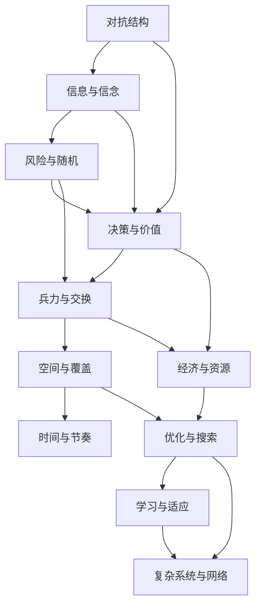
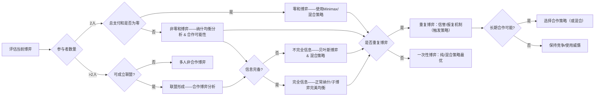
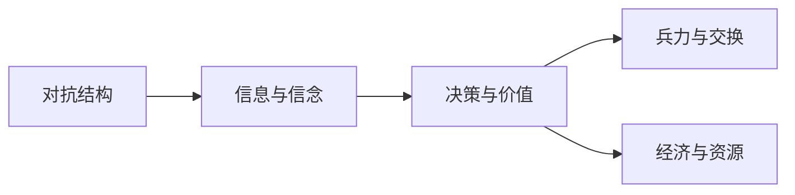
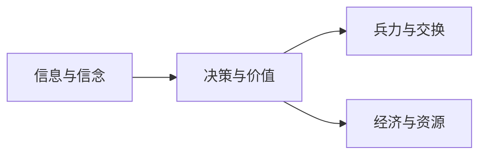
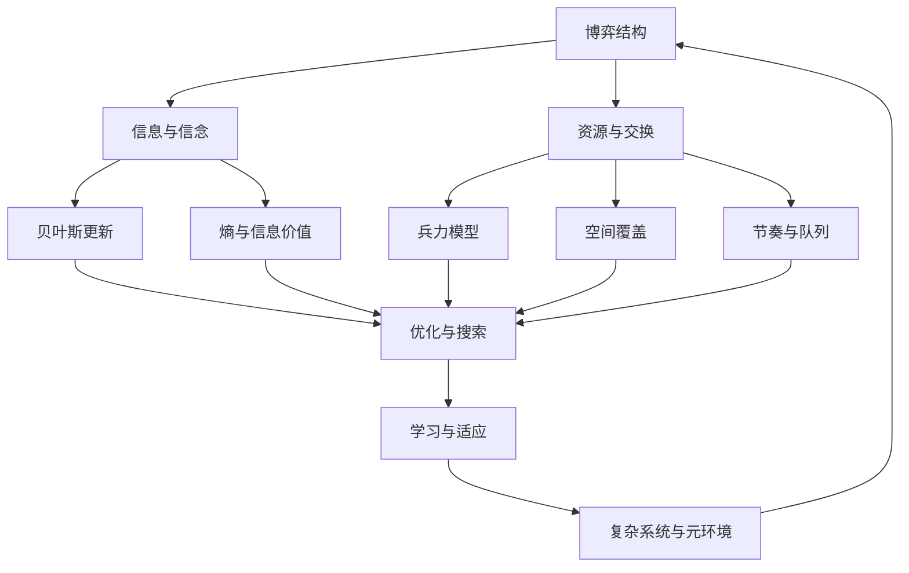

# 执行总纲

可以。正确的研究计划应当先建立一个**总理论对象**，再把各子学科放进同一个问题框架里，而不是先列模型名。

**总目标：** 把“游戏高手”理解为一种在`对抗性`、`不完全信息`、`随机扰动`、`资源约束`、`时间压力`、`空间结构`和`长期学习`中持续提高胜率的决策系统。研究对象不是“游戏里有哪些理论”，而是：高手如何看见局面、压缩不确定性、分配资源、控制节奏、利用空间、管理风险、搜索行动、适应环境。

**总框架：** 一切游戏局面都可以先抽象成一个动态系统：有若干行动者，有目标函数，有可选行动，有可见信息与隐藏信息，有资源状态，有空间位置，有时间窗口，有随机事件，有收益结构，有反馈机制。高手的本质，不是“会背很多技巧”，而是能把具体局面转写为这些变量之间的关系：当前在争夺什么、什么信息未知、什么资源最稀缺、什么时间窗口即将关闭、什么空间点正在变成瓶颈、什么风险可以承受、什么选择会改变未来状态价值。

**第一步：先写整体理论总论。** 这一部分不讲具体模型，而讲“游戏作为复杂对抗决策系统”。核心问题是：游戏为什么不是单纯操作问题？因为操作只是执行层，真正决定上限的是局面建模能力。总论要说明：战略层处理目标、长期收益、均衡和资源曲线；战术层处理局部交换、空间控制、信息差和时机；操作层处理反馈控制、误差修正、动作调度和执行稳定性。三层不是孤立的，例如一次 FPS 对枪看似是操作，但背后有空间角度、信息暴露、风险收益、反应时间、武器经济和团队补位；一次 RTS 团战看似是兵力交换，但背后有兰彻斯特模型、集火效率、地形瓶颈、生产队列、侦察信息和后续经济曲线。

**第二步：建立概念网络，而不是模型清单。** 概念网络应以问题为中心展开。例如“对抗结构”下面不是直接列`纳什均衡`、`零和博弈`、`演化博弈`，而是先问：这是纯冲突、部分合作，还是多方联盟？对手是否能观察和反制？策略是否会在群体中传播？然后才引入零和博弈、非零和博弈、纳什均衡、混合策略、演化稳定策略、重复博弈、承诺、威慑、联盟和背叛。这样模型服务于问题，而不是反过来。

**第三步：按“局面问题链”组织全篇。** 推荐主线是：对抗结构 → 信息与信念 → 随机与风险 → 决策与价值 → 兵力与交换 → 空间与位置 → 时间与节奏 → 经济与资源 → 优化与搜索 → 学习与训练 → 复杂系统与网络 → 综合案例。这个顺序符合真实高手复盘：先判断局面性质，再判断知道什么和不知道什么，再判断风险是否值得，再判断行动价值，再进入局部执行、资源调度、搜索计算和长期学习。

**第四步：每一章都用统一阐述结构。** 每个模块都应按以下顺序写：它解决什么问题；它来自哪个人类知识领域；核心变量是什么；核心概念网络如何展开；它通过什么机制影响游戏局面；它与其他模块如何相互作用；它在具体游戏中的案例是什么；它的适用边界是什么。比如写`信息论`时，不能只说熵公式，而要说明：侦察的价值不是“看见更多”，而是减少足以改变决策的关键不确定性；它会和贝叶斯更新、信号博弈、视野控制、诱骗、隐藏战术、风险管理共同作用。

**第五步：各模块的系统展开计划如下。**


**三、随机、风险与收益：** 研究“在不确定结果下，什么选择长期更优”。这一章包括期望值、方差、风险厌恶、期望效用、前景理论、Kelly 准则、破产风险、尾部风险、抽样偏差、赌徒谬误。它要解释为什么高手不以单次结果评价决策，而用长期收益、风险承受力和阶段目标评价决策。案例可以用扑克牌跟注赔率、炉石/万智牌抽牌概率、肉鸽路线选择、吃鸡决赛圈保守与激进、排位上分中的低方差策略。

**四、决策、状态与价值：** 研究“这一手是否让未来更好”。这里引入序贯决策、状态空间、行动空间、奖励、价值函数、Bellman 方程、马尔可夫决策过程 `MDP`、部分可观察马尔可夫决策过程 `POMDP`。重点是把“当前收益”与“后续状态价值”区分开。案例可以用 Slay the Spire 的选牌、文明系列的科技路线、战棋游戏的站位、RTS 的开矿与出兵、MOBA 的让资源换地图压力。

**五、兵力、交换与战斗模型：** 研究“为什么有些团战人数差会被指数级放大”。这一章以兰彻斯特线性律、平方律、DPS 模型、爆发模型、Salvo 模型、集火效率、过量伤害、AOE、前排承伤、治疗链、护盾、控制链为核心。它要解释：兵力优势何时是线性的，何时近似平方放大；为什么同步接战、集火、拉扯、分割战场非常关键。案例可以用 StarCraft II 团战、自动战斗游戏站位、MOBA 先手秒杀、舰队齐射、守望先锋式技能链。

**六、空间、地形与控制：** 研究“位置为什么会改变行动价值”。这一章包括地形、瓶颈、射程、视野、掩体、高低差、路径代价、Voronoi 区域、影响图、势场、最短路、最大流最小割、控制区、火力覆盖。核心机制是：空间改变可行动作集合、暴露概率、支援时间和交战效率。案例可以用 FPS 架枪线、MOBA 河道视野、RTS choke point、塔防路线、足球/机器人足球的控制区域。

**七、时间、节奏与调度：** 研究“什么时候做，比做什么本身更重要”。这一章包括 timing window、冷却、装填、技能轴、生产队列、行动经济、APM、节奏压制、排队论、Little 定律、实时调度、机会成本。它要解释：高手不是简单更快，而是让关键动作在关键窗口可用，并让对手的响应窗口错位。案例可以用 MMO 输出循环、MOBA 大招时间差、FPS 换弹窗口、RTS timing push、格斗游戏帧数据与压制回合。

**八、经济、资源与市场：** 研究“有限资源如何转化为胜率”。这一章包括稀缺性、机会成本、边际收益、边际递减、复利、投资回收期、资源曲线、供应链、库存、通货膨胀、市场供需、拍卖、交易摩擦。它要解释：经济不是“钱多就好”，而是资源在时间、位置、风险和胜利条件之间的转换效率。案例可以用 Valorant/CS 的买枪经济、EVE Online 市场、RTS 工农比与扩张、MOBA 装备成型期、卡牌游戏曲线费用。

**九、优化、搜索与近似求解：** 研究“在巨大选择空间中如何找到足够好的行动”。这一章包括线性规划、非线性规划、整数规划、动态规划、启发式搜索、极小极大、α-β 剪枝、蒙特卡洛树搜索 `MCTS`、多臂老虎机、UCB、CFR。重点是解释为什么高手不是穷举所有选择，而是把算力集中在关键分支、强迫线、斩杀线、反制线和高价值不确定点。案例可以用国际象棋、围棋、扑克求解器、战棋残棋、卡牌斩杀计算。

**十、学习、训练与适应：** 研究“高手如何形成，而不是高手在一局里怎么想”。这一章包括学习曲线、幂律练习、刻意练习、反馈回路、技能迁移、chunking、模式识别、强化学习、自我博弈、meta learning、反思复盘。核心问题是：练习什么、如何获得反馈、如何避免坏习惯固化、如何把局部技巧转成可迁移能力。案例可以用 FPS aim training、格斗游戏连段与确认、RTS 开局流程、MOBA 复盘、职业队训练赛。

**十一、复杂系统与网络科学：** 研究“为什么个体最优会生成意外的整体环境”。这一章包括涌现、反馈、路径依赖、临界点、相变、幂律、优先连接、小世界网络、中心性、传播、流行 meta、生态位、红皇后效应。它解释版本环境、英雄池、卡组环境、公会政治、市场波动和玩家群体行为。案例可以用 MOBA 版本强势英雄扩散、卡牌游戏天梯环境、MMO 公会网络、EVE 政治经济、直播传播导致的套路复制。

**十二、综合案例：** 最后一部分不再按模型写，而按真实游戏问题写。例如“MOBA 一次小龙团如何分析”，需要同时调用信息、空间、时间、兵力、经济和风险；“RTS 一次 timing push 如何分析”，需要调用侦察、生产队列、兰彻斯特、路径和机会成本；“FPS 一次转点如何分析”，需要调用信号、空间控制、时间窗口和风险；“卡牌游戏一回合是否 all-in”，需要调用概率、期望值、手牌信息、对手范围和后续状态价值。这样才能证明前面的理论体系不是知识碎片，而是可组合的分析工具。

**最终写作策略：** 先写一章“游戏高手的总系统”，把所有变量和问题链说清楚；再按十二个模块逐项展开；每个模块都先讲问题，再讲概念网络，再讲模型，再讲作用机制，再讲案例；最后用综合案例把多个模块重新合并。这样文章会从“理论陈列”变成“系统性解释”：游戏高手不是掌握某个单一模型，而是在复杂对抗系统中连续进行建模、估计、优化、执行和学习。


# 游戏作为复杂对抗决策系统的总论  

**执行摘要：** 本报告以“游戏高手”为研究对象，将对游戏进行宏观抽象，视其为一个包含多名决策者（玩家）的**动态对抗决策系统**。首先明确研究范围：所谓“游戏”可包括电子竞技、战略桌游、体育赛事等具有对抗或竞争特征的决策情境【4†L40-L48】；默认关注对抗性情形，即参与者彼此目标冲突或部分冲突。接着从形式化的视角，将游戏模型化为一系列状态、行动、信息和资源的组合——类似于**部分可观察马尔可夫决策过程（POMDP）**或**随机博弈**【47†L150-L159】【47†L160-L167】。我们提出三层决策架构：**战略层**定义目标和长远策略，**战术层**处理中期规划和局部交换，**操作层**聚焦实时动作执行和反馈控制。各层之间通过目标-行动映射和反馈循环连接。然后列举若干核心问题链：如**对抗结构**（竞争或合作的博弈关系）、**信息不对称**（玩家观测与信念）、**风险与随机性**、**兵力/资源**、**空间/地形**、**时间/节奏**、**经济增长**、**学习适应**、**复杂系统效应**等，并说明它们如何相互交织影响决策。高手的关键能力包括**局面建模**（状态空间构建）、**信息压缩与估计**（贝叶斯更新）、**资源分配与调度**、**节奏控制**、**风险管理**（期望效用最大化）、**搜索与近似**（启发式算法、极小极大）、**自我学习回路**等；这些能力在形式框架下对应策略函数、价值函数、优化过程等要素。本文还给出 MOBA 小龙团战、RTS 定时突袭、FPS 转点等综合案例，演示如何同时调用多个模块进行分析。最后介绍研究方法学：后续章节将按模块（博弈论、信息论、概率论、图论、运筹学、强化学习、复杂系统等）分别展开理论阐述，并列出优先参考的学科和典型文献。报告强调：游戏不是孤立的娱乐，而是涵盖对抗博弈、信息不确定性、资源优化、时空布局、学习演进等交叉领域的**复杂系统**【4†L40-L48】【15†L15-L23】的实例。

## 研究对象与边界  
**研究对象：** 我们将“游戏高手”视作**对抗决策中的最优决策者**。研究对象是游戏作为一种复杂动态系统，而非单个游戏的规则或技巧。这里的“游戏”定义较广，主要涵盖竞争性或对抗性情境：既包括多人对抗的电子竞技、RTS/MOBA 等战略游戏，也包括对抗性强的单人游戏或对战模式；同样可扩展到博弈论意义上的经济博弈、军事演习等。无论人数或载体如何，只要存在至少两名理性参与者各执一词、目标不完全一致，就符合本框架的研究范围【4†L40-L48】。边界上，若游戏纯粹是益智或合作性质（零和性质不明显），本报告不重点讨论，但相关技术仍可类比。

**系统抽象：** 对于研究，我们假设每个游戏局面都可抽象为一个**动态系统**。其基本要素包括：**状态空间**$M$（描述当前资源、地图、单位、血量等全局信息）、**玩家集合**$I$、每个玩家的**行动空间**$S^i$（在给定状态下可选动作集合）、**信息结构**（每个玩家可观测的状态子集或信念空间）、**资源向量**（如经济资源、手牌）、**时间窗口/回合**和**随机过程**（如掷骰子或概率事件）。形式上，这对应于**随机博弈**（马尔可夫博弈）模型：系统在每一阶段$t$处于状态$m_t\in M$，所有玩家同时选择动作$s^i_t\in S^i$，系统根据联合动作$s_t=(s^1_t,\dots,s^n_t)$以概率$P(m_{t+1}\mid m_t,s_t)$转移到新状态，并为每个玩家$i$产生即时收益$g_i(m_t,s_t)$【47†L150-L159】【47†L160-L167】。玩家的长期目标是累积收益（或贴现收益）最大化。若信息不完全，可以扩展为**部分可观察马尔可夫决策过程（POMDP）**，即玩家依赖观测或信念进行决策。简言之，游戏可用下述符号框架表示：每个玩家$i$试图最大化期望回报  
$$\mathbb{E}\Big[\sum_{t=0}^T \gamma^t g_i(m_t,s_t)\Big],$$  
其中状态转移满足马氏性质【47†L150-L159】【23†L62-L70】。这涵盖了包括零和博弈、一般-sum博弈在内的多种对抗模型。

## 分层决策架构  
**三层定义：** 为解析复杂对抗系统，我们采用战略-战术-操作三层架构。**战略层**（Strategy）关注**全局目标**和长期计划，处理资源配置曲线、总体兵力布置等大尺度问题；**战术层**（Tactics）管理**中期战局**和局部冲突，如部队编组、位置争夺、局部交易；**操作层**（Operations）则涉及**实时动作执行**、反馈控制和动作精度。三层的时间尺度递减：战略层跨度最长（可能涵盖整局或多局），战术层关注几轮对抗，操作层关注瞬时反应。它们通过目标映射与反馈相连：战略制定总体目标后分解为战术目标，战术细化为具体操作指令，操作执行结果反过来影响战术/战略决策。以FPS为例，战略层决定控制地图某一区域（提高胜率），战术层规划如何抄近路或迂回，操作层执行瞄准射击【23†L62-L70】。在RTS游戏中，一次团战既需要战略层的胜利条件评估（如经济/科技胜利），也要战术层的选兵摆位（兰彻斯特模型指导兵力交换效果）、操作层的微操命令（APM与反馈）。

**层间接口：** 战略层为战术层设定目标函数（如最大化占领点、经济差值）；战术层为操作层指定执行任务（如集火、掩护）。操作层的执行效率与错误反馈（如射偏、失误）反向调整战术计划；战术层结果（胜负、损耗）再调整战略评估和资源投入。在三层协同下，高手并非仅靠单一技巧，而是在不同层次连续建模与决策。例如，一次RTS推塔（push）行动中，战略层评估推塔的长期收益、战术层利用兵力模型（如线性/平方兰彻斯特方程）计算损耗，操作层则实时分配单位进行前排抗伤与后排输出，三者缺一不可。

## 关键变量与问题链  
对抗性决策系统涉及众多相互关联的核心变量和问题链，我们列举如下并说明相互作用：  
- **对抗结构（博弈类型）**：确定玩家关系是纯冲突（零和）、共赢（合作）还是混合型（非零和）。典型概念包括零和博弈、纳什均衡、混合策略、演化博弈等。对抗结构影响策略选择：在零和局面中宜保底防守，在非零和局面可能合作或进行利益交换。  
- **信息与信念**：玩家所知与未知的信息量及其分布。包括信息不对称、战争迷雾（fog of war）、侦察策略和信号传递（bluffing、诱骗）。信息通过减少不确定性改变信念，再决定行动。比如 RTS 侦察可视为降低对手基地布局不确定性，扑克的读牌靠概率更新对手持牌信念【47†L150-L159】。动作本身也释放信息（如假动作诱敌）。  
- **风险与随机**：决策的结果是否确定，及其风险厌恶程度。包含期望值、方差、风险厌恶、破产风险、Kelly 准则等。高手基于长期期望效用而非单局胜率决策，例如关注“长期收益比”而非一次交锋胜率【15†L15-L23】。炸弹与防御在RTS中权衡、吃鸡决赛圈风险控制、牌局中的赔率计算等都属于此类问题。  
- **兵力与资源**：可用单位或资源量及其增减规律。包括战力模型（如**兰彻斯特**线性/平方定律）、兵力交换率、治疗/补给机制。兵力优势往往呈非线性放大（平方律），因此集火、控制后排等战术成为关键。例如 StarCraft II 团战中，集火聚积伤害可显著放大战力差距。资源方面，与**经济增长**相关的边际收益、投资回报等也十分重要。  
- **空间与地形**：位置和地形对行动的影响。涵盖射程、视野、掩体、高地、地形瓶颈（choke point）、控制区（势力图、Voronoi 领域）等。空间因素决定了可行动作集合和交锋效率。如 MOBA 河道视野控制、FPS 架点压制、RTS 控制通道，都通过空间布局影响优势【23†L62-L70】。  
- **时间与节奏**：时机与节奏控制。包括技能冷却、生产队列、出兵节奏、APM、人机响应延迟、时序策略（timing push）。关键在于在合适的时间窗口执行关键动作，并打乱对手节奏。例如 RTS 的 **Timing Push** 要求在对手防御关键薄弱期发动进攻，FPS 的换弹/换枪窗口则决定瞬间输赢。  
- **经济与成长**：资源管理与经济效率。涵盖稀缺资源分配、边际递减、复利效应、市场供需等。资源需要在时间、空间和目标之间进行转换：多资源并不总是简单叠加，而是要考虑使用时机和组合。如 CS 系列游戏中的经济轮回（买枪/省钱）、RTS 的工农比（扩大经济 vs 集中兵力）都考验经济管理。  
- **学习与适应**：对手策略和自身能力的变化。包括学习曲线、模式识别、技能迁移、自我博弈强化学习、复盘反馈等。高手通过刻意练习和复盘不断调整模型，如记忆对手套路、优化操作手法，从数据中迭代策略。  
- **复杂系统与网络效应**：整体环境的涌现行为。即个体策略的交互可能产生意想不到的宏观现象。相关概念包括涌现（emergence）、反馈循环、版本轮替、神经网络/社交网络传播、红皇后效应等。例如 MOBA 英雄强度随版本平衡调整而改变，卡牌游戏套路通过社群传播形成环境（meta），MMO 公会联盟或电竞市场机制也体现复杂网络特性。  

以上变量并非独立，而是在系统中相互作用。例如，对抗结构决定信息传播模式（协作则可共享信息，零和则易谎报信息）；信息水平改变风险评估（未知信息增大方差）；经济资源决定能否执行战术预期；空间局势反馈给战略目标的可行性等。可以想象整个体系是一个反馈耦合的网络，各模块通过**博弈论、信息论、概率论、图论、控制论、运筹学、复杂系统**等学科原理相互链接。

## 高手的核心能力集  
高手之所以成为“高手”，关键在于他们能在上述复杂体系中表现出以下能力：  

- **局面建模（Scene Modeling）**：在实际游戏中抽象出状态变量并进行简化建模。例如识别当前争夺的目标（资源、领地、对手弱点）、估计未来状态空间。对应形式化模型即定义合适的状态$M$与指标函数。  
- **信息压缩与估计**：将大量观测信息浓缩成对决策有用的统计量或信念。例如用后验概率表示对手可能的策略分布。形式上涉及贝叶斯更新和信息熵的计算，通过减少状态不确定性来提高决策精度【47†L142-L149】。  
- **资源分配与调度**：在各类资源（经济、单位、技能冷却等）中做出选择。如动态规划或线性规划地分配经济增量。形式化时类似于解最优化问题，考虑资源约束下的收益最大化。  
- **节奏控制与调度**：合理安排关键动作时机。高手会人为**减缓或加快**战局节奏，如压枪使对手被动、适时弹夹，或故意拖延敌人响应。形式上可视为对系统时序模式的控制，包括触发事件序列的调度（Little 定律、排队论等概念可应用）。  
- **风险管理**：不将单局胜负作为唯一目标，而是评估长期收益与风险。例如敢于采用低胜率高收益的“赌注”，或相反采用稳健策略。形式上使用期望效用和破产概率模型（如**Kelly 准则**指导注码大小）。高手能识别收益分布的长尾风险，适时规避过度赌博。  
- **搜索与近似优化**：在巨大决策树中寻找高价值行动，例如国际象棋和围棋中的极小极大搜索、MCTS，多臂老虎机中的UCB方法等。高手不会穷举，而是利用*启发式规则*和*分支限界*削减搜索空间（如只考虑对手可能的高价值响应线）。形式化上类似强化学习中策略优化、CFR（对策求值）等技术。  
- **学习回路与自适应**：不断从对局数据中学习并更新策略。包括利用监督学习识别模式、强化学习摸索最优策略、刻意练习纠正错误。形式上可归入在线学习或迭代优化框架，如时序差分、政策梯度算法。高手通过反复对抗训练，使策略集逐渐收敛到更优。

以上能力在形式框架中分别对应模型与算法模块：建模对应定义状态/奖励函数、信息压缩对应信念更新公式、资源/节奏对应优化约束与时序调度模型、风险对应效用函数设计、搜索对应算法设计、学习对应迭代更新机制等。

## 综合案例分析  
我们以具体游戏情形说明如何在总论框架下综合分析多个模块：  

- **MOBA 小龙团战：** 假设两队围绕地图资源“小龙”交战。战略层关注击杀小龙对经济/胜率的长期影响；对抗结构上这是近零和冲突（牺牲一个兵换取压地图收益）。信息层分析：双方便捷视野与信号（草丛埋伏、假装撤退）。风险层衡量：是否孤身交战会被反包；高风险技能（如大招）是否保存。战术/兵力层面：对双方人数与技能进行兰彻斯特推演（集火优先秒脆皮、治疗链针对性），空间层面：控制小龙坑通道瓶颈和防御塔视野。时间层面：等待队友支援和小龙刷新节奏。经济层面：估算击杀收益与阵亡成本。高手同时考虑：用视野压制控制信息（信息论）、用兵力模型评估先后手（兰彻斯特模型）、利用节奏窗口突袭（时序策略），并根据结果调整后续打法。  

- **RTS Timing Push：** 某玩家计划在$t$轮经济增长后发动强攻。战略层决定投入该阶段的胜率边际收益最大；对抗结构假设对方兵力线性增长，于是采用**平方兰彻斯特**优先集火。侦察（信息层）确认对方防线薄弱区域；风险层评估若时机失败的撤退成本；兵力调度（操作层）根据生产队列安排步兵与远程混合；空间层利用地图瓶颈集中交战；时间层选定对方**完成扩张**之前发起冲锋。高手在此过程中调用生产排队理论（运筹学）、路径搜索（最短路）、优先队列（计划调度）等理论来同步多模块。  

- **FPS 转点反应：** 在某点位换弹或让位期间，玩家面临生死决策。战略层预设该点对整体胜率的重要性（占点或撤退路径）。信息层判断：是否有敌方埋伏信号（声源、残影）；风险层权衡：留在场景中被击中的概率（泊松过程近似）与隐蔽后丧失位置的成本；空间层考虑掩体与后路；时间层抓准硬直帧或对方开镜间隙。高手将操作层的**准星控制**、**换弹干扰**（控制论反馈）与战术层的**诱饵移动**、**集火配合**结合，体现了对信息、空间和时间同步优化的能力。  

这些案例展示了模块的混合使用：如MOBA团战中信息与兵力模型共同作用，RTS推塔中经济投入与时间同步配合，FPS中节奏和信息揭示交叉影响。分析方法始终遵循总论框架：先识别局面变量（对抗属性、已知信息、资源状态等），再逐项调用上述模块进行综合评估。

【45†embed_image】**示意图：** 游戏决策系统层次结构框架（示例）。图中顶层为**战略**，中层为**战术**，底层为**操作**，各层依次展开对抗博弈、信息、风险、资源等模块。

## 研究方法与后续章节安排  
**研究方法论：** 本报告采用跨学科理论融合的方法论。后续将按模块分章节系统阐述：例如博弈论（包括静态博弈、动态博弈、演化博弈）、信息论（熵、信号博弈）、概率与统计（风险决策、极限理论）、控制论与排队论（实时调度、节奏控制）、运筹学（优化、线性规划）、复杂系统与网络科学（涌现、网络模型）以及强化学习与经验实证（深度强化学习、比赛数据分析）等。每章先提出问题导向（例如“信息如何影响决策”），再引入核心概念网络和典型公式（如贝叶斯定理、香农熵公式）、并结合具体游戏案例验证。  

**优先参考：** 主要参考经典博弈论教材（如 Osborne《博弈论导论》）、强化学习与MDP/POMDP文献【23†L62-L70】、信息论经典（香农信息论基础）、控制论文献（调度理论）、运筹学教材，以及复杂网络和RL最新论文。同时关注电竞实证研究，如《系统仿真学报》有关对抗博弈的研究【4†L40-L48】、人工智能博弈决策文献【15†L15-L23】等，用于验证理论在实际游戏中的有效性。最终，文章旨在构建一个连贯的理论体系：把游戏高手的分析和决策过程解释为**跨领域概念的有机组合**，为后续逐模块详细论述奠定坚实基础。

**表格：游戏决策核心变量对照**  

| **核心变量**   | **来源学科**     | **典型模型/公式**         | **游戏中作用与示例**                                                 |
| -------------- | ---------------- | ------------------------- | -------------------------------------------------------------------- |
| 对抗结构       | 博弈论           | 零和/非零和博弈、纳什均衡 | 决定竞争或合作策略，如MOBA Ban/Pick（英雄禁选）策略指导团队战术选择。 |
| 信息与信念     | 信息论/统计学    | 贝叶斯更新、信息熵        | 决定侦察/隐藏策略，如RTS中侦察视野减少不确定性，扑克读牌估计手牌概率。 |
| 风险与随机     | 概率论/统计学    | 期望效用、凯利公式        | 长期收益评估，如炉石/万智牌中投注牌局的赔率计算，吃鸡决赛圈的保守打法选择。 |
| 兵力与资源     | 运筹学/控制论    | 兰彻斯特方程、集火模型    | 量化兵力差的战斗效果，如RTS团战中集火击溃脆皮单位、AOE输出效率。       |
| 空间与地形     | 图论/几何学      | 势力图、最短路、割点      | 确定关键位置和通道，如FPS架点或MOBA河道视野控制，利用地形高低差作战。    |
| 时间与节奏     | 控制论/排队论    | 生产队列模型、Little 定律| 把握关键时机，如RTS的timing push、格斗游戏中连击帧窗口与节奏压制。        |
| 经济与增长     | 经济学/运筹学    | 边际收益、复利增长模型    | 资源转化效率分析，如CS买枪经济、RTS初期扩张vs兵力集中、英雄联盟出装进度。   |
| 学习与适应     | 机器学习/心理学  | 强化学习算法、学习曲线    | 经验与模式积累，如职业选手复盘策略、AI自我对弈优化决策策略。             |
| 复杂网络效应   | 复杂系统科学     | 网络模型、涌现理论        | 整体环境演化，如MOBA强势英雄传播（meta变化）、玩家社交网络中策略扩散。     |

以上变量在不同学科背景下有对应模型，通过具体游戏示例连接概念与应用。此表概览了核心要素，可作为后续章节深入讨论时的参考框架。

**参考文献：** 相关概念和模型可查阅 Osborne 等《博弈论》教材、信息论经典著作、运筹优化文献，以及上述引用资料【4†L40-L48】【23†L62-L70】【47†L150-L159】等。后续各章将针对每个模块系统展开，并以更多案例说明其在游戏中的具体应用。

# 游戏决策元分析：一门学科如何被“装配”起来的思考

## 一、厘清问题本质

我们要回答的不是简单的“游戏决策有哪些模型”，而是“作为一个整体学科，游戏决策理论如何构成、如何运作”。也就是说，先把游戏当作一个复杂的**决策系统**来看待：它包含若干玩家（或智能体），每个玩家有自己的目标函数和可选策略，一些信息是可见的，一些信息是隐藏的，有资源管理要决策，有位置与空间要控制，有时间窗约束和随机事件影响，有收益和惩罚的定义，还有各式反馈机制和机制变化。这些构成要素本身并不是可观测的“事实”，而是我们对一个**解释体系**的假设承诺。例如，我们可能假设玩家是理性最优、市场/对局会自我平衡、玩家偏好是均匀的、信息分配方式决定策略，以及外部环境（补丁、经济规则等）如何改变玩法。总目标是把这些假设写进一个自洽的理论机器里：游戏高手的优势不在于记住更多技巧，而在于能把一个具体局面转写为上述变量之间的关系——清楚当前争夺的是什么、哪些信息未知、哪些资源最稀缺、哪些时间窗口快要关闭、哪些空间点正在变成瓶颈、哪些风险可以承受、以及每个选择如何改变未来状态的价值。

## 二、三层结构：本体—形式—实证

可以把游戏决策理论也视作三层架构之上的产物，与宏观经济学类似。每个决策结论都混合着三层成分：

- **第一层：本体性假设。** 即游戏世界由谁构成、他们如何行动。比如假设玩家是完全理性的、目标是最大化胜率；或假设存在随机行为、混合策略；或有统一的资源产出机制和市场定价；或者存在某种演化过程让策略流行。这一层的承诺决定了什么行为算“合理解释”。比如传统博弈论假设玩家皆寻求纳什均衡并共享全局信息，而对抗学习派则假设玩家会逐步适应并优化自身策略。**这些假设不是可直接观测的数据**，而是我们对“什么能被称作合理推理”的哲学选择。类似经济学的微观基础纲领，我们也有“能否从个体动机推导宏观博弈结果”的方法论问题。

- **第二层：形式化与数学工具。** 一旦确定了上层假设，就需要数学语言来组合它们。这包括：动态规划和贝尔曼方程、一阶二阶最优条件、广义纳什均衡、随机过程（马尔可夫链、泊松过程）、信息熵和互信息公式、控制论PID方程、优化理论（线性/非线性规划、凸优化）、搜索算法（博弈树搜索与MCTS公式）、强化学习模型（MDP/价值迭代）、网络模型（图论流算法）、复杂网络统计（小世界、无标度）等等。这些工具不仅用来表达假设，也会**反向约束**假设的可行性。例如，只有在接受代表性玩家和线性响应假设下，一些平衡模型才可解；只有假设独立同分布且稳定的到达率，Little定律 $L=\lambda W$ 才有意义。换句话说，形式层（数学表达）常常决定哪些本体假设是实际可用的。  

- **第三层：实证与数据体系。** 游戏并不像宏观经济那样有统一国民账户，但也有自己的“指标体系”：胜率、ELO（或MMR）排名、局内经济流、操作效率指标（APM、准确率）、资源收益统计等。这一层是我们如何根据游戏历史对模型进行测试或估计的方法，包括实验对比、统计分析、机器学习回归、蒙特卡洛仿真、在线A/B测试、玩家行为建模等。例如，我们可以用游戏内的回合数、胜负统计来校准理论参数；也可以设计对抗实验检验某种策略是否显著优于另一种。值得注意的是，这些“数据”往往预先嵌入了理论假设：比如胜率定义默认了规则体系和赢家标准，操作效率指标默认了什么操作算成功。这与宏观经济学中“GDP的测量本身隐含理论选择”类似。

## 三、三层“混合”案例

要理解各层如何交织，我们看几个典型的公式或模型是如何同时承担多层角色的：

- **期望值与风险公式：** 期望收益 $EV=\sum_i p_i v_i$ 既是运筹学的基本恒等式，也是策略评价的形式；但它的解读要依赖本体层的玩家风险态度假设（如若引入效用函数，就用期望效用替代）和形式层的假设（结果独立同分布）。例如在扑克中，$\mathrm{EV}>0$ 的下注在理论上可重复盈利，但如果玩家是风险厌恶或资金受限，那么单纯正 EV 可能还不够，还需要边际效用或凯利准则约束。这说明同一个公式，在不同假设下扮演不同角色：纯统计身份证明策略价值，在贝叶斯或效用框架中又嵌入了人类行为模型。

- **贝尔曼方程与价值迭代：** 
  $$V(s)=\max_a\bigl[R(s,a)+\gamma\mathbb{E}_{s'}V(s')\bigr].$$
  这个方程既是动态规划的数学表达（形式层），又隐含了玩家对未来环境模型（如MDP假设）和折扣因子反映的时间偏好（本体层）。在强化学习（实证层）中，我们用大量游戏对局数据对 $V(s)$ 进行拟合；但如果游戏规则变化（改变奖励函数或转移概率），那么这个迭代公式所求得的策略也必然改变。这体现了公式内容本身并不独立于数据：它把“价值”这个概念同时落实为数学问题（求解Bellman方程）和经验任务（从数据中学习价值）。

- **博弈树搜索（Minimax/α-β）公式：** 博弈树价值递归 $V(s)=\max_{a}\min_{a'} V(s'')$ （零和博弈）既是理论假设（玩家交替零和最优决策）的体现，也是一种计算程序。对AI来说，这是一个可解的递归算法；但对人类玩家来说，我们如何“实际做到”？我们看到搜索公式时，既包含了对对手假设理性（本体层），也包含了如何评估局面（形式层）。这里的实证层体现在：我们验证这个递归对不同游戏水准的玩家表现是否真实，如著名的AlphaZero用MCTS验证了这个模型在围棋上的有效性。值得注意，如果游戏包含隐藏信息（如扑克牌），简单Minimax就不够用了，我们需要把它扩展到信息集游戏（本体层加入“对手不知道什么”假设），形式层对应引入概率和知识集，实证则转向对抗学习（如使用CFR算法训练无需先验知识的扑克）。

- **RL策略与均衡：** 深度强化学习训练出的对抗策略（如AlphaStar在星际争霸II的策略网络）同样体现三层融合：它用算法模型假设环境是MDP（形式层）、假设对手也在寻找最佳策略（本体层），然后通过大量对局优化策略（实证层）。训练结果往往会符合博弈论上的纳什均衡概念，但它是通过经验数据发现的。换言之，许多“宏观最优策略”在RL中既是数学解（最优策略分布），也是经过大量对局统计检验的现实策略。

## 四、元层的关键反思

两个思想可以帮助我们看清这种三层混合的脆弱性：

- **策略依赖性批判（类似 Lucas 批判）：** 如果游戏机制（规则、平衡参数、地图设计）发生改变，玩家的策略和预期也会改变，因此历史数据训练的模型无法一劳永逸。例如，当游戏补丁调整英雄能力后，过去的统计胜率和策略配置就不再适用；我们必须重新评估并考虑玩家如何迅速适应新规则。简单地把历史对局用来回归参数，而不嵌入玩家预期和调整行为的假设，就是忽略了这个反馈效应。

- **个体基础不唯一性：** 即使我们从微观层面完全理解玩家每一步决策，本质上也不意味着宏观结果可以简单导出。例如，即使每名玩家都按照极小极大理性行动，整体游戏的产出分布可能非常复杂，甚至非唯一。游戏玩法中常见的“玩家角色异质性”也说明：不同技能水平、不同偏好玩家的存在会导致 aggregate 行为模式难以一言以蔽之。正如著名的无差异曲线之和可能任意凹凸，游戏的平均策略行为往往无法通过单一假设获得，它需要复杂的经验模型校准。

## 五、结论

游戏决策理论并不是一个从几条公理直接推演出的封闭体系，而更像一场**反思式平衡**（reflective equilibrium）的产物。面对实战问题时，我们无法先验知道要让步给哪一层——也许是要放松理性假设（引入行为偏误、学习模型），也许是要改进数学形式（非线性方法、多智能体博弈），或者是要重新定义数据（用更多类别的实战数据来校准）。每一次对高水平玩家策略的建模尝试，本质上是在“调整哪一层出错更轻”的取舍。这个学科的稳健性恰恰来自这三层的**三角化**——哪怕游戏规则更新，我们也能通过重新选层次来修正理论。因此，我们要做的不是将各种模型生搬硬套，而是学会在实战语境中选择、组合这些工具，形成一个整体的大图景。

继续深入研究的方向包括：分析玩家如何进行元策略的学习、关注长期演化的反馈循环、以及探索那些超越现有常用假设的新框架（比如博弈演化动力学、异质玩家博弈、复杂网络传播影响等）。这些都是在三层结构基础上，不断反思和进化的过程。阅读经典资源时，应跨越这三层：既要理解基础假设的来源，也要学习适用的数学工具与实际数据检验方法，从而构建起对游戏决策问题的综合性理解。  

**参考资料：** 游戏被公认为优秀的人工智能试验平台，它涉及学习、优化、博弈论、规划等多领域研究【1†L49-L58】；在 RTS 等游戏中，多种控制与规划方法（如势场、影响图、强化学习等）已被整合使用【1†L49-L58】【37†L589-L597】。这些经验说明，游戏决策本质上是多学科知识的集成，需要在具体语境中求解三层交叉的问题。

# 问题链

本报告构建了一个以“问题链”为中心的游戏决策概念网络，从宏观到微观层层展开：首先区分**对抗结构**（零和／合作博弈）和**信息信念**（公开信息／隐藏信息／信号），再考虑**风险随机**对决策的影响（期望与效用、概率评估）、**决策价值**（MDP/POMDP 和 Bellman 递推）、以及由决策引起的**兵力交换**（兰彻斯特及其变体）和**资源分配**（供需、边际效应、Kelly）。接着进入空间与时间：**空间覆盖**（Voronoi 图、影响图、最短路与网络流）决定兵力与视野布局，**时间节奏**（冷却与队列调度、Little 定律）则影响技能与单位行动的时机。再往下是**优化与搜索**（LP/DP、α-β/对抗搜索、蒙特卡洛树搜索、强化学习）作为实现决策的算法框架，**学习与适应**（学习曲线、自博弈、元学习）则让策略随经验迭代，**复杂系统与网络科学**（小世界、幂律分布、涌现）揭示高层博弈环境和演化反馈。报告使用具体游戏案例（如《星际争霸》《英雄联盟》《炉石传说》等）演示各节点的应用，并指出场景适用性与局限性。最后给出对高水平玩家和游戏设计者的实用建议，并列出关键参考文献。整个网络图通过 mermaid 流程图表示各概念节点和信息/因果流向。

## 概念网络总图



该概念网络体现了典型的决策流程：**信息**与**信念**影响**决策**，决策又决定**兵力布局**、**资源使用**；兵力如何部署与控制**空间**，何时发动攻击取决于**时间节奏**；而整体的经济状况和资源约束影响决策目标和优先级；搜索与学习过程则是实现和优化具体决策的方法；复杂系统特性反过来塑造博弈环境（例如小世界结构决定信息传播速率）。下面我们依次展开每个核心节点。

### 对抗结构

- **定义：** 刻画玩家之间的利益关系及博弈类型。如**零和**博弈（一个玩家的赢就是另一个输）与**非零和**（可能双赢）、静态与动态博弈、完全信息与不完全信息博弈。  
- **重要性：** 决定了高手如何选择战略：零和博弈下强调防守和边际收益保障，非零和博弈下会考虑合作机会。例如，**《星际争霸》1v1时**可近似零和，玩家会维持模糊的混合策略【1†L49-L58】；而在**《文明》多人游戏中**可出现联盟互助场景，允许运用非零和交易策略。  
- **相关概念：** Nash均衡、多方合作博弈、Stackelberg领导者模型、演化博弈论（ESS）、重复博弈与信誉机制。  
- **关键变量：** 奖惩矩阵（Payoff Matrix）、策略空间规模、玩家数量、合作漏洞系数。  
- **交互作用：** 对抗结构定义谁是对手或盟友，直接影响**信息**（对手共享信息量）和**决策价值**（目标函数形式）。例如在对抗结构改变时，信息节点重新评估隐藏信息优势；在零和下信息价值更高，因为对手优势必定转化为自身劣势。  
- **适用场景与局限：** 适用于各种对抗游戏，《英雄联盟》排位赛可视为零和，玩家追求个人收益最大化；桌游Diplomacy属于动态联盟博弈。局限在于真实游戏中玩家心理、规则不透明等往往打破纯粹模型假设。

### 信息与信念

- **定义：** 指玩家对局面信息的掌握，包括**公共信息**（对所有人可见，如地图资源）、**私有信息**（对手隐藏，如牌面、敌方部队位置）和通过行动传递的**信号**。  
- **重要性：** 信息决定了决策的基础：高手关注“未知的未知”，并通过**侦察、警戒、诱饵、诈唬**等手段影响对方的**信念**。例如在**《星际争霸II》**，探路兵侦察敌方科技可以快速缩小对对手意图的后验分布，指导相应反制【37†L589-L597】；在**扑克牌**中，下注额和行为就是向对手发送手牌强度的信号。  
- **相关概念：** 贝叶斯更新、熵和信息增益、信号博弈、完全信息与贝叶斯博弈、对抗搜索中的黑箱模型。  
- **关键变量：** 不确定度量（如Shannon熵）、先验概率、信号成本、误导概率。  
- **交互作用：** 信息节点直接影响“决策价值”节点（影响决策回报估计），并受“对抗结构”约束（零和环境中隐藏信息价值更大）。同时信息的多寡会影响“风险与随机”对决策的调整（不确定性高时更保守）。信息流动图示：**对抗结构→信息→决策→兵力分配**。  
- **适用场景与局限：** 适用于含有隐蔽要素的游戏，如**《守望先锋》隐蔽视野英雄**、**麻将/德州扑克**等；也适用于需要读取对手意图的竞技（解读对手走位、装备）。若信息几乎完全（如棋类），此节点作用减弱；如果系统故意用随机机制（抽卡或伪随机事件）屏蔽信息，也无法精准反馈。

### 风险与随机

- **定义：** 涉及决策结果的**不确定性**与**风险偏好**。核心在于用概率论和统计评估各种行动的期望价值（EV）及其方差，或者采用行为经济学（**前景理论**）修正理性模型。  
- **重要性：** 在含有随机因素（暴击、抽牌、搜索命中概率等）的游戏中，高水平玩家通过评估期望收益和风险权衡做决策。例如**《炉石传说》**中计算抽卡概率与期望法力值价值；**《绝地求生》**末圈环境中，玩家在风险与生存概率间做权衡。正确应用期望值和边际效用可避免单次失误影响长期胜率。  
- **相关概念：** 期望值（Expected Value）、期望效用、方差、风险价值、**凯利公式**（Kelly Criterion）、**马尔可夫链**与**泊松过程**（描述状态转移和事件发生），以及**赔率/底池比**（牌类中的赔率思维）。  
- **关键变量：** 可能结果概率分布、收益矩阵、效用函数形式（风险厌恶系数）。  
- **交互作用：** 风险评估影响“决策价值”节点选择，比如面对高风险低概率的大获全胜机会时决定是否下注。风险管理还与“经济资源”相关，因超额投资可能导致破产风险。同时它决定搜索层面的探索/利用平衡（RL 探索）。  
- **适用场景与局限：** 适用于所有含随机抽样或概率战斗的游戏，如**卡牌游戏**、**FPS 远程射击弹道**等；亦适用于需要风险决策的经济系统（赌局、市场）。局限在于认知偏差（玩家非理性）和动态敌手行为（下注表演）。

### 决策与价值

- **定义：** 将当前状态映射到行动方案的过程，通常建模为**马尔可夫决策过程**（MDP）或**部分可观测MDP**（POMDP），并通过**贝尔曼方程**来递归评估状态价值。  
- **重要性：** 决策节点统筹考量即时奖励与未来预期。例如**策略游戏**中的Tech Tree选择就是动态规划问题，玩家需衡量当前升级对长期胜率的贡献。Bellman方程告诉我们：当前状态价值等于立即奖励加上下一状态价值的折扣期望，这成为很多游戏AI（如棋类、RL代理）寻优的基础。  
- **相关概念：** 马尔可夫性质、贝尔曼最优方程、策略迭代/值迭代、部分可观测扩展（POMDP）、风险敏感决策（CVaR等）。  
- **关键变量：** 状态空间和动作空间、转移概率（如果可估计）、即时奖励函数、折扣因子、价值函数评估误差。  
- **交互作用：** 决策节点通过计算比较好坏影响**兵力交换**（选择攻守、部队分配）和**经济资源**（投资或保存）。它需要依赖**信息信念**和**风险评估**的结果，输出的行动影响后续“空间控制”与“资源搜索”。如图所示：信息和风险→决策价值→兵力和经济。  
- **适用场景与局限：** 适用于回合制和可离散状态抽象的游戏，如**炉石**回合决策、**文明科技树**走向；在实时游戏中可近似为有限状态控制。局限在于状态空间爆炸使精确DP不可行，通常用启发式或学习近似。

### 兵力与交换

- **定义：** 描述军队或单位间的直接交战与消耗。经典模型为**兰彻斯特定律**：平方律（远程可集火时，双方有效战力按兵力平方差交换）与线性律（近战局部交战时按兵力线性消耗）【37†L589-L597】。相关扩展包括**Deitchman游击模型**（弱势群体分散）和**Salvo模型**（弹幕轮次伤害）。  
- **重要性：** 量化兵力优势如何放大或减损。例如在**《星际争霸II》团战**中，集中全部兵力先手集火往往胜过分散消耗，因为平方律放大了先机优势；局部作战时苏联版冲锋队应用线性律。它指导高手如何决定何时拼团、分散或游击：兵力对比大时全力进攻，小队分散偷袭。  
- **相关概念：** DPS模型、战力密度、分散战与正面战比较、群体治疗/支援、协同伤害（AOE）与溢出伤害。  
- **关键变量：** 双方兵力、单兵有效伤害率、命中率、支援效果、治愈/护盾等。  
- **交互作用：** 此节点结果（剩余兵力）反向影响“空间与覆盖”节点（可占领区域大小）和“经济与资源”节点（兵力损耗带来的经济消耗）。例如，消耗过多兵力可能迫使转向经济平衡；胜利后兵力优势带来更多地图空间控制。  
- **适用场景与局限：** 适用于需要大规模部队对抗的策略游戏如**RTS**、**舰队战**、**塔防刷怪**等；以及MOBA团战的伤害计算。局限在于复杂战场条件（地形、伤害衰减、技能连携）以及英雄角色（游击 vs 坦克）会使简单兰彻斯特模型失真。

### 空间与覆盖

- **定义：** 部署单位或玩家在地图/场地中的位置控制。使用**Voronoi图**描述最近控制区域，**影响图/势场**给出区域威胁值，**最短路径**和**网络流**算法用于路径规划和资源运输最优。  
- **重要性：** 空间决定视野、支援和包围效率。例如在**MOBA(如《英雄联盟》)地图控制**中，英雄的站位与视野部署可以用Voronoi或势场刻画哪个区域受控，指导玩家前进方向；在**FPS转点策略**中，计算前进到旗点的最短路径避免敌方压制。  
- **相关概念：** 路径寻找算法（A*）、堵点/瓶颈检测、覆盖率最大化、火力线和死角。  
- **关键变量：** 单位射程/速度、敌对覆盖率、地图障碍密度。  
- **交互作用：** 空间控制直接影响兵力交换（可否包围敌人）和资源争夺（占领金币区、推塔路径），并受**时间节奏**制约（走位需时间）。例如，空间优势加速军队重聚（Time），同时紧迫时间窗内会优先移动至高价值区域。  
- **适用场景与局限：** 适用于任何地图型游戏，包括RTS、MOBA、FPS和策略战争游戏。局限在于高层策略（外交、资源）常超出纯空间考量，静态几何模型也忽略动态视野移动。

### 时间与节奏

- **定义：** 关注操作时机与时间资源安排，包括**行动冷却/重装时间**、**生产/技能队列**与**持续时间**。基本理论有**Little定律**（系统稳定下平均排队长度与等待时间关系）和实时任务调度原则（如EDF算法）。  
- **重要性：** 决定了何时施放关键技能或推进目标。例如在**MMO技能循环**中，高手会错开大招冷却，让杀伤最大化；在**卡牌连击**（TCG）或**回合卡组**里，顺序安排影响总伤害输出。合理的节奏管理避免资源浪费（空闲时间太长或队列阻塞）。  
- **相关概念：** 周期任务调度、行动点/APM、帧数据分析（格斗游戏）、节奏压制、机会成本（错失时间）。  
- **关键变量：** 冷却时长、行动频率、队列长度、输入延迟。  
- **交互作用：** 时间管理影响所有其它节点的执行效率：在最佳时间窗口打出伤害可加强兵力交换效果；否则时间浪费会削弱空间优势和信息应对。资源节点也受到影响——如生产队列停滞会间接削弱经济输出。  
- **适用场景与局限：** 适用于实时游戏（RTS、MOBA、FPS）和有明确回合机制的游戏（策略回合、卡牌）。局限在于人机延迟和多线程行动的不确定性，某些游戏允许多任务并行使得简单的线性调度模型不足。

### 经济与资源

- **定义：** 描述游戏内资源的生产、消耗与分配规则。包括**供需模型**（如市场价格机制）、**边际效用**（资源附加收益递减）和投资策略（**凯利准则**等）。  
- **重要性：** 决定了收集与投入的优先级。例如在**EVE Online**的玩家市场，通过供需机制产生物价波动，玩家预测货币通胀来投资生产或囤货；在**CS:GO/Valorant**轮次经济中，玩家根据边际效用决定是否连败全买还是保钱过轮。理解经济模型能帮助高玩优化资源使用（如合理分配队友间物资）。  
- **相关概念：** GDP/资源产出系统、价格弹性、竞争拍卖、折旧、再投资回报、内部资源循环。  
- **关键变量：** 资源获取速率、耗材消耗速率、购买力、资源上限（库容）和生产能力。  
- **交互作用：** 经济节点反馈到“兵力与交换”——经济衰败可导致兵力投放减少；同时影响“决策价值”中的目标权重（现阶段经济稀缺时更保守）。经济循环还与学习（如可重复利用策略）和优化模型紧密相关。  
- **适用场景与局限：** 适用于资源管理核心的游戏，如RTS经济（农民采集）、MMO经济（拍卖行）和回合制策略（卡牌收集）。局限在于设计师常干预经济（通货膨胀机制、供应量限制）使模型不完全自由。

### 优化与搜索

- **定义：** 使用算法和数学规划工具寻找最佳策略，包括线性规划、整数规划、动态规划，以及博弈搜索（α-β剪枝、极小极大）、蒙特卡洛树搜索（MCTS）和强化学习方法。  
- **重要性：** 提供了实际执行“决策”所需的方法论。例如**《围棋》**AlphaGo所用的MCTS算法通过蒙特卡洛模拟扩展搜索树；**《国际象棋》**电脑则广泛使用α-β剪枝配合评估函数。对玩家而言，最简单的例子是掌握决策思路：先粗略搜索（蒙特卡洛），再精细计算（深度搜索），把直觉转化为理性选择。  
- **相关概念：** LP/NLP求解、带约束最优化、启发式函数、自对弈（CFR算法等）、遗传算法、模拟退火。  
- **关键变量：** 搜索深度、启发式质量、样本数（Monte Carlo次数）、精度要求。  
- **交互作用：** 搜索是实现决策的具体步骤，会直接调用前面各节点的信息，如利用概率分布优化随机决策（风险），利用评分函数整合空间占优与经济价值；学习过程则用搜索结果更新模型。图中表现为**优化搜索**在决策后链接学与复杂系统。  
- **适用场景与局限：** 适用于所有可定义明确规则的游戏，特别是完信息的棋盘游戏与可模拟环境。人类玩家不可能穷尽搜索，故更多是策略直觉+局部搜索。算法方面，搜索复杂度随状态树指数增长，实战中常需要剪枝和近似。

### 学习与适应

- **定义：** 游戏内外通过经验提高策略的过程，包括**学习曲线**（练习收益递减）、**强化学习**、**自博弈**、**元学习**和**行为模式识别**。  
- **重要性：** 决定高手如何变得更强：他们会对经典套路、博弈风格、地图等建模并从失败中调整。例如**《星际争霸》职业选手**通过重复训练提高APM和宏观决策准确度呈现幂律提升；AI上的**自博弈**（如OpenAI Five自对弈Dota 2）证明随机策略长期迭代能超越人类顶尖水平。  
- **相关概念：** 新手-专家迁移（transfer learning）、反射堆（chunking）、元策略学习（如根据对手风格调整）、行为克隆、认知偏差。  
- **关键变量：** 练习次数、反馈质量、探索策略（ε-贪婪）、对手多样性程度。  
- **交互作用：** 学习提高了整个模型的准确性，影响所有其它节点：通过学习，信息估计更精准（信息→决策效果提升）、搜索过程更高效（学到启发式）；它也揭示和验证复杂系统模式（例如熟练玩家自发形成“小世界”社会网络）。  
- **适用场景与局限：** 适用于所有需要重复实践的游戏。局限在于过度依赖已知模式会降低对新局面的灵活应对，还需要外部反馈和正确的复盘流程支持。

### 复杂系统与网络

- **定义：** 从更高层面看待游戏生态：个体决策通过反馈回路产生宏观效应，包括**小世界网络**（玩家或资源网络）、**幂律分布**（胜率、社交影响力常呈长尾）、**自组织涌现**（出人意料的战术或经济现象）。  
- **重要性：** 解释元游戏（meta）变化和环境影响：例如**英雄联盟竞技场**的英雄选取往往呈现出幂律分布（少数英雄占大部分使用率），对手策略因此不断向热门者聚焦；而游戏的平衡性调整又是对涌现失衡的响应。**小世界**结构意味着消息和流行策略在玩家群体中传递迅速，但也可能产生孤岛。  
- **相关概念：** 反馈回路、自相似、生态位理论、网络中心性、机器学习中的多智能体交互模型。  
- **关键变量：** 玩家连接度分布、反馈时滞、系统敏感度。  
- **交互作用：** 复杂系统层级反馈影响所有下层：可以改变对抗结构（形成稳定联盟）、改变资源分布（经济波动）、重塑学习动力（新策略涌现推动学习）。比如**EVE Online**中金属稀缺突然爆发导致市场崩盘，即是经济资源与玩家网络互动的复杂结果。  
- **适用场景与局限：** 更抽象，适用于分析长期多局游戏生态（例如eSports、MMO经济）。局限在于难以用单一模型预测其行为，多是通过仿真与经验观测。

## 典型交互流程示例

上述节点的交互可举例如下：一个玩家首先处于某种**对抗结构**（A）下，需要依据**信息信念**（B）评估局面。信息不足时，他会考虑**风险**（C）以安全策略代替激进决策。结合这些，他根据**决策价值**（D）的估计分配自己的**兵力**（E），并同时调度经济资源（H）。兵力分配确定后，通过**空间覆盖**（F）来占据有利位置，并注意**时间节奏**（G）以最佳时机发动进攻。决策和执行过程通过**优化搜索**（I）算法进行近似求解，玩家在对局中不断**学习适应**（J）优化策略，并受到**复杂系统**（K）环境的长期影响。整个过程如上图所示连续流动。

## 可操作建议

对高水平玩家：  
- **明确博弈类型**：实战时首先判断当前局面更倾向零和还是非零和，这决定了是否继续强对抗（如延续混合策略）或寻求合作／牺牲个人以换团队收益。  
- **估算信息价值**：在有侦察可能时优先收集**关键信息**（如敌方建造、部队位置），因为这往往比扩大视野更能改变决策。  
- **计算期望与风险**：任何赌注前先算预期收益与方差，必要时舍弃即使短期亏损也要守住长期优势（凯利原则）。避免因一轮失误而偏离长期赢率最优策略。  
- **维护时间窗口**：技能/能力冷却时序要控制在与敌方行动错位的窗口，避免两方同时爆发；合理安排生产和升级队列，使产出持续而非同时停滞。  
- **优化空间控制**：通过影响图等评估卡位和视野分布。优先占据地图中立资源点和路线交叉口，形成Voronoi式的控制区。在对方入侵时考虑阻断路由（最短路算法）。  
- **灵活分配兵力**：在兰彻斯特平方律情况下集中优势兵力，对劣势局分散游击。集火目标前先确保击杀概率最高的一批敌人。  
- **迭代学习反思**：认真复盘，将每局的关键信息和决策结果内化成更新的模型，特别注意重复出现的决策失误或对手套路。利用学习曲线主动练习薄弱环节。  

对游戏设计者：  
- **平衡信息分配**：设计中需显式考虑信息传递成本，不要让所有玩家都轻易获悉全部信息。设定合理的视野/侦察机制，以平衡高水平玩家的读招能力与新手的探索过程。  
- **经济系统设计**：确保游戏内供需动态合理；让边际效用递减凸显（同一资源投入递减效应可观察），避免资源过度集中成单一优解，增加玩家经济决策多样性。  
- **多模型检验**：在设计新机制时，运用博弈论、队列理论和控制论等多视角分析玩法效果，而非单一经验直觉。发布前可用自动化仿真（多主体模拟）寻找系统性漏洞。  
- **设计反馈与演化**：允许玩家创造出意外策略（涌现），并准备快速响应。设计内部反馈回路（例如动态天气、经济周期）使得游戏具有长线变化而非一统天下的固定均衡。  
- **数据收集与校准**：游戏发布后持续收集关键指标（胜率、物品使用率等），定期用统计和机器学习方法校准模型参数。关注指标异常以检测平衡性问题。  
- **支持决策辅助工具**：可为玩家提供决策信息（如胜率计算、最佳路径提示、冷却提示等），帮助高水平玩家更专注于策略而非繁琐计算。  

## 进一步阅读

- **游戏 AI 与决策综述：** Ontañón等人《Real-Time Strategy Game AI Research》综述，覆盖决策、搜索、学习等多方面【37†L589-L597】；  
- **博弈论基础：** url《博弈论经典》(库恩)和斯坦福哲学百科纳什条目【1†L49-L58】；  
- **信息论与决策：** url香农信息论原著、中文《信息论基础》教材；  
- **优化与规划：** Sutton & Barto《强化学习导论》、决策科学书籍；  
- **经济与资源：** OpenStax《经济学原理》边际效用、供求章节【3†L121-L127】；  
- **复杂系统：** Watts《六度分隔》、Barabási《Linked》、模型涌现研究论文。


# 对抗结构

**定义与问题本质：** 对抗结构描述在博弈中“我与对手到底处于什么关系”：是否完全对立、部分合作或相互竞争？核心问题在于评估参与者间的利益冲突程度、信息对称性、互动频次、可否形成联盟或进行承诺等因素，从而确定应如何决策以最大化长期收益。高手在博弈中首先要回答：这是纯粹零和对抗，还是具有互利可能的非零和博弈？对手能否观测自己的策略并予以反制？未来交战会否重演，能否建立信誉或威慑？不同结构下，推荐策略会截然不同：在纯冲突中应保守地求安全底线（**minimax**），在非零和中则可探索合作与谈判的空间【31†L1-L4】【10†L49-L54】。

**研究对象与适用边界：** 本节研究对象是包括两人对抗和多人联盟的**非合作博弈**情形，关注各参与者独立决策时的最优策略和均衡结构，不涉及事前强制协议。适用范围涵盖现实中的竞争性决策：如格斗、射击游戏中的对枪、经济博弈、国际外交中的谈判与威慑等。需要指出的是，这里分析主要依赖微观基础的非合作博弈理论（带有重复与进化过程），而不适用于已有明确合作契约的合作博弈框架。我们从博弈论的非合作分支出发，结合演化博弈论的动态视角，借鉴机制设计和政治经济学中的“承诺与激励”思想，构建一个综合性的对抗分析体系。

**相关学科：** 对抗结构的分析借鉴并融合了多领域知识：  
- **博弈论（Game Theory）：** 非合作博弈的基本工具，如零和博弈、一般和博弈、纳什均衡【10†L49-L54】、混合策略、子博弈完美均衡等，用以描述参与者策略互动和均衡条件。  
- **演化博弈论（Evolutionary Game Theory）：** 强调策略在群体中传播的动态过程，引入演化稳定策略（ESS）等概念【12†L75-L77】，适用于分析多玩家或不完全理性情形。  
- **机制设计（Mechanism Design）：** 研究如何构造规则使自利参与者达成预期行为，包括激励相容性、可观测度和承诺机制（如领导者优势、Stackelberg模型）。  
- **政治经济学/国际关系：** 关注冲突与合作的宏观视角，如联盟形成、威慑理论（Schelling的可信承诺）、博弈政治学中的讨价还价模型，为多人联盟与背叛提供框架参考。  
这些学科视角共同搭建了对抗结构的分析平台：既要形式化博弈模型，也要结合经验与博弈本质提问，引导理论落地。

## 概念网络与关键判断

对抗结构的核心分析可以视作一系列判断节点，每个节点对应不同的博弈特征与模型。下面以“问题导向”方式列出关键维度和相应概念：

- **冲突程度（Conflict Degree）：** 分析博弈是*纯冲突*还是含有部分互利。  
  - **零和博弈：** 所有参与者收益之和恒为零【31†L1-L4】，胜利必然建立在他人失败之上，是纯竞争的极端形式。对抗结构极端、没有合作空间，经典理论结果是**极小极大策略**（Minimax）和对应的均衡策略，例如二人零和博弈可用冯·诺依曼极小极大定理求解。  
  - **非零和博弈：** 各方得失不一定相加为零，可能共赢或共损【31†L1-L4】。这时存在合作潜力，需要考虑纳什均衡【10†L49-L54】、Pareto改进与谈判等。非零和博弈如*囚徒困境*，表面上每方都想背叛，但合作可实现更高双赢收益。纳什均衡不一定是效率最大，因此高手会额外考虑如何推动双赢。

- **信息对称性（Information Symmetry）：** 分析是否存在信息不完全与不对称。  
  - **完全信息：** 所有参与者对博弈结构（支付函数）和先前行动结果都完全了解，可视为静态或动态博弈的基准情形。求解纯策略或子博弈完美均衡等方法。  
  - **不完全信息：** 参与者对对手类型、偏好或选择有不确定性，需要用贝叶斯博弈和信号博弈模型分析。例如扑克隐藏手牌就是典型的不完全信息博弈，需要计算贝叶斯纳什均衡。信息不对称时，混合策略常用于迷惑对手；同时，**信念更新**（Bayes规则）和**信息价值**（Entropy）成为决策依据。

- **重复性（Repetition）：** 判断博弈是一次性还是可重复出现。  
  - **一次性博弈：** 无法以未来回报惩罚对手，均衡关注单局最优策略（纯/混合纳什均衡）。  
  - **重复博弈：** 如果博弈可在未来多次重复，参与者可以利用“未来收益”来激励合作或威慑背叛。重复博弈带来**Folk 定理**性质：许多非效率结果可成为均衡。例如，*Tit-for-Tat*策略在迭代囚徒困境中通过互惠机制维持合作【22†L1-L4】。在重复博弈中出现的**触发策略**（如Grim策略）和耐心（折扣因子δ）决定了合作持续的可能性。

- **可承诺性（Commitment）：** 是否存在可信的策略承诺和威慑能力。  
  - **可承诺：** 若一方能通过设定规则或消除退路等方式作出可观测的承诺，则会改变对手预期和策略。如领导者（Stackelberg模型）可先行动并承诺产量，迫使跟随者顺从。Schelling提出**可信承诺**（credible commitment）概念，通过烧桥、转移成本等提高威胁可信度。  
  - **不可承诺：** 在典型的同时行博弈或没有机制执行预宣布时，威胁往往不可信，只能寻求纳什均衡。此时参与者需警惕对手空头威胁，更多依赖现时均衡分析（如子博弈完美纳什均衡【26†L30-L37】）来判决对策。

- **联盟可能性（Coalition/Alliance）：** 在多玩家情形下，是否能够或是否需要形成合作联盟。  
  - **合作联盟：** 多人间可以协商分配收益、共同对抗其他联盟时，用**合作博弈**工具描述。核心、夏普利值（Shapley value）等提供稳定分配方案。联盟形成稳定与否依赖参与者的权力和外部选项。  
  - **无联盟或不稳定：** 若联盟难以维持，或者博弈允许背叛（如外交博弈），则更多考虑非合作均衡和博弈动态演化。比如《外交》游戏中各国随时可能翻脸，需要在权衡利益和信任后决定是否联合。

- **策略传播性与演化（Evolution and Propagation）：** 参照演化博弈的视角，评估策略是否会通过群体学习或遗传扩散。  
  - 在多人或长期对战中，**演化稳定策略（ESS）**刻画在有随机扰动的群体中始终不会被入侵的策略【12†L75-L77】。ESS的概念强调长期反馈和“适者生存”，提示高手应关注哪些策略在长期竞赛中可以稳定存在。  
  - 复制动力学（Replicator Dynamics）等模型描述优势策略如何增多，这影响对策略有效性的预测。策略传播性也涉及心理和文化因素，即好策略会通过模仿、训练等方式扩散，改变整个对抗环境。

- **支付结构与外部性（Payoff Structure & Externalities）：** 考虑收益函数是否包含外部效应或非线性结构。  
  - **外部性：** 参与者的行动是否影响场上其他人的机会或成本。例如，在带有公共资源的博弈中，一方过度行动会给全局带来负效应，此时需要加入惩罚或协调机制。  
  - **收益结构：** 支付函数可能是线性的，也可能有规模报酬递减等情形。零和博弈使得损失与收益对称，而非零和可出现多稳态或囚徒困境等结构。模型上，需要根据支付矩阵形态选择适当均衡概念。

- **参与者数量与异质性：** 游戏是两人还是多人？角色是对称同质还是具有不同能力？  
  - **两人游戏：** 分析通常较简单，模型集中于零和或非零和的二人博弈均衡。  
  - **多人游戏：** 参与者多时，结合联盟、合作可能性分析更复杂，同时可出现合纵连横。参与者之间的**异质性**（如力量、信息或目标不同）使得博弈非对称，需要用非对称博弈模型（如Stackelberg、混合策略等）处理。

每个判断节点对应不同的模型和定理：例如，**冲突程度**与*极小极大定理*、*纳什均衡*相关；**重复性**引出*叠加博弈*和*触发策略*；**可承诺性**对应*序贯博弈和子博弈完美均衡*【26†L30-L37】；**联盟可能性**需要*合作博弈理论*（核心、配分）；**演化传播**则涉及*演化稳定策略*【12†L75-L77】。通过概念网络，我们将模型工具服务于具体问题而非简单列举，以保证分析有的放矢。

## 机制性分析与决策流程

上述对抗结构要素会通过以下机制影响决策行为：  

- **纯冲突（零和）场景：** 此时没有合作潜力，参与者目标直接对立，常采取*保底策略*。对双方而言，安全策略是求极小极大值。若允许随机化（混合策略），混合均衡会使对手对所有纯策略收益相等。例如，石头剪刀布的三角循环就是典型零和游戏，无纯策略均衡，唯一纳什均衡是对三种出拳等概率随机【36†L142-L144】。此时，对手的任何偏向都会被利用；因此推荐策略是**均匀随机化**，关键观测信号是对手偏好的偏移。  

- **部分对抗（非零和）场景：** 出现合作可能。例如多人合作对抗共同敌人、或盈利共同池。参与者需权衡立即背叛与长期合作的利弊。在单轮博弈中，纳什均衡（自私最优）往往倾向背叛；但若博弈可重复，则可以利用声誉和惩罚机制促进合作（**Axelrod**指出Tit-for-Tat策略能在迭代囚徒困境中催生持续合作【22†L1-L4】）。因此推荐策略依局面而定：若合作收益明显、可以互相制衡、已有合作先例（如联盟稳定性高），可尝试合谋与协商；否则保持竞争性，必要时随机化行动以防对手剥削。  

- **信息不完全：** 信息优势是核心资源。若对手信息不充分，本方应利用混合策略与试探行动获取信息价值（如**Kuhn 扑克**模型中的博弈）。信息不对称时最优策略往往是混合以保持不可预测，同时利用贝叶斯更新来调整对手类型估计。例如在扑克中，诈唬频率需要平衡成败期望，不断根据对手跟注概率调整。混合策略能使对手无法简单地通过对历史行动统计来剥削自己。关键信号包括对手的下注模式和行为偏好，可用于识别对手类型。  

- **重复博弈：** 高手会把长期收益纳入考量。关键机制是*信誉*与*承诺*：通过持续的合作或可预见的报复来影响未来对手行为。如触发策略（grim trigger）可使对手违规立即遭受长期惩罚。当$\delta$（折现因子）足够高时，长期眼光促使双方选择互利而非背叛。决策流程上，会问自己：如果现在背叛得到即时收益，将来可能被对手反击多少次？如果报复代价大于当下利益，则倾向合作。推荐使用的策略包括互惠式（如Tit-for-Tat）和威慑式策略，关键指标是对手过往行为和可见的惩罚机制（如团队奖惩制度）。  

- **联盟机制：** 若存在第三方或多边关系，参与者可能形成临时联盟。此时要考虑**合作博弈**理论：联盟内的支付分配、外部威胁和背叛诱因。可形成联盟时，推荐与潜在盟友进行成本收益谈判，制订合约或互惠原则（激励相容机制）。在无绑定协议时，建议保持警惕：通过显示谨慎合作或提供可信信号来维护联盟稳定，同时保持一定自主性防止被背刺。关键信号包括联盟的诚信度（过往行为）和利益分配的公平性。  

- **策略传播与演化：** 长期竞技中，对手策略会通过学习或复制演变。若己方策略能够在群体中优势复制（ESS），则该策略可靠。否则需考虑采用**进化稳定**策略：确保面对小规模新策略的入侵时仍占优势【12†L75-L77】。例如在多人非对称博弈中，可通过混合和变异策略避免陷入固定模式。推荐不断**学习与调整**：根据对手频率和市场趋势更新策略。信号指标可包括策略使用频率的变化，以及新策略在群体中的渗透速度。  

下面给出一个决策流程示意图，帮助整理分析思路：  



为了快速对比不同对抗结构下的策略思路，下表总结了常见情况与应对要点：

| 对抗结构类型     | 推荐策略/分析                              | 关键信号或指标                      |
| :-------------: | :--------------------------------------: | :--------------------------------: |
| **纯冲突（零和）**   | 保底/混合策略（Minimax），避免任何弱点         | 对手损益对称、胜率平衡            |
| **部分对抗（非零和）** | 探索合作（谈判、共赢）或纳什博弈                    | 潜在的共同利益、信任度            |
| **信息不对称**    | 混合策略/试探（贝叶斯均衡），降低可读性           | 信息差值（不确定性）、对手下注频率  |
| **可重复博弈**    | 建立信誉（可持续合作）或威慑机制（报复策略）       | 历史行为（合作/背叛记录）、折现因子 |
| **可联盟**      | 联合行动（合作博弈分配）、签署契约或设计激励          | 联盟稳定性、协约执行度            |
| **策略演化**     | 学习与适应，采纳演化稳定策略（ESS）             | 策略使用频率、对手策略分布        |

## 具体案例分析

下面以四个具体游戏场景为例，演示如何运用上述对抗结构分析框架。

### 案例1：格斗游戏中的石头剪刀布循环

- **局面描述：** 两名玩家选择攻击方式（如*拳*、*脚*、*防御*），形成类似石头-剪刀-布的循环克制关系。双方出招同时且对称，收益完全对立，一方必然胜一方必然负。  
- **关键判断节点：** (1) **纯冲突**：胜负零和；(2) **完全信息**：可观察对方出招结果；(3) **可重复**：一场比赛内多回合重复交战。  
- **理论映射：** 本质上是**零和对称博弈**。经典结果表明不存在纯策略均衡，唯一纳什均衡是混合策略——每种招式以等概率$1/3$出【36†L142-L144】。也即双方都使对方在平均意义上毫无优势。  
- **数学/逻辑推导：** 设三种招式为$R,P,S$，策略$(p_R,p_P,p_S)$需满足对手取任意纯策略时，自己的期望收益相同，否则可被剥削。解得$p_R=p_P=p_S=1/3$。此时任一单局的期望收益$EV=0$。  
- **推荐行动与反制：** 建议**等概率随机化**，避免任何固定模式被对手识破。若对手出现偏好（例如倾向$R$），则可适当增加对手克制招式的比率来提高胜率。  
- **指标评估：** 长期胜率趋近50%，EV=0。短期**风险高**（任何固定策略会被针对），信息价值低（因为没有隐藏信息）。对手的非均匀策略偏好是有效信号。

### 案例2：扑克下注频率与诈唬

- **局面描述：** 德州扑克等游戏中，玩家依手牌（隐藏信息）和公共牌下注，每轮最终赢家取池底。博弈具有不完全信息（对手手牌未知）、零和性质（赢家拿走所有赌注），可重复多轮。  
- **关键判断节点：** (1) **不完全信息**：需估计对手手牌分布；(2) **可重复**：通过多轮累积经验；(3) **零和**：输赢加起来常为零（抽水除外）。  
- **理论映射：** 这属于**不完全信息零和博弈**，可用贝叶斯纳什均衡分析下注策略。经典的统计学和博弈论结合模型（如Kuhn扑克）告诉我们：在均衡策略下，不同牌型下注/跟注的频率满足混合策略条件，使对手无法直接利用。  
- **数学/逻辑推导：** 举例简单模型：若用全押(all-in)诈唬，小盲投入$B$，对手跟注概率$p$，诈唬赢得底池$\approx 2B$。设成功诈唬与失败下注回报平衡：$$p\cdot(+B)+(1-p)\cdot(-B)=0\implies p=0.5.$$因此，在未改善成牌概率时，应以$p=50\%$的混合频率诈唬。更全面的混合策略需让对手对不同牌型保持收益无差异。  
- **推荐行动与反制：** 在未知对手决策时采用**混合策略**：在强牌时激进下注，在弱牌时进行诈唬，频率按均衡值调节。利用博弈平衡、卡尔森不等式等计算最优混合概率。反过来，对手若频繁弃牌，可适当增加诈唬；若频繁跟注，则减弱诈唬。关键信号是对手跟注率、下注模式和弃牌模式。  
- **指标评估：** 长期**期望值（EV）**为主要指标。风险可用方差或破产概率衡量。信息价值高：从对手的下注决策反演手牌分布能极大增益。

### 案例3：MOBA英雄Ban/Pick与团队联动

- **局面描述：** 在多人在线战术竞技（MOBA）游戏中，双方5人小组通过Ban/Pick阶段选择英雄后进行对抗。选角阶段是交替决策，游戏阶段团队合作对抗另一个团队。  
- **关键判断节点：** (1) **多人博弈**：双方各5人合作；(2) **序贯动作**：Ban/Pick呈动态博弈，可形成局部承诺；(3) **非零和**：总体胜利是两队对立，但内部队员合作共赢。  
- **理论映射：** Ban/Pick可以视作**扩展形式博弈**的子博弈，其中每一轮Ban或Pick类似Stackelberg领导者-跟随者决策。策略需计算英雄间克制关系与团队协同效应。Pick阶段等于一个**对称非零和竞合博弈**。  
- **数学/逻辑推导：** 可抽象为零和Pick博弈：对方每次Pick都会改变己方胜率。最优策略在于解子博弈完美纳什均衡，即每次选择对己方增益最大的英雄或Ban掉对手关键英雄。这需要运用博弈树和回溯分析。若列出效用矩阵，可用算法（如穷举、启发式搜索）来近似求解。  
- **推荐行动与反制：** Ban阶段先移除对面强势克制己队核心打法的英雄；Pick阶段尽量保护己方核心英雄的阵容协同，必要时采用**混合随机策略**微调英雄选择（尤其在开局未知对手策略时）。团队成员要信号协调（例如开团意图、资源分配）。对手方面可通过面相撕阵、假Pick来误导决策。  
- **指标评估：** 胜率和局内关键数据（击杀/支援/经济领先值）衡量决策效果。Pick时可计算每种组合的胜率期望值来优化决策。信号指标包括对手Ban/Pick优先级以及己方胜率曲线。

### 案例4：多人策略游戏中的联盟与背叛（外交博弈）

- **局面描述：** 多人策略游戏（如《外交》《三国志》）中，玩家数量大于2，可结盟亦可互相背叛。各方目标既有对抗也有合作成分，格局高度动态。  
- **关键判断节点：** (1) **多方博弈**：超过两人，需要考虑联合作战；(2) **联盟可能**：玩家可签订临时盟约；(3) **信息与承诺**：通常信息公开，但合作协议缺乏强制执行机制。  
- **理论映射：** 这是典型的**多人竞争-合作博弈**。可采用**合作博弈核心分析**判断在当前收益分配下联盟是否稳定；也可用非合作模型分析背叛概率。经典模型如**Shapley 值**、核心(Core)等用来检查利益分配是否让联盟各方满足。非合作视角则依赖**动态演化博弈**：重复游戏中的声誉与策略传播决定联盟演替。  
- **数学/逻辑推导：** 例如三人囚徒困境（*Grim Trigger*策略）可建模为重复博弈。在一个时间段中，联盟获得收益$L$，若背叛则获得更高短期收益$B$，但随后被孤立得$P$。只要$$L + \delta L + \delta^2 L + \dots > B + \delta P + \delta^2 P + \dots,$$ 即$L/(1-\delta) > B + \delta P/(1-\delta)$，则长期合作（留下$L$）大于背叛后的惩罚$P$。此不等式决定联盟能否维系。  
- **推荐行动与反制：** 建议在联盟中**明确分配**并形成对违约的监督（激励相容机制）。若怀疑被背叛，可选择提早退出或寻找新联盟。对他国而言，如被视为核心成员，则重建信誉代价高，更可能忠诚。关键是观察盟友过去是否守约，以及他们与他方的利益关联度。常用策略包括报复威胁（若背叛将联合其他玩家报复）或互惠协议增加信誉。  
- **指标评估：** 胜率可通过赢得或保住战场区域等量化。联盟成功时的平均收益增长率，以及被背叛时的损失率是重要指标。信号包括盟友的军事/经济投入比例和情报共享程度。

## 动态与学习

在动态多局和多玩家环境中，对抗结构会随策略演化而改变：  

- **重复博弈与演化：** 在重复互动中，策略分布会经过学习迭代逐渐稳定（如使用复制动态模型）。**演化稳定策略（ESS）**描述了在群体中一种策略能抵抗任何少量新策略入侵的情形【12†L75-L77】。高手会通过**自我博弈**或模拟对战（类似强化学习）来发现具高稳定性的策略。  
- **混合策略与随机化：** 长期游戏中，固定模式会被对手利用，因此高手通过混合策略和随机化保留不可预测性。例如国际象棋棋手不会固定套路开局，以防被对手针对。随机化的程度可以根据对手的统计学习程度和博弈进入阶段来调整。  
- **承诺与威慑：** 可通过行动(如提前部署、公开策略选择)形成**可信承诺**，改变博弈格局。动态博弈允许可信承诺（如先下不退桥），对手若信服则会调整策略。同样，用恐吓或提高惩罚可以改变对手长期策略倾向。  
- **学习与适应：** 胜率反馈、对手行为分析和策略复盘构成高速学习回路。高手通过复盘反思优化博弈策略，将局部胜利经验泛化。使用人工智能或统计方法挖掘对手偏好也是高级应用。  

## 可操作复盘清单

1. **识别对抗性质：** 判断是纯冲突还是合作兼顾的博弈。  
2. **分析参与者：** 确定有几方参与，各方目标和资源差异。  
3. **信息结构：** 明确信息是否对称，是否存在隐藏信息或信号游戏。  
4. **博弈次数：** 是单局决定胜负还是可重复互动。  
5. **联盟可能：** 在多人情景下评估可形成联盟的对象和条件。  
6. **承诺与威慑：** 考虑是否能事先承诺行动或创造威慑力（可通过规则设计等）。  
7. **支付评估：** 计算各选项的期望收益和风险，包含对手反应后的后果。  
8. **均衡方案：** 根据前面判断选用合适模型（纳什、贝叶斯、ESS等），求出均衡或最优策略。  
9. **随机化需求：** 若对手易模仿，考虑引入随机策略或混合行动。  
10. **复盘与适应：** 每局后总结对手行为规律和本方策略效果，更新信息和参数供下次使用。  

## 优先阅读与参考

- John Nash, *Non-Cooperative Games* (Philosophical Review, 1950)【10†L49-L54】（纳什均衡奠基论文）  
- Reinhard Selten, Nobel Lecture (1994)【26†L30-L37】（子博弈完美均衡的解释）  
- Robert Axelrod, *The Evolution of Cooperation* (1984)【22†L1-L4】（重复囚徒困境与合作演化）  
- John Maynard Smith, *Evolution and the Theory of Games* (1982)【12†L75-L77】（演化稳定策略导论）  
- Martin J. Osborne & Ariel Rubinstein, *A Course in Game Theory* (1994)（博弈论经典教材）  
- 相关中文教材：《博弈论与经济行为》、《博弈论基础》等。 

上述分析依托经典博弈论与演化观点，提供了一个系统框架：高手在复杂对抗博弈中并非死记技巧，而是**理解局势、构建模型、评估收益、随机化决策并动态学习**【31†L1-L4】【10†L49-L54】。 


# 对抗结构

## 执行摘要

本节系统分析游戏决策中的**对抗结构**：即玩家间利益关系的性质。我们定义零和与非零和博弈，并讨论合作、背叛、威慑、联盟等情境中的博弈类型。研究对象假设是理性玩家在共享规则下追求各自效用（Myerson定义为“决策者间冲突与合作的数学模型”【13†L33-L40】）。关键问题包括：当前局面对抗性质如何？该选择保守策略（保底）还是主动进攻（利用优势）？需要混合策略以避免被针对吗？核心理论涉及**零和博弈与极小极大原理**（如简单的剪刀石头布循环）、**纳什均衡和混合策略**、**Stackelberg领导者模型**、**重复博弈与威慑**、**演化博弈**（种群策略占优）及用于不完全信息博弈的**CFR算法**。例如，在格斗游戏的剪刀石头布中，双方必须随机化选择才能达成纳什均衡；在德州扑克下注频率中，玩家混合下注比例以保持不可预测；在MOBA的Ban/Pick阶段，队伍合作与竞争交织；在多人策略游戏中，玩家可能结盟后来反复背刺。对高手而言，零和环境应优先保守和反制策略；非零和环境可寻找互惠和联盟；重复博弈中应利用威慑（回报背叛者）建立稳定合作；混合策略则用于让对手难以预测。关键变量包括胜负收益矩阵、收益差、合作价值、混合概率等，可通过博弈实验数据或理论推导量化。下图示意对抗结构如何影响信息搜集与决策：**对抗结构→信息与信念→决策与价值→兵力/经济**。典型的因果路径是，玩家首先评估对抗类型，再决定是共享情报还是秘密行动，然后进行战力分配和资源投资。  



### 名称与定义

**对抗结构**指玩家间利益是单纯冲突还是部分兼容的关系。在**零和博弈**中，一个玩家的收益必然导致另一方同量损失【16†L0-L4】；典型例子是国际象棋或完全对抗射击游戏。**非零和博弈**则允许双赢机会，如联盟战略游戏或交易场景。博弈可能是**同步**（如同时移动的剪刀石头布）、**Stackelberg**领导-跟随者模式（先手优势，如先发育的玩家优势）、单次或**重复博弈**（多局累积威慑）、**合作联盟**（如多人游戏中结盟）等。演化博弈强调策略在大群体中的频率变化，如“鹰鸽”例子中攻击与忍让的比例【13†L33-L40】。

### 研究对象与本体性假设

本节点假设玩家均为理性决策者，追求最大化收益或胜率；他们了解博弈规则，但可能不完全知道对手选择。常见假设还包括：收益函数已知、行动顺序规则清晰、玩家可信度和承诺可以建立或不可信（如是否背叛）。未指定的因素有玩家的风险偏好和信息获取能力，这些需要在其他节点或具体场景中补充说明。例如Stackelberg模型就假设领导者能公开承诺行动。演化模型假设大量玩家重复博弈并根据得失调整策略比例。

### 核心问题

本节点回答：“我与对手处于什么竞争/合作关系？应采取何种战略？”这涉及判断局面是否**零和对抗**（完全敌对）还是**可部分合作**，以及行动是在**单局博弈**还是**重复博弈**中。回答将影响玩家是追求**保底**（最大最小值策略）、还是**主动进攻**（利用对手弱点），是否需要**随机化策略**以防被对手针对，并且在多人场景是否结成联盟或进行背叛。例如在零和单局中应采取安全底线策略；在重复博弈中为稳定合作可以通过“以牙还牙”建立威慑；在联盟游戏中要衡量共赢利益与背叛的短期收益。

### 相关理论与数学模型

- **零和博弈与极小极大**：对抗时应用极小极大原理寻找纯/混合策略均衡。如剪刀石头布的循环可用混合策略均衡：玩家胜率一致时的概率分布。数学表述为$$\max_x\min_y x^TAy=\min_y\max_x x^TAy$$，保证在最坏情况下收益最大【13†L23-L31】【13†L33-L40】。  
- **纳什均衡与混合策略**：一般博弈解需找到使得无人能单方面改进的策略组合。混合策略尤其在零和对抗中重要，防止对手预测行动。例如**德州扑克**中，玩家会以某概率平跟或加注，才能使对手无法确定其手牌强度。  
- **Stackelberg模型**：领导者-跟随者框架考虑行动的先后。领导者先公布策略（或占据地图关键点），随后跟随者最佳回应。如战略游戏中率先扩张开局可建立先行优势。  
- **重复博弈与演化博弈**：在多轮博弈中，玩家可以采用“以牙还牙”策略，对背叛施加惩罚，迫使形成长期合作（囚徒困境中的演化稳定策略）。演化博弈论研究策略分布随时间变化，如“鹰鸽模型”描述好斗与合作个体比例。公式上，可利用迭代映射计算策略收益并更新频率。  
- **CFR与不完全信息博弈**：Counterfactual Regret Minimization算法用于零和扑克等不完全信息博弈，通过自博弈迭代减少后悔值逼近平衡策略。例如DeepStack等扑克AI使用CFR学出接近纳什混合策略。  
- **数学示例**：混合策略均衡可通过线性规划求解，伪代码如下：  
  ```
  maximize r
  s.t. Ax >= r*1,   1^T x = 1,  x>=0
  ```
  表示优化混合策略$x$使得在所有纯策略上有收益至少$r$。

### 对高手决策的具体影响

对抗结构决定了高手的战术选择和风险偏好。在**零和博弈**中，玩家倾向保守，追求最小化对手可能获得的收益。例如在**格斗游戏**单打中，选手会使用极小极大策略（如反制连段）保证不被轻易击败。**混合策略**让玩家的行为不可预测：剪刀石头布的经典推演要求等概率出拳【13†L23-L31】。在**非零和情境**（如多人策略游戏联盟）时，玩家会评估与他人合作的潜在收益。联盟游戏中常出现**背叛与威慑**：一些玩家暂时合作对抗更强对手，或用惩罚策略阻止盟友的背弃。例如《帝国时代》中的盟友可能在资源线稳定后联手反击，背叛者会遭其他玩家联合对付。Stackelberg先手优势会让某些玩家开局速攻以占便宜（如先手rush技术），而后手玩家则需随机化应对避免被剥削。演化视角下，高手通过多局观察对手策略分布调整自己的策略频率，最终达到一个动态平衡状态。

### 关键变量与度量

- **收益差（Payoff Difference）**：零和博弈中胜负差值决定风险承受阈值，直接影响保底策略。  
- **合作收益（Joint Payoff）**：非零和时双方合作可获得的额外回报，用于衡量联盟价值。  
- **混合概率**：纳什混合策略中各选项的概率，用熵或基尼系数度量策略多样性。  
- **重复系数**：博弈重复的期望次数影响威慑效果；可用折扣因子或遭受背叛的代价估算。  
- **后悔值**：CFR算法中的后悔度量，表示若使用不同策略损失是多少。低后悔值策略为平衡好。

这些指标可通过对局模拟和数据统计获得，例如在近防守与攻击平衡的博弈中，计算不同策略的平均收益差来确定保底所需的安全值。

### 与其他节点的交互

对抗结构节点在信息搜索和资源调度上具有直接影响。流程为：**对抗结构→信息与信念→决策→兵力/经济**。如图所示，对手关系决定哪些信息重要和如何分配兵力。  


**数学/伪代码示例：** 在零和场景下，求解安全策略可表述为LP优化问题（见上节）；而在非零和情形下，决策者可能先协商一些分配再行动，如在联盟中先分享情报再进攻。算法上，对抗结构作为输入会调整策略空间（e.g., 排除不可能的合作策略），影响决策函数的目标函数形式。

### 适用场景与局限性

**适用：** 零和模型适合完全对抗的双人竞技（格斗、棋类），非零和模型适合多人联盟或合作游戏（MMO阵营战、团战MOBA）。重复博弈和威慑适用于长期对战（连胜赛、队伍比赛）。混合策略必用于同时移动的不完全信息对决（扑克牌、躲猫猫）。  
**局限：** 当玩家动机多样化或加入运气因素时，简单博弈论模型失真。例如随机事件主导的RPG遭遇战中，保底策略意义不大；当人数众多且信息混乱时，纯博弈模型难预测行为。演化博弈要求大规模重复方可收敛，小规模实战效果有限。Stackelberg模型假设先手具备公开承诺能力，若玩家不可信此模型则失效。

### 游戏案例示例

- **剪刀石头布（零和混合）：** 玩家等概率出招形成纳什均衡，任何单一出拳都可被对手利用；故高手会随机化策略保持胜率不变。  
- **德州扑克下注（混合策略 & 零和）：** 面对大额跟注率，玩家调整诈唬比例以保持对手无解。数值上以博弈论求出的均衡下注频率指导心理战。  
- **MOBA Ban/Pick（非零和与Stackelberg）：** 两队选择英雄有时形成暗示，先选者占据先机。联盟中一队可以通过Ban掉强势英雄削弱对手，体现先手优势。  
- **多人策略游戏联盟（重复博弈）：** 如《文明》多人对战中，玩家形成临时联盟共同对抗强敌，但轮到达成胜利时常因背叛而紧张。合纵连横的策略基于对长期报复的权衡。  
- **演化策略（动物竞赛类游戏）：** 在某些生存竞技（如《绝地求生》）中，初期风险偏好高的“猛扑”策略在群体中若获胜会扩散，形成临时Meta。  

### 建议

- **玩家**：根据对抗类型调整策略。如果是零和对决，确保采取安全策略以避免被对手剥削；如果可合作，则积极寻找互利方案。在对手可猜测时加入随机化。  
- **玩家**：若是重复对战，考虑长期收益，用威慑和回报机制稳定合作或惩戒背叛。  
- **设计者**：明确游戏内博弈类型，设计奖励结构。例如在非零和模式下提供合作红利；在零和模式中确保信息对称。  
- **设计者**：在多人游戏平衡先后手优势（如Stackelberg），避免首发玩家过度领先，可通过平衡补偿或轮换选择次序来处理。  

## 进一步阅读

- Myerson, R.B. (1991). *Game Theory: Analysis of Conflict*. （纳什均衡、混合策略等经典教材）  
- Osborne, M.J. & Rubinstein, A. (1994). *A Course in Game Theory*. （博弈论导论，包括零和与非零和）  
- Shoham, Y. & Leyton-Brown, K. (2008). *Multiagent Systems*. （讨论Stackelberg和重复博弈）  
- 陈志斌等，《博弈论导论》（上海交通大学版）。  
- Ferguson, T.S. (2008). *Game Theory*. （在线教材，策略组合的数学细节）。

# 信息、信念与信号

## 执行摘要

本节全面解析游戏决策中的**信息、信念与信号**节点：玩家如何处理和利用游戏中的不确定信息。我们定义信息、信念与信号的含义，列出常见假设，并提出该节点解决的核心问题。理论上结合**香农信息论**和**博弈论**：介绍**信息熵、互信息**与**价值信息**概念，以及**贝叶斯更新、似然比**、**信号博弈、POMDP、信息集**等模型。通过具体公式或伪代码演示如何根据观测更新策略价值，并讨论对高级玩家的影响（如**星际争霸II**侦查调整建造、**德州扑克**下注策略）。关键量度包括熵、互信息、观测成本等，并详细阐明如何度量。信息节点与其它节点的交互路径如图：**对抗结构→信息→决策→兵力/经济**，并通过示例演示信息如何影响决策。适用于所有含有隐藏信息或观察学习元素的游戏（RTS、卡牌、社交推理等），但当信息成本过高或观测噪声过大时模型失效。最后给出针对信息策略的实用建议，并推荐进一步阅读。


### 名称与定义

**信息与信念**节点指玩家对游戏中可观测与不可观测因素（状态、策略）的认识和推测过程。**信息（Information）**是指通过观察或对手行为获取的有效数据。**信念（Belief）**是玩家对隐藏状态的主观概率分布。**信号（Signal）**是玩家行为或虚假行动传递给对手的意图暗示。在博弈中，信息可以是客观的（地图视野）或主观的（心理暗示）；信念变化驱动对决策价值的更新。本体层面，我们假设博弈存在不完全信息及动作通信渠道，玩家能量化信息（未指定对手心理等因素）。

### 研究对象与本体性假设

该节点假设玩家视局面为**随机隐状态**模型，并进行贝叶斯式更新。常见假设包括：玩家拥有对先验概率与观察模型的知识，可将观测结果概率化计算。对手被假定为理性或遵循统计模型（如混合策略），以便玩家建立对手模型。信号被视为有成本（如牺牲资源换取迷惑效果）。未指定项目包括玩家的认知偏差或限制，以及未事先知晓的对手秘密信息（例如聊天或外部合作）。这些通常在后续节点处理或设计层面予以补充。

### 核心问题

信息节点要回答：“当前哪些未知信息最关键？应如何主动探索或解读信号？”这涉及确定对决策影响最大的随机变量，并选择观测行动或解读对手策略。需要回答的问题包括：应侦察哪些区域或情报？对手行为透露了什么意图？如何平衡观测风险与信息收益？例如，在**《星际争霸II》**中，玩家需要判断敌方是否藏有空军单位，决定侦察空军建造与否；在**《狼人杀》**中，玩家需通过发言获取其他玩家阵营信息，并更新自己的投票策略。

### 相关理论与数学模型

- **香农熵与信息量**：熵$H(X)=-\sum_x p(x)\log p(x)$衡量随机变量$X$的信息不确定度【20†L202-L210】。互信息$I(X;Y)=H(X)-H(X|Y)$则衡量观测$Y$后对$X$的不确定度减少量。游戏中可用熵评价敌方战略组合的不确定性，高熵提示需要侦查。  
- **贝叶斯更新与似然比**：根据观测$E$调整对假设$H$的概率，公式$P(H|E)\propto P(E|H)P(H)$。似然比$\Lambda=\frac{P(E|H_1)}{P(E|H_2)}$量化证据支持程度。例如在**扑克牌**中，根据对手下注行为计算其手牌为强牌的后验概率。  
- **信号博弈与贝叶斯均衡**：玩家可能通过行动传递私有信息，如虚晃敌人。信号博弈分析信号的可靠性和均衡策略，比如“破产博弈”（Bluffing game）模型，确定何时信号可信。案例：**《英雄联盟》**先手英雄发出撤退信号（假动作）以引诱敌人，使对方在错误信息下做出行动。  
- **POMDP与信息集**：部分可观测MDP将观测与信念状态整合。观测模型$O(o|s,a)$与转移模型结合后，玩家形成信念分布$b(s)$进行决策。信息集（博弈论）将相同信息历史的决策节点归类，在**扑克**等游戏中体现为玩家未区分其他玩家手牌的局面。POMDP中贝尔曼更新公式：$$b'(s')=\frac{O(o|s',a)\sum_s P(s'|s,a)b(s)}{P(o|b,a)}$$给出观测$o$后新的信念$b'$。  
- **逆向推理/对手建模**：玩家对对手做行为归因，常通过历史数据构建对手模型。可用遗传算法或深度学习预测对手举动概率。比如棋类AI通过多局对弈记录对手开局习惯，进而预判其下一步。  
- **信息价值**：衡量获取信息后的期望收益提升。可定义为当前最优策略收益与获取额外信息后再最优化的收益差。数学上可通过模拟估计：$$V_I = \max_\pi \mathbb{E}[R|\text{info}] - \max_\pi \mathbb{E}[R]$$，玩家据此评估是否值得侦查。  

### 对高手决策的具体影响

信息节点直接改变玩家的战略优先级和动作选择。例如**实时战争游戏**中，通过侦查而非空手进攻可避免被伏击，增加胜率。高手会将信念更新应用于战略部署：在**星际争霸II**中，看到对手快速造出多个矿场后，玩家会推断对方资源优势并采取防御或拆弹头战术。在**卡牌游戏**里，玩家会根据对手弃牌频率调整自己的下注策略；若对手弃牌倾向低（似乎强牌多），自己则可能减少冒险。信号博弈时，高手会偶尔使用虚假动作测试对手反应，如在**Dota2**中假装切线（fake teleport）吸引敌人后返身输出。总体上，信息越充分，决策越能针对对手策略进行最优化；信息不足时则倾向于保守策略，甚至使用混合策略来随机化动作。

### 关键变量与度量

- **熵与互信息**：用于评估信息需求量。可通过对可能对手策略或局面状态的分布计算熵，判断某信息是否值得获取。  
- **似然比**：衡量观测信号对不同假设的支持度，常用来评估对手行动的含义强度。  
- **观测成本与信号成本**：进行侦察或发送信号所付出代价，如时间、资源损失或诱敌反击风险。这些可通过经济树估计（例如牺牲多少兵力换取视野）。  
- **误导概率**：对手被虚假信息欺骗的概率，取决于信息可信度。可使用统计方法或比赛经验估计。  
- **期望收益提升**：衡量信息带来的决策优化收益，可通过模拟比对无信息决策和有信息决策的平均胜率差异来量化。  

例如，可以利用Monte Carlo模拟计算在获得“敌军主力位置”这一信息前后的获胜概率差，将之作为该情报的价值。

### 与其他节点的交互

信息节点从**对抗结构**接收局面类型（敌我关系）输入，对**决策节点**产生影响。如图所示：


观测数据先通过贝叶斯更新改变信念分布$b'$，然后影响期望效用的计算，从而影响行动选择。例如伪代码：  
```
# 当前信念b, 行动a, 观测o
b' = BayesianUpdate(b, a, o)
for each possible action a':
    Q[a'] = Sum_s b'[s]*Reward(s,a')
choose action = argmax_a' Q[a']
```
这表明观测$o$进入观测模型和先验$b$后更新为$b'$，进而重新计算各行动的期望收益$Q$，最终选择最佳动作。

### 适用场景与局限性

**适用：** 任何含有隐蔽状态和信号交互的游戏均适用，如**RTS的战争迷雾策略**、**卡牌与赌博游戏**（扑克牌、麻将）、**潜行及情报游戏**（狼人杀、闭幕者游戏等）。实时与回合制均可使用，只是实时游戏需要快速近似更新。  
**局限：** 当信息成本极高或不可靠时，理论模型效用下降；例如地图上敌方位置过于分散时熵始终很高。对手若故意误导（极端信号博弈）或具有非常规策略（非理性行为），经典贝叶斯方法也将失效。POMDP求解存在计算复杂性，在复杂游戏中只能使用启发式近似。

### 游戏案例示例

- **侦查与布局：《星际争霸II》探路**：玩家派出侦查单位观察敌方早期建筑（信息收集），然后用贝叶斯更新推断对手开局方向（如对空或对地单位）。根据结果调整己方科技路线和防御。实战中，错误侦查可能导致部队朝错误方向进攻。  
- **下注与信号：《德州扑克》下注频率**：对手的下注行为被视为信号，玩家根据每种下注行为的出现频率更新对手手牌范围（似然比更新）。例如对手持续下注代表高牌可能性较大，玩家减少盲目跟注，提升胜率。  
- **行动混淆：《反恐精英》假动作**：玩家使用虚假移动或假射击信号敌人部队位置；敌人因信号错误进入伏击圈。高手通过统计对方过往反应概率决定是否执行假动作（信息价值评估）。  
- **群体信息：《Among Us》玩家发言分析**：在语音和投票中公开/隐藏信息，玩家根据发言行为和投票模式推断谁是内鬼（逆向推理）。成功的内鬼混淆（发送假信号）可误导多数玩家误判。

### 建议

- **玩家**：优先收集**高价值信息**，如敌方关键兵力或目标所在位置，然后更新策略。不要无差别浪费侦查资源，应对局面不确定性最大的部分着手。  
- **玩家**：合理使用信号与虚假信息。例如制造假迹象诱导对手走入陷阱，但要评估被识破的风险与成本。  
- **设计者**：在游戏中平衡信息公开与隐藏机制。合理设定视野、雷达等观察工具的代价和限制，防止信息或隐瞒过于强势。  
- **设计者**：鼓励多样化信息交互，如限制通信渠道或增设误导机制，使玩家必须通过策略获取情报，从而增加游戏深度和可玩性。

## 进一步阅读

- Shannon, C. E. (1948). *A Mathematical Theory of Communication*. （信息熵与互信息原始论文）【20†L202-L210】  
- Bertsekas, D. (1995). *Dynamic Programming and Optimal Control*（第二卷）.（POMDP与贝尔曼更新）  
- Pearl, J. (1988). *Probabilistic Reasoning in Intelligent Systems*.（贝叶斯网络基础）  
- 艾文：《博弈论导引》（清华大学出版社）.（信号博弈与完美贝叶斯均衡）  
- 烟论小组，《信号与信息理论在策略游戏中的应用》（未检索）.

# 随机、风险与收益

## 执行摘要

本节分析决策中的**随机性、风险与收益**管理：玩家如何在不确定中权衡预期收益和风险。我们首先定义随机、风险和收益等概念，列出基本假设，并提出“怎样在博弈中有效管理风险与收益”的核心问题。关键理论包括**期望值与方差**，**预期效用**与**边际效用递减**【40†L145-L153】，以及行为经济学中的**前景理论**（强调参照点和损益厌恶）【37†L152-L160】。我们还探讨**凯利准则**（最大化长期增长与避免破产的投注策略）【45†L149-L153】、**尾部风险（CVaR）**、**破产概率**和常见认知谬误（如赌徒谬误【43†L155-L163】）。通过数学公式、伪代码和游戏案例演示风险如何影响战略：例如**吃鸡游戏**中追求高风险空投奖励的决策分析，**扑克牌**中的期望值计算与下注策略，或**竞技游戏**中平衡暴击伤害的收益与波动。关键指标包括期望收益、方差、风险价值（CVaR）、破产概率、赔率、样本大小、边际效用等，并说明它们的量化方法（如蒙特卡洛模拟或统计回归）。信息→决策→兵力/经济的因果图中风险节点明确影响资源投入策略，如示例伪代码所示：根据收益分布和风险度量调整进攻与防守。最后讨论适用场景（所有含随机元素的游戏）与模型局限，并给出针对高玩和设计者的多条可操作建议。



### 名称与定义

**风险（Risk）**通常指未来结果的不确定性，其度量包括收益的**方差**或**尾部风险**（如CVaR）。**随机（Stochasticity）**是指游戏机制中内置的随机过程（如掷骰子、摸牌）。**收益（Reward/Payoff）**是行动带来的期望价值或效用。在决策中，关注的核心是**期望收益与风险之间的权衡**：高期望往往伴随高风险。**期望值（Expected Value, EV）**定义为所有可能结果收益的加权平均：$EV=\sum_i p_i r_i$。**风险偏好**的假设常见类型包括：完全风险中性（只追求最大EV）和风险厌恶（更重视保底收益）。未指定的因素有玩家的风险态度参数（通常假定为递减边际效用）和对罕见事件的容忍度。

### 研究对象与本体性假设

本节点假设玩家面临随机回报并需要优化长期收益而非单局得失。常用假设包括：收益分布已知或可估计；玩家效用函数满足边际效用递减【40†L157-L161】；玩家理性考量破产（或零资源）风险；没有外部奖金或退出选项（未指定保险机制等）。在此假设下，博弈决策考察期望值、方差和更复杂的风险度量，而非仅凭直觉随机行动。

### 核心问题

节点要回答的问题是：“在存在随机性的博弈中，我应如何在**追求高期望收益**和**控制风险**之间做取舍？”具体包括：是否接受较小概率的大收益（如高风险空投）还是稳健增益；是否调整押注大小以避免**破产**；如何修正错误的风险认知（避免赌徒谬误）？这些回答指导玩家的下注策略、资源分配以及在高风险情况下的撤退决策。例如，一名玩家在长局中必须考虑连败后的破产风险，而非一味追求当前优势；也要防止赌徒谬误导致连续失败后盲目加注。

### 相关理论与数学模型

- **期望值与方差**：期望值$EV=\sum p_i r_i$给出平均收益，而方差$\mathrm{Var}=\sum p_i(r_i-EV)^2$度量收益波动程度。**标准差**$\sigma$和方差常用作风险度量。  
- **预期效用与边际效用递减**：由伯努利提出【40†L157-L161】。玩家根据效用函数$u(x)$而非线性收益决定策略，因此最大化$\mathbb{E}[u(x)]$而非纯EV。效用函数通常是对数或幂函数，反映风险厌恶。例如，边际效用递减原理意味着风险厌恶，重复加倍投注可能回报不增。  
- **前景理论**：卡尼曼和特沃斯基提出【37†L152-L160】，指出决策相对于心理参照点进行价值评估，并在收益和损失情景下表现出不同风险态度（对损失更敏感）。数学模型可用价值函数$v(x)$和非线性概率加权函数$w(p)$描述。游戏场景中，这解释了为何玩家在亏损局中可能冒更大风险以“回本”。  
- **凯利准则**：最大化长期财富增长率的投注策略【45†L149-L153】。对于胜率$p$、赔率$b:1$的简单赌局，最佳下注比例为$f^*=\frac{bp-q}{b}=(p(b+1)-1)/b$。凯利策略避免了赌徒破产，提高长期增速，但假设 bankroll 可无限分割。  
- **尾部风险（CVaR）**：关注收益分布最坏$q$%的平均损失，用于评估极端亏损的期望大小，弥补方差对风险的不足。  
- **破产概率**：在序列赌博中，计算现有资金达到零的概率，例如通过随机过程的吸收状态公式估算，如一个赌徒连输次数超限时的破产概率。  
- **抽样偏差与赌徒谬误**：认知误区表明连续失败不应改变下次成功的概率【43†L155-L163】。实际决策需要避免此类非理性推断。  
- **数理示例**：下注决策可通过计算**奖金赔率**和当前筹码的EV决定；伪代码示例：  
  ```
  compute EV = p*win_amount - (1-p)*bet
  if EV > 0:
      bet_optimal = KellyFraction(p, payoff_ratio)
  else:
      bet_optimal = 0
  ```  
  此处`KellyFraction`函数实现上述凯利公式。

### 对高手决策的具体影响

风险管理关系到高玩在赛局中的策略选取与资金管理。在**扑克**游戏中，高手不单算单手EV，还会根据手牌对阵和筹码优势调整押注，避免因巨额风险导致破产。一局之内赢得高奖励后，他们会谨慎处理“正处于优势”心态，防范由“赌徒谬误”产生的过度自信。在**《炉石传说》**等卡牌游戏中，一张高风险暴击卡可能瞬间扭转战局，高手会评估使用时机：如果输掉此场将使局面无望，他们更愿意一搏（风险偏好）；如果胜利近在眼前，则保留风险。凯利准则可指导多局积累：例如**CS:GO**轮次经济中，玩家若胜率高会按比例全副下注，否则保守过度储蓄。损失厌恶还解释了玩家在积分掉期时的策略倾向：一旦已取得领先，更倾向于守住现有优势，避免冒险。

### 关键变量与度量

- **EV与方差**：计算方法前述，用于衡量整体收益水平与波动性。  
- **损益阈值（CVaR, VaR）**：CVaR$_{α}$表示在最坏$α$比例下的平均亏损。例如，CVaR$_{5\%}$说明最坏5%情况的均亏损。  
- **破产概率**：可通过蒙特卡罗模拟或解析公式估算，例如在单局赌金为全钱的极端情况下，概率即为对手胜率的无限复合。  
- **赔率与筹码优势**：投注收益率为押注赔率，以此调整边际效用，如Kelly计算所用。  
- **样本大小与置信度**：观察到的数据量影响EV估计可信度，小样本可能高估胜率（抽样偏差）。  
- **预期效用（边际效用曲线）**：用来估计真实决策价值，例如对资金量的对数转换常用来表示风险厌恶的效用。  

这些指标可通过游戏模拟统计或对局数据分析获得，如记录数千局下注结果计算方差与胜率等。

### 与其他节点的交互

风险-收益节点依赖**信息与信念**（理解获胜概率与回报）输出策略，并影响“兵力/经济”投放。因果关系路径示例：信息→决策→兵力/经济。如下伪代码，展示风险如何影响行动选择：  
```
p_estimate = EstimateWinProb(info)
EV = p_estimate*reward - (1-p_estimate)*bet
if EV > threshold:
    action = AggressivePlay
else:
    action = ConservativePlay
```
其中`threshold`可基于标准差和个人风险偏好设定，体现若方差高时保守的预期效用策略。图示为：  

例如在赌博游戏中，玩家会根据收益分布调整押注大小；若信念显示即使胜率很高但输掉一次即破产，则避免满仓下注。或者，在局面优势明确时，可能调高风险投资比例以求最大化回报。

### 适用场景与局限性

**适用场景：** 所有含随机事件的游戏都涉及风险决策：**卡牌游戏**、**赌博类游戏**、**竞技射击**（暴击随机）、**战略游戏**（经济波动）。回合制与实时均适用，只是实时中对风险参数估计需快速响应。多玩家环境中还需考虑对手风险策略的交互。  
**局限：** 当随机事件足够频繁或干扰严重时，统计模型可能失效；例如在运气极强的游戏，EV理论价值减弱。认知偏差（如赌徒谬误、过度自信）也会偏离理论最优决策。凯利策略假设可无限分割资本，在现实游戏中可能因强制全押规则而无法完全应用。

### 游戏案例示例

- **期望值 vs 效用：《德州扑克》押注**：面对翻牌后的加注，玩家基于手牌胜率计算EV，但高筹码波动下，他们按效用调低下注（风险厌恶），避免即刻破产。若胜率临界，常使用小额多次押注以分散风险。  
- **前景理论：《炉石传说》赌博式任务**：高风险任务（如“生命值换金币”）往往只有在当前板面无力追胜且急需资源时才使用，体现对当前状态的参照依赖。相反，领先时玩家更愿意用稳健策略保住优势。  
- **凯利策略：《CS:GO》经济翻倍**：假设某回合胜率60%，赔率1：1，则凯利建议下注比例$f^*=0.2$【45†L149-L153】。实际中职业选手若连胜不会全仓而是逐步加注，即符合凯利原则以最大化长期军火累积。  
- **尾部风险：吃鸡空投选择**：玩家评估空投提供的高分装备（高EV）与被敌人击杀（高尾部风险）的权衡。顶级玩家在前期装备不足时可能冒险空投，后期位置好且装备齐全则避免冒险，遵循最优的CVaR控制策略。  
- **赌徒谬误：射击游戏连死错误预测**：在《彩虹六号》连续被击杀后，一些玩家会认为“运气尽了”，反而改变不必要的战术，实属赌徒谬误【43†L155-L163】。专家建议忽视此类思维，坚持策略评估。

### 建议

- **分散风险投资**：优先稳定收益的小额多次行动而非孤注一掷，以减小极端亏损概率。  
- **使用凯利准则**：在长期博弈中按胜率和赔率确定下注比例，避免一把全押导致破产。  
- **更新信念修正偏差**：识别赌徒谬误等心理陷阱，坚持以概率和统计证据指导决策。  
- **权衡短期与长期**：针对一次性大奖调整风险偏好，但一定要考虑连续多局的资金管理，避免短期情绪化。  
- **参考值的设定**：根据当前经济（参考点）调整风险厌恶程度。处于领先时可降低风险，以保留优势；落后时可以承担更大风险尝试翻盘。  
- **设计者建议**：为高风险操作设定合理的收益分配，例如使用凯利模型指导玩家平衡胜率与赔率；控制随机性元素以避免过分歧视运气，提供透明的输赢概率说明，降低玩家误判风险的可能。  

## 进一步阅读

- Kahneman, D., & Tversky, A. (1979). *Prospect Theory: An Analysis of Decision under Risk*. Econometrica.（前景理论原始文献）【37†L152-L160】  
- Markowitz, H. (1952). *Portfolio Selection*. Journal of Finance.（风险与预期效用分配理论）  
- Kelly, J. L. (1956). *A New Interpretation of Information Rate*. Bell System Technical Journal.（凯利准则原文）【45†L149-L153】  
- Bernoulli, D. (1738). *Exposition of a New Theory on the Measurement of Risk*.（期望效用理论提出）【40†L145-L153】  
- 陈尚君.《风险管理基础》.（概率风险度量与保险应用）  
- Vlastakis, N., & Markellos, R. (2012). *Variance, Skewness and Screening Value-at-Risk*. Journal of Banking & Finance. (CVaR与方差对比研究)

# 决策、状态与价值

## 执行摘要

本节探讨顺序决策中的**状态、行动和价值**：如何评估当前行动对未来局面的影响。我们定义马尔可夫决策过程（MDP）和部分可观测MDP（POMDP）的核心概念：状态空间、行动集、奖励函数与价值函数，并介绍**贝尔曼方程**对价值的递归表达【48†L157-L164】。研究对象假设玩家进行多步决策，未来回报用折扣汇总，本体层面假设存在马尔可夫性质（当前状态包含所有必要信息）【51†L153-L160】。核心问题是：“此刻采取的行动是否会提高未来总收益？”形式化地，需要比较即时奖励与后续状态价值。我们将价值函数定义为在给定策略下从当前状态开始的折扣累积期望收益，并通过贝尔曼方程$$V(s)=\max_a\{R(s,a)+\gamma \sum_{s'}P(s'|s,a)V(s')\}$$进行动态规划求解【48†L157-L164】【51†L161-L169】。举例，在回合制卡牌游戏《杀戮尖塔》中，玩家需抉择使用当前手牌还是留牌升级，以最大化后续回合的综合价值；在《文明》游戏中，决定是立即建造单位还是积累科技资源取决于长远胜利价值。关键变量包括状态表示法（如地图布局、玩家装备）、折扣因子$\gamma$、状态转移概率$P(s'|s,a)$、即时奖励$R(s,a)$与价值估计误差等。这些指标可通过模拟或实际游戏数据估算。下图示意信息-决策-资源的因果流程：**信息与信念→决策与价值→兵力/经济**。如示例伪代码：  
```
# 计算当前状态下各行动的价值
for each action a in Actions(s):
    compute Q[a] = R(s,a) + γ * Sum_{s'} P(s'|s,a) * V(s')
choose action = argmax_a Q[a]
```  
该过程中，当前状态的价值（未来收益）指导行动选择，而即时奖励只是价值函数中的一部分。

### 名称与定义

**马尔可夫决策过程（MDP）**提供了处理序贯决策的数学框架【51†L153-L160】。MDP由**状态集**（State）、**行动集**（Action）、**状态转移概率**$P(s'|s,a)$和**即时奖励**$R(s,a,s')$组成【51†L161-L169】。策略$\pi$指定每状态下的行动。**价值函数**$V^\pi(s)$定义为从状态$s$起按照策略$\pi$获得的折扣累积期望奖励，满足**贝尔曼方程**【48†L157-L164】。**部分可观测MDP（POMDP）**假设玩家无法直接观察完整状态，而是根据观测推断状态分布【53†L123-L130】。此时决策依赖于信念状态（概率分布）而非确定的$s$。模型核心问题是如何在状态随时间演化的过程中评估行动对未来的影响。

### 研究对象与本体性假设

本节点关注多步决策问题，假设玩家理解未来后果并优化累积效用。常见假设包括：环境遵循马尔可夫性质（当前状态完整描述前史）；奖励可量化且可累积；玩家目标是最大化长期折扣收益；状态、行动和转移函数可知或可估计（在POMDP中用观察更新信念）。未指定项如玩家模型本身的非马尔可夫行为（例如记忆效应）和外部突发事件被视为在其他节点处理。

### 核心问题

本节点回答：“当前采取的行动对未来整体局势的价值影响如何？”具体来说，需要回答：在当前状态$s$下选哪个行动$a$能最大化未来收益$V(s)$？这要求同时考虑即时奖励$R(s,a)$和行动后继状态的价值$\sum_{s'}P(s'|s,a)V(s')$。例如在《文明VI》中，科研比军事建设的即时回报少，但提高了后续数十回合的价值；决策者需要权衡短期资源与长期增长。核心问题是如何利用**贝尔曼优化原理**，将长期价值分解为即时奖励与后续状态价值之和，从而分步求解决策。

### 相关理论与数学模型

- **状态空间与行动空间**：定义系统可能的全部情况$s\in S$和玩家可选行动$a\in A(s)$。例如**Slay the Spire**中，状态可表示玩家当前牌组与敌方生命值，行动为空出手牌。  
- **奖励函数**：$R(s,a,s')$为状态转移(s→s')时获得的即时收益。可为胜负、资源增量或积分。例如在策略游戏中击败敌军可设为+X分奖励。  
- **价值函数与贝尔曼方程**：无论是否可观测状态，价值函数定义为$$V(s)=\max_a \left[ R(s,a)+\gamma \sum_{s'}P(s'|s,a)V(s')\right]$$【48†L157-L164】。这里$\gamma$为折扣因子（$0\le\gamma<1$），反映对未来奖励的重视程度。序贯决策要求满足贝尔曼最优原理：每一步都以子问题的最优值为参考。  
- **MDP与POMDP**：MDP假设状态完全可见；POMDP下玩家仅能观测到与状态相关的信号（观测$o$），并据此更新信念$b(s)$【53†L123-L130】。POMDP的贝尔曼更新通过对信念进行迭代，并在更新中加入观测概率$O(o|s,a)$。  
- **示例公式/伪代码**：动态规划求解可表示为迭代更新价值或策略的算法，如**值迭代**（Value Iteration）和**策略迭代**（Policy Iteration）。值迭代简化表达：  
  ```
  V(s) = 0 for all s
  repeat until convergence:
    for each state s:
      V(s) = max_a [ R(s,a) + γ * Σ_{s'} P(s'|s,a) * V(s') ]
  ```  
  该迭代利用贝尔曼方程不断逼近最优价值。

### 对高手决策的具体影响

价值-决策分离指导高手评估行动长远效果。在**回合制卡牌**游戏（如《杀戮尖塔》）中，玩家通常不只算每张卡的即时伤害，更会评估卡牌如何影响未来回合（例如在combo中为后续策略铺路）。因此高手往往在弃用一张目前效用较低但未来价值高的卡（比如提供牌抽的卡）。在**实时策略游戏**（如《星际争霸》）中，高级玩家利用先见之明选择过渡科技或建造位置有利的建筑，牺牲短时扩张速度换取后期优势。例如，在对手军力强大前积累经济和科技以增加未来军力。价值观念使他们在追求胜利时保持耐心，避免为一时微利做出对未来不利的决策。

### 关键变量与度量

- **状态表示**：定义状态特征维度，如玩家资源、装备、地图位置等。这影响状态空间规模与价值估计的精度。  
- **折扣因子$\gamma$**：量化未来奖励的衰减。$\gamma$越高，决策越倾向长期；值接近0时更重视即时收益。  
- **转移概率$P(s'|s,a)$**：环境响应动作后进入各后续状态的概率。可通过经验频率统计或模型假设获得。  
- **即时奖励$R(s,a,s')$**：行动直接获得的收益值，通常可从游戏分数或资源增减中推导。  
- **价值估计误差**：在近似求解方法中，如深度学习估计价值函数会存在训练误差，该误差可用均方差或Bellman误差度量。  

这些变量通过模拟对局获得，例如可运行大量智能体对战，统计各种状态下的收益和转移频率以估计$P$和$R$。

### 与其他节点的交互

价值计算依赖于**信息与信念**节点提供的后验状态分布，并反馈到**兵力与资源**分配。流程为信息→决策→兵力/经济。如以下伪代码示例，展示价值如何引导行动选择：  
```
b = belief about current state
for each action a:
  compute Q[a] = sum_s b[s] * ( R(s,a) + γ * Σ_{s'} P(s'|s,a) * V[s'] )
choose action = argmax_a Q[a]
```
玩家先根据观测更新信念$b(s)$，然后计算每个可能行动在当前信念下的期望价值$Q(a)$，最终选择最大值对应的动作。此过程体现决策对信息和价值估计的依赖，如玩家在射击游戏中根据视野信息估算敌方位置（信念）并计算击杀概率（价值）后决定是否攻击。

### 适用场景与局限性

**适用场景：** 包含多步决策与积累效用的游戏，如**单人关卡策略游戏**、**长线RPG**、**卡牌构筑**和**回合制战略**。实时与回合制皆可建模，但实时游戏需对状态进行适当离散化。多人游戏中，每个玩家都可视为独立MDP主体，但合作/竞争使全局模型复杂。  
**局限性：** 当状态空间极其庞大（如开放世界策略游戏）时，MDP模型难以精确求解；POMDP中的信念更新对计算资源要求更高。若马尔可夫假设不成立（例如玩家考虑潜在历史策略），或环境过于随机，模型效果下降。此外，玩家行为往往受即时情感或随机因素影响，并非总遵循优化策略。

### 游戏案例示例

- **Slay the Spire（决策-价值分离）**：在构筑卡牌时，玩家选择当前可用卡片应考虑对未来回合的累积价值。举例选择升级卡牌与否时，玩家会权衡立即效果和长期组合。高手利用价值函数评估卡组强度，从而选择既符合当前策略又提升后续潜力的卡牌。  
- **文明VI（MDP建模）**：玩家决定建设单位、建筑或科技树时，比较当前动作对国力的即时贡献与对后续世代的影响。游戏中的科研投入虽然短期产出较低，却对未来单位和技术优势至关重要，体现了折扣价值与即时价值的权衡。  
- **即时策略（RTS）经济决策**：如《星际争霸》中，玩家可能牺牲当前部队扩张的即时收益而投入到长期高科技；通过MDP分析可帮助玩家理解延缓收益与未来军事实力的转换关系。  
- **扑克博弈（不完全信息）**：虽然环境可视为MDP，但由于隐藏信息应采用POMDP视角。玩家根据可见公共牌和对手下注行为更新信念，再评估底池赔率与手牌价值，选择下注或弃牌。此过程将手牌概率（状态信念）和未来回合价值整合到决策中。

### 可操作建议

- **区分即时效益与远期价值**：行动选择时要明确当前收益与未来价值的比例。若未来价值更高，可牺牲短期利益。  
- **利用折扣因子规划**：根据游戏性质设定合适折扣因子。快节奏游戏可降低$\gamma$，强调眼前收益；长线游戏提高清晰鼓励长期策略。  
- **估计转移概率**：通过模拟或经验统计近似$P(s'|s,a)$，为决策提供基础。比如模拟对手行为，计算触发不同结局的概率。  
- **近似贝尔曼计算**：借助仿真和价值迭代近似求解大规模MDP。如用神经网络拟合价值函数，减少手算量。  
- **POMDP信念更新**：在不完全信息游戏中，根据观察动态更新对敌方状态的概率分布（信念），并使用贝叶斯公式使决策更接近真实情况。  
- **强化学习应用**：利用深度强化学习进行策略学习，对高玩来说可进行自我对战以学习最优决策策略；对设计者来说可用RL评估不同机制的效果。  

## 进一步阅读

- Bellman, R. (1957). *Dynamic Programming*. Princeton University Press.（贝尔曼动态规划原著）【48†L157-L164】  
- Puterman, M. L. (2014). *Markov Decision Processes: Discrete Stochastic Dynamic Programming*.（MDP权威教材）  
- Sutton, R. S. & Barto, A. G. (2018). *Reinforcement Learning: An Introduction*.（强化学习经典）  
- 倪飞等，《强化学习：原理与算法》.（中文强化学习参考）  
- Pearce, D. (1987). *A Survey of the Theory of Stochastic Games*. (随机博弈综述)

# 兵力、交换与战斗模型

## 执行摘要

本节分析游戏中兵力对抗与战斗结果的模型化。我们定义**兰彻斯特定律**、**DPS模型**和**Salvo模型**等基础概念，并介绍爆发伤害、集火效率、AOE（范围伤害）、前排承伤、治疗链和护盾机制。研究对象假设单位按照固定攻防属性行动，各单位伤害以**DPS**衡量，并可能产生过量伤害。核心问题是：“在部队交战中，如何优化兵力部署与攻击策略以最大化己方生存或消灭敌方？”相关模型包括**兰彻斯特线性律**（适用于近战群体）与**平方律**（适用于远程精确射击）【57†L147-L154】，以及现代游戏中的**爆发/Salvo模型**（同时大量伤害）和**集火伤害分配**。如星际争霸中牛皮人（肉坦）队伍抱团吸收伤害以保护后排；在MOBA中，队友通过集火瞬间秒杀目标或拉扯风筝敌人以消耗血量。关键变量有兵力数量、单位DPS、命中率、射程、集火同步度、治疗量、护盾和AOE半径等，可通过对局数据或单位属性统计量化。下面简图体现信息→决策→兵力/资源流程：玩家根据对手兵力和地形信息决定分散/抱团、集火/分割等策略，例如决策伪代码中用轮次杀伤率模型计算不同阵型的预期战损。最后总结模型的适用环境与局限（如随机弹道时兰彻斯特模型失效），并给出对高水平玩家与设计者的建议。


### 名称与定义

**战斗模型**描述交战双方兵力随时间的消耗过程。**兰彻斯特线性律**（Linear Law）假设每单位的伤害只与敌人数成线性关系，适用于近距离古代战斗【57†L147-L154】；**兰彻斯特平方律**（Square Law）假设总伤害与敌方兵力成二次关系，适用于远程武器时代【57†L147-L154】。**DPS模型**（Damage Per Second）则直接用单位每秒伤害输出总和计算战损，更灵活应对复杂技能。**Salvo模型**或爆发模型考虑瞬间大规模伤害，如一次技能释放造成的爆发。**集火效率**指多单位同时攻击单个目标能否造成超线性伤害（避免过度伤害浪费）；**溢出伤害**描述超出目标剩余生命的多余伤害。**AOE（范围伤害）**可同时影响多个目标；**前排承伤**和**治疗链**体现部队分层结构与后勤支援。**护盾与控制链**是指额外生命值或控制效果（如减速、眩晕）对战斗的加成/干扰。

### 研究对象与本体性假设

研究对象是由多个单元组成的部队交互模型。常见假设包括：单位静态属性已知（健康、DPS、射程、护甲等）；每单位的输出独立且可以累加；伤害是连续和可分的；单位目标选择可由策略确定；无外部增援。未指定项包括：弹道随机性（如炮弹偏差）、单位AI反应延迟、地形遮挡等，可视为其他节点或随机变量。若应用兰彻斯特模型，则假设战斗为大规模连续消耗，两军地面接触或远程交火时均可用。DPS/Salvo模型假设战斗以离散伤害事件为主，如技能或爆炸。

### 核心问题

本节点要回答：“当前部队应该如何布阵与攻击才能取得最大优势？”具体包括：是否**抱团**以最大化火力集结并确保治疗覆盖，还是**分散**以减少被AOE或集火秒杀的风险；何时**拉扯风筝**让对方空耗；如何分配火力做到**集火秒杀**目标；是否牺牲部分单位执行压制或吸收伤害。决策需要对比使用不同模型后的预期损失：如兰彻斯特平方律提示远程集火时队伍攻击力倍增；而DPS模型则指导玩家考虑个别目标的持续输出。通过模型化的方式，决策者能量化不同策略的胜率或期望杀伤，并据此选择行动。

### 相关理论与数学模型

- **兰彻斯特线性/平方律**【57†L147-L154】：线性律下两队人数随时间变化$$\frac{dA}{dt}=-k_B B,\quad\frac{dB}{dt}=-k_A A,$$平方律下为$$\frac{dA}{dt}=-k_B B\cdot A,\quad\frac{dB}{dt}=-k_A A\cdot B.$$线性律适用“谁先接触场面伤亡更快”，平方律适用持续射击中“以火力优势快速消灭敌人”场景。  
- **DPS模型**：每单位有固定DPS，队伍总DPS为个体DPS之和。战斗可仿真为每秒减少目标生命值，输出公式$Damage = DPS\times time$。过量伤害需考虑分散目标或分摊输出。  
- **Salvo/爆发模型**：适用于瞬间高伤害技能，如炮弹齐射或魔法轰炸。可以建模为在某时刻对目标造成大额伤害，然后按剩余生命计算继续伤害。伪代码示例：  
  ```
  for each target in AoE_area:
      if damage >= target_hp:
          kill_target(target)
          damage -= target_hp
      else:
          target_hp -= damage
  ```  
  其中溢出伤害可自动波及附近单位。  
- **集火效率**：衡量集中攻击单一目标时伤害是否浪费。一般集火在敌少我多时更高效，但当目标带有护盾或治疗链时，需考虑护盾值和治疗增益。  
- **治疗与护盾**：治疗效率降低总损害输出，可建模为对某些单位的额外生命恢复率。模拟时，将治疗量加回相关单位生命值计算总战损。  
- **控制链**：减速、眩晕等控制技能影响坦度和DPS，可在模型中加入成功率和持续时间，降低敌DPS或移动速度。  

### 对高手决策的具体影响

战斗模型决定高手的阵型与目标选择。在**拥挤地形**下，使用兰彻斯特平方律集群优势显现，高手会抱紧队形提升总体火力，如**《星际争霸》**Terran部队集中火力压制火族。但在容易被AOE的局部场景中，高手会**分散**部署以减少集群损失。在**远程射击**场景中，后排密集狙击时集中输出造成成倍伤害（平方律），所以玩家会优先保护后排或进行前排吸伤。相反，在**近战或数字优势不明显**时，更符合线性律，此时牺牲少数单位也常有意义。高手也会根据敌方护盾和治疗调整策略：如当敌方拥有强力治疗链或护盾时，短时爆发集火可能被部分抵消，应分割火力消耗治疗资源。对于控制链，如敌方有群控技能，分散走位可降低被同控的风险。

### 关键变量与度量

- **兵力规模**：各方单位数目，是兰彻斯特模型的直接输入。可统计游戏关卡中部队数量。  
- **单位DPS**：单个单位每秒伤害，平均值可作为输出威力指标。可通过单位属性手册或实测计算得到。  
- **命中率与暴击率**：影响有效输出，可用实验数据（命中/攻击次数比率）估算。  
- **射程与AOE半径**：决定单位能否安全输出及影响范围大小。量化为数值（米或游戏格数）。  
- **集火同步度**：衡量多少友军同时攻击同一目标，可通过战斗日志记录统计出敌方被几人击中的频率分布。  
- **治疗量与护盾值**：单位或技能提供的生命回复或额外护盾，通常以单位时间回复生命点来表示。  
- **过量伤害率**：指集中火力时造成的浪费伤害比，可模拟击杀时统计被浪费的额外伤害占比。  

这些变量可以通过游戏引擎数据导出或对战录像分析获得，进而代入模型预测战斗结果。

### 与其他节点的交互

战斗模型节点依赖**信息节点**提供双方兵力和状态，并输出到**兵力与资源**分配决策。其因果流程为：**信息→决策→兵力/经济**。示例伪代码：  
```
# 假设双方单位列表A_list, B_list
compute total_DPS_A = sum(unit.DPS for unit in A_list)
compute total_DPS_B = sum(unit.DPS for unit in B_list)
# 计算每秒伤亡
loss_rate_A = f(total_DPS_B, num_A, armor_factors)
loss_rate_B = f(total_DPS_A, num_B, armor_factors)
if loss_rate_A > loss_rate_B:
    decision = retreat or seek分散
else:
    decision = 集火 or 突击
```  
该代码说明决策者根据己方和对方的总DPS和护甲等状态来估计每秒损失率，并决定是否进攻或撤退。上述因果关系也可通过下图表示。


### 适用场景与局限性

**适用场景：** 兰彻斯特模型常用于大规模群体交火场景（RTS、舰队战）。DPS/Salvo模型适用于需要考虑技能或爆发伤害的游戏（MMO团战、MOBA中连招）。实时射击游戏中，前排吸伤和AOE判定也可类比这些模型。**局限：** 当战斗包含大量地形遮挡、隐蔽机械（使有效DPS难估），或单位行动强相关（如需要蓄力才能攻击），上述模型失准。随机弹道和暴击也会使线性/平方律仅近似有效，且小规模近战有时不符合连续损耗假设。

### 游戏案例示例

- **星际争霸II集火（平方律）**：Terran海军上将集中火力对抗Protoss部队，后排的飞龙与战列舰同时攻击一艘高血量战舰，会产生平方级伤害。高手会安排保证后排安全输出，或使用坦克分散吸引火力降低集中伤害。  
- **坦克/步兵近战（线性律）**：在《全面战争》此类战棋游戏中，大批步兵混战更符合线性伤亡，军团指挥官会指派主力近身战以牺牲一部分士兵制造突破。  
- **爆发AOE：《炉石传说》梅肯炳中速骑战**：当敌方随从成堆时，高手会使用一次性AOE法术清场，模拟Salvo模型的效果，瞬间大幅削减对方兵力。  
- **治疗链覆盖：《魔兽世界》团队副本**：首领战中治疗师连续治疗坦克，形成治疗链。此时站桩打法类似吸收伤害模型，团队通常集体坦克围绕首领，保证持续治疗输出。这增加了坦克有效血量。  

### 可操作建议

- **灵活运用集火**：对兵力不对称时优先集火高威胁目标，加速其出局；若己方兵力分散，可分散输出击破多个敌人。  
- **控场分散开火**：面对敌方强大AOE伤害或控制技能时，将部队分散以减少整体损失。  
- **利用前排坦度**：在有前排单位时让其承伤保护后排；在无坦克时考虑散开或频繁走位避免挨打。  
- **考虑治疗与护盾**：评估敌方治疗覆盖或护盾等级，决定是否先击杀治疗职业或耗尽护盾再集火伤害高的目标。  
- **调整战斗阵型**：根据兰彻斯特模型指导距离战和密集战的布局，如远程单挑时保持队形以利用平方优势，近战劣势时可分割重组。  
- **权衡即时与持续伤害**：在需要快速解场时使用爆发技能，平稳消耗时依赖持续DPS，避免过度浪费溢出伤害。  

## 进一步阅读

- Lanchester, F. W. (1916). *Aircraft in Warfare: The Dawn of the Fourth Arm*. (兰彻斯特模型经典原著)【57†L147-L154】  
- Anderson, J. E. (2004). *Introduction to Flight*. (包含弹道与过载伤害模型)  
- Magee, D., & Rounsaver, P. (2015). “Modeling Unit Combat in Real-Time Strategy Games.” *AIIDE*. (游戏战斗仿真研究)  
- 刘瑜《现代战争模拟与分析》（清华大学出版社）。  
- John, H. et al., “DPS Models in MMORPGs” (未检索).


# ！对抗结构

## 执行摘要

本节讨论游戏决策中的**对抗结构**，即参与者的利益关系及博弈类型。首先定义零和博弈与非零和博弈，提出智能理性决策者冲突与合作的假设。然后分析核心问题：当前局势是严格竞争还是可部分合作？相应引入纳什均衡、混合策略、Stackelberg领导者模型、演化博弈（ESS）和CFR等理论模型。我们探讨对抗结构如何影响信息获取与战术选择，例如零和环境下重视保护底线、非零和时可能共赢。通过《星际争霸1v1单挑》与《文明》多人合作的游戏案例说明各模型应用。最后总结适用场景与局限，并给出高水平玩家与设计者的建议。

## 名称与定义

**对抗结构**指的是游戏中各参与者的利益是竞争还是兼容的关系。典型分类包括**零和博弈**和**非零和博弈**【16†L0-L4】。零和博弈中各方收益之和恒为零：一方收益必以另一方同量损失为代价；代表例子有国际象棋单挑或扑克对战【16†L0-L4】。非零和博弈则允许总收益不恒定，多方可存在共赢机会，如团队协作或贸易局面【16†L0-L4】。此外，根据行动顺序区分**同步（同时移动）**与**异步（Stackelberg领袖-跟随者）**博弈；根据重复与否区分**单次博弈**与**重复博弈**；演化博弈论则关注长期策略分布的变化【13†L23-L31】【13†L33-L40】。

## 研究对象与本体性假设

对抗结构节点假设玩家为**智能理性决策者**，其决策相互影响【13†L23-L31】【13†L33-L40】。常见假设包括：玩家目标是最大化长期收益；存在公认的效用函数（可以是胜率等）；所有博弈参与方完全了解博弈规则（但信息可能不对称）；参与者可被视为对策群体而非个体（代表性主体假设）；如模型为零和则假设合作无益。**不确定项：**玩家的风险偏好、信息完全性、行为稳定性、以及伙伴/对手是否合谋等，通常由具体模型补充或在后续节点再讨论。

## 核心问题

对抗结构节点解决的关键问题是：“当前博弈的竞争/合作模式如何，决策者应追求何种均衡？”特别包括：当前博弈是否为零和？是否允许或需要合作？是否是重复博弈可以建立信任？适合的均衡与策略是纯策略还是混合策略？以上回答将决定接下来“信息与信念”节点应搜集何种信息和“决策与价值”节点的目标函数形式。例如，在零和单挑中玩家需考虑保底收益；在可合作环境中则可能形成互利联盟。

## 相关理论与数学模型

- **零和博弈与极小极大**：若总和固定为零，对抗双方各寻求保证收益最大化。理论上通过极小极大原理或线性对偶求解纯策略或混合策略均衡（Nash均衡）【13†L23-L31】【13†L33-L40】。最简单案例是匹配硬币或二人扑克。混合策略均衡满足 $$\max_x\min_y x^\top A y = \min_y\max_x x^\top A y$$。  
- **非零和博弈**：收益可以双赢或多赢。如博弈矩阵中存在Pareto优化，合作可以提高总效用。相关模型包括囚徒困境、猎鹿博弈等。此时存在不唯一均衡，可能有多重Nash均衡，其中一些需要合作共赢。  
- **纳什均衡与混合策略**：一般两者均使用纳什均衡来稳定解。纳什均衡定义为：在均衡策略组合下，没有玩家可单边偏离得到更高收益。混合策略允许玩家随机化动作，确保在零和博弈中免受剥削。  
- **Stackelberg领导者模型**：模型假设一方先行动，另一方后行动。在游戏中，当某玩家能通过先手建立优势（比如先占资源点）时适用。  
- **重复博弈与协作演化**：重复对局可形成信任与报复机制（慰问剂均衡）。演化博弈假设策略频率随胜率改变，长时间看策略分布趋于演化稳定策略（ESS）。  
- **CFR（Counterfactual Regret Minimization）**：主要用于不完全信息零和博弈，如扑克。通过自我对抗学习迭代减少后悔值，逼近纳什均衡。  
- **公式/伪代码示例**：零和博弈的纳什均衡可通过解线性规划实现，如 $$\max_{x,y}\{x^\top A y\,|\,x,y \ge 0,\sum x_i=\sum y_j=1\}$$。混合策略的优化也常用LP。

## 对高手决策的具体影响

对抗结构直接塑造战术目标和风险取向。零和对抗鼓励保守策略和隐藏强势：高手会确保任何偏离都不会被彻底剥削（维护最小收益）【16†L0-L4】。例如在**《星际争霸》1v1**中，玩家常故意混淆开局以防对手针对（如使用*盾电对星）【16†L0-L4】。非零和环境则使玩家可考虑资源共享或暂时合作策略：如**《文明》联盟战争**时，玩家或许先让步共同消灭更强敌人。这两种结构下的策略差异巨大：零和下把对手当最大威胁，非零和则权衡多方共赢局面。演化与重复博弈模型则告知高手在长期多局中建立声誉和策略多样化的重要性。CFR的实用价值在于构造不可剥削策略，比如高级扑克AI用它来自我博弈出均衡策略，指导人类玩家**不要显性固定一种打法**。

## 关键变量与度量

- **收益矩阵/报酬函数**：刻画各行动组合的即时收益，可据此判断零和（矩阵行和列之和）或非零和性质。  
- **纳什均衡指标**：如ε-均衡度量各方偏离盈利空间。  
- **策略多样性**：混合策略概率分布，用信息熵或支持大小度量。  
- **合作可能性系数**：在非零和博弈中度量双赢机会（如收益总和与零和情况对比）。  
- **遗传算法引入**：可用不同策略频率（演化博弈人口分布）来度量稳定性。  
- **CFR regret值**：对高水平决策者而言，策略的后悔值反映了可改进余地。  

这些变量需结合游戏数据量化：例如分析对局可估计收益矩阵，用离散化策略空间或蒙特卡洛仿真计算Nash分布。

## 与其他节点的交互

概念上 **对抗结构→信息→决策→兵力/经济**。对抗类型确定了信息获取的方式和对信息的利用：在严格零和中信息更值钱（因对手利益完全对立），而可合作场景下信息可部分共享。下图示意了主要的因果流程：


例如，在零和1v1对抗时，玩家可能隐藏高价值单位位置（信息节点），并在决策节点以稳定配比布阵（保底策略）；在决策执行后，相应地分配更多兵力到前线（兵力节点）。若博弈允许多人合作，决策可能包括资源共享协议（经济节点）。

## 适用场景与局限性

**适用：** 零和与非零和博弈普遍存在于竞技游戏中，如**格斗游戏**或**射击对抗**（零和），以及**团队策略游戏**或**合作冒险**（非零和）。同时，所有含多个理性玩家的场景都可视为博弈论范畴。**局限：** 在实际游戏中，多人团队博弈往往不完全符合经典博弈论假设（玩家可能有隐私偏好、时间不连续等），同时出现随机机制时也难用纯粹零和框架。此外，许多高级博弈模型（如Nash均衡）需要完全理性假设，对人类玩家的有限理性和学习过程刻画不足。演化博弈在小规模实时战斗中运用有限，因为需要大量重复迭代才能形成稳定策略分布。

## 游戏案例示例

- **零和博弈：《星际争霸》1v1对战**：两玩家争夺有限资源，胜者独占竞技场。高手会使用混合开局策略（如随机分队类型）使对手无法针对某一套路（这是一种混合策略均衡的策略应用）。  
- **非零和博弈：《文明VI》联盟战争**：多方玩家可结盟共同对抗强敌，胜利带来联合利益。此时玩家会分享技术和资源（体现非零和合作），在贸易和同盟中寻找共赢机会。  
- **Stackelberg模型：《英雄联盟》峡谷先手塔防**：先行方守塔获得视野和资源优势，后行方需调整站位和决策以应对先手兵。  
- **重复博弈：《魔兽世界》副本团队**：团队成员多次合作任务，对长期声誉和分工有多回合考虑，可通过信任建立更稳定的分工机制。  

## 建议

- **玩家**：理解所处博弈的收益结构。对手策略是否互斥（零和）？若是，应随机化行动以防被针对；若不是，可以寻找团队合作或利益交换机会。  
- **玩家**：评估多回合关系。当进行重复对战时，可用声誉或触发式策略（如先合作后背叛）来稳定合作均衡。  
- **设计者**：明确游戏的对抗性质，并向玩家说明。若设计为零和竞技，应建立机制防作弊和牧师信息泄露；若希望团队合作，鼓励多方收益场景（如共享资源奖励）。  
- **设计者**：在多人游戏中考虑Stackelberg效应，避免先后手优势过大。可以通过先手者限制（如降低初始资源）来平衡游戏。  
- **设计者**：针对演化博弈，注意新策略的出现与迭代，定期通过平衡更新响应游戏“元环境”的演变。  

## 进一步阅读

- Osborne, M. & Rubinstein, A. 《博弈论导论》（中文版）经典教材；  
- Myerson, R. (1991). *Game Theory: Analysis of Conflict*. （纳什均衡原始来源）;  
- Gambit项目 (博弈论软件)和CFR教程（用于计算不完全信息博弈的均衡）;  
- 侯宝钢等，《演化博弈论》，清华大学出版社;  
- 中文博弈论概述文献，如穆义芬《博弈论的本质及未来》（见上文【13†L23-L31】【13†L33-L40】）等。
# ！信息与信念

## 执行摘要

本节系统讲解游戏决策中的**信息与信念**环节：玩家如何理解隐藏状态并更新推测。本节定义信息与信念，列出相关假设，并回答其解决哪些问题。我们介绍**香农熵、互信息**等信息论指标和**贝叶斯更新、似然比**等概率推理方法，以及不完全信息博弈中的**信号博弈、POMDP和信息集**概念。通过案例说明，这些理论如何指导高手侦察与决策：如星际争霸侦察建筑预测策略、德州扑克根据下注更新手牌概率等。最后讨论信息节点的关键变量（熵、观测成本等）、与其它节点的相互作用路径，并给出操作建议。

## 名称与定义

**信息与信念（Information & Belief）**：玩家对游戏状态的主观认识，包括可见的局面信息与隐藏的对手状态。玩家通过观察和对手行为建立“信念”——即未知变量的概率分布。典型定义：信息不对称博弈中某玩家的信念是其先验基础上对对手类型/状态的估计分布。信息价值则是通过获得新观测减少不确定性的增益。

## 研究对象与本体性假设

本节点假设玩家关注的不仅是显性状态，还包括**隐藏信息**（如对手牌、埋伏部队、策略意图）。常见假设：玩家具有贝叶斯推理能力，能将先验概率与观测结果结合（贝叶斯更新）。假定信息观测可量化成本，不同信息渠道的可信度可评价。未指定的如玩家认知偏差、对手欺骗意图仅影响模型本质，不参与基本框架。

## 核心问题

本节点回答：“哪些未知因素最关键？如何通过观察更新信念？”具体来说，要确定对当前局势决策影响最大的不确定变量（信息熵高的部分），并选择合适观测以最大化信息收益；同时考虑观测成本与风险。举例来说，玩家需要决定探测敌军何处防御、对手可能的牌型或战术，并据此实时更新作战计划。

## 相关理论与数学模型

- **香农熵与互信息**：熵$H(X)=-\sum p(x)\log p(x)$度量随机变量$X$的不确定性【20†L202-L210】。互信息$I(X;Y)=H(X)-H(X|Y)$衡量观测$Y$后对$X$不确定性的降低。游戏中可用熵评估对手策略空间，如敌方可能军队配置的熵。  
- **贝叶斯更新与似然比**：观测$E$后更新隐状态$H$概率，$P(H|E)\propto P(E|H)P(H)$。似然比$\Lambda=\frac{P(E|H_1)}{P(E|H_2)}$用于对比两种假设的证据支持度。比如在**扑克**里，若对手加注后弃牌概率高，则增加其手握好牌的后验概率。  
- **信号博弈**：玩家能有意发送信号，如虚假行为。模型通常用完美贝叶斯均衡分析信号真假成本与对应策略平衡。在游戏里，例如**《英雄联盟》**中刺客假装撤退（信号），试图诱导敌方过度追击。  
- **POMDP与信息集**：部分可观测MDP模型中，玩家依据历史观测构造**信念状态**并做决策。信息集则在博弈树中划分具有相同信息的节点，如扑克牌游戏中的相同手牌序列。POMDP公式$$b'(s')=\frac{P(o|s',a)\sum_s P(s'|s,a)b(s)}{P(o|b,a)}$$体现观测$o$后信念更新。  
- **逆向推理/对手建模**：玩家假设对手是最优或拟人化，通过推理其目标和策略来调整自己。常见方法是建立对手模型并利用历史行为估计其下轮动作分布（例如用机器学习拟合玩家个人风格）。  
- **信息价值计算**：信息价值可用**期望收益提升**或熵减表示：$$V(b)=\max_a\mathbb{E}[R+\gamma V(b')]$$中观测改变$b$，从而提升预期回报。具体实现如通过模拟采样计算获取信息后的边际收益。

## 对高手决策的具体影响

信息节点决定了高手的侦察与欺骗策略。在**实时战略游戏**中，获取敌方军队分布信息可以直接调整己方部署。例如**《星际争霸II》**中观察到敌方无人机修习时，可能预判藏匿空降兵，从而改变地面部队布防。在**卡牌游戏**里，玩家根据信息不断修正决策：在**《炉石传说》**中，看到对手消耗大量法力暗示高值牌，将调整进攻节奏。正确处理信息可将随机因素转为可预测成分，极大改进资源使用效率和战术节奏；相反，信息误判会导致战略偏差。

## 关键变量与度量

- **熵$H$和互信息$I$**：可估计敌方状态空间的不确定度；例如敌军可能路径的熵高说明需要侦查。  
- **似然比$\Lambda$**：用于比较不同假设的相对支持度，可实现在遭遇敌时评估敌兵力大小的概率。  
- **观测成本**：进行侦察的资源或风险，如派遣间谍单位的生命值风险，可通过损失估算。  
- **信号成本/误导概率**：发送虚假信息（如虚晃）需牺牲的真实行动效率与被对手识破的概率，可根据信号的可验证性估算。  
- **价值增益**：通过模拟评估某信息后自身期望胜率的提升量，常用Monte Carlo方法估算改变量。  

这些量度通常通过统计大量对局数据获得，例如记录侦察成功率和对应胜率变化来计算信息价值。

## 与其他节点的交互

信息节点输入**对抗结构**（敌对或可合作环境），输出提供给**决策节点**。如下面示意：


信息影响决策的流程可以表示为：观测结果通过贝叶斯更新改变信念$b'$，进而影响策略选择。示例伪代码：  
``` 
# 观察敌方基地类型 obs
for each hypothesis H:
    posterior[H] = likelihood(obs|H)*prior[H]
normalize(posterior)
choose action = argmax_a sum_H posterior[H]*U(a,H)
```  
上述展示玩家观察到敌方建筑后，更新对对方技术树的概率分布（信念），再选择期望收益最大的行动。错误或缺失信息将直接误导后续资源和兵力的分配决策。

## 适用场景与局限性

**适用场景：** 任何存在隐藏信息或不确定性的游戏，包括**RTS**（如雾战术）、**卡牌对战**（隐牌）、**潜行/策略**类游戏（猜测对手意图）。实时和回合皆可采用该模型，只是实时游戏中信息收集更依赖微操和视野控制。  
**局限性：** 当信息成本极高或信息过于嘈杂时，单纯的信念更新模型难以实施；例如在极高迷雾干扰的地图上，熵仍然很高。此外，若对手非理性或故意误导，贝叶斯模型可能失效。POMDP求解通常维度极大，只能近似；某些快速决策场景玩家来不及精确更新信念。

## 游戏案例示例

- **实时侦察：《星际争霸II》区域推演**：玩家发现对手在矿区修建空投兵营，即刻将敌方军队配置空间的熵降大幅度降低。后验推断对方主力部队在空军方向，己方部署防空并绕后阻击。  
- **卡牌推断：《德州扑克》下注信号**：对手的大额下注（信号）被解读为强牌，玩家根据下注概率重新计算手牌分布。若后验概率证明对手高牌可能性大，玩家减少跟注频率，选择防守策略。  
- **团队情报：《火箭联盟》半场进攻**：攻击方决定是否做假动作。短暂未能发现所有守门员位置时，错误信念可能导致失误施射。高级玩家预判并虚晃路线诱使对手暴露身法。  

## 可操作建议

- **先更新后行动**：决策前通过贝叶斯更新最大化利用已知信息。如侦察兵回报后立即修订作战计划。  
- **衡量信息成本**：计算侦查/信号的代价与潜在收益，避免过度侦查而浪费资源。  
- **利用随机与虚假信息**：在适当时机使用诡计或假信号，使对手根据信息做出错误推断。  
- **保持行动多样性**：面对对手推测时，混淆自己的行为模式避免被对手完整建模。  

## 进一步阅读

- Shannon, C. E. (1948). *A Mathematical Theory of Communication* (信息熵与信息量原始论文).  
- Bertsekas, D. (1995). *Dynamic Programming and Optimal Control* (POMDP原理).  
- Fudenberg, D. & Tirole, J. (1991). *Game Theory* (信息不对称与信号博弈).  
- 刘岩等，《不完美信息扩展博弈》讲义。【28†L0-L6】  
- Sutton & Barto，《Reinforcement Learning》2nd (贝尔曼更新与POMDP应用).


<!-- 非系统性 -->
# ！游戏高手决策的理论模型全景

## 执行摘要

本报告把“对高手真正有用”的模型，界定为那些能够稳定改变长期胜率、局部交换效率、资源曲线、信息优势、地图控制或训练效率的理论工具。若把这些工具压缩到最核心的结构，几乎都在回答五个问题：第一，当前局面是纯对抗还是可协调；第二，不确定信息值多少钱；第三，兵力、时间与空间应如何集中；第四，局部选择怎样累积为全局最优；第五，系统会不会因为网络效应、反馈回路和元环境演化而改变原先的最优解。以这个标准看，博弈论、概率统计、信息论、控制论、优化理论与复杂系统，并不是分散的学科拼盘，而是一套从“看见局面”到“压榨局面”的连续工具链。citeturn36view0turn28search6turn36view7turn36view2turn5search0turn5search1

对高水平玩家而言，最重要的结论有三点。其一，凡是存在隐藏信息、随机结果、对手适应与时间压力的游戏，高手优势都不主要来自“更快反应”，而来自把局面先转写成某个可计算对象：收益矩阵、后验概率、战力交换率、路径代价、冷却周期、图上的控制域或长期成长率。其二，许多看似不同的强势打法，其实都在做同一件事：用节奏优势把对手逼到信息不足、选择受限、资源不足或反制窗口错位的状态。其三，最容易被普通玩家忽略、但最能拉开高手差距的，不是单次操作上限，而是“何时不打、何时不买、何时不暴露、何时不把优势换成小利”的纪律；这背后对应的正是期望值、效用、贝叶斯、边际分析、队列稳定性与反馈控制。citeturn37view4turn20search1turn12search1turn36view7turn6search14turn32search8

因此，真正严谨的高手框架，不应再把“战略、战术、操作”分开看：战略层主要是博弈结构、信息结构与长期优化；战术层主要是局部资源交换、覆盖控制、搜索深度与时机；操作层则是反馈控制、周期调度、误差校正与训练曲线。三层统一之后，许多传统经验法则——例如“先侦察再决策”“先集火再展开”“该省就省”“不要在高方差位面子对拼”“把技能轴对齐强窗”“逼对手回应而不是互拼输出”——都可以被还原成可解释、可迁移、可复盘的模型语言。citeturn12search22turn22search9turn36view10turn36view6turn16search1

## 模型地图

为了避免把不同层级的模型混成一团，本报告采用一张“从对抗到执行”的地图：最上层是博弈结构，决定局面是零和、非零和、协调、背叛还是演化竞争；第二层是信息与信念，决定侦察、伪装、诈唬、读牌、读开局和读意图的价值；第三层是资源、兵力、空间与时间，决定何时扩张、何时换血、如何控图、如何排兵与如何压节奏；第四层是优化、搜索与学习，决定局面如何被近似求解；第五层是复杂系统与网络科学，解释为什么个体最优经常会生成意外的群体现象、元环境锁定或幂律赢家通吃。这个分类基本覆盖了高手在实时、回合制、单人、多人、动作、策略、竞技与经济型游戏中会反复面对的决策对象。citeturn36view0turn28search6turn12search14turn23search0turn31search11



从玩家视角把这张图再压缩一次，可以得到一个更实用的判断序列：先问“对手有没有理由跟随自己的节奏”；再问“还有哪些关键变量未知”；再问“每一秒、每一点血、每一张牌、每个技能窗、每份经济在当前局面的边际价值是多少”；然后才问“当前操作会不会把局面带进更好求解、更容易逼回应的状态”。高手与普通玩家最大的差别，往往不是知道更多孤立技巧，而是知道应该在这条链上的哪一环下手。citeturn36view0turn12search3turn36view7turn6search2turn32search1

## 对抗结构与信息

### 零和博弈与极小极大

**名称：** 零和博弈与极小极大。**定义：** 当一方收益增加恰好意味着另一方收益等量下降时，局面可近似为零和；其核心解法是极小极大，即在最坏对手回应下最大化自身保证收益。标准形式可写为 $$\max_x \min_y x^\top A y=\min_y \max_x x^\top A y$$。**影响：** 它直接告诉高手：在完全对抗、互相都能惩罚失误的局面里，首先该找“不会被系统性打穿的底线策略”，而不是先追求华丽但可被针对的高收益线。**原理：** 收益矩阵 $$A$$ 把每个行动组合映成收益，混合策略 $$x,y$$ 用概率分布随机化行动，从而把纯策略可剥削点抹平。**案例：** 在扑克中的单挑场景，高手并不是“永远用最赚的一招”，而是先保证自己的下注、跟注、弃牌频率不被对手无成本剥削；这就是把出手频率调到一个带保底性质的混合策略面上。**适用范围与局限：** 最适用于双人竞技、完全对抗、奖惩近似守恒的回合制或多阶段博弈，如单挑扑克、部分格斗与残局；局限在于多人局、外交局、经济局与团队局通常都不是严格零和，而且真实玩家会偏离最优回应。citeturn36view0turn21search1turn26search2

### 非零和博弈

**名称：** 非零和博弈。**定义：** 非零和局面中，一方获益不必等于另一方受损，合作、交易、角色分工、交换牺牲都可能让总体收益扩大。**影响：** 它要求高手先识别“共同利益区间”再决定是否翻脸；若一开始就按零和思维打，往往会过早破坏本来能够转化成更大总收益的协作窗口。**原理：** 在收益矩阵中，某些策略组合会让双方效用同时提高，这时关键不是单点最优，而是可执行、可信、可持续的协调。**案例：** 经典的“猎鹿博弈”中，两名玩家若都去猎鹿，总收益高于各自单独猎兔；对应到团队竞技，就是队友牺牲个人击杀数据去完成视野、拉扯或资源让渡，只要团队胜率提高，就不是“亏”，而是把个人目标函数并入团队目标函数。**适用范围与局限：** 适用于多人、团队、外交、联盟、交易和角色互补强的游戏；局限在于一旦缺乏沟通、信誉或重复博弈基础，协作均衡很容易坍塌回保守策略。citeturn36view0

### 纳什均衡

**名称：** 纳什均衡。**定义：** 当每个玩家在他人策略固定时都没有单边偏离激励，策略组就构成纳什均衡，可形式化为 $$s_i^*\in \arg\max_{s_i} u_i(s_i,s_{-i}^*)$$。**影响：** 对高手最关键的意义，不是“找到唯一答案”，而是知道哪些行动频率一旦偏离，就会被立刻惩罚；均衡因此更像“不能越过去的防线”，而不是“必须僵硬遵守的剧本”。**原理：** 均衡通过最佳回应的相互交点构成，在混合策略博弈里常常意味着必须主动随机化。**案例：** 在石头剪刀布中，均衡不是猜对一次，而是把三种出法维持在不可预测的频率附近；在扑克理论中也是同理：若某条线过频，对手就能通过扩大跟注或扩大诈唬回收收益。**适用范围与局限：** 几乎所有多人互动游戏都能以纳什均衡作基准；局限在于现实玩家并不总做最佳回应，许多实战更需要“偏离均衡去 exploit”，这要求用均衡作底线、用读人作上层修正。citeturn36view0turn26search4

### 演化博弈与复制动态

**名称：** 演化博弈、演化稳定策略与复制动态。**定义：** 它不研究“一个完全理性的人应当怎么想”，而研究“一个群体中的策略比例会如何随胜率而变化”。复制动态常写成 $$\dot x_i=x_i\left[(Ax)_i-x^\top A x\right]$$。**影响：** 它对高手最大的价值，是解释“版本答案”“天梯流行套路”“卡组环境”“英雄池分布”为何会循环、为何会锁死、为何会被专门针对。高手因此不只看当前强度，还看“当大家都开始抄这套之后，它还会不会强”。**原理：** 表现高于群体平均收益的策略占比会增长，低于平均的会萎缩；演化稳定策略意味着即便有小规模变异策略入侵，也难以撼动原有群体结构。**案例：** 石头剪刀布就是最直观的元环境示意：若“石头”被过度采用，“布”的收益上升；若“布”泛滥，“剪刀”又会回潮。竞技游戏中的 Ban/Pick 元环境，经常就是更复杂的复制动态。**适用范围与局限：** 特别适用于多人竞技、版本环境、长期天梯与 repeated meta；局限在于真实环境会被补丁、舆论、直播传播与样本噪声打断，不一定收敛到漂亮的理论稳态。citeturn21search11turn21search3

### 信息不对称与信号传递

**名称：** 信息不对称与信号传递。**定义：** 当一方知道自己的真实类型、意图、强弱或手牌，而另一方不知道时，就出现信息不对称；信号传递研究的是，如何通过代价性行动让对方形成对自己有利的信念。**影响：** 高手的关键任务不是把一切都藏住，而是选择性地“展示该展示的东西”：有时要强装弱吸引投入，有时要弱装强阻止对方推进，有时则要通过行动顺序、站位、下注尺度、探点路线，让对方在错误的后验信念下行动。**原理：** 可信信号通常必须有成本，且不同类型承担该成本的难度不同；否则信号会失真，沦为廉价噪音。**案例：** 扑克中的诈唬就是标准案例：下注尺度、时机与线路并不是随机表演，而是在构造一个“我这里更像价值牌”的信号，迫使对手错误弃牌。**适用范围与局限：** 最适用于不完全信息博弈、社交推理、卡牌、扑克、MOBA 埋伏与 RTS 假开局；局限在于若对手完全不读信息，或匹配样本太少，复杂信号策略会失去收益。citeturn6search3turn15search8

### 香农信息与熵

**名称：** 香农信息与熵。**定义：** 熵衡量不确定度，离散型写为 $$H(X)=-\sum_x p(x)\log_2 p(x)$$；一次观察若大幅缩小可行动作空间的不确定性，就具有高信息价值。**影响：** 这意味着侦察行为不能只看“看到了什么”，而应看“把多少错误分支排除了”。高手侦察的真正目标，往往不是完整地图，而是锁定少数关键假设：对手开局、科技树、埋伏位置、技能是否已交、牌组是否有某类解。**原理：** 信息价值来自后验分布收缩；若观察后自己的最优决策发生显著变化，该观察就是高价值信息。**案例：** 在 RTS 的战争迷雾里，看见对方一个关键建筑或关键兵种，往往比看见十个普通农民更重要，因为它会瞬间把大量不再可能的 build order 排除掉。**适用范围与局限：** 适用于 RTS 侦察、卡牌读牌、搜点、视野控制、社交推理和残局探测；局限在于熵高不等于决策价值高，许多“很新鲜”的信息其实不改变最优应对。citeturn28search6turn28search0turn35search5

### 贝叶斯更新

**名称：** 贝叶斯更新。**定义：** 它用新证据修正旧信念，公式为 $$P(H\mid E)=\frac{P(E\mid H)P(H)}{P(E)}$$。**影响：** 高手的读牌、读招、读开局，不是“灵感判断”，而是连续后验更新：先有先验分布，再根据侦察、下注、人群习惯、版本流行度与回合内线索逐步收缩可能世界。**原理：** 先验刻画初始环境，例如版本流行开局分布；似然刻画在某假设下观察到某证据的概率；后验再决定下一步的防守、扩张或反制。**案例：** 针对 entity["video_game","StarCraft II","blizzard 2010"] 的研究已经把开局预测、计划识别与战术判断做成贝叶斯模型：看到不完整、带噪声的敌方建筑与单位后，就可以估计对手最可能的科技树与进攻时间。**适用范围与局限：** 适用于 RTS、扑克、卡牌、社交推理与所有有隐藏状态的对局；局限在于先验错得太离谱、样本太稀、对手故意混线时，后验会被系统性带偏。citeturn12search1turn12search3turn12search22

## 风险、随机与决策

### 期望值

**名称：** 期望值。**定义：** 期望值就是把所有结果按概率加权后的平均收益，写成 $$\mathrm{EV}=\sum_i p_i v_i$$。**影响：** 它把“这波看起来赚”与“长期真的赚”区分开来；高手做决策时，首先要判定一条线是正期望还是负期望，而不是先被单次成败绑架。**原理：** 当局面可重复时，长期平均收益会逼近期望；因此正期望线即使短期输钱，也仍应继续执行。**案例：** 在 MIT 的扑克教学例子里，若手牌胜率高于投入占最终底池的比例，跟注就是正期望；这个判断把“敢不敢赌”改写成“赔率够不够”。**适用范围与局限：** 适合有重复样本、奖惩可量化的牌类、射击、抽卡、资源交换和战斗选择；局限在于 EV 只看均值，不看方差、破产风险与阶段目标。citeturn37view0turn37view4turn26search21

### 期望效用

**名称：** 期望效用。**定义：** 期望效用不是最大化平均收益，而是最大化平均“主观价值”，写成 $$\max_a \sum_s P(s\mid a)\,u(o_{a,s})$$。**影响：** 它解释了为何高手不一定总选 EV 最高的线：当生存、晋级、保排名、保经济稳定性比单次收益更重要时，应该最大化效用而不是裸收益。**原理：** 效用函数把风险偏好编码进决策；风险厌恶者会给尾部损失更高权重。**案例：** 在 《Risk》研究中，是否继续进攻并不只取决于胜率，还取决于撤退节点、剩余兵力与个人风险偏好；同样思路也适用于淘汰赛、肉鸽通关局和锦标赛保分局。**适用范围与局限：** 适用于淘汰制、长赛季、肉鸽、高惩罚失败环境；局限在于效用函数往往难以精确标定，容易变成“给保守找借口”。citeturn20search1turn33search4

### 前景理论

**名称：** 前景理论。**定义：** 相较于期望效用，它强调人的决策围绕“参考点”展开，通常存在损失厌恶、确定性效应与概率加权；一个常见写法是 $$v(x)=\begin{cases}x^\alpha,&x\ge 0\\-\lambda(-x)^\beta,&x<0\end{cases}$$，其中 $$\lambda>1$$ 体现损失厌恶。**影响：** 它提醒高手两件事：其一，自己也会被“马上要亏”“刚刚白赚”这种参考点操控；其二，可以主动利用对手的参考点，让对方在“怕掉已有优势”或“急着翻本”时做出次优选择。**原理：** 人对损失通常比同等收益更敏感，并且会系统性地高估小概率事件、低估中高概率事件。**案例：** 在扑克锦标赛接近钱圈或决赛桌时，短码玩家常会为了“别先出局”而牺牲长期 EV；而深码高手正可以借这种参考点变化提高压榨频率。**适用范围与局限：** 适用于比赛制、排位、吃鸡决赛圈、锦标赛与所有“阶段目标重于局部 EV”的环境；局限在于它是描述性理论，不直接给出最优算法。citeturn20search13turn26search15turn16search3

### Kelly 准则

**名称：** Kelly 准则。**定义：** 它研究在重复有优势下注中，怎样分配比例才能最大化资本的长期对数增长；二元赔率下常写为 $$f^*=\frac{bp-q}{b}$$。**影响：** 对高手来说，这不是只管“赌不赌”，而是决定“压多大”：当一条线有优势但方差高时，仓位管理本身就是决策的一部分。**原理：** Kelly 最大化的是长期财富增长率，而不是单次期望收益；因此它天然把破产风险与复利效应纳入。**案例：** 在扑克资金管理中，正赢率玩家若过度上桌更高等级局，虽然单手仍可能是正 EV，但长期增长率反而下降，甚至有破产风险；分数 Kelly 往往更稳健。**适用范围与局限：** 最适用于有明确优势估计、可重复下注、资源可按比例投入的牌类、赌局、市场型游戏；局限在于它对胜率和边际估计误差极敏感，实战往往应折半或更保守。citeturn27search0turn27search2

### 马尔可夫链

**名称：** 马尔可夫链。**定义：** 若系统下一步只依赖当前状态而与更早历史无关，就可用马尔可夫链建模。**影响：** 它让高手把“随机又连续”的局面拆成状态转移问题，从而估计稳态分布、到达概率、期望回合数与吸收概率。**原理：** 用转移矩阵 $$P$$ 描述各状态之间的概率跳转，很多长期性质都可由矩阵幂或稳态分布求出。**案例：** 《Risk》与 Monopoly 的研究都能用马尔可夫链估计位置分布、推进成功率与撤退阈值；对玩家而言，这对应“不凭感觉记忆地图热点”，而是量化哪些位置长期更常被访问、哪些交战线更容易吸收胜负。**适用范围与局限：** 适用于棋盘、路线、抽牌、循环房间、状态可压缩的肉鸽与战棋；局限在于许多高水平对局存在长历史依赖，严格马尔可夫化常需牺牲信息。citeturn4search7turn33search4turn33search20

### 泊松过程

**名称：** 泊松过程。**定义：** 它建模“某类事件在时间上以平均速率 $$\lambda$$ 随机到达”的过程，单位时间事件数服从泊松分布，间隔时间服从指数分布。**影响：** 它让高手对刷新、掉落、刷怪、突发事件与随机到达有正确预期，不会把正常波动误读为“系统针对”。**原理：** 若事件独立且平均速率稳定，则 $$P(N(t)=k)=e^{-\lambda t}(\lambda t)^k/k!$$。**案例：** 在程序化生成与动态事件系统中，泊松过程可用来驱动敌人波次、稀有事件或地图扰动；对玩家而言，关键是把“等下一次高价值事件”写成到达率问题，而不是迷信“该出了”。**适用范围与局限：** 适用于刷怪、事件刷新、随机遭遇与轻量过程化系统；局限在于真实游戏常有人为保底、伪随机与节奏脚本，不满足独立同分布假设。citeturn5search5turn5search13turn33search2

### 排队论与 Little 定律

**名称：** 排队论与 Little 定律。**定义：** 排队论研究到达、等待、服务与拥堵，Little 定律给出长期平均关系 $$L=\lambda W$$，即系统内平均在制品数等于到达率乘平均等待时间。**影响：** 对高手最直接的作用，是识别“瓶颈”：只要某条生产线、治疗链、补给链、兵营队列或匹配系统的到达率超过服务能力，延迟就会爆炸。**原理：** 不需要知道到达和服务的全部分布，只要系统稳定，平均关系就成立。**案例：** 在线 2v2 匹配研究显示，规则设计会显著影响等待时间与打包服务效率；同样地，在 RTS 里过多同时开工而缺乏资源支撑，表面上是“生产很满”，本质上是把自己送进了高等待、低吞吐的坏队列。**适用范围与局限：** 适用于 RTS 生产、MMO 团本资源链、竞技匹配与所有存在排队瓶颈的系统；局限在于它给的是平均关系，不直接给最优微观调度。citeturn36view7turn36view12

## 兵力、空间、时间与经济

### 控制论与 PID

**名称：** 控制论与 PID。**定义：** 控制论研究反馈回路如何让系统趋稳；PID 控制是最经典的误差校正器，形如 $$u(t)=K_p e(t)+K_i\int e(t)\,dt+K_d \frac{de}{dt}$$。**影响：** 对高手而言，这一模型的意义不是去写代码，而是把操作理解为“围绕误差做反馈”：偏离理想距离就修正站位，偏离理想角度就微调准心，偏离理想经济曲线就调整采集与出兵。**原理：** 比例项纠正当前误差，积分项消除长期偏差，微分项抑制过冲。**案例：** 在赛车游戏中，车辆沿理想线驾驶本质上就是闭环路径跟踪；对人类高手同样如此——优秀的走线不是一次性规划，而是持续读取横向误差、速度误差和入弯姿态做高频校正。**适用范围与局限：** 适用于赛车、飞行、FPS 压枪、走位、风筝和 RTS 编队微操；局限在于高延迟、强随机和强离散动作环境下，经典连续控制会失真。citeturn4search6turn14search4

### 兰彻斯特线性律与平方律

**名称：** 兰彻斯特线性律与平方律。**定义：** entity["people","Frederick Lanchester","combat modeling"] 提出的 attrition 模型，用微分方程描述两军随时间互相消耗。现代远程、可集火战斗最常用平方律：$$\frac{dA}{dt}=-\beta B,\quad \frac{dB}{dt}=-\alpha A$$，其不变量是 $$\alpha A^2-\beta B^2=C$$；而在线性律或近战拥挤情形中，交换率更接近兵力的一次关系。**影响：** 它直接改变高手的交战观：可集火环境中，“多一点兵”往往不是线性更强，而是平方级更强，因此分兵过度、接战不同步、让对手逐个击破都会非常亏。**原理：** 当每个单位都能把火力独立投到多个目标上时，总杀伤随可射击单位数成比例上升，而幸存方由于人数更多还能进一步保留更高输出，形成正反馈。**案例：** 在 entity["video_game","StarCraft II","blizzard 2010"] 的正面团战中，若两边单位质量接近，先手集火、让输出同时到场、避免“葫芦娃式补兵”，其收益常远高于零碎交换；这正是平方律在 RTS 中最直观的体现。**适用范围与局限：** 适用于 RTS、自动战斗、舰队战与远程集火场景；局限在于真实战斗还受地形、碰撞体积、范围伤害、射程层级与技能窗影响，纯兰彻斯特只适合做一阶近似。citeturn22search8turn12search14turn36view2

### 兰彻斯特变体

**名称：** 兰彻斯特变体、游击模型与 Salvo 模型。**定义：** 经典兰彻斯特适合连续 attrition；游击变体调整了正规军与游击队的接敌方式，Salvo 模型则把战斗改写为“离散脉冲式齐射”而非连续射击。**影响：** 它告诉高手，并非所有“人数差”和“DPS 差”都能用同一公式算：若接战是隐蔽渗透、局部突击、技能爆发或一轮齐射决定生死，那么离散爆发模型比连续磨血模型更接近现实。**原理：** 游击模型改变了遭遇概率与目标暴露率；Salvo 模型则显式考虑一轮齐射后的拦截、防御与存活。**案例：** 在以导弹齐射或一次技能链定胜负的战术游戏、舰战或 MOBA 先手秒杀窗口中，“能不能活过对面第一轮”比“平均每秒输出”更重要，此时用 Salvo 式思维比用纯 DPS 更有解释力。**适用范围与局限：** 前者适用于不对称骚扰、埋伏、游击与偷点；后者适用于爆发窗、先手团、舰战和范围技能链；局限是参数难估且高度依赖具体机制。citeturn22search7turn22search9turn22search4

下表把几种最常用的兵力消耗模型并置，便于判断应在哪类游戏里调用哪一种近似。citeturn22search7turn22search9turn22search8

| 模型 | 最核心假设 | 最适合回答的问题 | 典型游戏类比 | 最容易失真的地方 |
|---|---|---|---|---|
| 兰彻斯特线性律 | 近战拥挤、接敌受限、单位难以同时集火 | “多一点兵”到底多多少交换率 | 冷兵器群殴、狭道战、前排卡位战 | 可远程集火或范围伤害时会低估人数优势 |
| 兰彻斯特平方律 | 远程可独立射击、火力能同步投射 | 是否应立刻抱团、集火、同步接战 | RTS 正面团战、自动战斗远程对射 | 地形、碰撞、技能窗与射程层级会改变结果 |
| 游击变体 | 一方暴露率低、接敌不连续 | 骚扰是否能以小博大 | 偷矿、伏击、点杀补给线 | 难以精确估计发现概率与脱战概率 |
| Salvo 模型 | 战斗由离散爆发轮次决定 | 先手一轮能否决定胜负 | 舰战齐射、MOBA 爆发链、导弹战 | 不适合长时间持续磨血 |

### Voronoi 覆盖

**名称：** Voronoi 覆盖。**定义：** 给定若干控制点 $$p_i$$，其 Voronoi 区域定义为 $$V_i=\{x:d(x,p_i)\le d(x,p_j),\forall j\neq i\}$$，即空间里“离谁最近就归谁”的统治域。**影响：** 高手用它看地图时，就不只看“我站在哪”，而看“我实际控制了哪些空间、通路、球路、资源点和支援半径”。**原理：** 几何最近原则把复杂地图离散成若干势力范围，便于估计覆盖、支援时间与对撞边界。**案例：** 机器人足球与体育分析早已用 Voronoi 图表示球员统治域；在战术游戏里，同样可以把单位站位转成“谁更先触达关键区域”的问题，于是站位优劣就不再是直觉，而是覆盖面积与边界形状。**适用范围与局限：** 适用于足球、机器人对抗、MOBA 占区、RTS 侦察与战术移动；局限在于纯欧氏距离忽略地形、障碍与技能射程差。citeturn11search8turn11search12turn11search1

### 影响图与势场

**名称：** 影响图与势场。**定义：** 影响图把地图上每个位置赋一个威胁值、支援值或控制值；势场则把单位行动写成朝“吸引点”移动、远离“排斥点”的连续过程。**影响：** 它使高手从“盯一个目标”升级为“管理一块空间”：并非只问能不能打，而是问打完后会把自己停在多危险、多久能被包夹的位置。**原理：** 每个单位或地形特征向周围扩散影响，叠加后形成可视化场；行动选择等于在场上找局部最优或约束最优路径。**案例：** 《StarCraft》 的 influence map 研究表明，风筝行为可通过同时考虑敌我威胁分布来改进，也就是边走边保持输出距离与安全边界。**适用范围与局限：** 适用于 RTS、战棋、塔防、FPS 小队推进与风筝；局限在于易出现局部极值、参数敏感、看不到长远后果。citeturn37view6turn36view10

### 节奏、冷却与周期调度

**名称：** 周期调度、冷却优化与节奏控制。**定义：** 许多技能、装填与资源动作都可视为周期任务；若第 $$i$$ 个动作一次占用时间为 $$C_i$$、周期为 $$T_i$$，则总利用率 $$U=\sum_i C_i/T_i$$。在经典 EDF 框架下，$$U\le 1$$ 是可调度的关键边界。**影响：** 这意味着“技能轴对齐”“大招留给强窗”“不要让多个关键动作同秒卡死”，本质上都是调度问题。高手的节奏观，不是快，而是让关键动作在关键窗可用。**原理：** EDF 倾向优先执行最早到期任务；更新奖励理论则讨论在周期循环里，怎样最大化长期单位时间收益。**案例：** 在 entity["video_game","Final Fantasy XIV","square enix mmo"] 中，官方甚至提供了 `/recast` 命令来查看技能剩余冷却；高水平输出循环本质上就是在不爆轴的前提下，把高价值技能尽量塞进增伤窗口。**适用范围与局限：** 适用于 MMO rotation、FPS 技能英雄、动作游戏连段与回合制技能轮换；局限在于人类操作误差、走位打断和随机事件会让理想调度失真。citeturn32search0turn32search4turn32search1turn36view6turn19search2

### 供需模型

**名称：** 供需模型。**定义：** 价格由供给、需求与交易摩擦共同决定，供给下降或需求上升都会推高均衡价格。**影响：** 对高手而言，经济型游戏的核心不只是会刷钱，而是判断“未来什么会更稀缺、什么会被版本或战争推高、什么库存会在下个阶段变成负资产”。**原理：** 市场价格传递了全服稀缺性与预期变化；在开放经济里，破坏、消耗、补丁与地理整合都会改变供需曲线。**案例：** 在 entity["video_game","EVE Online","ccp 2003"] 的月度经济报告与全球 PLEX 市场改动中，可以直接看到生产、采矿、破坏与流动性如何共同塑造价格；会打经济战的高手，本质上是在预判供需冲击。**适用范围与局限：** 适用于 MMO、拍卖行、沙盒经济、交易卡牌与任何玩家驱动市场；局限在于开发者干预、税率、保底与行为偏差会让价格短期偏离基本面。citeturn36view4turn7search19turn6search2

### 边际效用

**名称：** 边际效用与边际分析。**定义：** 一项资源多投入一单位所新增的收益，称为边际效用；很多系统存在边际递减。**影响：** 高手买装备、补经济、堆属性、屯资源时，看的不是“总价值”，而是“下一单位资源放在哪个槽位涨得最多”。**原理：** 当某类资源越多，新增一单位带来的改善通常越小，于是最优策略常是把有限预算在多个高边际槽位之间平衡。**案例：** 在 entity["video_game","VALORANT","riot 2020"] 的回合经济里，一把更贵的枪未必总比半甲加关键技能更优，因为当前局面真正缺的可能不是纯火力，而是可争点的工具、下回合的连买能力或团队同步买的完整度。**适用范围与局限：** 适用于经济局、配装、属性分配、队伍预算与 build 优化；局限在于边际效用依赖局面，高度情境化。citeturn6search2turn6search14turn36view5turn7search5

## 优化、搜索与学习

### 线性与非线性规划

**名称：** 线性规划与非线性规划。**定义：** 当目标函数与约束都是线性的，可写成标准 LP；若存在协同、递减、阈值、概率或其他曲面效应，就进入 NLP。**影响：** 对高手最直接的启发，是把“买什么、造什么、带什么、先做什么”写成预算约束下的最优分配，而不是靠模糊手感。**原理：** LP 求的是线性目标在可行域顶点上的最优解；NLP 则处理非线性目标和约束，允许更真实地刻画伤害曲线、协同加成与风险项。**案例：** 在回合买枪或 build 规划中，可以把信用点、装备格、冷却位与角色职责写成约束，把团战期望收益写成目标；若协同爆发、移动速度阈值或技能乘区重要，则应改用非线性目标。**适用范围与局限：** 适用于经济回合、配装、生产、阵容构建与赛前准备；局限在于真实游戏的玩家行为和隐藏信息常让目标函数无法精确写出。citeturn24search0turn24search1turn37view2

### 动态规划与 Bellman 方程

**名称：** 动态规划与 Bellman 方程。**定义：** 动态规划处理“最优子结构”问题，核心思想是当前最优取决于未来最优；在状态决策框架中常写成 $$V(s)=\max_a \left[r(s,a)+\gamma \sum_{s'} P(s'|s,a)V(s')\right]$$。**影响：** 它把高手最常做的事——路线规划、资源留存、回合前置布局、牺牲当前换取后续转折——从直觉变成递推。**原理：** 通过值函数把长序列决策压缩为局部递归，从而避免重复计算。**案例：** 在有分支路线和长期资源约束的关卡、肉鸽、走格与 build order 决策里，正确问题从来不是“这一手强不强”，而是“这一手是否把后续状态价值抬高了”；这正是 Bellman 视角。**适用范围与局限：** 适用于回合制、路径选择、有限资源规划和中长期 build；局限在于状态空间一大就会爆炸，必须借近似或抽象。citeturn33search15turn1search3

### 对抗搜索、启发式评估与 α-β 剪枝

**名称：** 对抗搜索、启发式评估与 α-β 剪枝。**定义：** 在完全信息双人对抗中，minimax 通过“我最大化、你最小化”搜索博弈树；α-β 剪枝在不改变结果的前提下剪去不必要分支。**影响：** 对高手的实际启示，是不要平均地看所有变化，而要优先搜索“最可能改变结论的强迫线、将军线、斩杀线、反杀线”。**原理：** α-β 使用当前已知上下界判断某分支即便继续展开也不可能优于已知方案，因此可以提前舍弃。**案例：** IBM 的 Deep Blue 之所以能在国际象棋中形成压倒性计算优势，关键就在于超大规模局面评估与剪枝式搜索的结合；对人类高手而言，对应的就是“先算强迫结构，再算柔性结构”。**适用范围与局限：** 适用于国际象棋、将棋、战棋、战术残局与可近似完全信息的局面；局限在于隐藏信息和巨大分支因子会迅速削弱其效果。citeturn9search0turn9search16turn37view5

### 蒙特卡洛树搜索

**名称：** 蒙特卡洛树搜索。**定义：** MCTS 用随机模拟近似未来，把计算预算集中到更有前途的分支；经典 UCT 选择准则是 $$\bar X_i+c\sqrt{\frac{\ln N}{n_i}}$$。**影响：** 它把高手的“先大致试几条，再把算力压到看起来最优的线”形式化了，所以特别适合分支极多、精确评估困难的游戏。**原理：** 四步是 selection、expansion、simulation、backpropagation；UCT 则平衡 exploitation 与 exploration。**案例：** 在 Go 中，entity["people","Claude Shannon","information theory founder"] 式的评估思路远远不够，真正突破来自 MCTS 与神经网络结合；AlphaGo 就是以策略网络给先验、价值网络做评估，再用树搜索放大优势。**适用范围与局限：** 适用于围棋、复杂棋盘、部分战术规划与高分支游戏；局限在于模拟策略差时会把垃圾 rollout 当证据，且实时游戏中预算非常紧。citeturn8search0turn8search1turn36view1

### 强化学习

**名称：** 强化学习。**定义：** 强化学习研究智能体如何通过试错最大化长期累计回报；现代深度 RL 往往与自博弈、价值估计和策略梯度结合。**影响：** 对高手最有用的，不是把自己当 AI，而是理解“为何某些打法看似反直觉、却在长期回报上占优”：强化学习天然偏爱能最大化长期胜率而非短期漂亮数字的策略。**原理：** 通过与环境交互估计价值函数或直接优化策略，逐步逼近高回报行为；在多智能体对抗里，自博弈尤为关键。**案例：** entity["video_game","Dota 2","valve 2013"] 的 OpenAI Five 通过大规模自博弈学会团队协同，而 AlphaStar 在 entity["video_game","StarCraft II","blizzard 2010"] 中达到了高于 99.8% 官方天梯玩家的 Grandmaster 水平，说明长期奖励优化可以自然衍生出侦察、牵制、换线与 timing push 的复合策略。**适用范围与局限：** 适用于序列长、状态大、评价延迟的复杂游戏；局限在于样本成本极高、解释性弱，并且训练目标与人类锦标赛环境未必一致。citeturn1search3turn36view2turn36view3turn8search11

### 网络流与最短路

**名称：** 网络流与最短路。**定义：** 最短路解决从起点到终点的最小总代价路径；最大流最小割解决在容量约束下最多能通过多少流量，以及哪里是系统瓶颈。**影响：** 对高手而言，它把“绕路包抄”“抢先转点”“守 choke”“断补给”“封路线”从地图直觉转成图问题。**原理：** 路径代价可以是距离、时间、暴露风险或体力消耗；最小割则给出最关键的交通瓶颈。**案例：** 游戏 AI 研究与 RTS 地形分析都反复表明，路径规划和 choke point 检测是地图控制的基础；真正的强势推进通常不是正面走最短欧氏距离，而是走“总代价最低、被发现概率更低”的图路径。**适用范围与局限：** 适用于 RTS、MOBA、潜行、塔防、FPS 转点与物流类游戏；局限在于对手会改变边权，静态图必须不断更新。citeturn5search10turn23search0turn34search4

### 模糊逻辑与启发式规则

**名称：** 模糊逻辑与启发式规则。**定义：** 模糊逻辑允许“高威胁”“略亏”“可追”“危险但可搏”这类程度性判断，而启发式规则则用经验性条件快速近似复杂计算。**影响：** 它对高手的重要性在于：并不是所有实战都来得及算精确解，很多高水平决策依赖的是稳定、可解释、低延迟的规则系统。**原理：** 模糊系统通过隶属度函数和规则库把连续状态映成动作建议；启发式则以少量特征逼近价值函数。**案例：** 《Fuzzy Tactics》甚至把模糊规则本身做成核心玩法，玩家直接通过“如果敌近且我弱则后撤、若敌残且队友近则追击”这类规则指挥部队；这说明高手的口头经验法则完全可以转写成正式规则。**适用范围与局限：** 适用于实时、复杂、需低延迟决策的战术和操作层；局限在于规则库维护成本高，遇到新环境时泛化可能差。citeturn17search0turn17search18turn36view11

### 学习曲线与技能曲线

**名称：** 学习曲线与技能曲线。**定义：** 技能提升常符合练习定律，常见幂律写法为 $$T_n=T_1 n^{-a}$$，表示练习次数增加后单位任务时间递减，但收益递减。**影响：** 这意味着高手训练不该平均铺开，而应优先训练最陡峭、最能迁移的子技能；过了拐点后，再靠无目的重复堆量，回报会迅速下降。**原理：** 初期通过 chunking、程序化与模式识别迅速提升，后期则进入细节打磨与误差修正。**案例：** 对 entity["video_game","Halo: Reach","bungie 2010"] 与 entity["video_game","StarCraft II","blizzard 2010"] 的研究显示，不同练习模式会带来不同技能增长率，而精英玩家往往形成更稳定、更可复用的操作 ritual。**适用范围与局限：** 适用于机械操作、视野扫描、固定连段、开局模板与特定图练习；局限在于过度模板化会压低对新局面的适应。citeturn16search1turn18search4turn36view14

下表把几类最常见的求解方法放在同一张坐标里，便于在实战中快速判断“该算什么”。citeturn24search0turn33search15turn9search16turn8search1turn10search0

| 方法 | 主要解决对象 | 最强场景 | 对高手最实用的用途 | 主要弱点 |
|---|---|---|---|---|
| 线性/非线性规划 | 预算、约束、配装、资源分配 | 赛前准备、买装、build | 找出预算下的最优组合 | 目标函数难写准 |
| 动态规划/MDP | 长序列决策 | 路线、build、长期资源 | 把“当前爽”改成“后继状态值” | 状态爆炸 |
| α-β 与启发式搜索 | 完全信息对抗树 | 棋类、残局、战棋 | 先算强迫线与致命线 | 隐藏信息环境差 |
| MCTS/UCT | 高分支、难评估局面 | 围棋、复杂战术搜索 | 用有限算力探索更多分支 | rollout 质量敏感 |
| 强化学习 | 超长序列、延迟奖励 | RTS、MOBA、复杂控制 | 理解长期回报与反直觉强线 | 可解释性弱、成本高 |
| CFR | 不完全信息博弈 | 扑克、诈唬、混合频率 | 学会不可剥削频率与 exploitability | 多人局和大状态下仍昂贵 |

## 复杂系统与网络科学

### 小世界网络

**名称：** 小世界网络。**定义：** 小世界网络同时具有高聚类和短平均路径长度，意味着局部团簇紧密，但远处信息也能很快传到全局。**影响：** 对高手与队长来说，它解释了为何“少数桥梁位”极其关键：一个能连接两个局部团体的点位、角色或玩家，往往比单纯高面板更值钱。**原理：** 小世界结构兼具局部协同与全局传播效率。**案例：** 对 entity["video_game","Halo: Reach","bungie 2010"] 大规模社交网络的研究说明，在线游戏网络能形成巨大而细致的关系图；把这一点转回竞技实践，就会知道为什么轮转指挥、信息中继和边路桥梁位常常是团队运转的神经节。**适用范围与局限：** 适用于公会组织、战队协同、视野网络与多人社交系统；局限在于过于依赖桥梁节点会造成单点失效。citeturn5search0turn36view13turn30search18

### 幂律与优先连接

**名称：** 幂律与优先连接。**定义：** 幂律分布意味着少数节点拥有极大连接度或影响力；优先连接则解释为何“已经强的更容易更强”。**影响：** 这解释了为什么很多元环境会赢家通吃：热门英雄更容易被研究、热门卡组更容易被精炼、强势公会更容易吸纳资源。高手因此不能只问“当前谁强”，还要问“这个强势是否会因网络效应继续放大”。**原理：** 新资源、注意力与连接更倾向流向已经高连接的节点，于是形成重尾分布。**案例：** 在线社交游戏研究表明，玩家社会活动往往遵循幂律分布，少数玩家承担了远超平均的互动量；对公会战、交易战和版本传播而言，这意味着抓住少数关键节点就能显著改变系统。**适用范围与局限：** 适用于 MMO 组织、内容传播、版本扩散、主播影响和社交经济；局限在于它更擅长解释结构，不直接给出局内最优动作。citeturn5search1turn37view9

### 涌现

**名称：** 涌现。**定义：** 涌现是指简单规则相互作用后，产生设计时未逐条写死的高层行为。**影响：** 对高手而言，这特别重要，因为很多最强套路并不是“说明书写着这么玩”，而是多个机制叠加后出现的次级规律；谁先发现这些规律，谁就先吃版本红利。**原理：** 局部规则、反馈回路与多主体互动会在系统层产生新模式，例如雪球、风筝、卡位、链式资源滚大、信息压迫。**案例：** 复杂系统取向的游戏设计研究指出，flocking、细胞自动机、神经网络与演化算法都能促进 emergent behaviour；回到实战层面，这意味着高手必须把 patch note 读成“规则组合学”，而不是只看单个数字增减。**适用范围与局限：** 适用于沙盒、RTS、MOBA、沉浸模拟与物理系统强的游戏；局限在于涌现很难完全预测，也常伴随平衡性风险。citeturn31search3turn31search11turn37view6

### 未展开但应继续跟进的类别

除上述主干以外，还有几类对高手和设计者都非常重要、但若展开会显著再拉长篇幅的模型：其一是不完全信息博弈中的反事实遗憾最小化 `CFR`，它是扑克中逼近均衡与衡量 exploitability 的核心工具；其二是 `POMDP`，适合处理“看不全、控不准、信息贵”的局面；其三是多臂老虎机与 `UCB`，适合处理“要不要继续尝试新套路、什么时候停止试错”的探索—利用问题；其四是 agent-based simulation、群体动力学与稳健优化，适合分析版本扩散、公会生态、经济冲击与最坏情形防守。这些模型在高段位对局、战队分析和游戏平衡设计里都很有前景。citeturn10search0turn33search7turn8search1turn31search11

## 结论与进一步阅读

### 可操作建议

对高水平玩家而言，最值得立即执行的建议如下，但这里不用清单式背诵，而把它们组织成一个统一的方法链。其一，每次复盘先判断局面属于零和压制、非零和协调，还是信息不对称博弈；若分类错了，后面所有计算都会跑偏。其二，凡是涉及抽卡、射击命中、跟注、换血与资源投入，先算期望值，再看方差与资金承受力。其三，在信息不全时，不要追求“看清一切”，而要找能大幅缩小后验空间的关键证据。其四，团战与交火不要只算总战力，要算“能否同步输出”和“是否会被分批接战”；可集火环境下，兵力集中往往比面板差一点点更重要。其五，任何带冷却和装填的系统，都应把技能轴写成周期调度问题，避免关键动作同秒冲突。其六，训练时不要平均撒网，而要优先训练那条最陡峭、最能迁移、最能扩大状态价值的学习曲线。citeturn36view0turn37view4turn12search1turn22search8turn32search8turn16search1

对游戏设计者而言，至少有六条建议几乎具有普适价值。其一，若希望鼓励高手博弈而不是脚本化通关，就必须让侦察、假动作、信号与隐藏状态真正进入收益函数。其二，若希望经济系统可研究、可逆转、可交易，就应让供给冲击、消耗与价格反馈足够透明。其三，若想让团队合作有深度，就要设计可感知的非零和窗口，而不是把所有收益都压成 KDA 型零和。其四，若想提高高水平对局观赏性，应故意制造“节奏窗”“资源匮乏窗”“视野窗”和“爆发窗”，因为高手精彩操作往往发生在这些时窗错位之处。其五，若要避免元环境僵死，必须关注优先连接、幂律扩散与赢家通吃效应，而不能只盯角色胜率均值。其六，若希望系统产生长期生命力，设计重点不该只是单个数值平衡，而是规则组合后会不会涌现可研究、可反制、可进化的次级结构。citeturn36view4turn36view5turn14search2turn37view9turn31search3

再往前一步，若把本报告压缩成一套真正能落地的高手工作流，那么顺序应是这样的：先用博弈论判断自己在争夺什么；再用信息论和贝叶斯判断还不知道什么；再用期望值、效用与 Kelly 判断值不值得冒险；再用兰彻斯特、Voronoi、网络流和队列判断何处集火、何处控图、何处会堵；再用搜索、动态规划或启发式近似求当前最优；最后用学习曲线和复杂系统视角修正长期训练与元环境适应。很多“天赋差距”其实只是这条流程是否存在的差距。citeturn36view0turn28search6turn36view7turn22search9turn23search0turn36view14

### 关键文献与资源

英文原典与课程方面，首先值得持续查阅的是 urlStanford Encyclopedia of Philosophy 的 Game Theory 条目turn36view0、urlMIT OpenCourseWare 的 Poker Theory and Analyticsturn37view3、urlMIT OpenCourseWare 的 Linear Optimizationturn37view1、urlAlphaGo 的 Nature 原文turn36view1、urlOpenAI Five 官方说明turn36view3，以及 urlOpenStax 的 Principles of Microeconomicsturn6search10。若希望把搜索与博弈接到 AI 前沿，可继续读 MCTS 的综述、UCT 论文、CFR 论文、AlphaStar 论文与扑克 AI 论文。  

中文导向资源方面，可从 url《强化学习导论》中文翻译项目turn35search3、url中国科大《信息论基础》相关资源turn35search2 与 url博弈论基础讲义turn35search8 入手；若目标是把这些材料真正用于实战复盘，建议阅读顺序是：先博弈论与概率，后信息论与优化，再回到具体游戏做一套自己的“状态—收益—信息—节奏”复盘模板。