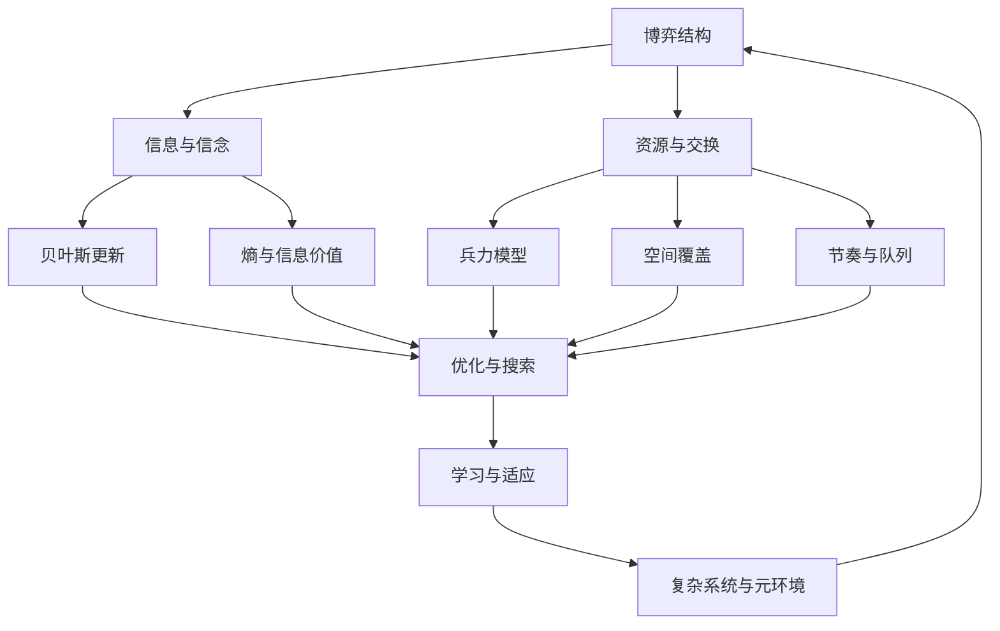

# 执行总纲

可以。正确的研究计划应当先建立一个**总理论对象**，再把各子学科放进同一个问题框架里，而不是先列模型名。

**总目标：** 把“游戏高手”理解为一种在`对抗性`、`不完全信息`、`随机扰动`、`资源约束`、`时间压力`、`空间结构`和`长期学习`中持续提高胜率的决策系统。研究对象不是“游戏里有哪些理论”，而是：高手如何看见局面、压缩不确定性、分配资源、控制节奏、利用空间、管理风险、搜索行动、适应环境。

**总框架：** 一切游戏局面都可以先抽象成一个动态系统：有若干行动者，有目标函数，有可选行动，有可见信息与隐藏信息，有资源状态，有空间位置，有时间窗口，有随机事件，有收益结构，有反馈机制。高手的本质，不是“会背很多技巧”，而是能把具体局面转写为这些变量之间的关系：当前在争夺什么、什么信息未知、什么资源最稀缺、什么时间窗口即将关闭、什么空间点正在变成瓶颈、什么风险可以承受、什么选择会改变未来状态价值。

**第一步：先写整体理论总论。** 这一部分不讲具体模型，而讲“游戏作为复杂对抗决策系统”。核心问题是：游戏为什么不是单纯操作问题？因为操作只是执行层，真正决定上限的是局面建模能力。总论要说明：战略层处理目标、长期收益、均衡和资源曲线；战术层处理局部交换、空间控制、信息差和时机；操作层处理反馈控制、误差修正、动作调度和执行稳定性。三层不是孤立的，例如一次 FPS 对枪看似是操作，但背后有空间角度、信息暴露、风险收益、反应时间、武器经济和团队补位；一次 RTS 团战看似是兵力交换，但背后有兰彻斯特模型、集火效率、地形瓶颈、生产队列、侦察信息和后续经济曲线。

**第二步：建立概念网络，而不是模型清单。** 概念网络应以问题为中心展开。例如“对抗结构”下面不是直接列`纳什均衡`、`零和博弈`、`演化博弈`，而是先问：这是纯冲突、部分合作，还是多方联盟？对手是否能观察和反制？策略是否会在群体中传播？然后才引入零和博弈、非零和博弈、纳什均衡、混合策略、演化稳定策略、重复博弈、承诺、威慑、联盟和背叛。这样模型服务于问题，而不是反过来。

**第三步：按“局面问题链”组织全篇。** 推荐主线是：对抗结构 → 信息与信念 → 随机与风险 → 决策与价值 → 兵力与交换 → 空间与位置 → 时间与节奏 → 经济与资源 → 优化与搜索 → 学习与训练 → 复杂系统与网络 → 综合案例。这个顺序符合真实高手复盘：先判断局面性质，再判断知道什么和不知道什么，再判断风险是否值得，再判断行动价值，再进入局部执行、资源调度、搜索计算和长期学习。

**第四步：每一章都用统一阐述结构。** 每个模块都应按以下顺序写：它解决什么问题；它来自哪个人类知识领域；核心变量是什么；核心概念网络如何展开；它通过什么机制影响游戏局面；它与其他模块如何相互作用；它在具体游戏中的案例是什么；它的适用边界是什么。比如写`信息论`时，不能只说熵公式，而要说明：侦察的价值不是“看见更多”，而是减少足以改变决策的关键不确定性；它会和贝叶斯更新、信号博弈、视野控制、诱骗、隐藏战术、风险管理共同作用。

**第五步：各模块的系统展开计划如下。**

**一、对抗结构：** 研究“我和对手到底处于什么关系”。这里要处理零和、非零和、合作、背叛、威慑、承诺、联盟、重复博弈、纳什均衡、混合策略和演化博弈。游戏案例可以覆盖格斗游戏的猜拳循环、扑克牌的下注频率、MOBA 的 Ban/Pick、多人策略游戏的联盟背刺。重点不是列博弈论概念，而是解释：为什么有些局面应当保底，有些局面应当 exploit，有些局面应当合作，有些局面应当故意混合随机化以避免被读。

**二、信息、信念与信号：** 研究“我知道什么、对手知道什么、对手以为我知道什么”。这一章包括不完全信息、战争迷雾、贝叶斯更新、香农熵、信息价值、信号博弈、诈唬、伪装、诱导、读牌、读招。核心关系是：信息改变信念，信念改变行动，行动反过来又释放信号。案例可以用 RTS 侦察开局、卡牌游戏读手牌、FPS 假转点、MOBA 蹲伏与反蹲、狼人杀/Among Us 的发言信号。

**三、随机、风险与收益：** 研究“在不确定结果下，什么选择长期更优”。这一章包括期望值、方差、风险厌恶、期望效用、前景理论、Kelly 准则、破产风险、尾部风险、抽样偏差、赌徒谬误。它要解释为什么高手不以单次结果评价决策，而用长期收益、风险承受力和阶段目标评价决策。案例可以用扑克牌跟注赔率、炉石/万智牌抽牌概率、肉鸽路线选择、吃鸡决赛圈保守与激进、排位上分中的低方差策略。

**四、决策、状态与价值：** 研究“这一手是否让未来更好”。这里引入序贯决策、状态空间、行动空间、奖励、价值函数、Bellman 方程、马尔可夫决策过程 `MDP`、部分可观察马尔可夫决策过程 `POMDP`。重点是把“当前收益”与“后续状态价值”区分开。案例可以用 Slay the Spire 的选牌、文明系列的科技路线、战棋游戏的站位、RTS 的开矿与出兵、MOBA 的让资源换地图压力。

**五、兵力、交换与战斗模型：** 研究“为什么有些团战人数差会被指数级放大”。这一章以兰彻斯特线性律、平方律、DPS 模型、爆发模型、Salvo 模型、集火效率、过量伤害、AOE、前排承伤、治疗链、护盾、控制链为核心。它要解释：兵力优势何时是线性的，何时近似平方放大；为什么同步接战、集火、拉扯、分割战场非常关键。案例可以用 StarCraft II 团战、自动战斗游戏站位、MOBA 先手秒杀、舰队齐射、守望先锋式技能链。

**六、空间、地形与控制：** 研究“位置为什么会改变行动价值”。这一章包括地形、瓶颈、射程、视野、掩体、高低差、路径代价、Voronoi 区域、影响图、势场、最短路、最大流最小割、控制区、火力覆盖。核心机制是：空间改变可行动作集合、暴露概率、支援时间和交战效率。案例可以用 FPS 架枪线、MOBA 河道视野、RTS choke point、塔防路线、足球/机器人足球的控制区域。

**七、时间、节奏与调度：** 研究“什么时候做，比做什么本身更重要”。这一章包括 timing window、冷却、装填、技能轴、生产队列、行动经济、APM、节奏压制、排队论、Little 定律、实时调度、机会成本。它要解释：高手不是简单更快，而是让关键动作在关键窗口可用，并让对手的响应窗口错位。案例可以用 MMO 输出循环、MOBA 大招时间差、FPS 换弹窗口、RTS timing push、格斗游戏帧数据与压制回合。

**八、经济、资源与市场：** 研究“有限资源如何转化为胜率”。这一章包括稀缺性、机会成本、边际收益、边际递减、复利、投资回收期、资源曲线、供应链、库存、通货膨胀、市场供需、拍卖、交易摩擦。它要解释：经济不是“钱多就好”，而是资源在时间、位置、风险和胜利条件之间的转换效率。案例可以用 Valorant/CS 的买枪经济、EVE Online 市场、RTS 工农比与扩张、MOBA 装备成型期、卡牌游戏曲线费用。

**九、优化、搜索与近似求解：** 研究“在巨大选择空间中如何找到足够好的行动”。这一章包括线性规划、非线性规划、整数规划、动态规划、启发式搜索、极小极大、α-β 剪枝、蒙特卡洛树搜索 `MCTS`、多臂老虎机、UCB、CFR。重点是解释为什么高手不是穷举所有选择，而是把算力集中在关键分支、强迫线、斩杀线、反制线和高价值不确定点。案例可以用国际象棋、围棋、扑克求解器、战棋残棋、卡牌斩杀计算。

**十、学习、训练与适应：** 研究“高手如何形成，而不是高手在一局里怎么想”。这一章包括学习曲线、幂律练习、刻意练习、反馈回路、技能迁移、chunking、模式识别、强化学习、自我博弈、meta learning、反思复盘。核心问题是：练习什么、如何获得反馈、如何避免坏习惯固化、如何把局部技巧转成可迁移能力。案例可以用 FPS aim training、格斗游戏连段与确认、RTS 开局流程、MOBA 复盘、职业队训练赛。

**十一、复杂系统与网络科学：** 研究“为什么个体最优会生成意外的整体环境”。这一章包括涌现、反馈、路径依赖、临界点、相变、幂律、优先连接、小世界网络、中心性、传播、流行 meta、生态位、红皇后效应。它解释版本环境、英雄池、卡组环境、公会政治、市场波动和玩家群体行为。案例可以用 MOBA 版本强势英雄扩散、卡牌游戏天梯环境、MMO 公会网络、EVE 政治经济、直播传播导致的套路复制。

**十二、综合案例：** 最后一部分不再按模型写，而按真实游戏问题写。例如“MOBA 一次小龙团如何分析”，需要同时调用信息、空间、时间、兵力、经济和风险；“RTS 一次 timing push 如何分析”，需要调用侦察、生产队列、兰彻斯特、路径和机会成本；“FPS 一次转点如何分析”，需要调用信号、空间控制、时间窗口和风险；“卡牌游戏一回合是否 all-in”，需要调用概率、期望值、手牌信息、对手范围和后续状态价值。这样才能证明前面的理论体系不是知识碎片，而是可组合的分析工具。

**最终写作策略：** 先写一章“游戏高手的总系统”，把所有变量和问题链说清楚；再按十二个模块逐项展开；每个模块都先讲问题，再讲概念网络，再讲模型，再讲作用机制，再讲案例；最后用综合案例把多个模块重新合并。这样文章会从“理论陈列”变成“系统性解释”：游戏高手不是掌握某个单一模型，而是在复杂对抗系统中连续进行建模、估计、优化、执行和学习。

# 总论

# 游戏高手决策的理论模型全景

## 执行摘要

本报告把“对高手真正有用”的模型，界定为那些能够稳定改变长期胜率、局部交换效率、资源曲线、信息优势、地图控制或训练效率的理论工具。若把这些工具压缩到最核心的结构，几乎都在回答五个问题：第一，当前局面是纯对抗还是可协调；第二，不确定信息值多少钱；第三，兵力、时间与空间应如何集中；第四，局部选择怎样累积为全局最优；第五，系统会不会因为网络效应、反馈回路和元环境演化而改变原先的最优解。以这个标准看，博弈论、概率统计、信息论、控制论、优化理论与复杂系统，并不是分散的学科拼盘，而是一套从“看见局面”到“压榨局面”的连续工具链。citeturn36view0turn28search6turn36view7turn36view2turn5search0turn5search1

对高水平玩家而言，最重要的结论有三点。其一，凡是存在隐藏信息、随机结果、对手适应与时间压力的游戏，高手优势都不主要来自“更快反应”，而来自把局面先转写成某个可计算对象：收益矩阵、后验概率、战力交换率、路径代价、冷却周期、图上的控制域或长期成长率。其二，许多看似不同的强势打法，其实都在做同一件事：用节奏优势把对手逼到信息不足、选择受限、资源不足或反制窗口错位的状态。其三，最容易被普通玩家忽略、但最能拉开高手差距的，不是单次操作上限，而是“何时不打、何时不买、何时不暴露、何时不把优势换成小利”的纪律；这背后对应的正是期望值、效用、贝叶斯、边际分析、队列稳定性与反馈控制。citeturn37view4turn20search1turn12search1turn36view7turn6search14turn32search8

因此，真正严谨的高手框架，不应再把“战略、战术、操作”分开看：战略层主要是博弈结构、信息结构与长期优化；战术层主要是局部资源交换、覆盖控制、搜索深度与时机；操作层则是反馈控制、周期调度、误差校正与训练曲线。三层统一之后，许多传统经验法则——例如“先侦察再决策”“先集火再展开”“该省就省”“不要在高方差位面子对拼”“把技能轴对齐强窗”“逼对手回应而不是互拼输出”——都可以被还原成可解释、可迁移、可复盘的模型语言。citeturn12search22turn22search9turn36view10turn36view6turn16search1

## 模型地图

为了避免把不同层级的模型混成一团，本报告采用一张“从对抗到执行”的地图：最上层是博弈结构，决定局面是零和、非零和、协调、背叛还是演化竞争；第二层是信息与信念，决定侦察、伪装、诈唬、读牌、读开局和读意图的价值；第三层是资源、兵力、空间与时间，决定何时扩张、何时换血、如何控图、如何排兵与如何压节奏；第四层是优化、搜索与学习，决定局面如何被近似求解；第五层是复杂系统与网络科学，解释为什么个体最优经常会生成意外的群体现象、元环境锁定或幂律赢家通吃。这个分类基本覆盖了高手在实时、回合制、单人、多人、动作、策略、竞技与经济型游戏中会反复面对的决策对象。citeturn36view0turn28search6turn12search14turn23search0turn31search11

从玩家视角把这张图再压缩一次，可以得到一个更实用的判断序列：先问“对手有没有理由跟随自己的节奏”；再问“还有哪些关键变量未知”；再问“每一秒、每一点血、每一张牌、每个技能窗、每份经济在当前局面的边际价值是多少”；然后才问“当前操作会不会把局面带进更好求解、更容易逼回应的状态”。高手与普通玩家最大的差别，往往不是知道更多孤立技巧，而是知道应该在这条链上的哪一环下手。citeturn36view0turn12search3turn36view7turn6search2turn32search1

## 对抗结构与信息

### 零和博弈与极小极大

**名称：** 零和博弈与极小极大。**定义：** 当一方收益增加恰好意味着另一方收益等量下降时，局面可近似为零和；其核心解法是极小极大，即在最坏对手回应下最大化自身保证收益。标准形式可写为 $$\max_x \min_y x^\top A y=\min_y \max_x x^\top A y$$。**影响：** 它直接告诉高手：在完全对抗、互相都能惩罚失误的局面里，首先该找“不会被系统性打穿的底线策略”，而不是先追求华丽但可被针对的高收益线。**原理：** 收益矩阵 $$A$$ 把每个行动组合映成收益，混合策略 $$x,y$$ 用概率分布随机化行动，从而把纯策略可剥削点抹平。**案例：** 在扑克中的单挑场景，高手并不是“永远用最赚的一招”，而是先保证自己的下注、跟注、弃牌频率不被对手无成本剥削；这就是把出手频率调到一个带保底性质的混合策略面上。**适用范围与局限：** 最适用于双人竞技、完全对抗、奖惩近似守恒的回合制或多阶段博弈，如单挑扑克、部分格斗与残局；局限在于多人局、外交局、经济局与团队局通常都不是严格零和，而且真实玩家会偏离最优回应。citeturn36view0turn21search1turn26search2

### 非零和博弈

**名称：** 非零和博弈。**定义：** 非零和局面中，一方获益不必等于另一方受损，合作、交易、角色分工、交换牺牲都可能让总体收益扩大。**影响：** 它要求高手先识别“共同利益区间”再决定是否翻脸；若一开始就按零和思维打，往往会过早破坏本来能够转化成更大总收益的协作窗口。**原理：** 在收益矩阵中，某些策略组合会让双方效用同时提高，这时关键不是单点最优，而是可执行、可信、可持续的协调。**案例：** 经典的“猎鹿博弈”中，两名玩家若都去猎鹿，总收益高于各自单独猎兔；对应到团队竞技，就是队友牺牲个人击杀数据去完成视野、拉扯或资源让渡，只要团队胜率提高，就不是“亏”，而是把个人目标函数并入团队目标函数。**适用范围与局限：** 适用于多人、团队、外交、联盟、交易和角色互补强的游戏；局限在于一旦缺乏沟通、信誉或重复博弈基础，协作均衡很容易坍塌回保守策略。citeturn36view0

### 纳什均衡

**名称：** 纳什均衡。**定义：** 当每个玩家在他人策略固定时都没有单边偏离激励，策略组就构成纳什均衡，可形式化为 $$s_i^*\in \arg\max_{s_i} u_i(s_i,s_{-i}^*)$$。**影响：** 对高手最关键的意义，不是“找到唯一答案”，而是知道哪些行动频率一旦偏离，就会被立刻惩罚；均衡因此更像“不能越过去的防线”，而不是“必须僵硬遵守的剧本”。**原理：** 均衡通过最佳回应的相互交点构成，在混合策略博弈里常常意味着必须主动随机化。**案例：** 在石头剪刀布中，均衡不是猜对一次，而是把三种出法维持在不可预测的频率附近；在扑克理论中也是同理：若某条线过频，对手就能通过扩大跟注或扩大诈唬回收收益。**适用范围与局限：** 几乎所有多人互动游戏都能以纳什均衡作基准；局限在于现实玩家并不总做最佳回应，许多实战更需要“偏离均衡去 exploit”，这要求用均衡作底线、用读人作上层修正。citeturn36view0turn26search4

### 演化博弈与复制动态

**名称：** 演化博弈、演化稳定策略与复制动态。**定义：** 它不研究“一个完全理性的人应当怎么想”，而研究“一个群体中的策略比例会如何随胜率而变化”。复制动态常写成 $$\dot x_i=x_i\left[(Ax)_i-x^\top A x\right]$$。**影响：** 它对高手最大的价值，是解释“版本答案”“天梯流行套路”“卡组环境”“英雄池分布”为何会循环、为何会锁死、为何会被专门针对。高手因此不只看当前强度，还看“当大家都开始抄这套之后，它还会不会强”。**原理：** 表现高于群体平均收益的策略占比会增长，低于平均的会萎缩；演化稳定策略意味着即便有小规模变异策略入侵，也难以撼动原有群体结构。**案例：** 石头剪刀布就是最直观的元环境示意：若“石头”被过度采用，“布”的收益上升；若“布”泛滥，“剪刀”又会回潮。竞技游戏中的 Ban/Pick 元环境，经常就是更复杂的复制动态。**适用范围与局限：** 特别适用于多人竞技、版本环境、长期天梯与 repeated meta；局限在于真实环境会被补丁、舆论、直播传播与样本噪声打断，不一定收敛到漂亮的理论稳态。citeturn21search11turn21search3

### 信息不对称与信号传递

**名称：** 信息不对称与信号传递。**定义：** 当一方知道自己的真实类型、意图、强弱或手牌，而另一方不知道时，就出现信息不对称；信号传递研究的是，如何通过代价性行动让对方形成对自己有利的信念。**影响：** 高手的关键任务不是把一切都藏住，而是选择性地“展示该展示的东西”：有时要强装弱吸引投入，有时要弱装强阻止对方推进，有时则要通过行动顺序、站位、下注尺度、探点路线，让对方在错误的后验信念下行动。**原理：** 可信信号通常必须有成本，且不同类型承担该成本的难度不同；否则信号会失真，沦为廉价噪音。**案例：** 扑克中的诈唬就是标准案例：下注尺度、时机与线路并不是随机表演，而是在构造一个“我这里更像价值牌”的信号，迫使对手错误弃牌。**适用范围与局限：** 最适用于不完全信息博弈、社交推理、卡牌、扑克、MOBA 埋伏与 RTS 假开局；局限在于若对手完全不读信息，或匹配样本太少，复杂信号策略会失去收益。citeturn6search3turn15search8

### 香农信息与熵

**名称：** 香农信息与熵。**定义：** 熵衡量不确定度，离散型写为 $$H(X)=-\sum_x p(x)\log_2 p(x)$$；一次观察若大幅缩小可行动作空间的不确定性，就具有高信息价值。**影响：** 这意味着侦察行为不能只看“看到了什么”，而应看“把多少错误分支排除了”。高手侦察的真正目标，往往不是完整地图，而是锁定少数关键假设：对手开局、科技树、埋伏位置、技能是否已交、牌组是否有某类解。**原理：** 信息价值来自后验分布收缩；若观察后自己的最优决策发生显著变化，该观察就是高价值信息。**案例：** 在 RTS 的战争迷雾里，看见对方一个关键建筑或关键兵种，往往比看见十个普通农民更重要，因为它会瞬间把大量不再可能的 build order 排除掉。**适用范围与局限：** 适用于 RTS 侦察、卡牌读牌、搜点、视野控制、社交推理和残局探测；局限在于熵高不等于决策价值高，许多“很新鲜”的信息其实不改变最优应对。citeturn28search6turn28search0turn35search5

### 贝叶斯更新

**名称：** 贝叶斯更新。**定义：** 它用新证据修正旧信念，公式为 $$P(H\mid E)=\frac{P(E\mid H)P(H)}{P(E)}$$。**影响：** 高手的读牌、读招、读开局，不是“灵感判断”，而是连续后验更新：先有先验分布，再根据侦察、下注、人群习惯、版本流行度与回合内线索逐步收缩可能世界。**原理：** 先验刻画初始环境，例如版本流行开局分布；似然刻画在某假设下观察到某证据的概率；后验再决定下一步的防守、扩张或反制。**案例：** 针对 entity["video_game","StarCraft II","blizzard 2010"] 的研究已经把开局预测、计划识别与战术判断做成贝叶斯模型：看到不完整、带噪声的敌方建筑与单位后，就可以估计对手最可能的科技树与进攻时间。**适用范围与局限：** 适用于 RTS、扑克、卡牌、社交推理与所有有隐藏状态的对局；局限在于先验错得太离谱、样本太稀、对手故意混线时，后验会被系统性带偏。citeturn12search1turn12search3turn12search22

## 风险、随机与决策

### 期望值

**名称：** 期望值。**定义：** 期望值就是把所有结果按概率加权后的平均收益，写成 $$\mathrm{EV}=\sum_i p_i v_i$$。**影响：** 它把“这波看起来赚”与“长期真的赚”区分开来；高手做决策时，首先要判定一条线是正期望还是负期望，而不是先被单次成败绑架。**原理：** 当局面可重复时，长期平均收益会逼近期望；因此正期望线即使短期输钱，也仍应继续执行。**案例：** 在 MIT 的扑克教学例子里，若手牌胜率高于投入占最终底池的比例，跟注就是正期望；这个判断把“敢不敢赌”改写成“赔率够不够”。**适用范围与局限：** 适合有重复样本、奖惩可量化的牌类、射击、抽卡、资源交换和战斗选择；局限在于 EV 只看均值，不看方差、破产风险与阶段目标。citeturn37view0turn37view4turn26search21

### 期望效用

**名称：** 期望效用。**定义：** 期望效用不是最大化平均收益，而是最大化平均“主观价值”，写成 $$\max_a \sum_s P(s\mid a)\,u(o_{a,s})$$。**影响：** 它解释了为何高手不一定总选 EV 最高的线：当生存、晋级、保排名、保经济稳定性比单次收益更重要时，应该最大化效用而不是裸收益。**原理：** 效用函数把风险偏好编码进决策；风险厌恶者会给尾部损失更高权重。**案例：** 在 《Risk》研究中，是否继续进攻并不只取决于胜率，还取决于撤退节点、剩余兵力与个人风险偏好；同样思路也适用于淘汰赛、肉鸽通关局和锦标赛保分局。**适用范围与局限：** 适用于淘汰制、长赛季、肉鸽、高惩罚失败环境；局限在于效用函数往往难以精确标定，容易变成“给保守找借口”。citeturn20search1turn33search4

### 前景理论

**名称：** 前景理论。**定义：** 相较于期望效用，它强调人的决策围绕“参考点”展开，通常存在损失厌恶、确定性效应与概率加权；一个常见写法是 $$v(x)=\begin{cases}x^\alpha,&x\ge 0\\-\lambda(-x)^\beta,&x<0\end{cases}$$，其中 $$\lambda>1$$ 体现损失厌恶。**影响：** 它提醒高手两件事：其一，自己也会被“马上要亏”“刚刚白赚”这种参考点操控；其二，可以主动利用对手的参考点，让对方在“怕掉已有优势”或“急着翻本”时做出次优选择。**原理：** 人对损失通常比同等收益更敏感，并且会系统性地高估小概率事件、低估中高概率事件。**案例：** 在扑克锦标赛接近钱圈或决赛桌时，短码玩家常会为了“别先出局”而牺牲长期 EV；而深码高手正可以借这种参考点变化提高压榨频率。**适用范围与局限：** 适用于比赛制、排位、吃鸡决赛圈、锦标赛与所有“阶段目标重于局部 EV”的环境；局限在于它是描述性理论，不直接给出最优算法。citeturn20search13turn26search15turn16search3

### Kelly 准则

**名称：** Kelly 准则。**定义：** 它研究在重复有优势下注中，怎样分配比例才能最大化资本的长期对数增长；二元赔率下常写为 $$f^*=\frac{bp-q}{b}$$。**影响：** 对高手来说，这不是只管“赌不赌”，而是决定“压多大”：当一条线有优势但方差高时，仓位管理本身就是决策的一部分。**原理：** Kelly 最大化的是长期财富增长率，而不是单次期望收益；因此它天然把破产风险与复利效应纳入。**案例：** 在扑克资金管理中，正赢率玩家若过度上桌更高等级局，虽然单手仍可能是正 EV，但长期增长率反而下降，甚至有破产风险；分数 Kelly 往往更稳健。**适用范围与局限：** 最适用于有明确优势估计、可重复下注、资源可按比例投入的牌类、赌局、市场型游戏；局限在于它对胜率和边际估计误差极敏感，实战往往应折半或更保守。citeturn27search0turn27search2

### 马尔可夫链

**名称：** 马尔可夫链。**定义：** 若系统下一步只依赖当前状态而与更早历史无关，就可用马尔可夫链建模。**影响：** 它让高手把“随机又连续”的局面拆成状态转移问题，从而估计稳态分布、到达概率、期望回合数与吸收概率。**原理：** 用转移矩阵 $$P$$ 描述各状态之间的概率跳转，很多长期性质都可由矩阵幂或稳态分布求出。**案例：** 《Risk》与 Monopoly 的研究都能用马尔可夫链估计位置分布、推进成功率与撤退阈值；对玩家而言，这对应“不凭感觉记忆地图热点”，而是量化哪些位置长期更常被访问、哪些交战线更容易吸收胜负。**适用范围与局限：** 适用于棋盘、路线、抽牌、循环房间、状态可压缩的肉鸽与战棋；局限在于许多高水平对局存在长历史依赖，严格马尔可夫化常需牺牲信息。citeturn4search7turn33search4turn33search20

### 泊松过程

**名称：** 泊松过程。**定义：** 它建模“某类事件在时间上以平均速率 $$\lambda$$ 随机到达”的过程，单位时间事件数服从泊松分布，间隔时间服从指数分布。**影响：** 它让高手对刷新、掉落、刷怪、突发事件与随机到达有正确预期，不会把正常波动误读为“系统针对”。**原理：** 若事件独立且平均速率稳定，则 $$P(N(t)=k)=e^{-\lambda t}(\lambda t)^k/k!$$。**案例：** 在程序化生成与动态事件系统中，泊松过程可用来驱动敌人波次、稀有事件或地图扰动；对玩家而言，关键是把“等下一次高价值事件”写成到达率问题，而不是迷信“该出了”。**适用范围与局限：** 适用于刷怪、事件刷新、随机遭遇与轻量过程化系统；局限在于真实游戏常有人为保底、伪随机与节奏脚本，不满足独立同分布假设。citeturn5search5turn5search13turn33search2

### 排队论与 Little 定律

**名称：** 排队论与 Little 定律。**定义：** 排队论研究到达、等待、服务与拥堵，Little 定律给出长期平均关系 $$L=\lambda W$$，即系统内平均在制品数等于到达率乘平均等待时间。**影响：** 对高手最直接的作用，是识别“瓶颈”：只要某条生产线、治疗链、补给链、兵营队列或匹配系统的到达率超过服务能力，延迟就会爆炸。**原理：** 不需要知道到达和服务的全部分布，只要系统稳定，平均关系就成立。**案例：** 在线 2v2 匹配研究显示，规则设计会显著影响等待时间与打包服务效率；同样地，在 RTS 里过多同时开工而缺乏资源支撑，表面上是“生产很满”，本质上是把自己送进了高等待、低吞吐的坏队列。**适用范围与局限：** 适用于 RTS 生产、MMO 团本资源链、竞技匹配与所有存在排队瓶颈的系统；局限在于它给的是平均关系，不直接给最优微观调度。citeturn36view7turn36view12

## 兵力、空间、时间与经济

### 控制论与 PID

**名称：** 控制论与 PID。**定义：** 控制论研究反馈回路如何让系统趋稳；PID 控制是最经典的误差校正器，形如 $$u(t)=K_p e(t)+K_i\int e(t)\,dt+K_d \frac{de}{dt}$$。**影响：** 对高手而言，这一模型的意义不是去写代码，而是把操作理解为“围绕误差做反馈”：偏离理想距离就修正站位，偏离理想角度就微调准心，偏离理想经济曲线就调整采集与出兵。**原理：** 比例项纠正当前误差，积分项消除长期偏差，微分项抑制过冲。**案例：** 在赛车游戏中，车辆沿理想线驾驶本质上就是闭环路径跟踪；对人类高手同样如此——优秀的走线不是一次性规划，而是持续读取横向误差、速度误差和入弯姿态做高频校正。**适用范围与局限：** 适用于赛车、飞行、FPS 压枪、走位、风筝和 RTS 编队微操；局限在于高延迟、强随机和强离散动作环境下，经典连续控制会失真。citeturn4search6turn14search4

### 兰彻斯特线性律与平方律

**名称：** 兰彻斯特线性律与平方律。**定义：** entity["people","Frederick Lanchester","combat modeling"] 提出的 attrition 模型，用微分方程描述两军随时间互相消耗。现代远程、可集火战斗最常用平方律：$$\frac{dA}{dt}=-\beta B,\quad \frac{dB}{dt}=-\alpha A$$，其不变量是 $$\alpha A^2-\beta B^2=C$$；而在线性律或近战拥挤情形中，交换率更接近兵力的一次关系。**影响：** 它直接改变高手的交战观：可集火环境中，“多一点兵”往往不是线性更强，而是平方级更强，因此分兵过度、接战不同步、让对手逐个击破都会非常亏。**原理：** 当每个单位都能把火力独立投到多个目标上时，总杀伤随可射击单位数成比例上升，而幸存方由于人数更多还能进一步保留更高输出，形成正反馈。**案例：** 在 entity["video_game","StarCraft II","blizzard 2010"] 的正面团战中，若两边单位质量接近，先手集火、让输出同时到场、避免“葫芦娃式补兵”，其收益常远高于零碎交换；这正是平方律在 RTS 中最直观的体现。**适用范围与局限：** 适用于 RTS、自动战斗、舰队战与远程集火场景；局限在于真实战斗还受地形、碰撞体积、范围伤害、射程层级与技能窗影响，纯兰彻斯特只适合做一阶近似。citeturn22search8turn12search14turn36view2

### 兰彻斯特变体

**名称：** 兰彻斯特变体、游击模型与 Salvo 模型。**定义：** 经典兰彻斯特适合连续 attrition；游击变体调整了正规军与游击队的接敌方式，Salvo 模型则把战斗改写为“离散脉冲式齐射”而非连续射击。**影响：** 它告诉高手，并非所有“人数差”和“DPS 差”都能用同一公式算：若接战是隐蔽渗透、局部突击、技能爆发或一轮齐射决定生死，那么离散爆发模型比连续磨血模型更接近现实。**原理：** 游击模型改变了遭遇概率与目标暴露率；Salvo 模型则显式考虑一轮齐射后的拦截、防御与存活。**案例：** 在以导弹齐射或一次技能链定胜负的战术游戏、舰战或 MOBA 先手秒杀窗口中，“能不能活过对面第一轮”比“平均每秒输出”更重要，此时用 Salvo 式思维比用纯 DPS 更有解释力。**适用范围与局限：** 前者适用于不对称骚扰、埋伏、游击与偷点；后者适用于爆发窗、先手团、舰战和范围技能链；局限是参数难估且高度依赖具体机制。citeturn22search7turn22search9turn22search4

下表把几种最常用的兵力消耗模型并置，便于判断应在哪类游戏里调用哪一种近似。citeturn22search7turn22search9turn22search8

| 模型 | 最核心假设 | 最适合回答的问题 | 典型游戏类比 | 最容易失真的地方 |
|---|---|---|---|---|
| 兰彻斯特线性律 | 近战拥挤、接敌受限、单位难以同时集火 | “多一点兵”到底多多少交换率 | 冷兵器群殴、狭道战、前排卡位战 | 可远程集火或范围伤害时会低估人数优势 |
| 兰彻斯特平方律 | 远程可独立射击、火力能同步投射 | 是否应立刻抱团、集火、同步接战 | RTS 正面团战、自动战斗远程对射 | 地形、碰撞、技能窗与射程层级会改变结果 |
| 游击变体 | 一方暴露率低、接敌不连续 | 骚扰是否能以小博大 | 偷矿、伏击、点杀补给线 | 难以精确估计发现概率与脱战概率 |
| Salvo 模型 | 战斗由离散爆发轮次决定 | 先手一轮能否决定胜负 | 舰战齐射、MOBA 爆发链、导弹战 | 不适合长时间持续磨血 |

### Voronoi 覆盖

**名称：** Voronoi 覆盖。**定义：** 给定若干控制点 $$p_i$$，其 Voronoi 区域定义为 $$V_i=\{x:d(x,p_i)\le d(x,p_j),\forall j\neq i\}$$，即空间里“离谁最近就归谁”的统治域。**影响：** 高手用它看地图时，就不只看“我站在哪”，而看“我实际控制了哪些空间、通路、球路、资源点和支援半径”。**原理：** 几何最近原则把复杂地图离散成若干势力范围，便于估计覆盖、支援时间与对撞边界。**案例：** 机器人足球与体育分析早已用 Voronoi 图表示球员统治域；在战术游戏里，同样可以把单位站位转成“谁更先触达关键区域”的问题，于是站位优劣就不再是直觉，而是覆盖面积与边界形状。**适用范围与局限：** 适用于足球、机器人对抗、MOBA 占区、RTS 侦察与战术移动；局限在于纯欧氏距离忽略地形、障碍与技能射程差。citeturn11search8turn11search12turn11search1

### 影响图与势场

**名称：** 影响图与势场。**定义：** 影响图把地图上每个位置赋一个威胁值、支援值或控制值；势场则把单位行动写成朝“吸引点”移动、远离“排斥点”的连续过程。**影响：** 它使高手从“盯一个目标”升级为“管理一块空间”：并非只问能不能打，而是问打完后会把自己停在多危险、多久能被包夹的位置。**原理：** 每个单位或地形特征向周围扩散影响，叠加后形成可视化场；行动选择等于在场上找局部最优或约束最优路径。**案例：** 《StarCraft》 的 influence map 研究表明，风筝行为可通过同时考虑敌我威胁分布来改进，也就是边走边保持输出距离与安全边界。**适用范围与局限：** 适用于 RTS、战棋、塔防、FPS 小队推进与风筝；局限在于易出现局部极值、参数敏感、看不到长远后果。citeturn37view6turn36view10

### 节奏、冷却与周期调度

**名称：** 周期调度、冷却优化与节奏控制。**定义：** 许多技能、装填与资源动作都可视为周期任务；若第 $$i$$ 个动作一次占用时间为 $$C_i$$、周期为 $$T_i$$，则总利用率 $$U=\sum_i C_i/T_i$$。在经典 EDF 框架下，$$U\le 1$$ 是可调度的关键边界。**影响：** 这意味着“技能轴对齐”“大招留给强窗”“不要让多个关键动作同秒卡死”，本质上都是调度问题。高手的节奏观，不是快，而是让关键动作在关键窗可用。**原理：** EDF 倾向优先执行最早到期任务；更新奖励理论则讨论在周期循环里，怎样最大化长期单位时间收益。**案例：** 在 entity["video_game","Final Fantasy XIV","square enix mmo"] 中，官方甚至提供了 `/recast` 命令来查看技能剩余冷却；高水平输出循环本质上就是在不爆轴的前提下，把高价值技能尽量塞进增伤窗口。**适用范围与局限：** 适用于 MMO rotation、FPS 技能英雄、动作游戏连段与回合制技能轮换；局限在于人类操作误差、走位打断和随机事件会让理想调度失真。citeturn32search0turn32search4turn32search1turn36view6turn19search2

### 供需模型

**名称：** 供需模型。**定义：** 价格由供给、需求与交易摩擦共同决定，供给下降或需求上升都会推高均衡价格。**影响：** 对高手而言，经济型游戏的核心不只是会刷钱，而是判断“未来什么会更稀缺、什么会被版本或战争推高、什么库存会在下个阶段变成负资产”。**原理：** 市场价格传递了全服稀缺性与预期变化；在开放经济里，破坏、消耗、补丁与地理整合都会改变供需曲线。**案例：** 在 entity["video_game","EVE Online","ccp 2003"] 的月度经济报告与全球 PLEX 市场改动中，可以直接看到生产、采矿、破坏与流动性如何共同塑造价格；会打经济战的高手，本质上是在预判供需冲击。**适用范围与局限：** 适用于 MMO、拍卖行、沙盒经济、交易卡牌与任何玩家驱动市场；局限在于开发者干预、税率、保底与行为偏差会让价格短期偏离基本面。citeturn36view4turn7search19turn6search2

### 边际效用

**名称：** 边际效用与边际分析。**定义：** 一项资源多投入一单位所新增的收益，称为边际效用；很多系统存在边际递减。**影响：** 高手买装备、补经济、堆属性、屯资源时，看的不是“总价值”，而是“下一单位资源放在哪个槽位涨得最多”。**原理：** 当某类资源越多，新增一单位带来的改善通常越小，于是最优策略常是把有限预算在多个高边际槽位之间平衡。**案例：** 在 entity["video_game","VALORANT","riot 2020"] 的回合经济里，一把更贵的枪未必总比半甲加关键技能更优，因为当前局面真正缺的可能不是纯火力，而是可争点的工具、下回合的连买能力或团队同步买的完整度。**适用范围与局限：** 适用于经济局、配装、属性分配、队伍预算与 build 优化；局限在于边际效用依赖局面，高度情境化。citeturn6search2turn6search14turn36view5turn7search5

## 优化、搜索与学习

### 线性与非线性规划

**名称：** 线性规划与非线性规划。**定义：** 当目标函数与约束都是线性的，可写成标准 LP；若存在协同、递减、阈值、概率或其他曲面效应，就进入 NLP。**影响：** 对高手最直接的启发，是把“买什么、造什么、带什么、先做什么”写成预算约束下的最优分配，而不是靠模糊手感。**原理：** LP 求的是线性目标在可行域顶点上的最优解；NLP 则处理非线性目标和约束，允许更真实地刻画伤害曲线、协同加成与风险项。**案例：** 在回合买枪或 build 规划中，可以把信用点、装备格、冷却位与角色职责写成约束，把团战期望收益写成目标；若协同爆发、移动速度阈值或技能乘区重要，则应改用非线性目标。**适用范围与局限：** 适用于经济回合、配装、生产、阵容构建与赛前准备；局限在于真实游戏的玩家行为和隐藏信息常让目标函数无法精确写出。citeturn24search0turn24search1turn37view2

### 动态规划与 Bellman 方程

**名称：** 动态规划与 Bellman 方程。**定义：** 动态规划处理“最优子结构”问题，核心思想是当前最优取决于未来最优；在状态决策框架中常写成 $$V(s)=\max_a \left[r(s,a)+\gamma \sum_{s'} P(s'|s,a)V(s')\right]$$。**影响：** 它把高手最常做的事——路线规划、资源留存、回合前置布局、牺牲当前换取后续转折——从直觉变成递推。**原理：** 通过值函数把长序列决策压缩为局部递归，从而避免重复计算。**案例：** 在有分支路线和长期资源约束的关卡、肉鸽、走格与 build order 决策里，正确问题从来不是“这一手强不强”，而是“这一手是否把后续状态价值抬高了”；这正是 Bellman 视角。**适用范围与局限：** 适用于回合制、路径选择、有限资源规划和中长期 build；局限在于状态空间一大就会爆炸，必须借近似或抽象。citeturn33search15turn1search3

### 对抗搜索、启发式评估与 α-β 剪枝

**名称：** 对抗搜索、启发式评估与 α-β 剪枝。**定义：** 在完全信息双人对抗中，minimax 通过“我最大化、你最小化”搜索博弈树；α-β 剪枝在不改变结果的前提下剪去不必要分支。**影响：** 对高手的实际启示，是不要平均地看所有变化，而要优先搜索“最可能改变结论的强迫线、将军线、斩杀线、反杀线”。**原理：** α-β 使用当前已知上下界判断某分支即便继续展开也不可能优于已知方案，因此可以提前舍弃。**案例：** IBM 的 Deep Blue 之所以能在国际象棋中形成压倒性计算优势，关键就在于超大规模局面评估与剪枝式搜索的结合；对人类高手而言，对应的就是“先算强迫结构，再算柔性结构”。**适用范围与局限：** 适用于国际象棋、将棋、战棋、战术残局与可近似完全信息的局面；局限在于隐藏信息和巨大分支因子会迅速削弱其效果。citeturn9search0turn9search16turn37view5

### 蒙特卡洛树搜索

**名称：** 蒙特卡洛树搜索。**定义：** MCTS 用随机模拟近似未来，把计算预算集中到更有前途的分支；经典 UCT 选择准则是 $$\bar X_i+c\sqrt{\frac{\ln N}{n_i}}$$。**影响：** 它把高手的“先大致试几条，再把算力压到看起来最优的线”形式化了，所以特别适合分支极多、精确评估困难的游戏。**原理：** 四步是 selection、expansion、simulation、backpropagation；UCT 则平衡 exploitation 与 exploration。**案例：** 在 Go 中，entity["people","Claude Shannon","information theory founder"] 式的评估思路远远不够，真正突破来自 MCTS 与神经网络结合；AlphaGo 就是以策略网络给先验、价值网络做评估，再用树搜索放大优势。**适用范围与局限：** 适用于围棋、复杂棋盘、部分战术规划与高分支游戏；局限在于模拟策略差时会把垃圾 rollout 当证据，且实时游戏中预算非常紧。citeturn8search0turn8search1turn36view1

### 强化学习

**名称：** 强化学习。**定义：** 强化学习研究智能体如何通过试错最大化长期累计回报；现代深度 RL 往往与自博弈、价值估计和策略梯度结合。**影响：** 对高手最有用的，不是把自己当 AI，而是理解“为何某些打法看似反直觉、却在长期回报上占优”：强化学习天然偏爱能最大化长期胜率而非短期漂亮数字的策略。**原理：** 通过与环境交互估计价值函数或直接优化策略，逐步逼近高回报行为；在多智能体对抗里，自博弈尤为关键。**案例：** entity["video_game","Dota 2","valve 2013"] 的 OpenAI Five 通过大规模自博弈学会团队协同，而 AlphaStar 在 entity["video_game","StarCraft II","blizzard 2010"] 中达到了高于 99.8% 官方天梯玩家的 Grandmaster 水平，说明长期奖励优化可以自然衍生出侦察、牵制、换线与 timing push 的复合策略。**适用范围与局限：** 适用于序列长、状态大、评价延迟的复杂游戏；局限在于样本成本极高、解释性弱，并且训练目标与人类锦标赛环境未必一致。citeturn1search3turn36view2turn36view3turn8search11

### 网络流与最短路

**名称：** 网络流与最短路。**定义：** 最短路解决从起点到终点的最小总代价路径；最大流最小割解决在容量约束下最多能通过多少流量，以及哪里是系统瓶颈。**影响：** 对高手而言，它把“绕路包抄”“抢先转点”“守 choke”“断补给”“封路线”从地图直觉转成图问题。**原理：** 路径代价可以是距离、时间、暴露风险或体力消耗；最小割则给出最关键的交通瓶颈。**案例：** 游戏 AI 研究与 RTS 地形分析都反复表明，路径规划和 choke point 检测是地图控制的基础；真正的强势推进通常不是正面走最短欧氏距离，而是走“总代价最低、被发现概率更低”的图路径。**适用范围与局限：** 适用于 RTS、MOBA、潜行、塔防、FPS 转点与物流类游戏；局限在于对手会改变边权，静态图必须不断更新。citeturn5search10turn23search0turn34search4

### 模糊逻辑与启发式规则

**名称：** 模糊逻辑与启发式规则。**定义：** 模糊逻辑允许“高威胁”“略亏”“可追”“危险但可搏”这类程度性判断，而启发式规则则用经验性条件快速近似复杂计算。**影响：** 它对高手的重要性在于：并不是所有实战都来得及算精确解，很多高水平决策依赖的是稳定、可解释、低延迟的规则系统。**原理：** 模糊系统通过隶属度函数和规则库把连续状态映成动作建议；启发式则以少量特征逼近价值函数。**案例：** 《Fuzzy Tactics》甚至把模糊规则本身做成核心玩法，玩家直接通过“如果敌近且我弱则后撤、若敌残且队友近则追击”这类规则指挥部队；这说明高手的口头经验法则完全可以转写成正式规则。**适用范围与局限：** 适用于实时、复杂、需低延迟决策的战术和操作层；局限在于规则库维护成本高，遇到新环境时泛化可能差。citeturn17search0turn17search18turn36view11

### 学习曲线与技能曲线

**名称：** 学习曲线与技能曲线。**定义：** 技能提升常符合练习定律，常见幂律写法为 $$T_n=T_1 n^{-a}$$，表示练习次数增加后单位任务时间递减，但收益递减。**影响：** 这意味着高手训练不该平均铺开，而应优先训练最陡峭、最能迁移的子技能；过了拐点后，再靠无目的重复堆量，回报会迅速下降。**原理：** 初期通过 chunking、程序化与模式识别迅速提升，后期则进入细节打磨与误差修正。**案例：** 对 entity["video_game","Halo: Reach","bungie 2010"] 与 entity["video_game","StarCraft II","blizzard 2010"] 的研究显示，不同练习模式会带来不同技能增长率，而精英玩家往往形成更稳定、更可复用的操作 ritual。**适用范围与局限：** 适用于机械操作、视野扫描、固定连段、开局模板与特定图练习；局限在于过度模板化会压低对新局面的适应。citeturn16search1turn18search4turn36view14

下表把几类最常见的求解方法放在同一张坐标里，便于在实战中快速判断“该算什么”。citeturn24search0turn33search15turn9search16turn8search1turn10search0

| 方法 | 主要解决对象 | 最强场景 | 对高手最实用的用途 | 主要弱点 |
|---|---|---|---|---|
| 线性/非线性规划 | 预算、约束、配装、资源分配 | 赛前准备、买装、build | 找出预算下的最优组合 | 目标函数难写准 |
| 动态规划/MDP | 长序列决策 | 路线、build、长期资源 | 把“当前爽”改成“后继状态值” | 状态爆炸 |
| α-β 与启发式搜索 | 完全信息对抗树 | 棋类、残局、战棋 | 先算强迫线与致命线 | 隐藏信息环境差 |
| MCTS/UCT | 高分支、难评估局面 | 围棋、复杂战术搜索 | 用有限算力探索更多分支 | rollout 质量敏感 |
| 强化学习 | 超长序列、延迟奖励 | RTS、MOBA、复杂控制 | 理解长期回报与反直觉强线 | 可解释性弱、成本高 |
| CFR | 不完全信息博弈 | 扑克、诈唬、混合频率 | 学会不可剥削频率与 exploitability | 多人局和大状态下仍昂贵 |

## 复杂系统与网络科学

### 小世界网络

**名称：** 小世界网络。**定义：** 小世界网络同时具有高聚类和短平均路径长度，意味着局部团簇紧密，但远处信息也能很快传到全局。**影响：** 对高手与队长来说，它解释了为何“少数桥梁位”极其关键：一个能连接两个局部团体的点位、角色或玩家，往往比单纯高面板更值钱。**原理：** 小世界结构兼具局部协同与全局传播效率。**案例：** 对 entity["video_game","Halo: Reach","bungie 2010"] 大规模社交网络的研究说明，在线游戏网络能形成巨大而细致的关系图；把这一点转回竞技实践，就会知道为什么轮转指挥、信息中继和边路桥梁位常常是团队运转的神经节。**适用范围与局限：** 适用于公会组织、战队协同、视野网络与多人社交系统；局限在于过于依赖桥梁节点会造成单点失效。citeturn5search0turn36view13turn30search18

### 幂律与优先连接

**名称：** 幂律与优先连接。**定义：** 幂律分布意味着少数节点拥有极大连接度或影响力；优先连接则解释为何“已经强的更容易更强”。**影响：** 这解释了为什么很多元环境会赢家通吃：热门英雄更容易被研究、热门卡组更容易被精炼、强势公会更容易吸纳资源。高手因此不能只问“当前谁强”，还要问“这个强势是否会因网络效应继续放大”。**原理：** 新资源、注意力与连接更倾向流向已经高连接的节点，于是形成重尾分布。**案例：** 在线社交游戏研究表明，玩家社会活动往往遵循幂律分布，少数玩家承担了远超平均的互动量；对公会战、交易战和版本传播而言，这意味着抓住少数关键节点就能显著改变系统。**适用范围与局限：** 适用于 MMO 组织、内容传播、版本扩散、主播影响和社交经济；局限在于它更擅长解释结构，不直接给出局内最优动作。citeturn5search1turn37view9

### 涌现

**名称：** 涌现。**定义：** 涌现是指简单规则相互作用后，产生设计时未逐条写死的高层行为。**影响：** 对高手而言，这特别重要，因为很多最强套路并不是“说明书写着这么玩”，而是多个机制叠加后出现的次级规律；谁先发现这些规律，谁就先吃版本红利。**原理：** 局部规则、反馈回路与多主体互动会在系统层产生新模式，例如雪球、风筝、卡位、链式资源滚大、信息压迫。**案例：** 复杂系统取向的游戏设计研究指出，flocking、细胞自动机、神经网络与演化算法都能促进 emergent behaviour；回到实战层面，这意味着高手必须把 patch note 读成“规则组合学”，而不是只看单个数字增减。**适用范围与局限：** 适用于沙盒、RTS、MOBA、沉浸模拟与物理系统强的游戏；局限在于涌现很难完全预测，也常伴随平衡性风险。citeturn31search3turn31search11turn37view6

### 未展开但应继续跟进的类别

除上述主干以外，还有几类对高手和设计者都非常重要、但若展开会显著再拉长篇幅的模型：其一是不完全信息博弈中的反事实遗憾最小化 `CFR`，它是扑克中逼近均衡与衡量 exploitability 的核心工具；其二是 `POMDP`，适合处理“看不全、控不准、信息贵”的局面；其三是多臂老虎机与 `UCB`，适合处理“要不要继续尝试新套路、什么时候停止试错”的探索—利用问题；其四是 agent-based simulation、群体动力学与稳健优化，适合分析版本扩散、公会生态、经济冲击与最坏情形防守。这些模型在高段位对局、战队分析和游戏平衡设计里都很有前景。citeturn10search0turn33search7turn8search1turn31search11

## 结论与进一步阅读

### 可操作建议

对高水平玩家而言，最值得立即执行的建议如下，但这里不用清单式背诵，而把它们组织成一个统一的方法链。其一，每次复盘先判断局面属于零和压制、非零和协调，还是信息不对称博弈；若分类错了，后面所有计算都会跑偏。其二，凡是涉及抽卡、射击命中、跟注、换血与资源投入，先算期望值，再看方差与资金承受力。其三，在信息不全时，不要追求“看清一切”，而要找能大幅缩小后验空间的关键证据。其四，团战与交火不要只算总战力，要算“能否同步输出”和“是否会被分批接战”；可集火环境下，兵力集中往往比面板差一点点更重要。其五，任何带冷却和装填的系统，都应把技能轴写成周期调度问题，避免关键动作同秒冲突。其六，训练时不要平均撒网，而要优先训练那条最陡峭、最能迁移、最能扩大状态价值的学习曲线。citeturn36view0turn37view4turn12search1turn22search8turn32search8turn16search1

对游戏设计者而言，至少有六条建议几乎具有普适价值。其一，若希望鼓励高手博弈而不是脚本化通关，就必须让侦察、假动作、信号与隐藏状态真正进入收益函数。其二，若希望经济系统可研究、可逆转、可交易，就应让供给冲击、消耗与价格反馈足够透明。其三，若想让团队合作有深度，就要设计可感知的非零和窗口，而不是把所有收益都压成 KDA 型零和。其四，若想提高高水平对局观赏性，应故意制造“节奏窗”“资源匮乏窗”“视野窗”和“爆发窗”，因为高手精彩操作往往发生在这些时窗错位之处。其五，若要避免元环境僵死，必须关注优先连接、幂律扩散与赢家通吃效应，而不能只盯角色胜率均值。其六，若希望系统产生长期生命力，设计重点不该只是单个数值平衡，而是规则组合后会不会涌现可研究、可反制、可进化的次级结构。citeturn36view4turn36view5turn14search2turn37view9turn31search3

再往前一步，若把本报告压缩成一套真正能落地的高手工作流，那么顺序应是这样的：先用博弈论判断自己在争夺什么；再用信息论和贝叶斯判断还不知道什么；再用期望值、效用与 Kelly 判断值不值得冒险；再用兰彻斯特、Voronoi、网络流和队列判断何处集火、何处控图、何处会堵；再用搜索、动态规划或启发式近似求当前最优；最后用学习曲线和复杂系统视角修正长期训练与元环境适应。很多“天赋差距”其实只是这条流程是否存在的差距。citeturn36view0turn28search6turn36view7turn22search9turn23search0turn36view14

### 关键文献与资源

英文原典与课程方面，首先值得持续查阅的是 urlStanford Encyclopedia of Philosophy 的 Game Theory 条目turn36view0、urlMIT OpenCourseWare 的 Poker Theory and Analyticsturn37view3、urlMIT OpenCourseWare 的 Linear Optimizationturn37view1、urlAlphaGo 的 Nature 原文turn36view1、urlOpenAI Five 官方说明turn36view3，以及 urlOpenStax 的 Principles of Microeconomicsturn6search10。若希望把搜索与博弈接到 AI 前沿，可继续读 MCTS 的综述、UCT 论文、CFR 论文、AlphaStar 论文与扑克 AI 论文。  

中文导向资源方面，可从 url《强化学习导论》中文翻译项目turn35search3、url中国科大《信息论基础》相关资源turn35search2 与 url博弈论基础讲义turn35search8 入手；若目标是把这些材料真正用于实战复盘，建议阅读顺序是：先博弈论与概率，后信息论与优化，再回到具体游戏做一套自己的“状态—收益—信息—节奏”复盘模板。