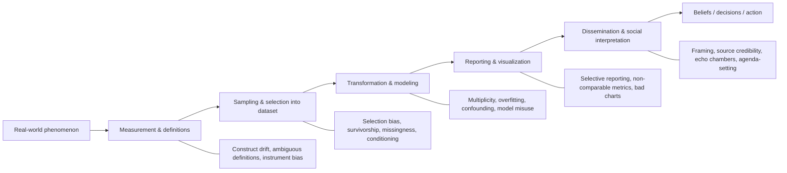
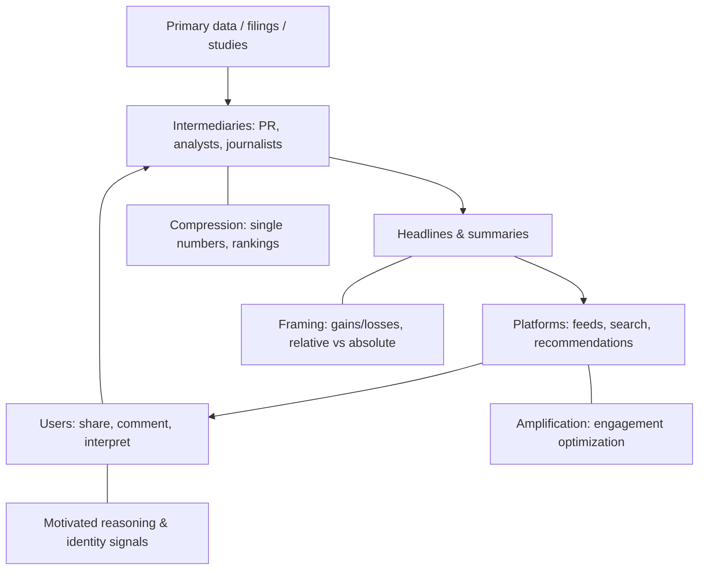

# How Data Deceives: Logical Mechanisms, Deceptive Techniques, and Defenses

## Executive summary

“Data deception” (as in 数据如何骗人) is usually not a property of numbers themselves; it is a property of the pipeline that maps reality into records and then maps records into conclusions and decisions. The same dataset can support incompatible stories when sampling, conditioning, modeling assumptions, and presentation choices are not made explicit. Misinterpretation is especially common when single-number outputs (for example $$p$$-values) are treated as “proof,” despite being conditional on a statistical model and a set of analytic choices. citeturn16view0

A MECE view of how data becomes misleading is: (a) measurement and definitions, (b) sampling and selection, (c) transformation and modeling, (d) reporting and visualization, and (e) dissemination and social interpretation. Each stage has its own “degrees of freedom,” and each can be exploited unintentionally (competence limits, ambiguous constructs) or strategically (incentives, conflicts of interest). The logic of bias structures (confounding, selection bias, measurement error) in causal inference illustrates why “good-looking” associations can be wrong about causal questions. citeturn15search18turn7search3

The most reliable high-level warning sign is hidden multiplicity: many plausible analytic paths exist, and only the path producing a simple, impressive conclusion is surfaced. In research settings, undisclosed flexibility (often called p-hacking or “researcher degrees of freedom”) can sharply inflate false positives relative to nominal thresholds, and even sincere researchers can stumble into this through adaptive decisions. citeturn0search10turn1search2turn16view0

In corporate and media contexts, “data deception” is strongly shaped by institutional incentives and communication constraints. Financial reporting allows judgment and estimation; this discretion can be used to manage earnings, shape subtotals, or shift items across categories while remaining superficially compliant. Regulators therefore constrain how non-GAAP measures and alternative performance measures are disclosed and reconciled. citeturn0search3turn0search11turn16view3turn16view2

The defenses that scale across domains are: transparency about choices, explicit uncertainty, robustness checks that stress assumptions, and independent verification workflows (reanalysis, reconciliation, replication). The report below prioritizes mechanisms and detection/countermeasures; technique descriptions are framed to support auditing and truth-finding rather than “how-to” misuse. citeturn16view0turn14search13turn12search9

## A MECE pipeline from reality to belief

A useful MECE decomposition is to treat any data claim as a chain of transformations where each link can introduce distortion. Some distortions are “statistical” (bias, variance, multiplicity); others are “organizational” (incentives, compliance boundaries); others are “cognitive” (framing, numeracy limits). citeturn15search18turn15search4turn9search3



This pipeline matches what many standards explicitly try to control: research integrity guidelines define falsification as changing or omitting data such that the record is not accurate; survey methodology frameworks model error as a combination of sampling and non-sampling sources; securities regulation constrains what may be emphasized or omitted when presenting adjusted metrics. citeturn12search0turn10search1turn0search11

Table: pipeline-stage risks and practical detection hooks (cross-domain)

| Stage | What typically goes wrong | Why it misleads | High-yield detection hooks |
|---|---|---|---|
| Measurement & definitions | Variables do not measure the intended construct; definitions shift across time or sources | “Same word, different variable” makes comparisons invalid | Check operational definitions; unit/denominator consistency; back-testing estimates vs realized values citeturn10search9turn4search11 |
| Sampling & selection | Dataset is not the target population; missingness is informative; conditioning on a collider | Estimates are biased even with large $$n$$ | Ask “who is missing?”; compare sampling frame to target; selection models or sensitivity analysis citeturn7search3turn10search1 |
| Transformation & modeling | Hidden multiplicity; confounding; overfitting / leakage | Apparent significance or predictability is an artifact | Pre-specification; multiple-testing control; out-of-sample validation; causal diagrams citeturn1search2turn17view1turn15search18 |
| Reporting & visualization | Only favorable results shown; misleading summaries; distorted graphs | Audience receives a biased posterior | Require full reporting; reconcile adjusted to standard measures; compute “lie factor”/visual checks citeturn16view0turn0search3turn2search21 |
| Dissemination & interpretation | Framing, credibility cues, agenda-setting, echo chambers | Attention and belief update become asymmetric | Separate claim from evidence; trace primary sources; cross-source triangulation citeturn8search0turn8search1turn11search7 |

## Core logical mechanisms that enable deception

Association is not causation, and data “deception” often begins when an associational quantity is mistaken for a causal effect. In causal inference terms, what is observed is typically $$P(Y\mid X)$$, while the causal question concerns $$P(Y\mid do(X))$$; these differ under confounding, selection bias, or measurement error. Causal diagrams are one disciplined way to make the needed assumptions explicit rather than implicit. citeturn15search18turn7search5

Selection bias is a particularly deceptive mechanism because it can persist even with very large datasets. If inclusion into the dataset depends on both predictors and outcomes (or their causes), ordinary regression can be systematically wrong. Econometric work formalized this as a specification error problem (sample selection), showing why naive estimation on nonrandom samples is biased. citeturn7search3turn7search7

Aggregation can reverse relationships. Simpson’s paradox is the canonical example: an association can appear in each subgroup but reverse in the aggregate (or the reverse). The paradox is “mathematically legal” but psychologically surprising, and it is typically resolved by identifying the relevant conditioning set (often via causal reasoning) rather than trusting the aggregate. citeturn7search4turn7search5

Multiplicity is the engine behind many modern “data lies.” When $$m$$ independent hypotheses are tested at level $$\alpha$$, the probability of at least one false positive can be approximated by $$1-(1-\alpha)^m$$, making “something significant” likely even when nothing is real. This does not require bad intent; it only requires many plausible analysis pathways plus selective attention to the pathway that “worked.” citeturn1search2turn16view0turn17view1

False discovery rate (FDR) control is one response to multiplicity: instead of trying to keep the chance of any error small (familywise error rate), FDR targets the expected proportion of false rejections among all rejections. The classic proposal frames FDR as the “expected proportion of errors among the rejected hypotheses,” motivating procedures that can be more powerful in high-dimensional testing. citeturn17view1turn17view2

Adaptive analysis (often framed as “researcher degrees of freedom”) creates hidden multiplicity even when only one final model is reported. Practices such as optional stopping, trying multiple reasonable covariate sets, redefining outcomes, or iterating until $$p<0.05$$ effectively enlarge the space of comparisons. This is why guidance on $$p$$-values stresses transparency about how many analyses were tried and warns against threshold-only decision rules. citeturn0search10turn1search2turn16view0

Publication and reporting selection can turn a literature into a biased sample of reality. The “file-drawer effect” (non-publication of nulls) can make published effect sizes and certainty look better than they are, which is one reason meta-research argues that many published findings will not replicate under typical incentive regimes. Tools such as p-curve use the distribution of significant $$p$$-values to diagnose evidential value and some forms of selective reporting. citeturn16view0turn1search1turn13search4

Human perception is itself a “channel capacity” constraint. Visual encodings can systematically mislead because people read lengths and positions more accurately than areas/volumes, and because axis choices, dual scales, and 3D embellishments can distort perceived differences. Empirical work on graphical perception provides evidence-based reasons to prefer certain encodings and to treat others as high-risk for misinterpretation. citeturn2search21turn2search9

Finally, incentives and targets transform informational measures into gameable objectives. This is often summarized by Goodhart’s law (“when a measure becomes a target, it ceases to be a good measure”) and related ideas about indicator corruption pressures. In practice, this means that once a metric is tied to rewards, the system tends to optimize the metric—even when that worsens the underlying goal. citeturn15search4turn15search13

## Encyclopedic catalog of deceptive techniques

The catalog is organized in a MECE way by domain (statistical analysis; corporate financial reports; news/media). Within each technique, the same five fields are provided: method, example, enabling principles, robust approaches, and detection tests. The examples are illustrative and framed for auditing and verification.

A compact cross-domain comparison table comes first; detailed technique cards follow.

| Technique family | Typical risk | Where it appears most | High-leverage countermeasures |
|---|---|---|---|
| Hidden multiplicity (many analyses, one reported) | Inflated false positives; overconfident claims | Research analytics; media “trend” stories | Pre-specification; multiplicity control (e.g., FDR); full reporting; replication citeturn1search2turn17view1turn16view0 |
| Selection/conditioning distortions | Biased estimates; sign reversals | Polls; observational studies; finance peer sets | Audit the sampling frame; missingness analysis; sensitivity models; causal diagrams citeturn7search3turn10search1turn15search18 |
| Metric engineering (non-comparable definitions) | Apples-to-oranges comparisons; narrative control | Non-GAAP/APM; KPI dashboards; media “rates” | Standard reconciliation; stable definitions; denominator discipline; restatement when definitions change citeturn0search11turn16view2turn10search9 |
| Visual distortion and framing | Large belief shifts without new data | Media infographics; investor decks | Use integrity checks (axis, scale, encoding); present absolute + relative risk; show uncertainty citeturn2search21turn10search13turn8search0 |

Statistical analysis techniques

Technique: Researcher degrees of freedom (p-hacking / garden of forking paths)  
Method. Many defensible analytic choices are explored (outcomes, covariates, exclusions, transformations, stopping rules), but only the “successful” specification is reported as if it was the plan.  
Example. A study reports $$p<0.05$$ for one outcome/covariate set but does not report near-misses or alternative reasonable specifications.  
Principle enabling deception. Adaptive search over a large model space turns a nominal test into an implicit multiple-testing procedure; the reported $$p$$ is no longer calibrated to the true selection process.  
More robust approach. Pre-registration or analysis plans; multiverse/sensitivity analyses; FDR control; emphasize effect sizes and uncertainty rather than thresholds.  
Detection tests. Look for unexplained analytic flexibility; reanalyze with alternative specifications; inspect distributions of reported $$p$$ values (p-curve) when many studies exist. citeturn0search10turn1search2turn13search4turn16view0

Technique: HARKing (hypothesizing after results are known)  
Method. Post-hoc hypotheses are presented as if they were a priori, creating an illusion of confirmatory evidence.  
Example. A paper narrates a specific directional hypothesis, but the hypothesis plausibly emerged after seeing the data (and no pre-analysis documentation exists).  
Principle enabling deception. Confirmation and exploration are different epistemic modes; treating exploratory patterns as confirmatory inflates perceived evidential strength because the hypothesis was selected using (part of) the same data used to test it.  
More robust approach. Clear labeling of exploratory vs confirmatory analyses; holdout datasets; preregistration of confirmatory hypotheses.  
Detection tests. Compare manuscript claims to preregistration/protocol; look for unusually “tight” story fit and many post-hoc rationalizations. citeturn13search1turn16view0

Technique: Optional stopping / sequential “peeking” without correction  
Method. Data collection continues until results are significant, then stops; or interim analyses occur without adjusting inference.  
Example. A trial or A/B test checks results daily and stops at the first significant day, using standard $$p$$-values.  
Principle enabling deception. Repeated looks increase the chance of finding a transient significant result under $$H_0$$; nominal thresholds no longer control error.  
More robust approach. Pre-specified stopping rules; group sequential methods; Bayesian decision rules with explicit priors; report all looks.  
Detection tests. Examine logs for interim looks; compare planned vs achieved sample sizes; run simulations under the stated stopping process. citeturn0search10turn16view0

Technique: Ignoring multiplicity across many hypotheses/features  
Method. Many related hypotheses are tested, but results are interpreted as if each test were isolated.  
Example. Genomics-style or social-science subgroup mining reports several $$p<0.05$$ findings without any multiplicity adjustment.  
Principle enabling deception. With large $$m$$, false positives accumulate; the relevant error notion is about the set of tests (FWER/FDR), not each test alone.  
More robust approach. FDR control (e.g., Benjamini–Hochberg); hierarchical modeling; shrinkage; preregistered primary endpoints.  
Detection tests. Count the “effective number” of tests; recompute with FDR adjustment; check whether findings survive correction. citeturn17view1turn17view2turn16view0

Technique: Confounding disguised as causal effect  
Method. Correlated variables are treated as causal drivers without addressing common causes.  
Example. Observational data show higher screen time correlates with poorer outcomes; causal claims are made without identification strategy.  
Principle enabling deception. $$P(Y\mid X)$$ can differ from $$P(Y\mid do(X))$$ when unblocked backdoor paths exist.  
More robust approach. Explicit causal identification (DAGs, backdoor adjustment, instrumental variables when justified); triangulation across designs.  
Detection tests. Ask what variables cause both $$X$$ and $$Y$$; perform sensitivity analyses; attempt negative controls where appropriate. citeturn15search18turn7search5

Technique: Selection bias and survivorship bias  
Method. The dataset excludes failures or hard-to-observe units, making performance look better than it is.  
Example. “Average fund returns” computed only on surviving funds; “startup success traits” computed only on successful startups.  
Principle enabling deception. Conditioning on survival is conditioning on an outcome-related selection variable, biasing estimates; formal selection models show naive regression becomes inconsistent.  
More robust approach. Use inception cohorts; include delisted/failed units; model selection explicitly.  
Detection tests. Compare included vs excluded units; search for attrition rules; quantify missingness mechanisms. citeturn7search3turn7search7

Technique: Aggregation bias (Simpson’s paradox)  
Method. Aggregate trends are reported without stratifying by key confounders; direction can reverse.  
Example. A policy appears beneficial overall but harmful within each demographic group (or vice versa) because group proportions differ.  
Principle enabling deception. Weighted averages can reverse sign when subgroup weights differ; the relevant estimand depends on the causal structure and the appropriate conditioning set.  
More robust approach. Stratified analyses with justified adjustment sets; report both aggregated and stratified results with interpretation tied to the causal question.  
Detection tests. Recompute within subgroups; test sensitivity to stratification; use DAG reasoning to select adjustment sets. citeturn7search4turn7search5

Technique: “Cleaning” choices that erase inconvenient data (outliers, exclusions, transformations)  
Method. Rules for removing outliers or excluding observations are chosen after seeing their impact on the conclusion.  
Example. A few “outliers” are dropped with no pre-defined criterion; the effect flips from non-significant to significant.  
Principle enabling deception. Exclusion rules can act as a hidden researcher degree of freedom; robust statistics behave differently under heavy tails and leverage points.  
More robust approach. Pre-specified exclusion criteria; robust estimators; report analyses with and without exclusions; show influence diagnostics.  
Detection tests. Influence measures (Cook’s distance/leverage); compare robust vs classical estimates; audit exclusion rationale. citeturn1search2turn16view0

Technique: Overfitting and leakage in predictive modeling  
Method. Models are “validated” on data whose labels or structure leaked into training (directly or via preprocessing), inflating apparent accuracy.  
Example. Feature scaling is fit on all data before splitting; a time series predictor uses future information; patient identifiers leak outcome proxies.  
Principle enabling deception. Out-of-sample performance estimates are biased upward if the test set is not independent of the training pipeline.  
More robust approach. Strict train/validation/test separation; time-aware splits; nested cross-validation; pipeline encapsulation.  
Detection tests. Rebuild the pipeline with leakage-safe splitting; compare performance; audit feature provenance and temporal ordering. citeturn14search2turn14search8

Corporate financial reporting techniques

Technique: Accrual-based earnings management (discretionary accruals)  
Method. Accounting judgments (reserves, provisions, depreciation assumptions) are used to shift earnings across periods without changing underlying cash flows.  
Example. Unexpectedly low provisions in a period boost reported profit; later periods reverse.  
Principle enabling deception. Accrual accounting separates recognition from cash timing; discretionary components can be used opportunistically within permitted judgment ranges.  
More robust approach. Analyze cash flow measures and working-capital dynamics; investigate accrual quality and the drivers of accruals.  
Detection tests. Discretionary accrual models (Jones / modified Jones) and performance-matched variants; compare accrual patterns against peers and historical baselines. citeturn18search2turn3search3turn3search6

Technique: Real activities manipulation (real earnings management)  
Method. Operational decisions are altered (discounting, overproduction, cutting discretionary expenses) to meet earnings targets, potentially harming future performance.  
Example. Aggressive end-of-quarter discounting boosts current sales but depresses future margins; R&D cuts elevate short-term profit.  
Principle enabling deception. Earnings targets are accounting outcomes; managers can shift real timing of revenues/costs even when accounting rules are followed.  
More robust approach. Triangulate accounting results with operational metrics; assess sustainability and subsequent-period reversals.  
Detection tests. Abnormal cash flow from operations, production costs, and discretionary expenses models developed for detecting real activity manipulation. citeturn18search1turn18search5

Technique: Classification shifting (core vs “special” items)  
Method. Costs are shifted from “core” categories into special items or non-recurring buckets, inflating perceived core performance.  
Example. Core expenses appear unusually low while special items rise; management emphasizes “core earnings.”  
Principle enabling deception. Analysts and audiences overweight subtotals labeled “core”; moving the same economic cost across categories changes perceived persistence.  
More robust approach. Evaluate total performance and consistent classification over time; reconcile subtotals to audited line items.  
Detection tests. Check relationships between unexpected core earnings and income-decreasing special items; compare classification to peers and prior periods. citeturn18search0turn18search12

Technique: Revenue recognition timing and contract accounting discretion  
Method. Revenue is accelerated or deferred through interpretation of performance obligations, variable consideration, and contract modifications.  
Example. Recognizing revenue at contract signing rather than as obligations are satisfied; optimistic assumptions for variable consideration.  
Principle enabling deception. Principles-based standards require estimates about timing and amounts; small assumption shifts can materially change reported revenue patterns.  
More robust approach. Inspect contract disclosures and obligations; compare revenue growth to cash collections and deferred revenue/contract assets.  
Detection tests. Revenue-to-cash divergence tests; unusual movements in contract assets/liabilities; auditor focus on estimates and bias in significant accounts. citeturn3search0turn3search13turn4search11turn4search19

Technique: Non-GAAP / APM engineering and “undue prominence”  
Method. Adjusted metrics exclude recurring costs or re-label normal expenses as “one-time,” improving apparent performance.  
Example. “Adjusted EBITDA” that repeatedly excludes restructuring costs every year; adjusted EPS highlighted more than GAAP EPS.  
Principle enabling deception. If exclusions are discretionary and inconsistent, adjusted metrics can become narrative devices rather than measurement improvements. Regulators therefore require comparable GAAP prominence and reconciliation, and warn against misleading adjustments.  
More robust approach. Use reconciliations; test consistency over time; treat repeated “one-time” adjustments as recurring.  
Detection tests. Enforce reconciliation and prominence rules; compare adjustment categories across periods; ask whether adjustments reverse in future guidance. citeturn0search3turn0search7turn6search2turn16view2turn16view3

Technique: Off-balance-sheet structuring and consolidation boundary choices  
Method. Obligations are placed in entities that are not consolidated (or are hard to interpret), lowering apparent leverage.  
Example. Use of special-purpose entities and complex structures contributed to massive misstatements in the Enron case and motivated new consolidation guidance for variable interest entities.  
Principle enabling deception. Consolidation rules define what counts as “the firm”; if the economic substance is split across entities, naive ratio analysis on the parent’s balance sheet can understate risk.  
More robust approach. Read footnotes on variable interests, guarantees, and off-balance-sheet arrangements; analyze “look-through” leverage.  
Detection tests. Identify variable interest entities and related exposures; reconcile commitments/contingencies to enterprise risk; regulatory MD&A disclosures about off-balance-sheet arrangements. citeturn5search6turn5search9turn5search1turn5search8turn4search1turn4search9

Technique: Biased management estimates (fair value, impairments, provisions)  
Method. Estimates are systematically optimistic (or strategically timed), affecting earnings and balance sheet strength.  
Example. Delayed impairments keep assets high and losses low until a “big bath” period.  
Principle enabling deception. Estimates embed subjective assumptions; bias can accumulate because later adjustments are hard for outsiders to attribute. Audit standards emphasize professional skepticism and explicitly address potential management bias.  
More robust approach. Compare estimates to subsequent realizations (“back-testing”); use scenario ranges and sensitivity disclosures.  
Detection tests. Track estimation errors over time; compare assumptions to market data; audit focus areas for significant estimates. citeturn4search11turn4search19

Technique: Disclosure overload and footnote burying  
Method. Material risk is technically disclosed but in ways that are hard to integrate (dense footnotes, scattered commitments).  
Example. Significant obligations appear only in complex footnotes; executive narratives emphasize adjusted metrics.  
Principle enabling deception. Human attention is limited; dispersion and complexity reduce the chance that the audience updates beliefs correctly.  
More robust approach. Build structured extraction: map each risk to the note and to a quantitative bound; reconcile narrative to statements.  
Detection tests. Trace each headline claim to a primary filed document section; use checklists for commitments, contingencies, related parties. citeturn4search1turn0search11turn16view3

News and media techniques

Technique: Relative risk framing without absolute risk (and denominator hiding)  
Method. Report large percentage changes without baseline rates, making effects seem larger than they are.  
Example. “Risk doubled” when the base rate goes from 1 in 10,000 to 2 in 10,000.  
Principle enabling deception. Humans overweight relative differences and often fail to maintain reference classes; numeracy constraints make denominator changes hard to track. Evidence-based risk communication recommends presenting absolute risks and consistent denominators.  
More robust approach. Always provide absolute risk (risk difference), baseline rates, and time horizon; provide number needed to treat/harm when appropriate.  
Detection tests. Ask “out of how many?”; compute absolute risk reduction/increase; check denominator consistency across claims. citeturn9search2turn10search9turn10search13turn10search3

Technique: Poll misinterpretation and overreliance on margin of error  
Method. Treat $$\pm$$ margin of sampling error as the only uncertainty, ignoring nonresponse, coverage error, and measurement error.  
Example. Headlines declare a “lead” inside sampling error; methodology is non-probability or has serious nonresponse.  
Principle enabling deception. Total survey error includes more than sampling variance; focusing on a single interval can hide systematic bias.  
More robust approach. Demand transparency on sampling frame, mode, response rates, question wording; report uncertainty beyond sampling error.  
Detection tests. Check whether the poll supports a sampling-based margin of error; audit nonresponse/coverage risks; compare across pollsters and modes. citeturn10search0turn10search19turn10search1

Technique: Selective time windows and “trend laundering”  
Method. Choose start/end dates that maximize a desired change; ignore seasonality or context.  
Example. Reporting a decline from a peak week rather than year-over-year; selecting a baseline just before an intervention.  
Principle enabling deception. Time series are autocorrelated and often seasonal; arbitrary windowing is a researcher degree of freedom in disguise.  
More robust approach. Pre-specify windows; show longer horizons; use seasonally adjusted or year-over-year comparisons where appropriate.  
Detection tests. Replot with alternative windows; check sensitivity to start date; test for seasonality and structural breaks. citeturn1search2turn16view0

Technique: “Single-study” reporting without base rates of evidence  
Method. Present one statistically significant study as decisive, ignoring replication rates, prior plausibility, and publication bias.  
Example. Press coverage touts a novel effect based on one small study with $$p<0.05$$.  
Principle enabling deception. Low power plus selective reporting increases the chance that the first reported finding is false; meta-research formalizes conditions under which most claimed findings may be false.  
More robust approach. Seek systematic reviews; report effect sizes and uncertainty; ask about preregistration and multiple outcomes.  
Detection tests. Look for preregistration; check sample size/power; search for replications and preprints; evaluate with meta-analytic tools when available. citeturn1search1turn13search4turn16view0

Technique: Causal language from correlational evidence  
Method. Headlines use causal verbs (“causes,” “leads to”) when the design is observational and identification is weak.  
Example. “Coffee prevents disease” from an observational association.  
Principle enabling deception. Confounding and selection bias can generate spurious associations; without identification, causal claims are not warranted.  
More robust approach. Demand clarity about design (RCT vs observational); look for causal identification strategies and sensitivity analyses.  
Detection tests. Check whether randomization exists; look for adjustment set justification; ask what would change under plausible confounding. citeturn15search18turn7search3

Technique: Misleading charts (axis truncation, dual axes, 3D, area distortion)  
Method. Use visual encodings that exaggerate differences or make unrelated series seem linked.  
Example. Truncated $$y$$-axis makes small change look dramatic; dual-axis chart makes correlations appear.  
Principle enabling deception. Perceptual accuracy depends on encoding; poor encodings and scale choices distort perceived magnitude and relationship.  
More robust approach. Use consistent scales; avoid dual axes unless explicitly justified; prefer position/length encodings; show uncertainty.  
Detection tests. Reconstruct the plot with full axes and single scale; compute a “lie factor” style check (visual change vs numeric change). citeturn2search21turn2search4

## Psychological factors that make deception work

Cognitive biases and heuristics are not “irrational quirks”; they are predictable shortcuts under uncertainty. Classic work identifies representativeness (driving base-rate neglect), availability (salience-driven frequency judgments), and anchoring/adjustment (insufficient correction from initial numbers) as systematic patterns in probabilistic reasoning. These mechanisms make audiences vulnerable to selective statistics and denominator tricks. citeturn9search0turn9search4

Framing effects show that logically equivalent descriptions can change choices, especially when outcomes are framed as gains vs losses or when probabilities are presented in different linguistic forms. This matters directly for media reporting of risk (“survival rate” vs “mortality rate”) and for corporate communications that choose “adjusted” narratives. citeturn8search0turn9search2

Motivated reasoning explains why people preferentially accept evidence that supports desired conclusions and apply more scrutiny to opposing evidence. This interacts with data deception because selective reporting and visually strong but weak evidence provide “just enough” justification for directionally desired beliefs. citeturn8search3

Numeracy limits shape what formats are comprehensible. Higher numeracy is associated with better comprehension and use of numeric risk information, while many audiences struggle to compare numbers when denominators vary. Risk-communication research therefore recommends transparent formats (natural frequencies, absolute risks) and stable denominators. citeturn9search3turn9search2turn10search9

Source-credibility effects alter persuasion independently of content quality. Experiments on credibility show that people discount information from low-credibility sources at exposure time, but source–content dissociation over time can reduce this discounting (“sleeper” effects), raising the stakes of repeated exposure in modern media environments. citeturn8search2

Table: psychological vulnerabilities and countermeasures

| Vulnerability | How it interacts with data deception | Practical countermeasure |
|---|---|---|
| Base-rate neglect (representativeness) | “Striking” examples overpower priors | Force baseline reporting: “out of 10,000…”; compare to reference class citeturn9search0turn9search2 |
| Availability / salience | Viral anecdotes override rates | Require rate + numerator/denominator; triangulate with systematic sources citeturn9search0turn10search13 |
| Anchoring | First number dominates later corrections | Delay judgment; compute directly from raw counts; use range estimates citeturn9search0turn10search9 |
| Motivated reasoning | Selective acceptance of favorable statistics | Structured adversarial checks; “consider the opposite”; independent replication citeturn8search3turn16view0 |
| Low numeracy | Denominator shifts and relative risks mislead | Use absolute risk + natural frequencies; keep denominators constant citeturn9search2turn10search9 |

## Communication and propagation mechanisms

Even accurate numbers can mislead when communication channels select what is salient. Agenda-setting theory argues that by choosing which issues receive attention and prominence, media shape what audiences think is important, which then changes how subsequent statistics are interpreted. citeturn8search1

Framing is not only about wording; it includes metric choice, ordering, and what is omitted. In risk contexts, different but equivalent frames can change decisions, which is why risk-communication guidance emphasizes avoiding “spin” and committing to accuracy. citeturn8search0turn10search13

Visual design choices create systematic distortions because perception has known strengths and weaknesses. Empirical research on graphical perception supports the view that some encodings are more accurately decoded than others, so “design” is not merely aesthetic; it is epistemic. citeturn2search21turn2search9

image_group{"layout":"carousel","aspect_ratio":"16:9","query":["misleading chart truncated y axis example","dual axis chart misleading example","3D pie chart misleading example","misleading infographic statistics example"],"num_per_query":1}

Social propagation creates feedback loops. Platform-mediated exposure tends to be shaped by network structure and individual choices; large-scale evidence from social media indicates ideological homophily and reduced exposure to cross-cutting content. Meanwhile, large observational analyses of rumor diffusion find that false news can spread farther/faster than true news, with humans playing a major role in transmission. citeturn11search12turn11search7turn11search11



## Ethics and legal and regulatory context

In research, the bright line for wrongdoing is often framed as fabrication, falsification, and plagiarism. Official definitions treat falsification as manipulating or omitting data such that the research record is not accurately represented (distinguishing this from honest error), which directly targets one class of “data deception.” Publication ethics guidelines similarly treat fabrication/falsification as misconduct while also emphasizing transparency about methods, exclusions, and analysis. citeturn12search0turn12search4turn12search9

Professional ethics in statistics emphasize responsibility in designing, analyzing, and presenting data, and are explicitly intended to make expectations clear to those who rely on statistical work. This is an ethics-of-interpretation stance: harm can come not only from fake data but from misleading analysis and communication. citeturn14search6turn14search13

In corporate reporting, a large portion of “data deception” risk lives in legally permitted discretion plus incentives. Securities regulation therefore targets presentation risk explicitly for non-GAAP measures: Regulation G prohibits misleading non-GAAP disclosure and requires reconciliation to the most directly comparable GAAP measure, and filing rules require comparable GAAP prominence. Staff interpretations further clarify when adjustments can still be misleading even with reconciliation. citeturn0search11turn0search7turn0search3turn6search2

Global and regional frameworks converge on similar principles. IOSCO’s statement defines non-GAAP financial measures broadly (numerical measures outside GAAP) and aims to reduce misleading presentation; ESMA’s guidelines apply to alternative performance measures in regulated information and prospectuses and impose reconciliation/definition/consistency requirements. citeturn16view3turn16view2turn6search0

After major reporting failures, governance and audit regulation intensified. The Sarbanes–Oxley Act strengthened internal control expectations and accountability for disclosures, while audit standards emphasize professional skepticism and explicit attention to management bias when auditing accounting estimates (including fair value). citeturn4search6turn4search11turn4search19

Journalism ethics frameworks treat accuracy, minimizing harm, independence, and accountability as core principles, which matters because journalistic summarization is often the point where statistical nuance is compressed into shareable claims. citeturn12search2turn12search10

## Practical verification workflows and checklists

A general-purpose verification workflow can be applied by researchers, journalists, analysts, and the public. The workflow is designed to diagnose where in the pipeline a claim might be misleading and to trigger the most informative tests first.

```mermaid
flowchart LR
  C[Claim] --> Q[What exactly is the question? (estimand)]
  Q --> P1[Find primary source data / filing / paper]
  P1 --> P2[Check definitions & denominators]
  P2 --> P3[Check selection & missingness]
  P3 --> P4[Recompute key numbers]
  P4 --> P5[Stress-test assumptions (robustness)]
  P5 --> P6[Cross-source triangulation]
  P6 --> O[Decision: accept / qualify / reject]
```

Red flags that generalize across domains  
A claim is high-risk when (a) it depends on a single threshold (for example $$p<0.05$$) without effect sizes or context; (b) it uses large relative changes without baseline denominators; (c) it relies on adjusted metrics without reconciliation and stable definitions; (d) it is supported by one study or one chart with no access to underlying data; (e) it is “too clean” given real-world noise. citeturn16view0turn9search2turn0search11turn10search9turn1search1

Researcher checklist (statistical analysis)  
Focus is on controlling hidden multiplicity and misunderstandings of evidence. Good practice includes not basing scientific conclusions on threshold-only rules, reporting and transparency about analyses performed, and emphasizing estimation/intervals and other evidence measures when appropriate. citeturn16view0turn0search5

Concrete workflow: insist on (1) explicit outcome definitions and inclusion/exclusion rules, (2) a declared analysis plan or clear labeling of exploratory analyses, (3) multiplicity-aware inference (FDR or other family-level control where relevant), (4) sensitivity/multiverse checks for key modeling choices, and (5) reproducibility artifacts (code/data) when possible. citeturn17view1turn1search2turn13search4turn14search6

Journalist checklist (news/media)  
Start by converting every percentage into counts with denominators, then compute absolute differences and time horizons. For polls, verify whether a margin of sampling error is meaningful for the sampling approach and report non-sampling uncertainties; for health and risk claims, prefer absolute risks and consistent denominators, aligning with evidence-based communication guidance. citeturn10search0turn10search1turn10search9turn10search13

Financial analyst checklist (corporate reporting)  
Treat “adjusted” metrics as hypotheses, not facts: reconcile them to GAAP, test whether adjustments are repeated, and examine whether cash-flow patterns contradict earnings narratives. Use disclosure-focused reading: MD&A, off-balance-sheet arrangements, variable interest exposures, and major estimates. Where earnings management is suspected, apply accrual and real-activity diagnostics and compare to peers. citeturn0search11turn4search1turn4search9turn3search3turn18search5turn5search9

A short “public” checklist (lowest friction)  
Ask three questions before believing or sharing: What is the denominator and baseline? What is the primary source? What alternative explanation (confounding/selection) could generate the same pattern? This deliberately counters base-rate neglect, framing effects, and motivated reasoning using simple prompts grounded in the empirical literature on heuristics and bias and motivated reasoning. citeturn9search0turn8search0turn8search3