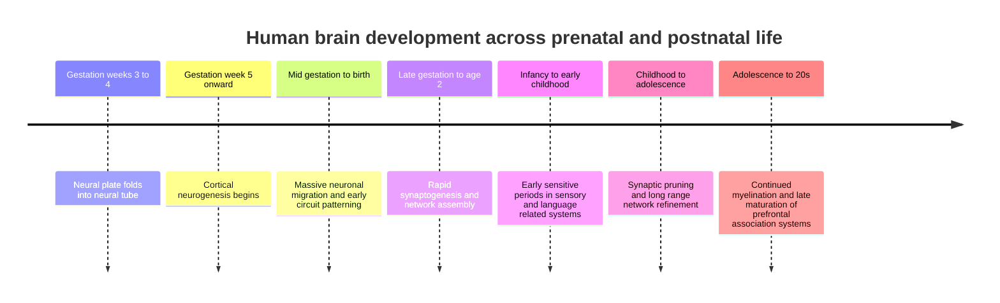

## Executive Summary

The **human brain** is not simply a scaled-up ape brain. It is a metabolically costly, developmentally prolonged, and functionally reorganized organ in which **association cortex** expanded disproportionately, long-range connectivity between multimodal regions became more central, and some cortical neurons acquired unusually elaborate structural and transcriptomic features. Current evolutionary work does **not** support a single master explanation for this change. Instead, the strongest account is plural: energetic constraints, ecological problem-solving, social complexity, cumulative culture, and life-history changes likely interacted over long timescales. Recent comparative work also argues that evolutionary novelty is not confined to cortex alone; subcortical systems, glia, and white matter matter too. citeturn21search0turn21search4turn21search8turn35search3turn35search8turn35search15turn9search0

Developmentally, the brain is built in stages that overlap rather than occur in a strict sequence. Neural development begins in the **third gestational week** with neural tube formation. In the cortex, neurogenesis begins around **gestational week 5**, most large-scale neuronal production is prenatal, neuronal migration continues through mid and late gestation and in some regions into infancy, synaptogenesis accelerates in late fetal life and early childhood, pruning extends from childhood through adolescence and into early adulthood, and myelination begins prenatally but continues into at least the **third decade**. Sensory systems generally consolidate earlier than higher-order association systems. citeturn19search3turn23search0turn23search13turn25search18turn28search4turn24search10turn23search3turn19search2

Functionally, behavior emerges from **circuits and networks**, not from isolated “centers.” At the level of major structures, the **cortex** supports perception, action, abstraction, and conscious integration; the so-called **limbic system** is best treated as a heuristic shorthand for emotion-memory-motivation circuits rather than as a single coherent module; the **basal ganglia** help with action selection, reinforcement learning, and habit formation; the **brainstem** regulates arousal and autonomic control; and the **cerebellum** contributes not only to coordination but also to prediction, timing, and aspects of cognition and social processing. At the level of large-scale systems, the **default mode**, **salience**, **executive control**, **sensorimotor**, **reward/valuation**, and **social cognition** networks interact continuously rather than taking turns in isolation. citeturn8search1turn33search0turn33search2turn5search22turn15search1turn16search0turn14search0turn14search4turn8search2turn31search5turn26search3turn15search3

The bridge between evolution and development is made by mechanisms such as **heterochrony** and **neoteny**, meaning shifts in the timing and pace of development; by **plasticity**, which lets experience tune circuits during sensitive developmental windows; and by **gene-culture coevolution**, in which cultural practices reshape selection pressures and developmental environments. At the cellular level, these processes are implemented through radial glia-guided neuronal migration, synaptic plasticity, myelination, neurotransmitter signaling, neuromodulation, and hormonal regulation. citeturn6search22turn20search1turn20search3turn22search7turn38search12turn38search16turn37search4turn36search5turn36search2turn36search15

An evolutionary-psychology perspective is most useful when it is paired with modern neuroscience cautiously. It can help explain why brains needed solutions for recurrent problems such as threat detection, attachment, communication, cooperation, and skilled action. But it becomes weak when it assumes that present-day circuits map neatly onto single ancestral “modules.” The open questions are exactly here: which features are true evolutionary specializations, which are products of prolonged development and culture, and how much of human cognition is explained by size, by connectivity, or by circuit-level redesign. citeturn39search11turn39search16turn21search8turn33search7turn10search0

## Why Human Brains Became Large and Reorganized

A modern evolutionary account starts with a correction: **bigger** was not the whole story. Comparative work shows that the human cortex is disproportionately occupied by **distributed association regions**, especially in frontal, parietal, and temporal territories, and that connectivity linking multimodal association areas has especially high centrality in humans relative to chimpanzees. Other work argues that the key evolutionary shift was not just greater total volume but a reweighting of which regions and circuits expanded relative to others. That is why contemporary discussions increasingly move from “brain size” toward **network topology**, **microcircuit specialization**, and **cell-type differences**. citeturn35search3turn35search7turn35search8turn35search15turn35search21turn39search11turn9search0

What selected for this reorganization remains debated. The **social brain hypothesis** argues that dynamic group living, coalition tracking, status navigation, cooperation, and social learning selected for larger and more complex primate brains. Ecological and life-history models emphasize foraging complexity, extractive feeding, tool use, planning, and long juvenile learning periods. Energetic models add a crucial constraint: brains are expensive tissue, and the metabolic cost of growing and running a large one likely required shifts in diet, maternal investment, childhood pacing, and perhaps food processing such as cooking. Recent theoretical work even argues that some aspects of brain enlargement may have emerged as by-products of selection on broader fertility- or life-history-related traits, not as direct selection on intelligence alone. The safest conclusion is that **multiple pressures probably interacted**, with feedback loops between ecology, sociality, energy use, and culture. citeturn21search0turn21search4turn21search15turn21search8turn38search12

Another important change was organizational. Comparative authors have suggested that rapid expansion of the cortical mantle may have “untethered” parts of cortex from strong sensory-developmental constraints, allowing association networks to become more flexible and integrative. That hypothesis fits current work on the **default mode network** and related association systems, which sit far from primary sensory boundaries and are deeply involved in memory, semantic integration, self-projection, and social cognition. It also helps explain why evolution seems to have favored **late-developing** and **plastic** territories: if a region is less tightly locked to immediate sensory input, it can be shaped more by learning, culture, and prolonged childhood. citeturn35search1turn35search20turn8search2turn10search0turn29search21

This is also where older popular models mislead. The **triune brain** idea and the notion of a sharply bounded “limbic brain” are now widely regarded as oversimplified or inaccurate. Modern evolutionary neuroscience does not view the human brain as a stack of ancient reptilian, mammalian, and rational layers merely glued together. It is better understood as a deeply integrated system in which old and new circuits were repeatedly rewired, repurposed, and functionally redeployed. citeturn33search0turn33search7turn33search15turn39search0

## How the Brain Is Built Over Development

The overgrown human brain is achieved partly by **stretching development in time**. Development is not a ladder but a braided process: proliferation, migration, differentiation, synapse formation, pruning, myelination, and network integration overlap. Evolution can act on that braid by changing *when* processes start, *how long* they last, and *how sensitive* they are to experience. That is the core idea behind **heterochrony**. In humans, many neural processes are notably prolonged relative to other primates, especially in prefrontal and association systems. citeturn8search0turn8search1turn6search22turn20search1turn20search3turn23search3

A compressed timeline looks like this. Brain development begins around **gestational weeks 3–4** with neurulation. Cortical neurogenesis begins around **gestational week 5**. Neuronal migration continues beyond **23 gestational weeks** and, in selected frontal and temporal regions, postnatal migration persists for **months to roughly 2–3 years**. Synaptogenesis accelerates from late gestation into infancy and early childhood; sensory cortices peak earlier than prefrontal cortex. Pruning becomes especially consequential across childhood and adolescence and, in prefrontal cortex, measurable synaptic decline extends into the **third decade**. Myelination begins prenatally, is especially rapid in the first two years after birth, and continues well into young adulthood. citeturn19search3turn23search0turn23search13turn25search5turn25search18turn28search4turn28search12turn24search10turn23search3turn19search2

The phrase **critical period** should also be handled carefully. Developmental neuroscience now prefers the broader idea of **sensitive periods** for many human capacities. Some windows are relatively tight, especially in early sensory systems. Others are cascading, overlapping, and partially reopenable. Visual cortex plasticity is strongest early in infancy, while language-related plasticity is distributed across multiple windows rather than one single cliff-edge. Adolescence is increasingly treated as a second major period of elevated plasticity because hormonal changes, social experience, and ongoing white-matter maturation can still remodel large-scale networks. citeturn8search3turn28search14turn18search2turn22search3turn36search15

The regional timing differences matter. Evidence from human tissue and imaging suggests that **sensorimotor** and sensory cortices reach key milestones earlier, while **prefrontal** and multimodal association regions mature later and stay plastic longer. That developmental asymmetry aligns strikingly with evolutionary asymmetry: the systems most expanded in humans are often among the last to settle. citeturn29search12turn28search4turn28search12turn35search3turn20search1

## Major Structures and What They Do

**Cortex.** The **cerebral cortex** makes up more than half the volume of the human brain and supports perception, voluntary action, language, attention, episodic memory, planning, and abstract thought. Its importance lies not only in local specialization but in hierarchical and reciprocal integration: sensory streams, motor plans, associative representations, and memory systems are constantly linked across cortical areas. Human cortical evolution particularly emphasized **supragranular neurons** and association microcircuits, suggesting that some uniquely human capacities come from altered local computation as well as expanded territory. citeturn8search1turn9search0turn35search3

**Limbic system.** The term **limbic system** remains useful in popular explanation, but it is scientifically imprecise. In practice it usually refers to a family of structures including the amygdala, hippocampus, hypothalamus, cingulate cortex, and related orbitofrontal and medial temporal regions involved in emotion, memory, motivation, homeostasis, and valuation. Modern neuroscience increasingly prefers naming the **specific circuits** involved, because the “limbic brain” has no stable boundary and should not be treated as a single emotional command center. citeturn33search2turn33search0turn33search7

**Basal ganglia.** The **basal ganglia** are deep nuclei centered on the striatum, pallidum, subthalamic nucleus, and substantia nigra. Their classic role is motor control, but contemporary work places them at the heart of **action selection**, **reinforcement learning**, **reward-guided behavior**, and **habit formation**. Rather than merely starting or stopping movement, cortico-basal-ganglia loops help choose among competing actions, update the value of those actions, and compress repeated sequences into more automatic routines. citeturn5search22turn13search2turn13search6turn14search21

**Brainstem.** The **brainstem** houses nuclei that regulate breathing, cardiovascular function, sleep-wake states, arousal, orienting, pain modulation, and many reflexes. It also contains major neuromodulatory systems that broadcast signals across the brain, including noradrenergic, serotonergic, dopaminergic, and cholinergic projections. Recent human imaging work on the **ascending arousal network** strengthens the view that consciousness and cognitive readiness depend on distributed brainstem–hypothalamic–thalamic–basal forebrain pathways, not cortex alone. citeturn16search0turn15search1turn13search25turn36search9

**Cerebellum.** The **cerebellum** was once treated as a purely motor structure. That view is no longer tenable. It remains essential for coordination, timing, sensorimotor calibration, and error correction, but anatomical and imaging evidence also links it to language, working memory, executive control, affective regulation, and social cognition. A useful working model is that cerebellar circuitry helps build **predictive internal models** across multiple domains, not just movement. citeturn14search0turn14search4turn14search16turn13search24

A visual grounding helps here: the human brain is best understood as nested anatomy plus interacting networks, not as isolated boxes with single meanings. citeturn16search0turn35search20

image_group{"layout":"carousel","aspect_ratio":"16:9","query":["labeled human brain anatomy cortex basal ganglia cerebellum brainstem diagram","default mode network salience network executive control brain diagram"],"num_per_query":1}

## Large-Scale Functional Systems

Modern systems neuroscience describes the brain as a set of **large-scale interacting networks**. These networks are not literal wires laid over anatomy; they are patterns of coordinated activity, connectivity, and information flow observed across tasks and rest. They overlap, fractionate into subsystems, and change over development. Still, they are useful because they explain why the same anatomy can support multiple functions depending on context and network state. citeturn8search2turn31search5turn26search3turn15search3turn10search0

| Functional system | Structure | Core regions | Primary functions | Developmental trajectory |
|---|---|---|---|---|
| **Default mode** | Medial association network | medial prefrontal cortex, posterior cingulate/precuneus, angular gyrus, lateral temporal cortex, medial temporal subsystems | self-projection, episodic memory, semantic integration, future simulation, social cognition | Rudimentary in infancy, strengthens through childhood, and becomes more integrated and adult-like across adolescence and early adulthood |
| **Salience** | Switching and relevance-detection network | anterior insula, dorsal anterior cingulate, connected subcortical and affective nodes | detects biologically and cognitively relevant events; coordinates switching between internal and external modes | Interoceptive and affective components appear early, but integration with control systems continues through adolescence |
| **Executive control** | Lateral frontoparietal control network | dorsolateral prefrontal cortex, posterior parietal cortex, intraparietal sulcus, middle frontal regions | working memory, goal maintenance, cognitive flexibility, top-down control | Strongly protracted; connectivity and white matter supporting control continue maturing through adolescence and into young adulthood |
| **Sensorimotor** | Perception-action network | precentral and postcentral gyri, supplementary motor area, cerebellum, thalamic loops | bodily sensing, movement planning, action execution, sensorimotor integration | Among the earliest systems to organize; refines rapidly in infancy and remains tuned during childhood and adolescence |
| **Reward and valuation** | Cortico-striatal valuation loop | ventral striatum, ventromedial/orbitofrontal prefrontal cortex, amygdala, midbrain dopamine systems, anterior cingulate | reward prediction, subjective value, motivation, reinforcement learning, action vigor | Basic function is early, but adolescence is a period of heightened ventral-striatal reward sensitivity, while prefrontal regulation continues to mature |
| **Social cognition** | Mentalizing and social knowledge network | medial prefrontal cortex, temporoparietal junction, posterior superior temporal sulcus, temporal poles, amygdala, posterior cerebellar contributions | inferring others’ beliefs, intentions, traits, attachment schemas, social narratives | A core network is present from childhood, but long-range connectivity and specialization reorganize across adolescence and beyond |

The table synthesizes recent and influential work on the **default mode network**, salience–control interactions, frontoparietal control, infant functional connectivity, sensorimotor maturation, valuation circuitry, and social-cognitive network organization. citeturn8search2turn10search0turn10search2turn31search0turn31search1turn26search3turn29search0turn29search12turn30search0turn32search19turn29search23turn26search2turn30search1

A few analytical points matter. First, the **default mode network** is no longer seen as a passive “resting” system. Recent reviews and anatomical work describe it as a heterogenous association network involved in episodic-autobiographical memory, semantic integration, language-related conceptual processing, self-reference, and forms of social cognition that may even occur “by default.” citeturn8search2turn10search0turn10search2

Second, the **salience network** is best understood as a relevance-detection and switching system anchored in the anterior insula and dorsal anterior cingulate. It helps identify what matters most, whether that is an external danger, an internal bodily signal, or a goal-relevant cue, and it can bias coordination between default-mode and executive-control states. citeturn31search1turn31search5turn31search0

Third, development follows a broad posterior-to-anterior gradient. **Sensorimotor** systems emerge relatively early, whereas **default mode**, **frontoparietal control**, and parts of the **social cognition** system continue reorganizing through adolescence. That is one reason adolescence is both a vulnerable and a productive phase: motivational, social, and executive systems are all online, but their integration is still being refined. citeturn29search12turn29search9turn30search1turn22search3turn29search23

## How Evolution Becomes Development and Plasticity

The evolutionary-developmental bridge begins with **heterochrony**: a change in the timing or rate of development relative to ancestors. In human brain evolution, one recurrent pattern is **neoteny**, the retention of slower or more juvenile developmental schedules. Comparative gene-expression studies report that developmental changes in the human brain are delayed relative to other primates, especially in frontal association cortex. Reviews linking evolution, development, and plasticity therefore argue that human cognition depends partly on a **protracted developmental schedule**: longer windows for circuit formation, experiential tuning, and cultural learning. citeturn6search22turn20search1turn20search3turn20search21turn35search24

At the cellular level, the process begins with **radial glia**. These cells are both neural progenitors and a scaffold for migration. In cortical development, radial glia generate neurons and guide them into laminar positions. Molecular systems such as **Reelin–Dab1** signaling and proteins such as **doublecortin** help regulate migration and settlement; disruptions in these mechanisms can produce severe malformations of cortical layering. Evolutionary changes in radial glia subtypes and progenitor behavior are now central to explanations of why the human cortex became so large and folded. citeturn37search4turn37search15turn37search17turn37search5turn37search2

**Synaptic plasticity** is the next major bridge. Synapses are strengthened, weakened, stabilized, or removed according to activity and context. That is how development turns a genetic plan into an individual brain. But synaptic change is never purely local. **Neuromodulators** such as dopamine, acetylcholine, noradrenaline, and serotonin regulate when plasticity is permitted, amplified, or damped, often through pathway-specific receptor effects. In early development, **GABA** behaves differently from its mature textbook role; it can be depolarizing in immature neurons, which changes how early circuits synchronize and self-organize. citeturn36search1turn36search5turn36search9turn36search24turn17search3

**Hormones** are another layer of developmental control. **Glucocorticoids** help coordinate adaptive developmental plasticity but, under chronic or badly timed exposure, can contribute to later allostatic overload. **Sex steroid hormones** shape perinatal and adolescent development in prefrontal and limbic regions and help explain why puberty is not just a social transition but also a neurobiological one. Neurodevelopment is therefore neither “hard-wired” nor infinitely malleable; it is better described as **prepared plasticity**. Evolution builds systems that expect certain kinds of input, and hormones help set when those expectations are most powerful. citeturn36search2turn36search10turn36search15turn17search2turn17search17

Finally, **gene-culture coevolution** and **neuronal recycling** explain why especially human skills can outgrow the timescale of genetic change alone. In gene-culture coevolution, cultural practices alter the selection pressures acting on genomes, while genomes shape the brains that acquire and transmit culture. In neuronal recycling, newer cultural skills invade older neural circuits and repurpose them under structural constraints inherited from evolution. This is especially important for language, literacy, mathematics, formal symbol systems, and perhaps parts of tool-based cognition. Human brains seem unusual not because evolution wrote a separate circuit for every cultural skill, but because evolution produced a brain whose long developmental runway, cross-network connectivity, and plasticity make **re-use** exceptionally powerful. citeturn38search12turn38search0turn38search5turn38search16turn39search16

## Adaptive Problems and Their Neural Circuits

An evolutionary-psychology lens asks what recurrent adaptive problems nervous systems had to solve. A neuroscience lens asks what circuits actually implement the solution. The match is rarely one-to-one, but some examples are especially instructive.

**Fear and threat.** Fast threat processing recruits distributed circuits linking amygdala, hypothalamus, periaqueductal gray, hippocampus, mPFC, and autonomic systems. Older stories emphasized a simple “low road” to the amygdala. More recent accounts argue for **many roads** instead: multiple cortical and subcortical routes evaluate biological significance, with different pathways contributing to detection, context, memory, action selection, freezing, escape, and bodily arousal. In adaptive terms, this architecture is sensible. Threat handling is not one problem but a package: detect the cue, estimate whether it is real, retrieve relevant context, choose a defensive strategy, and coordinate the body. citeturn12search4turn12search12turn12search16turn33search1turn34search11

**Social bonding and attachment.** Social mammals need circuits that assign value to conspecifics, support parental care, coordinate attachment, and store social memory. Reviews of **oxytocin** and **vasopressin** systems show that these neuropeptides do not create “love” in a simplistic sense; instead, they modulate distributed networks involving hypothalamus, amygdala, ventral striatum, mPFC, and other regions involved in salience, reward, and social recognition. Emerging social-cognitive work further suggests that attachment-related knowledge may provide content for later **mentalizing**, helping explain why bonding and social reasoning are related but not identical capacities. citeturn12search1turn12search9turn30search9turn15search3

**Language.** Human language relies on a distributed network linking inferior frontal, posterior temporal, and parietal regions through partially distinct **dorsal** and **ventral** pathways. The dorsal stream is associated with sound-to-articulation mapping; the ventral stream is associated with sound-to-meaning mapping. Developmental work suggests that these pathways do not mature in lockstep, and newer biocultural work treats language as a product of interacting learning systems, reward systems, motor systems, and cultural scaffolding, rather than a single isolated “language organ.” That framing fits the human pattern of long childhood, intense teaching, and cumulative symbolic culture. citeturn12search26turn12search2turn34search16turn38search16turn18search2

**Tool use.** Tool use is not just dexterity. It requires representing body–object relations, causal mechanics, action sequences, and learned conventions. Human tool use consistently recruits **left-lateralized parietal–premotor** circuits, with strong involvement of posterior parietal cortex and action observation/execution systems; some evidence also links cerebellar and other predictive systems. Comparative arguments about the evolution of posterior parietal cortex support the idea that tool use drew on old reaching-and-grasping circuits but pushed them toward more abstract and flexible sensorimotor intelligence. In evolutionary terms, this is a model example of **circuit re-use plus elaboration**. citeturn12search7turn12search11turn34search1turn34search5turn34search9

These examples show why a strict modular picture fails. Fear circuits talk to memory circuits. Bonding circuits borrow valuation machinery. Language depends on sensory, motor, social, and reward systems. Tool use recruits motor, parietal, conceptual, and predictive circuitry. The brain solves adaptive problems mostly by **recombining** circuits, not by reserving one sealed box for each challenge. citeturn39search11turn39search16turn31search5

## Debates, Open Questions, and Reading Path

Several major questions remain unresolved. The first is explanatory: **why** did human brains become so large and so association-heavy? Social, ecological, energetic, life-history, and culture-based explanations each capture part of the evidence, but no consensus single-cause theory has won. A second question is mechanistic: how much of human specialization comes from **more neurons**, how much from **different neurons**, how much from **slower development**, and how much from **reconfigured long-range connectivity**. A third is conceptual: should constructs such as “limbic system,” “social brain,” or even “default mode network” be thought of as unified entities, or as convenient umbrellas over more diverse subsystems. citeturn21search0turn21search8turn35search15turn9search0turn10search0turn33search0

Another live debate concerns developmental rigidity versus flexibility. Critical-period science shows that some windows are indeed privileged, but newer work on plasticity, adolescence, and cultural learning argues against the idea that development “ends” after early childhood. The most defensible view is layered: some circuits are tightly time-sensitive, others remain modifiable for much longer, and even adult brains retain meaningful but more constrained plasticity. citeturn8search3turn22search3turn22search7turn39search16

There are also species-comparison questions. Human postnatal neuronal migration in frontal and temporal regions, prolonged myelination, glial evolution, and the detailed architecture of association networks all suggest that **human uniqueness may lie as much in developmental pacing and tissue composition as in gross anatomy**. But direct causal evidence is still limited, especially because many claims rely on inference from imaging, organoids, postmortem tissue, or comparison with a small number of nonhuman species. citeturn25search18turn23search3turn20search15turn35search15turn39search11

**Accessible further reading**
- **The Basics of Brain Development** — still one of the clearest overviews of neurogenesis, migration, synaptogenesis, pruning, and myelination. citeturn8search0  
- **Imaging Structural and Functional Brain Development in Early Childhood** — a readable review of how MRI tracks gray matter, white matter, and network development in the first years of life. citeturn19search1  
- **20 Years of the Default Mode Network** — a strong synthesis of what the DMN is, what it does, and why newer interpretations matter. citeturn8search2  
- **Social Cognitive Network Neuroscience** — useful for readers who want a network-level picture of social cognition instead of isolated “social brain areas.” citeturn15search3  
- **࿂entity["book","From Neurons to Neighborhoods","2000"]** — older, but still valuable for developmental timelines and for separating evidence-based claims from popular myths about “use it or lose it.” citeturn16search6  
- **࿂entity["organization","National Institute of Neurological Disorders and Stroke","us nih institute"]** “Brain Basics: Know Your Brain” — a good anatomy refresher before reading more specialized papers. citeturn16search0  

**Selected primary and near-primary sources**
- Huttenlocher’s classic study of **human frontal cortex synaptic density**, showing the rise in infancy and decline toward adult levels. citeturn24search3  
- Huttenlocher’s study of **human striate cortex**, showing especially rapid synaptogenesis between **2 and 4 months** of age. citeturn28search14  
- The report on **extensive migration of young neurons into the infant human frontal lobe**, central to current thinking about prolonged postnatal development. citeturn23search5  
- The study on **postnatal migration into the temporal lobe and entorhinal cortex**, showing streams that persist to about **2–3 years**. citeturn25search18  
- **Brain charts for the human lifespan**, which quantify major structural milestones across development and aging using very large imaging datasets. citeturn19search0  
- The recent anatomical paper on **the architecture of the human default mode network**, showing that the DMN is cytoarchitecturally heterogeneous rather than uniform. citeturn10search0turn10search4  
- The **Science Advances** study showing that the human **social cognitive network** includes multiple regions intrinsically linked to anterior medial temporal structures, widening the older textbook picture of social cognition. citeturn10search6

Taken together, the strongest contemporary picture is this: the human brain is an **evolved, developmentally extended, culturally scaffolded prediction machine**. Evolution did not hand us a finished adult mind. It produced a long-building organ whose late-maturing association networks, flexible neuromodulatory systems, and unusually prolonged childhood make it highly teachable, highly social, and highly plastic — but also unusually sensitive to developmental timing and environment. citeturn20search1turn22search3turn38search16turn39search16