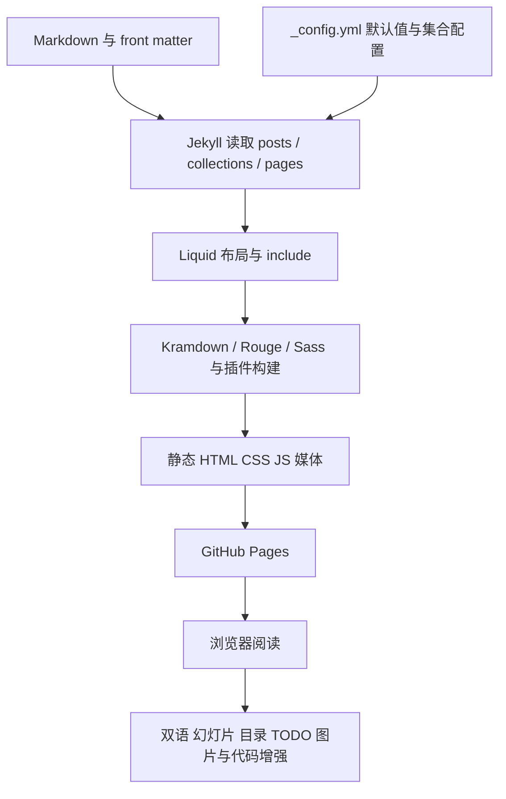
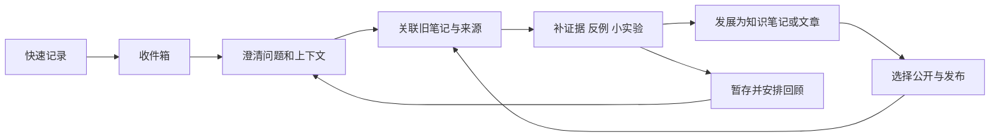



## 1. 报告定位与阅读方式

**Gomibako 已经是一个以 Markdown 为内容源、以 Jekyll 为发布器的个人知识站。下一步最有价值的工作，是把已有的资料、文章、草稿和阅读工具连接成可持续使用的知识工作流程。**

它目前擅长“存放、分类、展示和阅读”，还缺少统一的“快速捕获、建立联系、定期回顾、推进写作、控制发布”。建议保留现有内容资产、学科目录和有辨识度的终端视觉，先完善内容模型和工作流程，再按需要调整技术栈。

本文件兼作项目地图、问题清单和后续改动日志。后续修改应同时更新对应文件职责、问题状态和第 8 节日志，避免报告与实现脱节。第 1–7 节保留首次分析基线；后续实现以第 8 节日志及持续更新的第 9–11 节索引为准。

### 1.1 基线与范围

| 项目 | 本次基线 |
| --- | --- |
| 分析日期 | 2026-09-24，Asia/Tokyo |
| 仓库 | `gomibako`，基线提交 `9edf180`，以当时工作区实际内容为准 |
| 原有受版本控制文件 | 816 个；本报告新增后为 817 个项目文件 |
| 核心代码 | `src` 103 个：20 个布局、26 个 include、22 个 Sass、35 个 assets |
| 内容 | `collections` 437 个 Markdown，含知识文档、文章、草稿和一份内容索引 |
| 页面 | 原有 `pages` 12 个 Markdown |
| 媒体与说明 | `images` 257 个文件：254 个媒体文件、2 个 Markdown、1 个 CSV |
| 工程与部署 | 根目录及 `.github` 共 7 个文件 |

本次逐项索引上述全部文件。核心代码按实现、调用关系、入口和副作用分析；内容文件按元数据、标题、正文结构和实际构建收录情况索引，重点抽查典型文章、超长文档和异常文档。**文件索引不表示已对全部文章逐段做内容事实核查。** 媒体用途主要依据目录、文件名和源码引用判断，不把文件名推断写成已核实的图像内容。

不将 `.git`、根目录依赖缓存 `vendor/bundle`、`.bundle/config`、构建产物和临时审计文件当作项目源码；`src/_sass/vendor` 内的三个主题样式文件则完整纳入索引。本次没有修改现有实现、移动内容、提交或部署。

工作区原有两处文章修改予以保留：`collections/_posts/2022-02-23-梦唐搞冲.md`、`collections/_posts/2026-04-10-技术高手与大师.md`。

### 1.2 导航

| 要了解什么 | 对应章节 |
| --- | --- |
| 项目怎样运行 | 第 2 节：架构与数据流 |
| 内容怎样组织、哪些没有发布 | 第 3 节：内容模型与实际收录 |
| 接下来优先修什么 | 第 4 节：问题与建议清单 |
| 怎样成为知识管理和闪念发酵系统 | 第 5 节：目标模型与分阶段路线 |
| 改某项功能应从哪里入手 | 第 6 节：修改定位地图 |
| 本次验证了什么 | 第 7 节：验证记录 |
| 以后发生了什么变化 | 第 8 节：持续改动日志 |
| 查找每个文件的职责 | 第 9–11 节：工程、内容、媒体逐文件索引 |

所有索引中的路径均相对仓库根目录。路径用代码格式展示，避免把源码路径误当成部署后的网站 URL。

## 2. 架构与数据流

### 2.1 技术组成

| 层 | 当前实现 | 作用 |
| --- | --- | --- |
| 内容源 | Markdown、YAML front matter、少量内嵌 HTML/Liquid | 保存文章、知识资料、草稿、页面及展示参数 |
| 构建 | Jekyll 4.4.1、Liquid 4.0.4、Kramdown 2.5.2、Rouge 4.7.0 | 读入内容、解析模板、渲染 Markdown 和代码高亮 |
| 样式 | Sass 模块，`main.scss` / `print.scss` 双入口 | 终端主题与独立打印阅读样式 |
| 交互 | 20 个普通 JavaScript 文件，加模板中的内联脚本 | 目录弹窗、多语言、幻灯片、代码、图片、TODO、视觉特效 |
| 外部资源 | CDN 字体、Font Awesome、KaTeX/MathJax、Mermaid；可选评论服务 | 数学、图表、字体及评论 |
| 发布 | GitHub Actions 在 `main` push 或手动触发时构建，部署 GitHub Pages | 从仓库生成静态站点 |

版本来自本地 `Gemfile.lock`，不是升级建议。当前没有应用后端、数据库、登录系统或站内编辑保存 API；也没有前端包管理构建入口。`src/_plugins`、`src/_data` 仅在配置中声明，当前没有受版本控制的实现文件。

### 2.2 构建和阅读链路



这张图是概念链路；Jekyll 内部会按渲染阶段交错执行 Liquid、Markdown 和布局。浏览器中的交互主要改造已经生成的 DOM，并不把编辑或任务状态写回 Markdown。

### 2.3 模板依赖

`pages/*.md` 或集合文档的 `layout` 选择具体布局。除 `print` 外，现有布局均通过 `default.html` 获得站点外壳。`default` 再引入 `head`、`header`、两个目录弹窗、元信息、可选评论和页脚。

普通阅读链路：`post*` → `.post-content` → `default`。其中 `post-bilingual` 由 `default` 加载引用块折叠脚本，`post-horizonal` 加载并排对照脚本，`post-vertical` 自行加载按语言标题分区的对照脚本。`post-compact` 的自动最大化实际在 `header.html` 中决定，不能只看那个几行长的布局文件。

索引分成两套：

- `post-list.html` 及其子组件默认读取 `site.posts`，服务 `/posts` 和文章弹窗，支持卡片、极简、时间线、书目和分类分组。
- `post-index/*` 配合 `index-*` 布局读取学科 collections，服务 `/notes`、`/collections`、`/categories`、`/tags`、`/todos`。

两个集合/文章弹窗都由 `default` 完整嵌入页面，即使未打开，也已经存在于 HTML 中。索引筛选是在浏览器隐藏/显示既有条目，没有全文搜索或服务端查询。

### 2.4 浏览器增强的约定

| 内容约定 | 处理组件 | 实际效果 |
| --- | --- | --- |
| `.post-content` | 多数功能脚本 | 通用正文处理范围，修改这个容器会影响多项功能 |
| `blockquote`，可用 `data-bt="0"` 跳过 | `bilingual.js` | 默认把引用块当作可折叠译文；普通引用需要显式区分 |
| 正文块后跟一个或多个引用块 | `parallel-text.js` | 按行组织原文与译文/注释 |
| `h1` 语言标签 | `bilingual-toggle.js` | 识别语言段，取首对语言区块并逐块并排 |
| 文中最高层级标题 | `jekyll-slide-linear.js` | 顺序、简化、多语言或注释式分页 |
| `h1` → `h2` | `jekyll-slide-tree.js` | 大节与小节组成树状导航 |
| `timeline:` / `时间线：` 后的列表 | `timeline-list.js` | 把列表转为时间线 |
| 正文中的大写 `TODO:` | `todo-summary.js` | 当前页面高亮、摘要与跳转，不是可持久化任务状态 |
| `pre` / 高亮代码块 | `code-block-enhancement.js` | 重组代码框、复制；部分语言可打开外部运行网站 |

脚本同时使用 `DOMContentLoaded`、DOM 观察器、直接重建内容等机制。线性幻灯片会发送 `content:rendered`，时间线会监听它；树状幻灯片和其他增强没有统一接入这一协议。这是后续组合功能时的重点检查边界。

## 3. 内容模型与实际收录

### 3.1 当前内容规模

| 目录 | 文件数 | 本次读入的文档数 | 定位 |
| --- | ---: | ---: | --- |
| `collections/_comp` | 77 | 43 | 计算机、工具、编程、AI 和项目方法 |
| `collections/_hist` | 22 | 18 | 历史、史学、区域史与战争 |
| `collections/_litr` | 48 | 37 | 文学、语言、阅读与写作 |
| `collections/_math` | 55 | 40 | 数学、逻辑、证明与博弈 |
| `collections/_misc` | 37 | 27 | 语言学习、社会科学和跨学科资料 |
| `collections/_phil` | 42 | 25 | 哲学、认识论、思想史与思维工具 |
| `collections/_phys` | 26 | 12 | 物理、宇宙与天文学 |
| `collections/_psyc` | 26 | 20 | 心理学、精神分析与脑科学 |
| `collections/_posts` | 59 | 52 | 个人文章、创作、阅读笔记及待修订文章 |
| `collections/_drafts` | 44 | 0 | 草稿；当前未开启草稿构建 |
| `collections/文章类型检索索引.md` | 1 | 0 | 内容来源与文章形态的人工索引，作为静态 Markdown 复制 |

八个学科合计 333 个文件，其中 222 个进入文档集合；再加 52 篇 posts，共 274 个文档。其他文件的落点必须区分：

- 110 个学科文件名以下划线开头，本次读入数为 0。它们包括规划占位，也包括已有内容的笔记，不能统一理解为“空文件”。
- `collections/_phil/A3-Methodology/n.Fallacies.in.Philosophy.zh.md` 缺少 front matter，未成为知识文档；本次却作为静态文件输出为 `/phil.md`，已用文件哈希确认内容一致。没有进入索引，不等于没有进入发布产物。
- `_posts` 中 7 个文件不符合日期前缀约定，没有进入 `site.posts`，包括 `游戏理论.md`、`游戏高手论.md` 和三个 `todo-*` 文件。逐文件列表见第 10 节。[Jekyll posts 文件名约定](https://jekyllrb.com/docs/posts/)
- `_drafts` 44 个文件在当前配置 `show_drafts: false` 下未读入。集合是否生成页面还受 `output`、front matter 和发布设置影响。[Jekyll collections 文档](https://jekyllrb.com/docs/collections/)

### 3.2 元数据已承载部分工作流程，但没有统一定义

`collection` 是学科；`subclass` 是学科内分组；目录中的 `A1-…`、`B2-…` 等同时承担结构和排序作用。`categories` 在知识文档中常表示 Notes 等材料类型，在文章中则表示阅读笔记、游戏经验、短篇小说等栏目。它目前混用了“材料形态”和“主题/栏目”两个维度。

文件前缀 `a.`、`c.`、`n.`、`s.`、`t.` 及后缀 `.en/.zh/.ez` 显示已有个人命名习惯，但没有统一机器可读字段表达其含义。不要在下一次修改中直接把这些前缀猜测为固定类型并批量重命名。

本次扫描 451 个现有 Markdown（含页面和媒体说明）的结果：

- 没有显式 `tags` 字段，因此 `/tags` 当前没有索引条目。
- 60 个文件使用 `status`，值含“写了一半、草稿预览、合二为一、回炉重造、等待精修、粗校完成、精修完成、完成精修”。它们混合了成熟度、下一步动作和展示目的。
- 25 个文件有 `todos`，其中 16 个字符串、9 个列表；另有 2 个文件使用单数 `todo`。
- 正文 `TODO:` 字面量出现在 8 个文件，共 13 次。这里只是源码扫描数字，包含说明/示例，不能直接等同于任务数量。
- 86 个文件有 `reference`，现有模板没有把它实现为统一来源展示或关系系统。
- 没有显式的稳定内容 ID、回顾日期、关联关系、创建/更新字段体系；现有 `date` 主要服务文章时间。

`status` 当前只是展示文本，并不控制发布。例如“草稿预览”的 18 篇 posts 在本次构建中都已进入输出。是否把这样的公开预览保留，应由后续产品约定决定，不能把状态文字直接当成权限规则。

### 3.3 两套 TODO 机制的区别

| 机制 | 数据源 | 范围 | 局限 |
| --- | --- | --- | --- |
| `/todos` | front matter 的 `todos` | 默认配置中的 8 个学科集合 | 当前列出 8 个文档；未收录 posts 中另 9 个带 `todos` 的已读入文档；不识别单数 `todo` |
| 正文浮层 | 浏览器扫描文本节点中的 `TODO:` | 当前 `.post-content` | 不读取 front matter；不跨文档聚合、不保存完成状态；受幻灯片/DOM 重建影响 |

两者可以保留不同展示方式，但应逐步共享一个明确的数据来源和任务语义。

## 4. 问题与建议清单

以下编号供后续指令和改动日志引用。**全部为发现或建议，本次均未修复。** P1 表示影响可达性、内容完整性或核心使用；P2 表示影响维护与体验；P3 表示次要整理。这里没有构建失败级别的 P0。

### F01 · P1 · 内容是否发布由多个隐含条件决定

证据见第 3 节：下划线文件、无日期 posts、`_drafts`、缺 front matter 的文件分别产生不同结果；中文 `status` 又不参与发布判断。这会让“想继续写的材料”和“想公开的材料”难以稳定区分。

建议先制定文件准入、成熟度、公开状态三者的规则，建立“文件存在但未进入文档集合”的诊断表。保留用户已有分类和 URL；对 7 个 posts 和 110 个下划线文件逐项决定后再迁移。任何新的 `visibility` 字段都需要构建逻辑真正执行，不能只加字段就称为已实现。

验收：每个内容文件都能回答“为什么公开/为什么不公开”；搜索、索引、sitemap、feed 和静态复制采用一致的发布边界。

### F02 · P1 · 有确定失效的站内链接与图片路径

本次输出 HTML 的本地路径检查发现 33 个不存在的目标，其中 16 个是资源路径。这些是待分类结果，包含 HTML/CSS 教程中的演示链接，不等于 33 个站点导航故障。

已定位的实质性例子：`pages/catelog.md` 仍链接 `/n.LA`、`/n.ML`、`/n.SICP`，而实际文档使用带学科的 URL；`pages/test.md` 的 `/slide` 与 `/test-slide` 不一致；西亚洲史仍引用 `/src/figures/hist.assyria.png`、`/src/figures/hist.14cbc.png`；`t.Kenny.ez.md` 有两张缺失的相对图片；英语语法有旧 `/note/02-english/en-idioms/` 链接。

建议建立内容 ID → 当前 URL 的映射及旧 URL 别名/重定向表，再做断链修复。不要只通过移动目录改变地址。检查文章示例是否应放在代码围栏内，以免作为真实 HTML 发起请求。

验收：实际导航和文章引用无未解释的缺失目标；演示链接有明确排除规则；更名后旧地址有预期行为。

### F03 · P1 · 全站目录被重复嵌入每个普通页面

证据：`default.html` 无条件引入 `collection_list_window.html` 和 `post_list_window.html`。基线首页 HTML 为 **701,215 字节**；按模板注释边界测得两个弹窗块分别为 **614,947** 和 **46,399 字节**，合计约 **94.3%**。其中包含大量 Liquid 循环留下的空白；压缩可减少传输，但不能单独解决重复 DOM 和重复内容结构。

另有超长内容：所有生成 HTML 合计约 **298.40 MiB**，最大单页约 **9.55 MiB**。这些是未压缩静态文件大小，不是实测网络流量或浏览器性能分数。

建议先清理模板空白，再将目录数据变成共享的紧凑索引，按打开弹窗时加载或分组渲染；超长文章按章节拆分或提供章节入口，同时保留稳定锚点。长文是否拆分应依使用场景决定，不宜机械按字数拆。

验收：普通首页不再携带全量知识目录 DOM；记录前后 HTML 大小、首次可读时间和移动端表现；关闭 JavaScript 时仍能通过索引页访问内容。

### F04 · P1 · TODO 数据和内容状态尚未构成发酵流程

更新（CHANGE-003）：页内 fm 与正文提示已合并为 Todo 面板，以下证据记录的是初始基线；跨文档任务身份、持久化状态仍未实施。

证据：`index-todos.html` / `post-index/item.html` 读取 front matter；`todo-summary.js` 读取正文。前者默认不遍历 posts，后者只处理当前页面。`default.html` 实际条件是全局启用且 `page.todos != false`，而 `_config.yml` 注释描述为必须显式 `todos: true`。

建议将“功能开关”和“任务列表”拆开，例如 `features.todo_summary` 与 `tasks`；明确任务与内容成熟度不同。先兼容旧字段，再逐步迁移；保留正文片段跳转能力。把待办改造成“下一步可以做什么”的队列，而不是继续增加浮窗。

验收：同一任务在文内和总览中身份一致；文章与知识笔记覆盖范围可选且清楚；完成/延期后状态能保存并在重建后保留。

### F05 · P1 · 缺少跨内容检索和关系

证据：`ui.features.search` 仅有配置声明，未找到查询实现或搜索索引；各分类视图只做分组筛选；`tags` 无数据；`reference` 没有统一消费端。

建议先实现标题、别名、正文、学科、内容类型、成熟度的检索，再补显式关联和反向链接。搜索结果应展示命中片段、更新时间和来源类型。中文、英文以及 `.ez` 混合内容需要代表性语料验证，不宜只按空格切词。图谱可放在已有真实链接之后。

验收：能用记得的半句话找到笔记；能从文章回到支撑它的材料；无搜索结果时能看出筛选条件并清除。

### F06 · P2 · 配置声明、模板消费和旧字段存在偏差

| 位置 | 已确认现象 | 建议 |
| --- | --- | --- |
| `_config.yml` 的 `ui.toc` | `before_content` 重复定义，后面的空字符串覆盖前面的布尔值 | 保留单一键并校验重复 YAML 键 |
| `header.html` | `page.toc \| default: "list"` 会把显式 `false` 当作空值 | 对布尔配置用显式 `nil` 判断 |
| `head.html` / `print.html` | 数学和 Mermaid 只读全局开关，未按已声明的页面覆盖值解析 | 统一 page > site > 默认值规则 |
| `default.html` | 图片查看器和代码增强直接加载，不消费 `ui.media.image_zoom` 等对应声明 | 建立配置项与实现一一对应表 |
| `header.html` | maximize/posts/collections 等多处以页面字段判断，未统一接入全局声明 | 集中解析有效配置，再交给视图 |
| `pages/test.md` 等 | `show_comment`、`show_footer`、`home_button` 与代码实际读取的 `show_comments`、`footer`、`show_home_button` 不同 | 兼容旧别名或集中迁移；修订测试页说明 |
| `footer.html` | 标签默认值读取 `ui.navigation.show_button_labels`，配置实际在 `ui.labels` | 使用同一配置路径 |
| `head.html` | 没有输出已声明的 `page.robots`，常规布局也未设置 `html lang` | 使元信息配置真正生效 |

Liquid 官方文档说明 `default` 会替换 `false`，较新文档还提供 `allow_false` 选项；但本地锁定的 Liquid 4.0.4 实测调用该选项报参数错误。因此当前应使用显式 `nil` 判断，而不是直接套用较新版本示例。[Liquid default 文档](https://shopify.github.io/liquid/filters/default/)

验收：`false` 可以可靠关闭功能；测试页使用有效字段；不存在声明后完全未消费却暗示可用的配置。

### F07 · P2 · 两处 URL 过滤器拼写错误被宽松构建掩盖

`slide-multilingual.html:9`、`slide-wiki.html:9` 使用 `reltaive_url`。当前 `baseurl` 为空且 Liquid 未启用严格过滤器检查，根站部署下脚本地址仍可能可用；子路径部署会失去预期的路径处理。

建议修正拼写，并用非空 `baseurl` 做构建检查；严格模式先针对模板逐步启用，避免未经评估地改变整库内容的解析行为。

### F08 · P2 · 全局 `updateConfig` 有重名覆盖

`matrix-ascii-anime.js`、`matrix-ascii-breath.js`、`bilingual-toggle.js`、`code-block-enhancement.js` 都直接赋值 `window.updateConfig`。ASCII 两个版本虽随机只加载一个，仍会与其他组件覆盖同名函数。各脚本已有独立命名空间 API，适合直接使用。

建议统一调用 `AsciiMatrixFlow.updateConfig`、`BilingualMDLayout.updateConfig`、`CodeBlockEnhancement.updateConfig`；将 `post-vertical.html` 中的裸调用也改为对应命名空间。此处确认了覆盖机制，没有据此声称所有页面当前都初始化失败。

验收：调整某个组件配置不会改动其他组件；脚本加载顺序改变时行为仍明确。

### F09 · P1/P2 · 内容增强组合可能丢失可见内容或交互

`jekyll-slide-tree.js` 的 `parseSlides` 只保留处于 `h1` 后某个 `h2` 内的内容：第一个 `h1` 前、`h1` 和首个 `h2` 之间、没有 `h2` 的大节都不会进入幻灯片。对于有导言的知识文档，这需要明确处理。代码还会克隆 DOM 节点；克隆已绑定事件的内容时，不能假定交互监听器随之保留。

`head.html` 的数学切换、双语/并排脚本、幻灯片、图片/代码观察器同时修改内容；当前只有部分模块共享 `content:rendered`。`bilingual.js` 的默认选择器还是全页 `blockquote`，普通引文可能被当作译文隐藏。

建议定义增强顺序和统一 `mount / refresh / destroy` 边界；普通引用、译文、注释用显式标记区分；幻灯片应能回到完整原文并保留可引用的章节锚点。把这些作为组合回归场景，而不是只测各脚本单独运行。

### F10 · P2 · 特效适合保留，但需要阅读控制

`default.html` 会在普通页面加载开屏、字符爆破、随机 ASCII 标题和文字故障效果；背景开关只控制字符雨的一部分。`matrix-letter-bomb` 和 `matrix-text-glitch` 有降低动态效果的处理，但整个特效集合没有共同开关，`ui.accessibility.reduced_motion` 也没有形成统一策略。

建议把终端视觉作为可保留的外观，把持续动画变成可切换的阅读偏好；首页、阅读页、作者工作台允许不同默认值。页眉 `<html lang>`、跳转到正文、弹窗键盘焦点与焦点归还也应统一检查。没有必要为了知识管理目标抹去个人风格。

### F11 · P2 · `/posts` 正文与隐藏弹窗产生重复分类 ID

`post-list/category-sections.html` 用 `category-分类slug` 生成 ID，`/posts` 同时在弹窗和正文渲染相同分类，已在输出中确认 6 个分类 ID 各出现两次。应按组件实例加 ID 前缀，保持分组锚点唯一。

### F12 · P2 · 订阅入口与依赖配置未接通

`Gemfile` 安装 `jekyll-feed`，但 `_config.yml` 的 `plugins` 未启用它，基线没有生成 `feed.xml`；页脚保留了 RSS 链接配置。当前页脚多数页面隐藏，所以不是每个页面都有可见死链。

建议在定义“哪些内容属于公开更新”后启用并验收 feed；知识笔记更新与正式文章发布是否共用一个订阅源，应分别表达。[jekyll-feed 官方说明](https://github.com/jekyll/jekyll-feed)

### F13 · P2/P3 · 外部依赖和样式存在维护余量

字体使用 `@latest` CDN 地址，Font Awesome 从 CDN 加载同时保留多种本地字体格式；`_fonts.scss` 声明 `Fira Code Online`，字体栈却写 `Fira Code`。`vendor/_copy-code.scss` 对应较旧的复制按钮样式，当前代码增强使用 `cbe-*`；`logo-terminal.png` 未找到当前代码入口引用。这些是清理候选，不能在未查历史用途前直接删除。

建议固定资源版本、统一字体名称、记录第三方来源与许可证，按实际使用裁剪兼容资源。`code-block-enhancement.js` 的 Run 会把代码放入 OneCompiler 链接并在点击时打开外部网站，界面应明确这是外部运行；当前没有本地执行环境。`anticopy` 和水印属于交互/视觉功能，不应代替内容发布边界。

### F14 · P2 · 有演示页，但工程验收和文档入口不足

现有 workflow 只有 `main` push/手动构建发布；没有 PR 验证入口、专用链接/元数据检查或浏览器回归套件。`pages/test.md`、`pages/test-slide.md` 是人工样例与说明，不能等同于自动化测试。仓库也没有受版本控制的 README 或独立开发说明。

建议把本报告作为项目基线，后续增加简短的开发入口；按风险逐步加入元数据、缺失页面、模板、JavaScript 语法及关键阅读组合检查。不要为纯文本或低风险样式改动堆叠没有价值的测试。

## 5. 面向知识管理、文章发布与闪念发酵的演进建议

### 5.1 先明确三个使用界面

| 使用界面 | 核心问题 | 建议内容 |
| --- | --- | --- |
| 个人工作台 | 今天有什么值得处理？ | 收件箱、待回顾、正在写、下一步动作、最近修改 |
| 知识库 | 我已有的材料在哪里，和什么有关？ | 搜索、学科导航、概念/问题页、来源、关联与反向链接 |
| 发布界面 | 哪些内容希望读者看到？ | 文章、可公开笔记、版本说明、相关材料、订阅 |

同一篇文档可以被这些界面引用，不应为了展示用途复制三份。现有 `/notes`、`/posts` 可以分别作为知识库和发布界面的起点；首页是否变成工作台，或另建 `/workbench`，留待实际使用偏好确定。

### 5.2 建议的最小内容模型

以下是设计草案，**不是当前已支持字段，也不是要求现在批量迁移**。新增数据可以先少量试用，再确定兼容规则。

| 维度 | 建议表达 | 解决的问题 |
| --- | --- | --- |
| 身份 | 稳定 `id`，独立 `slug`/permalink，旧地址 aliases | 改标题、换目录、跨语言时关系不失效 |
| 内容形态 | `kind: fleeting / source / note / article / map` | 区分快速想法、资料摘录、知识笔记、成稿、主题地图 |
| 成熟度 | `stage: inbox / developing / evergreen / archived` | 表示思考阶段；evergreen 也仍可修订 |
| 发表状态 | `publication: draft / preview / published` | 将成稿与公开预览分开 |
| 可见范围 | `visibility: private / public` | 与成熟度独立；需要构建和索引真实执行 |
| 时间 | `created`、`updated`，按需 `review_after`、`published_at` | 最近推进和应回顾内容不再依赖文件名日期 |
| 分类 | 保留学科 collection/subclass；逐步分离 `kind` 与 `topics` | 学科、材料类型、主题各有职责 |
| 来源与关系 | `sources`、`related`、`derived_from`，目标使用内容 ID | 找回原始出处、看到从材料到观点到文章的关系 |
| 下一步动作 | `tasks` 或独立任务记录 | 明确还要查什么、反驳什么、写什么 |
| 语言 | `lang`，必要时 `translation_of` 或语言组 ID | 与展示布局分离，支持同主题不同语言版本 |

快速捕获只要求用户写内容，可选加一个问题或来源；ID、时间、`kind: fleeting` 和初始状态由工具填入。避免一条闪念进入系统前就要填十几个字段。

```yaml
# 示例：未来的单条闪念；新增字段需要实现后才生效
id: idea-20260924-001
kind: fleeting
stage: inbox
publication: draft
visibility: private
created: 2026-09-24T10:00:00+09:00
title: "为什么同一个学习方法在不同领域效果不同？"
related: []
tasks:
  - "找一个跨领域迁移失败的具体例子"
```

迁移旧 `status` 时，“精修完成/完成精修”可先归并同义项；“合二为一”更像下一步动作；“草稿预览”更像发表状态。保留原始值，避免在没有逐篇确认时改变作者的判断。

### 5.3 让闪念有机会发酵



发酵不能只等于“给笔记增加状态”。建议每次回顾提供几种具体动作：补一个例子、补一个反例、拆出独立问题、连到已有概念、转为文章提纲、合并到旧条目、暂存或归档。系统显示来源与历史修改，允许保留不成熟判断，成熟度变化有迹可循。

优先用现有 Markdown/Git 工作方式完成闭环，例如本地快捷命令或模板 → 收件箱文件 → 回顾索引 → 修改原文 → 明确发布。若确实需要手机离线捕获或浏览器编辑，再单独增加输入和同步层；静态页面本身不能写回仓库，不应把 localStorage 当作唯一保存位置。

### 5.4 建议实施顺序

| 阶段 | 目标与主要工作 | 完成标志 |
| --- | --- | --- |
| A：行为可信 | F01/F02/F06/F07/F11；建立收录清单，修路径和开关，统一发布含义 | 文件、索引和生成 URL 可解释；关闭功能确实关闭；已有链接得到保留 |
| B：能够找回 | 稳定 ID，标题/正文搜索，分类语义，最近修改，来源和少量关系 | 能从片段找回材料，能追踪来源和相关笔记 |
| C：记录到回顾闭环 | 收件箱、快速记录、回顾队列、统一任务和成熟度 | 完成一次真实的“闪念→补充→关联→成稿/归档”流程 |
| D：发布和性能 | 共享目录索引、超长文档策略、安静阅读偏好、feed、组合回归 | 日常查阅轻便，公开内容边界稳定，发布前可验证 |
| E：按需要扩展 | 多设备输入、同步、辅助检索、图谱、AI 辅助 | 每项新能力都有实际使用需求和可撤回的实施方案 |

F03 的目录体积优化可以在 A 阶段并行推进；阶段表表示依赖关系，不是固定工期承诺。全文检索可以先使用静态构建索引，具体库选型需要用现有中英文长文测试。暂时没有证据表明必须更换 Jekyll、引入数据库或重写成 SPA。

### 5.5 暂不优先的方向

全量图谱、向量数据库、AI 自动整理、复杂标签树、全面编辑器重写都应晚于基础闭环。尤其不宜让自动摘要替代原文与来源，也不宜将所有长文机械拆成失去上下文的碎片。已有丰富的多语言阅读模式是资产，应在明确内容结构的前提下保留。

## 6. 后续修改定位地图

| 修改目标 | 首先阅读/修改 | 需要一起检查 |
| --- | --- | --- |
| 全局或单页功能开关 | `_config.yml`、`default.html`、`head.html`、`header.html` | false/nil 行为、打印布局、旧 front matter 别名 |
| 首页内容和菜单 | `pages/index.md`、`src/_layouts/index.html` | `_sass/layouts/_index.scss`、内联终端动画 |
| 正式文章列表 | `pages/index-posts.md`、`post-list.html`、`post-list/*` | 文章弹窗复用、日期/分类顺序、ID 唯一性 |
| 学科导航和筛选 | `index-subclass/collections/categories/tags`、`post-index/*` | `collection_list_window.html`、集合顺序、字段空值 |
| TODO/回顾总览 | `index-todos.html`、`post-index/item.html`、`todo-summary.js` | posts 覆盖范围、旧 `todo/todos`、持久化策略 |
| 中英/多语言阅读 | 三个 `post-*` 布局及 `bilingual*.js`、`parallel-text.js` | 引用语义、数学、目录、移动端与完整原文 |
| 幻灯片 | `slide-*` 与 `jekyll-slide-*` | 导言完整性、章节锚点、动态增强刷新 |
| 样式和字号 | `_variables.scss`、`_fonts.scss`、`_base.scss`、组件 Sass | JS 注入的样式、打印独立样式 |
| 图片、代码、公式 | `image-viewer.js`、`code-block-enhancement.js`、`head.html` | 动态 DOM、复制、外部 Run、CDN 与打印 |
| 内容模型/关联/搜索 | 集合 front matter、配置；未来数据生成层 | URL 兼容、发布边界、中文检索和长文规模 |
| 部署/构建约束 | `Gemfile`、`Gemfile.lock`、`.github/workflows/pages.yml` | Ruby 3.4、插件、baseurl、构建产物是否完整 |

## 7. 本次验证与限制

| 检查 | 结果 |
| --- | --- |
| 依赖可用性 | `bundle check` 通过；无需安装或升级依赖 |
| 基线生产构建 | `JEKYLL_ENV=production bundle exec jekyll build --destination /tmp/gomibako-audit-baseline --disable-disk-cache` 通过；Jekyll 报告 53.613 秒 |
| JavaScript 语法 | 20 个 `src/assets/js/*.js` 均通过 `node --check` |
| Markdown 元数据 | 扫描 451 个 Markdown，无 YAML 解析错误；12 个没有 front matter。配置另外发现重复键，见 F06 |
| 实际收录 | 直接使用本地 Jekyll `Site#read` 导出：274 个文档、14 个 pages 对象（含 2 个 CSS 入口），没有文档/page 目标路径重复 |
| 输出文件 | 286 个 HTML；`sitemap.xml` 存在；`feed.xml` 不存在 |
| 本地 URL 检查 | 解析生成 HTML 的真实 href/src，发现 33 个缺失本地路径候选，其中 16 个资源路径；支持 `.html` 和目录索引解析，不检查远程 URL 与 fragment 锚点 |
| HTML ID 检查 | 4 个页面有重复 ID；`/posts` 的 6 个重复分类 ID 已定位至复用组件；没有把注释或脚本文字误计为 DOM ID |
| 布尔回退语义 | 本地 Liquid 实测 `false` 被 `default` 替换，`allow_false` 在锁定版本报错 |
| 报告自身 | 新增后再次生产构建通过（53.775 秒）；817 个索引路径全部保留在生成 HTML，目录和两幅 Mermaid 代码块存在，无重复 DOM ID 或 Liquid 渲染错误 |
| 修改边界与空白 | 原有 816 个受控文件与本次审计记录的哈希一致；报告无尾随空白。全仓库 `git diff --check` 指出了原有“技术高手与大师”修改中的一处尾随空格，本次保留该文章原样 |

本次没有浏览器自动化环境，因此没有声称已经验证移动端视觉、点击流程、动画帧率、弹窗焦点或外部 CDN 服务可用性。JavaScript 语法通过和静态构建通过，不代表所有功能组合运行正确。构建用临时输出目录，未改动或发布现有网站。

技术规则参考只使用官方说明；项目特有结论主要来自本地代码与构建产物。外部文档与锁定版本不一致时，以当前版本实测为准。

## 8. 持续改动日志

日志按时间追加；每项实际修改应注明目的、文件、行为变化、验证、兼容/迁移和未完成事项。仅提出建议时不要把问题标为“已解决”。代码重命名或删除后也应更新第 9–11 节索引，旧路径可在日志中保留。

### 2026-09-24 · BASE-001 · 项目分析基线

- 目的：为从个人博客演进到知识管理、文章发布和闪念发酵系统建立可查的项目地图。
- 文件：新增 `pages/project-report.md`；页面地址 `/project-report/`，未增加导航入口。
- 产物：架构、内容收录、103 个核心代码文件职责、全仓库文件索引、F01–F14 问题与建议、分阶段演进路线。
- 行为：本次只新增报告，原有代码、配置和内容文件保持原样；原有两篇文章的工作区修改保留。
- 验证：基线和新增报告后的生产构建均通过；20 个 JavaScript 语法检查通过；索引与原有 816 个文件及报告自身精确对应，无遗漏或重复；生成页面保留全部路径，目录与两幅 Mermaid 代码块正常输出。浏览器运行效果未实测。
- 待办：F01–F14 均未实施，等待后续具体修改指令；没有进行提交或部署。

### 2026-09-24 · CHANGE-001 · 主标题与副标题

- 目的：页面总标题支持 front matter 的 `subtitle`；将既有长标题中独立的解释性副题提取为结构化字段。
- 用法：`title: 技术与高手`、`subtitle: 如何在任何领域表现出色`。`subtitle` 缺省、为空、仅空格或为 false 时不生成副标题标签。
- 页面行为：普通标题区域在主标题或 abbreviation 下方输出 `<p class="subtitle">…</p>`，靠右对齐、字号略小并允许长文本换行；`show_title: false` 不留下孤立的副标题。打印布局也支持副标题，幻灯片保留原有隐藏页面总标题的规则。
- 完整名称：新增 `src/_includes/document-title.html`，为文章列表、知识索引、集合弹窗、浏览器 title 和 Open Graph 标题统一输出“主标题 — 副标题”，避免同名学科/语言条目失去区别；输出文本进行 HTML 转义。
- 内容分析：扫描当前 `collections` 全部 **438** 个 Markdown，**420** 个具有非空 title；拆分 **62** 篇，保留 **358** 个原标题；另外 **18** 个缺少非空 title 或 front matter，未据文件名猜写标题。分析含草稿和下划线文件，不改变其发布状态。
- 拆分规则：采用语义明确的冒号、破折号、带空格的连字符分隔；另统一 Kotlin、Rust、T-SQL、English Grammar 的 Quick Reference 用途后缀。括号中的中英文对译、术语连字符、完整句式标题和作者/作品名保留。百年孤独草稿按破折号拆为“第一部分：作为读者”和“这本书的七层解码”，保留前半的章节语义；苦难草稿的 title 实为带编号的正文小节，暂不机械拆分。
- 迁移边界：只修改所选文章的 `title` 和新增 `subtitle`，保持其他元数据、正文、文件名、布局与目录；保留工作区原有和期间继续发生的文章编辑。新出现的 `n.Human.Learning.zh.md` 已补入本报告索引，正文未作修改。
- 代码：修改 `default.html`、`print.html`、对应两个布局 Sass、`head.html`、`post-index/item.html`、集合弹窗和四种文章列表；新增上述完整标题 include。
- 验证：生产构建通过（56.771 秒）；27 个 Jekyll 渲染样例通过，覆盖五种 post 布局、print、缺省/空白/关闭、副标题特殊字符转义、abbreviation、六种幻灯片和四种文章列表。核对了实际输出的 53 篇迁移文档：49 篇显示副标题、4 篇幻灯片继续隐藏页面总标题；290 个页面/文档/资源 URL 不变。主标题锚点按主副标题合成，62 篇的 slug 与原标题逐一比较一致，abbreviation 锚点沿用原规则。屏幕/打印 CSS 编译和索引 819 个文件的完整性检查通过；未进行浏览器视觉实测。
- 回退：下面清单保留每篇原始 title；需要回退内容时仅还原 title 并移除本次 subtitle，保留其他编辑；不要用整篇 Git 恢复覆盖同时进行的写作。

#### 本次标题拆分清单

| 文件 | 原 title | 新 title | 新 subtitle |
| --- | --- | --- | --- |
| `collections/_comp/A1-Basics/a.CS.Atlas.en.md` | Computer Science - Learning Atlas | Computer Science | Learning Atlas |
| `collections/_comp/A1-Basics/a.CS.Landscape.en.md` | Computer Science - Landscape | Computer Science | Landscape |
| `collections/_comp/A1-Basics/c.CS.Timeline.en.md` | Computer Science - Problem-driven History | Computer Science | Problem-driven History |
| `collections/_comp/A1-Basics/s.CS.Resources.en.md` | Computer Science - Resource Atlas | Computer Science | Resource Atlas |
| `collections/_comp/A2-Toolset/s.Emacs.ez.md` | Emacs - Quick Reference | Emacs | Quick Reference |
| `collections/_comp/A2-Toolset/s.Markdown.en.md` | Markdown - Quick Reference | Markdown | Quick Reference |
| `collections/_comp/A2-Toolset/s.Regex.en.md` | Regex - Basic Syntax and Practical Usage | Regex | Basic Syntax and Practical Usage |
| `collections/_comp/A3-Operating-Tools/_s.Linux.AI.en.md` | Linux AI Tools - Quick Reference | Linux AI Tools | Quick Reference |
| `collections/_comp/A3-Operating-Tools/_s.Linux.Basics.en.md` | Linux Basics - Quick Reference | Linux Basics | Quick Reference |
| `collections/_comp/A3-Operating-Tools/_s.Linux.Developing.en.md` | Linux Tools Developing - Quick Reference | Linux Tools Developing | Quick Reference |
| `collections/_comp/A3-Operating-Tools/_s.Linux.Ops.en.md` | Linux Operating - Quick Reference | Linux Operating | Quick Reference |
| `collections/_comp/B2-Languages/_s.Kotlin.en.md` | Kotlin Quick Reference | Kotlin | Quick Reference |
| `collections/_comp/B2-Languages/_s.Rust.en.md` | Rust Quick Reference | Rust | Quick Reference |
| `collections/_comp/B2-Languages/n.Scheme.en.md` | Scheme - Quick Reference | Scheme | Quick Reference |
| `collections/_comp/B2-Languages/s.C.en.md` | C - Quick Reference | C | Quick Reference |
| `collections/_comp/B2-Languages/s.Common.Lisp.en.md` | Common Lisp - Quick Reference | Common Lisp | Quick Reference |
| `collections/_comp/B2-Languages/s.Cpp.en.md` | C++ - Quick Reference | C++ | Quick Reference |
| `collections/_comp/B2-Languages/s.Erlang.Elixir.en.md` | Erlang / Elixir - Quick Reference | Erlang / Elixir | Quick Reference |
| `collections/_comp/B2-Languages/s.Haskell.ez.md` | Haskell - Quick Reference | Haskell | Quick Reference |
| `collections/_comp/B2-Languages/s.Java.en.md` | Java - Quick Reference | Java | Quick Reference |
| `collections/_comp/B2-Languages/s.Python.Workflow.en.md` | Python - Common Workflows | Python | Common Workflows |
| `collections/_comp/B2-Languages/s.Python.en.md` | Python - Quick Reference | Python | Quick Reference |
| `collections/_comp/B5-Formal-Methods/s.Lean4.en.md` | Lean4 - Quick Reference | Lean4 | Quick Reference |
| `collections/_comp/B5-Formal-Methods/s.Rocq.en.md` | Rocq - Quick Reference | Rocq | Quick Reference |
| `collections/_comp/D4-Databases/s.TSql.Syntax.en.md` | T-SQL Quick Reference | T-SQL | Quick Reference |
| `collections/_comp/E1-Webdev/a.WebDev.Macroview.en.md` | Web Development - Macro-view and Principles | Web Development | Macro-view and Principles |
| `collections/_comp/E1-Webdev/n.CSS.en.md` | CSS - Quick Reference | CSS | Quick Reference |
| `collections/_comp/E1-Webdev/n.Modern.HTML.en.md` | Modern HTML - Quick Reference | Modern HTML | Quick Reference |
| `collections/_comp/E1-Webdev/s.JavaScript.ez.md` | JavaScript - Quick Reference | JavaScript | Quick Reference |
| `collections/_comp/E1-Webdev/s.TypeScript.en.md` | TypeScript - Quick Reference | TypeScript | Quick Reference |
| `collections/_comp/Y1-Project-Control/n.Config.File.en.md` | Project Control - Configuration of Projects | Project Control | Configuration of Projects |
| `collections/_drafts/_OLD.n.hardware.spec.md` | Linux - Check Hardware Information and Specification | Linux | Check Hardware Information and Specification |
| `collections/_drafts/_todo-02-06-FP.md` | First Principles Thinking: Concept and Origins | First Principles Thinking | Concept and Origins |
| `collections/_drafts/_todo2024-2-16-阅读笔记百年孤独.md` | 第一部分：作为读者——这本书的七层解码 | 第一部分：作为读者 | 这本书的七层解码 |
| `collections/_hist/A1-Basics/a.hist.en.md` | History - Learning Atlas | History | Learning Atlas |
| `collections/_litr/A1-Basics/a.Literature.Atlas.ez.md` | Literature - Learning Atlas | Literature | Learning Atlas |
| `collections/_litr/C1-Literary-Theory/a.Literary.Theory.Atlas.ez.md` | Literary Theory and Literary Criticism - The Atlas | Literary Theory and Literary Criticism | The Atlas |
| `collections/_litr/C3-Narratology/a.Narratology.ez.md` | Narratology - Learning Atlas | Narratology | Learning Atlas |
| `collections/_litr/C3-Narratology/n.narratology.en.md` | Narratology - the Theory of Narrative | Narratology | the Theory of Narrative |
| `collections/_litr/D1-Linguistics/a.Linguistics.ez.md` | Linguistics - Learning Atlas | Linguistics | Learning Atlas |
| `collections/_litr/F3-Style/n.modernizing.en.md` | Modernizing Ancient Novels - A Comprehensive Tutorial | Modernizing Ancient Novels | A Comprehensive Tutorial |
| `collections/_math/A1-Basics/a.math.ez.md` | Mathematics - Learning Atlas | Mathematics | Learning Atlas |
| `collections/_math/A1-Basics/s.Math.Resources.en.md` | Mathematics - Resource Reference | Mathematics | Resource Reference |
| `collections/_misc/A1-English/s.en.grammar.ez.md` | English Grammar Quick Reference | English Grammar | Quick Reference |
| `collections/_phil/A1-Basics/a.phil.ez.md` | Western Philosophy - Learning Atlas | Western Philosophy | Learning Atlas |
| `collections/_phil/A1-Basics/s.Philosophy.Resources.en.md` | Philosophy - Resource Reference | Philosophy | Resource Reference |
| `collections/_phil/A3-Methodology/s.Phil.Language.ez.md` | Philosophy Language - A Reference Card and Tutorial | Philosophy Language | A Reference Card and Tutorial |
| `collections/_phys/A1-Basics/a.Physics.Atlas.en.md` | Physics - Learning Atlas | Physics | Learning Atlas |
| `collections/_phys/A1-Basics/c.Physics.Timeline.en.md` | Physics - Problem-Driven History | Physics | Problem-Driven History |
| `collections/_phys/A1-Basics/s.Physics.Resources.en.md` | Physics - Resource Reference | Physics | Resource Reference |
| `collections/_phys/F1-Cosmology/a.cosmology.en.md` | Cosmology - Learning Atlas | Cosmology | Learning Atlas |
| `collections/_posts/2015-12-14-论说教的冲动.md` | 论说教的冲动：为什么我们总忍不住教别人做人 | 论说教的冲动 | 为什么我们总忍不住教别人做人 |
| `collections/_posts/2023-01-14-开场即巅峰.md` | 开场即巅峰：论艺术形式的兴衰律与门阀化机制 | 开场即巅峰 | 论艺术形式的兴衰律与门阀化机制 |
| `collections/_posts/2026-01-08-赛博普罗米修斯.md` | 赛博普罗米修斯：程序员掌握先进生产力 | 赛博普罗米修斯 | 程序员掌握先进生产力 |
| `collections/_posts/2026-04-10-技术高手与大师.md` | 技术与高手：如何在任何领域表现出色 | 技术与高手 | 如何在任何领域表现出色 |
| `collections/_posts/2026-04-23-类比带来的交流混乱.md` | 网络争论观察 1：类比带来的交流混乱 | 网络争论观察 1 | 类比带来的交流混乱 |
| `collections/_posts/2026-05-21-何为女性友好型语言.md` | 网络争论观察 2：何为“女性友好型语言” | 网络争论观察 2 | 何为“女性友好型语言” |
| `collections/_posts/2026-06-11-拒绝民科式讨论.md` | 网络争论观察 3：几乎人人都在用“民科思维”讨论 | 网络争论观察 3 | 几乎人人都在用“民科思维”讨论 |
| `collections/_posts/2026-06-12-反驳他人为何舒适.md` | 网络争论观察 4：为什么“反驳他人”让人感觉舒适 | 网络争论观察 4 | 为什么“反驳他人”让人感觉舒适 |
| `collections/_psyc/A1-Basics/a.psyc.ez.md` | Psychology - Learning Atlas | Psychology | Learning Atlas |
| `collections/_psyc/D1-Psychoanalysis/a.Psychoanalysis.en.md` | Psychoanalysis - Learning Atlas | Psychoanalysis | Learning Atlas |
| `collections/_psyc/E1-Psychopathology/n.Chimp.Paradox.ez.md` | Chimp Paradox - How to Manage Emotion Without Suppressing It | Chimp Paradox | How to Manage Emotion Without Suppressing It |

### 2026-09-25 · CHANGE-002 · 列表弹窗支持 Hidden 筛选

- 目的：让页眉打开的 collections list 和 post list 与六个索引页使用一致的 `hidden: true` 筛选规则。
- 行为：两个弹窗均在 `archive-window__close-button` 左侧新增眼睛图标与 Hidden 按钮。默认不显示隐藏文章；开启时按钮显示下划线并更新 `aria-pressed`、操作提示，隐藏文章以较低透明度显示。
- 筛选：每个弹窗独立保存本页内的开关状态，与页眉的索引开关互不影响。collections 的 All/单集合切换与 Hidden 求交集；自动隐藏空 subclass、空 collection 和空分类分组；无可见文章时显示提示。关闭再打开保留 Hidden 状态，collections 仍按原逻辑回到 All；刷新页面恢复默认关闭。
- 统计：状态栏仅统计当前可见文章；post list 中属于多个分类的同一文章按 URL 去重计数。
- 代码：修改 `src/_includes/collection_list_window.html`、`src/_includes/post_list_window.html`、`src/_includes/post-index/filter-script.html`、`src/_layouts/default.html`、六个 `index-*` layout，以及 `src/_sass/components/_collection_list.scss` 和 `src/_sass/layouts/_post-index.scss`。共用筛选脚本改由 default 统一加载一次；先绑定列表内部按钮，再查找页眉按钮，避免全局第一个按钮控制全部列表。`post-index:filter` 接收集合筛选条件，`post-index:updated` 通知弹窗更新统计。
- 内容和 URL：本次不修改文章 front matter、正文或路径；保留用户原有及同步进行的文章编辑。Hidden 延续现有的列表展示语义，原文路由继续生成。
- 验证：30 个 Jekyll 渲染夹具通过，覆盖配置集合顺序/无顺序两个分支、六个索引页、七种 post-list 样式、关闭分类筛选和普通页面；验证严格布尔值、按钮位置、单次脚本加载和编译后的 CSS。60 个基于真实生成 DOM 的 Node 交互场景通过，覆盖按钮隔离、分类联动、计数去重、全隐藏/空集合、开关窗口保留状态和重复初始化。整站 production 构建通过；生成后的首页、六个索引页及报告页均检查了按钮范围、隐藏条目标记和筛选脚本单次加载。
- 验证边界：本地 Firefox headless 启动失败，未完成真实浏览器视觉与拖动手感验证；交互检查使用临时 DOM 适配器运行实际控制脚本，测试夹具保存在 `/tmp/gomibako-popup-hidden-20260925/`，未引入项目测试依赖。
- 回退：一起恢复上述 12 个源码文件；尤其应同时还原脚本的统一加载位置与六个索引 layout 的 include，避免漏载或重复加载。未提交或部署。

### 2026-09-25 · CHANGE-003 · 合并页内 Todo 功能

- 目的：把 fm `todos` 和正文 `TODO:` 汇总为页眉的一处轻量入口，替换原来的独立自动浮窗。
- 行为：`post`、`post-*`、`slide-*` 共用 header 的 Todo 按钮；点击打开原生 dialog，先展示 fm 待办，再显示正文片段链接。正文仅高亮 `TODO:` 标签，保留原来的加粗、链接等行内结构；点击条目关闭面板、聚焦并滚动到原文。支持关闭按钮、Esc 和遮罩关闭，空内容显示提示。
- 字段：`todos` 支持字符串、多行字符串和 YAML 列表；空白/null/布尔列表项不生成待办。缺省或旧值 `true` 只启用正文扫描，`false` 关闭本页功能；保留 `site.ui.features.todos` 全局开关并纠正配置注释。
- 扫描边界：仅当前文章 `.post-content`；忽略代码、脚本、表单、数学/SVG、HTML 注释和 `data-todo-ignore`，不扫描弹窗中的其他文章名称。正文任务仍为静态写作提示，不增加完成状态、持久化、跨页爬取或 DOM 常驻观察器。
- 幻灯片：两种引擎在缓存正文前发送 `content:prepare`，保存完整文章的高亮锚点；增加 `reveal(id)` 以切换到待办所在页。树状引擎补发 `content:rendered`；带 TODO 的前导段落和标题保留可定位入口，分页重建不会重复生成待办。双语折叠和窄屏左右语言模式会展开/切换到目标内容。
- 文件：新增 `src/_includes/post-todos.html`、`src/assets/js/post-todos.js`、`src/_sass/components/_post-todos.scss`；删除实际旧文件 `src/assets/js/todo-summary.js`（仓库没有名为 todo.js 的文件）；修改 header/default、主题 Sass 入口、两个幻灯片引擎、`_config.yml`、`pages/test.md` 和本报告。旧 TodoSummary API、配置对象、浮动重开按钮、拖动和 JS 注入样式不再提供。
- 兼容：文章数据与 URL 不迁移；`/todos` 仍提供已有的跨文章 fm 待办总览。首页、六个索引页与 print 不增加当前文章 Todo 按钮；`todos: false` 的报告页继续关闭该功能。
- 验证：21 个 Jekyll 页面夹具和 jsdom 交互通过，覆盖全部 11 个现有文章/幻灯片布局、fm 字段类型、非文章布局、正文多任务与行内格式、跳过代码/注释、跨页/标题/前导任务定位、折叠详情展开、焦点及面板开关、重复打开与幻灯片重建；另用真实双语折叠、竖排语言及并排阅读脚本验证 3 种阅读模式。整站 production 构建另行复核。
- 测试边界：jsdom 安装在 `/tmp/gomibako-todos-20260925/`，未改动项目依赖；未进行真实浏览器视觉验收。
- 回退：需同时恢复旧脚本、default 的加载入口和这次 header/样式/幻灯片接入。未提交或部署。

### 后续记录模板

```text
日期 · CHANGE-编号 · 修改名称
目的/关联问题：例如 F04
涉及文件：新增、修改、移除的路径
行为变化：触发条件，修改前后有什么不同
数据和 URL：是否迁移；旧内容/地址如何兼容
验证：实际执行的检查及结果，未验证的部分
回退：代码/内容恢复方式
后续：仍未完成的内容
```

<!-- FILE_INDEX_START -->

## 9. 工程与核心代码逐文件索引

当前全仓库索引共 821 个文件。本节覆盖 106 个 src 文件、7 个工程文件、原有 12 个页面与本报告。文件名相近不表示职责相同，尤其注意两套索引、三种双语机制和两种时间线。

### 9.1 工程、构建与部署（7）

| 文件 | 功能与作用 | 接入关系与修改注意 |
| --- | --- | --- |
| `.github/workflows/pages.yml` | GitHub Pages 构建/部署流水线。 | main push 或手动触发；Ruby 3.4、bundle 构建、上传产物再部署；没有 pull_request 验证触发器。 |
| `.gitignore` | 忽略编辑器、系统、Ruby/Jekyll 构建与依赖产物。 | 决定哪些本地文件不纳入版本控制；不可把其规则误当成所有源码扫描的排除规则。 |
| `CNAME` | 自定义域名 gmkz.top。 | 随产物提供给 Pages 域名配置。 |
| `Gemfile` | Ruby 构建依赖声明：Jekyll、Sass 转换器、feed/sitemap/Mermaid 插件。 | jekyll-feed 虽声明依赖但未在 plugins 启用。 |
| `Gemfile.lock` | 锁定 Ruby gem 精确版本、平台变体和 Bundler 版本。 | 构建复现依据；本次未更新。 |
| `_config.yml` | 站点身份、路由、UI、front matter 默认值、八个集合、评论、资源、构建和本地服务配置。 | 最主要的全局配置文件；部分 UI 项尚未被消费，详见 F06。 |
| `robots.txt` | 针对若干爬虫及部分路径的抓取规则。 | 静态输出；不会阻止构建或代替访问控制，/catelog/ 与当前 /catelog 路由形态需核对。 |

### 9.2 页面入口（原有 12 + 本报告）

| 文件 | 功能与作用 | 接入关系与修改注意 |
| --- | --- | --- |
| `pages/404.md` | 不存在页面的提示入口。 | permalink=/404；layout=default；后续核对 Pages 的 404.html 输出与返回链接。 |
| `pages/catelog.md` | 跨学科长期学习路线、知识目录与规划长文。 | permalink=/catelog，layout=print；包含部分旧知识 URL；catelog 是现有文件/路由拼写，迁移需保留兼容。 |
| `pages/cv.md` | 多语言、带个人风格的自我介绍/CV 页面。 | permalink=/cv，layout=slide-multilingual；并非常规结构化简历数据。 |
| `pages/index-categories.md` | 按类别浏览八个学科的索引配置。 | permalink=/categories；控制显示的子类和标签等元信息。 |
| `pages/index-collections.md` | 按八个学科集合浏览的索引配置。 | permalink=/collections；设定集合名单、筛选和条目徽标。 |
| `pages/index-posts.md` | 个人文章索引配置与导语。 | permalink=/posts；指定 category-book，控制分类折叠、日期及元信息展示。 |
| `pages/index-subclass.md` | 按子类组织的知识笔记总入口配置。 | permalink=/notes，layout=index-subclass；使用全局集合顺序。 |
| `pages/index-tags.md` | 按标签浏览八个学科的索引配置。 | permalink=/tags；当前内容没有 tags，因此无条目。 |
| `pages/index-todos.md` | TODO 总览入口及各测试/索引页面的辅助导航。 | permalink=/todos；实际任务聚合逻辑在 index-todos 布局，默认不含 posts。 |
| `pages/index.md` | 首页文案与入口菜单。 | permalink=/，layout=index；shell_menu 指向文章、待办、笔记、测试、自我介绍等入口。 |
| `pages/project-report.md` | 本项目架构分析、逐文件职责索引、问题与演进建议、持续改动日志。 | permalink=/project-report/；本次唯一新增项目文件，后续随实现更新。 |
| `pages/test-slide.md` | 幻灯片引擎的多语言说明、配置文档和长内容演示。 | permalink=/test-slide，layout=slide-multilingual；需与脚本实际版本保持一致。 |
| `pages/test.md` | Markdown/HTML、布局、图标、数学、图表、加密等人工展示和测试文档。 | permalink=/test，layout=post-bilingual；有过时字段和 /slide 链接，不是自动化测试。 |

### 9.3 布局（20）

| 文件 | 功能与作用 | 接入关系与修改注意 |
| --- | --- | --- |
| `src/_layouts/default.html` | 通用站点外壳；解析标题、功能开关、TOC、正文、评论和页脚。 新增可见标题下方的 subtitle，空值与隐藏标题时不生成；保留 abbreviation。 | 读取 page/site.ui；集中加载特效及阅读脚本，并嵌入两个全站目录弹窗。几乎所有页面共用，影响范围最大。 统一加载 post-index/filter-script，为索引和两个弹窗初始化筛选。 |
| `src/_layouts/index-categories.html` | 收集并去重选定集合的 categories，按类别展示文档。 | 复用 post-index/filter-nav、item、filter-script；当前默认学科列表不含 posts。 Hidden 与分类筛选由 default 统一初始化，不再单独加载筛选脚本。 |
| `src/_layouts/index-collections.html` | 按学科 collection 分组显示知识文档，提供集合筛选。 | 依次采用页面集合名单、全局集合顺序或全部集合；复用 post-index/item 与筛选组件。 Hidden 与分类筛选由 default 统一初始化，不再单独加载筛选脚本。 |
| `src/_layouts/index-posts.html` | 文章索引薄布局：显示页面正文并调用通用文章列表。 | 继承 default；依赖 post-list.html，默认读取 site.posts。 Hidden 与分类筛选由 default 统一初始化，不再单独加载筛选脚本。 |
| `src/_layouts/index-subclass.html` | 在每个学科内按 subclass 分组，提供全局子类筛选和未分类组。 | /notes 主入口；与集合弹窗、specific-collection 有相近分组逻辑，修改分类语义需同步。 Hidden 与分类筛选由 default 统一初始化，不再单独加载筛选脚本。 |
| `src/_layouts/index-tags.html` | 按 tags 聚合选定集合文档，生成标签筛选。 | 复用 post-index 组件；当前内容没有显式 tags，因此模板存在但列表为空。 Hidden 与分类筛选由 default 统一初始化，不再单独加载筛选脚本。 |
| `src/_layouts/index-todos.html` | 遍历集合并筛选非空 front matter todos，显示文档与任务文本。 | 复用 post-index/item；默认只覆盖八个学科，不扫描正文 TODO；当前没有实际接入通用筛选控件。 Hidden 与分类筛选由 default 统一初始化，不再单独加载筛选脚本。 |
| `src/_layouts/index.html` | 终端风格首页，渲染入口菜单、状态栏和自动播放的模拟终端文本。 | 继承 default；菜单来自 page.shell_menu 或 site.ui.index_shell.menu；大量动画场景与逻辑内联。这里是视觉模拟，不是真实命令执行。 |
| `src/_layouts/post-bilingual.html` | 双语折叠文章的薄正文容器。 | 继承 default；真正的 bilingual.js 加载由 default 根据布局名决定，header 提供总切换按钮。 |
| `src/_layouts/post-compact.html` | 紧凑阅读的薄正文容器。 | 继承 default；header 根据布局名自动最大化内容区，布局文件本身不实现最大化。 |
| `src/_layouts/post-horizonal.html` | 原文与随后引用块并排对照的正文容器。 | default 加载 parallel-text.js，header 自动最大化并提供切换；horizonal 是现有拼写，更名须兼容旧内容。 |
| `src/_layouts/post-vertical.html` | 按 h1 语言标签分区的双语对照页。 | 加载 bilingual-toggle.js 并设置语言标题选择器；header 自动最大化；裸 updateConfig 调用存在重名覆盖边界。 |
| `src/_layouts/post.html` | 普通文章/知识笔记正文容器。 | 继承 default；提供 .post-content，是多数 DOM 增强的作用域。 |
| `src/_layouts/print.html` | 独立打印/朴素阅读文档壳，带标题、可选目录、公式、Mermaid 和时间线。 标题下方支持 subtitle；浏览器名称经 document-title 组合。 | 不继承 default；使用 print.css，独立配置资源和功能，普通布局中的开关不会自然传播到这里。 |
| `src/_layouts/slide-annotation.html` | 原文入口与逐段注释阅读的幻灯片预设。 | default + 线性引擎 mode=annotation；Texts/Notes 按钮，关闭目录页。 |
| `src/_layouts/slide-linear.html` | 顺序幻灯片预设，支持菜单、首尾跳转和自动播放。 | default + jekyll-slide-linear.js，mode=linear；目录页在开头。 |
| `src/_layouts/slide-multilingual.html` | 将语言分区作为独立页面切换的幻灯片预设。 | default + 线性引擎 mode=language；脚本路径过滤器误写 reltaive_url。 |
| `src/_layouts/slide-simple.html` | 按标题顺序分页的简化幻灯片预设。 | default + jekyll-slide-linear.js，mode=simple；配置首/前/后按钮及目录页。 |
| `src/_layouts/slide-tree.html` | 按 h1 大节与 h2 小节组织树状幻灯片。 | default + jekyll-slide-tree.js，mode=tree；章节/小节导航与小地图。当前内容未显式使用此布局，但引擎也用于 wiki。 |
| `src/_layouts/slide-wiki.html` | 树状幻灯片的 Wiki 目录预设。 | default + 树状引擎 mode=wiki；脚本 URL 过滤器拼写错误；headingText 直接插入标题字符串，宜改用 jsonify。 |

### 9.4 模板组件（28）

| 文件 | 功能与作用 | 接入关系与修改注意 |
| --- | --- | --- |
| `src/_includes/collection_list_window.html` | 全量知识集合弹窗，按 collection/subclass 展示链接及统计。 弹窗文档名称通过 document-title 保留主副标题。 | 含 Liquid 循环、拖动、居中、切换和窗口开关脚本；暴露 open_collection_list 等函数；当前 HTML 体积主要来源。 支持独立 Hidden 开关、集合交集筛选、空分组折叠及可见文章计数。 |
| `src/_includes/comment.html` | 评论提供方分发器，支持 Disqus、Giscus、Utterances。 | 仅 default 判定评论启用后加载；当前 provider 为 Disqus，页面默认 show_comments=false。 |
| `src/_includes/context_menu.html` | 自定义右键菜单 DOM 与脚本入口。 | 依赖 context-menu.js；提供复制文本、主页、回到顶部、打印。 |
| `src/_includes/document-title.html` | 将文档 title 与非空 subtitle 组成完整名称并进行 HTML 转义。 | 文章列表、知识索引、集合弹窗与页面 title/OG 共用；fallback 支持页面默认标题；页面正文总标题分开渲染两个字段。 |
| `src/_includes/footer.html` | 页脚社交链接、RSS、版权与说明。 | 由 default 的 footer 开关控制；读取 site.social；按钮标签配置路径与全局配置不一致。 |
| `src/_includes/head.html` | 生成标题、description、canonical、Open Graph、favicon 和资源标签。 浏览器 title 与 og:title 通过 document-title 保留主副标题。 | 加载主题 CSS、字体、图标、可选 SJCL/数学/Mermaid；还内联 KaTeX 原式切换，页面级 math/mermaid 覆盖未接通。 |
| `src/_includes/header.html` | 终端式页眉、布局模式、文章/知识目录按钮、目录、最大化、双语和解密入口。 | 内联事件分派、自动最大化和 SJCL 解密；布局相关逻辑较集中，调用多个 window API。 post/post-*/slide-* 支持 Todo 按钮与原生待办面板。 |
| `src/_includes/post-index/filter-nav.html` | 根据传入项目生成 All 和分类筛选按钮。 | 将 ;; 和 :: 分隔的字符串解析为按钮；与 filter-script 的数据属性约定配套。 |
| `src/_includes/post-index/filter-script.html` | 给知识索引绑定客户端筛选；隐藏无匹配条目、组和分隔线。 | 监听 DOMContentLoaded；范围限 [data-post-index]，筛选已生成 DOM。 由 default 加载一次；优先绑定列表内部 Hidden 按钮，支持 post-index:filter / post-index:updated 事件。 |
| `src/_includes/post-index/group.html` | 通用分组标题、条目列表和空状态包装。 | 调用 item.html；未发现当前活动模板/内容对它的引用，属于可复用但尚未接入的组件。 |
| `src/_includes/post-index/item.html` | 知识索引单条链接、可选学科/子类/分类/标签徽标和任务列表。 索引链接通过 document-title 保留主副标题。 | 所有知识索引共用；通过 data-index-values 参与筛选，兼容字符串/列表 todos。 |
| `src/_includes/post-index/specific-collection.html` | 在正文内嵌入单一学科的 subclass 索引。 | 接收 collection；未分类在前、不显示集合标题和筛选栏；被学科 atlas 等内容使用。 |
| `src/_includes/post-list.html` | 文章列表配置归一化与样式分发，默认数据为 site.posts。 | 合并 include/page/site 参数，调用七种列表预设；多个布尔参数使用 default，需留意显式 false 的优先级。 |
| `src/_includes/post-list/book.html` | 目录书目式行：标题、点状连接线、日期和可选元信息。 列表标题通过 document-title 保留主副标题。 | 支持分类过滤；是当前 /posts 与文章弹窗的主要条目形式。 |
| `src/_includes/post-list/card-grid.html` | 带封面、日期、摘要、元信息的文章卡片网格。 标题、aria-label 与封面 alt 通过 document-title 保留主副标题。 | 支持分类过滤；封面回退 cover/thumbnail/image；依赖 post-list/meta。 |
| `src/_includes/post-list/category-book.html` | 将分类分组的条目样式固定为 book。 | 向 category-sections 传递折叠、标题层级、元信息等选项。 |
| `src/_includes/post-list/category-card.html` | 将分类分组的条目样式固定为 card-grid。 | 向 category-sections 传递摘要和分组选项。 |
| `src/_includes/post-list/category-minimal.html` | 将分类分组的条目样式固定为 minimal。 | 向 category-sections 传递摘要和分组选项。 |
| `src/_includes/post-list/category-sections.html` | 按分类组织文章，管理未分类、分类顺序、折叠和子列表分派。 | 三个 category-* 包装器共用；以分类 slug 生成 ID，多实例需要命名空间。 |
| `src/_includes/post-list/group-title.html` | 按允许的标签名生成分类组标题。 | 对可折叠标题中的链接标签作降级，避免 summary 中不合适的交互。 |
| `src/_includes/post-list/meta.html` | 按 categories/tags/both/none 输出文章列表元信息。 | 供多种 post-list 子视图复用；与页面级 post-meta.html 分工不同。 |
| `src/_includes/post-list/minimal.html` | 日期、标题与可选摘要组成的简约文章列表。 列表标题通过 document-title 保留主副标题。 | 支持分类过滤；复用列表元信息。 |
| `src/_includes/post-list/timeline.html` | 按文章年份分段的时间线列表。 列表标题通过 document-title 保留主副标题。 | 使用传入文章顺序与日期；与转换正文列表的 timeline-list.js 是不同功能。 |
| `src/_includes/post-meta.html` | 显示作者、日期、分类、标签、子类、状态和 abstract。 | 由 default 引入；status 仅展示，不控制发布；reference 尚未在此消费。 |
| `src/_includes/post-todos.html` | 当前文章 Todo dialog、fm 待办列表及轻量控制脚本加载。 | header 在支持布局且 todos_enabled 时引入；转义 fm 内容并跳过空值/布尔值。 |
| `src/_includes/post_list_window.html` | 个人文章弹窗，采用 category-book 列表。 | 复用 post-list.html 和 archive-window 样式；含拖动、开关脚本，暴露 open_post_list/close_post_list。 支持独立 Hidden 开关、空分类折叠、空列表提示及按文章 URL 去重的可见计数。 |
| `src/_includes/toc_chart.html` | 解析 h1/h2/h3，输出分栏图表目录；支持 compact 形式。 | 由 header/default/print 调用；并非任意深度目录，深度规则与 toc_list 不同。 |
| `src/_includes/toc_list.html` | 从渲染后标题生成嵌套或扁平目录，支持级别、清理标签等参数。 | header、default 正文前目录和 print 共用；保留 allejo/jekyll-toc 来源与 MIT 许可说明。 |

### 9.5 Sass 模块（23）

| 文件 | 功能与作用 | 接入关系与修改注意 |
| --- | --- | --- |
| `src/_sass/_theme_matrix.scss` | 主题样式总入口，汇集 abstracts/vendor/base/components/layouts 并定义主题 CSS 变量。 | 由 main.scss 引入；不包含独立 print 布局样式。 |
| `src/_sass/abstracts/_animations.scss` | 淡入与文本闪烁等通用动画规则。 | 与 mixins 及终端主题视觉共同工作；不包含所有 JS 特效的运行时样式。 |
| `src/_sass/abstracts/_fonts.scss` | 字体资源与衬线、无衬线、等宽等字体栈。 | 包含本地 Fira Code/BulletBreath 和 Google 字体分片；Fira Code Online 与字体栈命名不一致。 |
| `src/_sass/abstracts/_mixins.scss` | 滚动条、链接、淡入、闪烁、ASCII 项目符号等可复用样式片段。 | 被多个组件和基础样式引用，修改会跨组件传播。 |
| `src/_sass/abstracts/_variables.scss` | 终端色板、正文/代码配色、字号、间距、边框和鼠标光标变量。 | 主题大多使用编译期 Sass 值，配置中的主题声明不会自动更改这些变量。 |
| `src/_sass/base/_base.scss` | 全局重置、光标、Markdown 标题/段落/引用/列表/表格/代码/图片和响应式基础排版。 | 普通阅读页的基础层；CSS 范围较广，需关注脚本生成的 DOM。 |
| `src/_sass/components/_collection_list.scss` | 目录窗口、遮罩、标题栏、集合按钮、正文、状态栏和拖动/开关动画。 | 集合弹窗与文章弹窗都使用 archive-window 系列类名。 新增关闭按钮左侧 Hidden 操作按钮、激活下划线及窄屏尺寸。 |
| `src/_sass/components/_comment.scss` | Disqus 容器的少量主题样式。 | 其他评论提供方主要由嵌入组件自行渲染。 |
| `src/_sass/components/_context_menu.scss` | 右键菜单的主题变量、位置、按钮、焦点与禁用状态。 | 配套 context_menu.html / context-menu.js。 |
| `src/_sass/components/_footer.scss` | 页脚、社交导航、文字说明布局。 | 配套 footer.html。 |
| `src/_sass/components/_header.scss` | 页眉、按钮、令牌输入、辅助隐藏类和最大化容器样式。 | 配套 header.html；包含不同屏宽的布局。 |
| `src/_sass/components/_post-list.scss` | 文章卡片、极简、年份时间线、书目、分类折叠的整套样式。 | 选择器多限定于 post-list-shell；正文与弹窗共用。 |
| `src/_sass/components/_post-meta.scss` | 文章元信息与摘要区域样式。 | 配套 post-meta.html；注意和列表中的同名类的范围关系。 |
| `src/_sass/components/_post-todos.scss` | Todo dialog、任务列表、正文标签高亮和焦点样式。 | 由主题入口编译；原生 dialog 支持窄屏尺寸，打印时隐藏面板。 |
| `src/_sass/components/_toc_chart.scss` | h1/h2/h3 分栏图表目录以及 compact 模式样式。 | 配套 toc_chart.html。 |
| `src/_sass/components/_toc_list.scss` | 传统弹出目录及目录列表样式。 | 配套 toc_list.html 与 header 的目录容器。 |
| `src/_sass/layouts/_index.scss` | 首页终端窗口、菜单、输出区、光标和状态栏样式。 | 配套 index.html；有 reduced-motion 媒体规则，但不覆盖所有 JS 动画。 |
| `src/_sass/layouts/_post-content.scss` | 普通页面背景、外层容器、正文区域、显示状态及响应式宽度。 新增 .post-heading--with-subtitle 和右对齐、小字号、自动换行的副标题样式。 | default/post 布局骨架；与 header 中最大化状态有关。 |
| `src/_sass/layouts/_post-index.scss` | 知识索引分组、侧栏标签、条目、筛选按钮、任务和响应式样式。 | index-* 与 post-index 组件共享。 Hidden 样式同时覆盖索引和两个弹窗，并降低隐藏文章链接的透明度。 |
| `src/_sass/layouts/_print.scss` | 独立打印页排版、目录以及 screen/print 媒体规则。 新增打印标题区域 subtitle 样式。 | 由 print.scss 单独编译；普通页右键 window.print 不会自动切换到 print 布局。 |
| `src/_sass/vendor/_copy-code.scss` | 旧 .copy-code-button 复制按钮的展示样式。 | 仍由主题引入；当前主要代码增强使用 cbe-*，后续核查兼容需求再清理。 |
| `src/_sass/vendor/_math-toggle.scss` | 公式显示/TeX 源码切换容器及原式样式。 | 配套 head.html 中 enableKatexToggle。 |
| `src/_sass/vendor/_syntax.scss` | Rouge 高亮 token、代码块和高亮表格样式。 | 由主题总入口引入；是源码，不应因目录名 vendor 被误排除。 |

### 9.6 CSS 编译入口（2）

| 文件 | 功能与作用 | 接入关系与修改注意 |
| --- | --- | --- |
| `src/assets/css/main.scss` | 带 Jekyll front matter 的站点 CSS 编译入口。 | @use theme_matrix，生成 /src/assets/css/main.css。 |
| `src/assets/css/print.scss` | 带 Jekyll front matter 的打印 CSS 编译入口。 | @use layouts/print，生成 /src/assets/css/print.css。 |

### 9.7 JavaScript（20）

| 文件 | 功能与作用 | 接入关系与修改注意 |
| --- | --- | --- |
| `src/assets/js/anticopy.js` | 可配置地拦截复制、选中、快捷键、拖动和右键，观察新增图片。 | page.anticopy=true 时由 default 加载；API 为 AntiCopy，可启用/禁用/恢复；属于前端交互限制。 |
| `src/assets/js/bilingual-toggle.js` | 识别语言 h1，把首对语言区块按内容块对齐；支持窄屏单语言和恢复双语。 | post-vertical；API BilingualMDLayout；额外暴露同名全局 updateConfig。 |
| `src/assets/js/bilingual.js` | 扫描引用块并折叠/展开译文，支持逐块标记、全局切换和可选 DOM 自动刷新。 | post-bilingual；API BilingualToggle；默认不插入逐块按钮，header 提供总开关。 |
| `src/assets/js/chinese-text-indent.js` | 统计汉字占比，为中文主导段落应用首行缩进。 | text_indent 开关；API ChineseTextIndent；跳过列表、表格、引用、代码、数学和显式豁免元素。 |
| `src/assets/js/code-block-enhancement.js` | 识别独立代码块，采样样式并重组工具栏，提供复制与外部运行入口。 | 普通布局加载；API CodeBlockEnhancement；MutationObserver；跳过 Mermaid/数学；同时写全局 updateConfig。 |
| `src/assets/js/context-menu.js` | 定位并控制自定义右键菜单，执行复制、主页、回顶、打印。 | 由 context_menu.html 加载；支持 data-native-menu 保留原菜单；主页路径硬编码为 /。 |
| `src/assets/js/image-viewer.js` | 图片遮罩查看器，支持缩放、拖动、滚轮、触摸双击/捏合和关闭。 | 普通布局无条件加载；观察新图片；配置为脚本内局部对象，没有统一外部配置 API。 |
| `src/assets/js/jekyll-slide-linear.js` | 共享的顺序分页引擎，实现 linear/simple/language/annotation、目录、键盘、拖动控件和自动播放。 | 供四种 slide 预设；API JSDLinearSlides/updateLinearConfig；渲染后发送 content:rendered。 新增 content:prepare 与 reveal(id)，保留待办锚点并跨页定位。 |
| `src/assets/js/jekyll-slide-tree.js` | 按 h1/h2 解析树状幻灯片，提供小地图、章节/小节跳转和 wiki 目录。 | 供 slide-tree/wiki；API JSDTreeSlides/updateTreeConfig；克隆节点且不收录章节前导内容。 新增 content:prepare 与 reveal(id)，保留待办锚点并跨页定位。 |
| `src/assets/js/matrix-ascii-anime.js` | 将 .ascii_title/.post_abbreviation 在适用宽屏转换为按字符组变化的 ASCII 字形动画。 | default 随机加载两个 ASCII 版本之一；API AsciiMatrixFlow；保留源元素并可恢复，写全局 updateConfig。 |
| `src/assets/js/matrix-ascii-breath.js` | ASCII 标题的整体字符循环呼吸效果版本。 | 与 anime 为替代实现，共用选择器和 AsciiMatrixFlow/updateConfig；不应在同页同时作为两个独立实例加载。 |
| `src/assets/js/matrix-hacked-splash.js` | 开屏 ASCII 面孔 canvas 与浮动闪词，含启动、结束和遮罩清理。 | default 同步加载并提供首屏遮罩；API HackedSplash；与字符爆破等待逻辑关联。 |
| `src/assets/js/matrix-letter-bomb.js` | 全屏下落字符与多轮爆破视觉效果。 | default defer 加载；API MatrixLetterRain；可等待开屏结束，支持 reduced-motion。 |
| `src/assets/js/matrix-letter-fall.js` | Canvas 字符雨背景，控制字符、密度、速度、列数和帧率。 | 受 ui.background.enabled/type 控制；API MatrixBackground，可预设 MatrixBackgroundConfig。 |
| `src/assets/js/matrix-text-glitch.js` | 对标题、元信息、页眉标签施加随机文字故障效果。 | default 加载；API TextGlitchFx；支持视口控制、豁免属性和 reduced-motion。 |
| `src/assets/js/parallel-text.js` | 将原文块与连续引用块转为可调整列比例的并排阅读行。 | post-horizonal；API parallelTextColumns；可恢复原文、刷新、调整字号/间距；默认跳过表格。 |
| `src/assets/js/sjcl.js` | 压缩的 Stanford JavaScript Crypto Library，实现页面片段解密所需密码学能力。 | 仅 encrypted_text 启用时由 head 加载；header 把元素 id 中载荷交给 sjcl.json.decrypt；第三方库应独立管理。 |
| `src/assets/js/timeline-list.js` | 识别时间线标记后的 Markdown 列表，生成摘要、轴线和详情。 | 普通布局与 print 使用；API JekyllTimeline；监听 content:rendered 以适应线性幻灯片切换。 |
| `src/assets/js/post-todos.js` | 统一页眉 Todo 面板：读取静态 fm 列表，扫描正文标签并提供定位链接。 | 配合 post-todos include；保留行内结构；content:prepare/rendered 与幻灯片 reveal(id) 保证跨页定位，不再提供旧 TodoSummary API。 |
| `src/assets/js/watermark.js` | 以重复 SVG 背景绘制文字水印，监听窗口、主题及相关 DOM 变化。 | page.watermark=true 时加载；API Watermark；是视觉覆盖层。 |

### 9.8 字体、光标和主题图像（13）

| 文件 | 功能与作用 | 接入关系与修改注意 |
| --- | --- | --- |
| `src/assets/cursor/cursor-green-auto.png` | 绿色默认光标位图。 | 由 _variables.scss 的默认光标变量引用。 |
| `src/assets/cursor/cursor-green-pointer.png` | 绿色链接/按钮指针位图。 | 由 _variables.scss 和基础交互元素样式引用。 |
| `src/assets/cursor/cursor-green-text.png` | 绿色文本光标位图。 | 由 _variables.scss 和正文/输入控件样式引用。 |
| `src/assets/fonts/FiraCode-Regular.woff` | Fira Code 等宽字体 WOFF。 | _fonts.scss 声明为 Fira Code Online；当前字体栈名称需核对。 |
| `src/assets/fonts/FontAwesome.otf` | Font Awesome 图标字体 OTF 版本。 | 本地兼容/设计资源；当前 head 主要加载 CDN Font Awesome CSS。 |
| `src/assets/fonts/bulletbreath.woff2` | BulletBreath 项目符号装饰字体。 | _fonts.scss 及列表动画 mixin 使用。 |
| `src/assets/fonts/fontawesome-webfont.eot` | Font Awesome 图标字体的 EOT 格式。 | 本地图标字体资源；当前 CDN 加载链路没有直接引用这份本地副本。 |
| `src/assets/fonts/fontawesome-webfont.svg` | Font Awesome 图标字体的 SVG 格式。 | 本地图标字体资源；当前 CDN 加载链路没有直接引用这份本地副本。 |
| `src/assets/fonts/fontawesome-webfont.ttf` | Font Awesome 图标字体的 TTF 格式。 | 本地图标字体资源；当前 CDN 加载链路没有直接引用这份本地副本。 |
| `src/assets/fonts/fontawesome-webfont.woff` | Font Awesome 图标字体的 WOFF 格式。 | 本地图标字体资源；当前 CDN 加载链路没有直接引用这份本地副本。 |
| `src/assets/fonts/fontawesome-webfont.woff2` | Font Awesome 图标字体的 WOFF2 格式。 | 本地图标字体资源；当前 CDN 加载链路没有直接引用这份本地副本。 |
| `src/assets/img/logo-bug.png` | 主题虫形标识图。 | head.html 实际使用的 favicon；当前声明 MIME 为 image/x-icon，而文件是 PNG。 |
| `src/assets/img/logo-terminal.png` | 主题终端标识图。 | 当前代码未找到实际入口引用；保留资源，是否历史用途需再确认。 |

## 10. 内容文件逐项索引（438）

标题优先取 front matter，无标题时取正文首个标题或文件名。角色依目录和已有元数据描述；不将文件前缀猜测写成既定类型。生成状态来自本次实际 Jekyll 读入及输出，未读入的内容仍属于知识资产。目录中的下划线不是成熟度字段。

### 10.1 计算机（77）

| 文件 | 标题 / 内容对象 | 角色与已有元数据 | 本次构建状态 |
| --- | --- | --- | --- |
| `collections/_comp/A1-Basics/a.CS.Atlas.en.md` | Computer Science — Learning Atlas | 计算机知识文档；类别：Atlas；分组：Basics | 生成页面；layout=post |
| `collections/_comp/A1-Basics/a.CS.Landscape.en.md` | Computer Science — Landscape | 计算机知识文档；类别：Atlas；分组：Basics | 生成页面；layout=post |
| `collections/_comp/A1-Basics/c.CS.Timeline.en.md` | Computer Science — Problem-driven History | 计算机知识文档；类别：Chron；分组：Basics | 生成页面；layout=post |
| `collections/_comp/A1-Basics/s.CS.Resources.en.md` | Computer Science — Resource Atlas | 计算机知识文档；类别：Sheet；分组：Basics | 生成页面；layout=post |
| `collections/_comp/A2-Toolset/s.Emacs.ez.md` | Emacs — Quick Reference | 计算机知识文档；类别：Sheet；分组：Toolset | 生成页面；layout=slide-multilingual |
| `collections/_comp/A2-Toolset/s.Markdown.en.md` | Markdown — Quick Reference | 计算机知识文档；类别：Sheet；分组：Toolset | 生成页面；layout=post |
| `collections/_comp/A2-Toolset/s.Regex.en.md` | Regex — Basic Syntax and Practical Usage | 计算机知识文档；类别：Sheet；分组：Toolset | 生成页面；layout=post |
| `collections/_comp/A2-Toolset/t.NULL.transcript.en.md` | 6.NULL Transcripts | 计算机知识文档；类别：Texts；分组：Toolset | 生成页面；layout=print |
| `collections/_comp/A3-Operating-Tools/_s.Linux.AI.en.md` | Linux AI Tools — Quick Reference | 计算机知识文档；类别：Sheet；分组：Operating Tools | 未读入：文件名以 _ 开头 |
| `collections/_comp/A3-Operating-Tools/_s.Linux.Basics.en.md` | Linux Basics — Quick Reference | 计算机知识文档；类别：Sheet；分组：Operating Tools | 未读入：文件名以 _ 开头 |
| `collections/_comp/A3-Operating-Tools/_s.Linux.Developing.en.md` | Linux Tools Developing — Quick Reference | 计算机知识文档；类别：Sheet；分组：Operating Tools | 未读入：文件名以 _ 开头 |
| `collections/_comp/A3-Operating-Tools/_s.Linux.Ops.en.md` | Linux Operating — Quick Reference | 计算机知识文档；类别：Sheet；分组：Operating Tools | 未读入：文件名以 _ 开头 |
| `collections/_comp/A3-Operating-Tools/n.Manjaro.i3wm.en.md` | Manjaro + i3wm Workstation Setup | 计算机知识文档；类别：Notes；分组：Operating Tools | 生成页面；layout=post |
| `collections/_comp/A3-Operating-Tools/n.TrueNAS.DIY.en.md` | TrueNAS SCALE 24.04 Minimal Tutorial | 计算机知识文档；类别：Notes；分组：Operating Tools | 生成页面；layout=post |
| `collections/_comp/A3-Operating-Tools/n.Win.Tools.en.md` | Best Windows 11 Tweak Tools | 计算机知识文档；类别：Notes；分组：Operating Tools | 生成页面；layout=post |
| `collections/_comp/A3-Operating-Tools/s.Linux.Shell.en.md` | Linux Shell Programming | 计算机知识文档；类别：Sheet；分组：Operating Tools | 生成页面；layout=post |
| `collections/_comp/B1-Programming/n.CTMCP.ez.md` | CTMCP Annotated | 计算机知识文档；类别：Notes；分组：Programming | 生成页面；layout=slide-multilingual |
| `collections/_comp/B1-Programming/n.EOPL.en.md` | EOPL Annotated | 计算机知识文档；类别：Notes；分组：Programming | 生成页面；layout=post |
| `collections/_comp/B1-Programming/n.SICP.ez.md` | SICP Annotated | 计算机知识文档；类别：Notes；分组：Programming | 生成页面；layout=post |
| `collections/_comp/B1-Programming/t.6.001.transcript.en.md` | 6.001 SICP Transcripts | 计算机知识文档；类别：Texts；分组：Programming | 生成页面；layout=print |
| `collections/_comp/B1-Programming/t.CS61A.transcript.en.md` | CS61A Transcripts | 计算机知识文档；类别：Texts；分组：Programming | 生成页面；layout=print |
| `collections/_comp/B2-Languages/_n.tapl.en.md` | Programming Languages TAPL | 计算机知识文档；类别：Notes；分组：Languages | 未读入：文件名以 _ 开头 |
| `collections/_comp/B2-Languages/_s.Kotlin.en.md` | Kotlin — Quick Reference | 计算机知识文档；类别：Sheet；仅元数据占位 | 未读入：文件名以 _ 开头 |
| `collections/_comp/B2-Languages/_s.Rust.en.md` | Rust — Quick Reference | 计算机知识文档；类别：Sheet；仅元数据占位 | 未读入：文件名以 _ 开头 |
| `collections/_comp/B2-Languages/n.PL.Analysis.ez.md` | Programming Language Analysis | 计算机知识文档；类别：Notes；分组：Languages | 生成页面；layout=slide-multilingual |
| `collections/_comp/B2-Languages/n.Scheme.en.md` | Scheme — Quick Reference | 计算机知识文档；类别：Notes；分组：Languages | 生成页面；layout=post |
| `collections/_comp/B2-Languages/s.C.en.md` | C — Quick Reference | 计算机知识文档；类别：Sheet；分组：Languages | 生成页面；layout=post |
| `collections/_comp/B2-Languages/s.Common.Lisp.en.md` | Common Lisp — Quick Reference | 计算机知识文档；类别：Sheet；分组：Languages | 生成页面；layout=post |
| `collections/_comp/B2-Languages/s.Cpp.en.md` | C++ — Quick Reference | 计算机知识文档；类别：Sheet；分组：Languages | 生成页面；layout=post |
| `collections/_comp/B2-Languages/s.Erlang.Elixir.en.md` | Erlang / Elixir — Quick Reference | 计算机知识文档；类别：Sheet；分组：Languages | 生成页面；layout=post |
| `collections/_comp/B2-Languages/s.Haskell.ez.md` | Haskell — Quick Reference | 计算机知识文档；类别：Sheet；分组：Languages | 生成页面；layout=post |
| `collections/_comp/B2-Languages/s.Java.en.md` | Java — Quick Reference | 计算机知识文档；类别：Sheet；分组：Languages | 生成页面；layout=post |
| `collections/_comp/B2-Languages/s.Python.Workflow.en.md` | Python — Common Workflows | 计算机知识文档；类别：Sheet；分组：Languages | 生成页面；layout=post |
| `collections/_comp/B2-Languages/s.Python.en.md` | Python — Quick Reference | 计算机知识文档；类别：Sheet；分组：Languages | 生成页面；layout=post |
| `collections/_comp/B3-Semantics/_n.denotational.operational.semantics.en.md` | Denotational and Operational Semantics | 计算机知识文档；类别：Notes；分组：Semantics；仅元数据占位 | 未读入：文件名以 _ 开头 |
| `collections/_comp/B4-Type-Systems/_n.program.synthesis.en.md` | Program Synthesis | 计算机知识文档；类别：Notes；分组：Type Systems；仅元数据占位 | 未读入：文件名以 _ 开头 |
| `collections/_comp/B4-Type-Systems/_n.type.systems.en.md` | Type Systems | 计算机知识文档；类别：Notes；分组：Type Systems；仅元数据占位 | 未读入：文件名以 _ 开头 |
| `collections/_comp/B5-Formal-Methods/_n.Coq.Art.en.md` | Coq Art Notes | 计算机知识文档；类别：Notes；分组：Formal Methods；仅元数据占位 | 未读入：文件名以 _ 开头 |
| `collections/_comp/B5-Formal-Methods/_n.program.logics.en.md` | Program Logics | 计算机知识文档；类别：Notes；分组：Formal Methods；仅元数据占位 | 未读入：文件名以 _ 开头 |
| `collections/_comp/B5-Formal-Methods/_t.SF.Annotated.ez.md` | Software Foundations Personal Annotated | 计算机知识文档；类别：Texts；分组：Formal Methods | 未读入：文件名以 _ 开头 |
| `collections/_comp/B5-Formal-Methods/s.Lean4.en.md` | Lean4 — Quick Reference | 计算机知识文档；类别：Sheet；分组：Formal Methods | 生成页面；layout=post |
| `collections/_comp/B5-Formal-Methods/s.Rocq.en.md` | Rocq — Quick Reference | 计算机知识文档；类别：Sheet；分组：Formal Methods | 生成页面；layout=print |
| `collections/_comp/B6-Compilers/_n.compilers.en.md` | Compilers | 计算机知识文档；类别：Notes；分组：Compilers；仅元数据占位 | 未读入：文件名以 _ 开头 |
| `collections/_comp/C1-Algorithms/_n.algorithms.data.structures.en.md` | Algorithms and Data Structures | 计算机知识文档；类别：Notes；分组：Algorithms；仅元数据占位 | 未读入：文件名以 _ 开头 |
| `collections/_comp/C2-Complexity/_n.computational.complexity.en.md` | Computational Complexity | 计算机知识文档；类别：Notes；分组：Complexity；仅元数据占位 | 未读入：文件名以 _ 开头 |
| `collections/_comp/C3-Computation/_n.computability.recursion.en.md` | Computability and Recursion Theory | 计算机知识文档；类别：Notes；分组：Computation；仅元数据占位 | 未读入：文件名以 _ 开头 |
| `collections/_comp/C3-Computation/_n.quantum.computing.en.md` | Quantum Computing | 计算机知识文档；类别：Notes；分组：Computation；仅元数据占位 | 未读入：文件名以 _ 开头 |
| `collections/_comp/C3-Computation/_n.theory.of.computation.en.md` | Theory of Computation | 计算机知识文档；类别：Notes；分组：Computation；仅元数据占位 | 未读入：文件名以 _ 开头 |
| `collections/_comp/C4-Cryptography/_n.cryptography.en.md` | Cryptography | 计算机知识文档；类别：Notes；分组：Cryptography；仅元数据占位 | 未读入：文件名以 _ 开头 |
| `collections/_comp/D1-Computer-Systems/_n.csapp.zh.md` | Computer Systems (计算机系统) | 计算机知识文档；类别：Notes；分组：Computer Systems | 未读入：文件名以 _ 开头 |
| `collections/_comp/D2-Operating-Systems/_n.operating.systems.en.md` | Operating Systems | 计算机知识文档；类别：Notes；分组：Operating Systems；仅元数据占位 | 未读入：文件名以 _ 开头 |
| `collections/_comp/D3-Networks/_n.computer.networks.en.md` | Computer Networks | 计算机知识文档；类别：Notes；分组：Networks；仅元数据占位 | 未读入：文件名以 _ 开头 |
| `collections/_comp/D4-Databases/s.TSql.Syntax.en.md` | T-SQL — Quick Reference | 计算机知识文档；类别：Sheet；分组：Databases | 生成页面；layout=post |
| `collections/_comp/D5-Distributed-Systems/_n.distributed.systems.en.md` | Distributed Systems | 计算机知识文档；类别：Notes；分组：Distributed Systems；仅元数据占位 | 未读入：文件名以 _ 开头 |
| `collections/_comp/E1-Webdev/a.WebDev.Macroview.en.md` | Web Development — Macro-view and Principles | 计算机知识文档；类别：Atlas；分组：Webdev | 生成页面；layout=post |
| `collections/_comp/E1-Webdev/n.CSS.en.md` | CSS — Quick Reference | 计算机知识文档；类别：Notes；分组：Webdev | 生成页面；layout=post |
| `collections/_comp/E1-Webdev/n.Modern.HTML.en.md` | Modern HTML — Quick Reference | 计算机知识文档；类别：Notes；分组：Webdev | 生成页面；layout=post |
| `collections/_comp/E1-Webdev/n.WebDev.Principles.en.md` | Web Development Principles and Practical Skills | 计算机知识文档；类别：Notes；分组：Webdev | 生成页面；layout=post |
| `collections/_comp/E1-Webdev/s.JavaScript.ez.md` | JavaScript — Quick Reference | 计算机知识文档；类别：Sheet；分组：Webdev | 生成页面；layout=post |
| `collections/_comp/E1-Webdev/s.TypeScript.en.md` | TypeScript — Quick Reference | 计算机知识文档；类别：Sheet；分组：Webdev | 生成页面；layout=post |
| `collections/_comp/F1-AI/AI4Everyone.md` | AI for Everyone Course Transcripts | 计算机知识文档；类别：Notes；分组：AI | 生成页面；layout=print |
| `collections/_comp/F1-AI/Agentic.AI.md` | Agentic AI Course Transcripts | 计算机知识文档；类别：Notes；分组：AI | 生成页面；layout=print |
| `collections/_comp/F1-AI/Generative.AI4Everyone.md` | Generative AI for Everyone Course Transcripts | 计算机知识文档；类别：Notes；分组：AI | 生成页面；layout=print |
| `collections/_comp/F1-Machine-Learning/_n.deep.learning.en.md` | Deep Learning | 计算机知识文档；类别：Notes；分组：Deep Learning；仅元数据占位 | 未读入：文件名以 _ 开头 |
| `collections/_comp/F1-Machine-Learning/_n.machine.learning.en.md` | Machine Learning | 计算机知识文档；类别：Notes；分组：Machine Learning；仅元数据占位 | 未读入：文件名以 _ 开头 |
| `collections/_comp/F1-Machine-Learning/_n.reinforcement.learning.en.md` | Reinforcement Learning | 计算机知识文档；类别：Notes；分组：Machine Learning；仅元数据占位 | 未读入：文件名以 _ 开头 |
| `collections/_comp/F3-LLMs/_n.Learner-Centered.LLMs.ez.md` | Learner-Centered Use of Large Language Models | 计算机知识文档；类别：Notes；分组：LLMs | 未读入：文件名以 _ 开头 |
| `collections/_comp/F3-LLMs/_n.Prompt.Engineering.ez.md` | LLM Prompt Engineering for Workflows Enhancement | 计算机知识文档；类别：Notes；分组：LLMs | 未读入：文件名以 _ 开头 |
| `collections/_comp/F3-LLMs/_n.Vibe.Coding.ez.md` | Vibe Coding with LLMs | 计算机知识文档；类别：Notes；分组：LLMs | 未读入：文件名以 _ 开头 |
| `collections/_comp/F3-LLMs/n.Andrej.Karpathy.ez.md` | Andrej Karpathy Notes | 计算机知识文档；类别：Notes；分组：LLMs | 生成页面；layout=slide-linear |
| `collections/_comp/F3-LLMs/n.Anthropic.Lec.ez.md` | Anthropic Lecture Notes | 计算机知识文档；类别：Notes；分组：LLMs | 生成页面；layout=slide-linear |
| `collections/_comp/F3-LLMs/t.LLMs.Comparing.zh.md` | Claude vs ChatGPT Comparison (Claude 与 ChatGPT 对比) | 计算机知识文档；类别：Texts；分组：LLMs | 生成页面；layout=post |
| `collections/_comp/F4-AI-Safety/_n.mechanistic.interpretability.alignment.en.md` | Mechanistic Interpretability and AI Alignment | 计算机知识文档；类别：Notes；分组：AI Safety；仅元数据占位 | 未读入：文件名以 _ 开头 |
| `collections/_comp/Y1-Project-Control/_a.Project.Control.en.md` | Project Control and Management for Software Projects | 计算机知识文档；类别：Atlas；分组：Project Control | 未读入：文件名以 _ 开头 |
| `collections/_comp/Y1-Project-Control/_n.aesthetic.ez.md` | Coding Aesthetic | 计算机知识文档；类别：Notes；分组：Project Control | 未读入：文件名以 _ 开头 |
| `collections/_comp/Y1-Project-Control/_n.debug.en.md` | Coding Debug Tips | 计算机知识文档；类别：Notes；分组：Project Control；仅元数据占位 | 未读入：文件名以 _ 开头 |
| `collections/_comp/Y1-Project-Control/n.Config.File.en.md` | Project Control — Configuration of Projects | 计算机知识文档；类别：Notes；分组：Project Control | 生成页面；layout=post |

### 10.2 草稿（44）

| 文件 | 标题 / 内容对象 | 角色与已有元数据 | 本次构建状态 |
| --- | --- | --- | --- |
| `collections/_drafts/1212-12-12-激活学习潜力的魔法书.md` | 激活学习潜力的魔法书 | 写作草稿；分组：Ongoing | 未读入：草稿构建关闭 |
| `collections/_drafts/1980-1-1-改变我一生的女孩子：一个小偷的遗书.md` | GBWYSDNVZ-YFDDZDYS | 写作草稿；类别：长篇小说；状态：写了一半 | 未读入：草稿构建关闭 |
| `collections/_drafts/2111-11-11-永生者日记.md` | 永生者日记 | 写作草稿 | 未读入：草稿构建关闭 |
| `collections/_drafts/_2111-11-11-愚人日记.md` | 2111 11 11 愚人日记 | 写作草稿；类别：Drafts；分组：Drafts | 未读入：草稿构建关闭 |
| `collections/_drafts/_OLD.missing.semester.of.cs.md` | sample results | 写作草稿；类别：Notes；分组：Readings | 未读入：草稿构建关闭 |
| `collections/_drafts/_OLD.n.hardware.spec.md` | Linux — Check Hardware Information and Specification | 写作草稿；类别：Notes；分组：Operating Tools | 未读入：草稿构建关闭 |
| `collections/_drafts/_OLD.n.prompt.engineering.md` | LLM Prompt Engineering for Study Assistance | 写作草稿；类别：Notes；分组：LLMs | 未读入：草稿构建关闭 |
| `collections/_drafts/_OLD.reading.list.md` | 阅读之前 | 写作草稿；类别：Notes；分组：Readings | 未读入：草稿构建关闭 |
| `collections/_drafts/_todo-01-20-苦难才是人类的精神食粮.md` | 1) 生物底层：痛觉不是“感受”，而是生存边界的测绘系统 | 写作草稿；类别：Drafts；分组：Drafts | 未读入：草稿构建关闭 |
| `collections/_drafts/_todo-02-06-FP.md` | First Principles Thinking — Concept and Origins | 写作草稿；类别：Drafts；分组：Drafts | 未读入：草稿构建关闭 |
| `collections/_drafts/_todo-11-11-是否应该提防低概率事件.md` | 11 11 是否应该提防低概率事件 | 写作草稿；类别：Drafts；分组：Drafts | 未读入：草稿构建关闭 |
| `collections/_drafts/_todo-11-13-挖洞人和捕猎人.md` | 挖洞人和捕猎人 | 写作草稿；类别：短篇小说；分组：Drafts | 未读入：草稿构建关闭 |
| `collections/_drafts/_todo-xx-xx-为何互联网全是争论？.md` | 挑错的位置 | 写作草稿；类别：Drafts；分组：Drafts | 未读入：草稿构建关闭 |
| `collections/_drafts/_todo-xx-xx-沉迷游戏.md` | xx xx 沉迷游戏 | 写作草稿；类别：Drafts；分组：Drafts | 未读入：草稿构建关闭 |
| `collections/_drafts/_todo-xx-xx-结论成瘾症.md` | xx xx 结论成瘾症 | 写作草稿；类别：Drafts；分组：Drafts | 未读入：草稿构建关闭 |
| `collections/_drafts/_todo-xx-xx-饭圈思维的毒性究竟有多猛？.md` | 饭圈思维之毒，比蛇蝎更甚 | 写作草稿；类别：Drafts；分组：Drafts | 未读入：草稿构建关闭 |
| `collections/_drafts/_todo2024-2-16-阅读笔记百年孤独.md` | 第一部分：作为读者 — 这本书的七层解码 | 写作草稿；类别：Drafts；分组：Drafts | 未读入：草稿构建关闭 |
| `collections/_drafts/_中文之美与外来句式.md` | 中文之美与外来句式 | 写作草稿；类别：Drafts；分组：Drafts；仅元数据占位 | 未读入：草稿构建关闭 |
| `collections/_drafts/_乖不是孩子的优秀品质.md` | 乖不是孩子的优秀品质 | 写作草稿；类别：Drafts；分组：Drafts | 未读入：草稿构建关闭 |
| `collections/_drafts/_诚实边界和易错点.md` | 诚实边界和易错点 | 写作草稿；类别：Drafts；分组：Drafts；仅元数据占位 | 未读入：草稿构建关闭 |
| `collections/_drafts/s.tips.for.better.human.md` | 增加人类学习和工作能力的神经心理学和脑科学小技巧 | 写作草稿；类别：Sheet；分组：Learning-Psychology | 未读入：草稿构建关闭 |
| `collections/_drafts/s.补刀.md` | Dota类游戏补刀进化史的元分析 | 写作草稿 | 未读入：草稿构建关闭 |
| `collections/_drafts/todo-01-17-入门和系统学习中的常见误区.md` | 一、概念层面的误区 | 写作草稿 | 未读入：草稿构建关闭 |
| `collections/_drafts/todo-xx-xx-世上无天才.md` | 世上无天才 | 写作草稿 | 未读入：草稿构建关闭 |
| `collections/_drafts/中式高级哲学.md` | 中式高级哲学 | 写作草稿 | 未读入：草稿构建关闭 |
| `collections/_drafts/人机鉴定指南.md` | 人机鉴定指南 | 写作草稿 | 未读入：草稿构建关闭 |
| `collections/_drafts/如何理解男性困境.md` | 如何理解男性困境 | 写作草稿 | 未读入：草稿构建关闭 |
| `collections/_drafts/孩子和修道院.md` | 孩子和修道院 | 写作草稿 | 未读入：草稿构建关闭 |
| `collections/_drafts/广场与屁股.md` | 广场与屁股 | 写作草稿；仅元数据占位 | 未读入：草稿构建关闭 |
| `collections/_drafts/心理学家和情人.md` | 心理学家和情人 | 写作草稿 | 未读入：草稿构建关闭 |
| `collections/_drafts/成年人诊断报告.md` | 成年人诊断报告 | 写作草稿 | 未读入：草稿构建关闭 |
| `collections/_drafts/我的文学语言.md` | 第二层的早期馊主意 | 写作草稿 | 未读入：草稿构建关闭 |
| `collections/_drafts/提高自学上限的方法论.md` | Self-Education Guide to PhD-Level Mastery in Math, Theoretical Physics, and Theoretical Computer Science | 写作草稿 | 未读入：草稿构建关闭 |
| `collections/_drafts/数据如何说谎.md` | 数据如何说谎 | 写作草稿 | 未读入：草稿构建关闭 |
| `collections/_drafts/树干和钉子.md` | 树干和钉子 | 写作草稿 | 未读入：草稿构建关闭 |
| `collections/_drafts/步行者和跑道.md` | 步行者与跑道 | 写作草稿 | 未读入：草稿构建关闭 |
| `collections/_drafts/清晰表达观点.md` | 如何清晰地说明观点 | 写作草稿 | 未读入：草稿构建关闭 |
| `collections/_drafts/盘肠与食客.md` | 盘肠与食客 | 写作草稿 | 未读入：草稿构建关闭 |
| `collections/_drafts/罗恩夫妇的一天.md` | 罗恩夫妇的一天 | 写作草稿 | 未读入：草稿构建关闭 |
| `collections/_drafts/自我批判怪.md` | IDEA | 写作草稿 | 未读入：草稿构建关闭 |
| `collections/_drafts/良好状态.md` | 执行摘要 | 写作草稿 | 未读入：草稿构建关闭 |
| `collections/_drafts/蝉与常青叶.md` | 蝉与常青叶 | 写作草稿 | 未读入：草稿构建关闭 |
| `collections/_drafts/行动之难，难！.md` | xinlixue | 写作草稿 | 未读入：草稿构建关闭 |
| `collections/_drafts/认知焚诀.md` | 认知焚诀 | 写作草稿 | 未读入：草稿构建关闭 |

### 10.3 历史（22）

| 文件 | 标题 / 内容对象 | 角色与已有元数据 | 本次构建状态 |
| --- | --- | --- | --- |
| `collections/_hist/A1-Basics/a.hist.en.md` | History — Learning Atlas | 历史知识文档；类别：Atlas；分组：Basics | 生成页面；layout=post |
| `collections/_hist/A1-Basics/re.historical.division.zh.md` | World History Periodization (世界历史分期) | 历史知识文档；类别：Sheet；分组：Basics | 生成页面；layout=post |
| `collections/_hist/A2-Historiography/n.Historiography.History.en.md` | History of Western Historiography | 历史知识文档；类别：Notes；分组：Historiography | 生成页面；layout=post |
| `collections/_hist/B1-World-History/c.World.Economy.zh.md` | World Economy History (世界经济史) | 历史知识文档；类别：Chron；分组：World History | 生成页面；layout=post |
| `collections/_hist/B1-World-History/c.World.History.en.md` | World History | 历史知识文档；类别：Chron；分组：World History | 生成页面；layout=post |
| `collections/_hist/C1-Asian-History/c.China.zh.md` | Chinese History (中国史) | 历史知识文档；类别：Chron；分组：Asian History | 生成页面；layout=slide-simple |
| `collections/_hist/C1-Asian-History/c.Japan.zh.md` | Japanese Histor (日本史) | 历史知识文档；类别：Chron；分组：Asian History | 生成页面；layout=post |
| `collections/_hist/C1-Asian-History/c.West.Asia.zh.md` | West Asia History (西亚史) | 历史知识文档；类别：Chron；分组：Asian History | 生成页面；layout=post |
| `collections/_hist/C1-Asian-History/n.Chinese.Thoughts.zh.md` | Chinese Thoughts (中国思想史) | 历史知识文档；类别：Notes；分组：Asian History；状态：精修完成 | 生成页面；layout=post |
| `collections/_hist/C2-European-History/c.Europe.zh.md` | Europe History (欧洲史) | 历史知识文档；类别：Chron；分组：European History | 生成页面；layout=slide-simple |
| `collections/_hist/C2-European-History/c.Hundred.Years.War.ez.md` | The Hundred Years' War | 历史知识文档；类别：Chron；分组：European History | 生成页面；layout=slide-multilingual |
| `collections/_hist/C2-European-History/c.Napoleon.ez.md` | Napoleon Bonaparte | 历史知识文档；类别：Chron；分组：European History | 生成页面；layout=slide-multilingual |
| `collections/_hist/C3-African-History/c.Egypt.zh.md` | Egypt History (埃及史) | 历史知识文档；类别：Chron；分组：African History | 生成页面；layout=post |
| `collections/_hist/C4-American-History/c.American.zh.md` | American History (美国史) | 历史知识文档；类别：Chron；分组：American History；状态：精修完成 | 生成页面；layout=post |
| `collections/_hist/C4-American-History/c.Latin.American.zh.md` | Latin American History (拉美史) | 历史知识文档；类别：Chron；分组：American History | 生成页面；layout=post |
| `collections/_hist/D1-War-History/c.Post-WWII.Wars.en.md` | Timeline of the Principal Post-1945 Wars | 历史知识文档；类别：Chron；分组：War History | 生成页面；layout=post-bilingual |
| `collections/_hist/D1-War-History/n.1979.Soviet-Afghan.War.en.md` | Reconstruction of the 1979-1989 Soviet-Afghan War | 历史知识文档；类别：Notes；分组：War History | 生成页面；layout=post-bilingual |
| `collections/_hist/D1-War-History/n.1991.Gulf.War.en.md` | Reconstruction of the 1990–1991 Gulf War | 历史知识文档；类别：Notes；分组：War History | 生成页面；layout=post-bilingual |
| `collections/_hist/D2-Intellectual-History/_n.intellectual.history.en.md` | Intellectual History | 历史知识文档；类别：Notes；分组：Intellectual History；仅元数据占位 | 未读入：文件名以 _ 开头 |
| `collections/_hist/D3-Science-History/_n.history.of.science.en.md` | History of Science | 历史知识文档；类别：Notes；分组：Science History；仅元数据占位 | 未读入：文件名以 _ 开头 |
| `collections/_hist/D4-Economic-History/_n.economic.history.en.md` | Economic History | 历史知识文档；类别：Notes；分组：Economic History；仅元数据占位 | 未读入：文件名以 _ 开头 |
| `collections/_hist/X1-Readings/_t.hobsbawm.xuzhuoyun.en.md` | Big Picture History | 历史知识文档；类别：Texts；分组：Readings；仅元数据占位 | 未读入：文件名以 _ 开头 |

### 10.4 文学与语言（48）

| 文件 | 标题 / 内容对象 | 角色与已有元数据 | 本次构建状态 |
| --- | --- | --- | --- |
| `collections/_litr/A1-Basics/a.Literature.Atlas.ez.md` | Literature — Learning Atlas | 文学与语言知识文档；类别：Atlas；分组：Basics | 生成页面；layout=slide-multilingual |
| `collections/_litr/A1-Basics/a.Novelist.Starting.Point.en.md` | The Starting Point of Becoming a Novelist | 文学与语言知识文档；类别：Atlas；分组：Basics | 生成页面；layout=post |
| `collections/_litr/A1-Basics/c.Literary.History.Wiki.en.md` | Literature History Timeline | 文学与语言知识文档；类别：Chron；分组：Basics | 生成页面；layout=slide-wiki |
| `collections/_litr/A1-Basics/n.Literature.Ontology.ez.md` | Ontology of Literature | 文学与语言知识文档；类别：Notes；分组：Basics | 生成页面；layout=slide-multilingual |
| `collections/_litr/A1-Basics/s.Common.Sense.zh.md` | Literature Knowledge (文学基础常识) | 文学与语言知识文档；类别：Sheet；分组：Basics | 生成页面；layout=slide-simple |
| `collections/_litr/A1-Basics/s.Literature.Principles.ez.md` | Principles of Serious Literature | 文学与语言知识文档；类别：Sheet；分组：Basics | 生成页面；layout=slide-multilingual |
| `collections/_litr/A2-Reading/n.Masterpieces.en.md` | Notes on Masterpieces | 文学与语言知识文档；类别：Notes；分组：Reading | 生成页面；layout=slide-simple |
| `collections/_litr/A2-Reading/n.Masterpieces.zh.md` | Notes on Masterpieces (名著精讲) | 文学与语言知识文档；类别：Notes；分组：Reading | 生成页面；layout=slide-simple |
| `collections/_litr/A2-Reading/n.deep.reading.methods.ez.md` | Deep Reading Methods for Literary Analysis and Craft | 文学与语言知识文档；类别：Notes；分组：Reading | 生成页面；layout=post |
| `collections/_litr/A2-Reading/s.Personal.Canon.ez.md` | Building a Starter Personal Canon | 文学与语言知识文档；类别：Sheet；分组：Reading | 生成页面；layout=slide-multilingual |
| `collections/_litr/B3-Motifs/c.motifs.ez.md` | Motifs of World Literature Tradition | 文学与语言知识文档；类别：Chron；分组：Motifs | 生成页面；layout=post |
| `collections/_litr/C1-Literary-Theory/a.Literary.Theory.Atlas.ez.md` | Literary Theory and Literary Criticism — The Atlas | 文学与语言知识文档；类别：Atlas；分组：Literary Theory | 生成页面；layout=slide-multilingual |
| `collections/_litr/C1-Literary-Theory/n.lit.theory.zh.md` | Western Literary Theory (西方文学理论) | 文学与语言知识文档；类别：Notes；分组：Literary Theory | 生成页面；layout=post |
| `collections/_litr/C1-Literary-Theory/t.ENGL300.transcript.en.md` | ENGL 300 Transcripts | 文学与语言知识文档；类别：Texts；分组：Literary Theory | 生成页面；layout=print |
| `collections/_litr/C2-Criticism/_n.literary.criticism.en.md` | Literary Criticism | 文学与语言知识文档；类别：Notes；分组：Criticism；仅元数据占位 | 未读入：文件名以 _ 开头 |
| `collections/_litr/C3-Narratology/a.Narratology.ez.md` | Narratology — Learning Atlas | 文学与语言知识文档；类别：Atlas；分组：Narratology | 生成页面；layout=post |
| `collections/_litr/C3-Narratology/n.narratology.en.md` | Narratology — the Theory of Narrative | 文学与语言知识文档；类别：Notes；分组：Narratology | 生成页面；layout=post |
| `collections/_litr/D1-Linguistics/_n.cognitive.linguistics.en.md` | Cognitive Linguistics | 文学与语言知识文档；类别：Notes；分组：Linguistics；仅元数据占位 | 未读入：文件名以 _ 开头 |
| `collections/_litr/D1-Linguistics/_n.linguistics.and.llms.en.md` | Linguistics and LLM Prompting | 文学与语言知识文档；类别：Notes；分组：Linguistics | 未读入：文件名以 _ 开头 |
| `collections/_litr/D1-Linguistics/_t.chomsky.syntax.en.md` | Chomsky Syntax | 文学与语言知识文档；类别：Texts；分组：Linguistics；仅元数据占位 | 未读入：文件名以 _ 开头 |
| `collections/_litr/D1-Linguistics/_t.pinker.language.instinct.en.md` | The Language Instinct | 文学与语言知识文档；类别：Texts；分组：Linguistics；仅元数据占位 | 未读入：文件名以 _ 开头 |
| `collections/_litr/D1-Linguistics/_t.saussure.course.en.md` | Saussure Course in General Linguistics | 文学与语言知识文档；类别：Texts；分组：Linguistics；仅元数据占位 | 未读入：文件名以 _ 开头 |
| `collections/_litr/D1-Linguistics/a.Linguistics.ez.md` | Linguistics — Learning Atlas | 文学与语言知识文档；类别：Atlas；分组：Linguistics | 生成页面；layout=post |
| `collections/_litr/D1-Linguistics/n.Language.Families.en.md` | Comparative Lecture Notes on the World's Language Families | 文学与语言知识文档；类别：Notes；分组：Linguistics | 生成页面；layout=post |
| `collections/_litr/D1-Linguistics/n.Linguistics.zh.md` | Linguistics (语言学) | 文学与语言知识文档；类别：Notes；分组：Linguistics | 生成页面；layout=post |
| `collections/_litr/D1-Linguistics/n.Psycholinguistics.zh.md` | Psycholinguistics (心理语言学) | 文学与语言知识文档；类别：Notes；分组：Linguistics | 生成页面；layout=post |
| `collections/_litr/D1-Linguistics/t.24.900.transcript.en.md` | 24.900 Transcripts | 文学与语言知识文档；类别：Texts；分组：Linguistics | 生成页面；layout=print |
| `collections/_litr/E1-Mythology/n.myths.ez.md` | World Mythology Systems | 文学与语言知识文档；类别：Notes；分组：Mythology | 生成页面；layout=post |
| `collections/_litr/F1-Writing/_a.Writing.Theory.ez.md` | Becoming a 21st-Century Avant-Garde Writer | 文学与语言知识文档；类别：Atlas；分组：Writing | 未读入：文件名以 _ 开头 |
| `collections/_litr/F1-Writing/_n.Limitation.of.Literature.en.md` | Serious Literature Under Constraint | 文学与语言知识文档；类别：Notes；分组：Writing | 未读入：文件名以 _ 开头 |
| `collections/_litr/F1-Writing/_t.strunk.white.zinsser.en.md` | Strunk White and Zinsser | 文学与语言知识文档；类别：Texts；分组：Writing；仅元数据占位 | 未读入：文件名以 _ 开头 |
| `collections/_litr/F1-Writing/n.Beyond.Arts.ez.md` | Literature as Vanguard Art | 文学与语言知识文档；类别：Notes；分组：Writing | 生成页面；layout=post |
| `collections/_litr/F1-Writing/n.Expository.Language.zh.md` | Expository Language (说明性语言) | 文学与语言知识文档；类别：Notes；分组：Writing | 生成页面；layout=post |
| `collections/_litr/F1-Writing/n.Literature.Language.ez.md` | Literary Language | 文学与语言知识文档；类别：Notes；分组：Writing | 生成页面；layout=post |
| `collections/_litr/F1-Writing/n.Writing.with.Psychoanalysis.en.md` | Writing with Psychoanalysis | 文学与语言知识文档；类别：Notes；分组：Writing | 生成页面；layout=post |
| `collections/_litr/F1-Writing/n.naming.en.md` | The Principles of Naming | 文学与语言知识文档；类别：Notes；分组：Writing | 生成页面；layout=post |
| `collections/_litr/F1-Writing/s.variables.zh.md` | Writing Variables Reference (写作变量速查) | 文学与语言知识文档；类别：Sheet；分组：Writing | 生成页面；layout=post |
| `collections/_litr/F1-Writing/t.On.Writing..zh.md` | Writers on Writing (作家谈写作) | 文学与语言知识文档；类别：Texts；分组：Writing | 生成页面；layout=post |
| `collections/_litr/F2-Characters/n.characters.zh.md` | Character Depth (人物深度塑造) | 文学与语言知识文档；类别：Notes；分组：Characters | 生成页面；layout=post |
| `collections/_litr/F3-Style/a.Writing.Stle.zh.md` | Writing Style (写作风格) | 文学与语言知识文档；类别：Atlas；分组：Style | 生成页面；layout=post |
| `collections/_litr/F3-Style/n.Classic.Style.ez.md` | Classic Style | 文学与语言知识文档；类别：Notes；分组：Style | 生成页面；layout=post |
| `collections/_litr/F3-Style/n.modernizing.en.md` | Modernizing Ancient Novels — A Comprehensive Tutorial | 文学与语言知识文档；类别：Notes；分组：Style | 生成页面；layout=post |
| `collections/_litr/F3-Style/t.excerpt.sentences.ez.md` | Sentences in Works of Different Forms | 文学与语言知识文档；类别：Texts；分组：Style | 生成页面；layout=post |
| `collections/_litr/F4-Formal-Constraint/_t.david.foster.wallace.en.md` | David Foster Wallace | 文学与语言知识文档；类别：Texts；分组：Formal Constraint；仅元数据占位 | 未读入：文件名以 _ 开头 |
| `collections/_litr/F4-Formal-Constraint/_t.oulipo.formal.constraint.en.md` | OuLiPo and Formal Constraint | 文学与语言知识文档；类别：Texts；分组：Formal Constraint；仅元数据占位 | 未读入：文件名以 _ 开头 |
| `collections/_litr/G1-Literary-Texts/t.Short.Stories.ez.md` | Study of Short Stories | 文学与语言知识文档；类别：Texts；分组：Literary Texts | 生成页面；layout=post-horizonal |
| `collections/_litr/G1-Literary-Texts/t.lolita.annotated.en.md` | Lolita The Annotated | 文学与语言知识文档；类别：Texts；分组：Literary Texts | 生成页面；layout=post |
| `collections/_litr/G1-Literary-Texts/t.mocangli.zh.md` | Mo Cangli Storyline (默苍离主要剧情) | 文学与语言知识文档；类别：Texts；分组：Literary Texts | 生成页面；layout=post |

### 10.5 数学（55）

| 文件 | 标题 / 内容对象 | 角色与已有元数据 | 本次构建状态 |
| --- | --- | --- | --- |
| `collections/_math/A1-Basics/_todo.metamathematics.intro.en.md` | Metamathematics Introduction | 数学知识文档；类别：Texts；分组：Basics | 未读入：文件名以 _ 开头 |
| `collections/_math/A1-Basics/a.math.ez.md` | Mathematics — Learning Atlas | 数学知识文档；类别：Atlas；分组：Basics | 生成页面；layout=post |
| `collections/_math/A1-Basics/a.math.tools.en.md` | Learn Mathematics with Modern Tools and Workflows | 数学知识文档；类别：Atlas；分组：Basics | 生成页面；layout=post |
| `collections/_math/A1-Basics/c.history.math.zh.md` | History of Mathematics (数学史和数学思想) | 数学知识文档；类别：Chron；分组：Basics | 生成页面；layout=post |
| `collections/_math/A1-Basics/n.Math.Methodology.zh.md` | Mathematics Methodology Wiki (数学方法百科) | 数学知识文档；类别：Notes；分组：Basics | 生成页面；layout=slide-linear |
| `collections/_math/A1-Basics/n.Square.Cubic.ez.md` | Why the World Cannot Simply Be Scaled Up | 数学知识文档；类别：Notes；分组：Basics | 生成页面；layout=post-bilingual |
| `collections/_math/A1-Basics/s.Math.Resources.en.md` | Mathematics — Resource Reference | 数学知识文档；类别：Sheet；分组：Basics | 生成页面；layout=post |
| `collections/_math/A1-Basics/s.Math.Symbols.ez.md` | Mathematical Symbol Reference Table | 数学知识文档；类别：Sheet；分组：Basics | 生成页面；layout=post |
| `collections/_math/A1-Basics/s.elementary.mathematics.zh.md` | Elementary Mathematics Quick Reference (基础数学速查表) | 数学知识文档；类别：Sheet；分组：Basics | 生成页面；layout=post |
| `collections/_math/A1-Basics/s.latex.ez.md` | Writing Mathematical Formulas in LaTeX | 数学知识文档；类别：Sheet；分组：Basics | 生成页面；layout=post |
| `collections/_math/B1-Arithmetic/_n.arithmetic.en.md` | Arithmetic | 数学知识文档；类别：Notes；分组：Arithmetic；仅元数据占位 | 未读入：文件名以 _ 开头 |
| `collections/_math/B2-Number-Theory/n.Algebraic.Number.Theory.en.md` | Algebraic Number Theory | 数学知识文档；类别：Notes；分组：Number Theory | 生成页面；layout=post |
| `collections/_math/B2-Number-Theory/n.Number.Theory.en.md` | Number Theory | 数学知识文档；类别：Notes；分组：Number Theory | 生成页面；layout=post |
| `collections/_math/C1-Calculus/n.CAL.en.md` | Calculus | 数学知识文档；类别：Notes；分组：Calculus | 生成页面；layout=post |
| `collections/_math/C2-Analysis/n.ConsA.en.md` | Constructive Analysis | 数学知识文档；类别：Notes；分组：Analysis | 生成页面；layout=post |
| `collections/_math/C2-Analysis/n.ML.ez.md` | Mathematical Analysis | 数学知识文档；类别：Notes；分组：Analysis | 生成页面；layout=post |
| `collections/_math/C2-Analysis/n.MT.en.md` | Measure Theory | 数学知识文档；类别：Notes；分组：Analysis | 生成页面；layout=post |
| `collections/_math/C2-Analysis/n.RA.en.md` | Real Analysis | 数学知识文档；类别：Notes；分组：Analysis | 生成页面；layout=post |
| `collections/_math/C2-Analysis/t.18.01.transcript.en.md` | 18.01 Transcripts | 数学知识文档；类别：Texts；分组：Calculus | 生成页面；layout=print |
| `collections/_math/C3-Complex-Analysis/n.CA.en.md` | Complex Analysis | 数学知识文档；类别：Notes；分组：Complex Analysis | 生成页面；layout=post |
| `collections/_math/C4-Functional-Analysis/n.FA.en.md` | Funtioncal Analysis | 数学知识文档；类别：Notes；分组：Functional Analysis；仅元数据占位 | 生成页面；layout=post |
| `collections/_math/C4-Functional-Analysis/n.HA.en.md` | Harmonic Analysis | 数学知识文档；类别：Notes；分组：Functional Analysis；仅元数据占位 | 生成页面；layout=post |
| `collections/_math/C5-Differential-Equations/_n.calculus.of.variations.en.md` | Calculus of Variations | 数学知识文档；类别：Notes；分组：Differential Equations；仅元数据占位 | 未读入：文件名以 _ 开头 |
| `collections/_math/C5-Differential-Equations/n.ODE.en.md` | Ordinary Differential Equation | 数学知识文档；类别：Notes；分组：Differential Equations | 生成页面；layout=post |
| `collections/_math/C5-Differential-Equations/n.PDE.en.md` | Partial Differential Equation | 数学知识文档；类别：Notes；分组：Differential Equations | 生成页面；layout=post |
| `collections/_math/D1-Linear-Algebra/n.LA.en.md` | Linear Algebra | 数学知识文档；类别：Notes；分组：Linear Algebra | 生成页面；layout=post |
| `collections/_math/D1-Linear-Algebra/t.18.06.transcript.en.md` | 18.06 Transcripts | 数学知识文档；类别：Texts；分组：Linear Algebra | 生成页面；layout=print |
| `collections/_math/D3-Abstract-Algebra/n.AA.en.md` | Abstract Algebra | 数学知识文档；类别：Notes；分组：Abstract Algebra；仅元数据占位 | 生成页面；layout=post |
| `collections/_math/D4-Galois-Theory/_n.galois.theory.en.md` | Galois Theory | 数学知识文档；类别：Notes；分组：Galois Theory；仅元数据占位 | 未读入：文件名以 _ 开头 |
| `collections/_math/D5-Commutative-Algebra/n.commutative.algebra.en.md` | Commutative Algebra | 数学知识文档；类别：Notes；分组：Commutative Algebra；仅元数据占位 | 生成页面；layout=post |
| `collections/_math/D6-Homological-Algebra/n.homological.algebra.en.md` | Homological Algebra | 数学知识文档；类别：Notes；分组：Homological Algebra；仅元数据占位 | 生成页面；layout=post |
| `collections/_math/D7-Lie-Algebra/n.lie.algebra.en.md` | Lie Algebra | 数学知识文档；类别：Notes；分组：Lie Algebra；仅元数据占位 | 生成页面；layout=post |
| `collections/_math/E1-Topology/_n.algebraic.topology.en.md` | Algebraic Topology | 数学知识文档；类别：Notes；分组：Topology；仅元数据占位 | 未读入：文件名以 _ 开头 |
| `collections/_math/E1-Topology/_n.point.set.topology.en.md` | Point-Set Topology | 数学知识文档；类别：Notes；分组：Topology；仅元数据占位 | 未读入：文件名以 _ 开头 |
| `collections/_math/E2-Geometry/_n.differential.geometry.manifolds.en.md` | Differential Geometry and Manifolds | 数学知识文档；类别：Notes；分组：Geometry；仅元数据占位 | 未读入：文件名以 _ 开头 |
| `collections/_math/E2-Geometry/_n.riemannian.geometry.en.md` | Riemannian Geometry | 数学知识文档；类别：Notes；分组：Geometry；仅元数据占位 | 未读入：文件名以 _ 开头 |
| `collections/_math/E3-Algebraic-Geometry/n.algebraic.geometry.en.md` | Algebraic Geometry | 数学知识文档；类别：Notes；分组：Algebraic Geometry；仅元数据占位 | 生成页面；layout=post |
| `collections/_math/F1-Probability/_n.probability.first.pass.en.md` | Probability, first pass | 数学知识文档；类别：Notes；分组：Probability；仅元数据占位 | 未读入：文件名以 _ 开头 |
| `collections/_math/F2-Statistics/_n.mathematical.statistics.en.md` | Mathematical Statistics | 数学知识文档；类别：Notes；分组：Statistics；仅元数据占位 | 未读入：文件名以 _ 开头 |
| `collections/_math/F3-Stochastic-Processes/_n.stochastic.processes.en.md` | Stochastic Processes and Martingales | 数学知识文档；类别：Notes；分组：Stochastic Processes；仅元数据占位 | 未读入：文件名以 _ 开头 |
| `collections/_math/G1-Logic/n.mathematical.logic.en.md` | Mathematical Logic | 数学知识文档；类别：Notes；分组：Logic | 生成页面；layout=post |
| `collections/_math/G1-Logic/t.MATH125A.transcript.en.md` | MATH 125A Transcripts | 数学知识文档；类别：Texts；分组：Logic | 生成页面；layout=print |
| `collections/_math/G2-Set-Theory/n.set.theory.en.md` | Axiomatic Set Theory | 数学知识文档；类别：Notes；分组：Set Theory；仅元数据占位 | 生成页面；layout=post |
| `collections/_math/G2-Set-Theory/t.MATH135.transcript.en.md` | MATH 135 Transcripts | 数学知识文档；类别：Texts；分组：Set Theory | 生成页面；layout=print |
| `collections/_math/G3-Proof/_n.discrete.math.and.proof.en.md` | Discrete Mathematics and Proof | 数学知识文档；类别：Notes；分组：Proof；仅元数据占位 | 未读入：文件名以 _ 开头 |
| `collections/_math/G4-Model-Theory/n.model.theory.en.md` | Model Theory | 数学知识文档；类别：Notes；分组：Model Theory；仅元数据占位 | 生成页面；layout=post |
| `collections/_math/G5-Proof-Theory/n.proof.theory.en.md` | Proof Theory | 数学知识文档；类别：Notes；分组：Proof Theory；仅元数据占位 | 生成页面；layout=post |
| `collections/_math/G6-Recursion-Theory/n.recursive.theory.en.md` | Recursive Theory | 数学知识文档；类别：Notes；分组：Recursion Theory；仅元数据占位 | 生成页面；layout=post |
| `collections/_math/G7-Type-Theory/_n.curry.howard.lambek.en.md` | Curry-Howard-Lambek Correspondence | 数学知识文档；类别：Notes；分组：Type Theory；仅元数据占位 | 未读入：文件名以 _ 开头 |
| `collections/_math/G7-Type-Theory/_n.homotopy.type.theory.en.md` | Homotopy Type Theory | 数学知识文档；类别：Notes；分组：Type Theory；仅元数据占位 | 未读入：文件名以 _ 开头 |
| `collections/_math/G8-Category-Theory/_t.lawvere.1969.en.md` | Lawvere 1969 | 数学知识文档；类别：Texts；分组：Category Theory；仅元数据占位 | 未读入：文件名以 _ 开头 |
| `collections/_math/G8-Category-Theory/n.category.theory.en.md` | Category Theory | 数学知识文档；类别：Notes；分组：Category Theory；仅元数据占位 | 生成页面；layout=post |
| `collections/_math/H1-Game-Theory/t.ECON159.en.md` | ECON 159 Transcripts | 数学知识文档；类别：Texts；分组：Game Theory | 生成页面；layout=print |
| `collections/_math/H1-Game-Theory/t.GT2AA.en.md` | Game Theory 2 Advanced Applications Transcripts | 数学知识文档；类别：Texts；分组：Game Theory | 生成页面；layout=print |
| `collections/_math/H1-Game-Theory/t.Games.Played.en.md` | Games People Play Transcripts | 数学知识文档；类别：Texts；分组：Game Theory | 生成页面；layout=print |

### 10.6 跨学科（38）

| 文件 | 标题 / 内容对象 | 角色与已有元数据 | 本次构建状态 |
| --- | --- | --- | --- |
| `collections/_misc/A1-English/n.en.long.sentences.n.expressions.ez.md` | Long Sentences in English | 跨学科知识文档；类别：Notes；分组：English | 生成页面；layout=post |
| `collections/_misc/A1-English/n.en.word.subtle.diff.zh.md` | English Word Nuances (英语近义词辨析) | 跨学科知识文档；类别：Notes；分组：English | 生成页面；layout=post |
| `collections/_misc/A1-English/s.en.grammar.ez.md` | English Grammar — Quick Reference | 跨学科知识文档；类别：Sheet；分组：English | 生成页面；layout=post-compact |
| `collections/_misc/A1-English/s.en.idioms.ez.md` | English Collocations and Idioms | 跨学科知识文档；类别：Sheet；分组：English | 生成页面；layout=post |
| `collections/_misc/A1-English/s.en.latin.words.en.md` | Latin Words in English | 跨学科知识文档；类别：Sheet；分组：English | 生成页面；layout=post |
| `collections/_misc/A1-English/s.en.surnames.origins.zh.md` | English Surnames Reference (英语姓氏源流) | 跨学科知识文档；类别：Sheet；分组：English | 生成页面；layout=post |
| `collections/_misc/A1-English/t.en.elden.ring.ez.md` | Elden Ring Dialogue in Order | 跨学科知识文档；类别：Texts；分组：English | 生成页面；layout=post |
| `collections/_misc/A2-French/s.fr.grammar.zh.md` | French Grammar Quick Reference (法语语法大全速查表) | 跨学科知识文档；类别：Sheet；分组：French | 生成页面；layout=post-compact |
| `collections/_misc/A2-French/s.fr.pronunciation.en.md` | French Pronunciation Tips | 跨学科知识文档；类别：Sheet；分组：French | 生成页面；layout=post |
| `collections/_misc/A3-Japanese/s.jp.grammar.zh.md` | Japanese Grammar Quick Reference (日语语法速查表) | 跨学科知识文档；类别：Sheet；分组：Japanese | 生成页面；layout=post-compact |
| `collections/_misc/B1-Learning/n.Human.Learning.zh.md` | Human Learning （学习机制） | 跨学科知识文档；类别：Notes；分组：Learning | 生成页面；layout=print |
| `collections/_misc/B1-Learning/t.LHTL.transcript.ez.md` | Learning How to Learn Transcripts | 跨学科知识文档；类别：Texts；分组：Learning | 生成页面；layout=print |
| `collections/_misc/B1-Learning/t.MS.transcript.en.md` | Mindshift Transcripts | 跨学科知识文档；类别：Texts；分组：Learning；仅元数据占位 | 生成页面；layout=print |
| `collections/_misc/B2-Scientific-Method/_n.scientific.analysis.frameworks.en.md` | Scientific Analysis Frameworks | 跨学科知识文档；类别：Notes；分组：Scientific Method | 未读入：文件名以 _ 开头 |
| `collections/_misc/B2-Scientific-Method/_n.scientific.methodology.en.md` | Scientific Methodology | 跨学科知识文档；类别：Notes；分组：Scientific Method | 未读入：文件名以 _ 开头 |
| `collections/_misc/C1-Cybernetics/_n.intro.en.md` | Meta-Information | 跨学科知识文档；类别：Notes；分组：Cybernetics | 未读入：文件名以 _ 开头 |
| `collections/_misc/C1-Cybernetics/_t.wiener.human.use.en.md` | The Human Use of Human Beings | 跨学科知识文档；类别：Texts；分组：Cybernetics；仅元数据占位 | 未读入：文件名以 _ 开头 |
| `collections/_misc/C2-Systems-Theory/_n.intro.en.md` | Key Questions and Answers | 跨学科知识文档；类别：Notes；分组：Systems Theory | 未读入：文件名以 _ 开头 |
| `collections/_misc/C2-Systems-Theory/_t.bateson.mind.nature.en.md` | Bateson Mind and Nature | 跨学科知识文档；类别：Texts；分组：Systems Theory；仅元数据占位 | 未读入：文件名以 _ 开头 |
| `collections/_misc/C3-Information-Theory/_n.information.theory.en.md` | Information Theory | 跨学科知识文档；类别：Notes；分组：Information Theory；仅元数据占位 | 未读入：文件名以 _ 开头 |
| `collections/_misc/C5-Communication/_n.complexity.science.en.md` | Complexity Science | 跨学科知识文档；类别：Notes；分组：Complexity；仅元数据占位 | 未读入：文件名以 _ 开头 |
| `collections/_misc/C5-Communication/_n.intro.en.md` | Discipline Meta-Information | 跨学科知识文档；类别：Notes；分组：Communication | 未读入：文件名以 _ 开头 |
| `collections/_misc/C5-Communication/_t.mcluhan.kittler.en.md` | McLuhan and Kittler | 跨学科知识文档；类别：Texts；分组：Communication；仅元数据占位 | 未读入：文件名以 _ 开头 |
| `collections/_misc/D1-Sociology/n.AI.and.Sociology.zh.md` | AI and Sociology (AI 和社会学) | 跨学科知识文档；类别：Notes；分组：Sociology | 生成页面；layout=slide-linear |
| `collections/_misc/D1-Sociology/n.Classical.Sociology.zh.md` | Classical Sociology (古典社会学) | 跨学科知识文档；类别：Notes；分组：Sociology | 生成页面；layout=slide-linear |
| `collections/_misc/D1-Sociology/n.Elite.and.Power.zh.md` | Elite and Power (精英和权力) | 跨学科知识文档；类别：Notes；分组：Sociology | 生成页面；layout=slide-linear |
| `collections/_misc/D1-Sociology/n.Financial.Capita.zh.md` | Financial Capital (金融资本) | 跨学科知识文档；类别：Notes；分组：Sociology | 生成页面；layout=slide-linear |
| `collections/_misc/D1-Sociology/n.Japanese-style.Capitalism.zh.md` | Japanese Coordinated Capitalism (日式协调资本主义) | 跨学科知识文档；类别：Notes；分组：Sociology | 生成页面；layout=slide-linear |
| `collections/_misc/D1-Sociology/n.Modern.Capitalism.zh.md` | Modern Capitalism (现代资本主义) | 跨学科知识文档；类别：Notes；分组：Sociology | 生成页面；layout=slide-linear |
| `collections/_misc/D1-Sociology/n.Modern.Sociology.zh.md` | Modern Sociology (现代社会学) | 跨学科知识文档；类别：Notes；分组：Sociology | 生成页面；layout=slide-linear |
| `collections/_misc/D2-Economy/n.Dankoe.Personal.Development.zh.md` | Dan Koe Personal Development (Dan Koe 个人提升) | 跨学科知识文档；类别：Notes；分组：Economy | 生成页面；layout=print |
| `collections/_misc/D2-Economy/n.Dankoe.zh.md` | Dan Koe Notes (Dan Koe 笔记) | 跨学科知识文档；类别：Notes；分组：Economy | 生成页面；layout=slide-wiki |
| `collections/_misc/D2-Economy/n.Global.Economy.zh.md` | Recent Economic Analysis (近期经济学分析) | 跨学科知识文档；类别：Notes；分组：Economy | 生成页面；layout=slide-linear |
| `collections/_misc/D2-Economy/n.International.Political.Economy.zh.md` | International Political Economy (国际政治经济学) | 跨学科知识文档；类别：Notes；分组：Economy | 生成页面；layout=slide-linear |
| `collections/_misc/D3-Politics/n.International.Information.Warfare.zh.md` | International Information Warfare (国际信息战) | 跨学科知识文档；类别：Notes；分组：Politics | 生成页面；layout=slide-linear |
| `collections/_misc/D3-Politics/n.International.Relations.zh.md` | International Relations (国际关系学) | 跨学科知识文档；类别：Notes；分组：Politics | 生成页面；layout=slide-linear |
| `collections/_misc/E2-Religion/n.religion.zh.md` | World Religions (世界宗教) | 跨学科知识文档；类别：Notes；分组：Religion | 生成页面；layout=post |
| `collections/_misc/E2-Religion/s.Mysticism.zh.md` | Mysticism (神秘主义) | 跨学科知识文档；类别：Sheet；分组：Religion | 生成页面；layout=slide-wiki |

### 10.7 哲学（42）

| 文件 | 标题 / 内容对象 | 角色与已有元数据 | 本次构建状态 |
| --- | --- | --- | --- |
| `collections/_phil/A1-Basics/a.phil.ez.md` | Western Philosophy — Learning Atlas | 哲学知识文档；类别：Atlas；分组：Basics | 生成页面；layout=post-bilingual |
| `collections/_phil/A1-Basics/n.intro.to.phil.ez.md` | Introduction to Western Philosophy | 哲学知识文档；类别：Notes；分组：Basics | 生成页面；layout=post |
| `collections/_phil/A1-Basics/s.Philosophy.Resources.en.md` | Philosophy — Resource Reference | 哲学知识文档；类别：Sheet；分组：Basics | 生成页面；layout=post |
| `collections/_phil/A1-Basics/s.Thoughts.Wiki.zh.md` | Human Thought Wiki (人类思想百科) | 哲学知识文档；类别：Sheet；分组：Basics | 生成页面；layout=slide-wiki |
| `collections/_phil/A2-History/_n.hist.of.phil.problems.ez.md` | Core Problems of Philosophy | 哲学知识文档；类别：Notes；分组：History | 未读入：文件名以 _ 开头 |
| `collections/_phil/A2-History/c.paradigm.shift.zh.md` | Philosophical Paradigm Shifts (哲学范式转变) | 哲学知识文档；类别：Chron；分组：History | 生成页面；layout=post |
| `collections/_phil/A2-History/n.history.of.phil.en.md` | Outline of History of Western Philosophy | 哲学知识文档；类别：Notes；分组：History | 生成页面；layout=post |
| `collections/_phil/A2-History/n.history.of.phil.zh.md` | History of Western Philosophy (西方哲学史) | 哲学知识文档；类别：Notes；分组：History | 生成页面；layout=post |
| `collections/_phil/A2-History/t.Kenny.ez.md` | A New History of Western Philosophy Annotated | 哲学知识文档；类别：Texts；分组：History | 生成页面；layout=post-bilingual |
| `collections/_phil/A3-Methodology/n.Fallacies.in.Philosophy.zh.md` | P1 什么样的推理才算真正支持了结论？ | 哲学知识文档 | 未作文章处理；静态复制为 /phil.md |
| `collections/_phil/A3-Methodology/s.Phil.Language.ez.md` | Philosophy Language — A Reference Card and Tutorial | 哲学知识文档；类别：Sheet；分组：Methodology | 生成页面；layout=post |
| `collections/_phil/A3-Methodology/s.Phil.Methodoloy.zh.md` | Philosophy Methodology Quick Reference (哲学方法论速查) | 哲学知识文档；类别：Sheet；分组：Methodology | 生成页面；layout=slide-linear |
| `collections/_phil/A4-Metaphysics/_n.metaphysics.en.md` | Metaphysics | 哲学知识文档；类别：Notes；分组：Metaphysics；仅元数据占位 | 未读入：文件名以 _ 开头 |
| `collections/_phil/A5-Ontology/_n.ontology.en.md` | Ontology | 哲学知识文档；类别：Notes；分组：Ontology；仅元数据占位 | 未读入：文件名以 _ 开头 |
| `collections/_phil/B1-Logic/_n.philosophical.logic.en.md` | Philosophical Logic | 哲学知识文档；类别：Notes；分组：Logic；仅元数据占位 | 未读入：文件名以 _ 开头 |
| `collections/_phil/B2-Language/_n.philosophy.of.language.en.md` | Philosophy of Language | 哲学知识文档；类别：Notes；分组：Language；仅元数据占位 | 未读入：文件名以 _ 开头 |
| `collections/_phil/B3-Analytic/p-intro.to.analytic.phil.en.md` | Introduction to Analytic Philosophy | 哲学知识文档；类别：Notes；分组：Analytic | 生成页面；layout=post |
| `collections/_phil/C1-Epistemology/n.Critical.Thinking.zh.md` | Critical Thinking (批判性思维) | 哲学知识文档；类别：Notes；分组：Epistemology | 生成页面；layout=post |
| `collections/_phil/C1-Epistemology/n.Decision.Model.en.md` | Decision Model | 哲学知识文档；类别：Notes；分组：Epistemology | 生成页面；layout=post |
| `collections/_phil/C1-Epistemology/n.Rationality.zh.md` | Rationality (理性和理性主义) | 哲学知识文档；类别：Notes；分组：Epistemology | 生成页面；layout=post |
| `collections/_phil/C1-Epistemology/n.epistemology.en.md` | Modern Epistemology | 哲学知识文档；类别：Notes；分组：Epistemology | 生成页面；layout=post |
| `collections/_phil/C1-Epistemology/n.thinking.models.zh.md` | Thinking Models (思维模型) | 哲学知识文档；类别：Notes；分组：Epistemology | 生成页面；layout=post |
| `collections/_phil/C1-Epistemology/s.Cognitive.Bias.ez.md` | Cognitive Bias | 哲学知识文档；类别：Sheet；分组：Epistemology | 生成页面；layout=print |
| `collections/_phil/C1-Epistemology/s.Fallacies.ez.md` | Formal and Informal Fallacies | 哲学知识文档；类别：Sheet；分组：Epistemology | 生成页面；layout=post-vertical |
| `collections/_phil/C1-Epistemology/t.ctk.zh.md` | Contemporary Theories of Knowledge (当代知识理论) | 哲学知识文档；类别：Texts；分组：Epistemology | 生成页面；layout=post |
| `collections/_phil/C2-Formal-Epistemology/_n.formal.epistemology.en.md` | Formal Epistemology | 哲学知识文档；类别：Notes；分组：Formal Epistemology；仅元数据占位 | 未读入：文件名以 _ 开头 |
| `collections/_phil/C3-Science-Philosophy/_n.philosophy.of.science.en.md` | Philosophy of Science | 哲学知识文档；类别：Notes；分组：Science Philosophy；仅元数据占位 | 未读入：文件名以 _ 开头 |
| `collections/_phil/C4-Math-Philosophy/_n.philosophy.of.mathematics.en.md` | Philosophy of Mathematics | 哲学知识文档；类别：Notes；分组：Math Philosophy；仅元数据占位 | 未读入：文件名以 _ 开头 |
| `collections/_phil/D1-Mind/_n.philosophy.of.mind.en.md` | Philosophy of Mind | 哲学知识文档；类别：Notes；分组：Mind；仅元数据占位 | 未读入：文件名以 _ 开头 |
| `collections/_phil/D2-Cognitive-Science/_n.cognitive.science.philosophy.en.md` | Cognitive Science Philosophy | 哲学知识文档；类别：Notes；分组：Cognitive Science；仅元数据占位 | 未读入：文件名以 _ 开头 |
| `collections/_phil/D3-Phenomenology/n.phenomenology.zh.md` | Phenomenology (现象学) | 哲学知识文档；类别：Notes；分组：Phenomenology | 生成页面；layout=post |
| `collections/_phil/E1-Ethics/c.ethics.ez.md` | Western Ethics from Antiquity to the Present | 哲学知识文档；类别：Chron；分组：Ethics | 生成页面；layout=post |
| `collections/_phil/E1-Ethics/t.PHIL176.transcripts.en.md` | PHIL 176 Transcripts | 哲学知识文档；类别：Texts；分组：Ethics | 生成页面；layout=print |
| `collections/_phil/E2-Political-Philosophy/_n.political.philosophy.en.md` | Political Philosophy | 哲学知识文档；类别：Notes；分组：Political Philosophy；仅元数据占位 | 未读入：文件名以 _ 开头 |
| `collections/_phil/E3-Legal-Philosophy/_n.legal.philosophy.en.md` | Legal Philosophy | 哲学知识文档；类别：Notes；分组：Legal Philosophy；仅元数据占位 | 未读入：文件名以 _ 开头 |
| `collections/_phil/E4-Aesthetics/_n.aesthetics.en.md` | Aesthetics | 哲学知识文档；类别：Notes；分组：Aesthetics；仅元数据占位 | 未读入：文件名以 _ 开头 |
| `collections/_phil/F1-Semiotics/n.Semiotics.zh.md` | Modern Semiotics (现代符号学) | 哲学知识文档；类别：Notes；分组：Semiotics；状态：粗校完成 | 生成页面；layout=post |
| `collections/_phil/F2-Structuralism/_n.structuralism.en.md` | Structuralism | 哲学知识文档；类别：Notes；分组：Structuralism；仅元数据占位 | 未读入：文件名以 _ 开头 |
| `collections/_phil/F3-Poststructuralism/_n.poststructuralism.en.md` | Poststructuralism | 哲学知识文档；类别：Notes；分组：Poststructuralism；仅元数据占位 | 未读入：文件名以 _ 开头 |
| `collections/_phil/X1-Readings/_t.frege.russell.tractatus.en.md` | Frege, Russell, Tractatus | 哲学知识文档；类别：Texts；分组：Readings；仅元数据占位 | 未读入：文件名以 _ 开头 |
| `collections/_phil/X1-Readings/t.n.sayings.zh.md` | Philosophers' Sayings (哲学家语录) | 哲学知识文档；类别：Texts；分组：Readings | 生成页面；layout=post |
| `collections/_phil/X1-Readings/t.phil.zh.md` | Philosophy Readings (哲学读本) | 哲学知识文档；类别：Texts；分组：Readings | 生成页面；layout=post |

### 10.8 物理（26）

| 文件 | 标题 / 内容对象 | 角色与已有元数据 | 本次构建状态 |
| --- | --- | --- | --- |
| `collections/_phys/A1-Basics/a.Physics.Atlas.en.md` | Physics — Learning Atlas | 物理知识文档；类别：Atlas；分组：Basics | 生成页面；layout=post |
| `collections/_phys/A1-Basics/c.Physics.Timeline.en.md` | Physics — Problem-Driven History | 物理知识文档；类别：Chron；分组：Basics | 生成页面；layout=post |
| `collections/_phys/A1-Basics/s.Physics.Resources.en.md` | Physics — Resource Reference | 物理知识文档；类别：Sheet；分组：Basics | 生成页面；layout=post |
| `collections/_phys/A2-Math-Methods/_n.mathematical.methods.en.md` | Mathematical Methods for Physics | 物理知识文档；类别：Notes；分组：Math Methods；仅元数据占位 | 未读入：文件名以 _ 开头 |
| `collections/_phys/B1-Classical-Mechanics/n.classical.physics.zh.md` | Classical Physics (经典物理学) | 物理知识文档；类别：Notes；分组：Classical Mechanics | 生成页面；layout=post |
| `collections/_phys/B2-Electromagnetism/_n.electromagnetism.en.md` | Electromagnetism | 物理知识文档；类别：Notes；分组：Electromagnetism；仅元数据占位 | 未读入：文件名以 _ 开头 |
| `collections/_phys/B3-Thermodynamics/_n.thermodynamics.en.md` | Thermodynamics | 物理知识文档；类别：Notes；分组：Thermodynamics；仅元数据占位 | 未读入：文件名以 _ 开头 |
| `collections/_phys/B4-Statistical-Mechanics/_n.statistical.mechanics.en.md` | Statistical Mechanics | 物理知识文档；类别：Notes；分组：Statistical Mechanics；仅元数据占位 | 未读入：文件名以 _ 开头 |
| `collections/_phys/B5-Continuum-Mechanics/_n.continuum.mechanics.fluids.en.md` | Continuum Mechanics and Fluids | 物理知识文档；类别：Notes；分组：Continuum Mechanics；仅元数据占位 | 未读入：文件名以 _ 开头 |
| `collections/_phys/C1-Special-Relativity/_n.special.relativity.en.md` | Special Relativity | 物理知识文档；类别：Notes；分组：Special Relativity；仅元数据占位 | 未读入：文件名以 _ 开头 |
| `collections/_phys/C2-General-Relativity/_n.general.relativity.en.md` | General Relativity | 物理知识文档；类别：Notes；分组：General Relativity；仅元数据占位 | 未读入：文件名以 _ 开头 |
| `collections/_phys/D1-Quantum-Mechanics/_n.quantum.mechanics.en.md` | Quantum Mechanics | 物理知识文档；类别：Notes；分组：Quantum Mechanics；仅元数据占位 | 未读入：文件名以 _ 开头 |
| `collections/_phys/D2-Quantum-Foundations/_n.foundations.quantum.mechanics.en.md` | Foundations of Quantum Mechanics | 物理知识文档；类别：Notes；分组：Quantum Foundations；仅元数据占位 | 未读入：文件名以 _ 开头 |
| `collections/_phys/E1-QFT/_n.quantum.field.theory.en.md` | Quantum Field Theory | 物理知识文档；类别：Notes；分组：QFT；仅元数据占位 | 未读入：文件名以 _ 开头 |
| `collections/_phys/E2-Standard-Model/_n.standard.model.en.md` | Standard Model | 物理知识文档；类别：Notes；分组：Standard Model；仅元数据占位 | 未读入：文件名以 _ 开头 |
| `collections/_phys/F1-Cosmology/a.cosmology.en.md` | Cosmology — Learning Atlas | 物理知识文档；类别：Atlas；分组：Cosmology | 生成页面；layout=post |
| `collections/_phys/F1-Cosmology/n.CP.zh.md` | Cosmological Principle (宇宙学原理) | 物理知识文档；类别：Notes；分组：Cosmology | 生成页面；layout=post |
| `collections/_phys/F1-Cosmology/n.Fermi.Paradox.ez.md` | Fermi Paradox | 物理知识文档；类别：Notes；分组：Cosmology | 生成页面；layout=post |
| `collections/_phys/F1-Cosmology/n.Nebula.zh.md` | Nebula (星云) | 物理知识文档；类别：Notes；分组：Cosmology | 生成页面；layout=post |
| `collections/_phys/F1-Cosmology/s.Our.Cosmos.ez.md` | Our Cosmos | 物理知识文档；类别：Sheet；分组：Cosmology | 生成页面；layout=slide-wiki |
| `collections/_phys/F1-Cosmology/s.Star.Atlas.zh.md` | Sky Chart and Star Atlas (天区图和星图) | 物理知识文档；类别：Sheet；分组：Cosmology | 生成页面；layout=post |
| `collections/_phys/F1-Cosmology/s.Units.and.Ratios.en.md` | Units Commonly Used in Astronomy and Cosmology | 物理知识文档；类别：Sheet；分组：Cosmology | 生成页面；layout=post |
| `collections/_phys/F2-String-Theory/_n.string.theory.en.md` | String Theory | 物理知识文档；类别：Notes；分组：String Theory；仅元数据占位 | 未读入：文件名以 _ 开头 |
| `collections/_phys/F3-Quantum-Gravity/_n.quantum.gravity.en.md` | Quantum Gravity | 物理知识文档；类别：Notes；分组：Quantum Gravity；仅元数据占位 | 未读入：文件名以 _ 开头 |
| `collections/_phys/X1-Readings/_t.road.to.reality.en.md` | The Road to Reality | 物理知识文档；类别：Texts；分组：Readings；仅元数据占位 | 未读入：文件名以 _ 开头 |
| `collections/_phys/X1-Readings/t.Cargo.Cult.Science.ez.md` | Cargo Cult Science | 物理知识文档；类别：Texts；分组：Readings | 生成页面；layout=post-horizonal |

### 10.9 个人文章（59）

| 文件 | 标题 / 内容对象 | 角色与已有元数据 | 本次构建状态 |
| --- | --- | --- | --- |
| `collections/_posts/2012-05-09-逆时间和故事.md` | 逆时间和故事 | 个人文章；类别：短篇小说；状态：回炉重造 | 生成页面；layout=slide-annotation |
| `collections/_posts/2015-12-14-论说教的冲动.md` | 论说教的冲动 — 为什么我们总忍不住教别人做人 | 个人文章；类别：散文随笔；状态：合二为一 | 生成页面；layout=post |
| `collections/_posts/2015-12-21-女孩等待着.md` | 女孩，等待着 | 个人文章；类别：短篇小说；状态：回炉重造 | 生成页面；layout=slide-annotation |
| `collections/_posts/2016-02-12-问剑崖上.md` | 随手挥剑·问剑崖上 | 个人文章；类别：短篇小说；状态：草稿预览 | 生成页面；layout=post |
| `collections/_posts/2016-08-19-白羊数和伐木工.md` | 白羊树和伐木工 | 个人文章；类别：短篇小说；状态：草稿预览 | 生成页面；layout=slide-annotation |
| `collections/_posts/2016-09-09-熊孩子语录.md` | 熊孩子语录 | 个人文章；类别：短篇小说；状态：草稿预览 | 生成页面；layout=post |
| `collections/_posts/2016-11-10-不要随便交朋友.md` | 不要随便交朋友 | 个人文章；类别：散文随笔；状态：合二为一 | 生成页面；layout=slide-annotation |
| `collections/_posts/2016-12-24-鸡蛋和锤子.md` | 鸡蛋和锤子 | 个人文章；类别：短篇小说；状态：回炉重造 | 生成页面；layout=slide-annotation |
| `collections/_posts/2016-12-31-城堡里的猫和魔法毛线球.md` | 城堡里的猫和魔法毛线球 | 个人文章；类别：短篇小说；状态：合二为一 | 生成页面；layout=slide-annotation |
| `collections/_posts/2017-03-13-木偶和木偶师.md` | 木偶和木偶师 | 个人文章；类别：短篇小说；状态：回炉重造 | 生成页面；layout=slide-annotation |
| `collections/_posts/2017-12-26-毛选总结.md` | 《毛泽东选集》精华总结 | 个人文章；类别：阅读笔记；状态：草稿预览 | 生成页面；layout=post |
| `collections/_posts/2018-12-26-毛选认知.md` | 《毛泽东选集》认知提升 | 个人文章；类别：阅读笔记；状态：草稿预览 | 生成页面；layout=post |
| `collections/_posts/2019-11-13-我的美术老师.md` | 我的美术老师 | 个人文章；类别：短篇小说；状态：草稿预览 | 生成页面；layout=post |
| `collections/_posts/2019-12-26-毛选箴言.md` | 《毛泽东选集》箴言摘抄 | 个人文章；类别：阅读笔记；状态：草稿预览 | 生成页面；layout=post |
| `collections/_posts/2020-12-26-错误阅读毛选.md` | 阅读《毛选》的错误方式 | 个人文章；类别：阅读笔记；状态：草稿预览 | 生成页面；layout=post |
| `collections/_posts/2022-01-01-阅读荷马史诗.md` | 荷马史诗《伊利亚特》《奥德赛》阅读笔记 | 个人文章；类别：阅读笔记；状态：等待精修 | 生成页面；layout=post |
| `collections/_posts/2022-02-23-梦唐搞冲 copy.md` | 白日梦家唐稽呵德的搞笑冲锋 | 个人文章；类别：散文随笔；状态：写了一半 | 生成页面；layout=slide-linear |
| `collections/_posts/2022-02-23-梦唐搞冲.md` | 白日梦家唐稽呵德的搞笑冲锋 | 个人文章；类别：散文随笔；状态：写了一半 | 生成页面；layout=post |
| `collections/_posts/2023-01-14-开场即巅峰.md` | 开场即巅峰 — 论艺术形式的兴衰律与门阀化机制 | 个人文章；类别：地球观察；状态：合二为一 | 生成页面；layout=slide-annotation |
| `collections/_posts/2023-07-30-阅读洛丽塔.md` | 纳博科夫《洛丽塔》阅读笔记 | 个人文章；类别：阅读笔记；状态：等待精修 | 生成页面；layout=post |
| `collections/_posts/2023-12-20-一个高留存的阅读方法.md` | 一个高留存的简单阅读方法 | 个人文章；类别：学习方法；状态：写了一半 | 生成页面；layout=slide-multilingual |
| `collections/_posts/2024-04-18-一个高效笔记模式.md` | 一个模式化的高效笔记系统 | 个人文章；类别：学习方法；状态：写了一半 | 生成页面；layout=slide-multilingual |
| `collections/_posts/2024-05-12-一个特种兵学习.md` | 一个理想化的特种兵学习流程 | 个人文章；类别：学习方法；状态：写了一半 | 生成页面；layout=slide-multilingual |
| `collections/_posts/2024-07-14-阅读红楼梦.md` | 曹雪芹《红楼梦》阅读笔记 | 个人文章；类别：阅读笔记；状态：等待精修 | 生成页面；layout=post |
| `collections/_posts/2024-09-01-阅读金瓶梅.md` | 兰陵笑笑生《金瓶梅》阅读笔记 | 个人文章；类别：阅读笔记；状态：等待精修 | 生成页面；layout=post |
| `collections/_posts/2025-05-22-阅读笔记伤逝.md` | 鲁迅《伤逝》阅读笔记 | 个人文章；类别：阅读笔记；状态：写了一半 | 生成页面；layout=slide-annotation |
| `collections/_posts/2025-05-28-阅读笔记素食者.md` | 韩江《素食者》三部曲阅读笔记 | 个人文章；类别：阅读笔记；状态：写了一半 | 生成页面；layout=slide-annotation |
| `collections/_posts/2025-06-27-应试数学的学习方法.md` | 应试数学的学习方法 | 个人文章；类别：学习方法；状态：草稿预览 | 生成页面；layout=post |
| `collections/_posts/2025-09-30-阅读有限游戏无限游戏.md` | 詹姆斯·卡斯《有限游戏和无限游戏》阅读笔记 | 个人文章；类别：阅读笔记；状态：等待精修 | 生成页面；layout=post |
| `collections/_posts/2025-10-24-技能五子棋.md` | 《技能五子棋》的喜剧内核是对东亚困境的反叛 | 个人文章；类别：散文随笔；状态：草稿预览 | 生成页面；layout=post |
| `collections/_posts/2025-12-31-世界各种类人才的调查报告.md` | 世界各种类人才的调查报告 | 个人文章；类别：散文随笔；状态：草稿预览 | 生成页面；layout=post |
| `collections/_posts/2026-01-08-赛博普罗米修斯.md` | 赛博普罗米修斯 — 程序员掌握先进生产力 | 个人文章；类别：学习方法；状态：回炉重造 | 生成页面；layout=post |
| `collections/_posts/2026-01-09-衡水模式的真正失败.md` | “衡水模式”的真正失败之处 | 个人文章；类别：地球观察；状态：合二为一 | 生成页面；layout=post |
| `collections/_posts/2026-01-10-游戏反成保护伞.md` | 为何游戏反成为青少年的心理保护伞 | 个人文章；类别：游戏经验；状态：合二为一 | 生成页面；layout=post |
| `collections/_posts/2026-02-03-OCE.md` | 组织层级指数、组织形态谱及其哲学原理 | 个人文章；类别：地球观察；状态：合二为一 | 生成页面；layout=post |
| `collections/_posts/2026-03-09-神经科学学习理念.md` | 神经科学带来的学习理念革新 | 个人文章；类别：学习方法；状态：草稿预览 | 生成页面；layout=post |
| `collections/_posts/2026-04-09-游戏高手拥有更好的学习方法.md` | 游戏高手的顶级学习方法 | 个人文章；类别：游戏经验；状态：合二为一 | 生成页面；layout=slide-annotation |
| `collections/_posts/2026-04-10-技术高手与大师.md` | 技术与高手 — 如何在任何领域表现出色 | 个人文章；类别：游戏经验；状态：写了一半 | 生成页面；layout=post |
| `collections/_posts/2026-04-14-游戏意识.md` | 游戏中的“意识”是什么？ | 个人文章；类别：游戏经验；状态：写了一半 | 生成页面；layout=post |
| `collections/_posts/2026-04-15-新鲜和重复对游戏的意义.md` | 新鲜和重复对游戏的意义 | 个人文章；类别：游戏经验；状态：写了一半 | 生成页面；layout=post |
| `collections/_posts/2026-04-19-认知越低越自洽.md` | 认知越低者思维越自洽 | 个人文章；类别：地球观察；状态：合二为一 | 生成页面；layout=slide-annotation |
| `collections/_posts/2026-04-20-更愿意相信对自己有利的事情.md` | 为何人们更愿相信对自己有利之事？ | 个人文章；类别：地球观察；状态：合二为一 | 生成页面；layout=slide-annotation |
| `collections/_posts/2026-04-21-论江郎才尽.md` | 论江郎才尽 | 个人文章；类别：地球观察；状态：合二为一 | 生成页面；layout=slide-annotation |
| `collections/_posts/2026-04-23-类比带来的交流混乱.md` | 网络争论观察 1 — 类比带来的交流混乱 | 个人文章；类别：地球观察；状态：草稿预览 | 生成页面；layout=post |
| `collections/_posts/2026-04-24-二十岁的迷茫.md` | 当迷茫成为二十岁的“标配” | 个人文章；类别：地球观察；状态：草稿预览 | 生成页面；layout=slide-annotation |
| `collections/_posts/2026-05-21-何为女性友好型语言.md` | 网络争论观察 2 — 何为“女性友好型语言” | 个人文章；类别：地球观察；状态：草稿预览 | 生成页面；layout=post |
| `collections/_posts/2026-06-11-拒绝民科式讨论.md` | 网络争论观察 3 — 几乎人人都在用“民科思维”讨论 | 个人文章；类别：地球观察；状态：草稿预览 | 生成页面；layout=post |
| `collections/_posts/2026-06-12-反驳他人为何舒适.md` | 网络争论观察 4 — 为什么“反驳他人”让人感觉舒适 | 个人文章；类别：地球观察；状态：草稿预览 | 生成页面；layout=post |
| `collections/_posts/2026-06-15-遥远的外星来信.md` | 一封遥远的外星来信 | 个人文章；类别：短篇小说 | 生成页面；layout=post |
| `collections/_posts/2026-09-10-这次AI革命会彻底替代人类吗.md` | 这次 AI 科技革命会彻底替代人类吗？ | 个人文章；类别：地球观察；状态：草稿预览 | 生成页面；layout=post |
| `collections/_posts/2026-09-12-删除游戏就是成熟吗.md` | 删掉游戏意味着成熟吗？ | 个人文章；类别：游戏经验；状态：写了一半 | 生成页面；layout=post |
| `collections/_posts/2026-09-13-阅读非暴力沟通.md` | 罗森伯格《非暴力沟通》阅读笔记 | 个人文章；类别：阅读笔记；状态：写了一半 | 生成页面；layout=post-vertical |
| `collections/_posts/todo-04-16-贝叶斯城的大图书馆.md` | 贝叶斯城的大图书馆 | 个人文章；类别：短篇小说；状态：写了一半 | 未读入：缺合法日期文件名前缀 |
| `collections/_posts/todo-04-22-写还是不写.md` | 写？还是不写？问题老大了 | 个人文章；类别：散文随笔；状态：合二为一 | 未读入：缺合法日期文件名前缀 |
| `collections/_posts/todo-2021-01-10-草台班子宇宙.md` | todo-2021-01-10-草台班子宇宙 | 个人文章 | 未读入：缺合法日期文件名前缀 |
| `collections/_posts/东亚思维鉴别：赞美的失格.md` | 东亚思维鉴别：赞美的失格 | 个人文章 | 未读入：缺合法日期文件名前缀 |
| `collections/_posts/为什么应该阅读英文原版.md` | 为什么要读原版：原著、教材、学术语言与知识进入方式 | 个人文章 | 未读入：缺合法日期文件名前缀 |
| `collections/_posts/游戏理论.md` | 执行总纲 | 个人文章 | 未读入：缺合法日期文件名前缀 |
| `collections/_posts/游戏高手论.md` | 游戏技术与科学技术的底层逻辑不同 | 个人文章 | 未读入：缺合法日期文件名前缀 |

### 10.10 心理学（26）

| 文件 | 标题 / 内容对象 | 角色与已有元数据 | 本次构建状态 |
| --- | --- | --- | --- |
| `collections/_psyc/A1-Basics/a.psyc.ez.md` | Psychology — Learning Atlas | 心理学知识文档；类别：Atlas；分组：Basics | 生成页面；layout=post |
| `collections/_psyc/B1-Cognitive/_n.cognitive.science.basics.en.md` | Cognitive Science Basics | 心理学知识文档；类别：Notes；分组：Cognitive；仅元数据占位 | 未读入：文件名以 _ 开头 |
| `collections/_psyc/B1-Cognitive/_n.data.deceive.en.md` | How Data Deceives | 心理学知识文档；类别：Notes；分组：Cognitive | 未读入：文件名以 _ 开头 |
| `collections/_psyc/B2-Learning/_n.learning.psychology.en.md` | Learning Psychology | 心理学知识文档；类别：Notes；分组：Learning；仅元数据占位 | 未读入：文件名以 _ 开头 |
| `collections/_psyc/C1-Behavior/n.male.displays.en.md` | Sexual Dysfunction and Compensatory Masculinity Performance | 心理学知识文档；类别：Notes；分组：Behavior | 生成页面；layout=post |
| `collections/_psyc/C2-Personality/n.Traumatic.Personality.zh.md` | Traumatic Personality (创伤型人格) | 心理学知识文档；类别：Notes；分组：Personality | 生成页面；layout=post |
| `collections/_psyc/C2-Personality/n.five.factor.model.zh.md` | Five-Factor Model (大五人格模型) | 心理学知识文档；类别：Notes；分组：Personality | 生成页面；layout=post |
| `collections/_psyc/C3-Social-Psychology/_n.social.psychology.en.md` | Social Psychology | 心理学知识文档；类别：Notes；分组：Social Psychology；仅元数据占位 | 未读入：文件名以 _ 开头 |
| `collections/_psyc/C4-Developmental/_n.developmental.psychology.en.md` | Developmental Psychology | 心理学知识文档；类别：Notes；分组：Developmental；仅元数据占位 | 未读入：文件名以 _ 开头 |
| `collections/_psyc/D1-Psychoanalysis/_t.lacanian.subject.en.md` | The Lacanian Subject | 心理学知识文档；类别：Texts；分组：Lacan；仅元数据占位 | 未读入：文件名以 _ 开头 |
| `collections/_psyc/D1-Psychoanalysis/a.Psychoanalysis.en.md` | Psychoanalysis — Learning Atlas | 心理学知识文档；类别：Atlas；分组：Psychoanalysis | 生成页面；layout=post |
| `collections/_psyc/D1-Psychoanalysis/n.Modern.Psychoanalysis.zh copy.md` | Modern Psychoanalysis (现代精神分析) | 心理学知识文档；类别：Notes；分组：Psychoanalysis；状态：完成精修 | 生成页面；layout=post |
| `collections/_psyc/D1-Psychoanalysis/n.Modern.Psychoanalysis.zh.md` | Modern Psychoanalysis (现代精神分析) | 心理学知识文档；类别：Notes；分组：Psychoanalysis；状态：完成精修 | 生成页面；layout=post |
| `collections/_psyc/D1-Psychoanalysis/n1.Sigmund.Freud.ez.md` | The Theory Architecture of Sigmund Freud | 心理学知识文档；类别：Notes；分组：Psychoanalysis | 生成页面；layout=slide-multilingual |
| `collections/_psyc/D1-Psychoanalysis/n2.Carl.Jung.ez.md` | The Theory Architecture of Carl Jung | 心理学知识文档；类别：Notes；分组：Psychoanalysis | 生成页面；layout=slide-multilingual |
| `collections/_psyc/D1-Psychoanalysis/n3.Alfred.Adler.ez.md` | The Theory Architecture of Alfred Adler | 心理学知识文档；类别：Notes；分组：Psychoanalysis | 生成页面；layout=slide-multilingual |
| `collections/_psyc/D1-Psychoanalysis/n4.Anna.Freud.ez.md` | The Theory Architecture of Anna Freud | 心理学知识文档；类别：Notes；分组：Psychoanalysis | 生成页面；layout=slide-multilingual |
| `collections/_psyc/D1-Psychoanalysis/n5.Melanie.Klein.ez.md` | The Theory Architecture of Melanie Klein | 心理学知识文档；类别：Notes；分组：Psychoanalysis | 生成页面；layout=slide-multilingual |
| `collections/_psyc/D1-Psychoanalysis/n6.Donald.Winnicott.ez.md` | The Theory Architecture of Donald Winnicott | 心理学知识文档；类别：Notes；分组：Psychoanalysis | 生成页面；layout=slide-multilingual |
| `collections/_psyc/D1-Psychoanalysis/n7.Jacques.Lacan.ez.md` | The Theory Architecture of Jacques Lacan | 心理学知识文档；类别：Notes；分组：Lacan | 生成页面；layout=slide-multilingual |
| `collections/_psyc/D1-Psychoanalysis/s.Mental.Defense.zh.md` | Mental Defense (心理防御) | 心理学知识文档；类别：Sheet；分组：Psychoanalysis；状态：精修完成 | 生成页面；layout=post |
| `collections/_psyc/E1-Psychopathology/n.Chimp.Paradox.ez.md` | Chimp Paradox — How to Manage Emotion Without Suppressing It | 心理学知识文档；类别：Notes；分组：Psychopathology | 生成页面；layout=post-bilingual |
| `collections/_psyc/E1-Psychopathology/n.Family.Constellations.zh.md` | Family Constellations (家庭系统排列) | 心理学知识文档；类别：Notes；分组：Psychopathology | 生成页面；layout=post |
| `collections/_psyc/E1-Psychopathology/n.LLI.ez.md` | Low Latent Inhibition | 心理学知识文档；类别：Notes；分组：Psychopathology | 生成页面；layout=post-bilingual |
| `collections/_psyc/E1-Psychopathology/n.Psychopathology.Teatment.zh.md` | Psychopathology and Treatment (精神疾病和药物) | 心理学知识文档；类别：Notes；分组：Psychopathology | 生成页面；layout=post |
| `collections/_psyc/F1-Neuropsychology/n.Human.Brain.en.md` | How the Human Brain Evolved, Develops, and Organizes Itself | 心理学知识文档；类别：Notes；分组：Neuropsychology | 生成页面；layout=post |

### 10.11 内容治理文档（1）

| 文件 | 功能与作用 | 本次构建状态 |
| --- | --- | --- |
| `collections/文章类型检索索引.md` | 按明确资料对象、候选来源、Wiki/速查形式组织文章的人工索引，含来源判断边界；旧统计日期为 2026-09-14，不应当作本次文件数。 | 无 front matter；按原始 Markdown 静态复制。 |

## 11. 媒体与资源逐项索引（257）

以下每个媒体文件均用于插图、图示、视觉识别或资料辅助；“对象/用途”按已整理的英文文件名和目录概括，并不表示逐幅核验图像。引用数按内容、页面、配置和模板中出现完整 images 相对路径或唯一文件名的文件数计算；只统计本地源码引用，不包含互联网外链。0 表示本次未找到引用，不是删除建议。

### 11.1 建筑（9）

| 文件 | 对象 / 功能 | 引用文件数 / 维护说明 |
| --- | --- | --- |
| `images/architecture/arch-of-constantine-photo.jpg` | 照片/观测图；对象：arch of constantine photo | 0；未找到当前源码引用 |
| `images/architecture/cathedral-twin-spires-exterior-photo.jpg` | 照片/观测图；对象：cathedral twin spires exterior photo | 0；未找到当前源码引用 |
| `images/architecture/colosseum-and-roman-columns-photo.jpg` | 照片/观测图；对象：colosseum and roman columns photo | 0；未找到当前源码引用 |
| `images/architecture/colosseum-exterior-photo.jpg` | 照片/观测图；对象：colosseum exterior photo | 0；未找到当前源码引用 |
| `images/architecture/florence-cathedral-sunset-photo.webp` | 照片/观测图；对象：florence cathedral sunset photo | 0；未找到当前源码引用 |
| `images/architecture/hagia-sophia-at-dusk-photo.jpg` | 照片/观测图；对象：hagia sophia at dusk photo | 0；未找到当前源码引用 |
| `images/architecture/palace-of-versailles-courtyard-photo.webp` | 照片/观测图；对象：palace of versailles courtyard photo | 0；未找到当前源码引用 |
| `images/architecture/palazzo-vecchio-tower-photo.jpg` | 照片/观测图；对象：palazzo vecchio tower photo | 0；未找到当前源码引用 |
| `images/architecture/saint-petersburg-kazan-cathedral-photo.jpg` | 照片/观测图；对象：saint petersburg kazan cathedral photo | 0；未找到当前源码引用 |

### 11.2 艺术（1）

| 文件 | 对象 / 功能 | 引用文件数 / 维护说明 |
| --- | --- | --- |
| `images/art/religious-mosaic-in-arched-interior-photo.jpg` | 照片/观测图；对象：religious mosaic in arched interior photo | 0；未找到当前源码引用 |

### 11.3 天文（191）

| 文件 | 对象 / 功能 | 引用文件数 / 维护说明 |
| --- | --- | --- |
| `images/astronomy/black-holes/m87-black-hole-image.jpg` | 图像；对象：m87 black hole image | 1 |
| `images/astronomy/cosmology/big-bang-and-universe-expansion-timeline.jpg` | 时间线图；对象：big bang and universe expansion timeline | 1 |
| `images/astronomy/cosmology/cosmic-history-timeline.png` | 时间线图；对象：cosmic history timeline | 1 |
| `images/astronomy/cosmology/cosmic-microwave-background-map.jpg` | 地图；对象：cosmic microwave background map | 1 |
| `images/astronomy/cosmology/earth-in-universe-scale-diagram.png` | 示意图；对象：earth in universe scale diagram | 1 |
| `images/astronomy/cosmology/laniakea-supercluster-map.png` | 地图；对象：laniakea supercluster map | 0；未找到当前源码引用 |
| `images/astronomy/cosmology/nearby-superclusters-and-voids-map.png` | 地图；对象：nearby superclusters and voids map | 1 |
| `images/astronomy/cosmology/observable-universe-chinese-diagram.png` | 示意图；对象：observable universe chinese diagram | 0；未找到当前源码引用 |
| `images/astronomy/cosmology/observable-universe-diagram.png` | 示意图；对象：observable universe diagram | 1 |
| `images/astronomy/cosmology/observable-universe-logarithmic-map.png` | 地图；对象：observable universe logarithmic map | 2 |
| `images/astronomy/cosmology/sdss-galaxy-correlation-function-chart.png` | 图表；对象：sdss galaxy correlation function chart | 1 |
| `images/astronomy/cosmology/superclusters-and-voids-map.gif` | 地图；对象：superclusters and voids map | 0；未找到当前源码引用 |
| `images/astronomy/cosmology/universe-large-scale-structure-map.jpg` | 地图；对象：universe large scale structure map | 1 |
| `images/astronomy/deep-fields/chandra-deep-field-south-image.jpg` | 图像；对象：chandra deep field south image | 1 |
| `images/astronomy/deep-fields/hubble-extreme-deep-field-photo.jpg` | 照片/观测图；对象：hubble extreme deep field photo | 0；未找到当前源码引用 |
| `images/astronomy/deep-fields/hubble-ultra-deep-field-photo.jpg` | 照片/观测图；对象：hubble ultra deep field photo | 2 |
| `images/astronomy/galaxies/alcyoneus-radio-galaxy-image.png` | 图像；对象：alcyoneus radio galaxy image | 1 |
| `images/astronomy/galaxies/antennae-interacting-galaxies-photo.jpg` | 照片/观测图；对象：antennae interacting galaxies photo | 1 |
| `images/astronomy/galaxies/circinus-galaxy-photo.jpg` | 照片/观测图；对象：circinus galaxy photo | 1 |
| `images/astronomy/galaxies/dwarf-galaxies-image.jpg` | 图像；对象：dwarf galaxies image | 1 |
| `images/astronomy/galaxies/eso-338-4-galaxy-photo.jpg` | 照片/观测图；对象：eso 338 4 galaxy photo | 1 |
| `images/astronomy/galaxies/ic-1101-galaxy-photo.jpg` | 照片/观测图；对象：ic 1101 galaxy photo | 1 |
| `images/astronomy/galaxies/ic-4710-galaxy-photo.jpg` | 照片/观测图；对象：ic 4710 galaxy photo | 1 |
| `images/astronomy/galaxies/ic-559-galaxy-photo.jpg` | 照片/观测图；对象：ic 559 galaxy photo | 1 |
| `images/astronomy/galaxies/large-magellanic-cloud-photo.jpg` | 照片/观测图；对象：large magellanic cloud photo | 1 |
| `images/astronomy/galaxies/large-magellanic-cloud-wide-field-photo.jpg` | 照片/观测图；对象：large magellanic cloud wide field photo | 0；未找到当前源码引用 |
| `images/astronomy/galaxies/messier-77-galaxy-photo.jpg` | 照片/观测图；对象：messier 77 galaxy photo | 1 |
| `images/astronomy/galaxies/messier-87-galaxy-and-jet-photo.jpg` | 照片/观测图；对象：messier 87 galaxy and jet photo | 1 |
| `images/astronomy/galaxies/milky-way-galactic-center-photo.jpg` | 照片/观测图；对象：milky way galactic center photo | 1 |
| `images/astronomy/galaxies/milky-way-panorama-eso-photo.jpg` | 照片/观测图；对象：milky way panorama eso photo | 1 |
| `images/astronomy/galaxies/ngc-1300-barred-spiral-galaxy-photo.jpg` | 照片/观测图；对象：ngc 1300 barred spiral galaxy photo | 1 |
| `images/astronomy/galaxies/ngc-1427a-irregular-galaxy-photo.jpg` | 照片/观测图；对象：ngc 1427a irregular galaxy photo | 1 |
| `images/astronomy/galaxies/ngc-4414-spiral-galaxy-photo.jpg` | 照片/观测图；对象：ngc 4414 spiral galaxy photo | 1 |
| `images/astronomy/galaxies/small-magellanic-cloud-photo.jpg` | 照片/观测图；对象：small magellanic cloud photo | 1 |
| `images/astronomy/galaxies/webb-nineteen-spiral-galaxies-photo-montage.jpg` | 照片/观测图；对象：webb nineteen spiral galaxies photo montage | 1 |
| `images/astronomy/galaxy-clusters/macs-j0025-4-1222-galaxy-cluster-image.jpg` | 图像；对象：macs j0025 4 1222 galaxy cluster image | 1 |
| `images/astronomy/nebulae/abell-31-nebula-photo.jpg` | 照片/观测图；对象：abell 31 nebula photo | 2 |
| `images/astronomy/nebulae/ant-nebula-photo.jpg` | 照片/观测图；对象：ant nebula photo | 2 |
| `images/astronomy/nebulae/barnard-68-dark-nebula-photo.jpg` | 照片/观测图；对象：barnard 68 dark nebula photo | 2 |
| `images/astronomy/nebulae/barnards-e-dark-nebula-photo.png` | 照片/观测图；对象：barnards e dark nebula photo | 2 |
| `images/astronomy/nebulae/boomerang-nebula-hubble-photo.jpg` | 照片/观测图；对象：boomerang nebula hubble photo | 2 |
| `images/astronomy/nebulae/california-nebula-photo.jpg` | 照片/观测图；对象：california nebula photo | 2 |
| `images/astronomy/nebulae/carina-nebula-cosmic-cliffs-webb-photo.jpg` | 照片/观测图；对象：carina nebula cosmic cliffs webb photo | 0；未找到当前源码引用 |
| `images/astronomy/nebulae/carina-nebula-finger-of-god-bok-globule-photo.jpg` | 照片/观测图；对象：carina nebula finger of god bok globule photo | 0；未找到当前源码引用 |
| `images/astronomy/nebulae/carina-nebula-photo.jpg` | 照片/观测图；对象：carina nebula photo | 2 |
| `images/astronomy/nebulae/cats-eye-nebula-photo.jpg` | 照片/观测图；对象：cats eye nebula photo | 2 |
| `images/astronomy/nebulae/eagle-nebula-photo.jpg` | 照片/观测图；对象：eagle nebula photo | 2 |
| `images/astronomy/nebulae/eagle-nebula-pillars-of-creation-photo.jpg` | 照片/观测图；对象：eagle nebula pillars of creation photo | 0；未找到当前源码引用 |
| `images/astronomy/nebulae/egg-nebula-photo.jpg` | 照片/观测图；对象：egg nebula photo | 2 |
| `images/astronomy/nebulae/elephants-trunk-nebula-photo.jpg` | 照片/观测图；对象：elephants trunk nebula photo | 2 |
| `images/astronomy/nebulae/eso-378-1-planetary-nebula-photo.jpg` | 照片/观测图；对象：eso 378 1 planetary nebula photo | 2 |
| `images/astronomy/nebulae/eta-carinae-homunculus-nebula-photo.jpg` | 照片/观测图；对象：eta carinae homunculus nebula photo | 2 |
| `images/astronomy/nebulae/flame-nebula-photo.jpg` | 照片/观测图；对象：flame nebula photo | 2 |
| `images/astronomy/nebulae/flying-bat-and-squid-nebulae-photo.jpg` | 照片/观测图；对象：flying bat and squid nebulae photo | 2 |
| `images/astronomy/nebulae/fox-fur-nebula-photo.jpg` | 照片/观测图；对象：fox fur nebula photo | 2 |
| `images/astronomy/nebulae/heart-and-soul-nebulae-photo.jpg` | 照片/观测图；对象：heart and soul nebulae photo | 2 |
| `images/astronomy/nebulae/hen-2-104-southern-crab-nebula-photo.jpg` | 照片/观测图；对象：hen 2 104 southern crab nebula photo | 2 |
| `images/astronomy/nebulae/horsehead-nebula-hubble-photo.jpg` | 照片/观测图；对象：horsehead nebula hubble photo | 2 |
| `images/astronomy/nebulae/ic-2118-witch-head-reflection-nebula-photo.jpg` | 照片/观测图；对象：ic 2118 witch head reflection nebula photo | 2 |
| `images/astronomy/nebulae/ic-2631-reflection-nebula-photo.jpg` | 照片/观测图；对象：ic 2631 reflection nebula photo | 2 |
| `images/astronomy/nebulae/ic-2944-running-chicken-nebula-photo.jpg` | 照片/观测图；对象：ic 2944 running chicken nebula photo | 2 |
| `images/astronomy/nebulae/ic-3568-lemon-slice-nebula-alternate-photo.jpg` | 照片/观测图；对象：ic 3568 lemon slice nebula alternate photo | 2 |
| `images/astronomy/nebulae/ic-3568-lemon-slice-nebula-photo.jpg` | 照片/观测图；对象：ic 3568 lemon slice nebula photo | 0；未找到当前源码引用 |
| `images/astronomy/nebulae/ic-5146-cocoon-nebula-photo.jpg` | 照片/观测图；对象：ic 5146 cocoon nebula photo | 2 |
| `images/astronomy/nebulae/iphasx-j205013-7-plus-465518-ear-nebula-photo.jpg` | 照片/观测图；对象：iphasx j205013 7 plus 465518 ear nebula photo | 2 |
| `images/astronomy/nebulae/iras-13208-6020-nebula-photo.jpg` | 照片/观测图；对象：iras 13208 6020 nebula photo | 2 |
| `images/astronomy/nebulae/iris-nebula-photo.jpg` | 照片/观测图；对象：iris nebula photo | 2 |
| `images/astronomy/nebulae/lha-120-n55-nebula-photo.jpg` | 照片/观测图；对象：lha 120 n55 nebula photo | 2 |
| `images/astronomy/nebulae/lion-nebula-photo.jpg` | 照片/观测图；对象：lion nebula photo | 2 |
| `images/astronomy/nebulae/m1-67-nebula-and-wr-124-star-photo.png` | 照片/观测图；对象：m1 67 nebula and wr 124 star photo | 2 |
| `images/astronomy/nebulae/medusa-nebula-photo.png` | 照片/观测图；对象：medusa nebula photo | 2 |
| `images/astronomy/nebulae/messier-17-omega-nebula-photo.jpg` | 照片/观测图；对象：messier 17 omega nebula photo | 2 |
| `images/astronomy/nebulae/messier-27-dumbbell-nebula-photo.jpg` | 照片/观测图；对象：messier 27 dumbbell nebula photo | 2 |
| `images/astronomy/nebulae/messier-78-reflection-nebula-dust-clouds-photo.jpg` | 照片/观测图；对象：messier 78 reflection nebula dust clouds photo | 2 |
| `images/astronomy/nebulae/messier-8-lagoon-nebula-photo.jpg` | 照片/观测图；对象：messier 8 lagoon nebula photo | 2 |
| `images/astronomy/nebulae/messier-97-owl-nebula-photo.jpg` | 照片/观测图；对象：messier 97 owl nebula photo | 2 |
| `images/astronomy/nebulae/mycn-18-hourglass-nebula-cropped-photo.png` | 照片/观测图；对象：mycn 18 hourglass nebula cropped photo | 0；未找到当前源码引用 |
| `images/astronomy/nebulae/mycn-18-hourglass-nebula-photo.jpg` | 照片/观测图；对象：mycn 18 hourglass nebula photo | 2 |
| `images/astronomy/nebulae/necklace-nebula-hubble-photo.jpg` | 照片/观测图；对象：necklace nebula hubble photo | 2 |
| `images/astronomy/nebulae/ngc-1499-california-nebula-photo.jpg` | 照片/观测图；对象：ngc 1499 california nebula photo | 2 |
| `images/astronomy/nebulae/ngc-1555-hinds-variable-nebula-photo.jpg` | 照片/观测图；对象：ngc 1555 hinds variable nebula photo | 2 |
| `images/astronomy/nebulae/ngc-1977-running-man-nebula-photo.jpg` | 照片/观测图；对象：ngc 1977 running man nebula photo | 2 |
| `images/astronomy/nebulae/ngc-2174-monkey-head-nebula-photo.jpg` | 照片/观测图；对象：ngc 2174 monkey head nebula photo | 2 |
| `images/astronomy/nebulae/ngc-2244-rosette-nebula-photo.jpg` | 照片/观测图；对象：ngc 2244 rosette nebula photo | 2 |
| `images/astronomy/nebulae/ngc-2261-hubbles-variable-nebula-photo.png` | 照片/观测图；对象：ngc 2261 hubbles variable nebula photo | 2 |
| `images/astronomy/nebulae/ngc-2313-emission-nebula-photo.jpg` | 照片/观测图；对象：ngc 2313 emission nebula photo | 2 |
| `images/astronomy/nebulae/ngc-2359-thors-helmet-nebula-photo.jpg` | 照片/观测图；对象：ngc 2359 thors helmet nebula photo | 2 |
| `images/astronomy/nebulae/ngc-2392-clown-face-nebula-photo.jpg` | 照片/观测图；对象：ngc 2392 clown face nebula photo | 2 |
| `images/astronomy/nebulae/ngc-2467-nebula-and-surroundings-photo.jpg` | 照片/观测图；对象：ngc 2467 nebula and surroundings photo | 2 |
| `images/astronomy/nebulae/ngc-281-pacman-nebula-photo.jpg` | 照片/观测图；对象：ngc 281 pacman nebula photo | 2 |
| `images/astronomy/nebulae/ngc-3242-ghost-of-jupiter-nebula-alternate-photo.jpg` | 照片/观测图；对象：ngc 3242 ghost of jupiter nebula alternate photo | 0；未找到当前源码引用 |
| `images/astronomy/nebulae/ngc-3242-ghost-of-jupiter-nebula-photo.png` | 照片/观测图；对象：ngc 3242 ghost of jupiter nebula photo | 2 |
| `images/astronomy/nebulae/ngc-3372-carina-nebula-photo.jpg` | 照片/观测图；对象：ngc 3372 carina nebula photo | 2 |
| `images/astronomy/nebulae/ngc-604-stellar-nursery-photo.jpg` | 照片/观测图；对象：ngc 604 stellar nursery photo | 2 |
| `images/astronomy/nebulae/ngc-6188-dragons-of-ara-nebula-hubble-palette-photo.jpg` | 照片/观测图；对象：ngc 6188 dragons of ara nebula hubble palette photo | 2 |
| `images/astronomy/nebulae/ngc-6188-fighting-dragons-of-ara-nebula-photo.jpg` | 照片/观测图；对象：ngc 6188 fighting dragons of ara nebula photo | 0；未找到当前源码引用 |
| `images/astronomy/nebulae/ngc-6302-butterfly-nebula-hubble-2009-photo.jpg` | 照片/观测图；对象：ngc 6302 butterfly nebula hubble 2009 photo | 2 |
| `images/astronomy/nebulae/ngc-6326-nebula-photo.jpg` | 照片/观测图；对象：ngc 6326 nebula photo | 2 |
| `images/astronomy/nebulae/ngc-6357-emission-nebula-photo.jpg` | 照片/观测图；对象：ngc 6357 emission nebula photo | 2 |
| `images/astronomy/nebulae/ngc-6537-red-spider-nebula-photo.jpg` | 照片/观测图；对象：ngc 6537 red spider nebula photo | 2 |
| `images/astronomy/nebulae/ngc-6826-blinking-nebula-hubble-photo.jpg` | 照片/观测图；对象：ngc 6826 blinking nebula hubble photo | 2 |
| `images/astronomy/nebulae/ngc-6888-crescent-nebula-photo.png` | 照片/观测图；对象：ngc 6888 crescent nebula photo | 2 |
| `images/astronomy/nebulae/ngc-7293-helix-nebula-2004-photo.jpg` | 照片/观测图；对象：ngc 7293 helix nebula 2004 photo | 2 |
| `images/astronomy/nebulae/ngc-7293-helix-nebula-photo.jpg` | 照片/观测图；对象：ngc 7293 helix nebula photo | 0；未找到当前源码引用 |
| `images/astronomy/nebulae/ngc-7380-wizard-nebula-photo.jpg` | 照片/观测图；对象：ngc 7380 wizard nebula photo | 2 |
| `images/astronomy/nebulae/ngc-7635-bubble-nebula-photo.jpg` | 照片/观测图；对象：ngc 7635 bubble nebula photo | 2 |
| `images/astronomy/nebulae/ngc-7662-blue-snowball-nebula-photo.jpg` | 照片/观测图；对象：ngc 7662 blue snowball nebula photo | 2 |
| `images/astronomy/nebulae/north-america-nebula-photo.jpg` | 照片/观测图；对象：north america nebula photo | 2 |
| `images/astronomy/nebulae/orion-constellation-nebula-complex-photo.jpg` | 照片/观测图；对象：orion constellation nebula complex photo | 2 |
| `images/astronomy/nebulae/orion-lambda-nebula-infrared-photo.jpg` | 照片/观测图；对象：orion lambda nebula infrared photo | 2 |
| `images/astronomy/nebulae/orion-nebula-alternate-photo.jpg` | 照片/观测图；对象：orion nebula alternate photo | 0；未找到当前源码引用 |
| `images/astronomy/nebulae/orion-nebula-photo.jpg` | 照片/观测图；对象：orion nebula photo | 2 |
| `images/astronomy/nebulae/orion-nebula-star-formation-apex-photo.jpg` | 照片/观测图；对象：orion nebula star formation apex photo | 2 |
| `images/astronomy/nebulae/pelican-nebula-photo.jpg` | 照片/观测图；对象：pelican nebula photo | 2 |
| `images/astronomy/nebulae/pn-hb-12-bipolar-nebula-hubble-photo.jpg` | 照片/观测图；对象：pn hb 12 bipolar nebula hubble photo | 2 |
| `images/astronomy/nebulae/pn-hb-12-bipolar-nebula-photo.jpg` | 照片/观测图；对象：pn hb 12 bipolar nebula photo | 0；未找到当前源码引用 |
| `images/astronomy/nebulae/r-coronae-australis-nebula-region-photo.jpg` | 照片/观测图；对象：r coronae australis nebula region photo | 2 |
| `images/astronomy/nebulae/rcw-120-nebula-photo.jpg` | 照片/观测图；对象：rcw 120 nebula photo | 2 |
| `images/astronomy/nebulae/rcw-7-nebula-photo.png` | 照片/观测图；对象：rcw 7 nebula photo | 2 |
| `images/astronomy/nebulae/red-rectangle-nebula-hubble-photo.jpg` | 照片/观测图；对象：red rectangle nebula hubble photo | 0；未找到当前源码引用 |
| `images/astronomy/nebulae/red-rectangle-nebula-photo.webp` | 照片/观测图；对象：red rectangle nebula photo | 2 |
| `images/astronomy/nebulae/ring-nebula-image.png` | 图像；对象：ring nebula image | 2 |
| `images/astronomy/nebulae/ring-nebula-photo.jpg` | 照片/观测图；对象：ring nebula photo | 0；未找到当前源码引用 |
| `images/astronomy/nebulae/s106-star-forming-region-hubble-photo.jpg` | 照片/观测图；对象：s106 star forming region hubble photo | 2 |
| `images/astronomy/nebulae/saturn-nebula-muse-photo.jpg` | 照片/观测图；对象：saturn nebula muse photo | 2 |
| `images/astronomy/nebulae/seagull-nebula-photo.jpg` | 照片/观测图；对象：seagull nebula photo | 2 |
| `images/astronomy/nebulae/sh2-142-wizard-nebula-photo.jpg` | 照片/观测图；对象：sh2 142 wizard nebula photo | 0；未找到当前源码引用 |
| `images/astronomy/nebulae/sh2-157-nebula-and-wr-157-photo.jpg` | 照片/观测图；对象：sh2 157 nebula and wr 157 photo | 2 |
| `images/astronomy/nebulae/sh2-216-nebula-photo.jpg` | 照片/观测图；对象：sh2 216 nebula photo | 2 |
| `images/astronomy/nebulae/sh2-68-nebula-photo.jpg` | 照片/观测图；对象：sh2 68 nebula photo | 2 |
| `images/astronomy/nebulae/sh2-71-nebula-photo.jpg` | 照片/观测图；对象：sh2 71 nebula photo | 2 |
| `images/astronomy/nebulae/sh2-86-nebula-photo.jpg` | 照片/观测图；对象：sh2 86 nebula photo | 2 |
| `images/astronomy/nebulae/soap-bubble-nebula-photo.jpg` | 照片/观测图；对象：soap bubble nebula photo | 2 |
| `images/astronomy/nebulae/southern-ring-nebula-nircam-photo.png` | 照片/观测图；对象：southern ring nebula nircam photo | 2 |
| `images/astronomy/nebulae/stingray-nebula-fading-comparison-photo.jpg` | 照片/观测图；对象：stingray nebula fading comparison photo | 2 |
| `images/astronomy/nebulae/tarantula-nebula-30-doradus-photo.jpg` | 照片/观测图；对象：tarantula nebula 30 doradus photo | 0；未找到当前源码引用 |
| `images/astronomy/nebulae/tarantula-nebula-webb-photo.jpg` | 照片/观测图；对象：tarantula nebula webb photo | 2 |
| `images/astronomy/nebulae/trifid-nebula-photo.jpg` | 照片/观测图；对象：trifid nebula photo | 2 |
| `images/astronomy/nebulae/twin-jet-nebula-photo.jpg` | 照片/观测图；对象：twin jet nebula photo | 2 |
| `images/astronomy/nebulae/vdb-1-reflection-nebula-photo.jpg` | 照片/观测图；对象：vdb 1 reflection nebula photo | 2 |
| `images/astronomy/nebulae/w40-nebula-spitzer-photo.jpg` | 照片/观测图；对象：w40 nebula spitzer photo | 2 |
| `images/astronomy/nebulae/westbrook-nebula-photo.jpg` | 照片/观测图；对象：westbrook nebula photo | 2 |
| `images/astronomy/quasars/3c-273-quasar-photo.jpg` | 照片/观测图；对象：3c 273 quasar photo | 1 |
| `images/astronomy/quasars/pks-1127-145-quasar-image.jpg` | 图像；对象：pks 1127 145 quasar image | 1 |
| `images/astronomy/quasars/ulas-j1120-plus-0641-quasar-illustration.jpg` | 插画；对象：ulas j1120 plus 0641 quasar illustration | 1 |
| `images/astronomy/star-charts/full-sky-star-chart.png` | 图表；对象：full sky star chart | 1 |
| `images/astronomy/star-charts/star-atlas-a01-cassiopeia-andromeda-north-polar-chart.png` | 图表；对象：star atlas a01 cassiopeia andromeda north polar chart | 1 |
| `images/astronomy/star-charts/star-atlas-a02-cygnus-lyra-north-polar-chart.png` | 图表；对象：star atlas a02 cygnus lyra north polar chart | 1 |
| `images/astronomy/star-charts/star-atlas-a03-hercules-draco-north-polar-chart.png` | 图表；对象：star atlas a03 hercules draco north polar chart | 1 |
| `images/astronomy/star-charts/star-atlas-a04-ursa-major-bootes-north-polar-chart.png` | 图表；对象：star atlas a04 ursa major bootes north polar chart | 1 |
| `images/astronomy/star-charts/star-atlas-a05-ursa-major-north-polar-chart.png` | 图表；对象：star atlas a05 ursa major north polar chart | 1 |
| `images/astronomy/star-charts/star-atlas-a06-lynx-camelopardalis-north-polar-chart.png` | 图表；对象：star atlas a06 lynx camelopardalis north polar chart | 1 |
| `images/astronomy/star-charts/star-atlas-a07-auriga-perseus-north-polar-chart.png` | 图表；对象：star atlas a07 auriga perseus north polar chart | 1 |
| `images/astronomy/star-charts/star-atlas-a08-perseus-cassiopeia-north-polar-chart.png` | 图表；对象：star atlas a08 perseus cassiopeia north polar chart | 1 |
| `images/astronomy/star-charts/star-atlas-a09-pisces-pegasus-equatorial-chart.png` | 图表；对象：star atlas a09 pisces pegasus equatorial chart | 1 |
| `images/astronomy/star-charts/star-atlas-a10-aquarius-capricornus-equatorial-chart.png` | 图表；对象：star atlas a10 aquarius capricornus equatorial chart | 1 |
| `images/astronomy/star-charts/star-atlas-a11-aquila-sagittarius-equatorial-chart.png` | 图表；对象：star atlas a11 aquila sagittarius equatorial chart | 1 |
| `images/astronomy/star-charts/star-atlas-a12-ophiuchus-libra-equatorial-chart.png` | 图表；对象：star atlas a12 ophiuchus libra equatorial chart | 1 |
| `images/astronomy/star-charts/star-atlas-a13-virgo-coma-berenices-equatorial-chart.png` | 图表；对象：star atlas a13 virgo coma berenices equatorial chart | 1 |
| `images/astronomy/star-charts/star-atlas-a14-leo-equatorial-chart.png` | 图表；对象：star atlas a14 leo equatorial chart | 1 |
| `images/astronomy/star-charts/star-atlas-a15-gemini-cancer-equatorial-chart.png` | 图表；对象：star atlas a15 gemini cancer equatorial chart | 1 |
| `images/astronomy/star-charts/star-atlas-a16-orion-taurus-equatorial-chart.png` | 图表；对象：star atlas a16 orion taurus equatorial chart | 1 |
| `images/astronomy/star-charts/star-atlas-a17-aries-triangulum-equatorial-chart.png` | 图表；对象：star atlas a17 aries triangulum equatorial chart | 1 |
| `images/astronomy/star-charts/star-atlas-a18-south-polar-ra-22h30-25h30-chart.png` | 图表；对象：star atlas a18 south polar ra 22h30 25h30 chart | 1 |
| `images/astronomy/star-charts/star-atlas-a19-south-polar-ra-19h30-22h30-chart.png` | 图表；对象：star atlas a19 south polar ra 19h30 22h30 chart | 1 |
| `images/astronomy/star-charts/star-atlas-a20-south-polar-ra-16h30-19h30-chart.png` | 图表；对象：star atlas a20 south polar ra 16h30 19h30 chart | 1 |
| `images/astronomy/star-charts/star-atlas-a21-south-polar-ra-13h30-16h30-chart.png` | 图表；对象：star atlas a21 south polar ra 13h30 16h30 chart | 1 |
| `images/astronomy/star-charts/star-atlas-a22-south-polar-ra-10h30-13h30-chart.png` | 图表；对象：star atlas a22 south polar ra 10h30 13h30 chart | 1 |
| `images/astronomy/star-charts/star-atlas-a23-south-polar-ra-07h30-10h30-chart.png` | 图表；对象：star atlas a23 south polar ra 07h30 10h30 chart | 1 |
| `images/astronomy/star-charts/star-atlas-a24-south-polar-ra-04h30-07h30-chart.png` | 图表；对象：star atlas a24 south polar ra 04h30 07h30 chart | 1 |
| `images/astronomy/star-charts/star-atlas-a25-south-polar-ra-01h30-04h30-chart.png` | 图表；对象：star atlas a25 south polar ra 01h30 04h30 chart | 1 |
| `images/astronomy/stars/hertzsprung-russell-diagram.png` | 示意图；对象：hertzsprung russell diagram | 1 |
| `images/astronomy/stars/stellar-life-cycle-diagram.jpg` | 示意图；对象：stellar life cycle diagram | 1 |
| `images/astronomy/supernova-remnants/cassiopeia-a-supernova-remnant-spitzer-photo.jpg` | 照片/观测图；对象：cassiopeia a supernova remnant spitzer photo | 2 |
| `images/astronomy/supernova-remnants/crab-supernova-remnant-photo.jpg` | 照片/观测图；对象：crab supernova remnant photo | 2 |
| `images/astronomy/supernova-remnants/cygnus-loop-supernova-remnant-ultraviolet-photo.jpg` | 照片/观测图；对象：cygnus loop supernova remnant ultraviolet photo | 2 |
| `images/astronomy/supernova-remnants/g292-0-plus-1-8-supernova-remnant-chandra-photo.png` | 照片/观测图；对象：g292 0 plus 1 8 supernova remnant chandra photo | 2 |
| `images/astronomy/supernova-remnants/g299-2-minus-2-9-supernova-remnant-alternate-photo.jpg` | 照片/观测图；对象：g299 2 minus 2 9 supernova remnant alternate photo | 0；未找到当前源码引用 |
| `images/astronomy/supernova-remnants/g299-supernova-remnant-photo.jpg` | 照片/观测图；对象：g299 supernova remnant photo | 2 |
| `images/astronomy/supernova-remnants/hbh-3-supernova-remnant-photo.jpg` | 照片/观测图；对象：hbh 3 supernova remnant photo | 2 |
| `images/astronomy/supernova-remnants/ic-443-jellyfish-supernova-remnant-photo.jpg` | 照片/观测图；对象：ic 443 jellyfish supernova remnant photo | 2 |
| `images/astronomy/supernova-remnants/ic-443-jellyfish-supernova-remnant-wide-field-photo.jpg` | 照片/观测图；对象：ic 443 jellyfish supernova remnant wide field photo | 0；未找到当前源码引用 |
| `images/astronomy/supernova-remnants/kepler-supernova-remnant-photo.jpg` | 照片/观测图；对象：kepler supernova remnant photo | 2 |
| `images/astronomy/supernova-remnants/lmc-n49-supernova-remnant-photo.jpg` | 照片/观测图；对象：lmc n49 supernova remnant photo | 2 |
| `images/astronomy/supernova-remnants/rcw-86-supernova-remnant-photo.jpg` | 照片/观测图；对象：rcw 86 supernova remnant photo | 2 |
| `images/astronomy/supernova-remnants/simeis-147-spaghetti-supernova-remnant-photo.jpg` | 照片/观测图；对象：simeis 147 spaghetti supernova remnant photo | 2 |
| `images/astronomy/supernova-remnants/sn-1006-supernova-remnant-photo.jpg` | 照片/观测图；对象：sn 1006 supernova remnant photo | 2 |
| `images/astronomy/supernova-remnants/tycho-supernova-remnant-evolution-video.webm` | 视频；对象：tycho supernova remnant evolution video | 0；未找到当前源码引用 |
| `images/astronomy/supernova-remnants/tycho-supernova-remnant-x-ray-photo.jpg` | 照片/观测图；对象：tycho supernova remnant x ray photo | 2 |
| `images/astronomy/supernova-remnants/vela-supernova-remnant-vst-photo.jpg` | 照片/观测图；对象：vela supernova remnant vst photo | 2 |
| `images/astronomy/supernova-remnants/w49b-supernova-remnant-multiwavelength-photo.jpg` | 照片/观测图；对象：w49b supernova remnant multiwavelength photo | 2 |

### 11.4 站点品牌（3）

| 文件 | 对象 / 功能 | 引用文件数 / 维护说明 |
| --- | --- | --- |
| `images/branding/bird-and-flower-favicon.ico` | 网站图标；对象：bird and flower favicon | 0；未找到当前源码引用 |
| `images/branding/debris-pile-photo.png` | 照片/观测图；对象：debris pile photo | 1 |
| `images/branding/green-seal-logo.png` | 标识；对象：green seal logo | 0；未找到当前源码引用 |

### 11.5 计算机（1）

| 文件 | 对象 / 功能 | 引用文件数 / 维护说明 |
| --- | --- | --- |
| `images/computing/typora-editor-layout-screenshot.png` | 界面截图；对象：typora editor layout screenshot | 0；未找到当前源码引用 |

### 11.6 历史（41）

| 文件 | 对象 / 功能 | 引用文件数 / 维护说明 |
| --- | --- | --- |
| `images/history/artifacts/decorated-early-medieval-helmet-photo.jpg` | 照片/观测图；对象：decorated early medieval helmet photo | 0；未找到当前源码引用 |
| `images/history/artifacts/latin-bible-open-pages-photo.jpg` | 照片/观测图；对象：latin bible open pages photo | 0；未找到当前源码引用 |
| `images/history/europe/atlantic-winds-currents-early-voyages-map.jpg` | 地图；对象：atlantic winds currents early voyages map | 1 |
| `images/history/europe/burgundian-dominions-fifteenth-century-map.jpg` | 地图；对象：burgundian dominions fifteenth century map | 1 |
| `images/history/europe/byzantine-empire-ad-1025-map.jpg` | 地图；对象：byzantine empire ad 1025 map | 1 |
| `images/history/europe/carolingian-schools-scriptoria-centres-map.jpg` | 地图；对象：carolingian schools scriptoria centres map | 1 |
| `images/history/europe/charlemagne-europe-byzantium-ad-814-map.jpg` | 地图；对象：charlemagne europe byzantium ad 814 map | 1 |
| `images/history/europe/europe-infant-mortality-1860s-1960s-chart.jpg` | 图表；对象：europe infant mortality 1860s 1960s chart | 1 |
| `images/history/europe/europe-thirteenth-century-political-map.jpg` | 地图；对象：europe thirteenth century political map | 1 |
| `images/history/europe/europe-trade-circa-1300-map.jpg` | 地图；对象：europe trade circa 1300 map | 1 |
| `images/history/europe/europe-urban-centres-circa-1500-map.jpg` | 地图；对象：europe urban centres circa 1500 map | 1 |
| `images/history/europe/europe-urban-centres-circa-1600-map.jpg` | 地图；对象：europe urban centres circa 1600 map | 1 |
| `images/history/europe/europe-wheat-silver-prices-1500-1650-chart.jpg` | 图表；对象：europe wheat silver prices 1500 1650 chart | 1 |
| `images/history/europe/genoa-venice-medieval-mediterranean-network-map.jpg` | 地图；对象：genoa venice medieval mediterranean network map | 1 |
| `images/history/europe/greek-phoenician-trade-persian-wars-map.jpg` | 地图；对象：greek phoenician trade persian wars map | 1 |
| `images/history/europe/hagia-sophia-structural-reconstruction-diagram.jpg` | 示意图；对象：hagia sophia structural reconstruction diagram | 1 |
| `images/history/europe/hundred-years-war-campaigns-to-1360-map.jpg` | 地图；对象：hundred years war campaigns to 1360 map | 1 |
| `images/history/europe/industrial-revolution-technical-links-1750-1850-diagram.jpg` | 示意图；对象：industrial revolution technical links 1750 1850 diagram | 1 |
| `images/history/europe/italy-sicily-second-punic-war-map.jpg` | 地图；对象：italy sicily second punic war map | 1 |
| `images/history/europe/kievan-rus-bulgaria-southern-slavs-map.jpg` | 地图；对象：kievan rus bulgaria southern slavs map | 1 |
| `images/history/europe/lombard-byzantine-italy-ad-600-map.jpg` | 地图；对象：lombard byzantine italy ad 600 map | 1 |
| `images/history/europe/marathon-terrain-battle-reconstruction-map.jpg` | 地图；对象：marathon terrain battle reconstruction map | 1 |
| `images/history/europe/ottoman-orthodox-world-fifteenth-century-map.jpg` | 地图；对象：ottoman orthodox world fifteenth century map | 1 |
| `images/history/europe/roger-ii-royal-mantle-photo.jpg` | 照片/观测图；对象：roger ii royal mantle photo | 1 |
| `images/history/europe/roman-empire-ad-211-map.jpg` | 地图；对象：roman empire ad 211 map | 1 |
| `images/history/europe/roman-world-fifth-sixth-centuries-map.jpg` | 地图；对象：roman world fifth sixth centuries map | 1 |
| `images/history/europe/rome-crypta-balbi-seventh-century-amphora-imports-map.jpg` | 地图；对象：rome crypta balbi seventh century amphora imports map | 1 |
| `images/history/europe/salamis-straits-fleet-approaches-map.jpg` | 地图；对象：salamis straits fleet approaches map | 1 |
| `images/history/europe/sources.md` | 欧洲历史配图的来源记录。 | 人工来源说明，与对应图片一起维护。 |
| `images/history/europe/sweden-age-structure-eighteenth-century-1972-chart.jpg` | 图表；对象：sweden age structure eighteenth century 1972 chart | 1 |
| `images/history/europe/vandal-byzantine-north-africa-map.jpg` | 地图；对象：vandal byzantine north africa map | 1 |
| `images/history/europe/verdun-treaty-partition-ad-843-map.jpg` | 地图；对象：verdun treaty partition ad 843 map | 1 |
| `images/history/maps/ancient-anatolia-and-near-east-map.png` | 地图；对象：ancient anatolia and near east map | 0；未找到当前源码引用 |
| `images/history/maps/latin-american-colonization-and-independence-map.png` | 地图；对象：latin american colonization and independence map | 1 |
| `images/history/maps/middle-east-fourteenth-century-bce-map.png` | 地图；对象：middle east fourteenth century bce map | 0；未找到当前源码引用 |
| `images/history/maps/sumerian-cities-map.png` | 地图；对象：sumerian cities map | 0；未找到当前源码引用 |
| `images/history/maps/united-states-territorial-expansion-map.png` | 地图；对象：united states territorial expansion map | 1 |
| `images/history/monuments/martin-luther-statue-photo.jpg` | 照片/观测图；对象：martin luther statue photo | 0；未找到当前源码引用 |
| `images/history/portraits/isaac-newton-portrait-painting.jpg` | 绘画；对象：isaac newton portrait painting | 0；未找到当前源码引用 |
| `images/history/timelines/chinese-history-regional-flow-diagram.svg` | 示意图；对象：chinese history regional flow diagram | 1 |
| `images/history/timelines/japanese-history-periodization-timeline.svg` | 时间线图；对象：japanese history periodization timeline | 1 |

### 11.7 插画（1）

| 文件 | 对象 / 功能 | 引用文件数 / 维护说明 |
| --- | --- | --- |
| `images/illustrations/kyubey-character-illustration.jpg` | 插画；对象：kyubey character illustration | 0；未找到当前源码引用 |

### 11.8 学习（1）

| 文件 | 对象 / 功能 | 引用文件数 / 维护说明 |
| --- | --- | --- |
| `images/learning/top-down-and-bottom-up-learning-diagram.png` | 示意图；对象：top down and bottom up learning diagram | 1 |

### 11.9 数学（2）

| 文件 | 对象 / 功能 | 引用文件数 / 维护说明 |
| --- | --- | --- |
| `images/mathematics/chinese-high-school-mathematics-knowledge-map.svg` | 地图；对象：chinese high school mathematics knowledge map | 1 |
| `images/mathematics/mathematics-self-study-roadmap.svg` | 资料插图；对象：mathematics self study roadmap | 0；未找到当前源码引用 |

### 11.10 表情图片（2）

| 文件 | 对象 / 功能 | 引用文件数 / 维护说明 |
| --- | --- | --- |
| `images/memes/its-actually-zero.jpg` | 资料插图；对象：its actually zero | 1 |
| `images/memes/monkey-apology-meme.png` | 表情图；对象：monkey apology meme | 1 |

### 11.11 哲学（1）

| 文件 | 对象 / 功能 | 引用文件数 / 维护说明 |
| --- | --- | --- |
| `images/philosophy/ethics-history-timeline.svg` | 时间线图；对象：ethics history timeline | 1 |

### 11.12 心理学（2）

| 文件 | 对象 / 功能 | 引用文件数 / 维护说明 |
| --- | --- | --- |
| `images/psychology/creativity-and-psychopathology-shared-vulnerability-diagram.png` | 示意图；对象：creativity and psychopathology shared vulnerability diagram | 1 |
| `images/psychology/latent-inhibition-and-creative-achievement-bar-chart.png` | 图表；对象：latent inhibition and creative achievement bar chart | 1 |

### 11.13 媒体组织说明（2）

| 文件 | 对象 / 功能 | 引用文件数 / 维护说明 |
| --- | --- | --- |
| `images/naming-guide.md` | 媒体命名、目录、引用方式和迁移记录规则。 | 维护说明；命名依据。 |
| `images/rename-map.csv` | 历史图片旧路径→新路径及 SHA-256 映射。 | 迁移审计数据；不是 HTTP 重定向配置。 |

<!-- FILE_INDEX_END -->


