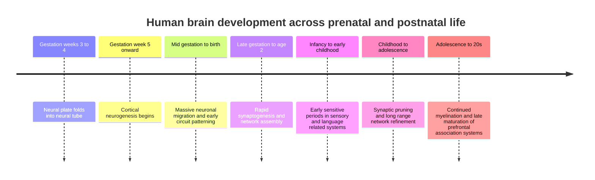

# Heading 1

Other Tests: [test-slide](/slide)

**Paragraph** 
  - **bold**, *italic*, ~~strikethrough~~, `inline code`
  - ==highlight== (requires the kramdown extension), $$H_2~O$$ (quires katex)

**Line break** *(two trailing spaces)*  
New line.
  - Line break in lists *(two trailing spaces)*  
    New line.

New Paragraph *(separated by a blank line)*.

**Decrypt and encrypt** text (access token: 233):
<p class="encrypted" id="/MZAf/PKx9jpw8/Jnp7XQQFki2ibGnArZP46W+keVThXquhWwFROEFnbY8eC57Tw==">Encrypted content!</p>

**Blockquote**
> Single-line quote.
{: data-bt="0"}
> Multi-line quote *(two trailing spaces)*  
> continuing the same block.
{: data-bt="0"}

Values: tags {{page.tags}}

New page with HTML5 + CSS 3:

<div style="break-after: page;"></div>

## Heading 2

[Link](https://example.com) and autolink <https://example.com>, as well as email <a href="mailto:test@example.com">mail</a>.


Blockquote for bilingual support. Click Bilingual Button or set page.bilingual `false` to show.
> Blockquote: used for bilingual folding test. First paragraph.
>
> Second paragraph (multi-paragraph).
{: .lang-alt}

> Skip processing
{: data-bt="0"}

### Multi-Language Test

`简体中文 (Simplified Chinese)` — 你好，世界！这是一个**多语言测试页面**。*守望先锋* 的**天使**非常*可爱*。

`English` — Hello, world! This is a **multilingual test page**. *Mercy* from **Overwatch** is very *cute*.

`日本語 (Japanese)` — こんにちは、世界！これは**多言語テストページ**です。*オーバーウォッチ* の**エンジェル**はとても*かわいい*です。

`한국어 (Korean)` — 안녕하세요, 세계! 이것은 **다국어 테스트 페이지**입니다. *오버워치* 의 **메르시**는 매우 *귀여워요*.

`Español (Spanish)` — ¡Hola, mundo! Esta es una **página de prueba multilingüe**. *Mercy* de **Overwatch** es muy *linda*.

`Français (French)` — Bonjour, le monde ! Ceci est une **page de test multilingue**. *Mercy* d'**Overwatch** est très *mignonne*.

`Deutsch (German)` — Hallo, Welt! Dies ist eine **mehrsprachige Testseite**. *Mercy* aus **Overwatch** ist sehr *süß*.

`Русский (Russian)` — Привет, мир! Это **многоязычная тестовая страница**. *Ангел* из **Overwatch** очень *милая*.

`العربية (Arabic)` — مرحبا بالعالم! هذه **صفحة اختبار متعددة اللغات**. *ميرشي* من **أوفر ووتش** لطيفة *جداً*.

`हिन्दी (Hindi)` — नमस्ते, दुनिया! यह एक **बहुभाषी परीक्षण पृष्ठ** है। *ओवरवॉच* की **मर्सी** बहुत *प्यारी* है।

`ไทย (Thai)` — สวัสदीโลก! นี่คือหน้าเว็บ**ทดสอบหลายภาษา** *เมอร์ซี่* จาก **โอเวอร์วอッチ** น่ารัก*มาก*

`Tiếng Việt (Vietnamese)` — Xin chào thế giới! Đây là **trang kiểm tra đa ngôn ngữ**. *Mercy* trong **Overwatch** rất *dễ thương*.

`Português (Portuguese)` — Olá, mundo! Esta é uma **página de teste multilíngue**. *Mercy* de **Overwatch** é muito *fofa*.

`Italiano (Italian)` — Ciao, mondo! Questa è una **pagina di test multilingue**. *Mercy* di **Overwatch** è molto *carina*.


#### Heading 4

jekyll-mermaid support:



##### Heading 5

###### Heading 6

**Formulas**, click to toggle raw text & KaTeX rendering.
1. Bayes’ theorem (including the evidence term)
   $$
   p(\theta\mid x)=\frac{p(x\mid \theta)p(\theta)}{p(x)},\qquad
   p(x)=\int p(x\mid \theta)p(\theta),d\theta
   $$
2. Relationship between KL divergence and cross-entropy
   $$
   D_{\mathrm{KL}}(p\Vert q)=\int p(x)\log\frac{p(x)}{q(x)},dx
   ,\qquad
   H(p,q)=H(p)+D_{\mathrm{KL}}(p\Vert q)
   $$
3. Evidence Lower Bound (ELBO)
   $$
   \log p(x)=\mathcal{L}(q)+D_{\mathrm{KL}}!\bigl(q(z)\Vert p(z\mid x)\bigr),
   \qquad
   \mathcal{L}(q)=\mathbb{E}_{q(z)}[\log p(x,z)-\log q(z)]
   $$
4. Multivariate Gaussian density
   $$
   \mathcal{N}(x\mid \mu,\Sigma)=\frac{1}{(2\pi)^{d/2},|\Sigma|^{1/2}}
   \exp!\left(-\frac12(x-\mu)^\top\Sigma^{-1}(x-\mu)\right)
   $$
5. Closed-form solution of linear regression (least squares)
   $$
   \hat{\beta}=\arg\min_{\beta}|y-X\beta|_2^2
   \quad\Rightarrow\quad
   \hat{\beta}=(X^\top X)^{-1}X^\top y
   $$
6. Lagrangian duality (primal–dual–KKT skeleton)
   $$
   \min_x f(x)\ \text{s.t.}\ g_i(x)\le 0,\ h_j(x)=0
   $$
   $$
   L(x,\lambda,\nu)=f(x)+\sum_i \lambda_i g_i(x)+\sum_j \nu_j h_j(x),\qquad
   \max_{\lambda\ge 0,\nu}\ \inf_x L(x,\lambda,\nu)
   $$
7. Euler–Lagrange equation (calculus of variations / classical mechanics)
   $$
   \frac{\partial \mathcal{L}}{\partial q}-\frac{d}{dt}\left(\frac{\partial \mathcal{L}}{\partial \dot q}\right)=0
   $$
8. Maxwell’s equations (SI)
   $$
   \nabla\cdot \mathbf{E}=\frac{\rho}{\varepsilon_0},\quad
   \nabla\cdot \mathbf{B}=0,\quad
   \nabla\times \mathbf{E}=-\frac{\partial \mathbf{B}}{\partial t},\quad
   \nabla\times \mathbf{B}=\mu_0\mathbf{J}+\mu_0\varepsilon_0\frac{\partial \mathbf{E}}{\partial t}
   $$

## Lists and Tables

### Ordered and Unordered Lists
- Unordered 1
- Unordered 2
  - Nested 2.1
  - Nested 2.2
  > Third paragraph used for bilingual folding test.
  {: .lang-alt}
1. Ordered 1
2. Ordered 2
   1. Nested 2.1
   > Fourth paragraph used for bilingual folding test.
- [x] Task done
- [ ] Task todo
> Fifth paragraph used for bilingual folding test.

### Definition Lists (kramdown)

Term A
: Definition A
> Sixth paragraph used for bilingual folding test.
: Definition A2
: Definition A3
  : Definition A 3.1
1. Term B
: Definition B
2. Term C
   1. Term C 1.1
   : Definition
   - Term C 1.2
   : Definition

### Tables

| colA | colB | colC |
| :--: | ---: | :--- |
|   a  |    1 | left |
|   b  |   20 | text |

## Code

Inline: `const x = 1;`

```js
// fenced code
function hello(name){ return `hi ${name}`; }
````

```python
# another block
print("ok")
```

## Footnotes (kramdown)

Footnote example[^1] and the second one[^two].

[^1]: This is footnote 1.

[^two]: This is footnote two.

## Horizontal Rules & Escapes

\*Asterisks not italic\*  
\_underscores not italic\_  
\# not a heading  
\> not a blockquote  
\- not a list item  
\+ not a list item  
1\. not an ordered list  
\[not a link\]\(not a URL\)  
\!\[not an image\]\(not a URL\)  
\`not code\`  
\\ not an escape start  
\| not a table cell  
\: not table alignment  
\~\~not strikethrough\~\~  
\<not an HTML tag\>  
\& not an entity  
\=\=not highlight\=\=  
\^\[not a footnote\]  
\$not math\$.

```markdown
\*Asterisks not italic\*  
\_underscores not italic\_  
\# not a heading  
\> not a blockquote  
\- not a list item  
\+ not a list item  
1\. not an ordered list  
\[not a link\]\(not a URL\)  
\!\[not an image\]\(not a URL\)  
\`not code\`  
\\ not an escape start  
\| not a table cell  
\: not table alignment  
\~\~not strikethrough\~\~  
\<not an HTML tag\>  
\& not an entity  
\=\=not highlight\=\=  
\^\[not a footnote\]  
\$not math\$.
```

## Inline HTML (common elements)

<div class="note">
  <strong>HTML block:</strong> div / strong / em / span / br<br>
  <em>Emphasis</em> and <span style="text-decoration:underline;">underline</span>
</div>

<details>
  <summary>details/summary</summary>
  <p>Collapsed content (native HTML).</p>
</details>

<blockquote class="lang-alt" data-bt-default="expanded">
  <p>Pure HTML blockquote (with class/attr), testing linkage with JS selectors.</p>
</blockquote>

## Anchors / IDs

### Subsection heading {#custom-id}

Jump to the [custom anchor](#custom-id)。

```md
# Gomibako 功能总览

Gomibako 是一个基于 Jekyll 的个人知识库系统。它不只是发布文章，还扩展了阅读增强、知识库导航、幻灯片展示、写作辅助和终端风格视觉系统。

## 1. 文章与阅读布局

- `post`：普通文章模式，负责大多数笔记和文章的基础阅读体验。相关文件：`src/_layouts/post.html`。
- `post-compact`：紧凑文章模式，适合信息密度更高、装饰更少的阅读场景。相关文件：`src/_layouts/post-compact.html`。
- `post-bilingual`：双语折叠模式，通常把 `blockquote` 作为译文、补充说明或第二语言内容，可通过按钮统一展开/折叠。相关文件：`src/_layouts/post-bilingual.html`、`src/assets/js/bilingual.js`。
- `post-parallel`：平行文本模式，把正文与后续 blockquote 自动重组为多栏对照，适合原文、译文、注释并排阅读。相关文件：`src/_layouts/post-parallel.html`、`src/assets/js/parallel-text-column.js`。
- `post-list`：文章列表模式，支持多种列表样式、分类分组、折叠分组和 meta 显示控制。相关文件：`src/_layouts/post-list.html`、`src/_includes/post-list.html`。
- `print`：打印专用布局，使用更接近纸面排版的字体、表格、代码块和引用样式。相关文件：`src/_layouts/print.html`。

## 2. 幻灯片系统

- `slide-linear`：线性幻灯片，把文章内容拆成前后翻页的演示结构，带菜单、上一页、下一页、首页、末页和自动播放控制。相关文件：`src/_layouts/slide-linear.html`、`src/assets/js/jekyll-slide-linear.js`。
- `slide-simple`：简化幻灯片，只保留基本前后翻页，适合轻量展示。相关文件：`src/_layouts/slide-simple.html`、`src/assets/js/jekyll-slide-linear.js`。
- `slide-annotation`：注释型幻灯片，用于在正文和注释之间切换，适合讲解、批注、文本分析。相关文件：`src/_layouts/slide-annotation.html`、`src/assets/js/jekyll-slide-linear.js`。
- `slide-tree`：树状幻灯片，用层级结构组织页面，适合知识树、课程纲要、系统性笔记。相关文件：`src/_layouts/slide-tree.html`、`src/assets/js/jekyll-slide-tree.js`。
- `slide-wiki`：wiki 型幻灯片，偏向索引先行和结构化跳转，适合概念网络式内容。相关文件：`src/_layouts/slide-wiki.html`、`src/assets/js/jekyll-slide-tree.js`。
- `slide-multilingual`：多语言幻灯片模式，用于语言材料或多版本文本展示。相关文件：`src/_layouts/slide-multilingual.html`、`src/assets/js/jekyll-slide-linear.js`。

## 3. 知识库导航

- 多 collection 知识库：用 `phil`、`litr`、`hist`、`psyc`、`math`、`comp`、`phys`、`misc` 等 collection 组织不同学科笔记。相关文件：`_config.yml`。
- collection 顺序与 alias：通过 `_config.yml` 控制 collection 展示顺序和短名称，比如 `PHIL`、`MATH`、`COMP`。相关文件：`_config.yml`。
- 浮动 archive 窗口：点击 header 中的 archive 按钮后打开浮动窗口，按 collection 和 subclass 浏览文章。相关文件：`src/_includes/collection_list.html`。
- subclass 分组：将 collection 内文章按 `subclass` 分组，适合学科内部进一步分类。相关文件：`src/_includes/collection_list.html`、`src/_includes/post_by_subclass.html`。
- archive 拖动窗口：archive 面板可以拖动，并带有状态栏和文章数量统计。相关文件：`src/_includes/collection_list.html`、`src/_sass/components/_collection_list.scss`。

## 4. 文章列表系统

- `minimal`：简洁列表，只突出标题和少量 meta。相关文件：`src/_includes/post-list/minimal.html`。
- `card-grid`：卡片网格列表，适合更视觉化的文章入口。相关文件：`src/_includes/post-list/card-grid.html`。
- `timeline`：时间线列表，适合按时间组织的文章展示。相关文件：`src/_includes/post-list/timeline.html`。
- `book`：书目式列表，适合读书笔记或长文目录。相关文件：`src/_includes/post-list/book.html`。
- `category-card`：按分类分组的卡片列表。相关文件：`src/_includes/post-list/category-card.html`。
- `category-minimal`：按分类分组的简洁列表。相关文件：`src/_includes/post-list/category-minimal.html`。
- `category-book`：按分类分组的书目式列表。相关文件：`src/_includes/post-list/category-book.html`。
- 列表统一调度：通过 `post-list.html` 接收页面 front matter 参数，控制样式、日期格式、excerpt、meta、分组折叠等。相关文件：`src/_includes/post-list.html`、`src/_sass/components/_post-list.scss`。

## 5. 目录系统

- `toc_list`：普通树状目录，从渲染后的 heading 生成嵌套列表。相关文件：`src/_includes/toc_list.html`。
- `toc_chart`：图表式目录，把 `h2` 和下属 `h3` 做成视觉分组，适合长笔记、课程笔记和知识地图。相关文件：`src/_includes/toc_chart.html`。
- compact TOC：`toc_chart` 的紧凑模式，把多个 `h3` 以内联方式排列，减少目录占用空间。相关文件：`src/_includes/toc_chart.html`。
- header TOC 按钮：根据 layout 和 front matter 决定是否显示目录按钮。相关文件：`src/_includes/header.html`。
- 正文前目录：部分 layout 支持在正文前直接插入目录。相关文件：`src/_layouts/post.html`、`src/_layouts/post-bilingual.html`、`src/_layouts/post-parallel.html`。

## 6. 阅读增强

- 图片查看器：点击文章图片后进入全屏查看，支持滚轮缩放、拖动、双击、双指缩放和 Esc 关闭。相关文件：`src/assets/js/image-viewer.js`。
- 代码块增强：把普通代码块重构为统一组件，显示语言标签，提供复制按钮和可选在线运行按钮。相关文件：`src/assets/js/code-block-enhancement.js`。
- 公式渲染：支持 KaTeX / MathJax 渲染数学公式。相关文件：`src/_includes/head.html`。
- 公式源码切换：点击公式可在渲染结果和原始 TeX 之间切换，便于学习和编辑。相关文件：`src/_includes/head.html`、`src/_sass/vendor/_math_toggle.scss`。
- Mermaid 图表：支持 Markdown 中的 Mermaid 代码块渲染为图表。相关文件：`src/_includes/head.html`。
- 中文段落缩进：可通过 front matter 开启中文段落 `2em` 缩进。相关文件：`src/_layouts/default.html`。
- 最大化阅读：header 按钮可切换容器最大化，提升长文阅读空间。相关文件：`src/_includes/header.html`。
- 自定义右键菜单：替换浏览器默认右键菜单，提供复制文本、回首页、回顶部、打印等操作。相关文件：`src/assets/js/context-menu.js`、`src/_includes/context_menu.html`。

## 7. 写作辅助

- drafts：使用 `collections/_drafts` 保存草稿，配合 Jekyll drafts 工作流。相关目录：`collections/_drafts/`。
- TODO 高亮：自动扫描正文中的 `TODO:` 并高亮。相关文件：`src/assets/js/todo-summary.js`。
- TODO 汇总浮窗：将页面内 TODO 汇总到右下角浮窗，方便写作时查看未完成点。相关文件：`src/assets/js/todo-summary.js`、`src/_includes/todo_summary.html`。
- TODO 跳转：点击汇总列表中的 TODO，可以跳到正文对应位置。相关文件：`src/assets/js/todo-summary.js`。
- TODO 浮窗控制：浮窗可关闭、重新打开、拖动。相关文件：`src/assets/js/todo-summary.js`。

## 8. 终端与 Matrix 视觉

- Matrix 背景雨：全站背景 canvas 动画，使用配置中的字符集生成下落效果。相关文件：`src/_includes/matrix_bg.html`。
- Matrix 字母爆炸：页面上随机生成坠落字符，并在特定高度爆炸成粒子。相关文件：`src/assets/js/matrix-letter-bomb.js`、`src/_includes/matrix_letter_bomb.html`。
- 文字 glitch：随机对标题、摘要、meta 和按钮文字施加 scramble、blink、error 等效果。相关文件：`src/assets/js/text-glitch.js`。
- hacked splash：页面开场视觉效果，模拟 hacked / terminal 风格启动动画。相关文件：`src/assets/js/hacked-splash.js`、`src/_includes/hacked_splash.html`。
- 赛博终端首页：首页是一个全屏终端窗口，包含伪命令、伪日志、状态栏、菜单栏、光标、故障演出和 CRT 效果。相关文件：`src/_layouts/index.html`。

## 9. 内容保护与发布控制

- 加密文本：使用 SJCL 加密局部内容，页面 header 提供 token 输入后解密。相关文件：`src/assets/js/sjcl.js`、`src/_includes/header.html`。
- anti-copy：可选禁用复制、选中、拖动图片、保存快捷键、查看源代码快捷键等。相关文件：`src/assets/js/anticopy.js`。
- 水印：可选全屏 SVG 平铺水印，继承正文颜色和字体。相关文件：`src/assets/js/watermark.js`。
- 评论系统：统一支持 Disqus、Giscus、Utterances 三种 provider。相关文件：`src/_includes/comment.html`、`_config.yml`。
- SEO 信息：生成 title、description、canonical、Open Graph、favicon 等基础元信息。相关文件：`src/_includes/head.html`。

## 10. 配置化主题层

- UI 配置：集中控制 labels、导航按钮、控制按钮、背景、TOC、typography、layout、archive、features 等。相关文件：`_config.yml`。
- collection 配置：集中定义 collection 输出、permalink、排序方式、alias。相关文件：`_config.yml`。
- 资源配置：集中定义 KaTeX、MathJax、Mermaid、Font Awesome 的版本与加载策略。相关文件：`_config.yml`。
- Jekyll 构建配置：集中定义 source、destination、collections_dir、layouts_dir、includes_dir、sass_dir、markdown、kramdown、plugins 等。相关文件：`_config.yml`。
- 页面级覆盖：多数功能允许通过 page front matter 覆盖全局配置。相关文件：`_config.yml`、`src/_layouts/default.html`。

## 11. 页面元信息与页脚

- post meta：显示 author、date、categories、tags、subclass、version。相关文件：`src/_includes/post-meta.html`。
- abstract：支持页面摘要块。相关文件：`src/_includes/post-meta.html`。
- footer：支持 email、GitHub、GitLab、LinkedIn、X / Twitter、Mastodon、ORCID、website、RSS。相关文件：`src/_includes/footer.html`。
- copyright：从配置中读取版权年份和声明。相关文件：`src/_includes/footer.html`、`_config.yml`。

## 总结

Gomibako 的特色可以概括为三条主线：

- 知识组织：collections、subclass、archive window、post list variants、drafts。
- 阅读体验：TOC、图片查看器、代码工具、公式切换、Mermaid、双语、平行文本、幻灯片、打印版。
- 个人风格：Matrix、terminal、glitch、hacked splash、赛博终端首页。

一句话概括：Gomibako 是一个基于 Jekyll 的个人知识库、阅读界面、幻灯片生成器、写作辅助器和赛博终端主题网站。
```